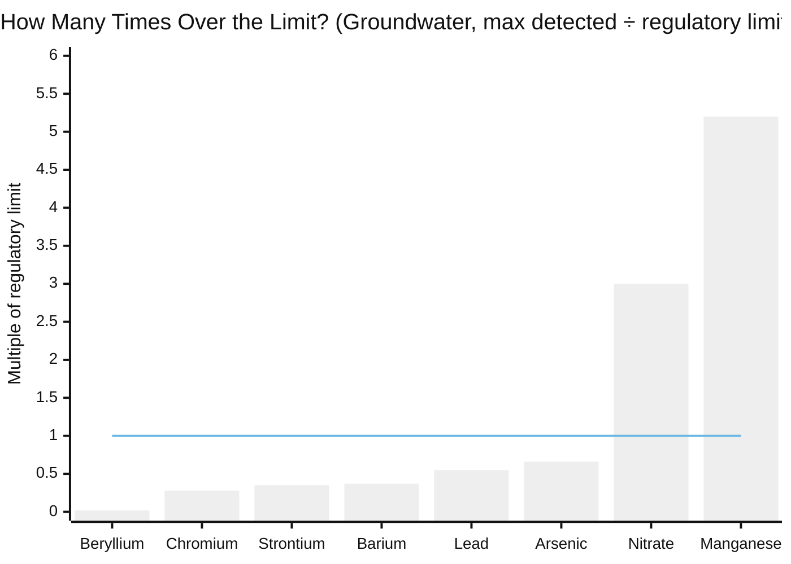
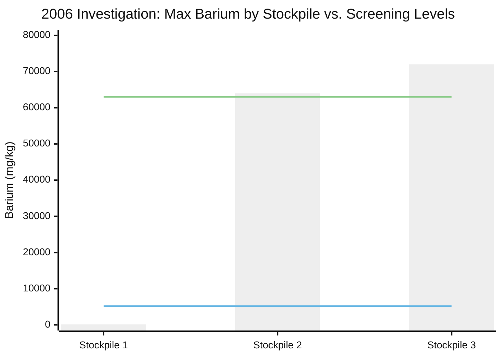
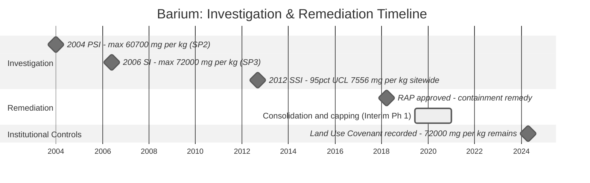
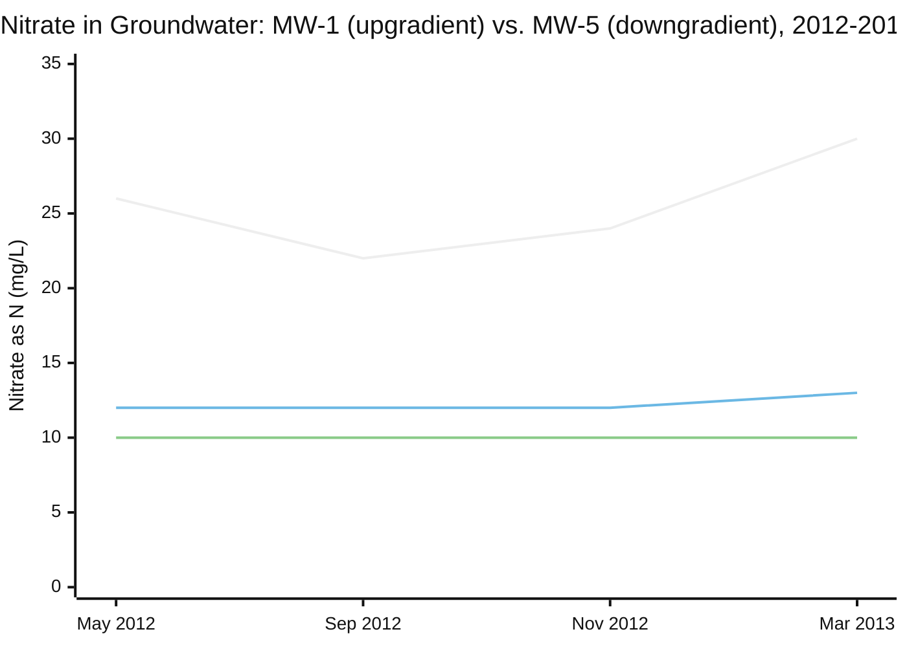

# Contaminants Primer: SR 132 Modesto Soil Stockpiles

## About This Primer

This document explains — in plain language — the contaminants that were tested for, detected, and remediated at the **State Route 132 / Caltrans Modesto Soil Stockpiles** project in Stanislaus County, California. The site is overseen by the California Department of Toxic Substances Control (DTSC), with groundwater oversight from the Central Valley Regional Water Quality Control Board (RWQCB).

**A note on numbers:** Environmental data uses different units. Here's a quick guide:
- **mg/kg** = milligrams per kilogram (parts per million in soil) — think: a sugar packet in a ton of dirt
- **µg/L** = micrograms per liter (parts per billion in water) — think: a grain of salt in a swimming pool

---

## The Contaminants at a Glance

**Barium is the overwhelming, dominant contaminant** at this site, found in soil at concentrations in the tens of thousands of mg/kg.[^fs] Lead, cadmium, chromium, TPH, and PAHs were investigated as possible co-contaminants but were never confirmed as significant. **Arsenic is a special case:** its calculated soil cancer risk alone exceeded the regulatory threshold in the 2007 HHRA, but that risk was ultimately attributed to naturally occurring regional background rather than the stockpiles.[^hhra-update] In groundwater, the metals of concern (barium, lead, chromium, beryllium, arsenic) **never exceeded their drinking-water limits** in any well, any year — the only recurring exceedances are **nitrate** (likely regional agricultural background) and **manganese** (an aesthetic/taste standard, not a health-based one).[^gw2023]

> **How to read this:** each bar is the highest concentration ever detected across all wells and monitoring events (2012–2019), divided by the constituent's regulatory limit.[^gw2023] The line marks 1.0× — the limit itself. Only manganese (secondary/aesthetic standard) and nitrate (drinking-water health standard) cross it; everything else, including barium and lead, stayed well under.

---

## Contaminant Profiles

### Barium (Ba) — the dominant contaminant

**What is it?** Barium is a silvery-white metal. At this site it originates from the historic **FMC Corporation** facility (1930s–1970s), which processed barite (barium sulfate) and celestite (strontium sulfate) ore and discharged liquid tailings to unlined evaporation ponds. In the early 1960s, soil from that area was excavated during State Route 99 construction and piled into what are now Stockpiles 1, 2, and 3.[^fs-hist]

**What was found — soil:**

| Investigation | Stockpile 1 max | Stockpile 2 max | Stockpile 3 max | Background |
|---|---|---|---|---|
| 2004 PSI (Shaw, 50 borings)[^fs-psi] | 1,730 mg/kg | 60,700 mg/kg | 44,900 mg/kg | 57–888 mg/kg |
| 2006 SI (Shaw, 51 more borings + 8 GW wells)[^fs-si] | 130 mg/kg | 64,000 mg/kg | 72,000 mg/kg | 17–120 mg/kg |
| 2012 SSI (Geocon, 97 fenceline/perimeter samples)[^fs-ssi] | 34–4,300 mg/kg (surface, all stockpiles combined) | — | — | 47–110 mg/kg |
| One 2012 boring, edge of SP2/SP3 (extreme outlier)[^fs-cdb] | — | — | **130,000 mg/kg** | — |

Regulatory screening levels: **residential CHHSL = 5,200 mg/kg**, **industrial/commercial CHHSL = 63,000 mg/kg**.[^fs-ssi] The 2012 site-wide 95% UCL (a conservative statistical average, not a max) was **7,556 mg/kg**[^fs-ucl] — above the residential level, well below the industrial one.

**What was found — groundwater:** Barium never exceeded its MCL (1,000 µg/L federal / 700 µg/L EPA health advisory) in any well, any monitoring event, 2012–2023.[^gw2023] The observed range across all wells and years was roughly **40–370 µg/L**.[^gw2023] A 2024 statistical evaluation found site groundwater comparable to FMC's own upgradient background (151 µg/L) and about 40× below the site-specific groundwater target of 6,210 µg/L.[^stat24] One isolated stormwater sample (SW03, near Stockpile 3) measured 2,000 µg/L against the 1,000 µg/L MCL, but was judged an isolated, confined event, not a chronic pathway.[^fs-sw]

**The remedy was containment, not removal:** the 2014 Feasibility Study concluded a numeric soil cleanup target wasn't necessary to protect health under managed conditions, so the DTSC-approved 2018 remedy (Alternative 4) was **performance-based**: consolidate the barium-containing soil (BCS) and cap it as highway embankment fill.[^fs-goal][^rap18] The **April 2024 recorded Land Use Covenant** confirms barium concentrations **as high as 72,000 mg/kg remain in place** at the property — permanently restricted from unrestricted (e.g., residential) land use by deed.[^luc]

> **How to read this:** bars show each stockpile's maximum detected barium in the 2006 investigation.[^fs-si] The lower line is the residential screening level (5,200 mg/kg) — Stockpiles 2 and 3 are more than 12× over it. The upper line is the industrial/commercial screening level (63,000 mg/kg) — Stockpile 3 exceeds even that. Stockpile 1, by contrast, was never a significant barium source.

> **How to read this:** diamonds mark point-in-time findings or approvals;[^fs-psi][^fs-si][^fs-ucl][^rap18] the bar shows the roughly 18-month consolidation and capping construction window;[^racr22] the final diamond is the 2024 deed restriction.[^luc] The site went from "discovery" (2004) to "permanent, deed-restricted containment" (2024) over two decades — the concentration itself was never driven to a numeric cleanup target, because the approved remedy was containment, not removal.

**Health impacts:** Barium is not classified as a carcinogen. Its main concern is cardiovascular — high exposure can disrupt the body's potassium balance, affecting heart rhythm and blood pressure.[^health] The barium at this site is chemically bound as low-solubility **barite** (barium sulfate), which limits how readily it can dissolve and migrate — one likely reason groundwater concentrations stayed low despite extraordinarily high soil concentrations.[^fs-hist]

**Exposure vectors:**
- **Soil:** Direct contact is controlled by the clean-fill cap and land use covenant restricting future disturbance/residential use.[^luc]
- **Groundwater:** Not a drinking water source at this site; no MCL exceedances documented in nine years of monitoring.[^gw2023]
- **Soluble/leachable form:** Laboratory WET-extraction tests in 2006 did find leachable barium above the Title 22 STLC hazardous-waste threshold in a majority of tested samples — but regulators noted this threshold technically applies to non-barite barium compounds, and the barium here is overwhelmingly in barite form.[^fs-si]

---

### Lead (Pb) — a secondary, co-located contaminant

**What is it?** Lead was found alongside barium in the same containment zones, from historic Caltrans maintenance activity, plus **Aerially Deposited Lead (ADL)** — decades of leaded-gasoline exhaust settled along the SR-99/SR-132 corridor before leaded gasoline was phased out (1975–1996).[^luc][^deir]

**What was found:**
- **Stockpile soil (2012 fenceline/perimeter surface samples):** 12–34 mg/kg across the three stockpiles — modest, not a standalone hotspot.[^fs-ssi]
- **ADL along SR-99 (2012 survey):** below detection (< 3.0 mg/kg) up to **100 mg/kg** in the upper six inches of soil.[^deir]
- **ADL along Maze Boulevard (2014 survey):** below regulatory screening levels.[^deir]
- **Groundwater:** never exceeded the 15 µg/L MCL in any well, any monitoring event reviewed (2012–2019); typically non-detect to about 8 µg/L.[^gw2023]

**What happened:** ADL soil from the SR-99 shoulder — which did exceed California hazardous-waste thresholds — was placed within the Stockpile 1 BCS Containment Zone during the same 2019–2020 consolidation and capping effort used for barium.[^luc]

**Health impacts:** Lead is a neurotoxin with **no known safe blood lead level** (CDC/WHO). Even low-level exposure in children is linked to reduced IQ and learning/behavioral effects. The CDC's current blood lead reference value is 3.5 µg/dL.[^health] At this site, lead levels in both soil and groundwater were far below levels that would drive independent remediation — it rode along with the barium containment remedy rather than requiring its own.

---

### Cadmium (Cd) — a lab artifact, not a real contaminant

**What is it?** Cadmium was investigated as a possible co-contaminant after the original 2004 investigation reported "elevated" readings.[^fs-cdb]

**What was found:**
- **2004 PSI:** 11 soil samples across Stockpiles 2 and 3 exceeded the industrial CHHSL of 7.5 mg/kg — all at locations with correspondingly extreme barium readings (25,800–196,000 mg/kg).[^fs-cdb]
- **2006 SI and 2012 SSI combined (348 samples, including 19 with barium between 25,000 and 130,000 mg/kg):** cadmium was **non-detect** (below the 1.0 mg/kg reporting limit) in every single sample.[^fs-cdb]
- Isolated later spot detections: 0.26, 0.42, and 0.78 mg/kg (Stockpiles 1/2/3, 2012) — all comfortably below the residential CHHSL of 1.7 mg/kg.[^fs-hhra]

**Conclusion, stated directly in the Final Feasibility Study:** the 2004 cadmium detections were "neither reproducible nor reliable" — likely **false positives from sample interference caused by the associated extreme barium concentrations**, using a different lab than later rounds.[^fs-cdb] Cadmium was never confirmed as an actual site contaminant.

**Health impacts (for context, since cadmium was investigated):** cadmium is a known human carcinogen (IARC Group 1) that accumulates in the kidneys over decades.[^health] None of that risk materialized here — the detections that triggered the investigation didn't hold up on retesting.

---

### Chromium (Cr)

**What was found:** Chromium was detected at concentrations "slightly exceeding background" in some soil samples but never confirmed above a CHHSL.[^fs-ssi] In groundwater, total chromium (trivalent + hexavalent, not separately speciated) ranged from about 1.3 to 18 µg/L across all wells and events reviewed — well under the California MCL of 50 µg/L.[^gw2023]

**Health impacts:** Hexavalent chromium (Cr-VI) is a proven human carcinogen (IARC Group 1) via inhalation — the "Erin Brockovich" chemical.[^health] Because this site reports only total chromium, the Cr-VI/Cr-III split is unknown, but detected concentrations were low enough in both media that chromium was not treated as a driver of site risk.

---

### TPH and PAHs — investigated, not significant

**What was found:** Only **one** confirmed site sample (a Cadmium Boring in Stockpile 2, 2012) was analyzed for petroleum hydrocarbons and PAHs based on field odor/staining indicators:[^fs-cdb]
- Diesel-range TPH: 120 mg/kg — slightly above a leaching-based screening level of 83 mg/kg, but below direct-exposure residential/industrial screening levels (110/450 mg/kg).
- Motor-oil-range TPH: 82 mg/kg — below the residential screening level of 370 mg/kg.
- Gasoline-range TPH: not detected.
- Three PAHs (2-methylnaphthalene, fluorene, phenanthrene) at 23–45 µg/kg — "significantly less" than screening levels. No confirmed benzo(a)pyrene detection at levels of concern, and no documented landfill disposal of PAH-contaminated material anywhere in the reviewed record.

**Health impacts (for context):** diesel-range petroleum compounds can affect the liver, kidneys, and nervous system with prolonged exposure; benzo(a)pyrene (when present) is a proven human carcinogen.[^health] Neither ever rose to the level of a confirmed exposure concern at this site based on the one sample analyzed.

---

### Nitrate (as N) — the most consistent groundwater exceedance

**What is it?** Unlike the metals above, nitrate here is not attributed to the FMC/stockpile history — it's the region's most common groundwater issue, tied to decades of Central Valley agricultural fertilizer and irrigation practices.[^gw-mar13]

**What was found:**

| Well                | May 2012[^gw-may12] | Sep 2012[^gw-sep12] | Nov 2012[^gw-nov12] | Mar 2013[^gw-mar13] |
| ------------------- | ------------------- | ------------------- | ------------------- | ------------------- |
| MW-1 (upgradient)   | 12                  | 12                  | 12                  | 13                  |
| MW-5 (downgradient) | 26                  | 22                  | 24                  | 30                  |

*(mg/L as N; MCL = 10 mg/L. MW-5 also measured 20 mg/L in an intervening Jul 2012 event,[^gw-jul12] omitted below since MW-1 wasn't sampled that round.)*

> **How to read this:** the top line is MW-5 (downgradient, nearest the stockpiles), the middle line is MW-1 (upgradient/background), and the flat bottom line is the 10 mg/L MCL. Both wells stay above the limit throughout — including MW-1, which sits *upgradient* of any stockpile influence, pointing to regional agricultural background rather than site-caused contamination.

Wells MW-6, MW-9, and MW-10 also recurrently exceeded the nitrate MCL through 2019, though source reports flagged those as threshold exceedances without itemizing exact values per date.[^gw17][^gw19]

**Health impacts:** nitrate converts to nitrite in the body, which impairs blood's oxygen-carrying capacity, causing methemoglobinemia ("blue baby syndrome") — potentially fatal in infants under six months. The 10 mg/L MCL is set specifically to protect that group.[^health]

**The telling detail:** MW-1 sits *upgradient* of the stockpiles and still exceeds the MCL, at levels close to MW-5's. Reports interpret this as regional agricultural background rather than stockpile-caused contamination[^gw-mar13] — this groundwater is not a drinking water source at the site regardless.

---

### Manganese (Mn) — an aesthetic standard, not a health one

**What was found:** Manganese sporadically exceeded its **secondary** MCL of 50 µg/L in nearly every well at some point between 2012 and 2019 — MW-1 (up to 260 µg/L), MW-3 (74 µg/L), MW-4 (71 µg/L), MW-5 (59 µg/L), MW-6 (100 µg/L), MW-7 (260 µg/L), MW-8 (160 µg/L), and MW-9 (flagged). No single well was consistently elevated.[^gw2023][^gw17]

**Health impacts:** the secondary MCL exists for taste, odor, and staining — not toxicity. High *occupational, inhaled* manganese exposure can cause a neurological movement disorder ("manganism"), but that occurs at exposures far above anything seen in this drinking-water-style comparison.[^health] Manganese is also a naturally abundant mineral in Central Valley alluvial groundwater.

---

### Arsenic (As) — a real risk-math driver, resolved as regional background

**What is it?** Unlike barium, lead, and cadmium, arsenic wasn't traced to the FMC/stockpile history — it's a naturally occurring element common in Central Valley soils. But it deserves its own discussion because, unlike beryllium and strontium below, arsenic's numbers genuinely moved the needle in the site's 2007 Human Health Risk Assessment (HHRA) before being explained away.[^hhra-update]

**What was found — soil:** In the 2006 investigation, Stockpile 2 surface soil (33 samples) measured 0.7–4.9 mg/kg, with a 95% UCL of 1.63 mg/kg.[^hhra-update] Across all three stockpiles and depths (165 samples), arsenic ranged up to 14 mg/kg, detected in 92% of samples.[^hhra-update] These numbers look unremarkable until compared to arsenic's screening levels, which are unusually low: the residential Regional Screening Level is 0.39 mg/kg and the residential CHHSL is just 0.07 mg/kg — both far below typical natural background arsenic anywhere.[^hhra-update]

**The risk-assessment finding:** Using the Stockpile 2 arsenic 95% UCL (1.63 mg/kg) as the exposure point concentration, the 2007 HHRA calculated a cancer risk of **1.45×10⁻⁵** for an off-site resident/trespasser scenario — on its own, ten times over the standard regulatory target of 1×10⁻⁶ — and this single number drove Stockpile 2's *total* estimated soil cancer risk to 1×10⁻⁵, the only calculated risk at this site that exceeded the regulatory threshold before adjustment.[^hhra-update]

**Why it wasn't treated as a site contaminant:** The HHRA compared Stockpile 2's arsenic levels against local background soil sampled on adjacent Caltrans property, which measured 0.2–4.1 mg/kg[^hhra-update] — statistically indistinguishable from the 0.7–4.9 mg/kg found on the stockpile itself. Re-running the risk calculation using background soil's own 95% UCL (1.15 mg/kg) as the exposure concentration produced a cancer risk of 1.15×10⁻⁵ — nearly identical to the site's 1.45×10⁻⁵.[^hhra-update] On that basis, DTSC and the HHRA excluded arsenic as a chemical of concern (COC): the calculated risk was real, but attributable to naturally occurring background arsenic rather than any FMC-related release. With arsenic's contribution removed, Stockpile 2's total soil cancer risk estimate dropped from 1×10⁻⁵ to 1×10⁻⁷ — below the regulatory threshold, and the basis for the HHRA's conclusion that the site poses no unacceptable risk as managed.[^hhra-update]

**What was found — groundwater:** Arsenic ranged roughly 1.3–6.6 µg/L across all wells and monitoring events reviewed (2012–2019) — well under the 10 µg/L MCL, and not a factor in the soil-driven HHRA finding above.[^gw2023]

**Health impacts:** Arsenic is a proven human carcinogen (IARC Group 1), with chronic exposure linked to skin, bladder, and lung cancers, as well as cardiovascular and developmental effects.[^health] Its unusually low, health-based soil screening levels mean that even ordinary regional background arsenic can nominally exceed them — which is exactly the dynamic that played out here.

**Exposure vectors:** Direct soil ingestion or dermal contact was the pathway modeled in the HHRA (off-site resident/trespasser scenario). Because the finding was attributed to regional background rather than the stockpiles specifically, it doesn't point to a stockpile-specific dust or runoff pathway the way barium and lead do — arsenic in soil near the corridor should be understood as a regional baseline condition, not a stockpile release.

---

### Beryllium and Strontium — investigated, never a concern

- **Beryllium:** non-detect in **every** well, **every** monitoring event reviewed (2012–2019), with reporting limits as low as 0.08 µg/L.[^gw2023][^gw19] The MCL is 4 µg/L. Beryllium is a human carcinogen by inhalation and can cause chronic beryllium disease in sensitized individuals[^health] — but there is no evidence of any beryllium exposure pathway at this site.
- **Strontium:** ranged roughly 700–1,400 µg/L — well under the EPA lifetime health advisory of 4,000 µg/L (there is no formal MCL).[^gw2023][^stat24]

Mercury was also analyzed routinely (as a standard Title 22 metal, EPA Method 7470/7471) in both soil and groundwater samples throughout the monitoring history, and was non-detect in essentially every sample reviewed.[^gw2023][^fs-ssi]

---

## Chronological Site History

| Date | Event |
|---|---|
| 1930s–1970s | FMC Corporation and predecessors process barite/celestite ore at the site; liquid tailings discharged to unlined evaporation ponds[^fs-hist] |
| Early 1960s | Pond-area soil excavated during SR-99 construction, piled into Stockpiles 1–3[^fs-hist] |
| 2003 | Shaw Initial Site Assessment[^fs-hist] |
| Jan 2004 | Shaw Preliminary Site Investigation — 50 borings; barium identified as primary contaminant of concern; "elevated" cadmium reported (later shown to be a lab artifact)[^fs-psi] |
| May–Oct 2006 | Shaw Site Investigation — 51 more borings, 8 groundwater wells installed; groundwater meets MCLs; barium confirmed up to 72,000 mg/kg (Stockpile 3)[^fs-si] |
| 2007 | Shaw Human Health Risk Assessment — no unacceptable risk under current site management[^fs-hhra] |
| Dec 2009 | DTSC concurs: no unacceptable risk as currently managed[^fs-hhra] |
| Mar 2012 | Groundwater monitoring reinitiated; wells MW-1 through MW-8 sampled bi-monthly[^gw-jun12] |
| Jun 2012 | Upgradient wells MW-9 and MW-10 installed and added to the monitoring network[^gw-jun12] |
| Sep 2012 | Geocon Supplemental Site Investigation — 35 fenceline + 28 perimeter + 5 dedicated cadmium borings; reconfirms cadmium as a false positive; barium below CHHSLs at new locations[^fs-ssi] |
| Sep 2012 | ~2,800 cubic yards excavated near Stockpile 3 for an SR-99 ramp project, shipped offsite as non-hazardous soil[^fs-ssi] |
| Mar 2013 | SSI Report finalized; 2012 site-wide barium 95% UCL calculated at 7,556 mg/kg[^fs-ucl] |
| Jun 2014 | Final Feasibility Study recommends Alternative 4 (Containment); cleanup goal set as performance-based, not numeric[^fs-goal] |
| Mar 14, 2018 | Remedial Action Plan approved (containment via consolidation and capping)[^rap18] |
| Apr 2019 | RDIP approved; wells MW-1, MW-2, MW-3, MW-5, MW-7, MW-8 sampled for the last time before decommissioning[^gw19] |
| 2019–2020 | Interim Phase 1 construction: consolidation and capping of barium-containing soil as highway embankment fill[^racr22] |
| Nov 3, 2022 | SR-132 opens to traffic[^racr22] |
| Jan 18, 2023 | DTSC accepts the Interim Phase 1 Removal Action Completion Report; final RAP certification deferred to Ultimate Phase 2 (~2028–2033)[^racr-accept] |
| Feb 2023 | Remaining monitoring wells reported dry; discontinuation of monitoring recommended[^stat24] |
| Jun 2023 | Operation & Maintenance Agreement executed[^om23] |
| **Apr 18, 2024** | **Land Use Covenant recorded** (Stanislaus County Doc. 2024-0017459) — permanent deed restriction; confirms barium up to 72,000 mg/kg remains in place[^luc] |
| ~2028 | First five-year review due, per the O&M Agreement[^om23] |

---

## Understanding the Risk: Exposure Pathways

| Pathway | Status at this site |
|---|---|
| Soil ingestion/contact | Controlled by the clean-fill cap and land use covenant restricting disturbance of the containment zones[^luc] |
| Groundwater drinking | Not a drinking water source; the metals of concern never exceeded MCLs in nine years of monitoring; most wells are now dry and decommissioned[^gw2023][^stat24] |
| Dust inhalation | Evaluated in the 2007/2013 HHRAs and found below risk thresholds; capping further reduces this pathway[^fs-hhra] |
| Surface water runoff | One isolated barium exceedance (2012, near Stockpile 3); judged confined to Caltrans right-of-way, not a chronic pathway[^fs-sw] |

**Who is at risk?** On-site workers disturbing containment-zone soil face the highest (though still low, per HHRA) exposure potential and are required to use dust suppression and PPE.[^fs-hhra] Adjacent residents and the public are separated from the containment zones by fencing and the land use covenant; future residential development on the capped areas is permanently prohibited by deed.[^luc]

---

## Current Site Status (July 2026)

| Area | Status |
|---|---|
| **Soil remediation** | ✅ Interim Phase 1 complete (2019–2020): barium-containing soil consolidated and capped as highway embankment fill. Final RAP certification deferred to Ultimate Phase 2 (~2028–2033).[^racr-accept] |
| **Groundwater monitoring** | ⚠️ Wells progressively went dry 2019–2023; discontinuation recommended as of Feb 2023. No constituent-of-concern MCL exceedances (barium, lead, chromium, beryllium, arsenic) were ever confirmed.[^stat24][^gw2023] |
| **Capping** | ✅ Complete for Interim Phase 1 containment zones.[^racr22] |
| **Deed restriction** | ✅ Recorded April 18, 2024 (Stanislaus County Doc. 2024-0017459) — permanently restricts the containment zones from unrestricted land use.[^luc] |
| **Five-year review** | 📅 First due ~2028, per the June 2023 O&M Agreement.[^om23] |

---

## Data Gaps and Caveats

1. **Chromium speciation:** reported as total chromium only; the hexavalent/trivalent split is not in the reviewed record.
2. **Nitrate per-well detail:** exact dated values for MW-6, MW-9, and MW-10 were reported in source documents only as threshold-exceedance flags, not itemized concentrations, in the reports reviewed.[^gw17][^gw19]
3. **ADL hazardous-waste threshold:** source text confirms SR-99 shoulder ADL soil exceeded "California hazardous waste thresholds" without citing the specific TTLC/STLC figure.[^luc]
4. **Post-2019 groundwater trend for barium/lead/etc. in decommissioned wells:** unavailable, since MW-1, MW-2, MW-3, MW-5, MW-7, and MW-8 were taken offline after April 2019.[^gw19]
5. **Stockpile 1's declining barium reading (1,730 mg/kg in 2004 → 130 mg/kg in 2006)** is reported as-is from the source documents; no explanation for the drop was found in the reviewed record.[^fs-psi][^fs-si]

---

## Sources

[^fs]: California Department of Toxic Substances Control / Caltrans, *Final Feasibility Study Report, Modesto Soil Stockpiles* (Geocon Consultants, June 2014). `raw/S9800-01-17 Modesto Soil Stockpiles Final FS Report.0614.pdf`.
[^fs-hist]: Ibid., Section 1.3 ("Site History").
[^fs-psi]: Ibid., Section 2.2.1 ("Shaw 2004 PSI").
[^fs-si]: Ibid., Section 2.2.2 ("Shaw 2006 SI") and its "Soluble Metals Analysis Results" subsection.
[^fs-ssi]: Ibid., Section 2.2.3 ("Geocon 2012 SSI") and its "Fenceline Borings" / "Perimeter Borings" subsections; corroborated by Geocon Consultants, *Supplemental Site Investigation Report* (Rev. 03/13). `raw/S9525-06-44 Modesto Stockpiles SSI Report Rev.0313.pdf`.
[^fs-cdb]: Final FS Report, Section 2.2.3, "Cadmium Borings" subsection. `raw/S9800-01-17 Modesto Soil Stockpiles Final FS Report.0614.pdf`.
[^fs-ucl]: Ibid., Section 3.2.6 ("HHRA Update Summary").
[^fs-goal]: Ibid., Section 3.5 ("Cleanup Goals").
[^fs-sw]: Ibid., Section 1.6.5 ("Stockpile Stormwater").
[^fs-hhra]: Ibid., Sections 3.1–3.2 ("Summary of the 2007 HHRA" / "HHRA Update"); corroborated by Geocon Consultants, *Human Health Risk Assessment Update* (Rev. 03/13). `raw/S9525-06-44 HHRA UPDATE Rev.0313.pdf`.
[^hhra-update]: Geocon Consultants, *Human Health Risk Assessment Update* (Rev. 03/13, incorporating the original Shaw Environmental HHRA of May 14, 2007, reproduced as Appendix B), Stockpile 2 surface soil cancer risk and arsenic exclusion/background-comparison discussion. `raw/S9525-06-44 HHRA UPDATE Rev.0313.pdf`.
[^rap18]: DTSC, *Approval Letter for the SR 132 Remedial Action Plan* (March 14, 2018), `raw/3.14.2018 - Approval letter for SR 132 RAP.pdf`; and Caltrans, *Final Remedial Action Plan, Modesto Soil Stockpiles* (March 2018), `raw/S1200-01-01 Final Caltrans Modesto Stockpile RAP_03.18.pdf`.
[^luc]: *Modesto Soil Stockpiles — Final Recorded Land Use Covenant* (Stanislaus County Doc. 2024-0017459, recorded April 18, 2024), including the attached Operation & Maintenance Plan exhibit. `raw/Modesto Soil Stockpiles_ Final Recorded LUC.pdf`.
[^gw2023]: Caltrans, *Groundwater Monitoring Report* (consolidated historical data table, 2006–2023) (March 8, 2023). `raw/06A2542ct_TO97_GW Rpt_final.20230308.pdf`.
[^stat24]: Geocon Consultants, *Updated Statistical Evaluation Report* (February 2024). `raw/S2350-01-02 Updated Statistical Evaluation Report_2.24.pdf`.
[^deir]: Caltrans, *SR 132 Draft Environmental Impact Report / Environmental Assessment*, Aerially Deposited Lead discussion. `raw/SR_132_DEIR_EA.pdf`.
[^gw-jun12]: Geocon Consultants, *Modesto Stockpiles Well Installation and June 2012 Groundwater Report* (November 2012). `raw/S9525-06-25 Modesto Stockpiles Well Install and June 2012 GW Report 1112.pdf`.
[^gw-may12]: Geocon Consultants, *May 2012 Groundwater Monitoring Report* (November 2012). `raw/S9525-06-44A May 2012 GW Report 1112.pdf`.
[^gw-jul12]: Geocon Consultants, *July 2012 Groundwater Monitoring Report* (November 2012). `raw/7453_S9525-06-44_Modesto_Stockpiles_July_2012_GW_Report.1112.pdf`.
[^gw-sep12]: Geocon Consultants, *September 2012 Groundwater Monitoring Report* (December 2012). `raw/S9525-06-44AModesto Stockpiles GW  SEPT2012 1212.pdf`.
[^gw-nov12]: Geocon Consultants, *November 2012 Groundwater Monitoring Report* (February 2013). `raw/S9525-06-44A Caltrans Modesto Stockpiles GW Nov2012 0213.pdf`.
[^gw-mar13]: Geocon Consultants, *March 2013 Groundwater Monitoring Report* (May 2013). `raw/S9525-01-44B Caltrans Modesto Stockpiles GW March 2013 0513.pdf`.
[^gw17]: Caltrans, *April 2017 Groundwater Monitoring Report* (July 2017). `raw/S1200-01-01 Modesto Stockpiles GW April 2017_07.17.pdf`.
[^gw19]: Caltrans, *April 2019 Groundwater Monitoring Report* (June 2019). `raw/S1200-01-01 Modesto Stockpiles GW April 2019_06.19.pdf`.
[^racr22]: Caltrans, *Interim Removal Action Completion Report, Modesto Soil Stockpiles* (December 2022). `raw/S1908-01-01 Caltrans Modesto Stockpile Interim RACR_12.22 (1).pdf`.
[^racr-accept]: DTSC, *Acceptance Letter, Final Removal Action Completion Report, Modesto Soil Stockpiles (900259)* (January 18, 2023). `raw/Acceptance Letter_Final Removal Action Completion Report_Modesto Soil Stockpiles (900259).pdf`.
[^om23]: Caltrans/DTSC, *Final Operation & Maintenance Agreement with Cover Letter (900259)* (June 2023). `raw/Final O and M Agreement with Cover Letter (900259).pdf`.
[^health]: Health-effect statements are drawn from ATSDR ToxFAQs, EPA IRIS, IARC monograph classifications, and CDC guidance for each substance (lead, cadmium, beryllium, hexavalent chromium, arsenic, nitrate, barium, manganese, benzo(a)pyrene/PAHs, and petroleum hydrocarbon fractions) rather than from the project's site-specific technical documents.

*For specific regulatory determinations, consult the original source documents listed above or contact DTSC.*
