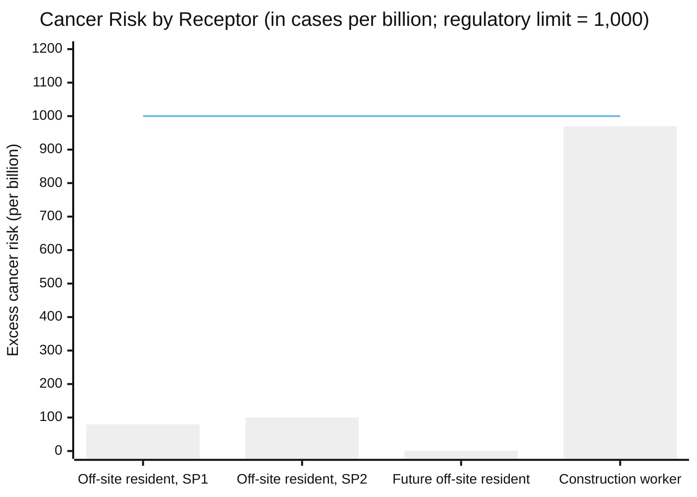
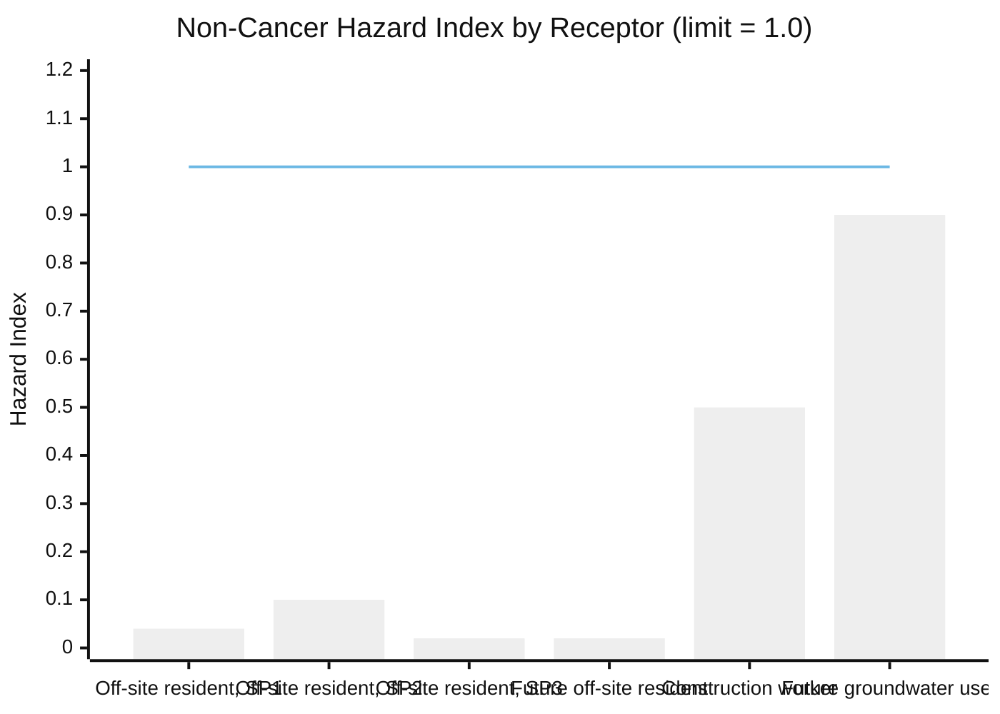
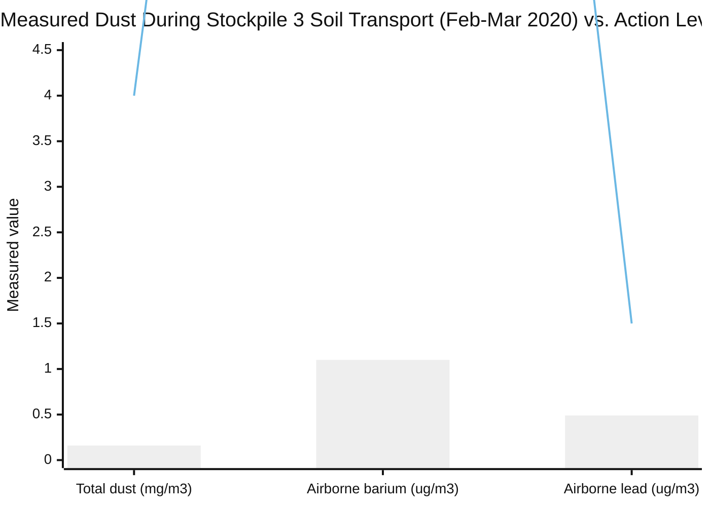

# Understanding the Health Risk Numbers: SR 132 Modesto Soil Stockpiles

## About This Primer

This document explains — in plain language — **how** human health risk was calculated at this site (the Human Health Risk Assessment, or HHRA), what the resulting numbers mean, who they apply to, which contaminants actually drive them, and what is known about dust released into the air during the 2020 removal of barium-containing soil from Stockpile 3. It is a companion to [contaminants-primer.md](contaminants-primer.md), which covers contaminant concentrations and general health effects.

---

## 1. What Does "Cancer Risk = 8E-8" Actually Mean?

This is not a measured rate of cancer in real people living near the site. It is a **hypothetical individual's calculated probability**, under a deliberately conservative, worst-realistic-case set of assumptions about exposure — what EPA calls the "Reasonable Maximum Exposure" (RME).

The governing HHRA document defines it directly:

> "Cancer risk is expressed as an increased probability of developing cancer as a result of lifetime exposure... predicated on the regulatory assumption that cancer induction does not have a threshold... An excess cancer risk of 1E-06 means that an exposed individual may have an added one-in-one-million chance of developing cancer greater than an unexposed individual."[^hhra-def]

Three things follow from this that are easy to miss:

- **It assumes a full 70-year lifetime of exposure**, averaged out — even for scenarios (like a construction worker) that only last a year or two. The math spreads a short, intense exposure across an entire assumed lifetime.
- **It is not additive across a real neighborhood.** It describes one hypothetical person exposed in a specific, bounded way (e.g., standing on the same spot of soil every day for 30 years) — not "1 in a million residents of Modesto will get cancer from this site."
- **The non-cancer number works differently.** A "Hazard Index" (HI) is *not* a probability at all — it's a ratio of estimated dose to a safe reference dose. The HHRA states this explicitly: "HQs and HIs are not statistical probabilities, such as excess cancer risks, and the level of concern does not increase linearly as the [reference dose] is approached or exceeded."[^hhra-hi]

**The regulatory bright lines used at this site:**
- Cancer risk: **1 in 1,000,000 (1E-6)** — described as "the generally used conservative criterion."[^hhra-def]
- Non-cancer Hazard Index: **1.0** — below this, no appreciable risk of that health effect is expected.[^hhra-hi]

---

## 2. Who Was Evaluated, and How?

The HHRA modeled **four hypothetical receptors**, each with a different pattern of contact with the soil:

| Receptor | What they'd be exposed to | How often/long (modeled) |
|---|---|---|
| **Current off-site resident / trespasser** (combined into one conservative receptor) | Surface soil only — direct contact and windblown dust | 30 years, 350 days/year |
| **Future construction worker** (hypothetical, if the area were redeveloped) | Surface *and* deep subsurface soil (0–20 ft) — direct contact, skin contact, *and* dust inhalation | 1 year, 60 days total |
| **Future off-site resident** (during a hypothetical future construction period) | Windblown dust only | 60-day construction window |
| **Hypothetical future groundwater user** | Drinking the shallow groundwater (no one currently does) | Standard residential water-use assumptions |

The construction worker is the only receptor modeled as contacting deep subsurface soil — this turns out to matter a lot (see Section 4).

**The methodology is standard, not unusual or controversial.** The HHRA states it was "conducted in accordance with Department of Toxic Substances Control (DTSC) and U.S. Environmental Protection Agency (EPA) guidance"[^hhra-method] — specifically EPA's Risk Assessment Guidance for Superfund (RAGS), EPA's Exposure Factors Handbook, DTSC's Preliminary Endangerment Assessment Guidance Manual, and DTSC's "HHRA Note," with toxicity values drawn from Cal-EPA's OEHHA (falling back to EPA's IRIS database where OEHHA has none).[^hhra-method] This is the same framework used at contaminated sites throughout California — it is not something devised specifically for this site.

---

## 3. The Numbers: Off-Site vs. Worker

> **How to read this:** each bar is the calculated excess lifetime cancer risk for that hypothetical individual, converted to "cases per billion" so the tiny numbers are visible on one chart (1E-6 = 1,000 per billion = the regulatory limit, shown as the flat line).[^hhra-tables] Stockpile 3's off-site resident risk isn't shown because no carcinogens were identified there in quantities requiring calculation.[^hhra-tables] Every modeled receptor stayed below the 1-in-a-million line — but the construction worker comes closest, at roughly 1,000x the off-site future-resident's risk.

> **How to read this:** a Hazard Index (HI) is the sum of estimated dose ÷ safe reference dose across all contaminants for that receptor — it is not a probability, and values under 1.0 indicate no appreciable risk of that effect.[^hhra-tables] The construction worker (0.5) and the hypothetical future groundwater user (0.9) are the closest to the limit, but both stayed under it.

**The construction worker has the highest risk of any modeled receptor by a wide margin — despite the shortest modeled exposure (1 year, 60 days, vs. 30 years for a resident).** This is because the worker scenario is the only one that models direct contact with *subsurface* soil, where contaminant concentrations run far higher than at the surface.[^hhra-tables] In plain terms: **brief, close contact with the most contaminated material carries more calculated risk than decades of distant, surface-level exposure.**

This matches how the agencies themselves have framed the risk over time. The Feasibility Study notes DTSC's own position that the stockpiles pose no risk "as long as [they] remain in place and are properly managed," but that risk needs to be reevaluated "during the period when the soil is being moved"[^fs-risk] — i.e., the moment of construction/excavation, not quiet long-term presence, is the point of concern. This is exactly what the HHRA's numbers show.

*Note: the original 2007 HHRA report contains two small internal inconsistencies — the construction worker's cancer risk appears as both 9.2E-7 (narrative text) and 9.8E-7 (results table), and the future resident's risk as both 6E-10 and ~1E-9 (narrative vs. table). Neither discrepancy changes any conclusion — both versions of each number stay on the same side of the regulatory threshold — but exact figures should be read as approximate to one significant digit.[^hhra-inconsistency]*

---

## 4. What Actually Drives the Numbers?

**Cancer risk is driven almost entirely by arsenic, not barium.** Barium has no cancer slope factor at all in the toxicity tables used — it is simply not evaluated as a carcinogen.[^hhra-tables] Arsenic — a naturally occurring element common in Central Valley soil and groundwater — is the dominant contributor to the calculated cancer risk wherever it appears in the results.

**Important nuance: arsenic's "background" exclusion was applied to only one specific number, not across the board.** For the **Stockpile 2 current off-site resident** scenario, the HHRA calculated arsenic's raw cancer-risk contribution at 1.45E-5 (based on a 95th UCL soil concentration of 1.63 mg/kg), then re-ran the same calculation using the measured *background* arsenic concentration (1.15 mg/kg) and got an almost identical result (1.15E-5). Because on-site and background arsenic produced statistically indistinguishable risk, the report states plainly: **"For this reason, arsenic in surface soil at SP#2 is not included in the final total risk estimate for SP#2"** — which is why SP#2's reported number drops from a raw 1E-5 to a final 1E-7.[^hhra-arsenic-excl]

**That same background-equivalence argument was never made for the construction worker scenario**, even though the underlying concentrations are similarly close to background there too. The construction-worker COPC screening only excludes a chemical if its *maximum* concentration is at or below the maximum background concentration; arsenic's subsurface maximum (5.5 mg/kg) was somewhat above the measured background maximum (4.1 mg/kg), so it passed that screening test and was carried through in full, with no subsequent discount applied.[^hhra-tables] The result: arsenic accounts for roughly 83% of the construction worker's total reported cancer risk (8.1E-7 of 9.8E-7).[^hhra-tables] In short — arsenic was disregarded for one specific, narrow reason in one specific number (SP#2's off-site resident risk), not because it is generally assumed to be a non-issue at this site; the construction-worker number still counts it in full, and it is that number which comes closest to the regulatory threshold.

**Barium dominates the non-cancer Hazard Index — but mainly for the construction worker.** For the worker scenario, barium alone accounts for roughly two-thirds to four-fifths of the total Hazard Index (0.32 of 0.4–0.5), reflecting the extreme concentrations found in subsurface soil (as high as 72,000–130,000 mg/kg — 7 to 13% barium by weight).[^hhra-tables] For the off-site resident scenarios, the picture is more mixed: at Stockpile 2, arsenic actually contributes slightly more to the Hazard Index than barium does; at Stockpile 3, barium accounts for about 90% of a very small overall HI (0.02).[^hhra-tables] For the hypothetical groundwater user, vanadium — not barium — is the largest single contributor.[^hhra-tables]

**Bottom line for a lay audience:** barium is the contaminant present in by far the largest quantities at this site, but it is not what drives the (very small) calculated cancer risk — arsenic is. Barium's real significance shows up in the non-cancer hazard calculation, and specifically in the one scenario (a worker directly handling the deep soil) where it matters most.

---

## 5. Fugitive Dust During the Stockpile 3 Soil Removal

This section separates two different things that are easy to conflate: the HHRA's *theoretical* construction-worker exposure numbers (Sections 3–4 above), and *actual, measured* dust levels during the real 2020 removal of barium-containing soil (BCS) from Stockpile 3.

### What was actually monitored

During the 2019–2020 consolidation and capping project — which included transporting roughly 38,440 cubic yards (about 3,075 truckloads) of barium-containing soil out of Stockpile 3 — real-time dust monitors (PM-10 particulate monitors) were operated at fenceline stations upwind and downwind of the work.[^dust-rdip] This was compared against action levels set out in the 2019 Removal/Remedial Design Implementation Plan:[^dust-rdip]

- **Total dust: 4.0 mg/m³** above background
- **Barium: 25 µg/m³**
- **Lead: 1.5 µg/m³**

> **How to read this:** bars show the highest measured downwind values recorded at fenceline monitoring stations during Stockpile 3 soil transport activities (late February–early March 2020);[^dust-rdip] the flat line marks each respective action level (note the three measures use different scales/units — dust in mg/m³, barium and lead in µg/m³). All measured values stayed far below their action levels; the project's own documentation reports **no exceedances** during this work.[^dust-rdip]

### What this does and doesn't tell us

- **This is real, measured field data** — not a model — collected specifically during the physical excavation and truck-hauling of Stockpile 3's barium-containing soil, the activity that would most plausibly aerosolize contaminated dust.
- The action levels themselves (4.0 mg/m³ total dust, etc.) were derived from an independent public-health standard for airborne lead (a California Air Resources Board / OEHHA 30-day ambient standard) combined with conservative site soil concentrations — this is a separate framework from the HHRA's cancer-risk/hazard-index math discussed above, aimed at real-time engineering control rather than long-term risk quantification.[^dust-rdip]
- **One caution:** the underlying numeric monitoring tables in the source report are scanned page images without an extractable text layer, so they could not be machine-verified line-by-line; they were spot-checked visually and no discrepancies were found, but not every row was individually re-checked.
- **One documented gap:** an earlier, smaller 2012 excavation near Stockpile 3 (for a highway off-ramp project, moving roughly 2,800 cubic yards — a small fraction of the 2020 work) had a monitoring *plan* with the same style of dust trigger, but no results/completion report for that specific 2012 event was found in the reviewed document set. Whether that trigger was ever exceeded during that earlier, smaller episode is not established one way or the other by the available record.[^dust-2012]
- The **"SR 132 Stockpile 3 BCS Removal Tech Memo"** (March 2020) — despite its name — is a soil verification-sampling report (confirming residual soil left after excavation met cleanup criteria) and contains no air-monitoring data of its own; the dust monitoring results live in the separate Removal Action Completion Report package.[^bcs-memo][^dust-rdip]

---

## Summary for a Lay Audience

- Numbers like "cancer risk = 8E-8" describe a hypothetical individual's added lifetime probability under conservative worst-case assumptions — not an observed rate in the real population, and not something that adds up across a neighborhood.
- The regulatory pass/fail lines are 1-in-a-million (1E-6) for cancer risk and a Hazard Index of 1.0 for non-cancer effects. Every scenario evaluated at this site stayed under both lines.
- A hypothetical future construction worker directly handling the deep, most-contaminated soil has the highest calculated risk of any scenario — higher than any off-site resident scenario — even though that exposure is modeled as much shorter in duration. Intensity and proximity to the worst material matter more than decades of distant contact.
- Barium is the overwhelming contaminant by sheer quantity at this site, but it isn't what drives the (very small) cancer-risk numbers — arsenic, a naturally occurring element in this region, does that. Barium's real contribution shows up in the non-cancer hazard calculation, especially for the worker scenario.
- When the barium-containing soil in Stockpile 3 was actually excavated and hauled in 2020, real air monitors at the fenceline measured dust, barium, and lead far below the project's precautionary action levels throughout — this is measured field data, not a model, and no exceedances were reported.

---

## Sources

[^hhra-def]: Geocon Consultants, *Human Health Risk Assessment Update* (Rev. 03/13), Appendix B (original 2007 Shaw Environmental HHRA), Section 5.1 ("Cancer Risk"). `raw/S9525-06-44 HHRA UPDATE Rev.0313.pdf`.
[^hhra-hi]: Ibid., Section 5.2 ("Hazard Index / Hazard Quotient").
[^hhra-method]: Ibid., Sections 1.0, 4.1, and 9.0 (methodology and cited guidance: EPA RAGS Part A/E, EPA Exposure Factors Handbook, EPA SSL construction-dust guidance, DTSC PEA Guidance Manual, DTSC LeadSpread Model, DTSC Human Health Risk Assessment Note, OEHHA/EPA IRIS toxicity values).
[^hhra-tables]: Ibid., Section 2.2 (receptor/pathway conceptual site model), Table 9 (exposure assumptions), and risk-characterization tables (current resident by stockpile; Table 24, construction worker; Table 27, future off-site resident; groundwater user results) — cross-checked against `raw/S9525-06-44 HHRA UPDATE Rev.0313.pdf`.
[^hhra-inconsistency]: Ibid. — narrative-text risk statements vs. results-table totals differ slightly for the construction worker and future off-site resident receptors; both versions remain on the same side of the 1E-6 / HI=1.0 thresholds.
[^hhra-arsenic-excl]: Ibid., Section 6.1 ("SP#2" discussion) and Section 7.1 ("Exclusion of Arsenic") — describes the Wilcoxon-Rank Sum statistical comparison of SP#2 surface soil arsenic (0.7–4.9 mg/kg) against background soil arsenic (0.2–4.1 mg/kg) and the resulting decision to exclude arsenic's risk contribution from SP#2's final total only; this treatment was not extended to the future construction worker's subsurface (0–20 ft bgs) dataset, where arsenic's maximum detected concentration (5.5 mg/kg, Table 5) exceeded the background maximum and was retained in full (Table 24).
[^fs-risk]: California Department of Toxic Substances Control / Caltrans, *Final Feasibility Study Report, Modesto Soil Stockpiles* (Geocon Consultants, June 2014), Section 3.2.6 ("HHRA Update Summary"), citing DTSC's position on in-place management vs. soil-moving risk. `raw/S9800-01-17 Modesto Soil Stockpiles Final FS Report.0614.pdf`.
[^dust-rdip]: Caltrans, *Removal/Remedial Design Implementation Plan* (January 2019) for the fenceline dust action-level derivation, `raw/S1200-01-01 Caltrans Modesto Stockpile RDIP_01.19.pdf`; monitoring results reported in the Interim Removal Action Completion Report package (Geocon "Barium Containing Soil Air Monitoring Summary," September 2020), `raw/Draft Interim RACR_Text_Figures_Tables_ App A-C.pdf`, `raw/Draft Interim RACR_ App D-G.pdf`, and `raw/S1908-01-01 Caltrans Modesto Stockpile Interim RACR_12.22 (1).pdf`.
[^dust-2012]: Caltrans/Geocon, *Modesto Ramp Excavation Monitoring Plan* (June 2012), specifying the fenceline dust trigger for a smaller ~2,800 cy excavation near Stockpile 3; no corresponding results/completion report was located in the reviewed document set. `raw/S9650-06-03 Modesto Ramp Ex Mon Plan -no appx-0612.pdf`.
[^bcs-memo]: *SR 132 Stockpile 3 BCS Removal Tech Memo* (March 13, 2020) — post-excavation soil verification sampling only; contains no air-monitoring data. `raw/SR 132 Stockpile 3 BCS Removal Tech Memo.pdf`.

*For specific regulatory determinations, consult the original source documents listed above or contact DTSC.*
