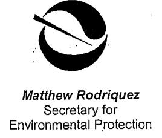
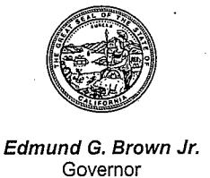

## Department of Toxic Substances Control

Deborah O. Raphael, Director 8800 Cal Center Drive Sacramento, California 95826-3200

March 1, 2012

Mr. Richard Stewart, P.G. **Engineering Geologist** California Department of Transportation Division of Environmental Planning 2015 E. Shields Avenue, Suite 100 Fresno, California 93726-5428

## STATE ROUTE 132 WEST EXPRESSWAY/FREEWAY (CALTRANS SOIL STOCKPILES), MODESTO, STANISLAUS COUNTY

Dear Mr. Stewart:

Beginning in January 2005 the Department of Toxic Substances Control (DTSC), via Interagency Agreements and Task Orders with the California Department of Transportation (Caltrans), reviewed reports related to the characterization of soil stockpiles on Caltrans "right-of-way" property in the vicinity of Kansas Avenue and State Route (SR) 99 in Modesto, Stanislaus County. The soil stockpiles (Site) consist of three separate piles totaling approximately 120,000 cubic yards on Caltrans property located south of Kansas Avenue, just east and west of North Emerald Avenue and SR 99.

The stockpiles consist of excess native soils and pond tailings that were generated when Caltrans constructed a segment of SR 99 north of Kansas Avenue in the 1960's. Excavating the segment traversed a portion of a 4.3-acre parcel purchased from FMC Inc. The parcel was previously occupied by a corner of FMC's southernmost percolation pond. FMC Inc. (and its predecessors) was a chemical manufacturing company that processed barium sulfate and strontium sulfate ores and other minerals. Caltrans and the Stanislaus Council of Governments (StanGOG) are planning the construction of the SR 132 West Expressway/Freeway at the location of the soil stockpiles. The project is proposed to use the stockpile soils to construct the core of the abutments and elevated sections of the SR 132 West Expressway/Freeway.

In accordance with the Interagency Agreements and Tasks Orders, DTSC reviewed reports identified in DTSC's correspondence to Caltrans dated 12/17/09. Collectively, these reports were intended to provide information for determining whether there is a potential for a release of hazardous substances that presents risk to human health or Mr. Richard Stewart, P.G. March 1, 2012 Page 2 of 5

the environment. In consultation with Regional Water Quality Control Board, Central Valley Region (RWQCB), DTSC reviewed and provided comments to Caltrans on these reports.

Based on the information that Caltrans and its contractor provided, DTSC's correspondence to Caltrans dated 12/17/09 stated: "DTSC finds soil stockpiles, as currently managed by Caltrans on Caltrans property, do not pose a risk to human health for: 1) Caltrans workers who access the fenced site to conduct mowing operations, conduct fence repairs, or other routine activities; 2) trespassers; and 3) residents adjacent to the stockpiles".

However, in this same communication the above DTSC findings are predicated upon the following conditions: "Until such time that the SR 132/99 Interchange project is constructed and/or the final disposition of the soil stockpiles is determined, Caltrans should continue to manage the soil stockpiles by: 1) limiting access to Caltrans authorized personnel; 2) inspecting and maintaining the chain-link fence; 3) prohibiting any activities involving excavation/grading, off-site removal of soil, or placement of other soil on the Site; and 4) maintaining the current grade and vegetative cover. Caltrans should also maintain the existing groundwater monitoring system associated with the Site".

Based on the site visit conducted by RWQCB and DTSC on 2/15/2012 and subsequent telephone discussion, DTSC in consultation with RWQCB is requesting that Caltrans implement the following actions going forward:

- 1. <u>Limit Access to Caltrans Authorized Personnel</u>. Install fences where needed and inspect and repair or replace all breaches in fences associated with the Site. Inspection and repair or replacement of fences should be implemented two times per month. To prevent the Site from being an attractive nuisance to trespassers, DTSC recommends that Caltrans inspect and remove all debris (e.g., tires, cans, clothing, tarps, mattresses, etc.) from the Site quarterly.
- 2. <u>Maintain the Current Grade and Vegetative Cover</u>. Inspect and revegetate all surfaces lacking vegetative cover at the Site. Inspection and re-vegetation should be implemented quarterly. Maintain the grade and drainage at the Site.
- 3. <u>Maintain the Groundwater Monitoring System</u>. Implement quarterly groundwater monitoring in existing wells associated with the Site. All existing wells should be inspected and evaluated for functionality. Non-

Mr. Richard Stewart, P.G. March 1, 2012 Page 3 of 5

functional wells should be refurbished or replaced as needed. Caltrans should conduct groundwater monitoring in accordance with the Groundwater Assessment Workplan, dated 1/26/2006. In addition to the analytes referenced in the subject Workplan, Caltrans should include the analyte "strontium" and other analytes needed to determine sources of groundwater impacts. Caltrans should submit quarterly groundwater monitoring reports to DTSC and RWQCB. The quarterly groundwater monitoring reports should include all field data, chain of custody information, final certified laboratory analysis, summary tables of analytical results for all analytes, and a discussion on concentration trends of analytes.

In addition to the above, we request that Caltrans coordinate with StanCOG, DTSC, and RWQCB during preparation of the sampling and analysis plan for additional characterization of the Site. This additional characterization is a required initial step identified in Exhibit C - Scope of Work in DTSC's Draft Voluntary Cleanup Agreement, dated 2/7/2012 with StanCOG. RWQCB also has a draft "Reimbursement Agreement" with StanCOG, dated 2/7/2012. Both agreements were unanimously approved by the StanCOG Policy Board on 2/15/2012.

DTSC appreciates your cooperation on addressing the items identified above. If you have any questions, please contact me at 916-255-3591.

Sincerely,

Randy S. Adams, C.E.G.

Senior Engineering Geologist

Rans D. adams

Brownfields and Environmental Restoration Program

cc:

Ms. Carrie L. Bowen

California Department of Transportation

District 10 Director

1976 East Dr. Martin Luther King Jr. Blvd.

Stockton, California 95205-7015

Mr. Richard Stewart, P.G. March 1, 2012 Page 4 of 5

cc: Mr. Vince Harris
Executive Director
Stanislaus Council of Governments
1111 | Street, Suite 308
Modesto, California 95354

Mr. Carlos Yamzon Senior Regional Planner Stanislaus Council of Governments 1111 I Street, Suite 308 Modesto, California 95354

Ms. Christina Hibbard, P.E. Project Manager Caltrans District 10 1976 E. Dr. Martin Luther King Jr. Blvd. Stockton, California 95205-7015

Ms. Nicole Damin Senior Hazardous Materials Specialist Stanislaus County Health Agency 3800 Cornucopia Way, Suite C Modesto, California 95358-9492

Mr. Duncan Austin, P.E., Chief Private Sites Cleanup Unit Regional Water Quality Control Board Central Valley Region 11020 Sun Center Drive, #200 Rancho Cordova, California 95670-6144

Mr. Steven Meeks, P.E. Senior Water Resources Control Engineer Regional Water Quality Control Board Central Valley Region 11020 Sun Center Drive, #200 Rancho Cordova, California 95670-6144 Mr. Richard Stewart, P.G. March 1, 2012 Page 5 of 5

cc: Mr. Roberto Cervantes, P.E.
Water Resources Control Engineer
Regional Water Quality Control Board
Central Valley Region
11020 Sun Center Drive, #200
Rancho Cordova, California 95670-6144

Mr. Steven R. Becker, P.G., Chief Site Evaluation and Remediation Unit Brownfields and Environmental Restoration Program Department of Toxic Substances Control 8800 Cal Center Drive Sacramento, California 95826