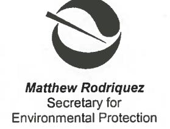
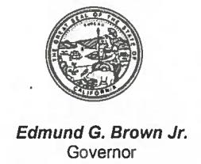

## Department of Toxic Substances Control

Deborah O. Raphael, Director 8800 Cal Center Drive Sacramento, California 95826-3200

August 30, 2012

Ms. Sam Haack, P.E. **Project Manger** California Department of Transportation District 10 P.O. Box 2048 Stockton, California 95201

## MODESTO RAMP REHABILITATION PROJECT, STATE ROUTE 99 - KANSAS AVENUE NORTHBOUND OFF-RAMP, MODESTO, CALIFORNIA

Dear Ms. Haack:

This letter is in reply to California Department of Transportation (Caltrans) letters, dated May 29, 2012 and August 24, 2012 to the Department of Toxic Substances Control (DTSC) requesting DTSC's concurrence regarding disposition of excavated material resulting from ramp safety improvements located in Modesto along State Route (SR) 99 at Kansas Avenue.

DTSC, in consultation with the Regional Water Quality control Board, Central Valley Region (RWQCB) reviewed information prepared by Caltrans' contractors. Geocon Consultants Inc. (Geocon) and Teichert Construction for the Modesto Ramp Rehabilitation Project SR99 - Kansas Avenue Northbound Off-Ramp for Caltrans' proposed ramp construction activities in the vicinity of Stockpile No. 3. Information reviewed includes: 1) "Site Investigation Workplan, Modesto Ramp Rehabilitation Project State Route 99 - Kansas Avenue Northbound Off-Ramp, Modesto California", (Geocon 4/13/2012); 2) "Transmittal of Site investigation Data, Modesto Ramp Rehabilitation Project State Route 99 - Kansas Avenue Northbound Off-Ramp, Modesto California", (Geocon, 4/24/2012); 3) "Location 6 - Kansas Avenue Northbound Contaminated Material Removal Plan", (Teichert Construction, 5/25/2012); 4) "Dust Control Plan - Caltrans Project #10-0A6714, Highway 99 Off-Ramps - Tuolumne Blvd. to Kansas Avenue, DCP 826", (San Joaquin Valley Air Pollution District, 6/16/2011) [1]; and 5) Special Waste Profile, (Republic Services, 7/30/2012).

[1] The Dust Control Plan was approved by the San Joaquin Valley Air Pollution District

Ms. Sam Haack, P.E. August 30, 2012 Page 2 of 4

Caltrans is proposing to upgrade the State Route (SR) 99 Kansas Avenue northbound ramp in the vicinity of Stockpile No. 3 which is one of three stockpiles consisting of excess native soils and pond tailings that were generated when Caltrans constructed a segment of SR 99 north of Kansas Avenue in the early 1960's. Excavating the segment traversed a portion of a 4.3-acre parcel purchased from Food Machinery and Chemical Corporation (FMC) Inc. An evaporation pond was located in the southernmost corner of the parcel. FMC Inc. (and its predecessors) was a chemical manufacturing company that processed barium sulfate and strontium sulfate ores and other minerals. The primary chemicals of concern (COC) are barium, lead, and strontium.

The Kansas Avenue northbound off-ramp project is one of several ramp projects along State Route 99 in Modesto that are being upgraded to improve traffic safety. The planned improvement at this location includes: extending the length of the off-ramp lane, improving the curve radius, and widening the shoulder. This construction activity will lay back the existing cut slope in native soil and a portion of the slope along the north western portion of Stockpile No. 3. A retaining wall will be constructed in the area of the shoulder widening and a portion of Stockpile No. 3. A total of approximately 6,000 cubic yards of material will be excavated, of which approximately 2,800 cubic yards consists of material from Stockpile No. 3.

Sampling and analysis conducted by Caltrans' contractor Geocon in the area to be excavated in Stockpile No. 3, reports the concentration of barium, strontium, and lead in samples collected in Stockpile No. 3 material to be below residential and commercial/industrial screening level thresholds, with the exception of one sample having elevated lead which exceeded residential screening levels. While arsenic exceeds residential and commercial/industrial screening levels, it is below background. The reported 95% upper confidence limit concentrations for barium, strontium, and lead in the area to be excavated in Stockpile No. 3 are below residential and commercial/industrial screening levels. Caltrans proposes to dispose of the excavated Stockpile No. 3 material in the Forward Inc. Landfill located in Manteca, Stanislaus County.

Since sampling and analysis indicate that the COC in excavated soil material in Stockpile No.3 associated with the ramp construction are below the respective screening level thresholds and because Caltrans is responsible for implementing all aspects of this construction activity, including implementation of California Environmental Quality Act, dust control, and storm water management, DTSC finds that the proposed offsite management of soil material from Stockpile No. 3 does not pose a risk to human health or the environment.

Ms. Sam Haack, P.E. August 30, 2012 Page 3 of 4

DTSC's findings for the ramp construction does not absolve Caltrans' obligation to implement Remedial Action Plan activities associated with the SR 132 West Expressway/Freeway at the location of the stockpiles described in DTSC's letter to Caltrans, dated December 17, 2009 and the Consultation Agreement No. 43A0260; DTSC No. 08-T3616, dated June 22, 2012.

If you have any questions, please contact Mr. Randy Adams at (916) 255-3591.

Sincerely,

Steven R. Becker, P.G., Chief

Site Evaluation and Remediation Unit

Brownfields and Environmental Restoration Program

cc: Ms. Nicole Damin

Senior Hazardous Materials Specialist Stanislaus County Health Agency 3800 Cornucopia Way, Suite C Modesto, California 95358-9492

Mr. Richard Stewart, P.G.
Engineering Geologist
California Department of Transportation
Division of Environmental Planning
2015 E. Shields Avenue, Suite 100
Fresno, California 93726-5428

Mr. Duncan Austin, P.E., Chief Private Sites Cleanup Unit Regional Water Quality Control Board Central Valley Region 11020 Sun Center Drive, #200 Rancho Cordova, California 95670-6144

Mr. Steven Meeks, P.E. Senior Water Resources Control Engineer Regional Water Quality Control Board Central Valley Region 11020 Sun Center Drive, #200 Rancho Cordova, California 95670-6144 Ms. Sam Haack, P.E. August 30, 2012 Page 4 of 4

cc: Mr. Roberto Cervantes, P.E. Water Resources Control Engineer

Regional Water Quality Control Board

Central Valley Region

11020 Sun Center Drive, #200

Rancho Cordova, California 95670-6144

Mr. Joseph Smith Staff Counsel III - Spec Department of Toxic Substances Control 1001 I Street P.O. Box 806 Sacramento, California 95812-0806

Mr. Randy S. Adams, C.E.G.
Senior Engineering Geologist
Brownfields and Environmental Restoration Program
Department of Toxic Substances Control
8800 Cal Center Drive
Sacramento, California 95826