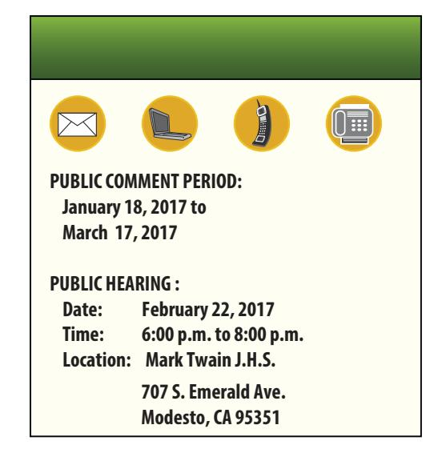
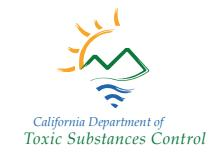
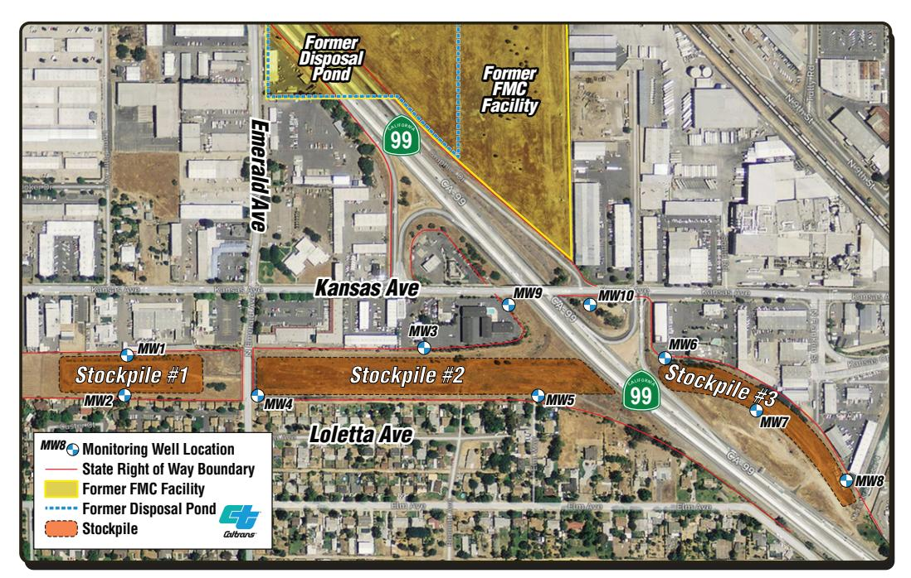
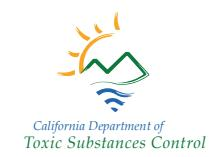
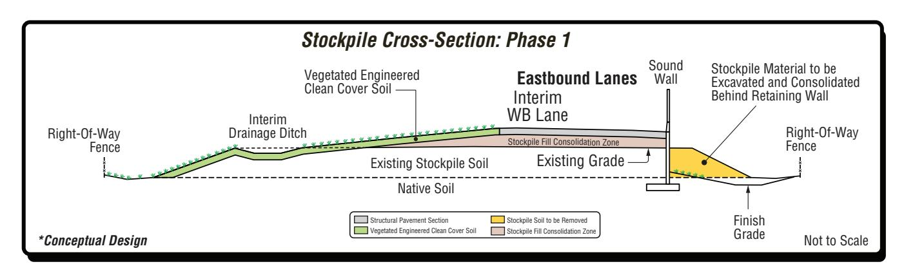
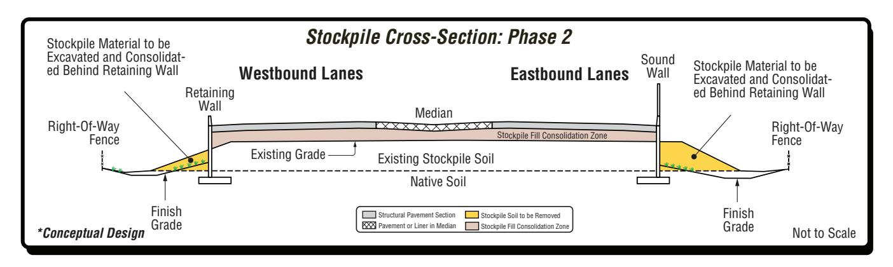
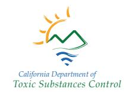
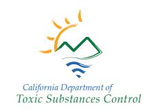

# COMMUNITY Update

The mission of DTSC is to protect California's people and environment from harmful effects of toxic substances through the restoration of contaminated resources, enforcement, regulation and pollution prevention.

## Draft Remedial Action Plan, Caltrans Modesto Soil Stockpiles State Route 132 West Freeway/Expressway Project

### You May Review and Comment on the Draft Final Cleanup Plan for the Caltrans Modesto Soil Stockpiles Site

The Department of Toxic Substances Control (DTSC) invites you to review and comment on a proposed remedial action for the Caltrans Modesto Soil Stockpiles Site (site) located south of Kansas Avenue between Carpenter Avenue and just east of State Route 99 in Modesto, California. The selected remedy, contained in a draft final Remedial Action Plan (RAP), summarizes how the owner of the site, Caltrans, proposes to address contamination in the stockpiles, which resulted from excavation through an industrial waste pond during construction of State Route 99 in Modesto during the 1960s.

The draft final RAP prepared by Caltrans proposes containment of the stockpiles within a structural section of the proposed State Route 132 West Expressway/Freeway project (State Route 132 West). DTSC and the Central Valley Regional Water Quality Control Board (RWQCB) have reviewed the draft final RAP and approved it for public notice and comment. The stockpiles would be contained behind retaining walls, bridge abutments, and beneath roadway pavement of the State Route 132 project between Needham Street and Carpenter Avenue.

#### Site Description and History

The site consists of three separate and distinct soil stockpiles totaling 160,000 cubic yards. The site is within state right-of-way located south of Kansas Avenue and east and west of the State Route 99/Kansas Avenue interchange.

Stockpile 1 is about 2.5 acres. It is located south of Kansas Avenue between Carpenter and North Emerald Avenue. Stockpile 2 is about 7.6 acres and is located south of Kansas Avenue between North Emerald Avenue and State Route 99. Stockpile 3 covers about 2.5 acres and is located south of Kansas Avenue and east of State Route 99. Average height of the stockpiles is 20 feet. The stockpiles are vacant. Caltrans has secured each stockpile with a perimeter fence.

The stockpiles were made in the early 1960s when a 4.3-acre parcel at the southwest corner of the Food Machinery and Chemical Corporation (FMC),

Modesto Processing Plant, was purchased by Caltrans to construct the State Route 99 Modesto

bypass. FMC and its predecessors operated a chemical processing facility just north of Kansas Avenue from 1929 to about 1985. The facility processed barium, strontium (barite and celestite), and other materials to produce a variety of industrial chemicals. Residual liquids from the processing facility were discharged to unlined ponds on FMC's property. Soil in and around one of the disposal ponds, which previously occupied the 4.3-acre parcel, was excavated during construction of the bypass and stockpiled in its present locations.

### Site Investigation

Since 2004, Caltrans did numerous site investigations including stockpile soil, groundwater, and stormwater runoff assessments. The investigations showed that the primary contaminants in the stockpile soil are barium, strontium, and lead.

Caltrans installed 10 groundwater monitoring wells at the site. Groundwater beneath the base of the stockpiles has varied from 30 to 44 feet. Groundwater flows consistently toward the southeast. Groundwater samples were originally collected in 2006, and

monitoring has occurred bi-monthly or quarterly beginning in 2012. In 2014, analytical results from

all groundwater sampling events were evaluated with respect to background concentrations at the stockpiles and groundwater contaminants that are monitored by FMC. Groundwater is currently monitored annually. Three active water supply wells maintained by the City of Modesto exist within a one-mile radius southeast of the site.

Caltrans has also collect-ed surface water runoff samples from annual

wintertime storm events—nine times since 2013. Caltrans analyzed the samples for metals, including primary contaminants of concern and general mineral parameters. Contaminants of Concern for groundwater and surface water are below Water Quality Objectives.

#### Human Health Risk Assessment

A 2007 Human Health Risk Assessment (HHRA) concluded that, as currently managed, soil and groundwater at the site do not pose an unacceptable human risk for off-site residents, trespassers, or Caltrans workers. Caltrans based this conclusion on 1) maintaining the perimeter fence; 2) limiting access to Caltrans workers; and 3) maintaining a vegetative cover. Caltrans also would have to 4) prohibit placement or removal of soil from the site; and 5) maintain groundwater monitoring. Currently, there are no drinking wells at the site. Additional soil sampling in 2012 confirmed results of the 2007 HHRA. However, containment of the stockpiles within the State Route 132 West project will achieve the overall goal of long-term protection of human health.

#### Remedial Actions Considered

Caltrans, DTSC and RWQCB considered the following cleanup alternatives:

- Alternative 1: No Action The stockpiles would remain in place without fences, monitoring or maintenance. This alternative is used as a baseline against which to compare other alternatives.
- Alternative 2: Institutional Controls Prevents unauthorized site access to stockpiles by establishing fences; signage; public notices; a deed restriction and land use covenant; site inspections; and air and water quality monitoring.
- Alternative 3: Removal Removes the contaminant source by excavating and transporting 160,000 cubic yards of stockpile soil to an off-site disposal facility.
- Alternative 4: Containment Contains stockpiles behind retaining walls, bridge abutments, and beneath roadway pavement of the State Route 132 West project. Unpaved portions would have a clean soil cover in Phase 1. (If the State Route 132 West project were not

constructed, then containment would consist of a clean soil cap over the stockpiles.) Caltrans would establish and maintain a deed restriction and land use covenant, site inspections, and water quality monitoring in both cases.

### **Proposed Remedial Action Plan**

Based on an evaluation of the remedial actions, Caltrans recommends Alternative 4, containment by construction of the State Route 132 West project. DTSC and RWQCB concur with this recommendation. This alternative offers long-term protection of human health and the environment, while balancing contaminant isolation with removal/disposal costs and the need for elevated fill material necessary to construct the State Route 132 West project between Needham Street and Carpenter Avenue.

If the draft final RAP is approved, DTSC and RWQCB will oversee the development of a Remedial Design Implementation Plan. This plan will establish details on how to contain the stockpiles as part of the State Route 132 project.

Caltrans plans to build the State Route 132 West project in two phases: initial construction phase and ultimate build-out phase. The initial construction phase (see Phase 1: Typical Soil Stockpile Cross-Section) will build retaining walls and bridge abutments, and pave the southern half of the site. The northern half will be covered with a graded engineered soil layer. The opening phase would begin in 2018 and end in 2020. The ultimate build-out phase would begin in 2028 (see Phase 2: Typical Soil Stockpile Cross-Section).

### California Environmental Quality Act

As the lead agency under the California Environmental Quality Act (CEQA), Caltrans produced an Environmental Impact Report/Environmental Assessment (EIR/EA) that determined the containment of the stockpile site along with mitigation would not have a significant environmental impact. DTSC and RWQCB are Responsible Reviewing Agencies for CEQA for this project.

### **Next Steps**

After the public comment period, DTSC and RWQCB will consider all comments that were received from the public. Then both agencies will prepare a Responsiveness Summary to address comments received on the draft final RAP. The Responsiveness Summary will be placed in the information repositories for the site and sent to those who submitted comments. DTSC may approve the draft final RAP after the public review and comment process following completion/certification of the EIR/EA. Modifications to the draft final RAP may be necessary based on public comments to both the draft final RAP and the draft EIR/EA.

#### Where to Find Site Documents

DTSC encourages you to review the draft RAP and CEQA documents, and other site-related documents, which are available at the information repositories listed below:

 Stanislaus County Library 1500 I Street Modesto, CA 95354 (209) 558-7800

#### O Caltrans - Online

Site-related technical documents prepared by Caltrans can be found online at:

http://www.dot.ca.gov/dist10/environmental/projects/sr132west/Stockpiles.html

O The full administrative record is available for review at:

DTSC - File Room 8800 Cal Center Drive Sacramento, CA 95826

To make arrangements for review of the documents, please call (916) 255-3758.

#### O DTSC - EnviroStor Database:

Copies of key technical reports, fact sheets and other Caltrans Modesto Soil Stockpiles site related information are available online at DTSC's EnviroStor website links:

http://www.envirostor.dtsc.ca.gov/public/profile\_report.asp?global\_id=60001626 and

http://www.envirostor.dtsc.ca.gov/public/profile\_report.asp?global\_id=50280024

O Please send your comments to this DTSC Representative:

Randy Adams, DTSC Project Manager, 8800 Cal Center Dr., Sacramento CA 95826 Randy.Adams@dtsc.ca.gov or (916) 255-3591

Questions, please contact Randy Adams or Nathan Schumacher, DTSC Public Participation Specialist Nathan.Schumacher@dtsc.ca.gov (916) 255-3650 Toll-free at (866) 495-5651

O If you are from the news media, please contact:

Russ Edmondson, DTSC Public Information Officer Russ.Edmondson@dtsc.ca.gov (916) 323-3372

