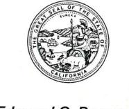
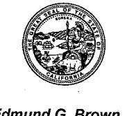
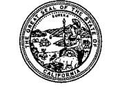

### Department of Toxic Substances Control

Barbara A. Lee. Director 8800 Cal Center Drive Sacramento, California 95826-3200

Edmund G. Brown Jr. Governor

May 18, 2015

Ms. Grace Magsayo, P.E. **Project Manager** Program/Project Management District 10 1976 East Dr. Martin Luther King Blvd P.O. Box 2048 Stockton, California 95205

REVISED ADMINISTRATIVE RECORD, STATEMENT OF REASONS, AND PRELIMINARY NONBINDING ALLOCATION OF RESPONSIBILITY FOR CALTRANS MODESTO SOIL STOCKPILES, STATE ROUTE 132, WEST FREEWAY/EXPRESSWAY PROJECT, STANISLAUS COUNTY, CALIFORNIA

Dear Ms. Magsayo,

The Department of Toxic Substances Control (DTSC) has prepared the enclosed revised documents based on communication with Mr. Richard Stewart, P.G. on April 23, 2015. These documents are to be included as appendices in the Draft Final Remedial Action Plan (RAP) for the Caltrans Modesto Soil Stockpiles, State Route 132. West Freeway/Expressway Project, Stanislaus County, California prepared by Geocon Consultants, Inc., October 27, 2014.

- Appendix B, Administrative Record
- Appendix C, Statement of Reasons
- Appendix D. Preliminary Nonbinding Allocation of Responsibility

Following the addition of the referenced appendices, the Draft Final RAP will be the document that is referenced in the Caltrans Draft Environment Impact Report (EIR). The Draft Final RAP will be made available for public review and comment concurrently with the Draft EIR.

Ms. Grace Magsayo May 18, 2015 Page 2

Please contact me at 916-255-3591 if you have questions.

Sincerely,

Randy S. Adams, C.E.G.

Senior Engineering Geologist

Ran Madam

Brownfields and Environmental Restoration Program

#### **Enclosures**

CC:

Mr. Jim Brake, P.G.

Geocon Consultants, Inc.

3160 Gold Valley Drive, Suite 800

Rancho Cordova, California 95742-7515

Ms. Nicole Damin Senior Hazardous Materials Specialist Stanislaus County Health Agency 3800 Cornucopia Way, Suite C Modesto, California 95358-9492

Mr. John E. Juhrend, P.E., C.E.G. Geocon Consultants, Inc. 3160 Gold Valley Drive, Suite 800 Rancho Cordova, California 95742-7515

Mr. Richard Stewart, P.G. Engineering Geologist California Department of Transportation Division of Environmental Planning 2015 E. Shields Avenue, Suite 100 Fresno, California 93726-5428 Ms. Grace Magsayo May 18, 2015 Page 3

Mr. Steven Meeks, P.E., Chief Private Sites Cleanup Senior Water Resources Control Engineer Regional Water Quality Control Board Central Valley Region 11020 Sun Center Drive, #200 Rancho Cordova, California 95670-6144

Mr. Juergen Vespermann Senior Environmental Planner Central Region Hazardous Waste, Paleontology/Enhancement Branch 855 M Street, Suite 200 Fresno, CA 93721

Kimiko Klein, Ph.D.
Staff Toxicologist Emerita
Human and Ecological Risk Office
Department of Toxic Substances Control
700 Heinz Avenue Suite 200
Berkeley, California 94710-2721

Mr. Steven R. Becker, P.G., Chief Site Evaluation and Remediation Unit San Joaquin Branch Brownfields and Environmental Restoration Program Department of Toxic Substances Control 8800 Cal Center Drive Sacramento, California 95826

### Department of Toxic Substances Control

Barbara A. Lee, Director 8800 Cal Center Drive Sacramento, California 95826-3200

#### APPENDIX B

### ADMINISTRATIVE RECORD

CALTRANS MODESTO SOIL STOCKPILES, STATE ROUTE 132, WEST FREEWAY/EXPRESSWAY PROJECT, STANISLAUS COUNTY, CALIFORNIA

### California Department of Transportation (CALTRANS)

### Shaw Environmental, Inc. (Shaw)

- Heavy Metal Contamination Preliminary Site Investigation Report, Modesto, California, (Shaw, June 1, 2004).
- Remedial Action Options Report, SR 132/SR 99 Stockpiles, Modesto, California, July (Shaw, 27, 2004).
- Final Work Plan, Characterization of Soil Stockpiles, Caltrans Modesto Soil Stockpiles, State Route 99/132 Project, Stanislaus County, California, (Shaw, January 25, 2006).
- Final Surface Water Sampling and Analysis Plan, Caltrans Modesto Soil Stockpiles, State Route 99/132 Project, Stanislaus County, California, (Shaw, January 25, 2006).
- Final Work Plan, Groundwater Assessment, Caltrans Modesto Soil Stockpiles, State Route 99/132 Project, Stanislaus County, California, (Shaw, January 26, 2006).
- Site Investigation Report, Soils Investigation for Heavy Metals, State Route 99. Stanislaus County, California, (Shaw, March 23, 2006).
- Surface Water Sampling Report, State Route 99/132 Project, Stanislaus County, California, (Shaw, June 9, 2006).
- Site Investigation Report, Characterization of Soil Stockpiles, Caltrans Modesto Soil Stockpiles, State Route 99/132 Project, Stanislaus County, California, (Shaw, May 14, 2007).

- Site Investigation Report, Groundwater Assessment, Caltrans Modesto Soil Stockpiles, State Route 99/132 Project, Stanislaus County, California, (Shaw, May 14, 2007).
- Human Health Risk Assessment, Caltrans Modesto Soil Stockpile, Stanislaus County. California, (Shaw, May 14, 2007).
- Particulate Matter Test Report, Mowing Simulation, State Route 99/132 Project, Caltrans Modesto Soil Stockpiles, Stanislaus County, California, (Shaw, June 5, 2007).
- Final Preliminary Endangerment Assessment, Caltrans Modesto Soil Stockpiles, State Route 132/199 Interchange, Stanislaus County, California, (Shaw, June 30, 2009).

### Geocon Consultants, Inc. (Geocon)

### **Groundwater Monitoring**

- Monitoring Well Installation Workplan, Modesto Stockpiles, State Route 99 and 132, Stanislaus County, California, (Geocon, May 8, 2012).
- Groundwater Monitoring Report March 2012, Modesto Stockpiles, State Route 99 and 132, Stanislaus County, California, (Geocon, June 29, 2012).
- Groundwater Monitoring Report May 2012, Modesto Soil Stockpiles, State Route 99 and 132, Stanislaus County, California, (Geocon, November 28, 2012).
- Additional Well Installation and Groundwater Monitoring Report June 2012, Modesto Soil Stockpiles, State Route 99 and 132, Stanislaus County, California, (Geocon November 28, 2012).
- Groundwater Monitoring Report July 2012, Modesto Soil Stockpiles, State Route 99 and 132, Stanislaus County, California, (Geocon, November 28, 2012).
- Groundwater Monitoring Report September 2012, Caltrans Modesto Soil Stockpiles, Stanislaus County, California, (Geocon, December 19, 2012).
- Groundwater Monitoring Report November 2012, Caltrans Modesto Soil Stockpiles, Stanislaus County, California, (Geocon, February 6, 2013).
- Groundwater Monitoring Report January 2013, Caltrans Modesto Soil Stockpiles, Stanislaus County, California, (Geocon, February 28, 2013).
- Groundwater Monitoring Report March 2013, Caltrans Modesto Soil Stockpiles. Stanislaus County, California, (Geocon, May 16, 2013).
- Groundwater Monitoring Report June 2013, Caltrans Modesto Soil Stockpiles, Stanislaus County, California, (Geocon, June 27, 2013).

- Groundwater Monitoring Report September 2013, Caltrans Modesto Soil Stockpiles, Stanislaus County, California, (Geocon, October 24, 2013).
- Groundwater Monitoring Report December 2013, Caltrans Modesto Soil Stockpiles, Stanislaus County, California, (Geocon, January 29, 2014).
- Groundwater Monitoring Report February 2014, Caltrans Modesto Soil Stockpiles, Stanislaus County, California, (Geocon, April 25, 2014).
- Groundwater Monitoring Report June 2014, Caltrans Modesto Soil Stockpiles, Stanislaus County, California, (Geocon, August 4, 2014).
- Groundwater Monitoring Report September 2014, Caltrans Modesto Soil Stockpiles, Stanislaus County, California, (Geocon, October 30, 2014).

### Stormwater Monitoring

- Addendum to Surface Water Sampling and Analysis Plan, Caltrans Modesto Soil Stockpiles, Stanislaus County, California, (Geocon, February 20, 2013).
- Surface Water Sampling Report, Caltrans Modesto Soil Stockpiles, Stanislaus County, California, (Geocon, June 27, 2013).

### Supplemental Site Investigation

- Response to DTSC 09-12-12 Comments on Draft Supplemental Site Investigation Workplan, Modesto Soil Stockpiles, State Routes 99 and 132, Stanislaus County, California, (Geocon September 18, 2012).
- Supplemental Site Investigation Workplan, Modesto Soil Stockpiles, State Routes 99 and 132, Stanislaus County, California, (Geocon, September 18, 2012).
- Supplemental Site Investigation, Caltrans Modesto Soil Stockpiles, State Route 132 West Freeway/Expressway Project, Stanislaus County, California, (Geocon, revised March 1, 2013).

### **Human Health Risk Assessment**

Human Health Risk Assessment Update, Caltrans Modesto Soil Stockpiles, State Routes 99 and 132, Stanislaus County, California, (Geocon, revised March 1, 2013).

#### Kleinfelder

Final Geotechnical Design Report, Modesto Soil Stockpiles, State Routes 99 and 132, Modesto, California, (Kleinfelder, September 6, 2012).

### **Department of Toxic Substances Control (DTSC)**

- Caltrans Modesto Soil Stockpile (State Route 99/132 Project), Caltrans/Department of Toxic Substances Control Interagency Agreement Task Order No. 10-43A0142-03; Department of Toxic Substances Control No. 03-T2641, (DTSC, April 8, 2005).
- Human Risk Assessment, Caltrans Modesto Soil Stockpiles (State Route 99/132 Project), Caltrans/Department of Toxic Substances Control Interagency Agreement No. 43A0184, DTSC NO. 06-T105, Task Order No. 3, (DTSC, August 20, 2007).
- Caltrans Modesto Soil Stockpiles (State Route 132/99 Interchange Project), Modesto, Stanislaus County, (DTSC, December 17, 2009).
- State Route 132 West Expressway/Freeway (Caltrans Soil Stockpiles), Modesto, California, (DTSC, March 1, 2012).
- Groundwater Monitoring Report, California Department of Transportation Modesto Soil Stockpiles State Route 99 and 132, March 2012, Modesto, California, (DTSC, June 27, 2012).
- Supplemental Site Characterization Workplan, Modesto Soil Stockpiles, State Route 132 and 99, Stanislaus County, California, (DTSC, September 12, 2012).
- Groundwater Monitoring Reports, California Department of Transportation, Modesto Soil Stockpiles State Route 99 and 132, May, June, and July 2012, Modesto California, (DTSC, November 29 2012).
- Supplemental Site Investigation and Human Health Risk Assessment Update, Caltrans Modesto Soil Stockpiles, State Route 132/99, Stanislaus County, California, (DTSC, February 13, 2013).
- Revised Supplemental Site Investigation and Human Health Risk Assessment, Caltrans Modesto Soil Stockpiles, State Route 132/99, Stanislaus County, California, (DTSC, April 4, 2013).
- Draft Final Feasibility Study, Caltrans Modesto Soil Stockpiles, State Route 132, West Freeway/Expressway Project, Stanislaus County, California (DTSC, February 11, 2014)

- Final Feasibility Study, Caltrans Modesto Soil Stockpiles, State Route 132, West Freeway/Expressway Project, Stanislaus County, California (DTSC, June 30, 2014).
- Draft Remedial Action Plan, Caltrans Modesto Soil Stockpiles, State Route 132, West Freeway/Expressway Project, Stanislaus County, California, (DTSC, April 8, 2014).
- Draft Final Remedial Action Plan, Caltrans Modesto Soil Stockpiles, State Route 132, West Freeway/Expressway Project, Stanislaus County, California, (DTSC, September 2014).
- Public Participation Plan, The California Department of Transportation (Caltrans) State Route 132 West Expressway Site also known as the Caltrans Modesto Stockpiles Site Near State Highway 99 Modesto, California 95351 (DTSC, November, 2014).
- Administrative Record, Statement of Reasons, and Preliminary Nonbinding Allocation of Responsibility, Caltrans Modesto Soil Stockpiles, State Route 132, West Freeway/Expressway Project, Stanislaus County, California, (DTSC, May 18, 2015).

### Department of Toxic Substances Control

Barbara A. Lee, Director 8800 Cal Center Drive Sacramento, California 95826-3200

### Edmund G. Brown Jr. Governor

#### APPENDIX C

STATEMENT OF REASONS FOR
CALTRANS MODESTO SOIL STOCKPILES, STATE ROUTE 132, WEST
FREEWAY/EXPRESSWAY PROJECT STANISLAUS COUNTY, CALIFORNIA
DRAFT FINAL REMEDIAL ACTION PLAN

Pursuant to California Health and Safety Code (HSC), section 25356.1(d), the California Environmental Protection Agency (Cal/EPA), Department of Toxic Substances Control (DTSC) has prepared this "Statement of Reasons" as part of the "Draft Final Remedial Action Plan, (RAP), Caltrans Modesto Stockpiles, State Route 132, West Freeway/Expressway Project, Stanislaus County, California".

In addition to identifying the applicable or relevant and appropriate requirements to implement the remedial alternative recommended in the Final Feasibility Study (FS) for the Caltrans Modesto Soil Stockpiles (Site1), the Draft Final RAP presents a summary of remedial investigations that address primary contaminants of potential concern (COPCs) in the stockpile soil: barium, strontium, and lead. Additional tests were conducted for other COPCs, including: antimony, arsenic, beryllium, cadmium, chromium, cobalt, copper, mercury, molybdenum, nickel, selenium, silver, thallium, vanadium, and zinc. The soil was also tested for polycyclic aromatic hydrocarbons and other COPCs: nitrate, sulfate, and sulfide. Underlying groundwater was tested for the same COPCs as the stockpile soil.

The stockpile soil and groundwater results were used to quantify toxicological risk to human health for each individual stockpile and all stockpiles collectively. Exposure routes consist of ingestion, inhalation, and dermal contact as applicable to current offsite residents and trespassers; future construction workers; future offsite residents; and hypothetical future shallow groundwater users. Results of the Human Health Risk Assessment (Shaw Environmental Inc. June 2007) and the Human Health Risk Assessment Update (Geocon Consultants Inc., March 2013) are summarized in the Draft Final RAP2

&lt;sup>1 Final Feasibility Study, Caltrans Modesto Soil Stockpiles, State Route 132 West Freeway/Expressway Project, Stanislaus County, California (Geocon Consultants, Inc., June 2014)

&lt;sup>2 An Ecological Screening Evaluation was also completed and included in the Preliminary Endangerment Assessment, Caltrans Modesto Soil Stockpiles, State Route 132/99 Interchange, Stanislaus County, California (Shaw Environmental, June 30, 2009)

Based on stockpiles soil testing, the 2007 Risk Assessment and the 2013 Risk Assessment Update addressed exposure to COPCs, including: arsenic, barium, beryllium, chromium (III & IV), cobalt, copper, lead, mercury, molybdenum, nickel, and zinc. Polycyclic aromatic compounds did not qualify for risk assessment due to limited detection. Both the 2007 Risk Assessment and 2013 Risk Assessment Update determined that the stockpiles, and collectively, as currently managed, do not present an unacceptable risk to human health. Groundwater analysis resulted in the same conclusion.

The toxicological assessment was also included in the Final FS, which evaluated the most appropriate remedial actions for the stockpiles. The remedial action alternatives were then screened against qualifying criteria and methodology established by federal regulation. Based on the findings, the Final FS and Draft Final RAP recommends Alternative # 4 which consists of remediation of approximately 160,000 cubic yards of the stockpile soil by containment of stockpile soil beneath the roadway pavement, behind retaining walls, and behind bridge abutments. Groundwater monitoring and surface water monitoring will be included as part of the Operation and Maintenance plan (OMP) as referenced in the Remedial Design and Implementation Plan (RDIP) prepared by Caltrans. Review and concurrence of the RDIP and OMP by DTSC and the Central Valley Regional Water Quality Control Board will be completed prior to implementation of the recommended remedial action for the Site.

DTSC believes that the Draft Final RAP complies with section 25356.1. Section 25356.1(e) requires that RAPs "shall include a statement of reasons setting forth the basis for the removal and remedial actions selected". The statement of reasons "shall also include an evaluation of the consistency of the selected remedial action with the requirements of the federal regulations and factors specified in subdivision (d)". Section 25356.1(e) specifies six factors against which the remedial alternatives in the RAP must be evaluated. The recommended remedial alternative is consistent with the National Oil and Hazardous Substances Pollution Contingency Plan, also referred to as the National Contingency Plan (NCP), and the federal Superfund regulations. The Draft Final RAP has addressed all of these factors in detail. A brief summary of each of the six factors follows. The Statement of Reasons also includes the Preliminary Nonbinding Allocation of Responsibility (Appendix D) as required by HSC section 25356.1(e).

#### NCP Factors Addressed in the Draft Final RAP

### 1. Health and Safety Risks - Section 25356.1(d)(1)

The Draft Final RAP has been prepared to address contaminants and other general mineral constituents in the stockpiles soil and underlying shallow groundwater. The risk characterization consisting of a Human Health Risk Assessment and Human Health Risk Assessment Update evaluated potential exposure pathways to: 1) current offsite residents and trespassers; 2) future construction workers; 3) future offsite residents; and 4) hypothetical future shallow groundwater users. Based on the completed human health risk assessments and existing management practices by Caltrans including:

fences to prohibit public access; limiting access to Caltrans employees; maintaining a vegetative cover; and maintaining groundwater monitoring, the Site does not present an unacceptable risk to current residents, trespassers, and Caltrans workers and its contractors. According to the City of Modesto and a Department of Water Resources survey, there is no reported municipal or domestic use of shallow groundwater within one mile of the soil stockpiles. Groundwater under the stockpiles does not contain COPCs that exceed primary maximum contaminant levels for drinking water.

### 2. Beneficial Uses of the Site Resources - Section 25356.1(d)(2)

The soil stockpiles consist of excess native soil and pond tailings that were generated in the early 1960s when Caltrans acquired property from Food Machinery and Chemical Corporation (FMC) to construct a segment of State Route 99 along its current alignment located north of Kansas Avenue. Since the early 1960's, the intended and current planned use of the Site containing the stockpiles, located south of Kansas Avenue and east and west of Emerald Avenue, has been for construction of State Route 132 Freeway/Expressway Project. The incorporation of stockpile soil into the construction of State Route 132 at the Site is consistent with the Final FS and Draft Final RAP and is protective of human health and the environment, including groundwater. A land use covenant will be recorded to preclude the use of the property for residences, schools, daycare centers, and hospitals.

### 3. Effect of the Remedial Actions on Groundwater Resources - Section 25356.1(d)(3)

The recommended remedial alternative is protective of groundwater and surface water quality. Construction of State Route 132 Freeway/Expressway Project segment between Carpenter Avenue and North Franklin Street incorporates all stockpile soil beneath paved roadways; behind retaining walls; behind bridge abutments; or a clean vegetated soil cap that will be engineered to minimize infiltration of water and convey surface water away from the stockpile areas. An Operation and Maintenance Agreement, including an Operation and Maintenance Plan will require maintenance, annual inspections, and reporting for all surfaces overlying the stockpiles. To evaluate the effectiveness of the covered surfaces to prevent infiltration and mobilization of COPCs, groundwater and surface water monitoring will be required. The monitoring frequencies and reporting requirements will be established in the RDIP.

### 4. Site-Specific Characteristics - Section 25356.1(d) (4)

COPCs in the stockpiles and groundwater under the stockpiles have been extensively characterized, including barium concentrations at varying depths and locations within the stockpiles. Groundwater COPCs, including barium are below regulatory primary maximum contaminant threshold values for drinking water.

### 5. Cost-Effectiveness of Alternative Remedial Action Measures - Section 25356.1(d)(5)

The recommended remedial alternative is containment by construction of the State Route 132 Freeway/Expressway Project at the Site. Based on comparisons to the evaluation criteria, this remedial alternative was recommended for the Site. This recommended remedy is based primarily on achievement of remediation goals, implementability, effectiveness, consistency with future land use, and cost effectiveness. The cost implementation for this remedial alternative, which includes purchase of clean replacement soil, is approximately 20 times less than the cost to excavate and transport excavated soil stockpile material for offsite disposal.

### 6. Potential Environmental Impacts of Remedial Actions – Section 25356.1(d)(6)

All potential remedial action impacts will be mitigated under the recommend remedial alternative. In accordance with the California Environmental Quality Act, Caltrans is preparing a Draft Environmental Impact Report which references the Draft Final RAP for the Site. DTSC and Central Valley Regional Water Quality Control Board are reviewing agencies with respect to the Draft Environmental Impact Report and other potential human health and environmental impacts associated with the SR 132 West Freeway/Expressway Project at the Site.

## 7. Preliminary Non-Binding Allocation or Responsibility (NBAR), HSC Section 25356.1(e)

The current preliminary NBAR for the site, as issued by DTSC, is presented as Appendix D of the Draft Final RAP.

### Department of Toxic Substances Control

Barbara A. Lee, Director 8800 Cal Center Drive Sacramento, California 95826-3200

Edmund G. Brown Jr.
Governor

#### APPENDIX D

# PRELIMINARY NONBINDING ALLOCATION OF RESPONSIBILITY, CALTRANS MODESTO SOIL STOCKPILES, STATE ROUTE 132, WEST FREEWAY/EXPRESSWAY PROJECT, STANISLAUS COUNTY, CALIFORNIA

Health and Safety Code (HSC) section 25356.1(e) requires the Department of Toxic Substances Control (DTSC) to prepare a preliminary non-binding allocation of responsibility (NBAR) among all identifiable potentially responsible parties (PRPs). The intention of the NBAR requirement in section 25356.1 was to establish which PRPs will have an aggregate allocation in excess of 50% and therefore convene arbitration if they so choose, even though the NBAR is otherwise not binding on anyone, including PRPs, DTSC, or the arbitration panel.

However, the arbitration provisions of Chapter 6.8 of Division 20 of the California Health and Safety Code (California Health and Safety Code Sections 25356.2 through 25356.10) were repealed by Senate Bill 1018 (Stats 2012, Chap 39), effective June 27, 2012. Accordingly, all statutory provisions and procedures associated with the arbitration proceeding were repealed. Since the arbitration provisions no longer exist. the only remaining purpose of an NBAR is to promote settlement and reduce transaction costs. Under EPA's "Interim Guidelines for Preparing Nonbinding Preliminary Allocation of Responsibility", there are situations where an NBAR should probably not be prepared. Specifically where the number of PRPs is relatively small and where the costs for remediation and future operation and maintenances are paid by the current property owner, Caltrans, that an NBAR would not expedite settlement. Under the circumstances of this case, the preparation of an NBAR with a specific allocation of percentages of liability to the various PRPs would not promote settlement by the parties or reduce transaction costs. Therefore, DTSC sets forth the following preliminary nonbinding allocation of responsibility for the Caltrans Modesto Stockpiles, State Route 132, West Freeway/Expressway Project1, Stanislaus County, California:

&lt;sup>1 Includes operation and maintenance for the recommended remedial alternative, "containment" and the associated monitoring programs administered to evaluate the effectiveness of the remedial alternative.

Caltrans assumes full responsibility associated with the remediation and operation and maintenance costs for the Caltrans Modesto Soil Stockpiles, State Route 132, West Freeway/Expressway Project, Stanislaus County, California.