Project No. S9525-06-44 September 18, 2012

## VIA ELECTRONIC MAIL

Mr. Richard Stewart, PG California Department of Transportation - District 6 855 M Street, Suite 200 Fresno, California 93721

Subject: SUPPLEMENTAL SITE INVESTIGATION WORKPLAN

MODESTO SOIL STOCKPILES

 STATE ROUTES 99 AND 132, STANISLAUS COUNTY, CALIFORNIA CONTRACT NO. 06A1580, TASK ORDER NO. 44, EA NO. 10-403500

Dear Mr. Stewart:

In accordance with the California Department of Transportation (Caltrans) Contract No. 06A1580 and Task Order No. 44, we are submitting this Workplan for supplemental site investigation to be conducted at the Caltrans Modesto Soil Stockpiles (Site) located south of the intersection of State Route (SR) 99 and Kansas Avenue in Stanislaus County, California. The approximate site location is depicted on the attached Vicinity Map, Figure 1. This Workplan describes the scope of services requested by Caltrans and outlines the procedures and methods we will employ to complete the project. Comments received from the California Department of Toxic Substances Control (DTSC), in consultation with the Central Valley Regional Water Quality Control Board (RWQCB), in writing dated September 12, 2012, have been addressed in this Workplan.

## BACKGROUND

## Project Description and History

Caltrans and the DTSC, in cooperation with the RWQCB, have entered into an Interagency Agreement to address the presence of approximately 121,000 cubic yards of fill embankment (Stockpiles 1 through 3) located within Caltrans right-of-way (ROW) west and east of SR99 immediately south of the Kansas Avenue interchange. The soil stockpiles were placed in the early 1960s for the future SR132 highway alignment and were partially generated from excavations in evaporation ponds containing elevated heavy metals (notably barium) and polycyclic aromatic hydrocarbons (PAHs).

In the 1930s to 1970s, property beneath and northeast of the SR99 and Kansas Avenue Interchange was occupied by a chemical processing operation. Ores and minerals including barite (barium sulfate) and celestite (strontium sulfate) were processed for use in greases, lubricating oil and pigment blanks. Sodium sulfide was generated as a by-product and sold as a caustic and reagent.

From the 1950s to the 1970s, a liquid residue generated by Food Machinery and Chemical Corporation (FMC Corporation) at this facility was discharged to unlined evaporation ponds. In 1961, a 4.3-acre parcel at the southwest corner of the FMC facility, including a portion of the ponds, was purchased by the State for the construction of SR99 through Modesto. Native soil and pond tailings were removed from this parcel and placed in lifts to form bridge abutments and embankment fills for the future SR99/132 Interchange south of FMC. Soil in and around the impoundments was excavated during construction and stockpiled in the following three distinct locations within existing Caltrans ROW:

- Stockpile 1 located south of Kansas Avenue and west of Emerald Avenue
- Stockpile 2 located south of Kansas Avenue, between Emerald Avenue and SR99
- Stockpile 3 located south of Kansas Avenue and east of SR99

Portions of the stockpiles are enclosed within security fencing and bordered by adjacent property boundary fencing/walls or structures. Stockpiles 1 and 2 are bounded by residential areas to the south. The remaining adjacent areas to Stockpiles 1 through 3 consist of commercial/industrial development, Caltrans ROW and city streets. The Modesto Irrigation District Lateral #4 canal crosses beneath the southern end of Stockpile 3. The stockpile locations and adjacent development are depicted on the Site Plan, Figure 2. Photographs of typical stockpile perimeter and fenceline conditions are attached.

## Previous Environmental Site Investigations

An Initial Site Assessment (ISA) was conducted for Caltrans in 2003. The ISA identified a potential for the soil stockpiles within the SR99/132 ROW to contain residual chemicals associated with the former FMC impoundments. A Preliminary Site Investigation (PSI) was conducted by Shaw Environmental, Inc. in 2004 to characterize the stockpiles. The PSI consisted of drilling 51 borings from which soil samples were collected from stockpile, underlying native soil and background soil and analyzed for heavy metals, PAHs, nitrate and pH. The analytical results indicated elevated barium concentrations in the stockpile samples above the commercial/industrial California Human Health Screening Level (CHHSL). Elevated cadmium above the commercial/industrial CHHSL was further detected in soil samples obtained from 8 of 25 borings at Stockpile 2 and in 2 of 10 borings at Stockpile 3 (see attached Appendix A for 2004 PSI boring locations and soil analytical data).

Additional site investigation was conducted by Shaw in 2006 to further characterize the soil stockpiles and compare their chemical contents relative to background conditions and established health goals as well as to assess groundwater quality. The results of previous investigations indicate that the stockpiles are primarily comprised of layered, poorly graded sand and silty sand similar to underlying native alluvial deposits of the Modesto Formation. The average maximum stockpile fill thickness is approximately 25 feet. First encountered groundwater is present in the project vicinity at depths between 30 and 40 feet below natural grade. The results of recent sampling indicates that the groundwater meets drinking water standards for those constituents analyzed.

Shaw prepared a Human Health Risk Assessment (HHRA) in 2007 for chemicals of potential concern (COPCs) in the stockpiles and groundwater using multiple exposure scenarios. Metals (notably barium) and PAHs were identified as the primary COPCs in the soil stockpiles. None of the COPCs were deemed to be potential health risks or hazards to current or future construction workers, offsite residents, or trespassers. For the purposes of the HHRA, cadmium was not identified as a COPC due to the lack of elevated cadmium reported in soil samples collected during the 2006 site investigation.

In response to the HHRA, the DTSC issued an August 2007 letter that requested additional toxicological and site information prior to a final determination regarding risk or hazard posed by the stockpile material. Shaw prepared a Final Preliminary Endangerment Assessment (PEA) and a Response to Comments document in 2009 to summarize the findings of previous reports prepared for the soil stockpiles and to provide the additional information requested in DTSC's August 2007 letter. In writing dated December 17, 2009, the DTSC responded to the Final PEA stating that the "DTSC finds that the stockpiles as currently managed by Caltrans on Caltrans ROW do not pose a risk to human health for: 1) Caltrans workers who access the fenced site …, 2) trespassers; and 3) residents adjacent to the stockpiles." The letter further directed Caltrans to continue to manage the stockpiles until such time that the SR99/Highway 132 Interchange is constructed and to maintain the existing groundwater monitoring system.

## PURPOSE AND PROJECT SCOPE

Caltrans is in the process of finalizing the environmental document for the proposed SR132 Project. Construction of the first phase of the project is scheduled to start in 2015. The stockpiles will likely be incorporated as raised roadway fill embankments and bridge abutments during construction of the future SR132 highway alignment. It is anticipated that remedial and contour cut/fill grading will be necessary to achieve final finish grades and to properly consolidate the barium-impacted stockpile soil during construction.

On July 26, 2012, representatives from Caltrans, DTSC and RWQCB met to review the SR132 Project status and regulatory requirements necessary to evaluate and finalize the selected remedy (Remedial Action Plan [RAP]) that adequately addresses human health exposure and environmental impacts associated with the barium-impacted soil stockpiles. The following regulatory requirements and potential project data gaps were identified:

- 1. Perimeter ROW fenceline stockpile soil sampling to address potential offsite and vertical migration of contaminants.
- 2. Perimeter stockpile soil sampling to define the lateral stockpile limits to aid in consolidation during construction.
- 3. Additional stockpile soil sampling in areas of elevated cadmium soil impacts identified in Stockpiles 2 and 3 during the 2004 PSI.

The purpose of the scope of services outlined herein is to provide additional stockpile and native soil characterization data within the project boundaries to address the stated perimeter stockpile and cadmium supplemental data requirements. The soil analytical data will be utilized to re-evaluate adjacent resident exposure to the soil stockpiles and potential vertical migration of contaminants and will be incorporated into the RAP as required by the DTSC and RWQCB prior to receiving project approval.

### PROJECT SCOPE

This following presents our proposed scope of services for the supplemental site investigation.

### Pre-field Activities

Activities completed prior to implementation of field work are summarized below:

- We performed an initial site visit on August 2, 2012, to observe current site conditions, evaluate access to proposed exploration locations and mark the investigation area boundaries in white paint for subsequent Underground Service Alert (USA) 48-hour notification.
- We performed a follow-up site visit on September 13, 2012, to stake the location of each proposed boring.

- Representatives of DTSC, Caltrans and Geocon performed a site survey on September 17, 2012, to review the staked proposed boring locations. Boring locations were added or adjusted at each of the stockpiles based on observed field conditions.
- Utilize the April 2012 *Health and Safety Plan* (HSP) prepared for the Modesto Ramp Rehabilitation Project to provide guidelines on the use of personal protective equipment and the health/safety procedures to be implemented during field activities. A copy of the HSP is attached as Appendix B.
- Retain Advanced Technologies Laboratories (ATL) to conduct soil sample chemical analyses in accordance with requirements specified in this Workplan.
- Caltrans will provide advance field work notification to representatives of DTSC and RWQCB.

### Field Activities

We will provide traffic control during any field activities in close proximity to active travel lanes utilizing advance warning signs and traffic cones.

The proposed boring locations are depicted on Figure 2 and include:

- Twenty-nine 5-foot-deep borings ("Fenceline Borings") at stockpile perimeter/fenceline locations adjacent to residential and commercial/industrial development. The 5-foot boring depth was determined based on discussions with RWQCB to allow for evaluation of vertical migration if necessary.
- Twenty-two 3-foot-deep borings ("Perimeter Borings") at perimeter and stockpile end locations. The 3-foot boring depth was determined to allow for an evaluation of whether stockpile material is present at these perimeter locations.
- Five 20-foot-deep borings within Stockpiles 2 and 3 ("Cadmium Borings") in the vicinity of elevated cadmium detections reported during the 2004 PSI. The 20-foot boring depth was determined based on the maximum stockpile fill thickness and reported maximum depth of elevated cadmium in the 2004 PSI borings.

The borings will be performed to a depth sufficient to penetrate and sample native soil deposits which may require modification of proposed depths. The proposed boring locations may require field adjustment based on field conditions, utilities and buried structures, and access. Borings will not be performed in close vicinity to areas containing dumped trash and debris.

The borings will be advanced using Geocon's Geoprobe direct-push rig. Hand-auger borings may be performed in areas inaccessible to the direct-push rig.

For the Fenceline and Perimeter Borings, continuous soil samples will be collected in new 3-foot-long acetate sleeves. Soil samples will be collected from the surface (0 to 6 inches) and at one-foot intervals (e.g. 1 to 2 feet, 2 to 3 feet, etc.) thereafter to the maximum sampling depth of 5 and 3 feet, respectively. Soil samples from the Cadmium Borings will be collected from 0 to 6 inches and from approximate 5-foot intervals (e.g. 4 to 5 feet, 9 to 10 feet, 14 to 15 feet and 19 to 20 feet), thereafter. Soil samples will further be obtained if indications of potential contamination (e.g. soil discoloration) are observed. Dust control methods including wet methods (sprayers) and low-speed driving will be implemented during the sampling activities.

The ends of each sample tube will be sealed with Teflon sheets and plastic end caps. Samples collected from hand-auger borings will be placed in resealable plastic bags and field homogenized. The sample containers will be labeled with the sample number, date/time of collection, etc., and placed into a chilled ice chest for storage and subsequent transport to the analytical laboratory. Samples will be handled and transported in accordance with chain-of-custody protocol.

The borings will be logged by a Geocon geologist under the direction of a California Professional Geologist using the Unified Soil Classification System (USCS). A hand-held Global Positioning System (GPS) receiver will be used to determine the latitude/longitude coordinates of each boring location. Pertinent information will be documented in field logs.

Used disposable sampling/screening supplies will be stored in plastic bags for subsequent disposal. Non-disposable boring equipment that comes in contact with soil will be decontaminated prior to use by a wash-and-double-rinse process using a non-phosphate detergent solution (e.g., Alconox®), deionized or distilled water, and tapwater.

The 20-foot-deep direct-push borings will be backfilled with bentonite slurry. The 3-foot-deep, 5-foot-deep and hand-auger borings will be backfilled with the excess soil cuttings. The sampling activities will not materially impact the physical condition of the project location.

Quality assurance/quality control (QA/QC) procedures will be adhered to during field activities to aid in verifying that the data collected are of the type and quality required to evaluate site conditions and meet project objectives. These procedures will include (but not necessarily be limited to) boring/sampling equipment decontamination prior to and between each boring location and providing chain-of-custody documentation for each sample submitted to the laboratory.

The decontamination water will be contained, sampled, analyzed for metals, and appropriately disposed of.

### Laboratory Analyses

Soil samples collected during the field activities will be submitted to and analyzed by ATL, a California Department of Health Services-certified laboratory, under expedited five-day turnaround time.

The surface and 5-foot-deep samples collected from the Fenceline Borings will be analyzed for Title 22 metals and strontium following Environmental Protection Agency (EPA) Test Method 6010B and 7471 (mercury).

The surface samples collected from the Perimeter Borings will be analyzed for barium following EPA Test Method 6010B.

The surface and each 5-foot-interval sample collected from the Cadmium Borings will be analyzed for barium and cadmium following EPA Test Method 6010B.

The remaining soil samples will be held pending the results of the initial analysis. Additional analysis for total and/or soluble (using deionized water extractant) metals will be assigned after review of the initial data by Caltrans, DTSC and RWQCB representatives.

Laboratory QA/QC procedures will be performed for each method of analysis with specificity for each analyte listed in the test method's QA/QC. QA/QC measures as applicable will include the following:

- One method blank for every ten samples, batch of samples or type of matrix, whichever is more frequent.
- One sample analyzed in duplicate for every ten samples, batch of samples or type of matrix, whichever is more frequent.
- One spiked sample for every ten samples, batch of samples or type of matrix, whichever is more frequent, with the spike made at ten times the detection limit or at the analyte level.

The laboratory will be instructed to homogenize the soil samples tested for metals in accordance with Contract 06A1580 requirements. Example laboratory reporting formats for the specified total and soluble metal analyses including laboratory method detection limits (MDLs) and practical quantitation limits (PQLs) are in Appendix C. The laboratory reports will include J-flags for estimated values reported between the MDL and PQL.

### Supplemental Site Investigation Report

We will prepare a Supplemental Site Investigation (SSI) Report to present the results of the additional site investigation. Information related to the nature and extent of contamination and human health risk assessment for the Modesto Soil Stockpiles will be presented in separate reports as requested by the DTSC and RWQCB.

We will provide a draft SSI Report to Caltrans for review and comment. Following receipt of Caltrans' comments, we will appropriately amend the report and submit one hard copy and a pdf copy (via email) of the draft final SSI Report to DTSC and RWQCB for review and comment. The finalized SSI Report will be uploaded to the EnviroStor and Caltrans project websites.

### PROJECT SCHEDULE

The anticipated project schedule is presented below. Delays due to site access, inclement weather, supplemental lab testing, client and regulatory review, or other factors beyond our reasonable control and expectation may result in changes to the anticipated schedule.

| Task                              | Completion Milestone                         |
|-----------------------------------|----------------------------------------------|
| Workplan Regulatory Approval      | September 21, 2012                           |
| Field Work                        | September 28, 2012                           |
| Submit Initial Analytical Data    | October 10, 2012                             |
| Meeting with DTSC and RWQCB       | October 17, 2012                             |
| Submit Additional Analytical Data | October 26, 2012                             |
| Submit Draft SSI Report           | November 2, 2012                             |
| Finalize Summary Report           | within 1 week of receipt of written comments |

Please contact us if you have any questions or comments concerning this Workplan or if we may be of further service.

Sincerely,

GEOCON CONSULTANTS, IN

John E. Juhrend, PE, CEG Project Manager

Rebecca L. Silva Senior Scientist

Attachments:

Figure 1, Vicinity Map

Figure 2, Site Plan

Site Photographs 1 through 14

Appendix A, 2004 PSI Boring Location and Cadmium Data

-7-

Appendix B, Health and Safety Plan

Appendix C, ATL Example Laboratory Report

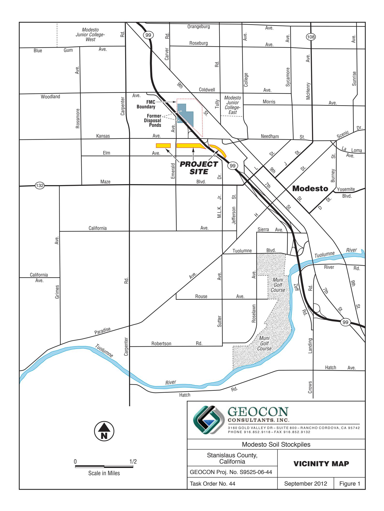

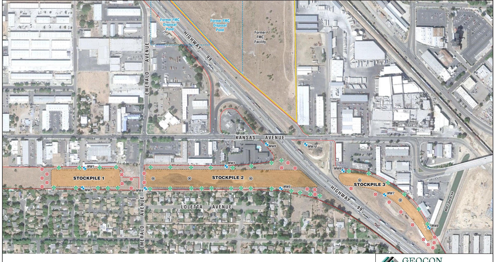

*MW8*

Approximate Monitoring Well Location

State Right-of-Way Boundary

Modesto Irrigation District MID

Proposed Fenceline Boring Location – 5' Maximum Boring Depth

Proposed Perimeter Boring Location – 3' Maximum Boring Depth

Proposed Cadmium Boring Location – 20' Maximum Boring Depth

0 300 Scale in Feet

# GEOCON

CONSULTANTS, INC.

P H O N E 9 1 6 . 8 5 2 . 9 11 8 – FA X 9 1 6 . 8 5 2 . 9 1 3 2 3160 GOLD VALLEY D R – S U I T E 8 0 0 – R A N C H O C O R D O VA , C A 9 5 7 4 2

Modesto Stockpiles

Stanislaus County, California

SITE PLAN

GEOCON Proj. No. S9525-06-44

September 2012

Task Order No. 44 Figure 2

Figure 2

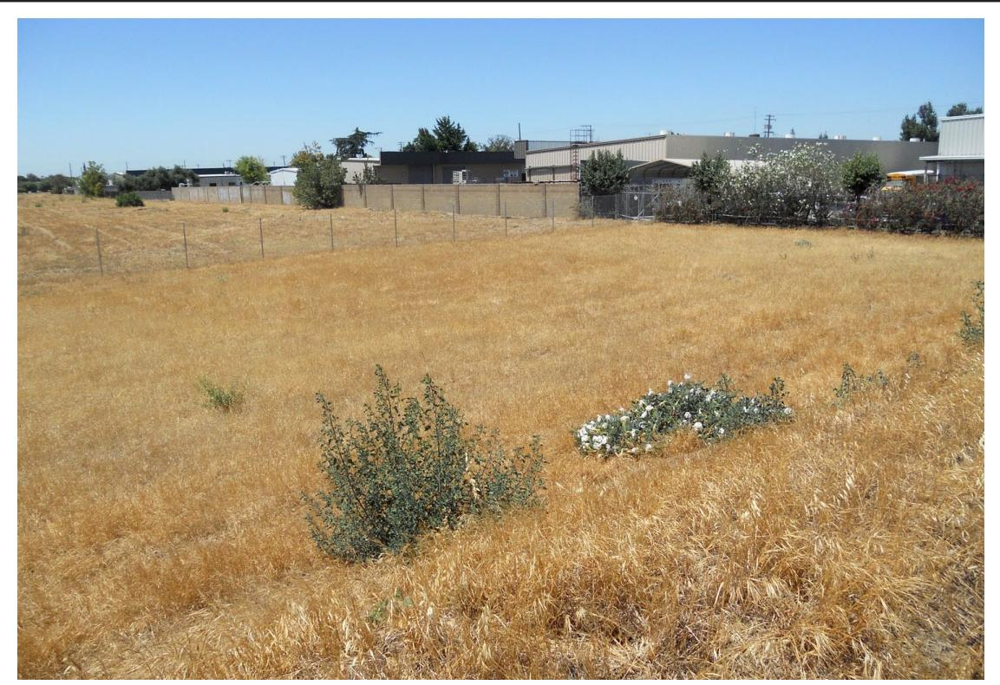

Photo No. 1 West End Stockpile 1

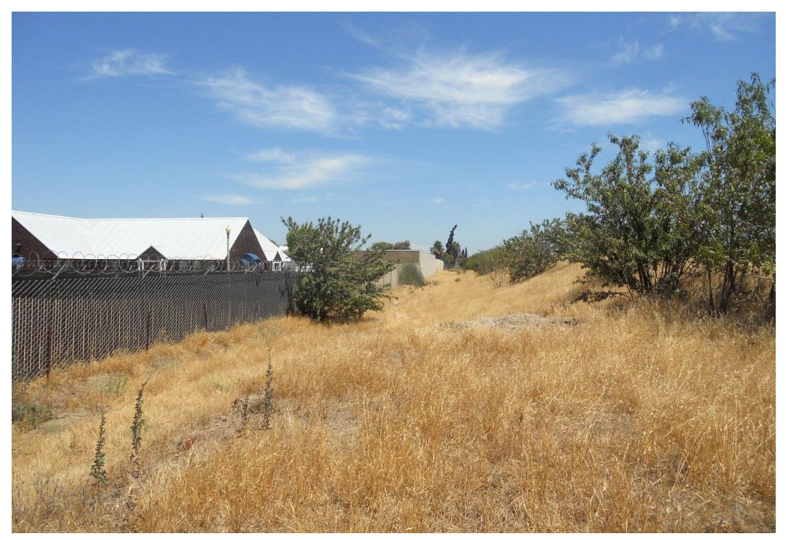

Photo No. 2 North Side Stockpile 1

### PHOTOS NO. 1 & 2

| Modesto Stockpiles           |                                  |
|------------------------------|----------------------------------|
| GEOCON Proj. No. S9525-06-44 | Stanislaus County, California |
| Task Order No. 44            | September 2012                   |

Photo No. 3 South Side Stockpile 1

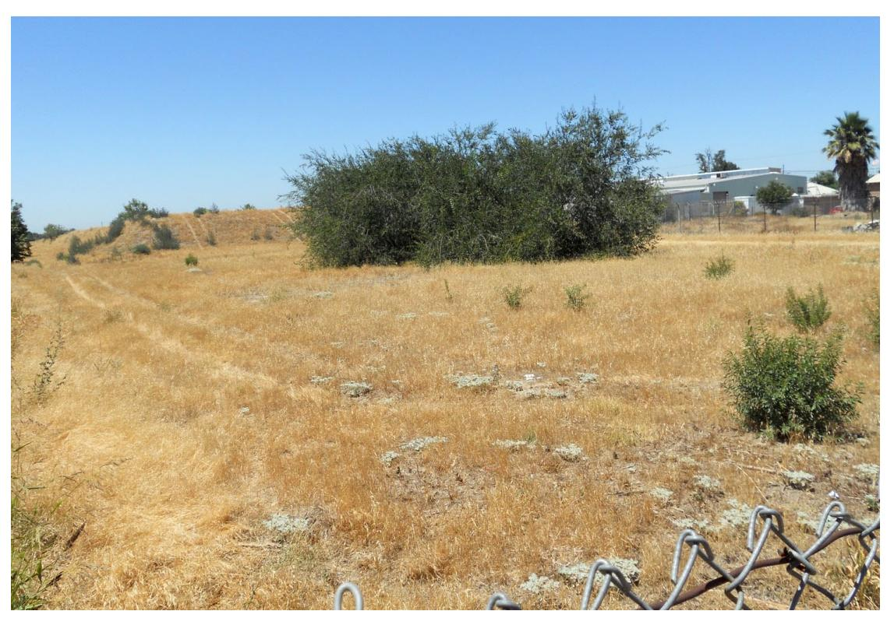

Photo No. 4 East End Stockpile 1 from Emerald Avenue

### PHOTOS NO. 3 & 4

| Modesto Stockpiles           |                                  |
|------------------------------|----------------------------------|
| GEOCON Proj. No. S9525-06-44 | Stanislaus County, California |
| Task Order No. 44            | September 2012                   |

Photo No. 5 West End Stockpile 2 from East End Stockpile 1

Photo No. 6 West End Stockpile Adjacent Emerald Avenue

### PHOTOS NO. 5 & 6

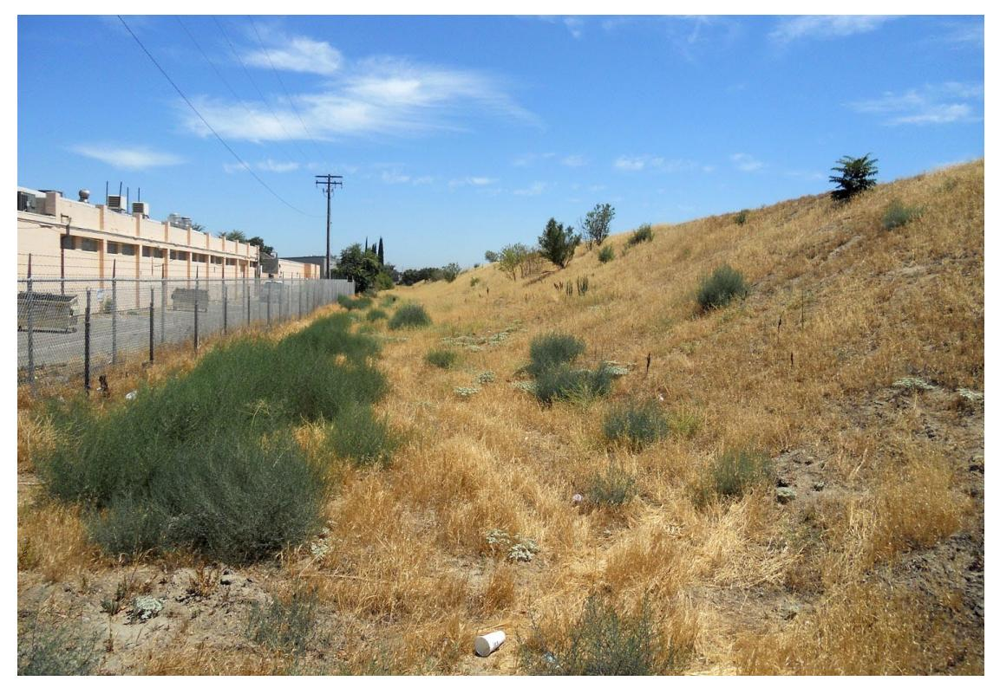

Photo No. 7 North Side Stockpile 2 from Northwestern Corner Adjacent Emerald Avenue

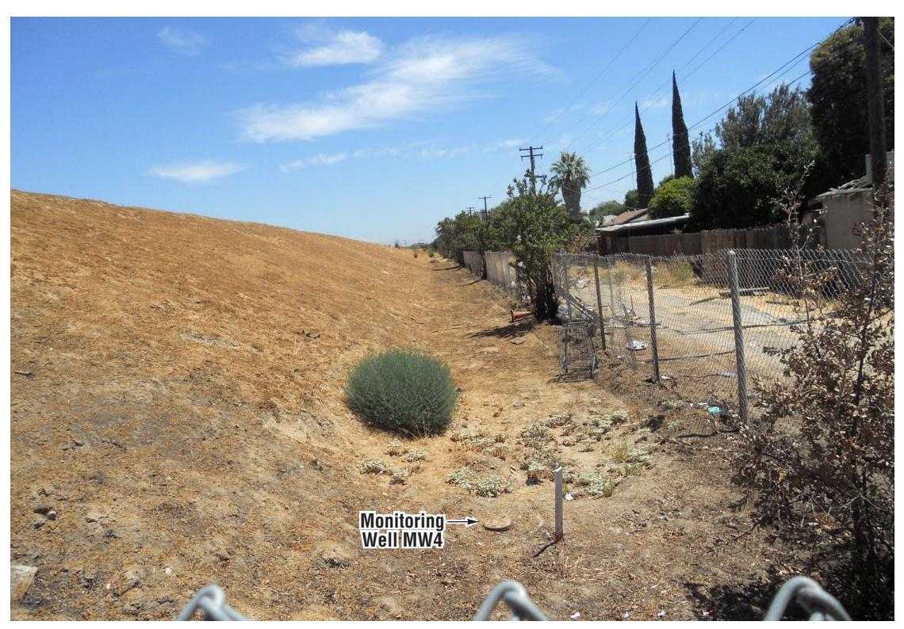

Photo No. 8 South Side Stockpile 2 from Southwestern Corner Adjacent Emerald Avenue

### PHOTOS NO. 7 & 8

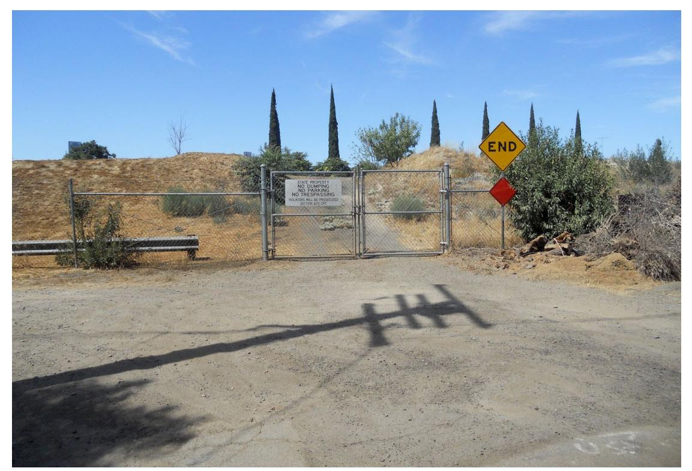

Photo No. 9 Southern Gate to Stockpile 2 from Loletta Avenue

Photo No. 10 South Side Stockpile 2 from Southern Gate

### PHOTOS NO. 9 & 10

| Modesto Stockpiles           |                                  |
|------------------------------|----------------------------------|
| GEOCON Proj. No. S9525-06-44 | Stanislaus County, California |
| Task Order No. 44            | September 2012                   |

Photo No. 11 Northeastern Corner Stockpile 2

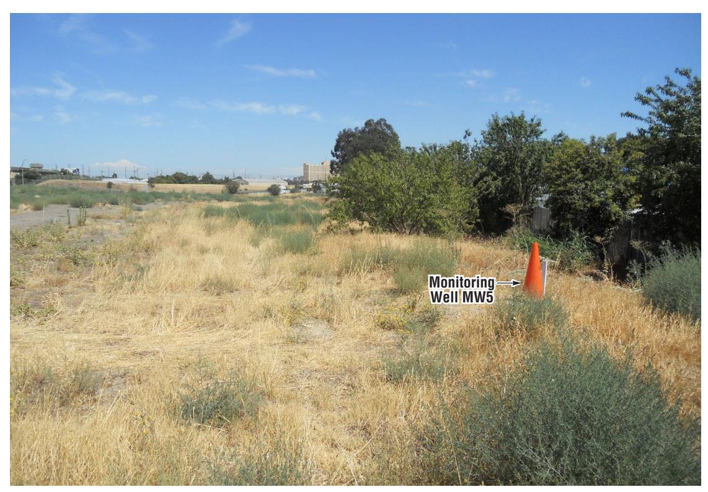

Photo No. 12 Southeastern Corner Stockpile 2

### PHOTOS NO. 11 & 12

| Modesto Stockpiles           |                                  |
|------------------------------|----------------------------------|
| GEOCON Proj. No. S9525-06-44 | Stanislaus County, California |
| Task Order No. 44            | September 2012                   |

Photo No. 13 North Side Stockpile 3

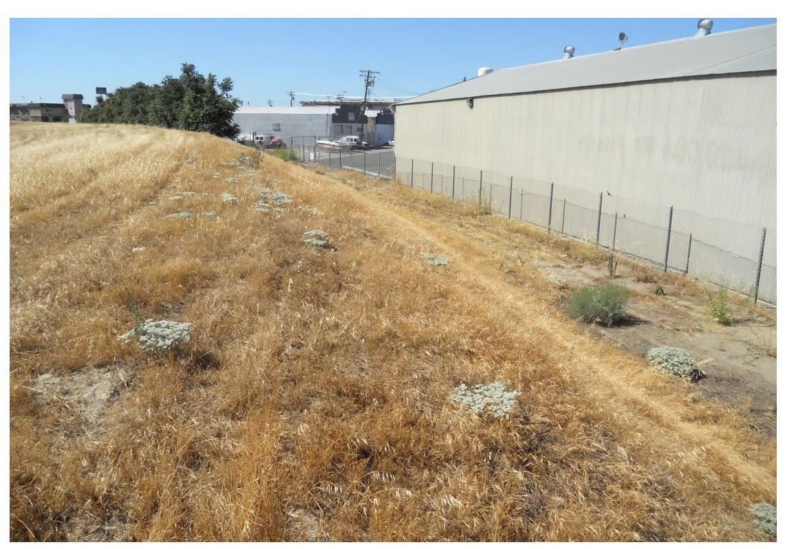

Photo No. 14 Northeast Side Stockpile 3

### PHOTOS NO. 13 & 14

| Modesto Stockpiles           |                                  |
|------------------------------|----------------------------------|
| GEOCON Proj. No. S9525-06-44 | Stanislaus County, California |
| Task Order No. 44            | September 2012                   |

# APPENDIX A

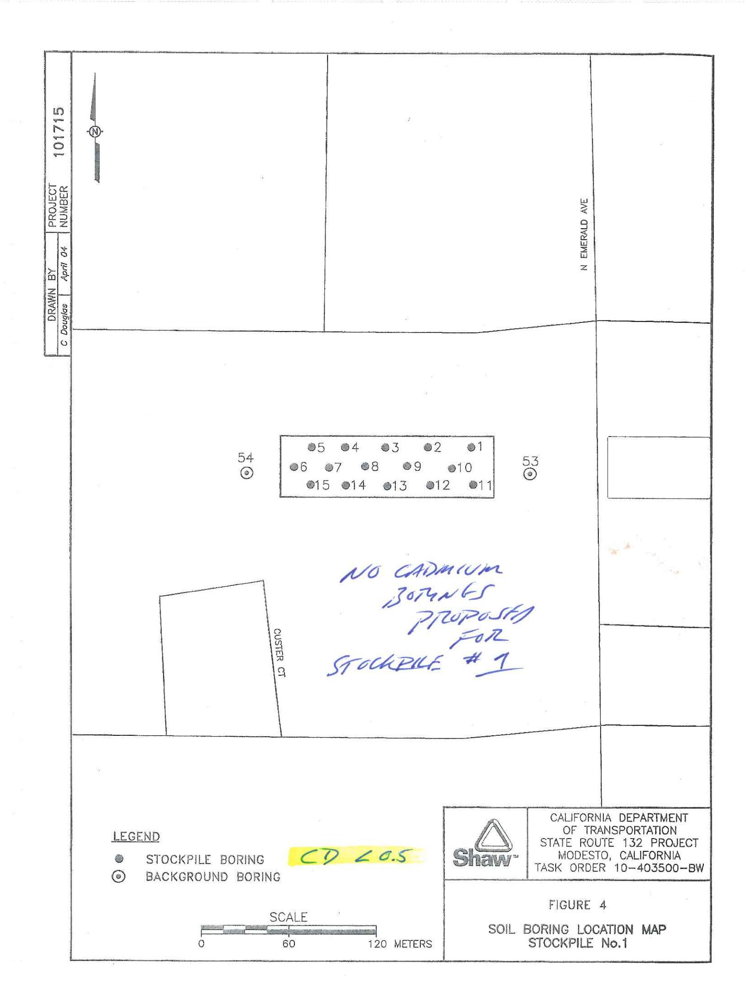

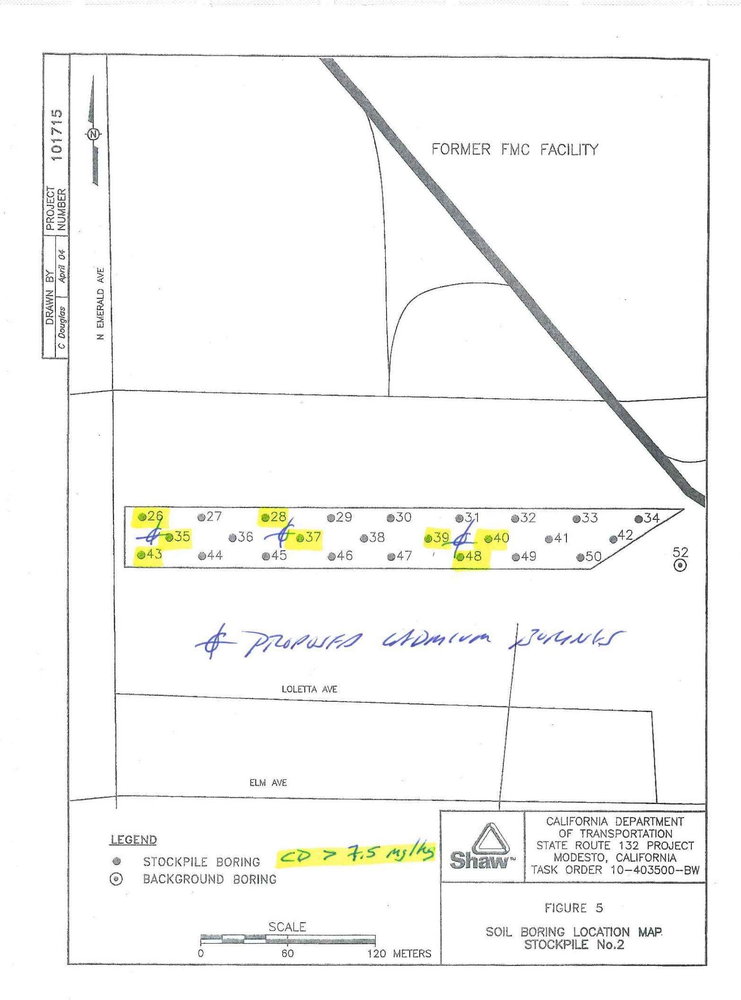

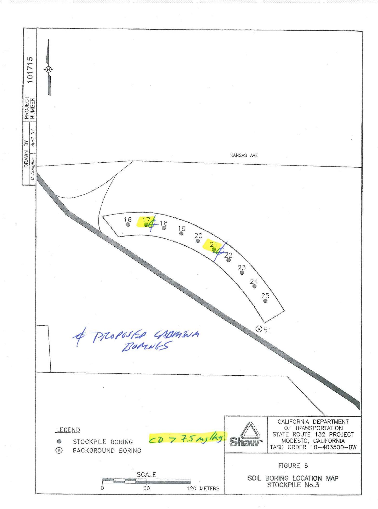

Table 1
Metals Concentrations, Stockpile 1 Samples
Caltrans State Route 132
Modesto, Stanislaus County, California
Task Order 10-403500-BW

|             | Analyte                      | YnomiinA                     | YnomitnA     | Arsenic                 | Arsenic | (68) muins8 | (88) muits8     | Bs -soluble (WET) | Beryllium | mulmbsO    | Chromium   | Сһготіит Сораі <i>і</i> | Copper                                  | Lead      | Mercury   | Molybdenum | Иіскеі   | muinələ8 | Silver    | առիլեմ <u>T</u> | mulbensV | oniz   | lron            | Strontlum |
|-------------|------------------------------|------------------------------|--------------|-------------------------|---------|-------------|-----------------|----------------------|-----------|------------|------------|----------------------------|-----------------------------------------|-----------|-----------|------------|----------|----------|-----------|-----------------|----------|--------|-----------------|-----------|
|             | Units                        | mg/kg                        | mg/kg        | rng/kg                  | mg/kg   | mg/kg       | mg/kg           | mg/l r               | mg/kg m   | mg/kg mg   | вш вуувш   | mg/kg mg/kg                | ка тажа                                 | g mg/kg   | g mg/kg   | g mg/kg    | mg/kg    | mg/kg    | mg/kg     | mg/kg           | mg/kg    | mg/kg  | mg/kg           | mg/kg     |
|             | Analysis Date                | Feb-04                       | May-04       | Feb-04                  | May-04  | Feb-04      | May-04          | Feb-04 N             | May-04 Wa | May-04 Fel | Feb-04 May | May-04 May-04              | -04 May-04                              | 14 May-04 | 04 May-04 | 4 May-04   | 1 May-04 | May-04   | May-04    | May-04          | May-04   | May-04 | Feb-04          | Feb-04    |
| Sample Type |                              |                              |              |                         |         |             |                 |                      |           |            |            |                            |                                         |           |           |            |          |          |           |                 |          |        |                 |           |
| Stockpile   | SR132-01-0.15                | < 6.0                        | <6.0         | × 8.0                   | <8.0    | 50 S        | 114             |                      | <0.30 <   | <0.50      |            | 1.7 7.1                    | 1 12                                    | 5.3       | 0.013     | 3.0        | Ξ        | ×10      | o.1.o     | V40             | 36       | 35     | 15,300          | 49        |
| Stocknile   | SR132-01-3.0                 | V 6.0                        |              | 0.00 V V             |         | 25          |                 |                      |           |            | 2 -        |                            |                                         |           |           |            |          |          |           |                 |          |        | 13,800          | 3 5       |
| Stockpile   | SR132-01-4.5                 | < 6.0                        | <6.0         | < 8.0                   | <8.0    | 447         | 347             |                      | <0.30     | <0.50      |            | 16 6.8                     | 15                                      | 6.1       | <0.010    | 0 <5.0     | 11       | <10      | <1.0      | <10             | 37       | 37     | 15,700          | : #3      |
| er G     | SR132-01-6.0                 | No Sample - Refusal          | le - Refus   | - 1                     |         |             |                 |                      |           |            |            |                            |                                         |           |           |            |          |          |           | -               |          |        |                 |           |
| Stockpile   | SR132-02-0.15                | < 6.0                        | <6.0         | < 8.0                   | ≪8.0    | 136         | <del>1</del> 05 |                      | <0.30     | <0.50      | 9.4        | 11 5.6                     | 9.8                                     | 6.9       | 0.016     | 9.0        | 8.6      | <10      | <1.0      | 8               | R        | 34     | 13,700          | 27        |
| Stockpile   | SR132-02-3.0                 | × 6.0                        |              | < 8.0                   |         | 282         | *               |                      |           | • #1       | 1          |                            |                                         |           |           |            |          |          |           |                 |          |        | 14,500          | 3 8       |
| Stockpile   | SR132-02-4.5                 | < 6.0                        | <6.0         | < 8.0                   | <8.0    | 111         | H               |                      | <0.30     |            |            | 2 62                       | 2 11                                    | 3.7       | <0.010    | 0 <5.0     | 8.5      | 410      | <1.0      | <10             | 37       | 28     | 17,900          | 37        |
| Native      | SR132-02-6.0                 | < 6.0                        | <6.0         | < 8.0                   | <8.0    | 90          | 35              | 20                   |           | <0.50      |            | 4.2 <5.                    | 80                                      | <1.f      |           |            | <4.0     | ×10      | <1.0      | <10             | 21       | 20     | 13,000          | 4         |
| Stockpile   | SR132-03-0.15                | < 6.0                        | ×6.0         | < 8.0                   | <8.0    | 85          | 88              |                      | <0.30     |            | 44 6       | 6 8.8                      | 8                                       | 7         | 0.014     | 65.0       | 12       | V V      | 7.0       | <del>0</del>    | 46       | 37     | 15,600          | 33        |
| Stockpile   | SH132-03-1.5                 | < p.0                        |              | 0.00                    |         | g 6         |                 |                      |           | r          | 71         |                            |                                         |           |           |            |          |          |           |                 |          |        | 14,500          | 6 40      |
| Stockpile   | SH132-03-3.0                 | 0.0 0                        | 04/          | × 6.0                   | 0 %     | 122         | 127             |                      |           |            |            |                            |                                         |           |           |            | 1,4      | 7,0      | 7         | 7               | S.       | 62     | 13,500          | 5 G       |
| Native      | SR132-03-6.0                 | < 6.0                        | ×6.0 ×6.0 | < 8.0                   | 0.8     | 78          | 88              | . 45                 | <0.30     | <0.50      |            | 7.1 6.3                    | 3 82                                    | 8.5       | <0.010    | 65.0       | 4.3      | 95       | 7 7       | 2 8             | 8 8      | 26     | 12,100          | 5 5       |
| Stockpile   | SR132-04-0.15                | < 6.0                        | <6.0         | < 8.0                   | <8.0    | 103         | 171             |                      |           |            |            |                            |                                         |           |           | 1          | 11       | <10      | <1.0      | <10             | 39       | 41     | 13,100          | 41        |
| Stockpile   | SR132-04-1.5                 | < 6.0                        |              | < 8.0                   |         | 26          |                 |                      |           |            |            |                            |                                         |           |           |            |          |          |           |                 |          |        | 13,700          | 46        |
| Stockpile   | SR132-04-3.0                 | < 6.0                        | <6.0         | < 8.0                   | <8.0    | 273         | 262             |                      | <0.30     | <0.50      |            | 13 6.4                     | 4 15                                    | 6.4       | <0.010    | 0 <5.0     | 9.3      | <10      | 7.0       | <10             | 37       | 34     | 17,200          | 42        |
| Native      | SR132-04-4.5                 | < 6.0                        | 9            | 0.87                    | 0       | 99 69       | 8               |                      | 08.97     | 7 050      | 7.7        | 23                         | 7                                       | 40        | 70.010    | 94         | 9        | 7        | 7         | 7               | 22       | 5      | 15,900          | 2, 43     |
| Stocknile   | SR132-05-0.15                | × 6.0                        | e6.0         | < 8.0                   | 88.0    | 100         | 114             |                      |           |            |            |                            |                                         |           |           | 1          | 8.6      | 410      | 0.12      | 95              | 8        | 32     | 12,800          | 28        |
| Stockpile   | SR132-05-1.5                 | < 6.0                        |              | < 8.0                   |         | 63          |                 |                      |           |            |            |                            |                                         |           |           |            |          |          |           |                 |          |        | 13,300          | 19        |
| Stockpile   | SR132-05-3.0                 | < 6.0                        | <6.0         | < 8.0                   | <8.0    | 78          | 106             |                      | <0.30     | <0.50      |            | 13 7.3                     | 3 12                                    | 4.4       | <0.010    | 0 <5.0     | 8.9      | <10      | <1.0      | <10             | 38       | 33     | 15,200          | 33        |
| Native -    | SR132-05-4.5 SR132-05-6.0 | < 6.0 No Samole - Refusal | le - Refus   | < 8.0                   |         | Ε           |                 |                      |           | _          | 5.3        |                            |                                         |           |           |            |          |          |           |                 |          |        | 001,61          | 8         |
| Stockpile   | SR132-06-0.15                | < 6.0                        | <6.0         |                         | <8.0    | 108         | 106             | 45                   | <0.30     | <0.50      |            | 13 6.4                     | 4 11                                    | 23        | 0.027     | 7. <5.0    | 10       | <10      | <1.0      | <10             | 35       | 34     | 14,400          | 45        |
| Stockpile   | SR132-06-1.5                 | < 6.0                        |              | < 8.0                   | 9       | 494         |                 |                      |           |            |            |                            |                                         | 1         |           |            |          |          | ,         |                 | į        | ,      | 15,800          | 53        |
| Stockpile   | SR132-06-3.0                 | < 6.0                        | <6.0         | < 8.0                   | <8.0    | 116         | 130             |                      | <0.30     | 40.50      |            | 12 9.5                     | 11                                      | 3.7       | <0.010    | 0.00       | 91       | <10      | 7.0       | 410             | क्र      | 45     | 16,700          | 230       |
| Native      | SR132-06-4.5 SR132-06-6.0 | < 6.0                        |              | < 8.0 < 8.0 < 8.0 |         | 66 192   |                 |                      |           |            | 10         |                            |                                         |           |           |            |          |          |           |                 |          |        | 8,130 17,500 | 8 8       |
| Stockpile   | SR132-07-0.15                | < 6.0                        | <6.0         | < 8.0                   | <8.0    | 150         | 257             |                      | <0.30 <   | <0.50      |            | 11 5.3                     | 5 15                                    | 26        | 0.014     | 62.0       | 12       | <10      | 0.0       | <10             | 31       | 40     | 16,400          | 42        |
| Stockpile   | SR132-07-1.5                 | < 6.0                        | ģ            | 0.8                     | 9       | 59          | **              |                      | 08.0      | ,          | 1.4        | 12 7.1                     |                                         | u         | 0000      | 4          | ÷        | 5        | 7         | 5               | 66       | 22     | 001,21          | 82 88     |
| Native      | SR132-07-4.5                 | × 6.0                        | 200          | < 8.0                   | 30      | 25          |                 |                      |           |            |            |                            |                                         | 9         |           |            |          | 2        | 2         | 2               | 3        | 3      | 13,400          | 3 8       |
| Native      | SR132-07-6.0                 | < 6.0                        | <6.0         | < 8.0                   | <8.0    | 28          | 48              |                      | <0.30     | <0.50 4    |            | 5.6 <5.0                   | .0 4.9                                  | 3.7       | <0.010    | 0 <5.0     | <4.0     | <10      | 0.5       | <10             | 35       | 20     | 9,810           | 20        |
| Stockpile   | SR132-08-0.15                | < 6.0                        | <6.0         | < 8.0                   | <8.0    | 34          | 87              |                      |           |            |            |                            |                                         |           |           |            | හ ල   | √ V   | Q. √.0 | √10 √10      | 8        | 30     | 14,000          | 47        |
| Stockpile   | SR132-08-1.5 SR132-08-1.5 | < 6.0 < 6.0               |              | 0.87                    |         | 3 5         |                 |                      |           | #F         | 13         |                            |                                         |           |           |            |          |          |           |                 |          |        | 16,600          | 3 6       |
| Stocknile   | SR132-08-4.5                 | × 6.0                        | <6.0         | < 8.0                   | <8.0    | 85          | 93              |                      |           |            |            |                            |                                         |           |           |            | 7.5      | <10      | 0.0       | <10             | 8        | 27     | 16,400          | 180       |
| Native      | SR132-08-6.0                 | < 6.0                        | <6.0         | < 8.0                   | <8.0    | 128         | 112             |                      | <0.30 <   |            |            | 11 11                      | 1 12                                    | 2.0       | <0.010    | 0 <5.0     | 8.0      | <10      | <1.0      | <10             | 20       | 59     | 27,200          | 79        |
| Stockpile   | SR132-09-0.15                | < 6.0                        | <6.0         | < 8.0                   | <8.0    | 108         | 151             | 900                  | - 23      |            |            | 16 8.4                     |                                         |           |           | 0000       | 13       | <10      | <1.0      | <10             | 39       | 38     | 15,000          | 22        |
| Stockpile   | SR132-09-1.5                 | < 6.0                        |              | < 8.0                   |         | 61          |                 |                      |           |            | 3.3        | 55                         |                                         |           |           |            |          |          |           |                 |          |        | 13,100          | 62 :      |
| Stockpile   | SR132-09-3.0                 | × 6.0                        | ç            | 0,80                    | ç       | 160         | 10              | × (                  |           |            |            |                            |                                         |           |           |            | Ċ        | Ţ        | 7         | 7               | c        | 5      | 001,61          | £ 5       |
| Stockpire   | SR132-09-4.5                 | 0.0 v                        | 0.09         | × 0.0 × 8.0          | <8.0    | 14.         | 9               |                      | <0.30     | <0.50      | 18 8       | 8.0 6.5                    | 27.7.7.7.7.7.7.7.7.7.7.7.7.7.7.7.7.7.7. | 3.3       | <0.010    | 0.5        | 6.0      | 95       | 0.10      | 200             | 37       | 27     | 19.100          | 3 52      |
| Stockpile   | SR132-10-0.15                | < 6.0                        | <6.0         | < 8.0                   | <8.0    | 168         | 102             |                      |           |            |            |                            | 2                                       |           |           | -          | 9        | Q₽       | <1.0      | Q10             | 37       | 34     | 18,400          | 89        |
| Stockpile   | SR132-10-1.5                 | < 6.0                        | ž            | < 8.0                   |         | 139         |                 |                      |           |            | 16         |                            |                                         |           |           |            |          |          |           |                 |          |        | 17,300          | 61        |
| Stockpile   | SR132-10-3.0                 | < 6.0                        | ç            | × 8.0                   | ç       | S 5         |                 |                      |           |            |            |                            |                                         | Č         |           |            | Ş        | Š        | ,         | ç               | ć        | ć      | 13,000          | 젊 :       |
| olocypiie . | SR132-10-6.0                 | No Sample - Refusal          | co.v         | o'o y                   | V0.0    | 2           | 00              |                      | 00.00     | 00.05      |            | 0.0                        | 2                                       | 4.2       | <0.010    | 0.00       | 7        | 2        | 0.15      | 012             | S.       | Š      | 16,800          | D.        |
|             |                              |                              |              | 04:                     |         |             |                 |                      |           |            |            |                            |                                         |           |           |            |          |          | 1         |                 |          |        |                 |           |

## Metals Concentrations, Stockpile 1 Samples Caltrans State Route 132 Modesto, Stanislaus County, California Task Order 10-403500-BW

| Sample Type                  | Designation     | Antimony |         | Antimony |        | Arsenic |        | Barium (Ba) |        | Barium (Ba) |        | Ba -soluble (WET) |        | Beryllium |        | Chromium |        | Chromium |        | Cobalt |         | Copper  |        | Lead   |        | Mercury |        | Nickel |        | Selenium |        | Silver |        | Thallium |        | Vanadium |       | Zinc |  | Strontium |  |
|------------------------------|-----------------|----------|---------|----------|--------|---------|--------|-------------|--------|-------------|--------|----------------------|--------|-----------|--------|----------|--------|----------|--------|--------|---------|---------|--------|--------|--------|---------|--------|--------|--------|----------|--------|--------|--------|----------|--------|----------|-------|------|--|-----------|--|
|                              |                 | mg/kg    | mg/kg   | mg/kg    | mg/kg  | mg/kg   | mg/kg  | mg/kg       | mg/kg  | mg/kg       | mg/kg  | mg/kg                | mg/kg  | mg/kg     | mg/kg  | mg/kg    | mg/kg  | mg/kg    | mg/kg  | mg/kg  | mg/kg   | mg/kg   | mg/kg  | mg/kg  | mg/kg  | mg/kg   | mg/kg  | mg/kg  | mg/kg  | mg/kg    | mg/kg  | mg/kg  | mg/kg  | mg/kg    | mg/kg  | mg/kg    | mg/kg |      |  |           |  |
| Analysis Date                | Feb-04          | May-04   | Feb-04  | May-04   | Feb-04 | May-04  | Feb-04 | May-04      | Feb-04 | May-04      | Feb-04 | May-04               | Feb-04 | May-04    | Feb-04 | May-04   | Feb-04 | May-04   | Feb-04 | May-04 | Feb-04  | May-04  | Feb-04 | May-04 | Feb-04 | May-04  | Feb-04 | May-04 | Feb-04 | May-04   | Feb-04 | May-04 | Feb-04 | May-04   | Feb-04 | May-04   |       |      |  |           |  |
| Sample                       |                 |          |         |          |        |         |        |             |        |             |        |                      |        |           |        |          |        |          |        |        |         |         |        |        |        |         |        |        |        |          |        |        |        |          |        |          |       |      |  |           |  |
| Type                         | Designation     |          |         |          |        |         |        |             |        |             |        |                      |        |           |        |          |        |          |        |        |         |         |        |        |        |         |        |        |        |          |        |        |        |          |        |          |       |      |  |           |  |
| Stockpile                    | SR132-11-0.15   | < 6.0    | <6.0    | < 8.0    | <8.0   | 114     | 105    |             | <0.30  | <0.50       | 12     | 14                   | 7.6    | 14        | 26     | 0.060    | <5.0   | 11       | 40     | <1.0   | 38      | 14,700  | 49     |        |        |         |        |        |        |          |        |        |        |          |        |          |       |      |  |           |  |
| Stockpile                    | SR132-11-1.5    | < 6.0    |         | < 8.0    |        | 120     |        |             |        |             | 12     |                      |        |           |        |          |        |          |        |        |         |         | 15,300 | 46     |        |         |        |        |        |          |        |        |        |          |        |          |       |      |  |           |  |
| Stockpile                    | SR132-11-3.0    | < 6.0    |         | < 8.0    |        | 142     |        |             |        |             | 11     |                      |        |           |        |          |        |          |        |        |         |         | 13,400 | 43     |        |         |        |        |        |          |        |        |        |          |        |          |       |      |  |           |  |
| Stockpile                    | SR132-11-4.5    | < 6.0    | <6.0    | < 8.0    | <8.0   | 100     | 150    |             | <0.30  |             |        | 7.3                  | 9.1    | 9.2       | 2.0    | <0.010   | 6.7    | <1.0     | 34     | 16,600 | 51      |         |        |        |        |         |        |        |        |          |        |        |        |          |        |          |       |      |  |           |  |
| Stockpile                    | SR132-11-6.0    | < 6.0    | <6.0    | < 8.0    | <8.0   | 58      | 69     |             | <0.30  |             |        | 8.2                  | 7.3    | 9.1       | 2.0    | <0.010   | 6.7    | <1.0     | 33     | 12,100 | 43      |         |        |        |        |         |        |        |        |          |        |        |        |          |        |          |       |      |  |           |  |
| Stockpile                    | SR132+12-0.15   | < 6.0    | <6.0    | < 8.0    | <8.0   | 80      | 74     |             |        | <0.50       |        |                      |        |           |        |          |        | <1.0     | 25     | 13,900 | 30      |         |        |        |        |         |        |        |        |          |        |        |        |          |        |          |       |      |  |           |  |
| Stockpile                    | SR132-12-1.5    | < 6.0    |         | < 8.0    |        | 119     |        |             |        |             | 12     |                      |        |           |        |          |        |          |        |        |         |         | 17,700 | 41     |        |         |        |        |        |          |        |        |        |          |        |          |       |      |  |           |  |
| Stockpile                    | SR132-12-3.0    | < 6.0    |         | < 8.0    |        | 52      |        |             |        |             | 7      |                      |        |           |        |          |        |          |        |        |         |         | 9,300  | 22     |        |         |        |        |        |          |        |        |        |          |        |          |       |      |  |           |  |
| Stockpile                    | SR132-12-4.5    | < 6.0    | <6.0    | < 8.0    | <8.0   | 92      | 134    |             | <0.30  |             |        | 5.6                  | 5.8    | 6.1       | 1.9    | <0.010   | 4.5    | <1.0     | 27     | 13,000 | 125     |         |        |        |        |         |        |        |        |          |        |        |        |          |        |          |       |      |  |           |  |
| Stockpile                    | SR132-12-6.0    | < 6.0    | <6.0    | < 8.0    | <8.0   | 84      | 78     |             | <0.30  | <0.50       | 5.6    | 5.8                  | 6.1    | 1.9       | <0.010 | 4.5      | <1.0   | 30       | 13,600 | 47     |         |         |        |        |        |         |        |        |        |          |        |        |        |          |        |          |       |      |  |           |  |
| Stockpile                    | SR132-13-0.15   | < 6.0    | <6.0    | < 8.0    | <8.0   | 195     | 154    |             | <0.30  | <0.50       | 15     | 6.3                  | 9.5    | 15        | 32     | <0.010   | <5.0   | <1.0     | 44     | 15,000 | 44      |         |        |        |        |         |        |        |        |          |        |        |        |          |        |          |       |      |  |           |  |
| Stockpile                    | SR132-13-1.5    | < 6.0    |         | < 8.0    |        | 80      |        |             |        |             | 9.5    |                      |        |           |        |          |        |          |        |        |         |         | 11,500 | 60     |        |         |        |        |        |          |        |        |        |          |        |          |       |      |  |           |  |
| Stockpile                    | SR132-13-3.0    | < 6.0    |         | < 8.0    |        | 414     |        |             |        |             | 9.5    |                      |        |           |        |          |        |          |        |        |         |         | 14,100 | 63     |        |         |        |        |        |          |        |        |        |          |        |          |       |      |  |           |  |
| Stockpile                    | SR132-13-4.5    | < 6.0    | <6.0    | < 8.0    | <8.0   | 117     | 102    |             | <0.30  | <0.50       | 9.9    | 9.3                  | 9.8    | 8.9       | 2.9    | <0.010   | 5.5    | <1.0     | 31     | 14,700 | 207     |         |        |        |        |         |        |        |        |          |        |        |        |          |        |          |       |      |  |           |  |
| Stockpile                    | SR132-13-6.0    | < 6.0    | <6.0    | < 8.0    | <8.0   | 104     | 100    |             | <0.30  | <0.50       | 9.0    | 7.0                  | 8.3    | 15        | 182    | 0.037    | <5.0   | <1.0     | 36     | 15,700 | 52      |         |        |        |        |         |        |        |        |          |        |        |        |          |        |          |       |      |  |           |  |
| Stockpile                    | SR132-14-0.15   | <6.0     | <6.0    | < 8.0    | <8.0   | 370     | 322    |             | <0.30  | <0.50       | 15     | 6.5                  | 6.8    | 21        | 192    | 0.037    | <5.0   | <1.0     | 34     | 16,700 | 51      |         |        |        |        |         |        |        |        |          |        |        |        |          |        |          |       |      |  |           |  |
| Stockpile                    | SR132-14-1.5    | < 6.0    |         | < 8.0    |        | 1,730   |        | 15.3        |        |             | 11     |                      |        |           |        |          |        |          |        |        |         |         | 14,100 | 54     |        |         |        |        |        |          |        |        |        |          |        |          |       |      |  |           |  |
| Stockpile                    | SR132-14-3.0    | < 6.0    | <6.0    | < 8.0    | <8.0   | 106     | 113    |             | <0.30  | <0.50       | 12     | 9.9                  | 11     | 15        | 2.9    | 0.011    | <5.0   | <1.0     | 38     | 15,800 | 43      |         |        |        |        |         |        |        |        |          |        |        |        |          |        |          |       |      |  |           |  |
| Stockpile                    | SR132-14-4.5    | < 6.0    |         | < 8.0    |        | 76      |        |             |        |             | 9.9    |                      |        |           |        |          |        |          |        |        |         |         | 15,000 | 98     |        |         |        |        |        |          |        |        |        |          |        |          |       |      |  |           |  |
| Stockpile                    | SR132-14-6.0    | < 6.0    | <6.0    | < 8.0    | <8.0   | 77      | 11     |             | <0.30  | <0.50       | 12     | 9.9                  | 11     | 16        | 20     | 0.064    | <5.0   | <1.0     | 47     | 12,900 | 89      |         |        |        |        |         |        |        |        |          |        |        |        |          |        |          |       |      |  |           |  |
| Stockpile                    | SR132-15-0.15   | < 6.0    | <6.0    | < 8.0    | <8.0   | 130     | 121    |             | <0.30  | <0.50       | 12     | 9.9                  | 11     | 16        | 20     | 0.064    | <5.0   | <1.0     | 47     | 17,900 | 79      |         |        |        |        |         |        |        |        |          |        |        |        |          |        |          |       |      |  |           |  |
| Stockpile                    | SR132-15-1.5    | < 6.0    |         | < 8.0    |        | 314     |        |             |        |             | 7.9    |                      |        |           |        |          |        |          |        |        |         |         | 13,000 | 47     |        |         |        |        |        |          |        |        |        |          |        |          |       |      |  |           |  |
| Native                       | SR132-15-3.0    | < 6.0    | <6.0    | < 8.0    | <8.0   | 135     | 108    |             | <0.30  | <0.50       | 11     | 8.4                  | 8.6    | 1.6       | <0.010 | <5.0     | <1.0   | 40       | 18,100 | 146    |         |         |        |        |        |         |        |        |        |          |        |        |        |          |        |          |       |      |  |           |  |
| Native                       | SR132-15-4.5    | < 6.0    |         | < 8.0    |        | 312     |        |             |        |             | 9.2    |                      |        |           |        |          |        |          |        |        |         |         | 23,400 | 119    |        |         |        |        |        |          |        |        |        |          |        |          |       |      |  |           |  |
| Native                       | SR132-15-6.0    | < 6.0    |         | < 8.0    |        | 110     |        |             |        |             | 6.7    |                      |        |           |        |          |        |          |        |        |         |         | 14,600 | 38     |        |         |        |        |        |          |        |        |        |          |        |          |       |      |  |           |  |
| Summary Statistics           |                 |          |         |          |        |         |        |             |        |             |        |                      |        |           |        |          |        |          |        |        |         |         |        |        |        |         |        |        |        |          |        |        |        |          |        |          |       |      |  |           |  |
| Maximum                      | <0.0            | <0.0     | <0.0    | <0.0     | 1,730  | 347     | 15.3   | <0.30       | <0.50  | 16          | 11     | 9.2                  | 16     | 192       | 0.064  | <5.0     | <1.0   | 50       | 68     | 27,200 | 231     |         |        |        |        |         |        |        |        |          |        |        |        |          |        |          |       |      |  |           |  |
| Mean                         | NA              | NA       | NA      | NA       | 123    | NA      | NA     | NA          | NA     | 10.7        | 11.4   | 8.4                  | 13.6   | 12.5      | NA     | NA       | NA     | 35.7     | 50     | 14,996 | 58.4    |         |        |        |        |         |        |        |        |          |        |        |        |          |        |          |       |      |  |           |  |
| Referra for Solubles Testing |                 |          |         |          |        |         |        |             |        |             |        |                      |        |           |        |          |        |          |        |        |         |         |        |        |        |         |        |        |        |          |        |        |        |          |        |          |       |      |  |           |  |
| 20xTCLP (mg/kg)              |                 | 150      | 150     | 100      | 100    | 500     | 500    | 50          | 50     | 50          | 250    | 250                  | 50     | 50        | 2,500  | 500      | 200    | 50       | 700    | 240    | 2,500   |         |        |        |        |         |        |        |        |          |        |        |        |          |        |          |       |      |  |           |  |
| California                   | 10xTCLP (mg/kg) | 300      | 300     | 200      | 200    | 1,000   | 1,000  | 7.5         | 10     | 100         | 100    | 1,000                | 1,000  | 200       | 200    | 4,000    | 1,000  | 400      | 100    | 1,400  | 480     | 5,000   |        |        |        |         |        |        |        |          |        |        |        |          |        |          |       |      |  |           |  |
| TTLC (mg/kg)                 |                 | 500      | 500     | 500      | 500    | 10,000  | 10,000 | 75          | 100    | 100         | 5.0    | 5.0                  | 80     | 25        | 2,500  | 500      | 20     | 5.0      | 700    | 24     | 2,500   |         |        |        |        |         |        |        |        |          |        |        |        |          |        |          |       |      |  |           |  |
| TCLP (mg/l)                  | 15              | 15       | 5       | 5        | 100    | 100     | 0.75   | 1.0         | 5.0    | 5.0         | 80     | 25                   | 5.0    | 0.2       | 350    | 20       | 5.0    | 7.0      | 24     | 250    |         |         |        |        |        |         |        |        |        |          |        |        |        |          |        |          |       |      |  |           |  |
| HCRA (Federal) TCLP (mg/l)   |                 |          |         |          |        |         |        |             |        |             |        |                      |        |           |        |          |        |          |        |        |         |         |        |        |        |         |        |        |        |          |        |        |        |          |        |          |       |      |  |           |  |
| PRG - Industrial (mg/kg)     | 410             | 410      | 0.39/22 | 0.39/22  | 29,000 | 29,000  | NE     | 1,900       | 450    | 450         | 1,900  | 41,000               | 750    | 310       | 5,100  | 20,000   | 5,100  | 5,100    | 29     | 7,200  | 100,000 | 100,000 |        |        |        |         |        |        |        |          |        |        |        |          |        |          |       |      |  |           |  |
| PRG - Residential (mg/kg)    | 31              | 31       | 1.6/260 | 1.6/260  | 5,400  | 5,400   | NE     | 37          | 210    | 210         | 150    | 300                  | 750    | 390       | 1,500  | 5,100    | 5,100  | 5.2      | 220    | 23,000 | 47,000  |         |        |        |        |         |        |        |        |          |        |        |        |          |        |          |       |      |  |           |  |

mg/kg = milligrams per kilogram mg/l = milligrams per liter

$$\text{TCL: } \le \text{ Less than the Detection Limit for Reporting Purposes. }$$

$$\text{TCLP: } \le \text{ Less than the Detection Limit for Reporting Purposes. }$$
c = Less than the Defection Limit for Reporting Purposes. TTLC = Total Threshold Limit Concentration. STLC = Soluble Threshold Limit Concentration.

TCLP = Toxicity Characteristic Leaching Procedure.

RCRA = Resource Conservation Recovery Act.

Bolt: exceeds Hazardous Waste Threshold by either TTLC, STLC, or TCLP. Italics: exceed PRG.

PRG = Preliminary Rediation Goal established by the EPA, Region 9 (2002). PRD listed for Industrial and Residential uses. PRG for ansurio is for the cancer / non-cancer emboint. PRG for chromium is for total chromium.

PPG for chemicals is for total chromium.
PPG for chemicals is for total chromium.

PRG for nickel is for soluble nickel salts.

NE = Not Established

NA = Not Applicable

The following are the results of the analysis of the data:

| <strong>Labels</strong> | <strong>Values</strong> |
|-------------------------|-------------------------|
| Mean                    | 1.00                    |
| Standard Deviation      | 0.00                    |
| Minimum                 | 1.00                    |
| Maximum                 | 1.00                    |

This analysis was performed on the data collected from the experiment.

It was found that the mean value was 1.00, with a standard deviation of 0.00. The minimum and maximum values were also both 1.00.

This indicates that the data is highly consistent and there is no variability.

Further analysis may be required to determine the cause of this consistency.

MA = Not Applicable
Mean was calculated for an analyte if more than 50 percent of the samples had defectable concentrations.
A value of half the detection limit was given to samples that were reported as below the detection for the mean calculation.

| Analyte      | Units | Analysis Date | Sample Type | Sample Designation | Feb-04    | May-04    | Feb-04    | May-04    | Feb-04    | May-04    | Feb-04    | May-04    | Feb-04    | May-04    | Feb-04    | May-04    | Feb-04    | May-04    | Feb-04    | May-04    | Feb-04    | May-04    | Feb-04    | May-04    | Feb-04    | May-04    | Feb-04    | May-04    | Feb-04    | May-04    | Feb-04    | May-04    | Feb-04    | May-04    | Feb-04    | May-04    | Feb-04    | May-04    | Feb-04    | May-04    | Feb-04    | May-04    | Feb-04    | May-04    | Feb-04    | May-04    |        |        |  |  |  |
|--------------|-------|---------------|-------------|--------------------|-----------|-----------|-----------|-----------|-----------|-----------|-----------|-----------|-----------|-----------|-----------|-----------|-----------|-----------|-----------|-----------|-----------|-----------|-----------|-----------|-----------|-----------|-----------|-----------|-----------|-----------|-----------|-----------|-----------|-----------|-----------|-----------|-----------|-----------|-----------|-----------|-----------|-----------|-----------|-----------|-----------|-----------|--------|--------|--|--|--|
| Barium (Ba)  | mg/kg | Feb-04        | Stockpile   | SR132-26-0.15      | 106       |           |           |           |           |           |           |           |           |           |           |           |           |           |           |           |           |           |           |           |           |           |           |           |           |           |           |           |           |           |           |           |           |           |           |           |           |           |           |           |           |           |        |        |  |  |  |
| Barium (Ba)  | mg/kg | May-04        | Stockpile   | SR132-26-1.5       |           | 61        |           |           |           |           |           |           |           |           |           |           |           |           |           |           |           |           |           |           |           |           |           |           |           |           |           |           |           |           |           |           |           |           |           |           |           |           |           |           |           |           |        |        |  |  |  |
| Barium (Ba)  | mg/kg | Feb-04        | Stockpile   | SR132-26-3.0       |           |           | 78        |           |           |           |           |           |           |           |           |           |           |           |           |           |           |           |           |           |           |           |           |           |           |           |           |           |           |           |           |           |           |           |           |           |           |           |           |           |           |           |        |        |  |  |  |
| Barium (Ba)  | mg/kg | May-04        | Stockpile   | SR132-26-4.5       |           |           |           | 5,180     |           |           |           |           |           |           |           |           |           |           |           |           |           |           |           |           |           |           |           |           |           |           |           |           |           |           |           |           |           |           |           |           |           |           |           |           |           |           |        |        |  |  |  |
| Barium (Ba)  | mg/kg | Feb-04        | Stockpile   | SR132-26-6.0       |           |           |           |           | 95        |           |           |           |           |           |           |           |           |           |           |           |           |           |           |           |           |           |           |           |           |           |           |           |           |           |           |           |           |           |           |           |           |           |           |           |           |           |        |        |  |  |  |
| Barium (Ba)  | mg/kg | May-04        | Stockpile   | SR132-27-0.15      |           |           |           |           | 129       |           |           |           |           |           |           |           |           |           |           |           |           |           |           |           |           |           |           |           |           |           |           |           |           |           |           |           |           |           |           |           |           |           |           |           |           |           |        |        |  |  |  |
| Barium (Ba)  | mg/kg | Feb-04        | Stockpile   | SR132-27-1.5       |           |           |           |           |           | 87        |           |           |           |           |           |           |           |           |           |           |           |           |           |           |           |           |           |           |           |           |           |           |           |           |           |           |           |           |           |           |           |           |           |           |           |           |        |        |  |  |  |
| Barium (Ba)  | mg/kg | May-04        | Stockpile   | SR132-27-3.0       |           |           |           |           |           |           | 131       |           |           |           |           |           |           |           |           |           |           |           |           |           |           |           |           |           |           |           |           |           |           |           |           |           |           |           |           |           |           |           |           |           |           |           |        |        |  |  |  |
| Barium (Ba)  | mg/kg | Feb-04        | Stockpile   | SR132-27-4.5       |           |           |           |           |           |           |           | 212       |           |           |           |           |           |           |           |           |           |           |           |           |           |           |           |           |           |           |           |           |           |           |           |           |           |           |           |           |           |           |           |           |           |           |        |        |  |  |  |
| Barium (Ba)  | mg/kg | May-04        | Stockpile   | SR132-27-6.0       |           |           |           |           |           |           |           |           | 75        |           |           |           |           |           |           |           |           |           |           |           |           |           |           |           |           |           |           |           |           |           |           |           |           |           |           |           |           |           |           |           |           |           |        |        |  |  |  |
| Barium (Ba)  | mg/kg | Feb-04        | Stockpile   | SR132-28-0.15      |           |           |           |           |           |           |           |           | 131       |           |           |           |           |           |           |           |           |           |           |           |           |           |           |           |           |           |           |           |           |           |           |           |           |           |           |           |           |           |           |           |           |           |        |        |  |  |  |
| Barium (Ba)  | mg/kg | May-04        | Stockpile   | SR132-28-1.5       |           |           |           |           |           |           |           |           |           | 356       |           |           |           |           |           |           |           |           |           |           |           |           |           |           |           |           |           |           |           |           |           |           |           |           |           |           |           |           |           |           |           |           |        |        |  |  |  |
| Barium (Ba)  | mg/kg | Feb-04        | Stockpile   | SR132-28-3.0       |           |           |           |           |           |           |           |           |           |           | 1,650     |           |           |           |           |           |           |           |           |           |           |           |           |           |           |           |           |           |           |           |           |           |           |           |           |           |           |           |           |           |           |           |        |        |  |  |  |
| Barium (Ba)  | mg/kg | May-04        | Stockpile   | SR132-28-4.5       |           |           |           |           |           |           |           |           |           |           |           | 5,200     |           |           |           |           |           |           |           |           |           |           |           |           |           |           |           |           |           |           |           |           |           |           |           |           |           |           |           |           |           |           |        |        |  |  |  |
| Barium (Ba)  | mg/kg | Feb-04        | Stockpile   | SR132-28-6.0       |           |           |           |           |           |           |           |           |           |           |           |           | 1,140     |           |           |           |           |           |           |           |           |           |           |           |           |           |           |           |           |           |           |           |           |           |           |           |           |           |           |           |           |           |        |        |  |  |  |
| Barium (Ba)  | mg/kg | May-04        | Native      | SR132-29-0.15      |           |           |           |           |           |           |           |           |           |           |           |           |           | 7.6       |           |           |           |           |           |           |           |           |           |           |           |           |           |           |           |           |           |           |           |           |           |           |           |           |           |           |           |           |        |        |  |  |  |
| Barium (Ba)  | mg/kg | Feb-04        | Stockpile   | SR132-29-1.5       |           |           |           |           |           |           |           |           |           |           |           |           |           |           | 2,300     |           |           |           |           |           |           |           |           |           |           |           |           |           |           |           |           |           |           |           |           |           |           |           |           |           |           |           |        |        |  |  |  |
| Barium (Ba)  | mg/kg | May-04        | Stockpile   | SR132-29-3.0       |           |           |           |           |           |           |           |           |           |           |           |           |           |           |           | 37.4      |           |           |           |           |           |           |           |           |           |           |           |           |           |           |           |           |           |           |           |           |           |           |           |           |           |           |        |        |  |  |  |
| Barium (Ba)  | mg/kg | Feb-04        | Stockpile   | SR132-29-4.5       |           |           |           |           |           |           |           |           |           |           |           |           |           |           |           |           | 35.6      |           |           |           |           |           |           |           |           |           |           |           |           |           |           |           |           |           |           |           |           |           |           |           |           |           |        |        |  |  |  |
| Barium (Ba)  | mg/kg | May-04        | Stockpile   | SR132-29-6.0       |           |           |           |           |           |           |           |           |           |           |           |           |           |           |           |           |           | 38        |           |           |           |           |           |           |           |           |           |           |           |           |           |           |           |           |           |           |           |           |           |           |           |           |        |        |  |  |  |
| Barium (Ba)  | mg/kg | Feb-04        | Native      | SR132-30-0.15      |           |           |           |           |           |           |           |           |           |           |           |           |           |           |           |           |           |           |           |           |           |           |           |           |           |           |           |           |           |           |           |           |           |           |           |           |           |           |           |           |           |           |        |        |  |  |  |
| Barium (Ba)  | mg/kg | May-04        | Stockpile   | SR132-30-1.5       |           |           |           |           |           |           |           |           |           |           |           |           |           |           |           |           |           |           |           |           |           |           |           |           |           |           |           |           |           |           |           |           |           |           |           |           |           |           |           |           |           |           |        |        |  |  |  |
| Barium (Ba)  | mg/kg | Feb-04        | Stockpile   | SR132-30-3.0       |           |           |           |           |           |           |           |           |           |           |           |           |           |           |           |           |           |           |           |           |           |           |           |           |           |           |           |           |           |           |           |           |           |           |           |           |           |           |           |           |           |           |        |        |  |  |  |
| Barium (Ba)  | mg/kg | May-04        | Stockpile   | SR132-30-4.5       |           |           |           |           |           |           |           |           |           |           |           |           |           |           |           |           |           |           |           |           |           |           |           |           |           |           |           |           |           |           |           |           |           |           |           |           |           |           |           |           |           |           |        |        |  |  |  |
| Barium (Ba)  | mg/kg | Feb-04        | Stockpile   | SR132-30-6.0       |           |           |           |           |           |           |           |           |           |           |           |           |           |           |           |           |           |           |           |           |           |           |           |           |           |           |           |           |           |           |           |           |           |           |           |           |           |           |           |           |           |           |        |        |  |  |  |
| Barium (Ba)  | mg/kg | May-04        | Native      | SR132-31-0.15      |           |           |           |           |           |           |           |           |           |           |           |           |           |           |           |           |           |           |           |           |           |           |           |           |           |           |           |           |           |           |           |           |           |           |           |           |           |           |           |           |           |           |        |        |  |  |  |
| Barium (Ba)  | mg/kg | Feb-04        | Stockpile   | SR132-31-1.5       |           |           |           |           |           |           |           |           |           |           |           |           |           |           |           |           |           |           |           |           |           |           |           |           |           |           |           |           |           |           |           |           |           |           |           |           |           |           |           |           |           |           |        |        |  |  |  |
| Barium (Ba)  | mg/kg | May-04        | Stockpile   | SR132-31-3.0       |           |           |           |           |           |           |           |           |           |           |           |           |           |           |           |           |           |           |           |           |           |           |           |           |           |           |           |           |           |           |           |           |           |           |           |           |           |           |           |           |           |           |        |        |  |  |  |
| Barium (Ba)  | mg/kg | Feb-04        | Stockpile   | SR132-31-4.5       |           |           |           |           |           |           |           |           |           |           |           |           |           |           |           |           |           |           |           |           |           |           |           |           |           |           |           |           |           |           |           |           |           |           |           |           |           |           |           |           |           |           |        |        |  |  |  |
| Barium (Ba)  | mg/kg | May-04        | Stockpile   | SR132-31-6.0       |           |           |           |           |           |           |           |           |           |           |           |           |           |           |           |           |           |           |           |           |           |           |           |           |           |           |           |           |           |           |           |           |           |           |           |           |           |           |           |           |           |           |        |        |  |  |  |
| Barium (Ba)  | mg/kg | Feb-04        | Native      | SR132-32-0.15      |           |           |           |           |           |           |           |           |           |           |           |           |           |           |           |           |           |           |           |           |           |           |           |           |           |           |           |           |           |           |           |           |           |           |           |           |           |           |           |           |           |           |        |        |  |  |  |
| Barium (Ba)  | mg/kg | May-04        | Stockpile   | SR132-32-1.5       |           |           |           |           |           |           |           |           |           |           |           |           |           |           |           |           |           |           |           |           |           |           |           |           |           |           |           |           |           |           |           |           |           |           |           |           |           |           |           |           |           |           |        |        |  |  |  |
| Barium (Ba)  | mg/kg | Feb-04        | Stockpile   | SR132-32-3.0       |           |           |           |           |           |           |           |           |           |           |           |           |           |           |           |           |           |           |           |           |           |           |           |           |           |           |           |           |           |           |           |           |           |           |           |           |           |           |           |           |           |           |        |        |  |  |  |
| Barium (Ba)  | mg/kg | May-04        | Stockpile   | SR132-32-4.5       |           |           |           |           |           |           |           |           |           |           |           |           |           |           |           |           |           |           |           |           |           |           |           |           |           |           |           |           |           |           |           |           |           |           |           |           |           |           |           |           |           |           |        |        |  |  |  |
| Barium (Ba)  | mg/kg | Feb-04        | Stockpile   | SR132-32-6.0       |           |           |           |           |           |           |           |           |           |           |           |           |           |           |           |           |           |           |           |           |           |           |           |           |           |           |           |           |           |           |           |           |           |           |           |           |           |           |           |           |           |           |        |        |  |  |  |
| Barium (Ba)  | mg/kg | May-04        | Native      | SR132-33-0.15      |           |           |           |           |           |           |           |           |           |           |           |           |           |           |           |           |           |           |           |           |           |           |           |           |           |           |           |           |           |           |           |           |           |           |           |           |           |           |           |           |           |           |        |        |  |  |  |
| Barium (Ba)  | mg/kg | Feb-04        | Stockpile   | SR132-33-1.5       |           |           |           |           |           |           |           |           |           |           |           |           |           |           |           |           |           |           |           |           |           |           |           |           |           |           |           |           |           |           |           |           |           |           |           |           |           |           |           |           |           |           |        |        |  |  |  |
| Barium (Ba)  | mg/kg | May-04        | Stockpile   | SR132-33-3.0       |           |           |           |           |           |           |           |           |           |           |           |           |           |           |           |           |           |           |           |           |           |           |           |           |           |           |           |           |           |           |           |           |           |           |           |           |           |           |           |           |           |           |        |        |  |  |  |
| Barium (Ba)  | mg/kg | Feb-04        | Stockpile   | SR132-33-4.5       |           |           |           |           |           |           |           |           |           |           |           |           |           |           |           |           |           |           |           |           |           |           |           |           |           |           |           |           |           |           |           |           |           |           |           |           |           |           |           |           |           |           |        |        |  |  |  |
| Barium (Ba)  | mg/kg | May-04        | Stockpile   | SR132-33-6.0       |           |           |           |           |           |           |           |           |           |           |           |           |           |           |           |           |           |           |           |           |           |           |           |           |           |           |           |           |           |           |           |           |           |           |           |           |           |           |           |           |           |           |        |        |  |  |  |
| Barium (Ba)  | mg/kg | Feb-04        | Native      | SR132-34-1.5       |           |           |           |           |           |           |           |           |           |           |           |           |           |           |           |           |           |           |           |           |           |           |           |           |           |           |           |           |           |           |           |           |           |           |           |           |           |           |           |           |           |           |        |        |  |  |  |
| Barium (Ba)  | mg/kg | May-04        | Stockpile   | SR132-34-3.0       |           |           |           |           |           |           |           |           |           |           |           |           |           |           |           |           |           |           |           |           |           |           |           |           |           |           |           |           |           |           |           |           |           |           |           |           |           |           |           |           |           |           |        |        |  |  |  |
| Barium (Ba)  | mg/kg | Feb-04        | Stockpile   | SR132-34-4.5       |           |           |           |           |           |           |           |           |           |           |           |           |           |           |           |           |           |           |           |           |           |           |           |           |           |           |           |           |           |           |           |           |           |           |           |           |           |           |           |           |           |           |        |        |  |  |  |
| Barium (Ba)  | mg/kg | May-04        | Stockpile   | SR132-34-6.0       |           |           |           |           |           |           |           |           |           |           |           |           |           |           |           |           |           |           |           |           |           |           |           |           |           |           |           |           |           |           |           |           |           |           |           |           |           |           |           |           |           |           |        |        |  |  |  |
| Barium (Ba)  | mg/kg | Feb-04        | Native      | SR132-35-1.5       |           |           |           |           |           |           |           |           |           |           |           |           |           |           |           |           |           |           |           |           |           |           |           |           |           |           |           |           |           |           |           |           |           |           |           |           |           |           |           |           |           |           |        |        |  |  |  |
| Barium (Ba)  | mg/kg | May-04        | Stockpile   | SR132-35-3.0       |           |           |           |           |           |           |           |           |           |           |           |           |           |           |           |           |           |           |           |           |           |           |           |           |           |           |           |           |           |           |           |           |           |           |           |           |           |           |           |           |           |           |        |        |  |  |  |
| Barium (Ba)  | mg/kg | Feb-04        | Stockpile   | SR132-35-4.5       |           |           |           |           |           |           |           |           |           |           |           |           |           |           |           |           |           |           |           |           |           |           |           |           |           |           |           |           |           |           |           |           |           |           |           |           |           |           |           |           |           |           |        |        |  |  |  |
| Barium (Ba)  | mg/kg | May-04        | Stockpile   | SR132-35-6.0       |           |           |           |           |           |           |           |           |           |           |           |           |           |           |           |           |           |           |           |           |           |           |           |           |           |           |           |           |           |           |           |           |           |           |           |           |           |           |           |           |           |           |        |        |  |  |  |
| Arsenic (As) | mg/kg | Feb-04        | Stockpile   | SR132-26-0.15      | <8.0      |           |           |           |           |           |           |           |           |           |           |           |           |           |           |           |           |           |           |           |           |           |           |           |           |           |           |           |           |           |           |           |           |           |           |           |           |           |           |           |           |           |        |        |  |  |  |
| Arsenic (As) | mg/kg | May-04        | Stockpile   | SR132-26-1.5       |           | <8.0      |           |           |           |           |           |           |           |           |           |           |           |           |           |           |           |           |           |           |           |           |           |           |           |           |           |           |           |           |           |           |           |           |           |           |           |           |           |           |           |           |        |        |  |  |  |
| Arsenic (As) | mg/kg | Feb-04        | Stockpile   | SR132-26-3.0       |           |           | <8.0      |           |           |           |           |           |           |           |           |           |           |           |           |           |           |           |           |           |           |           |           |           |           |           |           |           |           |           |           |           |           |           |           |           |           |           |           |           |           |           |        |        |  |  |  |
| Arsenic (As) | mg/kg | May-04        | Stockpile   | SR132-26-4.5       |           |           |           | <8.0      |           |           |           |           |           |           |           |           |           |           |           |           |           |           |           |           |           |           |           |           |           |           |           |           |           |           |           |           |           |           |           |           |           |           |           |           |           |           |        |        |  |  |  |
| Arsenic (As) | mg/kg | Feb-04        | Stockpile   | SR132-26-6.0       |           |           |           |           | <8.0      |           |           |           |           |           |           |           |           |           |           |           |           |           |           |           |           |           |           |           |           |           |           |           |           |           |           |           |           |           |           |           |           |           |           |           |           |           |        |        |  |  |  |
| Arsenic (As) | mg/kg | May-04        | Stockpile   | SR132-27-0.15      |           |           |           |           |           | <8.0      |           |           |           |           |           |           |           |           |           |           |           |           |           |           |           |           |           |           |           |           |           |           |           |           |           |           |           |           |           |           |           |           |           |           |           |           |        |        |  |  |  |
| Arsenic (As) | mg/kg | Feb-04        | Stockpile   | SR132-27-1.5       |           |           |           |           |           |           | <8.0      |           |           |           |           |           |           |           |           |           |           |           |           |           |           |           |           |           |           |           |           |           |           |           |           |           |           |           |           |           |           |           |           |           |           |           |        |        |  |  |  |
| Arsenic (As) | mg/kg | May-04        | Stockpile   | SR132-27-3.0       |           |           |           |           |           |           |           | <8.0      |           |           |           |           |           |           |           |           |           |           |           |           |           |           |           |           |           |           |           |           |           |           |           |           |           |           |           |           |           |           |           |           |           |           |        |        |  |  |  |
| Arsenic (As) | mg/kg | Feb-04        | Stockpile   | SR132-27-4.5       |           |           |           |           |           |           |           |           | <8.0      |           |           |           |           |           |           |           |           |           |           |           |           |           |           |           |           |           |           |           |           |           |           |           |           |           |           |           |           |           |           |           |           |           |        |        |  |  |  |
| Arsenic (As) | mg/kg | May-04        | Stockpile   | SR132-27-6.0       |           |           |           |           |           |           |           |           |           | <8.0      |           |           |           |           |           |           |           |           |           |           |           |           |           |           |           |           |           |           |           |           |           |           |           |           |           |           |           |           |           |           |           |           |        |        |  |  |  |
| Arsenic (As) | mg/kg | Feb-04        | Native      | SR132-28-0.15      |           |           |           |           |           |           |           |           |           |           | <8.0      |           |           |           |           |           |           |           |           |           |           |           |           |           |           |           |           |           |           |           |           |           |           |           |           |           |           |           |           |           |           |           |        |        |  |  |  |
| Arsenic (As) | mg/kg | May-04        | Stockpile   | SR132-28-1.5       |           |           |           |           |           |           |           |           |           |           |           | <8.0      |           |           |           |           |           |           |           |           |           |           |           |           |           |           |           |           |           |           |           |           |           |           |           |           |           |           |           |           |           |           |        |        |  |  |  |
| Arsenic (As) | mg/kg | Feb-04        | Stockpile   | SR132-28-3.0       |           |           |           |           |           |           |           |           |           |           |           |           | <8.0      |           |           |           |           |           |           |           |           |           |           |           |           |           |           |           |           |           |           |           |           |           |           |           |           |           |           |           |           |           |        |        |  |  |  |
| Arsenic (As) | mg/kg | May-04        | Stockpile   | SR132-28-4.5       |           |           |           |           |           |           |           |           |           |           |           |           |           | <8.0      |           |           |           |           |           |           |           |           |           |           |           |           |           |           |           |           |           |           |           |           |           |           |           |           |           |           |           |           |        |        |  |  |  |
| Arsenic (As) | mg/kg | Feb-04        | Stockpile   | SR132-28-6.0       |           |           |           |           |           |           |           |           |           |           |           |           |           |           | <8.0      |           |           |           |           |           |           |           |           |           |           |           |           |           |           |           |           |           |           |           |           |           |           |           |           |           |           |           |        |        |  |  |  |
| Arsenic (As) | mg/kg | May-04        | Stockpile   | SR132-29-0.15      |           |           |           |           |           |           |           |           |           |           |           |           |           |           |           | <8.0      |           |           |           |           |           |           |           |           |           |           |           |           |           |           |           |           |           |           |           |           |           |           |           |           |           |           |        |        |  |  |  |
| Arsenic (As) | mg/kg | Feb-04        | Stockpile   | SR132-29-1.5       |           |           |           |           |           |           |           |           |           |           |           |           |           |           |           |           | <8.0      |           |           |           |           |           |           |           |           |           |           |           |           |           |           |           |           |           |           |           |           |           |           |           |           |           |        |        |  |  |  |
| Arsenic (As) | mg/kg | May-04        | Stockpile   | SR132-29-3.0       |           |           |           |           |           |           |           |           |           |           |           |           |           |           |           |           |           | <8.0      |           |           |           |           |           |           |           |           |           |           |           |           |           |           |           |           |           |           |           |           |           |           |           |           |        |        |  |  |  |
| Arsenic (As) | mg/kg | Feb-04        | Stockpile   | SR132-29-4.5       |           |           |           |           |           |           |           |           |           |           |           |           |           |           |           |           |           |           | <8.0      |           |           |           |           |           |           |           |           |           |           |           |           |           |           |           |           |           |           |           |           |           |           |           |        |        |  |  |  |
| Arsenic (As) | mg/kg | May-04        | Stockpile   | SR132-29-6.0       |           |           |           |           |           |           |           |           |           |           |           |           |           |           |           |           |           |           |           | <8.0      |           |           |           |           |           |           |           |           |           |           |           |           |           |           |           |           |           |           |           |           |           |           |        |        |  |  |  |
| Arsenic (As) | mg/kg | Feb-04        | Native      | SR132-30-0.15      |           |           |           |           |           |           |           |           |           |           |           |           |           |           |           |           |           |           |           |           | <8.0      |           |           |           |           |           |           |           |           |           |           |           |           |           |           |           |           |           |           |           |           |           |        |        |  |  |  |
| Arsenic (As) | mg/kg | May-04        | Stockpile   | SR132-30-1.5       |           |           |           |           |           |           |           |           |           |           |           |           |           |           |           |           |           |           |           |           |           | <8.0      |           |           |           |           |           |           |           |           |           |           |           |           |           |           |           |           |           |           |           |           |        |        |  |  |  |
| Arsenic (As) | mg/kg | Feb-04        | Stockpile   | SR132-30-3.0       |           |           |           |           |           |           |           |           |           |           |           |           |           |           |           |           |           |           |           |           |           |           | <8.0      |           |           |           |           |           |           |           |           |           |           |           |           |           |           |           |           |           |           |           |        |        |  |  |  |
| Arsenic (As) | mg/kg | May-04        | Stockpile   | SR132-30-4.5       |           |           |           |           |           |           |           |           |           |           |           |           |           |           |           |           |           |           |           |           |           |           |           | <8.0      |           |           |           |           |           |           |           |           |           |           |           |           |           |           |           |           |           |           |        |        |  |  |  |
| Arsenic (As) | mg/kg | Feb-04        | Stockpile   | SR132-30-6.0       |           |           |           |           |           |           |           |           |           |           |           |           |           |           |           |           |           |           |           |           |           |           |           |           | <8.0      |           |           |           |           |           |           |           |           |           |           |           |           |           |           |           |           |           |        |        |  |  |  |
| Arsenic (As) | mg/kg | May-04        | Native      | SR132-31-0.15      |           |           |           |           |           |           |           |           |           |           |           |           |           |           |           |           |           |           |           |           |           |           |           |           |           | <8.0      |           |           |           |           |           |           |           |           |           |           |           |           |           |           |           |           |        |        |  |  |  |
| Arsenic (As) | mg/kg | Feb-04        | Stockpile   | SR132-31-1.5       |           |           |           |           |           |           |           |           |           |           |           |           |           |           |           |           |           |           |           |           |           |           |           |           |           |           | <8.0      |           |           |           |           |           |           |           |           |           |           |           |           |           |           |           |        |        |  |  |  |
| Arsenic (As) | mg/kg | May-04        | Stockpile   | SR132-31-3.0       |           |           |           |           |           |           |           |           |           |           |           |           |           |           |           |           |           |           |           |           |           |           |           |           |           |           |           | <8.0      |           |           |           |           |           |           |           |           |           |           |           |           |           |           |        |        |  |  |  |
| Arsenic (As) | mg/kg | Feb-04        | Stockpile   | SR132-31-4.5       |           |           |           |           |           |           |           |           |           |           |           |           |           |           |           |           |           |           |           |           |           |           |           |           |           |           |           |           | <8.0      |           |           |           |           |           |           |           |           |           |           |           |           |           |        |        |  |  |  |
| Arsenic (As) | mg/kg | May-04        | Stockpile   | SR132-31-6.0       |           |           |           |           |           |           |           |           |           |           |           |           |           |           |           |           |           |           |           |           |           |           |           |           |           |           |           |           |           | <8.0      |           |           |           |           |           |           |           |           |           |           |           |           |        |        |  |  |  |
| Arsenic (As) | mg/kg | Feb-04        | Native      | SR132-32-0.15      |           |           |           |           |           |           |           |           |           |           |           |           |           |           |           |           |           |           |           |           |           |           |           |           |           |           |           |           |           | <8.0      |           |           |           |           |           |           |           |           |           |           |           |           |        |        |  |  |  |
| Arsenic (As) | mg/kg | May-04        | Stockpile   | SR132-32-1.5       |           |           |           |           |           |           |           |           |           |           |           |           |           |           |           |           |           |           |           |           |           |           |           |           |           |           |           |           |           |           | <8.0      |           |           |           |           |           |           |           |           |           |           |           |        |        |  |  |  |
| Arsenic (As) | mg/kg | Feb-04        | Stockpile   | SR132-32-3.0       |           |           |           |           |           |           |           |           |           |           |           |           |           |           |           |           |           |           |           |           |           |           |           |           |           |           |           |           |           |           |           | <8.0      |           |           |           |           |           |           |           |           |           |           |        |        |  |  |  |
| Arsenic (As) | mg/kg | May-04        | Stockpile   | SR132-32-4.5       |           |           |           |           |           |           |           |           |           |           |           |           |           |           |           |           |           |           |           |           |           |           |           |           |           |           |           |           |           |           |           |           | <8.0      |           |           |           |           |           |           |           |           |           |        |        |  |  |  |
| Arsenic (As) | mg/kg | Feb-04        | Stockpile   | SR132-32-6.0       |           |           |           |           |           |           |           |           |           |           |           |           |           |           |           |           |           |           |           |           |           |           |           |           |           |           |           |           |           |           |           |           |           | <8.0      |           |           |           |           |           |           |           |           |        |        |  |  |  |
| Arsenic (As) | mg/kg | May-04        | Native      | SR132-33-0.15      |           |           |           |           |           |           |           |           |           |           |           |           |           |           |           |           |           |           |           |           |           |           |           |           |           |           |           |           |           |           |           |           |           |           | <8.0      |           |           |           |           |           |           |           |        |        |  |  |  |
| Arsenic (As) | mg/kg | Feb-04        | Stockpile   | SR132-33-1.5       |           |           |           |           |           |           |           |           |           |           |           |           |           |           |           |           |           |           |           |           |           |           |           |           |           |           |           |           |           |           |           |           |           |           |           | <8.0      |           |           |           |           |           |           |        |        |  |  |  |
| Arsenic (As) | mg/kg | May-04        | Stockpile   | SR132-33-3.0       |           |           |           |           |           |           |           |           |           |           |           |           |           |           |           |           |           |           |           |           |           |           |           |           |           |           |           |           |           |           |           |           |           |           |           |           | <8.0      |           |           |           |           |           |        |        |  |  |  |
| Arsenic (As) | mg/kg | Feb-04        | Stockpile   | SR132-33-4.5       |           |           |           |           |           |           |           |           |           |           |           |           |           |           |           |           |           |           |           |           |           |           |           |           |           |           |           |           |           |           |           |           |           |           |           |           |           | <8.0      |           |           |           |           |        |        |  |  |  |
| Arsenic (As) | mg/kg | May-04        | Stockpile   | SR132-33-6.0       |           |           |           |           |           |           |           |           |           |           |           |           |           |           |           |           |           |           |           |           |           |           |           |           |           |           |           |           |           |           |           |           |           |           |           |           |           |           | <8.0      |           |           |           |        |        |  |  |  |
| Arsenic (As) | mg/kg | Feb-04        | Native      | SR132-34-1.5       |           |           |           |           |           |           |           |           |           |           |           |           |           |           |           |           |           |           |           |           |           |           |           |           |           |           |           |           |           |           |           |           |           |           |           |           |           |           | <8.0      |           |           |           |        |        |  |  |  |
| Arsenic (As) | mg/kg | May-04        | Stockpile   | SR132-34-3.0       |           |           |           |           |           |           |           |           |           |           |           |           |           |           |           |           |           |           |           |           |           |           |           |           |           |           |           |           |           |           |           |           |           |           |           |           |           |           |           | <8.0      |           |           |        |        |  |  |  |
| Arsenic (As) | mg/kg | Feb-04        | Stockpile   | SR132-34-4.5       |           |           |           |           |           |           |           |           |           |           |           |           |           |           |           |           |           |           |           |           |           |           |           |           |           |           |           |           |           |           |           |           |           |           |           |           |           |           |           | <8.0      |           |           |        |        |  |  |  |
| Arsenic (As) | mg/kg | May-04        | Stockpile   | SR132-34-6.0       |           |           |           |           |           |           |           |           |           |           |           |           |           |           |           |           |           |           |           |           |           |           |           |           |           |           |           |           |           |           |           |           |           |           |           |           |           |           |           | <8.0      |           |           |        |        |  |  |  |
| Arsenic (As) | mg/kg | Feb-04        | Native      | SR132-35-1.5       |           |           |           |           |           |           |           |           |           |           |           |           |           |           |           |           |           |           |           |           |           |           |           |           |           |           |           |           |           |           |           |           |           |           |           |           |           |           |           | <8.0      |           |           |        |        |  |  |  |
| Arsenic (As) | mg/kg | May-04        | Stockpile   | SR132-35-3.0       |           |           |           |           |           |           |           |           |           |           |           |           |           |           |           |           |           |           |           |           |           |           |           |           |           |           |           |           |           |           |           |           |           |           |           |           |           |           |           |           | <8.0      |           |        |        |  |  |  |
| Arsenic (As) | mg/kg | Feb-04        | Stockpile   | SR132-35-4.5       |           |           |           |           |           |           |           |           |           |           |           |           |           |           |           |           |           |           |           |           |           |           |           |           |           |           |           |           |           |           |           |           |           |           |           |           |           |           |           |           | <8.0      |           |        |        |  |  |  |
| Arsenic (As) | mg/kg | May-04        | Stockpile   | SR132-35-6.0       |           |           |           |           |           |           |           |           |           |           |           |           |           |           |           |           |           |           |           |           |           |           |           |           |           |           |           |           |           |           |           |           |           |           |           |           |           |           |           |           | <8.0      |           |        |        |  |  |  |
| Antimony     | mg/kg | Feb-04        | Stockpile   | SR132-26-0.15      | <6.0      |           |           |           |           |           |           |           |           |           |           |           |           |           |           |           |           |           |           |           |           |           |           |           |           |           |           |           |           |           |           |           |           |           |           |           |           |           |           |           |           |           |        |        |  |  |  |
| Antimony     | mg/kg | May-04        | Stockpile   | SR132-26-1.5       |           | <6.0      |           |           |           |           |           |           |           |           |           |           |           |           |           |           |           |           |           |           |           |           |           |           |           |           |           |           |           |           |           |           |           |           |           |           |           |           |           |           |           |           |        |        |  |  |  |
| Antimony     | mg/kg | Feb-04        | Stockpile   | SR132-26-3.0       |           |           | <6.0      |           |           |           |           |           |           |           |           |           |           |           |           |           |           |           |           |           |           |           |           |           |           |           |           |           |           |           |           |           |           |           |           |           |           |           |           |           |           |           |        |        |  |  |  |
| Antimony     | mg/kg | May-04        | Stockpile   | SR132-26-4.5       |           |           |           | <6.0      |           |           |           |           |           |           |           |           |           |           |           |           |           |           |           |           |           |           |           |           |           |           |           |           |           |           |           |           |           |           |           |           |           |           |           |           |           |           |        |        |  |  |  |
| Antimony     | mg/kg | Feb-04        | Stockpile   | SR132-26-6.0       |           |           |           |           | <6.0      |           |           |           |           |           |           |           |           |           |           |           |           |           |           |           |           |           |           |           |           |           |           |           |           |           |           |           |           |           |           |           |           |           |           |           |           |           |        |        |  |  |  |
| Antimony     | mg/kg | May-04        | Stockpile   | SR132-27-0.15      |           |           |           |           |           | <6.0      |           |           |           |           |           |           |           |           |           |           |           |           |           |           |           |           |           |           |           |           |           |           |           |           |           |           |           |           |           |           |           |           |           |           |           |           |        |        |  |  |  |
| Antimony     | mg/kg | Feb-04        | Stockpile   | SR132-27-1.5       |           |           |           |           |           |           | <6.0      |           |           |           |           |           |           |           |           |           |           |           |           |           |           |           |           |           |           |           |           |           |           |           |           |           |           |           |           |           |           |           |           |           |           |           |        |        |  |  |  |
| Antimony     | mg/kg | May-04        | Stockpile   | SR132-27-3.0       |           |           |           |           |           |           |           | <6.0      |           |           |           |           |           |           |           |           |           |           |           |           |           |           |           |           |           |           |           |           |           |           |           |           |           |           |           |           |           |           |           |           |           |           |        |        |  |  |  |
| Antimony     | mg/kg | Feb-04        | Stockpile   | SR132-27-4.5       |           |           |           |           |           |           |           |           | <6.0      |           |           |           |           |           |           |           |           |           |           |           |           |           |           |           |           |           |           |           |           |           |           |           |           |           |           |           |           |           |           |           |           |           |        |        |  |  |  |
| Antimony     | mg/kg | May-04        | Stockpile   | SR132-27-6.0       |           |           |           |           |           |           |           |           |           | <6.0      |           |           |           |           |           |           |           |           |           |           |           |           |           |           |           |           |           |           |           |           |           |           |           |           |           |           |           |           |           |           |           |           |        |        |  |  |  |
| Antimony     | mg/kg | Feb-04        | Native      | SR132-28-0.15      |           |           |           |           |           |           |           |           |           |           | <6.0      |           |           |           |           |           |           |           |           |           |           |           |           |           |           |           |           |           |           |           |           |           |           |           |           |           |           |           |           |           |           |           |        |        |  |  |  |
| Antimony     | mg/kg | May-04        | Stockpile   | SR132-28-1.5       |           |           |           |           |           |           |           |           |           |           |           | <6.0      |           |           |           |           |           |           |           |           |           |           |           |           |           |           |           |           |           |           |           |           |           |           |           |           |           |           |           |           |           |           |        |        |  |  |  |
| Antimony     | mg/kg | Feb-04        | Stockpile   | SR132-28-3.0       |           |           |           |           |           |           |           |           |           |           |           |           | <6.0      |           |           |           |           |           |           |           |           |           |           |           |           |           |           |           |           |           |           |           |           |           |           |           |           |           |           |           |           |           |        |        |  |  |  |
| Antimony     | mg/kg | May-04        | Stockpile   | SR132-28-4.5       |           |           |           |           |           |           |           |           |           |           |           |           |           | <6.0      |           |           |           |           |           |           |           |           |           |           |           |           |           |           |           |           |           |           |           |           |           |           |           |           |           |           |           |           |        |        |  |  |  |
| Antimony     | mg/kg | Feb-04        | Stockpile   | SR132-28-6.0       |           |           |           |           |           |           |           |           |           |           |           |           |           |           | <6.0      |           |           |           |           |           |           |           |           |           |           |           |           |           |           |           |           |           |           |           |           |           |           |           |           |           |           |           |        |        |  |  |  |
| Antimony     | mg/kg | May-04        | Stockpile   | SR132-29-0.15      |           |           |           |           |           |           |           |           |           |           |           |           |           |           |           | <6.0      |           |           |           |           |           |           |           |           |           |           |           |           |           |           |           |           |           |           |           |           |           |           |           |           |           |           |        |        |  |  |  |
| Antimony     | mg/kg | Feb-04        | Stockpile   | SR132-29-1.5       |           |           |           |           |           |           |           |           |           |           |           |           |           |           |           |           | <6.0      |           |           |           |           |           |           |           |           |           |           |           |           |           |           |           |           |           |           |           |           |           |           |           |           |           |        |        |  |  |  |
| Antimony     | mg/kg | May-04        | Stockpile   | SR132-29-3.0       |           |           |           |           |           |           |           |           |           |           |           |           |           |           |           |           |           | <6.0      |           |           |           |           |           |           |           |           |           |           |           |           |           |           |           |           |           |           |           |           |           |           |           |           |        |        |  |  |  |
| Antimony     | mg/kg | Feb-04        | Stockpile   | SR132-29-4.5       |           |           |           |           |           |           |           |           |           |           |           |           |           |           |           |           |           |           | <6.0      |           |           |           |           |           |           |           |           |           |           |           |           |           |           |           |           |           |           |           |           |           |           |           |        |        |  |  |  |
| Antimony     | mg/kg | May-04        | Stockpile   | SR132-29-6.0       |           |           |           |           |           |           |           |           |           |           |           |           |           |           |           |           |           |           |           | <6.0      |           |           |           |           |           |           |           |           |           |           |           |           |           |           |           |           |           |           |           |           |           |           |        |        |  |  |  |
| Antimony     | mg/kg | Feb-04        | Native      | SR132-30-0.15      |           |           |           |           |           |           |           |           |           |           |           |           |           |           |           |           |           |           |           |           | <6.0      |           |           |           |           |           |           |           |           |           |           |           |           |           |           |           |           |           |           |           |           |           |        |        |  |  |  |
| Antimony     | mg/kg | May-04        | Stockpile   | SR132-30-1.5       |           |           |           |           |           |           |           |           |           |           |           |           |           |           |           |           |           |           |           |           |           | <6.0      |           |           |           |           |           |           |           |           |           |           |           |           |           |           |           |           |           |           |           |           |        |        |  |  |  |
| Antimony     | mg/kg | Feb-04        | Stockpile   | SR132-30-3.0       |           |           |           |           |           |           |           |           |           |           |           |           |           |           |           |           |           |           |           |           |           |           | <6.0      |           |           |           |           |           |           |           |           |           |           |           |           |           |           |           |           |           |           |           |        |        |  |  |  |
| Antimony     | mg/kg | May-04        | Stockpile   | SR132-30-4.5       |           |           |           |           |           |           |           |           |           |           |           |           |           |           |           |           |           |           |           |           |           |           |           | <6.0      |           |           |           |           |           |           |           |           |           |           |           |           |           |           |           |           |           |           |        |        |  |  |  |
| Antimony     | mg/kg | Feb-04        | Stockpile   | SR132-30-6.0       |           |           |           |           |           |           |           |           |           |           |           |           |           |           |           |           |           |           |           |           |           |           |           |           | <6.0      |           |           |           |           |           |           |           |           |           |           |           |           |           |           |           |           |           |        |        |  |  |  |
| Antimony     | mg/kg | May-04        | Native      | SR132-31-0.15      |           |           |           |           |           |           |           |           |           |           |           |           |           |           |           |           |           |           |           |           |           |           |           |           |           | <6.0      |           |           |           |           |           |           |           |           |           |           |           |           |           |           |           |           |        |        |  |  |  |
| Antimony     | mg/kg | Feb-04        | Stockpile   | SR132-31-1.5       |           |           |           |           |           |           |           |           |           |           |           |           |           |           |           |           |           |           |           |           |           |           |           |           |           |           | <6.0      |           |           |           |           |           |           |           |           |           |           |           |           |           |           |           |        |        |  |  |  |
| Antimony     | mg/kg | May-04        | Stockpile   | SR132-31-3.0       |           |           |           |           |           |           |           |           |           |           |           |           |           |           |           |           |           |           |           |           |           |           |           |           |           |           |           | <6.0      |           |           |           |           |           |           |           |           |           |           |           |           |           |           |        |        |  |  |  |
| Antimony     | mg/kg | Feb-04        | Stockpile   | SR132-31-4.5       |           |           |           |           |           |           |           |           |           |           |           |           |           |           |           |           |           |           |           |           |           |           |           |           |           |           |           |           | <6.0      |           |           |           |           |           |           |           |           |           |           |           |           |           |        |        |  |  |  |
| Antimony     | mg/kg | May-04        | Stockpile   | SR132-31-6.0       |           |           |           |           |           |           |           |           |           |           |           |           |           |           |           |           |           |           |           |           |           |           |           |           |           |           |           |           |           | <6.0      |           |           |           |           |           |           |           |           |           |           |           |           |        |        |  |  |  |
| Antimony     | mg/kg | Feb-04        | Native      | SR132-32-0.15      |           |           |           |           |           |           |           |           |           |           |           |           |           |           |           |           |           |           |           |           |           |           |           |           |           |           |           |           |           |           | <6.0      |           |           |           |           |           |           |           |           |           |           |           |        |        |  |  |  |
| Antimony     | mg/kg | May-04        | Stockpile   | SR132-32-1.5       |           |           |           |           |           |           |           |           |           |           |           |           |           |           |           |           |           |           |           |           |           |           |           |           |           |           |           |           |           |           |           | <6.0      |           |           |           |           |           |           |           |           |           |           |        |        |  |  |  |
| Antimony     | mg/kg | Feb-04        | Stockpile   | SR132-32-3.0       |           |           |           |           |           |           |           |           |           |           |           |           |           |           |           |           |           |           |           |           |           |           |           |           |           |           |           |           |           |           |           |           | <6.0      |           |           |           |           |           |           |           |           |           |        |        |  |  |  |
| Antimony     | mg/kg | May-04        | Stockpile   | SR132-32-4.5       |           |           |           |           |           |           |           |           |           |           |           |           |           |           |           |           |           |           |           |           |           |           |           |           |           |           |           |           |           |           |           |           |           | <6.0      |           |           |           |           |           |           |           |           |        |        |  |  |  |
| Antimony     | mg/kg | Feb-04        | Stockpile   | SR132-32-6.0       |           |           |           |           |           |           |           |           |           |           |           |           |           |           |           |           |           |           |           |           |           |           |           |           |           |           |           |           |           |           |           |           |           |           | <6.0      |           |           |           |           |           |           |           |        |        |  |  |  |
| Antimony     | mg/kg | May-04        | Native      | SR132-33-0.15      |           |           |           |           |           |           |           |           |           |           |           |           |           |           |           |           |           |           |           |           |           |           |           |           |           |           |           |           |           |           |           |           |           |           |           | <6.0      |           |           |           |           |           |           |        |        |  |  |  |
| Antimony     | mg/kg | Feb-04        | Stockpile   | SR132-33-1.5       |           |           |           |           |           |           |           |           |           |           |           |           |           |           |           |           |           |           |           |           |           |           |           |           |           |           |           |           |           |           |           |           |           |           |           |           | <6.0      |           |           |           |           |           |        |        |  |  |  |
| Antimony     | mg/kg | May-04        | Stockpile   | SR132-33-3.0       |           |           |           |           |           |           |           |           |           |           |           |           |           |           |           |           |           |           |           |           |           |           |           |           |           |           |           |           |           |           |           |           |           |           |           |           |           | <6.0      |           |           |           |           |        |        |  |  |  |
| Antimony     | mg/kg | Feb-04        | Stockpile   | SR132-33-4.5       |           |           |           |           |           |           |           |           |           |           |           |           |           |           |           |           |           |           |           |           |           |           |           |           |           |           |           |           |           |           |           |           |           |           |           |           |           |           | <6.0      |           |           |           |        |        |  |  |  |
| Antimony     | mg/kg | May-04        | Stockpile   | SR132-33-6.0       |           |           |           |           |           |           |           |           |           |           |           |           |           |           |           |           |           |           |           |           |           |           |           |           |           |           |           |           |           |           |           |           |           |           |           |           |           |           | <6.0      |           |           |           |        |        |  |  |  |
| Antimony     | mg/kg | Feb-04        | Native      | SR132-34-1.5       |           |           |           |           |           |           |           |           |           |           |           |           |           |           |           |           |           |           |           |           |           |           |           |           |           |           |           |           |           |           |           |           |           |           |           |           |           |           | <6.0      |           |           |           |        |        |  |  |  |
| Antimony     | mg/kg | May-04        | Stockpile   | SR132-34-3.0       |           |           |           |           |           |           |           |           |           |           |           |           |           |           |           |           |           |           |           |           |           |           |           |           |           |           |           |           |           |           |           |           |           |           |           |           |           |           | <6.0      |           |           |           |        |        |  |  |  |
| Antimony     | mg/kg | Feb-04        | Stockpile   | SR132-34-4.5       |           |           |           |           |           |           |           |           |           |           |           |           |           |           |           |           |           |           |           |           |           |           |           |           |           |           |           |           |           |           |           |           |           |           |           |           |           |           | <6.0      |           |           |           |        |        |  |  |  |
| Antimony     | mg/kg | May-04        | Stockpile   | SR132-34-6.0       |           |           |           |           |           |           |           |           |           |           |           |           |           |           |           |           |           |           |           |           |           |           |           |           |           |           |           |           |           |           |           |           |           |           |           |           |           |           | <6.0      |           |           |           |        |        |  |  |  |
| Antimony     | mg/kg | Feb-04        | Native      | SR132-35-1.5       |           |           |           |           |           |           |           |           |           |           |           |           |           |           |           |           |           |           |           |           |           |           |           |           |           |           |           |           |           |           |           |           |           |           |           |           |           |           | <6.0      |           |           |           |        |        |  |  |  |
| Antimony     | mg/kg | May-04        | Stockpile   | SR132-35-3.0       |           |           |           |           |           |           |           |           |           |           |           |           |           |           |           |           |           |           |           |           |           |           |           |           |           |           |           |           |           |           |           |           |           |           |           |           |           |           | <6.0      |           |           |           |        |        |  |  |  |
| Antimony     | mg/kg | Feb-04        | Stockpile   | SR132-35-4.5       |           |           |           |           |           |           |           |           |           |           |           |           |           |           |           |           |           |           |           |           |           |           |           |           |           |           |           |           |           |           |           |           |           |           |           |           |           |           | <6.0      |           |           |           |        |        |  |  |  |
| Antimony     | mg/kg | May-04        | Stockpile   | SR132-35-6.0       |           |           |           |           |           |           |           |           |           |           |           |           |           |           |           |           |           |           |           |           |           |           |           |           |           |           |           |           |           |           |           |           |           |           |           |           |           |           | <6.0      |           |           |           |        |        |  |  |  |
| Analyte      | Units | Analysis Date | Sample Type | Sample Designation | Feb-04    | May-04    | Feb-04    | May-04    | Feb-04    | May-04    | Feb-04    | May-04    | Feb-04    | May-04    | Feb-04    | May-04    | Feb-04    | May-04    | Feb-04    | May-04    | Feb-04    | May-04    | Feb-04    | May-04    | Feb-04    | May-04    | Feb-04    | May-04    | Feb-04    | May-04    | Feb-04    | May-04    | Feb-04    | May-04    | Feb-04    | May-04    | Feb-04    | May-04    | Feb-04    | May-04    | Feb-04    | May-04    | Feb-04    | May-04    | Feb-04    | May-04    | Feb-04 | May-04 |  |  |  |
| Sample Type  |       |               |             | Stockpile          | Stockpile | Stockpile | Stockpile | Stockpile | Stockpile | Stockpile | Stockpile | Stockpile | Stockpile | Stockpile | Stockpile | Stockpile | Stockpile | Stockpile | Stockpile | Stockpile | Stockpile | Stockpile | Stockpile | Stockpile | Stockpile | Stockpile | Stockpile | Stockpile | Stockpile | Stockpile | Stockpile | Stockpile | Stockpile | Stockpile | Stockpile | Stockpile | Stockpile | Stockpile | Stockpile | Stockpile | Stockpile | Stockpile | Stockpile | Stockpile | Stockpile | Stockpile |        |        |  |  |  |

This is a blank image. There is no text to extract.

2013

Shaw Environmental, Inc. 7/12/2004

SacDPt2004tXLS1101715l071204s1.xls

| Analyte           | Units | Analysis Date | Sample Type | Designation   | Feb-04 | May-04 | Feb-04 | May-04 | Feb-04 | May-04  | Feb-04 | May-04  | Feb-04 | May-04 | Feb-04 | May-04 | Feb-04 | May-04 | Feb-04 | May-04 | Feb-04 | May-04 | Feb-04 | May-04 | Feb-04 | May-04 | Feb-04 | May-04 | Feb-04  | May-04 | Feb-04 | May-04 | Feb-04 | May-04 | Feb-04 | May-04 | Feb-04 | May-04 | Feb-04 | May-04 | Feb-04 | May-04 |        |      |
|-------------------|-------|---------------|-------------|---------------|--------|--------|--------|--------|--------|---------|--------|---------|--------|--------|--------|--------|--------|--------|--------|--------|--------|--------|--------|--------|--------|--------|--------|--------|---------|--------|--------|--------|--------|--------|--------|--------|--------|--------|--------|--------|--------|--------|--------|------|
| Barium (Ba)       | mg/kg |               |             |               | 91     | 92     | 82     | 96     | 623    | 187,000 | 79     | 177,000 | 52     | 5,510  | 83     | 1,350  | 53     | 1,300  | 25     | 1,300  | 191    | 1,350  | 93     | 25,800 | 41     | 1,360  | 67     | 1,240  | 189,000 | 124    | 126    | 114    | 4,820  | 156    | 3,010  | 84.9   | 5,97   | 42,600 | 117    | 54.3   | 2,280  | 182    |        |      |
| Ba-soluble (WET)  | mg/l  |               |             |               |        |        |        |        |        | 112     |        | 1,410   |        | 341    |        | 84     |        | 8      |        |        |        |        |        |        |        |        |        |        |         |        |        |        |        | 38.6   |        | 5.97   |        |        |        |        |        |        |        |      |
| Ba-soluble (TCLP) | mg/l  |               |             |               |        |        |        |        |        |         |        |         |        |        |        |        |        |        |        |        |        |        |        |        |        |        |        |        |         |        |        |        |        |        |        |        |        |        |        |        |        |        |        |      |
| As-soluble (TBW)  | mg/l  |               |             |               |        |        |        |        |        |         |        |         |        |        |        |        |        |        |        |        |        |        |        |        |        |        |        |        |         |        |        |        |        |        |        |        |        |        |        |        |        |        |        |      |
| Arsenic (As)      | mg/kg | Feb-04        | Stockpile   | SR132-36-0.15 | <8.0   | <8.0   | <8.0   | <8.0   | <8.0   | <8.0    | <8.0   | <8.0    | <8.0   | <8.0   | <8.0   | <8.0   | <8.0   | <8.0   | <8.0   | <8.0   | <8.0   | <8.0   | <8.0   | <8.0   | <8.0   | <8.0   | <8.0   | <8.0   | <8.0    | <8.0   | <8.0   | <8.0   | <8.0   | <8.0   | <8.0   | <8.0   | <8.0   | <8.0   | <8.0   | <8.0   | <8.0   | <8.0   |        |      |
| Antimony          | mg/kg | Feb-04        | Stockpile   | SR132-36-0.15 | <6.0   | <6.0   | <6.0   | <6.0   | <6.0   | <6.0    | <6.0   | <6.0    | <6.0   | <6.0   | <6.0   | <6.0   | <6.0   | <6.0   | <6.0   | <6.0   | <6.0   | <6.0   | <6.0   | <6.0   | <6.0   | <6.0   | <6.0   | <6.0   | <6.0    | <6.0   | <6.0   | <6.0   | <6.0   | <6.0   | <6.0   | <6.0   | <6.0   | <6.0   | <6.0   | <6.0   | <6.0   | <6.0   | <6.0   | <6.0 |
| Antimony          | mg/kg | May-04        | Stockpile   | SR132-36-0.15 | <6.0   | <6.0   | <6.0   | <6.0   | <6.0   | <6.0    | <6.0   | <6.0    | <6.0   | <6.0   | <6.0   | <6.0   | <6.0   | <6.0   | <6.0   | <6.0   | <6.0   | <6.0   | <6.0   | <6.0   | <6.0   | <6.0   | <6.0   | <6.0   | <6.0    | <6.0   | <6.0   | <6.0   | <6.0   | <6.0   | <6.0   | <6.0   | <6.0   | <6.0   | <6.0   | <6.0   | <6.0   | <6.0   | <6.0   | <6.0 |
| Lead              | mg/kg | Feb-04        | Stockpile   | SR132-36-0.15 | 3.2    | 1.5    | 3.3    | 1.2    | 3.5    | 1.7     | 2.8    | 3.7     | 4.0    | 1.4    | 3.8    | 5.2    | 5.2    | 3.4    | 4.4    | 1.3    | 4.2    |        |        |        |        |        |        |        |         |        |        |        |        |        |        |        |        |        |        |        |        |        |        |      |
| Mercury           | mg/kg | May-04        | Stockpile   | SR132-36-0.15 | 0.016  | <0.010 | 0.015  | 0.010  | <0.010 | <0.010  | 0.013  | 200     | <0.010 | <0.010 | <0.010 | <0.010 | 0.012  | <0.010 | <0.010 | <0.010 | <0.010 |        |        |        |        |        |        |        |         |        |        |        |        |        |        |        |        |        |        |        |        |        |        |      |
| Molybdenum        | mg/kg | May-04        | Stockpile   | SR132-36-0.15 | <5.0   | <5.0   | <5.0   | <5.0   | <5.0   | <5.0    | <5.0   | <5.0    | <5.0   | <5.0   | <5.0   | <5.0   | <5.0   | <5.0   | <5.0   | <5.0   | <5.0   |        |        |        |        |        |        |        |         |        |        |        |        |        |        |        |        |        |        |        |        |        |        |      |
| Nickel            | mg/kg | May-04        | Stockpile   | SR132-36-0.15 | 11     | 8.2    | 103    | 6.9    | 10     | 172     | 7.57   | 89.0    | 10     | 133    | 14     | 7.1    | 7      | 13     | 9.2    |        |        |        |        |        |        |        |        |        |         |        |        |        |        |        |        |        |        |        |        |        |        |        |        |      |
| Selenium          | mg/kg | May-04        | Stockpile   | SR132-36-0.15 | <10    | <10    | <10    | <10    | <10    | <10     | <10    | <10     | <10    | <10    | <10    | <10    | <10    | <10    | <10    | <10    | <10    |        |        |        |        |        |        |        |         |        |        |        |        |        |        |        |        |        |        |        |        |        |        |      |
| Silver            | mg/kg | May-04        | Stockpile   | SR132-36-0.15 | <1.0   | <1.0   | <1.0   | <1.0   | <1.0   | <1.0    | <1.0   | <1.0    | <1.0   | <1.0   | <1.0   | <1.0   | <1.0   | <1.0   | <1.0   | <1.0   | <1.0   |        |        |        |        |        |        |        |         |        |        |        |        |        |        |        |        |        |        |        |        |        |        |      |
| Thallium          | mg/kg | May-04        | Stockpile   | SR132-36-0.15 | <10    | <10    | <10    | <10    | <10    | <10     | <10    | <10     | <10    | <10    | <10    | <10    | <10    | <10    | <10    | <10    | <10    |        |        |        |        |        |        |        |         |        |        |        |        |        |        |        |        |        |        |        |        |        |        |      |
| Vanadium          | mg/kg | May-04        | Stockpile   | SR132-36-0.15 | 44     | <10    | 39     | 39     | 317    | 45      | 36     | 297     | 33     | 36     | 37     | 40     | 31     | 40     | 42     | 38     | 40     |        |        |        |        |        |        |        |         |        |        |        |        |        |        |        |        |        |        |        |        |        |        |      |
| Zinc              | mg/kg | May-04        | Stockpile   | SR132-36-0.15 | 35     | 27     | 8      | 9      | 9      | 53      | 34     | 38      | 1      | 8      | 3      | 97     | 34     | 38     | 33     | 3      | 34     |        |        |        |        |        |        |        |         |        |        |        |        |        |        |        |        |        |        |        |        |        |        |      |
| Iron              | mg/kg | Feb-04        | Stockpile   | SR132-36-0.15 | 14,400 | 14,500 | 14,000 | 13,600 | 12,800 | 11,000  | 17,500 | 14,900  | 14,000 | 12,900 | 20,100 | 14,500 | 13,600 | 14,700 | 11,900 | 13,700 | 15,400 | 19,700 | 10,100 | 13,200 | 13,300 | 15,100 | 12,500 | 13,500 | 14,100  | 14,900 | 15,400 | 11,400 | 11,100 | 13,000 | 12,900 | 2,930  | 14,400 | 14,700 | 13,600 | 14,500 | 13,600 | 14,500 | 13,600 |      |
| Strontium         | mg/kg | Feb-04        | Stockpile   | SR132-36-0.15 | 41.1   | 31.6   | 52.5   | 49.5   | 17.1   | 22.8    | 20.7   | 55.6    | 565    | 46.8   | 29.3   | 241    | 20     | 98.8   | 131    | 58     | 43.1   | 17     | 18     | 27     | 41     | 32     | 88     | 25     | 38      | 28     | 405    | 34     |        |        |        |        |        |        |        |        |        |        |        |      |

Table 2

Metals Concentrations, Stockpile 2 Samples Modesto, Stanislaus County, California Task Order 10-403500-BW Caltrans State Route 132 Table 2

| multhort2               | mg/kg    | Feb-04               |             | 27            | 2 3          | 5            | 8            | 2            | 39            | 14           | 51           | 28           | 53           | 37            | 54           | 22           | 44           | 8            | 30            | 33           | 33           | 186          | 77           | 366                           | 303          | 34           |                     |                                                                                                                                                                                                                                                                                                                                                                                                                                                                                                                                                                                                                                                                                                                                                                                                                                                                                                                                                                                                                                                                                                                                                                                                                                                                                                                                                                                                                                                                                                                                                                                                                                                                                                                                                                                                                                                                                                                                                                                                                                                                                                                                | 765         | 80       |                                 |                 |                 |                            |              |                                        | 100,000                                               |
|-------------------------|----------|----------------------|-------------|---------------|--------------|--------------|--------------|--------------|---------------|--------------|--------------|--------------|--------------|---------------|--------------|--------------|--------------|--------------|---------------|--------------|--------------|--------------|--------------|-------------------------------|--------------|--------------|---------------------|--------------------------------------------------------------------------------------------------------------------------------------------------------------------------------------------------------------------------------------------------------------------------------------------------------------------------------------------------------------------------------------------------------------------------------------------------------------------------------------------------------------------------------------------------------------------------------------------------------------------------------------------------------------------------------------------------------------------------------------------------------------------------------------------------------------------------------------------------------------------------------------------------------------------------------------------------------------------------------------------------------------------------------------------------------------------------------------------------------------------------------------------------------------------------------------------------------------------------------------------------------------------------------------------------------------------------------------------------------------------------------------------------------------------------------------------------------------------------------------------------------------------------------------------------------------------------------------------------------------------------------------------------------------------------------------------------------------------------------------------------------------------------------------------------------------------------------------------------------------------------------------------------------------------------------------------------------------------------------------------------------------------------------------------------------------------------------------------------------------------------------|-------------|----------|---------------------------------|-----------------|-----------------|----------------------------|--------------|----------------------------------------|-------------------------------------------------------|
| lron                    | mg/kg    | Feb-04               | =           | 12 600        | 15.700       | 16,800       | 14.100       | 13,600       | 12,100        | 8,940        | 15,600       | 13,700       | 13,700       | 14,300        | 11,100       | 13,600       | 18,400       | 14,400       | 12,500        | 12,800       | 14,800       | 14,500       | 8,670        | 13,500                        | 17,100       | 13,500       |                     | 0.000                                                                                                                                                                                                                                                                                                                                                                                                                                                                                                                                                                                                                                                                                                                                                                                                                                                                                                                                                                                                                                                                                                                                                                                                                                                                                                                                                                                                                                                                                                                                                                                                                                                                                                                                                                                                                                                                                                                                                                                                                                                                                                                          | 23,700      | 14,114   |                                 |                 |                 |                            |              |                                        | 100,000                                               |
| 2nlZ                    | mg/kg    | May-04               |             |               |              |              | 333          |              | 31            |              |              | 8            | 47           |               | 22           |              |              |              | 31            |              | 30           | 3            | 15           | 22                            |              |              |                     |                                                                                                                                                                                                                                                                                                                                                                                                                                                                                                                                                                                                                                                                                                                                                                                                                                                                                                                                                                                                                                                                                                                                                                                                                                                                                                                                                                                                                                                                                                                                                                                                                                                                                                                                                                                                                                                                                                                                                                                                                                                                                                                                | 85          | 33,3     |                                 | 2,500           | 5,000           | 0                          | 2,500        | 062                                    | 100,000                                               |
| muibaneV                | mg/kg    | May-04               |             |               |              |              | 37           | i            | 39            |              |              | 37           | 47           |               | 101          |              |              |              | 34            |              | 36           |              | 58           | 90                            |              |              |                     |                                                                                                                                                                                                                                                                                                                                                                                                                                                                                                                                                                                                                                                                                                                                                                                                                                                                                                                                                                                                                                                                                                                                                                                                                                                                                                                                                                                                                                                                                                                                                                                                                                                                                                                                                                                                                                                                                                                                                                                                                                                                                                                                | 317         | 76.5     | 3                               | 240             | 480             | 007                        | 2,400        | 5.7                                    | 7,200                                                 |
| muilledT                | mg/kg    | May-04               |             |               |              |              | 210          |              | <10           |              |              | <10          | <10          |               | <10          |              |              |              | <10           |              | √10          |              | 410          | 270                           |              |              |                     | 1                                                                                                                                                                                                                                                                                                                                                                                                                                                                                                                                                                                                                                                                                                                                                                                                                                                                                                                                                                                                                                                                                                                                                                                                                                                                                                                                                                                                                                                                                                                                                                                                                                                                                                                                                                                                                                                                                                                                                                                                                                                                                                                              | <10 <10  | NA       |                                 | 2 5             | 140             | 1                          | 9 5          | 0.7                                    | 67                                                    |
| Silver                  | mg/kg    | May-04               |             |               |              |              | <1.0         |              | 4.0           |              |              | <1.0         | <1.0         |               | 4.0          |              |              |              | <1.0          |              | <1.0         | ,            | 0.15         | 7                             |              |              |                     |                                                                                                                                                                                                                                                                                                                                                                                                                                                                                                                                                                                                                                                                                                                                                                                                                                                                                                                                                                                                                                                                                                                                                                                                                                                                                                                                                                                                                                                                                                                                                                                                                                                                                                                                                                                                                                                                                                                                                                                                                                                                                                                                | Ö.    | NA       | 3                               | 200             | 100             | 0                          | 200          | 0.0                                    | 5,100                                                 |
| muinələ2                | mg/kg    | May-04               |             |               |              |              | <10 10    |              | <10           |              |              | <10          | <10          |               | <10          |              |              |              | <10           |              | <10          | Ş            | Q10          | 5                             |              |              |                     |                                                                                                                                                                                                                                                                                                                                                                                                                                                                                                                                                                                                                                                                                                                                                                                                                                                                                                                                                                                                                                                                                                                                                                                                                                                                                                                                                                                                                                                                                                                                                                                                                                                                                                                                                                                                                                                                                                                                                                                                                                                                                                                                | 0 V      | NA       | 20                              | 9 9             | 50              | 9                          | 3 9          | 2                                      | 5,100                                                 |
| Иіскеі                  | mg/kg    | May-04               |             |               |              |              | 92           |              | 7.6           |              |              | 10           | 8.9          |               | 99           |              |              | 200          | 6.5           |              | 7.9          | ,            | <4.U         | v.                            |              |              |                     | TO THE PROPERTY OF                                                                                                                                                                                                                                                                                                                                                                                                                                                                                                                                                                                                                                                                                                                                                                                                                                                                                                                                                                                                                                                                                                                                                                                                                                                                                                                                                                                                                                                                                                                                                                                                                                                                                                                                                                                                                                                                                                                                                                                                                                                                                                             | 233         | 36.4     |                                 | 200             | 400             | 000                        | 2,000        | 22                                     | 20,000                                                |
| Nolybdenum              | mg/kg    | May-04               |             |               |              |              | \$5.0        |              | <5.0          |              |              | <5.0         | <5.0         |               | <5.0         |              |              | 111          | <5.0          |              | <5.0         | t            | 0.0          | ic.                           |              |              | 10                  |                                                                                                                                                                                                                                                                                                                                                                                                                                                                                                                                                                                                                                                                                                                                                                                                                                                                                                                                                                                                                                                                                                                                                                                                                                                                                                                                                                                                                                                                                                                                                                                                                                                                                                                                                                                                                                                                                                                                                                                                                                                                                                                                | <5.0        | NA N  |                                 | 3,500           | 7,000           | 2                          | 3,500        | 320                                    | 5,100                                                 |
| Mercury                 | mg/kg    | May-04               |             |               |              |              | 0.035        |              | <0.010        |              |              | <0.010       | <0.010       |               | 0.022        |              |              |              | <0.010        |              | <0.010       | 6            | <0.010       | <0.010                        |              |              |                     |                                                                                                                                                                                                                                                                                                                                                                                                                                                                                                                                                                                                                                                                                                                                                                                                                                                                                                                                                                                                                                                                                                                                                                                                                                                                                                                                                                                                                                                                                                                                                                                                                                                                                                                                                                                                                                                                                                                                                                                                                                                                                                                                | 0.027       | NA NA | Э                               | 7               | 4               | ć                          | 9 5          | 70                                     | 310                                                   |
| гезд                    | mg/kg    | May-04               |             |               |              |              | 4.1          | 900          | 2.3           |              |              | 1,8          | 1,3          |               | 1.4          |              |              |              | 4.1           |              | Ξ            | ,            | 0.15         | 1.0                           |              |              |                     | 0.000                                                                                                                                                                                                                                                                                                                                                                                                                                                                                                                                                                                                                                                                                                                                                                                                                                                                                                                                                                                                                                                                                                                                                                                                                                                                                                                                                                                                                                                                                                                                                                                                                                                                                                                                                                                                                                                                                                                                                                                                                                                                                                                          | 4           | 4.1      |                                 | 20              | 100             | 000                        | 000          | 0.0                                    | 750                                                   |
| TaqqoO                  | mg/kg    | May-0₫               |             |               |              |              | 12           |              | 8.4           |              |              | 10           | Ξ            |               | 12           |              |              |              | 8.1           |              | 8.2          |              | 4.0          | 1                             |              |              |                     |                                                                                                                                                                                                                                                                                                                                                                                                                                                                                                                                                                                                                                                                                                                                                                                                                                                                                                                                                                                                                                                                                                                                                                                                                                                                                                                                                                                                                                                                                                                                                                                                                                                                                                                                                                                                                                                                                                                                                                                                                                                                                                                                | 32          | 12.2     | 9                               | 250             | 200             | 5                          | 2,500        | S                                      | 3,100                                                 |
| ilsdoO                  | mg/kg    | May-04               |             |               |              |              | €5.0         |              | 6.5           |              |              | 7.4          | Ξ            |               | <5.0         |              |              |              | 5.5           |              | 6.2          | e I       | 0.0          | 650                           |              |              |                     |                                                                                                                                                                                                                                                                                                                                                                                                                                                                                                                                                                                                                                                                                                                                                                                                                                                                                                                                                                                                                                                                                                                                                                                                                                                                                                                                                                                                                                                                                                                                                                                                                                                                                                                                                                                                                                                                                                                                                                                                                                                                                                                                | 12          | 4.0      |                                 | 800             | 1,600           | 000                        | 0000         | 3                                      | 1,900                                                 |
| mulmord2                | mg/kg    | May-04               |             |               |              |              | 12           |              | 9             |              |              | 13           | 8.6          |               | 6.8          |              |              |              | 9.8           |              | 10           | c t       | 9.6          | 9                             |              |              |                     | 10000                                                                                                                                                                                                                                                                                                                                                                                                                                                                                                                                                                                                                                                                                                                                                                                                                                                                                                                                                                                                                                                                                                                                                                                                                                                                                                                                                                                                                                                                                                                                                                                                                                                                                                                                                                                                                                                                                                                                                                                                                                                                                                                          | 4           | 10.2     | 1                               | 200             | 001             | 001                        | 7,500        | 0.0                                    | 450                                                   |
| mulmon/10               | mg/kg    | Feb-04               |             | 5             | 14           | 8.6          | 9.6          | 9.9          | 7.6           | 4.2          | 7.2          | 9.6          | 6.7          | 8.6           | 4.6          | 9.3          | 13           | 7.1          | 6.2           | 9.5          | 9.2          | 7.1          | C.4          | 52 9.5                     | 8.8          | 5.8          |                     |                                                                                                                                                                                                                                                                                                                                                                                                                                                                                                                                                                                                                                                                                                                                                                                                                                                                                                                                                                                                                                                                                                                                                                                                                                                                                                                                                                                                                                                                                                                                                                                                                                                                                                                                                                                                                                                                                                                                                                                                                                                                                                                                | 25          | 9.5      | i                               | 20              | 100             | 001                        | 006,2        | 0.0                                    | 450                                                   |
| muimbsO                 | mg/kg    | May-04               |             |               |              |              | 0.7          |              | <0.50         |              |              | <0.50        | <0.50        |               | Ξ            |              |              |              | <0.50         |              | <0.50        |              | CU.50        | <0.50                         |              |              |                     |                                                                                                                                                                                                                                                                                                                                                                                                                                                                                                                                                                                                                                                                                                                                                                                                                                                                                                                                                                                                                                                                                                                                                                                                                                                                                                                                                                                                                                                                                                                                                                                                                                                                                                                                                                                                                                                                                                                                                                                                                                                                                                                                | 16          | NA       | 9                               | 9 9             | 70              | 3                          | 3 9          | 2.                                     | 450                                                   |
| թեւչուստ                | тв/кв    | May-04               |             |               |              |              | <0.30        |              | <0.30         |              |              | <0.30        | <0.30        |               | <0.30        |              |              |              | <0.30         |              | <0.30        | 6            | <0.30        | <0.30                         |              |              |                     |                                                                                                                                                                                                                                                                                                                                                                                                                                                                                                                                                                                                                                                                                                                                                                                                                                                                                                                                                                                                                                                                                                                                                                                                                                                                                                                                                                                                                                                                                                                                                                                                                                                                                                                                                                                                                                                                                                                                                                                                                                                                                                                                | <0.30       | NA NA | Ì                               | 7.5             | 15              | ř                          | 2            | 0.75                                   | 1,900                                                 |
| Ba - soluble (TCLP)  | yôw      | Feb-04               |             |               |              |              | 193          |              |               |              |              |              |              |               | 39.5         |              |              |              |               |              |              |              |              |                               |              |              |                     | A COLUMN TO A COLUMN TO A COLUMN TO A COLUMN TO A COLUMN TO A COLUMN TO A COLUMN TO A COLUMN TO A COLUMN TO A COLUMN TO A COLUMN TO A COLUMN TO A COLUMN TO A COLUMN TO A COLUMN TO A COLUMN TO A COLUMN TO A COLUMN TO A COLUMN TO A COLUMN TO A COLUMN TO A COLUMN TO A COLUMN TO A COLUMN TO A COLUMN TO A COLUMN TO A COLUMN TO A COLUMN TO A COLUMN TO A COLUMN TO A COLUMN TO A COLUMN TO A COLUMN TO A COLUMN TO A COLUMN TO A COLUMN TO A COLUMN TO A COLUMN TO A COLUMN TO A COLUMN TO A COLUMN TO A COLUMN TO A COLUMN TO A COLUMN TO A COLUMN TO A COLUMN TO A COLUMN TO A COLUMN TO A COLUMN TO A COLUMN TO A COLUMN TO A COLUMN TO A COLUMN TO A COLUMN TO A COLUMN TO A COLUMN TO A COLUMN TO A COLUMN TO A COLUMN TO A COLUMN TO A COLUMN TO A COLUMN TO A COLUMN TO A COLUMN TO A COLUMN TO A COLUMN TO A COLUMN TO A COLUMN TO A COLUMN TO A COLUMN TO A COLUMN TO A COLUMN TO A COLUMN TO A COLUMN TO A COLUMN TO A COLUMN TO A COLUMN TO A COLUMN TO A COLUMN TO A COLUMN TO A COLUMN TO A COLUMN TO A COLUMN TO A COLUMN TO A COLUMN TO A COLUMN TO A COLUMN TO A COLUMN TO A COLUMN TO A COLUMN TO A COLUMN TO A COLUMN TO A COLUMN TO A COLUMN TO A COLUMN TO A COLUMN TO A COLUMN TO A COLUMN TO A COLUMN TO A COLUMN TO A COLUMN TO A COLUMN TO A COLUMN TO A COLUMN TO A COLUMN TO A COLUMN TO A COLUMN TO A COLUMN TO A COLUMN TO A COLUMN TO A COLUMN TO A COLUMN TO A COLUMN TO A COLUMN TO A COLUMN TO A COLUMN TO A COLUMN TO A COLUMN TO A COLUMN TO A COLUMN TO A COLUMN TO A COLUMN TO A COLUMN TO A COLUMN TO A COLUMN TO A COLUMN TO A COLUMN TO A COLUMN TO A COLUMN TO A COLUMN TO A COLUMN TO A COLUMN TO A COLUMN TO A COLUMN TO A COLUMN TO A COLUMN TO A COLUMN TO A COLUMN TO A COLUMN TO A COLUMN TO A COLUMN TO A COLUMN TO A COLUMN TO A COLUMN TO A COLUMN TO A COLUMN TO A COLUMN TO A COLUMN TO A COLUMN TO A COLUMN TO A COLUMN TO A COLUMN TO A COLUMN TO A COLUMN TO A COLUMN TO A COLUMN TO A COLUMN TO A COLUMN TO A COLUMN TO A COLUMN TO A COLUMN TO A COLUMN TO A COLUMN TO A COLUMN TO A COLUMN TO A COLUMN TO A COLUMN TO A COLUMN TO A COLUMN TO A COLUMN TO A COLU | 6,580       | NA.      |                                 |                 |                 |                            |              | 9                                      | 뿔뿐                                                    |
| (DI MET) Bs -solnple | ₩gm      | May-04               |             |               |              |              | 36           |              |               |              |              |              |              |               | 168          |              |              |              |               |              |              |              |              | 5.27                          |              |              |                     |                                                                                                                                                                                                                                                                                                                                                                                                                                                                                                                                                                                                                                                                                                                                                                                                                                                                                                                                                                                                                                                                                                                                                                                                                                                                                                                                                                                                                                                                                                                                                                                                                                                                                                                                                                                                                                                                                                                                                                                                                                                                                                                                | 1,360       | ž        |                                 |                 |                 |                            | 000          | 90                                     | 발발                                                    |
| (MET)                   | ľуш      | Feb-04               |             |               |              |              | 56.9         |              |               |              |              |              |              |               | 14.4         |              |              | 100          |               |              |              |              |              | 77.9                          |              |              |                     |                                                                                                                                                                                                                                                                                                                                                                                                                                                                                                                                                                                                                                                                                                                                                                                                                                                                                                                                                                                                                                                                                                                                                                                                                                                                                                                                                                                                                                                                                                                                                                                                                                                                                                                                                                                                                                                                                                                                                                                                                                                                                                                                | *           | N        |                                 |                 |                 |                            | ,            | 3                                      | 뿔                                                     |
| (s8) muis8              | mg/kg    | May-04               |             |               |              |              | 2,060        |              | 84            |              |              | 118          | 150          |               | 34,800       |              |              |              | 244           |              | 11           | Š            | 45           | 988                           |              |              |                     |                                                                                                                                                                                                                                                                                                                                                                                                                                                                                                                                                                                                                                                                                                                                                                                                                                                                                                                                                                                                                                                                                                                                                                                                                                                                                                                                                                                                                                                                                                                                                                                                                                                                                                                                                                                                                                                                                                                                                                                                                                                                                                                                |             | 22,993   |                                 | 1,000           | 2,000           | 0                          | 00001        | 3                                      | 67,000                                                |
| (sa) muisea             | rng/kg   | Feb-04               |             | 87            | 169          | 186          | 2,290        | 73           | 80            | 104          | 130          | 95           | 113          | 104           | 2,000        | 191          | . 87         | 81           | 82            | 924          | 84           | 122          | \$           | 1720                          | 147          | 78           |                     |                                                                                                                                                                                                                                                                                                                                                                                                                                                                                                                                                                                                                                                                                                                                                                                                                                                                                                                                                                                                                                                                                                                                                                                                                                                                                                                                                                                                                                                                                                                                                                                                                                                                                                                                                                                                                                                                                                                                                                                                                                                                                                                                | 60,700      | 3,607    |                                 | 1,000           | 2,000           | 000                        | 0000         | 2                                      | 67,000                                                |
| Arsenic                 | mg/kg    | Feb-04 Feb-04 May-04 |             |               |              |              | <8.0         |              | <8.0          |              |              | <8.0         | <8.0         |               | <8.0         |              |              | 100          | <8.0          |              | <8.0         | (            | Q9.0         | < 8.0                         |              |              |                     |                                                                                                                                                                                                                                                                                                                                                                                                                                                                                                                                                                                                                                                                                                                                                                                                                                                                                                                                                                                                                                                                                                                                                                                                                                                                                                                                                                                                                                                                                                                                                                                                                                                                                                                                                                                                                                                                                                                                                                                                                                                                                                                                | 12          |          | 13                              | 20 20           | 100             | i.                         | 200          | o .                                    | 1.6/260                                               |
| As-soluble (WET)     | yōu s    | 4 Feb-0              |             |               |              |              | -            | ,            | _             | _            | _            | _            | _            | _             | _            | _            | _            | )            | (             | _            | •            | -            |              | 75 85                      | _            | •            |                     |                                                                                                                                                                                                                                                                                                                                                                                                                                                                                                                                                                                                                                                                                                                                                                                                                                                                                                                                                                                                                                                                                                                                                                                                                                                                                                                                                                                                                                                                                                                                                                                                                                                                                                                                                                                                                                                                                                                                                                                                                                                                                                                                | 5.8         |          |                                 |                 |                 |                            |              | ກ                                      | 22                                                    |
| Arsenic (As)            | g mg/kg  |                      |             | < 8.0         | × 8.0        | < 8.0        |              |              |               | < 8.0        |              |              | 0.8>         | < 8.0         |              | < 8.0        | < 8.0        | < 8.0        |               |              |              |              | *            | 57                            |              | < 8.0        | usal                |                                                                                                                                                                                                                                                                                                                                                                                                                                                                                                                                                                                                                                                                                                                                                                                                                                                                                                                                                                                                                                                                                                                                                                                                                                                                                                                                                                                                                                                                                                                                                                                                                                                                                                                                                                                                                                                                                                                                                                                                                                                                                                                                | 0           | 12       |                                 | 202             |                 |                            | 200          |                                        | 0.39/22                                               |
| YnomijuA                | eg mg/kg | 04 May-04            |             |               |              |              | 0 <6.0       |              | 0.9> 0        | 0            |              |              | 0.0> 0       | 0             | 0.6.0        | 0            | C            | 0            | 0.6.0         |              | 0.0> 0       |              | 0.65.0       | 092                           |              | 0            | No Sample - Refusal |                                                                                                                                                                                                                                                                                                                                                                                                                                                                                                                                                                                                                                                                                                                                                                                                                                                                                                                                                                                                                                                                                                                                                                                                                                                                                                                                                                                                                                                                                                                                                                                                                                                                                                                                                                                                                                                                                                                                                                                                                                                                                                                                | Š           | Ž        |                                 | 150             |                 |                            | nos r        |                                        | 31                                                    |
| YnomhnA                 | mg/kg    | Feb-04               |             | V 660         |              | < 6.0        | < 6.0        | < 6.0        | < 6.0         | < 6.0        | < 6.0        | < 6.0        | < 6.0        |               | < 6.0        | < 6.0        | < 6.0        | < 6.0        | 0'9 >         | < 6.0        | 0.0          | < 6.0        | < P.0        | 45.0                          | < 6.0        | < 6.0        | No Sa               |                                                                                                                                                                                                                                                                                                                                                                                                                                                                                                                                                                                                                                                                                                                                                                                                                                                                                                                                                                                                                                                                                                                                                                                                                                                                                                                                                                                                                                                                                                                                                                                                                                                                                                                                                                                                                                                                                                                                                                                                                                                                                                                                |             | an       |                                 | 3) 150          | -               | -[                         | 2005         |  5                                  | 410                                                   |
| Analyte                 | Units    | Analysis Date        | Sample      | SR132-46-0.15 | SR132-46-1,5 | SR132-46-3.0 | SR132-46-4.5 | SR132-46-6.0 | SR132-47-0.15 | SR132-47-1.5 | SR132-47-3.0 | SR132-47-4.5 | SR132-47-6.0 | SR132-48-0.15 | SR132-48-1.5 | SR132-48-3.0 | SR132-48-4.5 | SR132-48-6.0 | SR132-49-0.15 | SR132-49-1.5 | SR132-49-3.0 | SR132-49-4.5 | SH132-49-6.0 | SR132-50-0.15 SR132-50-1.5 | SR132-50-3.0 | SR132-50-4.5 | SR132-50-6.0        |                                                                                                                                                                                                                                                                                                                                                                                                                                                                                                                                                                                                                                                                                                                                                                                                                                                                                                                                                                                                                                                                                                                                                                                                                                                                                                                                                                                                                                                                                                                                                                                                                                                                                                                                                                                                                                                                                                                                                                                                                                                                                                                                | Maximum     | Mean     | ubles Testing                   | 10xSTLC (mg/kg) | 20xTCLP (mg/kg) | e Thresholds               | 11LC (mg/kg) | TCLP (mg/l)                            | (mg/kg) al (mg/kg)                                 |
| ļ.                      | ٠        |                      | Samule Tyne | Stocknile     | Stockpile    | Stockpile    | Stockpile    | Native       | Stockpile     | Stockpile    | Stockpile    | Stockpile    | Native       | Stockpile     | Stockpile    | Stockpile    | Stockpile    | Native       | Stockpile     | Stockpile    | Stockpile    | Native       | Native       | Stockpile                     | Stockpile    | Native       |                     | Summary Statistics                                                                                                                                                                                                                                                                                                                                                                                                                                                                                                                                                                                                                                                                                                                                                                                                                                                                                                                                                                                                                                                                                                                                                                                                                                                                                                                                                                                                                                                                                                                                                                                                                                                                                                                                                                                                                                                                                                                                                                                                                                                                                                             |             |          | Critereria for Solubles Testing | California      | RCRA (Federal)  | Hazardous Waste Thresholds | California   | S.LC (mg/l) RCRA (Federal) TCLP (mg/l) | PRG - Industrial (mg/kg) PRG - Residential (mg/kg) |

g/kg = milligrams per kilogram
mg/L = milligrams per liter

mgkg = milligrams per kilogram

mg/ = nulligrams par ther <= Less than the Detection Limit for Reporting Purposes.

TTLC = Total Threshold Limit Concentration.

STLC = Soluble Threshold Limit Concentration.

TCLP = Toxicity Characteristic Leaching Procedure.

RCRA = Resource Conservation Recovery Act. Bold: exceeds Hazardous Waste Threshold by either TTLC, STLC, or TCLP. flaffics: exceed PRG.

PRG = Preliminary Redration Goal established by the EPA, Region 9 (2002). PRG listed for Industrial and Residential uses. PRG for assancis for the cancer / non-cancer emborin. PRG for chromium is for total chromium.

The following are the results of the analysis of the samples:

- **Sample 1:**

  - **Analysis Type:** DNA Sequencing
  - **Result:** Positive for BRCA1 gene mutation.
- **Sample 2:**

  - **Analysis Type:** Protein Assay
  - **Result:** Elevated levels of CA-125 detected.
- **Sample 3:**

  - **Analysis Type:** Immunohistochemistry
  - **Result:** HER2-positive.

**Conclusion:** The combined results suggest a high likelihood of breast cancer. Further diagnostic tests are recommended.

PRGS for nickel is for soluble nickel salts
NE- Not Established

NE = Not Established

NA = Not Applicable

Mean was calculated for an analyte if more than 50 percent of the samples had defectable concentrations. A value of half the defection firnit was given to samples that were reported as below the detection for the mean calculation.

The calculation for the mean of the data set is as follows:

**Mean Calculation**

| Labels            | Values |
|-------------------|--------|
| Sum of all values | 120    |
| Number of values  | 10     |
| Mean              | 12     |

This calculation indicates that the average value in the dataset is 12. This is a fundamental measure of central tendency and is often used to summarize a dataset. The mean is calculated by summing all the numbers in the set and then dividing by the count of numbers in the set. In this case, the sum of the values is 120, and there are 10 values, resulting in a mean of 12.

Table 3
Metals Concentrations, Stockpile 3 Samples
Caltrans State Route 132
Modesto, Stanislaus County, California
Task Order 10-403500-BW

| Analyte                   | Units     | Sample Type   | Designation   | Analysis Date | Feb-04 | May-04 | Feb-04 | May-04 | Feb-04 | May-04 | Feb-04 | May-04 | Feb-04 | May-04 | Feb-04 | May-04 | Feb-04 | May-04 | Feb-04 | May-04 | Feb-04 | May-04 | Feb-04 | May-04 | Feb-04 | May-04 | Feb-04 | May-04 | Feb-04 | May-04 | Feb-04 | May-04 | Feb-04 | May-04 | Feb-04 | May-04 | Feb-04 | May-04 | Feb-04 | May-04 |  |
|---------------------------|-----------|---------------|---------------|---------------|--------|--------|--------|--------|--------|--------|--------|--------|--------|--------|--------|--------|--------|--------|--------|--------|--------|--------|--------|--------|--------|--------|--------|--------|--------|--------|--------|--------|--------|--------|--------|--------|--------|--------|--------|--------|--|
| Strontium                 | mg/kg     | Stockpile     | SR132-16-0.15 | Feb-04        | 44     |        |        |        |        |        |        |        |        |        |        |        |        |        |        |        |        |        |        |        |        |        |        |        |        |        |        |        |        |        |        |        |        |        |        |        |  |
| Strontium                 | mg/kg     | Stockpile     | SR132-16-1.5  | Feb-04        | 24     |        |        |        |        |        |        |        |        |        |        |        |        |        |        |        |        |        |        |        |        |        |        |        |        |        |        |        |        |        |        |        |        |        |        |        |  |
| Strontium                 | mg/kg     | Stockpile     | SR132-16-3.0  | Feb-04        | 38     |        |        |        |        |        |        |        |        |        |        |        |        |        |        |        |        |        |        |        |        |        |        |        |        |        |        |        |        |        |        |        |        |        |        |        |  |
| Strontium                 | mg/kg     | Stockpile     | SR132-16-4.5  | Feb-04        | 38     |        |        |        |        |        |        |        |        |        |        |        |        |        |        |        |        |        |        |        |        |        |        |        |        |        |        |        |        |        |        |        |        |        |        |        |  |
| Strontium                 | mg/kg     | Stockpile     | SR132-16-6.0  | Feb-04        | 105    |        |        |        |        |        |        |        |        |        |        |        |        |        |        |        |        |        |        |        |        |        |        |        |        |        |        |        |        |        |        |        |        |        |        |        |  |
| Iron                      | mg/kg     | Stockpile     | SR132-17-0.15 | May-04        |        | 6,600  |        |        |        |        |        |        |        |        |        |        |        |        |        |        |        |        |        |        |        |        |        |        |        |        |        |        |        |        |        |        |        |        |        |        |  |
| Iron                      | mg/kg     | Stockpile     | SR132-17-1.3  | May-04        |        | 6,400  |        |        |        |        |        |        |        |        |        |        |        |        |        |        |        |        |        |        |        |        |        |        |        |        |        |        |        |        |        |        |        |        |        |        |  |
| Iron                      | mg/kg     | Stockpile     | SR132-17-4.5  | May-04        |        | 3,810  |        |        |        |        |        |        |        |        |        |        |        |        |        |        |        |        |        |        |        |        |        |        |        |        |        |        |        |        |        |        |        |        |        |        |  |
| Iron                      | mg/kg     | Stockpile     | SR132-17-6.0  | May-04        |        | 13,800 |        |        |        |        |        |        |        |        |        |        |        |        |        |        |        |        |        |        |        |        |        |        |        |        |        |        |        |        |        |        |        |        |        |        |  |
| Iron                      | mg/kg     | Stockpile     | SR132-18-0.15 | May-04        |        | 9,370  |        |        |        |        |        |        |        |        |        |        |        |        |        |        |        |        |        |        |        |        |        |        |        |        |        |        |        |        |        |        |        |        |        |        |  |
| Iron                      | mg/kg     | Stockpile     | SR132-18-1.5  | May-04        |        | 14,300 |        |        |        |        |        |        |        |        |        |        |        |        |        |        |        |        |        |        |        |        |        |        |        |        |        |        |        |        |        |        |        |        |        |        |  |
| Iron                      | mg/kg     | Stockpile     | SR132-18-3.0  | May-04        |        | 14,200 |        |        |        |        |        |        |        |        |        |        |        |        |        |        |        |        |        |        |        |        |        |        |        |        |        |        |        |        |        |        |        |        |        |        |  |
| Iron                      | mg/kg     | Stockpile     | SR132-18-4.5  | May-04        |        | 12,100 |        |        |        |        |        |        |        |        |        |        |        |        |        |        |        |        |        |        |        |        |        |        |        |        |        |        |        |        |        |        |        |        |        |        |  |
| Vanadium                  | mg/kg     | Stockpile     | SR132-16-0.0  | May-04        |        | 46     |        |        |        |        |        |        |        |        |        |        |        |        |        |        |        |        |        |        |        |        |        |        |        |        |        |        |        |        |        |        |        |        |        |        |  |
| Vanadium                  | mg/kg     | Stockpile     | SE132-10.1 5  | May-04        |        | 34     |        |        |        |        |        |        |        |        |        |        |        |        |        |        |        |        |        |        |        |        |        |        |        |        |        |        |        |        |        |        |        |        |        |        |  |
| Vanadium                  | mg/kg     | Stockpile     | SR132-19-3.0  | May-04        |        | 36     |        |        |        |        |        |        |        |        |        |        |        |        |        |        |        |        |        |        |        |        |        |        |        |        |        |        |        |        |        |        |        |        |        |        |  |
| Vanadium                  | mg/kg     | Stockpile     | SR132-19-4.5  | May-04        |        | 36     |        |        |        |        |        |        |        |        |        |        |        |        |        |        |        |        |        |        |        |        |        |        |        |        |        |        |        |        |        |        |        |        |        |        |  |
| Vanadium                  | mg/kg     | Stockpile     | SR132-19-6.0  | May-04        |        | 41     |        |        |        |        |        |        |        |        |        |        |        |        |        |        |        |        |        |        |        |        |        |        |        |        |        |        |        |        |        |        |        |        |        |        |  |
| Vanadium                  | mg/kg     | Stockpile     | SR132-20-0.15 | May-04        |        | 32     |        |        |        |        |        |        |        |        |        |        |        |        |        |        |        |        |        |        |        |        |        |        |        |        |        |        |        |        |        |        |        |        |        |        |  |
| Vanadium                  | mg/kg     | Stockpile     | SR132-20-1.5  | May-04        |        | 32     |        |        |        |        |        |        |        |        |        |        |        |        |        |        |        |        |        |        |        |        |        |        |        |        |        |        |        |        |        |        |        |        |        |        |  |
| Vanadium                  | mg/kg     | Stockpile     | SR132-20-4.5  | May-04        |        | 34     |        |        |        |        |        |        |        |        |        |        |        |        |        |        |        |        |        |        |        |        |        |        |        |        |        |        |        |        |        |        |        |        |        |        |  |
| Vanadium                  | mg/kg     | Stockpile     | SR132-20-6.0  | May-04        |        | 30     |        |        |        |        |        |        |        |        |        |        |        |        |        |        |        |        |        |        |        |        |        |        |        |        |        |        |        |        |        |        |        |        |        |        |  |
| Vanadium                  | mg/kg     | Stockpile     | SR132-21-0.15 | May-04        |        | 33     |        |        |        |        |        |        |        |        |        |        |        |        |        |        |        |        |        |        |        |        |        |        |        |        |        |        |        |        |        |        |        |        |        |        |  |
| Vanadium                  | mg/kg     | Stockpile     | SR132-21-1.3  | May-04        |        | 33     |        |        |        |        |        |        |        |        |        |        |        |        |        |        |        |        |        |        |        |        |        |        |        |        |        |        |        |        |        |        |        |        |        |        |  |
| Vanadium                  | mg/kg     | Stockpile     | SR132-21-4.5  | May-04        |        | 35     |        |        |        |        |        |        |        |        |        |        |        |        |        |        |        |        |        |        |        |        |        |        |        |        |        |        |        |        |        |        |        |        |        |        |  |
| Vanadium                  | mg/kg     | Stockpile     | SR132-21-6.0  | May-04        |        | 31     |        |        |        |        |        |        |        |        |        |        |        |        |        |        |        |        |        |        |        |        |        |        |        |        |        |        |        |        |        |        |        |        |        |        |  |
| Vanadium                  | mg/kg     | Native        | SR132-22-0.15 | May-04        |        | 32     |        |        |        |        |        |        |        |        |        |        |        |        |        |        |        |        |        |        |        |        |        |        |        |        |        |        |        |        |        |        |        |        |        |        |  |
| Vanadium                  | mg/kg     | Stockpile     | SR132-22-1.5  | May-04        |        | 32     |        |        |        |        |        |        |        |        |        |        |        |        |        |        |        |        |        |        |        |        |        |        |        |        |        |        |        |        |        |        |        |        |        |        |  |
| Vanadium                  | mg/kg     | Stockpile     | CB132_22.4 5  | May-04        |        | 26     |        |        |        |        |        |        |        |        |        |        |        |        |        |        |        |        |        |        |        |        |        |        |        |        |        |        |        |        |        |        |        |        |        |        |  |
| Vanadium                  | mg/kg     | Stockpile     | SR132-22-6.0  | May-04        |        | 22     |        |        |        |        |        |        |        |        |        |        |        |        |        |        |        |        |        |        |        |        |        |        |        |        |        |        |        |        |        |        |        |        |        |        |  |
| Vanadium                  | mg/kg     | Stockpile     | SR132-23-0.15 | May-04        |        | 29     |        |        |        |        |        |        |        |        |        |        |        |        |        |        |        |        |        |        |        |        |        |        |        |        |        |        |        |        |        |        |        |        |        |        |  |
| Vanadium                  | mg/kg     | Stockpile     | SR132-23-1.5  | May-04        |        | 25     |        |        |        |        |        |        |        |        |        |        |        |        |        |        |        |        |        |        |        |        |        |        |        |        |        |        |        |        |        |        |        |        |        |        |  |
| Vanadium                  | mg/kg     | Stockpile     | SR132-23-3.0  | May-04        |        | 53     |        |        |        |        |        |        |        |        |        |        |        |        |        |        |        |        |        |        |        |        |        |        |        |        |        |        |        |        |        |        |        |        |        |        |  |
| Vanadium                  | mg/kg     | Stockpile     | SR132-23-4.5  | May-04        |        | 53     |        |        |        |        |        |        |        |        |        |        |        |        |        |        |        |        |        |        |        |        |        |        |        |        |        |        |        |        |        |        |        |        |        |        |  |
| Vanadium                  | mg/kg     | Stockpile     | SR132-23-6.0  | May-04        |        | 148    |        |        |        |        |        |        |        |        |        |        |        |        |        |        |        |        |        |        |        |        |        |        |        |        |        |        |        |        |        |        |        |        |        |        |  |
| Thallium                  | mg/kg     | Stockpile     | SR132-16-0.15 | May-04        |        | <10    |        |        |        |        |        |        |        |        |        |        |        |        |        |        |        |        |        |        |        |        |        |        |        |        |        |        |        |        |        |        |        |        |        |        |  |
| Thallium                  | mg/kg     | Stockpile     | SR132-16-1.5  | May-04        |        | <10    |        |        |        |        |        |        |        |        |        |        |        |        |        |        |        |        |        |        |        |        |        |        |        |        |        |        |        |        |        |        |        |        |        |        |  |
| Thallium                  | mg/kg     | Stockpile     | SR132-16-3.0  | May-04        |        | <10    |        |        |        |        |        |        |        |        |        |        |        |        |        |        |        |        |        |        |        |        |        |        |        |        |        |        |        |        |        |        |        |        |        |        |  |
| Thallium                  | mg/kg     | Stockpile     | SR132-16-4.5  | May-04        |        | <10    |        |        |        |        |        |        |        |        |        |        |        |        |        |        |        |        |        |        |        |        |        |        |        |        |        |        |        |        |        |        |        |        |        |        |  |
| Thallium                  | mg/kg     | Stockpile     | SR132-16-6.0  | May-04        |        | <10    |        |        |        |        |        |        |        |        |        |        |        |        |        |        |        |        |        |        |        |        |        |        |        |        |        |        |        |        |        |        |        |        |        |        |  |
| Thallium                  | mg/kg     | Stockpile     | SR132-17-0.15 | May-04        |        | <10    |        |        |        |        |        |        |        |        |        |        |        |        |        |        |        |        |        |        |        |        |        |        |        |        |        |        |        |        |        |        |        |        |        |        |  |
| Thallium                  | mg/kg     | Stockpile     | SR132-17-1.3  | May-04        |        | <10    |        |        |        |        |        |        |        |        |        |        |        |        |        |        |        |        |        |        |        |        |        |        |        |        |        |        |        |        |        |        |        |        |        |        |  |
| Thallium                  | mg/kg     | Stockpile     | SR132-17-4.5  | May-04        |        | <10    |        |        |        |        |        |        |        |        |        |        |        |        |        |        |        |        |        |        |        |        |        |        |        |        |        |        |        |        |        |        |        |        |        |        |  |
| Thallium                  | mg/kg     | Stockpile     | SR132-17-6.0  | May-04        |        | <10    |        |        |        |        |        |        |        |        |        |        |        |        |        |        |        |        |        |        |        |        |        |        |        |        |        |        |        |        |        |        |        |        |        |        |  |
| Thallium                  | mg/kg     | Stockpile     | SR132-18-0.15 | May-04        |        | <10    |        |        |        |        |        |        |        |        |        |        |        |        |        |        |        |        |        |        |        |        |        |        |        |        |        |        |        |        |        |        |        |        |        |        |  |
| Thallium                  | mg/kg     | Stockpile     | SR132-18-1.5  | May-04        |        | <10    |        |        |        |        |        |        |        |        |        |        |        |        |        |        |        |        |        |        |        |        |        |        |        |        |        |        |        |        |        |        |        |        |        |        |  |
| Thallium                  | mg/kg     | Stockpile     | SR132-18-3.0  | May-04        |        | <10    |        |        |        |        |        |        |        |        |        |        |        |        |        |        |        |        |        |        |        |        |        |        |        |        |        |        |        |        |        |        |        |        |        |        |  |
| Thallium                  | mg/kg     | Stockpile     | SR132-18-4.5  | May-04        |        | <10    |        |        |        |        |        |        |        |        |        |        |        |        |        |        |        |        |        |        |        |        |        |        |        |        |        |        |        |        |        |        |        |        |        |        |  |
| Silver                    | mg/kg     | Stockpile     | SR132-19-0.15 | May-04        |        | <1.0   |        |        |        |        |        |        |        |        |        |        |        |        |        |        |        |        |        |        |        |        |        |        |        |        |        |        |        |        |        |        |        |        |        |        |  |
| Silver                    | mg/kg     | Stockpile     | SR132-19-1.5  | May-04        |        | <1.0   |        |        |        |        |        |        |        |        |        |        |        |        |        |        |        |        |        |        |        |        |        |        |        |        |        |        |        |        |        |        |        |        |        |        |  |
| Silver                    | mg/kg     | Stockpile     | SR132-19-3.0  | May-04        |        | <1.0   |        |        |        |        |        |        |        |        |        |        |        |        |        |        |        |        |        |        |        |        |        |        |        |        |        |        |        |        |        |        |        |        |        |        |  |
| Silver                    | mg/kg     | Stockpile     | SR132-19-4.5  | May-04        |        | <1.0   |        |        |        |        |        |        |        |        |        |        |        |        |        |        |        |        |        |        |        |        |        |        |        |        |        |        |        |        |        |        |        |        |        |        |  |
| Silver                    | mg/kg     | Stockpile     | SR132-19-6.0  | May-04        |        | <1.0   |        |        |        |        |        |        |        |        |        |        |        |        |        |        |        |        |        |        |        |        |        |        |        |        |        |        |        |        |        |        |        |        |        |        |  |
| Nickel                    | mg/kg     | Stockpile     | SR132-20-0.15 | May-04        |        | <1.0   |        |        |        |        |        |        |        |        |        |        |        |        |        |        |        |        |        |        |        |        |        |        |        |        |        |        |        |        |        |        |        |        |        |        |  |
| Nickel                    | mg/kg     | Stockpile     | SR132-20-1.5  | May-04        |        | <1.0   |        |        |        |        |        |        |        |        |        |        |        |        |        |        |        |        |        |        |        |        |        |        |        |        |        |        |        |        |        |        |        |        |        |        |  |
| Nickel                    | mg/kg     | Stockpile     | SR132-20-4.5  | May-04        |        | <1.0   |        |        |        |        |        |        |        |        |        |        |        |        |        |        |        |        |        |        |        |        |        |        |        |        |        |        |        |        |        |        |        |        |        |        |  |
| Nickel                    | mg/kg     | Stockpile     | SR132-20-6.0  | May-04        |        | <1.0   |        |        |        |        |        |        |        |        |        |        |        |        |        |        |        |        |        |        |        |        |        |        |        |        |        |        |        |        |        |        |        |        |        |        |  |
| Nickel                    | mg/kg     | Stockpile     | SR132-21-0.15 | May-04        |        | <1.0   |        |        |        |        |        |        |        |        |        |        |        |        |        |        |        |        |        |        |        |        |        |        |        |        |        |        |        |        |        |        |        |        |        |        |  |
| Nickel                    | mg/kg     | Stockpile     | SR132-21-1.3  | May-04        |        | <1.0   |        |        |        |        |        |        |        |        |        |        |        |        |        |        |        |        |        |        |        |        |        |        |        |        |        |        |        |        |        |        |        |        |        |        |  |
| Nickel                    | mg/kg     | Stockpile     | SR132-21-4.5  | May-04        |        | <1.0   |        |        |        |        |        |        |        |        |        |        |        |        |        |        |        |        |        |        |        |        |        |        |        |        |        |        |        |        |        |        |        |        |        |        |  |
| Nickel                    | mg/kg     | Stockpile     | SR132-21-6.0  | May-04        |        | <1.0   |        |        |        |        |        |        |        |        |        |        |        |        |        |        |        |        |        |        |        |        |        |        |        |        |        |        |        |        |        |        |        |        |        |        |  |
| Nickel                    | mg/kg     | Native        | SR132-22-0.15 | May-04        |        | <1.0   |        |        |        |        |        |        |        |        |        |        |        |        |        |        |        |        |        |        |        |        |        |        |        |        |        |        |        |        |        |        |        |        |        |        |  |
| Nickel                    | mg/kg     | Stockpile     | SR132-22-1.5  | May-04        |        | <1.0   |        |        |        |        |        |        |        |        |        |        |        |        |        |        |        |        |        |        |        |        |        |        |        |        |        |        |        |        |        |        |        |        |        |        |  |
| Nickel                    | mg/kg     | Stockpile     | CB132_22.4 5  | May-04        |        | <1.0   |        |        |        |        |        |        |        |        |        |        |        |        |        |        |        |        |        |        |        |        |        |        |        |        |        |        |        |        |        |        |        |        |        |        |  |
| Nickel                    | mg/kg     | Stockpile     | SR132-22-6.0  | May-04        |        | <1.0   |        |        |        |        |        |        |        |        |        |        |        |        |        |        |        |        |        |        |        |        |        |        |        |        |        |        |        |        |        |        |        |        |        |        |  |
| Nickel                    | mg/kg     | Stockpile     | SR132-23-0.15 | May-04        |        | <1.0   |        |        |        |        |        |        |        |        |        |        |        |        |        |        |        |        |        |        |        |        |        |        |        |        |        |        |        |        |        |        |        |        |        |        |  |
| Nickel                    | mg/kg     | Stockpile     | SR132-23-1.5  | May-04        |        | <1.0   |        |        |        |        |        |        |        |        |        |        |        |        |        |        |        |        |        |        |        |        |        |        |        |        |        |        |        |        |        |        |        |        |        |        |  |
| Nickel                    | mg/kg     | Stockpile     | SR132-23-3.0  | May-04        |        | <1.0   |        |        |        |        |        |        |        |        |        |        |        |        |        |        |        |        |        |        |        |        |        |        |        |        |        |        |        |        |        |        |        |        |        |        |  |
| Nickel                    | mg/kg     | Stockpile     | SR132-23-4.5  | May-04        |        | <1.0   |        |        |        |        |        |        |        |        |        |        |        |        |        |        |        |        |        |        |        |        |        |        |        |        |        |        |        |        |        |        |        |        |        |        |  |
| Nickel                    | mg/kg     | Stockpile     | SR132-23-6.0  | May-04        |        | <1.0   |        |        |        |        |        |        |        |        |        |        |        |        |        |        |        |        |        |        |        |        |        |        |        |        |        |        |        |        |        |        |        |        |        |        |  |
| Molybdenum                | mg/kg     | Stockpile     | SR132-16-0.15 | May-04        |        | <5.0   |        |        |        |        |        |        |        |        |        |        |        |        |        |        |        |        |        |        |        |        |        |        |        |        |        |        |        |        |        |        |        |        |        |        |  |
| Molybdenum                | mg/kg     | Stockpile     | SR132-16-1.5  | May-04        |        | <5.0   |        |        |        |        |        |        |        |        |        |        |        |        |        |        |        |        |        |        |        |        |        |        |        |        |        |        |        |        |        |        |        |        |        |        |  |
| Molybdenum                | mg/kg     | Stockpile     | SR132-16-3.0  | May-04        |        | <5.0   |        |        |        |        |        |        |        |        |        |        |        |        |        |        |        |        |        |        |        |        |        |        |        |        |        |        |        |        |        |        |        |        |        |        |  |
| Molybdenum                | mg/kg     | Stockpile     | SR132-16-4.5  | May-04        |        | <5.0   |        |        |        |        |        |        |        |        |        |        |        |        |        |        |        |        |        |        |        |        |        |        |        |        |        |        |        |        |        |        |        |        |        |        |  |
| Molybdenum                | mg/kg     | Stockpile     | SR132-16-6.0  | May-04        |        | <5.0   |        |        |        |        |        |        |        |        |        |        |        |        |        |        |        |        |        |        |        |        |        |        |        |        |        |        |        |        |        |        |        |        |        |        |  |
| Molybdenum                | mg/kg     | Stockpile     | SR132-17-0.15 | May-04        |        | <5.0   |        |        |        |        |        |        |        |        |        |        |        |        |        |        |        |        |        |        |        |        |        |        |        |        |        |        |        |        |        |        |        |        |        |        |  |
| Molybdenum                | mg/kg     | Stockpile     | SR132-17-1.3  | May-04        |        | <5.0   |        |        |        |        |        |        |        |        |        |        |        |        |        |        |        |        |        |        |        |        |        |        |        |        |        |        |        |        |        |        |        |        |        |        |  |
| Molybdenum                | mg/kg     | Stockpile     | SR132-17-4.5  | May-04        |        | <5.0   |        |        |        |        |        |        |        |        |        |        |        |        |        |        |        |        |        |        |        |        |        |        |        |        |        |        |        |        |        |        |        |        |        |        |  |
| Molybdenum                | mg/kg     | Stockpile     | SR132-17-6.0  | May-04        |        | <5.0   |        |        |        |        |        |        |        |        |        |        |        |        |        |        |        |        |        |        |        |        |        |        |        |        |        |        |        |        |        |        |        |        |        |        |  |
| Molybdenum                | mg/kg     | Stockpile     | SR132-18-0.15 | May-04        |        | <5.0   |        |        |        |        |        |        |        |        |        |        |        |        |        |        |        |        |        |        |        |        |        |        |        |        |        |        |        |        |        |        |        |        |        |        |  |
| Molybdenum                | mg/kg     | Stockpile     | SR132-18-1.5  | May-04        |        | <5.0   |        |        |        |        |        |        |        |        |        |        |        |        |        |        |        |        |        |        |        |        |        |        |        |        |        |        |        |        |        |        |        |        |        |        |  |
| Molybdenum                | mg/kg     | Stockpile     | SR132-18-3.0  | May-04        |        | <5.0   |        |        |        |        |        |        |        |        |        |        |        |        |        |        |        |        |        |        |        |        |        |        |        |        |        |        |        |        |        |        |        |        |        |        |  |
| Molybdenum                | mg/kg     | Stockpile     | SR132-18-4.5  | May-04        |        | <5.0   |        |        |        |        |        |        |        |        |        |        |        |        |        |        |        |        |        |        |        |        |        |        |        |        |        |        |        |        |        |        |        |        |        |        |  |
| Mercury                   | mg/kg     | Stockpile     | SR132-19-0.15 | May-04        |        | 0.021  |        |        |        |        |        |        |        |        |        |        |        |        |        |        |        |        |        |        |        |        |        |        |        |        |        |        |        |        |        |        |        |        |        |        |  |
| Mercury                   | mg/kg     | Stockpile     | SR132-19-1.5  | May-04        |        | 0.015  |        |        |        |        |        |        |        |        |        |        |        |        |        |        |        |        |        |        |        |        |        |        |        |        |        |        |        |        |        |        |        |        |        |        |  |
| Mercury                   | mg/kg     | Stockpile     | SR132-19-3.0  | May-04        |        | <0.010 |        |        |        |        |        |        |        |        |        |        |        |        |        |        |        |        |        |        |        |        |        |        |        |        |        |        |        |        |        |        |        |        |        |        |  |
| Mercury                   | mg/kg     | Stockpile     | SR132-19-4.5  | May-04        |        | <0.010 |        |        |        |        |        |        |        |        |        |        |        |        |        |        |        |        |        |        |        |        |        |        |        |        |        |        |        |        |        |        |        |        |        |        |  |
| Mercury                   | mg/kg     | Stockpile     | SR132-19-6.0  | May-04        |        | 0.011  |        |        |        |        |        |        |        |        |        |        |        |        |        |        |        |        |        |        |        |        |        |        |        |        |        |        |        |        |        |        |        |        |        |        |  |
| Mercury                   | mg/kg     | Stockpile     | SR132-20-0.15 | May-04        |        | 0.015  |        |        |        |        |        |        |        |        |        |        |        |        |        |        |        |        |        |        |        |        |        |        |        |        |        |        |        |        |        |        |        |        |        |        |  |
| Mercury                   | mg/kg     | Stockpile     | SR132-20-1.5  | May-04        |        | <0.010 |        |        |        |        |        |        |        |        |        |        |        |        |        |        |        |        |        |        |        |        |        |        |        |        |        |        |        |        |        |        |        |        |        |        |  |
| Mercury                   | mg/kg     | Stockpile     | SR132-20-4.5  | May-04        |        | <0.010 |        |        |        |        |        |        |        |        |        |        |        |        |        |        |        |        |        |        |        |        |        |        |        |        |        |        |        |        |        |        |        |        |        |        |  |
| Mercury                   | mg/kg     | Stockpile     | SR132-20-6.0  | May-04        |        | 0.019  |        |        |        |        |        |        |        |        |        |        |        |        |        |        |        |        |        |        |        |        |        |        |        |        |        |        |        |        |        |        |        |        |        |        |  |
| Mercury                   | mg/kg     | Stockpile     | SR132-21-0.15 | May-04        |        | 0.015  |        |        |        |        |        |        |        |        |        |        |        |        |        |        |        |        |        |        |        |        |        |        |        |        |        |        |        |        |        |        |        |        |        |        |  |
| Mercury                   | mg/kg     | Stockpile     | SR132-21-1.3  | May-04        |        | <0.010 |        |        |        |        |        |        |        |        |        |        |        |        |        |        |        |        |        |        |        |        |        |        |        |        |        |        |        |        |        |        |        |        |        |        |  |
| Mercury                   | mg/kg     | Stockpile     | SR132-21-4.5  | May-04        |        | <0.010 |        |        |        |        |        |        |        |        |        |        |        |        |        |        |        |        |        |        |        |        |        |        |        |        |        |        |        |        |        |        |        |        |        |        |  |
| Mercury                   | mg/kg     | Stockpile     | SR132-21-6.0  | May-04        |        | 0.011  |        |        |        |        |        |        |        |        |        |        |        |        |        |        |        |        |        |        |        |        |        |        |        |        |        |        |        |        |        |        |        |        |        |        |  |
| Mercury                   | mg/kg     | Native        | SR132-22-0.15 | May-04        |        | <0.010 |        |        |        |        |        |        |        |        |        |        |        |        |        |        |        |        |        |        |        |        |        |        |        |        |        |        |        |        |        |        |        |        |        |        |  |
| Mercury                   | mg/kg     | Stockpile     | SR132-22-1.5  | May-04        |        | <0.010 |        |        |        |        |        |        |        |        |        |        |        |        |        |        |        |        |        |        |        |        |        |        |        |        |        |        |        |        |        |        |        |        |        |        |  |
| Mercury                   | mg/kg     | Stockpile     | CB132_22.4 5  | May-04        |        | <0.010 |        |        |        |        |        |        |        |        |        |        |        |        |        |        |        |        |        |        |        |        |        |        |        |        |        |        |        |        |        |        |        |        |        |        |  |
| Mercury                   | mg/kg     | Stockpile     | SR132-22-6.0  | May-04        |        | <0.010 |        |        |        |        |        |        |        |        |        |        |        |        |        |        |        |        |        |        |        |        |        |        |        |        |        |        |        |        |        |        |        |        |        |        |  |
| Mercury                   | mg/kg     | Stockpile     | SR132-23-0.15 | May-04        |        | <0.010 |        |        |        |        |        |        |        |        |        |        |        |        |        |        |        |        |        |        |        |        |        |        |        |        |        |        |        |        |        |        |        |        |        |        |  |
| Mercury                   | mg/kg     | Stockpile     | SR132-23-1.5  | May-04        |        | <0.010 |        |        |        |        |        |        |        |        |        |        |        |        |        |        |        |        |        |        |        |        |        |        |        |        |        |        |        |        |        |        |        |        |        |        |  |
| Mercury                   | mg/kg     | Stockpile     | SR132-23-3.0  | May-04        |        | <0.010 |        |        |        |        |        |        |        |        |        |        |        |        |        |        |        |        |        |        |        |        |        |        |        |        |        |        |        |        |        |        |        |        |        |        |  |
| Mercury                   | mg/kg     | Stockpile     | SR132-23-4.5  | May-04        |        | <0.010 |        |        |        |        |        |        |        |        |        |        |        |        |        |        |        |        |        |        |        |        |        |        |        |        |        |        |        |        |        |        |        |        |        |        |  |
| Mercury                   | mg/kg     | Stockpile     | SR132-23-6.0  | May-04        |        | <0.010 |        |        |        |        |        |        |        |        |        |        |        |        |        |        |        |        |        |        |        |        |        |        |        |        |        |        |        |        |        |        |        |        |        |        |  |
| Lead                      | mg/kg     | Stockpile     | SR132-16-0.15 | Feb-04        | 4.6    |        |        |        |        |        |        |        |        |        |        |        |        |        |        |        |        |        |        |        |        |        |        |        |        |        |        |        |        |        |        |        |        |        |        |        |  |
| Lead                      | mg/kg     | Stockpile     | SR132-16-1.5  | Feb-04        | 3.0    |        |        |        |        |        |        |        |        |        |        |        |        |        |        |        |        |        |        |        |        |        |        |        |        |        |        |        |        |        |        |        |        |        |        |        |  |
| Lead                      | mg/kg     | Stockpile     | SR132-16-3.0  | Feb-04        | 1.1    |        |        |        |        |        |        |        |        |        |        |        |        |        |        |        |        |        |        |        |        |        |        |        |        |        |        |        |        |        |        |        |        |        |        |        |  |
| Lead                      | mg/kg     | Stockpile     | SR132-16-4.5  | Feb-04        | 2.4    |        |        |        |        |        |        |        |        |        |        |        |        |        |        |        |        |        |        |        |        |        |        |        |        |        |        |        |        |        |        |        |        |        |        |        |  |
| Lead                      | mg/kg     | Stockpile     | SR132-16-6.0  | Feb-04        | 36     |        |        |        |        |        |        |        |        |        |        |        |        |        |        |        |        |        |        |        |        |        |        |        |        |        |        |        |        |        |        |        |        |        |        |        |  |
| Lead                      | mg/kg     | Stockpile     | SR132-17-0.15 | Feb-04        | <1.0   |        |        |        |        |        |        |        |        |        |        |        |        |        |        |        |        |        |        |        |        |        |        |        |        |        |        |        |        |        |        |        |        |        |        |        |  |
| Lead                      | mg/kg     | Stockpile     | SR132-17-1.3  | Feb-04        | 1.9    |        |        |        |        |        |        |        |        |        |        |        |        |        |        |        |        |        |        |        |        |        |        |        |        |        |        |        |        |        |        |        |        |        |        |        |  |
| Lead                      | mg/kg     | Stockpile     | SR132-17-4.5  | Feb-04        | <1.0   |        |        |        |        |        |        |        |        |        |        |        |        |        |        |        |        |        |        |        |        |        |        |        |        |        |        |        |        |        |        |        |        |        |        |        |  |
| Lead                      | mg/kg     | Stockpile     | SR132-17-6.0  | Feb-04        | 1.3    |        |        |        |        |        |        |        |        |        |        |        |        |        |        |        |        |        |        |        |        |        |        |        |        |        |        |        |        |        |        |        |        |        |        |        |  |
| Lead                      | mg/kg     | Stockpile     | SR132-18-0.15 | Feb-04        | <1.0   |        |        |        |        |        |        |        |        |        |        |        |        |        |        |        |        |        |        |        |        |        |        |        |        |        |        |        |        |        |        |        |        |        |        |        |  |
| Lead                      | mg/kg     | Stockpile     | SR132-18-1.5  | Feb-04        | <1.0   |        |        |        |        |        |        |        |        |        |        |        |        |        |        |        |        |        |        |        |        |        |        |        |        |        |        |        |        |        |        |        |        |        |        |        |  |
| Lead                      | mg/kg     | Stockpile     | SR132-18-3.0  | Feb-04        | <1.0   |        |        |        |        |        |        |        |        |        |        |        |        |        |        |        |        |        |        |        |        |        |        |        |        |        |        |        |        |        |        |        |        |        |        |        |  |
| Lead                      | mg/kg     | Stockpile     | SR132-18-4.5  | Feb-04        | <1.0   |        |        |        |        |        |        |        |        |        |        |        |        |        |        |        |        |        |        |        |        |        |        |        |        |        |        |        |        |        |        |        |        |        |        |        |  |
| Copper                    | mg/kg     | Stockpile     | SR132-19-0.15 | May-04        |        | 9.9    |        |        |        |        |        |        |        |        |        |        |        |        |        |        |        |        |        |        |        |        |        |        |        |        |        |        |        |        |        |        |        |        |        |        |  |
| Copper                    | mg/kg     | Stockpile     | SR132-19-1.5  | May-04        |        | 6.6    |        |        |        |        |        |        |        |        |        |        |        |        |        |        |        |        |        |        |        |        |        |        |        |        |        |        |        |        |        |        |        |        |        |        |  |
| Copper                    | mg/kg     | Stockpile     | SR132-19-3.0  | May-04        |        | 5.1    |        |        |        |        |        |        |        |        |        |        |        |        |        |        |        |        |        |        |        |        |        |        |        |        |        |        |        |        |        |        |        |        |        |        |  |
| Copper                    | mg/kg     | Stockpile     | SR132-19-4.5  | May-04        |        | 5.1    |        |        |        |        |        |        |        |        |        |        |        |        |        |        |        |        |        |        |        |        |        |        |        |        |        |        |        |        |        |        |        |        |        |        |  |
| Copper                    | mg/kg     | Stockpile     | SR132-19-6.0  | May-04        |        | 6.0    |        |        |        |        |        |        |        |        |        |        |        |        |        |        |        |        |        |        |        |        |        |        |        |        |        |        |        |        |        |        |        |        |        |        |  |
| Copper                    | mg/kg     | Stockpile     | SR132-20-0.15 | May-04        |        | 6.0    |        |        |        |        |        |        |        |        |        |        |        |        |        |        |        |        |        |        |        |        |        |        |        |        |        |        |        |        |        |        |        |        |        |        |  |
| Copper                    | mg/kg     | Stockpile     | SR132-20-1.5  | May-04        |        | 5.3    |        |        |        |        |        |        |        |        |        |        |        |        |        |        |        |        |        |        |        |        |        |        |        |        |        |        |        |        |        |        |        |        |        |        |  |
| Copper                    | mg/kg     | Stockpile     | SR132-20-4.5  | May-04        |        | 5.3    |        |        |        |        |        |        |        |        |        |        |        |        |        |        |        |        |        |        |        |        |        |        |        |        |        |        |        |        |        |        |        |        |        |        |  |
| Copper                    | mg/kg     | Stockpile     | SR132-20-6.0  | May-04        |        | 5.0    |        |        |        |        |        |        |        |        |        |        |        |        |        |        |        |        |        |        |        |        |        |        |        |        |        |        |        |        |        |        |        |        |        |        |  |
| Copper                    | mg/kg     | Stockpile     | SR132-21-0.15 | May-04        |        | 10     |        |        |        |        |        |        |        |        |        |        |        |        |        |        |        |        |        |        |        |        |        |        |        |        |        |        |        |        |        |        |        |        |        |        |  |
| Copper                    | mg/kg     | Stockpile     | SR132-21-1.3  | May-04        |        | 5.3    |        |        |        |        |        |        |        |        |        |        |        |        |        |        |        |        |        |        |        |        |        |        |        |        |        |        |        |        |        |        |        |        |        |        |  |
| Copper                    | mg/kg     | Stockpile     | SR132-21-4.5  | May-04        |        | 10     |        |        |        |        |        |        |        |        |        |        |        |        |        |        |        |        |        |        |        |        |        |        |        |        |        |        |        |        |        |        |        |        |        |        |  |
| Copper                    | mg/kg     | Stockpile     | SR132-21-6.0  | May-04        |        | 5.3    |        |        |        |        |        |        |        |        |        |        |        |        |        |        |        |        |        |        |        |        |        |        |        |        |        |        |        |        |        |        |        |        |        |        |  |
| Copper                    | mg/kg     | Native        | SR132-22-0.15 | May-04        |        | 10     |        |        |        |        |        |        |        |        |        |        |        |        |        |        |        |        |        |        |        |        |        |        |        |        |        |        |        |        |        |        |        |        |        |        |  |
| Copper                    | mg/kg     | Stockpile     | SR132-22-1.5  | May-04        |        | 5.3    |        |        |        |        |        |        |        |        |        |        |        |        |        |        |        |        |        |        |        |        |        |        |        |        |        |        |        |        |        |        |        |        |        |        |  |
| Copper                    | mg/kg     | Stockpile     | CB132_22.4 5  | May-04        |        | 10     |        |        |        |        |        |        |        |        |        |        |        |        |        |        |        |        |        |        |        |        |        |        |        |        |        |        |        |        |        |        |        |        |        |        |  |
| Copper                    | mg/kg     | Stockpile     | SR132-22-6.0  | May-04        |        | 5.3    |        |        |        |        |        |        |        |        |        |        |        |        |        |        |        |        |        |        |        |        |        |        |        |        |        |        |        |        |        |        |        |        |        |        |  |
| Copper                    | mg/kg     | Stockpile     | SR132-23-0.15 | May-04        |        | 10     |        |        |        |        |        |        |        |        |        |        |        |        |        |        |        |        |        |        |        |        |        |        |        |        |        |        |        |        |        |        |        |        |        |        |  |
| Copper                    | mg/kg     | Stockpile     | SR132-23-1.5  | May-04        |        | 5.3    |        |        |        |        |        |        |        |        |        |        |        |        |        |        |        |        |        |        |        |        |        |        |        |        |        |        |        |        |        |        |        |        |        |        |  |
| Copper                    | mg/kg     | Stockpile     | SR132-23-3.0  | May-04        |        | 10     |        |        |        |        |        |        |        |        |        |        |        |        |        |        |        |        |        |        |        |        |        |        |        |        |        |        |        |        |        |        |        |        |        |        |  |
| Copper                    | mg/kg     | Stockpile     | SR132-23-4.5  | May-04        |        | 5.3    |        |        |        |        |        |        |        |        |        |        |        |        |        |        |        |        |        |        |        |        |        |        |        |        |        |        |        |        |        |        |        |        |        |        |  |
| Copper                    | mg/kg     | Stockpile     | SR132-23-6.0  | May-04        |        | 10     |        |        |        |        |        |        |        |        |        |        |        |        |        |        |        |        |        |        |        |        |        |        |        |        |        |        |        |        |        |        |        |        |        |        |  |
| Cobalt                    | mg/kg     | Stockpile     | SR132-16-0.15 | May-04        |        | 6.8    |        |        |        |        |        |        |        |        |        |        |        |        |        |        |        |        |        |        |        |        |        |        |        |        |        |        |        |        |        |        |        |        |        |        |  |
| Cobalt                    | mg/kg     | Stockpile     | SR132-16-1.5  | May-04        |        | 7.0    |        |        |        |        |        |        |        |        |        |        |        |        |        |        |        |        |        |        |        |        |        |        |        |        |        |        |        |        |        |        |        |        |        |        |  |
| Cobalt                    | mg/kg     | Stockpile     | SR132-16-3.0  | May-04        |        | 8.3    |        |        |        |        |        |        |        |        |        |        |        |        |        |        |        |        |        |        |        |        |        |        |        |        |        |        |        |        |        |        |        |        |        |        |  |
| Cobalt                    | mg/kg     | Stockpile     | SR132-16-4.5  | May-04        |        | 9.0    |        |        |        |        |        |        |        |        |        |        |        |        |        |        |        |        |        |        |        |        |        |        |        |        |        |        |        |        |        |        |        |        |        |        |  |
| Cobalt                    | mg/kg     | Stockpile     | SR132-16-6.0  | May-04        |        | <5.0   |        |        |        |        |        |        |        |        |        |        |        |        |        |        |        |        |        |        |        |        |        |        |        |        |        |        |        |        |        |        |        |        |        |        |  |
| Cobalt                    | mg/kg     | Stockpile     | SR132-17-0.15 | May-04        |        | 5.2    |        |        |        |        |        |        |        |        |        |        |        |        |        |        |        |        |        |        |        |        |        |        |        |        |        |        |        |        |        |        |        |        |        |        |  |
| Cobalt                    | mg/kg     | Stockpile     | SR132-17-1.3  | May-04        |        | 6.3    |        |        |        |        |        |        |        |        |        |        |        |        |        |        |        |        |        |        |        |        |        |        |        |        |        |        |        |        |        |        |        |        |        |        |  |
| Cobalt                    | mg/kg     | Stockpile     | SR132-17-4.5  | May-04        |        | 6.3    |        |        |        |        |        |        |        |        |        |        |        |        |        |        |        |        |        |        |        |        |        |        |        |        |        |        |        |        |        |        |        |        |        |        |  |
| Cobalt                    | mg/kg     | Stockpile     | SR132-17-6.0  | May-04        |        | 6.8    |        |        |        |        |        |        |        |        |        |        |        |        |        |        |        |        |        |        |        |        |        |        |        |        |        |        |        |        |        |        |        |        |        |        |  |
| Cobalt                    | mg/kg     | Stockpile     | SR132-18-0.15 | May-04        |        | 6.0    |        |        |        |        |        |        |        |        |        |        |        |        |        |        |        |        |        |        |        |        |        |        |        |        |        |        |        |        |        |        |        |        |        |        |  |
| Cobalt                    | mg/kg     | Stockpile     | SR132-18-1.5  | May-04        |        | 6.0    |        |        |        |        |        |        |        |        |        |        |        |        |        |        |        |        |        |        |        |        |        |        |        |        |        |        |        |        |        |        |        |        |        |        |  |
| Cobalt                    | mg/kg     | Stockpile     | SR132-18-3.0  | May-04        |        | 6.0    |        |        |        |        |        |        |        |        |        |        |        |        |        |        |        |        |        |        |        |        |        |        |        |        |        |        |        |        |        |        |        |        |        |        |  |
| Cobalt                    | mg/kg     | Stockpile     | SR132-18-4.5  | May-04        |        | 6.0    |        |        |        |        |        |        |        |        |        |        |        |        |        |        |        |        |        |        |        |        |        |        |        |        |        |        |        |        |        |        |        |        |        |        |  |
| Chromium                  | mg/kg     | Stockpile     | SR132-19-0.15 | May-04        |        | 10     |        |        |        |        |        |        |        |        |        |        |        |        |        |        |        |        |        |        |        |        |        |        |        |        |        |        |        |        |        |        |        |        |        |        |  |
| Chromium                  | mg/kg     | Stockpile     | SR132-19-1.5  | May-04        |        | 12     |        |        |        |        |        |        |        |        |        |        |        |        |        |        |        |        |        |        |        |        |        |        |        |        |        |        |        |        |        |        |        |        |        |        |  |
| Chromium                  | mg/kg     | Stockpile     | SR132-19-3.0  | May-04        |        | 11     |        |        |        |        |        |        |        |        |        |        |        |        |        |        |        |        |        |        |        |        |        |        |        |        |        |        |        |        |        |        |        |        |        |        |  |
| Chromium                  | mg/kg     | Stockpile     | SR132-19-4.5  | May-04        |        | 14     |        |        |        |        |        |        |        |        |        |        |        |        |        |        |        |        |        |        |        |        |        |        |        |        |        |        |        |        |        |        |        |        |        |        |  |
| Chromium                  | mg/kg     | Stockpile     | SR132-19-6.0  | May-04        |        | 11     |        |        |        |        |        |        |        |        |        |        |        |        |        |        |        |        |        |        |        |        |        |        |        |        |        |        |        |        |        |        |        |        |        |        |  |
| Chromium                  | mg/kg     | Stockpile     | SR132-20-0.15 | May-04        |        | 11     |        |        |        |        |        |        |        |        |        |        |        |        |        |        |        |        |        |        |        |        |        |        |        |        |        |        |        |        |        |        |        |        |        |        |  |
| Chromium                  | mg/kg     | Stockpile     | SR132-20-1.5  | May-04        |        | 14     |        |        |        |        |        |        |        |        |        |        |        |        |        |        |        |        |        |        |        |        |        |        |        |        |        |        |        |        |        |        |        |        |        |        |  |
| Chromium                  | mg/kg     | Stockpile     | SR132-20-4.5  | May-04        |        | 10     |        |        |        |        |        |        |        |        |        |        |        |        |        |        |        |        |        |        |        |        |        |        |        |        |        |        |        |        |        |        |        |        |        |        |  |
| Chromium                  | mg/kg     | Stockpile     | SR132-20-6.0  | May-04        |        | 10     |        |        |        |        |        |        |        |        |        |        |        |        |        |        |        |        |        |        |        |        |        |        |        |        |        |        |        |        |        |        |        |        |        |        |  |
| Chromium                  | mg/kg     | Stockpile     | SR132-21-0.15 | May-04        |        | 10     |        |        |        |        |        |        |        |        |        |        |        |        |        |        |        |        |        |        |        |        |        |        |        |        |        |        |        |        |        |        |        |        |        |        |  |
| Chromium                  | mg/kg     | Stockpile     | SR132-21-1.3  | May-04        |        | 10     |        |        |        |        |        |        |        |        |        |        |        |        |        |        |        |        |        |        |        |        |        |        |        |        |        |        |        |        |        |        |        |        |        |        |  |
| Chromium                  | mg/kg     | Stockpile     | SR132-21-4.5  | May-04        |        | 10     |        |        |        |        |        |        |        |        |        |        |        |        |        |        |        |        |        |        |        |        |        |        |        |        |        |        |        |        |        |        |        |        |        |        |  |
| Chromium                  | mg/kg     | Stockpile     | SR132-21-6.0  | May-04        |        | 10     |        |        |        |        |        |        |        |        |        |        |        |        |        |        |        |        |        |        |        |        |        |        |        |        |        |        |        |        |        |        |        |        |        |        |  |
| Chromium                  | mg/kg     | Native        | SR132-22-0.15 | May-04        |        | 10     |        |        |        |        |        |        |        |        |        |        |        |        |        |        |        |        |        |        |        |        |        |        |        |        |        |        |        |        |        |        |        |        |        |        |  |
| Chromium                  | mg/kg     | Stockpile     | SR132-22-1.5  | May-04        |        | 10     |        |        |        |        |        |        |        |        |        |        |        |        |        |        |        |        |        |        |        |        |        |        |        |        |        |        |        |        |        |        |        |        |        |        |  |
| Chromium                  | mg/kg     | Stockpile     | CB132_22.4 5  | May-04        |        | 10     |        |        |        |        |        |        |        |        |        |        |        |        |        |        |        |        |        |        |        |        |        |        |        |        |        |        |        |        |        |        |        |        |        |        |  |
| Chromium                  | mg/kg     | Stockpile     | SR132-22-6.0  | May-04        |        | 10     |        |        |        |        |        |        |        |        |        |        |        |        |        |        |        |        |        |        |        |        |        |        |        |        |        |        |        |        |        |        |        |        |        |        |  |
| Chromium                  | mg/kg     | Stockpile     | SR132-23-0.15 | May-04        |        | 10     |        |        |        |        |        |        |        |        |        |        |        |        |        |        |        |        |        |        |        |        |        |        |        |        |        |        |        |        |        |        |        |        |        |        |  |
| Chromium                  | mg/kg     | Stockpile     | SR132-23-1.5  | May-04        |        | 10     |        |        |        |        |        |        |        |        |        |        |        |        |        |        |        |        |        |        |        |        |        |        |        |        |        |        |        |        |        |        |        |        |        |        |  |
| Chromium                  | mg/kg     | Stockpile     | SR132-23-3.0  | May-04        |        | 10     |        |        |        |        |        |        |        |        |        |        |        |        |        |        |        |        |        |        |        |        |        |        |        |        |        |        |        |        |        |        |        |        |        |        |  |
| Chromium                  | mg/kg     | Stockpile     | SR132-23-4.5  | May-04        |        | 10     |        |        |        |        |        |        |        |        |        |        |        |        |        |        |        |        |        |        |        |        |        |        |        |        |        |        |        |        |        |        |        |        |        |        |  |
| Chromium                  | mg/kg     | Stockpile     | SR132-23-6.0  | May-04        |        | 10     |        |        |        |        |        |        |        |        |        |        |        |        |        |        |        |        |        |        |        |        |        |        |        |        |        |        |        |        |        |        |        |        |        |        |  |
| Cadmium                   | mg/kg     | Stockpile     | SR132-16-0.15 | Feb-04        | <0.50  |        |        |        |        |        |        |        |        |        |        |        |        |        |        |        |        |        |        |        |        |        |        |        |        |        |        |        |        |        |        |        |        |        |        |        |  |
| Cadmium                   | mg/kg     | Stockpile     | SR132-16-1.5  | Feb-04        | <0.50  |        |        |        |        |        |        |        |        |        |        |        |        |        |        |        |        |        |        |        |        |        |        |        |        |        |        |        |        |        |        |        |        |        |        |        |  |
| Cadmium                   | mg/kg     | Stockpile     | SR132-16-3.0  | Feb-04        | <0.50  |        |        |        |        |        |        |        |        |        |        |        |        |        |        |        |        |        |        |        |        |        |        |        |        |        |        |        |        |        |        |        |        |        |        |        |  |
| Cadmium                   | mg/kg     | Stockpile     | SR132-16-4.5  | Feb-04        | <0.50  |        |        |        |        |        |        |        |        |        |        |        |        |        |        |        |        |        |        |        |        |        |        |        |        |        |        |        |        |        |        |        |        |        |        |        |  |
| Cadmium                   | mg/kg     | Stockpile     | SR132-16-6.0  | Feb-04        | <0.50  |        |        |        |        |        |        |        |        |        |        |        |        |        |        |        |        |        |        |        |        |        |        |        |        |        |        |        |        |        |        |        |        |        |        |        |  |
| Cadmium                   | mg/kg     | Stockpile     | SR132-17-0.15 | Feb-04        | <0.50  |        |        |        |        |        |        |        |        |        |        |        |        |        |        |        |        |        |        |        |        |        |        |        |        |        |        |        |        |        |        |        |        |        |        |        |  |
| Cadmium                   | mg/kg     | Stockpile     | SR132-17-1.3  | Feb-04        | <0.50  |        |        |        |        |        |        |        |        |        |        |        |        |        |        |        |        |        |        |        |        |        |        |        |        |        |        |        |        |        |        |        |        |        |        |        |  |
| Cadmium                   | mg/kg     | Stockpile     | SR132-17-4.5  | Feb-04        | <0.50  |        |        |        |        |        |        |        |        |        |        |        |        |        |        |        |        |        |        |        |        |        |        |        |        |        |        |        |        |        |        |        |        |        |        |        |  |
| Cadmium                   | mg/kg     | Stockpile     | SR132-17-6.0  | Feb-04        | <0.50  |        |        |        |        |        |        |        |        |        |        |        |        |        |        |        |        |        |        |        |        |        |        |        |        |        |        |        |        |        |        |        |        |        |        |        |  |
| Cadmium                   | mg/kg     | Stockpile     | SR132-18-0.15 | Feb-04        | <0.50  |        |        |        |        |        |        |        |        |        |        |        |        |        |        |        |        |        |        |        |        |        |        |        |        |        |        |        |        |        |        |        |        |        |        |        |  |
| Cadmium                   | mg/kg     | Stockpile     | SR132-18-1.5  | Feb-04        | <0.50  |        |        |        |        |        |        |        |        |        |        |        |        |        |        |        |        |        |        |        |        |        |        |        |        |        |        |        |        |        |        |        |        |        |        |        |  |
| Cadmium                   | mg/kg     | Stockpile     | SR132-18-3.0  | Feb-04        | <0.50  |        |        |        |        |        |        |        |        |        |        |        |        |        |        |        |        |        |        |        |        |        |        |        |        |        |        |        |        |        |        |        |        |        |        |        |  |
| Cadmium                   | mg/kg     | Stockpile     | SR132-18-4.5  | Feb-04        | <0.50  |        |        |        |        |        |        |        |        |        |        |        |        |        |        |        |        |        |        |        |        |        |        |        |        |        |        |        |        |        |        |        |        |        |        |        |  |
| Beryllium                 | mg/kg     | Stockpile     | SR132-19-0.15 | May-04        |        | <0.30  |        |        |        |        |        |        |        |        |        |        |        |        |        |        |        |        |        |        |        |        |        |        |        |        |        |        |        |        |        |        |        |        |        |        |  |
| Beryllium                 | mg/kg     | Stockpile     | SR132-19-1.5  | May-04        |        | <0.30  |        |        |        |        |        |        |        |        |        |        |        |        |        |        |        |        |        |        |        |        |        |        |        |        |        |        |        |        |        |        |        |        |        |        |  |
| Beryllium                 | mg/kg     | Stockpile     | SR132-19-3.0  | May-04        |        | <0.30  |        |        |        |        |        |        |        |        |        |        |        |        |        |        |        |        |        |        |        |        |        |        |        |        |        |        |        |        |        |        |        |        |        |        |  |
| Beryllium                 | mg/kg     | Stockpile     | SR132-19-4.5  | May-04        |        | <0.30  |        |        |        |        |        |        |        |        |        |        |        |        |        |        |        |        |        |        |        |        |        |        |        |        |        |        |        |        |        |        |        |        |        |        |  |
| Beryllium                 | mg/kg     | Stockpile     | SR132-19-6.0  | May-04        |        | <0.30  |        |        |        |        |        |        |        |        |        |        |        |        |        |        |        |        |        |        |        |        |        |        |        |        |        |        |        |        |        |        |        |        |        |        |  |
| Beryllium                 | mg/kg     | Stockpile     | SR132-20-0.15 | May-04        |        | <0.30  |        |        |        |        |        |        |        |        |        |        |        |        |        |        |        |        |        |        |        |        |        |        |        |        |        |        |        |        |        |        |        |        |        |        |  |
| Beryllium                 | mg/kg     | Stockpile     | SR132-20-1.5  | May-04        |        | <0.30  |        |        |        |        |        |        |        |        |        |        |        |        |        |        |        |        |        |        |        |        |        |        |        |        |        |        |        |        |        |        |        |        |        |        |  |
| Beryllium                 | mg/kg     | Stockpile     | SR132-20-4.5  | May-04        |        | <0.30  |        |        |        |        |        |        |        |        |        |        |        |        |        |        |        |        |        |        |        |        |        |        |        |        |        |        |        |        |        |        |        |        |        |        |  |
| Beryllium                 | mg/kg     | Stockpile     | SR132-20-6.0  | May-04        |        | <0.30  |        |        |        |        |        |        |        |        |        |        |        |        |        |        |        |        |        |        |        |        |        |        |        |        |        |        |        |        |        |        |        |        |        |        |  |
| Beryllium                 | mg/kg     | Stockpile     | SR132-21-0.15 | May-04        |        | <0.30  |        |        |        |        |        |        |        |        |        |        |        |        |        |        |        |        |        |        |        |        |        |        |        |        |        |        |        |        |        |        |        |        |        |        |  |
| Beryllium                 | mg/kg     | Stockpile     | SR132-21-1.3  | May-04        |        | <0.30  |        |        |        |        |        |        |        |        |        |        |        |        |        |        |        |        |        |        |        |        |        |        |        |        |        |        |        |        |        |        |        |        |        |        |  |
| Beryllium                 | mg/kg     | Stockpile     | SR132-21-4.5  | May-04        |        | <0.30  |        |        |        |        |        |        |        |        |        |        |        |        |        |        |        |        |        |        |        |        |        |        |        |        |        |        |        |        |        |        |        |        |        |        |  |
| Beryllium                 | mg/kg     | Stockpile     | SR132-21-6.0  | May-04        |        | <0.30  |        |        |        |        |        |        |        |        |        |        |        |        |        |        |        |        |        |        |        |        |        |        |        |        |        |        |        |        |        |        |        |        |        |        |  |
| Beryllium                 | mg/kg     | Native        | SR132-22-0.15 | May-04        |        | <0.30  |        |        |        |        |        |        |        |        |        |        |        |        |        |        |        |        |        |        |        |        |        |        |        |        |        |        |        |        |        |        |        |        |        |        |  |
| Beryllium                 | mg/kg     | Stockpile     | SR132-22-1.5  | May-04        |        | <0.30  |        |        |        |        |        |        |        |        |        |        |        |        |        |        |        |        |        |        |        |        |        |        |        |        |        |        |        |        |        |        |        |        |        |        |  |
| Beryllium                 | mg/kg     | Stockpile     | CB132_22.4 5  | May-04        |        | <0.30  |        |        |        |        |        |        |        |        |        |        |        |        |        |        |        |        |        |        |        |        |        |        |        |        |        |        |        |        |        |        |        |        |        |        |  |
| Beryllium                 | mg/kg     | Stockpile     | SR132-22-6.0  | May-04        |        | <0.30  |        |        |        |        |        |        |        |        |        |        |        |        |        |        |        |        |        |        |        |        |        |        |        |        |        |        |        |        |        |        |        |        |        |        |  |
| Beryllium                 | mg/kg     | Stockpile     | SR132-23-0.15 | May-04        |        | <0.30  |        |        |        |        |        |        |        |        |        |        |        |        |        |        |        |        |        |        |        |        |        |        |        |        |        |        |        |        |        |        |        |        |        |        |  |
| Beryllium                 | mg/kg     | Stockpile     | SR132-23-1.5  | May-04        |        | <0.30  |        |        |        |        |        |        |        |        |        |        |        |        |        |        |        |        |        |        |        |        |        |        |        |        |        |        |        |        |        |        |        |        |        |        |  |
| Beryllium                 | mg/kg     | Stockpile     | SR132-23-3.0  | May-04        |        | <0.30  |        |        |        |        |        |        |        |        |        |        |        |        |        |        |        |        |        |        |        |        |        |        |        |        |        |        |        |        |        |        |        |        |        |        |  |
| Beryllium                 | mg/kg     | Stockpile     | SR132-23-4.5  | May-04        |        | <0.30  |        |        |        |        |        |        |        |        |        |        |        |        |        |        |        |        |        |        |        |        |        |        |        |        |        |        |        |        |        |        |        |        |        |        |  |
| Beryllium                 | mg/kg     | Stockpile     | SR132-23-6.0  | May-04        |        | <0.30  |        |        |        |        |        |        |        |        |        |        |        |        |        |        |        |        |        |        |        |        |        |        |        |        |        |        |        |        |        |        |        |        |        |        |  |
| Ba-soluble (DI WET)    | mg/l      | Stockpile     | SR132-16-0.15 | May-04        |        | 104    |        |        |        |        |        |        |        |        |        |        |        |        |        |        |        |        |        |        |        |        |        |        |        |        |        |        |        |        |        |        |        |        |        |        |  |
| Ba-soluble (DI WET)    | mg/l      | Stockpile     | SR132-16-1.5  | May-04        |        |        |        |        |        |        |        |        |        |        |        |        |        |        |        |        |        |        |        |        |        |        |        |        |        |        |        |        |        |        |        |        |        |        |        |        |  |
| Ba-soluble (DI WET)    | mg/l      | Stockpile     | SR132-16-3.0  | May-04        |        |        |        |        |        |        |        |        |        |        |        |        |        |        |        |        |        |        |        |        |        |        |        |        |        |        |        |        |        |        |        |        |        |        |        |        |  |
| Ba-soluble (DI WET)    | mg/l      | Stockpile     | SR132-16-4.5  | May-04        |        |        |        |        |        |        |        |        |        |        |        |        |        |        |        |        |        |        |        |        |        |        |        |        |        |        |        |        |        |        |        |        |        |        |        |        |  |
| Ba-soluble (DI WET)    | mg/l      | Stockpile     | SR132-16-6.0  | May-04        |        |        |        |        |        |        |        |        |        |        |        |        |        |        |        |        |        |        |        |        |        |        |        |        |        |        |        |        |        |        |        |        |        |        |        |        |  |
| Ba-soluble (DI WET)    | mg/l      | Stockpile     | SR132-17-0.15 | May-04        |        |        |        |        |        |        |        |        |        |        |        |        |        |        |        |        |        |        |        |        |        |        |        |        |        |        |        |        |        |        |        |        |        |        |        |        |  |
| Ba-soluble (DI WET)    | mg/l      | Stockpile     | SR132-17-1.3  | May-04        |        |        |        |        |        |        |        |        |        |        |        |        |        |        |        |        |        |        |        |        |        |        |        |        |        |        |        |        |        |        |        |        |        |        |        |        |  |
| Ba-soluble (DI WET)    | mg/l      | Stockpile     | SR132-17-4.5  | May-04        |        |        |        |        |        |        |        |        |        |        |        |        |        |        |        |        |        |        |        |        |        |        |        |        |        |        |        |        |        |        |        |        |        |        |        |        |  |
| Ba-soluble (DI WET)    | mg/l      | Stockpile     | SR132-17-6.0  | May-04        |        |        |        |        |        |        |        |        |        |        |        |        |        |        |        |        |        |        |        |        |        |        |        |        |        |        |        |        |        |        |        |        |        |        |        |        |  |
| Ba-soluble (DI WET)    | mg/l      | Stockpile     | SR132-18-0.15 | May-04        |        |        |        |        |        |        |        |        |        |        |        |        |        |        |        |        |        |        |        |        |        |        |        |        |        |        |        |        |        |        |        |        |        |        |        |        |  |
| Ba-soluble (DI WET)    | mg/l      | Stockpile     | SR132-18-1.5  | May-04        |        |        |        |        |        |        |        |        |        |        |        |        |        |        |        |        |        |        |        |        |        |        |        |        |        |        |        |        |        |        |        |        |        |        |        |        |  |
| Ba-soluble (DI WET)    | mg/l      | Stockpile     | SR132-18-3.0  | May-04        |        |        |        |        |        |        |        |        |        |        |        |        |        |        |        |        |        |        |        |        |        |        |        |        |        |        |        |        |        |        |        |        |        |        |        |        |  |
| Ba-soluble (DI WET)    | mg/l      | Stockpile     | SR132-18-4.5  | May-04        |        |        |        |        |        |        |        |        |        |        |        |        |        |        |        |        |        |        |        |        |        |        |        |        |        |        |        |        |        |        |        |        |        |        |        |        |  |
| Ba-soluble (TCLP) mg/l | Stockpile | SR132-19-0.15 | Feb-04        |               | 1,230  |        |        |        |        |        |        |        |        |        |        |        |        |        |        |        |        |        |        |        |        |        |        |        |        |        |        |        |        |        |        |        |        |        |        |        |  |
| Ba-soluble (TCLP) mg/l | Stockpile | SR132-19-1.5  | Feb-04        |               |        |        |        |        |        |        |        |        |        |        |        |        |        |        |        |        |        |        |        |        |        |        |        |        |        |        |        |        |        |        |        |        |        |        |        |        |  |
| Ba-soluble (TCLP) mg/l | Stockpile | SR132-19-3.0  | Feb-04        |               |        |        |        |        |        |        |        |        |        |        |        |        |        |        |        |        |        |        |        |        |        |        |        |        |        |        |        |        |        |        |        |        |        |        |        |        |  |
| Ba-soluble (TCLP) mg/l | Stockpile | SR132-19-4.5  | Feb-04        |               |        |        |        |        |        |        |        |        |        |        |        |        |        |        |        |        |        |        |        |        |        |        |        |        |        |        |        |        |        |        |        |        |        |        |        |        |  |
| Ba-soluble (TCLP) mg/l | Stockpile | SR132-19-6.0  | Feb-04        |               |        |        |        |        |        |        |        |        |        |        |        |        |        |        |        |        |        |        |        |        |        |        |        |        |        |        |        |        |        |        |        |        |        |        |        |        |  |
| Ba-soluble (TCLP) mg/l | Stockpile | SR132-20-0.15 | Feb-04        |               |        |        |        |        |        |        |        |        |        |        |        |        |        |        |        |        |        |        |        |        |        |        |        |        |        |        |        |        |        |        |        |        |        |        |        |        |  |
| Ba-soluble (TCLP) mg/l | Stockpile | SR132-20-1.5  | Feb-04        |               |        |        |        |        |        |        |        |        |        |        |        |        |        |        |        |        |        |        |        |        |        |        |        |        |        |        |        |        |        |        |        |        |        |        |        |        |  |
| Ba-soluble (TCLP) mg/l | Stockpile | SR132-20-4.5  | Feb-04        |               |        |        |        |        |        |        |        |        |        |        |        |        |        |        |        |        |        |        |        |        |        |        |        |        |        |        |        |        |        |        |        |        |        |        |        |        |  |
| Ba-soluble (TCLP) mg/l | Stockpile | SR132-20-6.0  | Feb-04        |               |        |        |        |        |        |        |        |        |        |        |        |        |        |        |        |        |        |        |        |        |        |        |        |        |        |        |        |        |        |        |        |        |        |        |        |        |  |
| Ba-soluble (TCLP) mg/l | Stockpile | SR132-21-0.15 | Feb-04        |               |        |        |        |        |        |        |        |        |        |        |        |        |        |        |        |        |        |        |        |        |        |        |        |        |        |        |        |        |        |        |        |        |        |        |        |        |  |
| Ba-soluble (TCLP) mg/l | Stockpile | SR132-21-1.3  | Feb-04        |               |        |        |        |        |        |        |        |        |        |        |        |        |        |        |        |        |        |        |        |        |        |        |        |        |        |        |        |        |        |        |        |        |        |        |        |        |  |
| Ba-soluble (TCLP) mg/l | Stockpile | SR132-21-4.5  | Feb-04        |               |        |        |        |        |        |        |        |        |        |        |        |        |        |        |        |        |        |        |        |        |        |        |        |        |        |        |        |        |        |        |        |        |        |        |        |        |  |
| Ba-soluble (TCLP) mg/l | Stockpile | SR132-21-6.0  | Feb-04        |               |        |        |        |        |        |        |        |        |        |        |        |        |        |        |        |        |        |        |        |        |        |        |        |        |        |        |        |        |        |        |        |        |        |        |        |        |  |
| Ba-soluble (TCLP) mg/l | Native    | SR132-22-0.15 | Feb-04        |               |        |        |        |        |        |        |        |        |        |        |        |        |        |        |        |        |        |        |        |        |        |        |        |        |        |        |        |        |        |        |        |        |        |        |        |        |  |
| Ba-soluble (TCLP) mg/l | Stockpile | SR132-22-1.5  | Feb-04        |               |        |        |        |        |        |        |        |        |        |        |        |        |        |        |        |        |        |        |        |        |        |        |        |        |        |        |        |        |        |        |        |        |        |        |        |        |  |
| Ba-soluble (TCLP) mg/l | Stockpile | CB132_22.4 5  | Feb-04        |               |        |        |        |        |        |        |        |        |        |        |        |        |        |        |        |        |        |        |        |        |        |        |        |        |        |        |        |        |        |        |        |        |        |        |        |        |  |
| Ba-soluble (TCLP) mg/l | Stockpile | SR132-22-6.0  | Feb-04        |               |        |        |        |        |        |        |        |        |        |        |        |        |        |        |        |        |        |        |        |        |        |        |        |        |        |        |        |        |        |        |        |        |        |        |        |        |  |
| Ba-soluble (TCLP) mg/l | Stockpile | SR132-23-0.15 | Feb-04        |               |        |        |        |        |        |        |        |        |        |        |        |        |        |        |        |        |        |        |        |        |        |        |        |        |        |        |        |        |        |        |        |        |        |        |        |        |  |
| Ba-soluble (TCLP) mg/l | Stockpile | SR132-23-1.5  | Feb-04        |               |        |        |        |        |        |        |        |        |        |        |        |        |        |        |        |        |        |        |        |        |        |        |        |        |        |        |        |        |        |        |        |        |        |        |        |        |  |
| Ba-soluble (TCLP) mg/l | Stockpile | SR132-23-3.0  | Feb-04        |               |        |        |        |        |        |        |        |        |        |        |        |        |        |        |        |        |        |        |        |        |        |        |        |        |        |        |        |        |        |        |        |        |        |        |        |        |  |
| Ba-soluble (TCLP) mg/l | Stockpile | SR132-23-4.5  | Feb-04        |               |        |        |        |        |        |        |        |        |        |        |        |        |        |        |        |        |        |        |        |        |        |        |        |        |        |        |        |        |        |        |        |        |        |        |        |        |  |
| Ba-soluble (TCLP) mg/l | Stockpile | SR132-23-6.0  | Feb-04        |               |        |        |        |        |        |        |        |        |        |        |        |        |        |        |        |        |        |        |        |        |        |        |        |        |        |        |        |        |        |        |        |        |        |        |        |        |  |
| Barium (Ba) mg/kg      | Stockpile | SR132-16-0.15 | Feb-04        | 62            |        |        |        |        |        |        |        |        |        |        |        |        |        |        |        |        |        |        |        |        |        |        |        |        |        |        |        |        |        |        |        |        |        |        |        |        |  |
| Barium (Ba) mg/kg      | Stockpile | SR132-16-1.5  | Feb-04        | 123           |        |        |        |        |        |        |        |        |        |        |        |        |        |        |        |        |        |        |        |        |        |        |        |        |        |        |        |        |        |        |        |        |        |        |        |        |  |
| Barium (Ba) mg/kg      | Stockpile | SR132-16-3.0  | Feb-04        | 258           |        |        |        |        |        |        |        |        |        |        |        |        |        |        |        |        |        |        |        |        |        |        |        |        |        |        |        |        |        |        |        |        |        |        |        |        |  |
| Barium (Ba) mg/kg      | Stockpile | SR132-16-4.5  | Feb-04        | 104           |        |        |        |        |        |        |        |        |        |        |        |        |        |        |        |        |        |        |        |        |        |        |        |        |        |        |        |        |        |        |        |        |        |        |        |        |  |
| Barium (Ba) mg/kg      | Stockpile | SR132-16-6.0  | Feb-04        | 1,230         |        |        |        |        |        |        |        |        |        |        |        |        |        |        |        |        |        |        |        |        |        |        |        |        |        |        |        |        |        |        |        |        |        |        |        |        |  |
| Barium (Ba) mg/kg      | Stockpile | SR132-17-0.15 | Feb-04        | 21.2          |        |        |        |        |        |        |        |        |        |        |        |        |        |        |        |        |        |        |        |        |        |        |        |        |        |        |        |        |        |        |        |        |        |        |        |        |  |
| Barium (Ba) mg/kg      | Stockpile | SR132-17-1.3  | Feb-04        | 24.1          |        |        |        |        |        |        |        |        |        |        |        |        |        |        |        |        |        |        |        |        |        |        |        |        |        |        |        |        |        |        |        |        |        |        |        |        |  |
| Barium (Ba) mg/kg      | Stockpile | SR132-17-4.5  | Feb-04        | 45.2          |        |        |        |        |        |        |        |        |        |        |        |        |        |        |        |        |        |        |        |        |        |        |        |        |        |        |        |        |        |        |        |        |        |        |        |        |  |
| Barium (Ba) mg/kg      | Stockpile | SR132-17-6.0  | Feb-04        | 1,860         |        |        |        |        |        |        |        |        |        |        |        |        |        |        |        |        |        |        |        |        |        |        |        |        |        |        |        |        |        |        |        |        |        |        |        |        |  |
| Barium (Ba) mg/kg      | Stockpile | SR132-18-0.15 | Feb-04        | 124,000       |        |        |        |        |        |        |        |        |        |        |        |        |        |        |        |        |        |        |        |        |        |        |        |        |        |        |        |        |        |        |        |        |        |        |        |        |  |
| Barium (Ba) mg/kg      | Stockpile | SR132-18-1.5  | Feb-04        | 144           |        |        |        |        |        |        |        |        |        |        |        |        |        |        |        |        |        |        |        |        |        |        |        |        |        |        |        |        |        |        |        |        |        |        |        |        |  |
| Barium (Ba) mg/kg      | Stockpile | SR132-18-3.0  | Feb-04        | 39            |        |        |        |        |        |        |        |        |        |        |        |        |        |        |        |        |        |        |        |        |        |        |        |        |        |        |        |        |        |        |        |        |        |        |        |        |  |
| Barium (Ba) mg/kg      | Stockpile | SR132-18-4.5  | Feb-04        | 99            |        |        |        |        |        |        |        |        |        |        |        |        |        |        |        |        |        |        |        |        |        |        |        |        |        |        |        |        |        |        |        |        |        |        |        |        |  |
| Antimony                  | mg/kg     | Stockpile     | SR132-19-0.15 | May-04        |        | <6.0   |        |        |        |        |        |        |        |        |        |        |        |        |        |        |        |        |        |        |        |        |        |        |        |        |        |        |        |        |        |        |        |        |        |        |  |
| Antimony                  | mg/kg     | Stockpile     | SR132-19-1.5  | May-04        |        | <6.0   |        |        |        |        |        |        |        |        |        |        |        |        |        |        |        |        |        |        |        |        |        |        |        |        |        |        |        |        |        |        |        |        |        |        |  |
| Antimony                  | mg/kg     | Stockpile     | SR132-19-3.0  | May-04        |        | <6.0   |        |        |        |        |        |        |        |        |        |        |        |        |        |        |        |        |        |        |        |        |        |        |        |        |        |        |        |        |        |        |        |        |        |        |  |
| Antimony                  | mg/kg     | Stockpile     | SR132-19-4.5  | May-04        |        | <6.0   |        |        |        |        |        |        |        |        |        |        |        |        |        |        |        |        |        |        |        |        |        |        |        |        |        |        |        |        |        |        |        |        |        |        |  |
| Antimony                  | mg/kg     | Stockpile     | SR132-19-6.0  | May-04        |        | <6.0   |        |        |        |        |        |        |        |        |        |        |        |        |        |        |        |        |        |        |        |        |        |        |        |        |        |        |        |        |        |        |        |        |        |        |  |
| Antimony                  | mg/kg     | Stockpile     | SR132-20-0.15 | May-04        |        | <6.0   |        |        |        |        |        |        |        |        |        |        |        |        |        |        |        |        |        |        |        |        |        |        |        |        |        |        |        |        |        |        |        |        |        |        |  |
| Antimony                  | mg/kg     | Stockpile     | SR132-20-1.5  | May-04        |        | <6.0   |        |        |        |        |        |        |        |        |        |        |        |        |        |        |        |        |        |        |        |        |        |        |        |        |        |        |        |        |        |        |        |        |        |        |  |
| Antimony                  | mg/kg     | Stockpile     | SR132-20-4.5  | May-04        |        | <6.0   |        |        |        |        |        |        |        |        |        |        |        |        |        |        |        |        |        |        |        |        |        |        |        |        |        |        |        |        |        |        |        |        |        |        |  |
| Antimony                  | mg/kg     | Stockpile     | SR132-20-6.0  | May-04        |        | <6.0   |        |        |        |        |        |        |        |        |        |        |        |        |        |        |        |        |        |        |        |        |        |        |        |        |        |        |        |        |        |        |        |        |        |        |  |
| Antimony                  | mg/kg     | Stockpile     | SR132-21-0.15 | May-04        |        | <6.0   |        |        |        |        |        |        |        |        |        |        |        |        |        |        |        |        |        |        |        |        |        |        |        |        |        |        |        |        |        |        |        |        |        |        |  |
| Antimony                  | mg/kg     | Stockpile     | SR132-21-1.3  | May-04        |        | <6.0   |        |        |        |        |        |        |        |        |        |        |        |        |        |        |        |        |        |        |        |        |        |        |        |        |        |        |        |        |        |        |        |        |        |        |  |
| Antimony                  | mg/kg     | Stockpile     | SR132-21-4.5  | May-04        |        | <6.0   |        |        |        |        |        |        |        |        |        |        |        |        |        |        |        |        |        |        |        |        |        |        |        |        |        |        |        |        |        |        |        |        |        |        |  |
| Antimony                  | mg/kg     | Stockpile     | SR132-21-6.0  | May-04        |        | <6.0   |        |        |        |        |        |        |        |        |        |        |        |        |        |        |        |        |        |        |        |        |        |        |        |        |        |        |        |        |        |        |        |        |        |        |  |
| Antimony                  | mg/kg     | Native        | SR132-22-0.15 | May-04        |        | <6.0   |        |        |        |        |        |        |        |        |        |        |        |        |        |        |        |        |        |        |        |        |        |        |        |        |        |        |        |        |        |        |        |        |        |        |  |
| Antimony                  | mg/kg     | Stockpile     | SR132-22-1.5  | May-04        |        | <6.0   |        |        |        |        |        |        |        |        |        |        |        |        |        |        |        |        |        |        |        |        |        |        |        |        |        |        |        |        |        |        |        |        |        |        |  |
| Antimony                  | mg/kg     | Stockpile     | CB132_22.4 5  | May-04        |        | <6.0   |        |        |        |        |        |        |        |        |        |        |        |        |        |        |        |        |        |        |        |        |        |        |        |        |        |        |        |        |        |        |        |        |        |        |  |
| Antimony                  | mg/kg     | Stockpile     | SR132-22-6.0  | May-04        |        | <6.0   |        |        |        |        |        |        |        |        |        |        |        |        |        |        |        |        |        |        |        |        |        |        |        |        |        |        |        |        |        |        |        |        |        |        |  |
| Antimony                  | mg/kg     | Stockpile     | SR132-23-0.15 | May-04        |        | <6.0   |        |        |        |        |        |        |        |        |        |        |        |        |        |        |        |        |        |        |        |        |        |        |        |        |        |        |        |        |        |        |        |        |        |        |  |
| Antimony                  | mg/kg     | Stockpile     | SR132-23-1.5  | May-04        |        | <6.0   |        |        |        |        |        |        |        |        |        |        |        |        |        |        |        |        |        |        |        |        |        |        |        |        |        |        |        |        |        |        |        |        |        |        |  |
| Antimony                  | mg/kg     | Stockpile     | SR132-23-3.0  | May-04        |        | <6.0   |        |        |        |        |        |        |        |        |        |        |        |        |        |        |        |        |        |        |        |        |        |        |        |        |        |        |        |        |        |        |        |        |        |        |  |
| Antimony                  | mg/kg     | Stockpile     | SR132-23-4.5  | May-04        |        | <6.0   |        |        |        |        |        |        |        |        |        |        |        |        |        |        |        |        |        |        |        |        |        |        |        |        |        |        |        |        |        |        |        |        |        |        |  |
| Antimony                  | mg/kg     | Stockpile     | SR132-23-6.0  | May-04        |        | <6.0   |        |        |        |        |        |        |        |        |        |        |        |        |        |        |        |        |        |        |        |        |        |        |        |        |        |        |        |        |        |        |        |        |        |        |  |
| Analyte                   | Units     | Sample Type   | Designation   | Analysis Date | Feb-04 | May-04 | Feb-04 | May-04 | Feb-04 | May-04 | Feb-04 | May-04 | Feb-04 | May-04 | Feb-04 | May-04 | Feb-04 | May-04 | Feb-04 | May-04 | Feb-04 | May-04 | Feb-04 | May-04 | Feb-04 | May-04 | Feb-04 | May-04 | Feb-04 | May-04 | Feb-04 | May-04 | Feb-04 | May-04 | Feb-04 | May-04 | Feb-04 | May-04 | Feb-04 | May-04 |  |
| Strontium                 | mg/kg     | Stockpile     | SR132-16-0.15 | Feb-04        | 44     |        |        |        |        |        |        |        |        |        |        |        |        |        |        |        |        |        |        |        |        |        |        |        |        |        |        |        |        |        |        |        |        |        |        |        |  |
| Strontium                 | mg/kg     | Stockpile     | SR132-16-1.5  | Feb-04        | 24     |        |        |        |        |        |        |        |        |        |        |        |        |        |        |        |        |        |        |        |        |        |        |        |        |        |        |        |        |        |        |        |        |        |        |        |  |
| Strontium                 | mg/kg     | Stockpile     | SR132-16-3.0  | Feb-04        | 38     |        |        |        |        |        |        |        |        |        |        |        |        |        |        |        |        |        |        |        |        |        |        |        |        |        |        |        |        |        |        |        |        |        |        |        |  |
| Strontium                 | mg/kg     | Stockpile     | SR132-16-4.5  | Feb-04        | 38     |        |        |        |        |        |        |        |        |        |        |        |        |        |        |        |        |        |        |        |        |        |        |        |        |        |        |        |        |        |        |        |        |        |        |        |  |
| Strontium                 | mg/kg     | Stockpile     | SR132-16-6.0  | Feb-04        | 105    |        |        |        |        |        |        |        |        |        |        |        |        |        |        |        |        |        |        |        |        |        |        |        |        |        |        |        |        |        |        |        |        |        |        |        |  |
| Iron                      | mg/kg     | Stockpile     | SR132-17-0.15 | May-04        |        | 6,600  |        |        |        |        |        |        |        |        |        |        |        |        |        |        |        |        |        |        |        |        |        |        |        |        |        |        |        |        |        |        |        |        |        |        |  |
| Iron                      | mg/kg     | Stockpile     | SR132-17-1.3  | May-04        |        | 6,400  |        |        |        |        |        |        |        |        |        |        |        |        |        |        |        |        |        |        |        |        |        |        |        |        |        |        |        |        |        |        |        |        |        |        |  |
| Iron                      | mg/kg     | Stockpile     | SR132-17-4.5  | May-04        |        | 3,810  |        |        |        |        |        |        |        |        |        |        |        |        |        |        |        |        |        |        |        |        |        |        |        |        |        |        |        |        |        |        |        |        |        |        |  |
| Iron                      | mg/kg     | Stockpile     | SR132-17-6.0  | May-04        |        | 13,800 |        |        |        |        |        |        |        |        |        |        |        |        |        |        |        |        |        |        |        |        |        |        |        |        |        |        |        |        |        |        |        |        |        |        |  |
| Iron                      | mg/kg     | Stockpile     | SR132-18-0.15 | May-04        |        | 9,370  |        |        |        |        |        |        |        |        |        |        |        |        |        |        |        |        |        |        |        |        |        |        |        |        |        |        |        |        |        |        |        |        |        |        |  |
| Iron                      | mg/kg     | Stockpile     | SR132-18-1.5  | May-04        |        | 14,300 |        |        |        |        |        |        |        |        |        |        |        |        |        |        |        |        |        |        |        |        |        |        |        |        |        |        |        |        |        |        |        |        |        |        |  |
| Iron                      | mg/kg     | Stockpile     | SR132-18-3.0  | May-04        |        | 14,200 |        |        |        |        |        |        |        |        |        |        |        |        |        |        |        |        |        |        |        |        |        |        |        |        |        |        |        |        |        |        |        |        |        |        |  |
| Iron                      | mg/kg     | Stockpile     | SR132-18-4.5  | May-04        |        | 12,100 |        |        |        |        |        |        |        |        |        |        |        |        |        |        |        |        |        |        |        |        |        |        |        |        |        |        |        |        |        |        |        |        |        |        |  |
| Vanadium                  | mg/kg     | Stockpile     | SR132-16-0.0  | May-04        |        | 46     |        |        |        |        |        |        |        |        |        |        |        |        |        |        |        |        |        |        |        |        |        |        |        |        |        |        |        |        |        |        |        |        |        |        |  |
| Vanadium                  | mg/kg     | Stockpile     | SE132-10.1 5  | May-04        |        | 34     |        |        |        |        |        |        |        |        |        |        |        |        |        |        |        |        |        |        |        |        |        |        |        |        |        |        |        |        |        |        |        |        |        |        |  |
| Vanadium                  | mg/kg     | Stockpile     | SR132-19-3.0  | May-04        |        | 36     |        |        |        |        |        |        |        |        |        |        |        |        |        |        |        |        |        |        |        |        |        |        |        |        |        |        |        |        |        |        |        |        |        |        |  |
| Vanadium                  | mg/kg     | Stockpile     | SR132-19-4.5  | May-04        |        | 36     |        |        |        |        |        |        |        |        |        |        |        |        |        |        |        |        |        |        |        |        |        |        |        |        |        |        |        |        |        |        |        |        |        |        |  |
| Vanadium                  | mg/kg     | Stockpile     | SR132-19-6.0  | May-04        |        | 41     |        |        |        |        |        |        |        |        |        |        |        |        |        |        |        |        |        |        |        |        |        |        |        |        |        |        |        |        |        |        |        |        |        |        |  |
| Vanadium                  | mg/kg     | Stockpile     | SR132-20-0.15 | May-04        |        | 32     |        |        |        |        |        |        |        |        |        |        |        |        |        |        |        |        |        |        |        |        |        |        |        |        |        |        |        |        |        |        |        |        |        |        |  |
| Vanadium                  | mg/kg     | Stockpile     | SR132-20-1.5  | May-04        |        | 32     |        |        |        |        |        |        |        |        |        |        |        |        |        |        |        |        |        |        |        |        |        |        |        |        |        |        |        |        |        |        |        |        |        |        |  |
| Vanadium                  | mg/kg     | Stockpile     | SR132-20-4.5  | May-04        |        | 34     |        |        |        |        |        |        |        |        |        |        |        |        |        |        |        |        |        |        |        |        |        |        |        |        |        |        |        |        |        |        |        |        |        |        |  |
| Vanadium                  | mg/kg     | Stockpile     | SR132-20-6.0  | May-04        |        | 30     |        |        |        |        |        |        |        |        |        |        |        |        |        |        |        |        |        |        |        |        |        |        |        |        |        |        |        |        |        |        |        |        |        |        |  |
| Vanadium                  | mg/kg     | Stockpile     | SR132-21-0.15 | May-04        |        | 33     |        |        |        |        |        |        |        |        |        |        |        |        |        |        |        |        |        |        |        |        |        |        |        |        |        |        |        |        |        |        |        |        |        |        |  |
| Vanadium                  | mg/kg     | Stockpile     | SR132-21-1.3  | May-04        |        | 33     |        |        |        |        |        |        |        |        |        |        |        |        |        |        |        |        |        |        |        |        |        |        |        |        |        |        |        |        |        |        |        |        |        |        |  |
| Vanadium                  | mg/kg     | Stockpile     | SR132-21-4.5  | May-04        |        | 35     |        |        |        |        |        |        |        |        |        |        |        |        |        |        |        |        |        |        |        |        |        |        |        |        |        |        |        |        |        |        |        |        |        |        |  |
| Vanadium                  | mg/kg     | Stockpile     | SR132-21-6.0  | May-04        |        | 31     |        |        |        |        |        |        |        |        |        |        |        |        |        |        |        |        |        |        |        |        |        |        |        |        |        |        |        |        |        |        |        |        |        |        |  |
| Vanadium                  | mg/kg     | Native        | SR132-22-0.15 | May-04        |        | 32     |        |        |        |        |        |        |        |        |        |        |        |        |        |        |        |        |        |        |        |        |        |        |        |        |        |        |        |        |        |        |        |        |        |        |  |
| Vanadium                  | mg/kg     | Stockpile     | SR132-22-1.5  | May-04        |        | 32     |        |        |        |        |        |        |        |        |        |        |        |        |        |        |        |        |        |        |        |        |        |        |        |        |        |        |        |        |        |        |        |        |        |        |  |
| Vanadium                  | mg/kg     | Stockpile     | CB132_22.4 5  | May-04        |        | 26     |        |        |        |        |        |        |        |        |        |        |        |        |        |        |        |        |        |        |        |        |        |        |        |        |        |        |        |        |        |        |        |        |        |        |  |
| Vanadium                  | mg/kg     | Stockpile     | SR132-22-6.0  | May-04        |        | 22     |        |        |        |        |        |        |        |        |        |        |        |        |        |        |        |        |        |        |        |        |        |        |        |        |        |        |        |        |        |        |        |        |        |        |  |
| Vanadium                  | mg/kg     | Stockpile     | SR132-23-0.15 | May-04        |        | 29     |        |        |        |        |        |        |        |        |        |        |        |        |        |        |        |        |        |        |        |        |        |        |        |        |        |        |        |        |        |        |        |        |        |        |  |
| Vanadium                  | mg/kg     | Stockpile     | SR132-23-1.5  | May-04        |        | 25     |        |        |        |        |        |        |        |        |        |        |        |        |        |        |        |        |        |        |        |        |        |        |        |        |        |        |        |        |        |        |        |        |        |        |  |
| Vanadium                  | mg/kg     | Stockpile     | SR132-23-3.0  | May-04        |        | 53     |        |        |        |        |        |        |        |        |        |        |        |        |        |        |        |        |        |        |        |        |        |        |        |        |        |        |        |        |        |        |        |        |        |        |  |
| Vanadium                  | mg/kg     | Stockpile     | SR132-23-4.5  | May-04        |        | 53     |        |        |        |        |        |        |        |        |        |        |        |        |        |        |        |        |        |        |        |        |        |        |        |        |        |        |        |        |        |        |        |        |        |        |  |
| Vanadium                  | mg/kg     | Stockpile     | SR132-23-6.0  | May-04        |        | 148    |        |        |        |        |        |        |        |        |        |        |        |        |        |        |        |        |        |        |        |        |        |        |        |        |        |        |        |        |        |        |        |        |        |        |  |
| Thallium                  | mg/kg     | Stockpile     | SR132-16-0.15 | May-04        |        | <10    |        |        |        |        |        |        |        |        |        |        |        |        |        |        |        |        |        |        |        |        |        |        |        |        |        |        |        |        |        |        |        |        |        |        |  |
| Thallium                  | mg/kg     | Stockpile     | SR132-16-1.5  | May-04        |        | <10    |        |        |        |        |        |        |        |        |        |        |        |        |        |        |        |        |        |        |        |        |        |        |        |        |        |        |        |        |        |        |        |        |        |        |  |
| Thallium                  | mg/kg     | Stockpile     | SR132-16-3.0  | May-04        |        | <10    |        |        |        |        |        |        |        |        |        |        |        |        |        |        |        |        |        |        |        |        |        |        |        |        |        |        |        |        |        |        |        |        |        |        |  |
| Thallium                  | mg/kg     | Stockpile     | SR132-16-4.5  | May-04        |        | <10    |        |        |        |        |        |        |        |        |        |        |        |        |        |        |        |        |        |        |        |        |        |        |        |        |        |        |        |        |        |        |        |        |        |        |  |
| Thallium                  | mg/kg     | Stockpile     | SR132-16-6.0  | May-04        |        | <10    |        |        |        |        |        |        |        |        |        |        |        |        |        |        |        |        |        |        |        |        |        |        |        |        |        |        |        |        |        |        |        |        |        |        |  |
| Thallium                  | mg/kg     | Stockpile     | SR132-17-0.15 | May-04        |        | <10    |        |        |        |        |        |        |        |        |        |        |        |        |        |        |        |        |        |        |        |        |        |        |        |        |        |        |        |        |        |        |        |        |        |        |  |
| Thallium                  | mg/kg     | Stockpile     | SR132-17-1.3  | May-04        |        | <10    |        |        |        |        |        |        |        |        |        |        |        |        |        |        |        |        |        |        |        |        |        |        |        |        |        |        |        |        |        |        |        |        |        |        |  |
| Thallium                  | mg/kg     | Stockpile     | SR132-17-4.5  | May-04        |        | <10    |        |        |        |        |        |        |        |        |        |        |        |        |        |        |        |        |        |        |        |        |        |        |        |        |        |        |        |        |        |        |        |        |        |        |  |
| Thallium                  | mg/kg     | Stockpile     | SR132-17-6.0  | May-04        |        | <10    |        |        |        |        |        |        |        |        |        |        |        |        |        |        |        |        |        |        |        |        |        |        |        |        |        |        |        |        |        |        |        |        |        |        |  |
| Thallium                  | mg/kg     | Stockpile     | SR132-18-0.15 | May-04        |        | <10    |        |        |        |        |        |        |        |        |        |        |        |        |        |        |        |        |        |        |        |        |        |        |        |        |        |        |        |        |        |        |        |        |        |        |  |
| Thallium                  | mg/kg     | Stockpile     | SR132-18-1.5  | May-04        |        | <10    |        |        |        |        |        |        |        |        |        |        |        |        |        |        |        |        |        |        |        |        |        |        |        |        |        |        |        |        |        |        |        |        |        |        |  |
| Thallium                  | mg/kg     | Stockpile     | SR132-18-3.0  | May-04        |        | <10    |        |        |        |        |        |        |        |        |        |        |        |        |        |        |        |        |        |        |        |        |        |        |        |        |        |        |        |        |        |        |        |        |        |        |  |
| Thallium                  | mg/kg     | Stockpile     | SR132-18-4.5  | May-04        |        | <10    |        |        |        |        |        |        |        |        |        |        |        |        |        |        |        |        |        |        |        |        |        |        |        |        |        |        |        |        |        |        |        |        |        |        |  |
| Silver                    | mg/kg     | Stockpile     | SR132-19-0.15 | May-04        |        | <1.0   |        |        |        |        |        |        |        |        |        |        |        |        |        |        |        |        |        |        |        |        |        |        |        |        |        |        |        |        |        |        |        |        |        |        |  |
| Silver                    | mg/kg     | Stockpile     | SR132-19-1.5  | May-04        |        | <1.0   |        |        |        |        |        |        |        |        |        |        |        |        |        |        |        |        |        |        |        |        |        |        |        |        |        |        |        |        |        |        |        |        |        |        |  |
| Silver                    | mg/kg     | Stockpile     | SR132-19-3.0  | May-04        |        | <1.0   |        |        |        |        |        |        |        |        |        |        |        |        |        |        |        |        |        |        |        |        |        |        |        |        |        |        |        |        |        |        |        |        |        |        |  |
| Silver                    | mg/kg     | Stockpile     | SR132-19-4.5  | May-04        |        | <1.0   |        |        |        |        |        |        |        |        |        |        |        |        |        |        |        |        |        |        |        |        |        |        |        |        |        |        |        |        |        |        |        |        |        |        |  |
| Silver                    | mg/kg     | Stockpile     | SR132-19-6.0  | May-04        |        | <1.0   |        |        |        |        |        |        |        |        |        |        |        |        |        |        |        |        |        |        |        |        |        |        |        |        |        |        |        |        |        |        |        |        |        |        |  |
| Nickel                    | mg/kg     | Stockpile     | SR132-20-0.15 | May-04        |        | <1.0   |        |        |        |        |        |        |        |        |        |        |        |        |        |        |        |        |        |        |        |        |        |        |        |        |        |        |        |        |        |        |        |        |        |        |  |
| Nickel                    | mg/kg     | Stockpile     | SR132-20-1.5  | May-04        |        | <1.0   |        |        |        |        |        |        |        |        |        |        |        |        |        |        |        |        |        |        |        |        |        |        |        |        |        |        |        |        |        |        |        |        |        |        |  |
| Nickel                    | mg/kg     | Stockpile     | SR132-20-4.5  | May-04        |        | <1.0   |        |        |        |        |        |        |        |        |        |        |        |        |        |        |        |        |        |        |        |        |        |        |        |        |        |        |        |        |        |        |        |        |        |        |  |
| Nickel                    | mg/kg     | Stockpile     | SR132-20-6.0  | May-04        |        | <1.0   |        |        |        |        |        |        |        |        |        |        |        |        |        |        |        |        |        |        |        |        |        |        |        |        |        |        |        |        |        |        |        |        |        |        |  |
| Nickel                    | mg/kg     | Stockpile     | SR132-21-0.15 | May-04        |        | <1.0   |        |        |        |        |        |        |        |        |        |        |        |        |        |        |        |        |        |        |        |        |        |        |        |        |        |        |        |        |        |        |        |        |        |        |  |
| Nickel                    | mg/kg     | Stockpile     | SR132-21-1.3  | May-04        |        | <1.0   |        |        |        |        |        |        |        |        |        |        |        |        |        |        |        |        |        |        |        |        |        |        |        |        |        |        |        |        |        |        |        |        |        |        |  |
| Nickel                    | mg/kg     | Stockpile     | SR132-21-4.5  | May-04        |        | <1.0   |        |        |        |        |        |        |        |        |        |        |        |        |        |        |        |        |        |        |        |        |        |        |        |        |        |        |        |        |        |        |        |        |        |        |  |
| Nickel                    | mg/kg     | Stockpile     | SR132-21-6.0  | May-04        |        | <1.0   |        |        |        |        |        |        |        |        |        |        |        |        |        |        |        |        |        |        |        |        |        |        |        |        |        |        |        |        |        |        |        |        |        |        |  |
| Nickel                    | mg/kg     | Native        | SR132-22-0.15 | May-04        |        | <1.0   |        |        |        |        |        |        |        |        |        |        |        |        |        |        |        |        |        |        |        |        |        |        |        |        |        |        |        |        |        |        |        |        |        |        |  |
| Nickel                    | mg/kg     | Stockpile     | SR132-22-1.5  | May-04        |        | <1.0   |        |        |        |        |        |        |        |        |        |        |        |        |        |        |        |        |        |        |        |        |        |        |        |        |        |        |        |        |        |        |        |        |        |        |  |
| Nickel                    | mg/kg     | Stockpile     | CB132_22.4 5  | May-04        |        | <1.0   |        |        |        |        |        |        |        |        |        |        |        |        |        |        |        |        |        |        |        |        |        |        |        |        |        |        |        |        |        |        |        |        |        |        |  |
| Nickel                    | mg/kg     | Stockpile     | SR132-22-6.0  | May-04        |        | <1.0   |        |        |        |        |        |        |        |        |        |        |        |        |        |        |        |        |        |        |        |        |        |        |        |        |        |        |        |        |        |        |        |        |        |        |  |
| Nickel                    | mg/kg     | Stockpile     | SR132-23-0.15 | May-04        |        | <1.0   |        |        |        |        |        |        |        |        |        |        |        |        |        |        |        |        |        |        |        |        |        |        |        |        |        |        |        |        |        |        |        |        |        |        |  |
| Nickel                    | mg/kg     | Stockpile     | SR132-23-1.5  | May-04        |        | <1.0   |        |        |        |        |        |        |        |        |        |        |        |        |        |        |        |        |        |        |        |        |        |        |        |        |        |        |        |        |        |        |        |        |        |        |  |
| Nickel                    | mg/kg     | Stockpile     | SR132-23-3.0  | May-04        |        | <1.0   |        |        |        |        |        |        |        |        |        |        |        |        |        |        |        |        |        |        |        |        |        |        |        |        |        |        |        |        |        |        |        |        |        |        |  |
| Nickel                    | mg/kg     | Stockpile     | SR132-23-4.5  | May-04        |        | <1.0   |        |        |        |        |        |        |        |        |        |        |        |        |        |        |        |        |        |        |        |        |        |        |        |        |        |        |        |        |        |        |        |        |        |        |  |
| Nickel                    | mg/kg     | Stockpile     | SR132-23-6.0  | May-04        |        | <1.0   |        |        |        |        |        |        |        |        |        |        |        |        |        |        |        |        |        |        |        |        |        |        |        |        |        |        |        |        |        |        |        |        |        |        |  |
| Molybdenum                | mg/kg     | Stockpile     | SR132-16-0.15 | May-04        |        | <5.0   |        |        |        |        |        |        |        |        |        |        |        |        |        |        |        |        |        |        |        |        |        |        |        |        |        |        |        |        |        |        |        |        |        |        |  |
| Molybdenum                | mg/kg     | Stockpile     | SR132-16-1.5  | May-04        |        | <5.0   |        |        |        |        |        |        |        |        |        |        |        |        |        |        |        |        |        |        |        |        |        |        |        |        |        |        |        |        |        |        |        |        |        |        |  |
| Molybdenum                | mg/kg     | Stockpile     | SR132-16-3.0  | May-04        |        | <5.0   |        |        |        |        |        |        |        |        |        |        |        |        |        |        |        |        |        |        |        |        |        |        |        |        |        |        |        |        |        |        |        |        |        |        |  |
| Molybdenum                | mg/kg     | Stockpile     | SR132-16-4.5  | May-04        |        | <5.0   |        |        |        |        |        |        |        |        |        |        |        |        |        |        |        |        |        |        |        |        |        |        |        |        |        |        |        |        |        |        |        |        |        |        |  |
| Molybdenum                | mg/kg     | Stockpile     | SR132-16-6.0  | May-04        |        | <5.0   |        |        |        |        |        |        |        |        |        |        |        |        |        |        |        |        |        |        |        |        |        |        |        |        |        |        |        |        |        |        |        |        |        |        |  |
| Molybdenum                | mg/kg     | Stockpile     | SR132-17-0.15 | May-04        |        | <5.0   |        |        |        |        |        |        |        |        |        |        |        |        |        |        |        |        |        |        |        |        |        |        |        |        |        |        |        |        |        |        |        |        |        |        |  |
| Molybdenum                | mg/kg     | Stockpile     | SR132-17-1.3  | May-04        |        | <5.0   |        |        |        |        |        |        |        |        |        |        |        |        |        |        |        |        |        |        |        |        |        |        |        |        |        |        |        |        |        |        |        |        |        |        |  |
| Molybdenum                | mg/kg     | Stockpile     | SR132-17-4.5  | May-04        |        | <5.0   |        |        |        |        |        |        |        |        |        |        |        |        |        |        |        |        |        |        |        |        |        |        |        |        |        |        |        |        |        |        |        |        |        |        |  |
| Molybdenum                | mg/kg     | Stockpile     | SR132-17-6.0  | May-04        |        | <5.0   |        |        |        |        |        |        |        |        |        |        |        |        |        |        |        |        |        |        |        |        |        |        |        |        |        |        |        |        |        |        |        |        |        |        |  |
| Molybdenum                | mg/kg     | Stockpile     | SR132-18-0.15 | May-04        |        | <5.0   |        |        |        |        |        |        |        |        |        |        |        |        |        |        |        |        |        |        |        |        |        |        |        |        |        |        |        |        |        |        |        |        |        |        |  |
| Molybdenum                | mg/kg     | Stockpile     | SR132-18-1.5  | May-04        |        | <5.0   |        |        |        |        |        |        |        |        |        |        |        |        |        |        |        |        |        |        |        |        |        |        |        |        |        |        |        |        |        |        |        |        |        |        |  |
| Molybdenum                | mg/kg     | Stockpile     | SR132-18-3.0  | May-04        |        | <5.0   |        |        |        |        |        |        |        |        |        |        |        |        |        |        |        |        |        |        |        |        |        |        |        |        |        |        |        |        |        |        |        |        |        |        |  |
| Molybdenum                | mg/kg     | Stockpile     | SR132-18-4.5  | May-04        |        | <5.0   |        |        |        |        |        |        |        |        |        |        |        |        |        |        |        |        |        |        |        |        |        |        |        |        |        |        |        |        |        |        |        |        |        |        |  |
| Mercury                   | mg/kg     | Stockpile     | SR132-19-0.15 | May-04        |        | 0.021  |        |        |        |        |        |        |        |        |        |        |        |        |        |        |        |        |        |        |        |        |        |        |        |        |        |        |        |        |        |        |        |        |        |        |  |
| Mercury                   | mg/kg     | Stockpile     | SR132-19-1.5  | May-04        |        | 0.015  |        |        |        |        |        |        |        |        |        |        |        |        |        |        |        |        |        |        |        |        |        |        |        |        |        |        |        |        |        |        |        |        |        |        |  |
| Mercury                   | mg/kg     | Stockpile     | SR132-19-3.0  | May-04        |        | <0.010 |        |        |        |        |        |        |        |        |        |        |        |        |        |        |        |        |        |        |        |        |        |        |        |        |        |        |        |        |        |        |        |        |        |        |  |
| Mercury                   | mg/kg     | Stockpile     | SR132-19-4.5  | May-04        |        | <0.010 |        |        |        |        |        |        |        |        |        |        |        |        |        |        |        |        |        |        |        |        |        |        |        |        |        |        |        |        |        |        |        |        |        |        |  |
| Mercury                   | mg/kg     | Stockpile     | SR132-19-6.0  | May-04        |        | 0.011  |        |        |        |        |        |        |        |        |        |        |        |        |        |        |        |        |        |        |        |        |        |        |        |        |        |        |        |        |        |        |        |        |        |        |  |
| Mercury                   | mg/kg     | Stockpile     | SR132-20-0.15 | May-04        |        | 0.015  |        |        |        |        |        |        |        |        |        |        |        |        |        |        |        |        |        |        |        |        |        |        |        |        |        |        |        |        |        |        |        |        |        |        |  |
| Mercury                   | mg/kg     | Stockpile     | SR132-20-1.5  | May-04        |        | <0.010 |        |        |        |        |        |        |        |        |        |        |        |        |        |        |        |        |        |        |        |        |        |        |        |        |        |        |        |        |        |        |        |        |        |        |  |
| Mercury                   | mg/kg     | Stockpile     | SR132-20-4.5  | May-04        |        | <0.010 |        |        |        |        |        |        |        |        |        |        |        |        |        |        |        |        |        |        |        |        |        |        |        |        |        |        |        |        |        |        |        |        |        |        |  |
| Mercury                   | mg/kg     | Stockpile     | SR132-20-6.0  | May-04        |        | 0.019  |        |        |        |        |        |        |        |        |        |        |        |        |        |        |        |        |        |        |        |        |        |        |        |        |        |        |        |        |        |        |        |        |        |        |  |
| Mercury                   | mg/kg     | Stockpile     | SR132-21-0.15 | May-04        |        | 0.015  |        |        |        |        |        |        |        |        |        |        |        |        |        |        |        |        |        |        |        |        |        |        |        |        |        |        |        |        |        |        |        |        |        |        |  |
| Mercury                   | mg/kg     | Stockpile     | SR132-21-1.3  | May-04        |        | <0.010 |        |        |        |        |        |        |        |        |        |        |        |        |        |        |        |        |        |        |        |        |        |        |        |        |        |        |        |        |        |        |        |        |        |        |  |
| Mercury                   | mg/kg     | Stockpile     | SR132-21-4.5  | May-04        |        | <0.010 |        |        |        |        |        |        |        |        |        |        |        |        |        |        |        |        |        |        |        |        |        |        |        |        |        |        |        |        |        |        |        |        |        |        |  |
| Mercury                   | mg/kg     | Stockpile     | SR132-21-6.0  | May-04        |        | 0.011  |        |        |        |        |        |        |        |        |        |        |        |        |        |        |        |        |        |        |        |        |        |        |        |        |        |        |        |        |        |        |        |        |        |        |  |
| Mercury                   | mg/kg     | Native        | SR132-22-0.15 | May-04        |        | <0.010 |        |        |        |        |        |        |        |        |        |        |        |        |        |        |        |        |        |        |        |        |        |        |        |        |        |        |        |        |        |        |        |        |        |        |  |
| Mercury                   | mg/kg     | Stockpile     | SR132-22-1.5  | May-04        |        | <0.010 |        |        |        |        |        |        |        |        |        |        |        |        |        |        |        |        |        |        |        |        |        |        |        |        |        |        |        |        |        |        |        |        |        |        |  |
| Mercury                   | mg/kg     | Stockpile     | CB132_22.4 5  | May-04        |        | <0.010 |        |        |        |        |        |        |        |        |        |        |        |        |        |        |        |        |        |        |        |        |        |        |        |        |        |        |        |        |        |        |        |        |        |        |  |
| Mercury                   | mg/kg     | Stockpile     | SR132-22-6.0  | May-04        |        | <0.010 |        |        |        |        |        |        |        |        |        |        |        |        |        |        |        |        |        |        |        |        |        |        |        |        |        |        |        |        |        |        |        |        |        |        |  |
| Mercury                   | mg/kg     | Stockpile     | SR132-23-0.15 | May-04        |        | <0.010 |        |        |        |        |        |        |        |        |        |        |        |        |        |        |        |        |        |        |        |        |        |        |        |        |        |        |        |        |        |        |        |        |        |        |  |
| Mercury                   | mg/kg     | Stockpile     | SR132-23-1.5  | May-04        |        | <0.010 |        |        |        |        |        |        |        |        |        |        |        |        |        |        |        |        |        |        |        |        |        |        |        |        |        |        |        |        |        |        |        |        |        |        |  |
| Mercury                   | mg/kg     | Stockpile     | SR132-23-3.0  | May-04        |        | <0.010 |        |        |        |        |        |        |        |        |        |        |        |        |        |        |        |        |        |        |        |        |        |        |        |        |        |        |        |        |        |        |        |        |        |        |  |
| Mercury                   | mg/kg     | Stockpile     | SR132-23-4.5  | May-04        |        | <0.010 |        |        |        |        |        |        |        |        |        |        |        |        |        |        |        |        |        |        |        |        |        |        |        |        |        |        |        |        |        |        |        |        |        |        |  |
| Mercury                   | mg/kg     | Stockpile     | SR132-23-6.0  | May-04        |        | <0.010 |        |        |        |        |        |        |        |        |        |        |        |        |        |        |        |        |        |        |        |        |        |        |        |        |        |        |        |        |        |        |        |        |        |        |  |
| Lead                      | mg/kg     | Stockpile     | SR132-16-0.15 | Feb-04        | 4.6    |        |        |        |        |        |        |        |        |        |        |        |        |        |        |        |        |        |        |        |        |        |        |        |        |        |        |        |        |        |        |        |        |        |        |        |  |
| Lead                      | mg/kg     | Stockpile     | SR132-16-1.5  | Feb-04        | 3.0    |        |        |        |        |        |        |        |        |        |        |        |        |        |        |        |        |        |        |        |        |        |        |        |        |        |        |        |        |        |        |        |        |        |        |        |  |
| Lead                      | mg/kg     | Stockpile     | SR132-16-3.0  | Feb-04        | 1.1    |        |        |        |        |        |        |        |        |        |        |        |        |        |        |        |        |        |        |        |        |        |        |        |        |        |        |        |        |        |        |        |        |        |        |        |  |
| Lead                      | mg/kg     | Stockpile     | SR132-16-4.5  | Feb-04        | 2.4    |        |        |        |        |        |        |        |        |        |        |        |        |        |        |        |        |        |        |        |        |        |        |        |        |        |        |        |        |        |        |        |        |        |        |        |  |
| Lead                      | mg/kg     | Stockpile     | SR132-16-6.0  | Feb-04        | 36     |        |        |        |        |        |        |        |        |        |        |        |        |        |        |        |        |        |        |        |        |        |        |        |        |        |        |        |        |        |        |        |        |        |        |        |  |
| Lead                      | mg/kg     | Stockpile     | SR132-17-0.15 | Feb-04        | <1.0   |        |        |        |        |        |        |        |        |        |        |        |        |        |        |        |        |        |        |        |        |        |        |        |        |        |        |        |        |        |        |        |        |        |        |        |  |
| Lead                      | mg/kg     | Stockpile     | SR132-17-1.3  | Feb-04        | 1.9    |        |        |        |        |        |        |        |        |        |        |        |        |        |        |        |        |        |        |        |        |        |        |        |        |        |        |        |        |        |        |        |        |        |        |        |  |
| Lead                      | mg/kg     | Stockpile     | SR132-17-4.5  | Feb-04        | <1.0   |        |        |        |        |        |        |        |        |        |        |        |        |        |        |        |        |        |        |        |        |        |        |        |        |        |        |        |        |        |        |        |        |        |        |        |  |
| Lead                      | mg/kg     | Stockpile     | SR132-17-6.0  | Feb-04        | 1.3    |        |        |        |        |        |        |        |        |        |        |        |        |        |        |        |        |        |        |        |        |        |        |        |        |        |        |        |        |        |        |        |        |        |        |        |  |
| Lead                      | mg/kg     | Stockpile     | SR132-18-0.15 | Feb-04        | <1.0   |        |        |        |        |        |        |        |        |        |        |        |        |        |        |        |        |        |        |        |        |        |        |        |        |        |        |        |        |        |        |        |        |        |        |        |  |
| Lead                      | mg/kg     | Stockpile     | SR132-18-1.5  | Feb-04        | <1.0   |        |        |        |        |        |        |        |        |        |        |        |        |        |        |        |        |        |        |        |        |        |        |        |        |        |        |        |        |        |        |        |        |        |        |        |  |
| Lead                      | mg/kg     | Stockpile     | SR132-18-3.0  | Feb-04        | <1.0   |        |        |        |        |        |        |        |        |        |        |        |        |        |        |        |        |        |        |        |        |        |        |        |        |        |        |        |        |        |        |        |        |        |        |        |  |
| Lead                      | mg/kg     | Stockpile     | SR132-18-4.5  | Feb-04        | <1.0   |        |        |        |        |        |        |        |        |        |        |        |        |        |        |        |        |        |        |        |        |        |        |        |        |        |        |        |        |        |        |        |        |        |        |        |  |
| Copper                    | mg/kg     | Stockpile     | SR132-19-0.15 | May-04        |        | 9.9    |        |        |        |        |        |        |        |        |        |        |        |        |        |        |        |        |        |        |        |        |        |        |        |        |        |        |        |        |        |        |        |        |        |        |  |
| Copper                    | mg/kg     | Stockpile     | SR132-19-1.5  | May-04        |        | 6.6    |        |        |        |        |        |        |        |        |        |        |        |        |        |        |        |        |        |        |        |        |        |        |        |        |        |        |        |        |        |        |        |        |        |        |  |
| Copper                    | mg/kg     | Stockpile     | SR132-19-3.0  | May-04        |        | 5.1    |        |        |        |        |        |        |        |        |        |        |        |        |        |        |        |        |        |        |        |        |        |        |        |        |        |        |        |        |        |        |        |        |        |        |  |
| Copper                    | mg/kg     | Stockpile     | SR132-19-4.5  | May-04        |        | 5.1    |        |        |        |        |        |        |        |        |        |        |        |        |        |        |        |        |        |        |        |        |        |        |        |        |        |        |        |        |        |        |        |        |        |        |  |
| Copper                    | mg/kg     | Stockpile     | SR132-19-6.0  | May-04        |        | 6.0    |        |        |        |        |        |        |        |        |        |        |        |        |        |        |        |        |        |        |        |        |        |        |        |        |        |        |        |        |        |        |        |        |        |        |  |
| Copper                    | mg/kg     | Stockpile     | SR132-20-0.15 | May-04        |        | 6.0    |        |        |        |        |        |        |        |        |        |        |        |        |        |        |        |        |        |        |        |        |        |        |        |        |        |        |        |        |        |        |        |        |        |        |  |
| Copper                    | mg/kg     | Stockpile     | SR132-20-1.5  | May-04        |        | 5.3    |        |        |        |        |        |        |        |        |        |        |        |        |        |        |        |        |        |        |        |        |        |        |        |        |        |        |        |        |        |        |        |        |        |        |  |
| Copper                    | mg/kg     | Stockpile     | SR132-20-4.5  | May-04        |        | 5.3    |        |        |        |        |        |        |        |        |        |        |        |        |        |        |        |        |        |        |        |        |        |        |        |        |        |        |        |        |        |        |        |        |        |        |  |
| Copper                    | mg/kg     | Stockpile     | SR132-20-6.0  | May-04        |        | 5.0    |        |        |        |        |        |        |        |        |        |        |        |        |        |        |        |        |        |        |        |        |        |        |        |        |        |        |        |        |        |        |        |        |        |        |  |
| Copper                    | mg/kg     | Stockpile     | SR132-21-0.15 | May-04        |        | 10     |        |        |        |        |        |        |        |        |        |        |        |        |        |        |        |        |        |        |        |        |        |        |        |        |        |        |        |        |        |        |        |        |        |        |  |
| Copper                    | mg/kg     | Stockpile     | SR132-21-1.3  | May-04        |        | 5.3    |        |        |        |        |        |        |        |        |        |        |        |        |        |        |        |        |        |        |        |        |        |        |        |        |        |        |        |        |        |        |        |        |        |        |  |
| Copper                    | mg/kg     | Stockpile     | SR132-21-4.5  | May-04        |        | 10     |        |        |        |        |        |        |        |        |        |        |        |        |        |        |        |        |        |        |        |        |        |        |        |        |        |        |        |        |        |        |        |        |        |        |  |
| Copper                    | mg/kg     | Stockpile     | SR132-21-6.0  | May-04        |        | 5.3    |        |        |        |        |        |        |        |        |        |        |        |        |        |        |        |        |        |        |        |        |        |        |        |        |        |        |        |        |        |        |        |        |        |        |  |
| Copper                    | mg/kg     | Native        | SR132-22-0.15 | May-04        |        | 10     |        |        |        |        |        |        |        |        |        |        |        |        |        |        |        |        |        |        |        |        |        |        |        |        |        |        |        |        |        |        |        |        |        |        |  |
| Copper                    | mg/kg     | Stockpile     | SR132-22-1.5  | May-04        |        | 5.3    |        |        |        |        |        |        |        |        |        |        |        |        |        |        |        |        |        |        |        |        |        |        |        |        |        |        |        |        |        |        |        |        |        |        |  |
| Copper                    | mg/kg     | Stockpile     | CB132_22.4 5  | May-04        |        | 10     |        |        |        |        |        |        |        |        |        |        |        |        |        |        |        |        |        |        |        |        |        |        |        |        |        |        |        |        |        |        |        |        |        |        |  |
| Copper                    | mg/kg     | Stockpile     | SR132-22-6.0  | May-04        |        | 5.3    |        |        |        |        |        |        |        |        |        |        |        |        |        |        |        |        |        |        |        |        |        |        |        |        |        |        |        |        |        |        |        |        |        |        |  |
| Copper                    | mg/kg     | Stockpile     | SR132-23-0.15 | May-04        |        | 10     |        |        |        |        |        |        |        |        |        |        |        |        |        |        |        |        |        |        |        |        |        |        |        |        |        |        |        |        |        |        |        |        |        |        |  |
| Copper                    | mg/kg     | Stockpile     | SR132-23-1.5  | May-04        |        | 5.3    |        |        |        |        |        |        |        |        |        |        |        |        |        |        |        |        |        |        |        |        |        |        |        |        |        |        |        |        |        |        |        |        |        |        |  |
| Copper                    | mg/kg     | Stockpile     | SR132-23-3.0  | May-04        |        | 10     |        |        |        |        |        |        |        |        |        |        |        |        |        |        |        |        |        |        |        |        |        |        |        |        |        |        |        |        |        |        |        |        |        |        |  |
| Copper                    | mg/kg     | Stockpile     | SR132-23-4.5  | May-04        |        | 5.3    |        |        |        |        |        |        |        |        |        |        |        |        |        |        |        |        |        |        |        |        |        |        |        |        |        |        |        |        |        |        |        |        |        |        |  |
| Copper                    | mg/kg     | Stockpile     | SR132-23-6.0  | May-04        |        | 10     |        |        |        |        |        |        |        |        |        |        |        |        |        |        |        |        |        |        |        |        |        |        |        |        |        |        |        |        |        |        |        |        |        |        |  |
| Cobalt                    | mg/kg     | Stockpile     | SR132-16-0.15 | May-04        |        | 6.8    |        |        |        |        |        |        |        |        |        |        |        |        |        |        |        |        |        |        |        |        |        |        |        |        |        |        |        |        |        |        |        |        |        |        |  |
| Cobalt                    | mg/kg     | Stockpile     | SR132-16-1.5  | May-04        |        | 7.0    |        |        |        |        |        |        |        |        |        |        |        |        |        |        |        |        |        |        |        |        |        |        |        |        |        |        |        |        |        |        |        |        |        |        |  |
| Cobalt                    | mg/kg     | Stockpile     | SR132-16-3.0  | May-04        |        | 8.3    |        |        |        |        |        |        |        |        |        |        |        |        |        |        |        |        |        |        |        |        |        |        |        |        |        |        |        |        |        |        |        |        |        |        |  |
| Cobalt                    | mg/kg     | Stockpile     | SR132-16-4.5  | May-04        |        | 9.0    |        |        |        |        |        |        |        |        |        |        |        |        |        |        |        |        |        |        |        |        |        |        |        |        |        |        |        |        |        |        |        |        |        |        |  |
| Cobalt                    | mg/kg     | Stockpile     | SR132-16-6.0  | May-04        |        | <5.0   |        |        |        |        |        |        |        |        |        |        |        |        |        |        |        |        |        |        |        |        |        |        |        |        |        |        |        |        |        |        |        |        |        |        |  |
| Cobalt                    | mg/kg     | Stockpile     | SR132-17-0.15 | May-04        |        | 5.2    |        |        |        |        |        |        |        |        |        |        |        |        |        |        |        |        |        |        |        |        |        |        |        |        |        |        |        |        |        |        |        |        |        |        |  |
| Cobalt                    | mg/kg     | Stockpile     | SR132-17-1.3  | May-04        |        | 6.3    |        |        |        |        |        |        |        |        |        |        |        |        |        |        |        |        |        |        |        |        |        |        |        |        |        |        |        |        |        |        |        |        |        |        |  |
| Cobalt                    | mg/kg     | Stockpile     | SR132-17-4.5  | May-04        |        | 6.3    |        |        |        |        |        |        |        |        |        |        |        |        |        |        |        |        |        |        |        |        |        |        |        |        |        |        |        |        |        |        |        |        |        |        |  |
| Cobalt                    | mg/kg     | Stockpile     | SR132-17-6.0  | May-04        |        | 6.8    |        |        |        |        |        |        |        |        |        |        |        |        |        |        |        |        |        |        |        |        |        |        |        |        |        |        |        |        |        |        |        |        |        |        |  |
| Cobalt                    | mg/kg     | Stockpile     | SR132-18-0.15 | May-04        |        | 6.0    |        |        |        |        |        |        |        |        |        |        |        |        |        |        |        |        |        |        |        |        |        |        |        |        |        |        |        |        |        |        |        |        |        |        |  |
| Cobalt                    | mg/kg     | Stockpile     | SR132-18-1.5  | May-04        |        | 6.0    |        |        |        |        |        |        |        |        |        |        |        |        |        |        |        |        |        |        |        |        |        |        |        |        |        |        |        |        |        |        |        |        |        |        |  |
| Cobalt                    | mg/kg     | Stockpile     | SR132-18-3.0  | May-04        |        | 6.0    |        |        |        |        |        |        |        |        |        |        |        |        |        |        |        |        |        |        |        |        |        |        |        |        |        |        |        |        |        |        |        |        |        |        |  |
| Cobalt                    | mg/kg     | Stockpile     | SR132-18-4.5  | May-04        |        | 6.0    |        |        |        |        |        |        |        |        |        |        |        |        |        |        |        |        |        |        |        |        |        |        |        |        |        |        |        |        |        |        |        |        |        |        |  |
| Chromium                  | mg/kg     | Stockpile     | SR132-19-0.15 | May-04        |        | 10     |        |        |        |        |        |        |        |        |        |        |        |        |        |        |        |        |        |        |        |        |        |        |        |        |        |        |        |        |        |        |        |        |        |        |  |
| Chromium                  | mg/kg     | Stockpile     | SR132-19-1.5  | May-04        |        | 12     |        |        |        |        |        |        |        |        |        |        |        |        |        |        |        |        |        |        |        |        |        |        |        |        |        |        |        |        |        |        |        |        |        |        |  |
| Chromium                  | mg/kg     | Stockpile     | SR132-19-3.0  | May-04        |        | 11     |        |        |        |        |        |        |        |        |        |        |        |        |        |        |        |        |        |        |        |        |        |        |        |        |        |        |        |        |        |        |        |        |        |        |  |
| Chromium                  | mg/kg     | Stockpile     | SR132-19-4.5  | May-04        |        | 14     |        |        |        |        |        |        |        |        |        |        |        |        |        |        |        |        |        |        |        |        |        |        |        |        |        |        |        |        |        |        |        |        |        |        |  |
| Chromium                  | mg/kg     | Stockpile     | SR132-19-6.0  | May-04        |        | 11     |        |        |        |        |        |        |        |        |        |        |        |        |        |        |        |        |        |        |        |        |        |        |        |        |        |        |        |        |        |        |        |        |        |        |  |
| Chromium                  | mg/kg     | Stockpile     | SR132-20-0.15 | May-04        |        | 11     |        |        |        |        |        |        |        |        |        |        |        |        |        |        |        |        |        |        |        |        |        |        |        |        |        |        |        |        |        |        |        |        |        |        |  |
| Chromium                  | mg/kg     | Stockpile     | SR132-20-1.5  | May-04        |        | 14     |        |        |        |        |        |        |        |        |        |        |        |        |        |        |        |        |        |        |        |        |        |        |        |        |        |        |        |        |        |        |        |        |        |        |  |
| Chromium                  | mg/kg     | Stockpile     | SR132-20-4.5  | May-04        |        | 10     |        |        |        |        |        |        |        |        |        |        |        |        |        |        |        |        |        |        |        |        |        |        |        |        |        |        |        |        |        |        |        |        |        |        |  |
| Chromium                  | mg/kg     | Stockpile     | SR132-20-6.0  | May-04        |        | 10     |        |        |        |        |        |        |        |        |        |        |        |        |        |        |        |        |        |        |        |        |        |        |        |        |        |        |        |        |        |        |        |        |        |        |  |
| Chromium                  | mg/kg     | Stockpile     | SR132-21-0.15 | May-04        |        | 10     |        |        |        |        |        |        |        |        |        |        |        |        |        |        |        |        |        |        |        |        |        |        |        |        |        |        |        |        |        |        |        |        |        |        |  |
| Chromium                  | mg/kg     | Stockpile     | SR132-21-1.3  | May-04        |        | 10     |        |        |        |        |        |        |        |        |        |        |        |        |        |        |        |        |        |        |        |        |        |        |        |        |        |        |        |        |        |        |        |        |        |        |  |
| Chromium                  | mg/kg     | Stockpile     | SR132-21-4.5  | May-04        |        | 10     |        |        |        |        |        |        |        |        |        |        |        |        |        |        |        |        |        |        |        |        |        |        |        |        |        |        |        |        |        |        |        |        |        |        |  |
| Chromium                  | mg/kg     | Stockpile     | SR132-21-6.0  | May-04        |        | 10     |        |        |        |        |        |        |        |        |        |        |        |        |        |        |        |        |        |        |        |        |        |        |        |        |        |        |        |        |        |        |        |        |        |        |  |
| Chromium                  | mg/kg     | Native        | SR132-22-0.15 | May-04        |        | 10     |        |        |        |        |        |        |        |        |        |        |        |        |        |        |        |        |        |        |        |        |        |        |        |        |        |        |        |        |        |        |        |        |        |        |  |
| Chromium                  | mg/kg     | Stockpile     | SR132-22-1.5  | May-04        |        | 10     |        |        |        |        |        |        |        |        |        |        |        |        |        |        |        |        |        |        |        |        |        |        |        |        |        |        |        |        |        |        |        |        |        |        |  |
| Chromium                  | mg/kg     | Stockpile     | CB132_22.4 5  | May-04        |        | 10     |        |        |        |        |        |        |        |        |        |        |        |        |        |        |        |        |        |        |        |        |        |        |        |        |        |        |        |        |        |        |        |        |        |        |  |
| Chromium                  | mg/kg     | Stockpile     | SR132-22-6.0  | May-04        |        | 10     |        |        |        |        |        |        |        |        |        |        |        |        |        |        |        |        |        |        |        |        |        |        |        |        |        |        |        |        |        |        |        |        |        |        |  |
| Chromium                  | mg/kg     | Stockpile     | SR132-23-0.15 | May-04        |        | 10     |        |        |        |        |        |        |        |        |        |        |        |        |        |        |        |        |        |        |        |        |        |        |        |        |        |        |        |        |        |        |        |        |        |        |  |
| Chromium                  | mg/kg     | Stockpile     | SR132-23-1.5  | May-04        |        | 10     |        |        |        |        |        |        |        |        |        |        |        |        |        |        |        |        |        |        |        |        |        |        |        |        |        |        |        |        |        |        |        |        |        |        |  |
| Chromium                  | mg/kg     | Stockpile     | SR132-23-3.0  | May-04        |        | 10     |        |        |        |        |        |        |        |        |        |        |        |        |        |        |        |        |        |        |        |        |        |        |        |        |        |        |        |        |        |        |        |        |        |        |  |
| Chromium                  | mg/kg     | Stockpile     | SR132-23-4.5  | May-04        |        | 10     |        |        |        |        |        |        |        |        |        |        |        |        |        |        |        |        |        |        |        |        |        |        |        |        |        |        |        |        |        |        |        |        |        |        |  |
| Chromium                  | mg/kg     | Stockpile     | SR132-23-6.0  | May-04        |        | 10     |        |        |        |        |        |        |        |        |        |        |        |        |        |        |        |        |        |        |        |        |        |        |        |        |        |        |        |        |        |        |        |        |        |        |  |
| Cadmium                   | mg/kg     | Stockpile     | SR132-16-0.15 | Feb-04        | <0.50  |        |        |        |        |        |        |        |        |        |        |        |        |        |        |        |        |        |        |        |        |        |        |        |        |        |        |        |        |        |        |        |        |        |        |        |  |
| Cadmium                   | mg/kg     | Stockpile     | SR132-16-1.5  | Feb-04        | <0.50  |        |        |        |        |        |        |        |        |        |        |        |        |        |        |        |        |        |        |        |        |        |        |        |        |        |        |        |        |        |        |        |        |        |        |        |  |
| Cadmium                   | mg/kg     | Stockpile     | SR132-16-3.0  | Feb-04        | <0.50  |        |        |        |        |        |        |        |        |        |        |        |        |        |        |        |        |        |        |        |        |        |        |        |        |        |        |        |        |        |        |        |        |        |        |        |  |
| Cadmium                   | mg/kg     | Stockpile     | SR132-16-4.5  | Feb-04        | <0.50  |        |        |        |        |        |        |        |        |        |        |        |        |        |        |        |        |        |        |        |        |        |        |        |        |        |        |        |        |        |        |        |        |        |        |        |  |
| Cadmium                   | mg/kg     | Stockpile     | SR132-16-6.0  | Feb-04        | <0.50  |        |        |        |        |        |        |        |        |        |        |        |        |        |        |        |        |        |        |        |        |        |        |        |        |        |        |        |        |        |        |        |        |        |        |        |  |
| Cadmium                   | mg/kg     | Stockpile     | SR132-17-0.15 | Feb-04        | <0.50  |        |        |        |        |        |        |        |        |        |        |        |        |        |        |        |        |        |        |        |        |        |        |        |        |        |        |        |        |        |        |        |        |        |        |        |  |
| Cadmium                   | mg/kg     | Stockpile     | SR132-17-1.3  | Feb-04        | <0.50  |        |        |        |        |        |        |        |        |        |        |        |        |        |        |        |        |        |        |        |        |        |        |        |        |        |        |        |        |        |        |        |        |        |        |        |  |
| Cadmium                   | mg/kg     | Stockpile     | SR132-17-4.5  | Feb-04        | <0.50  |        |        |        |        |        |        |        |        |        |        |        |        |        |        |        |        |        |        |        |        |        |        |        |        |        |        |        |        |        |        |        |        |        |        |        |  |
| Cadmium                   | mg/kg     | Stockpile     | SR132-17-6.0  | Feb-04        | <0.50  |        |        |        |        |        |        |        |        |        |        |        |        |        |        |        |        |        |        |        |        |        |        |        |        |        |        |        |        |        |        |        |        |        |        |        |  |
| Cadmium                   | mg/kg     | Stockpile     | SR132-18-0.15 | Feb-04        | <0.50  |        |        |        |        |        |        |        |        |        |        |        |        |        |        |        |        |        |        |        |        |        |        |        |        |        |        |        |        |        |        |        |        |        |        |        |  |
| Cadmium                   | mg/kg     | Stockpile     | SR132-18-1.5  | Feb-04        | <0.50  |        |        |        |        |        |        |        |        |        |        |        |        |        |        |        |        |        |        |        |        |        |        |        |        |        |        |        |        |        |        |        |        |        |        |        |  |
| Cadmium                   | mg/kg     | Stockpile     | SR132-18-3.0  | Feb-04        | <0.50  |        |        |        |        |        |        |        |        |        |        |        |        |        |        |        |        |        |        |        |        |        |        |        |        |        |        |        |        |        |        |        |        |        |        |        |  |
| Cadmium                   | mg/kg     | Stockpile     | SR132-18-4.5  | Feb-04        | <0.50  |        |        |        |        |        |        |        |        |        |        |        |        |        |        |        |        |        |        |        |        |        |        |        |        |        |        |        |        |        |        |        |        |        |        |        |  |
| Beryllium                 | mg/kg     | Stockpile     | SR132-19-0.15 | May-04        |        | <0.30  |        |        |        |        |        |        |        |        |        |        |        |        |        |        |        |        |        |        |        |        |        |        |        |        |        |        |        |        |        |        |        |        |        |        |  |
| Beryllium                 | mg/kg     | Stockpile     | SR132-19-1.5  | May-04        |        | <0.30  |        |        |        |        |        |        |        |        |        |        |        |        |        |        |        |        |        |        |        |        |        |        |        |        |        |        |        |        |        |        |        |        |        |        |  |
| Beryllium                 | mg/kg     | Stockpile     | SR132-19-3.0  | May-04        |        | <0.30  |        |        |        |        |        |        |        |        |        |        |        |        |        |        |        |        |        |        |        |        |        |        |        |        |        |        |        |        |        |        |        |        |        |        |  |
| Beryllium                 | mg/kg     | Stockpile     | SR132-19-4.5  | May-04        |        | <0.30  |        |        |        |        |        |        |        |        |        |        |        |        |        |        |        |        |        |        |        |        |        |        |        |        |        |        |        |        |        |        |        |        |        |        |  |
| Beryllium                 | mg/kg     | Stockpile     | SR132-19-6.0  | May-04        |        | <0.30  |        |        |        |        |        |        |        |        |        |        |        |        |        |        |        |        |        |        |        |        |        |        |        |        |        |        |        |        |        |        |        |        |        |        |  |
| Beryllium                 | mg/kg     | Stockpile     | SR132-20-0.15 | May-04        |        | <0.30  |        |        |        |        |        |        |        |        |        |        |        |        |        |        |        |        |        |        |        |        |        |        |        |        |        |        |        |        |        |        |        |        |        |        |  |
| Beryllium                 | mg/kg     | Stockpile     | SR132-20-1.5  | May-04        |        | <0.30  |        |        |        |        |        |        |        |        |        |        |        |        |        |        |        |        |        |        |        |        |        |        |        |        |        |        |        |        |        |        |        |        |        |        |  |
| Beryllium                 | mg/kg     | Stockpile     | SR132-20-4.5  | May-04        |        | <0.30  |        |        |        |        |        |        |        |        |        |        |        |        |        |        |        |        |        |        |        |        |        |        |        |        |        |        |        |        |        |        |        |        |        |        |  |
| Beryllium                 | mg/kg     | Stockpile     | SR132-20-6.0  | May-04        |        | <0.30  |        |        |        |        |        |        |        |        |        |        |        |        |        |        |        |        |        |        |        |        |        |        |        |        |        |        |        |        |        |        |        |        |        |        |  |
| Beryllium                 | mg/kg     | Stockpile     | SR132-21-0.15 | May-04        |        | <0.30  |        |        |        |        |        |        |        |        |        |        |        |        |        |        |        |        |        |        |        |        |        |        |        |        |        |        |        |        |        |        |        |        |        |        |  |
| Beryllium                 | mg/kg     | Stockpile     | SR132-21-1.3  | May-04        |        | <0.30  |        |        |        |        |        |        |        |        |        |        |        |        |        |        |        |        |        |        |        |        |        |        |        |        |        |        |        |        |        |        |        |        |        |        |  |
| Beryllium                 | mg/kg     | Stockpile     | SR132-21-4.5  | May-04        |        | <0.30  |        |        |        |        |        |        |        |        |        |        |        |        |        |        |        |        |        |        |        |        |        |        |        |        |        |        |        |        |        |        |        |        |        |        |  |
| Beryllium                 | mg/kg     | Stockpile     | SR132-21-6.0  | May-04        |        | <0.30  |        |        |        |        |        |        |        |        |        |        |        |        |        |        |        |        |        |        |        |        |        |        |        |        |        |        |        |        |        |        |        |        |        |        |  |
| Beryllium                 | mg/kg     | Native        | SR132-22-0.15 | May-04        |        | <0.30  |        |        |        |        |        |        |        |        |        |        |        |        |        |        |        |        |        |        |        |        |        |        |        |        |        |        |        |        |        |        |        |        |        |        |  |
| Beryllium                 | mg/kg     | Stockpile     | SR132-22-1.5  | May-04        |        | <0.30  |        |        |        |        |        |        |        |        |        |        |        |        |        |        |        |        |        |        |        |        |        |        |        |        |        |        |        |        |        |        |        |        |        |        |  |
| Beryllium                 | mg/kg     | Stockpile     | CB132_22.4 5  | May-04        |        | <0.30  |        |        |        |        |        |        |        |        |        |        |        |        |        |        |        |        |        |        |        |        |        |        |        |        |        |        |        |        |        |        |        |        |        |        |  |
| Beryllium                 | mg/kg     | Stockpile     | SR132-22-6.0  | May-04        |        | <0.30  |        |        |        |        |        |        |        |        |        |        |        |        |        |        |        |        |        |        |        |        |        |        |        |        |        |        |        |        |        |        |        |        |        |        |  |
| Beryllium                 | mg/kg     | Stockpile     | SR132-23-0.15 | May-04        |        | <0.30  |        |        |        |        |        |        |        |        |        |        |        |        |        |        |        |        |        |        |        |        |        |        |        |        |        |        |        |        |        |        |        |        |        |        |  |
| Beryllium                 | mg/kg     | Stockpile     | SR132-23-1.5  | May-04        |        | <0.30  |        |        |        |        |        |        |        |        |        |        |        |        |        |        |        |        |        |        |        |        |        |        |        |        |        |        |        |        |        |        |        |        |        |        |  |
| Beryllium                 | mg/kg     | Stockpile     | SR132-23-3.0  | May-04        |        | <0.30  |        |        |        |        |        |        |        |        |        |        |        |        |        |        |        |        |        |        |        |        |        |        |        |        |        |        |        |        |        |        |        |        |        |        |  |
| Beryllium                 | mg/kg     | Stockpile     | SR132-23-4.5  | May-04        |        | <0.30  |        |        |        |        |        |        |        |        |        |        |        |        |        |        |        |        |        |        |        |        |        |        |        |        |        |        |        |        |        |        |        |        |        |        |  |
| Beryllium                 | mg/kg     | Stockpile     | SR132-23-6.0  | May-04        |        | <0.30  |        |        |        |        |        |        |        |        |        |        |        |        |        |        |        |        |        |        |        |        |        |        |        |        |        |        |        |        |        |        |        |        |        |        |  |
| Ba-soluble (DI WET)    | mg/l      | Stockpile     | SR132-16-0.15 | May-04        |        | 104    |        |        |        |        |        |        |        |        |        |        |        |        |        |        |        |        |        |        |        |        |        |        |        |        |        |        |        |        |        |        |        |        |        |        |  |
| Ba-soluble (DI WET)    | mg/l      | Stockpile     | SR132-16-1.5  | May-04        |        |        |        |        |        |        |        |        |        |        |        |        |        |        |        |        |        |        |        |        |        |        |        |        |        |        |        |        |        |        |        |        |        |        |        |        |  |
| Ba-soluble (DI WET)    | mg/l      | Stockpile     | SR132-16-3.0  | May-04        |        |        |        |        |        |        |        |        |        |        |        |        |        |        |        |        |        |        |        |        |        |        |        |        |        |        |        |        |        |        |        |        |        |        |        |        |  |
| Ba-soluble (DI WET)    | mg/l      | Stockpile     | SR132-16-4.5  | May-04        |        |        |        |        |        |        |        |        |        |        |        |        |        |        |        |        |        |        |        |        |        |        |        |        |        |        |        |        |        |        |        |        |        |        |        |        |  |
| Ba-soluble (DI WET)    | mg/l      | Stockpile     | SR132-16-6.0  | May-04        |        |        |        |        |        |        |        |        |        |        |        |        |        |        |        |        |        |        |        |        |        |        |        |        |        |        |        |        |        |        |        |        |        |        |        |        |  |
| Ba-soluble (DI WET)    | mg/l      | Stockpile     | SR132-17-0.15 | May-04        |        |        |        |        |        |        |        |        |        |        |        |        |        |        |        |        |        |        |        |        |        |        |        |        |        |        |        |        |        |        |        |        |        |        |        |        |  |
| Ba-soluble (DI WET)    | mg/l      | Stockpile     | SR132-17-1.3  | May-04        |        |        |        |        |        |        |        |        |        |        |        |        |        |        |        |        |        |        |        |        |        |        |        |        |        |        |        |        |        |        |        |        |        |        |        |        |  |
| Ba-soluble (DI WET)    | mg/l      | Stockpile     | SR132-17-4.5  | May-04        |        |        |        |        |        |        |        |        |        |        |        |        |        |        |        |        |        |        |        |        |        |        |        |        |        |        |        |        |        |        |        |        |        |        |        |        |  |
| Ba-soluble (DI WET)    | mg/l      | Stockpile     | SR132-17-6.0  | May-04        |        |        |        |        |        |        |        |        |        |        |        |        |        |        |        |        |        |        |        |        |        |        |        |        |        |        |        |        |        |        |        |        |        |        |        |        |  |
| Ba-soluble (DI WET)    | mg/l      | Stockpile     | SR132-18-0.15 | May-04        |        |        |        |        |        |        |        |        |        |        |        |        |        |        |        |        |        |        |        |        |        |        |        |        |        |        |        |        |        |        |        |        |        |        |        |        |  |
| Ba-soluble (DI WET)    | mg/l      | Stockpile     | SR132-18-1.5  | May-04        |        |        |        |        |        |        |        |        |        |        |        |        |        |        |        |        |        |        |        |        |        |        |        |        |        |        |        |        |        |        |        |        |        |        |        |        |  |
| Ba-soluble (DI WET)    | mg/l      | Stockpile     | SR132-18-3.0  | May-04        |        |        |        |        |        |        |        |        |        |        |        |        |        |        |        |        |        |        |        |        |        |        |        |        |        |        |        |        |        |        |        |        |        |        |        |        |  |
| Ba-soluble (DI WET)    | mg/l      | Stockpile     | SR132-18-4.5  | May-04        |        |        |        |        |        |        |        |        |        |        |        |        |        |        |        |        |        |        |        |        |        |        |        |        |        |        |        |        |        |        |        |        |        |        |        |        |  |
| Ba-soluble (TCLP) mg/l | Stockpile | SR132-19-0.15 | Feb-04        |               | 1,230  |        |        |        |        |        |        |        |        |        |        |        |        |        |        |        |        |        |        |        |        |        |        |        |        |        |        |        |        |        |        |        |        |        |        |        |  |
| Ba-soluble (TCLP) mg/l | Stockpile | SR132-19-1.5  | Feb-04        |               |        |        |        |        |        |        |        |        |        |        |        |        |        |        |        |        |        |        |        |        |        |        |        |        |        |        |        |        |        |        |        |        |        |        |        |        |  |
| Ba-soluble (TCLP) mg/l | Stockpile | SR132-19-3.0  | Feb-04        |               |        |        |        |        |        |        |        |        |        |        |        |        |        |        |        |        |        |        |        |        |        |        |        |        |        |        |        |        |        |        |        |        |        |        |        |        |  |
| Ba-soluble (TCLP) mg/l | Stockpile | SR132-19-4.5  | Feb-04        |               |        |        |        |        |        |        |        |        |        |        |        |        |        |        |        |        |        |        |        |        |        |        |        |        |        |        |        |        |        |        |        |        |        |        |        |        |  |
| Ba-soluble (TCLP) mg/l | Stockpile | SR132-19-6.0  | Feb-04        |               |        |        |        |        |        |        |        |        |        |        |        |        |        |        |        |        |        |        |        |        |        |        |        |        |        |        |        |        |        |        |        |        |        |        |        |        |  |
| Ba-soluble (TCLP) mg/l | Stockpile | SR132-20-0.15 | Feb-04        |               |        |        |        |        |        |        |        |        |        |        |        |        |        |        |        |        |        |        |        |        |        |        |        |        |        |        |        |        |        |        |        |        |        |        |        |        |  |
| Ba-soluble (TCLP) mg/l | Stockpile | SR132-20-1.5  | Feb-04        |               |        |        |        |        |        |        |        |        |        |        |        |        |        |        |        |        |        |        |        |        |        |        |        |        |        |        |        |        |        |        |        |        |        |        |        |        |  |
| Ba-soluble (TCLP) mg/l | Stockpile | SR132-20-4.5  | Feb-04        |               |        |        |        |        |        |        |        |        |        |        |        |        |        |        |        |        |        |        |        |        |        |        |        |        |        |        |        |        |        |        |        |        |        |        |        |        |  |
| Ba-soluble (TCLP) mg/l | Stockpile | SR132-20-6.0  | Feb-04        |               |        |        |        |        |        |        |        |        |        |        |        |        |        |        |        |        |        |        |        |        |        |        |        |        |        |        |        |        |        |        |        |        |        |        |        |        |  |
| Ba-soluble (TCLP) mg/l | Stockpile | SR132-21-0.15 | Feb-04        |               |        |        |        |        |        |        |        |        |        |        |        |        |        |        |        |        |        |        |        |        |        |        |        |        |        |        |        |        |        |        |        |        |        |        |        |        |  |
| Ba-soluble (TCLP) mg/l | Stockpile | SR132-21-1.3  | Feb-04        |               |        |        |        |        |        |        |        |        |        |        |        |        |        |        |        |        |        |        |        |        |        |        |        |        |        |        |        |        |        |        |        |        |        |        |        |        |  |
| Ba-soluble (TCLP) mg/l | Stockpile | SR132-21-4.5  | Feb-04        |               |        |        |        |        |        |        |        |        |        |        |        |        |        |        |        |        |        |        |        |        |        |        |        |        |        |        |        |        |        |        |        |        |        |        |        |        |  |
| Ba-soluble (TCLP) mg/l | Stockpile | SR132-21-6.0  | Feb-04        |               |        |        |        |        |        |        |        |        |        |        |        |        |        |        |        |        |        |        |        |        |        |        |        |        |        |        |        |        |        |        |        |        |        |        |        |        |  |
| Ba-soluble (TCLP) mg/l | Native    | SR132-22-0.15 | Feb-04        |               |        |        |        |        |        |        |        |        |        |        |        |        |        |        |        |        |        |        |        |        |        |        |        |        |        |        |        |        |        |        |        |        |        |        |        |        |  |
| Ba-soluble (TCLP) mg/l | Stockpile | SR132-22-1.5  | Feb-04        |               |        |        |        |        |        |        |        |        |        |        |        |        |        |        |        |        |        |        |        |        |        |        |        |        |        |        |        |        |        |        |        |        |        |        |        |        |  |
| Ba-soluble (TCLP) mg/l | Stockpile | CB132_22.4 5  | Feb-04        |               |        |        |        |        |        |        |        |        |        |        |        |        |        |        |        |        |        |        |        |        |        |        |        |        |        |        |        |        |        |        |        |        |        |        |        |        |  |
| Ba-soluble (TCLP) mg/l | Stockpile | SR132-22-6.0  | Feb-04        |               |        |        |        |        |        |        |        |        |        |        |        |        |        |        |        |        |        |        |        |        |        |        |        |        |        |        |        |        |        |        |        |        |        |        |        |        |  |
| Ba-soluble (TCLP) mg/l | Stockpile | SR132-23-0.15 | Feb-04        |               |        |        |        |        |        |        |        |        |        |        |        |        |        |        |        |        |        |        |        |        |        |        |        |        |        |        |        |        |        |        |        |        |        |        |        |        |  |
| Ba-soluble (TCLP) mg/l | Stockpile | SR132-23-1.5  | Feb-04        |               |        |        |        |        |        |        |        |        |        |        |        |        |        |        |        |        |        |        |        |        |        |        |        |        |        |        |        |        |        |        |        |        |        |        |        |        |  |
| Ba-soluble (TCLP) mg/l | Stockpile | SR132-23-3.0  | Feb-04        |               |        |        |        |        |        |        |        |        |        |        |        |        |        |        |        |        |        |        |        |        |        |        |        |        |        |        |        |        |        |        |        |        |        |        |        |        |  |
| Ba-soluble (TCLP) mg/l | Stockpile | SR132-23-4.5  | Feb-04        |               |        |        |        |        |        |        |        |        |        |        |        |        |        |        |        |        |        |        |        |        |        |        |        |        |        |        |        |        |        |        |        |        |        |        |        |        |  |
| Ba-soluble (TCLP) mg/l | Stockpile | SR132-23-6.0  | Feb-04        |               |        |        |        |        |        |        |        |        |        |        |        |        |        |        |        |        |        |        |        |        |        |        |        |        |        |        |        |        |        |        |        |        |        |        |        |        |  |
| Barium (Ba) mg/kg      | Stockpile | SR132-16-0.15 | Feb-04        | 62            |        |        |        |        |        |        |        |        |        |        |        |        |        |        |        |        |        |        |        |        |        |        |        |        |        |        |        |        |        |        |        |        |        |        |        |        |  |
| Barium (Ba) mg/kg      | Stockpile | SR132-16-1.5  | Feb-04        | 123           |        |        |        |        |        |        |        |        |        |        |        |        |        |        |        |        |        |        |        |        |        |        |        |        |        |        |        |        |        |        |        |        |        |        |        |        |  |
| Barium (Ba) mg/kg      | Stockpile | SR132-16-3.0  | Feb-04        | 258           |        |        |        |        |        |        |        |        |        |        |        |        |        |        |        |        |        |        |        |        |        |        |        |        |        |        |        |        |        |        |        |        |        |        |        |        |  |
| Barium (Ba) mg/kg      | Stockpile | SR132-16-4.5  | Feb-04        | 104           |        |        |        |        |        |        |        |        |        |        |        |        |        |        |        |        |        |        |        |        |        |        |        |        |        |        |        |        |        |        |        |        |        |        |        |        |  |
| Barium (Ba) mg/kg      | Stockpile | SR132-16-6.0  | Feb-04        | 1,230         |        |        |        |        |        |        |        |        |        |        |        |        |        |        |        |        |        |        |        |        |        |        |        |        |        |        |        |        |        |        |        |        |        |        |        |        |  |
| Barium (Ba) mg/kg      | Stockpile | SR132-17-0.15 | Feb-04        | 21.2          |        |        |        |        |        |        |        |        |        |        |        |        |        |        |        |        |        |        |        |        |        |        |        |        |        |        |        |        |        |        |        |        |        |        |        |        |  |
| Barium (Ba) mg/kg      | Stockpile | SR132-17-1.3  | Feb-04        | 24.1          |        |        |        |        |        |        |        |        |        |        |        |        |        |        |        |        |        |        |        |        |        |        |        |        |        |        |        |        |        |        |        |        |        |        |        |        |  |
| Barium (Ba) mg/kg      | Stockpile | SR132-17-4.5  | Feb-04        | 45.2          |        |        |        |        |        |        |        |        |        |        |        |        |        |        |        |        |        |        |        |        |        |        |        |        |        |        |        |        |        |        |        |        |        |        |        |        |  |
| Barium (Ba) mg/kg      | Stockpile | SR132-17-6.0  | Feb-04        | 1,860         |        |        |        |        |        |        |        |        |        |        |        |        |        |        |        |        |        |        |        |        |        |        |        |        |        |        |        |        |        |        |        |        |        |        |        |        |  |
| Barium (Ba) mg/kg      | Stockpile | SR132-18-0.15 | Feb-04        | 124,000       |        |        |        |        |        |        |        |        |        |        |        |        |        |        |        |        |        |        |        |        |        |        |        |        |        |        |        |        |        |        |        |        |        |        |        |        |  |
| Barium (Ba) mg/kg      | Stockpile | SR132-18-1.5  | Feb-04        | 144           |        |        |        |        |        |        |        |        |        |        |        |        |        |        |        |        |        |        |        |        |        |        |        |        |        |        |        |        |        |        |        |        |        |        |        |        |  |
| Barium (Ba) mg/kg      | Stockpile | SR132-18-3.0  | Feb-04        | 39            |        |        |        |        |        |        |        |        |        |        |        |        |        |        |        |        |        |        |        |        |        |        |        |        |        |        |        |        |        |        |        |        |        |        |        |        |  |
| Barium (Ba) mg/kg      | Stockpile | SR132-18-4.5  | Feb-04        | 99            |        |        |        |        |        |        |        |        |        |        |        |        |        |        |        |        |        |        |        |        |        |        |        |        |        |        |        |        |        |        |        |        |        |        |        |        |  |
| Antimony                  | mg/kg     | Stockpile     | SR132-19-0.15 | May-04        |        | <6.0   |        |        |        |        |        |        |        |        |        |        |        |        |        |        |        |        |        |        |        |        |        |        |        |        |        |        |        |        |        |        |        |        |        |        |  |
| Antimony                  | mg/kg     | Stockpile     | SR132-19-1.5  | May-04        |        | <6.0   |        |        |        |        |        |        |        |        |        |        |        |        |        |        |        |        |        |        |        |        |        |        |        |        |        |        |        |        |        |        |        |        |        |        |  |
| Antimony                  | mg/kg     | Stockpile     | SR132-19-3.0  | May-04        |        | <6.0   |        |        |        |        |        |        |        |        |        |        |        |        |        |        |        |        |        |        |        |        |        |        |        |        |        |        |        |        |        |        |        |        |        |        |  |
| Antimony                  | mg/kg     | Stockpile     | SR132-19-4.5  | May-04        |        | <6.0   |        |        |        |        |        |        |        |        |        |        |        |        |        |        |        |        |        |        |        |        |        |        |        |        |        |        |        |        |        |        |        |        |        |        |  |
| Antimony                  | mg/kg     | Stockpile     | SR132-19-6.0  | May-04        |        | <6.0   |        |        |        |        |        |        |        |        |        |        |        |        |        |        |        |        |        |        |        |        |        |        |        |        |        |        |        |        |        |        |        |        |        |        |  |
| Antimony                  | mg/kg     | Stockpile     | SR132-20-0.15 | May-04        |        | <6.0   |        |        |        |        |        |        |        |        |        |        |        |        |        |        |        |        |        |        |        |        |        |        |        |        |        |        |        |        |        |        |        |        |        |        |  |
| Antimony                  | mg/kg     | Stockpile     | SR132-20-1.5  | May-04        |        | <6.0   |        |        |        |        |        |        |        |        |        |        |        |        |        |        |        |        |        |        |        |        |        |        |        |        |        |        |        |        |        |        |        |        |        |        |  |
| Antimony                  | mg/kg     | Stockpile     | SR132-20-4.5  | May-04        |        | <6.0   |        |        |        |        |        |        |        |        |        |        |        |        |        |        |        |        |        |        |        |        |        |        |        |        |        |        |        |        |        |        |        |        |        |        |  |
| Antimony                  | mg/kg     | Stockpile     | SR132-20-6.0  | May-04        |        | <6.0   |        |        |        |        |        |        |        |        |        |        |        |        |        |        |        |        |        |        |        |        |        |        |        |        |        |        |        |        |        |        |        |        |        |        |  |
| Antimony                  | mg/kg     | Stockpile     | SR132-21-0.15 | May-04        |        | <6.0   |        |        |        |        |        |        |        |        |        |        |        |        |        |        |        |        |        |        |        |        |        |        |        |        |        |        |        |        |        |        |        |        |        |        |  |
| Antimony                  | mg/kg     | Stockpile     | SR132-21-1.3  | May-04        |        | <6.0   |        |        |        |        |        |        |        |        |        |        |        |        |        |        |        |        |        |        |        |        |        |        |        |        |        |        |        |        |        |        |        |        |        |        |  |
| Antimony                  | mg/kg     | Stockpile     | SR132-21-4.5  | May-04        |        | <6.0   |        |        |        |        |        |        |        |        |        |        |        |        |        |        |        |        |        |        |        |        |        |        |        |        |        |        |        |        |        |        |        |        |        |        |  |
| Antimony                  | mg/kg     | Stockpile     | SR132-21-6.0  | May-04        |        | <6.0   |        |        |        |        |        |        |        |        |        |        |        |        |        |        |        |        |        |        |        |        |        |        |        |        |        |        |        |        |        |        |        |        |        |        |  |
| Antimony                  | mg/kg     | Native        | SR132-22-0.15 | May-04        |        | <6.0   |        |        |        |        |        |        |        |        |        |        |        |        |        |        |        |        |        |        |        |        |        |        |        |        |        |        |        |        |        |        |        |        |        |        |  |
| Antimony                  | mg/kg     | Stockpile     | SR132-22-1.5  | May-04        |        | <6.0   |        |        |        |        |        |        |        |        |        |        |        |        |        |        |        |        |        |        |        |        |        |        |        |        |        |        |        |        |        |        |        |        |        |        |  |
| Antimony                  | mg/kg     | Stockpile     | CB132_22.4 5  | May-04        |        | <6.0   |        |        |        |        |        |        |        |        |        |        |        |        |        |        |        |        |        |        |        |        |        |        |        |        |        |        |        |        |        |        |        |        |        |        |  |
| Antimony                  | mg/kg     | Stockpile     | SR132-22-6.0  | May-04        |        | <6.0   |        |        |        |        |        |        |        |        |        |        |        |        |        |        |        |        |        |        |        |        |        |        |        |        |        |        |        |        |        |        |        |        |        |        |  |
| Antimony                  | mg/kg     | Stockpile     | SR132-23-0.15 | May-04        |        | <6.0   |        |        |        |        |        |        |        |        |        |        |        |        |        |        |        |        |        |        |        |        |        |        |        |        |        |        |        |        |        |        |        |        |        |        |  |
| Antimony                  | mg/kg     | Stockpile     | SR132-23-1.5  | May-04        |        | <6.0   |        |        |        |        |        |        |        |        |        |        |        |        |        |        |        |        |        |        |        |        |        |        |        |        |        |        |        |        |        |        |        |        |        |        |  |
| Antimony                  | mg/kg     | Stockpile     | SR132-23-3.0  | May-04        |        | <6.0   |        |        |        |        |        |        |        |        |        |        |        |        |        |        |        |        |        |        |        |        |        |        |        |        |        |        |        |        |        |        |        |        |        |        |  |
| Antimony                  | mg/kg     | Stockpile     | SR132-23-4.5  | May-04        |        | <6.0   |        |        |        |        |        |        |        |        |        |        |        |        |        |        |        |        |        |        |        |        |        |        |        |        |        |        |        |        |        |        |        |        |        |        |  |
| Antimony                  | mg/kg     | Stockpile     | SR132-23-6.0  | May-04        |        | <6.0   |        |        |        |        |        |        |        |        |        |        |        |        |        |        |        |        |        |        |        |        |        |        |        |        |        |        |        |        |        |        |        |        |        |        |  |

## Metals Concentrations, Stockpile 3 Samples Modesto, Stanislaus County, California Task Order 10-403500-BW Caltrans State Route 132

---
---
---
---
---
---
---
---
---
---
---
---
---
---
---
---
---
---
---
---
---
---
---
---
---
---
---
---
---
---
---
---
|                         | Arsenic Arsenic Bartum (Ba) Bartum (Ba) Barsoluble (WET) Ba-soluble (TCLP) Ba-soluble (TCLP) Ba-soluble (TCLP) Ba-soluble (TCLP) Ba-soluble (TCLP) Ba-soluble (TCLP) Ba-soluble (TCLP) Ba-soluble (TCLP) Ba-soluble (TCLP) Ba-soluble (TCLP) Ba-soluble (TCLP) Ba-soluble (TCLP) Ba-soluble (TCLP) Ba-soluble (TCLP) Ba-soluble (TCLP) Ba-soluble (TCLP) Ba-soluble (TCLP) Ba-soluble (TCLP) Ba-soluble (TCLP) Ba-soluble (TCLP) Ba-soluble (TCLP) Ba-soluble (TCLP) Ba-soluble (TCLP) Ba-soluble (TCLP) Ba-soluble (TCLP) Ba-soluble (TCLP) Ba-soluble (TCLP) Ba-soluble (TCLP) Ba-soluble (TCLP) Ba-soluble (TCLP) Ba-soluble (TCLP) Ba-soluble (TCLP) Ba-soluble (TCLP) Ba-soluble (TCLP) Ba-soluble (TCLP) Ba-soluble (TCLP) Ba-soluble (TCLP) Ba-soluble (TCLP) Ba-soluble (TCLP) Ba-soluble (TCLP) Ba-soluble (TCLP) Ba-soluble (TCLP) Ba-soluble (TCLP) Ba-soluble (TCLP) Ba-soluble (TCLP) Ba-soluble (TCLP) Ba-soluble (TCLP) Ba-soluble (TCLP) Ba-soluble (TCLP) Ba-soluble (TCLP) Ba-soluble (TCLP) Ba-soluble (TCLP) Ba-soluble (TCLP) Ba-soluble (TCLP) Ba-soluble (TCLP) Ba-soluble (TCLP) Ba-soluble (TCLP) Ba-soluble (TCLP) Ba-soluble (TCLP) Ba-soluble (TCLP) Ba-soluble (TCLP) Ba-soluble (TCLP) Ba-soluble (TCLP) Ba-soluble (TCLP) Ba-soluble (TCLP) Ba-soluble (TCLP) Ba-soluble (TCLP) Ba-soluble (TCLP) Ba-soluble (TCLP) Ba-soluble (TCLP) Ba-soluble (TCLP) Ba-soluble (TCLP) Ba-soluble (TCLP) Ba-soluble (TCLP) Ba-soluble (TCLP) Ba-soluble (TCLP) Ba-soluble (TCLP) Ba-soluble (TCLP) Ba-soluble (TCLP) Ba-soluble (TCLP) Ba-soluble (TCLP) Ba-soluble (TCLP) Ba-soluble (TCLP) Ba-soluble (TCLP) Ba-soluble (TCLP) Ba-soluble (TCLP) Ba-soluble (TCLP) Ba-soluble (TCLP) Ba-soluble (TCLP) Ba-soluble (TCLP) Ba-soluble (TCLP) Ba-soluble (TCLP) Ba-soluble (TCLP) Ba-soluble (TCLP) Ba-soluble (TCLP) Ba-soluble (TCLP) Ba-soluble (TCLP) Ba-soluble (TCLP) Ba-soluble (TCLP) Ba-soluble (TCLP) Ba-soluble (TCLP) Ba-soluble (TCLP) Ba-soluble (TCLP) Ba-soluble (TCLP) Ba-soluble (TCLP) Ba-soluble (TCLP) Ba-soluble (TCLP) Ba-soluble (TCLP) Ba-soluble (TCLP) Ba-soluble (TCLP) Ba-solubl | And improve maying maying maying maying maying maying maying maying maying maying maying maying maying maying maying maying maying maying maying maying maying maying maying maying maying maying maying maying maying maying maying maying maying maying maying maying maying maying maying maying maying maying maying maying maying maying maying maying maying maying maying maying maying maying maying maying maying maying maying maying maying maying maying maying maying maying maying maying maying maying maying maying maying maying maying maying maying maying maying maying maying maying maying maying maying maying maying maying maying maying maying maying maying maying maying maying maying maying maying maying maying maying maying maying maying maying maying maying maying maying maying maying maying maying maying maying maying maying maying maying maying maying maying maying maying maying maying maying maying maying maying maying maying maying maying maying maying maying maying maying maying maying maying maying maying maying maying maying maying maying maying maying maying maying maying maying maying maying maying maying maying maying maying maying maying maying maying maying maying maying maying maying maying maying maying maying maying maying maying maying maying maying maying maying maying maying maying maying maying maying maying maying maying maying maying maying maying maying maying maying maying maying maying maying maying maying maying maying maying maying maying maying maying maying maying maying maying maying maying maying maying maying maying maying maying maying maying maying maying maying maying maying maying maying maying maying maying maying maying maying maying maying maying maying maying maying maying maying maying maying maying maying maying maying maying maying maying maying maying maying maying maying maying maying maying maying maying maying maying maying maying maying maying maying maying maying maying maying maying maying maying maying maying maying maying maying maying maying maying maying mayi | A                 | Analyte Feb-04 May-04 Feb-04 May-04 Feb-04 May-04 Feb-04 May-04 May-04 May-04 May-04 May-04 May-04 May-04 May-04 May-04 May-04 May-04 May-04 May-04 May-04 May-04 May-04 May-04 May-04 May-04 May-04 May-04 May-04 May-04 May-04 May-04 May-04 May-04 May-04 May-04 May-04 May-04 May-04 May-04 May-04 May-04 May-04 May-04 May-04 May-04 May-04 May-04 May-04 May-04 May-04 May-04 May-04 May-04 May-04 May-04 May-04 May-04 May-04 May-04 May-04 May-04 May-04 May-04 May-04 May-04 May-04 May-04 May-04 May-04 May-04 May-04 May-04 May-04 May-04 May-04 May-04 May-04 May-04 May-04 May-04 May-04 May-04 May-04 May-04 May-04 May-04 May-04 May-04 May-04 May-04 May-04 May-04 May-04 May-04 May-04 May-04 May-04 May-04 May-04 May-04 May-04 May-04 May-04 May-04 May-04 May-04 May-04 May-04 May-04 May-04 May-04 May-04 May-04 May-04 May-04 May-04 May-04 May-04 May-04 May-04 May-04 May-04 May-04 May-04 May-04 May-04 May-04 May-04 May-04 May-04 May-04 May-04 May-04 May-04 May-04 May-04 May-04 May-04 May-04 May-04 May-04 May-04 May-04 May-04 May-04 May-04 May-04 May-04 May-04 May-04 May-04 May-04 May-04 May-04 May-04 May-04 May-04 May-04 May-04 May-04 May-04 May-04 May-04 May-04 May-04 May-04 May-04 May-04 May-04 May-04 May-04 May-04 May-04 May-04 May-04 May-04 May-04 May-04 May-04 May-04 May-04 May-04 May-04 May-04 May-04 May-04 May-04 May-04 May-04 May-04 May-04 May-04 May-04 May-04 May-04 May-04 May-04 May-04 May-04 May-04 May-04 May-04 May-04 May-04 May-04 May-04 May-04 May-04 May-04 May-04 May-04 May-04 May-04 May-04 May-04 May-04 May-04 May-04 May-04 May-04 May-04 May-04 May-04 May-04 May-04 May-04 May-04 May-04 May-04 May-04 May-04 May-04 May-04 May-04 May-04 May-04 May-04 May-04 May-04 May-04 May-04 May-04 May-04 May-04 May-04 May-04 May-04 May-04 May-04 May-04 May-04 May-04 May-04 May-04 May-04 May-04 May-04 May-04 May-04 May-04 May-04 May-04 May-04 May-04 May-04 May-04 May-04 May-04 May-04 May-04 May-04 May-04 May-04 May-04 May-04 May-04 May-04 May-04 May-04 May-04 May-04 May-04 May-04 May-04 May-04 May-04 May-04 May-04 May-04 May-04 M | Analyte Feb-04 May-04 Feb-04 May-04 Feb-04 May-04 Feb-04 SH32-24-015 | Analyte         Fr. F. F. F. F. F. F. F. F. F. F. F. F. F. | Analyte         End         End         End         End         End         End         End         End         End         End         End         End         End         End         End         End         End         End         End         End         End         End         End         End         End         End         End         End         End         End         End         End         End         End         End         End         End         End         End         End         End         End         End         End         End         End         End         End         End         End         End         End         End         End         End         End         End         End         End         End         End         End         End         End         End         End         End         End         End         End         End         End         End         End         End         End         End         End         End         End         End         End         End         End         End         End         End         End         End         End         End         End         End         End         End         End | Analytic         Energy         Energy         Energy         Energy         Energy         Energy         Energy         Energy         Energy         Energy         Energy         Energy         Energy         Energy         Energy         Energy         Energy         Energy         Energy         Energy         Energy         Energy         Energy         Energy         Energy         Energy         Energy         Energy         Energy         Energy         Energy         Energy         Energy         Energy         Energy         Energy         Energy         Energy         Energy         Energy         Energy         Energy         Energy         Energy         Energy         Energy         Energy         Energy         Energy         Energy         Energy         Energy         Energy         Energy         Energy         Energy         Energy         Energy         Energy         Energy         Energy         Energy         Energy         Energy         Energy         Energy         Energy         Energy         Energy         Energy         Energy         Energy         Energy         Energy         Energy         Energy         Energy         Energy         Energy         Energy         Energy         Energy         Energy         Energ | Analyte   | Annelyte         Eg         Eg         Eg         Eg         Eg         Eg         Eg         Eg         Eg         Eg         Eg         Eg         Eg         Eg         Eg         Eg         Eg         Eg         Eg         Eg         Eg         Eg         Eg         Eg         Eg         Eg         Eg         Eg         Eg         Eg         Eg         Eg         Eg         Eg         Eg         Eg         Eg         Eg         Eg         Eg         Eg         Eg         Eg         Eg         Eg         Eg         Eg         Eg         Eg         Eg         Eg         Eg         Eg         Eg         Eg         Eg         Eg         Eg         Eg         Eg         Eg         Eg         Eg         Eg         Eg         Eg         Eg         Eg         Eg         Eg         Eg         Eg         Eg         Eg         Eg         Eg         Eg         Eg         Eg         Eg         Eg         Eg         Eg         Eg         Eg         Eg         Eg         Eg         Eg         Eg         Eg         Eg         Eg         Eg         Eg         Eg         Eg         Eg         Eg         Eg         < | Amatyle   Partyle   Partyle   Partyle   Partyle   Partyle   Partyle   Partyle   Partyle   Partyle   Partyle   Partyle   Partyle   Partyle   Partyle   Partyle   Partyle   Partyle   Partyle   Partyle   Partyle   Partyle   Partyle   Partyle   Partyle   Partyle   Partyle   Partyle   Partyle   Partyle   Partyle   Partyle   Partyle   Partyle   Partyle   Partyle   Partyle   Partyle   Partyle   Partyle   Partyle   Partyle   Partyle   Partyle   Partyle   Partyle   Partyle   Partyle   Partyle   Partyle   Partyle   Partyle   Partyle   Partyle   Partyle   Partyle   Partyle   Partyle   Partyle   Partyle   Partyle   Partyle   Partyle   Partyle   Partyle   Partyle   Partyle   Partyle   Partyle   Partyle   Partyle   Partyle   Partyle   Partyle   Partyle   Partyle   Partyle   Partyle   Partyle   Partyle   Partyle   Partyle   Partyle   Partyle   Partyle   Partyle   Partyle   Partyle   Partyle   Partyle   Partyle   Partyle   Partyle   Partyle   Partyle   Partyle   Partyle   Partyle   Partyle   Partyle   Partyle   Partyle   Partyle   Partyle   Partyle   Partyle   Partyle   Partyle   Partyle   Partyle   Partyle   Partyle   Partyle   Partyle   Partyle   Partyle   Partyle   Partyle   Partyle   Partyle   Partyle   Partyle   Partyle   Partyle   Partyle   Partyle   Partyle   Partyle   Partyle   Partyle   Partyle   Partyle   Partyle   Partyle   Partyle   Partyle   Partyle   Partyle   Partyle   Partyle   Partyle   Partyle   Partyle   Partyle   Partyle   Partyle   Partyle   Partyle   Partyle   Partyle   Partyle   Partyle   Partyle   Partyle   Partyle   Partyle   Partyle   Partyle   Partyle   Partyle   Partyle   Partyle   Partyle   Partyle   Partyle   Partyle   Partyle   Partyle   Partyle   Partyle   Partyle   Partyle   Partyle   Partyle   Partyle   Partyle   Partyle   Partyle   Partyle   Partyle   Partyle   Partyle   Partyle   Partyle   Partyle   Partyle   Partyle   Partyle   Partyle   Partyle   Partyle   Partyle   Partyle   Partyle   Partyle   Partyle   Partyle   Partyle   Partyle   Partyle   Partyle   Partyle   Partyle   Partyle   Part | Analyte  | Analysis Data   Care   Care   Care   Care   Care   Care   Care   Care   Care   Care   Care   Care   Care   Care   Care   Care   Care   Care   Care   Care   Care   Care   Care   Care   Care   Care   Care   Care   Care   Care   Care   Care   Care   Care   Care   Care   Care   Care   Care   Care   Care   Care   Care   Care   Care   Care   Care   Care   Care   Care   Care   Care   Care   Care   Care   Care   Care   Care   Care   Care   Care   Care   Care   Care   Care   Care   Care   Care   Care   Care   Care   Care   Care   Care   Care   Care   Care   Care   Care   Care   Care   Care   Care   Care   Care   Care   Care   Care   Care   Care   Care   Care   Care   Care   Care   Care   Care   Care   Care   Care   Care   Care   Care   Care   Care   Care   Care   Care   Care   Care   Care   Care   Care   Care   Care   Care   Care   Care   Care   Care   Care   Care   Care   Care   Care   Care   Care   Care   Care   Care   Care   Care   Care   Care   Care   Care   Care   Care   Care   Care   Care   Care   Care   Care   Care   Care   Care   Care   Care   Care   Care   Care   Care   Care   Care   Care   Care   Care   Care   Care   Care   Care   Care   Care   Care   Care   Care   Care   Care   Care   Care   Care   Care   Care   Care   Care   Care   Care   Care   Care   Care   Care   Care   Care   Care   Care   Care   Care   Care   Care   Care   Care   Care   Care   Care   Care   Care   Care   Care   Care   Care   Care   Care   Care   Care   Care   Care   Care   Care   Care   Care   Care   Care   Care   Care   Care   Care   Care   Care   Care   Care   Care   Care   Care   Care   Care   Care   Care   Care   Care   Care   Care   Care   Care   Care   Care   Care   Care   Care   Care   Care   Care   Care   Care   Care   Care   Care   Care   Care   Care   Care   Care   Care   Care   Care   Care   Care   Care   Care   Care   Care   Care   Care   Care   Care   Care   Care   Care   Care   Care   Care   Care   Care   Care   Care   Care   Care   Care   Care   Care   Care   Care   Care   Care   Care   Care   Care   Care   Care   Care | Analysis Date   Cartin   Cartin   Cartin   Cartin   Cartin   Cartin   Cartin   Cartin   Cartin   Cartin   Cartin   Cartin   Cartin   Cartin   Cartin   Cartin   Cartin   Cartin   Cartin   Cartin   Cartin   Cartin   Cartin   Cartin   Cartin   Cartin   Cartin   Cartin   Cartin   Cartin   Cartin   Cartin   Cartin   Cartin   Cartin   Cartin   Cartin   Cartin   Cartin   Cartin   Cartin   Cartin   Cartin   Cartin   Cartin   Cartin   Cartin   Cartin   Cartin   Cartin   Cartin   Cartin   Cartin   Cartin   Cartin   Cartin   Cartin   Cartin   Cartin   Cartin   Cartin   Cartin   Cartin   Cartin   Cartin   Cartin   Cartin   Cartin   Cartin   Cartin   Cartin   Cartin   Cartin   Cartin   Cartin   Cartin   Cartin   Cartin   Cartin   Cartin   Cartin   Cartin   Cartin   Cartin   Cartin   Cartin   Cartin   Cartin   Cartin   Cartin   Cartin   Cartin   Cartin   Cartin   Cartin   Cartin   Cartin   Cartin   Cartin   Cartin   Cartin   Cartin   Cartin   Cartin   Cartin   Cartin   Cartin   Cartin   Cartin   Cartin   Cartin   Cartin   Cartin   Cartin   Cartin   Cartin   Cartin   Cartin   Cartin   Cartin   Cartin   Cartin   Cartin   Cartin   Cartin   Cartin   Cartin   Cartin   Cartin   Cartin   Cartin   Cartin   Cartin   Cartin   Cartin   Cartin   Cartin   Cartin   Cartin   Cartin   Cartin   Cartin   Cartin   Cartin   Cartin   Cartin   Cartin   Cartin   Cartin   Cartin   Cartin   Cartin   Cartin   Cartin   Cartin   Cartin   Cartin   Cartin   Cartin   Cartin   Cartin   Cartin   Cartin   Cartin   Cartin   Cartin   Cartin   Cartin   Cartin   Cartin   Cartin   Cartin   Cartin   Cartin   Cartin   Cartin   Cartin   Cartin   Cartin   Cartin   Cartin   Cartin   Cartin   Cartin   Cartin   Cartin   Cartin   Cartin   Cartin   Cartin   Cartin   Cartin   Cartin   Cartin   Cartin   Cartin   Cartin   Cartin   Cartin   Cartin   Cartin   Cartin   Cartin   Cartin   Cartin   Cartin   Cartin   Cartin   Cartin   Cartin   Cartin   Cartin   Cartin   Cartin   Cartin   Cartin   Cartin   Cartin   Cartin   Cartin   Cartin   Cartin   Cartin   Cartin   Cartin   Car | Amaryte   Amaryte   Amaryte   Amaryte   Amaryte   Amaryte   Amaryte   Amaryte   Amaryte   Amaryte   Amaryte   Amaryte   Amaryte   Amaryte   Amaryte   Amaryte   Amaryte   Amaryte   Amaryte   Amaryte   Amaryte   Amaryte   Amaryte   Amaryte   Amaryte   Amaryte   Amaryte   Amaryte   Amaryte   Amaryte   Amaryte   Amaryte   Amaryte   Amaryte   Amaryte   Amaryte   Amaryte   Amaryte   Amaryte   Amaryte   Amaryte   Amaryte   Amaryte   Amaryte   Amaryte   Amaryte   Amaryte   Amaryte   Amaryte   Amaryte   Amaryte   Amaryte   Amaryte   Amaryte   Amaryte   Amaryte   Amaryte   Amaryte   Amaryte   Amaryte   Amaryte   Amaryte   Amaryte   Amaryte   Amaryte   Amaryte   Amaryte   Amaryte   Amaryte   Amaryte   Amaryte   Amaryte   Amaryte   Amaryte   Amaryte   Amaryte   Amaryte   Amaryte   Amaryte   Amaryte   Amaryte   Amaryte   Amaryte   Amaryte   Amaryte   Amaryte   Amaryte   Amaryte   Amaryte   Amaryte   Amaryte   Amaryte   Amaryte   Amaryte   Amaryte   Amaryte   Amaryte   Amaryte   Amaryte   Amaryte   Amaryte   Amaryte   Amaryte   Amaryte   Amaryte   Amaryte   Amaryte   Amaryte   Amaryte   Amaryte   Amaryte   Amaryte   Amaryte   Amaryte   Amaryte   Amaryte   Amaryte   Amaryte   Amaryte   Amaryte   Amaryte   Amaryte   Amaryte   Amaryte   Amaryte   Amaryte   Amaryte   Amaryte   Amaryte   Amaryte   Amaryte   Amaryte   Amaryte   Amaryte   Amaryte   Amaryte   Amaryte   Amaryte   Amaryte   Amaryte   Amaryte   Amaryte   Amaryte   Amaryte   Amaryte   Amaryte   Amaryte   Amaryte   Amaryte   Amaryte   Amaryte   Amaryte   Amaryte   Amaryte   Amaryte   Amaryte   Amaryte   Amaryte   Amaryte   Amaryte   Amaryte   Amaryte   Amaryte   Amaryte   Amaryte   Amaryte   Amaryte   Amaryte   Amaryte   Amaryte   Amaryte   Amaryte   Amaryte   Amaryte   Amaryte   Amaryte   Amaryte   Amaryte   Amaryte   Amaryte   Amaryte   Amaryte   Amaryte   Amaryte   Amaryte   Amaryte   Amaryte   Amaryte   Amaryte   Amaryte   Amaryte   Amaryte   Amaryte   Amaryte   Amaryte   Amaryte   Amaryte   Amaryte   Amaryte   Amaryte   Amaryte   Amaryte   Amaryte   Amaryte   Amar | Armatysts bare   Part   Part   Part   Part   Part   Part   Part   Part   Part   Part   Part   Part   Part   Part   Part   Part   Part   Part   Part   Part   Part   Part   Part   Part   Part   Part   Part   Part   Part   Part   Part   Part   Part   Part   Part   Part   Part   Part   Part   Part   Part   Part   Part   Part   Part   Part   Part   Part   Part   Part   Part   Part   Part   Part   Part   Part   Part   Part   Part   Part   Part   Part   Part   Part   Part   Part   Part   Part   Part   Part   Part   Part   Part   Part   Part   Part   Part   Part   Part   Part   Part   Part   Part   Part   Part   Part   Part   Part   Part   Part   Part   Part   Part   Part   Part   Part   Part   Part   Part   Part   Part   Part   Part   Part   Part   Part   Part   Part   Part   Part   Part   Part   Part   Part   Part   Part   Part   Part   Part   Part   Part   Part   Part   Part   Part   Part   Part   Part   Part   Part   Part   Part   Part   Part   Part   Part   Part   Part   Part   Part   Part   Part   Part   Part   Part   Part   Part   Part   Part   Part   Part   Part   Part   Part   Part   Part   Part   Part   Part   Part   Part   Part   Part   Part   Part   Part   Part   Part   Part   Part   Part   Part   Part   Part   Part   Part   Part   Part   Part   Part   Part   Part   Part   Part   Part   Part   Part   Part   Part   Part   Part   Part   Part   Part   Part   Part   Part   Part   Part   Part   Part   Part   Part   Part   Part   Part   Part   Part   Part   Part   Part   Part   Part   Part   Part   Part   Part   Part   Part   Part   Part   Part   Part   Part   Part   Part   Part   Part   Part   Part   Part   Part   Part   Part   Part   Part   Part   Part   Part   Part   Part   Part   Part   Part   Part   Part   Part   Part   Part   Part   Part   Part   Part   Part   Part   Part   Part   Part   Part   Part   Part   Part   Part   Part   Part   Part   Part   Part   Part   Part   Part   Part   Part   Part   Part   Part   Part   Part   Part   Part   Part   Part   Part   Part   Part   Part   Part   Part   Part   Part | Thing   Thing   Thing   Thing   Thing   Thing   Thing   Thing   Thing   Thing   Thing   Thing   Thing   Thing   Thing   Thing   Thing   Thing   Thing   Thing   Thing   Thing   Thing   Thing   Thing   Thing   Thing   Thing   Thing   Thing   Thing   Thing   Thing   Thing   Thing   Thing   Thing   Thing   Thing   Thing   Thing   Thing   Thing   Thing   Thing   Thing   Thing   Thing   Thing   Thing   Thing   Thing   Thing   Thing   Thing   Thing   Thing   Thing   Thing   Thing   Thing   Thing   Thing   Thing   Thing   Thing   Thing   Thing   Thing   Thing   Thing   Thing   Thing   Thing   Thing   Thing   Thing   Thing   Thing   Thing   Thing   Thing   Thing   Thing   Thing   Thing   Thing   Thing   Thing   Thing   Thing   Thing   Thing   Thing   Thing   Thing   Thing   Thing   Thing   Thing   Thing   Thing   Thing   Thing   Thing   Thing   Thing   Thing   Thing   Thing   Thing   Thing   Thing   Thing   Thing   Thing   Thing   Thing   Thing   Thing   Thing   Thing   Thing   Thing   Thing   Thing   Thing   Thing   Thing   Thing   Thing   Thing   Thing   Thing   Thing   Thing   Thing   Thing   Thing   Thing   Thing   Thing   Thing   Thing   Thing   Thing   Thing   Thing   Thing   Thing   Thing   Thing   Thing   Thing   Thing   Thing   Thing   Thing   Thing   Thing   Thing   Thing   Thing   Thing   Thing   Thing   Thing   Thing   Thing   Thing   Thing   Thing   Thing   Thing   Thing   Thing   Thing   Thing   Thing   Thing   Thing   Thing   Thing   Thing   Thing   Thing   Thing   Thing   Thing   Thing   Thing   Thing   Thing   Thing   Thing   Thing   Thing   Thing   Thing   Thing   Thing   Thing   Thing   Thing   Thing   Thing   Thing   Thing   Thing   Thing   Thing   Thing   Thing   Thing   Thing   Thing   Thing   Thing   Thing   Thing   Thing   Thing   Thing   Thing   Thing   Thing   Thing   Thing   Thing   Thing   Thing   Thing   Thing   Thing   Thing   Thing   Thing   Thing   Thing   Thing   Thing   Thing   Thing   Thing   Thing   Thing   Thing   Thing   Thing   Thing   Thing   Thing   Thing   Thing   Thing   Thin | Authority   Fig.   Fig.   Fig.   Fig.   Fig.   Fig.   Fig.   Fig.   Fig.   Fig.   Fig.   Fig.   Fig.   Fig.   Fig.   Fig.   Fig.   Fig.   Fig.   Fig.   Fig.   Fig.   Fig.   Fig.   Fig.   Fig.   Fig.   Fig.   Fig.   Fig.   Fig.   Fig.   Fig.   Fig.   Fig.   Fig.   Fig.   Fig.   Fig.   Fig.   Fig.   Fig.   Fig.   Fig.   Fig.   Fig.   Fig.   Fig.   Fig.   Fig.   Fig.   Fig.   Fig.   Fig.   Fig.   Fig.   Fig.   Fig.   Fig.   Fig.   Fig.   Fig.   Fig.   Fig.   Fig.   Fig.   Fig.   Fig.   Fig.   Fig.   Fig.   Fig.   Fig.   Fig.   Fig.   Fig.   Fig.   Fig.   Fig.   Fig.   Fig.   Fig.   Fig.   Fig.   Fig.   Fig.   Fig.   Fig.   Fig.   Fig.   Fig.   Fig.   Fig.   Fig.   Fig.   Fig.   Fig.   Fig.   Fig.   Fig.   Fig.   Fig.   Fig.   Fig.   Fig.   Fig.   Fig.   Fig.   Fig.   Fig.   Fig.   Fig.   Fig.   Fig.   Fig.   Fig.   Fig.   Fig.   Fig.   Fig.   Fig.   Fig.   Fig.   Fig.   Fig.   Fig.   Fig.   Fig.   Fig.   Fig.   Fig.   Fig.   Fig.   Fig.   Fig.   Fig.   Fig.   Fig.   Fig.   Fig.   Fig.   Fig.   Fig.   Fig.   Fig.   Fig.   Fig.   Fig.   Fig.   Fig.   Fig.   Fig.   Fig.   Fig.   Fig.   Fig.   Fig.   Fig.   Fig.   Fig.   Fig.   Fig.   Fig.   Fig.   Fig.   Fig.   Fig.   Fig.   Fig.   Fig.   Fig.   Fig.   Fig.   Fig.   Fig.   Fig.   Fig.   Fig.   Fig.   Fig.   Fig.   Fig.   Fig.   Fig.   Fig.   Fig.   Fig.   Fig.   Fig.   Fig.   Fig.   Fig.   Fig.   Fig.   Fig.   Fig.   Fig.   Fig.   Fig.   Fig.   Fig.   Fig.   Fig.   Fig.   Fig.   Fig.   Fig.   Fig.   Fig.   Fig.   Fig.   Fig.   Fig.   Fig.   Fig.   Fig.   Fig.   Fig.   Fig.   Fig.   Fig.   Fig.   Fig.   Fig.   Fig.   Fig.   Fig.   Fig.   Fig.   Fig.   Fig.   Fig.   Fig.   Fig.   Fig.   Fig.   Fig.   Fig.   Fig.   Fig.   Fig.   Fig.   Fig.   Fig.   Fig.   Fig.   Fig.   Fig.   Fig.   Fig.   Fig.   Fig.   Fig.   Fig.   Fig.   Fig.   Fig.   Fig.   Fig.   Fig.   Fig.   Fig.   Fig.   Fig.   Fig.   Fig.   Fig.   Fig.   Fig.   Fig.   Fig.   Fig.   Fig.   Fig.   Fig.   Fig.   Fig.   Fig.   Fig.   Fig.   Fig.   Fig.   Fig.   Fig.   Fig.   Fig.   Fig.   Fig.   Fig.   Fig.   Fi | Authority   Authority   Authority   Authority   Authority   Authority   Authority   Authority   Authority   Authority   Authority   Authority   Authority   Authority   Authority   Authority   Authority   Authority   Authority   Authority   Authority   Authority   Authority   Authority   Authority   Authority   Authority   Authority   Authority   Authority   Authority   Authority   Authority   Authority   Authority   Authority   Authority   Authority   Authority   Authority   Authority   Authority   Authority   Authority   Authority   Authority   Authority   Authority   Authority   Authority   Authority   Authority   Authority   Authority   Authority   Authority   Authority   Authority   Authority   Authority   Authority   Authority   Authority   Authority   Authority   Authority   Authority   Authority   Authority   Authority   Authority   Authority   Authority   Authority   Authority   Authority   Authority   Authority   Authority   Authority   Authority   Authority   Authority   Authority   Authority   Authority   Authority   Authority   Authority   Authority   Authority   Authority   Authority   Authority   Authority   Authority   Authority   Authority   Authority   Authority   Authority   Authority   Authority   Authority   Authority   Authority   Authority   Authority   Authority   Authority   Authority   Authority   Authority   Authority   Authority   Authority   Authority   Authority   Authority   Authority   Authority   Authority   Authority   Authority   Authority   Authority   Authority   Authority   Authority   Authority   Authority   Authority   Authority   Authority   Authority   Authority   Authority   Authority   Authority   Authority   Authority   Authority   Authority   Authority   Authority   Authority   Authority   Authority   Authority   Authority   Authority   Authority   Authority   Authority   Authority   Authority   Authority   Authority   Authority   Authority   Authority   Authority   Authority   Authority   Authority   Authority   Authority   Authority   Authority   Authority   Auth | Marchine   Parchine   Parchine   Parchine   Parchine   Parchine   Parchine   Parchine   Parchine   Parchine   Parchine   Parchine   Parchine   Parchine   Parchine   Parchine   Parchine   Parchine   Parchine   Parchine   Parchine   Parchine   Parchine   Parchine   Parchine   Parchine   Parchine   Parchine   Parchine   Parchine   Parchine   Parchine   Parchine   Parchine   Parchine   Parchine   Parchine   Parchine   Parchine   Parchine   Parchine   Parchine   Parchine   Parchine   Parchine   Parchine   Parchine   Parchine   Parchine   Parchine   Parchine   Parchine   Parchine   Parchine   Parchine   Parchine   Parchine   Parchine   Parchine   Parchine   Parchine   Parchine   Parchine   Parchine   Parchine   Parchine   Parchine   Parchine   Parchine   Parchine   Parchine   Parchine   Parchine   Parchine   Parchine   Parchine   Parchine   Parchine   Parchine   Parchine   Parchine   Parchine   Parchine   Parchine   Parchine   Parchine   Parchine   Parchine   Parchine   Parchine   Parchine   Parchine   Parchine   Parchine   Parchine   Parchine   Parchine   Parchine   Parchine   Parchine   Parchine   Parchine   Parchine   Parchine   Parchine   Parchine   Parchine   Parchine   Parchine   Parchine   Parchine   Parchine   Parchine   Parchine   Parchine   Parchine   Parchine   Parchine   Parchine   Parchine   Parchine   Parchine   Parchine   Parchine   Parchine   Parchine   Parchine   Parchine   Parchine   Parchine   Parchine   Parchine   Parchine   Parchine   Parchine   Parchine   Parchine   Parchine   Parchine   Parchine   Parchine   Parchine   Parchine   Parchine   Parchine   Parchine   Parchine   Parchine   Parchine   Parchine   Parchine   Parchine   Parchine   Parchine   Parchine   Parchine   Parchine   Parchine   Parchine   Parchine   Parchine   Parchine   Parchine   Parchine   Parchine   Parchine   Parchine   Parchine   Parchine   Parchine   Parchine   Parchine   Parchine   Parchine   Parchine   Parchine   Parchine   Parchine   Parchine   Parchine   Parchine   Parchine   Parchine   Parchine   Parchine   Parchine | Particle   Particle   Particle   Particle   Particle   Particle   Particle   Particle   Particle   Particle   Particle   Particle   Particle   Particle   Particle   Particle   Particle   Particle   Particle   Particle   Particle   Particle   Particle   Particle   Particle   Particle   Particle   Particle   Particle   Particle   Particle   Particle   Particle   Particle   Particle   Particle   Particle   Particle   Particle   Particle   Particle   Particle   Particle   Particle   Particle   Particle   Particle   Particle   Particle   Particle   Particle   Particle   Particle   Particle   Particle   Particle   Particle   Particle   Particle   Particle   Particle   Particle   Particle   Particle   Particle   Particle   Particle   Particle   Particle   Particle   Particle   Particle   Particle   Particle   Particle   Particle   Particle   Particle   Particle   Particle   Particle   Particle   Particle   Particle   Particle   Particle   Particle   Particle   Particle   Particle   Particle   Particle   Particle   Particle   Particle   Particle   Particle   Particle   Particle   Particle   Particle   Particle   Particle   Particle   Particle   Particle   Particle   Particle   Particle   Particle   Particle   Particle   Particle   Particle   Particle   Particle   Particle   Particle   Particle   Particle   Particle   Particle   Particle   Particle   Particle   Particle   Particle   Particle   Particle   Particle   Particle   Particle   Particle   Particle   Particle   Particle   Particle   Particle   Particle   Particle   Particle   Particle   Particle   Particle   Particle   Particle   Particle   Particle   Particle   Particle   Particle   Particle   Particle   Particle   Particle   Particle   Particle   Particle   Particle   Particle   Particle   Particle   Particle   Particle   Particle   Particle   Particle   Particle   Particle   Particle   Particle   Particle   Particle   Particle   Particle   Particle   Particle   Particle   Particle   Particle   Particle   Particle   Particle   Particle   Particle   Particle | Part   Part   Part   Part   Part   Part   Part   Part   Part   Part   Part   Part   Part   Part   Part   Part   Part   Part   Part   Part   Part   Part   Part   Part   Part   Part   Part   Part   Part   Part   Part   Part   Part   Part   Part   Part   Part   Part   Part   Part   Part   Part   Part   Part   Part   Part   Part   Part   Part   Part   Part   Part   Part   Part   Part   Part   Part   Part   Part   Part   Part   Part   Part   Part   Part   Part   Part   Part   Part   Part   Part   Part   Part   Part   Part   Part   Part   Part   Part   Part   Part   Part   Part   Part   Part   Part   Part   Part   Part   Part   Part   Part   Part   Part   Part   Part   Part   Part   Part   Part   Part   Part   Part   Part   Part   Part   Part   Part   Part   Part   Part   Part   Part   Part   Part   Part   Part   Part   Part   Part   Part   Part   Part   Part   Part   Part   Part   Part   Part   Part   Part   Part   Part   Part   Part   Part   Part   Part   Part   Part   Part   Part   Part   Part   Part   Part   Part   Part   Part   Part   Part   Part   Part   Part   Part   Part   Part   Part   Part   Part   Part   Part   Part   Part   Part   Part   Part   Part   Part   Part   Part   Part   Part   Part   Part   Part   Part   Part   Part   Part   Part   Part   Part   Part   Part   Part   Part   Part   Part   Part   Part   Part   Part   Part   Part   Part   Part   Part   Part   Part   Part   Part   Part   Part   Part   Part   Part   Part   Part   Part   Part   Part   Part   Part   Part   Part   Part   Part   Part   Part   Part   Part   Part   Part   Part   Part   Part   Part   Part   Part   Part   Part   Part   Part   Part   Part   Part   Part   Part   Part   Part   Part   Part   Part   Part   Part   Part   Part   Part   Part   Part   Part   Part   Part   Part   Part   Part   Part   Part   Part   Part   Part   Part   Part   Part   Part   Part   Part   Part   Part   Part   Part   Part   Part   Part   Part   Part   Part   Part   Part   Part   Part   Part   Part   Part   Part   Part   Part   Part   Part   Part   Part | Figure   Figure   Figure   Figure   Figure   Figure   Figure   Figure   Figure   Figure   Figure   Figure   Figure   Figure   Figure   Figure   Figure   Figure   Figure   Figure   Figure   Figure   Figure   Figure   Figure   Figure   Figure   Figure   Figure   Figure   Figure   Figure   Figure   Figure   Figure   Figure   Figure   Figure   Figure   Figure   Figure   Figure   Figure   Figure   Figure   Figure   Figure   Figure   Figure   Figure   Figure   Figure   Figure   Figure   Figure   Figure   Figure   Figure   Figure   Figure   Figure   Figure   Figure   Figure   Figure   Figure   Figure   Figure   Figure   Figure   Figure   Figure   Figure   Figure   Figure   Figure   Figure   Figure   Figure   Figure   Figure   Figure   Figure   Figure   Figure   Figure   Figure   Figure   Figure   Figure   Figure   Figure   Figure   Figure   Figure   Figure   Figure   Figure   Figure   Figure   Figure   Figure   Figure   Figure   Figure   Figure   Figure   Figure   Figure   Figure   Figure   Figure   Figure   Figure   Figure   Figure   Figure   Figure   Figure   Figure   Figure   Figure   Figure   Figure   Figure   Figure   Figure   Figure   Figure   Figure   Figure   Figure   Figure   Figure   Figure   Figure   Figure   Figure   Figure   Figure   Figure   Figure   Figure   Figure   Figure   Figure   Figure   Figure   Figure   Figure   Figure   Figure   Figure   Figure   Figure   Figure   Figure   Figure   Figure   Figure   Figure   Figure   Figure   Figure   Figure   Figure   Figure   Figure   Figure   Figure   Figure   Figure   Figure   Figure   Figure   Figure   Figure   Figure   Figure   Figure   Figure   Figure   Figure   Figure   Figure   Figure   Figure   Figure   Figure   Figure   Figure   Figure   Figure   Figure   Figure   Figure   Figure   Figure   Figure   Figure   Figure   Figure   Figure   Figure   Figure   Figure   Figure   Figure   Figure   Figure   Figure   Figure   Figure   Figure   Figure   Figure   Figure   Figure   Figure   Figure   Figure   Figure   Figure   Figure   Figure   Figure   Figure   F | Auto-para   Para-para   Para-para   Para-para   Para-para   Para-para   Para-para   Para-para   Para-para   Para-para   Para-para   Para-para   Para-para   Para-para   Para-para   Para-para   Para-para   Para-para   Para-para   Para-para   Para-para   Para-para   Para-para   Para-para   Para-para   Para-para   Para-para   Para-para   Para-para   Para-para   Para-para   Para-para   Para-para   Para-para   Para-para   Para-para   Para-para   Para-para   Para-para   Para-para   Para-para   Para-para   Para-para   Para-para   Para-para   Para-para   Para-para   Para-para   Para-para   Para-para   Para-para   Para-para   Para-para   Para-para   Para-para   Para-para   Para-para   Para-para   Para-para   Para-para   Para-para   Para-para   Para-para   Para-para   Para-para   Para-para   Para-para   Para-para   Para-para   Para-para   Para-para   Para-para   Para-para   Para-para   Para-para   Para-para   Para-para   Para-para   Para-para   Para-para   Para-para   Para-para   Para-para   Para-para   Para-para   Para-para   Para-para   Para-para   Para-para   Para-para   Para-para   Para-para   Para-para   Para-para   Para-para   Para-para   Para-para   Para-para   Para-para   Para-para   Para-para   Para-para   Para-para   Para-para   Para-para   Para-para   Para-para   Para-para   Para-para   Para-para   Para-para   Para-para   Para-para   Para-para   Para-para   Para-para   Para-para   Para-para   Para-para   Para-para   Para-para   Para-para   Para-para   Para-para   Para-para   Para-para   Para-para   Para-para   Para-para   Para-para   Para-para   Para-para   Para-para   Para-para   Para-para   Para-para   Para-para   Para-para   Para-para   Para-para   Para-para   Para-para   Para-para   Para-para   Para-para   Para-para   Para-para   Para-para   Para-para   Para-para   Para-para   Para-para   Para-para   Para-para   Para-para   Para-para   Para-para   Para-para   Para-para   Para-para   Para-para   Para-para   Para-para   Para-para   Para-para   Para-para   Para-para   Para-para   Para-para   Para-para   Para |

PRG = Preliminary Rediation Goal for Industrial uses established by EPA, Region 9 (2002).

PRG for arsenic is for the cancer / non-cancer endpoint. PRG for chromium is for total chromium.

PRG for nickel is for soluble nickel salts.

<= Less than the Detection Limit for Reporting Purposes.

mg/kg = milligrams per kilogram mgil = milligrams per liter NE = Not Established

ICE-Not Established

NA = Not Applicable

RCRA = Resource Conservation Recovery Act
Bold: exceeds Hazardous Waste Threshold by either TTLC, STLC, or TCLP.
Italics: exceed PRG.

TCLP = Toxicity Characteristic Leaching Procedure. STLC = Soluble Threshold Limit Concentration. TRC = Total Threshold Limit Concentration.

A value of half the detection fimit was given to samples that were reported as below the detection for the mean calculation. Mean was calculated for an analyte if more than 50 percent of the samples had detectable concentrations.

Metals Concentrations, Background Samples Modesto, Stanislaus County, California Task Order 10-403500-BW Caltrans State Route 132

| Analyte                         | Units           | Analysis Date | Sample Designation | Antimony |        | Arsenic |         | Barium (Ba) |        | Beryllium |        | Cadmium |        | Chromium |        | Cobalt |        | Copper  |        | Lead   |        | Mercury |         | Molybdenum |        | Nickel |        | Selenium |        | Silver |        | Thallium |        | Vanadium |        | Zinc   |        | Iron   |        | Strontium |  |
|---------------------------------|-----------------|---------------|--------------------|----------|--------|---------|---------|-------------|--------|-----------|--------|---------|--------|----------|--------|--------|--------|---------|--------|--------|--------|---------|---------|------------|--------|--------|--------|----------|--------|--------|--------|----------|--------|----------|--------|--------|--------|--------|--------|-----------|--|
|                                 |                 |               |                    | Feb-04   | May-04 | Feb-04  | May-04  | Feb-04      | May-04 | Feb-04    | May-04 | Feb-04  | May-04 | Feb-04   | May-04 | Feb-04 | May-04 | Feb-04  | May-04 | Feb-04 | May-04 | Feb-04  | May-04  | Feb-04     | May-04 | Feb-04 | May-04 | Feb-04   | May-04 | Feb-04 | May-04 | Feb-04   | May-04 | Feb-04   | May-04 | Feb-04 | May-04 | Feb-04 | May-04 |           |  |
| Sample Type                     |                 |               |                    | Native   | Native | Native  | Native  | Native      | Native | Native    | Native | Native  | Native | Native   | Native | Native | Native | Native  | Native | Native | Native | Native  | Native  | Native     | Native | Native | Native | Native   | Native | Native | Native | Native   | Native | Native   | Native | Native |        |        |        |           |  |
|                                 |                 |               | SR132-51-0.15      | < 6.0    | < 8.0  | < 6.0   | < 8.0   | < 0.30      | < 8.0  | < 0.50    | < 8.0  | < 0.50  | < 8.0  | 8.5      | 9.6    | 5.4    | 9.6    | <0.010  | <5.0   | 6.9    | <10    | <1.0    | <10     | 37         | 45     | 19,300 | 67     |          |        |        |        |          |        |          |        |        |        |        |        |           |  |
|                                 |                 |               | SR132-51-1.5       | < 6.0    | < 8.0  | < 6.0   | < 8.0   | < 0.30      | < 8.0  | < 0.50    | < 8.0  | < 0.50  | < 8.0  | 8.5      | 9.6    | 5.4    | 9.6    | <0.010  | <5.0   | 6.9    | <10    | <1.0    | <10     | 37         | 45     | 12,300 | 28     |          |        |        |        |          |        |          |        |        |        |        |        |           |  |
|                                 |                 |               | SR132-52-0.15      | < 6.0    | < 8.0  | < 6.0   | < 8.0   | < 0.30      | < 8.0  | < 0.50    | < 8.0  | < 0.50  | < 8.0  | 8.2      | 9.0    | 5.8    | 9.0    | <0.010  | <5.0   | 7.5    | <10    | <1.0    | <10     | 30         | 27     | 10,500 | 150    |          |        |        |        |          |        |          |        |        |        |        |        |           |  |
|                                 |                 |               | SR132-52-1.5       | < 6.0    | < 8.0  | < 6.0   | < 8.0   | < 0.30      | < 8.0  | < 0.50    | < 8.0  | < 0.50  | < 8.0  | 8.2      | 9.0    | 5.8    | 9.0    | <0.010  | <5.0   | 7.5    | <10    | <1.0    | <10     | 30         | 27     | 11,600 | 100    |          |        |        |        |          |        |          |        |        |        |        |        |           |  |
|                                 |                 |               | SR132-53-0.15      | < 6.0    | < 8.0  | < 6.0   | < 8.0   | < 0.30      | < 8.0  | < 0.50    | < 8.0  | < 0.50  | < 8.0  | 9.5      | 12     | 6.1    | 9.1    | <0.010  | <5.0   | 8.5    | <10    | <1.0    | <10     | 41         | 28     | 10,300 | 21     |          |        |        |        |          |        |          |        |        |        |        |        |           |  |
|                                 |                 |               | SR132-53-1.5       | < 6.0    | < 8.0  | < 6.0   | < 8.0   | < 0.30      | < 8.0  | < 0.50    | < 8.0  | < 0.50  | < 8.0  | 9.5      | 12     | 6.1    | 9.1    | <0.010  | <5.0   | 8.5    | <10    | <1.0    | <10     | 41         | 28     | 13,500 | 18     |          |        |        |        |          |        |          |        |        |        |        |        |           |  |
|                                 |                 |               | SR132-54-0.15      | < 6.0    | < 8.0  | < 6.0   | < 8.0   | < 0.30      | < 8.0  | < 0.50    | < 8.0  | < 0.50  | < 8.0  | 8.8      | 8.1    | 7.4    | 8.0    | <0.010  | <5.0   | 8.3    | <10    | <1.0    | <10     | 33         | 34     | 11,800 | 36     |          |        |        |        |          |        |          |        |        |        |        |        |           |  |
|                                 |                 |               | SR132-54-1.5       | < 6.0    | < 8.0  | < 6.0   | < 8.0   | < 0.30      | < 8.0  | < 0.50    | < 8.0  | < 0.50  | < 8.0  | 8.8      | 8.1    | 7.4    | 8.0    | <0.010  | <5.0   | 8.3    | <10    | <1.0    | <10     | 33         | 34     | 9,980  | 126    |          |        |        |        |          |        |          |        |        |        |        |        |           |  |
| Summary Statistics              |                 |               |                    |          |        |         |         |             |        |           |        |         |        |          |        |        |        |         |        |        |        |         |         |            |        |        |        |          |        |        |        |          |        |          |        |        |        |        |        |           |  |
| Critereria for Solubles Testing |                 |               |                    | Maximum  | NA     | NA      | NA      | NA          | NA     | NA        | NA     | NA      | NA     | NA       | NA     | NA     | NA     | NA      | NA     | NA     | NA     | NA      | NA      | NA         | NA     | NA     | NA     | NA       | NA     | NA     | NA     | NA       | NA     | NA       | NA     | NA     |        |        |        |           |  |
| 10xSTLC (mg/kg)                 | California      |               |                    | Mean     | NA     | NA      | NA      | NA          | NA     | NA        | NA     | NA      | NA     | NA       | NA     | NA     | NA     | NA      | NA     | NA     | NA     | NA      | NA      | NA         | NA     | NA     | NA     | NA       | NA     | NA     | NA     | NA       | NA     | NA       | NA     | NA     |        |        |        |           |  |
| RCRA (Federal)                  | 20xTCLP (mg/kg) |               |                    |          | 150    | 150     | 50      | 50          | 1,000  | 1,000     | 7.5    | 10      | 50     | 50       | 800    | 250    | 2,500  | 8,000   | 3,500  | 2,000  | 28     | 50      | 70      | 240        | 2,500  |        |        |          |        |        |        |          |        |          |        |        |        |        |        |           |  |
| Hazardous Waste Thresholds      |                 |               |                    |          | 300    | 300     | 100     | 100         | 2,000  | 2,000     | 15     | 20      | 100    | 100      | 1,600  | 500    | 8,000  | 10,000  | 7,000  | 4,000  | 200    | 100     | 140     | 480        | 5,000  |        |        |          |        |        |        |          |        |          |        |        |        |        |        |           |  |
| TTLC (mg/kg)                    | California      |               |                    |          | 500    | 500     | 500     | 500         | 10,000 | 10,000    | 75     | 100     | 2,500  | 2,500    | 8,000  | 1,000  | 10,000 | 100,000 | 20,000 | 5,000  | 200    | 500     | 700     | 2,400      | 2,500  |        |        |          |        |        |        |          |        |          |        |        |        |        |        |           |  |
| STLC (mg/l)                     |                 |               |                    |          | 15     | 15      | 5       | 5           | 100    | 100       | 0.75   | 1.0     | 5.0    | 5.0      | 80     | 25     | 250    | 1,000   | 350    | 20     | 1.0    | 5.0     | 7.0     | 24         | 250    |        |        |          |        |        |        |          |        |          |        |        |        |        |        |           |  |
| PRG - Industrial (mg/kg)        |                 |               |                    |          | 410    | 410     | 1,6/260 | 67,000      | 450    | 450       | 450    | 450     | 1,900  | 1,900    | 510    | 310    | 5,100  | 5,100   | 5,100  | 5,100  | 7,200  | 7,200   | 100,000 | 100,000    |        |        |        |          |        |        |        |          |        |          |        |        |        |        |        |           |  |

g/kg = milligrams per kilogram

mg/kg = milligrams per kilogram

<= Less than the Detection Limit for Reporting Purposes.

TTLC = Total Threshold Limit Concentration.

STLC = Soluble Threshold Limit Concentration.

Bold: exceeds Hazardous Waste Threshold by either TTLC, STLC, or TCLP. TCLP = Toxicity Characteristic Leaching Procedure.

Italics: exceed PRG.

NA = Not Applicable

PRG = Preliminary Rediation Goal for Industrial uses established by EPA, Region 9 (2002).

PRG for arsenic is for the cancer / non-cancer endpoint.

PRG for chromium is for total chromium.

The following are the results of the experiment:

| <strong>Labels</strong> | <strong>Values</strong> |
|-------------------------|-------------------------|
| Experiment ID           | 12345                   |
| Date                    | 2023-10-27              |
| Sample Size             | 100                     |
| Mean                    | 5.78                    |
| Standard Deviation      | 1.23                    |

Further analysis is required to interpret these findings.

PRG for nickel is for soluble nickel salls. Mean was calculated for an analyte if more than 50 percent of the samples had detectable concentrations. A value of half the detection limit was given to samples that were reported as below the detection for the mean calculation.

The following is a description of the data:

- **Subject**: The subject of the study.
- **Age**: The age of the subject.
- **Sex**: The sex of the subject.
- **Condition**: The medical condition of the subject.
- **Treatment**: The treatment administered to the subject.
- **Outcome**: The outcome of the treatment.

This data was collected from a study on the effects of a new drug on patients with a rare disease. The study was conducted over a period of six months, and the data was collected weekly. The data is presented in a table format for easy analysis.

**Table 1: Patient Data**

| <strong>Subject</strong> | <strong>Age</strong> | <strong>Sex</strong> | <strong>Condition</strong> | <strong>Treatment</strong> | <strong>Outcome</strong> |
|--------------------------|----------------------|----------------------|----------------------------|----------------------------|--------------------------|
| 1                        | 45                   | Male                 | Disease A                  | Drug X                     | Improved                 |
| 2                        | 52                   | Female               | Disease A                  | Drug X                     | No change                |
| 3                        | 38                   | Male                 | Disease A                  | Drug X                     | Worsened                 |
| 4                        | 60                   | Female               | Disease A                  | Drug X                     | Improved                 |
| 5                        | 49                   | Male                 | Disease A                  | Drug X                     | No change                |

**Conclusion**

The data suggests that Drug X may be effective in treating Disease A, as evidenced by the improvement in some patients. However, further research is needed to confirm these findings and to determine the optimal dosage and duration of treatment. The data also indicates that the drug may not be effective in all patients, and that some patients may experience adverse effects. This is a preliminary analysis of the data, and a more detailed statistical analysis will be conducted in the future.

Page 1 of 1

# APPENDIX B

## HEALTH AND SAFETY PLAN

### SOIL STOCKPILE INVESTIGATION

GEOCON CONSULTANTS, INC. 3160 GOLD VALLEY DRIVE, SUITE 800 RANCHO CORDOVA, CALIFORNIA 95742

> PROJECT NO. S9650-06-03 CONTRACT 06A1634 EA 10-0A671

> > APRIL 2012

# GEOTECHNICAL

# ENVIRONMENTAL

# MATERIALS

## TABLE OF CONTENTS

|                                                                       | HEALTH AND SAFETY PLAN                                 | Page |
|-----------------------------------------------------------------------|--------------------------------------------------------|------|
|                                                                       | HEALTH AND SAFETY PLAN SUMMARY                         |      |
| 1.0                                                                   | INTRODUCTION                                           |      |
|                                                                       | 1.1 Project Location and Description                   |      |
|                                                                       | 1.2 Background                                         |      |
|                                                                       | 1.3 Project Objectives                                 |      |
|                                                                       | 1.4 Planned Scope of Services                          |      |
|                                                                       | 1.5 Schedule                                           |      |
| 2.0                                                                   | ADMINISTRATIVE REQUIREMENTS/CONTROLS                   |      |
|                                                                       | 2.1 Personnel                                          |      |
|                                                                       | 2.1.1 Project Manager                                  |      |
|                                                                       | 2.1.2 Site Safety Officer                              |      |
|                                                                       | 2.1.3 Consulting Certified Industrial Hygienist        |      |
|                                                                       | 2.1.4 Project Field Staff                              |      |
|                                                                       | 2.2 Personnel Training                                 |      |
|                                                                       | 2.2.1 General Site Employees                           |      |
|                                                                       | 2.2.2 "Tailgate" Meetings                              |      |
|                                                                       | 2.3 Medical Evaluation                                 |      |
| 3.0                                                                   | HAZARD AND CONTROL ANALYSIS                            |      |
|                                                                       | 3.1 Safe Driving                                       |      |
|                                                                       | 3.2 Mechanical Hazards                                 |      |
|                                                                       | 3.2.1 Material Handling/Back Injury                    |      |
|                                                                       | 3.2.2 "Striking" Injuries                              |      |
|                                                                       | 3.2.3 "Struck-by" Injuries – Moving Vehicles           |      |
|                                                                       | 3.3 Electrical/Utility Hazards                         |      |
|                                                                       | 3.4 Noise Hazards                                      |      |
|                                                                       | 3.5 Biological Hazards                                 |      |
|                                                                       | 3.6 Chemical Hazards                                   |      |
|                                                                       | 3.6.1 T22 (AMC 17) Metals                              |      |
|                                                                       | 3.6.2 Barium Sulfate                                   |      |
| 4.0                                                                   | GENERAL HEALTH AND SAFETY REQUIREMENTS                 |      |
|                                                                       | 4.1 Air Monitoring                                     |      |
|                                                                       | 4.2 Personal Hygiene                                   |      |
|                                                                       | 4.3 Buddy System                                       |      |
|                                                                       | 4.4 Work Zone Controls                                 |      |
|                                                                       | 4.5 Code of Safe Practices                             |      |
| 5.0                                                                   | PERSONAL PROTECTIVE EQUIPMENT                          |      |
|                                                                       | 5.1 Personal Protective Equipment – Level D Protection |      |
|                                                                       | 5.2 Protective Clothing (Level C)                      |      |
|                                                                       | 5.3 Miscellaneous Safety Equipment                     |      |
| 6.0                                                                   | DECONTAMINATION                                        |      |
|                                                                       | 6.1 Equipment Decontamination                          |      |
|                                                                       | 6.2 PPE Decontamination                                |      |
| 7.0                                                                   | EMERGENCY RESPONSE PROCEDURES                          |      |
| HEALTH AND SAFETY PLAN                                                | Page                                                   |      |
| 7.2 Catastrophic Event                                                | 17                                                     |      |
| 7.3 Emergency Telephone Numbers                                       | 18                                                     |      |
| 7.4 Project Site Address                                              | 18                                                     |      |
| 7.5 Hospital Address and Route                                        | 18                                                     |      |
| 8.0 PLAN APPROVAL                                                     | 19                                                     |      |
| Attachment A - T22 (CAM17) Metal NIOSH Guide to Chemical Hazards      |                                                        |      |
| Attachment B - T8 5155 Barium Sulfate NIOSH Guide to Chemical Hazards |                                                        |      |
| Figure 1, Vicinity Map                                                |                                                        |      |

## TABLE OF CONTENTS (Continued)

## HEALTH AND SAFETY PLAN SUMMARY

**Site Name/Location State Route 99 and 132, Stanislaus County, California**

### Project Representatives:

| Project Manager/Cell No.:     | John Juhrend | (916) 508-1908 |
|-------------------------------|--------------|----------------|
| Site Safety Officer/Cell No.: | Bob Kimball  | (916) 870-6535 |
|                               | Office No.:  | (916) 852-9118 |
| Geocon Consulting CIH:        | Doug Krause  | (530) 758-6397 |

 Geocon Consulting CIH: **Doug Krause (530) 758-6397 Cell No.: (530) 848-9232** 

Client/Telephone: **Richard Stewart (559) 445-6378**

### Scope:

General survey/non-intrusive activities

Soil sampling (direct-push/hand-auger)

### Hazard Summary:

- Mechanical vehicle traffic, slip/trip, struck-by injuries
- Electrical Hazards underground
- Highway Traffic Noise
- Biological bites or stings; poison oak
- Chemical: T22 (CAM 17) Metals, Barium Sulfate

### Control Summary:

- Site Control Isolation & PPE (traffic control/vests/hard hats/safety glasses)
- Isolation utility location/identification
- Hearing protection (earplugs)
- Site inspection; awareness; repellent, wasp spray
- Engineering Controls PPE wet methods & work practices; protective gloves

**Hospital Reference: Doctor's Medical Center** 

**1441 Florida Ave, Modesto, CA 95350** 

**(209) 578-1211** 

**Directions: Head toward N Emerald Ave on Kansas Ave. Turn right onto N Franklin** 

**St. Turn left onto Beech St. Continue on Needham St. Turn left onto McHenry Ave (CA-108). Turn left onto W Orangeburg Ave. Turn right onto Florida Ave. Arrive at the hospital on the left (see Vicinity Map,** 

**Figure 1).**

### Emergency Assistance:

Fire/Police/Medical Assistance: **911** 

Poison Control: **800-876-4766**

- i
- 1 -

## 1.0 INTRODUCTION

This Health and Safety Plan (HSP) is a compilation of health and safety guidelines, policies and/or performance protocols that, when exercised, are intended to reduce or eliminate the potential for injury and exposure during the performance of the activities at the site described below. Conformance with its contents does not warrant that injuries or exposures will not occur.

This HSP is not a training tool and does not contain the degree of detail necessary to train an employee on the appropriate performance, approach and/or equipment-use protocols referenced, herein. It will be assumed that persons working on this project and referring to this HSP meet the minimum training requirements described later, herein.

This HSP has been prepared to specifically support the field activities described herein. The provisions described herein apply to employees of Geocon Consultants, Inc. (Geocon) and its subcontractors, only. Representatives of the Client, Client-retained subcontractors, and representatives of state or local government agencies are expected to observe the safety rules and requirements established by their respective organizations, provided they do not conflict with this HSP, but will not be responsible for enforcing the conditions of this HSP on these representatives.

The contents of this HSP are based on factors and conditions understood prior to the start of the field activities. If those factors and conditions change during the performance of the activities, including the service scope, or if conditions exist that were not considered in the preparation of this HSP, then such shall be brought to the immediate attention of the person approving this HSP, and the HSP shall be modified, accordingly.

All project personnel, including Caltrans field inspectors will review, and become familiar with the elements of the Plan prior to site work. A copy of the Plan will be provided to all subcontractors and the Caltrans Resident Engineer (RE) or designee involved with project activities.

A pre-job conference will be held to delineate roles and responsibilities, discuss key elements of the Plan, and coordinate activities. This Plan is a "working document" to be used by affected personnel. The Plan may be modified at any time in accordance with Section 1.4 to adequately address changing conditions or previously unrecognized exposure hazards which may be encountered during the project. An updated, current copy of the Plan will be maintained at the project site during and be available to all affected personnel.

This Plan expires 6 months from the date of CIH approval unless updated or amended; ref. T8 CCR §1532.1(e)(2)(E) "Written programs shall be revised and updated at least every 6 months…"

### 1.1 Project Location and Description

Site Name/Location: State Route 99 and 132, Stanislaus County, California

Caltrans will construct an interchange at the subject location. The proposed locations of soil disturbance will require testing to determine potential contamination due to historical activities at the site.

### 1.2 Background

In the 1930s to 1970s, property northeast of the SR99 and Kansas Avenue Interchange was occupied by a barium processing operation. From the 1950s to the 1970s, a liquid residue from the processing operations of Food Machinery and Chemical Corporation (FMC Corporation) was discharged to unlined evaporation ponds along the western portion of the Site. In 1961, a 4.3–acre parcel at the southwest corner of the FMC site was purchased by the State for the construction of SR 99 through Modesto. Native soil and pond tailings were removed and placed in lifts to form abutments for the future SR99/132 interchange south of FMC. Soil in and around the impoundments was excavated during construction and stockpiled in three distinct locations within the current Caltrans right-of-way.

- Stockpile 1 (Photo 1), located south of Kansas Avenue and west of North Emerald Avenue,
- Stockpile 2 (Photos 2 and 3), south of Kansas Avenue, between North Emerald Avenue and SR 99, and
- Stockpile 3 (Photo 4), south of Kansas Avenue and east of SR 99.

A hazardous waste initial site assessment (ISA) was conducted for Caltrans in 2003. The ISA identified a potential for the soil stockpiles within the SR/SR132 right-of-way to contain residual chemicals from the former FMC Modesto impoundments. A preliminary site investigation (PSI) to characterize the stockpiles was conducted in 2004. The PSI consisted of drilling 50 borings, from which soil samples were collected and analyzed for heavy metals, polycyclic aromatic hydrocarbons (PAHs), nitrate and pH. The analytical results indicated that two of the stockpiles contained elevated concentrations of barium.

The hydrogeology of the Site was characterized in GeoTrans' January 2005 report *Addendum to Comprehensive Remedial Investigations Report, FMC Corporation, 1200 Graphics Drive, Modesto, Stanislaus County, California* and summarized as follows:

*"The site is underlain by laterally discontinuous and unconsolidated sand and silty sand associated with the Modesto and Riverbank Formations. First encountered groundwater is approximately 30 feet below ground surface (bgs) under confined to semi-confined conditions. A deeper aquifer is present at a depth of 165 feet bgs and separated from the upper zone by a blue clay aquitard. The upper water bearing unit has been divided into two zones: a shallow zone from first encountered groundwater to 120 feet bgs and a deeper zone from 140 feet bgs to the top of the aquitard. Groundwater flow within the upper zone is toward the southeast under a gradient of 0.002 ft/ft."* 

In a letter dated April 8, 2005, the California Department of Toxic Substances Control (DTSC) recommended that Caltrans obtain data to evaluate groundwater quality beneath the stockpiles and to complete a preliminary endangerment assessment (PEA). A site investigation was completed in June and October of 2006 to further characterize the soil stockpiles and compare their chemical contents relative to background conditions and established health goals as well as to assess groundwater beneath the Site. Monitoring wells MW-1 through MW-8 were installed adjacent to the three stockpiles at the approximate locations shown on Figure 2 and two groundwater sampling events were conducted. General groundwater chemistry analytical results suggested that two distinct groundwater types are present beneath the Site. The groundwater assessment also included a survey of groundwater wells within a one-mile radius of the Site. The survey identified 43 existing or former wells; however, within the one-mile radius of the well survey, there were no active supply wells identified in the general (southeast) flow direction from the Site.

In 2007, a Human Health Risk Assessment (HHRA) was performed for chemicals of potential concern (COPCs) in the stockpiles and groundwater beneath the Site using multiple exposure scenarios. None of the COPCs were deemed to be potential health risks or hazards to current or future construction workers, offsite residents, or trespassers.

In response to the HHRA, the DTSC agreed with the conclusions regarding no unacceptable risk to future users provided that institutional controls be implemented consisting of: a land use covenant restricting land use, a soil management plan, and a maintenance plan/agreement to maintain the existing fence around soil stockpiles at the Site. The DTSC also recommended that Caltrans continue groundwater sampling/analysis to evaluate seasonal variations of COPCs in groundwater and that a PEA be conducted.

Shaw Environmental, Inc. prepared a Final PEA dated June 30, 2009, in response to the DTSCs comments and to summarize the findings of previous reports prepared for the Site. In writing dated December 17, 2009, the DTSC responded to the Final PEA stating that the "DTSC finds that the stockpiles as currently managed by Caltrans on Caltrans property do not pose a risk to human health for: 1) Caltrans workers who access the fenced site …, 2) trespassers; and 3) residents adjacent to the stockpiles." The letter further directs Caltrans to continue to manage the stockpiles until such time that the State Route 132/99 Interchange is constructed and to maintain the existing groundwater monitoring system associated with the Site. The Shaw report identified barium and strontium sulfate as the primary COPCs based on processing operations employed by Barium Products Ltd. during the 1930s.

On March 1, 2012, following up on a February 15, 2012, site visit, the DTSC wrote a letter to Caltrans requesting the following: 1) limit access to Caltrans authorized personnel; 2) maintain the current grade and vegetative cover and 3) maintain the groundwater monitoring system. The DTSC further requested implementation of quarterly groundwater monitoring program for the existing well system, inspection/repair of each well for functionality and inclusion of strontium and other analytes needed to evaluate the sources of groundwater impacts.

### 1.3 Project Objectives

Nineteen soil borings are proposed in the vicinity of planned construction excavations on the northern end of Stockpile 3. The proposed boring locations include:

- Three 21-foot-deep direct-push borings along the top of existing slope.
- Eleven 3-foot-deep hand-auger borings within the slope face.
- Five 3-foot-deep direct-push borings along the toe of slope.

### 1.4 Planned Scope of Services

- General survey/non-intrusive activities;
- Soil sampling activities (direct-push/hand-auger).

### 1.5 Schedule

Anticipated Period of Performance: April 2012

Anticipated Weather/Temperature: Weather conditions are anticipated to be moderate to cold.

Work will not be conducted during periods of low visibility or

precipitation.

## 2.0 ADMINISTRATIVE REQUIREMENTS/CONTROLS

### 2.1 Personnel

Personnel responsible for project safety include the Project Manager, the designated Site Safety Officer (SSO), the Consulting Certified Industrial Hygienist (CIH) and participating project personnel.

#### 2.1.1 Project Manager

The Project Manager has ultimate authority and responsibility for project Health and Safety. Accordingly, he/she has the responsibility to develop the HSP (or assign its development); audit compliance with the provisions of this HSP; suspend project activities or modify service practices for health and safety reasons, and; to dismiss from a project site individuals whose onsite conduct either endangers the health and/or safety of others or is judged not to comply with the provisions of the HSP. The Project Manager is responsible for sharing/distributing the HSP to participating field personnel and to an authorized representative of each project subcontractor. The Project Manager is also responsible for implementing all provisions of the HSP and any applicable addenda. Implementation includes:

A review of the HSP requirements (if prepared by another project member);

- An overview presentation of the provisions of the HSP with project participants;
- The provision of the safety equipment specified herein;
- The collection and submittal of the requisite health and safety documentation (training rosters/certificates, air monitoring records (exposure assessments); site personnel logs, medical approvals) and copying them to the SSO, if appropriate;

Note: Monitoring and exposure assessment records will be maintained in accordance with the provisions of T22 metals, including T8 CCR §§5214 – Inorganic Arsenic, 1532 – Cadmium, 1532.1 – Lead, 1532.2 – Chromium VI, and 3204 Access to Employee Exposure and Medical Records.

- The designation/identification of a qualified project member as the SSO; and
- The reporting of Plan amendments to the Consulting CIH.

#### 2.1.2 Site Safety Officer

The designated SSO is responsible for assisting the Project Manager with onsite implementation of the HSP. The SSO's responsibilities include:

- Maintaining project safety equipment supplies;
- Performing air monitoring, if and as specified (ref: T8 CCR §§1529(n), 5214(e) Arsenic Exposure Monitoring), 1532(d) Cadmium Exposure Monitoring, 1532.1(d) Lead Exposure Assessment, and 1532.2(d) Chromium VI Exposure Determination;
- Directing decontamination operations, as appropriate;
- First line enforcement of the provisions of this HSP;
- Directing emergency response operations until public emergency personnel arrive,
- Setting up Site Controls, if and as specified herein;
- Reporting all incidents and infractions to the Project Manager.

The SSO has the authority to suspend project activities any time he/she determines that the provisions of the HSP are inadequate to provide a service/project environment conducive to employee safety. Further, the SSO is to inform the Project Manager of any individuals whose onsite actions jeopardize either their health and safety or the health and safety of others.

#### 2.1.3 Consulting Certified Industrial Hygienist

The Consulting CIH provides industrial hygiene and safety consultation. In this capacity, he:

- Reviews and approves HSPs, as requested;
- Provides training, as requested;
- Provides technical assistance on selection and use of monitoring equipment;
- Provides technical support for the selection and use of Personal Protective Equipment (PPE); and,

Provides arbitration on project health and safety issues.

#### 2.1.4 Project Field Staff

All project personnel are responsible for:

- Complying with the provisions of this HSP;
- Performing services in a manner that is consistent with good health and safety practice; and
- Reading and being knowledgeable of the contents of this HSP.

### 2.2 Personnel Training

#### 2.2.1 General Site Employees

Site employees will attend a project orientation prior to starting the project. The orientation will review all elements of the HSP, including: 1) the location of potential health and safety hazards on the site and 2) requirements of the HSP. The training will also address other Cal/OSHA requirements such as the Geocon Hazard Communication Program (T8 CCR §5194), including the potential hazards of exposure to T22 metals (T8 CCR §§5214 – Inorganic Arsenic, 1532 – Cadmium, 1532.1 – Lead, 1532.2 – Chromium VI), and the Injury and Illness Prevention Program (T8 CCR §3203; CSO §1509)..

#### 2.2.2 "Tailgate" Meetings

During the active field components of the project, the Project Manager or designee will conduct daily "tailgate" safety meetings. This meeting will include information on the following subjects, as applicable:

- Changes to project scope;
- Recognized changes to site conditions;
- Review of safe work practices;
- On or off the project safety practices;
- Feedback from employees on hazards, safety suggestions, or concerns; and
- Recognition for compliance, good safety performance or attitude.

Attendance at the tailgate meetings is considered a part of each employee's job responsibilities.

### 2.3 Medical Evaluation

Based on air monitoring data for asbestos and toxic metals (arsenic, lead, cadmium) collected from similar Caltrans SI and client removal projects, and the dust control measures required (measures (T8 CCR §5145 wet methods), the potential for airborne exposures to asbestos fibers or toxic metals, specifically inorganic arsenic and lead, which is representative of exposure to other regulated metals, exceeding the respective PEL-TWA of 0.1 fibers per cubic centimeter (f/cc) for asbestos or Action Level of 5 micrograms of arsenic or 30 micrograms of lead per cubic meter of air (µg/m3 ) calculated as an 8-hour time-weighted average (TWA) as specified in T8 CCR §§1529(b) , 5214(b) and 1532.1(b) is low.

Therefore, Medical Surveillance as specified under T8 CCR §§1529 Asbestos, 5214 Arsenic, 1532 Cadmium, 1532.1 Lead and 1532.2 Chromium VI is not required or justified for staff assigned to this project.

Geocon and subcontractor employees required to wear respiratory protection shall have a current medical evaluation and approval by a physician or other licensed health care professional (PLHCP). Medical evaluations will be provided in accordance with the Geocon Respiratory Protective Equipment Program (ref. T8 CCR §5144(e).

## 3.0 HAZARD AND CONTROL ANALYSIS

The following hazards were assessed to either exist, or have the potential to develop, during the performance of the project activities:

| TASKS                                             | HAZARDS    |                    |       |            |          |         |
|---------------------------------------------------|------------|--------------------|-------|------------|----------|---------|
|                                                   | MECHANICAL | ELECTRICAL/UTILITY | NOISE | BIOLOGICAL | CHEMICAL | THERMAL |
| Work-Related Driving                              | X          |                    |       |            |          |         |
| General Survey                                    |            |                    | X     | X          |          | X       |
| Soil Sampling Activities (direct-push/hand-auger) | X          | X                  | X     | X          | X        | X       |

### 3.1 Safe Driving

Thousands of workers are injured or die in job-related motor vehicle accidents annually. Motor vehicle accidents are the number-one cause of employee injuries and deaths. Most accidents can be avoided by practicing defensive driving. Geocon policies mandate that employees:

- Prepare themselves and their vehicle for the road before travel;
- Drive according to posted speed limits unless adverse conditions necessitate slower speeds;
- Never tailgate, employ the three (3) second rule in following vehicles;

- Follow California State Law and other local laws and regulations regarding the use of cellular phones for communication while driving;
- Additionally, talking on a cell phone and/or texting is prohibited while operating sampling equipment; and,
- Use practical driving procedures in cities, on the freeway, and in rural areas.

### 3.2 Mechanical Hazards

Type(s)/Source:

- Material handling/back injury
- Striking (slips/trips)
- Struck-by injuries

Qualified Exposure Risk: Moderate

Primary "Control(s)":

- Isolation (shoulder closure traffic control/work methods/no work during inclement weather or darkness)
- PPE (Fluorescent green safety vests/hard hats/safety glasses)

#### 3.2.1 Material Handling/Back Injury

Hazard: It is expected that field personnel will be required to lift heavy equipment and supplies and/or perform arduous tasks during this project. Accordingly, back injuries or physical strain may be caused by: routine lifting or one-time-only lifting; the weight of a lifted object; the frequency of lifting; bending, twisting, or rotating during lifting; prolonged sitting; exposure to vibrations; poor arch support in shoes; and, not stretching prior to physical activity. If the following "control" mechanisms are not exercised, debilitating back injury may occur.

Control(s): Before attempting to lift and carry an object, always test its weight first. If it is too heavy, get help. If possible, use mechanical lifting aids. If manageable, the proper method for lifting is:

- Get a good footing.
- Place feet about shoulder width apart.
- Bend knees to pick up load. Never bend from the waist.
- Keep back straight.
- Get a firm hold. Grasp opposite corners of the load, if possible.
- Keep the back as upright as possible.
- Lift gradually by straightening the legs don't jerk the load.
- Keep the weight as close to the body as possible.
- When changing directions, turn the entire body, including the feet. Don't twist the body.

If devices are used for handling materials manually (e.g., two-handed lifters, barrel ring clamps, hand trucks, wheelbarrows, etc.), wear protective equipment like gloves and safety shoes to minimize the potential of appendages becoming pinched or smashed between the load and stationary features. Also, avoid overloading the device.

#### 3.2.2 "Striking" Injuries

Hazard: Injuries can, and often, result when a person (a kinetic mass) unexpectedly instigates contact with another kinetic mass. These occurrences typically result from inadvertent slips, trips and falls.

Control(s): To minimize risks of "slip/trip" hazards, personnel shall maintain a constant program of good housekeeping, keeping areas clear of trip hazards and wet and slippery surfaces. All hand tools shall be regularly secured and care shall be taken when entering areas where work is being performed above eye level.

#### 3.2.3 "Struck-by" Injuries – Moving Vehicles

Hazard: Injuries can, and often, result when one becomes an unexpected receptor of contact with a moving vehicle or another kinetic mass. These occurrences typically result from the worker being struck by a dropped or collapsed mass or a moving piece of equipment or vehicle. Hazards with machines and heavy equipment are created when there are rotating, reciprocating, and transverse motions, or cutting, punching, shearing and bending actions.

Control: Engage the vehicle's warning light bar whenever planning to pull off or exit the highway. When stopped or parked, continue use of the light bar. Employees/workers shall not exit the vehicle until they have successfully pulled off of the highway. In those instances where it is not possible to clear the shoulder, workers shall exit the vehicle on the side opposite the adjacent traffic flow. It is understood that Caltrans will provide traffic control services for this project. Workers shall maintain a constant awareness of traffic patterns/conditions throughout the duration of the field services and will face on-coming traffic to the maximum extent possible.

### 3.3 Electrical/Utility Hazards

Type(s)/Source: Underground

Qualified Exposure Risk: Moderate (Direct-push/Hand-auger)

Primary "Control": Isolation (contact USA, independent Utility Locator)

Hazard: Contact with electrical current can cause shock, electrical burns, and/or be instantly fatal. If heavy equipment (e.g., direct-push rig) makes contact with electrical wires, it may or may not be insulated from the ground by the tires of the carrier. Under either circumstance, the human body, if it simultaneously comes in contact with the drill rig and the ground, will provide a conductor of the electricity to the ground.

Control(s): Demarcate all drilling/digging locations, first. Contact Underground Service Alert (USA) (1-800-227-2600) and review as-built plans before performing any excavation/drilling/coring activity. It is advised that a private utility locator be contacted to supplement USA's demarcations, especially when the project is on private property. Soil intrusive work shall not proceed until all locating activities have been completed and fully documented in the site records. The initial site safety orientation meeting for all personnel onsite shall include a review of the underground utility locations and the location of the site map, showing the position of any underground utility lines. The site safety orientation shall include a site walkover of each marked utility or line.

Should a sub-surface condition be encountered that creates suspicion that there may be an unidentified underground line or utility, immediately cease work and secure the equipment. Work will not proceed until the potential risk or condition is resolved.

### 3.4 Noise Hazards

Vehicle traffic or equipment operated at sampling sites may present a noise hazard to employees. In all cases where the sound pressure levels may exceed a time-weighted average noise dose of 85 decibels (the Action Level), the Project Manager will evaluate exposures according to the Geocon Hearing Conservation Program (ref. T8 CCR §§5095-5100). Selection of hearing protection will be made in accordance with the Geocon Safety Equipment Guide. Only hearing protectors (ear plugs or muffs) with a Noise Reduction Rating of 20 dB, or higher, will be used. When worn, earmuffs will be donned in the "over the head" position with the hair pulled back from the sealing surface.

Note: In general, noise levels in excess of 85 dBA interfere with communication between two individuals speaking in a normal tone of voice at a distance of 3 feet from one another.

### 3.5 Biological Hazards

Type(s)/Source: Poisonous plants, vectors (insects, e.g., mosquitoes), animals

Qualified Exposure Risk: Low

Primary "Control":

- Isolation (Attention to detail avoidance)
- PPE (Gloves/boots/long-sleeve shirts)
- Insect repellent, barrier creams
- Good sanitation and personal hygiene

Hazard: Contact with plants, insects, and animals likely to be present at the site should be avoided. Plants such as poison oak or ivy can cause an allergic reaction and skin rash in some individuals. Stinging and biting insects, including bees, spiders, and ticks, can cause extreme discomfort and/or serious allergic responses. Insect bites are generally not dangerous, unless they are from a poisonous insect or mosquitoes potentially carrying West Nile virus. The primary concern with animal bites and scratches is the potential for infection and/or rabies. Snake or scorpion bites can also be dangerous, but more from infection or trauma than the toxins injected by the snake or scorpion.

Control(s): Avoid conducting site activities from dusk to dawn when the risk of encountering biting mosquitoes is higher. Before beginning fieldwork each day, inspect the work area for the potential presence of poisonous plants and inhabitant reptiles and take measures necessary to minimize the potential for contact. Specially prepared topical barriers, such as Teknu®, for protection against poison oak and insect repellent containing approximately 50% DEET for protecting exposed skin from biting insects; apply insect repellent sparingly to exposed skin. These products are commercially available and may minimize the potential for development of skin rashes and/or irritations due to such exposures. Note: Avoid contacting plastic zippers or other plastic closure mechanisms on clothing, equipment bags, etc., with DEET containing crème which will cause these materials to degrade.

If unprotected contact with potentially poisonous plants does exist, wash with soap and water as soon as possible. If irritation still develops, apply First Aid and/or seek medical attention, accordingly. If you are allergic to bee or wasp stings, be sure to have the appropriate first aid available (e.g., an epipen) on the project. If you are stung, administer first aid and seek immediate medical attention.

Be sure a reptile or animal bite victim obtains medical attention quickly if a bite or scratch occurs, especially if there is a potential that it was poisonous. In the meantime, administer First Aid by scrubbing the wound with soap and water, and rinsing thoroughly under running water. Dry off and place a clean bandage on the wound. Victims of these bites should lie down and remain calm and motionless; cold packs should be applied and medical attention sought immediately.

### 3.6 Chemical Hazards

The risk of significant exposure to T22 (CAM17) metals, including arsenic, cadmium, inorganic lead, and barium sulfate (not a CAM 17 metal), and PAHs or other soil contaminants is considered to be low to moderate while performing the sampling of construction materials or soils characterization tasks required on this project. Soil drilling methods (wet) and safe work practices to be employed will reduce the potential for significant exposures to airborne contaminants.

Detailed information regarding the physical description of asbestos, inorganic lead and other metals including health hazards, routes of entry into the body, signs and symptoms of exposure, and target organs, published exposure limits (TWA, STEL, ceiling, and IDLH concentrations); chemical and physical properties are available in, Attachment A - T22 (CAM17) Metals, and B - T8 5155 Barium Sulfate NIOSH Guide to Chemical Hazards. The chemical guides for petroleum hydrocarbons and representative T22 (CAM 17) Metals and barium sulfate is published by the National Institute for Occupational Safety and Health (NIOSH) 2005.

#### 3.6.1 T22 (AMC 17) Metals

Types/Source: metal-containing soils; CAM 17 metals include elemental, organic and

inorganic compound forms of chromium, copper, lead, nickel, and zinc.

Exposure Route: Inhalation; ref. Attachment A - T22 (CAM 17) Metals

Target Organ(s): Refer Attachment A

Qualified Exposure Risk: Low

Hazard Controls:

Isolation – restrict access during sampling tasks; avoid contact with potentially contaminated soils

 Engineering Controls – Safe work practices and wet sampling procedures, Dampen dry soils prior to sampling to suppress dust hazards;

Negative Exposure Assessment: Results of industrial hygiene monitoring of representative tasks and sampling procedures for aerially deposited inorganic lead (ADL) using these controls document exposures consistently below the PEL and TLV for airborne lead (ref. T8 CCR §1532.1(d)(5)(A)).

- PPE eye (safety glasses or goggles), hand protection (leather and/or impermeable gloves); and,
- Good sanitation and personal hygiene; see Section 4.2.

##### 3.6.1.1 Arsenic

T8 CCR GISO Article 110 Regulated Carcinogen §5214

Exposure Route: Inhalation, ingestion, skin contact

Hazard Control: ref. 3.6.

|                         |                       | PUBLISHED EXPOSURE LIMITS |                                 |          |
|-------------------------|-----------------------|---------------------------|---------------------------------|----------|
| CHEMICAL NAME AND CAS # | ROUTES OF ENTRY       | CATEGORY                  | CONCENTRATION                   | SOURCE   |
| Arsenic 7440-38-2    | Inhalation, Ingestion | PEL-TWA Action Level   | 10 \$\mu\$g/m3 5 \$\mu\$g/m3 | Cal/OSHA |

##### 3.6.1.2 Cadmium

T8 CCR CCSO Regulated Carcinogen §1532

Exposure Route: Inhalation, ingestion

Hazard Control: ref. 3.6.

|                         |                       |          | PUBLISHED EXPOSURE LIMITS |          |
|-------------------------|-----------------------|----------|---------------------------|----------|
| CHEMICAL NAME AND CAS # | ROUTES OF ENTRY       | CATEGORY | CONCENTRATION             | SOURCE   |
| Cadmium 7440-43-9    | Inhalation, Ingestion | PEL-TWA  | 5 $μg/m3$                 | Cal/OSHA |

##### 3.6.1.3 Inorganic Lead

T8 CCR CSO §1532.1

Exposure Route: Inhalation, ingestion

Hazard Control: ref. 3.6.

|                                                       |                         | PUBLISHED EXPOSURE LIMITS |                          |          |
|-------------------------------------------------------|-------------------------|---------------------------|--------------------------|----------|
| CHEMICAL NAME CAS #                                   | ROUTES OF ENTRY         | CATEGORY                  | CONCENTRATION            | SOURCE   |
| Lead, Elemental & Inorganic Compounds 7439-92-1 | Inhalation Ingestion | PEL-TWA Action Limit   | 0.05 mg/m3 0.03 mg/m3 | Cal/OSHA |

#### 3.6.2 Barium Sulfate

T8 CCR GISO §5155

Exposure Route: Inhalation; ref. Attachment B - T8 5155 Barium Sulfate NIOSH Guide to Chemical

Hazards

Hazard Control: ref. 3.6.1

| CHEMICAL NAME CAS #         | ROUTES OF ENTRY | PUBLISHED EXPOSURE LIMITS |               |          |
|-----------------------------|-----------------|---------------------------|---------------|----------|
|                             |                 | CATEGORY                  | CONCENTRATION | SOURCE   |
| Barium Sulfate 4427-43-7 |                 | PEL-TWA                   | 10 mg/m3      | Cal/OSHA |

## 4.0 GENERAL HEALTH AND SAFETY REQUIREMENTS

### 4.1 Air Monitoring

Industrial hygiene monitoring will not be performed for asbestos-containing materials (ACM) or other toxic metals for the soil and groundwater sampling tasks being carried out for this project. Negative Exposure Assessments for representative sampling tasks conducted within the past twelve months, using similar controls document exposures consistently below the 0.1 f/cc PEL-TWA for asbestos and 30 µg/m3 Action Level for airborne lead (ref. T8 CCR §§1529(d) and 1532.1(d)); exposure risk for asbestos and inorganic lead is representative of potential exposure risks to T22 (CAM 17) Metals.

### 4.2 Personal Hygiene

The SSO will establish hand-wash facilities, including clean water, hand soap, waterless hand cleaner, sanitary wipes and clean towels at the project site. All Geocon personnel, subcontractor employees, and Caltrans field inspectors and engineers leaving the project site (work zones) will clean potential impacted soils from their footwear and wash hands prior to leaving the project site (ref. T8 CCR §1527(a)(2)). In addition, the following procedures will be followed to ensure worker protection against potential exposure through ingestion:

 Eating, drinking, chewing gum or tobacco, smoking, or any practice that increases the probability of hand-in-mouth transfer and ingestion of material is prohibited in any area designated as being potentially impacted.

- Hands and face must be thoroughly washed upon leaving the work area, and before eating, drinking, or other non-project activities.
- Avoid unnecessary kneeling, sitting, leaning, or general contact with potentially impacted surfaces or with surfaces suspected of being potentially impacted by hazardous materials (i.e., puddles, mud, leachate, etc.).

### 4.3 Buddy System

All field personnel while supporting the field activities are to work with another person at all times. The Caltrans representative can serve as the second person while the work is being conducted in the field. Under no circumstances, other than completion of paper work at the end of the day, are field personnel to work alone at the site while conducting field activities.

### 4.4 Work Zone Controls

Except for traffic controls discussed in Section 3.2, regulated areas will not be required for lead sampling activities. However, only qualified project/site workers, as listed in Section 2.2 will be allowed in areas where project sampling is being performed. With the exception of restricting (regulating) access to sample areas, formal work zones will not be required for this site.

### 4.5 Code of Safe Practices

General safe work practices to be utilized by all project personnel are summarized below:

- All nonessential personnel will be kept clear of work areas.
- The use of entertainment and personal communication devices in the work zone shall not be allowed.
- Adequate signs and safety devices will be installed on equipment.
- All site employees will wear assigned personal protective equipment and level of protection as designated by the Site Safety Officer.
- Eating, drinking, smoking, chewing gum or tobacco, or application of cosmetics is allowed in designated areas only.
- At a minimum, all personnel will wash with soap and water before lunch, using the restroom, and at the end of work. The face and hands shall be washed before eating, drinking, smoking, chewing gum, applying cosmetics, etc.
- Over-the-counter drugs and prescription medications must be reported to the Site Safety Officer for clearance before an employee is allowed to work near drill rig or other heavy equipment.
- When portable electric tools and equipment are used, three-wire extension cords are required.
- Employees will advise their supervisors of any malfunctioning equipment immediately.
- An ongoing safety maintenance program for tools and equipment will be instituted. Inspections will occur on a regular basis to ensure parts are secure and intact. Defective equipment will be repaired or replaced.

- Appropriate engineering controls and equipment guards will be installed on tools and equipment. This includes seat belts & backup warning lights and signals.
- A list of names of personnel who are trained in CPR and first aid shall be available.
- Labels shall be placed on containers of hazardous materials.
- No one will work alone; the "buddy system" shall be implemented for all field work.
- Employees shall be trained to identify effects and symptoms of toxic exposure and report them immediately.
- Under no circumstances are Geocon staff to enter a permit-required confined space.

## 5.0 PERSONAL PROTECTIVE EQUIPMENT

The employment of the aforementioned engineering controls is the preferred method of providing personal protection from hazards identified at this and any site. PPE provides acceptable secondary recourse but only when engineering controls fail or cannot adequately eliminate exposure to the hazard. The use of PPE is intended to provide protection for onsite personnel from chemical, physical, and operational hazards that cannot be controlled through other safety procedures or work practices.

PPE required to be onsite for each worker during this project will include:

| Hard Hat (without face Shield)                | <input checked="" type="checkbox"/> |
|-----------------------------------------------|-------------------------------------|
| Safety Toe Work Boots/Shoes                   | <input checked="" type="checkbox"/> |
| Chem. Resistant Boots                         | <input type="checkbox"/>            |
| Leather Gloves                                | <input checked="" type="checkbox"/> |
| Hearing Protection - Plugs/Muffs              | <input checked="" type="checkbox"/> |
| ANSI Approved Safety Vest                     | <input checked="" type="checkbox"/> |
| Other                                         | <input type="checkbox"/>            |
| Safety Glasses                                | <input checked="" type="checkbox"/> |
| Disposable inner gloves (for sample handling) | <input checked="" type="checkbox"/> |
| Chem. Resistant gloves                        | <input type="checkbox"/>            |
| Air-Purifying Respirator                      | <input type="checkbox"/>            |
| APR Cartridges                                | <input type="checkbox"/>            |
| Tyvek coveralls                               | <input type="checkbox"/>            |

Only ANSI approved PPE and NIOSH approved respirators will be assigned or use. The use applications for this equipment are summarized in the following matrix. Specific procedures are further described below.

|                                         |          |                |               |                          |                         |                           | PPE         |                                  |                                               |                |                  |                 |                 |
|-----------------------------------------|----------|----------------|---------------|--------------------------|-------------------------|---------------------------|-------------|----------------------------------|-----------------------------------------------|----------------|------------------|-----------------|-----------------|
| TASKS                                   | Hard Hat | Safety Glasses | Leather Boots | Chemical Resistant Boots | Disposable Inner Gloves | Chemical Resistant Gloves | Work Gloves | Hearing Protection lugs/Muffs | Air-Purifying Respirator (Half-/Full Face) | APR Cartridges | ANSI Safety Vest | Tyvek Coveralls | Fall Protection |
| General Survey/Non-Intrusive Activities | X        | X              |               |                          |                         |                           |             | X                                |                                               |                | X                |                 |                 |
| Soil Sampling (Direct-push/hand-auger)  | X        | X              | X             |                          | X                       |                           | X           | X                                |                                               |                | X                |                 |                 |

### 5.1 Personal Protective Equipment – Level D Protection

The protective equipment to be donned by personnel is listed as follows:

- Body Protection: Body protection shall include the use of "work clothing," including long pants and long- or short-sleeved shirts, and Class II ANSI approve safety vest.
- Head Protection: Non-metallic hard hats shall be worn by all personnel; ref. T8 CCR §§1514 & 3385 Head Protection.
- Hearing Protection: Hearing protection shall include the use of foam ear inserts or muffs; ref. T8 CCR §5098.
- Eye Protection: Protective eye wear (i.e., safety glasses) shall be worn by personnel working in direct proximity to operating heavy equipment and highway traffic; ref. T8 CCR §§1514 & 3385 Eye Protection.
- Hand Protection: Appropriate hand protection shall be required for employees whose work involves unusual and excessive exposure of hands to cuts capable of causing injury or impairments; ref. T8 CCR §§1514 & 3384 Hand Protection.
- Foot Protection: foot protection, such as steel toed shoes or boots shall be required for employees who are exposed to foot injuries from electrical hazards, falling objects, or crushing or penetrating actions; ref. T8 CCR §§1514 & 3385 Foot Protection.

### 5.2 Protective Clothing (Level C)

Level D Protection may be up-graded to Level C protection without justification if at any time the effectiveness of controls is a concern. However, Level C protection shall only be downgraded upon approval by either the Project Manager or SSO in consultation with the Consulting CIH.

Respiratory protection will include full-face or half-mask air-purifying respirators fitted with P100 filter (magenta) cartridges for personnel handling dry, dusty materials suspected of containing lead.

### 5.3 Miscellaneous Safety Equipment

Additional protective equipment to be available to personnel working at the site is either a portable radios/walkie talkies or cell phones.

## 6.0 DECONTAMINATION

The primary principle in consideration of decontamination procedures is: Avoid unnecessary contamination of PPE and sampling equipment. The following decontamination (cleansing/disposal) procedures for equipment and PPE have been developed with the intent of reducing the potential for the transfer of lead-impacted soil from the project site. When feasible, decontamination should be performed in direct proximity to each work area.

### 6.1 Equipment Decontamination

Decontamination of soil sampling equipment shall include washing with a solution of TSP, Alconox®, or Liquinox® and water followed by a double rinse of deionized water between borings and before vacating the work area.

### 6.2 PPE Decontamination

The Project Manager will determine the necessity and arrange for appropriate decontamination of PPE on this project. Consumable PPE may be discarded as general refuse. Brush loose dust and soil from pants and shoes before entering vehicles.

## 7.0 EMERGENCY RESPONSE PROCEDURES

### 7.1 Physical Injury

In the event of an accident resulting in physical injury, call emergency service personnel immediately and perform first aid commensurate with training and seriousness of the injury. Severely injured personnel are to be transported only by emergency service personnel and/or by ambulance personnel, unless a life-threatening condition is judged to exist that must be addressed immediately.

### 7.2 Catastrophic Event

The Project Manager is to be notified by the SSO, as soon after the injury as practical, regarding the nature of the accident. The Project Manager or designee will prepare a written report within 24 hours of the accident.

In the event of a catastrophic event (e.g., severe personal injury, fire, explosion, and/or property damage), notify the fire/safety and rescue department immediately by dialing 911.

Any accident involving serious injury will require suspension of site activities until the Project Manager (or designee) has completed a review of the events and site conditions and authorized work to resume.

The Project Manager (or designee) will notify the nearest Cal/OSHA District Office immediately (within 24-hours) by phone or fax upon learning of a death or serious injury:

**Modesto District Office 4206 Technology Drive, Suite 3, Modesto, California 95356** 

**Tel: (209) 545-7310 Fax: (209) 545-7313** 

### 7.3 Emergency Telephone Numbers

Fire/Police/Medical Assistance: **911** 

Poison Control: **800-876-4766** 

Other phone numbers may be available or required for emergency response at specific sites. Check with onsite representatives before mobilizing to the job site.

### 7.4 Project Site Address

Site Name/Location State Route 99 and 132, Stanislaus County, California

### 7.5 Hospital Address and Route

Hospital Reference: Doctor's Medical Center

1441 Florida Ave, Modesto, CA 95350

(209) 578-1211

Directions: Head toward N Emerald Ave on Kansas Ave. Turn right onto N Franklin St.

Turn left onto Beech St. Continue on Needham St. Turn left onto McHenry Ave (CA-108). Turn left onto W Orangeburg Ave. Turn right onto Florida Ave.

Arrive at the hospital on the left (see Vicinity Map, Figure 1).

## 8.0 PLAN APPROVAL

The undersigned has reviewed and approved this Health and Safety Plan prepared for the Modesto Stockpile sampling at the SR 99/132 interchange project, as described herein.

| Douglas | S. | Krause, | CIH |
|---------|----|---------|-----|
|---------|----|---------|-----|

Geocon Consulting Certified Industrial Hygienist ABIH Certification No. 2123, Exp. June 1, 2015

COARD OF MOUSE CORPORATE CONTROL OF MOUNTER CORPORATE OF MOUNTER CORPORATE OF THE CORPORATE OF THE CORPORATE OF THE CORPORATE OF THE CORPORATE OF THE CORPORATE OF THE CORPORATE OF THE CORPORATE OF THE CORPORATE OF THE CORPORATE OF THE CORPORATE OF THE CORPORATE OF THE CORPORATE OF THE CORPORATE OF THE CORPORATE OF THE CORPORATE OF THE CORPORATE OF THE CORPORATE OF THE CORPORATE OF THE CORPORATE OF THE CORPORATE OF THE CORPORATE OF THE CORPORATE OF THE CORPORATE OF THE CORPORATE OF THE CORPORATE OF THE CORPORATE OF THE CORPORATE OF THE CORPORATE OF THE CORPORATE OF THE CORPORATE OF THE CORPORATE OF THE CORPORATE OF THE CORPORATE OF THE CORPORATE OF THE CORPORATE OF THE CORPORATE OF THE CORPORATE OF THE CORPORATE OF THE CORPORATE OF THE CORPORATE OF THE CORPORATE OF THE CORPORATE OF THE CORPORATE OF THE CORPORATE OF THE CORPORATE OF THE CORPORATE OF THE CORPORATE OF THE CORPORATE OF THE CORPORATE OF THE CORPORATE OF THE CORPORATE OF THE CORPORATE OF THE CORPORATE OF THE CORPORATE OF THE CORPORATE OF THE CORPORATE OF THE CORPORATE OF THE CORPORATE OF THE CORPORATE OF THE CORPORATE OF THE CORPORATE OF THE CORPORATE OF THE CORPORATE OF THE CORPORATE OF THE CORPORATE OF THE CORPORATE OF THE CORPORATE OF THE CORPORATE OF THE CORPORATE OF THE CORPORATE OF THE CORPORATE OF THE CORPORATE OF THE CORPORATE OF THE CORPORATE OF THE CORPORATE OF THE CORPORATE OF THE CORPORATE OF THE CORPORATE OF THE CORPORATE OF THE CORPORATE OF THE CORPORATE OF THE CORPORATE OF THE CORPORATE OF THE CORPORATE OF THE CORPORATE OF THE CORPORATE OF THE CORPORATE OF THE CORPORATE OF THE CORPORATE OF THE CORPORATE OF THE CORPORATE OF THE CORPORATE OF THE CORPORATE OF THE CORPORATE OF THE CORPORATE OF THE CORPORATE OF THE CORPORATE OF THE CORPORATE OF THE CORPORATE OF THE CORPORATE OF THE CORPORATE OF THE CORPORATE OF THE CORPORATE OF THE CORPORATE OF THE CORPORATE OF THE CORPORATE OF THE CORPORATE OF THE CORPORATE OF THE CORPORATE OF THE CORPORATE OF THE CORPORATE OF THE CORPORATE OF THE CORPORATE OF THE CORPORATE OF THE CORPORATE OF THE CORPORATE

April 13, 2012

Date

John E. Juhrend, PE, CEG Geocon Project Manager

April 16, 2012

Date

The following personnel, including subcontractors involved with the project activities have reviewed, or received a copy of this HSP and Attachments A, B & C and agree to follow the health and safety procedures described herein.

| Print Name | Title | Signature | Date |
|------------|-------|-----------|------|
|            |       |           |      |
|            |       |           |      |
|            |       |           |      |
|            |       |           |      |
|            |       |           |      |
|            |       |           |      |
|            |       |           |      |
|            |       |           |      |
|            |       |           |      |

| Antimony                                                                                                                                                                                                                                                                                    |                                                                                                                                   | Formula: Sb                                                                                                                                                                                                                               | CAS#: 7440-36-0                                                                                                              | RTECS#: CC4025000 | IDLH: 50 mg/m³ (as Sb) |                                                                                                             |
|---------------------------------------------------------------------------------------------------------------------------------------------------------------------------------------------------------------------------------------------------------------------------------------------|-----------------------------------------------------------------------------------------------------------------------------------|----------------------------------------------------------------------------------------------------------------------------------------------------------------------------------------------------------------------------------------------|---------------------------------------------------------------------------------------------------------------------------------|----------------------|---------------------------|-------------------------------------------------------------------------------------------------------------|
| Conversion:                                                                                                                                                                                                                                                                                 |                                                                                                                                   | <b>DOT:</b> 1549 157 (inorganic compounds, n.o.s.); 3141 157 (inorganic liquid compounds, n.o.s.)                                                                                                                                         |                                                                                                                                 |                      | 2871 170 (powder);        |                                                                                                             |
| Synonyms/Trade Names:                                                                                                                                                                                                                                                                       | Antimony metal, Antimony powder, Stibium                                                                                          |                                                                                                                                                                                                                                              |                                                                                                                                 |                      |                           |                                                                                                             |
| Exposure Limits:                                                                                                                                                                                                                                                                            | NIOSH REL*: TWA 0.5 mg/m³ OSHA PEL*: TWA 0.5 mg/m³ [*Note: The REL and PEL also apply to other antimony compounds (as Sb).] |                                                                                                                                                                                                                                              |                                                                                                                                 |                      |                           | Measurement Methods (see Table 1): NIOSH 7301, 7303, P&CAM 261 (II-4) OSHA ID121, ID125G, ID206 |
| Physical Description:                                                                                                                                                                                                                                                                       | Silver-white, lustrous, hard, brittle solid; scale-like crystals; or a dark-gray, lustrous powder.                                |                                                                                                                                                                                                                                              |                                                                                                                                 |                      |                           |                                                                                                             |
| Chemical & Physical Properties:                                                                                                                                                                                                                                                          | Personal Protection/Sanitation (see Table 2):                                                                                  | Respirator Recommendations (see Tables 3 and 4): NIOSH/OSHA 5 mg/m³: 95XQ/Sa 12.5 mg/m³: Sa:Cf/PaprHie 25 mg/m³: 100F/SaT:Cf/PaprTHie/ScbaF/SaF 50 mg/m³: Sa:Pd,Pp §: ScbaF:Pd,Pp/SaF:Pd,Pp:AScba Escape: 100F/ScbaE |                                                                                                                                 |                      |                           |                                                                                                             |
| MW: 121.8 BP: 2975°F Sol: Insoluble FI.P: NA IP: NA Sp.Gr: 6.69 VP: 0 mmHg (approx) MLT: 1166°F UEL: NA LEL: NA                                                                                                                                                  | Skin: Prevent skin contact Eyes: Prevent eye contact Wash skin: When contam Remove: When wet or contam Change: Daily  |                                                                                                                                                                                                                                              |                                                                                                                                 |                      |                           |                                                                                                             |
| Noncombustible Solid in bulk form, but a moderate explosion hazard in the form of dust when exposed to flame. Incompatibilities and Reactivities: Strong oxidizers, acids, halogenated acids [Note: Stibine is formed when antimony is exposed to nascent (freshly formed) hydrogen.] |                                                                                                                                   |                                                                                                                                                                                                                                              |                                                                                                                                 |                      |                           |                                                                                                             |
| Exposure Routes, Symptoms, Target Organs (see Table 5): ER: Inh, Ing, Con SY: Irrit eyes, skin, nose, throat, mouth; cough; dizz; head; nau, vomit, diarr; stomach cramps; insom; anor; unable to smell properly TO: Eyes, skin, resp sys, CVS                                  |                                                                                                                                   |                                                                                                                                                                                                                                              | First Aid (see Table 6): Eye: Irr immed Skin: Soap wash immed Breath: Resp support Swallow: Medical attention immed |                      |                           |                                                                                                             |

| Arsenic (inorganic compounds, as As)                                                                                                                                                                                                             | Formula: As (metal)                                                                                                                                                                                                         | CAS#: 7440-38-2 (metal)                                                                                                                            | RTECS#: CG0525000 (metal) | IDLH: Ca [5 mg/m³ (as As)] |
|--------------------------------------------------------------------------------------------------------------------------------------------------------------------------------------------------------------------------------------------------|--------------------------------------------------------------------------------------------------------------------------------------------------------------------------------------------------------------------------------|-------------------------------------------------------------------------------------------------------------------------------------------------------|------------------------------|-------------------------------|
| Conversion:                                                                                                                                                                                                                                      | <b>DOT:</b> 1558 152 (metal); 1562 152 (dust)                                                                                                                                                                                  |                                                                                                                                                       |                              |                               |
| Synonyms/Trade Names: Arsenic metal; Arsenia Other synonyms vary depending upon the specific As compound. [Note: OSHA considers "inorganic Arsenic" to mean copper acetoarsenite & all inorganic compounds containing arsenic except ARSINE.] |                                                                                                                                                                                                                                |                                                                                                                                                       |                              |                               |
| Exposure Limits: NIOSH REL: Ca C 0.002 mg/m³ [15-minute] See Appendix A OSHA PEL: [1910.1018] TWA 0.010 mg/m³                                                                                                                        | Measurement Methods (see Table 1): NIOSH 7300, 7301, 7303, 9102, 7900 OSHA ID105                                                                                                                                   |                                                                                                                                                       |                              |                               |
| Physical Description: Metal: Silver-gray or tin-white, brittle, odorless solid.                                                                                                                                                                  |                                                                                                                                                                                                                                |                                                                                                                                                       |                              |                               |
| Chemical & Physical Properties: MW: 74.9 BP: Sublimes Sol: Insoluble FI.P: NA IP: NA Sp.Gr: 5.73 (metal) VP: 0 mmHg (approx) MLT: 1135°F (Sublimes) UEL: NA LEL: NA                                                | Personal Protection/Sanitation (see Table 2): Skin: Prevent skin contact Eyes: Prevent eye contact Wash skin: When contam/Daily Remove: When wet or contam Change: Daily Provide: Eyewash Quick drench | Respirator Recommendations (see Tables 3 and 4): NIOSH ¥: ScbaF:Pd,Pp/SaF:Pd,Pp:AScba Escape: GmFAg100/ScbaE See Appendix E (page 351) |                              |                               |
| Metal: Noncombustible Solid in bulk form, but a slight explosion hazard in the form of dust when exposed to flame.                                                                                                                               |                                                                                                                                                                                                                                |                                                                                                                                                       |                              |                               |

| Barium chloride (as Ba)                                                                                                                                                                                                                       |                                                                                                                                                                                      | Formula: BaCl2                                                                                                                                                                                                                                 | CAS#: 10361-37-2 | RTECS#: CQ8750000 | IDLH: 50 mg/m³ (as Ba) |
|-----------------------------------------------------------------------------------------------------------------------------------------------------------------------------------------------------------------------------------------------|--------------------------------------------------------------------------------------------------------------------------------------------------------------------------------------|---------------------------------------------------------------------------------------------------------------------------------------------------------------------------------------------------------------------------------------------------|---------------------|----------------------|---------------------------|
| Conversion:                                                                                                                                                                                                                                   |                                                                                                                                                                                      | DOT: 1564 154 (barium compound, n.o.s.)                                                                                                                                                                                                           |                     |                      |                           |
| Synonyms/Trade Names: Barium dichloride                                                                                                                                                                                                       |                                                                                                                                                                                      |                                                                                                                                                                                                                                                   |                     |                      |                           |
| Exposure Limits: NIOSH REL*: TWA 0.5 mg/m³ OSHA PEL*: TWA 0.5 mg/m³ [*Note: The REL and PEL also apply to other soluble barium compounds (as Ba) except Barium sulfate.]                                                             |                                                                                                                                                                                      | Measurement Methods (see Table 1): NIOSH 7056, 7303 OSHA ID121                                                                                                                                                                           |                     |                      |                           |
| Physical Description: White, odorless solid.                                                                                                                                                                                                  |                                                                                                                                                                                      |                                                                                                                                                                                                                                                   |                     |                      |                           |
| Chemical & Physical Properties: MW: 208.2 BP: 2840°F Sol: 38% FI.P: NA IP: ? Sp.Gr: 3.86 VP: Low MLT: 1765°F UEL: NA LEL: NA Noncombustible Solid                                                            | Personal Protection/Sanitation (see Table 2): Skin: Prevent skin contact Eyes: Prevent eye contact Wash skin: When contam Remove: When wet or contam Change: Daily | Respirator Recommendations (see Tables 3 and 4): NIOSH/OSHA 5 mg/m³: 95XQ/Sa 12.5 mg/m³: Sa:Cf/PaprHie 25 mg/m³: 100F/SaT:Cf/PaprTHie/ ScbaF/SaF 50 mg/m³: SaF:Pd,Pp §: ScbaF:Pd,Pp/SaF:Pd,Pp:AScba Escape: 100F/ScbaE |                     |                      |                           |
| Incompatibilities and Reactivities: Acids, oxidizers                                                                                                                                                                                          |                                                                                                                                                                                      |                                                                                                                                                                                                                                                   |                     |                      |                           |
| Exposure Routes, Symptoms, Target Organs (see Table 5): ER: Inh, Ing, Con SY: Irrit eyes, skin, upper resp sys; skin burns; gastroenteritis; musc spasm; slow pulse, extrasystoles; hypokalemia TO: Eyes, skin, resp sys, heart, CNS |                                                                                                                                                                                      | First Aid (see Table 6): Eye: Irr immed Skin: Water flush immed Breath: Resp support Swallow: Medical attention immed                                                                                                                 |                     |                      |                           |

| Beryllium & beryllium                                                                                                                                                                      | Formula: Be (metal)                                                                   | CAS#: 7440-41-7 (metal)                                                                  | RTECS#: DS1750000                                       | (metal)                                                                                                              | IDLH: Ca [4 mg/m³ (as Be)]                                               |  |  |
|--------------------------------------------------------------------------------------------------------------------------------------------------------------------------------------------|------------------------------------------------------------------------------------------|---------------------------------------------------------------------------------------------|------------------------------------------------------------|----------------------------------------------------------------------------------------------------------------------|-----------------------------------------------------------------------------|--|--|
| compounds (as Be)                                                                                                                                                                          |                                                                                          |                                                                                             | A 344 PART OF SAME AND AND AND AND AND AND AND AND AND AND |                                                                                                                      | 10.1 00.10 10.5                                                             |  |  |
| Conversion:                                                                                                                                                                                |                                                                                          | OOT: 1566 154 (comp                                                                         | ounds); 1567                                               | 134 (pov                                                                                                             | vder)                                                                       |  |  |
| Synonyms/Trade Names: Berylli Other synonyms vary depending u                                                                                                                           |                                                                                          |                                                                                             | Kit                                                        |                                                                                                                      |                                                                             |  |  |
| Exposure Limits: NIOSH REL: Ca Not to exceed 0.0005 See Appendix A OSHA PEL: TWA 0.002 mg/m³ C 0.005 mg/m³ 0.025                                                                           | 3                                                                                        | nute maximum peak]                                                                          |                                                            | (see Tal NIOSH 7                                                                                                  | ement Methods ole 1): 7102, 7300, 7301, 7303, 9102 0125G, ID206 |  |  |
| Physical Description: Metal: A ha                                                                                                                                                          | ard, brittle, gra                                                                        | y-white solid.                                                                              |                                                            |                                                                                                                      |                                                                             |  |  |
| Chemical & Physical Properties: MW: 9.0 BP: 4532°F Sol: Insoluble FI.P: NA IP: NA Sp.Gr: 1.85 (metal) VP: 0 mmHg (approx) MLT: 2349°F UEL: NA LEL: NA                                      | (see Table Skin: Prev Eyes: Pre Wash skin Remove: Change: I Provide: I | vent skin contact vent eye contact n: Daily When wet or contam Daily Eyewash | (see Tak NIOSH ¥: Scbaf Escape:                   | Respirator Recommendations (see Tables 3 and 4): NIOSH ¥: ScbaF:Pd,Pp/SaF:Pd,Pp:AScba Escape: 100F/ScbaE |                                                                             |  |  |
| Metal: Noncombustible Solid in bul                                                                                                                                                         |                                                                                          |                                                                                             |                                                            |                                                                                                                      | 20 1224-0000-000000000                                                      |  |  |
| Incompatibilities and Reactivitie  Exposure Routes, Symptoms, Ta  ER: Inh, Con  SY: Berylliosis (chronic exposure): clubbing of fingers, cyan, pulm inst  TO: Even skip rosp sys flyng can | arget Organs anor, low-wg ufficiency; irrit                                        | (see Table 5):                                                                              | First Eye:                                              |                                                                                                                      | Table 6):                                                                   |  |  |

| Cadmium dust (as Cd)                                                                                                                     | Formula:                                                                                     | CAS#:                                            | RTECS#:              | IDLH: |
|------------------------------------------------------------------------------------------------------------------------------------------|----------------------------------------------------------------------------------------------|--------------------------------------------------|----------------------|-------|
| Cd (metal)                                                                                                                               | 7440-43-9 (metal)                                                                            | EU9800000 (metal)                                | Ca [9 mg/m3 (as Cd)] |       |
| Conversion:                                                                                                                              | DOT: 2570 154 (cadmium compound)                                                             |                                                  |                      |       |
| Synonyms/Trade Names: Cadmium metal: Cadmium                                                                                             |                                                                                              |                                                  |                      |       |
| Other synonyms vary depending upon the specific cadmium compound.                                                                        |                                                                                              |                                                  |                      |       |
| Exposure Limits:                                                                                                                         | Measurement Methods (see Table 1):                                                           |                                                  |                      |       |
| NIOSH REL*: Ca                                                                                                                           | NIOSH 7048, 7300, 7301, 7303, 9102                                                           |                                                  |                      |       |
| See Appendix A                                                                                                                           | OSHA ID121, ID125G, ID189, ID206                                                             |                                                  |                      |       |
| OSHA PEL*: [1910.1027] TWA 0.005 mg/m3                                                                                                   |                                                                                              |                                                  |                      |       |
| [*Note: The REL and PEL apply to all Cadmium compounds (as Cd).]                                                                         |                                                                                              |                                                  |                      |       |
| Physical Description: Metal: Silver-white, blue-tinged lustrous, odorless solid.                                                         |                                                                                              |                                                  |                      |       |
| Chemical & Physical Properties:                                                                                                          | Personal Protection/Sanitation (see Table 2):                                                | Respirator Recommendations (see Tables 3 and 4): |                      |       |
| MW: 112.4                                                                                                                                | Skin: N.R.                                                                                   | NIOSH                                            |                      |       |
| BP: 1409°F                                                                                                                               | Eyes: N.R.                                                                                   | ¥: ScbaF:Pd,Pp/SaF:Pd,Pp:AScba                   |                      |       |
| Sol: Insoluble                                                                                                                           | Wash skin: Daily                                                                             | Escape: 100F/ScbaE                               |                      |       |
| FI.P: NA IP: NA                                                                                                                       | Remove: N.R. Change: Daily                                                                | See Appendix E (page 351)                        |                      |       |
| Sp.Gr: 8.65 (metal)                                                                                                                      |                                                                                              |                                                  |                      |       |
| VP: 0 mmHg (approx)                                                                                                                      |                                                                                              |                                                  |                      |       |
| MLT: 610°F                                                                                                                               |                                                                                              |                                                  |                      |       |
| UEL: NA                                                                                                                                  |                                                                                              |                                                  |                      |       |
| LEL: NA                                                                                                                                  |                                                                                              |                                                  |                      |       |
| Metal: Noncombustible Solid in bulk form, but will burn in powder form.                                                               | Incompatibilities and Reactivities: Strong oxidizers; elemental sulfur, selenium & tellurium |                                                  |                      |       |
| Exposure Routes, Symptoms, Target Organs (see Table 5):                                                                                  | First Aid (see Table 6):                                                                     |                                                  |                      |       |
| ER: Inh, Ing                                                                                                                             | Eye: Irr immed                                                                               |                                                  |                      |       |
| SY: Pulm edema, dysp, cough, chest tight, subs pain; head; chills, musc aches; nau, vomit, diarr; anos, emphy, prot, mild anemia; [carc] | Skin: Soap wash Breath: Resp support Swallow: Medical attention immed                  |                                                  |                      |       |
| TO: Resp sys, kidneys, prostate, blood [prostatic & lung cancer]                                                                         |                                                                                              |                                                  |                      |       |

| Chromium metal                                                                                                                                                                                                     |                                                                                                                                                         |                                                                                                                                                                                                                                                               | Formula: Cr | CAS#: 7440-47-3                                                                           | RTECS#: GB420000 | IDLH: 250 mg/m3 (as Cr) |      |
|--------------------------------------------------------------------------------------------------------------------------------------------------------------------------------------------------------------------|---------------------------------------------------------------------------------------------------------------------------------------------------------|---------------------------------------------------------------------------------------------------------------------------------------------------------------------------------------------------------------------------------------------------------------|----------------|----------------------------------------------------------------------------------------------|---------------------|----------------------------|------|
| Conversion:                                                                                                                                                                                                        |                                                                                                                                                         |                                                                                                                                                                                                                                                               |                |                                                                                              |                     |                            | DOT: |
| Synonyms/Trade Names: Chrome, Chromium                                                                                                                                                                             |                                                                                                                                                         |                                                                                                                                                                                                                                                               |                |                                                                                              |                     |                            |      |
| Exposure Limits: NIOSH REL: TWA 0.5 mg/m3 See Appendix C OSHA PEL*: TWA 1 mg/m3 See Appendix C [*Note: The PEL also applies to insoluble chromium salts.]                                           | Measurement Methods (see Table 1): NIOSH 7024, 7300, 7301, 7303, 9102 OSHA ID121, ID125G                                                    |                                                                                                                                                                                                                                                               |                |                                                                                              |                     |                            |      |
|                                                                                                                                                                                                                    | Physical Description: Blue-white to steel-gray, lustrous, brittle, hard, odorless solid.                                                                |                                                                                                                                                                                                                                                               |                |                                                                                              |                     |                            |      |
| Chemical & Physical Properties: MW: 52.0 BP: 4788°F Sol: Insoluble FI.P: NA IP: NA Sp.Gr: 7.14 VP: 0 mmHg (approx) MLT: 3452°F UEL: NA LEL: NA Noncombustible Solid in bulk form, | Personal Protection/Sanitation (see Table 2): Skin: N.R. Eyes: N.R. Wash skin: N.R. Remove: N.R. Change: N.R.                         | Respirator Recommendations (see Tables 3 and 4): NIOSH 2.5 mg/m3: Qm* 5 mg/m3: 95XQ*/Sa* 12.5 mg/m3: Sa:Cf/PaprHie* 25 mg/m3: 100F/PaprTHie* / ScbaF/SaF 250 mg/m3: SaF:Pd,Pp §: ScbaF:Pd,Pp/SaF:Pd,Pp:AScba Escape: 100F/ScbaE |                |                                                                                              |                     |                            |      |
|                                                                                                                                                                                                                    |                                                                                                                                                         | but finely divided dust burns rapidly if heated in a flame.                                                                                                                                                                                                |                | Incompatibilities and Reactivities: Strong oxidizers (such as hydrogen peroxide), alkalis |                     |                            |      |
|                                                                                                                                                                                                                    | Exposure Routes, Symptoms, Target Organs (see Table 5): ER: Inh, Ing, Con SY: Irrit eyes, skin; lung fib (histologic) TO: Eyes, skin, resp sys | First Aid (see Table 6): Eye: Irr immed Skin: Soap wash Breath: Resp support Swallow: Medical attention immed                                                                                                                                     |                |                                                                                              |                     |                            |      |

| Cobalt metal dust and fume (as Co)                                                                                                                                                                                                                                                  | Formula: Co                                                                                                                                                        | CAS#: 7440-48-4                                                                                                                                                                                                                                | RTECS#: GF8750000 | IDLH: 20 mg/m³ (as Co) |
|-------------------------------------------------------------------------------------------------------------------------------------------------------------------------------------------------------------------------------------------------------------------------------------|-----------------------------------------------------------------------------------------------------------------------------------------------------------------------|---------------------------------------------------------------------------------------------------------------------------------------------------------------------------------------------------------------------------------------------------|----------------------|---------------------------|
| Conversion:                                                                                                                                                                                                                                                                         | DOT:                                                                                                                                                                  |                                                                                                                                                                                                                                                   |                      |                           |
| Synonyms/Trade Names: Cobalt metal dust, Cobalt metal fume                                                                                                                                                                                                                          |                                                                                                                                                                       |                                                                                                                                                                                                                                                   |                      |                           |
| Exposure Limits:                                                                                                                                                                                                                                                                    | Measurement Methods (see Table 1): NIOSH 7027, 7300, 7301, 7303, 9102 OSHA ID121, ID125G, ID213                                                              |                                                                                                                                                                                                                                                   |                      |                           |
| NIOSH REL: TWA 0.05 mg/m³ OSHA PEL†: TWA 0.1 mg/m³                                                                                                                                                                                                                               | Physical Description: Odorless, silver-gray to black solid.                                                                                                           |                                                                                                                                                                                                                                                   |                      |                           |
| Chemical & Physical Properties: MW: 58.9 BP: 5612°F Sol: Insoluble FI.P: NA IP: NA Sp.Gr: 8.92 VP: 0 mmHg (approx) MLT: 2719°F UEL: NA LEL: NA Noncombustible Solid in bulk form, but finely divided dust will burn at high temperatures. | Personal Protection/Sanitation (see Table 2): Skin: Prevent skin contact Eyes: N.R. Wash skin: When contam Remove: When wet or contam Change: Daily | Respirator Recommendations (see Tables 3 and 4): NIOSH 0.25 mg/m³: Qm 0.5 mg/m³: 95XQ*/Sa* 1.25 mg/m³: Sa:Cf*/PaprHie* 2.5 mg/m³: 100F/ScbaF/SaF 20 mg/m³: SaF:Pd,Pp §: ScbaF:Pd,Pp/SaF:Pd,Pp:AScba Escape: 100F/ScbaE |                      |                           |
| Incompatibilities and Reactivities: Strong oxidizers, ammonium nitrate                                                                                                                                                                                                              |                                                                                                                                                                       |                                                                                                                                                                                                                                                   |                      |                           |
| Exposure Routes, Symptoms, Target Organs (see Table 5): ER: Inh, Ing, Con SY: Cough, dysp, wheez, decr pulm func; low-wgt; derm; diffuse nodular fib; resp hypersensitivity, asthma TO: Skin, resp sys                                                                     | First Aid (see Table 6): Eye: Irr immed Skin: Soap wash Breath: Resp support Swallow: Medical attention immed                                             |                                                                                                                                                                                                                                                   |                      |                           |

| Copper (dusts and mists, as Cu)                                                                                                                                                                                                                                                         |                                                                                                                                                                                      | Formula: Cu                                                                                                                                                                                                                                              | CAS#: 7440-50-8 | RTECS#: GL5325000 | IDLH: 100 mg/m³ (as Cu) |
|-----------------------------------------------------------------------------------------------------------------------------------------------------------------------------------------------------------------------------------------------------------------------------------------|--------------------------------------------------------------------------------------------------------------------------------------------------------------------------------------|-------------------------------------------------------------------------------------------------------------------------------------------------------------------------------------------------------------------------------------------------------------|--------------------|----------------------|----------------------------|
| Conversion:                                                                                                                                                                                                                                                                             |                                                                                                                                                                                      | DOT:                                                                                                                                                                                                                                                        |                    |                      |                            |
| Synonyms/Trade Names: Copper metal dusts, Copper metal fumes                                                                                                                                                                                                                            |                                                                                                                                                                                      |                                                                                                                                                                                                                                                             |                    |                      |                            |
| Exposure Limits:                                                                                                                                                                                                                                                                        | Measurement Methods (see Table 1):                                                                                                                                                |                                                                                                                                                                                                                                                             |                    |                      |                            |
| NIOSH REL*: TWA 1 mg/m³ OSHA PEL*: TWA 1 mg/m³ [*Note: The REL and PEL also apply to other copper compounds (as Cu) except copper fume.]                                                                                                                                          | NIOSH 7029, 7300, 7301 7303, 9102 OSHA ID121, ID125G                                                                                                                           |                                                                                                                                                                                                                                                             |                    |                      |                            |
| Physical Description: Reddish, lustrous, malleable, odorless solid.                                                                                                                                                                                                                     |                                                                                                                                                                                      |                                                                                                                                                                                                                                                             |                    |                      |                            |
| Chemical & Physical Properties: MW: 63.5 BP: 4703°F Sol: Insoluble FI.P: NA IP: NA Sp.Gr: 8.94 VP: 0 mmHg (approx) MLT: 1981°F UEL: NA LEL: NA Noncombustible Solid in bulk form, but powdered form may ignite.                                  | Personal Protection/Sanitation (see Table 2): Skin: Prevent skin contact Eyes: Prevent eye contact Wash skin: When contam Remove: When wet or contam Change: Daily | Respirator Recommendations (see Tables 3 and 4): NIOSH/OSHA 5 mg/m³: Qm* 10 mg/m³: 95XQ*/Sa* 25 mg/m³: Sa:Cf*/PaprHie* 50 mg/m³: 100F/PaprTHie*/ScbaF/SaF 100 mg/m³: SaF:Pd,Pp §: ScbaF:Pd,Pp/SaF:Pd,Pp:AScba Escape: 100F/ScbaE |                    |                      |                            |
| Incompatibilities and Reactivities: Oxidizers, alkalis, sodium azide, acetylene                                                                                                                                                                                                         |                                                                                                                                                                                      |                                                                                                                                                                                                                                                             |                    |                      |                            |
| Exposure Routes, Symptoms, Target Organs (see Table 5): ER: Inh, Ing, Con SY: Irrit eyes, nose, pharynx; nasal septum perf; metallic taste; derm; in animals: lung, liver, kidney damage; anemia TO: Eyes, skin, resp sys, liver, kidneys (incr risk with Wilson's disease) | First Aid (see Table 6): Eye: Irr immed Skin: Soap wash prompt Breath: Resp support Swallow: Medical attention immed                                                     |                                                                                                                                                                                                                                                             |                    |                      |                            |

| Chromic acid and chromates                                                                                                                                                                                                                                                        | Formula: CrO3 (acid)                                                                                                                                              | CAS#: 1333-82-0 (CrO3) | RTECS#: GB6650000 (CrO3)                                                                                                                                                                                              | IDLH: Ca [15 mg/m³ {as Cr(VI)}]                                                                                   |
|-----------------------------------------------------------------------------------------------------------------------------------------------------------------------------------------------------------------------------------------------------------------------------------|----------------------------------------------------------------------------------------------------------------------------------------------------------------------|---------------------------|--------------------------------------------------------------------------------------------------------------------------------------------------------------------------------------------------------------------------|----------------------------------------------------------------------------------------------------------------------|
| Conversion:                                                                                                                                                                                                                                                                       | DOT: 1755 154 (acid solution); 1463 141 (acid, solid)                                                                                                                |                           |                                                                                                                                                                                                                          |                                                                                                                      |
| Synonyms/Trade Names: Chromic acid (CrO3): Chromic anhydride, Chromic oxide, Chromium(VI) oxide (1:3), Chromium trioxide. Synonyms of chromates (i.e., chromium(VI) compounds) such as zinc chromate vary depending upon the specific compound.                                   |                                                                                                                                                                      |                           |                                                                                                                                                                                                                          |                                                                                                                      |
| Exposure Limits:                                                                                                                                                                                                                                                                  | NIOSH REL (as Cr): Ca TWA 0.001 mg/m³ See Appendix A See Appendix C OSHA PEL (as CrO3): C 0.1 mg/m³ See Appendix C                                       |                           |                                                                                                                                                                                                                          |                                                                                                                      |
| Physical Description:                                                                                                                                                                                                                                                             | CrO3: Dark-red, odorless flakes or powder. [Note: Often used in an aqueous solution (H2CrO4).]                                                                    |                           |                                                                                                                                                                                                                          |                                                                                                                      |
| Chemical & Physical Properties:                                                                                                                                                                                                                                                   | MW: 100.0 BP: 482°F (Decomposes) Sol: 63% FI.P: NA IP: NA Sp.Gr: 2.70 (CrO3) VP: Very low MLT: 387°F (Decomposes) UEL: NA LEL: NA         |                           | Personal Protection/Sanitation (see Table 2): Skin: Prevent skin contact Eyes: Prevent eye contact Wash skin: When contam Remove: When wet or contam Change: Daily Provide: Eyewash Quick drench | Respirator Recommendations (see Tables 3 and 4): NIOSH ¥: ScbaF:Pd,Pp/SaF:Pd,Pp:AScba Escape: 100F/ScbaE |
| CrO3: Noncombustible Solid, but will accelerate the burning of combustible materials.                                                                                                                                                                                             | Incompatibilities and Reactivities: Combustible, organic, or other readily oxidizable materials (paper, wood, sulfur, aluminum, plastics, etc.); corrosive to metals |                           |                                                                                                                                                                                                                          |                                                                                                                      |
| Exposure Routes, Symptoms, Target Organs (see Table 5): ER: Inh, Ing, Con SY: Irrit resp sys; nasal septum perf; liver, kidney damage; leucyt, leupen, eosin; eye inj, conj; skin ulcer, sens derm; [carc] TO: Blood, resp sys, liver, kidneys, eyes, skin [lung cancer] | First Aid (see Table 6): Eye: Irr immed Skin: Soap flush immed Breath: Resp support Swallow: Medical attention immed                                     |                           |                                                                                                                                                                                                                          |                                                                                                                      |

| Mercury compounds [ex (organo) alkyls] (as Hg)                                                                                                                                                                                                                                                                                                                                                                                                       | Formula: Hg (metal)                                             | CAS# 7439- (meta                                                                                                                                     | 97-6                                       | RTECS#: OV4550000 (metal) | IDLH: 10 mg/m³ (as Hg) |   |
|---------------------------------------------------------------------------------------------------------------------------------------------------------------------------------------------------------------------------------------------------------------------------------------------------------------------------------------------------------------------------------------------------------------------------------------------------------|--------------------------------------------------------------------|------------------------------------------------------------------------------------------------------------------------------------------------------------|--------------------------------------------|---------------------------------|---------------------------|---|
| Conversion:                                                                                                                                                                                                                                                                                                                                                                                                                                             |                                                                    | DOT: 2809 172 (r                                                                                                                                           | netal)                                     |                                 |                           |   |
| Synonyms/Trade Names: Me Synonyms of "other" Hg compo                                                                                                                                                                                                                                                                                                                                                                                                |                                                                    |                                                                                                                                                            |                                            |                                 |                           |   |
| Exposure Limits: NIOSH REL: Hg Vapor: TWA 0 Other: C 0.1 mg/n                                                                                                                                                                                                                                                                                                                                                                                     |                                                                    | ] OSHA PE                                                                                                                                                  | L†: C (                                    | 0.1 mg/m 2           |                           |   |
| Physical Description: Metal: S [Note: "Other" Hg compounds i                                                                                                                                                                                                                                                                                                                                                                                            |                                                                    |                                                                                                                                                            |                                            | s except (                      | (organo) alkyls.]         |   |
| Chemical & Physical Properties: MW: 200.6 BP: 674°F Sol: Insoluble FI.P: NA IP: ? Sp.Gr: 13.6 (metal) VP: 0.0012 mmHg FRZ: -38°F UEL: NA LEL: NA Metal: Noncombustible Liquid                                                                                                                                                                                                                                                                           | ection/Sanitation skin contact hen contam n wet or contam | PaprTS(canister)/ScbaF/SaF  10 mg/m³: Sa:Pd,Pp  §: ScbaF:Pd,Pp/SaF:Pd,Pp:AScba  Escape: GmFS/ScbaE  Other mercury compounds: NIOSH/OSHA  1 mg/m³: CcrS†/Sa |                                            |                                 |                           |   |
| Incompatibilities and Reactiv chlorine dioxide, azides, calciur sodium carbide, lithium, rubidiu                                                                                                                                                                                                                                                                                                                                                  |                                                                    | 5 mg/ 10 mg §: Sci                                                                                                                                   | /m³: CcrF Papr g/m³: Sa: baF:Pd,P | p/SaF:Pd,Pp:AS                  | Γ:Cf/ baF/SaF          |   |
| Escape: GmFS/ScbaE  Exposure Routes, Symptoms, Target Organs (see Table 5): ER: Inh, Abs, Ing, Con SY: Irrit eyes, skin; cough, chest pain, dysp, bron, pneu; tremor, insom, irrity, indecision, head, lass; stomatitis, salv; Gl dist, anor, low-wgt; prot TO: Eyes, skin, resp sys, CNS, kidneys    Escape: GmFS/ScbaE   First Aid (see Table 6):   Eye: Irr immed   Skin: Soap wash prompt   Breath: Resp support   Swallow: Medical attention immed |                                                                    |                                                                                                                                                            |                                            |                                 |                           | t |

| Molybdenum (soluble compounds, as Mo)                                                                                                                                                    |                                                                                                                                                                                     | Formula:                                                                                                                                                                                                                                                              | CAS#: | RTECS#: | IDLH: 1000 mg/m³ (as Mo) |  |
|------------------------------------------------------------------------------------------------------------------------------------------------------------------------------------------|-------------------------------------------------------------------------------------------------------------------------------------------------------------------------------------|-----------------------------------------------------------------------------------------------------------------------------------------------------------------------------------------------------------------------------------------------------------------------|-------|---------|-----------------------------|--|
| Conversion:                                                                                                                                                                              |                                                                                                                                                                                     | DOT:                                                                                                                                                                                                                                                                  |       |         |                             |  |
| Synonyms/Trade Names: Synonyms vary depending upon the specific soluble molybdenum compound.                                                                                             |                                                                                                                                                                                     |                                                                                                                                                                                                                                                                       |       |         |                             |  |
| Exposure Limits: NIOSH REL: See Appendix D OSHA PEL: TWA 5 mg/m3                                                                                                                   |                                                                                                                                                                                     | Measurement Methods (see Table 1):                                                                                                                                                                                                                                 |       |         |                             |  |
|                                                                                                                                                                                          |                                                                                                                                                                                     | NIOSH 7300, 7301, 7303, 9102 OSHA ID121, ID125G                                                                                                                                                                                                                    |       |         |                             |  |
| Physical Description: Appearance and odor vary depending upon the specific soluble molybdenum compound.                                                                                  |                                                                                                                                                                                     |                                                                                                                                                                                                                                                                       |       |         |                             |  |
| Chemical & Physical Properties: Properties vary depending upon the specific soluble molybdenum compound.                                                                              | Personal Protection/Sanitation (see Table 2): Skin: Prevent skin contact Eyes: Prevent eye contact Wash skin: When contam Remove: When wet or contam Change: N.R. | Respirator Recommendations (see Tables 3 and 4): OSHA 25 mg/m³: Qm* 50 mg/m³: 95XQ*/Sa* 125 mg/m³: Sa:Cf*/PaprHie* 250 mg/m³: 100F/SaT:Cf*/PaprTHie*/ ScbaF/SaF 1000 mg/m³: SaF:Pd,Pp §: ScbaF:Pd,Pp/SaF:Pd,Pp:AScba Escape: 100F/ScbaE |       |         |                             |  |
| Incompatibilities and Reactivities: Varies                                                                                                                                               |                                                                                                                                                                                     |                                                                                                                                                                                                                                                                       |       |         |                             |  |
| Exposure Routes, Symptoms, Target Organs (see Table 5): ER: Inh, Ing, Con SY: In animals: irrit eyes, nose, throat; anor; inco; dysp; anemia TO: Eyes, resp sys, kidneys, blood | First Aid (see Table 6): Eye: Irr immed Skin: Water flush Breath: Resp support Swallow: Medical attention immed                                                         |                                                                                                                                                                                                                                                                       |       |         |                             |  |

| Nickel metal and other compounds (as Ni)                                                                                                                                                                                                                                        | Formula: Ni (metal)                                                                                                                                                      | CAS#: 7440-02-0 (metal)                                                                                           | RTECS#: QR5950000 (metal) | IDLH: Ca [10 mg/m³ (as Ni) |
|---------------------------------------------------------------------------------------------------------------------------------------------------------------------------------------------------------------------------------------------------------------------------------|-----------------------------------------------------------------------------------------------------------------------------------------------------------------------------|----------------------------------------------------------------------------------------------------------------------|------------------------------|-------------------------------|
| Conversion:                                                                                                                                                                                                                                                                     | DOT:                                                                                                                                                                        |                                                                                                                      |                              |                               |
| Synonyms/Trade Names: Nickel metal: Elemental nickel, Nickel catalyst Synonyms of other nickel compounds vary depending upon the specific compound.                                                                                                                          |                                                                                                                                                                             | Measurement Methods (see Table 1): NIOSH 7300, 7301, 7303, 9102 OSHA ID121, ID125G                          |                              |                               |
| Exposure Limits: NIOSH REL*: Ca TWA 0.015 mg/m³ See Appendix A OSHA PEL*†: TWA 1 mg/m³ [*Note: The REL and PEL do not apply to Nickel carbonyl.]                                                                                                                 |                                                                                                                                                                             |                                                                                                                      |                              |                               |
| Physical Description: Metal: Lustrous, silvery, odorless solid.                                                                                                                                                                                                                 |                                                                                                                                                                             |                                                                                                                      |                              |                               |
| Chemical & Physical Properties: MW: 58.7 BP: 5139°F Sol: Insoluble FI.P: NA IP: NA Sp.Gr: 8.90 (Metal) VP: 0 mmHg (approx) MLT: 2831°F UEL: NA LEL: NA Metal: Combustible Solid; nickel sponge catalyst may ignite SPONTANEOUSLY in air. | Personal Protection/Sanitation (see Table 2): Skin: Prevent skin contact Eyes: N.R. Wash skin: When contam/Daily Remove: When wet or contam Change: Daily | Respirator Recommendations (see Tables 3 and 4): NIOSH ¥: ScbaF:Pd,Pp/SaF:Pd,Pp:AScba Escape: 100F/ScbaE |                              |                               |
| Incompatibilities and Reactivities: Strong acids, sulfur, selenium, wood & other combustibles, nickel nitrate                                                                                                                                                                |                                                                                                                                                                             |                                                                                                                      |                              |                               |
| Exposure Routes, Symptoms, Target Organs (see Table 5): ER: Inh, Ing, Con SY: Sens derm, allergic asthma, pneu; [carc] TO: Nasal cavities, lungs, skin [lung and nasal cancer]                                                                                         |                                                                                                                                                                             | First Aid (see Table 6): Skin: Water flush immed Breath: Resp support Swallow: Medical attention immed      |                              |                               |

| Selenium                                                                                                                                                                                                                                                                                                                                                  | Formula: Se                                                                                                                                                                                                   | CAS#: 7782-49-2                                                                                                                                                                                           | RTECS#: VS7700000                                                                                                                                                                  | IDLH: 1 mg/m³ (as Se)  |  |
|-----------------------------------------------------------------------------------------------------------------------------------------------------------------------------------------------------------------------------------------------------------------------------------------------------------------------------------------------------------|------------------------------------------------------------------------------------------------------------------------------------------------------------------------------------------------------------------|--------------------------------------------------------------------------------------------------------------------------------------------------------------------------------------------------------------|---------------------------------------------------------------------------------------------------------------------------------------------------------------------------------------|---------------------------|--|
| Conversion:                                                                                                                                                                                                                                                                                                                                               | DOT: 2658 152 (powder)                                                                                                                                                                                           |                                                                                                                                                                                                              |                                                                                                                                                                                       |                           |  |
| Synonyms/Trade Names: Elemental selenium, Selenium alloy                                                                                                                                                                                                                                                                                                  |                                                                                                                                                                                                                  |                                                                                                                                                                                                              |                                                                                                                                                                                       |                           |  |
| Exposure Limits:                                                                                                                                                                                                                                                                                                                                          |                                                                                                                                                                                                                  | Measurement Methods (see Table 1): NIOSH 7300, 7301, 7303, 9102, S190 (II-7) OSHA ID121                                                                                                          |                                                                                                                                                                                       |                           |  |
| NIOSH REL*: TWA 0.2 mg/m³                                                                                                                                                                                                                                                                                                                                 | OSHA PEL*: TWA 0.2 mg/m³                                                                                                                                                                                         |                                                                                                                                                                                                              |                                                                                                                                                                                       |                           |  |
| [*Note: The REL and PEL also apply to other selenium compounds (as Se) except Selenium hexafluoride.]                                                                                                                                                                                                                                                  |                                                                                                                                                                                                                  |                                                                                                                                                                                                              |                                                                                                                                                                                       |                           |  |
| Physical Description: Amorphous or crystalline, red to gray solid. [Note: Occurs as an impurity in most sulfide ores.]                                                                                                                                                                                                                                 |                                                                                                                                                                                                                  |                                                                                                                                                                                                              |                                                                                                                                                                                       |                           |  |
| Chemical & Physical Properties:                                                                                                                                                                                                                                                                                                                        | Personal Protection/Sanitation (see Table 2): Skin: Prevent skin contact Eyes: N.R. Wash skin: When contam Remove: When wet or contam Change: N.R. Provide: Quick drench                    |                                                                                                                                                                                                              | Respirator Recommendations (see Tables 3 and 4): NIOSH/OSHA 1 mg/m³: Qm*/95XQ*/100F/PaprHie* / PaprHie*/Sa*/ScbaF §: ScbaF:Pd,Pp/SaF:Pd,Pp:AScba Escape: 100F/ScbaE |                           |  |
| MW: 79.0                                                                                                                                                                                                                                                                                                                                                  |                                                                                                                                                                                                                  |                                                                                                                                                                                                              |                                                                                                                                                                                       |                           |  |
| BP: 1265°F                                                                                                                                                                                                                                                                                                                                                |                                                                                                                                                                                                                  |                                                                                                                                                                                                              |                                                                                                                                                                                       |                           |  |
| Sol: Insoluble                                                                                                                                                                                                                                                                                                                                            |                                                                                                                                                                                                                  |                                                                                                                                                                                                              |                                                                                                                                                                                       |                           |  |
| FI.P: NA                                                                                                                                                                                                                                                                                                                                                  |                                                                                                                                                                                                                  |                                                                                                                                                                                                              |                                                                                                                                                                                       |                           |  |
| IP: NA                                                                                                                                                                                                                                                                                                                                                    |                                                                                                                                                                                                                  |                                                                                                                                                                                                              |                                                                                                                                                                                       |                           |  |
| Sp.Gr: 4.28                                                                                                                                                                                                                                                                                                                                               |                                                                                                                                                                                                                  |                                                                                                                                                                                                              |                                                                                                                                                                                       |                           |  |
| VP: 0 mmHg (approx)                                                                                                                                                                                                                                                                                                                                       |                                                                                                                                                                                                                  |                                                                                                                                                                                                              |                                                                                                                                                                                       |                           |  |
| MLT: 392°F                                                                                                                                                                                                                                                                                                                                                |                                                                                                                                                                                                                  |                                                                                                                                                                                                              |                                                                                                                                                                                       |                           |  |
| UEL: NA                                                                                                                                                                                                                                                                                                                                                   |                                                                                                                                                                                                                  |                                                                                                                                                                                                              |                                                                                                                                                                                       |                           |  |
| LEL: NA                                                                                                                                                                                                                                                                                                                                                   |                                                                                                                                                                                                                  |                                                                                                                                                                                                              |                                                                                                                                                                                       |                           |  |
| Combustible Solid                                                                                                                                                                                                                                                                                                                                         |                                                                                                                                                                                                                  |                                                                                                                                                                                                              |                                                                                                                                                                                       |                           |  |
| Incompatibilities and Reactivities: Acids, strong oxidizers, chromium trioxide, potassium bromate, cadmium                                                                                                                                                                                                                                                |                                                                                                                                                                                                                  |                                                                                                                                                                                                              |                                                                                                                                                                                       |                           |  |
| Exposure Routes, Symptoms, Target Organs (see Table 5): ER: Inh, Ing, Con SY: Irrit eyes, skin, nose, throat; vis dist; head; chills, fever; dysp, bron; metallic taste, garlic breath, GI dist; derm; eye, skin burns; in animals: anemia; liver nec, cirr; kidney, spleen damage TO: Eyes, skin, resp sys, liver, kidneys, blood, spleen |                                                                                                                                                                                                                  |                                                                                                                                                                                                              | First Aid (see Table 6): Eye: Irr immed Skin: Soap wash immed Breath: Resp support Swallow: Medical attention immed                                                       |                           |  |
| Silver (metal dust and soluble compounds, as Ag)                                                                                                                                                                                                                                                                                                          | Formula: Ag (metal)                                                                                                                                                                                           | CAS#: 7440-22-4 (metal)                                                                                                                                                                                | RTECS#: VW3500000 (metal)                                                                                                                                                       | IDLH: 10 mg/m³ (as Ag) |  |
| Conversion:                                                                                                                                                                                                                                                                                                                                               | DOT:                                                                                                                                                                                                             |                                                                                                                                                                                                              | Measurement Methods (see Table 1): NIOSH 7300, 7301, 9102 OSHA ID121                                                                                                         |                           |  |
| Synonyms/Trade Names: Silver metal: Argentum Synonyms of soluble silver compounds such as Silver nitrate (AgNO₃) vary depending upon the specific compound                                                                                                                                                                                             |                                                                                                                                                                                                                  |                                                                                                                                                                                                              |                                                                                                                                                                                       |                           |  |
| Exposure Limits: NIOSH REL: TWA 0.01 mg/m³ OSHA PEL: TWA 0.01 mg/m³                                                                                                                                                                                                                                                                                 |                                                                                                                                                                                                                  |                                                                                                                                                                                                              |                                                                                                                                                                                       |                           |  |
| Physical Description: Metal: White, lustrous solid.                                                                                                                                                                                                                                                                                                       |                                                                                                                                                                                                                  |                                                                                                                                                                                                              |                                                                                                                                                                                       |                           |  |
| Chemical & Physical Properties: MW: 107.9 BP: 3632°F Sol: Insoluble FI.P: NA IP: NA Sp.Gr: 10.49 (metal) VP: 0 mmHg (approx) MLT: 1761°F UEL: NA LEL: NA Metal: Noncombustible Solid, but flammable in form of dust or powder.                                                                                           | Personal Protection/Sanitation (see Table 2): Skin: Prevent skin contact Eyes: Prevent eye contact Wash skin: When contam Remove: When wet or contam (AgNO₃) Change: Daily Provide: Eyewash | Respirator Recommendations (see Tables 3 and 4): NIOSH/OSHA 0.25 mg/m³: Sa:Cf£/PaprHie£ 0.5 mg/m³: 100F/ScbaF/SaF 10 mg/m³: SaF:Pd,Pp §: ScbaF:Pd,Pp/SaF:Pd,Pp:AScba Escape: 100F/ScbaE |                                                                                                                                                                                       |                           |  |
| Incompatibilities and Reactivities: Acetylene, ammonia, hydrogen peroxide, bromoazide, chlorine trifluoride, ethyleneimine, oxalic acid, tartaric acid                                                                                                                                                                                                 |                                                                                                                                                                                                                  | First Aid (see Table 6): Eye: Irr immed Skin: Water flush Breath: Resp support Swallow: Medical attention immed                                                                                  |                                                                                                                                                                                       |                           |  |
| Exposure Routes, Symptoms, Target Organs (see Table 5): ER: Inh, Ing, Con SY: Blue-gray eyes, nasal septum, throat, skin; irrit, ulceration skin; GI dist TO: Nasal septum, skin, eyes                                                                                                                                                        |                                                                                                                                                                                                                  |                                                                                                                                                                                                              |                                                                                                                                                                                       |                           |  |

| Vanadium dust                                                                                                                                                                                                                                                                       | Formula: V2O5                                                                                                                                                        | CAS#: 1314-62-1                                                                                                                                                                                                                                 | RTECS#: YW2450000 | IDLH: 35 mg/m³ (as V) |
|-------------------------------------------------------------------------------------------------------------------------------------------------------------------------------------------------------------------------------------------------------------------------------------|-------------------------------------------------------------------------------------------------------------------------------------------------------------------------|----------------------------------------------------------------------------------------------------------------------------------------------------------------------------------------------------------------------------------------------------|----------------------|--------------------------|
| Conversion:                                                                                                                                                                                                                                                                         |                                                                                                                                                                         |                                                                                                                                                                                                                                                    |                      |                          |
| Synonyms/Trade Names: Divanadium pentoxide dust, Vanadic anhydride dust, Vanadium oxide dust, Vanadium pentoxide dust. Other synonyms vary depending upon the specific vanadium compound.                                                                                           |                                                                                                                                                                         |                                                                                                                                                                                                                                                    |                      |                          |
| Exposure Limits:                                                                                                                                                                                                                                                                    |                                                                                                                                                                         |                                                                                                                                                                                                                                                    |                      |                          |
| NIOSH REL*: C 0.05 mg V/m³ [15-minute]                                                                                                                                                                                                                                              |                                                                                                                                                                         |                                                                                                                                                                                                                                                    |                      |                          |
| [*Note: The REL applies to all vanadium compounds except Vanadium metal and Vanadium carbide (see Ferrovanadium dust).]                                                                                                                                                             |                                                                                                                                                                         |                                                                                                                                                                                                                                                    |                      |                          |
| OSHA PEL†: C 0.5 mg V2O5/m³ (resp)                                                                                                                                                                                                                                                  |                                                                                                                                                                         |                                                                                                                                                                                                                                                    |                      |                          |
| Physical Description: Yellow-orange powder or dark-gray, odorless flakes dispersed in air.                                                                                                                                                                                          |                                                                                                                                                                         |                                                                                                                                                                                                                                                    |                      |                          |
| Chemical & Physical Properties:                                                                                                                                                                                                                                                     | Personal Protection/Sanitation (see Table 2):                                                                                                                           | Respirator Recommendations (see Tables 3 and 4):                                                                                                                                                                                                   |                      |                          |
| MW: 181.9 BP: 3182°F (Decomposes) Sol: 0.8% Fl.P: NA IP: NA Sp.Gr: 3.36 VP: 0 mmHg (approx) MLT: 1274°F UEL: NA LEL: NA Noncombustible Solid, but may increase intensity of fire when in contact with combustible materials.                          | Skin: Prevent skin contact Eyes: Prevent eye contact Wash skin: When contam Remove: When wet or contam Change: N.R.                                         | NIOSH (as V) 0.5 mg/m³: 100XQ*/Sa* 1.25 mg/m³: Sa:Cf*/PaprHie* 2.5 mg/m³: 100F/PaprTHie*/ScbaF/SaF 35 mg/m³: SaF:Pd,Pp §: ScbaF:Pd,Pp/SaF:Pd,Pp:AScba Escape: 100F/ScbaE                                                         |                      |                          |
| Incompatibilities and Reactivities: Lithium, chlorine trifluoride                                                                                                                                                                                                                   |                                                                                                                                                                         |                                                                                                                                                                                                                                                    |                      |                          |
| Exposure Routes, Symptoms, Target Organs (see Table 5):                                                                                                                                                                                                                             | First Aid (see Table 6):                                                                                                                                                |                                                                                                                                                                                                                                                    |                      |                          |
| ER: Inh, Ing, Con SY: Irrit eyes, skin, throat; green tongue, metallic taste, eczema; cough; fine rales, wheez, bron, dysp TO: Eyes, skin, resp sys                                                                                                                        | Eye: Irr immed Skin: Soap wash prompt Breath: Resp support Swallow: Medical attention immed                                                                    |                                                                                                                                                                                                                                                    |                      |                          |
| Zinc oxide                                                                                                                                                                                                                                                                          | Formula: ZnO                                                                                                                                                         | CAS#: 1314-13-2                                                                                                                                                                                                                                 | RTECS#: ZH4810000 | IDLH: 500 mg/m3       |
| Conversion:                                                                                                                                                                                                                                                                         | DOT: 1516 143                                                                                                                                                           |                                                                                                                                                                                                                                                    |                      |                          |
| Synonyms/Trade Names:                                                                                                                                                                                                                                                               | Zinc peroxide                                                                                                                                                           |                                                                                                                                                                                                                                                    |                      |                          |
| Exposure Limits:                                                                                                                                                                                                                                                                    | NIOSH REL: Dust: TWA 5 mg/m3 C 15 mg/m3 Fume: TWA 5 mg/m3 ST 10 mg/m3 OSHA PEL†: TWA 5 mg/m3 (fume) TWA 15 mg/m3 (total dust) TWA 5 mg/m3 (resp dust) |                                                                                                                                                                                                                                                    |                      |                          |
| Physical Description:                                                                                                                                                                                                                                                               | White, odorless solid.                                                                                                                                                  |                                                                                                                                                                                                                                                    |                      |                          |
| Chemical & Physical Properties:                                                                                                                                                                                                                                                  | MW: 81.4 BP: ? Sol(64°F): 0.0004% Fl.P: NA IP: NA Sp.Gr: 5.61 VP: 0 mmHg (approx) MLT: 3587°F UEL: NA LEL: NA Noncombustible Solid        |                                                                                                                                                                                                                                                    |                      |                          |
|                                                                                                                                                                                                                                                                                     | Personal Protection/Sanitation (see Table 2): Skin: N.R. Eyes: N.R. Wash skin: N.R. Remove: N.R. Change: N.R.                                         | Respirator Recommendations (see Tables 3 and 4): NIOSH/OSHA 50 mg/m3: 95XQ/Sa 125 mg/m3: Sa:Cf/PaprHie 250 mg/m3: 100F/SaT:Cf/PaprTHie/ ScbaF/SaF 500 mg/m3: Sa:Pd,Pp §: ScbaF:Pd,Pp/SaF:Pd,Pp:AScba Escape: 100F/ScbaE |                      |                          |
|                                                                                                                                                                                                                                                                                     | Incompatibilities and Reactivities: [Note: Slowly decomposed by water.]                                                                                              | Chlorinated rubber (at 419°F), water                                                                                                                                                                                                               |                      |                          |
| Exposure Routes, Symptoms, Target Organs (see Table 5): ER: Inh SY: Metal fume fever: chills, musc ache, nau, fever, dry throat, cough; lass; metallic taste; head; blurred vision; low back pain; vomit; mal; chest tight; dysp, rales, decr pulm func TO: Resp sys | First Aid (see Table 6): Breath: Resp support                                                                                                                        |                                                                                                                                                                                                                                                    |                      |                          |

| Barium sulfate                                                                                                                                                                                                             | Formula: BaSO4                                                                                                                                                                                   | CAS#: 7727-43-7                                                    | RTECS#: CR0600000 | IDLH: N.D. |                                                           |
|----------------------------------------------------------------------------------------------------------------------------------------------------------------------------------------------------------------------------|-----------------------------------------------------------------------------------------------------------------------------------------------------------------------------------------------------|-----------------------------------------------------------------------|----------------------|---------------|-----------------------------------------------------------|
| Conversion:                                                                                                                                                                                                                | DOT: 1564 154 (barium compound, n.o.s.)                                                                                                                                                             |                                                                       |                      |               |                                                           |
| Synonyms/Trade Names: Artificial barite, Barite, Barium salt of sulfuric acid, Barytes (natural)                                                                                                                           |                                                                                                                                                                                                     |                                                                       |                      |               |                                                           |
| Exposure Limits: NIOSH REL: TWA 10 mg/m³ (total) TWA 5 mg/m³ (resp) OSHA PEL†: TWA 15 mg/m³ (total) TWA 5 mg/m³ (resp)                                                                                         |                                                                                                                                                                                                     |                                                                       |                      |               | Measurement Methods (see Table 1): NIOSH 0500, 0600 |
| Physical Description: White or yellowish, odorless powder.                                                                                                                                                                 |                                                                                                                                                                                                     |                                                                       |                      |               |                                                           |
| Chemical & Physical Properties: MW: 233.4 BP: 2912°F (Decomposes) Sol(64°F): 0.0002% Fl.P: NA IP: NA Sp.Gr: 4.25-4.5 VP: 0 mmHg (approx) MLT: 2876°F UEL: NA LEL: NA Noncombustible Solid | Personal Protection/Sanitation (see Table 2): Skin: Prevent skin contact Eyes: Prevent eye contact Wash skin: Daily Remove: N.R. Change: N.R. Provide: Eyewash Quick drench | Respirator Recommendations (see Tables 3 and 4): Not available. |                      |               |                                                           |
| Incompatibilities and Reactivities: Phosphorus, aluminum [Note: Aluminum in the presence of heat can cause an explosion.]                                                                                               |                                                                                                                                                                                                     |                                                                       |                      |               |                                                           |
| Exposure Routes, Symptoms, Target Organs (see Table 5): ER: Inh, Con SY: Irrit eyes, nose, upper resp sys; benign pneumoconiosis (baritosis) TO: Eyes, resp sys                                             | First Aid (see Table 6): Eye: Irr immed Skin: Soap wash Breath: Resp support Swallow: Medical attention immed                                                                           |                                                                       |                      |               |                                                           |

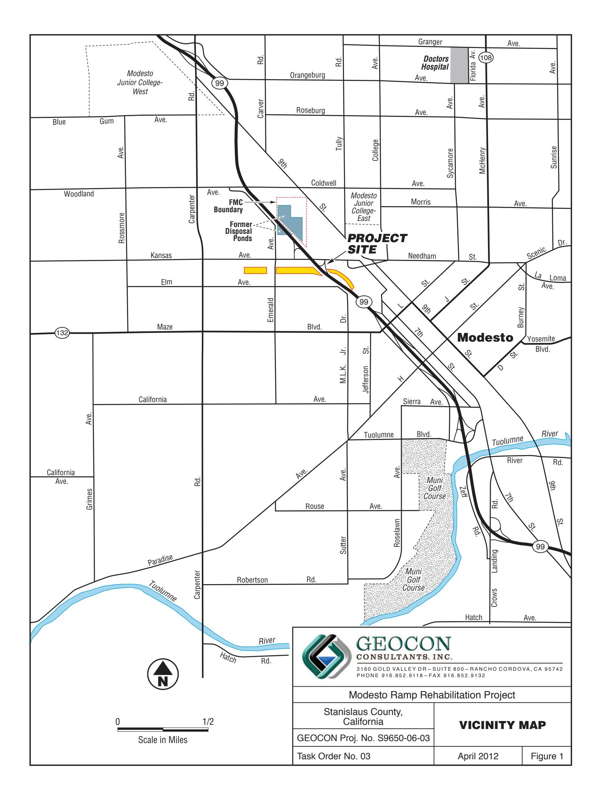

# APPENDIX C

NELAP No.: 02107CA

ORELAP No.: CA300003 TCEQ No.: T104704502

CSDLAC No.: 10196

September 18, 2012

Geocon Consultants, Inc. 3160 Gold Valley Drive, Suite 800 Rancho Cordova, CA 95742

Tel: (916) 852-9118 Fax:(916) 852-9132

Re: ATL Work Order Number:

Client Reference:

Enclosed are the results for sample(s) received on June 21, 2012 by Advanced Technology Laboratories. The sample(s) are tested for the parameters as indicated on the enclosed chain of custody in accordance with applicable laboratory certifications. The laboratory results contained in this report specifically pertains to the sample(s) submitted.

Thank you for the opportunity to serve the needs of your company. If you have any questions, please feel free to contact me or your Project Manager.

Sincerely,

Eddie Rodriguez

Laboratory Director

The cover letter and the case narrative are an integral part of this analytical report and its absence renders the report invalid. Test results contained within this data package meet the requirements of the National Environmental Laboratory Accreditation Conference and/or applicable state-specific certification programs. The report cannot be reproduced without written permission from the client and Advanced Technology Laboratories.

## Certificate of Analysis

| Project Number : |  |
|------------------|--|
| Report To :      |  |
| Reported :       |  |

SUMMARY OF SAMPLES

## SUMMARY OF SAMPLES

| Sample ID | Laboratory ID | Matrix | Date Sampled | Date Received |
|-----------|---------------|--------|--------------|---------------|
|-----------|---------------|--------|--------------|---------------|

### CASE NARRATIVE

Results were J-flagged. "J" is used to flag those results that are between the PQL (Practical Quantitation Limit) and the calculated MDL (Method Detection Limit). Results that are "J" flagged are estimated values since it becomes difficult to accurately quantitate the analyte near the MDL.

.

## Certificate of Analysis

| Project Number : |  |
|------------------|--|
| Report To :      |  |
| Reported :       |  |

### Client Sample ID Lab ID:

Total Metals by ICP-AES EPA 6010B

Analyst: KK

| Analyte   | Result (mg/kg) | PQL (mg/kg) | MDL (mg/kg) | Dilution | Batch   | Prepared   | Date/Time Analyzed | Notes |
|-----------|-------------------|----------------|----------------|----------|---------|------------|-----------------------|-------|
| Strontium | 63                | 0.50           | 0.06           | 1        | B2F0509 | 06/19/2012 | 06/19/12 11:28        |       |

Total Metals by ICP-MS EPA 6020

Analyst: SB

| Analyte    | Result (ug/L) | PQL (ug/L) | MDL (ug/L) | Dilution | Batch   | Prepared   | Date/Time Analyzed | Notes |
|------------|------------------|---------------|---------------|----------|---------|------------|-----------------------|-------|
| Antimony   | 5.1              | 10            | 2.6           | 20       | B2G0389 | 07/19/2012 | 07/20/12 19:34        | J     |
| Arsenic    | 4.3              | 20            | 3.2           | 20       | B2G0389 | 07/19/2012 | 07/20/12 19:34        | J     |
| Barium     | 300              | 20            | 2.3           | 20       | B2G0389 | 07/19/2012 | 07/20/12 19:34        |       |
| Beryllium  | ND               | 10            | 1.8           | 20       | B2G0389 | 07/19/2012 | 07/20/12 19:34        |       |
| Cadmium    | ND               | 10            | 0.30          | 20       | B2G0389 | 07/19/2012 | 07/20/12 19:34        |       |
| Chromium   | 21               | 10            | 3.1           | 20       | B2G0389 | 07/19/2012 | 07/20/12 19:34        |       |
| Cobalt     | 11               | 10            | 2.7           | 20       | B2G0389 | 07/19/2012 | 07/20/12 19:34        |       |
| Copper     | 18               | 20            | 4.0           | 20       | B2G0389 | 07/19/2012 | 07/20/12 19:34        | J     |
| Lead       | 5.4              | 20            | 2.4           | 20       | B2G0389 | 07/19/2012 | 07/20/12 19:34        | J     |
| Molybdenum | 1.8              | 10            | 1.1           | 20       | B2G0389 | 07/19/2012 | 07/20/12 19:34        | J     |
| Nickel     | 20               | 20            | 1.1           | 20       | B2G0389 | 07/19/2012 | 07/20/12 19:34        | J     |
| Selenium   | ND               | 10            | 5.5           | 20       | B2G0389 | 07/19/2012 | 07/20/12 19:34        |       |
| Silver     | ND               | 10            | 2.5           | 20       | B2G0389 | 07/19/2012 | 07/20/12 19:34        |       |
| Thallium   | ND               | 10            | 0.34          | 20       | B2G0389 | 07/19/2012 | 07/20/12 19:34        |       |
| Vanadium   | 64               | 20            | 6.0           | 20       | B2G0389 | 07/19/2012 | 07/20/12 19:34        |       |
| Zinc       | ND               | 200           | 94            | 20       | B2G0389 | 07/19/2012 | 07/20/12 19:34        |       |

Mercury by AA (Cold Vapor) EPA 7471

Analyst: VV

| Analyte | Result (mg/kg) | PQL (mg/kg) | MDL (mg/kg) | Dilution | Batch   | Prepared   | Date/Time Analyzed | Notes |
|---------|-------------------|----------------|----------------|----------|---------|------------|-----------------------|-------|
| Mercury | 0.19              | 0.10           | 0.008          | 1        | B2G0429 | 07/20/2012 | 07/20/12 13:19        |       |

## Certificate of Analysis

| Project Number : |  |
|------------------|--|
| Report To :      |  |
| Reported :       |  |

### Client Sample ID Lab ID:

### STLC DI Metals by ICP-AES by EPA 6010B

Analyst: KK

| Analyte    | Result (mg/L) | PQL (mg/L) | MDL (mg/L) | Dilution | Batch   | Prepared   | Date/Time Analyzed | Notes |
|------------|------------------|---------------|---------------|----------|---------|------------|-----------------------|-------|
| Antimony   | 0.10             | 2.0           | 0.07          | 20       | B2G0556 | 07/25/2012 | 07/25/12 11:36        | J     |
| Arsenic    | ND               | 1.0           | 0.06          | 20       | B2G0556 | 07/25/2012 | 07/25/12 11:36        |       |
| Barium     | 0.05             | 1.0           | 0.01          | 20       | B2G0556 | 07/25/2012 | 07/25/12 11:36        | J     |
| Beryllium  | ND               | 1.0           | 0.01          | 20       | B2G0556 | 07/25/2012 | 07/25/12 11:36        |       |
| Cadmium    | ND               | 1.0           | 0.01          | 20       | B2G0556 | 07/25/2012 | 07/25/12 11:36        |       |
| Chromium   | ND               | 1.0           | 0.03          | 20       | B2G0556 | 07/25/2012 | 07/25/12 11:36        |       |
| Cobalt     | ND               | 1.0           | 0.02          | 20       | B2G0556 | 07/25/2012 | 07/25/12 11:36        |       |
| Copper     | ND               | 1.0           | 0.08          | 20       | B2G0556 | 07/25/2012 | 07/25/12 11:36        |       |
| Lead       | ND               | 1.0           | 0.06          | 20       | B2G0556 | 07/25/2012 | 07/25/12 11:36        |       |
| Molybdenum | 0.03             | 1.0           | 0.02          | 20       | B2G0556 | 07/25/2012 | 07/25/12 11:36        | J     |
| Nickel     | ND               | 1.0           | 0.04          | 20       | B2G0556 | 07/25/2012 | 07/25/12 11:36        |       |
| Selenium   | ND               | 1.0           | 0.11          | 20       | B2G0556 | 07/25/2012 | 07/25/12 11:36        |       |
| Silver     | ND               | 1.0           | 0.03          | 20       | B2G0556 | 07/25/2012 | 07/25/12 11:36        |       |
| Strontium  | 0.25             | NA            | NA            | 20       | B2G0556 | 07/25/2012 | 07/25/12 11:36        |       |
| Thallium   | ND               | 1.0           | 0.10          | 20       | B2G0556 | 07/25/2012 | 07/25/12 11:36        |       |
| Vanadium   | ND               | 1.0           | 0.03          | 20       | B2G0556 | 07/25/2012 | 07/25/12 11:36        |       |
| Zinc       | ND               | 1.0           | 0.18          | 20       | B2G0556 | 07/25/2012 | 07/25/12 11:36        |       |

### STLC DI Mercury by AA (Cold Vapor) EPA 7470A

Analyst: VV

| Analyte | Result (ug/L) | PQL (ug/L) | MDL (ug/L) | Dilution | Batch   | Prepared   | Date/Time Analyzed | Notes |
|---------|------------------|---------------|---------------|----------|---------|------------|-----------------------|-------|
| Mercury | ND               | 0.20          | 0.03          | 1        | B2G0557 | 07/25/2012 | 07/25/12 14:01        |       |