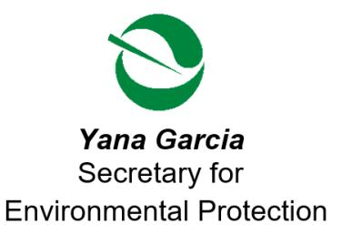

Katherine M. Butler, MPH, Director 8800 Cal Center Drive Sacramento, California 95826-3200

https://dtsc.ca.gov/

## **Sent Via Electronic Mail**

December 24, 2025

Mr. Adam Inman, P.G.
Engineering Geologist
Caltrans D-6 | Office of Environmental Engineering
Hazardous Waste and Paleontology Brancy
2015 East Shields Avenue, Suite 100
Fresno, California 93726
Adam.Inman@dot.ca.gov

ESTIMATED OVERSIGHT COSTS – FISCAL YEAR 2025-2026, STATE ROUTE 132 WEST EXPRESSWAY (AKA: STATE ROUTE 132/99 INTERCHANGE), INTERSECTION OF STATE ROUTE 132/99 IN MODESTO, CALIFORNIA (SITE CODE: 900259)

Dear Mr. Adam Inman,

Section 25269.5 of the California Health and Safety Code requires the Department of Toxic Substances Control (DTSC) to provide a cost estimate for regulatory oversight activities at the State Route 132 West Expressway (AKA: State Route 132/99 Interchange) (Site), located at the intersection of State Route 132/99, Modesto, California, 95354. Enclosed are the schedule of expected activities and an estimate of costs for the Fiscal Year (FY) 2025-2026 which began July 1, 2025, and ends June 30, 2026. The cost estimate is based on DTSC's contracted estimation rates under the interagency agreement. The schedule and cost estimate will be updated as necessary to reflect changes to the project or the rates.

As part of the cleanup at the Site, a Land Use Covenant (LUC) was placed to restrict certain uses or activities. Pursuant to *California Code of Regulations, Title 22, Section 67391.1 (h)*, DTSC has the authority to require Caltrans to pay all costs associated with the administration of the LUC

Please note that this is not an invoice, only an estimate of projected costs, prepared with various assumptions regarding activities and deliverables. DTSC will issue invoices

Mr. Adam Inman December 24, 2025 Page 2

based on actual costs. Caltrans remains liable for all response costs incurred by DTSC pursuant to *Health and Safety Code Section 79650 et seq.*, and the *Comprehensive Environmental Response, Compensation, and Liability Act (CERCLA) 42 U.S.C. Section 9601 et seq.* DTSC reserves all rights to pursue cost recovery under any, and all applicable provisions of state or federal law.

The following table is a breakdown of tasks, anticipated timelines, and estimated DTSC costs to complete the tasks associated with the above-referenced time period.

| TASK                                                                                                           | TIMELINE                                  | ESTIMATED DTSC COST |
|----------------------------------------------------------------------------------------------------------------|-------------------------------------------|------------------------|
| Successor Interagency Agreement Task Order (Completed)                                                      | October 2025                              | \$842                  |
| DTSC Review of Stormwater/ Surface Water Monitoring Report (FY24/25) (Completed)                            | November 2025                             | \$1,383                |
| Annual Cost Estimate Letter FY 25/26                                                                           | December 2025                             | \$523                  |
| DTSC Review of Well Destruction Completion Report (in Progress)                                             | By January 2026                           | \$2,225                |
| DTSC Review Annual Land Use Covenant Inspection Report (due to DTSC by January 15, 2026)                 | By February 2026                          | \$995                  |
| DTSC Review of Surface/Stormwater Monitoring Report (FY25/26) (due to DTSC by February 2026)             | By March 2026                             | \$1,383                |
| DTSC Review of Remedial Design and Implementation Plan (RDIP) for Phase 2 (If received by December 2025) | By April 2026                             | \$5,849                |
| DTSC Oversight of RDIP Fieldwork                                                                               | Through June 2026                         | \$4,139                |
| Project Management FY 25/26                                                                                    | July 1, 2025, through June 30, 2026 | \$6,535                |
| TOTAL                                                                                                          |                                           | \$23,874               |

Mr. Adam Inman December 24, 2025 Page 3

We hope this, and future cost estimates will be useful in your fiscal and project planning. If you have any questions, please contact the Project Manager Arielle McLeskey at (916) 255-3631 or via email at <a href="mailto:Arielle.McLeskey@dtsc.ca.gov">Arielle.McLeskey@dtsc.ca.gov</a>.

Sincerely,

CC:

Mr. Abraham Serrato, Acting Unit Chief Site Evaluation and Remediation Unit Site Mitigation and Restoration Program Department of Toxic Substances Control Abraham.Serrato@dtsc.ca.gov

1. What is the author's argument and what evidence does he use to support it?

(via email)

alulu Sut

Mr. William Martinez, P.G., Unit Chief Site Evaluation and Remediation Unit Site Mitigation and Restoration Program Department of Toxic Substances Control William.Martinez@dtsc.ca.gov

Ms. Arielle McLeskey, Project Manager Site Evaluation and Remediation Unit Site Mitigation and Restoration Program Department of Toxic Substances Control Arielle.McLeskey@dtsc.ca.gov