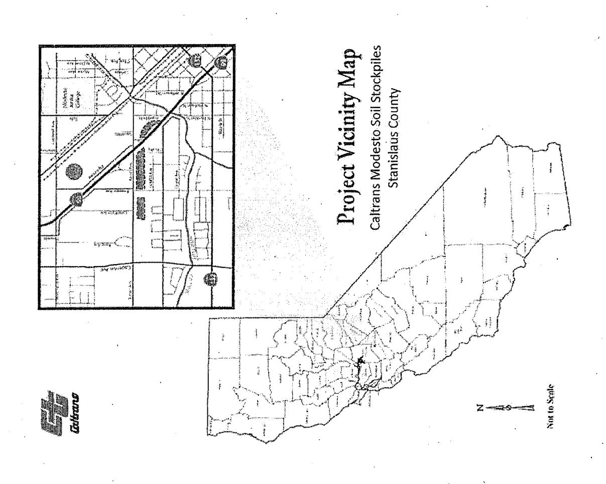
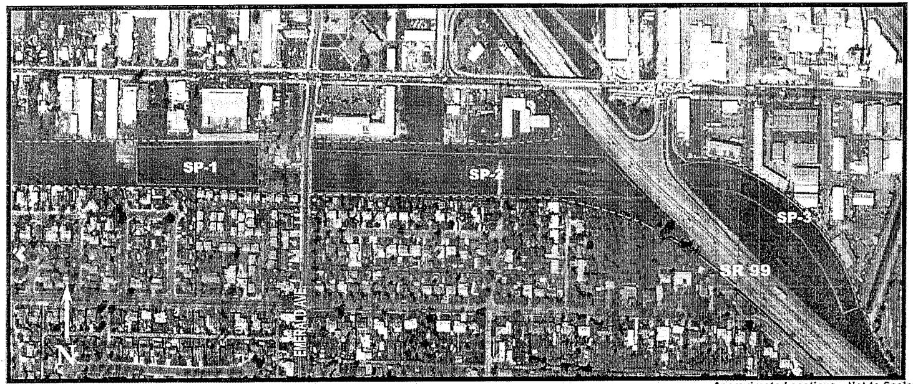

# State of California, Department of Transportation (Caltrans)

Consultant Agreement:

43A0260 Caltrans/Department of Toxic Substances

Control (DTSC); DTSC #08-T3616

Task Order Number:

6

Task Order Title:

Caltrans Modesto Soil Stockpiles - State Route 132/99

DTSC Task Order Manager:

Randy Adams

Caltrans Task Manager:

Richard Stewart

Caltrans Contract Manager:

Scott Nelson

Term of Task Order:

June 22, 2012 through May 31, 2013

Execution Date:

June 22, 2012

FY 11/12:

\$ 150,000.00

Total Task Order Amount:

\$ 150,000.00

Purpose and Need:

District: 10; Number: 251 Date Approved: 5/23/12

The execution of this Task Order shall incorporate by this reference all terms, conditions, duties and obligations attendant upon the parties as set forth in State Agreement 43A0260. If any conflicts exist between that of Agreement 43A0260 and this Task Order, the Task Order will prevail except with respect to administrative and financial matters, in that case, Agreement 43A0260 will prevail.

### I. Task Order Purpose

The purpose of this Task Order is for payment by the State of California, Department of Transportation (Caltrans) of costs incurred by the Department of Toxic Substances Control (DTSC) for oversight and consultative services, review of investigative data and reports, and other information necessary to prepare written correspondence related to remedy evaluation/decision documents (e.g. Human Health Risk Assessment, Feasibility Study, Remedial Action Plan, etc.) and other regulatory instruments as appropriate to regulate and remediate the Caltrans Modesto Soil Stockpiles – State Route 132/99 (Site) prior to construction of the future Route 132 West Expressway.

The Site consists of three stockpiles in excess of 120,000 yd3 of contaminated soil. The stockpiles were generated during sub-grade construction of State Route 99 through Modesto, Stanislaus County. Excavation near Kansas Avenue removed tailings from a portion of a Food and Machinery Corporation (FMC) barite (BaSO4) and celestite (SrSO4) processing disposal pond that operated on a parcel purchased by the state. The Site is impacted by hazardous substances (metals), including barium, lead, and strontium. The stockpiles are

immediately adjacent to State Route 99 (east and west) and south of Kansas Avenue in Modesto.

Under direction of DTSC through a preceding 2006 Interagency Agreement task order, Caltrans submitted a Final Preliminary Endangerment Assessment in 2009. The DTSC letter dated 12/7/2012 to Caltrans discussed the need to address the use of soil stockpile material in the State Route 132 West Expressway project and/or its final disposition as it relates to human health and water quality prior to design and construction of the State Route 132 West Expressway project. DTSC requests that the Human Health Risk Assessment be updated, along with the collection and development of other technical data necessary for Site remediation decisions and approvals.

Caltrans agrees to reimburse DTSC for the costs they incur for review, consultation, decision document approval, and/or processing applications(s) or request(s) made by Caltrans. The details of the Scope of Work are described below under the "Scope of Services."

#### II. Scope of Services

DTSC will provide professional staff services for activities associated with the Site, located adjacent to Route 99 (east and west) and south of Kansas Avenue in Modesto.

A general outline of DTSC tasks are identified below and include, but are not limited to, the following:

- A. Review of supplemental documents and data developed in association with Site characterization and toxicological assessment in context of existing or potential impacts to human health or the environment, including mitigation of existing or potential impacts to human health and the environment.
- B. Review of plans, reports, and technical documents pertaining to mitigation of existing or potential impacts to human health and the environment related to the Site, including:
  - Conduct on-site evaluation of field activities as needed;
  - Participation in meetings and phone calls regarding the aforementioned activities;
  - · Remedy evaluation/decision documents approval; and
  - Internal processing of the consultative agreement.

##### Detailed DTSC tasks consist of:

TASK 1. <u>Submittal of Existing Data and Scoping</u>. DTSC has received from Caltrans background information, sample analysis results, environmental assessment reports, and other information pertinent to the hazardous substance management and/or release, characterization and cleanup of the Site. The Regional Water Quality Control Board, Central Valley Region (RWQCB) is reviewing existing Site information. Additional information may be required based on RWQCB's review and comments.

#### TASK 2. Additional Site Characterization as needed.

- 2.1. <u>Sampling and Analysis Workplan</u>. Caltrans shall submit a workplan that describes the activities proposed to further characterize soil, surface water and/or groundwater. The workplan should also include a Site health and safety plan, quality assurance/quality control plan, sampling plan, and implementation schedule.
- 2.2. Caltrans shall begin implementation of the approved workplan in accordance with the approved implementation schedule. DTSC may provide oversight of workplan implementation.
- 2.3. <u>Site Characterization Report</u>. Caltrans shall submit a Site Characterization Report that, at a minimum, presents the data, summarizes the findings of the investigation, validates the data, and includes recommendations and conclusions.
- TASK 3. <u>Risk Evaluation and Cleanup Level Determination</u>. Caltrans shall update the existing risk evaluation consistent with U. S. EPA Risk Assessment Guidance for Superfund (EPA/540/1-89/002) and DTSC Supplemental Guidance for Human Health Multimedia Risk Assessments of Hazardous Waste Sites and Permitted Facilities. This evaluation will identify chemicals of concern and potential routes of exposure; characterize the potential risk; evaluate potential risks to environmental receptors; consider existing and contemplated uses of the site; and identify site cleanup goals. This information may be submitted as part of the Remedy Selection Document.
- TASK 4. Feasibility Study (FS). Caltrans shall evaluate feasibility of appropriate remediation and response alternatives. Reasonable potential alternatives for the remediation of the Site should be evaluated, including the "no action" alternative. Such an evaluation may be incorporated in the Remedial Action Plan, or may, if the analysis is complex, be addressed in a separate study or report. The evaluation will (a) identify the goals for the cleanup based upon current and projected future land uses; (b) evaluate feasible alternatives to meet these goals, including their effectiveness, ability for implementation and cost; and (c) recommend a preferred alternative.
- TASK 5. Remedial Action Plan. Caltrans shall prepare a Remedial Action Plan (RAP) in accordance with applicable standards and requirements set forth in Health and Safety Code section 25356.1. The RAP will summarize the results of site characterization, risk evaluation, and other technical studies that shall set forth in detail appropriate steps to remedy soil, surface water and groundwater contamination attributed to the Site. In addition, the RAP shall contain a schedule for implementation of all proposed removal and remedial actions.
- TASK 6. <u>California Environmental Quality Act (CEQA)</u>. In order to meet its CEQA obligation, DTSC typically prepares the necessary CEQA documents. For this Site, CEQA is being addressed by Caltrans, via the State Route 132 West Freeway/Expressway Environmental Impact/Environmental Assessment (EIR/EA) Report, which will incorporate

the RAP by reference. DTSC as a responsible agency will review and provide comments on relevant hazardous substances information provided in the Draft EIR/EA.

##### TASK 7. Public Participation.

- 7.1. Caltrans shall conduct appropriate public participation activities. Caltrans shall work cooperatively with DTSC to ensure that the affected and interested public and community are involved in DTSC's decision-making process. Any such public participation activities shall be conducted in accordance with Health and Safety Code sections 25358.7, and 25356.1 (e), the DTSC Public Participation Policy and Procedures Manual, and with DTSC's review and approval.
- 7.2. A scoping meeting may be held to determine the appropriate activities that will be conducted to address public participation.
- 7.3. Caltrans shall prepare a community profile to examine the level of the community's knowledge of the Site; the types of community concerns; the proximity of the Site to homes and/or schools, day care facilities, churches, etc.; the current and proposed use of the Site; media interest; and involvement of community groups and elected officials. The community profile also includes a mailing list for the Site.
- 7.4. Caltrans shall develop and submit fact sheets to DTSC for review and approval when specifically requested by DTSC. Caltrans shall be responsible for printing and distribution of fact sheets upon DTSC approval using the approved community mailing list.
- 7.5. DTSC shall participate in other public outreach meetings as necessary. These meetings may include, but are not limited to, focused neighborhood/community meetings, meetings with elected officials, and a public hearing on the Draft environmental document.
- 7.6. Caltrans shall publish, in a major local newspaper(s), a public notice announcing the availability of the decision document for public review and comment. The public comment period shall last a minimum of thirty (30) days.
- 7.7. DTSC shall require that Caltrans hold at least one public meeting to inform the public of the proposed activities and to receive public comments on the RAP.
- 7.8. Within four (4) weeks of the close of the public comment period, DTSC will prepare a response to the public comments received. If required, Caltrans shall submit the information necessary for DTSC to prepare this document.
- 7.9. If appropriate, Caltrans shall revise the decision document on the basis of comments received from the public, and submit the revised decision document to DTSC for review and approval. If significant or fundamental changes are required, additional public participation activities, including an additional review and comment period, may be

required. Caltrans shall also notify the public of any significant changes from the action proposed in the decision document.

TASK 8. Quality Assurance/Quality Control (QA/QC) Plan as needed. All sampling and analysis conducted by Caltrans under this Agreement will be performed in accordance with a QA/QC Plan submitted by Caltrans and approved by DTSC. The QA/QC Plan will describe:

- a) the procedures for the collection, identification, preservation and transport of samples;
- b) the calibration and maintenance of instruments;
- c) the processing, verification, storage and reporting of data, including chain of custody procedures and identification of qualified person(s) conducting the sampling and of a laboratory certified or approved by DTSC pursuant to Health and Safety Code section 25198; and
- d) how the data obtained pursuant to this Agreement will be managed and preserved in accordance with agreed upon Preservation of Documentation protocols.

TASK 9. Groundwater Monitoring Reports. Caltrans shall prepare, at a minimum, quarterly groundwater monitoring reports for groundwater monitoring wells associated with the Site. The reports shall discuss: depth to groundwater measurements; well purging and sampling; chain of custody reports; laboratory analysis, including analytes, methods, and results; field and laboratory quality assurance/quality control; comparison of groundwater monitoring results from previous sampling events; and conclusions and recommendations.

### Informational Terms and Definitions

- 1. Site. This Task Order applies to three soil stockpiles (SP-1, SP-2, and SP-3) on property located at State Route 99 and State Route 132, in the City of Modesto, in Stanislaus County, California, 95354 (Site). The Site occupies an approximate 21-acre area bordered by light industrial businesses to the east, commercial businesses to the north, a vacant State-owned parcel to the west, and residential homes to the south. A Site vicinity map and Site layout map are included as Attachments A and B.
- 2. Purpose. The purpose of this Task Order is for Caltrans to investigate and remediate a release or threatened release of any hazardous substance at or from the Site under the oversight of DTSC. The purpose of this Agreement is also for DTSC to obtain reimbursement from Caltrans for DTSC's oversight costs incurred pursuant to this Task Order.
- 4. Ownership. The Site is owned by Caltrans.
- 5. <u>Substances Found at the Site</u>. Based on the 2009 Final PEA and other data, the Site is impacted with hazardous substances (metals) barium, lead, and strontium.

- 6. Scope of Work and DTSC Oversight. DTSC shall review and provide Caltrans with written comments on all deliverables as described in Scope of Services and other documents applicable to the scope of the project. DTSC shall provide oversight of field activities, including sampling and remedial activities, as appropriate. Caltrans agrees to perform the work required by this Task Order. Caltrans shall perform the work in accordance with applicable local, state and federal statutes, regulations, ordinances, rules and guidance documents, in particular, Health and Safety Code section 25300 et seq., as amended.
- 7. <u>Additional Activities</u>. DTSC and Caltrans may amend this Task Order to include additional activities in accordance with Paragraph 17. If DTSC expects to incur additional oversight costs for these additional activities, it will provide an estimate of the additional oversight costs to Caltrans.
- 8. Endangerment During Implementation.
- 8.1 Caltrans shall notify DTSC's Project Manager immediately upon learning of any condition that may pose an immediate threat to public health or safety or the environment. Within seven days of the onset of such a condition, Caltrans shall furnish a report to DTSC, signed by the Caltrans Project Manager, setting forth the conditions and events that occurred and the measures taken in response.
- 8.2. In the event DTSC determines that any activity (whether or not pursued in accordance with this Interagency Agreement Task Order) may pose an imminent or substantial endangerment to the health or safety of people on the Site or in the surrounding area or to the environment, DTSC may direct Caltrans to conduct additional activities in accordance with Paragraph 7 or to stop further implementation of this Task Order for such period of time as may be needed to abate the endangerment. DTSC may request that Caltrans implement interim measures to address any immediate threat or imminent or substantial endangerment.
- 9. Access. As needed, access to the Site will be provided to DTSC's employees, contractors, and consultants at all reasonable times. Nothing in this paragraph is intended or shall be construed to limit in any way the right of entry or inspection that DTSC or any other agency may otherwise have by operation of law.
- 10. Sampling, Data and Document Availability. When requested by DTSC, Caltrans shall make available and provide copies of all data and information concerning contamination at or from the Site, including technical records and contractual documents, sampling and monitoring information and photographs and maps. For draft and final reports, Caltrans shall submit one hard (paper) copy and one electronic copy with all applicable signatures and certification stamps as a text-readable Portable Document Formatted (PDF) file Adobe Acrobat or Microsoft Word formatted file. Caltrans shall provide copies of all data and information requested by DTSC, including draft and final reports to the Regional

Water Quality Control Board, Central Valley Region, 11020 Sun Center Drive, Suite 200, Rancho Cordova, California, 95670.

- 11. Record Preservation. Caltrans shall retain, during the implementation of this Task Order and for a minimum of six years after its termination, all data, reports, and other documents associated with this Task Order. If DTSC requests that some or all of these documents be preserved for a longer period of time, Caltrans shall either comply with the request, deliver the documents to DTSC, or provide copies to DTSC.
- 12. <u>Notification of Field Activities</u>. Caltrans shall inform DTSC at least seven days in advance of all field activities pursuant to this Task Order and shall allow DTSC and its authorized representatives to take duplicates of any samples collected by Caltrans.
- 13. Project Managers. Within 14 days of the effective date of this Task Order, DTSC and Caltrans shall each designate a Project Manager and shall notify each other in writing of the Project Manager selected. Each Project Manager shall be responsible for overseeing the implementation of this Task Order and for designating a person to act in his/her absence. All communications between DTSC and Caltrans, and all notices, documents and correspondence concerning the activities performed pursuant to this Task Order shall be directed through the Project Managers. Each party may change its Project Manager with at least seven days prior written notice.
- 14. Caltrans' Consultant and Contractor. All work performed pursuant to this Task Order will be under the direction and supervision of a professional engineer or professional geologist, licensed in California, with expertise in hazardous substance site cleanup. The Caltrans Project Manager, contractor or consultant shall have the technical expertise sufficient to fulfill his or her responsibilities. Within 14 days of the effective date of this Task Order, Caltrans shall notify DTSC's Project Manager in writing of the name, title, and qualifications of the professional engineer or professional geologist and of any contractors or consultants and their personnel to be used in carrying out the work under this Task Order in conformance with applicable state law, including but not limited to, Business and Professions Code sections 6735 and 7835.
- 15. DTSC Review and Approval. All work performed pursuant to this Task Order is subject to DTSC's review and approval. If DTSC determines that any report, plan, schedule or other document submitted for approval pursuant to this Task Order fails to comply with this Task Order or fails to protect public health or safety or the environment, DTSC may (a) return comments to Caltrans with recommended changes and a date by which Caltrans must submit to DTSC a revised document incorporating or addressing the recommended changes; or (b) modify the document in consultation with Caltrans and approve the document as modified. All DTSC approvals and decisions made regarding submittals and notifications will be communicated to Caltrans in writing by DTSC's Branch Chief or his/her designee. No informal advice, guidance, suggestions or comments by DTSC regarding reports, plans, specifications, schedules or any other writings by Caltrans will be construed to relieve Caltrans of the obligation to obtain such written approvals.

##### 16. Payment.

- 16.1. Caltrans agrees to pay 1) all costs incurred by DTSC in association with preparation of this Task Order, and 2) all costs incurred by DTSC in providing oversight pursuant to this Task Order, including review of the documents described in Scope of Services and associated documents, and oversight of field activities. Costs incurred include interest on unpaid amounts that are billed and outstanding more than 60 days from the date of the invoice. An estimate of DTSC's oversight costs is attached as Attachment C. It is understood by the parties that Attachment C is an estimate and cannot be relied upon as the final cost figure. DTSC may provide an updated or revised cost estimate as the work progresses. DTSC will bill Caltrans quarterly. Caltrans agrees to make payment within 60 days of receipt of DTSC's billing. Such billings will reflect any amounts that have been advanced to DTSC by Caltrans.
- 16.2. In anticipation of oversight activities to be conducted, Caltrans shall make an advance payment of \$25,000 to DTSC within 10 days of the effective date of this Task Order. It is expressly understood and agreed that DTSC's receipt of the entire advance payment as provided in this paragraph is a condition precedent to DTSC's obligation to provide oversight, review of or comment on documents. If the advance payment exceeds DTSC's final costs, DTSC will refund the difference within 120 days after the performance of this Task Order is completed or after this Task Order is terminated pursuant to Paragraph 18 of this Agreement.
- 16.3. All payments made by Caltrans pursuant to this Task Order shall be by check payable to the "Department of Toxic Substances Control", and bearing on its face the project code for the Site (#102183) and the docket number of this Agreement. Upon request by Caltrans, DTSC may accept payments made by credit cards. Payments by check shall be sent to:

Department of Toxic Substances Control Accounting Office 1001 I Street, 21st Floor P.O. Box 806 Sacramento, California 95812-0806

A photocopy of the check shall be sent concurrently to DTSC's Project Manager.

- 16.4. DTSC shall retain all cost records associated with the work performed under this Task Order as may be required by state law. DTSC will make all documents that support DTSC's cost determination available for inspection upon request in accordance with the Public Records Act, Government Code section 6250 et seq.
- 17. <u>Amendments</u>. This Task Order may be amended in writing by mutual agreement of DTSC and Caltrans. Such amendment shall be effective the third business day following

the day the last party signing the amendment sends its notification of signing to the other party. The parties may agree to a different effective date.

##### 18. Termination for Convenience.

- 18.1. Except as otherwise provided in this paragraph, each party to this Task Order reserves the right to unilaterally terminate this Task Order for any reason. Termination may be accomplished by giving a 30-day advance written notice of the election to terminate this Task Order to the other party. In the event that this Task Order is terminated under Paragraph 18.1, Caltrans shall be responsible for DTSC costs through the effective date of termination.
- 18.2. If operation and maintenance activities are required for the final remedy, Caltrans may not terminate the Task Order under Paragraph 18.1 upon DTSC's approval of an Operation and Maintenance Plan as proposed by Caltrans, unless an Operation and Maintenance Agreement is entered into between DTSC and Caltrans.
- 19. <u>Incorporation of Attachments, Plans and Reports</u>. All Attachments are incorporated into this Task Order by reference. All plans, schedules and reports that require DTSC's approval and are submitted by Caltrans pursuant to this Task Order are incorporated in this Task Order upon DTSC's approval.
- 20. Reservation of Rights. DTSC reserves all of its statutory and regulatory powers, authorities, rights, and remedies under applicable laws to protect public health or the environment, including the right to recover its costs incurred therefore. Caltrans reserves all of its statutory and regulatory rights, defenses and remedies available to Caltrans under applicable laws.
- 21. <u>Non-Admission of Liability</u>. By entering into this Agreement, Caltrans does not admit to any finding of fact or conclusion of law set forth in this Task Order or any fault or liability under applicable laws.
- 22. <u>Caltrans Liabilities</u>. Nothing in this Task Order shall constitute or be considered a covenant not to sue, release or satisfaction from liability by DTSC for any condition or claim arising as a result of Caltrans' past, current, or future operations or ownership of the Site.
- 23. Government Liabilities. DTSC shall not be liable for any injuries or damages to persons or property resulting from acts or omissions by Caltrans or by related parties in carrying out activities pursuant to this Task Order, nor shall DTSC be held as a party to any contract entered into by Caltrans or its agents in carrying out the activities pursuant to this Task Order.
- 24. <u>Third Party Actions</u>. In the event that Caltrans is a party to any suit or claim for damages or contribution relating to the Site to which DTSC is not a party, Caltrans shall notify

DTSC in writing within 10 days after service of the complaint in the third-party action. Caltrans shall pay all costs incurred by DTSC relating to such third-party actions, including but not limited to responding to subpoenas.

- 25. <u>California Law</u>. This Agreement shall be governed, performed and interpreted under the laws of the State of California.
- 26. Severability. If any portion of this Task Order is ultimately determined not to be enforceable, that portion will be severed from the Task Order and the severability shall not affect the enforceability of the remaining provisions of the Task Order.
- 27. Parties Bound. This Task Order applies to and is binding, jointly and severally, upon Caltrans and its agents, receivers, trustees, successors and assignees, and upon DTSC and any successor agency that may have responsibility for and jurisdiction over the subject matter of this Task Order. Caltrans shall ensure that its contractors, subcontractors and agents receive a copy of this Task Order and comply with this Task Order.
- 28. <u>Effective Date</u>. The effective date of this Task Order is the date of signature by DTSC's authorized representative after this Task Order is first signed by Caltrans' authorized representative. Except as otherwise specified, "days" means calendar days.
- 29. Representative Authority. Each undersigned representative of the party to this Task Order certifies that she or he is fully authorized to enter into the terms and conditions of this Task Order and to execute and legally bind the party to this Task Order.
- 30. <u>Counterparts</u>. This Task Order may be executed and delivered in any number of counterparts, each of which when executed and delivered shall be deemed to be an original, but such counterparts shall together constitute one and the same document.

#### III. Invoices, Meetings, Electronic Submittal of Documents

- A. DTSC shall submit quarterly invoices to Caltrans' Task Manager based on DTSC's billing schedule for the period that the Task Order is active. DTSC's invoice billing package per quarter includes:
- 1. <u>Cover Letter</u> project name and project code; current invoice number and charges; total balance due; and billing period.
- 2. <u>Invoice</u> project name and project code; current invoice number and charges; billing period; less advance payment; and interest from late payment of previous invoices.
- 3. <u>Statement of Account</u> project name and project code; account balance summary, balance summary by invoice; advance payment; and credit balance detail.
- 4. <u>Summary by Activity</u> project name and project code; and direct and indirect labor charges by staff and by activity for reporting period.

- B. DTSC's Project Manager shall meet with Caltrans' Contract Manager and Task Manager as needed to discuss progress on the project.
- C. Caltrans shall comply with Attachment D, "Guidelines for Submitting PDF Documents to the Department of Toxic Substances Control" for submission of all documents to DTSC.

#### IV. Period of Performance

This Task Order shall begin on June 22, 2012, contingent upon approval and execution, and shall terminate on May 31, 2013.

#### V. Task Schedule and/or Deliverable Due Dates

The Consultant shall conduct work under this Task Order in accordance with the schedule in Attachment E. Modification of this schedule requires written approval by Caltrans' Task Manager, but does not necessarily require an amendment of the Task Order.

#### VI. Cost

- A. Caltrans will reimburse DTSC for the hours worked, in accordance with the Agreement provisions, DTSC approved Cost Proposal, and the Task Order Cost Estimate which is attached and incorporated by reference.
- B. In addition, Caltrans will reimburse DTSC for direct costs, other than salary costs, that are identified in the attached Task Order Cost Estimate pursuant to the Agreement provisions and DTSC approved Cost Proposal.
- C. The total amount payable by the Department under this Task Order shall not exceed \$150,000.00. The total payable may be increased by amendment if Caltrans deems necessary.

#### VII. Project Personnel

A. Caltrans' Task Manager will be Richard Stewart, P.G., (559) 445-6378 (office), (559) 445-6236 (fax), richard c stewart@dot.ca.gov, 855 M Street, Fresno, CA 93621.

Caltrans/Department of Toxic Substances Control Interagency Agreement No. 43A0260 Task Order No. 6 Page 12 of 13

B. DTSC's Task Order Manager will be Randy Adams, C.E.G., (916) 255-3591 (office), (916) 255-3696 (fax), radams@dtsc.ca.gov, 8800 Cal Center Drive, Sacramento, CA 95826.

#### IX. Signatures

Caltrans personnel signing below certify that they have read, understand, and will comply with Deputy Directive DD-09-R3 and Government Code 19990, regarding incompatible activities and conflict of interest by State employees.

I certify that this Task Order and any attachments are within the scope of the project and are necessary for the successful completion of the project.

Richard C. Stewart, Caltrans Task Manager

I certify that this Task Order No. 6/ DTSC #08-T3616 and attachments comply with the provisions of Agreement No. 43A0260 and are necessary for the satisfactory completion of the product(s) for which the Department has contracted, and that sufficient funding has been encumbered to pay for this work.

Scott Nelson, Caltrans Contract Manager

Date: 6/21/12

Caltrans/Department of Toxic Substances Control Interagency Agreement No. 43A0260 Task Order No. 6 Page 13 of 13

I certify that I have read the "Description of Services" for this Agreement and in my expert opinion:

The work described in this Task Order is included in the required services.

IN WITNESS WHEREOF, Task Order No. 6/ DTSC #08-T3616 has been executed under the provisions of the Agreement No. 43A0260 between the State of California, Department of Transportation and the State of California, Department of Toxic Substances Control. By signature below, the parties hereto agree that all terms and conditions of this Task Order and Agreement No. 43A0260 shall be in full force and effect.

State of California, Department of Transportation

State of California, Department of Toxic Substances Control

G. Scott McGowen, P.E. Chief Environmental Engineer

Division of Environmental Analysis

Paul Ruffin, P.E.

DTSC Contract Manager

Brownfields and Environmental

Pl H

Restoration Program

Dept. of Toxic Substances Control

8800 Cal Center Drive

Sacramento, CA 95826

(916) 255-6677

pruffin@dtsc.ca.gov

Date: 6/21/12

Date: 6/20/2012

# ATTACHMENT A

# ATTACHMENT B

Approximate Locations - Not to Scale

## **CALTRANS Modesto Soil Stockpile Site** Modesto, CA **Stanislaus County**

SP-1 Stockpile Boundary and Designation

Caltrans Right of Way Boundary

### ATTACHMENT C

## Department of Toxic Substances Control Cost Estimate

Caltrans Modesto Soil Stockpiles - SR 132/99 Includes Direct and Indirect Cost Rates \*

|                                                                                                                                      |       | Project        |  | Legal   |          | Toxicology |  | HQ           |         | Industrial |       | Public  |          | Supervisor |          | Tech. Sr.     |         |       |  |          |
|--------------------------------------------------------------------------------------------------------------------------------------|-------|----------------|--|---------|----------|------------|--|--------------|---------|------------|-------|---------|----------|------------|----------|---------------|---------|-------|--|----------|
|                                                                                                                                      |       | TITLE          |  | Manager |          | Staff      |  | Staff        |         | CEQA       |       | Hygiene |          |            |          | Participation |         | SHSE/ |  | Clerical |
|                                                                                                                                      | TASKS | CLASSIFICATION |  | SEG     |          | Counsel    |  | Toxicologist |         | AEP        |       | AIH     |          | PPS        |          | SEG           |         | SHSS  |  | WPT      |
| Agreement Negotiation/Preparation                                                                                                 |       |                |  |         | 15       |            |  |              |         |            |       |         |          |            | 3        |               |         |       |  |          |
| Project Meetings; Public Meetings; Board Meetings; Public Workshops, Community Meetings; Fact Sheets; Other Coordination |       |                |  |         | 75       | 8          |  | 60           |         |            |       |         | 134      |            | 60       |               |         |       |  |          |
| Groundwater Monitoring Reports                                                                                                    |       |                |  |         | 30       |            |  |              |         |            |       |         |          |            |          |               |         |       |  |          |
| Additional Site Characterization (as needed)                                                                                      |       |                |  |         | 30       |            |  |              |         |            |       |         |          |            | 2        |               |         |       |  |          |
| QA/QC Plan (as needed)                                                                                                               |       |                |  |         | 5        |            |  |              |         |            |       |         |          |            | 1        | 10            |         |       |  |          |
| Health and Safety Plan (`as needed)                                                                                               |       |                |  |         | 3        |            |  |              |         |            | 5     |         |          |            | 1        |               |         |       |  |          |
| Risk Assessment                                                                                                                      |       |                |  |         | 10       |            |  | 30           |         |            |       |         |          |            | 3        |               |         |       |  |          |
| Feasibility Study                                                                                                                    |       |                |  |         | 40       |            |  |              |         |            |       |         |          |            | 5        | 20            |         |       |  |          |
| RAP                                                                                                                                  |       |                |  |         | 40       |            |  |              |         |            |       |         | 20       |            | 5        |               |         |       |  |          |
| CEQA (including EIR/EA by proponent)                                                                                              |       |                |  |         | 60       |            |  | 30           | 70      |            |       |         |          |            | 10       |               |         |       |  |          |
| Response to Comments                                                                                                                 |       |                |  |         | 20       |            |  |              |         |            |       | 20      |          |            | 3        |               |         |       |  |          |
|                                                                                                                                      |       |                |  |         |          |            |  |              |         |            |       |         |          |            |          |               |         |       |  |          |
|                                                                                                                                      |       |                |  |         |          |            |  |              |         |            |       |         |          |            |          |               |         |       |  |          |
|                                                                                                                                      |       |                |  |         |          |            |  |              |         |            |       |         |          |            |          |               |         |       |  |          |
|                                                                                                                                      |       |                |  |         |          |            |  |              |         |            |       |         |          |            |          |               |         |       |  |          |
|                                                                                                                                      |       |                |  |         |          |            |  |              |         |            |       |         |          |            |          |               |         |       |  |          |
| Total Hours/Class                                                                                                                    |       |                |  |         | 328      | 8          |  | 120          | 70      |            | 5     |         | 174      |            | 93       | 30            | 26      |       |  |          |
| Total Hours                                                                                                                          |       |                |  |         | 854      |            |  |              |         |            |       |         |          |            |          |               |         |       |  |          |
|                                                                                                                                      |       |                |  |         |          |            |  |              |         |            |       |         |          |            |          |               |         |       |  |          |
| Hourly Rate/Class                                                                                                                    |       |                |  |         | \$207    | \$218      |  | \$178        | \$108   |            | \$152 |         | \$123    |            | \$227    | \$207         | \$75    |       |  |          |
| Total Cost/Class                                                                                                                     |       |                |  |         | \$67,896 | \$1,744    |  | \$21,360     | \$7,560 |            | \$760 |         | \$21,402 |            | \$21,111 | \$6,210       | \$1,950 |       |  |          |

| Total Estimated Costs | \$149,993 |
|-----------------------|-----------|
| Past Costs            |           |
| Grand Total Costs     | \$149,993 |

Indirect cost rate is 189.13%\*

# ATTACHMENT D GUIDELINES FOR SUBMITTING PDF DOCUMENTS TO THE DEPARTMENT OF TOXIC SUBSTANCES CONTROL

With the introduction of the Cleanup Program's database, EnviroStor, the public can now download and view project related documents online. To provide the public with this vital source of information, please provide a PDF copy of reports, even if a hard copy will be supplied.

Due to differences in internet downloading capabilities and resolutions of PDF files, many users have trouble downloading and viewing large PDF files. The following guidelines were created to provide consistency in PDF files and allow most users to access these files.

- 1) File size: For each file that needs to be uploaded, the maximum file size should be kept to 15 megabytes (MB). If you have a large file, please save large color images (e.g., figures, site photos, maps) and supplemental information (appendices) in separate PDF files. If you are creating PDF files by scanning a paper document, the recommended resolution setting is 200 SPI.
- 2) Naming PDF files: It is recommended that the files be named by using an abbreviated site name, report title, date, and, if multiple files are being uploaded, the section of report (e.g., Site report \_mmddyy\_section.pdf, 968-81stAve\_PEA \_072706\_text.pdf, etc.). Please do not use spaces in your filename.
- 3) Accessibility: To ensure that all files uploaded into EnviroStor are searchable and comply with California's Web Accessibility law, please run all PDF files through an Optical Character Recognition (OCR) process prior to submitting the file to DTSC.
- 4) Bookmarks: For large reports, bookmarks should be created in the PDF for ease of navigation.
- 5) FTP server: To submit large files or a group of files that cannot be sent via e-mail, they can be sent to a DTSC staff member via the FTP server. It is recommended that if you are sending multiple files via the FTP server, that you place all files into a folder and ZIP the folder. Below are the instructions to submit files via the FTP server:

Link: http://www.dtsc.ca.gov/database/DTSC FTP Requests/index.cfm

- i. Provide Upload File Information: Please provide the requested information about yourself, the recipient, and the name of the computer file to be uploaded. This tells our system:
  - a. to expect and allow your file onto the FTP server,
  - b. to whom the recipient is, and
  - c. let the recipient know who sent the file

Please assure that the file name and specified name of the file (with extension) exactly match the actual name of the file being sent. If the names do not match exactly, then the file will be deleted as spam. Do not specify a drive or directory.

ii. Transfer the File: Once your information is provided in the first step, you have 60 minutes to send your file to our server. You will be provided with an FTP location after providing the information.

You will be notified upon the successful receipt or failure to receive your file.

For further assistance about submitting PDF files, please contact the appropriate Cleanup Program Manager, or the EnviroStor Help Desk at (916) 323-3400, or by email to EnviroStor@dtsc.ca.gov.

# ATTACHMENT E SCHEDULE CALTRANS MODESTO SOIL STOCKPILES - STATE ROUTE 132/99

| TASK                                                                                                                                                                                  | SCHEDULE                                                                                                    |
|---------------------------------------------------------------------------------------------------------------------------------------------------------------------------------------|-------------------------------------------------------------------------------------------------------------|
| Caltrans submits supplemental sampling and analysis (SAP) Workplan.                                                                                                                   | By the date cooperatively determined by DTSC and Caltrans. (Tentative date: Aug, 1, 2012)                   |
| DTSC reviews SAP Workplan.                                                                                                                                                            | By the date cooperatively determined by DTSC and Caltrans. (Tentative date: Aug. 15, 2012)                  |
| Caltrans implements SAP Workplan and submits supplemental site characterization report.                                                                                               | By the date cooperatively determined by DTSC and Caltrans. (Tentative date: Sept. 19, 2012)                 |
| DTSC reviews supplemental site characterization report.                                                                                                                               | By the date cooperatively determined by DTSC and Caltrans. (Tentative date: Oct. 10, 2012)                  |
| Caltrans submits Draft FS, RAP, and updated Risk Assessment.                                                                                                                          | By the date cooperatively determined by DTSC and Caltrans. (Tentative date: Nov. 28, 2012)                  |
| DTSC provides comments or approval of Draft FS, RAP, and updated Risk Assessment.                                                                                                     | Within 30 days of receipt of the Draft decision document and existing data. (Tentative date: Dec. 28, 2012) |
| Caltrans submits Draft Final FS, RAP, and updated Risk Assessment.                                                                                                                    | Within 30 days of receipt of comments on the Draft documents. (Tentative date: Jan. 28, 2013)               |
| DTSC provides comments on Draft Final FS, RAP, and updated Risk Assessment.                                                                                                           | Within 30 days of receipt of the Draft Final documents. (Tentative date: Feb. 28, 2013)                     |
| Caltrans incorporates comments on Draft Final FS, RAP, and updated Risk Assessment.                                                                                                   | 30 days of receipt of comments on Draft Final documents. (Tentative date: March 28, 2013)                   |
| DTSC approves Draft Final RAP for public review and approves FS and updated Risk Assessment.                                                                                          | Within 15 days of receipt of the Draft Final documents. (Tentative date: April 18, 2013)                    |
| CEQA is to be addressed by Caltrans, via the EIR/EA, DTSC as a responsible agency will review and provide comments on relevant hazardous substances information.                      | By the date cooperatively determined by DTSC and Caltrans. (Tentative date: April 24, 2013)                 |
| Caltrans incorporates comments on the Draft EIR/EA.                                                                                                                                   | Within 30 days of receipt of comments on the Draft EIR/EA. (Tentative date: May 24, 2013)                   |
| Caltrans public notices Draft Final EIR/EA and Draft Final RAP and initiates required public comment period. DTSC may independently public notice the Draft Final RAP (if necessary). | Schedule to be determined.                                                                                  |
| DTSC responds to public comments (if any) related to the Draft Final RAP and approves RAP or requests changes to the document.                                                        | Within 30 days of close of the public comments period.                                                      |
| DTSC approves changes to the RAP.                                                                                                                                                     | By the date cooperatively determined by DTSC and Caltrans                                                   |