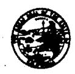

## DEPARTMENT OF TRANSPORTATION

DISTRICT 10 P.O. Box 2048, STOCKTON, CA 95201 (1976 E. DR. MARTIN LUTHER KING JR. BLVD. 95205) PHONE (209) 942-6065 FAX (209) 948-7666 TTY 711

Flex your power! Be energy efficient!

August 24, 2012

Mr. Steven Becker, P.G., Chief Attn: Mr. Randy Adams, CEG Site Evaluation and Remediation Unit Brownfields and Environmental Restoration Program Department of Toxic Substances Control 8800 Cal Center Drive Sacramento, CA 95826-3200

Mr. Steven W. Meeks, P.E. Senior Water Resources Control Engineer Regional Water Quality Control Board 11020 Sun Center Drive, Suite 200 Rancho Cordova, CA 95670

Dear Mr. Becker and Mr. Meeks:

This letter is to provide further clarification regarding the disposition of excavated material resulting from the ramp safety improvements located in Modesto along State Route (SR) 99 at Kansas Avenue that was outlined in the California Department of Transportation's (Caltrans) letter dated May 29, 2012. Caltrans initiated additional investigations in the area to be excavated at Stockpile No. 3 in support of an Interim Remedial (Removal) Action Workplan for the ramp project. However, the results of additional investigations and proposed management of the material discussed below demonstrate that completion and implementation of an Interim Removal Action Workplan is not needed for the ramp project.

An estimated total of 6,000 cubic yards of material will be excavated for the widened roadbed, drainage and retaining wall. Of that material, approximately 2800 cubic yards will be from the north western end of Stockpile No. 3. Some of the excavated native material will be used as backfill as part of the ramp construction activities. The remainder of the excavated material, including all of the material excavated from Stockpile No. 3 will be transported offsite.

Based on the current site investigation data presented in the document titled "Transmittal of Site Investigation Data, Modesto Ramp Rehabilitation Project SR 99 - Kansas Avenue Northbound Off-Ramp, Modesto California", (Geocon, 4/24/2012), none of the soil samples in the area to be excavated in Stockpile No. 3 contained total metal concentrations at or higher than the California hazardous waste Total Threshold Limit Concentration (TTLC). With the exception of arsenic, none of the metals were reported at concentrations at or above commercial/industrial screening levels. However, the arsenic concentration in samples ranged from less than 1.0 mg/kg to 3.2 mg/kg and is within the range of the site-specific background levels. The 95% upper confidence limit concentrations for barium, strontium, and lead in the area to be excavated in Stockpile No. 3 are below residential and commercial/industrial screening levels. One soil sample has a barium concentration higher than 10 times the Soluble Threshold Limit Concentration (STLC) and five soil samples have lead concentrations at or higher than 10 times the STLC. However, the calculated 95% Upper Confidence Level for barium and lead is well below 10 times the respective STLC. These samples were further analyzed by Advanced Technology Laboratories for solubility levels using the Waste Extraction Test

Mr. Becker and Mr. Meeks August 24, 2012 Page 2

(WET). The results of these samples fell below the STLC and thus the material is not classified as a hazardous waste.

The native soil material proposed for excavation outside the footprint of Stockpile No. 3 is suitable for reuse as structural backfill or for offsite reuse/disposal as a non-hazardous soil to an accepting facility. The excess material not used as backfill will be transported to the Fink Road Landfill, a Class III waste management unit. Caltrans will provide a copy of the all soil analysis information.

Due to site specific limitations of the Fink Road Landfill, the excess soil material excavated from Stockpile No. 3 will be transported to Forward Inc. (Forward) in Manteca CA, a Class II landfill. Forward has accepted the material as outlined in the attached Republic Services, Inc. Special Waste Department Decision document.

Thank you for your guidance in this manner. If you have any questions or concerns, please contact me at (209) 942-6065.

Sincerely,

MS. SAM HAACK, PE

Project Manager

Carrie L. Bowen, District 10 Director Dinah Bortner, District Deputy Director, District 10 Programming and Project Management Margaret Lawrence, Office Chief-North, Central Region Environmental Anissa Brown, Branch Chief, Central Region Environmental Juergen Vespermann, Branch Chief, Central Region Environmental Richard C. Stewart, Engineering Geologist, Central Region Environmental Mark McAvoy, Project Manager, District 10 Cliff Adams, Branch Chief, Central Region Construction Chantel Miller, Office Chief, Public and Legislative Affairs Rueben Ortiz, Teichert Construction

## Attachments

"Transmittal of Site Investigation Data, Modesto Ramp Rehabilitation Project SR 99 - Kansas Avenue Northbound Off- Ramp, Modesto California", (Geocon, 4/24/2012)
"ATLWork Order Number 1201396 Modesto Stockpiles" Laboratory results.
Republic Services, Inc. Special Waste Department Decision