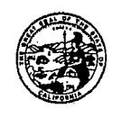

## DEPARTMENT OF TRANSPORTATION

DISTRICT 10 P.O. Box 2048, STOCKTON, CA 95201 (1976 E. DR. MARTIN LUTHER KING JR. BLVD. 95205) PHONE (209) 942-6065 FAX (209) 948-7666 TTY 711

Flex your power! Be energy efficient!

May 29, 2012

Mr. Steven Becker, P.G., Chief Site Evaluation and Remediation Unit Brownfields and Environmental Restoration Program Department of Toxic Substances Control 8800 Cal Center Drive Sacramento, CA 95826-3200

Dear Mr. Becker:

This letter is to request review and concurrence, regarding the disposition of excavated material resulting from the ramp safety improvement located in Modesto along State Route (SR) 99 at Kansas Avenue.

The upgrade to the off ramp is required to improve traffic safety at this location. The planned improvement includes; extending the length of the off-ramp lane, improving the curve radius, and widening the shoulder. The shoulder widening will require the construction of a retaining wall and laying back the embankment slope. Approximately, a total of 6000 cy3 of material will be excavated for the widened roadbed, drainage and retaining wall. In order to construct the improvements, a portion of this excavation will intersect Stockpile #3 of the soil stockpiles placed in this area in anticipation of the future State Route 132 Expressway project. Under the direction and guidance of your office, the California Department of Transportation initiated a Interim Remediation Action Work plan and began soil investigations, and contracted Geocon Consultants, Inc to perform the soil analysis.

The final analysis does indicate the presence of elevated metal concentrations above site-specific background levels, but below residential and commercial/industrial California Human Health Screening Levels. Based on the current site investigation data, and the 2009 Preliminary E A, the soil material proposed for excavation is suitable for reuse as structural backfill, or for offsite reuse/disposal as a non-hazardous soil to an accepting facility following disclosure and review of the site characterization data. The transmittal of this report is enclosed for your review.

Mr. Stephen Becker, P.G., Chief May 29, 2012 Page 2

Based on this analysis, the contractor for the ramp project will haul the material to Stanislaus County Fink Road Landfill. The excavation operation will be in accordance with all contract specifications and requirements for dust control, storm water plans, and erosion control but will also implement additional measures to limit disturbance to this area. A more detailed work plan of the activities by the contractor is enclosed.

This contract is currently on hold awaiting your concurrence that the portion of material excavated from Stockpile #3 is considered non-hazardous and thus may be managed as described.

Thank you for your guidance in this manner. If you have any questions or concerns, please contact me at (209) 942-6065.

Sincerely,

Ms. Sam Haack. PE

Project Manager

c: Carrie Bowen, District 10 Director

Dinah Bortner, Deputy District Director, District 10 Programming and Project Management Margaret Lawrence, Office Chief-North, Central Region Environmental

Gail Miller, Branch Chief, Central Region Environmental

Juergen Vespermann, Branch Chief, Central Region Environmental

Richard C. Stewart, Engineering Geologist, Central Region Environmental

Christina Hibbard, Project Manager, District 10

Mark McAvoy, Project Manager, District 10

Cliff Adams, Branch Chief, Central Region Construction

Chantel Miller, Chief (Acting), Public and Legislative Affairs

Raul Ortiz, Teichert Construction

Enclosures