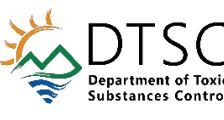

**From:** [Wright, Dean@DTSC](mailto:Dean.Wright@dtsc.ca.gov) **To:** [Inman, Adam@DOT](mailto:Adam.Inman@dot.ca.gov)

**Cc:** [John Juhrend](mailto:juhrend@geoconinc.com); [Mcleskey, Arielle@DTSC](mailto:Arielle.Mcleskey@dtsc.ca.gov); [Jameson, Lora@DTSC](mailto:Lora.Jameson@dtsc.ca.gov)

**Subject:** DTSC PM Change Notice - State Route 132 - Modesto Soil Stockpiles, Modesto

**Date:** Wednesday, December 11, 2024 8:36:54 AM

**Attachments:** image001.png

image002.png image003.png image005.png

Good Morning Adam,I'm sending this e-mail to notify you that the Department of Toxic Substances Control (DTSC), Project Manager (PM) role for the State Route 132 – Modesto Soil Stockpiles project in Modesto (Site), has changed and Ms. Arielle Mcleskey with DTSC's Sacramento office will be the PM for the project going forward. Please submit any further documents or correspondence pertaining to the Site to Ms. Mcleskey at the contact information below:

Arielle Mcleskey

Environmental Scientist

Site Evaluation and Remediation Unit

Brownfields and Environmental Restoration Program

Department of Toxic Substances Control

8800 Cal Center Drive

Sacramento, California 95826

[Arielle.Mcleskey@dtsc.ca.gov](mailto:Arielle.Mcleskey@dtsc.ca.gov)

(916) 255-3631

Thank you,**Dean Wright, P.G.**Project Manager Site Mitigation and Restoration Program/Sacramento 916-255-3591

Dean.Wright@dtsc.ca.govDepartment of Toxic Substances Control 8800 Cal Center Drive, Sacramento, California 95826-3200 California Environmental Protection Agency

