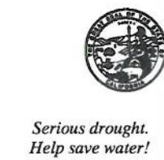

## DEPARTMENT OF TRANSPORTATION

DISTRICT 6 855 M STREET, SUITE 200 FRESNO, CA 93721-2716 PHONE (559) 445-6369 FAX (559) 445-6236 TTY 711 www.dot.ca.gov

January 10, 2017

Mr. Randy S. Adams
Senior Engineering Geologist
Department of Toxic Substances Control
Brownfields and Environmental Restoration Program
8800 Cal Center Drive
Sacramento, CA 95826

Dear Mr. Adams,

Please consider this letter an update to the attached Implementation Schedule (Section 8, page 47) of the Draft Final Remedial Action Plan, Caltrans Modesto Soil Stockpiles, State Route 132 West Freeway/Expressway Project, Stanislaus County, California, October, 2014.

Updates are as follows:

**January 18, 2017** – Public notice of availability of Draft Final RAP and the SR-132 Project EIR/EA for 45-day public review;

February 22, 2017 - Public meeting;

Spring 2017 - DTSC Responsiveness summary (response to public comments); and

Spring 2017 - Revise Draft Final RAP as needed and DTSC approves Final RAP.

All other dates within the Implementation Schedule remain unchanged.

Should you have any additional questions, please contact me at (559) 445-6378.

Sincerely,

Richard C. Stewart Engineering Geologist Acting Branch Chief

Central Region Hazardous Waste Branch