# Technical Memorandum

Date: February 27, 2020

To: Rick Demi, PE, Construction Manager

WSP/City of Modesto

From: John E. Juhrend, PE, CEG, Project Manager, Geocon

Subject: BCS Stockpiles Clean Cap Borrow Area Characterization Testing

State Route 132 Project, Modesto, California

This Technical Memorandum presents a summary of soil characterization testing performed at the proposed clean cap borrow area located adjacent and easterly of Carpenter Road within the State Route 132 right-of-way (see attached plan sheets). The proposed borrow area consists of relatively flat vacant land that was historically utilized for agricultural purposes prior to acquisition by the State in the 1960s. The proposed borrow area is approximately 1,250 feet long, 200 feet wide and will extend to an approximate excavation depth of 5 feet. The clean cap material will be utilized to cover consolidated barium containing soil (BCS) within existing Stockpiles 1 and 2 located easterly of the proposed borrow area. The soil sampling strategy utilized was developed in general accordance with the California Department of Toxic Substances Control (DTSC) 2001 Information Advisory Clean Imported Fill Soil and was approved Mr. Dean Wright with DTSC.

On February 21, 2020 we completed 12 direct-push borings (B1 through B12) on a grid pattern within the borrow area as depicted on the attached plan sheets. The borings were performed to maximum depth of 5 feet. Continuous core soil samples were collected from each boring at depth intervals of 0 to 2 feet and 2 to 5 feet. The soil samples were transferred into new stainless steel tubes, placed in a chilled cooler, and transported to Advanced Technology Laboratories (ATL) under chain of custody protocol. ATL was instructed to composite the samples into depth discrete 3-part composites yielding four 3-part composite samples for each sampling depth interval. Each composite sample was analyzed for Title 22 metals following Environmental Protection Agency (EPA) Test Methods 6010B and 6461A (mercury). The four composite samples collected from a depth interval of 0 to 2 feet were further assigned for organochlorine pesticide (OCP) analysis following EPA Test Method 8081A.

Soil encountered in the borings generally consisted of brown to tan, damp, clayey to fine sandy silt. No field indicators of potential contamination impacts (i.e. staining, odors, debris, etc.) were observed during the field sampling activities.

The following presents a summary of reported concentration ranges (in milligrams per kilogram [mg/kg]) for Title 22 metals with site-specific background concentrations (see attached 2007 Shaw background data summary) in parentheses:

Arsenic 1.0 to 1.5 (1.2 mg/kg) Barium 60 to 110 (72.8 mg/kg) Beryllium 1.3 to 1.6 (0.2 mg/kg) Chromium 7.5 to 11 (7.1 mg/kg) Cobalt 3.2 to 4.9 (4.4 mg/kg) Copper 5.3 to 9.9 (7.5 mg/kg)


Lead 1.7 to 7.0 (2.0 mg/kg) Nickel 5.6 to 8.2 (5.3 mg/kg) Silver 1.6 to 2.5 (0.2 mg/kg) Vanadium 16 to 25 (31.3 mg/kg) Zinc 21 to 41 (26.3 mg/kg)

Antimony, cadmium, selenium, thallium, mercury and OCPs were not detected in each soil sample analyzed above the laboratory reporting limits. A copy of the ATL laboratory report is attached.

The reported metal concentrations in the composite samples are consistent with naturally occurring background concentrations. Based on the data presented herein, the proposed clean cap borrow area appears to be suitable to generate clean cover fill materials for capping BCS Stockpiles 1 and 2. This information will be included in the Removal Action Completion Report to be submitted following completion of the stockpile capping activities.

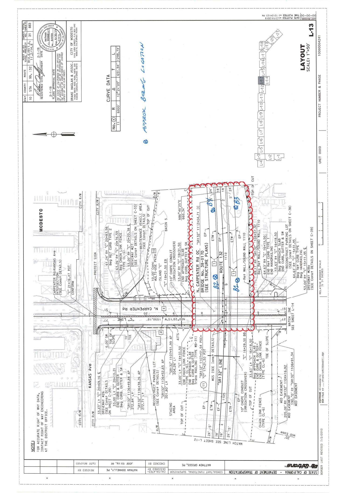

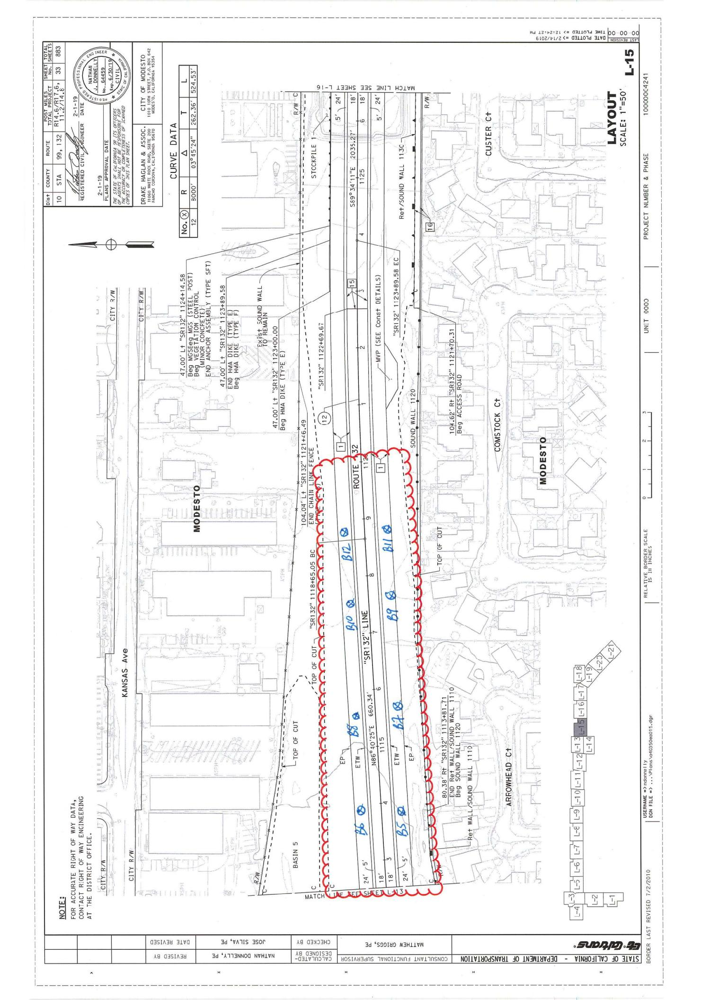

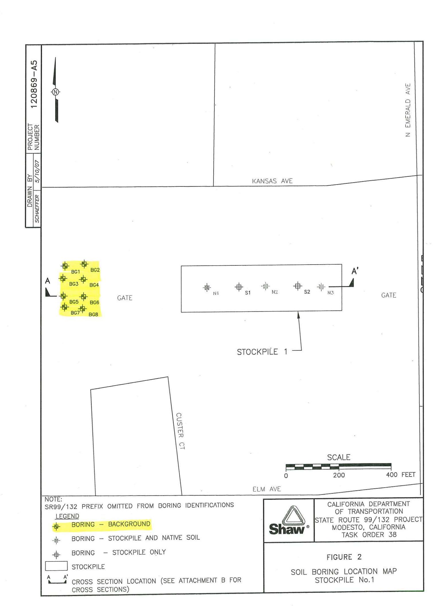

Summary of Heavy Metals Soil Results - Background Soil Samples Caltrans Modesto Soil Stockpiles, State Route 99/132 Stanislaus County, California Task Order No. 38

| Sample Group | Sample Boring | Sample Depth (ft) | Sample Source Description | mg/kg for all metals |         |        |           |         |          |        |        |       |         |            |        |          |        |          |          |         |  |  |
|--------------|---------------|-------------------|---------------------------|----------------------|---------|--------|-----------|---------|----------|--------|--------|-------|---------|------------|--------|----------|--------|----------|----------|---------|--|--|
|              |               |                   |                           | Antimony             | Arsenic | Barium | Beryllium | Cadmium | Chromium | Cobalt | Copper | Lead  | Mercury | Molybdenum | Nickel | Selenium | Silver | Thallium | Vanadium | Zinc    |  |  |
|              |               |                   | OEHHA 2005 Residential(1) | 30                   | 0.07    | 5,200  | 150       | 1.7     | 100,000  | 660    | 3,000  | 150   | 18      | 380        | 1,600  | 380      | 380    | 2        | 530      | 23,000  |  |  |
|              |               |                   | OEHHA 2005 Commercial(2)  | 380                  | 0.24    | 63,000 | 1,700     | 7.5     | 100,000  | 3,200  | 38,000 | 3,500 | 180     | 4,800      | 16,000 | 4,800    | 4,800  | 63       | 6,700    | 100,000 |  |  |
|              |               |                   | Reporting Limit           | 0.4                  | 0.4     | 0.4    | 0.4       | 0.4     | 0.4      | 0.4    | 0.4    | 0.4   | 0.04    | 0.4        | 0.4    | 0.5      | 0.4    | 0.4      | 4        |         |  |  |
|              |               |                   | Units                     |                      |         |        |           |         |          |        |        |       |         |            |        |          |        |          |          |         |  |  |
| Background   | SR99/132-BG01 | 5                 | Background                | ND                   | 0.9     | 68     | ND        | ND      | 6.8      | 4.2    | 7.4    | 1.8   | ND      | 0.6        | 5.7    | ND       | ND     | 30       | 26       |         |  |  |
| Background   | SR99/132-BG01 | 10                | Background                | ND                   | 0.9     | 23     | ND        | ND      | 4.9      | 2.8    | 4.5    | 0.8   | ND      | ND         | 2.5    | ND       | ND     | 32       | 15       |         |  |  |
| Background   | SR99/132-BG01 | 15                | Background                | ND                   | 1       | 63     | ND        | ND      | 4.4      | 3.7    | 6.2    | 1.1   | ND      | ND         | 2.9    | ND       | ND     | 20       | 22       |         |  |  |
| Background   | SR99/132-BG02 | 5                 | Background                | ND                   | 0.4     | 47     | ND        | ND      | 8.3      | 3.8    | 8.9    | 3.6   | ND      | 6          | ND     | ND       | ND     | 23       | 19       |         |  |  |
| Background   | SR99/132-BG02 | 10                | Background                | ND                   | 2.3     | 30     | ND        | ND      | 3.9      | 2.7    | 4.8    | 0.9   | ND      | 2.8        | ND     | ND       | ND     | 23       | 15       |         |  |  |
| Background   | SR99/132-BG02 | 15                | Background                | ND                   | 0.7     | 39     | ND        | ND      | 3.6      | 2.8    | 4.3    | 0.9   | ND      | 2.8        | ND     | ND       | ND     | 16       | 17       |         |  |  |
| Background   | SR99/132-BG03 | 5                 | Background                | ND                   | 0.7     | 80     | ND        | ND      | 8        | 4.7    | 8.2    | 2     | ND      | 6.6        | ND     | ND       | ND     | 34       | 28       |         |  |  |
| Background   | SR99/132-BG03 | 10                | Background                | ND                   | 1.8     | 120    | ND        | ND      | 4.5      | 3.5    | 4.6    | 1.1   | ND      | 2.9        | ND     | ND       | ND     | 25       | 22       |         |  |  |
| Background   | SR99/132-BG03 | 15                | Background                | ND                   | ND      | 82     | ND        | ND      | 6.1      | 4.2    | 8.7    | 1.7   | ND      | 4.4        | ND     | ND       | ND     | 33       | 30       |         |  |  |
| Background   | SR99/132-BG04 | 5                 | Background                | ND                   | 0.6     | 49     | ND        | ND      | 8.1      | 3.7    | 7.7    | 3.8   | ND      | 6.2        | ND     | ND       | ND     | 23       | 23       |         |  |  |
| Background   | SR99/132-BG04 | 10                | Background                | ND                   | 0.5     | 45     | ND        | ND      | 6.8      | 3.8    | 7.2    | 1.6   | ND      | 4.8        | ND     | ND       | ND     | 27       | 24       |         |  |  |
| Background   | SR99/132-BG04 | 15                | Background                | ND                   | 0.5     | 42     | ND        | ND      | 3.7      | 3.1    | 4.1    | 1     | ND      | 2.1        | ND     | ND       | ND     | 19       | 20       |         |  |  |
| Background   | SR99/132-BG05 | 5                 | Background                | ND                   | 0.5     | 51     | ND        | ND      | 9.1      | 4.1    | 6.7    | 2.2   | ND      | 6.3        | ND     | ND       | ND     | 25       | 20       |         |  |  |
| Background   | SR99/132-BG05 | 10                | Background                | ND                   | 0.4     | 88     | ND        | ND      | 8.2      | 6.3    | 8.7    | 2.5   | ND      | 5.3        | ND     | ND       | ND     | 39       | 44       |         |  |  |
| Background   | SR99/132-BG05 | 15                | Background                | ND                   | 0.5     | 76     | ND        | ND      | 9.9      | 4.3    | 7      | 1.8   | ND      | 4.6        | ND     | ND       | ND     | 28       | 29       |         |  |  |
| Background   | SR99/132-BG06 | 5                 | Background                | ND                   | 0.5     | 54     | ND        | ND      | 9.2      | 4.5    | 7.4    | 2.3   | ND      | 6.9        | ND     | ND       | ND     | 20       | 20       |         |  |  |
| Background   | SR99/132-BG06 | 10                | Background                | ND                   | 0.8     | 19     | ND        | ND      | 3.5      | 2.2    | 4.7    | 0.8   | ND      | 2.3        | ND     | ND       | ND     | 18       | 12       |         |  |  |
| Background   | SR99/132-BG06 | 15                | Background                | ND                   | 1.4     | 89     | ND        | ND      | 8        | 5.6    | 9.9    | 2     | ND      | 4.6        | ND     | ND       | ND     | 36       | 30       |         |  |  |
| Background   | SR99/132-BG07 | 5                 | Background                | ND                   | 0.6     | 89     | ND        | ND      | 7        | 5.1    | 7.5    | 2     | ND      | 6.7        | ND     | ND       | ND     | 37       | 34       |         |  |  |
| Background   | SR99/132-BG07 | 10                | Background                | ND                   | 0.8     | 17     | ND        | ND      | 3.9      | 2.1    | 3.6    | 0.8   | ND      | 1.8        | ND     | ND       | ND     | 24       | 12       |         |  |  |
| Background   | SR99/132-BG07 | 15                | Background                | ND                   | 0.9     | 92     | ND        | ND      | 6.6      | 4.9    | 7.9    | 1.8   | ND      | 4.4        | ND     | ND       | ND     | 31       | 30       |         |  |  |

Summary of Heavy Metals Soil Results - Background Soil Samples Caltrans Modesto Soil Stockpiles, State Route 99/132 Stanislaus County, California Table 2a

Task Order No. 38

| Sample Group | Sample Source Description | Boring        | Depth (ft) | OEHHA 2005 Residential (1) |         |        | OEHHA 2005 Commercial (2) |         |          | Reporting Limit | Units | mg/kg for all metals |        |      |         |            |        |          |        |          |          |      |  |  | Soil Background Value (3) |
|--------------|---------------------------|---------------|------------|----------------------------|---------|--------|---------------------------|---------|----------|-----------------|-------|----------------------|--------|------|---------|------------|--------|----------|--------|----------|----------|------|--|--|---------------------------|
|              |                           |               |            | Antimony                   | Arsenic | Barium | Beryllium                 | Cadmium | Chromium |                 |       | Cobalt               | Copper | Lead | Mercury | Molybdenum | Nickel | Selenium | Silver | Thallium | Vanadium | Zinc |  |  |                           |
|              |                           |               |            | 30                         | 0.07    | 5,200  | 150                       | 1.7     | 100,000  | 660             | 3,000 | 150                  | 18     | 380  | 1,600   | 380        | 380    | 5        | 530    | 23,000   | 0.2      |      |  |  |                           |
|              |                           | SR99/132-BG08 | 5          | Background                 | ND      | 0.9    | 110                       | ND      | ND       | ND              | ND    | 4.9                  | 9.5    | 2    | 7.4     | ND         | ND     | ND       | 33     | 29       | 1.2      |      |  |  |                           |
|              |                           | SR99/132-BG08 | 10         | Background                 | ND      | 4.1    | 85                        | ND      | ND       | ND              | ND    | 6.3                  | 11     | 2.4  | 8.7     | ND         | ND     | ND       | 58     | 31       | 72.8     |      |  |  |                           |
|              |                           | SR99/132-BG08 | 15         | Background                 | ND      | 0.6    | 50                        | ND      | ND       | ND              | ND    | 4                    | 5.9    | 1.3  | 3.6     | ND         | ND     | ND       | 22     | 21       | 0.2      |      |  |  |                           |
|              |                           |               |            |                            |         |        |                           |         |          |                 |       |                      |        |      |         |            |        |          |        |          | 0.02     |      |  |  |                           |

Notes: ND = Not detected

DE = Not detected
mg/kg = milligrams per kilogram

mg/kg = milligrams per kilogram ft = feet

OEHHA = Office of Environmental Health Hazard Assessment, State of California

## **REVISED ESTIMATE OF THE POPULATION OF THE UNITED STATES, 1790-1950**

**Population Estimates by Decade**

| <strong>Year</strong> | <strong>Population</strong> |
|-----------------------|-----------------------------|
| 1790                  | 3,929,214                   |
| 1800                  | 5,308,483                   |
| 1810                  | 7,239,881                   |
| 1820                  | 9,638,453                   |
| 1830                  | 12,866,020                  |
| 1840                  | 17,069,453                  |
| 1850                  | 23,191,876                  |
| 1860                  | 31,443,321                  |
| 1870                  | 38,558,371                  |
| 1880                  | 50,189,209                  |
| 1890                  | 62,979,766                  |
| 1900                  | 76,212,168                  |
| 1910                  | 92,228,496                  |
| 1920                  | 106,021,537                 |
| 1930                  | 123,202,624                 |
| 1940                  | 132,164,569                 |
| 1950                  | 151,325,798                 |

**Source:** U.S. Bureau of the Census, Historical Statistics of the United States, Colonial Times to 1970, Part 2, p. 1072.

## **CONSOLIDATED STATEMENT OF CASH FLOWS**

**For the Year Ended December 31, 2005**

| <strong>Labels</strong>                                   | <strong>Values</strong>    |
|-----------------------------------------------------------|----------------------------|
| Cash flows from operating activities:                     |                            |
| Net income                                                | \$500,000                  |
| Depreciation and amortization                             | 50,000                     |
| Changes in operating assets and liabilities:              |                            |
| Increase in accounts receivable                           | (20,000)                   |
| Increase in inventory                                     | (30,000)                   |
| Increase in accounts payable                              | 15,000                     |
| Net cash provided by operating activities                 | \$515,000                  |
| Cash flows from investing activities:                     |                            |
| Purchase of property, plant, and equipment                | (100,000)                  |
| Sale of investments                                       | 25,000                     |
| Net cash used in investing activities                     | \$(75,000)                 |
| Cash flows from financing activities:                     |                            |
| Proceeds from issuance of long-term debt                  | 200,000                    |
| Repayment of long-term debt                               | (50,000)                   |
| Payment of dividends                                      | (40,000)                   |
| Net cash provided by financing activities                 | \$110,000                  |
| Net increase in cash and cash equivalents                 | \$550,000                  |
| Cash and cash equivalents at beginning of year            | 200,000                    |
| <strong>Cash and cash equivalents at end of year</strong> | <strong>\$750,000</strong> |

**Supplemental disclosure of cash flow information:**

| <strong>Labels</strong>    | <strong>Values</strong> |
|----------------------------|-------------------------|
| Cash paid for interest     | \$10,000                |
| Cash paid for income taxes | \$25,000                |

**Non-cash investing and financing activities:**

During the year, the company acquired equipment with a fair value of \$30,000 by issuing common stock.

(1) OEHHA 2005 Residential screening value
(2) OEHHA 2005 Commercial/Industrial screening value
(3) OEHHA 2005 Commercial/Industrial screening value
(3) Soil Background Values calculated from UCL 95 or Arithmetic Mean (See Table 8). For non-detects, SBVs calculated at 1/2 the detection limit.


February 26, 2020

John Juhrend Geocon Consultants, Inc. 3160 Gold Valley Drive, Suite 800 Rancho Cordova, CA 95742

Tel: (916) 508-1911 Fax:(916) 852-9132

Re: ATL Work Order Number: 2000458

Client Reference: SR132 CAP, S9108-01-01

Enclosed are the results for sample(s) received on February 22, 2020 by Advanced Technology Laboratories. The sample(s) are tested for the parameters as indicated on the enclosed chain of custody in accordance with applicable laboratory certifications. The laboratory results contained in this report specifically pertains to the sample(s) submitted.

Thank you for the opportunity to serve the needs of your company. If you have any questions, please feel free to contact me or your Project Manager.

Sincerely,

Dr. Reza Karimi

Laboratory Director

The cover letter and the case narrative are an integral part of this analytical report and its absence renders the report invalid. Test results contained within this data package meet the requirements of applicable state-specific certification programs. The report cannot be reproduced without written permission from the client and Advanced Technology Laboratories.

ELAP No.: 1838

CSDLAC No.: 10196 ORELAP No.: CA300003


Geocon Consultants, Inc. Project Number: SR132 CAP, S9108-01-01

3160 Gold Valley Drive, Suite 800 Report To: John Juhrend Rancho Cordova, CA 95742 Reported: 02/26/2020

## SUMMARY OF SAMPLES

| Sample ID                 | Laboratory ID | Matrix | Date Sampled | Date Received |
|---------------------------|---------------|--------|--------------|---------------|
| Composite B1,B2,B3 0-2    | 2000458-25    | Soil   | 2/21/20 0:00 | 2/22/20 0:00  |
| Composite B1,B2,B3 2-5    | 2000458-26    | Soil   | 2/21/20 0:00 | 2/22/20 0:00  |
| Composite B4,B5,B6 0-2    | 2000458-27    | Soil   | 2/21/20 0:00 | 2/22/20 0:00  |
| Composite B4,B5,B6 2-5    | 2000458-28    | Soil   | 2/21/20 0:00 | 2/22/20 0:00  |
| Composite B7,B8,B9 0-2    | 2000458-29    | Soil   | 2/21/20 0:00 | 2/22/20 0:00  |
| Composite B7,B8,B9 2-5    | 2000458-30    | Soil   | 2/21/20 0:00 | 2/22/20 0:00  |
| Composite B10,B11,B12 0-2 | 2000458-31    | Soil   | 2/21/20 0:00 | 2/22/20 0:00  |
| Composite B10,B11,B12 2-5 | 2000458-32    | Soil   | 2/21/20 0:00 | 2/22/20 0:00  |


Geocon Consultants, Inc. Project Number: SR132 CAP, S9108-01-01

3160 Gold Valley Drive, Suite 800 Report To: John Juhrend Rancho Cordova, CA 95742 Reported: 02/26/2020

Client Sample ID: Composite B1,B2,B3 0-2 Lab ID: 2000458-25

## Title 22 Metals by ICP-AES EPA 6010B

**Analyst: VL** 

| Analyte    | Result<br>(mg/kg) | PQL<br>(mg/kg) | Dilution | Batch   | Prepared   | Date/Time<br>Analyzed | Notes |
|------------|-------------------|----------------|----------|---------|------------|-----------------------|-------|
| Antimony   | ND                | 2.0            | 1        | B0B0409 | 02/24/2020 | 02/25/20 13:02        |       |
| Arsenic    | 1.1               | 1.0            | 1        | B0B0409 | 02/24/2020 | 02/25/20 13:02        |       |
| Barium     | 80                | 1.0            | 1        | B0B0409 | 02/24/2020 | 02/25/20 13:02        |       |
| Beryllium  | 1.3               | 1.0            | 1        | B0B0409 | 02/24/2020 | 02/25/20 13:02        |       |
| Cadmium    | ND                | 1.0            | 1        | B0B0409 | 02/24/2020 | 02/25/20 13:02        |       |
| Chromium   | 7.9               | 1.0            | 1        | B0B0409 | 02/24/2020 | 02/25/20 13:02        |       |
| Cobalt     | 3.3               | 1.0            | 1        | B0B0409 | 02/24/2020 | 02/25/20 13:02        |       |
| Copper     | 6.6               | 2.0            | 1        | B0B0409 | 02/24/2020 | 02/25/20 13:02        |       |
| Lead       | 6.0               | 1.0            | 1        | B0B0409 | 02/24/2020 | 02/25/20 13:02        |       |
| Molybdenum | ND                | 1.0            | 1        | B0B0409 | 02/24/2020 | 02/25/20 13:02        |       |
| Nickel     | 6.0               | 1.0            | 1        | B0B0409 | 02/24/2020 | 02/25/20 13:02        |       |
| Selenium   | ND                | 1.0            | 1        | B0B0409 | 02/24/2020 | 02/25/20 13:02        |       |
| Silver     | 2.2               | 1.0            | 1        | B0B0409 | 02/24/2020 | 02/25/20 13:02        |       |
| Thallium   | ND                | 1.0            | 1        | B0B0409 | 02/24/2020 | 02/25/20 13:02        |       |
| Vanadium   | 17                | 1.0            | 1        | B0B0409 | 02/24/2020 | 02/25/20 13:02        |       |
| Zinc       | 39                | 1.0            | 1        | B0B0409 | 02/24/2020 | 02/25/20 13:02        |       |

## Mercury by AA (Cold Vapor) EPA 7471A

| Analyte | Result<br>(mg/kg) | PQL<br>(mg/kg) | Dilution | Batch   | Prepared   | Date/Time<br>Analyzed | Notes |
|---------|-------------------|----------------|----------|---------|------------|-----------------------|-------|
| Mercury | ND                | 0.10           | 1        | B0B0410 | 02/24/2020 | 02/26/20 11:18        |       |

## Organochlorine Pesticides by EPA 8081A

| Organochlorine Pesticides by EPA 3001A |                   |                |          |         |            |                       |       |
|----------------------------------------|-------------------|----------------|----------|---------|------------|-----------------------|-------|
| Analyst: RD                            |                   |                |          |         |            |                       |       |
| Analyte                                | Result<br>(ug/kg) | PQL<br>(ug/kg) | Dilution | Batch   | Prepared   | Date/Time<br>Analyzed | Notes |
| 4,4′-DDD                               | ND                | 2.0            | 1        | B0B0435 | 02/24/2020 | 02/25/20 13:24        |       |
| 4,4′-DDE                               | ND                | 2.0            | 1        | B0B0435 | 02/24/2020 | 02/25/20 13:24        |       |
| 4,4'-DDT                               | ND                | 2.0            | 1        | B0B0435 | 02/24/2020 | 02/25/20 13:24        |       |
| Aldrin                                 | ND                | 1.0            | 1        | B0B0435 | 02/24/2020 | 02/25/20 13:24        |       |
| alpha-BHC                              | ND                | 1.0            | 1        | B0B0435 | 02/24/2020 | 02/25/20 13:24        |       |
| alpha-Chlordane                        | ND                | 1.0            | 1        | B0B0435 | 02/24/2020 | 02/25/20 13:24        |       |
| beta-BHC                               | ND                | 1.0            | 1        | B0B0435 | 02/24/2020 | 02/25/20 13:24        |       |
| Chlordane                              | ND                | 8.5            | 1        | B0B0435 | 02/24/2020 | 02/25/20 13:24        |       |
| delta-BHC                              | ND                | 1.0            | 1        | B0B0435 | 02/24/2020 | 02/25/20 13:24        |       |

**Analyst: KEK** 

Analyst: KD


Geocon Consultants, Inc. Project Number: SR132 CAP, S9108-01-01

3160 Gold Valley Drive, Suite 800 Report To: John Juhrend Rancho Cordova, CA 95742 Reported: 02/26/2020

Client Sample ID: Composite B1,B2,B3 0-2

Lab ID: 2000458-25

## Organochlorine Pesticides by EPA 8081A

Analyst: KD

| Analyte                         | Result<br>(ug/kg) | PQL<br>(ug/kg) | Dilution | Batch   | Prepared   | Date/Time<br>Analyzed | Notes |
|---------------------------------|-------------------|----------------|----------|---------|------------|-----------------------|-------|
| Dieldrin                        | ND                | 2.0            | 1        | B0B0435 | 02/24/2020 | 02/25/20 13:24        |       |
| Endosulfan I                    | ND                | 1.0            | 1        | B0B0435 | 02/24/2020 | 02/25/20 13:24        |       |
| Endosulfan II                   | ND                | 2.0            | 1        | B0B0435 | 02/24/2020 | 02/25/20 13:24        |       |
| Endosulfan sulfate              | ND                | 2.0            | 1        | B0B0435 | 02/24/2020 | 02/25/20 13:24        |       |
| Endrin                          | ND                | 2.0            | 1        | B0B0435 | 02/24/2020 | 02/25/20 13:24        |       |
| Endrin aldehyde                 | ND                | 2.0            | 1        | B0B0435 | 02/24/2020 | 02/25/20 13:24        |       |
| Endrin ketone                   | ND                | 2.0            | 1        | B0B0435 | 02/24/2020 | 02/25/20 13:24        |       |
| gamma-BHC                       | ND                | 1.0            | 1        | B0B0435 | 02/24/2020 | 02/25/20 13:24        |       |
| gamma-Chlordane                 | ND                | 1.0            | 1        | B0B0435 | 02/24/2020 | 02/25/20 13:24        |       |
| Heptachlor                      | ND                | 1.0            | 1        | B0B0435 | 02/24/2020 | 02/25/20 13:24        |       |
| Heptachlor epoxide              | ND                | 1.0            | 1        | B0B0435 | 02/24/2020 | 02/25/20 13:24        |       |
| Methoxychlor                    | ND                | 5.0            | 1        | B0B0435 | 02/24/2020 | 02/25/20 13:24        |       |
| Toxaphene                       | ND                | 50             | 1        | B0B0435 | 02/24/2020 | 02/25/20 13:24        |       |
| Surrogate: Decachlorobiphenyl   | 52.2 %            | 11 - 115       |          | B0B0435 | 02/24/2020 | 02/25/20 13:24        |       |
| Surrogate: Tetrachloro-m-xylene | 65.2 %            | 29 - 106       |          | B0B0435 | 02/24/2020 | 02/25/20 13:24        |       |


Geocon Consultants, Inc. Project Number: SR132 CAP, S9108-01-01

3160 Gold Valley Drive, Suite 800 Report To: John Juhrend Rancho Cordova, CA 95742 Reported: 02/26/2020

Client Sample ID: Composite B1,B2,B3 2-5 Lab ID: 2000458-26

## Title 22 Metals by ICP-AES EPA 6010B

Analyst: VL

| Analyte    | Result<br>(mg/kg) | PQL<br>(mg/kg) | Dilution | Batch   | Prepared   | Date/Time<br>Analyzed | Notes |
|------------|-------------------|----------------|----------|---------|------------|-----------------------|-------|
| Antimony   | ND                | 2.0            | 1        | B0B0409 | 02/24/2020 | 02/25/20 13:04        |       |
| Arsenic    | 1.0               | 1.0            | 1        | B0B0409 | 02/24/2020 | 02/25/20 13:04        |       |
| Barium     | 60                | 1.0            | 1        | B0B0409 | 02/24/2020 | 02/25/20 13:04        |       |
| Beryllium  | 1.4               | 1.0            | 1        | B0B0409 | 02/24/2020 | 02/25/20 13:04        |       |
| Cadmium    | ND                | 1.0            | 1        | B0B0409 | 02/24/2020 | 02/25/20 13:04        |       |
| Chromium   | 7.8               | 1.0            | 1        | B0B0409 | 02/24/2020 | 02/25/20 13:04        |       |
| Cobalt     | 3.3               | 1.0            | 1        | B0B0409 | 02/24/2020 | 02/25/20 13:04        |       |
| Copper     | 5.5               | 2.0            | 1        | B0B0409 | 02/24/2020 | 02/25/20 13:04        |       |
| Lead       | 2.1               | 1.0            | 1        | B0B0409 | 02/24/2020 | 02/25/20 13:04        |       |
| Molybdenum | ND                | 1.0            | 1        | B0B0409 | 02/24/2020 | 02/25/20 13:04        |       |
| Nickel     | 6.0               | 1.0            | 1        | B0B0409 | 02/24/2020 | 02/25/20 13:04        |       |
| Selenium   | ND                | 1.0            | 1        | B0B0409 | 02/24/2020 | 02/25/20 13:04        |       |
| Silver     | 2.3               | 1.0            | 1        | B0B0409 | 02/24/2020 | 02/25/20 13:04        |       |
| Thallium   | ND                | 1.0            | 1        | B0B0409 | 02/24/2020 | 02/25/20 13:04        |       |
| Vanadium   | 17                | 1.0            | 1        | B0B0409 | 02/24/2020 | 02/25/20 13:04        |       |
| Zinc       | 21                | 1.0            | 1        | B0B0409 | 02/24/2020 | 02/25/20 13:04        |       |

## Mercury by AA (Cold Vapor) EPA 7471A

**Analyst: KEK** 

| Analyte | Result<br>(mg/kg) | PQL<br>(mg/kg) | Dilution | Batch   | Prepared   | Date/Time<br>Analyzed | Notes |
|---------|-------------------|----------------|----------|---------|------------|-----------------------|-------|
| Mercury | ND                | 0.10           | 1        | B0B0410 | 02/24/2020 | 02/26/20 11:25        |       |


Geocon Consultants, Inc. Project Number: SR132 CAP, S9108-01-01

3160 Gold Valley Drive, Suite 800 Report To: John Juhrend Rancho Cordova, CA 95742 Reported: 02/26/2020

Client Sample ID: Composite B4,B5,B6 0-2 Lab ID: 2000458-27

## Title 22 Metals by ICP-AES EPA 6010B

Analyst: VL

| Analyte    | Result<br>(mg/kg) | PQL<br>(mg/kg) | Dilution | Batch   | Prepared   | Date/Time<br>Analyzed | Notes |
|------------|-------------------|----------------|----------|---------|------------|-----------------------|-------|
| Antimony   | ND                | 2.0            | 1        | B0B0409 | 02/24/2020 | 02/25/20 13:05        |       |
| Arsenic    | ND                | 1.0            | 1        | B0B0409 | 02/24/2020 | 02/25/20 13:05        |       |
| Barium     | <b>83</b>         | 1.0            | 1        | B0B0409 | 02/24/2020 | 02/25/20 13:05        |       |
| Beryllium  | <b>1.3</b>        | 1.0            | 1        | B0B0409 | 02/24/2020 | 02/25/20 13:05        |       |
| Cadmium    | ND                | 1.0            | 1        | B0B0409 | 02/24/2020 | 02/25/20 13:05        |       |
| Chromium   | <b>7.5</b>        | 1.0            | 1        | B0B0409 | 02/24/2020 | 02/25/20 13:05        |       |
| Cobalt     | <b>3.2</b>        | 1.0            | 1        | B0B0409 | 02/24/2020 | 02/25/20 13:05        |       |
| Copper     | <b>5.9</b>        | 2.0            | 1        | B0B0409 | 02/24/2020 | 02/25/20 13:05        |       |
| Lead       | <b>6.3</b>        | 1.0            | 1        | B0B0409 | 02/24/2020 | 02/25/20 13:05        |       |
| Molybdenum | ND                | 1.0            | 1        | B0B0409 | 02/24/2020 | 02/25/20 13:05        |       |
| Nickel     | <b>5.6</b>        | 1.0            | 1        | B0B0409 | 02/24/2020 | 02/25/20 13:05        |       |
| Selenium   | ND                | 1.0            | 1        | B0B0409 | 02/24/2020 | 02/25/20 13:05        |       |
| Silver     | <b>2.0</b>        | 1.0            | 1        | B0B0409 | 02/24/2020 | 02/25/20 13:05        |       |
| Thallium   | ND                | 1.0            | 1        | B0B0409 | 02/24/2020 | 02/25/20 13:05        |       |
| Vanadium   | <b>16</b>         | 1.0            | 1        | B0B0409 | 02/24/2020 | 02/25/20 13:05        |       |
| Zinc       | <b>23</b>         | 1.0            | 1        | B0B0409 | 02/24/2020 | 02/25/20 13:05        |       |

## Mercury by AA (Cold Vapor) EPA 7471A

| Analyte | Result<br>(mg/kg) | PQL<br>(mg/kg) | Dilution | Batch   | Prepared   | Date/Time<br>Analyzed | Notes |
|---------|-------------------|----------------|----------|---------|------------|-----------------------|-------|
| Mercury | ND                | 0.10           | 1        | B0B0410 | 02/24/2020 | 02/26/20 11:27        |       |

## Organochlorine Pesticides by EPA 8081A

| Analyte         | Result<br>(ug/kg) | PQL<br>(ug/kg) | Dilution | Batch   | Prepared   | Date/Time<br>Analyzed | Notes |
|-----------------|-------------------|----------------|----------|---------|------------|-----------------------|-------|
| 4,4'-DDD        | ND                | 2.0            | 1        | B0B0435 | 02/24/2020 | 02/25/20 13:35        |       |
| 4,4'-DDE        | ND                | 2.0            | 1        | B0B0435 | 02/24/2020 | 02/25/20 13:35        |       |
| 4,4'-DDT        | ND                | 2.0            | 1        | B0B0435 | 02/24/2020 | 02/25/20 13:35        |       |
| Aldrin          | ND                | 1.0            | 1        | B0B0435 | 02/24/2020 | 02/25/20 13:35        |       |
| alpha-BHC       | ND                | 1.0            | 1        | B0B0435 | 02/24/2020 | 02/25/20 13:35        |       |
| alpha-Chlordane | ND                | 1.0            | 1        | B0B0435 | 02/24/2020 | 02/25/20 13:35        |       |
| beta-BHC        | ND                | 1.0            | 1        | B0B0435 | 02/24/2020 | 02/25/20 13:35        |       |
| Chlordane       | ND                | 8.5            | 1        | B0B0435 | 02/24/2020 | 02/25/20 13:35        |       |
| delta-BHC       | ND                | 1.0            | 1        | B0B0435 | 02/24/2020 | 02/25/20 13:35        |       |

**Analyst: KEK** 

Analyst: KD


Geocon Consultants, Inc. Project Number: SR132 CAP, S9108-01-01

3160 Gold Valley Drive, Suite 800 Report To: John Juhrend Rancho Cordova, CA 95742 Reported: 02/26/2020

Client Sample ID: Composite B4,B5,B6 0-2 Lab ID: 2000458-27

## Organochlorine Pesticides by EPA 8081A

Analyst: KD

| Analyte                         | Result<br>(ug/kg) | PQL<br>(ug/kg) | Dilution | Batch   | Prepared   | Date/Time<br>Analyzed | Notes |
|---------------------------------|-------------------|----------------|----------|---------|------------|-----------------------|-------|
| Dieldrin                        | ND                | 2.0            | 1        | B0B0435 | 02/24/2020 | 02/25/20 13:35        |       |
| Endosulfan I                    | ND                | 1.0            | 1        | B0B0435 | 02/24/2020 | 02/25/20 13:35        |       |
| Endosulfan II                   | ND                | 2.0            | 1        | B0B0435 | 02/24/2020 | 02/25/20 13:35        |       |
| Endosulfan sulfate              | ND                | 2.0            | 1        | B0B0435 | 02/24/2020 | 02/25/20 13:35        |       |
| Endrin                          | ND                | 2.0            | 1        | B0B0435 | 02/24/2020 | 02/25/20 13:35        |       |
| Endrin aldehyde                 | ND                | 2.0            | 1        | B0B0435 | 02/24/2020 | 02/25/20 13:35        |       |
| Endrin ketone                   | ND                | 2.0            | 1        | B0B0435 | 02/24/2020 | 02/25/20 13:35        |       |
| gamma-BHC                       | ND                | 1.0            | 1        | B0B0435 | 02/24/2020 | 02/25/20 13:35        |       |
| gamma-Chlordane                 | ND                | 1.0            | 1        | B0B0435 | 02/24/2020 | 02/25/20 13:35        |       |
| Heptachlor                      | ND                | 1.0            | 1        | B0B0435 | 02/24/2020 | 02/25/20 13:35        |       |
| Heptachlor epoxide              | ND                | 1.0            | 1        | B0B0435 | 02/24/2020 | 02/25/20 13:35        |       |
| Methoxychlor                    | ND                | 5.0            | 1        | B0B0435 | 02/24/2020 | 02/25/20 13:35        |       |
| Toxaphene                       | ND                | 50             | 1        | B0B0435 | 02/24/2020 | 02/25/20 13:35        |       |
| Surrogate: Decachlorobiphenyl   | 52.5 %            | 11 - 115       |          | B0B0435 | 02/24/2020 | 02/25/20 13:35        |       |
| Surrogate: Tetrachloro-m-xylene | 61.6 %            | 29 - 106       |          | B0B0435 | 02/24/2020 | 02/25/20 13:35        |       |


Geocon Consultants, Inc. Project Number: SR132 CAP, S9108-01-01

3160 Gold Valley Drive, Suite 800 Report To: John Juhrend Rancho Cordova, CA 95742 Reported: 02/26/2020

Client Sample ID: Composite B4,B5,B6 2-5 Lab ID: 2000458-28

## Title 22 Metals by ICP-AES EPA 6010B

Analyst: VL

| Analyte    | Result<br>(mg/kg) | PQL<br>(mg/kg) | Dilution | Batch   | Prepared   | Date/Time<br>Analyzed | Notes |
|------------|-------------------|----------------|----------|---------|------------|-----------------------|-------|
| Antimony   | ND                | 2.0            | 1        | B0B0409 | 02/24/2020 | 02/25/20 13:07        |       |
| Arsenic    | 1.1               | 1.0            | 1        | B0B0409 | 02/24/2020 | 02/25/20 13:07        |       |
| Barium     | 61                | 1.0            | 1        | B0B0409 | 02/24/2020 | 02/25/20 13:07        |       |
| Beryllium  | 1.5               | 1.0            | 1        | B0B0409 | 02/24/2020 | 02/25/20 13:07        |       |
| Cadmium    | ND                | 1.0            | 1        | B0B0409 | 02/24/2020 | 02/25/20 13:07        |       |
| Chromium   | 7.9               | 1.0            | 1        | B0B0409 | 02/24/2020 | 02/25/20 13:07        |       |
| Cobalt     | 3.5               | 1.0            | 1        | B0B0409 | 02/24/2020 | 02/25/20 13:07        |       |
| Copper     | 5.3               | 2.0            | 1        | B0B0409 | 02/24/2020 | 02/25/20 13:07        |       |
| Lead       | 1.7               | 1.0            | 1        | B0B0409 | 02/24/2020 | 02/25/20 13:07        |       |
| Molybdenum | ND                | 1.0            | 1        | B0B0409 | 02/24/2020 | 02/25/20 13:07        |       |
| Nickel     | 6.3               | 1.0            | 1        | B0B0409 | 02/24/2020 | 02/25/20 13:07        |       |
| Selenium   | ND                | 1.0            | 1        | B0B0409 | 02/24/2020 | 02/25/20 13:07        |       |
| Silver     | 2.5               | 1.0            | 1        | B0B0409 | 02/24/2020 | 02/25/20 13:07        |       |
| Thallium   | ND                | 1.0            | 1        | B0B0409 | 02/24/2020 | 02/25/20 13:07        |       |
| Vanadium   | 19                | 1.0            | 1        | B0B0409 | 02/24/2020 | 02/25/20 13:07        |       |
| Zinc       | 21                | 1.0            | 1        | B0B0409 | 02/24/2020 | 02/25/20 13:07        |       |

## Mercury by AA (Cold Vapor) EPA 7471A

Analyst: KEK

| Analyte | Result<br>(mg/kg) | PQL<br>(mg/kg) | Dilution | Batch   | Prepared   | Date/Time<br>Analyzed | Notes |
|---------|-------------------|----------------|----------|---------|------------|-----------------------|-------|
| Mercury | ND                | 0.10           | 1        | B0B0410 | 02/24/2020 | 02/26/20 11:29        |       |


Geocon Consultants, Inc. Project Number: SR132 CAP, S9108-01-01

3160 Gold Valley Drive, Suite 800 Report To: John Juhrend Rancho Cordova, CA 95742 Reported: 02/26/2020

Client Sample ID: Composite B7,B8,B9 0-2 Lab ID: 2000458-29

## Title 22 Metals by ICP-AES EPA 6010B

Analyst: VL

| Analyte    | Result<br>(mg/kg) | PQL<br>(mg/kg) | Dilution | Batch   | Prepared   | Date/Time<br>Analyzed | Notes |
|------------|-------------------|----------------|----------|---------|------------|-----------------------|-------|
| Antimony   | ND                | 2.0            | 1        | B0B0409 | 02/24/2020 | 02/25/20 13:08        |       |
| Arsenic    | 1.4               | 1.0            | 1        | B0B0409 | 02/24/2020 | 02/25/20 13:08        |       |
| Barium     | 110               | 1.0            | 1        | B0B0409 | 02/24/2020 | 02/25/20 13:08        |       |
| Beryllium  | 1.3               | 1.0            | 1        | B0B0409 | 02/24/2020 | 02/25/20 13:08        |       |
| Cadmium    | ND                | 1.0            | 1        | B0B0409 | 02/24/2020 | 02/25/20 13:08        |       |
| Chromium   | 11                | 1.0            | 1        | B0B0409 | 02/24/2020 | 02/25/20 13:08        |       |
| Cobalt     | 4.9               | 1.0            | 1        | B0B0409 | 02/24/2020 | 02/25/20 13:08        |       |
| Copper     | 9.9               | 2.0            | 1        | B0B0409 | 02/24/2020 | 02/25/20 13:08        |       |
| Lead       | 7.0               | 1.0            | 1        | B0B0409 | 02/24/2020 | 02/25/20 13:08        |       |
| Molybdenum | ND                | 1.0            | 1        | B0B0409 | 02/24/2020 | 02/25/20 13:08        |       |
| Nickel     | 8.2               | 1.0            | 1        | B0B0409 | 02/24/2020 | 02/25/20 13:08        |       |
| Selenium   | ND                | 1.0            | 1        | B0B0409 | 02/24/2020 | 02/25/20 13:08        |       |
| Silver     | 1.6               | 1.0            | 1        | B0B0409 | 02/24/2020 | 02/25/20 13:08        |       |
| Thallium   | ND                | 1.0            | 1        | B0B0409 | 02/24/2020 | 02/25/20 13:08        |       |
| Vanadium   | 23                | 1.0            | 1        | B0B0409 | 02/24/2020 | 02/25/20 13:08        |       |
| Zinc       | 41                | 1.0            | 1        | B0B0409 | 02/24/2020 | 02/25/20 13:08        |       |

## Mercury by AA (Cold Vapor) EPA 7471A

| Analyte | Result<br>(mg/kg) | PQL<br>(mg/kg) | Dilution | Batch   | Prepared   | Date/Time<br>Analyzed | Notes |
|---------|-------------------|----------------|----------|---------|------------|-----------------------|-------|
| Mercury | ND                | 0.10           | 1        | B0B0410 | 02/24/2020 | 02/26/20 11:31        |       |

## Organochlorine Pesticides by EPA 8081A

| Analyte         | Result<br>(ug/kg) | PQL<br>(ug/kg) | Dilution | Batch   | Prepared   | Date/Time<br>Analyzed | Notes |
|-----------------|-------------------|----------------|----------|---------|------------|-----------------------|-------|
| 4,4′-DDD        | ND                | 2.0            | 1        | B0B0435 | 02/24/2020 | 02/25/20 13:46        |       |
| 4,4′-DDE        | ND                | 2.0            | 1        | B0B0435 | 02/24/2020 | 02/25/20 13:46        |       |
| 4,4′-DDT        | ND                | 2.0            | 1        | B0B0435 | 02/24/2020 | 02/25/20 13:46        |       |
| Aldrin          | ND                | 1.0            | 1        | B0B0435 | 02/24/2020 | 02/25/20 13:46        |       |
| alpha-BHC       | ND                | 1.0            | 1        | B0B0435 | 02/24/2020 | 02/25/20 13:46        |       |
| alpha-Chlordane | ND                | 1.0            | 1        | B0B0435 | 02/24/2020 | 02/25/20 13:46        |       |
| beta-BHC        | ND                | 1.0            | 1        | B0B0435 | 02/24/2020 | 02/25/20 13:46        |       |
| Chlordane       | ND                | 8.5            | 1        | B0B0435 | 02/24/2020 | 02/25/20 13:46        |       |
| delta-BHC       | ND                | 1.0            | 1        | B0B0435 | 02/24/2020 | 02/25/20 13:46        |       |

**Analyst: KEK** 

Analyst: KD


Geocon Consultants, Inc. Project Number: SR132 CAP, S9108-01-01

3160 Gold Valley Drive, Suite 800 Report To: John Juhrend Rancho Cordova, CA 95742 Reported: 02/26/2020

Client Sample ID: Composite B7,B8,B9 0-2

Lab ID: 2000458-29

## Organochlorine Pesticides by EPA 8081A

Analyst: KD

| Analyte                         | Result<br>(ug/kg) | PQL<br>(ug/kg) | Dilution | Batch   | Prepared   | Date/Time<br>Analyzed | Notes |
|---------------------------------|-------------------|----------------|----------|---------|------------|-----------------------|-------|
| Dieldrin                        | ND                | 2.0            | 1        | B0B0435 | 02/24/2020 | 02/25/20 13:46        |       |
| Endosulfan I                    | ND                | 1.0            | 1        | B0B0435 | 02/24/2020 | 02/25/20 13:46        |       |
| Endosulfan II                   | ND                | 2.0            | 1        | B0B0435 | 02/24/2020 | 02/25/20 13:46        |       |
| Endosulfan sulfate              | ND                | 2.0            | 1        | B0B0435 | 02/24/2020 | 02/25/20 13:46        |       |
| Endrin                          | ND                | 2.0            | 1        | B0B0435 | 02/24/2020 | 02/25/20 13:46        |       |
| Endrin aldehyde                 | ND                | 2.0            | 1        | B0B0435 | 02/24/2020 | 02/25/20 13:46        |       |
| Endrin ketone                   | ND                | 2.0            | 1        | B0B0435 | 02/24/2020 | 02/25/20 13:46        |       |
| gamma-BHC                       | ND                | 1.0            | 1        | B0B0435 | 02/24/2020 | 02/25/20 13:46        |       |
| gamma-Chlordane                 | ND                | 1.0            | 1        | B0B0435 | 02/24/2020 | 02/25/20 13:46        |       |
| Heptachlor                      | ND                | 1.0            | 1        | B0B0435 | 02/24/2020 | 02/25/20 13:46        |       |
| Heptachlor epoxide              | ND                | 1.0            | 1        | B0B0435 | 02/24/2020 | 02/25/20 13:46        |       |
| Methoxychlor                    | ND                | 5.0            | 1        | B0B0435 | 02/24/2020 | 02/25/20 13:46        |       |
| Toxaphene                       | ND                | 50             | 1        | B0B0435 | 02/24/2020 | 02/25/20 13:46        |       |
| Surrogate: Decachlorobiphenyl   | 58.4 %            | 11 - 115       |          | B0B0435 | 02/24/2020 | 02/25/20 13:46        |       |
| Surrogate: Tetrachloro-m-xylene | 63.5 %            | 29 - 106       |          | B0B0435 | 02/24/2020 | 02/25/20 13:46        |       |


Geocon Consultants, Inc. Project Number: SR132 CAP, S9108-01-01

3160 Gold Valley Drive, Suite 800 Report To: John Juhrend Rancho Cordova, CA 95742 Reported: 02/26/2020

Client Sample ID: Composite B7,B8,B9 2-5 Lab ID: 2000458-30

## Title 22 Metals by ICP-AES EPA 6010B

Analyst: VL

| Analyte    | Result (mg/kg) | PQL<br>(mg/kg) | Dilution | Batch   | Prepared   | Date/Time<br>Analyzed | Notes |
|------------|----------------|----------------|----------|---------|------------|-----------------------|-------|
| Antimony   | ND             | 2.0            | 1        | B0B0409 | 02/24/2020 | 02/25/20 13:10        |       |
| Arsenic    | ND             | 1.0            | 1        | B0B0409 | 02/24/2020 | 02/25/20 13:10        |       |
| Barium     | 82             | 1.0            | 1        | B0B0409 | 02/24/2020 | 02/25/20 13:10        |       |
| Beryllium  | 1.6            | 1.0            | 1        | B0B0409 | 02/24/2020 | 02/25/20 13:10        |       |
| Cadmium    | ND             | 1.0            | 1        | B0B0409 | 02/24/2020 | 02/25/20 13:10        |       |
| Chromium   | 11             | 1.0            | 1        | B0B0409 | 02/24/2020 | 02/25/20 13:10        |       |
| Cobalt     | 4.6            | 1.0            | 1        | B0B0409 | 02/24/2020 | 02/25/20 13:10        |       |
| Copper     | 7.1            | 2.0            | 1        | B0B0409 | 02/24/2020 | 02/25/20 13:10        |       |
| Lead       | 2.3            | 1.0            | 1        | B0B0409 | 02/24/2020 | 02/25/20 13:10        |       |
| Molybdenum | ND             | 1.0            | 1        | B0B0409 | 02/24/2020 | 02/25/20 13:10        |       |
| Nickel     | 7.8            | 1.0            | 1        | B0B0409 | 02/24/2020 | 02/25/20 13:10        |       |
| Selenium   | ND             | 1.0            | 1        | B0B0409 | 02/24/2020 | 02/25/20 13:10        |       |
| Silver     | 2.4            | 1.0            | 1        | B0B0409 | 02/24/2020 | 02/25/20 13:10        |       |
| Thallium   | ND             | 1.0            | 1        | B0B0409 | 02/24/2020 | 02/25/20 13:10        |       |
| Vanadium   | 25             | 1.0            | 1        | B0B0409 | 02/24/2020 | 02/25/20 13:10        |       |
| Zinc       | 27             | 1.0            | 1        | B0B0409 | 02/24/2020 | 02/25/20 13:10        |       |

## Mercury by AA (Cold Vapor) EPA 7471A

**Analyst: KEK** 

| Analyte | Result<br>(mg/kg) | PQL<br>(mg/kg) | Dilution | Batch   | Prepared   | Date/Time<br>Analyzed | Notes |
|---------|-------------------|----------------|----------|---------|------------|-----------------------|-------|
| Mercury | ND                | 0.10           | 1        | B0B0410 | 02/24/2020 | 02/26/20 11:34        |       |


Project Number: SR132 CAP, S9108-01-01 Geocon Consultants, Inc.

3160 Gold Valley Drive, Suite 800 Report To: John Juhrend Rancho Cordova, CA 95742 Reported: 02/26/2020

> Client Sample ID: Composite B10,B11,B12 0-2 Lab ID: 2000458-31

## Title 22 Metals by ICP-AES EPA 6010B

Analyst: VL

| Analyte    | Result (mg/kg) | PQL<br>(mg/kg) | Dilution | Batch   | Prepared   | Date/Time<br>Analyzed | Notes |
|------------|----------------|----------------|----------|---------|------------|-----------------------|-------|
| Antimony   | ND             | 2.0            | 1        | B0B0409 | 02/24/2020 | 02/25/20 13:11        |       |
| Arsenic    | 1.5            | 1.0            | 1        | B0B0409 | 02/24/2020 | 02/25/20 13:11        |       |
| Barium     | 110            | 1.0            | 1        | B0B0409 | 02/24/2020 | 02/25/20 13:11        |       |
| Beryllium  | 1.3            | 1.0            | 1        | B0B0409 | 02/24/2020 | 02/25/20 13:11        |       |
| Cadmium    | ND             | 1.0            | 1        | B0B0409 | 02/24/2020 | 02/25/20 13:11        |       |
| Chromium   | 10             | 1.0            | 1        | B0B0409 | 02/24/2020 | 02/25/20 13:11        |       |
| Cobalt     | 4.3            | 1.0            | 1        | B0B0409 | 02/24/2020 | 02/25/20 13:11        |       |
| Copper     | 7.9            | 2.0            | 1        | B0B0409 | 02/24/2020 | 02/25/20 13:11        |       |
| Lead       | 5.5            | 1.0            | 1        | B0B0409 | 02/24/2020 | 02/25/20 13:11        |       |
| Molybdenum | ND             | 1.0            | 1        | B0B0409 | 02/24/2020 | 02/25/20 13:11        |       |
| Nickel     | 7.0            | 1.0            | 1        | B0B0409 | 02/24/2020 | 02/25/20 13:11        |       |
| Selenium   | ND             | 1.0            | 1        | B0B0409 | 02/24/2020 | 02/25/20 13:11        |       |
| Silver     | 1.9            | 1.0            | 1        | B0B0409 | 02/24/2020 | 02/25/20 13:11        |       |
| Thallium   | ND             | 1.0            | 1        | B0B0409 | 02/24/2020 | 02/25/20 13:11        |       |
| Vanadium   | 22             | 1.0            | 1        | B0B0409 | 02/24/2020 | 02/25/20 13:11        |       |
| Zinc       | 25             | 1.0            | 1        | B0B0409 | 02/24/2020 | 02/25/20 13:11        |       |

## Mercury by AA (Cold Vapor) EPA 7471A

| Analyte | Result<br>(mg/kg) | PQL<br>(mg/kg) | Dilution | Batch   | Prepared   | Date/Time<br>Analyzed | Notes |
|---------|-------------------|----------------|----------|---------|------------|-----------------------|-------|
| Mercury | ND                | 0.10           | 1        | B0B0410 | 02/24/2020 | 02/26/20 11:36        |       |

## Organochlorine Pesticides by EPA 8081A

| Organochlorine Pesticides by EPA 8081A |                   |                |          |         |            |                       | Analyst: KD |
|----------------------------------------|-------------------|----------------|----------|---------|------------|-----------------------|-------------|
| Analyte                                | Result<br>(ug/kg) | PQL<br>(ug/kg) | Dilution | Batch   | Prepared   | Date/Time<br>Analyzed | Notes       |
| 4,4′-DDD                               | ND                | 2.0            | 1        | B0B0435 | 02/24/2020 | 02/25/20 14:46        |             |
| 4,4′-DDE                               | ND                | 2.0            | 1        | B0B0435 | 02/24/2020 | 02/25/20 14:46        |             |
| 4,4′-DDT                               | ND                | 2.0            | 1        | B0B0435 | 02/24/2020 | 02/25/20 14:46        |             |
| Aldrin                                 | ND                | 1.0            | 1        | B0B0435 | 02/24/2020 | 02/25/20 14:46        |             |
| alpha-BHC                              | ND                | 1.0            | 1        | B0B0435 | 02/24/2020 | 02/25/20 14:46        |             |
| alpha-Chlordane                        | ND                | 1.0            | 1        | B0B0435 | 02/24/2020 | 02/25/20 14:46        |             |
| beta-BHC                               | ND                | 1.0            | 1        | B0B0435 | 02/24/2020 | 02/25/20 14:46        |             |
| Chlordane                              | ND                | 8.5            | 1        | B0B0435 | 02/24/2020 | 02/25/20 14:46        |             |
| delta-BHC                              | ND                | 1.0            | 1        | B0B0435 | 02/24/2020 | 02/25/20 14:46        |             |

**Analyst: KEK** 


Geocon Consultants, Inc. Project Number: SR132 CAP, S9108-01-01

3160 Gold Valley Drive, Suite 800 Report To: John Juhrend Rancho Cordova, CA 95742 Reported: 02/26/2020

Client Sample ID: Composite B10,B11,B12 0-2 Lab ID: 2000458-31

## Organochlorine Pesticides by EPA 8081A

Analyst: KD

| Analyte                         | Result<br>(ug/kg) | PQL<br>(ug/kg) | Dilution | Batch   | Prepared   | Date/Time<br>Analyzed | Notes |
|---------------------------------|-------------------|----------------|----------|---------|------------|-----------------------|-------|
| Dieldrin                        | ND                | 2.0            | 1        | B0B0435 | 02/24/2020 | 02/25/20 14:46        |       |
| Endosulfan I                    | ND                | 1.0            | 1        | B0B0435 | 02/24/2020 | 02/25/20 14:46        |       |
| Endosulfan II                   | ND                | 2.0            | 1        | B0B0435 | 02/24/2020 | 02/25/20 14:46        |       |
| Endosulfan sulfate              | ND                | 2.0            | 1        | B0B0435 | 02/24/2020 | 02/25/20 14:46        |       |
| Endrin                          | ND                | 2.0            | 1        | B0B0435 | 02/24/2020 | 02/25/20 14:46        |       |
| Endrin aldehyde                 | ND                | 2.0            | 1        | B0B0435 | 02/24/2020 | 02/25/20 14:46        |       |
| Endrin ketone                   | ND                | 2.0            | 1        | B0B0435 | 02/24/2020 | 02/25/20 14:46        |       |
| gamma-BHC                       | ND                | 1.0            | 1        | B0B0435 | 02/24/2020 | 02/25/20 14:46        |       |
| gamma-Chlordane                 | ND                | 1.0            | 1        | B0B0435 | 02/24/2020 | 02/25/20 14:46        |       |
| Heptachlor                      | ND                | 1.0            | 1        | B0B0435 | 02/24/2020 | 02/25/20 14:46        |       |
| Heptachlor epoxide              | ND                | 1.0            | 1        | B0B0435 | 02/24/2020 | 02/25/20 14:46        |       |
| Methoxychlor                    | ND                | 5.0            | 1        | B0B0435 | 02/24/2020 | 02/25/20 14:46        |       |
| Toxaphene                       | ND                | 50             | 1        | B0B0435 | 02/24/2020 | 02/25/20 14:46        |       |
| Surrogate: Decachlorobiphenyl   | 42.9 %            | 11 - 115       |          | B0B0435 | 02/24/2020 | 02/25/20 14:46        |       |
| Surrogate: Tetrachloro-m-xylene | 65.1 %            | 29 - 106       |          | B0B0435 | 02/24/2020 | 02/25/20 14:46        |       |


Geocon Consultants, Inc. Project Number: SR132 CAP, S9108-01-01

3160 Gold Valley Drive, Suite 800 Report To: John Juhrend Rancho Cordova, CA 95742 Reported: 02/26/2020

Client Sample ID: Composite B10,B11,B12 2-5
Lab ID: 2000458-32

## Title 22 Metals by ICP-AES EPA 6010B

Analyst: VL

| Analyte    | Result<br>(mg/kg) | PQL<br>(mg/kg) | Dilution | Batch   | Prepared   | Date/Time<br>Analyzed | Notes |
|------------|-------------------|----------------|----------|---------|------------|-----------------------|-------|
| Antimony   | ND                | 2.0            | 1        | B0B0409 | 02/24/2020 | 02/25/20 13:13        |       |
| Arsenic    | 1.3               | 1.0            | 1        | B0B0409 | 02/24/2020 | 02/25/20 13:13        |       |
| Barium     | 60                | 1.0            | 1        | B0B0409 | 02/24/2020 | 02/25/20 13:13        |       |
| Beryllium  | 1.3               | 1.0            | 1        | B0B0409 | 02/24/2020 | 02/25/20 13:13        |       |
| Cadmium    | ND                | 1.0            | 1        | B0B0409 | 02/24/2020 | 02/25/20 13:13        |       |
| Chromium   | 8.5               | 1.0            | 1        | B0B0409 | 02/24/2020 | 02/25/20 13:13        |       |
| Cobalt     | 3.8               | 1.0            | 1        | B0B0409 | 02/24/2020 | 02/25/20 13:13        |       |
| Copper     | 5.8               | 2.0            | 1        | B0B0409 | 02/24/2020 | 02/25/20 13:13        |       |
| Lead       | 1.7               | 1.0            | 1        | B0B0409 | 02/24/2020 | 02/25/20 13:13        |       |
| Molybdenum | ND                | 1.0            | 1        | B0B0409 | 02/24/2020 | 02/25/20 13:13        |       |
| Nickel     | 6.6               | 1.0            | 1        | B0B0409 | 02/24/2020 | 02/25/20 13:13        |       |
| Selenium   | ND                | 1.0            | 1        | B0B0409 | 02/24/2020 | 02/25/20 13:13        |       |
| Silver     | 2.0               | 1.0            | 1        | B0B0409 | 02/24/2020 | 02/25/20 13:13        |       |
| Thallium   | ND                | 1.0            | 1        | B0B0409 | 02/24/2020 | 02/25/20 13:13        |       |
| Vanadium   | 23                | 1.0            | 1        | B0B0409 | 02/24/2020 | 02/25/20 13:13        |       |
| Zinc       | 21                | 1.0            | 1        | B0B0409 | 02/24/2020 | 02/25/20 13:13        |       |

## Mercury by AA (Cold Vapor) EPA 7471A

Analyst: KEK

| Analyte | Result<br>(mg/kg) | PQL<br>(mg/kg) | Dilution | Batch   | Prepared   | Date/Time<br>Analyzed | Notes |
|---------|-------------------|----------------|----------|---------|------------|-----------------------|-------|
| Mercury | ND                | 0.10           | 1        | B0B0410 | 02/24/2020 | 02/26/20 11:38        |       |


Geocon Consultants, Inc. Project Number: SR132 CAP, S9108-01-01

3160 Gold Valley Drive, Suite 800 Report To: John Juhrend Rancho Cordova, CA 95742 Reported: 02/26/2020

## QUALITY CONTROL SECTION

## Title 22 Metals by ICP-AES EPA 6010B - Quality Control

| Analyte                                                                                                                                    | Result   |         | PQL<br>(mg/kg) | MDL<br>(mg/kg) | Spike<br>Level | Source<br>Result | % Rec    | % Rec<br>Limits | RPD | RPD<br>Limit | Notes     |       |
|--------------------------------------------------------------------------------------------------------------------------------------------|----------|---------|----------------|----------------|----------------|------------------|----------|-----------------|-----|--------------|-----------|-------|
|                                                                                                                                            | (mg/kg)  |         |                |                |                |                  |          |                 |     |              |           |       |
| <b>Batch B0B0409 - EPA 3050B_S</b>                                                                                                         |          |         |                |                |                |                  |          |                 |     |              |           |       |
| <b>Blank (B0B0409-BLK1)</b>                                                                                                                |          |         |                |                |                |                  |          |                 |     |              |           |       |
| Prepared: 2/24/2020 Analyzed: 2/25/2020                                                                                                    |          |         |                |                |                |                  |          |                 |     |              |           |       |
| Antimony                                                                                                                                   | ND       |         | 2.0            | 0.51           |                |                  |          |                 |     |              |           |       |
| Arsenic                                                                                                                                    | ND       |         | 1.0            | 0.12           |                |                  |          |                 |     |              |           |       |
| Barium                                                                                                                                     | ND       |         | 1.0            | 0.12           |                |                  |          |                 |     |              |           |       |
| Beryllium                                                                                                                                  | ND       |         | 1.0            | 0.03           |                |                  |          |                 |     |              |           |       |
| Cadmium                                                                                                                                    | ND       |         | 1.0            | 0.14           |                |                  |          |                 |     |              |           |       |
| Chromium                                                                                                                                   | ND       |         | 1.0            | 0.26           |                |                  |          |                 |     |              |           |       |
| Cobalt                                                                                                                                     | ND       |         | 1.0            | 0.07           |                |                  |          |                 |     |              |           |       |
| Copper                                                                                                                                     | ND       |         | 2.0            | 0.19           |                |                  |          |                 |     |              |           |       |
| Lead                                                                                                                                       | ND       |         | 1.0            | 0.18           |                |                  |          |                 |     |              |           |       |
| Molybdenum                                                                                                                                 | ND       |         | 1.0            | 0.12           |                |                  |          |                 |     |              |           |       |
| Nickel                                                                                                                                     | ND       |         | 1.0            | 0.18           |                |                  |          |                 |     |              |           |       |
| Selenium                                                                                                                                   | ND       |         | 1.0            | 0.40           |                |                  |          |                 |     |              |           |       |
| Silver                                                                                                                                     | ND       |         | 1.0            | 0.12           |                |                  |          |                 |     |              |           |       |
| Thallium                                                                                                                                   | ND       |         | 1.0            | 0.38           |                |                  |          |                 |     |              |           |       |
| Vanadium                                                                                                                                   | ND       |         | 1.0            | 0.06           |                |                  |          |                 |     |              |           |       |
| Zinc                                                                                                                                       | ND       |         | 1.0            | 0.15           |                |                  |          |                 |     |              |           |       |
| <b>LCS (B0B0409-BS1)</b>                                                                                                                   |          |         |                |                |                |                  |          |                 |     |              |           |       |
| Prepared: 2/24/2020 Analyzed: 2/25/2020                                                                                                    |          |         |                |                |                |                  |          |                 |     |              |           |       |
| Antimony                                                                                                                                   | 24.1648  |         | 2.0            | 0.51           | 25.0000        |                  | 96.7     | 80 - 120        |     |              |           |       |
| Arsenic                                                                                                                                    | 23.4147  |         | 1.0            | 0.12           | 25.0000        |                  | 93.7     | 80 - 120        |     |              |           |       |
| Barium                                                                                                                                     | 24.0708  |         | 1.0            | 0.12           | 25.0000        |                  | 96.3     | 80 - 120        |     |              |           |       |
| Beryllium                                                                                                                                  | 24.9170  |         | 1.0            | 0.03           | 25.0000        |                  | 99.7     | 80 - 120        |     |              |           |       |
| Cadmium                                                                                                                                    | 24.7970  |         | 1.0            | 0.14           | 25.0000        |                  | 99.2     | 80 - 120        |     |              |           |       |
| Chromium                                                                                                                                   | 25.0266  |         | 1.0            | 0.26           | 25.0000        |                  | 100      | 80 - 120        |     |              |           |       |
| Cobalt                                                                                                                                     | 25.3736  |         | 1.0            | 0.07           | 25.0000        |                  | 101      | 80 - 120        |     |              |           |       |
| Copper                                                                                                                                     | 25.9290  |         | 2.0            | 0.19           | 25.0000        |                  | 104      | 80 - 120        |     |              |           |       |
| Lead                                                                                                                                       | 24.6921  |         | 1.0            | 0.18           | 25.0000        |                  | 98.8     | 80 - 120        |     |              |           |       |
| Molybdenum                                                                                                                                 | 24.7818  |         | 1.0            | 0.12           | 25.0000        |                  | 99.1     | 80 - 120        |     |              |           |       |
| Nickel                                                                                                                                     | 23.1136  |         | 1.0            | 0.18           | 25.0000        |                  | 92.5     | 80 - 120        |     |              |           |       |
| Selenium                                                                                                                                   | 24.3618  |         | 1.0            | 0.40           | 25.0000        |                  | 97.4     | 80 - 120        |     |              |           |       |
| Silver                                                                                                                                     | 12.4530  |         | 1.0            | 0.12           | 12.5000        |                  | 99.6     | 80 - 120        |     |              |           |       |
| Thallium                                                                                                                                   | 24.4510  |         | 1.0            | 0.38           | 25.0000        |                  | 97.8     | 80 - 120        |     |              |           |       |
| Vanadium                                                                                                                                   | 24.0192  |         | 1.0            | 0.06           | 25.0000        |                  | 96.1     | 80 - 120        |     |              |           |       |
| Zinc                                                                                                                                       | 23.6808  |         | 1.0            | 0.15           | 25.0000        |                  | 94.7     | 80 - 120        |     |              |           |       |
| <b>Duplicate (B0B0409-DUP1)</b>                                                                                                            |          |         |                |                |                |                  |          |                 |     |              |           |       |
| Source: 2000456-01                                                                                                                         |          |         |                |                |                |                  |          |                 |     |              |           |       |
| Prepared: 2/24/2020 Analyzed: 2/25/2020                                                                                                    |          |         |                |                |                |                  |          |                 |     |              |           |       |
| Antimony                                                                                                                                   | 0.612782 |         | 2.0            | 0.51           | 0.569474       |                  |          | 7.33            | 20  |              |           |       |
| Arsenic                                                                                                                                    | 1.95876  |         | 1.0            | 0.12           | 1.63785        |                  |          | 17.8            | 20  |              |           |       |
|                                                                                                                                            |          | Result  | PQL            | MDL            | Spike          | Source           | % Rec    | % Rec Limits    |     | RPD          | RPD Limit | Notes |
| Analyte                                                                                                                                    | (mg/kg)  | (mg/kg) | (mg/kg)        | Level          | Source Result  | % Rec            | Limits   |                 | RPD | Limit        | Notes     |       |
| <b>Batch B0B0409 - EPA 3050B_S (continued)</b>                                                                                             |          |         |                |                |                |                  |          |                 |     |              |           |       |
| <b>Duplicate (B0B0409-DUP1) - Continued</b> <span style="float:right">Source: 2000456-01</span><br>Prepared: 2/24/2020 Analyzed: 2/25/2020 |          |         |                |                |                |                  |          |                 |     |              |           |       |
| Barium                                                                                                                                     | 76.0836  | 1.0     | 0.12           |                | 69.1597        |                  |          | 9.53            | 20  |              |           |       |
| Beryllium                                                                                                                                  | 2.00661  | 1.0     | 0.03           |                | 1.90759        |                  |          | 5.06            | 20  |              |           |       |
| Cadmium                                                                                                                                    | ND       | 1.0     | 0.14           |                | ND             |                  |          | NR              | 20  |              |           |       |
| Chromium                                                                                                                                   | 14.5794  | 1.0     | 0.26           |                | 14.3926        |                  |          | 1.29            | 20  |              |           |       |
| Cobalt                                                                                                                                     | 5.96938  | 1.0     | 0.07           |                | 5.69872        |                  |          | 4.64            | 20  |              |           |       |
| Copper                                                                                                                                     | 8.95950  | 2.0     | 0.19           |                | 8.51118        |                  |          | 5.13            | 20  |              |           |       |
| Lead                                                                                                                                       | 6.35483  | 1.0     | 0.18           |                | 7.37886        |                  |          | 14.9            | 20  |              |           |       |
| Molybdenum                                                                                                                                 | ND       | 1.0     | 0.12           |                | ND             |                  |          | NR              | 20  |              |           |       |
| Nickel                                                                                                                                     | 7.50014  | 1.0     | 0.18           |                | 7.30063        |                  |          | 2.70            | 20  |              |           |       |
| Selenium                                                                                                                                   | ND       | 1.0     | 0.40           |                | ND             |                  |          | NR              | 20  |              |           |       |
| Silver                                                                                                                                     | 2.69604  | 1.0     | 0.12           |                | 2.50128        |                  |          | 7.49            | 20  |              |           |       |
| Thallium                                                                                                                                   | ND       | 1.0     | 0.38           |                | ND             |                  |          | NR              | 20  |              |           |       |
| Vanadium                                                                                                                                   | 27.7204  | 1.0     | 0.06           |                | 26.2724        |                  |          | 5.36            | 20  |              |           |       |
| Zinc                                                                                                                                       | 34.3234  | 1.0     | 0.15           |                | 33.4356        |                  |          | 2.62            | 20  |              |           |       |
| <b>Matrix Spike (B0B0409-MS1)</b> <span style="float:right">Source: 2000456-01</span><br>Prepared: 2/24/2020 Analyzed: 2/25/2020           |          |         |                |                |                |                  |          |                 |     |              |           |       |
| Antimony                                                                                                                                   | 2.78388  | 2.0     | 0.51           | 25.0000        | 0.569474       | 8.86             | 0 - 103  |                 |     |              |           |       |
| Arsenic                                                                                                                                    | 24.3293  | 1.0     | 0.12           | 25.0000        | 1.63785        | 90.8             | 45 - 110 |                 |     |              |           |       |
| Barium                                                                                                                                     | 95.2519  | 1.0     | 0.12           | 25.0000        | 69.1597        | 104              | 0 - 198  |                 |     |              |           |       |
| Beryllium                                                                                                                                  | 27.2223  | 1.0     | 0.03           | 25.0000        | 1.90759        | 101              | 49 - 108 |                 |     |              |           |       |
| Cadmium                                                                                                                                    | 24.6320  | 1.0     | 0.14           | 25.0000        | ND             | 98.5             | 44 - 106 |                 |     |              |           |       |
| Chromium                                                                                                                                   | 39.0883  | 1.0     | 0.26           | 25.0000        | 14.3926        | 98.8             | 30 - 136 |                 |     |              |           |       |
| Cobalt                                                                                                                                     | 31.9830  | 1.0     | 0.07           | 25.0000        | 5.69872        | 105              | 43 - 114 |                 |     |              |           |       |
| Copper                                                                                                                                     | 36.0838  | 2.0     | 0.19           | 25.0000        | 8.51118        | 110              | 40 - 133 |                 |     |              |           |       |
| Lead                                                                                                                                       | 29.9219  | 1.0     | 0.18           | 25.0000        | 7.37886        | 90.2             | 28 - 137 |                 |     |              |           |       |
| Molybdenum                                                                                                                                 | 17.6198  | 1.0     | 0.12           | 25.0000        | ND             | 70.5             | 46 - 109 |                 |     |              |           |       |
| Nickel                                                                                                                                     | 31.8180  | 1.0     | 0.18           | 25.0000        | 7.30063        | 98.1             | 22 - 139 |                 |     |              |           |       |
| Selenium                                                                                                                                   | 23.0706  | 1.0     | 0.40           | 25.0000        | ND             | 92.3             | 34 - 111 |                 |     |              |           |       |
| Silver                                                                                                                                     | 15.6443  | 1.0     | 0.12           | 12.5000        | 2.50128        | 105              | 40 - 117 |                 |     |              |           |       |
| Thallium                                                                                                                                   | 22.4804  | 1.0     | 0.38           | 25.0000        | ND             | 89.9             | 31 - 103 |                 |     |              |           |       |
| Vanadium                                                                                                                                   | 51.8782  | 1.0     | 0.06           | 25.0000        | 26.2724        | 102              | 36 - 132 |                 |     |              |           |       |
| Zinc                                                                                                                                       | 55.5350  | 1.0     | 0.15           | 25.0000        | 33.4356        | 88.4             | 6 - 149  |                 |     |              |           |       |
| <b>Matrix Spike Dup (B0B0409-MSD1)</b> <span style="float:right">Source: 2000456-01</span><br>Prepared: 2/24/2020 Analyzed: 2/25/2020      |          |         |                |                |                |                  |          |                 |     |              |           |       |
| Antimony                                                                                                                                   | 3.37215  | 2.0     | 0.51           | 25.0000        | 0.569474       | 11.2             | 0 - 103  | 19.1            | 20  |              |           |       |
| Arsenic                                                                                                                                    | 24.7793  | 1.0     | 0.12           | 25.0000        | 1.63785        | 92.6             | 45 - 110 | 1.83            | 20  |              |           |       |
| Barium                                                                                                                                     | 99.7844  | 1.0     | 0.12           | 25.0000        | 69.1597        | 122              | 0 - 198  | 4.65            | 20  |              |           |       |
| Beryllium                                                                                                                                  | 27.8788  | 1.0     | 0.03           | 25.0000        | 1.90759        | 104              | 49 - 108 | 2.38            | 20  |              |           |       |
| Cadmium                                                                                                                                    | 24.5230  | 1.0     | 0.14           | 25.0000        | ND             | 98.1             | 44 - 106 | 0.444           | 20  |              |           |       |
| Chromium                                                                                                                                   | 38.8313  | 1.0     | 0.26           | 25.0000        | 14.3926        | 97.8             | 30 - 136 | 0.660           | 20  |              |           |       |
| Cobalt                                                                                                                                     | 33.0748  | 1.0     | 0.07           | 25.0000        | 5.69872        | 110              | 43 - 114 | 3.36            | 20  |              |           |       |


Geocon Consultants, Inc. Project Number: SR132 CAP, S9108-01-01

3160 Gold Valley Drive, Suite 800 Report To: John Juhrend Rancho Cordova, CA 95742 Reported: 02/26/2020

PQL

MDL

Result

## Title 22 Metals by ICP-AES EPA 6010B - Quality Control (cont'd)

Spike

Source

RPD

% Rec


Geocon Consultants, Inc.

Project Number: SR132 CAP, S9108-01-01

3160 Gold Valley Drive, Suite 800

Report To: John Juhrend

Rancho Cordova, CA 95742

Reported: 02/26/2020

## Title 22 Metals by ICP-AES EPA 6010B - Quality Control (cont'd)

| Analyte                                     | Result (mg/kg) | PQL (mg/kg) | MDL (mg/kg) | Spike Level        | Source Result       | % Rec               | % Rec Limits | RPD   | RPD Limit | Notes |
|---------------------------------------------|----------------|-------------|-------------|--------------------|---------------------|---------------------|--------------|-------|-----------|-------|
| Batch B0B0409 - EPA 3050B_S (continued)     |                |             |             |                    |                     |                     |              |       |           |       |
| Matrix Spike Dup (B0B0409-MSD1) - Continued |                |             |             |                    |                     |                     |              |       |           |       |
|                                             |                |             |             | Source: 2000456-01 | Prepared: 2/24/2020 | Analyzed: 2/25/2020 |              |       |           |       |
| Copper                                      | 37.0305        | 2.0         | 0.19        | 25.0000            | 8.51118             | 114                 | 40 - 133     | 2.59  | 20        |       |
| Lead                                        | 30.2991        | 1.0         | 0.18        | 25.0000            | 7.37886             | 91.7                | 28 - 137     | 1.25  | 20        |       |
| Molybdenum                                  | 18.3675        | 1.0         | 0.12        | 25.0000            | ND                  | 73.5                | 46 - 109     | 4.16  | 20        |       |
| Nickel                                      | 32.3731        | 1.0         | 0.18        | 25.0000            | 7.30063             | 100                 | 22 - 139     | 1.73  | 20        |       |
| Selenium                                    | 22.7878        | 1.0         | 0.40        | 25.0000            | ND                  | 91.2                | 34 - 111     | 1.23  | 20        |       |
| Silver                                      | 16.0890        | 1.0         | 0.12        | 12.5000            | 2.50128             | 109                 | 40 - 117     | 2.80  | 20        |       |
| Thallium                                    | 22.6828        | 1.0         | 0.38        | 25.0000            | ND                  | 90.7                | 31 - 103     | 0.896 | 20        |       |
| Vanadium                                    | 52.6939        | 1.0         | 0.06        | 25.0000            | 26.2724             | 106                 | 36 - 132     | 1.56  | 20        |       |
| Zinc                                        | 57.2888        | 1.0         | 0.15        | 25.0000            | 33.4356             | 95.4                | 6 - 149      | 3.11  | 20        |       |


Geocon Consultants, Inc. Project Number: SR132 CAP, S9108-01-01

3160 Gold Valley Drive, Suite 800 Report To: John Juhrend Rancho Cordova, CA 95742 Reported: 02/26/2020

## Mercury by AA (Cold Vapor) EPA 7471A - Quality Control

| Analyte                                 | Result (mg/kg) | PQL (mg/kg) | MDL (mg/kg) | Spike Level | Source Result | % Rec | Limits   | RPD   | RPD Limit | Notes |
|-----------------------------------------|----------------|-------------|-------------|-------------|---------------|-------|----------|-------|-----------|-------|
| Batch B0B0410 - EPA 7471_S              |                |             |             |             |               |       |          |       |           |       |
| Blank (B0B0410-BLK1)                    |                |             |             |             |               |       |          |       |           |       |
| Mercury                                 | ND             | 0.10        | 0.01        |             |               |       |          |       |           |       |
| LCS (B0B0410-BS1)                       |                |             |             |             |               |       |          |       |           |       |
| Mercury                                 | 0.498620       | 0.10        | 0.01        | 0.416667    |               | 120   | 80 - 120 |       |           |       |
| Duplicate (B0B0410-DUP1)                |                |             |             |             |               |       |          |       |           |       |
| Mercury                                 | 0.099687       | 0.10        | 0.01        |             | 0.108435      |       |          | 8.41  | 20        |       |
| Matrix Spike (B0B0410-MS1)              |                |             |             |             |               |       |          |       |           |       |
| Mercury                                 | 0.595797       | 0.10        | 0.01        | 0.416667    | 0.108435      | 117   | 70 - 130 |       |           |       |
| Matrix Spike Dup (B0B0410-MSD1)         |                |             |             |             |               |       |          |       |           |       |
| Mercury                                 | 0.601015       | 0.10        | 0.01        | 0.416667    | 0.108435      | 118   | 70 - 130 | 0.872 | 20        |       |
| Prepared: 2/24/2020 Analyzed: 2/26/2020 |                |             |             |             |               |       |          |       |           |       |


Geocon Consultants, Inc. Project Number: SR132 CAP, S9108-01-01

3160 Gold Valley Drive, Suite 800 Report To: John Juhrend Rancho Cordova, CA 95742 Reported: 02/26/2020

## Mercury by AA (Cold Vapor) EPA 7471A - Quality Control

| Analyte | Result<br>(mg/L) | PQL<br>(mg/L) | Spike<br>Level | Source<br>Result | Source<br>% Rec | % Rec<br>Limits | RPD<br>RPD | RPD<br>Limit | Notes |
|---------|------------------|---------------|----------------|------------------|-----------------|-----------------|------------|--------------|-------|
|---------|------------------|---------------|----------------|------------------|-----------------|-----------------|------------|--------------|-------|

Batch B0B0410 - EPA 7471\_S

**Post Spike (B0B0410-PS1)** Source: 2000456-01 Prepared: 2/24/2020 Analyzed: 2/26/2020

Mercury 0.003733 2.00000E-3 0.001301 122 85 - 115 M1


Geocon Consultants, Inc. Project Number: SR132 CAP, S9108-01-01

3160 Gold Valley Drive, Suite 800 Report To: John Juhrend Rancho Cordova, CA 95742 Reported: 02/26/2020

## Organochlorine Pesticides by EPA 8081A - Quality Control

| Analyte | Result<br>(ug/kg) | PQL<br>(ug/kg) | MDL<br>(ug/kg) | Spike<br>Level | Source<br>Result | % Rec<br>Limits | RPD<br>Limit | Notes |
|---------|-------------------|----------------|----------------|----------------|------------------|-----------------|--------------|-------|
|         |                   |                |                |                |                  |                 |              |       |

| Batch B0B0435 -  | CCSEMI    | PCR/PEST | S |
|------------------|-----------|----------|---|
| Dateii Dyby433 - | CICOLIVII | TCD/TEST |   |

Heptachlor epoxide [2C]

ND

1.0

| Batch B0B0435 - GCSEMI_PCB_FEST_S |    |     |      | Prepared: 2/24/2020 Analyzed: 2/25/2020 |
|-----------------------------------|----|-----|------|-----------------------------------------|
| Blank (B0B0435-BLK1)              |    |     |      |                                         |
| Analyte                           |    |     |      |                                         |
| 4,4′-DDD                          | ND | 2.0 | 0.14 |                                         |
| 4,4′-DDD [2C]                     | ND | 2.0 | 0.14 |                                         |
| 4,4′-DDE                          | ND | 2.0 | 0.20 |                                         |
| 4,4′-DDE [2C]                     | ND | 2.0 | 0.20 |                                         |
| 4,4′-DDT                          | ND | 2.0 | 0.04 |                                         |
| 4,4′-DDT [2C]                     | ND | 2.0 | 0.04 |                                         |
| Aldrin                            | ND | 1.0 | 0.05 |                                         |
| Aldrin [2C]                       | ND | 1.0 | 0.05 |                                         |
| alpha-BHC                         | ND | 1.0 | 0.12 |                                         |
| alpha-BHC [2C]                    | ND | 1.0 | 0.12 |                                         |
| alpha-Chlordane                   | ND | 1.0 | 0.06 |                                         |
| alpha-Chlordane [2C]              | ND | 1.0 | 0.06 |                                         |
| beta-BHC                          | ND | 1.0 | 0.08 |                                         |
| beta-BHC [2C]                     | ND | 1.0 | 0.08 |                                         |
| Chlordane                         | ND | 8.5 | 0.78 |                                         |
| Chlordane [2C]                    | ND | 8.5 | 0.78 |                                         |
| delta-BHC                         | ND | 1.0 | 0.07 |                                         |
| delta-BHC [2C]                    | ND | 1.0 | 0.07 |                                         |
| Dieldrin                          | ND | 2.0 | 0.04 |                                         |
| Dieldrin [2C]                     | ND | 2.0 | 0.04 |                                         |
| Endosulfan I                      | ND | 1.0 | 0.05 |                                         |
| Endosulfan I [2C]                 | ND | 1.0 | 0.05 |                                         |
| Endosulfan II                     | ND | 2.0 | 0.06 |                                         |
| Endosulfan II [2C]                | ND | 2.0 | 0.06 |                                         |
| Endosulfan sulfate                | ND | 2.0 | 0.15 |                                         |
| Endosulfan Sulfate [2C]           | ND | 2.0 | 0.15 |                                         |
| Endrin                            | ND | 2.0 | 0.08 |                                         |
| Endrin [2C]                       | ND | 2.0 | 0.08 |                                         |
| Endrin aldehyde                   | ND | 2.0 | 0.09 |                                         |
| Endrin aldehyde [2C]              | ND | 2.0 | 0.09 |                                         |
| Endrin ketone                     | ND | 2.0 | 0.09 |                                         |
| Endrin ketone [2C]                | ND | 2.0 | 0.09 |                                         |
| gamma-BHC                         | ND | 1.0 | 0.12 |                                         |
| gamma-BHC [2C]                    | ND | 1.0 | 0.12 |                                         |
| gamma-Chlordane                   | ND | 1.0 | 0.28 |                                         |
| gamma-Chlordane [2C]              | ND | 1.0 | 0.28 |                                         |
| Heptachlor                        | ND | 1.0 | 0.06 |                                         |
| Heptachlor [2C]                   | ND | 1.0 | 0.06 |                                         |
| Heptachlor epoxide                | ND | 1.0 | 0.06 |                                         |

0.06


Geocon Consultants, Inc.

Project Number: SR132 CAP, S9108-01-01

3160 Gold Valley Drive, Suite 800 Report To: John Juhrend Rancho Cordova, CA 95742 Reported: 02/26/2020

|                                               | Result  | PQL     | MDL     | Spike   | Source |       | % Rec   |     | RPD   |          |  |  |
|-----------------------------------------------|---------|---------|---------|---------|--------|-------|---------|-----|-------|----------|--|--|
| Analyte                                       | (ug/kg) | (ug/kg) | (ug/kg) | Level   | Result | % Rec | Limits  | RPD | Limit | Notes    |  |  |
| Batch B0B0435 - GCSEMI_PCB/PEST_S (continued) |         |         |         |         |        |       |         |     |       |          |  |  |
| Blank (B0B0435-BLK1) - Continued              |         |         |         |         |        |       |         |     |       |          |  |  |
| Methoxychlor                                  |         |         |         | ND      | 5.0    | 0.16  |         |     |       |          |  |  |
| Methoxychlor [2C]                             |         |         |         | ND      | 5.0    | 0.16  |         |     |       |          |  |  |
| Toxaphene                                     |         |         |         | ND      | 50     | 4.7   |         |     |       |          |  |  |
| Toxaphene [2C]                                |         |         |         | ND      | 50     | 4.7   |         |     |       |          |  |  |
| Surrogate: Decachlorobiphenyl                 |         |         |         | 11.08   |        |       | 16.6667 |     | 66.5  | 11 - 115 |  |  |
| Surrogate: Decachlorobiphenyl [               |         |         |         | 11.92   |        |       | 16.6667 |     | 71.5  | 11 - 115 |  |  |
| Surrogate: Tetrachloro-m-xylene               |         |         |         | 10.73   |        |       | 16.6667 |     | 64.4  | 29 - 106 |  |  |
| Surrogate: Tetrachloro-m-xylene               |         |         |         | 12.33   |        |       | 16.6667 |     | 74.0  | 29 - 106 |  |  |
| LCS (B0B0435-BS1)                             |         |         |         |         |        |       |         |     |       |          |  |  |
| Prepared: 2/24/2020 Analyzed: 2/25/2020       |         |         |         |         |        |       |         |     |       |          |  |  |
| 4,4′-DDD                                      |         |         |         | 12.5362 | 2.0    | 0.14  | 16.6667 |     | 75.2  | 58 - 120 |  |  |
| 4,4′-DDD [2C]                                 |         |         |         | 13.0200 | 2.0    | 0.14  | 16.6667 |     | 78.1  | 58 - 120 |  |  |
| 4,4′-DDE                                      |         |         |         | 12.6775 | 2.0    | 0.20  | 16.6667 |     | 76.1  | 58 - 118 |  |  |
| 4,4′-DDE [2C]                                 |         |         |         | 14.8138 | 2.0    | 0.20  | 16.6667 |     | 88.9  | 58 - 118 |  |  |
| 4,4′-DDT                                      |         |         |         | 12.2395 | 2.0    | 0.04  | 16.6667 |     | 73.4  | 44 - 118 |  |  |
| 4,4′-DDT [2C]                                 |         |         |         | 13.5785 | 2.0    | 0.04  | 16.6667 |     | 81.5  | 44 - 118 |  |  |
| Aldrin                                        |         |         |         | 12.1655 | 1.0    | 0.05  | 16.6667 |     | 73.0  | 57 - 113 |  |  |
| Aldrin [2C]                                   |         |         |         | 13.8027 | 1.0    | 0.05  | 16.6667 |     | 82.8  | 57 - 113 |  |  |
| alpha-BHC                                     |         |         |         | 11.5748 | 1.0    | 0.12  | 16.6667 |     | 69.4  | 56 - 108 |  |  |
| alpha-BHC [2C]                                |         |         |         | 13.0325 | 1.0    | 0.12  | 16.6667 |     | 78.2  | 56 - 108 |  |  |
| alpha-Chlordane                               |         |         |         | 12.3925 | 1.0    | 0.06  | 16.6667 |     | 74.4  | 56 - 117 |  |  |
| alpha-Chlordane [2C]                          |         |         |         | 14.1538 | 1.0    | 0.06  | 16.6667 |     | 84.9  | 56 - 117 |  |  |
| beta-BHC                                      |         |         |         | 12.1287 | 1.0    | 0.08  | 16.6667 |     | 72.8  | 56 - 113 |  |  |
| beta-BHC [2C]                                 |         |         |         | 13.3508 | 1.0    | 0.08  | 16.6667 |     | 80.1  | 56 - 113 |  |  |
| delta-BHC                                     |         |         |         | 11.0148 | 1.0    | 0.07  | 16.6667 |     | 66.1  | 48 - 100 |  |  |
| delta-BHC [2C]                                |         |         |         | 12.2953 | 1.0    | 0.07  | 16.6667 |     | 73.8  | 48 - 100 |  |  |
| Dieldrin                                      |         |         |         | 12.3775 | 2.0    | 0.04  | 16.6667 |     | 74.3  | 59 - 111 |  |  |
| Dieldrin [2C]                                 |         |         |         | 13.0068 | 2.0    | 0.04  | 16.6667 |     | 78.0  | 59 - 111 |  |  |
| Endosulfan I                                  |         |         |         | 11.4850 | 1.0    | 0.05  | 16.6667 |     | 68.9  | 56 - 102 |  |  |
| Endosulfan I [2C]                             |         |         |         | 13.4590 | 1.0    | 0.05  | 16.6667 |     | 80.8  | 56 - 102 |  |  |
| Endosulfan II                                 |         |         |         | 12.7612 | 2.0    | 0.06  | 16.6667 |     | 76.6  | 60 - 115 |  |  |
| Endosulfan II [2C]                            |         |         |         | 13.5982 | 2.0    | 0.06  | 16.6667 |     | 81.6  | 60 - 115 |  |  |
| Endosulfan sulfate                            |         |         |         | 12.1000 | 2.0    | 0.15  | 16.6667 |     | 72.6  | 59 - 104 |  |  |
| Endosulfan Sulfate [2C]                       |         |         |         | 12.1275 | 2.0    | 0.15  | 16.6667 |     | 72.8  | 59 - 104 |  |  |
| Endrin                                        |         |         |         | 13.3460 | 2.0    | 0.08  | 16.6667 |     | 80.1  | 65 - 120 |  |  |
| Endrin [2C]                                   |         |         |         | 14.4140 | 2.0    | 0.08  | 16.6667 |     | 86.5  | 65 - 120 |  |  |
| Endrin aldehyde                               |         |         |         | 12.7432 | 2.0    | 0.09  | 16.6667 |     | 76.5  | 61 - 111 |  |  |
| Endrin aldehyde [2C]                          |         |         |         | 13.3745 | 2.0    | 0.09  | 16.6667 |     | 80.2  | 61 - 111 |  |  |
| Endrin ketone                                 |         |         |         | 12.4412 | 2.0    | 0.09  | 16.6667 |     | 74.6  | 55 - 110 |  |  |
| Endrin ketone [2C]                            |         |         |         | 12.8448 | 2.0    | 0.09  | 16.6667 |     | 77.1  | 55 - 110 |  |  |


Geocon Consultants, Inc. Project Number: SR132 CAP, S9108-01-01

3160 Gold Valley Drive, Suite 800 Report To: John Juhrend Rancho Cordova, CA 95742 Reported: 02/26/2020

| Analyte                                       | Result (ug/kg) | PQL (ug/kg) | MDL (ug/kg)        | Spike Level | Source Result                           | % Rec | % Rec Limits | RPD | RPD Limit | Notes |
|-----------------------------------------------|----------------|-------------|--------------------|-------------|-----------------------------------------|-------|--------------|-----|-----------|-------|
|                                               |                |             |                    |             | Prepared: 2/24/2020 Analyzed: 2/25/2020 |       |              |     |           |       |
| Batch B0B0435 - GCSEMI_PCB/PEST_S (continued) |                |             |                    |             |                                         |       |              |     |           |       |
| LCS (B0B0435-BS1) - Continued                 |                |             |                    |             |                                         |       |              |     |           |       |
| gamma-BHC                                     | 11.8072        | 1.0         | 0.12               | 16.6667     |                                         | 70.8  | 58 - 111     |     |           |       |
| gamma-BHC [2C]                                | 12.9577        | 1.0         | 0.12               | 16.6667     |                                         | 77.7  | 58 - 111     |     |           |       |
| gamma-Chlordane                               | 12.2055        | 1.0         | 0.28               | 16.6667     |                                         | 73.2  | 57 - 115     |     |           |       |
| gamma-Chlordane [2C]                          | 13.9018        | 1.0         | 0.28               | 16.6667     |                                         | 83.4  | 57 - 115     |     |           |       |
| Heptachlor                                    | 12.6052        | 1.0         | 0.06               | 16.6667     |                                         | 75.6  | 57 - 114     |     |           |       |
| Heptachlor [2C]                               | 14.4742        | 1.0         | 0.06               | 16.6667     |                                         | 86.8  | 57 - 114     |     |           |       |
| Heptachlor epoxide                            | 11.8612        | 1.0         | 0.06               | 16.6667     |                                         | 71.2  | 56 - 107     |     |           |       |
| Heptachlor epoxide [2C]                       | 13.2623        | 1.0         | 0.06               | 16.6667     |                                         | 79.6  | 56 - 107     |     |           |       |
| Methoxychlor                                  | 13.4627        | 5.0         | 0.16               | 16.6667     |                                         | 80.8  | 48 - 125     |     |           |       |
| Methoxychlor [2C]                             | 12.8672        | 5.0         | 0.16               | 16.6667     |                                         | 77.2  | 48 - 125     |     |           |       |
| Surrogate: Decachlorobiphenyl                 | 11.95          |             |                    | 16.6667     |                                         | 71.7  | 11 - 115     |     |           |       |
| Surrogate: Decachlorobiphenyl [               | 12.42          |             |                    | 16.6667     |                                         | 74.5  | 11 - 115     |     |           |       |
| Surrogate: Tetrachloro-m-xylene               | 11.63          |             |                    | 16.6667     |                                         | 69.8  | 29 - 106     |     |           |       |
| Surrogate: Tetrachloro-m-xylene               | 13.08          |             |                    | 16.6667     |                                         | 78.5  | 29 - 106     |     |           |       |
| Duplicate (B0B0435-DUP1)                      |                |             | Source: 2000446-11 |             | Prepared: 2/24/2020 Analyzed: 2/25/2020 |       |              |     |           |       |
| 4,4′-DDD                                      | ND             | 2.0         | 0.14               |             | ND                                      |       |              |     | 20        |       |
| 4,4′-DDD [2C]                                 | ND             | 2.0         | 0.14               |             | ND                                      |       |              |     | 20        |       |
| 4,4′-DDE                                      | ND             | 2.0         | 0.20               |             | ND                                      |       |              |     | 20        |       |
| 4,4'-DDE [2C]                                 | ND             | 2.0         | 0.20               |             | ND                                      |       |              |     | 20        |       |
| 4,4'-DDT                                      | ND             | 2.0         | 0.04               |             | ND                                      |       |              |     | 20        |       |
| 4,4'-DDT [2C]                                 | ND             | 2.0         | 0.04               |             | ND                                      |       |              |     | 20        |       |
| Aldrin                                        | ND             | 1.0         | 0.05               |             | ND                                      |       |              |     | 20        |       |
| Aldrin [2C]                                   | ND             | 1.0         | 0.05               |             | ND                                      |       |              |     | 20        |       |
| alpha-BHC                                     | ND             | 1.0         | 0.12               |             | ND                                      |       |              |     | 20        |       |
| alpha-BHC [2C]                                | ND             | 1.0         | 0.12               |             | ND                                      |       |              |     | 20        |       |
| alpha-Chlordane                               | ND             | 1.0         | 0.06               |             | ND                                      |       |              |     | 20        |       |
| alpha-Chlordane [2C]                          | ND             | 1.0         | 0.06               |             | ND                                      |       |              |     | 20        |       |
| beta-BHC                                      | ND             | 1.0         | 0.08               |             | ND                                      |       |              |     | 20        |       |
| beta-BHC [2C]                                 | ND             | 1.0         | 0.08               |             | ND                                      |       |              |     | 20        |       |
| delta-BHC                                     | ND             | 1.0         | 0.07               |             | ND                                      |       |              |     | 20        |       |
| delta-BHC [2C]                                | ND             | 1.0         | 0.07               |             | ND                                      |       |              |     | 20        |       |
| Dieldrin                                      | ND             | 2.0         | 0.04               |             | ND                                      |       |              |     | 20        |       |
| Dieldrin [2C]                                 | ND             | 2.0         | 0.04               |             | ND                                      |       |              |     | 20        |       |
| Endosulfan I                                  | ND             | 1.0         | 0.05               |             | ND                                      |       |              |     | 20        |       |
| Endosulfan I [2C]                             | ND             | 1.0         | 0.05               |             | ND                                      |       |              |     | 20        |       |
| Endosulfan II                                 | ND             | 2.0         | 0.06               |             | ND                                      |       |              |     | 20        |       |
| Endosulfan II [2C]                            | ND             | 2.0         | 0.06               |             | ND                                      |       |              |     | 20        |       |
| Endosulfan sulfate                            | ND             | 2.0         | 0.15               |             | ND                                      |       |              |     | 20        |       |
| Endosulfan sulfate [2C]                       | ND             | 2.0         | 0.15               |             | ND                                      |       |              |     | 20        |       |


Geocon Consultants, Inc. Project Number: SR132 CAP, S9108-01-01

3160 Gold Valley Drive, Suite 800 Report To: John Juhrend Rancho Cordova, CA 95742 Reported: 02/26/2020

|                                                                                                                                                                                                |       | Result<br>(ug/kg) | PQL<br>(ug/kg) | MDL<br>(ug/kg) | Spike<br>Level | Source |       | % Rec    | Limits | RPD | Limit | Notes |
|------------------------------------------------------------------------------------------------------------------------------------------------------------------------------------------------|-------|-------------------|----------------|----------------|----------------|--------|-------|----------|--------|-----|-------|-------|
| Analyte                                                                                                                                                                                        |       |                   |                |                |                | Result | % Rec |          |        |     |       |       |
| <b>Batch B0B0435 - GCSEMI_PCI/PEST_S (continued)</b>                                                                                                                                           |       |                   |                |                |                |        |       |          |        |     |       |       |
| <b>Duplicate (B0B0435-DUP1) - Continued</b> <span style="float:right">Source: 2000446-11</span> <span style="float:right; margin-right: 100px;">Prepared: 2/24/2020 Analyzed: 2/25/2020</span> |       |                   |                |                |                |        |       |          |        |     |       |       |
| Endrin                                                                                                                                                                                         |       | ND                | 2.0            | 0.08           |                | ND     |       |          | 20     |     |       |       |
| Endrin [2C]                                                                                                                                                                                    |       | ND                | 2.0            | 0.08           |                | ND     |       |          | 20     |     |       |       |
| Endrin aldehyde                                                                                                                                                                                |       | ND                | 2.0            | 0.09           |                | ND     |       |          | 20     |     |       |       |
| Endrin aldehyde [2C]                                                                                                                                                                           |       | ND                | 2.0            | 0.09           |                | ND     |       |          | 20     |     |       |       |
| Endrin ketone                                                                                                                                                                                  |       | ND                | 2.0            | 0.09           |                | ND     |       |          | 20     |     |       |       |
| Endrin ketone [2C]                                                                                                                                                                             |       | ND                | 2.0            | 0.09           |                | ND     |       |          | 20     |     |       |       |
| gamma-BHC                                                                                                                                                                                      |       | ND                | 1.0            | 0.12           |                | ND     |       |          | 20     |     |       |       |
| gamma-BHC [2C]                                                                                                                                                                                 |       | ND                | 1.0            | 0.12           |                | ND     |       |          | 20     |     |       |       |
| gamma-Chlordane                                                                                                                                                                                |       | ND                | 1.0            | 0.28           |                | ND     |       |          | 20     |     |       |       |
| gamma-Chlordane [2C]                                                                                                                                                                           |       | ND                | 1.0            | 0.28           |                | ND     |       |          | 20     |     |       |       |
| Heptachlor                                                                                                                                                                                     |       | ND                | 1.0            | 0.06           |                | ND     |       |          | 20     |     |       |       |
| Heptachlor [2C]                                                                                                                                                                                |       | ND                | 1.0            | 0.06           |                | ND     |       |          | 20     |     |       |       |
| Heptachlor epoxide                                                                                                                                                                             |       | ND                | 1.0            | 0.06           |                | ND     |       |          | 20     |     |       |       |
| Heptachlor epoxide [2C]                                                                                                                                                                        |       | ND                | 1.0            | 0.06           |                | ND     |       |          | 20     |     |       |       |
| Methoxychlor                                                                                                                                                                                   |       | ND                | 5.0            | 0.16           |                | ND     |       |          | 20     |     |       |       |
| Methoxychlor [2C]                                                                                                                                                                              |       | ND                | 5.0            | 0.16           |                | ND     |       |          | 20     |     |       |       |
| Surrogate: Decachlorobiphenyl                                                                                                                                                                  | 9.473 |                   |                | 16.6667        |                | ND     | 56.8  | 11 - 115 |        |     |       |       |
| Surrogate: Decachlorobiphenyl [                                                                                                                                                                | 9.810 |                   |                | 16.6667        |                | ND     | 58.9  | 11 - 115 |        |     |       |       |
| Surrogate: Tetrachloro-m-xylene                                                                                                                                                                | 12.56 |                   |                | 16.6667        |                | ND     | 75.3  | 29 - 106 |        |     |       |       |
| Surrogate: Tetrachloro-m-xylene                                                                                                                                                                | 12.42 |                   |                | 16.6667        |                | ND     | 74.5  | 29 - 106 |        |     |       |       |
| <b>Matrix Spike (B0B0435-MS1)</b> <span style="float:right">Source: 2000446-08</span> <span style="float:right; margin-right: 100px;">Prepared: 2/24/2020 Analyzed: 2/25/2020</span>           |       |                   |                |                |                |        |       |          |        |     |       |       |
| 4,4′-DDD                                                                                                                                                                                       |       | 12.0163           | 2.0            | 0.14           | 16.6667        | ND     | 72.1  | 17 - 136 |        |     |       |       |
| 4,4'-DDD [2C]                                                                                                                                                                                  |       | 13.9527           | 2.0            | 0.14           | 16.6667        | ND     | 83.7  | 17 - 136 |        |     |       |       |
| 4,4'-DDE                                                                                                                                                                                       |       | 10.0610           | 2.0            | 0.20           | 16.6667        | ND     | 60.4  | 15 - 135 |        |     |       |       |
| 4,4'-DDE [2C]                                                                                                                                                                                  |       | 10.8365           | 2.0            | 0.20           | 16.6667        | ND     | 65.0  | 15 - 135 |        |     |       |       |
| 4,4'-DDT                                                                                                                                                                                       |       | 5.86617           | 2.0            | 0.04           | 16.6667        | ND     | 35.2  | 0 - 158  |        |     |       |       |
| 4,4'-DDT [2C]                                                                                                                                                                                  |       | 7.06533           | 2.0            | 0.04           | 16.6667        | ND     | 42.4  | 0 - 158  |        |     |       |       |
| Aldrin                                                                                                                                                                                         |       | 10.6950           | 1.0            | 0.05           | 16.6667        | ND     | 64.2  | 20 - 127 |        |     |       |       |
| Aldrin [2C]                                                                                                                                                                                    |       | 11.4747           | 1.0            | 0.05           | 16.6667        | ND     | 68.8  | 20 - 127 |        |     |       |       |
| alpha-BHC                                                                                                                                                                                      |       | 10.8758           | 1.0            | 0.12           | 16.6667        | ND     | 65.3  | 22 - 127 |        |     |       |       |
| alpha-BHC [2C]                                                                                                                                                                                 |       | 11.2940           | 1.0            | 0.12           | 16.6667        | ND     | 67.8  | 22 - 127 |        |     |       |       |
| alpha-Chlordane                                                                                                                                                                                |       | 10.2967           | 1.0            | 0.06           | 16.6667        | ND     | 61.8  | 18 - 131 |        |     |       |       |
| alpha-Chlordane [2C]                                                                                                                                                                           |       | 11.3700           | 1.0            | 0.06           | 16.6667        | ND     | 68.2  | 18 - 131 |        |     |       |       |
| beta-BHC                                                                                                                                                                                       |       | 11.3593           | 1.0            | 0.08           | 16.6667        | ND     | 68.2  | 14 - 130 |        |     |       |       |
| beta-BHC [2C]                                                                                                                                                                                  |       | 11.5142           | 1.0            | 0.08           | 16.6667        | ND     | 69.1  | 14 - 130 |        |     |       |       |
| delta-BHC                                                                                                                                                                                      |       | 10.2762           | 1.0            | 0.07           | 16.6667        | ND     | 61.7  | 9 - 109  |        |     |       |       |
| delta-BHC [2C]                                                                                                                                                                                 |       | 10.7965           | 1.0            | 0.07           | 16.6667        | ND     | 64.8  | 9 - 109  |        |     |       |       |
| Dieldrin                                                                                                                                                                                       |       | 10.2463           | 2.0            | 0.04           | 16.6667        | ND     | 61.5  | 15 - 137 |        |     |       |       |
| Dieldrin [2C]                                                                                                                                                                                  |       | 11.0515           | 2.0            | 0.04           | 16.6667        | ND     | 66.3  | 15 - 137 |        |     |       |       |


Geocon Consultants, Inc. Project Number: SR132 CAP, S9108-01-01

3160 Gold Valley Drive, Suite 800 Report To: John Juhrend Rancho Cordova, CA 95742 Reported: 02/26/2020

## Organochlorine Pesticides by EPA 8081A - Quality Control (cont'd)

| Result  | PQL     | MDL     | Spike   | Source | % Rec  | RPD   |        |     |       |       |
|---------|---------|---------|---------|--------|--------|-------|--------|-----|-------|-------|
| Analyte | (ug/kg) | (ug/kg) | (ug/kg) | Level  | Result | % Rec | Limits | RPD | Limit | Notes |

## Batch B0B0435 - GCSEMI\_PCB/PEST\_S (continued)

| Matrix Spike (B0B0435-MS1) - Continued                                                                 |         |             |             | Source: 2000446-08 |               |       | Prepared: 2/24/2020 Analyzed: 2/25/2020 |       |           |       |
|--------------------------------------------------------------------------------------------------------|---------|-------------|-------------|--------------------|---------------|-------|-----------------------------------------|-------|-----------|-------|
| Endosulfan I                                                                                           | 9.72400 | 1.0         | 0.05        | 16.6667            | ND            | 58.3  | 15 - 122                                |       |           |       |
| Endosulfan I [2C]                                                                                      | 10.4935 | 1.0         | 0.05        | 16.6667            | ND            | 63.0  | 15 - 122                                |       |           |       |
| Endosulfan II                                                                                          | 10.5705 | 2.0         | 0.06        | 16.6667            | ND            | 63.4  | 10 - 141                                |       |           |       |
| Endosulfan II [2C]                                                                                     | 11.3188 | 2.0         | 0.06        | 16.6667            | ND            | 67.9  | 10 - 141                                |       |           |       |
| Endosulfan sulfate                                                                                     | 9.54717 | 2.0         | 0.15        | 16.6667            | ND            | 57.3  | 7 - 135                                 |       |           |       |
| Endosulfan Sulfate [2C]                                                                                | 10.5477 | 2.0         | 0.15        | 16.6667            | ND            | 63.3  | 7 - 135                                 |       |           |       |
| Endrin                                                                                                 | 11.2040 | 2.0         | 0.08        | 16.6667            | ND            | 67.2  | 23 - 137                                |       |           |       |
| Endrin [2C]                                                                                            | 12.8812 | 2.0         | 0.08        | 16.6667            | ND            | 77.3  | 23 - 137                                |       |           |       |
| Endrin aldehyde                                                                                        | 10.6680 | 2.0         | 0.09        | 16.6667            | ND            | 64.0  | 11 - 138                                |       |           |       |
| Endrin aldehyde [2C]                                                                                   | 11.2113 | 2.0         | 0.09        | 16.6667            | ND            | 67.3  | 11 - 138                                |       |           |       |
| Endrin ketone                                                                                          | 8.91317 | 2.0         | 0.09        | 16.6667            | ND            | 53.5  | 10 - 132                                |       |           |       |
| Endrin ketone [2C]                                                                                     | 10.7450 | 2.0         | 0.09        | 16.6667            | ND            | 64.5  | 10 - 132                                |       |           |       |
| gamma-BHC                                                                                              | 11.0693 | 1.0         | 0.12        | 16.6667            | ND            | 66.4  | 24 - 131                                |       |           |       |
| gamma-BHC [2C]                                                                                         | 11.5812 | 1.0         | 0.12        | 16.6667            | ND            | 69.5  | 24 - 131                                |       |           |       |
| gamma-Chlordane                                                                                        | 10.5173 | 1.0         | 0.28        | 16.6667            | ND            | 63.1  | 25 - 126                                |       |           |       |
| gamma-Chlordane [2C]                                                                                   | 11.5012 | 1.0         | 0.28        | 16.6667            | ND            | 69.0  | 25 - 126                                |       |           |       |
| Heptachlor                                                                                             | 11.0453 | 1.0         | 0.06        | 16.6667            | ND            | 66.3  | 23 - 130                                |       |           |       |
| Heptachlor [2C]                                                                                        | 11.8845 | 1.0         | 0.06        | 16.6667            | ND            | 71.3  | 23 - 130                                |       |           |       |
| Heptachlor epoxide                                                                                     | 10.3080 | 1.0         | 0.06        | 16.6667            | ND            | 61.8  | 19 - 125                                |       |           |       |
| Heptachlor epoxide [2C]                                                                                | 10.9405 | 1.0         | 0.06        | 16.6667            | ND            | 65.6  | 19 - 125                                |       |           |       |
| Methoxychlor                                                                                           | 7.53167 | 5.0         | 0.16        | 16.6667            | ND            | 45.2  | 0 - 156                                 |       |           |       |
| Methoxychlor [2C]                                                                                      | 7.11467 | 5.0         | 0.16        | 16.6667            | ND            | 42.7  | 0 - 156                                 |       |           |       |
| Surrogate: Decachlorobiphenyl                                                                          | 9.261   |             |             | 16.6667            |               | 55.6  | 11 - 115                                |       |           |       |
| Surrogate: Decachlorobiphenyl [                                                                        | 11.11   |             |             | 16.6667            |               | 66.7  | 11 - 115                                |       |           |       |
| Surrogate: Tetrachloro-m-xylene                                                                        | 10.49   |             |             | 16.6667            |               | 62.9  | 29 - 106                                |       |           |       |
| Surrogate: Tetrachloro-m-xylene                                                                        | 10.40   |             |             | 16.6667            |               | 62.4  | 29 - 106                                |       |           |       |
| Matrix Spike Dup (B0B0435-MSD1)                                                                        |         |             |             | Source: 2000446-08 |               |       | Prepared: 2/24/2020 Analyzed: 2/25/2020 |       |           |       |
| 4,4´-DDD                                                                                               | 13.2133 | 2.0         | 0.14        | 16.6667            | ND            | 79.3  | 17 - 136                                | 9.49  | 20        |       |
| 4,4′-DDD [2C]                                                                                          | 15.0613 | 2.0         | 0.14        | 16.6667            | ND            | 90.4  | 17 - 136                                | 7.64  | 20        |       |
| 4,4′-DDE                                                                                               | 11.1188 | 2.0         | 0.20        | 16.6667            | ND            | 66.7  | 15 - 135                                | 9.99  | 20        |       |
| 4,4′-DDE [2C]                                                                                          | 11.3740 | 2.0         | 0.20        | 16.6667            | ND            | 68.2  | 15 - 135                                | 4.84  | 20        |       |
| 4,4′-DDT                                                                                               | 5.49700 | 2.0         | 0.04        | 16.6667            | ND            | 33.0  | 0 - 158                                 | 6.50  | 20        |       |
| 4,4′-DDT [2C]                                                                                          | 6.27067 | 2.0         | 0.04        | 16.6667            | ND            | 37.6  | 0 - 158                                 | 11.9  | 20        |       |
| Aldrin                                                                                                 | 11.2982 | 1.0         | 0.05        | 16.6667            | ND            | 67.8  | 20 - 127                                | 5.49  | 20        |       |
| Aldrin [2C]                                                                                            | 11.8578 | 1.0         | 0.05        | 16.6667            | ND            | 71.1  | 20 - 127                                | 3.28  | 20        |       |
| alpha-BHC                                                                                              | 10.9610 | 1.0         | 0.12        | 16.6667            | ND            | 65.8  | 22 - 127                                | 0.780 | 20        |       |
| alpha-BHC [2C]                                                                                         | 11.8707 | 1.0         | 0.12        | 16.6667            | ND            | 71.2  | 22 - 127                                | 4.98  | 20        |       |
| alpha-Chlordane                                                                                        | 11.1458 | 1.0         | 0.06        | 16.6667            | ND            | 66.9  | 18 - 131                                | 7.92  | 20        |       |
| alpha-Chlordane [2C]                                                                                   | 11.9280 | 1.0         | 0.06        | 16.6667            | ND            | 71.6  | 18 - 131                                | 4.79  | 20        |       |
| Analyte                                                                                                | Result  |             |             | Spike Level        | Source Result | % Rec | % Rec Limits                            | RPD   | RPD Limit | Notes |
|                                                                                                        | (ug/kg) | PQL (ug/kg) | MDL (ug/kg) |                    |               |       |                                         |       |           |       |
| Batch B0B0435 - GCSEMI_PCB/PEST_S (continued)                                                          |         |             |             |                    |               |       |                                         |       |           |       |
| Matrix Spike Dup (B0B0435-MSD1) - Continued Source: 2000446-08 Prepared: 2/24/2020 Analyzed: 2/25/2020 |         |             |             |                    |               |       |                                         |       |           |       |
| beta-BHC                                                                                               | 11.3360 | 1.0         | 0.08        | 16.6667            | ND            | 68.0  | 14 - 130                                | 0.206 | 20        |       |
| beta-BHC [2C]                                                                                          | 11.8663 | 1.0         | 0.08        | 16.6667            | ND            | 71.2  | 14 - 130                                | 3.01  | 20        |       |
| delta-BHC                                                                                              | 10.4345 | 1.0         | 0.07        | 16.6667            | ND            | 62.6  | 9 - 109                                 | 1.53  | 20        |       |
| delta-BHC [2C]                                                                                         | 11.1073 | 1.0         | 0.07        | 16.6667            | ND            | 66.6  | 9 - 109                                 | 2.84  | 20        |       |
| Dieldrin                                                                                               | 11.2292 | 2.0         | 0.04        | 16.6667            | ND            | 67.4  | 15 - 137                                | 9.15  | 20        |       |
| Dieldrin [2C]                                                                                          | 11.6430 | 2.0         | 0.04        | 16.6667            | ND            | 69.9  | 15 - 137                                | 5.21  | 20        |       |
| Endosulfan I                                                                                           | 10.5245 | 1.0         | 0.05        | 16.6667            | ND            | 63.1  | 15 - 122                                | 7.91  | 20        |       |
| Endosulfan I [2C]                                                                                      | 11.1050 | 1.0         | 0.05        | 16.6667            | ND            | 66.6  | 15 - 122                                | 5.66  | 20        |       |
| Endosulfan II                                                                                          | 11.3348 | 2.0         | 0.06        | 16.6667            | ND            | 68.0  | 10 - 141                                | 6.98  | 20        |       |
| Endosulfan II [2C]                                                                                     | 11.8733 | 2.0         | 0.06        | 16.6667            | ND            | 71.2  | 10 - 141                                | 4.78  | 20        |       |
| Endosulfan sulfate                                                                                     | 9.89900 | 2.0         | 0.15        | 16.6667            | ND            | 59.4  | 7 - 135                                 | 3.62  | 20        |       |
| Endosulfan Sulfate [2C]                                                                                | 10.4140 | 2.0         | 0.15        | 16.6667            | ND            | 62.5  | 7 - 135                                 | 1.28  | 20        |       |
| Endrin                                                                                                 | 12.2573 | 2.0         | 0.08        | 16.6667            | ND            | 73.5  | 23 - 137                                | 8.98  | 20        |       |
| Endrin [2C]                                                                                            | 13.5048 | 2.0         | 0.08        | 16.6667            | ND            | 81.0  | 23 - 137                                | 4.73  | 20        |       |
| Endrin aldehyde                                                                                        | 10.2522 | 2.0         | 0.09        | 16.6667            | ND            | 61.5  | 11 - 138                                | 3.98  | 20        |       |
| Endrin aldehyde [2C]                                                                                   | 10.9398 | 2.0         | 0.09        | 16.6667            | ND            | 65.6  | 11 - 138                                | 2.45  | 20        |       |
| Endrin ketone                                                                                          | 9.09050 | 2.0         | 0.09        | 16.6667            | ND            | 54.5  | 10 - 132                                | 1.97  | 20        |       |
| Endrin ketone [2C]                                                                                     | 10.9983 | 2.0         | 0.09        | 16.6667            | ND            | 66.0  | 10 - 132                                | 2.33  | 20        |       |
| gamma-BHC                                                                                              | 11.0462 | 1.0         | 0.12        | 16.6667            | ND            | 66.3  | 24 - 131                                | 0.209 | 20        |       |
| gamma-BHC [2C]                                                                                         | 12.0458 | 1.0         | 0.12        | 16.6667            | ND            | 72.3  | 24 - 131                                | 3.93  | 20        |       |
| gamma-Chlordane                                                                                        | 11.1995 | 1.0         | 0.28        | 16.6667            | ND            | 67.2  | 25 - 126                                | 6.28  | 20        |       |
| gamma-Chlordane [2C]                                                                                   | 12.0823 | 1.0         | 0.28        | 16.6667            | ND            | 72.5  | 25 - 126                                | 4.93  | 20        |       |
| Heptachlor                                                                                             | 11.2382 | 1.0         | 0.06        | 16.6667            | ND            | 67.4  | 23 - 130                                | 1.73  | 20        |       |
| Heptachlor [2C]                                                                                        | 12.4420 | 1.0         | 0.06        | 16.6667            | ND            | 74.7  | 23 - 130                                | 4.58  | 20        |       |
| Heptachlor epoxide                                                                                     | 10.9867 | 1.0         | 0.06        | 16.6667            | ND            | 65.9  | 19 - 125                                | 6.37  | 20        |       |
| Heptachlor epoxide [2C]                                                                                | 11.5420 | 1.0         | 0.06        | 16.6667            | ND            | 69.3  | 19 - 125                                | 5.35  | 20        |       |
| Methoxychlor                                                                                           | 7.16850 | 5.0         | 0.16        | 16.6667            | ND            | 43.0  | 0 - 156                                 | 4.94  | 20        |       |
| Methoxychlor [2C]                                                                                      | 7.07683 | 5.0         | 0.16        | 16.6667            | ND            | 42.5  | 0 - 156                                 | 0.533 | 20        |       |
| Surrogate: Decachlorobiphenyl                                                                          | 8.544   |             |             | 16.6667            |               | 51.3  | 11 - 115                                |       |           |       |
| Surrogate: Decachlorobiphenyl [                                                                        | 9.350   |             |             | 16.6667            |               | 56.1  | 11 - 115                                |       |           |       |
| Surrogate: Tetrachloro-m-xylene                                                                        | 11.25   |             |             | 16.6667            |               | 67.5  | 29 - 106                                |       |           |       |
| Surrogate: Tetrachloro-m-xylene                                                                        | 11.11   |             |             | 16.6667            |               | 66.7  | 29 - 106                                |       |           |       |


Geocon Consultants, Inc. Project Number: SR132 CAP, S9108-01-01

3160 Gold Valley Drive, Suite 800 Report To: John Juhrend Rancho Cordova, CA 95742 Reported: 02/26/2020


Geocon Consultants, Inc. Project Number: SR132 CAP, S9108-01-01

3160 Gold Valley Drive, Suite 800 Report To: John Juhrend Rancho Cordova, CA 95742 Reported: 02/26/2020

## Notes and Definitions

M1 Matrix spike recovery outside of acceptance limit. The analytical batch was validated by the laboratory control sample.

ND Analyte is not detected at or above the Practical Quantitation Limit (PQL). When client requests quantitation against MDL,

analyte is not detected at or above the Method Detection Limit (MDL)

PQL Practical Quantitation Limit

MDL Method Detection Limit

NR Not Reported

RPD Relative Percent Difference

CA2 CA-ELAP (CDPH)
OR1 OR-NELAP (OSPHL)

## Notes:

(1) The reported MDL and PQL are based on prep ratio variation and analytical dilution.

(2) The suffix [2C] of specific analytes signifies that the reported result is taken from the instrument's second column.

(3) Results are wet unless otherwise specified.

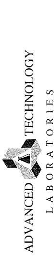

3275 Walnut Ave., Signal Hill, CA 90755

CHAIN OF CUSTODY RECORD

f
page

10
of
3
STOCKS
RECORD

| ATLCOC Ver:20180321                    |                                | For Laboratory Use Only |   |                           |   |   |
|----------------------------------------|--------------------------------|-------------------------|---|---------------------------|---|---|
| Method of Transport                    | Sample Conditions Upon Receipt |                         |   |                           |   |   |
|                                        | Condition                      | Y                       | N | Condition                 | Y | N |
| Client<br>□ FedEx<br>□ GSO<br>□ Other: | 1. CHILLED                     |                         |   | 5. # OF SAMPLES MATCH COC | X | □ |
|                                        | 2. HEADSPACE (VOA)             |                         |   | 6. PRESERVED              | □ | □ |
|                                        | 3. CONTAINER INTACT            | X                       | □ | 7. COOLER TEMP, deg C:    | X | □ |
|                                        | 4. SEALED                      | □                       | □ |                           |   |   |

|                                         | Tel: (562) 989-4045 • Fax: (562) 989-4040                                                                                                                                                                                                                                                                                                                                                                                       | İnstru                              | <u>instruction</u> : Complete all shaded areas.                                                                                                                                                                                                                                                                                                                                                                | eas.                             | 3. CONTAINER INTACT A 4. SEALED                                                                                                                                                                                                                                                                                                                                                                                           | VZ COOLER TEMP, deg C: 5                                                                                                                                                                                                                                                                                                                                                                                                                                                                                          | Τ            |
|-----------------------------------------|---------------------------------------------------------------------------------------------------------------------------------------------------------------------------------------------------------------------------------------------------------------------------------------------------------------------------------------------------------------------------------------------------------------------------------|-------------------------------------|----------------------------------------------------------------------------------------------------------------------------------------------------------------------------------------------------------------------------------------------------------------------------------------------------------------------------------------------------------------------------------------------------------------|----------------------------------|---------------------------------------------------------------------------------------------------------------------------------------------------------------------------------------------------------------------------------------------------------------------------------------------------------------------------------------------------------------------------------------------------------------------------|-------------------------------------------------------------------------------------------------------------------------------------------------------------------------------------------------------------------------------------------------------------------------------------------------------------------------------------------------------------------------------------------------------------------------------------------------------------------------------------------------------------------|--------------|
|                                         | Company:                                                                                                                                                                                                                                                                                                                                                                                                                        |                                     | Address: 3160 Gold Valley                                                                                                                                                                                                                                                                                                                                                                                      | 3160 Gold Valley Drive Suite 800 |                                                                                                                                                                                                                                                                                                                                                                                                                           | (016) 053 0110                                                                                                                                                                                                                                                                                                                                                                                                                                                                                                    |              |
|                                         | Geocon Consultants, Inc.                                                                                                                                                                                                                                                                                                                                                                                                        | Ö                                   | 14                                                                                                                                                                                                                                                                                                                                                                                                             | State: CA                        |                                                                                                                                                                                                                                                                                                                                                                                                                           | (910) 052-9110                                                                                                                                                                                                                                                                                                                                                                                                                                                                                                    |              |
| Я :                                     | SEND REPORT                                                                                                                                                                                                                                                                                                                                                                                                                     | EPORT TO:                           |                                                                                                                                                                                                                                                                                                                                                                                                                | END INVOICE TO:                  | SEPORT TO                                                                                                                                                                                                                                                                                                                                                                                                                 | 2010 200 010                                                                                                                                                                                                                                                                                                                                                                                                                                                                                                      |              |
| I W C                                   | Attn:                                                                                                                                                                                                                                                                                                                                                                                                                           | (1) Email: TIME THE                 | a Character Co.                                                                                                                                                                                                                                                                                                                                                                                                | Emai                             |                                                                                                                                                                                                                                                                                                                                                                                                                           | Excel                                                                                                                                                                                                                                                                                                                                                                                                                                                                                                             | ine<br>Tine  |
| TS                                      | Company: Geocon Consultants, Inc.                                                                                                                                                                                                                                                                                                                                                                                               | C.                                  | Company:                                                                                                                                                                                                                                                                                                                                                                                                       |                                  |                                                                                                                                                                                                                                                                                                                                                                                                                           | — □ EUF □ Caltrans<br>□ Equis □ Legal                                                                                                                                                                                                                                                                                                                                                                                                                                                                             | rans         |
| nο                                      | Address: 3160 Gold Valley Drive, Suite 800                                                                                                                                                                                                                                                                                                                                                                                      | 008                                 | Address:                                                                                                                                                                                                                                                                                                                                                                                                       |                                  |                                                                                                                                                                                                                                                                                                                                                                                                                           | RWQCB Clevel IV                                                                                                                                                                                                                                                                                                                                                                                                                                                                                                   |              |
|                                         | City: Rancho Cordova                                                                                                                                                                                                                                                                                                                                                                                                            | State: CA   Zip: 95742              | City:                                                                                                                                                                                                                                                                                                                                                                                                          | State:                           | Zip:                                                                                                                                                                                                                                                                                                                                                                                                                      |                                                                                                                                                                                                                                                                                                                                                                                                                                                                                                                   |              |
|                                         | Project Name:                                                                                                                                                                                                                                                                                                                                                                                                                   | Quote #:   Special Instructions/Cor | s/Comments:                                                                                                                                                                                                                                                                                                                                                                                                    | Requested Analysis               | Sample Matrix                                                                                                                                                                                                                                                                                                                                                                                                             | Container                                                                                                                                                                                                                                                                                                                                                                                                                                                                                                         |              |
|                                         | 10-10-10-10-10-10-10-10-10-10-10-10-10-1                                                                                                                                                                                                                                                                                                                                                                                        | PO# 3-price                         | (S2)                                                                                                                                                                                                                                                                                                                                                                                                           | (slasels)                        |                                                                                                                                                                                                                                                                                                                                                                                                                           | 7) 4=Pint;                                                                                                                                                                                                                                                                                                                                                                                                                                                                                                        |              |
|                                         | Sampler:                                                                                                                                                                                                                                                                                                                                                                                                                        | SWA                                 |                                                                                                                                                                                                                                                                                                                                                                                                                | volstile 22                      |                                                                                                                                                                                                                                                                                                                                                                                                                           | Damit bu                                                                                                                                                                                                                                                                                                                                                                                                                                                                                                          | <del></del>  |
| Ş                                       | E Laboratory ID                                                                                                                                                                                                                                                                                                                                                                                                                 | Sample Description                  | (GRO)<br>(DRO)<br>(Orgar<br>(PCBs                                                                                                                                                                                                                                                                                                                                                                              | 0004 /                           | TAWQN<br>H∃TAW∃                                                                                                                                                                                                                                                                                                                                                                                                           | ntity<br>=Tube;<br>=Tedlar;<br>al: 1=Gl<br>vative:                                                                                                                                                                                                                                                                                                                                                                                                                                                                | CLIP         |
| 3 7 d                                   | (For Lab Use Only)                                                                                                                                                                                                                                                                                                                                                                                                              | Sample ID / Location Date           | 8087<br>8072<br>8072<br>8078<br>9078                                                                                                                                                                                                                                                                                                                                                                           |                                  | JIO                                                                                                                                                                                                                                                                                                                                                                                                                       | Cual<br>Type: 1<br>Selar; 6<br>Insteri                                                                                                                                                                                                                                                                                                                                                                                                                                                                            |              |
| ΜA                                      | 1 20045801 CAB/                                                                                                                                                                                                                                                                                                                                                                                                                 | 0-5 2-21-20                         | 11 \ 5780 0                                                                                                                                                                                                                                                                                                                                                                                                    |                                  | \\\\\\\\\\\\\\\\\\\\\\\\\\\\\\\\\\\\\\                                                                                                                                                                                                                                                                                                                                                                                    | 7/11/2                                                                                                                                                                                                                                                                                                                                                                                                                                                                                                            |              |
| /S                                      | 2 1 0 CAB 82                                                                                                                                                                                                                                                                                                                                                                                                                    | 1 202                               | 18 5880                                                                                                                                                                                                                                                                                                                                                                                                        | The Comes !                      | X<br>X                                                                                                                                                                                                                                                                                                                                                                                                                    | 77.17                                                                                                                                                                                                                                                                                                                                                                                                                                                                                                             |              |
| T D 3                                   | 3 CAP B3                                                                                                                                                                                                                                                                                                                                                                                                                        | 2-0                                 | 1 1530                                                                                                                                                                                                                                                                                                                                                                                                         |                                  | l X                                                                                                                                                                                                                                                                                                                                                                                                                       | 7 1 1 7 4                                                                                                                                                                                                                                                                                                                                                                                                                                                                                                         |              |
| ΙO                                      | 4   voy   CAP BI                                                                                                                                                                                                                                                                                                                                                                                                                | 12-5                                | S20 \                                                                                                                                                                                                                                                                                                                                                                                                          |                                  | X                                                                                                                                                                                                                                                                                                                                                                                                                         | 16 17                                                                                                                                                                                                                                                                                                                                                                                                                                                                                                             |              |
| Я Ч                                     | 5 -05 CAP BI                                                                                                                                                                                                                                                                                                                                                                                                                    | 5-2 7                               | 080                                                                                                                                                                                                                                                                                                                                                                                                            | 2 Johnson 1                      | 1,                                                                                                                                                                                                                                                                                                                                                                                                                        | 16 1 17                                                                                                                                                                                                                                                                                                                                                                                                                                                                                                           |              |
|                                         | 6 ~ ~ ~ 6                                                                                                                                                                                                                                                                                                                                                                                                                       | 5-2-2                               | 080                                                                                                                                                                                                                                                                                                                                                                                                            |                                  | N                                                                                                                                                                                                                                                                                                                                                                                                                         | 7 1 1 3 4                                                                                                                                                                                                                                                                                                                                                                                                                                                                                                         |              |
|                                         | 7 -07 CAPB                                                                                                                                                                                                                                                                                                                                                                                                                      | 1-0-2                               | 111111111111111111111111111111111111111                                                                                                                                                                                                                                                                                                                                                                        |                                  | X                                                                                                                                                                                                                                                                                                                                                                                                                         | 76112                                                                                                                                                                                                                                                                                                                                                                                                                                                                                                             |              |
| ·····                                   | 8 -08 MBS                                                                                                                                                                                                                                                                                                                                                                                                                       | 7-0-2                               | VK   Sibo                                                                                                                                                                                                                                                                                                                                                                                                      |                                  | X                                                                                                                                                                                                                                                                                                                                                                                                                         | 100112                                                                                                                                                                                                                                                                                                                                                                                                                                                                                                            |              |
| *************************************** | 9 (1 -CT CAPB6                                                                                                                                                                                                                                                                                                                                                                                                                  | 7-0-1                               | 1925 / M                                                                                                                                                                                                                                                                                                                                                                                                       |                                  |                                                                                                                                                                                                                                                                                                                                                                                                                           | 7                                                                                                                                                                                                                                                                                                                                                                                                                                                                                                                 |              |
|                                         | 10                                                                                                                                                                                                                                                                                                                                                                                                                              |                                     |                                                                                                                                                                                                                                                                                                                                                                                                                |                                  |                                                                                                                                                                                                                                                                                                                                                                                                                           |                                                                                                                                                                                                                                                                                                                                                                                                                                                                                                                   |              |
| R M S                                   | 1. Sample receiving hours. 7:30 AM to 7:30 PM Monday - Friday, Saturday 8:00 AM to 12:00 PM. 2. Samples submitted AFTER 3:00 PM are considered received the following business day at 8:00 AM. 3. The following furnaround fine conditions apply. TAT = 0:300% surcharge SAMF BUSINESS DAY if received by 9:00 AM TAT = 1:100% surcharge RXTM BUSINESS DAY (COB 5:00 PM) TAT = 1:100% surcharge RXTM BUSINESS DAY (COB 5:00 PM) |                                     | to the subcontract lab ask for quote.  6. Liquid and solid samples will be disposed of after 45 calendar days from receipt of samples, air samples will be disposed of after 14 calendar days after receipt of samples.  7. Electronic records maintained for five (5) years from report date.  8. Hard copy reports will be disposed of after 45 calendar days from report date.  9. Storage and Report Fees: | pt of samples; air samples       | regenerated/reformatted report; \$35 per reprocessed EDD TCLP/STLC samples; add 2 days to analysis IAT for extraction alyzed samples will incur a disposal fee of \$7 per sample incoratory will incur a disposal fee of \$7 per sample incoratory will andomnly select from all QC damples received Matrix Spike Duplicate (MS/MSD) at no cost. However, if Ye berform MS/MSD on your sample, a charge will be assessed. | regenerated/reformatted report; \$35 per reprocessed EDD.  10. Rush TCLP/STLC samples: add 2 days to analysis TAT for extraction procedure.  11. Unanalyzed samples will incur a disposal fee of \$7 per sample.  12. The laboratory will renormly select from all QC samples received the sample to spike for Matrix Spike/ Matrix Spike Jugicate (MXKSD) at no cost. However, if you want the laboratory to additionally perform MS/MSD on your sample, a charge will be assessed for the specific sample used. | ike/<br>ally |

3. The following turnaround firms conditions the conditions are conditions with treceived by 9:00 AM

I/I = 1: 100% Surchange NEXT BUSINESS DAY (COB 5:00 PM)

I/I = 2: 5: 50% Surchange NEXT BUSINESS DAY (COB 5:00 PM)

I/I = 3: 3: 30% Surchange 310 BUSINESS DAY (COB 5:00 PM)

I/I = 4: 20% Surchange 41H BUSINESS DAY (COB 5:00 PM)

I/I = 5: 10% SURCHANGE 51H BUSINESS DAY (COB 5:00 PM)

I/I = 5: 10% SURCHANGE 51H BUSINESS DAY (COB 5:00 PM)

4. Weekend, holiday, after-hours work—ask for quote.

5. Subcontract I/I is 10 - 15 business days. Projects requiring shorter I/Ais will incur a surchange respective.

TAT = 4: 20% Surcharge - 4th BUSINESS DAY (COB 5:00 PM)
TAT = 5: NO SURCHARGE - 5th BUSINESS DAY (COB 5:00 PM)
Weekend, holiday, after-hours work --- ask for quote.
Subcontract TAT: 10-15 business days. Designer requires quote.

The following are the results of the survey:

- **Business Days**: 10-15
- **Contract TAT**: 10-15 days
- **Objects received**: 100%
- **Objects during shipping**: 100%
- **Objects with non-conforming**: 0%
- **Objects with non-conforming during shipping**: 0%
- **Objects with non-conforming during shipping, with a surcharge**: 0%
- **Objects with non-conforming during shipping, with a surcharge, with a non-conforming perspective**: 0%

**Note**: TAT stands for Turnaround Time.

- Uquid & solid samples. Complimentary storage for forty-five (45) calendar days from receipt of samples; \$2/sample/month if extended storage or hold is requested.

\*\*Al samples, Complimentary storage for free (10) calendar days from receipt of samples; \$20 samples/week if stended storage is requested.

\*\*Al samples storage storage is requested.

\*\*Hard copy and regenerated reports/FDDs; \$27.50 per hard copy report requested; \$50.00 per

Jime: Q 2 Date: 20

Printed Name Printed Name) ted Name Received by: (Signature and Printed Name) Received by: (Signature Received by: (Signature Time: Date: Relinquished by: (Signature, and Printed Name)
Relinquished by: (Signature and Printed Name) Relinquished by: (Signature and Printed Name)

services from ATL as shown above and hereby guarantee payment as guoted As the authorized agent of the company above, I hereby purchase laboratory Signature

Page 27 of 30

SMRB

# ADVANCED TECHNOLOGY TABORATORIES

CUSTOMER

CHAIN OF CUSTODY RECORD

page
of
2

1. **The following are the results of the 2023 National Math Competition:**

   - **High School Division:**

     - 1st Place: Alice Smith
     - 2nd Place: Bob Johnson
     - 3rd Place: Charlie Brown
   - **Middle School Division:**

     - 1st Place: David Lee
     - 2nd Place: Emily Chen
     - 3rd Place: Frank Garcia
2. **The competition was held on March 15, 2023, at the Grand City Convention Center.**
3. **The total number of participants was 500.**
4. **The next competition will be held in 2024.**

For Laboratory Use Only

ATLCOC Ver:20180321

| Method of Transport                                                                                                                                                                                                                           | Sample Conditions Upon Receipt  |                                |                              |                                 |                                                                                                                                                                                                                                                                                                                                                                                                                                                                                                                   |           |   |   |            |                          |                          |                    |                          |                          |                     |                          |                          |           |                          |                          |
|-----------------------------------------------------------------------------------------------------------------------------------------------------------------------------------------------------------------------------------------------|---------------------------------|--------------------------------|------------------------------|---------------------------------|-------------------------------------------------------------------------------------------------------------------------------------------------------------------------------------------------------------------------------------------------------------------------------------------------------------------------------------------------------------------------------------------------------------------------------------------------------------------------------------------------------------------|-----------|---|---|------------|--------------------------|--------------------------|--------------------|--------------------------|--------------------------|---------------------|--------------------------|--------------------------|-----------|--------------------------|--------------------------|
| <table> <tbody> <tr> <td><input type="checkbox"/> Client</td> </tr> <tr> <td><input type="checkbox"/> FedEx</td> </tr> <tr> <td><input type="checkbox"/> GSO</td> </tr> <tr> <td><input type="checkbox"/> Other:</td> </tr> </tbody> </table> | <input type="checkbox"/> Client | <input type="checkbox"/> FedEx | <input type="checkbox"/> GSO | <input type="checkbox"/> Other: | <table> <tbody> <tr> <td>Condition</td> <td>Y</td> <td>N</td> </tr> <tr> <td>1. CHILLED</td> <td><input type="checkbox"/></td> <td><input type="checkbox"/></td> </tr> <tr> <td>2. HEADSPACE (VOA)</td> <td><input type="checkbox"/></td> <td><input type="checkbox"/></td> </tr> <tr> <td>3. CONTAINER INTACT</td> <td><input type="checkbox"/></td> <td><input type="checkbox"/></td> </tr> <tr> <td>4. SEALED</td> <td><input type="checkbox"/></td> <td><input type="checkbox"/></td> </tr> </tbody> </table> | Condition | Y | N | 1. CHILLED | <input type="checkbox"/> | <input type="checkbox"/> | 2. HEADSPACE (VOA) | <input type="checkbox"/> | <input type="checkbox"/> | 3. CONTAINER INTACT | <input type="checkbox"/> | <input type="checkbox"/> | 4. SEALED | <input type="checkbox"/> | <input type="checkbox"/> |
| <input type="checkbox"/> Client                                                                                                                                                                                                               |                                 |                                |                              |                                 |                                                                                                                                                                                                                                                                                                                                                                                                                                                                                                                   |           |   |   |            |                          |                          |                    |                          |                          |                     |                          |                          |           |                          |                          |
| <input type="checkbox"/> FedEx                                                                                                                                                                                                                |                                 |                                |                              |                                 |                                                                                                                                                                                                                                                                                                                                                                                                                                                                                                                   |           |   |   |            |                          |                          |                    |                          |                          |                     |                          |                          |           |                          |                          |
| <input type="checkbox"/> GSO                                                                                                                                                                                                                  |                                 |                                |                              |                                 |                                                                                                                                                                                                                                                                                                                                                                                                                                                                                                                   |           |   |   |            |                          |                          |                    |                          |                          |                     |                          |                          |           |                          |                          |
| <input type="checkbox"/> Other:                                                                                                                                                                                                               |                                 |                                |                              |                                 |                                                                                                                                                                                                                                                                                                                                                                                                                                                                                                                   |           |   |   |            |                          |                          |                    |                          |                          |                     |                          |                          |           |                          |                          |
| Condition                                                                                                                                                                                                                                     | Y                               | N                              |                              |                                 |                                                                                                                                                                                                                                                                                                                                                                                                                                                                                                                   |           |   |   |            |                          |                          |                    |                          |                          |                     |                          |                          |           |                          |                          |
| 1. CHILLED                                                                                                                                                                                                                                    | <input type="checkbox"/>        | <input type="checkbox"/>       |                              |                                 |                                                                                                                                                                                                                                                                                                                                                                                                                                                                                                                   |           |   |   |            |                          |                          |                    |                          |                          |                     |                          |                          |           |                          |                          |
| 2. HEADSPACE (VOA)                                                                                                                                                                                                                            | <input type="checkbox"/>        | <input type="checkbox"/>       |                              |                                 |                                                                                                                                                                                                                                                                                                                                                                                                                                                                                                                   |           |   |   |            |                          |                          |                    |                          |                          |                     |                          |                          |           |                          |                          |
| 3. CONTAINER INTACT                                                                                                                                                                                                                           | <input type="checkbox"/>        | <input type="checkbox"/>       |                              |                                 |                                                                                                                                                                                                                                                                                                                                                                                                                                                                                                                   |           |   |   |            |                          |                          |                    |                          |                          |                     |                          |                          |           |                          |                          |
| 4. SEALED                                                                                                                                                                                                                                     | <input type="checkbox"/>        | <input type="checkbox"/>       |                              |                                 |                                                                                                                                                                                                                                                                                                                                                                                                                                                                                                                   |           |   |   |            |                          |                          |                    |                          |                          |                     |                          |                          |           |                          |                          |

| 5. # OF SAMPLES MATCH COC: | <input type="checkbox"/> | <input type="checkbox"/> |   |
|----------------------------|--------------------------|--------------------------|---|
| 6. PRESERVED               | <input type="checkbox"/> | <input type="checkbox"/> |   |
| 7. COOLER TEMP, deg C:     | <input type="checkbox"/> | <input type="checkbox"/> | 5 |

| 3275 Walnut Ave., Signal Hill, CA 90755                                                                                                   | CA 90755                                                                                                                                                                                                                                                                                            |                                                                                                                                                                                                                                                             |                                                                                                                                                                                                                                                                                                                                                                                                                                                                                                                                                                                                                                                                                                                                                                                                                                                                                                                                                                                                                                                                                                                                                                                                                                                                                                                                                                                                                                                                                                                                                                                                                                                                                                                                                                                                                                                                                                                                                                                                                                                                                                                                |                                          |                         |                    | Fedex C                                                                                                                                                                                                                                                                                                                                                                                              | OnTrac                                                                     | 2. HEADSPACE (V0A) 3. CONTAINER INTACT                                                                                    |                                                                                 |                                                 | 6. PRESERVED<br>7. COOLER TEMP, deg C:               | 0                                      |
|-------------------------------------------------------------------------------------------------------------------------------------------|-----------------------------------------------------------------------------------------------------------------------------------------------------------------------------------------------------------------------------------------------------------------------------------------------------|-------------------------------------------------------------------------------------------------------------------------------------------------------------------------------------------------------------------------------------------------------------|--------------------------------------------------------------------------------------------------------------------------------------------------------------------------------------------------------------------------------------------------------------------------------------------------------------------------------------------------------------------------------------------------------------------------------------------------------------------------------------------------------------------------------------------------------------------------------------------------------------------------------------------------------------------------------------------------------------------------------------------------------------------------------------------------------------------------------------------------------------------------------------------------------------------------------------------------------------------------------------------------------------------------------------------------------------------------------------------------------------------------------------------------------------------------------------------------------------------------------------------------------------------------------------------------------------------------------------------------------------------------------------------------------------------------------------------------------------------------------------------------------------------------------------------------------------------------------------------------------------------------------------------------------------------------------------------------------------------------------------------------------------------------------------------------------------------------------------------------------------------------------------------------------------------------------------------------------------------------------------------------------------------------------------------------------------------------------------------------------------------------------|------------------------------------------|-------------------------|--------------------|------------------------------------------------------------------------------------------------------------------------------------------------------------------------------------------------------------------------------------------------------------------------------------------------------------------------------------------------------------------------------------------------------|----------------------------------------------------------------------------|---------------------------------------------------------------------------------------------------------------------------|---------------------------------------------------------------------------------|-------------------------------------------------|------------------------------------------------------|----------------------------------------|
| lel: (562) 989-4045 ♥ rax: (562) 969-4040                                                                                                 | 2) 383-4040                                                                                                                                                                                                                                                                                         | Instruct                                                                                                                                                                                                                                                    | <u>Instruction</u> : Complete all shaded areas.                                                                                                                                                                                                                                                                                                                                                                                                                                                                                                                                                                                                                                                                                                                                                                                                                                                                                                                                                                                                                                                                                                                                                                                                                                                                                                                                                                                                                                                                                                                                                                                                                                                                                                                                                                                                                                                                                                                                                                                                                                                                                | ete all shadı                            | ed areas.               |                    | Olmer:                                                                                                                                                                                                                                                                                                                                                                                               |                                                                            | 4. SEALED                                                                                                                 | LJ                                                                              | 0                                               |                                                      |                                        |
| Company:                                                                                                                                  |                                                                                                                                                                                                                                                                                                     |                                                                                                                                                                                                                                                             | Address:                                                                                                                                                                                                                                                                                                                                                                                                                                                                                                                                                                                                                                                                                                                                                                                                                                                                                                                                                                                                                                                                                                                                                                                                                                                                                                                                                                                                                                                                                                                                                                                                                                                                                                                                                                                                                                                                                                                                                                                                                                                                                                                       | 3160 Gold \                              | 3160 Gold Valley Drive, | , Suite 800        |                                                                                                                                                                                                                                                                                                                                                                                                      |                                                                            |                                                                                                                           | Tel: (                                                                          | (916) 852-9118                                  | -9118                                                |                                        |
| Geocon Consultants, Inc.                                                                                                                  | Itants, Inc.                                                                                                                                                                                                                                                                                        |                                                                                                                                                                                                                                                             | City:                                                                                                                                                                                                                                                                                                                                                                                                                                                                                                                                                                                                                                                                                                                                                                                                                                                                                                                                                                                                                                                                                                                                                                                                                                                                                                                                                                                                                                                                                                                                                                                                                                                                                                                                                                                                                                                                                                                                                                                                                                                                                                                          | Rancho Cordova                           | dova                    |                    | State: C                                                                                                                                                                                                                                                                                                                                                                                             | CA Zi                                                                      | Zip: 95742                                                                                                                | Fax: (g                                                                         | (916) 852-9132                                  | -9132                                                |                                        |
|                                                                                                                                           | SEND REPORT TO:                                                                                                                                                                                                                                                                                     |                                                                                                                                                                                                                                                             |                                                                                                                                                                                                                                                                                                                                                                                                                                                                                                                                                                                                                                                                                                                                                                                                                                                                                                                                                                                                                                                                                                                                                                                                                                                                                                                                                                                                                                                                                                                                                                                                                                                                                                                                                                                                                                                                                                                                                                                                                                                                                                                                |                                          | SEND INVOICE TO         | /OICE TO:          |                                                                                                                                                                                                                                                                                                                                                                                                      | same                                                                       | same as SEND REPORT                                                                                                       | EPORT TO                                                                        | EDD                                             |                                                      | OA/OC                                  |
| Attn: TOWN                                                                                                                                | TUMBEL) Email:                                                                                                                                                                                                                                                                                      |                                                                                                                                                                                                                                                             | Attn:                                                                                                                                                                                                                                                                                                                                                                                                                                                                                                                                                                                                                                                                                                                                                                                                                                                                                                                                                                                                                                                                                                                                                                                                                                                                                                                                                                                                                                                                                                                                                                                                                                                                                                                                                                                                                                                                                                                                                                                                                                                                                                                          |                                          |                         |                    |                                                                                                                                                                                                                                                                                                                                                                                                      | Email:                                                                     |                                                                                                                           |                                                                                 | □ Excel                                         | '\                                                   | Routine                                |
| Company: Geocon Consultants, Inc.                                                                                                         | ltants, Inc.                                                                                                                                                                                                                                                                                        |                                                                                                                                                                                                                                                             | Company:                                                                                                                                                                                                                                                                                                                                                                                                                                                                                                                                                                                                                                                                                                                                                                                                                                                                                                                                                                                                                                                                                                                                                                                                                                                                                                                                                                                                                                                                                                                                                                                                                                                                                                                                                                                                                                                                                                                                                                                                                                                                                                                       |                                          |                         |                    |                                                                                                                                                                                                                                                                                                                                                                                                      |                                                                            |                                                                                                                           |                                                                                 |                                                 | <b>.</b>                                             | □ Legal                                |
| Address: 3160 Gold Valley Drive, Suite 800                                                                                                | rive, Suite 800                                                                                                                                                                                                                                                                                     |                                                                                                                                                                                                                                                             | - Address:                                                                                                                                                                                                                                                                                                                                                                                                                                                                                                                                                                                                                                                                                                                                                                                                                                                                                                                                                                                                                                                                                                                                                                                                                                                                                                                                                                                                                                                                                                                                                                                                                                                                                                                                                                                                                                                                                                                                                                                                                                                                                                                     |                                          |                         |                    |                                                                                                                                                                                                                                                                                                                                                                                                      |                                                                            |                                                                                                                           |                                                                                 | ]<br>]                                          | 1                                                    | □ KWQCB                                |
| City: Rancho Cordova                                                                                                                      | State: CA                                                                                                                                                                                                                                                                                           | Zip: 95742                                                                                                                                                                                                                                                  | City:                                                                                                                                                                                                                                                                                                                                                                                                                                                                                                                                                                                                                                                                                                                                                                                                                                                                                                                                                                                                                                                                                                                                                                                                                                                                                                                                                                                                                                                                                                                                                                                                                                                                                                                                                                                                                                                                                                                                                                                                                                                                                                                          |                                          |                         |                    | State                                                                                                                                                                                                                                                                                                                                                                                                |                                                                            | Zip:                                                                                                                      |                                                                                 |                                                 |                                                      |                                        |
| Project Name:                                                                                                                             | Quote #; Special                                                                                                                                                                                                                                                                                    | Special Instructions/Comn                                                                                                                                                                                                                                   | Comments:                                                                                                                                                                                                                                                                                                                                                                                                                                                                                                                                                                                                                                                                                                                                                                                                                                                                                                                                                                                                                                                                                                                                                                                                                                                                                                                                                                                                                                                                                                                                                                                                                                                                                                                                                                                                                                                                                                                                                                                                                                                                                                                      | **************************************   | Requ                    | Requested Analysis | ysis                                                                                                                                                                                                                                                                                                                                                                                                 |                                                                            | Sample Matrix                                                                                                             | /Jatrix                                                                         | Co                                              | Container                                            |                                        |
| 5/6-1500                                                                                                                                  |                                                                                                                                                                                                                                                                                                     | 769                                                                                                                                                                                                                                                         | 4                                                                                                                                                                                                                                                                                                                                                                                                                                                                                                                                                                                                                                                                                                                                                                                                                                                                                                                                                                                                                                                                                                                                                                                                                                                                                                                                                                                                                                                                                                                                                                                                                                                                                                                                                                                                                                                                                                                                                                                                                                                                                                                              | (29b                                     |                         |                    |                                                                                                                                                                                                                                                                                                                                                                                                      |                                                                            |                                                                                                                           | (1                                                                              |                                                 | :4052                                                |                                        |
| The Marie Mary                                                                                                                            | -2/ PO#:                                                                                                                                                                                                                                                                                            |                                                                                                                                                                                                                                                             |                                                                                                                                                                                                                                                                                                                                                                                                                                                                                                                                                                                                                                                                                                                                                                                                                                                                                                                                                                                                                                                                                                                                                                                                                                                                                                                                                                                                                                                                                                                                                                                                                                                                                                                                                                                                                                                                                                                                                                                                                                                                                                                                |                                          | (:                      |                    |                                                                                                                                                                                                                                                                                                                                                                                                      |                                                                            |                                                                                                                           | .V1/ 0                                                                          | q=b (191)                                       | 103; 3≖Me                                            |                                        |
| Sampler:                                                                                                                                  |                                                                                                                                                                                                                                                                                                     |                                                                                                                                                                                                                                                             |                                                                                                                                                                                                                                                                                                                                                                                                                                                                                                                                                                                                                                                                                                                                                                                                                                                                                                                                                                                                                                                                                                                                                                                                                                                                                                                                                                                                                                                                                                                                                                                                                                                                                                                                                                                                                                                                                                                                                                                                                                                                                                                                | ····                                     |                         |                    |                                                                                                                                                                                                                                                                                                                                                                                                      |                                                                            |                                                                                                                           |                                                                                 | Z=VOA; 3=L                                      | T= Caniste  Isas; Z=Plast  I=HCl; Z=Hl  Z; 6=NaOH; 7 | 41000-04                               |
| S   Jahoratory ID                                                                                                                         | Sample Description                                                                                                                                                                                                                                                                                  | ion                                                                                                                                                                                                                                                         | NO CONTRACTOR OF THE CONTRACTOR OF THE CONTRACTOR OF THE CONTRACTOR OF THE CONTRACTOR OF THE CONTRACTOR OF THE CONTRACTOR OF THE CONTRACTOR OF THE CONTRACTOR OF THE CONTRACTOR OF THE CONTRACTOR OF THE CONTRACTOR OF THE CONTRACTOR OF THE CONTRACTOR OF THE CONTRACTOR OF THE CONTRACTOR OF THE CONTRACTOR OF THE CONTRACTOR OF THE CONTRACTOR OF THE CONTRACTOR OF THE CONTRACTOR OF THE CONTRACTOR OF THE CONTRACTOR OF THE CONTRACTOR OF THE CONTRACTOR OF THE CONTRACTOR OF THE CONTRACTOR OF THE CONTRACTOR OF THE CONTRACTOR OF THE CONTRACTOR OF THE CONTRACTOR OF THE CONTRACTOR OF THE CONTRACTOR OF THE CONTRACTOR OF THE CONTRACTOR OF THE CONTRACTOR OF THE CONTRACTOR OF THE CONTRACTOR OF THE CONTRACTOR OF THE CONTRACTOR OF THE CONTRACTOR OF THE CONTRACTOR OF THE CONTRACTOR OF THE CONTRACTOR OF THE CONTRACTOR OF THE CONTRACTOR OF THE CONTRACTOR OF THE CONTRACTOR OF THE CONTRACTOR OF THE CONTRACTOR OF THE CONTRACTOR OF THE CONTRACTOR OF THE CONTRACTOR OF THE CONTRACTOR OF THE CONTRACTOR OF THE CONTRACTOR OF THE CONTRACTOR OF THE CONTRACTOR OF THE CONTRACTOR OF THE CONTRACTOR OF THE CONTRACTOR OF THE CONTRACTOR OF THE CONTRACTOR OF THE CONTRACTOR OF THE CONTRACTOR OF THE CONTRACTOR OF THE CONTRACTOR OF THE CONTRACTOR OF THE CONTRACTOR OF THE CONTRACTOR OF THE CONTRACTOR OF THE CONTRACTOR OF THE CONTRACTOR OF THE CONTRACTOR OF THE CONTRACTOR OF THE CONTRACTOR OF THE CONTRACTOR OF THE CONTRACTOR OF THE CONTRACTOR OF THE CONTRACTOR OF THE CONTRACTOR OF THE CONTRACTOR OF THE CONTRACTOR OF THE CONTRACTOR OF THE CONTRACTOR OF THE CONTRACTOR OF THE CONTRACTOR OF THE CONTRACTOR OF THE CONTRACTOR OF THE CONTRACTOR OF THE CONTRACTOR OF THE CONTRACTOR OF THE CONTRACTOR OF THE CONTRACTOR OF THE CONTRACTOR OF THE CONTRACTOR OF THE CONTRACTOR OF THE CONTRACTOR OF THE CONTRACTOR OF THE CONTRACTOR OF THE CONTRACTOR OF THE CONTRACTOR OF THE CONTRACTOR OF THE CONTRACTOR OF THE CONTRACTOR OF THE CONTRACTOR OF THE CONTRACTOR OF THE CONTRACTOR OF THE CONTRACTOR OF THE CONTRACTOR OF THE CONTRACTOR OF THE CONTRACTOR OF THE CONTRACTOR OF THE CONTRACTO | (GRO)                                    | (Semi                   | ς                  |                                                                                                                                                                                                                                                                                                                                                                                                      |                                                                            | AWGN                                                                                                                      |                                                                                 | γ <del>յե</del> υ<br><sub>(eduT=£</sub>         | D=I :lai<br>Svitev                                   | sha                                    |
| (For Lab Use Only)                                                                                                                        | Sample ID / Location                                                                                                                                                                                                                                                                                | Date                                                                                                                                                                                                                                                        | Time                                                                                                                                                                                                                                                                                                                                                                                                                                                                                                                                                                                                                                                                                                                                                                                                                                                                                                                                                                                                                                                                                                                                                                                                                                                                                                                                                                                                                                                                                                                                                                                                                                                                                                                                                                                                                                                                                                                                                                                                                                                                                                                           | 8012                                     | 0109<br>0728<br>2808    | 1-01               |                                                                                                                                                                                                                                                                                                                                                                                                      |                                                                            |                                                                                                                           | ΊO                                                                              | Gua<br>Type:                                    | nateM<br>Prese                                       |                                        |
| 1 300 458-10 C                                                                                                                            | 5-7 48 24                                                                                                                                                                                                                                                                                           | 272                                                                                                                                                                                                                                                         | 0160                                                                                                                                                                                                                                                                                                                                                                                                                                                                                                                                                                                                                                                                                                                                                                                                                                                                                                                                                                                                                                                                                                                                                                                                                                                                                                                                                                                                                                                                                                                                                                                                                                                                                                                                                                                                                                                                                                                                                                                                                                                                                                                           | 1                                        | 2                       |                    |                                                                                                                                                                                                                                                                                                                                                                                                      |                                                                            | \<br>\                                                                                                                    | \ \ \ \ \ \ \ \ \ \ \ \ \ \ \ \ \ \ \                                           | 2                                               | 3.4                                                  |                                        |
| 2 1 -11 6                                                                                                                                 | TAP B5 2-5                                                                                                                                                                                                                                                                                          |                                                                                                                                                                                                                                                             | 02.60                                                                                                                                                                                                                                                                                                                                                                                                                                                                                                                                                                                                                                                                                                                                                                                                                                                                                                                                                                                                                                                                                                                                                                                                                                                                                                                                                                                                                                                                                                                                                                                                                                                                                                                                                                                                                                                                                                                                                                                                                                                                                                                          | Δ                                        | 7                       | Ž                  | 1/2 TO 1/2                                                                                                                                                                                                                                                                                                                                                                                           |                                                                            |                                                                                                                           |                                                                                 | 7                                               | 2                                                    |                                        |
| 3                                                                                                                                         | NP 86 2-5                                                                                                                                                                                                                                                                                           |                                                                                                                                                                                                                                                             | 222                                                                                                                                                                                                                                                                                                                                                                                                                                                                                                                                                                                                                                                                                                                                                                                                                                                                                                                                                                                                                                                                                                                                                                                                                                                                                                                                                                                                                                                                                                                                                                                                                                                                                                                                                                                                                                                                                                                                                                                                                                                                                                                            | 7                                        | S                       |                    |                                                                                                                                                                                                                                                                                                                                                                                                      |                                                                            |                                                                                                                           |                                                                                 |                                                 | 8                                                    |                                        |
| 4                                                                                                                                         | TAD R7 0-2                                                                                                                                                                                                                                                                                          |                                                                                                                                                                                                                                                             | Shell and the second                                                                                                                                                                                                                                                                                                                                                                                                                                                                                                                                                                                                                                                                                                                                                                                                                                                                                                                                                                                                                                                                                                                                                                                                                                                                                                                                                                                                                                                                                                                                                                                                                                                                                                                                                                                                                                                                                                                                                                                                                                                                                                           | _                                        |                         |                    |                                                                                                                                                                                                                                                                                                                                                                                                      |                                                                            | E                                                                                                                         |                                                                                 |                                                 | 2                                                    |                                        |
| 5 - [1]                                                                                                                                   | 7-0 88 W                                                                                                                                                                                                                                                                                            |                                                                                                                                                                                                                                                             | 0560                                                                                                                                                                                                                                                                                                                                                                                                                                                                                                                                                                                                                                                                                                                                                                                                                                                                                                                                                                                                                                                                                                                                                                                                                                                                                                                                                                                                                                                                                                                                                                                                                                                                                                                                                                                                                                                                                                                                                                                                                                                                                                                           | Ŕ                                        |                         | 3                  | 2072                                                                                                                                                                                                                                                                                                                                                                                                 |                                                                            | H                                                                                                                         | ) \ \ \ \ \ \ \ \ \ \ \ \ \ \ \ \ \ \ \                                         |                                                 | 7                                                    |                                        |
| 2 5 9                                                                                                                                     | TP 29 0-L                                                                                                                                                                                                                                                                                           |                                                                                                                                                                                                                                                             | 1000                                                                                                                                                                                                                                                                                                                                                                                                                                                                                                                                                                                                                                                                                                                                                                                                                                                                                                                                                                                                                                                                                                                                                                                                                                                                                                                                                                                                                                                                                                                                                                                                                                                                                                                                                                                                                                                                                                                                                                                                                                                                                                                           |                                          |                         |                    |                                                                                                                                                                                                                                                                                                                                                                                                      |                                                                            | بر                                                                                                                        |                                                                                 |                                                 | 77                                                   |                                        |
| 2 91- 6                                                                                                                                   | 52 to M                                                                                                                                                                                                                                                                                             |                                                                                                                                                                                                                                                             | 0945                                                                                                                                                                                                                                                                                                                                                                                                                                                                                                                                                                                                                                                                                                                                                                                                                                                                                                                                                                                                                                                                                                                                                                                                                                                                                                                                                                                                                                                                                                                                                                                                                                                                                                                                                                                                                                                                                                                                                                                                                                                                                                                           | 7                                        | 1                       |                    |                                                                                                                                                                                                                                                                                                                                                                                                      |                                                                            | 7                                                                                                                         |                                                                                 | 1772                                            | 19 6                                                 |                                        |
| \\ \( \) \\ \\ \\ \\ \\ \\ \\ \\ \\ \\ \\ \\                                                                                              | N 88 2-5                                                                                                                                                                                                                                                                                            |                                                                                                                                                                                                                                                             | 245                                                                                                                                                                                                                                                                                                                                                                                                                                                                                                                                                                                                                                                                                                                                                                                                                                                                                                                                                                                                                                                                                                                                                                                                                                                                                                                                                                                                                                                                                                                                                                                                                                                                                                                                                                                                                                                                                                                                                                                                                                                                                                                            |                                          | <b>X</b>                | Ż<br>Ż             | 4/2 / 1/2 m                                                                                                                                                                                                                                                                                                                                                                                          |                                                                            |                                                                                                                           | ×                                                                               | 2                                               | 17                                                   |                                        |
| 0 81- / 6                                                                                                                                 | S-2 58 W                                                                                                                                                                                                                                                                                            | <b>^</b>                                                                                                                                                                                                                                                    | 1005                                                                                                                                                                                                                                                                                                                                                                                                                                                                                                                                                                                                                                                                                                                                                                                                                                                                                                                                                                                                                                                                                                                                                                                                                                                                                                                                                                                                                                                                                                                                                                                                                                                                                                                                                                                                                                                                                                                                                                                                                                                                                                                           | X                                        |                         |                    |                                                                                                                                                                                                                                                                                                                                                                                                      |                                                                            | l<br>V                                                                                                                    |                                                                                 | Ę                                               | 7                                                    |                                        |
| 10                                                                                                                                        |                                                                                                                                                                                                                                                                                                     |                                                                                                                                                                                                                                                             |                                                                                                                                                                                                                                                                                                                                                                                                                                                                                                                                                                                                                                                                                                                                                                                                                                                                                                                                                                                                                                                                                                                                                                                                                                                                                                                                                                                                                                                                                                                                                                                                                                                                                                                                                                                                                                                                                                                                                                                                                                                                                                                                |                                          |                         |                    |                                                                                                                                                                                                                                                                                                                                                                                                      |                                                                            |                                                                                                                           |                                                                                 |                                                 |                                                      |                                        |
| 1. Sample receiving hours: 7:30 AM to 7:30 PM N<br>2. Samples submitted AFTER 3:00 PM are conside                                         | Sample receiving hours: 7:30 AM to 7:30 PM Monday - Friday; Saturday 8:00 AM to 12:00 PM.     Samples submitted AFTER 3:00 PM are considered received the following business day at 8:00 AM.     The samples submitted AFTER 3:00 PM are considered received the following business day at 8:00 AM. | to the subcontract lab ask for quote.<br>6. Liquid and solid samples will be disposed of after 45 calendar days from receipt of samples; air samples                                                                                                        | ocontract lab ask for quote.<br>d samples will be disposed of afte                                                                                                                                                                                                                                                                                                                                                                                                                                                                                                                                                                                                                                                                                                                                                                                                                                                                                                                                                                                                                                                                                                                                                                                                                                                                                                                                                                                                                                                                                                                                                                                                                                                                                                                                                                                                                                                                                                                                                                                                                                                             | er 45 calendar days                      | from receipt of sa      | mples; air sample: |                                                                                                                                                                                                                                                                                                                                                                                                      | ited/reformatte<br>C samples: add                                          | regenerated/reformatted report; \$35 per reprocessed EDD.<br>TCLP/STLC samples; add 2 days to analysis TAT for extraction | r reprocessed EC                                                                | JD.<br>tion procedur                            |                                                      |                                        |
| <ol> <li>The following turnaround time conditions apply:         TAT = 0: 300% Surcharge SAME BUSINESS DAY freceived by 9:00 AM</li></ol> |                                                                                                                                                                                                                                                                                                     | will be tispose or arter 14 calendar days arter receipt or samplies.  7. Electronic records maintained for five (5) years from report date.  8. Hard copy reports will be disposed of after 45 calendar days from report date.  9. Storage and Report Fase: | ed for five (5) years<br>sposed of after 45 ci                                                                                                                                                                                                                                                                                                                                                                                                                                                                                                                                                                                                                                                                                                                                                                                                                                                                                                                                                                                                                                                                                                                                                                                                                                                                                                                                                                                                                                                                                                                                                                                                                                                                                                                                                                                                                                                                                                                                                                                                                                                                                 | from report date.<br>alendar days from i | nples.<br>report date.  |                    | <ol> <li>The Dischous samples will refur a Bubboar lee of x, peff sample.</li> <li>The Bubboardor will randomly select from all QC samples received the sample to spike for Matrix Spike.</li> <li>Matrix Spike Updirect (MS/MSD) at no cost. However, if you want the Bubboardory to additionally perform MS/MSD on your sample, a charge will be assessed for the specific sample used.</li> </ol> | imples will incu<br>v will randomly<br>like Duplicate (I<br>VIS/MSD on you | a disposal rec c<br>select from all Q<br>AS/MSD) at no c<br>r sample, a chai                                              | 4 >7 per samples.<br>C samples receiv<br>ost. However, if<br>'ge will be assess | ed the samply<br>you want the<br>sed for the sp | a to spike for<br>laboratory to                      | Matrix Spike/<br>additionally<br>used. |
|                                                                                                                                           |                                                                                                                                                                                                                                                                                                     | " Olluge and hepoticies.                                                                                                                                                                                                                                    |                                                                                                                                                                                                                                                                                                                                                                                                                                                                                                                                                                                                                                                                                                                                                                                                                                                                                                                                                                                                                                                                                                                                                                                                                                                                                                                                                                                                                                                                                                                                                                                                                                                                                                                                                                                                                                                                                                                                                                                                                                                                                                                                |                                          |                         |                    |                                                                                                                                                                                                                                                                                                                                                                                                      |                                                                            |                                                                                                                           | ,                                                                               |                                                 |                                                      | -                                      |

PROJECT SAMPLES

3. The following turnaround fune conditions apply:
TAT = 0.3 500% Surcharge SAME BUSINESS DAY (Freezived by 9:00 AM
TAT = 1.100% Surcharge NEXT BUSINESS DAY (COB 5:00 PM)
TAT = 2.150% Surcharge APD BUSINESS DAY (COB 5:00 PM)
TAT = 3.20% Surcharge APD BUSINESS DAY (COB 5:00 PM)
TAT = 4.20% Surcharge ATH BUSINESS DAY (COB 5:00 PM)
TAT = 4.20% Surcharge ATH BUSINESS DAY (COB 5:00 PM)
TAT = 4.20% Surcharge ATH BUSINESS DAY (COB 5:00 PM)
TAT = 4.10% Surcharge ATH BUSINESS DAY (COB 5:00 PM)
ATH ATHER HOUSE AND SURCHARGE STIN BUSINESS DAY (COB 5:00 PM)
TAT = 5.100 SURCHARGE STIN BUSINESS DAY (COB 5:00 PM)
ATHER HOUSE AND SURCHARGE STIN BUSINESS DAY (COB 5:00 PM)
TAT = 5.100 SURCHARGE STIN BUSINESS DAY (COB 5:00 PM)
TAT = 5.100 SURCHARGE STIN BUSINESS DAY (COB 5:00 PM)
TAT = 5.100 SURCHARGE STIN BUSINESS DAY (COB 5:00 PM)
TAT = 5.100 SURCHARGE STIN BUSINESS DAY (COB 5:00 PM)
TAT = 5.100 SURCHARGE STIN BUSINESS DAY (COB 5:00 PM)
TAT = 5.100 SURCHARGE STIN BUSINESS DAY (COB 5:00 PM)
TAT = 5.100 SURCHARGE STIN BUSINESS DAY (COB 5:00 PM)
TAT = 5.100 SURCHARGE STIN BUSINESS DAY (COB 5:00 PM)
TAT = 5.100 SURCHARGE STIN BUSINESS DAY (COB 5:00 PM)
TAT = 5.100 SURCHARGE STIN BUSINESS DAY (COB 5:00 PM)
TAT = 5.100 SURCHARGE STIN BUSINESS DAY (COB 5:00 PM)
TAT = 5.100 SURCHARGE STIN BUSINESS DAY (COB 5:00 PM)
TAT = 5.100 SURCHARGE STIN BUSINESS DAY (COB 5:00 PM)
TAT = 5.100 SURCHARGE STIN BUSINESS DAY (COB 5:00 PM)
TAT = 5.100 SURCHARGE STIN BUSINESS DAY (COB 5:00 PM)
TAT = 5.100 SURCHARGE STIN BUSINESS DAY (COB 5:00 PM)
TAT = 5.100 SURCHARGE STIN BUSINESS DAY (COB 5:00 PM)
TAT = 5.100 SURCHARGE STIN BUSINESS DAY (COB 5:00 PM)
TAT = 5.100 SURCHARGE STIN BUSINESS DAY (COB 5:00 PM)
TAT = 5.100 SURCHARGE STIN BUSINESS DAY (COB 5:00 PM)
TAT = 5.100 SURCHARGE STIN BUSINESS DAY (COB 5:00 PM)
TAT = 5.100 SURCHARGE STIN BUSINESS DAY (COB 5:00 PM)
TAT = 5.100 SURCHARGE STIN BUSIN STIN SURCHARGE STIN SURCHARGE STIN SURCHARGE STIN SURCHARGE STIN SURCHARGE STIN SURCHARGE STIN SURCHARGE STIN SURCHARGE STIN SURCHARGE STIN SURCHARGE STIN SURCHA

S W 3

TAT = 4 : 20% Surcharge 4TH BUSINESS DAY (COB 5:00 PM)
TAT = 5 : NO SURCHARGE 5TH BUSINESS DAY (COB 5:00 PM)
weekend, holiday, after-hours work --- ask for quote.

Time: Relinquished by: (Signature and Printed Name)

All be disposed of start At admined days after receipt of samples.

1. Electronic records anithatined for hive [5] years from report date.

8. Hard copy reports will be disposed of after 45 calendar days from report date.

9. Storage and Report lease.

1. Liquid & solid samples. Complimentary storage for forty-five (45) calendar days from receipt of samples, \$2/sample/month if extended storage or hold is requested.

1. As amples. Complimentary storage for the I/O calendar days from receipt of samples; \$20 sample/week if extended storage is requested.

5.20 sample/week if extended storage is requested.

1. Hard copy and regenerated reports/EDDs: \$17.50 per hard copy report requested;

Storage and Report Fees:
- Liquid & solid samples: Complimentary storage for forty-five (45) calendar days
- Samples: \$2/sample/month if extended storage or hold is requested.

Air samples: Complimentary storage for ten (10) calendar days from receipt of sample.
\$20 sample/week if extended storage is requested.
Hard copy and regenerated reports/EDDS \$17.50 per hard copy report requested. \$

As the authorized agent of the company above, I hereby purchase laboratory services from ATL as shown above and hereby guarantee payment as quoted. Time: 2002 Carrier 30

Signature

Printed Name

Date N Received by: (Signature and Printed Name) Received by: (Signature Time: New CONN Felinguished by: (Senature and Printed Majore

Received by: (Signature and Printed

Date:
Time:
Received by: (Signature and Prin

Page 28 of 30

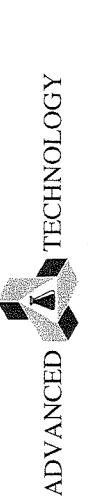

CUSTOMER

# CHAIN OF CUSTODY RECORD

| For Laboratory Use Only |                                | ATLCOC Ver:20180321 |   |                           |   |   |   |              |   |  |
|-------------------------|--------------------------------|---------------------|---|---------------------------|---|---|---|--------------|---|--|
| Method of Transport     | Sample Conditions Upon Receipt |                     |   |                           |   |   |   |              |   |  |
|                         | Condition                      | Y                   | N |                           |   |   |   |              |   |  |
| □ Client                | 1. CHILLED                     | ☑                   | □ | 5. # OF SAMPLES MATCH COC | ☑ |   |   |              |   |  |
| ☑ FedEx                 |                                | □                   | □ |                           |   |   |   |              |   |  |
| □ GSO                   |                                | 2. HEADSPACE (VOA)  | □ |                           |   |   | □ | 6. PRESERVED | □ |  |
| □ Other:                |                                |                     | □ |                           |   |   | □ |              | □ |  |
|                         | 3. CONTAINER INTACT            | ☑                   | □ | 7. COOLER TEMP, deg C:    |   | 5 |   |              |   |  |
|                         | 4. SEALED                      | □                   | □ |                           |   |   |   |              |   |  |

| DVAN                                           | DVANCED - A TE                                                                                                                                    | TECHNOLOGY                                                                                                                                                                                                                                   | S<br>S                               |                                                                                                                             |                                                                                                                                                                                                              |                                         |                     | S                                 |            | Method of Transport                                                                                                                                                                                                                                                                                                            | ransport                                | Co.C. Advantage Control of Control |                                                                                                                                                                     | nditions             | Upon Receipt                   | -                             |  |
|------------------------------------------------|---------------------------------------------------------------------------------------------------------------------------------------------------|----------------------------------------------------------------------------------------------------------------------------------------------------------------------------------------------------------------------------------------------|--------------------------------------|-----------------------------------------------------------------------------------------------------------------------------|--------------------------------------------------------------------------------------------------------------------------------------------------------------------------------------------------------------|-----------------------------------------|---------------------|-----------------------------------|------------|--------------------------------------------------------------------------------------------------------------------------------------------------------------------------------------------------------------------------------------------------------------------------------------------------------------------------------|-----------------------------------------|------------------------------------|---------------------------------------------------------------------------------------------------------------------------------------------------------------------|----------------------|--------------------------------|-------------------------------|--|
|                                                | <b>*</b>                                                                                                                                          | )                                                                                                                                                                                                                                            |                                      |                                                                                                                             | раде 🧳                                                                                                                                                                                                       | ر<br>م                                  |                     |                                   | <u> </u>   |                                                                                                                                                                                                                                                                                                                                | *************************************** | Conc                               | Condition                                                                                                                                                           | z l                  | Condition                      | ┥.                            |  |
| Τ                                              | LABORATORIES                                                                                                                                      | IES                                                                                                                                                                                                                                          |                                      |                                                                                                                             |                                                                                                                                                                                                              |                                         | ı                   |                                   |            |                                                                                                                                                                                                                                                                                                                                | □ ATL                                   | I. CHILLEU                         | ,                                                                                                                                                                   | ] [                  | 5. # UP SAMPLES MAICH CUC.     | _1.                           |  |
| 3275 Wa                                        | 3275 Walnut Ave., Signal Hill, CA 90755                                                                                                           | ill, CA 90755                                                                                                                                                                                                                                |                                      |                                                                                                                             |                                                                                                                                                                                                              |                                         |                     |                                   |            | •                                                                                                                                                                                                                                                                                                                              | Ontrac                                  | 2. HEADSPACE (VOA)                 | _                                                                                                                                                                   |                      | 6. PRESERVED                   |                               |  |
| el: (562)                                      | el: (562) 989-4045 • Fax: (562) 989-4040                                                                                                          | 62) 989-4040                                                                                                                                                                                                                                 |                                      | Instructi                                                                                                                   | <u>Instruction</u> : Complete all shaded areas.                                                                                                                                                              | ete all sha                             | ded area            | ζ.                                |            | Other:                                                                                                                                                                                                                                                                                                                         |                                         | 4. SEALED                          |                                                                                                                                                                     |                      | 7. COULEN IEIMIF, GEG C.       | 1                             |  |
| Company:                                       |                                                                                                                                                   | -                                                                                                                                                                                                                                            |                                      |                                                                                                                             | Address:                                                                                                                                                                                                     | 3160 Gol                                | d Valley D          | 3160 Gold Valley Drive, Suite 800 | 008        |                                                                                                                                                                                                                                                                                                                                |                                         |                                    | Tel: (                                                                                                                                                              | (916) 852-9118       | -9118                          |                               |  |
|                                                | Geocon Consultants, Inc.                                                                                                                          | sultants, Inc.                                                                                                                                                                                                                               |                                      |                                                                                                                             | City:                                                                                                                                                                                                        | Rancho Cordova                          | ordova              |                                   |            | State: C                                                                                                                                                                                                                                                                                                                       | CA Zip:                                 | 95742                              | Fax: (                                                                                                                                                              | (916) 852-9132       | -9132                          |                               |  |
|                                                |                                                                                                                                                   | SEND REPORT TO:                                                                                                                                                                                                                              |                                      |                                                                                                                             |                                                                                                                                                                                                              |                                         | SEN                 | SEND INVOICE TO                   |            |                                                                                                                                                                                                                                                                                                                                | same                                    | same as SEND REPORT                | EPORT TO                                                                                                                                                            | EDD                  |                                | 0A/0C                         |  |
| :<br>EDJ:                                      | J. Links                                                                                                                                          | 1 Christin                                                                                                                                                                                                                                   |                                      |                                                                                                                             | Attu:                                                                                                                                                                                                        |                                         |                     |                                   |            |                                                                                                                                                                                                                                                                                                                                | Emai:                                   |                                    |                                                                                                                                                                     | □ Excel              | •                              | 7 Routine                     |  |
| company:                                       | Geocon Consultants, Inc.                                                                                                                          | ultants, Inc.                                                                                                                                                                                                                                |                                      |                                                                                                                             | Company:                                                                                                                                                                                                     |                                         |                     |                                   |            |                                                                                                                                                                                                                                                                                                                                |                                         |                                    |                                                                                                                                                                     | Equis                | 8                              | ⊔ caltrans<br>□ Legal         |  |
| Address:                                       | 3160 Gold Valley                                                                                                                                  | 3160 Gold Valley Drive, Suite 800                                                                                                                                                                                                            |                                      |                                                                                                                             | Address:                                                                                                                                                                                                     |                                         |                     |                                   |            |                                                                                                                                                                                                                                                                                                                                |                                         |                                    |                                                                                                                                                                     | <br>                 |                                | □ RWQCB<br>□ Level IV         |  |
| Jty:                                           | Rancho Cordova                                                                                                                                    | State: CA                                                                                                                                                                                                                                    | S6 :dIZ                              | 95742                                                                                                                       | City;                                                                                                                                                                                                        |                                         |                     |                                   |            | State                                                                                                                                                                                                                                                                                                                          |                                         | Zip:                               |                                                                                                                                                                     | T                    |                                |                               |  |
| Project Name                                   | ame:                                                                                                                                              | Ouote #: Speci                                                                                                                                                                                                                               | Special Instructions/Comments        | ons/Comn                                                                                                                    | nents:                                                                                                                                                                                                       |                                         |                     | Requested Analysis                | l Analysis |                                                                                                                                                                                                                                                                                                                                |                                         | Sample Matrix                      | Aatrix                                                                                                                                                              | §                    | Container                      |                               |  |
| Project No                                     | 511-15- 17-16                                                                                                                                     | -0/ PO#:                                                                                                                                                                                                                                     | Y                                    | Ý                                                                                                                           |                                                                                                                                                                                                              | (səlit                                  | e Pesticides)<br>(s | (slateM S                         |            |                                                                                                                                                                                                                                                                                                                                |                                         |                                    | (101) 00                                                                                                                                                            | (TAT) 9r             | tic; 3=Metal<br>NO3; 3=H2SO4;  |                               |  |
| Sampler:                                       | 19                                                                                                                                                |                                                                                                                                                                                                                                              |                                      |                                                                                                                             |                                                                                                                                                                                                              |                                         | ****                | 2 9lhiT) 0                        |            |                                                                                                                                                                                                                                                                                                                                |                                         |                                    |                                                                                                                                                                     | I≃E :AOV≃S           | T≃HCI; 2=H                     |                               |  |
| ME                                             | Laboratory ID                                                                                                                                     | Sample Description                                                                                                                                                                                                                           | iption                               |                                                                                                                             |                                                                                                                                                                                                              | ?(DBO)<br>?(GBO)<br>0 \ e:              | S (BCB              |                                   |            |                                                                                                                                                                                                                                                                                                                                |                                         | TIOS                               | eror<br>soric                                                                                                                                                       | OIF                  | eu.D<br>:9qyī                  | Mate                          |  |
|                                                | (For Lab Use Only)                                                                                                                                | Sample ID / Location                                                                                                                                                                                                                         |                                      | Date                                                                                                                        | Time                                                                                                                                                                                                         | 8016                                    | 2808                | 109<br>1-OT                       |            |                                                                                                                                                                                                                                                                                                                                | AWGNI<br>STAWS                          | γtiπι<br>γ±πυπ=τ                   | rial: 1=0<br>rvative                                                                                                                                                | shar                 |                                |                               |  |
| 1<br>K                                         | Decouses 19 (                                                                                                                                     | TAP B10 0-2                                                                                                                                                                                                                                  | 1-2                                  | 120                                                                                                                         | 1020                                                                                                                                                                                                         | $oxed{Z}$                              |                     |                                   |            |                                                                                                                                                                                                                                                                                                                                |                                         | ' ' '                              | 7                                                                                                                                                                   | 2 2                  |                                |                               |  |
| 2                                              | ) S.                                                                                                                                              | TO 811 0-2                                                                                                                                                                                                                                   |                                      |                                                                                                                             | 1030                                                                                                                                                                                                         |                                         |                     | l IX                              |            |                                                                                                                                                                                                                                                                                                                                |                                         |                                    |                                                                                                                                                                     | 7                    | 6                              |                               |  |
| 3                                              | / /<-                                                                                                                                             | 20 718 dl                                                                                                                                                                                                                                    |                                      |                                                                                                                             | 1050                                                                                                                                                                                                         | Z                                       | $Not$              |                                   |            |                                                                                                                                                                                                                                                                                                                                |                                         |                                    |                                                                                                                                                                     | 7                    | 12                             |                               |  |
| 4                                              | > ee.                                                                                                                                             | JPB10 2-5                                                                                                                                                                                                                                    |                                      |                                                                                                                             | 1025                                                                                                                                                                                                         | $ eq$                                   |                     |                                   |            |                                                                                                                                                                                                                                                                                                                                | * X                                     |                                    |                                                                                                                                                                     | ) ) [                | 2                              |                               |  |
| 2                                              | / e- /                                                                                                                                            | 74PB11 25                                                                                                                                                                                                                                    |                                      |                                                                                                                             | 1035<br>1035                                                                                                                                                                                                 | $	riangle$                              |                     | ΗX                                |            |                                                                                                                                                                                                                                                                                                                                |                                         | 7                                  |                                                                                                                                                                     |                      | 1/1                            |                               |  |
| 9                                              | く                                                                                                                                                 | 2-2 28 AL                                                                                                                                                                                                                                    |                                      | $
ightarrow$                                                                                                                | 1055                                                                                                                                                                                                         | $oxed{ar{ abla}}$                     |                     |                                   |            |                                                                                                                                                                                                                                                                                                                                | 2                                       | E                                  | -<br>  12                                                                                                                                                           | 117                  | 2                              |                               |  |
| 7                                              | 1 - ST [C                                                                                                                                         | 3-0 ESIBILISTO                                                                                                                                                                                                                               | 7                                    | 9196                                                                                                                        | 1                                                                                                                                                                                                            |                                         | )<br>J              | X                                 |            |                                                                                                                                                                                                                                                                                                                                |                                         |                                    | 8                                                                                                                                                                   | 11 C                 | ゴン                             |                               |  |
| 8                                              | ) 46~                                                                                                                                             | Composite B163,B3 2-5                                                                                                                                                                                                                        |                                      |                                                                                                                             | 1                                                                                                                                                                                                            |                                         |                     |                                   |            |                                                                                                                                                                                                                                                                                                                                |                                         |                                    | PA<br>L                                                                                                                                                             |                      | 2                              |                               |  |
| 6                                              | ), 37 CE                                                                                                                                          | Experit B4, 85, 86 0-2                                                                                                                                                                                                                       |                                      |                                                                                                                             | )                                                                                                                                                                                                            |                                         |                     | $oxed{X}$                        |            |                                                                                                                                                                                                                                                                                                                                |                                         |                                    | (0                                                                                                                                                                  | <u> </u>             | <b>3</b>                       |                               |  |
| 10                                             | 5 8C- M                                                                                                                                           | Composite BriBS, BL J-5                                                                                                                                                                                                                      | 1 4                                  | $igwedge$                                                                                                                  | )                                                                                                                                                                                                            |                                         |                     | X                                 |            |                                                                                                                                                                                                                                                                                                                                |                                         |                                    | ( )                                                                                                                                                                 | ) ( C                | <u> </u>                       |                               |  |
| L. Sample rec<br>Samples su.<br>. The followir | Sample receiving hours: 7:30 AM to 7:30 PM Mc<br>Samples submitted AFTER 3:00 PM are consider.<br>The following turnaround time conditions apply. | Sample receiving hours: 7:30 AM to 7:30 PM Monday - Friday; Saturday 8:00 AM to 12:00 PM.<br>Samples submitted AFTER 3:00 PM are considered received the following business day at 8:00 AM.<br>The following turnound time conditions apply: | to the<br>6. Liquid and s<br>will be | to the subcontract lab ask for quote<br>d and solid samples will be disposed of<br>will be disposed of after 14 calendar da | to the subcontract lab ask for quote.6. Liquid and solid samples will be disposed of after 45 calendar days from receipt of samples; air samples will be disposed of after lab and after receipt of samples. | er 45 calendar di<br>after receipt of s | ays from receip     | t of samples; air                 | 1          | regeneral<br>J. Rush TCLP/STLG                                                                                                                                                                                                                                                                                                 | ted/reformattec                         | report; \$35 pe<br>days to analys  | regenerated/reformatted report; \$35 per reprocessed EDD. TCLP/STLC samples: add 2 days to analysis TAI for extraction will incur a disposal tee of \$7 per sample. | JD.<br>tion procedur |                                |                               |  |
| TAT                                            | TAT = 0:300% Surcharge SAME BUSINESS DAY if received by TAT = 1:100% Surcharge NEXT BUSINESS DAY (COB 5:00 PM)                                    | TAT = 0:300% Surcharge_SAME BUSINESS DAY if received by 9:00 AM<br>TAT = 1:100% Surcharge_NEYF_BUSINESS DAY if received by 9:00 PM)                                                                                                          | 7. Electronic re<br>8. Hard copy r   | cords maintainec<br>ports will be disp                                                                                      | 7. Electronic records maintained for five (5) years from report date.<br>8. Hard copy reports will be disposed of after 45 calendar days from report date.                                                   | from report date                        | n report date.      |                                   | ਜ          | 12. The laboratory will randomly select from all QC samples received the sample to spike for Matrix Spike/<br>Matrix Spike Upplicate (MS/MSQ) in cocst. However, if you with the laboratory to additionally<br>matrix MSC MSC por voir committee and the processor of the state of the sample and the sample of the processor. | will randomly s<br>ike Duplicate (N     | S/MSD) at no c                     | C samples received. If                                                                                                                                              | you want the         | to spike for the laboratory to | Matrix Spike/<br>additionally |  |
| EA:                                            | 1:50% Surcharge ZNU BUSINES.                                                                                                                      | S DAY (COB 5:00 PM)                                                                                                                                                                                                                          | <ol><li>Storage and</li></ol>        | Report Fees:                                                                                                                |                                                                                                                                                                                                              |                                         |                     |                                   |            | perione                                                                                                                                                                                                                                                                                                                        | אטע ווט שכואו (כוי                      | Safripre, a crea                   | ge will be doors:                                                                                                                                                   | seg ini nie shi      | CIRC Sallipie                  | sed.                          |  |

PROJECT SAMPLES

3. The following turnaround time conditions apply.

The following turnaround time conditions apply.

Th = 1: 100% surchange NAME BUSINESS DAY (TCOB 5:00 PM)

Th = 2: 5:0% surchange NEXT BUSINESS DAY (TCOB 5:00 PM)

Th = 3: 30% surchange AND BUSINESS DAY (COB 5:00 PM)

Th = 4: 00% surchange AND BUSINESS DAY (COB 5:00 PM)

Th = 4: 00% surchange AND BUSINESS DAY (COB 5:00 PM)

Th = 5: NO SURCHANGE SI BUSINESS DAY (COB 5:00 PM)

4. Weekend, holiday, affect-hours work—ask for guote.

5. Subcontract TNT is 10 - 15 businesse days: Projects\_toguiring-shorter\_TMs will incur a surchange respective.

SMA

8. Hard copy reports will be disposed of after 45 calendar days from report date.
9. Storage and Report Fees:

- Liquid & solid samples: Complimentary storage for forty-five (45) days. After 45 days, samples will be charged at \$7 per sample per month if extended storage or hold is requested.

will be disposed of after 14 calendar days after receipt of samples.

7. Electronic records maintained for five [5) years from report date.

9. Storage and Report leas:

• I dard copy reports will be disposed of after 14 calendar days from report date.

• Storage and Report leas:

• I day amples, Complinentary storage for forty-five (45) calendar days from receipt of samples, 25,25 ample/fmonth if extended storage or hold is requested.

• As samples, 25,25 ample/month if extended storage for the Life calendar days from receipt of samples;

• 520 sample, week if extended storage is requested.

• Hard copy and regenerated reports/EDDs: \$17.50 per hard copy report requested;

• Soo samples, 520 samples;

• Hard copy and regenerated reports/EDDs: \$17.50 per hard copy report requested;

the authorized agent of the company, above, I hereby purchase laboratory

| As                                        | serv                                      |                                           |
|-------------------------------------------|-------------------------------------------|-------------------------------------------|
| Time:                                     | Time: 2:30                                | Time:                                     |
| Date:                                     |                                           | Date:                                     |
| Received by: (Signature and Printed Name) | Received by: (Signature and Printed Name) | Received by: (Signature and Printed Name) |
| Time:                                     | Time:                                     | Time:                                     |
| Date:                                     |                                           | Date:                                     |
| Received by: (Signature and Printed Name) | Received by: (Signature and Printed Name) | Received by: (Signature and Printed Name) |

vices from ATL as shown above and hereby guarantee payment as quoted.

Signature

Printed Name

Page 29 of 30

ADVANCED IN TECHNOLOGY LABORATORIES

Tel: (562) 989-4045 • Fax: (562) 989-4040 3275 Walnut Ave., Signal Hill, CA 90755

CHAIN OF CUSTODY RECORD

# OF CUSTODY RECORD

Page 27 of 14

S. a OF SAMPLES MATCH COC. K | Y ATLCOC Ver:20191022 Sample Conditions Upon Receipt For Laboratory Use Only . CONTAINER INTACT 2. HEADSPACE (VOA) CHILLED 4. SEALED M □ Aft M Onfrac Method of Transport Client 650 Other.

| Tel: (562) 989-4045                                                                                                                                                                                                                                                                           | • Fax: (562) 989-4040               |                               |                      |          |       |  |  |  |  |  |  |  |  |  |  |  |  |
|-----------------------------------------------------------------------------------------------------------------------------------------------------------------------------------------------------------------------------------------------------------------------------------------------|-------------------------------------|-------------------------------|----------------------|----------|-------|--|--|--|--|--|--|--|--|--|--|--|--|
| Company:                                                                                                                                                                                                                                                                                      | GEOCOMM CONSULTANTS                 |                               |                      |          |       |  |  |  |  |  |  |  |  |  |  |  |  |
| Attn:                                                                                                                                                                                                                                                                                         | John Johnson                        |                               |                      |          |       |  |  |  |  |  |  |  |  |  |  |  |  |
| Company:                                                                                                                                                                                                                                                                                      | GeoComm Consultants Inc             |                               |                      |          |       |  |  |  |  |  |  |  |  |  |  |  |  |
| Address:                                                                                                                                                                                                                                                                                      | 3160 Gold Valley Drive, Suite 800   |                               |                      |          |       |  |  |  |  |  |  |  |  |  |  |  |  |
| City:                                                                                                                                                                                                                                                                                         | Rancho Cordova                      | State:                        | CA                   | Zip:     | 95742 |  |  |  |  |  |  |  |  |  |  |  |  |
| Project Name:                                                                                                                                                                                                                                                                                 | ER33 CDP                            | Quote #:                      |                      | PO #:    |       |  |  |  |  |  |  |  |  |  |  |  |  |
| Project No.:                                                                                                                                                                                                                                                                                  | 54108-01-01                         | Sampler:                      | J.T                  |          |       |  |  |  |  |  |  |  |  |  |  |  |  |
|                                                                                                                                                                                                                                                                                               |                                     |                               |                      |          |       |  |  |  |  |  |  |  |  |  |  |  |  |
| ITEM                                                                                                                                                                                                                                                                                          | Laboratory ID<br>(For Lab Use Only) | Sample Description            | Sample ID / Location | Date     | Time  |  |  |  |  |  |  |  |  |  |  |  |  |
| 1                                                                                                                                                                                                                                                                                             |                                     | Composite BTBBQ D-3           | 20045879             | 06/01/02 |       |  |  |  |  |  |  |  |  |  |  |  |  |
| 2                                                                                                                                                                                                                                                                                             |                                     | -30 Composite B7BBQ J-5       |                      |          |       |  |  |  |  |  |  |  |  |  |  |  |  |
| 3                                                                                                                                                                                                                                                                                             |                                     | -3) Composite BIO BII, BQ J-5 |                      |          |       |  |  |  |  |  |  |  |  |  |  |  |  |
| 4                                                                                                                                                                                                                                                                                             |                                     | -33 Composite BIO BII, BQ J-5 |                      |          |       |  |  |  |  |  |  |  |  |  |  |  |  |
| 5                                                                                                                                                                                                                                                                                             |                                     |                               |                      |          |       |  |  |  |  |  |  |  |  |  |  |  |  |
| 6                                                                                                                                                                                                                                                                                             |                                     |                               |                      |          |       |  |  |  |  |  |  |  |  |  |  |  |  |
| 7                                                                                                                                                                                                                                                                                             |                                     |                               |                      |          |       |  |  |  |  |  |  |  |  |  |  |  |  |
| 8                                                                                                                                                                                                                                                                                             |                                     |                               |                      |          |       |  |  |  |  |  |  |  |  |  |  |  |  |
| 9                                                                                                                                                                                                                                                                                             |                                     |                               |                      |          |       |  |  |  |  |  |  |  |  |  |  |  |  |
| 10                                                                                                                                                                                                                                                                                            |                                     |                               |                      |          |       |  |  |  |  |  |  |  |  |  |  |  |  |
| TERMS                                                                                                                                                                                                                                                                                         |                                     |                               |                      |          |       |  |  |  |  |  |  |  |  |  |  |  |  |
| 1. Sample receiving hours: 7:30 AM to 7:30 PM Monday - Friday, Saturday 8:00 AM to 12:00 PM.                                                                                                                                                                                                  |                                     |                               |                      |          |       |  |  |  |  |  |  |  |  |  |  |  |  |
| 2. Samples submitted AFTER 5:00 PM are considered received the following business day at 8:00 AM.                                                                                                                                                                                             |                                     |                               |                      |          |       |  |  |  |  |  |  |  |  |  |  |  |  |
| 3. The following turnaround time conditions apply:                                                                                                                                                                                                                                            |                                     |                               |                      |          |       |  |  |  |  |  |  |  |  |  |  |  |  |
| TAT - 0 = Same Business Day (COB)                                                                                                                                                                                                                                                             |                                     |                               |                      |          |       |  |  |  |  |  |  |  |  |  |  |  |  |
| TAT - 1 = 1 Business Day (COB)                                                                                                                                                                                                                                                                |                                     |                               |                      |          |       |  |  |  |  |  |  |  |  |  |  |  |  |
| TAT - 2 = 2 Business Days (COB)                                                                                                                                                                                                                                                               |                                     |                               |                      |          |       |  |  |  |  |  |  |  |  |  |  |  |  |
| TAT - 3 = 3 Business Days (COB)                                                                                                                                                                                                                                                               |                                     |                               |                      |          |       |  |  |  |  |  |  |  |  |  |  |  |  |
| TAT - 4 = 4 Business Days (COB)                                                                                                                                                                                                                                                               |                                     |                               |                      |          |       |  |  |  |  |  |  |  |  |  |  |  |  |
| TAT - 5 = 5 Business Days (COB)                                                                                                                                                                                                                                                               |                                     |                               |                      |          |       |  |  |  |  |  |  |  |  |  |  |  |  |
| 4. Weekend, holiday, after-hours work --- ask for quote.                                                                                                                                                                                                                                      |                                     |                               |                      |          |       |  |  |  |  |  |  |  |  |  |  |  |  |
| 5. Subcontract TAT is 10 - 15 business days. Projects requiring shorter TATs will incur a surcharge respective to the subcontract lab --- ask for quote.                                                                                                                                      |                                     |                               |                      |          |       |  |  |  |  |  |  |  |  |  |  |  |  |
| 6. Liquid and solid samples will be disposed of after 14 calendar days from receipt of samples; air samples will be disposed of after 61 calendar days from report date.                                                                                                                      |                                     |                               |                      |          |       |  |  |  |  |  |  |  |  |  |  |  |  |
| 7. Electronic records maintained for five (5) years from report date.                                                                                                                                                                                                                         |                                     |                               |                      |          |       |  |  |  |  |  |  |  |  |  |  |  |  |
| 8. Hard copy reports will be disposed of after 45 calendar days from report date.                                                                                                                                                                                                             |                                     |                               |                      |          |       |  |  |  |  |  |  |  |  |  |  |  |  |
| 9. Storage and Report Fees:                                                                                                                                                                                                                                                                   |                                     |                               |                      |          |       |  |  |  |  |  |  |  |  |  |  |  |  |
| • Liquid & solid samples: Complimentary storage for forty-five (45) calendar days from receipt of samples, \$2/ sample/month if extended storage or hold is requested.                                                                                                                        |                                     |                               |                      |          |       |  |  |  |  |  |  |  |  |  |  |  |  |
| • Air samples: Complimentary storage for ten (10) calendar days from receipt of samples, \$20 sample/week if extended storage is requested.                                                                                                                                                   |                                     |                               |                      |          |       |  |  |  |  |  |  |  |  |  |  |  |  |
| Hard copy and regenerated reports/EDDs: \$17.50 per hard copy report requested; \$50.00 per regenerated/reformatted report; \$35 per reprocessed EDD.                                                                                                                                         |                                     |                               |                      |          |       |  |  |  |  |  |  |  |  |  |  |  |  |
| Rush TCLP/STLC samples: add 2 days to analysis TAT for extraction procedure.                                                                                                                                                                                                                  |                                     |                               |                      |          |       |  |  |  |  |  |  |  |  |  |  |  |  |
| Unanalyzed samples will incur a disposal fee of \$7 per sample.                                                                                                                                                                                                                               |                                     |                               |                      |          |       |  |  |  |  |  |  |  |  |  |  |  |  |
| The laboratory will randomly select from all QC samples received the sample to spike for Matrix Spike/ Matrix Spike Duplicate (MS/MSD) at no cost. However, if you want the laboratory to additionally perform MS/MSD on your sample, a charge will be assessed for the specific sample used. |                                     |                               |                      |          |       |  |  |  |  |  |  |  |  |  |  |  |  |

YOOTSUD

As the authorized agent of the company above, I hereby purchase laboratory services from ATL as shown above and hereby guarantee payment as quoted.

Signature

Printed Name

Time:

Date:

Received by: (Signature and Printed Name)

Time:

Date:

elinquished by: (Signature and Printed Name)

Rel<del>inguished by: (Signature and Printed Name)</del>
Relinguished by: (Signature and Printed Name)

Received by: (Signature and Printed)
Received by: (Signature and Printed)

Time:


# Technical Memorandum

Date: Revised July 2, 2020

To: Rick Demi, PE, Construction Manager

WSP/City of Modesto

From: John E. Juhrend, PE, CEG, Project Manager, Geocon

Subject: Basin 5 Clean Cap Borrow Area Characterization Testing

State Route 132 Project, Modesto, California

This Technical Memorandum presents a summary of soil characterization testing performed at the proposed Basin 5 clean cap borrow area located adjacent and easterly of Carpenter Road within the State Route 132 right-of-way (see attached plan sheets). The proposed borrow area consists of relatively flat vacant land that was historically utilized for agricultural purposes prior to acquisition by the State in the 1960s. The proposed borrow area is approximately 750 feet long, 100 to 200 feet wide, and will extend to an approximate excavation depth of 10 feet. The clean cap material will be utilized to cover consolidated barium containing soil (BCS) within existing Stockpiles 1 and 2 located easterly of the proposed borrow area. The soil sampling strategy utilized was developed in general accordance with the California Department of Toxic Substances Control (DTSC) 2001 Information Advisory Clean Imported Fill Soil and was approved Mr. Dean Wright with DTSC.

On June 16, 2020 we sampled 6 exploratory trenches (BASIN5 1 through 6) on a grid pattern within the borrow area as depicted on the attached plan sheets. The trenches were performed by the highway contractor to a maximum depth of 10 feet. Soil samples were collected from each trench at depth intervals of 0 to 2 feet, 2 to 5 feet, and 5 to 10 feet. We field composited the samples into depth discrete 3-part composites yielding two 3-part composite samples for each sampling depth interval. The soil samples were transferred into new stainless-steel tubes, placed in a chilled cooler, and transported to Advanced Technology Laboratories (ATL) under chain of custody protocol. Each composite sample was analyzed for Title 22 metals following Environmental Protection Agency (EPA) Test Methods 6010B and 7471A (mercury). The two composite samples collected from a depth interval of 0 to 2 feet were further assigned for organochlorine pesticide (OCP) analysis following EPA Test Method 8081A.

Native soil encountered in the trenches generally consisted of brown to tan, damp, clayey to fine sandy silt. No field indicators of potential contamination impacts (i.e. staining, odors, debris, etc.) were observed during the field sampling activities.

The following presents a summary of reported concentration ranges (in milligrams per kilogram [mg/kg]) for Title 22 metals with site-specific background concentrations (see attached 2007 Shaw background data summary) in parentheses:

Arsenic <1.0 to 1.8 (1.2 mg/kg) Barium 66 to 94 (72.8 mg/kg) Chromium 8.5 to 11 (8.6 mg/kg¹) Cobalt 3.3 to 3.8 (4.4 mg/kg) Copper 7.5 to 9.3 (7.5 mg/kg) Lead 5.8 to 11 (2.0 mg/kg)


Nickel 6.2 to 7.9 (5.3 mg/kg) Vanadium 33 to 37 (31.3 mg/kg) Zinc 29 to 36 (26.3 mg/kg)

Antimony, beryllium, cadmium, molybdenum, selenium, silver, thallium, mercury and OCPs were not detected in each composite soil sample analyzed above the laboratory reporting limits. A copy of the ATL laboratory report is attached.

The reported metal concentrations in the composite samples are consistent with naturally occurring background concentrations. Based on the data presented herein, the proposed Basin 5 clean cap borrow area appears to be suitable to generate clean cover fill materials for capping BCS Stockpiles 1 and 2. This information will be included in the Removal Action Completion Report to be submitted following completion of the stockpile capping activities.

<sup>&</sup>lt;sup>1</sup> Based on 5-foot deep soil sample data

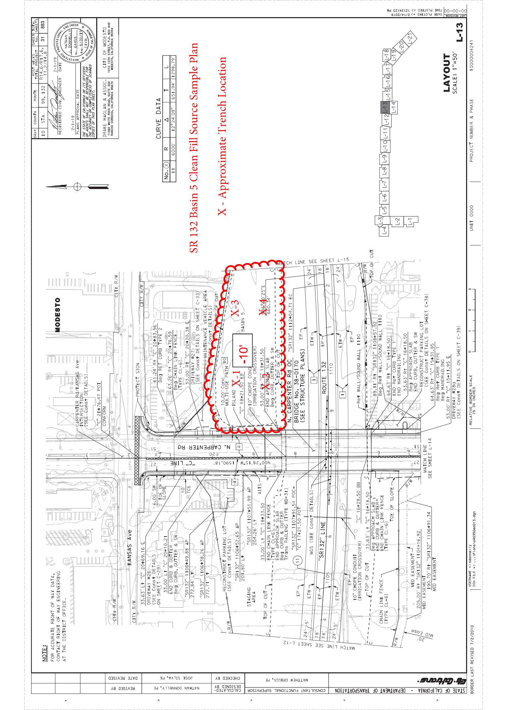

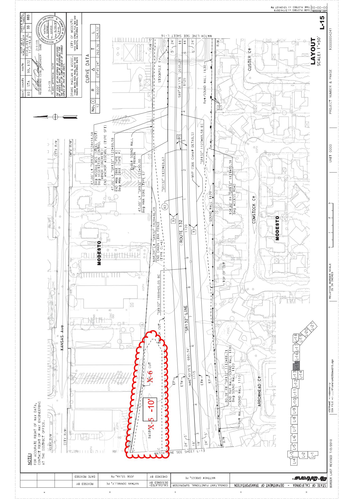


Summary of Heavy Metals Soil Results - Background Soil Samples Caltrans Modesto Soil Stockpiles, State Route 99/132 Stanislaus County, California Task Order No. 38

| Sample Group | Sample        |            | Sample Source Description | Units      | mg/kg for all metals      |                          |                 |         |         |           |         |          |        |        |        |         |            |        |          |        |          |
|--------------|---------------|------------|---------------------------|------------|---------------------------|--------------------------|-----------------|---------|---------|-----------|---------|----------|--------|--------|--------|---------|------------|--------|----------|--------|----------|
|              | Boring        | Depth (ft) |                           |            | OEHHA 2005 Residential(1) | OEHHA 2005 Commercial(2) | Reporting Limit | Arsenic | Barium  | Beryllium | Cadmium | Chromium | Cobalt | Copper | Lead   | Mercury | Molybdenum | Nickel | Selenium | Silver | Thallium |
|              |               |            |                           |            |                           |                          |                 |         |         |           |         |          |        |        |        |         |            |        |          |        |          |
| Background   | SR99/132-BG01 | 5          | OEHHA 2005 Residential(1) | Background | 0.07                      | 5,200                    | 150             | 1.7     | 100,000 | 660       | 3,000   | 150      | 18     | 380    | 1,600  | 380     | 0.4        | 530    | 23,000   |        |          |
| Background   | SR99/132-BG01 | 10         | OEHHA 2005 Commercial(2)  | Background | 0.24                      | 63,000                   | 1,700           | 7.5     | 100,000 | 3,200     | 38,000  | 3,500    | 180    | 4,800  | 16,000 | 4,800   | 0.4        | 6,700  | 100,000  |        |          |
| Background   | SR99/132-BG01 | 15         | Reporting Limit           | Background | 0.4                       | 0.4                      | 0.4             | 0.4     | 0.4     | 0.4       | 0.4     | 0.4      | 0.04   | 0.4    | 0.4    | 0.5     | 0.4        | 0.4    | 4        |        |          |
| Background   | SR99/132-BG01 | 5          | Background                | Units      | ND                        | 68                       | ND              | ND      | ND      | ND        | ND      | ND       | ND     | 0.6    | 5.7    | ND      | ND         | 30     | 26       |        |          |
| Background   | SR99/132-BG01 | 10         | Background                | Background | ND                        | 23                       | ND              | ND      | ND      | ND        | ND      | ND       | ND     | ND     | 2.5    | ND      | ND         | 32     | 15       |        |          |
| Background   | SR99/132-BG01 | 15         | Background                | Background | ND                        | 63                       | ND              | ND      | ND      | ND        | ND      | ND       | ND     | ND     | 2.9    | ND      | ND         | 20     | 22       |        |          |
| Background   | SR99/132-BG02 | 5          | Background                | Background | ND                        | 47                       | ND              | ND      | ND      | ND        | ND      | ND       | ND     | 6      | 2.8    | ND      | ND         | 23     | 19       |        |          |
| Background   | SR99/132-BG02 | 10         | Background                | Background | ND                        | 30                       | ND              | ND      | ND      | ND        | ND      | ND       | ND     | 2.8    | 0.9    | ND      | ND         | 23     | 15       |        |          |
| Background   | SR99/132-BG02 | 15         | Background                | Background | ND                        | 39                       | ND              | ND      | ND      | ND        | ND      | ND       | ND     | 0.9    | 2      | ND      | ND         | 16     | 17       |        |          |
| Background   | SR99/132-BG03 | 5          | Background                | Background | ND                        | 80                       | ND              | ND      | ND      | ND        | ND      | ND       | ND     | 2      | 6.6    | ND      | ND         | 34     | 28       |        |          |
| Background   | SR99/132-BG03 | 10         | Background                | Background | ND                        | 120                      | ND              | ND      | ND      | ND        | ND      | ND       | ND     | ND     | 2.9    | ND      | ND         | 25     | 22       |        |          |
| Background   | SR99/132-BG03 | 15         | Background                | Background | ND                        | 82                       | ND              | ND      | ND      | ND        | ND      | ND       | ND     | ND     | 4.4    | ND      | ND         | 33     | 30       |        |          |
| Background   | SR99/132-BG04 | 5          | Background                | Background | ND                        | 64                       | ND              | ND      | ND      | ND        | ND      | ND       | ND     | 3.6    | 2.2    | ND      | ND         | 23     | 23       |        |          |
| Background   | SR99/132-BG04 | 10         | Background                | Background | ND                        | 45                       | ND              | ND      | ND      | ND        | ND      | ND       | ND     | 1.6    | 4.1    | ND      | ND         | 27     | 24       |        |          |
| Background   | SR99/132-BG04 | 15         | Background                | Background | ND                        | 42                       | ND              | ND      | ND      | ND        | ND      | ND       | ND     | 4.1    | 1      | ND      | ND         | 19     | 20       |        |          |
| Background   | SR99/132-BG05 | 5          | Background                | Background | ND                        | 51                       | ND              | ND      | ND      | ND        | ND      | ND       | ND     | 6.7    | 2.2    | ND      | ND         | 25     | 20       |        |          |
| Background   | SR99/132-BG05 | 10         | Background                | Background | ND                        | 88                       | ND              | ND      | ND      | ND        | ND      | ND       | ND     | 8.2    | 6.3    | ND      | ND         | 39     | 44       |        |          |
| Background   | SR99/132-BG05 | 15         | Background                | Background | ND                        | 76                       | ND              | ND      | ND      | ND        | ND      | ND       | ND     | 9.9    | 4.3    | ND      | ND         | 28     | 29       |        |          |
| Background   | SR99/132-BG06 | 5          | Background                | Background | ND                        | 54                       | ND              | ND      | ND      | ND        | ND      | ND       | ND     | 9.2    | 4.5    | ND      | ND         | 79     | 20       |        |          |
| Background   | SR99/132-BG06 | 10         | Background                | Background | ND                        | 19                       | ND              | ND      | ND      | ND        | ND      | ND       | ND     | 3.5    | 2.2    | ND      | ND         | 18     | 12       |        |          |
| Background   | SR99/132-BG06 | 15         | Background                | Background | ND                        | 89                       | ND              | ND      | ND      | ND        | ND      | ND       | ND     | 8      | 5.6    | ND      | ND         | 36     | 30       |        |          |
| Background   | SR99/132-BG07 | 5          | Background                | Background | ND                        | 89                       | ND              | ND      | ND      | ND        | ND      | ND       | ND     | 7      | 5.1    | ND      | ND         | 37     | 34       |        |          |
| Background   | SR99/132-BG07 | 10         | Background                | Background | ND                        | 17                       | ND              | ND      | ND      | ND        | ND      | ND       | ND     | 3.9    | 2.1    | ND      | ND         | 24     | 12       |        |          |
| Background   | SR99/132-BG07 | 15         | Background                | Background | ND                        | 92                       | ND              | ND      | ND      | ND        | ND      | ND       | ND     | 9.9    | 4.9    | ND      | ND         | 31     | 30       |        |          |

Summary of Heavy Metals Soil Results - Background Soil Samples Caltrans Modesto Soil Stockpiles, State Route 99/132 Stanislaus County, California Table 2a

Task Order No. 38

| Sample Group | Sample Source Description  | Boring | Sample Depth (ft) | Reporting Limit           | mg/kg for all metals |         |        |           |         |          |        |        |       |         |            |        |          |        |          |          |         |  |  |  |  |
|--------------|----------------------------|--------|-------------------|---------------------------|----------------------|---------|--------|-----------|---------|----------|--------|--------|-------|---------|------------|--------|----------|--------|----------|----------|---------|--|--|--|--|
|              |                            |        |                   |                           | Antimony             | Arsenic | Barium | Beryllium | Cadmium | Chromium | Cobalt | Copper | Lead  | Mercury | Molybdenum | Nickel | Selenium | Silver | Thallium | Vanadium | Zinc    |  |  |  |  |
|              | OEHHA 2005 Residential (1) | 5      |                   | Background                | 30                   | 0.07    | 5,200  | 150       | 1.7     | 100,000  | 660    | 3,000  | 150   | 18      | 380        | 1,600  | 380      | 380    | 5        | 530      | 23,000  |  |  |  |  |
|              | OEHHA 2005 Commercial (2)  | 10     |                   | Background                | 380                  | 0.24    | 63,000 | 1,700     | 7.5     | 100,000  | 3,200  | 38,000 | 3,500 | 180     | 4,800      | 16,000 | 4,800    | 4,800  | 63       | 6,700    | 100,000 |  |  |  |  |
|              |                            |        |                   | Background                | 0.4                  | 0.4     | 0.4    | 0.4       | 0.4     | 0.4      | 0.4    | 0.4    | 0.4   | 0.04    | 0.4        | 0.4    | 0.4      | 0.5    | 0.4      | 0.4      | 4       |  |  |  |  |
|              |                            |        |                   | Units                     |                      |         |        |           |         |          |        | mg/kg  |       |         |            |        |          |        |          |          |         |  |  |  |  |
| Background   | SR99/132-BG08              | 5      |                   | Background                | 0.9                  | ND      | 110    | ND        | ND      | 7.6      | 4.9    | 9.5    | 2     | ND      | 7.4        | ND     | ND       | ND     | 33       | 29       |         |  |  |  |  |
| Background   | SR99/132-BG08              | 10     |                   | Background                | 4.1                  | ND      | 85     | ND        | ND      | 10       | 6.3    | 11     | 2.4   | ND      | 8.7        | ND     | ND       | ND     | 58       | 31       |         |  |  |  |  |
| Background   | SR99/132-BG08              | 15     |                   | Background                | 0.6                  | 50      | ND     | ND        | 5.8     | 4        | 5.9    | 1.3    | ND    | 3.6     | ND         | ND     | ND       | 22     | 21       |          |         |  |  |  |  |
|              |                            |        |                   | Soil Background Value (3) | 1.2                  | 0.2     | 72.8   | 0.2       | 0.2     | 7.1      | 4.4    | 7.5    | 2     | 0.02    | 0.23       | 5.3    | 0.25     | 0.2    | 31.3     | 26.3     |         |  |  |  |  |

Notes: ND = Not detected

DE = Not detected
mg/kg = milligrams per kilogram

mg/kg = milligrams per kilogram ft = feet

OEHHA = Office of Environmental Health Hazard Assessment, State of California

## **RESERVE BANK OF INDIA**

**FORM NO. 10**

**(See Regulation 12(1))**

**Application for permission to acquire shares or voting rights in a banking company**

**To,**

The Secretary,
Reserve Bank of India,
Central Office,

**Mumbai.**

**Sir,**

I/We hereby apply for permission to acquire shares/voting rights in the undermentioned banking company, the particulars of which are as under:-

**1. Name of the applicant:**

**2. Name of the banking company:**

**3. Number of shares/voting rights already held by the applicant:**

**4. Number of shares/voting rights proposed to be acquired:**

**5. Percentage of voting rights in the banking company that will be held by the applicant after acquisition:**

**6. Purpose for which the shares/voting rights are proposed to be acquired:**

**7. Whether the applicant is a director, partner, employee or is otherwise connected with the management of the banking company:**

**8. Whether the applicant is a foreign national or a company incorporated outside India:**

**9. Any other information which the applicant may like to furnish:**

I/We declare that the information furnished above is true and correct to the best of my/our knowledge and belief.

**Yours faithfully,**

**Signature of the applicant**

**Date:**

**Place:**

**Note:**

1. The application should be accompanied by a copy of the resolution passed by the Board of Directors of the banking company, if any, approving the acquisition.
2. The applicant should also furnish a copy of the latest balance sheet of the banking company, if available.
3. In case of acquisition of shares by a person resident outside India, the application should be submitted through the authorised dealer in foreign exchange.

## **CONSOLIDATED STATEMENT OF CASH FLOWS**

**For the Year Ended December 31, 2005**

| <strong>Labels</strong>                        | <strong>Values</strong> |
|------------------------------------------------|-------------------------|
| Cash flows from operating activities:          |                         |
| Net income                                     | \$500,000               |
| Depreciation and amortization                  | 50,000                  |
| Changes in operating assets and liabilities:   |                         |
| Increase in accounts receivable                | (20,000)                |
| Increase in inventory                          | (30,000)                |
| Increase in accounts payable                   | 15,000                  |
| Net cash provided by operating activities      | \$515,000               |
| Cash flows from investing activities:          |                         |
| Purchase of property, plant, and equipment     | (100,000)               |
| Proceeds from sale of investments              | 25,000                  |
| Net cash used in investing activities          | \$(75,000)              |
| Cash flows from financing activities:          |                         |
| Proceeds from issuance of long-term debt       | 200,000                 |
| Repayment of long-term debt                    | (50,000)                |
| Dividends paid                                 | (10,000)                |
| Net cash provided by financing activities      | \$140,000               |
| Net increase in cash and cash equivalents      | \$580,000               |
| Cash and cash equivalents at beginning of year | 200,000                 |
| Cash and cash equivalents at end of year       | \$780,000               |

(1) OEHHA 2005 Residential screening value
(2) OEHHA 2005 Commercial/Industrial screening value
(3) OEHHA 2005 Commercial/Industrial screening value
(3) Soil Background Values calculated from UCL 95 or Arithmetic Mean (See Table 8). For non-detects, SBVs calculated at 1/2 the detection limit.


June 22, 2020

John Juhrend Geocon Consultants, Inc. 3160 Gold Valley Drive, Suite 800 Rancho Cordova, CA 95742

Tel: (916) 508-1911 Fax:(916) 852-9132

Re: ATL Work Order Number: 2001448

Client Reference: SR 132 Basin 5, S1908-01-01

Enclosed are the results for sample(s) received on June 17, 2020 by Advanced Technology Laboratories. The sample(s) are tested for the parameters as indicated on the enclosed chain of custody in accordance with applicable laboratory certifications. The laboratory results contained in this report specifically pertains to the sample(s) submitted.

Thank you for the opportunity to serve the needs of your company. If you have any questions, please feel free to contact me or your Project Manager.

Sincerely,

Dr. Reza Karimi

Laboratory Director

for ah

The cover letter and the case narrative are an integral part of this analytical report and its absence renders the report invalid. Test results contained within this data package meet the requirements of applicable state-specific certification programs. The report cannot be reproduced without written permission from the client and Advanced Technology Laboratories.

ELAP No.: 1838

CSDLAC No.: 10196 ORELAP No.: CA300003


Geocon Consultants, Inc. Project Number: SR 132 Basin 5, S1908-01-01

3160 Gold Valley Drive, Suite 800 Report To: John Juhrend Rancho Cordova, CA 95742 Reported: 06/22/2020

## SUMMARY OF SAMPLES

| Sample ID       | Laboratory ID | Matrix | Date Sampled | Date Received |
|-----------------|---------------|--------|--------------|---------------|
| BASIN 5-1,3,5-0 | 2001448-01    | Soil   | 6/16/20 0:00 | 6/17/20 9:31  |
| BASIN 5-1,3,5-2 | 2001448-02    | Soil   | 6/16/20 0:00 | 6/17/20 9:31  |
| BASIN 5-1,3,5-5 | 2001448-03    | Soil   | 6/16/20 0:00 | 6/17/20 9:31  |
| BASIN 5-2,4,6-0 | 2001448-04    | Soil   | 6/16/20 0:00 | 6/17/20 9:31  |
| BASIN 5-2,4,6-2 | 2001448-05    | Soil   | 6/16/20 0:00 | 6/17/20 9:31  |
| BASIN 5-2,4,6-5 | 2001448-06    | Soil   | 6/16/20 0:00 | 6/17/20 9:31  |


Geocon Consultants, Inc. Project Number: SR 132 Basin 5, S1908-01-01

3160 Gold Valley Drive, Suite 800 Report To: John Juhrend Rancho Cordova, CA 95742 Reported: 06/22/2020

Client Sample ID: BASIN 5-1,3,5-0 Lab ID: 2001448-01

## Title 22 Metals by ICP-AES EPA 6010B

**Analyst: TA** 

| Analyte         | Result<br>(mg/kg) | PQL<br>(mg/kg) | Dilution | Batch   | Prepared   | Date/Time<br>Analyzed | Notes |
|-----------------|-------------------|----------------|----------|---------|------------|-----------------------|-------|
| Antimony        | ND                | 2.0            | 1        | B0F0428 | 06/19/2020 | 06/19/20 15:33        |       |
| Arsenic         | ND                | 1.0            | 1        | B0F0428 | 06/19/2020 | 06/19/20 15:33        |       |
| <b>Barium</b>   | <b>94</b>         | 1.0            | 1        | B0F0428 | 06/19/2020 | 06/19/20 15:33        |       |
| Beryllium       | ND                | 1.0            | 1        | B0F0428 | 06/19/2020 | 06/19/20 15:33        |       |
| Cadmium         | ND                | 1.0            | 1        | B0F0428 | 06/19/2020 | 06/19/20 15:33        |       |
| <b>Chromium</b> | <b>11</b>         | 1.0            | 1        | B0F0428 | 06/19/2020 | 06/19/20 15:33        |       |
| <b>Cobalt</b>   | <b>3.8</b>        | 1.0            | 1        | B0F0428 | 06/19/2020 | 06/19/20 15:33        |       |
| <b>Copper</b>   | <b>9.3</b>        | 2.0            | 1        | B0F0428 | 06/19/2020 | 06/19/20 15:33        |       |
| <b>Lead</b>     | <b>10</b>         | 1.0            | 1        | B0F0428 | 06/19/2020 | 06/19/20 15:33        |       |
| Molybdenum      | ND                | 1.0            | 1        | B0F0428 | 06/19/2020 | 06/19/20 15:33        |       |
| <b>Nickel</b>   | <b>7.9</b>        | 1.0            | 1        | B0F0428 | 06/19/2020 | 06/19/20 15:33        |       |
| Selenium        | ND                | 1.0            | 1        | B0F0428 | 06/19/2020 | 06/19/20 15:33        |       |
| Silver          | ND                | 1.0            | 1        | B0F0428 | 06/19/2020 | 06/19/20 15:33        |       |
| Thallium        | ND                | 1.0            | 1        | B0F0428 | 06/19/2020 | 06/19/20 15:33        |       |
| Vanadium        | 33                | 1.0            | 1        | B0F0428 | 06/19/2020 | 06/19/20 15:33        |       |
| Zinc            | 36                | 1.0            | 1        | B0F0428 | 06/19/2020 | 06/19/20 15:33        |       |

## Mercury by AA (Cold Vapor) EPA 7471A

Analyst: TA

| Analyte | Result<br>(mg/kg) | PQL<br>(mg/kg) | Dilution | Batch   | Prepared   | Date/Time<br>Analyzed | Notes |
|---------|-------------------|----------------|----------|---------|------------|-----------------------|-------|
| Mercury | ND                | 0.10           | 1        | B0F0430 | 06/19/2020 | 06/22/20 12:48        |       |

## Organochlorine Pesticides by EPA 8081A

**Analyst: DP/** 

| Analyte         | Result<br>(ug/kg) | PQL<br>(ug/kg) | Dilution | Batch   | Prepared   | Date/Time<br>Analyzed | Notes |
|-----------------|-------------------|----------------|----------|---------|------------|-----------------------|-------|
| 4,4′-DDD        | ND                | 2.0            | 1        | B0F0442 | 06/18/2020 | 06/19/20 20:20        |       |
| 4,4′-DDE        | ND                | 2.0            | 1        | B0F0442 | 06/18/2020 | 06/19/20 20:20        |       |
| 4,4′-DDT        | ND                | 2.0            | 1        | B0F0442 | 06/18/2020 | 06/19/20 20:20        |       |
| Aldrin          | ND                | 1.0            | 1        | B0F0442 | 06/18/2020 | 06/19/20 20:20        |       |
| alpha-BHC       | ND                | 1.0            | 1        | B0F0442 | 06/18/2020 | 06/19/20 20:20        |       |
| alpha-Chlordane | ND                | 1.0            | 1        | B0F0442 | 06/18/2020 | 06/19/20 20:20        |       |
| beta-BHC        | ND                | 1.0            | 1        | B0F0442 | 06/18/2020 | 06/19/20 20:20        |       |
| Chlordane       | ND                | 8.5            | 1        | B0F0442 | 06/18/2020 | 06/19/20 20:20        |       |
| delta-BHC       | ND                | 1.0            | 1        | B0F0442 | 06/18/2020 | 06/19/20 20:20        |       |


Geocon Consultants, Inc. Project Number: SR 132 Basin 5, S1908-01-01

3160 Gold Valley Drive, Suite 800 Report To: John Juhrend Rancho Cordova, CA 95742 Reported: 06/22/2020

Client Sample ID: BASIN 5-1,3,5-0 Lab ID: 2001448-01

## Organochlorine Pesticides by EPA 8081A

Analyst: DP/

| Analyte                         | Result<br>(ug/kg) | PQL<br>(ug/kg) | Dilution | Batch   | Prepared   | Date/Time<br>Analyzed | Notes |
|---------------------------------|-------------------|----------------|----------|---------|------------|-----------------------|-------|
| Dieldrin                        | ND                | 2.0            | 1        | B0F0442 | 06/18/2020 | 06/19/20 20:20        |       |
| Endosulfan I                    | ND                | 1.0            | 1        | B0F0442 | 06/18/2020 | 06/19/20 20:20        |       |
| Endosulfan II                   | ND                | 2.0            | 1        | B0F0442 | 06/18/2020 | 06/19/20 20:20        |       |
| Endosulfan sulfate              | ND                | 2.0            | 1        | B0F0442 | 06/18/2020 | 06/19/20 20:20        |       |
| Endrin                          | ND                | 2.0            | 1        | B0F0442 | 06/18/2020 | 06/19/20 20:20        |       |
| Endrin aldehyde                 | ND                | 2.0            | 1        | B0F0442 | 06/18/2020 | 06/19/20 20:20        |       |
| Endrin ketone                   | ND                | 2.0            | 1        | B0F0442 | 06/18/2020 | 06/19/20 20:20        |       |
| gamma-BHC                       | ND                | 1.0            | 1        | B0F0442 | 06/18/2020 | 06/19/20 20:20        |       |
| gamma-Chlordane                 | ND                | 1.0            | 1        | B0F0442 | 06/18/2020 | 06/19/20 20:20        |       |
| Heptachlor                      | ND                | 1.0            | 1        | B0F0442 | 06/18/2020 | 06/19/20 20:20        |       |
| Heptachlor epoxide              | ND                | 1.0            | 1        | B0F0442 | 06/18/2020 | 06/19/20 20:20        |       |
| Methoxychlor                    | ND                | 5.0            | 1        | B0F0442 | 06/18/2020 | 06/19/20 20:20        |       |
| Toxaphene                       | ND                | 50             | 1        | B0F0442 | 06/18/2020 | 06/19/20 20:20        |       |
| Surrogate: Decachlorobiphenyl   | 67.6 %            | 9 - 112        |          | B0F0442 | 06/18/2020 | 06/19/20 20:20        |       |
| Surrogate: Tetrachloro-m-xylene | 63.3 %            | 28 - 107       |          | B0F0442 | 06/18/2020 | 06/19/20 20:20        |       |


Geocon Consultants, Inc. Project Number: SR 132 Basin 5, S1908-01-01

3160 Gold Valley Drive, Suite 800 Report To: John Juhrend Rancho Cordova, CA 95742 Reported: 06/22/2020

Client Sample ID: BASIN 5-1,3,5-2 Lab ID: 2001448-02

## Title 22 Metals by ICP-AES EPA 6010B

**Analyst: TA** 

| Analyte         | Result<br>(mg/kg) | PQL<br>(mg/kg) | Dilution | Batch   | Prepared   | Date/Time<br>Analyzed | Notes |
|-----------------|-------------------|----------------|----------|---------|------------|-----------------------|-------|
| Antimony        | ND                | 2.0            | 1        | B0F0428 | 06/19/2020 | 06/19/20 15:37        |       |
| Arsenic         | ND                | 1.0            | 1        | B0F0428 | 06/19/2020 | 06/19/20 15:37        |       |
| <b>Barium</b>   | <b>75</b>         | 1.0            | 1        | B0F0428 | 06/19/2020 | 06/19/20 15:37        |       |
| Beryllium       | ND                | 1.0            | 1        | B0F0428 | 06/19/2020 | 06/19/20 15:37        |       |
| Cadmium         | ND                | 1.0            | 1        | B0F0428 | 06/19/2020 | 06/19/20 15:37        |       |
| <b>Chromium</b> | <b>10</b>         | 1.0            | 1        | B0F0428 | 06/19/2020 | 06/19/20 15:37        |       |
| <b>Cobalt</b>   | <b>3.5</b>        | 1.0            | 1        | B0F0428 | 06/19/2020 | 06/19/20 15:37        |       |
| <b>Copper</b>   | <b>8.9</b>        | 2.0            | 1        | B0F0428 | 06/19/2020 | 06/19/20 15:37        |       |
| <b>Lead</b>     | <b>7.8</b>        | 1.0            | 1        | B0F0428 | 06/19/2020 | 06/19/20 15:37        |       |
| Molybdenum      | ND                | 1.0            | 1        | B0F0428 | 06/19/2020 | 06/19/20 15:37        |       |
| <b>Nickel</b>   | <b>7.4</b>        | 1.0            | 1        | B0F0428 | 06/19/2020 | 06/19/20 15:37        |       |
| Selenium        | ND                | 1.0            | 1        | B0F0428 | 06/19/2020 | 06/19/20 15:37        |       |
| Silver          | ND                | 1.0            | 1        | B0F0428 | 06/19/2020 | 06/19/20 15:37        |       |
| Thallium        | ND                | 1.0            | 1        | B0F0428 | 06/19/2020 | 06/19/20 15:37        |       |
| <b>Vanadium</b> | <b>34</b>         | 1.0            | 1        | B0F0428 | 06/19/2020 | 06/19/20 15:37        |       |
| <b>Zinc</b>     | <b>35</b>         | 1.0            | 1        | B0F0428 | 06/19/2020 | 06/19/20 15:37        |       |

## Mercury by AA (Cold Vapor) EPA 7471A

**Analyst: TA** 

| Analyte | Result<br>(mg/kg) | PQL<br>(mg/kg) | Dilution | Batch   | Prepared   | Date/Time<br>Analyzed | Notes |
|---------|-------------------|----------------|----------|---------|------------|-----------------------|-------|
| Mercury | ND                | 0.10           | 1        | B0F0430 | 06/19/2020 | 06/22/20 12:57        |       |


Geocon Consultants, Inc. Project Number: SR 132 Basin 5, S1908-01-01

3160 Gold Valley Drive, Suite 800 Report To: John Juhrend Rancho Cordova, CA 95742 Reported: 06/22/2020

Client Sample ID: BASIN 5-1,3,5-5 Lab ID: 2001448-03

## Title 22 Metals by ICP-AES EPA 6010B

**Analyst: TA** 

| Analyte         | Result<br>(mg/kg) | PQL<br>(mg/kg) | Dilution | Batch   | Prepared   | Date/Time<br>Analyzed | Notes |
|-----------------|-------------------|----------------|----------|---------|------------|-----------------------|-------|
| Antimony        | ND                | 2.0            | 1        | B0F0428 | 06/19/2020 | 06/19/20 15:39        |       |
| Arsenic         | ND                | 1.0            | 1        | B0F0428 | 06/19/2020 | 06/19/20 15:39        |       |
| <b>Barium</b>   | <b>72</b>         | 1.0            | 1        | B0F0428 | 06/19/2020 | 06/19/20 15:39        |       |
| Beryllium       | ND                | 1.0            | 1        | B0F0428 | 06/19/2020 | 06/19/20 15:39        |       |
| Cadmium         | ND                | 1.0            | 1        | B0F0428 | 06/19/2020 | 06/19/20 15:39        |       |
| <b>Chromium</b> | <b>9.7</b>        | 1.0            | 1        | B0F0428 | 06/19/2020 | 06/19/20 15:39        |       |
| <b>Cobalt</b>   | <b>3.5</b>        | 1.0            | 1        | B0F0428 | 06/19/2020 | 06/19/20 15:39        |       |
| <b>Copper</b>   | <b>8.4</b>        | 2.0            | 1        | B0F0428 | 06/19/2020 | 06/19/20 15:39        |       |
| <b>Lead</b>     | <b>11</b>         | 1.0            | 1        | B0F0428 | 06/19/2020 | 06/19/20 15:39        |       |
| Molybdenum      | ND                | 1.0            | 1        | B0F0428 | 06/19/2020 | 06/19/20 15:39        |       |
| <b>Nickel</b>   | <b>7.5</b>        | 1.0            | 1        | B0F0428 | 06/19/2020 | 06/19/20 15:39        |       |
| Selenium        | ND                | 1.0            | 1        | B0F0428 | 06/19/2020 | 06/19/20 15:39        |       |
| Silver          | ND                | 1.0            | 1        | B0F0428 | 06/19/2020 | 06/19/20 15:39        |       |
| Thallium        | ND                | 1.0            | 1        | B0F0428 | 06/19/2020 | 06/19/20 15:39        |       |
| <b>Vanadium</b> | <b>33</b>         | 1.0            | 1        | B0F0428 | 06/19/2020 | 06/19/20 15:39        |       |
| <b>Zinc</b>     | <b>36</b>         | 1.0            | 1        | B0F0428 | 06/19/2020 | 06/19/20 15:39        |       |

## Mercury by AA (Cold Vapor) EPA 7471A

**Analyst: TA** 

| Analyte | Result<br>(mg/kg) | PQL<br>(mg/kg) | Dilution | Batch   | Prepared   | Date/Time<br>Analyzed | Notes |
|---------|-------------------|----------------|----------|---------|------------|-----------------------|-------|
| Mercury | ND                | 0.10           | 1        | B0F0430 | 06/19/2020 | 06/22/20 13:00        |       |


Geocon Consultants, Inc. Project Number: SR 132 Basin 5, S1908-01-01

3160 Gold Valley Drive, Suite 800 Report To: John Juhrend Rancho Cordova, CA 95742 Reported: 06/22/2020

Client Sample ID: BASIN 5-2,4,6-0 Lab ID: 2001448-04

## Title 22 Metals by ICP-AES EPA 6010B

**Analyst: TA** 

| Analyte    | Result (mg/kg) | PQL<br>(mg/kg) | Dilution | Batch   | Prepared   | Date/Time<br>Analyzed | Notes |
|------------|----------------|----------------|----------|---------|------------|-----------------------|-------|
| Antimony   | ND             | 2.0            | 1        | B0F0428 | 06/19/2020 | 06/19/20 15:40        |       |
| Arsenic    | 1.2            | 1.0            | 1        | B0F0428 | 06/19/2020 | 06/19/20 15:40        |       |
| Barium     | 72             | 1.0            | 1        | B0F0428 | 06/19/2020 | 06/19/20 15:40        |       |
| Beryllium  | ND             | 1.0            | 1        | B0F0428 | 06/19/2020 | 06/19/20 15:40        |       |
| Cadmium    | ND             | 1.0            | 1        | B0F0428 | 06/19/2020 | 06/19/20 15:40        |       |
| Chromium   | 10             | 1.0            | 1        | B0F0428 | 06/19/2020 | 06/19/20 15:40        |       |
| Cobalt     | 3.5            | 1.0            | 1        | B0F0428 | 06/19/2020 | 06/19/20 15:40        |       |
| Copper     | 7.8            | 2.0            | 1        | B0F0428 | 06/19/2020 | 06/19/20 15:40        |       |
| Lead       | 6.8            | 1.0            | 1        | B0F0428 | 06/19/2020 | 06/19/20 15:40        |       |
| Molybdenum | ND             | 1.0            | 1        | B0F0428 | 06/19/2020 | 06/19/20 15:40        |       |
| Nickel     | 7.1            | 1.0            | 1        | B0F0428 | 06/19/2020 | 06/19/20 15:40        |       |
| Selenium   | ND             | 1.0            | 1        | B0F0428 | 06/19/2020 | 06/19/20 15:40        |       |
| Silver     | ND             | 1.0            | 1        | B0F0428 | 06/19/2020 | 06/19/20 15:40        |       |
| Thallium   | ND             | 1.0            | 1        | B0F0428 | 06/19/2020 | 06/19/20 15:40        |       |
| Vanadium   | 34             | 1.0            | 1        | B0F0428 | 06/19/2020 | 06/19/20 15:40        |       |
| Zinc       | 29             | 1.0            | 1        | B0F0428 | 06/19/2020 | 06/19/20 15:40        |       |

## Mercury by AA (Cold Vapor) EPA 7471A

Analyst: TA

| Analyte | Result<br>(mg/kg) | PQL<br>(mg/kg) | Dilution | Batch   | Prepared   | Date/Time<br>Analyzed | Notes |
|---------|-------------------|----------------|----------|---------|------------|-----------------------|-------|
| Mercury | ND                | 0.10           | 1        | B0F0430 | 06/19/2020 | 06/22/20 13:04        |       |

## Organochlorine Pesticides by EPA 8081A

**Analyst: DP/** 

| Analyte         | Result<br>(ug/kg) | PQL<br>(ug/kg) | Dilution | Batch   | Prepared   | Date/Time<br>Analyzed | Notes |
|-----------------|-------------------|----------------|----------|---------|------------|-----------------------|-------|
| 4,4'-DDD        | ND                | 2.0            | 1        | B0F0442 | 06/18/2020 | 06/19/20 20:31        |       |
| 4,4'-DDE        | ND                | 2.0            | 1        | B0F0442 | 06/18/2020 | 06/19/20 20:31        |       |
| 4,4'-DDT        | ND                | 2.0            | 1        | B0F0442 | 06/18/2020 | 06/19/20 20:31        |       |
| Aldrin          | ND                | 1.0            | 1        | B0F0442 | 06/18/2020 | 06/19/20 20:31        |       |
| alpha-BHC       | ND                | 1.0            | 1        | B0F0442 | 06/18/2020 | 06/19/20 20:31        |       |
| alpha-Chlordane | ND                | 1.0            | 1        | B0F0442 | 06/18/2020 | 06/19/20 20:31        |       |
| beta-BHC        | ND                | 1.0            | 1        | B0F0442 | 06/18/2020 | 06/19/20 20:31        |       |
| Chlordane       | ND                | 8.5            | 1        | B0F0442 | 06/18/2020 | 06/19/20 20:31        |       |
| delta-BHC       | ND                | 1.0            | 1        | B0F0442 | 06/18/2020 | 06/19/20 20:31        |       |


Geocon Consultants, Inc. Project Number: SR 132 Basin 5, S1908-01-01

3160 Gold Valley Drive, Suite 800 Report To: John Juhrend Rancho Cordova, CA 95742 Reported: 06/22/2020

Client Sample ID: BASIN 5-2,4,6-0 Lab ID: 2001448-04

## Organochlorine Pesticides by EPA 8081A

Analyst: DP/

| Analyte                         | Result<br>(ug/kg) | PQL<br>(ug/kg) | Dilution | Batch   | Prepared   | Date/Time<br>Analyzed | Notes |
|---------------------------------|-------------------|----------------|----------|---------|------------|-----------------------|-------|
| Dieldrin                        | ND                | 2.0            | 1        | B0F0442 | 06/18/2020 | 06/19/20 20:31        |       |
| Endosulfan I                    | ND                | 1.0            | 1        | B0F0442 | 06/18/2020 | 06/19/20 20:31        |       |
| Endosulfan II                   | ND                | 2.0            | 1        | B0F0442 | 06/18/2020 | 06/19/20 20:31        |       |
| Endosulfan sulfate              | ND                | 2.0            | 1        | B0F0442 | 06/18/2020 | 06/19/20 20:31        |       |
| Endrin                          | ND                | 2.0            | 1        | B0F0442 | 06/18/2020 | 06/19/20 20:31        |       |
| Endrin aldehyde                 | ND                | 2.0            | 1        | B0F0442 | 06/18/2020 | 06/19/20 20:31        |       |
| Endrin ketone                   | ND                | 2.0            | 1        | B0F0442 | 06/18/2020 | 06/19/20 20:31        |       |
| gamma-BHC                       | ND                | 1.0            | 1        | B0F0442 | 06/18/2020 | 06/19/20 20:31        |       |
| gamma-Chlordane                 | ND                | 1.0            | 1        | B0F0442 | 06/18/2020 | 06/19/20 20:31        |       |
| Heptachlor                      | ND                | 1.0            | 1        | B0F0442 | 06/18/2020 | 06/19/20 20:31        |       |
| Heptachlor epoxide              | ND                | 1.0            | 1        | B0F0442 | 06/18/2020 | 06/19/20 20:31        |       |
| Methoxychlor                    | ND                | 5.0            | 1        | B0F0442 | 06/18/2020 | 06/19/20 20:31        |       |
| Toxaphene                       | ND                | 50             | 1        | B0F0442 | 06/18/2020 | 06/19/20 20:31        |       |
| Surrogate: Decachlorobiphenyl   | 63.8 %            | 9 - 112        |          | B0F0442 | 06/18/2020 | 06/19/20 20:31        |       |
| Surrogate: Tetrachloro-m-xylene | 78.3 %            | 28 - 107       |          | B0F0442 | 06/18/2020 | 06/19/20 20:31        |       |


Geocon Consultants, Inc. Project Number: SR 132 Basin 5, S1908-01-01

3160 Gold Valley Drive, Suite 800 Report To: John Juhrend Rancho Cordova, CA 95742 Reported: 06/22/2020

Client Sample ID: BASIN 5-2,4,6-2 Lab ID: 2001448-05

## Title 22 Metals by ICP-AES EPA 6010B

**Analyst: TA** 

| Analyte    | Result (mg/kg) | PQL<br>(mg/kg) | Dilution | Batch   | Prepared   | Date/Time<br>Analyzed | Notes |
|------------|----------------|----------------|----------|---------|------------|-----------------------|-------|
| Antimony   | ND             | 2.0            | 1        | B0F0428 | 06/19/2020 | 06/19/20 15:42        |       |
| Arsenic    | 1.2            | 1.0            | 1        | B0F0428 | 06/19/2020 | 06/19/20 15:42        |       |
| Barium     | 67             | 1.0            | 1        | B0F0428 | 06/19/2020 | 06/19/20 15:42        |       |
| Beryllium  | ND             | 1.0            | 1        | B0F0428 | 06/19/2020 | 06/19/20 15:42        |       |
| Cadmium    | ND             | 1.0            | 1        | B0F0428 | 06/19/2020 | 06/19/20 15:42        |       |
| Chromium   | 9.6            | 1.0            | 1        | B0F0428 | 06/19/2020 | 06/19/20 15:42        |       |
| Cobalt     | 3.6            | 1.0            | 1        | B0F0428 | 06/19/2020 | 06/19/20 15:42        |       |
| Copper     | 7.5            | 2.0            | 1        | B0F0428 | 06/19/2020 | 06/19/20 15:42        |       |
| Lead       | 5.8            | 1.0            | 1        | B0F0428 | 06/19/2020 | 06/19/20 15:42        |       |
| Molybdenum | ND             | 1.0            | 1        | B0F0428 | 06/19/2020 | 06/19/20 15:42        |       |
| Nickel     | 7.1            | 1.0            | 1        | B0F0428 | 06/19/2020 | 06/19/20 15:42        |       |
| Selenium   | ND             | 1.0            | 1        | B0F0428 | 06/19/2020 | 06/19/20 15:42        |       |
| Silver     | ND             | 1.0            | 1        | B0F0428 | 06/19/2020 | 06/19/20 15:42        |       |
| Thallium   | ND             | 1.0            | 1        | B0F0428 | 06/19/2020 | 06/19/20 15:42        |       |
| Vanadium   | 37             | 1.0            | 1        | B0F0428 | 06/19/2020 | 06/19/20 15:42        |       |
| Zinc       | 32             | 1.0            | 1        | B0F0428 | 06/19/2020 | 06/19/20 15:42        |       |

## Mercury by AA (Cold Vapor) EPA 7471A

**Analyst: TA** 

| Analyte | Result<br>(mg/kg) | PQL<br>(mg/kg) | Dilution | Batch   | Prepared   | Date/Time<br>Analyzed | Notes |
|---------|-------------------|----------------|----------|---------|------------|-----------------------|-------|
| Mercury | ND                | 0.10           | 1        | B0F0430 | 06/19/2020 | 06/22/20 13:11        |       |


Geocon Consultants, Inc. Project Number: SR 132 Basin 5, S1908-01-01

3160 Gold Valley Drive, Suite 800 Report To: John Juhrend Rancho Cordova, CA 95742 Reported: 06/22/2020

Client Sample ID: BASIN 5-2,4,6-5 Lab ID: 2001448-06

## Title 22 Metals by ICP-AES EPA 6010B

**Analyst: TA** 

| Analyte    | Result<br>(mg/kg) | PQL<br>(mg/kg) | Dilution | Batch   | Prepared   | Date/Time<br>Analyzed | Notes |
|------------|-------------------|----------------|----------|---------|------------|-----------------------|-------|
| Antimony   | ND                | 2.0            | 1        | B0F0428 | 06/19/2020 | 06/19/20 15:43        |       |
| Arsenic    | <b>1.8</b>        | 1.0            | 1        | B0F0428 | 06/19/2020 | 06/19/20 15:43        |       |
| Barium     | <b>66</b>         | 1.0            | 1        | B0F0428 | 06/19/2020 | 06/19/20 15:43        |       |
| Beryllium  | ND                | 1.0            | 1        | B0F0428 | 06/19/2020 | 06/19/20 15:43        |       |
| Cadmium    | ND                | 1.0            | 1        | B0F0428 | 06/19/2020 | 06/19/20 15:43        |       |
| Chromium   | <b>8.5</b>        | 1.0            | 1        | B0F0428 | 06/19/2020 | 06/19/20 15:43        |       |
| Cobalt     | <b>3.3</b>        | 1.0            | 1        | B0F0428 | 06/19/2020 | 06/19/20 15:43        |       |
| Copper     | <b>7.5</b>        | 2.0            | 1        | B0F0428 | 06/19/2020 | 06/19/20 15:43        |       |
| Lead       | <b>5.9</b>        | 1.0            | 1        | B0F0428 | 06/19/2020 | 06/19/20 15:43        |       |
| Molybdenum | ND                | 1.0            | 1        | B0F0428 | 06/19/2020 | 06/19/20 15:43        |       |
| Nickel     | <b>6.2</b>        | 1.0            | 1        | B0F0428 | 06/19/2020 | 06/19/20 15:43        |       |
| Selenium   | ND                | 1.0            | 1        | B0F0428 | 06/19/2020 | 06/19/20 15:43        |       |
| Silver     | ND                | 1.0            | 1        | B0F0428 | 06/19/2020 | 06/19/20 15:43        |       |
| Thallium   | ND                | 1.0            | 1        | B0F0428 | 06/19/2020 | 06/19/20 15:43        |       |
| Vanadium   | <b>37</b>         | 1.0            | 1        | B0F0428 | 06/19/2020 | 06/19/20 15:43        |       |
| Zinc       | <b>32</b>         | 1.0            | 1        | B0F0428 | 06/19/2020 | 06/19/20 15:43        |       |

## Mercury by AA (Cold Vapor) EPA 7471A

**Analyst: TA** 

| Analyte | Result<br>(mg/kg) | PQL<br>(mg/kg) | Dilution | Batch   | Prepared   | Date/Time<br>Analyzed | Notes |
|---------|-------------------|----------------|----------|---------|------------|-----------------------|-------|
| Mercury | ND                | 0.10           | 1        | B0F0430 | 06/19/2020 | 06/22/20 13:13        |       |


Project Number: SR 132 Basin 5, S1908-01-01 Geocon Consultants, Inc.

3160 Gold Valley Drive, Suite 800 Report To: John Juhrend Rancho Cordova, CA 95742 Reported: 06/22/2020

## QUALITY CONTROL SECTION

## Title 22 Metals by ICP-AES EPA 6010B - Quality Control

| Analyte                                 | Result (mg/kg) | PQL (mg/kg) | MDL (mg/kg) | Spike Level | Source Result | % Rec | % Rec Limits | RPD | RPD Limit | Notes |                    |  |
|-----------------------------------------|----------------|-------------|-------------|-------------|---------------|-------|--------------|-----|-----------|-------|--------------------|--|
| <b>Batch B0F0428 - EPA 3050B_S</b>      |                |             |             |             |               |       |              |     |           |       |                    |  |
| <b>Blank (B0F0428-BLK1)</b>             |                |             |             |             |               |       |              |     |           |       |                    |  |
| Prepared: 6/19/2020 Analyzed: 6/19/2020 |                |             |             |             |               |       |              |     |           |       |                    |  |
| Antimony                                | ND             | 2.0         | 0.51        |             |               |       |              |     |           |       |                    |  |
| Arsenic                                 | ND             | 1.0         | 0.12        |             |               |       |              |     |           |       |                    |  |
| Barium                                  | ND             | 1.0         | 0.12        |             |               |       |              |     |           |       |                    |  |
| Beryllium                               | ND             | 1.0         | 0.03        |             |               |       |              |     |           |       |                    |  |
| Cadmium                                 | ND             | 1.0         | 0.14        |             |               |       |              |     |           |       |                    |  |
| Chromium                                | ND             | 1.0         | 0.26        |             |               |       |              |     |           |       |                    |  |
| Cobalt                                  | ND             | 1.0         | 0.07        |             |               |       |              |     |           |       |                    |  |
| Copper                                  | ND             | 2.0         | 0.19        |             |               |       |              |     |           |       |                    |  |
| Lead                                    | ND             | 1.0         | 0.18        |             |               |       |              |     |           |       |                    |  |
| Molybdenum                              | ND             | 1.0         | 0.12        |             |               |       |              |     |           |       |                    |  |
| Nickel                                  | ND             | 1.0         | 0.18        |             |               |       |              |     |           |       |                    |  |
| Selenium                                | ND             | 1.0         | 0.40        |             |               |       |              |     |           |       |                    |  |
| Silver                                  | ND             | 1.0         | 0.12        |             |               |       |              |     |           |       |                    |  |
| Thallium                                | ND             | 1.0         | 0.38        |             |               |       |              |     |           |       |                    |  |
| Vanadium                                | ND             | 1.0         | 0.06        |             |               |       |              |     |           |       |                    |  |
| Zinc                                    | ND             | 1.0         | 0.15        |             |               |       |              |     |           |       |                    |  |
| <b>LCS (B0F0428-BS1)</b>                |                |             |             |             |               |       |              |     |           |       |                    |  |
| Prepared: 6/19/2020 Analyzed: 6/19/2020 |                |             |             |             |               |       |              |     |           |       |                    |  |
| Antimony                                | 23.3394        | 2.0         | 0.51        | 25.0000     |               | 93.4  | 80 - 120     |     |           |       |                    |  |
| Arsenic                                 | 23.0161        | 1.0         | 0.12        | 25.0000     |               | 92.1  | 80 - 120     |     |           |       |                    |  |
| Barium                                  | 25.4056        | 1.0         | 0.12        | 25.0000     |               | 102   | 80 - 120     |     |           |       |                    |  |
| Beryllium                               | 24.4114        | 1.0         | 0.03        | 25.0000     |               | 97.6  | 80 - 120     |     |           |       |                    |  |
| Cadmium                                 | 23.8422        | 1.0         | 0.14        | 25.0000     |               | 95.4  | 80 - 120     |     |           |       |                    |  |
| Chromium                                | 24.4273        | 1.0         | 0.26        | 25.0000     |               | 97.7  | 80 - 120     |     |           |       |                    |  |
| Cobalt                                  | 25.3447        | 1.0         | 0.07        | 25.0000     |               | 101   | 80 - 120     |     |           |       |                    |  |
| Copper                                  | 26.6586        | 2.0         | 0.19        | 25.0000     |               | 107   | 80 - 120     |     |           |       |                    |  |
| Lead                                    | 23.9147        | 1.0         | 0.18        | 25.0000     |               | 95.7  | 80 - 120     |     |           |       |                    |  |
| Molybdenum                              | 24.3174        | 1.0         | 0.12        | 25.0000     |               | 97.3  | 80 - 120     |     |           |       |                    |  |
| Nickel                                  | 23.8232        | 1.0         | 0.18        | 25.0000     |               | 95.3  | 80 - 120     |     |           |       |                    |  |
| Selenium                                | 22.3146        | 1.0         | 0.40        | 25.0000     |               | 89.3  | 80 - 120     |     |           |       |                    |  |
| Silver                                  | 11.6383        | 1.0         | 0.12        | 12.5000     |               | 93.1  | 80 - 120     |     |           |       |                    |  |
| Thallium                                | 24.3422        | 1.0         | 0.38        | 25.0000     |               | 97.4  | 80 - 120     |     |           |       |                    |  |
| Vanadium                                | 23.5440        | 1.0         | 0.06        | 25.0000     |               | 94.2  | 80 - 120     |     |           |       |                    |  |
| Zinc                                    | 23.6817        | 1.0         | 0.15        | 25.0000     |               | 94.7  | 80 - 120     |     |           |       |                    |  |
| <b>Matrix Spike (B0F0428-MS1)</b>       |                |             |             |             |               |       |              |     |           |       | Source: 2001448-01 |  |
| Prepared: 6/19/2020 Analyzed: 6/19/2020 |                |             |             |             |               |       |              |     |           |       |                    |  |
| Antimony                                | 9.31165        | 2.0         | 0.51        | 25.1256     | ND            | 37.1  | 0 - 102      |     |           |       |                    |  |
| Arsenic                                 | 23.8988        | 1.0         | 0.12        | 25.1256     | 0.953279      | 91.3  | 55 - 117     |     |           |       |                    |  |


Geocon Consultants, Inc. Project Number: SR 132 Basin 5, S1908-01-01

3160 Gold Valley Drive, Suite 800 Report To: John Juhrend Rancho Cordova, CA 95742 Reported: 06/22/2020

## Title 22 Metals by ICP-AES EPA 6010B - Quality Control (cont'd)

| Analyte                                        | Result  |  |  | PQL<br>(mg/kg) | MDL<br>(mg/kg) | Spike<br>Level | Source   |       | % Rec    |        | RPD<br>Limit | Notes |                           |  |                                                |  |
|------------------------------------------------|---------|--|--|----------------|----------------|----------------|----------|-------|----------|--------|--------------|-------|---------------------------|--|------------------------------------------------|--|
|                                                | (mg/kg) |  |  |                |                |                | Result   | % Rec | Limits   | RPD    |              |       |                           |  |                                                |  |
| <b>Batch B0F0428 - EPA 3050B_S (continued)</b> |         |  |  |                |                |                |          |       |          |        |              |       |                           |  |                                                |  |
| <b>Matrix Spike (B0F0428-MS1) - Continued</b>  |         |  |  |                |                |                |          |       |          |        |              |       | <b>Source: 2001448-01</b> |  | <b>Prepared: 6/19/2020 Analyzed: 6/19/2020</b> |  |
| Barium                                         | 121.630 |  |  | 1.0            | 0.12           | 25.1256        | 94.4514  | 108   | 11 - 177 |        |              |       |                           |  |                                                |  |
| Beryllium                                      | 25.7880 |  |  | 1.0            | 0.03           | 25.1256        | 0.434102 | 101   | 64 - 115 |        |              |       |                           |  |                                                |  |
| Cadmium                                        | 24.4292 |  |  | 1.0            | 0.14           | 25.1256        | ND       | 97.2  | 62 - 116 |        |              |       |                           |  |                                                |  |
| Chromium                                       | 35.6339 |  |  | 1.0            | 0.26           | 25.1256        | 11.2050  | 97.2  | 42 - 145 |        |              |       |                           |  |                                                |  |
| Cobalt                                         | 29.4217 |  |  | 1.0            | 0.07           | 25.1256        | 3.79794  | 102   | 60 - 126 |        |              |       |                           |  |                                                |  |
| Copper                                         | 37.8770 |  |  | 2.0            | 0.19           | 25.1256        | 9.29545  | 114   | 37 - 163 |        |              |       |                           |  |                                                |  |
| Lead                                           | 34.5516 |  |  | 1.0            | 0.18           | 25.1256        | 10.0945  | 97.3  | 26 - 161 |        |              |       |                           |  |                                                |  |
| Molybdenum                                     | 24.6262 |  |  | 1.0            | 0.12           | 25.1256        | 0.804950 | 94.8  | 31 - 122 |        |              |       |                           |  |                                                |  |
| Nickel                                         | 32.2151 |  |  | 1.0            | 0.18           | 25.1256        | 7.93660  | 96.6  | 52 - 130 |        |              |       |                           |  |                                                |  |
| Selenium                                       | 14.0396 |  |  | 1.0            | 0.40           | 25.1256        | ND       | 55.9  | 25 - 129 |        |              |       |                           |  |                                                |  |
| Silver                                         | 12.6127 |  |  | 1.0            | 0.12           | 12.5628        | 0.469562 | 96.7  | 48 - 133 |        |              |       |                           |  |                                                |  |
| Thallium                                       | 4.11549 |  |  | 1.0            | 0.38           | 25.1256        | ND       | 16.4  | 25 - 119 |        |              | M1    |                           |  |                                                |  |
| Vanadium                                       | 57.0926 |  |  | 1.0            | 0.06           | 25.1256        | 33.1321  | 95.4  | 51 - 141 |        |              |       |                           |  |                                                |  |
| Zinc                                           | 60.3389 |  |  | 1.0            | 0.15           | 25.1256        | 35.5110  | 98.8  | 8 - 170  |        |              |       |                           |  |                                                |  |
| <b>Matrix Spike Dup (B0F0428-MSD1)</b>         |         |  |  |                |                |                |          |       |          |        |              |       | <b>Source: 2001448-01</b> |  | <b>Prepared: 6/19/2020 Analyzed: 6/19/2020</b> |  |
| Antimony                                       | 9.73084 |  |  | 2.0            | 0.51           | 25.0000        | ND       | 38.9  | 0 - 102  | 4.40   | 20           |       |                           |  |                                                |  |
| Arsenic                                        | 24.0716 |  |  | 1.0            | 0.12           | 25.0000        | 0.953279 | 92.5  | 55 - 117 | 0.720  | 20           |       |                           |  |                                                |  |
| Barium                                         | 121.091 |  |  | 1.0            | 0.12           | 25.0000        | 94.4514  | 107   | 11 - 177 | 0.444  | 20           |       |                           |  |                                                |  |
| Beryllium                                      | 26.2130 |  |  | 1.0            | 0.03           | 25.0000        | 0.434102 | 103   | 64 - 115 | 1.63   | 20           |       |                           |  |                                                |  |
| Cadmium                                        | 24.5740 |  |  | 1.0            | 0.14           | 25.0000        | ND       | 98.3  | 62 - 116 | 0.591  | 20           |       |                           |  |                                                |  |
| Chromium                                       | 35.3648 |  |  | 1.0            | 0.26           | 25.0000        | 11.2050  | 96.6  | 42 - 145 | 0.758  | 20           |       |                           |  |                                                |  |
| Cobalt                                         | 29.6509 |  |  | 1.0            | 0.07           | 25.0000        | 3.79794  | 103   | 60 - 126 | 0.776  | 20           |       |                           |  |                                                |  |
| Copper                                         | 37.9146 |  |  | 2.0            | 0.19           | 25.0000        | 9.29545  | 114   | 37 - 163 | 0.0994 | 20           |       |                           |  |                                                |  |
| Lead                                           | 34.7014 |  |  | 1.0            | 0.18           | 25.0000        | 10.0945  | 98.4  | 26 - 161 | 0.433  | 20           |       |                           |  |                                                |  |
| Molybdenum                                     | 24.5874 |  |  | 1.0            | 0.12           | 25.0000        | 0.804950 | 95.1  | 31 - 122 | 0.158  | 20           |       |                           |  |                                                |  |
| Nickel                                         | 32.1599 |  |  | 1.0            | 0.18           | 25.0000        | 7.93660  | 96.9  | 52 - 130 | 0.171  | 20           |       |                           |  |                                                |  |
| Selenium                                       | 12.9034 |  |  | 1.0            | 0.40           | 25.0000        | ND       | 51.6  | 25 - 129 | 8.43   | 20           |       |                           |  |                                                |  |
| Silver                                         | 12.5298 |  |  | 1.0            | 0.12           | 12.5000        | 0.469562 | 96.5  | 48 - 133 | 0.659  | 20           |       |                           |  |                                                |  |
| Thallium                                       | 3.66564 |  |  | 1.0            | 0.38           | 25.0000        | ND       | 14.7  | 25 - 119 | 11.6   | 20           | M1    |                           |  |                                                |  |
| Vanadium                                       | 56.7422 |  |  | 1.0            | 0.06           | 25.0000        | 33.1321  | 94.4  | 51 - 141 | 0.616  | 20           |       |                           |  |                                                |  |
| Zinc                                           | 63.1110 |  |  | 1.0            | 0.15           | 25.0000        | 35.5110  | 110   | 8 - 170  | 4.49   | 20           |       |                           |  |                                                |  |


Geocon Consultants, Inc. Project Number: SR 132 Basin 5, S1908-01-01

3160 Gold Valley Drive, Suite 800 Report To: John Juhrend Rancho Cordova, CA 95742 Reported: 06/22/2020

## Mercury by AA (Cold Vapor) EPA 7471A - Quality Control

| Analyte                         | Result<br>(mg/kg) | PQL<br>(mg/kg) | MDL<br>(mg/kg) | Spike<br>Level | Source<br>Result | % Rec | % Rec<br>Limits | RPD  | RPD<br>Limit | Notes |
|---------------------------------|-------------------|----------------|----------------|----------------|------------------|-------|-----------------|------|--------------|-------|
| Batch B0F0430 - EPA 7471_S      |                   |                |                |                |                  |       |                 |      |              |       |
| Blank (B0F0430-BLK1)            |                   |                |                |                |                  |       |                 |      |              |       |
| Mercury                         | ND                | 0.10           | 0.01           |                |                  |       |                 |      |              |       |
| LCS (B0F0430-BS1)               |                   |                |                |                |                  |       |                 |      |              |       |
| Mercury                         | 0.435743          | 0.10           | 0.01           | 0.416667       |                  | 105   | 80 - 120        |      |              |       |
| Matrix Spike (B0F0430-MS1)      |                   |                |                |                |                  |       |                 |      |              |       |
| Mercury                         | 0.497848          | 0.10           | 0.01           | 0.416667       | ND               | 119   | 70 - 130        |      |              |       |
| Matrix Spike Dup (B0F0430-MSD1) |                   |                |                |                |                  |       |                 |      |              |       |
| Mercury                         | 0.484533          | 0.10           | 0.01           | 0.416667       | ND               | 116   | 70 - 130        | 2.71 | 20           |       |


Geocon Consultants, Inc. Project Number: SR 132 Basin 5, S1908-01-01

3160 Gold Valley Drive, Suite 800 Report To: John Juhrend Rancho Cordova, CA 95742 Reported: 06/22/2020

## Mercury by AA (Cold Vapor) EPA 7471A - Quality Control

| Analyte | Result<br>(mg/L) | PQL<br>(mg/L) | Spike<br>Level | Source<br>Result | Source<br>% Rec | % Rec<br>Limits | RPD | RPD<br>Limit | Notes |
|---------|------------------|---------------|----------------|------------------|-----------------|-----------------|-----|--------------|-------|
|---------|------------------|---------------|----------------|------------------|-----------------|-----------------|-----|--------------|-------|

Batch B0F0430 - EPA 7471\_S

Post Spike (B0F0430-PS1) Source: 2001448-01 Prepared: 6/19/2020 Analyzed: 6/22/2020

Mercury 0.002517 2.50000E-3 -0.000100 101 85 - 115


Geocon Consultants, Inc. Project Number: SR 132 Basin 5, S1908-01-01

3160 Gold Valley Drive, Suite 800 Report To: John Juhrend Rancho Cordova, CA 95742 Reported: 06/22/2020

## Organochlorine Pesticides by EPA 8081A - Quality Control

| Analyte | Result<br>(ug/kg) | PQL<br>(ug/kg) | MDL<br>(ug/kg) | Spike<br>Level | Source<br>Result | Source<br>% Rec | % Rec<br>Limits | RPD | RPD<br>Limit | Notes |
|---------|-------------------|----------------|----------------|----------------|------------------|-----------------|-----------------|-----|--------------|-------|
|---------|-------------------|----------------|----------------|----------------|------------------|-----------------|-----------------|-----|--------------|-------|

| Batch B0F0442 | - GCSEMI | PCB/PEST | S |
|---------------|----------|----------|---|
|---------------|----------|----------|---|

| Blank (B0F0442-BLK1)    |    |     |      |
|-------------------------|----|-----|------|
|                         | ND | 2.0 | 0.14 |
| 4,4'-DDD                | ND | 2.0 | 0.14 |
| 4,4'-DDD [2C]           | ND | 2.0 | 0.14 |
| 4,4'-DDE                | ND | 2.0 | 0.20 |
| 4,4'-DDE [2C]           | ND | 2.0 | 0.20 |
| 4,4'-DDT                | ND | 2.0 | 0.04 |
| 4,4'-DDT [2C]           | ND | 2.0 | 0.04 |
| Aldrin                  | ND | 1.0 | 0.05 |
| Aldrin [2C]             | ND | 1.0 | 0.05 |
| alpha-BHC               | ND | 1.0 | 0.12 |
| alpha-BHC [2C]          | ND | 1.0 | 0.12 |
| alpha-Chlordane         | ND | 1.0 | 0.06 |
| alpha-Chlordane [2C]    | ND | 1.0 | 0.06 |
| beta-BHC                | ND | 1.0 | 0.08 |
| beta-BHC [2C]           | ND | 1.0 | 0.08 |
| Chlordane               | ND | 8.5 | 0.78 |
| Chlordane [2C]          | ND | 8.5 | 0.78 |
| delta-BHC               | ND | 1.0 | 0.07 |
| delta-BHC [2C]          | ND | 1.0 | 0.07 |
| Dieldrin                | ND | 2.0 | 0.04 |
| Dieldrin [2C]           | ND | 2.0 | 0.04 |
| Endosulfan I            | ND | 1.0 | 0.05 |
| Endosulfan I [2C]       | ND | 1.0 | 0.05 |
| Endosulfan II           | ND | 2.0 | 0.06 |
| Endosulfan II [2C]      | ND | 2.0 | 0.06 |
| Endosulfan sulfate      | ND | 2.0 | 0.15 |
| Endosulfan Sulfate [2C] | ND | 2.0 | 0.15 |
| Endrin                  | ND | 2.0 | 0.08 |
| Endrin [2C]             | ND | 2.0 | 0.08 |
| Endrin aldehyde         | ND | 2.0 | 0.09 |
| Endrin aldehyde [2C]    | ND | 2.0 | 0.09 |
| Endrin ketone           | ND | 2.0 | 0.09 |
| Endrin ketone [2C]      | ND | 2.0 | 0.09 |
| gamma-BHC               | ND | 1.0 | 0.12 |
| gamma-BHC [2C]          | ND | 1.0 | 0.12 |
| gamma-Chlordane         | ND | 1.0 | 0.28 |
| gamma-Chlordane [2C]    | ND | 1.0 | 0.28 |
| Heptachlor              | ND | 1.0 | 0.06 |
| Heptachlor [2C]         | ND | 1.0 | 0.06 |
| Heptachlor epoxide      | ND | 1.0 | 0.06 |
| Heptachlor epoxide [2C] | ND | 1.0 | 0.06 |

Prepared: 6/18/2020 Analyzed: 6/19/2020


Geocon Consultants, Inc. Project Number: SR 132 Basin 5, S1908-01-01

3160 Gold Valley Drive, Suite 800 Report To: John Juhrend Rancho Cordova, CA 95742 Reported: 06/22/2020

| Analyte                                       |                   |                |                | Spike<br>Level | Source                |                     | % Rec               |       | RPD   |  | Notes |
|-----------------------------------------------|-------------------|----------------|----------------|----------------|-----------------------|---------------------|---------------------|-------|-------|--|-------|
|                                               | Result<br>(ug/kg) | PQL<br>(ug/kg) | MDL<br>(ug/kg) |                | Result                | % Rec               | Limits              | RPD   | Limit |  |       |
| Batch B0F0442 - GCSEMI_PCB/PEST_S (continued) |                   |                |                |                |                       |                     |                     |       |       |  |       |
| Blank (B0F0442-BLK1) - Continued              |                   |                |                |                |                       |                     |                     |       |       |  |       |
|                                               |                   |                |                |                | Prepared: 6/18/2020   | Analyzed: 6/19/2020 |                     |       |       |  |       |
| Methoxychlor                                  | ND                | 5.0            | 0.16           |                |                       |                     |                     |       |       |  |       |
| Methoxychlor [2C]                             | ND                | 5.0            | 0.16           |                |                       |                     |                     |       |       |  |       |
| Toxaphene                                     | ND                | 50             | 4.7            |                |                       |                     |                     |       |       |  |       |
| Toxaphene [2C]                                | ND                | 50             | 4.7            |                |                       |                     |                     |       |       |  |       |
| Surrogate: Decachlorobiphenyl                 | 10.45             |                |                | 16.6667        |                       | 62.7                | 9 - 112             |       |       |  |       |
| Surrogate: Decachlorobiphenyl [               | 9.789             |                |                | 16.6667        |                       | 58.7                | 11 - 115            |       |       |  |       |
| Surrogate: Tetrachloro-m-xylene               | 9.843             |                |                | 16.6667        |                       | 59.1                | 28 - 107            |       |       |  |       |
| Surrogate: Tetrachloro-m-xylene               | 10.11             |                |                | 16.6667        |                       | 60.7                | 29 - 106            |       |       |  |       |
| LCS (B0F0442-BS1)                             |                   |                |                |                |                       |                     |                     |       |       |  |       |
|                                               |                   |                |                |                | Prepared: 6/18/2020   | Analyzed: 6/19/2020 |                     |       |       |  |       |
| 4,4′-DDD [2C]                                 | 15.7622           | 2.0            | 0.14           | 16.6667        |                       | 94.6                | 58 - 120            |       |       |  |       |
| 4,4'-DDE                                      | 13.9997           | 2.0            | 0.20           | 16.6667        |                       | 84.0                | 58 - 105            |       |       |  |       |
| 4,4′-DDE [2C]                                 | 14.2855           | 2.0            | 0.20           | 16.6667        |                       | 85.7                | 58 - 118            |       |       |  |       |
| Surrogate: Decachlorobiphenyl                 | 10.47             |                |                | 16.6667        |                       | 62.8                | 9 - 112             |       |       |  |       |
| Surrogate: Decachlorobiphenyl [               | 10.11             |                |                | 16.6667        |                       | 60.6                | 11 - 115            |       |       |  |       |
| Surrogate: Tetrachloro-m-xylene               | 9.895             |                |                | 16.6667        |                       | 59.4                | 28 - 107            |       |       |  |       |
| Surrogate: Tetrachloro-m-xylene               | 10.77             |                |                | 16.6667        |                       | 64.6                | 29 - 106            |       |       |  |       |
| Matrix Spike (B0F0442-MS1)                    |                   |                |                |                |                       |                     |                     |       |       |  |       |
|                                               |                   |                |                |                | Source: 2001460-80    | Prepared: 6/18/2020 | Analyzed: 6/19/2020 |       |       |  |       |
| 4,4′-DDD [2C]                                 | 17.6733           | 2.0            | 0.14           | 16.6667        | ND                    | 106                 | 17 - 136            |       |       |  |       |
| Surrogate: Decachlorobiphenyl                 | 10.25             |                |                | 16.6667        |                       | 61.5                | 9 - 112             |       |       |  |       |
| Surrogate: Decachlorobiphenyl [               | 9.909             |                |                | 16.6667        |                       | 59.5                | 11 - 115            |       |       |  |       |
| Surrogate: Tetrachloro-m-xylene               | 9.327             |                |                | 16.6667        |                       | 56.0                | 28 - 107            |       |       |  |       |
| Surrogate: Tetrachloro-m-xylene               | 9.455             |                |                | 16.6667        |                       | 56.7                | 29 - 106            |       |       |  |       |
| Matrix Spike (B0F0442-MS3)                    |                   |                |                |                |                       |                     |                     |       |       |  |       |
|                                               |                   |                |                |                | Source: 2001460-80RE1 | Prepared: 6/18/2020 | Analyzed: 6/20/2020 |       |       |  |       |
| 4,4′-DDE                                      | 97.6008           | 10             | 0.98           | 16.6667        | 91.8342               | 34.6                | 34 - 108            |       |       |  |       |
| 4,4′-DDE [2C]                                 | 98.5450           | 10             | 0.98           | 16.6667        | 93.4950               | 30.3                | 15 - 135            |       |       |  |       |
| Surrogate: Decachlorobiphenyl                 | 11.39             |                |                | 16.6667        |                       | 68.3                | 9 - 112             |       |       |  |       |
| Surrogate: Decachlorobiphenyl [               | 10.58             |                |                | 16.6667        |                       | 63.5                | 11 - 115            |       |       |  |       |
| Surrogate: Tetrachloro-m-xylene               | 10.48             |                |                | 16.6667        |                       | 62.9                | 28 - 107            |       |       |  |       |
| Surrogate: Tetrachloro-m-xylene               | 10.40             |                |                | 16.6667        |                       | 62.4                | 29 - 106            |       |       |  |       |
| Matrix Spike Dup (B0F0442-MSD1)               |                   |                |                |                |                       |                     |                     |       |       |  |       |
|                                               |                   |                |                |                | Source: 2001460-80    | Prepared: 6/18/2020 | Analyzed: 6/19/2020 |       |       |  |       |
| 4,4′-DDD                                      | 14.6988           | 2.0            | 0.14           | 16.6667        | ND                    | 88.2                | 27 - 123            | 4.88  | 20    |  |       |
| 4,4′-DDD [2C]                                 | 17.7287           | 2.0            | 0.14           | 16.6667        | ND                    | 106                 | 17 - 136            | 0.313 | 20    |  |       |
| 4,4′-DDT                                      | 12.9018           | 2.0            | 0.04           | 16.6667        | 1.45050               | 68.7                | 14 - 112            | 3.71  | 20    |  |       |
| 4,4′-DDT [2C]                                 | 18.3490           | 2.0            | 0.04           | 16.6667        | 1.17450               | 103                 | 0 - 158             | 0.807 | 20    |  |       |
| Aldrin                                        | 12.8025           | 1.0            | 0.05           | 16.6667        | ND                    | 76.8                | 32 - 111            | 4.04  | 20    |  |       |


Geocon Consultants, Inc. Project Number: SR 132 Basin 5, S1908-01-01

3160 Gold Valley Drive, Suite 800 Report To: John Juhrend Rancho Cordova, CA 95742 Reported: 06/22/2020

| Analyte                                       | Result  |                |                | Spike Level | Source Result | % Rec |          | RPD    |       | Notes |                       |                                         |  |         |  |      |          |  |  |  |
|-----------------------------------------------|---------|----------------|----------------|-------------|---------------|-------|----------|--------|-------|-------|-----------------------|-----------------------------------------|--|---------|--|------|----------|--|--|--|
|                                               | (ug/kg) | PQL<br>(ug/kg) | MDL<br>(ug/kg) |             |               | % Rec | Limits   | RPD    | Limit |       |                       |                                         |  |         |  |      |          |  |  |  |
| Batch B0F0442 - GCSEMI_PCB/PEST_S (continued) |         |                |                |             |               |       |          |        |       |       |                       |                                         |  |         |  |      |          |  |  |  |
| Matrix Spike Dup (B0F0442-MSD1) - Continued   |         |                |                |             |               |       |          |        |       |       | Source: 2001460-80    | Prepared: 6/18/2020 Analyzed: 6/19/2020 |  |         |  |      |          |  |  |  |
| alpha-BHC                                     | 12.9320 | 1.0            | 0.12           | 16.6667     | ND            | 77.6  | 36 - 115 | 3.70   | 20    |       |                       |                                         |  |         |  |      |          |  |  |  |
| alpha-BHC [2C]                                | 14.0940 | 1.0            | 0.12           | 16.6667     | ND            | 84.6  | 22 - 127 | 1.10   | 20    |       |                       |                                         |  |         |  |      |          |  |  |  |
| alpha-Chlordane                               | 16.1080 | 1.0            | 0.06           | 16.6667     | 3.47617       | 75.8  | 31 - 115 | 3.85   | 20    |       |                       |                                         |  |         |  |      |          |  |  |  |
| alpha-Chlordane [2C]                          | 22.9362 | 1.0            | 0.06           | 16.6667     | 8.58267       | 86.1  | 18 - 131 | 0.498  | 20    |       |                       |                                         |  |         |  |      |          |  |  |  |
| beta-BHC                                      | 13.8755 | 1.0            | 0.08           | 16.6667     | ND            | 83.3  | 22 - 134 | 4.19   | 20    |       |                       |                                         |  |         |  |      |          |  |  |  |
| beta-BHC [2C]                                 | 14.6083 | 1.0            | 0.08           | 16.6667     | ND            | 87.6  | 14 - 130 | 1.62   | 20    |       |                       |                                         |  |         |  |      |          |  |  |  |
| delta-BHC                                     | 12.1532 | 1.0            | 0.07           | 16.6667     | ND            | 72.9  | 22 - 110 | 4.54   | 20    |       |                       |                                         |  |         |  |      |          |  |  |  |
| delta-BHC [2C]                                | 14.3195 | 1.0            | 0.07           | 16.6667     | ND            | 85.9  | 9 - 109  | 1.06   | 20    |       |                       |                                         |  |         |  |      |          |  |  |  |
| Dieldrin                                      | 17.1548 | 2.0            | 0.04           | 16.6667     | 5.13083       | 72.1  | 37 - 116 | 3.97   | 20    |       |                       |                                         |  |         |  |      |          |  |  |  |
| Dieldrin [2C]                                 | 19.2345 | 2.0            | 0.04           | 16.6667     | 4.94117       | 85.8  | 15 - 137 | 0.680  | 20    |       |                       |                                         |  |         |  |      |          |  |  |  |
| Endosulfan I                                  | 12.5605 | 1.0            | 0.05           | 16.6667     | ND            | 75.4  | 26 - 114 | 3.93   | 20    |       |                       |                                         |  |         |  |      |          |  |  |  |
| Endosulfan I [2C]                             | 13.5828 | 1.0            | 0.05           | 16.6667     | ND            | 81.5  | 15 - 122 | 0.927  | 20    |       |                       |                                         |  |         |  |      |          |  |  |  |
| Endosulfan II                                 | 14.3902 | 2.0            | 0.06           | 16.6667     | ND            | 86.3  | 28 - 123 | 0.0568 | 20    |       |                       |                                         |  |         |  |      |          |  |  |  |
| Endosulfan II [2C]                            | 15.6847 | 2.0            | 0.06           | 16.6667     | ND            | 94.1  | 10 - 141 | 0.0414 | 20    |       |                       |                                         |  |         |  |      |          |  |  |  |
| Endosulfan sulfate                            | 13.3840 | 2.0            | 0.15           | 16.6667     | ND            | 80.3  | 4 - 140  | 1.44   | 20    |       |                       |                                         |  |         |  |      |          |  |  |  |
| Endosulfan Sulfate [2C]                       | 13.6653 | 2.0            | 0.15           | 16.6667     | ND            | 82.0  | 7 - 135  | 1.14   | 20    |       |                       |                                         |  |         |  |      |          |  |  |  |
| Endrin                                        | 15.7338 | 2.0            | 0.08           | 16.6667     | ND            | 94.4  | 36 - 130 | 3.72   | 20    |       |                       |                                         |  |         |  |      |          |  |  |  |
| Endrin [2C]                                   | 18.4167 | 2.0            | 0.08           | 16.6667     | ND            | 110   | 23 - 137 | 0.144  | 20    |       |                       |                                         |  |         |  |      |          |  |  |  |
| Endrin aldehyde                               | 14.2985 | 2.0            | 0.09           | 16.6667     | ND            | 85.8  | 24 - 122 | 3.03   | 20    |       |                       |                                         |  |         |  |      |          |  |  |  |
| Endrin aldehyde [2C]                          | 14.7903 | 2.0            | 0.09           | 16.6667     | ND            | 88.7  | 11 - 138 | 0.384  | 20    |       |                       |                                         |  |         |  |      |          |  |  |  |
| Endrin ketone                                 | 13.2317 | 2.0            | 0.09           | 16.6667     | ND            | 79.4  | 27 - 112 | 3.14   | 20    |       |                       |                                         |  |         |  |      |          |  |  |  |
| Endrin ketone [2C]                            | 15.5443 | 2.0            | 0.09           | 16.6667     | ND            | 93.3  | 10 - 132 | 0.136  | 20    |       |                       |                                         |  |         |  |      |          |  |  |  |
| gamma-BHC                                     | 13.1795 | 1.0            | 0.12           | 16.6667     | ND            | 79.1  | 41 - 114 | 2.26   | 20    |       |                       |                                         |  |         |  |      |          |  |  |  |
| gamma-BHC [2C]                                | 14.7218 | 1.0            | 0.12           | 16.6667     | ND            | 88.3  | 24 - 131 | 0.834  | 20    |       |                       |                                         |  |         |  |      |          |  |  |  |
| gamma-Chlordane                               | 15.0075 | 1.0            | 0.28           | 16.6667     | 2.35600       | 75.9  | 30 - 114 | 2.48   | 20    |       |                       |                                         |  |         |  |      |          |  |  |  |
| gamma-Chlordane [2C]                          | 17.3252 | 1.0            | 0.28           | 16.6667     | 2.46717       | 89.1  | 25 - 126 | 0.120  | 20    |       |                       |                                         |  |         |  |      |          |  |  |  |
| Heptachlor                                    | 13.4912 | 1.0            | 0.06           | 16.6667     | ND            | 80.9  | 42 - 109 | 5.12   | 20    |       |                       |                                         |  |         |  |      |          |  |  |  |
| Heptachlor [2C]                               | 17.4953 | 1.0            | 0.06           | 16.6667     | ND            | 105   | 23 - 130 | 0.891  | 20    |       |                       |                                         |  |         |  |      |          |  |  |  |
| Heptachlor epoxide                            | 12.5427 | 1.0            | 0.06           | 16.6667     | ND            | 75.3  | 39 - 108 | 2.63   | 20    |       |                       |                                         |  |         |  |      |          |  |  |  |
| Heptachlor epoxide [2C]                       | 14.8985 | 1.0            | 0.06           | 16.6667     | ND            | 89.4  | 19 - 125 | 0.808  | 20    |       |                       |                                         |  |         |  |      |          |  |  |  |
| Methoxychlor                                  | 16.4128 | 5.0            | 0.16           | 16.6667     | ND            | 98.5  | 22 - 147 | 0.693  | 20    |       |                       |                                         |  |         |  |      |          |  |  |  |
| Methoxychlor [2C]                             | 16.6108 | 5.0            | 0.16           | 16.6667     | ND            | 99.7  | 0 - 156  | 0.767  | 20    |       |                       |                                         |  |         |  |      |          |  |  |  |
| Surrogate: Decachlorobiphenyl                 |         |                |                |             |               |       |          |        |       |       | 10.41                 |                                         |  | 16.6667 |  | 62.4 | 9 - 112  |  |  |  |
| Surrogate: Decachlorobiphenyl [2C]            |         |                |                |             |               |       |          |        |       |       | 9.784                 |                                         |  | 16.6667 |  | 58.7 | 11 - 115 |  |  |  |
| Surrogate: Tetrachloro-m-xylene               |         |                |                |             |               |       |          |        |       |       | 9.777                 |                                         |  | 16.6667 |  | 58.7 | 28 - 107 |  |  |  |
| Surrogate: Tetrachloro-m-xylene [2C]          |         |                |                |             |               |       |          |        |       |       | 9.510                 |                                         |  | 16.6667 |  | 57.1 | 29 - 106 |  |  |  |
| Matrix Spike Dup (B0F0442-MSD3)               |         |                |                |             |               |       |          |        |       |       | Source: 2001460-80RE1 | Prepared: 6/18/2020 Analyzed: 6/20/2020 |  |         |  |      |          |  |  |  |
| 4,4′-DDE                                      | 94.2308 | 10             | 0.98           | 16.6667     | 91.8342       | 14.4  | 34 - 108 | 3.51   | 20    | M1    |                       |                                         |  |         |  |      |          |  |  |  |
| 4,4'-DDE [2C]                                 | 95.9342 | 10             | 0.98           | 16.6667     | 93.4950       | 14.6  | 15 - 135 | 2.68   | 20    | M1    |                       |                                         |  |         |  |      |          |  |  |  |


Geocon Consultants, Inc. Project Number: SR 132 Basin 5, S1908-01-01

3160 Gold Valley Drive, Suite 800 Report To: John Juhrend Rancho Cordova, CA 95742 Reported: 06/22/2020

## Organochlorine Pesticides by EPA 8081A - Quality Control (cont'd)

| Analyte | Result<br>(ug/kg) | PQL<br>(ug/kg) | Spike<br>Level | Source<br>Result | % Rec | % Rec<br>Limits | RPD | RPD<br>Limit | Notes |
|---------|-------------------|----------------|----------------|------------------|-------|-----------------|-----|--------------|-------|
|---------|-------------------|----------------|----------------|------------------|-------|-----------------|-----|--------------|-------|

## Batch B0F0442 - GCSEMI\_PCB/PEST\_S (continued)

| Matrix Spike Dup (B0F0442-MSD3) - Continued |       | Source: 2001460-80RE1 | Prepared: 6/18/2020 | Analyzed: 6/20/2020 |
|---------------------------------------------|-------|-----------------------|---------------------|---------------------|
| Surrogate: Decachlorobiphenyl               | 12.17 | 16.6667               | 73.0                | 9 - 112             |
| Surrogate: Decachlorobiphenyl [             | 11.16 | 16.6667               | 67.0                | 11 - 115            |
| Surrogate: Tetrachloro-m-xylene             | 11.18 | 16.6667               | 67.1                | 28 - 107            |
| Surrogate: Tetrachloro-m-xylene             | 10.07 | 16.6667               | 60.4                | 29 - 106            |


Geocon Consultants, Inc. Project Number: SR 132 Basin 5, S1908-01-01

3160 Gold Valley Drive, Suite 800 Report To: John Juhrend Rancho Cordova, CA 95742 Reported: 06/22/2020

## Notes and Definitions

M1 Matrix spike recovery outside of acceptance limit. The analytical batch was validated by the laboratory control sample.

ND Analyte is not detected at or above the Practical Quantitation Limit (PQL). When client requests quantitation against MDL,

analyte is not detected at or above the Method Detection Limit (MDL)

PQL Practical Quantitation Limit

MDL Method Detection Limit

NR Not Reported

RPD Relative Percent Difference

CA2 CA-ELAP (CDPH)
OR1 OR-NELAP (OSPHL)

## Notes:

- (1) The reported MDL and PQL are based on prep ratio variation and analytical dilution.
- (2) The suffix [2C] of specific analytes signifies that the reported result is taken from the instrument's second column.
- (3) Results are wet unless otherwise specified.

TAIN OF CUDDY RECORD
Page 7 of 2

| FEARY        | C) Client                 | D. S. C. C. C. C. C. C. C. C. C. C. C. C. C. | V C C C C C C Meth  |                                                                                                                                                                                                                                                                                                                                                                                                                                                                                                                                                                                                                                                                                                                                                                                                                                                                                                                                                                                                                                                                                                                                                                                                                                                                                                                                                                                                                                                                                                                                                                                                                                                                                                                                                                                                                                                                                                                                                                                                                                                                                                                                |
|--------------|---------------------------|----------------------------------------------|---------------------|--------------------------------------------------------------------------------------------------------------------------------------------------------------------------------------------------------------------------------------------------------------------------------------------------------------------------------------------------------------------------------------------------------------------------------------------------------------------------------------------------------------------------------------------------------------------------------------------------------------------------------------------------------------------------------------------------------------------------------------------------------------------------------------------------------------------------------------------------------------------------------------------------------------------------------------------------------------------------------------------------------------------------------------------------------------------------------------------------------------------------------------------------------------------------------------------------------------------------------------------------------------------------------------------------------------------------------------------------------------------------------------------------------------------------------------------------------------------------------------------------------------------------------------------------------------------------------------------------------------------------------------------------------------------------------------------------------------------------------------------------------------------------------------------------------------------------------------------------------------------------------------------------------------------------------------------------------------------------------------------------------------------------------------------------------------------------------------------------------------------------------|
|              | O WIT                     |                                              | Method of Transport | And the second second second second second second second second second second second second second second second second second second second second second second second second second second second second second second second second second second second second second second second second second second second second second second second second second second second second second second second second second second second second second second second second second second second second second second second second second second second second second second second second second second second second second second second second second second second second second second second second second second second second second second second second second second second second second second second second second second second second second second second second second second second second second second second second second second second second second second second second second second second second second second second second second second second second second second second second second second second second second second second second second second second second second second second second second second second second second second second second second second second second second second second second second second second second second second second second second second second second second second second second second second second second second second second second second second second second second second second second second second second second second second second second second second second second second second second second second second second second second second second second second second second second second second second second second second second second second second second second second second second second second second second second second second second second second second second second second second second second second second second second second second second second second second second second second second second s |
| a linear man | 1. CHILLED                | Condition                                    | Sample Condition    | For Laboratory Use Only                                                                                                                                                                                                                                                                                                                                                                                                                                                                                                                                                                                                                                                                                                                                                                                                                                                                                                                                                                                                                                                                                                                                                                                                                                                                                                                                                                                                                                                                                                                                                                                                                                                                                                                                                                                                                                                                                                                                                                                                                                                                                                        |
| ]            | 8                         | Ľ                                            | Cond                | / Use Only                                                                                                                                                                                                                                                                                                                                                                                                                                                                                                                                                                                                                                                                                                                                                                                                                                                                                                                                                                                                                                                                                                                                                                                                                                                                                                                                                                                                                                                                                                                                                                                                                                                                                                                                                                                                                                                                                                                                                                                                                                                                                                                     |
|              | 3 5.1                     | Ľ                                            | ffon.               | ١.,                                                                                                                                                                                                                                                                                                                                                                                                                                                                                                                                                                                                                                                                                                                                                                                                                                                                                                                                                                                                                                                                                                                                                                                                                                                                                                                                                                                                                                                                                                                                                                                                                                                                                                                                                                                                                                                                                                                                                                                                                                                                                                                            |
|              | 5. # OF SAMPLES MATCH COC | Condition Y                                  | kelpt               | ATLCOC Ver: 20190                                                                                                                                                                                                                                                                                                                                                                                                                                                                                                                                                                                                                                                                                                                                                                                                                                                                                                                                                                                                                                                                                                                                                                                                                                                                                                                                                                                                                                                                                                                                                                                                                                                                                                                                                                                                                                                                                                                                                                                                                                                                                                              |
| 2            | 20                        | 0                                            | f 2                 | 20<br>20                                                                                                                                                                                                                                                                                                                                                                                                                                                                                                                                                                                                                                                                                                                                                                                                                                                                                                                                                                                                                                                                                                                                                                                                                                                                                                                                                                                                                                                                                                                                                                                                                                                                                                                                                                                                                                                                                                                                                                                                                                                                                                                       |
|              |                           |                                              |                     |                                                                                                                                                                                                                                                                                                                                                                                                                                                                                                                                                                                                                                                                                                                                                                                                                                                                                                                                                                                                                                                                                                                                                                                                                                                                                                                                                                                                                                                                                                                                                                                                                                                                                                                                                                                                                                                                                                                                                                                                                                                                                                                                |

---
---
---
---
---
---
| ed Name)<br>ed Name)                                                                                                                                                           | I PM Mond onsidered; is apply: Is apply: Is INESS DAY (CRESS DAY (CRESS DAY (CRESS DAY (CRESS DAY (CRESS DAY (CRESS DAY (CRESS DAY (CRESS DAY (CRESS DAY (CRESS DAY (CRESS DAY (CRESS DAY (CRESS DAY (CRESS DAY (CRESS DAY (CRESS DAY (CRESS DAY (CRESS DAY (CRESS DAY (CRESS DAY (CRESS DAY (CRESS DAY (CRESS DAY (CRESS DAY (CRESS DAY (CRESS DAY (CRESS DAY (CRESS DAY (CRESS DAY (CRESS DAY (CRESS DAY (CRESS DAY (CRESS DAY (CRESS DAY (CRESS DAY (CRESS DAY (CRESS DAY (CRESS DAY (CRESS DAY (CRESS DAY (CRESS DAY (CRESS DAY (CRESS DAY (CRESS DAY (CRESS DAY (CRESS DAY (CRESS DAY (CRESS DAY (CRESS DAY (CRESS DAY (CRESS DAY (CRESS DAY (CRESS DAY (CRESS DAY (CRESS DAY (CRESS DAY (CRESS DAY (CRESS DAY (CRESS DAY (CRESS DAY (CRESS DAY (CRESS DAY (CRESS DAY (CRESS DAY (CRESS DAY (CRESS DAY (CRESS DAY (CRESS DAY (CRESS DAY (CRESS DAY (CRESS DAY (CRESS DAY (CRESS DAY (CRESS DAY (CRESS DAY (CRESS DAY (CRESS DAY (CRESS DAY (CRESS DAY (CRESS DAY (CRESS DAY (CRESS DAY (CRESS DAY (CRESS DAY (CRESS DAY (CRESS DAY (CRESS DAY (CRESS DAY (CRESS DAY (CRESS DAY (CRESS DAY (CRESS DAY (CRESS DAY (CRESS DAY (CRESS DAY (CRESS DAY (CRESS DAY (CRESS DAY (CRESS DAY (CRESS DAY (CRESS DAY (CRESS DAY (CRESS DAY (CRESS DAY (CRESS DAY (CRESS DAY (CRESS DAY (CRESS DAY (CRESS DAY (CRESS DAY (CRESS DAY (CRESS DAY (CRESS DAY (CRESS DAY (CRESS DAY (CRESS DAY (CRESS DAY (CRESS DAY (CRESS DAY (CRESS DAY (CRESS DAY (CRESS DAY (CRESS DAY (CRESS DAY (CRESS DAY (CRESS DAY (CRESS DAY (CRESS DAY (CRESS DAY (CRESS DAY (CRESS DAY (CRESS DAY (CRESS DAY (CRESS DAY (CRESS DAY (CRESS DAY (CRESS DAY (CRESS DAY (CRESS DAY (CRESS DAY (CRESS DAY (CRESS DAY (CRESS DAY (CRESS DAY (CRESS DAY (CRESS DAY (CRESS DAY (CRESS DAY (CRESS DAY (CRESS DAY (CRESS DAY (CRESS DAY (CRESS DAY (CRESS DAY (CRESS DAY (CRESS DAY (CRESS DAY (CRESS DAY (CRESS DAY (CRESS DAY (CRESS DAY (CRESS DAY (CRESS DAY (CRESS DAY (CRESS DAY (CRESS DAY (CRESS DAY (CRESS DAY (CRESS DAY (CRESS DAY (CRESS DAY (CRESS DAY (CRESS DAY (CRESS DAY (CRESS DAY (CRESS DAY (CRESS DAY (CRESS DAY (CRESS DAY (CRESS DAY (CRESS DAY (  | -                                                                                                                                                                                                                                                                                                                                                                                                                                                                                                                                                                                                                                                                                                                                                                                                                                                                                                                                                                                                                                                                                                                                                                                                                                                                                                                                                                                                                                                                                                                                                                                                                                                                                                                                                                                                                                                                                                                                                                                                                                                                                                                              |                   |                                                                                                                                                                                                                                                                                                                                                                                                                                                                                                                                                                                                                                                                                                                                                                                                                                                                                                                                                                                                                                                                                                                                                                                                                                                                                                                                                                                                                                                                                                                                                                                                                                                                                                                                                                                                                                                                                                                                                                                                                                                                                                                                |                                                                                                                                                                                                                                                                                                                                                                                                                                                                                                                                                                                                                                                                                                                                                                                                                                                                                                                                                                                                                                                                                                                                                                                                                                                                                                                                                                                                                                                                                                                                                                                                                                                                                                                                                                                                                                                                                                                                                                                                                                                                                                                                | ,        |             | BA                                         |                                                                                                                                                                                                                                                                                                                                                                                                                                                                                                                                                                                                                                                                                                                                                                                                                                                                                                                                                                                                                                                                                                                                                                                                                                                                                                                                                                                                                                                                                                                                                                                                                                                                                                                                                                                                                                                                                                                                                                                                                                                                                                                                |                                                                                                                                                                                                                                                                                                                                                                                                                                                                                                                                                                                                                                                                                                                                                                                                                                                                                                                                                                                                                                                                                                                                                                                                                                                                                                                                                                                                                                                                                                                                                                                                                                                                                                                                                                                                                                                                                                                                                                                                                                                                                                                                | BASIN        |                                                                                                                                                                                                                                                                                                                                                                                                                                                                                                                                                                                                                                                                                                                                                                                                                                                                                                                                                                                                                                                                                                                                                                                                                                                                                                                                                                                                                                                                                                                                                                                                                                                                                                                                                                                                                                                                                                                                                                                                                                                                                                                               | - September - September - September - September - September - September - September - September - September - September - September - September - September - September - September - September - September - September - September - September - September - September - September - September - September - September - September - September - September - September - September - September - September - September - September - September - September - September - September - September - September - September - September - September - September - September - September - September - September - September - September - September - September - September - September - September - September - September - September - September - September - September - September - September - September - September - September - September - September - September - September - September - September - September - September - September - September - September - September - September - September - September - September - September - September - September - September - September - September - September - September - September - September - September - September - September - September - September - September - September - September - September - September - September - September - September - September - September - September - September - September - September - September - September - September - September - September - September - September - September - September - September - September - September - September - September - September - September - September - September - September - September - September - September - September - September - September - September - September - September - September - September - September - September - September - September - September - September - September - September - September - September - September - September - September - September - September - September - September - September - September - September - September - September - September - September - September - September - September - September - Sept | 01-0                                                                                    | 100 X                        | CoRPOVA                                                                                                                                                                                                                                                                                                                                                                                                                                                                                                                                                                                                                                                                                                                                                                                                                                                                                                                                                                                                                                                                                                                                                                                                                                                                                                                                                                                                                                                                                                                                                                                                                                                                                                                                                                                                                                                                                                                                                                                                                                                                                                                        | 1                | SECON                                                                                                                                                                                                                                                                                                                                                                                                                                                                                                                                                                                                                                                                                                                                                                                                                                                                                                                                                                                                                                                                                                                                                                                                                                                                                                                                                                                                                                                                                                                                                                                                                                                                                                                                                                                                                                                                                                                                                                                                                                                                                                                          | JUHREND             |                 | GEDCON CONSULTANTS                                                                                                                                                                                                                                                                                                                                                                                                                                                                                                                                                                                                                                                                                                                                                                                                                                                                                                                                                                                                                                                                                                                                                                                                                                                                                                                                                                                                                                                                                                                                                                                                                                                                                                                                                                                                                                                                                                                                                                                                                                                                                                             | 10001                                                                                                                                                                                                                                                                                                                                                                                                                                                                                                                                                                                                                                                                                                                                                                                                                                                                                                                                                                                                                                                                                                                                                                                                                                                                                                                                                                                                                                                                                                                                                                                                                                                                                                                                                                                                                                                                                                                                                                                                                                                                                                                          | HIII, C/                                                                             | ATORIES                   | TECHNOLOGY          |                                                                                                                                                                                                                                                                                                                                                                                                                                                                                                                                                                                                                                                                                                                                                                                                                                                                                                                                                                                                                                                                                                                                                                                                                                                                                                                                                                                                                                                                                                                                                                                                                                                                                                                                                                                                                                                                                                                                                                                                                                                                                                                                |
| 100                                                                                                                                                                            | received the received the received the received the received the received the received the received the received the received the received the received the received the received the received the received the received the received the received the received the received the received the received the received the received the received the received the received the received the received the received the received the received the received the received the received the received the received the received the received the received the received the received the received the received the received the received the received the received the received the received the received the received the received the received the received the received the received the received the received the received the received the received the received the received the received the received the received the received the received the received the received the received the received the received the received the received the received the received the received the received the received the received the received the received the received the received the received the received the received the received the received the received the received the received the received the received the received the received the received the received the received the received the received the received the received the received the received the received the received the received the received the received the received the received the received the received the received the received the received the received the received the received the received the received the received the received the received the received the received the received the received the received the received the received the received the received the received the received the received the received the received the received the received the received the received the received the received the received the received the received the received the received the received the received the received the received the recei  | -                                                                                                                                                                                                                                                                                                                                                                                                                                                                                                                                                                                                                                                                                                                                                                                                                                                                                                                                                                                                                                                                                                                                                                                                                                                                                                                                                                                                                                                                                                                                                                                                                                                                                                                                                                                                                                                                                                                                                                                                                                                                                                                              |                   |                                                                                                                                                                                                                                                                                                                                                                                                                                                                                                                                                                                                                                                                                                                                                                                                                                                                                                                                                                                                                                                                                                                                                                                                                                                                                                                                                                                                                                                                                                                                                                                                                                                                                                                                                                                                                                                                                                                                                                                                                                                                                                                                |                                                                                                                                                                                                                                                                                                                                                                                                                                                                                                                                                                                                                                                                                                                                                                                                                                                                                                                                                                                                                                                                                                                                                                                                                                                                                                                                                                                                                                                                                                                                                                                                                                                                                                                                                                                                                                                                                                                                                                                                                                                                                                                                |          |             | ASIN                                       |                                                                                                                                                                                                                                                                                                                                                                                                                                                                                                                                                                                                                                                                                                                                                                                                                                                                                                                                                                                                                                                                                                                                                                                                                                                                                                                                                                                                                                                                                                                                                                                                                                                                                                                                                                                                                                                                                                                                                                                                                                                                                                                                |                                                                                                                                                                                                                                                                                                                                                                                                                                                                                                                                                                                                                                                                                                                                                                                                                                                                                                                                                                                                                                                                                                                                                                                                                                                                                                                                                                                                                                                                                                                                                                                                                                                                                                                                                                                                                                                                                                                                                                                                                                                                                                                                | 512          | A TOWN TO SHARE THE SHARE THE SHARE THE SHARE THE SHARE THE SHARE THE SHARE THE SHARE THE SHARE THE SHARE THE SHARE THE SHARE THE SHARE THE SHARE THE SHARE THE SHARE THE SHARE THE SHARE THE SHARE THE SHARE THE SHARE THE SHARE THE SHARE THE SHARE THE SHARE THE SHARE THE SHARE THE SHARE THE SHARE THE SHARE THE SHARE THE SHARE THE SHARE THE SHARE THE SHARE THE SHARE THE SHARE THE SHARE THE SHARE THE SHARE THE SHARE THE SHARE THE SHARE THE SHARE THE SHARE THE SHARE THE SHARE THE SHARE THE SHARE THE SHARE THE SHARE THE SHARE THE SHARE THE SHARE THE SHARE THE SHARE THE SHARE THE SHARE THE SHARE THE SHARE THE SHARE THE SHARE THE SHARE THE SHARE THE SHARE THE SHARE THE SHARE THE SHARE THE SHARE THE SHARE THE SHARE THE SHARE THE SHARE THE SHARE THE SHARE THE SHARE THE SHARE THE SHARE THE SHARE THE SHARE THE SHARE THE SHARE THE SHARE THE SHARE THE SHARE THE SHARE THE SHARE THE SHARE THE SHARE THE SHARE THE SHARE THE SHARE THE SHARE THE SHARE THE SHARE THE SHARE THE SHARE THE SHARE THE SHARE THE SHARE THE SHARE THE SHARE THE SHARE THE SHARE THE SHARE THE SHARE THE SHARE THE SHARE THE SHARE THE SHARE THE SHARE THE SHARE THE SHARE THE SHARE THE SHARE THE SHARE THE SHARE THE SHARE THE SHARE THE SHARE THE SHARE THE SHARE THE SHARE THE SHARE THE SHARE THE SHARE THE SHARE THE SHARE THE SHARE THE SHARE THE SHARE THE SHARE THE SHARE THE SHARE THE SHARE THE SHARE THE SHARE THE SHARE THE SHARE THE SHARE THE SHARE THE SHARE THE SHARE THE SHARE THE SHARE THE SHARE THE SHARE THE SHARE THE SHARE THE SHARE THE SHARE THE SHARE THE SHARE THE SHARE THE SHARE THE SHARE THE SHARE THE SHARE THE SHARE THE SHARE THE SHARE THE SHARE THE SHARE THE SHARE THE SHARE THE SHARE THE SHARE THE SHARE THE SHARE THE SHARE THE SHARE THE SHARE THE SHARE THE SHARE THE SHARE THE SHARE THE SHARE THE SHARE THE SHARE THE SHARE THE SHARE THE SHARE THE SHARE THE SHARE THE SHARE THE SHARE THE SHARE THE SHARE THE SHARE THE SHARE THE SHARE THE SHARE THE SHARE THE SHARE THE SHARE THE SHARE THE SHARE THE SHARE THE SHARE THE SHARE THE SHARE THE SHARE THE SHARE THE SHARE |                                                                                                                                                                                                                                                                                                                                                                                                                                                                                                                                                                                                                                                                                                                                                                                                                                                                                                                                                                                                                                                                                                                                                                                                                                                                                                                                                                                                                                                                                                                                                                                                                                                                                                                                                                                                                                                                                                                                                                                                                                                                                                                                |                                                                                         | N                            |                                                                                                                                                                                                                                                                                                                                                                                                                                                                                                                                                                                                                                                                                                                                                                                                                                                                                                                                                                                                                                                                                                                                                                                                                                                                                                                                                                                                                                                                                                                                                                                                                                                                                                                                                                                                                                                                                                                                                                                                                                                                                                                                | VALL             | -                                                                                                                                                                                                                                                                                                                                                                                                                                                                                                                                                                                                                                                                                                                                                                                                                                                                                                                                                                                                                                                                                                                                                                                                                                                                                                                                                                                                                                                                                                                                                                                                                                                                                                                                                                                                                                                                                                                                                                                                                                                                                                                              | SN.                 | SEN             | とと                                                                                                                                                                                                                                                                                                                                                                                                                                                                                                                                                                                                                                                                                                                                                                                                                                                                                                                                                                                                                                                                                                                                                                                                                                                                                                                                                                                                                                                                                                                                                                                                                                                                                                                                                                                                                                                                                                                                                                                                                                                                                                                             | 1 6                                                                                                                                                                                                                                                                                                                                                                                                                                                                                                                                                                                                                                                                                                                                                                                                                                                                                                                                                                                                                                                                                                                                                                                                                                                                                                                                                                                                                                                                                                                                                                                                                                                                                                                                                                                                                                                                                                                                                                                                                                                                                                                            | 4 9075                                                                               | S                         | JOL                 |                                                                                                                                                                                                                                                                                                                                                                                                                                                                                                                                                                                                                                                                                                                                                                                                                                                                                                                                                                                                                                                                                                                                                                                                                                                                                                                                                                                                                                                                                                                                                                                                                                                                                                                                                                                                                                                                                                                                                                                                                                                                                                                                |
---
---
| Time:                                                                                                                                                                          | 17:30 AM to 7:30 PM Monday - Friday; Saturday 8:00 AM to 12:00 PM.  RE 5:00 PM are considered received the following business day at 8:00 AM.  Ind time conditions apply:  richarge SANE BUSINESS DAY (Freceived by 9:00 AM  charge ANET BUSINESS DAY (COB 5:00 PM)  harge 3TD BUSINESS DAY (COB 5:00 PM)  harge 3TD BUSINESS DAY (COB 5:00 PM)  Harge 4TH BUSINESS DAY (COB 5:00 PM)  HARGE 5th BUSINESS DAY (COB 5:00 PM)  "HOURS WORK — ask for quote.  JS business days, Projects requiring shorter TATs will incur a surcharge respective                                                                                                                                                                                                                                                                                                                                                                                                                                                                                                                                                                                                                                                                                                                                                                                                                                                                                                                                                                                                                                                                                                                                                                                                                                                                                                                                                                                                                                                                                                                                                                                  |                                                                                                                                                                                                                                                                                                                                                                                                                                                                                                                                                                                                                                                                                                                                                                                                                                                                                                                                                                                                                                                                                                                                                                                                                                                                                                                                                                                                                                                                                                                                                                                                                                                                                                                                                                                                                                                                                                                                                                                                                                                                                                                                |                   |                                                                                                                                                                                                                                                                                                                                                                                                                                                                                                                                                                                                                                                                                                                                                                                                                                                                                                                                                                                                                                                                                                                                                                                                                                                                                                                                                                                                                                                                                                                                                                                                                                                                                                                                                                                                                                                                                                                                                                                                                                                                                                                                | and the contract of the contract of the contract of the contract of the contract of the contract of the contract of the contract of the contract of the contract of the contract of the contract of the contract of the contract of the contract of the contract of the contract of the contract of the contract of the contract of the contract of the contract of the contract of the contract of the contract of the contract of the contract of the contract of the contract of the contract of the contract of the contract of the contract of the contract of the contract of the contract of the contract of the contract of the contract of the contract of the contract of the contract of the contract of the contract of the contract of the contract of the contract of the contract of the contract of the contract of the contract of the contract of the contract of the contract of the contract of the contract of the contract of the contract of the contract of the contract of the contract of the contract of the contract of the contract of the contract of the contract of the contract of the contract of the contract of the contract of the contract of the contract of the contract of the contract of the contract of the contract of the contract of the contract of the contract of the contract of the contract of the contract of the contract of the contract of the contract of the contract of the contract of the contract of the contract of the contract of the contract of the contract of the contract of the contract of the contract of the contract of the contract of the contract of the contract of the contract of the contract of the contract of the contract of the contract of the contract of the contract of the contract of the contract of the contract of the contract of the contract of the contract of the contract of the contract of the contract of the contract of the contract of the contract of the contract of the contract of the contract of the contract of the contract of the contract of the contract of the contract of the contract of the contra |          | ,           | 4.6                                        | and the second                                                                                                                                                                                                                                                                                                                                                                                                                                                                                                                                                                                                                                                                                                                                                                                                                                                                                                                                                                                                                                                                                                                                                                                                                                                                                                                                                                                                                                                                                                                                                                                                                                                                                                                                                                                                                                                                                                                                                                                                                                                                                                                 | a de la constanta de la constanta de la constanta de la constanta de la constanta de la constanta de la constanta de la constanta de la constanta de la constanta de la constanta de la constanta de la constanta de la constanta de la constanta de la constanta de la constanta de la constanta de la constanta de la constanta de la constanta de la constanta de la constanta de la constanta de la constanta de la constanta de la constanta de la constanta de la constanta de la constanta de la constanta de la constanta de la constanta de la constanta de la constanta de la constanta de la constanta de la constanta de la constanta de la constanta de la constanta de la constanta de la constanta de la constanta de la constanta de la constanta de la constanta de la constanta de la constanta de la constanta de la constanta de la constanta de la constanta de la constanta de la constanta de la constanta de la constanta de la constanta de la constanta de la constanta de la constanta de la constanta de la constanta de la constanta de la constanta de la constanta de la constanta de la constanta de la constanta de la constanta de la constanta de la constanta de la constanta de la constanta de la constanta de la constanta de la constanta de la constanta de la constanta de la constanta de la constanta de la constanta de la constanta de la constanta de la constanta de la constanta de la constanta de la constanta de la constanta de la constanta de la constanta de la constanta de la constanta de la constanta de la constanta de la constanta de la constanta de la constanta de la constanta de la constanta de la constanta de la constanta de la constanta de la constanta de la constanta de la constanta de la constanta de la constanta de la constanta de la constanta de la constanta de la constanta de la constanta de la constanta de la constanta de la constanta de la constanta de la constanta de la constanta de la constanta de la constanta de la constanta de la constanta de la constanta de la constanta de la constanta de la constanta de la consta | 5            | Sample ID / Location                                                                                                                                                                                                                                                                                                                                                                                                                                                                                                                                                                                                                                                                                                                                                                                                                                                                                                                                                                                                                                                                                                                                                                                                                                                                                                                                                                                                                                                                                                                                                                                                                                                                                                                                                                                                                                                                                                                                                                                                                                                                                                          | Sample                                                                                                                                                                                                                                                                                                                                                                                                                                                                                                                                                                                                                                                                                                                                                                                                                                                                                                                                                                                                                                                                                                                                                                                                                                                                                                                                                                                                                                                                                                                                                                                                                                                                                                                                                                                                                                                                                                                                                                                                                                                                                                                         |                                                                                         |                              | State:                                                                                                                                                                                                                                                                                                                                                                                                                                                                                                                                                                                                                                                                                                                                                                                                                                                                                                                                                                                                                                                                                                                                                                                                                                                                                                                                                                                                                                                                                                                                                                                                                                                                                                                                                                                                                                                                                                                                                                                                                                                                                                                         | #                |                                                                                                                                                                                                                                                                                                                                                                                                                                                                                                                                                                                                                                                                                                                                                                                                                                                                                                                                                                                                                                                                                                                                                                                                                                                                                                                                                                                                                                                                                                                                                                                                                                                                                                                                                                                                                                                                                                                                                                                                                                                                                                                                | CEND/               |                 | 74                                                                                                                                                                                                                                                                                                                                                                                                                                                                                                                                                                                                                                                                                                                                                                                                                                                                                                                                                                                                                                                                                                                                                                                                                                                                                                                                                                                                                                                                                                                                                                                                                                                                                                                                                                                                                                                                                                                                                                                                                                                                                                                             |                                                                                                                                                                                                                                                                                                                                                                                                                                                                                                                                                                                                                                                                                                                                                                                                                                                                                                                                                                                                                                                                                                                                                                                                                                                                                                                                                                                                                                                                                                                                                                                                                                                                                                                                                                                                                                                                                                                                                                                                                                                                                                                                |                                                                                      |                           |                     |                                                                                                                                                                                                                                                                                                                                                                                                                                                                                                                                                                                                                                                                                                                                                                                                                                                                                                                                                                                                                                                                                                                                                                                                                                                                                                                                                                                                                                                                                                                                                                                                                                                                                                                                                                                                                                                                                                                                                                                                                                                                                                                                |
---
---
---
---
---
---
---
| Date                                                                                                                                                                           | ndar da<br>ipt of se<br>ort date,<br>ays fron<br>orty-fly<br>oold is re<br>endar d                                                                                                                                                                                                                                                                                                                                                                                                                                                                                                                                                                                                                                                                                                                                                                                                                                                                                                                                                                                                                                                                                                                                                                                                                                                                                                                                                                                                                                                                                                                                                                                                                                                                                                                                                                                                                                                                                                                                                                                                                                              |                                                                                                                                                                                                                                                                                                                                                                                                                                                                                                                                                                                                                                                                                                                                                                                                                                                                                                                                                                                                                                                                                                                                                                                                                                                                                                                                                                                                                                                                                                                                                                                                                                                                                                                                                                                                                                                                                                                                                                                                                                                                                                                                |                   | $\Box$                                                                                                                                                                                                                                                                                                                                                                                                                                                                                                                                                                                                                                                                                                                                                                                                                                                                                                                                                                                                                                                                                                                                                                                                                                                                                                                                                                                                                                                                                                                                                                                                                                                                                                                                                                                                                                                                                                                                                                                                                                                                                                                         | 1                                                                                                                                                                                                                                                                                                                                                                                                                                                                                                                                                                                                                                                                                                                                                                                                                                                                                                                                                                                                                                                                                                                                                                                                                                                                                                                                                                                                                                                                                                                                                                                                                                                                                                                                                                                                                                                                                                                                                                                                                                                                                                                              |          |             |                                            |                                                                                                                                                                                                                                                                                                                                                                                                                                                                                                                                                                                                                                                                                                                                                                                                                                                                                                                                                                                                                                                                                                                                                                                                                                                                                                                                                                                                                                                                                                                                                                                                                                                                                                                                                                                                                                                                                                                                                                                                                                                                                                                                |                                                                                                                                                                                                                                                                                                                                                                                                                                                                                                                                                                                                                                                                                                                                                                                                                                                                                                                                                                                                                                                                                                                                                                                                                                                                                                                                                                                                                                                                                                                                                                                                                                                                                                                                                                                                                                                                                                                                                                                                                                                                                                                                |              | ·                                                                                                                                                                                                                                                                                                                                                                                                                                                                                                                                                                                                                                                                                                                                                                                                                                                                                                                                                                                                                                                                                                                                                                                                                                                                                                                                                                                                                                                                                                                                                                                                                                                                                                                                                                                                                                                                                                                                                                                                                                                                                                                             | 5 (DRO                                                                                                                                                                                                                                                                                                                                                                                                                                                                                                                                                                                                                                                                                                                                                                                                                                                                                                                                                                                                                                                                                                                                                                                                                                                                                                                                                                                                                                                                                                                                                                                                                                                                                                                                                                                                                                                                                                                                                                                                                                                                                                                         |                                                                                         |                              | and the same of the same of the same of the same of the same of the same of the same of the same of the same of the same of the same of the same of the same of the same of the same of the same of the same of the same of the same of the same of the same of the same of the same of the same of the same of the same of the same of the same of the same of the same of the same of the same of the same of the same of the same of the same of the same of the same of the same of the same of the same of the same of the same of the same of the same of the same of the same of the same of the same of the same of the same of the same of the same of the same of the same of the same of the same of the same of the same of the same of the same of the same of the same of the same of the same of the same of the same of the same of the same of the same of the same of the same of the same of the same of the same of the same of the same of the same of the same of the same of the same of the same of the same of the same of the same of the same of the same of the same of the same of the same of the same of the same of the same of the same of the same of the same of the same of the same of the same of the same of the same of the same of the same of the same of the same of the same of the same of the same of the same of the same of the same of the same of the same of the same of the same of the same of the same of the same of the same of the same of the same of the same of the same of the same of the same of the same of the same of the same of the same of the same of the same of the same of the same of the same of the same of the same of the same of the same of the same of the same of the same of the same of the same of the same of the same of the same of the same of the same of the same of the same of the same of the same of the same of the same of the same of the same of the same of the same of the same of the same of the same of the same of the same of the same of the same of the same of the same of the same of the same of the same of th |                  | the state of the state of the state of the state of the state of the state of the state of the state of the state of the state of the state of the state of the state of the state of the state of the state of the state of the state of the state of the state of the state of the state of the state of the state of the state of the state of the state of the state of the state of the state of the state of the state of the state of the state of the state of the state of the state of the state of the state of the state of the state of the state of the state of the state of the state of the state of the state of the state of the state of the state of the state of the state of the state of the state of the state of the state of the state of the state of the state of the state of the state of the state of the state of the state of the state of the state of the state of the state of the state of the state of the state of the state of the state of the state of the state of the state of the state of the state of the state of the state of the state of the state of the state of the state of the state of the state of the state of the state of the state of the state of the state of the state of the state of the state of the state of the state of the state of the state of the state of the state of the state of the state of the state of the state of the state of the state of the state of the state of the state of the state of the state of the state of the state of the state of the state of the state of the state of the state of the state of the state of the state of the state of the state of the state of the state of the state of the state of the state of the state of the state of the state of the state of the state of the state of the state of the state of the state of the state of the state of the state of the state of the state of the state of the state of the state of the state of the state of the state of the state of the state of the state of the state of the state of the state of the state of the state of the state of the s |                     |                 |                                                                                                                                                                                                                                                                                                                                                                                                                                                                                                                                                                                                                                                                                                                                                                                                                                                                                                                                                                                                                                                                                                                                                                                                                                                                                                                                                                                                                                                                                                                                                                                                                                                                                                                                                                                                                                                                                                                                                                                                                                                                                                                                | sha                                                                                                                                                                                                                                                                                                                                                                                                                                                                                                                                                                                                                                                                                                                                                                                                                                                                                                                                                                                                                                                                                                                                                                                                                                                                                                                                                                                                                                                                                                                                                                                                                                                                                                                                                                                                                                                                                                                                                                                                                                                                                                                            | -                                                                                    |                           | Œ                   |                                                                                                                                                                                                                                                                                                                                                                                                                                                                                                                                                                                                                                                                                                                                                                                                                                                                                                                                                                                                                                                                                                                                                                                                                                                                                                                                                                                                                                                                                                                                                                                                                                                                                                                                                                                                                                                                                                                                                                                                                                                                                                                                |
---
---
---
---
---
---
---
---
---
---
---
---
---
---
---
---
---
---
---
---
| ntory<br>yted.                                                                                                                                                                 | regenerated/reformatted report; \$35 per reprocessed EDD.  10. Rush TCLP/STLC samples: add Z days to analysis TAT for extraction procedure.  11. Unanalyzed samples will incur a disposal fee of \$7 per sample.  12. The laboratory will randomly select from all CC samples received the sample to spike for Matrix Spike/Matrix Spike Duplicate (MS/MSD) at no cost. However, if you want the laboratory to additionally perform MS/MSD on your sample, a charge will be assessed for the specific sample used.                                                                                                                                                                                                                                                                                                                                                                                                                                                                                                                                                                                                                                                                                                                                                                                                                                                                                                                                                                                                                                                                                                                                                                                                                                                                                                                                                                                                                                                                                                                                                                                                              | enterprise de la constitución de la constitución de la constitución de la constitución de la constitución de la constitución de la constitución de la constitución de la constitución de la constitución de la constitución de la constitución de la constitución de la constitución de la constitución de la constitución de la constitución de la constitución de la constitución de la constitución de la constitución de la constitución de la constitución de la constitución de la constitución de la constitución de la constitución de la constitución de la constitución de la constitución de la constitución de la constitución de la constitución de la constitución de la constitución de la constitución de la constitución de la constitución de la constitución de la constitución de la constitución de la constitución de la constitución de la constitución de la constitución de la constitución de la constitución de la constitución de la constitución de la constitución de la constitución de la constitución de la constitución de la constitución de la constitución de la constitución de la constitución de la constitución de la constitución de la constitución de la constitución de la constitución de la constitución de la constitución de la constitución de la constitución de la constitución de la constitución de la constitución de la constitución de la constitución de la constitución de la constitución de la constitución de la constitución de la constitución de la constitución de la constitución de la constitución de la constitución de la constitución de la constitución de la constitución de la constitución de la constitución de la constitución de la constitución de la constitución de la constitución de la constitución de la constitución de la constitución de la constitución de la constitución de la constitución de la constitución de la constitución de la constitución de la constitución de la constitución de la constitución de la constitución de la constitución de la constitución de la constitución de la constitución de la constitución de | has Photology was | No. of Library.                                                                                                                                                                                                                                                                                                                                                                                                                                                                                                                                                                                                                                                                                                                                                                                                                                                                                                                                                                                                                                                                                                                                                                                                                                                                                                                                                                                                                                                                                                                                                                                                                                                                                                                                                                                                                                                                                                                                                                                                                                                                                                                | 100                                                                                                                                                                                                                                                                                                                                                                                                                                                                                                                                                                                                                                                                                                                                                                                                                                                                                                                                                                                                                                                                                                                                                                                                                                                                                                                                                                                                                                                                                                                                                                                                                                                                                                                                                                                                                                                                                                                                                                                                                                                                                                                            | 7        | 2/2         | 0-2                                        | 120                                                                                                                                                                                                                                                                                                                                                                                                                                                                                                                                                                                                                                                                                                                                                                                                                                                                                                                                                                                                                                                                                                                                                                                                                                                                                                                                                                                                                                                                                                                                                                                                                                                                                                                                                                                                                                                                                                                                                                                                                                                                                                                            | 2-5                                                                                                                                                                                                                                                                                                                                                                                                                                                                                                                                                                                                                                                                                                                                                                                                                                                                                                                                                                                                                                                                                                                                                                                                                                                                                                                                                                                                                                                                                                                                                                                                                                                                                                                                                                                                                                                                                                                                                                                                                                                                                                                            | 0,2          | Rem                                                                                                                                                                                                                                                                                                                                                                                                                                                                                                                                                                                                                                                                                                                                                                                                                                                                                                                                                                                                                                                                                                                                                                                                                                                                                                                                                                                                                                                                                                                                                                                                                                                                                                                                                                                                                                                                                                                                                                                                                                                                                                                           | arls                                                                                                                                                                                                                                                                                                                                                                                                                                                                                                                                                                                                                                                                                                                                                                                                                                                                                                                                                                                                                                                                                                                                                                                                                                                                                                                                                                                                                                                                                                                                                                                                                                                                                                                                                                                                                                                                                                                                                                                                                                                                                                                           |                                                                                         |                              |                                                                                                                                                                                                                                                                                                                                                                                                                                                                                                                                                                                                                                                                                                                                                                                                                                                                                                                                                                                                                                                                                                                                                                                                                                                                                                                                                                                                                                                                                                                                                                                                                                                                                                                                                                                                                                                                                                                                                                                                                                                                                                                                | D Level IV       | C Legal .                                                                                                                                                                                                                                                                                                                                                                                                                                                                                                                                                                                                                                                                                                                                                                                                                                                                                                                                                                                                                                                                                                                                                                                                                                                                                                                                                                                                                                                                                                                                                                                                                                                                                                                                                                                                                                                                                                                                                                                                                                                                                                                      | Routine             | OA/OC           | Secretario                                                                                                                                                                                                                                                                                                                                                                                                                                                                                                                                                                                                                                                                                                                                                                                                                                                                                                                                                                                                                                                                                                                                                                                                                                                                                                                                                                                                                                                                                                                                                                                                                                                                                                                                                                                                                                                                                                                                                                                                                                                                                                                     | The state of the state of the state of the state of the state of the state of the state of the state of the state of the state of the state of the state of the state of the state of the state of the state of the state of the state of the state of the state of the state of the state of the state of the state of the state of the state of the state of the state of the state of the state of the state of the state of the state of the state of the state of the state of the state of the state of the state of the state of the state of the state of the state of the state of the state of the state of the state of the state of the state of the state of the state of the state of the state of the state of the state of the state of the state of the state of the state of the state of the state of the state of the state of the state of the state of the state of the state of the state of the state of the state of the state of the state of the state of the state of the state of the state of the state of the state of the state of the state of the state of the state of the state of the state of the state of the state of the state of the state of the state of the state of the state of the state of the state of the state of the state of the state of the state of the state of the state of the state of the state of the state of the state of the state of the state of the state of the state of the state of the state of the state of the state of the state of the state of the state of the state of the state of the state of the state of the state of the state of the state of the state of the state of the state of the state of the state of the state of the state of the state of the state of the state of the state of the state of the state of the state of the state of the state of the state of the state of the state of the state of the state of the state of the state of the state of the state of the state of the state of the state of the state of the state of the state of the state of the state of the state of the state of the state of the s | رب<br>ا                                                                              | COC /                     | <u>۲</u>            | ATLCOC Ver:201904                                                                                                                                                                                                                                                                                                                                                                                                                                                                                                                                                                                                                                                                                                                                                                                                                                                                                                                                                                                                                                                                                                                                                                                                                                                                                                                                                                                                                                                                                                                                                                                                                                                                                                                                                                                                                                                                                                                                                                                                                                                                                                              |
---


# Technical Memorandum

Date: October 30, 2020

To: Scott Frenette, Construction Manager

WSP/City of Modesto

From: John E. Juhrend, PE, CEG, Project Manager, Geocon

Subject: Bent 2 Excavation Soil Stockpiles Characterization Testing

State Route 132 Project, Modesto, California

Reference: Variance to Remedial Design Implementation Plan, April 9, 2020

This Technical Memorandum presents a summary of Bent 2 excavation soil stockpiles characterization testing performed within the State Route 132 right-of-way. Approximately 4,000 cubic yards of native soil was excavated from Bent 2 (of the overcrossing structure under construction) located just westerly of State Route 99. The soil material was placed in two rows of end dumps extending approximately 800 feet along the southern portion of the top of Stockpile 2. A portion of the Bent 2 end dumps were placed on top of a fill berm generated from the lower portion of the Stockpile 2 mechanically stabilized earth (MSE) wall footing excavation and approved for use as clean cap by the California Department of Toxic Substances Control (DTSC). Photographs of the Bent 2 excavation and soil stockpile locations are attached.

We collected ten discrete soil samples from the Bent 2 end dump piles (STK1 through STK10) spaced at approximate 80-foot intervals (east to west) and alternating between end dump rows. The soil samples were placed in labelled Ziploc plastic bags and transported to California Laboratory Services (CLS) under chain-of-custody protocol. Each soil sample was analyzed for barium and lead following Environmental Protection Agency Test Method 6010B under expediated 24-hour turn-around time. A summary of the soil sample analytical data is on Table 1. A copy of the CLS laboratory report is attached.

Barium was detected in each of the 10 soil samples analyzed at concentrations ranging from 31 to 230 milligrams per kilogram (mg/kg). Four of the 10 soil samples contained barium at concentrations equal to or greater than the maximum site-specific background value for barium of 120 mg/kg. Lead was detected in 6 of 10 soil samples analyzed at concentrations ranging from 2.6 to 13 mg/kg, within similar range as the maximum site-specific background concentration for lead of 3.8 mg/kg.

Based on the barium data presented herein, the Bent 2 soil stockpiles do not meet the clean cap criteria as established in the referenced variance document as approved by DTSC (upperbound background threshold for barium of 120 mg/kg). However, pending DTSC review and approval consideration, the material may be suitable for use as partial clean cap (6 inches or less) on the upper surface of Stockpile 2 since additional clean cap consisting of the planned structural pavement section (base material and asphalt/concrete) will be placed over the entire upper surface of Stockpile 2. Fill material from previously approved clean fill sources will be required for use as placement of clean cap on the northerly slope of Stockpile 2.

This information will be included in the Removal Action Completion Report to be submitted following completion of the Stockpile 1 and 2 clean fill capping activities.


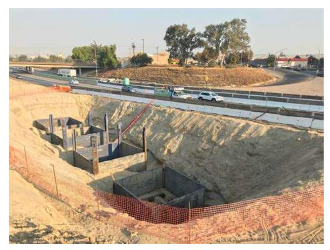

Photo 1 - Bent 2 Excavation West Side of State Route 99

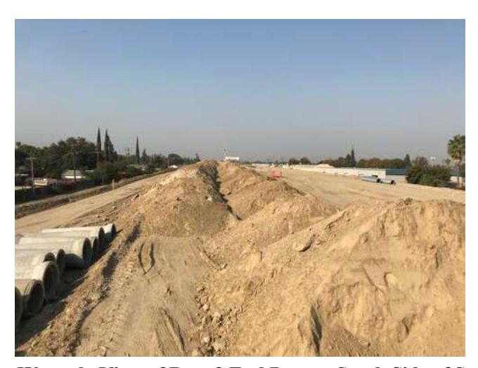

Photo 2 – Westerly View of Bent 2 End Dumps South Side of Stockpile 2

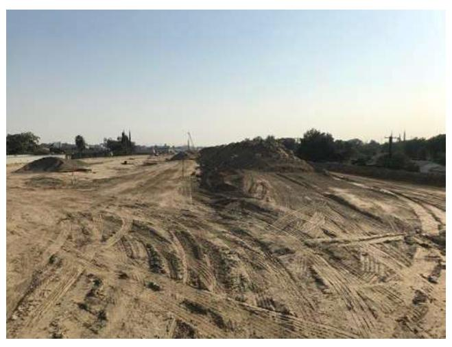

Photo 3 - Easterly View of Bent 2 End Dumps (on top of existing clean fill berm) South Side of Stockpile 2


## PHOTOGRAPHS 1, 2 & 3 Caltrans Modesto Stockpiles State Route 132

Modesto, California S1908-01-01 October 2020

# TABLE 1 SUMMARY OF BENT 2 EXCAVATION SOIL STOCKPILES ANALYTICAL RESULTS - BARIUM AND LEAD STATE ROUTE 132 CALTRANS MODESTO SOIL STOCKPILES STANISLAUS COUNTY, CALIFORNIA

| SAMPLE ID                                                              | TOTAL BARIUM<br>(mg/kg) | TOTAL LEAD<br>(mg/kg) |
|------------------------------------------------------------------------|-------------------------|-----------------------|
| STK1                                                                   | 230                     | 13                    |
| STK2                                                                   | 120                     | 7.6                   |
| STK3                                                                   | 170                     | 5.9                   |
| STK4                                                                   | 47                      | <2.5                  |
| STK5                                                                   | 49                      | <2.5                  |
| STK6                                                                   | 220                     | 4.2                   |
| STK7                                                                   | 54                      | <2.5                  |
| STK8                                                                   | 50                      | 2.9                   |
| STK9                                                                   | 31                      | <2.5                  |
| STK10                                                                  | 48                      | 2.6                   |
| Maximum Site-Specific Background<br>BCS Removal Verification Threshold | 120<br>1,000            | 3.8<br>80             |

Notes:

mg/kg = milligrams per kilogram

< = less than reporting limit


October 30, 2020

CLS Work Order #: 20J1612

COC #:

John Juhrend Geocon Consultants 3160 Gold Valley Dr. Suite #800 Rancho Cordova, CA 95742

Project Name: SR132

Enclosed are the results of analyses for samples received by the laboratory on 10/29/20 14:01. Samples were analyzed pursuant to client request utilizing EPA or other ELAP approved methodologies. I certify that the results are in compliance both technically and for completeness.

Analytical results are attached to this letter. Please call if we can provide additional assistance.

Sincerely,

James Liang, Ph.D. Laboratory Director

CA SWRCB ELAP Accreditation/Registration number 1233

## HIGHLIGHTED AREAS MUST BE FILLED OUT PRIOR TO ACCEPTANCE

| CHAIN OF CUSTODY                            |                                                                        |                      |                       |                        |               |            |              |            |
|---------------------------------------------|------------------------------------------------------------------------|----------------------|-----------------------|------------------------|---------------|------------|--------------|------------|
| CLIENT JOB NUMBER                           | 59708-01-01                                                            |                      |                       |                        |               |            |              |            |
| DESTINATION LABORATORY                      | CLS (916) 638-7301<br>3249 FITZGERALD RD.<br>RANCHO CORDOVA, CA. 96742 |                      |                       |                        |               |            |              |            |
|                                             | <input type="checkbox"/> OTHER                                         |                      |                       |                        |               |            |              |            |
| REPORT TO:                                  | G. E. CON                                                              |                      |                       |                        |               |            |              |            |
| NAME AND ADDRESS                            | 3160 COLD VALLEY DR. #300<br>RANCHO CORDOVA CA                         |                      |                       |                        |               |            |              |            |
| PROJECT MANAGER                             | JOHN J. 916.808.1911                                                   |                      |                       |                        |               |            |              |            |
| PROJECT NAME                                | 52132                                                                  |                      |                       |                        |               |            |              |            |
| SAMPLED BY                                  | JOHN J.                                                                |                      |                       |                        |               |            |              |            |
| JOB DESCRIPTION                             |                                                                        |                      |                       |                        |               |            |              |            |
| CLS ID No.:                                 | 2051612                                                                |                      |                       |                        |               |            |              |            |
| ANALYSIS REQUESTED                          |                                                                        |                      |                       |                        |               |            |              |            |
| GEOTRACKER:                                 | D YES D NO                                                             |                      |                       |                        |               |            |              |            |
| EDF REPORT                                  |                                                                        |                      |                       |                        |               |            |              |            |
| GLOBAL ID:                                  |                                                                        |                      |                       |                        |               |            |              |            |
| CDPH WRITE ON EDT TRANSMISSION?             | D YES D NO                                                             |                      |                       |                        |               |            |              |            |
| STATE SYSTEM NUMBER                         |                                                                        |                      |                       |                        |               |            |              |            |
| IF "YES" PLEASE ENTER THE SOURCE NUMBER(S). |                                                                        |                      |                       |                        |               |            |              |            |
| COMPOSITE:                                  |                                                                        |                      |                       |                        |               |            |              |            |
| TURN AROUND TIME                            |                                                                        | SPECIAL INSTRUCTIONS |                       |                        |               |            |              |            |
| DAY                                         | DAY                                                                    | DAY                  | DAY                   |                        | OR            |            |              |            |
|                                             |                                                                        |                      |                       |                        | ALT.          | 10:        |              |            |
| PRESERVATIVES                               |                                                                        |                      |                       |                        |               |            |              |            |
| MATRIX                                      | CONTAINER NO.                                                          | TYPE                 |                       |                        |               |            |              |            |
| SOIL                                        | 1                                                                      | PB                   |                       |                        |               |            |              |            |
| SITE LOCATION                               | DATE                                                                   | TIME                 | SAMPLE IDENTIFICATION |                        |               |            |              |            |
| 10-24-20                                    | 0900                                                                   | STK 1                |                       | X                      |               | V          | NEED RESULTS |            |
| 10-24-20                                    | 0905                                                                   | STK 2                |                       | X                      |               | V          | 87 10/30/20  |            |
| 10-24-20                                    | 0910                                                                   | STK 3                |                       | X                      |               | V          | LOB          |            |
| 10-24-20                                    | 0915                                                                   | STK 4                |                       | X                      |               | V          |              |            |
| 10-24-20                                    | 0920                                                                   | STK 5                |                       | X                      |               | V          |              |            |
| 10-24-20                                    | 0925                                                                   | STK 6                |                       | X                      |               | V          |              |            |
| 10-24-20                                    | 0930                                                                   | STK 7                |                       | X                      |               | V          |              |            |
| 10-24-20                                    | 0935                                                                   | STK 8                |                       | X                      |               | V          |              |            |
| 10-24-20                                    | 0940                                                                   | STK 9                |                       | X                      |               | V          |              |            |
| 10-24-20                                    | 0945                                                                   | STK 10               |                       | X                      |               | V          |              |            |
|                                             |                                                                        |                      |                       |                        | INVOICE TO    |            |              |            |
|                                             |                                                                        |                      |                       | PO #                   |               |            |              |            |
|                                             |                                                                        |                      |                       | QUOTE #                |               |            |              |            |
|                                             |                                                                        |                      |                       | (1) HCL                | (2) HNG       | (3) - COLD | (4) - NaOH   | (5) - NaOH |
| Email/Address                               | JOHN.J.STAPEN@EFCINTAL.COM                                             | RECEIVED BY (SIGN)   | 1401                  | PRINT NAME / COMPANY   |               |            |              |            |
| RELINQUISHED BY (SIGN)                      |                                                                        | DATE / TIME          | 10-29-20              |                        |               |            |              |            |
| RECD AT LAB BY:                             | DATE / TIME                                                            | 10/29/2022           | 1401                  | CONDITIONS / COMMENTS: | 215/2016 -0.9 |            |              |            |
| UPS                                         | OTHER                                                                  | FED X                | AIR BILL #            |                        |               |            |              |            |


Page 2 of 5 10/30/20 14:15

Geocon ConsultantsProject:SR1323160 Gold Valley Dr. Suite #800Project Number:S9108-01-01Rancho Cordova, CA 95742Project Manager:John Juhrend

CLS Work Order #: 20J1612

Project Manager: John Juhrend COC #:

## Metals by EPA 6000/7000 Series Methods

| Analyte                 |                         | Result                   | Reporting<br>Limit | Units | Dilution | Batch   | Prepared | Analyzed | Method    | Notes |
|-------------------------|-------------------------|--------------------------|--------------------|-------|----------|---------|----------|----------|-----------|-------|
| STK 1 (20J1612-01) Soil | Sampled: 10/29/20 09:00 | Received: 10/29/20 14:01 |                    |       |          |         |          |          |           |       |
| Barium                  |                         | 230                      | 2.5                | mg/kg | 1        | 2008863 | 10/29/20 | 10/30/20 | EPA 6010B |       |
| Lead                    |                         | 13                       | 2.5                | "     | "        | "       | "        | "        | "         |       |
| STK 2 (20J1612-02) Soil | Sampled: 10/29/20 09:05 | Received: 10/29/20 14:01 |                    |       |          |         |          |          |           |       |
| Barium                  |                         | 120                      | 2.5                | mg/kg | 1        | 2008863 | 10/29/20 | 10/30/20 | EPA 6010B |       |
| Lead                    |                         | 7.6                      | 2.5                | "     | "        | "       | "        | "        | "         |       |
| STK 3 (20J1612-03) Soil | Sampled: 10/29/20 09:10 | Received: 10/29/20 14:01 |                    |       |          |         |          |          |           |       |
| Barium                  |                         | 170                      | 2.5                | mg/kg | 1        | 2008863 | 10/29/20 | 10/30/20 | EPA 6010B |       |
| Lead                    |                         | 5.9                      | 2.5                | "     | "        | "       | "        | "        | "         |       |
| STK 4 (20J1612-04) Soil | Sampled: 10/29/20 09:15 | Received: 10/29/20 14:01 |                    |       |          |         |          |          |           |       |
| Barium                  |                         | 47                       | 2.5                | mg/kg | 1        | 2008863 | 10/29/20 | 10/30/20 | EPA 6010B |       |
| Lead                    |                         | ND                       | 2.5                | "     | "        | "       | "        | "        | "         |       |
| STK 5 (20J1612-05) Soil | Sampled: 10/29/20 09:20 | Received: 10/29/20 14:01 |                    |       |          |         |          |          |           |       |
| Barium                  |                         | 49                       | 2.5                | mg/kg | 1        | 2008863 | 10/29/20 | 10/30/20 | EPA 6010B |       |
| Lead                    |                         | ND                       | 2.5                | "     | "        | "       | "        | "        | "         |       |
| STK 6 (20J1612-06) Soil | Sampled: 10/29/20 09:25 | Received: 10/29/20 14:01 |                    |       |          |         |          |          |           |       |
| Barium                  |                         | 220                      | 2.5                | mg/kg | 1        | 2008863 | 10/29/20 | 10/30/20 | EPA 6010B |       |
| Lead                    |                         | 4.2                      | 2.5                | "     | "        | "       | "        | "        | "         |       |
| STK 7 (20J1612-07) Soil | Sampled: 10/29/20 09:30 | Received: 10/29/20 14:01 |                    |       |          |         |          |          |           |       |
| Barium                  |                         | 54                       | 2.5                | mg/kg | 1        | 2008863 | 10/29/20 | 10/30/20 | EPA 6010B |       |
| Lead                    |                         | ND                       | 2.5                | "     | "        | "       | "        | "        | "         |       |


Page 3 of 5 10/30/20 14:15

Geocon ConsultantsProject:SR1323160 Gold Valley Dr. Suite #800Project Number:S9108-01-01Rancho Cordova, CA 95742Project Manager:John Juhrend

CLS Work Order #: 20J1612

COC #:

## Metals by EPA 6000/7000 Series Methods

| Analyte                  |  | Result                  | Reporting<br>Limit       | Units | Dilution | Batch   | Prepared | Analyzed | Method    | Notes |
|--------------------------|--|-------------------------|--------------------------|-------|----------|---------|----------|----------|-----------|-------|
| STK 8 (20J1612-08) Soil  |  | Sampled: 10/29/20 09:35 | Received: 10/29/20 14:01 |       |          |         |          |          |           |       |
| Barium                   |  | 50                      | 2.5                      | mg/kg | 1        | 2008863 | 10/29/20 | 10/30/20 | EPA 6010B |       |
| Lead                     |  | 2.9                     | 2.5                      | "     | "        | "       | "        | "        | "         |       |
| STK 9 (20J1612-09) Soil  |  | Sampled: 10/29/20 09:40 | Received: 10/29/20 14:01 |       |          |         |          |          |           |       |
| Barium                   |  | 31                      | 2.5                      | mg/kg | 1        | 2008863 | 10/29/20 | 10/30/20 | EPA 6010B |       |
| Lead                     |  | ND                      | 2.5                      | "     | "        | "       | "        | "        | "         |       |
| STK 10 (20J1612-10) Soil |  | Sampled: 10/29/20 09:45 | Received: 10/29/20 14:01 |       |          |         |          |          |           |       |
| Barium                   |  | 48                      | 2.5                      | mg/kg | 1        | 2008863 | 10/29/20 | 10/30/20 | EPA 6010B |       |
| Lead                     |  | 2.6                     | 2.5                      | "     | "        | "       | "        | "        | "         |       |

Page 4 of 5

Geocon ConsultantsProject:SR1323160 Gold Valley Dr. Suite #800Project Number:S9108-01-01Rancho Cordova, CA 95742Project Manager:John Juhrend

CLS Work Order #: 20J1612

COC #:

## Metals by EPA 6000/7000 Series Methods - Quality Control

| Analyte                                |      | Reporting Limit | Units | Spike Level | Source Result | %REC | %REC Limits | RPD | RPD Limit | Notes |
|----------------------------------------|------|-----------------|-------|-------------|---------------|------|-------------|-----|-----------|-------|
| <b>Batch 2008863 - EPA 3050B</b>       |      |                 |       |             |               |      |             |     |           |       |
| <b>Blank (2008863-BLK1)</b>            |      |                 |       |             |               |      |             |     |           |       |
| Lead                                   | ND   | 2.5             | mg/kg |             |               |      |             |     |           |       |
| Barium                                 | ND   | 2.5             | "     |             |               |      |             |     |           |       |
| <b>LCS (2008863-BS1)</b>               |      |                 |       |             |               |      |             |     |           |       |
| Lead                                   | 106  | 2.5             | mg/kg | 100         |               | 106  | 75-125      |     |           |       |
| Barium                                 | 93.3 | 2.5             | "     | 100         |               | 93   | 75-125      |     |           |       |
| <b>Matrix Spike (2008863-MS1)</b>      |      |                 |       |             |               |      |             |     |           |       |
| Lead                                   | 105  | 2.5             | mg/kg | 100         | 12.5          | 93   | 75-125      |     |           |       |
| Barium                                 | 321  | 2.5             | "     | 100         | 234           | 87   | 75-125      |     |           |       |
| <b>Matrix Spike Dup (2008863-MSD1)</b> |      |                 |       |             |               |      |             |     |           |       |
| Lead                                   | 103  | 2.5             | mg/kg | 100         | 12.5          | 91   | 75-125      | 2   | 30        |       |
| Barium                                 | 353  | 2.5             | "     | 100         | 234           | 118  | 75-125      | 9   | 30        |       |


Page 5 of 5 10/30/20 14:15

Geocon Consultants Project: SR132 3160 Gold Valley Dr. Suite #800 Project Number: S9108-01-01 Rancho Cordova, CA 95742 Project Manager:

John Juhrend COC #:

CLS Work Order #: 20J1612

## Notes and Definitions

DET Analyte DETECTED

ND Analyte NOT DETECTED at or above the reporting limit (or method detection limit when specified)

NR Not Reported

Sample results reported on a dry weight basis dry

Relative Percent Difference RPD


# Technical Memorandum

Date: April 12, 2021

To: Rick Demi, Construction Manager

WSP/City of Modesto

From: John E. Juhrend, PE, CEG, Project Manager, Geocon

Subject: Carpenter Shoofly Clean Fill Characterization Testing

State Route 132 Project, Modesto, California

Reference: Variance to Remedial Design Implementation Plan, April 9, 2020

This Technical Memorandum presents a summary of the Carpenter Road Shoofly clean fill characterization testing performed within the State Route 132 right-of-way. Approximately 5,000 cubic yards of native soil will be excavated from the Carpenter Road Shoofly once the overcrossing structure under construction is completed. The contractor plans to use the excavated soil material as clean capping material to be placed over portions of barium containing soil (BCS) Stockpiles 1 and 2 pending California Department of Toxic Substances Control (DTSC) approval. Photographs of the Carpenter Road Shoofly are on the attached exhibit.

We collected 24 discrete soil samples from the Carpenter Road Shoofly along six vertical transects (CSF1 through CSF6) as depicted on the attached exhibit. Soil samples were collected from the surface of the soil material exposed on the slope face at 2, 5, 10 and 15 feet from the top of the slope. The soil samples were placed in labelled Ziploc plastic bags and transported to California Laboratory Services (CLS) under chain-of-custody protocol. The laboratory was instructed to composite three discrete soil samples from the same elevation along each slope face of the shoofly resulting in eight 3-part composite samples. The composite soil samples were analyzed for barium and lead following Environmental Protection Agency Test Method 6010B under expedited 48-hour turn-around time. A summary of the soil sample analytical data is on Table 1. A copy of the CLS laboratory report is attached.

Barium was detected in each of the 10 soil samples analyzed at concentrations ranging from 28 to 96 milligrams per kilogram (mg/kg), less than the maximum site-specific background value for barium of 120 mg/kg. Lead was detected in 9 of the 10 soil samples analyzed at concentrations ranging from 1.4 to 3.8 mg/kg, less than or equal to the maximum site-specific background concentration for lead of 3.8 mg/kg.

Based on the barium and lead data presented herein, soil material generated from excavation of the Carpenter Road Shoofly meet the BCS clean cap criteria as established in the referenced variance document as approved by DTSC (upperbound background threshold for barium of 120 mg/kg). The information presented herein will be included in the Removal Action Completion Report to be submitted following completion of the Stockpile 1 and 2 clean fill capping activities.


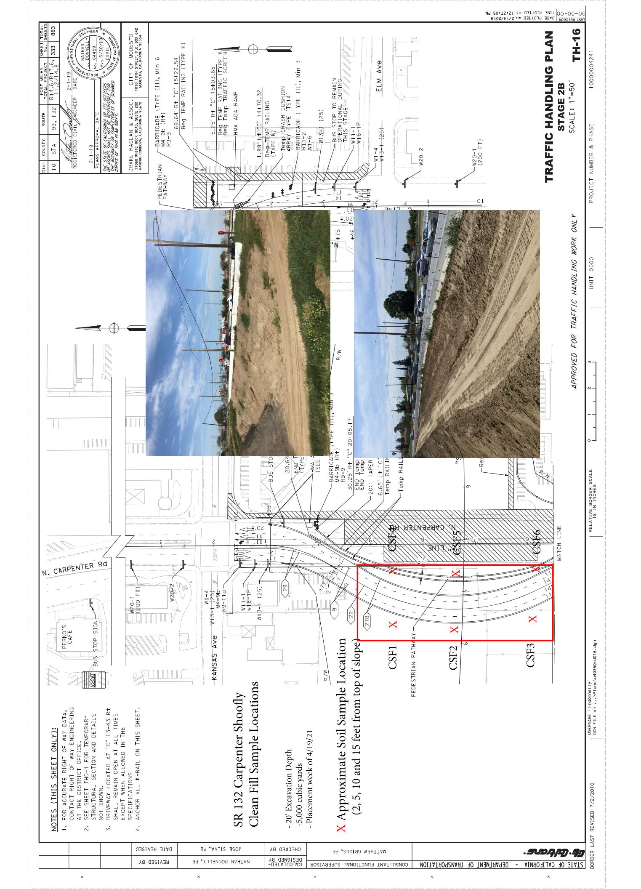

# TABLE 1 SUMMARY OF CARPENTER ROAD SHOOFLY SOIL ANALYTICAL RESULTS - BARIUM AND LEAD STATE ROUTE 132 CALTRANS MODESTO SOIL STOCKPILES STANISLAUS COUNTY, CALIFORNIA

| SAMPLE ID                        | TOTAL BARIUM<br>(mg/kg) | TOTAL LEAD<br>(mg/kg) |
|----------------------------------|-------------------------|-----------------------|
| CSF1, CSF2, CSF3-2               | 96                      | 3.8                   |
| CSF2, CSF2, CSF3-5               | 66                      | 1.7                   |
| CSF1, CSF2, CSF3-10              | 52                      | 1.4                   |
| CSF1, CSF2, CSF3-15              | 28                      | <1.3                  |
| CSF4, CSF5, CSF6-2               | 74                      | 2.9                   |
| CSF4, CSF5, CSF6-5               | 74                      | 2.0                   |
| CSF4, CSF5, CSF6-10              | 80                      | 3.2                   |
| CSF4, CSF5, CSF6-15              | 39                      | 1.6                   |
| Maximum Site-Specific Background | 120                     | 3.8                   |

Notes:

mg/kg = milligrams per kilogram

< = less than reporting limit


April 12, 2021 CLS Work Order #: 21D0456 COC #:

John Juhrend Geocon Consultants

3160 Gold Valley Dr. Suite #800 Rancho Cordova, CA 95742

Project Name: SR 132 Carpenter

Enclosed are the results of analyses for samples received by the laboratory on 04/08/21 14:25. Samples were analyzed pursuant to client request utilizing EPA or other ELAP approved methodologies. I certify that the results are in compliance both technically and for completeness.

Analytical results are attached to this letter. Please call if we can provide additional assistance.

Sincerely

James Liang, Ph.D. Laboratory Director

CA SWRCB ELAP Accreditation/Registration number 1233

## Caltrans

Remarls

QA/QC □ Caltrans ☐ Legal ☐ RWQCB ☐ Level IV ATLCOC Ver: 2018032 regenerated/reformatted report, \$35 per reprocessed EDD.

Rush TCLP/STLC samples and 2 days to analysis TAT for extraction procedure.

Unenalysed samples will include a disposal fee of \$2 per Sample.

The laboratory will anodomly select from all CE samples received the sample to gale for Matrix Spike/
Matrix Spike Duplicate MAS/MSD) at no cost. However, If you want the laboratory to additionally
perform MS/MSD on your sample, a charge will be assessed for the specific sample used. Remarls As the authorized agent of the company above, I hereby purchase laboratory services from ATL as shown above and hereby guarantee payment as quoted. S. # OF SAMPLES MAJCH COC Z COOLER TEMP deg C. Condition Fax: (916) 852-9132 (916) 852-9118 Container PRESERVED Material: 1=Glass; 2=Plastic; 3=Metal N □ Equis □ Excel CLEDF Sperit Tube EDD For Laboratory Use Only (TAT) əmiT bnuorenruT same as SEND REPORT TO Tel: Sample Matrix CONTAINER INTACT 110 HEADSPACE (VOA) MASTEWATER Zp: 95742 CHILLED GROUNDWATER 1105 Method of Transport □ with Email: Printed Name S State: State: Cyclent Cyclent Cyclent Cyclent Cyclent Cyclent Cyclent Cyclent Cyclent Cyclent Cyclent Cyclent Cyclent Cyclent Cyclent Cyclent Cyclent Cyclent Cyclent Cyclent Cyclent Cyclent Cyclent Cyclent Cyclent Cyclent Cyclent Cyclent Cyclent Cyclent Cyclent Cyclent Cyclent Cyclent Cyclent Cyclent Cyclent Cyclent Cyclent Cyclent Cyclent Cyclent Cyclent Cyclent Cyclent Cyclent Cyclent Cyclent Cyclent Cyclent Cyclent Cyclent Cyclent Cyclent Cyclent Cyclent Cyclent Cyclent Cyclent Cyclent Cyclent Cyclent Cyclent Cyclent Cyclent Cyclent Cyclent Cyclent Cyclent Cyclent Cyclent Cyclent Cyclent Cyclent Cyclent Cyclent Cyclent Cyclent Cyclent Cyclent Cyclent Cyclent Cyclent Cyclent Cyclent Cyclent Cyclent Cyclent Cyclent Cyclent Cyclent Cyclent Cyclent Cyclent Cyclent Cyclent Cyclent Cyclent Cyclent Cyclent Cyclent Cyclent Cyclent Cyclent Cyclent Cyclent Cyclent Cyclent Cyclent Cyclent Cyclent Cyclent Cyclent Cyclent Cyclent Cyclent Cyclent Cyclent Cyclent Cyclent Cyclent Cyclent Cyclent Cyclent Cyclent Cyclent Cyclent Cyclent Cyclent Cyclent Cyclent Cyclent Cyclent Cyclent Cyclent Cyclent Cyclent Cyclent Cyclent Cyclent Cyclent Cyclent Cyclent Cyclent Cyclent Cyclent Cyclent Cyclent Cyclent Cyclent Cyclent Cyclent Cyclent Cyclent Cyclent Cyclent Cyclent Cyclent Cyclent Cyclent Cyclent Cyclent Cyclent Cyclent Cyclent Cyclent Cyclent Cyclent Cyclent Cyclent Cyclent Cyclent Cyclent Cyclent Cyclent Cyclent Cyclent Cyclent Cyclent Cyclent Cyclent Cyclent Cyclent Cyclent Cyclent Cyclent Cyclent Cyclent Cyclent Cyclent Cyclent Cyclent Cyclent Cyclent Cyclent Cyclent Cyclent Cyclent Cyclent Cyclent Cyclent Cyclent Cyclent Cyclent Cyclent Cyclent Cyclent Cyclent Cyclent Cyclent Cyclent Cyclent Cyclent Cyclent Cyclent Cyclent Cyclent Cyclent Cyclent Cyclent Cyclent Cyclent Cyclent Cyclent Cyclent Cyclent Cyclent Cyclent Cyclent Cyclent Cyclent Cyclent Cyclent Cyclent Cyclent Cyclent Cyclent Cyclent Cyclent Cyclent Cyclent Cyclent Cyclent Cyclent Cyclent Cyclent Cyclent Cyclent Cyclent Cyclent Cyclent Cyclent Cyclent Cyclent Cyclent Cyclen 10.12 Requested Analysis Address: 3160 Gold Valley Drive, Suite 800 entary storage for forty-five (45) calendar days from receipt of Air samples: Complimentary storage for ten (10) calendar days from receipt of samples; \$20 sample/week if extended storage is requested. Hard copy and regenerated reports/EDDs: \$17.50 per hard copy report requested; \$50.00 per SEND INVOICE TO ADVANCED TO TECHNOLOGY JOSE CHAIN OF CUSTODY RECORD · 图 图 2 Time: 100 Liquid and soild samples will be disposed of after 45 calendar days from receipt of s will be disposed of after 14 calendar days after receipt of samples.
 P. Elettronic records maintained for five (5) years from report date. 6010 / 7000 (Title 22 Metals) Instruction: Complete all shaded areas. 8270 (Semi-volatiles) Rancho Cordova Date 25 Date: 8012(DBO) 8012(080) 8260 / 624 (Volatiles) Received by (Signoducant) Printed Name) ( ( ( 1 , Attn: Jal Hard topy reports will be disposed of after 45 cale
 Storage and Report Fees. Company Time Address: Received by: (Signature and Printed Name) City: City: Special Instructions/Comments: Date 14 95742 Received by (Signat Zip: Sample Description intract TAT is 10 - 15 sustriess days. Projects requiring shorter 1ATs will incur a surcharge respective CA hrours. 730 AM to 730 PM Monday. Friday: Seturday 8:00 AM to 12:00 PM. AffER 3:00 PM are considered received the following business day at 8:00 AM. Time: Sample ID / Location ime State: SEND REPORT TO Quote #: # Od 300% Surchinge, SAME BUSINESS DAY If received by 9:00 AM Date 3160 Gold Valley Drive, Suite 800 Date Geocon Consultants, Inc. Geocon Consultants, Inc. Tel: (562) 989-4045 • Fax: (562) 989-4040 IGE 5th BUSINESS DAY (COB 5:00 PM) 3275 Walnut Ave., Signal Hill, CA 90755 LABORATORIES Relinquished by: (Signature and Printed Name) elinquished by: (Signapare and Pointed Name Rancho Cordova Relinquished by: (Signature and F thed AFTER 3:00 PM Laboratory ID (For Lab Use Only) NO SURCHA Project Name: Project No. Address: Company Sampler 333333 City: 10 ITEM 4 5 9 1 00 0 CUSTOMER SAMPLES PROJECT TERMS CUSTODY

# ADVANCED A TECHNOLOGY

BORATORIES

LABORATORIES

3275 Walnut Ave., Signal Hill, CA 90755
Tel: (562) 989-4045 • Fax: (562) 989-4040

# CHAIN OF CUSTODY

Page 1

Instruction: Cor

15004

CHAIN OF CUSTODY RECORD

f

page aged

The image provided is a blank white canvas with a subtle shadow at the bottom, suggesting a light source from above. There is no discernible text or graphical content within the image itself.

S. IL OF SAMPLES MATCH COC. | ATLCOC Ver:20180321 7. LOOLER TEMP, steg C: 6. PRESERVED For Laboratory Use Only 3. CONTAINER INTACT 2 HEADSPACE IVOA) Condition 1. CHILLED Method of Transport ☐ ATT D Clent
D FedEv
D GSO

| Company:                                      | Geocon Consultants, Inc.                                                                                                                                                         | Tel: (916) 989-4045  | Fax: (916) 989-4040 |                                |                                  |                    |                       |                             |       |      |            |             |      |               |          |                       |                                                                        |                                       |         |
|-----------------------------------------------|----------------------------------------------------------------------------------------------------------------------------------------------------------------------------------|----------------------|---------------------|--------------------------------|----------------------------------|--------------------|-----------------------|-----------------------------|-------|------|------------|-------------|------|---------------|----------|-----------------------|------------------------------------------------------------------------|---------------------------------------|---------|
| Address:                                      | 3160 Gold Valley Drive, Suite 800                                                                                                                                                | City: Rancho Cordova | State: CA           | Zip: 95742                     |                                  |                    |                       |                             |       |      |            |             |      |               |          |                       |                                                                        |                                       |         |
| SEND REPORT TO:                               |                                                                                                                                                                                  |                      | SEND INVOICE TO:    |                                |                                  |                    |                       |                             |       |      |            |             |      |               |          |                       |                                                                        |                                       |         |
| Attn:                                         | John JUHRLAN                                                                                                                                                                     | Email:               |                     | Attn:                          | wall don                         | Company:           |                       |                             |       |      |            |             |      |               |          |                       |                                                                        |                                       |         |
| Company:                                      | Geocon Consultants, Inc.                                                                                                                                                         | Company:             |                     | Address:                       |                                  | Address:           |                       |                             |       |      |            |             |      |               |          |                       |                                                                        |                                       |         |
| Address:                                      | 3160 Gold Valley Drive, Suite 800                                                                                                                                                |                      |                     | City:                          |                                  | City:              |                       | State:                      |       | Zip: |            |             |      |               |          |                       |                                                                        |                                       |         |
| City:                                         | Rancho Cordova                                                                                                                                                                   | State: CA            | Zip: 95742          |                                |                                  |                    |                       |                             |       |      |            |             |      |               |          |                       |                                                                        |                                       |         |
| Project Name:                                 | CSF 132                                                                                                                                                                          | Quote #:             |                     | Special Instructions/Comments: |                                  | Requested Analysis | Sample Matrix         | Container                   |       |      |            |             |      |               |          |                       |                                                                        |                                       |         |
| Project No.:                                  | 908-01-01                                                                                                                                                                        |                      |                     |                                |                                  |                    |                       |                             |       |      |            |             |      |               |          |                       |                                                                        |                                       |         |
| Sampler:                                      | JOHN J                                                                                                                                                                           |                      |                     |                                |                                  |                    |                       |                             |       |      |            |             |      |               |          |                       |                                                                        |                                       |         |
| ITEM                                          | Sample Description                                                                                                                                                               | Date                 | Time                | 8260/624 (Volatiles)           | 8081 (Organochlorine Pesticides) | 8082 (PCBs)        | 8270 (Semi-volatiles) | 6010/7010 (Title 22 Metals) | TO-15 | OIL  | WASTEWATER | GROUNDWATER | SOIL | Sample Matrix | Quantity | Turnaround Time (TAT) | Preservative: 1=HCL; 2=HNO3; 3=H2SO4; 4=AC; 5=ZN/AC; 6=NAOH; 7=NA2S203 | Material: 1=Glass; 2=Plastic; 3=Metal | Remarks |
| 1                                             | CSF 9-10                                                                                                                                                                         | 4-21                 | 1700                |                                |                                  |                    |                       |                             |       |      |            |             |      |               |          | 2                     | 2                                                                      |                                       |         |
| 2                                             | CSF 5-10                                                                                                                                                                         |                      | 1705                |                                |                                  |                    |                       |                             |       |      |            |             |      |               |          | 2                     | 2                                                                      |                                       |         |
| 3                                             | CSF 6-10                                                                                                                                                                         |                      | 1710                |                                |                                  |                    |                       |                             |       |      |            |             |      |               |          | 2                     | 2                                                                      |                                       |         |
| 4                                             | CSF 4-15                                                                                                                                                                         |                      | 1715                |                                |                                  |                    |                       |                             |       |      |            |             |      |               |          | 2                     | 2                                                                      |                                       |         |
| 5                                             | CSF 5-15                                                                                                                                                                         |                      | 1720                |                                |                                  |                    |                       |                             |       |      |            |             |      |               |          | 2                     | 2                                                                      |                                       |         |
| 6                                             | CSF 6-15                                                                                                                                                                         |                      | 1725                |                                |                                  |                    |                       |                             |       |      |            |             |      |               |          | 2                     | 2                                                                      |                                       |         |
| 7                                             |                                                                                                                                                                                  |                      |                     |                                |                                  |                    |                       |                             |       |      |            |             |      |               |          |                       |                                                                        |                                       |         |
| 8                                             |                                                                                                                                                                                  |                      |                     |                                |                                  |                    |                       |                             |       |      |            |             |      |               |          |                       |                                                                        |                                       |         |
| 9                                             |                                                                                                                                                                                  |                      |                     |                                |                                  |                    |                       |                             |       |      |            |             |      |               |          |                       |                                                                        |                                       |         |
| 10                                            |                                                                                                                                                                                  |                      |                     |                                |                                  |                    |                       |                             |       |      |            |             |      |               |          |                       |                                                                        |                                       |         |
| TERMS                                         | 1. Sample receiving hours: 7:30 AM to 7:30 PM Monday - Friday, Saturday 8:00 AM to 12:00 PM.                                                                                     |                      |                     |                                |                                  |                    |                       |                             |       |      |            |             |      |               |          |                       |                                                                        |                                       |         |
|                                               | 2. Samples submitted after 3:00 PM are considered received the following business day at 8:00 AM.                                                                                |                      |                     |                                |                                  |                    |                       |                             |       |      |            |             |      |               |          |                       |                                                                        |                                       |         |
|                                               | 3. The following turnaround time conditions apply:                                                                                                                               |                      |                     |                                |                                  |                    |                       |                             |       |      |            |             |      |               |          |                       |                                                                        |                                       |         |
|                                               | TAT = 0 100% Surcharge SAME BUSINESS DAY if received by 9:00 AM                                                                                                                  |                      |                     |                                |                                  |                    |                       |                             |       |      |            |             |      |               |          |                       |                                                                        |                                       |         |
|                                               | TAT = 1 50% Surcharge NEXT BUSINESS DAY (COB 5:00 PM)                                                                                                                            |                      |                     |                                |                                  |                    |                       |                             |       |      |            |             |      |               |          |                       |                                                                        |                                       |         |
|                                               | TAT = 2 100% Surcharge 2ND BUSINESS DAY (COB 5:00 PM)                                                                                                                            |                      |                     |                                |                                  |                    |                       |                             |       |      |            |             |      |               |          |                       |                                                                        |                                       |         |
|                                               | TAT = 3 50% Surcharge 3RD BUSINESS DAY (COB 5:00 PM)                                                                                                                             |                      |                     |                                |                                  |                    |                       |                             |       |      |            |             |      |               |          |                       |                                                                        |                                       |         |
|                                               | TAT = 4 30% Surcharge 4TH BUSINESS DAY (COB 5:00 PM)                                                                                                                             |                      |                     |                                |                                  |                    |                       |                             |       |      |            |             |      |               |          |                       |                                                                        |                                       |         |
|                                               | TAT = 5 NO SURCHARGE 5TH BUSINESS DAY (COB 5:00 PM)                                                                                                                              |                      |                     |                                |                                  |                    |                       |                             |       |      |            |             |      |               |          |                       |                                                                        |                                       |         |
|                                               | 4. Weekend, holiday, after-hours work - ask for quote.                                                                                                                           |                      |                     |                                |                                  |                    |                       |                             |       |      |            |             |      |               |          |                       |                                                                        |                                       |         |
|                                               | 5. Subcontract TAT is 10 - 15 business days. Projects requiring shorter TATs will incur a surcharge respective                                                                   |                      |                     |                                |                                  |                    |                       |                             |       |      |            |             |      |               |          |                       |                                                                        |                                       |         |
|                                               | to the subcontract lab—ask for quote.                                                                                                                                            |                      |                     |                                |                                  |                    |                       |                             |       |      |            |             |      |               |          |                       |                                                                        |                                       |         |
|                                               | 6. Liquid and solid samples will be disposed of after 45 calendar days from receipt of samples, all samples will be disposed of after 14 calendar days after receipt of samples. |                      |                     |                                |                                  |                    |                       |                             |       |      |            |             |      |               |          |                       |                                                                        |                                       |         |
|                                               | 7. Electronic records maintained for five (5) years from report date.                                                                                                            |                      |                     |                                |                                  |                    |                       |                             |       |      |            |             |      |               |          |                       |                                                                        |                                       |         |
|                                               | 8. Hard copy reports will be disposed of after 45 calendar days from report date.                                                                                                |                      |                     |                                |                                  |                    |                       |                             |       |      |            |             |      |               |          |                       |                                                                        |                                       |         |
|                                               | 9. Storage and Report Fees:                                                                                                                                                      |                      |                     |                                |                                  |                    |                       |                             |       |      |            |             |      |               |          |                       |                                                                        |                                       |         |
|                                               | Liquid & solid samples: Complimentary storage for forty-five (45) calendar days from receipt of samples; \$2/sample/month if extended storage or hold is requested.              |                      |                     |                                |                                  |                    |                       |                             |       |      |            |             |      |               |          |                       |                                                                        |                                       |         |
|                                               | Air samples: Complimentary storage for ten (10) calendar days from receipt of samples; \$2/sample/month if extended storage is requested.                                        |                      |                     |                                |                                  |                    |                       |                             |       |      |            |             |      |               |          |                       |                                                                        |                                       |         |
|                                               | All samples: Complimentary storage for ten (10) calendar days from receipt of samples; \$2/sample/month if extended storage is requested.                                        |                      |                     |                                |                                  |                    |                       |                             |       |      |            |             |      |               |          |                       |                                                                        |                                       |         |
|                                               | Hard copy and regenerated reports/EDDs: \$17.50 per hard copy report requested. \$40.00 per                                                                                      |                      |                     |                                |                                  |                    |                       |                             |       |      |            |             |      |               |          |                       |                                                                        |                                       |         |
| Relinquished by: (Signature and Printed Name) |                                                                                                                                                                                  | Date:                | Time:               |                                |                                  |                    |                       |                             |       |      |            |             |      |               |          |                       |                                                                        |                                       |         |
| Received by: (Signature and Printed Name)     |                                                                                                                                                                                  | Date:                | Time:               |                                |                                  |                    |                       |                             |       |      |            |             |      |               |          |                       |                                                                        |                                       |         |
|                                               |                                                                                                                                                                                  |                      |                     |                                |                                  |                    |                       |                             |       |      |            |             |      |               |          |                       |                                                                        |                                       |         |
|                                               |                                                                                                                                                                                  |                      |                     |                                |                                  |                    |                       |                             |       |      |            |             |      |               |          |                       |                                                                        |                                       |         |
|                                               |                                                                                                                                                                                  |                      |                     |                                |                                  |                    |                       |                             |       |      |            |             |      |               |          |                       |                                                                        |                                       |         |
|                                               |                                                                                                                                                                                  |                      |                     |                                |                                  |                    |                       |                             |       |      |            |             |      |               |          |                       |                                                                        |                                       |         |
|                                               |                                                                                                                                                                                  |                      |                     |                                |                                  |                    |                       |                             |       |      |            |             |      |               |          |                       |                                                                        |                                       |         |
|                                               |                                                                                                                                                                                  |                      |                     |                                |                                  |                    |                       |                             |       |      |            |             |      |               |          |                       |                                                                        |                                       |         |
|                                               |                                                                                                                                                                                  |                      |                     |                                |                                  |                    |                       |                             |       |      |            |             |      |               |          |                       |                                                                        |                                       |         |
|                                               |                                                                                                                                                                                  |                      |                     |                                |                                  |                    |                       |                             |       |      |            |             |      |               |          |                       |                                                                        |                                       |         |
|                                               |                                                                                                                                                                                  |                      |                     |                                |                                  |                    |                       |                             |       |      |            |             |      |               |          |                       |                                                                        |                                       |         |
|                                               |                                                                                                                                                                                  |                      |                     |                                |                                  |                    |                       |                             |       |      |            |             |      |               |          |                       |                                                                        |                                       |         |
|                                               |                                                                                                                                                                                  |                      |                     |                                |                                  |                    |                       |                             |       |      |            |             |      |               |          |                       |                                                                        |                                       |         |
|                                               |                                                                                                                                                                                  |                      |                     |                                |                                  |                    |                       |                             |       |      |            |             |      |               |          |                       |                                                                        |                                       |         |
|                                               |                                                                                                                                                                                  |                      |                     |                                |                                  |                    |                       |                             |       |      |            |             |      |               |          |                       |                                                                        |                                       |         |
|                                               |                                                                                                                                                                                  |                      |                     |                                |                                  |                    |                       |                             |       |      |            |             |      |               |          |                       |                                                                        |                                       |         |
|                                               |                                                                                                                                                                                  |                      |                     |                                |                                  |                    |                       |                             |       |      |            |             |      |               |          |                       |                                                                        |                                       |         |
|                                               |                                                                                                                                                                                  |                      |                     |                                |                                  |                    |                       |                             |       |      |            |             |      |               |          |                       |                                                                        |                                       |         |
|                                               |                                                                                                                                                                                  |                      |                     |                                |                                  |                    |                       |                             |       |      |            |             |      |               |          |                       |                                                                        |                                       |         |
|                                               |                                                                                                                                                                                  |                      |                     |                                |                                  |                    |                       |                             |       |      |            |             |      |               |          |                       |                                                                        |                                       |         |
|                                               |                                                                                                                                                                                  |                      |                     |                                |                                  |                    |                       |                             |       |      |            |             |      |               |          |                       |                                                                        |                                       |         |
|                                               |                                                                                                                                                                                  |                      |                     |                                |                                  |                    |                       |                             |       |      |            |             |      |               |          |                       |                                                                        |                                       |         |
|                                               |                                                                                                                                                                                  |                      |                     |                                |                                  |                    |                       |                             |       |      |            |             |      |               |          |                       |                                                                        |                                       |         |
|                                               |                                                                                                                                                                                  |                      |                     |                                |                                  |                    |                       |                             |       |      |            |             |      |               |          |                       |                                                                        |                                       |         |
|                                               |                                                                                                                                                                                  |                      |                     |                                |                                  |                    |                       |                             |       |      |            |             |      |               |          |                       |                                                                        |                                       |         |
|                                               |                                                                                                                                                                                  |                      |                     |                                |                                  |                    |                       |                             |       |      |            |             |      |               |          |                       |                                                                        |                                       |         |
|                                               |                                                                                                                                                                                  |                      |                     |                                |                                  |                    |                       |                             |       |      |            |             |      |               |          |                       |                                                                        |                                       |         |
|                                               |                                                                                                                                                                                  |                      |                     |                                |                                  |                    |                       |                             |       |      |            |             |      |               |          |                       |                                                                        |                                       |         |
|                                               |                                                                                                                                                                                  |                      |                     |                                |                                  |                    |                       |                             |       |      |            |             |      |               |          |                       |                                                                        |                                       |         |
|                                               |                                                                                                                                                                                  |                      |                     |                                |                                  |                    |                       |                             |       |      |            |             |      |               |          |                       |                                                                        |                                       |         |
|                                               |                                                                                                                                                                                  |                      |                     |                                |                                  |                    |                       |                             |       |      |            |             |      |               |          |                       |                                                                        |                                       |         |
|                                               |                                                                                                                                                                                  |                      |                     |                                |                                  |                    |                       |                             |       |      |            |             |      |               |          |                       |                                                                        |                                       |         |
|                                               |                                                                                                                                                                                  |                      |                     |                                |                                  |                    |                       |                             |       |      |            |             |      |               |          |                       |                                                                        |                                       |         |
|                                               |                                                                                                                                                                                  |                      |                     |                                |                                  |                    |                       |                             |       |      |            |             |      |               |          |                       |                                                                        |                                       |         |
|                                               |                                                                                                                                                                                  |                      |                     |                                |                                  |                    |                       |                             |       |      |            |             |      |               |          |                       |                                                                        |                                       |         |
|                                               |                                                                                                                                                                                  |                      |                     |                                |                                  |                    |                       |                             |       |      |            |             |      |               |          |                       |                                                                        |                                       |         |
|                                               |                                                                                                                                                                                  |                      |                     |                                |                                  |                    |                       |                             |       |      |            |             |      |               |          |                       |                                                                        |                                       |         |
|                                               |                                                                                                                                                                                  |                      |                     |                                |                                  |                    |                       |                             |       |      |            |             |      |               |          |                       |                                                                        |                                       |         |
|                                               |                                                                                                                                                                                  |                      |                     |                                |                                  |                    |                       |                             |       |      |            |             |      |               |          |                       |                                                                        |                                       |         |
|                                               |                                                                                                                                                                                  |                      |                     |                                |                                  |                    |                       |                             |       |      |            |             |      |               |          |                       |                                                                        |                                       |         |
|                                               |                                                                                                                                                                                  |                      |                     |                                |                                  |                    |                       |                             |       |      |            |             |      |               |          |                       |                                                                        |                                       |         |
|                                               |                                                                                                                                                                                  |                      |                     |                                |                                  |                    |                       |                             |       |      |            |             |      |               |          |                       |                                                                        |                                       |         |
|                                               |                                                                                                                                                                                  |                      |                     |                                |                                  |                    |                       |                             |       |      |            |             |      |               |          |                       |                                                                        |                                       |         |
|                                               |                                                                                                                                                                                  |                      |                     |                                |                                  |                    |                       |                             |       |      |            |             |      |               |          |                       |                                                                        |                                       |         |
|                                               |                                                                                                                                                                                  |                      |                     |                                |                                  |                    |                       |                             |       |      |            |             |      |               |          |                       |                                                                        |                                       |         |
|                                               |                                                                                                                                                                                  |                      |                     |                                |                                  |                    |                       |                             |       |      |            |             |      |               |          |                       |                                                                        |                                       |         |
|                                               |                                                                                                                                                                                  |                      |                     |                                |                                  |                    |                       |                             |       |      |            |             |      |               |          |                       |                                                                        |                                       |         |
|                                               |                                                                                                                                                                                  |                      |                     |                                |                                  |                    |                       |                             |       |      |            |             |      |               |          |                       |                                                                        |                                       |         |
|                                               |                                                                                                                                                                                  |                      |                     |                                |                                  |                    |                       |                             |       |      |            |             |      |               |          |                       |                                                                        |                                       |         |
|                                               |                                                                                                                                                                                  |                      |                     |                                |                                  |                    |                       |                             |       |      |            |             |      |               |          |                       |                                                                        |                                       |         |
|                                               |                                                                                                                                                                                  |                      |                     |                                |                                  |                    |                       |                             |       |      |            |             |      |               |          |                       |                                                                        |                                       |         |
|                                               |                                                                                                                                                                                  |                      |                     |                                |                                  |                    |                       |                             |       |      |            |             |      |               |          |                       |                                                                        |                                       |         |
|                                               |                                                                                                                                                                                  |                      |                     |                                |                                  |                    |                       |                             |       |      |            |             |      |               |          |                       |                                                                        |                                       |         |
|                                               |                                                                                                                                                                                  |                      |                     |                                |                                  |                    |                       |                             |       |      |            |             |      |               |          |                       |                                                                        |                                       |         |
|                                               |                                                                                                                                                                                  |                      |                     |                                |                                  |                    |                       |                             |       |      |            |             |      |               |          |                       |                                                                        |                                       |         |
|                                               |                                                                                                                                                                                  |                      |                     |                                |                                  |                    |                       |                             |       |      |            |             |      |               |          |                       |                                                                        |                                       |         |
|                                               |                                                                                                                                                                                  |                      |                     |                                |                                  |                    |                       |                             |       |      |            |             |      |               |          |                       |                                                                        |                                       |         |
|                                               |                                                                                                                                                                                  |                      |                     |                                |                                  |                    |                       |                             |       |      |            |             |      |               |          |                       |                                                                        |                                       |         |
|                                               |                                                                                                                                                                                  |                      |                     |                                |                                  |                    |                       |                             |       |      |            |             |      |               |          |                       |                                                                        |                                       |         |
|                                               |                                                                                                                                                                                  |                      |                     |                                |                                  |                    |                       |                             |       |      |            |             |      |               |          |                       |                                                                        |                                       |         |
|                                               |                                                                                                                                                                                  |                      |                     |                                |                                  |                    |                       |                             |       |      |            |             |      |               |          |                       |                                                                        |                                       |         |
|                                               |                                                                                                                                                                                  |                      |                     |                                |                                  |                    |                       |                             |       |      |            |             |      |               |          |                       |                                                                        |                                       |         |
|                                               |                                                                                                                                                                                  |                      |                     |                                |                                  |                    |                       |                             |       |      |            |             |      |               |          |                       |                                                                        |                                       |         |
|                                               |                                                                                                                                                                                  |                      |                     |                                |                                  |                    |                       |                             |       |      |            |             |      |               |          |                       |                                                                        |                                       |         |
|                                               |                                                                                                                                                                                  |                      |                     |                                |                                  |                    |                       |                             |       |      |            |             |      |               |          |                       |                                                                        |                                       |         |
|                                               |                                                                                                                                                                                  |                      |                     |                                |                                  |                    |                       |                             |       |      |            |             |      |               |          |                       |                                                                        |                                       |         |
|                                               |                                                                                                                                                                                  |                      |                     |                                |                                  |                    |                       |                             |       |      |            |             |      |               |          |                       |                                                                        |                                       |         |
|                                               |                                                                                                                                                                                  |                      |                     |                                |                                  |                    |                       |                             |       |      |            |             |      |               |          |                       |                                                                        |                                       |         |
|                                               |                                                                                                                                                                                  |                      |                     |                                |                                  |                    |                       |                             |       |      |            |             |      |               |          |                       |                                                                        |                                       |         |
|                                               |                                                                                                                                                                                  |                      |                     |                                |                                  |                    |                       |                             |       |      |            |             |      |               |          |                       |                                                                        |                                       |         |
|                                               |                                                                                                                                                                                  |                      |                     |                                |                                  |                    |                       |                             |       |      |            |             |      |               |          |                       |                                                                        |                                       |         |
|                                               |                                                                                                                                                                                  |                      |                     |                                |                                  |                    |                       |                             |       |      |            |             |      |               |          |                       |                                                                        |                                       |         |
|                                               |                                                                                                                                                                                  |                      |                     |                                |                                  |                    |                       |                             |       |      |            |             |      |               |          |                       |                                                                        |                                       |         |
|                                               |                                                                                                                                                                                  |                      |                     |                                |                                  |                    |                       |                             |       |      |            |             |      |               |          |                       |                                                                        |                                       |         |
|                                               |                                                                                                                                                                                  |                      |                     |                                |                                  |                    |                       |                             |       |      |            |             |      |               |          |                       |                                                                        |                                       |         |
|                                               |                                                                                                                                                                                  |                      |                     |                                |                                  |                    |                       |                             |       |      |            |             |      |               |          |                       |                                                                        |                                       |         |
|                                               |                                                                                                                                                                                  |                      |                     |                                |                                  |                    |                       |                             |       |      |            |             |      |               |          |                       |                                                                        |                                       |         |
|                                               |                                                                                                                                                                                  |                      |                     |                                |                                  |                    |                       |                             |       |      |            |             |      |               |          |                       |                                                                        |                                       |         |
|                                               |                                                                                                                                                                                  |                      |                     |                                |                                  |                    |                       |                             |       |      |            |             |      |               |          |                       |                                                                        |                                       |         |
|                                               |                                                                                                                                                                                  |                      |                     |                                |                                  |                    |                       |                             |       |      |            |             |      |               |          |                       |                                                                        |                                       |         |
|                                               |                                                                                                                                                                                  |                      |                     |                                |                                  |                    |                       |                             |       |      |            |             |      |               |          |                       |                                                                        |                                       |         |
|                                               |                                                                                                                                                                                  |                      |                     |                                |                                  |                    |                       |                             |       |      |            |             |      |               |          |                       |                                                                        |                                       |         |
|                                               |                                                                                                                                                                                  |                      |                     |                                |                                  |                    |                       |                             |       |      |            |             |      |               |          |                       |                                                                        |                                       |         |
|                                               |                                                                                                                                                                                  |                      |                     |                                |                                  |                    |                       |                             |       |      |            |             |      |               |          |                       |                                                                        |                                       |         |
|                                               |                                                                                                                                                                                  |                      |                     |                                |                                  |                    |                       |                             |       |      |            |             |      |               |          |                       |                                                                        |                                       |         |
|                                               |                                                                                                                                                                                  |                      |                     |                                |                                  |                    |                       |                             |       |      |            |             |      |               |          |                       |                                                                        |                                       |         |
|                                               |                                                                                                                                                                                  |                      |                     |                                |                                  |                    |                       |                             |       |      |            |             |      |               |          |                       |                                                                        |                                       |         |
|                                               |                                                                                                                                                                                  |                      |                     |                                |                                  |                    |                       |                             |       |      |            |             |      |               |          |                       |                                                                        |                                       |         |
|                                               |                                                                                                                                                                                  |                      |                     |                                |                                  |                    |                       |                             |       |      |            |             |      |               |          |                       |                                                                        |                                       |         |
|                                               |                                                                                                                                                                                  |                      |                     |                                |                                  |                    |                       |                             |       |      |            |             |      |               |          |                       |                                                                        |                                       |         |
|                                               |                                                                                                                                                                                  |                      |                     |                                |                                  |                    |                       |                             |       |      |            |             |      |               |          |                       |                                                                        |                                       |         |
|                                               |                                                                                                                                                                                  |                      |                     |                                |                                  |                    |                       |                             |       |      |            |             |      |               |          |                       |                                                                        |                                       |         |
|                                               |                                                                                                                                                                                  |                      |                     |                                |                                  |                    |                       |                             |       |      |            |             |      |               |          |                       |                                                                        |                                       |         |
|                                               |                                                                                                                                                                                  |                      |                     |                                |                                  |                    |                       |                             |       |      |            |             |      |               |          |                       |                                                                        |                                       |         |
|                                               |                                                                                                                                                                                  |                      |                     |                                |                                  |                    |                       |                             |       |      |            |             |      |               |          |                       |                                                                        |                                       |         |
|                                               |                                                                                                                                                                                  |                      |                     |                                |                                  |                    |                       |                             |       |      |            |             |      |               |          |                       |                                                                        |                                       |         |
|                                               |                                                                                                                                                                                  |                      |                     |                                |                                  |                    |                       |                             |       |      |            |             |      |               |          |                       |                                                                        |                                       |         |
|                                               |                                                                                                                                                                                  |                      |                     |                                |                                  |                    |                       |                             |       |      |            |             |      |               |          |                       |                                                                        |                                       |         |
|                                               |                                                                                                                                                                                  |                      |                     |                                |                                  |                    |                       |                             |       |      |            |             |      |               |          |                       |                                                                        |                                       |         |
|                                               |                                                                                                                                                                                  |                      |                     |                                |                                  |                    |                       |                             |       |      |            |             |      |               |          |                       |                                                                        |                                       |         |
|                                               |                                                                                                                                                                                  |                      |                     |                                |                                  |                    |                       |                             |       |      |            |             |      |               |          |                       |                                                                        |                                       |         |
|                                               |                                                                                                                                                                                  |                      |                     |                                |                                  |                    |                       |                             |       |      |            |             |      |               |          |                       |                                                                        |                                       |         |
|                                               |                                                                                                                                                                                  |                      |                     |                                |                                  |                    |                       |                             |       |      |            |             |      |               |          |                       |                                                                        |                                       |         |
|                                               |                                                                                                                                                                                  |                      |                     |                                |                                  |                    |                       |                             |       |      |            |             |      |               |          |                       |                                                                        |                                       |         |
|                                               |                                                                                                                                                                                  |                      |                     |                                |                                  |                    |                       |                             |       |      |            |             |      |               |          |                       |                                                                        |                                       |         |
|                                               |                                                                                                                                                                                  |                      |                     |                                |                                  |                    |                       |                             |       |      |            |             |      |               |          |                       |                                                                        |                                       |         |
|                                               |                                                                                                                                                                                  |                      |                     |                                |                                  |                    |                       |                             |       |      |            |             |      |               |          |                       |                                                                        |                                       |         |
|                                               |                                                                                                                                                                                  |                      |                     |                                |                                  |                    |                       |                             |       |      |            |             |      |               |          |                       |                                                                        |                                       |         |
|                                               |                                                                                                                                                                                  |                      |                     |                                |                                  |                    |                       |                             |       |      |            |             |      |               |          |                       |                                                                        |                                       |         |
|                                               |                                                                                                                                                                                  |                      |                     |                                |                                  |                    |                       |                             |       |      |            |             |      |               |          |                       |                                                                        |                                       |         |
|                                               |                                                                                                                                                                                  |                      |                     |                                |                                  |                    |                       |                             |       |      |            |             |      |               |          |                       |                                                                        |                                       |         |
|                                               |                                                                                                                                                                                  |                      |                     |                                |                                  |                    |                       |                             |       |      |            |             |      |               |          |                       |                                                                        |                                       |         |
|                                               |                                                                                                                                                                                  |                      |                     |                                |                                  |                    |                       |                             |       |      |            |             |      |               |          |                       |                                                                        |                                       |         |
|                                               |                                                                                                                                                                                  |                      |                     |                                |                                  |                    |                       |                             |       |      |            |             |      |               |          |                       |                                                                        |                                       |         |
|                                               |                                                                                                                                                                                  |                      |                     |                                |                                  |                    |                       |                             |       |      |            |             |      |               |          |                       |                                                                        |                                       |         |
|                                               |                                                                                                                                                                                  |                      |                     |                                |                                  |                    |                       |                             |       |      |            |             |      |               |          |                       |                                                                        |                                       |         |
|                                               |                                                                                                                                                                                  |                      |                     |                                |                                  |                    |                       |                             |       |      |            |             |      |               |          |                       |                                                                        |                                       |         |
|                                               |                                                                                                                                                                                  |                      |                     |                                |                                  |                    |                       |                             |       |      |            |             |      |               |          |                       |                                                                        |                                       |         |
|                                               |                                                                                                                                                                                  |                      |                     |                                |                                  |                    |                       |                             |       |      |            |             |      |               |          |                       |                                                                        |                                       |         |
|                                               |                                                                                                                                                                                  |                      |                     |                                |                                  |                    |                       |                             |       |      |            |             |      |               |          |                       |                                                                        |                                       |         |
|                                               |                                                                                                                                                                                  |                      |                     |                                |                                  |                    |                       |                             |       |      |            |             |      |               |          |                       |                                                                        |                                       |         |
|                                               |                                                                                                                                                                                  |                      |                     |                                |                                  |                    |                       |                             |       |      |            |             |      |               |          |                       |                                                                        |                                       |         |
|                                               |                                                                                                                                                                                  |                      |                     |                                |                                  |                    |                       |                             |       |      |            |             |      |               |          |                       |                                                                        |                                       |         |
|                                               |                                                                                                                                                                                  |                      |                     |                                |                                  |                    |                       |                             |       |      |            |             |      |               |          |                       |                                                                        |                                       |         |
|                                               |                                                                                                                                                                                  |                      |                     |                                |                                  |                    |                       |                             |       |      |            |             |      |               |          |                       |                                                                        |                                       |         |
|                                               |                                                                                                                                                                                  |                      |                     |                                |                                  |                    |                       |                             |       |      |            |             |      |               |          |                       |                                                                        |                                       |         |
|                                               |                                                                                                                                                                                  |                      |                     |                                |                                  |                    |                       |                             |       |      |            |             |      |               |          |                       |                                                                        |                                       |         |
|                                               |                                                                                                                                                                                  |                      |                     |                                |                                  |                    |                       |                             |       |      |            |             |      |               |          |                       |                                                                        |                                       |         |
|                                               |                                                                                                                                                                                  |                      |                     |                                |                                  |                    |                       |                             |       |      |            |             |      |               |          |                       |                                                                        |                                       |         |
|                                               |                                                                                                                                                                                  |                      |                     |                                |                                  |                    |                       |                             |       |      |            |             |      |               |          |                       |                                                                        |                                       |         |
|                                               |                                                                                                                                                                                  |                      |                     |                                |                                  |                    |                       |                             |       |      |            |             |      |               |          |                       |                                                                        |                                       |         |
|                                               |                                                                                                                                                                                  |                      |                     |                                |                                  |                    |                       |                             |       |      |            |             |      |               |          |                       |                                                                        |                                       |         |
|                                               |                                                                                                                                                                                  |                      |                     |                                |                                  |                    |                       |                             |       |      |            |             |      |               |          |                       |                                                                        |                                       |         |
|                                               |                                                                                                                                                                                  |                      |                     |                                |                                  |                    |                       |                             |       |      |            |             |      |               |          |                       |                                                                        |                                       |         |
|                                               |                                                                                                                                                                                  |                      |                     |                                |                                  |                    |                       |                             |       |      |            |             |      |               |          |                       |                                                                        |                                       |         |
|                                               |                                                                                                                                                                                  |                      |                     |                                |                                  |                    |                       |                             |       |      |            |             |      |               |          |                       |                                                                        |                                       |         |
|                                               |                                                                                                                                                                                  |                      |                     |                                |                                  |                    |                       |                             |       |      |            |             |      |               |          |                       |                                                                        |                                       |         |
|                                               |                                                                                                                                                                                  |                      |                     |                                |                                  |                    |                       |                             |       |      |            |             |      |               |          |                       |                                                                        |                                       |         |
|                                               |                                                                                                                                                                                  |                      |                     |                                |                                  |                    |                       |                             |       |      |            |             |      |               |          |                       |                                                                        |                                       |         |
|                                               |                                                                                                                                                                                  |                      |                     |                                |                                  |                    |                       |                             |       |      |            |             |      |               |          |                       |                                                                        |                                       |         |
|                                               |                                                                                                                                                                                  |                      |                     |                                |                                  |                    |                       |                             |       |      |            |             |      |               |          |                       |                                                                        |                                       |         |
|                                               |                                                                                                                                                                                  |                      |                     |                                |                                  |                    |                       |                             |       |      |            |             |      |               |          |                       |                                                                        |                                       |         |
|                                               |                                                                                                                                                                                  |                      |                     |                                |                                  |                    |                       |                             |       |      |            |             |      |               |          |                       |                                                                        |                                       |         |
|                                               |                                                                                                                                                                                  |                      |                     |                                |                                  |                    |                       |                             |       |      |            |             |      |               |          |                       |                                                                        |                                       |         |
|                                               |                                                                                                                                                                                  |                      |                     |                                |                                  |                    |                       |                             |       |      |            |             |      |               |          |                       |                                                                        |                                       |         |
|                                               |                                                                                                                                                                                  |                      |                     |                                |                                  |                    |                       |                             |       |      |            |             |      |               |          |                       |                                                                        |                                       |         |
|                                               |                                                                                                                                                                                  |                      |                     |                                |                                  |                    |                       |                             |       |      |            |             |      |               |          |                       |                                                                        |                                       |         |
|                                               |                                                                                                                                                                                  |                      |                     |                                |                                  |                    |                       |                             |       |      |            |             |      |               |          |                       |                                                                        |                                       |         |
|                                               |                                                                                                                                                                                  |                      |                     |                                |                                  |                    |                       |                             |       |      |            |             |      |               |          |                       |                                                                        |                                       |         |
|                                               |                                                                                                                                                                                  |                      |                     |                                |                                  |                    |                       |                             |       |      |            |             |      |               |          |                       |                                                                        |                                       |         |
|                                               |                                                                                                                                                                                  |                      |                     |                                |                                  |                    |                       |                             |       |      |            |             |      |               |          |                       |                                                                        |                                       |         |
|                                               |                                                                                                                                                                                  |                      |                     |                                |                                  |                    |                       |                             |       |      |            |             |      |               |          |                       |                                                                        |                                       |         |
|                                               |                                                                                                                                                                                  |                      |                     |                                |                                  |                    |                       |                             |       |      |            |             |      |               |          |                       |                                                                        |                                       |         |
|                                               |                                                                                                                                                                                  |                      |                     |                                |                                  |                    |                       |                             |       |      |            |             |      |               |          |                       |                                                                        |                                       |         |
|                                               |                                                                                                                                                                                  |                      |                     |                                |                                  |                    |                       |                             |       |      |            |             |      |               |          |                       |                                                                        |                                       |         |
|                                               |                                                                                                                                                                                  |                      |                     |                                |                                  |                    |                       |                             |       |      |            |             |      |               |          |                       |                                                                        |                                       |         |
|                                               |                                                                                                                                                                                  |                      |                     |                                |                                  |                    |                       |                             |       |      |            |             |      |               |          |                       |                                                                        |                                       |         |
|                                               |                                                                                                                                                                                  |                      |                     |                                |                                  |                    |                       |                             |       |      |            |             |      |               |          |                       |                                                                        |                                       |         |
|                                               |                                                                                                                                                                                  |                      |                     |                                |                                  |                    |                       |                             |       |      |            |             |      |               |          |                       |                                                                        |                                       |         |
|                                               |                                                                                                                                                                                  |                      |                     |                                |                                  |                    |                       |                             |       |      |            |             |      |               |          |                       |                                                                        |                                       |         |
|                                               |                                                                                                                                                                                  |                      |                     |                                |                                  |                    |                       |                             |       |      |            |             |      |               |          |                       |                                                                        |                                       |         |
|                                               |                                                                                                                                                                                  |                      |                     |                                |                                  |                    |                       |                             |       |      |            |             |      |               |          |                       |                                                                        |                                       |         |
|                                               |                                                                                                                                                                                  |                      |                     |                                |                                  |                    |                       |                             |       |      |            |             |      |               |          |                       |                                                                        |                                       |         |
|                                               |                                                                                                                                                                                  |                      |                     |                                |                                  |                    |                       |                             |       |      |            |             |      |               |          |                       |                                                                        |                                       |         |
|                                               |                                                                                                                                                                                  |                      |                     |                                |                                  |                    |                       |                             |       |      |            |             |      |               |          |                       |                                                                        |                                       |         |
|                                               |                                                                                                                                                                                  |                      |                     |                                |                                  |                    |                       |                             |       |      |            |             |      |               |          |                       |                                                                        |                                       |         |
|                                               |                                                                                                                                                                                  |                      |                     |                                |                                  |                    |                       |                             |       |      |            |             |      |               |          |                       |                                                                        |                                       |         |
|                                               |                                                                                                                                                                                  |                      |                     |                                |                                  |                    |                       |                             |       |      |            |             |      |               |          |                       |                                                                        |                                       |         |
|                                               |                                                                                                                                                                                  |                      |                     |                                |                                  |                    |                       |                             |       |      |            |             |      |               |          |                       |                                                                        |                                       |         |
|                                               |                                                                                                                                                                                  |                      |                     |                                |                                  |                    |                       |                             |       |      |            |             |      |               |          |                       |                                                                        |                                       |         |
|                                               |                                                                                                                                                                                  |                      |                     |                                |                                  |                    |                       |                             |       |      |            |             |      |               |          |                       |                                                                        |                                       |         |
|                                               |                                                                                                                                                                                  |                      |                     |                                |                                  |                    |                       |                             |       |      |            |             |      |               |          |                       |                                                                        |                                       |         |
|                                               |                                                                                                                                                                                  |                      |                     |                                |                                  |                    |                       |                             |       |      |            |             |      |               |          |                       |                                                                        |                                       |         |
|                                               |                                                                                                                                                                                  |                      |                     |                                |                                  |                    |                       |                             |       |      |            |             |      |               |          |                       |                                                                        |                                       |         |
|                                               |                                                                                                                                                                                  |                      |                     |                                |                                  |                    |                       |                             |       |      |            |             |      |               |          |                       |                                                                        |                                       |         |
|                                               |                                                                                                                                                                                  |                      |                     |                                |                                  |                    |                       |                             |       |      |            |             |      |               |          |                       |                                                                        |                                       |         |
|                                               |                                                                                                                                                                                  |                      |                     |                                |                                  |                    |                       |                             |       |      |            |             |      |               |          |                       |                                                                        |                                       |         |
|                                               |                                                                                                                                                                                  |                      |                     |                                |                                  |                    |                       |                             |       |      |            |             |      |               |          |                       |                                                                        |                                       |         |
|                                               |                                                                                                                                                                                  |                      |                     |                                |                                  |                    |                       |                             |       |      |            |             |      |               |          |                       |                                                                        |                                       |         |
|                                               |                                                                                                                                                                                  |                      |                     |                                |                                  |                    |                       |                             |       |      |            |             |      |               |          |                       |                                                                        |                                       |         |
|                                               |                                                                                                                                                                                  |                      |                     |                                |                                  |                    |                       |                             |       |      |            |             |      |               |          |                       |                                                                        |                                       |         |
|                                               |                                                                                                                                                                                  |                      |                     |                                |                                  |                    |                       |                             |       |      |            |             |      |               |          |                       |                                                                        |                                       |         |
|                                               |                                                                                                                                                                                  |                      |                     |                                |                                  |                    |                       |                             |       |      |            |             |      |               |          |                       |                                                                        |                                       |         |
|                                               |                                                                                                                                                                                  |                      |                     |                                |                                  |                    |                       |                             |       |      |            |             |      |               |          |                       |                                                                        |                                       |         |
|                                               |                                                                                                                                                                                  |                      |                     |                                |                                  |                    |                       |                             |       |      |            |             |      |               |          |                       |                                                                        |                                       |         |
|                                               |                                                                                                                                                                                  |                      |                     |                                |                                  |                    |                       |                             |       |      |            |             |      |               |          |                       |                                                                        |                                       |         |
|                                               |                                                                                                                                                                                  |                      |                     |                                |                                  |                    |                       |                             |       |      |            |             |      |               |          |                       |                                                                        |                                       |         |
|                                               |                                                                                                                                                                                  |                      |                     |                                |                                  |                    |                       |                             |       |      |            |             |      |               |          |                       |                                                                        |                                       |         |
|                                               |                                                                                                                                                                                  |                      |                     |                                |                                  |                    |                       |                             |       |      |            |             |      |               |          |                       |                                                                        |                                       |         |
|                                               |                                                                                                                                                                                  |                      |                     |                                |                                  |                    |                       |                             |       |      |            |             |      |               |          |                       |                                                                        |                                       |         |
|                                               |                                                                                                                                                                                  |                      |                     |                                |                                  |                    |                       |                             |       |      |            |             |      |               |          |                       |                                                                        |                                       |         |
|                                               |                                                                                                                                                                                  |                      |                     |                                |                                  |                    |                       |                             |       |      |            |             |      |               |          |                       |                                                                        |                                       |         |
|                                               |                                                                                                                                                                                  |                      |                     |                                |                                  |                    |                       |                             |       |      |            |             |      |               |          |                       |                                                                        |                                       |         |
|                                               |                                                                                                                                                                                  |                      |                     |                                |                                  |                    |                       |                             |       |      |            |             |      |               |          |                       |                                                                        |                                       |         |
|                                               |                                                                                                                                                                                  |                      |                     |                                |                                  |                    |                       |                             |       |      |            |             |      |               |          |                       |                                                                        |                                       |         |
|                                               |                                                                                                                                                                                  |                      |                     |                                |                                  |                    |                       |                             |       |      |            |             |      |               |          |                       |                                                                        |                                       |         |
|                                               |                                                                                                                                                                                  |                      |                     |                                |                                  |                    |                       |                             |       |      |            |             |      |               |          |                       |                                                                        |                                       |         |
|                                               |                                                                                                                                                                                  |                      |                     |                                |                                  |                    |                       |                             |       |      |            |             |      |               |          |                       |                                                                        |                                       |         |
|                                               |                                                                                                                                                                                  |                      |                     |                                |                                  |                    |                       |                             |       |      |            |             |      |               |          |                       |                                                                        |                                       |         |
|                                               |                                                                                                                                                                                  |                      |                     |                                |                                  |                    |                       |                             |       |      |            |             |      |               |          |                       |                                                                        |                                       |         |
|                                               |                                                                                                                                                                                  |                      |                     |                                |                                  |                    |                       |                             |       |      |            |             |      |               |          |                       |                                                                        |                                       |         |
|                                               |                                                                                                                                                                                  |                      |                     |                                |                                  |                    |                       |                             |       |      |            |             |      |               |          |                       |                                                                        |                                       |         |
|                                               |                                                                                                                                                                                  |                      |                     |                                |                                  |                    |                       |                             |       |      |            |             |      |               |          |                       |                                                                        |                                       |         |
|                                               |                                                                                                                                                                                  |                      |                     |                                |                                  |                    |                       |                             |       |      |            |             |      |               |          |                       |                                                                        |                                       |         |
|                                               |                                                                                                                                                                                  |                      |                     |                                |                                  |                    |                       |                             |       |      |            |             |      |               |          |                       |                                                                        |                                       |         |
|                                               |                                                                                                                                                                                  |                      |                     |                                |                                  |                    |                       |                             |       |      |            |             |      |               |          |                       |                                                                        |                                       |         |
|                                               |                                                                                                                                                                                  |                      |                     |                                |                                  |                    |                       |                             |       |      |            |             |      |               |          |                       |                                                                        |                                       |         |
|                                               |                                                                                                                                                                                  |                      |                     |                                |                                  |                    |                       |                             |       |      |            |             |      |               |          |                       |                                                                        |                                       |         |
|                                               |                                                                                                                                                                                  |                      |                     |                                |                                  |                    |                       |                             |       |      |            |             |      |               |          |                       |                                                                        |                                       |         |
|                                               |                                                                                                                                                                                  |                      |                     |                                |                                  |                    |                       |                             |       |      |            |             |      |               |          |                       |                                                                        |                                       |         |
|                                               |                                                                                                                                                                                  |                      |                     |                                |                                  |                    |                       |                             |       |      |            |             |      |               |          |                       |                                                                        |                                       |         |
|                                               |                                                                                                                                                                                  |                      |                     |                                |                                  |                    |                       |                             |       |      |            |             |      |               |          |                       |                                                                        |                                       |         |
|                                               |                                                                                                                                                                                  |                      |                     |                                |                                  |                    |                       |                             |       |      |            |             |      |               |          |                       |                                                                        |                                       |         |
|                                               |                                                                                                                                                                                  |                      |                     |                                |                                  |                    |                       |                             |       |      |            |             |      |               |          |                       |                                                                        |                                       |         |
|                                               |                                                                                                                                                                                  |                      |                     |                                |                                  |                    |                       |                             |       |      |            |             |      |               |          |                       |                                                                        |                                       |         |
|                                               |                                                                                                                                                                                  |                      |                     |                                |                                  |                    |                       |                             |       |      |            |             |      |               |          |                       |                                                                        |                                       |         |
|                                               |                                                                                                                                                                                  |                      |                     |                                |                                  |                    |                       |                             |       |      |            |             |      |               |          |                       |                                                                        |                                       |         |
|                                               |                                                                                                                                                                                  |                      |                     |                                |                                  |                    |                       |                             |       |      |            |             |      |               |          |                       |                                                                        |                                       |         |
|                                               |                                                                                                                                                                                  |                      |                     |                                |                                  |                    |                       |                             |       |      |            |             |      |               |          |                       |                                                                        |                                       |         |
|                                               |                                                                                                                                                                                  |                      |                     |                                |                                  |                    |                       |                             |       |      |            |             |      |               |          |                       |                                                                        |                                       |         |
|                                               |                                                                                                                                                                                  |                      |                     |                                |                                  |                    |                       |                             |       |      |            |             |      |               |          |                       |                                                                        |                                       |         |
|                                               |                                                                                                                                                                                  |                      |                     |                                |                                  |                    |                       |                             |       |      |            |             |      |               |          |                       |                                                                        |                                       |         |
|                                               |                                                                                                                                                                                  |                      |                     |                                |                                  |                    |                       |                             |       |      |            |             |      |               |          |                       |                                                                        |                                       |         |
|                                               |                                                                                                                                                                                  |                      |                     |                                |                                  |                    |                       |                             |       |      |            |             |      |               |          |                       |                                                                        |                                       |         |
|                                               |                                                                                                                                                                                  |                      |                     |                                |                                  |                    |                       |                             |       |      |            |             |      |               |          |                       |                                                                        |                                       |         |
|                                               |                                                                                                                                                                                  |                      |                     |                                |                                  |                    |                       |                             |       |      |            |             |      |               |          |                       |                                                                        |                                       |         |
|                                               |                                                                                                                                                                                  |                      |                     |                                |                                  |                    |                       |                             |       |      |            |             |      |               |          |                       |                                                                        |                                       |         |
|                                               |                                                                                                                                                                                  |                      |                     |                                |                                  |                    |                       |                             |       |      |            |             |      |               |          |                       |                                                                        |                                       |         |
|                                               |                                                                                                                                                                                  |                      |                     |                                |                                  |                    |                       |                             |       |      |            |             |      |               |          |                       |                                                                        |                                       |         |
|                                               |                                                                                                                                                                                  |                      |                     |                                |                                  |                    |                       |                             |       |      |            |             |      |               |          |                       |                                                                        |                                       |         |
|                                               |                                                                                                                                                                                  |                      |                     |                                |                                  |                    |                       |                             |       |      |            |             |      |               |          |                       |                                                                        |                                       |         |
|                                               |                                                                                                                                                                                  |                      |                     |                                |                                  |                    |                       |                             |       |      |            |             |      |               |          |                       |                                                                        |                                       |         |
|                                               |                                                                                                                                                                                  |                      |                     |                                |                                  |                    |                       |                             |       |      |            |             |      |               |          |                       |                                                                        |                                       |         |
|                                               |                                                                                                                                                                                  |                      |                     |                                |                                  |                    |                       |                             |       |      |            |             |      |               |          |                       |                                                                        |                                       |         |
|                                               |                                                                                                                                                                                  |                      |                     |                                |                                  |                    |                       |                             |       |      |            |             |      |               |          |                       |                                                                        |                                       |         |
|                                               |                                                                                                                                                                                  |                      |                     |                                |                                  |                    |                       |                             |       |      |            |             |      |               |          |                       |                                                                        |                                       |         |
|                                               |                                                                                                                                                                                  |                      |                     |                                |                                  |                    |                       |                             |       |      |            |             |      |               |          |                       |                                                                        |                                       |         |
|                                               |                                                                                                                                                                                  |                      |                     |                                |                                  |                    |                       |                             |       |      |            |             |      |               |          |                       |                                                                        |                                       |         |
|                                               |                                                                                                                                                                                  |                      |                     |                                |                                  |                    |                       |                             |       |      |            |             |      |               |          |                       |                                                                        |                                       |         |
|                                               |                                                                                                                                                                                  |                      |                     |                                |                                  |                    |                       |                             |       |      |            |             |      |               |          |                       |                                                                        |                                       |         |
|                                               |                                                                                                                                                                                  |                      |                     |                                |                                  |                    |                       |                             |       |      |            |             |      |               |          |                       |                                                                        |                                       |         |
|                                               |                                                                                                                                                                                  |                      |                     |                                |                                  |                    |                       |                             |       |      |            |             |      |               |          |                       |                                                                        |                                       |         |
|                                               |                                                                                                                                                                                  |                      |                     |                                |                                  |                    |                       |                             |       |      |            |             |      |               |          |                       |                                                                        |                                       |         |
|                                               |                                                                                                                                                                                  |                      |                     |                                |                                  |                    |                       |                             |       |      |            |             |      |               |          |                       |                                                                        |                                       |         |
|                                               |                                                                                                                                                                                  |                      |                     |                                |                                  |                    |                       |                             |       |      |            |             |      |               |          |                       |                                                                        |                                       |         |
|                                               |                                                                                                                                                                                  |                      |                     |                                |                                  |                    |                       |                             |       |      |            |             |      |               |          |                       |                                                                        |                                       |         |
|                                               |                                                                                                                                                                                  |                      |                     |                                |                                  |                    |                       |                             |       |      |            |             |      |               |          |                       |                                                                        |                                       |         |
|                                               |                                                                                                                                                                                  |                      |                     |                                |                                  |                    |                       |                             |       |      |            |             |      |               |          |                       |                                                                        |                                       |         |
|                                               |                                                                                                                                                                                  |                      |                     |                                |                                  |                    |                       |                             |       |      |            |             |      |               |          |                       |                                                                        |                                       |         |
|                                               |                                                                                                                                                                                  |                      |                     |                                |                                  |                    |                       |                             |       |      |            |             |      |               |          |                       |                                                                        |                                       |         |
|                                               |                                                                                                                                                                                  |                      |                     |                                |                                  |                    |                       |                             |       |      |            |             |      |               |          |                       |                                                                        |                                       |         |
|                                               |                                                                                                                                                                                  |                      |                     |                                |                                  |                    |                       |                             |       |      |            |             |      |               |          |                       |                                                                        |                                       |         |
|                                               |                                                                                                                                                                                  |                      |                     |                                |                                  |                    |                       |                             |       |      |            |             |      |               |          |                       |                                                                        |                                       |         |
|                                               |                                                                                                                                                                                  |                      |                     |                                |                                  |                    |                       |                             |       |      |            |             |      |               |          |                       |                                                                        |                                       |         |
|                                               |                                                                                                                                                                                  |                      |                     |                                |                                  |                    |                       |                             |       |      |            |             |      |               |          |                       |                                                                        |                                       |         |
|                                               |                                                                                                                                                                                  |                      |                     |                                |                                  |                    |                       |                             |       |      |            |             |      |               |          |                       |                                                                        |                                       |         |
|                                               |                                                                                                                                                                                  |                      |                     |                                |                                  |                    |                       |                             |       |      |            |             |      |               |          |                       |                                                                        |                                       |         |
|                                               |                                                                                                                                                                                  |                      |                     |                                |                                  |                    |                       |                             |       |      |            |             |      |               |          |                       |                                                                        |                                       |         |
|                                               |                                                                                                                                                                                  |                      |                     |                                |                                  |                    |                       |                             |       |      |            |             |      |               |          |                       |                                                                        |                                       |         |
|                                               |                                                                                                                                                                                  |                      |                     |                                |                                  |                    |                       |                             |       |      |            |             |      |               |          |                       |                                                                        |                                       |         |
|                                               |                                                                                                                                                                                  |                      |                     |                                |                                  |                    |                       |                             |       |      |            |             |      |               |          |                       |                                                                        |                                       |         |
|                                               |                                                                                                                                                                                  |                      |                     |                                |                                  |                    |                       |                             |       |      |            |             |      |               |          |                       |                                                                        |                                       |         |
|                                               |                                                                                                                                                                                  |                      |                     |                                |                                  |                    |                       |                             |       |      |            |             |      |               |          |                       |                                                                        |                                       |         |
|                                               |                                                                                                                                                                                  |                      |                     |                                |                                  |                    |                       |                             |       |      |            |             |      |               |          |                       |                                                                        |                                       |         |
|                                               |                                                                                                                                                                                  |                      |                     |                                |                                  |                    |                       |                             |       |      |            |             |      |               |          |                       |                                                                        |                                       |         |
|                                               |                                                                                                                                                                                  |                      |                     |                                |                                  |                    |                       |                             |       |      |            |             |      |               |          |                       |                                                                        |                                       |         |
|                                               |                                                                                                                                                                                  |                      |                     |                                |                                  |                    |                       |                             |       |      |            |             |      |               |          |                       |                                                                        |                                       |         |
|                                               |                                                                                                                                                                                  |                      |                     |                                |                                  |                    |                       |                             |       |      |            |             |      |               |          |                       |                                                                        |                                       |         |
|                                               |                                                                                                                                                                                  |                      |                     |                                |                                  |                    |                       |                             |       |      |            |             |      |               |          |                       |                                                                        |                                       |         |
|                                               |                                                                                                                                                                                  |                      |                     |                                |                                  |                    |                       |                             |       |      |            |             |      |               |          |                       |                                                                        |                                       |         |
|                                               |                                                                                                                                                                                  |                      |                     |                                |                                  |                    |                       |                             |       |      |            |             |      |               |          |                       |                                                                        |                                       |         |
|                                               |                                                                                                                                                                                  |                      |                     |                                |                                  |                    |                       |                             |       |      |            |             |      |               |          |                       |                                                                        |                                       |         |
|                                               |                                                                                                                                                                                  |                      |                     |                                |                                  |                    |                       |                             |       |      |            |             |      |               |          |                       |                                                                        |                                       |         |
|                                               |                                                                                                                                                                                  |                      |                     |                                |                                  |                    |                       |                             |       |      |            |             |      |               |          |                       |                                                                        |                                       |         |
|                                               |                                                                                                                                                                                  |                      |                     |                                |                                  |                    |                       |                             |       |      |            |             |      |               |          |                       |                                                                        |                                       |         |
|                                               |                                                                                                                                                                                  |                      |                     |                                |                                  |                    |                       |                             |       |      |            |             |      |               |          |                       |                                                                        |                                       |         |
|                                               |                                                                                                                                                                                  |                      |                     |                                |                                  |                    |                       |                             |       |      |            |             |      |               |          |                       |                                                                        |                                       |         |
|                                               |                                                                                                                                                                                  |                      |                     |                                |                                  |                    |                       |                             |       |      |            |             |      |               |          |                       |                                                                        |                                       |         |
|                                               |                                                                                                                                                                                  |                      |                     |                                |                                  |                    |                       |                             |       |      |            |             |      |               |          |                       |                                                                        |                                       |         |
|                                               |                                                                                                                                                                                  |                      |                     |                                |                                  |                    |                       |                             |       |      |            |             |      |               |          |                       |                                                                        |                                       |         |
|                                               |                                                                                                                                                                                  |                      |                     |                                |                                  |                    |                       |                             |       |      |            |             |      |               |          |                       |                                                                        |                                       |         |
|                                               |                                                                                                                                                                                  |                      |                     |                                |                                  |                    |                       |                             |       |      |            |             |      |               |          |                       |                                                                        |                                       |         |
|                                               |                                                                                                                                                                                  |                      |                     |                                |                                  |                    |                       |                             |       |      |            |             |      |               |          |                       |                                                                        |                                       |         |
|                                               |                                                                                                                                                                                  |                      |                     |                                |                                  |                    |                       |                             |       |      |            |             |      |               |          |                       |                                                                        |                                       |         |
|                                               |                                                                                                                                                                                  |                      |                     |                                |                                  |                    |                       |                             |       |      |            |             |      |               |          |                       |                                                                        |                                       |         |
|                                               |                                                                                                                                                                                  |                      |                     |                                |                                  |                    |                       |                             |       |      |            |             |      |               |          |                       |                                                                        |                                       |         |
|                                               |                                                                                                                                                                                  |                      |                     |                                |                                  |                    |                       |                             |       |      |            |             |      |               |          |                       |                                                                        |                                       |         |
|                                               |                                                                                                                                                                                  |                      |                     |                                |                                  |                    |                       |                             |       |      |            |             |      |               |          |                       |                                                                        |                                       |         |
|                                               |                                                                                                                                                                                  |                      |                     |                                |                                  |                    |                       |                             |       |      |            |             |      |               |          |                       |                                                                        |                                       |         |
|                                               |                                                                                                                                                                                  |                      |                     |                                |                                  |                    |                       |                             |       |      |            |             |      |               |          |                       |                                                                        |                                       |         |
|                                               |                                                                                                                                                                                  |                      |                     |                                |                                  |                    |                       |                             |       |      |            |             |      |               |          |                       |                                                                        |                                       |         |
|                                               |                                                                                                                                                                                  |                      |                     |                                |                                  |                    |                       |                             |       |      |            |             |      |               |          |                       |                                                                        |                                       |         |
|                                               |                                                                                                                                                                                  |                      |                     |                                |                                  |                    |                       |                             |       |      |            |             |      |               |          |                       |                                                                        |                                       |         |
|                                               |                                                                                                                                                                                  |                      |                     |                                |                                  |                    |                       |                             |       |      |            |             |      |               |          |                       |                                                                        |                                       |         |
|                                               |                                                                                                                                                                                  |                      |                     |                                |                                  |                    |                       |                             |       |      |            |             |      |               |          |                       |                                                                        |                                       |         |
|                                               |                                                                                                                                                                                  |                      |                     |                                |                                  |                    |                       |                             |       |      |            |             |      |               |          |                       |                                                                        |                                       |         |
|                                               |                                                                                                                                                                                  |                      |                     |                                |                                  |                    |                       |                             |       |      |            |             |      |               |          |                       |                                                                        |                                       |         |
|                                               |                                                                                                                                                                                  |                      |                     |                                |                                  |                    |                       |                             |       |      |            |             |      |               |          |                       |                                                                        |                                       |         |
|                                               |                                                                                                                                                                                  |                      |                     |                                |                                  |                    |                       |                             |       |      |            |             |      |               |          |                       |                                                                        |                                       |         |
|                                               |                                                                                                                                                                                  |                      |                     |                                |                                  |                    |                       |                             |       |      |            |             |      |               |          |                       |                                                                        |                                       |         |
|                                               |                                                                                                                                                                                  |                      |                     |                                |                                  |                    |                       |                             |       |      |            |             |      |               |          |                       |                                                                        |                                       |         |
|                                               |                                                                                                                                                                                  |                      |                     |                                |                                  |                    |                       |                             |       |      |            |             |      |               |          |                       |                                                                        |                                       |         |
|                                               |                                                                                                                                                                                  |                      |                     |                                |                                  |                    |                       |                             |       |      |            |             |      |               |          |                       |                                                                        |                                       |         |
|                                               |                                                                                                                                                                                  |                      |                     |                                |                                  |                    |                       |                             |       |      |            |             |      |               |          |                       |                                                                        |                                       |         |
|                                               |                                                                                                                                                                                  |                      |                     |                                |                                  |                    |                       |                             |       |      |            |             |      |               |          |                       |                                                                        |                                       |         |
|                                               |                                                                                                                                                                                  |                      |                     |                                |                                  |                    |                       |                             |       |      |            |             |      |               |          |                       |                                                                        |                                       |         |
|                                               |                                                                                                                                                                                  |                      |                     |                                |                                  |                    |                       |                             |       |      |            |             |      |               |          |                       |                                                                        |                                       |         |
|                                               |                                                                                                                                                                                  |                      |                     |                                |                                  |                    |                       |                             |       |      |            |             |      |               |          |                       |                                                                        |                                       |         |
|                                               |                                                                                                                                                                                  |                      |                     |                                |                                  |                    |                       |                             |       |      |            |             |      |               |          |                       |                                                                        |                                       |         |
|                                               |                                                                                                                                                                                  |                      |                     |                                |                                  |                    |                       |                             |       |      |            |             |      |               |          |                       |                                                                        |                                       |         |
|                                               |                                                                                                                                                                                  |                      |                     |                                |                                  |                    |                       |                             |       |      |            |             |      |               |          |                       |                                                                        |                                       |         |
|                                               |                                                                                                                                                                                  |                      |                     |                                |                                  |                    |                       |                             |       |      |            |             |      |               |          |                       |                                                                        |                                       |         |
|                                               |                                                                                                                                                                                  |                      |                     |                                |                                  |                    |                       |                             |       |      |            |             |      |               |          |                       |                                                                        |                                       |         |
|                                               |                                                                                                                                                                                  |                      |                     |                                |                                  |                    |                       |                             |       |      |            |             |      |               |          |                       |                                                                        |                                       |         |
|                                               |                                                                                                                                                                                  |                      |                     |                                |                                  |                    |                       |                             |       |      |            |             |      |               |          |                       |                                                                        |                                       |         |
|                                               |                                                                                                                                                                                  |                      |                     |                                |                                  |                    |                       |                             |       |      |            |             |      |               |          |                       |                                                                        |                                       |         |
|                                               |                                                                                                                                                                                  |                      |                     |                                |                                  |                    |                       |                             |       |      |            |             |      |               |          |                       |                                                                        |                                       |         |
|                                               |                                                                                                                                                                                  |                      |                     |                                |                                  |                    |                       |                             |       |      |            |             |      |               |          |                       |                                                                        |                                       |         |
|                                               |                                                                                                                                                                                  |                      |                     |                                |                                  |                    |                       |                             |       |      |            |             |      |               |          |                       |                                                                        |                                       |         |
|                                               |                                                                                                                                                                                  |                      |                     |                                |                                  |                    |                       |                             |       |      |            |             |      |               |          |                       |                                                                        |                                       |         |
|                                               |                                                                                                                                                                                  |                      |                     |                                |                                  |                    |                       |                             |       |      |            |             |      |               |          |                       |                                                                        |                                       |         |
|                                               |                                                                                                                                                                                  |                      |                     |                                |                                  |                    |                       |                             |       |      |            |             |      |               |          |                       |                                                                        |                                       |         |
|                                               |                                                                                                                                                                                  |                      |                     |                                |                                  |                    |                       |                             |       |      |            |             |      |               |          |                       |                                                                        |                                       |         |
|                                               |                                                                                                                                                                                  |                      |                     |                                |                                  |                    |                       |                             |       |      |            |             |      |               |          |                       |                                                                        |                                       |         |
|                                               |                                                                                                                                                                                  |                      |                     |                                |                                  |                    |                       |                             |       |      |            |             |      |               |          |                       |                                                                        |                                       |         |
|                                               |                                                                                                                                                                                  |                      |                     |                                |                                  |                    |                       |                             |       |      |            |             |      |               |          |                       |                                                                        |                                       |         |
|                                               |                                                                                                                                                                                  |                      |                     |                                |                                  |                    |                       |                             |       |      |            |             |      |               |          |                       |                                                                        |                                       |         |
|                                               |                                                                                                                                                                                  |                      |                     |                                |                                  |                    |                       |                             |       |      |            |             |      |               |          |                       |                                                                        |                                       |         |
|                                               |                                                                                                                                                                                  |                      |                     |                                |                                  |                    |                       |                             |       |      |            |             |      |               |          |                       |                                                                        |                                       |         |
|                                               |                                                                                                                                                                                  |                      |                     |                                |                                  |                    |                       |                             |       |      |            |             |      |               |          |                       |                                                                        |                                       |         |
|                                               |                                                                                                                                                                                  |                      |                     |                                |                                  |                    |                       |                             |       |      |            |             |      |               |          |                       |                                                                        |                                       |         |
|                                               |                                                                                                                                                                                  |                      |                     |                                |                                  |                    |                       |                             |       |      |            |             |      |               |          |                       |                                                                        |                                       |         |
|                                               |                                                                                                                                                                                  |                      |                     |                                |                                  |                    |                       |                             |       |      |            |             |      |               |          |                       |                                                                        |                                       |         |
|                                               |                                                                                                                                                                                  |                      |                     |                                |                                  |                    |                       |                             |       |      |            |             |      |               |          |                       |                                                                        |                                       |         |
|                                               |                                                                                                                                                                                  |                      |                     |                                |                                  |                    |                       |                             |       |      |            |             |      |               |          |                       |                                                                        |                                       |         |
|                                               |                                                                                                                                                                                  |                      |                     |                                |                                  |                    |                       |                             |       |      |            |             |      |               |          |                       |                                                                        |                                       |         |
|                                               |                                                                                                                                                                                  |                      |                     |                                |                                  |                    |                       |                             |       |      |            |             |      |               |          |                       |                                                                        |                                       |         |
|                                               |                                                                                                                                                                                  |                      |                     |                                |                                  |                    |                       |                             |       |      |            |             |      |               |          |                       |                                                                        |                                       |         |
|                                               |                                                                                                                                                                                  |                      |                     |                                |                                  |                    |                       |                             |       |      |            |             |      |               |          |                       |                                                                        |                                       |         |
|                                               |                                                                                                                                                                                  |                      |                     |                                |                                  |                    |                       |                             |       |      |            |             |      |               |          |                       |                                                                        |                                       |         |
|                                               |                                                                                                                                                                                  |                      |                     |                                |                                  |                    |                       |                             |       |      |            |             |      |               |          |                       |                                                                        |                                       |         |
|                                               |                                                                                                                                                                                  |                      |                     |                                |                                  |                    |                       |                             |       |      |            |             |      |               |          |                       |                                                                        |                                       |         |
|                                               |                                                                                                                                                                                  |                      |                     |                                |                                  |                    |                       |                             |       |      |            |             |      |               |          |                       |                                                                        |                                       |         |
|                                               |                                                                                                                                                                                  |                      |                     |                                |                                  |                    |                       |                             |       |      |            |             |      |               |          |                       |                                                                        |                                       |         |
|                                               |                                                                                                                                                                                  |                      |                     |                                |                                  |                    |                       |                             |       |      |            |             |      |               |          |                       |                                                                        |                                       |         |
|                                               |                                                                                                                                                                                  |                      |                     |                                |                                  |                    |                       |                             |       |      |            |             |      |               |          |                       |                                                                        |                                       |         |
|                                               |                                                                                                                                                                                  |                      |                     |                                |                                  |                    |                       |                             |       |      |            |             |      |               |          |                       |                                                                        |                                       |         |
|                                               |                                                                                                                                                                                  |                      |                     |                                |                                  |                    |                       |                             |       |      |            |             |      |               |          |                       |                                                                        |                                       |         |
|                                               |                                                                                                                                                                                  |                      |                     |                                |                                  |                    |                       |                             |       |      |            |             |      |               |          |                       |                                                                        |                                       |         |
|                                               |                                                                                                                                                                                  |                      |                     |                                |                                  |                    |                       |                             |       |      |            |             |      |               |          |                       |                                                                        |                                       |         |
|                                               |                                                                                                                                                                                  |                      |                     |                                |                                  |                    |                       |                             |       |      |            |             |      |               |          |                       |                                                                        |                                       |         |
|                                               |                                                                                                                                                                                  |                      |                     |                                |                                  |                    |                       |                             |       |      |            |             |      |               |          |                       |                                                                        |                                       |         |
|                                               |                                                                                                                                                                                  |                      |                     |                                |                                  |                    |                       |                             |       |      |            |             |      |               |          |                       |                                                                        |                                       |         |
|                                               |                                                                                                                                                                                  |                      |                     |                                |                                  |                    |                       |                             |       |      |            |             |      |               |          |                       |                                                                        |                                       |         |
|                                               |                                                                                                                                                                                  |                      |                     |                                |                                  |                    |                       |                             |       |      |            |             |      |               |          |                       |                                                                        |                                       |         |
|                                               |                                                                                                                                                                                  |                      |                     |                                |                                  |                    |                       |                             |       |      |            |             |      |               |          |                       |                                                                        |                                       |         |
|                                               |                                                                                                                                                                                  |                      |                     |                                |                                  |                    |                       |                             |       |      |            |             |      |               |          |                       |                                                                        |                                       |         |
|                                               |                                                                                                                                                                                  |                      |                     |                                |                                  |                    |                       |                             |       |      |            |             |      |               |          |                       |                                                                        |                                       |         |
|                                               |                                                                                                                                                                                  |                      |                     |                                |                                  |                    |                       |                             |       |      |            |             |      |               |          |                       |                                                                        |                                       |         |
|                                               |                                                                                                                                                                                  |                      |                     |                                |                                  |                    |                       |                             |       |      |            |             |      |               |          |                       |                                                                        |                                       |         |
|                                               |                                                                                                                                                                                  |                      |                     |                                |                                  |                    |                       |                             |       |      |            |             |      |               |          |                       |                                                                        |                                       |         |
|                                               |                                                                                                                                                                                  |                      |                     |                                |                                  |                    |                       |                             |       |      |            |             |      |               |          |                       |                                                                        |                                       |         |
|                                               |                                                                                                                                                                                  |                      |                     |                                |                                  |                    |                       |                             |       |      |            |             |      |               |          |                       |                                                                        |                                       |         |
|                                               |                                                                                                                                                                                  |                      |                     |                                |                                  |                    |                       |                             |       |      |            |             |      |               |          |                       |                                                                        |                                       |         |
|                                               |                                                                                                                                                                                  |                      |                     |                                |                                  |                    |                       |                             |       |      |            |             |      |               |          |                       |                                                                        |                                       |         |
|                                               |                                                                                                                                                                                  |                      |                     |                                |                                  |                    |                       |                             |       |      |            |             |      |               |          |                       |                                                                        |                                       |         |
|                                               |                                                                                                                                                                                  |                      |                     |                                |                                  |                    |                       |                             |       |      |            |             |      |               |          |                       |                                                                        |                                       |         |
|                                               |                                                                                                                                                                                  |                      |                     |                                |                                  |                    |                       |                             |       |      |            |             |      |               |          |                       |                                                                        |                                       |         |
|                                               |                                                                                                                                                                                  |                      |                     |                                |                                  |                    |                       |                             |       |      |            |             |      |               |          |                       |                                                                        |                                       |         |
|                                               |                                                                                                                                                                                  |                      |                     |                                |                                  |                    |                       |                             |       |      |            |             |      |               |          |                       |                                                                        |                                       |         |
|                                               |                                                                                                                                                                                  |                      |                     |                                |                                  |                    |                       |                             |       |      |            |             |      |               |          |                       |                                                                        |                                       |         |
|                                               |                                                                                                                                                                                  |                      |                     |                                |                                  |                    |                       |                             |       |      |            |             |      |               |          |                       |                                                                        |                                       |         |
|                                               |                                                                                                                                                                                  |                      |                     |                                |                                  |                    |                       |                             |       |      |            |             |      |               |          |                       |                                                                        |                                       |         |
|                                               |                                                                                                                                                                                  |                      |                     |                                |                                  |                    |                       |                             |       |      |            |             |      |               |          |                       |                                                                        |                                       |         |
|                                               |                                                                                                                                                                                  |                      |                     |                                |                                  |                    |                       |                             |       |      |            |             |      |               |          |                       |                                                                        |                                       |         |
|                                               |                                                                                                                                                                                  |                      |                     |                                |                                  |                    |                       |                             |       |      |            |             |      |               |          |                       |                                                                        |                                       |         |
|                                               |                                                                                                                                                                                  |                      |                     |                                |                                  |                    |                       |                             |       |      |            |             |      |               |          |                       |                                                                        |                                       |         |
|                                               |                                                                                                                                                                                  |                      |                     |                                |                                  |                    |                       |                             |       |      |            |             |      |               |          |                       |                                                                        |                                       |         |
|                                               | <p>As the authorized agent of the company above, I hereby purchase laboratory</p> <p>services from ATL as shown above and hereby guarantee payment as quoted.</p>                |                      |                     |                                |                                  |                    |                       |                             |       |      |            |             |      |               |          |                       |                                                                        |                                       |         |
|                                               | Printed Name                                                                                                                                                                     |                      | Signature           |                                |                                  |                    |                       |                             |       |      |            |             |      |               |          |                       |                                                                        |                                       |         |
|                                               |                                                                                                                                                                                  |                      |                     |                                |                                  |                    |                       |                             |       |      |            |             |      |               |          |                       |                                                                        |                                       |         |
|                                               |                                                                                                                                                                                  |                      |                     |                                |                                  |                    |                       |                             |       |      |            |             |      |               |          |                       |                                                                        |                                       |         |
|                                               |                                                                                                                                                                                  |                      |                     |                                |                                  |                    |                       |                             |       |      |            |             |      |               |          |                       |                                                                        |                                       |         |
|                                               |                                                                                                                                                                                  |                      |                     |                                |                                  |                    |                       |                             |       |      |            |             |      |               |          |                       |                                                                        |                                       |         |
|                                               |                                                                                                                                                                                  |                      |                     |                                |                                  |                    |                       |                             |       |      |            |             |      |               |          |                       |                                                                        |                                       |         |
|                                               |                                                                                                                                                                                  |                      |                     |                                |                                  |                    |                       |                             |       |      |            |             |      |               |          |                       |                                                                        |                                       |         |
|                                               |                                                                                                                                                                                  |                      |                     |                                |                                  |                    |                       |                             |       |      |            |             |      |               |          |                       |                                                                        |                                       |         |
|                                               |                                                                                                                                                                                  |                      |                     |                                |                                  |                    |                       |                             |       |      |            |             |      |               |          |                       |                                                                        |                                       |         |
|                                               |                                                                                                                                                                                  |                      |                     |                                |                                  |                    |                       |                             |       |      |            |             |      |               |          |                       |                                                                        |                                       |         |
|                                               |                                                                                                                                                                                  |                      |                     |                                |                                  |                    |                       |                             |       |      |            |             |      |               |          |                       |                                                                        |                                       |         |
|                                               |                                                                                                                                                                                  |                      |                     |                                |                                  |                    |                       |                             |       |      |            |             |      |               |          |                       |                                                                        |                                       |         |
|                                               |                                                                                                                                                                                  |                      |                     |                                |                                  |                    |                       |                             |       |      |            |             |      |               |          |                       |                                                                        |                                       |         |
|                                               |                                                                                                                                                                                  |                      |                     |                                |                                  |                    |                       |                             |       |      |            |             |      |               |          |                       |                                                                        |                                       |         |
|                                               |                                                                                                                                                                                  |                      |                     |                                |                                  |                    |                       |                             |       |      |            |             |      |               |          |                       |                                                                        |                                       |         |
|                                               |                                                                                                                                                                                  |                      |                     |                                |                                  |                    |                       |                             |       |      |            |             |      |               |          |                       |                                                                        |                                       |         |
|                                               |                                                                                                                                                                                  |                      |                     |                                |                                  |                    |                       |                             |       |      |            |             |      |               |          |                       |                                                                        |                                       |         |
|                                               |                                                                                                                                                                                  |                      |                     |                                |                                  |                    |                       |                             |       |      |            |             |      |               |          |                       |                                                                        |                                       |         |
|                                               |                                                                                                                                                                                  |                      |                     |                                |                                  |                    |                       |                             |       |      |            |             |      |               |          |                       |                                                                        |                                       |         |
|                                               |                                                                                                                                                                                  |                      |                     |                                |                                  |                    |                       |                             |       |      |            |             |      |               |          |                       |                                                                        |                                       |         |
|                                               |                                                                                                                                                                                  |                      |                     |                                |                                  |                    |                       |                             |       |      |            |             |      |               |          |                       |                                                                        |                                       |         |
|                                               |                                                                                                                                                                                  |                      |                     |                                |                                  |                    |                       |                             |       |      |            |             |      |               |          |                       |                                                                        |                                       |         |
|                                               |                                                                                                                                                                                  |                      |                     |                                |                                  |                    |                       |                             |       |      |            |             |      |               |          |                       |                                                                        |                                       |         |
|                                               |                                                                                                                                                                                  |                      |                     |                                |                                  |                    |                       |                             |       |      |            |             |      |               |          |                       |                                                                        |                                       |         |
|                                               |                                                                                                                                                                                  |                      |                     |                                |                                  |                    |                       |                             |       |      |            |             |      |               |          |                       |                                                                        |                                       |         |
|                                               |                                                                                                                                                                                  |                      |                     |                                |                                  |                    |                       |                             |       |      |            |             |      |               |          |                       |                                                                        |                                       |         |
|                                               |                                                                                                                                                                                  |                      |                     |                                |                                  |                    |                       |                             |       |      |            |             |      |               |          |                       |                                                                        |                                       |         |
|                                               |                                                                                                                                                                                  |                      |                     |                                |                                  |                    |                       |                             |       |      |            |             |      |               |          |                       |                                                                        |                                       |         |
|                                               |                                                                                                                                                                                  |                      |                     |                                |                                  |                    |                       |                             |       |      |            |             |      |               |          |                       |                                                                        |                                       |         |
|                                               |                                                                                                                                                                                  |                      |                     |                                |                                  |                    |                       |                             |       |      |            |             |      |               |          |                       |                                                                        |                                       |         |
|                                               |                                                                                                                                                                                  |                      |                     |                                |                                  |                    |                       |                             |       |      |            |             |      |               |          |                       |                                                                        |                                       |         |
|                                               |                                                                                                                                                                                  |                      |                     |                                |                                  |                    |                       |                             |       |      |            |             |      |               |          |                       |                                                                        |                                       |         |
|                                               |                                                                                                                                                                                  |                      |                     |                                |                                  |                    |                       |                             |       |      |            |             |      |               |          |                       |                                                                        |                                       |         |
|                                               |                                                                                                                                                                                  |                      |                     |                                |                                  |                    |                       |                             |       |      |            |             |      |               |          |                       |                                                                        |                                       |         |
|                                               |                                                                                                                                                                                  |                      |                     |                                |                                  |                    |                       |                             |       |      |            |             |      |               |          |                       |                                                                        |                                       |         |
|                                               |                                                                                                                                                                                  |                      |                     |                                |                                  |                    |                       |                             |       |      |            |             |      |               |          |                       |                                                                        |                                       |         |
|                                               |                                                                                                                                                                                  |                      |                     |                                |                                  |                    |                       |                             |       |      |            |             |      |               |          |                       |                                                                        |                                       |         |
|                                               |                                                                                                                                                                                  |                      |                     |                                |                                  |                    |                       |                             |       |      |            |             |      |               |          |                       |                                                                        |                                       |         |
|                                               |                                                                                                                                                                                  |                      |                     |                                |                                  |                    |                       |                             |       |      |            |             |      |               |          |                       |                                                                        |                                       |         |
|                                               |                                                                                                                                                                                  |                      |                     |                                |                                  |                    |                       |                             |       |      |            |             |      |               |          |                       |                                                                        |                                       |         |
|                                               |                                                                                                                                                                                  |                      |                     |                                |                                  |                    |                       |                             |       |      |            |             |      |               |          |                       |                                                                        |                                       |         |
|                                               |                                                                                                                                                                                  |                      |                     |                                |                                  |                    |                       |                             |       |      |            |             |      |               |          |                       |                                                                        |                                       |         |
|                                               |                                                                                                                                                                                  |                      |                     |                                |                                  |                    |                       |                             |       |      |            |             |      |               |          |                       |                                                                        |                                       |         |
|                                               |                                                                                                                                                                                  |                      |                     |                                |                                  |                    |                       |                             |       |      |            |             |      |               |          |                       |                                                                        |                                       |         |
|                                               |                                                                                                                                                                                  |                      |                     |                                |                                  |                    |                       |                             |       |      |            |             |      |               |          |                       |                                                                        |                                       |         |
|                                               |                                                                                                                                                                                  |                      |                     |                                |                                  |                    |                       |                             |       |      |            |             |      |               |          |                       |                                                                        |                                       |         |
|                                               |                                                                                                                                                                                  |                      |                     |                                |                                  |                    |                       |                             |       |      |            |             |      |               |          |                       |                                                                        |                                       |         |
|                                               |                                                                                                                                                                                  |                      |                     |                                |                                  |                    |                       |                             |       |      |            |             |      |               |          |                       |                                                                        |                                       |         |
|                                               |                                                                                                                                                                                  |                      |                     |                                |                                  |                    |                       |                             |       |      |            |             |      |               |          |                       |                                                                        |                                       |         |
|                                               |                                                                                                                                                                                  |                      |                     |                                |                                  |                    |                       |                             |       |      |            |             |      |               |          |                       |                                                                        |                                       |         |
|                                               |                                                                                                                                                                                  |                      |                     |                                |                                  |                    |                       |                             |       |      |            |             |      |               |          |                       |                                                                        |                                       |         |
|                                               |                                                                                                                                                                                  |                      |                     |                                |                                  |                    |                       |                             |       |      |            |             |      |               |          |                       |                                                                        |                                       |         |
|                                               |                                                                                                                                                                                  |                      |                     |                                |                                  |                    |                       |                             |       |      |            |             |      |               |          |                       |                                                                        |                                       |         |
|                                               |                                                                                                                                                                                  |                      |                     |                                |                                  |                    |                       |                             |       |      |            |             |      |               |          |                       |                                                                        |                                       |         |
|                                               |                                                                                                                                                                                  |                      |                     |                                |                                  |                    |                       |                             |       |      |            |             |      |               |          |                       |                                                                        |                                       |         |
|                                               |                                                                                                                                                                                  |                      |                     |                                |                                  |                    |                       |                             |       |      |            |             |      |               |          |                       |                                                                        |                                       |         |
|                                               |                                                                                                                                                                                  |                      |                     |                                |                                  |                    |                       |                             |       |      |            |             |      |               |          |                       |                                                                        |                                       |         |
|                                               |                                                                                                                                                                                  |                      |                     |                                |                                  |                    |                       |                             |       |      |            |             |      |               |          |                       |                                                                        |                                       |         |
|                                               |                                                                                                                                                                                  |                      |                     |                                |                                  |                    |                       |                             |       |      |            |             |      |               |          |                       |                                                                        |                                       |         |
|                                               |                                                                                                                                                                                  |                      |                     |                                |                                  |                    |                       |                             |       |      |            |             |      |               |          |                       |                                                                        |                                       |         |
|                                               |                                                                                                                                                                                  |                      |                     |                                |                                  |                    |                       |                             |       |      |            |             |      |               |          |                       |                                                                        |                                       |         |
|                                               |                                                                                                                                                                                  |                      |                     |                                |                                  |                    |                       |                             |       |      |            |             |      |               |          |                       |                                                                        |                                       |         |
|                                               |                                                                                                                                                                                  |                      |                     |                                |                                  |                    |                       |                             |       |      |            |             |      |               |          |                       |                                                                        |                                       |         |
|                                               |                                                                                                                                                                                  |                      |                     |                                |                                  |                    |                       |                             |       |      |            |             |      |               |          |                       |                                                                        |                                       |         |
|                                               |                                                                                                                                                                                  |                      |                     |                                |                                  |                    |                       |                             |       |      |            |             |      |               |          |                       |                                                                        |                                       |         |
|                                               |                                                                                                                                                                                  |                      |                     |                                |                                  |                    |                       |                             |       |      |            |             |      |               |          |                       |                                                                        |                                       |         |
|                                               |                                                                                                                                                                                  |                      |                     |                                |                                  |                    |                       |                             |       |      |            |             |      |               |          |                       |                                                                        |                                       |         |
|                                               |                                                                                                                                                                                  |                      |                     |                                |                                  |                    |                       |                             |       |      |            |             |      |               |          |                       |                                                                        |                                       |         |
|                                               |                                                                                                                                                                                  |                      |                     |                                |                                  |                    |                       |                             |       |      |            |             |      |               |          |                       |                                                                        |                                       |         |
|                                               |                                                                                                                                                                                  |                      |                     |                                |                                  |                    |                       |                             |       |      |            |             |      |               |          |                       |                                                                        |                                       |         |
|                                               |                                                                                                                                                                                  |                      |                     |                                |                                  |                    |                       |                             |       |      |            |             |      |               |          |                       |                                                                        |                                       |         |
|                                               |                                                                                                                                                                                  |                      |                     |                                |                                  |                    |                       |                             |       |      |            |             |      |               |          |                       |                                                                        |                                       |         |
|                                               |                                                                                                                                                                                  |                      |                     |                                |                                  |                    |                       |                             |       |      |            |             |      |               |          |                       |                                                                        |                                       |         |
|                                               |                                                                                                                                                                                  |                      |                     |                                |                                  |                    |                       |                             |       |      |            |             |      |               |          |                       |                                                                        |                                       |         |
|                                               |                                                                                                                                                                                  |                      |                     |                                |                                  |                    |                       |                             |       |      |            |             |      |               |          |                       |                                                                        |                                       |         |
|                                               |                                                                                                                                                                                  |                      |                     |                                |                                  |                    |                       |                             |       |      |            |             |      |               |          |                       |                                                                        |                                       |         |
|                                               |                                                                                                                                                                                  |                      |                     |                                |                                  |                    |                       |                             |       |      |            |             |      |               |          |                       |                                                                        |                                       |         |
|                                               |                                                                                                                                                                                  |                      |                     |                                |                                  |                    |                       |                             |       |      |            |             |      |               |          |                       |                                                                        |                                       |         |
|                                               |                                                                                                                                                                                  |                      |                     |                                |                                  |                    |                       |                             |       |      |            |             |      |               |          |                       |                                                                        |                                       |         |
|                                               |                                                                                                                                                                                  |                      |                     |                                |                                  |                    |                       |                             |       |      |            |             |      |               |          |                       |                                                                        |                                       |         |
|                                               |                                                                                                                                                                                  |                      |                     |                                |                                  |                    |                       |                             |       |      |            |             |      |               |          |                       |                                                                        |                                       |         |
|                                               |                                                                                                                                                                                  |                      |                     |                                |                                  |                    |                       |                             |       |      |            |             |      |               |          |                       |                                                                        |                                       |         |
|                                               |                                                                                                                                                                                  |                      |                     |                                |                                  |                    |                       |                             |       |      |            |             |      |               |          |                       |                                                                        |                                       |         |
|                                               |                                                                                                                                                                                  |                      |                     |                                |                                  |                    |                       |                             |       |      |            |             |      |               |          |                       |                                                                        |                                       |         |
|                                               |                                                                                                                                                                                  |                      |                     |                                |                                  |                    |                       |                             |       |      |            |             |      |               |          |                       |                                                                        |                                       |         |
|                                               |                                                                                                                                                                                  |                      |                     |                                |                                  |                    |                       |                             |       |      |            |             |      |               |          |                       |                                                                        |                                       |         |
|                                               |                                                                                                                                                                                  |                      |                     |                                |                                  |                    |                       |                             |       |      |            |             |      |               |          |                       |                                                                        |                                       |         |
|                                               |                                                                                                                                                                                  |                      |                     |                                |                                  |                    |                       |                             |       |      |            |             |      |               |          |                       |                                                                        |                                       |         |
|                                               |                                                                                                                                                                                  |                      |                     |                                |                                  |                    |                       |                             |       |      |            |             |      |               |          |                       |                                                                        |                                       |         |
|                                               |                                                                                                                                                                                  |                      |                     |                                |                                  |                    |                       |                             |       |      |            |             |      |               |          |                       |                                                                        |                                       |         |
|                                               |                                                                                                                                                                                  |                      |                     |                                |                                  |                    |                       |                             |       |      |            |             |      |               |          |                       |                                                                        |                                       |         |
|                                               |                                                                                                                                                                                  |                      |                     |                                |                                  |                    |                       |                             |       |      |            |             |      |               |          |                       |                                                                        |                                       |         |
|                                               |                                                                                                                                                                                  |                      |                     |                                |                                  |                    |                       |                             |       |      |            |             |      |               |          |                       |                                                                        |                                       |         |
|                                               |                                                                                                                                                                                  |                      |                     |                                |                                  |                    |                       |                             |       |      |            |             |      |               |          |                       |                                                                        |                                       |         |
|                                               |                                                                                                                                                                                  |                      |                     |                                |                                  |                    |                       |                             |       |      |            |             |      |               |          |                       |                                                                        |                                       |         |
|                                               |                                                                                                                                                                                  |                      |                     |                                |                                  |                    |                       |                             |       |      |            |             |      |               |          |                       |                                                                        |                                       |         |
|                                               |                                                                                                                                                                                  |                      |                     |                                |                                  |                    |                       |                             |       |      |            |             |      |               |          |                       |                                                                        |                                       |         |
|                                               |                                                                                                                                                                                  |                      |                     |                                |                                  |                    |                       |                             |       |      |            |             |      |               |          |                       |                                                                        |                                       |         |
|                                               |                                                                                                                                                                                  |                      |                     |                                |                                  |                    |                       |                             |       |      |            |             |      |               |          |                       |                                                                        |                                       |         |
|                                               |                                                                                                                                                                                  |                      |                     |                                |                                  |                    |                       |                             |       |      |            |             |      |               |          |                       |                                                                        |                                       |         |
|                                               |                                                                                                                                                                                  |                      |                     |                                |                                  |                    |                       |                             |       |      |            |             |      |               |          |                       |                                                                        |                                       |         |
|                                               |                                                                                                                                                                                  |                      |                     |                                |                                  |                    |                       |                             |       |      |            |             |      |               |          |                       |                                                                        |                                       |         |
|                                               |                                                                                                                                                                                  |                      |                     |                                |                                  |                    |                       |                             |       |      |            |             |      |               |          |                       |                                                                        |                                       |         |
|                                               |                                                                                                                                                                                  |                      |                     |                                |                                  |                    |                       |                             |       |      |            |             |      |               |          |                       |                                                                        |                                       |         |
|                                               |                                                                                                                                                                                  |                      |                     |                                |                                  |                    |                       |                             |       |      |            |             |      |               |          |                       |                                                                        |                                       |         |
|                                               |                                                                                                                                                                                  |                      |                     |                                |                                  |                    |                       |                             |       |      |            |             |      |               |          |                       |                                                                        |                                       |         |
|                                               |                                                                                                                                                                                  |                      |                     |                                |                                  |                    |                       |                             |       |      |            |             |      |               |          |                       |                                                                        |                                       |         |
|                                               |                                                                                                                                                                                  |                      |                     |                                |                                  |                    |                       |                             |       |      |            |             |      |               |          |                       |                                                                        |                                       |         |
|                                               |                                                                                                                                                                                  |                      |                     |                                |                                  |                    |                       |                             |       |      |            |             |      |               |          |                       |                                                                        |                                       |         |
|                                               |                                                                                                                                                                                  |                      |                     |                                |                                  |                    |                       |                             |       |      |            |             |      |               |          |                       |                                                                        |                                       |         |
|                                               |                                                                                                                                                                                  |                      |                     |                                |                                  |                    |                       |                             |       |      |            |             |      |               |          |                       |                                                                        |                                       |         |
|                                               |                                                                                                                                                                                  |                      |                     |                                |                                  |                    |                       |                             |       |      |            |             |      |               |          |                       |                                                                        |                                       |         |
|                                               |                                                                                                                                                                                  |                      |                     |                                |                                  |                    |                       |                             |       |      |            |             |      |               |          |                       |                                                                        |                                       |         |
|                                               |                                                                                                                                                                                  |                      |                     |                                |                                  |                    |                       |                             |       |      |            |             |      |               |          |                       |                                                                        |                                       |         |
|                                               |                                                                                                                                                                                  |                      |                     |                                |                                  |                    |                       |                             |       |      |            |             |      |               |          |                       |                                                                        |                                       |         |
|                                               |                                                                                                                                                                                  |                      |                     |                                |                                  |                    |                       |                             |       |      |            |             |      |               |          |                       |                                                                        |                                       |         |
|                                               |                                                                                                                                                                                  |                      |                     |                                |                                  |                    |                       |                             |       |      |            |             |      |               |          |                       |                                                                        |                                       |         |
|                                               |                                                                                                                                                                                  |                      |                     |                                |                                  |                    |                       |                             |       |      |            |             |      |               |          |                       |                                                                        |                                       |         |
|                                               |                                                                                                                                                                                  |                      |                     |                                |                                  |                    |                       |                             |       |      |            |             |      |               |          |                       |                                                                        |                                       |         |
|                                               |                                                                                                                                                                                  |                      |                     |                                |                                  |                    |                       |                             |       |      |            |             |      |               |          |                       |                                                                        |                                       |         |
|                                               |                                                                                                                                                                                  |                      |                     |                                |                                  |                    |                       |                             |       |      |            |             |      |               |          |                       |                                                                        |                                       |         |
|                                               |                                                                                                                                                                                  |                      |                     |                                |                                  |                    |                       |                             |       |      |            |             |      |               |          |                       |                                                                        |                                       |         |
|                                               |                                                                                                                                                                                  |                      |                     |                                |                                  |                    |                       |                             |       |      |            |             |      |               |          |                       |                                                                        |                                       |         |
|                                               |                                                                                                                                                                                  |                      |                     |                                |                                  |                    |                       |                             |       |      |            |             |      |               |          |                       |                                                                        |                                       |         |
|                                               |                                                                                                                                                                                  |                      |                     |                                |                                  |                    |                       |                             |       |      |            |             |      |               |          |                       |                                                                        |                                       |         |
|                                               |                                                                                                                                                                                  |                      |                     |                                |                                  |                    |                       |                             |       |      |            |             |      |               |          |                       |                                                                        |                                       |         |
|                                               |                                                                                                                                                                                  |                      |                     |                                |                                  |                    |                       |                             |       |      |            |             |      |               |          |                       |                                                                        |                                       |         |
|                                               |                                                                                                                                                                                  |                      |                     |                                |                                  |                    |                       |                             |       |      |            |             |      |               |          |                       |                                                                        |                                       |         |
|                                               |                                                                                                                                                                                  |                      |                     |                                |                                  |                    |                       |                             |       |      |            |             |      |               |          |                       |                                                                        |                                       |         |
|                                               |                                                                                                                                                                                  |                      |                     |                                |                                  |                    |                       |                             |       |      |            |             |      |               |          |                       |                                                                        |                                       |         |
|                                               |                                                                                                                                                                                  |                      |                     |                                |                                  |                    |                       |                             |       |      |            |             |      |               |          |                       |                                                                        |                                       |         |
|                                               |                                                                                                                                                                                  |                      |                     |                                |                                  |                    |                       |                             |       |      |            |             |      |               |          |                       |                                                                        |                                       |         |
|                                               |                                                                                                                                                                                  |                      |                     |                                |                                  |                    |                       |                             |       |      |            |             |      |               |          |                       |                                                                        |                                       |         |
|                                               |                                                                                                                                                                                  |                      |                     |                                |                                  |                    |                       |                             |       |      |            |             |      |               |          |                       |                                                                        |                                       |         |
|                                               |                                                                                                                                                                                  |                      |                     |                                |                                  |                    |                       |                             |       |      |            |             |      |               |          |                       |                                                                        |                                       |         |
|                                               |                                                                                                                                                                                  |                      |                     |                                |                                  |                    |                       |                             |       |      |            |             |      |               |          |                       |                                                                        |                                       |         |
|                                               |                                                                                                                                                                                  |                      |                     |                                |                                  |                    |                       |                             |       |      |            |             |      |               |          |                       |                                                                        |                                       |         |
|                                               |                                                                                                                                                                                  |                      |                     |                                |                                  |                    |                       |                             |       |      |            |             |      |               |          |                       |                                                                        |                                       |         |
|                                               |                                                                                                                                                                                  |                      |                     |                                |                                  |                    |                       |                             |       |      |            |             |      |               |          |                       |                                                                        |                                       |         |
|                                               |                                                                                                                                                                                  |                      |                     |                                |                                  |                    |                       |                             |       |      |            |             |      |               |          |                       |                                                                        |                                       |         |
|                                               |                                                                                                                                                                                  |                      |                     |                                |                                  |                    |                       |                             |       |      |            |             |      |               |          |                       |                                                                        |                                       |         |
|                                               |                                                                                                                                                                                  |                      |                     |                                |                                  |                    |                       |                             |       |      |            |             |      |               |          |                       |                                                                        |                                       |         |
|                                               |                                                                                                                                                                                  |                      |                     |                                |                                  |                    |                       |                             |       |      |            |             |      |               |          |                       |                                                                        |                                       |         |
|                                               |                                                                                                                                                                                  |                      |                     |                                |                                  |                    |                       |                             |       |      |            |             |      |               |          |                       |                                                                        |                                       |         |
|                                               |                                                                                                                                                                                  |                      |                     |                                |                                  |                    |                       |                             |       |      |            |             |      |               |          |                       |                                                                        |                                       |         |
|                                               |                                                                                                                                                                                  |                      |                     |                                |                                  |                    |                       |                             |       |      |            |             |      |               |          |                       |                                                                        |                                       |         |
|                                               |                                                                                                                                                                                  |                      |                     |                                |                                  |                    |                       |                             |       |      |            |             |      |               |          |                       |                                                                        |                                       |         |
|                                               |                                                                                                                                                                                  |                      |                     |                                |                                  |                    |                       |                             |       |      |            |             |      |               |          |                       |                                                                        |                                       |         |
|                                               |                                                                                                                                                                                  |                      |                     |                                |                                  |                    |                       |                             |       |      |            |             |      |               |          |                       |                                                                        |                                       |         |
|                                               |                                                                                                                                                                                  |                      |                     |                                |                                  |                    |                       |                             |       |      |            |             |      |               |          |                       |                                                                        |                                       |         |
|                                               |                                                                                                                                                                                  |                      |                     |                                |                                  |                    |                       |                             |       |      |            |             |      |               |          |                       |                                                                        |                                       |         |
|                                               |                                                                                                                                                                                  |                      |                     |                                |                                  |                    |                       |                             |       |      |            |             |      |               |          |                       |                                                                        |                                       |         |
|                                               |                                                                                                                                                                                  |                      |                     |                                |                                  |                    |                       |                             |       |      |            |             |      |               |          |                       |                                                                        |                                       |         |
|                                               |                                                                                                                                                                                  |                      |                     |                                |                                  |                    |                       |                             |       |      |            |             |      |               |          |                       |                                                                        |                                       |         |
|                                               |                                                                                                                                                                                  |                      |                     |                                |                                  |                    |                       |                             |       |      |            |             |      |               |          |                       |                                                                        |                                       |         |
|                                               |                                                                                                                                                                                  |                      |                     |                                |                                  |                    |                       |                             |       |      |            |             |      |               |          |                       |                                                                        |                                       |         |
|                                               |                                                                                                                                                                                  |                      |                     |                                |                                  |                    |                       |                             |       |      |            |             |      |               |          |                       |                                                                        |                                       |         |
|                                               |                                                                                                                                                                                  |                      |                     |                                |                                  |                    |                       |                             |       |      |            |             |      |               |          |                       |                                                                        |                                       |         |
|                                               |                                                                                                                                                                                  |                      |                     |                                |                                  |                    |                       |                             |       |      |            |             |      |               |          |                       |                                                                        |                                       |         |
|                                               |                                                                                                                                                                                  |                      |                     |                                |                                  |                    |                       |                             |       |      |            |             |      |               |          |                       |                                                                        |                                       |         |
|                                               |                                                                                                                                                                                  |                      |                     |                                |                                  |                    |                       |                             |       |      |            |             |      |               |          |                       |                                                                        |                                       |         |
|                                               |                                                                                                                                                                                  |                      |                     |                                |                                  |                    |                       |                             |       |      |            |             |      |               |          |                       |                                                                        |                                       |         |
|                                               |                                                                                                                                                                                  |                      |                     |                                |                                  |                    |                       |                             |       |      |            |             |      |               |          |                       |                                                                        |                                       |         |
|                                               |                                                                                                                                                                                  |                      |                     |                                |                                  |                    |                       |                             |       |      |            |             |      |               |          |                       |                                                                        |                                       |         |
|                                               |                                                                                                                                                                                  |                      |                     |                                |                                  |                    |                       |                             |       |      |            |             |      |               |          |                       |                                                                        |                                       |         |
|                                               |                                                                                                                                                                                  |                      |                     |                                |                                  |                    |                       |                             |       |      |            |             |      |               |          |                       |                                                                        |                                       |         |
|                                               |                                                                                                                                                                                  |                      |                     |                                |                                  |                    |                       |                             |       |      |            |             |      |               |          |                       |                                                                        |                                       |         |
|                                               |                                                                                                                                                                                  |                      |                     |                                |                                  |                    |                       |                             |       |      |            |             |      |               |          |                       |                                                                        |                                       |         |
|                                               |                                                                                                                                                                                  |                      |                     |                                |                                  |                    |                       |                             |       |      |            |             |      |               |          |                       |                                                                        |                                       |         |
|                                               |                                                                                                                                                                                  |                      |                     |                                |                                  |                    |                       |                             |       |      |            |             |      |               |          |                       |                                                                        |                                       |         |
|                                               |                                                                                                                                                                                  |                      |                     |                                |                                  |                    |                       |                             |       |      |            |             |      |               |          |                       |                                                                        |                                       |         |
|                                               |                                                                                                                                                                                  |                      |                     |                                |                                  |                    |                       |                             |       |      |            |             |      |               |          |                       |                                                                        |                                       |         |
|                                               |                                                                                                                                                                                  |                      |                     |                                |                                  |                    |                       |                             |       |      |            |             |      |               |          |                       |                                                                        |                                       |         |
|                                               |                                                                                                                                                                                  |                      |                     |                                |                                  |                    |                       |                             |       |      |            |             |      |               |          |                       |                                                                        |                                       |         |
|                                               |                                                                                                                                                                                  |                      |                     |                                |                                  |                    |                       |                             |       |      |            |             |      |               |          |                       |                                                                        |                                       |         |
|                                               |                                                                                                                                                                                  |                      |                     |                                |                                  |                    |                       |                             |       |      |            |             |      |               |          |                       |                                                                        |                                       |         |
|                                               |                                                                                                                                                                                  |                      |                     |                                |                                  |                    |                       |                             |       |      |            |             |      |               |          |                       |                                                                        |                                       |         |
|                                               |                                                                                                                                                                                  |                      |                     |                                |                                  |                    |                       |                             |       |      |            |             |      |               |          |                       |                                                                        |                                       |         |
|                                               |                                                                                                                                                                                  |                      |                     |                                |                                  |                    |                       |                             |       |      |            |             |      |               |          |                       |                                                                        |                                       |         |
|                                               |                                                                                                                                                                                  |                      |                     |                                |                                  |                    |                       |                             |       |      |            |             |      |               |          |                       |                                                                        |                                       |         |
|                                               |                                                                                                                                                                                  |                      |                     |                                |                                  |                    |                       |                             |       |      |            |             |      |               |          |                       |                                                                        |                                       |         |
|                                               |                                                                                                                                                                                  |                      |                     |                                |                                  |                    |                       |                             |       |      |            |             |      |               |          |                       |                                                                        |                                       |         |
|                                               |                                                                                                                                                                                  |                      |                     |                                |                                  |                    |                       |                             |       |      |            |             |      |               |          |                       |                                                                        |                                       |         |
|                                               |                                                                                                                                                                                  |                      |                     |                                |                                  |                    |                       |                             |       |      |            |             |      |               |          |                       |                                                                        |                                       |         |
|                                               |                                                                                                                                                                                  |                      |                     |                                |                                  |                    |                       |                             |       |      |            |             |      |               |          |                       |                                                                        |                                       |         |
|                                               |                                                                                                                                                                                  |                      |                     |                                |                                  |                    |                       |                             |       |      |            |             |      |               |          |                       |                                                                        |                                       |         |
|                                               |                                                                                                                                                                                  |                      |                     |                                |                                  |                    |                       |                             |       |      |            |             |      |               |          |                       |                                                                        |                                       |         |
|                                               |                                                                                                                                                                                  |                      |                     |                                |                                  |                    |                       |                             |       |      |            |             |      |               |          |                       |                                                                        |                                       |         |
|                                               |                                                                                                                                                                                  |                      |                     |                                |                                  |                    |                       |                             |       |      |            |             |      |               |          |                       |                                                                        |                                       |         |
|                                               |                                                                                                                                                                                  |                      |                     |                                |                                  |                    |                       |                             |       |      |            |             |      |               |          |                       |                                                                        |                                       |         |
|                                               |                                                                                                                                                                                  |                      |                     |                                |                                  |                    |                       |                             |       |      |            |             |      |               |          |                       |                                                                        |                                       |         |
|                                               |                                                                                                                                                                                  |                      |                     |                                |                                  |                    |                       |                             |       |      |            |             |      |               |          |                       |                                                                        |                                       |         |
|                                               |                                                                                                                                                                                  |                      |                     |                                |                                  |                    |                       |                             |       |      |            |             |      |               |          |                       |                                                                        |                                       |         |
|                                               |                                                                                                                                                                                  |                      |                     |                                |                                  |                    |                       |                             |       |      |            |             |      |               |          |                       |                                                                        |                                       |         |
|                                               |                                                                                                                                                                                  |                      |                     |                                |                                  |                    |                       |                             |       |      |            |             |      |               |          |                       |                                                                        |                                       |         |
|                                               |                                                                                                                                                                                  |                      |                     |                                |                                  |                    |                       |                             |       |      |            |             |      |               |          |                       |                                                                        |                                       |         |
|                                               |                                                                                                                                                                                  |                      |                     |                                |                                  |                    |                       |                             |       |      |            |             |      |               |          |                       |                                                                        |                                       |         |
|                                               |                                                                                                                                                                                  |                      |                     |                                |                                  |                    |                       |                             |       |      |            |             |      |               |          |                       |                                                                        |                                       |         |
|                                               |                                                                                                                                                                                  |                      |                     |                                |                                  |                    |                       |                             |       |      |            |             |      |               |          |                       |                                                                        |                                       |         |
|                                               |                                                                                                                                                                                  |                      |                     |                                |                                  |                    |                       |                             |       |      |            |             |      |               |          |                       |                                                                        |                                       |         |
|                                               |                                                                                                                                                                                  |                      |                     |                                |                                  |                    |                       |                             |       |      |            |             |      |               |          |                       |                                                                        |                                       |         |
|                                               |                                                                                                                                                                                  |                      |                     |                                |                                  |                    |                       |                             |       |      |            |             |      |               |          |                       |                                                                        |                                       |         |
|                                               |                                                                                                                                                                                  |                      |                     |                                |                                  |                    |                       |                             |       |      |            |             |      |               |          |                       |                                                                        |                                       |         |
|                                               |                                                                                                                                                                                  |                      |                     |                                |                                  |                    |                       |                             |       |      |            |             |      |               |          |                       |                                                                        |                                       |         |
|                                               |                                                                                                                                                                                  |                      |                     |                                |                                  |                    |                       |                             |       |      |            |             |      |               |          |                       |                                                                        |                                       |         |
|                                               |                                                                                                                                                                                  |                      |                     |                                |                                  |                    |                       |                             |       |      |            |             |      |               |          |                       |                                                                        |                                       |         |
|                                               |                                                                                                                                                                                  |                      |                     |                                |                                  |                    |                       |                             |       |      |            |             |      |               |          |                       |                                                                        |                                       |         |
|                                               |                                                                                                                                                                                  |                      |                     |                                |                                  |                    |                       |                             |       |      |            |             |      |               |          |                       |                                                                        |                                       |         |
|                                               |                                                                                                                                                                                  |                      |                     |                                |                                  |                    |                       |                             |       |      |            |             |      |               |          |                       |                                                                        |                                       |         |
|                                               |                                                                                                                                                                                  |                      |                     |                                |                                  |                    |                       |                             |       |      |            |             |      |               |          |                       |                                                                        |                                       |         |
|                                               |                                                                                                                                                                                  |                      |                     |                                |                                  |                    |                       |                             |       |      |            |             |      |               |          |                       |                                                                        |                                       |         |
|                                               |                                                                                                                                                                                  |                      |                     |                                |                                  |                    |                       |                             |       |      |            |             |      |               |          |                       |                                                                        |                                       |         |
|                                               |                                                                                                                                                                                  |                      |                     |                                |                                  |                    |                       |                             |       |      |            |             |      |               |          |                       |                                                                        |                                       |         |
|                                               |                                                                                                                                                                                  |                      |                     |                                |                                  |                    |                       |                             |       |      |            |             |      |               |          |                       |                                                                        |                                       |         |
|                                               |                                                                                                                                                                                  |                      |                     |                                |                                  |                    |                       |                             |       |      |            |             |      |               |          |                       |                                                                        |                                       |         |
|                                               |                                                                                                                                                                                  |                      |                     |                                |                                  |                    |                       |                             |       |      |            |             |      |               |          |                       |                                                                        |                                       |         |
|                                               |                                                                                                                                                                                  |                      |                     |                                |                                  |                    |                       |                             |       |      |            |             |      |               |          |                       |                                                                        |                                       |         |
|                                               |                                                                                                                                                                                  |                      |                     |                                |                                  |                    |                       |                             |       |      |            |             |      |               |          |                       |                                                                        |                                       |         |
|                                               |                                                                                                                                                                                  |                      |                     |                                |                                  |                    |                       |                             |       |      |            |             |      |               |          |                       |                                                                        |                                       |         |
|                                               |                                                                                                                                                                                  |                      |                     |                                |                                  |                    |                       |                             |       |      |            |             |      |               |          |                       |                                                                        |                                       |         |
|                                               |                                                                                                                                                                                  |                      |                     |                                |                                  |                    |                       |                             |       |      |            |             |      |               |          |                       |                                                                        |                                       |         |
|                                               |                                                                                                                                                                                  |                      |                     |                                |                                  |                    |                       |                             |       |      |            |             |      |               |          |                       |                                                                        |                                       |         |
|                                               |                                                                                                                                                                                  |                      |                     |                                |                                  |                    |                       |                             |       |      |            |             |      |               |          |                       |                                                                        |                                       |         |
|                                               |                                                                                                                                                                                  |                      |                     |                                |                                  |                    |                       |                             |       |      |            |             |      |               |          |                       |                                                                        |                                       |         |
|                                               |                                                                                                                                                                                  |                      |                     |                                |                                  |                    |                       |                             |       |      |            |             |      |               |          |                       |                                                                        |                                       |         |
|                                               |                                                                                                                                                                                  |                      |                     |                                |                                  |                    |                       |                             |       |      |            |             |      |               |          |                       |                                                                        |                                       |         |
|                                               |                                                                                                                                                                                  |                      |                     |                                |                                  |                    |                       |                             |       |      |            |             |      |               |          |                       |                                                                        |                                       |         |
|                                               |                                                                                                                                                                                  |                      |                     |                                |                                  |                    |                       |                             |       |      |            |             |      |               |          |                       |                                                                        |                                       |         |
|                                               |                                                                                                                                                                                  |                      |                     |                                |                                  |                    |                       |                             |       |      |            |             |      |               |          |                       |                                                                        |                                       |         |
|                                               |                                                                                                                                                                                  |                      |                     |                                |                                  |                    |                       |                             |       |      |            |             |      |               |          |                       |                                                                        |                                       |         |
|                                               |                                                                                                                                                                                  |                      |                     |                                |                                  |                    |                       |                             |       |      |            |             |      |               |          |                       |                                                                        |                                       |         |
|                                               |                                                                                                                                                                                  |                      |                     |                                |                                  |                    |                       |                             |       |      |            |             |      |               |          |                       |                                                                        |                                       |         |
|                                               |                                                                                                                                                                                  |                      |                     |                                |                                  |                    |                       |                             |       |      |            |             |      |               |          |                       |                                                                        |                                       |         |
|                                               |                                                                                                                                                                                  |                      |                     |                                |                                  |                    |                       |                             |       |      |            |             |      |               |          |                       |                                                                        |                                       |         |
|                                               |                                                                                                                                                                                  |                      |                     |                                |                                  |                    |                       |                             |       |      |            |             |      |               |          |                       |                                                                        |                                       |         |
|                                               |                                                                                                                                                                                  |                      |                     |                                |                                  |                    |                       |                             |       |      |            |             |      |               |          |                       |                                                                        |                                       |         |
|                                               |                                                                                                                                                                                  |                      |                     |                                |                                  |                    |                       |                             |       |      |            |             |      |               |          |                       |                                                                        |                                       |         |
|                                               |                                                                                                                                                                                  |                      |                     |                                |                                  |                    |                       |                             |       |      |            |             |      |               |          |                       |                                                                        |                                       |         |
|                                               |                                                                                                                                                                                  |                      |                     |                                |                                  |                    |                       |                             |       |      |            |             |      |               |          |                       |                                                                        |                                       |         |
|                                               |                                                                                                                                                                                  |                      |                     |                                |                                  |                    |                       |                             |       |      |            |             |      |               |          |                       |                                                                        |                                       |         |
|                                               |                                                                                                                                                                                  |                      |                     |                                |                                  |                    |                       |                             |       |      |            |             |      |               |          |                       |                                                                        |                                       |         |
|                                               |                                                                                                                                                                                  |                      |                     |                                |                                  |                    |                       |                             |       |      |            |             |      |               |          |                       |                                                                        |                                       |         |
|                                               |                                                                                                                                                                                  |                      |                     |                                |                                  |                    |                       |                             |       |      |            |             |      |               |          |                       |                                                                        |                                       |         |
|                                               |                                                                                                                                                                                  |                      |                     |                                |                                  |                    |                       |                             |       |      |            |             |      |               |          |                       |                                                                        |                                       |         |
|                                               |                                                                                                                                                                                  |                      |                     |                                |                                  |                    |                       |                             |       |      |            |             |      |               |          |                       |                                                                        |                                       |         |
|                                               |                                                                                                                                                                                  |                      |                     |                                |                                  |                    |                       |                             |       |      |            |             |      |               |          |                       |                                                                        |                                       |         |
|                                               |                                                                                                                                                                                  |                      |                     |                                |                                  |                    |                       |                             |       |      |            |             |      |               |          |                       |                                                                        |                                       |         |
|                                               |                                                                                                                                                                                  |                      |                     |                                |                                  |                    |                       |                             |       |      |            |             |      |               |          |                       |                                                                        |                                       |         |
|                                               |                                                                                                                                                                                  |                      |                     |                                |                                  |                    |                       |                             |       |      |            |             |      |               |          |                       |                                                                        |                                       |         |
|                                               |                                                                                                                                                                                  |                      |                     |                                |                                  |                    |                       |                             |       |      |            |             |      |               |          |                       |                                                                        |                                       |         |
|                                               |                                                                                                                                                                                  |                      |                     |                                |                                  |                    |                       |                             |       |      |            |             |      |               |          |                       |                                                                        |                                       |         |
|                                               |                                                                                                                                                                                  |                      |                     |                                |                                  |                    |                       |                             |       |      |            |             |      |               |          |                       |                                                                        |                                       |         |
|                                               |                                                                                                                                                                                  |                      |                     |                                |                                  |                    |                       |                             |       |      |            |             |      |               |          |                       |                                                                        |                                       |         |
|                                               |                                                                                                                                                                                  |                      |                     |                                |                                  |                    |                       |                             |       |      |            |             |      |               |          |                       |                                                                        |                                       |         |
|                                               |                                                                                                                                                                                  |                      |                     |                                |                                  |                    |                       |                             |       |      |            |             |      |               |          |                       |                                                                        |                                       |         |
|                                               |                                                                                                                                                                                  |                      |                     |                                |                                  |                    |                       |                             |       |      |            |             |      |               |          |                       |                                                                        |                                       |         |
|                                               |                                                                                                                                                                                  |                      |                     |                                |                                  |                    |                       |                             |       |      |            |             |      |               |          |                       |                                                                        |                                       |         |
|                                               |                                                                                                                                                                                  |                      |                     |                                |                                  |                    |                       |                             |       |      |            |             |      |               |          |                       |                                                                        |                                       |         |
|                                               |                                                                                                                                                                                  |                      |                     |                                |                                  |                    |                       |                             |       |      |            |             |      |               |          |                       |                                                                        |                                       |         |
|                                               |                                                                                                                                                                                  |                      |                     |                                |                                  |                    |                       |                             |       |      |            |             |      |               |          |                       |                                                                        |                                       |         |
|                                               |                                                                                                                                                                                  |                      |                     |                                |                                  |                    |                       |                             |       |      |            |             |      |               |          |                       |                                                                        |                                       |         |
|                                               |                                                                                                                                                                                  |                      |                     |                                |                                  |                    |                       |                             |       |      |            |             |      |               |          |                       |                                                                        |                                       |         |
|                                               |                                                                                                                                                                                  |                      |                     |                                |                                  |                    |                       |                             |       |      |            |             |      |               |          |                       |                                                                        |                                       |         |
|                                               |                                                                                                                                                                                  |                      |                     |                                |                                  |                    |                       |                             |       |      |            |             |      |               |          |                       |                                                                        |                                       |         |
|                                               |                                                                                                                                                                                  |                      |                     |                                |                                  |                    |                       |                             |       |      |            |             |      |               |          |                       |                                                                        |                                       |         |
|                                               |                                                                                                                                                                                  |                      |                     |                                |                                  |                    |                       |                             |       |      |            |             |      |               |          |                       |                                                                        |                                       |         |
|                                               |                                                                                                                                                                                  |                      |                     |                                |                                  |                    |                       |                             |       |      |            |             |      |               |          |                       |                                                                        |                                       |         |
|                                               |                                                                                                                                                                                  |                      |                     |                                |                                  |                    |                       |                             |       |      |            |             |      |               |          |                       |                                                                        |                                       |         |
|                                               |                                                                                                                                                                                  |                      |                     |                                |                                  |                    |                       |                             |       |      |            |             |      |               |          |                       |                                                                        |                                       |         |
|                                               |                                                                                                                                                                                  |                      |                     |                                |                                  |                    |                       |                             |       |      |            |             |      |               |          |                       |                                                                        |                                       |         |
|                                               |                                                                                                                                                                                  |                      |                     |                                |                                  |                    |                       |                             |       |      |            |             |      |               |          |                       |                                                                        |                                       |         |
|                                               |                                                                                                                                                                                  |                      |                     |                                |                                  |                    |                       |                             |       |      |            |             |      |               |          |                       |                                                                        |                                       |         |
|                                               |                                                                                                                                                                                  |                      |                     |                                |                                  |                    |                       |                             |       |      |            |             |      |               |          |                       |                                                                        |                                       |         |
|                                               |                                                                                                                                                                                  |                      |                     |                                |                                  |                    |                       |                             |       |      |            |             |      |               |          |                       |                                                                        |                                       |         |
|                                               |                                                                                                                                                                                  |                      |                     |                                |                                  |                    |                       |                             |       |      |            |             |      |               |          |                       |                                                                        |                                       |         |
|                                               |                                                                                                                                                                                  |                      |                     |                                |                                  |                    |                       |                             |       |      |            |             |      |               |          |                       |                                                                        |                                       |         |
|                                               |                                                                                                                                                                                  |                      |                     |                                |                                  |                    |                       |                             |       |      |            |             |      |               |          |                       |                                                                        |                                       |         |
|                                               |                                                                                                                                                                                  |                      |                     |                                |                                  |                    |                       |                             |       |      |            |             |      |               |          |                       |                                                                        |                                       |         |
|                                               |                                                                                                                                                                                  |                      |                     |                                |                                  |                    |                       |                             |       |      |            |             |      |               |          |                       |                                                                        |                                       |         |
|                                               |                                                                                                                                                                                  |                      |                     |                                |                                  |                    |                       |                             |       |      |            |             |      |               |          |                       |                                                                        |                                       |         |
|                                               |                                                                                                                                                                                  |                      |                     |                                |                                  |                    |                       |                             |       |      |            |             |      |               |          |                       |                                                                        |                                       |         |
|                                               |                                                                                                                                                                                  |                      |                     |                                |                                  |                    |                       |                             |       |      |            |             |      |               |          |                       |                                                                        |                                       |         |
|                                               |                                                                                                                                                                                  |                      |                     |                                |                                  |                    |                       |                             |       |      |            |             |      |               |          |                       |                                                                        |                                       |         |
|                                               |                                                                                                                                                                                  |                      |                     |                                |                                  |                    |                       |                             |       |      |            |             |      |               |          |                       |                                                                        |                                       |         |
|                                               |                                                                                                                                                                                  |                      |                     |                                |                                  |                    |                       |                             |       |      |            |             |      |               |          |                       |                                                                        |                                       |         |
|                                               |                                                                                                                                                                                  |                      |                     |                                |                                  |                    |                       |                             |       |      |            |             |      |               |          |                       |                                                                        |                                       |         |
|                                               |                                                                                                                                                                                  |                      |                     |                                |                                  |                    |                       |                             |       |      |            |             |      |               |          |                       |                                                                        |                                       |         |
|                                               |                                                                                                                                                                                  |                      |                     |                                |                                  |                    |                       |                             |       |      |            |             |      |               |          |                       |                                                                        |                                       |         |
|                                               |                                                                                                                                                                                  |                      |                     |                                |                                  |                    |                       |                             |       |      |            |             |      |               |          |                       |                                                                        |                                       |         |
|                                               |                                                                                                                                                                                  |                      |                     |                                |                                  |                    |                       |                             |       |      |            |             |      |               |          |                       |                                                                        |                                       |         |
|                                               |                                                                                                                                                                                  |                      |                     |                                |                                  |                    |                       |                             |       |      |            |             |      |               |          |                       |                                                                        |                                       |         |
|                                               |                                                                                                                                                                                  |                      |                     |                                |                                  |                    |                       |                             |       |      |            |             |      |               |          |                       |                                                                        |                                       |         |
|                                               |                                                                                                                                                                                  |                      |                     |                                |                                  |                    |                       |                             |       |      |            |             |      |               |          |                       |                                                                        |                                       |         |
|                                               |                                                                                                                                                                                  |                      |                     |                                |                                  |                    |                       |                             |       |      |            |             |      |               |          |                       |                                                                        |                                       |         |
|                                               |                                                                                                                                                                                  |                      |                     |                                |                                  |                    |                       |                             |       |      |            |             |      |               |          |                       |                                                                        |                                       |         |
|                                               |                                                                                                                                                                                  |                      |                     |                                |                                  |                    |                       |                             |       |      |            |             |      |               |          |                       |                                                                        |                                       |         |
|                                               |                                                                                                                                                                                  |                      |                     |                                |                                  |                    |                       |                             |       |      |            |             |      |               |          |                       |                                                                        |                                       |         |
|                                               |                                                                                                                                                                                  |                      |                     |                                |                                  |                    |                       |                             |       |      |            |             |      |               |          |                       |                                                                        |                                       |         |
|                                               |                                                                                                                                                                                  |                      |                     |                                |                                  |                    |                       |                             |       |      |            |             |      |               |          |                       |                                                                        |                                       |         |
|                                               |                                                                                                                                                                                  |                      |                     |                                |                                  |                    |                       |                             |       |      |            |             |      |               |          |                       |                                                                        |                                       |         |
|                                               |                                                                                                                                                                                  |                      |                     |                                |                                  |                    |                       |                             |       |      |            |             |      |               |          |                       |                                                                        |                                       |         |
|                                               |                                                                                                                                                                                  |                      |                     |                                |                                  |                    |                       |                             |       |      |            |             |      |               |          |                       |                                                                        |                                       |         |
|                                               |                                                                                                                                                                                  |                      |                     |                                |                                  |                    |                       |                             |       |      |            |             |      |               |          |                       |                                                                        |                                       |         |
|                                               |                                                                                                                                                                                  |                      |                     |                                |                                  |                    |                       |                             |       |      |            |             |      |               |          |                       |                                                                        |                                       |         |
|                                               |                                                                                                                                                                                  |                      |                     |                                |                                  |                    |                       |                             |       |      |            |             |      |               |          |                       |                                                                        |                                       |         |
|                                               |                                                                                                                                                                                  |                      |                     |                                |                                  |                    |                       |                             |       |      |            |             |      |               |          |                       |                                                                        |                                       |         |
|                                               |                                                                                                                                                                                  |                      |                     |                                |                                  |                    |                       |                             |       |      |            |             |      |               |          |                       |                                                                        |                                       |         |
|                                               |                                                                                                                                                                                  |                      |                     |                                |                                  |                    |                       |                             |       |      |            |             |      |               |          |                       |                                                                        |                                       |         |
|                                               |                                                                                                                                                                                  |                      |                     |                                |                                  |                    |                       |                             |       |      |            |             |      |               |          |                       |                                                                        |                                       |         |
|                                               |                                                                                                                                                                                  |                      |                     |                                |                                  |                    |                       |                             |       |      |            |             |      |               |          |                       |                                                                        |                                       |         |
|                                               |                                                                                                                                                                                  |                      |                     |                                |                                  |                    |                       |                             |       |      |            |             |      |               |          |                       |                                                                        |                                       |         |
|                                               |                                                                                                                                                                                  |                      |                     |                                |                                  |                    |                       |                             |       |      |            |             |      |               |          |                       |                                                                        |                                       |         |
|                                               |                                                                                                                                                                                  |                      |                     |                                |                                  |                    |                       |                             |       |      |            |             |      |               |          |                       |                                                                        |                                       |         |
|                                               |                                                                                                                                                                                  |                      |                     |                                |                                  |                    |                       |                             |       |      |            |             |      |               |          |                       |                                                                        |                                       |         |
|                                               |                                                                                                                                                                                  |                      |                     |                                |                                  |                    |                       |                             |       |      |            |             |      |               |          |                       |                                                                        |                                       |         |
|                                               |                                                                                                                                                                                  |                      |                     |                                |                                  |                    |                       |                             |       |      |            |             |      |               |          |                       |                                                                        |                                       |         |
|                                               |                                                                                                                                                                                  |                      |                     |                                |                                  |                    |                       |                             |       |      |            |             |      |               |          |                       |                                                                        |                                       |         |
|                                               |                                                                                                                                                                                  |                      |                     |                                |                                  |                    |                       |                             |       |      |            |             |      |               |          |                       |                                                                        |                                       |         |
|                                               |                                                                                                                                                                                  |                      |                     |                                |                                  |                    |                       |                             |       |      |            |             |      |               |          |                       |                                                                        |                                       |         |
|                                               |                                                                                                                                                                                  |                      |                     |                                |                                  |                    |                       |                             |       |      |            |             |      |               |          |                       |                                                                        |                                       |         |
|                                               |                                                                                                                                                                                  |                      |                     |                                |                                  |                    |                       |                             |       |      |            |             |      |               |          |                       |                                                                        |                                       |         |
|                                               |                                                                                                                                                                                  |                      |                     |                                |                                  |                    |                       |                             |       |      |            |             |      |               |          |                       |                                                                        |                                       |         |
|                                               |                                                                                                                                                                                  |                      |                     |                                |                                  |                    |                       |                             |       |      |            |             |      |               |          |                       |                                                                        |                                       |         |
|                                               |                                                                                                                                                                                  |                      |                     |                                |                                  |                    |                       |                             |       |      |            |             |      |               |          |                       |                                                                        |                                       |         |
|                                               |                                                                                                                                                                                  |                      |                     |                                |                                  |                    |                       |                             |       |      |            |             |      |               |          |                       |                                                                        |                                       |         |
|                                               |                                                                                                                                                                                  |                      |                     |                                |                                  |                    |                       |                             |       |      |            |             |      |               |          |                       |                                                                        |                                       |         |
|                                               |                                                                                                                                                                                  |                      |                     |                                |                                  |                    |                       |                             |       |      |            |             |      |               |          |                       |                                                                        |                                       |         |
|                                               |                                                                                                                                                                                  |                      |                     |                                |                                  |                    |                       |                             |       |      |            |             |      |               |          |                       |                                                                        |                                       |         |
|                                               |                                                                                                                                                                                  |                      |                     |                                |                                  |                    |                       |                             |       |      |            |             |      |               |          |                       |                                                                        |                                       |         |
|                                               |                                                                                                                                                                                  |                      |                     |                                |                                  |                    |                       |                             |       |      |            |             |      |               |          |                       |                                                                        |                                       |         |
|                                               |                                                                                                                                                                                  |                      |                     |                                |                                  |                    |                       |                             |       |      |            |             |      |               |          |                       |                                                                        |                                       |         |
|                                               |                                                                                                                                                                                  |                      |                     |                                |                                  |                    |                       |                             |       |      |            |             |      |               |          |                       |                                                                        |                                       |         |
|                                               |                                                                                                                                                                                  |                      |                     |                                |                                  |                    |                       |                             |       |      |            |             |      |               |          |                       |                                                                        |                                       |         |
|                                               |                                                                                                                                                                                  |                      |                     |                                |                                  |                    |                       |                             |       |      |            |             |      |               |          |                       |                                                                        |                                       |         |
|                                               |                                                                                                                                                                                  |                      |                     |                                |                                  |                    |                       |                             |       |      |            |             |      |               |          |                       |                                                                        |                                       |         |
|                                               |                                                                                                                                                                                  |                      |                     |                                |                                  |                    |                       |                             |       |      |            |             |      |               |          |                       |                                                                        |                                       |         |
|                                               |                                                                                                                                                                                  |                      |                     |                                |                                  |                    |                       |                             |       |      |            |             |      |               |          |                       |                                                                        |                                       |         |
|                                               |                                                                                                                                                                                  |                      |                     |                                |                                  |                    |                       |                             |       |      |            |             |      |               |          |                       |                                                                        |                                       |         |
|                                               |                                                                                                                                                                                  |                      |                     |                                |                                  |                    |                       |                             |       |      |            |             |      |               |          |                       |                                                                        |                                       |         |
|                                               |                                                                                                                                                                                  |                      |                     |                                |                                  |                    |                       |                             |       |      |            |             |      |               |          |                       |                                                                        |                                       |         |
|                                               |                                                                                                                                                                                  |                      |                     |                                |                                  |                    |                       |                             |       |      |            |             |      |               |          |                       |                                                                        |                                       |         |
|                                               |                                                                                                                                                                                  |                      |                     |                                |                                  |                    |                       |                             |       |      |            |             |      |               |          |                       |                                                                        |                                       |         |
|                                               |                                                                                                                                                                                  |                      |                     |                                |                                  |                    |                       |                             |       |      |            |             |      |               |          |                       |                                                                        |                                       |         |
|                                               |                                                                                                                                                                                  |                      |                     |                                |                                  |                    |                       |                             |       |      |            |             |      |               |          |                       |                                                                        |                                       |         |
|                                               |                                                                                                                                                                                  |                      |                     |                                |                                  |                    |                       |                             |       |      |            |             |      |               |          |                       |                                                                        |                                       |         |
|                                               |                                                                                                                                                                                  |                      |                     |                                |                                  |                    |                       |                             |       |      |            |             |      |               |          |                       |                                                                        |                                       |         |
|                                               |                                                                                                                                                                                  |                      |                     |                                |                                  |                    |                       |                             |       |      |            |             |      |               |          |                       |                                                                        |                                       |         |
|                                               |                                                                                                                                                                                  |                      |                     |                                |                                  |                    |                       |                             |       |      |            |             |      |               |          |                       |                                                                        |                                       |         |
|                                               |                                                                                                                                                                                  |                      |                     |                                |                                  |                    |                       |                             |       |      |            |             |      |               |          |                       |                                                                        |                                       |         |
|                                               |                                                                                                                                                                                  |                      |                     |                                |                                  |                    |                       |                             |       |      |            |             |      |               |          |                       |                                                                        |                                       |         |
|                                               |                                                                                                                                                                                  |                      |                     |                                |                                  |                    |                       |                             |       |      |            |             |      |               |          |                       |                                                                        |                                       |         |
|                                               |                                                                                                                                                                                  |                      |                     |                                |                                  |                    |                       |                             |       |      |            |             |      |               |          |                       |                                                                        |                                       |         |
|                                               |                                                                                                                                                                                  |                      |                     |                                |                                  |                    |                       |                             |       |      |            |             |      |               |          |                       |                                                                        |                                       |         |
|                                               |                                                                                                                                                                                  |                      |                     |                                |                                  |                    |                       |                             |       |      |            |             |      |               |          |                       |                                                                        |                                       |         |
|                                               |                                                                                                                                                                                  |                      |                     |                                |                                  |                    |                       |                             |       |      |            |             |      |               |          |                       |                                                                        |                                       |         |
|                                               |                                                                                                                                                                                  |                      |                     |                                |                                  |                    |                       |                             |       |      |            |             |      |               |          |                       |                                                                        |                                       |         |
|                                               |                                                                                                                                                                                  |                      |                     |                                |                                  |                    |                       |                             |       |      |            |             |      |               |          |                       |                                                                        |                                       |         |
|                                               |                                                                                                                                                                                  |                      |                     |                                |                                  |                    |                       |                             |       |      |            |             |      |               |          |                       |                                                                        |                                       |         |
|                                               |                                                                                                                                                                                  |                      |                     |                                |                                  |                    |                       |                             |       |      |            |             |      |               |          |                       |                                                                        |                                       |         |
|                                               |                                                                                                                                                                                  |                      |                     |                                |                                  |                    |                       |                             |       |      |            |             |      |               |          |                       |                                                                        |                                       |         |
|                                               |                                                                                                                                                                                  |                      |                     |                                |                                  |                    |                       |                             |       |      |            |             |      |               |          |                       |                                                                        |                                       |         |
|                                               |                                                                                                                                                                                  |                      |                     |                                |                                  |                    |                       |                             |       |      |            |             |      |               |          |                       |                                                                        |                                       |         |
|                                               |                                                                                                                                                                                  |                      |                     |                                |                                  |                    |                       |                             |       |      |            |             |      |               |          |                       |                                                                        |                                       |         |
|                                               |                                                                                                                                                                                  |                      |                     |                                |                                  |                    |                       |                             |       |      |            |             |      |               |          |                       |                                                                        |                                       |         |
|                                               |                                                                                                                                                                                  |                      |                     |                                |                                  |                    |                       |                             |       |      |            |             |      |               |          |                       |                                                                        |                                       |         |
|                                               |                                                                                                                                                                                  |                      |                     |                                |                                  |                    |                       |                             |       |      |            |             |      |               |          |                       |                                                                        |                                       |         |
|                                               |                                                                                                                                                                                  |                      |                     |                                |                                  |                    |                       |                             |       |      |            |             |      |               |          |                       |                                                                        |                                       |         |
|                                               |                                                                                                                                                                                  |                      |                     |                                |                                  |                    |                       |                             |       |      |            |             |      |               |          |                       |                                                                        |                                       |         |
|                                               |                                                                                                                                                                                  |                      |                     |                                |                                  |                    |                       |                             |       |      |            |             |      |               |          |                       |                                                                        |                                       |         |
|                                               |                                                                                                                                                                                  |                      |                     |                                |                                  |                    |                       |                             |       |      |            |             |      |               |          |                       |                                                                        |                                       |         |
|                                               |                                                                                                                                                                                  |                      |                     |                                |                                  |                    |                       |                             |       |      |            |             |      |               |          |                       |                                                                        |                                       |         |
|                                               |                                                                                                                                                                                  |                      |                     |                                |                                  |                    |                       |                             |       |      |            |             |      |               |          |                       |                                                                        |                                       |         |
|                                               |                                                                                                                                                                                  |                      |                     |                                |                                  |                    |                       |                             |       |      |            |             |      |               |          |                       |                                                                        |                                       |         |
|                                               |                                                                                                                                                                                  |                      |                     |                                |                                  |                    |                       |                             |       |      |            |             |      |               |          |                       |                                                                        |                                       |         |
|                                               |                                                                                                                                                                                  |                      |                     |                                |                                  |                    |                       |                             |       |      |            |             |      |               |          |                       |                                                                        |                                       |         |
|                                               |                                                                                                                                                                                  |                      |                     |                                |                                  |                    |                       |                             |       |      |            |             |      |               |          |                       |                                                                        |                                       |         |
|                                               |                                                                                                                                                                                  |                      |                     |                                |                                  |                    |                       |                             |       |      |            |             |      |               |          |                       |                                                                        |                                       |         |
|                                               |                                                                                                                                                                                  |                      |                     |                                |                                  |                    |                       |                             |       |      |            |             |      |               |          |                       |                                                                        |                                       |         |
|                                               |                                                                                                                                                                                  |                      |                     |                                |                                  |                    |                       |                             |       |      |            |             |      |               |          |                       |                                                                        |                                       |         |
|                                               |                                                                                                                                                                                  |                      |                     |                                |                                  |                    |                       |                             |       |      |            |             |      |               |          |                       |                                                                        |                                       |         |
|                                               |                                                                                                                                                                                  |                      |                     |                                |                                  |                    |                       |                             |       |      |            |             |      |               |          |                       |                                                                        |                                       |         |
|                                               |                                                                                                                                                                                  |                      |                     |                                |                                  |                    |                       |                             |       |      |            |             |      |               |          |                       |                                                                        |                                       |         |
|                                               |                                                                                                                                                                                  |                      |                     |                                |                                  |                    |                       |                             |       |      |            |             |      |               |          |                       |                                                                        |                                       |         |
|                                               |                                                                                                                                                                                  |                      |                     |                                |                                  |                    |                       |                             |       |      |            |             |      |               |          |                       |                                                                        |                                       |         |
|                                               |                                                                                                                                                                                  |                      |                     |                                |                                  |                    |                       |                             |       |      |            |             |      |               |          |                       |                                                                        |                                       |         |
|                                               |                                                                                                                                                                                  |                      |                     |                                |                                  |                    |                       |                             |       |      |            |             |      |               |          |                       |                                                                        |                                       |         |
|                                               |                                                                                                                                                                                  |                      |                     |                                |                                  |                    |                       |                             |       |      |            |             |      |               |          |                       |                                                                        |                                       |         |
|                                               |                                                                                                                                                                                  |                      |                     |                                |                                  |                    |                       |                             |       |      |            |             |      |               |          |                       |                                                                        |                                       |         |
|                                               |                                                                                                                                                                                  |                      |                     |                                |                                  |                    |                       |                             |       |      |            |             |      |               |          |                       |                                                                        |                                       |         |
|                                               |                                                                                                                                                                                  |                      |                     |                                |                                  |                    |                       |                             |       |      |            |             |      |               |          |                       |                                                                        |                                       |         |
|                                               |                                                                                                                                                                                  |                      |                     |                                |                                  |                    |                       |                             |       |      |            |             |      |               |          |                       |                                                                        |                                       |         |
|                                               |                                                                                                                                                                                  |                      |                     |                                |                                  |                    |                       |                             |       |      |            |             |      |               |          |                       |                                                                        |                                       |         |
|                                               |                                                                                                                                                                                  |                      |                     |                                |                                  |                    |                       |                             |       |      |            |             |      |               |          |                       |                                                                        |                                       |         |
|                                               |                                                                                                                                                                                  |                      |                     |                                |                                  |                    |                       |                             |       |      |            |             |      |               |          |                       |                                                                        |                                       |         |
|                                               |                                                                                                                                                                                  |                      |                     |                                |                                  |                    |                       |                             |       |      |            |             |      |               |          |                       |                                                                        |                                       |         |
|                                               |                                                                                                                                                                                  |                      |                     |                                |                                  |                    |                       |                             |       |      |            |             |      |               |          |                       |                                                                        |                                       |         |
|                                               |                                                                                                                                                                                  |                      |                     |                                |                                  |                    |                       |                             |       |      |            |             |      |               |          |                       |                                                                        |                                       |         |
|                                               |                                                                                                                                                                                  |                      |                     |                                |                                  |                    |                       |                             |       |      |            |             |      |               |          |                       |                                                                        |                                       |         |
|                                               |                                                                                                                                                                                  |                      |                     |                                |                                  |                    |                       |                             |       |      |            |             |      |               |          |                       |                                                                        |                                       |         |
|                                               |                                                                                                                                                                                  |                      |                     |                                |                                  |                    |                       |                             |       |      |            |             |      |               |          |                       |                                                                        |                                       |         |
|                                               |                                                                                                                                                                                  |                      |                     |                                |                                  |                    |                       |                             |       |      |            |             |      |               |          |                       |                                                                        |                                       |         |
|                                               |                                                                                                                                                                                  |                      |                     |                                |                                  |                    |                       |                             |       |      |            |             |      |               |          |                       |                                                                        |                                       |         |
|                                               |                                                                                                                                                                                  |                      |                     |                                |                                  |                    |                       |                             |       |      |            |             |      |               |          |                       |                                                                        |                                       |         |
|                                               |                                                                                                                                                                                  |                      |                     |                                |                                  |                    |                       |                             |       |      |            |             |      |               |          |                       |                                                                        |                                       |         |
|                                               |                                                                                                                                                                                  |                      |                     |                                |                                  |                    |                       |                             |       |      |            |             |      |               |          |                       |                                                                        |                                       |         |
|                                               |                                                                                                                                                                                  |                      |                     |                                |                                  |                    |                       |                             |       |      |            |             |      |               |          |                       |                                                                        |                                       |         |
|                                               |                                                                                                                                                                                  |                      |                     |                                |                                  |                    |                       |                             |       |      |            |             |      |               |          |                       |                                                                        |                                       |         |
|                                               |                                                                                                                                                                                  |                      |                     |                                |                                  |                    |                       |                             |       |      |            |             |      |               |          |                       |                                                                        |                                       |         |
|                                               |                                                                                                                                                                                  |                      |                     |                                |                                  |                    |                       |                             |       |      |            |             |      |               |          |                       |                                                                        |                                       |         |
|                                               |                                                                                                                                                                                  |                      |                     |                                |                                  |                    |                       |                             |       |      |            |             |      |               |          |                       |                                                                        |                                       |         |
|                                               |                                                                                                                                                                                  |                      |                     |                                |                                  |                    |                       |                             |       |      |            |             |      |               |          |                       |                                                                        |                                       |         |
|                                               |                                                                                                                                                                                  |                      |                     |                                |                                  |                    |                       |                             |       |      |            |             |      |               |          |                       |                                                                        |                                       |         |
|                                               |                                                                                                                                                                                  |                      |                     |                                |                                  |                    |                       |                             |       |      |            |             |      |               |          |                       |                                                                        |                                       |         |
|                                               |                                                                                                                                                                                  |                      |                     |                                |                                  |                    |                       |                             |       |      |            |             |      |               |          |                       |                                                                        |                                       |         |
|                                               |                                                                                                                                                                                  |                      |                     |                                |                                  |                    |                       |                             |       |      |            |             |      |               |          |                       |                                                                        |                                       |         |
|                                               |                                                                                                                                                                                  |                      |                     |                                |                                  |                    |                       |                             |       |      |            |             |      |               |          |                       |                                                                        |                                       |         |
|                                               |                                                                                                                                                                                  |                      |                     |                                |                                  |                    |                       |                             |       |      |            |             |      |               |          |                       |                                                                        |                                       |         |
|                                               |                                                                                                                                                                                  |                      |                     |                                |                                  |                    |                       |                             |       |      |            |             |      |               |          |                       |                                                                        |                                       |         |
|                                               |                                                                                                                                                                                  |                      |                     |                                |                                  |                    |                       |                             |       |      |            |             |      |               |          |                       |                                                                        |                                       |         |
|                                               |                                                                                                                                                                                  |                      |                     |                                |                                  |                    |                       |                             |       |      |            |             |      |               |          |                       |                                                                        |                                       |         |
|                                               |                                                                                                                                                                                  |                      |                     |                                |                                  |                    |                       |                             |       |      |            |             |      |               |          |                       |                                                                        |                                       |         |
|                                               |                                                                                                                                                                                  |                      |                     |                                |                                  |                    |                       |                             |       |      |            |             |      |               |          |                       |                                                                        |                                       |         |
|                                               |                                                                                                                                                                                  |                      |                     |                                |                                  |                    |                       |                             |       |      |            |             |      |               |          |                       |                                                                        |                                       |         |
|                                               |                                                                                                                                                                                  |                      |                     |                                |                                  |                    |                       |                             |       |      |            |             |      |               |          |                       |                                                                        |                                       |         |
|                                               |                                                                                                                                                                                  |                      |                     |                                |                                  |                    |                       |                             |       |      |            |             |      |               |          |                       |                                                                        |                                       |         |
|                                               |                                                                                                                                                                                  |                      |                     |                                |                                  |                    |                       |                             |       |      |            |             |      |               |          |                       |                                                                        |                                       |         |
|                                               |                                                                                                                                                                                  |                      |                     |                                |                                  |                    |                       |                             |       |      |            |             |      |               |          |                       |                                                                        |                                       |         |
|                                               |                                                                                                                                                                                  |                      |                     |                                |                                  |                    |                       |                             |       |      |            |             |      |               |          |                       |                                                                        |                                       |         |
|                                               |                                                                                                                                                                                  |                      |                     |                                |                                  |                    |                       |                             |       |      |            |             |      |               |          |                       |                                                                        |                                       |         |
|                                               |                                                                                                                                                                                  |                      |                     |                                |                                  |                    |                       |                             |       |      |            |             |      |               |          |                       |                                                                        |                                       |         |
|                                               |                                                                                                                                                                                  |                      |                     |                                |                                  |                    |                       |                             |       |      |            |             |      |               |          |                       |                                                                        |                                       |         |
|                                               |                                                                                                                                                                                  |                      |                     |                                |                                  |                    |                       |                             |       |      |            |             |      |               |          |                       |                                                                        |                                       |         |
|                                               |                                                                                                                                                                                  |                      |                     |                                |                                  |                    |                       |                             |       |      |            |             |      |               |          |                       |                                                                        |                                       |         |
|                                               |                                                                                                                                                                                  |                      |                     |                                |                                  |                    |                       |                             |       |      |            |             |      |               |          |                       |                                                                        |                                       |         |
|                                               |                                                                                                                                                                                  |                      |                     |                                |                                  |                    |                       |                             |       |      |            |             |      |               |          |                       |                                                                        |                                       |         |
|                                               |                                                                                                                                                                                  |                      |                     |                                |                                  |                    |                       |                             |       |      |            |             |      |               |          |                       |                                                                        |                                       |         |
|                                               |                                                                                                                                                                                  |                      |                     |                                |                                  |                    |                       |                             |       |      |            |             |      |               |          |                       |                                                                        |                                       |         |
|                                               |                                                                                                                                                                                  |                      |                     |                                |                                  |                    |                       |                             |       |      |            |             |      |               |          |                       |                                                                        |                                       |         |
|                                               |                                                                                                                                                                                  |                      |                     |                                |                                  |                    |                       |                             |       |      |            |             |      |               |          |                       |                                                                        |                                       |         |
|                                               |                                                                                                                                                                                  |                      |                     |                                |                                  |                    |                       |                             |       |      |            |             |      |               |          |                       |                                                                        |                                       |         |
|                                               |                                                                                                                                                                                  |                      |                     |                                |                                  |                    |                       |                             |       |      |            |             |      |               |          |                       |                                                                        |                                       |         |
|                                               |                                                                                                                                                                                  |                      |                     |                                |                                  |                    |                       |                             |       |      |            |             |      |               |          |                       |                                                                        |                                       |         |
|                                               |                                                                                                                                                                                  |                      |                     |                                |                                  |                    |                       |                             | A     |      |            |             |      |               |          |                       |                                                                        |                                       |         |
|                                               |                                                                                                                                                                                  |                      |                     |                                |                                  |                    |                       |                             |       |      |            |             |      |               |          |                       |                                                                        |                                       |         |
|                                               |                                                                                                                                                                                  |                      |                     |                                |                                  |                    |                       |                             |       |      |            |             |      |               |          |                       |                                                                        |                                       |         |
|                                               |                                                                                                                                                                                  |                      |                     |                                |                                  |                    |                       |                             |       |      |            |             |      |               |          |                       |                                                                        |                                       |         |
|                                               |                                                                                                                                                                                  |                      |                     |                                |                                  |                    |                       |                             |       |      |            |             |      |               |          |                       |                                                                        |                                       |         |
|                                               |                                                                                                                                                                                  |                      |                     |                                |                                  |                    |                       |                             |       |      |            |             |      |               |          |                       |                                                                        |                                       |         |
|                                               |                                                                                                                                                                                  |                      |                     |                                |                                  |                    |                       |                             |       |      |            |             |      |               |          |                       |                                                                        |                                       |         |
|                                               |                                                                                                                                                                                  |                      |                     |                                |                                  |                    |                       |                             |       |      |            |             |      |               |          |                       |                                                                        |                                       |         |
|                                               |                                                                                                                                                                                  |                      |                     |                                |                                  |                    |                       |                             |       |      |            |             |      |               |          |                       |                                                                        |                                       |         |
|                                               |                                                                                                                                                                                  |                      |                     |                                |                                  |                    |                       |                             |       |      |            |             |      |               |          |                       |                                                                        |                                       |         |
|                                               |                                                                                                                                                                                  |                      |                     |                                |                                  |                    |                       |                             |       |      |            |             |      |               |          |                       |                                                                        |                                       |         |
|                                               |                                                                                                                                                                                  |                      |                     |                                |                                  |                    |                       |                             |       |      |            |             |      |               |          |                       |                                                                        |                                       |         |
|                                               |                                                                                                                                                                                  |                      |                     |                                |                                  |                    |                       |                             |       |      |            |             |      |               |          |                       |                                                                        |                                       |         |
|                                               |                                                                                                                                                                                  |                      |                     |                                |                                  |                    |                       |                             |       |      |            |             |      |               |          |                       |                                                                        |                                       |         |
|                                               |                                                                                                                                                                                  |                      |                     |                                |                                  |                    |                       |                             |       |      |            |             |      |               |          |                       |                                                                        |                                       |         |
|                                               |                                                                                                                                                                                  |                      |                     |                                |                                  |                    |                       |                             |       |      |            |             |      |               |          |                       |                                                                        |                                       |         |
|                                               |                                                                                                                                                                                  |                      |                     |                                |                                  |                    |                       |                             |       |      |            |             |      |               |          |                       |                                                                        |                                       |         |
|                                               |                                                                                                                                                                                  |                      |                     |                                |                                  |                    |                       |                             |       |      |            |             |      |               |          |                       |                                                                        |                                       |         |
|                                               |                                                                                                                                                                                  |                      |                     |                                |                                  |                    |                       |                             |       |      |            |             |      |               |          |                       |                                                                        |                                       |         |
|                                               |                                                                                                                                                                                  |                      |                     |                                |                                  |                    |                       |                             |       |      |            |             |      |               |          |                       |                                                                        |                                       |         |
|                                               |                                                                                                                                                                                  |                      |                     |                                |                                  |                    |                       |                             |       |      |            |             |      |               |          |                       |                                                                        |                                       |         |
|                                               |                                                                                                                                                                                  |                      |                     |                                |                                  |                    |                       |                             |       |      |            |             |      |               |          |                       |                                                                        |                                       |         |
|                                               |                                                                                                                                                                                  |                      |                     |                                |                                  |                    |                       |                             |       |      |            |             |      |               |          |                       |                                                                        |                                       |         |
|                                               |                                                                                                                                                                                  |                      |                     |                                |                                  |                    |                       |                             |       |      |            |             |      |               |          |                       |                                                                        |                                       |         |
|                                               |                                                                                                                                                                                  |                      |                     |                                |                                  |                    |                       |                             |       |      |            |             |      |               |          |                       |                                                                        |                                       |         |
|                                               |                                                                                                                                                                                  |                      |                     |                                |                                  |                    |                       |                             |       |      |            |             |      |               |          |                       |                                                                        |                                       |         |
|                                               |                                                                                                                                                                                  |                      |                     |                                |                                  |                    |                       |                             |       |      |            |             |      |               |          |                       |                                                                        |                                       |         |
|                                               |                                                                                                                                                                                  |                      |                     |                                |                                  |                    |                       |                             |       |      |            |             |      |               |          |                       |                                                                        |                                       |         |
|                                               |                                                                                                                                                                                  |                      |                     |                                |                                  |                    |                       |                             |       |      |            |             |      |               |          |                       |                                                                        |                                       |         |
|                                               |                                                                                                                                                                                  |                      |                     |                                |                                  |                    |                       |                             |       |      |            |             |      |               |          |                       |                                                                        |                                       |         |
|                                               |                                                                                                                                                                                  |                      |                     |                                |                                  |                    |                       |                             |       |      |            |             |      |               |          |                       |                                                                        |                                       |         |
|                                               |                                                                                                                                                                                  |                      |                     |                                |                                  |                    |                       |                             |       |      |            |             |      |               |          |                       |                                                                        |                                       |         |
|                                               |                                                                                                                                                                                  |                      |                     |                                |                                  |                    |                       |                             |       |      |            |             |      |               |          |                       |                                                                        |                                       |         |
|                                               |                                                                                                                                                                                  |                      |                     |                                |                                  |                    |                       |                             |       |      |            |             |      |               |          |                       |                                                                        |                                       |         |
|                                               |                                                                                                                                                                                  |                      |                     |                                |                                  |                    |                       |                             |       |      |            |             |      |               |          |                       |                                                                        |                                       |         |
|                                               |                                                                                                                                                                                  |                      |                     |                                |                                  |                    |                       |                             |       |      |            |             |      |               |          |                       |                                                                        |                                       |         |
|                                               |                                                                                                                                                                                  |                      |                     |                                |                                  |                    |                       |                             |       |      |            |             |      |               |          |                       |                                                                        |                                       |         |
|                                               |                                                                                                                                                                                  |                      |                     |                                |                                  |                    |                       |                             |       |      |            |             |      |               |          |                       |                                                                        |                                       |         |
|                                               |                                                                                                                                                                                  |                      |                     |                                |                                  |                    |                       |                             |       |      |            |             |      |               |          |                       |                                                                        |                                       |         |
|                                               |                                                                                                                                                                                  |                      |                     |                                |                                  |                    |                       |                             |       |      |            |             |      |               |          |                       |                                                                        |                                       |         |
|                                               |                                                                                                                                                                                  |                      |                     |                                |                                  |                    |                       |                             |       |      |            |             |      |               |          |                       |                                                                        |                                       |         |
|                                               |                                                                                                                                                                                  |                      |                     |                                |                                  |                    |                       |                             |       |      |            |             |      |               |          |                       |                                                                        |                                       |         |
|                                               |                                                                                                                                                                                  |                      |                     |                                |                                  |                    |                       |                             |       |      |            |             |      |               |          |                       |                                                                        |                                       |         |
|                                               |                                                                                                                                                                                  |                      |                     |                                |                                  |                    |                       |                             |       |      |            |             |      |               |          |                       |                                                                        |                                       |         |
|                                               |                                                                                                                                                                                  |                      |                     |                                |                                  |                    |                       |                             |       |      |            |             |      |               |          |                       |                                                                        |                                       |         |
|                                               |                                                                                                                                                                                  |                      |                     |                                |                                  |                    |                       |                             |       |      |            |             |      |               |          |                       |                                                                        |                                       |         |
|                                               |                                                                                                                                                                                  |                      |                     |                                |                                  |                    |                       |                             |       |      |            |             |      |               |          |                       |                                                                        |                                       |         |
|                                               |                                                                                                                                                                                  |                      |                     |                                |                                  |                    |                       |                             |       |      |            |             |      |               |          |                       |                                                                        |                                       |         |
|                                               |                                                                                                                                                                                  |                      |                     |                                |                                  |                    |                       |                             |       |      |            |             |      |               |          |                       |                                                                        |                                       |         |
|                                               |                                                                                                                                                                                  |                      |                     |                                |                                  |                    |                       |                             |       |      |            |             |      |               |          |                       |                                                                        |                                       |         |
|                                               |                                                                                                                                                                                  |                      |                     |                                |                                  |                    |                       |                             |       |      |            |             |      |               |          |                       |                                                                        |                                       |         |
|                                               |                                                                                                                                                                                  |                      |                     |                                |                                  |                    |                       |                             |       |      |            |             |      |               |          |                       |                                                                        |                                       |         |
|                                               |                                                                                                                                                                                  |                      |                     |                                |                                  |                    |                       |                             |       |      |            |             |      |               |          |                       |                                                                        |                                       |         |
|                                               |                                                                                                                                                                                  |                      |                     |                                |                                  |                    |                       |                             |       |      |            |             |      |               |          |                       |                                                                        |                                       |         |
|                                               |                                                                                                                                                                                  |                      |                     |                                |                                  |                    |                       |                             |       |      |            |             |      |               |          |                       |                                                                        |                                       |         |
|                                               |                                                                                                                                                                                  |                      |                     |                                |                                  |                    |                       |                             |       |      |            |             |      |               |          |                       |                                                                        |                                       |         |
|                                               |                                                                                                                                                                                  |                      |                     |                                |                                  |                    |                       |                             |       |      |            |             |      |               |          |                       |                                                                        |                                       |         |
|                                               |                                                                                                                                                                                  |                      |                     |                                |                                  |                    |                       |                             |       |      |            |             |      |               |          |                       |                                                                        |                                       |         |
|                                               |                                                                                                                                                                                  |                      |                     |                                |                                  |                    |                       |                             |       |      |            |             |      |               |          |                       |                                                                        |                                       |         |
|                                               |                                                                                                                                                                                  |                      |                     |                                |                                  |                    |                       |                             |       |      |            |             |      |               |          |                       |                                                                        |                                       |         |
|                                               |                                                                                                                                                                                  |                      |                     |                                |                                  |                    |                       |                             |       |      |            |             |      |               |          |                       |                                                                        |                                       |         |
|                                               |                                                                                                                                                                                  |                      |                     |                                |                                  |                    |                       |                             |       |      |            |             |      |               |          |                       |                                                                        |                                       |         |
|                                               |                                                                                                                                                                                  |                      |                     |                                |                                  |                    |                       |                             |       |      |            |             |      |               |          |                       |                                                                        |                                       |         |
|                                               |                                                                                                                                                                                  |                      |                     |                                |                                  |                    |                       |                             |       |      |            |             |      |               |          |                       |                                                                        |                                       |         |
|                                               |                                                                                                                                                                                  |                      |                     |                                |                                  |                    |                       |                             |       |      |            |             |      |               |          |                       |                                                                        |                                       |         |
|                                               |                                                                                                                                                                                  |                      |                     |                                |                                  |                    |                       |                             |       |      |            |             |      |               |          |                       |                                                                        |                                       |         |
|                                               |                                                                                                                                                                                  |                      |                     |                                |                                  |                    |                       |                             |       |      |            |             |      |               |          |                       |                                                                        |                                       |         |
|                                               |                                                                                                                                                                                  |                      |                     |                                |                                  |                    |                       |                             |       |      |            |             |      |               |          |                       |                                                                        |                                       |         |
|                                               |                                                                                                                                                                                  |                      |                     |                                |                                  |                    |                       |                             |       |      |            |             |      |               |          |                       |                                                                        |                                       |         |
|                                               |                                                                                                                                                                                  |                      |                     |                                |                                  |                    |                       |                             |       |      |            |             |      |               |          |                       |                                                                        |                                       |         |
|                                               |                                                                                                                                                                                  |                      |                     |                                |                                  |                    |                       |                             |       |      |            |             |      |               |          |                       |                                                                        |                                       |         |
|                                               |                                                                                                                                                                                  |                      |                     |                                |                                  |                    |                       |                             |       |      |            |             |      |               |          |                       |                                                                        |                                       |         |
|                                               |                                                                                                                                                                                  |                      |                     |                                |                                  |                    |                       |                             |       |      |            |             |      |               |          |                       |                                                                        |                                       |         |
|                                               |                                                                                                                                                                                  |                      |                     |                                |                                  |                    |                       |                             |       |      |            |             |      |               |          |                       |                                                                        |                                       |         |
|                                               |                                                                                                                                                                                  |                      |                     |                                |                                  |                    |                       |                             |       |      |            |             |      |               |          |                       |                                                                        |                                       |         |
|                                               |                                                                                                                                                                                  |                      |                     |                                |                                  |                    |                       |                             |       |      |            |             |      |               |          |                       |                                                                        |                                       |         |
|                                               |                                                                                                                                                                                  |                      |                     |                                |                                  |                    |                       |                             |       |      |            |             |      |               |          |                       |                                                                        |                                       |         |
|                                               |                                                                                                                                                                                  |                      |                     |                                |                                  |                    |                       |                             |       |      |            |             |      |               |          |                       |                                                                        |                                       |         |
|                                               |                                                                                                                                                                                  |                      |                     |                                |                                  |                    |                       |                             |       |      |            |             |      |               |          |                       |                                                                        |                                       |         |
|                                               |                                                                                                                                                                                  |                      |                     |                                |                                  |                    |                       |                             |       |      |            |             |      |               |          |                       |                                                                        |                                       |         |
|                                               |                                                                                                                                                                                  |                      |                     |                                |                                  |                    |                       |                             |       |      |            |             |      |               |          |                       |                                                                        |                                       |         |
|                                               |                                                                                                                                                                                  |                      |                     |                                |                                  |                    |                       |                             |       |      |            |             |      |               |          |                       |                                                                        |                                       |         |
|                                               |                                                                                                                                                                                  |                      |                     |                                |                                  |                    |                       |                             |       |      |            |             |      |               |          |                       |                                                                        |                                       |         |
|                                               |                                                                                                                                                                                  |                      |                     |                                |                                  |                    |                       |                             |       |      |            |             |      |               |          |                       |                                                                        |                                       |         |
|                                               |                                                                                                                                                                                  |                      |                     |                                |                                  |                    |                       |                             |       |      |            |             |      |               |          |                       |                                                                        |                                       |         |
|                                               |                                                                                                                                                                                  |                      |                     |                                |                                  |                    |                       |                             |       |      |            |             |      |               |          |                       |                                                                        |                                       |         |
|                                               |                                                                                                                                                                                  |                      |                     |                                |                                  |                    |                       |                             |       |      |            |             |      |               |          |                       |                                                                        |                                       |         |
|                                               |                                                                                                                                                                                  |                      |                     |                                |                                  |                    |                       |                             |       |      |            |             |      |               |          |                       |                                                                        |                                       |         |
|                                               |                                                                                                                                                                                  |                      |                     |                                |                                  |                    |                       |                             |       |      |            |             |      |               |          |                       |                                                                        |                                       |         |
|                                               |                                                                                                                                                                                  |                      |                     |                                |                                  |                    |                       |                             |       |      |            |             |      |               |          |                       |                                                                        |                                       |         |
|                                               |                                                                                                                                                                                  |                      |                     |                                |                                  |                    |                       |                             |       |      |            |             |      |               |          |                       |                                                                        |                                       |         |
|                                               |                                                                                                                                                                                  |                      |                     |                                |                                  |                    |                       |                             |       |      |            |             |      |               |          |                       |                                                                        |                                       |         |
|                                               |                                                                                                                                                                                  |                      |                     |                                |                                  |                    |                       |                             |       |      |            |             |      |               |          |                       |                                                                        |                                       |         |
|                                               |                                                                                                                                                                                  |                      |                     |                                |                                  |                    |                       |                             |       |      |            |             |      |               |          |                       |                                                                        |                                       |         |
|                                               |                                                                                                                                                                                  |                      |                     |                                |                                  |                    |                       |                             |       |      |            |             |      |               |          |                       |                                                                        |                                       |         |
|                                               |                                                                                                                                                                                  |                      |                     |                                |                                  |                    |                       |                             |       |      |            |             |      |               |          |                       |                                                                        |                                       |         |
|                                               |                                                                                                                                                                                  |                      |                     |                                |                                  |                    |                       |                             |       |      |            |             |      |               |          |                       |                                                                        |                                       |         |
|                                               |                                                                                                                                                                                  |                      |                     |                                |                                  |                    |                       |                             |       |      |            |             |      |               |          |                       |                                                                        |                                       |         |
|                                               |                                                                                                                                                                                  |                      |                     |                                |                                  |                    |                       |                             |       |      |            |             |      |               |          |                       |                                                                        |                                       |         |
|                                               |                                                                                                                                                                                  |                      |                     |                                |                                  |                    |                       |                             |       |      |            |             |      |               |          |                       |                                                                        |                                       |         |
|                                               |                                                                                                                                                                                  |                      |                     |                                |                                  |                    |                       |                             |       |      |            |             |      |               |          |                       |                                                                        |                                       |         |
|                                               |                                                                                                                                                                                  |                      |                     |                                |                                  |                    |                       |                             |       |      |            |             |      |               |          |                       |                                                                        |                                       |         |
|                                               |                                                                                                                                                                                  |                      |                     |                                |                                  |                    |                       |                             |       |      |            |             |      |               |          |                       |                                                                        |                                       |         |
|                                               |                                                                                                                                                                                  |                      |                     |                                |                                  |                    |                       |                             |       |      |            |             |      |               |          |                       |                                                                        |                                       |         |
|                                               |                                                                                                                                                                                  |                      |                     |                                |                                  |                    |                       |                             |       |      |            |             |      |               |          |                       |                                                                        |                                       |         |
|                                               |                                                                                                                                                                                  |                      |                     |                                |                                  |                    |                       |                             |       |      |            |             |      |               |          |                       |                                                                        |                                       |         |
|                                               |                                                                                                                                                                                  |                      |                     |                                |                                  |                    |                       |                             |       |      |            |             |      |               |          |                       |                                                                        |                                       |         |
|                                               |                                                                                                                                                                                  |                      |                     |                                |                                  |                    |                       |                             |       |      |            |             |      |               |          |                       |                                                                        |                                       |         |
|                                               |                                                                                                                                                                                  |                      |                     |                                |                                  |                    |                       |                             |       |      |            |             |      |               |          |                       |                                                                        |                                       |         |
|                                               |                                                                                                                                                                                  |                      |                     |                                |                                  |                    |                       |                             |       |      |            |             |      |               |          |                       |                                                                        |                                       |         |
|                                               |                                                                                                                                                                                  |                      |                     |                                |                                  |                    |                       |                             |       |      |            |             |      |               |          |                       |                                                                        |                                       |         |
|                                               |                                                                                                                                                                                  |                      |                     |                                |                                  |                    |                       |                             |       |      |            |             |      |               |          |                       |                                                                        |                                       |         |
|                                               |                                                                                                                                                                                  |                      |                     |                                |                                  |                    |                       |                             |       |      |            |             |      |               |          |                       |                                                                        |                                       |         |
|                                               |                                                                                                                                                                                  |                      |                     |                                |                                  |                    |                       |                             |       |      |            |             |      |               |          |                       |                                                                        |                                       |         |
|                                               |                                                                                                                                                                                  |                      |                     |                                |                                  |                    |                       |                             |       |      |            |             |      |               |          |                       |                                                                        |                                       |         |
|                                               |                                                                                                                                                                                  |                      |                     |                                |                                  |                    |                       |                             |       |      |            |             |      |               |          |                       |                                                                        |                                       |         |
|                                               |                                                                                                                                                                                  |                      |                     |                                |                                  |                    |                       |                             |       |      |            |             |      |               |          |                       |                                                                        |                                       |         |
|                                               |                                                                                                                                                                                  |                      |                     |                                |                                  |                    |                       |                             |       |      |            |             |      |               |          |                       |                                                                        |                                       |         |
|                                               |                                                                                                                                                                                  |                      |                     |                                |                                  |                    |                       |                             |       |      |            |             |      |               |          |                       |                                                                        |                                       |         |
|                                               |                                                                                                                                                                                  |                      |                     |                                |                                  |                    |                       |                             |       |      |            |             |      |               |          |                       |                                                                        |                                       |         |
|                                               |                                                                                                                                                                                  |                      |                     |                                |                                  |                    |                       |                             |       |      |            |             |      |               |          |                       |                                                                        |                                       |         |
|                                               |                                                                                                                                                                                  |                      |                     |                                |                                  |                    |                       |                             |       |      |            |             |      |               |          |                       |                                                                        |                                       |         |
|                                               |                                                                                                                                                                                  |                      |                     |                                |                                  |                    |                       |                             |       |      |            |             |      |               |          |                       |                                                                        |                                       |         |
|                                               |                                                                                                                                                                                  |                      |                     |                                |                                  |                    |                       |                             |       |      |            |             |      |               |          |                       |                                                                        |                                       |         |
|                                               |                                                                                                                                                                                  |                      |                     |                                |                                  |                    |                       |                             |       |      |            |             |      |               |          |                       |                                                                        |                                       |         |
|                                               |                                                                                                                                                                                  |                      |                     |                                |                                  |                    |                       |                             |       |      |            |             |      |               |          |                       |                                                                        |                                       |         |
|                                               |                                                                                                                                                                                  |                      |                     |                                |                                  |                    |                       |                             |       |      |            |             |      |               |          |                       |                                                                        |                                       |         |
|                                               |                                                                                                                                                                                  |                      |                     |                                |                                  |                    |                       |                             |       |      |            |             |      |               |          |                       |                                                                        |                                       |         |
|                                               |                                                                                                                                                                                  |                      |                     |                                |                                  |                    |                       |                             |       |      |            |             |      |               |          |                       |                                                                        |                                       |         |
|                                               |                                                                                                                                                                                  |                      |                     |                                |                                  |                    |                       |                             |       |      |            |             |      |               |          |                       |                                                                        |                                       |         |
|                                               |                                                                                                                                                                                  |                      |                     |                                |                                  |                    |                       |                             |       |      |            |             |      |               |          |                       |                                                                        |                                       |         |
|                                               |                                                                                                                                                                                  |                      |                     |                                |                                  |                    |                       |                             |       |      |            |             |      |               |          |                       |                                                                        |                                       |         |
|                                               |                                                                                                                                                                                  |                      |                     |                                |                                  |                    |                       |                             |       |      |            |             |      |               |          |                       |                                                                        |                                       |         |
|                                               |                                                                                                                                                                                  |                      |                     |                                |                                  |                    |                       |                             |       |      |            |             |      |               |          |                       |                                                                        |                                       |         |
|                                               |                                                                                                                                                                                  |                      |                     |                                |                                  |                    |                       |                             |       |      |            |             |      |               |          |                       |                                                                        |                                       |         |
|                                               |                                                                                                                                                                                  |                      |                     |                                |                                  |                    |                       |                             |       |      |            |             |      |               |          |                       |                                                                        |                                       |         |
|                                               |                                                                                                                                                                                  |                      |                     |                                |                                  |                    |                       |                             |       |      |            |             |      |               |          |                       |                                                                        |                                       |         |
|                                               |                                                                                                                                                                                  |                      |                     |                                |                                  |                    |                       |                             |       |      |            |             |      |               |          |                       |                                                                        |                                       |         |
|                                               |                                                                                                                                                                                  |                      |                     |                                |                                  |                    |                       |                             |       |      |            |             |      |               |          |                       |                                                                        |                                       |         |
|                                               |                                                                                                                                                                                  |                      |                     |                                |                                  |                    |                       |                             |       |      |            |             |      |               |          |                       |                                                                        |                                       |         |
|                                               |                                                                                                                                                                                  |                      |                     |                                |                                  |                    |                       |                             |       |      |            |             |      |               |          |                       |                                                                        |                                       |         |
|                                               |                                                                                                                                                                                  |                      |                     |                                |                                  |                    |                       |                             |       |      |            |             |      |               |          |                       |                                                                        |                                       |         |
|                                               |                                                                                                                                                                                  |                      |                     |                                |                                  |                    |                       |                             |       |      |            |             |      |               |          |                       |                                                                        |                                       |         |
|                                               |                                                                                                                                                                                  |                      |                     |                                |                                  |                    |                       |                             |       |      |            |             |      |               |          |                       |                                                                        |                                       |         |
|                                               |                                                                                                                                                                                  |                      |                     |                                |                                  |                    |                       |                             |       |      |            |             |      |               |          |                       |                                                                        |                                       |         |
|                                               |                                                                                                                                                                                  |                      |                     |                                |                                  |                    |                       |                             |       |      |            |             |      |               |          |                       |                                                                        |                                       |         |
|                                               |                                                                                                                                                                                  |                      |                     |                                |                                  |                    |                       |                             |       |      |            |             |      |               |          |                       |                                                                        |                                       |         |
|                                               |                                                                                                                                                                                  |                      |                     |                                |                                  |                    |                       |                             |       |      |            |             |      |               |          |                       |                                                                        |                                       |         |
|                                               |                                                                                                                                                                                  |                      |                     |                                |                                  |                    |                       |                             |       |      |            |             |      |               |          |                       |                                                                        |                                       |         |
|                                               |                                                                                                                                                                                  |                      |                     |                                |                                  |                    |                       |                             |       |      |            |             |      |               |          |                       |                                                                        |                                       |         |
|                                               |                                                                                                                                                                                  |                      |                     |                                |                                  |                    |                       |                             |       |      |            |             |      |               |          |                       |                                                                        |                                       |         |
|                                               |                                                                                                                                                                                  |                      |                     |                                |                                  |                    |                       |                             |       |      |            |             |      |               |          |                       |                                                                        |                                       |         |
|                                               |                                                                                                                                                                                  |                      |                     |                                |                                  |                    |                       |                             |       |      |            |             |      |               |          |                       |                                                                        |                                       |         |
|                                               |                                                                                                                                                                                  |                      |                     |                                |                                  |                    |                       |                             |       |      |            |             |      |               |          |                       |                                                                        |                                       |         |
|                                               |                                                                                                                                                                                  |                      |                     |                                |                                  |                    |                       |                             |       |      |            |             |      |               |          |                       |                                                                        |                                       |         |
|                                               |                                                                                                                                                                                  |                      |                     |                                |                                  |                    |                       |                             |       |      |            |             |      |               |          |                       |                                                                        |                                       |         |
|                                               |                                                                                                                                                                                  |                      |                     |                                |                                  |                    |                       |                             |       |      |            |             |      |               |          |                       |                                                                        |                                       |         |
|                                               |                                                                                                                                                                                  |                      |                     |                                |                                  |                    |                       |                             |       |      |            |             |      |               |          |                       |                                                                        |                                       |         |
|                                               |                                                                                                                                                                                  |                      |                     |                                |                                  |                    |                       |                             |       |      |            |             |      |               |          |                       |                                                                        |                                       |         |
|                                               |                                                                                                                                                                                  |                      |                     |                                |                                  |                    |                       |                             |       |      |            |             |      |               |          |                       |                                                                        |                                       |         |
|                                               |                                                                                                                                                                                  |                      |                     |                                |                                  |                    |                       |                             |       |      |            |             |      |               |          |                       |                                                                        |                                       |         |
|                                               |                                                                                                                                                                                  |                      |                     |                                |                                  |                    |                       |                             |       |      |            |             |      |               |          |                       |                                                                        |                                       |         |
|                                               |                                                                                                                                                                                  |                      |                     |                                |                                  |                    |                       |                             |       |      |            |             |      |               |          |                       |                                                                        |                                       |         |
|                                               |                                                                                                                                                                                  |                      |                     |                                |                                  |                    |                       |                             |       |      |            |             |      |               |          |                       |                                                                        |                                       |         |
|                                               |                                                                                                                                                                                  |                      |                     |                                |                                  |                    |                       |                             |       |      |            |             |      |               |          |                       |                                                                        |                                       |         |
|                                               |                                                                                                                                                                                  |                      |                     |                                |                                  |                    |                       |                             |       |      |            |             |      |               |          |                       |                                                                        |                                       |         |
|                                               |                                                                                                                                                                                  |                      |                     |                                |                                  |                    |                       |                             |       |      |            |             |      |               |          |                       |                                                                        |                                       |         |
|                                               |                                                                                                                                                                                  |                      |                     |                                |                                  |                    |                       |                             |       |      |            |             |      |               |          |                       |                                                                        |                                       |         |
|                                               |                                                                                                                                                                                  |                      |                     |                                |                                  |                    |                       |                             |       |      |            |             |      |               |          |                       |                                                                        |                                       |         |
|                                               |                                                                                                                                                                                  |                      |                     |                                |                                  |                    |                       |                             |       |      |            |             |      |               |          |                       |                                                                        |                                       |         |
|                                               |                                                                                                                                                                                  |                      |                     |                                |                                  |                    |                       |                             |       |      |            |             |      |               |          |                       |                                                                        |                                       |         |
|                                               |                                                                                                                                                                                  |                      |                     |                                |                                  |                    |                       |                             |       |      |            |             |      |               |          |                       |                                                                        |                                       |         |
|                                               |                                                                                                                                                                                  |                      |                     |                                |                                  |                    |                       |                             |       |      |            |             |      |               |          |                       |                                                                        |                                       |         |
|                                               |                                                                                                                                                                                  |                      |                     |                                |                                  |                    |                       |                             |       |      |            |             |      |               |          |                       |                                                                        |                                       |         |
|                                               |                                                                                                                                                                                  |                      |                     |                                |                                  |                    |                       |                             |       |      |            |             |      |               |          |                       |                                                                        |                                       |         |
|                                               |                                                                                                                                                                                  |                      |                     |                                |                                  |                    |                       |                             |       |      |            |             |      |               |          |                       |                                                                        |                                       |         |
|                                               |                                                                                                                                                                                  |                      |                     |                                |                                  |                    |                       |                             |       |      |            |             |      |               |          |                       |                                                                        |                                       |         |
|                                               |                                                                                                                                                                                  |                      |                     |                                |                                  |                    |                       |                             |       |      |            |             |      |               |          |                       |                                                                        |                                       |         |
|                                               |                                                                                                                                                                                  |                      |                     |                                |                                  |                    |                       |                             |       |      |            |             |      |               |          |                       |                                                                        |                                       |         |
|                                               |                                                                                                                                                                                  |                      |                     |                                |                                  |                    |                       |                             |       |      |            |             |      |               |          |                       |                                                                        |                                       |         |
|                                               |                                                                                                                                                                                  |                      |                     |                                |                                  |                    |                       |                             |       |      |            |             |      |               |          |                       |                                                                        |                                       |         |
|                                               |                                                                                                                                                                                  |                      |                     |                                |                                  |                    |                       |                             |       |      |            |             |      |               |          |                       |                                                                        |                                       |         |
|                                               |                                                                                                                                                                                  |                      |                     |                                |                                  |                    |                       |                             |       |      |            |             |      |               |          |                       |                                                                        |                                       |         |
|                                               |                                                                                                                                                                                  |                      |                     |                                |                                  |                    |                       |                             |       |      |            |             |      |               |          |                       |                                                                        |                                       |         |
|                                               |                                                                                                                                                                                  |                      |                     |                                |                                  |                    |                       |                             |       |      |            |             |      |               |          |                       |                                                                        |                                       |         |
|                                               |                                                                                                                                                                                  |                      |                     |                                |                                  |                    |                       |                             |       |      |            |             |      |               |          |                       |                                                                        |                                       |         |
|                                               |                                                                                                                                                                                  |                      |                     |                                |                                  |                    |                       |                             |       |      |            |             |      |               |          |                       |                                                                        |                                       |         |
|                                               |                                                                                                                                                                                  |                      |                     |                                |                                  |                    |                       |                             |       |      |            |             |      |               |          |                       |                                                                        |                                       |         |
|                                               |                                                                                                                                                                                  |                      |                     |                                |                                  |                    |                       |                             |       |      |            |             |      |               |          |                       |                                                                        |                                       |         |
|                                               |                                                                                                                                                                                  |                      |                     |                                |                                  |                    |                       |                             |       |      |            |             |      |               |          |                       |                                                                        |                                       |         |
|                                               |                                                                                                                                                                                  |                      |                     |                                |                                  |                    |                       |                             |       |      |            |             |      |               |          |                       |                                                                        |                                       |         |
|                                               |                                                                                                                                                                                  |                      |                     |                                |                                  |                    |                       |                             |       |      |            |             |      |               |          |                       |                                                                        |                                       |         |
|                                               |                                                                                                                                                                                  |                      |                     |                                |                                  |                    |                       |                             |       |      |            |             |      |               |          |                       |                                                                        |                                       |         |
|                                               |                                                                                                                                                                                  |                      |                     |                                |                                  |                    |                       |                             |       |      |            |             |      |               |          |                       |                                                                        |                                       |         |
|                                               |                                                                                                                                                                                  |                      |                     |                                |                                  |                    |                       |                             |       |      |            |             |      |               |          |                       |                                                                        |                                       |         |
|                                               |                                                                                                                                                                                  |                      |                     |                                |                                  |                    |                       |                             |       |      |            |             |      |               |          |                       |                                                                        |                                       |         |
|                                               |                                                                                                                                                                                  |                      |                     |                                |                                  |                    |                       |                             |       |      |            |             |      |               |          |                       |                                                                        |                                       |         |
|                                               |                                                                                                                                                                                  |                      |                     |                                |                                  |                    |                       |                             |       |      |            |             |      |               |          |                       |                                                                        |                                       |         |
|                                               |                                                                                                                                                                                  |                      |                     |                                |                                  |                    |                       |                             |       |      |            |             |      |               |          |                       |                                                                        |                                       |         |
|                                               |                                                                                                                                                                                  |                      |                     |                                |                                  |                    |                       |                             |       |      |            |             |      |               |          |                       |                                                                        |                                       |         |
|                                               |                                                                                                                                                                                  |                      |                     |                                |                                  |                    |                       |                             |       |      |            |             |      |               |          |                       |                                                                        |                                       |         |
|                                               |                                                                                                                                                                                  |                      |                     |                                |                                  |                    |                       |                             |       |      |            |             |      |               |          |                       |                                                                        |                                       |         |
|                                               |                                                                                                                                                                                  |                      |                     |                                |                                  |                    |                       |                             |       |      |            |             |      |               |          |                       |                                                                        |                                       |         |
|                                               |                                                                                                                                                                                  |                      |                     |                                |                                  |                    |                       |                             |       |      |            |             |      |               |          |                       |                                                                        |                                       |         |
|                                               |                                                                                                                                                                                  |                      |                     |                                |                                  |                    |                       |                             |       |      |            |             |      |               |          |                       |                                                                        |                                       |         |
|                                               |                                                                                                                                                                                  |                      |                     |                                |                                  |                    |                       |                             |       |      |            |             |      |               |          |                       |                                                                        |                                       |         |
|                                               |                                                                                                                                                                                  |                      |                     |                                |                                  |                    |                       |                             |       |      |            |             |      |               |          |                       |                                                                        |                                       |         |
|                                               |                                                                                                                                                                                  |                      |                     |                                |                                  |                    |                       |                             |       |      |            |             |      |               |          |                       |                                                                        |                                       |         |
|                                               |                                                                                                                                                                                  |                      |                     |                                |                                  |                    |                       |                             |       |      |            |             |      |               |          |                       |                                                                        |                                       |         |
|                                               |                                                                                                                                                                                  |                      |                     |                                |                                  |                    |                       |                             |       |      |            |             |      |               |          |                       |                                                                        |                                       |         |
|                                               |                                                                                                                                                                                  |                      |                     |                                |                                  |                    |                       |                             |       |      |            |             |      |               |          |                       |                                                                        |                                       |         |
|                                               |                                                                                                                                                                                  |                      |                     |                                |                                  |                    |                       |                             |       |      |            |             |      |               |          |                       |                                                                        |                                       |         |
|                                               |                                                                                                                                                                                  |                      |                     |                                |                                  |                    |                       |                             |       |      |            |             |      |               |          |                       |                                                                        |                                       |         |
|                                               |                                                                                                                                                                                  |                      |                     |                                |                                  |                    |                       |                             |       |      |            |             |      |               |          |                       |                                                                        |                                       |         |
|                                               |                                                                                                                                                                                  |                      |                     |                                |                                  |                    |                       |                             |       |      |            |             |      |               |          |                       |                                                                        |                                       |         |
|                                               |                                                                                                                                                                                  |                      |                     |                                |                                  |                    |                       |                             |       |      |            |             |      |               |          |                       |                                                                        |                                       |         |
|                                               |                                                                                                                                                                                  |                      |                     |                                |                                  |                    |                       |                             |       |      |            |             |      |               |          |                       |                                                                        |                                       |         |
|                                               |                                                                                                                                                                                  |                      |                     |                                |                                  |                    |                       |                             |       |      |            |             |      |               |          |                       |                                                                        |                                       |         |
|                                               |                                                                                                                                                                                  |                      |                     |                                |                                  |                    |                       |                             |       |      |            |             |      |               |          |                       |                                                                        |                                       |         |
|                                               |                                                                                                                                                                                  |                      |                     |                                |                                  |                    |                       |                             |       |      |            |             |      |               |          |                       |                                                                        |                                       |         |
|                                               |                                                                                                                                                                                  |                      |                     |                                |                                  |                    |                       |                             |       |      |            |             |      |               |          |                       |                                                                        |                                       |         |
|                                               |                                                                                                                                                                                  |                      |                     |                                |                                  |                    |                       |                             |       |      |            |             |      |               |          |                       |                                                                        |                                       |         |
|                                               |                                                                                                                                                                                  |                      |                     |                                |                                  |                    |                       |                             |       |      |            |             |      |               |          |                       |                                                                        |                                       |         |
|                                               |                                                                                                                                                                                  |                      |                     |                                |                                  |                    |                       |                             |       |      |            |             |      |               |          |                       |                                                                        |                                       |         |
|                                               |                                                                                                                                                                                  |                      |                     |                                |                                  |                    |                       |                             |       |      |            |             |      |               |          |                       |                                                                        |                                       |         |
|                                               |                                                                                                                                                                                  |                      |                     |                                |                                  |                    |                       |                             |       |      |            |             |      |               |          |                       |                                                                        |                                       |         |
|                                               |                                                                                                                                                                                  |                      |                     |                                |                                  |                    |                       |                             |       |      |            |             |      |               |          |                       |                                                                        |                                       |         |
|                                               |                                                                                                                                                                                  |                      |                     |                                |                                  |                    |                       |                             |       |      |            |             |      |               |          |                       |                                                                        |                                       |         |
|                                               |                                                                                                                                                                                  |                      |                     |                                |                                  |                    |                       |                             |       |      |            |             |      |               |          |                       |                                                                        |                                       |         |
|                                               |                                                                                                                                                                                  |                      |                     |                                |                                  |                    |                       |                             |       |      |            |             |      |               |          |                       |                                                                        |                                       |         |
|                                               |                                                                                                                                                                                  |                      |                     |                                |                                  |                    |                       |                             |       |      |            |             |      |               |          |                       |                                                                        |                                       |         |
|                                               |                                                                                                                                                                                  |                      |                     |                                |                                  |                    |                       |                             |       |      |            |             |      |               |          |                       |                                                                        |                                       |         |
|                                               |                                                                                                                                                                                  |                      |                     |                                |                                  |                    |                       |                             |       |      |            |             |      |               |          |                       |                                                                        |                                       |         |
|                                               |                                                                                                                                                                                  |                      |                     |                                |                                  |                    |                       |                             |       |      |            |             |      |               |          |                       |                                                                        |                                       |         |
|                                               |                                                                                                                                                                                  |                      |                     |                                |                                  |                    |                       |                             |       |      |            |             |      |               |          |                       |                                                                        |                                       |         |
|                                               |                                                                                                                                                                                  |                      |                     |                                |                                  |                    |                       |                             |       |      |            |             |      |               |          |                       |                                                                        |                                       |         |
|                                               |                                                                                                                                                                                  |                      |                     |                                |                                  |                    |                       |                             |       |      |            |             |      |               |          |                       |                                                                        |                                       |         |
|                                               |                                                                                                                                                                                  |                      |                     |                                |                                  |                    |                       |                             |       |      |            |             |      |               |          |                       |                                                                        |                                       |         |
|                                               |                                                                                                                                                                                  |                      |                     |                                |                                  |                    |                       |                             |       |      |            |             |      |               |          |                       |                                                                        |                                       |         |
|                                               |                                                                                                                                                                                  |                      |                     |                                |                                  |                    |                       |                             |       |      |            |             |      |               |          |                       |                                                                        |                                       |         |
|                                               |                                                                                                                                                                                  |                      |                     |                                |                                  |                    |                       |                             |       |      |            |             |      |               |          |                       |                                                                        |                                       |         |
|                                               |                                                                                                                                                                                  |                      |                     |                                |                                  |                    |                       |                             |       |      |            |             |      |               |          |                       |                                                                        |                                       |         |
|                                               |                                                                                                                                                                                  |                      |                     |                                |                                  |                    |                       |                             |       |      |            |             |      |               |          |                       |                                                                        |                                       |         |
|                                               |                                                                                                                                                                                  |                      |                     |                                |                                  |                    |                       |                             |       |      |            |             |      |               |          |                       |                                                                        |                                       |         |
|                                               |                                                                                                                                                                                  |                      |                     |                                |                                  |                    |                       |                             |       |      |            |             |      |               |          |                       |                                                                        |                                       |         |
|                                               |                                                                                                                                                                                  |                      |                     |                                |                                  |                    |                       |                             |       |      |            |             |      |               |          |                       |                                                                        |                                       |         |
|                                               |                                                                                                                                                                                  |                      |                     |                                |                                  |                    |                       |                             |       |      |            |             |      |               |          |                       |                                                                        |                                       |         |
|                                               |                                                                                                                                                                                  |                      |                     |                                |                                  |                    |                       |                             |       |      |            |             |      |               |          |                       |                                                                        |                                       |         |
|                                               |                                                                                                                                                                                  |                      |                     |                                |                                  |                    |                       |                             |       |      |            |             |      |               |          |                       |                                                                        |                                       |         |
|                                               |                                                                                                                                                                                  |                      |                     |                                |                                  |                    |                       |                             |       |      |            |             |      |               |          |                       |                                                                        |                                       |         |
|                                               |                                                                                                                                                                                  |                      |                     |                                |                                  |                    |                       |                             |       |      |            |             |      |               |          |                       |                                                                        |                                       |         |
|                                               |                                                                                                                                                                                  |                      |                     |                                |                                  |                    |                       |                             |       |      |            |             |      |               |          |                       |                                                                        |                                       |         |
|                                               |                                                                                                                                                                                  |                      |                     |                                |                                  |                    |                       |                             |       |      |            |             |      |               |          |                       |                                                                        |                                       |         |
|                                               |                                                                                                                                                                                  |                      |                     |                                |                                  |                    |                       |                             |       |      |            |             |      |               |          |                       |                                                                        |                                       |         |
|                                               |                                                                                                                                                                                  |                      |                     |                                |                                  |                    |                       |                             |       |      |            |             |      |               |          |                       |                                                                        |                                       |         |
|                                               |                                                                                                                                                                                  |                      |                     |                                |                                  |                    |                       |                             |       |      |            |             |      |               |          |                       |                                                                        |                                       |         |
|                                               |                                                                                                                                                                                  |                      |                     |                                |                                  |                    |                       |                             |       |      |            |             |      |               |          |                       |                                                                        |                                       |         |
|                                               |                                                                                                                                                                                  |                      |                     |                                |                                  |                    |                       |                             |       |      |            |             |      |               |          |                       |                                                                        |                                       |         |
|                                               |                                                                                                                                                                                  |                      |                     |                                |                                  |                    |                       |                             |       |      |            |             |      |               |          |                       |                                                                        |                                       |         |
|                                               |                                                                                                                                                                                  |                      |                     |                                |                                  |                    |                       |                             |       |      |            |             |      |               |          |                       |                                                                        |                                       |         |
|                                               |                                                                                                                                                                                  |                      |                     |                                |                                  |                    |                       |                             |       |      |            |             |      |               |          |                       |                                                                        |                                       |         |
|                                               |                                                                                                                                                                                  |                      |                     |                                |                                  |                    |                       |                             |       |      |            |             |      |               |          |                       |                                                                        |                                       |         |
|                                               |                                                                                                                                                                                  |                      |                     |                                |                                  |                    |                       |                             |       |      |            |             |      |               |          |                       |                                                                        |                                       |         |
|                                               |                                                                                                                                                                                  |                      |                     |                                |                                  |                    |                       |                             |       |      |            |             |      |               |          |                       |                                                                        |                                       |         |
|                                               |                                                                                                                                                                                  |                      |                     |                                |                                  |                    |                       |                             |       |      |            |             |      |               |          |                       |                                                                        |                                       |         |
|                                               |                                                                                                                                                                                  |                      |                     |                                |                                  |                    |                       |                             |       |      |            |             |      |               |          |                       |                                                                        |                                       |         |
|                                               |                                                                                                                                                                                  |                      |                     |                                |                                  |                    |                       |                             |       |      |            |             |      |               |          |                       |                                                                        |                                       |         |
|                                               |                                                                                                                                                                                  |                      |                     |                                |                                  |                    |                       |                             |       |      |            |             |      |               |          |                       |                                                                        |                                       |         |
|                                               |                                                                                                                                                                                  |                      |                     |                                |                                  |                    |                       |                             |       |      |            |             |      |               |          |                       |                                                                        |                                       |         |
|                                               |                                                                                                                                                                                  |                      |                     |                                |                                  |                    |                       |                             |       |      |            |             |      |               |          |                       |                                                                        |                                       |         |
|                                               |                                                                                                                                                                                  |                      |                     |                                |                                  |                    |                       |                             |       |      |            |             |      |               |          |                       |                                                                        |                                       |         |
|                                               |                                                                                                                                                                                  |                      |                     |                                |                                  |                    |                       |                             |       |      |            |             |      |               |          |                       |                                                                        |                                       |         |
|                                               |                                                                                                                                                                                  |                      |                     |                                |                                  |                    |                       |                             |       |      |            |             |      |               |          |                       |                                                                        |                                       |         |
|                                               |                                                                                                                                                                                  |                      |                     |                                |                                  |                    |                       |                             |       |      |            |             |      |               |          |                       |                                                                        |                                       |         |
|                                               |                                                                                                                                                                                  |                      |                     |                                |                                  |                    |                       |                             |       |      |            |             |      |               |          |                       |                                                                        |                                       |         |
|                                               |                                                                                                                                                                                  |                      |                     |                                |                                  |                    |                       |                             |       |      |            |             |      |               |          |                       |                                                                        |                                       |         |
|                                               |                                                                                                                                                                                  |                      |                     |                                |                                  |                    |                       |                             |       |      |            |             |      |               |          |                       |                                                                        |                                       |         |
|                                               |                                                                                                                                                                                  |                      |                     |                                |                                  |                    |                       |                             |       |      |            |             |      |               |          |                       |                                                                        |                                       |         |
|                                               |                                                                                                                                                                                  |                      |                     |                                |                                  |                    |                       |                             |       |      |            |             |      |               |          |                       |                                                                        |                                       |         |
|                                               |                                                                                                                                                                                  |                      |                     |                                |                                  |                    |                       |                             |       |      |            |             |      |               |          |                       |                                                                        |                                       |         |
|                                               |                                                                                                                                                                                  |                      |                     |                                |                                  |                    |                       |                             |       |      |            |             |      |               |          |                       |                                                                        |                                       |         |
|                                               |                                                                                                                                                                                  |                      |                     |                                |                                  |                    |                       |                             |       |      |            |             |      |               |          |                       |                                                                        |                                       |         |
|                                               |                                                                                                                                                                                  |                      |                     |                                |                                  |                    |                       |                             |       |      |            |             |      |               |          |                       |                                                                        |                                       |         |
|                                               |                                                                                                                                                                                  |                      |                     |                                |                                  |                    |                       |                             |       |      |            |             |      |               |          |                       |                                                                        |                                       |         |
|                                               |                                                                                                                                                                                  |                      |                     |                                |                                  |                    |                       |                             |       |      |            |             |      |               |          |                       |                                                                        |                                       |         |
|                                               |                                                                                                                                                                                  |                      |                     |                                |                                  |                    |                       |                             |       |      |            |             |      |               |          |                       |                                                                        |                                       |         |
|                                               |                                                                                                                                                                                  |                      |                     |                                |                                  |                    |                       |                             |       |      |            |             |      |               |          |                       |                                                                        |                                       |         |
|                                               |                                                                                                                                                                                  |                      |                     |                                |                                  |                    |                       |                             |       |      |            |             |      |               |          |                       |                                                                        |                                       |         |
|                                               |                                                                                                                                                                                  |                      |                     |                                |                                  |                    |                       |                             |       |      |            |             |      |               |          |                       |                                                                        |                                       |         |
|                                               |                                                                                                                                                                                  |                      |                     |                                |                                  |                    |                       |                             |       |      |            |             |      |               |          |                       |                                                                        |                                       |         |
|                                               |                                                                                                                                                                                  |                      |                     |                                |                                  |                    |                       |                             |       |      |            |             |      |               |          |                       |                                                                        |                                       |         |
|                                               |                                                                                                                                                                                  |                      |                     |                                |                                  |                    |                       |                             |       |      |            |             |      |               |          |                       |                                                                        |                                       |         |
|                                               |                                                                                                                                                                                  |                      |                     |                                |                                  |                    |                       |                             |       |      |            |             |      |               |          |                       |                                                                        |                                       |         |
|                                               |                                                                                                                                                                                  |                      |                     |                                |                                  |                    |                       |                             |       |      |            |             |      |               |          |                       |                                                                        |                                       |         |
|                                               |                                                                                                                                                                                  |                      |                     |                                |                                  |                    |                       |                             |       |      |            |             |      |               |          |                       |                                                                        |                                       |         |
|                                               |                                                                                                                                                                                  |                      |                     |                                |                                  |                    |                       |                             |       |      |            |             |      |               |          |                       |                                                                        |                                       |         |
|                                               |                                                                                                                                                                                  |                      |                     |                                |                                  |                    |                       |                             |       |      |            |             |      |               |          |                       |                                                                        |                                       |         |
|                                               |                                                                                                                                                                                  |                      |                     |                                |                                  |                    |                       |                             |       |      |            |             |      |               |          |                       |                                                                        |                                       |         |
|                                               |                                                                                                                                                                                  |                      |                     |                                |                                  |                    |                       |                             |       |      |            |             |      |               |          |                       |                                                                        |                                       |         |
|                                               |                                                                                                                                                                                  |                      |                     |                                |                                  |                    |                       |                             |       |      |            |             |      |               |          |                       |                                                                        |                                       |         |
|                                               |                                                                                                                                                                                  |                      |                     |                                |                                  |                    |                       |                             |       |      |            |             |      |               |          |                       |                                                                        |                                       |         |
|                                               |                                                                                                                                                                                  |                      |                     |                                |                                  |                    |                       |                             |       |      |            |             |      |               |          |                       |                                                                        |                                       |         |
|                                               |                                                                                                                                                                                  |                      |                     |                                |                                  |                    |                       |                             |       |      |            |             |      |               |          |                       |                                                                        |                                       |         |
|                                               |                                                                                                                                                                                  |                      |                     |                                |                                  |                    |                       |                             |       |      |            |             |      |               |          |                       |                                                                        |                                       |         |
|                                               |                                                                                                                                                                                  |                      |                     |                                |                                  |                    |                       |                             |       |      |            |             |      |               |          |                       |                                                                        |                                       |         |
|                                               |                                                                                                                                                                                  |                      |                     |                                |                                  |                    |                       |                             |       |      |            |             |      |               |          |                       |                                                                        |                                       |         |
|                                               |                                                                                                                                                                                  |                      |                     |                                |                                  |                    |                       |                             |       |      |            |             |      |               |          |                       |                                                                        |                                       |         |
|                                               |                                                                                                                                                                                  |                      |                     |                                |                                  |                    |                       |                             |       |      |            |             |      |               |          |                       |                                                                        |                                       |         |
|                                               |                                                                                                                                                                                  |                      |                     |                                |                                  |                    |                       |                             |       |      |            |             |      |               |          |                       |                                                                        |                                       |         |
|                                               |                                                                                                                                                                                  |                      |                     |                                |                                  |                    |                       |                             |       |      |            |             |      |               |          |                       |                                                                        |                                       |         |
|                                               |                                                                                                                                                                                  |                      |                     |                                |                                  |                    |                       |                             |       |      |            |             |      |               |          |                       |                                                                        |                                       |         |
|                                               |                                                                                                                                                                                  |                      |                     |                                |                                  |                    |                       |                             |       |      |            |             |      |               |          |                       |                                                                        |                                       |         |
|                                               |                                                                                                                                                                                  |                      |                     |                                |                                  |                    |                       |                             |       |      |            |             |      |               |          |                       |                                                                        |                                       |         |
|                                               |                                                                                                                                                                                  |                      |                     |                                |                                  |                    |                       |                             |       |      |            |             |      |               |          |                       |                                                                        |                                       |         |
|                                               |                                                                                                                                                                                  |                      |                     |                                |                                  |                    |                       |                             |       |      |            |             |      |               |          |                       |                                                                        |                                       |         |
|                                               |                                                                                                                                                                                  |                      |                     |                                |                                  |                    |                       |                             |       |      |            |             |      |               |          |                       |                                                                        |                                       |         |
|                                               |                                                                                                                                                                                  |                      |                     |                                |                                  |                    |                       |                             |       |      |            |             |      |               |          |                       |                                                                        |                                       |         |
|                                               |                                                                                                                                                                                  |                      |                     |                                |                                  |                    |                       |                             |       |      |            |             |      |               |          |                       |                                                                        |                                       |         |
|                                               |                                                                                                                                                                                  |                      |                     |                                |                                  |                    |                       |                             |       |      |            |             |      |               |          |                       |                                                                        |                                       |         |
|                                               |                                                                                                                                                                                  |                      |                     |                                |                                  |                    |                       |                             |       |      |            |             |      |               |          |                       |                                                                        |                                       |         |
|                                               |                                                                                                                                                                                  |                      |                     |                                |                                  |                    |                       |                             |       |      |            |             |      |               |          |                       |                                                                        |                                       |         |
|                                               |                                                                                                                                                                                  |                      |                     |                                |                                  |                    |                       |                             |       |      |            |             |      |               |          |                       |                                                                        |                                       |         |
|                                               |                                                                                                                                                                                  |                      |                     |                                |                                  |                    |                       |                             |       |      |            |             |      |               |          |                       |                                                                        |                                       |         |
|                                               |                                                                                                                                                                                  |                      |                     |                                |                                  |                    |                       |                             |       |      |            |             |      |               |          |                       |                                                                        |                                       |         |
|                                               |                                                                                                                                                                                  |                      |                     |                                |                                  |                    |                       |                             |       |      |            |             |      |               |          |                       |                                                                        |                                       |         |
|                                               |                                                                                                                                                                                  |                      |                     |                                |                                  |                    |                       |                             |       |      |            |             |      |               |          |                       |                                                                        |                                       |         |
|                                               |                                                                                                                                                                                  |                      |                     |                                |                                  |                    |                       |                             |       |      |            |             |      |               |          |                       |                                                                        |                                       |         |
|                                               |                                                                                                                                                                                  |                      |                     |                                |                                  |                    |                       |                             |       |      |            |             |      |               |          |                       |                                                                        |                                       |         |
|                                               |                                                                                                                                                                                  |                      |                     |                                |                                  |                    |                       |                             |       |      |            |             |      |               |          |                       |                                                                        |                                       |         |
|                                               |                                                                                                                                                                                  |                      |                     |                                |                                  |                    |                       |                             |       |      |            |             |      |               |          |                       |                                                                        |                                       |         |
|                                               |                                                                                                                                                                                  |                      |                     |                                |                                  |                    |                       |                             |       |      |            |             |      |               |          |                       |                                                                        |                                       |         |
|                                               |                                                                                                                                                                                  |                      |                     |                                |                                  |                    |                       |                             |       |      |            |             |      |               |          |                       |                                                                        |                                       |         |
|                                               |                                                                                                                                                                                  |                      |                     |                                |                                  |                    |                       |                             |       |      |            |             |      |               |          |                       |                                                                        |                                       |         |
|                                               |                                                                                                                                                                                  |                      |                     |                                |                                  |                    |                       |                             |       |      |            |             |      |               |          |                       |                                                                        |                                       |         |
|                                               |                                                                                                                                                                                  |                      |                     |                                |                                  |                    |                       |                             |       |      |            |             |      |               |          |                       |                                                                        |                                       |         |
|                                               |                                                                                                                                                                                  |                      |                     |                                |                                  |                    |                       |                             |       |      |            |             |      |               |          |                       |                                                                        |                                       |         |
|                                               |                                                                                                                                                                                  |                      |                     |                                |                                  |                    |                       |                             |       |      |            |             |      |               |          |                       |                                                                        |                                       |         |
|                                               |                                                                                                                                                                                  |                      |                     |                                |                                  |                    |                       |                             |       |      |            |             |      |               |          |                       |                                                                        |                                       |         |
|                                               |                                                                                                                                                                                  |                      |                     |                                |                                  |                    |                       |                             |       |      |            |             |      |               |          |                       |                                                                        |                                       |         |
|                                               |                                                                                                                                                                                  |                      |                     |                                |                                  |                    |                       |                             |       |      |            |             |      |               |          |                       |                                                                        |                                       |         |
|                                               |                                                                                                                                                                                  |                      |                     |                                |                                  |                    |                       |                             |       |      |            |             |      |               |          |                       |                                                                        |                                       |         |
|                                               |                                                                                                                                                                                  |                      |                     |                                |                                  |                    |                       |                             |       |      |            |             |      |               |          |                       |                                                                        |                                       |         |
|                                               |                                                                                                                                                                                  |                      |                     |                                |                                  |                    |                       |                             |       |      |            |             |      |               |          |                       |                                                                        |                                       |         |
|                                               |                                                                                                                                                                                  |                      |                     |                                |                                  |                    |                       |                             |       |      |            |             |      |               |          |                       |                                                                        |                                       |         |
|                                               |                                                                                                                                                                                  |                      |                     |                                |                                  |                    |                       |                             |       |      |            |             |      |               |          |                       |                                                                        |                                       |         |
|                                               |                                                                                                                                                                                  |                      |                     |                                |                                  |                    |                       |                             |       |      |            |             |      |               |          |                       |                                                                        |                                       |         |
|                                               |                                                                                                                                                                                  |                      |                     |                                |                                  |                    |                       |                             |       |      |            |             |      |               |          |                       |                                                                        |                                       |         |
|                                               |                                                                                                                                                                                  |                      |                     |                                |                                  |                    |                       |                             |       |      |            |             |      |               |          |                       |                                                                        |                                       |         |
|                                               |                                                                                                                                                                                  |                      |                     |                                |                                  |                    |                       |                             |       |      |            |             |      |               |          |                       |                                                                        |                                       |         |
|                                               |                                                                                                                                                                                  |                      |                     |                                |                                  |                    |                       |                             |       |      |            |             |      |               |          |                       |                                                                        |                                       |         |
|                                               |                                                                                                                                                                                  |                      |                     |                                |                                  |                    |                       |                             |       |      |            |             |      |               |          |                       |                                                                        |                                       |         |
|                                               |                                                                                                                                                                                  |                      |                     |                                |                                  |                    |                       |                             |       |      |            |             |      |               |          |                       |                                                                        |                                       |         |
|                                               |                                                                                                                                                                                  |                      |                     |                                |                                  |                    |                       |                             |       |      |            |             |      |               |          |                       |                                                                        |                                       |         |
|                                               |                                                                                                                                                                                  |                      |                     |                                |                                  |                    |                       |                             |       |      |            |             |      |               |          |                       |                                                                        |                                       |         |
|                                               |                                                                                                                                                                                  |                      |                     |                                |                                  |                    |                       |                             |       |      |            |             |      |               |          |                       |                                                                        |                                       |         |
|                                               |                                                                                                                                                                                  |                      |                     |                                |                                  |                    |                       |                             |       |      |            |             |      |               |          |                       |                                                                        |                                       |         |
|                                               |                                                                                                                                                                                  |                      |                     |                                |                                  |                    |                       |                             |       |      |            |             |      |               |          |                       |                                                                        |                                       |         |
|                                               |                                                                                                                                                                                  |                      |                     |                                |                                  |                    |                       |                             |       |      |            |             |      |               |          |                       |                                                                        |                                       |         |
|                                               |                                                                                                                                                                                  |                      |                     |                                |                                  |                    |                       |                             |       |      |            |             |      |               |          |                       |                                                                        |                                       |         |
|                                               |                                                                                                                                                                                  |                      |                     |                                |                                  |                    |                       |                             |       |      |            |             |      |               |          |                       |                                                                        |                                       |         |
|                                               |                                                                                                                                                                                  |                      |                     |                                |                                  |                    |                       |                             |       |      |            |             |      |               |          |                       |                                                                        |                                       |         |
|                                               |                                                                                                                                                                                  |                      |                     |                                |                                  |                    |                       |                             |       |      |            |             |      |               |          |                       |                                                                        |                                       |         |
|                                               |                                                                                                                                                                                  |                      |                     |                                |                                  |                    |                       |                             |       |      |            |             |      |               |          |                       |                                                                        |                                       |         |
|                                               |                                                                                                                                                                                  |                      |                     |                                |                                  |                    |                       |                             |       |      |            |             |      |               |          |                       |                                                                        |                                       |         |
|                                               |                                                                                                                                                                                  |                      |                     |                                |                                  |                    |                       |                             |       |      |            |             |      |               |          |                       |                                                                        |                                       |         |
|                                               |                                                                                                                                                                                  |                      |                     |                                |                                  |                    |                       |                             |       |      |            |             |      |               |          |                       |                                                                        |                                       |         |
|                                               |                                                                                                                                                                                  |                      |                     |                                |                                  |                    |                       |                             |       |      |            |             |      |               |          |                       |                                                                        |                                       |         |
|                                               |                                                                                                                                                                                  |                      |                     |                                |                                  |                    |                       |                             |       |      |            |             |      |               |          |                       |                                                                        |                                       |         |
|                                               |                                                                                                                                                                                  |                      |                     |                                |                                  |                    |                       |                             |       |      |            |             |      |               |          |                       |                                                                        |                                       |         |
|                                               |                                                                                                                                                                                  |                      |                     |                                |                                  |                    |                       |                             |       |      |            |             |      |               |          |                       |                                                                        |                                       |         |
|                                               |                                                                                                                                                                                  |                      |                     |                                |                                  |                    |                       |                             |       |      |            |             |      |               |          |                       |                                                                        |                                       |         |
|                                               |                                                                                                                                                                                  |                      |                     |                                |                                  |                    |                       |                             |       |      |            |             |      |               |          |                       |                                                                        |                                       |         |
|                                               |                                                                                                                                                                                  |                      |                     |                                |                                  |                    |                       |                             |       |      |            |             |      |               |          |                       |                                                                        |                                       |         |
|                                               |                                                                                                                                                                                  |                      |                     |                                |                                  |                    |                       |                             |       |      |            |             |      |               |          |                       |                                                                        |                                       |         |
|                                               |                                                                                                                                                                                  |                      |                     |                                |                                  |                    |                       |                             |       |      |            |             |      |               |          |                       |                                                                        |                                       |         |
|                                               |                                                                                                                                                                                  |                      |                     |                                |                                  |                    |                       |                             |       |      |            |             |      |               |          |                       |                                                                        |                                       |         |
|                                               |                                                                                                                                                                                  |                      |                     |                                |                                  |                    |                       |                             |       |      |            |             |      |               |          |                       |                                                                        |                                       |         |
|                                               |                                                                                                                                                                                  |                      |                     |                                |                                  |                    |                       |                             |       |      |            |             |      |               |          |                       |                                                                        |                                       |         |
|                                               |                                                                                                                                                                                  |                      |                     |                                |                                  |                    |                       |                             |       |      |            |             |      |               |          |                       |                                                                        |                                       |         |
|                                               |                                                                                                                                                                                  |                      |                     |                                |                                  |                    |                       |                             |       |      |            |             |      |               |          |                       |                                                                        |                                       |         |
|                                               |                                                                                                                                                                                  |                      |                     |                                |                                  |                    |                       |                             |       |      |            |             |      |               |          |                       |                                                                        |                                       |         |
|                                               |                                                                                                                                                                                  |                      |                     |                                |                                  |                    |                       |                             |       |      |            |             |      |               |          |                       |                                                                        |                                       |         |
|                                               |                                                                                                                                                                                  |                      |                     |                                |                                  |                    |                       |                             |       |      |            |             |      |               |          |                       |                                                                        |                                       |         |
|                                               |                                                                                                                                                                                  |                      |                     |                                |                                  |                    |                       |                             |       |      |            |             |      |               |          |                       |                                                                        |                                       |         |
|                                               |                                                                                                                                                                                  |                      |                     |                                |                                  |                    |                       |                             |       |      |            |             |      |               |          |                       |                                                                        |                                       |         |
|                                               |                                                                                                                                                                                  |                      |                     |                                |                                  |                    |                       |                             |       |      |            |             |      |               |          |                       |                                                                        |                                       |         |
|                                               |                                                                                                                                                                                  |                      |                     |                                |                                  |                    |                       |                             |       |      |            |             |      |               |          |                       |                                                                        |                                       |         |
|                                               |                                                                                                                                                                                  |                      |                     |                                |                                  |                    |                       |                             |       |      |            |             |      |               |          |                       |                                                                        |                                       |         |
|                                               |                                                                                                                                                                                  |                      |                     |                                |                                  |                    |                       |                             |       |      |            |             |      |               |          |                       |                                                                        |                                       |         |
|                                               |                                                                                                                                                                                  |                      |                     |                                |                                  |                    |                       |                             |       |      |            |             |      |               |          |                       |                                                                        |                                       |         |
|                                               |                                                                                                                                                                                  |                      |                     |                                |                                  |                    |                       |                             |       |      |            |             |      |               |          |                       |                                                                        |                                       |         |
|                                               |                                                                                                                                                                                  |                      |                     |                                |                                  |                    |                       |                             |       |      |            |             |      |               |          |                       |                                                                        |                                       |         |
|                                               |                                                                                                                                                                                  |                      |                     |                                |                                  |                    |                       |                             |       |      |            |             |      |               |          |                       |                                                                        |                                       |         |
|                                               |                                                                                                                                                                                  |                      |                     |                                |                                  |                    |                       |                             |       |      |            |             |      |               |          |                       |                                                                        |                                       |         |
|                                               |                                                                                                                                                                                  |                      |                     |                                |                                  |                    |                       |                             |       |      |            |             |      |               |          |                       |                                                                        |                                       |         |
|                                               |                                                                                                                                                                                  |                      |                     |                                |                                  |                    |                       |                             |       |      |            |             |      |               |          |                       |                                                                        |                                       |         |
|                                               |                                                                                                                                                                                  |                      |                     |                                |                                  |                    |                       |                             |       |      |            |             |      |               |          |                       |                                                                        |                                       |         |
|                                               |                                                                                                                                                                                  |                      |                     |                                |                                  |                    |                       |                             |       |      |            |             |      |               |          |                       |                                                                        |                                       |         |
|                                               |                                                                                                                                                                                  |                      |                     |                                |                                  |                    |                       |                             |       |      |            |             |      |               |          |                       |                                                                        |                                       |         |
|                                               |                                                                                                                                                                                  |                      |                     |                                |                                  |                    |                       |                             |       |      |            |             |      |               |          |                       |                                                                        |                                       |         |
|                                               |                                                                                                                                                                                  |                      |                     |                                |                                  |                    |                       |                             |       |      |            |             |      |               |          |                       |                                                                        |                                       |         |
|                                               |                                                                                                                                                                                  |                      |                     |                                |                                  |                    |                       |                             |       |      |            |             |      |               |          |                       |                                                                        |                                       |         |
|                                               |                                                                                                                                                                                  |                      |                     |                                |                                  |                    |                       |                             |       |      |            |             |      |               |          |                       |                                                                        |                                       |         |
|                                               |                                                                                                                                                                                  |                      |                     |                                |                                  |                    |                       |                             |       |      |            |             |      |               |          |                       |                                                                        |                                       |         |
|                                               |                                                                                                                                                                                  |                      |                     |                                |                                  |                    |                       |                             |       |      |            |             |      |               |          |                       |                                                                        |                                       |         |
|                                               |                                                                                                                                                                                  |                      |                     |                                |                                  |                    |                       |                             |       |      |            |             |      |               |          |                       |                                                                        |                                       |         |
|                                               |                                                                                                                                                                                  |                      |                     |                                |                                  |                    |                       |                             |       |      |            |             |      |               |          |                       |                                                                        |                                       |         |
|                                               |                                                                                                                                                                                  |                      |                     |                                |                                  |                    |                       |                             |       |      |            |             |      |               |          |                       |                                                                        |                                       |         |
|                                               |                                                                                                                                                                                  |                      |                     |                                |                                  |                    |                       |                             |       |      |            |             |      |               |          |                       |                                                                        |                                       |         |
|                                               |                                                                                                                                                                                  |                      |                     |                                |                                  |                    |                       |                             |       |      |            |             |      |               |          |                       |                                                                        |                                       |         |
|                                               |                                                                                                                                                                                  |                      |                     |                                |                                  |                    |                       |                             |       |      |            |             |      |               |          |                       |                                                                        |                                       |         |
|                                               |                                                                                                                                                                                  |                      |                     |                                |                                  |                    |                       |                             |       |      |            |             |      |               |          |                       |                                                                        |                                       |         |
|                                               |                                                                                                                                                                                  |                      |                     |                                |                                  |                    |                       |                             |       |      |            |             |      |               |          |                       |                                                                        |                                       |         |
|                                               |                                                                                                                                                                                  |                      |                     |                                |                                  |                    |                       |                             |       |      |            |             |      |               |          |                       |                                                                        |                                       |         |
|                                               |                                                                                                                                                                                  |                      |                     |                                |                                  |                    |                       |                             |       |      |            |             |      |               |          |                       |                                                                        |                                       |         |
|                                               |                                                                                                                                                                                  |                      |                     |                                |                                  |                    |                       |                             |       |      |            |             |      |               |          |                       |                                                                        |                                       |         |
|                                               |                                                                                                                                                                                  |                      |                     |                                |                                  |                    |                       |                             |       |      |            |             |      |               |          |                       |                                                                        |                                       |         |
|                                               |                                                                                                                                                                                  |                      |                     |                                |                                  |                    |                       |                             |       |      |            |             |      |               |          |                       |                                                                        |                                       |         |
|                                               |                                                                                                                                                                                  |                      |                     |                                |                                  |                    |                       |                             |       |      |            |             |      |               |          |                       |                                                                        |                                       |         |
|                                               |                                                                                                                                                                                  |                      |                     |                                |                                  |                    |                       |                             |       |      |            |             |      |               |          |                       |                                                                        |                                       |         |
|                                               |                                                                                                                                                                                  |                      |                     |                                |                                  |                    |                       |                             |       |      |            |             |      |               |          |                       |                                                                        |                                       |         |
|                                               |                                                                                                                                                                                  |                      |                     |                                |                                  |                    |                       |                             |       |      |            |             |      |               |          |                       |                                                                        |                                       |         |
|                                               |                                                                                                                                                                                  |                      |                     |                                |                                  |                    |                       |                             |       |      |            |             |      |               |          |                       |                                                                        |                                       |         |
|                                               |                                                                                                                                                                                  |                      |                     |                                |                                  |                    |                       |                             |       |      |            |             |      |               |          |                       |                                                                        |                                       |         |
|                                               |                                                                                                                                                                                  |                      |                     |                                |                                  |                    |                       |                             |       |      |            |             |      |               |          |                       |                                                                        |                                       |         |
|                                               |                                                                                                                                                                                  |                      |                     |                                |                                  |                    |                       |                             |       |      |            |             |      |               |          |                       |                                                                        |                                       |         |
|                                               |                                                                                                                                                                                  |                      |                     |                                |                                  |                    |                       |                             |       |      |            |             |      |               |          |                       |                                                                        |                                       |         |
|                                               |                                                                                                                                                                                  |                      |                     |                                |                                  |                    |                       |                             |       |      |            |             |      |               |          |                       |                                                                        |                                       |         |
|                                               |                                                                                                                                                                                  |                      |                     |                                |                                  |                    |                       |                             |       |      |            |             |      |               |          |                       |                                                                        |                                       |         |
|                                               |                                                                                                                                                                                  |                      |                     |                                |                                  |                    |                       |                             |       |      |            |             |      |               |          |                       |                                                                        |                                       |         |
|                                               |                                                                                                                                                                                  |                      |                     |                                |                                  |                    |                       |                             |       |      |            |             |      |               |          |                       |                                                                        |                                       |         |
|                                               |                                                                                                                                                                                  |                      |                     |                                |                                  |                    |                       |                             |       |      |            |             |      |               |          |                       |                                                                        |                                       |         |
|                                               |                                                                                                                                                                                  |                      |                     |                                |                                  |                    |                       |                             |       |      |            |             |      |               |          |                       |                                                                        |                                       |         |
|                                               |                                                                                                                                                                                  |                      |                     |                                |                                  |                    |                       |                             |       |      |            |             |      |               |          |                       |                                                                        |                                       |         |
|                                               |                                                                                                                                                                                  |                      |                     |                                |                                  |                    |                       |                             |       |      |            |             |      |               |          |                       |                                                                        |                                       |         |
|                                               |                                                                                                                                                                                  |                      |                     |                                |                                  |                    |                       |                             |       |      |            |             |      |               |          |                       |                                                                        |                                       |         |
|                                               |                                                                                                                                                                                  |                      |                     |                                |                                  |                    |                       |                             |       |      |            |             |      |               |          |                       |                                                                        |                                       |         |
|                                               |                                                                                                                                                                                  |                      |                     |                                |                                  |                    |                       |                             |       |      |            |             |      |               |          |                       |                                                                        |                                       |         |
|                                               |                                                                                                                                                                                  |                      |                     |                                |                                  |                    |                       |                             |       |      |            |             |      |               |          |                       |                                                                        |                                       |         |
|                                               |                                                                                                                                                                                  |                      |                     |                                |                                  |                    |                       |                             |       |      |            |             |      |               |          |                       |                                                                        |                                       |         |
|                                               |                                                                                                                                                                                  |                      |                     |                                |                                  |                    |                       |                             |       |      |            |             |      |               |          |                       |                                                                        |                                       |         |
|                                               |                                                                                                                                                                                  |                      |                     |                                |                                  |                    |                       |                             |       |      |            |             |      |               |          |                       |                                                                        |                                       |         |
|                                               |                                                                                                                                                                                  |                      |                     |                                |                                  |                    |                       |                             |       |      |            |             |      |               |          |                       |                                                                        |                                       |         |
|                                               |                                                                                                                                                                                  |                      |                     |                                |                                  |                    |                       |                             |       |      |            |             |      |               |          |                       |                                                                        |                                       |         |
|                                               |                                                                                                                                                                                  |                      |                     |                                |                                  |                    |                       |                             |       |      |            |             |      |               |          |                       |                                                                        |                                       |         |
|                                               |                                                                                                                                                                                  |                      |                     |                                |                                  |                    |                       |                             |       |      |            |             |      |               |          |                       |                                                                        |                                       |         |
|                                               |                                                                                                                                                                                  |                      |                     |                                |                                  |                    |                       |                             |       |      |            |             |      |               |          |                       |                                                                        |                                       |         |
|                                               |                                                                                                                                                                                  |                      |                     |                                |                                  |                    |                       |                             |       |      |            |             |      |               |          |                       |                                                                        |                                       |         |
|                                               |                                                                                                                                                                                  |                      |                     |                                |                                  |                    |                       |                             |       |      |            |             |      |               |          |                       |                                                                        |                                       |         |
|                                               |                                                                                                                                                                                  |                      |                     |                                |                                  |                    |                       |                             |       |      |            |             |      |               |          |                       |                                                                        |                                       |         |
|                                               |                                                                                                                                                                                  |                      |                     |                                |                                  |                    |                       |                             |       |      |            |             |      |               |          |                       |                                                                        |                                       |         |
|                                               |                                                                                                                                                                                  |                      |                     |                                |                                  |                    |                       |                             |       |      |            |             |      |               |          |                       |                                                                        |                                       |         |
|                                               |                                                                                                                                                                                  |                      |                     |                                |                                  |                    |                       |                             |       |      |            |             |      |               |          |                       |                                                                        |                                       |         |
|                                               |                                                                                                                                                                                  |                      |                     |                                |                                  |                    |                       |                             |       |      |            |             |      |               |          |                       |                                                                        |                                       |         |
|                                               |                                                                                                                                                                                  |                      |                     |                                |                                  |                    |                       |                             |       |      |            |             |      |               |          |                       |                                                                        |                                       |         |
|                                               |                                                                                                                                                                                  |                      |                     |                                |                                  |                    |                       |                             |       |      |            |             |      |               |          |                       |                                                                        |                                       |         |
|                                               |                                                                                                                                                                                  |                      |                     |                                |                                  |                    |                       |                             |       |      |            |             |      |               |          |                       |                                                                        |                                       |         |
|                                               |                                                                                                                                                                                  |                      |                     |                                |                                  |                    |                       |                             |       |      |            |             |      |               |          |                       |                                                                        |                                       |         |
|                                               |                                                                                                                                                                                  |                      |                     |                                |                                  |                    |                       |                             |       |      |            |             |      |               |          |                       |                                                                        |                                       |         |
|                                               |                                                                                                                                                                                  |                      |                     |                                |                                  |                    |                       |                             |       |      |            |             |      |               |          |                       |                                                                        |                                       |         |
|                                               |                                                                                                                                                                                  |                      |                     |                                |                                  |                    |                       |                             |       |      |            |             |      |               |          |                       |                                                                        |                                       |         |
|                                               |                                                                                                                                                                                  |                      |                     |                                |                                  |                    |                       |                             |       |      |            |             |      |               |          |                       |                                                                        |                                       |         |
|                                               |                                                                                                                                                                                  |                      |                     |                                |                                  |                    |                       |                             |       |      |            |             |      |               |          |                       |                                                                        |                                       |         |
|                                               |                                                                                                                                                                                  |                      |                     |                                |                                  |                    |                       |                             |       |      |            |             |      |               |          |                       |                                                                        |                                       |         |
|                                               |                                                                                                                                                                                  |                      |                     |                                |                                  |                    |                       |                             |       |      |            |             |      |               |          |                       |                                                                        |                                       |         |
|                                               |                                                                                                                                                                                  |                      |                     |                                |                                  |                    |                       |                             |       |      |            |             |      |               |          |                       |                                                                        |                                       |         |
|                                               |                                                                                                                                                                                  |                      |                     |                                |                                  |                    |                       |                             |       |      |            |             |      |               |          |                       |                                                                        |                                       |         |
|                                               |                                                                                                                                                                                  |                      |                     |                                |                                  |                    |                       |                             |       |      |            |             |      |               |          |                       |                                                                        |                                       |         |
|                                               |                                                                                                                                                                                  |                      |                     |                                |                                  |                    |                       |                             |       |      |            |             |      |               |          |                       |                                                                        |                                       |         |
|                                               |                                                                                                                                                                                  |                      |                     |                                |                                  |                    |                       |                             |       |      |            |             |      |               |          |                       |                                                                        |                                       |         |
|                                               |                                                                                                                                                                                  |                      |                     |                                |                                  |                    |                       |                             |       |      |            |             |      |               |          |                       |                                                                        |                                       |         |
|                                               |                                                                                                                                                                                  |                      |                     |                                |                                  |                    |                       |                             |       |      |            |             |      |               |          |                       |                                                                        |                                       |         |
|                                               |                                                                                                                                                                                  |                      |                     |                                |                                  |                    |                       |                             |       |      |            |             |      |               |          |                       |                                                                        |                                       |         |
|                                               |                                                                                                                                                                                  |                      |                     |                                |                                  |                    |                       |                             |       |      |            |             |      |               |          |                       |                                                                        |                                       |         |
|                                               |                                                                                                                                                                                  |                      |                     |                                |                                  |                    |                       |                             |       |      |            |             |      |               |          |                       |                                                                        |                                       |         |
|                                               |                                                                                                                                                                                  |                      |                     |                                |                                  |                    |                       |                             |       |      |            |             |      |               |          |                       |                                                                        |                                       |         |
|                                               |                                                                                                                                                                                  |                      |                     |                                |                                  |                    |                       |                             |       |      |            |             |      |               |          |                       |                                                                        |                                       |         |
|                                               |                                                                                                                                                                                  |                      |                     |                                |                                  |                    |                       |                             |       |      |            |             |      |               |          |                       |                                                                        |                                       |         |
|                                               |                                                                                                                                                                                  |                      |                     |                                |                                  |                    |                       |                             |       |      |            |             |      |               |          |                       |                                                                        |                                       |         |
|                                               |                                                                                                                                                                                  |                      |                     |                                |                                  |                    |                       |                             |       |      |            |             |      |               |          |                       |                                                                        |                                       |         |
|                                               |                                                                                                                                                                                  |                      |                     |                                |                                  |                    |                       |                             |       |      |            |             |      |               |          |                       |                                                                        |                                       |         |
|                                               |                                                                                                                                                                                  |                      |                     |                                |                                  |                    |                       |                             |       |      |            |             |      |               |          |                       |                                                                        |                                       |         |
|                                               |                                                                                                                                                                                  |                      |                     |                                |                                  |                    |                       |                             |       |      |            |             |      |               |          |                       |                                                                        |                                       |         |
|                                               |                                                                                                                                                                                  |                      |                     |                                |                                  |                    |                       |                             |       |      |            |             |      |               |          |                       |                                                                        |                                       |         |
|                                               |                                                                                                                                                                                  |                      |                     |                                |                                  |                    |                       |                             |       |      |            |             |      |               |          |                       |                                                                        |                                       |         |
|                                               |                                                                                                                                                                                  |                      |                     |                                |                                  |                    |                       |                             |       |      |            |             |      |               |          |                       |                                                                        |                                       |         |
|                                               |                                                                                                                                                                                  |                      |                     |                                |                                  |                    |                       |                             |       |      |            |             |      |               |          |                       |                                                                        |                                       |         |
|                                               |                                                                                                                                                                                  |                      |                     |                                |                                  |                    |                       |                             |       |      |            |             |      |               |          |                       |                                                                        |                                       |         |
|                                               |                                                                                                                                                                                  |                      |                     |                                |                                  |                    |                       |                             |       |      |            |             |      |               |          |                       |                                                                        |                                       |         |
|                                               |                                                                                                                                                                                  |                      |                     |                                |                                  |                    |                       |                             |       |      |            |             |      |               |          |                       |                                                                        |                                       |         |
|                                               |                                                                                                                                                                                  |                      |                     |                                |                                  |                    |                       |                             |       |      |            |             |      |               |          |                       |                                                                        |                                       |         |
|                                               |                                                                                                                                                                                  |                      |                     |                                |                                  |                    |                       |                             |       |      |            |             |      |               |          |                       |                                                                        |                                       |         |
|                                               |                                                                                                                                                                                  |                      |                     |                                |                                  |                    |                       |                             |       |      |            |             |      |               |          |                       |                                                                        |                                       |         |
|                                               |                                                                                                                                                                                  |                      |                     |                                |                                  |                    |                       |                             |       |      |            |             |      |               |          |                       |                                                                        |                                       |         |
|                                               |                                                                                                                                                                                  |                      |                     |                                |                                  |                    |                       |                             |       |      |            |             |      |               |          |                       |                                                                        |                                       |         |
|                                               |                                                                                                                                                                                  |                      |                     |                                |                                  |                    |                       |                             |       |      |            |             |      |               |          |                       |                                                                        |                                       |         |
|                                               |                                                                                                                                                                                  |                      |                     |                                |                                  |                    |                       |                             |       |      |            |             |      |               |          |                       |                                                                        |                                       |         |
|                                               |                                                                                                                                                                                  |                      |                     |                                |                                  |                    |                       |                             |       |      |            |             |      |               |          |                       |                                                                        |                                       |         |
|                                               |                                                                                                                                                                                  |                      |                     |                                |                                  |                    |                       |                             |       |      |            |             |      |               |          |                       |                                                                        |                                       |         |
|                                               |                                                                                                                                                                                  |                      |                     |                                |                                  |                    |                       |                             |       |      |            |             |      |               |          |                       |                                                                        |                                       |         |
|                                               |                                                                                                                                                                                  |                      |                     |                                |                                  |                    |                       |                             |       |      |            |             |      |               |          |                       |                                                                        |                                       |         |
|                                               |                                                                                                                                                                                  |                      |                     |                                |                                  |                    |                       |                             |       |      |            |             |      |               |          |                       |                                                                        |                                       |         |
|                                               |                                                                                                                                                                                  |                      |                     |                                |                                  |                    |                       |                             |       |      |            |             |      |               |          |                       |                                                                        |                                       |         |
|                                               |                                                                                                                                                                                  |                      |                     |                                |                                  |                    |                       |                             |       |      |            |             |      |               |          |                       |                                                                        |                                       |         |
|                                               |                                                                                                                                                                                  |                      |                     |                                |                                  |                    |                       |                             |       |      |            |             |      |               |          |                       |                                                                        |                                       |         |
|                                               |                                                                                                                                                                                  |                      |                     |                                |                                  |                    |                       |                             |       |      |            |             |      |               |          |                       |                                                                        |                                       |         |
|                                               |                                                                                                                                                                                  |                      |                     |                                |                                  |                    |                       |                             |       |      |            |             |      |               |          |                       |                                                                        |                                       |         |
|                                               |                                                                                                                                                                                  |                      |                     |                                |                                  |                    |                       |                             |       |      |            |             |      |               |          |                       |                                                                        |                                       |         |
|                                               |                                                                                                                                                                                  |                      |                     |                                |                                  |                    |                       |                             |       |      |            |             |      |               |          |                       |                                                                        |                                       |         |
|                                               |                                                                                                                                                                                  |                      |                     |                                |                                  |                    |                       |                             |       |      |            |             |      |               |          |                       |                                                                        |                                       |         |
|                                               |                                                                                                                                                                                  |                      |                     |                                |                                  |                    |                       |                             |       |      |            |             |      |               |          |                       |                                                                        |                                       |         |
|                                               |                                                                                                                                                                                  |                      |                     |                                |                                  |                    |                       |                             |       |      |            |             |      |               |          |                       |                                                                        |                                       |         |
|                                               |                                                                                                                                                                                  |                      |                     |                                |                                  |                    |                       |                             |       |      |            |             |      |               |          |                       |                                                                        |                                       |         |
|                                               |                                                                                                                                                                                  |                      |                     |                                |                                  |                    |                       |                             |       |      |            |             |      |               |          |                       |                                                                        |                                       |         |
|                                               |                                                                                                                                                                                  |                      |                     |                                |                                  |                    |                       |                             |       |      |            |             |      |               |          |                       |                                                                        |                                       |         |
|                                               |                                                                                                                                                                                  |                      |                     |                                |                                  |                    |                       |                             |       |      |            |             |      |               |          |                       |                                                                        |                                       |         |
|                                               |                                                                                                                                                                                  |                      |                     |                                |                                  |                    |                       |                             |       |      |            |             |      |               |          |                       |                                                                        |                                       |         |
|                                               |                                                                                                                                                                                  |                      |                     |                                |                                  |                    |                       |                             |       |      |            |             |      |               |          |                       |                                                                        |                                       |         |
|                                               |                                                                                                                                                                                  |                      |                     |                                |                                  |                    |                       |                             |       |      |            |             |      |               |          |                       |                                                                        |                                       |         |
|                                               |                                                                                                                                                                                  |                      |                     |                                |                                  |                    |                       |                             |       |      |            |             |      |               |          |                       |                                                                        |                                       |         |
|                                               |                                                                                                                                                                                  |                      |                     |                                |                                  |                    |                       |                             |       |      |            |             |      |               |          |                       |                                                                        |                                       |         |
|                                               |                                                                                                                                                                                  |                      |                     |                                |                                  |                    |                       |                             |       |      |            |             |      |               |          |                       |                                                                        |                                       |         |
|                                               |                                                                                                                                                                                  |                      |                     |                                |                                  |                    |                       |                             |       |      |            |             |      |               |          |                       |                                                                        |                                       |         |
|                                               |                                                                                                                                                                                  |                      |                     |                                |                                  |                    |                       |                             |       |      |            |             |      |               |          |                       |                                                                        |                                       |         |
|                                               |                                                                                                                                                                                  |                      |                     |                                |                                  |                    |                       |                             |       |      |            |             |      |               |          |                       |                                                                        |                                       |         |
|                                               |                                                                                                                                                                                  |                      |                     |                                |                                  |                    |                       |                             |       |      |            |             |      |               |          |                       |                                                                        |                                       |         |
|                                               |                                                                                                                                                                                  |                      |                     |                                |                                  |                    |                       |                             |       |      |            |             |      |               |          |                       |                                                                        |                                       |         |
|                                               |                                                                                                                                                                                  |                      |                     |                                |                                  |                    |                       |                             |       |      |            |             |      |               |          |                       |                                                                        |                                       |         |
|                                               |                                                                                                                                                                                  |                      |                     |                                |                                  |                    |                       |                             |       |      |            |             |      |               |          |                       |                                                                        |                                       |         |
|                                               |                                                                                                                                                                                  |                      |                     |                                |                                  |                    |                       |                             |       |      |            |             |      |               |          |                       |                                                                        |                                       |         |
|                                               |                                                                                                                                                                                  |                      |                     |                                |                                  |                    |                       |                             |       |      |            |             |      |               |          |                       |                                                                        |                                       |         |
|                                               |                                                                                                                                                                                  |                      |                     |                                |                                  |                    |                       |                             |       |      |            |             |      |               |          |                       |                                                                        |                                       |         |
|                                               |                                                                                                                                                                                  |                      |                     |                                |                                  |                    |                       |                             |       |      |            |             |      |               |          |                       |                                                                        |                                       |         |
|                                               |                                                                                                                                                                                  |                      |                     |                                |                                  |                    |                       |                             |       |      |            |             |      |               |          |                       |                                                                        |                                       |         |
|                                               |                                                                                                                                                                                  |                      |                     |                                |                                  |                    |                       |                             |       |      |            |             |      |               |          |                       |                                                                        |                                       |         |
|                                               |                                                                                                                                                                                  |                      |                     |                                |                                  |                    |                       |                             |       |      |            |             |      |               |          |                       |                                                                        |                                       |         |
|                                               |                                                                                                                                                                                  |                      |                     |                                |                                  |                    |                       |                             |       |      |            |             |      |               |          |                       |                                                                        |                                       |         |
|                                               |                                                                                                                                                                                  |                      |                     |                                |                                  |                    |                       |                             |       |      |            |             |      |               |          |                       |                                                                        |                                       |         |
|                                               |                                                                                                                                                                                  |                      |                     |                                |                                  |                    |                       |                             |       |      |            |             |      |               |          |                       |                                                                        |                                       |         |
|                                               |                                                                                                                                                                                  |                      |                     |                                |                                  |                    |                       |                             |       |      |            |             |      |               |          |                       |                                                                        |                                       |         |
|                                               |                                                                                                                                                                                  |                      |                     |                                |                                  |                    |                       |                             |       |      |            |             |      |               |          |                       |                                                                        |                                       |         |
|                                               |                                                                                                                                                                                  |                      |                     |                                |                                  |                    |                       |                             |       |      |            |             |      |               |          |                       |                                                                        |                                       |         |
|                                               |                                                                                                                                                                                  |                      |                     |                                |                                  |                    |                       |                             |       |      |            |             |      |               |          |                       |                                                                        |                                       |         |
|                                               |                                                                                                                                                                                  |                      |                     |                                |                                  |                    |                       |                             |       |      |            |             |      |               |          |                       |                                                                        |                                       |         |
|                                               |                                                                                                                                                                                  |                      |                     |                                |                                  |                    |                       |                             |       |      |            |             |      |               |          |                       |                                                                        |                                       |         |
|                                               |                                                                                                                                                                                  |                      |                     |                                |                                  |                    |                       |                             |       |      |            |             |      |               |          |                       |                                                                        |                                       |         |
|                                               |                                                                                                                                                                                  |                      |                     |                                |                                  |                    |                       |                             |       |      |            |             |      |               |          |                       |                                                                        |                                       |         |
|                                               |                                                                                                                                                                                  |                      |                     |                                |                                  |                    |                       |                             |       |      |            |             |      |               |          |                       |                                                                        |                                       |         |
|                                               |                                                                                                                                                                                  |                      |                     |                                |                                  |                    |                       |                             |       |      |            |             |      |               |          |                       |                                                                        |                                       |         |
|                                               |                                                                                                                                                                                  |                      |                     |                                |                                  |                    |                       |                             |       |      |            |             |      |               |          |                       |                                                                        |                                       |         |
|                                               |                                                                                                                                                                                  |                      |                     |                                |                                  |                    |                       |                             |       |      |            |             |      |               |          |                       |                                                                        |                                       |         |
|                                               |                                                                                                                                                                                  |                      |                     |                                |                                  |                    |                       |                             |       |      |            |             |      |               |          |                       |                                                                        |                                       |         |
|                                               |                                                                                                                                                                                  |                      |                     |                                |                                  |                    |                       |                             |       |      |            |             |      |               |          |                       |                                                                        |                                       |         |
|                                               |                                                                                                                                                                                  |                      |                     |                                |                                  |                    |                       |                             |       |      |            |             |      |               |          |                       |                                                                        |                                       |         |
|                                               |                                                                                                                                                                                  |                      |                     |                                |                                  |                    |                       |                             |       |      |            |             |      |               |          |                       |                                                                        |                                       |         |
|                                               |                                                                                                                                                                                  |                      |                     |                                |                                  |                    |                       |                             |       |      |            |             |      |               |          |                       |                                                                        |                                       |         |
|                                               |                                                                                                                                                                                  |                      |                     |                                |                                  |                    |                       |                             |       |      |            |             |      |               |          |                       |                                                                        |                                       |         |
|                                               |                                                                                                                                                                                  |                      |                     |                                |                                  |                    |                       |                             |       |      |            |             |      |               |          |                       |                                                                        |                                       |         |
|                                               |                                                                                                                                                                                  |                      |                     |                                |                                  |                    |                       |                             |       |      |            |             |      |               |          |                       |                                                                        |                                       |         |
|                                               |                                                                                                                                                                                  |                      |                     |                                |                                  |                    |                       |                             |       |      |            |             |      |               |          |                       |                                                                        |                                       |         |
|                                               |                                                                                                                                                                                  |                      |                     |                                |                                  |                    |                       |                             |       |      |            |             |      |               |          |                       |                                                                        |                                       |         |
|                                               |                                                                                                                                                                                  |                      |                     |                                |                                  |                    |                       |                             |       |      |            |             |      |               |          |                       |                                                                        |                                       |         |
|                                               |                                                                                                                                                                                  |                      |                     |                                |                                  |                    |                       |                             |       |      |            |             |      |               |          |                       |                                                                        |                                       |         |
|                                               |                                                                                                                                                                                  |                      |                     |                                |                                  |                    |                       |                             |       |      |            |             |      |               |          |                       |                                                                        |                                       |         |
|                                               |                                                                                                                                                                                  |                      |                     |                                |                                  |                    |                       |                             |       |      |            |             |      |               |          |                       |                                                                        |                                       |         |
|                                               |                                                                                                                                                                                  |                      |                     |                                |                                  |                    |                       |                             |       |      |            |             |      |               |          |                       |                                                                        |                                       |         |
|                                               |                                                                                                                                                                                  |                      |                     |                                |                                  |                    |                       |                             |       |      |            |             |      |               |          |                       |                                                                        |                                       |         |
|                                               |                                                                                                                                                                                  |                      |                     |                                |                                  |                    |                       |                             |       |      |            |             |      |               |          |                       |                                                                        |                                       |         |
|                                               |                                                                                                                                                                                  |                      |                     |                                |                                  |                    |                       |                             |       |      |            |             |      |               |          |                       |                                                                        |                                       |         |
|                                               |                                                                                                                                                                                  |                      |                     |                                |                                  |                    |                       |                             |       |      |            |             |      |               |          |                       |                                                                        |                                       |         |
|                                               |                                                                                                                                                                                  |                      |                     |                                |                                  |                    |                       |                             |       |      |            |             |      |               |          |                       |                                                                        |                                       |         |
|                                               |                                                                                                                                                                                  |                      |                     |                                |                                  |                    |                       |                             |       |      |            |             |      |               |          |                       |                                                                        |                                       |         |
|                                               |                                                                                                                                                                                  |                      |                     |                                |                                  |                    |                       |                             |       |      |            |             |      |               |          |                       |                                                                        |                                       |         |
|                                               |                                                                                                                                                                                  |                      |                     |                                |                                  |                    |                       |                             |       |      |            |             |      |               |          |                       |                                                                        |                                       |         |
|                                               |                                                                                                                                                                                  |                      |                     |                                |                                  |                    |                       |                             |       |      |            |             |      |               |          |                       |                                                                        |                                       |         |
|                                               |                                                                                                                                                                                  |                      |                     |                                |                                  |                    |                       |                             |       |      |            |             |      |               |          |                       |                                                                        |                                       |         |
|                                               |                                                                                                                                                                                  |                      |                     |                                |                                  |                    |                       |                             |       |      |            |             |      |               |          |                       |                                                                        |                                       |         |
|                                               |                                                                                                                                                                                  |                      |                     |                                |                                  |                    |                       |                             |       |      |            |             |      |               |          |                       |                                                                        |                                       |         |
|                                               |                                                                                                                                                                                  |                      |                     |                                |                                  |                    |                       |                             |       |      |            |             |      |               |          |                       |                                                                        |                                       |         |
|                                               |                                                                                                                                                                                  |                      |                     |                                |                                  |                    |                       |                             |       |      |            |             |      |               |          |                       |                                                                        |                                       |         |
|                                               |                                                                                                                                                                                  |                      |                     |                                |                                  |                    |                       |                             |       |      |            |             |      |               |          |                       |                                                                        |                                       |         |
|                                               |                                                                                                                                                                                  |                      |                     |                                |                                  |                    |                       |                             |       |      |            |             |      |               |          |                       |                                                                        |                                       |         |
|                                               |                                                                                                                                                                                  |                      |                     |                                |                                  |                    |                       |                             |       |      |            |             |      |               |          |                       |                                                                        |                                       |         |
|                                               |                                                                                                                                                                                  |                      | <p>1425 4-8-21</p>  |                                |                                  |                    |                       |                             |       |      |            |             |      |               |          |                       |                                                                        |                                       |         |

Page 2 of 5 04/12/21 12:01

Geocon Consultants Project: SR 132 Carpenter

3160 Gold Valley Dr. Suite #800 Project Number: S1908-01-01 CLS Work Order #: 21D0456

Rancho Cordova, CA 95742 Project Manager: John Juhrend COC #:

## Metals by EPA 6000/7000 Series Methods

| Analyte                                       | Result                                              | Reporting<br>Limit | Units | Dilution | Batch   | Prepared | Analyzed | Method    | Notes |
|-----------------------------------------------|-----------------------------------------------------|--------------------|-------|----------|---------|----------|----------|-----------|-------|
| CSF1-2 Thru CSF3-2 (Comp) (21D0456-04) Soil   | Sampled: 04/07/21 15:30<br>Received: 04/08/21 14:25 |                    |       |          |         |          |          |           |       |
| Barium                                        | 96                                                  | 1.2                | mg/kg | 1        | 2102880 | 04/09/21 | 04/09/21 | EPA 6010B |       |
| Lead                                          | 3.8                                                 | 1.3                | "     | "        | "       | "        | "        | "         |       |
| CSF1-5 Thru CSF3-5 (Comp) (21D0456-08) Soil   | Sampled: 04/07/21 15:45<br>Received: 04/08/21 14:25 |                    |       |          |         |          |          |           |       |
| Barium                                        | 66                                                  | 1.2                | mg/kg | 1        | 2102880 | 04/09/21 | 04/09/21 | EPA 6010B |       |
| Lead                                          | 1.7                                                 | 1.3                | "     | "        | "       | "        | "        | "         |       |
| CSF1-10 Thru CSF3-10 (Comp) (21D0456-12) Soil | Sampled: 04/07/21 16:00<br>Received: 04/08/21 14:25 |                    |       |          |         |          |          |           |       |
| Barium                                        | 52                                                  | 1.2                | mg/kg | 1        | 2102880 | 04/09/21 | 04/09/21 | EPA 6010B |       |
| Lead                                          | 1.4                                                 | 1.3                | "     | "        | "       | "        | "        | "         |       |
| CSF1-15 Thru CSF3-15 (Comp) (21D0456-16) Soil | Sampled: 04/07/21 16:15<br>Received: 04/08/21 14:25 |                    |       |          |         |          |          |           |       |
| Barium                                        | 28                                                  | 1.2                | mg/kg | 1        | 2102880 | 04/09/21 | 04/09/21 | EPA 6010B |       |
| Lead                                          | ND                                                  | 1.3                | "     | "        | "       | "        | "        | "         |       |
| CSF4-2 Thru CSF6-2 (Comp) (21D0456-20) Soil   | Sampled: 04/07/21 16:30<br>Received: 04/08/21 14:25 |                    |       |          |         |          |          |           |       |
| Barium                                        | 74                                                  | 1.2                | mg/kg | 1        | 2102880 | 04/09/21 | 04/09/21 | EPA 6010B |       |
| Lead                                          | 2.9                                                 | 1.3                | "     | "        | "       | "        | "        | "         |       |
| CSF4-5 Thru CSF6-5 (Comp) (21D0456-24) Soil   | Sampled: 04/07/21 16:45<br>Received: 04/08/21 14:25 |                    |       |          |         |          |          |           |       |
| Barium                                        | 74                                                  | 1.2                | mg/kg | 1        | 2102880 | 04/09/21 | 04/09/21 | EPA 6010B |       |
| Lead                                          | 2.0                                                 | 1.3                | "     | "        | "       | "        | "        | "         |       |
| CSF4-10 Thru CSF6-10 (Comp) (21D0456-28) Soil | Sampled: 04/07/21 17:00<br>Received: 04/08/21 14:25 |                    |       |          |         |          |          |           |       |
| Barium                                        | 80                                                  | 1.2                | mg/kg | 1        | 2102880 | 04/09/21 | 04/09/21 | EPA 6010B |       |
| Lead                                          | 3.2                                                 | 1.3                | "     | "        | "       | "        | "        | "         |       |

Page 3 of 5 04/12/21 12:01

Geocon Consultants Project: SR 132 Carpenter

3160 Gold Valley Dr. Suite #800 Project Number: S1908-01-01 CLS Work Order #: 21D0456

Rancho Cordova, CA 95742 Project Manager: John Juhrend COC #:

## Metals by EPA 6000/7000 Series Methods

| Analyte                                                                                        | Result | Reporting<br>Limit | Units | Dilution | Batch   | Prepared | Analyzed | Method    | Notes |
|------------------------------------------------------------------------------------------------|--------|--------------------|-------|----------|---------|----------|----------|-----------|-------|
| CSF4-15 Thru CSF6-15 (Comp) (21D0456-32) Soil Sampled: 04/07/21 17:15 Received: 04/08/21 14:25 |        |                    |       |          |         |          |          |           |       |
| Barium                                                                                         | 39     | 1.2                | mg/kg | 1        | 2102880 | 04/09/21 | 04/09/21 | EPA 6010B |       |
| Lead                                                                                           | 1.6    | 1.3                | "     | "        | "       | "        | "        | "         |       |

Page 4 of 5 04/12/21 12:01

Geocon Consultants Project: SR 132 Carpenter

3160 Gold Valley Dr. Suite #800 Project Number: S1908-01-01 CLS Work Order #: 21D0456

Rancho Cordova, CA 95742 Project Manager: John Juhrend COC #:

## Metals by EPA 6000/7000 Series Methods - Quality Control

| Analyte                                | Result             | Reporting Limit | Units                         | Spike Level | Source Result | %REC | %REC Limits | RPD | RPD Limit | Notes |
|----------------------------------------|--------------------|-----------------|-------------------------------|-------------|---------------|------|-------------|-----|-----------|-------|
| <b>Batch 2102880 - EPA 3050B</b>       |                    |                 |                               |             |               |      |             |     |           |       |
| <b>Blank (2102880-BLK1)</b>            |                    |                 |                               |             |               |      |             |     |           |       |
|                                        |                    |                 | Prepared & Analyzed: 04/09/21 |             |               |      |             |     |           |       |
| Lead                                   | ND                 | 1.3             | mg/kg                         |             |               |      |             |     |           |       |
| Barium                                 | ND                 | 1.2             | "                             |             |               |      |             |     |           |       |
| <b>LCS (2102880-BS1)</b>               |                    |                 |                               |             |               |      |             |     |           |       |
|                                        |                    |                 | Prepared & Analyzed: 04/09/21 |             |               |      |             |     |           |       |
| Lead                                   | 105                | 1.3             | mg/kg                         | 100         |               | 105  | 75-125      |     |           |       |
| Barium                                 | 107                | 1.2             | "                             | 100         |               | 107  | 75-125      |     |           |       |
| <b>Matrix Spike (2102880-MS1)</b>      |                    |                 |                               |             |               |      |             |     |           |       |
|                                        | Source: 21D0456-04 |                 | Prepared & Analyzed: 04/09/21 |             |               |      |             |     |           |       |
| Lead                                   | 98.4               | 1.3             | mg/kg                         | 100         | 3.83          | 95   | 75-125      |     |           |       |
| Barium                                 | 203                | 1.2             | "                             | 100         | 96.4          | 107  | 75-125      |     |           |       |
| <b>Matrix Spike Dup (2102880-MSD1)</b> |                    |                 |                               |             |               |      |             |     |           |       |
|                                        | Source: 21D0456-04 |                 | Prepared & Analyzed: 04/09/21 |             |               |      |             |     |           |       |
| Lead                                   | 95.4               | 1.3             | mg/kg                         | 100         | 3.83          | 92   | 75-125      | 3   | 30        |       |
| Barium                                 | 202                | 1.2             | "                             | 100         | 96.4          | 106  | 75-125      | 0.8 | 30        |       |


Page 5 of 5 64/12/21 12:01

Geocon Consultants Project: SR 132 Carpenter

3160 Gold Valley Dr. Suite #800 Project Number: S1908-01-01 CLS Work Order #: 21D0456

## Notes and Definitions

### **Notes and Definitions**

DET Analyte DETECTED

Rancho Cordova, CA 95742

ND Analyte NOT DETECTED at or above the reporting limit (or method detection limit when specified)

NR Not Reported

dry Sample results reported on a dry weight basis

RPD Relative Percent Difference


# APPENDIX F


# Technical Memorandum

Date: September 3, 2020

To: Rick Demi, Construction Manager

WSP/City of Modesto

From: David Watts, CAC, RDIP Field Monitor, Geocon Consultants, Inc.

John E. Juhrend, PE, CEG, Project Manager, Geocon Consultants, Inc.

Subject: Barium Containing Soil Air Monitoring Summary

State Route 132 Project, Modesto, California

Remedial Design Implementation Plan, Interim Phase 1, Caltrans Modesto Stockpiles, State Route 132 West Freeway/Expressway Project, Stanislaus County, California, Geocon Consultants, Inc.,

January 30, 2019

This Technical Memorandum presents a summary of air monitoring conducted during barium containing soil (BCS) grading operations completed during the Interim Phase I State Route (SR) 132 West Freeway/Expressway Project (the Project) in Modesto, California. The project location is depicted on the attached Site Plan, Figure 1. Three separate BCS stockpiles existed within Caltrans right-of-way (ROW) located south of the SR-99/Kansas Avenue interchange prior to the interim highway project grading activities. Stockpiles 1 and 2 are located west of SR-99 and Stockpile 3 was located east of SR-99.

## BACKGROUND

Caltrans and the California Department of Toxic Substances Control (DTSC), in cooperation with the Central Valley Regional Water Quality Control Board, entered into an Interagency Agreement to address the BCS stockpiles. The stockpiles were placed in the early 1960s for the future SR-132 alignment and were partially generated from excavations in evaporation ponds from the former nearby FMC facility that contained elevated barium concentrations (primary contaminant of concern).

In accordance with the Interagency Agreement, Geocon Consultants, Inc. submitted the referenced *Remedial Design Implementation Plan* (RDIP) that describes the technical approach and provides detailed plans for mitigation of the BCS stockpiles. The DTSC-approved remedial alternative for the BCS stockpiles was containment by incorporating the stockpiles as highway embankment fill and covering with structural pavement section and imported clean fill during construction of the SR-132/SR-99 interchange portion of the Project.


## AIR MONITORING ACTIVITIES

In general accordance with procedures outlined in the referenced RDIP, Geocon performed air monitoring services between February and June 2020 during the following BCS grading activities:

- BCS mowing operations;
- Relocation of Stockpile 3 BCS material to Stockpile 2;
- Bridge abutment BCS excavations at east and west ends of Stockpile 2;
- Retaining wall BCS excavations along the southern sides of Stockpiles 1 and 2;
- Stockpiles 1 and 2 northerly slope grading;
- Placement of BCS material within Stockpiles 1 and 2 fill containment zones; and
- Drainage and other utility trenching within BCS Stockpiles 1 and 2.

With the exception of the planned use of BCS material temporarily placed on the upper surface of Stockpiles 1 and 2 for use as backfill material for the southerly mechanically stabilized earth retaining walls, BCS grading activities have been completed for the Project.

Perimeter air monitoring was performed during highway grading activities that involved significant disturbance of BCS stockpile material (surface preparation, excavation, loading, transport, fill placement, etc.). We provided ambient perimeter air monitoring during the BCS stockpile grading activities to document total airborne particulate and metals (i.e., barium and lead) concentrations in accordance with protocols presented in the referenced RDIP. Results of the air monitoring were used to assess the effectiveness of the contractor's dust control measures. Air monitoring tasks included:

- Documenting and photographing the locations of air monitoring stations;
- Monitoring daily meteorological forecasts to anticipate onsite wind direction and speed;
- Collection of personal, upwind and downwind air samples over a minimum sampling period of 4.5 hours for analysis of barium, lead and total dust; and
- Verifying that downwind direct-read, real-time particulate counter readings (pDR-1200 monitors) did not exceed the preset Fence Line Action Level for total dust of 4.0 milligrams per cubic meter (mg/m<sup>3</sup>).

Real-time MIE pDR-1200 direct reading instrument measurements were compared to the Fence Line Action Level of 4.0 milligrams per cubic meter (mg/m³) to confirm that "wet methods" used during BCS stockpile grading activities were effective in controlling offsite migration of total airborne dust. Real-time monitors were calibrated according to the manufacturer's instructions and programmed to log total dust levels every 60 seconds. In addition, audible alarms on monitors located downwind of excavation, soil handling, and sampling activities was set to the highest "Total Dust" level recorded on ambient upwind monitors.

Personal monitoring conducted during the BCS grading activities (required by project specifications) included representative sampling of equipment operators (open cab mower, compactor operator, etc.). Perimeter monitoring conducted during the BCS grading activities included one representative upwind (background) sample and at least two representative downwind (offsite) sampling locations. Air monitoring was performed using real-time direct reading particulate counters with PM-10 inlets and active sampling attachments for 37-millimeter (mm) filter cassettes using personal sampling pumps calibrated at 2.0 to 3.0 liters per minute. Match-weighed 0.8-micron mixed cellulose ester (0.8µ MCE) filters were analyzed under expedited turn-around-times by LA Testing for total dust following NIOSH 0500 and barium and lead in accordance with NIOSH 7300 modified.

Field direct-read and laboratory total dust data was compared to the RDIP Fence Line Action Level of 4.0 mg/m³. Barium results were compared to an action level of 25 micrograms per cubic meter ( $\mu$ g/ m³) as presented in the highway contractors' *Health & Safety Plan* prepared by Adanta, Inc., November 2019. Lead results were compared to an action level of 1.5 ug/ $\mu$ m³ as presented by the California Air Resources Board (CARB) 30-day average ambient lead public health standard. Tabular summaries of laboratory and real-time air monitoring data and LA Testing laboratory reports are attached.

## SUMMARY

The results of air monitoring performed during BCS grading activities for the Project indicate airborne levels of total dust, barium, and lead below designated project action and risk levels, confirming effective dust control measures.

This information will be included in the Removal Action Completion Report to be submitted following completion of the Stockpile 1 and 2 clean fill capping activities.

Attachments: Site Plan

Table 1, Summary of Air Monitoring Results - Total Dust, Barium and Lead

Tables 2A-G, pDR-1200 Perimeter Air Monitoring Results Laboratory Reports and Chain-of-custody Documentation

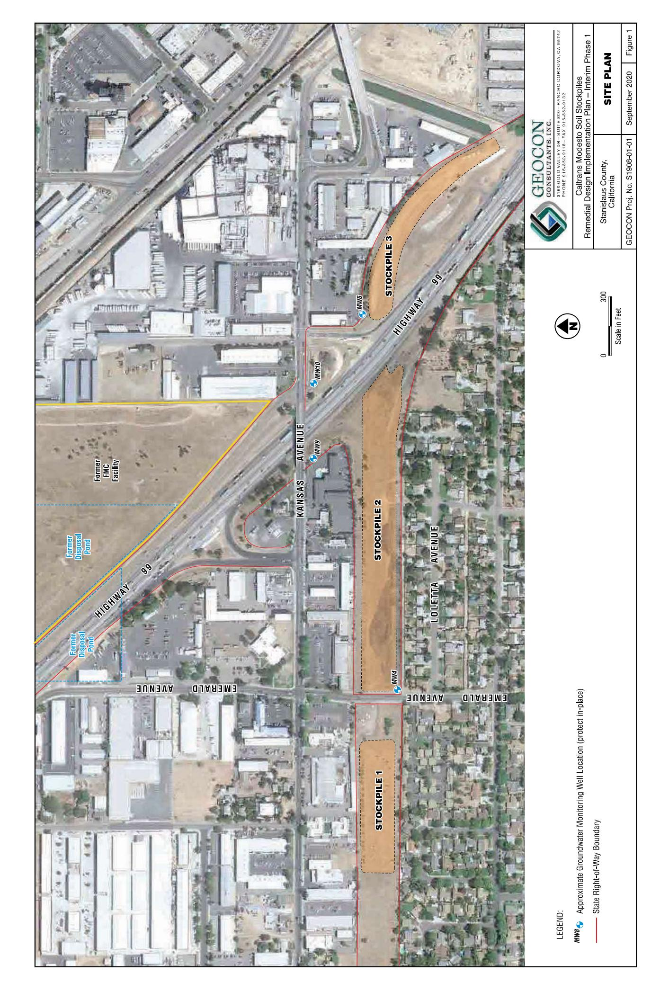

TABLE 1
SUMMARY OF AIR MONITORING RESULTS - TOTAL DUST, BARIUM, AND LEAD
STATE ROUTE 132 - CALTRANS MODESTO STOCKPILES
MODESTO, CALIFORNIA

| Date          | Activities                                                                           | Sample ID                                                               | Sample Description/Location                                                                                                                                                                | Field Total Dust<br>8-Hour TWA<br>(mg/m3)  | Average<br>Flowrate (lpm)                        | Volume<br>(liters)                                    | Total Dust Result<br>(mg/m3)                             | Barium Result<br>(μg/m3)                                | Lead Result<br>(μg/m3)                                        |                         |
|---------------|--------------------------------------------------------------------------------------|-------------------------------------------------------------------------|--------------------------------------------------------------------------------------------------------------------------------------------------------------------------------------------|--------------------------------------------|--------------------------------------------------|-------------------------------------------------------|----------------------------------------------------------|---------------------------------------------------------|---------------------------------------------------------------|-------------------------|
| 18-Feb-2020   | Stockpile 2 Mowing Operations                                                        | PNL-1AA                                                                 | Personal - Open Cab Mower Operator                                                                                                                                                         | NA                                         | 2.36                                             | 736                                                   | Sample Damaged - No Data Available                       | <1.5                                                    | <0.73                                                         |                         |
|               |                                                                                      | PRM-1AA                                                                 | Perimeter (SP2 Upwind)                                                                                                                                                                     | 0.001                                      | 2.36                                             | 687                                                   | <0.073                                                   | <1.5                                                    | <0.75                                                         |                         |
|               |                                                                                      | PRM-2AA                                                                 | Perimeter (SP2 Downwind)                                                                                                                                                                   | 0.004                                      | 2.36                                             | 663                                                   | 0.090                                                    | <1.5                                                    | <0.76                                                         |                         |
|               |                                                                                      | PRM-3AA                                                                 | Perimeter (SP2 Downwind)                                                                                                                                                                   | 0.017                                      | 2.36                                             | 656                                                   | <0.076                                                   | <1.5                                                    | <0.76                                                         |                         |
|               |                                                                                      | FB-AA                                                                   | Field Blank                                                                                                                                                                                | NA                                         | NA                                               | NA                                                    | <0.050*                                                  | <1.0*                                                   | <0.50*                                                        |                         |
|               |                                                                                      | LB-AA                                                                   | Lab Blank                                                                                                                                                                                  | NA                                         | NA                                               | NA                                                    | <0.050*                                                  | <1.0*                                                   | <0.50*                                                        |                         |
| 19-Feb-2020   | Stockpile 2 Mowing & Grading Operations                                              | PNL-1AB                                                                 | Personal - Open Cab Mower Operator                                                                                                                                                         | NA                                         | 2.36                                             | 1,053                                                 | 0.43                                                     | <0.95                                                   | <0.48                                                         |                         |
|               |                                                                                      | PRM-1AB                                                                 | Perimeter (SP2 Upwind)                                                                                                                                                                     | 0.040                                      | 2.36                                             | 951                                                   | <0.053                                                   | <1.1                                                    | <0.53                                                         |                         |
|               |                                                                                      | PRM-2AB                                                                 | Perimeter (SP2 Downwind)                                                                                                                                                                   | 0.039                                      | 2.36                                             | 918                                                   | <0.054                                                   | <1.1                                                    | <0.54                                                         |                         |
|               |                                                                                      | PRM-3AB                                                                 | Perimeter (SP2 Downwind)                                                                                                                                                                   | 0.051                                      | 2.36                                             | 906                                                   | <0.055                                                   | <1.1                                                    | <0.55                                                         |                         |
|               |                                                                                      | FB-1AB                                                                  | Field Blank                                                                                                                                                                                | NA                                         | NA                                               | NA                                                    | <0.050*                                                  | <1.0*                                                   | <0.50*                                                        |                         |
|               |                                                                                      | FB-2AB                                                                  | Field Blank                                                                                                                                                                                | NA                                         | NA                                               | NA                                                    | <0.050*                                                  | <1.0*                                                   | <0.50*                                                        |                         |
| 20-Feb-2020   | Stockpile 2 Grading Operations                                                       | PNL-1AC                                                                 | Personal - Open Cab Compactor Operator                                                                                                                                                     | NA                                         | 2.36                                             | 1,145                                                 | 0.21                                                     | <0.87                                                   | <0.44                                                         |                         |
|               |                                                                                      | PRM-1AC                                                                 | Perimeter (SP2 Upwind )                                                                                                                                                                    | 0.000                                      | 2.36                                             | 984                                                   | 0.082                                                    | <1.0                                                    | <0.51                                                         |                         |
|               |                                                                                      | PRM-2AC                                                                 | Perimeter (SP2 Downwind)                                                                                                                                                                   | 0.062                                      | 2.36                                             | 918                                                   | <0.054                                                   | <1.1                                                    | <0.54                                                         |                         |
|               |                                                                                      | PRM-3AC                                                                 | Perimeter (SP2 Downwind)                                                                                                                                                                   | 0.061                                      | 2.36                                             | 902                                                   | <0.055                                                   | <1.1                                                    | <0.55                                                         |                         |
|               |                                                                                      | FB-1AC                                                                  | Field Blank                                                                                                                                                                                | NA                                         | NA                                               | NA                                                    | <0.050*                                                  | <1.0*                                                   | <0.50*                                                        |                         |
|               |                                                                                      | FB-2AC                                                                  | Field Blank                                                                                                                                                                                | NA                                         | NA                                               | NA                                                    | <0.050*                                                  | <1.0*                                                   | <0.50*                                                        |                         |
| 21-Feb-2020   | Stockpile 2 Grading and Stockpile 3 Access Construction Operations                   | PNL-1AD                                                                 | Personal - Open Cab Compactor Operator                                                                                                                                                     | NA                                         | 2.49                                             | 1,279                                                 | 0.10                                                     | <0.78                                                   | <0.39                                                         |                         |
|               |                                                                                      | PRM-1AD                                                                 | Perimeter (SP2 Upwind)                                                                                                                                                                     | 0.014                                      | 2.49                                             | 1,162                                                 | <0.043                                                   | <0.86                                                   | <0.43                                                         |                         |
|               |                                                                                      | PRM-2AD                                                                 | Perimeter (SP2 Downwind)                                                                                                                                                                   | 0.021                                      | 2.49                                             | 1,205                                                 | <0.041                                                   | <0.83                                                   | <0.41                                                         |                         |
|               |                                                                                      | PRM-3AD                                                                 | Perimeter (SP2 Downwind)                                                                                                                                                                   | 0.034                                      | 2.49                                             | 1,207                                                 | 0.058                                                    | <0.83                                                   | <0.41                                                         |                         |
|               |                                                                                      | PRM-4AD                                                                 | Perimeter (SP3 Upwind )                                                                                                                                                                    | 0.019                                      | 2.49                                             | 361                                                   | No Laboratory Sample Collected                           | <1.0*                                                   | <0.50*                                                        |                         |
|               |                                                                                      | PRM-5AD                                                                 | Perimeter (SP3 Downwind)                                                                                                                                                                   | 0.038                                      | 2.49                                             | 361                                                   | No Laboratory Sample Collected                           | <1.0*                                                   | <0.50*                                                        |                         |
|               |                                                                                      | FB-1AD                                                                  | Field Blank                                                                                                                                                                                | NA                                         | NA                                               | NA                                                    | <0.050*                                                  | <1.0*                                                   | <0.50*                                                        |                         |
|               |                                                                                      | FB-1AD                                                                  | Field Blank                                                                                                                                                                                | NA                                         | NA                                               | NA                                                    | <0.050*                                                  | <1.0*                                                   | <0.50*                                                        |                         |
| 24-Feb-2020   | Stockpile 2 Grading and Stockpile 3 to Stockpile 1 BCS Transport Operations          | PNL-1AE                                                                 | Personal - Open Cab Compactor Operator                                                                                                                                                     | NA                                         | 2.49                                             | 1,255                                                 | 0.096                                                    | <0.80                                                   | <0.40                                                         |                         |
|               |                                                                                      | PRM-1AE                                                                 | Perimeter (SP1 Upwind)                                                                                                                                                                     | 0.010                                      | 2.49                                             | 1,123                                                 | 0.052                                                    | <0.89                                                   | <0.45                                                         |                         |
|               |                                                                                      | PRM-2AE                                                                 | Perimeter (SP1 Downwind/SP2 Upwind)                                                                                                                                                        | 0.060                                      | 2.49                                             | 1,185                                                 | 0.13                                                     | <0.84                                                   | <0.42                                                         |                         |
|               |                                                                                      | PRM-3AE                                                                 | Perimeter (SP2 Downwind/SP3 Upwind)                                                                                                                                                        | 0.076                                      | 2.36                                             | 1,119                                                 | <0.045                                                   | <0.89                                                   | <0.45                                                         |                         |
|               |                                                                                      | PRM-4AE                                                                 | Perimeter (SP2 Downwind)                                                                                                                                                                   | 0.022                                      | 2.36                                             | 1,097                                                 | <0.046                                                   | <0.91                                                   | <0.46                                                         |                         |
|               |                                                                                      | PRM-5AE                                                                 | Perimeter (SP3 Downwind)                                                                                                                                                                   | 0.019                                      | 2.36                                             | 1,010                                                 | 0.075                                                    | <0.99                                                   | <0.50                                                         |                         |
|               |                                                                                      | FB-1AE                                                                  | Field Blank                                                                                                                                                                                | NA                                         | NA                                               | NA                                                    | <0.050*                                                  | <1.0*                                                   | <0.50*                                                        |                         |
|               |                                                                                      | FB-2AE                                                                  | Field Blank                                                                                                                                                                                | NA                                         | NA                                               | NA                                                    | <0.050*                                                  | <1.0*                                                   | <0.50*                                                        |                         |
| Date          | Activities                                                                           | Sample ID                                                               | Sample Description/Location                                                                                                                                                                | 8-Hour TWA<br>(mg/m³)                      | Average Flowrate<br>(lpm)                        | Volume<br>(liters)                                    | Total Dust Result<br>(mg/m³)                             | Barium Result<br>(µg/m³)                                | Lead Result<br>(µg/m³)                                        |                         |
| 25-Feb-2020   | Stockpile 2 Grading<br>and Stockpile 3 to<br>Stockpile 1 BCS<br>Transport Operations | PRM-1AF                                                                 | Perimeter (SP1 Upwind)                                                                                                                                                                     | 0.000                                      | 2.36                                             | 1,119                                                 | 0.056                                                    | <0.89                                                   | <0.45                                                         |                         |
| 25-Feb-2020   | Stockpile 2 Grading<br>and Stockpile 3 to<br>Stockpile 1 BCS<br>Transport Operations | PRM-2AF                                                                 | Perimeter (SP2 Downwind/SP3 Upwind)                                                                                                                                                        | 0.014                                      | 2.36                                             | 1,112                                                 | 0.092                                                    | <0.90                                                   | <0.45                                                         |                         |
| 25-Feb-2020   | Stockpile 2 Grading<br>and Stockpile 3 to<br>Stockpile 1 BCS<br>Transport Operations | PRM-3AF                                                                 | Perimeter (SP2 Downwind)                                                                                                                                                                   | 0.014                                      | 2.36                                             | 1,128                                                 | <0.044                                                   | <0.89                                                   | <0.44                                                         |                         |
| 25-Feb-2020   | Stockpile 2 Grading<br>and Stockpile 3 to<br>Stockpile 1 BCS<br>Transport Operations | PRM-5AF                                                                 | Perimeter (SP3 Downwind)                                                                                                                                                                   | 0.014                                      | 2.36                                             | 1,060                                                 | <0.045                                                   | <0.90                                                   | <0.45                                                         |                         |
| 25-Feb-2020   | Stockpile 2 Grading<br>and Stockpile 3 to<br>Stockpile 1 BCS<br>Transport Operations | FB-1AF                                                                  | Field Blank                                                                                                                                                                                | NA                                         | NA                                               | NA                                                    | <0.050*                                                  | <1.0*                                                   | <0.50*                                                        |                         |
| 26-Feb-2020   | Stockpile 2 Grading<br>and Stockpile 3 to<br>Stockpile 1 BCS<br>Transport Operations | PNL-1AG                                                                 | Personal - Hose Operator                                                                                                                                                                   | NA                                         | 2.36                                             | 1,204                                                 | 0.33                                                     | <0.83                                                   | <0.42                                                         |                         |
| 26-Feb-2020   | Stockpile 2 Grading<br>and Stockpile 3 to<br>Stockpile 1 BCS<br>Transport Operations | PRM-1AG                                                                 | Perimeter (SP1 Upwind)                                                                                                                                                                     | 0.000                                      | 2.36                                             | 1,005                                                 | 0.13                                                     | <0.99                                                   | <0.50                                                         |                         |
| 26-Feb-2020   | Stockpile 2 Grading<br>and Stockpile 3 to<br>Stockpile 1 BCS<br>Transport Operations | PRM-2AG                                                                 | Perimeter (SP1 Downwind/SP2 Upwind)                                                                                                                                                        | 0.000                                      | 2.36                                             | 1,093                                                 | <0.046                                                   | <0.92                                                   | <0.46                                                         |                         |
| 26-Feb-2020   | Stockpile 2 Grading<br>and Stockpile 3 to<br>Stockpile 1 BCS<br>Transport Operations | PRM-3AG                                                                 | Perimeter (SP2 Downwind/SP3 Upwind)                                                                                                                                                        | 0.000                                      | 2.36                                             | 1,156                                                 | 0.046                                                    | <0.93                                                   | <0.46                                                         |                         |
| 26-Feb-2020   | Stockpile 2 Grading<br>and Stockpile 3 to<br>Stockpile 1 BCS<br>Transport Operations | PRM-4AG                                                                 | Perimeter (SP2 Downwind)                                                                                                                                                                   | 0.018                                      | 2.36                                             | 1,081                                                 | 0.046                                                    | <0.86                                                   | <0.43                                                         |                         |
| 26-Feb-2020   | Stockpile 2 Grading<br>and Stockpile 3 to<br>Stockpile 1 BCS<br>Transport Operations | PRM-5AG                                                                 | Perimeter (SP3 Downwind)                                                                                                                                                                   | 0.006                                      | 2.36                                             | 1,156                                                 | 0.11                                                     | <0.86                                                   | <0.43                                                         |                         |
| 26-Feb-2020   | Stockpile 2 Grading<br>and Stockpile 3 to<br>Stockpile 1 BCS<br>Transport Operations | FB-1AG                                                                  | Field Blank                                                                                                                                                                                | NA                                         | NA                                               | NA                                                    | NA                                                       | NA                                                      | <0.50*                                                        |                         |
| 27-Feb-2020   | Stockpile 2 Grading<br>and Stockpile 3 to<br>Stockpile 1 BCS<br>Transport Operations | PRM-1AH                                                                 | Perimeter (SP1 Upwind)                                                                                                                                                                     | NA                                         | 2.36                                             | 1,175                                                 | 0.35                                                     | <0.85                                                   | <0.43                                                         |                         |
| 27-Feb-2020   | Stockpile 2 Grading<br>and Stockpile 3 to<br>Stockpile 1 BCS<br>Transport Operations | PRM-2AH                                                                 | Perimeter (SP1 Downwind/SP2 Upwind)                                                                                                                                                        | NA                                         | 2.36                                             | 1,154                                                 | <0.043                                                   | <0.87                                                   | <0.43                                                         |                         |
| 27-Feb-2020   | Stockpile 2 Grading<br>and Stockpile 3 to<br>Stockpile 1 BCS<br>Transport Operations | PRM-3AH                                                                 | Perimeter (SP2 Downwind/SP3 Upwind)                                                                                                                                                        | NA                                         | 2.36                                             | 1,154                                                 | <0.043                                                   | <0.87                                                   | <0.43                                                         |                         |
| 27-Feb-2020   | Stockpile 2 Grading<br>and Stockpile 3 to<br>Stockpile 1 BCS<br>Transport Operations | PRM-4AH                                                                 | Perimeter (SP2 Downwind)                                                                                                                                                                   | NA                                         | 2.36                                             | 1,156                                                 | 0.057                                                    | <0.86                                                   | <0.43                                                         |                         |
| 27-Feb-2020   | Stockpile 2 Grading<br>and Stockpile 3 to<br>Stockpile 1 BCS<br>Transport Operations | PRM-5AH                                                                 | Perimeter (SP3 Downwind)                                                                                                                                                                   | NA                                         | 2.36                                             | 1,017                                                 | 0.16                                                     | 1.0                                                     | <0.49                                                         |                         |
| 27-Feb-2020   | Stockpile 2 Grading<br>and Stockpile 3 to<br>Stockpile 1 BCS<br>Transport Operations | FB-1AH                                                                  | Field Blank                                                                                                                                                                                | NA                                         | NA                                               | NA                                                    | NA                                                       | NA                                                      | <0.50*                                                        |                         |
| 28-Feb-2020   | Stockpile 2 Grading<br>and Stockpile 3 to<br>Stockpile 1 BCS<br>Transport Operations | PNL-1AI                                                                 | Personal - Hose Operator                                                                                                                                                                   | NA                                         | 2.36                                             | 1,215                                                 | 0.13                                                     | 1.2                                                     | <0.41                                                         |                         |
| 28-Feb-2020   | Stockpile 2 Grading<br>and Stockpile 3 to<br>Stockpile 1 BCS<br>Transport Operations | PRM-1AI                                                                 | Perimeter (SP1 Upwind)                                                                                                                                                                     | NA                                         | 2.36                                             | 1,109                                                 | 0.096                                                    | 0.15                                                    | <0.90                                                         | <0.45                   |
| 28-Feb-2020   | Stockpile 2 Grading<br>and Stockpile 3 to<br>Stockpile 1 BCS<br>Transport Operations | PRM-2AI                                                                 | Perimeter (SP1 Downwind/SP2 Upwind)                                                                                                                                                        | NA                                         | 2.36                                             | 1,116                                                 | 0.15                                                     | <0.90                                                   | <0.45                                                         |                         |
| 28-Feb-2020   | Stockpile 2 Grading<br>and Stockpile 3 to<br>Stockpile 1 BCS<br>Transport Operations | PRM-3AI                                                                 | Perimeter (SP2 Downwind/SP3 Upwind)                                                                                                                                                        | NA                                         | 2.36                                             | 1,067                                                 | 0.053                                                    | <0.94                                                   | <0.47                                                         |                         |
| 28-Feb-2020   | Stockpile 2 Grading<br>and Stockpile 3 to<br>Stockpile 1 BCS<br>Transport Operations | PRM-4AI                                                                 | Perimeter (SP2 Downwind)                                                                                                                                                                   | NA                                         | 2.36                                             | 1,230                                                 | 0.077                                                    | <0.81                                                   | <0.41                                                         |                         |
| 28-Feb-2020   | Stockpile 2 Grading<br>and Stockpile 3 to<br>Stockpile 1 BCS<br>Transport Operations | PRM-5AI                                                                 | Perimeter (SP3 Downwind)                                                                                                                                                                   | NA                                         | 2.36                                             | 1,230                                                 | 0.077                                                    | <0.81                                                   | <0.41                                                         |                         |
| 28-Feb-2020   | Stockpile 2 Grading<br>and Stockpile 3 to<br>Stockpile 1 BCS<br>Transport Operations | FB-1AI                                                                  | Field Blank                                                                                                                                                                                | NA                                         | NA                                               | NA                                                    | NA                                                       | NA                                                      | <0.50*                                                        |                         |
| 2-Mar-2020    | 1 BCS Transport<br>Operations                                                        | PRM-1AJ                                                                 | Perimeter (SP1 Upwind)                                                                                                                                                                     | NA                                         | 2.36                                             | 1,064                                                 | 0.100                                                    | <0.94                                                   | <0.47                                                         |                         |
| 2-Mar-2020    | 1 BCS Transport<br>Operations                                                        | PRM-2AJ                                                                 | Perimeter (SP1 Downwind/SP2 Upwind)                                                                                                                                                        | NA                                         | 2.36                                             | 1,074                                                 | <0.047                                                   | <0.93                                                   | <0.47                                                         |                         |
| 2-Mar-2020    | 1 BCS Transport<br>Operations                                                        | PRM-3AJ                                                                 | Perimeter (SP2 Downwind/SP3 Upwind)                                                                                                                                                        | NA                                         | 2.36                                             | 1,010                                                 | <0.050                                                   | <0.99                                                   | <0.50                                                         |                         |
| 2-Mar-2020    | 1 BCS Transport<br>Operations                                                        | PRM-4AJ                                                                 | Perimeter (SP2 Downwind)                                                                                                                                                                   | NA                                         | 2.36                                             | 1,012                                                 | 0.32                                                     | <0.99                                                   | <0.49                                                         |                         |
| 2-Mar-2020    | 1 BCS Transport<br>Operations                                                        | PRM-5AJ                                                                 | Perimeter (SP3 Downwind)                                                                                                                                                                   | NA                                         | 2.36                                             | 1,097                                                 | 0.086                                                    | <0.91                                                   | <0.46                                                         |                         |
| 2-Mar-2020    | 1 BCS Transport<br>Operations                                                        | FB-1AJ                                                                  | Field Blank                                                                                                                                                                                | NA                                         | NA                                               | NA                                                    | <1.0*                                                    | <0.50*                                                  |                                                               |                         |
| 2-Mar-2020    | 1 BCS Transport<br>Operations                                                        | FB-2AJ                                                                  | Field Blank                                                                                                                                                                                | NA                                         | NA                                               | NA                                                    | <1.0*                                                    | <0.50*                                                  |                                                               |                         |
| Date          | Sample ID                                                                            | Sample Description/Location                                             | Activities                                                                                                                                                                                 | Field Total Dust 8-Hour TWA (mg/m3)        | Average<br>Flowrate (lpm)                        | Volume<br>(liters)                                    | Total Dust Result (mg/m³)                                | Barium Result (μg/m³)                                   | Lead Result<br>(μg/m³)                                        |                         |
| 3-Mar-2020    | PRM-1AK                                                                              | Perimeter (SP1 Downwind)                                                | Stockpile 3 to Stockpile 1 BCS Transport Operations                                                                                                                                        | NA                                         | 2.36                                             | 977                                                   | 0.12                                                     | <1.0                                                    | <0.51                                                         |                         |
| 3-Mar-2020    | PRM-2AK                                                                              | Perimeter (SP1 Upwind/SP2 Downwind)                                     | Stockpile 3 to Stockpile 1 BCS Transport Operations                                                                                                                                        | NA                                         | 2.36                                             | 1,043                                                 | 0.064                                                    | >0.96                                                   | <0.48                                                         |                         |
| 3-Mar-2020    | PRM-3AK                                                                              | Perimeter (SP2 Downwind)                                                | Stockpile 3 to Stockpile 1 BCS Transport Operations                                                                                                                                        | NA                                         | 2.36                                             | 967                                                   | 0.12                                                     | <1.0                                                    | <0.52                                                         |                         |
| 3-Mar-2020    | PRM-4AK                                                                              | Perimeter (SP2 Upwind)                                                  | Stockpile 3 to Stockpile 1 BCS Transport Operations                                                                                                                                        | NA                                         | 2.36                                             | 976                                                   | <0.051                                                   | <1.0                                                    | <0.51                                                         |                         |
| 3-Mar-2020    | PRM-5AK                                                                              | Perimeter (SP3 Downwind)                                                | Stockpile 3 to Stockpile 1 BCS Transport Operations                                                                                                                                        | NA                                         | 2.36                                             | 1,027                                                 | <0.049                                                   | <0.97                                                   | <0.49                                                         |                         |
| 3-Mar-2020    | FB-1AK                                                                               | Field Blank                                                             | Stockpile 3 to Stockpile 1 BCS Transport Operations                                                                                                                                        | NA                                         | NA                                               | NA                                                    | NA                                                       | NA                                                      | <0.50*                                                        |                         |
| 3-Mar-2020    | FB-2AK                                                                               | Field Blank                                                             | Stockpile 3 to Stockpile 1 BCS Transport Operations                                                                                                                                        | NA                                         | NA                                               | NA                                                    | NA                                                       | NA                                                      | <0.50*                                                        |                         |
| 4-Mar-2020    | PRM-1AL                                                                              | Perimeter (SP1 Downwind)                                                | Stockpile 3 to Stockpile 1 BCS Transport Operations                                                                                                                                        | NA                                         | 2.36                                             | 1,081                                                 | <0.046                                                   | <0.93                                                   | <0.46                                                         |                         |
| 4-Mar-2020    | PRM-2AL                                                                              | Perimeter (SP1 Upwind/SP2 Downwind)                                     | Stockpile 3 to Stockpile 1 BCS Transport Operations                                                                                                                                        | NA                                         | 2.36                                             | 1,107                                                 | 0.38                                                     | 1.2                                                     | <0.45                                                         |                         |
| 4-Mar-2020    | PRM-3AL                                                                              | Perimeter (SP2 Downwind)                                                | Stockpile 3 to Stockpile 1 BCS Transport Operations                                                                                                                                        | NA                                         | 2.36                                             | 1,088                                                 | 0.090                                                    | <0.92                                                   | <0.46                                                         |                         |
| 4-Mar-2020    | PRM-4AL                                                                              | Perimeter (SP2 Upwind)                                                  | Stockpile 3 to Stockpile 1 BCS Transport Operations                                                                                                                                        | NA                                         | 2.36                                             | 1,086                                                 | 0.087                                                    | <0.92                                                   | <0.46                                                         |                         |
| 4-Mar-2020    | PRM-5AL                                                                              | Perimeter (SP3 Downwind)                                                | Stockpile 3 to Stockpile 1 BCS Transport Operations                                                                                                                                        | NA                                         | 2.36                                             | 1,105                                                 | 0.14                                                     | 1.1                                                     | <0.45                                                         |                         |
| 4-Mar-2020    | FB-1AL                                                                               | Field Blank                                                             | Stockpile 3 to Stockpile 1 BCS Transport Operations                                                                                                                                        | NA                                         | NA                                               | NA                                                    | NA                                                       | <1.0*                                                   | <0.50*                                                        |                         |
| 4-Mar-2020    | FB-2AL                                                                               | Field Blank                                                             | Stockpile 3 to Stockpile 1 BCS Transport Operations                                                                                                                                        | NA                                         | NA                                               | NA                                                    | NA                                                       | <1.0*                                                   | <0.50*                                                        |                         |
| 5-Mar-2020    | PRM-1AM                                                                              | Perimeter (SP1 Upwind)                                                  | Stockpile 3 to Stockpile 1 BCS Transport Operations                                                                                                                                        | NA                                         | 2.36                                             | 1,057                                                 | 0.056                                                    | <0.95                                                   | <0.47                                                         |                         |
| 5-Mar-2020    | PRM-2AM                                                                              | Perimeter (SP1 Upwind/SP2 Upwind)                                       | Stockpile 3 to Stockpile 1 BCS Transport Operations                                                                                                                                        | NA                                         | 2.36                                             | 1,076                                                 | 0.17                                                     | 1.7                                                     | <0.46                                                         |                         |
| 5-Mar-2020    | PRM-3AM                                                                              | Perimeter (SP2 Downwind/SP3 Upwind)                                     | Stockpile 3 to Stockpile 1 BCS Transport Operations                                                                                                                                        | NA                                         | 2.36                                             | 1,053                                                 | 0.059                                                    | <0.95                                                   | <0.48                                                         |                         |
| 5-Mar-2020    | PRM-4AM                                                                              | Perimeter (SP2 Downwind)                                                | Stockpile 3 to Stockpile 1 BCS Transport Operations                                                                                                                                        | NA                                         | 2.36                                             | 1,050                                                 | 0.090                                                    | <0.95                                                   | <0.48                                                         |                         |
| 5-Mar-2020    | PRM-5AM                                                                              | Perimeter (SP3 Downwind)                                                | Stockpile 3 to Stockpile 1 BCS Transport Operations                                                                                                                                        | NA                                         | 2.36                                             | 1,053                                                 | 0.091                                                    | 1.1                                                     | <0.48                                                         |                         |
| 5-Mar-2020    | FB-1AM                                                                               | Field Blank                                                             | Stockpile 3 to Stockpile 1 BCS Transport Operations                                                                                                                                        | NA                                         | NA                                               | NA                                                    | NA                                                       | <1.0*                                                   | <0.50*                                                        |                         |
| 5-Mar-2020    | FB-2AM                                                                               | Field Blank                                                             | Stockpile 3 to Stockpile 1 BCS Transport Operations                                                                                                                                        | NA                                         | NA                                               | NA                                                    | NA                                                       | <1.0*                                                   | <0.50*                                                        |                         |
| 6-Mar-2020    | PRM-1AN                                                                              | Perimeter (SP1 Upwind)                                                  | Stockpile 3 to Stockpile 1 BCS Transport Operations                                                                                                                                        | NA                                         | 2.87                                             | 970                                                   | 0.09                                                     | <1.0                                                    | <0.52                                                         |                         |
| 6-Mar-2020    | PRM-2AN                                                                              | Perimeter (SP1 Upwind/SP2 Downwind)                                     | Stockpile 3 to Stockpile 1 BCS Transport Operations                                                                                                                                        | NA                                         | 2.87                                             | 984                                                   | 0.16                                                     | 2.5                                                     | <0.51                                                         |                         |
| 6-Mar-2020    | PRM-3AN                                                                              | Perimeter (SP2 Downwind/SP3 Upwind)                                     | Stockpile 3 to Stockpile 1 BCS Transport Operations                                                                                                                                        | NA                                         | 2.87                                             | 981                                                   | <0.051                                                   | <1.0                                                    | <0.51                                                         |                         |
| 6-Mar-2020    | PRM-4AN                                                                              | Perimeter (SP2 Upwind)                                                  | Stockpile 3 to Stockpile 1 BCS Transport Operations                                                                                                                                        | NA                                         | 2.87                                             | 984                                                   | <0.051                                                   | <1.0                                                    | <0.51                                                         |                         |
| 6-Mar-2020    | PRM-5AN                                                                              | Perimeter (SP3 Downwind)                                                | Stockpile 3 to Stockpile 1 BCS Transport Operations                                                                                                                                        | NA                                         | 2.87                                             | 1,016                                                 | 0.18                                                     | 2.3                                                     | <0.49                                                         |                         |
| 6-Mar-2020    | FB-1AN                                                                               | Field Blank                                                             | Stockpile 3 to Stockpile 1 BCS Transport Operations                                                                                                                                        | NA                                         | NA                                               | NA                                                    | NA                                                       | <1.0*                                                   | <0.50*                                                        |                         |
| 6-Mar-2020    | FB-2AN                                                                               | Field Blank                                                             | Stockpile 3 to Stockpile 1 BCS Transport Operations                                                                                                                                        | NA                                         | NA                                               | NA                                                    | NA                                                       | <1.0*                                                   | <0.50*                                                        |                         |
| 9-Mar-2020    | PRM-1AO                                                                              | Perimeter (SP1 Upwind)                                                  | Stockpile 3 to Stockpile 1 BCS Transport Operations                                                                                                                                        | NA                                         | 2.36                                             | 1,105                                                 | 0.10                                                     | <0.91                                                   | <0.45                                                         |                         |
| 9-Mar-2020    | PRM-2AO                                                                              | Perimeter (SP1 Upwind/SP2 Downwind)                                     | Stockpile 3 to Stockpile 1 BCS Transport Operations                                                                                                                                        | NA                                         | 2.36                                             | 1,114                                                 | 0.18                                                     | 4.8                                                     | <0.45                                                         |                         |
| 9-Mar-2020    | PRM-3AO                                                                              | Perimeter (SP2 Downwind/SP3 Upwind)                                     | Stockpile 3 to Stockpile 1 BCS Transport Operations                                                                                                                                        | NA                                         | 2.36                                             | 1,107                                                 | <0.045                                                   | <0.90                                                   | <0.45                                                         |                         |
| 9-Mar-2020    | PRM-4AO                                                                              | Perimeter (SP2 Downwind)                                                | Stockpile 3 to Stockpile 1 BCS Transport Operations                                                                                                                                        | NA                                         | 2.36                                             | 1,093                                                 | <0.046                                                   | <0.92                                                   | <0.46                                                         |                         |
| 9-Mar-2020    | PRM-5AO                                                                              | Perimeter (SP3 Downwind)                                                | Stockpile 3 to Stockpile 1 BCS Transport Operations                                                                                                                                        | NA                                         | 2.36                                             | 1,097                                                 | 0.11                                                     | <0.91                                                   | <0.46                                                         |                         |
| 9-Mar-2020    | FB-1AO                                                                               | Field Blank                                                             | Stockpile 3 to Stockpile 1 BCS Transport Operations                                                                                                                                        | NA                                         | NA                                               | NA                                                    | NA                                                       | <1.0*                                                   | <0.50*                                                        |                         |
| 9-Mar-2020    | FB-2AO                                                                               | Field Blank                                                             | Stockpile 3 to Stockpile 1 BCS Transport Operations                                                                                                                                        | NA                                         | NA                                               | NA                                                    | NA                                                       | <1.0*                                                   | <0.50*                                                        |                         |
| Date          | Activities                                                                           | Sample ID                                                               | Sample Description/Location                                                                                                                                                                | Field Total Dust                           |                                                  | Average Flowrate (lpm)                                | Volume (liters)                                          | Total Dust Result (mg/m3)                               | Barium Result ( $μg/m3$ )                                     | Lead Result ( $μg/m3$ ) |
|               |                                                                                      |                                                                         |                                                                                                                                                                                            |                                            | 8-Hour TWA (mg/m3)                               |                                                       |                                                          |                                                         |                                                               |                         |
| 10-Mar-2020   | Stockpile 3 to Stockpile 1 BCS Transport Operations                                  | PRM-1AP<br>PRM-2AP<br>PRM-3AP<br>PRM-4AP<br>PRM-5AP<br>FB-1AP<br>FB-2AP | Perimeter (SP1 Upwind)<br>Perimeter (SP1 Downwind/SP2 Upwind)<br>Perimeter (SP2 Downwind/SP3 Upwind)<br>Perimeter (SP2 Downwind)<br>Perimeter (SP3 Downwind)<br>Field Blank<br>Field Blank |                                            | 2.36<br>2.36<br>2.36<br>2.36<br>2.36<br>NA<br>NA | 1,100<br>1,128<br>1,109<br>1,093<br>1,090<br>NA<br>NA | 0.059<br>0.09<br>0.14<br><0.046<br>0.36<br>NA<br>NA      | <0.91<br>1.8<br>1.2<br><0.92<br>4.3<br><1.0*<br><1.0*   | <0.45<br><0.44<br><0.45<br><0.46<br><0.46<br><0.50*<br><0.50* |                         |
| 11-Mar-2020   | Stockpile 3 to Stockpile 1 BCS Transport Operations                                  | PRM-1AQ<br>PRM-2AQ<br>PRM-3AQ<br>PRM-4AQ<br>PRM-5AQ<br>FB-1AQ<br>LB-1AQ | Perimeter (SP1 Upwind)<br>Perimeter (SP1 Downwind/SP2 Upwind)<br>Perimeter (SP2 Downwind/SP3 Upwind)<br>Perimeter (SP2 Downwind)<br>Perimeter (SP3 Downwind)<br>Field Blank<br>Lab Blank   |                                            | 2.36<br>2.36<br>2.36<br>2.36<br>2.36<br>NA<br>NA | 1,076<br>1,086<br>1,083<br>1,067<br>1,109<br>NA<br>NA | 0.051<br>0.076<br><0.046<br><0.047<br><0.045<br>NA<br>NA | <0.93<br>3.0<br><0.92<br><0.94<br>1.8<br><1.0*<br><1.0* | <0.46<br><0.46<br><0.46<br><0.47<br><0.45<br><0.50*<br><0.50* |                         |
| 12-Mar-2020   | Clean Fill Placement West End Stockpile 2                                            | PRM-1AR<br>PRM-2AR<br>PRM-3AR<br>PRM-4AR<br>FB-1AR<br>FB-2AR            | Perimeter (SP1 Upwind)<br>Perimeter (SP1 Downwind/SP2 Upwind)<br>Perimeter (SP1 Downwind)<br>Perimeter (SP2 Downwind)<br>Field Blank<br>Field Blank                                        |                                            | 2.49<br>2.49<br>2.49<br>2.49<br>NA<br>NA         | 1,170<br>1,173<br>1,160<br>1,123<br>NA<br>NA          | <0.043<br>0.086<br>0.31<br>0.29<br>NA<br>NA              | 1.2<br>2.3<br>1.9<br>1.2<br>NA<br>NA                    | <0.43<br><0.43<br><0.43<br><0.45<br><0.50*<br><0.50*          |                         |
| 13-Mar-2020   | Clean Fill Placement East and West Ends Stockpile 2                                  | PRM-1AS<br>PRM-2AS<br>PRM-3AS<br>PRM-4AS<br>FB-1AS<br>FB-2AS            | Perimeter (SP1 Upwind)<br>Perimeter (SP1 Downwind/SP2 Upwind)<br>Perimeter (SP1 Downwind)<br>Perimeter (SP2 Downwind)<br>Field Blank<br>Field Blank                                        |                                            | 2.49<br>2.49<br>2.49<br>2.49<br>NA<br>NA         | 1,113<br>1,140<br>1,131<br>1,071<br>NA<br>NA          | <0.090<br><0.044<br>0.11<br>0.092<br>NA<br>NA            | <0.90<br>0.96<br><0.88<br><0.93<br>NA<br>NA             | <0.45<br><0.44<br><0.44<br><0.47<br><0.50*<br><0.50*          |                         |
| 26-Mar-2020   | Clean Fill Placement East End Stockpile 2                                            | PRM-1AT<br>PRM-2AT<br>PRM-3AT<br>FB-1AT                                 | Perimeter (SP2 Upwind)<br>Perimeter (SP2 Downwind)<br>Perimeter (SP2 Downwind)<br>Field Blank                                                                                              |                                            | 2.36<br>2.36<br>2.36<br>NA                       | 656<br>651<br>649<br>NA                               | <0.050<br><0.050<br><0.050<br><0.050*                    | <1.5<br><1.5<br><1.5<br>NA                              | <0.76<br><0.77<br><0.77<br>NA                                 |                         |
| 31-Mar-2020   | Clean Fill Placement East End Stockpile 1                                            | PRM-1AU<br>PRM-2AU<br>PRM-3AU<br>FB-1AU                                 | Perimeter (SP1 Upwind)<br>Perimeter (SP1 Downwind)<br>Perimeter (SP1 Downwind)<br>Field Blank                                                                                              |                                            | 2.36<br>2.36<br>2.36<br>NA                       | 725<br>715<br>710<br>NA                               | <0.069<br>0.083<br>0.19<br><0.050*                       | <1.4<br><1.4<br><1.4<br>NA                              | <0.69<br><0.70<br><0.70<br>NA                                 |                         |
| 1-Apr-2020    | Stockpiles 1 and 2 BCS cuts (south slopes)                                           | PRM-1AV<br>PRM-2AV<br>PRM-3AV<br>PRM-4AV<br>PRM-5AV<br>FB-AV            | Perimeter (SP1 Upwind)<br>Perimeter (SP1 Downwind)<br>Perimeter (SP1 Downwind)<br>Perimeter (SP2 Downwind)<br>Perimeter (SP2 Downwind)<br>Field Blank                                      |                                            | 2.36<br>2.36<br>2.36<br>2.87<br>2.87<br>NA       | 729<br>732<br>739<br>738<br>729<br>NA                 | <0.069<br>0.11<br><0.068<br>0.070<br>0.14<br><0.050*     | <1.4<br><1.4<br><1.4<br><1.4<br><1.4<br>NA              | <0.69<br><0.68<br><0.68<br><0.68<br><0.69<br>NA               |                         |
| Date          | Activities                                                                           | Sample ID                                                               | Sample Description/Location                                                                                                                                                                | Field Total Dust†<br>8-Hour TWA<br>(mg/m³) | Average<br>Flowrate (lpm)                        | Volume<br>(liters)                                    | Total Dust Result (mg/m³)                                | Barium Result<br>(μg/m³)                                | Lead Result<br>(μg/m³)                                        |                         |
| 2-Apr-2020    | Stockpiles 1 and 2 BCS<br>cuts (south slopes)                                        | PRM-1AW                                                                 | Perimeter (SP1 Upwind)                                                                                                                                                                     |                                            | 2.36                                             | 760                                                   | 0.13                                                     | <1.3                                                    | <0.66                                                         |                         |
|               |                                                                                      | PRM-2AW                                                                 | Perimeter (SP1 Downwind)                                                                                                                                                                   |                                            | 2.36                                             | 736                                                   | <0.068                                                   | <1.4                                                    | <0.68                                                         |                         |
|               |                                                                                      | PRM-3AW                                                                 | Perimeter (SP1 Downwind)                                                                                                                                                                   |                                            | 2.36                                             | 729                                                   | <0.069                                                   | <1.4                                                    | <0.69                                                         |                         |
|               |                                                                                      | PRM-4AW                                                                 | Perimeter (SP2 Downwind)                                                                                                                                                                   |                                            | 2.36                                             | 736                                                   | 0.11                                                     | <1.4                                                    | <0.68                                                         |                         |
|               |                                                                                      | PRM-5AW                                                                 | Perimeter (SP2 Downwind)                                                                                                                                                                   |                                            | 2.36                                             | 722                                                   | <0.069                                                   | <1.4                                                    | <0.69                                                         |                         |
|               |                                                                                      | FB-AW                                                                   | Field Blank                                                                                                                                                                                |                                            | NA                                               | NA                                                    | <0.050*                                                  | NA                                                      | NA                                                            |                         |
| 3-Apr-2020    | Stockpile 2 BCS cuts<br>(south slope)                                                | PRM-1AX                                                                 | Perimeter (SP2 Upwind)                                                                                                                                                                     |                                            | 2.87                                             | 861                                                   | <0.058                                                   | <1.2                                                    | <0.58                                                         |                         |
|               |                                                                                      | PRM-2AX                                                                 | Perimeter (SP2 Downwind)                                                                                                                                                                   |                                            | 2.87                                             | 890                                                   | 0.076                                                    | <1.1                                                    | <0.56                                                         |                         |
|               |                                                                                      | PRM-3AX                                                                 | Perimeter (SP2 Downwind)                                                                                                                                                                   |                                            | 2.87                                             | 881                                                   | <0.057                                                   | <1.1                                                    | <0.57                                                         |                         |
|               |                                                                                      | FB-AX                                                                   | Field Blank                                                                                                                                                                                |                                            | NA                                               | NA                                                    | <0.050*                                                  | NA                                                      | NA                                                            |                         |
| 9-Apr-2020    | Stockpiles 1 and 2 BCS<br>cuts (south slopes)                                        | PRM-1AY                                                                 | Perimeter (SP1 Downwind)                                                                                                                                                                   |                                            | 2.87                                             | 798                                                   | <0.063                                                   | <1.3                                                    | <0.63                                                         |                         |
|               |                                                                                      | PRM-2AY                                                                 | Perimeter (SP2 Downwind)                                                                                                                                                                   |                                            | 2.87                                             | 809                                                   | <0.062                                                   | <1.2                                                    | <0.62                                                         |                         |
|               |                                                                                      | PRM-3AY                                                                 | Perimeter (SP2 Upwind)                                                                                                                                                                     |                                            | 2.87                                             | 804                                                   | <0.062                                                   | <1.2                                                    | <0.62                                                         |                         |
|               |                                                                                      | FB-AY                                                                   | Field Blank                                                                                                                                                                                |                                            | NA                                               | NA                                                    | <0.050*                                                  | NA                                                      | NA                                                            |                         |
| 10-Apr-2020   | Stockpiles 1 and 2 BCS<br>cuts (south slopes)                                        | PRM-1AZ                                                                 | Perimeter (SP1 Upwind)                                                                                                                                                                     |                                            | 2.87                                             | 761                                                   | 0.100                                                    | <1.3                                                    | <0.64                                                         |                         |
|               |                                                                                      | PRM-2AZ                                                                 | Perimeter (SP1 Downwind)                                                                                                                                                                   |                                            | 2.87                                             | 778                                                   | 0.085                                                    | <1.3                                                    | <0.64                                                         |                         |
|               |                                                                                      | PRM-3AZ                                                                 | Perimeter (SP2 Downwind)                                                                                                                                                                   |                                            | 2.87                                             | 818                                                   | 0.088                                                    | <1.2                                                    | <0.61                                                         |                         |
|               |                                                                                      | FB-AZ                                                                   | Field Blank                                                                                                                                                                                |                                            | NA                                               | NA                                                    | <0.050*                                                  | NA                                                      | NA                                                            |                         |
| 13-Apr-2020   | Stockpiles 1 and 2 BCS<br>cuts (south slopes)                                        | PRM-1BA                                                                 | Perimeter (SP1 Upwind)                                                                                                                                                                     |                                            | 2.87                                             | 660                                                   | 0.077                                                    | <1.5                                                    | <0.76                                                         |                         |
|               |                                                                                      | PRM-2BA                                                                 | Perimeter (SP1 Downwind)                                                                                                                                                                   |                                            | 2.87                                             | 694                                                   | 0.072                                                    | <1.4                                                    | <0.72                                                         |                         |
|               |                                                                                      | PRM-3BA                                                                 | Perimeter (SP2 Downwind)                                                                                                                                                                   |                                            | 2.87                                             | 741                                                   | <0.068                                                   | <1.4                                                    | <0.68                                                         |                         |
|               |                                                                                      | FB-BA                                                                   | Field Blank                                                                                                                                                                                |                                            | NA                                               | NA                                                    | <0.050*                                                  | NA                                                      | NA                                                            |                         |
| 17-Apr-2020   | Stockpile 2 (abutment<br>fill)                                                       | PRM-1BB                                                                 | Perimeter (SP2 Upwind)                                                                                                                                                                     |                                            | 2.87                                             | 781                                                   | <0.064                                                   | <1.3                                                    | <0.64                                                         |                         |
|               |                                                                                      | PRM-2BB                                                                 | Perimeter (SP2 Downwind)                                                                                                                                                                   |                                            | 2.87                                             | 801                                                   | 0.13                                                     | <1.2                                                    | <0.62                                                         |                         |
|               |                                                                                      | PRM-3BB                                                                 | Perimeter (SP2 Downwind)                                                                                                                                                                   |                                            | 2.87                                             | 850                                                   | <0.059                                                   | <1.2                                                    | <0.59                                                         |                         |
|               |                                                                                      | FB-BB                                                                   | Field Blank                                                                                                                                                                                |                                            | NA                                               | NA                                                    | <0.050*                                                  | NA                                                      | NA                                                            |                         |
| 7-May-2020    | Stockpile 2 (north<br>slope)                                                         | PRM-1BC                                                                 | Perimeter (SP2 Upwind)                                                                                                                                                                     |                                            | 2.87                                             | 692                                                   | 0.085                                                    | <7.2                                                    | <0.72                                                         |                         |
|               |                                                                                      | PRM-2BC                                                                 | Perimeter (SP2 Downwind)                                                                                                                                                                   |                                            | 2.87                                             | 738                                                   | 0.12                                                     | <6.8                                                    | <0.68                                                         |                         |
|               |                                                                                      | PRM-3BC                                                                 | Perimeter (SP2 Downwind)                                                                                                                                                                   |                                            | 2.87                                             | 741                                                   | <0.068                                                   | <6.8                                                    | <0.68                                                         |                         |
|               |                                                                                      | FB-BC                                                                   | Field Blank                                                                                                                                                                                |                                            | NA                                               | NA                                                    | 0.051*                                                   | NA                                                      | NA                                                            |                         |
| 10-Jun-2020   | Stockpiles 1 (drainage<br>system 28) and 2<br>(south slope)                          | PRM-1BD                                                                 | Perimeter (SP1 Upwind)                                                                                                                                                                     |                                            | 2.36                                             | 703                                                   | <0.071                                                   | <1.4                                                    | <0.71                                                         |                         |
|               |                                                                                      | PRM-2BD                                                                 | Perimeter (SP1 Downwind)                                                                                                                                                                   |                                            | 2.36                                             | 722                                                   | 0.22                                                     | <1.4                                                    | <0.69                                                         |                         |
|               |                                                                                      | PRM-3BD                                                                 | Perimeter (SP1 Downwind)                                                                                                                                                                   |                                            | 2.36                                             | 732                                                   | 0.27                                                     | <1.4                                                    | <0.68                                                         |                         |
|               |                                                                                      | PRM-4BD                                                                 | Perimeter (SP2 Downwind)                                                                                                                                                                   |                                            | 2.36                                             | 621                                                   | 0.13                                                     | <1.6                                                    | <0.81                                                         |                         |
|               |                                                                                      | PRM-5BD                                                                 | Perimeter (SP2 Downwind)                                                                                                                                                                   |                                            | 2.36                                             | 607                                                   | 0.11                                                     | <1.6                                                    | <0.82                                                         |                         |
|               |                                                                                      | FB-BD                                                                   | Field Blank                                                                                                                                                                                |                                            | NA                                               | NA                                                    | <0.050*                                                  | NA                                                      | NA                                                            |                         |
| Date          | Activities                                                                           | Sample ID                                                               | Sample Description/Location                                                                                                                                                                | Field Total Dust*<br>8-Hour TWA<br>(mg/m³) | Average<br>Flowrate (lpm)                        | Volume<br>(liters)                                    | Total Dust Result<br>(mg/m³)                             | Barium Result<br>(μg/m³)                                | Lead Result<br>(μg/m³)                                        |                         |
|               | Stockpiles 1 (drainage<br>system 28) and 2<br>(south slope)                          | PRM-1BE<br>PRM-2BE<br>PRM-3BE<br>PRM-4BE                                | Perimeter (SP1 Upwind)<br>Perimeter (SP1 Downwind)<br>Perimeter (SP1 Downwind)<br>Perimeter (SP2 Downwind)                                                                                 | NA                                         | 2.87                                             | 718<br>735<br>752<br>712                              | 0.13<br>0.083<br>0.13<br><0.070                          | <1.4<br><1.4<br><1.3<br><1.7                            | <0.70<br><0.68<br><0.70<br><0.70                              |                         |
| 11-Jun-2020   | (south slope)                                                                        | PRM-5BE<br>FB-BE                                                        | Perimeter (SP2 Downwind)<br>Field Blank                                                                                                                                                    | NA                                         | 2.87<br>NA                                       | 715<br>NA                                             | 0.081<br><0.050*                                         | <1.4<br>NA                                              | <0.70<br>NA                                                   |                         |
| 12-Jun-2020   | Stockpile 2 (south<br>slope)                                                         | PRM-1BF<br>PRM-2BF<br>PRM-3BF                                           | Perimeter (SP2 Upwind)<br>Perimeter (SP2 Downwind)<br>Perimeter (SP2 Downwind)                                                                                                             | NA                                         | 2.87                                             | 729<br>772<br>763                                     | 0.069<br>0.11<br>0.52                                    | 1.6<br><1.3<br>6.8                                      | <0.69<br><0.65<br><0.66                                       |                         |
|               |                                                                                      | FB-BF                                                                   | Field Blank                                                                                                                                                                                | NA                                         | NA                                               | NA                                                    | <0.050*                                                  | NA                                                      | NA                                                            |                         |
| 13-Jun-2020   | Stockpile 2 (south<br>slope)                                                         | PRM-1BG<br>PRM-2BG<br>PRM-3BG                                           | Perimeter (SP2 Upwind)<br>Perimeter (SP2 Downwind)<br>Perimeter (SP2 Downwind)                                                                                                             | NA                                         | 2.87                                             | 818<br>852<br>850                                     | 0.12<br><0.059<br><0.059                                 | <1.2<br><1.2<br><1.2                                    | <0.61<br><0.59<br><0.59                                       |                         |
|               |                                                                                      | FB-BG                                                                   | Field Blank                                                                                                                                                                                | NA                                         | NA                                               | NA                                                    | <0.050*                                                  | NA                                                      | NA                                                            |                         |
| 15-Jun-2020   | Stockpile 2 (south<br>slope)                                                         | PRM-1BH<br>PRM-2BH<br>PRM-3BH                                           | Perimeter (SP2 Upwind)<br>Perimeter (SP2 Downwind)<br>Perimeter (SP2 Downwind)                                                                                                             | NA                                         | 2.87                                             | 827<br>861<br>858                                     | 0.099<br><0.058<br>0.12                                  | <1.2<br><1.2<br><1.2                                    | <0.60<br><0.58<br><0.58                                       |                         |
|               |                                                                                      | FB-BH                                                                   | Field Blank                                                                                                                                                                                | NA                                         | NA                                               | NA                                                    | <0.050*                                                  | NA                                                      | NA                                                            |                         |
| 16-Jun-2020   | Stockpile 2 (south<br>slope)                                                         | PRM-1BI<br>PRM-2BI<br>PRM-3BI                                           | Perimeter (SP2 Upwind)<br>Perimeter (SP2 Downwind)<br>Perimeter (SP2 Downwind)                                                                                                             | NA                                         | 2.87                                             | 918<br>947<br>953                                     | <0.054<br><0.053<br><0.052                               | <1.1<br><1.1<br><1.0                                    | <0.54<br><0.53<br><0.52                                       |                         |
|               |                                                                                      | FB-BI                                                                   | Field Blank                                                                                                                                                                                | NA                                         | NA                                               | NA                                                    | <0.050*                                                  | NA                                                      | NA                                                            |                         |
| Action Levels |                                                                                      |                                                                         |                                                                                                                                                                                            | 4.01                                       |                                                  |                                                       | 4.01                                                     | 252                                                     | 1.53                                                          |                         |

SUMMARY OF AIR MONITORING RESULTS - TOTAL DUST, BARIUM, AND LEAD STATE ROUTE 132 - CALTRANS MODESTO STOCKPILES MODESTO, CALIFORNIA TABLE 1

SUMMARY OF AIR MONITORING RESULTS - TOTAL DUST, BARIUM, AND LEAD STATE ROUTE 132 - CALTRANS MODESTO STOCKPILES MODESTO, CALIFORNIA TABLE 1

TABLE 1
SUMMARY OF AIR MONITORING RESULTS - TOTAL DUST, BARIUM, AND LEAD
STATE ROUTE 132 - CALTRANS MODESTO STOCKPILES
MODESTO, CALIFORNIA

Page 4 of 6 Geocon Project No. S1908-01-01

SUMMARY OF AIR MONITORING RESULTS - TOTAL DUST, BARIUM, AND LEAD STATE ROUTE 132 - CALTRANS MODESTO STOCKPILES MODESTO, CALIFORNIA TABLE 1

TABLE 1

# SUMMARY OF AIR MONITORING RESULTS - TOTAL DUST, BARIUM, AND LEAD STATE ROUTE 132 - CALTRANS MODESTO STOCKPILES

MODESTO, CALIFORNIA

Notes:

† pDR-1200 direct-read field monitor

TWA = time weighted average

mg/m³ = milligrams per cubic meter of air (laboratory samples analyzed using National Institute for Occupational Safety and Health Method 0500)

lpm = liters per minute

 $\mu g/m^3 = \text{micrograms per cubic meter of air (Test Method 7300M)}$ 

NA = not applicable

SP = stockpile

<= not detected at or above the indicated laboratory reporting limit

\* milligrams or micrograms per filter

BCS = barium-containing soil

<sup>1</sup> Remedial Design Implementation Plan (RDIP)

<sup>2</sup> Health & Safety Plan (Bay Cities Paving & Grading, Inc.)

 $^3\ {\it California\ Air\ Resources\ Board\ (CARB)/Office\ of\ Environmental\ Health\ Hazard\ Assessment\ (OEHHA)}$ 


| Fence Line Action Level (FLAL) | pDR-1200 Res<br>8-Hour Time-W        | pDR-1200 Real-Time Particulate Counter | 8-Hour Time-Weighted Average (TWA) and | Maximum Daily Readings | Permissible Exposure Limit (PEL) |          |
|--------------------------------|--------------------------------------|----------------------------------------|----------------------------------------|------------------------|----------------------------------|----------|
| Total Dust                     | 4 milligrams per cubic meter (mg/m³) |                                        |                                        |                        | Total Dust                       | 10 mg/m³ |

| Table 2A<br>pDR-1200 Perimeter Air Monitoring Results Modesto<br>Barium-Containing Soil (BCS) Operations<br>February 18, 2020 |          |                                                                                                            |                                  |                                         |                                  |                                  |                    |
|-------------------------------------------------------------------------------------------------------------------------------|----------|------------------------------------------------------------------------------------------------------------|----------------------------------|-----------------------------------------|----------------------------------|----------------------------------|--------------------|
| Sampling Number & Operations<br>Meteorology - Observations                                                                    | Location | pDR-1200 Real-Time Particulate Counter<br>8-Hour Time-Weighted Average (TWA) and<br>Maximum Daily Readings | Total Dust                       |                                         | Permissible Exposure Limit (PEL) |                                  |                    |
|                                                                                                                               |          |                                                                                                            | Maximum Daily Reading<br>(mg/m³) | 8-Hour TWA Result<br>(mg/m³)            | TWA Percent<br>FLAL              | TWA Percent<br>PEL               |                    |
| Area Sample PRM-1AA (Pump C)<br>pDR-1200 Serial No. 6315<br>NW/WNW winds (6 – 9 mph)<br>Stockpile 2 Mowing                    | UPWIND   | 291                                                                                                        | 0.006                            | 0.001                                   | <1                               | <1                               |                    |
| Area Sample PRM-2AA (Pump D)<br>pDR-1200 Serial No. 6237<br>NW/WNW winds (6 – 9 mph)<br>Stockpile 2 Mowing                    | DOWNWIND | 281                                                                                                        | 0.005                            | 0.004                                   | <1                               | <1                               |                    |
| Area Sample PRM-3AA (Pump E)<br>pDR-1200 Serial No. 6239<br>NW/WNW winds (6 – 9 mph)<br>Stockpile 2 Mowing                    | DOWNWIND | 278                                                                                                        | 0.084                            | 0.017                                   | <1                               | <1                               |                    |
| Sampling Number & Operations<br>Meteorology - Observations                                                                    | Location |                                                                                                            | Sampling Time<br>(minutes)       | 8-Hour TWA Result<br>(mg/m³)            | Maximum Daily Reading (mg/m³)    | Permissible Exposure Limit (PEL) |                    |
|                                                                                                                               | UPWIND   | DOWNWIND                                                                                                   |                                  |                                         |                                  | TWA Percent<br>FLAL              | TWA percent<br>PEL |
| Total Dust                                                                                                                    |          |                                                                                                            |                                  |                                         |                                  | 10 mg/m³                         |                    |
| Area Sample PRM-1AB (Pump B)<br>pDR-1200 Serial No. 6324<br>NW/WNW winds (6 – 9 mph)<br>Stockpile 2 Mowing and Grading        | UPWIND   |                                                                                                            | 403                              | 0.040                                   | 0.045                            | <2                               | <1                 |
| Area Sample PRM-2AB (Pump D)<br>pDR-1200 Serial No. 6237<br>NW/WNW winds (6 – 9 mph)<br>Stockpile 2 Mowing and Grading        |          | DOWNWIND                                                                                                   | 389                              | 0.039                                   | 0.044                            | <2                               | <1                 |
| Area Sample PRM-3AB (Pump E)<br>pDR-1200 Serial No. 6315<br>NW/WNW winds (6 – 9 mph)<br>Stockpile 2 Mowing and Grading        |          | DOWNWIND                                                                                                   | 384                              | 0.051                                   | 0.051                            | <2                               | <1                 |
| Sampling Number & Operations<br>Meteorology - Observations                                                                    | Location | pDR-1200 Real-Time Particulate Counter<br>8-Hour Time-Weighted Average (TWA) and<br>Maximum Daily Readings |                                  | Permissible Exposure Limit (PEL)        |                                  |                                  |                    |
|                                                                                                                               |          | Sampling Time<br>(minutes)                                                                                 | 8-Hour TWA Result<br>(mg/m³)     | Maximum Daily<br>Reading (mg/m³)        | TWA Percent<br>FLAL              | TWA Percent<br>PEL               |                    |
|                                                                                                                               |          |                                                                                                            |                                  |                                         | <1                               | <1                               |                    |
| Total Dust                                                                                                                    |          | 417                                                                                                        | 0.000                            | 0.072                                   | <2                               | <1                               |                    |
| Area Sample PRM-1AC (Pump C)<br>pDR-1200 Serial No. 6237<br>NNE/NW winds (1 – 5 mph)<br>Stockpile 2 Grading                   |          | UPWIND                                                                                                     | 389                              | 0.062                                   | 0.067                            | <2                               | <1                 |
| Area Sample PRM-2AC (Pump B)<br>pDR-1200 Serial No. 6239<br>NW/WNW winds (6 – 9 mph)<br>Stockpile 2 Grading                   |          | DOWNWIND                                                                                                   | 382                              | 0.061                                   | 0.080                            | <3                               | <1                 |
| Area Sample PRM-3AC (Pump D)<br>pDR-1200 Serial No. 6324<br>NW/WNW winds (6 – 9 mph)<br>Stockpile 2 Grading                   |          | DOWNWIND                                                                                                   |                                  |                                         |                                  |                                  |                    |
| Total Dust 4 milligrams per cubic meter (mg/m³) 10 mg/m³                                                                      |          |                                                                                                            |                                  |                                         |                                  |                                  |                    |
|                                                                                                                               |          | pDR-1200 Real-Time Particulate Counter<br>8-Hour Time-Weighted Average (TWA) and<br>Maximum Daily Readings |                                  |                                         |                                  |                                  |                    |
| Sampling Number & Operations<br>Meteorology - Observations                                                                    | Location | Sampling Time<br>(minutes)                                                                                 | 8-Hour TWA Result<br>(mg/m³)     | Maximum Daily<br>Reading (mg/m³)        | Permissible Exposure Limit (PEL) |                                  |                    |
|                                                                                                                               |          |                                                                                                            |                                  |                                         | TWA Percent<br>FLAL              | TWA percent<br>PEL               |                    |
| Total Dust                                                                                                                    |          |                                                                                                            |                                  | 4 mg/milligrams per cubic meter (mg/m³) | 10 mg/m³                         |                                  |                    |
| Area Sample PRM-1AD (Pump D)<br>pDR-1200 Serial No. 6324<br>N/NW winds (1 – 10 mph)<br>Stockpile 2 Grading                    | UPWIND   | 467                                                                                                        | 0.014                            | 0.016                                   | <1                               | <1                               |                    |
| Area Sample PRM-2AD (Pump E)<br>pDR-1200 Serial No. 6257<br>N/NW winds (1 – 10 mph)<br>Stockpile 2 Grading                    | DOWNWIND | 484                                                                                                        | 0.021                            | 0.034                                   | <1                               | <1                               |                    |
| Area Sample PRM-3AD (Pump A)<br>pDR-1200 Serial No. 6324<br>N/NW winds (1 – 10 mph)<br>Stockpile 2 Grading                    | DOWNWIND | 485                                                                                                        | 0.034                            | 0.038                                   | <1                               | <1                               |                    |
| Area Sample PRM-4AD (Pump B)<br>pDR-1200 Serial No. 6315<br>N/NW winds (1 – 10 mph)<br>Stockpile 3 Grading                    | UPWIND   | 145                                                                                                        | 0.019                            | 0.020                                   | <1                               | <1                               |                    |
| Area Sample PRM-5AD (Pump C)<br>pDR-1200 Serial No. 627<br>N/NW winds (1 – 10 mph)<br>Stockpile 3 Grading                     | DOWNWIND | 145                                                                                                        | 0.038                            | 0.221                                   | <1                               | <1                               |                    |

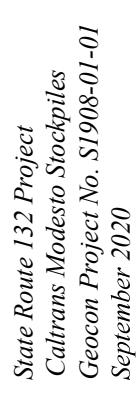


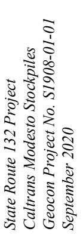


| Fence Line Action Level (FLAL) |                                      |
|--------------------------------|--------------------------------------|
| Total Dust                     | 4 milligrams per cubic meter (mg/m³) |

| Permissible Exposure | T. 421 D. 24                      | Total Dust                      |                        |
|----------------------|-----------------------------------|---------------------------------|------------------------|
|                      | 200 Real-Time Particulate Counter | Time-Weighted Average (TWA) and | Maximum Daily Readings |

| State Route 132 Project<br>Caltrans Modesto Stockpiles<br>Geocon Project No. S1908-01-01<br>September 2020                                    |          | Table 2E<br>pDR-1200 Perimeter Air Monitoring Results<br>Modesto Barium-Containing Soil (BCS) Operations<br>February 24, 2020 |                           |                                              |                  |                 |
|-----------------------------------------------------------------------------------------------------------------------------------------------|----------|-------------------------------------------------------------------------------------------------------------------------------|---------------------------|----------------------------------------------|------------------|-----------------|
| pDR-1200 Real-Time Particulate Counter<br>8-Hour Time-Weighted Average (TWA) and<br>Maximum Daily Readings                                    |          |                                                                                                                               |                           |                                              |                  |                 |
|                                                                                                                                               |          | Fence Line Action Level (FLAL)<br>4 milligrams per cubic meter (mg/m³)                                                        |                           | Permissible Exposure Limit (PEL)<br>10 mg/m³ |                  |                 |
| Total Dust                                                                                                                                    |          | Sampling Time (minutes)                                                                                                       | 8-Hour TWA Result (mg/m³) | Maximum Daily Reading (mg/m³)                | TWA Percent FLAL | TWA Percent PEL |
|                                                                                                                                               |          | 451                                                                                                                           | 0.010                     | 0.017                                        | <1               | <1              |
| Area Sample PRM-1AE (Pump D)<br>dDR-1200 Serial No. 6315<br>NW winds (12 – 15 mph)<br>Stockpile 1<br>Stockpile 3 BCS Transport to Stockpile 1 | UPWIND   | 276                                                                                                                           | 0.060                     | 0.085                                        | <2               | <1              |
| Area Sample PRM-2AE (Pump E)<br>dDR-1200 Serial No. 6237<br>NW winds (12 – 15 mph)<br>Stockpile 3 BCS Transport to Stockpile 1                | DOWNWIND | 474                                                                                                                           | 0.076                     | 0.084                                        | <1               | <1              |
| Area Sample PRM-3AE (Pump A)<br>dDR-1200 Serial No. 6329<br>NW winds (12 – 15 mph)<br>Stockpile 2 Grading                                     | DOWNWIND | 465                                                                                                                           | 0.022                     | 0.083                                        | <1               | <1              |
| Area Sample PRM-4AE (Pump B)<br>dDR-1200 Serial No. 6327<br>NW winds (12 – 15 mph)<br>Stockpile 3 BCS Transport to Stockpile 1                | DOWNWIND | 428                                                                                                                           | 0.019                     | 0.083                                        | <1               | <1              |
| Area Sample PRM-5AE (Pump C)<br>dDR-1200 Serial No. 6324<br>NW winds (12 – 15 mph)<br>Stockpile 3 BCS Transport to Stockpile 1                | DOWNWIND |                                                                                                                               |                           |                                              |                  |                 |
| Page 1 of 1                                                                                                                                   |          |                                                                                                                               |                           |                                              |                  |                 |


| Sampling Number & Operations<br>Meteorology - Observations                                                                        | Location                                                             | Sampling Time (minutes)       | pDR-1200 Real-Time Particulate Counter<br>8-Hour Time-Weighted Average (TWA) and<br>Maximum Daily Readings |                                  | Permissible Exposure Limit (PEL) |                    |
|-----------------------------------------------------------------------------------------------------------------------------------|----------------------------------------------------------------------|-------------------------------|------------------------------------------------------------------------------------------------------------|----------------------------------|----------------------------------|--------------------|
|                                                                                                                                   |                                                                      |                               | 8-Hour TWA Result<br>(mg/m³)                                                                               | Maximum Daily<br>Reading (mg/m³) | TWA Percent<br>FLAL              | TWA Percent<br>PEL |
| Area Sample PRM-1AF (Pump A)<br>pDR-1200 Serial No. 6237<br>N/NW winds (2 – 7 mph)<br>Stockpile 3 BCS Transport to<br>Stockpile 1 | UPWIND                                                               | 474                           | 0.000                                                                                                      | 0.013                            | <1                               | <1                 |
|                                                                                                                                   |                                                                      |                               |                                                                                                            |                                  |                                  |                    |
| Area Sample PRM-2AF (Pump B)<br>pDR-1200 Serial No. 6327<br>N/NW winds (2 – 7 mph)<br>Stockpile 3 BCS Transport to<br>Stockpile 1 | DOWNWIND                                                             | 470                           | 0.066                                                                                                      | 0.066                            | <2                               | <1                 |
|                                                                                                                                   |                                                                      |                               |                                                                                                            |                                  |                                  |                    |
| Area Sample PRM-3AF (Pump C)<br>pDR-1200 Serial No. 6315<br>N/NW winds (1 – 10 mph)<br>Stockpile 2 Grading                        | DOWNWIND                                                             | 478                           | 0.014                                                                                                      | 0.018                            | <1                               | <1                 |
|                                                                                                                                   |                                                                      |                               |                                                                                                            |                                  |                                  |                    |
| Area Sample PRM-4AF (Pump D)<br>pDR-1200 Serial No. 6239<br>N/NW winds (2 – 7 mph)<br>Stockpile 2 Grading                         | DOWNWIND                                                             | 470                           | 0.018                                                                                                      | 0.019                            | <1                               | <1                 |
|                                                                                                                                   |                                                                      |                               |                                                                                                            |                                  |                                  |                    |
| Area Sample PRM-5AF (Pump E)<br>pDR-1200 Serial No. 6324<br>N/NW winds (2 – 7 mph)<br>Stockpile 3 BCS Transport to<br>Stockpile 1 | DOWNWIND                                                             | 449                           | 0.014                                                                                                      | 0.027                            | <1                               | <1                 |
|                                                                                                                                   |                                                                      |                               |                                                                                                            |                                  |                                  |                    |
| Total Dust                                                                                                                        |                                                                      |                               | 4 milligrams per cubic meter (mg/m³)                                                                       |                                  | 10 mg/m³                         |                    |
|                                                                                                                                   | pDR-1200 Perimeter Air Monitoring Results                            |                               |                                                                                                            | Permissible Exposure Limit (PEL) |                                  |                    |
|                                                                                                                                   | Modesto Barium-Containing Soil (BCS) Operations<br>February 26, 2020 |                               |                                                                                                            |                                  |                                  |                    |
|                                                                                                                                   | Total Dust                                                           | Maximum Daily Reading (mg/m³) | 8-Hour TWA Result (mg/m³)                                                                                  | 10 mg/m³                         |                                  |                    |
| Fence Line Action Level (FLAL)<br>4 milligrams per cubic meter (mg/m³)                                                            |                                                                      |                               |                                                                                                            |                                  |                                  |                    |
| Sampling Number & Operations<br>Meteorology - Observations                                                                        | Location                                                             | Sampling Time (minutes)       | Maximum Daily Reading (mg/m³)                                                                              | 8-Hour TWA Result (mg/m³)        | TWA Percent FLAL                 | TWA Percent PEL    |
| Area Sample PRM-1AG (Pump E)<br>pDR-1200 Serial No. 6315<br>E/SE winds (2 – 4 mph)<br>Stockpile 3 BCS Transport to<br>Stockpile 1 | DOWNWIND                                                             | 426                           | 0.045                                                                                                      | 0.020                            | <1                               | <1                 |
| Area Sample PRM-2AG (Pump B)<br>pDR-1200 Serial No. 6324<br>E/SE winds (2 – 4 mph)<br>Stockpile 3 BCS Transport to<br>Stockpile 1 | DOWNWIND                                                             | 426                           | 0.080                                                                                                      | 0.000                            | <1                               | <1                 |
| Area Sample PRM-3AG (Pump C)<br>pDR-1200 Serial No. 6237<br>E/SE winds (2 – 4 mph)<br>Stockpile 2 Grading                         | DOWNWIND                                                             | 463                           | 0.020                                                                                                      | 0.000                            | <1                               | <1                 |
| Area Sample PRM-4AG (Pump D)<br>pDR-1200 Serial No. 6239<br>E/SE winds (2 – 4 mph)<br>Stockpile 2 Grading                         | DOWNWIND                                                             | 458                           | 0.073                                                                                                      | 0.018                            | <1                               | <1                 |
| Area Sample PRM-5AG (Pump A)<br>pDR-1200 Serial No. 6327<br>E/SE winds (2 – 4 mph)<br>Stockpile 3 BCS Transport to<br>Stockpile 1 | UPWIND                                                               | 490                           | 0.011                                                                                                      | 0.006                            | <1                               | <1                 |


5431 Industrial Drive, Huntington Beach, CA 92649

(714) 828-4999 / (714) 828-4944

http://www.LATesting.com

gardengrovelab@latesting.com

LA Testing Order: 332003343 CustomerID:

0028800710
GECN21

GECN21

CustomerPO: ProjectID:

Attn: Dave Watts Geocon Consultants, Inc. 6671 Brisa Street Livermore, CA 94550

Phone: Fax:

(925) 371-5900

Received:

(925) 371-5915 02/19/20 9:30 AM

Analysis Date:

02/19/20 9:3
2/15/2020

Collected:

2/19/2020

Collected:

2/18/2020

Project: Modesto Soil

## Test Report: Total Dust by NIOSH 0500

| Sample                    | Location             | Volume<br>(L) | Sample Weight<br>(mg) | Concentration<br>(mg/m2) | Reporting Limit<br>(mg/m2) | Notes       |
|---------------------------|----------------------|---------------|-----------------------|--------------------------|----------------------------|-------------|
| PRM-1AA<br>332003343-0002 | Perimeter (Upwind)   | 686.8         | <0.050                | <0.073                   | 0.073                      |             |
| PRM-2AA<br>332003343-0003 | Perimeter (Downwind) | 663.2         | 0.060                 | 0.090                    | 0.075                      |             |
| PRM-3AA<br>332003343-0004 | Perimeter (Downwind) | 656.1         | <0.050                | <0.076                   | 0.076                      |             |
| FB-1AA<br>332003343-0005  | Field Blank          |               | <0.050                | N/A                      | N/A                        | Field Blank |
| LB-1AA<br>332003343-0006  | Lab Blank            |               | <0.050                | N/A                      | N/A                        | Lab Blank   |

Discernable field blank submitted with samples. Notes:

Results are not field blank corrected.

Analyst(s)

Cara Blount (5)

Michael Chapman

Michael Chapman, Laboratory Manager or other approved signatory

The (aboratory is not responsible for data reported in mg/m3, which is dependent on volume collected by non-laboratory personnel. Reporting limits for samples without volumes, such as Field Bianks, are 0.05 mg. This report relates only to the samples reported above. This report may not be reproduced, except in full, without written approval by EMSL. Samples received in good condition unless otherwise

Samples analyzed by LA Testing Huntington Beach, CA AIHA-LAP, LLC-IHLAP Accredited #101650

Initial report from 02/20/2020 10:12:36

The "Tool" "Name" "Field" "Value" "Date" "Time" "User" "Notes"

| <strong>Labels</strong> | <strong>Values</strong> |
|-------------------------|-------------------------|
| Tool Name               |                         |
| Field                   |                         |
| Value                   |                         |
| Date                    |                         |
| Time                    |                         |
| User                    |                         |
| Notes                   |                         |


Attn: Dave Watts

**LA Testing** 

Geocon Consultants, Inc.

6671 Brisa Street

Livermore, CA 94550

5431 Industrial Drive, Huntington Beach, CA 92649

Phone/Fax: (714) 828-4999 / (714) 828-4944

TESTING http://www.LATesting.com

gardengrovelab@latesting.com

Phone:

(925) 371-5900

Received:

Fax:

(925) 371-5915 02/19/20 9:30 AM

LA Testing Order:

CustomerID:

CustomerPO:

ProjectID:

332003316

1908-01-01

GECN21

Collected:

2/18/2020

Project: Modesto Soll

**Analytical Results** 

| Client Sample Description       | Parameter | Result | RL   | Units     | Prep Date & Analyst | Analysis Date & Analyst |
|---------------------------------|-----------|--------|------|-----------|---------------------|-------------------------|
| PRM-1AA<br>Perimeter (Upwind)   | Barium    | <1.5   | 1.5  | µg/m³     | 2/20/2020 TH        | 2/20/2020 TH            |
|                                 | Lead      | <0.73  | 0.73 | µg/m³     | 2/20/2020 TH        | 2/20/2020 TH            |
| PRM-2AA<br>Perimeter (Downwind) | Barium    | <1.5   | 1.5  | µg/m³     | 2/20/2020 TH        | 2/20/2020 TH            |
|                                 | Lead      | <0.75  | 0.75 | µg/m³     | 2/20/2020 TH        | 2/20/2020 TH            |
| PRM-3AA<br>Perimeter (Downwind) | Barium    | <1.5   | 1.5  | µg/m³     | 2/20/2020 TH        | 2/20/2020 TH            |
|                                 | Lead      | <0.76  | 0.76 | µg/m³     | 2/20/2020 TH        | 2/20/2020 TH            |
| FB-1AA<br>Field Blank           | Barium    | <1.0   | 1.0  | µg/filter | 2/20/2020 TH        | 2/20/2020 TH            |
|                                 | Lead      | <0.50  | 0.50 | µg/filter | 2/20/2020 TH        | 2/20/2020 TH            |
| LB-1AA<br>Lab Blank             | Barium    | <1.0   | 1.0  | µg/filter | 2/20/2020 TH        | 2/20/2020 TH            |
|                                 | Lead      | <0.50  | 0.50 | µg/filter | 2/20/2020 TH        | 2/20/2020 TH            |


5431 Industrial Drive, Huntington Beach, CA 92649

Phone/Fax: (714) 828-4999 / (714) 828-4944

ESTING http://www.LATesting.com

gardengrovelab@latesting.com

## Definitions:

MDL - method detection limit

J - Result was below the reporting limit, but at or above the MDL

J - Result was below the reporting limit, but at or above the MDL ND - indicates that the analyte was not detected at the reporting limit

RL - Reporting Limit (Analytical)

D - Dilution Sample required a dilution which was used to calculate final results

LA Testing Order:

332003316

CustomerID:

GECN21

CustomerPO:

1908-01-01

ProjectID:


Industrial Hygiene Chain of Custody

EMSL Order Number (Lab Use Only):

5431 INDUSTRIAL DRIVE
HUNTINGTON BEACH, CA 92649
PHONE: (714) 828-4999

5431 INDUSTRIAL DRIVE HUNTINGTON BEACH, CA 92649 PHONE: (714) 828-4999 PAX: (714) 828-4944 LA TESTING

| PHONE: (714) 828-4944                                                                      | FAX: (714) 828-4944      |                         |                          |                                     |                          |                  |               |                  |             |                  |
|--------------------------------------------------------------------------------------------|--------------------------|-------------------------|--------------------------|-------------------------------------|--------------------------|------------------|---------------|------------------|-------------|------------------|
| Report To Contact Name:                                                                    | D. WATTS                 |                         |                          |                                     |                          |                  |               |                  |             |                  |
| Company Name:                                                                              | GEOCON                   |                         |                          |                                     |                          |                  |               |                  |             |                  |
| Street:                                                                                    | 6671 BRUSA ST            |                         |                          |                                     |                          |                  |               |                  |             |                  |
| City:                                                                                      | LIVERMORE CA             |                         |                          |                                     |                          |                  |               |                  |             |                  |
| Zip/Postal Code:                                                                           | 94550                    |                         |                          |                                     |                          |                  |               |                  |             |                  |
| Phone:                                                                                     | 925-371-5900             |                         |                          |                                     |                          |                  |               |                  |             |                  |
| Email Results To:                                                                          | WAITX@GEOCONINC.COM      |                         |                          |                                     |                          |                  |               |                  |             |                  |
| Turnaround Time (TAT) - Please Check: If No Selection Made, Standard 2 Week TAT Will Apply |                          |                         |                          |                                     |                          |                  |               |                  |             |                  |
| 2 Week                                                                                     | 1 Week                   | 3 Day                   | 2 Day                    | 1 Day                               | 4 Day                    | Other (Call Lab) |               |                  |             |                  |
|                                                                                            | <input type="checkbox"/> |                         | <input type="checkbox"/> | <input checked="" type="checkbox"/> | <input type="checkbox"/> |                  |               |                  |             |                  |
| Client Sample ID                                                                           | Location/Description     | Analyte/ Method         | Media                    | Flow (lpm)                          | Sample Time On           | Sample Time Off  | Volume / Area | Sample Type      | Sample Date | Comments         |
| PNL-1AA                                                                                    | PERONAL (GIBSON)         | TAP                     | AIR                      | 2.36                                | 0944                     | 1456             | 736.3         | Area<br>Personal | 18FEB 2020  | E.G.GIBSON-MOWER |
| PRM-1AA                                                                                    | PERIMETER (UPWIND)       |                         |                          |                                     | 1009                     | 1500             | 666.8         | Area<br>Personal |             | SPZ-WEST         |
| 1-21                                                                                       | (UPWIND)                 |                         |                          |                                     | 1028                     | 1509             | 663.2         | Area<br>Personal |             | -NE              |
| -34                                                                                        | (DOWNWIND)               |                         |                          |                                     | 1039                     | 1875             | 656.1         | Area<br>Personal |             | -SE              |
| FO-1AA                                                                                     | FIELD BLANK              |                         |                          |                                     |                          |                  |               | Area<br>Personal |             |                  |
| LB-1AA                                                                                     | LAB BLANK                |                         |                          |                                     |                          |                  |               | Area<br>Personal |             |                  |
|                                                                                            |                          |                         |                          |                                     |                          |                  |               | Area             |             |                  |
|                                                                                            |                          |                         |                          |                                     |                          |                  |               | Area             |             |                  |
|                                                                                            |                          |                         |                          |                                     |                          |                  |               | Area             |             |                  |
|                                                                                            |                          |                         |                          |                                     |                          |                  |               | Area             |             |                  |
| #332003316                                                                                 | Quote 342020395810       | Client ID #             | GECN 21                  | # Samples in Shipment:              | 6                        |                  |               |                  |             |                  |
| Date of Shipment:                                                                          | 18 FEB 2020              | Sampled By (Signature): | 1/16/01                  | Purchase Order:                     | CA                       |                  |               |                  |             |                  |
| Manufacturer/Part #:                                                                       | ZEFON 7M93M              | Lot #:                  | 42214                    |                                     |                          |                  |               |                  |             |                  |

τ

Pade 1 Of

Note: Most NIOSH and OSHA methods require field blanks. It is the IH field sampler's responsibility to submit the proper number of field blanks and duplicates.

| Released By               | Date      | Received By                  | Date                                   |
|---------------------------|-----------|------------------------------|----------------------------------------|
| V116-4                    | 1/18/2020 | GSO                          | 1/19/2020                              |
|                           |           | LC (650 (curier)             | 9:20 AM                                |
| Comments:                 |           |                              |                                        |
| \$1908-01-01/MODESTO Soil |           | Ph/Ba = Lead + Barium (2300) | TAI = 75th AIRBORNE PARTICULATE (0500) |

Page.

Contrafied Decembers - COC-20 Industrial Hyghine - R0.2 - 30022017


Attn: Dave Watts

## LA Testing

5431 Industrial Drive, Huntington Beach, CA 92649

Phone/Fax: (714) 828-4999 / (714) 828-4944

TING http://www.LATesting.com

Geocon Consultants, Inc.

gardengrovelab@latesting.com

Phone:

(925) 371-5900

332003446

1908-01-01

GECN21

LA Testing Order:

CustomerID:

CustomerPO:

ProjectID:

Fax:

(925) 371-5915

Received: Analysis Date: 02/20/20 9:00 AM

Collected:

2/20/2020 2/19/2020

Project:

Project: Modesto Soil

6671 Brisa Street

Livermore, CA 94550

## Test Report: Total Dust by NIOSH 0500

| Sample                    | Location             | Volume<br>(L) | Sample Weight<br>(mg) | Concentration<br>(mg/m³) | Reporting<br>Limit<br>(mg/m³) | Notes                                  |
|---------------------------|----------------------|---------------|-----------------------|--------------------------|-------------------------------|----------------------------------------|
| PNL-1AB<br>332003446-0001 | Personal (Gibson)    | 1052.6        | 0.45                  | 0.43                     | 0.048                         | Light amount of visible dust on sample |
| PRM-1AB<br>332003446-0002 | Perimeter (Upwind)   | 951.1         | <0.050                | <0.053                   | 0.053                         |                                        |
| PRM-2AB<br>332003446-0003 | Perimeter (Downwind) | 918           | <0.050                | <0.054                   | 0.054                         |                                        |
| PRM-3AB<br>332003446-0004 | Perimeter (Downwind) | 906           | <0.050                | <0.055                   | 0.055                         |                                        |
| FB-1AB<br>332003446-0005  | Field Blank          |               | <0.050                | N/A                      | N/A                           | Field Blank                            |
| FB-2AB<br>332003446-0006  | Field Blank          |               | <0.050                | N/A                      | N/A                           | Field Blank                            |

Discernable field blank submitted with samples.

Results are not field blank corrected.

Analyst(s) Cara Blount (6) michael Chapman

Michael Chapman, Laboratory Manager or other approved signatory

The laboratory is not responsible for data reported in mg/m3, which is dependent on volume collected by non-laboratory personnel. Reporting limits for samples without volumes, such as Field Blanks, are 0.05 mg. This report relates only to the samples reported above. This report may not be reproduced, except in full, without written approval by EMSL. Samples received in good condition unless otherwise

Samples analyzed by LA Testing Huntington Beach, CA AIHA-LAP, LLC-IHLAP Accredited #101650

Initial report from 02/20/2020 15:21:16

IN THE APART

This is a sample text with some **bold** and *italic* words. 

Here is a list:
- Item 1
- Item 2

And a code snippet:
`python
print('Hello, world!')`

Inline math:  $x^2 + y^2 = z^2$ 

Display math:

$$rac{a}{b} = c$$


5431 Industrial Drive, Huntington Beach, CA 92649 Phone/Fax: (714) 828-4999 / (714) 828-4944

| Fax: (714) 828-4999 / (714) 828-4944
| Gardenger

Phone/Fax (714) 828-4999
http://www.LAT-online.com

gardengrovelab@latesting.com

http://www.LATesting.com

Attn: Dave Watts Geocon Consultants, Inc. 6671 Brisa Street

Livermore, CA 94550

Phone:

(925) 371-5900

Fax:

(925) 371-5915

LA Testing Order:

CustomerID:

CustomerPO:

ProjectID:

332003450

1908-01-01

GECN21

Received:

02/20/20 9:00 AM

Collected:

2/19/2020

Project: Modesto Soil

**Analytical Results** 

| Analytical Results                                        |           |            |            |           |                |                        |                     |                            |    |
|-----------------------------------------------------------|-----------|------------|------------|-----------|----------------|------------------------|---------------------|----------------------------|----|
| Client Sample Description                                 |           | Collected: | 2/19/2020  | Lab ID:   | 332003450-0001 |                        | Prep Date & Analyst | Analysis Date & Analyst    |    |
| Method                                                    | Parameter | Result     | RL         | Units     |                |                        |                     |                            |    |
| METALS                                                    |           |            |            |           |                |                        |                     |                            |    |
| 7300 Modified                                             | Barium    | <0.95      | 0.95       | µg/m³     |                | 2/20/2020              | TH                  | 2/20/2020                  | TH |
| 7300 Modified                                             | Lead      | <0.48      | 0.48       | µg/m³     |                | 2/20/2020              | TH                  | 2/20/2020                  | TH |
| Client Sample Description PRM-1AB<br>Perimeter (Upwind)   |           | Collected: | 2/19/2020  | Lab ID:   | 332003450-0002 |                        | Prep Date & Analyst | Analysis Date & Analyst    |    |
| Method                                                    | Parameter | Result     | RL         | Units     |                |                        |                     |                            |    |
| METALS                                                    |           |            |            |           |                |                        |                     |                            |    |
| 7300 Modified                                             | Barium    | <1.1       | 1.1        | µg/m³     |                | 2/20/2020              | TH                  | 2/20/2020                  | TH |
| 7300 Modified                                             | Lead      | <0.53      | 0.53       | µg/m³     |                | 2/20/2020              | TH                  | 2/20/2020                  | TH |
| Client Sample Description PRM-2AB<br>Perimeter (Downwind) |           | Collected: | 2/19/2020  | Lab ID:   | 332003450-0003 |                        | Prep Date & Analyst | Analysis Date & Analyst    |    |
| Method                                                    | Parameter | Result     | RL         | Units     |                |                        |                     |                            |    |
| METALS                                                    |           |            |            |           |                |                        |                     |                            |    |
| 7300 Modified                                             | Barium    | <1.1       | 1.1        | µg/m³     |                | 2/20/2020              | TH                  | 2/20/2020                  | TH |
| 7300 Modified                                             | Lead      | <0.54      | 0.54       | µg/m³     |                | 2/20/2020              | TH                  | 2/20/2020                  | TH |
| Client Sample Description PRM-3AB<br>Perimeter (Downwind) |           | Collected: | 2/19/2020  | Lab ID:   | 332003450-0004 |                        | Prep Date & Analyst | Analysis Date & Analyst    |    |
| Method                                                    | Parameter | Result     | RL         | Units     |                |                        |                     |                            |    |
| METALS                                                    |           |            |            |           |                |                        |                     |                            |    |
| 7300 Modified                                             | Barium    | <1.1       | 1.1        | µg/m³     |                | 2/20/2020              | TH                  | 2/20/2020                  | TH |
| 7300 Modified                                             | Lead      | <0.55      | 0.55       | µg/m³     |                | 2/20/2020              | TH                  | 2/20/2020                  | TH |
| Client Sample Description FB-1AB<br>Field Blank           |           | Collected: | 2/19/2020  | Lab ID:   | 332003450-0005 |                        | Prep Date & Analyst | Analysis Date & Analyst    |    |
| Method                                                    | Parameter | Result     | RL         | Units     |                |                        |                     |                            |    |
| METALS                                                    |           |            |            |           |                |                        |                     |                            |    |
| 7300 Modified                                             | Barium    | <1.0       | 1.0        | µg/filter |                | 2/20/2020              | TH                  | 2/20/2020                  | TH |
| 7300 Modified                                             | Lead      | <0.50      | 0.50       | µg/filter |                | 2/20/2020              | TH                  | 2/20/2020                  | TH |
|                                                           |           |            | Collected: | 2/19/2020 | Lab ID:        | 332003450-0006         |                     |                            |    |
| Client Sample Description                                 |           |            |            |           |                |                        |                     |                            |    |
| Method                                                    | Parameter | Result     | RL         | Units     |                | Prep<br>Date & Analyst |                     | Analysis<br>Date & Analyst |    |
| METALS                                                    |           |            |            |           |                |                        |                     |                            |    |
| 7300 Modified                                             | Barium    | <1.0       | 1.0        | µg/filter |                | 2/20/2020              | TH                  | 2/20/2020                  | TH |
| 7300 Modified                                             | Lead      | <0.50      | 0.50       | µg/filter |                | 2/20/2020              | TH                  | 2/20/2020                  | TH |


5431 Industrial Drive, Huntington Beach, CA 92649 Phone/Fax: (714) 828-4999 / (714) 828-4944

There are no forms in this image.

https://www.LATesting.com

TING http://www.LATesting.com

gardengrovelab@latesting.com

Attn: Dave Watts Geocon Consultants, Inc.

6671 Brisa Street Livermore, CA 94550

velab@latest.com

Phone: Fax;

(925) 371-5900 (925) 371-5915 LA Testing Order:

CustomerID:

CustomerPO:

ProjectID:

332003450

1908-01-01

GECN21

Received:

02/20/20 9:00 AM

Collected:

2/19/2020

Project: Modesto Soli

**Analytical Results** 

## Definitions:

MDL - method detection limit

J - Result was below the reporting limit, but at or above the MDL ND - indicates that the analyte was not detected at the reporting limit

RL - Reporting Limit (Analytical)

D - Dilution Sample required a dilution which was used to calculate final results


# Industrial Hygiene Chain of Custody

Chain of Castody EMSt. Order Number (Lab Use Only):

5431 IND RIAL DRIVE HUNTINGTON BEACH, CA 92649 PHONE: (714) 828-4999 FAX: (714) 828-4944

#332003450 Ourte # 342020395810

| Clent ID# G€C × 2/      | # Samples in Shipment: | Date of Shipment: 9 FB 2023 | Sampled By (Signature): 4/+++      | Purchase Order: \$1908-01-0    | Collected: C.P.                        | Vpe: 37 MM MILE                                                                          | ManufacturerPart #: 25/00 7009800 | l | Sample              | Date      | A KED 2020 E 61850N - Compactor | 1 SP2-WEST      | 1 - NE     | - SE                |             | 1        |       |                      |        |        | Mote. Most WiOSH and OSHA methods require field blanks. It is the IM field commission with the amount and desired the season of the season of the season of the season of the season of the season of the season of the season of the season of the season of the season of the season of the season of the season of the season of the season of the season of the season of the season of the season of the season of the season of the season of the season of the season of the season of the season of the season of the season of the season of the season of the season of the season of the season of the season of the season of the season of the season of the season of the season of the season of the season of the season of the season of the season of the season of the season of the season of the season of the season of the season of the season of the season of the season of the season of the season of the season of the season of the season of the season of the season of the season of the season of the season of the season of the season of the season of the season of the season of the season of the season of the season of the season of the season of the season of the season of the season of the season of the season of the season of the season of the season of the season of the season of the season of the season of the season of the season of the season of the season of the season of the season of the season of the season of the season of the season of the season of the season of the season of the season of the season of the season of the season of the season of the season of the season of the season of the season of the season of the season of the season of the season of the season of the season of the season of the season of the season of the season of the season of the season of the season of the season of the season of the season of the season of the season of the season of the season of the season of the season of the season of the season of the season of the season of the season of the season of the season of the season of |
|-------------------------|------------------------|-----------------------------|------------------------------------|--------------------------------|----------------------------------------|------------------------------------------------------------------------------------------|-----------------------------------|---|---------------------|-----------|---------------------------------|-----------------|------------|---------------------|-------------|----------|-------|----------------------|--------|--------|-------------------------------------------------------------------------------------------------------------------------------------------------------------------------------------------------------------------------------------------------------------------------------------------------------------------------------------------------------------------------------------------------------------------------------------------------------------------------------------------------------------------------------------------------------------------------------------------------------------------------------------------------------------------------------------------------------------------------------------------------------------------------------------------------------------------------------------------------------------------------------------------------------------------------------------------------------------------------------------------------------------------------------------------------------------------------------------------------------------------------------------------------------------------------------------------------------------------------------------------------------------------------------------------------------------------------------------------------------------------------------------------------------------------------------------------------------------------------------------------------------------------------------------------------------------------------------------------------------------------------------------------------------------------------------------------------------------------------------------------------------------------------------------------------------------------------------------------------------------------------------------------------------------------------------------------------------------------------------------------------------------------------------------------------------------------------------------------------------------------------------|
|                         |                        |                             | Zip/Postal Code:                   |                                | U.S. State where Samples Collected:    | Media Type:                                                                              | (ap)                              | H | Sample              | Туре      | Aret                            |                 | G-Mac      | Grana<br>□ Personsi | - Anna      | O Artes  | D Ave | C Area<br>D Personal | O Area | O Area |                                                                                                                                                                                                                                                                                                                                                                                                                                                                                                                                                                                                                                                                                                                                                                                                                                                                                                                                                                                                                                                                                                                                                                                                                                                                                                                                                                                                                                                                                                                                                                                                                                                                                                                                                                                                                                                                                                                                                                                                                                                                                                                               |
|                         |                        | ירו<br>ו                    |                                    |                                |                                        | T Will Apply                                                                             | Other (Call Lab)                  |   | Volume /            | Area      | 9.2591                          | 1.7.56          | 918.0      | 906.2               | 1           | 1        |       |                      |        |        | hand the come                                                                                                                                                                                                                                                                                                                                                                                                                                                                                                                                                                                                                                                                                                                                                                                                                                                                                                                                                                                                                                                                                                                                                                                                                                                                                                                                                                                                                                                                                                                                                                                                                                                                                                                                                                                                                                                                                                                                                                                                                                                                                                                 |
|                         |                        | Buthe                       | State/Province:                    | Fax:                           | Project Name: MODEST to Soil           | d 2 Week TA                                                                              | 1 Day                             | 7 | Sample Time         | On Off    | 83 1529                         | 0817 1500       | 1051 75    | 8051 94             |             |          |       |                      |        |        | onothilib to                                                                                                                                                                                                                                                                                                                                                                                                                                                                                                                                                                                                                                                                                                                                                                                                                                                                                                                                                                                                                                                                                                                                                                                                                                                                                                                                                                                                                                                                                                                                                                                                                                                                                                                                                                                                                                                                                                                                                                                                                                                                                                                  |
| Bill To Company:        | Attention To:          | يپ                          |                                    |                                | ct Name: M/D                           | de, Standar                                                                              | 2 Day                             |   | Flow Sa             | O (mdl)   | 2.36 0883                       | / 08            | 7580 }     | 7480 4              | - V/V       | `<br>-\$ |       |                      |        |        | complete ma                                                                                                                                                                                                                                                                                                                                                                                                                                                                                                                                                                                                                                                                                                                                                                                                                                                                                                                                                                                                                                                                                                                                                                                                                                                                                                                                                                                                                                                                                                                                                                                                                                                                                                                                                                                                                                                                                                                                                                                                                                                                                                                   |
|                         | Atten                  | Street:                     | 94750 City:                        | 9 ( S Phone:                   | Proje                                  | election Ma                                                                              | у 2                               |   | Rendin              | Michiga   | #12                             | 1               | )          |                     |             | +        |       |                      |        |        | in the lit finish                                                                                                                                                                                                                                                                                                                                                                                                                                                                                                                                                                                                                                                                                                                                                                                                                                                                                                                                                                                                                                                                                                                                                                                                                                                                                                                                                                                                                                                                                                                                                                                                                                                                                                                                                                                                                                                                                                                                                                                                                                                                                                             |
| D. WATTS                | Geston                 |                             | Zip/Postal Code:                   | 2-126-                         | £ 8 3                                  | eck: If No S                                                                             | 3 Day                             |   | Analyte /           | Method    | PW139 TAP                       | , ,             |            | _                   |             | *        |       |                      | :      |        | ald blooks 16                                                                                                                                                                                                                                                                                                                                                                                                                                                                                                                                                                                                                                                                                                                                                                                                                                                                                                                                                                                                                                                                                                                                                                                                                                                                                                                                                                                                                                                                                                                                                                                                                                                                                                                                                                                                                                                                                                                                                                                                                                                                                                                 |
| 0                       | G.C.                   | 215A St                     | g.                                 | 100 Fax: 925                   | Stotopin                               | ) Please Ch                                                                              | 4 Day                             |   | $\vdash$            | 4         |                                 |                 | (0 N/M/NO) | 7                   | ANK         |          |       |                      |        |        | othories movement                                                                                                                                                                                                                                                                                                                                                                                                                                                                                                                                                                                                                                                                                                                                                                                                                                                                                                                                                                                                                                                                                                                                                                                                                                                                                                                                                                                                                                                                                                                                                                                                                                                                                                                                                                                                                                                                                                                                                                                                                                                                                                             |
| act Name:               | **                     | 6671 BRISA St               | LiveにMore<br>City: State/Province: | 925 -371-5400Fax: 925-371-5913 | Email Results To: WATEX SECTOPING. COM | Turnaround Time (TAT) Please Check: If No Selection Made, Standard 2 Week TAT Will Apply | 1 Week                            |   | orafion/Description |           | ) ) thus 5264                   | PERMETER (UPLIM | )          | ~•                  | FIELD BLANK | 4        |       |                      |        |        | CH and OCHA                                                                                                                                                                                                                                                                                                                                                                                                                                                                                                                                                                                                                                                                                                                                                                                                                                                                                                                                                                                                                                                                                                                                                                                                                                                                                                                                                                                                                                                                                                                                                                                                                                                                                                                                                                                                                                                                                                                                                                                                                                                                                                                   |
| Report To Contact Name: | Company Name:          | Street:                     | City:                              | Phone: 92                      | Email Results 1                        | Turnaro                                                                                  | 2 Week                            |   | Client              | Sample ID | (NOSBIG) JONOSZON BY 1-1ND      | PRM-1           | 2-         | £ - 3               | 1-67        | 1-24     |       |                      |        |        | Minto Minet AllO                                                                                                                                                                                                                                                                                                                                                                                                                                                                                                                                                                                                                                                                                                                                                                                                                                                                                                                                                                                                                                                                                                                                                                                                                                                                                                                                                                                                                                                                                                                                                                                                                                                                                                                                                                                                                                                                                                                                                                                                                                                                                                              |

τ

Page 1 of

9:00 km 0202 Date 10/BA = CEAD + BARTUM (7300) 2-20-26 -LC-(-Courter-) Received By 650 7070 Date EB Released:By Comments:

TAP = Total ARBARNE lasticulare lossol

Page of pages

Costrolled Document - COCAR Industriel Applane - RD 2 - 3/200017

\$ 1908-01-01


5431 Industrial Drive, Huntington Beach, CA 92649

Phone/Fax: (714) 828-4999 / (714) 828-4944

TESTING http://www.LATesting.com

gardengrovelab@latesting.com

 LA Testing Order:
 332003559

 CustomerID:
 GECN21

 CustomerPO:
 1908-01-01

ProjectID:

Attn: Dave Watts
Geocon Consultants, Inc.
6671 Brisa Street
Livermore, CA 94550

Phone: Fax:

(925) 371-5900 (925) 371-5915

Received: Analysis Date:

02/21/20 8:50 AM 2/21/2020

Collected:

2/20/2020

Project: Modesto Soil

## Test Report: Total Dust by NIOSH 0500

| Sample                    | Location             | Volume<br>(L) | Sample Weight<br>(mg) | Concentration<br>(mg/m³) | Reporting<br>Limit<br>(mg/m³) | Notes                                  |
|---------------------------|----------------------|---------------|-----------------------|--------------------------|-------------------------------|----------------------------------------|
| PNL-1AC<br>332003559-0001 | Personal (E.Gibson)  | 1144.6        | 0.25                  | 0.21                     | 0.044                         | Light amount of visible dust on sample |
| PRM-1AC<br>332003559-0002 | Periemter (Upwind)   | 984.1         | 0.081                 | 0.082                    | 0.051                         | Light amount of visible dust on sample |
| PRM-2AC<br>332003559-0003 | Periemter (Downwind) | 918           | <0.050                | <0.054                   | 0.054                         |                                        |
| PRM-3AC<br>332003559-0004 | Periemter (Downwind) | 901.5         | <0.050                | <0.055                   | 0.055                         |                                        |
| FB-1AC<br>332003559-0005  | Field Blank          |               | <0.050                | N/A                      | N/A                           | Field Blank                            |
| FB-2AC<br>332003559-0006  | Field Blank          |               | <0.050                | N/A                      | N/A                           | Field Blank                            |

Notes: Discernable field blank submitted with samples.

Results are not field blank corrected.

Analyst(s)

Care Blount (6)

michael Chapman

Michael Chapman, Laboratory Manager or other approved signatory

The laboratory is not responsible for data reported in mg/m3, which is dependent on volume collected by non-taboratory personnel. Reporting limits for samples without volumes, such as Field Blanks, are 0.05 mg. This report retakes only to the samples reported above. This report may not be reproduced, except in full, without written approval by EMSL. Samples received in good condition unless otherwise noted

Samples analyzed by I.A Testing Huntington Beach, CA AIHA-I.AP, LLC-IHI.AP Accredited #101650

Initial report from 02/21/2020 10:52:49

TACE OF THE DEBODE


5431 Industrial Drive, Huntington Beach, CA 92649 (714) 828-4999 / (714) 828-4944

Phone/Fax: NG http://www.LATesting.com

gardengrovelab@latesting.co

gardengrovelab@latesting.com

**Dave Watts** 

Geocon Consultants, Inc. 6671 Brisa Street

Livermore, CA 94550

Phone:

(925) 371-5900

Fax:

(925) 371-5915 02/21/20 8:50 AM

LA Testing Order:

CustomerID:

CustomerPO:

ProjectID:

332003556

1908-01-01

GECN21

Received: Collected:

2/20/2020

Project: Modesto Soil

**Analytical Results** 

Lab ID: 332003556-0001 2/20/2020 Collected: PNL-1AC Client Sample Description Personal (E. Gibson) Analysis Prep Date & Analyst Date & Analyst RL Units Result Parameter Method METALS TH 2/21/2020 TH 2/21/2020 μg/m³ < 0.87 0.87 Barium 7300 Modified 2/21/2020 TH TH µg/m³ 2/21/2020 0.44 < 0.44 Lead 7300 Modified 332003556-0002 Lab ID: 2/20/2020 Collected: Client Sample Description PRM-1AC Perimeter (Upwind) Analysis Prep Date & Analyst Date & Analyst RL Units Result Parameter Method METALS TH 2/21/2020 2/21/2020 TH µg/m³ <1.0 1.0 7300 Modified Barlum 2/21/2020 ΤH 2/21/2020 TH < 0.51 0.51 µg/m³ 7300 Modified Lead 332003556-0003 Lab ID: 2/20/2020 Collected: PRM-2AC Client Sample Description Perimeter (Downwind) Analysis Prep Date & Analyst Date & Analyst RL Units Result **Parameter** Method **METALS** TH 2/21/2020 TH 2/21/2020 μg/m³ <1.1 1.1 Barium 7300 Modified 2/21/2020 TH ŢΗ 2/21/2020 < 0.54 0.54 µg/m³ Lead 7300 Modified 332003556-0004 Lab ID: Collected: 2/20/2020 PRM-3AC Client Sample Description Perimeter (Downwind) Analysis Prep Date & Analyst Date & Analyst Result RL Units Parameter Method **METALS** 2/21/2020 TH TH 2/21/2020 µg/m³ <1.1 1.1 Barlum 7300 Modified 2/21/2020 ΤH 2/21/2020 TH 0.55 <0.55 µg/m³ Lead 7300 Modified Lab ID: 332003556-0005 Collected: 2/20/2020 FB-1AC Cilent Sample Description Field Blank Analysis Prep Date & Analyst Date & Analyst RL Units Result Parameter Method **METALS** TH TH 2/21/2020 2/21/2020 μg/filter 1.0 <1.0 Barium 7300 Modified TH 2/21/2020 2/21/2020 µg/filter 0.50 < 0.50 7300 Modified Lead


Attn: Dave Watts

**LA Testing** 

5431 Industrial Drive, Huntington Beach, CA 92649

Phone/Fax: (714) 828-4999 / (714) 828-4944

NG http://www.LATestino.com

Geocon Consultants, Inc.

gardengrovelab@latesting.com

latesting.com

(925) 371-5900

Phone: Fax: Received:

(925) 371-5915 02/21/20 8:50 AM

LA Testing Order:

CustomerID:

CustomerPO:

ProjectID:

332003556

1908-01-01

GECN21

Collected:

2/20/2020

Project:

Modesto Soil

6671 Brisa Street

Livermore, CA 94550

**Analytical Results** 

| Analytical Results        |               |            |           |         |                     |                         |    |           |    |
|---------------------------|---------------|------------|-----------|---------|---------------------|-------------------------|----|-----------|----|
| Client Sample Description |               | Collected: | 2/20/2020 | Lab ID: | 332003556-0006      |                         |    |           |    |
| Method                    | Parameter     | Result     | RL        | Units   | Prep Date & Analyst | Analysis Date & Analyst |    |           |    |
| METALS                    | 7300 Modified | Barium     | <1.0      | 1.0     | µg/filter           | 2/21/2020               | TH | 2/21/2020 | TH |
|                           | 7300 Modified | Lead       | <0.50     | 0.50    | µg/filter           | 2/21/2020               | TH | 2/21/2020 | TH |

## Definitions:

MDL - method detection limit

J - Result was below the reporting limit, but at or above the MDL

ND - indicates that the analyte was not detected at the reporting limit

RL - Reporting Limit (Analytical)

RL - Reporting Limit (Analytical)
D - Dilution Sample required a dilution which was used to calculate final results


Industrial Hygiene Chain of Castody EMSL Order Number

5431 IND. RIAL DRIVE HUNTINGTON BEACH, CA 92649 PHONE: (714) 828-4999 FAX: (714) 828-4944 A TESTING

342020395810

| Report To Contact Name:                                                                    | D. WATTS             |                        |            |                   |           |                         |                      |                 |                  |                      |        |                                     |                                   |          |
|--------------------------------------------------------------------------------------------|----------------------|------------------------|------------|-------------------|-----------|-------------------------|----------------------|-----------------|------------------|----------------------|--------|-------------------------------------|-----------------------------------|----------|
| Company Name:                                                                              | GEO CON              |                        |            |                   |           |                         |                      |                 |                  |                      |        |                                     |                                   |          |
| Street:                                                                                    | 6671 BRISA           |                        |            |                   |           |                         |                      |                 |                  |                      |        |                                     |                                   |          |
| City:                                                                                      | LIVERMORE CA         |                        |            |                   |           |                         |                      |                 |                  |                      |        |                                     |                                   |          |
| State/Province:                                                                            |                      |                        |            |                   |           |                         |                      |                 |                  |                      |        |                                     |                                   |          |
| Zip/Postal Code:                                                                           | 94450                |                        |            |                   |           |                         |                      |                 |                  |                      |        |                                     |                                   |          |
| Phone:                                                                                     | 925-371-5900         |                        |            |                   |           |                         |                      |                 |                  |                      |        |                                     |                                   |          |
| Fax:                                                                                       | 925-371-5915         |                        |            |                   |           |                         |                      |                 |                  |                      |        |                                     |                                   |          |
| Email Results To:                                                                          | WATTS@GEOCONING. COM |                        |            |                   |           |                         |                      |                 |                  |                      |        |                                     |                                   |          |
| Turnaround Time (TAT) - Please Check: If No Selection Made, Standard 2 Week TAT Will Apply |                      |                        |            |                   |           |                         |                      |                 |                  |                      |        |                                     |                                   |          |
|                                                                                            | 2 Week               | 3 Day                  | 4 Day      | 1 Week            |           |                         |                      |                 |                  |                      |        |                                     |                                   |          |
| Client Sample ID                                                                           | Analyte/ Method      | Media                  | Flow (Ipm) | Sample Time       | On        | Off                     | Volume/ Area         | Sample Type     | Other (Call Lab) | Manufacturer/Part #: | Lot #: | U.S. State where Samples Collected: | Media Type:                       | Comments |
| PNL-1AC                                                                                    | Pb/Ba TAP            | AIR                    | 2.36 0720  | 0808              |           | 1144.6                  | ☐ Area<br>☑ Personal |                 | ZEFON 7M93M      | 42214                | CA     | 37 mm MRE                           | 20 FEB 2020 E. GIBSON - EXCAVATOR |          |
| PRM - 1 (UPWIND)                                                                           |                      |                        | 0848 1507  |                   | 984.1     | ☑ Area<br>☐ Personal    |                      |                 |                  |                      |        |                                     |                                   |          |
| -2                                                                                         | (DOWNWIND)           |                        | 0857 1513  |                   | 901.5     | ☑ Area<br>☐ Personal    |                      |                 |                  |                      |        |                                     |                                   |          |
| -3                                                                                         |                      |                        |            |                   |           |                         |                      |                 |                  |                      |        |                                     |                                   |          |
| FB-1                                                                                       | FIELD BLANK          |                        | NA         |                   |           | ☑ Area<br>☐ Personal    |                      |                 |                  |                      |        |                                     |                                   |          |
| FB-2                                                                                       |                      |                        |            |                   |           |                         |                      |                 |                  |                      |        |                                     |                                   |          |
|                                                                                            |                      |                        |            |                   |           |                         |                      |                 |                  |                      |        |                                     |                                   |          |
| Client ID #:                                                                               | GEO N21              | # Samples in Shipment: | 6          | Date of Shipment: | 20FEB2020 | Sampled By (Signature): | W/TT                 | Purchase Order: | S1908-01-01      |                      |        |                                     |                                   |          |
|                                                                                            |                      |                        |            |                   |           |                         |                      |                 |                  | 112 - WEST           | 1 - NE | - SE                                |                                   |          |

Note: Most NIOSH and OSHA methods require field blanks. It is the IH field sampler's responsibility to submit the proper number of field blanks and duplicates.

| Released By | UCCY                                    |
|-------------|-----------------------------------------|
| Date        | 02/28/2020                              |
| Received By | G.r.o.                                  |
| Date        | 2/21/2020 8:50                          |
|             | AP (courier)                            |
| Comments:   | 51908-01-01/morests Sal                 |
|             | PD/Ba=LEAP + BARIUM (7300)              |
|             | TAP = Total AIRBORNE (ANTICULATE (0500) |

Controlled Decument - COC-20 Industrial Hygiens - R0:2 - 3/20/2017

ö

Page

# 10-K

## 10-K

### 10-K

#### 10-K

##### 10-K

###### 10-K

**10-K**

*10-K*

`10-K`

- 10-K

1. 10-K

<10-K>

`10-K`

 $10-K$ 

$$10-K$$

| <strong>Labels</strong> | <strong>Values</strong> |
|-------------------------|-------------------------|
| 10-K                    | 10-K                    |

10-K


5431 Industrial Drive, Huntington Beach, CA 92649 Phone/Fax: (714) 828-4999 / (714) 828-4944

http://www.LATesting.com

gardengrovelab@latesting.com

Attn: Dave Watts Geocon Consultants, Inc. 6671 Brisa Street Livermore, CA 94550

Phone: Fax:

(925) 371-5900

332003693

1908-01-01

Modesto Soil

GECN21

LA Testing Order:

CustomerID:

CustomerPO:

ProjectID:

Received:

(925) 371-5915 02/24/20 8:30 AM

Analysis Date:

2/24/2020

Collected:

2/21/2020

Project: Modesto Soil

## Test Report: Total Dust by NIOSH 0500

| Sample                    | Location             | Volume<br>(L) | Sample Weight<br>(mg) | Concentration<br>(mg/m³) | Reporting<br>Limit<br>(mg/m³) | Notes                                  |
|---------------------------|----------------------|---------------|-----------------------|--------------------------|-------------------------------|----------------------------------------|
| PNL-1AD<br>332003693-0001 | Personal (Gibson)    | 1279          | 0.13                  | 0.10                     | 0.039                         | Light amount of visible dust on sample |
| PRM-1AD<br>332003693-0002 | Perimeter (Upwind)   | 1162          | <0.050                | <0.043                   | 0.043                         | Light amount of visible dust on sample |
| PRM-2AD<br>332003693-0003 | Perimeter (Downwind) | 1205          | <0.050                | <0.041                   | 0.041                         |                                        |
| PRM-3AD<br>332003693-0004 | Perimeter (Downwind) | 1207          | 0.070                 | 0.058                    | 0.041                         | Light amount of visible dust on sample |
| FB-1AD<br>332003693-0005  | Field Blank No.1     |               | <0.050                | N/A                      | N/A                           | Field Blank                            |
| FB-2AD<br>332003693-0006  | Field Blank No.2     |               | <0.050                | N/A                      | N/A                           | Field Blank                            |

Notes:

Discernable field blank submitted with samples.

Results are not field blank corrected.

Analyst(s) Cara Blount (6) michael Chapman

Michael Chapman, Laboratory Manager or other approved signatory

The laboratory is not responsible for data reported in mg/m3, which is dependent on volume collected by non-laboratory personnel. Reporting limits for samples without volumes, such as Field Blanks, are 0.05 mg. This report relates only to the samples reported above. This report may not be reproduced, except in full, without written approval by EMSL. Samples received in good condition unless otherwise

Samples analyzed by LA Testing Huntington Beach, CA AlHA-LAP, LLC-IHLAP Accredited #101650

Report Amended: 02/24/2020 12:13:31 Replaces the Inital Report . Reason Code: Data Entry-Change to Location

This is a blank image. There is no text to extract.


5431 Industrial Drive, Huntington Beach, CA 92649 Phone/Fax: (714) 828-4899 / (714) 828-4944

http://www.LATesting.com

gardengrovelab@latesting.com

Attn: Dave Watts
Geocon Consultants, Inc.
6671 Brisa Street
Livermore, CA 94550

Phone: Fax:

(925) 371-5900

Received:

(925) 371-5915 02/24/20 8:30 AM

LA Testing Order:

CustomerID:

CustomerPO:

ProjectID:

332003691

1908-01-01

Modesto Soil

GECN21

Collected:

2/21/2020

Project: Modesto Soil

Analytical Results

| Analytical Results                       |                                                  |                    |             |                        |                        |                            |          |                            |          |
|------------------------------------------|--------------------------------------------------|--------------------|-------------|------------------------|------------------------|----------------------------|----------|----------------------------|----------|
| Client Sample Description                |                                                  | Collected:         | 2/21/2020   | Lab ID:                | 332003691-0001         |                            |          |                            |          |
| Method                                   | Parameter                                        | Result             | RL          | Units                  | Prep<br>Date & Analyst | Analysis<br>Date & Analyst |          |                            |          |
| METALS                                   |                                                  |                    |             |                        | 2/24/2020 TH           | 2/25/2020 TH               |          |                            |          |
| 7300 Modified                            | Barium                                           | <0.78              | 0.78        | µg/m³                  | 2/24/2020 TH           | 2/25/2020 TH               |          |                            |          |
| 7300 Modified                            | Lead                                             | <0.39              | 0.39        | µg/m³                  | 2/24/2020 TH           | 2/25/2020 TH               |          |                            |          |
| Client Sample Description                |                                                  | Collected:         | 2/21/2020   | Lab ID:                | 332003691-0002         |                            |          |                            |          |
| Method                                   | Parameter                                        | Result             | RL          | Units                  | Prep<br>Date & Analyst | Analysis<br>Date & Analyst |          |                            |          |
| METALS                                   |                                                  |                    |             |                        | 2/24/2020 TH           | 2/25/2020 TH               |          |                            |          |
| 7300 Modified                            | Barium                                           | <0.86              | 0.86        | µg/m³                  | 2/24/2020 TH           | 2/25/2020 TH               |          |                            |          |
| 7300 Modified                            | Lead                                             | <0.43              | 0.43        | µg/m³                  | 2/24/2020 TH           | 2/25/2020 TH               |          |                            |          |
| Client Sample Description                |                                                  | Collected:         | 2/21/2020   | Lab ID:                | 332003691-0003         |                            |          |                            |          |
| Method                                   | Parameter                                        | Result             | RL          | Units                  | Prep<br>Date & Analyst | Analysis<br>Date & Analyst |          |                            |          |
| METALS                                   |                                                  |                    |             |                        | 2/24/2020 TH           | 2/25/2020 TH               |          |                            |          |
| 7300 Modified                            | Barium                                           | <0.83              | 0.83        | µg/m³                  | 2/24/2020 TH           | 2/25/2020 TH               |          |                            |          |
| 7300 Modified                            | Lead                                             | <0.41              | 0.41        | µg/m³                  | 2/24/2020 TH           | 2/25/2020 TH               |          |                            |          |
| Client Sample Description                |                                                  | Collected:         | 2/21/2020   | Lab ID:                | 332003691-0004         |                            |          |                            |          |
| Method                                   | Parameter                                        | Result             | RL          | Units                  | Prep<br>Date & Analyst | Analysis<br>Date & Analyst |          |                            |          |
| METALS                                   |                                                  |                    |             |                        | 2/24/2020 TH           | 2/25/2020 TH               |          |                            |          |
| 7300 Modified                            | Barium                                           | <0.83              | 0.83        | µg/m³                  | 2/24/2020 TH           | 2/25/2020 TH               |          |                            |          |
| 7300 Modified                            | Lead                                             | <0.41              | 0.41        | µg/m³                  | 2/24/2020 TH           | 2/25/2020 TH               |          |                            |          |
| Client Sample Description                |                                                  | Collected:         | 2/21/2020   | Lab ID:                | 332003691-0005         |                            |          |                            |          |
| Method                                   | Parameter                                        | Result             | RL          | Units                  | Prep<br>Date & Analyst | Analysis<br>Date & Analyst |          |                            |          |
| METALS                                   |                                                  |                    |             |                        | 2/24/2020 TH           | 2/25/2020 TH               |          |                            |          |
| 7300 Modified                            | Barium                                           | <1.0               | 1.0         | µg/filter              | 2/24/2020 TH           | 2/25/2020 TH               |          |                            |          |
| 7300 Modified                            | Lead                                             | <0.50              | 0.50        | µg/filter              | 2/24/2020 TH           | 2/25/2020 TH               |          |                            |          |
|                                          |                                                  | Analytical Results |             |                        |                        |                            |          |                            |          |
| Client Sample Description                |                                                  | Collected:         |             | 2/21/2020              |                        | Lab ID:                    |          | 332003691-0006             |          |
| Method                                   | Parameter                                        | Result             | RL          | Units                  |                        | Prep<br>Date & Analyst     |          | Analysis<br>Date & Analyst |          |
| METALS<br>7300 Modified<br>7300 Modified | FB-2AD<br>Field Blank No.2<br><br>Barium<br>Lead | <1.0<br><0.50      | 1.0<br>0.50 | µg/filter<br>µg/filter |                        | 2/24/2020<br>2/24/2020     | TH<br>TH | 2/25/2020<br>2/25/2020     | TH<br>TH |


6431 Industrial Drive, Huntington Beach, CA 92649

Phone/Fax: (714) 828-4999 / (714) 828-4944

TESTING hitto://www.LATesting.com

gardengrovelab@latesfing.com

CustomerPO: ProjectID:

332003691

1908-01-01

Modesto Soil

GECN21

LA Testing Order:

CustomerID:

Attn: Dave Watts Geocon Consultants, Inc. 6671 Brisa Street Livermore, CA 94550

Phone: Fax:

(925) 371-5900 (925) 371-5915

Received:

02/24/20 8:30 AM

Collected:

2/21/2020

Project: Modesto Soil

**Analytical Results** 

## Definitions:

MDL - method detection limit

J - Result was below the reporting limit, but at or above the MDL

ND - indicates that the analyte was not detected at the reporting limit

RL - Reporting Limit (Analytical)

RL - Reporting Limit (Analytical)
D - Dilution Sample required a dilution which was used to calculate final results


Industrial Mgiene Chain of Castody

EMSL Order Number (Lab Use Only):

5431 IND RIAL DRIVE HUNTINGTON BEACH, CA 92649 PHONE: (714) 828-4999 5810 FAX: (714) 828-4944 A TESTING

01856E 0207hE

| Report To Contact Name:                                                                    | D. WA 115                |                       |                          |                   |                          |                         |                          |                 |                          |             |             |             |                   |          |
|--------------------------------------------------------------------------------------------|--------------------------|-----------------------|--------------------------|-------------------|--------------------------|-------------------------|--------------------------|-----------------|--------------------------|-------------|-------------|-------------|-------------------|----------|
| Company Name:                                                                              | GEOCON                   |                       |                          |                   |                          |                         |                          |                 |                          |             |             |             |                   |          |
| Street:                                                                                    | 6671 BRISA ST            |                       |                          |                   |                          |                         |                          |                 |                          |             |             |             |                   |          |
| City:                                                                                      | LIVERMORE CA             |                       |                          |                   |                          |                         |                          |                 |                          |             |             |             |                   |          |
| State/Province:                                                                            |                          |                       |                          |                   |                          |                         |                          |                 |                          |             |             |             |                   |          |
| Zip/Postal Code:                                                                           | 94550                    |                       |                          |                   |                          |                         |                          |                 |                          |             |             |             |                   |          |
| Phone:                                                                                     | 925-371-5900             |                       |                          |                   |                          |                         |                          |                 |                          |             |             |             |                   |          |
| Fax:                                                                                       | 925-371-4915             |                       |                          |                   |                          |                         |                          |                 |                          |             |             |             |                   |          |
| Email Results To:                                                                          | WATTX@GEOCON.COM         |                       |                          |                   |                          |                         |                          |                 |                          |             |             |             |                   |          |
| Turnaround Time (TAT) - Please Check: If No Selection Made, Standard 2 Week TAT Will Apply |                          |                       |                          |                   |                          |                         |                          |                 |                          |             |             |             |                   |          |
| 2 Week                                                                                     | <input type="checkbox"/> | 1 Week                | <input type="checkbox"/> | 2 Day             | <input type="checkbox"/> | 3 Day                   | <input type="checkbox"/> | 4 Day           | <input type="checkbox"/> |             |             |             |                   |          |
| Client Sample ID                                                                           | Location/Description     | Analyte / Method      | Media                    | Flow (lpm)        | Sample Time              | Volume / Area           | Sample Type              | Lot #:          | Manufacturer/Part #:     | Media Type: | Collected:  | Sample Date |                   | Comments |
| PNL-1AD                                                                                    | PERSONAL (GIBSON)        | Fb/Ba TAR             | AIR                      | 2.49              | On 0743                  | 1535.1,279              | Area Personal            |                 | 26FOR 7m93m              | 37 mm nice  | 5/908-01-01 | 21 FEB 2014 | E. Gibson SHERIFO |          |
| PRM-1AD                                                                                    | PERIMETER (COLLINS)      |                       |                          |                   | 0736                     | 1530 1,205              | Area Personal            |                 |                          |             |             |             | SP2-WEST          |          |
| PRM-2-40                                                                                   | PERIMETER (DOLLAND)      |                       |                          |                   | 0730                     | 1545 1,207              | Area Personal            |                 |                          |             |             |             | SP2-NE            |          |
| PB-100                                                                                     | FIELD BLANK NO.1         |                       |                          |                   | NA                       | -                       | Area Personal            |                 |                          |             |             |             | SP2-SE            |          |
| FB-24D                                                                                     | FIELD BLANK NO.2         |                       |                          |                   | NA                       | -                       | Area Personal            |                 |                          |             |             |             |                   |          |
| Client ID#:                                                                                | 6FCN21                   | #Samples in Shipment: |                          | Date of Shipment: | 21 FEB 2020              | Sampled By (Signature): |                          | Purchase Order: | 5/908-01-01              |             |             |             |                   |          |

Note: Most NIOSH and OSHA methods require field blanks. It is the IH field sampler's responsibility to submit the proper number of field blanks and duplicates.

| Released By               | Date           | Received By                                   | Date           |
|---------------------------|----------------|-----------------------------------------------|----------------|
| (Then Thurst              | 2/21/2000 1630 | GSO                                           | 2/21/2000 1630 |
|                           |                | CK (coarse)                                   | 8:30           |
|                           |                |                                               |                |
| Comments:                 |                | Pb/Ba = 2890 + Barium (MOST 7800)             | (Japen)        |
| S 1908-01-01/MODESTE SOIL |                | TAP = TOTAL AIRBORNE PARTICULATE (NIOSH 8500) |                |

Controlled Document - COC-20 Industrial Hygieria - R3 2 - 3,35,2017

page

OrderID: 332003691


5431 Industrial Drive, Huntington Beach, CA 92649 Phone/Fax: (714) 928-4999 / (714) 928-4944

NG http://www.LATesting.com

gardengroyelab@latesting.com

LA Testing Order: CustomerID:

332003783 GECN21

CustomerPO:

ProjectID:

S1908-01-01 Modesto Soil

Attn: Dave Watts
Geocon Consultants, Inc.
6671 Brisa Street
Livermore, CA 94550

Phone: Fax;

(925) 371-5900 (925) 371-5915

Received:

02/25/20 9:45 AM

Analysis Date:

2/25/2020

Collected:

2/24/2020

Project: Modesto Soll

## Test Report: Total Dust by NiOSH 0500

| Sample                    | Location                    | Volume<br>(L) | Sample Weight<br>(mg) | Concentration<br>(mg/m³) | Reporting<br>Limit<br>(mg/m³) | Notes                                  |
|---------------------------|-----------------------------|---------------|-----------------------|--------------------------|-------------------------------|----------------------------------------|
| PNL-1AE<br>332003783-0001 | Personal (Gibson)           | 1255          | 0.12                  | 0.096                    | 0.040                         | Light amount of visible dust on sample |
| PRM-1AE<br>332003783-0002 | Perimeter (SP1-U)           | 1123          | 0.058                 | 0.052                    | 0.045                         |                                        |
| PRM-2AE<br>332003783-0003 | Perimeter (SP1-<br>D/SP2-U) | 1185          | 0.16                  | 0.13                     | 0.042                         | Light amount of visible dust on sample |
| PRM-3AE<br>332003783-0004 | Perimeter (SP2-<br>D/SP3-U) | 1118.6        | <0.050                | <0.045                   | 0.045                         |                                        |
| PRM-4AE<br>332003783-0005 | Perimeter (SP2-D)           | 1097.4        | <0.050                | <0.046                   | 0.046                         |                                        |
| PRM-5AE<br>332003783-0006 | Perimeter (SP3-U)           | 1010.1        | 0.076                 | 0.075                    | 0.050                         | Light amount of visible dust on sample |
| FB-1AE<br>332003783-0007  | Field Blank                 |               | <0.050                | N/A                      | N/A                           | Field Blank                            |
| FB-2AE<br>332003783-0008  | Field Blank                 |               | <0.050                | N/A                      | N/A                           | Field Blank                            |

Notes: Discernable field blank submitted with samples.

Results are not field blank corrected.

Analyst(s)

Michael Chapman, Laboratory Manager or other approved signatory

Cara Blount (8)

The laboratory is not responsible for data reported in mg/m3, which is dependent on volume collected by non-taboratory personnel. Reporting Ilmits for samples without volumes, such as Field Blanks, ere 0.05 mg. This report retates only to the samples reported above. This report may not be reproduced, except in full, without written approval by EMSL. Samples received in good condition unless otherwise noted

Samples analyzed by LA Testing Huntington Beach, CA AlHA-LAP, LLC--IHLAP Accredited #101650

Initial report from 02/25/2020 16:36:26


5431 Industrial Drive, Huntington Beach, CA 92649 Phone/Fax (714) 828-4999 / (714) 828-4944

MG http://www.LATesting.com

gardengrovelab@latesting.com

 LA Testing Order:
 332003782

 CustomerID:
 GECN21

 CustomerPO:
 \$1908-01-01

 ProjectID:
 Modesto Soil

Attn: Dave Watts
Geocon Consultants, Inc.
6671 Brisa Street
Livermore, CA 94550

Phone: Fax:

(925) 371-5900 (925) 371-5915

Received:

02/25/20 9:45 AM

Collected:

2/24/2020

| Project: | Modesto Soil |  |
|----------|--------------|--|
|----------|--------------|--|

| Analytical | Results |
|------------|---------|
|------------|---------|

| Client Sample Description          |                              | Collected:            | Lab ID:        |           |                     |           |                         |                         |                         |  |
|------------------------------------|------------------------------|-----------------------|----------------|-----------|---------------------|-----------|-------------------------|-------------------------|-------------------------|--|
| PNL-1AE<br>Personal (Gibson)       |                              | 2/24/2020             | 332003782-0001 |           |                     |           |                         |                         |                         |  |
| Method                             | Parameter                    | Result                | RL             | Units     | Prep Date & Analyst |           | Analysis Date & Analyst |                         |                         |  |
| METALS                             |                              |                       |                |           |                     |           |                         |                         |                         |  |
| 7300 Modified                      | Barium                       | <0.80                 | 0.80           | µg/m³     | 2/26/2020 TH        |           | 2/26/2020 TH            |                         |                         |  |
| 7300 Modified                      | Lead                         | <0.40                 | 0.40           | µg/m³     | 2/26/2020 TH        |           | 2/26/2020 TH            |                         |                         |  |
| PRM-1AE<br>Perimeter (SP1-U)       |                              | 2/24/2020             | 332003782-0002 |           |                     |           |                         |                         |                         |  |
| Method                             | Parameter                    | Result                | RL             | Units     | Prep Date & Analyst |           | Analysis Date & Analyst |                         |                         |  |
| METALS                             |                              |                       |                |           |                     |           |                         |                         |                         |  |
| 7300 Modified                      | Barium                       | <0.89                 | 0.89           | µg/m³     | 2/26/2020 TH        |           | 2/26/2020 TH            |                         |                         |  |
| 7300 Modified                      | Lead                         | <0.45                 | 0.45           | µg/m³     | 2/26/2020 TH        |           | 2/26/2020 TH            |                         |                         |  |
| PRM-2AE<br>Perimeter (SP1-D/SP2-U) |                              | 2/24/2020             | 332003782-0003 |           |                     |           |                         |                         |                         |  |
| Method                             | Parameter                    | Result                | RL             | Units     | Prep Date & Analyst |           | Analysis Date & Analyst |                         |                         |  |
| METALS                             |                              |                       |                |           |                     |           |                         |                         |                         |  |
| 7300 Modified                      | Barium                       | <0.84                 | 0.84           | µg/m³     | 2/26/2020 TH        |           | 2/26/2020 TH            |                         |                         |  |
| 7300 Modified                      | Lead                         | <0.42                 | 0.42           | µg/m³     | 2/26/2020 TH        |           | 2/26/2020 TH            |                         |                         |  |
| PRM-3AE<br>Perimeter (SP2-D/SP3-U) |                              | 2/24/2020             | 332003782-0004 |           |                     |           |                         |                         |                         |  |
| Method                             | Parameter                    | Result                | RL             | Units     | Prep Date & Analyst |           | Analysis Date & Analyst |                         |                         |  |
| METALS                             |                              |                       |                |           |                     |           |                         |                         |                         |  |
| 7300 Modified                      | Barium                       | <0.89                 | 0.89           | µg/m³     | 2/26/2020 TH        |           | 2/26/2020 TH            |                         |                         |  |
| 7300 Modified                      | Lead                         | <0.45                 | 0.45           | µg/m³     | 2/26/2020 TH        |           | 2/26/2020 TH            |                         |                         |  |
| PRM-4AE<br>Perimeter (SP2-D)       |                              | 2/24/2020             | 332003782-0005 |           |                     |           |                         |                         |                         |  |
| Method                             | Parameter                    | Result                | RL             | Units     | Prep Date & Analyst |           | Analysis Date & Analyst |                         |                         |  |
| METALS                             |                              |                       |                |           |                     |           |                         |                         |                         |  |
| 7300 Modified                      | Barium                       | <0.91                 | 0.91           | µg/m³     | 2/26/2020 TH        |           | 2/26/2020 TH            |                         |                         |  |
| 7300 Modified                      | Lead                         | <0.46                 | 0.46           | µg/m³     | 2/26/2020 TH        |           | 2/26/2020 TH            |                         |                         |  |
| Analytical Results                 |                              | Collected:            | 2/24/2020      | Lab ID:   | 332003782-0006      |           |                         |                         |                         |  |
| Client Sample Description          | PRM-5AE<br>Perimeter (SP3-U) | Method                | Parameter      | Result    | RL                  | Units     | Prep Date & Analyst     | Analysis Date & Analyst |                         |  |
|                                    |                              | METALS                |                |           |                     |           |                         |                         |                         |  |
|                                    |                              | 7300 Modified         | Barium         | <0.99     | 0.99                | µg/m³     | 2/26/2020 TH            | 2/26/2020 TH            |                         |  |
|                                    |                              | 7300 Modified         | Lead           | <0.50     | 0.50                | µg/m³     | 2/26/2020 TH            | 2/26/2020 TH            |                         |  |
| Client Sample Description          |                              | FB-1AE<br>Field Blank | Method         | Parameter | Result              | RL        | Units                   | Prep Date & Analyst     | Analysis Date & Analyst |  |
|                                    |                              | METALS                |                |           |                     |           |                         |                         |                         |  |
|                                    |                              | 7300 Modified         | Barium         | <1.0      | 1.0                 | µg/filter | 2/26/2020 TH            | 2/26/2020 TH            |                         |  |
|                                    |                              | 7300 Modified         | Lead           | <0.50     | 0.50                | µg/filter | 2/26/2020 TH            | 2/26/2020 TH            |                         |  |
| Client Sample Description          |                              | FB-2AE<br>Field Blank | Method         | Parameter | Result              | RL        | Units                   | Prep Date & Analyst     | Analysis Date & Analyst |  |
|                                    |                              | METALS                |                |           |                     |           |                         |                         |                         |  |
|                                    |                              | 7300 Modified         | Barium         | <1.0      | 1.0                 | µg/filter | 2/26/2020 TH            | 2/26/2020 TH            |                         |  |
|                                    |                              | 7300 Modified         | Lead           | <0.50     | 0.50                | µg/filter | 2/26/2020 TH            | 2/26/2020 TH            |                         |  |
| Collected:                         | 2/24/2020                    | Lab ID:               | 332003782-0007 |           |                     |           |                         |                         |                         |  |
| Collected:                         | 2/24/2020                    | Lab ID:               | 332003782-0008 |           |                     |           |                         |                         |                         |  |


5431 Industrial Drive, Huntington Beach, CA 92649 Phone/Fax: (714) 828-4999 / (714) 828-4944

MG http://www.LATesting.com

gardengrovelab@latesting.com

332003782 LA Testing Order: GECN21 CustomerID: CustomerPO: S1908-01-01 Modesto Soil ProjectID:

Attn: Dave Watts Geocon Consultants, Inc. 6671 Brisa Street Livermore, CA 94550

Phone: Fax:

(925) 371-5900 (925) 371-5915

Received:

02/25/20 9:45 AM

Collected:

2/24/2020

Project: Modesto Soil

**Analytical Results** 

## Definitions:

MDL - method detection limit

J - Result was below the reporting limit, but at or above the MDL

ND - indicates that the analyte was not detected at the reporting limit

RL - Reporting Limit (Analytical)

D - Dilution Sample required a dilution which was used to calculate final results

τ


Industrial Hygiene Chain of Custody

Quote 342020395810 EMSL Order Number (Lab Use Ordy):

5431 Industrial Drive

LATesting

Huntington Beach, CA 92649

(714) 828-4999 (714) 828-4944

Purchase Order: S1908-01-01 Sampled By (Signature): #Samples in Shipment: Cilent ID # GECN21 Date of Shipment: Media Type: 37-mm MCE U.S. State where Samples Collected: CA Zip/Postal Code: Turnaround Time (TAT) - Please Check: If No Selection Made, Standard 2 Week TAT Will Apply Bill To Company: Geocon Consultants, Inc. State/Province: Fax Project Name: Modesto Soil Attention To: Same Street: Phone: City Zip/Postal Code: 94550 Fax: 925-371-5915 Company Name: Geocon Consultants, Inc. Email Results To: Watts@geoconinc.com\* Report To Contact Name: David Watts City: Livermore State/Province: CA Street: 6671 Brisa Street Phone: 925-371-5900

| Client | Sample ID      | Location/Description | Analyte / Method | Media | Flow (lpm) | Sample Time | Volume / Area L | Sample Date | Other (Call Lab) | Lot # | Manufacturer/Part # | Comments | Sample                    | Location                     | Volume<br>(L) | Sample Weight<br>(mg) | Concentration<br>(mg/m³) | Reporting<br>Limit<br>(mg/m³) | Notes                                  |
|--------|----------------|----------------------|------------------|-------|------------|-------------|-----------------|-------------|------------------|-------|---------------------|----------|---------------------------|------------------------------|---------------|-----------------------|--------------------------|-------------------------------|----------------------------------------|
| 2 Week | PUL-19E RESOUR | (GIBSON)             | Pb/Ba CAR        | AIR   | 2.49       | 0705        | 2529 / 255      | 24 FB287    |                  | 42214 | Zafon 7m93m         |          | PRM-1AF<br>332003890-0001 | Perimeter (SP1-U)            | 1118.6        | 0.063                 | 0.056                    | 0.045                         | Light amount of visible dust on sample |
|        | PKM-1 ) !      | (SP1-U)              |                  |       | 0735       | 1506        | 1123            |             |                  |       |                     |          | PRM-2AF<br>332003890-0002 | Perimeter (SP1-<br>D/SP2-U)  | 1111.6        | 0.10                  | 0.092                    | 0.045                         | Light amount of visible dust on sample |
| 1 Week | 1-1            | (SP2-D/P2-W)         |                  |       | 0735       | 1511        | 1185            |             |                  |       |                     |          | PRM-3AF<br>332003890-0003 | Perimeter (SP32-D/<br>SP3-U) | 1128.1        | <0.050                | <0.044                   | 0.044                         |                                        |
|        | 2-}            | (SP2-D)              |                  |       | 2.36       | 0717        | 1511            | 111.6       |                  |       |                     |          | PRM-4AF<br>332003890-0004 | Perimeter (SP2-D)            | 1109.2        | <0.050                | <0.045                   | 0.045                         |                                        |
|        | / /-/          | (SP2-D)              |                  |       | 0722       | 1514        | 1097.4          |             |                  |       |                     |          | PRM-5AF<br>332003890-0005 | Perimeter (SP3-D)            | 1059.6        | <0.050                | <0.047                   | 0.047                         |                                        |
|        | 4-5 }          | (SP3-U)              |                  |       | 0753       | 1501        | 1010.1          |             |                  |       |                     |          | FB-1AF<br>332003890-0006  | Field Blank                  |               | <0.050                | N/A                      | N/A                           | Field Blank                            |
|        | 1-03           | Blank                |                  |       |            |             |                 |             |                  |       |                     | FIELD    | FB-2AF<br>332003890-0007  | Field Blank                  |               | <0.050                | N/A                      | N/A                           | Field Blank                            |
|        | 12-1           |                      |                  |       | NA         |             |                 |             |                  |       |                     |          |                           |                              |               |                       |                          |                               |                                        |

Note: Most NIOSH and OSHA methods require field blanks. It is the IH field sampler's responsibility to submit the proper number of field blanks and duplicates. Personal

| Released By                                    |               | Date        | Received By                                                                                                  |  | Date      |
|------------------------------------------------|---------------|-------------|--------------------------------------------------------------------------------------------------------------|--|-----------|
| 1 H                                            | 342           | 24 FEB 2020 | 9:45                                                                                                         |  | 2/25/2020 |
|                                                |               |             |                                                                                                              |  |           |
|                                                |               |             |                                                                                                              |  |           |
| Comments:                                      | 3P = STALKALE | UT upwind   | D = DOMNHIND                                                                                                 |  |           |
| *also e-mail results to gluntoli@geoconinc.com |               |             | S1908-01-01/Modesto Soil; Pb/Ba = Lead and Barium (NIOSH 7300)/TAP = Total Airborne Particulate (NIOSH 0500) |  |           |

# 1.1.1.1

## 1.1.1.1

### 1.1.1.1

#### 1.1.1.1

##### 1.1.1.1

###### 1.1.1.1

**Bold**

*Italic*

`Inline Code`

1. Ordered List Item 1
2. Ordered List Item 2

- Unordered List Item 1
- Unordered List Item 2

[Link](https://www.example.com)

`Code Block`

 $Inline Math$ 

$$Display Math$$

| <strong>Labels</strong> | <strong>Values</strong> |
|-------------------------|-------------------------|
| Label 1                 | Value 1                 |
| Label 2                 | Value 2                 |

Centralist Doggoett - COCc20 Industrial (Agress - RD2 - 30002017


Attn: Dave Watts

## LA Testing

5431 Industrial Drive, Huntington Beach, CA 92649

Phone/Fax: (714) 828-4999 / (714) 828-4944

TING http://www.LATesting.com

Geocon Consultants, Inc.

6671 Brisa Street

Livermore, CA 94550

qardengrovelab@latesting.com

Phone:

(925) 371-5900

332003890

\$1908-01-01

Modesto Soil

GECN21

LA Testing Order:

CustomerID:

CustomerPO:

ProjectID:

Fax: (925) 371-5915 Received: 02/26/20 8:30 AM

Analysis Date: 2/26/2020

Collected: 2/25/2020

Project: Modesto Solf

## Test Report: Total Dust by NIOSH 0500

Notes: Discernable field blank submitted with samples.

Results are not field blank corrected.

Analyst(s)

Cara Blount (7)

michael Chapman

Michael Chapman, Laboratory Manager or other approved signatory

The laboratory is not responsible for data reported in mg/m3, which is dependent on volume collected by non-laboratory personnel. Reporting limits for samples without volumes, such as Field Blanks, are 0.05 mg. This report relates only to the samples received in good condition unless otherwise noted.

This report may not be reproduced, except in full, without written approval by EMSL. Samples received in good condition unless otherwise noted.

Samples analyzed by LA Testing Hunlington Beach, CA AMA-LAP, LLC-IHLAP Accredited #101650

Initial report from 02/26/2020 12:45:20

DULL 2 OF C. DULLA OPPOSITION ANALOGO DIM. SHOW IN THE 1 ACT DAOF OF THE DEDOD


5431 Industrial Drive, Huntington Beach, CA 92649 Phone/Fax: (714) 828-4989 / (714) 828-4944

ING http://www.LATesting.com

gardengrovelab@łatesting.com

Attn: Dave Watts Geocon Consultants, Inc. 6671 Brisa Street

Livermore, CA 94550

Phone:

(925) 371-5900

Fax:

(925) 371-5915

LA Testing Order:

CustomerID:

CustomerPO:

ProjectID:

332003876

S1908-01-01

Modesto Soil

GECN21

Received:

02/26/20 8:30 AM

Collected:

2/25/2020

Modesto Soil

**Analytical Results** 

| Client Sample Description          | Collected: | 2/25/2020 | Lab ID: | 332003876-0001 |                        |                            |
|------------------------------------|------------|-----------|---------|----------------|------------------------|----------------------------|
| PRM-1AF<br>Perimeter (SP1-U)       |            |           |         |                |                        |                            |
| Method                             | Parameter  | Result    | RL      | Units          | Prep<br>Date & Analyst | Analysis<br>Date & Analyst |
| METALS                             |            |           |         |                |                        |                            |
| 7300 Modified                      | Barium     | <0.89     | 0.89    | μg/m³          | 2/27/2020 TH           | 2/27/2020 TH               |
| 7300 Modified                      | Lead       | <0.45     | 0.45    | µg/m³          | 2/27/2020 TH           | 2/27/2020 TH               |
| Client Sample Description          | Collected: | 2/25/2020 | Lab ID: | 332003876-0002 |                        |                            |
| PRM-2AF<br>Perimeter (SP1-D/SP2-U) |            |           |         |                |                        |                            |
| Method                             | Parameter  | Result    | RL      | Units          | Prep<br>Date & Analyst | Analysis<br>Date & Analyst |
| METALS                             |            |           |         |                |                        |                            |
| 7300 Modified                      | Barium     | <0.90     | 0.90    | μg/m³          | 2/27/2020 TH           | 2/27/2020 TH               |
| 7300 Modified                      | Lead       | <0.45     | 0.45    | µg/m³          | 2/27/2020 TH           | 2/27/2020 TH               |
| Client Sample Description          | Collected: | 2/25/2020 | Lab ID: | 332003876-0003 |                        |                            |
| PRM-3AF<br>Perimeter (SP2-D/SP3-U) |            |           |         |                |                        |                            |
| Method                             | Parameter  | Result    | RL      | Units          | Prep<br>Date & Analyst | Analysis<br>Date & Analyst |
| METALS                             |            |           |         |                |                        |                            |
| 7300 Modified                      | Barium     | <0.89     | 0.89    | µg/m³          | 2/27/2020 TH           | 2/27/2020 TH               |
| 7300 Modified                      | Lead       | <0.44     | 0.44    | µg/m³          | 2/27/2020 TH           | 2/27/2020 TH               |
| Client Sample Description          | Collected: | 2/25/2020 | Lab ID: | 332003876-0004 |                        |                            |
| PRM-4AF<br>Perimeter (SP2-D)       |            |           |         |                |                        |                            |
| Method                             | Parameter  | Result    | RL      | Units          | Prep<br>Date & Analyst | Analysis<br>Date & Analyst |
| METALS                             |            |           |         |                |                        |                            |
| 7300 Modified                      | Barium     | <0.90     | 0.90    | µg/m³          | 2/27/2020 TH           | 2/27/2020 TH               |
| 7300 Modified                      | Lead       | <0.45     | 0.45    | µg/m³          | 2/27/2020 TH           | 2/27/2020 TH               |
| Client Sample Description          | Collected: | 2/25/2020 | Lab ID: | 332003876-0005 |                        |                            |
| PRM-5AF<br>Perimeter (SP3-D)       |            |           |         |                |                        |                            |
| Method                             | Parameter  | Result    | RL      | Units          | Prep<br>Date & Analyst | Analysis<br>Date & Analyst |
| METALS                             |            |           |         |                |                        |                            |
| 7300 Modified                      | Barium     | <0.94     | 0.94    | µg/m³          | 2/27/2020 TH           | 2/27/2020 TH               |
| 7300 Modified                      | Lead       | <0.47     | 0.47    | µg/m³          | 2/27/2020 TH           | 2/27/2020 TH               |


5431 Industrial Drive, Huntington Beach, CA 92649 Phone/Fax: (714) 828-4999 / (714) 828-4944

[ESTING http://www.LATesting.com gardengr

▲ Phone/Fax: (714) 828-4989
▲ http://www.ATpaling.com

http://www.LATesting.com

gardengrovelab@latesting.com

Attn: Dave Watts

Geocon Consultants, Inc. 6671 Brisa Street Livermore, CA 94550

Phone:

(925) 371-5900

LA Testing Order:

CustomerID:

CustomerPO:

ProjectiD:

332003876 GECN21

\$1908-01-01

Modesto Soil

Fax:

(925) 371-5915

Received:

02/26/20 8:30 AM

Collected:

2/25/2020

Modesto Soll Project:

**Analytical Results** 

|                           |           | Analytical Results    |            |           |                        |                            |  |  |
|---------------------------|-----------|-----------------------|------------|-----------|------------------------|----------------------------|--|--|
| Client Sample Description |           | FB-1AF<br>Field Blank | Collected: | 2/25/2020 | Lab ID:                | 332003876-0006             |  |  |
| Method                    | Parameter | Result                | RL         | Units     | Prep<br>Date & Analyst | Analysis<br>Date & Analyst |  |  |
| METALS                    |           |                       |            |           |                        |                            |  |  |
| 7300 Modified             | Barium    | <1.0                  | 1.0        | µg/filter | 2/27/2020 TH           | 2/27/2020 TH               |  |  |
| 7300 Modified             | Lead      | <0.50                 | 0.50       | µg/filter | 2/27/2020 TH           | 2/27/2020 TH               |  |  |
| Client Sample Description |           | FB-2AF<br>Field Blank | Collected: | 2/25/2020 | Lab ID:                | 332003876-0007             |  |  |
| Method                    | Parameter | Result                | RL         | Units     | Prep<br>Date & Analyst | Analysis<br>Date & Analyst |  |  |
| METALS                    |           |                       |            |           |                        |                            |  |  |
| 7300 Modified             | Barium    | <1.0                  | 1.0        | µg/filter | 2/27/2020 TH           | 2/27/2020 TH               |  |  |
| 7300 Modified             | Lead      | <0.50                 | 0.50       | µg/filter | 2/27/2020 TH           | 2/27/2020 TH               |  |  |

## Definitions:

MDL - method detection limit

RL - Reporting Limit (Analytical)

D - Ditution Sample required a dilution which was used to calculate final results

J - Result was below the reporting limit, but at or above the MDL ND - indicates that the analyte was not detected at the reporting limit


Industrial Hygiene Chain of Custody

EMSL Order Number (Lab Use Only) #332003876

5431 Industrial Drive ATesting

Huntington Beach, CA 92649

(714) 828-4999 (714) 828-4944

Quote 342020395810

Comments Purchase Order: S1908-01-01 SPI- WEST 15.451 50- EAST 582 - EAST 5P3-EA21 # Samples in Shipment: Sampled By (Signature) Manufacturer/Part #: Zefon 7m83m Client ID # GECN2.1 Date of Shipment: Media Type: 37-mm MCE U.S. State where Samples Collected: CA 25 K- 3 2020 Sample Date Lot # Sample Zip/Postal Code: Other (Call Lab) Turnaround Time (TAT) - Please Check: If No Selection Made, Standard 2 Week TAT Will Apply Bill To Company: Geocon Consultants, Inc. 1057.6 Volume / 1109 State/Province: 1507 1527 0706 1500 Sample Time 100 41.5 ₽ 1 Day Project Name: Modesto Soil 2460 0711 0929 2560 5 Attention To: Same 2.36 Flow (Ipm) X 7 2 Day Street Phone: S. C. 416 Media Zip/Postal Code: 94550 3 Day 190 Analyte / Method /b/Bs Fax: 925-371-5915 Company Name: Geocon Consultants, Inc. 4 Day St2-0/583-U Email Results To: watts@geoconinc.com\* 191-0/582-W Location/Description 1461-11 Report To Contact Name: David Watts 5P3-2 Blark 502-3 City: Livermore State/Province: CA PERIMETER 7121 1 Week Street: 6671 Brisa Street Phone: 925-371-5900 Rm - 19F Sample ID 2 Week Client 2-8-1 p 60 7

\$1908-01-01/Modesto Soit, Pb/Ba = Lead and Barlum (NIOSH 7300)/TAP = Total Airborne Particulate (NIOSH 0500) 2.30.30 8:30 25 4582020 Date Note: Most NIOSH and OSHA methods require field blanks. It is the IH field sampler's responsibility to submit the proper number of field blanks and duplicates. <del>(S.S)</del> Received By 25 FEB2010 Date D = DOWNING = C ONIMON = \*also e-mail results to gluntoli@geoconinc.com U > () ( '' Juff(Scrip)(a) seco-nuls.com Comments: \$P= StockPilE Released By

ਰ

Controlled Document - CDC-20 Indepted tayging - R3.2 - Milhitary T


5431 Industrial Drive, Huntington Beach, CA 92649 Phone/Fax: (714) 828-4999 / (714) 828-4944

ESTING http://www.LATesting.com

gardengrovelab@latesting.com

Attn: Dave Watts Geocon Consultants, Inc. 6671 Brisa Street Livermore, CA 94550

Phone: Fax:

(925) 371-5900

x:

(925) 371-5915

LA Testing Order:

CustomerID:

CustomerPO:

ProjectID:

332004011

S1908-01-01

Modesto Soil

GECN21

Received: Analysis Date:

02/27/20 10:30 AM 2/27/2020

Collected:

2/26/2020

Project:

Project: Nodesto Soil

## Test Report: Total Dust by NIOSH 0500

| Sample                    | Location                    | Volume<br>(L) | Sample Weight (mg) | Concentration (mg/m³) | Reporting<br>Limit<br>(mg/m³) | Notes                                  |
|---------------------------|-----------------------------|---------------|--------------------|-----------------------|-------------------------------|----------------------------------------|
| PNL-1AG<br>332004011-0001 | Personal (Hose OP)          | 1203.6        | 0.40               | 0.33                  | 0.042                         | Light amount of visible dust on sample |
| PRM-1AG<br>332004011-0002 | Perimeter (SP1-U)           | 1005.4        | 0.13               | 0.13                  | 0.050                         |                                        |
| PRM-2AG<br>332004011-0003 | Perimeter (SP1-<br>D/SP2-U) | 1005.4        | <0.050             | <0.050                | 0.050                         | Light amount of visible dust on sample |
| PRM-3AG<br>332004011-0004 | Perimeter (SP2-<br>D/SP3-U) | 1092.7        | <0.050             | <0.046                | 0.046                         |                                        |
| PRM-4AG<br>332004011-0005 | Perimeter (SP2-D)           | 1080.9        | 0.050              | 0.046                 | 0.046                         |                                        |
| PRM-5AG<br>332004011-0006 | Perimeter (SP3-D)           | 1156.4        | 0.13               | 0.11                  | 0.043                         |                                        |

Discernable field blank not submitted with samples. Notes:

Results are not field blank corrected.

Analyst(s)

Candy Campos (6)

michael Chapman

Michael Chapman, Laboratory Manager or other approved signatory

The laboratory is not responsible for data reported in mg/m3, which is dependent on volume collected by non-laboratory personnel. Reporting limits for samples without volumes, such as Field Blanks, are 0.05 mg. This report relates only to the samples reported above. This report may not be reproduced, except in full, without written approval by EMSL. Samples received in good condition unless otherwise

Samples analyzed by LA Tesling Huntington Beach, CA AIHA-LAP, LLC--IHLAP Accredited #101650

Initial report from 02/27/2020 14:58:43

--- -- -- -- -- -- -- -- -- -- -- -- -- -- -- -- -- -- -- -- -- -- -- -- -- -- -- -- -- -- -- -- -- -- -- -- -- -- -- -- -- -- -- -- -- -- -- -- -- -- -- -- -- -- -- -- -- -- -- -- -- -- -- -- -- -- -- -- -- -- -- -- -- -- -- -- -- -- -- -- -- -- -- -- -- -- -- -- -- -- -- -- -- -- -- -- -- -- -- -- -- -- -- -- -- -- -- -- -- -- -- -- -- -- -- -- -- -- -- -- -- -- -- -- -- -- -- -- -- -- -- -- -- -- -- -- -- -- -- -- -- -- -- -- -- -- -- -- -- -- -- -- -- -- -- -- -- -- -- -- -- -- -- -- -- -- -- -- -- -- -- -- -- -- -- -- -- -- -- -- -- -- -- -- -- -- -- -- -- -- -- -- -- -- -- -- -- -- -- -- -- -- -- -- -- -- -- -- -- -- -- -- -- -- -- -- -- -- -- -- -- -- -- -- -- -- -- -- -- -- -- -- -- -- -- -- -- -- -- -- -- -- -- -- -- -- -- -- -- -- -- -- -- -- -- -- -- -- -- -- -- -- -- -- -- -- -- -- -- -- -- -- -- -- -- -- -- -- -- -- -- -- -- -- -- -- -- -- -- -- -- -- -- -- -- -- -- -- -- -- -- -- -- -- -- -- -- -- -- -- -- -- -- -- -- -- -- -- -- -- -- -- -- -- -- -- -- -- -- -- -- -- -- -- -- -- -- -- -- -- -- -- -- -- -- -- -- -- -- -- -- -- -- -- -- -- -- -- -- -- -- -- -- -- -- -- -- -- -- -- -- -- -- -- -- -- -- -- -- -- -- -- -- -- -- -- -- -- -- -- -- -- -- -- -- -- -- -- -- -- -- -- -- -- -- -- -- -- -- -- -- -- -- -- -- -- -- -- -- -- -- -- -- -- -- -- -- -- -- -- -- -- -- -- -- -- -- -- -- -- -- -- -- -- -- -- -- -- -- -- -- -- -- -- -- -- -- -- -- -- -- -- -- -- -- -- -- -- -- -- -- -- -- -- -- -- -- -- -- -- -- -- -- -- -- -- -- -- -- -- -- -- -- -- -- -- -- -- -- -- -- -- -- -- -- -- -- -- -- -- -- -- -- -- -- -- -- -- -- -- -- -- -- -- -- -- -- -- -- -- -- -- -- -- -- -- -- -- -- -- -- -- -- -- -- -- -- -- -- -- -- -- -- -- -- -- -- -- -- -- -- -- -- -- -- -- -- -- -- -- -- -- -- -- -- -- -- -- -- -- -- -- -- -- -- -- -- -- -- -- -- -- -- -- -- -- -- -- -- -- -- -- -- -- -- -- -- -- -- -- -- -- -- -- -- -- -- -- -- -- -- -- -- -- -- -- -- -- -- -- -- -- -- -- -- -- -- -- -- -- -- -- -- -- -- -- -- -- -- -- -- -- -- -- -- -- -- -- -- -- -- -- -- -- -- -- -- -- -- -- -- -- -- -- -- -- -- -- -- -- -- -- -- -- -- -- -- -- -- -- -- -- -- -- -- -- -- -- -- -- -- -- -- -- -- -- -- -- -- -- -- -- -- -- -- -- -- -- -- -- -- -- -- -- -- -- -- -- -- -- -- -- -- -- -- -- -- -- -- -- -- -- -- -- -- -- -- -- -- -- -- -- -- -- -- -- -- -- -- -- -- -- -- -- -- -- -- -- -- -- -- -- -- -- -- -- -- -- -- -- -- -- -- -- -- -- -- -- -- -- -- -- -- -- -- -- -- -- -- -- -- -- -- -- -- -- -- -- -- -- -- -- -- -- -- -- -- -- -- -- -- -- -- -- -- -- -- -- -- -- -- -- -- -- -- -- -- -- -- -- -- -- -- -- -- -- -- -- -- -- -- -- -- -- -- -- -- -- -- -- -- -- -- -- -- -- -- -- -- -- -- -- -- -- -- -- -- -- -- -- -- -- -- -- -- -- -- -- -- -- -- -- -- -- -- -- -- -- -- -- -- -- -- -- -- -- -- -- -- -- -- -- -- -- -- -- -- -- -- -- -- -- -- -- -- -- -- -- -- -- -- -- -- -- -- -- -- -- -- -- -- -- -- -- -- -- -- -- -- -- -- -- -- -- -- -- -- -- -- -- -- -- -- -- -- -- -- -- -- -- -- -- -- -- -- -- -- -- -- -- -- -- -- -- -- -- -- -- -- -- -- -- -- -- -- -- -- -- -- -- -- -- -- -- -- -- -- -- -- -- -- -- -- -- -- -- -- -- -- -- -- -- -- -- -- -- -- -- -- -- -- -- -- -- -- -- -- -- -- -- -- -- -- -- -- -- -- -- -- -- -- -- -- -- -- -- -- -- -- -- -- -- -- -- -- -- -- -- -- -- -- -- -- -- -- -- -- -- -- -- -- -- -- -- -- -- -- -- -- -- -- -- -- -- -- -- -- -- -- -- -- -- -- -- -- -- -- -- -- -- -- -- -- -- -- -- -- -- -- -- -- -- -- -- -- -- -- -- -- -- -- -- -- -- -- -- -- -- -- -- -- -- -- -- -- -- -- -- -- -- -- -- -- -- -- -- -- -- -- -- -- -- -- -- -- -- -- -- -- -- -- -- -- -- -- -- -- -- -- -- -- -- -- -- -- -- -- -- -- -- -- -- -- -- -- -- -- -- -- -- -- -- -- -- -- -- -- -- -- -- -- -- -- -- -- -- -- -- -- -- -- -- -- -- -- -- -- -- -- -- -- -- -- -- -- -- -- -- -- -- -- -- -- -- -- -- -- -- -- -- -- -- -- -- -- -- -- -- -- -- -- -- -- -- -- -- -- -- -- -- -- -- -- -- -- -- -- -- -- -- -- -- -- -- -- -- -- -- -- -- -- -- -- -- -- -- -- -- -- -- -- -- -- -- -- -- -- -- -- -- -- -- -- -- -- -- -- -- -- -- -- -- -- -- -- -- -- -- -- -- -- -- -- -- -- -- -- -- -- -- -- -- -- -- -- -- -- -- -- -- -- -- -- -- -- -- -- -- -- -- -- -- -- -- -- -- -- -- -- -- -- -- -- -- -- -- -- -- -- -- -- -- -- -- -- -- -- -- -- -- -- -- -- -- -- -- -- -- -- -- -- -- -- -- -- -- -- -- -- -- -- -- -- -- -- -- -- -- -- -- -- -- -- -- -- -- -- -- -- -- -- -- -- -- -- -- -- -- -- -- -- -- -- -- -- -- -- -- -- -- -- -- -- -- -- -- -- -- -- -- -- -- -- -- -- -- -- -- -- -- -- -- -- -- -- -- -- -- -- -- -- -- -- -- -- -- -- -- -- -- -- -- -- -- -- -- -- -- -- -- -- -- -- -- -- -- -- -- -- -- -- -- -- -- -- -- -- -- -- -- -- -- -- -- -- -- -- -- -- -- -- -- -- -- -- -- -- -- -- -- -- -- -- -- -- -- -- -- -- -- -- -- -- -- -- -- -- -- -- -- -- -- -- -- -- -- -- -- -- -- -- -- -- -- -- -- -- -- -- -- -- -- -- -- -- -- -- -- -- -- -- -- -- -- -- -- -- -- -- -- -- -- -- -- -- -- -- -- -- -- -- -- -- -- -- -- -- -- -- -- -- -- -- -- -- -- -- -- -- -- -- -- -- -- -- -- -- -- -- -- -- -- -- -- -- -- -- -- -- -- -- -- -- -- -- -- -- -- -- -- -- -- -- -- -- -- -- -- -- -- -- -- -- -- -- -- -- -- -- -- -- -- -- -- -- -- -- -- -- -- -- -- -- -- -- -- -- -- -- -- -- -- -- -- -- -- -- -- -- -- -- -- -- -- -- -- -- -- -- -- -- -- -- -- -- -- -- -- -- -- -- -- -- -- -- -- -- -- -- -- -- -- -- -- -- -- -- -- -- -- -- -- -- -- -- -- -- -- -- -- -- -- -- -- -- -- -- -- -- -- -- -- -- -- -- -- -- -- -- -- -- -- -- -- -- -- -- -- -- -- -- -- -- -- -- -- -- -- -- -- -- -- -- -- -- -- -- -- -- -- -- -- -- -- -- -- -- -- -- -- -- -- -- -- -- -- -- -- -- -- -- -- -- -- -- -- -- -- -- -- -- -- -- -- -- -- -- -- -- -- -- -- -- -- -- -- -- -- -- -- -- -- -- -- -- -- -- -- -- -- -- -- -- -- -- -- -- -- -- -- -- -- -- -- -- -- -- -- -- -- -- -- -- -- -- -- -- -- -- -- -- -- -- -- -- -- -- -- -- -- -- -- -- -- -- -- -- -- -- -- -- -- -- -- -- -- -- -- -- -- -- -- -- -- -- -- -- -- -- -- -- -- -- -- -- -- -- -- -- -- -- -- -- -- -- -- -- -- -- -- -- -- -- -- -- -- -- -- -- -- -- -- -- -- -- -- -- -- -- -- -- -- -- -- -- -- -- -- -- -- -- -- -- -- -- -- -- -- -- -- -- -- -- -- -- -- -- -- -- -- -- -- -- -- -- -- -- -- -- -- -- -- -- -- -- -- -- -- -- -- -- -- -- -- -- -- -- -- -- -- -- -- -- -- -- -- -- -- -- -- -- -- -- -- -- -- -- -- -- -- -- -- -- -- -- -- -- -- -- -- -- -- -- -- -- -- -- -- -- -- -- -- -- -- -- -- -- -- -- -- -- -- -- -- -- -- -- -- -- -- -- -- -- -- -- -- -- -- -- -- -- -- -- -- -- -- -- -- -- -- -- -- -- -- -- -- -- -- -- -- -- -- -- -- -- -- -- -- -- -- -- -- -- -- -- -- -- -- -- -- -- -- -- -- -- -- -- -- -- -- -- -- -- -- -- -- -- -- -- -- -- -- -- -- -- -- -- -- -- -- -- -- -- -- -- -- -- -- -- -- -- -- -- -- -- -- -- -- -- -- -- -- -- -- -- -- -- -- -- -- -- -- -- -- -- -- -- -- -- -- -- -- -- -- -- -- -- -- -- -- -- -- -- -- -- -- -- -- -- -- -- -- -- -- -- -- -- -- -- -- -- -- -- -- -- -- -- -- -- -- -- -- -- -- -- -- -- -- -- -- -- -- -- -- -- -- -- -- -- -- -- -- -- -- -- -- -- -- -- -- -- -- -- -- -- -- -- -- -- -- -- -- -- -- -- -- -- -- -- -- -- -- -- -- -- -- -- -- -- -- -- -- -- -- -- -- -- -- -- -- -- -- -- -- -- -- -- -- -- -- -- -- -- -- -- -- -- -- -- -- -- -- -- -- -- -- -- -- -- -- -- -- -- -- -- -- -- -- -- -- -- -- -- -- -- -- -- -- -- -- -- -- -- -- -- -- -- -- -- -- -- -- -- -- -- -- -- -- -- -- -- -- -- -- -- -- -- -- -- -- -- -- -- -- -- -- -- -- -- -- -- -- -- -- -- -- -- -- -- -- -- -- -- -- -- -- -- -- -- -- -- -- -- -- -- -- -- -- -- -- -- -- -- -- -- -- -- -- -- -- -- -- -- -- -- -- -- -- -- -- -- -- -- -- -- -- -- -- -- -- -- -- -- -- -- -- -- -- -- -- -- -- -- -- -- -- -- -- -- -- -- -- -- -- -- -- -- -- -- -- -- -- -- -- -- -- -- -- -- -- -- -- -- -- -- -- -- -- -- -- -- -- -- -- -- -- -- -- -- -- -- -- -- -- -- -- -- -- -- -- -- -- -- -- -- -- -- -- -- -- -- -- -- -- -- -- -- -- -- -- -- -- -- -- -- -- -- -- -- -- -- -- -- -- -- -- -- -- -- -- -- -- -- -- -- -- -- -- -- -- -- -- -- -- -- -- -- -- -- -- -- -- -- -- -- -- -- -- -- -- -- -- -- -- -- -- -- -- -- -- -- -- -- -- -- -- -- -- -- -- -- -- -- -- -- -- -- -- -- -- -- -- -- -- -- -- -- -- -- -- -- -- -- -- -- -- -- -- -- -- -- -- -- -- -- -- -- -- -- -- -- -- -- -- -- -- -- -- -- -- -- -- -- -- -- -- -- -- -- -- -- -- -- -- -- -- -- -- -- -- -- -- -- -- -- -- -- -- -- -- -- -- -- -- -- -- -- -- -- -- -- -- -- -- -- -- -- -- -- -- -- -- -- -- -- -- -- -- -- -- -- -- -- -- -- -- -- -- -- -- -- -- -- -- -- -- -- -- -- -- -- -- -- -- -- -- -- -- -- -- -- -- -- -- -- -- -- -- -- -- -- -- -- -- -- -- -- -- -- -- -- -- -- -- -- -- -- -- -- -- -- -- -- -- -- -- -- -- -- -- -- -- -- -- -- -- -- -- -- -- -- -- -- -- -- -- -- -- -- -- -- -- -- -- -- -- -- -- -- -- -- -- -- -- -- -- -- -- -- -- -- -- -- -- -- -- -- -- -- -- -- -- -- -- -- -- -- -- -- -- -- -- -- -- -- -- -- -- -- -- -- -- -- -- -- -- -- -- -- -- -- -- -- -- -- -- -- -- -- -- -- -- -- -- -- -- -- -- -- -- -- -- -- -- -- -- -- -- -- -- -- -- -- -- -- -- -- -- -- -- -- -- -- -- -- -- -- -- -- -- -- -- -- -- -- -- -- -- -- -- -- -- -- -- -- -- -- -- -- -- -- -- -- -- -- -- -- -- --1. The image contains a scale bar and some text. The scale bar is a series of black and gray rectangles of decreasing size. The text is in all caps and appears to be a label for the scale bar. The text is partially obscured by the scale bar. The visible text reads:

This is a blank image. There is no text to extract.


5431 Industrial Drive, Huntington Beach, CA 92649 Phone/Fax: (714) 828-4999 / (714) 828-4944

Phone/rax: (714) 826-499971 http://www.LATesting.com

<u>qardengrovelab@latesting.com</u>

Attn: Dave Watts
Geocon Consultants, Inc.

6671 Brisa Street Livermore, CA 94550

Phone:

(925) 371-5900

Fax:

(925) 371-5915 02/27/20 10:30 AM

332004006

S1908-01-01

Modesto Soil

GECN21

LA Testing Order:

CustomerID:

CustomerPO:

ProjectID:

Received: Collected:

2/26/2020

Project: Modesto Soil

**Analytical Results** 

|                                  |  | Analytical Results |           |        | Collected: | 2/26/2020 | Lab ID:                | 332004006-0001             |  |
|----------------------------------|--|--------------------|-----------|--------|------------|-----------|------------------------|----------------------------|--|
| Client Sample Description        |  | Method             | Parameter | Result | RL         | Units     | Prep<br>Date & Analyst | Analysis<br>Date & Analyst |  |
| PNL-1AG<br>Personal (Hose OP)    |  | METALS             | Barium    | <0.83  | 0.83       | µg/m³     | 2/27/2020<br>TH        | 2/27/2020<br>TH            |  |
|                                  |  | 7300 Modified      | Lead      | <0.42  | 0.42       | µg/m³     | 2/27/2020<br>TH        | 2/27/2020<br>TH            |  |
| PRM-1<br>Perimeter (SP1-U)       |  | METALS             | Barium    | <0.99  | 0.99       | µg/m³     | 2/27/2020<br>TH        | 2/27/2020<br>TH            |  |
|                                  |  | 7300 Modified      | Lead      | <0.50  | 0.50       | µg/m³     | 2/27/2020<br>TH        | 2/27/2020<br>TH            |  |
| PRM-2<br>Perimeter (SP1-D/SP2-U) |  | METALS             | Barium    | <0.99  | 0.99       | µg/m³     | 2/27/2020<br>TH        | 2/27/2020<br>TH            |  |
|                                  |  | 7300 Modified      | Lead      | <0.50  | 0.50       | µg/m³     | 2/27/2020<br>TH        | 2/27/2020<br>TH            |  |
| PRM-3<br>Perimeter (SP2-D/SP3U)  |  | METALS             | Barium    | <0.92  | 0.92       | µg/m³     | 2/27/2020<br>TH        | 2/27/2020<br>TH            |  |
|                                  |  | 7300 Modified      | Lead      | <0.46  | 0.46       | µg/m³     | 2/27/2020<br>TH        | 2/27/2020<br>TH            |  |
| PRM-4<br>Perimeter (SP2-D)       |  | METALS             | Barium    | <0.93  | 0.93       | µg/m³     | 2/27/2020<br>TH        | 2/27/2020<br>TH            |  |
|                                  |  | 7300 Modified      | Lead      | <0.46  | 0.46       | µg/m³     | 2/27/2020<br>TH        | 2/27/2020<br>TH            |  |


5431 Industrial Drive, Huntington Beach, CA 92649 Phone/Fax: (714) 828-4999 / (714) 828-4944

Phone/Fax: (714) 820-4855 / (714) 820-4011
http://www.LATesting.com gardengrovelab@latestling.com

gardengrovelab@latesting.com TESTING http://www.lATesting.com

Attn: Dave Watts Geocon Consultants, Inc. 6671 Brisa Street Livermore, CA 94550

Phone: Fax:

(925) 371-5900

Received:

(925) 371-5915 02/27/20 10:30 AM 332004006

S1908-01-01

Modesta Soil

GECN21

LA Testing Order:

CustomertD:

CustomerPO:

ProjectID:

2/26/2020 Collected:

Project: Modesto Soil

**Analytical Results** 

| Client Sample Description  | Parameter | Result | RL   | Units     | Prep Date & Analyst                            | Analysis Date & Analyst |
|----------------------------|-----------|--------|------|-----------|------------------------------------------------|-------------------------|
| PRM-5<br>Perimeter (SP3-D) |           |        |      |           | Collected: 2/26/2020<br>Lab ID: 332004006-0008 |                         |
|                            | Method    | Result | RL   | Units     | Prep Date & Analyst                            | Analysis Date & Analyst |
| METALS                     |           |        |      |           |                                                |                         |
| 7300 Modified              | Barium    | <0.86  | 0.86 | µg/m³     | 2/27/2020 TH                                   | 2/27/2020 TH            |
| 7300 Modified              | Lead      | <0.43  | 0.43 | µg/m³     | 2/27/2020 TH                                   | 2/27/2020 TH            |
| FB-1<br>Field Blank        |           |        |      |           | Collected: 2/26/2020<br>Lab ID: 332004006-0007 |                         |
|                            | Method    | Result | RL   | Units     | Prep Date & Analyst                            | Analysis Date & Analyst |
| METALS                     |           |        |      |           |                                                |                         |
| 7300 Modified              | Lead      | <0.50  | 0.50 | µg/filter | 2/27/2020 TH                                   | 2/27/2020 TH            |
| FB-2<br>Field Blank        |           |        |      |           | Collected: 2/26/2020<br>Lab ID: 332004006-0008 |                         |
|                            | Method    | Result | RL   | Units     | Prep Date & Analyst                            | Analysis Date & Analyst |
| METALS                     |           |        |      |           |                                                |                         |
| 7300 Modified              | Lead      | <0.50  | 0.50 | µg/filter | 2/27/2020 TH                                   | 2/27/2020 TH            |

## Definitions:

MDL - method detection limit

RL - Reporting Limit (Analytical)

J - Result was below the reporting limit, but at or above the MDL

ND - indicates that the analyte was not detected at the reporting limit

D - Dijution Sample required a dilution which was used to calculate final results

Ţ


# Industrial Hygiene Chain of Custody

32004006 EMSL Order Number (Lab Use Only)

Huntington Beach, CA 92649

(714) 828-4999

Huntington Beach, CA 92649
500 W PCH

5431 Industrial Drive

LATesting

(714) 828-4944 Purchase Order: S1908-01-01 Sampled By (Signature): # Samples in Shipment: Client ID # GECN2:1 Date of Shipment: U.S. State where Samples Collected: CA Quote 342020395810 Zip/Postal Code: Bill To Company: Geocon Consultants, Inc. State/Province: Project Name: Modesto Soil Attention To: Same Street: Phone: City: Zip/Postal Code: 94550 Fax: 925-371-5915 Email Results To: walts@geoconinc.com Company Name: Geocon Consultants, Inc. Report To Contact Name: David Watts City: Livermore State/Province: CA Street: 6671 Brisa Street Phone: 925-371-5900

N. P. Comments 5PJ- FASI TEFEBROLD J. MAKTINEZ 3P1-1/ES Manufacturer/Part #: Zofon 7m93m ナールルナ Media Type: 37-mm MCE Sample Date # 2 Sample Other (Call Lab) 1203.6 Turnaround Time (TAT) - Please Check: If No Selection Made, Standard 2 Week TAT Will Apply 1092.7 \*.V00/ 1005.4 1080.9 Volume / Area 2661 1500 Sample Time 1504 6/2/ 튱 1 Day 0738 2.360702 2/10 0754 0735 2750 õ Flow 7 2 Day Z, D Media 3 Day 17 200 Analyte / Method Pb/91 Hose of 402-0/513-4 4 Day 581-0/6P2-U PERINETER (501-U) Location/Description 583-1 136 FR JOHAL 7.620 1 Week 71-146 Sample ID 2 Week Client ri I i I 7

Note: Most NIOSH and OSHA methods require field blanks. It is the IH field sampler's responsibility to submit the proper number of field blanks and duplicates.

| Released By                                   | Date                        | Received By                                                                                                                                                                                                                                                                                                                                                                                                                                                                                                                                                                                                                                                                                                                                                                                                                                                                                                                                                                                                                                                                                                                                                                                                                                                                                                                                                                                                                                                                                                                                                                                                                                                                                                                                                                                                                                                                                                                                                                                                                                                                                                                  | Sate<br>Oate         |
|-----------------------------------------------|-----------------------------|------------------------------------------------------------------------------------------------------------------------------------------------------------------------------------------------------------------------------------------------------------------------------------------------------------------------------------------------------------------------------------------------------------------------------------------------------------------------------------------------------------------------------------------------------------------------------------------------------------------------------------------------------------------------------------------------------------------------------------------------------------------------------------------------------------------------------------------------------------------------------------------------------------------------------------------------------------------------------------------------------------------------------------------------------------------------------------------------------------------------------------------------------------------------------------------------------------------------------------------------------------------------------------------------------------------------------------------------------------------------------------------------------------------------------------------------------------------------------------------------------------------------------------------------------------------------------------------------------------------------------------------------------------------------------------------------------------------------------------------------------------------------------------------------------------------------------------------------------------------------------------------------------------------------------------------------------------------------------------------------------------------------------------------------------------------------------------------------------------------------------|----------------------|
| 1211/1                                        | 26 FB 2020                  | 650                                                                                                                                                                                                                                                                                                                                                                                                                                                                                                                                                                                                                                                                                                                                                                                                                                                                                                                                                                                                                                                                                                                                                                                                                                                                                                                                                                                                                                                                                                                                                                                                                                                                                                                                                                                                                                                                                                                                                                                                                                                                                                                          | 26/682020            |
| A                                             |                             |                                                                                                                                                                                                                                                                                                                                                                                                                                                                                                                                                                                                                                                                                                                                                                                                                                                                                                                                                                                                                                                                                                                                                                                                                                                                                                                                                                                                                                                                                                                                                                                                                                                                                                                                                                                                                                                                                                                                                                                                                                                                                                                              | <u>.</u>             |
|                                               |                             | OR (Churier) 2/17/12 10:20                                                                                                                                                                                                                                                                                                                                                                                                                                                                                                                                                                                                                                                                                                                                                                                                                                                                                                                                                                                                                                                                                                                                                                                                                                                                                                                                                                                                                                                                                                                                                                                                                                                                                                                                                                                                                                                                                                                                                                                                                                                                                                   |                      |
| Comments: SP = Stack PILE                     | $Q = IV P IJ \setminus J Q$ |                                                                                                                                                                                                                                                                                                                                                                                                                                                                                                                                                                                                                                                                                                                                                                                                                                                                                                                                                                                                                                                                                                                                                                                                                                                                                                                                                                                                                                                                                                                                                                                                                                                                                                                                                                                                                                                                                                                                                                                                                                                                                                                              |                      |
| also e-mail results to glumtoliggeoconing.com | TO-LO-GORGO A               | The state of the state of the state of the state of the state of the state of the state of the state of the state of the state of the state of the state of the state of the state of the state of the state of the state of the state of the state of the state of the state of the state of the state of the state of the state of the state of the state of the state of the state of the state of the state of the state of the state of the state of the state of the state of the state of the state of the state of the state of the state of the state of the state of the state of the state of the state of the state of the state of the state of the state of the state of the state of the state of the state of the state of the state of the state of the state of the state of the state of the state of the state of the state of the state of the state of the state of the state of the state of the state of the state of the state of the state of the state of the state of the state of the state of the state of the state of the state of the state of the state of the state of the state of the state of the state of the state of the state of the state of the state of the state of the state of the state of the state of the state of the state of the state of the state of the state of the state of the state of the state of the state of the state of the state of the state of the state of the state of the state of the state of the state of the state of the state of the state of the state of the state of the state of the state of the state of the state of the state of the state of the state of the state of the state of the state of the state of the state of the state of the state of the state of the state of the state of the state of the state of the state of the state of the state of the state of the state of the state of the state of the state of the state of the state of the state of the state of the state of the state of the state of the state of the state of the state of the state of the state of the state of the state of the state of the | iculare (NIOSH 0500) |

# 8

## 8

### 8

#### 8

##### 8

###### 8

- 8

1. 8

<8>

`8`

 $8$ 

$$8$$

| <strong>Labels</strong> | <strong>Values</strong> |
|-------------------------|-------------------------|
| 8                       | 8                       |


5431 Industrial Drive, Huntington Beach, CA 92649

Phone/Fax: (714) 828-4999 / (714) 828-4944

gardengrovelab@latesting.com MC http://www.LATesting.com

Attn: Dave Watts Geocon Consultants, Inc. 6671 Brisa Street Livermore, CA 94550

Phone:

(925) 371-5900

332004114

Modesto Soil

GECN21 \$1908-01-01

LA Testing Order:

CustomerID:

CustomerPO:

ProjectID:

Fax:

(925) 371-5915

Received:

02/28/20 9:15 AM

Collected:

2/27/2020

Project: Modesto Soil

**Analytical Results** 

| Client Sample Description          |           | Collected: | 2/27/2020 | Lab ID: | 332004114-0001 |                        |                            |    |  |
|------------------------------------|-----------|------------|-----------|---------|----------------|------------------------|----------------------------|----|--|
| PRM-1AH<br>Perimeter (SP1-U)       |           |            |           |         |                | Prep<br>Date & Analyst | Analysis<br>Date & Analyst |    |  |
| Method                             | Parameter | Result     | RL        | Units   |                |                        |                            |    |  |
| METALS                             |           |            |           |         |                |                        |                            |    |  |
| 7300 Modified                      | Barium    | <0.86      | 0.86      | µg/m³   | 2/28/2020      | TH                     | 2/28/2020                  | TH |  |
| 7300 Modified                      | Lead      | <0.43      | 0.43      | µg/m³   | 2/28/2020      | TH                     | 2/28/2020                  | TH |  |
| Client Sample Description          |           | Collected: | 2/27/2020 | Lab ID: | 332004114-0002 |                        |                            |    |  |
| PRM-2AH<br>Perimeter (SP1-D/SP2-U) |           |            |           |         |                | Prep<br>Date & Analyst | Analysis<br>Date & Analyst |    |  |
| Method                             | Parameter | Result     | RL        | Units   |                |                        |                            |    |  |
| METALS                             |           |            |           |         |                |                        |                            |    |  |
| 7300 Modified                      | Barium    | <0.85      | 0.85      | µg/m³   | 2/28/2020      | TH                     | 2/28/2020                  | TH |  |
| 7300 Modified                      | Lead      | <0.43      | 0.43      | µg/m³   | 2/28/2020      | TH                     | 2/28/2020                  | TH |  |
| Client Sample Description          |           | Collected: | 2/27/2020 | Lab ID: | 332004114-0003 |                        |                            |    |  |
| PRM-3AH<br>Perimeter (SP2-D/SP3-U) |           |            |           |         |                | Prep<br>Date & Analyst | Analysis<br>Date & Analyst |    |  |
| Method                             | Parameter | Result     | RL        | Units   |                |                        |                            |    |  |
| METALS                             |           |            |           |         |                |                        |                            |    |  |
| 7300 Modified                      | Barium    | <0.87      | 0.87      | µg/m³   | 2/28/2020      | TH                     | 2/28/2020                  | TH |  |
| 7300 Modified                      | Lead      | <0.43      | 0.43      | µg/m³   | 2/28/2020      | TH                     | 2/28/2020                  | TH |  |
| Client Sample Description          |           | Collected: | 2/27/2020 | Lab ID: | 332004114-0004 |                        |                            |    |  |
| PRM-4AH<br>Perimeter (SP2-D)       |           |            |           |         |                | Prep<br>Date & Analyst | Analysis<br>Date & Analyst |    |  |
| Method                             | Parameter | Result     | RL        | Units   |                |                        |                            |    |  |
| METALS                             |           |            |           |         |                |                        |                            |    |  |
| 7300 Modified                      | Barium    | <0.86      | 0.86      | µg/m³   | 2/28/2020      | TH                     | 2/28/2020                  | TH |  |
| 7300 Modified                      | Lead      | <0.43      | 0.43      | µg/m³   | 2/28/2020      | TH                     | 2/28/2020                  | TH |  |
| Client Sample Description          |           | Collected: | 2/27/2020 | Lab ID: | 332004114-0005 |                        |                            |    |  |
| PRM-5AH<br>Perimeter (SP3-D)       |           |            |           |         |                | Prep<br>Date & Analyst | Analysis<br>Date & Analyst |    |  |
| Method                             | Parameter | Result     | RL        | Units   |                |                        |                            |    |  |
| METALS                             |           |            |           |         |                |                        |                            |    |  |
| 7300 Modified                      | Barium    | 1.0        | 0.98      | µg/m³   | 2/28/2020      | TH                     | 2/28/2020                  | TH |  |
| 7300 Modified                      | Lead      | <0.49      | 0.49      | µg/m³   | 2/28/2020      | TH                     | 2/28/2020                  | TH |  |


5431 Industrial Drive, Huntington Beach, CA 92649 Phone/Fax: (714) 828-4999 / (714) 828-4944

TESTING http://www.LATesting.com

gardengrovelab@latesting.com

Attn: Dave Watts Geocon Consultants, Inc. 6671 Brisa Street Livermore, CA 94550

Phone: Fax:

(925) 371-5900

Received:

(925) 371-5915 02/28/20 9:15 AM 332004114

\$1908-01-01

Modesto Soil

GECN21

LA Testing Order:

CustomerID:

CustomerPO:

ProjectID:

Collected:

2/27/2020

Project: Modesto Soil

**Analytical Results** 

| Client Sample Description                       |               | Collected: | 2/27/2020 | Lab ID: |                     | 332004114-0006          |              |
|-------------------------------------------------|---------------|------------|-----------|---------|---------------------|-------------------------|--------------|
| Method                                          | Parameter     | Result     | RL        | Units   | Prep Date & Analyst | Analysis Date & Analyst |              |
| METALS                                          | 7300 Modified | Barium     | <1.0      | 1.0     | µg/filter           | 2/28/2020 TH            | 2/28/2020 TH |
|                                                 | 7300 Modified | Lead       | <0.50     | 0.50    | µg/filter           | 2/28/2020 TH            | 2/28/2020 TH |
| Client Sample Description FB-2AH<br>Field Blank |               | Collected: | 2/27/2020 | Lab ID: |                     | 332004114-0007          |              |
| Method                                          | Parameter     | Result     | RL        | Units   | Prep Date & Analyst | Analysis Date & Analyst |              |
| METALS                                          | 7300 Modified | Barium     | <1.0      | 1.0     | µg/filter           | 2/28/2020 TH            | 2/28/2020 TH |
|                                                 | 7300 Modified | Lead       | <0.50     | 0.50    | µg/filter           | 2/28/2020 TH            | 2/28/2020 TH |

## Definitions:

MDL - method detection limit

RL - Reporting Limit (Analytical)

J - Result was below the reporting limit, but at or above the MDL

ND - indicates that the analyte was not detected at the reporting limit

D - Dilution Sample required a dilution which was used to calculate final results


Industrial Hygiene Chain of Custody

EMSL Order Number (Lab Use Only):

5431 Industrial Drive LATesting

Huntington Beach, CA 92649

(714) 828-4999 (714) 828-4944

Comments Purchase Order: S1908-01-01 5457 - WEST Sampled By (Signature): Manufacturer/Part #: Zefon 7m93m # Samples in Shipment: Cilent ID # GECN2.1 203 × 62 Date of Shipment 145 Media Type: 37-mm MCE U.S. State where Samples Coffected: CA 342020395810 27/EB 2020 Sample Date Lot # Sample Zip/Postal Code: Other (Call Lab) 1125.3 Area L Volume / 1156.4 Turnaround Time (TAT) - Please Check: If No Selection Made, Standard 2 Week TAT Will Apply Bill To Company: Geocon Consultants, Inc. 0/0/ State/Province: 15.40 0041 6460 1537 Sample Time 1526 f 2.36 0706 152 1 Day Project Name: Modesto Soli 0708 0778 0730 5 Attention To: Same Flow (pm) 2 Day Phone: Street: Clty: Media 410 4 ZipiPostai Code: 94550 ა Day Pb/Ba TAA Analyte / Method Fax: 925-371-5915 Email Results To: Watts@geoconinc.com\* Company Name: Geocon Consultants, Inc. 4 Day 140-01/2/2-11 3P2-01403-U (49) c W Location/Description でしゃが 583-D Report To Contact Name: David Watts 兄なかが City: Livermore State/Province: CA PERLIMETER. アラブ 1 Week Street: 6671 Brisa Street Phone: 925-371-5900 PRM-IAH Sample 1D 2 Week Client 4 4 7 }

9:15 4070 D = DownWin/WS1908-01-01/Modesto Soll: Pb/Ba = Lead and Berlum (NIOSH 7300)/TAP = Total Airborne Particulate (NIOSH 0500) Date 27 /53 2-28-20 COURTER Received By 27 FEB 2020 Date 4= up Wind Somments:  $2/2 \le fack | | | | | | | | | | | | | | | | | | |$ Released By Comments:

Vote: Most NIOSH and OSHA methods require field blanks. It is the IH field sampler's responsibility to submit the proper number of field blanks and duplicates.

\$
\text{Page } 36\$

\$
\text{or}\$

\$
\text{Page } 38\$


Attn: Dave Watts

LA Testing

Geocon Consultants, Inc.

6671 Brisa Street

Livermore, CA 94550

5431 Industrial Drive, Huntington Beach, CA 92649 Phone/Fax: (714) 828-4999 / (714) 828-4944

TING http://www.LATesting.com

gardengrovelab@latesting.com

tesling.com

(925) 371-5900 Phone: (925) 371-5915

Fax: Received:

03/02/20 8:20 AM

LA Testing Order:

CustomerID:

CustomerPO:

ProjectID:

332004214

\$1908-01-01

Modesto Soil

GECN21

Analysis Date: Collected:

3/2/2020 2/28/2020

Project: Modesto Soil

## Test Report: Total Dust by NIOSH 0500

| Sample                    | Location                    | Volume<br>(L) | Sample Weight<br>(mg) | Concentration<br>(mg/m³) | Reporting<br>Limit<br>(mg/m³) | Notes                                  |
|---------------------------|-----------------------------|---------------|-----------------------|--------------------------|-------------------------------|----------------------------------------|
| PNL-1AI<br>332004214-0001 | Personal (Hose OP)          | 1215.4        | 0.16                  | 0.13                     | 0.041                         |                                        |
| PRM-1AI<br>332004214-0002 | Perimeter (SP1-U)           | 1109.2        | 0.11                  | 0.096                    | 0.045                         |                                        |
| PRM-2AI<br>332004214-0003 | Perimeter (SP1-<br>D/SP2-U) | 1116.3        | 0.17                  | 0.15                     | 0.045                         | Light amount of visible dust on sample |
| PRM-3AI<br>332004214-0004 | Perimeter (SP2-<br>D/SP3-U) | 1066.7        | 0.057                 | 0.053                    | 0.047                         |                                        |
| PRM-4AI<br>332004214-0005 | Perimeter (SP2-D)           | 783.5         | <0.050                | <0.064                   | 0.064                         |                                        |
| PRM-5AI<br>332004214-0006 | Perimeter (SP3-D)           | 1229.6        | 0.095                 | 0.077                    | 0.041                         |                                        |

Discernable field blank not submitted with samples. Notes:

Results are not field blank corrected.

Analyst(s) Candy Campos (6) michael Chapman

Michael Chapman, Laboratory Manager or other approved signatory

The laboratory is not responsible for data reported in mg/m3, which is dependent on volume collected by non-laboratory personnel. Reporting limits for samples without volumes, such as Field Blanks, are 0.05 mg. This report relates only to the samples reported above. This report may not be reproduced, except in full, without written approval by EMSL. Samples received in good condition unless otherwise

Samples analyzed by LA Testing Huntington Beach, CA AlHA-LAP, LLC-IHLAP Accredited #101650

Initial report from 03/02/2020 14:45:45

This is a blank image. There is no text to extract.


5431 Industrial Drive, Huntington Beach, CA 92649 Phone/Fax: (714) 828-4999 / (714) 828-4944

http://www.LATesting.com

gardengrovetab@latesting.com

http://www.p21.com

hardengrove@apollolates.com

Attn: Dave Watts Geocon Consultants, Inc. 6671 Brisa Street

Livermore, CA 94550

Phone:

(925) 371-5900

Fax:

(925) 371-5915 03/02/20 8:20 AM

LA Testing Order:

CustomerID:

CustomerPO:

ProjectID:

332004211

\$1908-01-01

Modesto Soil

GECN21

Received:

03/02/2020 0.2
28/08/2020

Collected:

2/28/2020

Project: Modesto Soil

**Analytical Results** 

| Client Sample Description          |           | Collected: | 2/28/2020 | Lab ID: | 332004211-0001         |                            |
|------------------------------------|-----------|------------|-----------|---------|------------------------|----------------------------|
| PNL-1AI<br>Personal (Hose OP)      |           |            |           |         | Prep<br>Date & Analyst | Analysis<br>Date & Analyst |
| Method                             | Parameter | Result     | RL        | Units   |                        |                            |
| METALS                             |           |            |           |         |                        |                            |
| 7300 Modified                      | Barium    | 1.2        | 0.82      | μg/m³   | 3/2/2020<br>TH         | 3/2/2020<br>TH             |
| 7300 Modified                      | Lead      | <0.41      | 0.41      | μg/m³   | 3/2/2020<br>TH         | 3/2/2020<br>TH             |
| Client Sample Description          |           | Collected: | 2/28/2020 | Lab ID: | 332004211-0002         |                            |
| PRM-1AI<br>Perimeter (SP1-U)       |           |            |           |         | Prep<br>Date & Analyst | Analysis<br>Date & Analyst |
| Method                             | Parameter | Result     | RL        | Units   |                        |                            |
| METALS                             |           |            |           |         |                        |                            |
| 7300 Modified                      | Barium    | <0.90      | 0.90      | μg/m³   | 3/2/2020<br>TH         | 3/2/2020<br>TH             |
| 7300 Modified                      | Lead      | <0.45      | 0.45      | μg/m³   | 3/2/2020<br>TH         | 3/2/2020<br>TH             |
| Client Sample Description          |           | Collected: | 2/28/2020 | Lab ID: | 332004211-0003         |                            |
| PRM-2AI<br>Perimeter (SP1-D/SP2-U) |           |            |           |         | Prep<br>Date & Analyst | Analysis<br>Date & Analyst |
| Method                             | Parameter | Result     | RL        | Units   |                        |                            |
| METALS                             |           |            |           |         |                        |                            |
| 7300 Modified                      | Barium    | <0.90      | 0.90      | μg/m³   | 3/2/2020<br>TH         | 3/2/2020<br>TH             |
| 7300 Modified                      | Lead      | <0.45      | 0.45      | μg/m³   | 3/2/2020<br>TH         | 3/2/2020<br>TH             |
| Client Sample Description          |           | Collected: | 2/28/2020 | Lab ID: | 332004211-0004         |                            |
| PRM-3AI<br>Perimeter (SP2-D/SP3-U) |           |            |           |         | Prep<br>Date & Analyst | Analysis<br>Date & Analyst |
| Method                             | Parameter | Result     | RL        | Units   |                        |                            |
| METALS                             |           |            |           |         |                        |                            |
| 7300 Modified                      | Barium    | <0.94      | 0.94      | μg/m³   | 3/2/2020<br>TH         | 3/2/2020<br>TH             |
| 7300 Modified                      | Lead      | <0.47      | 0.47      | μg/m³   | 3/2/2020<br>TH         | 3/2/2020<br>TH             |
| Client Sample Description          |           | Collected: | 2/28/2020 | Lab ID: | 332004211-0005         |                            |
| PRM-4AI<br>Perimeter (SP2-D)       |           |            |           |         | Prep<br>Date & Analyst | Analysis<br>Date & Analyst |
| Method                             | Parameter | Result     | RL        | Units   |                        |                            |
| METALS                             |           |            |           |         |                        |                            |
| 7300 Modified                      | Barium    | <1.3       | 1.3       | μg/m³   | 3/2/2020<br>TH         | 3/2/2020<br>TH             |
| 7300 Modified                      | Lead      | <0.64      | 0.64      | μg/m³   | 3/2/2020<br>TH         | 3/2/2020<br>TH             |


5431 Industrial Drive, Huntington Beach, CA 92649 Phone/Fax: (714) 828-4999 / (714) 828-4944


gardengrovelab@latesting.com

Altn: Dave Watts Geocon Consultants, Inc.

6671 Brisa Street Livermore, CA 94550 Phone:

(925) 371-5900

Fax: Received: (925) 371-5915 03/02/20 8:20 AM

LA Testing Order:

CustomerID:

CustomerPO:

ProjectID:

332004211

S1908-01-01

Modesto Soll

GECN21

Collected:

2/28/2020

Project: Modesto Soil

Analytical Results

| Analytical Results        |                       |            |           |           |                |                     |  |                         |  |
|---------------------------|-----------------------|------------|-----------|-----------|----------------|---------------------|--|-------------------------|--|
| Client Sample Description |                       | Collected: | 2/28/2020 | Lab ID:   | 332004211-0006 |                     |  |                         |  |
| Method                    | Parameter             | Result     | RL        | Units     |                | Prep Date & Analyst |  | Analysis Date & Analyst |  |
| METALS                    |                       |            |           |           |                |                     |  |                         |  |
| 7300 Modified             | Barium                | <0.81      | 0.81      | µg/m³     |                | 3/2/2020 TH         |  | 3/2/2020 TH             |  |
| 7300 Modified             | Lead                  | <0.41      | 0.41      | µg/m³     |                | 3/2/2020 TH         |  | 3/2/2020 TH             |  |
| Client Sample Description | FB-1AI<br>Field Blank | Collected: | 2/28/2020 | Lab ID:   | 332004211-0007 |                     |  |                         |  |
| Method                    | Parameter             | Result     | RL        | Units     |                | Prep Date & Analyst |  | Analysis Date & Analyst |  |
| METALS                    |                       |            |           |           |                |                     |  |                         |  |
| 7300 Modified             | Barium                | <1.0       | 1.0       | µg/filter |                | 3/2/2020 TH         |  | 3/2/2020 TH             |  |
| 7300 Modified             | Lead                  | <0.50      | 0.50      | µg/filter |                | 3/2/2020 TH         |  | 3/2/2020 TH             |  |
| Client Sample Description | FB-2AI<br>Field Blank | Collected: | 2/28/2020 | Lab ID:   | 332004211-0008 |                     |  |                         |  |
| Method                    | Parameter             | Result     | RL        | Units     |                | Prep Date & Analyst |  | Analysis Date & Analyst |  |
| METALS                    |                       |            |           |           |                |                     |  |                         |  |
| 7300 Modified             | Barium                | <1.0       | 1.0       | µg/filter |                | 3/2/2020 TH         |  | 3/2/2020 TH             |  |
| 7300 Modified             | Lead                  | <0.50      | 0.50      | µg/filter |                | 3/2/2020 TH         |  | 3/2/2020 TH             |  |

## Definitions:

MDL - method detection limit

J - Result was below the reporting limit, but at or above the MDL ND - indicates that the analyte was not detected at the reporting limit

RL ~ Reporting Limit (Analytical)

D - Dilution Sample required a dilution which was used to calculate final results

τ


# Industrial Hygiene Chain of Custody

EMSL Order Number (Lab Use Only) #33200421

5431 Industrial Drive LATesting

Huntington Beach, CA 92649

(714) 828-4999 (714) 828-4944

Date of Shipment: 28 FEB 201. 0 (5/3 781-6457 Comments Purchase Order, S1908-01-01 J. MAKTINEZ 3PI-WES Sampled By (Signature): # Samples in Shipment: Manufacturer/Part #: Zeron 7m93m -765 Client ID # GECN2:1 SP2-203 インシャ Media Type: 37-mm MCE U.S. State where Samples Collected: CA Quote 342020395810 28FEB 2020 Sample Date Lot # Sample Zip/Postal Code: Other (Call Lab) þ Turnaround Time (TAT) - Please Check: If No Selection Made, Standard 2 Week TAT Will Apply 12154 783.5 Bill To Company: Geocon Consultants, Inc. Area L Volume / 1066.7 60// State/Province: Fax 1508 15.22 4181 1314 1542 1540 1512 Sample Time ð 1 Day Project Name: Modesto Soil 6719 8160 0260 2.36 0705 0701 5 Attention To: Same 4 4 Flow (Ipm) 2 Day Phone: Street City AIR Media Zip/Postal Code: 94550 3 Day PUB. 144 Fax: 925-371-5915 Analyte / Method Email Results To: watts@geoconinc.com\* Company Name: Geocon Consultants, Inc. 13811-1987-19 12-0/813-W 4 Day Location/Description Report To Contact Name: David Watts 1FKIM FTER (SP) - W (Hase of しょう City: Livermore State/Province: CA 1 Week FIELD Street: 6671 Brisa Street (F250NA Phone: 925-371-5900 Sample ID 2 Week パリレー・ノイエ Client PRB1 in 3 2

\$1908-01-01/Modesto Soil; Pb/Ba = Lead and Barium (NIOSH 7300)/TAP = Total Airborne Particulate (NIOSH 0500) 2070 00:8 Date Tieb 38.90 82 rostier Received By 28 KED 2020 Date U=UPHINDO \*also e-mail results to gluntoll@geoconinc.com U -- U U -- U U -- U -- U -- U -- U -SP = StackPile Comments: Released By

Note: Most NIOSH and OSHA methods require field blanks. It is the IH field sampler's responsibility to submit the proper number of field blanks and duplicates.

Controlled December - COC-20 Sedundal Hygiens - R3.2 - 3000,017


Attn: Dave Watts

LA Testing

5431 Industrial Drive, Huntington Beach, CA 92649

Phone/Fax: (714) 828-4999 / (714) 828-4944

TING http://www.LATesting.com

Geocon Consultants, Inc.

gardengrovelab@latesting.com

Phone:

(925) 371-5900

Fax: Received:

(925) 371-5915 03/03/20 10:10 AM

LA Testing Order:

CustomerID:

CustomerPO:

ProjectID:

332004321

S1908-01-01

Modesto Soil

GECN21

Analysis Date:

3/3/2020

Collected:

3/2/2020

Project:

Project: Modesto Soil

6671 Brisa Street

Livermore, CA 94550

## Test Report: Total Dust by NIOSH 0500

| Sample                    | Location                    | Volume<br>(L) | Sample Weight<br>(mg) | Concentration<br>(mg/m³) | Reporting<br>Limit<br>(mg/m³) | Notes |
|---------------------------|-----------------------------|---------------|-----------------------|--------------------------|-------------------------------|-------|
| PRM-1AJ<br>332004321-0001 | Perimeter (SP1-U)           | 1064.4        | 0.11                  | 0.100                    | 0.047                         |       |
| PRM-2AJ<br>332004321-0002 | Perimeter (SP1-<br>D/SP2-U) | 1073.8        | <0.050                | <0.047                   | 0.047                         |       |
| PRM-3AJ<br>332004321-0003 | Perimeter (SP2-<br>D/SP3-U) | 1010.1        | <0.050                | <0.050                   | 0.050                         |       |
| PRM-4AJ<br>332004321-0004 | Perimeter (SP2-D)           | 1012.4        | 0.32                  | 0.32                     | 0.049                         |       |
| PRM-5AJ<br>332004321-0005 | Perimeter (SP3-D)           | 1097.4        | 0.094                 | 0.086                    | 0.046                         |       |

Discernable field blank not submitted with samples.

Results are not field blank corrected.

Analyst(s)

Candy Campos (5)

michael Chapman

Michael Chapman, Laboratory Manager or other approved signatory

The laboratory is not responsible for data reported in mg/m3, which is dependent on volume collected by non-laboratory personnel. Reporting limits for samples without volumes, such as Field Blanks, are 0.05 mg. This report relates only to the samples reported above. This report may not be reproduced, except in full, without written approved by EMSL. Samples received in good condition unless otherwise

Samples analyzed by LA Testing Huntington Beach, CA AlHA-LAP, LLG-IHLAP Accredited #101650

Initial report from 03/03/2020 14:10:01

DEPARTMENT


5431 Industrial Drive, Huntington Beach, CA 92649 Phone/Fax: (714) 828-4999 / (714) 828-4944

Phone/Fax: (714) 828-4999 / (714) 8

(714) 828-4999

ING http://www.LATesting.com

gardengrovelab@latesting.com

Attn: Dave Watts Geocon Consultants, Inc. 6671 Brisa Street Livermore, CA 94550

Phone: Fax:

(925) 371-5900

(925) 371-5915 Received:

03/03/20 10:10 AM

332004320

\$1908-01-01

Modesto Soil

GECN21

LA Testing Order:

CustomerID:

CustomerPO:

ProjectID:

3/2/2020 Collected:

Project: Modesto Soil

Analytical Results

| Analytical Results        |               |            |          |         |                     |                     |                         |                         |    |
|---------------------------|---------------|------------|----------|---------|---------------------|---------------------|-------------------------|-------------------------|----|
| Client Sample Description |               | Collected: | 3/2/2020 | Lab ID: | 332004320-0001      |                     |                         |                         |    |
| Method                    | Parameter     | Result     | RL       | Units   |                     | Prep Date & Analyst |                         | Analysis Date & Analyst |    |
| METALS                    |               |            |          |         |                     |                     |                         |                         |    |
| 7300 Modified             | Barium        | <0.94      | 0.94     | µg/m³   |                     | 3/4/2020 TH         |                         | 3/4/2020 TH             |    |
| 7300 Modified             | Lead          | <0.47      | 0.47     | µg/m³   |                     | 3/4/2020 TH         |                         | 3/4/2020 TH             |    |
| Client Sample Description |               | Collected: | 3/2/2020 | Lab ID: | 332004320-0002      |                     |                         |                         |    |
| Method                    | Parameter     | Result     | RL       | Units   |                     | Prep Date & Analyst |                         | Analysis Date & Analyst |    |
| METALS                    |               |            |          |         |                     |                     |                         |                         |    |
| 7300 Modified             | Barium        | <0.93      | 0.93     | µg/m³   |                     | 3/4/2020 TH         |                         | 3/4/2020 TH             |    |
| 7300 Modified             | Lead          | <0.47      | 0.47     | µg/m³   |                     | 3/4/2020 TH         |                         | 3/4/2020 TH             |    |
| Client Sample Description |               | Collected: | 3/2/2020 | Lab ID: | 332004320-0003      |                     |                         |                         |    |
| Method                    | Parameter     | Result     | RL       | Units   |                     | Prep Date & Analyst |                         | Analysis Date & Analyst |    |
| METALS                    |               |            |          |         |                     |                     |                         |                         |    |
| 7300 Modified             | Barium        | <0.99      | 0.99     | µg/m³   |                     | 3/4/2020 TH         |                         | 3/4/2020 TH             |    |
| 7300 Modified             | Lead          | <0.50      | 0.50     | µg/m³   |                     | 3/4/2020 TH         |                         | 3/4/2020 TH             |    |
| Client Sample Description |               | Collected: | 3/2/2020 | Lab ID: | 332004320-0004      |                     |                         |                         |    |
| Method                    | Parameter     | Result     | RL       | Units   |                     | Prep Date & Analyst |                         | Analysis Date & Analyst |    |
| METALS                    |               |            |          |         |                     |                     |                         |                         |    |
| 7300 Modified             | Barium        | <0.99      | 0.99     | µg/m³   |                     | 3/4/2020 TH         |                         | 3/4/2020 TH             |    |
| 7300 Modified             | Lead          | <0.49      | 0.49     | µg/m³   |                     | 3/4/2020 TH         |                         | 3/4/2020 TH             |    |
| Client Sample Description |               | Collected: | 3/2/2020 | Lab ID: | 332004320-0005      |                     |                         |                         |    |
| Method                    | Parameter     | Result     | RL       | Units   |                     | Prep Date & Analyst |                         | Analysis Date & Analyst |    |
| METALS                    |               |            |          |         |                     |                     |                         |                         |    |
| 7300 Modified             | Barium        | <0.91      | 0.91     | µg/m³   |                     | 3/4/2020 TH         |                         | 3/4/2020 TH             |    |
| 7300 Modified             | Lead          | <0.46      | 0.46     | µg/m³   |                     | 3/4/2020 TH         |                         | 3/4/2020 TH             |    |
| Client Sample Description |               | Collected: | 3/2/2020 | Lab ID: | 332004320-0006      |                     |                         |                         |    |
| Method                    | Parameter     | Result     | RL       | Units   | Prep Date & Analyst |                     | Analysis Date & Analyst |                         |    |
| METALS                    | 7300 Modified | Barium     | <1.0     | 1.0     | µg/filter           | 3/4/2020            | TH                      | 3/4/2020                | TH |
|                           | 7300 Modified | Lead       | <0.50    | 0.50    | µg/filter           | 3/4/2020            | TH                      | 3/4/2020                | TH |
| Client Sample Description |               | Collected: | 3/2/2020 | Lab ID: | 332004320-0007      |                     |                         |                         |    |
| Method                    | Parameter     | Result     | RL       | Units   | Prep Date & Analyst |                     | Analysis Date & Analyst |                         |    |
| METALS                    | 7300 Modified | Barium     | <1.0     | 1.0     | µg/filter           | 3/4/2020            | TH                      | 3/4/2020                | TH |
|                           | 7300 Modified | Lead       | <0.50    | 0.50    | µg/filter           | 3/4/2020            | TH                      | 3/4/2020                | TH |


5431 Industrial Drive, Huntington Beach, CA 92649 Phone/Fax: (714) 828-4999 / (714) 828-4944

NG http://www.LATesting.com

gardengrovelab@latesting.com

LA Testing Order: 332004320 CustomerID: CustomerPO: ProjectID:

GECN21 S1908-01-01

Modesto Soil

Attn: Dave Watts Geocon Consultants, Inc. 6671 Brisa Street Livermore, CA 94550

Phone: Fax:

(925) 371-5900 (925) 371-5915

Received:

03/03/20 10:10 AM

Collected:

3/2/2020

Project: Modesto Soll

**Analytical Results** 

## Definitions:

MDL - method detection limit

J - Result was below the reporting limit, but at or above the MDL

ND - indicates that the analyte was not detected at the reporting limit

RL - Reporting Limit (Analytical)

D - Dilution Sample required a dilution which was used to calculate final results


Industrial Hygiene Chain of Custody

EMSt. Order Number (Lab Use Only) # 3 5 2 0 0 4 3 2

5431 Industrial Drive LATesting

Huntington Beach, CA 92649

(714) 828-4999

2 max 2820 (714) 828-4944 Purchase Order: S1908-01-01 Sampled By (Signature): # Samples in Shipment: Client ID # GECN2:1 Date of Shipment: Quote \$42020395810 Zip/Postal Code: Bill To Company: Geocon Consultants, Inc. State/Province: Attention To: Same Phone: Clty: ZipiPostal Code: 94550 Fax: 925-371-5915 Company Name: Geocon Consultants, Inc. Report To Contact Name: David Watts City: Livernore State/Province: CA Street: 6671 Brisa Street Phone: 925-371-5900

Comments Manufacturer/Part #: Zefon 7m93m d W Media Type: 37-mm MCE U.S. State where Samples Collected: CA 2 MINK 2020 Sample Date Lot #: Sample Type CONTRACTOR OF STREET Other (Call Lab) Turnaround Time (TAT) - Please Check: If No Selection Made, Standard 2 Week TAT Will Apply Area 7 10601 4.2101 Volume / 1964.4 1.0101 Sample Time 700 ŧ 1 Day Project Name: Modesto Soil 9/89 8460 6737 2180 0733 δ Flow (md) 2 Day Media 418 3 Day 100 Analyte / Method 2 4 Day Email Results To: watts@geoconinc.com 15p1-145/2-4 Location/Description ITERIMETER (API-4 43-0 1 Week JELU PRM-191 Sample ID 2 Week 4 Cient +  $\tilde{c}$ 100

Note: Most NIOSH and OSHA methods require field blanks. It is the IH field sampler's responsibility to submit the proper number of field blanks and duplicates.

| Released By                                   | Date           | Received By | Date                                                                                                         |  |
|-----------------------------------------------|----------------|-------------|--------------------------------------------------------------------------------------------------------------|--|
| WIKT                                          | 2 MAR 2020     | GSO         | 7 MAR 2020                                                                                                   |  |
|                                               |                | (courier)   | 3.3.20 10:10                                                                                                 |  |
| Comments:                                     | SP = Stockpile |             | S1908-01-01/Modesto Soil; Pb/Ba = Lead and Barium (NIOSH 7300)/TAP = Total Airborne Particulate (NIOSH 0500) |  |
| *also e-mail results to gluntoli@geoconic.com |                |             |                                                                                                              |  |
|                                               |                |             |                                                                                                              |  |

pages

OrderID: 332004320

Cantralled Decement - OCC 22 Industrial Hydrono - F12 2 - 320/2017


5431 Industrial Drive, Huntington Beach, CA 92649 Phone/Fax: (714) 828-4999 / (714) 828-4944

TING http://www.LATesting.com

<u>qardenarove]ab@latesling.com</u>

LA Testing Order: CustomeriD:

332004414 GECN21

CustomerPO:

S1908-01-01 Modesto Soil

ProjectID:

Attn: Dave Watts
Geocon Consultants, Inc.
6671 Brisa Street
Livermore, CA 94550

Phone: Fax:

(925) 371-5900 (925) 371-5915

Received:

03/04/20 10:00 AM

Analysis Date:

3/4/2020

Collected:

3/3/2020

Project: Modesto Soil

## Test Report: Total Dust by NIOSH 0500

| Sample                    | Location                    | Volume<br>(L) | Sample Weight<br>(mg) | Concentration<br>(mg/m²) | Reporting<br>Limit<br>(mg/m²) | Notes |
|---------------------------|-----------------------------|---------------|-----------------------|--------------------------|-------------------------------|-------|
| PRM-1AK<br>332004414-0001 | Perimeter (SP1-D)           | 977           | 0.11                  | 0.12                     | 0.051                         |       |
| PRM-2AK<br>332004414-0002 | Perimeter (SP1-U/<br>SP2-D) | 1043.1        | 0.067                 | 0.064                    | 0.048                         |       |
| PRM-3AK<br>332004414-0003 | Perimeter (SP2-D)           | 967           | 0.11                  | 0.12                     | 0.052                         |       |
| PRM-4AK<br>332004414-0004 | Perimeter (SP2-U)           | 976.3         | <0.050                | <0.051                   | 0.051                         |       |
| PRM-5AK<br>332004414-0005 | Perimeter (SP3-D)           | 1026.7        | <0.050                | <0.049                   | 0.049                         |       |

Notes: Discernable field blank not submitted with samples,

Results are not field blank corrected.

Analyst(s)

Candy Campos (5)

michael Chapman

Michael Chapman, Laboratory Manager or other approved signatory

The laboratory is not responsible for data reported in mg/m3, which is dependent on volume collected by non-laboratory personnel. Reporting limits for samples without volumes, such as Field Blanks, are 0.05 mg. This report relates only to the samples reported above. This report may not be reproduced, except in fulf, without written approval by EMSL. Samples received in good condition unless otherwise

noted.

Samples analyzed by LA Teeting Huntington Beach, CA AIHA-LAP, LLC-IHLAP Accredited #101650

Initial report from 03/04/2020 12:44:19

LACE DACE OF THE DEDORT


Attn: Dave Watts

**LA Testing** 

Geocon Consultants, Inc.

5431 Industrial Drive, Huntington Beach, CA 92649

Phone/Fax: (714) 828-4999 / (714) 828-4944

ESTING http://www.LATesting.com

gardengrovelab@latesting.com

Phone:

(925) 371-5900

Fax: Received: (925) 371-5915 03/04/20 10:00 AM

LA Testing Order:

CustomerID:

CustomerPO:

ProjectID:

332004416

Modesto Soil

GECN21

Collected:

3/3/2020

Project:

Project: Modesto Soil

6671 Brisa Street

Livermore, CA 94550

**Analytical Results** 

| Client Sample Description |           | PRM-1AK<br>Perimeter (SP1-D)        | Collected: | 3/3/2020  | Lab ID:                | 332004416-0001          |                            |    |  |
|---------------------------|-----------|-------------------------------------|------------|-----------|------------------------|-------------------------|----------------------------|----|--|
| Method                    | Parameter | Result                              | RL         | Units     | Prep<br>Date & Analyst |                         | Analysis<br>Date & Analyst |    |  |
| METALS                    |           |                                     |            |           |                        |                         |                            |    |  |
| 7300 Modified             | Barium    | <1.0                                | 1.0        | µg/m³     | 3/4/2020               | TH                      | 3/4/2020                   | TH |  |
| 7300 Modified             | Lead      | <0.51                               | 0.51       | µg/m³     | 3/4/2020               | TH                      | 3/4/2020                   | TH |  |
| Client Sample Description |           | PRM-2AK<br>Perimeter (SP1-U/ SP2-D) | Collected: | 3/3/2020  | Lab ID:                | 332004416-0002          |                            |    |  |
| Method                    | Parameter | Result                              | RL         | Units     | Prep<br>Date & Analyst |                         | Analysis<br>Date & Analyst |    |  |
| METALS                    |           |                                     |            |           |                        |                         |                            |    |  |
| 7300 Modified             | Barium    | <0.96                               | 0.96       | µg/m³     | 3/4/2020               | TH                      | 3/4/2020                   | TH |  |
| 7300 Modified             | Lead      | <0.48                               | 0.48       | µg/m³     | 3/4/2020               | TH                      | 3/4/2020                   | TH |  |
| Client Sample Description |           | PRM-3AK<br>Perimeter (SP2-D)        | Collected: | 3/3/2020  | Lab ID:                | 332004416-0003          |                            |    |  |
| Method                    | Parameter | Result                              | RL         | Units     | Prep<br>Date & Analyst |                         | Analysis<br>Date & Analyst |    |  |
| METALS                    |           |                                     |            |           |                        |                         |                            |    |  |
| 7300 Modified             | Barium    | <1.0                                | 1.0        | µg/m³     | 3/4/2020               | TH                      | 3/4/2020                   | TH |  |
| 7300 Modified             | Lead      | <0.52                               | 0.52       | µg/m³     | 3/4/2020               | TH                      | 3/4/2020                   | TH |  |
| Client Sample Description |           | PRM-4AK<br>Perimeter (SP1-U)        | Collected: | 3/3/2020  | Lab ID:                | 332004416-0004          |                            |    |  |
| Method                    | Parameter | Result                              | RL         | Units     | Prep<br>Date & Analyst |                         | Analysis<br>Date & Analyst |    |  |
| METALS                    |           |                                     |            |           |                        |                         |                            |    |  |
| 7300 Modified             | Barium    | <1.0                                | 1.0        | µg/m³     | 3/4/2020               | TH                      | 3/4/2020                   | TH |  |
| 7300 Modified             | Lead      | <0.51                               | 0.51       | µg/m³     | 3/4/2020               | TH                      | 3/4/2020                   | TH |  |
| Client Sample Description |           | PRM-5AK<br>Perimeter (SP3-D)        | Collected: | 3/3/2020  | Lab ID:                | 332004416-0005          |                            |    |  |
| Method                    | Parameter | Result                              | RL         | Units     | Prep<br>Date & Analyst |                         | Analysis<br>Date & Analyst |    |  |
| METALS                    |           |                                     |            |           |                        |                         |                            |    |  |
| 7300 Modified             | Barium    | <0.97                               | 0.97       | µg/m³     | 3/4/2020               | TH                      | 3/4/2020                   | TH |  |
| 7300 Modified             | Lead      | <0.49                               | 0.49       | µg/m³     | 3/4/2020               | TH                      | 3/4/2020                   | TH |  |
| Client Sample Description |           |                                     | Collected  |           | Lab ID:                | 332004416-0006          |                            |    |  |
| Method                    | Parameter | Result                              | RL         | Units     | Prep Date & Analyst    | Analysis Date & Analyst |                            |    |  |
| METALS                    |           |                                     |            |           |                        |                         |                            |    |  |
| 7300 Modified             | Lead      | <0.50                               | 0.50       | µg/filter | 3/4/2020 TH            | 3/4/2020 TH             |                            |    |  |
| Client Sample Description |           | FB-2<br>Field Blank                 | Collected: | 3/3/2020  | Lab ID:                | 332004416-0007          |                            |    |  |
| Method                    | Parameter | Result                              | RL         | Units     | Prep Date & Analyst    | Analysis Date & Analyst |                            |    |  |
| METALS                    |           |                                     |            |           |                        |                         |                            |    |  |
| 7300 Modified             | Lead      | <0.50                               | 0.50       | µg/filter | 3/4/2020 TH            | 3/4/2020 TH             |                            |    |  |


5431 Industrial Drive, Huntington Beach, CA 92649 Phone/Fax: (714) 828-4999 / (714) 828-4944

TING http://www.LATesting.com

gardengrovelab@latesting.com

332004416 LA Testing Order: GECN21 CustomerID:

CustomerPO:

ProjectID:

Modesto Soil

Attn: Dave Watts Geocon Consultants, Inc. 6671 Brisa Street Livermore, CA 94550

Phone: Fax:

(925) 371-5900 (925) 371-5915

Received:

03/04/20 10:00 AM

Collected:

3/3/2020

Project: Modesto Soil

**Analytical Results** 

## Definitions:

MDL - method detection limit

J - Result was below the reporting limit, but at or above the MDL ND - indicates that the analyte was not detected at the reporting limit

RL - Reporting Limit (Analytical)

RL - Reporting Limit (Analytical)
D - Dilution Sample required a dilution which was used to calculate final results

Ţ


# Industrial Hygiene Chain of Custody

#332004416 EMSL Order Number (Lab Use Only):

5431 Industrial Drive

ATesting

Huntington Beach, CA 92649

(714) 828-4999 (714) 828-4944

Date of Shipment: 3 1/4,942 20 20 Purchase Order: S1908-01-01 Comments たったい - WEST Sampled By (Signature): 💪 # Samples in Shipment: Manufacturer/Part #; Zeion 7m83m Client ID # GECN2.1 5P3-202 Media Type: 37-mm MCE U.S. State where Samples Collected: CA Quote # 342020395810 Frink Cab Sample Date では Sample Туре Zip/Postal Code: Other (Call Lab) Turnaround Time (TAT) - Please Check: If No Selection Made, Standard 2 Week TAT Will Apply Bill To Company: Geocon Consultants, Inc. Area L Volume / 9770 967.0 1043. 7211 State/Province: Fax: 1433 224/ 205/ Sample Time 4061 ₽ 1 Day Project Name: Modesto Soil 67.0 6260 0750 24 ű 17/0 Attention To: Same 78.2 Flow (Ipm) Ź 2 Day Phone: Street City: Media AIR Zip/Postal Code: 94550 3 Day 190 Analyté / Method Fax: 925\_371-5915 Company Name: Geocon Consultants, Inc. 4 Day Email Results To: watts@geoconinc.com 1502-1 Location/Description (か)しひ 12-4 Report To Contact Name: David Watts される City: Livermore State/Province: CA RM - 14K KERIMETER 1 Week Street: 6671 Brisa Street 30. Phone: 925-371-5900 Sample ID 2 Week Client 7 , 7

| Released By                                    | Date           | Received By                                                                                                  | Date         |  |
|------------------------------------------------|----------------|--------------------------------------------------------------------------------------------------------------|--------------|--|
| 11/7                                           | 3 MAR 2020     | 650                                                                                                          | 3MAR 2020    |  |
|                                                |                |                                                                                                              |              |  |
|                                                |                | G(counier)                                                                                                   | 314120 (VP)  |  |
| Comments:                                      | SP = StockPile | UPWIND                                                                                                       | DOWNWIND, ND |  |
| *also e-mail results to gluntoll@geoconinc.com |                | S1908-01-01/Modesto Soil; Pb/Ba = Lead and Barium (NIOSH 7300)/TAP = Total Airborne Particulate (NIOSH 0500) |              |  |

Note: Most NIOSH and OSHA methods require field blanks. It is the IH field sampler's responsibility to submit the proper number of field blanks and duplicates.

Controlled Document - COC-23 Industrial Hygiese - FD2 - 3/30/2017

.
.


Attn: Dave Watts

LA Testing

Geocon Consultants, Inc.

5431 Industrial Drive, Huntington Beach, CA 92649

Phone/Fax: (714) 828-4999 / (714) 828-4944

TING http://www.LATesting.com

gardengrovelab@latesting.com

This is a blank image. There is no text to extract.

(925) 371-5900 (925) 371-5915

Received: Analysis Date: 03/05/20 9:20 AM

LA Testing Order:

CustomerID:

CustomerPO:

ProjectID:

332004512

\$1908-01-01

Modesto Soli

GECN21

Collected:

Phone:

Fax:

3/5/2020 3/4/2020

Project: }

Project: Modesto Soll

6671 Brisa Street

Livermore, CA 94550

## Test Report: Total Dust by NiOSH 0500

| Sample                    | Location                    | Volume<br>(L) | Sample Weight<br>(mg) | Concentration<br>(mg/m³) | Reporting<br>Limit<br>(mg/m³) | Notes                                  |
|---------------------------|-----------------------------|---------------|-----------------------|--------------------------|-------------------------------|----------------------------------------|
| PRM-1AL<br>332004512-0001 | Perimeter (SP1-D)           | 1080.9        | <0.050                | <0.046                   | 0.046                         |                                        |
| PRM-2AL<br>332004512-0002 | Perimeter (SP1-<br>U/SP2-D) | 1106.8        | 0.42                  | 0.38                     | 0.046                         | Light amount of visible dust on sample |
| PRM-3AL<br>332004512-0003 | Perimeter (SP2-D)           | 1088          | 0.065                 | 0.060                    | 0.046                         |                                        |
| PRM-4AL<br>332004512-0004 | Perimeter (SP2-U)           | 1085.6        | 0.094                 | 0.087                    | 0.046                         | Light amount of visible dust on sample |
| PRM-5AL<br>332004512-0005 | Perimeter (SP3-D)           | 1104.5        | 0.16                  | 0.14                     | 0.045                         | Light amount of visible dust on sample |

Notes:

Discernable field blank not submitted with samples.

Results are not field blank corrected.

Analyst(s) Cara Blount (5) michael Chapman

Michael Chapman, Laboratory Manager or other approved signatory

The laboratory is not responsible for data reported in mg/m3, which is dependent on volume collected by non-laboratory personnel. Reporting limits for samples without volumes, such as Field Blanks, are 0.05 mg. This report relates only to the samples reported above. This report may not be reproduced, except in full, without written approval by EMSL. Samples received in good condition unless otherwise

Samples analyzed by LA Testing Huntington Beach, CA AIHA-LAP, LLC-IHLAP Accredited #101650

Initial report from 03/05/2020 16:22:05

MAP OF THE REPORT


5431 Industrial Drive, Huntington Beach, CA 92649 Phone/Fax: (714) 828-4999 / (714) 828-4944

[FSTING http://www.lATesting.com gardengr

Phone/Fax. (714) 920-
http://www.LATesting.com

gardengrove(ab@latesting.com

Attn: Dave Watts Geocon Consultants, Inc.

6671 Brisa Street Livermore, CA 94550 Phone:

(925) 371-5900

Fax:

(925) 371-5915

332004510

S1908-01-01

Modesto Soil

GECN21

LA Testing Order:

CustomerID:

CustomerPO:

Project(D:

Received:

03/05/20 9:20 AM

Collected:

3/4/2020

Project: Modesto Soll

**Analytical Results** 

| Client Sample Description          |           | Collected:            | 3/4/2020   | Lab ID:   | 332004510-0001 |                        |                |                            |    |
|------------------------------------|-----------|-----------------------|------------|-----------|----------------|------------------------|----------------|----------------------------|----|
| PRM-1AL<br>Perimeter (SP1-D)       |           |                       |            |           |                | Prep<br>Date & Analyst |                | Analysis<br>Date & Analyst |    |
| Method                             | Parameter | Result                | RL         | Units     |                |                        |                |                            |    |
| METALS                             |           |                       |            |           |                | 3/5/2020               | TH             | 3/6/2020                   | TH |
| 7300 Modified                      | Barium    | <0.93                 | 0.93       | µg/m³     |                | 3/5/2020               | TH             | 3/6/2020                   | TH |
| 7300 Modified                      | Lead      | <0.46                 | 0.46       | µg/m³     |                | 3/5/2020               | TH             | 3/6/2020                   | TH |
| Client Sample Description          |           | Collected:            | 3/4/2020   | Lab ID:   | 332004510-0002 |                        |                |                            |    |
| PRM-2AL<br>Perimeter (SP1-U/SP2-D) |           |                       |            |           |                | Prep<br>Date & Analyst |                | Analysis<br>Date & Analyst |    |
| Method                             | Parameter | Result                | RL         | Units     |                |                        |                |                            |    |
| METALS                             |           |                       |            |           |                | 3/5/2020               | TH             | 3/6/2020                   | TH |
| 7300 Modified                      | Barium    | 1.2                   | 0.90       | µg/m³     |                | 3/5/2020               | TH             | 3/6/2020                   | TH |
| 7300 Modified                      | Lead      | <0.45                 | 0.45       | µg/m³     |                | 3/5/2020               | TH             | 3/6/2020                   | TH |
| Client Sample Description          |           | Collected:            | 3/4/2020   | Lab ID:   | 332004510-0003 |                        |                |                            |    |
| PRM-3AL<br>Perimeter (SP2-D)       |           |                       |            |           |                | Prep<br>Date & Analyst |                | Analysis<br>Date & Analyst |    |
| Method                             | Parameter | Result                | RL         | Units     |                |                        |                |                            |    |
| METALS                             |           |                       |            |           |                | 3/5/2020               | TH             | 3/6/2020                   | TH |
| 7300 Modified                      | Barium    | <0.92                 | 0.92       | µg/m³     |                | 3/5/2020               | TH             | 3/6/2020                   | TH |
| 7300 Modified                      | Lead      | <0.46                 | 0.46       | µg/m³     |                | 3/5/2020               | TH             | 3/6/2020                   | TH |
| Client Sample Description          |           | Collected:            | 3/4/2020   | Lab ID:   | 332004510-0004 |                        |                |                            |    |
| PRM-4AL<br>Perimeter (SP2-U)       |           |                       |            |           |                | Prep<br>Date & Analyst |                | Analysis<br>Date & Analyst |    |
| Method                             | Parameter | Result                | RL         | Units     |                |                        |                |                            |    |
| METALS                             |           |                       |            |           |                | 3/5/2020               | TH             | 3/6/2020                   | TH |
| 7300 Modified                      | Barium    | <0.92                 | 0.92       | µg/m³     |                | 3/5/2020               | TH             | 3/6/2020                   | TH |
| 7300 Modified                      | Lead      | <0.46                 | 0.46       | µg/m³     |                | 3/5/2020               | TH             | 3/6/2020                   | TH |
| Client Sample Description          |           | Collected:            | 3/4/2020   | Lab ID:   | 332004510-0005 |                        |                |                            |    |
| PRM-5AL<br>Perimeter (SP3-D)       |           |                       |            |           |                | Prep<br>Date & Analyst |                | Analysis<br>Date & Analyst |    |
| Method                             | Parameter | Result                | RL         | Units     |                |                        |                |                            |    |
| METALS                             |           |                       |            |           |                | 3/5/2020               | TH             | 3/6/2020                   | TH |
| 7300 Modified                      | Barium    | 1.1                   | 0.91       | µg/m³     |                | 3/5/2020               | TH             | 3/6/2020                   | TH |
| 7300 Modified                      | Lead      | <0.45                 | 0.45       | µg/m³     |                | 3/5/2020               | TH             | 3/6/2020                   | TH |
| Client Sample Description          |           | FB-1AL<br>Field Blank | Collected: |           | 3/4/2020       | Lab ID:                | 332004510-0006 |                            |    |
| Method                             | Parameter | Result                | RL         | Units     |                | Prep<br>Date & Analyst |                | Analysis<br>Date & Analyst |    |
| METALS                             |           |                       |            |           |                |                        |                |                            |    |
| 7300 Modified                      | Barium    | <1.0                  | 1.0        | µg/filter |                | 3/5/2020               | TH             | 3/6/2020                   | TH |
| 7300 Modified                      | Lead      | <0.50                 | 0.50       | µg/filter |                | 3/5/2020               | TH             | 3/6/2020                   | TH |
| Client Sample Description          |           | FB-2AL<br>Field Blank | Collected: |           | 3/4/2020       | Lab ID:                | 332004510-0007 |                            |    |
| Method                             | Parameter | Result                | RL         | Units     |                | Prep<br>Date & Analyst |                | Analysis<br>Date & Analyst |    |
| METALS                             |           |                       |            |           |                |                        |                |                            |    |
| 7300 Modified                      | Barium    | <1.0                  | 1.0        | µg/filter |                | 3/5/2020               | TH             | 3/6/2020                   | TH |
| 7300 Modified                      | Lead      | <0.50                 | 0.50       | µg/filter |                | 3/5/2020               | TH             | 3/6/2020                   | TH |


5431 Industrial Drive, Huntington Beach, CA 92649

Phone/Fax: (714) 828-4999 / (714) 828-4944

G http://www.LATesting.com

gardengrovelab@latesting.com

Altn: Dave Watts Geocon Consultants, Inc. 6671 Brisa Street

Livermore, CA 94550

Phone: Fax:

(925) 371-5900 (925) 371-5915 332004510

\$1908-01-01

Modesto Soil

GECN21

LA Testing Order:

CustomerID:

CustomerPO:

ProjectiD:

Received:

03/05/20 9:20 AM

Collected:

3/4/2020

Project:

Project: Modesto Soil

**Analytical Results** 

## Definitions:

MDL - method detection limit

J - Result was below the reporting limit, but at or above the MDL ND - indicates that the analyte was not detected at the reporting limit

RL - Reporting Limit (Analytical)

D - Dilution Sample required a dilution which was used to calculate final results


Chain of Custody EMSL Order Number (Lab Use Only): Industrial Hygiene

5431 Industrial Drive LATesting


Huntington Beach, CA 92649 (714) 828-4999

828-4999
(714) 828-4999

(714) 828-4944 Quote 342020395810

Date of Shipment 4 mys 2020 Comments Purchase Order: S1908-01-01 Sampled By (Signature): 1 Manufacturer/Part #: Zefon 7m83m #Samples in Shipment: Cilent ID # GECN21 Media Type: 37-mm м⊂∈ U.S. State where Samples Coffected; CA 4 mg 12 2020 Sample Date Lot ₩ Sample Type Zip/Postal Code: Other (Call Lab) Turnaround Time (TAT) - Please Check: If No Selection Made, Standard 2 Week TAT Will Apply 9:080/ Bill To Company: Geocon Consultants, Inc. Volume / 104.5 3.580 #332004510 State/Province: をかかし 555/ Sample Time 1502 1503 6 1 Day Project Name: Modesto Soil 6705 0200 0723 5 0735 Attention To: Same 0721 78.2 Flow (ipm) र २ 2 Day Street: Phone: city: 75 Media Zip/Posfal Code; 94550 3 Day 143 Fax: 925-371-5915 Analyte / Method 89/JU Geocon Consultants, inc. 4 Day 1-1/41-196 Email Results To: Watts@geoconinc.com Location/Description Report To Contact Name: David Watts (6-RM-1AL KEINGTER-1981-D 42-1 City: Livermore State/Province: CA 1 Week Street: 6671 Brisa Street Phone: 925-371-5900 Company Name: Sample ID 2 Week Client 6 7 9

4 = UP にいい マリーン シャン・ルン シーンシャンション・アン・アン・アン・アン・アン・アン・アン・アン・アン・アン・アン・アン・アン 4 mar 2020 Gource 0 N O Received By 4 mare zoro Date 3P= StackPile \*also e-mail results to gluntoll@geoconinc.com Released By Comments

Note: Most NIOSH and OSHA methods require field blanks. It is the IH field sampler's responsibility to submit the proper number of field blanks and duplicates.

5

4

pages ъ


5431 Industrial Drive, Huntington Beach, CA 92649 Phone/Fax: (714) 828-4999 / (714) 828-4944

Phone/Fax: (714) 829-499
http://www.LATesting.com

qardengrovelab@latesting.com

Attn: Dave Watts Geocon Consultants, Inc.

6671 Brisa Street Livermore, CA 94550 Phone: Fax

(925) 371-5900

Received:

(925) 371-5915 03/06/20 11:30 AM 332004641

\$1908-01-01

Modesto Soil

GECN21

LA Testing Order:

CustomerID:

CustomerPO:

ProjectID:

Analysis Date:

3/6/2020

Collected:

3/5/2020

Project:

Project: Modesto Soil

## Test Report: Total Dust by NIOSH 0500

| Sample                    | Location                    | Volume<br>(L) | Sample Weight<br>(mg) | Concentration<br>(mg/m³) | Reporting<br>Limit<br>(mg/m³) | Notes |
|---------------------------|-----------------------------|---------------|-----------------------|--------------------------|-------------------------------|-------|
| PRM-1AM<br>332004641-0001 | Perimeter (SP1-U)           | 1057.3        | 0.059                 | 0.056                    | 0.047                         |       |
| PRM-2AM<br>332004641-0002 | Perimeter (SP1-<br>D/SP2-U) | 1076.2        | 0.19                  | 0.17                     | 0.046                         |       |
| PRM-3AM<br>332004641-0003 | Perimeter (SP2-<br>D/SP3-U) | 1052.6        | 0.062                 | 0.059                    | 0.048                         |       |
| PRM-4AM<br>332004641-0004 | Perimeter (SP2-D)           | 1050.2        | 0.094                 | 0.090                    | 0.048                         |       |
| PRM-5AM<br>332004641-0005 | Perimeter (SP3-D)           | 1052.6        | 0.096                 | 0.091                    | 0.048                         |       |

Discernable field blank not submitted with samples. Notes:

Results are not field blank corrected.

Candy Campos (5)

michael Chapman

Michael Chapman, Laboratory Manager or other approved signatory

The laboratory is not responsible for data reported in mg/m3, which is dependent on volume collected by non-taboratory personnel. Reporting limits for samples without volumes, such as Field Blanks, are 0.05 mg. This report relates only to the samples reported above. This report may not be reproduced, except in full, without written approval by EMSL. Samples received in good condition unless otherwise

Samples analyzed by LA Testing Huntington Beach, CA AlHA-LAP, LLC-IHLAP Accredited #101650

Initial report from 03/09/2020 07:43:59


Attn: Dave Watts

**LA Testing** 

Geocon Consultants, Inc.

6671 Brisa Street

Livermore, CA 94550

5431 Industrial Drive, Huntington Beach, CA 92649 Phone/Fax: (714) 828-4999 / (714) 828-4944

Phone/Fax: (714) 829-4999 / (714) 828-4
http://www.LATesting.com gard

ESTING http://www.LATesting.com

gardengrovelab@latesfing.com

Phone: Fax:

(925) 371-5900 (925) 371-5915

Received:

03/06/20 11:30 AM

LA Testing Order:

CustomerlD:

CustomerPO:

ProjectID:

332004640

\$1908-01-01

Modesto Soil

GECN21

Collected:

3/5/2020

Project: Modesto Soll

**Analytical Results** 

| Client Sample Description |  | PRM-1AM<br>Perimeter (SP1-U)       | Collected: | 3/5/2020 | Lab ID: | 332004640-0001      |                         |
|---------------------------|--|------------------------------------|------------|----------|---------|---------------------|-------------------------|
| Method                    |  | Parameter                          | Result     | RL       | Units   | Prep Date & Analyst | Analysis Date & Analyst |
| METALS                    |  |                                    |            |          |         |                     |                         |
| 7300 Modified             |  | Barium                             | <0.95      | 0.95     | µg/m³   | 3/9/2020 TH         | 3/9/2020 TH             |
| 7300 Modified             |  | Lead                               | <0.47      | 0.47     | µg/m³   | 3/9/2020 TH         | 3/9/2020 TH             |
| Client Sample Description |  | PRM-2AM<br>Perimeter (SP1-D/SP2-U) | Collected: | 3/5/2020 | Lab ID: | 332004640-0002      |                         |
| Method                    |  | Parameter                          | Result     | RL       | Units   | Prep Date & Analyst | Analysis Date & Analyst |
| METALS                    |  |                                    |            |          |         |                     |                         |
| 7300 Modified             |  | Barium                             | 1.7        | 0.93     | µg/m³   | 3/9/2020 TH         | 3/9/2020 TH             |
| 7300 Modified             |  | Lead                               | <0.46      | 0.46     | µg/m³   | 3/9/2020 TH         | 3/9/2020 TH             |
| Client Sample Description |  | PRM-3AM<br>Perimeter (SP2-D/SP3-U) | Collected: | 3/5/2020 | Lab ID: | 332004640-0003      |                         |
| Method                    |  | Parameter                          | Result     | RL       | Units   | Prep Date & Analyst | Analysis Date & Analyst |
| METALS                    |  |                                    |            |          |         |                     |                         |
| 7300 Modified             |  | Barium                             | <0.95      | 0.95     | µg/m³   | 3/9/2020 TH         | 3/9/2020 TH             |
| 7300 Modified             |  | Lead                               | <0.48      | 0.48     | µg/m³   | 3/9/2020 TH         | 3/9/2020 TH             |
| Client Sample Description |  | PRM-4AM<br>Perimeter (SP2-D)       | Collected: | 3/5/2020 | Lab ID: | 332004640-0004      |                         |
| Method                    |  | Parameter                          | Result     | RL       | Units   | Prep Date & Analyst | Analysis Date & Analyst |
| METALS                    |  |                                    |            |          |         |                     |                         |
| 7300 Modified             |  | Barium                             | <0.95      | 0.95     | µg/m³   | 3/9/2020 TH         | 3/9/2020 TH             |
| 7300 Modified             |  | Lead                               | <0.48      | 0.48     | µg/m³   | 3/9/2020 TH         | 3/9/2020 TH             |
| Client Sample Description |  | PRM-5AM<br>Perimeter (SP3-D)       | Collected: | 3/5/2020 | Lab ID: | 332004640-0005      |                         |
| Method                    |  | Parameter                          | Result     | RL       | Units   | Prep Date & Analyst | Analysis Date & Analyst |
| METALS                    |  |                                    |            |          |         |                     |                         |
| 7300 Modified             |  | Barium                             | 1.1        | 0.95     | µg/m³   | 3/9/2020 TH         | 3/9/2020 TH             |
| 7300 Modified             |  | Lead                               | <0.48      | 0.48     | µg/m³   | 3/9/2020 TH         | 3/9/2020 TH             |


Attn: Dave Watts

**LA Testing** 

Geocon Consultants, Inc.

6671 Brisa Street

Livermore, CA 94550

5431 Industrial Drive, Huntington Beach, CA 92649 Phone/Fax: (714) 828-4999 / (714) 828-4944

Phone/Fax: (714) 828-4999 / (714)

gardengrovelab@latesting.com http://www.LATesting.com

testing.com

ProjectID: (925) 371-5900

LA Testing Order:

CustomerID:

CustomerPO:

332004640

S1908-01-01

Modesto Soil

GECN21

Phone: Fax:

(925) 371-5915

Received:

03/06/20 11:30 AM

Collected:

3/5/2020

Project: Modesto Soil

**Analytical Results** 

|                           |                       | Analytical Results |            |           |         |                        |    |                            |    |
|---------------------------|-----------------------|--------------------|------------|-----------|---------|------------------------|----|----------------------------|----|
| Client Sample Description | FB-1AM<br>Filed Blank |                    | Collected: | 3/5/2020  | Lab ID: | 332004640-0006         |    |                            |    |
| Method                    | Parameter             | Result             | RL         | Units     |         | Prep<br>Date & Analyst |    | Analysis<br>Date & Analyst |    |
| METALS                    |                       |                    |            |           |         |                        |    |                            |    |
| 7300 Modified             | Barium                | <1.0               | 1.0        | µg/filter |         | 3/9/2020               | TH | 3/9/2020                   | TH |
| 7300 Modified             | Lead                  | <0.50              | 0.50       | µg/filter |         | 3/9/2020               | TH | 3/9/2020                   | TH |
| Client Sample Description | FB-2AM<br>Field Blank |                    | Collected: | 3/5/2020  | Lab ID: | 332004640-0007         |    |                            |    |
| Method                    | Parameter             | Result             | RL         | Units     |         | Prep<br>Date & Analyst |    | Analysis<br>Date & Analyst |    |
| METALS                    |                       |                    |            |           |         |                        |    |                            |    |
| 7300 Modified             | Barium                | <1.0               | 1.0        | µg/filter |         | 3/9/2020               | TH | 3/9/2020                   | TH |
| 7300 Modified             | Lead                  | <0.50              | 0.50       | µg/filter |         | 3/9/2020               | TH | 3/9/2020                   | TH |

## Definitions:

MDL - method detection limit

RL - Reporting Limit (Analytical)

J - Result was below the reporting limit, but at or above the MDL

ND - indicates that the analyte was not detected at the reporting limit

D - Dilution Sample required a dilution which was used to calculate final results

F.25.7

3

10501

2/0

7.250

200

0743 2450

1260

4.250

6.59.0

Barl

かがけ

4

Q-205

1076.2

10573

かんなく

2.340724

(2//m)

2 m - 1 Am PED METER

- FAS) - WES

5 MAK 2020

Date

Type

Area

Б

Ö


Industrial Hygiene Chain of Custody

EMSL Order Number (Lab Use Only):

5431 Industrial Drive ATesting

Huntington Beach, CA 92649

(714) 828-4999

Date of Shipment 5 MAK 2020 (714) 828-4944 Comments Purchase Order: S1908-01-01 Sampled By (Signature): Manufacturer/Part #: Zefon 7m93m # Samples In Shipment: Client to # GECNZ1 42214 Media Type: 37-mm MCE U.S. State where Samples Collected: CA GLOTE 342020395810 Sample Ľot₩ Sample Zip/Postal Code: Other (Call Lab) Turnaround Time (TAT) - Please Check: If No Selection Made, Standard 2 Week TAT Will Apply Bill To Company: Geocon Consultants, Inc. Volume / #332004640 State/Province: ä Sample Time ĘĮ. Project Name: Modesto Soli Attention To: Same Flow. (Hat) 2 Day Street Phone City: Media Zip/Postal Code: 94550 3 Day Analyte / Method Fax: 925,371-5915 Geocon Consultants, Inc. 4 Day Email Results To: watts@geoconinc.com' Location/Description Report To Contact Name: David Watts City: Livermore State/Province: CA 1 Week Street: 6671 Brisa Street Phone: 925-371-5900 Company Name: Sample ID 2 Week Client

Note: Most NIOSH and OSHA methods require field blanks. It is the IH field sampler's responsibility to submit the proper number of field blanks and duplicates. Date

くさんアレバック D ニートゥンシンショル) S1908-01-01/Modesto Solt Pb/Ba = Lead and Barium (NIOSH 7300)/TAP = Total Airborne Particulate (NIOSH 0500) 5 mth 2020 2000 Date \$6/20 Received By map 2020 SP = Stockpile JUHEENMOSFORMING COM \*akso e-mail results to giturioli@geoconinc.com Released By Comments

6

Degrees

8

DL.

Degrees

OrderID: 332004640

Controlled Discussion - COC-20 Instructed Program - RL2 - 35022017


5431 Industrial Drive, Huntington Beach, CA 92649 Phone/Fax: (714) 828-4999 / (714) 828-4944

Physile/Fax: (714) 620-8
http://www.LATesting.com

gardengrovelab@latesting.com

LA Testing Order: CustomerID: CustomerPO:

332004748 GECN21 S1908-01-01

Project(D:

Modesto Soil

Attn: Dave Watts Geocon Consultants, Inc. 6671 Brisa Street Livermore, CA 94550

Phone: Fax:

(925) 371-5900 (925) 371-5915

Received:

03/09/20 8:45 AM

Analysis Date:

3/9/2020

Collected:

3/6/2020

Project: Modesto Soll

## Test Report: Total Dust by NIOSH 0500

| Sample                    | Location                    | Volume<br>(L) | Sample Weight<br>(mg) | Concentration<br>(mg/m³) | Reporting<br>Limit<br>(mg/m³) | Notes                  |
|---------------------------|-----------------------------|---------------|-----------------------|--------------------------|-------------------------------|------------------------|
| PRM-1AN<br>332004748-0001 | Perimeter (SP1-U)           | 970.1         | 0.087                 | 0.090                    | 0.052                         |                        |
| PRM-2AN<br>332004748-0002 | Perimeter (SP1-D/<br>SP2-U) | 984.4         | 0.16                  | 0.16                     | 0.051                         | Visible dust on sample |
| PRM-3AN<br>332004748-0003 | Perimeter (SP2-D/<br>SP3-U) | 981.1         | <0.050                | <0.051                   | 0.051                         |                        |
| PRM-4AN<br>332004748-0004 | Perimeter (SP2-D)           | 984.4         | <0.050                | <0.051                   | 0.051                         |                        |
| PRM-5AN<br>332004748-0005 | Perimeter (SP3-D)           | 1016          | 0.18                  | 0.18                     | 0.049                         | Visible dust on sample |

Discernable field blank not submitted with samples. Notes:

Results are not field blank corrected.

Analyst(s) Christine Do (5) michael Chapman

Michael Chapman, Laboratory Manager or other approved signatory

The laboratory is not responsible for data reported in mg/m3, which is dependent on volume collected by non-taboratory personnel. Reporting limits for samples without volumes, such as Field Blanks, are 0.05 mg. This report relates only to the samples reported above. This report may not be reproduced, except in full, without written approval by EMSL. Samples received in good condition unless otherwise

Samples enalyzed by LA Testing Huntington Beach, CA AlHA-LAP, LLC-IHLAP Accredited #101650

Initial report from 03/09/2020 15:39:52

This is a blank image. There is no text to extract.


Altn: Dave Watts

LA Testing

Geocon Consultants, Inc.

5431 Industrial Drive, Huntington Beach, CA 92649 Phone/Fax: (714) 828-4999 / (714) 828-4944

TING http://www.LATesting.com

gardengrovelab@latesting.com

testing.com

(925) 371-5900

Fax: Received:

Phone:

(925) 371-5915 03/09/20 8:45 AM 332004753

S1908-01-01

Modesto Soil

GECN21

LA Testing Order:

CustomerID:

CustomerPO:

ProjectID:

Collected

Collected:

Project:

Project: Modesto Soil

6671 Brisa Street

Livermore, CA 94550

Analytical Results

332004753-0001 Lab ID: Collected: PRM-1AN Client Sample Description Perimeter (SP1-U) Analysis Prep Date & Analyst Date & Analyst RL Units Result Parameter Method **METALS** TH 3/9/2020 3/9/2020 TH µg/m³ <1.0 Barlum 7300 Modified 3/9/2020 ΤH 3/9/2020 TH <0.52 0.52 μg/m³ Lead 7300 Modified 332004753-0002 Lab ID: Collected: PRM-2AN Cilent Sample Description Perimeter (SP1-D/ SP2-U) Analysis Prep Date & Analyst Date & Analyst RL Units Result Parameter Method **METALS** TH TH 3/9/2020 3/9/2020 µg/m³ 2.5 1.0 7300 Modified Barium TH 3/9/2020 TH 3/9/2020 μg/m³ <0.51 0.51 Lead 7300 Modified 332004753-0003 Lab ID: Collected: PRM-3AN Client Sample Description Perimeter (SP2-D/ SP3-U) Analysis Prep Date & Analyst Date & Analyst RL Units Result Parameter Method METALS TH 3/9/2020 3/9/2020 TH μg/m³ 1.0 <1.0 Barium 7300 Modified 3/9/2020 TH TH 3/9/2020 <0.51 0.51 ug/m³ Lead 7300 Modified 332004753-0004 Lab ID: Collected: Client Sample Description PRM-4AN Perimeter (SP2-D) Analysis Prep Date & Analyst Date & Analyst RL Units Result Parameter Method **METALS** TH 3/9/2020 TH 3/9/2020 µg/m³ <1.0 Barium 7300 Modified TH 3/9/2020 TH 3/9/2020 <0.51 μg/m<sup>s</sup> Lead 7300 Modified 332004753-0005 Lab ID: Collected: Client Sample Description PRM-5AN Perimeter (SP3-D) Analysis Prep Date & Analyst Date & Analyst RL Units Result Parameter Method **METALS** ΤH 3/9/2020 3/9/2020 TH μg/m³ 0.982.3 Barium 7300 Modified TH 3/9/2020 3/9/2020 TH µg/m³ <0.49 0.49 Lead 7300 Modified


Attn: Dave Watts

**LA Testing** 

Geocon Consultants, Inc.

6671 Brisa Street

Livermore, CA 94550

5431 Industrial Drive, Huntington Beach, CA 92649

Phone/Fax: (714) 828-4999 / (714) 828-4944

ESTING http://www.LATesting.com

qardengrovelab@latesfing.com

Phone: Fax:

(925) 371-5900 (925) 371-5915

Received:

03/09/20 8:45 AM

332004753

\$1908-01-01

Modesto Soil

GECN21

LA Testing Order:

CustomerID:

CustomerPO:

ProjectID:

Collected

Collected:

Project: Modesto Soil

**Analytical Results** 

| Client Sample Description | Parameter | Result | RL         | Units     | Prep<br>Date & Analyst |    | Analysis<br>Date & Analyst |    |
|---------------------------|-----------|--------|------------|-----------|------------------------|----|----------------------------|----|
| FB-1AN<br>Field Blank     |           |        | Collected: | Lab ID:   | 332004753-0006         |    |                            |    |
| Method                    | Parameter | Result | RL         | Units     | Prep<br>Date & Analyst |    | Analysis<br>Date & Analyst |    |
| METALS                    |           |        |            |           |                        |    |                            |    |
| 7300 Modified             | Barium    | <1.0   | 1.0        | µg/filter | 3/9/2020               | TH | 3/9/2020                   | TH |
| 7300 Modified             | Lead      | <0.50  | 0.50       | µg/filter | 3/9/2020               | TH | 3/9/2020                   | TH |
| FB-2AN<br>Field Blank     |           |        | Collected: | Lab ID:   | 332004753-0007         |    |                            |    |
| Method                    | Parameter | Result | RL         | Units     | Prep<br>Date & Analyst |    | Analysis<br>Date & Analyst |    |
| METALS                    |           |        |            |           |                        |    |                            |    |
| 7300 Modified             | Barium    | <1.0   | 1.0        | µg/filter | 3/9/2020               | TH | 3/9/2020                   | TH |
| 7300 Modified             | Lead      | <0.50  | 0.50       | µg/filter | 3/9/2020               | TH | 3/9/2020                   | TH |

## Definitions:

MDL - method detection limit

J - Result was below the reporting limit, but at or above the MDL ND - indicates that the analyte was not detected at the reporting limit

J - Result was below the reporting limit.
ND - indicates that the analyte was not detected at the reporting limit.

RL - Reporting Limit (Analytical)

D - Dilution Sample required a dilution which was used to calculate final results

τ


# Industrial Hygiene Chain of Custody

EMSL Order Number (Lab Use Only): #33200475

5431 Industrial Unve

LATesting

5431 Industrial Drive

Huntington Beach, CA 92649

(714) 828-4999

2020 (714) 828-4944 Purchase Order: S1908-01-01 Comments - WEST Date of Shipment: 6M4R Sampled By (Signature): # Samples in Shipment: Manufacturer/Part #: Zefon 7m95m Client ID # GECN21 -20% Media Type: 37-mm MCE U.S. State where Samples Collected: CA Quote \$42020395810 MAR 2020 Sample Date Lot # Sample Type Zip/Postal Code: Other (Call Lab) Turnaround Time (TAT) - Please Check: If No Selection Made, Standard 2 Week TAT Will Apply Bill To Company: Geocon Consultants, Inc. 984.4 Volume 7.686 Area 10/6.0 970. 981.1 State/Province: Sample Time 24.70 1507 152 ~ ~ 1 Day Project Name; Modesto Soil 4260 2260 9460 09 45 Attention To: Same б Flow (lpm) 2 Day Phone: Street: City: Media AIR Zip/Postal Code: 94550 3 Day 190 Analyte / Fax: 925-371-5915 Geocon Consultants, Inc. 4 Day 402-0/593-W Email Results To: Watts@geoconinc.com PERIMETER (SPI-U) 1491-10/502-14 Location/Description Blow Report To Contact Name: David Watts 193-0) (502-2) City: Livermore State/Province: CA Sello Orello 1 Week Street: 6671 Brisa Street Phone: 925-371-5900 Company Name: 8m-1AN Sample ID 2 Week Client 4 1 4 7 Ş

Note: Most NIOSH and OSHA methods require field blanks. It is the IH field sampler's responsibility to submit the proper number of field blanks and duplicates.

| Released By                                    | 4             | Date           | Received By                                                                                                                                                                                                                                                                                                                                                                                                                                                                                                                                                                                                                                                                                                                                                                                                                                                                                                                                                                                                                                                                                                                                                                                                                                                                                                                                                                                                                                                                                                                                                                                                                                                                                                                                                                                                                                                                                                                                                                                                                                                                                                                    | Date                     |          |
|------------------------------------------------|---------------|----------------|--------------------------------------------------------------------------------------------------------------------------------------------------------------------------------------------------------------------------------------------------------------------------------------------------------------------------------------------------------------------------------------------------------------------------------------------------------------------------------------------------------------------------------------------------------------------------------------------------------------------------------------------------------------------------------------------------------------------------------------------------------------------------------------------------------------------------------------------------------------------------------------------------------------------------------------------------------------------------------------------------------------------------------------------------------------------------------------------------------------------------------------------------------------------------------------------------------------------------------------------------------------------------------------------------------------------------------------------------------------------------------------------------------------------------------------------------------------------------------------------------------------------------------------------------------------------------------------------------------------------------------------------------------------------------------------------------------------------------------------------------------------------------------------------------------------------------------------------------------------------------------------------------------------------------------------------------------------------------------------------------------------------------------------------------------------------------------------------------------------------------------|--------------------------|----------|
| (21/1                                          | 9             | 0202 2644      | 630                                                                                                                                                                                                                                                                                                                                                                                                                                                                                                                                                                                                                                                                                                                                                                                                                                                                                                                                                                                                                                                                                                                                                                                                                                                                                                                                                                                                                                                                                                                                                                                                                                                                                                                                                                                                                                                                                                                                                                                                                                                                                                                            | 6 War 2020               |          |
|                                                |               |                | LC ( Courter)                                                                                                                                                                                                                                                                                                                                                                                                                                                                                                                                                                                                                                                                                                                                                                                                                                                                                                                                                                                                                                                                                                                                                                                                                                                                                                                                                                                                                                                                                                                                                                                                                                                                                                                                                                                                                                                                                                                                                                                                                                                                                                                  | 3-4-00 W:USAM            | <b>S</b> |
|                                                |               |                |                                                                                                                                                                                                                                                                                                                                                                                                                                                                                                                                                                                                                                                                                                                                                                                                                                                                                                                                                                                                                                                                                                                                                                                                                                                                                                                                                                                                                                                                                                                                                                                                                                                                                                                                                                                                                                                                                                                                                                                                                                                                                                                                |                          |          |
| Somments:                                      | SP = StockPIE | TAILING THE    | District Control of the Control of the Control of the Control of the Control of the Control of the Control of the Control of the Control of the Control of the Control of the Control of the Control of the Control of the Control of the Control of the Control of the Control of the Control of the Control of the Control of the Control of the Control of the Control of the Control of the Control of the Control of the Control of the Control of the Control of the Control of the Control of the Control of the Control of the Control of the Control of the Control of the Control of the Control of the Control of the Control of the Control of the Control of the Control of the Control of the Control of the Control of the Control of the Control of the Control of the Control of the Control of the Control of the Control of the Control of the Control of the Control of the Control of the Control of the Control of the Control of the Control of the Control of the Control of the Control of the Control of the Control of the Control of the Control of the Control of the Control of the Control of the Control of the Control of the Control of the Control of the Control of the Control of the Control of the Control of the Control of the Control of the Control of the Control of the Control of the Control of the Control of the Control of the Control of the Control of the Control of the Control of the Control of the Control of the Control of the Control of the Control of the Control of the Control of the Control of the Control of the Control of the Control of the Control of the Control of the Control of the Control of the Control of the Control of the Control of the Control of the Control of the Control of the Control of the Control of the Control of the Control of the Control of the Control of the Control of the Control of the Control of the Control of the Control of the Control of the Control of the Control of the Control of the Control of the Control of the Control of the Control of the Control of the Control of the Control of the Control of t |                          |          |
| *also e-mail results to gluntoll@geoconinc.com | and No Com    | S1908-01-01-01 | \$1908-01-01/Modesto Soil; Pb/Ba = Lead and Barlum (NIOSH 7300)/TAP = Total Airborne Particulate (NIOSH 0500)                                                                                                                                                                                                                                                                                                                                                                                                                                                                                                                                                                                                                                                                                                                                                                                                                                                                                                                                                                                                                                                                                                                                                                                                                                                                                                                                                                                                                                                                                                                                                                                                                                                                                                                                                                                                                                                                                                                                                                                                                  | Particulate (NKOSH 0500) |          |

Sabed

Confiolied Document - COC-20 Industrial Hygiene - RO.2 - 309/2017


5431 Industrial Drive, Huntington Beach, CA 92649 Phone/Fax: (714) 828-4999 / (714) 828-4944

http://www.LATesting.com

gardengrovelab@latesting.com

332004883 LA Testing Order: CustomerID: CustomerPO:

GECN21 \$1908-01-01

ProjectID:

Modesto Soil

Attn: Dave Watts Geocon Consultants, Inc. 6671 Brisa Street Livermore, CA 94550

Phone: Fax:

(925) 371-5900 (925) 371-5915

Received:

03/10/20 10:20 AM

Analysis Date: Collected:

3/10/2020 3/9/2020

Project: Modesto Soil

## Test Report: Total Dust by NIOSH 0500

| Sample                    | Location  | Volume<br>(L)                       | Sample Weight<br>(mg) | Concentration<br>(mg/m²) | Reporting<br>Limit<br>(mg/m³) | Notes                      |
|---------------------------|-----------|-------------------------------------|-----------------------|--------------------------|-------------------------------|----------------------------|
| PRM-1AO                   |           | 1104.5                              | 0.11                  | 0.10                     | 0.045                         |                            |
| 332004883-0001            |           |                                     |                       |                          |                               |                            |
| PRM-2AO                   |           | 1113.9                              | 0.20                  | 0.18                     | 0.045                         | Visible dust on sample     |
| 332004883-0002            |           |                                     |                       |                          |                               |                            |
| PRM-3AO                   |           | 1106.8                              | <0.050                | <0.045                   | 0.045                         |                            |
| 332004883-0003            |           |                                     |                       |                          |                               |                            |
| PRM-4AO                   |           | 1092.7                              | <0.050                | <0.046                   | 0.046                         |                            |
| 332004883-0004            |           |                                     |                       |                          |                               |                            |
| PRM-5AO                   |           | 1097.4                              | 0.13                  | 0.11                     | 0.046                         |                            |
| 332004883-0005            |           |                                     |                       |                          |                               |                            |
| Client Sample Description |           | PRM-1AO<br>Perimeter (SP1-U)        | Collected:            | 3/9/2020                 | Lab ID:                       | 332004871-0001             |
| Method                    | Parameter | Result                              | RL                    | Units                    | Prep<br>Date & Analyst        | Analysis<br>Date & Analyst |
| METALS                    |           |                                     |                       |                          |                               |                            |
| 7300 Modified             | Barium    | <0.91                               | 0.91                  | µg/m³                    | 3/10/2020<br>TH               | 3/10/2020<br>TH            |
| 7300 Modified             | Lead      | <0.45                               | 0.45                  | µg/m³                    | 3/10/2020<br>TH               | 3/10/2020<br>TH            |
| Client Sample Description |           | PRM-2AO<br>Perimeter (SP1-D/ SP2-U) | Collected:            | 3/9/2020                 | Lab ID:                       | 332004871-0002             |
| Method                    | Parameter | Result                              | RL                    | Units                    | Prep<br>Date & Analyst        | Analysis<br>Date & Analyst |
| METALS                    |           |                                     |                       |                          |                               |                            |
| 7300 Modified             | Barium    | 4.8                                 | 0.90                  | µg/m³                    | 3/10/2020<br>TH               | 3/10/2020<br>TH            |
| 7300 Modified             | Lead      | <0.45                               | 0.45                  | µg/m³                    | 3/10/2020<br>TH               | 3/10/2020<br>TH            |
| Client Sample Description |           | PRM-3AO<br>Perimeter (SP2-D/ SP3-U) | Collected:            | 3/9/2020                 | Lab ID:                       | 332004871-0003             |
| Method                    | Parameter | Result                              | RL                    | Units                    | Prep<br>Date & Analyst        | Analysis<br>Date & Analyst |
| METALS                    |           |                                     |                       |                          |                               |                            |
| 7300 Modified             | Barium    | <0.90                               | 0.90                  | µg/m³                    | 3/10/2020<br>TH               | 3/10/2020<br>TH            |
| 7300 Modified             | Lead      | <0.45                               | 0.45                  | µg/m³                    | 3/10/2020<br>TH               | 3/10/2020<br>TH            |
| Client Sample Description |           | PRM-4AO<br>Perimeter (SP2-D)        | Collected:            | 3/9/2020                 | Lab ID:                       | 332004871-0004             |
| Method                    | Parameter | Result                              | RL                    | Units                    | Prep<br>Date & Analyst        | Analysis<br>Date & Analyst |
| METALS                    |           |                                     |                       |                          |                               |                            |
| 7300 Modified             | Barium    | <0.92                               | 0.92                  | µg/m³                    | 3/10/2020<br>TH               | 3/10/2020<br>TH            |
| 7300 Modified             | Lead      | <0.46                               | 0.46                  | µg/m³                    | 3/10/2020<br>TH               | 3/10/2020<br>TH            |
| Client Sample Description |           | PRM-5AO<br>Perimeter (SP3-D)        | Collected:            | 3/9/2020                 | Lab ID:                       | 332004871-0005             |
| Method                    | Parameter | Result                              | RL                    | Units                    | Prep<br>Date & Analyst        | Analysis<br>Date & Analyst |
| METALS                    |           |                                     |                       |                          |                               |                            |
| 7300 Modified             | Barium    | <0.91                               | 0.91                  | µg/m³                    | 3/10/2020<br>TH               | 3/10/2020<br>TH            |
| 7300 Modified             | Lead      | <0.46                               | 0.46                  | µg/m³                    | 3/10/2020<br>TH               | 3/10/2020<br>TH            |

Discernable field blank not submitted with samples.

Results are not field blank corrected.

Analyst(s) Christine Do (5) michael Chapman

Michael Chapman, Laboratory Manager or other approved signatory

The laboratory is not responsible for data reported in mg/m3, which is dependent on volume collected by non-laboratory personnel. Reporting limits for samples without volumes, such as Field Blanks, are 0.05 mg. This report relates only to the samples reported above. This report may not be reproduced, except in full, without written approval by EMSL. Samples received in good condition unless otherwise

Samples analyzed by LA Testing Huntington Beach, CA AlHA-LAP, LLC-IHLAP Accredited #101650

Initial report from 03/10/2020 14:46:00


5431 Industrial Drive, Huntington Beach, CA 92649 Phone/Fax: (714) 828-4999 / (714) 828-4944

TESTING http://www.LATesting.com

gardengrovelab@latesting.com

332004871 LA Testing Order: GECN21 CustomerID: CustomerPO:

ProjectID:

\$1908-01-01 Modesto Soil

Attn: Dave Watts Geocon Consultants, Inc. 6671 Brisa Street Livermore, CA 94550

Phone: Fax:

(925) 371-5900 (925) 371-5915

Received:

03/10/20 10:20 AM

Collected:

3/9/2020

Project: Modesto Soil

**Analytical Results** 


5431 Industrial Drive, Huntington Beach, CA 92649 Phone/Fax: (714) 828-4999 / (714) 828-4944

Phone/Fax: (714) 828-4999 / (714) 828-
666
(http://www.AT-online.com

ESTING http://www.lATesting.com

gardengrovelab@latesting.com

332004871 LA Testing Order: GECN21 CustomerID: \$1908-01-01 CustomerPO: ProjectID:

Modesto Soil

Attn: Dave Watts Geocon Consultants, Inc. 6671 Brisa Street Livermore, CA 94550

Phone: Fax:

(925) 371-5900 (925) 371-5915

Received:

03/10/20 10:20 AM

Collected:

3/9/2020

Project: Modesto Soil

Analytical Results

| Client Sample Description |               | Collected: | Lab ID: | Prep Date & Analyst |           | Analysis Date & Analyst |              |
|---------------------------|---------------|------------|---------|---------------------|-----------|-------------------------|--------------|
| FB-10<br>Field Blank      | Method        | Parameter  | Result  | RL                  | Units     |                         |              |
|                           | METALS        |            |         |                     |           |                         |              |
|                           | 7300 Modified | Barium     | <1.0    | 1.0                 | µg/filter | 3/10/2020 TH            | 3/10/2020 TH |
|                           | 7300 Modified | Lead       | <0.50   | 0.50                | µg/filter | 3/10/2020 TH            | 3/10/2020 TH |
| Client Sample Description |               | Collected: | Lab ID: | Prep Date & Analyst |           | Analysis Date & Analyst |              |
| FB-20<br>Field Blank      | Method        | Parameter  | Result  | RL                  | Units     |                         |              |
|                           | METALS        |            |         |                     |           |                         |              |
|                           | 7300 Modified | Barium     | <1.0    | 1.0                 | µg/filter | 3/10/2020 TH            | 3/10/2020 TH |
|                           | 7300 Modified | Lead       | <0.50   | 0.50                | µg/filter | 3/10/2020 TH            | 3/10/2020 TH |

## Definitions:

MDL - method detection limit

RL - Reporting Limit (Analytical)

J - Result was below the reporting limit, but at or above the MDL

ND - indicates that the analyte was not detected at the reporting limit

D - Dilution Sample required a dilution which was used to calculate final results

4.6601

2560

44

NA

8.90%

1524 1527

0741

Comments

Sample Date

Sample

Volume / Area 2001

Sample Time

5

ទី

Media

Analyte / Method

Location/Description

Sample ID

Client

2460

1.36 How (Ipm)

4TH

Pa/Ba! Tax

n-28510-178 7-641/4-206

573 -D 522-2

7

8 harde

グラブ

ī GD GD ام

PRM-140 REGIMETER (SPI-U)

6110 60

Lot #

Manufacturer/Part #: Zefon 7m63m

Other (Call Lab)

1 Day

アイン

9 max wit

# YAY

## TESTING

Industrial Hygiene Chain of Custody

EMSL Order Number (Lab Use Only):

5431 Industrial Drive LATesting

Huntington Beach, CA 92649

(714)828-4999(714) 828-4944

Date of Shipment: 9 MAR 2020 Sampled By (Signature): L/// 6 Purchase Order: S1908-01-01 # Samples in Shipment Client ID # GECN2.1 Media Type: 37-mm MCE U.S. State where Samples Collected: CA Chote 342020395810 Zip/Postal Code: Turnaround Time (TAT) - Please Check: If No Selection Made, Standard 2 Week TAT Will Apply Bill To Company: Geocon Consultants, Inc. State/Province: Æ #33200487 Project Name: Modesto Soil Attention To: Same 2 Day Street Phone: CIFX Zip/Postal Code: 94550 3 Day Fax: 925\_371-5915 Company Name: Geocon Consultants, Inc. 4 Day Email Results To: watts@geoconinc.com Report To Contact Name: David Watts City: Livermore State/Province: CA 1 Week Street: 6671 Brisa Street Phone: 925-371-5900 2 Week

Note: Most NIOSH and OSHA methods require field blanks. It is the IH field sampler's responsibility to submit the proper number of field blanks and duplicates.

| Released By                                                              | Date          | Received By        | Date                                                                                                         |
|--------------------------------------------------------------------------|---------------|--------------------|--------------------------------------------------------------------------------------------------------------|
| 6/11/14                                                                  | 9 MAR 2020    | 650                | 9 MAR 2020                                                                                                   |
|                                                                          |               | LC (omer)          | 3-10-20                                                                                                      |
|                                                                          |               |                    | 10:30 AM                                                                                                     |
| Comments:                                                                | SP = StockPIE | UPWIND<br>DOWNWIND | S1908-01-01/Modesto Soil Pb/Ba = Lead and Barium (NIOSH 7300), TAP = Total Airborne Particulate (NIOSH 0500) |
| *also e-mail results to gluntali@geoconinc.com<br>JUHREN@GEO CON INC.com |               |                    |                                                                                                              |

page
or
page

Controlled Document - COC-20 Industrial Hygiens - R52 - 5302017


Attn: Dave Watts

LA Testing

5431 Industrial Drive, Huntington Beach, CA 92649

Phone/Fax: (714) 828-4999 / (714) 828-4944

FESTING http://www.LATesting.com

Geocon Consultants, Inc.

6671 Brisa Street

Livermore, CA 94550

gardengrovelab@latesting.com

Phone: Fax:

(925) 371-5900

- 20 X . - - - - - - - - - - - - - - - - - - -

(925) 371-5915

LA Testing Order:

CustomerID:

CustomerPO:

ProjectID:

332004939

\$1908-01-01

Modesto Soil

GECN21

Received: Analysis Date:

03/11/20 8:50 AM

Collected:

3/12/2020 3/10/2020

Project: Modesto Soll

## Test Report: Total Dust by NIOSH 0500

| Sample                    | Location                    | Volume<br>(L) | Sample Weight<br>(mg) | Concentration<br>(mg/m3) | Reporting Limit<br>(mg/m3) | Notes |
|---------------------------|-----------------------------|---------------|-----------------------|--------------------------|----------------------------|-------|
| PRM-1AP<br>332004939-0001 | Perimeter (SP1-U)           | 1099.8        | 0.065                 | 0.059                    | 0.045                      |       |
| PRM-2AP<br>332004939-0002 | Perimeter (SP1-<br>D/SP2-U) | 1128.1        | 0.10                  | 0.090                    | 0.044                      |       |
| PRM-3AP<br>332004939-0003 | Perimeter (SP2-<br>D/SP3-U) | 1109.2        | 0.16                  | 0.14                     | 0.045                      |       |
| PRM-4AP<br>332004939-0004 | Perimeter (SP2-D)           | 1092.7        | <0.050                | <0.046                   | 0.046                      |       |
| PRM-5AP<br>332004939-0005 | Perimeter (SP3-D)           | 1090.3        | 0.39                  | 0.36                     | 0.046                      |       |

Notes:

Discernable field blank not submitted with samples.

Results are not field blank corrected.

Analyst(s)

Andres Arestegui (4) Minh Hong (1)

Michael Chapman

Michael Chapman, Laboratory Manager or other approved signatory

The laboratory is not responsible for data reported in mg/m3, which is dependent on volume collected by non-laboratory personnel. Reporting limits for samples without volumes, such as Field Blanks, are 0.05 mg. This report retailes only to the samples reported above. This report may not be reproduced, except in full, without written approval by EMSL. Samples received in good condition unless otherwise noted.

notes.
Samples analyzed by LA Testing Huntington Seach, CA AlHA-LAP, LLC--tHLAP Accredited #101650

Initial report from 03/12/2020 16:16:33

THE DEPOSIT OF THE DEPOSIT


5431 Industrial Drive, Huntington Beach, CA 92649 Phone/Fax: (714) 828-4999 / (714) 828-4944

http://www.LATesting.com

gardengrovelab@latesting.com

Attn: Dave Watts
Geocon Consultants, Inc.
6671 Brisa Street

Livermore, CA 94550

Phone:

(925) 371-5900

332004940

\$1908-01-01

Modesto Soil

GECN21

LA Testing Order:

CustomerID:

CustomerPO:

ProjectID:

Fax:

(925) 371-5915 03/11/20 8:50 AM

Received: Collected:

3/10/2020

Project: Modesto Soil

Analytical Results

332004940-0001 Lab ID: Collected: 3/10/2020 PRM-1AP Client Sample Description Perimeter (SP1-U) Analysis Prep Date & Analyst Date & Analyst RL Units Result **Parameter** Method **METALS** 3/12/2020 TH 3/12/2020 TH μg/m³ <0.91 0.91 7300 Modified Barium 3/12/2020 TH 3/12/2020 TH < 0.45 0.45 µg/m³ 7300 Modified Lead 332004940-0002 Lab ID: 3/10/2020 Collected: PRM-2AP Client Sample Description Perimeter (SP1-D/SP2-U) Analysis Prep Date & Analyst Date & Analyst Result RL Units Parameter Method METALS 3/12/2020 TH TH 3/12/2020 0.89 μg/m³ 1.8 Barlum 7300 Modified 3/12/2020 ΤH TH 3/12/2020 0.44 µg/m<sup>3</sup> <0.44 Lead 7300 Modified Lab ID: 332004940-0003 Collected: 3/10/2020 Cilent Sample Description PRM-3AP Perimeter (SP2-D/SP3-U) Analysis Prep Date & Analyst Date & Analyst RL Units Result Parameter Method METALS TH 3/12/2020 3/12/2020 TH 0.90 μg/m³ 1,2 Barium 7300 Modified 3/12/2020 TH 3/12/2020 TH < 0.45 0.45 µg/m³ Lead 7300 Modified 332004940-0004 Lab ID: 3/10/2020 Collected: PRM-4AP Client Sample Description Perimeter (SP2-D) **Analysis** Prep Date & Analyst Date & Analyst Units Result Parameter Method **METALS** TH 3/12/2020 TH 3/12/2020 0.92 µg/m³ <0.92 Barium 7300 Modified TH 3/12/2020 TH 3/12/2020 < 0.46 0.46 µg/m³ \\_ead 7300 Modified Lab ID: 332004940-0005 Collected: 3/10/2020 Client Sample Description PRM-5AP Perimeter (SP3-D) Analysis Prep Date & Analyst Date & Analyst Result RL Units Parameter Method **METALS** TH TH 3/12/2020 3/12/2020 0.92 µg/m³ 4.3 Barlum 7300 Modified TH TH 3/12/2020 3/12/2020 μg/m³ 0.46 <0.46 7300 Modified Lead


5431 Industrial Drive, Huntington Beach, CA 92649 Phone/Fax: (714) 828-4999 / (714) 828-4944

Phone/Fax: (714) 828-4999 / (714) 828

http://www.LATesting.com

gardengrovelab@latesting.com

Attn: Dave Watts Geocon Consultants, Inc.

6671 Brisa Street Livermore, CA 94550

testind.com

(925) 371-5900

Phone: Fax:

(925) 371-5915

LA Testing Order:

CustomerID:

CustomerPO:

ProjectID:

332004940

S1908-01-01

Modesto Soil

GECN21

Received:

03/11/20 8:50 AM

Collected:

3/10/2020

Project: Modesto Soll

Analytical Results

|                           |                       | Analytical Results |           |           |                |                        |    |                            |    |
|---------------------------|-----------------------|--------------------|-----------|-----------|----------------|------------------------|----|----------------------------|----|
| Client Sample Description | FB-1AP<br>Field Blank | Collected:         | 3/10/2020 | Lab ID:   | 332004940-0006 |                        |    |                            |    |
| Method                    | Parameter             | Result             | RL        | Units     |                | Prep<br>Date & Analyst |    | Analysis<br>Date & Analyst |    |
| METALS                    |                       |                    |           |           |                |                        |    |                            |    |
| 7300 Modified             | Barium                | <1.0               | 1.0       | µg/filter |                | 3/12/2020              | TH | 3/12/2020                  | TH |
| 7300 Modified             | Lead                  | <0.50              | 0.50      | µg/filter |                | 3/12/2020              | TH | 3/12/2020                  | TH |
| Client Sample Description | FB-2AP<br>Field Bank  | Collected:         | 3/10/2020 | Lab ID:   | 332004940-0007 |                        |    |                            |    |
| Method                    | Parameter             | Result             | RL        | Units     |                | Prep<br>Date & Analyst |    | Analysis<br>Date & Analyst |    |
| METALS                    |                       |                    |           |           |                |                        |    |                            |    |
| 7300 Modified             | Barium                | <1.0               | 1.0       | µg/filter |                | 3/12/2020              | TH | 3/12/2020                  | TH |
| 7300 Modified             | Lead                  | <0.50              | 0.50      | µg/filter |                | 3/12/2020              | TH | 3/12/2020                  | TH |

## Definitions:

MDL - method detection limit

RL - Reporting Limit (Analytical)

J - Result was below the reporting limit, but at or above the MDL

ND - indicates that the analyte was not detected at the reporting limit

D - Dilution Sample required a dilution which was used to calculate final results


# Industrial Hygiene Chain of Custody

EMSL Order Number (Lab Use Only):

The following are the results of the experiment:

| <strong>Labels</strong> | <strong>Values</strong> |
|-------------------------|-------------------------|
| Experiment ID           | 12345                   |
| Date                    | 2023-10-27              |
| Result                  | Success                 |

Additional notes:

- The experiment was conducted under controlled conditions.
- Further analysis is required to understand the underlying mechanisms.

5431 Industrial Drive

LATesting |

Huntington Beach, CA 92649

(714) 828 4999

Date of Shipment: 10 Mag 2-01-0 (714) 828 4944 Sampled By (Signature): 1/11/ Comments Purchase Order: S1908-01-01 1 675 - WEST # Samples in Shipment Manufacturer/Part #: Zefon 7m83m 3 Cilent ID# GECN21 Media Type: 37-mm MCE U.S. State where Samples Collected: CA Quote 342020395810 10 mg 2020 Sample Date Lot # Sample Zip/Postal Code: A CONTROL OF STREET OF STREET OF STREET OF STREET OF STREET OF STREET OF STREET OF STREET OF STREET OF STREET OF STREET OF STREET OF STREET OF STREET OF STREET OF STREET OF STREET OF STREET OF STREET OF STREET OF STREET Other (Call Lab) Turnaround Time (TAT) - Please Check. If No Selection Made, Standard 2 Week TAT Will Apply 6.0601 Bill To Company: Geocon Consultants, Inc. 1092.7 Volume / 1.60% 1099.8 //28. Area #332004940 State/Province: ä 1537 Sample Time 1504 15/2 b 200 Project Name: Modesto Soll 0706 4160 0 731 6750 8260 õ Attention To: Same Flow 2.36 2 Day Phone: Street City Media 4 Zip/Postal Code: 94550 3 Day 13 Analyte / Method Fax: 925-371-5915 Company Name: Geocon Consultants, Inc. 4 Day Email Results To: watts@geoconinc.com 5P1-11/5P2-U 42-D/513-4 Location/Description Report To Contact Name: David Watts leanstAR (SP)-4. City: Livermore State/Province: CA 522,00 13-D Dlank 1 Week THETO Street: 6671 Brisa Street Phone: 925-371-5900 Sample ID Rm-1AP 2 Week Client 12 5 4 7 , . .

4 テルドル・ベリーベリン シューション シューション シューション シューション シューション ション・ション アン・シューション アンション・ション アンション・ション・アンション・アンション・アンション・アンション・アンション・アンション・アンション・アンション・アンション・アンション・アンション・アンション・アンション・アンション・アンション・アンション・アンション・アンション・アンション・アンション・アンション・アンション・アンション・アンション・アンション・アンション・アンション・アンション・アンション・アンション・アンション・アンション・アンション・アンション・アンション・アンション・アンション・アンション・アンション・アンション・アンション・アンション・アンション・アンション・アンション・アンション・アンション・アンション・アンション・アンション・アンション・アンション・アンション・アンション・アンション・アンション・アンション・アンション・アンション・アンション・アンション・アンション・アンション・アンション・アンション・アンション・アンション・アンション・アンション・アンション・アンション・アンション・アンション・アンション・アンション・アンション・アンション・アンション・アンション・アンション・アンション・アンション・アンション・アンション・アンション・アンション・アンション・アンション・アンション・アンション・アンション・アンション・アンション・アンション・アンション・アンション・アンション・アンション・アンション・アンション・アンション・アンション・アンション・アンション・アンション・アンション・アンション・アンション・アンション・アンション・アンション・アンション・アンション・アンション・アンション・アンション・アンション・アンション・アンション・アンション・アンション・アンション・アンション・アンション・アンション・アンション・アンション・アンション・アンション・アンション・アンション・アンション・アンション・アンション・アンション・アンション・アンション・アンション・アンション・アンション・アンション・アン・アン・アン・アン・アン・アン・アン・アン・アン・アン・アン・アン・アン 8:39 10 11412220 Date 3.11.20 Couried 650 Received By MAR 2020 Date 2 SP= がなみのだ \*also e-mail results to giumoli@geocominc.com Released By Соттептя

Note: Most NIOSH and OSHA methods require field blanks. It is the IH field sampler's responsibility to submit the proper number of field blanks and duplicates.

pages Page,

Controlled Document - COC-20 Industrial Hydron - R3.2 - 100/2017

332004940 OrderID:


5431 Industrial Drive, Huntington Beach, CA 92649

Phone/Fax: (714) 828-4999 / (714) 828-4944

FESTING http://www.LATesting.com

gardengrovelab@latesting.com

Attn: Dave Watts
Geocon Consultants, Inc.
6671 Brisa Street
Livermore, CA 94550

Phone: Fax:

(925) 371-5900

LA Testing Order:

CustomeriD:

CustomerPO:

ProjectID:

332005056

S1908-01-01

Modesto Soil

GECN21

Received:

(925) 371-5915 03/12/20 10:30 AM

Analysis Date:

3/12/2020

Collected:

3/11/2020

Project: Modesto Soil

## Test Report: Total Dust by NIOSH 0500

| Sample                    | Location                    | Volume<br>(L) | Sample Weight<br>(mg) | Concentration<br>(mg/m²) | Reporting Limit<br>(mg/m²) | Notes |
|---------------------------|-----------------------------|---------------|-----------------------|--------------------------|----------------------------|-------|
| PRM-1AQ<br>332005056-0001 | Perimeter (SP1-U)           | 1076.2        | 0.055                 | 0.051                    | 0.046                      |       |
| PRM-2AQ<br>332005056-0002 | Perimeter (SP1-<br>D/SP2-U) | 1085.6        | 0.083                 | 0.076                    | 0.046                      |       |
| PRM-3AQ<br>332005056-0003 | Perimeter (SP2-<br>D/SP3-U) | 1083.2        | <0.050                | <0.046                   | 0.046                      |       |
| PRM-4AQ<br>332005056-0004 | Perimeter (SP2-D)           | 1066.7        | <0.050                | <0.047                   | 0.047                      |       |
| PRM-5AQ<br>332005056-0005 | Perimeter (SP3-D)           | 1109.2        | <0.050                | <0.045                   | 0.045                      |       |

Notes: Discernable field blank not submitted with samples.

Results are not field blank corrected.

Analyst(s)

Andres Arestegul (4) Minh Hong (1)

michael Chapman

Michael Chapman, Laboratory Manager or other approved signatory

The laboratory is not responsible for data reported in mg/m3, which is dependent on volume collected by non-laboratory personnel. Reporting limits for samples without volumes, such as Field Blanks, are 0.05 mg. This report relates only to the samples reported above. This report may not be reproduced, except in (uit, without written approval by EMSL. Samples received in good condition unless otherwise noted.

Samples analyzed by LA Testing Huntington Beach, CA AlHA-LAP, LLC--YHLAP Accredited #101650

Initial report from 03/12/2020 16:14:30

AND BACK OF THE BEDOOT


5431 Industrial Drive, Huntington Beach, CA 92649 Phone/Fax: (714) 828-4999 / (714) 828-4944

TESTING http://www.LATesting.com

gardengrovelab@latesting.com

332005057 LA Testing Order: GECN21 CustomeriD: CustomerPO: ProjectID:

\$1908-01-01 Modesto Soil

Attn: Dave Watts Geocon Consultants, Inc. 6671 Brisa Street Livermore, CA 94550

Phone: Fax:

(925) 371-5900 (925) 371-5915

Received:

03/12/20 10:30 AM

Collected:

3/11/2020

Project: Modesto Soil

**Analytical Results** 

| Client Sample Description |                                    | Collected: |       | 3/11/2020 | Lab ID:             | 332005057-0001          |    |                            |    |
|---------------------------|------------------------------------|------------|-------|-----------|---------------------|-------------------------|----|----------------------------|----|
| Method                    | Parameter                          | Result     | RL    | Units     | Prep Date & Analyst | Analysis Date & Analyst |    |                            |    |
| METALS                    |                                    |            |       |           |                     |                         |    |                            |    |
| 7300 Modified             | Barium                             | <0.93      | 0.93  | µg/m³     | 3/12/2020 TH        | 3/12/2020 TH            |    |                            |    |
| 7300 Modified             | Lead                               | <0.46      | 0.46  | µg/m³     | 3/12/2020 TH        | 3/12/2020 TH            |    |                            |    |
| Client Sample Description | PRM-2AQ<br>Perimeter (SP1-D/SP2-U) | Collected: |       | 3/11/2020 | Lab ID:             | 332005057-0002          |    |                            |    |
| Method                    | Parameter                          | Result     | RL    | Units     | Prep Date & Analyst | Analysis Date & Analyst |    |                            |    |
| METALS                    |                                    |            |       |           |                     |                         |    |                            |    |
| 7300 Modified             | Barium                             | 3.0        | 0.92  | µg/m³     | 3/12/2020 TH        | 3/12/2020 TH            |    |                            |    |
| 7300 Modified             | Lead                               | <0.46      | 0.46  | µg/m³     | 3/12/2020 TH        | 3/12/2020 TH            |    |                            |    |
| Client Sample Description | PRM-3AQ<br>Perimeter (SP2-D/SP3-U) | Collected: |       | 3/11/2020 | Lab ID:             | 332005057-0003          |    |                            |    |
| Method                    | Parameter                          | Result     | RL    | Units     | Prep Date & Analyst | Analysis Date & Analyst |    |                            |    |
| METALS                    |                                    |            |       |           |                     |                         |    |                            |    |
| 7300 Modified             | Barium                             | <0.92      | 0.92  | µg/m³     | 3/12/2020 TH        | 3/12/2020 TH            |    |                            |    |
| 7300 Modified             | Lead                               | <0.46      | 0.46  | µg/m³     | 3/12/2020 TH        | 3/12/2020 TH            |    |                            |    |
| Client Sample Description | PRM-4AQ<br>Perimeter (SP2-D)       | Collected: |       | 3/11/2020 | Lab ID:             | 332005057-0004          |    |                            |    |
| Method                    | Parameter                          | Result     | RL    | Units     | Prep Date & Analyst | Analysis Date & Analyst |    |                            |    |
| METALS                    |                                    |            |       |           |                     |                         |    |                            |    |
| 7300 Modified             | Barium                             | <0.94      | 0.94  | µg/m³     | 3/12/2020 TH        | 3/12/2020 TH            |    |                            |    |
| 7300 Modified             | Lead                               | <0.47      | 0.47  | µg/m³     | 3/12/2020 TH        | 3/12/2020 TH            |    |                            |    |
| Client Sample Description | PRM-3AQ<br>Perimeter (SP3-D)       | Collected: |       | 3/11/2020 | Lab ID:             | 332005057-0005          |    |                            |    |
| Method                    | Parameter                          | Result     | RL    | Units     | Prep Date & Analyst | Analysis Date & Analyst |    |                            |    |
| METALS                    |                                    |            |       |           |                     |                         |    |                            |    |
| 7300 Modified             | Barium                             | 1.8        | 0.90  | µg/m³     | 3/12/2020 TH        | 3/12/2020 TH            |    |                            |    |
| 7300 Modified             | Lead                               | <0.45      | 0.45  | µg/m³     | 3/12/2020 TH        | 3/12/2020 TH            |    |                            |    |
| Client Sample Description |                                    | Collected: |       | 3/11/2020 |                     | Lab ID:                 |    | 332005057-0006             |    |
| FB-1AQ<br>Field Blank     |                                    |            |       |           |                     |                         |    |                            |    |
| Method                    | Parameter                          | Result     | RL    | Units     |                     | Prep<br>Date & Analyst  |    | Analysis<br>Date & Analyst |    |
| METALS                    | 7300 Modified                      | Barium     | <1.0  | 1.0       | μg/filter           | 3/12/2020               | TH | 3/12/2020                  | TH |
|                           | 7300 Modified                      | Lead       | <0.50 | 0.50      | μg/filter           | 3/12/2020               | TH | 3/12/2020                  | TH |


5431 Industrial Drive, Huntington Beach, CA 92649

Phone/Fax: (714) 828-4999 / (714) 828-4944

ESTING http://www.LATesting.com

oardengrovelab@latesting.com

LA Testing Order: CustomertD: CustomerPO:

332005057 GECN21 \$1908-01-01

ProjectID:

Modesto Soil

Attn: Dave Watts Geocon Consultants, Inc. 6671 Brisa Street Livermore, CA 94550

Phone: Fax:

(925) 371-5900 (925) 371-5915

Received:

03/12/20 10:30 AM

Collected:

3/11/2020

Project: Modesto Soll

**Analytical Results** 

## Definitions:

MDL - method detection limit

J - Result was below the reporting limit, but at or above the MDL

ND - indicates that the analyte was not detected at the reporting limit

RL - Reporting Limit (Analytical)

D - Dilution Sample required a dilution which was used to calculate final results

τ


Industrial Hygiene Chain of Custody

EMSL Order Number (Lab Use Only)

5431 Industrial Drive LATesting

Huntington Beach, CA 92649

(714) 828-4999 (714) 828-4944

Quote 342020395810

Date of Shipment: // //// 2010 l Comments Purchase Order: S1908-01-01 5P1- WEST E.457 Sampled By (Signature): # Samples in Shipment: Manufacturer/Part #; Zefon 7m83m Client ID# GECN21 -292 200 Media Type: 37-mm MCE U.S. State where Samples Collected: CA 11 MAR 2020 Sample Date Lot 兼 Sample Type Zip/Postal Code: Personal Control of Control of Control of Control of Control of Control of Control of Control of Control of Control of Control of Control of Control of Control of Control of Control of Control of Control of Control of Control of Control of Control of Control of Control of Control of Control of Control of Control of Control of Control of Control of Control of Control of Control of Control of Control of Control of Control of Control of Control of Control of Control of Control of Control of Control of Control of Control of Control of Control of Control of Control of Control of Control of Control of Control of Control of Control of Control of Control of Control of Control of Control of Control of Control of Control of Control of Control of Control of Control of Control of Control of Control of Control of Control of Control of Control of Control of Control of Control of Control of Control of Control of Control of Control of Control of Control of Control of Control of Control of Control of Control of Control of Control of Control of Control of Control of Control of Control of Control of Control of Control of Control of Control of Control of Control of Control of Control of Control of Control of Control of Control of Control of Control of Control of Control of Control of Control of Control of Control of Control of Control of Control of Control of Control of Control of Control of Control of Control of Control of Control of Control of Control of Control of Control of Control of Control of Control of Control of Control of Control of Control of Control of Control of Control of Control of Control of Control of Control of Control of Control of Control of Control of Control of Control of Control of Control of Control of Control of Control of Control of Control of Control of Control of Control of Control of Control of Control of Control of Control of Control of Control of Control of Control of Control of Control of Control of Control of Control of Control of Control of Control of Control of Control of Control of Control of Co Other (Call Lab) Turnaround Time (TAT) - Please Check: If No Selection Made, Standard 2 Week TAT Will Apply 2.880 Bill To Company: Geocon Consultants, Inc. Volume / Area L 2.9601 1066.7 2.6011 State/Province: Fax: 8251 Sample Time 523 1500 5151 1551 븅 1 Day Project Name: Modesto Soli 6460 1080 ៦ 200 Attention To: Same, 1269 7.36 (Ipm) Flow 2 Day Phone: City: Media HIL Zlp/Postal Code; 94550 3 Day Pu/Ba TAP Analytė / Method Fax: 925-371-5915 Company Name: Geocon Consultants, Inc. 4 Day Email Resuits To: watts@geoconinc.com 202-1183-4 241-31502-U Location/Description Report To Contact Name: David Watts Perumeter (581-4 City: Livernore StafelProvince: CA \$03-0 (ローマナン 1 Week Street: 6671 Brisa Street Phone: 925-371-5900 PKm-18Q Sample ID 2 Week Clent 7 i L 7 8-1

5,5 4 テルドン( バリ カニー かっつ トル・ル) S1908-01-01/Modesto Solt; Pb/Ba = Lead and Barium (NIOSH 730B/TAP = Total Airborne Particulate (NIOSH D500) MAR 2020 Date 211110 630 COURTE Received By MAK 2020 Date 3P= StockPIE \*also e-mail results to giuntoil@geocoming.com \*ii いいいしていたをかける名を記されたい。 Released By Comments

Note: Most NIOSH and OSHA methods require field blanks. It is the IH field sampler's responsibility to submit the proper number of field blanks and duplicates.

Saffed ъ Page\_

At - COC-20 Industrial tary and - F3.2 - 3.50/2017

23200505E


5431 Industrial Drive, Huntington Beach, CA 92649

Phone/Fax: (714) 828-4999 / (714) 828-4944

http://www.LATesting.com

gardengrovelab@tatesting.com

LA Testing Order:

332005151 GECN21

CustomerID: CustomerPO:

S1908-01-01

ProjectID:

Modesto Soil

Altn: Dave Watts
Geocon Consultants, Inc.
6671 Brisa Street
Livermore, CA 94550

Phone: Fax:

(925) 371-5900 (925) 371-5915

Received:

03/13/20 10:00 AM

Analysis Date:

3/13/2020

Collected:

3/12/2020

Project: Modesto Soil

## Test Report: Total Dust by NiOSH 0500

| Sample                    | Location                | Volume<br>(L) | Sample Weight<br>(mg) | Concentration<br>(mg/m³) | Reporting<br>Limit<br>(mg/m³) | Notes |
|---------------------------|-------------------------|---------------|-----------------------|--------------------------|-------------------------------|-------|
| PRM-1AR<br>332005151-0001 | Perimeter (SP1-U)       | 1170.3        | <0.050                | <0.043                   | 0.043                         |       |
| PRM-2AR<br>332005151-0002 | Perimeter (SP1-D/SP2-U) | 1172.8        | 0.10                  | 0.086                    | 0.043                         |       |
| PRM-3AR<br>332005151-0003 | Perimeter (SP1-D)       | 1160.3        | 0.35                  | 0.31                     | 0.043                         |       |
| PRM-4AR<br>332005151-0004 | Perimeter (SP2-D)       | 1123          | 0.33                  | 0.29                     | 0.045                         |       |

Notes:

Discernable field blank not submitted with samples.

Results are not field blank corrected.

Analyst(s)

Christine Do (4)

michael Chapman

Michael Chapman, Laboratory Manager or other approved signatory

The laboratory is not responsible for data reported in mg/m3, which is dependent on volume collected by non-laboratory personnel. Reporting limits for samples without volumes, such as Field Blanks, are 0.05 mg. This report relates only to the samples received in good condition unless otherwise noted.

Samples analyzed by LA Testing Huntington Beach, CA AlHA-LAP, LLC-IHLAP Accredited #101650

Initial report from 03/13/2020 13:32:01

LAST PAGE OF THE REPORT


5431 Industrial Drive, Huntington Beach, CA 92649 (714) 828-4999 / (714) 828-4944 Phone/Fax:

TESTING http://www.LATesting.com

PRM-1AR

PRM-3AR

gardengrovelab@latesting.com

332005152 LA Testing Order: GECN21 CustomerID: CustomerPO: \$1908-01-01 Modesto Soil ProjectID:

Attn: Dave Watts Geocon Consultants, Inc. 6671 Brisa Street Livermore, CA 94550

Phone: Fax:

(925) 371-5900 (925) 371-5915

Received:

03/13/20 10:00 AM

Collected:

3/12/2020

Project: Modesto Soil

Client Sample Description

Client Sample Description

| Analytical Results |           |         |                        |                            |
|--------------------|-----------|---------|------------------------|----------------------------|
| Collected:         | 3/12/2020 | Lab ID: | 332005152-0001         |                            |
| Result             | RL Units  |         | Prep<br>Date & Analyst | Analysis<br>Date & Analyst |

3/12/2020

Collected:

Lab ID:

| Client Sample Description |           | PRM-1AR<br>Perimeter (SP1-U)       |      |                      |                        |                        |                            |    |  |
|---------------------------|-----------|------------------------------------|------|----------------------|------------------------|------------------------|----------------------------|----|--|
| Method                    | Parameter | Result                             | RL   | Units                | Prep<br>Date & Analyst |                        | Analysis<br>Date & Analyst |    |  |
| METALS                    |           |                                    |      |                      |                        |                        |                            |    |  |
| 7300 Modified             | Barium    | 1.2                                | 0.85 | μg/m³                | 3/16/2020              | TH                     | 3/16/2020                  | TH |  |
| 7300 Modified             | Lead      | <0.43                              | 0.43 | μg/m³                | 3/16/2020              | TH                     | 3/16/2020                  | TH |  |
| Client Sample Description |           | PRM-2AR<br>Perimeter (SP1-D/SP2-U) |      | Collected: 3/12/2020 |                        | Lab ID: 332005152-0002 |                            |    |  |
| Method                    | Parameter | Result                             | RL   | Units                | Prep<br>Date & Analyst |                        | Analysis<br>Date & Analyst |    |  |
| METALS                    |           |                                    |      |                      |                        |                        |                            |    |  |
| 7300 Modified             | Barium    | 2.3                                | 0.85 | μg/m³                | 3/16/2020              | TH                     | 3/16/2020                  | TH |  |
| 7300 Modified             | Lead      | <0.43                              | 0.43 | μg/m³                | 3/16/2020              | TH                     | 3/16/2020                  | TH |  |

| Method                    | Parameter                 | Result               | RL      | Units          | Prep Date & Analyst | Analysis Date & Analyst |
|---------------------------|---------------------------|----------------------|---------|----------------|---------------------|-------------------------|
| METALS                    |                           |                      |         |                |                     |                         |
| 7300 Modified             | Barium                    | 1.9                  | 0.86    | µg/m³          | 3/16/2020 TH        | 3/16/2020 TH            |
| 7300 Modified             | Lead                      | <0.43                | 0.43    | µg/m³          | 3/16/2020 TH        | 3/16/2020 TH            |
| Client Sample Description | PRM-4AR Perimeter (SP2-D) | Collected: 3/12/2020 | Lab ID: | 332005152-0004 |                     |                         |

| Client Sample Description |           | PRM-4AR<br>Perimeter (SP2-D) |      | Collected: | 3/12/2020              | Lab ID: | 332005152-0005             |  |
|---------------------------|-----------|------------------------------|------|------------|------------------------|---------|----------------------------|--|
| Method                    | Parameter | Result                       | RL   | Units      | Prep<br>Date & Analyst |         | Analysis<br>Date & Analyst |  |
| METALS                    |           |                              |      |            |                        |         |                            |  |
| 7300 Modified             | Barium    | 1.2                          | 0.89 | µg/m³      | 3/16/2020 TH           |         | 3/16/2020 TH               |  |
| 7300 Modified             | Lead      | <0.45                        | 0.45 | µg/m³      | 3/16/2020 TH           |         | 3/16/2020 TH               |  |
| Client Sample Description |           | FB-1AR<br>Field Blank        |      |            |                        |         |                            |  |

| Client Sample Description |           | FB-1AR<br>Field Blank | Collected: | 3/12/2020 | Lab ID:                | 332005152-0005             |
|---------------------------|-----------|-----------------------|------------|-----------|------------------------|----------------------------|
| Method                    | Parameter | Result                | RL         | Units     | Prep<br>Date & Analyst | Analysis<br>Date & Analyst |
| METALS<br>7300 Modified   | Lead      | <0.50                 | 0.50       | μg/filter | 3/16/2020 TH           | 3/16/2020 TH               |

332005152-0003


5431 Industrial Drive, Huntington Beach, CA 92649

(714) 828-4999 / (714) 828-4944 Phone/Fax:

http://www.LATesting.com

gardengrovelab@latesting.com

LA Testing Order: 332005152 GECN21 CustomerID: CustomerPO: \$1908-01-01 ProjectID: Modesto Soil

Altn: Dave Watts Geocon Consultants, Inc. 6671 Brisa Street Livermore, CA 94550

Phone: Fax:

(925) 371-5900 (925) 371-5915

Received:

03/13/20 10:00 AM

Collected:

3/12/2020

Project: Modesto Soil

**Analytical Results** 

3/12/2020 Lab ID: 332005152-0006 Collected: FB-2AR Client Sample Description Field Blank Analysis Prep Date & Analyst Date & Analyst RL Units Result Parameter Method **METALS** 3/16/2020 ΤH 3/16/2020 ΤH 0.50 µg/filter <0,50 Lead 7300 Modified

## Definitions

MDL - method detection limit

J - Result was below the reporting limit, but at or above the MDL

ND - indicates that the analyte was not detected at the reporting limit

RL - Reporting Limit (Analytical)

D - Dilution Sample required a dilution which was used to calculate final results


Industrial Hygiene Chain of Custody

#352

EMSL Order Number (Lab Use Only)

5431 Industria LATesting

Huntington Beach, CA 92649

Huntington Beach, CA 92649
714-848-4000

(714) 828-4999 (714) 828-4944 Quote 342020395810

Q Comments Purchase Order: S1908-01-01 SPZ-EAST 39- uses SPI-EAST SP1-EAST Date of Shipment 3/12 Sampled By (Signature) # Samples in Shipment: Manufacturer/Part #: Zefon 7m93m Citent ID # GECN21 Media Type: 37-mm MCE U.S. State where Samples Collected: CA Lot #: /9773 3/12/2020 Sample Date Sample Type Zlp/Postal Code: Other (Call Lab) Turnaround Time (TAT) - Please Check if No Selection Made, Standard 2 Week TAT Will Apply Bili To Company: Geocon Consultants, Inc. 100 (73.0 Volume / 172.8 160.3 Area State/Province: 1536 Y. 155 Sample Time ቼ 1 Day Project Name: Modesto Soil 9819 3746 0752 07.55 Attention To: Same õ Flow (mdf) 24.2 2.49 2.49 2.49 2 Day Phone: Street: City: Media Zip/Postal Code: 94550 AID. 3 Day Th 55 TAP 925-371-5915 Analyte / Method G 44 Geocon Consultants, Inc. 4 Day Email Results To: Watts@geoconinc.com (U-572/4-19 Fax: Location/Description Report To Contact Name: David Watts PRIH BER (571-0) City, Livermore State/Province: CA (\$2.2) 92-2 FIELD BLANK FIED BUNDE 1 Week Street: 6671 Brisa Street Phone: 925-371-5900 Company Name: Sample ID 224-34R 2M-14R FB-LAR 2 Week POY-ZAR 927-4AR P ZAR Cllent

Note: Most NIOSH and OSHA methods require field blanks. It is the IH field sampler's responsibility to submit the proper number of field blanks and duplicates.

| Released By | Mex Duns                                                                                                                        | Date | 3/12/2020 | Received By | 650        | Date | 3/12/2020 16:30 |
|-------------|---------------------------------------------------------------------------------------------------------------------------------|------|-----------|-------------|------------|------|-----------------|
|             |                                                                                                                                 |      |           |             | LC (COUNEY |      | 2-13-20         |
|             |                                                                                                                                 |      |           |             |            |      | 10:00AM         |
| Comments:   | SP = StockPile from 1908-01-01/Modesto Soli; Pb/Ba = Lead and Barium (NIOSH 7300)/TAP = Total Airborne Particulate (NIOSH 0500) |      |           |             |            |      |                 |
|             | also e-mail results to giurbili@geocomino.com                                                                                   |      |           |             |            |      |                 |

COC.20 Intrans (1) place - 73.2 - 3307017

pages

This is a test of the markdown generation for images. It includes a variety of formatting options, such as:

- **Bold text**
- *Italic text*
- `Inline code`

# Header 1

## Header 2

### Header 3

1. Ordered list item 1
2. Ordered list item 2

- Unordered list item 1
- Unordered list item 2

`This is a code block.`

 $E = mc^2$ 

$$\int_0^\infty e^{-x^2} dx = \frac{\sqrt{\pi}}{2}$$

| <strong>Labels</strong> | <strong>Values</strong> |
|-------------------------|-------------------------|
| Name                    | John Doe                |
| Age                     | 30                      |

This is a link: [Google](https://www.google.com)

Here is another table:

| <strong>Column 1</strong> | <strong>Column 2</strong> |
|---------------------------|---------------------------|
| Data A1                   | Data B1                   |
| Data A2                   | Data B2                   |

1


5431 Industrial Drive, Huntington Beach, CA 92649 Phone/Fax: (714) 828-4999 / (714) 828-4944

NG http://www.LATesting.com

qardengrovelab@latesting.com

LA Testing Order: CustomerID:

332005294 GECN21

CustomerPO:

S1908-01-01

ProjectID:

Modesto Soil

Attn: Dave Watts Geocon Consultants, Inc. 6671 Brisa Street Livermore, CA 94550

Phone: Fax:

(925) 371-5900 (925) 371-5915

Received:

03/16/20 8:25 AM

Analysis Date:

3/17/2020

Collected:

3/13/2020

Project: Modesto Soll

## Test Report: Total Dust by NiOSH 0500

| Sample                    | Location                            | Volume<br>(L) | Sample Weight<br>(mg) | Concentration<br>(mg/m³) | Reporting<br>Limit<br>(mg/m³) | Notes                   |
|---------------------------|-------------------------------------|---------------|-----------------------|--------------------------|-------------------------------|-------------------------|
| PRM-1AS<br>332005294-0001 | Perimeter (SP1-U)                   | 1113          | 0.077                 | 0.069                    | 0.045                         |                         |
| PRM-2AS<br>332005294-0002 | Perimeter (SP1-D/<br>SP2-U)         | 1140          | <0.050                | <0.044                   | 0.044                         |                         |
| PRM-3AS<br>332005294-0003 | Perimeter (SP1-D)                   | 1130.5        | 0.12                  | 0.11                     | 0.044                         |                         |
| PRM-4AS<br>332005294-0004 | Perimeter (SP2-D)                   | 1070.7        | 0.099                 | 0.092                    | 0.047                         |                         |
| Client Sample Description | PRM-1AS<br>Perimeter (SP1-U)        |               | Collected:            | 3/13/2020                | Lab ID:                       | 332005291-0001          |
| Method                    | Parameter                           | Result        | RL                    | Units                    | Prep Date & Analyst           | Analysis Date & Analyst |
| METALS                    |                                     |               |                       |                          |                               |                         |
| 7300 Modified             | Barium                              | <0.90         | 0.90                  | µg/m³                    | 3/17/2020 TH                  | 3/17/2020 TH            |
| 7300 Modified             | Lead                                | <0.45         | 0.45                  | µg/m³                    | 3/17/2020 TH                  | 3/17/2020 TH            |
| Client Sample Description | PRM-2AS<br>Perimeter (SP1-D/ SP2-U) |               | Collected:            | 3/13/2020                | Lab ID:                       | 332005291-0002          |
| Method                    | Parameter                           | Result        | RL                    | Units                    | Prep Date & Analyst           | Analysis Date & Analyst |
| METALS                    |                                     |               |                       |                          |                               |                         |
| 7300 Modified             | Barium                              | 0.96          | 0.88                  | µg/m³                    | 3/17/2020 TH                  | 3/17/2020 TH            |
| 7300 Modified             | Lead                                | <0.44         | 0.44                  | µg/m³                    | 3/17/2020 TH                  | 3/17/2020 TH            |
| Client Sample Description | PRM-3AS<br>Perimeter (SP1-D)        |               | Collected:            | 3/13/2020                | Lab ID:                       | 332005291-0003          |
| Method                    | Parameter                           | Result        | RL                    | Units                    | Prep Date & Analyst           | Analysis Date & Analyst |
| METALS                    |                                     |               |                       |                          |                               |                         |
| 7300 Modified             | Barium                              | <0.88         | 0.88                  | µg/m³                    | 3/17/2020 TH                  | 3/17/2020 TH            |
| 7300 Modified             | Lead                                | <0.44         | 0.44                  | µg/m³                    | 3/17/2020 TH                  | 3/17/2020 TH            |
| Client Sample Description | PRM-4AS<br>Perimeter (SP2-D)        |               | Collected:            | 3/13/2020                | Lab ID:                       | 332005291-0004          |
| Method                    | Parameter                           | Result        | RL                    | Units                    | Prep Date & Analyst           | Analysis Date & Analyst |
| METALS                    |                                     |               |                       |                          |                               |                         |
| 7300 Modified             | Barium                              | <0.93         | 0.93                  | µg/m³                    | 3/17/2020 TH                  | 3/17/2020 TH            |
| 7300 Modified             | Lead                                | <0.47         | 0.47                  | µg/m³                    | 3/17/2020 TH                  | 3/17/2020 TH            |
| Client Sample Description | FB-1AS<br>Field Blank               |               | Collected:            | 3/13/2020                | Lab ID:                       | 332005291-0005          |
| Method                    | Parameter                           | Result        | RL                    | Units                    | Prep Date & Analyst           | Analysis Date & Analyst |
| METALS                    |                                     |               |                       |                          |                               |                         |
| 7300 Modified             | Lead                                | <0.50         | 0.50                  | µg/filter                | 3/17/2020 TH                  | 3/17/2020 TH            |

Discernable field blank not submitted with samples. Nates:

Results are not field blank corrected.

Analyst(s) Christine Do (4) michael Chapman

Michael Chapman, Laboratory Manager or other approved signatory

The laboratory is not responsible for data reported in mg/m3, which is dependent on volume collected by non-laboratory personnel. Reporting limits for samples without volumes, such as Field Blanks, are 0.05 mg. This report relates only to the samples reported above. This report may not be reproduced, except in full, without written approval by EMSL. Samples received in good condition unless otherwise

Samples analyzed by LA Testing Huntington Beach, CA Alha-LAP, LLC-HLAP Accredited #101650

Initial report from 03/17/2020 08:22:54


5431 Industrial Drive, Huntington Beach, CA 92649 Phone/Fax: (714) 828-4999 / (714) 828-4944

Phone/Fax: (714) 828-4999 / (714) 828-

http://www.LATesting.com

qardengrovelab@latestlnq.com

332005291 LA Testing Order: CustomerID: GECN21

CustomerPO: ProjectID:

S1908-01-01 Modesto Soil

---

Attn: Dave Watts Geocon Consultants, Inc. 6671 Brisa Street Livermore, CA 94550

Phone: Fax:

(925) 371-5900 (925) 371-5915

Received:

03/16/20 8:25 AM

Collected:

3/13/2020

Project: Modesto Soll

**Analytical Results** 


5431 Industrial Drive, Huntington Beach, CA 92649

Phone/Fax: (714) 828-4999 / (714) 828-4944

http://www.LATesting.com

gardengrovelab@latesting.com

LA Testing Order: CustomerID: CustomerPO:

ProjectID:

332005291 GECN21 S1908-01-01 Modesto Soil

Attn: Dave Watts
Geocon Consultants, Inc.
6671 Brisa Street
Livermore, CA 94550

Phone: Fax:

(925) 371-5900 (925) 371-5915 03/16/20 8:25 AM

Received: Collected:

3/13/2020

Project: Modesto Soll

**Analytical Results** 

| Client Sample Description | FB-2AS<br>Field Blank |        | Collected: | 3/13/2020 | Lab ID:                | 332005291-0006 |                            |  |
|---------------------------|-----------------------|--------|------------|-----------|------------------------|----------------|----------------------------|--|
| Method                    | Parameter             | Result | RL         | Units     | Prep<br>Date & Analyst |                | Analysis<br>Date & Analyst |  |
| METALS                    |                       |        |            |           |                        |                |                            |  |
| 7300 Modified             | Lead                  | <0.50  | 0.50       | µg/filter | 3/17/2020 TH           |                | 3/17/2020 TH               |  |

## Definitions:

MDL - method detection limit

J - Result was below the reporting limit, but at or above the MDL

ND - indicates that the analyte was not detected at the reporting limit

RL - Reporting Limit (Analytical)

D - Dilution Sample required a dilution which was used to calculate final results


# Industrial Hygiene Chain of Custody

EMSL Order Number (Lab Use Only) #33200529

5431 Industrial LATesting

A small, dark smudge is visible on a white background.

Huntington Beach, CA 92649

(714) 828-4999 (714) 828-4944 Quote 342020395310

Date of Shipment: 3/13/2020 Comments Purchase Order, S1908-01-01 Q SPI-EAST 5P1-E45 SPI-UEST グラーとよう # Samples in Shipment: Sampled By (Signature): Manufacturer/Part #: Zefon 7m93m Client ID # GECN21 Media Type: 37-mm MCE U.S. State where Samples Collected: CA 3/13/2020 Sample Date になって Sample Zip/Postal Code: Type MACONE DESCRIPTION OF THE PROPERTY OF THE PROPERTY OF THE PROPERTY OF THE PROPERTY OF THE PROPERTY OF THE PROPERTY OF THE PROPERTY OF THE PROPERTY OF THE PROPERTY OF THE PROPERTY OF THE PROPERTY OF THE PROPERTY OF THE PROPERTY OF THE PROPERTY OF THE PROPERTY OF THE PROPERTY OF THE PROPERTY OF THE PROPERTY OF THE PROPERTY OF THE PROPERTY OF THE PROPERTY OF THE PROPERTY OF THE PROPERTY OF THE PROPERTY OF THE PROPERTY OF THE PROPERTY OF THE PROPERTY OF THE PROPERTY OF THE PROPERTY OF THE PROPERTY OF THE PROPERTY OF THE PROPERTY OF THE PROPERTY OF THE PROPERTY OF THE PROPERTY OF THE PROPERTY OF THE PROPERTY OF THE PROPERTY OF THE PROPERTY OF THE PROPERTY OF THE PROPERTY OF THE PROPERTY OF THE PROPERTY OF THE PROPERTY OF THE PROPERTY OF THE PROPERTY OF THE PROPERTY OF THE PROPERTY OF THE PROPERTY OF THE PROPERTY OF THE PROPERTY OF THE PROPERTY OF THE PROPERTY OF THE PROPERTY OF THE PROPERTY OF THE PROPERTY OF THE PROPERTY OF THE PROPERTY OF THE PROPERTY OF THE PROPERTY OF THE PROPERTY OF THE PROPERTY OF THE PROPERTY OF THE PROPERTY OF THE PROPERTY OF THE PROPERTY OF THE PROPERTY OF THE PROPERTY OF THE PROPERTY OF THE PROPERTY OF THE PROPERTY OF THE PROPERTY OF THE PROPERTY OF THE PROPERTY OF THE PROPERTY OF THE PROPERTY OF THE PROPERTY OF THE PROPERTY OF THE PROPERTY OF THE PROPERTY OF THE PROPERTY OF THE PROPERTY OF THE PROPERTY OF THE PROPERTY OF THE PROPERTY OF THE PROPERTY OF THE PROPERTY OF THE PROPERTY OF THE PROPERTY OF THE PROPERTY OF THE PROPERTY OF THE PROPERTY OF THE PROPERTY OF THE PROPERTY OF THE PROPERTY OF THE PROPERTY OF THE PROPERTY OF THE PROPERTY OF THE PROPERTY OF THE PROPERTY OF THE PROPERTY OF THE PROPERTY OF THE PROPERTY OF THE PROPERTY OF THE PROPERTY OF THE PROPERTY OF THE PROPERTY OF THE PROPERTY OF THE PROPERTY OF THE PROPERTY OF THE PROPERTY OF THE PROPERTY OF THE PROPERTY OF THE PROPERTY OF THE PROPERTY OF THE PROPERTY OF THE PROPERTY OF THE PROPERTY OF THE PROPERTY OF THE PROPERTY OF THE PROPERTY OF THE PROPERTY OF THE PROPERTY OF THE PROPERTY OF THE PROPERTY OF THE PROPERTY OF THE PROP Officer (Call Lab) Turnaround Time (TAT) - Please Check: If No Selection Made, Standard 2 Week TAT Will Apply Bill To Company: Geocon Consultants, Inc. Volume / 1.130 5 1.070,1 1,113.0 4.02.4 Area State/Province: 1526 Œ<u>G</u>7 1532 245 Sample Time 붠 1 1 Day Project Name: Modesto Soil 0759 0756 0754 0832 5 Attention To: Same 1 ١ Flow (FPIII) 2.4 2 Day Phone: Street: City: Media AIR Zip/Postal Code: 94550 3 Day Poles Tap Analyte / Method Plo Court 925-371-5915 Company Name: Geocon Consultants, Inc. 4 Day (U-505/4-192 Email Results To: Watts@geoconinc.com Location/Description Fax Report To Contact Name: David Wafts PERHIETER (SPI-V) G-245 City: Livermore State/Province: CA (d-1-2) FIELD BLANK FIRD BLANK 1 Week Street: 6671 Brisa Street Phone: 925-371-5900 Sample ID PRH-145 PPM-3AS PRX-445 2 Week PPM-245 FB-145 18-2AS Client

ムラルドルテルドル マシン・スシーン シンシン・スシーン シーン・スター・スター・スター・スター・スター・スター・スター・スター・スター・スター 8:35 3/15/2020 3.16 at Coverer 640 Received By 3/3/2020 1620 Date SP= StackPile \*also e-mail results to gluntoli@geoconinc.com Released By Comments:

Note: Most NIOSH and OSHA methods require field blanks. It is the IH field sampler's responsibility to submit the proper number of field blanks and duplicates.


1


5431 Industrial Drive, Huntington Beach, CA 92649

Phone/Fax: (714) 828-4999 / (714) 828-4944

ESTING http://www.LATesting.com

gardengrovelab@latesting.com

Attn: Dave Watts

Geocon Consultants, Inc. 6671 Brisa Street Livermore, CA 94550

Phone: Fax:

(925) 371-5900

LA Testing Order:

CustomerID:

CustomerPO:

ProjectID:

332006093

S1908-01-01

Modesto Soil

GECN21

Received:

(925) 371-5915 03/27/20 8:15 AM

Analysis Date:

3/27/2020

Collected:

3/26/2020

Project: Modesto Soil

## Test Report: Total Dust by NIOSH 0500

| Sample                    | Location          | Volume<br>(L) | Sample Weight<br>(mg) | Concentration<br>(mg/m³) | Reporting<br>Limit<br>(mg/m³) | Notes       |
|---------------------------|-------------------|---------------|-----------------------|--------------------------|-------------------------------|-------------|
| PRM-1AT<br>332006093-0001 | Perimeter (SP2-U) | 656.1         | <0.050                | <0.076                   | 0.076                         |             |
| PRM-2AT<br>332006093-0002 | Perimeter (SP2-D) | 651.4         | <0.050                | <0.077                   | 0.077                         |             |
| PRM-3AT<br>332006093-0003 | Perimeter (SP2-D) | 649           | <0.050                | <0.077                   | 0.077                         |             |
| FB-AT<br>332006093-0004   | Field Blank       |               | <0.050                | N/A                      | N/A                           | Field Blank |

Notes:

Notes: Discernable field blank submitted with samples.

Results are not field blank corrected.

Analyst(s)

Andres Arestegui (2) Christine Do (2)

Michael Chopman

Michael Chapman, Laboratory Manager or other approved signatory

The laboratory is not responsible for data reported in mg/m3, which is dependent on volume collected by non-laboratory personnel. Reporting limits for samples without volumes, such as Field Blanks, are 0.05 mg. This report relates only to the samples reported above. This report may not be reproduced, except in full, without written approval by EMSL. Samples received in good condition unless otherwise

Samples analyzed by LA Testing Huntington Beach, CA AlHA-LAP, LLC-IHLAP Accredited #101650

Initial report from 03/30/2020 10:32:04


Attn: Dave Watts

## LA Testing

Geocon Consultants, Inc.

6671 Brisa Street

Livermore, CA 94550

5431 Industrial Drive, Huntington Beach, CA 92649

Phone/Fax: (714) 828-4999 / (714) 828-4944

ESTING http://www.LATesting.com gardengrovetab@latesting.com

grovelab@latesting.com

(925) 371-5900

Fax: Received:

Phone:

(925) 371-5915 03/27/20 8:15 AM

LA Testing Order:

CustomerID:

CustomerPO:

ProjectID:

332006094

S1908-01-01

Modesto Soil

GECN21

Collected:

3/26/2020

Project: Modesto Soil

Analytical Populto

| Client Sample Description    | Parameter     | Result | RL    | Units | Prep Date & Analyst | Analysis Date & Analyst | Released By              | Date                                           | Received By | Date                                                     |                  |
|------------------------------|---------------|--------|-------|-------|---------------------|-------------------------|--------------------------|------------------------------------------------|-------------|----------------------------------------------------------|------------------|
| PRM-1AT<br>Perimeter (SP2-U) | METALS        |        |       |       |                     |                         | 1/14/16                  | 26 MAR 2016                                    | 650         |                                                          |                  |
|                              | 7300 Modified | Barium | <1.5  | 1.5   | µg/m³               | 3/27/2020 TH            | 3/27/2020 TH             |                                                |             |                                                          |                  |
|                              | 7300 Modified | Lead   | <0.76 | 0.76  | µg/m³               | 3/27/2020 TH            | 3/27/2020 TH             |                                                |             | (M(Obriga))                                              | 3/21/10 S.R.A.N. |
| PRM-2AT<br>Perimeter (SP2-D) | METALS        |        |       |       |                     |                         | Comments: SP = StockPile |                                                |             |                                                          |                  |
|                              | 7300 Modified | Barium | <1.5  | 1.5   | µg/m³               | 3/27/2020 TH            | 3/27/2020 TH             | *also e-mail results to gluntoli@geoconinc.com |             | SP = StockPile = Total Airborne Particulate (NIOSH 0500) |                  |
|                              | 7300 Modified | Lead   | <0.77 | 0.77  | µg/m³               | 3/27/2020 TH            | 3/27/2020 TH             |                                                |             |                                                          |                  |
| PRM-3AT<br>Perimeter (SP2-D) | METALS        |        |       |       |                     |                         |                          |                                                |             |                                                          |                  |
|                              | 7300 Modified | Barium | <1.5  | 1.5   | µg/m³               | 3/27/2020 TH            | 3/27/2020 TH             |                                                |             |                                                          |                  |
|                              | 7300 Modified | Lead   | <0.77 | 0.77  | µg/m³               | 3/27/2020 TH            | 3/27/2020 TH             |                                                |             |                                                          |                  |

## Definitions:

MDL - method detection limit

J - Result was below the reporting limit, but at or above the MDL

ND - indicates that the analyte was not detected at the reporting limit

RL - Reporting Limit (Analytical)

D - Dilution Sample required a dilution which was used to calculate final results


Industrial Hygiene Chain of Custody

EMSL Order Number (

The following is a list of items:

- Item 1
- Item 2
- Item 3

This is a numbered list:

1. First item
2. Second item
3. Third item

This is a code block:

`print("Hello, world!")`

This is an inline code example: `variable_name`.

This is a header:

# Main Header

## Subheader

### Another Subheader

This is a table:

| <strong>Header 1</strong> | <strong>Header 2</strong> |
|---------------------------|---------------------------|
| Row 1, Cell 1             | Row 1, Cell 2             |
| Row 2, Cell 1             | Row 2, Cell 2             |

This is a form:

| Labels | Values   |
|--------|----------|
| Name   | John Doe |
| Age    | 30       |
| City   | New York |

This is an italicized text: *This text is italicized*.

This is a bold text: **This text is bold**.

This is a link: [Google](https://www.google.com).

This is inline math:  $x^2 + y^2 = z^2$ .

This is display math:

$$\sum_{i=1}^{n} i = \frac{n(n+1)}{2}$$
LATesting 5431 Industriar Drive

Huntington Beach, CA 92649

949 555 1212

Huntington Beach, CA 92649 (714) 828-4999

Date of Shipment: 26 MAK 2020 (714) 828-4944 Comments Purchase Order: S1908-01-01 - EASI ダアン ーレンビらか Sampled By (Signature): & # Samples in Shipment Manufacturer/Part #: Zefon 7m93m Client ID # GECN2.1 Media Type: 37-mm MCE J.S. State where Samples Collected: CA Quote 342020395810 26 mar 2020 Sample Date Lot 排 Sample Zip/Postal Code: Other (Call Lab) Turnaround Time (TAT) - Please Check If No Selection Made, Standard 2 Week TAT Will Apply Bill To Company: Geocon Consultants, Inc. Volume Area State/Province: 1233 2621 Sample Time 5 1 Day Project Name: Modesto Soil 4.36 0784 0260 0259 5 Attention To: Same Flow. (Ipm) **₹ Z** 2 Day Phone: City: Media AIR Zip/Postal Code: 94550 3 Day TAP Analytè / Method Fax: 925-371-5915 TAP 2 2/2 Email Results To; watts@geoconinc.com\*\* Company Name: Geocon Consultants, Inc. 4 Day PERIMETER (SP2-4 (5P2-D Location/Description Report To Contact Name: David Watts City: Livermore State/Province: CA わったって 1 Week アディン Street: 6671 Brisa Street Phone: 925-371-5900 28M-14T Þ Sample ID 2 Week 3 Client ? 년 일 -

Note: Most NIOSH and OSHA methods require field blanks. It is the IH field sampler's responsibility to submit the proper number of field blanks and duplicates.

# 1.1.1.1

## 1.1.1.1

### 1.1.1.1

#### 1.1.1.1

##### 1.1.1.1

###### 1.1.1.1

1. 1.1.1.1
2. 1.1.1.1
3. 1.1.1.1

- 1.1.1.1
- 1.1.1.1
- 1.1.1.1

**1.1.1.1**

*1.1.1.1*

`1.1.1.1`

<1.1.1.1>

`1.1.1.1`

 $1.1.1.1$ 

$$1.1.1.1$$

| <strong>Labels</strong> | <strong>Values</strong> |
|-------------------------|-------------------------|
| 1.1.1.1                 | 1.1.1.1                 |
| 1.1.1.1                 | 1.1.1.1                 |
| 1.1.1.1                 | 1.1.1.1                 |

Percentage

OrderID:


5431 Industrial Drive, Huntington Beach, CA 92649

Phone/Fax: (714) 828-4999 / (714) 828-4944

ESTING http://www.LATesting.com

gardengrovelab@latesting.com

LA Testing Order: CustomerID:

332006302 GECN21

CustomerPO: \$1908-01-01

ProjectID:

Attn: Dave Watts Geocon Consultants, Inc. 6671 Brisa Street Livermore, CA 94550

Phone: Fax:

(925) 371-5900 (925) 371-5915

Received:

04/01/20 9:30 AM

Analysis Date:

4/1/2020

Collected:

3/31/2020

Project: N

Project: Modesto Soil

## Test Report: Total Dust by NIOSH 0500

| Sample                    | Location          | Volume<br>(L) | Sample Weight<br>(mg) | Concentration<br>(mg/m²) | Reporting<br>Limit<br>(mg/m³) | Notes       |
|---------------------------|-------------------|---------------|-----------------------|--------------------------|-------------------------------|-------------|
| PRM-1AU<br>332006302-0001 | Perimeter (SP1-U) | 724.5         | <0.050                | <0.069                   | 0.069                         |             |
| PRM-2AU<br>332006302-0002 | Perimeter (SP1-O) | 715.1         | 0.059                 | 0.083                    | 0.070                         |             |
| PRM-3AU<br>332006302-0003 | Perimeter (SP1-O) | 710.4         | 0.14                  | 0.19                     | 0.070                         |             |
| FB-AU<br>332006302-0004   | Field Blank       |               | <0.050                | N/A                      | N/A                           | Field Blank |

Notes:

Notes: Discernable field blank submitted with samples.

Results are not field blank corrected.

Analyst(s)

Andres Arestegui (2) Christine Do (2)

Michael Chapman

Michael Chapman, Laboratory Manager or other approved signatory

The laboratory is not responsible for data reported in mg/m3, which is dependent on volume collected by non-laboratory personnel. Reporting limits for samples without volumes, such as Field Blanks, are 0.06 mg. This report relates only to the samples reported above. This report may not be reproduced, except in full, without written approval by EMSL. Samples received in good condition unless otherwise

Samples analyzed by LA Testing Huntington Beach, CA AlHA-LAP, LLC-IHLAP Accredited #101650

Initial report from 04/03/2020 13:56:56


5431 Industrial Drive, Huntington Beach, CA 92649

Phone/Fax: (714) 828-4999 / (714) 828-4944

TING http://www.LATesting.com

.com gardengrovelab@latesting.com

LA Testing Order: CustomerID:

332006303 GECN21

CustomerPO: \$1908-01-01

ProjectID:

Attn: Dave Watts
Geocon Consultants, Inc.
6671 Brisa Street
Livermore, CA 94550

Phone:

(925) 371-5900

Fax: Received:

(925) 371-5915 04/01/20 9:30 AM

Collected:

3/31/2020

Project: Modesto Soll

**Analytical Results** 

| Analytical Results        |                              |            |           |         |                     |                         |  |  |
|---------------------------|------------------------------|------------|-----------|---------|---------------------|-------------------------|--|--|
| Client Sample Description |                              | Collected: | 3/31/2020 | Lab ID: | 332006303-0001      |                         |  |  |
| Method                    | Parameter                    | Result     | RL        | Units   | Prep Date & Analyst | Analysis Date & Analyst |  |  |
| METALS                    |                              |            |           |         |                     |                         |  |  |
| 7300 Modified             | Barium                       | <1.4       | 1.4       | μg/m³   | 4/1/2020 TH         | 4/1/2020 TH             |  |  |
| 7300 Modified             | Lead                         | <0.69      | 0.69      | μg/m³   | 4/1/2020 TH         | 4/1/2020 TH             |  |  |
| Client Sample Description | PRM-2AU<br>Perimeter (SP1-O) | Collected: | 3/31/2020 | Lab ID: | 332006303-0002      |                         |  |  |
| Method                    | Parameter                    | Result     | RL        | Units   | Prep Date & Analyst | Analysis Date & Analyst |  |  |
| METALS                    |                              |            |           |         |                     |                         |  |  |
| 7300 Modified             | Barium                       | <1.4       | 1.4       | μg/m³   | 4/1/2020 TH         | 4/1/2020 TH             |  |  |
| 7300 Modified             | Lead                         | <0.70      | 0.70      | μg/m³   | 4/1/2020 TH         | 4/1/2020 TH             |  |  |
| Client Sample Description | PRM-3AU<br>Perimeter (SP1-O) | Collected: | 3/31/2020 | Lab ID: | 332006303-0003      |                         |  |  |
| Method                    | Parameter                    | Result     | RL        | Units   | Prep Date & Analyst | Analysis Date & Analyst |  |  |
| METALS                    |                              |            |           |         |                     |                         |  |  |
| 7300 Modified             | Barium                       | <1.4       | 1.4       | μg/m³   | 4/1/2020 TH         | 4/1/2020 TH             |  |  |
| 7300 Modified             | Lead                         | <0.70      | 0.70      | μg/m³   | 4/1/2020 TH         | 4/1/2020 TH             |  |  |

## Definitions:

MDL - method detection limit

RL - Reporting Limit (Analytical)

J - Result was below the reporting limit, but at or above the MDL

ND - indicates that the analyte was not detected at the reporting limit

D - Dilution Sample required a dilution which was used to calculate final results


Industrial Hygiene Chain of Custody

EMSL Order Number (Lab Use Only):

5431 Industrial Drive LATesting

Huntington Beach, CA 92649

(714) 828-4999

Date of Shipment: 3/ 17/4/2, 2020 (714) 828-4944 Purchase Order: S1908-01-01 Sampled By (Signature): # Samples in Shipment: Manufacturer/Part #: Zefon 7m93m Cilent ID # GECN2.1 Media Type: 37-mm MCE U.S. State where Samples Collected: CA Quote \$42020395810 Zip/Postal Code: Other (Call Lab) Turnaround Time (TAT) - Please Check: If No Selection Made, Standard 2 Week TAT Will Apply Bill To Company: Geocon Consultants, Inc. State/Province: #33200630 1 Day Project Name: Modesto Soil Attention To: Same 2 Day Phone: City: Zip/Postal Code: 94550 3 Day Fax: 925-371-5915 Company Name: Geocon Consultants, Inc. 4 Day Email Results To: Watts@geoconinc.com.\* Report To Contact Name: David Wafts City: Livermore State/Province: CA 1 Week Street: 6671 Brisa Street Phone: 925-371-5900 2 Week

Comments s. ITI 30 31 MAK 2020 Sample Date Lot ₩ Sample Type Volume / 710.4 1302 1300 130 Sample Time 075A 0759 5 2.36 0755 Flow (Ipm) Media AIR PVB 700 Analyte / Method 140 RM-1AU. PERIMETER (SPI-U) Location/Description FIELD Sample ID Client Ð

Note: Most NIOSH and OSHA methods require field blanks. It is the IH field sampler's responsibility to submit the proper number of field blanks and duplicates.

| Released By                                    | Date           | Received By | Date                                                                                                         |             |
|------------------------------------------------|----------------|-------------|--------------------------------------------------------------------------------------------------------------|-------------|
|                                                | 11/11/11       | 31 MAR 2020 | 650 u                                                                                                        | 31 MAR 2020 |
|                                                |                |             | (Courier)                                                                                                    | 4:30 9:30   |
|                                                |                |             |                                                                                                              |             |
| Comments:                                      | SP = 540CKP,15 |             | UPWIND DOWNWIND                                                                                              |             |
| *also e-mail results to giuntoli@geoconinc.com |                |             | S1908-01-01/Modesto Soil, Pb/Ba = Lead and Barium (NIOSH 7300)/TAP = Total Airborne Particulate (NIOSH 0500) |             |

Controlled Decument — COC-20 Industrial Hygiene — R3.2 —300/2017

### **Cases**

**a.**

**b.**

**c.**

**d.**

**e.**


5431 Industrial Drive, Huntington Beach, CA 92649

Phone/Fax (714) 828-4999 / (714) 828-4944

http://www.LATesting.com

gardengrovelab@latesting.com

LA Testing Order: 332006372 CustomerID: CustomerPO:

GECN21 S1908-01-01

ProjectID:

Modesto Soil

Attn: Dave Watts Geocon Consultants, Inc. 6671 Brisa Street Livermore, CA 94550

Phone: Fax:

(925) 371-5900 (925) 371-5915

Received: Analysis Date: 04/02/20 8:45 AM

Collected:

4/2/2020 4/1/2020

Project: Modesto Soll

## Test Report: Total Dust by NIOSH 0500

| Sample                    | Location          | Volume<br>(L) | Sample Weight<br>(mg) | Concentration<br>(mg/m³) | Reporting Limit<br>(mg/m³) | Notes       |
|---------------------------|-------------------|---------------|-----------------------|--------------------------|----------------------------|-------------|
| PRM-1AV<br>332006372-0001 | Perimeter (SP1-U) | 729.2         | <0.050                | <0.069                   | 0.069                      |             |
| PRM-2AV<br>332006372-0002 | Perimeter (SP1-D) | 731.6         | 0.084                 | 0.11                     | 0.068                      |             |
| PRM-3AV<br>332006372-0003 | Perimeter (SP1-D) | 738.7         | <0.050                | <0.068                   | 0.068                      |             |
| PRM-4AV<br>332006372-0005 | Perimeter (SP2-D) | 737.6         | 0.052                 | 0.070                    | 0.068                      |             |
| PRM-5AV<br>332006372-0006 | Perimeter (SP2-D) | 729           | 0.10                  | 0.14                     | 0.069                      |             |
| FB-AV<br>332006372-0004   | Field Blank       |               | <0.050                | N/A                      | N/A                        | Field Blank |

Notes:

Discernable field blank submitted with samples.

Results are not field blank corrected.

Analyst(s)

Andres Arestegui (3) Christine Do (3)

Michael Chapman

Michael Chapman, Laboratory Manager or other approved signatory

The laboratory is not responsible for data reported in mg/m3, which is dependent on volume collected by non-laboratory personnel. Reporting limits for samples without volumes, such as Field Blanks, are 0.05 mg. This report relates only to the samples reported above. This report may not be reproduced, except in full, without written approval by EMSL. Samples received in good condition unless otherwise

Samples analyzed by LA Testing Huntington Beach, CA AIHA-LAP, LLC--IHLAP Accredited #101650

Initial report from 04/07/2020 11:35:40


5431 Industrial Drive, Huntington Beach, CA 92649 Phone/Fax: (714) 828-4999 / (714) 828-4944

gardenorovelab@latesting.com

Attn: Dave Watts Geocon Consultants, Inc. 6671 Brisa Street Livermore, CA 94550

Phone:

(925) 371-5900

Fax:

(925) 371-5915

LA Testing Order:

CustomerID:

CustomerPO:

ProjectID:

332006373

\$1908-01-01

Modesto Soil

GECN21

Received:

04/02/20 8:45 AM

Collected:

4/1/2020

Project: Modesto Soil

Analytical Results

| Client Sample Description |                              | Collected: | 4/1/2020   | Lab ID:  | 332006373-0001      |                         |  |  |
|---------------------------|------------------------------|------------|------------|----------|---------------------|-------------------------|--|--|
| Method                    | Parameter                    | Result     | RL         | Units    | Prep Date & Analyst | Analysis Date & Analyst |  |  |
| METALS                    |                              |            |            |          |                     |                         |  |  |
| 7300 Modified             | Barium                       | <1.4       | 1.4        | µg/m³    | 4/3/2020 TH         | 4/3/2020 TH             |  |  |
| 7300 Modified             | Lead                         | <0.69      | 0.69       | µg/m³    | 4/3/2020 TH         | 4/3/2020 TH             |  |  |
| Client Sample Description | PRM-2AV<br>Perimeter (SP1-D) |            | Collected: | 4/1/2020 | Lab ID:             | 332006373-0002          |  |  |
| Method                    | Parameter                    | Result     | RL         | Units    | Prep Date & Analyst | Analysis Date & Analyst |  |  |
| METALS                    |                              |            |            |          |                     |                         |  |  |
| 7300 Modified             | Barium                       | <1.4       | 1.4        | µg/m³    | 4/3/2020 TH         | 4/3/2020 TH             |  |  |
| 7300 Modified             | Lead                         | <0.68      | 0.68       | µg/m³    | 4/3/2020 TH         | 4/3/2020 TH             |  |  |
| Client Sample Description | PRM-3AV<br>Perimeter (SP1-D) |            | Collected: | 4/1/2020 | Lab ID:             | 332006373-0003          |  |  |
| Method                    | Parameter                    | Result     | RL         | Units    | Prep Date & Analyst | Analysis Date & Analyst |  |  |
| METALS                    |                              |            |            |          |                     |                         |  |  |
| 7300 Modified             | Barium                       | <1.4       | 1.4        | µg/m³    | 4/3/2020 TH         | 4/3/2020 TH             |  |  |
| 7300 Modified             | Lead                         | <0.68      | 0.68       | µg/m³    | 4/3/2020 TH         | 4/3/2020 TH             |  |  |
| Client Sample Description | PRM-4AV<br>Perimeter (SP2-D) |            | Collected: | 4/1/2020 | Lab ID:             | 332006373-0004          |  |  |
| Method                    | Parameter                    | Result     | RL         | Units    | Prep Date & Analyst | Analysis Date & Analyst |  |  |
| METALS                    |                              |            |            |          |                     |                         |  |  |
| 7300 Modified             | Barium                       | <1.4       | 1.4        | µg/m³    | 4/3/2020 TH         | 4/3/2020 TH             |  |  |
| 7300 Modified             | Lead                         | <0.68      | 0.68       | µg/m³    | 4/3/2020 TH         | 4/3/2020 TH             |  |  |
| Client Sample Description | PRM-5AV<br>Perimeter (SP2-D) |            | Collected: | 4/1/2020 | Lab ID:             | 332006373-0005          |  |  |
| Method                    | Parameter                    | Result     | RL         | Units    | Prep Date & Analyst | Analysis Date & Analyst |  |  |
| METALS                    |                              |            |            |          |                     |                         |  |  |
| 7300 Modified             | Barium                       | <1.4       | 1.4        | µg/m³    | 4/3/2020 TH         | 4/3/2020 TH             |  |  |
| 7300 Modified             | Lead                         | <0.69      | 0.69       | µg/m³    | 4/3/2020 TH         | 4/3/2020 TH             |  |  |


5431 Industrial Drive, Huntington Beach, CA 92649 Phone/Fax: (714) 828-4999 / (714) 828-4944

ESTING http://www.LATesting.com gardengr

http://www.LATesting.com

gardengrovelab@latesting.com

## Definitions:

MDL - method detection limit

J - Result was below the reporting limit, but at or above the MDL ND - indicates that the analyte was not detected at the reporting limit

ND - indicates that the analyte was not detected at the reporting limit

RL - Reporting Limit (Analytical)

RL - Reporting Limit (Analytical)

D - Dilution Sample required a dilution which was used to calculate final results

LA Testing Order: 332006373 CustomerID: GECN21 CustomerPO: S1908-01-01 ProjectID: Modesto Solf


Industrial Hygiene Chain of Custody

EMSL Order Number (Lab t

LATesting 5431 Industrial Drive

Two dots are visible in the image, one above the other. They are small and black, with a slight blur around them, suggesting they might be slightly out of focus or have a soft edge. The background is pure white, making the dots stand out clearly.

Huntington Beach, CA 92649

(714) 828-4999 (714) 828-4944

| Report To Contact Name:                                                                     | David Watts                  |                  |          |               |                  |                |                 |                 |             |             |          |
|---------------------------------------------------------------------------------------------|------------------------------|------------------|----------|---------------|------------------|----------------|-----------------|-----------------|-------------|-------------|----------|
| Company Name:                                                                               | Geocon Consultants, Inc.     |                  |          |               |                  |                |                 |                 |             |             |          |
| Street:                                                                                     | 6671 Brisa Street            |                  |          |               |                  |                |                 |                 |             |             |          |
| City:                                                                                       | Livermore State/Province: CA |                  |          |               |                  |                |                 |                 |             |             |          |
| Zip/Postal Code:                                                                            | 94550                        |                  |          |               |                  |                |                 |                 |             |             |          |
| Phone:                                                                                      | 925-371-5900                 |                  |          |               |                  |                |                 |                 |             |             |          |
| Fax:                                                                                        | 925-371-5915                 |                  |          |               |                  |                |                 |                 |             |             |          |
| Email Results To:                                                                           | watts@geoconinc.com          |                  |          |               |                  |                |                 |                 |             |             |          |
| Bill To Company:                                                                            | Geocon Consultants, Inc.     |                  |          |               |                  |                |                 |                 |             |             |          |
| Attention To:                                                                               | Same                         |                  |          |               |                  |                |                 |                 |             |             |          |
| Client ID #:                                                                                | GECN21                       |                  |          |               |                  |                |                 |                 |             |             |          |
| # Samples In Shipment:                                                                      | 4                            |                  |          |               |                  |                |                 |                 |             |             |          |
| Date of Shipment:                                                                           | 1 APR 2020                   |                  |          |               |                  |                |                 |                 |             |             |          |
| Sampled By (Signature):                                                                     | Ulot                         |                  |          |               |                  |                |                 |                 |             |             |          |
| Purchase Order:                                                                             | S1908-01-01                  |                  |          |               |                  |                |                 |                 |             |             |          |
| Samples Collected:                                                                          | CA                           |                  |          |               |                  |                |                 |                 |             |             |          |
| Project Name:                                                                               | Modesto Soil                 |                  |          |               |                  |                |                 |                 |             |             |          |
| U.S. State where Samples Collected:                                                         | CA                           |                  |          |               |                  |                |                 |                 |             |             |          |
| Media Type:                                                                                 | 37-mm MCE                    |                  |          |               |                  |                |                 |                 |             |             |          |
| Manufacturer/Part #:                                                                        | Zefon 7m83m                  |                  |          |               |                  |                |                 |                 |             |             |          |
| Turnaround Time (TAT) -- Please Check: If No Selection Made, Standard 2 Week TAT Will Apply |                              |                  |          |               |                  |                |                 |                 |             |             |          |
| 2 Week                                                                                      | 1 Week                       | 3 Day            | 2 Day    | 1 Day         | Other (Call Lab) | 4 Day          |                 |                 |             |             |          |
| Lot #:                                                                                      | 19773                        |                  |          |               |                  |                |                 |                 |             |             |          |
| Client Sample ID                                                                            | Location/Description         | Analyte / Method | Media    | Flow (Ipm) On | Flow (Ipm) Off   | Sample Time On | Sample Time Off | Volume / Area L | Sample Type | Sample Date | Comments |
| PRM - 1AV                                                                                   | PERIMETER (SP1-U)            | Po/Ba TAP        | PIP.     | 2.36          | 0849             | 1358           | 729.2           | Area            | 1 1798 2020 | 5P1-N       |          |
| -21                                                                                         | (SP1-U)                      | / /              |          |               | 10880            | . 004/         | 73/6            | Area            |             | 5-145       |          |
| 6-4                                                                                         | (SP1-D)                      | *                | ^        | *             | 0851             | 4041           | 738.7           | Area Personal   |             | 401-5E      |          |
| FB - 4                                                                                      | FIELD BLANK                  | 1.42             | <b>→</b> | ΝA            | }                |                | ~               | Personal        |             |             |          |
| PRM-MAY                                                                                     | PERIMETER (SP2-D)            | रिक्री द्वीता    | AIR      | 2.87          | 9263             | 14/3           | 737.6           | Personal        | / APR 202   | 542-5       |          |
| 95- 4                                                                                       | (SP2-D)                      | *                | <b>.</b> | 4             | 2141 8560        | 1412           | 729.0           | Personal        | *           | \$P2-5      |          |
|                                                                                             |                              |                  |          | ·             |                  |                |                 | Area Personal   |             |             | T        |
|                                                                                             |                              |                  |          | -             |                  |                |                 | Area            |             |             |          |
|                                                                                             |                              |                  |          |               | •                |                |                 | Area            |             | 1           |          |
|                                                                                             | _                            | •                |          |               |                  |                |                 | Area            |             |             | •        |

Note: Most NIOSH and OSHA methods require field blanks. It is the IH field sampler's responsibility to submit the proper number of field blanks and duplicates.

| Released By                                    | Date       | Received By                                                                                                  | Date             |
|------------------------------------------------|------------|--------------------------------------------------------------------------------------------------------------|------------------|
|                                                | 1 APR 2020 | 650                                                                                                          | 19 APR 2020      |
|                                                |            |                                                                                                              | 19/10/20 8:45 AM |
|                                                |            | (30) (30)                                                                                                    |                  |
| Comments: SP = Stock, LE                       |            |                                                                                                              |                  |
| *also e-mail results to giuntoil@geoconinc.com |            | S1908-01-01/Modesto Soil, Pb/Ba = Lead and Barium (NIOSH 7300)/TAP = Total Airborne Particulate (NIOSH 0500) |                  |

# The "Great" Chain of Being

This is a conceptual hierarchy that was popular during the Middle Ages and the Renaissance. It posits that all of creation is organized in a strict, hierarchical order, from the lowest forms of existence to the highest.

## Key Characteristics:

- **Divine Order:** The chain is believed to be established by God and is therefore perfect and unchangeable.
- **Continuity:** There are no gaps in the chain; every being has its place.
- **Hierarchy:** Beings are ranked based on their perceived level of perfection, with God at the top, followed by angels, humans, animals, plants, and finally inanimate objects.

### The Place of Humans:

Humans occupy a unique and pivotal position in the chain, bridging the gap between the spiritual and the material worlds. They possess reason, which elevates them above animals, but are also subject to physical needs and mortality, which places them below angels.

#### Implications:

- **Social Order:** The Great Chain of Being was often used to justify existing social hierarchies, with monarchs and nobles seen as closer to God than commoners.
- **Natural Law:** It influenced ideas about natural law and the proper order of the universe.
- **Stability:** The concept provided a sense of stability and predictability in a often chaotic world.

## Criticisms:

While influential, the Great Chain of Being has been criticized for its rigidity and its role in perpetuating social inequalities. Modern science, particularly evolutionary theory, has largely replaced this model with a more dynamic understanding of life's diversity.

```
God
|
Angels
|
Humans
|
Animals
|
Plants
|
Minerals


5431 Industrial Drive, Huntington Beach, CA 92649

Phone/Fax: (714) 828-4999 / (714) 828-4944

ESTING http://www.LATesting.com

gardengrovetab@latesting.com

Attn: Dave Watts Geocon Consultants, Inc. 6671 Brisa Street Livermore, CA 94550

Phone: Fax:

(925) 371-5900

LA Testing Order:

CustomerID:

CustomerPO:

ProjectID:

332006428

S1908-01-01

Modesto Soil

GECN21

Received:

(925) 371-5915 04/03/20 8:00 AM

Analysis Date:

4/3/2020

Collected:

4/2/2020

Project: Modesto Soil

## Test Report: Total Dust by NIOSH 0500

| Sample                    | Location          | Volume<br>(L) | Sample Weight<br>(mg) | Concentration<br>(mg/m³) | Reporting Limit<br>(mg/m³) | Notes       |
|---------------------------|-------------------|---------------|-----------------------|--------------------------|----------------------------|-------------|
| PRM-1AW<br>332006428-0001 | Perimeter (SP1-U) | 759.9         | 0.097                 | 0.13                     | 0.066                      |             |
| PRM-2AW<br>332006428-0002 | Perimeter (SP1-D) | 736.3         | <0.050                | <0.068                   | 0.068                      |             |
| PRM-3AW<br>332006428-0003 | Perimeter (SP1-D) | 729.2         | <0.050                | <0.069                   | 0.069                      |             |
| PRM-4AW<br>332006428-0004 | Perimeter (SP2-D) | 736.3         | 0.083                 | 0.11                     | 0.068                      |             |
| PRM-5AW<br>332006428-0005 | Perimeter (SP2-D) | 722.2         | <0.050                | <0.069                   | 0.069                      |             |
| FB-AW<br>332006428-0006   | Field Blank       |               | <0.050                | N/A                      | N/A                        | Field Blank |

Discernable field blank submitted with samples. Notes:

Results are not field blank corrected.

Analyst(s)

Andres Arestegui (3) Christine Do (3)

Michael Chapman

Michael Chapman, Laboratory Manager or other approved signatory

The laboratory is not responsible for data reported in mg/m3, which is dependent on volume collected by non-laboratory personnel. Reporting limits for samples without volumes, such as Field Blanks, are 0.05 mg. This report relates only to the samples reported above. This report may not be reproduced, except in full, without written approval by EMSL. Samples received in good condition unless otherwise

Samples analyzed by LA Testing Huntington Beach, CA AIRA-LAP, LLC-IHLAP Accredited #101650

Initial report from 04/07/2020 11:48:53


Attn: Dave Watts

## LA Testing

5431 Industrial Drive, Huntington Beach, CA 92649

Phone/Fax: (714) 828-4999 / (714) 828-4944

ESTING http://www.LATesting.com

Geocon Consultants, Inc.

6671 Brisa Street

Livermore, CA 94550

gardengrovelab@latesting.com

LA Testing Order: CustomerID: CustomerPO: ProjectID:

GECN21 S1908-01-01 Modesto Soil

332006429

Phone: Fax:

(925) 371-5900 (925) 371-5915

Received:

04/03/20 8:00 AM

Collected:

4/2/2020

Project: Modesto Soil

**Analytical Results** 

| Analytical Results        |                              | Collected:    | 4/2/2020  | Lab ID: | 332006429-0001      |                         |                     |                         |
|---------------------------|------------------------------|---------------|-----------|---------|---------------------|-------------------------|---------------------|-------------------------|
| Client Sample Description | PRM-1AW<br>Perimeter (SP1-U) | Method        | Parameter | Result  | RL                  | Units                   | Prep Date & Analyst | Analysis Date & Analyst |
| METALS                    |                              | 7300 Modified | Barium    | <1.3    | 1.3                 | µg/m³                   | 4/3/2020 TH         | 4/3/2020 TH             |
|                           |                              | 7300 Modified | Lead      | <0.66   | 0.66                | µg/m³                   | 4/3/2020 TH         | 4/3/2020 TH             |
| Client Sample Description | PRM-2AW<br>Perimeter (SP1-D) | Collected:    | 4/2/2020  | Lab ID: | 332006429-0002      |                         |                     |                         |
| Method                    | Parameter                    | Result        | RL        | Units   | Prep Date & Analyst | Analysis Date & Analyst |                     |                         |
| METALS                    |                              | 7300 Modified | Barium    | <1.4    | 1.4                 | µg/m³                   | 4/3/2020 TH         | 4/3/2020 TH             |
|                           |                              | 7300 Modified | Lead      | <0.68   | 0.68                | µg/m³                   | 4/3/2020 TH         | 4/3/2020 TH             |
| Client Sample Description | PRM-3AW<br>Perimeter (SP1-D) | Collected:    | 4/2/2020  | Lab ID: | 332006429-0003      |                         |                     |                         |
| Method                    | Parameter                    | Result        | RL        | Units   | Prep Date & Analyst | Analysis Date & Analyst |                     |                         |
| METALS                    |                              | 7300 Modified | Barium    | <1.4    | 1.4                 | µg/m³                   | 4/3/2020 TH         | 4/3/2020 TH             |
|                           |                              | 7300 Modified | Lead      | <0.69   | 0.69                | µg/m³                   | 4/3/2020 TH         | 4/3/2020 TH             |
| Client Sample Description | PRM-4AW<br>Perimeter (SP2-D) | Collected:    | 4/2/2020  | Lab ID: | 332006429-0004      |                         |                     |                         |
| Method                    | Parameter                    | Result        | RL        | Units   | Prep Date & Analyst | Analysis Date & Analyst |                     |                         |
| METALS                    |                              | 7300 Modified | Barium    | <1.4    | 1.4                 | µg/m³                   | 4/3/2020 TH         | 4/3/2020 TH             |
|                           |                              | 7300 Modified | Lead      | <0.68   | 0.68                | µg/m³                   | 4/3/2020 TH         | 4/3/2020 TH             |
| Client Sample Description | PRM-5AW<br>Perimeter (SP2-D) | Collected:    | 4/2/2020  | Lab ID: | 332006429-0005      |                         |                     |                         |
| Method                    | Parameter                    | Result        | RL        | Units   | Prep Date & Analyst | Analysis Date & Analyst |                     |                         |
| METALS                    |                              | 7300 Modified | Barium    | <1.4    | 1.4                 | µg/m³                   | 4/3/2020 TH         | 4/3/2020 TH             |
|                           |                              | 7300 Modified | Lead      | <0.69   | 0.69                | µg/m³                   | 4/3/2020 TH         | 4/3/2020 TH             |


5431 Industrial Drive, Huntington Beach, CA 92649

Phone/Fax: (714) 828-4999 / (714) 828-4944

ESTING http://www.LATesting.com gardengr

gardengroyelab@latesting.com

## Definitions:

MDL - method detection limit

J - Result was below the reporting limit, but at or above the MDL ND - indicates that the analyte was not detected at the reporting limit

ND - indicates that the analyte was not detected at the reporting limit

RL - Reporting Limit (Analytical)

RL - Reporting Limit (Analytical)
D - Dilution Sample required a dilution which was used to calculate final results

LA Testing Order: 332006429 CustomerID: GECN21 CustomerPO: S1908-01-01 ProjectID: Modesto Soil


Industrial Hygiene **Chain of Custody** 

EMSI, Order Number (Lab Use Only):

5431 Industrial Drive LATesting

Huntington Beach, CA 92649

(714) 828-4999

222 (714) 828-4944 Comments Purchase Order: S1908-01-01 Sampled By (Signature): Manufacturer/Part #: Zefon 7m83m # Samples in Shipment client to # GECN2.1 N-192 Date of Shipment:  ${\cal F}$ Media Type: 37-mm MCE U.S. State where Samples Collected: CA 342020395810 7 APR 2020 Sample Date Lot # Sample Quote \$ Zip/Postal Code: Type Other (Call Lab) Turnaround Time (TAT) - Please Check: If No Selection Made, Standard 2 Week TAT Will Apply 729.2 736.3 Bill To Company: Geocon Consultants, Inc. 6.656 Volume / Area 4 756 State/Province: 1207 30 1305 1315 Sample Time 1317 υijΟ 1 Day Project Name: Modesto Soil 2805 6208 02% 4460 Attention To: Same ő Flow (ipm) 2.36 2 Day Street: Phone; City: Media Zip/Postal Code: 94550 3 Day 3 Analytė / Method Fax: 925\_371-5915 Z# P Pb/89 Company Name: Geocon Consultants, Inc. Email Results To: watts@geoconinc.com 4 Day 2-185 PERINETER (991-4) 9-265 572-3 Location/Description 5P1-D Report To Contact Name: David Watts City: Livermore State/Province: CA めんととれ 1 Week Street: 6671 Brisa Street HELD Phone: 925-371-5900 Sample ID PRM - 1AW 2 Week Client さし 4 6 a

Note: Most NIOSH and OSHA methods require field blanks. It is the IH field sampler's responsibility to submit the proper number of field blanks and duplicates.

| Released By                                    | Date          | Received By   | Date                                                                                               |
|------------------------------------------------|---------------|---------------|----------------------------------------------------------------------------------------------------|
| 7                                              | 2 MAY 2020    | 650           | 4/3/2020                                                                                           |
| 77/4                                           | 5-7           |               | 8AM                                                                                                |
|                                                |               | (88)          | 84x 4/3/100                                                                                        |
| Comments:                                      | 3P= 5tockP,1E | 2 E           |                                                                                                    |
| *also e-mail results to giuntoli@geoconing.com | scoul no com  | S1908-01-01/A | //Modesto Soii; Pb/Ba = Lead and Barium (NIOSH 7300)/TAP = Total Airborne Particulate (NIOSH 0500) |
|                                                |               |               |                                                                                                    |

est - DOC-20 Industrial Hygiens - 63.2 - 330/2017\*


5431 Industrial Drive, Huntington Beach, CA 92649

Phone/Fax (714) 828-4999 / (714) 828-4944

ESTING http://www.LATesting.com

pardengrovelab@latesting.com

LA Testing Order: 332006550 CustomerID: CustomerPO:

GECN21 S1908-01-01

ProjectID:

Modesto Soil

Attn: Dave Watts Geocon Consultants, Inc. 6671 Brisa Street Livermore, CA 94550

Phone: Fax:

(925) 371-5900 (925) 371-5915

Received: Analysis Date: 04/04/20 12:15 PM

Collected:

4/6/2020

Collected:

4/3/2020

Modesto Soil Project:

## Test Report: Total Dust by NIOSH 0500

| Sample                    | Location          | Volume<br>(L) | Sample Weight<br>(mg) | Concentration<br>(mg/m³) | Reporting<br>Limit<br>(mg/m³) | Notes       |
|---------------------------|-------------------|---------------|-----------------------|--------------------------|-------------------------------|-------------|
| PRM-1AX<br>332006550-0001 | Perimeter (SP2-U) | 861           | <0.050                | <0.058                   | 0.058                         |             |
| PRM-2AX<br>332006550-0002 | Perimeter (SP2-D) | 889.7         | 0.068                 | 0.076                    | 0.056                         |             |
| PRM-3AX<br>332006550-0003 | Perimeter (SP2-D) | 881.1         | <0.050                | <0.057                   | 0.057                         |             |
| FB-AX<br>332006550-0004   | Field Blank       |               | <0.050                | N/A                      | NVA                           | Field Blank |

Notes:

Discernable field blank submitted with samples.

Results are not field blank corrected.

Analyst(s)

Cara Blount (4)

michael Chapman

Michael Chapman, Laboratory Manager or other approved signatory

The laboratory is not responsible for data reported in mg/m3, which is dependent on volume collected by non-laboratory personnel. Reporting limits for samples without volumes, such as Field Bianks, are 0.05 mg. This report relates only to the samples reported above. This report may not be reproduced, except in full, without written approval by EMSL. Samples received in good condition unless otherwise

Samples analyzed by LA Testing Huntington Beach, CA AIHA-LAP, LLC-HLAP Accredited #101650

Report Amended: 04/06/2020 16:23:00 Replaces the Inital Report . Reason Code: Data Entry-Change to Location


Attn: Dave Watts

## LA Testing

Geocon Consultants, Inc.

5431 Industrial Drive, Huntington Beach, CA 92649

(714) 828-4999 / (714) 828-4944

ESTING http://www.LATesting.com

gardengrovelab@latesting.com

Phone:

(925) 371-5900

Fax: Received:

(925) 371-5915 04/04/20 12:15 PM

LA Testing Order:

CustomerID:

CustomerPO:

ProjectID:

332006542

S1908-01-01

Modesto Soil

GECN21

Collected:

4/3/2020

Project:

Project: Modesto Soil

6671 Brisa Street

Livermore, CA 94550

Analytical Desults

| Analytical Results          |           |                        |      |       |                     |                         |  |  |
|-----------------------------|-----------|------------------------|------|-------|---------------------|-------------------------|--|--|
| Client Sample Description   |           | Collected:             |      |       |                     | Lab ID:                 |  |  |
| PRM-1AX<br>Perimeter(SP2-U) |           | 4/3/2020<br>9:59:00 AM |      |       |                     | 332006542-0001          |  |  |
| Method                      | Parameter | Result                 | RL   | Units | Prep Date & Analyst | Analysis Date & Analyst |  |  |
| METALS                      |           |                        |      |       |                     |                         |  |  |
| 7300 Modified               | Barium    | <1.2                   | 1.2  | µg/m³ | 4/7/2020 TH         | 4/7/2020 TH             |  |  |
| 7300 Modified               | Lead      | <0.58                  | 0.58 | µg/m³ | 4/7/2020 TH         | 4/7/2020 TH             |  |  |
| Client Sample Description   |           | Collected:             |      |       |                     | Lab ID:                 |  |  |
| PRM-2AX<br>Perimeter(SP2-D) |           | 4/3/2020<br>9:52:00 AM |      |       |                     | 332006542-0002          |  |  |
| Method                      | Parameter | Result                 | RL   | Units | Prep Date & Analyst | Analysis Date & Analyst |  |  |
| METALS                      |           |                        |      |       |                     |                         |  |  |
| 7300 Modified               | Barium    | <1.1                   | 1.1  | µg/m³ | 4/7/2020 TH         | 4/7/2020 TH             |  |  |
| 7300 Modified               | Lead      | <0.56                  | 0.56 | µg/m³ | 4/7/2020 TH         | 4/7/2020 TH             |  |  |
| Client Sample Description   |           | Collected:             |      |       |                     | Lab ID:                 |  |  |
| PRM-3AX<br>Perimeter(SP2-D) |           | 4/3/2020<br>9:53:00 AM |      |       |                     | 332006542-0003          |  |  |
| Method                      | Parameter | Result                 | RL   | Units | Prep Date & Analyst | Analysis Date & Analyst |  |  |
| METALS                      |           |                        |      |       |                     |                         |  |  |
| 7300 Modified               | Barium    | <1.1                   | 1.1  | µg/m³ | 4/7/2020 TH         | 4/7/2020 TH             |  |  |
| 7300 Modified               | Lead      | <0.57                  | 0.57 | µg/m³ | 4/7/2020 TH         | 4/7/2020 TH             |  |  |

## Definitions:

MDL - method detection limit

J - Result was below the reporting limit, but at or above the MDL

ND - indicates that the analyte was not detected at the reporting limit RL - Reporting Limit (Analytical)

RL - Reporting Limit (Analytical)

D - Dilution Sample required a dilution which was used to calculate final results


Industrial Hygiene Chain of Custody

# Industrial Hygiene

## Chain of Custody

### Order Number (Lab Use Only)

Quote 342020395810 EMSL Order Number (Lab Use Only #3320065

5431 Industrial Drive LATesting

Huntington Beach, CA 92649

(714) 828-4999 (714) 828-4944

Comments Purchase Order: S1908-01-01 A M Sampled By (Signature): , Manufacturer/Part #: Zefon 7m93m # Samples in Shipment Client ID # GECN2:1 Date of Shipment: 3 Media Type: 37-mm MCE U.S. State where Samples Collected: CA 2APR 2020 Sample Date **に**業 Sample Type Zip/Postal Code: Other (Call Lab) Turnaround Time (TAT) - Please Check: If No Selection Made, Standard 2 Week TAT Will Apply Bill To Company: Geocon Consultants, Inc. Volume / Area 886. 861. State/Province: 705 2000 Sample Time 8 1 Day Project Name: Modesto Soil 0953 Attention To: Same, ō 6560 68.2 Flow (John) 2 Day Phone: Street: City: Media Zip/Postal Code: 94550 3 Day (12/08/a) Analytė / Method Fax: 925\_371-5915 100 Email Results To: watts@geoconinc.com Geocon Consultants, Inc. 4 Day 12/5/ SP2-0 Location/Description Report To Contact Name: David Watts City: Livermore State/Province: CA PERIMETER. 1 Week Street: 6671 Brisa Street Phone: 925-371-5900 FIELD Company Name: Sample ID Km -10X 2 Week Client FB-

## Date

14 Aug 2023

## Received by

650

## Released

Note: Most NIOSH and OSHA methods require field blanks. It is the IH field sampler's responsibility to submit the proper number of field blanks and duplicates.

| Released By        | 7             | Date                                                               | Received By                                                                                                                                                                                                                                                                                                                                                                                                                                                                                                                                                                                                                                                                                                                                                                                                                                                                                                                                                                                                                                                                                                                                                                                                                                                                                                                                                                                                                                                                                                                                                                                                                                                                                                                                                                                                                                                                                                                                                                                                                                                                                                                      | Date                    |
|--------------------|---------------|--------------------------------------------------------------------|----------------------------------------------------------------------------------------------------------------------------------------------------------------------------------------------------------------------------------------------------------------------------------------------------------------------------------------------------------------------------------------------------------------------------------------------------------------------------------------------------------------------------------------------------------------------------------------------------------------------------------------------------------------------------------------------------------------------------------------------------------------------------------------------------------------------------------------------------------------------------------------------------------------------------------------------------------------------------------------------------------------------------------------------------------------------------------------------------------------------------------------------------------------------------------------------------------------------------------------------------------------------------------------------------------------------------------------------------------------------------------------------------------------------------------------------------------------------------------------------------------------------------------------------------------------------------------------------------------------------------------------------------------------------------------------------------------------------------------------------------------------------------------------------------------------------------------------------------------------------------------------------------------------------------------------------------------------------------------------------------------------------------------------------------------------------------------------------------------------------------------|-------------------------|
| 197/11             | L             | 3 4PR 2020                                                         | 0×9                                                                                                                                                                                                                                                                                                                                                                                                                                                                                                                                                                                                                                                                                                                                                                                                                                                                                                                                                                                                                                                                                                                                                                                                                                                                                                                                                                                                                                                                                                                                                                                                                                                                                                                                                                                                                                                                                                                                                                                                                                                                                                                              | 3 APR 2020              |
| a al               |               |                                                                    | -AP (courier)                                                                                                                                                                                                                                                                                                                                                                                                                                                                                                                                                                                                                                                                                                                                                                                                                                                                                                                                                                                                                                                                                                                                                                                                                                                                                                                                                                                                                                                                                                                                                                                                                                                                                                                                                                                                                                                                                                                                                                                                                                                                                                                    | 4430 13:15              |
|                    |               |                                                                    |                                                                                                                                                                                                                                                                                                                                                                                                                                                                                                                                                                                                                                                                                                                                                                                                                                                                                                                                                                                                                                                                                                                                                                                                                                                                                                                                                                                                                                                                                                                                                                                                                                                                                                                                                                                                                                                                                                                                                                                                                                                                                                                                  |                         |
| Comments:          | SP= StockPile | スパラス<br>1000<br>1000<br>1000<br>1000<br>1000<br>1000<br>1000<br>10 | الماريرين الماريرين الماريرين الماريرين الماريرين الماريرين الماريرين الماريرين الماريرين الماريرين الماريرين<br>كان الماريرين الماريرين الماريرين الماريرين الماريرين الماريرين الماريرين الماريرين الماريرين الماريرين الماريرين الماريرين الماريرين الماريرين الماريرين الماريرين الماريرين الماريرين الماريرين الماريرين الماريرين الماريرين الماريرين الماريرين الماريرين الماريرين الماريرين الماريرين الماريرين الماريرين الماريرين الماريرين الماريرين الماريرين الماريرين الماريرين الماريرين الماريرين الماريرين الماريرين الماريرين الماريرين الماريرين الماريرين الماريرين الماريرين الماريرين الماريرين الماريرين الماريرين الماريرين الماريرين الماريرين الماريرين الماريرين الماريرين الماريرين الماريرين الماريرين الماريرين الماريرين الماريرين الماريرين الماريرين الماريرين الماريرين الماريرين الماريرين الماريرين الماريرين الماريرين الماريرين الماريرين الماريرين الماريرين الماريرين الماريرين الماريرين الماريرين الماريرين الماريرين الماريرين الماريرين الماريرين الماريرين الماريرين الماريرين الماريرين الماريرين الماريرين الماريرين الماريرين الماريرين الماريرين الماريرين الماريرين الماريرين الماريرين الماريرين الماريرين الماريرين الماريرين الماريرين الماريرين الماريرين الماريرين الماريرين الماريرين الماريرين الماريرين الماريرين الماريرين الماريرين الماريرين الماريرين الماريرين الماريرين الماريرين الماريرين الماريرين الماريرين الماريرين الماريرين الماريرين الماريرين الماريرين الماريرين الماريرين الماريرين الماريرين الماريرين الماريرين الماريرين الماريرين الماريرين الماريرين الماريرين الماريرين الماريرين الماريرين الماريرين الماريرين الماريرين الماريرين الماريرين الماريرين الماريرين الماريرين الماريرين الماريرين الماريرين الماريرين الماريرين الماريرين الماريرين الماريرين الماريرين الماريرين الماريرين الماريرين الماريرين الماريرين الماريرين الماريرين الماريرين الماريرين الماريرين الماريرين الماريرين الماريرين الماريرين الماريرين الماريرين الماريرين الماريرين الماريرين الماريرين الماريرين الماريرين الماريرين الماريرين الماريرين الماريرين الماريرين الماريرين الماريرين الماريرين الماريرين الماريرين الماريرين الماريرين الماريرين الماريرين ا | Particulate (NOSH 0500) |
| 11 C C TUHESTANDER | NIN-com       |                                                                    |                                                                                                                                                                                                                                                                                                                                                                                                                                                                                                                                                                                                                                                                                                                                                                                                                                                                                                                                                                                                                                                                                                                                                                                                                                                                                                                                                                                                                                                                                                                                                                                                                                                                                                                                                                                                                                                                                                                                                                                                                                                                                                                                  | (1000)                  |

This is a test of the markdown generation. 

This is a sentence with some *italics* and **bold** text. 

Here is a list:
- Item 1
- Item 2

And an ordered list:
1. First item
2. Second item

Here is some `inline code`.

Here is a link: [Google](https://www.google.com)

Here is a code block:
`console.log('Hello, world!');`

Here is inline math:  $E = mc^2$ 

Here is display math:

$$\sum_{i=1}^{n} i = \frac{n(n+1)}{2}$$
Here is a table:

| <strong>Labels</strong> | <strong>Values</strong> |
|-------------------------|-------------------------|
| Name                    | John Doe                |
| Age                     | 30                      |
| City                    | New York                |

This is the end of the test.

### Page

#### Pages

- Page
- Pages


Attn: Dave Watts

## LA Testing

5431 Industrial Drive, Huntington Beach, CA 92649

Phone/Fax (714) 828-4999 / (714) 828-4944

ESTING http://www.LATesting.com

Geocon Consultants, Inc.

6671 Brisa Street

Livermore, CA 94550

gardengrovelab@latesting.com

Phone:

(925) 371-5900

LA Testing Order:

CustomerID:

CustomerPO:

ProjectiD:

332006842

S1908-01-01

Modesto Soil

GECN21

Fax: Received:

(925) 371-5915 04/10/20 8:20 AM

Analysis Date: Collected:

4/10/2020 4/9/2020

Project: Modesto Soil

## Test Report: Total Dust by NIOSH 0500

| Sample                    | Location          | Volume<br>(L) | Sample Weight<br>(mg) | Concentration<br>(mg/m3) | Reporting<br>Limit<br>(mg/m3) | Notes       |
|---------------------------|-------------------|---------------|-----------------------|--------------------------|-------------------------------|-------------|
| PRM-1AY<br>332006842-0001 | Perimeter (SP1-D) | 797.9         | <0.050                | <0.063                   | 0.063                         |             |
| PRM-2AY<br>332006842-0002 | Perimeter (SP2-D) | 809.3         | <0.050                | <0.062                   | 0.062                         |             |
| PRM-3AY<br>332006842-0003 | Perimeter (SP2-U) | 803.6         | <0.050                | <0.062                   | 0.062                         |             |
| FB-AY<br>332006842-0004   | Field Blank       |               | <0.050                | N/A                      | N/A                           | Field Blank |

Notes:

Discernable field blank submitted with samples.

Results are not field blank corrected.

Analyst(s)

Andres Arestegui (3) Christine Do (1)

michael Chapman

Michael Chapman, Laboratory Manager or other approved signatory

The laboratory is not responsible for data reported in mg/m3, which is dependent on volume collected by non-laboratory personnel. Reporting timits for samples without volumes, such as Field Blanks, are 0.05 mg. This report relates only to the samples reported above. This report may not be reproduced, except in full, without written approval by EMSL. Samples received in good condition unless otherwise noted.

Samples analyzed by LA Testing Huntington Beach, CA AIHA-LAP, LLC-IHLAP Accredited #101850

Initial report from 04/14/2020 13:45:34


5431 Industrial Drive, Huntington Beach, CA 92649

(714) 828-4999 / (714) 828-4944

TING http://www.LATesting.com

gardengrovelab@latesting.com

LA Testing Order: CustomerID: CustomerPO:

ProjectID:

332006846 GECN21 S1908-01-01

Modesto Soil

Attn: Dave Watts Geocon Consultants, Inc. 6671 Brisa Street Livermore, CA 94550

Phone: Fax:

(925) 371-5900

Received:

(925) 371-5915 04/10/20 8:20 AM

Collected:

4/9/2020

Project: Modesto Soll

# Analytical Results

| Analytical Results        |                              |        |            |          |                        |                            |  |  |
|---------------------------|------------------------------|--------|------------|----------|------------------------|----------------------------|--|--|
| Client Sample Description | PRM-1AY<br>Perimeter (SP1-D) |        | Collected: | 4/9/2020 | Lab ID:                | 332006846-0001             |  |  |
| Method                    | Parameter                    | Result | RL         | Units    | Prep<br>Date & Analyst | Analysis<br>Date & Analyst |  |  |
| METALS                    |                              |        |            |          |                        |                            |  |  |
| 7300 Modified             | Barium                       | <1.3   | 1.3        | µg/m³    | 4/10/2020 TH           | 4/10/2020 TH               |  |  |
| 7300 Modified             | Lead                         | <0.63  | 0.63       | µg/m³    | 4/10/2020 TH           | 4/10/2020 TH               |  |  |
| Client Sample Description | PRM-2AY<br>Perimeter (SP2-D) |        | Collected: | 4/9/2020 | Lab ID:                | 332006846-0002             |  |  |
| Method                    | Parameter                    | Result | RL         | Units    | Prep<br>Date & Analyst | Analysis<br>Date & Analyst |  |  |
| METALS                    |                              |        |            |          |                        |                            |  |  |
| 7300 Modified             | Barium                       | <1.2   | 1.2        | µg/m³    | 4/10/2020 TH           | 4/10/2020 TH               |  |  |
| 7300 Modified             | Lead                         | <0.62  | 0.62       | µg/m³    | 4/10/2020 TH           | 4/10/2020 TH               |  |  |
| Client Sample Description | PRM-3AY<br>Perimeter (SP2-U) |        | Collected: | 4/9/2020 | Lab ID:                | 332006846-0003             |  |  |
| Method                    | Parameter                    | Result | RL         | Units    | Prep<br>Date & Analyst | Analysis<br>Date & Analyst |  |  |
| METALS                    |                              |        |            |          |                        |                            |  |  |
| 7300 Modified             | Barium                       | <1.2   | 1.2        | µg/m³    | 4/10/2020 TH           | 4/10/2020 TH               |  |  |
| 7300 Modified             | Lead                         | <0.62  | 0.62       | µg/m³    | 4/10/2020 TH           | 4/10/2020 TH               |  |  |

## Definitions:

MDL - method detection limit

RL - Reporting Limit (Analytical)

MDL - method detection limit
J - Result was below the reporting limit, but at or above the MDL

ND - indicates that the analyte was not detected at the reporting limit

D - Ditution Sample required a dilution which was used to calculate final results


Industrial Hygiene

Chain of Custody EMSL Order Number (Lab Use Only): (0

#33200684

5431 Industrial Drive LATesting

Huntington Beach, CA 92649

(714) 828-4999

(714) 828-4944

Quote 342020395810

0202 Comments Purchase Order: S1908-01-01 \$P = - NW 362-3E 301128 Sampled By (Signature): # Samples in Shipment: Manufacturer/Part #: Zefon 7m93m Client ID # GECN21 Date of Shipment: Media Type: 37-mm MCE U.S. State where Samples Collected: CA 4PR 2020 Sample Lot 非 Sample Zip/Postal Code: Other (Call Lab) Turnaround Time (TAT) - Please Check: If No Selection Made, Standard 2 Week TAT Will Apply Ů Bill To Company: Geocon Consultants, Inc. 797.9 Volume / Area ل 803, 8.09 State/Province: 304 310 Sample Time 1315 ö 1 Day Project Name: Modesto Soil 2.87 1837 6280 R 280 ទី Attention To: Same Flow (lpm) 4.4 2 Day Phone: Street Ċ C Media AIR Zip/Postal Code: 94550 3 Day 6/02 TAP Fax: 925-371-5915 Analyte / Method Geocon Consultants, Inc. 4 Day Email Resufts To: Watts@geoconinc.com Location/Description RM-1AY (GRUMETER 1811-) 7-205 Report To Contact Name: David Watts Black City: Livermore State/Province: CA 1 Week 6.EL Street: 6671 Brisa Street Phone: 925-371-5900 Company Name: Sample ID 2 Week Client ١ FB-

Ø % イラ (JP に) トッツ カニー ひっかん レップ S1908-01-01/Modesto Soli; Pb/Bs = Lead and Barium (NIOSH 7300/TAP = Total Airborne Particulate (NIOSH 0500) Date 4.10.30 Proprier Received By 0202 Date 7 3P= 5+0CKP,1E ULPENDOSFOLINING COM \*also e-mail results to guntoll@geoconinc.com Refeased By Comments:

Note: Wost NIOSH and OSHA methods require field blanks. It is the IH field sampler's responsibility to submit the proper number of field blanks and duplicates.

33500E8<del>4</del>6


5431 Industrial Drive, Huntington Beach, CA 92649

Phone/Fax: (714) 828-4999 / (714) 828-4944

FESTING http://www.LATesting.com

gardengrovelab@latesting.com

Attn: Dave Watts
Geocon Consultants, Inc.
6671 Brisa Street
Livermore, CA 94550

Phone: Fax:

(925) 371-5900

LA Testing Order:

CustomerID:

CustomerPO:

ProjectID:

332006952

\$1908-01-01

Modesto Soil

GECN21

(925) 371-5915

Received; Analysis Date:

04/11/20 9:20 AM

Collected:

4/14/2020 4/10/2020

Project: Modesto Soil

## Test Report: Total Dust by NIOSH 0500

| Sample                    | Location          | Volume<br>(L) | Sample Weight<br>(mg) | Concentration<br>(mg/m³) | Reporting<br>Limit<br>(mg/m²) | Notes       |
|---------------------------|-------------------|---------------|-----------------------|--------------------------|-------------------------------|-------------|
| PRM-1AZ<br>332006952-0001 | Perimeter (SP1-U) | 760.6         | 0.076                 | 0.100                    | 0.066                         |             |
| PRM-2AZ<br>332006952-0002 | Perimeter (SP1-D) | 777.8         | 0.066                 | 0.085                    | 0.064                         |             |
| PRM-3AZ<br>332006952-0003 | Perimeter (SP2-D) | 818           | 0.072                 | 0.088                    | 0.061                         |             |
| FB-AZ<br>332006952-0004   | Field Blank       |               | <0.050                | N/A                      | N/A                           | Field Blank |

Notes:

Discernable field blank submitted with samples.

Results are not field blank corrected.

Analyst(s)

Andres Arestegui (3) Christine Do (1)

Michael Chapman

Michael Chapman, Laboratory Manager or other approved signatory

The laboratory is not responsible for data reported in mg/m3, which is dependent on volume collected by non-laboratory personnel. Reporting limits for samples without volumes, such as Field Blanks, are 0.05 mg. This report relates only to the samples reported above. This report may not be reproduced, except in full, without written approval by EMSL. Samples received in good condition unless otherwise noted.

Samples analyzed by LA Testing Huntington Beach, CA AIHA-LAP, LLC-IHLAP Accredited #101650

Initial report from 04/16/2020 10:15:21


Attn: Dave Watts

## LA Testing

5431 Industrial Drive, Huntington Beach, CA 92649 Phone/Fax: (714) 828-4999 / (714) 828-4944

Phone/Fax: (714) 828-4999 / (714) 828-
http://www.LATesting.com

FESTING http://www.LATesting.com

Geocon Consultants, Inc.

6671 Brisa Street

Livermore, CA 94550

gardengrovelab@latesting.com

The following are the results of the experiment:

| <strong>Labels</strong> | <strong>Values</strong> |
|-------------------------|-------------------------|
| Experiment ID           | 12345                   |
| Date                    | 2023-10-27              |
| Result                  | Success                 |

Further analysis is required to understand the implications of these findings.

Phone: Fax:

(925) 371-5900 (925) 371-5915 LA Testing Order:

CustomerID:

CustomerPO:

ProjectID:

332006953

S1908-01-01

Modesto Soil

GECN21

Received:

04/11/20 9:20 AM

Collected:

4/10/2020

Project: Modesto Soil

| Analytical Results        |                              | Collected:                   | 4/10/2020  | Lab ID:   | 332006953-0001 |                        |    |                            |    |
|---------------------------|------------------------------|------------------------------|------------|-----------|----------------|------------------------|----|----------------------------|----|
| Client Sample Description | PRM-1AZ<br>Perimeter (SP1-U) |                              |            |           |                | Prep<br>Date & Analyst |    | Analysis<br>Date & Analyst |    |
| Method                    | Parameter                    | Result                       | RL         | Units     |                | 4/14/2020              | TH | 4/14/2020                  | TH |
| METALS                    |                              |                              |            |           |                |                        |    |                            |    |
| 7300 Modified             | Barium                       | <1.3                         | 1.3        | µg/m³     |                | 4/14/2020              | TH | 4/14/2020                  | TH |
| 7300 Modified             | Lead                         | <0.66                        | 0.66       | µg/m³     |                | 4/14/2020              | TH | 4/14/2020                  | TH |
| Client Sample Description |                              | PRM-2AZ<br>Perimeter (SP1-D) | Collected: | 4/10/2020 | Lab ID:        | 332006953-0002         |    |                            |    |
| Method                    | Parameter                    | Result                       | RL         | Units     |                | Prep<br>Date & Analyst |    | Analysis<br>Date & Analyst |    |
| METALS                    |                              |                              |            |           |                |                        |    |                            |    |
| 7300 Modified             | Barium                       | <1.3                         | 1.3        | µg/m³     |                | 4/14/2020              | TH | 4/14/2020                  | TH |
| 7300 Modified             | Lead                         | <0.64                        | 0.64       | µg/m³     |                | 4/14/2020              | TH | 4/14/2020                  | TH |
| Client Sample Description |                              | PRM-3AZ<br>Perimeter (SP2-D) | Collected: | 4/10/2020 | Lab ID:        | 332006953-0003         |    |                            |    |
| Method                    | Parameter                    | Result                       | RL         | Units     |                | Prep<br>Date & Analyst |    | Analysis<br>Date & Analyst |    |
| METALS                    |                              |                              |            |           |                |                        |    |                            |    |
| 7300 Modified             | Barium                       | <1.2                         | 1.2        | µg/m³     |                | 4/14/2020              | TH | 4/14/2020                  | TH |
| 7300 Modified             | Lead                         | <0.61                        | 0.61       | µg/m³     |                | 4/14/2020              | TH | 4/14/2020                  | TH |

MDL - method detection limit

J - Result was below the reporting limit, but at or above the MDL ND - indicates that the analyte was not detected at the reporting limit

RL - Reporting Limit (Analytical)

RL - Reporting Limit (Analytical)
D - Dilution Sample required a dilution which was used to calculate final results


Industrial Hygiene Chain of Custody

EMSL Order Number (Lab Use Only):

| LATesting | 5431 Industrial Drive |
|-----------|-----------------------|
|-----------|-----------------------|

3701 INDUSTRIAL DRIVE

Livingston, Texas 77351

Huntington Beach, CA 92649 (714) 828-4999

(714) 828-4944

342020395810 Quote 43 #332006953

292 Comments Purchase Order: S1908-01-01 Date of Shipment: 16 197 P Sampled By (Signature): Manufacturer/Part #: Zefon 7m83m # Samples in Shipment: Client ID # GECN2:1 ١ 572 Media Type: 37-mm MCE U.S. State where Samples Collected: CA 070787620 Sample Date Lot 非 Sample Zip/Postal Code: Other (Call Lab) Turnaround Time (TAT) - Please Check: If No Selection Made, Standard 2 Week TAT Will Apply Bill To Company: Geocon Consultants, Inc. Volume / Area State/Province: Sample Time 1508 1510 ₽ 1 Day Project Name: Modesto Soil 1601 1043 5 Attention To: Same, Flow (lpm) 2.87 2 Day Street: Phone: City: クラウ Media Zip/Postal Code: 94550 3 Day Fax: 925-371-5915 Analytė / Method アネグ Company Name: Geocon Consultants, Inc. 4 Day Email Results To: watts@geoconinc.com C-265, 5-175 (sp1-14) Location/Description Report To Contact Name: David Watts City: Livermore State/Province: CA PERLIMETER 1 Week Street: 6671 Brisa Street Phone: 925-371-5900 ないり Sample ID RM-143 2 Week Client 181

Note: Most NIOSH and OSHA methods require field blanks. It is the IH field sampler's responsibility to submit the proper number of field blanks and duplicates.

| Released By | SAM!                                                                                                                                                                                                             | Date | 10 APR 2020 | Received By | 650                        | Date | 10 APR 2020 |
|-------------|------------------------------------------------------------------------------------------------------------------------------------------------------------------------------------------------------------------|------|-------------|-------------|----------------------------|------|-------------|
|             |                                                                                                                                                                                                                  |      |             |             | 00 (county) 4/11/20 9:20m/ |      |             |
| Comments:   | *also e-mail results to giuntoli@geoconinc.com SP = StockPIE 5.00 Code No Com ٠ S1908-01-01/Modesto Soll; Pb/Ba = Lead and Barium (NIOSH 7300)/TAP = Total Airborne Particulate (NIOSH 0500) culate (NIOSH 0500) |      |             |             |                            |      |             |

- page
- dr.
- pages

Page

Page

Page

Controlled Document - COC-20 Industrial Hygiese - F3.2 - 3.59/2017


5431 Industrial Drive, Huntington Beach, CA 92649

Phone/Fax: (714) 828-4999 / (714) 828-4944

TESTING http://www.LATesting.com

gardengrovelab@latesting.com

Attn: Dave Watts
Geocon Consultants, Inc.
6671 Brisa Street
Livermore, CA 94550

Phone: Fax:

(925) 371-5900

LA Testing Order:

CustomerID:

CustomerPO:

ProjectID:

332007018

S1908-01-01

Modesto Soil

GECN21

(925) 371-5915

Received: Analysis Date:

04/14/20 9:10 AM 4/14/2020

Collected:

4/13/2020

Project: Modesto Soll

## Test Report: Total Dust by NIOSH 0500

| Sample                    | Location          | Volume<br>(L) | Sample Weight<br>(mg) | Concentration<br>(mg/m³) | Reporting Limit<br>(mg/m³) | Notes       |
|---------------------------|-------------------|---------------|-----------------------|--------------------------|----------------------------|-------------|
| PRM-1BA<br>332007018-0001 | Perimeter (SP1-U) | 660.1         | 0.051                 | 0.077                    | 0.076                      |             |
| PRM-2BA<br>332007018-0002 | Perimeter (SP1-D) | 694.5         | 0.050                 | 0.072                    | 0.072                      |             |
| PRM-3BA<br>332007018-0003 | Perimeter (SP2-D) | 740.5         | <0.050                | <0.068                   | 0.068                      |             |
| FB-BA<br>332007018-0004   | Field Blank       |               | <0.050                | N/A                      | N/A                        | Field Blank |

Notes:

Discernable field blank submitted with samples.

Results are not field blank corrected.

Analyst(s)

Andres Arestegul (3) Christine Do (1)

Michael Chapman

Michael Chapman, Laboratory Manager or other approved signatory

The laboratory is not responsible for data reported in mg/m3, which is dependent on volume collected by non-laboratory personnel. Reporting limits for samples without volumes, such as Field Blanks, are 0.05 mg. This report relates only to the samples reported above. This report may not be reproduced, except in full, without written approval by EMSL. Samples received in good condition unless otherwise noted.

Samples analyzed by LA Testing Huntington Beach, CA AIHA-LAP, LLC-IHLAP Accredited #101650

Initial report from 04/17/2020 10:29:56


Attn: Dave Watts

## LA Testing

Geocon Consultants, Inc.

6671 Brisa Street

Livermore, CA 94550

5431 Industrial Drive, Huntington Beach, CA 92649

Phone/Fax: (714) 828-4999 / (714) 828-4944

TESTING http://www.LATesting.com

gardengrovelab@latesting.com

Phone:

(925) 371-5900

Fax: Received: (925) 371-5915

LA Testing Order:

CustomerID:

CustomerPO:

ProjectID:

332007019

GECN21

Collected+

04/14/20 9:10 AM

Collected:

4/13/2020

Project: Modesto Soll

| Client Sample Description    | Parameter | Result | RL   | Units | Prep Date & Analyst | Analysis Date & Analyst |
|------------------------------|-----------|--------|------|-------|---------------------|-------------------------|
| PRM-1BA<br>Perimeter (SP1-U) | Barium    | <1.5   | 1.5  | µg/m³ | 4/14/2020 TH        | 4/14/2020 TH            |
|                              | Lead      | <0.76  | 0.76 | µg/m³ | 4/14/2020 TH        | 4/14/2020 TH            |
| PRM-2BA<br>Perimeter (SP1-D) | Barium    | <1.4   | 1.4  | µg/m³ | 4/14/2020 TH        | 4/14/2020 TH            |
|                              | Lead      | <0.72  | 0.72 | µg/m³ | 4/14/2020 TH        | 4/14/2020 TH            |
| PRM-3BA<br>Perimeter (SP2-D) | Barium    | <1.4   | 1.4  | µg/m³ | 4/14/2020 TH        | 4/14/2020 TH            |
|                              | Lead      | <0.68  | 0.68 | µg/m³ | 4/14/2020 TH        | 4/14/2020 TH            |

## Definitions:

MDL - method detection limit

J - Result was below the reporting limit, but at or above the MDL ND - indicates that the analyte was not detected at the reporting limit

RL - Reporting Limit (Analytical)

RL - Reporting Limit (Analytical)
D - Dilution Sample required a dilution which was used to calculate final results


Industrial Hygiene Chain of Custody

EMSL Order Number (Lab Use Only)

5431 Industrial Drive

LATesting

Huntington Beach, CA 92649

(714) 828-4999 (714) 828-4944

| A SIESTING | Salit |  | <b></b> | # | 332 | #33200701 | 019 | <u>o</u> | Quote \$42020395810 | 18368020 | (714) 828-4999<br>(714) 828-4944 | 4944<br>4944 |  |
|------------|-------|--|---------|---|-----|-----------|-----|----------|---------------------|----------|----------------------------------|--------------|--|
|------------|-------|--|---------|---|-----|-----------|-----|----------|---------------------|----------|----------------------------------|--------------|--|

| Report To Contact Name:                                                                    | David Watts                  |                  |              |       |                                     |       |  |                  |  |       |                          |
|--------------------------------------------------------------------------------------------|------------------------------|------------------|--------------|-------|-------------------------------------|-------|--|------------------|--|-------|--------------------------|
| Company Name:                                                                              | Geocon Consultants, Inc.     |                  |              |       |                                     |       |  |                  |  |       |                          |
| Street:                                                                                    | 6671 Brisa Street            |                  |              |       |                                     |       |  |                  |  |       |                          |
| City:                                                                                      | Livermore State/Province: CA | Zip/Postal Code: | 94550        |       |                                     |       |  |                  |  |       |                          |
| Phone:                                                                                     | 925-371-5900                 | Fax:             | 925-371-5915 |       |                                     |       |  |                  |  |       |                          |
| Email Results To:                                                                          | Watts@geoconinc.com          |                  |              |       |                                     |       |  |                  |  |       |                          |
| Turnaround Time (TAT) - Please Check: If No Selection Made, Standard 2 Week TAT Will Apply |                              |                  |              |       |                                     |       |  |                  |  |       |                          |
| 2 Week                                                                                     |                              | 1 Week           |              | 3 Day | <input checked="" type="checkbox"/> | 4 Day |  | 2 Day            |  | 1 Day | <input type="checkbox"/> |
|                                                                                            |                              |                  |              |       |                                     |       |  | Other (Call Lab) |  |       |                          |

| Project Name:                       | Modesto Soll |
|-------------------------------------|--------------|
| U.S. State where Samples Collected: | CA           |
| Media Type:                         | 37-mm MCE    |
| Manufacturer/Part #:                | Zefon 7m93m  |
| Lot #:                              | 19773        |

| Client Sample ID | Location/Description | Analyte / Method | Media     | Flow (lpm) | Sample Time | Volume / Area                                                                    | Sample Type                                                                      | Sample Date | Comments |
|------------------|----------------------|------------------|-----------|------------|-------------|----------------------------------------------------------------------------------|----------------------------------------------------------------------------------|-------------|----------|
| PRM-IBA          | PER-METER            | (SPI-U)          | Pb/Pa TAP | 12.87      | 0839        | 660.1 *                                                                          | Area<br><input checked="" type="checkbox"/> Personal<br><input type="checkbox"/> | 1341K2620   | SPI-NW   |
| -2               | (SPI-D)              |                  |           | 0834/1326  | 694.5 *     | Area<br><input type="checkbox"/> Personal<br><input checked="" type="checkbox"/> | 3P1-JE                                                                           |             |          |
| -3               |                      | (SPI-D)          | TAP       | ↓          | 0829/1337*  | 740.5 *                                                                          | Area<br><input type="checkbox"/> Personal<br><input checked="" type="checkbox"/> | 3P1-JE      |          |
| VB-1             | Field Blank          |                  | NA        | ↓          |             |                                                                                  | Area<br><input type="checkbox"/> Personal<br><input checked="" type="checkbox"/> |             |          |
|                  |                      |                  |           |            |             | Area<br><input type="checkbox"/> Personal<br><input type="checkbox"/>            |                                                                                  |             |          |
|                  |                      |                  |           |            |             | Area<br><input type="checkbox"/> Personal<br><input type="checkbox"/>            |                                                                                  |             |          |
|                  |                      |                  |           |            |             | Area<br><input type="checkbox"/> Personal<br><input type="checkbox"/>            |                                                                                  |             |          |
|                  |                      |                  |           |            |             | Area<br><input type="checkbox"/> Personal<br><input type="checkbox"/>            |                                                                                  |             |          |
|                  |                      |                  |           |            |             | Area<br><input type="checkbox"/> Personal<br><input type="checkbox"/>            |                                                                                  |             |          |
|                  |                      |                  |           |            |             | Area<br><input type="checkbox"/> Personal<br><input type="checkbox"/>            |                                                                                  |             |          |

Note: Most NIOSH and OSHA methods require field blanks. It is the IH field sampler's responsibility to submit the proper number of field blanks and duplicates.

4-14-20 9:10m 13 AK 2020 Date ec courses 650 Received By 4/R 2020 Date Released By

| Comments: * 50 minutes Down Thatbe = Stockpile) | *also e-mail results to glumoli@geocominc.com |
|-------------------------------------------------|-----------------------------------------------|
| S1908-01-01                                     |                                               |

רואין (אין אין אין אין אין אין אין אין אין אין

Page

Centralled Decembert - COC-20 Industrial Hygiens - 63.2 - 3.30/2017

332007019 OrderID:


5431 Industrial Drive, Huntington Beach, CA 92649

Phone/Fax: (714) 828-4999 / (714) 828-4944

ESTING http://www.LATesting.com

gardengrovelab@latesting.com

LA Testing Order: CustomerID: CustomerPO:

GECN21 S1908-01-01

332007370

ProjectID: Modesto Soil

Attn: Dave Watts

Geocon Consultants, Inc. 6671 Brisa Street Livermore, CA 94550

Phone: Fax:

(925) 371-5900

Received:

(925) 371-5915 04/18/20 8:00 AM

Analysis Date:

4/21/2020

Collected:

4/17/2020

Project: Modesto Soil

## Test Report: Total Dust by NIOSH 0500

| Sample                    | Location          | Volume<br>(L) | Sample Weight<br>(mg) | Concentration<br>(mg/m³) | Reporting<br>Limit<br>(mg/m³) | Notes       |
|---------------------------|-------------------|---------------|-----------------------|--------------------------|-------------------------------|-------------|
| PRM-1BB<br>332007370-0001 | Perimeter (SP2-U) | 780.6         | <0.050                | <0.064                   | 0.064                         |             |
| PRM-2BB<br>332007370-0002 | Perimeter (SP2-D) | 800.7         | 0.10                  | 0.13                     | 0.062                         |             |
| PRM-3BB<br>332007370-0003 | Perimeter (SP2-D) | 849.5         | <0.050                | <0.059                   | 0.059                         |             |
| FB-BB<br>332007370-0004   | Field Blank       |               | <0.050                | N/A                      | N/A                           | Field Blank |

Notes:

Discernable field blank submitted with samples.

Results are not field blank corrected.

Analyst(s)

Andres Arestegui (3) Christine Do (1)

michael Chapman

Michael Chapman, Laboratory Manager or other approved signatory

The laboratory is not responsible for data reported in mg/m3, which is dependent on volume collected by non-laboratory personnel. Reporting limits for samples without volumes, such as Field Blanks, are 0.05 mg. This report relates only to the samples reported above. This report may not be reproduced, except in full, without written approval by EMSL. Samples received in good condition unless otherwise noted.

Samples analyzed by LA Testing Huntington Beach, CA AiHA-LAP, LLC-IHLAP Accredited #101650

Initial report from 04/23/2020 15:32:40


5431 Industrial Drive, Huntington Beach, CA 92649 Phone/Fax: (714) 828-4999 / (714) 828-4944

▲ Phone/Fax: (714) 828-4999 / (714) 828
▲ http://www.nt-trading.com

TESTING http://www.LATesting.com gardengrovelab@latesting.com

Altn: Dave Watts Geocon Consultants, Inc. 6671 Brisa Street

Livermore, CA 94550

Phone:

(925) 371-5900

Fax:

(925) 371-5915

Received:

04/18/20 8:00 AM

LA Testing Order:

CustomerID:

CustomerPO:

ProjectID:

332007371

S1908-01-01

Modesto Soil

GECN21

Collected:

4/17/2020

Project: Modesto Soil

Analytical Results

| Client Sample Description |                              | Collected: | 4/17/2020 | Lab ID: | 332007371-0001 |                     |    |                         |    |
|---------------------------|------------------------------|------------|-----------|---------|----------------|---------------------|----|-------------------------|----|
| Method                    | Parameter                    | Result     | RL        | Units   |                | Prep Date & Analyst |    | Analysis Date & Analyst |    |
| METALS                    |                              |            |           |         |                |                     |    |                         |    |
| 7300 Modified             | Barium                       | <1.3       | 1.3       | µg/m³   |                | 4/23/2020           | TH | 4/23/2020               | TH |
| 7300 Modified             | Lead                         | <0.64      | 0.64      | µg/m³   |                | 4/23/2020           | TH | 4/23/2020               | TH |
| Client Sample Description | PRM-2BB<br>Perimeter (SP2-D) | Collected: | 4/17/2020 | Lab ID: | 332007371-0002 |                     |    |                         |    |
| Method                    | Parameter                    | Result     | RL        | Units   |                | Prep Date & Analyst |    | Analysis Date & Analyst |    |
| METALS                    |                              |            |           |         |                |                     |    |                         |    |
| 7300 Modified             | Barium                       | <1.2       | 1.2       | µg/m³   |                | 4/23/2020           | TH | 4/23/2020               | TH |
| 7300 Modified             | Lead                         | <0.62      | 0.62      | µg/m³   |                | 4/23/2020           | TH | 4/23/2020               | TH |
| Client Sample Description | PRM-3BB<br>Perimeter (SP2-D) | Collected: | 4/17/2020 | Lab ID: | 332007371-0003 |                     |    |                         |    |
| Method                    | Parameter                    | Result     | RL        | Units   |                | Prep Date & Analyst |    | Analysis Date & Analyst |    |
| METALS                    |                              |            |           |         |                |                     |    |                         |    |
| 7300 Modified             | Barium                       | <1.2       | 1.2       | µg/m³   |                | 4/23/2020           | TH | 4/23/2020               | TH |
| 7300 Modified             | Lead                         | <0.59      | 0.59      | µg/m³   |                | 4/23/2020           | TH | 4/23/2020               | TH |

## Definitions:

MDL - method detection limit

J - Result was below the reporting limit, but at or above the MDL ND - indicates that the analyte was not detected at the reporting limit

RL - Reporting Limit (Analytical)

RL - Reporting Limit (Analytical)
D - Dilution Sample required a dilution which was used to calculate final results


Industrial hygiene

LATesting 5431 Industriar Drive

Huntington Beach, CA 92649

(714) 828-4999

| Report To Contact Name:                                                                    | David Watts               |                 |       |            |                |                 |                |                  |             |          |  |  |  |
|--------------------------------------------------------------------------------------------|---------------------------|-----------------|-------|------------|----------------|-----------------|----------------|------------------|-------------|----------|--|--|--|
| Bill To Company:                                                                           | Geocon Consultants, Inc.  |                 |       |            |                |                 |                |                  |             |          |  |  |  |
| Quote:                                                                                     | 342020395810              |                 |       |            |                |                 |                |                  |             |          |  |  |  |
| Client ID #:                                                                               | GECN21                    |                 |       |            |                |                 |                |                  |             |          |  |  |  |
| Attention To:                                                                              | Same                      |                 |       |            |                |                 |                |                  |             |          |  |  |  |
| # Samples In Shipment:                                                                     | 4                         |                 |       |            |                |                 |                |                  |             |          |  |  |  |
| Company Name:                                                                              | Geocon Consultants, Inc.  |                 |       |            |                |                 |                |                  |             |          |  |  |  |
| Date of Shipment:                                                                          | 17 APR 2020               |                 |       |            |                |                 |                |                  |             |          |  |  |  |
| Street:                                                                                    | 6671 Brisa Street         |                 |       |            |                |                 |                |                  |             |          |  |  |  |
| Sampled By (Signature):                                                                    | L.K.R                     |                 |       |            |                |                 |                |                  |             |          |  |  |  |
| City:                                                                                      | Livermore State/Province: | CA              |       |            |                |                 |                |                  |             |          |  |  |  |
| Purchase Order:                                                                            | S1908-01-01               |                 |       |            |                |                 |                |                  |             |          |  |  |  |
| Zip/Postal Code:                                                                           | 94550                     |                 |       |            |                |                 |                |                  |             |          |  |  |  |
| Samples Collected:                                                                         | CA                        |                 |       |            |                |                 |                |                  |             |          |  |  |  |
| Phone:                                                                                     | 925-371-5915              |                 |       |            |                |                 |                |                  |             |          |  |  |  |
| Media Type:                                                                                | 37-mm MCE                 |                 |       |            |                |                 |                |                  |             |          |  |  |  |
| Fax:                                                                                       | 925-371-5900              |                 |       |            |                |                 |                |                  |             |          |  |  |  |
| Manufacturer/Part #:                                                                       | Zefon 7m93m               |                 |       |            |                |                 |                |                  |             |          |  |  |  |
| Email Results To:                                                                          | watts@geoconinc.com       |                 |       |            |                |                 |                |                  |             |          |  |  |  |
| Lot #:                                                                                     | 19773                     |                 |       |            |                |                 |                |                  |             |          |  |  |  |
| Project Name:                                                                              | Modesto Soil              |                 |       |            |                |                 |                |                  |             |          |  |  |  |
| U.S. State where Samples Collected:                                                        |                           |                 |       |            |                |                 |                |                  |             |          |  |  |  |
| Turnaround Time (TAT) - Please Check: If No Selection Made, Standard 2 Week TAT Will Apply |                           |                 |       |            |                |                 |                |                  |             |          |  |  |  |
| 2 Week                                                                                     |                           |                 |       |            |                |                 |                |                  |             |          |  |  |  |
| 1 Week                                                                                     |                           |                 |       |            |                |                 |                |                  |             |          |  |  |  |
| 4 Day                                                                                      |                           |                 |       |            |                |                 |                |                  |             |          |  |  |  |
| 3 Day                                                                                      | X                         |                 |       |            |                |                 |                |                  |             |          |  |  |  |
| 2 Day                                                                                      |                           |                 |       |            |                |                 |                |                  |             |          |  |  |  |
| 1 Day                                                                                      |                           |                 |       |            |                |                 |                |                  |             |          |  |  |  |
| Other (Call Lab)                                                                           |                           |                 |       |            |                |                 |                |                  |             |          |  |  |  |
| Client Sample ID                                                                           | Location/Description      | Analyte/ Method | Media | Flow (Ipm) | Sample Time On | Sample Time Off | Volume/ Area/L | Sample Type      | Sample Date | Comments |  |  |  |
| IRM - 1BB PERIMETER                                                                        | (SP2-W)                   | Pb/Bq TAA       | RIA   | 2.87       | 1021           | 1203            | 780.6          | Ex-Area Personal | 17 MAR2020  | SP2 -NW  |  |  |  |
| -2                                                                                         | (SP2-3)                   |                 |       |            | 1027           | 1206            | 600.7          | Area Personal    |             | SP2 -TE  |  |  |  |
| -3                                                                                         | (SP2-D)                   |                 |       |            | 1025           | 1221            | 849.5          | Area Personal    |             | SP2 -SE  |  |  |  |
| FB- 1                                                                                      | FIELD BANK                |                 | NA    |            |                |                 |                | Area Personal    |             |          |  |  |  |

Note: Most NIOSH and OSHA methods require field blanks. It is the IH field sampler's responsibility to submit the proper number of field blanks and duplicates.

| Released By | 1//                                                                                                          | Date | 17 APR 2020 | Received By | 650         | Date | 17 APR 2020 |
|-------------|--------------------------------------------------------------------------------------------------------------|------|-------------|-------------|-------------|------|-------------|
|             | 101                                                                                                          |      |             |             |             |      | 18/20 8Am   |
|             |                                                                                                              |      |             |             | R (Courier) |      |             |
| Comments:   | SP = StackPIE                                                                                                |      |             |             |             |      |             |
|             | *also e-mail results to gluntoli@geoconinc.com                                                               |      |             |             |             |      |             |
|             | S1908-01-01/Modesto Soil; Pb/Ba = Lead and Barium (NIOSH 7300)/TAP = Total Airborne Particulate (NIOSH 0500) |      |             |             |             |      |             |

# 23

## 23-1

### 23-1-1

#### 23-1-1-1

##### 23-1-1-1-1

###### 23-1-1-1-1-1

- 23-1-1-1-1-1-1
- 23-1-1-1-1-1-2

1. 23-1-1-1-1-1-1-1
2. 23-1-1-1-1-1-1-2

**23-1-1-1-1-1-1-1-1**

*23-1-1-1-1-1-1-1-1-1*

`23-1-1-1-1-1-1-1-1-1-1`

[23-1-1-1-1-1-1-1-1-1-1-1](https://example.com)

`23-1-1-1-1-1-1-1-1-1-1-1-1`

 $23-1-1-1-1-1-1-1-1-1-1-1-1-1$ 

$$23-1-1-1-1-1-1-1-1-1-1-1-1-1-1$$

| <strong>Labels</strong>              | <strong>Values</strong>                |
|--------------------------------------|----------------------------------------|
| 23-1-1-1-1-1-1-1-1-1-1-1-1-1-1-1     | 23-1-1-1-1-1-1-1-1-1-1-1-1-1-1-1-1     |
| 23-1-1-1-1-1-1-1-1-1-1-1-1-1-1-1-1-1 | 23-1-1-1-1-1-1-1-1-1-1-1-1-1-1-1-1-1-1 |


5431 Industrial Drive, Huntington Beach, CA 92649

Phone/Fax: (714) 828-4999 / (714) 828-4944

ESTING http://www.LATesting.com

gardengrovelab@latesting.com

Attn: Dave Watts Geocon Consultants, Inc. 6671 Brisa Street Livermore, CA 94550

Phone:

(925) 371-5900

Fax:

(925) 371-5915 05/08/20 8:30 AM

LA Testing Order:

CustomerID:

CustomerPO:

ProjectID:

332008574

S1908-01-01

Modesto Soil

GECN21

Received: Analysis Date:

5/11/2020

Collected:

Collected

Project: Modesto Soil

## Test Report: Total Dust by NIOSH 0500

| Sample                    | Location          | Volume (L) | Sample Weight (mg) | Concentration (mg/m³) | Reporting Limit (mg/m³) | Notes       |
|---------------------------|-------------------|------------|--------------------|-----------------------|-------------------------|-------------|
| PRM-1BC<br>332008574-0001 | Perimeter (SP2-U) | 691.7      | 0.059              | 0.085                 | 0.072                   |             |
| PRM-2BC<br>332008574-0002 | Perimeter (SP2-D) | 737.6      | 0.090              | 0.12                  | 0.068                   |             |
| PRM-3BC<br>332008574-0003 | Perimeter (SP2-D) | 740.5      | <0.050             | <0.068                | 0.068                   |             |
| FB-BC<br>332008574-0004   | Field Blank       |            | 0.051              | N/A                   | N/A                     | Field Blank |

Notes:

Discernable field blank submitted with samples.

Results are not field blank corrected.

Analyst(s)

Christine Do (4)

michael Chapman

Michael Chapman, Laboratory Manager or other approved signatory

The laboratory is not responsible for data reported in mg/m3, which is dependent on volume collected by non-laboratory personnel. Reporting limits for samples without volumes, such as Field Blanks, are 0.05 mg. This report relates only to the samples reported above. This report may not be reproduced, except in full, without written approval by EMSL. Samples received in good condition unless otherwise

Samples analyzed by LA Testing Huntington Beach, CA AIHA-LAP, LLC-IHLAP Accredited #101650

Initial report from 05/12/2020 09:57:24


Attn: Dave Watts

## LA Testing

Geocon Consultants, Inc.

5431 Industrial Drive, Huntington Beach, CA 92649 Phone/Fax: (714) 828-4999 / (714) 828-4944

TESTING http://www.LATesting.com

gardengrovelab@latesting.com

Phone:

(925) 371-5900

Fax: Received:

(925) 371-5915 05/08/20 8:30 AM

LA Testing Order:

CustomerID:

ProjectID:

CustomerPO:

332008584

S1908-01-01

Modesto Soil

GECN21

Collected:

Project:

Project: Modesto Soll

6671 Brisa Street

Livermore, CA 94550

Analytical Posulte

| Analytical Results        |                              |            |         |                |                        |    |                            |    |
|---------------------------|------------------------------|------------|---------|----------------|------------------------|----|----------------------------|----|
| Client Sample Description | PRM-1BC<br>Perimeter (SP2-U) | Collected: | Lab ID: | 332008584-0001 |                        |    |                            |    |
| Method                    | Parameter                    | Result     | RL      | Units          | Prep<br>Date & Analyst |    | Analysis<br>Date & Analyst |    |
| METALS                    |                              |            |         |                |                        |    |                            |    |
| 7300 Modified             | Barium                       | <7.2       | 7.2     | µg/m³          | 5/11/2020              | TH | 5/11/2020                  | TH |
| 7300 Modified             | Lead                         | <0.72      | 0.72    | µg/m³          | 5/11/2020              | TH | 5/11/2020                  | TH |
| Client Sample Description | PRM-2BC<br>Perimeter (SP2-D) | Collected: | Lab ID: | 332008584-0002 |                        |    |                            |    |
| Method                    | Parameter                    | Result     | RL      | Units          | Prep<br>Date & Analyst |    | Analysis<br>Date & Analyst |    |
| METALS                    |                              |            |         |                |                        |    |                            |    |
| 7300 Modified             | Barium                       | <6.8       | 6.8     | µg/m³          | 5/11/2020              | TH | 5/11/2020                  | TH |
| 7300 Modified             | Lead                         | <0.68      | 0.68    | µg/m³          | 5/11/2020              | TH | 5/11/2020                  | TH |
| Client Sample Description | PRM-3BC<br>Perimeter (SP2-D) | Collected: | Lab ID: | 332008584-0003 |                        |    |                            |    |
| Method                    | Parameter                    | Result     | RL      | Units          | Prep<br>Date & Analyst |    | Analysis<br>Date & Analyst |    |
| METALS                    |                              |            |         |                |                        |    |                            |    |
| 7300 Modified             | Barium                       | <6.8       | 6.8     | µg/m³          | 5/11/2020              | TH | 5/11/2020                  | TH |
| 7300 Modified             | Lead                         | <0.68      | 0.68    | µg/m³          | 5/11/2020              | TH | 5/11/2020                  | TH |

## Definitions:

MDL - method detection limit

J - Result was below the reporting limit, but at or above the MDL ND - indicates that the analyte was not detected at the reporting limit

RL - Reporting Limit (Analytical)

RL - Reporting Limit (Analytical)
D - Dilution Sample required a dilution which was used to calculate final results


Industrial Mygiene Chain of Custody

EMSL Order Number (Lab Use Only):

1.

5431 Industrial Drive

LATesting

Huntington Beach, CA 92649

(714) 828-4999

0202 /6/11 (714) 828-4944 8006 Comments Purchase Order: S1908-01-01 Sampled By (Signature): -NW # Samples in Shipment: Manufacturer/Part #: Zefon 7m93m Client ID # GECN2.1 Date of Shipment: 205 Media Type: 37-นกา MCE U.S. State where Samples Collected: CA Quote 342020395810 7 MAY 202 Sample Date Lot # Sample Zip/Postal Code: Other (Call Lab) Turnaround Time (TAT) - Please Check: If No Selection Made, Standard 2 Week TAT Will Apply Area $(\xi)$ 737.6 Bill To Company: Geocon Consultants, Inc. 740.5 69.7 Volume / State/Province: Fax: 1332 1329 1333 Sample Time ő #33200857 1 Day Project Name: Modesto Soil 8260 5160 5160 Attention To: Same ő Flow . (Ipm) 2.87 2 Day ×A Street: Phone: City: Media AIR Zip/Postal Code: 94550 3 Day 100 Analyté / Method Fax: 925-371-5915 140 PS/Ba Company Name: Geocon Consultants, Inc. 4 Day Email Results To: Watts@geoconinc.com 5(2-0) 677d\$ 302-01 Location/Description Report To Contact Name: David Watts City: Livermore State/Province: CA BLAKK BELIMCIEL 1 Week Street: 6671 Brisa Street Phone: 925-371-5900 Field 18m -1 BC Sample ID 2 Week Client ١ E)

イコルチンテバチ カニー Do ン ハス 、 ル ) S1908-01-01/Modesto Solf; Pb/Ba = Lead and Barium (NIOSH 7300)/TAP = Total Airborne Particulate (NIOSH 0500) 7 may 2020 Date 5.8.30 किटिविक Received By 2014y 2020 Date SP= Stockpile \*also e-mail results to giuntoli@geoconinc.com Released By Comments:

Note: Most NIOSH and OSHA methods require field blanks. It is the IH field sampler's responsibility to submit the proper number of field blanks and duplicates.

pages

Controlled Costonett - COC-20 Industrial Hygiens - R3.2 - 3/39/2017

ら下のこの/ころ・なりと

745800233 :ID:repord


5431 Industrial Drive, Huntington Beach, CA 92649

Phone/Fax: (714) 828-4999 / (714) 828-4944

ESTING http://www.LATesting.com

gardengrovelab@latesting.com

Attn: Dave Watts
Geocon Consultants, Inc.
6671 Brisa Street

Livermore, CA 94550

Phone:

(925) 371-5900

Fax: Received:

(925) 371-5915 06/11/20 8:45 AM

LA Testing Order:

CustomerID:

CustomerPO:

ProjectID:

332010493

S1908-01-01

Modesto Soil

GECN21

Analysis Date:

6/12/2020

Collected:

6/10/2020

Project: Modesto Soll

## Test Report: Total Dust by NIOSH 0500

| Sample                    | Location         | Volume<br>(L) | Sample Weight<br>(mg) | Concentration<br>(mg/m³) | Reporting Limit<br>(mg/m³) | Notes       |
|---------------------------|------------------|---------------|-----------------------|--------------------------|----------------------------|-------------|
| PRM-1BD<br>332010493-0001 | Perimter (SP1-U) | 703           | <0.050                | <0.071                   | 0.071                      |             |
| PRM-2BD<br>332010493-0002 | Perimter (SP1-D) | 722           | 0.16                  | 0.22                     | 0.069                      |             |
| PRM-3BD<br>332010493-0003 | Perimter (SP1-D) | 732           | 0.20                  | 0.27                     | 0.068                      |             |
| PRM-4BD<br>332010493-0005 | Perimter (SP2-D) | 621           | 0.079                 | 0.13                     | 0.081                      |             |
| PRM-5BD<br>332010493-0006 | Perimter (SP2-D) | 607           | 0.066                 | 0.11                     | 0.082                      |             |
| FB-BD<br>332010493-0004   | Field blank      |               | <0.050                | N/A                      | N/A                        | Field Blank |

Notes:

Discernable field blank submitted with samples.

Results are not field blank corrected.

Analyst(s)

Andres Arestegui (5) Christine Do (1)

Michael Chapman

Michael Chapman, Laboratory Manager or other approved signatory

The laboratory is not responsible for data reported in mg/m3, which is dependent on volume collected by non-laboratory personnel. Reporting limits for samples without volumes, such as Field Blanks, are 0.05 mg. This report relates only to the samples reported above. This report may not be reproduced, except in full, without written approval by EMSL. Samples received in good condition unless otherwise noted.

Samples analyzed by LA Testing Huntington Beach, CA AJHA-LAP, LLC-IHLAP Accredited #101650

Initial report from 06/12/2020 10:12:10


5431 Industrial Drive, Huntington Beach, CA 92649 Phone/Fax: (714) 828-4999 / (714) 828-4944

[ESTING http://www.LATesting.com gardengr


http://www.LATesting.com

gardencrovelab@latesting.com

CustomerPO:

ProjectID: (925) 371-5900

LA Testing Order:

CustomerID:

332010492

S1908-01-01

Modesto Soil

GECN21

Attn: Dave Watts Geocon Consultants, Inc. 6671 Brisa Street Livermore, CA 94550

Phone: Fax: Received:

(925) 371-5915 06/11/20 8:45 AM

Collected:

6/10/2020

Project: Modesto Soil

Analytical Results

| Client Sample Description |                             | Collected: | 6/10/2020  | Lab ID:   | 332010492-0001      |                |                         |  |  |
|---------------------------|-----------------------------|------------|------------|-----------|---------------------|----------------|-------------------------|--|--|
| Method                    | Parameter                   | Result     | RL         | Units     | Prep Date & Analyst |                | Analysis Date & Analyst |  |  |
| METALS                    |                             |            |            |           |                     |                |                         |  |  |
| 7300 Modified             | Barium                      | <1.4       | 1.4        | µg/m³     | 6/12/2020 TH        |                | 6/12/2020 TH            |  |  |
| 7300 Modified             | Lead                        | <0.71      | 0.71       | µg/m³     | 6/12/2020 TH        |                | 6/12/2020 TH            |  |  |
| Client Sample Description | PRM-2BD<br>Perimter (SP1-U) |            | Collected: | 6/10/2020 | Lab ID:             | 332010492-0002 |                         |  |  |
| Method                    | Parameter                   | Result     | RL         | Units     | Prep Date & Analyst |                | Analysis Date & Analyst |  |  |
| METALS                    |                             |            |            |           |                     |                |                         |  |  |
| 7300 Modified             | Barium                      | <1.4       | 1.4        | µg/m³     | 6/12/2020 TH        |                | 6/12/2020 TH            |  |  |
| 7300 Modified             | Lead                        | <0.69      | 0.69       | µg/m³     | 6/12/2020 TH        |                | 6/12/2020 TH            |  |  |
| Client Sample Description | PRM-3BD<br>Perimter (SP1-U) |            | Collected: | 6/10/2020 | Lab ID:             | 332010492-0003 |                         |  |  |
| Method                    | Parameter                   | Result     | RL         | Units     | Prep Date & Analyst |                | Analysis Date & Analyst |  |  |
| METALS                    |                             |            |            |           |                     |                |                         |  |  |
| 7300 Modified             | Barium                      | <1.4       | 1.4        | µg/m³     | 6/12/2020 TH        |                | 6/12/2020 TH            |  |  |
| 7300 Modified             | Lead                        | <0.68      | 0.68       | µg/m³     | 6/12/2020 TH        |                | 6/12/2020 TH            |  |  |
| Client Sample Description | PRM-4BD<br>Perimter (SP2-D) |            | Collected: | 6/10/2020 | Lab ID:             | 332010492-0004 |                         |  |  |
| Method                    | Parameter                   | Result     | RL         | Units     | Prep Date & Analyst |                | Analysis Date & Analyst |  |  |
| METALS                    |                             |            |            |           |                     |                |                         |  |  |
| 7300 Modified             | Barium                      | <1.6       | 1.6        | µg/m³     | 6/12/2020 TH        |                | 6/12/2020 TH            |  |  |
| 7300 Modified             | Lead                        | <0.81      | 0.81       | µg/m³     | 6/12/2020 TH        |                | 6/12/2020 TH            |  |  |
| Client Sample Description | PRM-5BD<br>Perimter (SP2-D) |            | Collected: | 6/10/2020 | Lab ID:             | 332010492-0005 |                         |  |  |
| Method                    | Parameter                   | Result     | RL         | Units     | Prep Date & Analyst |                | Analysis Date & Analyst |  |  |
| METALS                    |                             |            |            |           |                     |                |                         |  |  |
| 7300 Modified             | Barium                      | <1.6       | 1.6        | µg/m³     | 6/12/2020 TH        |                | 6/12/2020 TH            |  |  |
| 7300 Modified             | Lead                        | <0.82      | 0.82       | µg/m³     | 6/12/2020 TH        |                | 6/12/2020 TH            |  |  |


5431 Industrial Drive, Huntington Beach, CA 92649 Phone/Fax: (714) 828-4999 / (714) 828-4944

ESTING http://www.LATesting.com gardenger

Phone/Fax. (714) 626-4988 / (714) 626-4988
http://www.ATesting.com

gardengrovelab@latesting.com

<u>Definitions:</u>

MDL - method detection limit

J - Result was below the reporting limit, but at or above the MDL

ND - Indicates that the analyte was not detected at the reporting limit

RL - Reporting Limit (Analytical)

D - Ditution Sample required a dilution which was used to calculate final results

332010492 LA Testing Order: CustomerID: GECN21 \$1908-01-01 CustomerPO: Modesto Soil ProjectID:


Industrial Mygiene Chain of Custody

EMSL Order Number (Lab Use Only): #332010492

5431 Industrial Drive LATesting

Huntington Beach, CA 92649

(714) 828-4999

220 (714) 828-4944 Purchase Order: S1908-01-01 Sampled By (Signature): # Samples in Shipment: Date of Shipment: / b Ctient ID # GECN21 Media Type: 37-mm MCE U.S. State where Samples Collected; CA 342020395810 Zip/Postal Code: Quote . Turnaround Time (TAT) - Please Check If No Selection Made, Standard 2 Week TAT Will Apply BIII To Company: Geocon Consultants, Inc. State/Province: Project Name: Modesto Soil Attention To: Same Phone: Street: City: Zip/Postal Code: 94550 925-371-5915 Company Name: Geocon Consultants, Inc. Email Results To: watts@geoconinc.com Report To Contact Name: David Watts City: Livermore State/Province: CA Street: 6671 Brisa Street Phone: 925-371-5900

9773 Comments S 120 50 Manufacturer/Part #: Zefon 7m93m 16 JUN 2020 oros Lungo, Sample Date ₩ o Sample Other (Call Lab) Area(2) Volume 732 703 179 1323 Sample Time 256 1326 튱 1 Day 9060 6090 6120 0807 ပ် 2.36 Flow (mdl) 2 Day Media AIR 3 Day 100 Polos TAP Analyte / Method TAP 1.361.0 (36/10) 4 Day (502-17) 50 -1 Location/Description RM - 18 D GRIMETHE Permeter 1 Week 15.60 RM - 480 Sample ID 22 2 Week Client 100

Note: Most NIOSH and OSHA methods require field blanks. It is the IH field sampler's responsibility to submit the proper number of field blanks and duplicates.

| Released By                                    | nuto           | Date                                                                                             | 10 Jun 2020       | Received By | 650        | Date | 10 Jan 2020 |
|------------------------------------------------|----------------|--------------------------------------------------------------------------------------------------|-------------------|-------------|------------|------|-------------|
|                                                |                |                                                                                                  |                   | AP/Courier) | 7 30 S. P. |      |             |
| Comments:                                      | SP = 5+0CXP,1E |                                                                                                  | 4 2 U/V (J. V.V.) |             |            |      |             |
| *also e-mail results to giuntoli@geoconinc.com |                | Modesto Soil; Pb/Ba = Lead and Barium (NIOSH 7300)/TAP = Total Airborne Particulate (NIOSH 0500) |                   |             |            |      |             |

# #

**page**

**or**

**page**

Degrees

Phase

Phase

Degrees


5431 Industrial Drive, Huntington Beach, CA 92649

Phone/Fax (714) 828-4999 / (714) 828-4944

ESTING http://www.LATesting.com

gardengrovelab@latesting.com

LA Testing Order: CustomerID: CustomerPO:

332010579 GECN21 S1908-01-01

ProjectID:

Attn: Dave Watts

Geocon Consultants, Inc. 6671 Brisa Street Livermore, CA 94550

Phone: Fax:

(925) 371-5900 (925) 371-5915

Received:

06/12/20 9:00 AM

Analysis Date:

6/12/2020

Collected:

6/11/2020

Project: Modesto Soll

## Test Report: Total Dust by NIOSH 0500

| Sample                    | Location          | Volume<br>(L) | Sample Weight<br>(mg) | Concentration<br>(mg/m³) | Reporting<br>Limit<br>(mg/m³) | Notes       |
|---------------------------|-------------------|---------------|-----------------------|--------------------------|-------------------------------|-------------|
| PRM-1BE<br>332010579-0001 | Perimeter (SP2-U) | 718           | 0.091                 | 0.13                     | 0.070                         |             |
| PRM-2BE<br>332010579-0002 | Perimeter (SP2-D) | 735           | 0.061                 | 0.083                    | 0.068                         |             |
| PRM-3BE<br>332010579-0003 | Perimeter (SP2-D) | 752           | 0.10                  | 0.13                     | 0.066                         |             |
| PRM-4BE<br>332010579-0004 | Perimeter (SP1-D) | 712           | <0.050                | <0.070                   | 0.070                         |             |
| PRM-5BE<br>332010579-0005 | Perimeter (SP1-D) | 715           | 0.058                 | 0.081                    | 0.070                         |             |
| FB-BE<br>332010579-0006   | Field Blank       |               | <0.050                | N/A                      | N/A                           | Field Blank |

Notes: Discernable field blank submitted with samples.

Results are not field blank corrected.

Analyst(s)

Andres Arestegui (5) Christine Do (1)

michael Chapman

Michael Chapman, Laboratory Manager or other approved signatory

The laboratory is not responsible for data reported in mg/m3, which is dependent on volume collected by non-laboratory personnel. Reporting limits for samples without volumes, such as Field Blanks, are 0.05 mg. This report relates only to the samples reported above. This report may not be reproduced, except in full, without written approval by EMSL. Samples received in good condition unless otherwise noted.

Samples analyzed by LA Testing Huntington Beach, CA AlHA-LAP, LLC--IHLAP Accredited #101650

Initial report from 06/12/2020 10:16:45


Attn: Dave Watts

## LA Testing

Geocon Consultants, Inc.

6671 Brisa Street

Livermore, CA 94550

5431 Industrial Drive, Huntington Beach, CA 92649

Phone/Fax (714) 828-4999 / (714) 828-4944
TESTING http://www.l.ATesting.com gardengr

gardengrovelab@latesting.com

grovelab@latestting.com

Phone: Fax:

(925) 371-5900

LA Testing Order:

CustomerID:

CustomerPO:

ProjectID:

332010578

S1908-01-01

Modesto Soil

GECN21

Received:

(925) 371-5915 06/12/20 9:00 AM

Collected:

6/11/2020

Project: Modesto Soil

Analytical Poculto

| Analytical Results        |                              | Collected:    | 6/11/2020 | Lab ID: | 332010578-0001 |                     |                         |                         |
|---------------------------|------------------------------|---------------|-----------|---------|----------------|---------------------|-------------------------|-------------------------|
| Client Sample Description | PRM-1BE<br>Perimeter (SP2-U) | Method        | Parameter | Result  | RL             | Units               | Prep Date & Analyst     | Analysis Date & Analyst |
| METALS                    |                              |               |           |         |                |                     |                         |                         |
|                           |                              | 7300 Modified | Barium    | <1.4    | 1.4            | µg/m³               | 6/12/2020 TH            | 6/12/2020 TH            |
|                           |                              | 7300 Modified | Lead      | <0.70   | 0.70           | µg/m³               | 6/12/2020 TH            | 6/12/2020 TH            |
| Client Sample Description | PRM-2BE<br>Perimeter (SP2-D) | Collected:    | 6/11/2020 | Lab ID: | 332010578-0002 |                     |                         |                         |
| Method                    | Parameter                    | Result        | RL        | Units   |                | Prep Date & Analyst | Analysis Date & Analyst |                         |
| METALS                    |                              |               |           |         |                |                     |                         |                         |
|                           |                              | 7300 Modified | Barium    | <1.4    | 1.4            | µg/m³               | 6/12/2020 TH            | 6/12/2020 TH            |
|                           |                              | 7300 Modified | Lead      | <0.68   | 0.68           | µg/m³               | 6/12/2020 TH            | 6/12/2020 TH            |
| Client Sample Description | PRM-3BE<br>Perimeter (SP2-D) | Collected:    | 6/11/2020 | Lab ID: | 332010578-0003 |                     |                         |                         |
| Method                    | Parameter                    | Result        | RL        | Units   |                | Prep Date & Analyst | Analysis Date & Analyst |                         |
| METALS                    |                              |               |           |         |                |                     |                         |                         |
|                           |                              | 7300 Modified | Barium    | <1.3    | 1.3            | µg/m³               | 6/12/2020 TH            | 6/12/2020 TH            |
|                           |                              | 7300 Modified | Lead      | <0.66   | 0.66           | µg/m³               | 6/12/2020 TH            | 6/12/2020 TH            |
| Client Sample Description | PRM-4BE<br>Perimeter (SP1-D) | Collected:    | 6/11/2020 | Lab ID: | 332010578-0004 |                     |                         |                         |
| Method                    | Parameter                    | Result        | RL        | Units   |                | Prep Date & Analyst | Analysis Date & Analyst |                         |
| METALS                    |                              |               |           |         |                |                     |                         |                         |
|                           |                              | 7300 Modified | Barium    | 1.7     | 1.4            | µg/m³               | 6/12/2020 TH            | 6/12/2020 TH            |
|                           |                              | 7300 Modified | Lead      | <0.70   | 0.70           | µg/m³               | 6/12/2020 TH            | 6/12/2020 TH            |
| Client Sample Description | PRM-5BE<br>Perimeter (SP1-D) | Collected:    | 6/11/2020 | Lab ID: | 332010578-0005 |                     |                         |                         |
| Method                    | Parameter                    | Result        | RL        | Units   |                | Prep Date & Analyst | Analysis Date & Analyst |                         |
| METALS                    |                              |               |           |         |                |                     |                         |                         |
|                           |                              | 7300 Modified | Barium    | <1.4    | 1.4            | µg/m³               | 6/12/2020 TH            | 6/12/2020 TH            |
|                           |                              | 7300 Modified | Lead      | <0.70   | 0.70           | µg/m³               | 6/12/2020 TH            | 6/12/2020 TH            |


5431 Industrial Drive, Huntington Beach, CA 92649 Phone/Fax: (714) 828-4999 / (714) 828-4944

ESTING http://www.LATesting.com gardengro


gardengrovelab@latesting.com

## Definitions:

MDL - method detection limit

 $\boldsymbol{J}$  - Result  $% \boldsymbol{J}$  was below the reporting limit, but at or above the MDL

ND - indicates that the analyte was not detected at the reporting limit RL - Reporting Limit (Analytical)

RL - Reporting Limit (Analytical)

D - Dilution Sample required a dilution which was used to calculate final results

LA Testing Order: 332010578 CustomerID: GECN21 CustomerPO: S1908-01-01 Modesto Soil ProjectID:


# Chain of Custody EMSL Order Number (Lab Use Only): Industrial Hygiene

First Order Number (Last Use Only)

| 5431 Industrial Drive |
|-----------------------|
|-----------------------|

LATesting

Huntington Beach, CA 92649

(714) 828-4999 (714) 828-4944

Quote 342020395810

| Report To Company:                                                                         | Geocon Consultants, Inc.     |                          |                          |                                     |                          |                          |                                                                               |                                                                               |             |          |
|--------------------------------------------------------------------------------------------|------------------------------|--------------------------|--------------------------|-------------------------------------|--------------------------|--------------------------|-------------------------------------------------------------------------------|-------------------------------------------------------------------------------|-------------|----------|
| Report To Contact Name:                                                                    | David Watts                  |                          |                          |                                     |                          |                          |                                                                               |                                                                               |             |          |
| Company Name:                                                                              | Geocon Consultants, Inc.     |                          |                          |                                     |                          |                          |                                                                               |                                                                               |             |          |
| Street:                                                                                    | 6671 Brisa Street            |                          |                          |                                     |                          |                          |                                                                               |                                                                               |             |          |
| City:                                                                                      | Livermore State/Province: CA |                          |                          |                                     |                          |                          |                                                                               |                                                                               |             |          |
| Zip/Postal Code:                                                                           | 94550                        |                          |                          |                                     |                          |                          |                                                                               |                                                                               |             |          |
| Phone:                                                                                     | 925-371-5900                 |                          |                          |                                     |                          |                          |                                                                               |                                                                               |             |          |
| Fax:                                                                                       | 925-371-5915                 |                          |                          |                                     |                          |                          |                                                                               |                                                                               |             |          |
| Email Results To:                                                                          | Watts@geoconinc.com          |                          |                          |                                     |                          |                          |                                                                               |                                                                               |             |          |
| Project Name:                                                                              | Modesto Soil                 |                          |                          |                                     |                          |                          |                                                                               |                                                                               |             |          |
| U.S. State where Samples Collected:                                                        | CA                           |                          |                          |                                     |                          |                          |                                                                               |                                                                               |             |          |
| Turnaround Time (TAT) - Please Check: If No Selection Made, Standard 2 Week TAT Will Apply |                              |                          |                          |                                     |                          |                          |                                                                               |                                                                               |             |          |
|                                                                                            | 2 Week                       | 1 Week                   | 4 Day                    | 3 Day                               | 2 Day                    | 1 Day                    | Other (Call Lab)                                                              |                                                                               |             |          |
|                                                                                            | <input type="checkbox"/>     | <input type="checkbox"/> | <input type="checkbox"/> | <input checked="" type="checkbox"/> | <input type="checkbox"/> | <input type="checkbox"/> |                                                                               |                                                                               |             |          |
| Media Type:                                                                                | 37-mm MCE                    |                          |                          |                                     |                          |                          |                                                                               |                                                                               |             |          |
| Manufacturer/Part #:                                                                       | Zefon 7m93m                  |                          |                          |                                     |                          |                          |                                                                               |                                                                               |             |          |
| Lot #:                                                                                     | 19773                        |                          |                          |                                     |                          |                          |                                                                               |                                                                               |             |          |
| Client Sample ID                                                                           | Location/Description         | Analyte/ Method          | Media                    | Flow (lpm)                          | Sample Time On           | Sample Time Off          | Volume/ Area(4)                                                               | Sample Type                                                                   | Sample Date | Comments |
| Rem-18E                                                                                    | PERIMETER (SPZ-4)            | 16/6a                    | AIR                      | 2.87                                | 0914                     | 1324                     | 7/8                                                                           | <input checked="" type="checkbox"/> Area<br><input type="checkbox"/> Personal | 11 Jun 2020 | SPI- NW  |
| -1                                                                                         | (SPZ-D)                      |                          |                          | 0910                                | 1326                     | 735                      | <input type="checkbox"/> Area<br><input checked="" type="checkbox"/> Personal |                                                                               | -1          |          |
| -2                                                                                         | (SPZ-D)                      |                          |                          | 0905                                | 1327                     | 752                      | <input type="checkbox"/> Area<br><input checked="" type="checkbox"/> Personal |                                                                               | -1E         |          |
| -4/                                                                                        | (SPZ-D)                      |                          |                          | 0924                                | 1332                     | 712                      | <input type="checkbox"/> Area<br><input checked="" type="checkbox"/> Personal |                                                                               | 512-5       |          |
| -5                                                                                         | (SPZ-D)                      |                          |                          | 0926                                | 1335                     | 715                      | <input type="checkbox"/> Area<br><input checked="" type="checkbox"/> Personal |                                                                               | 6-1E        |          |
| FB-                                                                                        | FIELD BLANK                  | TAP                      | NA                       |                                     |                          |                          |                                                                               | <input type="checkbox"/> Area<br><input checked="" type="checkbox"/> Personal |             |          |

Note: Most NIOSH and OSHA methods require field blanks. It is the IH field sampler's responsibility to submit the proper number of field blanks and duplicates.

| Keleased by                                    |               | Uate          | Keceived by                                                                                                                                                                                                                                                                                                                                                                                                                                                                                                                                                                                                                                                                                                                                                                                                                                                                                                                                                                                                                                                                                                                                                                                                                                                                                                                                                                                                                                                                                                                                                                                                                                                                                                                                                                                                                                                                                                                                                                                                                                                                                                                     | Date                        |
|------------------------------------------------|---------------|---------------|---------------------------------------------------------------------------------------------------------------------------------------------------------------------------------------------------------------------------------------------------------------------------------------------------------------------------------------------------------------------------------------------------------------------------------------------------------------------------------------------------------------------------------------------------------------------------------------------------------------------------------------------------------------------------------------------------------------------------------------------------------------------------------------------------------------------------------------------------------------------------------------------------------------------------------------------------------------------------------------------------------------------------------------------------------------------------------------------------------------------------------------------------------------------------------------------------------------------------------------------------------------------------------------------------------------------------------------------------------------------------------------------------------------------------------------------------------------------------------------------------------------------------------------------------------------------------------------------------------------------------------------------------------------------------------------------------------------------------------------------------------------------------------------------------------------------------------------------------------------------------------------------------------------------------------------------------------------------------------------------------------------------------------------------------------------------------------------------------------------------------------|-----------------------------|
| 141/11                                         |               | 11 Jun 2020   | 059                                                                                                                                                                                                                                                                                                                                                                                                                                                                                                                                                                                                                                                                                                                                                                                                                                                                                                                                                                                                                                                                                                                                                                                                                                                                                                                                                                                                                                                                                                                                                                                                                                                                                                                                                                                                                                                                                                                                                                                                                                                                                                                             | 11 Jun 2020                 |
|                                                |               |               | ( \$\frac{1}{2} \frac{1}{2} \frac{1}{2} \frac{1}{2} \frac{1}{2} \frac{1}{2} \frac{1}{2} \frac{1}{2} \frac{1}{2} \frac{1}{2} \frac{1}{2} \frac{1}{2} \frac{1}{2} \frac{1}{2} \frac{1}{2} \frac{1}{2} \frac{1}{2} \frac{1}{2} \frac{1}{2} \frac{1}{2} \frac{1}{2} \frac{1}{2} \frac{1}{2} \frac{1}{2} \frac{1}{2} \frac{1}{2} \frac{1}{2} \frac{1}{2} \frac{1}{2} \frac{1}{2} \frac{1}{2} \frac{1}{2} \frac{1}{2} \frac{1}{2} \frac{1}{2} \frac{1}{2} \frac{1}{2} \frac{1}{2} \frac{1}{2} \frac{1}{2} \frac{1}{2} \frac{1}{2} \frac{1}{2} \frac{1}{2} \frac{1}{2} \frac{1}{2} \frac{1}{2} \frac{1}{2} \frac{1}{2} \frac{1}{2} \frac{1}{2} \frac{1}{2} \frac{1}{2} \frac{1}{2} \frac{1}{2} \frac{1}{2} \frac{1}{2} \frac{1}{2} \frac{1}{2} \frac{1}{2} \frac{1}{2} \frac{1}{2} \frac{1}{2} \frac{1}{2} \frac{1}{2} \frac{1}{2} \frac{1}{2} \frac{1}{2} \frac{1}{2} \frac{1}{2} \frac{1}{2} \frac{1}{2} \frac{1}{2} \frac{1}{2} \frac{1}{2} \frac{1}{2} \frac{1}{2} \frac{1}{2} \frac{1}{2} \frac{1}{2} \frac{1}{2} \frac{1}{2} \frac{1}{2} \frac{1}{2} \frac{1}{2} \frac{1}{2} \frac{1}{2} \frac{1}{2} \frac{1}{2} \frac{1}{2} \frac{1}{2} \frac{1}{2} \frac{1}{2} \frac{1}{2} \frac{1}{2} \frac{1}{2} \frac{1}{2} \frac{1}{2} \frac{1}{2} \frac{1}{2} \frac{1}{2} \frac{1}{2} \frac{1}{2} \frac{1}{2} \frac{1}{2} \frac{1}{2} \frac{1}{2} \frac{1}{2} \frac{1}{2} \frac{1}{2} \frac{1}{2} \frac{1}{2} \frac{1}{2} \frac{1}{2} \frac{1}{2} \frac{1}{2} \frac{1}{2} \frac{1}{2} \frac{1}{2} \frac{1}{2} \frac{1}{2} \frac{1}{2} \frac{1}{2} \frac{1}{2} \frac{1}{2} \frac{1}{2} \frac{1}{2} \frac{1}{2} \frac{1}{2} \frac{1}{2} \frac{1}{2} \frac{1}{2} \frac{1}{2} \frac{1}{2} \frac{1}{2} \frac{1}{2} \frac{1}{2} \frac{1}{2} \frac{1}{2} \frac{1}{2} \frac{1}{2} \frac{1}{2} \frac{1}{2} \frac{1}{2} \frac{1}{2} \frac{1}{2} \frac{1}{2} \frac{1}{2} \frac{1}{2} \frac{1}{2} \frac{1}{2} \frac{1}{2} \frac{1}{2} \frac{1}{2} \frac{1}{2} \frac{1}{2} \frac{1}{2} \frac{1}{2} \frac{1}{2} \frac{1}{2} \frac{1}{2} \frac{1}{2} \frac{1}{2} \frac{1}{2} \frac{1}{2} \frac{1}{2} \frac{1}{2} \frac{1}{2} \frac{1}{2} \frac{1}{2} \fr | myb 02/21/9                 |
|                                                |               |               |                                                                                                                                                                                                                                                                                                                                                                                                                                                                                                                                                                                                                                                                                                                                                                                                                                                                                                                                                                                                                                                                                                                                                                                                                                                                                                                                                                                                                                                                                                                                                                                                                                                                                                                                                                                                                                                                                                                                                                                                                                                                                                                                 | 1 1                         |
| Comments:                                      | 3P= 5teckp,15 |               | יין אינון אינון אינון אינון אינון אינון אינון אינון אינון אינון אינון אינון אינון אינון אינון אינון אינון אינו<br>אינון אינון אינון אינון אינון אינון אינון אינון אינון אינון אינון אינון אינון אינון אינון אינון אינון אינון אינו                                                                                                                                                                                                                                                                                                                                                                                                                                                                                                                                                                                                                                                                                                                                                                                                                                                                                                                                                                                                                                                                                                                                                                                                                                                                                                                                                                                                                                                                                                                                                                                                                                                                                                                                                                                                                                                                                              |                             |
| *also e-mail results to giuntoli@geoconinc.com | codeni- com   | S1908-01-01/N | \$1908-01-01/Modesto Soll: Pb/Ba = Lead and Barlum (NIOSH 7300)/TAP = Total Airborne Particulate (NIOSH 0500)                                                                                                                                                                                                                                                                                                                                                                                                                                                                                                                                                                                                                                                                                                                                                                                                                                                                                                                                                                                                                                                                                                                                                                                                                                                                                                                                                                                                                                                                                                                                                                                                                                                                                                                                                                                                                                                                                                                                                                                                                   | ne Particulate (NIOSH 0500) |

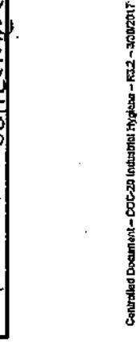


Attn: Dave Watts

## LA Testing

5431 Industrial Drive, Huntington Beach, CA 92649

Phone/Fax: (714) 828-4999 / (714) 828-4944

ESTING http://www.LATesting.com

Geocon Consultants, Inc.

6671 Brisa Street

Livermore, CA 94550

gardengrovelab@latesting.com

# #

---

# #

(925) 371-5900

LA Testing Order:

CustomerID:

CustomerPO:

ProjectID:

332010660

S1908-01-01

Modesto Soil

GECN21

Received:

(925) 371-5915 06/15/20 8:30 AM

Analysis Date:

Phone:

Fax:

6/15/2020

Collected:

6/12/2020

Project: Modesto Soil

## Test Report: Total Dust by NIOSH 0500

| Sample                    | Location          | Volume<br>(L) | Sample Weight<br>(mg) | Concentration<br>(mg/m³) | Reporting<br>Limit<br>(mg/m³) | Notes       |
|---------------------------|-------------------|---------------|-----------------------|--------------------------|-------------------------------|-------------|
| PRM-1BF<br>332010660-0001 | Perimeter (SP2-U) | 729           | <0.050                | <0.069                   | 0.069                         |             |
| PRM-2BF<br>332010660-0002 | Perimeter (SP2-D) | 772           | 0.083                 | 0.11                     | 0.065                         |             |
| PRM-3BF<br>332010660-0003 | Perimeter (SP2-D) | 763           | 0.40                  | 0.52                     | 0.066                         |             |
| FB-BF<br>332010660-0004   | Field Blank       |               | <0.050                | N/A                      | N/A                           | Field Blank |

Notes:

Discernable field blank submitted with samples.

Results are not field blank corrected.

Analyst(s)

Andres Arestegui (3) Christine Do (1)

michael Chapman

Michael Chapman, Laboratory Manager or other approved signatory

The laboratory is not responsible for data reported in mg/m3, which is dependent on volume collected by non-laboratory personnel. Reporting limits for samples without volumes, such as Field Blanks, are 0.05 mg. This report relates only to the samples reported above. This report may not be reproduced, except in full, without written approved by EMSL Samples received in good condition unless otherwise

Samples analyzed by LA Testing Huntington Beach, CA AlHA-LAP, LLC--IHLAP Accredited #101650

Initial report from 06/16/2020 09:13:43


5431 Industrial Drive, Huntington Beach, CA 92649 Phone/Fax: (714) 828-4999 / (714) 828-4944

TESTING http://www.LATesting.com

gardengrovelab@latesting.com

LA Testing Order: CustomerID: CustomerPO: ProjectID:

GECN21 \$1908-01-01 Modesto Soil

332010658

Attn: Dave Watts Geocon Consultants, Inc.

6671 Brisa Street Livermore, CA 94550 Phone: Fax:

(925) 371-5900

Received:

(925) 371-5915 06/15/20 8:30 AM

Collected:

6/12/2020

Project: Modesto Soil

| Client Sample Description                              |           | Collected: | 6/12/2020 | Lab ID: | 332010658-0001      |    |                         |    |
|--------------------------------------------------------|-----------|------------|-----------|---------|---------------------|----|-------------------------|----|
| Method                                                 | Parameter | Result     | RL        | Units   | Prep Date & Analyst |    | Analysis Date & Analyst |    |
| METALS                                                 | Barium    | 1.6        | 1.4       | µg/m³   | 6/15/2020           | TH | 6/15/2020               | TH |
|                                                        |           | <0.69      | 0.69      | µg/m³   | 6/15/2020           | TH | 6/15/2020               | TH |
| Client Sample Description PRM-2BF<br>Perimeter (SP2-D) |           | Collected: | 6/12/2020 | Lab ID: | 332010658-0002      |    |                         |    |
| Method                                                 | Parameter | Result     | RL        | Units   | Prep Date & Analyst |    | Analysis Date & Analyst |    |
| METALS                                                 | Barium    | <1.3       | 1.3       | µg/m³   | 6/15/2020           | TH | 6/15/2020               | TH |
|                                                        |           | <0.65      | 0.65      | µg/m³   | 6/15/2020           | TH | 6/15/2020               | TH |
| Client Sample Description PRM-3BF<br>Perimeter (SP2-D) |           | Collected: | 6/12/2020 | Lab ID: | 332010658-0003      |    |                         |    |
| Method                                                 | Parameter | Result     | RL        | Units   | Prep Date & Analyst |    | Analysis Date & Analyst |    |
| METALS                                                 | Barium    | 6.8        | 1.3       | µg/m³   | 6/15/2020           | TH | 6/15/2020               | TH |
|                                                        |           | <0.66      | 0.66      | µg/m³   | 6/15/2020           | TH | 6/15/2020               | TH |

## Definitions:

MDL - method detection limit

RL - Reporting Limit (Analytical)

J - Result was below the reporting limit, but at or above the MDL ND - indicates that the analyte was not detected at the reporting limit

D - Dilution Sample required a dilution which was used to calculate final results


Industrial Hygiene Chain of Custody

0658 EMSL Order Number (Lab Use Only):

5431 Industrial Drive LATesting

5431 Industrial Drive

(714) 828-4999 (714) 828-4944

342020395810

Quote I

Huntington Beach, CA 92649

JUN ,2020 Sampled By (Signature): 4/// Comments Purchase Order: S1908-01-01 3P2 - XW 'n Manufacturer/Part #; Zefon 7m83m # Samples in Shipment: Date of Shipment: / 2 Client ID # GECN2.1 Media Type: 37-mm MCE U.S. State where Samples Collected: CA 2Jus 2020 Sample Date Lot ₩ Sample Zip/Postal Code: | | | | | | | | | | | | | | | | | | | Other (Call Lab) Turnaround Time (TAT) - Please Check: If No Selection Made, Standard 2 Week TAT Will Apply Area(L) Bill To Company: Geocon Consultants, Inc. Volume. State/Province: 1304 1303 Sample Time 1259 튱 1 Day Project Name: Modesto Soll 5480 2880 6839 5 Attention To: Same 2.87 Flow (Ipm) Z 2 Day Phone: Street City: Media A.R ZipiPostal Code: 94550 3 Day 14 BA TAP Analyte / Method Fax: 925,371,5915 777 Geocon Consultants, Inc. (502-D) Email Results To: watts@geoconinc.com 4 Day n-zds/ 302-1 Location/Description Report To Contact Name: David Watts BLANK City: Livermore State/Province: CA PERIMETER 1 Week 4.56 Street: 6671 Brisa Street Phone: 925-371-5900 Company Name: PRM-18F Sample ID 2 Week Client l, AT AT

レスニ いっしょう ひっしょう かんしょう S1908-01-01/Modesto Soil; Pb/Ba = Lead and Banum (NIOSH 7300)/TAP = Total Airborne Particulate (NIOSH D500) 34× 2020 8 3 3 Ca N N O 6550 Received By JUN 2020 Date ū かっかなみでに \*also e-mail results to giuntoli@geoconinc.com Released By Comments:

Note: Most NIOSH and OSHA methods require field blanks. It is the IH field sampler's responsibility to submit the proper number of field blanks and duplicates.

Page\_

Coprofied Decuzarit - COC-20 Interstal Hygiene - R0,2 - 500/2017

332010288 OrderID:


5431 Industrial Drive, Huntington Beach, CA 92649 Phone/Fax (714) 828-4999 / (714) 828-4944

NG http://www.LATesting.com

gardengrovelab@latesting.com

LA Testing Order: CustomerID: CustomerPO: ProjectID:

GECN21 S1908-01-01 Modesto Soil

332010800

Attn: Dave Watts
Geocon Consultants, Inc.
6671 Brisa Street
Livermore, CA 94550

Phone: Fax:

(925) 371-5900 (925) 371-5915

Received:

06/16/20 9:20 AM

Analysis Date:

6/17/2020

Collected:

6/13/2020

Project: Modesto Soil

## Test Report: Total Dust by NIOSH 0500

| Sample                    | Location          | Volume<br>(L) | Sample Weight<br>(mg) | Concentration<br>(mg/m³) | Reporting<br>Limit<br>(mg/m²) | Notes       |
|---------------------------|-------------------|---------------|-----------------------|--------------------------|-------------------------------|-------------|
| PRM-18G<br>332010800-0001 | Perimeter (SP2-U) | 818           | 0.10                  | 0.12                     | 0.061                         |             |
| PRM-2BG<br>332010800-0002 | Perimeter (SP2-D) | 852           | <0.050                | <0.059                   | 0.059                         |             |
| PRM-3BG<br>332010800-0003 | Perimeter (SP2-D) | 850           | <0.050                | <0.059                   | 0.059                         |             |
| FB-BG<br>332010800-0004   | Field Blank       |               | <0.050                | <0.050                   | N/A                           | Field Blank |

Notes:

Discernable field blank submitted with samples.

Results are not field blank corrected.

Analyst(s)

Andres Arestegui (4)

michael Chapman

Michael Chapman, Laboratory Manager or other approved signatory

The laboratory is not responsible for data reported in mg/m3, which is dependent on volume collected by non-laboratory personnel. Reporting limits for samples without volumes, such as Field Blanks, are 0.05 mg. This report relates only to the samples reported above. This report may not be reproduced, except in full, without written approval by EMSL. Samples received in good condition unless otherwise noted.

Samples analyzed by LA Testing Huntington Beach, CA AlHA-LAP, LLC-IHLAP Accredited #101650

Initial report from 06/19/2020 09:35:42


5431 Industrial Drive, Huntington Beach, CA 92649

Phone/Fax: (714) 828-4999 / (714) 828-4944

TESTING http://www.LATesting.com

gardengrovelab@latesting.com

CustomerPO: ProjectID:

LA Testing Order:

CustomerID:

332010798

S1908-01-01

Modesto Soil

GECN21

Attn: Dave Watts Geocon Consultants, Inc. 6671 Brisa Street Livermore, CA 94550

Phone: Fax: Received: (925) 371-5900 (925) 371-5915

Collected-

06/16/20 9:20 AM

Collected:

6/13/2020

Modesto Soll

Analytical Paculte

| Client Sample Description |           | Collected: | Lab ID:        | Prep Date & Analyst |           | Analysis Date & Analyst |           |    |
|---------------------------|-----------|------------|----------------|---------------------|-----------|-------------------------|-----------|----|
| Method                    | Parameter | Result     | RL             | Units               |           |                         |           |    |
| METALS                    |           |            |                |                     |           |                         |           |    |
| 7300 Modified             | Barium    | <1.2       | 1.2            | µg/m³               | 6/17/2020 | TH                      | 6/17/2020 | TH |
| 7300 Modified             | Lead      | <0.61      | 0.61           | µg/m³               | 6/17/2020 | TH                      | 6/17/2020 | TH |
| PRM-1BG                   |           | 6/13/2020  | 332010798-0001 |                     |           |                         |           |    |
| Client Sample Description |           | Collected: | Lab ID:        | Prep Date & Analyst |           | Analysis Date & Analyst |           |    |
| Method                    | Parameter | Result     | RL             | Units               |           |                         |           |    |
| METALS                    |           |            |                |                     |           |                         |           |    |
| 7300 Modified             | Barium    | <1.2       | 1.2            | µg/m³               | 6/17/2020 | TH                      | 6/17/2020 | TH |
| 7300 Modified             | Lead      | <0.59      | 0.59           | µg/m³               | 6/17/2020 | TH                      | 6/17/2020 | TH |
| PRM-2BG                   |           | 6/13/2020  | 332010798-0002 |                     |           |                         |           |    |
| Client Sample Description |           | Collected: | Lab ID:        | Prep Date & Analyst |           | Analysis Date & Analyst |           |    |
| Method                    | Parameter | Result     | RL             | Units               |           |                         |           |    |
| METALS                    |           |            |                |                     |           |                         |           |    |
| 7300 Modified             | Barium    | <1.2       | 1.2            | µg/m³               | 6/17/2020 | TH                      | 6/17/2020 | TH |
| 7300 Modified             | Lead      | <0.59      | 0.59           | µg/m³               | 6/17/2020 | TH                      | 6/17/2020 | TH |
| PRM-3BG                   |           | 6/13/2020  | 332010798-0003 |                     |           |                         |           |    |

## Definitions:

MDL - method detection limit

RL - Reporting Limit (Analytical)

J - Result was below the reporting limit, but at or above the MDL ND - indicates that the analyte was not detected at the reporting limit

D - Dilution Sample required a dilution which was used to calculate final results


Industrial Hygiene Chain of Custody

EMSL Order Number (Lab Use Only)

---

LATesting 5431 Industrial Drive

Huntington Beach, CA 92649

(714) 828-4999 (714) 828-4944

| Report To Company:                                                                         | Geocon Consultants, Inc.     | Bill To Company: | Geocon Consultants, Inc. | Client ID #:                        | GECN2.1           | (714) 828-4999<br>(714) 828-4944 |                   |                      |             |          |  |
|--------------------------------------------------------------------------------------------|------------------------------|------------------|--------------------------|-------------------------------------|-------------------|----------------------------------|-------------------|----------------------|-------------|----------|--|
| Report To Contact Name:                                                                    | David Watts                  | Attention To:    | Same                     | # Samples in Shipment:              | 4                 |                                  |                   |                      |             |          |  |
| Company Name:                                                                              | Geocon Consultants, Inc.     |                  |                          | Date of Shipment:                   | 13 Jun 2020       |                                  |                   |                      |             |          |  |
| Street:                                                                                    | 6671 Brisa Street            | Street:          |                          | Sampled By (Signature):             | U.H.T             |                                  |                   |                      |             |          |  |
| City:                                                                                      | Livermore State/Province: CA | City:            |                          | Purchase Order:                     | S1908-01-01       |                                  |                   |                      |             |          |  |
| Phone:                                                                                     | 925-371-5900                 | Zip/Postal Code: | 94550                    |                                     |                   |                                  |                   |                      |             |          |  |
| Fax:                                                                                       | 925-371-5915                 | State/Province:  |                          | U.S. State where Samples Collected: | CA                |                                  |                   |                      |             |          |  |
| Email Results To:                                                                          | Watts@geoconinc.com          | Phone:           |                          | Media Type:                         | 37-mm MCE         |                                  |                   |                      |             |          |  |
|                                                                                            |                              | Fax:             |                          | Manufacturer/Part #:                | Zefon 7m83m       |                                  |                   |                      |             |          |  |
| Turnaround Time (TAT) – Please Check: If No Selection Made, Standard 2 Week TAT Will Apply |                              | Project Name:    | Modesto Soil             | Lot #:                              | 19773             |                                  |                   |                      |             |          |  |
| 2 Week                                                                                     | 1 Week                       | 4 Day            | 3 Day                    | 2 Day                               | 1 Day             | Other (Call Lab)                 |                   |                      |             |          |  |
| Client<br>Sample ID                                                                        | Location/Description         | Analyte / Method | Media                    | Flow (lpm)                          | Sample Time<br>On | Sample Time<br>Off               | Volume / Area (L) | Sample Type          | Date        | Comments |  |
| PRM-186                                                                                    | PERIMETER (SP2-U)            | Pb/Ba TAP        | AIR                      | 2.87                                | 07:25             | 10:10                            | 818               | ☐ Area<br>☐ Personal | 13 JUN 2020 | SP2 - NW |  |
| 1 - 2 1                                                                                    | (SP2-D)                      |                  |                          |                                     | 07:17             | 12:14                            | 852               | ☐ Area<br>☐ Personal |             | - S      |  |
| 16-4                                                                                       | (SP2-D)                      |                  |                          |                                     | 07:21             | 12:17                            | 850               | ☐ Area<br>☐ Personal |             | - SE     |  |
| FB - FIELD BLANK                                                                           | TAP                          | NA               |                          |                                     |                   |                                  |                   | ☐ Area<br>☐ Personal |             |          |  |

Note: Most NIOSH and OSHA methods require field blanks. It is the IH field sampler's responsibility to submit the proper number of field blanks and duplicates.

| Released By                                    | 5,711/3     | Date                                                                                                         | 135W 2020                   |
|------------------------------------------------|-------------|--------------------------------------------------------------------------------------------------------------|-----------------------------|
| Received By                                    | 650         | Date                                                                                                         | 13 JUN 2020                 |
|                                                | JS(Courses) |                                                                                                              | 6/16/20 9:20m               |
| Comments: SP = 5to CKP, LE                     |             | المرامية المرامية                                                                                            |                             |
| "also e-mall results to gluntoli@geoconinc.com | • ·         | S1908-01-01/Modesto Soll; Pb/Ba = Lead and Barium (NIOSH 7300)/TAP = Total Airborne Particulate (NIOSH 0500) | se Particulate (NIOSH 0500) |

# Page

- 0.6
- 0.8
- 1.0

Controlled Ducument - COC-20 Industrial Hygiero - 1922 - 3/30/2017


5431 Industrial Drive, Huntington Beach, CA 92649 Phone/Fax: (714) 828-4999 / (714) 828-4944

NG http://www.LATesting.com

gardengrovelab@latesting.com

LA Testing Order: 332010805
CustomerID: GECN21
CustomerPO: S1908-01-01
ProjectID: Modesto Soil

Attn: Dave Watts
Geocon Consultants, Inc.
6671 Brisa Street
Livermore, CA 94550

Phone: Fax:

(925) 371-5900

Received:

(925) 371-5915 06/16/20 9:20 AM

Analysis Date:

6/17/2020

Collected:

6/15/2020

Project: Modesto Soil

## Test Report: Total Dust by NIOSH 0500

| Sample                    | Location          | Volume<br>(L) | Sample Weight<br>(mg) | Concentration<br>(mg/m³) | Reporting<br>Limit<br>(mg/m³) | Notes       |
|---------------------------|-------------------|---------------|-----------------------|--------------------------|-------------------------------|-------------|
| PRM-1BH<br>332010805-0001 | Perimeter (SP2-U) | 827           | 0.082                 | 0.099                    | 0.060                         |             |
| PRM-2BH<br>332010805-0002 | Perimeter (SP2-D) | 861           | <0.050                | <0.058                   | 0.058                         |             |
| PRM-3BH<br>332010805-0003 | Perimeter (SP2-D) | 858           | 0.10                  | 0.12                     | 0.058                         |             |
| FB-BH<br>332010805-0004   | Field Bank        | <0.050        | <0.050                | N/A                      | N/A                           | Field Blank |

Notes:

Discernable field blank submitted with samples.

Results are not field blank corrected.

Analyst(s)

Andres Arestegui (4)

Michael Chapman

Michael Chapman, Laboratory Manager or other approved signatory

The laboratory is not responsible for data reported in mg/m3, which is dependent on volume collected by non-laboratory personnel. Reporting limits for samples without volumes, such as Field Blanks, are 0.05 mg. This report relates only to the samples reported above. This report may not be reproduced, except in full, without written approval by EMSL. Samples received in good condition unless otherwise noted.

Samples analyzed by LA Testing Huntington Beach, CA AlHA-LAP, LLC-IHLAP Accredited #101650

Initial report from 06/19/2020 09:28:30


6431 Industrial Drive, Huntington Beach, CA 92649 Phone/Fax: (714) 828-4999 / (714) 828-4944

TESTING http://www.LATesting.com

gardengrovelab@latesting.com

LA Testing Order: CustomerID: CustomerPO:

332010802 GECN21 S1908-01-01

ProjectID:

Modesto Soil

Attn: Dave Watts Geocon Consultants, Inc.

6671 Brisa Street Livermore, CA 94550 Phone: Fax:

(925) 371-5900 (925) 371-5915

Received:

06/16/20 9:20 AM

Collected:

6/15/2020

Project: Modesto Soil

| Client Sample Description    |               |        | Collected: | 6/15/2020 | Lab ID:             | 332010802-0001 |                         |           |    |
|------------------------------|---------------|--------|------------|-----------|---------------------|----------------|-------------------------|-----------|----|
| Method                       | Parameter     | Result | RL         | Units     | Prep Date & Analyst |                | Analysis Date & Analyst |           |    |
| PRM-1BH<br>Perimeter (SP2-U) | METALS        |        |            |           |                     |                |                         |           |    |
|                              | 7300 Modified | Barium | <1.2       | 1.2       | µg/m³               | 6/17/2020      | TH                      | 6/17/2020 | TH |
|                              | 7300 Modified | Lead   | <0.60      | 0.60      | µg/m³               | 6/17/2020      | TH                      | 6/17/2020 | TH |
| PRM-2BH<br>Perimeter (SP2-D) | METALS        |        |            |           |                     |                |                         |           |    |
|                              | 7300 Modified | Barium | <1.2       | 1.2       | µg/m³               | 6/17/2020      | TH                      | 6/17/2020 | TH |
|                              | 7300 Modified | Lead   | <0.58      | 0.58      | µg/m³               | 6/17/2020      | TH                      | 6/17/2020 | TH |
| PRM-3BH<br>Perimeter (SP2-D) | METALS        |        |            |           |                     |                |                         |           |    |
|                              | 7300 Modified | Barium | <1.2       | 1.2       | µg/m³               | 6/17/2020      | TH                      | 6/17/2020 | TH |
|                              | 7300 Modified | Lead   | <0.58      | 0.58      | µg/m³               | 6/17/2020      | TH                      | 6/17/2020 | TH |

## Definitions:

MDL - method detection limit

Rt. - Reporting Limit (Analytical)

J - Result was below the reporting limit, but at or above the MDL

ND - indicates that the analyte was not detected at the reporting limit

D - Dilution Sample required a dilution which was used to calculate final results


Industrial Mygiene **Chain of Custody** 

EMSL Order Number (Lab Use Only)

0 &

5431 Industrial

LATesting (


Huntington Beach, CA 92649

(714) 828-4999

JUN 2020 (714) 828-4944 Comments Purchase Order: S1908-01-01 Sampled By (Signature): # Samples in Shipment: ManufacturedPart #; Zefon 7m83m Cilent ID # GECN2.1 N Date of Shipment: / Media Type: 37-mm MCE U.S. State where Samples Collected: CA Quote 342020395810 15 JUN 2020 Sample Date Lot#: Sample Type Zip/Postal Code: Other (Call Lab) Turnaround Time (TAT) - Please Check: If No Selection Made, Standard 2 Week TAT WIII Apply Bill To Company: Geocon Consultants, Inc. Area(L 858 Volume. 827 State/Province: 330 Sample Time 4281 늉 1 Day Project Name: Modesto Soli 8280 9840 1680 δ Attention To: Same Flow (mat) . 87 2 Day Phone: Street: CIEX Media オア Zip/Postal Code: 94550 3 Day 3 Analyte / Method Fax: 925-371-5915 TAP Geocon Consultants, Inc. 4 Day 1382-10 Email Results To: Watts@geoconinc.com **7-2**₩ 5/2-1 Location/Description Report To Contact Name: David Watts City; Livermore State/Province: CA PERINETER. 1 Week Phone: 925-371-5900 Street: 6671 Brisa Street Company Name: Pem-18# Sample ID 2 Week 4 Client ١ B

Note: Most NIOSH and OSHA methods require field blanks. It is the IH field sampler's responsibility to submit the proper number of field blanks and duplicates.

| Released By                                    |               | Date          | Received By                                                                | Date                                                                                                                                                                                                                                                                                                                                                                                                                                                                                                                                                                                                                                                                                                                                                                                                                                                                                                                                                                                                                                                                                                                                                                                                                                                                                                                                                                                                                                                                                                                                                                                                                                                                                                                                                                                                                                                                                                                                                                                                                                                                                                                           |
|------------------------------------------------|---------------|---------------|----------------------------------------------------------------------------|--------------------------------------------------------------------------------------------------------------------------------------------------------------------------------------------------------------------------------------------------------------------------------------------------------------------------------------------------------------------------------------------------------------------------------------------------------------------------------------------------------------------------------------------------------------------------------------------------------------------------------------------------------------------------------------------------------------------------------------------------------------------------------------------------------------------------------------------------------------------------------------------------------------------------------------------------------------------------------------------------------------------------------------------------------------------------------------------------------------------------------------------------------------------------------------------------------------------------------------------------------------------------------------------------------------------------------------------------------------------------------------------------------------------------------------------------------------------------------------------------------------------------------------------------------------------------------------------------------------------------------------------------------------------------------------------------------------------------------------------------------------------------------------------------------------------------------------------------------------------------------------------------------------------------------------------------------------------------------------------------------------------------------------------------------------------------------------------------------------------------------|
| CHII!                                          |               | 15 JUN 2020   | 630                                                                        | 15 Jun 2020                                                                                                                                                                                                                                                                                                                                                                                                                                                                                                                                                                                                                                                                                                                                                                                                                                                                                                                                                                                                                                                                                                                                                                                                                                                                                                                                                                                                                                                                                                                                                                                                                                                                                                                                                                                                                                                                                                                                                                                                                                                                                                                    |
| W 100                                          |               |               | ) <u> </u>                                                                 | 6/16/20 9:20mi                                                                                                                                                                                                                                                                                                                                                                                                                                                                                                                                                                                                                                                                                                                                                                                                                                                                                                                                                                                                                                                                                                                                                                                                                                                                                                                                                                                                                                                                                                                                                                                                                                                                                                                                                                                                                                                                                                                                                                                                                                                                                                                 |
|                                                |               |               | ,                                                                          |                                                                                                                                                                                                                                                                                                                                                                                                                                                                                                                                                                                                                                                                                                                                                                                                                                                                                                                                                                                                                                                                                                                                                                                                                                                                                                                                                                                                                                                                                                                                                                                                                                                                                                                                                                                                                                                                                                                                                                                                                                                                                                                                |
| Comments:                                      | 3P= 5tockP,1E |               | 4 = UP LJ N V V V V V V V V V V V V V V V V V V                            | Open designation of the control of the control of the control of the control of the control of the control of the control of the control of the control of the control of the control of the control of the control of the control of the control of the control of the control of the control of the control of the control of the control of the control of the control of the control of the control of the control of the control of the control of the control of the control of the control of the control of the control of the control of the control of the control of the control of the control of the control of the control of the control of the control of the control of the control of the control of the control of the control of the control of the control of the control of the control of the control of the control of the control of the control of the control of the control of the control of the control of the control of the control of the control of the control of the control of the control of the control of the control of the control of the control of the control of the control of the control of the control of the control of the control of the control of the control of the control of the control of the control of the control of the control of the control of the control of the control of the control of the control of the control of the control of the control of the control of the control of the control of the control of the control of the control of the control of the control of the control of the control of the control of the control of the control of the control of the control of the control of the control of the control of the control of the control of the control of the control of the control of the control of the control of the control of the control of the control of the control of the control of the control of the control of the control of the control of the control of the control of the control of the control of the control of the control of the control of the control of the control of the control of the control of t |
| *also e-mail results to gluntoli@geocopure.com | Mentent com   | W(0-10-008) S | glodesto Soli, Tuze - Ledu ditu ballutti (vicori 1909) IAT - 10tal rabotti | י רמומטשום (ואוסטרו סטטנ)                                                                                                                                                                                                                                                                                                                                                                                                                                                                                                                                                                                                                                                                                                                                                                                                                                                                                                                                                                                                                                                                                                                                                                                                                                                                                                                                                                                                                                                                                                                                                                                                                                                                                                                                                                                                                                                                                                                                                                                                                                                                                                      |

pages

Controlled Docum


5431 Industrial Drive, Huntington Beach, CA 92649

Phone/Fax: (714) 828-4999 / (714) 828-4944

NG http://www.LATesting.com

gardengrovelab@latesting.com

LA Testing Order:

332010847

CustomerID: CustomerPO:

GECN21 S1908-01-01

ProjectID:

Modesto Soil

Dave Watts Geocon Consultants, Inc. 6671 Brisa Street Livermore, CA 94550 Phone: Fax:

(925) 371-5900 (925) 371-5915

Received:

06/17/20 8:20 AM

Analysis Date:

6/18/2020

Collected:

6/16/2020

Project: Modesto Soil

## Test Report: Total Dust by NIOSH 0500

| Sample                    | Location          | Volume<br>(L) | Sample Weight<br>(mg) | Concentration<br>(mg/m³) | Reporting Limit<br>(mg/m³) | Notes       |
|---------------------------|-------------------|---------------|-----------------------|--------------------------|----------------------------|-------------|
| PRM-1BI<br>332010847-0001 | Perimeter (SP2-U) | 918           | <0.050                | <0.054                   | 0.054                      |             |
| PRM-2BI<br>332010847-0002 | Perimeter (SP2-D) | 947           | <0.050                | <0.053                   | 0.053                      |             |
| PRM-3BI<br>332010847-0003 | Perimeter (SP2-D) | 953           | <0.050                | <0.052                   | 0.052                      |             |
| FB-BI<br>332010847-0004   | Field blank       |               | <0.050                | N/A                      | N/A                        | Field Blank |

Notes:

Discernable field blank submitted with samples.

Results are not field blank corrected.

Anatyst(s)

Andres Arestegui (4)

Michael Chapman

Michael Chapman, Laboratory Manager or other approved signatory

The laboratory is not responsible for data reported in mg/m3, which is dependent on volume collected by non-laboratory personnel. Reporting limits for samples without volumes, such as Field Bitanks, are 0.05 mg. This report relates only to the samples reported above. This report may not be reproduced, except in full, without written approval by EMSL. Samples received in good condition unless otherwise noted.

Samples analyzed by LA Testing Huntington Beach, CA AIHA-LAP, LLC-IHLAP Accredited #101650

Initial report from 06/22/2020 09:52:41


5431 Industrial Drive, Huntington Beach, CA 92649

Phone/Fax: (714) 828-4999 / (714) 828-4944

ESTING http://www.LATesting.com

gardengrovelab@latesting.com

 LA Testing Order:
 332010853

 CustomerID:
 GECN21

 CustomerPO:
 S1908-01-01

 Project(D:
 Modesto Soil

Attn: Dave Watts
Geocon Consultants, Inc.
6671 Brisa Street
Livermore, CA 94550

Phone: Fax:

(925) 371-5900 (925) 371-5915

Received:

06/17/20 8:20 AM

Collected:

6/16/2020

Project: Modesto Soil

Analytical Results

| Analytical Results                                     |           | Collected: | 6/16/2020 | Lab ID: | 332010853-0001         |    |                            |    |
|--------------------------------------------------------|-----------|------------|-----------|---------|------------------------|----|----------------------------|----|
| Method                                                 | Parameter | Result     | RL        | Units   | Prep<br>Date & Analyst |    | Analysis<br>Date & Analyst |    |
| METALS                                                 |           |            |           |         |                        |    |                            |    |
| 7300 Modified                                          | Barium    | <1.1       | 1.1       | µg/m³   | 6/18/2020              | TH | 6/18/2020                  | TH |
| 7300 Modified                                          | Lead      | <0.54      | 0.54      | µg/m³   | 6/18/2020              | TH | 6/18/2020                  | TH |
| Client Sample Description PRM-2BI<br>Perimeter (SP2-D) |           | Collected: | 6/16/2020 | Lab ID: | 332010853-0002         |    |                            |    |
| Method                                                 | Parameter | Result     | RL        | Units   | Prep<br>Date & Analyst |    | Analysis<br>Date & Analyst |    |
| METALS                                                 |           |            |           |         |                        |    |                            |    |
| 7300 Modified                                          | Barium    | <1.1       | 1.1       | µg/m³   | 6/18/2020              | TH | 6/18/2020                  | TH |
| 7300 Modified                                          | Lead      | <0.53      | 0.53      | µg/m³   | 6/18/2020              | TH | 6/18/2020                  | TH |
| Client Sample Description PRM-3BI<br>Perimeter (SP2-D) |           | Collected: | 6/16/2020 | Lab ID: | 332010853-0003         |    |                            |    |
| Method                                                 | Parameter | Result     | RL        | Units   | Prep<br>Date & Analyst |    | Analysis<br>Date & Analyst |    |
| METALS                                                 |           |            |           |         |                        |    |                            |    |
| 7300 Modified                                          | Barium    | <1.0       | 1.0       | µg/m³   | 6/18/2020              | TH | 6/18/2020                  | TH |
| 7300 Modified                                          | Lead      | <0.52      | 0.52      | µg/m³   | 6/18/2020              | TH | 6/18/2020                  | TH |

## 

MDL - method detection limit

RL - Reporting Limit (Analytical)

J - Result was below the reporting limit, but at or above the MDL

ND - indicates that the analyte was not detected at the reporting limit

D - Dilution Sample required a dilution which was used to calculate final results


EMSL Order Number (Lab Use Only): Industrial Mygiene **Chain of Custody** 

ustrial hygiene
chain of Custody

## For Study Use Only):

**Scene**

**Study**

5431 Industrial Lrive LATesting

Huntington Beach, CA 92649

(714) 828-4944 (714) 828-4999

342020395810

10853

#3320

Date of Shipment /6 Jun 2920 Comments Purchase Order: S1908-01-01 Sampled By (Signature): 1/ - 5E # Samples in Shipment: Manufacturer/Part #: Zefon 7m93m Client ID # GECN21 7**0**\$ Media Type: 37-mm MCE U.S. State where Samples Collected: CA 16 Jun 2020 Sample Date Lot # Sample Quote #3 Zip/Postal Code: Type | Area | Personal | Personal | Personal | Personal | Personal | Personal | Personal | Personal | Personal | Personal | Personal | Personal | Personal | Personal | Personal | Personal | Personal | Personal | Personal | Personal | Personal | Personal | Personal | Personal | Personal | Personal | Personal | Personal | Personal | Personal | Personal | Personal | Personal | Personal | Personal | Personal | Personal | Personal | Personal | Personal | Personal | Personal | Personal | Personal | Personal | Personal | Personal | Personal | Personal | Personal | Personal | Personal | Personal | Personal | Personal | Personal | Personal | Personal | Personal | Personal | Personal | Personal | Personal | Personal | Personal | Personal | Personal | Personal | Personal | Personal | Personal | Personal | Personal | Personal | Personal | Personal | Personal | Personal | Personal | Personal | Personal | Personal | Personal | Personal | Personal | Personal | Personal | Personal | Personal | Personal | Personal | Personal | Personal | Personal | Personal | Personal | Personal | Personal | Personal | Personal | Personal | Personal | Personal | Personal | Personal | Personal | Personal | Personal | Personal | Personal | Personal | Personal | Personal | Personal | Personal | Personal | Personal | Personal | Personal | Personal | Personal | Personal | Personal | Personal | Personal | Personal | Personal | Personal | Personal | Personal | Personal | Personal | Personal | Personal | Personal | Personal | Personal | Personal | Personal | Personal | Personal | Personal | Personal | Personal | Personal | Personal | Personal | Personal | Personal | Personal | Personal | Personal | Personal | Personal | Personal | Personal | Personal | Personal | Personal | Personal | Personal | Personal | Personal | Personal | Personal | Personal | Personal | Personal | Personal | Personal | Personal | Personal | Personal | Personal | Personal | Personal | Personal | Personal | Personal | Personal | Personal | Personal | Personal | Personal | Personal | Pe Other (Call Lab) Area/L Turnaround Time (TAT) - Please Check: If No Selection Made, Standard 2 Week TAT Will Apply Bill To Company: Geocon Consultants, Inc. Volume / 8/6 647 135H State/Province: 6451 Sample Time 1353 O#O 1 Day Project Name: Modesto Soli 6289 1780 1280 Attention To: Same. 5 Flow (lpm)  $\lambda$ 2 Day Phone: ÿ Media 牙瓦 Zip/Postal Code: 94550 3 Day PV Ba 128 Analytė / Method 925-371-5915 Company Name: Geocon Consultants, Inc. Email Results To; watts@geoconinc.com 4 Day (sp2-u) 20.0 (SP2-B) Location/Description F8X : Report To Contact Name: David Watts City: Livermore State/Province: CA アアといれずに 1 Week Street: 6671 Brisa Street グション Phone: 925-371-5900 Km-i RI Sample 1D 2 Week Client I,  $\infty$ 

以 ニ いきしい いり ひ ニ ひっぴ いんしょいし S1908-01-01/Modesto Soil; Pb/Ba = Lead and Barium (NIOSH 7300)/TAP ≃ Total Airbome Particulate (NIOSH 0500) JEN 2020 Date N O Received By 16 Jan 2020 Date SP= Stockpile \*also e-mail results to glurtoli@geoconinc.com Released By Comments:

Note: Most NIOSH and OSHA methods require field blanks. It is the IH field sampler's responsibility to submit the proper number of field blanks and duplicates.

pages

Controlled Document - CDC-20 Industrial Hygiena - R3.2 - 3/30/2017

OrderID: