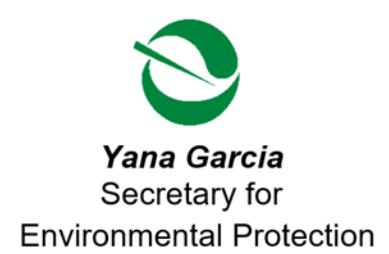
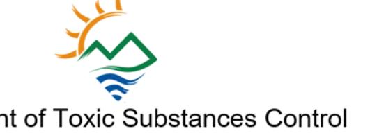

Katherine M. Butler, MPH, Director
8800 Cal Center Drive
Sacramento, California 95826-3200

<https://dtsc.ca.gov/>

## **Sent Via Electronic Mail**

November 21, 2024

Mr. Adam Inman, P.G. Engineering Geologist Caltrans D-6 | Office of Environmental Engineering Hazardous Waste and Paleontology Brancy 2015 East Shields Avenue, Suite 100 Fresno, California 93726 [Adam.Inman@dot.ca.gov](mailto:Adam.Inman@dot.ca.gov)

ANNUAL COST ESTIMATE FOR OVERSIGHT, CALTRANS MODESTO SOIL STOCKPILES, PHASE 1 INTERIM STATE ROUTE 132 WEST PROJECT, MODESTO, STANISLAUS COUNTY, CALIFORNIA (SITE CODE: 900259-00)

Dear Mr. Inman

In accordance with Health and Safety Code Section 25269.5, the Department of Toxic Substances Control (DTSC) is providing Responsible Parties/Project Proponents with an estimate of DTSC's oversight costs for project activities scheduled for the period from July 1, 2024 through June 30, 2025.

The tasks scheduled to be conducted during this period for this project are:

- 1. Fiscal Year Cost Estimate;
- 2. Review and approve the Annual Inspection (due by January 18, 2025);
- 3. Amend/Review Interagency Agreement (currently set to expire on 6/30/2025 and,
- 4. Project Management.

The following is a breakdown of tasks, timeline, and estimated DTSC costs for the tasks mentioned above that are slated for this fiscal year. Please note that this is only an estimate of projected costs based on the investigation and cleanup activities DTSC

expects to occur at the site during this period. Responsible Parties/Project Proponents remain liable for all costs incurred by DTSC as required by law.

| Task                              | Timeline      | Estimated DTSC Cost |
|-----------------------------------|---------------|---------------------|
| Fiscal Year Cost Estimate         | Oct. 26, 2023 | \$1,691.00          |
| Review Annual Inspection Report   | Feb. 28, 2025 | \$1,040.50          |
| Amend/Renew Interagency Agreement | June 30, 2025 | \$5,150.00          |
| Project Management                | June 30, 2025 | \$1,170.00          |
| Total                             |               | \$9,051.50          |

DTSC hopes this cost estimate will be useful in your fiscal planning and project management efforts. If you have any questions regarding the cost estimate, please contact Dean Wright at (916) 255-3591 or via electronic mail at [Dean.Wright@dtsc.ca.gov.](mailto:Dean.Wright@dtsc.ca.gov)

Sincerely,

Ms. Lora Jameson, P.G., Chief

Site Evaluation and Remediation Unit Site Mitigation and Restoration Program

Department of Toxic Substances Control

cc: (via email)

Mr. Dean Wright, P.G.

Project Manager

Site Evaluation and Remediation Unit

Department of Toxic Substances Control

[Dean.Wright@dtsc.ca.gov](mailto:Dean.Wright@dtsc.ca.gov)