# State Route 132 West Freeway/Expressway Project

# **Public Hearing Summary Report**

City of Modesto, Stanislaus County 10-STA-132(PM 11.0/15.0) 10-STA-99 (PM 15.7/17.5) Project ID 10-0000-0424

June 2017

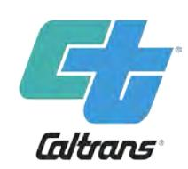

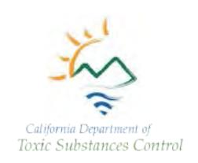

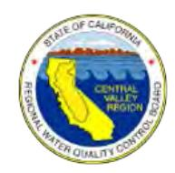

# **General Information about This Document**

# What's in this document?

This document is a summary report of the public hearing held for the Draft Environmental Impact Report/Environmental Assessment (EIR/EA) and the Draft Final Remedial Action Plan (RAP) prepared for the State Route 132 West Freeway/Expressway Project in Stanislaus County, California. The document describes what went on at the public hearing.

# What should you do?

- Please read this summary report.
- If you have any concerns about the summary report or questions about the proposed project, please contact Caltrans. Submit concerns or questions via U.S. mail to Caltrans, Attn: Juan Torres, Senior Environmental Planner, California Department of Transportation, 855 M Street, Suite 200, Fresno, CA 93721; or via email to juan.torres@dot.ca.gov.
- If you have any concerns about the Draft Final RAP prepared for this project, please contact Randy Adams, Project Manager, California Department of Toxic Substances Control, 8800 Cal Center Drive, Sacramento, CA 95826; or via email to <a href="mailto:randy.adams@dtsc.ca.gov">randy.adams@dtsc.ca.gov</a>.

Printing this document: To save paper, this document has been set up for two-sided printing (to print the front and back of a page). Blank pages or diamond pages occur where needed throughout the document to maintain proper layout of the chapters and appendices.

For individuals with sensory disabilities, this document is available in Braille, in large print, on audiocassette, or on computer disk. To obtain a copy in one of these alternate formats, please write to or call Caltrans, Attn: Juan Torres, Senior Environmental Planner, California Department of Transportation, 855 M Street, Suite 200, Fresno, CA 93721 or use California Relay Service 1 (800) 735-2929 (TTY), 1 (800) 735-2929 (Voice), or 711.

# **Table of Contents**

| Table of Contents |                                                                           |     |
|-------------------|---------------------------------------------------------------------------|-----|
| Chapter 1         | Introduction                                                              | 1   |
| 1.1.              | A Public Hearing was Held                                                 | 1   |
| 1.2.              | Announcement of the Public Meeting and the Public Comment Period          | 1   |
| 1.3.              | Purpose and Goals of the Public Meeting                                   | 1   |
| 1.4.              | Format of the Public Meeting                                              | 2   |
| Chapter 2         | Public Hearing Proceedings                                                | 3   |
| 2.1.              | Welcome                                                                   | 3   |
| 2.2.              | Displays                                                                  | 3   |
| 2.2.1.            | Welcome Board and Sign-In Table                                           | 3   |
| 2.2.2.            | Purpose of Tonight's Meeting                                              | 3   |
| 2.2.3.            | Agency Involvement                                                        | 3   |
| 2.2.4.            | Project Description                                                       | 3   |
| 2.2.5.            | Purpose and Need                                                          | 4   |
| 2.2.6.            | Comparison of Alternatives                                                | 4   |
| 2.2.7.            | Project Funding and Costs                                                 | 4   |
| 2.2.8.            | Project Schedule                                                          | 4   |
| 2.2.9.            | State Route 132 Cross Sections                                            | 4   |
| 2.2.10.           | State Route 132 Soundwall Simulation                                      | 4   |
| 2.2.11.           | Environmental Process                                                     | 4   |
| 2.2.12.           | Environmental Studies                                                     | 4   |
| 2.2.13.           | Right-of-Way                                                              | 4   |
| 2.2.14.           | Public Comment                                                            | 5   |
| 2.2.15.           | What's Next                                                               | 5   |
| 2.2.16.           | Staying Involved                                                          | 5   |
| 2.2.17.           | Caltrans Modesto Soil Stockpiles, Location and History                    | 5   |
| 2.2.18.           | Caltrans Modesto Soil Stockpiles, Recommended Alternative— Containment | 5   |
| 2.2.19.           | Caltrans Modesto Soil Stockpiles, Proposed Containment                    | 5   |
| 2.2.20.           | Caltrans Modesto Soil Stockpiles, Major Technical Studies                 | 5   |
| 2.2.21.           | Caltrans Modesto Soil Stockpiles, Remediation Process                     | 5   |
| 2.2.22.           | Caltrans Modesto Soil Stockpiles, Agency Contacts                         | 6   |
| 2.3.              | Personnel on Hand                                                         | 6   |
| 2.3.1.            | Caltrans Staff                                                            | 6   |
| 2.3.2.            | Staff from Other Agencies                                                 | 6   |
| Chapter 3         | Public Input                                                              | 9   |
| 3.1.              | Oral Comments Received at the Meeting                                     | 9   |
| 3.1.1.            | General Support for the Project                                           | 9   |
| 3.1.2.            | Project Purpose and Need                                                  | 9   |
| 3.1.3.            | Preferred Alternatives                                                    | 9   |
| 3.1.4.            | North Dakota Avenue                                                       | 9   |
| 3.1.5.            | Logical Termini                                                           | 9   |
| 3.1.6.            | Caltrans Modesto Soil Stockpiles Remediation                              | 9   |
| 3.1.7.            | Traffic Impacts                                                           | 10  |
| 3.1.8.            | Right-of-Way Impacts                                                      | 10  |
| 3.1.9.            | Noise Impacts                                                             | 10  |
| 3.1.10.           | Public Meeting and Outreach                                               | 10  |
| 3.2.              | Written Comments Submitted at the Meeting                                 | 10  |
| 3.2.1.            | Project Purpose and Need                                                  | 10  |
| 3.2.2.            | Preferred Alternatives                                                    | 10  |
| 3.2.3.            | Right-of-Way Impacts                                                      | 10  |
| 3.2.4.            | Business Impacts                                                          | 10  |
| 3.2.5.            | Logical Termini                                                           | 10  |
| 3.2.6.            | Homeless Populations                                                      | 11  |
| 3.3.              | Written Comments Submitted by Mail                                        | 11  |
| 3.3.1.            | Project Purpose and Need                                                  | 11  |
| 3.3.2.            | Project Design                                                            | 11  |
| 3.3.3.            | Soil Contamination and Remediation                                        | 11  |
| 3.3.4.            | Project Alternatives                                                      | 11  |
| 3.3.5.            | Traffic Safety                                                            |     |
| 3.3.6.            | Community Impacts                                                         | 12  |
| 3.3.7.            | Noise Impacts                                                             | 12  |
| Appendix A        | Display Materials                                                         | 13  |
| Appendix B        | Notices and Letters                                                       | 43  |
| Appendix C        | Photographs of the Public Hearing                                         | 61  |
| Appendix D        | Public Comments                                                           | 63  |
| Appendix E        | Sign-In Sheets                                                            | 99  |
| Appendix F        | Public Hearing Transcript                                                 | 105 |

# **Chapter 1** Introduction

## 1.1. A Public Hearing was Held

The California Department of Transportation (Caltrans), the Department of Toxic Substances Control (DTSC), and the Central Valley Regional Water Quality Control Board (RWQCB), in conjunction with the Stanislaus Council of Governments (StanCOG), held a public hearing with an informal open house format to review design concepts, share information, present displays, and accept written and oral comments on the Draft EIR/EA and the Draft Final RAP prepared for the State Route 132 West Freeway/Expressway Project.

The public hearing was held on Wednesday, February 22, 2017 from 6:00 p.m. to 8:00 p.m. at Mark Twain Junior High School at 707 South Emerald Avenue in Modesto, California.

## 1.2. Announcement of the Public Meeting and the Public Comment Period

To announce the public hearing and public comment period, a public notice was published by StanCOG in *The Modesto Bee* (English version) and the *Vida en el Valle* (Spanish version) on January 18, 2017. The public comment period ran from January 18, 2017 to March 17, 2017. On January 30, 2017, the public hearing venue was changed from the Red Event Center to Mark Twain Junior High School. An English and Spanish postcard advertising this change was mailed on February 8, 2017 to about 2,500 residents, tenants and business owners within the project area. DTSC also sent out a Community Update for the Draft Final RAP in English and Spanish to the project mailing list on February 6, 2017. A revised public notice with the new location was published by StanCOG in *The Modesto Bee* and the *Vida en el Valle* on February 8, 2017. The public notice was published one last time in the same newspapers above on February 15, 2017. The notices were also posted on the Caltrans, StanCOG, and DTSC websites.

The Notice of Availability for the Draft EIR/EA and the Community Update for the Draft Final RAP were also mailed to federal, state, and local officials, as well as residents and other interested groups on January 13, 2017.

See Appendix B for copies of the announcements.

## 1.3. Purpose and Goals of the Public Meeting

The purpose of the public hearing was to explain the proposed project to the public and other interested parties, to answer any questions attendees may have, and to gather public feedback on the Draft EIR/EA and the Draft Final RAP prepared for the State Route 132 West Freeway/Expressway Project.

## 1.4. Format of the Public Meeting

The public hearing was conducted in an informal open house format to facilitate communication and the exchange of information between the project team and the public. When the attendees arrived, they were asked to sign in and were handed a project information sheet and a Community Update (see Appendix A for the project information sheet and Appendix B for the Community Update). Staff invited each attendee to view the displays throughout the room, ask questions, place their written comments in the drop box or mail/email them to Caltrans, or give their oral comments to the court reporter onsite. A Spanish translator was provided for Spanish-speaking attendees.

Stations with display boards were set up around the room for the public to review. Each station was manned by staff to provide information as needed. The stations are described in Chapter 2. The display boards are shown in Appendix A. Maps of the project layout were also set up in the middle of the room. See Appendix C for photographs of the public hearing activities.

# **Chapter 2** Public Hearing Proceedings

## 2.1. Welcome

Attendees were welcomed to the public hearing at the sign-in table. They were asked to sign in and given project information sheets. A Community Update provided by DTSC was distributed. English and Spanish versions of the handouts were available. A Spanish interpreter was also available to translate questions and answers. Photographs of the proceedings and public hearing activities are provided in Appendix C.

## 2.2. Displays

The informational display boards and exhibits at the public hearing are described below (copies of the informational display boards and graphics are provided in Appendix A).

### 2.2.1. Welcome Board and Sign-In Table

A welcome board greeted attendees as they entered the meeting room. Attendees were asked to sign in so that Caltrans, StanCOG, DTSC, and RWCQB staff could maintain an attendance record and ensure that all interested parties were added to the project mailing list. The list of attendees is provided in Appendix E. Staff gave each attendee information sheets stating the project description, purpose, cost, funding source, timeline, and a contact name for those interested in obtaining more information. An information sheet also contained a map showing the project locations. The project information sheet is provided in Appendix A. Attendees were also provided with comment cards to record their feedback on the information presented. All handouts were provided in English and Spanish. Staff explained the format of the meeting, and attendees were encouraged to ask questions of the project team in attendance.

### 2.2.2. Purpose of Tonight's Meeting

At the entrance of the meeting room, this board stated the purpose of the meeting and how to submit comments regarding the project and the Draft Final RAP.

### 2.2.3. Agency Involvement

This board included a complete list of all the agencies participating in the project and the Draft Final RAP and their roles.

## 2.2.4. Project Description

This board provided an overview of the project: the proposed construction of a four-lane freeway/expressway south of Kansas to east of State Route 132 at the Needham Street Bridge Overcrossing. It also described the proposed encapsulation of the Caltrans Modesto Soil Stockpiles as described in the Draft Final RAP.

## 2.2.5. Purpose and Need

This board explained the purpose and need of the project: to improve regional and interregional circulation in Modesto and Stanislaus County, relieve traffic congestion along existing State Route 132 (Maze Boulevard) and improve traffic operations for the existing and proposed transportation network.

## 2.2.6. Comparison of Alternatives

These two boards compared the two proposed build alternatives under consideration as well as a no-build option for both the human and physical environments. The boards also summarized findings for resource topics within the Draft EIR/EA.

## 2.2.7. Project Funding and Costs

This board explained projected costs for both Phase 1 and Phase 2 of the project and identified sources of funding.

## 2.2.8. Project Schedule

This board provided the proposed timeline—from the selection of the preferred alternative through construction.

### 2.2.9. State Route 132 Cross Sections

These boards displayed typical below-grade and at-grade cross-sectional views of the project. Illustrations of the proposed roadway layout enabled attendees to visualize how lanes would be configured.

### 2.2.10. State Route 132 Soundwall Simulation

This board provided a conceptual view of the proposed soundwalls to be placed between Carpenter Road and State Route 99 and along the southbound direction of State Route 99 between the State Route 132 connector ramp to State Route 99 and L Street.

### 2.2.11. Environmental Process

This board listed each step required in the environmental process and highlighted the current project status at the time of the meeting. The board explained the steps that are required before a project is approved and funding is available for construction.

#### 2.2.12. Environmental Studies

This board listed which environmental studies had been completed to determine if, and to what extent, natural resources and the human environment may be affected as a result of the project.

## 2.2.13. Right-of-Way

The Right-of-Way board and table provided information on acquisitions and right-of-way concerns. The board listed right-of-way tasks associated with the project: appraisal, acquisition, relocation assistance, utility relocation, clearance, and

demolition. The board also included a website address for more information from Caltrans Right-of-Way.

## 2.2.14. Public Comment

The public comment board explained that attendees could orally give comments to a court reporter at the meeting, or they could submit comments in writing by placing comment cards in the onsite comment box or mailing them to Caltrans, Attn: Philip Vallejo, Acting Senior Environmental Planner, California Department of Transportation, 855 M Street, Suite 200, Fresno, CA 93721. Chapter 3 of this report summarizes the public input received at the meeting. Copies of the written submissions are included in Appendix D.

## 2.2.15. What's Next

This board explained that Caltrans would prepare a final environmental document (Final EIR/EA), DTSC would prepare a Final RAP, and that all public comments would be reviewed and responded to in the Final EIR/EA. In addition, the board noted the steps that would follow—from final design to construction of Phase 1.

## 2.2.16. Staying Involved

This board provided contact information for Philip Vallejo (Acting Senior Environmental Planner) and Grace Magsayo (Project Manager) and locations where the Draft EIR/EA and Draft Final RAP were available for review.

## 2.2.17. Caltrans Modesto Soil Stockpiles, Location and History

This board provided a brief summary of the location and history of the Caltrans Modesto Soil Stockpiles in the project area.

## 2.2.18. Caltrans Modesto Soil Stockpiles, Recommended Alternative— Containment

This board illustrated the proposed Remedial Action Design Implementation Plan to contain the Caltrans Modesto Soil Stockpiles.

### 2.2.19. Caltrans Modesto Soil Stockpiles, Proposed Containment

The two boards showed cross-sections of the proposed Recommended Stockpile Alternative (Containment).

## 2.2.20. Caltrans Modesto Soil Stockpiles, Major Technical Studies

The two boards listed the technical studies conducted under the oversight of DTSC and RWQCB to determine the recommended solution for containment.

### 2.2.21. Caltrans Modesto Soil Stockpiles, Remediation Process

This board provided an overview of the process undertaken by DTSC to develop its proposed Draft Final RAP.

## 2.2.22. Caltrans Modesto Soil Stockpiles, Agency Contacts

This board listed the various agency contacts related to the Caltrans Modesto Soil Stockpiles for this project.

## 2.3. Personnel on Hand

The following personnel set up and conducted the meeting and were available to answer questions from the public. The person in charge of the meeting was Caltrans Project Manager Grace Magsayo.

### 2.3.1. Caltrans Staff

Dennis T. Agar, District 10 Director

James Gonzalez, Assistant Central Region Chief, Right-of-Way

Grace Magsayo, Project Manager

Philip Vallejo, Acting Branch Chief, Central Region Environmental Analysis

Richard C. Stewart, Acting Branch Chief, Central Region Hazardous Waste

Anthony Dorn, Senior Right-of-Way Agent

Anton Kismetian, Design Oversight Engineer

Jennifer Lugo, Associate Environmental Planner

Rick Estrada, Public Information Officer

Maria Rocha, Public Information Officer

### 2.3.2. Staff from Other Agencies

# **DTSC**

Randy Adams, Senior Engineering Geologist, Site Evaluation and Remediation Unit, San Joaquin Branch

Steve Becker, Supervising Senior Engineering Geologist, Chief, Site Evaluation and Remediation Unit, San Joaquin Branch

Cheryl Mahoney, Senior Environmental Planner, Office of Planning and Environmental Analysis

Russ Edmondson, Public Information Officer

Jesus Cruz, Public Participation Specialist

Kimiko Klein, Ph.D., Staff Toxicologist Emerita, Human and Ecological Risk Office

## **RWQCB**

Steven Meeks, Senior WRC Engineer, Chief, Private Sites Cleanup

## **StanCOG**

Rosa De León Park, Executive Director Cindy Malekos, Manager of Administrative Services Elisabeth Hahn, Senior Environmental Planner Isael Ojeda, Assistant Planner Daniel Stewart, Senior Planner

# City of Modesto/Stanislaus County

John Rawles, Project Manager, City of Modesto Vickey Dion, City Engineer, City of Modesto Keith Boggs, Assistant Executive Officer, Stanislaus County Matt Machado, Director of Public Works, Stanislaus County

### Consultants

Tom Post (Jacobs), Project Manager Lauren Abom (Jacobs), Senior Environmental Planner Sean Mayer (Jacobs), Project Engineer Kendall Flint (FS), Director of Communication and Strategic Planning Steve Flint (FS), Senior Planner Jim Brake (Geocon), Senior Geologist Roberto Radrigan, Spanish Translator

## Elected Officials

Mayor Ted Brandvold, City of Modesto Councilmember Jenny Kenoyer, City of Modesto Councilmember Tony Madrigal, City of Modesto Councilmember Doug Ridenour, City of Modesto Supervisor Vito Chiesa, Stanislaus County Supervisor Jim De Martini, Stanislaus County Supervisor Terry Withrow, Stanislaus County

# Chapter 3 Public Input

# 3.1. Oral Comments Received at the Public Hearing

Project team staff from Caltrans, DTSC, RWQCB, and StanCOG addressed comments and questions heard at the public hearing. Below is a list of the comments, by topic or issue.

A court reporter was also present at the hearing to record oral comments from attendees. Sixteen people took advantage of this opportunity. The complete transcription is provided in Appendix F.

## 3.1.1. General Support for the Project

Several attendees gave support for the project, in favor of diverting State Route 132 traffic to Dakota and the new alignment.

## 3.1.2. Project Purpose and Need

Several attendees questioned the project purpose and need.

### 3.1.3. Preferred Alternatives

Several attendees expressed a preference for the No-Build Alternative or the widening of the existing State Route 132 along Maze Boulevard. Other attendees expressed a preference for Alternative 2 because it seemed to have the least impact to businesses on Kansas Avenue.

#### 3.1.4. North Dakota Avenue

Several attendees expressed concerns regarding the potential relocation and traffic impacts along North Dakota Avenue.

### 3.1.5. Logical Termini

Attendees voiced questions about the determination of the western end of the project at North Dakota Avenue.

### 3.1.6. Caltrans Modesto Soil Stockpiles Remediation

Several attendees voiced concerns about the remediation plan for the Caltrans Modesto Soil Stockpiles, noted that they preferred the removal of the stockpiles, and questioned the safety of encapsulation.

### 3.1.7. Traffic Impacts

Attendees provided comments on traffic impacts to existing State Route 132, the removal of the southbound State Route 99 I Street off-ramp, and limited access to the new alignment.

## 3.1.8. Right-of-Way Impacts

Several residents and business owners requested clarification on the potential right-of-way impacts to their properties, and relocation compensation and assistance.

## 3.1.9. Noise Impacts

Attendees had questions and comments about the locations of proposed soundwalls.

## 3.1.10. Public Meeting and Outreach

Several attendees commented that they would have preferred a meeting format that included a presentation and the opportunity to make oral comments before all attendees and the project team.

# 3.2. Written Comments Submitted at the Meeting

Caltrans received 16 comment cards submitted at the meeting. Additional comment cards were submitted to Caltrans via mail following the meeting (see Section 3.3). The comments are summarized below and provided in Appendix D.

## 3.2.1. Project Purpose and Need

One attendee questioned whether improvements could be made to the existing State Route 132/Maze Boulevard, thereby avoiding the Caltrans Modesto Soil Stockpiles, which would be encountered on the new alignment.

### 3.2.2. Preferred Alternatives

Several commenters opposed both build alternatives and preferred the No-Build Alternative. Reasons for general opposition included loss of farmland, project costs, potential bottlenecks, disruption of community cohesion, doubts about the project's ability to meet the purpose and need, and other improvement projects that were considered more pressing.

Many residents expressed support for Alternative 2. Several attendees noted that Alternative 2 seemed to result in fewer impacts to businesses on Kansas Avenue.

## 3.2.3. Right-of-Way Impacts

Several residents and business owners requested clarification on the potential right-of-way impacts to their properties.

## 3.2.4. Business Impacts

Several business owners were concerned about economic impacts as a result of the project, particularly during construction and due to the loss of direct access to Kansas Avenue from State Route 99.

### 3.2.5. Logical Termini

Some attendees questioned the western end point of the project at North Dakota Avenue.

## 3.2.6. Homeless Populations

One attendee expressed concerns that the berms created by encapsulating the Caltrans Modesto Soil Stockpiles would increase the presence of homeless people in her neighborhood.

# 3.3. Written Comments Submitted by Mail

Following the meeting, Caltrans received seven comment cards by mail (see Appendix D). The following provides a summary of comments, by topic or issue, received via mail from commenters who attended the public hearing.

## 3.3.1. Project Purpose and Need

Many commenters suggested alternative projects and/or improvements, instead of the project build alternatives. Several attendees were concerned that the project would not fix traffic or roadway problems. Another attendee stated that traffic on Carpenter Avenue has increased more than traffic on State Route 132, so Carpenter Avenue should be improved instead of the proposed project. Another attendee recommended that Caltrans deed its reserved right-of-way to the City of Modesto for mixed-use housing development.

## 3.3.2. Project Design

One commenter expressed concern that the freeway/expressway design was inadequate because it would allow for two 90-degree turns and for private driveway access along Dakota Avenue. Other attendees requested for clarity about the number of lanes on State Route 132 and on Dakota Avenue, and possible right-of-way impacts associated with the on- or off-ramp.

### 3.3.3. Soil Contamination and Remediation

One commenter expressed concerns about the Caltrans Modesto Soil Stockpiles Alternative 3 – Removal (excavation and offsite disposal) and the amount of soil that would potentially be removed at the expense of the landowners. Some commenters were in favor of the Caltrans Modesto Soil Stockpiles Alternative 3 – Removal. Another commenter inquired about potential health risks associated with the Caltrans Modesto Soil Stockpiles and expressed doubt in the efficacy of various soil sampling tests that had been prepared. Several attendees stated that the Caltrans Modesto Soil Stockpiles should be transported offsite and not encased and that they might contain toxic materials that had been transported from the original site. Others noted that toxic soils could run off into the drainage system.

### 3.3.4. Project Alternatives

One commenter was in favor of the No-Build Alternative.

## 3.3.5. Traffic Safety

Several commenters felt that addressing safety and accident rates on existing State Route 132 and investing in maintenance of current roads would be more beneficial. Others felt that the project improvements would increase risk of death and accidents.

## 3.3.6. Community Impacts

One commenter stated that the project would have adverse effects on air pollution, noise pollution and soil contamination and requested that "water, wealth, contentment and health" are considered in all county-level decisions.

## 3.3.7. Noise Impacts

One commenter noted that there should be soundwalls along the at-grade portions of the expressway.

# **Appendix A** Display Materials

Project Information Sheets – Provided at the Public Hearing Sign-In Table (Available in English and Spanish)

# **Project Information**

## The California Department of Transportation (Caltrans), working in cooperation with the Stanislaus PROJECT Council of Governments (StanCOG), proposes to construct a four-lane freeway/expressway along the DESCRIPTION adopted route south of Kansas Avenue from Dakota Avenue (Post Mile [PM] 11.0) to east of State Route (SR) 99 at the Needham Street Bridge Overcrossing (PM 15.0). The total length of the SR-132. West Freeway/Expressway Project would be approximately four miles and would include connections on SR-99 from PM 15.7 to PM 17.5. The project involves phased construction of one of the two build alternatives (Alt 1 or Alt 2) or the decision to implement the No-Build Alternative. The Caltrans Modesto Soil Stockpiles occupy three areas within state right-of-way south of Kansas Avenue. Caltrans proposes to cover or enclose the soil stockpiles within the SR-132 West Freeway/Expressway construction project as detailed in the Draft Final Remedial Action Plan (RAP). o Improve regional and interregional circulation in Modesto and Stanislaus County **PURPOSE** Relieve traffic congestion along existing SR-132 (Maze Boulevard) O Improve traffic operations for the existing and proposed transportation network The deficiencies of the existing highway and increases in regional and interregional traffic are NEED anticipated to result in continued traffic congestion. The proposed project would relieve traffic congestion along existing SR-132 (Maze Boulevard) because the existing SR-132 (Maze Boulevard) currently experiences, and would continue to be burdened by increased traffic. The proposed project would also improve operations for the existing and proposed transportation network because the operational efficiency is reduced by the proximity and direct access to schools, churches, businesses, and residences by way of existing driveways along existing SR-132 (Maze Boulevard). Final Environmental Document TIMELINE O Design, Right of Way, and Permitting..... 2017-2018 (approximate) O Start Construction of Phase 1 Project funding comes from local, state and federal sources. The construction cost estimate for Phase 1 is

PROJECT COST

total project cost is estimated at up to \$214 million.

approximately \$82 million. The construction cost estimate for Phase 2 is approximately \$132 million. The

# QUESTIONS

O Philip Vallejo, Acting Senior Environmental Planner California Department of Transportation 855 M Street, Suite 200 Fresno, CA 93721 Phone: (559) 445-6172 Email: philip.vallejo@dot.ca.gov

O Grace Magsayo, Project Manager California Department of Transportation 1976 E. Dr Martin Luther King Jr Blvd., Stockton, CA 95205 Phone: (209) 948-7976 Email: grace.magsayo@dot.ca.gov

O For questions or comments on the Draft Final Remedial Action Plan please contact: Randy Adams, Project Manager California Department of Toxic Substances Control 8800 Cal Central Drive

Or

Sacramento, CA 95826 Phone: (916) 255-3591

Email: randy.adams@dtsc.ca.gov

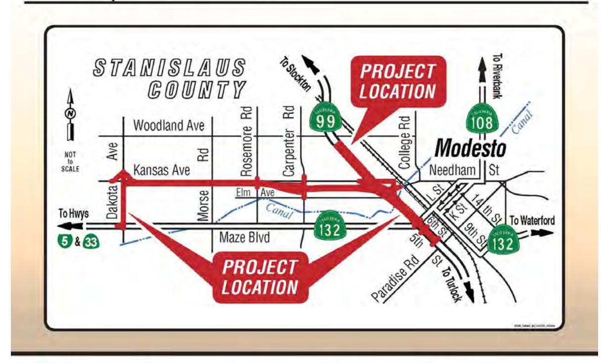

NURSE PRACTITIONER, NP-BC, RN, BSN

# Información del proyecto

# DESCRIPCIÓN del PROYECTO

El Departamento de Transporte de California (Caltrans), en colaboración con el Consejo de Gobiernos de Stanislaus (StanCOG), propone la construcción de una autopista/vía rápida de cuatro carriles a lo largo de la ya aprobada Ruta Estatal 132 —al sur de Avenida Kansas desde la Avenida Dakota (Hito Milla {PM} 11.0) al este de la Ruta Estatal 99, al paso sobre nivel de la Calle Needham (PM 15.00). El largo total del Proyecto Autopista Ruta Estatal 132-Oeste/Vía Expresa es de aproximadamente cuatro millas e incluiría empalmes con la Ruta Estatal 99 desde el PM 15,7 al PM 15,5. El proyecto se haría por etapas, implementando una de dos alternativas de construcción (Alt.1 o Alt.2), o decidiendo por la Alternativa de "No-Construir".

Los Acopios de Caltrans en Modesto ocupan tres áreas dentro el derecho-de-vía ubicado al sur de la Avenida Kansas. Caltrans propone cubrir o enclaustrar los acopios contaminados dentro de la construcción del proyecto Autopista Ruta Estatal 132-Oeste/ Vía Expresa, tal y como se detalla en la Propuesta Final de Acción Correctiva (RAP).

### OBJETIVO

- O Mejorar la circulación vial regional e interregional en Modesto y el Condado Stanislaus
- O Aliviar la congestión vehicular a lo largo de la Ruta Estatal 132 (Maze Boulevard)
- O Mejorar la operación del tránsito dentro de la red de transporte actual y propuesta

### NECESIDAD

Se espera que las deficiencias de la carretera actual —aunadas al aumento del tráfico regional e interregional— perpetúen la congestión vial. El proyecto presentado aliviaría la congestión vial a lo largo de la Ruta Estatal 132 (Maze Blvd.) dada la actual situación que experimenta la Ruta Estatal 132 (Maze Blvd.) que se espera empeore en proporción al aumento del tráfico. Este proyecto también mejoraría la operación del tránsito dentro de la red de transporte actual y propuesta porque la eficiencia del recorrido es hoy afectada por accesos próximos o directos a escuelas, iglesias, negocios y residencias, cuyas entradas se conectan a lo largo de la ruta existente.

# CRONOGRAMA (aproximado)

- O Documento Final de Impacto Medioambiental....................................
- O Diseño, Derecho-de-Vía, Permisos...................................
- O Comienzo de la Construcción de 1ª Etapa......2018

# COSTO del PROYECTO

El financiamiento del proyecto proviene de fuentes locales, estatales y federales. La estimación de costos de construcción para la Fase 1 es de aproximadamente \$82 millones. La estimación de costos de construcción para la Fase 2 es de aproximadamente \$132 millones. El costo total del proyecto se estima en hasta \$214 millones.

68/10mm, 4, 9103, 2915 ú

# Información del proyecto

## **PREGUNTAS**

- Philip Vallejo, Planificador-Jefe Interino en Medioambiente
  Departamento de Transporte de California
  855 M Street, Suite 200
  Fresno, CA 93721
  Teléfono: (559) 445-6172
  Correo Electrónico: philip.vallejo@dot.ca.gov
- O Grace Magsayo, Gerente del Proyecto
  Departamento de Transporte de California
  1976 E. Dr Martin Luther King Jr Blvd.,
  Stockton, CA 95205
  Teléfono: (209) 948-7976
  Correo Electrónico: grace.magsayo@dot.ca.gov
- Para dudas sobre la Propuesta Final de Acción Correctiva sirva comunicarse con: Randy Adams, Gerente del Proyecto Departamento de Control de Sustancias Tóxicas de California 8800 Cal Central Drive Sacramento, CA 95826 Teléfono: (916) 255-3591 Correo Electrónico: randy.adams@dtsc.ca.gov

GONDADO UBICACIÓN del STANISLAUS Rd 8 Woodland Ave Rosemore ege Carpenter Modesto NO a ESCALA Needham | St Kansas Ave Elm | Ave To Hwys To Waterford Maze Blvd UBICACIÓN del PROYECTO

ONY/Deve\_A\_R BOX\_DREAM

Display Boards – Exhibited at the Public Hearing on February 22, 2017

# ELGOM **Open Forum Public Hearing**

Wednesday, February 22, 2017 Date:

Time: 6:00 pm to 8:00 pm

Mark Twain Junior High School Gym 707 S Emerald Ave, Modesto Place:

707 S Emerald Ave, Modesto

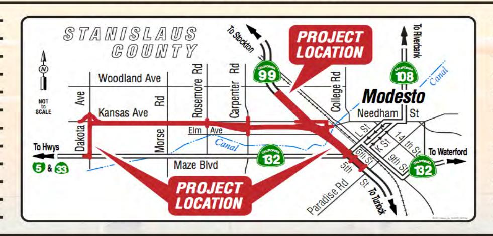

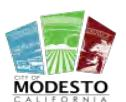

# **Open Forum Public Hearing**

# Please Sign In...

View our displays, ask questions, and give us your comments regarding this project.

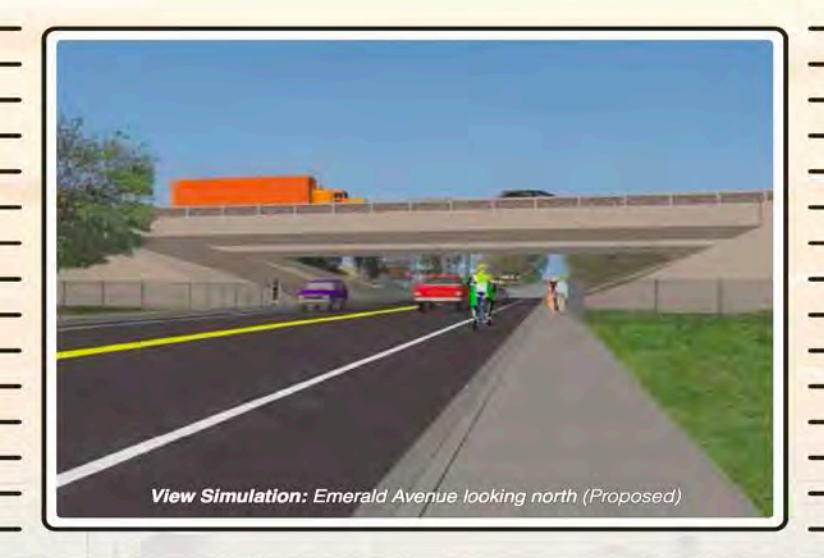

# **Purpose of Tonight's Meeting**

- O To present the project alternatives and design
- O To review the Draft Environmental Document & Draft Final Remedial Action Plan for the Caltrans Modesto Soil Stockpiles (Draft Environmental Impact Report/Environmental Assessment)
- O To submit your comments\* and questions regarding the project There are many ways you can submit your comments:
  - Place written comments into the public comment box
  - Submit your comments to the court reporter
  - Mail your written comments directly to:
     Philip Vallejo, Acting Senior Environmental Planner California Department of Transportation 855 M Street, Suite 200, Fresno, CA 93721
  - Email your comments directly to: philip.vallejo@dot.ca.gov

\*Comments must be received by March 17, 2017

For questions and comments on the Draft Final Remedial Action Plan please contact:

Randy Adams, Project Manager California Department of Toxic Substances Control 8800 Cal Center Drive Sacramento, CA 95826

Phone: (916) 255-3591

Email: randy.adams@dtsc.ca.gov

# **Agency Involvement**

California Department of Transportation (Caltrans)
 Lead Agency for California Environmental Quality Act (CEQA) & National Environmental Policy Act (NEPA) Compliance

California Department of Toxic Substances Control (DTSC)
 Responsible Agency under CEQA for Caltrans Modesto Soil Stockpiles

Central Valley Regional Water Quality Control Board (CVRWQCB)
 Responsible Agency under CEQA for Caltrans Modesto Soil Stockpiles

O Stanislaus Council of Governments StanCOG
Project Sponsor

O City of Modesto Project Partner

# **Project Description**

The California Department of Transportation (Caltrans), working in cooperation with the Stanislaus Council of Governments (Stan-COG), proposes to construct a four-lane freeway/expressway along the adopted route south of Kansas Avenue from Dakota Avenue (Post Mile {PM} 11.0) to east of State Route 99 (SR-99) at the Needham Street Bridge Overcrossing (PM 15.0).

The total length of the SR-132 West Freeway/Expressway Project would be approximately four miles and would include connections on SR-99 from PM 15.7 to PM 17.5. The project involves phased construction of one of the two build alternatives (Alt 1 or Alt 2) or the decision to implement the No-Build Alternative.

The Caltrans Modesto Soil Stockpiles occupy three areas within state right-of-way south of Kansas Avenue. Caltrans proposes to cover or encapsulate the soil stockpiles in combination with the construction of the SR-132 West Freeway/Expressway Project, as detailed in the Draft Final Remedial Action Plan (RAP).

# **Project Purpose & Need**

# Purpose:

- Improve regional and interregional circulation in Modesto and Stanislaus County
- Relieve traffic congestion along existing SR-132 (Maze Boulevard)
- Improve traffic operations for the existing and proposed transportation network

# Need:

The deficiencies of the existing highway and increases in regional and interregional traffic are anticipated to result in continued traffic congestion. The proposed project would relieve traffic congestion along existing SR-132 (Maze Boulevard) because the existing SR-132 (Maze Boulevard) currently experiences, and would continue to be burdened by increased traffic. The proposed project would also improve operations for the existing and proposed transportation network because the operational efficiency is reduced by the proximity and direct access to schools, churches, businesses, and residences by way of existing driveways along existing SR-132 (Maze Boulevard).

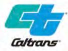

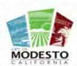

# **Project Funding & Costs**

# Funding:

- O State Traffic Congestion Relief Program (TCRP) Funds
- Federal Demonstration Funds
- O State Transportation Improvement Program (STIP) Funds
- Local Funds: Interregional Improvement Program (IIP), Regional Surface Transportation Program (RSTP), Traffic Congestion Relief Program (TCRP)

# Costs:

 The total project cost estimate for Phase 1 is approximately \$82 million. The total project cost estimate for Phase 2 is approximately \$132 million. The total project cost is estimated at up to \$214 million.

# **Project Schedule**

| Project Milestones                                                                               | Target Date          |
|--------------------------------------------------------------------------------------------------|----------------------|
| Select Alternative                                                                               | Mid 2017             |
| Final Project Approval and Environmental Document (PA&ED) & Approval of the Remedial Action Plan | Late 2017            |
| Right-of-Way Acquisition/Utilities Relocation                                                    | Late 2017/Early 2018 |
| Start Construction-Phase 1 Construction                                                          | 2018                 |
| End Construction-Phase 1 Construction                                                            | 2020                 |
| Begin Construction* (Ultimate Build-out)                                                         | 2026                 |
| End Construction (Ultimate Build-out)                                                            | 2028                 |

\*Target dates shown for construction are contingent on funding availability

# Environmental Process

· Preliminary studies to define project Scoping alternatives Review prior studies Alternative Identify alternatives **Analysis**  Hold public scoping meeting O Draft Preliminary results of environmental Environmental analysis Document Public information meeting · Engineering and environmental analysis, develop mitigation measures O Public/Agency Review & Draft Environmental Impact Report/ Environmental Assessment (DEIR/EA) Comment & Draft Final Remedial Action Plan Comment Period **WE ARE HERE**  Public Hearing Formal response to comments Caltrans Review & Select preferred alternative Approval Final Environmental Document/Remedial Action Plan

# **Environmental Studies**

Natural resources and the human environment are important.

The following studies were completed to determine if and to what extent resources would be affected.

- O Air Quality Study Report
- O Biology Natural Environment Study
- O Biology Wetlands Delineation
- O Community Impacts Assessment
- O Cultural Archaeological Survey Report
- O Cultural Historic Resources Evaluation Report
- O Hazardous Materials/Waste Studies
- O Draft Final Remedial Action Plan
- O Hydrology Floodplain Report
- O Hydrology Stormwater/Drainage Report
- O Hydrology Water Quality Report
- O Noise Study Report
- O Noise Abatement Decision Report
- Paleontology Report
- Traffic Operations Report and Addenda
- O Visual Impact Assessment

# **Comparison of Alternatives**

(Display 1 of 2)

| Resource Topic / Potential Impact                                        | Alternative 1                                                                                                                                                                                                                                                                          | Alternative 2                                                                                                                                                                                                                                                                          | No-Build Alternative                                                               |
|-----------------------------------------------------------------------------|----------------------------------------------------------------------------------------------------------------------------------------------------------------------------------------------------------------------------------------------------------------------------------------|----------------------------------------------------------------------------------------------------------------------------------------------------------------------------------------------------------------------------------------------------------------------------------------|------------------------------------------------------------------------------------|
| Meets Purpose and Need?                                                     | Yes                                                                                                                                                                                                                                                                                    | Yes                                                                                                                                                                                                                                                                                    | No                                                                                 |
| Cumulative Impacts                                                          | A cumulative impact to agriculture could occur. Cumulative visual/aesthetics and noise impacts could occur if avoidance, minimization, or mitigation measures are not incorporated.                                                                                                    | No Impact                                                                                                                                                                                                                                                                              | No Impact                                                                          |
| Human Environment                                                           |                                                                                                                                                                                                                                                                                        |                                                                                                                                                                                                                                                                                        |                                                                                    |
| Land Use/Consistency with Approved Plans and Policies                       |                                                                                                                                                                                                                                                                                        |                                                                                                                                                                                                                                                                                        |                                                                                    |
| Modesto General Plan                                                        | Consistent                                                                                                                                                                                                                                                                             | Consistent                                                                                                                                                                                                                                                                             | Inconsistent                                                                       |
| Stanislaus County General Plan                                              | Consistent                                                                                                                                                                                                                                                                             | Consistent                                                                                                                                                                                                                                                                             | Inconsistent                                                                       |
| StanCOG Regional Transportation Plan/Sustainable Communities Strategy | Consistent                                                                                                                                                                                                                                                                             | Consistent                                                                                                                                                                                                                                                                             | Inconsistent                                                                       |
| Parks/Recreational Facilities                                               | Temporary construction noise. No Section 4(f) use of parks/rec. facilities                                                                                                                                                                                                             | No Impact                                                                                                                                                                                                                                                                              | No Impact                                                                          |
| Growth                                                                      | Minimal growth-related impacts beyond what has already been planned                                                                                                                                                                                                                    | No Impact                                                                                                                                                                                                                                                                              | No Impact                                                                          |
| Farmlands/Timberlands                                                       | Conversion of 64.8 acres of prime and unique farmland and 3.51 acres of Williamson Act contract lands                                                                                                                                                                                  | No Impact                                                                                                                                                                                                                                                                              | No Impact                                                                          |
| Community Character/Cohesion                                                | No Impact                                                                                                                                                                                                                                                                              | No Impact                                                                                                                                                                                                                                                                              | No Impact                                                                          |
| Relocation/Property Acquisitions                                            |                                                                                                                                                                                                                                                                                        |                                                                                                                                                                                                                                                                                        |                                                                                    |
| Business Relocations                                                        | 11                                                                                                                                                                                                                                                                                     | 10                                                                                                                                                                                                                                                                                     | 0                                                                                  |
| Business Partial Acquisitions                                               | 24                                                                                                                                                                                                                                                                                     | 28                                                                                                                                                                                                                                                                                     | 0                                                                                  |
| Residential Relocations                                                     | 32                                                                                                                                                                                                                                                                                     | 32                                                                                                                                                                                                                                                                                     | 0                                                                                  |
| Residential Partial Acquisitions                                            | 30                                                                                                                                                                                                                                                                                     | 30                                                                                                                                                                                                                                                                                     | 0                                                                                  |
| Environmental Justice                                                       | Disproportionate adverse noise, visual, relocation, and construction impacts                                                                                                                                                                                                           | Disproportionate adverse noise, visual, relocation, and construction impacts. Visual impacts would be less than Alternative 1                                                                                                                                                          | Benefits of traffic congestion relief and improved business access would not occur |
| Utilities/Emergency Services                                                | Temporary utility disruption, lane closures, and detours                                                                                                                                                                                                                               | Temporary utility disruption, lane closures, and detours                                                                                                                                                                                                                               | Increased emergency response times due to traffic congestion                       |
| Traffic / Pedestrian and Bicycle Facilities                              | Decreased travel times and improved levels of service within project area. Pedestrian/bicycle path to be constructed along North Carpenter Road                                                                                                                                        | Decreased travel times and improved levels of service within project area. Pedestrian/bicycle path to be constructed along North Carpenter Road                                                                                                                                        | Degraded level of service; no pedestrian/bicycle improvements                      |
| Visual / Aesthetics                                                         | High visual impact due to new elevated structure, lighting and tree removal.                                                                                                                                                                                                           | Moderately high visual impact due to new freeway/expressway, lighting and tree removal.                                                                                                                                                                                                | No Impact                                                                          |
| Cultural Resources                                                          | No known direct impacts on or Section 4(f) uses of any known resources. Two eligible historic resources within the project area: • 416/418   Street – No direct or indirect impacts • 3530 Maze Blvd. – Acquisition of 0.13 acre outside the historic property boundary required | No known direct impacts on or Section 4(f) uses of any known resources. Two eligible historic resources within the project area: • 416/418   Street – No direct or indirect impacts • 3530 Maze Blvd. – Acquisition of 0.13 acre outside the historic property boundary required | No Impact                                                                          |

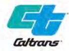

arrows & day

# **Comparison of Alternatives**

(Display 2 of 2

| Resource Topic / Potential Impact    | Alternative 1                                                                                                                                                                                                                                                                                     | Alternative 2                                                                                                                                                                                                                                | No-Build Alternative                                                                                                                                                                                   |                                                                                                                                                                                                                       |
|-----------------------------------------|---------------------------------------------------------------------------------------------------------------------------------------------------------------------------------------------------------------------------------------------------------------------------------------------------|----------------------------------------------------------------------------------------------------------------------------------------------------------------------------------------------------------------------------------------------|--------------------------------------------------------------------------------------------------------------------------------------------------------------------------------------------------------|-----------------------------------------------------------------------------------------------------------------------------------------------------------------------------------------------------------------------|
| Physical Environment                    |                                                                                                                                                                                                                                                                                                   |                                                                                                                                                                                                                                              |                                                                                                                                                                                                        |                                                                                                                                                                                                                       |
| Hydrology and Floodplain                | 55.8 acres of impervious surfaces                                                                                                                                                                                                                                                                 | 57.5 acres of impervious surfaces                                                                                                                                                                                                            | No Impact                                                                                                                                                                                              |                                                                                                                                                                                                                       |
| Water Quality and Storm Water Runoff | Control measures and construction best management practices would address impacts due to increased impervious surface areas. Containment of the Caltrans Modesto Soil Stockpiles would mitigate potential water quality impacts.                                                      | Control measures and construction best management practices would address impacts due to increased impervious surface areas. Containment of the Caltrans Modesto Soil Stockpiles would mitigate potential water quality impacts. | Stockpiles would not be contained and a separate remedial action plan would be developed. Access restrictions and water quality monitoring to continue until stockpile remediation is completed. |                                                                                                                                                                                                                       |
| Geology/Soils/Seismic/ Topography    | Minimal geologic, soil, or seismic impacts relative to geotechnical hazards.                                                                                                                                                                                                                   | Minimal geologic, soil, or seismic impacts relative to geotechnical hazards.                                                                                                                                                              | No Impact                                                                                                                                                                                              |                                                                                                                                                                                                                       |
| Paleontology                            | Excavation may impact the Modesto Formation (high sensitivity for paleontological resources).                                                                                                                                                                                            | Excavation may impact the Modesto Formation (high sensitivity for paleontological resources). Alt. 2 may have higher impacts to paleontological resources than Alt. 1.                                                     | No Impact                                                                                                                                                                                              |                                                                                                                                                                                                                       |
| Hazardous Waste/Materials               | 19 parcels to be acquired have recognized environmental conditions due to the presence of agricultural chemicals, aerially deposited lead, and groundwater contamination. Containment of the three soil stockpiles would mitigate impacts due to the presence of barium contaminants. |                                                                                                                                                                                                                                              |                                                                                                                                                                                                        | Stockpiles would not be contained and a separate remedial action plan would be developed. Access restrictions and water quality monitoring to continue until stockpile remediation is completed. |
| Caltrans Modesto Soil Stockpiles     | Stockpiles would be contained behind retaining walls, bridge abutments and pavement. Monitoring of the stockpiles and stormwater runoff constituents of potential concern would continue until the project and full containment of all three soil stockpiles are complete.            |                                                                                                                                                                                                                                              |                                                                                                                                                                                                        | Stockpiles would not be contained and a separate remedial action plan would be developed. Access restrictions and water quality monitoring to continue until stockpile remediation is completed. |
| Air Quality                             | Operational improvements would reduce precursor and criteria pollutant emissions. A temporary increase in precursor and criteria pollutants would occur during construction.                                                                                                             |                                                                                                                                                                                                                                              |                                                                                                                                                                                                        | Precursor and criteria pollutant emissions would increase with increased traffic congestion.                                                                                                                 |
| Noise                                   | Noise levels would permanently impact 260 receivers in 2048.                                                                                                                                                                                                                                | Noise levels would permanently impact 276 receivers in 2048.                                                                                                                                                                           | Noise levels would approach or exceed the noise abatement criteria for 162 receivers in 2048.                                                                                                    |                                                                                                                                                                                                                       |
| Energy                                  | The build alternatives would reduce overall fuel consumption when compared to existing conditions.                                                                                                                                                                                             | The build alternatives would reduce overall fuel consumption when compared to existing conditions.                                                                                                                                        | Adverse impacts related to fuel consumption.                                                                                                                                                        |                                                                                                                                                                                                                       |
| Biological Environment                  |                                                                                                                                                                                                                                                                                                   |                                                                                                                                                                                                                                              |                                                                                                                                                                                                        |                                                                                                                                                                                                                       |
| Wetlands and Other Waters               | Potential direct and permanent impacts to 0.65 acre of non-jurisdictional wetlands (Waters of the State).                                                                                                                                                                                      | Potential direct and permanent impacts to 0.65 acre of non-jurisdictional wetlands (Waters of the State).                                                                                                                                 | No Impact                                                                                                                                                                                              |                                                                                                                                                                                                                       |
| Animal Species                          | Removal of 21 acres of potential burrowing owl habitat and 591 trees (habitat for migratory birds)                                                                                                                                                                                          | Removal of 21 acres of potential burrowing owl habitat and 589 trees (habitat for migratory birds)                                                                                                                                     | No Impact                                                                                                                                                                                              |                                                                                                                                                                                                                       |
| Threatened and Endangered Species    | Removal of up to 70 acres of possible Swainson's hawk foraging habitat and 414 trees (low potential for Swainson's hawk nesting and roosting)                                                                                                                                                  | Removal of up to 70 acres of possible Swainson's hawk foraging habitat and 414 trees (low potential for Swainson's hawk nesting and roosting)                                                                                             | No Impact                                                                                                                                                                                              |                                                                                                                                                                                                                       |
| Invasive Species                        | The area may benefit from covering existing invasive species with impervious surfaces (paving) and preventing further dispersal.                                                                                                                                                               |                                                                                                                                                                                                                                              |                                                                                                                                                                                                        | Predominance of invasive species to continue                                                                                                                                                                       |

irrough to

# **SR-132 Cross Sections**

# SR-132 Below-Grade Typical Cross-Section

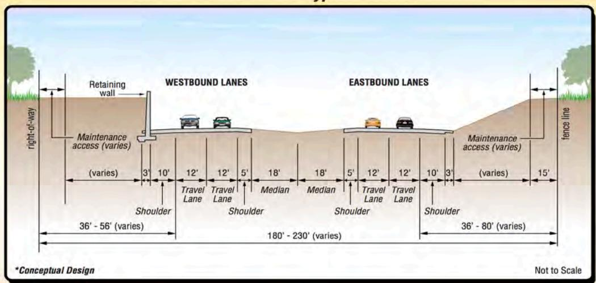

# SR-132 At-Grade Typical Cross-Section

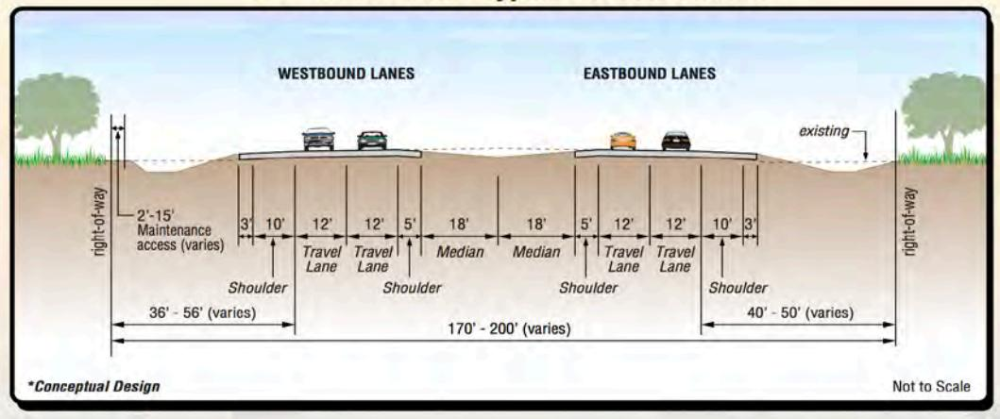

-

Not to Scale

# **SR-132 Soundwall Simulation**

- O 14-foot high soundwalls are proposed south of the proposed alignment between Carpenter Road and SR-99 and along the southbound direction of SR-99 between the SR-132 connector ramp to SR 99 and L Street.
- O The approximate length of the soundwalls would be 6,390 feet in Alternative 1 and 7,760 feet in

Eastbound Lanes

Soundwall

Retaining Wall

Finish Grade

Soundwall Cross-Section: Conceptual

Alternative 2. Under either build alternative, the portion of the soundwall between Carpenter and SR-99 would be constructed in Phase 1, while the portion along SR-99 would be constructed in Phase 2.

Conceptual Design

O Final design of the soundwalls would take into consideration comments expressed by affected property owners during the environmental review process.

Soundwall Simulation: Draft Concept

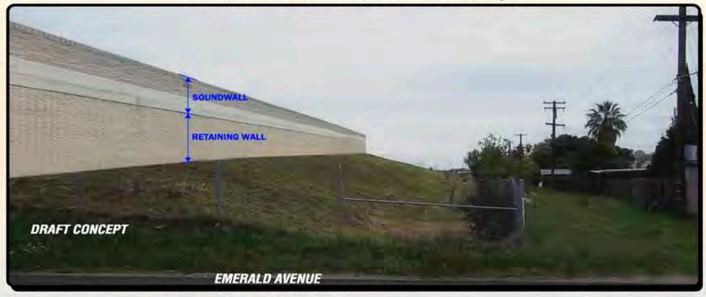

-

# Right of Way

# **Caltrans Right of Way Process**

- Appraisal
- Acquisitions
- O Relocation Assistance
- Utility Relocation
- O Clearance and Demolition

To obtain more information on Caltrans Right of Way, please visit http://www.dot.ca.gov/hq/row scan GR-ode to access website

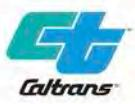

# **Public Comment**

# There are many ways you can submit your comments on this project:

- O Place written comments into the public comment box
- O Submit your comments to the court reporter
- O Mail your written comments directly to:

Philip Vallejo, Acting Senior Environmental Planner California Department of Transportation 855 M Street, Suite 200, Fresno, CA 93721

O Email your comments directly to: philip.vallejo@dot.ca.gov

Comments must be received by March 17, 2017

O For questions and comments on the Draft Final Remedial Action Plan please contact:

Randy Adams, Project Manager California Department of Toxic Substances Control 8800 Cal Center Drive Sacramento, CA 95826 Phone: (916) 255-3591

Email: randy.adams@dtsc.ca.gov

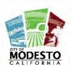

economia compo

# What's Next?

- Prepare Final Environmental Document & Final Remedial Action Plan
  - Review comments/prepare responses to comments
  - Select preferred alternative
  - Complete final environmental document (Late 2017)
- O Final Design (Late 2017/Early 2018)
- O Preparation of Stockpile Remedial Design Implementation Plan
- O Right-of-way process
- O Construction of Phase 1

# **Staying Involved**

- O Sign up for the mailing list at the Welcome Table
- O Visit the Caltrans project website to view the Draft EIR/EA, Draft Final RAP and other project information:
  - www.dot.ca.gov/dist10/environmental/projects/sr132west/index
- O Visit the DTSC website to view the Draft Final RAP & Technical Studies:
  - www.envirostor.dtsc.ca.gov/public/profile report.asp?global id=60001626
  - www.envirostor.dtsc.ca.gov/public/profile report.asp?global id=50280024
- O The Draft EIR/EA and the Draft Final RAP will be available during the review period from January 18, 2017 to March 17, 2017 at the following locations:
  - Caltrans District 10 office at 1976 Dr. Martin Luther King Jr. Boulevard, Stockton, CA 95206, weekdays from 8:00 a.m. to 4:00 p.m.
  - StanCOG office at 1111 I Street, Suite 308, Modesto, CA 95354, weekdays from 8:00 a.m. to 5:00 p.m. (Closed alternating Fridays)
  - Stanislaus County Library at 1500 I Street, Modesto, CA 95354, Monday-Thursday from 10:00 a.m. to 8:00 p.m., Saturday from 10:00 a.m. to 5:00 p.m.
  - DTSC office at 8800 Cal Center Drive, Sacramento, CA 95826. To make arrangement for review of these documents, please call (916) 255-4159 or (916) 255-3578.
- O Contact:

Philip Vallejo, Acting Senior Environmental Planner California Department of Transportation 855 M Street, Suite 200, Fresno, CA 93721

Phone: (559) 445-6172

Email: philip.vallejo@dot.ca.gov

or

Grace Magsayo, Project Manager California Department of Transportation 1976 Dr Martin Luther King Jr Blvd

Stockton, CA 95205 Phone: (209) 948-7976

Email: grace.magsayo@dot.ca.gov

02710Aar, 0\_0007/

# Caltrans Modesto Soil Stockpiles Location & History

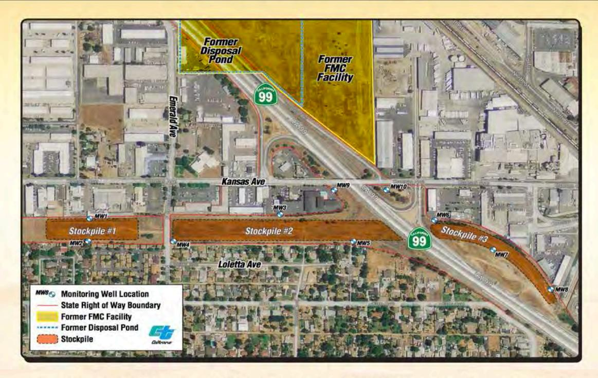

- O The site consists of three stockpiles totaling 160,000 cubic yards within the Caltrans right-of-way south of Kansas Avenue and east and west of State Route 99.
- O Caltrans purchased the southwest corner of the Food Machinery and Chemical Corporation (FMC) property to build a segment of State Route 99 at that location in the early 1960's.
- O The FMC property had barium, strontium, and other metals in the soil.
- O Caltrans used that soil to build the stockpiles.

# **Caltrans Modesto Soil Stockpiles** *Recommended Alternative - Containment*

- O As shown below, the stockpiles are proposed to be contained in the State Route 132 Freeway/Expressway structural section within the Caltrans right-of-way south of Kansas Avenue and east and west of State Route 99.
- O A Remedial Action Design Implementation Plan (RDIP) will be developed to address design elements of the containment alternative.
- DTSC and RWQCB will review and approve the RDIP before project construction.
- O Construction is scheduled to begin in 2018.

# Stockpile Cross-Section: Phase 1

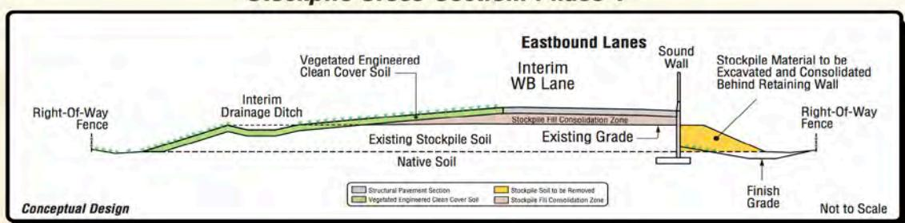

# Stockpile Cross-Section: Phase 2

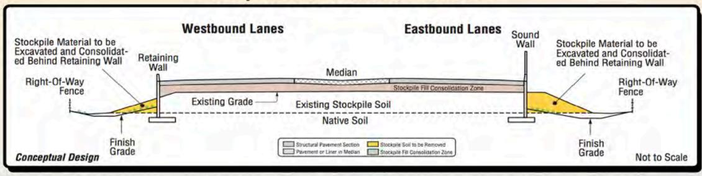

inter-fit

# Caltrans Modesto Soil Stockpiles Proposed Containment

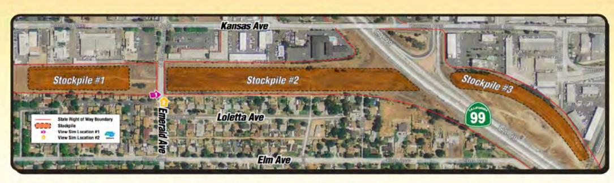

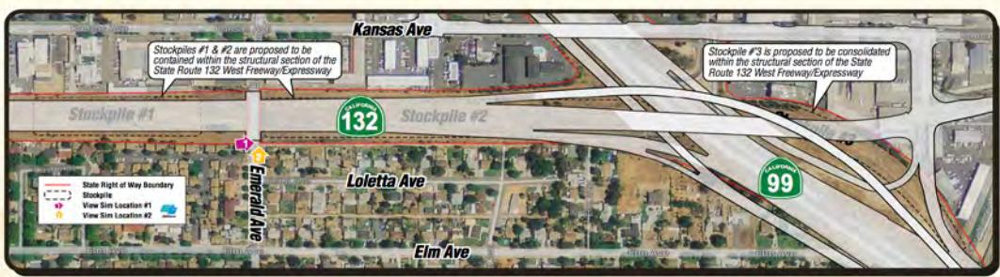

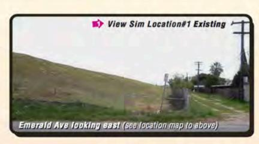

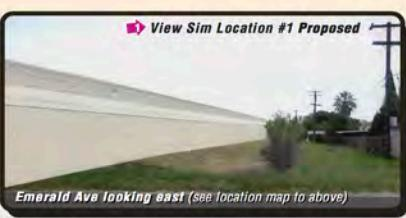

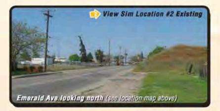

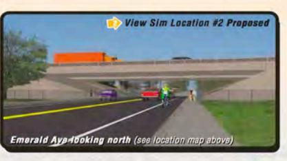

# Caltrans Modesto Soil Stockpiles Proposed Containment

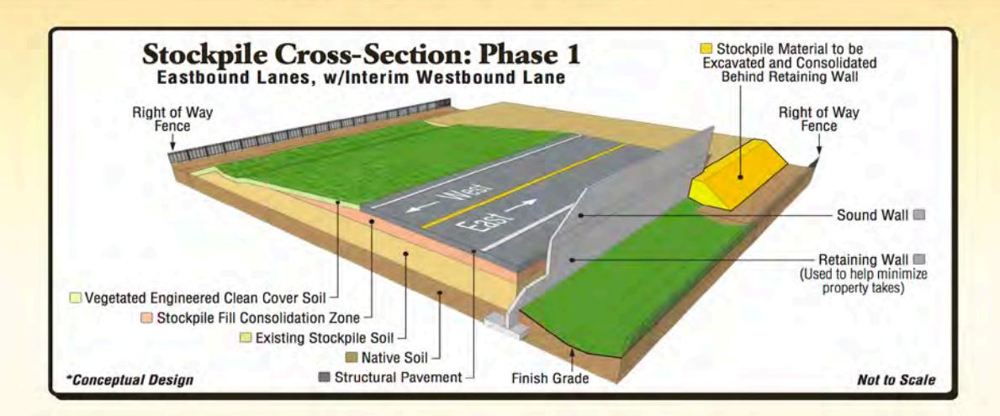

In the Stockpile Containment Alternative, stockpile soil would be isolated behind retaining walls and bridge abutments and beneath highway pavements. Phase 1 of the two-phase SR-132 West roadway project would construct east and west-bound lanes of SR-132 over the southern half of stockpiles 1 and 2 and place an engineered clean soil cover over the northern portions. Phase 1 would also consolidate stockpile 3 within the eastern abutment of the proposed SR-132/SR-99 interchange.

In Phase 2 of the SR-132 West roadway project the northern half of stockpiles 1 and 2 would be paved, completely isolating all stockpile soil within the proposed alignment as proposed in the Containment Alternative. Containment was identified as the best alternative during the remedial alternative selection process because it is protective of human health; is technically feasible; cost-effective; and minimizes the potential for contaminants to migrate to groundwater or be eroded by stormwater runoff.

# Caltrans Modesto Soil Stockpiles Major Technical Studies

# **Stockpile Characterization**

- O Comprehensive Sampling & Analysis
- O Tested for Heavy Metals, Organic Compounds, Inorganic Constituents
- O Testing Completed in 2007 & 2013

# **Groundwater Assessment**

- O 10 Perimeter Monitoring Wells
- O Tested for Heavy Metals, Organic Compounds, Inorganic Constituents
- O Testing Ongoing Since 2012
- O Contaminants of concern have no significant impact to Water Quality

# **Stormwater Runoff Testing**

- O Perimeter Sampling
- O Tested for Heavy Metals & Inorganic Constituents
- O Contaminants of concern have no significant impact to Water Quality

\*All studies conducted under the oversight of the Department of Toxic Substances Control and the Central Valley Regional Water Quality Control Board. Technical studies are available at the following DTSC EnviroStor website links:

http://www.envirostor.dtsc.ca.gov/public/profile\_report.asp?global\_id=60001626 http://www.envirostor.dtsc.ca.gov/public/profile\_report.asp?global\_id=50280024

# Caltrans Modesto Soil Stockpiles Major Technical Studies

# **Human Health Risk Assessment (HHRA)**

- O Stockpiles Evaluated Separately & Collectively
- O Chronic Risk to Current and Future Trespassers, Residents, & Construction Workers was estimated
- O Determination that stockpiles do not to pose an Unacceptable Risk under Current Condition
- O Completion in 2007

# **Human Health Risk Assessment Update**

- O Additional Stockpile Soil Sampling & Analysis
- O Results Confirm 2007 HHRA
- O Completion in 2013
- As currently managed, soil and groundwater at the stockpiles do not pose an unacceptable human health risk for residents or Caltrans workers
- O Completion of the State Route 132 West Freeway/Expressway will contain the stockpiles and achieve the overall goal of long-term protection of human health

\*All studies conducted under the oversight of the Department of Toxic Substances Control and the Central Valley Regional Water Quality Control Board. Technical studies are available at the following DTSC EnviroStor website links:

http://www.envirostor.dtsc.ca.gov/public/profile\_report.asp?global\_id=60001626 http://www.envirostor.dtsc.ca.gov/public/profile\_report.asp?global\_id=50280024

# Caltrans Modesto Soil Stockpiles Remediation Process

The Department of Toxic Substances Control (DTSC) is the regulatory agency overseeing all activities in coordination with Central Valley Regional Water Quality Control Board (CVRWQCB)

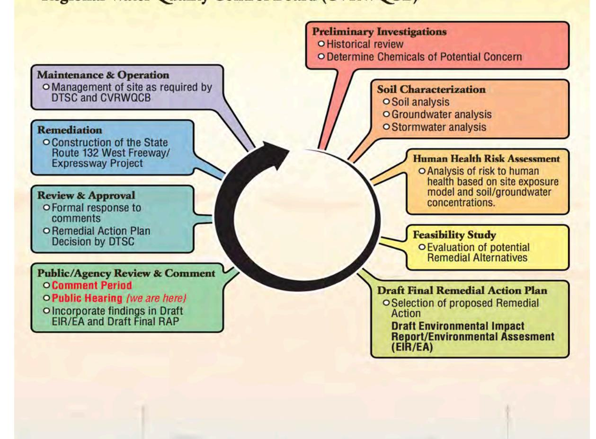

# Caltrans Modesto Soil Stockpiles Agency Contacts

# Caltrans

Grace Magsayo, Project Manager California Department of Transportation 1976 East Dr. Martin Luther King, Jr. Blvd. Stockton, CA 95205 (209) 948-7976 grace.magsayo@dot.ca.gov

# **Department of Toxic Substances Control**

Randy Adams, CEG, Project Manager Brownfields & Environmental Restoration Program 8800 Cal Center Drive Sacramento, CA 95826 randy.adams@dtsc.ca.gov

Nathan Schumacher, Public Participation Specialist 8800 Cal Center Drive Sacramento, CA 95826 nathan.schumacher@dtsc.ca.gov

# **Central Valley Regional Water Quality Control Board**

Steven Meeks, P.E. Chief of Private Sites Cleanup Unit Site Cleanup Program 11020 Sun Center Drive, #200 Rancho Cordova, CA 95670 steven.meeks@waterboards.ca.gov

# **Appendix B** Notices and Letters

The following are notices, advertisements, flyers and letters that were circulated to the public, inviting residents and interested parties to attend the public hearing.

# Notice of Availability – Mailed to individuals on the project mailing list on January 13, 2017

STATE OF CALIFORNIA—CALIFORNIA STATE TRANSPORTATION AGENCY

EDMUND G. BROWN Jr., Governor

## DEPARTMENT OF TRANSPORTATION

OFFICE OF THE DISTRICT 10 DIRECTOR
P.O. BOX 2048, STOCKTON, CA 95201
(1976 E. DR. MARTIN LUTHER KING JR. BOULEVARD 95205)
PHONE (209) 948-7943
FAX (209) 948-3670
TTY 711
www.dot.ca.gov

January 12, 2017

### NOTICE OF AVAILABILITY

DRAFT ENVIRONMENTAL IMPACT REPORT/ENVIRONMENTAL ASSESSMENT
STATE ROUTE 132 WEST FREEWAY/EXPRESSWAY PROJECT

DRAFT FINAL REMEDIAL ACTION PLAN
CALTRANS MODESTO SOIL STOCKPILES

The California Department of Transportation (Caltrans), as the California Environmental Quality Act (CEQA) lead agency and as assigned by the Federal Highway Administration under the National Environmental Policy Act (NEPA) at the time of the signing of the environmental document, working in cooperation with the Stanislaus Council of Governments (StanCOG), proposes to construct a four-lane freeway/expressway along the adopted route of State Route (SR) 132 south of Kansas Avenue from Dakota Avenue to east of SR 99 at the Needham Street Bridge Overcrossing in the City of Modesto.

The Caltrans Modesto Soil Stockpiles occupy three areas within state right-of-way south of Kansas Avenue: between Carpenter Avenue and Emerald Avenue, Emerald Avenue and SR 99, and east of SR 99. Caltrans proposes to cap the soil stockpiles as part of the SR 132 West Freeway/Expressway construction project. As required by state law, the California Department of Toxic Substances Control (DTSC) and the Central Valley Regional Water Quality Control Board (RWQCB) have reviewed the Draft Final Remedial Action Plan (RAP) for the soil stockpiles and approved it for public noticing. Caltrans prepared the Draft Final RAP under the oversight of DTSC and the RWQCB. If approved, the RAP would allow for the placement of impacted soil beneath roadway pavement, within bridge abutments, and behind retaining walls.

This letter is to inform you that the project's Draft Environmental Impact Report/Environmental Assessment (EIR/EA) with attached Caltrans Modesto Soil Stockpiles Draft Final RAP and technical reports are available for public review at the following locations:

- Caltrans District Office, District 10, 1976 Dr. Martin Luther King Jr Blvd, Stockton, CA 95205, weekdays from 8:00 a.m. to 4:00 p.m.
- StanCOG Office at 1111 "I" Street, Suite 308, Modesto, CA 95354, weekdays from 8:00
   a.m. to 5:00 p.m. Closed January 27, February 10, and February 24.

"Provide a safe, sustainable, integrated and efficient transportation system to enhance California's economy and livability"

### Appendix B Notices and Letters

- Stanislaus County Library at 1500 "I" Street, Modesto, CA 95354, Monday-Thursday from 10:00 a.m. to 8:00 p.m. and Friday and Saturday from 10:00 a.m. to 5:00 p.m.
- Online at the Caltrans website: http://www.dot.ca.gov/dist10/environmental/projects/sr132west/index.html
- Caltrans Modesto Soil Stockpiles information is located on the DTSC website: http://www.envirostor.dtsc.ca.gov/public/profile\_report.asp?global\_id=60001626 http://www.envirostor.dtsc.ca.gov/public/profile\_report.asp?global\_id=50280024

The Draft EIR/EA identifies potentially significant environmental effects. With the exception of aesthetics/visual resources and noise impacts, which would remain significant and unavoidable after implementing mitigation measures, all other impacts would be reduced to less than significant levels with mitigation. The Draft EIR/EA identifies the locations of land designated as hazardous waste properties under the Cortese list.

The Draft EIR/EA with attached Caltrans Modesto Soil Stockpiles Draft Final RAP and technical reports will be in the public circulation phase from January 18, 2017 through March 3, 2017. Public comments will be accepted until March 4, 2017. Please send your comments to Philip Vallejo, Acting Chief, Central Sierra Environmental Analysis Branch, California Department of Transportation, 855 "M" Street, Suite 200, Fresno, CA 93721, or email them to philip.vallejo@dot.ca.gov.

As part of the circulation process, Caltrans will hold a Public Hearing to obtain public input on the Environmental Impact Report/Environmental Assessment with attached Draft Final RAP. Caltrans will present preliminary design plans, environmental study information, discuss concerns, and answer questions. The Public Hearing will be informal and interested parties may arrive at any time.

Date: Wednesday, February 22, 2017

Time: 6:00 p.m. to 8:00 p.m.

Location: Red Event Center, 921 8th Street, Modesto, CA 95354

If you have any questions, please contact me or Grace Magsayo, Project Manager, at (209) 948-7976.

Sincerely,

Dennis T. Agar

District 10 Director

Enclosure

"Provide a safe, sustainable, integrated and efficient transportation system to enhance California's economy and livability"

# Notice of Availability – Provided to Stanislaus County Library with hard copies of the Draft EIR/EA with attached Draft Final RAP on January 18, 2017

STATE OF CALIFORNIA—CALIFORNIA STATE TRANSPORTATION AGENCY

EDMUND G. BROWN Jr., Governor

### DEPARTMENT OF TRANSPORTATION

DISTRICT 10
1976 DR MARTIN LITHER KING JR BLVD
STOCKTON, CA 95205
PHONE (559) 445-6172
FAX (559) 445-6236
TTY 711
www.do.ca.gov

January 12, 2017

SCH #2010012010

Stanislaus County Library 1500 "I" Street Modesto, CA 95354

Dear Librarian.

The California Department of Transportation (Caltrans), as the California Environmental Quality Act (CEQA) lead agency and as assigned by the Federal Highway Administration under the National Environmental Policy Act (NEPA) at the time of the signing of the environmental document, working in cooperation with the Stanislaus Council of Governments (StanCOG), proposes to construct a four-lane freeway/expressway along the adopted route of State Route (SR) 132 south of Kansas Avenue from Dakota Avenue to east of SR 99 at the Needham Street Bridge Overcrossing in the City of Modesto.

This letter is to inform you that the Draft Environmental Impact Report Environmental Assessment with attached Caltrans Modesto Soil Stockpiles Draft Final Remedial Action Plan (RAP) and technical reports have been completed for the project and are available for public review from January 18, 2017 through March 3, 2017. Public comments on the document should be addressed to Philip Vallejo, Acting Chief, Central Sierra Environmental Analysis Branch, California Department of Transportation, 855 "M" Street, Suite 200, Fresno, CA 93721, or email them to <a href="mailto:philip.vallejo@dot.ca.gov">philip.vallejo@dot.ca.gov</a>.

Enclosed with this letter are two copies of the Draft Environmental Document with attached Draft Final RAP and one copy of the Technical Studies. These copies are for your library shelves and should be made available for public review.

As part of the circulation process, Caltrans will hold a Public Hearing to obtain public input on the Environmental Impact Report/Environmental Assessment with attached Draft Final RAP. Caltrans will present preliminary design plans, environmental study information, discuss concerns, and answer questions. The Public Hearing will be informal and interested parties may arrive at any time.

Date: Wednesday, February 22, 2017 Time: 6:00 p.m. to 8:00 p.m.

Location: Red Event Center

921 8th Street Modesto, CA 95354

If you have any questions, please contact me or Grace Magsayo, Project Manager, at (209) 948-7976.

Sincerely,

Philip Vallejo

Acting Chief, Central Sierra Environmental Analysis Branch

(559) 445-6172

Provide a safe, sustainable, integrated and efficient transportation system to enhance California's economy and livability."

# Public Notice – Published in The Modesto Bee newspaper on January 18, 2017

# PUBLIC NOTICE

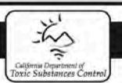

NOTICE of AVAILABILITY of the

Draft Environmental Impact Report/Environmental Assessment and Draft Final Remedial Action Plan

# Announcement of PUBLIC HEARING & PUBLIC COMMENT PERIOD for the State Route 132 West Freeway/Expressway Project and

Caltrans Modesto Soil Stockpiles Draft Final Remedial Action Plan

DATE: February 22, 2017 TIME: 6:00 p.m. to 8:00 p.m. (Open House Format) PLACE: Red Event Center 921 8th Street, Modesto, CA 95354

### PUBLIC COMMENT PERIOD STARTS.

January 18, 2017 ENDS: March 3, 2017

### (WHAT IS PLANNED?

The California Department of Transportation (Caltrans), as the California Environmental Quality Act (CEQA) lead agency and as assigned by the Federal Highway Administration under the National Environmental Policy Act (NEPA) at the time of the signing of this environmental document, working in cooperation with the Stanislaus Council of Governments (StanCOG), proposes to construct a four-lane freeway/expressway along the adopted route of State Route (SR) 132 south of Kansas Avenue from Dakota Avenue to east of SR 99 at the Needham Street Bridge Overcrossing in the city of Modesto.

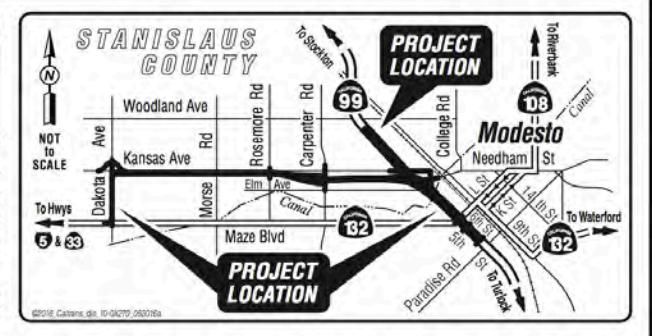

The Caltrans Modesto Stockpiles occupy three areas within state right-of-way south of Kansas Avenue: between Carpenter Avenue and Emerald Avenue, Emerald Avenue and SR 99, and east of SR 99. Caltrans proposes to cap the soil stockpiles as part of the SR 132 West Freeway/Expressway construction project. As required by state law, the California Department of Toxic Substances Control (DTSC) and the Central Valley Regional Water Quality Control Board (RWQCB) have reviewed the Draft Final Remedial Action Plan (RAP) for the stockpiles and approved it for public noticing.

The three stockpiles total approximately 160,000 cubic yards of soil containing metals (primarily barium, lead, and strontium). Caltrans prepared the Draft Final RAP under the oversight of the DTSC and RWQCB. If approved, the RAP would allow for the placement of impacted soil beneath roadway pavement, within bridge abutments, and behind retaining walls. This action would avoid potential future impacts to human health and the environment.

Caltrans has studied the effects this project may have on the environment. A Draft Environmental Impact Report (Draft EIR)/Environmental Assessment (EA) and Draft Final RAP were prepared and are available for public review and comment. You have the opportunity to offer your comments or concerns, and your comments will become part of the public record. An open forum public hearing will be held to give you an opportunity to talk about certain design features of the project with Caltrans staff and discuss the Draft Final RAP for the Caltrans Modesto Soil Stockpiles with DTSC and RWQCB representatives. No formal presentation will be given, and you are welcome to attend the hearing any time between 6:00 p.m. and 8:00 p.m.

### (WHAT'S AVAILABLE?

The Draft EIR/EA and the Draft Final RAP will be available during the 45-day review period from January 18, 2017 to March 3, 2017 at the following locations:

- Caltrans District 10 office at 1976 Dr. Martin Luther King Jr. Boulevard, Stockton, CA 95206, weekdays from 8:00 a.m. to 4:00 p.m.
- StanCOG office at 1111 | Street, Modesto, CA 95354, weekdays from 8:00 a.m. to 4:00 p.m.
- Stanislaus County Library at 1500 I Street, Modesto, CA 95354, Monday—Thursday from 10:00 a.m. to 9:00 p.m., Saturday from 10:00 a.m. to 5:00 p.m.
- DTSC office at 8800 Cal Center Drive, Sacramento, CA 95826. To make arrangement for review of these documents, please call (916) 255-4159 or (916) 255-3578.
- Copies of the Draft Final RAP are located at the DTSC website: http://www.envirostor.dtsc.ca.gov/public/profile\_report.asp?global\_id=60001626 and http://www.envirostor.dtsc.ca.gov/public/profile\_report.asp?global\_id=50280024
- Copies of the Draft EIR/EA, Draft Final RAP, and supporting documents are located at the Caltrans website: http://www.dot.ca.gov/dist10/environmental/projects/sr132west/index.html

### (WHERE DO YOU COME IN? •)

The public hearing will be held in an open forum format. You will have an opportunity to review the design concepts, information, and displays, as well as provide written comments on the Draft EIR/EA and Draft Final RAP. Caltrans, DTSC and RWQCB staff will be available to answer your questions. Do you believe the projects potential impacts have been adequately addressed by the draft environmental document? Do you have information that should be included?

Comment cards will be available for you to fill out. A court reporter will also be available to record individual comments. If you prefer to comment on the Draft EIR/EA and/or Draft Final RAP at a later time, you must submit your written comments no later than March 3, 2017 to Caltrans, Attn: Phil Vallejo, Central Sierra Environmental Analysis Branch, 855 M Street, Suite 200, Fresno, CA 93721; or via email to phillip.vallejo@dot.ca.gov. Your written comments on the documents will be part of the public record.

After considering and replying to all written comments on the Draft EIR/EA, Caltrans will make a decision on the project. Similarly, after considering and replying to all written comments, DTSC and RWQCB will make a decision on the RAP Comments on the Draft Final RAP should also be sent to the above Caltrans address and these comments will be forwarded to DTSC and RWQCB to review and respond to them.

For more information on the SR 132 West Freeway/Expressway project, please contact Phil Vallejo, Central Sierra Environmental Analysis Branch, at Caltrans, 855 M Street, Fresno, CA 93721, phone (559) 445-6172 or email phillip.vallejo@dot.ca.gov. For all other State Highway matters in the area, please contact the District 10 Public Information Office at district10publicaffairs@dot.ca.gov, or phone (209) 948-7977.

If you have questions about the Draft Final RAP, please contact Randy Adams, Project Manager, DTSC, by phone (916) 255-3591. You may also contact him by email at Randy.Adams@dtsc.ca.gov.

### (SPECIAL ACCOMMODATIONS •)

Under the Americans with Disabilities Act of 1990, individuals who require accommodation (American Sign Language interpreter, accessible seating, documentation in alternate formats, etc.) are requested to contact the District 10 Public Information Office at: district10publicaffairs@dot.ca.gov, or phone (209) 948-7977. TDD users may contact the California Relay Service TDD and/or Voice Line at 1-800-735-2929, or 711

2017Caltrans*dps*05-1C960*010917g*FINALv3

# Public Notice – Published in the Vida en el Valle newspaper on January 18, 2017

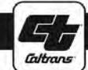

# ISO al PÚBLICO

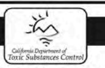

AVISO PÚBLICO DE DISPONIBILIDAD de los

Informes Preliminares al Impacto Ambiental/Evaluación Medioambiental del y Plan Final de Acción Correctiva

## Anuncio de AUDIENCIA PÚBLICA Y PERÍODO ABIERTO AL COMENTARIO PÚBLICO para Proyecto Autopista Ruta Estatal 132-Oeste/Vía Expresa y

Propuesta Final de Acción Correctiva De Los Montones de Suelos con Residuos Caltrans en Modesto

FECHA: 22 de febrero del 2017 HORA: 6:00 p.m. a 8:00 p.m. (Junta Informal) LUGAR: Red Event Center 921 8th Street, Modesto, CA 95354

COMIENZA: 18 de enero, 2017 TERMINA: 3 de marzo, 2017

El Departamento de Transporte de California (Caltrans), en su condición de agencia-líder en cumplimento al Acta de Calidad Medioambiental en California (ČEQA) y como dicta la Administración Federal de Carreteras bajo el Acta Nacional de Políticas Medioambientales (NEPA) —al momento de la firma de este documento medioambiental— y en colaboración con el Consejo de Gobiernos de Stanislaus (StanCOG), propone la construcción de una autopista/vía rápida de cuatro carriles a los largo de la ya aprobada Ruta Estatal 132 —al sur de Av. Kansas desde la Av. Dakota al este de la Ruta Estatal 99, al cruce de Needham Street Bridge en la ciudad de Modesto.

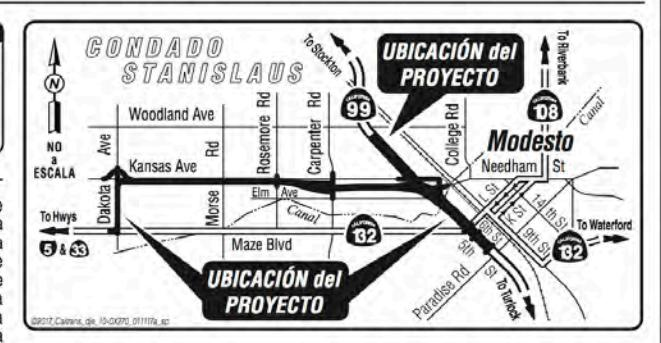

Los Montones de Caltrans en Modesto ocupan tres áreas dentro el derecho-de-vía ubicado al sur de la Av. Kansas: entre la Av. Carpenter, Av. Emerald y Ruta 99, y al este de la Ruta 99. Caltrans propone aplicar una capa de tierra limpia sobre los montones contaminados como parte de la construcción del proyecto Autopista Ruta Estatal 132-Oeste/ Vía Expresa. En cumplimiento a la ley Estatal, el Departamento de Control de Sustancias Tóxicas de California (DTSC) y el Directorio de Control Regional de Calidad del Agua del Valle Central (RWQCB) han analizado ésta, la última Propuesta Final de Acción Correctiva (RAP) y la han aprobado para su notificación pública.

Los tres montones suman 160 mil yardas cúbicas de tierra que contiene metales pesados (principalmente bario, plomo y estroncio). Caltrans preparó su propuesta de RAP Final bajo la supervisión del DTSC y el RWQCB. De aprobarse, el RAP permitiría la colocación de suelo contaminado debajo del pavimento de la carretera, dentro de los contrafuertes de los puentes y detrás de los muros de contención. Esta acción prevendría un futuro riesgo a la salud humana y el medioambiente.

### (¿POR QUÉ HACEMOS ESTE AVISO AL PÚBLICO? •)

Caltrans ha estudiado los efectos que este proyecto podría tener en el medioambiente. Se prepararon Informes Preliminares al Impacto Ambiental (EIR)/Evaluación Medioambiental (EA) y del Plan Final de Acción Correctiva y se han puesto a disposición del público para su análisis y comentario. Usted tiene la opción de ofrecer su opinión o dudas, las que formaran parte del archivo público. Se celebrará una audiencia abierta al público para brindarle la oportunidad de hablar sobre ciertas características de diseño del proyecto con personal de Caltrans, como asimismo tratar la propuesta final del RAP referente a los montones Caltrans en Modesto con representantes del DTSC y RWQCB. No se realizará una junta formal, por lo que usted puede presentarse a cualquier hora entre las 6:00 y las 8:00 p.m.

Tanto el EIR/EA preliminar como la Propuesta Final del RAP estarán disponibles para un periodo de escrutinio público de 45 días, entre el 18 de enero, 2017 y el 3 de marzo, 2017, en los siguientes lugares:

- Oficina Caltrans del Distrito 10, 1976 Dr. Martin Luther King Jr. Boulevard, Stockton, CA 95206, días de semana de 8 am a 4 pm.
- Oficinas del StanCOG, 1111 "I" Street, Modesto, CA 95354, días de semana de 8 am a 5 pm, cerrado un viernes sí y otro no.
- Biblioteca del Condado Stanislaus, 1500 "I" Street, Modesto, CA 95354, lunes-jueves de 10 am a 9 pm, sábados de 10 am a 5 pm.
- Oficina del DTSC, 8800 Cal Center Drive, Sacramento, CA 95826. Para concertar una visita para revisar estos documentos, sírvase llamar a los teléfonos (916) 255-4159 o (916) 255-3578.
- Copias de la Propuesta Final del RAP se pueden hallar en el sitio virtual del STSC: http://www.envirostor.dtsc.ca.gov/public/profile\_report.asp?global\_id=60001626 y http://www.envirostor.dtsc.ca.gov/public/profile\_report.asp?global\_id=50280024
- Las copias del EIR/EA preliminar, de la Propuesta Final del RAP, y de la documentación de respaldo se hallan en el sitio de Caltrans: http://www.dot.ca.gov/dist10/environmental/projects/sr132west/index.html

### ¿DÓNDE PARTICIPA UD? •

La audiencia pública se realizará en un formato de foro abierto. Ud. tendrá la oportunidad de examinar los conceptos de diseño, información e ilustraciones, como también de verter sus comentarios por escrito en el EIR/EA preliminar y la Propuesta Final del RPA. Habrá personal de Caltrans, DTSC y RWCCB dispuesto a contestar sus preguntas. ¿Cree Ud. que los posibles efectos del proyecto han sido apropiadamente tomados en cuenta en el documento medioambiental presentado? ¿Tiene Ud. información que debiese incluirse? Se dispondrá de tarjetones para dejar sus comentarios. Habrá también un estenógrafo para tomar declaraciones individuales. Si prefiere comentar sobre el EIR/EA preliminar y la Propuesta Final del RPA en otra ocasión, puede enviar su nota escrita a Caltrans, Attn: Philip Vallejo, Central Sierra Environmental Analysis Branch, 855 M Street, Suite 200, Fresno, CA 93721; o por correo electrónico a philip vallejo@dot.ca.gov. Los comentarios escritos deben ser recibidos a más tardar el 3 de marzo, 2017. Sus comentarios formarán parte del archivo público.

Después de tomar en consideración y responder a todos los comentarios escritos sobre el EIR/EA preliminar, Caltrans tomará una decisión sobre el proyecto. Asimismo, después de tomár en consideración y responder a todos los comentarios escritos, el DTSC y el RWQCB tomarán una decisión respecto del RAP. Los comentarios sobre la Propuesta Final del RPA deben, también, enviarse a la dirección de Caltrans (ver arriba) desde donde se remitirán al DTSC y al RWQCB para su análisis y respuesta.

Para mayor información sobre el proyecto Autopista Ruta Estatal 132-Oeste/ Vía Expresa, sirva comunicarse con Philip Vallejo, Sucursal de Análisis Medioambiental de la Sierra Central, en Caltrans, 855 M Street, Fresno, CA 93721, tel. (559) 445-6172 o correo electrónico philip.vallejo@dot.ca.gov. Para todo otro asunto sobre carreteras estatales en el área, sirva comunicarse con el director de relaciones públicas del Distrito 10 de Caltrans en district10publicaffairs@dot.ca.gov, o al tel. (209) 948-7977. Si tiene dudas sobre la Propuesta Final del RPA, sirva comunicarse con Randy Adams, gerente de proyecto, DTSC, al tel. (916) 255-3591. También puede contactarlo por correo electrónico a Randy.Adams@dtsc.ca.gov.

### (POSIBLES ADAPTACIONES •)

En cumplimiento al Acta Estadounidenses Incapacitados de 1990, aquellos que requieren de modificaciones o arregios especiales (intérprete de señas, asientos especiales, documentación en formatos alternativos, etc.) deben comunicarse con la oficina de relaciones públicas del Distrito 10 de Caltrans en district10publicaffairs@dot.ca.gov, o al tel. (209) 948-7977. Personas que requieran dispositivo de telecomunicación para sordos (TDD, por sus siglas en inglés) pueden comunicarse con la línea TDD del California Relay Service (Servicio de Retransmisión de California) o al teléfono 1-800-735-2922 ó 711.

2017C3annal*dta*15-0X270*011217b*ap

DTSC Community Update for the Draft Final RAP (English and Spanish) – Mailed to individuals on the project mailing list on February 6, 2017 and available for distribution at the public hearing

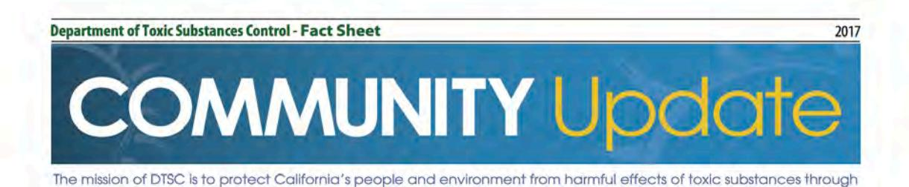

# Draft Remedial Action Plan, Caltrans Modesto Soil Stockpiles State Route 132 West Freeway/Expressway Project

the restoration of contaminated resources, enforcement, regulation and pollution prevention.

# You May Review and Comment on the Draft Final Cleanup Plan for the Caltrans Modesto Soil Stockpiles Site

The Department of Toxic Substances Control (DTSC) invites you to review and comment on a proposed remedial action for the Caltrans Modesto Soil Stockpiles Site (site) located south of Kansas Avenue between Carpenter Avenue and just east of State Route 99 in Modesto, California. The selected remedy, contained in a draft final Remedial Action Plan (RAP), summarizes how the owner of the site, Caltrans, proposes to address contamination in the stockpiles, which resulted from excavation through an industrial waste pond during construction of State Route 99 in Modesto during the 1960s.

The draft final RAP prepared by Caltrans proposes containment of the stockpiles within a structural section of the proposed State Route 132 West Expressway/Freeway project (State Route 132 West). DTSC and the Central Valley Regional Water Quality Control Board (RWQCB) have reviewed the draft final RAP and approved it for public notice and comment. The stockpiles would be contained behind retaining walls, bridge abutments, and beneath roadway pavement of the State Route 132 project between Needham Street and Carpenter Avenue.

# Site Description and History

The site consists of three separate and distinct soil stockpiles totaling 160,000 cubic yards. The site is within state right-of-way located south of Kansas Avenue and east and west of the State Route 99/Kansas Avenue interchange.

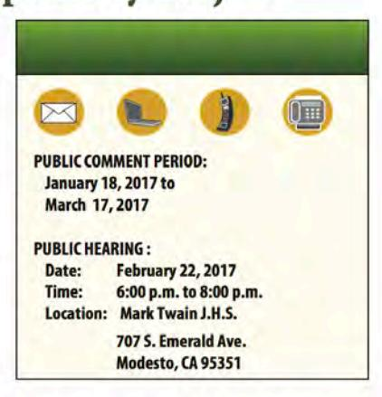

Stockpile 1 is about 2.5 acres. It is located south of Kansas Avenue between Carpenter and North Emerald Avenue. Stockpile 2 is about 7.6 acres and is located south of Kansas Avenue between North Emerald Avenue and State Route 99. Stockpile 3 covers about 2.5 acres and is located south of Kansas Avenue and east of State Route 99. Average height of the stockpiles is 20 feet. The stockpiles are vacant. Caltrans has secured each stockpile with a perimeter fence.

The stockpiles were made in the early 1960s when a 4.3-acre parcel at the southwest corner of the Food Machinery and Chemical Corporation (FMC),

Modesto Processing Plant, was purchased by Caltrans to construct the State Route 99 Modesto

Former Disposal Pond

Kansas Ave

MW9

Stockpile #1

MW2

MW6

Stockpile #2

MW7

Loietta Ave

Stockpile #3

MW7

AMW8

Stockpile #3

MW7

AMW8

Stockpile #3

MW7

AMW8

Stockpile #3

MW7

AMW8

Stockpile #3

MW7

AMW8

Stockpile #3

MW7

AMW8

Stockpile #3

MW7

AMW8

Stockpile #3

MW7

AMW8

Stockpile #3

MW7

AMW8

Stockpile #3

MW7

AMW8

Stockpile #3

MW7

AMW8

Stockpile #3

MW7

AMW8

Stockpile #3

MW7

AMW8

Stockpile #3

MW7

AMW8

MW8

MW7

AMW8

MW8

MW8

MW7

AMW8

MW7

AMW8

MW7

AMW8

MW7

AMW8

MW7

AMW8

MW7

AMW8

MW7

AMW8

MW7

AMW8

MW7

AMW8

MW7

AMW8

MW7

AMW8

MW7

AMW8

MW7

AMW8

MW7

AMW8

MW7

AMW8

MW7

AMW8

MW7

AMW8

MW7

AMW8

MW7

AMW8

MW7

AMW8

MW7

AMW8

MW7

AMW8

MW7

AMW8

MW7

AMW8

MW7

AMW8

MW7

AMW8

MW7

AMW8

MW7

AMW8

MW7

AMW8

MW7

AMW8

MW7

AMW8

MW7

AMW8

MW7

AMW8

MW7

AMW8

MW7

AMW8

MW7

AMW8

MW7

AMW8

MW7

AMW8

MW7

AMW8

MW7

AMW8

MW7

AMW8

MW7

AMW8

MW7

AMW8

MW7

AMW8

MW7

AMW8

MW7

AMW8

MW7

AMW8

MW7

AMW8

MW7

AMW8

MW7

AMW8

MW7

AMW8

MW7

AMW8

MW7

AMW8

MW7

AMW8

MW7

AMW8

MW7

AMW8

MW7

AMW8

MW7

AMW8

MW7

AMW8

MW7

AMW8

MW7

AMW8

MW7

AMW8

MW7

AMW8

MW7

AMW8

MW7

AMW8

MW7

AMW8

MW7

AMW8

MW7

AMW8

MW7

AMW8

MW7

AMW8

MW7

AMW8

MW7

AMW8

AMW8

MW7

AMW8

AMW8

MW7

AMW8

AMW8

MW7

AMW8

AMW8

AMW8

MW7

AMW8

AMW8

AMW8

AMW8

AMW8

AMW8

AMW8

AMW8

AMW8

AMW8

AMW8

AMW8

AMW8

AMW8

AMW8

AMW8

AMW8

AMW8

AMW8

AMW8

AMW8

AMW8

AMW8

AMW8

AMW8

AMW8

AMW8

AMW8

AMW8

AMW8

AMW8

AMW8

AMW8

AMW8

AMW8

AMW8

AMW8

AMW8

AMW8

AMW8

AMW8

AMW8

AMW8

AMW8

AMW8

AMW8

AMW8

AMW8

AMW8

AMW8

AMW8

AMW8

AMW8

AMW8

AMW8

AMW8

AMW8

AMW8

AMW8

AMW8

AMW8

AMW8

AMW8

AMW8

AMW8

AMW8

AMW8

AMW8

AMW8

AMW8

AMW8

AMW8

AMW8

AMW8

AMW8

AMW8

AMW8

AMW8

AMW8

AMW8

AMW8

AMW8

AMW8

AMW8

AMW8

AMW8

AMW8

AMW8

AMW8

AMW8

AMW8

AMW8

AMW8

AMW8

AMW8

AMW8

AMW8

AMW8

AMW8

AMW8

AMW8

AMW8

AMW8

AMW8

AMW8

AMW8

AMW8

AMW8

AMW8

AMW8

AMW8

AMW8

AMW8

AMW8

AMW8

AMW8

AMW8

AMW8

AMW8

A

bypass. FMC and its predecessors operated a chemical processing facility just north of Kansas Avenue from 1929 to about 1985. The facility processed barium, strontium (barite and celestite), and other materials to produce a variety of industrial chemicals. Residual liquids from the processing facility were discharged to unlined ponds on FMC's property. Soil in and around one of the disposal ponds, which previously occupied the 4.3-acre parcel, was excavated during construction of the bypass and stockpiled in its present locations.

# Site Investigation

Since 2004, Caltrans did numerous site investigations including stockpile soil, groundwater, and stormwater runoff assessments. The investigations showed that the primary contaminants in the stockpile soil are barium, strontium, and lead.

Caltrans installed 10 groundwater monitoring wells at the site. Groundwater beneath the base of the stockpiles has varied from 30 to 44 feet. Groundwater flows consistently toward the southeast. Groundwater samples were originally collected in 2006, and

monitoring has occurred bi-monthly or quarterly beginning in 2012. In 2014, analytical results from

all groundwater sampling events were evaluated with respect to background concentrations at the stockpiles and groundwater contaminants that are monitored by FMC. Groundwater is currently monitored annually. Three active water supply wells maintained by the City of Modesto exist within a one-mile radius southeast of the site.

Caltrans has also collect-ed surface water runoff samples from annual

wintertime storm events—nine times since 2013. Caltrans analyzed the samples for metals, including primary contaminants of concern and general mineral parameters. Contaminants of Concern for groundwater and surface water are below Water Quality Objectives.

## **Human Health Risk Assessment**

A 2007 Human Health Risk Assessment (HHRA) concluded that, as currently managed, soil and groundwater at the site do not pose an unacceptable human risk for off-site residents, trespassers, or Caltrans workers. Caltrans based this conclusion on 1) maintaining the perimeter fence; 2) limiting access to Caltrans workers; and 3) maintaining a vegetative cover. Caltrans also would have to 4) prohibit placement or removal of soil from the site; and 5) maintain groundwater monitoring. Currently, there are no drinking wells at the site. Additional soil sampling in 2012 confirmed results of the 2007 HHRA. However, containment of the stockpiles within the State Route 132 West project will achieve the overall goal of long-term protection of human health.

# Remedial Actions Considered

Caltrans, DTSC and RWQCB considered the following cleanup alternatives:

- Alternative 1: No Action The stockpiles would remain in place without fences, monitoring or maintenance. This alternative is used as a baseline against which to compare other alternatives.
- Alternative 2: Institutional Controls Prevents unauthorized site access to stockpiles by establishing fences; signage; public notices; a deed restriction and land use covenant; site inspections; and air and water quality monitoring.
- Alternative 3: Removal Removes the contaminant source by excavating and transporting 160,000 cubic yards of stockpile soil to an off-site disposal facility.
- Alternative 4: Containment Contains stockpiles behind retaining walls, bridge abutments, and beneath roadway pavement of the State Route 132 West project. Unpaved portions would have a clean soil cover in Phase 1. (If the State Route 132 West project were not

constructed, then containment would consist of a clean soil cap over the stockpiles.) Caltrans would establish and maintain a deed restriction and land use covenant, site inspections, and water quality monitoring in both cases.

# Proposed Remedial Action Plan

Based on an evaluation of the remedial actions, Caltrans recommends Alternative 4, containment by construction of the State Route 132 West project. DTSC and RWQCB concur with this recommendation. This alternative offers long-term protection of human health and the environment, while balancing contaminant isolation with removal/disposal costs and the need for elevated fill material necessary to construct the State Route 132 West project between Needham Street and Carpenter Avenue.

If the draft final RAP is approved, DTSC and RWQCB will oversee the development of a Remedial Design Implementation Plan. This plan will establish details on how to contain the stockpiles as part of the State Route 132 project.

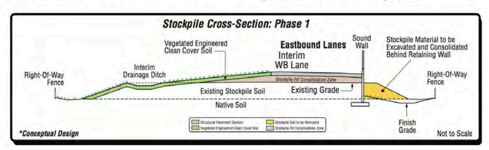

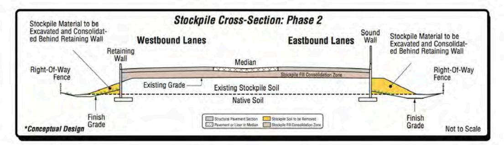

Caltrans plans to build the State Route 132 West project in two phases: initial construction phase and ultimate build-out phase. The initial construction phase (see Phase 1: Typical Soil Stockpile Cross-Section) will build retaining walls and bridge abutments, and pave the southern half of the site. The northern half will be covered with a graded engineered soil layer. The opening phase would begin in 2018 and end in 2020. The ultimate build-out phase would begin in 2028 (see Phase 2: Typical Soil Stockpile Cross-Section).

# California Environmental Quality Act

As the lead agency under the California Environmental Quality Act (CEQA), Caltrans produced an Environmental Impact Report/Environmental Assessment (EIR/EA) that determined the containment of the stockpile site along with mitigation would not have a significant environmental impact. DTSC and RWQCB are Responsible Reviewing Agencies for CEQA for this project.

# **Next Steps**

After the public comment period, DTSC and RWQCB will consider all comments that were received from the public. Then both agencies will prepare a Responsiveness Summary to address comments received on the draft final RAP. The Responsiveness Summary will be placed in the information repositories for the site and sent to those who submitted comments. DTSC may approve the draft final RAP after the public review and comment process following completion/certification of the EIR/EA. Modifications to the draft final RAP may be necessary based on public comments to both the draft final RAP and the draft EIR/EA.

## Where to Find Site Documents

DTSC encourages you to review the draft RAP and CEQA documents, and other site-related documents, which are available at the information repositories listed below:

- Stanislaus County Library 1500 | Street Modesto, CA 95354 (209) 558-7800
- O Caltrans Online

Site-related technical documents prepared by Caltrans can be found online at:

http://www.dot.ca.gov/dist10/environmental/projects/sr132west/Stockpiles.html

O The full administrative record is available for review at:

DTSC - File Room 8800 Cal Center Drive Sacramento, CA 95826

To make arrangements for review of the documents, please call (916) 255-3758.

O DTSC - EnviroStor Database:

Copies of key technical reports, fact sheets and other Caltrans Modesto Soil Stockpiles site related information are available online at DTSC's EnviroStor website links:

http://www.envirostor.dtsc.ca.gov/public/profile\_report.asp?global\_id=60001626

http://www.envirostor.dtsc.ca.gov/public/profile\_report.asp?global\_id=50280024

O Please send your comments to this DTSC Representative:

Randy Adams, DTSC Project Manager, 8800 Cal Center Dr., Sacramento CA 95826 Randy.Adams@dtsc.ca.gov or (916) 255-3591

Questions, please contact Randy Adams or Nathan Schumacher, DTSC Public Participation Specialist Nathan.Schumacher@dtsc.ca.gov (916) 255-3650 Toll-free at (866) 495-5651

O If you are from the news media, please contact:

Russ Edmondson, DTSC Public Information Officer Russ.Edmondson@dtsc.ca.gov (916) 323-3372

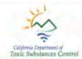

Departmento de Control de Sustancias Tóxicas - Hoja de Datos

017

# AVISO Comunitario

Nuestra misión es de proteger a Californianos y el medio ambiente de efectos dañosos de sustancias tóxicas, restaurando recursos contaminados, imponer leyes de residuos peligrosos, reducir la generación de residuos peligrosos, y fomentar la fabricación de productos químicos más seguros.

# Plan Preliminar de Acción Correctiva, Montones de Residuos de Tierra Caltrans-Modesto Ruta Estatal 132 Oeste/Proyecto de Vía Expressway

# Usted Puede Leer y Opinar Sobre la Versión Final del Plan Preliminar de Limpieza del Monton de Residuos de Caltrans Modesto

El Departamento de Control de Sustancias Tóxicas (DTSC, siglas en inglés) le invita a mirar y comentar sobre las acciones correctivas planeadas para el Montón de Residuos Caltrans-Modesto ("el sitio") ubicado en la Avenida Kansas entre la Avenida Carpenter y casi al llegar a la Ruta Estatal 99 en Modesto, California. La limpieza que ha sido seleccionada, descrita en la versión final del plan preliminar resume cómo el propietario del sitio propone manejar el material contaminado en los Montones, resultado de haberse excavado a través de un pozo de captación industrial creada en los 1960 durante la construcción de la Ruta Estatal 99 a través de Modesto.

La versión final del RAP Preliminar preparado por Caltrans propone contener los Montones de tierra dentro de la sección estructural del proyecto de la Ruta Estatal 132 Oeste/Proyecto de Vía Expresa. El DTSC y el Directorio de Control Regional de Calidad del Agua del Valle Central (RWQCB, siglas en inglés) han analizado este último RAP preliminar y lo han abierto a la inspección y comentario público. Los residuos se contendrán tras bardas de contención, contrafuertes de puentes, y bajo el pavimento caminero del proyecto Ruta Estatal 132 entre la Calle Needham y la Avenida Carpenter.

# Descripción y Antecedentes del Sitio

El sitio se compone de 3 Montones distintos y separados que suman 160 mil yardas cúbicas. El sitio se halla dentro el lado derecho, ubicado al sur de la Avenida Kansas, y al este y oeste del empalme Ruta 99/Av. Kansas.

El Montón 1 esta compuesto de unos 2,5 acres. Está ubicado al sur de la Avenida Kansas, entre Calle Carpenter y la Avenida

PERIODO ABIERTO A COMENTARIO: 18 de enero, 2017 al

18 de enero, 2017 al 17 de marzo, 2017

AUDIENCIA PÚBLICA: 22 de febrero, 2017 6:00 p.m. a 8:00 p.m. Ubicacion: Mark Twain J.H.S. 707 S. Emerald Ave. Modesto CA 95251

Emerald Norte. Montón 2 tiene aproximadamente 7,6 acres y se localiza en la Avenida Kansas entre Avenida Emerald Norte y la Ruta Estatal 99. El Montón 3 cubre unos 2,5 acres y se ubica al sur de la Avenida Kansas y al este de la Ruta Estatal 99. El promedio de altura de los montones es de 20 pies. Los Montones están vacantes. Caltrans ha resguardado cada montón con una barda circundante.

Estos montones fueron creados a principios de los 1960s cuando Caltrans adquirió una parcela de 4,3 acres en la esquina sudoeste de la Planta Procesadora Modesto de la Corporación de Maquinaria Química y Alimenticia (FMC, siglas en inglés) para construir la Ruta Estatal

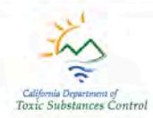

99-Modesto. Entre 1929 y cerca de 1985, FMC y sus predecesores operaron una instalación de proce-

desde el 2012. En 2014, los resultados de análisis de todas las muestras de agua de cada medición se

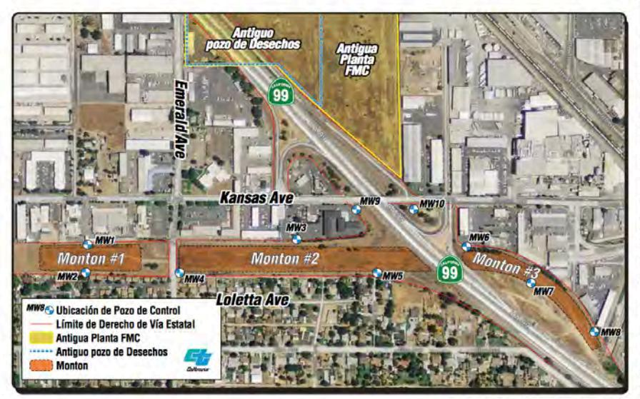

compararon respecto de las precedentes concentraciones de contaminantes en los montones y desagües a los que da seguimiento FMC.
Actualmente las aguas subterráneas se analizan anualmente. Existen—dentro de una milla y al sudeste del sitio— tres pozos activos para suministro de agua que opera el Ayuntamiento de Modesto.

Además, Caltrans ha también recolectado —nueve veces desde 2013— muestras de escorrentías de superficie

producto de tormentas invernales. Caltrans ha analizado las muestras para detectar metales, tanto 'contaminantes preocupantes' básicos como parámetros minerales generales. La presencia de 'contaminantes preocupantes' en aguas subterráneas y de superficie es inferior a los Objetivos de la Calidad del Agua.

so químico inmediatamente al norte de la Avenida Kansas. La planta procesó bario, estroncio (barita y celestita) y otros materiales para producir una variedad de químicos industriales. Desde esa planta se vaciaron residuos líquidos en pozos sin revestimiento (cobertura subterránea) dentro de la propiedad. Tierra de dentro y alrededor de una de estos pozos de desecho —que en su tiempo ocupó los 4,3 acres de la parcela— fue excavada durante la construcción y los montones se colocaron en sus actuales ubicaciones.

# Investigación del Sitio

Desde el 2004, Caltrans ha realizado numerosos estudios que incluyen evaluaciones de muestras de tierra, agua subterránea y desagues. Estos estudios revelaron que los principales contaminantes en la tierra de los Montones son bario, estroncio y plomo.

Caltrans ha instalado 10 pozos de monitoreo a los desagües en el sitio. Las aguas subterráneas bajo la base de los montones ha variado entre 30 y 40 pies de profundidad. Las aguas discurren, consistentemente, hacia el sudeste. Se empezaron a recolectar muestras de aguas subterráneas en 2006, y los análisis se han realizado bimestral o trimestralmente

# Evaluación de Riesgo a la Salud Humana

Una Evaluación de Riesgo a la Salud Humana (HHRA, por sus siglas en inglés) del 2007 concluyó que, de manejarse como hoy, el suelo y aguas subterráneas en el sitio no califican como 'un riesgo inaceptable' para la salud humana de los residentes, intrusos ni trabajadores de Caltrans. Caltrans basa esta conclusión en que 1) se mantiene una barda periférica; 2) se limita el acceso a solo trabajadores de Caltrans; 3) se mantiene bajo una cubierta vegetal. Caltrans debiese también 4) prohibir depositar o retirar tierra del sitio; 5) seguir dando seguimiento a las aguas subterráneas. En este momento no existen pozos de agua para beber en el sitio. Muestras adicionales de tierra en el 2012 confirmaron los resultados de la HHRA del 2007. No obstante, la contención de los Montones dentro de los límites del proyecto Ruta Estatal 132 Oeste

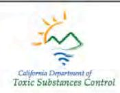

cumplirá con el objetivo de la protección de la salud humana a largo plazo.

# Acciones Correctivas a Considerar

Caltrans, DTSC y RWQCB consideraron las siguientes alternativas de limpieza:

- Alternativa 1: No Hacer Nada Los montones se mantienen donde están sin bardas, seguimiento ni mantenimiento. Esta alternativa se usa como base y comparativo a otras alternativas.
- Alternativa 2: Controles Institucionales Previene el acceso sin autorización a los Montones estableciendo bardas; señalización de seguridad, advertencias al público, una restricción de transferencia y compromiso de uso de suelo; inspecciones a terreno; y evaluaciones periódicas de calidad de agua y aire.
- Alternativa 3: Extracción Extraer la fuente de contaminación excavando y transportando 160 mil yardas cúbicas del material hasta un vertedero designado fuera del área.
- Alternativa 4: Contención Contención de los montones tras bardas de retención, contrafuertes de

puentes y bajo el pavimento caminero del proyecto Ruta Estatal 132 Oeste. Secciones sin pavimentar contarían con una cubierta de tierra limpia en la 1ª Etapa. (Si el proyecto Ruta Estatal 132 Oeste no se llevase a cabo, entonces la contención consistiría en una capa de tierra limpia sobre los Montones). Caltrans establecería y mantendría una restricción de transferencia y convenio de uso de suelo, inspecciones a terreno, y seguimiento a la calidad del agua y del aire en ambos casos.

# Propuesta de Plan de Acciones Correctivas

Basados en la evaluación de las acciones correctivas, Caltrans recomienda la Alternativa 4, contención a través de la construcción del proyecto Ruta Estatal 132, Oeste. El DTSC y el RWQCB concurren en esta recomendación. Esta alternativa ofrece protección a largo plazo a la salud humana y al medioambiente, al tiempo que equilibra el aislamiento de los contaminantes con el costo de extracción y eliminación, con la necesidad de material de relleno para la construcción del proyecto de la Ruta Estatal 132 Oeste entre la Calle Needham y la Avenida Carpenter.

Si el último RAP preliminar se aprueba, el STSC y

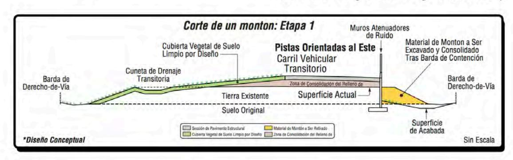

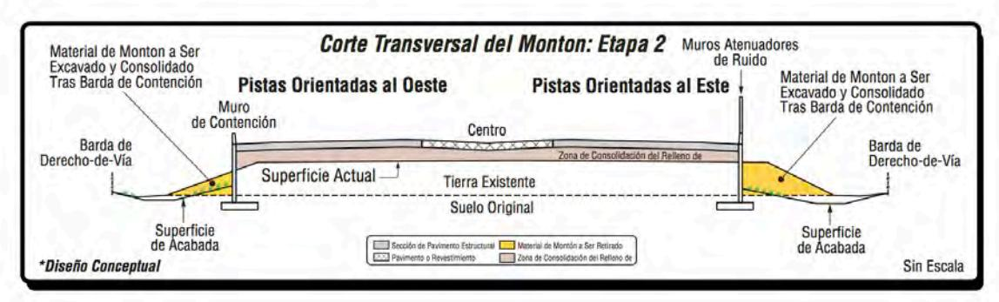

el RWQCB supervisarán el desarrollo de un Plan de Implementación de un Diseño Correctivo. Este plan establecerá detalles de cómo contener los montones como parte del proyecto de la Ruta Estatal 132 Oeste.

Caltrans planifica construir el proyecto Ruta Estatal 132 Oeste en dos etapas: fase de construcción inicial y fase de finalización. La fase de construcción inicial (ver 1ª Etapa: Corte Transversal del Monton Típico) levantará muros de contención y contrafuertes de puentes, y pavimentará la mitad sur del sitio. La mitad norte se cubrirá con una capa de suelo diseñado para dicho propósito. La etapa inicial dará comienzo en el 2018 y concluirá en el 2020. La fase de conclusión comenzará en el 2028 (favor ver 2ª Etapa: Corte Transversal del Montón Típico).

# Decreto de Calidad Medioambiental de California

Caltrans, en su calidad de agencia líder bajo el Decreto de Calidad Medioambiental de California (CEQA, por sus siglas en inglés), realizó un Informe de Impacto Medioambiental y Evaluación Medioambiental (EIR/EA, siglas en inglés) que dictaminó que la contención del sitio de Montones —junto a su mitigación— no presenta un impacto medioambiental de importancia. El DTSC y el RWQCB son las Agencias de Inspección Responsables de la CEQA en este proyecto.

## Próximos Pasos

Después del periodo de comentario público, el DTSC y el RWQCB considerarán todos los comentarios que se recibieron de la comunidad. Luego, ambas agencias prepararán un Resumen de Respuestas donde abordarán los comentarios recibidos durante la presentación del último RAP preliminar. El Resumen de Respuestas se ubicará en el archivo del sitio y será remitido a aquellos quienes sometieron comentarios. El DTSC podría aprobar la versión final del RAP Preliminar después del periodo abierto al análisis y comentario público y una vez que se haya certificado el cumplimento con el EIR/EA. Puede que —dependiendo de los comentarios recibidos del público- sea necesario modificar tanto la versión final del RAP como el EIR/EA preliminar.

# Dónde Hallar Documentación del Sitio

El DTSC le invita a inspeccionar los documentos RAP preliminar y el CEQA, como otros documentos relacionados al sitio, los cuales están disponibles en los archivos listados en seguida:

 Biblioteca del Condado Stanislaus 1500 I Street Modesto, CA 95354 (209) 558-7800

### O Caltrans En-Línea

Documentos preparados por Caltrans y relacionados al sitio se pueden hallar en-línea visitando:

http://www.dot.ca.gov/dist10/environmental/projects/sr132west/Stockpiles.html

O El archivo administrativo completo está disponible para su lectura en:

DTSC – Sala de Archivos 8800 Cal Center Drive Sacramento, CA 95826

Para concertar una inspección de los documentos, sírvase llamar al (916) 255-3758.

### O Base de Datos DTSC:

Copias de reportes técnicos clave, fichas técnicas e información adicional sobre los Monton de Residuos de Caltrans-Modesto se halla disponibles en-línea en los enlaces EnviroStor del sitio virtual del DTSC:

http://www.envirostor.dtsc.ca.gov/public/profile\_report.asp?global\_id=60001626

http://www.envirostor.dtsc.ca.gov/public/profile\_report.asp?qlobal\_id=50280024

O Usted puede enviar sus comentarios a:

Randy Adams, Gerente del Proyecto en DTSC, 8800 Cal Center Dr., Sacramento CA 95826 Randy.Adams@dtsc.ca.gov (916) 255-3591

Para preguntas, Randy Adams o Nathan Schumacher, del DTSC Especialista en Participación Pública del DTSC Nathan.Schumacher@dtsc.ca.gov (916) 255-3650 Llmada es gratais al (866) 495-5651

O Si usted es de un medio de comunicación, sírvase comunicarse con:

Russ Edmondson, Oficial de Información Pública del DTSC Russ.Edmondson@dtsc.ca.gov (916) 323-3372

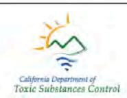

Notice of the Public Hearing Location Change – Mailed to individuals on the project mailing list on February 8, 2017 and published in The Modesto Bee and Vida en el Valle on February 8, 2017

NOTICE: Public Hearing Location Change and Extension of Public Comment Period for the SR 132 West Freeway/Expressway Project and Draft Final Remedial Action Plan

Due to a scheduling conflict, the location for the Public Hearing for the SR 132 West Freeway/Expressway Project and Draft Final Remedial Action Plan is being moved to:

Mark Twain Junior High School 707 S. Emerald Avenue Modesto, CA 95351 February 22, 2017 (Same date) 6:00 PM – 8:00 PM

Thank you for your understanding and we apologize for any inconvenience.

The comment period for this project has been extended from March 3, 2017 to March 17, 2017.

DARSE CUENTA: Cambio en la audiencia pública y extensión del período de comentarios para el SR 132 West Freeway/Proyecto de Autopista y Proyecto de Plan de Acción Remedio Final

Debido a un conflicto de programación, el lugar para la Audiencia Pública para el SR 132 West Freeway/Proyecto de Autopista y Proyecto de Plan de Acción Remedio Final está siendo trasladado a:

Escuela Primaria Mark Twain 707 S. Emerald Avenida Modesto, CA 95351 22 de Febrero de 2017 (Misma fecha) 6:00 PM - 8:00 PM

Gracias por su comprensión y le pedimos disculpas por cualquier inconveniente.

El período de comentarios para este proyecto se ha ampliado desde el 3 de Marzo de 2017 hasta el 17 de Marzo de 2017.

# Public Notice – Published in The Modesto Bee newspaper on February 15, 2017

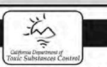

NOTICE of AVAILABILITY of the

Draft Environmental Impact Report/Environmental Assessment and Draft Final Remedial Action Plan

# Announcement of PUBLIC HEARING & PUBLIC COMMENT PERIOD for the

State Route 132 West Freeway/Expressway Project and Caltrans Modesto Soil Stockpiles Draft Final Remedial Action Plan

DATE: February 22, 2017 TIME: 6:00 p.m. to 8:00 p.m. (Open House Format) PLACE: Mark Twain Junior High School 707 South Emerald Avenue Modesto, CA 95351

### PUBLIC COMMENT PERIOD STARTS: January 18, 2017 ENDS: March 17, 2017

### (WHAT IS PLANNED?

The California Department of Transportation (Caltrans), as the California Environmental Quality Act (CEQA) lead agency and as assigned by the Federal Highway Administration under the National Environmental Policy Act (NEPA) at the time of the signing of this environmental document, working in cooperation with the Stanislaus Council of Governments (StanCOG), proposes to construct a four-lane freeway/expressway along the adopted route of State Route (SR) 132 south of Kansas Avenue from Dakota Avenue to east of SR 99 at the Needham Street Bridge Overcrossing in the city of Modesto.

•

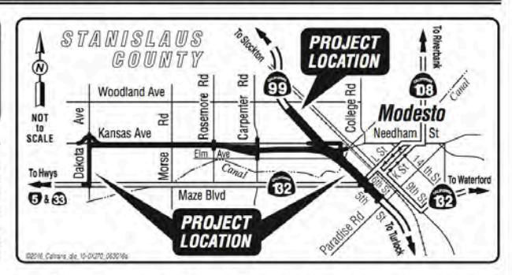

The Caltrans Modesto Stockpiles occupy three areas within state right-of-way south of Kansas Avenue: between Carpenter Avenue and Emerald Avenue, Emerald Avenue and SR 99, and east of SR 99. Caltrans proposes to cap the soil stockpiles as part of the SR 132 West Freeway/Expressway construction project. As required by state law, the California Department of Toxic Substances Control (DTSC) and the Central Valley Regional Water Quality Control Board (RWQCB) have reviewed the Draft Final Remedial Action Plan (RAP) for the stockpiles and approved it for public noticing.

The three stockpiles total approximately 160,000 cubic yards of soil containing metals (primarily barium, lead, and strontium). Caltrans prepared the Draft Final RAP under the oversight of the DTSC and RWQCB. If approved, the RAP would allow for the placement of impacted soil beneath roadway pavement, within bridge abutments, and behind retaining walls. This action would avoid potential future impacts to human health and the environment.

### WHY THIS PUBLIC NOTICE?

Caltrans has studied the effects this project may have on the environment. A Draft Environmental Impact Report (Draft EIR)/Environmental Assessment (EA) and Draft Final RAP were prepared and are available for public review and comment. You have the opportunity to offer your comments or concerns, and your comments will become part of the public record. An open forum public hearing will be held to give you an opportunity to talk about certain design features of the project with Caltrans staff and discuss the Draft Final RAP for the Caltrans Modesto Soil Stockpiles with DTSC and RWQCB representatives. No formal presentation will be given, and you are welcome to attend the hearing any time between 6:00 p.m. and 8:00 p.m.

## WHAT'S AVAILABLE?

The Draft EIR/EA and the Draft Final RAP will be available during the extended review period from January 18, 2017 to March 17, 2017 at the following locations:

- Caltrans District 10 office at 1976 Dr. Martin Luther King Jr. Boulevard, Stockton, CA 95206, weekdays from 8:00 a.m. to 4:00 p.m.
- StanCOG office at 1111 | Street, Suite 308, Modesto, CA 95354, weekdays from 8:00 a.m. to 5:00 p.m. (Closed alternating Fridays)
- Stanislaus County Library at 1500 I Street, Modesto, CA 95354, Monday-Thursday from 10:00 a.m. to 9:00 p.m., Saturday from 10:00 a.m. to 5:00 p.m.
- DTSC office at 8800 Cal Center Drive, Sacramento, CA 95826. To make arrangement for review of these documents, please call (916) 255-4159 or (916) 255-3578.
- Copies of the Draft Final RAP are located at the DTSC website: http://www.envirostor.dtsc.ca.gov/public/profile\_report.asp?global\_id=60001626\_and http://www.envirostor.dtsc.ca.gov/public/profile\_report.asp?global\_id=50280024
- Copies of the Draft EIR/EA, Draft Final RAP, and supporting documents are located at the Caltrans website: http://www.dot.ca.gov/dist10/environmental/projects/sr132/west/index.html

### WHERE DO YOU COME IN? .

The public hearing will be held in an open forum format. You will have an opportunity to review the design concepts, information, and displays, as well as provide written comments on the Draft EIRIEA and Draft Final RAP Caltrans, DTSC and RWQCB staff will be available to answer your questions. Do you believe the project's potential impacts have been adequately addressed by the draft environmental document? Do you have information that should be included?

Comment cards will be available for you to fill out. A court reporter will also be available to record individual comments. If you prefer to comment on the Draft EIR/EA and/or Draft inal RAP at a later time, you must submit your written comments no later than March 17, 2017 to Caltrans, Attn: Phil Vallejo, Central Sierra Environmental Analysis Branch, 855 M Street, Suite 200, Fresno, CA 93721; or via email to phillip.vallejo@dot.ca.gov. Your written comments on the documents will be part of the public record.

After considering and replying to all written comments on the Draft EIR/EA, Caltrans will make a decision on the project. Similarly, after considering and replying to all written comments, DTSC and RWQCB will make a decision on the RAP Comments on the Draft Final RAP should also be sent to the above Caltrans address and these comments will be forwarded to DTSC and RWQCB to review and respond to them.

For more information on the SR 132 West Freeway/Expressway project, please contact Phil Vallejo, Central Sierra Environmental Analysis Branch, at Caltrans, 855 M Street, Fresno, CA 93721, phone (559) 445-6172 or email phillip vallejo@dot.ca.gov. For all other State Highway matters in the area, please contact the District 10 Public Information Office at district10publicaffairs@dot.ca.gov, or phone (209) 948-7977.

If you have questions about the Draft Final RAP, please contact Randy Adams, Project Manager, DTSC, by phone (916) 255-3591. You may also contact him by email at Randy.Adams@dtsc.ca.gov.

### (SPECIAL ACCOMMODATIONS •)

Under the Americans with Disabilities Act of 1990, individuals who require accommodation (American Sign Language interpreter, accessible seating, documentation in alternate formats, etc.) are requested to contact the District 10 Public Information Office at: district10publicaffairs@dot.ca.gov, or phone (209) 948-7977. TDD users may contact the California Relay Service TDD and/or Voice Line at 1-800-735-2929, or 711

2017Cairns*d9*10-08X270\_020917-FINALv7

# Public Notice – Published in the Vida en el Valle newspaper on February 15, 2017

# PU

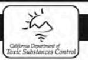

AVISO PÚBLICO DE DISPONIBILIDAD de los

Informes Preliminares al Impacto Ambiental/Evaluación Medioambiental del y Plan Final de Acción Correctiva

Anuncio de AUDIENCIA PÚBLICA Y PERÍODO ABIERTO AL COMENTARIO PÚBLICO para Proyecto Autopista Ruta Estatal 132-Oeste/Vía Expresa y

Propuesta Final de Acción Correctiva De Los Montones de Suelos con Residuos Caltrans en Modesto

### FECHA: 22 de febrero del 2017 HORA: 6:00 p.m. a 8:00 p.m. (Junta Informal) LUGAR: Escuela Primaria Mark Twain 707 South Emerald Avenue Modesto, CA 95351

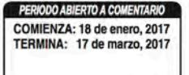

## ¿QUÉ SE PLANIFICA?

El Departamento de Transporte de California (Caltrans), en su condición de agencia-líder en cumplimento al Acta de Calidad Medioambiental en California (CEQA) y como dicta la Administración Federal de Carreteras bajo el Acta Nacional de Políticas Medioambientales (NEPA) -al momento de la firma de este documento medioambiental— y en colaboración con el Consejo de Gobiernos de Stanislaus (StanCOG), propone la construcción de una autopista/via rápida de cuatro carriles a los largo de la ya aprobada Ruta Estatal 132 —al sur de Av. Kansas desde la Av. Dakota al este de la Ruta Estatal 99, al cruce de Needham Street Bridge en la ciudad de Modesto.

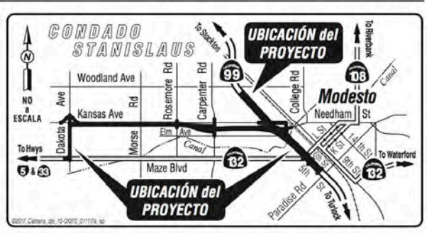

Los Montones de Caltrans en Modesto ocupan tres áreas dentro el derecho-de-vía ubicado al sur de la Av. Kansas: entre la Av. Carpenter, Av. Emerald y Ruta 99, y al este de la Ruta 99. Caltrans propone aplicar una capa de tierra limpia sobre los montones contaminados como parte de la construcción del proyecto Autopista Ruta Estatal 132-Oeste/ Vía Expresa. En cumplimiento a la ley Estatal, el Departamento de Control de Sustancias Tóxicas de California (DTSC) y el Directorio de Control Regional de Calidad del Agua del Valle Central (RWQCB) han analizado ésta, la última Propuesta Final de Acción Correctiva (RAP) y la han aprobado para su notificación pública.

Los tres montones suman 160 mil yardas cúbicas de tierra que contiene metales pesados (principalmente bario, plomo y estroncio). Caltrans preparó su propuesta de RAP Final bajo la supervisión del DTSC y el RWQCB. De aprobarse, el RAP permitiría la colocación de suelo contaminado debajo del pavimento de la carretera, dentro de los contrafuertes de los puentes y detrás de los muros de contención. Esta acción prevendría un futuro riesgo a la salud humana y el medioambiente.

### (¿POR QUÉ HACEMOS ESTE AVISO AL PÚBLICO? •)

Caltrans ha estudiado los efectos que este proyecto podría tener en el medioambiente. Se prepararon Informes Preliminares al Impacto Ambiental (EIR)/Evaluación Medioambiental (EA) y del Plan Final de Acción Correctiva y se han puesto a disposición del público para su análisis y comentario. Usted tiene la opción de ofrecer su opinión o dudas, las que formaran parte del archivo público. Se celebrará una audiencia abierta al público para brindarie la oportunidad de hablar sobre ciertas características de diseño del proyecto con personal de Caltrans, como asimismo tratar la propuesta final del RAP referente a los montones Caltrans en Modesto con representantes del DTSC y RWQCB. No se realizará una junta formal, por lo que usted puede presentarse a cualquier hora entre las 6:00 y las 8:00 p.m.

### QUÉ ESTÁ DISPONIBLE? •)

Tanto el EIR/EA preliminar como la Propuesta Final del RAP estará disponible durante el período de revisión ampliada a partir del 18 de enero de 2017 y el 17 de marzo, 2017, en

- Oficina Caltrans del Distrito 10, 1976 Dr. Martin Luther King Jr. Boulevard, Stockton, CA 95206, días de semana de 8 am a 4 pm.
- Oficinas del StanCOG. 1111 "!" Street. Suite 308. Modesto. CA 95354, días de semana de 8 am a 5 pm, cerrado un viernes sí y otro no.
- Biblioteca del Condado Stanislaus, 1500 "l" Street, Modesto, CA 95354, lunes-jueves de 10 am a 9 pm, sábados de 10 am a 5 pm.
- Oficina del DTSC, 8800 Cal Center Drive, Sacramento, CA 95826. Para concertar una visita para revisar estos documentos, sírvase llamar a los teléfonos (916) 255-4159 o (916) 255-3578.
- Copias de la Propuesta Final del RAP se pueden hallar en el sitio virtual del STSC: http://www.envirostor.dtsc.ca.gov/public/profile\_report.asp?global\_id=60001626 y http://www.envirostor.dtsc.ca.gov/public/profile\_report.asp?global\_id=50280024
- Las copias del EIR/EA preliminar, de la Propuesta Final del RAP, y de la documentación de respaldo se hallan en el sitio de Caltrans: http://www.dot.ca.gov/dist10/environmental/projects/sr132west/index.html

### ¿DÓNDE PARTICIPA UD? •)

La audiencia pública se realizará en un formato de foro abierto. Ud. tendrá la oportunidad de examinar los conceptos de diseño, información e ilustraciones, como también de verter sus comentarios por escrito en el EIR/EA preliminar y la Propuesta Final del RPA. Habrá personal de Caltrans, DTSC y RWQCB dispuesto a contestar sus preguntas. ¿Cree Ud. que los posibles efectos del proyecto han sido apropiadamente tomados en cuenta en el documento medicambiental presentado? ¿Tiene Ud. información que debiese incluirse? Se dispondrá de tarjetones para dejar sus comentarios. Habrá también un estenógrafo para tomar declaraciones individuales. Si prefiere comentar sobre el EIR/EA preliminar y la Propuesta Final del RPA en otra ocasión, puede enviar su nota escrita a Caltrans, Attn: Philip Vallejo, Central Sierra Environmental Analysis Branch, 855 M Street, Suite 200, Fresno, CA 93721; o por correo electrónico a philip.vallejo@dot.ca.gov. Los comentarios escritos deben ser recibidos a más tardar el 17 de marzo, 2017. Sus comentarios formarán parte del

Después de tomar en consideración y responder a todos los comentarios escritos sobre el EIR/EA preliminar, Caltrans tomará una decisión sobre el proyecto. Asimismo, después de tomar en consideración y responder a todos los comentarios escritos, el DTSC y el RWQCB tomarán una decisión respecto del RAP. Los comentarios sobre la Propuesta Final del RPA deben, también, enviarse a la dirección de Caltrans (ver arriba) desde donde se remitirán al DTSC y al RWQCB para su análisis y respuesta.

Para mayor información sobre el proyecto Autopista Ruta Estatal 132-Oeste/ Vía Expresa, sirva comunicarse con Philio Valleio, Sucursal de Análisis Medioambiental de la Sierra Central, en Caltrans, 855 M Street, Fresno, CA 93721, tel. (559) 445-6172 o correo electrónico philip.vallejo@dot.ca.gov. Para tódo otro asunto sobre carreteras estatales en el área, sirva comunicarse con el director de relaciones públicas del Distrito 10 de Caltrans en district 10 publicaffairs @dot.ca.gov, o al tel. (209) 948-7977. Si tiene dudas sobre la Propuesta Final del RPA, sirva comunicarse con Randy Adams, gerente de proyecto, DTSC, al tel. (916) 255-3591. También puede contactarlo por correo electrónico a Randy.Adams@dtsc.ca.gov.

### (POSIBLES ADAPTACIONES •)

En cumplimiento al Acta Estadounidenses Incapacitados de 1990, aquellos que requieren de modificaciones o arreglos especiales (intérprete de señas, asientos especiales, documentación en formatos alternativos, etc.) deben comunicarse con la oficina de relaciones públicas del Distrito 10 de Caltrans en district10publicaffairs@dot.ca.gov, o al tel. (209) 948-7977. Personas que requieran dispositivo de telecomunicación para sordos (TDD, por sus siglas en inglés) pueden comunicarse con la línea TDD del California Relay Service (Servicio de Retransmisión de California) o al teléfono 1-800-735-2922 ó 711.

202017Catniss996*del*10*GC2770*20201117-ep-FINAL v1

# **Appendix C** Photographs of the Public Hearing

The following are photographs of the public hearing activities.

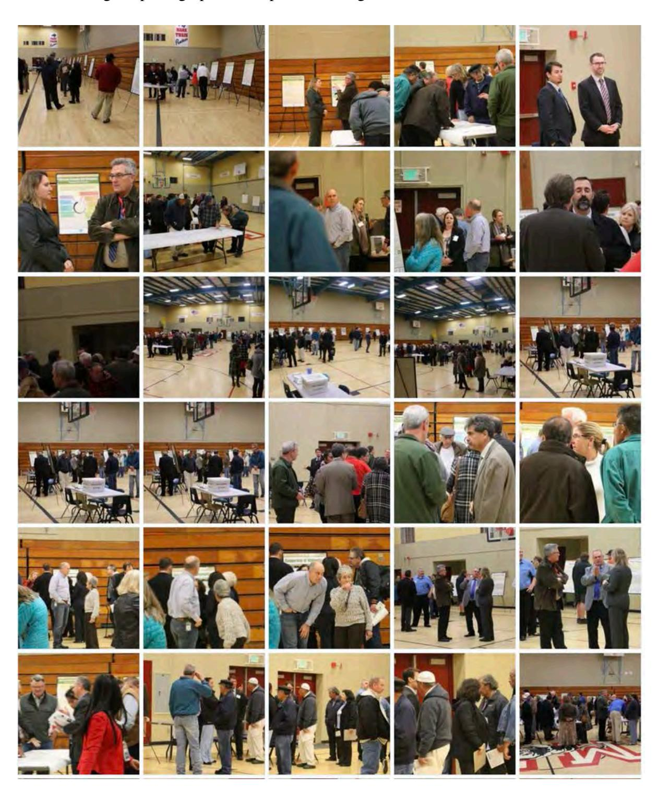

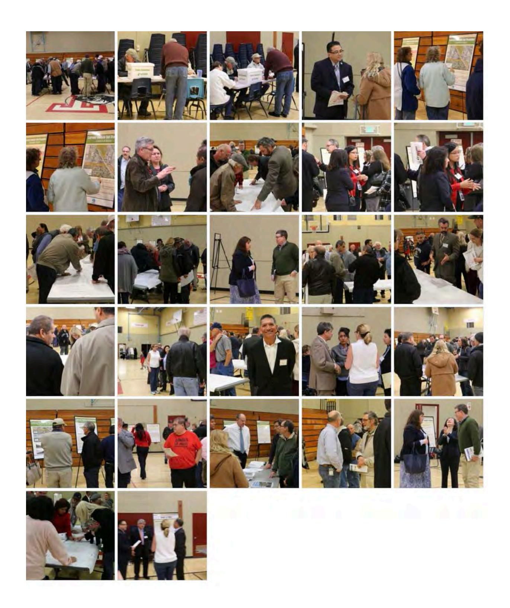

# **Appendix D** Public Comments

The following are photocopies of the comment cards received from the public in response to the public hearing. All other comments received during the circulation period are part of the public record and will be officially responded to the final environmental document.

# Comment Cards Received at the Public Hearing

| 11. 5 6 55                                                                                                                                                                                                                                                                                                                                                                                                                                                                                                                                                                                                                                                                                                                                                                                                                                                                                                                                                                                                                                                                                                                                                                                                                                                                                                                                                                                                                                                                                                                                                                                                                                                                                                                                                                                                                                                                                                                                                                                                                                                                                                                     | OD. ZIP: 95358                                                                                                                                 |
|--------------------------------------------------------------------------------------------------------------------------------------------------------------------------------------------------------------------------------------------------------------------------------------------------------------------------------------------------------------------------------------------------------------------------------------------------------------------------------------------------------------------------------------------------------------------------------------------------------------------------------------------------------------------------------------------------------------------------------------------------------------------------------------------------------------------------------------------------------------------------------------------------------------------------------------------------------------------------------------------------------------------------------------------------------------------------------------------------------------------------------------------------------------------------------------------------------------------------------------------------------------------------------------------------------------------------------------------------------------------------------------------------------------------------------------------------------------------------------------------------------------------------------------------------------------------------------------------------------------------------------------------------------------------------------------------------------------------------------------------------------------------------------------------------------------------------------------------------------------------------------------------------------------------------------------------------------------------------------------------------------------------------------------------------------------------------------------------------------------------------------|------------------------------------------------------------------------------------------------------------------------------------------------|
| PRESENTING: LUF EXTERPR                                                                                                                                                                                                                                                                                                                                                                                                                                                                                                                                                                                                                                                                                                                                                                                                                                                                                                                                                                                                                                                                                                                                                                                                                                                                                                                                                                                                                                                                                                                                                                                                                                                                                                                                                                                                                                                                                                                                                                                                                                                                                                        | rises                                                                                                                                          |
| Please add me to the project mailing list.                                                                                                                                                                                                                                                                                                                                                                                                                                                                                                                                                                                                                                                                                                                                                                                                                                                                                                                                                                                                                                                                                                                                                                                                                                                                                                                                                                                                                                                                                                                                                                                                                                                                                                                                                                                                                                                                                                                                                                                                                                                                                     |                                                                                                                                                |
| ould like the following comments filed in the recor                                                                                                                                                                                                                                                                                                                                                                                                                                                                                                                                                                                                                                                                                                                                                                                                                                                                                                                                                                                                                                                                                                                                                                                                                                                                                                                                                                                                                                                                                                                                                                                                                                                                                                                                                                                                                                                                                                                                                                                                                                                                            | rd* (plaasa print):                                                                                                                            |
| OPTION #2 15 THE PERFER                                                                                                                                                                                                                                                                                                                                                                                                                                                                                                                                                                                                                                                                                                                                                                                                                                                                                                                                                                                                                                                                                                                                                                                                                                                                                                                                                                                                                                                                                                                                                                                                                                                                                                                                                                                                                                                                                                                                                                                                                                                                                                        |                                                                                                                                                |
|                                                                                                                                                                                                                                                                                                                                                                                                                                                                                                                                                                                                                                                                                                                                                                                                                                                                                                                                                                                                                                                                                                                                                                                                                                                                                                                                                                                                                                                                                                                                                                                                                                                                                                                                                                                                                                                                                                                                                                                                                                                                                                                                | UD & NOG / E                                                                                                                                   |
| REMOVING ON-RAMP & OFFRAMI                                                                                                                                                                                                                                                                                                                                                                                                                                                                                                                                                                                                                                                                                                                                                                                                                                                                                                                                                                                                                                                                                                                                                                                                                                                                                                                                                                                                                                                                                                                                                                                                                                                                                                                                                                                                                                                                                                                                                                                                                                                                                                     | P AS THEY EXIST WOULD                                                                                                                          |
| DISTROY BUSSENESS ALONG KAN                                                                                                                                                                                                                                                                                                                                                                                                                                                                                                                                                                                                                                                                                                                                                                                                                                                                                                                                                                                                                                                                                                                                                                                                                                                                                                                                                                                                                                                                                                                                                                                                                                                                                                                                                                                                                                                                                                                                                                                                                                                                                                    |                                                                                                                                                |
| 13 TRU DUSSENESS PLLUTO TO                                                                                                                                                                                                                                                                                                                                                                                                                                                                                                                                                                                                                                                                                                                                                                                                                                                                                                                                                                                                                                                                                                                                                                                                                                                                                                                                                                                                                                                                                                                                                                                                                                                                                                                                                                                                                                                                                                                                                                                                                                                                                                     | -71-3                                                                                                                                          |
| N TO AND THE STATE OF THE STATE OF THE STATE OF THE STATE OF THE STATE OF THE STATE OF THE STATE OF THE STATE OF THE STATE OF THE STATE OF THE STATE OF THE STATE OF THE STATE OF THE STATE OF THE STATE OF THE STATE OF THE STATE OF THE STATE OF THE STATE OF THE STATE OF THE STATE OF THE STATE OF THE STATE OF THE STATE OF THE STATE OF THE STATE OF THE STATE OF THE STATE OF THE STATE OF THE STATE OF THE STATE OF THE STATE OF THE STATE OF THE STATE OF THE STATE OF THE STATE OF THE STATE OF THE STATE OF THE STATE OF THE STATE OF THE STATE OF THE STATE OF THE STATE OF THE STATE OF THE STATE OF THE STATE OF THE STATE OF THE STATE OF THE STATE OF THE STATE OF THE STATE OF THE STATE OF THE STATE OF THE STATE OF THE STATE OF THE STATE OF THE STATE OF THE STATE OF THE STATE OF THE STATE OF THE STATE OF THE STATE OF THE STATE OF THE STATE OF THE STATE OF THE STATE OF THE STATE OF THE STATE OF THE STATE OF THE STATE OF THE STATE OF THE STATE OF THE STATE OF THE STATE OF THE STATE OF THE STATE OF THE STATE OF THE STATE OF THE STATE OF THE STATE OF THE STATE OF THE STATE OF THE STATE OF THE STATE OF THE STATE OF THE STATE OF THE STATE OF THE STATE OF THE STATE OF THE STATE OF THE STATE OF THE STATE OF THE STATE OF THE STATE OF THE STATE OF THE STATE OF THE STATE OF THE STATE OF THE STATE OF THE STATE OF THE STATE OF THE STATE OF THE STATE OF THE STATE OF THE STATE OF THE STATE OF THE STATE OF THE STATE OF THE STATE OF THE STATE OF THE STATE OF THE STATE OF THE STATE OF THE STATE OF THE STATE OF THE STATE OF THE STATE OF THE STATE OF THE STATE OF THE STATE OF THE STATE OF THE STATE OF THE STATE OF THE STATE OF THE STATE OF THE STATE OF THE STATE OF THE STATE OF THE STATE OF THE STATE OF THE STATE OF THE STATE OF THE STATE OF THE STATE OF THE STATE OF THE STATE OF THE STATE OF THE STATE OF THE STATE OF THE STATE OF THE STATE OF THE STATE OF THE STATE OF THE STATE OF THE STATE OF THE STATE OF THE STATE OF THE STATE OF THE STATE OF THE STATE OF THE STATE OF THE STATE OF THE STATE OF THE STATE OF THE STATE OF THE STATE OF THE STATE | 1 -                                                                                                                                            |
| A COOS EX DIMPLE IS NINKTH GO                                                                                                                                                                                                                                                                                                                                                                                                                                                                                                                                                                                                                                                                                                                                                                                                                                                                                                                                                                                                                                                                                                                                                                                                                                                                                                                                                                                                                                                                                                                                                                                                                                                                                                                                                                                                                                                                                                                                                                                                                                                                                                  | WET LETS WES MINES                                                                                                                             |
| A GOOD TO AMILE 13 NOTH 111                                                                                                                                                                                                                                                                                                                                                                                                                                                                                                                                                                                                                                                                                                                                                                                                                                                                                                                                                                                                                                                                                                                                                                                                                                                                                                                                                                                                                                                                                                                                                                                                                                                                                                                                                                                                                                                                                                                                                                                                                                                                                                    | H ST. LETS NOT MAKE                                                                                                                            |
| THE SAME MISTAKE.                                                                                                                                                                                                                                                                                                                                                                                                                                                                                                                                                                                                                                                                                                                                                                                                                                                                                                                                                                                                                                                                                                                                                                                                                                                                                                                                                                                                                                                                                                                                                                                                                                                                                                                                                                                                                                                                                                                                                                                                                                                                                                              |                                                                                                                                                |
|                                                                                                                                                                                                                                                                                                                                                                                                                                                                                                                                                                                                                                                                                                                                                                                                                                                                                                                                                                                                                                                                                                                                                                                                                                                                                                                                                                                                                                                                                                                                                                                                                                                                                                                                                                                                                                                                                                                                                                                                                                                                                                                                |                                                                                                                                                |
|                                                                                                                                                                                                                                                                                                                                                                                                                                                                                                                                                                                                                                                                                                                                                                                                                                                                                                                                                                                                                                                                                                                                                                                                                                                                                                                                                                                                                                                                                                                                                                                                                                                                                                                                                                                                                                                                                                                                                                                                                                                                                                                                |                                                                                                                                                |
|                                                                                                                                                                                                                                                                                                                                                                                                                                                                                                                                                                                                                                                                                                                                                                                                                                                                                                                                                                                                                                                                                                                                                                                                                                                                                                                                                                                                                                                                                                                                                                                                                                                                                                                                                                                                                                                                                                                                                                                                                                                                                                                                |                                                                                                                                                |
| THE SAME MISTAKE.                                                                                                                                                                                                                                                                                                                                                                                                                                                                                                                                                                                                                                                                                                                                                                                                                                                                                                                                                                                                                                                                                                                                                                                                                                                                                                                                                                                                                                                                                                                                                                                                                                                                                                                                                                                                                                                                                                                                                                                                                                                                                                              |                                                                                                                                                |
| THE SAME MISTAKE.                                                                                                                                                                                                                                                                                                                                                                                                                                                                                                                                                                                                                                                                                                                                                                                                                                                                                                                                                                                                                                                                                                                                                                                                                                                                                                                                                                                                                                                                                                                                                                                                                                                                                                                                                                                                                                                                                                                                                                                                                                                                                                              | iight Attention: Philip Vallejo ess: California Department of Transportation                                                                |
| Place your comments into the Comment Box ton or mail your comments to the following address                                                                                                                                                                                                                                                                                                                                                                                                                                                                                                                                                                                                                                                                                                                                                                                                                                                                                                                                                                                                                                                                                                                                                                                                                                                                                                                                                                                                                                                                                                                                                                                                                                                                                                                                                                                                                                                                                                                                                                                                                                    | night Attention: Philip Vallejo\ness: California Department of Transportation Acting Senior Environmental Planner 2017 855 M Street, Suite 200 |
| Place your comments into the Comment Box ton                                                                                                                                                                                                                                                                                                                                                                                                                                                                                                                                                                                                                                                                                                                                                                                                                                                                                                                                                                                                                                                                                                                                                                                                                                                                                                                                                                                                                                                                                                                                                                                                                                                                                                                                                                                                                                                                                                                                                                                                                                                                                   | night Attention: Philip Vallejo\ness: California Department of Transportation Acting Senior Environmental Planner                              |
| Place your comments into the Comment Box ton or mail your comments to the following address                                                                                                                                                                                                                                                                                                                                                                                                                                                                                                                                                                                                                                                                                                                                                                                                                                                                                                                                                                                                                                                                                                                                                                                                                                                                                                                                                                                                                                                                                                                                                                                                                                                                                                                                                                                                                                                                                                                                                                                                                                    | night Attention: Philip Vallejo\ness: California Department of Transportation Acting Senior Environmental Planner 2017 855 M Street, Suite 200 |

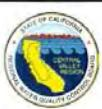

| NAME:         | EDMOND MORAD                                                                   |
|---------------|--------------------------------------------------------------------------------|
| BUS. ADDRESS: | 330 KANSAS AVE CITY: MODESTO ZIP: 95351                                        |
| REPRESENTING: | MY SELF                                                                        |
| HM ADDRESS:   | 3208 PAPILLON CT, MODESTO CA. 95356                                            |
|               | <input checked="" type="checkbox"/> Please add me to the project mailing list. |

I would like the following comments filed in the record\* (please print):

| 1) | I WOULD LIKE to SELECT option #2 ROUTE                     |
|----|------------------------------------------------------------|
|    | BECAUSE THE SOUTH BOUND, EXIT FROM 99 REMAINS AS IS.       |
|    | KANSAS                                                     |
| 2) | I BELIVE OPTION #2 WILL HAVE LESS IMPACT ON THE BUSINESSES |
|    | ON KANSAS.                                                 |

\*Place your comments into the Comment Box tonight or mail your comments to the following address:Comments must be received by March 17, 2017

| Attention: Philip Vallejo               |
|-----------------------------------------|
| California Department of Transportation |
| Acting Senior Environmental Planner     |
| 855 M Street, Suite 200                 |
| Fresno, CA 93721                        |

How Did You Hear About This Meeting?

| <input type="checkbox"/> newspaper | <input checked="" type="checkbox"/> newsletter | <input type="checkbox"/> someone told me about it | <input type="checkbox"/> other: NOTIFICATION MAIL |
|------------------------------------|------------------------------------------------|---------------------------------------------------|---------------------------------------------------|
|------------------------------------|------------------------------------------------|---------------------------------------------------|---------------------------------------------------|

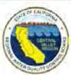

| NAME:                                                                                       | Lewis Cimino, M.D. |           |         |            |       |                                         |        |
|---------------------------------------------------------------------------------------------|--------------------|-----------|---------|------------|-------|-----------------------------------------|--------|
| ADDRESS:                                                                                    | 2101 Kansas Ave    | CITY:     | Modesto | ZIP:       | 95358 |                                         |        |
| REPRESENTING:                                                                               |                    |           |         |            |       |                                         |        |
| <input checked="" type="checkbox"/> Please add me to the project mailing list. |                    |           |         |            |       |                                         |        |
| I would like the following comments filed in the record* (please print):                    |                    |           |         |            |       |                                         |        |
| There is no need to disrupt                                                                 |                    |           |         |            |       |                                         |        |
| our country roads (Kansas, Dakota)                                                          |                    |           |         |            |       |                                         |        |
| for this project. It should                                                                 |                    |           |         |            |       |                                         |        |
| be a true express way from                                                                  |                    |           |         |            |       |                                         |        |
| 99 all the way out to Gates                                                                 |                    |           |         |            |       |                                         |        |
| Road and leave Kansas and                                                                   |                    |           |         |            |       |                                         |        |
| Dakota alone                                                                                |                    |           |         |            |       |                                         |        |
| *Place your comments into the Comment Box tonight                                           |                    |           |         |            |       |                                         |        |
| or mail your comments to the following address:                                             |                    |           |         |            |       |                                         |        |
| Comments must be received by March 17, 2017                  |                    |           |         |            |       | Attention: Philip Vallejo               |        |
|                                                                                             |                    |           |         |            |       | California Department of Transportation |        |
|                                                                                             |                    |           |         |            |       | Acting Senior Environmental Planner     |        |
|                                                                                             |                    |           |         |            |       | 855 M Street, Suite 200                 |        |
|                                                                                             |                    |           |         |            |       | Fresno, CA 93721                        |        |
| How Did You Hear                                                                            |                    | newspaper |         | newsletter |       | someone                                 | other: |
| About This Meeting?                                                                         |                    |           |         | told me    |       |                                         |        |
|                                                                                             |                    |           |         | about it   |       |                                         |        |

| NAME:                                                                       | MARY S MATTHEWS                          |                                         |          |                    |
|-----------------------------------------------------------------------------|------------------------------------------|-----------------------------------------|----------|--------------------|
| ADDRESS:                                                                    | 819 LOLETTA AVE CITY: MODESTO ZIP: 95351 |                                         |          |                    |
| REPRESENTING:                                                               | SELF                                     |                                         |          |                    |
| Please add me to the project mailing list.                                  |                                          |                                         |          |                    |
| I would like the following comments filed in the record* (please print):    |                                          |                                         |          |                    |
| WE ALREADY HAVE PROBLEMS WITH THE HOMELESS POPULATION                       |                                          |                                         |          |                    |
| IN OUR ALLEY AND UP ON THE CALTRANS BERM (STOCKPILE 2)                      |                                          |                                         |          |                    |
| ACCORDING TO THE DRAWINGS THERE WILL BE PLENTY OF                           |                                          |                                         |          |                    |
| ROOM BETWEEN THE BOUNDARY FENCE AND THE SOUNDWALL                           |                                          |                                         |          |                    |
| FOR THEM TO INVADE EVEN MORE THAN THEY ALREADY                              |                                          |                                         |          |                    |
| DO. WE HAVE FIRES ALMOST YEARLY CAUSED BY                                   |                                          |                                         |          |                    |
| THE HOMELESS. WHAT STEPS WILL BE TAKEN TO                                   |                                          |                                         |          |                    |
| PREVENT THIS PROBLEM?                                                       |                                          |                                         |          |                    |
| *Place your comments into the Comment Box tonight                           |                                          |                                         |          |                    |
| or mail your comments to the following address:                             |                                          |                                         |          |                    |
| Comments must be received by March 17, 2017 |                                          | Attention: Philip Vallejo               |          |                    |
|                                                                             |                                          | California Department of Transportation |          |                    |
|                                                                             |                                          | Acting Senior Environmental Planner     |          |                    |
|                                                                             |                                          | 855 M Street, Suite 200                 |          |                    |
|                                                                             |                                          | Fresno, CA 93721                        |          |                    |
| How Did You Hear                                                            | newspaper                                | newsletter                              | someone  | other: DIRECT MAIL |
| About This Meeting?                                                         |                                          |                                         | told me  |                    |
|                                                                             |                                          |                                         | about it |                    |

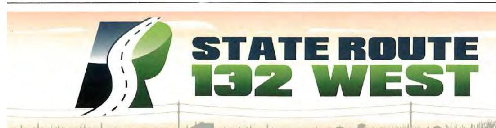

| NAME:                                                                    | Patricia Wilhelm                     |
|--------------------------------------------------------------------------|--------------------------------------|
| ADDRESS:                                                                 | 1717 Kansas City: Modesto ZIP: 95358 |
| REPRESENTING:                                                            | myself                               |
| ☒ Please add me to the project mailing list.                             |                                      |
| I would like the following comments filed in the record* (please print): |                                      |
| - Why does the 132 need to end at Dakota                                 |                                      |
| - Makes no sense                                                         |                                      |
| - Why can't the current 132 be widened and improved                      |                                      |
| - to that proposal would eliminate the need to upset                     |                                      |
| that Barium site-                                                        |                                      |

\*Place your comments into the Comment Box tonight or mail your comments to the following address:Comments must be received by March 17, 2017Attention: Philip Vallejo California Department of Transportation Acting Senior Environmental Planner 855 M Street, Suite 200 Fresno, CA 93721How Did You Hear About This Meeting? newspaper newsletter someone told me about it other: \_\_\_\_\_\_\_\_\_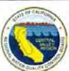

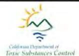

| NAME:                               | HEMENT KHATRI - QUALITY INN (HOTEL)        |       |         |      |       |
|-------------------------------------|--------------------------------------------|-------|---------|------|-------|
| ADDRESS:                            | 500 KANSAS Ave                             | CITY: | MODESTO | ZIP: | 95351 |
| REPRESENTING:                       | Self                                       |       |         |      |       |
| <input checked="" type="checkbox"/> | Please add me to the project mailing list. |       |         |      |       |

I would like the following comments filed in the record\* (please print):

| 1. ACCORDING TO EIR REPORT, MY PROPERTY IS A "FULL TAKE" WHEREAS    |
|---------------------------------------------------------------------|
| ACCORDING TO ENGINEERING/DESIGN, MY PROPERTY IS NOT IMPACTED.       |
| NEED CLARIFICATION.                                                 |
| 2. IF THE PROJECT GOES AHEAD AND MY PROPERTY (& BUSINESS) NOT TAKEN |
| THEN I AM CONCERNED ABOUT THE NOISE & EXPOSURE THAT                 |
| WILL IMPACT MY HOTEL.                                               |

\*Place your comments into the Comment Box tonight or mail your comments to the following address:

| Comments must be received by March 17, 2017 | Attention: Philip Vallejo California Department of Transportation Acting Senior Environmental Planner 855 M Street, Suite 200 Fresno, CA 93721 |
|---------------------------------------------|------------------------------------------------------------------------------------------------------------------------------------------------------------|
|---------------------------------------------|------------------------------------------------------------------------------------------------------------------------------------------------------------|

How Did You Hear About This Meeting?

| <input type="checkbox"/> newspaper | <input type="checkbox"/> newsletter | <input type="checkbox"/> someone told me about it | <input type="checkbox"/> other: _________ |
|------------------------------------|-------------------------------------|---------------------------------------------------|-------------------------------------------|
|------------------------------------|-------------------------------------|---------------------------------------------------|-------------------------------------------|

| NAME:         | Rachel Bradley                     |
|---------------|------------------------------------|
| ADDRESS:      | 637 Elm Alcity: Modesto ZIP: 95358 |
| REPRESENTING: | Self                               |

☑ Please add me to the project mailing list.

| I would like the following comments filed in the record* (please print): |
|--------------------------------------------------------------------------|
| Please Revisit your list on the MAP                                      |
| list. Confused on the Partial full decisions                             |
| We need to know indetail time frame of                                   |
| the starte of Project and how much you                                   |
| will finally take of our land!                                           |
| Keep us in the Loop                                                      |
| Please                                                                   |

| *Place your comments into the Comment Box tonight or mail your comments to the following address: | Attention: Philip Vallejo California Department of Transportation Acting Senior Environmental Planner 855 M Street, Suite 200 Fresno, CA 93721 |
|---------------------------------------------------------------------------------------------------|------------------------------------------------------------------------------------------------------------------------------------------------|
| Comments must be received by March 17, 2017                                                       |                                                                                                                                                |

| How Did You Hear About This Meeting? | ☑ newspaper ☑ newsletter ☑ someone told me about it ☑ other: |
|--------------------------------------|--------------------------------------------------------------|
|--------------------------------------|--------------------------------------------------------------|

# Tarjeta para comentarios

| NOMBRE:                                                                                                     | Alexamdra Munoz                                       |                                        |         |                 |                |
|-------------------------------------------------------------------------------------------------------------|-------------------------------------------------------|----------------------------------------|---------|-----------------|----------------|
| DIRECCIÓN:                                                                                                  | 500 Kansas Av                                         | CIUDAD:                                | Modesto | CÓDIGO POSTAL:  | 95351          |
| ¿A QUIÉN REPRESENTA?:                                                                                       | Guayabitos Restaurant (Ramos Diaz Enterprises inc)    |                                        |         |                 |                |
| <input checked="" type="checkbox"/> Por favor, agregame a la lista de correo del proyecto.                  |                                                       |                                        |         |                 |                |
| Me gustaría que los siguientes comentarios se archivaran en el expediente * (escriba en letra de imprenta): |                                                       |                                        |         |                 |                |
| 1.-                                                                                                         | Porque no le avizaron a todos negocios Latinos en el  |                                        |         |                 |                |
| idioma español                                                                                              | 2.-                                                   | Porque no avizaron a los recidentes de |         |                 |                |
| estas propiedades?                                                                                          |                                                       |                                        |         |                 |                |
| 3.-                                                                                                         | Que va a pasar con toda la inversion que hice en esta |                                        |         |                 |                |
| Propiedad para haver mi negocio?                                                                            |                                                       |                                        |         |                 |                |
| 4.-                                                                                                         | Quien me pagaria mis gastos opersonales y lo de los   |                                        |         |                 |                |
| empleados &                                                                                                 |                                                       |                                        |         |                 |                |
| 5.-                                                                                                         | Me van a proveer otro edificio con permisos           |                                        |         |                 |                |
| para operar mi negocio y con a cuanto me van a alludar                                                      |                                                       |                                        |         |                 |                |
| para levantar otra vez mi negocio. 6.-Si agarro ayuda legal                                                 |                                                       |                                        |         |                 |                |
| 401k pagara los                                                                                             |                                                       |                                        |         |                 |                |
| * Coloque sus comentarios en el cuadro de comentarios de Atención: Philip Vallejo onorarios de              |                                                       |                                        |         |                 |                |
| esta noche O envíe sus comentarios a la siguiente dirección: California Department of Transportation        |                                                       |                                        |         |                 |                |
| Acting Senior Environmental Planner abogados                                                                |                                                       |                                        |         |                 |                |
| Los comentarios deben ser recibidos antes del 17 de marzo de 2017 855 M Street, Suite 200                   |                                                       |                                        |         |                 |                |
| Fresno, CA 93721                                                                                            |                                                       |                                        |         |                 |                |
| ¿Cómo se enteró de                                                                                          | periódico                                             | hoja informativa                       | alguien | de otra manera: | Fue a          |
| esta reunión?                                                                                               |                                                       |                                        | me dijo |                 | avizarme Rosa. |

| REPRESENTING:                    | 1                                                                                                                                                                                                                                                                                                                                                                                                                                                                                                                                                                                                                                                                                                                                                                                                                                                                                                                                                                                                                                                                                                                                                                                                                                                                                                                                                                                                                                                                                                                                                                                                                                                                                                                                                                                                                                                                                                                                                                                                                                                                                                                              |                                                                                                                                                |
|----------------------------------|--------------------------------------------------------------------------------------------------------------------------------------------------------------------------------------------------------------------------------------------------------------------------------------------------------------------------------------------------------------------------------------------------------------------------------------------------------------------------------------------------------------------------------------------------------------------------------------------------------------------------------------------------------------------------------------------------------------------------------------------------------------------------------------------------------------------------------------------------------------------------------------------------------------------------------------------------------------------------------------------------------------------------------------------------------------------------------------------------------------------------------------------------------------------------------------------------------------------------------------------------------------------------------------------------------------------------------------------------------------------------------------------------------------------------------------------------------------------------------------------------------------------------------------------------------------------------------------------------------------------------------------------------------------------------------------------------------------------------------------------------------------------------------------------------------------------------------------------------------------------------------------------------------------------------------------------------------------------------------------------------------------------------------------------------------------------------------------------------------------------------------|------------------------------------------------------------------------------------------------------------------------------------------------|
| Please add me                    | to the project mailing list.                                                                                                                                                                                                                                                                                                                                                                                                                                                                                                                                                                                                                                                                                                                                                                                                                                                                                                                                                                                                                                                                                                                                                                                                                                                                                                                                                                                                                                                                                                                                                                                                                                                                                                                                                                                                                                                                                                                                                                                                                                                                                                   |                                                                                                                                                |
| would like the follo             | wing comments filed in the record*                                                                                                                                                                                                                                                                                                                                                                                                                                                                                                                                                                                                                                                                                                                                                                                                                                                                                                                                                                                                                                                                                                                                                                                                                                                                                                                                                                                                                                                                                                                                                                                                                                                                                                                                                                                                                                                                                                                                                                                                                                                                                             | (please print):                                                                                                                                |
| I 111                            | ze the alterno                                                                                                                                                                                                                                                                                                                                                                                                                                                                                                                                                                                                                                                                                                                                                                                                                                                                                                                                                                                                                                                                                                                                                                                                                                                                                                                                                                                                                                                                                                                                                                                                                                                                                                                                                                                                                                                                                                                                                                                                                                                                                                                 | time 2 option.                                                                                                                                 |
| file the                         | - Runsus exit.                                                                                                                                                                                                                                                                                                                                                                                                                                                                                                                                                                                                                                                                                                                                                                                                                                                                                                                                                                                                                                                                                                                                                                                                                                                                                                                                                                                                                                                                                                                                                                                                                                                                                                                                                                                                                                                                                                                                                                                                                                                                                                                 | Also the somswall                                                                                                                              |
| 5 more b                         | ack in my prop                                                                                                                                                                                                                                                                                                                                                                                                                                                                                                                                                                                                                                                                                                                                                                                                                                                                                                                                                                                                                                                                                                                                                                                                                                                                                                                                                                                                                                                                                                                                                                                                                                                                                                                                                                                                                                                                                                                                                                                                                                                                                                                 |                                                                                                                                                |
| would                            |                                                                                                                                                                                                                                                                                                                                                                                                                                                                                                                                                                                                                                                                                                                                                                                                                                                                                                                                                                                                                                                                                                                                                                                                                                                                                                                                                                                                                                                                                                                                                                                                                                                                                                                                                                                                                                                                                                                                                                                                                                                                                                                                | move to a new                                                                                                                                  |
| House                            | I would have                                                                                                                                                                                                                                                                                                                                                                                                                                                                                                                                                                                                                                                                                                                                                                                                                                                                                                                                                                                                                                                                                                                                                                                                                                                                                                                                                                                                                                                                                                                                                                                                                                                                                                                                                                                                                                                                                                                                                                                                                                                                                                                   |                                                                                                                                                |
|                                  |                                                                                                                                                                                                                                                                                                                                                                                                                                                                                                                                                                                                                                                                                                                                                                                                                                                                                                                                                                                                                                                                                                                                                                                                                                                                                                                                                                                                                                                                                                                                                                                                                                                                                                                                                                                                                                                                                                                                                                                                                                                                                                                                |                                                                                                                                                |
| - IVUL                           | The state of the state of the state of the state of the state of the state of the state of the state of the state of the state of the state of the state of the state of the state of the state of the state of the state of the state of the state of the state of the state of the state of the state of the state of the state of the state of the state of the state of the state of the state of the state of the state of the state of the state of the state of the state of the state of the state of the state of the state of the state of the state of the state of the state of the state of the state of the state of the state of the state of the state of the state of the state of the state of the state of the state of the state of the state of the state of the state of the state of the state of the state of the state of the state of the state of the state of the state of the state of the state of the state of the state of the state of the state of the state of the state of the state of the state of the state of the state of the state of the state of the state of the state of the state of the state of the state of the state of the state of the state of the state of the state of the state of the state of the state of the state of the state of the state of the state of the state of the state of the state of the state of the state of the state of the state of the state of the state of the state of the state of the state of the state of the state of the state of the state of the state of the state of the state of the state of the state of the state of the state of the state of the state of the state of the state of the state of the state of the state of the state of the state of the state of the state of the state of the state of the state of the state of the state of the state of the state of the state of the state of the state of the state of the state of the state of the state of the state of the state of the state of the state of the state of the state of the state of the state of the state of the state of the state of the s |                                                                                                                                                |
| (1042)                           | t trong to the                                                                                                                                                                                                                                                                                                                                                                                                                                                                                                                                                                                                                                                                                                                                                                                                                                                                                                                                                                                                                                                                                                                                                                                                                                                                                                                                                                                                                                                                                                                                                                                                                                                                                                                                                                                                                                                                                                                                                                                                                                                                                                                 |                                                                                                                                                |
| ( (Vux                           | The state of the state of the state of the state of the state of the state of the state of the state of the state of the state of the state of the state of the state of the state of the state of the state of the state of the state of the state of the state of the state of the state of the state of the state of the state of the state of the state of the state of the state of the state of the state of the state of the state of the state of the state of the state of the state of the state of the state of the state of the state of the state of the state of the state of the state of the state of the state of the state of the state of the state of the state of the state of the state of the state of the state of the state of the state of the state of the state of the state of the state of the state of the state of the state of the state of the state of the state of the state of the state of the state of the state of the state of the state of the state of the state of the state of the state of the state of the state of the state of the state of the state of the state of the state of the state of the state of the state of the state of the state of the state of the state of the state of the state of the state of the state of the state of the state of the state of the state of the state of the state of the state of the state of the state of the state of the state of the state of the state of the state of the state of the state of the state of the state of the state of the state of the state of the state of the state of the state of the state of the state of the state of the state of the state of the state of the state of the state of the state of the state of the state of the state of the state of the state of the state of the state of the state of the state of the state of the state of the state of the state of the state of the state of the state of the state of the state of the state of the state of the state of the state of the state of the state of the state of the state of the state of the state of the state of the s |                                                                                                                                                |
| , wext                           |                                                                                                                                                                                                                                                                                                                                                                                                                                                                                                                                                                                                                                                                                                                                                                                                                                                                                                                                                                                                                                                                                                                                                                                                                                                                                                                                                                                                                                                                                                                                                                                                                                                                                                                                                                                                                                                                                                                                                                                                                                                                                                                                |                                                                                                                                                |
| , wext                           |                                                                                                                                                                                                                                                                                                                                                                                                                                                                                                                                                                                                                                                                                                                                                                                                                                                                                                                                                                                                                                                                                                                                                                                                                                                                                                                                                                                                                                                                                                                                                                                                                                                                                                                                                                                                                                                                                                                                                                                                                                                                                                                                |                                                                                                                                                |
| , wux                            |                                                                                                                                                                                                                                                                                                                                                                                                                                                                                                                                                                                                                                                                                                                                                                                                                                                                                                                                                                                                                                                                                                                                                                                                                                                                                                                                                                                                                                                                                                                                                                                                                                                                                                                                                                                                                                                                                                                                                                                                                                                                                                                                |                                                                                                                                                |
|                                  |                                                                                                                                                                                                                                                                                                                                                                                                                                                                                                                                                                                                                                                                                                                                                                                                                                                                                                                                                                                                                                                                                                                                                                                                                                                                                                                                                                                                                                                                                                                                                                                                                                                                                                                                                                                                                                                                                                                                                                                                                                                                                                                                |                                                                                                                                                |
| *Place your comn                 | nents into the Comment Box tonigh                                                                                                                                                                                                                                                                                                                                                                                                                                                                                                                                                                                                                                                                                                                                                                                                                                                                                                                                                                                                                                                                                                                                                                                                                                                                                                                                                                                                                                                                                                                                                                                                                                                                                                                                                                                                                                                                                                                                                                                                                                                                                              | nt Attention: Philip Vallejo                                                                                                                   |
| *Place your comn                 |                                                                                                                                                                                                                                                                                                                                                                                                                                                                                                                                                                                                                                                                                                                                                                                                                                                                                                                                                                                                                                                                                                                                                                                                                                                                                                                                                                                                                                                                                                                                                                                                                                                                                                                                                                                                                                                                                                                                                                                                                                                                                                                                | at Attention: Philip Vallejo California Department of Transportation                                                                           |
| *Place your comm or mail your | nents into the Comment Box tonigh                                                                                                                                                                                                                                                                                                                                                                                                                                                                                                                                                                                                                                                                                                                                                                                                                                                                                                                                                                                                                                                                                                                                                                                                                                                                                                                                                                                                                                                                                                                                                                                                                                                                                                                                                                                                                                                                                                                                                                                                                                                                                              | Attention: Philip Vallejo California Department of Transportation Acting Senior Environmental Planner 855 M Street, Suite 200                  |
| *Place your comm or mail your | nents into the Comment Box tonigh comments to the following address                                                                                                                                                                                                                                                                                                                                                                                                                                                                                                                                                                                                                                                                                                                                                                                                                                                                                                                                                                                                                                                                                                                                                                                                                                                                                                                                                                                                                                                                                                                                                                                                                                                                                                                                                                                                                                                                                                                                                                                                                                                         | at Attention: Philip Vallejo California Department of Transportation Acting Senior Environmental Planner                                       |
| *Place your commor mail your     | nents into the Comment Box tonigh comments to the following address must be received by March 17, 2017                                                                                                                                                                                                                                                                                                                                                                                                                                                                                                                                                                                                                                                                                                                                                                                                                                                                                                                                                                                                                                                                                                                                                                                                                                                                                                                                                                                                                                                                                                                                                                                                                                                                                                                                                                                                                                                                                                                                                                                                                         | Attention: Philip Vallejo California Department of Transportation Acting Senior Environmental Planner 855 M Street, Suite 200 Fresno, CA 93721 |
| *Place your commor mail your     | nents into the Comment Box tonigh comments to the following address                                                                                                                                                                                                                                                                                                                                                                                                                                                                                                                                                                                                                                                                                                                                                                                                                                                                                                                                                                                                                                                                                                                                                                                                                                                                                                                                                                                                                                                                                                                                                                                                                                                                                                                                                                                                                                                                                                                                                                                                                                                         | Attention: Philip Vallejo California Department of Transportation Acting Senior Environmental Planner 855 M Street, Suite 200                  |

| NAME:                                                                    | Jean Calkins |       |         |      |       |
|--------------------------------------------------------------------------|--------------|-------|---------|------|-------|
| ADDRESS:                                                                 | 1317 Ohio    | CITY: | Modesto | ZIP: | 95358 |
| REPRESENTING:                                                            | Self         |       |         |      |       |
| ☑ Please add me to the project mailing list.                             |              |       |         |      |       |
| I would like the following comments filed in the record* (please print): |              |       |         |      |       |
| DO NOT BUILD THIS PROJECT will only                                      |              |       |         |      |       |
| Tear up a good Neighborhood - Destroy farmland                           |              |       |         |      |       |
| That Cannot be replaced. Costs of 214 Million                            |              |       |         |      |       |
| dollars for a 4 mile road which is unneeded,                             |              |       |         |      |       |
| Use our transportation money to repair and                               |              |       |         |      |       |
| improve our existing roads and bridges.                                  |              |       |         |      |       |
| Highway 99 is totally filled up now and this                             |              |       |         |      |       |
| project only Mis-aligns 132 even further                                 |              |       |         |      |       |
| on the west/east side of Modesto.                                        |              |       |         |      |       |

\*Place your comments into the Comment Box tonightor mail your comments to the following address:Comments must be received by March 17, 2017Attention: Philip VallejoCalifornia Department of TransportationActing Senior Environmental Planner855 M Street, Suite 200Fresno, CA 93721How Did You HearAbout This Meeting?☑ newspaper ☑ newsletter ☑ someone told me about it ☑ other: \_\_\_\_\_\_\_\_\_

| NAME:                                                                                             | Ignacio Contreras                                                                                                                                                                        |                                                                                                                               |         |      |       |
|---------------------------------------------------------------------------------------------------|------------------------------------------------------------------------------------------------------------------------------------------------------------------------------------------|-------------------------------------------------------------------------------------------------------------------------------|---------|------|-------|
| ADDRESS:                                                                                          | 830 Kansas Ave A101                                                                                                                                                                      | CITY:                                                                                                                         | Modesto | ZIP: | 95351 |
| REPRESENTING:                                                                                     | My self                                                                                                                                                                                  |                                                                                                                               |         |      |       |
| Home                                                                                              | 2501 Bridle path Ln                                                                                                                                                                      |                                                                                                                               |         |      |       |
| <input checked="" type="checkbox"/>                                                               | Please add me to the project mailing list.                                                                                                                                               |                                                                                                                               |         |      |       |
| I would like the following comments filed in the record* (please print):                          |                                                                                                                                                                                          |                                                                                                                               |         |      |       |
| ①                                                                                                 | I would like to select option #2 Route                                                                                                                                                   |                                                                                                                               |         |      |       |
|                                                                                                   | Because The South Bound Kansas Ext from 99                                                                                                                                               |                                                                                                                               |         |      |       |
|                                                                                                   | Remain as is.                                                                                                                                                                            |                                                                                                                               |         |      |       |
| ②                                                                                                 | I Believe option #2 will Have less impact on The                                                                                                                                         |                                                                                                                               |         |      |       |
|                                                                                                   | Business on Kansas                                                                                                                                                                       |                                                                                                                               |         |      |       |
| *Place your comments into the Comment Box tonight or mail your comments to the following address: |                                                                                                                                                                                          | Attention: Philip Vallejo                                                                                                     |         |      |       |
| Comments must be received by March 17, 2017                                                       |                                                                                                                                                                                          | California Department of Transportation Acting Senior Environmental Planner 855 M Street, Suite 200 Fresno, CA 93721 |         |      |       |
| How Did You Hear About This Meeting?                                                              | <input type="checkbox"/> newspaper <input checked="" type="checkbox"/> newsletter <input type="checkbox"/> someone told me about it <input type="checkbox"/> other: ____________________ |                                                                                                                               |         |      |       |

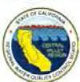

| NAME:                                                                                                                                                                                                                                                                                                                                                                                                                                                                                                  | Lou Varni (209) 492-9355                                                                                                                       |                 |                          |        |
|--------------------------------------------------------------------------------------------------------------------------------------------------------------------------------------------------------------------------------------------------------------------------------------------------------------------------------------------------------------------------------------------------------------------------------------------------------------------------------------------------------|------------------------------------------------------------------------------------------------------------------------------------------------|-----------------|--------------------------|--------|
| ADDRESS:                                                                                                                                                                                                                                                                                                                                                                                                                                                                                               | 615 kansas ave CITY: Modesto                                                                                                                   | ZIP: 95350      |                          |        |
| REPRESENTING:                                                                                                                                                                                                                                                                                                                                                                                                                                                                                          | LVF Enterprises                                                                                                                                | LVFenterprises@ |                          |        |
|                                                                                                                                                                                                                                                                                                                                                                                                                                                                                                        |                                                                                                                                                | SBCglobal.net   |                          |        |
| Please add me to the project mailing list.                                                                                                                                                                                                                                                                                                                                                                                                                                                             |                                                                                                                                                |                 |                          |        |
| I would like the following comments filed in the record* (please print):                                                                                                                                                                                                                                                                                                                                                                                                                               |                                                                                                                                                |                 |                          |        |
| I prefer option #2, kansas ave must have at least one direct egress/ingress to highway 99. Without a direct link to Hwy 99 the commercial corridor along kansas ave will die. Many, many small business will close and hundreds of people will lose their jobs. The area will become a blighted area. An example of this in North 9th street along Briggsmann ave - that is what will happen to this kansas ave Business corridor - This should be a gateway to Modesto not a deserted abandoned site. |                                                                                                                                                |                 |                          |        |
| *Place your comments into the Comment Box tonight or mail your comments to the following address:                                                                                                                                                                                                                                                                                                                                                                                                      | Attention: Philip Vallejo California Department of Transportation Acting Senior Environmental Planner 855 M Street, Suite 200 Fresno, CA 93721 |                 |                          |        |
| Comments must be received by March 17, 2017                                                                                                                                                                                                                                                                                                                                                                                                                                                            |                                                                                                                                                |                 |                          |        |
| How Did You Hear About This Meeting?                                                                                                                                                                                                                                                                                                                                                                                                                                                                   | newspaper                                                                                                                                      | newsletter      | someone told me about it | other: |

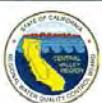

| NAME:                                                                                                                                                                                                     | VIJAY Solanlei                             |                                                                                |
|-----------------------------------------------------------------------------------------------------------------------------------------------------------------------------------------------------------|--------------------------------------------|--------------------------------------------------------------------------------|
| ADDRESS:                                                                                                                                                                                                  | 722 Kansas the CITY: Modeste CA ZIP: 95351 |                                                                                |
| REPRESENTING:                                                                                                                                                                                             | Self-                                      |                                                                                |
| <table><tr><td><input checked="" type="checkbox"/> Please add me to the project mailing list.</td></tr></table>                                                                                           |                                            | <input checked="" type="checkbox"/> Please add me to the project mailing list. |
| <input checked="" type="checkbox"/> Please add me to the project mailing list.                                                                                                                            |                                            |                                                                                |
| I would like the following comments filed in the record* (please print):                                                                                                                                  |                                            |                                                                                |
| Last Time when the Cty of Modesto close the Road, our                                                                                                                                                     |                                            |                                                                                |
| Business drop 90% For 3 to 4 month. We are small                                                                                                                                                          |                                            |                                                                                |
| Business, We had to lay off. All the Staff.                                                                                                                                                               |                                            |                                                                                |
| (1) closer of the Hwy is NOT Acceptable to use, if you                                                                                                                                                    |                                            |                                                                                |
| are closing the) RightWay We want to be fully                                                                                                                                                             |                                            |                                                                                |
| Compensated. if this project Move forward. The other                                                                                                                                                      |                                            |                                                                                |
| thing A property on the Hwy CREATE A lot of Business                                                                                                                                                      |                                            |                                                                                |
| During Season, this is How we Survive through slow season                                                                                                                                                 |                                            |                                                                                |
| We will need to be well compensated During and after                                                                                                                                                      |                                            |                                                                                |
| the Project is completed.                                                                                                                                                                                 |                                            |                                                                                |
| *Place your comments into the Comment Box tonight or mail your comments to the following address:                                                                                                         |                                            |                                                                                |
| Comments must be received by March 17, 2017                                                                                                                                                               |                                            |                                                                                |
| Attention: Philip Vallejo California Department of Transportation Acting Senior Environmental Planner 855 M Street, Suite 200 Fresno, CA 93721                                                |                                            |                                                                                |
| How Did You Hear About This Meeting? <input type="checkbox"/> newspaper <input type="checkbox"/> newsletter <input type="checkbox"/> someone told me about it <input type="checkbox"/> other: ___________ |                                            |                                                                                |

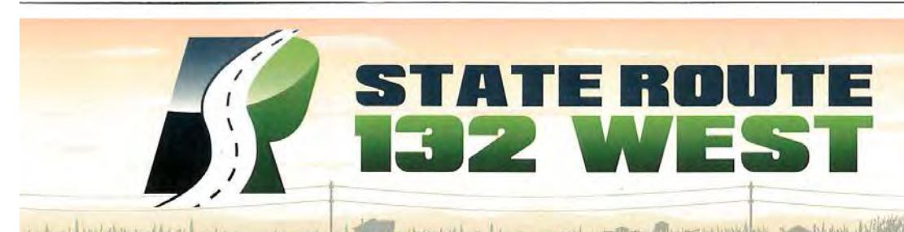

| NAME:                                                                    | Hector Cortes  |                 |         |      |       |
|--------------------------------------------------------------------------|----------------|-----------------|---------|------|-------|
| ADDRESS:                                                                 | 737 Loletta AV | CITY:           | Modesto | ZIP: | 95351 |
| REPRESENTING:                                                            |                |                 |         |      |       |
| <input type="checkbox"/> Please add me to the project mailing list.      |                |                 |         |      |       |
| I would like the following comments filed in the record* (please print): |                |                 |         |      |       |
| We have not been told whether or not our property                        |                |                 |         |      |       |
| is a partial or full take. We were told it is a                          |                |                 |         |      |       |
| partial but not what (how much) portion of property                      |                |                 |         |      |       |
|                                                                          |                | Hector Cortes   |         |      |       |
|                                                                          |                | 737 Loletta AV. |         |      |       |

\*Place your comments into the Comment Box tonight or mail your comments to the following address:

Comments must be received by March 17, 2017

Attention: Philip Vallejo  
California Department of Transportation  
Acting Senior Environmental Planner  
855 M Street, Suite 200  
Fresno, CA 93721

| How Did You Hear About This Meeting? | <input type="checkbox"/> newspaper <input checked="true" type="checkbox"/> newsletter <input type="checkbox"/> someone told me about it <input type="checkbox"/> other: |
|--------------------------------------|-------------------------------------------------------------------------------------------------------------------------------------------------------------------------|
|--------------------------------------|-------------------------------------------------------------------------------------------------------------------------------------------------------------------------|

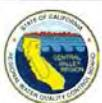

| NAME:                                                                    | DON CALKING   |              |                                         |          |       |
|--------------------------------------------------------------------------|---------------|--------------|-----------------------------------------|----------|-------|
| ADDRESS:                                                                 | 1317 OHIO Ave | CITY:        | Modesto                                 | ZIP:     | 95368 |
| REPRESENTING:                                                            |               |              |                                         |          |       |
| ☑ Please add me to the project mailing list.                             |               |              |                                         |          |       |
| I would like the following comments filed in the record* (please print): |               |              |                                         |          |       |
| I Favor the No build option for a lot                                    |               |              |                                         |          |       |
| of reasons.                                                              |               |              |                                         |          |       |
| 1. Alternate #1 and #2 will not solve                                    |               |              |                                         |          |       |
| problems of too much traffic that                                        |               |              |                                         |          |       |
| will end up in Modesto and 99. The                                       |               |              |                                         |          |       |
| attmont pass seems to be also a bottle neck.                             |               |              |                                         |          |       |
| 2. Cost \$ & 1 (My Money)                                                |               |              |                                         |          |       |
| 3. I use part of 132 almost daily and it                                 |               |              |                                         |          |       |
| works fine for me                                                        |               |              |                                         |          |       |
| 4. Loss of Farm Land                                                     |               |              |                                         |          |       |
| *Place your comments into the Comment Box tonight                        |               |              |                                         |          |       |
| or mail your comments to the following address:                          |               |              |                                         |          |       |
| Comments must be received by March 17, 2017                              |               |              |                                         |          |       |
| Attention: Philip Vallejo                                                |               |              | California Department of Transportation |          |       |
| Acting Senior Environmental Planner                                      |               |              | 855 M Street, Suite 200                 |          |       |
| Fresno, CA 93721                                                         |               |              |                                         |          |       |
| How Did You Hear                                                         | ☑ newspaper   | ☑ newsletter | ☑ someone                               | ☑ other: |       |
| About This Meeting?                                                      | told me       |              |                                         |          |       |
|                                                                          | about it      |              |                                         |          |       |

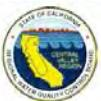

| NAME:                                                                                             | BENT TABRIZI                               |                                     |                                                                                                                                                            |                                             |
|---------------------------------------------------------------------------------------------------|--------------------------------------------|-------------------------------------|------------------------------------------------------------------------------------------------------------------------------------------------------------|---------------------------------------------|
| ADDRESS:                                                                                          | 131A MOHENRY AVE CITY: MODESTO             | ZIP: CA. 91350                      |                                                                                                                                                            |                                             |
| REPRESENTING:                                                                                     |                                            |                                     |                                                                                                                                                            |                                             |
| <input type="checkbox"/>                                                                          | Please add me to the project mailing list. |                                     |                                                                                                                                                            |                                             |
| I would like the following comments filed in the record* (please print):                          |                                            |                                     |                                                                                                                                                            |                                             |
| WHAT'S THE IMPACT OF THE PROJECT ON JODKANSAS AVE AFTER FURTHER STUDY.                            |                                            |                                     |                                                                                                                                                            |                                             |
|                                                                                                   |                                            |                                     |                                                                                                                                                            |                                             |
|                                                                                                   |                                            |                                     |                                                                                                                                                            |                                             |
|                                                                                                   |                                            |                                     |                                                                                                                                                            |                                             |
|                                                                                                   |                                            |                                     |                                                                                                                                                            |                                             |
|                                                                                                   |                                            |                                     |                                                                                                                                                            |                                             |
| *Place your comments into the Comment Box tonight or mail your comments to the following address: |                                            |                                     | Attention: Philip Vallejo California Department of Transportation Acting Senior Environmental Planner 855 M Street, Suite 200 Fresno, CA 93721 |                                             |
| Comments must be received by March 17, 2017                                                       |                                            |                                     |                                                                                                                                                            |                                             |
| How Did You Hear About This Meeting?                                                              | <input type="checkbox"/> newspaper         | <input type="checkbox"/> newsletter | <input type="checkbox"/> someone told me about it                                                                                                          | <input type="checkbox"/> other: ___________ |

| NAME:         | John J. Kenney                 |       |         |      |       |
|---------------|--------------------------------|-------|---------|------|-------|
| ADDRESS:      | 6135 Dakota Ave.               | CITY: | Modesto | ZIP: | 95358 |
| REPRESENTING: | Land Owner - Stanislaus County |       |         |      |       |

☑ Please add me to the project mailing list.

I would like the following comments filed in the record\* (please print): I believe:

1. Fixes no death Rate on 132 - Most west of Dakota
2. Alternative 3: Removal of 160,000 cubic yards (You would make any land owner remove @ our cost)
3. This will not Fix the Traffic on 132, N-599
4. 120 or the traffic over The Altamont Pass 980.
5. Fix current Roads

| *Place your comments into the Comment Box tonight or mail your comments to the following address: | Attention: Philip Vallejo California Department of Transportation Acting Senior Environmental Planner 855 M Street, Suite 200 Fresno, CA 93721 |
|---------------------------------------------------------------------------------------------------|------------------------------------------------------------------------------------------------------------------------------------------------|
| Comments must be received by March 17, 2017                                                       |                                                                                                                                                |

| How Did You Hear About This Meeting? | ☑ newspaper ☑ newsletter ☑ someone told me about it ☑ other: Land Owner |
|--------------------------------------|-------------------------------------------------------------------------|
|--------------------------------------|-------------------------------------------------------------------------|

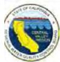

| NOMBRE:               | Lewis Cimino, M.D.      |         |         |                |          |
|-----------------------|-------------------------|---------|---------|----------------|----------|
| DIRECCIÓN:            | 4101 Kansas Ave         | CIUDAD: | Modesto | CÓDIGO POSTAL: | CA 95358 |
| ¿A QUIÉN REPRESENTA?: | Memorial Medical Center |         |         |                |          |

Por favor, agregame a la lista de correo del proyecto.

Me gustaría que los siguientes comentarios se archivaran en el expediente \* (escriba en letra de imprenta):

| As a TRAUMA Surgeon WORKING in Modesto the past 40 years, I have intimate first hand Knowledge of the frequent serious and often fatal motor vehicle accidents that have occured on Hwy 132, I have cared for several hundred victims (my patients) over the years even lost close friends. The proposal to divert MORE traffic ON TO AN AlReady dangerous and inadequate Highway is CRIMINAL and Not Defensible. |
|-------------------------------------------------------------------------------------------------------------------------------------------------------------------------------------------------------------------------------------------------------------------------------------------------------------------------------------------------------------------------------------------------------------------|
|-------------------------------------------------------------------------------------------------------------------------------------------------------------------------------------------------------------------------------------------------------------------------------------------------------------------------------------------------------------------------------------------------------------------|

\* Coloque sus comentarios en el cuadro de comentarios de esta noche O envíe sus comentarios a la siguiente dirección:Los comentarios deben ser recibidos antes del 17 de marzo de 2017Atención: Philip VallejoCalifornia Department of TransportationActing Senior Environmental Planner855 M Street, Suite 200Fresno, CA 93721

| ¿Cómo se enteró de esta reunión?: | <input type="checkbox"/> periódico | <input type="checkbox"/> hoja informativa | <input type="checkbox"/> alguien me dijo | <input type="checkbox"/> de otra manera: | <input type="text" value="Lewis Cimino, U.D."/> |
|-----------------------------------|------------------------------------|-------------------------------------------|------------------------------------------|------------------------------------------|-------------------------------------------------|
|-----------------------------------|------------------------------------|-------------------------------------------|------------------------------------------|------------------------------------------|-------------------------------------------------|

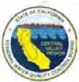

| NAME:                                                                                                      | Anna McClester                      |              |                                                                                                                                                |          |                                |
|------------------------------------------------------------------------------------------------------------|-------------------------------------|--------------|------------------------------------------------------------------------------------------------------------------------------------------------|----------|--------------------------------|
| ADDRESS:                                                                                                   | 3412 Waynesberg DR                  | CITY:        | Ceres                                                                                                                                          | ZIP:     | 95307                          |
| REPRESENTING:                                                                                              | Stanislaus County - Business owners |              |                                                                                                                                                |          |                                |
| I would like the following comments filed in the record* (please print):                                   |                                     |              |                                                                                                                                                |          |                                |
| 1. I agree with Alternative 3: Removal - Remove 160,000 cubic yards of stockpile soil to disposal Facility |                                     |              |                                                                                                                                                |          |                                |
| 2. Fixes nothing for the death rate on 132.                                                                |                                     |              |                                                                                                                                                |          |                                |
| 3. No Build option!                                                                                        |                                     |              |                                                                                                                                                |          |                                |
| *Place your comments into the Comment Box tonight or mail your comments to the following address:          |                                     |              | Attention: Philip Vallejo California Department of Transportation Acting Senior Environmental Planner 855 M Street, Suite 200 Fresno, CA 93721 |          |                                |
| Comments must be received by March 17, 2017                                                                |                                     |              |                                                                                                                                                |          |                                |
| How Did You Hear About This Meeting?                                                                       | I newspaper                         | I newsletter | I someone told me about it                                                                                                                     | I other: | Social Media Local Land Owners |
| Please add me to the project mailing list.                                                                 |                                     |              |                                                                                                                                                |          |                                |

| NAME:                               | Melissa Kenney                             |
|-------------------------------------|--------------------------------------------|
| ADDRESS:                            | 637 S. Dakota CITY: Modesto ZIP: 95358     |
| REPRESENTING:                       | Ave Stanislaus Co. / Landowner             |
| <input checked="" type="checkbox"/> | Please add me to the project mailing list. |

I would like the following comments filed in the record\* (please print):

| 1. | I agree with Alternative 3: Removal of 160,000 cubic yards of stockpile soil to an off-site disposal facility. |
|----|----------------------------------------------------------------------------------------------------------------|
| 2. | This Project will not fix traffic or road problems - waste of money.                                           |

\*Place your comments into the Comment Box tonight or mail your comments to the following address:Comments must be received by March 17, 2017

| Attention: Philip Vallejo California Department of Transportation Acting Senior Environmental Planner 855 M Street, Suite 200 Fresno, CA 93721 |
|------------------------------------------------------------------------------------------------------------------------------------------------------------|
|------------------------------------------------------------------------------------------------------------------------------------------------------------|

How Did You Hear About This Meeting?

| <input checked="" type="checkbox"/> newspaper | <input checked="" type="checkbox"/> newsletter | <input type="checkbox"/> someone told me about it | other: <input type="text" value="Social Media"/> |
|-----------------------------------------------|------------------------------------------------|---------------------------------------------------|--------------------------------------------------|
|-----------------------------------------------|------------------------------------------------|---------------------------------------------------|--------------------------------------------------|

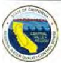

NAME: MAUREEN DICKADDRESS: 1671 ELM AVE CITY: MODESTO CA ZIP: 95358REPRESENTING: MYSELF Please add me to the project mailing list.I would like the following comments filed in the record\* (please print):

SEE ATTACHED. PAGES

| Place your comments into the Comment Box tonight or mail your comments to the following address: | Attention: Philip Vallejo California Department of Transportation Acting Senior Environmental Planner 855 M Street, Suite 200 Fresno, CA 93721 |
|--------------------------------------------------------------------------------------------------|------------------------------------------------------------------------------------------------------------------------------------------------------------|
| Comments must be received by March 17, 2017                                                      |                                                                                                                                                            |

How Did You Hear About This Meeting?

 newspaper  newsletter  someone told me about it  other: \_\_\_\_\_\_\_\_\_\_\_\_\_\_\_\_\_\_\_\_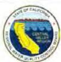

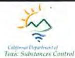

MARCH 1, 2017

Let's use common sense and not government/Caltrans sense on the proposed 132 West Expressway.

Expressway - a highway especially planned for high speed traffic, usually having few if any intersections, limited points of access or exit, and a divider between lanes for traffic moving in opposite directions. Also called a limited access highway.

- 1. Don't build the expressway unless you can do it right. If it's a 4-way expressway then construct it as a 4-way expressway. Don't start it off as a 2-way and then put us through more construction when funding is available for the other 2 lanes.
- 2. "A highway especially planned for high speed traffic" the proposed expressway has two ninety degree turns; Maze to Dakota and Dakota to the Expressway. That does not fit the term
- 3. "And access from private driveways along North Dakota Avenue to Maze Boulevard" pg 17 of proposed draft. The right of way impact map 1 of 3 shows at least 10 driveways that will access the proposed route. Again this does not fit the term expressway.
- 4. Rumor has it that there might not be enough funding for the proposed expressway to be elevated or goes underground at the main intersections and therefore will result in 4-way stops at Rosemore, Carpenter, and Emerald.

## Why are you trying to build something that already exists?

And the toxic stockpiles that you say are safe. Who are you kidding? I don't care how the soil test results came out. There will never be enough soil samples taken to my liking to truly show the amount of toxic sludge waste in those stockpiles. (See attached "FMC Corporation-Modesto, CA.) Where did all those chemicals, heavy metals and who knows what else go? Did they dissipate or evaporate? Did they turn into gases which have not been disturbed and are just waiting for construction to activate them? With all the precautions that have been taken over the years in order to retrieve soil and water samples and all the precautions to have removed and transported soil from Stockpile #3 when the Highway 99 off ramp was being redone shows that you know it too. That soil should have never been removed until the environment reports were complete. Caltrans snuck that one over on us. Which makes me wonder what else has been snuck over on us; oh yeah, the stockpiles are not toxic.

Like I said in the beginning, let's use common sense and not government/Caltrans sense. Not to the mention the wealthy influence on the existing 132/Maze Boulevard.

Maureen Dick

## FMC CORPORATION - MODESTO, CA

Department of Toxic Substances Control August 2006

"Soil contaminated with barium, arsenic, and polynuclear aromatic hydrocarbons and soil containing petroleum hydrocarbons."

Barium – Soluble barium components are poisonous. Affects nervous system causing cardiac irregularities, tremors, weakness, anxiety, dyspnea (shortness of breath) and paralysis. – Wikipedia

Barium – Personal Protection: Splash goggles, lab coat, dust respirator, approved/certified respirator, gloves, and boots. Suggested protective clothing might not be sufficient; consult a specialist BEFORE handling this product. – Material Safety Data Sheet (MSDS)

Arsenic – Arsenic and many of its compounds are especially potent poisons. – Wikipedia

Arsenic - Personal Protection: Safety glasses. Lab coat. Dust respirator. Be sure to use an approved/certified respirator or equivalent. Gloves. - MSDS

3. Polynuclear aromatic hydrocarbons – Highly carcinogenic. High prenatal exposure to PAH is associated with lower IQ and childhood asthma. PAH pollution during pregnancy – low birth rate, premature delivery, and heart malformations. Cord blood of exposed babies shows DNA damage linked to cancer. Increased behaviorial problems at ages six and eight. – Wikipedia

Polynuclear aromatic hydrocarbons – This product contains polynuclear aromatic hydrocarbons some of which have produced cancer in laboratory animals and humans. Vapor can produce eye, skin, and respiratory tract irritation. This material is a flammable material.

Inhalation – Harmful if inhaled. Over exposure to vapors and mists can cause respiratory and nasal irritation, anesthetic effects, dizziness, possible unconsciousness and asphyxiation, stupor, weakness fatigue, nausea, and

headache. Long term overexposure may cause damage to the brain, liver, kidneys or central nervous system.

Ingestion – Gastrointestinal irritation, nausea, vomiting, diarrhea, death, aspiration into the lungs which can be fatal

Skin contact- Discoloration, moderate irritation, drying of skin, defattening and possible dermatitis. Dermal exposure plus sunlight could cause a phototoxic reaction that resembles sunburn Eye contact- May cause severe irritation, redness, tearing or blurred vision. - MSDS

4. Petroleum Hydrocarbons – Also know as Total Petroleum Hydrocarbons – Some of the TPH compounds can affect your central nervous system. One compound can cause headaches and dizziness at high levels in the air. Another compound can cause a nerve disorder called "peripheral neuropathy" consisting of numbness in the feet and legs. Other TPH compounds can cause effects on the blood, immune system, lungs, skin, and eyes. – Agency for Toxic Substances and Disease Registry

# SUBMITTED IN 2013

## My concerns:

1. The health and welfare of my family, my friends, my community, and myself.

2. For Stanislaus County to grow and prosper and all factors of "Water, Wealth, Contentment, Health" are considered in every decision.

3. My "Vision" is to not have the SR132W Expressway go in my backyard or my neighbor's backyards. My "Vision" is not to have any further air pollution, noise pollution and ground contamination in my neighborhood that isn't necessary.

4. I wish CalTrans had not disturbed the FMC/Caltrans Stockpile that was removed and transported during the closure of the Kansas Avenue off ramp project. These stockpiles are part of the SR132W Expressway project and the while the stockpiles were being tested at the SR132W project site, the stockpile in the Kansas Avenue off ramp project was being hauled away. Moved and disturbed, without any of the tests results released. Just because these were two different projects, the same criteria should have applied.

5. And therefore I want all elected officials, government officials, county officials and the public to know all aspects of all future projects and to work together, not independently, for everyone's "Water, Wealth, Contentment, Health".

Maureen Dick 1671 Elm Ave Modesto, CA 95358 (209) 526-3174 tommoedick@sbcglobal.net

| NAME:                                                                                                                                                      | DENNIS SEVILLA                                                                                                                                                     |
|------------------------------------------------------------------------------------------------------------------------------------------------------------|--------------------------------------------------------------------------------------------------------------------------------------------------------------------|
| ADDRESS:                                                                                                                                                   | 184 RACHELLE DR CITY: MODESTO ZIP: 95351                                                                                                                           |
| REPRESENTING:                                                                                                                                              | SEVILLA FAMILY                                                                                                                                                     |
| <input type="checkbox"/> Please add me to the project mailing list.                                                                                        |                                                                                                                                                                    |
| I would like the following comments filed in the record* (please print):                                                                                   |                                                                                                                                                                    |
| WE ARE OPPOSED TO THE PROPOSED EXTENSION IN THE MIDST OF THE POPULATED AREA, AND EVEN CONSIDER YOUR ORIGINAL PLAN FROM SEVERAL DECADES AGO AS              |                                                                                                                                                                    |
| OUTDATED FOR WHAT MODESTO HAS GROWN INTO. FROM OUR PERSPECTIVE, CARPENTER AVE.                                                                             |                                                                                                                                                                    |
| HAS BECOME MORE TRAVELED AND MORE CONGESTED THAN HWY 132, AND SHOULD BE                                                                                    |                                                                                                                                                                    |
| ATTENDED TO, INSTEAD. RATHER THAN SOLVING THE POLLUTED SOIL PROBLEM BY                                                                                     |                                                                                                                                                                    |
| ENCASEMENT, TRANSPORT THE SOIL TO THE UNPOPULATED VACANT PROPERTY AREA ALONG                                                                               |                                                                                                                                                                    |
| THE TOULENNE RIVER (OFF ROBERTSON RD) TO RAISE THE LEVEES TO PREVENT FUTURE                                                                                |                                                                                                                                                                    |
| FLOODING, AND DEED THE PROPOSED HWY PROPERTIES TO MODESTO CITY FOR MIXED                                                                                   |                                                                                                                                                                    |
| HOUSING & BUILDING DEVELOPMENT. THIS IS MORE NEEDED THAN THE 132 EXTENSION!                                                                                |                                                                                                                                                                    |
| <i>(Signature)</i>                                                                                                                                         |                                                                                                                                                                    |
| *Place your comments into the Comment Box tonight or mail your comments to the following address:                                                          |                                                                                                                                                                    |
| Comments must be received by March 17, 2017                                                                                                                |                                                                                                                                                                    |
| Attention: Philip Vallejo California Department of Transportation Acting Senior Environmental Planner 855 M Street, Suite 200 Fresno, CA 93721 |                                                                                                                                                                    |
| How Did You Hear About This Meeting?                                                                                                                       | <input type="checkbox"/> newspaper <input type="checkbox"/> newsletter <input type="checkbox"/> someone told me about it <input type="checkbox"/> other: _________ |
| StanCOG                                                                                                                                                    |                                                                                                                                                                    |

| PRESENTING: Self                                                                                                                              | ito zip: 95358                                                                                            |
|-----------------------------------------------------------------------------------------------------------------------------------------------|-----------------------------------------------------------------------------------------------------------|
|                                                                                                                                               |                                                                                                           |
| Please add me to the project mailing list.                                                                                                    |                                                                                                           |
| ould like the following comments filed in the record* (pl                                                                                     | ease print):                                                                                              |
| r / / / /                                                                                                                                     |                                                                                                           |
| Enclosed !                                                                                                                                    |                                                                                                           |
|                                                                                                                                               |                                                                                                           |
|                                                                                                                                               |                                                                                                           |
|                                                                                                                                               |                                                                                                           |
|                                                                                                                                               |                                                                                                           |
|                                                                                                                                               |                                                                                                           |
|                                                                                                                                               |                                                                                                           |
|                                                                                                                                               |                                                                                                           |
|                                                                                                                                               |                                                                                                           |
|                                                                                                                                               |                                                                                                           |
| Place your comments into the Comment Box tonight or mail your comments to the following address:                                              | Attention: Philip Vallejo California Department of Transportation                                         |
| or mail your comments to the following address:                                                                                               | California Department of Transportation Acting Senior Environmental Planner                            |
| Place your comments into the Comment Box tonight or mail your comments to the following address:  Comments must be received by March 17, 2017 | California Department of Transportation                                                                   |
| or mail your comments to the following address:                                                                                               | California Department of Transportation Acting Senior Environmental Planner 855 M Street, Suite 200 |

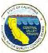

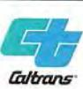

| David Abel 2404 Wolfeboro LN Modesto Ca 95358                                                                                                                                                                                                                                                                                                                                                                                                                                                                                                                                                                                                                                                                                                                                                                   | 2/27/17 |
|-----------------------------------------------------------------------------------------------------------------------------------------------------------------------------------------------------------------------------------------------------------------------------------------------------------------------------------------------------------------------------------------------------------------------------------------------------------------------------------------------------------------------------------------------------------------------------------------------------------------------------------------------------------------------------------------------------------------------------------------------------------------------------------------------------------------------|---------|
| First off I'd like to say I think your awakening a sleeping giant, there's more toxic garbage in those stock piles than anyone knows about. If those stock piles Where clean, that would mean that the F.m.c. site, where the dirt came from would also be clean and suitable for building on, which to date I don't believe it is. And if it where clean, being prime highway frontage you'd think someone would do something with it.  Secondly I don't understand how Cal Tran or someone has not had cover or maintain the stock piles, to keep the run off from going into are drainage system.  Thirdly I believe that your going to build two lanes on the southern side of the new 132 expressway, and that there will be no soundwalls along the |         |
| north side of Kansas, this might be                                                                                                                                                                                                                                                                                                                                                                                                                                                                                                                                                                                                                                                                                                                                                                                   |         |
| O.K on the East side of Rosemore but                                                                                                                                                                                                                                                                                                                                                                                                                                                                                                                                                                                                                                                                                                                                                                                  |         |
| on the West of Rosemore where it comes                                                                                                                                                                                                                                                                                                                                                                                                                                                                                                                                                                                                                                                                                                                                                                                |         |
| up to grade, being about the same                                                                                                                                                                                                                                                                                                                                                                                                                                                                                                                                                                                                                                                                                                                                                                                     |         |
| elevation as Kansas, I fill that if not for                                                                                                                                                                                                                                                                                                                                                                                                                                                                                                                                                                                                                                                                                                                                                                           |         |
| all homes at least 100 yards before and                                                                                                                                                                                                                                                                                                                                                                                                                                                                                                                                                                                                                                                                                                                                                                               |         |
| a 100 yards after the 8 to 10 houses that                                                                                                                                                                                                                                                                                                                                                                                                                                                                                                                                                                                                                                                                                                                                                                             |         |
| face Kansas and have no fence in front                                                                                                                                                                                                                                                                                                                                                                                                                                                                                                                                                                                                                                                                                                                                                                                |         |
| or back of it, how ever you want to look                                                                                                                                                                                                                                                                                                                                                                                                                                                                                                                                                                                                                                                                                                                                                                              |         |
| at it. And this needs to be done in the                                                                                                                                                                                                                                                                                                                                                                                                                                                                                                                                                                                                                                                                                                                                                                               |         |
| 1st phase of the build not the second                                                                                                                                                                                                                                                                                                                                                                                                                                                                                                                                                                                                                                                                                                                                                                                 |         |
| or third                                                                                                                                                                                                                                                                                                                                                                                                                                                                                                                                                                                                                                                                                                                                                                                                              |         |
| Finally when youget to Dakota I am                                                                                                                                                                                                                                                                                                                                                                                                                                                                                                                                                                                                                                                                                                                                                                                    |         |
| unclear, how many lanes there are going to be                                                                                                                                                                                                                                                                                                                                                                                                                                                                                                                                                                                                                                                                                                                                                                         |         |
| and which side they are going to be on.                                                                                                                                                                                                                                                                                                                                                                                                                                                                                                                                                                                                                                                                                                                                                                               |         |
| Ive heard your going to build a maybe                                                                                                                                                                                                                                                                                                                                                                                                                                                                                                                                                                                                                                                                                                                                                                                 |         |
| 4 lanes, I personally think 2 lanes would                                                                                                                                                                                                                                                                                                                                                                                                                                                                                                                                                                                                                                                                                                                                                                             |         |
| enough & that they need to be on the                                                                                                                                                                                                                                                                                                                                                                                                                                                                                                                                                                                                                                                                                                                                                                                  |         |
| East side of Dakota, there for you                                                                                                                                                                                                                                                                                                                                                                                                                                                                                                                                                                                                                                                                                                                                                                                    |         |
| wouldn't have to pay for the land or                                                                                                                                                                                                                                                                                                                                                                                                                                                                                                                                                                                                                                                                                                                                                                                  |         |
| the houses that sit on the West side                                                                                                                                                                                                                                                                                                                                                                                                                                                                                                                                                                                                                                                                                                                                                                                  |         |
| of Dakota. Also it looks to me that                                                                                                                                                                                                                                                                                                                                                                                                                                                                                                                                                                                                                                                                                                                                                                                   |         |
| your going to put an on or off ramp on the                                                                                                                                                                                                                                                                                                                                                                                                                                                                                                                                                                                                                                                                                                                                                                            |         |
| northwest corner of Kansas & Dakota                                                                                                                                                                                                                                                                                                                                                                                                                                                                                                                                                                                                                                                                                                                                                                                   |         |
| which means your going to have to                                                                                                                                                                                                                                                                                                                                                                                                                                                                                                                                                                                                                                                                                                                                                                                     |         |
| disturb or buy land or the land and                                                                                                                                                                                                                                                                                                                                                                                                                                                                                                                                                                                                                                                                                                                                                                                   |         |
| the home, when if you could use any                                                                                                                                                                                                                                                                                                                                                                                                                                                                                                                                                                                                                                                                                                                                                                                   |         |
| of the other Three cornerall that you                                                                                                                                                                                                                                                                                                                                                                                                                                                                                                                                                                                                                                                                                                                                                                                 |         |
| would disturb or have to buy would                                                                                                                                                                                                                                                                                                                                                                                                                                                                                                                                                                                                                                                                                                                                                                                    |         |
| be old Almond or Walnut trees.                                                                                                                                                                                                                                                                                                                                                                                                                                                                                                                                                                                                                                                                                                                                                                                        |         |
|                                                                                                                                                                                                                                                                                                                                                                                                                                                                                                                                                                                                                                                                                                                                                                                                                       |         |
|                                                                                                                                                                                                                                                                                                                                                                                                                                                                                                                                                                                                                                                                                                                                                                                                                       |         |
| Thank you                                                                                                                                                                                                                                                                                                                                                                                                                                                                                                                                                                                                                                                                                                                                                                                                             |         |
| David R Abel                                                                                                                                                                                                                                                                                                                                                                                                                                                                                                                                                                                                                                                                                                                                                                                                          |         |
| David R Abel                                                                                                                                                                                                                                                                                                                                                                                                                                                                                                                                                                                                                                                                                                                                                                                                          |         |

# WARNING !!! Disturbing dormant poison can reactivate Want to know more? Ask Im here till 8:00 PM.

FMC CORPORATION - MODESTO, CA Stockpiles locturen Kansas and Elm are not soil not dirt.

Department of Toxic Substances Control August 2006

Consist of only taxic

"Soil contaminated with barium, arsenic, and polynuclear aromatic hydrocarbons and soil containing petroleum hydrocarbons."

sludge drain off

1. Barium - Soluble barium components are poisonous. Affects nervous system causing cardiac irregularities, tremors, weakness, anxiety, dyspnea (shortness of breath) and paralysis. - Wikipedia

from

Barium - Personal Protection: Splash goggles, lab coat, dust respirator, approved/certified respirator, gloves, and boots. Suggested protective clothing might not be sufficient; consult a specialist BEFORE handling this product. - Material Safety Data Sheet (MSDS)

2. Arsenic - Arsenic and many of its compounds are especially potent poisons. - Wikipedia

FMC
Chemical

Arsenic - Personal Protection: Safety glasses. Lab coat. Dust respirator. Be sure to use an approved/certified respirator or

equivalent. Gloves. - MSDS

3. Polynuclear aromatic hydrocarbons - Highly carcinogenic. High prenatal exposure to PAH is associated with lower IQ and childhood asthma. PAH pollution during pregnancy - low birth rate, premature delivery, and heart malformations. Cord blood of exposed babies shows DNA damage linked to cancer. Increased behaviorial problems at ages six and eight. - Wikipedia

Polynuclear aromatic hydrocarbons - This product contains polynuclear aromatic hydrocarbons some of which have produced cancer in laboratory animals

and humans. Vapor can produce eye, skin, and respiratory tract irritation. This material is a flammable material.

Inhalation - Harmful if inhaled. Over exposure to vapors and mists can cause respiratory and nasal irritation,

anesthetic effects, dizziness, possible unconsciousness and asphyxiation, stupor, weakness fatigue, nausea, and

headache. Long term overexposure may cause damage to the brain, liver, kidneys or central nervous system. Ingestion - Gastrointestinal irritation, nausea, vomiting, diarrhea,

death, aspiration into the lungs which can be

Skin contact- Discoloration, moderate irritation, drying of skin, defattening and possible dermatitis. Dermal exposure plus sunlight could cause a phototoxic reaction that resembles sunburn Eye contact- May cause severe irritation, redness, tearing or blurred vision. - MSDS

4. Petroleum Hydrocarbons - Also know as Total Petroleum Hydrocarbons - Some of the TPH compounds can affect your central nervous system. One compound can cause headaches and dizziness at high levels in the air. Another compound can cause a nerve disorder called "peripheral neuropathy" consisting of numbness in the feet and legs. Other TPH compounds can cause effects on the blood, immune system, lungs, skin, and eyes. - Agency for Toxic Substances and Disease Registry

# BUREAU OF MINES 1961 YEAR, VOLUME 1 (1962)

FMC Corp. began producing barium hydroxide monohydrate at its Modesto, Calif. plant.

Barium Hydroxide – It is corrosive and toxic – Wikipedia

Barium Hydroxide - Do not breathe dust. Wear suitable protective clothing. In case of insufficient ventilation wear suitable respiratory equipment. If you feel unwell, seek medical attention. Splash goggles, lab coat, dust respirator, approved/certified respirator, and gloves. Causes damage to the following organs: blood, kidneys, lungs, the nervous system, liver, and mucous membranes. DANGER! Corrosive - MSDS

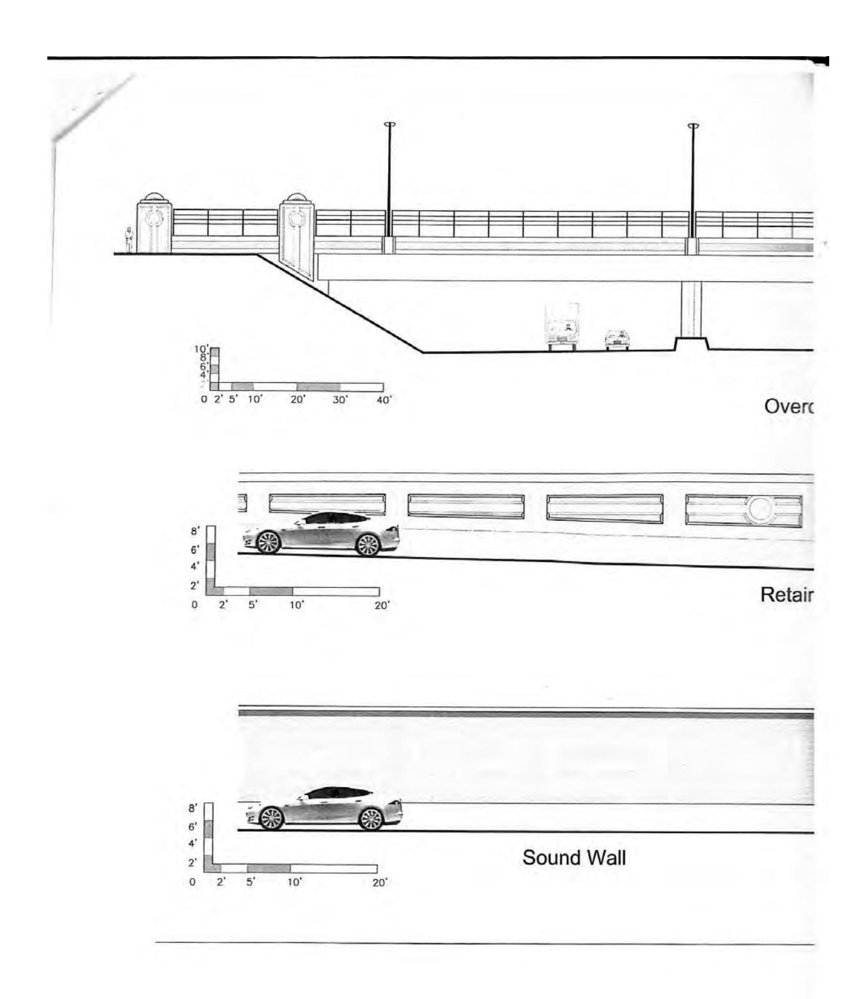

## Appendix D Public Comments

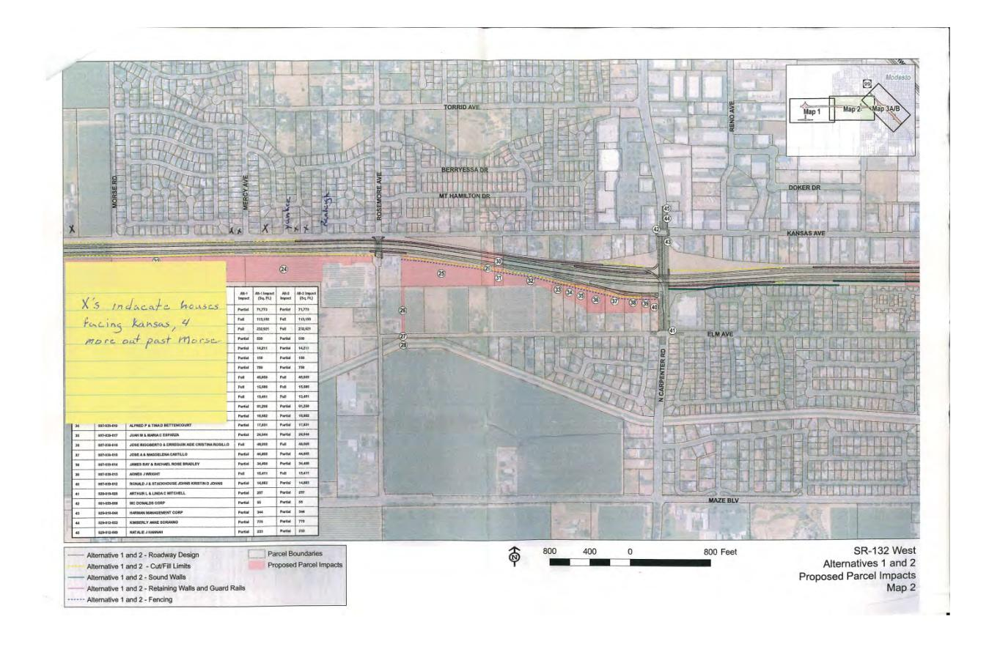

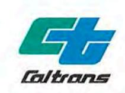

# State Route 132 West / Caltrans-Modesto Soil Stockpiles

Location: Mark Twain Junior High School, Modesto

6-8pm Date: Febr

Time: 6-8pm Date: February 22, 2017

# Caltrans

Open Forum Public Hearing

To be added to the mailing list for this project, please sign in

|    | NAME                          | NUMBER IN PARTY | ADDRESS/CITY/ZIP CODE                | REPRESENTING (Agency / Business / Self) | PHONE #      |
|----|-------------------------------|--------------------|--------------------------------------|--------------------------------------------|--------------|
| 1  | Danel STEWART                 | 1                  | Stan Co G                            | STAN CO G                                  |              |
| 2  | Bernice Hendon & James Hendon | 2                  | 225 N. Dakota Ave Modesto CA 95358   | Self                                       | 209-606-9695 |
| 3  | Jeff Martinez                 | 1                  | 839 Chalone Drive Modesto            | Self                                       |              |
| 4  | John C. Morthen               | 1                  | 505 Elm Ave Modesto CA. 95351        | Self                                       |              |
| 5  | William Wichell               | 2                  | 1717 Hungas Ave                      | Self                                       |              |
| 6  | Melani Cortes                 | 2                  | 737 Isletta Ave                      | Self                                       |              |
| 7  | Virginia Hammond              | 1                  | 404 Scout Way Modesto 9381           | Self                                       |              |
| 8  | Marie Schneider               | 2                  | 442 - Kansas #E                      | Schneider Sign                             | 573-5910     |
| 9  | SHARON CUSTER                 | 2                  | 901 Ranleigh Way Modesto 95358       | Self                                       | 209-581-4244 |
| 10 | Guadalupe AVILLAPUDUA         | 2                  | 221 Vandan S                         |                                            | (613) 9492   |
| 11 | Manuel Salgado                | 1                  | 812 NILES CT Modesto CA -            |                                            |              |
| 12 | MATT MACNADO                  |                    |                                      | STANI COUNTY                               |              |
| 13 | Kathy Faria                   | 1                  | 817 Ranleigh Wy. Modesto Ca          | Self                                       |              |
| 14 | RHONDA ERIKSEN                | 1                  | 1116 Courter Ave Modesto CA 95351    | Family                                     |              |
| 15 | Jeff Wockey                   | 1                  | 149 Dakota Ave Modesto CA 9535       | Self                                       |              |
| 16 | Pry mond ALMPREZ              | 1                  | 527 F/M 17VF 95381                   |                                            |              |
| 17 | David Abel                    | 2                  | 2404 Wolfeboro Ln 95358              |                                            | 209 572-0274 |
| 18 | PETER ROCHA                   | 1                  | 2230 Torrin Ave 95358                | Self                                       | 209-606-4357 |
| 19 | SONIN NEVARIZ                 | 2                  | 1118 Arbuleda Dr. 95351              | Self                                       | 209-450-6410 |
| 20 | Harrison Lee                  | 2                  | 1030 Mathia Dr                       |                                            |              |
| 21 | KETTH BOGGS                   | 1                  | 1010 10th St. Suite 6800 Modesto, CA | Stan County                                |              |
| 22 | Andrew white                  | 1                  | 1121 Chetwood Drive 9535P            | Self                                       | 2095792130   |
| 23 | John & Cheryl Gregory         | 2                  | 1232 Kansas Avenue Modesto CA 9535   | Kansas Ave Auto Center                     | 209-575-3366 |
| 24 | NICK PAULUS                   | 1                  | 2836 14CWOIS Me MURITIC A 95358      | PACKAGES ON                                |              |
| 25 | Aldo C Erreguin               | 2                  | 1661 Elm Ave Modesto                 | Self                                       | 238-0859     |

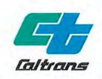

Location: Mark Twain Junior High School, Modesto Time: 6-8pm Date: February 22, 2017

# Caltrans

Open Forum Public Hearing

To be added to the mailing list for this project, please sign in

| NAME                      | NUMBER IN PARTY | ADDRESS/CITY/ZIP CODE                 | REPRESENTING (Agency / Business / Self) | PHONE #        |
|---------------------------|-----------------|---------------------------------------|-----------------------------------------|----------------|
| Ted Neu                   |                 | 1724 Kansas                           |                                         |                |
| Richard Quaresma          |                 | 3343 Kansas                           |                                         |                |
| Robert Uvalles            |                 | 816 Ranleigh Way 95358                |                                         |                |
| Dennis, Horton            |                 | 1734 Beverly Dr. 95358                |                                         | 543 54 14      |
| Steve Hagemann (Director) | 1               | Stanislaus County Office Education    | SCOE                                    |                |
| Valerie Chron             |                 | 1525 Carpenter Rd. 95351              |                                         |                |
| Robert + Monica Ramos     | 2               | 137 Dakota Ave 95358                  |                                         | 527-4239       |
| TERHESA GAMBOA            | 1               | 2608 Albion Way Modesto CA 95358      | Woodland West Comm Nbhd                 | 209-576-8484   |
| Jim Ridawour              | 1               | 900 Country side Ln. Modesto CA 95358 |                                         | 209 505 3512   |
| MARGARET TARO             | 2               | 3530 MAZE BLVD MODESTO, CA 95358      |                                         | 209-529-0186   |
| Sergio Amezquita          | 1               | 817 Altamout ct. Modesto OA 95358     |                                         | (209) 380-2174 |
| Gordon Heinrich           |                 | 3424 NORTH AVE MODESTO CA 95358       | Salida Hulling Association              | 209 5952207    |
| TERESA RONDINS            | 3               | 442 Kansas Ave Modesto 9351           | The Sandwich Shop                       | (209) 578-3515 |
| Rafael Cercas             | 1               | 206 Bluegrass Ln. Modesto 95351       |                                         |                |
| Kay Haskin                | 3               | 1649 Shirley Ct. MO 95358             |                                         |                |
| Greg SCHAEFER             | 1               | 409 TENNYSON PR. 95351                | INDUSTRIAL ELECTRICO                    | 209 620 0723   |
| Tiffany Hooser            |                 | 529 Kansas Ave Modesto 95350          | Crystal Creamery                        | 209 576 3433   |
| Derrel Hall               | 1               | 819 Loletta Ave                       | Self                                    | 209-614-2455   |
| Betty & John Kenney       | 2               | 615 KANSAS AV                         | LVF                                     | 765-2969       |
| Betty & John Kenney       | 2               | 613 S. Dakota Ave. Modesto            | Self                                    | 521-7967       |
| BERT FABRICI              | 1               | 1319 MCHENRY AVE MODESTO, CA 95350    | SOF                                     | 209 527-1010   |
| MICHELE JANSON            | 1               | 320 HUNDRED WAY MODESTO CA 95351      | SELT                                    | (209) 523-3317 |
| LEONA ASH TRUST           | 1               | 320 HUNDRED WAY MODESTO CA 95351      | TRUST                                   | 209-523-3317   |
| Mary E. Olay              |                 | 425 Laurel Ave                        | SOF                                     | 209-552-5095   |
| JOHN THOMASSEN            | 1               | 265 VAL DERVIN PARKWAY STOCKTON       | TEICHER + Const                         | 209-983 2335   |

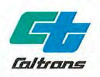

Location: Mark Twain Junior High School, Modesto Date: February 22, 2017 Time: 6-8pm Caltrans

Open Forum Public Hearing

Open Forum Public Hearing
To be added to the mailing list for this project, please sign in

|    | NAME                              | NUMBER IN PARTY | ADDRESS/CITY/ZIP CODE                   | REPRESENTING (Agency / Business / Self) | PHONE #                  |
|----|-----------------------------------|--------------------|-----------------------------------------|--------------------------------------------|--------------------------|
| 51 | Maria Villasenor                  | 2                  | 419 Laurel Ave 95351                    | Self                                       | 409-9121                 |
| 52 | Vic R. Monales                    | 1                  | 2712 Tassajara Dr 95358                 | Self                                       | 577-1594                 |
| 53 | Don Calkins                       | 1                  | 1317 Ohio Ave 95358                     | Self                                       | 524-4969                 |
| 54 | Jean Calkins                      | 1                  | 1.                                      | 1.                                         |                          |
| 55 | MICHAEL KING                      | 1                  | 231 DAKOTA AVE                          | SELF                                       |                          |
| 56 | HEMENT KHATRI                     | 3                  | 500 KANSAS AVE 95351                    | self                                       | 209-581-5369             |
| 57 | Rachel Bradley                    | 1                  | 1637 Elm ave modesto Ca 95351           | Self                                       | 209 534 8298 0200        |
| 58 | Lova Bailey Danny Jusquez         | 2                  | 604 Laurel Ave Modesto CA 95351         | Self                                       | 209 495-0915             |
| 59 | DENNIS ZEVILLA                    | 1                  | 104 RACHELLE DR, MODESTO 95351          | SELF                                       | 209 527-1726             |
| 60 | TERI PATTON                       | 1                  | 1004 NORWAY AVE MODESTO 95350           | Self                                       |                          |
| 61 | ED MOND MARAD / IGNACIO CONTRERAS | 2                  | H8-83A KANSAS AVE MODESTO               | SELF                                       | (209) 505-2643, 603-8841 |
| 62 | Jon Rodriguez YCCD                | 1                  |                                         | YCCD                                       | (209)556-2411            |
| 63 | Brian Spanel/Rathy Spanel         | 2                  | 4737 Tully Rd, Modesto                  | Self                                       | 344-636-288-1772         |
| 64 | Dalene Duarte / Ubaldo Duart      | 2                  | 2018 Placent Dr Modesto                 | The Sandwich Shop                          | 209-606-5229             |
| 65 | Larry Melton                      | 2                  | 1050-A North Carpenter Rd modesto 95351 | 400 Knages ave                             | 209-404-9292             |
| 66 | Julie Brunelli                    | 2                  | 1633 Florine Lane Modesto CA 95358      |                                            | 209 5273772              |
| 67 | FRED LUCHESSA                     | 1                  | 4843 MAZE BLVD. MODESTO CALIF 95358     | SELF                                       | 209 419-9510             |
| 68 | Richard Arrieta                   | 1                  | 6009 ELM AVE modesto ca 95351           | SELV                                       | (209) 204. 3350          |
| 69 | MARY MATTHEWS                     | 1                  | 819 LOLETTA AVE MODESTO, CA 95351       | SELF                                       | 209 814-2455             |
| 70 | MAUREEN & TOM DICK                | 2                  | 1671 ELM AVE MODESTO                    | SELF                                       | 209-526-3174             |
| 71 | RONICA BROOME                     | 1                  | 1817 KANSAS AV MODESTO 95358            | SELF                                       | 209/ 534-6009            |
| 72 | HUNG BANH                         | 1                  | 2009 SPRING LN. Modesto 95356           | Self                                       | 209-204-7000. +          |
| 73 | Amanda Grider                     | 1                  | 412 Moccastn Ct Modesto 95351           | SELF                                       | 207-241-7554             |
| 74 | TOM & DIANE RUSSO                 | 1                  | 2809 PINNACLES Dr. Modesto, CA. 95358   | Self                                       | 209-256-1168             |
| 75 | Charles & Patricia Gallagher      | 1                  | 2828 Tassajara Dr. modesto 95358        | Self                                       | 209-988-5136             |

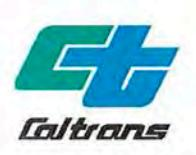

Location: Mark Twain Junior High School, Modesto Time: 6-8pm Date: February 22, 2017

# Caltrans

Open Forum Public Hearing

Open Forum Public Hearing
To be added to the mailing list for this project, please sign in

|     | NAME                   | NUMBER IN PARTY | ADDRESS/CITY/ZIP CODE              | REPRESENTING (Agency / Business / Self) | PHONE #            |
|-----|------------------------|--------------------|------------------------------------|--------------------------------------------|--------------------|
| 76  | Lynne Wagner           | 1                  | 429 Laurel Ave. Modesto 95357      | Self                                       | 205-571-9788       |
| 77  | Dennis T. Aga          | 1                  |                                    | Caltrans                                   |                    |
| 78  | Steve Garda            | 1                  | 315 los Oli VOS VIY Modesto 95351  | Home owner                                 | 4524-0810          |
| 79  | Brett Atkins           | 1                  | 4030 S. Quincy Rd Hughson CA 95358 | self                                       |                    |
| 80  | MARCI D'ARPINO         | 1                  | 920 13th ST #4 MODESTO 95354       | self                                       |                    |
| 81  | Manuel Castro          | 2                  | 545 CUSTER CT MONESTO CA 95351     |                                            | 209 408 400005 576 |
| 82  | Cindy Malekos          | 1                  | 1111 I St # 308 Modesto 95354      | Stances                                    | 5254634            |
| 83  | Ramon + Susie Salinas  | 2                  | 808 Altamont CT Modesto 95358      | Self                                       | 578-1979           |
| 84  | Luis Miramha           | 1                  | 529 Karran Ave                     | Juste Vay Harn                             |                    |
| 85  | Scott + Sherry Callins | 2                  | 1900 Elm Ave. Modesto, Ca. 95358   | home                                       | (209)526-1751      |
| 86  | Brian & Bonnie WEESE   | 2                  | 337 Dakota ave, modesto Ca 95358   | SELF                                       | 209-529-6482       |
| 87  | MAGGIE MEJIA           | 1                  | 4113 MAY Field DR Modesto 95356    | Self                                       | (209) 303-2664     |
| 88  | Eulogio Garza          | 1                  | 309 SUNDANCE WAY                   |                                            | (299) 529-9933     |
| 89  | Ruth Salsi             | 1                  | 948 Faust Rd. Modesto, Ca, 95358   | Self                                       | (209) 531-4671     |
| 90  | Jim DeMartini          | 1                  |                                    |                                            |                    |
| 91  | TERRY WITHAGW          | 1                  |                                    |                                            |                    |
| 92  | TED BRANDICED          | 1                  |                                    |                                            |                    |
| 93  | Jonathan Watting       | 1                  |                                    |                                            |                    |
| 94  | Tony Madorgal          | 1                  | 321 S. Washington St 95351         | Modesto City Council, Dist 2               |                    |
| 95  | Jim Bradley            | 1                  | 1637 ELUI AVE 95358                | Self                                       | 209 576 0200       |
| 96  | Randy + Denise Clouse  | 2                  | 2409 NAAS CT 95358                 | SELF                                       |                    |
| 97  | Jim Holgerson          | 1                  | 2505 Stonebridge Dr Modesto 95353  |                                            |                    |
| 98  | Victor Classiday       | 1                  | 1214 Fordham Ave Modesto CA 95350  | Self                                       | 209-480-7950       |
| 99  | Anthony born           | 1                  |                                    | Caltrans                                   | 209-948-7858       |
| 100 | James Gonsalez         | 1                  |                                    |                                            | 209-948-7844       |

Location: Mark Twain Junior High School, Modesto Time: 6-8pm Date: February 22, 2017

# Caltrans

Open Forum Public Hearing
To be added to the mailing list for this project, please sign in

|     | NAME                       | NUMBER IN PARTY | ADDRESS/CITY/ZIP CODE               | REPRESENTING (Agency / Business / Self) | PHONE #        |
|-----|----------------------------|--------------------|-------------------------------------|--------------------------------------------|----------------|
| 376 | MICHAEL ROSSINI            | 1                  | 4100 WOODLAND MODESTO 95358         | Self                                       | 209 8931579    |
| 377 | Sandy Almansa              | 1                  | 1213 Comstock Ct Modesto 95351      | Self                                       | 209 484-6656   |
| 378 | Shirley Baca               | 1                  | 1215 Comstock Ct Modesto 95351      | Self                                       |                |
| 379 | DENNY BACKMAN              | 1                  | 504 CANKEL AVE MOD                  | Self                                       |                |
| 380 | Edward Gutierrez           | 2                  | 1018 Floyd Ave Modesto, CA 95350    | Self                                       | 209 576-7953   |
| 381 | Rex McDonald               | 1                  | 1625 Florine Ave Modesto 95358      | Self                                       |                |
| 382 | VIJAY Solanlei             | 3                  | 722 Kansas Ave Modesto 95351        | Self                                       | 209 566-0990   |
| 383 | MARION LAZZOTTI            | 2                  | 913 Mercy Ave Modesto               | Self                                       |                |
| 384 | X & WIS Ceinno             | 3                  | 4101 Kansas Ave Modesto             | Family                                     |                |
| 385 | Wayne Lewis                | 2                  | 1012 Heidi Ave Modesto              | Self                                       | 209 204-4974   |
| 386 | Michael E. O'Brien         | 1                  | 201 MAZE BLVD MODESTO               | MAZE ANIMAL HOSPITAL                       | 209 5249281    |
| 387 | RODNEY E ANDERSON          | 1                  | 805 PANKEE DR NRO                   | Self                                       | 725 4042       |
| 388 | Amparo Felipe              | 1                  | 415 Laurel Ave. 95351               | Family                                     | 209 6047571    |
| 389 | Radius Bray                | 2                  | 4130 Kansas Ave 95358               | Family                                     | 209-996-7788   |
| 390 | Lou Varni                  | 1                  | 615 Kansas Ave 95350                | LUF Enterprises                            | 209 492-9355   |
| 391 | Neftali & Michelle Alberto | 2                  | 2405 Kansas Ave 95358               | family                                     | 209-380-5484   |
| 392 | THE WELDING EXPRESS        | 2                  | 713 N. Franklin ST. 51              | SELF                                       | 209.576-7172   |
| 393 | JUAN + JULIE PEREZ         | 2                  | 2331 MAZE BLVD - MODESTO 95358      | FAMILY                                     | (209) 571-2361 |
| 394 | Kathleen Rodriguez         | 1                  | 209 Owl Ct Modesto, 95351           | Self                                       | 209-765-1020   |
| 395 | Ken Willmarth              | 1                  | 2257 Edsel Lane Modesto 95358       | Self                                       | 209-521-6468   |
| 396 | Ron Gresham                | 1                  | 522 N. FRANKLIN Modesto 95351       | SELF                                       | 209 321 9277   |
| 397 | GRACE MAGSAYO              | 1                  | 1976 E. Dr. MLK STOCKTON, CA 95205  | CT                                         | 209 948 7976   |
| 398 | NILE BRUNDAGE              | 1                  | 541 N EMERALD AVE MODESTO, CA 95351 | SRF                                        | 209 574-0472   |
| 399 | JENNY Kenoner              | 1                  | City of Modesto SACRAMENTO          | The City of Modesto                        | 209 968-8549   |
| 400 | JESUS CRUZ                 | 1                  | 8866 CAL CENTER DR RANCHI           | DEPT OF TOXIC                              | 916-255-3315   |

This appendix contains a transcript of the public hearing proceedings as recorded by the onsite court reporter.

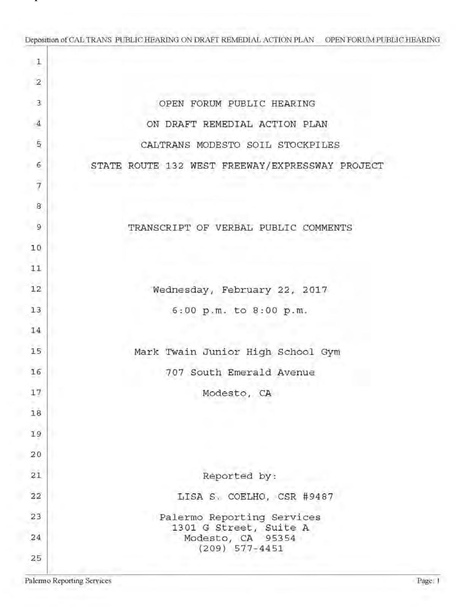

# Deposition of CAL TRANS PUBLIC HEARING ON DRAFT REMEDIAL ACTION PLAN OPEN FORUM PUBLIC HEARING 1 VERBAL COMMENTS MADE BY THE FOLLOWING: 2 3 KATHY FARIA 4 MARGARET TARO 5 JULIE BRUGHELLI 6 BERNICE HENDON 7 STEVE HAGEMANN 8 MARIA VILLASENOR 9 JEFF MARTINEZ 10 DENNIS SEVILLA 11 HEMENT KHATRI 12 SHARON CUSTER 13 RAMON SALINAS 14 ALEJANDRA MUNOZ (Through Interpreter Roberto Radrigan) 15 VIRGINIA HAMMOND 16 AIDE ERREGUIN 17 THOMAS DICK 18 FRANK VARNI 19 20 --000--21 22 23 24 25

Page: 2

Palenno Reporting Services

## Deposition of CAL TRANS PUBLIC HEARING ON DRAFT REMEDIAL ACTION PLAN OPEN FORUM PUBLIC HEARING

| MS. KATHY FARIA: My name is Kathy Faria. I'm at |
|-------------------------------------------------|
| 817 Ranleigh Way, Modesto, California.          |

And my comment is dealing with the purpose and need of their reroute of 132 when I don't see the big traffic issues that 132 does have. Every once in a while, yes, it gets congested, but I feel like in Modesto we have bigger issues with traffic, especially the Carpenter-Briggsmore overpass over 99.

Especially now with -- at the west MJC campus and putting in more classrooms, more facilities, the traffic out there is a nightmare from morning -- basically from 7:00 to 8:00 o'clock, and then in the evening, from 3:30 almost to 6:00, it backs up. It is horrible. It is an ugly mess. They need some other transition off the freeway to that campus. It has been a nightmare for years. And now that -- because maybe there are more funds for MJC to add more classes, all the remodeling, the population of students has increased at that west campus.

Okay. This is dealing with the stockpiles, the three different stockpiles that are out there that are fenced off. And they have four different alternatives for what they're -- actions they're going to do and consider. They're in favor with alternate No. 4, but to me, covering it with cement does not solve the problem at all. It doesn't get rid of the issue. It's just covering another

Palermo Reporting Services

# Deposition of CAL TRANS PUBLIC HEARING ON DRAFT REMEDIAL ACTION PLAN OPEN FORUM PUBLIC HEARING 1 problem instead of alternate No. 3, removal of this dirt 2 that they know is contaminated, that's been contaminated 3 since the early 1900s. And, again, they know that's not 4 safe for our environment, and that's a big concern. 5 6 MS. MARGARET TARO: Margaret Taro, 3530 Maze, 7 M-A-Z-E, Boulevard, Modesto, 95358. 8 And I am in favor of changing 132 west to Dakota 9 and Kansas. And I live at 3530 Maze Road, which it's more 10 difficult to get my car out of the driveway all the time. 11 And there's so much traffic there, that I think it's time 12 to move and make a quicker, more safe entrance into and 13 out of Modesto. And I own five houses there on the corner of Maze and Garrison. And I have tenants in four of them, 14 15 and I'm sure that the tenants would all appreciate relocating Maze for their safety as well. And that's it, 16 17 and I thank you. 18 19 MS. JULIE BRUGHELLI: My name is Julie Brughelli. 20 (Address redacted per Ms. Brughelli). 21 And my comment is I have lived here since this 22 plan was began, the square mile. I've lived in this area. 23 It came in -- it came in behind my house as a child. We

Palermo Reporting Services

24

25

Page: 4

moved away. It's FMC toxic chemical plant that they're

disturbing the soil on. They don't know -- and I've asked

## Deposition of CAL TRANS PUBLIC HEARING ON DRAFT REMEDIAL ACTION PLAN OPEN FORUM PUBLIC HEARING

them. I've had meetings with all of them and met with them from every agency. They never could tell me what they made there, let alone what chemicals were made there. They don't know. 60 years -- please put that -- 60 years that sludge went into open soil. It was not contained.

When they decided to put the so-called dirt, which is all toxic sludge, and make these hills, these berms, they dug that sludge up and plopped it everywhere, 60 years' worth. So maybe three months of poisoning, making bricks; two months or five years making hospital equipment; other years of making nothing but chemicals. That was made. So we do know that arsenic and that -- we know that's in it. It lies dormant until you disturb it, and then it activates it.

We do not know how many other countless chemicals may be reactivated by putting this expressway on those -- on that pile. I have lists of the toxins and what some of them do, which are deadly. I have the list. And so that is going to go back into our air, even if it's capped. It's going to break down and be in our air, and if we could see it, we would see how far it spreads. So we can't see it; right? We cannot see it. Just like you don't see steam until a cold day; then you can see how much steam is flowing.

What they're doing to me is sinful to the

Palermo Reporting Services

## Deposition of CAL TRANS PUBLIC HEARING ON DRAFT REMEDIAL ACTION PLAN OPEN FORUM PUBLIC HEARING

community. They didn't have hardly any homes there at the time they put it there, but now they have over 4,000. I have lists of people with cancers and diseases directly related to some of these on my list, 200. And they've never bothered to even ask me or look. I've been to the Council since 2010. You know, just because you're poor -- and some of those families are over there, especially with -- east of Carpenter, some of those families don't even get newspapers.

I went out with bullhorns at nighttime to let them know about past meetings when they said we didn't care, and I got people involved. But they keep changing this around and shaking it up, And they don't note when there's the meetings and they don't get newspapers and they don't understand all this. Some of them don't even speak English and don't quite get the whole thing about toxins. They just know that an expressway's coming.

20

MS. BERNICE HENDON: My name is Bernice Hendon.

I live at 225 North Dakota Avenue, Modesto, 95358.

And we're under full -- we fully understand that our house is a full take. They've notified us of that over seven months ago, and they just reiterated that they will be fully taking our property.

Palermo Reporting Services

## Deposition of CAL TRANS PUBLIC HEARING ON DRAFT REMEDIAL ACTION PLAN OPEN FORUM PUBLIC HEARING

| 1  | So my thing is now I can't keep holding out.               |
|----|------------------------------------------------------------|
| 2  | They need to work it out with us to get this - I have a    |
| 3  | disabled child. I need to be able to move on, and I can't  |
| 4  | sit here and get the phone call one month that they're     |
| 5  | going to possibly take it and the next month there's a     |
| 6  | chance that they're going to only take a portion of it.    |
| 7  | Now, tonight they're saying they're taking the house       |
| 8  | completely, but they're not for sure when funding's going  |
| 9  | to happen. So I need to get in touch with somebody that    |
| 10 | can get us moved so we can get out of the way. That's it.  |
| 11 |                                                            |
| 12 | MR. STEVE HAGEMANN: Steve Hagemann representing            |
| 13 | Stanislaus County Office of Education, 1100 H Street,      |
| 14 | Modesto, California, 95354.                                |
| 15 | And I just need a little more detailed                     |
| 16 | information on lot 99 -- VPN number or the VP -- yeah, VPN |
| 17 | number 029-015-025. It appears that the property is a      |
| 18 | full take for -- but not in the construction zone, and we  |
| 19 | just need more clarification on if it's a full take, how   |
| 20 | it's going to work and so we can make plans.               |
| 21 | And my e-mail address to contact me is                     |
| 22 | shagemann@stancoe.org.                                     |
| 23 |                                                            |
| 24 | MS. MARIA VILLASENOR: My name is Maria                     |

Palermo Reporting Services

25

Page: 7

Villasenor, and my address is 419 Laurel Avenue.

## Deposition of CAL TRANS PUBLIC HEARING ON DRAFT REMEDIAL ACTION PLAN OPEN FORUM PUBLIC HEARING

Okay. Want to know what -- I have a couple of questions, and one of them is when they built -- I live -- you know where I live? There's a canal and behind it -- behind the canal, it's my house on Laurel Avenue, the canal, and then Petersen School. And then it's the 132; it's Maze Boulevard. We're there. Is it going to affect Maze Boulevard all the way out to the 132, or what is going to -- is congestion of the traffic going to be worse or better? Because I feel that we need -- we already have a lot of noise as it is because we're right by the freeway.

There is -- behind my house where the embankment of the canal is, there is a fence. And the City put up that fence, but it's made out of wire. And the person that owned the house before had a taller fence made. It's like 8 feet tall. But a lot of people pass through there, especially in the summer, and they -- they get into people's houses because they have a clear view of all of our homes.

What I want to know, is there any way -- or what can we do or where do we go to see if they can build us a wall for traffic and for people that are able to see into our backyards and get into our -- into our property?

MR. JEFF MARTINEZ: My name is Jeff Martinez. I

Palermo Reporting Services

## Deposition of CAL TRANS PUBLIC HEARING ON DRAFT REMEDIAL ACTION PLAN OPEN FORUM PUBLIC HEARING

| 1  | live on 829 Chalone Drive, C-H-A-L-O-N-E, Modesto.         |
|----|------------------------------------------------------------|
| 2  | The reason - I've, you know, read the report,              |
| 3  | 844-page report, online, the pdf. And the site No. 2,      |
| 4  | they've got it listed as a hazardous Class 1 substance or  |
| 5  | soil, I guess, and it makes no sense to me why they're not |
| 6  | going to remove it. Capping it I don't think is the        |
| 7  | answer. Everything I've read talks about funding, no       |
| 8  | funding available. If they're going to do the freeway,     |
| 9  | why don't they do it right the first time.                 |
| 10 | The other, you know, problem I have with it is             |
| 11 | it's going to be two lanes until 2026, one in each         |
| 12 | direction, which means you're going to have cars that like |
| 13 | to go faster than the speed limit, which I don't, that are |
| 14 | going to be right on your tail, which is going to cause    |
| 15 | road rage and have cars passing on the shoulder that are   |
| 16 | in a hurry to go around. It's going to create problems.    |
| 17 | And it's also out in the country from Dakota until         |
| 18 | Carpenter. It's a pretty quiet neighborhood, and the       |
| 19 | police don't watch that part of the road.                  |
| 20 |                                                            |
| 21 | MR. DENNIS SEVILLA: My name is Dennis Sevilla,             |
| 22 | S-E-V-I-L-L-A. I live at 704 Rachelle Drive in Modesto,    |
| 23 | California.                                                |
| 24 | And this is just several thousand feet away from           |

And this is just several thousand feet away from the deposits, the contaminated deposits, that Caltrans has

Palermo Reporting Services

25

## Deposition of CAL TRANS PUBLIC HEARING ON DRAFT REMEDIAL ACTION PLAN OPEN FORUM PUBLIC HEARING

off Emerald Avenue. My thinking is that they should remove that rather than try to enclose the sink -- like they have the spent uranium or contaminated material that they had from the East Coast. And my thinking is that they should instead transport the material to close to the Modesto sewage plant where they have approximately 100 plus or minus acres right next to the Tuolumne River that is overflowed.

Because the important thing nowadays is to raise -- try to raise the levees to prevent flooding, and this kind of solves the problem. Because I've seen in the past where the tomato companies have tried to help the situation by dumping some of the refuse over there just to help raise the levees. I think that would be a solution instead of just leaving it where you have a concentrated population where they have Loletta and Elm Street where they have all the contaminated soils there.

From the reports they've said that it's relatively safe, relatively safe; however, I would like to see them do a study on whether the people have contracted cancer or have died from cancer within that group and the area between Elm, Loletta, Emerald. They would have more bearing on whether it's safe or not, I'm afraid.

MR. HEMET KHATRI: My name is Hemet Khatri, and I

Palermo Reporting Services

## Deposition of CAL TRANS PUBLIC HEARING ON DRAFT REMEDIAL ACTION PLAN OPEN FORUM PUBLIC HEARING

represent the property Quality Inn on 500 Kansas Avenue.

The comments, No. 1, the environmental impact report says they were taking over my property 100 percent; whereas, engineering is saying that my property is not impacted. I am confused. I need to know one way or the other. And No. 2 comment is if they don't take my property, I am concerned. If they don't take my property and this project goes on, I'm concerned about, No. 1, the noise factor with the on-ramp so close to my hotel. It's a hotel; people want to be able to sleep.

And, No. 2, the exposure of my hotel. Apparently the overpass is going to be so high that it's going to totally cover my building. People won't be able to see it, that there's a hotel there, so how that is going to affect my business. That's it.

MS. KATHY FARIA: Kathy Faria.

On the map of the preliminary, they show the route of 132 to Dakota to Kansas. I have big issues that they are going ahead with this project when straight out, the property has not been purchased at Dakota and Kansas, the two farmlands where one big house is there and another one is an almond orchard. So that would be -- I'm sorry -- west, north.

Then coming up Kansas from Dakota, the property

Palermo Reporting Services

## Deposition of CAL TRANS PUBLIC HEARING ON DRAFT REMEDIAL ACTION PLAN OPEN FORUM PUBLIC HEARING

hasn't been purchased from the farmers there, so they're in progress of wanting to build this route when property hasn't even been purchased. They're saying the estimated date for the first phase to be done in 2020. To me which is a ridiculous idea when they say they're going to put in two lanes by 2020. Then they're going to go back by 2028 and put in another two lanes. What a freakin' waste of money. Excuse my French. What a waste of money. If you're going to build it, build it all at once, if you're going to do it, or don't do it at all.

And there's alternative 1, there's alternative 2, and there's no alternative. I want no alternative.

MS. SHARON CUSTER: So my name is Sharon Custer, and I live at 901 Ranleigh, R-A-N-L-E-I-G-H, Way in Modesto, 95358.

And I have a couple of questions. As far as the proposals, I'm in agreement with a lot of my neighbors that the proposed plans do not make sense. You're only taking the freeway access from 99 to Dakota, and then you're moving traffic right back onto 132. You're only -- phase 1 that you barely have funding for is only going to be two lanes, which is what we currently have on 132, so that doesn't make sense. And you're diverting the traffic. When they get to Dakota, they have to make a

Palermo Reporting Services

### Deposition of CAL TRANS PUBLIC HEARING ON DRAFT REMEDIAL ACTION PLAN OPEN FORUM PUBLIC HEARING

left and get back onto 132.

In addition, the final buildout of it is only going to be -- is not going to be until 2028. Where's the funding for this going to be? So you're going to do this project, and you don't even have all the funding for it.

My other question is I have asked numerous times about the feasibility of improving Highway 132/Maze Boulevard in order to improve the traffic flow if they are dead set on making improvements. I have yet -- everybody says that there is -- there are studies that have been done; it will impact too many driveways. But nobody's given a really valid reason. There's no -- I have not seen any documentation or studies for the feasibility of improving and expanding 132 from the freeway all the way down.

And then can't remember what the other thing was, but let me go ahead and add I still have concerns about their plan for encapsulating the toxic waste and just how safe that really is going to be. You know, many toxic waste piles are fine until you try to touch them and then find out that the integrity of the cylinder, whatever was encaps -- whatever was stored gets compromised when you try to move it. So I have concerns about that.

So -- and also the misinformation as far as the sound walls go. We were told that there was going to be

Palermo Reporting Services

# Deposition of CAL TRANS PUBLIC HEARING ON DRAFT REMEDIAL ACTION PLAN OPEN FORUM PUBLIC HEARING 1 sound walls up to Carpenter, because from Carpenter out, 2 that section of the expressway was going to be below 3 ground. And it's obvious from the plans that it's not, 4 so -- but my vote is I prefer the no change. But if 5 there's going to be a change, I want a clear explanation 6 why 132 -- the expansion of 132, improvement of 132 would 7 not be a better alternative. 8 9 MR. RAMON SALINAS: Ramon Salinas, 808 Altamont 10 Court, Modesto, California, 95358. 11 I'm concerned for Altamont Court that there's not 12 going to be a sound wall and that -- today we hear the 13 single tractors that do farmland, and we're going to --14 you know, without that being considered, we're concerned 15 with the sound and the pollution and everything that's 16 going to come with the -- it being level to Kansas today. 17 That's what the proposal says. So that's what our concern 18 is from our neighborhood. So that's about -- that's all I 19 got. 20 21 MS. KATHY FARIA: Kathy Faria. 22 And concern about the contaminants in the 23 stockpiles of barium, strontium, and lead, and the

Palermo Reporting Services

24

25

Page, 14

long-term effect already that it has had on our residents

that live in these areas. It was told to us that

## Deposition of CAL TRANS PUBLIC HEARING ON DRAFT REMEDIAL ACTION PLAN OPEN FORUM PUBLIC HEARING

officials have gone around door-to-door to find out history and background of cancers, brain tumors, people in the family dying, and the patterns and this, and we haven't seen any records on this. So we really need to see the records to have the concerns on these issues because all those contaminants are still there in the soil.

You're addressing them as an issue, so we know it's an issue. And, again, some of it is you want to bury it with cement, cover it up. That still leaks in the soil and out through the soil. People are living just almost on top of these stockpiles, so it would be nice to have public record and truthful public records of what these contaminants are doing to some of our long-term residents that have been here since the 1900s.

MS. ALEJANDRA MUNOZ: (Through Interpreter)
Alejandra Munoz, 500 Kansas Avenue. Guayabitos
Restaurant, 500 Kansas Avenue, Suite A, Modesto, 95351.

I am worried that they are going to actually demolish the building. One of the -- all the money that I have invested in that restaurant. And to open that business actually, I spent \$140,000. That is in addition of the money that I lost while I was getting the business ready to go. And it's not only me because I do have

Palermo Reporting Services

## Deposition of CAL TRANS PUBLIC HEARING ON DRAFT REMEDIAL ACTION PLAN OPEN FORUM PUBLIC HEARING

employees. There is people that are working with.

It indicates that they are going to demolish all these. What's going to happen with all of us? I am worried about many things. More than anything, because when I opened the business, the City did not -- oh, the permits, permits and all the things were very difficult to get. I have to work a lot in order to get -- to get those permits. And on top of that, I have to pay rent for all those months that I was trying to get the permits.

Therefore, what she's trying to say is that she had a lot of investment and she wants to know what's going to happen, because if they demolish the building, she's out of a business.

After I opened the business, I have to invest a lot more in order to advertise it and to -- and to make -- to make it known to people. And it was a lot of work because it's a very small restaurant. And if I invested that money that I had and I invested in that business, and what I wanted to do what guarantee a future for my sons. If I wasn't interested on the future of -- my own future and that of my kids, I would -- I would just get a job as an employee somewhere.

Okay. The other thing that I want to know, what is -- what benefits I am going to get in case that they demolish. Who is going to pay for all that? For the --

Palermo Reporting Services

## Deposition of CAL TRANS PUBLIC HEARING ON DRAFT REMEDIAL ACTION PLAN OPEN FORUM PUBLIC HEARING 1 problem instead of alternate No. 3, removal of this dirt 2 that they know is contaminated, that's been contaminated 3 since the early 1900s. And, again, they know that's not 4 safe for our environment, and that's a big concern. 5 6 MS. MARGARET TARO: Margaret Taro, 3530 Maze, 7 M-A-Z-E, Boulevard, Modesto, 95358. 8 And I am in favor of changing 132 west to Dakota 9 and Kansas. And I live at 3530 Maze Road, which it's more 10 difficult to get my car out of the driveway all the time. 11 And there's so much traffic there, that I think it's time 12 to move and make a quicker, more safe entrance into and 13 out of Modesto. And I own five houses there on the corner of Maze and Garrison. And I have tenants in four of them, 14 15 and I'm sure that the tenants would all appreciate relocating Maze for their safety as well. And that's it, 16 17 and I thank you. 18 19 MS. JULIE BRUGHELLI: My name is Julie Brughelli. 20 (Address redacted per Ms. Brughelli). 21 And my comment is I have lived here since this 22 plan was began, the square mile. I've lived in this area. 23 It came in -- it came in behind my house as a child. We

Palermo Reporting Services

25

Page: 17

I have some concerns regarding the proposed

### Deposition of CAL TRANS PUBLIC HEARING ON DRAFT REMEDIAL ACTION PLAN OPEN FORUM PUBLIC HEARING

project. First, the impact on southbound 99 late afternoon and evening, traffic south of Kansas; the impact on Carpenter Road concerning reasonable accommodations under the Americans With Disabilities Act for our disabled community; and, third, the impact of further isolating residents south of the project from larger community.

And I have some comments. I want to start by referring to your draft plan, Appendix H.

Quote, "If the planned SR-132 project were not constructed, an alternative form of cap could be installed over the stockpiles. The alternative cap could consist of constructing a layer of clean soil (typically one foot thick) over the stockpiles. Prior to constructing the cap, the surface of the stockpiles would be graded for drainage to ensure primarily that stormwater did not pond on top of the stockpiles. Following construction, the cap surface would be vegetated to protect against stormwater and wind erosion. This form of cap would provide a similar degree of protection of human health and the environment as capping by the SR-132 project," end quote:

I propose the current planned SR-132 project not be constructed and that the alternative form of cap as quoted above be used and on that cap we build a pedestrian/bicycle freeway which aligns with current federal, state, and city bicycle and pedestrian goals.

Palermo Reporting Services

### Deposition of CAL TRANS PUBLIC HEARING ON DRAFT REMEDIAL ACTION PLAN OPEN FORUM PUBLIC HEARING

And I propose connecting this new freeway to the existing Virginia Corridor, making this a viable alternative transportation project eligible for funding.

Vegetative solutions have been used in environmental disasters such as the dioxin disaster of 1976 in Seveso, Italy. Today a lush green park, memorial and tourist attraction, Bosco Delle Querce, is located on this site.

Current trends in urban development are to remove central freeways and replace them with pedestrian/bicycle freeways. A number of cities have done this or are in the process of doing this, including Portland, Boston, and Dallas.

We have a tremendous opportunity to beautify and unite Modesto. Please consider my proposal and how close we are to connecting with the Corridor and what it would mean to the future of Modesto.

19

MS. AIDE ERREGUIN: Okay. My name is Aide Erreguin. My address is 1661 Elm Avenue in Modesto.

And I want to know why all my neighbors they're taking partial and they take my property a full. That's my -- that's my -- to double-check or revise what's going on around this property on this street. Thank you.

25 ///

Palermo Reporting Services

### Deposition of CAL TRANS PUBLIC HEARING ON DRAFT REMEDIAL ACTION PLAN OPEN FORUM PUBLIC HEARING

MS\_ SHARON CUSTER: Sharon Custer.

And the last comment I wanted to make was that I really don't appreciate the way that they did the meeting. They tried to do the same thing last time so that they had everybody separated going from station to station so that questions that people asked were not -- the general attendees could not hear the questions and the responses.

So if they're going to do this again -- and I'm hoping that we get another public comment before they make a decision to move forward and approve the environmental reports and stuff -- they need to have another meeting where people can come sit, hear everybody's questions and everybody's concerns, and everybody can hear the responses as a group instead of separating us all into little groups of people going around.

17

MR. THOMAS DICK: My name is Thomas Dick. I live at 1671 Elm Avenue; it's on the west side of Carpenter.

My main concern is the berms, the stockpiles.

They have got a lot of nasty stuff in them, and I want to make sure -- I know they're going to encapsulate them, but I want to make sure that they don't go and put a lot of earth movers and graders up there and start moving that dirt around. I've been told that they're supposed to put clean dirt on top of it and then encapsulate it. I can

Palermo Reporting Services

## Deposition of CAL TRANS PUBLIC HEARING ON DRAFT REMEDIAL ACTION PLAN OPEN FORUM PUBLIC HEARING

maybe live with that. But I'm going to be watching, and I don't want to see any of that dirt moved because I know it will put those chemicals back up in the air. And I'm close enough with wind blowing, I can catch it.

And then another one I just -- because I'm on Elm and I can't find anybody to tell me if the water pipeline that irrigates those properties down there on Elm is getting removed or taken out or replaced. And some of that property hasn't been bought yet.

And they're not putting a retaining wall up on our side, on the Elm side, and they -- nobody seems to know how much of that land is going to be taken at this point. In fact, one of my neighbors, her whole property shows being taken and she doesn't -- she had no clue. So can't seem to find anybody here that can answer those questions for me; it's a little frustrating. So thank you.

19

MR. JEFF MARTINEZ: My name is Jeff Martinez.

And I was speaking with the guys on the maps, and I was asking them about where I live, if they're going to build a sound wall. And they were saying no sound walls, and it's -- we have an existing sound wall now around the tract of homes that I live, but it's only a 6-foot wall and they're saying that's sufficient enough. And the

Palenno Reporting Services

### Deposition of CAL TRANS PUBLIC HEARING ON DRAFT REMEDIAL ACTION PLAN OPEN FORUM PUBLIC HEARING

decibel level based on the report I read that was created in 2016 December says the decibel level, it is going to go up 7 or 8 decibels. And I don't even think that's truly accurate because it's all computer-based. And if you go out to the houses at night, the sound travels quite a bit more than it does in a city part of town.

And I just hope they can go with the no-build alternative. You know, everything I keep seeing on this and reading, it's just like doing a half a project. You know, they're going -- the road is rated as an F rating right now. And in 2028 when it's depleted, it's still going to be an F rating based on the reports. How is that progress? And that's with the four lanes. That's all.

MR. FRANK VARNI: Frank Varni, 615 Kansas Avenue, our business. And my home address is 2142 West Whitmore, Modesto, 95358.

We prefer option No. 2 for the reason that the businesses along that stretch are very productive and add jobs and are economically good for the -- for that area. A good example, what happens if you do close the off-ramp and on-ramp is North Ninth Street where there was hotels, motels -- or motels and other businesses that were profitable and now it's just vacant and deserted. So we don't need that right next to -- we don't need it

Palenno Reporting Services

# Deposition of CAL TRANS PUBLIC HEARING ON DRAFT REMEDIAL ACTION PLAN OPEN FORUM PUBLIC HEARING anywhere, and we don't need it right in this critical development. --000--

Page, 23

Palenno Reporting Services

# Deposition of CAL TRANS PUBLIC HEARING ON DRAFT REMEDIAL ACTION PLAN OPEN FORUM PUBLIC HEARING STATE OF CALIFORNIA, ) 1 2 3 COUNTY OF STANISLAUS. ) 4 5 I, LISA S. COELHO, a Certified Shorthand Reporter 6 in and for the County of Stanislaus, State of California, 7 do hereby certify: 8 That on February 22, 2017, thereof, I reported 9 verbatim in shorthand writing the foregoing proceedings; 10 That I thereafter caused my shorthand writing to 11 be reduced to typewriting, and that the foregoing 12 transcript constitutes a full, true, and correct 13 transcription of all proceedings had and given. 14 IN WITNESS HEREOF, I have hereunto set my hand 15 and affixed my Official Seal this 28th day of February 16 2017. 17 18 19 20 LISA S. COELHO, CSR #9487 21 Certified Shorthand Reporter 22 23 24 25

Palermo Reporting Services