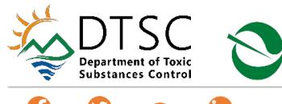

From: Mcleskey, Arielle@DTSC
To: "Inman, Adam@DOT"

Subject: RE: Modesto Stockpile Annual Inspection 2026

Date: Thursday, June 11, 2026 12:14:00 PM

Attachments: image001.pnq

image002.png image003.png image004.png image005.png image006.png image008.png

## Hello Adam,

Thank you for your submission of the Annual Operation and Maintenance Inspection Report (Report) dated January 26, 2026, which outlines the outcome of an inspection conducted at State Route 132 West Expressway at the State Route 132/99 Interchange.

The Department of Toxic Substances Control (DTSC)'s Project Manager and Engineering and Special Projects Office (ESPO) completed their review and based upon DTSC's review of the report, it is hereby approved and accepted as final.

The vegetation is still sparse along the road, which was noted during last year's report. It appears that leftover erosion control materials are limiting erosion currently. Vegetation along the roadway is still encouraged to prevent erosion.

We appreciate the submittal of this annual report and look forward to reviewing the next submittal for this project, an Annual Land Use Covenant Inspection Report, which is due to DTSC no later than January 18, 2027.

Please, let me know if you have any questions.

Sincerely,

**Arielle McLeskey** (she/her/hers)

Project Manager Site Mitigation and Restoration 916-255-3631

arrelle McLeskey

arielle.mcleskey@dtsc.ca.gov

Department of Toxic Substances Control 8800 Cal Center Drive, Sacramento, California 95826-3200 California Environmental Protection Agency

From: Inman, Adam@DOT <Adam.Inman@dot.ca.gov>

Sent: Thursday, January 29, 2026 7:37 AM

To: Mcleskey, Arielle@DTSC <Arielle.Mcleskey@dtsc.ca.gov>

Subject: Modesto Stockpile Annual Inspection 2026

## This Message Is From an External Sender

This message came from outside your organization.

Report Suspicious

Good Morning Arielle -

I hope you're well! Thank you again for putting together that presentation for the TAG Group. It went better than I expected.

I was out on Monday and did the annual inspection at Modesto Stockpiles. I didn't observe any issues. You will notice in some of the photos that our maintenance crews were out there removing debris from the north slope. They had only done stockpile #2 when I was there but you can see that the area is freshly raked and there are piles of debris just past the bottom of the slope.

Also – I seem to remember that you had a comment last year about the checklist. The first column is labeled "surface conditions ok?" and I think I replied in the negative last time. Doesn't really make sense, I agree, so I changed that.

If you have any questions or comments, please let me know.

Adam Inman, PG
Engineering Geologist
Caltrans D-6 | Office of Environmental Engineering
Hazardous Waste and Paleontology Branch
2015 East Shields Avenue, Suite 100
Fresno, CA 93726

Cell: 559-374-1574