Environmental Protection

# Department of Toxic Substances Control

Barbara A. Lee, Director 8800 Cal Center Drive Sacramento, California 95826-3200

March 13, 2018

Name Address Modesto, California 95351

RESPONSE TO PUBLIC COMMENTS FOR THE DRAFT FINAL REMEDIAL ACTION PLAN, CALTRANS MODESTO SOIL STOCKPILES, STATE ROUTE 132 WEST FREEWAY/EXPRESSWAY PROJECT, STANISLAUS COUNTY, CALIFORNIA

Dear Community Member,

Thank you for submitting comments to the Department of Toxic Substances Control (DTSC) regarding the proposed remedial action for the California Department of Transportation (Caltrans) Modesto Soil Stockpiles (Site) located south of Kansas Avenue between Carpenter Avenue and just east of State Route 99 in Modesto, California.

# Background

The Site consists of three separate stockpiles totaling approximately 160,000 cubic yards. Stockpile 1 is approximately 2.5 acres, located south of Kansas Avenue between Carpenter and North Emerald Avenue. Stockpile 2 is approximately 7.6 acres, located south of Kansas Avenue between North Emerald Avenue and State Route 99. Stockpile 3 is approximately 2.5 acres, located south of Kansas Avenue and east of State Route 99. The stockpiles are vacant, vegetated, and secured with a perimeter fence. The primary contaminants of concern in the stockpiles are barium, strontium and lead. Based on site investigations and a Human Health Risk Assessment, the Site as currently managed does not poses an unacceptable human risk to off-site residents, trespassers, or Caltrans workers.

The stockpiles were created in the early 1960's when a 4.3-acre parcel at the southwest corner of the Food Machinery and Chemical Corporation (FMC), Modesto Processing Plant was purchased by the California Department of Transportation (Caltrans) to construct the State Route 99 Modesto bypass. FMC and its predecessors operated a

Name March 13, 2018 Page 2

chemical processing facility just north of Kansas avenue. The facility processed barium, strontium (barite and celestite), and other materials to produce a variety of chemicals. Residual liquids were discharged to unlined ponds on FMC's property. Soil in and around the ponds, which previously occupied the 4.3-acre parcel, was excavated during construction of the bypass and stockpiled in its present location.

# Remedial Action Plan

The selected remedy Alternative 4, Containment, described in the Draft Final Remedial Action Plan (RAP) proposes containment of the stockpiles by construction of the State Route 132 West Freeway/Expressway Project. This alternative contains the stockpiles behind retaining walls, bridge abutments, and beneath the roadway. Unpaved portions will have clean fill cover. It achieves the overall goal of long term protection of human health and environment by eliminating the exposure pathway to human receptors and minimizes the infiltration of surface water into groundwater under the stockpiles. This alternative is cost effective and technically feasible and is in compliance with Applicable or Relevant and Appropriate Requirements and achieves the criteria for long term effectiveness, reduction of mobility, short term effectiveness, and implementability.

# California Environmental Quality Act

Caltrans, as the lead agency under the California Environmental Quality Act (CEQA) and the National Environmental Policy Act (NEPA), prepared an Environmental Impact Report/Environmental Assessment (EIR/EA) associated with the State Route 132 West Freeway/Expressway. DTSC and the Central Valley Regional Water Quality Control Board (RWQCB) are responsible reviewing agencies under CEQA.

# **Public Comments**

A joint Caltrans and DTSC public comment period was held from January 18, 2017 to March 17, 2017 for the Draft EIR/EA and Draft Final RAP. The comment period was announced in the Modesto Bee and Vida En El Valle newspapers. A Notice of Availability prepared by Caltrans for the Draft EIR/EA and Draft Final RAP and a Community Update/Fact Sheet prepared by DTSC for the Draft Final RAP announcing the public comment period, public meeting date, and brief description of the project were mailed to the mailing list which included residents and businesses located in the vicinity of the project site. Caltrans and DTSC held a joint public hearing on February 22, 2017 at Mark Twain Junior High School in Modesto.

Comments for both the Draft EIR/EA and Draft Final RAP were received by letter, email, comment cards, and orally at the public hearing. A total of 305 comments were received. Most of the comments addressed the Draft EIR/EA and the State Route 132 West Freeway/Expressway Project. Of these, 62 addressed the Draft Final RAP. Since the comments received addressed both the Draft EIR/EA, the State Route 132 West

Name March 13, 2018 Page 3

Freeway/Expressway Project, and Draft Final RAP, responses were prepared to coincide with the order in which a comment was made by a commenter (e.g., a comment on the Draft EIR/EA versus a comment on Draft Final RAP). Comments related to the Draft EIR/EA and State Route 132 West Freeway/Expressway were responded to by Caltrans. Comments related to the Draft Final RAP were responded to by DTSC in consultation with the RWQCB. As the lead agency for CEQA, Caltrans agreed with DTSC's responses and incorporated them as their own into Caltrans' comments and responses in Appendix J of the Final EIR/EA. The comments and responses are organized by State Agency Comments, Local and County Agency Comments, Individual Comments (letters and emails), Public Hearing Comments (comment cards) and Public Hearing Transcript Comments. As noted, DTSC's responses to comments for the Draft Final RAP are identified and included with Caltrans' responses to comments for the Draft EIR/EA (Appendix J of the Final EIR/EA).

Due to the large number of the comments and responses, a compact disk (CD) containing all comments and responses (including those specific to the Draft Final RAP) are included with this letter. Comments and responses may also be viewed online or at the following locations:

Caltrans - Online

http://www.dot.ca.gov/d10/x-project-sr132west.html

# DTSC - EnviroStor website

http://www.envirostor.dtsc.ca.gov/public/profile\_report?global\_id=60001626 http://www.envirostor.dtsc.ca.gov/public/profile\_report?global\_id=50280024

Caltrans District 10 Office 1976 Dr. Martin Luther King, Jr. Blvd. Stockton, California 95205 (209) 948-7543

Stanislaus County Library 1500 I Street Modesto, California 95354 (209) 558-7800 Stan COG Office at 1111 "I" Street, Suite 308 Modesto, California 95354 (209) 525-4600

DTSC - File Room 8800 Cal Center Drive Sacramento, California 95826 (916) 255-3758 Name March 13, 2018 Page 4

DTSC sincerely appreciates the commenters thoughtful questions and suggestions as well as their participation in this process. Please contact me for questions at 916-255-3591, or by email at <a href="mailto:Randy.Adams@dtsc.ca.gov">Randy.Adams@dtsc.ca.gov</a>.

Rossof Adam

Randy Adams
Project Manager
San Joaquin Branch, Sacramento Office
Brownfields and Environmental Restoration Program

Enclosure: (Compact Disk – Appendix J, Final EIR/EA)

# **Appendix J** Comments and Responses

Page Intentionally Left Blank

# **Responses to Comments**

Appendix J contains 300 comments that were received during the public circulation period of the Draft EIR/EA with attached Draft Final Remedial Action Plan (Draft Final RAP), from January 18, 2017 to March 17, 2017. The Lead Agency (Caltrans) has prepared responses to the comments received with coordination and review by the SR 132 West Project Development Team, while the Department of Toxic Substances Control (DTSC), in consultation with the Central Valley Regional Water Quality Control Board (RWQCB), and acting as a responsible agency under CEQA, has responded directly to comments pertaining to the Caltrans Modesto Soil Stockpiles, when appropriate. Caltrans agrees with those responses and has incorporated them as its own responses where indicated into this document. Additionally, this document also serves as DTSC's response to comments for the Draft Final RAP pertaining to the Caltrans Modesto Soil Stockpiles. The responses follow each comment presented. Comments were received from one State agency, Local and County agencies, individuals, as well as public comments from the Draft EIR/EA with attached Draft Final RAP Public Hearing held on February 22, 2017. These include 181 Individual comments, 1 State Agency comment, 4 Local and County Agencies comments, 66 Public Hearing comments, and 48 Public Hearing Transcript comments.

Eleven master responses have been prepared to address similar comments that were submitted by multiple agencies or individuals. These Master Responses are referenced throughout Appendix J when appropriate and will be included and are hereby incorporated into the Final EIR/EA.

# **List of Comments Received**

A total of 300 comments were received from one State (S) agency (State Clearinghouse and Planning Unit), Local and County agencies (LC), and individuals (I), as well as from the Draft EIR/EA with attached Draft Final RAP Public Hearing (PH) held on February 22, 2017. The comments are identified by Comment ID and Comment Number. For example, LC2-1 is the first comment in the letter provided by the Modesto Irrigation District (MID). A summary table containing the list of commenters and the dates on which comments were received is detailed below.

| State Agency Comments |                                       |               |
|-----------------------|---------------------------------------|---------------|
| Comment ID            | Commenter                             | Date Received |
| S1                    | State Clearinghouse and Planning Unit | 3/20/2017     |

| Local and County Agency Comments |                                                         |               |
|----------------------------------|---------------------------------------------------------|---------------|
| Comment ID                       | Commenter                                               | Date Received |
| LC1                              | Stanislaus County Department of Environmental Resources | 1/26/2017     |
| LC2                              | Modesto Irrigation District                             | 2/22/2017     |
| LC3                              | San Joaquin Valley Air Pollution Control District       | 3/8/2017      |
| LC4                              | Stanislaus Environmental Review Committee               | 3/2/2017      |

| Individual Comments     |                         |               |
|-------------------------|-------------------------|---------------|
| Comment ID              | Commenter               | Date Received |
| I1                      | Scott Murray            | 1/29/2017     |
| I2                      | Bruce Frohman           | 2/8/2017      |
| I3                      | Jeff Martinez           | 2/24/2017     |
| I4                      | Anthony Plaza           | 3/2/2017      |
| I5                      | Brian and Bonnie Weese  | 2/25/2017     |
| I6                      | Joseph and Jane King    | 3/16/2017     |
| I7                      | Wes Olsen               | 2/13/2017     |
| I8                      | Ramon and Susie Salinas | 2/26/2017     |
| I9                      | Cimino Family           | 3/13/2017     |
| I10                     | Virginia Hammond        | 3/15/2017     |
| I11                     | Lori Wolf               | 3/17/2017     |
| I12                     | Scott Calkins           | 3/13/2017     |
| I13                     | Monica Ramos            | 3/17/2017     |
| I14                     | Diane Russo             | 3/17/2017     |
| I15                     | Tony Madrigal           | 3/17/2017     |
| I16                     | Theresa Gamboa          | 3/17/2017     |
| I17                     | Patricia Gallagher      | 3/17/2017     |
| I18                     | Margaret Taro           | 3/14/2017     |
| I19                     | Rhett Calkins           | 3/17/2017     |
| Public Hearing Comments |                         |               |
| Comment ID              | Commenter               | Date Received |
| PH1                     | Frank J. Varni          | 2/22/2017     |

| Public Hearing Comments            |                   |               |
|------------------------------------|-------------------|---------------|
| Comment ID                         | Commenter         | Date Received |
| PH2                                | Edmund Morad      | 2/22/2017     |
| PH3                                | Lewis Cimino      | 2/22/2017     |
| PH4                                | Mary S. Matthews  | 2/22/2017     |
| PH5                                | Patricia Wilhem   | 2/22/2017     |
| PH6                                | Hement Khatri     | 2/22/2017     |
| PH7                                | Rachel Bradley    | 2/22/2017     |
| PH8                                | Alejandro Munoz   | 2/22/2017     |
| PH9                                | Ricardo Arrieta   | 2/22/2017     |
| PH10                               | Jean Calkins      | 2/22/2017     |
| PH11                               | Ignacio Contreras | 2/22/2017     |
| PH12                               | Lou Varni         | 2/22/2017     |
| PH13                               | Vijay Solanlei    | 2/22/2017     |
| PH14                               | Hector Cortes     | 2/22/2017     |
| PH15                               | Don Calkins       | 2/22/2017     |
| PH16                               | Bert Tabrizi      | 2/22/2017     |
| PH17                               | Dennis Sevilla    | 2/22/2017     |
| PH18                               | Maureen Dick      | 2/22/2017     |
| PH19                               | David Abel        | 2/22/2017     |
| PH20                               | Anna McCuistion   | 2/22/2017     |
| PH21                               | Melissa Kenney    | 2/22/2017     |
| PH22                               | Lewis Cimino      | 2/22/2017     |
| PH23                               | John Kenney       | 2/22/2017     |
| Public Hearing Transcript Comments |                   |               |
| Comment ID                         | Commenter         | Date Received |
| PHT-1, 2, 3                        | Kathy Faria       | 2/22/2017     |
| PHT-4                              | Margaret Taro     | 2/22/2017     |
| PHT-5, 6, 7, 8                     | Julie Brughelli   | 2/22/2017     |
| PHT-9                              | Bernice Hendon    | 2/22/2017     |
| PHT-10                             | Steve Hagemann    | 2/22/2017     |
| PHT-11, 12                         | Maria Villasenor  | 2/22/2017     |
| PHT-13, 14, 15                     | Jeff Martinez     | 2/22/2017     |
| PHT-16, 17, 18                     | Dennis Sevilla    | 2/22/2017     |
| PHT-19, 20, 21                     | Hemet Khatri      | 2/22/2017     |
| PHT-22, 23, 24                     | Kathy Faria       | 2/22/2017     |
| PHT-25, 26, 27, 28, 29             | Sharon Custer     | 2/22/2017     |
| PHT-30                             | Ramon Salinas     | 2/22/2017     |
| PHT-31, 32                         | Kathy Faria       | 2/22/2017     |
| PHT-33, 34, 35                     | Alejandra Munoz   | 2/22/2017     |
| PHT-36, 37, 38, 39                 | Virginia Hammond  | 2/22/2017     |
| PH1-40                             | Aide Erreguin     | 2/22/2017     |
| PHT-41, 42                         | Sharon Custer     | 2/22/2017     |
| PHT-43, 44, 45                     | Thomas Dick       | 2/22/2017     |
| PHT-46, 47                         | Jeff Martinez     | 2/22/2017     |
| PHT-48                             | Frank Varni       | 2/22/2017     |

# **Summary of Comment Categories**

The general topic issues of comments received include the following comment categories:

- Accidents/Fatalities
- Americans with Disabilities Act (ADA) Compliance
- Air Quality Impacts
- Bicycle and Pedestrian Facilities
- Business/Economic Impacts
- Caltrans Modesto Soil Stockpiles
- Community Impacts
- North Dakota Avenue
- Differences Between Build Alternatives
- General Comment of Support
- General Comment of Dissent
- Highway/Roadway Design and Maintenance
- Interchange at North Carpenter Road
- Land Use
- Logical Termini
- Loss of Farmland/Trees
- Loss of Property Values
- Noise Impacts
- Other Project Alternatives (e.g., Alternative 5 and Mass Transit Alternative)
- Preference for Alternative 2
- Preferred Alternative
- Project Development Team Process
- Project Design and Feasibility
- Project Funding and Costs
- Project Phasing and Scheduling
- Project Purpose and Need
- Public Participation and Environmental Review Process
- Right-of-Way Impacts
- Traffic Impacts and Mitigation
- U.S. Fish and Wildlife Service
- Utility Impacts
- Visual Impact

# Master Comment Responses

Master responses have been prepared to address similar comments that were submitted by multiple agencies or individuals as part of the public participation process.

# Master Response #1 (Purpose and Need)

Future traffic projections have demonstrated a need for the proposed improvements of SR 132. Existing SR 132 (Maze Boulevard) currently operates at a level of service D or better between North Dakota Avenue and SR 99 but is anticipated to deteriorate to unacceptable levels in the future. All of the study intersections along the existing highway currently operate at an acceptable level of service C or better; however, the studies identify that traffic operations would degrade over time so that, by 2028, the intersection of the existing highway and North Carpenter Road would operate at level F, an unacceptable service level; and, by 2048, the intersections of the existing highway with Rosemore Avenue, North Carpenter Road, and Emerald Avenue would operate at unacceptable service level F. As detailed in Section 2.1.6, Traffic and Transportation/Pedestrian and Bicycle Facilities, future congestion in 2048 along the 3.3-mile stretch between North Dakota Avenue and SR 99 would reduce travel speeds by 12.1 miles per hour during the AM peak period and 12.3 miles per hour during the PM peak period. This would increase travel times and decrease the level of service along SR 132 (Maze Boulevard) at every area intersection studied. Both build alternatives would result in decreased traffic volumes and fewer conflicts at intersections and driveways on existing SR 132 (Maze Boulevard). Please refer to Section 1.2, Purpose and Need, for further information.

# Master Response #2 (Accidents/Fatalities on Existing SR 132/Maze Boulevard)

Based on the most recent three-year period studied (November 2010 to October 2013), the existing highway has had no fatalities, compared to a statewide average rate for similar facilities of 0.016 accidents per million vehicle miles traveled, and a 2-percent lower fatality/injury accident rate than the statewide average. Most accidents (34 percent) were broadside accidents, followed by rear-end (32 percent), hit-object (15 percent), head-on (9 percent), sideswipe (6 percent), and auto/pedestrian (4 percent) accidents. Based on the Highway Safety Manual published by the American Association of State Highway and Transportation Officials, there is a direct correlation between crash frequency and average daily traffic volumes. Lower traffic volumes would result in greater spacing between vehicles, allowing drivers more time to react to sudden changes in traffic flow, such as a stopped vehicle. Fewer vehicles would also result in fewer conflicts at intersections and driveways. Please refer to the *Improve Operations* section within Section 1.2., Purpose and Need, for further information on accidents and fatalities.

# Master Response #3 (Logical Termini)

North Dakota Avenue represents the logical western terminus because it is the last major northsouth roadway that connects the existing SR 132 (Maze Boulevard) to the proposed new SR 132 Alignment (south of Kansas Avenue), SR 99, and the Modesto City Limits. The next major north-south road is North Hart Road, more than 3 miles west of North Dakota Avenue. Alternative logical termini such as extending the project limits to North Hart Road were evaluated during the development of the EIR/EA or project but, due to public input and evaluation by the Project Development Team, they were rejected on the basis of additional impacts and costs. As discussed in Section 1.2.3, Independent Utility and Logical Termini, of the EIR/EA, forecasted traffic volumes along SR 132 (Maze Avenue) west of North Dakota Avenue are the same for the no-build and build scenarios. Forecasted future average daily traffic counts west of North Dakota Avenue for the no-build and build scenarios are the same. As such, the proposed project would not have an impact on traffic volumes west of the existing SR 132 (Maze Boulevard)/North Dakota Avenue intersection, and no improvements west of the existing SR 132 corridor are needed at this time. Ending roadway improvements near the Maze Boulevard/North Dakota Avenue intersection is not anticipated to result in indirect effects west of the proposed project area.

This project is part of a larger plan to connect SR 99 with Interstate 580 (I-580) via a controlled-access freeway/expressway. In 1956, the proposed freeway corridor for SR 132 was adopted by the state with resolutions of support from Stanislaus County and the City of Modesto. In 1958, the state proceeded with property acquisition along the new proposed SR 132 alignment. To date, 179 acres of the project area are in the right-of-way owned by Caltrans. Both Alternative 1 and Alternative 2 would use the adopted route to realign the segment of existing SR 132 (Maze Boulevard) between Dakota Avenue and SR 99 (see Appendix F of the EIR/EA). The further extension of the new SR 132 corridor (along Kansas Avenue), west of North Dakota Avenue to Gates Road, is currently in the planning stages. Part of the right-of-way west of Dakota has already been acquired for this controlled-access freeway/expressway. The use of North Dakota Avenue as a part of the new SR 132 route will be temporary until future segments of the controlled-access freeway/expressway are built, the first of which is anticipated to be a segment from Dakota to Gates, which is currently in the planning phase.

# **Master Response #4 (Project Funding)**

Currently, only Phase 1 has programmed funding, which was identified for fiscal years 2018/2019. Phase 1 funding sources include the Regional Improvement Program (RIP), Federal Demonstration Program (DEMO), Stanislaus County's share of the Regional Surface Transportation Program (RSTP), and other local funds from the City of Modesto and Stanislaus County. Phase 1 is estimated to cost approximately \$82 million. Both build alternatives

(Alternative 1 and Alternative 2) would be the same under Phase 1 and would include construction of a two-lane expressway on the southern half of the proposed alignment from North Dakota Avenue on the west end of the project to the Needham Street Bridge Overcrossing on the east end of the project. The recent approval of Measure L will provide additional funds for the project and could potentially be used to fund Phase 2. Construction funding for Phase 2 will be identified in the future as the project progresses in design and is estimated to cost up to \$132 million. Phase 2 would involve the construction of the two northernmost lanes within the new alignment from North Dakota Avenue on the west end of the project to the Needham Street Bridge Overcrossing on the east end of the project. The total project is estimated to cost up to \$214 million. A separate Plan, Specification and Estimate (PS&E) bid package will be advertised for each project phase.

# Master Response #5 (Public Participation and Environmental Review Process)

Public participation methods used for the project have included a variety of approaches, including stakeholder meetings/targeted outreach, mailing lists, and public information meetings/open houses (see Section 4.2.4 for a complete list of past events). Public participation tools have included fact sheets, multilingual community flyers and announcements, focus group outreach, display boards, and a project website. Newspaper ads and meeting notifications in English and Spanish were published in *The Modesto Bee* and *Vida en el Valle*, respectively. As described in Section 4.2.4, StanCOG and Caltrans have provided a total of 18 opportunities for the public to participate in the project planning process. This included eight Plan Implementation Project (PIP) meetings, one Public Scoping Meeting and nine Public Information Meetings, including one public hearing and eight neighborhood meetings. The Public Scoping Meeting, the PIP Meeting and the Public Hearing Open House are discussed in detail below.

On January 25, 2010, a scoping meeting/open house was held to inform the public and other interested parties about the project and to provide members of the public with an opportunity to voice their comments or concerns about the project. A stakeholder outreach group known as the PIP Team met on March 24, 2010, September 30, 2010, and in July 2014. The PIP meetings were discontinued while DTSC prepared the Stockpile Remedial Action Plan. Both engineering and environmental work relative to the freeway/expressway project were halted during the preparation of the Draft Final Remedial Action Plan (Draft Final RAP). As the Draft Final RAP was nearing completion, technical studies and the EIR/EA with attached Draft Final RAP addressing the SR 132 West Freeway/Expressway Project were reopened to include analysis of the proposed remedial action and update changed conditions.

The Draft EIR/EA with attached Draft Final RAP was released for public review on January 18, 2017. According to the CEQA statutory requirements, the public comment period for draft EIRs

should be not be less than 30 days or no longer than 60 days except in unusual circumstances. The public comment period for the Draft EIR/EA with attached Draft Final RAP began on January 18, 2017 and ended on March 17, 2017, a total of 59 days. Print copies were available for review at the Caltrans District 10 Office in Stockton, California; the Stanislaus Council of Governments in Modesto, California; the Stanislaus County Library in Modesto, California and the Department of Toxic Substances Control office in Sacramento, California. Copies of the Draft Final RAP were also available on the DTSC Envirostor Database at <a href="http://www.envirostor.dtsc.ca.gov/public/profile\_report.asp?global\_id=60001626">http://www.envirostor.dtsc.ca.gov/public/profile\_report.asp?global\_id=50280024</a>.

On February 22, 2017, as part of the circulation process, Caltrans, DTSC, Regional Water Quality Control Board, in conjunction with StanCOG, held a public hearing with an informal open house format to review design concepts, share information, present displays, and accept written and oral comments on the Draft EIR/EA and Draft Final RAP prepared for the project. To announce the Public Hearing, a Public Notice was published by StanCOG in *The Modesto* Bee (English version) and Vida en el Valle (Spanish version) on January 18, 2017. On January 30, 2017, the Public Hearing venue changed, from the Red Event Center to Mark Twain Junior High School. An English and Spanish postcard advertising this change was mailed on February 8, 2017, to approximately 2,500 residents, tenants, and business owners within the project area. DTSC also sent out the Caltrans Modesto Soil Stockpiles Community Update (English and Spanish) to the project mailing list on February 6, 2017. A revised Public Notice with the new location was published by StanCOG in The Modesto Bee and Vida en el Valle on February 8, 2017 and February 15, 2017. The Hearing Notice was also published in English and Spanish on StanCOG's website at http://www.stancog.org/trans-ps.shtm on the Caltrans District 10 website at http://www.dot.ca.gov/d10/x-project-sr132west.html and on the DTSC website at http://www.envirostor.dtsc.ca.gov/public/profile\_report.asp?global\_id=60001626. At the hearing, meeting attendees were encouraged to ask questions, meet with project representatives, and submit written and oral comments.

As detailed in the Public Hearing Summary Report, the open house format included stations around the room for the public to review project information and ask questions. Project team members were present at each station to provide information as needed and respond to questions. A welcome board greeted attendees as they entered the meeting room. Members of the public signed in at the meeting and were encouraged to submit written comments on comment cards. Consultant Team staff gave each attendee information sheets stating the project description, purpose, background, cost, funding source, timeline, and a contact name for those interested in obtaining more information. An information sheet also contained a map showing the project location. A court reporter was present to record oral comments. A Public Hearing Summary

Report has been prepared to document the meeting proceedings and is available in the public record.

All comments submitted during the Draft EIR/EA with attached Draft Final RAP public comment period process have been reviewed by the Project Development Team, DTSC and the Regional Water Quality Control Board (CEQA Responsible Agencies). Comments and responses are incorporated into the Final EIR/EA with attached Draft Final RAP.

Specific information regarding public meetings and agency meetings and coordination is discussed in Chapter 4.0 of the EIR/EA. Meeting notes and comments from the scoping meeting and previous open houses were included in the Community Impact Assessment located in the EIR/EA Technical Studies, Volume 1.

# Master Response #6 (Improvements to Existing SR 132 (Maze Boulevard) – Alternative 5)

As described in Chapter 1 of the EIR/EA, Alternative 5 would have widened existing SR 132 (Maze Boulevard) from a two-lane, conventional highway to a four-lane highway. Construction would have also included a raised median, the modification or elimination of driveways, the construction of left- and right-turn lanes, and at-grade signalized intersections at all major local roadways. Alternative 5 would not have used the existing Caltrans right-of-way within the route adopted for the project and would not have resulted in the containment of the soil stockpiles within a highway structure. As such, Caltrans would be required to develop a separate remedial action plan for the stockpiles under the oversight of DTSC and Regional Water Quality Control Board.

According to the Project Development Procedures Manual (Chapter 8, Section 6), the early identification of significant environmental impacts, use of protected resources, and impacts on hazardous wastes is a crucial step in project development. To determine if Alternative 5 should be removed from consideration or studied further, the Project Development Team completed qualitative and quantitative analysis early in the design phase to determine the potential environmental effects anticipated with the construction and operation of Alternative 5. The Project Development Team found that Alternative 5 would have had five distinct limitations in addition to not meeting the project's purpose and need.

First, the alternative would have substantially impacted local residents, businesses, and utilities along the existing highway. It would have impacted more than 160 properties, which would be 100 more properties than either of the two build alternatives. Also, Alternative 5 would have required an estimated 60 residential relocations compared to the 30 residential relocations proposed under Alternatives 1 and 2. More than 40 business relocations would be required under

Alternative 5 compared to the 9 and 7 proposed business relocations under Alternatives 1 and 2, respectively. In total, relocations proposed under Alternative 5 would be more than twice as many compared to relocations proposed under Alternatives 1 and 2. The total value of properties that would be acquired as a result of Alternative 5 is estimated at \$70.7 million. Right-of-way acquisition costs associated with Alternatives 1 and 2 are estimated to be \$22 million for each alternative.

Second, Alternative 5 would not have provided system connectivity between SR 132 and SR 99 and, therefore, would not have improved regional and interregional travel. Constructing highway-to-highway connectors at the existing SR 132 (Maze Boulevard) connection to SR 99 in downtown Modesto would not have been feasible because of the substantial right-of-way impacts to downtown development and the conflicts with existing SR 99 ramps.

Third, Alternative 5 would not have accommodated a four-lane freeway/expressway facility with full access control, as identified in Caltrans and Stanislaus County planning reports, which is needed to relieve current and projected traffic congestion on the existing highway. Traffic on existing SR 132 (Maze Boulevard) is expected to increase 67 percent by 2048, and highway conditions throughout the region (conditions on SR 99, for example) would likely worsen. As detailed in Section 2.1.6, Traffic and Transportation/Pedestrian and Bicycle Facilities, future congestion in 2048 along the 3.3-mile stretch between Dakota Avenue and SR 99 would reduce travel speeds by 12.1 miles per hour during the morning commute and 12.3 miles per hour during the evening commute. This would increase travel times and decrease the level of service along SR 132 (Maze Boulevard) at every area intersection studied.

Fourth, Alternative 5 would not improve operations along the existing highway. Higher traffic volumes would result in less spacing between vehicles and therefore less time to react to sudden changes in traffic flow.

Fifth, Alternative 5 would convert 10.98 acres of prime farmland. Although the converted acres associated with Alternative 5 would be fewer than the acres considered under Alternative 1 or Alternative 2, the soil is of much higher value than the two build alternatives. This is based on Form NRCS-CPA 106 (Farmland Conversion Impact Rating Form) submitted to the Natural Resources Conservation Service. The potential conversion of 38.92 acres of prime farmland anticipated under Alternatives 1 and 2 was assigned a farmland conversion impact rating of 158 points. Alternative 5, which would result in a conversion of 16.87 acres of farmland, was assigned a farmland impact rating of 172. Alternative 5 is found to have a higher score relative to Alternative 1 and 2 in terms of the criteria listed above, thus warranting Alternative 5 as a greater risk to valuable existing agricultural operations and potential impacts to Williamson Act contract

land. Therefore, the farmland conversion impact would be greater for Alternative 5 compared to the other alternatives.

Alternative 5 was therefore eliminated from further discussion by the Project Development Team in July 2011 for the reasons discussed and the alternative's inability to meet the proposed project's purpose and need.

A technical memo, dated July 22, 2011, documented these factors and was approved by the Project Development Team (see Appendix I). Due to the number of comments received during the Draft EIR/EA and Draft Final RAP comment period in regard to Alternative 5, additional analysis was conducted and summarized in a technical memo dated August 9, 2017. The rescreening analysis compliments the description of Alternatives Considered but Eliminated from Further Discussion, as described in the Section 1.7 of the EIR/EA, and provides greater detail on the impacts of Alternative 5. Based on the re-screening criteria derived from the *Caltrans Project Development Procedures Manual*, the evaluation determined that Alternative 5 remained unreasonable and/or infeasible for further evaluation due to the following:

- Criteria 1: Alterative 5 did not satisfy the purpose and need.
- Criteria 2: Alternative 5 could not be completed with reasonable funding available to the project.
- Criteria 3: Alternative 5 would not avoid severe operational and safety problems.
- Criteria 4: Alternative 5 would not avoid unacceptable adverse social, economic and environmental impacts, which would cause it to be rejected without further environmental evaluation.
- Criteria 5: Alternative 5 did not successfully pass through a prior screening process.
- Criteria 6: One of the above criteria was answered "no" and would not warrant further study to determine whether the critical failure results in a fatal flaw to the project.

# Master Response #7 (Pedestrian and Bicycle Accommodations)

Both proposed build alternatives include a 12-foot-wide pedestrian/bicycle path along the east side of North Carpenter Road within the limits of the project. The project will construct a roughly 0.2-mile (1,000-foot) segment of the planned 2.5-mile Class II bike lane from Maze Boulevard to Blue Gum Avenue, which is included as a proposed project in the 2006 City of Modesto Non-Motorized Transportation Master Plan. The 2013 StanCOG Non-Motorized Transportation Plan also includes planned Class II facilities on North Carpenter Road on Maze Boulevard (existing SR 132) and along the Modesto Irrigation District. The portion of the bike

lane outside the project limits would need to be completed by the City of Modesto under a separate project. Bicycle and pedestrian access along the new roadway would not be allowed once it is fully controlled. Instead, bicycle and pedestrian facilities would continue along local roadways including Maze Boulevard (existing SR 132), North Dakota Avenue, and North Carpenter Road. Neither proposed build alternative would directly or indirectly impact existing or planned pedestrian/bicycle facilities except at the proposed single-point urban interchange of the new alignment with North Carpenter Road. Please refer to Section 2.1.6 (Traffic and Transportation/Pedestrian and Bicycle Facilities) of the EIR/EA for more information on planned bicycle and pedestrian accommodations within the project area.

# **Master Response #8 (Property Acquisitions)**

The Project Development Team recognizes the challenges associated with relocations and the loss of property for the affected residents and businesses. Section 2.1.4.2 (Relocations and Real Property Acquisition) of the EIR/EA includes avoidance, minimization, and/or mitigation measures that provide the assurance of just compensation, notifications, specialized relocation assistance, and design refinements to minimize the impacts to existing land uses, in accordance with the Uniform Relocation Assistance and Real Property Acquisition Policies Act of 1970. The City of Modesto would be responsible for right-of-way acquisition and will acquire all land within the proposed right-of-way prior to construction, and subsequently transfer it to the State of California. All impacted owners will be provided notification of the City of Modesto's intent to acquire an interest in the property, including a written offer letter of just compensation specifically describing those property interests. A right-of-way specialist for the City of Modesto will be assigned to each property owner to assist them with this process.

Caltrans, as the Lead Agency under CEQA and NEPA, would be responsible for overseeing relocations for individuals and businesses that are undergoing a transition, consistent with the requirements of the Uniform Relocation Assistance and Real Property Acquisition Policies Act of 1970. Following completion and approval of the EIR/EA and Draft Final RAP, relocation assistance can proceed, which is anticipated to begin in early 2018. The estimated lead time to complete a residential relocation is 120 to 180 days. However, it is understood that owner-occupants may require additional time for relocation as they must secure a home loan and go through the escrow process, which can take between 30 and 60 days.

Tenured occupants are those that meet the minimum occupancy requirements for full benefits under the Uniform Relocation Assistance and Real Property Acquisition Policies Act of 1970. They are characterized as 90-day owner occupants (those who have lived in and owned the residence for at least 90 days prior to the initiation of negotiations (ION)), 90-day occupants (those who have lived in but not owned the residence for at least 90 days prior to the ION), and businesses, farms and non-profit organizations that occupy the property on the day of the ION.

Non-tenured occupants are occupants that do not meet the minimum occupancy requirements, but may still be eligible for some benefits. These include tenants and owners who have lived in the residence for less than 90 days, but are in occupancy at the time of ION, subsequent occupants who move into the residence after the ION, but before the property has been acquired, and businesses, farms and non-profit organizations that occupy the property after the ION.

Updated Proposed Parcel Impact Maps can be found in Appendix F of the EIR/EA. However, the design is preliminary, and easements or acquisitions will be finalized in the next phase.

# **Master Response #9 (Farmland Impacts)**

Both proposed build alternatives would result in the conversion of prime farmland, and farmland encumbered under Williamson Act contracts. When the Project Development Team evaluated the impacts of the project on farmland, the amount of farmland lost as a result of the project was compared to the farmland remaining in the region using the United States Department of Agriculture Natural Resources Conservation Service Farmland Conversion Impact Rating. Loss of farmland due to the proposed project will be minor and is estimated to equate to a 0.01 percent and 0.002 percent decrease in County-wide totals of prime farmland and Williamson Act contract lands, respectively. In addition, the majority of farmland converted to roadway right-of-way is a result of strip acquisitions (i.e., partial acquisitions typically occurring parallel to the new alignment needed to maintain consistent lane and shoulder widths), which will not negatively impact the vitality of the individual farms along the corridor. All property owners will be compensated for loss of property values. Please refer to Section 2.1.3, Farmlands, for more information.

# **Master Response #10 (Air Quality Improvements)**

The completion of the project will improve congestion and truck traffic on local streets such as SR 132 (Maze Boulevard) and North Dakota Avenue. Trucks and traffic that are traveling intraregionally and inter-regionally would not be idling in traffic along Maze Boulevard. Improved operations will improve air pollution in the long term. In addition, the proposed project would not lead to new or worsened violations of national and state air quality standards for particulate matter or carbon monoxide. Operational improvements would reduce precursor and criteria pollutant emissions relative to the No-Build Alternative; however, a temporary increase in precursor and criteria pollutants would occur during construction. Dust generated during stockpile excavation would be monitored in compliance with an air monitoring plan approved by the Department of Toxic Substances Control. Project-level conformity was received from the U.S. Environmental Protection Agency Region 9 on April 25, 2016, and the Federal Highway Administration on April 26, 2016, concluding that the proposed project is not a project of air quality concern. The project also received Federal Highway Administration concurrence on June

5, 2017. The Federal Highway Administration concurrence letter can be found in Appendix I. While mobile source air toxic emissions would occur as a result of future increases in vehicles miles traveled, as discussed in Section 2.26 (Air Quality) of the EIR/EA, emissions are estimated to be lower than if the project were not completed and would likely be lower than present emissions as a result of the U.S. Environmental Protection Agency's national control programs, which are intended to lower mobile source air toxic emissions. At the regional level, the 2014 Stanislaus County Regional Transportation Plan/Sustainable Communities Strategy (RTP/SCS) has been developed to increase transit ridership, reduce the percentage of congested lane miles, and maintain greenhouse gas emissions per capita, as compared with the business-as-usual scenario.

# **Master Response #11 (Noise Impacts and Abatement)**

Per 23 Code of Federal Regulations (CFR) Part 772 and Caltrans' Traffic Noise Analysis Protocol for New Highway Construction and Reconstruction Projects (May 2011) ("Protocol"), noise abatement must be considered for all impacted receptors. Noise abatement, in this case via the use of noise barriers, is recommended if it meets both the feasible and reasonable criteria. Each noise barrier considered (in this case, a soundwall) has been evaluated for feasibility based on constructability and an achievable noise reduction of at least 5 A-weighted decibels. For each noise barrier found to be acoustically feasible, the noise barriers were evaluated for reasonableness based on cost allowances and the noise reduction design goal of 7 A-weighted decibels at one or more benefitted receivers. Noise impacts were evaluated along the entire length of the project alignment to determine where noise abatement (e.g., barriers) would be acoustically feasible and reasonable to include as part of the design. At each location, barriers were modeled up to 16 feet tall.

A preliminary noise abatement design for each barrier and a range of barrier heights have been evaluated for feasibility and reasonableness allowances as described in the Protocol. Several evaluated noise barriers were found to provide at least 5 decibels (dB) of noise reduction at affected noise-sensitive receivers in the study area, as listed below:

- Area 3 North of the proposed SR 132 expressway alignment, between North Dakota Avenue and North Carpenter Road, under both of the build alternatives
- Area 4 South of the proposed SR 132 expressway alignment, east of North Carpenter Road, to areas west of SR 99, north of L Street, under both of the build alternatives
- Area 7 East of SR 99, between North Washington Street and North Franklin Street, under both of the build alternatives

Some evaluated noise barriers were found not to be feasible, due to access restrictions or the failure of the barrier to achieve a minimum of 5 dB of noise reduction at affected receivers. Noise barriers were found not to be feasible for the following areas:

- Area 1 SR 132 (Maze Boulevard) from the project western terminus to Garrison
   Avenue and areas west of North Dakota Avenue, including SR 132 (Maze Boulevard),
   under both of the build alternatives
- Area 2 South of the proposed SR 132 expressway alignment, between North Dakota Avenue and North Carpenter Road, under both of the build alternatives
- Area 5 North of the proposed SR 132 alignment, between North Carpenter Road and North Emerald Avenue, under both of the build alternatives
- Area 6 North of the proposed SR 132 alignment, between North Emerald Avenue and SR 99 under both of the build alternatives
- Area 8 West of SR 99, between L Street and the southern project terminus, under both of the build alternatives
- Area 9 East of SR 99, between L Street and the southern project terminus, under both of the build alternatives

In Noise Analysis Areas 1, 2, 5, 8, and 9, impacted receivers would require driveway access to local roadways. Openings in noise barriers for driveways or intersecting streets reduce the effectiveness of barriers, making the noise barriers acoustically infeasible. In addition, for Noise Analysis Areas 3, 6, and 7, the noise barriers do not meet the minimum 5 dB of noise reduction. Therefore, noise barriers are not considered to be feasible noise abatement options for receivers in these areas.

In one location, Area 4, Caltrans intends to incorporate noise abatement in the form of a barrier (Noise Barrier D). This barrier is proposed on the south side of the proposed new alignment and east of North Carpenter Road, continuing on the west side of the frontage road along SR 99 between the proposed SR 132/SR 99 interchange and the L Street crossing. The barrier meets the noise reduction design goal of 7 A-weighted decibels at one or more benefitted receivers and meets the reasonable cost allowance for noise abatement. The barrier for Alternative 1 would be approximately 6,390 feet long with an average height of 14 feet. Calculations based on preliminary design data show that the barrier would reduce noise levels by 5 to 13 decibels (7 decibels for at least one receptor) for 121 residences at a cost of \$6,494,796. The barrier for

Alternative 2 would be approximately 7,760 feet long with an average height of 14 feet. Calculations based on preliminary design data show that the barrier would reduce noise levels by 5 to 17 decibels (7 decibels for at least one receptor) for 171 residences at a cost of \$8,544,536. In Phase 1, a portion of Noise Barrier D would be constructed along the proposed new alignment under either build alternative. The other section of the proposed barrier would be constructed in Phase 2 along SR 99. An existing noise barrier along SR 99 would tie into the proposed noise barrier along the new alignment in Phase 2. Therefore, the noise barriers would provide attenuation in the interim between Phase 1 and Phase 2.

During construction of the project, noise from construction activities may intermittently dominate the noise environment in the immediate area of construction. No adverse noise impacts from construction are anticipated because construction would be conducted in accordance with Caltrans Standard Specifications Section 14-8. Please refer to Section 2.2.7 (Noise) of the EIR/EA.

# [Comment-S1]

# **Comment from the State Clearinghouse and Planning Unit**

**S1** 

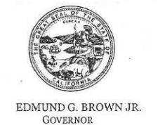

# STATE OF CALIFORNIA GOVERNOR'S OFFICE of PLANNING AND RESEARCH STATE CLEARINGHOUSE AND PLANNING UNIT

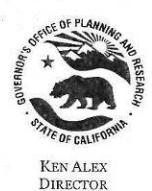

March 20, 2017

Philip Vallejo California Department of Transportation, District 6 855 M St, Suite 200 Fresno, CA 93721

Subject: State Route 132 West Freeway/Expressway Project Draft EIR / EA & Draft Final Remedial Action Plan SCH#: 2010012010

Dear Philip Vallejo:

The State Clearinghouse submitted the above named Draft EIR to selected state agencies for review. The review period closed on March 17, 2017, and no state agencies submitted comments by that date. This letter acknowledges that you have complied with the State Clearinghouse review requirements for draft environmental documents, pursuant to the California Environmental Quality Act.

Please call the State Clearinghouse at (916) 445-0613 if you have any questions regarding the environmental review process. If you have a question about the above-named project, please refer to the ten-digit State Clearinghouse number when contacting this office.

Sincerely.

Scott Morgan

Director, State Clearinghouse

# Document Details Report State Clearinghouse Data Base

SCH# 2010012010

State Route 132 West Freeway/Expressway Project Draft EIR / EA & Draft Final Remedial Action Plan Project Title

Lead Agency Caltrans #6

> Туре EIR Draft EIR

Note: Extended Per Lead Description

> The California Department of Transportation (Caltrans), in cooperation with the Stanislaus Council of Governments (StanCOG) partnership, proposes to construct a four-lane freeway/expressway along the adopted route south of Kansas Avenue from Dakota Avenue (PM 11.0) to east of SR 99 at the Needham Street Bridge Overcrossing (PM 15.0). The total length of the project would be approxiamtely 4 miles and would include connections on SR 99 from PM 15.7 to PM 17.5. Selection of either of the build alternatives would result in the containment of the Caltrans Modesto Soil Stockpiles retaining walls and bridge abutments and beneath highway pavements. The purpose and need are to improve regional and interregional circulation and relieve traffic congestion along existing SR 132.

Lead Agency Contact

Philip Vallejo Name

California Department of Transportation, District 6 Agency

(559) 445-6172

Phone

email

Address 855 M St, Suite 200

> City Fresno

State CA Zip 93721

Fax

**Project Location** 

Stanislaus County City Modesto

Region

37° 38' 20" N / 121° 0' 25" W Lat / Long

State Route 99, SR 132 Cross Streets

Parcel No.

Township

Base Range Section

Proximity to:

Highways Hwy 132, 99

**Airports** Modesto Co, Mapes & Yandell

Railways

Tuolumne River Waterways

Schools several

Land Use Transportation, ag and vacant

Aesthetic/Visual; Agricultural Land; Air Quality; Archaeologic-Historic; Biological Resources; Project Issues

Drainage/Absorption; Flood Plain/Flooding; Noise; Public Services; Recreation/Parks; Soil Erosion/Compaction/Grading; Solid Waste; Toxic/Hazardous; Traffic/Circulation; Water Quality;

Wetland/Riparian; Growth Inducing; Landuse; Cumulative Effects; Other Issues

Resources Agency; Department of Conservation; Department of Fish and Wildlife, Region 4; Office of Reviewing Agencies

Historic Preservation; Department of Parks and Recreation; Department of Water Resources; California Highway Patrol; Native American Heritage Commission; Public Utilities Commission; Air Resources Board, Transportation Projects; Regional Water Quality Control Board, Region 2;

Department of Toxic Substances Control

Start of Review 01/18/2017 End of Review 03/17/2017 Date Received 01/18/2017

Note: Blanks in data fields result from insufficient information provided by lead agency.

# [Response-S1]

# Response to Comments from the California State Clearinghouse and Planning Unit

The State Clearinghouse letter acknowledges that Caltrans has complied with the review requirement for a draft environmental document, pursuant to the California Environmental Quality Act. No agency submitted comments directly to the State Clearinghouse.

# [Comment -LC1]

# **Comment from the Stanislaus County Department of Environmental Resources**

LC1

 From:
 Vallejo, Philip@DOT

 To:
 Lugo, Jennifer@DOT

Subject: FW: FINAL REMEDIAL ACTION PLAN - CALTRANS-MODESTO SOIL STOCKPILES

**Date:** Friday, January 27, 2017 7:39:13 AM

From: WALEED YOSIF [mailto:WYOSIF@envres.org]

Sent: Thursday, January 26, 2017 4:11 PM

To: Vallejo, Philip@DOT <philip.vallejo@dot.ca.gov>

Cc: BELLA BADAL <BBADAL@envres.org>

Subject: FINAL REMEDIAL ACTION PLAN - CALTRANS-MODESTO SOIL STOCKPILES

Hello Mr. Vallejo,

Stanislaus County DER, Environmental Health Division has no comment in regards to the subject 1

matter.

Best Regards,

Waleed Yosif, REHS
Senior Environmental Health Specialist
Stanislaus County Department of Environmental Resources
3800 Cornucopia Way, Suite C, Modesto, Ca 95358
Phone: 209-525-6703 Fax: 209-525-6774

Email: wyosif@envres.org

# [Response-LC1]

# Response to Comments from Stanislaus County Department of Environmental Resources

Thank you for your comment.

# [Comment-LC2] Comment from the Modesto Irrigation District

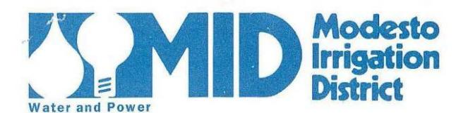

1231 Eleventh St. P.O. Box 4060 Modesto, CA 95352 (209) 526-7373

LC2

February 22, 2017

Department of Transportation Central Sierra Environmental Analysis Branch Attention: Philip Vallejo, Acting Chief 855 "M" Street, Suite 200 Fresno, CA 93721-2753

RE: State Route 132 West Freeway/Expressway Project Location: SR132 S of Kansas Ave to E of SR99 at Needham St

Thank you for allowing the District to comment on this referral. Following are the recommendations from our Electrical, Irrigation and Domestic Water Divisions:

# Irrigation

There are multiple irrigation facilities that may be affected by the proposed State Route 132. MID's Civil Engineering Department staff has the following recommendations and requirements:

- Each irrigation facility will need to be evaluated individually to determine if an upgrade is required. | 1
- Draft improvement plans for the proposed project area must be submitted to MID's Civil Engineering Department for review prior to the start of construction. MID irrigation standard details will be provided upon request.
- Any facility that will have its alignment changed will need to be protected by an irrigation | 3
- Conduct a pre-consultation meeting to discuss MID irrigation requirements.

# **Domestic Water**

· No comments at this time.

# **Electrical**

- The attached maps show the approximate location of the District's existing electrical facilities in the project areas.
- In conjunction with related improvement requirements, existing overhead and underground electric facilities within or adjacent to the proposed improvements shall be protected as required by the District's Electric Engineering Department.
- Relocation or installation of electric facilities shall conform to the District's Electric Service Rules.

7

Department Of Transportation Response Letter: SR132 West Freeway/Expressway Project February 22, 2017 Page 2

- Costs for relocation of the Districts existing electrical facilities at the request of others will be borne by the requesting party. Estimates for relocating or installing MID electric facilities will be supplied upon request.
- A 10 ft. PUE is required if existing underground high voltage and underground secondary cables require relocation. A 15 ft. PUE is required if the overhead high voltage lines/ poles require relocation. The easements are required to protect the overhead and underground electric facilities and maintain necessary safety clearances.
- A 10 ft. OSHA minimum approach distance is required adjacent to the existing 12,000 volt overhead high voltage lines and an 11 ft. OSHA minimum approach distance is required adjacent to the existing 69,000 volt overhead high voltage lines. Use extreme caution when operating heavy equipment, using a crane, ladders, scaffolding or hand held tools or any other type of equipment near MID electric lines and cables. Assume all overhead and underground electric cables are energized.
- CalTrans shall verify actual depth and location of all underground utilities prior to start of
  construction. Notify "Underground Service Alert" (USA) (Toll Free 800-227-2600) before
  trenching, grading, excavating, drilling, pipe pushing, tree planting, post-hole digging, etc. USA
  will mark the location of any underground MID electrical facilities. The City of Modesto has
  additional underground secondary cables for the street lights in the project area.
- Please contact the District's Electric Engineering Design Department, attention Linh Nguyen at (209) 526-7438 in order to coordinate project requirements. Specific requirements, easements and associated costs will be addressed when project plans are submitted for review to the Electric Engineering Department Design Department.

The Modesto Irrigation District reserves its future rights to utilize its property, including its canal and electrical easements and rights-of-way, in a manner it deems necessary for the installation and maintenance of electric, irrigation, agricultural and urban drainage, domestic water and telecommunication facilities. These needs, which have not yet been determined, may consist of poles, crossarms, wires, cables, braces, insulators, transformers, service lines, open channels, pipelines, control structures and any necessary appurtenances, as may, in District's opinion, be necessary or desirable.

If you have any questions, please contact me at 526-7447.

Sincerely,

Lien Campbell

Deal

Risk & Property Analyst

Copy: File

State Route 132 West Freeway/Expressway Final EIR/EA

STATE OF CALIFORNIA—CALIFORNIA STATE TRANSPORTATION AGENCY

EDMUND G. BROWN Jr., Governor

# DEPARTMENT OF TRANSPORTATION

DISTRICT 10
1976 DR. MARTIN LUTHER KING JR BLVD STOCKTON, CA 95205
PHONE (559) 445-6172
FAX (559) 445-6236
TTY 711
www.dot.ca.gov

Serious drought. Help save water!

January 12, 2017

# NOTICE OF AVAILABILITY

DRAFT ENVIRONMENTAL IMPACT REPORT/ENVIRONMENTAL ASSESSMENT
STATE ROUTE 132 WEST FREEWAY/EXPRESSWAY PROJECT

DRAFT FINAL REMEDIAL ACTION PLAN CALTRANS MODESTO SOIL STOCKPILES

The California Department of Transportation (Caltrans), as the California Environmental Quality Act (CEQA) lead agency and as assigned by the Federal Highway Administration under the National Environmental Policy Act (NEPA) at the time of the signing of the environmental document, working in cooperation with the Stanislaus Council of Governments (StanCOG), proposes to construct a four-lane freeway/expressway along the adopted route of State Route (SR) 132 south of Kansas Avenue from Dakota Avenue to east of SR 99 at the Needham Street Bridge Overcrossing in the City of Modesto.

The Caltrans Modesto Soil Stockpiles occupy three areas within state right-of-way south of Kansas Avenue: between Carpenter Avenue and Emerald Avenue, Emerald Avenue and SR 99, and east of SR 99. Caltrans proposes to cap the soil stockpiles as part of the SR 132 West Freeway/Expressway construction project. As required by state law, the California Department of Toxic Substances Control (DTSC) and the Central Valley Regional Water Quality Control Board (RWQCB) have reviewed the Draft Final Remedial Action Plan (RAP) for the soil stockpiles and approved it for public noticing. Caltrans prepared the Draft Final RAP under the oversight of DTSC and the RWQCB. If approved, the RAP would allow for the placement of impacted soil beneath roadway pavement, within bridge abutments, and behind retaining walls.

This letter is to inform you that the project's Draft Environmental Impact Report/Environmental Assessment (EIR/EA) with attached Caltrans Modesto Soil Stockpiles Draft Final RAP and technical reports are available for public review at the following locations:

- Caltrans District Office, District 10, 1976 Dr. Martin Luther King Jr Blvd, Stockton, CA 95205, weekdays from 8:00 a.m. to 4:00 p.m.
- StanCOG Office at 1111 "I" Street, Suite 308, Modesto, CA 95354, weekdays from 8:00 a.m. to 5:00 p.m. closed alternating Fridays
- Stanislaus County Library at 1500 "I" Street, Modesto, CA 95354, Monday-Thursday from 10:00 a.m. to 8:00 p.m. and Friday and Saturday from 10:00 a.m. to 5:00 p.m.
- Online at the Caltrans
   website: http://www.dot.ca.gov/dist10/environmental/projects/sr132west/index.html

"Provide a safe, sustainable, integrated and efficient transportation system to enhance California's economy and livability"

Caltrans Modesto Soil Stockpiles information is located on the DTSC website: <a href="http://www.envirostor.dtsc.ca.gov/public/profile\_report.asp?global\_id=60001626">http://www.envirostor.dtsc.ca.gov/public/profile\_report.asp?global\_id=60001626</a> <a href="http://www.envirostor.dtsc.ca.gov/public/profile\_report.asp?global\_id=50280024">http://www.envirostor.dtsc.ca.gov/public/profile\_report.asp?global\_id=50280024</a>

The Draft EIR/EA identifies potentially significant environmental effects. With the exception of aesthetics/visual resources and noise impacts, which would remain significant and unavoidable after implementing mitigation measures, all other impacts would be reduced to less than significant levels with mitigation. The Draft EIR/EA identifies the locations of land designated as hazardous waste properties under the Cortese list.

The Draft EIR/EA with attached Caltrans Modesto Soil Stockpiles Draft Final RAP and technical reports will be in the public circulation phase from January 18, 2017 through March 4, 2017. Public comments will be accepted until March 3, 2017. Please send your comments to Philip Vallejo, Acting Chief, Central Sierra Environmental Analysis Branch, California Department of Transportation, 855 "M" Street, Suite 200, Fresno, CA 93721, or email them to philip.vallejo@dot.ca.gov.

As part of the circulation process, Caltrans will hold a Public Hearing to obtain public input on the Environmental Impact Report/Environmental Assessment with attached Draft Final RAP. Caltrans will present preliminary design plans, environmental study information, discuss concerns, and answer questions. The Public Hearing will be informal and interested parties may arrive at any time.

Date: Wednesday, February 22, 2017 Location: Red Event Center

**Time:** 6:00 p.m. to 8:00 p.m. 921 8th Street

Modesto, CA 95354

If you have any questions, please contact me or Grace Magsayo, Project Manager, at (209) 948-7976.

Sincerely,

Philip Vallejo

Acting Chief, Central Sierra Environmental Analysis Branch

(559) 445-6172

"Provide a safe, sustainable, integrated and efficient transportation system to enhance California's economy and livability"

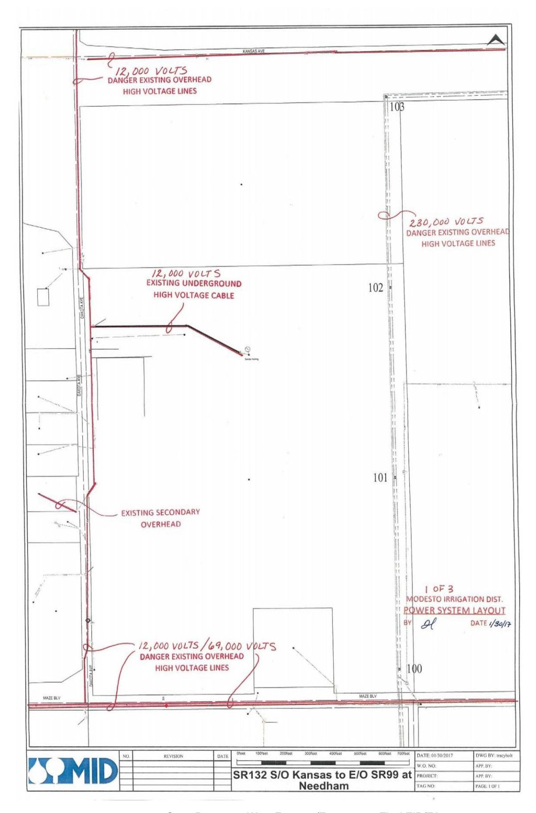

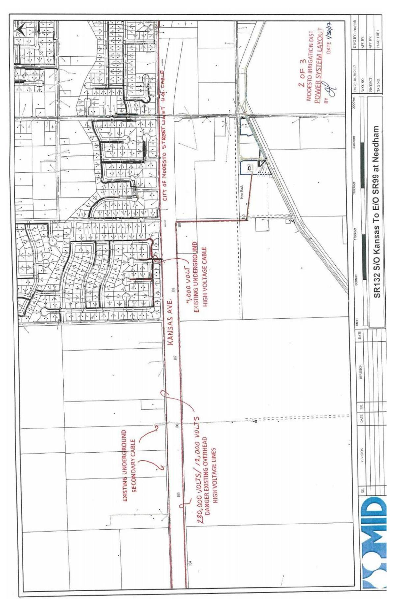

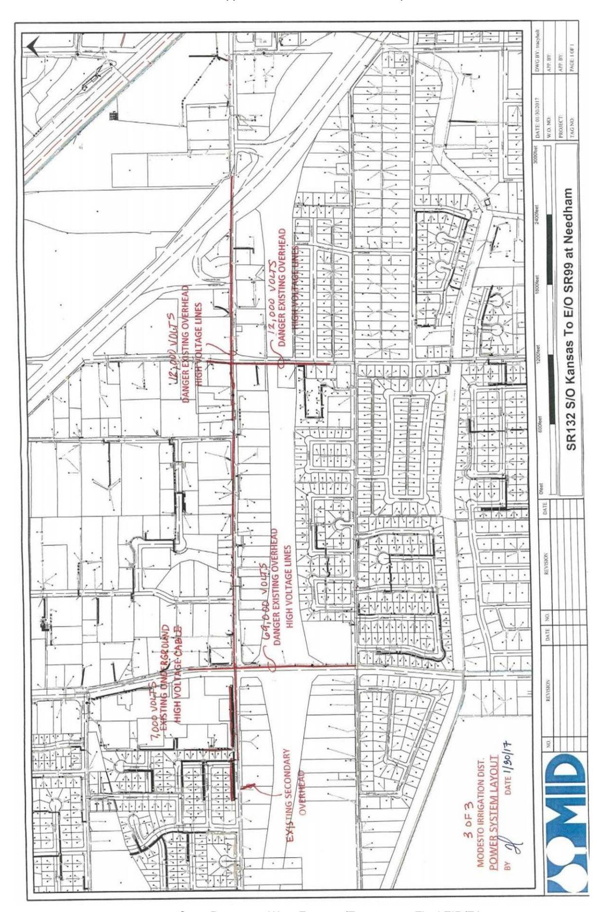

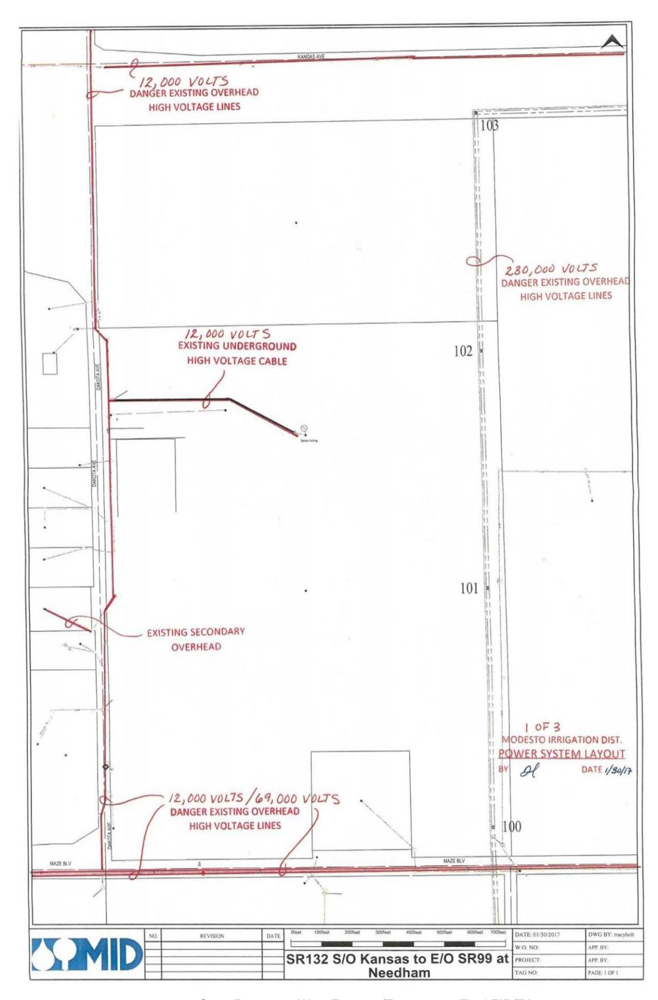

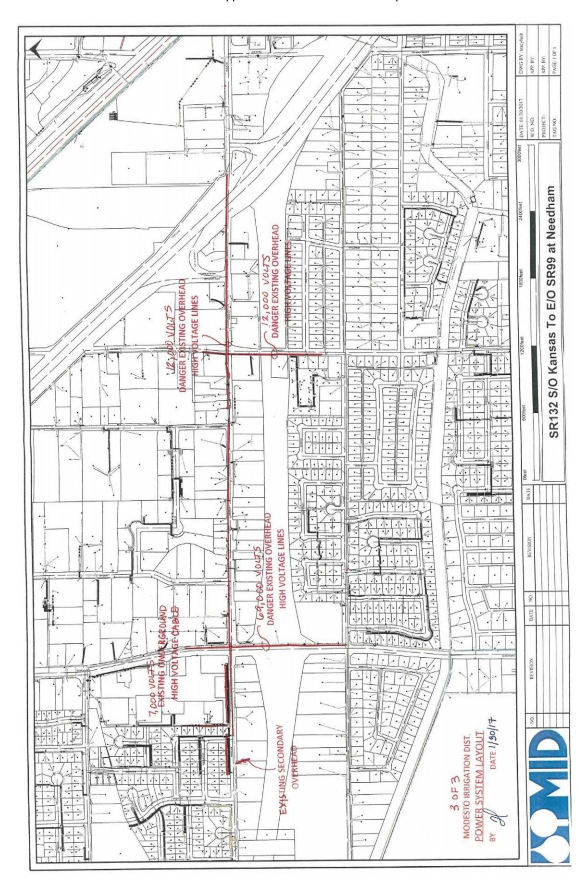

# [Response-LC2] Responses to Comments from the Modesto Irrigation District

Thank you for your comments.

- Impacts to irrigation facilities are anticipated as part of the project. The full extent of impacts will be determined during the Caltrans Plans, Specifications and Estimate (PS&E) phase. However, measures are proposed to minimize and mitigate impacts to farmland operations and are included in Section 2.1.3 (Farmlands) of the EIR/EA. During final design, the City of Modesto would coordinate with property owners and agricultural operators to incorporate design features to maintain property access and operation. Under Commitment FARM-2, the contractor would reconstruct irrigation ditches and install irrigation pipelines damaged during construction. Commitment FARM-3 is revised to state that the City of Modesto, and not the California Department of Transportation, will be responsible for coordination with property owners and agricultural operators.
- LC2-2 Commitment FARM-3 in the Farmlands Avoidance, Minimization and/or Mitigation Measures section has been expanded to include: Draft irrigation improvement plans for the project area would be submitted to Modesto Irrigation District's Civil Engineering Department for review prior to the start of construction. Plans would be in conformance with the Modesto Irrigation District irrigation standard details. Please refer to Section 2.1.3 (Farmlands) of the EIR/EA. The City of Modesto and Caltrans will coordinate with Modesto Irrigation District during the design phase.
- LC2-3 Please see the response to Comment LC2-1. The full extent of impacts will be determined during the final design phase. Currently, there are no plans to relocate any Modesto Irrigation District structures or facilities. However, if relocations are needed, then protections will be put in place through easements.
- LC2-4 Commitment FARM-3 in the Farmlands avoidance, minimization and/or mitigation measures section has been expanded to include: Caltrans and the City of Modesto would conduct a pre-construction meeting to discuss Modesto Irrigation District's irrigation requirements. Please refer to Section 2.1.3 (Farmlands) of the EIR/EA. The City of Modesto and Caltrans will coordinate with Modesto Irrigation District during the design phase.
- LC2-5 During the PS&E phase, Caltrans and the City of Modesto will coordinate with the Modesto Irrigation District to discuss the electrical facilities and requirements in the project area.
- LC2-6 Please refer to the response to Comment LC2-5.

| LC2-7  | Please refer to the response to Comment LC2-5. |
|--------|------------------------------------------------|
| LC2-8  | Please refer to the response to Comment LC2-5. |
| LC2-9  | Please refer to the response to Comment LC2-5. |
| LC2-10 | Please refer to the response to Comment LC2-5. |
| LC2-11 | Please refer to the response to Comment LC2-5. |
| LC2-12 | Please refer to the response to Comment LC2-5. |

# [Comment-LC3]

# Comment from the San Joaquin Air Pollution Control District

LC3

March 8, 2017

Philip Vallejo California Department of Transportation Central Sierra Environmental Analysis Branch 855 "M" Street, Suite 200 Fresno, CA 93721

Project: Draft Environmental Impact Report/Environmental Assessment (EIR/EA)

for the State Route 132 West Freeway/Expressway Project

District CEQA Reference No: 20170092

Dear Mr. Valleio:

The San Joaquin Valley Unified Air Pollution Control District (District) has reviewed the Draft Environmental Impact Report/Environmental Assessment (EIR/EA) for the State Route 132 West Freeway/Expressway Project. The proposed project consists of constructing a four-lane freeway/expressway along the adopted route of State Route 132 south of Kansas Avenue from Dakota Avenue to east of State Route 99 at the Needham Street Bridge Overcrossing (Project). The proposed Project is located in the City of Modesto. The District offers the following comments:

# 1) Rule 9510 Indirect Source Review

The District recommends that an Indirect Source Review (ISR) Air Impact Assessment (AIA) application be submitted to the District as early as possible.

On Page 53, Table 1.6: Permits, Reviews, and Approvals Needed, the Draft EIR/EA states that the contractor will comply with the requirements of Rule 9510 prior to construction. Please note that approval of an Air Impact Assessment (AIA) application is required prior to the start of construction. The District's processing timeline for an AIA is 10 days for the application completeness review and 30 days for the emissions analysis (i.e.: approval). In addition, off-site mitigation fees, if any, are required to be paid prior to the start of construction. Therefore, the District recommends that an AIA application be submitted to the District as early as possible. Information about how to comply with Rule 9510 can be found online at the following link: http://www.valleyair.org/ISR/ISRHome.htm.

> Seyed Sadredin Executive Director/Air Pollution Control Officer

Northern Region 4800 Enterprise Way Modesto, CA 95356-8718 Tel: (209) 557-6400 FAX: (209) 557-6475

Central Region (Main Office) 1990 E. Gettysburg Avenue Fresno, CA 93726-0244 Tel: (559) 230-6000 FAX: (559) 230-6061

Southern Region 34946 Flyover Court Bakersfield, CA 93308-9725 Tel: 661-392-5500 FAX: 661-392-5585

www.valleyair.org

www.healthyairliving.com

Printed on recycled paper,

District CEQA Reference No: 20170092

Page 2 of 3

# 2) Oxides of Nitrogen (NOx) Significance Threshold

The District's established threshold of significance for oxides of nitrogen (NOx) is 10 tons per year and recommends that this threshold be used when assessing the significance level of an impact.

On page 247, the EIR/EA states,

"...the District considers a significant impact to occur when construction emissions of nitrogen oxides exceed 2 tons per year, reactive organic gases exceed 10 tons per year, or PM10 or PM2.5 exceed 15 tons per year. The proposed project would exceed two tons per year of nitrogen dioxide but would be below the limits for reactive organic gases and particulate matter."

However, on Page 311 the EIR/EA concluded that the impact from construction emission is less than significant. The District would like to clarify that the District has established a threshold of significance of 10 tons per year for NOx (ie, not 2 tons). The District has established thresholds of significance to assist Lead Agencies in assessing potential air quality impacts under CEQA. The thresholds of significance are found in the District's Guidance for Assessing and Mitigating Air Quality Impacts (GAMAQI) Revised March 19, 2015 (available online at the following link: http://www.valleyair.org/transportation/GAMAQI\_3-19-15.pdf).

A project with emissions exceeding the thresholds of significance would be considered to have a significant impact. The District recommends that those thresholds be used to assess the impact for future projects. Based on the construction emissions summarized in Table 2-42 and Table 2-43 of the EIR/EA for this project specifically, the construction emissions are below 10 tons per year of NOx. Therefore, the construction NOx emissions would have a less than significant impact.

# 3) Thresholds of Significance

The District has established thresholds of significance to assist Lead Agencies in assessing potential air quality impacts and recommends that those established thresholds of significance be used.

On Page 53, the Air Quality Study Report states,

"Because Caltrans has statewide jurisdiction, and the setting for projects varies so extensively across the state, Caltrans has not developed, and has no intention to develop, thresholds of significance for CEQA. Further, because most air district thresholds have not been established by regulation or by delegation from a federal or state agency with regulatory authority, Caltrans is not required to adopt those thresholds in its documents."

This is a blank image. There is no text to extract.

District CEQA Reference No: 20170092

Page 3 of 3

3

The San Joaquin Valley (Valley) is faced with many challenges in attaining the federal and state ambient air quality standards due to the Valley's geography, topography, and meteorology combined with a rapidly growing population. At the federal level for the National Ambient Air Quality Standards (NAAQS), the Valley is currently designated as extreme nonattainment for the 8-hour ozone standards; nonattainment for the PM2.5 standards; and attainment for the 1-Hour ozone, PM10 and CO standards. At the state level, the Valley is currently designated as nonattainment for the 8-hour ozone, PM10, and PM2.5 California Ambient Air Quality Standards (CAAQS).

The District has established thresholds of significance to assist Lead Agencies in assessing potential air quality impacts under CEQA. The thresholds of significance are found in the District's Guidance for Assessing and Mitigating Air Quality Impacts (GAMAQI) Revised March 19, 2015 (available online at the following link: http://www.valleyair.org/transportation/GAMAQI 3-19-15.pdf).

Although Caltrans has not developed thresholds of significance for CEQA and has no intentions to do so, due to the Valley's air quality challenges and nonattainment statuses, the District recommends that Caltrans apply the District's established threshold of significance when evaluating the project's specific impacts on air quality. A project would have a significant impact on air quality if it exceeds the threshold of significance established in the GAMAQI.

If you have any questions or require further information, please call Sharla Yang at (559) 230-5934.

Sincerely,

**Arnaud Marjollet** 

**Director of Permit Services** 

Brian Clements Program Manager

AM: sy

# [Response-LC3]

# Response to Comments from the San Joaquin Air Pollution Control District

Thank you for your comments.

- LC3-1 The City of Modesto will comply with the Air Impact Assessment (AIA) requirements prior to construction. The list of Permits, Reviews and Approvals Needed included in Chapter 2 of the EIR/EA is revised to state that the City of Modesto, and not the contractor, will comply with the Air Impact Assessment (AIA) requirements prior to construction.
- LC3-2 The threshold of significance for NOx is revised accordingly per the District's Guidance for Assessing and Mitigating Air Quality Impacts (GAMAQI). Text is modified in Chapter 2, Section 2.2.6, Air Quality to reference the District's Guidance for Assessing and Mitigating Air Quality (GAMAQ), revised March 19, 2015.
- LC3-3 The threshold of significance found in the District's GAMAQI will be referenced in Section 2.2.6 (Air Quality) of the EIR/EA. However, because Caltrans has statewide jurisdiction, and the setting for projects varies so extensively across the state, Caltrans has not developed, and has no intention to develop, thresholds of significance for CEQA. Further, because most air district thresholds have not been established by regulation or by delegation from a federal or state agency with regulatory authority, Caltrans is not required to adopt those thresholds in its documents. The EIR/EA text will be modified to provide reference to the District's thresholds as an additional measure of air quality impacts. However, the District has established thresholds of significance to assist Lead Agencies in assessing potential air quality impacts under CEQA, which have been included in Table 12 of the Air Quality Study Report for reference. The project would not exceed the threshold of significance established in the GAMAQI, as the operation of the freeway would reduce construction-related and operational emissions relative to No-Build conditions; such that the net change in emissions would be well below the District's thresholds. Please see Master Response #10.

# [Comment-LC4]

# **Comment from the Stanislaus County Environmental Review Committee**

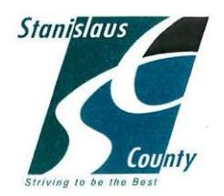

LC4

# **CHIEF EXECUTIVE OFFICE**

Stan Risen Chief Executive Officer

Patricia Hill Thomas Chief Operations Officer/ Assistant Executive Officer

Keith D. Boggs Assistant Executive Officer

Jody Hayes Assistant Executive Officer

1010 10th Street, Suite 6800, Modesto, CA 95354 Post Office Box 3404, Modesto, CA 95353-3404

Phone: 209.525.6333 Fax 209.544.6226

# STANISLAUS COUNTY ENVIRONMENTAL REVIEW COMMITTEE

March 2, 2017

Philip Vallejo, Acting Chief California Department of Transportation Central Sierra Environmental Analysis Branch 855 "M" Street, Suite 200 Fresno, CA 93721

SUBJECT:

ENVIRONMENTAL REFERRAL – DEPARTMENT OF TRANSPORTATION – CALTRANS MODESTO SOIL STOCKPILES – FINAL REMEDIAL ACTION

PLAN

Mr. Vallejo:

Thank you for the opportunity to review the above-referenced project.

The Stanislaus County Environmental Review Committee (ERC) has reviewed the subject project and has no comments at this time.

The ERC appreciates the opportunity to comment on this project.

Sincerely,

Patrick Cavanah

Management Consultant

**Environmental Review Committee** 

PC:ss

CC:

**ERC Members** 

STRIVING TO BE THE BEST COUNTY IN AMERICA

# [Response-LC4]

# Response to Comments from the Stanislaus County Environmental Review Committee

Thank you for your comment.

# [Comment-I1] Comment from Scott Murray

11

 From:
 Vallejo, Philip@DOT

 To:
 Lugo, Jennifer@DOT

Subject: FW: Comments for the Highway 132 Bypass open-house on Feb 22, 2017, "Plan for Highway 132 bypass west of

downtown revs up" Modesto Bee, Sunday 1/29/17, Page 1A

Date: Monday, January 30, 2017 7:24:47 AM

From: scottm95350@comcast.net [mailto:scottm95350@comcast.net]

Sent: Sunday, January 29, 2017 3:36 PM

To: Vallejo, Philip@DOT < philip.vallejo@dot.ca.gov>

**Subject:** Fwd: Comments for the Highway 132 Bypass open-house on Feb 22, 2017, "Plan for Highway 132 bypass west of downtown revs up" Modesto Bee, Sunday 1/29/17, Page 1A

From: scottm95350@comcast.net

To: "phillip vallejo" <phillip.vallejo@dot.ca.gov>, "grace magsayo"

<grace.magsayo@dot.ca.gov>, "scott smith" <scott.smith@dot.ca.gov>, "ehahn"
<ehahn@stancog.org>

**Cc:** "mayor" < mayor@modestogov.com >, "COUNCIL" < council@modestogov.com >, "vito chiesa

stancounty.com>, "monteithd" <monteithd@stancounty.com>, "demartinij"

<demartinij@stancounty.com>, "withrowt" <withrowt@stancounty.com>, "Matt

Machado" <machadom@stancounty.com>, "Jeff Barnes"

<ibarnes@modestogov.com</pre>>, "Denny Jackman" <dennyiackman@amail.com</pre>

Sent: Sunday, January 29, 2017 3:29:41 PM

**Subject:** Comments for the Highway 132 Bypass open-house on Feb 22, 2017, "Plan for Highway 132 bypass west of downtown revs up" Modesto Bee, Sunday 1/29/17, Page 1A

# To all addressees:

Completion of Freeway 132 has my full support, not only the current scope of the project as discussed in the Bee article, but eventually beyond to I-580. For the most part, I will limit my comments to the scope of the project that is the subject of the open house on Feb 17. Although I glanced through the EIR referenced by the Bee, it is for the most part way to technical for me to comment so I will stick to what I understand from the basic information on the Stancog website - which I have followed for several years - and from the perspective of being a driver who's logged in a lot of miles and a taxpayer who has paid a lot of taxes.

I have no interest in impeding the project, but I do have concerns about some of the design aspects which I have emailed the Modesto City Council, the Stanislaus Board of Supervisors and Stancog in the past. So none of my comments and concerns should come as a surprise. I have no idea if they've been forwarded beyond those entities and I would hope that the same concerns and questions would already

have been raised by others.

I have 5 issues with the project:

- 1) Complete all four lanes by 2020 in one phase. We all know how long this project has been discussed and in the planning stages and I voted yes on the Stanislaus County Self-Help Tax Measure L to get projects like this speeded up AND to take advantage of matching funds from the state. If the way the self-help tax was sold to us was correct, and 132 being a state highway, then \$107 million dollars from the Measure L funds will be matched with \$107 million dollars from the state. So why are we still talking two phases even though I'm well aware that it's going to take the county several years to accumulate their share? We are still talking about a timeline for a two phase construction schedule that is basically the same schedule that was in place before the measure passed. To save county and state tax payer money in the future, this project needs to be completed as one phase while all the labor force and equipment is already on site. If county taxpayers and voters really want to see their Measure L dollars at work, then a quick completion of this project will do exactly that. If that delays completion of the project until 2021, then so be it. 2028 is far too long to wait.
- 2) Smoother transition from Kansas Ave to Maze Blvd at Dakota Rd. What I see now in the plans is a bottleneck. Making traffic stop and navigate two 90 degree turns will not save drivers any time at all on the overall route as traffic backs up in peak hours. This transition of freeway back to the two lane Maze Blvd needs to align with the future expressway planned by the county for the remainder of the route towards I-580. I don't like the aspect of this part of the project at all. If encouraging drivers to use this route over the current 120/205 path to the Altamont is at any way in play, this won't do it.
- 3) Build a full interchange at Carpenter Rd. There needs to be a west bound exit from 132 to access Carpenter and an east bound on-ramp to 132 from Carpenter. A half interchange makes no sense, or are we just "settling for less" here once again because we're Stanislaus County and not the Bay Area? Hopefully, there is future right of way in the plans to do just that when the planners finally realize the need for it.
- 4) Is there enough right of way to expand the freeway to six lanes in the future if not more? If not, there should be. It would be very shortsighted not to have done that after all these years of planning and learning from the mistakes of the past IF we've learned from any of them at all.
- 5) Is the project being constructed to meet the standards for possible designation as a Federal Interstate Highway? If not, then it should be. This is where I digress from the overall scope of the current project. The local elected officials and I do not agree on the importance and significance of raising Modesto's visibility for economic growth by ensuring our place on the Federal Interstate Highway Map. Proposals to upgrade Highway 99 to interstate status come and go. Shortsighted Stanislaus County elected officials have failed to get on board with those

2

3

4

proposals because of the cost, while Modesto remains the 3rd largest city in the nation without a Federal Interstate Highway running through it or immediately adjacent to it - after Fresno and Bakersfield. Our lack of visibility and economic realities here in the Northern San Joaquin Valley reflect that misguided planning policy and opportunity. Highway 99 is Modesto's vital highway connection to Sacramento and Los Angeles. Highway 132 should be constructed to be our vital link to the Bay Area rather than dependence on the current 120/205 routes. Both Highways 99 and 132 need to be designated Interstate Highways in the future and construction and reconstruction on these two highways need to take that into account now. At the very least, the overpasses related to the 99/132 interchange need to be constructed to meet interstate highway height minimums - even if that means redesign and delay of the project - unless the current roadbed of 99 can be lowered in the future for the current design "flaw" if there is one.

Thank-you for the opportunity to submit my comments by email. I hope that email submittals are considered and treated equally with those able to attend the open house.

//Scott Murray Modesto city resident

# [Response-I1] Response to Comments from Scott Murray

Thank you for your comments.

I1-1 Thank you for your support of the project. Your feedback is appreciated. The purpose of the EIR/EA is to evaluate and disclose each significant effect on any environmental resource. The EIR/EA is a summary of technical studies and findings, but it aims to summarize the technical information in a way that the general public can understand. Each section of the EIR describes potentially affected areas, environmental consequences and potential avoidance, minimization and/or mitigation measures (AMMs). The EIR/EA summary also provides a brief project description, brief information on the Modesto Soil Stockpiles, and a summary table of potential impacts of alternatives and permits and approvals needed. Chapter 3 of the EIR/EA provides a summary of CEQA findings and discussion of significant impacts. Any comments submitted as part of the EIR/EA public comment period process have been reviewed by the Project Development Team or DTSC and responded to and incorporated into the Final EIR/EA. Comments made by others as part of the EIR/EA public comment period have also been reviewed and responded to and are included in this appendix as part of the public record. Section 4.2.4 (Public Information Meetings, Neighborhood Meetings, Open Houses) of the EIR/EA provides a summary of comments that have been provided by the public through various public meetings to date. A Public Hearing Summary Report has been prepared to document the February 22, 2017, EIR/EA Public Hearing Meeting

Please see Master Response #4 (Project Funding). Projects must be packaged to be fundable under reasonably available sources and according to funding cycles. Once submitted, a project is programmed, or prioritized for state and federal funding. As such, the Project Development Team may recommend phasing the project to account for available and constrained funding and to ensure that a reasonable amount of the project is funded. The Project Development Team recommended that the project be funded in two phases because only \$82 million in funding for the project has been identified and programmed, or prioritized, for fiscal years 2018/2019 at this time. Funding is still being identified for Phase 2. The recent approval of Measure L will allow Stanislaus County to leverage funds that can be put toward Phase 2. Construction funding for Phase 2 will be identified in the future as the project progresses in design.

proceedings and is available in the public record.

Please see Master Response #3 (Logical Termini). In addition, the initially proposed Alternative 1 would have connected to existing SR 132 (Maze Boulevard) via a new alignment with an S-curve, as initially proposed, or via the North Dakota Avenue alignment, as refined during the preliminary design process. While this build alternative would have met the purpose and need, Alternative 1 would have had distinct limitations. The S-curve design at the west end of the proposed project would not have been a feasible design solution for traffic operations and potential future expansion of the highway to the west, due to the potential realignment of SR 132 and construction of a new two-lane facility from North Dakota Avenue to Gates Road, which is currently in the early planning phase. The costs associated with the construction of the S-curve are estimated at \$3.25 million (\$1.3 million capital costs and \$1.95 million right-of-way costs). As such, the cost of the initially proposed Alternative 1 is estimated at \$3.25 million above the cost estimated for either of the

Regarding the bottleneck concern, excessive queuing is not anticipated at either intersection. In 2028, the Maze/Dakota intersection is projected to operate at a level of service (LOS) A/B in the AM/PM, respectively, in the Build Condition and SR 132/Dakota is projected to operate at LOS B/A in the AM/PM, respectively. A westbound left-turn queue from SR 132 to southbound Dakota would be 71 feet in the AM and 93 feet in the PM. In 2048, the Maze/Dakota intersection is projected to operate at LOS A in both the AM and PM in the Build Condition, and SR 132/Dakota is projected to operate at LOS B in both the AM/PM. A westbound left turn from SR 132 to southbound Dakota would be a 193-foot-long queue in the AM and 146 feet in the PM. For comparison, roughly 8 cars waiting to turn is equivalent to 200 feet in length.

build alternatives. Therefore, the initially proposed Alternative 1 was eliminated

from further discussion by the Project Development Team in March 2014.

A full interchange at North Carpenter Road is not proposed for this project because of the short nonstandard weaving distances that would be required between ramps to and from SR 99 and the SR 99/SR 132 freeway-to-freeway connectors/ramps. For example, as tractor trailer trucks are decelerating along SR 132 eastbound and moving to get into the right lane to enter the SR 132 eastbound off-ramp to SR 99 southbound, the tractor trailers would conflict with vehicles accelerating to get onto SR 132 eastbound from North Carpenter Road. The same is true on SR 132 westbound between the SR 99 southbound off-ramp to SR 132 westbound and a potential off-ramp from SR 132 westbound to North Carpenter Road. As trucks are accelerating from the SR 99 southbound off-ramp to SR 132 westbound, vehicles already on SR 132 westbound would be decelerating and weaving to the right to get off at a proposed SR 132 westbound off-ramp to North Carpenter Road. These traffic

movements are unsafe because there is not enough distance between the ramps for the vehicles to transition and weave safely into position.

An eastbound loop on-ramp and westbound conventional off-ramp for the proposed SR 132/North Carpenter Road interchange were evaluated during the development of the environmental document. As a result of the nonstandard distance between the proposed interchange and the SR 99/SR 132 freeway-to-freeway interchange connectors and the proposed new public road connection to Kansas Avenue/Needham Street Bridge Overcrossing intersection, the evaluation determined the standard solution of braiding the various ramps and connectors would not be cost feasible and the environmental/right-of-way impacts would be unacceptable, as determined by the Project Development Team and supported by the various responsible agencies including Caltrans. Furthermore, no approval decision exceptions were developed that would justify the nonstandard weaving sections without braiding the ramps and connectors.

Upon completion of Phase 1, traffic traveling east on SR 132 to SR 99 will use North Dakota Road rather passing through the North Carpenter Road at Maze Boulevard intersection. Traffic moving west from SR 99 will travel on the new SR 132 and will not be able to exit onto North Carpenter Road. Traffic will not be allowed to access from North Carpenter Road to travel eastbound. This will remove some of the congestion along North Carpenter Road.

- The future SR 132 will operate at a Level of Service A during both the AM and PM peak periods under the 2028 and 2048 Build Alternative. At the highest level of service, the expansion of the freeway to four lanes is more than sufficient to achieve improved mobility on the corridor without additional capacity.
- The design will be consistent with the current designation as a State Route. Although the current project does not assume a future reclassification of State Route 99 or 132 to a Federal Highway, expanding the visibility, improving the connectivity of the City of Modesto, and linking to the Bay Area is part of a larger plan to connect SR 99 with I-580 via a controlled-access freeway/expressway and will be advanced under a separate project. The further extension of the new SR 132 corridor (along Kansas Avenue), west of North Dakota Avenue to Gates Road, is currently in the planning stages; and part of the right-of-way west of North Dakota Avenue has already been acquired. Once SR 99 and I-580 are connected via an expressway, through traffic, including truck traffic, will be removed from local roadways, including the existing SR 132 (Maze Boulevard) alignment. The use of North Dakota Avenue as part of the new SR 132 route is temporary until future segments of the controlled-access freeway/expressway are built. In addition, the current design for Alternatives 1 and 2 meets interstate highway minimum heights of 16 feet 6 inches

for all designed overpass structures and exceeds the required minimums for the Needham Street Bridge Overcrossing. Existing structures along SR 99 do not meet the minimum height requirement, as they are grandfathered under the new requirement; however, this project does not affect the existing structures, and thus they are not included in the scope of the project.

# [Comment-I2] Comments from Bruce R. Frohman

12

March 1, 2017

Mr. Phil Vallejo

Caltrans

Central Sierra Environmental Analysis Branch

Suite 200, 855 M Street

Fresno Ca 93721

Subject: State Route 132 West Freeway/Expressway Project and Caltrans Modesto Soil

Stockpile Draft Final Remedial Action Plan

Dear Mr. Vallejo,

This letter is to protest the Environmental Impact Report on the above subject project as inaccurate, incomplete and unsatisfactory in many respects.

Objection to Cap for Toxic Waste Site

The most egregious deficiency in the EIR is regarding the contaminated soil action plan. You propose to put a concrete cap on the contaminated site and allege that doing so is a perfectly safe solution in perpetuity. At the February 22, 2017 meeting at Mark Twain School in Modesto, Caltrans misrepresented to the public that your solution posed no health danger to the public.

2

1

In the past, your agency failed to comply with site monitoring agreements with the California Department of Toxic Substance Control with careless disregard for public health and safety. No guarantee exists that Caltrans will maintain the integrity of the concrete cap after installation. The cap will crack and deteriorate and eventually become worthless. Caltrans has no budget to maintain the cap.

3

Exhibit 1 enclosed is a partial list of violations I noted while monitoring the toxic waste sites from 2011 to 2014. Exhibit 2 is a copy of April 5, 2013 correspondence with Scott Calkins, a member of the Stanislaus Council of Governments Citizens Advisory Committee documenting mishandling of toxic waste material from the site. In 2005, Shaw Environmental Labs recommended removal of the soil to a toxic waste site—Exhibit 3.

Exhibit 4 is a copy of a statement that I submitted to Caltrans in 2012 about the need to take immediate action to remediate the toxic waste site. I wrote it before I realized that a cap would not be a satisfactory solution. Exhibit 5 is a partial list of people living near the toxic waste site who are believed to have become ill as a result of exposure to soil from the site; the exposure is directly attributable to Caltrans negligence in the maintenance of the site.

This is a blank image. There is no text to extract.

The exhibits represent preliminary discovery of Caltrans negligence in the management of the soil stockpiles. Additional testimony is available.

5

Those living near the toxic waste site want removal of the entire soil stockpile and contaminants. To avoid litigation, remove all toxic soil to a class one hazardous waste site. Please don't be pound foolish with taxpayer dollars.

# Adverse Impacts to Wildlife Refuge

Exhibit 6 indicates that no consultation with the U.S. Fish and Wildlife Service has occurred since 2002 regarding possible adverse impacts to the wildlife refuge located adjacent to Route 132 and the San Joaquin River. The EIR has not updated the consultation of 2002. Endangered species have not been surveyed recently. The project will cause more noise, pollution and traffic to adversely affect the refuge—the impact cannot be considered "no effect".

6

Route 132 is on a levee within the wildlife refuge. Additional traffic could weaken or cause the levee to break. The levee cannot handle increased in traffic that will result from the project.

# Adverse Environmental Impacts to the City of Modesto

Exhibit 7 is a summary of the conversation I had with former Caltrans Project Manager Christine Hibbard on March 8, 2012 at her Stockton office regarding adverse environmental impacts of the project as proposed at the time. The newest iteration of the project addresses none of the environmental objections to the prior proposal; objections are germane to the current project.

7

Exhibit 8 represents additional issues that the Environmental Impact Report needs to address. It supports a logical conclusion that until adequate funding is obtained to minimize adverse environmental impacts, the project should not proceed.

8

# Incomplete and/or Possible Inaccuracies in the Public Record

This writer has endeavored to be as accurate and concise as possible regarding objections to the proposed project. Caltrans imposed very short deadlines for review and comment, holding only one public comment session. Any error is unintentional. The only public comment was held on February 22, 2017, a day when Stanislaus County was under a state of emergency due to a flash flood warning which did not expire until February 23, 2017 at 4PM. Citizens who wanted to attend the meeting to provide input were hindered by the emergency.

9

Caltrans abridged germane public comment by arbitrarily discarding all statements made prior to the current comment period even though nearly all comments would be relevant to the current project. Caltrans has not made a good faith effort to obtain public comment.

10

Signed

Bruse R Indian Bruce R Frohman, Modesto City Council Member 1999-2003

PO Box 1623

Modesto Ca 95353

# SUMMARY OF CALTRANS VIOLATIONS OF AGREEMENT WITH DTSC

Failed to prevent public access to the toxic waste mounds.

Allowed water to run off waste mounds into nearby storm drains. (Water is to be kept on site.)

Failed to keep mounds covered in vegetation, allowing dust from the piles to blow into nearby neighborhood.

Failed to control vegetation on edges of mound, resulting in a brush fire that destroyed 7 homes south of the site in 2014.

Hello Bruce.

I'm sorry for not getting back to you more quickly on my impressions from the meeting everyone at our house has been sick this week.

I did meet both Sam and Nathan to talk about how plan to move forward with the soil stockpile project. I guess I did not leave with a very optimistic feeling about the direction DTSC seems to be heading. DTSC seems most concerned about how they sell whatever Caltrans finally proposes to the public. It is clear that Caltrans is in the drivers seat and DTSC is only along for the ride and unlikely to press or challenge Caltrans to do anything they had not planned on from the start.

Nathan spent the largest part of our meeting asking me about who I had been in contact with, from local to state officials, and the interview took on the feeling of an interrogation. Beyond that he was only curious about how I thought DTSC should deliver information to the public. What frustrates me is that DTSC is not more helpful in investigating how Caltrans has been managing the soil stockpiles for the past 50 years and the harm their mismanagement has caused our community.

I asked both Sam and Nathan questions about why the contaminated soil from stockpile #3 had been taken to the Forward Inc landfill in Manteca and not the Stanislaus County landfill. Both had trouble answering the question and claimed not to be the experts. Sam finally said that Steven Meeks at the water board had made the final decision about where to take the soil, but both were uncertain why it ended up in Manteca. It is my impression that they are being disingenuous when they claim to know so little about such critical decisions.

I also asked about Caltrans practices and policies regarding the gate/valve in the storm water retention basin next to stockpile #3 and the regrading of that retention basin during the Kansas ramp project. Sam claimed that the current maintenance supervisor has not opened the valve in four years that he has been there. When asked more questions about the use of the valve it became clear that Caltrans has no policy regarding when it could be opened and does not inform anyone when the events occur even though this would put contaminated water into the Tuolumne River. When I asked if the permit filed for the Kansas ramp project included regrading the retention basin again Sam was uncertain. I pointed out that the soil and silt at the bottom of the retention basin should have been tested prior to regrading because it could have held high levels of constituents of concern (metals) if storm water from piles #2 and #3 had been allowed to evaporate or percolate there for decades.

It was my impression that DTSC plans to hold Caltrans harmless for all past practice regarding the management of the stockpiles and I find this unconscionable. I believe that Caltrans practices have violated the Clean Water Act in regard to the way they have failed to manage storm water runoff. Any final settlement that does not include restitution to the community for past practice and only looks at future responsibility would only add more insult to 50 years of injury caused by their neglect.

Both Caltrans and DTSC would like to sweep this all under the rug without ever admitting a single failure on their part.

12

13

I tried my best to remain cordial, but I did not leave the meeting with the impression that anyone was about to take responsibility for this longstanding environmental blunder.

Sincerely, Scott

On Fri, Apr 5, 2013 at 9:16 PM, Bruce Frohman < <u>bfrohman@thevision.net</u>> wrote: Good evening, Scott.

What was your impression of your meeting with Cal Trans and DTSC last month?

Best,

Bruce

April 2013 Report: Modesto Eastern End of 132 Freeway Project Still Delayed by Bruce R Frohman

In the last report about a year ago, this reporter outlined problems with the design of the 132 freeway construction project and with the mounds of dirt in the 132 right-of-way near the 99 freeway believed to contain toxic waste.

As of this writing, Cal Trans is working with the California Department of Toxic Substances (DTSC) to determine how heavily contaminated the dirt mounds are and what to do about them. Until a decision is made about remediation of the dirt piles, construction on the eastern end of the 132 freeway project cannot begin. The western end of Highway 132 freeway is already under construction between Interstates 580 and 5 and will probably be finished before the eastern end is started.

# DTSC REPORT

On April 15th, Nathan Schumacher of the California Department of Toxic Substances provided an update to this writer on the study of the toxic waste mounds. His report is based upon research conducted by an independent contractor for Caltrans. He stated in an email:

"State action levels for Barium are 5,200 parts per million for residential uses and 63,000 parts per million for commercial uses. Above these levels, studies have shown harmful effects from Barium.

"Barium exists in Modesto s ambient environment at between 17 and 120 parts per million.

"For Stockpile #1, Barium ranges from 37 to 1700 parts per million with an average of 82. These amounts are all found deeper than 6 below ground surface. Usually the higher concentrations are at lower depths inside this pile.

"For Stockpile #2, Barium ranges from 49 to 64,000 parts per million with an average of 5440. These amounts are all found deeper than 6 below ground surface. Again, the higher concentrations are at lower depths inside this pile as well.

"For Stockpile #3, Barium ranges from 35 to 126,000 parts per million with an average of 4310. These amounts are all found deeper than 6 below ground surface. Once again, the higher concentrations are at lower depths inside this pile as well."

When Caltrans deposited the dirt in the 132 freeway right of way in the 1960's, the bottom of the FMC settling pond was scraped first and then deposited in the right of way. Clean dirt was then added to the top of the piles to finish them off. At the time that the dirt was moved, the toxicity of the soil was unknown. It wasn't until the 1980's that the severity of the contamination was realized, coincident to the start of the remediation of the soil at the old FMC site.

Conclusion About The Report And New Information Background History

Barium exists in toxic levels within the piles of dirt in the 132 freeway right of way. Therefore, the DTSC will need to make a determination as to the best method of remediation so that the contaminants do not enter the groundwater or create public health issues.

Unlike the FMC property, the Caltrans 132 right of way site was loosely monitored and no clean up effort was ever undertaken. In 2005, a study undertaken by Shaw Environmental Labs recommended that

Caltrans remove the soil in the piles to a hazardous waste site. A determination was made at the time that since Caltrans had no immediate plans to build a freeway, the piles could be left as long as they were properly monitored and people were kept out of the right of way.

Now, DTSC will be using the results of the latest study to update the recommendation of Shaw Environmental Labs. The recommendation could include removing all, some or none of the piles. The least expensive recommendation is thought to be sealing the piles permanently in concrete.

# WHAT HAPPENS NEXT

The DTSC is expected to make a recommendation about the future of the mounds containing the toxic waste some time within the next 6 months. After the recommendation is made, an agreement between DTSC and Caltrans will be signed to do the required remediation. Next, Caltrans will have the work done. Once the issues with the toxic waste mounds are completed, design of the new freeway can be completed and construction will begin. No firm dates can be determined until the toxic waste issues are completed.

Stanislaus County Supervisor Terry Withrow, who represents the district containing the 132 Freeway Right Of Way, reported recently that more money has been found to build the first phase of the eastern end of the freeway. He indicated that the facility from freeway 99 to the west may be built beyond the originally planned stopping point at Dakota Road. This possibility is based on the assumption that funding will not be lost because of the delay in the start of construction.

I request that the following statement be inserted into the record and receive confirmation that this has been done. These are questions that I failed to ask and have answered when I attended last night's meeting at Mark Twain school.

FMC has been cleaning up its toxic waste site for over 20 years while Cal Trans has been sitting on 120,000 cubic yards of comparable materials for nearly 50 years. If FMC had to do clean up and remediation of its site, including ground water filtration, how has Cal Trans escaped similiar clean up for a site immediately next to residential housing?

16

Last night, I met a lady who lives on the street next to the site who says she has seen neighbors become severely ill. Terhesa Gamboa, 209-576-8484, says she knows a lady who lives on the street and can refer you to her. Could what she has been saying be true?

Since Cal Trans has known about the site for quite awhile, why hasn't it already put a cement cap on it if doing so is the "safe" thing to do?

It makes me sick to think that I did not know about this toxic waste when I was on the Modesto City Council. I would have initiated a full investigation and action plan had I known. Randy Adams told me of his concern about kids getting through the fences surrounding the piles and playing in the dirt. Doesn't that concern mean a cement cap or soil removal from the site would be an immediate priority?

17

Looking on the internet, Barium appears to be quite a dangerous material. Keywords, Is Barium Dangerous?

18

If the site has to be capped and the material unremovable, I don't know how a freeway can safely be built without disturbing the pile during construction. Has Cal Trans successfully done this with any other freeway? It is one thing to put concrete over a toxic pile, but to have huge trucks rolling over it, shaking the concrete almost constantly seems like playing with fire. Ever see the cracks of the concrete on a freeway? Water eventually gets into the cracks.

19

How can the groundwater beneath 120,000 cubic yards of toxic soil in the 132 freeway right of way not be contaminated after 50 years?

20

Thinking about that soil lying there for 50 years, it is regretable that the process of building this freeway didn't started sooner; then the existence of the site would have come out sooner. On the other hand, what would have been the outcome of a toxic dump buried under a freeway for 50 years?

21

Am I making a mountain out of a toxic hill?

I also request that Cal Trans put answers to these questions into the record so that the public is able to review my questions and read the answers.

Signed,

Bruce R Frohman 1312 October Way Modesto Ca 95358 209-521-8218

# LIST OF CITIZENS WHO MAY HAVE SUFFERED ADVERSE HEALTH EFFECTS FROM TOXIC WASTE SITE WITHIN THE STATE ROUTE 132 RIGHT OF WAY COMPILED BY JULIE BRUGHELLI

| Name | Address                   | Ailment                | Outcome              |
|------|---------------------------|------------------------|----------------------|
|      | Loletta Street            | Colon Cancer           | Death                |
|      | same street               | Breast Cancer          | Illness              |
|      | same street               | Cancer                 | Death                |
|      | formerly Loletta Street   | Breast Cancer          | Illness              |
|      | same street               | Unknown                | Illness              |
|      | unknown near site         | Breast Cancer          | Illness              |
|      | unknown near site         | Breast Cancer          | Illness              |
|      | unknown near site         | Cancer                 | Death                |
|      | Florine Lane              | Cancer                 | Death                |
|      | Shirley Ct                | Breast Cancer          | Illness              |
|      | Shirley Ct                | Cancer                 | Illness              |
|      | unknown near site         | Rare form of cancer    | Death Age 48         |
|      | Shirley Ct                | Breast Cancer          | Illness              |
|      | same house                | Cancer                 | Death                |
|      | same house                | Cancer                 | Illness              |
|      | Shirley Ct                | Cancer                 | Death                |
|      | Florine Lane              | Colon Cancer           | Illness              |
|      | Florine Lane              | unknown                | Death                |
|      | Florine Lane              | Brain ailment          | Illness              |
|      | Shirley Ct                | Breast cancer          | Illness              |
|      | same house                | Cancer                 | Illness              |
|      | Elm Ave                   | Breast and lung cancer | Death                |
|      | same house                | Cancer                 | Death                |
|      | Elm Ave                   | Cancer                 | Death                |
|      | Arboleda Way              | Breast Cancer          | Death                |
|      | Arboleda Way              | Cancer                 | Death                |
|      | Elm Ave                   | Brain Disease          | Illness              |
|      | Florine Lane              | Brain Cancer           | Illness              |
|      | same street               | Cancer in spine        | Death Age early 40's |
|      | Florine Lane              | Lung Ailment           | Illness              |
|      | same house                | Cancer                 | Illness              |
|      | same house/different time | Cancer                 | Death                |
|      | Elm Ave                   | Stomach Ailment        | Illness              |

Dear Mr. Frohman,

I just transcribed this and thought I would pass it along. I found it interesting and disturbing.

In a Staff Report Presentation to the StanCOG Policy Board, Carlos Yamzon, Senior Planner, wrote:

"CalTrans conducted informal consultation with the USFWS (US Fish and Wildlife Service) in 2002 and concurrence was reached that there will be "no effect" to federally listed special-status species and therefore no additional consultation is necessary. Per guidance from the CalTrans Biologist, we are assuming that the "no effect" concurrence from the USFWS has not expired. Therefore our biological resources study will not require formal consultation with the United States Fish and Wildlife Service, however, there is a potential impact on two state-listed special –status species and therefore the project will require coordination with the California Department of Fish and Game. "

I find it disturbing that based on an "informal consultation" 10 years ago that StanCOG and CalTrans are "assuming" that concurrence has not expired.

This doesn't have anything to do with the Toxic Substances subject but it does reflect the casual attitude that exists about the Environmental Impact Report. There is also in the EIR document something called a "Community Impact Report" which according to Mr. Yamzon has been completed but I cannot find any information about it.

Best, Annie DeLong Farm Fresh Productions

March 8, 2012

Christina Hibbard
Cal Trans
132 Freeway Phase One Project Manager
PO Box 2048
Stockton Ca 95201

Dear Ms. Hibbard:

Thank you for agreeing to meet on March 9, 2012 to discuss the project maps. The following is a summary of the information I want to present to you. I have created this document in case we don't have adequate time to discuss all of the issues.

EIR Commonts Based On Maps Presented To The PIP Committee on February 22, 2012 Regarding The 132 Freeway.

The proposed project is like trying to put a square peg into a round hole. Not enough land or money has been allocated to build a project that meets existing Cal Trans freeway construction standards. The best alternative is one that maximizes safety, minimizes air pollution, and optimizes traffic flow. In order to implement the best alternative, speed limits within part of the project area will need to be reduced to less than 65 mph.

he 24

The City of Modesto California sits within an air basin in the Central Valley of California. The air basin has been identified by the U.S. Government as a serious air quality non-attainment area. The region is often out of compliance regarding air quality regulations and is subject to financial penalties. Poor air quality is a major impediment to economic growth in the region.

Any freeway built in the air basin must minimize the creation of additional air pollution in its construction and design. The net result should either decrease total air pollution or minimize the increase in the amount of pollution.

25

As proposed, the present project introduces numerous problems that have the net effect of increasing air pollution. Here is a summary of the problems it creates, along with mitigation solutions, proceeding from east to west on the project.

The first problem is the intersection of Franklin Avenue with the Needham Avenue Overpass, and the 99 north Freeway exit onto 132 west freeway. All these roads meet at one proposed intersection. Because the first phase of the freeway budget does not have sufficient funds to build a flyover for northbound 99 to westbound 132, large volumes of traffic from four different directions will funnel into a signalized intersection for a period of at least 10 years. If additional funds do not become available to build the flyover, this bottleneck intersection could exist in perpetuity and gradually worsen over time. A substantial amount of air pollution will be created as automobiles and trucks wait for the signal to funnel traffic through the intersection.

26

Air pollution can be mitigated via a traffic circle, which minimizes wait times from all directions and reduces traffic accidents by up to 90 percent.

27

The cost to build the traffic circle may be greater than the cost to signalize the intersection due to additional right of way that would be needed to build the circle. However, the savings for motorists in time and burned fuel, the reduction in accidents and reduction in air pollution at the intersection will result in greater long term savings in a relatively short time.

28

Another mitigation for the intersection will be to discourage interregional traffic from using the first phase 132

freeway via appropriate signs. The northbound 99 exit for 132 freeway west should use the same destination information as the present 132 exit sign. The destination on the exit sign should read "Vernalis" instead of "San Francisco" and a second sign should continue to advise motorists to use highway 120 to get to San Francisco. Until Cal Trans can build a continuous freeway in the 132 right of way between Freeway 99 and I-580, the sign with this label should remain in place. Similarly, the sign on east bound 580 near the 205 interchange should continue to instruct motorists to use 205 to get to Modesto.

28

The second problem with the traffic signal concept at the above mentioned signalized intersection is that motor vehicles will start up from a complete stop and, going west bound on the 132 freeway, immediately encounter a 65 mph speed limit. This abrupt change in speed limit encourages motor vehicles to increase velocity rapidly, causing a great amount of air pollution to be generated in a short distance.

The mitigation for the second problem is to gradually increase the speed limit as cars move further away from the signal headed west bound. This technique of traffic control will then enable an off ramp to safely be built for a westbound 132 freeway off ramp at Carpenter Road.

29

The traffic signal also poses a third problem, for east bound 132 traffic. With a speed limit of 65 mph all the way to freeway 99, traffic will not be slowed soon enough to avoid rapid stops, leading to possible accidents as stopped traffic is backed up waiting for the signal at the Needham overpass. Such stops would generate extra air pollution as vehicles use more energy to maintain speed rather than save energy by gradually slowing down.

The mitigation for the third problem is to slow traffic gradually beginning west of Carpenter Road. This will also allow safe on ramps to be built from Carpenter Road to east bound 132 freeway.

The latest Cal Trans 132 Freeway design presented at an informational meeting in the STANCOG conference room on February 20, 2012, shows that there will be no exit ramp at Carpenter Road for west bound freeway 132 traffic. Not only will Modesto residents and businesses on the west side of freeway 99 be denied an exit from the 132 freeway, but all of them north of the 132 freeway will still need to take the 132 freeway exit northbound off of freeway 99 in order to get to their establishments as the Kansas Avenue offramp is being removed. Residents and commercial vehicles will need to proceed through the signalized intersection, go north to Kansas Avenue, where there currently is a second signalized intersection, and then go west on Kansas Avenue. This will increase the distance everyone will need to drive to get to homes and businesses by about 1/2 mile and add 3 to 5 minutes to the drive time, adding air pollution and gasoline costs to the drive.

30

Clearly, not enough land has been acquired to build a full interchange at Carpenter Road. Carpenter Road is the only major north/south arterial serving the entire west side of the City of Modesto. Failure to provide adequate access and egress to this road will result in added air pollution and travel time as motorists seek longer routes with more urban driving. If the purpose of the freeway is to move traffic, the failure to build an adequate interchange is counterproductive.

The solution to the lack of adequate land is to build the best interchange with the available land. It is feasible to build access east and westbound with less than the Cal Trans standard for a freeway interchange if the speed limit is reduced in the area of the interchange. Your engineers and consultant have told me that this can be done.

If Cal Trans does not have enough money to build out the entire phase one, Cal Trans can abbreviate the west end of the phase one freeway construction by ending the freeway at Carpenter Road and routing the west bound 132 traffic south to Maze Boulevard, the present alignment, until phase two is built. Employing this option would save a number of fruit orchards that have recently been planted within the freeway right of way west of Carpenter Road.

Proceeding west from the Carpenter Road interchange, the construction of this project will create a new problem at Dakota/Kansas and 132 freeway intersection. The project does not have enough money to build an overpass. A new signalized intersection will generate more starts and stops for traffic and new delays that presently do not exist on the current alignment of state route 132. If this project is to go forward, a traffic circle should be built at the intersection to facilitate the constant flow of traffic. This will save \$250,000-500,000 in the cost of traffic signal lights as well as future maintenance of the lights. Accidents at the intersection will be 90 percent less than

with traffic signals and air quality will also be less impacted.

Both proposed maps plan to route freeway travelers back to the Maze Road alignment at or west of Dakota Avenue with an at grade signalized intersection. Another traffic circle should be built at the new intersection as a lot of residents and businesses south of Maze Blvd will continue to use Maze rather than go north to the freeway and then jog south. A traffic circle at Dakota and Maze or at the new intersection west of Dakota and Maze will have the same cost and environmental benefit as the intersection of Dakota/Kansas and the freeway.

The savings in using traffic circles at the two intersections in the area of Dakota Avenue will more than pay for the cost of additional right of way for the traffic circle at the Needham overpass intersection.

The Donner Lake interchange proves that traffic circles work well in an urban setting. Although Cal Trans has not used them much in the past, the worth of the circles has been proved and should be employed with greater frequency.

My support of this project is conditional on a design that best serves my community. I find the proposed design on the leg of the project that is discussed in this document seriously flawed. I acknowledge that numerous compromises were made on the Freeway 99 section of the project, but those compromises do not help the area of the community which I represent.

The lack of adequate funding to meet standards gives us two choices. We can either build a mediocre project that meets standards but leaves the community unhappy. Or we can build a project with lower speed limits that is functional and satisfactory.

Signed,

Bruce R Frohman Modesto City Council member 1999-2003 PO Box 1623 Modesto Ca 95353 32

# FXXIBIT 8

# Numerous Challenges Face 132 Freeway Project

The partially funded 132 Freeway project can be compared to putting a square peg into a round hole. It does not fit. Not enough land or money has been secured to build a project that meets existing Cal Trans freeway construction standards.

34

The best alternative is one that maximizes safety, minimizes air pollution, and optimizes traffic flow. In order to implement the best alternative, speed limits within part of the project area would need to be reduced to less than 65 mph, standard freeway speed for urban areas. Cal Trans avoids building substandard roadways to the extent possible.

This is a blank image. There is no text to extract.

The City of Modesto, California sits within an air basin in the Central Valley of California. The air basin has been identified by the U.S. Government as a serious air quality non-attainment area. The region is often out of compliance with air quality regulations and is subject to financial penalties.

25

Poor air quality is a major impediment to economic growth in the region, not the lack of adequate transportation corridors. Freeways promote urban growth, but do not guarantee business growth.

35

Any freeway built in the Central Valley's air basin must minimize the creation of additional air pollution in its construction and design. The net result should either decrease total air pollution or minimize the increase in pollution.

As presently proposed, the project introduces problems that have the net effect of increasing air pollution. Based on current maps, here are a few of the problems the new freeway would create.

36

The project does not have sufficient funding to build a fly over ramp from north bound freeway 99 onto the new west bound 132 freeway. Therefore, all 132 traffic will need to take an offramp that will deliver cars and trucks to the intersection of Franklin Avenue and the Needham Avenue Overpass on the west side of the reilroad.

This is a blank image. There is no text to extract.

The north bound freeway 99 off ramp at Kansas Avenue will be permanently closed. Therefore, citizens and businesses north of Kansas Avenue, including Modesto Junior College West Campus, will need to take the same exit ramp used by 132 freeway users or go north to the next exit, which is the infamously congested Briggsmore interchange.

37

In summation, large volumes of traffic from four different directions will funnel into a signalized intersection at the 132 west offramp/Needham Avenue overpass for a period of at least 10 years. If additional funds do not become available to build the flyover, this bottleneck intersection could exist in perpetuity and will gradually worsen over time. A substantial amount of air pollution will be created as automobiles and trucks wait for the signal to funnel traffic through the intersection.

Air pollution can be mitigated via a traffic circle, which minimizes wait times from all directions and reduces traffic accidents by up to 90 percent.

38

The cost to build the traffic circle may be greater than the cost to signalize the intersection due to additional right of way that would be needed to build the circle. However, the savings for motorists in time and burned fuel, the reduction in accidents and reduction in air pollution at the intersection will result in greater long term savings in a relatively short time.

Another mitigation for the intersection will be to discourage interregional traffic from using the first phase 132 freeway via appropriate signs. The northbound 99 exit for 132 freeway west should use the same destination information as the present 132 exit sign. The destination on the exit sign should read "Vernalis" instead of "San Francisco" and a second sign should continue to advise motorists to use highway 120 to get to San Francisco. Until Cal Trans can build a continuous freeway in the 132 right of way between Freeway 99 and I-580, the sign with this label should remain in place. Similarly, the sign on east bound 580 near the 205 interchange should continue to instruct motorists to use 205 to get to Modesto.

39

The second problem with the traffic signal concept at the above mentioned signalized intersection is that motor vehicles will start up from a complete stop and, going west bound on the 132 freeway, immediately encounter a 65 mph speed limit. This abrupt change in speed limit encourages motor vehicles to increase velocity rapidly, causing a great amount of air pollution to be generated in a short distance.

The mitigation for the second problem is to gradually increase the speed limit as cars move further away from the signal headed west bound. This technique of traffic control will then enable an off ramp to safely be built for a westbound 132 freeway off ramp at Carpenter Road.

The traffic signal also poses a third problem, for east bound 132 traffic. With a speed limit of 65 mph all the way to freeway 99, traffic will not be slowed soon enough to avoid rapid stops, leading to possible accidents as stopped traffic is backed up waiting for the signal at the Needham overpass. Such stops would generate extra air pollution as vehicles use more energy to maintain speed rather than save energy by gradually slowing down.

40

The mitigation for the third problem is to slow traffic gradually beginning west of Carpenter Road. This will also allow safe on ramps to be built from Carpenter Road to east bound 132 freeway.

The latest Cal Trans 132 Freeway design presented at an informational meeting in the STANCOG conference room on February 20, 2012, shows that there will be no exit ramp at Carpenter Road for west bound freeway 132 traffic. Not only will Modesto residents and businesses on the west side of freeway 99 be denied an exit from the 132 freeway, but all of them north of the 132 freeway will still need to take the 132 freeway exit northbound off of freeway 99 in order to get to their establishments as the Kansas Avenue offramp is being removed. Residents and commercial vehicles will need to proceed through the signalized intersection, go north to Kansas Avenue, where there currently is a second signalized intersection, and then go west on Kansas Avenue. This will increase the distance everyone will need to drive to get to homes and businesses by about 1/2 mile and add 3 to 5 minutes to the drive time, adding air pollution and gasoline costs to the drive.

41

Clearly, not enough land has been acquired to build a full interchange at Carpenter Road. Carpenter Road is the only major north/south arterial serving the entire west side of the City of Modesto. Failure to provide adequate access and egress to this road will result in added air pollution and travel time as motorists seek longer routes with more urban driving. If the purpose of the freeway is to move traffic, the failure to build an adequate interchange is counterproductive.

The solution to the lack of adequate land is to build the best interchange with the available land. It is feasible to build access east and westbound with less than the Cal Trans standard for a freeway interchange if the speed limit is reduced in the area of the interchange. Your engineers and consultant have told me that this can be done.

If Cal Trans does not have enough money to build out the entire phase one, Cal Trans can abbreviate the west end of the phase one freeway construction by ending the freeway at Carpenter Road and routing the west bound 132 traffic south to Maze Boulevard, the present alignment, until phase two is built.

Employing this option would save fruit orchards that have recently been planted within the freeway right of way west of Carpenter Road.

41

Proceeding west from the Carpenter Road interchange, the construction of this project will create a new problem at Dakota/Kansas and 132 freeway intersection. The project does not have enough money to build an overpass. A new signalized intersection will generate more starts and stops for traffic and new delays that presently do not exist on the current alignment of state route 132. If this project is to go forward, a traffic circle should be built at the intersection to facilitate the constant flow of traffic. This will save \$250,000-500,000 in the cost of traffic signal lights as well as future maintenance of the lights. Accidents at the intersection will be 90 percent less than with traffic signals and air quality will also be less impacted.

Both proposed maps plan to route freeway travelers back to the Maze Road alignment at or west of Dakota Avenue with an at grade signalized intersection. Another traffic circle should be built at the new intersection as a lot of residents and businesses south of Maze Blvd will continue to use Maze rather than go north to the freeway and then jog south. A traffic circle at Dakota and Maze or at the new intersection west of Dakota and Maze will have the same cost and environmental benefit as the intersection of Dakota/Kansas and the freeway.

42

The savings in using traffic circles at the two intersections in the area of Dakota Avenue will more than pay for the cost of additional right of way for the traffic circle at the Needham overpass intersection.

The Donner Lake interchange proves that traffic circles work well in an urban setting. Although Cal Trans has not used them much in the past, the worth of the circles has been proved and should be employed with greater frequency.

My support of this project is conditional on a design that best serves my community. I find the proposed design on the leg of the project that is discussed in this document seriously flawed. I acknowledge that numerous compromises were made on the Freeway 99 section of the project, but those compromises do not help the area of the community which I represent.

43

The lack of adequate funding to meet standards gives us two choices. We can either build a project that meets standards but leaves the community unhappy. Or we can build a project with lower speed limits that is functional and satisfactory.

Signed,

Bruce R Frohman

From: Vallejo, Philip@DOT

To: Lugo, Jennifer@DOT; Magsavo, Grace B@DOT
Subject: FW: Comments from Bruce Frohman
Date: Wednesday, February 15, 2017 10:51:56 AM

FYI... I did not realize he did not respond to all.

Thanks, Philip V.

From: Vallejo, Philip@DOT

**Sent:** Wednesday, February 15, 2017 10:51 AM **To:** 'Bruce Frohman'   **Subject:** RE: Comments from Bruce Frohman

Hi Mr. Frohman,

Yes, you will need to resubmit any comments and/or objections to the Environmental Document as part of the current public record.

Please feel free to contact me with any questions.

Thank You,

Philip Vallejo

Acting Senior Environmental Planner California Department of Transportation Central Region Environmental Division

Office (559) 445-6172 Cell (559) 779-6612

From: Bruce Frohman [mailto:bfrohman@icloud.com]

Sent: Wednesday, February 15, 2017 10:19 AM

To: Vallejo, Philip@DOT <philip.vallejo@dot.ca.gov>

Subject: Re: Comments from Bruce Frohman

Dear Mr. Vallejo,

Thank you for your note.

In order to answer your question, I need to know whether you can bring forward my comments from 2014. They contained serious environmental concerns. If you are unable to locate my previous correspondence, then I will need to submit a new statement.

The bullet points below only indicate my dissatisfaction with the design and do not reflect my objections to the EIR.

Please let me know ASAP as I need some time to reconstruct my statement.

Thank you for your consideration.

Cordially,

Bruce R Frohman Modesto City Council Member 1999-2003

On Feb 15, 2017, at 9:06 AM, Vallejo, Philip@DOT <philip.vallejo@dot.ca.gov> wrote:

Hi Mr. Frohman,

I would like to confirm that the comments identified in the three bullets below adequately summarize all of the comments you want identified as part of the public record? If you have any additional comments please let me know.

Thank You,

Philip Vallejo
Acting Senior Environmental Planner
California Department of Transportation
Central Region Environmental Division
Office (559) 445-6172
Cell (559) 779-6612

From: Bruce Frohman [mailto:bfrohman@icloud.com]

Sent: Wednesday, February 08, 2017 9:51 AM

To: Magsayo, Grace B@DOT <grace.magsayo@dot.ca.gov>

Cc: Lugo, Jennifer@DOT < jennifer.lugo@dot.ca.gov>; Vallejo, Philip@DOT

<philip.vallejo@dot.ca.gov>

Subject: Re: Comments from Bruce Frohman

Thank you for considering my viewpoint.

On Feb 8, 2017, at 9:45 AM, Magsayo, Grace B@DOT < grace.magsayo@dot.ca.gov > wrote:

Hi All,

I spoke with Mr. Frohman this morning. He would like to make sure that his comments from the 2014 workshop are considered and incorporated as part of the final environmental document. We discussed 3 items of significant concern for him. Please consider the items below as official comments to the draft environmental document.

| • | He wants to see the stockpiles removed. He understands that the concrete capping can work but in the long run, when the concrete deteriorates and cracks, the stockpile material can leak. | 44 |
|---|--------------------------------------------------------------------------------------------------------------------------------------------------------------------------------------------|----|
| • | He doesn't want to see elevated freeway at the stockpiles (Emerald Ave area)                                                                                                               | 45 |
| • | He wants to see a full interchange at Carpenter, without signals                                                                                                                           | 46 |

Mr. Frohman can be contacted at the email address in the CC line of this email. His phone number is 209-521-8218

Thank you.

Grace B. Magsayo, P.E. Project Manager Program/Project Management Office 209-948-7976 Mobile 209-483-1734

# Appendix J • Comments and Responses

From: Magsayo, Grace B@DOT To: Lugo, Jennifer@DOT

Subject: FW: State Route 132 Freeway West Project Modesto

Date: Monday, February 13, 2017 9:29:11 AM

Here it is. Thanks for reminding me.

----Original Message----

From: Bruce Frohman [mailto:bfrohman@icloud.com] Sent: Tuesday, February 07, 2017 3:15 AM

Sent: Tuesday, February 07, 2017 3:15 AM

To: Magsayo, Grace B@DOT <grace.magsayo@dot.ca.gov> Subject: State Route 132 Freeway West Project Modesto

Good morning,

Would you please advise me what changes have been made to the original design of this project since the previous plan was considered in 2014?

47

Do you plan to remove the toxic waste soil stockpiles currently in the Freeway right of way?

48

Thank you for the courtesy of a reply.

Cordially,

Bruce R Frohman Box 1623 Modesto Ca 95353 209-521-8218

Modesto City Council Member 1999-2003

 From:
 Vallejo, Philip@DOT

 To:
 Lugo, Jennifer@DOT

Subject: Fwd: EIR 132 Freeway Project--west Modesto Date: Tuesday, February 07, 2017 8:55:38 AM

Sent from my iPhone

Begin forwarded message:

From: Bruce Frohman < bfrohman@icloud.com > Date: February 7, 2017 at 3:07:29 AM PST

To: philip.vallejo@dot.ca.gov
Cc: <thevalleycitizen@sbcglobal.net>

Subject: EIR 132 Freeway Project--west Modesto

Dear Mr. Vallejo,

I was involved in the unsuccessful 2014 effort to get this project rolling. During the planning, I provided numerous suggestions for improving the design and function of the facility while mitigating adverse environmental impacts. My perception of the current project is that my previous concerns have been largely ignored in the latest plan.

I would like to know how the new design you are proceeding with differs from the previous design we considered in 2014. From what I can tell, little change has been made.

Also, I request that all of my comments from the previous design be brought forward and inserted into the record of comments regarding the current environmental impact statement. Absent any changes from the previous plan, my objections remain relevant. Please confirm that this request is being honored.

Thank you for the courtesy of a reply.

Respectfully,

Bruce R Frohman Modesto City Council Member 1999-2003 PO Box 1623 Modesto Ca 95353 209-521-8218

P.s. The Valley Citizen is a community blog that has given a lot of information on this ongoing saga. Eric Caine is the editor. You can read articles about the project by going to thevalleycitizen website.

49

# [Response-I2] Responses to Comments from Bruce R. Frohman

Thank you for your comments. The Lead Agency (Caltrans) has prepared responses to the comments received, with coordination and review by the SR 132 West Project Development Team, and DTSC has responded to each DTSC-applicable comment. Specifically, DTSC has responded directly to comments pertaining to the Caltrans Modesto Soil Stockpiles, when appropriate.

**I2-1 (DTSC)** The comment is acknowledged and will be part of the public record. Draft Final RAP Alternative 4 (Containment) contains stockpiles behind retaining walls, bridge abutments and beneath the pavement of the State Route 132 West project. Unpaved portions will have clean fill cover. It achieves the overall goal of long-term protection of human health and environment by eliminating the exposure pathway to human receptors and minimizes the infiltration of surface water into groundwater under the stockpiles.

This alternative requires Caltrans to enter into an Operation and Maintenance Agreement with DTSC and prepare an Operation and Maintenance Plan for DTSC's review and approval. The Operation and Maintenance Plan will require an annual inspection of the pavement and other features of the containment remedy. Groundwater monitoring will also continue. DTSC will also evaluate the containment remedy every 5 years to make sure it is operating as designed.

- (CT) Caltrans concurs with the DTSC response above and incorporates it as its own response. Additionally, regarding Draft Final RAP Alternative 4 (Containment), Caltrans concurs with DTSC. Draft Final RAP Alternative 4 achieves the overall goal of long-term protection of human health and the environment. Information provided by Caltrans at the February 22, 2017 public hearing was consistent with the information contained in the Draft EIR/EA.
- **I2-2 (DTSC)** The comment is acknowledged and will be part of the public record. Both groundwater and surface water/storm water monitoring has been conducted at the Caltrans Modesto Soil Stockpiles under the oversight of the Department of Toxic Substances Control (DTSC) and the Central Valley Regional Water Quality Control Board.

Caltrans currently conducts groundwater and surface water sampling at the stockpiles and maintains the fencing and vegetative cover.

Draft Final RAP Alternative 4, Containment – which is the recommended alternative in the Draft Final RAP – contains stockpiles behind retaining walls, bridge abutments, and beneath the pavement. This alternative requires Caltrans to enter into

an Operation and Maintenance Agreement with DTSC and prepare an Operation and Maintenance Plan for DTSC's review and approval. The Operation and Maintenance Plan will require an annual inspection of the pavement and other features of the containment remedy. Groundwater monitoring will also continue. DTSC will also evaluate the containment remedy every 5 years to make sure it is operating as designed. These measures are protective of human health.

(CT) Caltrans concurs with the DTSC response above and incorporates it as its own response. In addition, both groundwater and storm water monitoring has been conducted at the Caltrans Modesto Soil Stockpiles in accordance with, and under the oversight of, DTSC and the Central Valley Regional Water Quality Control Board (RWQCB). Caltrans has worked closely with DTSC and the RWQCB to address groundwater and surface water monitoring for the stockpiles. Among other things, these agencies regulate contaminant releases and the impact of such releases to human health and the environment. Caltrans has not received a violation or faced an enforcement action related to groundwater or surface water monitoring of the Caltrans Modesto Soil Stockpiles. Accordingly, to the best of Caltrans' knowledge, Caltrans has complied with all site monitoring requirements.

Caltrans' installation of the groundwater monitoring system and implementation of its sampling and analysis plan were accepted by both the DTSC and the RWQCB. Since the wells were installed, all groundwater monitoring reports have been and continue to be submitted to these regulatory agencies. Each report has been available to the public at the DTSC and stockpile technical report website links.

http://www.envirostor.dtsc.ca.gov/public/profile\_report.asp?global\_id=60001626

http://www.envirostor.dtsc.ca.gov/public/profile report.asp?global id=50280024

http://www.dot.ca.gov/d10/x-project-sr132west.html

Caltrans has conducted annual, multi-event rainy season storm water sampling at the stockpile site since 2013. To date, 11 sampling events have occurred. The storm water sampling and analysis plan was prepared in coordination with, and under the oversight of, the Department of the DTSC and the RWQCB.

All storm water reports have been and continue to be submitted to DTSC and RWQCB. Each report has been available to the public at the DTSC and stockpile technical report website links.

http://www.envirostor.dtsc.ca.gov/public/profile\_report.asp?global\_id=60001626

http://www.envirostor.dtsc.ca.gov/public/profile\_report.asp?global\_id=50280024

http://www.dot.ca.gov/d10/x-project-sr132west.html

Prior to initiating construction of the State Route 132 West project and implementing the containment alternative, as recommended in the Draft Final Remedial Action Plan, Caltrans will be required to develop a Remedial Design Implementation Plan (RDIP). The RDIP will be prepared in coordination with, and under the oversight of, the DTSC and the RWQCB. In addition to numerous environmental safeguards that will be addressed in the RDIP, an Operation and Maintenance Plan specific to the containment system will also be included. The Operation and Maintenance Plan will prescribe the terms and conditions by which the integrity of the containment system will be evaluated. Implementation of the containment alternative legally obligates Caltrans to maintain dedicated financial assurance to maintain the integrity of the cap. The DTSC will conduct regular inspections of the cap and prepare a 5-year review documenting integrity conditions as well as the effectiveness of the Operation and Maintenance Plan. The Operation and Maintenance Plan must be accepted by the DTSC and the RWQCB prior to containment system construction.

- **I2-3** To date, Caltrans has not received a notice of violation or enforcement action from the DTSC or RWQCB regarding any aspect of the Caltrans Modesto Soil Stockpiles. Caltrans has cooperated fully with the DTSC and RWQCB regarding public access, surface water runoff, and vegetation at the stockpile site. Please refer to Caltrans Response I2-11. Regarding the comment about a 2005 Shaw Environmental Labs recommendation to remove stockpile soil to a toxic waste site (Exhibit 3), it is believed that the comment is referring to a 2004 report prepared on behalf of Caltrans by Shaw Environmental, Inc. titled Remedial Action Options Report, SR 132/SR99 Stockpiles, Modesto, California, State Route 132 at State Route 99, Stanislaus County, California, July 27, 2004. The purpose of the report was to evaluate stockpile analytical results (Heavy Metal Contamination, Preliminary Site Investigation Report, Modesto, California, State Route 132 at State Route 99, Stanislaus County, California, June 1, 2004, Shaw Environmental, Inc.) respective of varying soil management options. The main recommendation of the remedial options report was to submit stockpile analytical data to the DTSC and RWQCB. The 2004 remedial options and heavy metal contamination reports were submitted to DTSC and RWQCB. The reports were listed in Appendix K - List of Technical Studies in the State Route 132 West Freeway/Expressway Project Draft EIR/EA, as well as Appendix B – Administrative Record, in the Draft Remedial Action Plan. Please refer to Responses I2-12, I2-13, I2-14, and I2-15.
- **I2-4 (DTSC)** Please refer to Responses I2-16, I2-17, I2-18, I2-19, I2-20, I2-21, and I2-22.
  - **(CT)** Caltrans concurs with the DTSC response above and incorporates it as its own response.

12-5 (DTSC) The comment is acknowledged and will be part of the public record. Alternative 3, Removal, which removes the contaminant source by excavating and transporting the 160,000 cubic yards of stockpile soil to an off-site disposal facility, was evaluated in the Draft Final RAP but not selected as the recommended alternative. While this alternative is technically feasible and is in compliance with Applicable or Relevant and Appropriate Requirements (ARARs) and achieves the criteria for long-term effectiveness, reduction of toxicity, mobility and volume, short-term effectiveness, and implementability, Alternative 3, Removal, causes the greatest short-term impacts related to air quality and it is less cost-effective than Draft Final RAP Alternative 4, Containment, which is the recommended alternative in the Draft Final Remedial Action Plan.

DTSC concurs with Draft Final RAP Alternative 4, Containment, which is the recommended alternative in the Draft Final Remedial Action Plan. This alternative contains the stockpiles behind retaining walls, bridge abutments, and beneath the roadway pavement of the SR 132 West Project. Unpaved portions will have clean fill cover. It achieves the overall goal of long-term protection of human health and environment by eliminating the exposure pathway to human receptors and minimizes the infiltration of surface water into groundwater under the stockpiles. This alternative is cost-effective and technically feasible and is in compliance with ARARs and achieves the criteria for long-term effectiveness, reduction of mobility, short-term effectiveness, and implementability.

- (CT) Caltrans concurs with the DTSC response above and incorporates it as its own response.
- The California Department of Fish and Wildlife's databases were used in the preparation of the Draft EIR/EA. Preparation of the State Route 132 Natural Environment Study involved accessing the California Department of Fish and Wildlife's California Natural Diversity Database to determine the potential presence of state-listed and special-status species in the project study area. The database was accessed in May 2017, June 2016, January 2016, October 2015, and October 2014 (refer to Section 2.3.2 of the EIR/EA and the Natural Environment Study [http://www.dot.ca.gov/d10/project-docs/stanislaus/sr132west/docs/SR132TechnicalStudiesVol\_1.pdf]).

A request for verification of potential species under the jurisdiction of the National Marine Fisheries Service (NMFS) was made on May 16, 2017 (see Appendix I of this document). Preparation of the State Route 132 West Freeway/Expressway Natural Environment Study also included a request on June 20, 2016, October 26, 2015, and October 9, 2014 to U.S. Fish and Wildlife Service for a list of species listed as threatened or endangered with the potential to occur in Stanislaus County.

Data from the U.S. Fish and Wildlife Service, California Natural Diversity Database (CNDDB), and the California Native Plant Society were reviewed to identify species listed as threatened or endangered that occur or have the potential to occur in the study area. Caltrans also coordinated with U.S. Fish and Wildlife Service personnel in 2002 to confirm that the project area was outside the range for the federally listed endangered San Joaquin kit fox, and therefore that species was excluded from the impact analysis. The Draft EIR/EA was distributed to the U.S. Fish and Wildlife Service and the California Department of Fish and Wildlife during the Draft EIR/EA and Draft Final RAP circulation period from January 18, 2017 to March 17, 2017. The U.S. Fish and Wildlife Service did not comment on the Draft EIR/EA. Refer to the Chapter 6, Distribution List, for a complete list of agencies that were sent the Draft EIR/EA for review.

According to the EIR/EA, the only special-status species with a potential to occur in the study area is the burrowing owl (*Athene cunicularia*). Only one listed threatened or endangered animal species, the Swainson's hawk (*Buteo swainson*), would have the potential to occur in the study area. There is also a potential that migratory birds protected under the U.S. Migratory Bird Treaty Act may occur within the study area. If burrowing owls or Swainson's hawk nests are observed within the biological study area during preconstruction surveys, the California Department of Fish and Wildlife would be consulted to determine the appropriate avoidance and minimization measures. The California Department of Fish and Wildlife would also be consulted during preconstruction surveys to determine the extent of the no-work buffer zones that would be placed around any identified migratory birds or raptor nests.

The EIR/EA noted that the project could have significant effects on biological resources, as detailed in Section 2.3 (Biological Environment) of the EIR/EA. However, with implementation of measures identified therein, these impacts would be reduced to less-than-significant levels and are therefore considered to have "no effect." The wildlife refuge and levee in question are located approximately 8 miles west of the project limits. As such, the project would not result in impacts to the levee or the refuge.

Please see Master Response #1 (Purpose and Need). The project area is highly constrained by existing, built-out development along the corridor toward SR 99 and mostly agricultural lands toward North Dakota Avenue. The current alignment of the project within the right-of-way acquired by Caltrans in 1958 provides the least impactful use of right-of-way because it has been reserved for the highway corridor, and no development has occurred within its boundaries. Accordingly, most development has occurred on the north side of Kansas Avenue and south of the project alignment. Minimal additional right-of-way is required to complete the project. Alternative 2 has been identified as the preferred alternative because it

provides the best balance between avoiding and/or minimizing environmental impacts, project feasibility, right-of-way acquisition, overall cost, and ability to meet the project's purpose and need. Furthermore, comments received at the various project public meetings and during the design process were incorporated into the design where possible. Please see response to comments I2-24 through I2-33, which are responses to your attached Exhibit 7: March 8, 2012 comment letter.

- Exhibit 8 comments have been addressed in the responses to comments I2-34 through I2-43. Phasing the construction of the project will not result in adverse environmental impacts. The same impact footprint will be realized whether the project is constructed in one phase or two phases. In fact, by moving traffic from Maze Boulevard to the new SR 132 alignment upon completion of phase one while phase two is under construction may result in an improvement to air quality and traffic operations along Maze Boulevard sooner than if the project were constructed in one phase.
- The Draft EIR/EA with attached Draft Final RAP circulated for public comment from January 18, 2017 to March 17, 2017. Notices were mailed to the project mailing list and also advertised in the local newspapers announcing the availability of the document and the opportunity to comment on the project. Public comments were accepted during this review period. Please see Master Response #5 (Public Participation and Environmental Review Process) for more information about the number of opportunities for public participation in the project. The February 22, 2017 meeting was held as scheduled and, although there was a storm, the meeting was well attended and no one else stated they were hindered by the storm.
- Caltrans has included all comments received during the public comment period as required by law. Additionally, all comments obtained during the scoping phase of the project were considered during the development of the Draft EIR/EA and preliminary project design. Please see Master Response #5 (Public Participation and Environmental Review Process).
- 1. The Caltrans Modesto Soil Stockpiles are surrounded by a Caltrans-maintained, padlocked, access-controlled, 6-foot-high chain-link right-of-way fence. Caltrans has taken numerous precautions to prevent public access to the stockpiles. For example the Caltrans Modesto Soil Stockpiles are surrounded by a Caltrans-maintained padlocked, access-controlled, chain-link right-of-way fence that is signed "State Property, No Dumping, No Parking, No Trespassing, Violators will be Prosecuted." Breaches to perimeter stockpile right-of-way fencing are regularly repaired to prevent unauthorized access.

2. While it's plausible that a storm event of significant intensity and duration would cause water to run off the Caltrans Modesto Soil Stockpiles, observations from storm water sampling at the site since 2013 have not recorded such an occurrence. Stockpile 1 is covered by naturalized vegetation and surrounded by a vegetated peripheral buffer area that impedes off-site runoff. Additionally, the City of Modesto has not installed curb and gutter drainage collection and conveyance next to Stockpile 1 and, consequently, water from the stockpile does not run off to a nearby storm drain.

Although a portion of the west-facing slope of Stockpile 2 is outside the Caltrans right-of-way fence and extends approximately 200 feet along the eastern edge of Emerald Avenue between Loletta and Kansas Avenue, the City of Modesto has not installed curb and gutter drainage collection and conveyance next to the slope and runoff water from the slope is not transmitted to a storm drain. Instead, runoff from the west-facing slope is managed by a vegetated side slope and straw wattles positioned between the right-of-way fence and the top of the stockpile. Precipitation falling directly on the portion of the stockpile outside the right-of-way fence pools in the shoulder along the east edge of Emerald Avenue.

Along the southern slope of Stockpile 2 where northbound Bennett Avenue intersects the east-west alley, runoff, in all probability, has at times since 2013, flowed south down the sloped access ramp and beyond the right-of-way fence. The nearest curb and gutter drainage inlet in this area is approximately 150 feet south of the access ramp on Loletta. In February 2014, a swale was constructed at the base of the access ramp to intercept and redirect flow to areas within the Caltrans right-of-way.

At the eastern end of Stockpile 2, the east-facing slope is above the depressed segment of State Route 99 below. The depressed segment exists both north and south of Kansas Avenue. The side slope is vegetated. A drainage way north of Stockpile 2 outlets to the same depressed segment. All Caltrans drainage inlets within the depressed segment collect and convey storm water to the Kansans Avenue pump station, which lifts the storm water collected in the depressed segment to a pipeline that pipes the water beneath Stockpile 3, where it outfalls to the retention basin next to Stockpile 3. The storm drains and basin are owned and maintained by Caltrans.

It is possible that under extreme precipitation events, storm water in the basin, if overfilled and creating a safety hazard to the northbound lanes of State Route 99, would be released to the State Route 99 median drainage system. Connection between the basin and the median system would occur via gate valve at the southern end of the basin. The median drainage system outfalls to the Tuolumne River to the south. To date, maintenance personnel have stated that the gate valve from the basin to the median system has not been opened. In an effort to chemically characterize

retention basin water, should it be released to the Tuolumne River, Caltrans began collecting samples from the area closest to the gate valve when storm water was present. All samples have been collected in accordance with the storm water sampling and analysis plan prepared in coordination with, and under the oversight of, the Department of Toxic Substances Control (DTSC) and the Central Valley Regional Water Quality Control Board ().

Results from the sampling, and a duplicate sample collected by the RWQCB, have not exceeded water quality threshold values for drinking water, as established by the California Department of Health Services. Consequently, based on the character of water quality samples near the gate valve, if water had been released by the gate valve at the time of the sampling, the release would not have resulted in a water quality impact to the Tuolumne River.

Remaining areas of Stockpile 2 are covered with naturalized vegetation.

Stockpile 3 is vegetated. Runoff has never been observed migrating beyond the Stockpile 3 right-of-way.

All storm water reports have and continue to be submitted to DTSC and RWQCB. Each report has been available to the public at the DTSC and stockpile technical report website links.

http://www.envirostor.dtsc.ca.gov/public/profile\_report.asp?global\_id=60001626

http://www.envirostor.dtsc.ca.gov/public/profile report.asp?global id=50280024

http://www.dot.ca.gov/d10/x-project-sr132west.html

In addition to the above, the engineered design of the Draft Final RAP Alternative 4 (Containment) segment will incorporate the results of a detailed hydraulic analysis to design storm water capture and conveyance features necessary to retain storm water within state right-of-way and prevent off-site flow. Storm water runoff from state highway facilities is also managed in accordance with the provisions of the storm water permit issued by the State Water Resources Control Board.

3. Efforts to establish vegetation in bare soil areas not covered by naturalized vegetation have occurred via application of hydroseed. Vegetative growth and root development is difficult to establish without consistent irrigation. Naturalized vegetation has provided the most surface area coverage. In 2014, erosion control materials with dust control tackifiers were applied. These measures should effectively control the issue of blowing dust.

4. To reduce potential fire hazards, Caltrans, at a minimum, mows the stockpiles annually prior to the 4th of July. Vegetation is an important element of Caltrans Modesto Soil Stockpiles maintenance as it helps to prevent erosion, impede/reduce surface water runoff, and minimize dust generation.

As reported in *The Modesto Bee* on May 17, 2014, the fire that destroyed townhouses southwest of Stockpile 2 was the result of "an illegal outdoor open pit fire." *The Bee* further reported that "the incident began as a vegetation fire on the raised berm of earth at Emerald and Kansas avenues, but with winds around 17 mph and the temperature near or above 90, it moved quickly."

The fire that originated on Stockpile 2 was likely ignited by trespassers who illegally accessed the site. Caltrans did not cause or start the brush fire. As reported by firefighters on the scene, and documented in the Bee article referenced in the preceding paragraph, wind conditions on the day of the fire appear to have played a significant role in spreading fire to the townhouses. The townhouses are located approximately 100 feet southwest of Stockpile 2.

I2-12 (DTSC) The comment is acknowledged and will be part of the public record. The Department of Toxic Substances Control (DTSC) reviewed work plans for the characterization and removal of soil associated with Modesto Ramp Rehabilitation Project, State Route 99 – Kansas Avenue. The sampling and analysis indicated that the excavated soil associated with the Ramp project was below screening level thresholds for contaminants. Based on these results and the off-site management of excavated soil, the Ramp project did not pose an unacceptable risk to human health. However, since soil testing indicated that the soil had the potential to contain designated waste, it was taken to a Class II landfill for the protection of groundwater. Forward Inc. Landfill was the Class II landfill selected by Caltrans.

In this case, a designated waste is a nonhazardous waste that consists of, or contains, pollutants that, under ambient environmental conditions at a Waste Management Unit could be released in concentrations exceeding applicable water quality objectives or that could reasonably be expected to affect beneficial uses of the waters of the state as contained in the appropriate state water quality control plan.

The description above relates only to soils that are destined for Waste Management Units (WMUs) or landfills. WMUs are those waste units or landfills that accept varying types of wastes and have the potential to create acidified leachates within the unit. These acidified leachates have a tendency to dissolve metals, including naturally occurring metals from soils and/or other solids within the WMU. The leachates can then cause significant contamination threats to groundwater beneath the WMUs, especially in those older Class III-type landfills that are not lined. Even

the newer Class III-type landfills do not have the proper liners and protections in place to handle designated wastes, thus the requirement to use Class II WMUs for these types of waste. The Class II WMUs have a more robust liner and leachate collection system in place. If used as planned, the soils within the stockpiles of the SR 132 West Project are not expected to produce acidified leachates that could in turn create designated waste issues that are typically seen in WMUs or landfills.

- (CT) Caltrans concurs with the DTSC response above and incorporates it as its own response. In addition, Caltrans made a conservative decision to protect groundwater quality even though contaminants did not exceed regulatory action levels. After Caltrans was informed that the originally selected Class III landfill was in violation due to releases of metal constituents into the environment, Caltrans chose the next closest facility because soil from Stockpile #3 did contain some metals. For that reason, and due to proximity to the project site, the soil was disposed of at a landfill that was not in violation. The Forward landfill was the closest Class II facility to the project site.
- **I2-13 (DTSC)** The comment is acknowledged and will be part of the public record. Caltrans has stated that the gate/valve at Stockpile 3 has not been opened. Storm water runoff testing shows that contaminants of concern have no significant impact on water quality and are protective of human health.
  - (CT) Caltrans concurs with the DTSC response above and incorporates it as its own response. In addition, on February 27, 2017, Caltrans representatives Grace Magsayo, Rick Estrada, Dan Ryan, and John Miller met with Mr. Calkins at the site. Mr. Calkins inspected the valve so he could see that it had not been opened. This is documented in Chapter 4, Comments and Coordination (February 27, 2017 SP#3, Modesto).

Storm water runoff associated with the Caltrans Modesto Soil Stockpiles was most recently sampled in January 2016. Storm water samples were collected from four locations next to the stockpiles and two background locations away from the stockpiles and analyzed for dissolved metals, chloride, nitrate as nitrogen, sulfate, sulfide, total alkalinity, bicarbonate alkalinity and carbonate alkalinity, total dissolved solids, and total suspended solids. The results were generally consistent with background values, except for barium for a runoff sample collected next to the south side of soil Stockpile 2, and strontium for all four storm water samples. While results measured for both barium and strontium were higher than those reported for background samples, none of the concentrations in these samples exceeded their primary or secondary Maximum Containment Levels, and all were within the same general range of concentrations recorded in previous sampling events. Groundwater was most recently sampled in April 2015. None of the reported dissolved metals

concentrations for the groundwater samples collected exceeded their respective numeric water quality threshold values. Except for nitrate in the samples collected from two wells, none of the reported general minerals for the groundwater samples collected equaled or exceeded their respective California primary Maximum Contaminant Levels. Barium and strontium were reported at concentrations similar to historical levels and remained significantly less than their numeric water quality thresholds. The remaining dissolved metals were also reported at concentrations similar to historical levels.

While there may be potential impacts from the presence of barium contaminants in three soil stockpiles, containment of the three soil stockpiles through use as construction materials for the new proposed highway, as described in the Draft Final RAP and in Section 2.2.5.1, and implementation of mitigation measures SHAZ-1 through SHAZ-10 would mitigate impacts to less-than-significant levels. These measures include the preparation of safety and management plans along with a land use covenant to restrict the types of land use allowed on the site. The plans would address containment assessment, management, and reporting to ensure the ongoing integrity of the containment feature for the protection of human health and the environment. Additional measures include the disposal of waste in accordance with applicable regulations, the minimization of soil stockpile reconfiguration, and conducting perimeter air quality monitoring and groundwater and storm water quality monitoring during construction to minimize hazardous materials impacts related to the soil stockpiles to less-than-significant levels.

- **I2-14 (DTSC)** The comment is acknowledged and will be part of the public record. Storm water testing from the stockpiles shows that contaminants of concern have no significant impact on water quality. Levels of contaminants of concern in storm water from the stockpiles are below water quality objectives and are protective of human health.
  - (CT) Caltrans concurs with the DTSC response above and incorporates it as its own response. In addition, Caltrans manages storm water runoff in accordance with California State Water Resources Control Board Order 2012-0011-DWQ. The permit regulates storm water and non-storm water discharges from Caltrans properties and facilities, and discharges associated with operation and maintenance of the State highway system. The permit is located at: https://www.waterboards.ca.gov/board\_decisions/adopted\_orders/water\_quality/2012/wq2012\_0011\_dwq\_conformed\_signed.pdf
- **I2-15 (DTSC)** The comment is acknowledged and will be part of the public record. Results of sampling are presented in site investigation reports, including Heavy Metal Contamination Preliminary Site Investigation Report, Modesto California, (Shaw, 2004); Site Investigation Report, Soils Investigation for Heavy Metals, State Route

99, Stanislaus County, California, (Shaw, 2006); Final Preliminary Endangerment Assessment Report, Caltrans Modesto Soil Stockpiles, State Route 132/99 Interchange, Stanislaus County, California, (Shaw, 2009) and Supplemental Site Investigation, Caltrans Modesto Soil Stockpiles, State Route132 West Freeway/Expressway Project, Stanislaus County, California (Geocon, March 2013).

The Final Feasibility Study, Caltrans Modesto Soil Stockpiles, State Route 132 West Freeway/Expressway Project, Stanislaus County, California (Geocon, June 2014) was reviewed and approved by DTSC in consultation with the Central Valley Regional Water Quality Control Board. It describes four remedial alternatives evaluated by Caltrans. These alternatives are: Alternative 1: No Action; Alternative 2: Institutional Controls; Alternative 3: Removal; and Alternative 4: Containment. The Draft Final Remedial Action Plan, Caltrans Modesto Soil Stockpiles, State Route 132 West Freeway/Expressway Project, Stanislaus County, California (Geocon, October 2014) was reviewed and approved by DTSC in consultation with the Central Valley Regional Water Quality Control Board for the purpose of public notice.

The Draft Final RAP describes the site's physical characteristics; results of site characterization; results of the human health risk assessment; applicable or relevant and appropriate requirements (ARARs); summary of the Final Feasibility Study; a conceptual design for the recommended alternative – containment by construction of the State Route 132 West Freeway/Expressway Project; land use controls; monitoring; a schedule for implementation of the recommended remedial alternative; measures associated with the California Environmental Quality Act; a health and safety plan; and public participation including public notice, community update, public hearing/meeting; and comment on the Draft Final RAP.

- (CT) Caltrans concurs with the DTSC response above and incorporates it as its own response.
- **I2-16 (DTSC)** The comment is acknowledged and will be part of the public record. The stockpiles, as currently managed by Caltrans on Caltrans property, do not pose an unacceptable risk to human health for: 1) Caltrans workers; 2) trespassers; and 3) residents adjacent to the stockpiles. Current management activities consist of maintaining the perimeter fencing, limiting access to authorized Caltrans workers, maintaining the vegetative cover, surface water/groundwater monitoring, and prohibiting placement or removal of soil at the site. These measures are protective of human health.

The maximum surface soil concentrations of arsenic, carcinogenic polycyclic aromatic hydrocarbons (PAHs), and vanadium in the stockpiles are within the range of local soil background concentrations. The maximum surface soil concentrations of

barium and nickel are less than concentrations established by the U.S. Environmental Protection Agency (U.S. EPA) to be safe. Strontium and nitrate, also identified as chemicals used by FMC, were detected in the stockpiles at concentrations lower than any level considered safe. The U.S. EPA calculates these safe levels (residential Regional Screening Levels (RSLs)) by assuming that persons are living on the site (in this case, stockpiles) for more than 25 years and exposed to site soil virtually every day of that exposure duration by incidentally ingesting the soil, breathing dust, and through direct contact with the soil. Of these exposure pathways, incidental soil ingestion is, by far, the dominant pathway, and dust inhalation or direct contact with contaminated soil are very minor ways for persons to be exposed. At this site, these calculated safe levels are protective of the residents living nearby.

The number of persons who live near the stockpiles who have serious, and in some cases, fatal, health problems are concerning. The county health department at 209-558-7000 should be contacted, as they have the resources to determine if these health problems are greater than would be expected under normal circumstances. The county health department can assess the potential consequences of past exposure, whereas the Department of Toxic Substances Control (DTSC) does not have the expertise to do this.

Other than arsenic and carcinogenic PAHs, none of the chemicals considered potentially toxic, found at the FMC facility, and in the soil stockpiles are known to cause cancer. And both arsenic and PAHs were detected at close to background concentrations. So it is highly unlikely that chronic exposure to the contents of the stockpiles would cause more than one cancer in a million persons similarly exposed.

**(CT)** Caltrans concurs with the DTSC response above and incorporates it as its own response.

# **I2-17 (DTSC)**

The comment is acknowledged and will be part of the public record. The stockpiles, as currently managed by Caltrans on Caltrans property, do not pose an unacceptable risk to human health for: 1) Caltrans workers; 2) trespassers; and 3) residents adjacent to the stockpiles. Current management activities consist of maintaining the perimeter fencing, limiting access to authorized Caltrans workers, maintaining the vegetative cover, surface water/groundwater monitoring, and prohibiting placement or removal of soil at the site. These measures are protective of human health.

Draft Final RAP Alternative 4, Containment, which is the recommended alternative in the Draft Final Remedial Action Plan, contains the stockpiles behind retaining walls, bridge abutments, and beneath the roadway pavement of the SR 132 West Freeway/Expressway Project. Unpaved portions will have clean fill cover.

Containment of the stockpiles within the State Route 132 West Freeway/Expressway Project will achieve the overall goal of long-term protection of human health and environment.

- (CT) Caltrans concurs with the DTSC response above and incorporates it as its own response.
- **I2-18 (DTSC)** The comment is acknowledged and will be part of the public record. Most of the barium in the soil in the stockpiles is below screening levels for residential use. Soils in the stockpiles with elevated concentrations of barium are located at depths of 5 feet or greater below ground surface.

The maximum surface soil concentrations of arsenic, carcinogenic polycyclic aromatic hydrocarbons (PAHs), and vanadium in the stockpiles are within the range of local soil background concentrations. The maximum surface soil concentrations of barium and nickel are less than concentrations established by the U.S. Environmental Protection Agency (U.S. EPA) to be safe. Strontium and nitrate, also identified as chemicals used by FMC, were detected in the stockpiles at concentrations lower than any level considered safe. The U.S. EPA calculates these safe levels (residential Regional Screening Levels (RSLs)) by assuming that persons are living on the site (in this case, stockpiles) for more than 25 years and exposed to site soil virtually every day of that exposure duration by incidentally ingesting the soil, breathing dust, and through direct contact with the soil. Of these exposure pathways, incidental soil ingestion is, by far, the dominant pathway, and dust inhalation or direct contact with contaminated soil are very minor ways for persons to be exposed. At this site, these calculated safe levels are protective of the residents living nearby.

- (CT) Caltrans concurs with the DTSC response above and incorporates it as its own response.
- **I2-19 (DTSC)** The comment is acknowledged and will be part of the public record. Although Stockpiles 1 and 2 will remain in the present location they now occupy, increasing their height with clean soil will likely be needed to meet the design grade of the elevated section of State Route 132. As currently planned, the majority of Stockpile 3 will be consolidated within the State Route 132 Overcrossing abutment where Needham Avenue meets State Route 132. Excess soil from the consolidation of Stockpile 3 will be placed on top of Stockpile 2 and covered with clean soil.

To minimize dust and ensure public safety during construction, the soil in the stockpiles will be thoroughly wetted down in all work areas before work is started and during work. Air monitoring will be required in the work areas.

Draft Final RAP Alternative 4, Containment, which is the recommended alternative in the Draft Final Remedial Action Plan, contains stockpiles behind retaining walls, bridge abutments, and beneath the pavement. Unpaved portions will have clean fill cover. This alternative requires Caltrans to enter into an Operation and Maintenance Agreement with DTSC and prepare an Operation and Maintenance Plan for DTSC's review and approval. The Operation and Maintenance plan will require an annual inspection of the pavement and other features of the containment remedy. Groundwater monitoring will also continue. DTSC will also evaluate the containment remedy every 5 years to make sure it is operating as designed.

(CT) Caltrans concurs with the DTSC response above and incorporates it as its own response. In addition, Caltrans has successfully capped contaminants before. Since 1995, Caltrans has successfully managed contaminated soil with hazardous waste levels of lead under formal agreement and oversight of the Department of Toxic Substances Control. Based on contaminant levels, site conditions, and construction features, Caltrans has contained lead-contaminated soil behind retaining walls, bridge abutments, and beneath pavements and areas of clean soil covers on highway improvement projects throughout the state. DTSC has determined that the management conditions and requirements are protective of human health and the environment.

In addition to lead, Caltrans has managed contaminated materials associated with the following Caltrans projects: BKK-Victoria Golf Course Soil Cover, State Route 405, Carson; Guadalupe Parkway Expansion, State Route 87, San Jose; Jibboom Junkyard, I-5, Sacramento.

**I2-20 (DTSC)** The comment is acknowledged and will be part of the public record. There may be several reasons why the groundwater beneath the stockpiles has not been significantly impacted from the stockpiles over the past 50 years, but the following explanation may be one of the more plausible reasons. Due to the insoluble nature of barium (particularly as barium sulfate in the stockpiles) and 50+ years of rainflushing activities on the stockpiles, significant quantities of dissolved barium from the stockpiles in the groundwater would not be expected. This is not to say that small amounts of dissolved barium did not make it to the groundwater below over the many years the stockpiles existed, but only that the amounts discharged to the groundwater beneath the stockpiles would have been such that their concentrations would have been nearly indistinguishable from naturally occurring barium concentrations or from those concentrations that potentially originated from the FMC facility up-gradient of the stockpiles. This may have been due to percolating rainwater that would have made its way through the stockpiles to the groundwater below, which would have been significantly diluted by the several millions of gallons of groundwater that flow naturally beneath the stockpiles each year. This

understanding is supported by the historical analytical groundwater sampling data collected from the groundwater beneath the stockpiles. The groundwater analytical data indicate that the barium and other contaminants of concern (COC) in the stockpiles in their present state did not significantly impact the groundwater and currently do not pose a significant threat to the groundwater. The groundwater analytical data show that the barium and other COC concentrations in the groundwater are below water quality objectives and do not pose an unacceptable risk to human health.

- **(CT)** Caltrans concurs with the DTSC response above and incorporates it as its own response.
- **I2-21 (DTSC)** The comment is acknowledged and will be part of the public record. Contaminants are often left in place as part of a cleanup remedy. However, when this is done, the proponent, in this case Caltrans, enters into an Operation and Maintenance Agreement with DTSC and prepares an Operation and Maintenance Plan for DTSC's review and approval. The Operation and Maintenance Plan requires an annual inspection of the cap and other features of the containment remedy including groundwater monitoring. The containment remedy is also evaluated every 5 years to make sure it is operating as designed.
  - Completion of the State Route 132 West Freeway/Expressway Project will contain the stockpiles and achieve the overall goal of long-term protection of human health.
  - **(CT)** Caltrans concurs with the DTSC response above and incorporates it as its own response.
- I2-22 (DTSC) The comment is acknowledged and will be part of the public record. The maximum surface soil concentrations of arsenic, carcinogenic polycyclic aromatic hydrocarbons (PAHs), and vanadium in the stockpiles are within the range of local soil background concentrations. The maximum surface soil concentrations of barium and nickel are less than concentrations established by the U.S. Environmental Protection Agency (U.S. EPA) to be safe. Strontium and nitrate, also identified as chemicals used by FMC, were detected in the stockpiles at concentrations lower than any level considered safe. The U.S. EPA calculates these safe levels (residential Regional Screening Levels (RSLs)) by assuming that persons are living on the site (in this case, stockpiles) for more than 25 years and exposed to site soil virtually every day of that exposure duration by incidentally ingesting the soil, breathing dust, and through direct contact with the soil. Of these exposure pathways, incidental soil ingestion is, by far, the dominant pathway, and dust inhalation or direct contact with contaminated soil are very minor ways for persons to be exposed. At this site, these calculated safe levels are protective of the residents living nearby.

The number of persons who live near the stockpiles who have serious, and in some cases, fatal, health problems are concerning. The county health department at 209-558-7000 should be contacted, as they have the resources to determine if these health problems are greater than would be expected under normal circumstances. The county health department can assess the potential consequences of past exposure, whereas the Department of Toxic Substances Control (DTSC) does not have the expertise to do this.

Other than arsenic and carcinogenic PAHs, none of the chemicals considered potentially toxic, found at the FMC facility, and in the soil stockpiles are known to cause cancer. And both arsenic and PAHs were detected at close to background concentrations. So it is highly unlikely that chronic exposure to the contents of the stockpiles would cause more than one cancer in a million persons similarly exposed.

- **(CT)** Caltrans concurs with the DTSC response above and incorporates it as its own response.
- **I2-23** Please refer to the response to Comment I2-6.
- **I2-24** Please refer to the response to Comment I2-7.
- **I2-25** Please see Master Response #10 (Air Quality Improvements).
- Traffic delays are projected to improve at the intersection of Franklin Avenue and the Needham Street Bridge Overcrossing. Currently, the Kansas Avenue/SR 99 northbound ramps operate at a level of service (LOS) C during the AM and PM peak periods and will worsen to LOS D under the 2028 No-Build Alternative during the AM and PM peak periods. Under the 2048 No-Build Alternative, the Kansas Avenue/SR 99 northbound ramps will worsen to LOS F and E during the AM and PM periods, respectively. Under both Build Alternatives, level of service at the Kansas Avenue/Franklin Street intersection will improve to LOS C during the AM and PM peak periods throughout both the 2028 and 2048 horizon years. Please see Section 2.1.6 of the EIR/EA. Also refer to Master Response #10 (Air Quality Improvements) for a discussion of why air quality impacts are not anticipated for this project.
- The improvements to the intersection at SR 132 and North Dakota Avenue will reduce delay and improve levels of service (LOS) from LOS A/C (AM/PM) in 2028 and B/C in 2048 under the No-Build Alternative to LOS A/A in 2028 and A/B in 2048 under the Build Alternatives. In turn, this would result in less air pollution caused by delay and congestion of vehicles at the intersection. Although traffic circles were not proposed or investigated for this project, there is an opportunity to

evaluate the effectiveness of traffic circles during the final design phase of the project. Please see Master Response #10 (Air Quality Improvements).

- Use of the appropriate destination information is key in directing traffic patterns according to a designed route. The suggestion for revised destination information is noted, and the appropriate signage for this intersection will be reviewed and incorporated based on the California Manual of Uniform Control Devices (MUTCD).
- **I2-29** Speed limits for the new expressway will be determined during the final design phase of the project. The suggestion for a gradual speed reduction is noted, and the appropriate speed limits will be reviewed and incorporated based on the Caltrans Highway Design Manual.
- Upon completion of Phase 1, traffic traveling east on SR 132 to SR 99 will use North Dakota Avenue rather than passing through the North Carpenter Road at Maze Boulevard intersection. Traffic moving west from SR 99 will travel on the new SR 132 and will not be able to exit onto North Carpenter Road. Traffic will not be allowed to access SR 132 from North Carpenter Road to travel eastbound on SR 132. In addition, vehicles traveling west on SR 132 will not be allowed to exit SR 132 at North Carpenter Road. This will remove some of the congestion along North Carpenter Road.

A full interchange at North Carpenter Road is not proposed for this project because of the weaving distance between ramps to and from SR 99 and the SR 99/SR 132 freeway-to-freeway connectors/ramps. An eastbound loop on-ramp and westbound conventional off-ramp for the proposed SR 132/North Carpenter Road interchange were evaluated during the development of the environmental document. As a result of the nonstandard distance between the proposed interchange and the SR 99/SR 132 freeway-to-freeway interchange connectors and the proposed new public road connection to Kansas Avenue/Needham Street Bridge Overcrossing intersection, the evaluation determined the standard solution of braiding the various ramps and connectors would be cost-prohibitive. The environmental/right-of-way impacts would be unacceptable, as determined by the Project Development Team and supported by the various responsible agencies including Caltrans. Furthermore, no approval decision exceptions were developed that would justify the nonstandard weaving sections without braiding the ramps and connectors. Stopping the proposed freeway at this location would not allow the connectivity to SR 99 that is part of the Purpose and Need of the project.

**I2-31** Please refer to the response to Comment I2-27. Also see Master Response #3 (Logical Termini).

- **I2-32** Please refer to the response to Comment I2-27.
- Please refer to the response to Comment I2-7. Phasing the construction is needed because the project funding is based on a combination of local, state, and federal sources; and, currently, funding has been identified only for Phase 1. The recent approval of Measure L will allow Stanislaus County to leverage funds, which can be put toward Phase 2. Please refer to Master Response #4 (Project Funding) for more information.

Please see the response to Comment I2-29.

Please see Master Response #1 (Purpose and Need). The two Build Alternatives described in the EIR/EA best meet the purpose and need of the project and reduce community and environmental impacts, as identified during the development of the environmental document. Use of the existing, reserved right-of-way (acquired by Caltrans for the project in 1958) further minimizes impacts to the community, including relocations. Reducing the speed limit would not alleviate the current or future traffic congestion.

Please refer to the response to Comment I2-33, in regard to why phasing is needed and how speed limits will be finalized for this project.

- **I2-35** Please see Master Response #10 (Air Quality Improvements).
- **I2-36** Please see Master Response #4 (Project Funding).
- **I2-37** Please refer to response to Comment I2-26.
- **I2-38** Please refer to response to Comment I2-27.
- Use of the appropriate destination information is key in directing traffic patterns. The suggestion for revised destination information approaching connections to State Route 132 from the east and west is noted, and the appropriate signage for these intersections will be reviewed and incorporated in the project design based on the California Manual of Uniform Control Devices (MUTCD). Temporary destination signage during the construction phases of the project as well as the interim between the opening of Phase 1 and Phase 2 will be considered during final design as a means to reduce interregional traffic.
- **I2-40** Please refer to response to Comment I2-29.
- **I2-41** Please refer to response to Comment I2-30.
- **I2-42** Please refer to responses to Comments I2-31 and I2-32.

- **I2-43** Please refer to response to Comment I2-33.
- **I2-44 (DTSC)** Draft Final RAP Alternative 4, Containment, which is the recommended alternative in the Draft Final RAP, contains stockpiles behind retaining walls, bridge abutments, and beneath the pavement. Unpaved portions will have clean fill cover. This alternative requires Caltrans to enter into an Operation and Maintenance Agreement with DTSC and prepare an Operation and Maintenance Plan for DTSC's review and approval. The Operation and Maintenance Plan will require an annual inspection of the pavement and other features of the containment remedy. Groundwater monitoring will also continue. DTSC will also evaluate the containment remedy every 5 years to make sure it is operating as designed.
  - (CT) Caltrans concurs with the DTSC response above and incorporates it as its own response.
- Traveling west to east, the profiles for Phase 1 would begin at-grade from North Dakota Avenue until just east of Morse Road. The profile would then transition below grade (be depressed) west of the North Rosemore Avenue Overcrossing and continue below grade past the North Carpenter Road Overcrossing. East of this overcrossing, the profile would rise above grade (be elevated) to cross over the North Emerald Avenue Undercrossing and would continue this way over the proposed SR 132/SR 99 interchange. Along SR 99, the profile would match the current profile of SR 99.

A "climbing" elevated structure, from east of the North Emerald Avenue Undercrossing to SR 99, is needed to transition from the below-grade segment from east of the North Rosemore Avenue Overcrossing to west of the North Carpenter Road Overcrossing and achieve the necessary vertical clearance to cross over and connect to SR 99. Without this design feature, the overall functionality of the design would be compromised and would not meet current highway design standards.

A full interchange at North Carpenter Road is not proposed for this project because the weaving distance between ramps to and from SR 99 and the SR 99/SR 132 freeway-to-freeway connectors/ramps would be insufficient. For example, as tractor trailer trucks are decelerating along SR 132 eastbound and moving to get into the right lane to enter the SR 132 eastbound off-ramp to SR 99 southbound, the tractor trailers would conflict with vehicles accelerating to get onto SR 132 eastbound from North Carpenter Road. The same is true on SR 132 westbound between the SR 99 southbound off-ramp to SR 132 westbound and a potential off-ramp from SR 132 westbound to North Carpenter Road. As trucks are accelerating from the SR 99 southbound off-ramp to SR 132 westbound, vehicles already on SR 132 westbound would be decelerating and weaving to the right to get off at a proposed SR 132

westbound off-ramp to North Carpenter Road. These traffic movements are unsafe because there is not enough distance between the ramps for the vehicles to transition and weave safely into position.

An eastbound loop on-ramp and westbound conventional off-ramp for the proposed SR 132/North Carpenter Road interchange were evaluated during the development of the environmental document. As a result of the nonstandard distance between the proposed interchange and the SR 99/SR 132 freeway-to-freeway interchange connectors and the proposed New Public Road Connection to Kansas Avenue/Needham Street Bridge Overcrossing intersection, the evaluation determined the standard solution of braiding the various ramps and connectors would not be cost feasible and the environmental/right-of-way impacts would be unacceptable, as determined by the Project Development Team and supported by the various responsible agencies including Caltrans. Furthermore, no approval decision exceptions were developed that would justify the nonstandard weaving sections without braiding the ramps and connectors (i.e., providing longer flyovers and loops to lengthen the distances between on-ramp entrance points and off-ramp exit points).

- The current design is generally the same as that presented in 2014. The only significant change is the relocation of the off-ramp from southbound SR 99 to I Street to a location farther north. Drivers will now exit near the proposed SR 132/SR 99 Interchange.
- **I2-48 (DTSC)** Please refer to response to Comment I2-5. DTSC sincerely appreciates the commenter's thoughtful questions and suggestions as well as their participation in this process.
  - (CT) Caltrans concurs with the DTSC response above and incorporates it as its own response.
- Please refer to response to Comment I2-47. The Project Development Team values public engagement in the project development process. Public input has been used to refine and inform the design of the project, along with environmental and engineering considerations; and public comments are recorded and maintained as part of the public record by the Project Development Team. Comments from public information meetings, neighborhood meetings, and open houses to date are summarized in Section 4.2 (Public Participation) of the EIR/EA. A Public Hearing Summary Report has been prepared to document the February 22, 2017 EIR/EA Public Hearing Meeting proceedings and is available in the public record. Meeting minutes from the various PIP meetings have been recorded and are maintained as part of the administrative record by Caltrans and the Project Development Team.

I2-50 On February 15, 2017, Acting Chief of the Caltrans Central Sierra Environmental Analysis Branch, Philip Vallejo, responded to an email with the same request and indicated that previously submitted comments and/or objections should be resubmitted as part of the EIR/EA public review period in order to be published as part of the current public record. All comment letters that have been received are included in this appendix and have been responded to by Caltrans or DTSC.

# [Comment-I3] **Comment from Jeff Martinez**

13 From: Vallejo, Philip@DOT Lugo, Jennifer@DOT Subject: FW: 132 West Expressway/Freeway Date: Friday, February 24, 2017 7:27:21 AM fyi ----Original Message----From: Jeff Martinez [mailto:jeffmartinez1972@comcast.net] Sent: Friday, February 24, 2017 6:26 AM To: Vallejo, Philip@DOT <philip.vallejo@dot.ca.gov>; Magsayo, Grace B@DOT <grace.magsayo@dot.ca.gov>; ehahn@stancog.org Subject: 132 West Expressway/Freeway 132 West Expressway/Freeway After reading as much as I can find online and going to meetings I am still having a hard time figuring out how this was the best alternative for the traffic at the moment and into the future. With phase 1 being one lane in both 1 directions and no off ramps until 2026 when phase 2 starts make little since. If I am correct that means they are going to construct and pave two lanes in phase 1 and than six years later start construction all over again. Is that cost effective? What happens if there is no funds available in 2026, do we have a 80 million dollar two lane road half 2 finished? Are there any guarantees that the whole project will reach competition? I still wish they would revisit 3 alternative 5 the widening of the current 132. Also I still have concerns about the stockpiles and if they are safe when the report says a portion of stockpile 2 is a Class 1 hazardous. It also makes me nervous that in the removal sections it always says no funds available for removal. Was removal ever really considered? Another issue is noise from the traffic, which I have read the is going to be significant from the study's, but not enough for sound walls based computer generated data. First have you every been out along Kansas and Morse roads. It's a great country neighborhood that is quiet and without some kind of sound protection (sound wall or extending the below grade past Morse road) it's going to change the quiet nature of the neighborhood. I read that in 5 the sound tests they only estimated that 20% of the traffic is tracker trailers, that seems low when I would of expected most of the traffic that would use the expressway would be big rigs. Sorry for the long letter, but this project has a direct effect on where I live. I hope that you consider my comments and concerns from someone that has lived in this quiet neighborhood for 30 years. I am also going to add this letter to the comment card from the meeting and send it in the mail. One last thought if they is no sound walls or the below grade section extended past Morse road my choice is for

16

Sent from my iPad

Thank you Jeff Martinez 209 247-8152

the No Build Alternative.

Jeffmartinez1972@comcast.net

 From:
 Magsayo, Grace B@DOT

 To:
 Estrada, Rick@DOT

Cc: Lugo, Jennifer@DOT; Post, Thomas; Kismetian, Anton@DOT; Mayer, Sean

Subject: RE: 132 West Expressway

Date: Friday, February 24, 2017 8:58:21 AM

Hi Rick.

I'm copying this to the core team. These questions are involved enough that we probably should document them. Also, the question about the stockpiles will have to be forwarded to DTSC. We have an agreement with DTSC that any question that comes up about the stockpiles, we will send it to them. Thanks.

----Original Message----

From: Estrada, Rick@DOT

Sent: Friday, February 24, 2017 8:04 AM

To: Magsayo, Grace B@DOT <grace.magsayo@dot.ca.gov>

Subject: FW: 132 West Expressway

Questions someone had from the SR-132 meeting, and they sent them to me. These aren't public comments, this is simple someone who called and said they were curious about the project. They didn't want to make these as comments nor be included in the final report.

Hopefully, these are general questions where we have answers - or near-answers already prepared. I'd hate to see your day be consumed by these

Rick Estrada

Public Information Officer

Department of Transportation, District 10 - Stockton

Office: (209) 941-6562 Fax: (209) 948-3895

E-mail: Rick.Estrada@DOT.ca.gov

www.dot.ca.gov/dist10

Follow us on Twitter: www.twitter.com/CaltransDist10 Like us on

Facebook: www.facebook.com/caltransdistrict10

Let us know how we're doing!

https://www.surveymonkey.com/r/RNBZG55

----Original Message----

From: Jeff Martinez [mailto:jeffmartinez1972@comcast.net]

Sent: Friday, February 24, 2017 6:06 AM

To: Estrada, Rick@DOT <Rick.Estrada@dot.ca.gov>

Subject: 132 West Expressway

Q:. What is a Class 1 hazard? I was told none of the 3 stockpiles were a Class 1. I showed a page from the report on page (section appendix G Final Feasibility Study 5.2.7 Alternative 3 Removal) where it says a portion (primarily from stockpile 2) in a Class 1 (California hazardous). They answer were they can't classify the soil until its moved or removed, but both also said the soil is safe and would cost to much to remove and replace with good clean soil. In the report I also read that there is no funds available for removal on almost every section titled removal. Was removing the soil from the three stockpile ever really considered? And as far as cost for replacing the removed soil couldn't they use some of the soil from where the underpasses are being built to save on cost.

7

Q 2. I could only find one area around Elm that they might build a sound wall. At the meeting I asked two different

men that were at the table with the large blue prints about sound walls. One man told me flat out my area was not going to have a sound wall and the other man said the area for sound walls have not been finalized. I live in the quiet neighborhood near Morse road and are they going to build a sound wall? And if they don't, have they considered extending the below grade portion past Morse road instead of starting the below grade at Mercy road.

8

Q: Is they going to be any more meeting for the public? And how can we stay informed about when the construction will start?

9

Q: I saw in the report and wanted to make sure that I was understanding the facts correctly. It showed that in 2020 all three proposals rated the traffic as a F rating and in 2028 it still be be a F rating. Is that correct?

10

Comments: After reading as much as I can find online and going to meetings I am still having a hard time figuring out how this was the best alternative for the traffic at the moment and into the future. With phase 1 being one lane in both directions and no off ramps until 2026 when phase 2 starts make little since. If I am correct that means they are going to construct and pave two lanes in phase 1 and than six years later start construction all over again. Is that cost effective? What happens if there is no funds available in 2026, do we have a 80 million dollar two lane road half finished? Are there any guarantees that the whole project will reach competition? I still wish they would revisit alternative 5 the widening of the current 132.

11

Another issue is noise from the traffic, which I have read the is going to be significant from the study's, but not enough for sound walls based computer generated data. First have you every been out along Kansas and Morse roads. It's a great country neighborhood that is quiet and without some kind of sound protection (sound wall or extending the below grade past Morse road) it's going to change the quiet nature of the neighborhood. I saw read that in the sound tests they only estimated that 20% of the traffic is tracker trailers, that seems low when I would of expected most of the traffic that would use the expressway would be big rigs. Sorry for the long letter, but this project has a direct effect on where I live. I hope that you consider my comments and concerns from someone that has lived in this quiet neighborhood for 30 years. One last thought if they is no sound walls or below grade extended past Morse road my choice is for the No Build Alternative.

12

Thank you Jeff Martinez 209 247-8152 Jeffmartinez1972@comcast.net

Sent from my iPad

# [Response-I3] Responses to Comments from Jeff Martinez

Thank you for your comments. The Lead Agency has prepared responses to the comments received, with coordination and review by the SR 132 West Project Development Team, and DTSC has responded to each DTSC-applicable comment. Specifically, DTSC has responded directly to comments pertaining to the Caltrans Modesto Soil Stockpiles, when appropriate.

This response assumes that the "Alternative" mentioned in Comment I3-1 refers to phasing of the project and not the difference between Alternatives 1 and 2. Phasing the construction is needed because the project funding is based on a combination of local, state, and federal sources; and, currently, funding has been identified only for Phase 1. The recent approval of Measure L will allow Stanislaus County to leverage funds, which can be put toward Phase 2.

Phase 1 includes the construction of a new two-lane expressway on the southern half of the proposed alignment from North Dakota Avenue on the west end of the project to the Needham Street Bridge Overcrossing on the east end of the project. At the completion of Phase 1, the expressway would have full access control (no street connections) and grade separations at intersections from SR 99 to North Dakota Avenue and access from private driveways along North Dakota Avenue from the new SR 132 facility to Maze Boulevard. At the completion of Phase 2, the project would be a four-lane freeway from SR 99 to North Dakota Avenue with a center median separating the east and west directions of travel and a single-point urban interchange at North Carpenter Road. Phase 2 would add two additional lanes to the Phase 1 roadway to the north and would not require reconstruction of the roadway. Please refer to Section 1.1 (Introduction) of the EIR/EA and Master Response #1, Purpose and Need.

- Please see Master Response #4 (Project Funding). Although, currently, funding is not sufficient to construct the entire project in Phase 1, the recent approval of Measure L will allow Stanislaus County to leverage funds, which can be put toward Phase 2. Construction funding for Phase 2 will be identified in the future as the project progresses in design.
- I3-3 Please refer to the response to Comment I3-2. Also see Master Response #6 (Improvements to Existing SR 132 (Maze Boulevard) Alternative 5) for a discussion of why the widening and improvements to existing SR 132 were abandoned as an alternative.

**I3-4 (DTSC)** The comment is acknowledged and will be part of the public record. The stockpiles, as currently managed by Caltrans on Caltrans property, do not pose an unacceptable risk to human health for: 1) Caltrans workers; 2) trespassers; and 3) residents adjacent to the stockpiles. Current management activities consist of maintaining the perimeter fencing, limiting access to Caltrans workers, maintaining the vegetative cover, surface water/groundwater monitoring, prohibiting placement or removal of soil at the site. These measures are protective of human health.

Alternative 3, Removal, which removes the contaminant source by excavating and transporting the 160,000 cubic yards of stockpile soil to an off-site disposal facility, was evaluated in the Draft Final Remedial Action Plan, but not selected as the recommended alternative. While this alternative is technically feasible and is in compliance with Applicable or Relevant and Appropriate Requirements (ARARs) and achieves the criteria for long-term effectiveness, reduction of toxicity, mobility and volume, short-term effectiveness, and implementability, Alternative 3, Removal, causes the greatest short-term impacts related to air quality and is less cost-effective than Draft Final RAP Alternative 4, Containment, which is the recommended alternative in the Draft Final Remedial Action Plan.

DTSC concurs with Draft Final RAP Alternative 4, Containment, which is the recommended alternative in the Draft Final RAP. This alternative contains the stockpiles behind retaining walls, bridge abutments, and beneath the roadway pavement of the SR 132 West project. Unpaved portions will have clean fill cover. It achieves the overall goal of long-term protection of human health and environment by eliminating the exposure pathway to human receptors and minimizes the infiltration of surface water into groundwater under the stockpiles. This alternative is cost-effective and technically feasible and is in compliance with ARARs and achieves the criteria for long-term effectiveness, reduction of mobility, short-term effectiveness, and implementability.

(CT) Caltrans concurs with the DTSC response above and incorporates it as its own response. Additionally, from the beginning, the "removal" alternative was included in an assessment of potential remedial action alternatives. As established in the U.S. Environmental Protection Agency's (USEPA's) *Guidance for Conducting Remedial Investigations and Feasibility Studies* under the Comprehensive Environmental Response, Compensation, and Liability Act (CERCLA, USEPA, 1988), potentially applicable remedial technologies and process options are screened against the criteria of effectiveness, implementability, and cost. Following screening, remaining technologies are evaluated against nine criteria in order to support an informed decision regarding the most appropriate remedy for the stockpiles. The screening process is detailed in the *Final Feasibility Study, Caltrans Modesto Soil Stockpiles, State Route 132 West Freeway/Expressway Project, Stanislaus County, California*,

June 2014, Geocon Consultants, Inc. The Feasibility Study (Appendix G of the Draft State Route 132 West Freeway/Expressway EIR/EA) was prepared to identify remedial action objectives, general response actions, and process options for the three soil stockpiles. The study also developed and screened remedial alternatives and presented an individual and comparative analysis of each one retained.

Removing the soil stockpiles was addressed in the Final Feasibility Study and fully evaluated in the Draft Final Remedial Action Plan as Alternative 3. Although the removal was a remedial alternative that was one of the final four recommended, it was not advanced as the selected remedy for several reasons. While considered a viable technology that was overall protective of human health and the environment, complied with state and federal requirements, demonstrated long-term effectiveness and performance, reduced toxicity, mobility, and volume, showed short-term effectiveness, is technically implementable, and is acceptable from a regulatory and community standpoint, removal caused the greatest short-term impacts related to air quality and traffic due to operation of excavation equipment and the hauling of an estimated 175 truckloads of soil per day on local roads for 30 days. Such operations would fall under the San Joaquin Valley Air Pollution Control District's Indirect Source Review Rule 9510. Based on the excavation and trucking estimates, removal would emit over 250,000 pounds of greenhouse gas emissions (CO2). To accommodate design features of the project, removal would also require import of the same volume of removed soil, causing duplicative short-term impacts. Additionally, construction of the 132 West project does not include the estimated \$20,000,000 needed to remove, dispose of, and import an equivalent volume of clean soil. Stockpile removal would be considered a separate Caltrans project, requiring a separate standalone environmental document, and a removal-specific Remedial Action Plan. As supported by the Department of Toxic Substances Control and the Central Valley Regional Water Quality Control Board, the recommended alternative (containment), as presented in the Draft Final Remedial Action Plan, effectively isolates contaminants behind retaining walls, bridge abutments and beneath highway pavements. The recommended alternative is protective of human health and environment.

Please see Master Response #11 (Noise Impacts and Abatement). Noise barriers were assessed in Areas 2 and 3, which include the Morse Road/Kansas Avenue intersection. Areas 2 and 3 include the south and north sides of the new SR 132 alignment between North Carpenter Road and North Dakota Avenue, respectively. For each noise barrier found to be acoustically feasible, reasonable criteria were evaluated and cost allowances were calculated.

The noise analysis of the barrier at this location (Barrier C) is shown in Appendix C of the 2016 Noise Study Report to meet the reasonable noise reduction design goal

of 7 decibels. Additional noise barriers to reduce the traffic noise levels of other nearby roadways would not be feasible due to access requirements, which would require openings in barriers. Barrier B (located in Area 2) was not recommended because it did not meet the criteria of reasonableness based on cost allowances and the noise reduction design goal of 7 A-weighted decibels at one or more benefitted receivers. Abatement was considered to reduce traffic noise from other roadways, but was also not feasible due to the number of driveway openings.

Traffic noise levels in Area 3 would approach or exceed the noise abatement criteria (NAC) Activity Category B (for residential areas) of 67 dBA-Leq(h) and substantially exceed existing noise levels under both alternatives. A noise barrier was evaluated for feasibility at wall heights in the range of 6 to 16 feet. At a height of 16 feet, the noise barrier would provide a minimum of 5 dB of noise reduction for one impacted receiver. However, the noise barrier modeled in this area would not meet the feasible and reasonable criteria of at least a 7 A-weighted decibels decrease at one or more benefitted receivers, as defined in the Caltrans Protocol or 23 CFR 772. Additional noise barriers to reduce the traffic noise levels of other nearby roadways would not be feasible due to access requirements, which would require openings in barriers. Therefore, a noise barrier would not be considered reasonable for receivers in Area 3.

Also, the SR 132 new alignment from North Carpenter Road to Mercy Drive (Area 2) would be constructed below grade (lower than the residential dwellings), and it was determined that a noise barrier would not be feasible in this area due to partial shielding from retaining walls and ambient traffic noise generated from other roadways. Therefore, a noise barrier would not be considered reasonable for receivers in Area 2 or 3. Please refer to Section 2.2.7 (Noise) of the EIR/EA.

Traffic analysis determined that truck (both two axles and three or more axles) volumes represent 21 percent of annual average daily traffic. In addition, the traffic noise model excludes motorcycles and accounts only for automobiles and trucks (both two axles and three or more axles). In addition, average daily traffic and truck traffic on SR 99 is expected to decrease under both build alternatives.

Please refer to the response to Comment I3-5. The SR 132 new alignment from approximately North Carpenter Road to Mercy Drive would be constructed below grade (lower than the residential dwellings). The recessed area limits were set due to engineering economy. Recessing the roadway back to North Dakota Avenue would be a large expense of both earthwork and retaining walls. Also, a large sewer main trunk line crosses the proposed SR 132 in the area near Altamont Court. Relocation of the sewer line is not feasible from a cost perspective.

Your preference for the No-Build Alternative is noted and has been included in the public record. Alternative 2 has been identified as the preferred alternative because it provides the best balance between avoiding and/or minimizing environmental impacts, project feasibility, right-of-way acquisition, overall cost, and ability to meet the project's purpose and need.

**I3-7 (DTSC)** The comment is acknowledged and will be part of the public record. Wastes are classified based on certain criteria. A solid waste is a hazardous waste if it is specifically listed as a known hazardous waste or meets the characteristics of a hazardous waste. Listed wastes are wastes from common manufacturing and industrial processes, specific industries and can be generated from discarded commercial products. Characteristic wastes are wastes that exhibit any one or more of the following characteristic properties: ignitability, corrosivity, reactivity or toxicity.

Landfills are classified based on the type of waste they can accept. There are three classes of landfills: Class I, or hazardous waste landfill, Class II, or nonhazardous waste landfill, and Class III, or inert waste landfill. A hazardous waste is only allowed in a Class I landfill.

Although there is soil in the stockpiles that meets the criteria for classification as a hazardous waste, most of the soil in the stockpiles is below screening levels for residential use and does not meet the criteria for being classified a hazardous waste. Soil in the stockpiles meeting the hazardous waste criteria is located at depths of 5 feet or greater below ground surface. If removed from the site, this soil would be classified as hazardous waste and would need to be disposed of in a Class I landfill.

Alternative 3, Removal, which removes the contaminant source by excavating and transporting the 160,000 cubic yards of stockpile soil to an off-site disposal facility was evaluated in the Draft Final Remedial Action Plan, but not selected as the recommended alternative. While this alternative is technically feasible and is in compliance with Applicable or Relevant and Appropriate Requirements (ARARs) and achieves the criteria for long-term effectiveness, reduction of toxicity, mobility and volume, short-term effectiveness, and implementability, Alternative 3, Removal, causes the greatest short-term impacts related to air quality and is less cost-effective than Draft Final RAP Alternative 4, Containment, which is the recommended alternative in the Draft Final Remedial Action Plan.

DTSC concurs with Draft Final RAP Alternative 4, Containment, which is the recommended alternative in the Draft Final Remedial Action Plan. This alternative contains the stockpiles behind retaining walls, bridge abutments, and beneath the roadway pavement of the SR 132 West project. Unpaved portions will have clean fill

cover. It achieves the overall goal of long-term protection of human health and environment by eliminating the exposure pathway to human receptors and minimizes the infiltration of surface water into groundwater under the stockpiles. This alternative is cost-effective and technically feasible and is in compliance with ARARs and achieves the criteria for long-term effectiveness, reduction of mobility, short-term effectiveness, and implementability.

DTSC sincerely appreciates the commenter's thoughtful questions and suggestions as well as their participation in this process.

- (CT) Caltrans concurs with the DTSC response above and incorporates it as its own response. For the question on funding and whether or not stockpile removal was actually considered, please see the response to Comment I3-4.
- A noise barrier was evaluated for this area and was not determined to meet the feasible and reasonable criteria of at least a 7 A-weighted decibels decrease at one or more benefitted receivers, as defined in the Caltrans Protocol or 23 CFR 772. Please refer to the response to Comment I3-5.
- Although there are no additional public meetings planned as part of the EIR/EA process, information regarding project activities would be shared with the public via the project website at http://www.dot.ca.gov/d10/x-project-sr132west.html.

  Construction of Phase 1 is anticipated to begin in 2018, and construction of Phase 2 would begin in 2026. Affected property owners and occupants will also be notified when right-of-way acquisition activities begin.
- The existing SR 132 (Maze Boulevard) currently operates at an acceptable Level of Service (LOS) D or better between North Dakota Avenue and SR 99, but is anticipated to deteriorate to unacceptable levels in the future. All of the study intersections along the existing highway currently operate at an acceptable LOS C or better. However, traffic operations would degrade over time so that by 2028 the intersection of the existing highway and North Carpenter Road would operate at LOS F, an unacceptable service level; and, by 2048, the intersections of the existing highway with Rosemore Avenue, North Carpenter Road, and Emerald Avenue would operate at unacceptable LOS F. As detailed in Section 2.1.6 (Traffic and Transportation/Pedestrian and Bicycle Facilities), future congestion in 2048 along the 3.3-mile stretch between North Dakota Avenue and SR 99 would reduce travel speeds by 12.1 miles per hour during the morning commute and 12.3 miles per hour during the evening commute. This would increase travel times and decrease the level of service along SR 132 (Maze Boulevard) and at every area intersection studied.
- **I3-11** Please refer to the response to Comment I3-2.

Phasing the construction is needed because the project funding is based on a combination of local, state, and federal sources; and, currently, funding has been identified only for Phase 1. The recent approval of Measure L will allow Stanislaus County to leverage funds, which can be put toward Phase 2. Construction funding for Phase 2 will be identified in the future as the project progresses in design.

Phase 1 includes the construction of a new two-lane expressway on the southern half of the proposed alignment from North Dakota Avenue on the west end of the project to the Needham Street Bridge Overcrossing on the east end of the project. At the completion of Phase 1, the expressway would have full access control (no street connections) and grade separations at intersections from SR 99 to North Dakota Avenue and access from private driveways along North Dakota Avenue to Maze Boulevard. At the completion of Phase 2, the project would be a four-lane freeway from SR 99 to North Dakota Avenue with a center median separating the east and west directions of travel and a single-point urban interchange at North Carpenter Road. Phase 2 would add two additional lanes to the Phase 1 roadway to the north and would not require reconstruction of the roadway. Please refer to Section 1.1 (Introduction) of the EIR/EA.

For the reasons stated in response to comment I3-6, Alternative 2 has been identified as the preferred alternative.

**I3-12** Please refer to the responses to Comments I3-5 and I3-6.

# [Comment-I4] Comments from Anthony Plaza

14

From: Abom, Lauren
To: Peters, Phillip

Subject: FW: Re: FW: 132 Freeway/Expressway Project
Date: Thursday, March 02, 2017 3:31:28 PM

Below is another comment on the Draft ED.

**From:** Elisabeth Hahn [mailto:ehahn@Stancog.org] **Sent:** Thursday, March 02, 2017 3:13 PM **To:** Abom, Lauren; Post, Thomas; Kendall Flint

Cc: Rosa Park

Subject: Fwd: Re: FW: 132 Freeway/Expressway Project

Tom, Kendall and Lauren,

Please see the emails below. I am forwarding this to you for your records.

Caltrans received a comment (see the bottom of this email string) from a representative of the Salida Hulling Association, which they may want to treat as a formal comment to the EIR.

Thank you, Elisabeth

From: Anthony Plaza [mailto:salidahulling@msn.com]

Sent: Thursday, March 02, 2017 9:16 AM

To: Magsayo, Grace B@DOT <grace.magsayo@dot.ca.gov>

Subject: 132 Freeway/Expressway Project

Hello,

As manager of Salida Hulling Association, I would like to ask several questions that would relate to our operations here at the co-op. We are located at 350 Dakota Ave. Modesto, CA 95358. When we built the Almond Huller/Sheller we were asked to make improvements to Dakota Ave. for our entry to our almond plant. The entry way is on the east side of Dakota Ave. just south of Kansas Avenue. My first question is will my trucks coming and going be able to turn right and left out of our entry way? Will their be a left turn lane for traffic safety?

Also, when we built our plant our co-op was asked to improve the intersection at Hwy 132 and Dakota Ave. Needless to say, we were required to over \$700,000.00 thousand dollars for the improvements. We even purchased

traffic lights that never were put up for that intersection. We were told by the Stanislaus County and Cal-Trans that when other development is put in we would receive some compensation reimbursement for the money we put up. How does the co-op go about requesting our reimbursement and what percentage of the funds we spent would be appropriate for reimbursement? I will have to do some research to get the exact amount we spent on the intersection

improvements.

Best Regards;

Anthony Plaza Manager

2

# [Response-I4] Responses to Comments from Anthony Plaza

Thank you for your comments.

- I4-1 The current design does not preclude turns in either direction on North Dakota Avenue. Upon completion of Phases 1 and 2 of the project, there will be a center turning lane that will allow left turns from the Salida Hulling Association.
- This comment is outside the scope of the SR 132 West project, but was forwarded to Matt Machado (Public Works Director) at Stanislaus County on March 6, 2017. On May 4, 2017, Mr. Machado responded to members of the Project Development Team via email regarding your reimbursement claim. Unfortunately, these improvements will not be eligible for reimbursement because a reimbursement agreement was not established and the costs associated with the ultimate signal improvements were not incurred.

On October 23, 2007, the Board of Supervisors of the County of Stanislaus certified the EIR for the Salida Hulling Association (SHA) and approved the Use Permit Application No. 2002-30-Salida Hulling Association. Conditions of Approval/Mitigation Measures ("Measures") Numbers 60-64 of the Stanislaus County Planning Commission's Staff Report (September 6, 2007) (found on page 46 of the Board of Supervisors item) discuss the reimbursement terms relating to these improvements. Please refer to the Action Agenda Summary, which can be found at http://www.stancounty.com/bos/agenda/2007/20071023/PH915.pdf.

Per Measures 60-64, SHA would be responsible for improvements made to westbound Maze Boulevard (SR 132) right-turn onto northbound North Dakota Avenue and to the southbound North Dakota Avenue left- and right-turn movements onto eastbound Maze Boulevard (SR 132) in order to effectively turn large trucks through these traffic movements. Measure 62 states that SHA may apply for reimbursement costs for the installation of a traffic signal at the SR 132/North Dakota Avenue intersection through a reimbursement mechanism to be developed between SHA, Stanislaus County and/or Caltrans. Measure 62 further states that in the event that the above-described traffic signal cannot be operational prior to the opening of the proposed project, SHA could enter into an agreement with Caltrans and Stanislaus County that the monies needed to fully construct the recommended traffic signal are deposited up-front into a public account and the improvement is guaranteed to be in place within the timeline for formal approval and construction of the traffic signal. However, no agreement was established between the parties, and therefore the improvements are not eligible for reimbursement. Also, signal poles and equipment were never purchased; therefore, costs were never incurred for the ultimate signal improvement. Measure 64 therefore affirms that SHA shall be

responsible for its proportionate share of intersection improvement required under Cumulative Base conditions.

# [Comment-I5] Comments from Brian and Bonnie Weese

15

# Brian & Bonnie Weese

337 Dakota Avenue, Modesto CA 95358 | (209) 529-6482 | bw3dog@comcast.net

February 25, 2017

Phillip Vallejo California Dept. of Transportation Acting Senior Environmental Planner 855 M Street, Suite 200 Fresno CA 93721

RE: 132 West Bypass - Comment Card

The "Public Hearing" meeting on 2/22/17 was very disorganized and frustrating to residents seeking answers to their questions. This was not a public hearing but an obvious effort to avoid answering direct questions and taking responsibility for the decisions made by Caltrans, Stanislaus County/StanCOG and the City of Modesto. No one would answer questions as to what agency was taking responsibility for these decisions! Residents would have been better served if the information was provided to the entire audience at one time, eliminating the confusion and contradictions. Where is the transparency? Considering we pay taxes, where can residents turn for representation? This meeting made it clear Caltrans is certainly not concerned with our welfare!

We vote no build of any of your proposals concerning 132, Dakota Avenue, Kansas Bypass.

The Caltrans Consultant at the Dakota table showed residents a list noting the amount of property slated to be taken from residents living on Dakota Ave to create a "temporary" 4 lane road on Dakota. He said he could not answer any questions as to when the final decision would be made on the stealing of our property. Any "fair market value" will not adequately or fairly compensate residents for the loss in value of homes and quality of life! List shows we may have 6800 feet stolen from our front yard, which will remove our beloved Magnolia trees and orange tree – not to mention the loss of our driveway and lawn! How can we to safety enter/exit our home? If any land is taken it should be from the Huller across the street from residents since they established their obtrusive business after our homes were built. The property loss will not affect the Huller as personally as it would devastate residents who have worked hard to buy their homes and will experience financial loss not to mention the stress directly connected with your flawed and extreme plans. Your Consultant said it wouldn't be fair to only take property from the Huller. Really? Your Consultant was not helpful and did not show proper courtesy when dealing with this upsetting news.

I then spoke with Stanislaus County Supervisor Terry Withrow and Matt Machado, Public Works, who told me they didn't believe Caltrans will actually take any Dakota Avenue property, and encouraged me to turn in the comment sheet suggesting keep Dakota to 2 lanes. I believe they were attempting to reassure me, but this conflicting information increased my frustration to finding out the truth.

5

12

There are many temporary road improvements in California which become permanent over time. Frankly, we do not trust your motives or goals stated. The idea of creating "temporary" lanes on Dakota to connect 132 with the new Kansas bypass is illogical for two reasons: Ineffective and Expensive

My husband, Brian, commuted 25 years from Modesto to Livermore via 132. His extensive experience shows that bottlenecks are created when the number of road lanes are reduced at any point. The increase/decrease in lanes creates worse traffic conditions than leaving a single lane. People speed up then slow back down, creating congestion and accidents. One doesn't have to be an expert to know this, simple observations and experience show this. Dakota will become a parking lot, with a solid wall of cars on 4 lanes sandwiched in between the 2 lanes on 132 and the Kansas bypass. Will our property, cut down trees be returned to property owners after Dakota is no longer required as a "temporary" route? Once Dakota becomes a parking lot, drivers will bypass the new intended route and use alternative roads instead, including continuing East on 132 to Maze. Will trucks be prohibited from continuing East on 132 to 99?

Caltrans claims the total project cost will be \$214 million. Tax payers know that most building projects actually cost much more than the initial estimation. If the final plan is to continue the Kansas bypass West of Dakota to Gates Road, why spend the extra resources/tax payers' money on a "temporary" route on Dakota? Is this Caltrans' goal or just an outright lie? Why start a project without sufficient funds to complete it? Will the existing roads in Stanislaus County be repaired in addition to this monstrous project by Measure L funds as well? Who makes the decision where Measure L funds go?

Wouldn't your engineers agree the shortest route between two points is a straight line? Obviously, a straight line from 132 to 99 is 132! Therefore, a simple and more logical way to reduce the congestion on 132 is to actually widen 132 and improve the connection the entire length from 580 to 99. No one has provided a truthful answer as to why this is not being considered. Perhaps the Gallo's are influencing Caltrans? It's ironic that the Gallo's paid for a new bypass near Casa De Fruita as a result in a vehicular death involving one of the Gallo family members but it appears they are preventing a bypass/improvement of 132 near their own property.

8

10

The entire 132 West bypass project is utterly flawed and the purpose and need Caltrans claims are questionable. Your project will create more traffic congestion, reduce the quality of life for nearby residents, financially cripple us, and does not adequately contain the toxins in the waste piles behind Kansas.

Consider how you would feel personally if you lived on Dakota. Call us if you'd like to buy our house for the amount we paid. We're considering leaving California after living here all our lives.

Your project will negatively affect the taxpayers you are paid to serve!

Bonne Wesse

Brian Weese

State Route 132 West Freeway/Expressway Final EIR/EA

J-103

# [Response-I5] Responses to Comments from Brian and Bonnie Weese

Thank you for your comments.

- **I5-1** Caltrans is the lead agency for the SR 132 West project. The Project Development Team values public engagement in the project development process. The recommendation for project decisions is shared among members of the Project Development Team, which consists of Caltrans, StanCOG, Stanislaus County, and City of Modesto representatives. However, other agencies, such as the California Department of Toxic Substances Control and the Central Valley Regional Water Quality Control Board, also influence project-related decisions. Please refer to Master Response #5 (Public Participation and Environmental Review Process) for more extensive information on the public participation and review process. Caltrans uses the open house format for public meetings because it allows individual attention and answers to specific questions.
- **I5-2** Your preference for the No-Build Alternative is noted and has been included in the public record. Alternative 2 has been identified as the preferred alternative because it provides the best balance among avoiding and/or minimizing environmental impacts, project feasibility, right-of-way acquisition, overall cost, and ability to meet the project's purpose and need.
- **I5-3** The right-of-way phase of the project will begin in 2018, during the PS&E phase of the project. Please see Master Response #8 (Property Acquisitions).
- **I5-4** Pursuant to a condition of approval identified in the 2007 Final EIR for the Salida Hulling Company, right-of-way was dedicated to the County to provide 55 feet east of the existing Dakota Avenue centerline along the parcel's entire frontage. This dedication was based on future roadway widening of Dakota Avenue. Based on preliminary design, right-of-way acquisition is not required for this parcel.
- **I5-5** North Dakota Avenue would be widened to two lanes in each direction. Future traffic projections indicate a need for these improvements. The 2018 traffic numbers show an average daily traffic volume of 4,500 vehicles in the No-Build Condition on this segment of Dakota Avenue. The 2048 bi-directional average daily traffic volume on this segment of Dakota Avenue is projected to be 13,100 vehicles in the No-Build Condition, nearly 3 times the number of current users. The Build Condition shows 28,100 vehicles using this segment on an average daily basis. A future project to realign SR 132 between North Dakota Avenue and Gates Road is in the planning stages. With the opening of that realigned segment of SR 132, Dakota would no longer serve as the connector to SR 132 for westbound travelers.

As detailed in Section 2.1.6 (Traffic and Transportation/Pedestrian and Bicycle Facilities), future congestion in 2048 along the 3.3-mile stretch between North Dakota Avenue and SR 99 would reduce travel speeds by 12.1 miles per hour during the morning commute and 12.3 miles per hour during the evening commute. This would increase travel times and decrease the level of service along SR 132 (Maze Boulevard) and at every area intersection studied. The new project is part of a larger plan to connect SR 99 with Interstate 580 (I-580) via a controlled-access freeway/expressway. The further extension of the new SR 132 corridor (along Kansas Avenue), west of North Dakota Avenue to Gates Road, is currently in the planning stages. With the opening of that realigned segment of SR 132, Dakota would no longer serve as the connector to SR 132 for westbound travelers.

Part of the right-of-way west of North Dakota Avenue has already been acquired for this controlled-access freeway/expressway. Once SR 99 and I-580 are connected via an expressway, through traffic, including truck traffic, will be removed from local roadways, including Dakota Avenue and the existing SR 132 (Maze Boulevard) alignment. Property owners may request that trees removed during the acquisition process are replaced.

**I5-7** Please see Master Response #3 (Logical Termini) and Master Response #4 (Project Funding).

Measure L allocates funds to the municipalities within Stanislaus County to repave streets, fill potholes, and upgrade local transportation infrastructure. As the local transportation authority (LTA) and metropolitan planning organization (MPO) for Stanislaus County, StanCOG is responsible for Measure L. The one-half-cent sales tax measure was approved by Stanislaus County voters in 2016 and is largely intended to fund local street maintenance and road repairs (50 percent). Measure L expenditures will be monitored by a Citizens Oversight Committee appointed by the local City Council or Board of Supervisors.

- Alternative 5 (widen the existing SR 132/Maze Boulevard) was an alternative that was considered but withdrawn. Please see Master Response #6 (Improvements to Existing SR 132 (Maze Boulevard) Alternative 5), Master Response #3 (Logical Termini) and refer to Section 1.7, Alternatives Considered but Eliminated from Further Discussion, in the EIR/EA.
- Please see Master Response #1 (Purpose and Need). The project would reduce traffic congestion and is not anticipated to reduce quality of life within the project area.

  Because it would sit on existing Caltrans right-of-way for most of the new alignment, neither build alternative would bisect existing subdivisions/ neighborhoods within the project study area. Some relocation and acquisition of

some businesses and residences, displacements and acquisitions would occur on the periphery of the neighborhoods (mainly the Elm Tract neighborhood) and within areas west of SR 99; however, the relocations would not introduce a geographical gap or division to existing neighborhoods. Also, neither build alternative would separate local residents from community facilities or prevent access to community services.

The project will not bisect an established community and is therefore not expected to result in impacts to community character or cohesion. Established communities are located both to the north of Kansas Road and to the south of Kansas Road, south of the project alignment. Residential displacements would occur for houses located on the periphery of residential areas along SR 99 and would also occur within areas west of SR 99 that are not associated with established neighborhoods. Although the two build alternatives would result in disproportionately high or adverse impacts on minority or low-income populations, the proposed project would provide many benefits to minority and low-income populations that would offset many of the adverse effects. Net benefits include improvements to regional and interregional circulation, congestion relief, and improved operations, that would benefit these communities. Please refer to Section 2.1.4 (Community Impacts) of the EIR/EA for more information on the avoidance, minimization and mitigation measures that would be put in place to reduce potential impacts to residences or businesses.

Regarding adequately containing the stockpiles, Draft Final RAP Alternative 4, Containment, which is the recommended alternative in the Draft Final RAP, contains stockpiles behind retaining walls, bridge abutments and beneath the pavement of the SR 132 West project. Unpaved portions will have clean fill cover. It achieves the overall goal of long-term protection of human health and environment by eliminating the exposure pathway to human receptors and minimizes the infiltration of surface water into groundwater under the stockpiles. Vibrations from traffic will not cause contaminants to migrate from the stockpiles into the groundwater.

**I5-10** Please see Master Response #8 (Property Acquisitions).

# [Comment-I6]

# **Comments from Joseph and Jane King**

03/16/2017 08:29 2095293464

UCSF PEDS CARDIO

PAGE 01/02

16

March 15, 2017

Phil Vallejo, Acting Chief California Department of Transportation Central Sierra Environmental Analysis Branch 855 M Street, Suite 200 Fresno, CA 93721

Title: State Route 132 West Freeway/Expressway Project

Draft Environmental Impact Report/Environmental Assessment and Draft Final Remedial Action Plan

State Clearinghouse Number: (SCH#) 2010012010 Expenditure Authorization (EA): 10-40350

Project ID: 1000000424

Mr. Vallejo,

This letter is intended to summarize the concerns/comments for the property located at 231 North Dakota Avenue with respect to the above referenced project. These comments are submitted to your agency as part of the public review process mandated by the National Environmental Policy Act (NEPA), the California Environmental Quality Act (CEQA) and the State CEQA Guidelines.

In accordance with § 15200 of the State CEQA Guidelines, these comments fit within the purpose of the public review process through: "(a) sharing expertise, (b) disclosing agency analyses, (c) checking for accuracy, (d) detecting omissions, (e) discovering public concerns, and (f) soliciting counter proposals."

The issues raised in this letter have been divided into two categories, General Project Comments and Property Specific Comments. Our comments are based on our experiences and knowledge of the project area and scope. This experience and knowledge comes from 30 years of living within the project boundary, reviewing the project documents, and attending project meeting for the past two decades.

# **General Project Comments**

 Project Alternatives: The two final project alternative proposed in the Draft EIR were very similar in alignment, the connection to state route 99 being the primary difference. We are requesting that a new project alternative be considered that connects the proposed State Route 132 alignment along Kansas Avenue to the existing Maze Boulevard at a point west of Dakota Avenue.

# **Property Specific Comments**

Driveways: Driveway access and the ability to make left turns onto northbound Dakota Avenue are important to our quality of life. Based on the Draft EIR and the public meeting held on February 22, 2017, it is our understanding that existing driveways along the western side of Dakota Avenue would remain unchanged and that left turn movements to northbound Dakota Avenue would be allowed. However, there are technical studies that show cross sections of Dakota Avenue containing medians that would prohibit left turn movements. Furthermore, the Draft EIR discusses the possibility of limiting driveway access to improve traffic operations. We are requesting that all driveways accessing our property remain unchanged and the ability to make left turn movements to northbound Dakota Avenue be retained.

03/16/2017 08:29 20

2095293464

UCSF PEDS CARDIO

PAGE 02/02

Sound Impacts: Both project alternatives will have a significant sound impact to our property. Referencing Section 2.2.7 Noise of the Draft EIR (pg 251), our property is located within Noise Analysis Area 1. The Noise Study Report, specifically Appendix C, showed a substantial increase in noise levels over the existing noise level. However, a noise barrier was not considered or analyzed because of potential gaps resulting from driveway access. We are requesting that a sound barrier be studied for this area. In addition to sound attenuation, the barrier would provide a safety benefit and visual benefit. In addition to a sound barrier, we are requesting that alternative methods for noise reduction be studied. Per the Draft EIR, the increase in noise as a result of this project would be significant and negatively impact our quality of life.

Please send to me your agency's responses to my comments along with further information on the environmental planning phase of this project.

Sincerely,

Joseph King and Jane King 231 North Dakota Avenue Modesto, CA 95358

# [Response-I6] Responses to Comments from Joseph and Jane King

Thank you for your comments.

A total of nine alternatives were developed and evaluated as part of the project development process. These included the Mass Transit Alternative, the Transportation Demand Management Alternative, the Transportation System Alternative, Alternative 1, Alternative 2, and the No-Build Alternative, as well as the initially proposed Alternative 1, Alternative 3, and Alternative 5. Through careful review of both environmental and engineering considerations, as well as public input, only two alternatives were found to adequately meet the project's objectives with fewer impacts to the environment, resulting in the two build alternatives and

No-Build Alternative considered in the Draft EIR/EA.

Each build alternative has unique features, which are described in Section 1.4.1 (Build Alternatives) of the EIR/EA. The alignments of the two alternatives are similar between North Dakota Avenue and SR 99; however, the major difference involves the construction of a southbound SR 99/Needham Street off-ramp under Alternative 1, compared to the reconstruction of the southbound SR 99 Kansas Avenue off-ramp under Alternative 2. The similarities of the two alternatives are due to the availability of existing, reserved right-of-way (acquired by Caltrans for the project in 1958), the ability of the project alternatives to meet the project purpose and need, and reducing community and environmental impacts. Alternatives 1 and 2 were determined to be the best options that would meet these criteria. Alternative 2 has been identified as the preferred alternative because it provides the best balance among avoiding and/or minimizing environmental impacts, project feasibility, right-of-way acquisition, overall cost, and ability to meet the project's purpose and need. Please refer to Master Response #5 (Public Participation and Environmental Review Process) and Section 1.4 (Project Alternatives).

Please see Master Response #3 (Logical Termini).

The current design for North Dakota Avenue indicates that there will be no center median barrier, which will allow for left turns onto northbound North Dakota Avenue. The area between the two directions of travel, which was included on several Preliminary Design Plan Sheets in various technical studies, will be a 13-foot-wide center median area at the same level of the roadway, which is intended to allow for access from private driveways, while discouraging weaving between the two directions of travel. The road will be widened to accommodate the additional

lanes, and driveway access will not be restricted. The most current cross sections for the ultimate project are included in Appendix F of this document.

Please refer to Master Response #11 (Noise Impacts and Abatement). Noise barriers were assessed in this area (Area 1), but they would not meet the feasibility criteria due to access constraints and therefore were not recommended. Several noise barriers would need to be constructed between the driveways. These noise barriers would be ineffective at reducing noise because the breaks in the barriers to accommodate the driveways would be too close together, allowing noise to travel around the barrier to the houses. In addition, placing the barriers too close to the driveway access would result in a safety concern due to limited visibility. Additional information regarding the noise abatement analysis can be found in Chapter 7 of the Noise Study Report and Section 2.2.7 (Noise) of the EIR/EA.

# [Comment-I7] Comments from Wes Olsen

17

2

3

Wes Olsen 1018 Arboleda Drive Modesto, CA 95351

Mr. Randy Adams DSTC PROJECT MANAGER 8800 Cal Center Drive Sacramento, CA 95826

# Dear Mr. Adams,

This letter is in regards to community input regarding the revised route of Highway 132 in Modesto, California along with the suggested remedial actions to deal with the stockpiles of toxic soil near and around Kanas Ave and Carpenter Road.

Numerous times in the Community Update it mentioned the importance of not disturbing the contaminated soils in the stock pile. Yet the Caltrans proposal suggested, is for the soil to be capped over with clean soil and retaining walls to be built around the sides of stockpiles. Then it is proposed for the bypass to be built over the top of the stockpiles. Really? This does not prevent the toxic materials from leaching into the ground water. The traffic going over the bypass will create constant vibrations disturbing the toxic soil below increasing its ability to work its way into the ground water.

I can understand why Caltrans prefers solution number 4. It would be so much cheaper to build the bypass this way at the cost of health risks and cancer to the residents that live in this area.

I can see nothing is going to stop this project regardless of the objections of the residents and the fact you, Caltrans, and the State are going to put people's health in jeopardy and diminish the property values of the homes in the area.

The only reasonable alternative to be taken is for the toxic stockpiles to be removed and the bypass project to be dropped as suggested in alternative number 3.

Hopefully a large law firm will hear of this project and file a class action lawsuit.

I travel highway 132 every week at different times and have never experienced congested traffic either leaving Modesto or returning to Modesto by 132. The bypass project is nothing more than government waste. The money for this project needs to be spent to repair roads and bridges that actually need repair. As far the people in the area are concerned and the ones that actually use highway 132 this bypass project is like the Alaskan project where they built the bridge to nowhere.

Sincerely, Wes Olsen

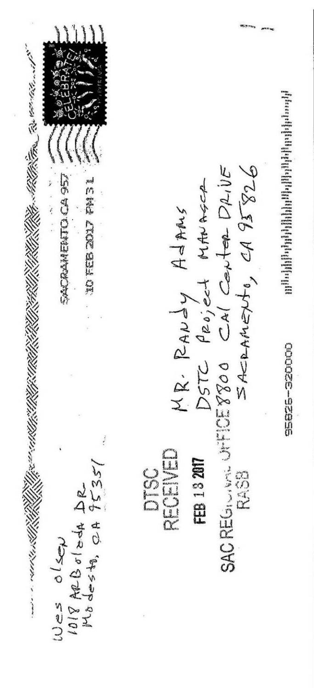

# [Response-I7] Responses to Comments from Wes Olsen

Thank you for your comments. The Lead Agency (Caltrans) has prepared responses to the comments received, with coordination and review by the SR 132 West Project Development Team, and DTSC has responded to each DTSC-applicable comment. Specifically, DTSC has responded directly to comments pertaining to the Caltrans Modesto Soil Stockpiles, when appropriate.

**I7-1 (DTSC)** The comment is acknowledged and will be part of the public record. Draft Final RAP Alternative 4, Containment, which is the recommended alternative in the Draft Final Remedial Action Plan, contains stockpiles behind retaining walls, bridge abutments and beneath the pavement of the SR 132 West project. Unpaved portions will have clean fill cover. It achieves the overall goal of long-term protection of human health and environment by eliminating the exposure pathway to human receptors and minimizes the infiltration of surface water into groundwater under the stockpiles.

Vibrations from traffic will not cause contaminants to migrate from the stockpiles into the groundwater.

- **(CT)** Caltrans concurs with the DTSC response above and incorporates it as its own response.
- IT-2 (DTSC) The comment is acknowledged and will be part of the public record. DTSC concurs with Draft Final RAP Alternative 4, Containment, which is the recommended alternative in the Draft Final Remedial Action Plan. This alternative contains the stockpiles behind retaining walls, bridge abutments, and beneath the roadway pavement of the SR 132 West project. Unpaved portions will have clean fill cover. It achieves the overall goal of long-term protection of human health and environment by eliminating the exposure pathway to human receptors and minimizes the infiltration of surface water into groundwater under the stockpiles. This alternative is cost-effective and technically feasible and is in compliance with Applicable or Relevant and Appropriate Requirements (ARARs) and achieves the criteria for long-term effectiveness, reduction of mobility, short-term effectiveness, and implementability.

The maximum surface soil concentrations of arsenic, carcinogenic PAHs, and vanadium in the stockpiles are within the range of local soil background concentrations. The maximum surface soil concentrations of barium and nickel are less than concentrations established by the U.S. Environmental Protection Agency (U.S. EPA) to be safe. Strontium and nitrate, also identified as chemicals used by FMC, were detected in the stockpiles at concentrations lower than any level

considered safe. The U.S. EPA calculates these safe levels (residential Regional Screening Levels (RSLs)) by assuming that persons are living on the site (in this case, stockpiles) for more than 25 years and exposed to site soil virtually every day of that exposure duration by incidentally ingesting the soil, breathing dust, and through direct contact with the soil. Of these exposure pathways, incidental soil ingestion is, by far, the dominant pathway, and dust inhalation and direct contact with contaminated soil are very minor ways for persons to be exposed. At this site, these calculated safe levels are protective of the residents living nearby.

The number of persons who live near the stockpiles who have serious, and in some cases, fatal, health problems are concerning. The county health department at 209-558-7000 should be contacted, as it has the resources to determine if these health problems are greater than would be expected under normal circumstances. The county health department can assess the potential consequences of past exposure, whereas the Department of Toxic Substances Control (DTSC) does not have the expertise to do this.

Other than arsenic and carcinogenic PAHs, none of the chemicals considered potentially toxic, found at the FMC facility, and in the soil stockpiles are known to cause cancer. And both arsenic and PAHs were detected at close to background concentrations. So it is highly unlikely that chronic exposure to the contents of the stockpiles would cause more than one cancer in a million persons similarly exposed.

- (CT) Caltrans concurs with the DTSC response above and incorporates it as its own response. In addition, based on the screening criteria and comparative evaluation process, Draft Final RAP Alternative 4 (Containment) is the recommended alternative in the Draft Final Remedial Action Plan. It is recommended because of the effectiveness in providing long-term and overall protection of human health and the environment, technical feasibility, cost-effectiveness, and the ability to minimize the potential for contaminants to migrate to groundwater or to be eroded by stormwater runoff. As a CEQA responsible agency, the California Department of Toxic Substances Control will make a final determination regarding Draft Final RAP Alternative 4, Containment, after Caltrans certifies the Final Environmental Impact Report. Section 2.2.5 (Hazardous Waste/Materials) of the EIR/EA identifies 24 avoidance, minimization, and mitigation measures to reduce the impacts related to hazardous wastes during the construction of the new project.
- **I7-3 (DTSC)** The comment is acknowledged and will be part of the public record. Alternative 3, Removal, which removes the contaminant source by excavating and transporting the 160,000 cubic yards of stockpile soil to an off-site disposal facility, was evaluated in the Draft Final RAP but not selected as the recommended alternative. While this alternative is technically feasible and is in compliance with Applicable or Relevant

and Appropriate Requirements (ARARs) and achieves the criteria for long-term effectiveness, reduction of toxicity, mobility and volume, short-term effectiveness, and implementability, Alternative 3, Removal, causes the greatest short-term impacts related to air quality and it is less cost-effective than Draft Final RAP Alternative 4, Containment, which is the recommended alternative in the Draft Final RAP.

DTSC concurs with Draft Final RAP Alternative 4, Containment, which is the recommended alternative in the Draft Final RAP. This alternative contains the stockpiles behind retaining walls, bridge abutments, and beneath the roadway pavement of the SR 132 West project. Unpaved portions will have clean fill cover. It achieves the overall goal of long-term protection of human health and environment by eliminating the exposure pathway to human receptors and minimizes the infiltration of surface water into groundwater under the stockpiles. This alternative is cost-effective and technically feasible and is in compliance with ARARs and achieves the criteria for long-term effectiveness, reduction of mobility, short-term effectiveness, and implementability.

DTSC sincerely appreciates the commenter's thoughtful questions and suggestions as well as their participation in this process.

- (CT) Caltrans concurs with the DTSC response above and incorporates it as its own response.
- Future traffic projections have demonstrated a need for the proposed project. Please see Master Response #1 (Purpose and Need).

# [Comment-I8]

# **Comments from Ramon and Susie Salinas**

 From:
 Vallejo, Philip@DOT

 To:
 Lugo, Jennifer@DOT

 Subject:
 FW: SR132 - Stanislaus County

 Date:
 Monday, February 27, 2017 7:49:42 AM

FYI

From: Ramon and Susie Salinas [mailto:ssalinas@pacbell.net]

Sent: Sunday, February 26, 2017 2:53 PM

**To:** Vallejo, Philip@DOT <philip.vallejo@dot.ca.gov>; Magsayo, Grace B@DOT <grace.magsayo@dot.ca.gov>; ehahn@stancog.org; Adams, Randy@DTSC

<Randy.Adams@dtsc.ca.gov>; Schumacher, Nathan@DTSC <Nathan.Schumacher@dtsc.ca.gov>

Cc: wwestcn@gmail.com; Terhesa Gamboa <terhesa@sbcglobal.net>

Subject: SR132 - Stanislaus County

Comments to file in the record

Hello.

My husband Ramon Salinas and i went to the State Route 132 West meeting on Feb 22, 2017 and I wanted to express our comments. We live on Altamont Ct which is off Kansas Ave between Rosemore Rd and Dakota Ave. We live an a cul-de-sac that opens to Kansas Ave - within 50 yards. That means we will see and hear the traffic on the new State Route 132 from our driveway and front yard. In addition the new SR132 will widen directly in front of our Cul-de-sac which I'm sure will be a frequent accident place as drivers accelerate at that point.

2

We were told that our area would not get a sound barrier wall due to the fact that there is already a brick wall around our tract homes - although it is open to our cul-de-sac homes. We found out that part of the new SR 132 would be recessed below Kansas Ave, but then leveled back to Kansas at Mercy all the way to Dakota. Why can't the road stay recessed all the way to Dakota Ave or at least Morse Rd beyond the residential tract homes?

Personally we would not like to have SR132 near our residential homes at all. The current 132 Maze Boulevard is already available and the only possible change that is needed is at Carpenter Road/Maze corner where traffic could turn West to get to Kansas. Then, it won't affect all the residential tract homes along Kansas Ave which is way more then currently facing the current Maze Blvd (listed on your flyers as the need for the change). It makes no sense to force traffic by a lot more residences then currently on Maze Blvd (from Dakota to Carpenter rd). I don't believe you were going to remove Maze Blvd so now you will just have two roads of traffic affecting additional residences – not fix the current situation.

3

The money saved by not disrupting our residential area could be used to fix current roads in Modesto.

Please add ssalinas@pacbell.net to the project mailing list.

Sincerely,

Susie Salinas ssalinas@pacbell.net

209-380-1961

# [Response-I8] Responses to Comments from Ramon and Susie Salinas

Thank you for your comments.

Please see Master Response #11 (Noise Impacts and Abatement). Your residence is located in Noise Analysis Area 3. Noise barriers were assessed for this area, but they did not meet the minimum thresholds for noise reduction. The noise analysis of the barrier at this location (Barrier C) is shown in Appendix C of the 2016 Noise Study Report. Additional noise barriers to reduce the traffic noise levels of other nearby roadways would not be feasible due to access requirements, which would require openings in barriers. Therefore, a noise barrier would not be considered reasonable in Area 3.

In regard to conflicts between Altamont Court and SR 132 (south of Kansas Road), based on the Highway Safety Manual published by the American Association of State Highway and Transportation Officials, there is a direct correlation between crash frequency and average daily traffic volumes. Lower traffic volumes would result in greater spacing between vehicles, allowing drivers more time to react to sudden changes in traffic flow, such as a stopped vehicle. Fewer vehicles would also result in fewer conflicts at intersections and driveways. Other alternatives that would involve the removal of driveway access are no longer under consideration.

- The recessed area limits were set due to engineering constraints. Recessing the roadway back to North Dakota Avenue would also incur a large expense of both earthwork and retaining walls. Also, a large sewer main trunk line crosses the proposed SR 132 in the area near Altamont Court, which would require redesign and relocation.
- Improving existing SR 132, as described in Alternative 5, would not have used the existing Caltrans right-of-way within the route adopted for the project and would have resulted in more than twice as many relocations compared to those relocations proposed under Alternatives 1 and 2. Once all phases of the project are complete, the new SR 132 will be a controlled-access freeway/expressway connecting SR 99 to I-580, removing commercial and agricultural truck traffic from local roadways including Maze Boulevard (existing SR 132). Please see Master Response #6 (Improvements to Existing SR 132 (Maze Boulevard) Alternative 5).

# [Comment-I9] Comments from Karen and Ray Cimino Family

From: Karen Cimino Karibaby07@aol.com

Subject: Comments on EIR for Proposed 132 Expressway

Date: March 12, 2017 at 6:18 PM

To: philip.vallejo@dot.ca.gov

After reviewing the EIR and attending the meeting on the proposed Highway 132, here are some comments.

What seemed like a good location more than half a century ago, 1956, is now outdated, impractical and unsafe for many reasons. During these past decades since the 1950s the city and county has quadrupled in population, valley traffic has vastly increased. Along this particular corridor west of Hwy 99 there has been much development approved by past elected officials from both the city and the county for residential communities, agricultural and commercial businesses. Today entire neighborhoods and businesses are in harm's way as a result of their haphazard rulings and will be subjected to situations that the EIR admits cannot be mitigated away.

The contaminated berms are a problem. This was made evident decades ago when the state successfully sued Mr. Bonzi for contaminating the ground water from the berm's carcinogenic chemicals leaching into the ground water. Even today many fatal health problems are ongoing in this area. The casual reference to the large number of cancers in this area as "a cancer cluster" is disgraceful. To each family the affected victims were "loved ones". The EIR failed to interview local physicians and oncologists who over many years have cared for this unusually large number of cancer patients noted in this area. Brain tumors, kidney, bladder, breast, colon, leukemias, lymphomas, multiple myeloma are cancers that are known to be caused from exposure to these carcinogenic chemicals and have been diagnosed in areas surrounding the berms. This project has been on the books for years. Why haven't funds been allocated through these decades to remove the problem berms instead of waiting until now and stating that it would be too expensive to do the right thing in the time allotted with the existing project budget? Everyone knew the problem was not going to correct itself. The current plan risks future health consequences. The EIR is not adequate.

The current plan shown at the February 22nd meeting was confusing and

3

2

unimpressive. The stale idea that 79 acres already owned by Caltrans in this location would mandate that the project should move forward in this location is obsolete. The already acquired land would not even allow for the new road to be built legally as a safe four lane highway up to Dakota. The project's goal to build a safer, faster expressway to avoid schools, churches and residences that exist on the current Hwy 132 is just being moved to a similar residential area. The new Hwy 132 would force families and established businesses to relocate. The noise and other issues unable to be mitigated according to the EIR move the current 132 problem to a new neighborhood 100 yards away.

The dead halt of the new road at Dakota Avenue has potential for safety issues that need to be addressed satisfactorily to avoid any fatal accidents. Officials need to figure out a way for these fast moving vehicles to safely transition on to the old Hwy132. And the future added traffic from the new to the old should be anticipated and dealt with to avoid more serious injuries and fatalities.

Mixing the residential and ag traffic from Wood Colony into this already problematic equation seems unnecessary and dangerous especially since the traffic on Dakota is mainly made up of local people going to school and jobs in Modesto.

In all this planning and writing of the EIR I have to believe no person on the project has driven down Kansas Avenue west past Dakota, because if they had they would see that Kansas Avenue ends one block west. Putting the jug handle on Dakota going west would only send traffic around the block for years to come before the next leg to the project is built. I don't think the tax payers would want to spend money for this boondoggle.

The project proposes to build an expressway that would decrease the city traffic congestion today and better serve the traffic needs of the area for future growth in population and for businesses for decades to come. This hopefully will leave the city of Modesto more attractive and less congested. Is it possible that the city should be considering positioning this expressway outside the small boundaries decided on 60 years ago? Before this project breaks ground maybe a fresh set of

7

5

7

eyes need to review the plan to bring it up to date.

Respectfully,

Karen and Ray Cimino Family

Sent from my iPad

# [Response-I9] Responses to Comments from Karen and Ray Cimino Family

Thank you for your comments. The Lead Agency has prepared responses to the comments received, with coordination and review by the SR 132 West Project Development Team, and DTSC has responded to each DTSC-applicable comment. Specifically, DTSC has responded directly to comments pertaining to the Caltrans Modesto Soil Stockpiles, when appropriate.

Please see Master Response #1 (Purpose and Need). The project is consistent with the City of Modesto General Plan Community Services and Facilities Element, which includes improvements to SR 132 along the general alignment of Kansas Avenue. It is also consistent with various General Plan policy strategies including the Community Growth Policy, Circulation and Transportation Policy, and the Agricultural Resources Policy. Please refer to Section 2.1.1.2 (Consistency with State, Regional and Local Plans and Programs) of the EIR/EA for more information on the alignment of the project with local planning efforts.

When the relocation of SR 132 west of SR 99 was planned in the 1950s, the proposed alignment relocated SR 132 traffic onto SR 99 between Kansas Avenue and L Street for continuity. Since that time, SR 99 has grown into a major north-south corridor that is heavily relied upon for regional and interregional travel. Capacity on SR 99 in the corridor is constrained due to the built-out condition of the area. Currently, SR 99 includes six lanes through the project limits, but is ultimately projected to require up to 12 lanes. However, at this time it is anticipated that future projects would add only two additional lanes.

When Caltrans began planning for the relocation of SR 132 to the proposed alignment, SR 99 was the planned terminus with a 1950s-era trumpet (Type F-5) interchange connection. Caltrans and Federal Highway Administration (FHWA) design standards have changed so that the original connection is now substandard in design as well as interchange spacing.

The Stanislaus County region has experienced significant growth, which causes severe traffic congestion on the local roadways and the freeways/expressways. As a result, StanCOG, Caltrans, and the surrounding municipalities have initiated multiple studies on the existing SR 99, SR 108, SR 132, and SR 219 corridors. In 1991, Caltrans completed a Project Study Report that identified two freeway alternatives with multiple freeway-to-freeway connectors at the new SR 132/SR 99 interchange that would require substantial acquisition of new right-of-way and would have a significant impact to the existing area. In 1993, Caltrans completed a Revised Project Study Report that considered additional alternatives and recommended a lower-cost

four-lane at-grade expressway. In 1997, Caltrans updated the Revised Project Study Report in which four new build alternatives were identified and included the rejection of some previously proposed alternatives.

Between 2001 and 2003, StanCOG and Caltrans began investigating SR 132 West and SR 132 East as separate facilities. In 2003, Caltrans completed the SR 99 and SR 132 Transportation Concept Reports. These reports documented two key points: SR 99 is over capacity throughout the Stanislaus County region and will continue to be over capacity after it is expanded to its ultimate configuration; and SR 132 West and SR 132 East projects will need to provide for effective connectivity that does not add to the congestion problems on SR 99. In 2003, Caltrans was proceeding with the Project Approval and Environmental Document phase, but the project was placed on hold after it was determined that there was a need to complete additional system planning studies to resolve the SR 132 West and SR 132 East connectivity concerns. Local agencies also expressed concerns regarding the alternatives proposed in previous Project Study Reports due to the impact to the local community and the lack of local agency consensus.

In 2008, StanCOG completed the Feasibility Study for SR 132 East/West Connectivity Project in which various SR 132 improvements were identified to improve east-west connectivity in Modesto. These improvements include providing direct connection from SR 132 to Needham Street, 5th Street, and 6th Street as part of the SR 132 West Expressway project to improve connectivity to SR 132 East and minimize the traffic impact to SR 99. The study recommended proceeding with completion of the SR 132 West project, including the recommended arterial street connections within the first phase of improvements. A Project Study Report-Project Development Support was prepared by StanCOG in November 2009 to serve as a Project Initiation Document.

A total of nine project alternatives were evaluated by the Project Development Team, resulting in the two build alternatives and No-Build Alternative currently under consideration. These included the Mass Transit Alternative, the Transportation Demand Management Alternative, the Transportation System Alternative, Alternative 1, Alternative 2, and the No-Build Alternative, as well as the initially proposed Alternative 1, Alternative 3, and Alternative 5. Alternatives 1 and 2 were determined to be the best options that would meet these criteria. Alternative 2 has been identified as the preferred alternative because it provides the best balance among avoiding and/or minimizing environmental impacts, project feasibility, right-of-way acquisition, overall cost, and ability to meet the project's purpose and need.

The project area is highly constrained by existing built-out development along the corridor toward SR 99 and mostly agricultural lands toward North Dakota Avenue.

The current alignment of the project within the right-of-way acquired by Caltrans in 1958 provides the least impactful use of right-of-way because it has been reserved for the highway corridor and no development has occurred within its boundaries. Accordingly, most development has occurred on the north side of Kansas Avenue and south of the project alignment. Minimal additional right-of-way is required to complete the project. Alternative 2 has been identified as the preferred alternative because it provides the best balance between avoiding and/or minimizing environmental impacts, project feasibility, right-of-way acquisition, overall cost, and ability to meet the project's purpose and need.

**19-2 (DTSC)** The comment is acknowledged and will be part of the public record. For information related to the Bonzi Sanitary Landfill, 2650 Hatch Road, Modesto, California, please refer to the following link:

https://geotracker.waterboards.ca.gov/profile\_report?global\_id=L10009514929

The stockpiles, as currently managed by Caltrans on Caltrans property, do not pose an unacceptable risk to human health for: 1) Caltrans workers; 2) trespassers; and 3) residents adjacent to the stockpiles. Current management activities consist of maintaining the perimeter fencing, limiting access to authorized Caltrans workers, maintaining the vegetative cover, surface water/groundwater monitoring, and prohibiting placement or removal of soil from the site. These measures are protective of human health.

The maximum surface soil concentrations of arsenic, carcinogenic polycyclic aromatic hydrocarbons (PAHs), and vanadium in the stockpiles are within the range of local soil background concentrations. The maximum surface soil concentrations of barium and nickel are less than concentrations established by the U.S. Environmental Protection Agency (U.S. EPA) to be safe. Strontium and nitrate, also identified as chemicals used by FMC, were detected in the stockpiles at concentrations lower than any level considered safe. The U.S. EPA calculates these safe levels (residential Regional Screening Levels (RSLs)) by assuming that persons are living on the site (in this case, stockpiles) for more than 25 years and exposed to site soil virtually every day of that exposure duration by incidentally ingesting the soil, breathing dust, and through direct contact with the soil. Of these exposure pathways, incidental soil ingestion is, by far, the dominant pathway, and dust inhalation and direct contact with contaminated soil are very minor ways for persons to be exposed. At this site, these calculated safe levels are protective of the residents living nearby.

The number of persons who live near the stockpiles who have serious, and in some cases, fatal, health problems are concerning. The county health department at 209-558-7000 should be contacted, as they have the resources to determine if these health

problems are greater than would be expected under normal circumstances. The county health department can assess the potential consequences of past exposure, whereas the Department of Toxic Substances Control (DTSC) does not have the expertise to do this.

Other than arsenic and carcinogenic PAHs, none of the chemicals considered potentially toxic, found at the FMC facility and in the soil stockpiles, are known to cause cancer. And both arsenic and PAHs were detected at close to background concentrations. So it is highly unlikely that chronic exposure to the contents of the stockpiles would cause more than one cancer in a million persons similarly exposed.

DTSC sincerely appreciates the commenter's thoughtful questions and suggestions as well as their participation in this process.

- (CT) Caltrans concurs with the DTSC response above and incorporates it as its own response. Like DTSC, Caltrans lacks the expertise to address cancer concerns. The county health department at 209-558-7000 should be contacted, as they have the resources to determine if these health problems are greater than would be expected under normal circumstances. The county health department can assess the potential consequences of past exposure.
- Please see Master Response #1 (Purpose and Need). The new roadway has been designed according to Caltrans Design Standards. The current alignment of the project within the right-of-way acquired by Caltrans in 1958 provides the least impactful use of right-of-way because it has been reserved for the highway corridor and no development has occurred within its boundaries.

Please refer to Master Response #6 (Improvements to Existing SR 132 (Maze Boulevard) – Alternative 5) for a discussion of why Alternative 5 was abandoned as a potential alternative.

Boulevard has a single lane that travels through the intersection. Dakota Avenue would have a single lane making a free right turn to westbound Maze Boulevard. The two lanes would be next to each other for approximately 300 feet, at which point there would be a merge length of approximately 720 feet. This is the standard length of transition per Caltrans Highway Design Manual given the design speed of the facility. Based on the Highway Safety Manual published by the American Association of State Highway and Transportation Officials, there is a direct correlation between crash frequency and average daily traffic volumes. Lower traffic volumes would result in greater spacing between vehicles, allowing drivers more time to react to sudden changes in traffic flow, such as a stopped vehicle. Fewer

vehicles would also result in fewer conflicts at intersections and driveways. Please refer to the *Improve Operations* section within Section 1.2 (Purpose and Need), for further information on accidents and fatalities.

Please see Master Response #3 (Logical Termini).

- Traffic on surrounding roadways was factored into the travel demand model to determine traffic impacts on the new SR 132. The analysis shows that traffic delay is expected to improve on SR 132, including traffic on the surrounding roadway network. Please refer to Section 2.1.6 (Traffic and Transportation/Pedestrian and Bicycle Facilities) of the EIR/EA.
- **I9-6** Please see Master Response #3 (Logical Termini).
- **19-7** Please refer to Response to Comment I9-1.

# [Comment-I10] Comments from Virginia Hammond

March 14, 2017

Philip Vallejo, Acting Senior Environmental Planner, District 6 855 M. Street Suite 200 Fresno, CA 93271 philip.vallejo@dot.ca.gov

Attention: Philip Vallejo

The meeting notice for February 22, 2017 was for a public hearing. When I arrived at the public hearing, I discovered it was an "Open House." My notes which I entered on the record to the court reporter were composed with the expectation I would be able to publicly speak and address my concerns and share some ideas.

The notes for the record were as followed:

# Top Concerns:

Impact on Southbound 99 late afternoon/evening traffic south of Kansas Ave
 Impact on Carpenter Road concerning reasonable accommodations for our Disabled Community
 Impact of further isolating residents south of the project from the larger community

# Comments:

I want to start by referring to your draft plan Appendix H.

"If the planned SR-132 Project were not constructed, an alternative form of cap could be installed over the stockpiles. The alternative cap could consist of constructing a layer of clean soil (typically one foot thick) over the stockpiles. Prior to constructing the cap, the surface of the stockpiles would be graded for drainage to ensure primarily that stormwater did not pond on top of the stockpiles. Following construction, the cap surface would be vegetated to protect against stormwater and wind erosion. This form of cap would provide a similar degree of protection of human health and the environment as capping by the SR-132 project."

I propose the current planned SR-132 project not be constructed and that the alternative form of cap as quoted above be used, and on that cap we build a pedestrian/bicycle freeway that aligns with current federal, state and city bicycle and pedestrian goals, and I propose connecting this new freeway to the existing Virginia Corridor making this a viable alternative transportation project eligible for funding.

Vegetative solutions have been used in environmental disasters such as the dioxin disaster of 1976 in Seveso Italy. Today a lush green park, memorial and tourist attraction (Bosco Delle Querce) is located on this site.

Current trends in urban development are to remove central freeways and replace them with pedestrian/bicycle freeways. A number of cities have done this or are in the process of doing this including Portland, Boston and Dallas.

We have a tremendous opportunity to beautify and unite Modesto. Please consider my proposal and how close we are to connecting with the Corridor and what it would mean to the future of Modesto.

1

I wish to expound on my comments entered on the record February 22, 2017 I request you include the following to my existing public comments.

Addendum to February 22, 2017 Commentary:

# Regarding the impact on Southbound 99 late afternoon/evening traffic south of Kansas Ave:

As stated in the state route 132 draft report (page 5), the purpose of the proposed project are to improve regional and inter-regional circulation, relieve traffic congestion along the existing 132, and lastly, "improve operations for the existing and proposed transportation network because the operational efficiency is reduced by the proximity and direct access to schools, churches, businesses, and residences by way of existing driveways along existing SR 132 (Maze Boulevard)."

This project *is not* about reducing the flow of rush hour traffic. This project *is not* about the increase fatality rate on 120 since widening 132 west of Modesto to interstate 5 is not a viable option in this study.

Viable non expressway options are available in this draft plan, but not promoted to the public. Therefore, this project *is not* about cleaning the environment, but about using environment concerns as an excuse to proceed with a freeway proposal. When asked at the open house February 22nd, the lead representative from The Department of Toxic Substances Control could not provide me with another instance where a freeway was built over a known hazardous waste site using this type of capping.

This project does not address the growing commuter traffic.

This project takes funding away from proposed projects such as the South County Corridor which can address the impact of Southbound 99 as it can provide a faster, safer option for bay area commuters by providing freeway access from Interstate 5 near Patterson to highway 99 near Turlock.

Building the South County Corridor will likely result in reduced traffic on Maze Boulevard as motorist can cut across south of Modesto from interstate 5 to highway 99. Page 63 of the South County Corridor Feasibility Study by Stancog estimates construction to begin between 2021-2026. This date is sooner or possibly concurrent with the projected start of phase 2 of this proposed route 132 project.

# Regarding the impact on Carpenter Road concerning reasonable accommodations for our Special Needs Disabled Community:

Inches from the fence erected around Stockpile 1 on Carpenter Road near Kansas avenue is a bus stop for Modesto Area Express routes 36 and 26. Exiting at this stop is a sizable group of passengers, some specifically accompanied. These citizens work, shop, frequent business in this immediate community. These citizens are part of our disabled and special needs community. The acknowledgment of our disabled and special needs community are nowhere to be found among this 840 page proposal. I've not come across any proposal to provide reasonable accommodations in accordance with the Americans With Disability Act. Where is the planning to acknowledge the needs of this community? Who is going to take the responsibility to compensate and/or provide the services that will be disrupted and/or discontinued do to the implementation of this freeway proposal? Please understand that habilitation and rehabilitation of some with special needs is a comprehensive and sometimes complex process and can take years of hard work to achieve their desired goals.

11

8

9

# Regarding the impact of further isolating residents south of the proposed freeway/stockpile sites

Our family moved to our residence on Scout Way in the late 1980's. It was at a time when commuting to Tracy, CA was a regular occurrence for my husband, and West Modesto was convenient and new affordable housing was available.

I quickly perceived that our part of Modesto was not as important as the remaining city. We did not have district representation on the city council at that time. We perceived many instances where the city did not consider our needs. Specifically, on one occasion before the Charles M Sharpe park was built on Torrid Ave (which is still a considerable distance from our house), I met with the parks department. During the meeting the assistant director pointed to a map on the wall and was very proud Modesto had a park for every neighborhood. When I informed him I lived on Scout Way and asked where my neighborhood park was. He said my children would need to cross Maze Boulevard and go to Mellis Park 1.9 miles away.

12

Given the history of neglect to this community over prior years, the lower income level and higher minority population presented in this study, and since we are already separated from Modesto on the east and north by highway 99, the 132 project will further isolate and separate us and present obstacles to the businesses we frequent on Carpenter Road. It is my opinion this project will increase the existing social inequity of my community in comparison to the remaining City of Modesto.

# Regarding my Comments:

I presented a reasonable alternative on February 22nd for our community based on an approved plan in this draft by the Department of Toxic Substances Control for capping and vegetating. I further refer to Federal Title 23 as a reason for a pedestrian and bicycle freeway on the current stockpile locations. If a pedestrian bicycle bridge over highway 99 can be constructed, then access to the Modesto Irrigation laterals as mentioned in this draft on page 304 can make connection to the class 1 Virginia Corridor a reality. Please also refer and comply with the goals of "Toward An Active California" (State Bicycle and Pedestrian Plan) in addressing the social equity needs of my community and consider it in the equity lens of the plan E2:2 "as a critical component to serving disadvantaged communities"

13

You can solve the problems with Maze Boulevard today. You can shut it down at Carpenter Road. While I do not like the idea of increased traffic on Carpenter Road, what you are proposing is far worse and extremely dangerous for the children, disabled, and elderly who cross carpenter at Kansas Ave. Your proposal will increase traffic with the exit at Carpenter Road that cuts into the heart of the places we do business in our community.

14

This plan as proposed with either alternative 1 or 2 will produce far more costs and unintended consequences than are presented in this proposal. The city allowed the construction of houses and businesses knowing Caltrans intentions. I think the City of Modesto will be greatly harmed by this project.

15

Virginia M. Hammond 404 Scout Way Modesto, CA 95351 vmhammond@comcast.net

# [Response-I10] Responses to Comments from Virginia Hammond

Thank you for your comments. The Lead Agency has prepared responses to the comments received, with coordination and review by the SR 132 West Project Development Team, and DTSC has responded to each DTSC-applicable comment. Specifically, DTSC has responded directly to comments pertaining to the Caltrans Modesto Soil Stockpiles, when appropriate.

The meeting was conducted in an open house format with stations around the room for the public to review. Public notices were circulated in the local newspapers and included that the meeting would be held in an open house format. Each station was manned by staff to provide information as needed. This meeting style is one of many ways in which public meetings can be organized. Caltrans Environmental Review meetings may be structured in different formats, with a goal of communicating key information about the project and capturing as much public comment as possible.

Comments recorded via court reporter at the Public Hearing Meeting have been included in the Public Hearing Transcript (PHT1). A response has been provided for each comment received.

- Traffic analysis shows that either build alternative would improve the level of service on SR 99 in 2048 when compared to the No-Build Alternative.
- I10-3 The Project Development Team recognizes and appreciates the important needs of vulnerable populations such as those of the disabled community. Any improvements to North Carpenter Road will meet the Americans with Disabilities Act (ADA) standards including sidewalks with ramps at roadway crossings and signals with accessible audible pedestrian phases. Specifically, a signalized intersection at North Carpenter Road will accommodate crossings by bicyclists and pedestrians. Both build alternatives will provide a pedestrian/bicycle path along the east side of North Carpenter Road, which will benefit both bicyclists and pedestrians at this intersection. Additional intersection safety improvements may be considered during final design. The design presented in the EIR/EA is only preliminary and has been conducted at a level appropriate for environmental review but not for final design of the project. In addition, the City of Modesto is responsible for improvements to local roadways within City right-of-way. Specific requests should be forwarded to the City of Modesto for consideration. The opinions expressed by affected residents during the environmental review process will be considered as the design progresses. The Project Development Team will continue to collaborate with stakeholders through community meetings or workshops to support enrichment of the environment for the transportation system users and local communities.

Because it would sit on existing Caltrans right-of-way for most of the new alignment, neither build alternative would bisect the existing subdivisions/ neighborhoods within the project study area. Acquisition of some businesses and residences would occur on the periphery of the neighborhoods (primarily the Elm Tract neighborhood) and within areas west of SR 99; however, the relocations would not introduce a geographical gap or division to existing neighborhoods. Also, neither build alternative would separate local residents from community facilities or prevent access to community services.

The project will not bisect an established community and is therefore not expected to result in impacts to community character or cohesion. Established communities are located both to the north of Kansas Road and to the south of Kansas Road, south of the project alignment. Residential displacements would occur for houses located on the periphery of residential areas along SR 99 and would also occur within areas west of SR 99 that are not associated with established neighborhoods. Although the two build alternatives would result in disproportionately high or adverse impacts on minority or low-income populations, the proposed project would provide many benefits to minority and low-income populations that would offset many of the adverse effects. Net benefits include improvements to regional and interregional circulation, congestion relief, and improved roadway operations, which would benefit these communities. Please refer to Section 2.1.4 (Community Impacts) in the EIR/EA for more information on the avoidance, minimization and mitigation measures that would be put in place to reduce potential impacts to residences and businesses.

- I10-5 (DTSC) The comment is acknowledged and will be part of the public record. The proposed pedestrian/bicycle "freeway" (trail) was not an alternative evaluated in the Draft Final Remedial Action Plan because it does not meet the Purpose and Need of the project to 1) improve regional and interregional circulation within Modesto and Stanislaus County, 2) relieve traffic congestion along existing SR 132 (Maze Boulevard), and 3) improve operations for the existing and proposed transportation network. However, as noted if the State Route 132 West Project were not constructed, then containment of the stockpiles would consist of a clean soil cap with a vegetative cover over the stockpiles. Consideration for including a pedestrian/bicycle trail is something that could be considered as an amendment to the Draft Final RAP at that time.
  - **(CT)** Caltrans concurs with the DTSC response above and incorporates it as its own response.
- **I10-6 (DTSC)** The comment is acknowledged and will be part of the public record. The proposed park was not an alternative evaluated in the Draft Final Remedial Action Plan. If the

State Route 132 West Project were not constructed, then containment of the stockpiles would consist of a clean soil cap with a vegetative cover over the stockpiles. Consideration for adding park features is something that could be considered as an amendment to the Draft Final RAP at that time.

- **(CT)** Caltrans concurs with the DTSC response above and incorporates it as its own response.
- I10-7 Please see Master Response #7 (Pedestrian and Bicycle Accommodations).
- Your individual comments, as well as comments provided at the February 22, 2017 Public Hearing meeting, have been included in the public record. Please refer to Master Response #1 (Purpose and Need) and Section 1.2 (Purpose and Need) of the EIR/EA for a detailed discussion of the project's objectives. Please refer to Master Response #3 (Logical Termini) regarding why improvements proposed as a part of this project will end at North Dakota Avenue. Please refer to Master Response #6 (Improvements to Existing 132 (Maze Boulevard) Alternative 5) for a discussion of why Alternative 5 was abandoned as a potential alternative. Please refer to Master Response #2 (Accidents and Fatalities) regarding the most recent accident data for existing SR 132.

The project would widen SR 132 to four lanes between SR 99 and Dakota Avenue. Furthermore, the project is part of a larger plan to connect SR 99 with Interstate 580 (I-580) via a controlled-access freeway/expressway, which would be wider than existing SR 132. The further extension of the new SR 132 corridor (along Kansas Avenue), west of North Dakota Avenue to Gates Road, is currently in the planning stages. Part of the right-of-way west of North Dakota Avenue has already been acquired for this controlled-access freeway/expressway. SR 120 is outside the project limits and is not a part of this project. Future improvements to SR 99 are proposed as separate projects.

- **I10-9 (DTSC)** The comment is acknowledged and will be part of the public record. The American Standard Products Site in Richmond, California, is a site where a road was built over a hazardous substances site. The project is also referred to as the Richmond Parkway. The Union Pacific Curtis Park Site in Sacramento, California, is another example of where a road was built over a hazardous substances site.
  - DTSC sincerely appreciates the commenter's thoughtful questions and suggestions as well as their participation in this process.
  - (CT) Caltrans concurs with the DTSC response above and incorporates it as its own response. In addition to the two project build alternatives (Alternative 1 and Alternative 2) and the No-Build Alternative, three additional non-expressway

alternatives were considered and are discussed in the EIR/EA Section 1.4 Project Alternatives. These include the Transportation Demand Management (TDM), Transportation System Management (TSM), and Mass Transit alternatives. These alternatives were evaluated and were determined to be inadequate in meeting the project purpose and need and therefore were removed from further study. Traffic volumes on existing SR 132 (Maze Boulevard) are anticipated to increase substantially, despite regional efforts to promote ridesharing, bicycle and pedestrian, and transit options. The No-Build, Transportation Demand Management and Mass Transit alternatives also do not improve system connectivity. In addition, non-expressway existing SR 132 (Maze Boulevard) currently operates at an acceptable level of service D or better between North Dakota Avenue and SR 99, but is anticipated to deteriorate to unacceptable levels in the future. The project seeks to address the transportation deficiencies associated with existing SR 132, which are projected to worsen and result in unacceptable traffic conditions in the future.

- The project is intended to benefit both commuter and local traffic. Both build alternatives would meet the purpose and need by shifting most of the truck and commuter traffic onto the proposed new alignment and improving regional circulation and operations on the local transportation network. The project is part of a larger plan to connect SR 99 with Interstate 580 (I-580) via a controlled-access freeway/expressway. The further extension of the new SR 132 corridor (along Kansas Avenue), west of North Dakota Avenue to Gates Road, is currently in the planning stages. Part of the right-of-way west of North Dakota Avenue has already been acquired for this controlled-access freeway/expressway. Once SR 99 and I-580 are connected via an expressway, through traffic, including truck traffic, will be removed from local roadways, including the existing SR 132 (Maze Boulevard) alignment. The use of North Dakota Avenue as a part of the new SR 132 route is temporary until future segments of the controlled-access freeway/expressway are built.
- **I10-11** Please refer to the response to Comment I10-3.
- **I10-12** Please refer to the response to Comment I10-4.
- Please see Master Response #7 (Pedestrian and Bicycle Accommodations). The Project Development Team has also reviewed the referenced California Bicycle and Pedestrian Plan Strategy E2:2 and considered the option of a bicycle/pedestrian bridge over SR 99. The project will be developed in accordance with Caltrans Deputy Directive DD-64-R1: Complete Streets Integrating the Transportation System, which calls for a network of integrated, multimodal projects or complete streets. However, the Class 1 Virginia Corridor does not currently exist, and constructing a bicycle/pedestrian bridge over SR 99 without an existing connection on the east side of SR 99 would not meet the criteria for independent utility at this

time. The Federal Highway Administration regulations require that a project be a functional and reasonable expenditure even if no additional transportation improvements are made in the area, otherwise known as independent utility. In addition, there are significant engineering limitations to a bicycle/pedestrian bridge over SR 99. Both the grade and vertical clearance required to cross over the existing freeway may preclude the utility of the facility.

I10-14

Existing SR 132 (Maze Boulevard) currently operates at an acceptable level of service (LOS) D or better between North Dakota Avenue and SR 99, but is anticipated to deteriorate to unacceptable levels in the future. All of the study intersections along the existing highway currently operate at an acceptable LOS C or better. However, traffic operations would degrade over time so that, by 2028, the intersection of the existing highway and North Carpenter Road would operate at LOS F, an unacceptable service level; and, by 2048, the intersections of the existing highway with Rosemore Avenue, North Carpenter Road, and Emerald Avenue would operate at unacceptable LOS F. As detailed in Section 2.1.6, Traffic and Transportation/Pedestrian and Bicycle Facilities, future congestion in 2048 along the 3.3-mile stretch between North Dakota Avenue and SR 99 would reduce travel speeds by 12.1 miles per hour during the morning commute and 12.3 miles per hour during the evening commute. This would increase travel times and decrease the level of service along SR 132 (Maze Boulevard) and at every area intersection studied. Lastly, LOS is expected to improve from LOS C, D, E, and F during the evening peak hour under the existing and future No-Build Alternatives (2009, 2020, 2028, 2048), respectively, to LOS A and B during the evening peak of the future Build Alternatives (2028 and 2048).

I10-15

The project is consistent with the City of Modesto General Plan Community Services and Facilities Element, which includes improvements to SR 132 along the general alignment of Kansas Avenue. It is also consistent with various General Plan policy strategies, including the Community Growth Policy, Circulation and Transportation Policy, and the Agricultural Resources Policy. Of the alternatives previously considered, Alternatives 1 and 2 would result in fewer environmental and community impacts relative to other alternatives. Please see Section 2.1.1.2 (Consistency with State, Regional and Local Plans and Programs) of the EIR/EA for more information on the alignment of the project with local planning efforts.

# [Comment-I11] **Comments from Lori Wolf**

From: Vallejo, Philip@DOT Lugo, Jennifer@DOT Subject: FW: contact info

Friday, March 17, 2017 2:57:11 PM Date:

From: Lori Wolf [mailto:lori\_wolf52@yahoo.com]

Sent: Friday, March 17, 2017 1:59 PM

To: Vallejo, Philip@DOT <philip.vallejo@dot.ca.gov>

Subject: Re: contact info

Thank you. Well I figured it out, in the Public Notice placed in the Modesto Bee on Wednesday

February 15 your first name was spelled everywhere with two

l's.....

Here are the reasons that I am adamantly opposed to proceeding with any part of this project.

The entrance and exit ramps and patterns included in the review documents are only going to make travel more complicated not less so. Covering up the contaminated soil with concrete is 12 just plain lame.

I2

111

Modesto already has the ugliest and most poorly maintained overpasses in the entire central valley. Why on earth should you be allowed to build another highway that you won't take care of? At least the existing highway has property owners on both sides who manage to control the weeds.

3

Lastly, this is being touted as promoting safer travel. The existing highway is safe enough, it's the idiots driving on it that are causing the problem. Spending millions to try to fix stupid and let everyone drive faster is a waste of taxpayer money. This proposal was begun fifty years ago and never got built because it really doesn't make sense. There has to be a better solution than the documents that I have reviewed. Go back to the drawing board in general. None of this is better.

4

Lori Wolf 209-578-0898 home 209-479-8030 cell

On Friday, March 17, 2017 1:54 PM, "Vallejo, Philip@DOT" <philip.vallejo@dot.ca.gov> wrote:

Philip Vallejo Acting Senior Environmental Planner California Department of Transportation Central Region Environmental Division Office (559) 445-6172 Cell (559) 779-6612

# [Response-I11] Responses to Comments from Lori Wolf

Thank you for your comments. The Lead Agency has prepared responses to the comments received, with coordination and review by the SR 132 West Project Development Team, and DTSC has responded to each DTSC-applicable comment. Specifically, DTSC has responded directly to comments pertaining to the Caltrans Modesto Soil Stockpiles, when appropriate.

- The current design of the existing entrance and exit ramps is limited by the amount of available right-of-way within the corridor and the built-out condition of the area. Caltrans and Federal Highway Administration (FHWA) design standards have changed so that the existing connection no longer meets the current standards. The two build alternatives provide the necessary connections between the two routes at the freeway-to-freeway interchange while meeting the current design standards. The final design phase will include a full study of advanced signage options to efficiently route motorists to the appropriate connections.
- I11-2 (DTSC) The comment is acknowledged and will be part of the public record. Draft Final RAP Alternative 4, Containment, which is the recommended alternative in the Draft Final Remedial Action Plan, contains stockpiles behind retaining walls, bridge abutments and beneath the pavement of the State Route 132 West project. Unpaved portions will have clean fill cover. It achieves the overall goal of long-term protection of human health and environment by eliminating the exposure pathway to human receptors and minimizes the infiltration of surface water into groundwater.

This alternative requires Caltrans to enter into an Operation and Maintenance Agreement with DTSC and prepare an Operation and Maintenance Plan for DTSC's review and approval. The Operation and Maintenance Plan will require an annual inspection of the pavement and other features of the containment remedy. Groundwater monitoring will also continue. DTSC will also evaluate the containment remedy every 5 years to make sure it is operating as designed. These measures are protective of human health.

- DTSC sincerely appreciates the commenter's thoughtful questions and suggestions as well as their participation in this process.
- **(CT)** Caltrans concurs with the DTSC response above and incorporates it as its own response.
- I11-3 The new SR 132 expressway/freeway would be maintained according to the Caltrans Maintenance Manual and Integrated Maintenance Management System (IMMS).

I11-4 The project is designed to address future traffic conditions on existing SR 132 and improve regional and interregional connectivity in Modesto and Stanislaus County. While safety improvements are not a part of the project purpose and need, these improvements are anticipated to allow for safer travel. Please refer to Section 1.2.1 (Purpose) of the EIR/EA for a list of project objectives. Please refer to Master Response #1 (Purpose and Need) regarding the need for project improvements.

# [Comment-I12] Comments from Scott Calkins

112

March 13, 2017

From: Scott Calkins

To: Caltrans Regarding State Route 132 West Freeway/Expressway Draft EIR/EA

I am a 50 year resident of Stanislaus County's District 3 and have been attempting to follow the planning process for SR132 West since 2010. Caltrans and Stancog have made it incredibly difficult for the public to get accurate and timely information about the project, often offering the public no information for more than a year at a time. To be clear the 132 West project has not treated the public as a partner in a collaborative process. Decisions, like the elimination of Alternative 5 were made with no public meetings or input at all. In 2010 I was identified as a stakeholder in order to participate in Plan Implementation Project (PIP) meetings. The PIP was discontinued in 2014 with no notice to stakeholders to explain why they were no longer a part of the process. At Stancog policy board meetings I made several requests to participate or at least sit in on Project Development Team (PDT) meetings and was denied access. The public was effectively locked out of the planning process for years from 2014 forward. Not only did Stancog and Caltrans go dark when it came time to share information with the public, but so did the Department of Toxic Substance Control. Now, after years of not sharing any valuable information about the project Caltrans dumps an 840 page EIR document on the public with insufficient time for review. In addition they provided only a single public meeting with no formal presentation given by any member of Caltrans or Stancog staff. The meeting was a two hour drop in open house that provided very little practical information about the project to the public.

The purpose and need for the project appear to be constructed to provide cover for the reality of building an unnecessary and expensive new bypass to benefit a political elite at the expense of thousands of other Stanislaus County residents. The most reasonable, affordable, environmentally friendly project would still be Alternative 5; to make safety and traffic flow improvements to the Maze Boulevard route. A completely fictional argument was made against this option where regular members of the public had no opportunity to participate.

The engineering and environmental work done for the project to date are deeply flawed and will provide none of the benefits they claim when the project is complete. The whole EIR document is nothing more than an attempt at green-washing an inherently dirty project. Congestion will be worse with the new traffic and sprawl induced by this project. Air quality will decline at an accelerated rate due to the project's goal to accommodate increased trucking and long distance commuting. Groundwater and surface water will be at increased risk for contamination. The EIR must conclude that this new alignment of SR132 West will have a significant negative impact on the quality of the human environment and that the "No Build Alternative" would best avoid these impacts and is thus the environmentally superior alternative. California is at, or near a critical environmental turning point, our first priority should be to do no additional harm.

3

2

4

5

Many questions still need to be answered by Caltrans and other agencies, including but not limited to the ones that follow.

| •                                                                                                                                                                                                                                                                                                                                                                                                                                                                                                                                                                                                                                                                                                 | Why did Caltrans fail to provide continuous accurate quarterly testing of their eight groundwater monitoring wells near the contaminated soil stockpiles from the time they were installed? Caltrans has not acted in a responsible way to provide complete information in its groundwater study to assess the contamination leaching from the stockpiles over the past 50 years.                                                | 7  |
|---------------------------------------------------------------------------------------------------------------------------------------------------------------------------------------------------------------------------------------------------------------------------------------------------------------------------------------------------------------------------------------------------------------------------------------------------------------------------------------------------------------------------------------------------------------------------------------------------------------------------------------------------------------------------------------------------|----------------------------------------------------------------------------------------------------------------------------------------------------------------------------------------------------------------------------------------------------------------------------------------------------------------------------------------------------------------------------------------------------------------------------------|----|
| •                                                                                                                                                                                                                                                                                                                                                                                                                                                                                                                                                                                                                                                                                                 | Why did Caltrans not follow the recommendation made by DTSC in the 2006 Human Health Risk Assessment to test groundwater at 70-80 feet in order to understand the risk to people using residential wells within a one mile radius? The HHRA included false statements that there are no residential wells within a one mile radius, when in reality there are dozens.                                                            | 8  |
| •                                                                                                                                                                                                                                                                                                                                                                                                                                                                                                                                                                                                                                                                                                 | Why did Caltrans not investigate and make public contamination reports from the City of Modesto's Emerald and Elm wells and compare them publicly with constituents of concerns leaching from the stockpiles? In fact the current EIR includes a false statement that the City of Modesto's municipal water system does not use groundwater.                                                                                     | 9  |
| •                                                                                                                                                                                                                                                                                                                                                                                                                                                                                                                                                                                                                                                                                                 | How will Caltrans guarantee residents who have private wells within a one mile radius that their well level and water quality will not be adversely affected by the project? The paved surface area will produce contaminated runoff that could leach into groundwater from retention basins and Caltrans dewatering could adversely impact the depth of groundwater for current users.                                          | 10 |
| •                                                                                                                                                                                                                                                                                                                                                                                                                                                                                                                                                                                                                                                                                                 | Why did Caltrans allow surface runoff from Stockpiles 1 and 2 to flow into residential neighborhoods for 50 years without regard to health and safety of people in their own yards? Many residents just to the South of the stockpiles have been subject to unusual illnesses that Caltrans made no public effort to investigate.                                                                                                | 11 |
| •                                                                                                                                                                                                                                                                                                                                                                                                                                                                                                                                                                                                                                                                                                 | Why did Caltrans ignore maintenance of the stockpile sites that resulted in frequent dangerous fires? Fires in the past few years resulted in burning neighbors out of their homes because of the agencies consistent negligence.                                                                                                                                                                                                | 12 |
| •                                                                                                                                                                                                                                                                                                                                                                                                                                                                                                                                                                                                                                                                                                 | Why was Caltrans allowed to deliver contaminated soil from Stockpile 3 to a landfill in San Joaquin County after Steven Meeks from the Water Board claimed the soil was too contaminated for our own Stanislaus County landfill? Caltrans has been treating Modesto as a toxic waste dump since the 1960's, they are long overdue to remove all of the 140 thousand yards of material to a legitimate toxic material waste site. | 13 |
| •                                                                                                                                                                                                                                                                                                                                                                                                                                                                                                                                                                                                                                                                                                 | Why does Caltrans continue to shirk its responsibility to reduce vehicle miles traveled by providing Valley residents with alternative/ mass transit options for travel to the Bay Area? Continuing to build freeway/expressway projects that promote sprawl only make it more difficult to fund the mass transit we need to fight climate change, reduce congestion and improve air quality.                                    | 14 |
| •                                                                                                                                                                                                                                                                                                                                                                                                                                                                                                                                                                                                                                                                                                 | How can Caltrans depend on other agencies to improve particulate pollution from heavy trucks for example in order to hope to build capacity increasing projects without causing even more harm to failing air quality in the Valley? Caltrans has adopted a "pass the                                                                                                                                                            | 15 |
|                                                                                                                                                                                                                                                                                                                                                                                                                                                                                                                                                                                                                                                                                                   |                                                                                                                                                                                                                                                                                                                                                                                                                                  |    |
| buck” strategy for pretending to meet air quality while pursuing business as usual on behalf of big oil and trucking interests.                                                                                                                                                                                                                                                                                                                                                                                                                                                                                                                                                                   | 15                                                                                                                                                                                                                                                                                                                                                                                                                               |    |
| • How will Caltrans provide residents in Stanislaus County accurate data to show air quality before, during and after construction effects on local air quality? Caltrans knows no one is going to hold them accountable to rosy predictions of air quality after they build the SR132 West project, so in effect they have an unlimited license to pollute once they start.                                                                                                                                                                                                                                                                                                                      | 16                                                                                                                                                                                                                                                                                                                                                                                                                               |    |
| • How can Caltrans claim in the EIR they will plant enough trees to offset the increase in CO2 emissions generated by induced traffic? Where are the peer reviewed scientific studies that show it is possible to plant and maintain that many trees on Caltrans right of way for this project? Caltrans projects like this one are the cause of global warming and not the solution. They should not be allowed to pursue projects by making false claims.                                                                                                                                                                                                                                       | 17                                                                                                                                                                                                                                                                                                                                                                                                                               |    |
| • Why has Caltrans been so unwilling to make rational effective safety improvements to the existing Maze Boulevard route? Caltrans had decades to make incremental improvements to SR 132 West but instead did nothing to try to establish a need for a far more expensive solution.                                                                                                                                                                                                                                                                                                                                                                                                              | 18                                                                                                                                                                                                                                                                                                                                                                                                                               |    |
| • Why does Caltrans complain about the private driveway access on the Maze Boulevard route only to incorporate private driveways on the new route along Dakota Avenue? Caltrans has a plan to build congestion into the new project, just like the route we currently have. This project is an expensive way to maintain congestion so that Caltrans will have an endless supply of new projects to keep its engineers busy in perpetuity.                                                                                                                                                                                                                                                        | 19                                                                                                                                                                                                                                                                                                                                                                                                                               |    |
| • Why does Caltrans note in the EIR that this project will increase congestion on SR 99 at a location in Modesto that is already a problem. They prepared the EIR as if people would only be getting off SR 99 to use SR 132 and not imagined the opposite effect.                                                                                                                                                                                                                                                                                                                                                                                                                                | 20                                                                                                                                                                                                                                                                                                                                                                                                                               |    |
| • How can Caltrans get away with presenting this project in the EIR as having no impact on land use patterns in Stanislaus County? Caltrans knows these projects statewide are well known sprawl generators and this one is likely to cause the loss of thousands of acres of the most fertile farmland in the world. The City of Modesto already cited the construction of the SR 132 West project as the reason behind an attempt to annex thousands of acres in an area West of current city limits known as Wood Colony. Now that the city voted to raise sales taxes with the passage of Measure L local business leaders are anxious to cash in on new development that will pave farmland. | 21                                                                                                                                                                                                                                                                                                                                                                                                                               |    |
| • How will Caltrans work with residents to compensate them for the loss in value of their properties due to the impact of noise pollution? Residential property values in areas near the new bypass will decline by measurable amounts and Caltrans needs a plan in place for those people to receive compensation for their loss.                                                                                                                                                                                                                                                                                                                                                                | 22                                                                                                                                                                                                                                                                                                                                                                                                                               |    |
| • How will Caltrans ensure that residents can report any construction noise that occurs before 7am, or after 7pm so that it may be immediately shut down. Construction hours must be observed by all contractors working on the site.                                                                                                                                                                                                                                                                                                                                                                                                                                                             | 23                                                                                                                                                                                                                                                                                                                                                                                                                               |    |
| • Why does the EIR fail to accurately describe Phase 1 and Phase 2 of the project? There are radical differences in the report form one section to the next regarding the scope of the phases including some pages that show no connection to SR 99 in Phase 1. Why is                                                                                                                                                                                                                                                                                                                                                                                                                            | 24                                                                                                                                                                                                                                                                                                                                                                                                                               |    |

the information about Phase 1 so inaccurate and how can the public know what is being built?

24

• How come Caltrans is not following the intent of its own Deputy Directive 64 to design and build complete streets for all users including bicycles and pedestrians? The bicycle and pedestrian aspects of the project are completely inadequate in the current EIR for 132 West. All North-South routes at Emerald, Carpenter, Rosemore, and Dakota need bicycle and pedestrian access on both East and West side of each street. The project also needs to include a bicycle pedestrian route across SR 99 at the interchange, or at the Kansas Avenue bridge. Caltrans will need to go back to the drawing board to design a project that serves non-motorized members of the public including children and the elderly in a safe equitable manner. This is an environmental justice issue in an area where some residents can not afford cars.

25

How can Caltrans begin a project with an interchange that they know has fatal design
flaws? The design of the interchange is so unsettled even the engineers working on the
project are not at all certain what it may eventually look like. The project may completely
fail given the number of design variation and exemptions that will be necessary given
the poor location of the interchange.

26

 Why did Caltrans recognize this alternative route for 132 West should be abandoned in the 1970's? Is there an earlier study done of this route that concluded that this was a poor location for a new interchange project on SR 99? Caltrans should provide a complete public explanation that reveals why the project was slated to be terminated and exactly what discussions took place and with whom to bring the project back.

27

 Why should a Caltrans project like this one be exempt from farmland mitigation? If anything Caltrans should be responsible for setting the gold standard in mitigation and set aside a minimum five acres to each one they consume given that their projects are known to contribute to sprawl.

28

Why did the Department of Toxic Substance Control fail to provide the public with an\nindependent 3rd party investigation of the contaminated soil stockpiles? It was evident
that DTSC was willing to serve as a co opted member of the Caltrans team and had no\ninterest in challenging any of their findings or making sure that good scientific methods of
study were being followed.

29

Finally I make a formal request that the public comment period be extended at least 30 more days from the current March 17th, 2017 deadline in order that residents have a more realistic time frame to understand the consequences of the 840 page EIR document. It is grossly unfair that the agencies had years to work on the report while denying public access to Project Development Team meetings and discontinuing the PIP. The extension of the time period for review should also include another public meeting where formal presentations would be made by at least one member of each agency that participated in the report followed by a question and answer period where members of the public could ask the presenters follow up questions.

30

Sincerely, Scott Calkins

# [Response-I12] Responses to Comments from Scott Calkins

Thank you for your comments. The Lead Agency has prepared responses to the comments received, with coordination and review by the SR 132 West Project Development Team, and DTSC has responded to each DTSC-applicable comment. Specifically, DTSC has responded directly to comments pertaining to the Caltrans Modesto Soil Stockpiles, when appropriate.

- Please refer to Master Response #5 (Public Participation and Review Process) for information regarding the public engagement process to date and why the PIP meetings were discontinued. Please refer to Master Response #6 (Improvements to Existing SR 132 (Maze Boulevard) Alternative 5) for a discussion of why Alternative 5 was abandoned as a potential alternative.
- As described in Section 4.2.4, StanCOG and Caltrans have provided a total of 18 opportunities for the public to participate in the project planning process. This included eight Plan Implementation Project (PIP) meetings, one Public Scoping Meeting and nine Public Information Meetings ranging from public information, public hearing and neighborhood meetings.

The public hearing was conducted in an informal open house format to facilitate communication and the exchange of information between the project team and the public. Team members were present to address comments and questions. When attendees arrived, they were asked to sign in and were handed a project information sheet and a Community Update. A number of Caltrans, DTSC, Regional Water Quality Control Board, and StanCOG staff attended the project public hearing and were available to respond to comments and questions. Staff invited each attendee to view the displays throughout the room, ask questions, place their written comments in the drop box or mail/email them to Caltrans, or give their oral comments to the court reporter onsite. A Spanish translator was provided for Spanish-speaking attendees. Stations with display boards were set up around the room for the public to review. Each station was manned by staff to provide information as needed.

The comment period for the EIR/EA ran from January 18 to March 17, 2017, which was two weeks longer than the CEQA requirement of 45 days. The EIR/EA is intended to provide as much information relevant to potential impacts associated with the project, per requirements by state and federal law. Please see Master Response #5 (Public Participation and Environmental Review Process).

I12-3 The purpose of the project is to improve regional and interregional connectivity in Modesto and Stanislaus County. The project is needed to address future traffic conditions on existing SR 132 and improve regional and interregional connectivity in

Modesto and Stanislaus County. Under the No-Build Alternative, traffic conditions are expected to deteriorate to unacceptable levels of service (LOS) by 2028 and 2048. Please see Master Response #1 (Purpose and Need).

When the relocation of SR 132 west of SR 99 was planned in the 1950s, the proposed alignment relocated SR 132 traffic onto SR 99 between Kansas Avenue and L Street for continuity. Since that time, SR 99 has grown into a major north-south corridor that is heavily relied upon for regional and interregional travel. Capacity on SR 99 in the corridor is constrained due to the built-out condition of the area. Currently, SR 99 includes six lanes through the project limits, but is ultimately projected to require up to 12 lanes. However, at this time it is anticipated that future projects would add only two additional lanes.

When Caltrans began planning for the relocation of SR 132 to the proposed alignment, SR 99 was the planned terminus with a 1950s-era trumpet (Type F-5) interchange connection. Caltrans and Federal Highway Administration (FHWA) design standards have changed so that the original connection is now substandard in design as well as interchange spacing.

The Stanislaus County region has experienced significant growth, which causes severe traffic congestion on the local roadways and the freeways/expressways. As a result, StanCOG, Caltrans, and the surrounding municipalities have initiated multiple studies on the existing SR 99, SR 108, SR 132, and SR 219 corridors. In 1991, Caltrans completed a Project Study Report that identified two freeway alternatives with multiple freeway-to-freeway connectors at the new SR 132/SR 99 interchange that would require substantial acquisition of new right-of-way and would have a significant impact to the existing area. In 1993, Caltrans completed a Revised Project Study Report that considered additional alternatives and recommended a lower-cost four-lane at-grade expressway. In 1997, Caltrans updated the Revised Project Study Report in which four new build alternatives were identified and included the rejection of some previously proposed alternatives.

Between 2001 and 2003, StanCOG and Caltrans began investigating SR 132 West and SR 132 East as separate facilities. In 2003, Caltrans completed the SR 99 and SR 132 Transportation Concept Reports. These reports documented two key points: SR 99 is over capacity throughout the Stanislaus County region and will continue to be over capacity after it is expanded to its ultimate configuration, and the SR 132 West and SR 132 East projects will need to provide for effective connectivity that does not add to the congestion problems on SR 99. In 2003, Caltrans was proceeding with the Project Approval and Environmental Document phase, but the project was placed on hold after it was determined that there was a need to complete additional system planning studies to resolve the SR 132 West and SR 132 East connectivity concerns. Local agencies also expressed concerns regarding the alternatives proposed in

previous Project Study Reports due to the impact to the local community and the lack of local agency consensus.

In 2008, StanCOG completed the Feasibility Study for SR 132 East/West Connectivity Project in which various SR 132 improvements were identified to improve east-west connectivity in Modesto. These improvements include providing direct connection from SR 132 to Needham Street, 5th Street, and 6th Street as part of the SR 132 West Expressway project to improve connectivity to SR 132 East and minimize the traffic impact to SR 99. The study recommended proceeding with completion of the SR 132 West project, including the recommended arterial street connections, within the first phase of improvements. A Project Study Report-Project Development Support was prepared and approved by StanCOG in November 2009 to serve as a Project Initiation Document.

Containment of the Modesto Soil Stockpiles is also a key project objective. Draft Final RAP Alternative 4, Containment, is the recommended alternative in the Draft Final RAP because of the effectiveness in providing long-term and overall protection of human health and the environment, technical feasibility, cost-effectiveness, and the ability to minimize the potential for contaminants to migrate to groundwater or to be eroded by stormwater runoff.

- Please see Master Response #6 (Improvements to Existing SR 132 (Maze Boulevard)

   Alternative 5) and Master Response #5 (Public Participation and Environmental Review Process).
- The purpose of the EIR/EA is to evaluate and disclose each significant effect on any environmental resource. Each section of the EIR/EA describes potentially affected areas, environmental consequences, and potential avoidance and/or minimizations measures. In addition, Chapter 3 of the EIR/EA provides a summary of CEQA findings and discussion of significant impacts. Per Table 2-25 in the EIR/EA, level of service (measure of traffic delay) will improve to a level of service (LOS) B, and later to LOS A, during the morning and evening peak periods under the 2020, 2028, and 2048 Build Alternatives. Concurrence was received from the U.S. Environmental Protection Agency Region 9 on April 25, 2016, and the Federal Highway Administration on April 26, 2016, concluding that the proposed project is not a project of air quality concern. Increases in truck traffic as a result of the project are well below the thresholds of significance for projects of air quality concern, pursuant to 40 Code of Federal Regulations 93.123(b)(1) guidelines.

The project also received a project-level conformity determination from the Federal Highway Administration on June 5, 2017, concluding that the project conforms with the State Implementation Plan in accordance with 40 CFR Part 93. In the conformity determination letter, the Federal Highway Administration stated that the project-level

conformity analyses submitted by Caltrans on April 21, 2017 demonstrates that the project will not create any new violations of standards or increase the severity or number of existing violations. The Federal Highway Administration conformity determination letter can be found in Appendix I.

Upon full containment and with implementation of the construction best management practices described in this section as well as avoidance, minimization, and mitigation measures SHAZ-1 through SHAZ-10, either build alternative would ensure no direct or indirect adverse impacts to water quality or stormwater runoff with respect to the soil stockpiles.

CEQA Guidelines (Section 15126.6(e)(2)) require that an environmentally superior alternative be identified. The environmentally superior alternative is generally defined as the alternative that would result in the least adverse environmental impacts to the project area and vicinity. If the No-Build Alternative is found to be the environmentally superior alternative, the document must identify an environmentally superior alternative among the other alternatives.

Although the No-Build Alternative would not result in any physical impacts to the environment, it would fail to meet the objectives of the project and would therefore not be considered an environmentally superior project alternative.

Each build alternative meets the purpose of the project. Similar potential impacts with the implementation of Alternatives 1 and 2 would be anticipated in the areas of land use, growth, farmlands, wetlands, utilities, traffic and transportation, cultural resources, water quality, hazardous waste, air quality, and energy. However, Alternative 2 has been identified as the preferred alternative because it provides the best balance among avoiding and/or minimizing environmental impacts, project feasibility, right-of-way acquisition, overall cost, and ability to meet the project's purpose and need.

The main differences in impacts between the alternatives would be anticipated in the areas of business displacements, visual impacts, hydrology, paleontology, and noise. Alternative 1 would result in fewer impacts to hydrology, paleontology, and noise; while Alternative 2 would have fewer impacts relative to business displacements and visual resources. Alternative 2 is identified as the environmentally superior alternative.

Determination of the environmentally superior alternative does not preclude a CEQA lead agency from adopting other alternatives. The lead agency may adopt a statement of overriding considerations, which describes the agency's decision to approve a project despite its significant adverse environmental impacts. Please see Section 3.4 (Environmentally Superior Alternative) of the EIR/EA.

- I12-7 (DTSC) The comment is acknowledged and will be part of the public record. Following a request by DTSC, Caltrans began conducting quarterly sampling and analysis of groundwater in 2012. Groundwater sampling and analysis are currently conducted annually. The groundwater monitoring reports are submitted to DTSC and the Central Valley Regional Water Quality Control Board.
  - CT) Caltrans concurs with the DTSC response above and incorporates it as its own response. In addition, regulatory involvement associated with the stockpile site began in 2001 with inquiries to Caltrans from the Department of Toxic Substances Control (DTSC) and the Central Valley Regional Water Quality Control Board (RWQCB). Following discussions with the regulatory agencies, Caltrans, in coordination with, and under the oversight of the DTSC and RWQCB, conducted several investigations to characterize the chemical nature of the stockpiles, including groundwater assessment that resulted in the installation of eight monitoring wells in 2006. Following installation, the wells were sampled and analyzed for the same chemicals detected at the FMC site, as also identified at the stockpile site. Results from sampling determined that water quality parameters did not exceed threshold values for drinking water established by the California Department of Health Services.

Following well installation and sampling in 2006, the SR 132 West Project became inactive and monitoring ceased. Upon re-activation of the project, Caltrans reinitiated sampling in 2012. Results from all sampling in 2006 and 2012 to present have determined that water quality parameters have not exceeded threshold values for drinking water established by the California Department of Health Services.

Caltrans' installation of a stockpile groundwater monitoring system and implementation of its sampling and analysis plan was conducted in coordination with, and under the oversight of, the DTSC and the RWQCB. Since the wells were installed, all groundwater monitoring reports have and continue to be submitted to these regulatory agencies. Following submission, each report has been posted to websites maintained by the DTSC and Caltrans:

http://www.envirostor.dtsc.ca.gov/public/profile\_report.asp?global\_id=60001626

http://www.envirostor.dtsc.ca.gov/public/profile\_report.asp?global\_id=50280024

http://www.dot.ca.gov/d10/x-project-sr132west.html

As stated in Caltrans' response to the Department of Toxic Substances Control's August 20, 2007 comments on the May 14, 2007, Human Health Risk Assessment, Caltrans Modesto Soil Stockpiles, Stanislaus County, Shaw Environmental, Inc. (2007 HHRA), Caltrans contended that justification for deep groundwater monitoring was not warranted due to the high likelihood of false positive data bias.

The response was based on a review of water quality data indicating that stockpile wells monitored groundwater already impacted by historical discharge from FMC (see CT Response to Comment I12-7).

The Caltrans Modesto Soil Stockpile monitoring well system was constructed to intercept and monitor the first water-bearing zone affected should leaching occur. Based on adjacent hydrogeologic conditions at the FMC site, the stockpile system was designed to detect the lateral (horizontal) or two-dimensional distribution of contaminants across the stockpile site as compared to water quality determined from background wells. The system is adequate for its purpose and representative of groundwater quality both up-gradient as well as downgradient from the stockpiles due to hydrogeologic conditions beneath the stockpile site, the location of its wells, and the body of water quality data that demonstrates consistent constituent concentrations from repetitive sampling. Also, considering that widespread degradation caused by FMC is primarily Nitrate, Sulfate, Sulfide, Total Dissolved Solids and elevated pH, the stockpile system was properly designed to detect such constituents since they would alter downgradient geochemistry in the first zone. Since hydraulic gradient is a main component of groundwater flow direction, which has ranged from south to southeast beneath the stockpiles since monitoring first occurred in 2006, the lateral distribution of the monitoring well locations is also adequate to collect downgradient samples representative of the flow directions.

With respect to risk to people, qualifying constituents and routes of exposure associated with health risk, including risk from groundwater by a hypothetical groundwater user, were established in the 2007 HHRA (Human Health Risk Assessment). The conclusions of the 2007 HHRA are as follows:

"The risk and hazard estimates for all applicable human receptors have been estimated using a conservative approach, including the use of Reasonable Maximum Exposure (RME) factors and the Maximum Detectable Concentration (MDCs) or 95th Upper Confidence Level (UCL) for COPCs in soil and the MDCs for all groundwater Chemical of Potential Concern (COPCs). Based upon the available soil data and the assumptions described herein, neither the current land-use nor the proposed future land-use scenario poses an unacceptable risk or hazard to off-site residents, trespassers, or construction workers. Additionally, the estimated hazard index for a hypothetical groundwater user is less than the threshold of concern. For this reason, based upon the available data, neither soil nor groundwater at the Site is considered to present an unacceptable risk or hazard to the receptor scenarios evaluated herein."

The 2007 HHRA was corroborated by the March 1, 2013 Human Health Risk Assessment Update, Caltrans Modesto Soil Stockpiles, State Route 132 Freeway/Expressway, Stanislaus County, California, Geocon Consultants, Inc. The

update was based on soil and groundwater data documented in the March 2013, Supplemental Site Investigation, Caltrans Modesto Soil Stockpiles, State Route 132 Freeway/Expressway, Stanislaus County, California, Geocon Consultants, Inc. The update was based on data collected after 2006. As stated in the update:

"The results of the comparative analysis indicate that the 2012 soil and groundwater data is similar to the 2006 data utilized in the HHRA and do not significantly increase the conservative cancer risk and noncancer hazard estimations. Based on our review, the attached 2007 HHRA remains valid with respect to exposure potential for the current resident/trespasser, future construction worker and off-site resident, and hypothetical shallow groundwater user at the Caltrans Modesto Soil Stockpile Site."

The 2007 HHRA and 2013 Update have been available to the public at the website link for stockpile technical reports.

http://www.dot.ca.gov/d10/x-project-sr132west.html

Regarding the comment that the HHRA included false statements about the existence of residential wells within a one-mile radius of the stockpile site, the HHRA correctly identifies proximity and water supply purposes of the wells in the survey. These uses would address residential purposes. Therefore, false statements regarding residential wells are not included in the HHRA. Additionally, the commenter's reference to dozens of residential wells within a one-mile radius of the stockpile site was not supported by reference information and cannot be substantiated.

A review of municipal water wells operated by the City of Modesto was conducted in preparation of the draft Environmental Impact Report/Environmental Assessment. The review was made with respect to proximity to the stockpile site and quality of water from the wells. Two active supply wells (#236 and #237) were identified within a mile of the stockpiles and in locations that based on hydraulics and 2006 to present flow data from stockpile monitoring wells, are downgradient of the stockpiles. Although located downgradient, water quality data from the two wells is not indicative of impacts that could be considered specific to the stockpiles. Also see response I12-9.

With the exception of one test result for lead (Well 236 – Emerald, March 1989), City of Modesto Well 236 (Emerald) and Well 237 (Elm) do not exceed primary maximum contaminant thresholds for the same constituents monitored by stockpile wells. Concentration values for all constituents monitored in stockpile wells are below primary maximum contaminant threshold values. City of Modesto water quality data for Well 236 – Emerald and Well 237 – Elm can be found at the following website:

https://sdwis.waterboards.ca.gov/PDWW/JSP/MonitoringResults.jsp?tinwsys\_is\_nu mber=5556&tinwsys\_st\_code=CA&counter=0

Water quality data for stockpile wells is available at the following websites:

http://www.envirostor.dtsc.ca.gov/public/profile\_report.asp?global\_id=60001626

http://www.envirostor.dtsc.ca.gov/public/profile\_report.asp?global\_id=50280024

http://www.dot.ca.gov/d10/x-project-sr132west.html

Regarding the comment "In fact the current EIR includes a false statement that the City of Modesto's municipal water system does not use groundwater." The comment is noted.

The comment appears to be in reference to the first paragraph on page 213 of the DEIR/EA, which states:

"The results of analysis of groundwater samples collected from the eight monitoring wells in June and October 2006 indicated that groundwater, which is not a source of municipal drinking water, did not exceed drinking water standards for the constituents analyzed."

The first paragraph on page 213 refers to the preceding paragraph on page 212, which states:

"To assess groundwater quality next to the site, eight groundwater monitoring wells were installed in 2006. Groundwater was encountered in the vicinity of the project at depths between 30 and 40 feet (below natural grade), with flow toward the southeast"

As a result of the comment, the first paragraph of page 213 was modified to read:

"The results of analysis of groundwater samples collected from the eight monitoring wells in June and October 2006 indicated that the groundwater did not exceed drinking water standards for the constituents analyzed. Groundwater in the vicinity of the project at depths between 30 and 40 feet is not a source of municipal drinking water."

**I12-10 (DTSC)** The comment is acknowledged and will be part of the public record. The construction of the State Route 132 West Project over the stockpiles will not have a significant effect on groundwater levels or cause groundwater to degrade. There are 10 monitoring wells associated with the stockpiles that are currently sampled annually. Surface water sampling is implemented during seasonal storm events.

Draft Final RAP Alternative 4, Containment, which is the recommended alternative in the Draft Final RAP, contains stockpiles behind retaining walls, bridge abutments and beneath the pavement of the SR 132 project. Unpaved portions will have clean fill cover. It achieves the overall goal of long-term protection of human health and environment by eliminating the exposure pathway to human receptors and minimizes the infiltration of surface water into groundwater under the stockpiles.

This alternative requires Caltrans to enter into an Operation and Maintenance Agreement with DTSC and prepare an Operation and Maintenance Plan for DTSC's review and approval. The Operation and Maintenance Plan will require an annual inspection of the pavement and other features of the containment remedy. Groundwater monitoring will also continue. DTSC will also evaluate the containment remedy every 5 years to make sure it is operating as designed.

Contaminants in surface water samples from the stockpiles are below water quality objectives and therefore do not have a significant impact on groundwater quality.

- **(CT)** Caltrans concurs with the DTSC response above and incorporates it as its own response.
- While it's likely, that at times in the past, surface runoff from Stockpiles 1 and 2 has flowed beyond the Caltrans right-of-way over the last five decades, storm water sampling at and around the stockpiles since 2013 demonstrates that the surface runoff meets threshold values for drinking water, as established by the California Department of Health Services.

All storm water reports have and continue to be submitted to DTSC and the Regional Water Quality Control Board. Each report has been available to the public at the DTSC and stockpile technical report website links:

http://www.envirostor.dtsc.ca.gov/public/profile\_report.asp?global\_id=60001626

http://www.envirostor.dtsc.ca.gov/public/profile report.asp?global id=50280024

http://www.dot.ca.gov/d10/x-project-sr132west.html

Relative to the health and safety of people in their own yards who live in proximity to the stockpiles, as well as people in nearby businesses, Caltrans investigated soil contaminant concentrations at fence lines surrounding the stockpiles closest to those residences and businesses. Results from the additional characterization were documented in the report Supplemental Site Investigation, Caltrans Modesto Soil Stockpiles, State Route 132 Freeway/Expressway, Stanislaus County, California, Geocon Consultants, Inc., March 2013. Data from the investigation was used to update the 2007 Human Health Risk Assessment. Based on the data, the findings of the 2007 HHRA were corroborated as documented in the Human Health Risk

Assessment Update, Caltrans Modesto Soil Stockpiles, State Route 132
Freeway/Expressway, Stanislaus County, California, Geocon Consultants, Inc.,
March 1, 2013. In conclusion, the update determined that "The results of the
comparative analysis indicate that the 2012 soil and groundwater data is similar to
the 2006 data utilized in the HHRA and do not significantly increase the
conservative cancer risk and noncancer hazard estimations. Based on our review,
the attached 2007 HHRA remains valid with respect to exposure potential for the
current resident/trespasser, future construction worker and offsite resident; and
hypothetical shallow groundwater user at the Caltrans Modesto Soil Stockpile Site."

With respect to unusual illnesses residents south of the stockpiles have been subject to and the lack of effort to investigate such occurrences, epidemiological studies related to the stockpiles were beyond the scope of the 2007 Human Health Risk Assessment and risk assessment update. Medical studies of that nature are often conducted by county health departments or the California Department of Public Health.

To reduce potential fire hazards, Caltrans, at a minimum, mows the stockpiles annually prior to the 4th of July. Vegetation is an important element of Caltrans Modesto Soil Stockpile maintenance as it helps to prevent erosion, impede/reduce surface water runoff, and minimize dust generation.

As reported in *The Modesto Bee* on May 17, 2014, the fire that destroyed townhouses southwest of Stockpile 2 was the result of "an illegal outdoor open pit fire." The Bee further reported that "the incident began as a vegetation fire on the raised berm of earth at Emerald and Kansas avenues, but with winds around 17 mph and the temperature near or above 90, it moved quickly."

The fire that originated on Stockpile 2 was likely ignited by trespassers who illegally accessed the site. As reported by firefighters on the scene, and documented in the Bee article referenced in the preceding paragraph, wind conditions on the day of the fire appear to have played a significant factor in spreading fire to the townhouses. The townhouses are located approximately 100 feet southwest of Stockpile 2.

Maintenance of the stockpiles also includes regular repair of perimeter right-of-way fence breaches to preclude unauthorized access. Fence gates are padlocked.

I12-13 (DTSC) The comment is acknowledged and will be part of the public record. The Department of Toxic Substances Control (DTSC) reviewed work plans for the characterization and removal of soil associated with Modesto Ramp Rehabilitation Project, State Route 99 – Kansas Avenue. The sampling and analysis indicated that the excavated soil associated with the Ramp project was below screening level thresholds for contaminants. Based on these results and the off-site management of excavated soil, the Ramp project did not pose an unacceptable risk to human health.

However, since soil testing indicated that the soil had the potential to contain designated waste, it was taken to a Class II landfill for the protection of groundwater. Forward Inc. Landfill was the Class II landfill selected by Caltrans.

In this case, a designated waste is a nonhazardous waste that consists of, or contains, pollutants that, under ambient environmental conditions at a Waste Management Unit, could be released in concentrations exceeding applicable water quality objectives or that could reasonably be expected to affect beneficial uses of the waters of the state as contained in the appropriate state water quality control plan.

The description above relates only to soils that are destined for Waste Management Units (WMUs) or landfills. WMUs are those waste units or landfills that accept varying types of wastes and have the potential to create acidified leachates within the unit. These acidified leachates have a tendency to dissolve metals, including naturally occurring metals from soils and/or other solids within the WMU. The leachates can then cause significant contamination threats to groundwater beneath the WMUs, especially in those older Class III-type landfills that are not lined. Even the newer Class III-type landfills do not have the proper liners and protections in place to handle designated wastes, thus the requirement to use Class II WMUs for these types of waste. The Class II WMUs have a more robust liner and leachate collection system in place. If used as planned, the soils within the stockpiles of the SR 132 West project are not expected to produce acidified leachates that could in turn create designated waste issues that are typically seen in WMUs or landfills.

DTSC sincerely appreciates the commenter's thoughtful questions and suggestions as well as their participation in this process.

- **(CT)** Caltrans concurs with the DTSC response above and incorporates it as its own response.
- In addition to the two build alternatives (Alternative 1 and Alternative 2), three additional non-expressway alternatives were considered and are discussed in the EIR/EA. These include the Transportation Demand Management, Transportation System Management, and Mass Transit alternatives. These alternatives were evaluated and were determined to be inadequate in meeting the project purpose and need and therefore were removed from further study (see Section 1.7, Alternatives Considered but Eliminated from Further Discussion, in the EIR/EA). Mainly, traffic volumes on existing SR 132 (Maze Boulevard) are anticipated to increase substantially, despite regional efforts to promote ridesharing, bicycle and pedestrian, and transit options; and these non-expressway alternatives do not improve system connectivity. This project is consistent with both the City of Modesto and Stanislaus County general plans, such that growth-related impacts are anticipated to be minimal under both build alternatives. Please refer to Section 2.1.1 (Land Use) and 2.1.2 (Growth) of the EIR/EA for a

discussion regarding land use and growth-related impacts and avoidance, minimization and/or mitigation measures that would be implemented.

I12-15 Implementation of the federal Clean Air Act and its companion state law, the California Clean Air Act, involves a combination of regulations at the federal, regional, state, and project levels and coordination between multiple agencies, including but not limited to Caltrans. The San Joaquin Valley Air Pollution Control District, not Caltrans, is principally responsible for air pollution control within the San Joaquin Valley Air Basin as well as planning, implementing, and enforcing programs designed to reach and maintain state and federal ambient air quality standards in the district. In addition, the California Air Resources Board and the U.S. Environmental Protection Agency maintain and operate various monitoring stations to measure ambient air quality. The Metropolitan Planning Organization StanCOG, Federal Highway Administration (FHWA), and Federal Transit Administration (FTA) also make determinations that the Regional Transportation Plan and Federal Transportation Improvement Program are in conformity or are consistent with the State Implementation Plan for achieving the Clean Air Act. Caltrans projects are required to conform to national and regional air quality standards and implement avoidance, minimization, and mitigation measures that would reduce the potential air quality impacts, as applicable.

The project also received a project-level conformity determination from the Federal Highway Administration on June 5, 2017, concluding that the project conforms with the State Implementation Plan in accordance with 40 CFR Part 93. In the conformity determination letter, the Federal Highway Administration stated that the project-level conformity analyses submitted by Caltrans on April 21, 2017 demonstrates that the project will not create any new violations of standards or increase the severity or number of existing violations. The Federal Highway Administration conformity determination letter can be found in Appendix I.

Please refer to Master Response #10 (Air Quality Improvements) and Section 2.2.6 (Air Quality) of the EIR/EA.

The EIR/EA includes an analysis of both existing and future air quality conditions. The project is also subject to both project-level and regional conformity requirements, based on Federal Clean Air Act Section 176(c), which prohibits the U.S. Department of Transportation and other federal agencies from funding, authorizing, or approving plans, programs, or projects that do not conform to state implementation plans for attaining National Ambient Air Quality Standards. Emissions analyses have been prepared; the Federal Transit Administration and Federal Highway Authority, in consultation with the Environmental Protection Agency, determined that the project was consistent with the Stanislaus County

Regional Transportation Plan/Sustainable Communities Strategy and with the 2017 Federal Transportation Improvement Program. Please refer to Master Response #10 (Air Quality Improvements) and Section 2.2.6 (Air Quality) of the EIR/EA.

The air quality monitoring station nearest the project study area is the California Air Resources Board's Modesto-14th Street monitoring station at 814 14th Street in Modesto. The station monitors for ozone, carbon monoxide, PM10, and PM2.5. Historic monitoring data from this station if provided in Section 2.2.6 (Air Quality), Table 2-34 of the EIR/EA. Current air quality data for the nearest monitoring station can be viewed at: https://www.arb.ca.gov/qaweb/site.php?s\_arb\_code=50568.

- Landscaping (including tree planting) is just one of the measures proposed to help reduce greenhouse gas emissions and potential climate change impacts from the project. Other proposed mitigation measures include implementing an intelligent transportation management system to move traffic more efficiently through the region. Commute Connections, ridesharing services, and park-and-ride facilities would also be provided by the StanCOG to help manage the growth in demand for highway capacity. During construction, the City of Modesto will be required to comply with local air pollution control district rules, ordinances, and regulations for air quality restrictions, including minimizing idling time for diesel construction equipment. Please refer to Section 3.2.6 (Climate Change) in the EIR/EA.
- Please see Master Response #1 (Project Purpose and Need). Please see Master Response #2 (Accidents/Fatalities). Please see Master Response #6 (Improvements to Existing SR 132 (Maze Boulevard) Alternative 5).
- Currently, North Dakota Avenue has a limited number of driveway access points, which will remain in place after construction. North Dakota Avenue will be a conventional expressway between Maze Boulevard and Kansas Avenue, which will allow for limited access from private driveways. The current design for North Dakota Avenue indicates that there will be no center median barrier, which will allow for left turns onto northbound North Dakota Avenue. The area between the two directions of travel, which was included on several Preliminary Design Plan Sheets in various technical studies, will be a 13-foot-wide center median area, at the same level of the roadway, which is intended to allow for access from private driveways, while discouraging weaving between the two directions of travel. The road will be widened to accommodate the additional lanes, and driveway access will not be restricted. The most current cross sections for ultimate project are included in Appendix F of this document.

Existing SR 132 (Maze Boulevard) currently operates at an acceptable level of service (LOS) D or better between North Dakota Avenue and SR 99, but is anticipated to deteriorate to unacceptable levels in the future. All of the study

intersections along the existing highway currently operate at an acceptable LOS C or better. However, traffic operations would degrade over time so that, by 2028, the intersection of the existing highway and North Carpenter Road would operate at LOS F, an unacceptable service level; and, by 2048, the intersections of the existing highway with Rosemore Avenue, North Carpenter Road, and Emerald Avenue would operate at unacceptable LOS F. As detailed in Section 2.1.6 (Traffic and Transportation/Pedestrian and Bicycle Facilities), future congestion in 2048 along the 3.3-mile stretch between North Dakota Avenue and SR 99 would reduce travel speeds by 12.1 miles per hour during the morning commute and 12.3 miles per hour during the evening commute. This would increase travel times and decrease the level of service along SR 132 (Maze Boulevard) and at every area intersection studied. Lastly, LOS is expected to improve from LOS C, D, E, and F during the evening peak hour under the existing and future No-Build Alternatives (2009, 2020, 2028, 2048), respectively, to LOS A and B during the evening peak of the future Build Alternatives (2028 and 2048).

- As shown in Table 2-26 of the EIR/EA, neither of the build alternatives would increase overall traffic volumes on SR 99, but would change several locations where traffic can access SR 99. Although the build alternatives would not change the overall peak hour level of service on SR 99, they would reduce the peak period vehicle hours of delay by providing additional capacity through auxiliary lanes as a result of eliminating and/or reconfiguring some of the ramps. The reduced vehicle hours of delay under both build alternatives would be beneficial and would not lead to direct or indirect impacts on SR 99.
- I12-21 Both build alternatives would convert existing agricultural and scattered Urban Transition uses in Stanislaus County and vacant land (designated for redevelopment planning) in Modesto to a transportation use, thus resulting in minor direct impacts. Despite the changes, neither build alternative would greatly alter the overall land use patterns. Conversion of the land would improve mobility for both regional and local traffic and provide congestion relief. The City of Modesto and Stanislaus County General Plans include policies designed to improve circulation and minimize traffic congestion, and these goals cannot be accomplished without impacting some agricultural land. The project will improve regional and interregional traffic and reduce congestion on local roads. East of Morse Road, the County has designated the area south of Kansas Avenue and west of North Carpenter Road as Urban Transition (a designation designed to ensure that land remains in agricultural use until urban development consistent with the City's general plan designation is approved). Stanislaus County's General Plan identifies all land west of Morse Road as Agriculture. Conversion of farmland within and adjacent to the project limits can only occur with federal, state and local government approval. Please refer to Master

Response #9 (Farmland Impacts) for an expanded discussion of prime and unique farmland impacts.

- As part of the EIR/EA, Caltrans conducts standard evaluations of potential noise impacts and considers options for noise abatement to be incorporated into the project design (e.g., noise barriers), in lieu of direct compensation for noise pollution. Please refer to Section 2.2.7 (Noise) of the EIR/EA.
- Stanislaus County's noise ordinance exempts construction activities during the hours of 7:00 a.m. to 7:00 p.m. with a sound level threshold not to exceed 75 decibels. If construction activities exceed the sound level threshold specified in the noise ordinance, coordination with the County would be required, including potential measures to reduce noise levels to maximum thresholds. Some construction activities may require limited work during nighttime hours. A variance or waiver would be required from the County before starting construction activities during nighttime hours. Caltrans will be required to monitor noise levels and shut down construction activities if the contractor fails to conform to the contract requirements. In addition, 24-hour contact information for reporting concerns and complaints during construction will be posted within the project limits and provided to residents and businesses within the project vicinity, in conformance with Caltrans, Stanislaus County and City of Modesto requirements.
- Phase 1 includes the construction of a new two-lane expressway on the southern half of the proposed alignment from North Dakota Avenue on the west end of the project to the Needham Street Bridge Overcrossing on the east end of the project (refer to Section 1.3 of the EIR/EA). At the completion of Phase 1, the expressway would have full access control (no street connections) and grade separations at intersections from SR 99 to North Dakota Avenue and access from private driveways along North Dakota Avenue to Maze Boulevard. At the completion of Phase 2, the project would be a four-lane freeway from SR 99 to North Dakota Avenue with a center median separating the east and west directions of travel and a single-point urban interchange at North Carpenter Road. Phase 2 would add two additional lanes to the Phase 1 roadway to the north and would not require reconstruction of the roadway.

A detailed description of Phase 1 and Phase 2 is included in the EIR/EA in Section 1.1 (Introduction).

Please see Master Response #7 (Pedestrian and Bicycle Accommodations). The Project Development Team has also reviewed the referenced California Bicycle and Pedestrian Plan Strategy E2:2 and considered the option of a bicycle/pedestrian bridge over SR 99. The project will be developed in accordance with Caltrans Deputy Directive DD-64-R1: Complete Streets – Integrating the Transportation System, which calls for a network of integrated, multimodal projects or complete

streets. Complete street concepts apply to roadways in all contexts including local roads and state highways in rural, suburban, and urban areas. The proposed project would not preclude a complete streets facility from being designed approaching the project. The proposed project is compatible with Caltrans' intended Complete Streets goals for transportation facilities within Stanislaus County and is also compatible with the regional bikeway projects in the StanCOG Non-Motorized Transportation Master Plan.

The project includes a 12-foot-wide pedestrian/bicycle path along the east side of North Carpenter Road within the limits of the project. The project would not preclude a complete streets facility from being designed approaching the project from the east side of SR 99 and the north and south sides of SR 132. The proposed project is compatible with Caltrans' intended complete streets goals for transportation facilities within Stanislaus County and is also compatible with the regional bikeway projects in the StanCOG Non-Motorized Transportation Master Plan. The project's multi-modal path would connect residential neighborhoods near the existing SR 132 (Maze Boulevard) with businesses and other destinations north of the realigned SR 132 near Kansas Avenue. As shown in Figure 2-4 in the EIR/EA, environmental justice communities are located primarily along the existing SR 132 (Maze Boulevard) alignment. The new path would provide multi-modal access to the north side of the new SR 132 alignment, which could be used by pedestrians as well as those travelling by bicycle for commute or recreational purposes.

The design of the build alternatives has been evaluated for preliminary design by the Project Development Team and meets the project's purpose and need. The design will be compliant with Caltrans Design Standards, except for design exceptions that have been reviewed by the Caltrans Design Oversight staff and may be granted. A full interchange at North Carpenter Road is not proposed for this project because of the weaving distance between ramps to and from SR 99 and the SR 99/SR 132 freeway-to-freeway connectors/ramps.

An eastbound loop on-ramp and westbound conventional off-ramp for the proposed SR 132/North Carpenter Road interchange were evaluated. As a result of the nonstandard distance between the proposed interchange and the SR 99/SR 132 freeway-to-freeway interchange connectors and the proposed New Public Road Connection to the Kansas Avenue/Needham Street Bridge Overcrossing intersection, the evaluation determined the standard solution of braiding the various ramps and connectors would not be cost-feasible. The environmental/right-of-way impacts would be unacceptable, as determined by the Project Development Team and supported by the various responsible agencies including Caltrans. Furthermore, no

approval decision exceptions were developed that would justify the nonstandard weaving sections without braiding the ramps and connectors.

When the relocation of SR 132 west of SR 99 was planned in the 1950s, the proposed alignment relocated SR 132 traffic onto SR 99 between Kansas Avenue and L Street for continuity. Since that time, SR 99 has grown into a major north-south corridor that is heavily relied upon for regional and interregional travel. Capacity on SR 99 in the corridor is constrained due to the built-out condition of the area. Currently, SR 99 includes six lanes through the project limits, but is ultimately projected to require up to 12 lanes. However, at this time, it is anticipated that future projects would add only two additional lanes.

When Caltrans began planning for the relocation of SR 132 to the proposed alignment, SR 99 was the planned end with a 1950s-era trumpet (Type F-5) interchange connection. Caltrans and Federal Highway Administration (FHWA) design standards have changed so that the original connection is now substandard in design as well as interchange spacing.

The Stanislaus County region has experienced significant growth, which causes severe traffic congestion on the local roadways and the freeways/expressways. As a result, StanCOG, Caltrans, and the surrounding municipalities have initiated multiple studies on the existing SR 99, SR 108, SR 132, and SR 219 corridors. In 1991, Caltrans completed a Project Study Report that identified two freeway alternatives with multiple freeway-to-freeway connectors at the new SR 132/SR 99 interchange that would require substantial acquisition of new right-of-way and would have a significant impact to the existing area. In 1993, Caltrans completed a Revised Project Study Report that considered additional alternatives and recommended a lower-cost four-lane at-grade expressway. In 1997, Caltrans updated the Revised Project Study Report in which four new build alternatives were identified and included the rejection of some previously proposed alternatives.

Between 2001 and 2003, StanCOG and Caltrans began investigating SR 132 West and SR 132 East as separate facilities. In 2003, Caltrans completed the SR 99 and SR 132 Transportation Concept Reports. These reports documented two key points: SR 99 is over capacity throughout the Stanislaus County region and will continue to be over capacity after it is expanded to its ultimate configuration, and SR 132 West and SR 132 East projects will need to provide for effective connectivity that does not add to the congestion problems on SR 99. In 2003, Caltrans was proceeding with the Project Approval and Environmental Document phase, but the project was placed on hold after it was determined that there was a need to complete additional system planning studies to resolve the SR 132 West and SR 132 East connectivity concerns. Local agencies also expressed concerns regarding the alternatives proposed in

previous Project Study Reports, due to the impact to the local community and the lack of local agency consensus.

In 2008, StanCOG completed the Feasibility Study for SR 132 East/West Connectivity Project in which various SR 132 improvements were identified to improve east-west connectivity in Modesto. These improvements include providing direct connection from SR 132 to Needham Street, 5th Street, and 6th Street as part of the SR 132 West Expressway project to improve connectivity to SR 132 East and minimize the traffic impact to SR 99. The study recommended proceeding with completion of the SR 132 West project, including the recommended arterial street connections within the first phase of improvements. A Project Study Report-Project Development Support was prepared and approved by StanCOG in November 2009 to serve as a Project Initiation Document.

- I12-28 Caltrans is not exempt from farmland mitigation. When the EIR/EA evaluated the impacts of the project on farmland, the amount of farmland lost (41.06 acres) as a result of the project was compared to the farmland remaining in the region using the U.S. Department of Agriculture Natural Resources Conservation Service Farmland Conversion Impact Rating. Loss of farmland due to the project will be minor and is estimated to equate to 0.01 percent of the total farmland in the region (refer to Appendix E, Form NRCS-CPA-106 of the Community Impact Assessment Report). In addition, most of the farmland converted to roadway right-of-way is a result of strip acquisitions, which will not negatively impact the vitality of the individual farms along the corridor. Of the 6.7 acres of farmlands with Williamson Act contracts that will be impacted, none will require a full acquisition, which would have resulted in the termination of the contract. Please refer to Section 2.1.3 (Farmlands) of the EIR/EA.
- **I12-29 (DTSC)** Caltrans as the owner of the stockpiles is responsible for the investigation, management, and cleanup activities associated with the stockpiles. As a regulatory department, the Department of Toxic Substances Control (DTSC), in consultation with the Central Valley Regional Water Quality Control Board, provides oversight of these activities to Caltrans.

Beginning in 2005 under an Interagency Agreement between Caltrans and DTSC, Caltrans prepared "Task Orders" for payment by Caltrans of costs incurred by DTSC for oversight and consultative services, review of investigative data and reports, and other information necessary to characterize the stockpiles. This includes workplan development for stockpiles characterization, groundwater monitoring well installation, groundwater and surface water sampling and analysis, human health risk assessment, air quality monitoring, and public participation activities. The Task Orders also include review of Preliminary Endangerment Assessment, Feasibility Study, and Remedial Action Plan reports.

DTSC is committed to overseeing that the implementation of investigation, management, and cleanup activities associated with the stockpiles are protective of human health and the environment and consistent with applicable laws and regulations.

- **(CT)** Caltrans concurs with the DTSC response above and incorporates it as its own response.
- The CEQA guidelines state that the review periods for draft EIRs should not be less than 30 days nor longer than 60 days, except in unusual circumstances. The comment period for the draft EIR/EA ran from January 18, 2017 to March 17, 2017, which was two weeks longer than the CEQA requirement of 45 days. Please refer to Master Response #5 (Public Participation and Environmental Review Process).

113

10

# [Comment-I13]

# **Comments from Robert and Monica Ramos**

Vallejo, Philip@DOT From: To: Lugo, Jennifer@DOT FW: Hwy 132 West Project Subject: Date: Friday, March 17, 2017 2:59:33 PM From: Monica Ramos [mailto:randmramos@gmail.com] Sent: Friday, March 17, 2017 2:15 PM To: Vallejo, Philip@DOT <philip.vallejo@dot.ca.gov> Cc: robert.s.ramos1@gmail.com Subject: Hwy 132 West Project Attn: Phil Vallejo Central Sierra Environmental Analysis Branch 855 M Street, Suite 200 Fresno, CA 93721 Thank you for the opportunity to express concerns regarding the State Route 132 West project. I have many concerns and hope that they will be appropriately addressed. 1. How will Dakota Avenue property owners enter and exit their property? It appears that the 1 project will create a huge problem for homeowners as well as the Salida Almond Hullers. 2. Salida Almond Hullers created a dirt berm on the west edge of their property. If left in place, it will make noise levels from the new Dakota traffic much worse for homeowners as sound is amplified bouncing off the berm. 3. It appears inevitable that the new intersection at Dakota Avenue and Maze Blvd. will produce significantly increased noise (especially from braking and accelerating). Will sound walls be installed for the residents adjacent to the new construction areas? 4. Have you considered making Dakota Ave. a dead end street? Have you considered moving the express way east of the existing road? ...OR take the expressway along the MID right of way, adjacent to the tower line. Surely 5 you could exchange property with Salida Hulling Assoc... 6. What will you do to minimize the impact of dust and noise during construction? Can you 6 limit equipment moving in reverse? 7. Will utilities be relocated underground where possible? 8. Have you considered making the Dakota section two lanes into Modesto (for east bound traffic) and one lane going out of Modesto for (west bound traffic)? There will be a huge 8 bottleneck just west of the existing Dakota/Maze intersection since H132 is still only twolanes. 9. Have you considered re-aligning Dakota Ave. to eliminate the jog south of Kansas Ave? What will you do to reduce the unsafe conditions on H132 between Hart Rd. and the San

Joaquin River, where currently most of the more serious or fatal accidents occur? The

additional drivers that you will be encouraging to use H132 will exasperate the existing conditions.

10

Respectfully, Robert and Monica Ramos 137 Dakota Ave. Modesto, CA 95358-8322 randmramos@gmail.com

# [Response-I13] Responses to Comments from Robert and Monica Ramos

Thank you for your comments.

- The current design does not preclude turns in either direction on North Dakota Avenue. Upon completion of Phase 2, there will be a center turning lane on North Dakota Avenue; driveway access will not be removed.
- Development activities conducted on private properties do not fall under the jurisdiction of Caltrans or the Federal Highway Administration. However, according to the Federal Highway Administration, noise levels do not increase substantially with construction of a barrier/berm on the opposite side of the highway. Some of the energy goes over the barrier, some is reflected to points other than the homes on the opposite side, some is scattered by ground coverings (for example, grass and shrubs), and some is blocked by the vehicles on the highway. Measurements made to quantify this reflective increase have never shown an increase of greater than 1 to 2 decibels, an increase that is not perceptible to the average human ear. However, at this stage in the design process, it is unknown if the berm located on the Salida Almond Hullers' property will remain or be removed.
- Area 1, which includes SR 132 (Maze Boulevard) from the project western end to Garrison Avenue, and all areas west of North Dakota Avenue including SR 132 (Maze Boulevard) and Kansas Avenue west of North Dakota Avenue were analyzed for potential noise impacts. Area 1 has several driveways and side streets that would require gaps in the barriers. This greatly reduces the effectiveness of the barrier and causes safety issues such as inadequate sight distances. Therefore, noise barriers in this area were not feasible and not recommended for this project. Please see Master Response #11 (Noise Impacts and Abatement) and refer to Section 2.2.7 (Noise) of the EIR/EA.
- A dead end at the end of North Dakota Avenue was not included in the alternatives analysis. The 2008 City of Modesto Final Urban Area General Plan designates North Dakota Avenue as a six-lane expressway. It also continues to the town of Salida, north of Modesto; therefore, it is not within the scope or purview of the project to terminate it. Using the existing street alignment would avoid major right-of-way impacts at this location; therefore, moving the expressway east of the existing road was not considered.
- I13-5 Caltrans purchased the right-of-way for the project in 1958 with the intention to use it for the purposes associated with this project. Thus, using the already reserved right-of-way and associated alignment for the current project is the preferred option.

Proposed property acquisitions have been discussed and carefully considered by the Project Development Team. The revised right-of-way requirements are needed for the functionality of the project design.

- **I13-6** The contractor will be required to follow the approved dust control plan, which could include the application of water, dust palliative, or both to control dust caused by equipment and public traffic. Temporary increases in equipment emissions would be mitigated by maintaining properly tuned engines, minimizing the idling time of diesel-powered construction equipment to two minutes, using alternative-powered construction equipment (i.e., compressed natural gas, biodiesel, electric), using addon mitigation devices such as diesel oxidation catalysts or particulate filters, and using equipment that meets the California Air Resources Board's most recent certification standard for off-road heavy-duty equipment. To minimize temporary construction noise, the contractor would ensure that all construction equipment would have sound control devices that are no less effective than those provided on the original equipment. No equipment would have an un-muffled exhaust. The contractor would implement appropriate additional noise control measures, where feasible, including changing the location of stationary construction equipment away from noise-sensitive receivers, turning off idling equipment, scheduling construction activity to workday hours, notifying adjacent residents in advance of construction work, and installing noise blankets or other muffling devices on stationary construction noise sources. It would be difficult to limit equipment from moving in reverse. Please refer to Section 2.2.7 (Noise) of the EIR/EA for a discussion of why substantial noise impacts are not anticipated.
- Utility relocation is generally determined in the final design stage. However, in general, aboveground utilities will remain above ground but relocated to another location.
- The current design includes one southbound left-turn lane onto westbound Maze Boulevard. According to the project Traffic Operations Analysis Report (TOAR), level of service (LOS) for the existing Maze Boulevard west of North Dakota Avenue remains the same in 2028 and 2048 both with and without project. This indicates that a significant traffic backup would not occur at this intersection from this project. Furthermore, under the No-Build Alternative, the North Dakota Avenue/Maze Boulevard intersection would operate at LOS A in the morning and LOS C in the evening in 2028, whereas it would operate at LOS A for both morning and evening under the build alternatives. By 2048, the intersection is predicted to operate at LOS B in the morning and LOS D in the evening under the No-Build Alternative, whereas under the build alternatives it would operate at LOS A in the morning and LOS B in the evening. Thus, the project would improve traffic conditions at this intersection.

- The North Dakota Avenue centerline will remain the same as in existing conditions. The widening of the new signal-controlled intersection for the new connection eliminates the jog south of Kansas Avenue.
- The portion of SR 132 between Hart Road and the San Joaquin River is outside the scope of the current project. Therefore, impacts to traffic were not analyzed for that portion of SR 132. However, this project is part of a larger plan to connect SR 99 with Interstate 580 (I-580) via a controlled-access freeway/expressway. The further extension of the new SR 132 corridor (along Kansas Avenue), west of North Dakota Avenue to Gates Road, is currently in the early planning stages and is expected to enter the Project Approval and Environmental Document (PA&ED) phase in December 2017. Part of the right-of-way west of North Dakota Avenue has already been acquired for this controlled-access freeway/expressway. Once SR 99 and I-580 are connected via an expressway, through traffic, including truck traffic, will be removed from local roadways, including the existing SR 132 (Maze Boulevard) alignment. The use of North Dakota Avenue as a part of the new SR 132 route is temporary until future segments of the controlled-access freeway/expressway are built.

# [Comment-I14] **Comments from Diane Russo**

114

From: Vallejo, Philip@DOT Lugo, Jennifer@DOT To: Subject: FW: Hwy 132 Project

Friday, March 17, 2017 12:24:11 PM Date:

From: Diane Russo [mailto:diane.russo@kingspan.com]

Sent: Friday, March 17, 2017 11:46 AM

To: Vallejo, Philip@DOT <philip.vallejo@dot.ca.gov>

Subject: Hwy 132 Project

Philip,

My name is Diane Russo, my address is 2809 Pinnacles Dr.

RE: House values and noise reduction.

I attended the meeting and found it very informative.

Although, I had a question regarding what will happen to our house values once we have a noisy expressway 100 FT from our housing track. I feel it will decrease the value due to the congestion, and noise. We bought our home in 1987 and love the fact that we can open our windows and it is quiet day and night. The brick wall that is in place will not be enough to cushion the sounds of the constant traffic flow.

I understand that our area will not have the sound wall installed. This is a major concern for all of us that reside in our housing track.

My husband and I are very concerned and feel that we should have options as to how this will all play out.

My husband and I are very concerned and feel that we should have options as to how this will all
play out.

St. Patrick's Day Diane Russo 2809 Pinnacles Dr. Modesto, CA 95358

(209)

This is a blank image. There is no text to extract.

2

# [Response-I14] Responses to Comments from Diane Russo

Thank you for your comments.

# I14-1 The project may result in a decrease of residential property values where partial acquisitions would occur because of the encroachment of the project's right-of-way, the reduction in property square footage, and/or the increase in traffic noise. Owners of the properties impacted due to partial acquisition of their parcels will be compensated for the loss of property. Properties next to residences that would be acquired may have property values affected; however, long-term beneficial impacts to property values are anticipated due to a reduction in truck traffic on residential streets and congestion relief throughout the study area. Please refer to Section 2.1.3, Farmlands, for more information. As part of the EIR/EA, Caltrans conducts standard evaluations of potential noise impacts and considers options for noise abatement (e.g., noise barriers) to be incorporated into the project design, in lieu of direct compensation for noise pollution. During preparation of the Noise Study Report, all potential noise abatement measures, as identified in the Caltrans noise policy analysis, the Traffic Noise Analysis Protocol for New Highway Construction and Reconstruction, Retrofit Barrier Projects (Protocol) were considered, as follows:

- Avoiding the impact by using design alternatives (altering the horizontal and vertical alignment.
- Constructing noise barriers.
- Acquiring property to serve as a buffer zone.
- Using traffic management measures to regulate types of vehicles and speeds.
- Acoustically insulating public-use or nonprofit institutional structures.

In terms of avoiding the impact by design alternatives, several alternative project alignments were assessed and have been recommended for consideration. Noise barriers were also evaluated, and one noise barrier was recommended. However, large buffer zones would be required to have a meaningful effect in abating traffic noise. Because of physical constraints from existing developments, the acquisition of large buffer zones was not considered feasible for this project. Also, it would be inconsistent with the purpose and need of the project to limit vehicle types and speeds on a state highway. Thus the use of traffic management was also not considered feasible. Lastly, no interior noise impacts were identified at public use facilities. As such, the Noise Study Report evaluated all potential, effective means of noise abatement and recommended those that are most feasible, reasonable and cost-effective at various locations for this project.

Please see Master Response #11 (Noise Impacts and Abatement). Your property is located at 2809 Pinnacles Drive, Modesto, north of Kansas Avenue (near Noise Analysis Area 3). The noise barrier modeled in this area (Barrier C) would not meet the feasible and reasonable criteria of the Caltrans Protocol or 23 CFR 772. Additional noise barriers to reduce the traffic noise levels of other nearby roadways would not be feasible due to access requirements, which would require openings in barriers as discussed above. Therefore, a noise barrier would not be considered reasonable in Area 3.

# [Comment-I15] Comment from Tony Madrigal, Modesto City Council Member, District 2

115

From: Vallejo, Philip@DOT

To: Lugo, Jennifer@DOT

Subject: FW: comment on SR 132 Expansion project in Modesto

Date: Friday, March 17, 2017 4:56:58 PM

From: Tony Madrigal [mailto:tmadrigal@modestogov.com]

Sent: Friday, March 17, 2017 4:51 PM

To: Vallejo, Philip@DOT <philip.vallejo@dot.ca.gov>

Subject: comment on SR 132 Expansion project in Modesto

Hi Philip,

I am writing to express my concern about the impact of the right of way acquisition process on local Modesto property owners and business owner because it has not been clear as to how property or business owners will be compensated if they have to be relocated. Please provide clear information including a point of contact on Caltrans staff.

Sincerely,

Tony Madrigal Modesto City Councilmember, District 2 209-579-4776 cell

# [Response-I15] Response to Comment from Tony Madrigal, Modesto City Council Member, District 2

Thank you for your comments.

The Proposed Parcel Impact Maps have been revised and can be found in Appendix F of the EIR/EA. All impacted owners will be provided notification of City of Modesto's intent to acquire an interest in the property, including a written offer letter of just compensation specifically describing those property interests. A right-of-way specialist will be assigned to each property owner to assist them with this process. Caltrans would be responsible for assisting with relocations for individuals and businesses that are undergoing a difficult transition, consistent with the requirements of the Uniform Relocation Assistance and Real Property Acquisition Policies Act of 1970.

The Non-residential Relocation Assistance Program provides assistance to businesses, farms, and nonprofit organizations in locating suitable replacement property and reimbursement for certain costs involved in relocation. It will provide current lists of properties offered for sale or rent that are suitable for a particular business's specific relocation needs. The types of payments available to eligible businesses, farms, and nonprofit organizations include searching and moving expenses and, possibly, reestablishment expenses or a fixed in-lieu payment. The payment types are summarized as follows:

- 1. Moving expenses may include the following actual, reasonable costs. The moving of inventory, machinery, equipment, and similar business-related property, including: dismantling, disconnecting, crating, packing, loading, insuring, transporting, unloading, unpacking, and reconnecting of personal property. Items acquired in the right-of-way contract may not be moved under the Relocation Assistance Program. If the displacee buys an Item Pertaining to the Realty back at salvage value, the cost to move that item is borne by the displacee.
- 2. Regarding anything that cannot be moved, the business owner will receive payment for the actual direct loss of the personal property.
- 3. Expenses related to searching for a new business site will be reimbursed up to \$2,500, for reasonable expenses actually incurred. A fixed payment in lieu of moving, searching, and reestablishment payments may be available to businesses that meet certain eligibility requirements. This payment is an amount equal to

half the average annual net earnings for the last two taxable years prior to the relocation and may not be less than \$1,000 or more than \$20,000.

A Relocation Agent from the City of Modesto will contact individual owners and occupants to discuss individual needs, relocation benefits, and eligibility requirement and will be fluent in either English or Spanish. A summary of the process and benefits is provided in English and Spanish in Appendix D and discussed in Section 2.1.4 (Community Impacts) of the EIR/EA.

# [Comment-I16]

# **Comments from Terhesa Gamboa**

116

 From:
 Vallejo, Philip@DOT

 To:
 Lugo, Jennifer@DOT

 Subject:
 FW: SR 132 Comments

Date: Friday, March 17, 2017 1:38:04 PM

----Original Message----

From: Terhesa Gamboa [mailto:terhesa@sbcglobal.net]

Sent: Friday, March 17, 2017 1:00 PM

To: Vallejo, Philip@DOT <philip.vallejo@dot.ca.gov>

Subject: SR 132 Comments

Dear Mr. Vallejo,

Please accept my comments in regard to SR 132 West Freeway Expansion.

I strongly object to the SR 132 West Freeway Expansion on behalf of the Woodland West Community Neighborhood as described in the EIR Draft Document. This project will have a severe negative impact on the south west part of the neighborhood. We will have increased noise and pollution from the project. The project should be below grade along the entire length of the neighborhood from west of Morse Road to Rosemore to mitigate the negative impact. Some kind of barrier will need to be added to the plans for aesthetics, noise and safety. To suggest that the project will have minimal impact with not even a sound wall is ludicrous. It seems cost is a factor in this decision which is entirely unacceptable. Bringing truck traffic to an otherwise quiet neighborhood at grade level will no doubt have an adverse impact and should be considered. The project could and should be an asset to the neighborhood and not a detriment.

At this time, I support the "No Build" option until details that adversely affect the Woodland West Community Neighborhood can be solved for the greater good of the neighborhood.

Sincerely,

Terhesa Gamboa 2608 Albion Way, Modesto, CA 96358

2

# [Response-I16] Responses to Comments from Terhesa Gamboa

Thank you for your comments.

Please see Master Response #11 (Noise Impacts and Abatement), and refer to Section 2.2.7 (Noise) of the EIR/EA.

The SR 132 new alignment from approximately North Carpenter Road to Mercy Drive would be constructed below grade (lower than the residential dwellings). The depressed portion of the alignment would essentially preserve the existing visual quality of south-facing views for Kansas Avenue and North Rosemore Avenue residents and local motorists. Overall, the visual impact of a depressed new alignment crossing under North Rosemore Avenue would change some of the visual elements. If soundwalls are required, they could have more visual impact than a seethrough rail-type barrier and would be less consistent with the existing rural character of the Agricultural landscape unit. Views of open land in the middle ground would be replaced with views of an improved North Rosemore Avenue with curb and gutter, sidewalks, pavement striping, striped bicycle lane, and a see-through railing-type barrier. Views of agricultural landscape character would be replaced with urban residential street character. However, with mitigation, the changes would not be enough to change the overall visual quality, and impacts would be considered less than significant. Visual quality for Viewshed #1 would remain as moderate.

The noise analysis for the barrier in this area (Barrier C) is shown in Appendix C of the 2016 Noise Study Report. Noise Barrier C was evaluated for feasibility but would not meet the minimum noise reduction of 7 decibels to meet the reasonable noise reduction design goal. Additional noise barriers to reduce the traffic noise levels of other nearby roadways would not be feasible due to access requirements, which would require openings in barriers as discussed above. Therefore, a noise barrier would not be considered reasonable for receivers in Area 3.

Your preference for the No-Build Alternative is noted and has been included in the public record. The Woodland West Community neighborhood would not be adversely affected by the two build alternatives due to the following design features and avoidance, minimization, and/or mitigation measures.

# [Comment-I17] **Comments from Patricia Gallagher**

117

From: Vallejo, Philip@DOT To: Lugo, Jennifer@DOT

Subject: FW: Concerns about the Hwy 132 Project Date: Friday, March 17, 2017 11:07:38 AM

From: Patricia Gallagher [mailto:patricia.gallagher@kingspan.com]

Sent: Friday, March 17, 2017 10:38 AM

To: Vallejo, Philip@DOT <philip.vallejo@dot.ca.gov> Subject: Concerns about the Hwy 132 Project

My name is Patricia Gallagher and I live at 2828 Tassajara Drive, the corner of Kansas and Morse.

I attended the last meeting to get information on the project and I have concerns.

The study that was conducted on the sound issue reported that sound was not high enough to warrant a sound wall. We definitely get the sound and vibration from the current traffic flow. Once the new highway is constructed, the amount of traffic will greatly increase as well as the sound. We feel that there is a need for a sound wall for the homes that are affected on Kansas Avenue between Morse to the section where the highway drops down. The brick wall does not absorb all of the current sound and will not be enough once all of the traffic is redirected from Maze Boulevard to Kansas Avenue.

We also have concerns on the highway being about 100 ft from our back wall to the road. There has been an accident where the car slammed into the brick wall and the bricks flew through windows and the family was very lucky that no one was injured, but the home did have damage. The sound wall would also be a second line of defense, for not only sound, but also to make our homes safer from cars that will be at high speeds.

Please acknowledge receipt of my concerns.

Thank you, Patricia Gallagher

Patricia Gallagher

Purchasing Manager | Kingspan Insulated Panels

2000 Morgan Road | Modesto, CA 95358 Direct: 209.758.8827 | Main: 209.531.9091 x 4343

patricia.gallagher@kingspan.com

# [Response-I17] Responses to Comments from Patricia Gallagher

Thank you for your comments.

I17-1 Please see Master Response #11 (Noise Impacts and Abatement), and refer to Section 2.2.7 (Noise) of the EIR/EA. The SR 132 new alignment from approximately North Carpenter Road to Mercy Drive would be constructed below grade (lower than the residential dwellings). The depressed portion of the alignment would essentially preserve the existing visual quality of south-facing views for Kansas Avenue and North Rosemore Avenue residents and local motorists. Overall, the visual impact of a depressed new alignment crossing under North Rosemore Avenue would change some of the visual elements. If soundwalls are required, they could have more visual impact than a see-through rail-type barrier and would be less consistent with the existing rural character of the Agricultural landscape unit. Views of open land in the middle ground would be replaced with views of an improved North Rosemore Avenue with curb and gutter, sidewalks, pavement striping, striped bicycle lane, and a see-through railing-type barrier. Views of agricultural landscape character would be replaced with urban residential street character. However, with mitigation, the changes would not be enough to change the overall visual quality, and impacts would be considered less than significant. Visual quality for Viewshed #1 would remain as moderate.

The noise analysis for the barrier in this area (Barrier C) is shown in Appendix C of the 2016 Noise Study Report. Noise Barrier C was evaluated for feasibility but would not meet the minimum noise reduction of 7 decibels to meet the reasonable noise reduction design goal. Additional noise barriers to reduce the traffic noise levels of other nearby roadways would not be feasible due to access requirements, which would require openings in barriers as discussed above. Therefore, a noise barrier would not be considered reasonable for receivers in Area 3.

At a minimum, a fence will divide Kansas Avenue and SR 132. Other physical separation options may be included during final design. Please refer to the response to Comment I17-1 and Section 2.2.7 (Noise) of the EIR/EA for a discussion of why noise abatement would not be suitable at this location.

# [Comment-I18] Comments from Margaret Taro

118

March 14, 2017

Caltrans 855 M Street Fresno, CA 93721

To whom it may concern:

Thank you for the opportunity to respond to the proposal for State Route 132.

I have lived on Maze Blvd. (Hwy 132) since 1974, (43 years). I own farmland and five houses on Maze Blvd. and Garrison Avenue; addresses follow:

3472 Maze Blvd.

3500 Maze Blvd.

3530 Maze Blvd. (my residence)

431 Garrison Avenue

530 Garrison Avenue

My family, tenants and I have experienced daily increasing traffic, making it more and more difficult for us to get in and out of our driveways and on and off Garrison Avenue.

A variety of vehicles go continuously east and west on Maze Blvd. Some drivers break the speed laws and some break the passing law as this two-lane country highway has become a veritable speedway.

Recently, when walking to my mailbox, I watched as groups of big rigs with trailers were using 132 which indicates heavy traffic.

I am highly in favor of rerouting 132 to Dakota Ave. and Kansas Ave. for a safer and more convenient entrance and exit to and from Modesto.

I urge you begin this process as soon as possible.

Margaret Tard

Margaret Taro 3530 Maze Blvd. Modesto, Calif. 95358 (209) 524-0186

# [Response-I18] Responses to Comments from Margaret Taro

Thank you for your comments.

I18 Thank you for your comment and your support of the project.

# [Comment-I19] Comments from Rhett Calkins

Date: 3-17-2017

To: Philip Vallejo, Acting Chief, Central Sierra Environmental Analysis Branch, Caltrans

From: Rhett Calkins, Stanislaus County citizen

My comments to the State Route 132 West Draft Environmental Assessment and Draft Final Remedial Action Plan dated December 29, 2016. Signed by Ken Baxter, for Dennis Agar - District 10 Director.

Alternative 1 and Alternative 2 are the <u>same</u> option with very small modifications for cost cutting/budget fitting. This is a result of no input from the public. Public input was shut down 5 years ago. It is now evident from this document, that Caltrans, StanCOG, Stanislaus County, City of Modesto, and Jacobs Engineering have spent 5 years in private working on one option.

It should be emphasized to the layperson that the "no build option" is a requirement of CEQA and NEPA and not considered an option by project principles. This should be explained in the document. It is embarrassing that governments use this to allow people to think you are actually considering "no build". Logic dictates something needs to be done. You choose not to show any of the other options. Lots of work could be proposed. None was proposed. The document makes it appear that you seem to actually propose "no build" as a viable option. The no build option is unacceptable. The no build option is simply an artificial exercise required by law. It is a baseline measure by which to guage viable alternatives. Where is the real other option? You submit twin options.

The old Alternative 5 to do work on the existing route was eliminated very early (July 2010) and removed from any public discussion. Alternative 5 was eliminated seven years ago by the PDT with no notice to the public. PDT meetings from that timeframe document knowledge that they must eliminate Alternative 5 but do not have an explanation. The explanation finally appears as a Memo from Jacobs Engineering directed to Caltrans. Curiously, the official Memo is dated twice, July and August of 2011. Looking at PD

In reality the project started with only 2 identical options. The Project Kick-off Meeting on March 31, 2009 stated that the Project Approach (Design Concept) initial design concepts would only look at two design concepts for the new SR 132 project. Both those Alternatives are the one (twins) presented today with little change. Could we get an explaination? Better would be a real option other than one.

The Project Design Team (PDT) has left an incomplete trail of meeting notes, only available by official request, many do not list any of the attendees. How can a project of such a grand scope and consequence be so loosely documented? It was by design from the beginning. It is important to know how this project arrived at one option without concern for the general public. Who has made the decisions? It is simply not credible that only one option (twin) is considered. Why was the public not allowed to attend? Why are these notes not available on-line with project documents.

The PIP team plays an important role in crafting only one option, The one build option. Members of the public like myself, that wish to discuss other options are discouraged (not invited) to attend any of the meetings that are stacked with pro-build "one option people". The majority of the PIP members are

This is a blank image. There is no text to extract.

2

3

4

5

Staff and politicians of StanCOG, Stanislaus County, City of Modesto, CalTrans, Jacobs Engineering, The public deserves to know who is (was) on the PIP. Publish the meeting minutes and list the members of the PIP in the Environmental document. Millions have been spent. We need to know who influenced this plan.

6

I find no mention of how Dakota Avenue is part of StanCOG's and the City of Modesto's planned Expressway. This is the officially planned yet virtually unknown StanCOG "2010 Expressway Study", dated January 2011 by Fehr & Peers. Note that Fehr & Peers is also represented on the PIP. Fehr & Peers was also in 2009 PDT meetings for 132. The Dakota "Corridor" along with SR 132 west, are listed as top priorities as Expressways in the county. Since this EIR proposes to cover the project of 132 West for only 4 miles, starting exactly at Dakota Avenue, it would be dishonest not to mention the significance and importance of the planned Dakota Expressway and neatly connecting to the recent Pelanale/99 interchange. In 2010 the PDT asked StanCOG to confirm Dakota is a planned 6 lane facility. The EIR does not put the SR132 into context so that citizens can understand what is next.

7

The EIR does not mention new capacity improvements to sewer and water facilities installed for the planned expansion of Modesto into the Wood Colony area. Sewer trunk capacity was recently added west on Elm Avenue connecting to a main trunk beyond existing city boundaries. Water main lines were built into the new Pelandale/99 interchange. The EIR does not explain the extent of the immediate land use changes that will occur as a response.

8

The impact on the community for traffic noise and air quality are not defined. Sound walls have little effect. Quality of life in general will degrade as traffic is moving into the new planned industrial/commercial/existing farm-residential area. Phase 1 and Phase 2 take place over a 10 year period. A grueling amount of time to be incomplete for a 4 mile project lined by businesses and community. The impact has not been conveyed to the public.

9

Accounting for decades of water runoff / percolation / evaporation / ET at the Modesto Toxic Stockpiles is not done. Underground piping along stockpile 1 and stockpile 2 are shown in old drawings at Caltrans tied into the basin at stockpile 3 on the east side of 99 at Kansas. Routine inspection shows existing drainage facilities appear to exist for the stockpiles. Caltrans staff states no knowledge of facilities connecting Stockpiles 1 and 2 to Stockpile 3. Experts consulting to the project are not aware of the infrastructure. How can this be overlooked? Where did all the water go? Since no one knows, I speculate that some ran off into neighborhoods, some soaked into the stockpiles and some is in pipes along stockpiles 1 and 2 going somewhere that experts do not know. Recent storms easily amount to 6 inches of water in a short period, 6 acres of stockpiles means that 3 acre feet (or 130,680 cubic feet), approximately a million gallons of water is unaccounted for during recent storms. Discover the true drainage infrastructure, soils, elevation profiles from the original design and any modifications to drainage details over the years documented or not documented by Caltrans. Perhaps modifications were not documented, if so then a site investigation starting at facilities seen along Emerald Avenue would be warranted. I have an old drawing from Caltrans showing the designed drains and piping locations for the stockpiles.

The city of Modesto has a domestic well shut down nearby and down-gradient of the stockpiles. Local domestic wells were not identified and not tested. The City has not shared the details of the 11 contamination. Has any discovery taken place by the City, Caltrans, Stanislaus County, DTSC, or the CV Regional Water Control Board? What are the concentrations of contaminants of concern in local wells within a mile of the project? Extensive groundwater contamination existed at the old FMC site. Why is only a horizontal profile of water quality at 30 to 40 feet? Water is pulled by gravity and has taken contaminants with it just like 12 you see at the FMC site. Hasn't the FMC site been pumped, filtered and water returned to the environment in some fashion? An explanation of why the toxic stockpiles do not warrant an equivalent investigation and remediation, is missing. A relatively small amount of soil was removed from Stockpile 3 for the Kansas Ave. northbound ramp work several years back. That soil was not accepted at the Stanislaus County landfill, however it was 13 accepted at a San Joaquin County landfill. What is the difference? Is the Emerald neighborhood better than one landfill but worse than the other? The Emerald neighborhood is not a landfill unless you plan it Will Caltrans maintain the encased toxic piles to any standard? Who will oversee the maintenance? Will 14 impervious clay line the bottom of the piles? What impervious layer will line the top of the piles? The EIR takes a large bypass on other forms of transportation options needed. It claims that busses are mass transportation. What busses would they be? Our local busses carry few people. In contrast the ACE train is full every day. If this is a desired improvement for traffic flow to the Bay Area then the Altamont Corridor Express train should be considered as part of this project. What are the benefits or 15 drawbacks for the ACE plans as a result of this project? Are we all agreeing to drive cars to the Bay Area? Could ACE be a more efficient solution for offloading commute traffic from country roads and highways? Freight and goods movement could improve with single occupancy vehicles greatly reduced. The total benefit to bicycle and foot traffic is a 10 foot wide location on the east side of Carpenter for 16 500 feet? Hardly an offset to the disadvantages brought by the project. More bike hazards for the bike and the automobile driver. Very poor planning. It is remarkable that the visual representation (cartoons) remove a great deal of clutter like trash and overhead primary electric facilities. Projects really never end up looking like this. Underground primary 12kV electric distribution is expensive. Pictures seem to convert the Emerald neighborhood to 17 underground electric services and remove the alley access. Is this correct? Shouldn't the view on Carpenter have more traffic? What time of day is this view depicting? Please craft true pictures. These are best saved for advertising or politics. The EIR completely ignored the overwhelming public input from day one. Comments show overwhelming support for making traffic improvements to Maze Blvd SR132. Please show these 18 comments.

I suggest that a team of the public be convened that represent a cross section of the County since the plan chooses to direct precious transportation dollars away from competing projects. The PIP needs to be reformed to transparently address options not explored. We need transportation options. Transportation projects with no option should not be dictated by the few. We only have one option here.

19

Can I have more time to review and comment on the EIR?

Thank you,

Rhett Calkins.

# [Response-I19] Responses to Comments from Rhett Calkins

Thank you for your comments. The Lead Agency has prepared responses to the comments received, with coordination and review by the SR 132 West Project Development Team, and DTSC has responded to each DTSC-applicable comment. Specifically, DTSC has responded directly to comments pertaining to the Caltrans Modesto Soil Stockpiles, when appropriate.

A total of nine project alternatives were evaluated by the Project Development Team, resulting in the two build alternatives and No-Build Alternative currently under consideration. These included the Mass Transit Alternative, the Transportation Demand Management Alternative, the Transportation System Alternative, Alternative 1, Alternative 2, and the No-Build Alternative, as well as the Initially Proposed Alternative 1, Alternative 3, and Alternative 5. These alternatives were eliminated for a variety of reasons, including their inability to meet the proposed project's purpose and need, as discussed in Section 1.7, Alternatives Considered but Eliminated from Further Discussion.

Each build alternative has unique features, which are described in Section 1.4.1 (Build Alternatives). The alignments of the two alternatives are similar between North Dakota Avenue and SR 99; however, the major difference involves the construction of a southbound SR 99 Needham Street off-ramp under Alternative 1, compared to the reconstruction of the southbound SR 99/Kansas Avenue off-ramp under Alternative 2. The similarities of the two alternatives are due to the availability of existing, reserved right-of-way (acquired by Caltrans for the project in 1958), the ability of the project alternatives to meet the project purpose and need, and reducing community and environmental impacts. Alternatives 1 and 2 were determined to be the best options that would meet these criteria.

Please refer to Master Response #5 (Public Participation and Environmental Review Process) for a discussion of public involvement opportunities offered. Please see Master Response #6 (Improvements to Existing SR 132 (Maze Boulevard) – Alternative 5).

The No-Build Alternative is discussed in Section 1.4.2 of the EIR/EA. The No-Build Alternative provides a basis for comparing the build alternatives. Under NEPA, the No-Build Alternative can be used as the baseline for comparing environmental impacts; under CEQA, the baseline for environmental impact analysis usually consists of the existing conditions at the time of the Notice of Preparation (NOP) or at the time the environmental studies began. However, the absence of the project does not preclude the absence of impacts under the No-Build Alternative. Section

1.4.2 (No-Build Alternative) includes discussion of potential impacts under the No-Build Alternative.

CEQA Guidelines require that an EIR describe "a range of reasonable alternatives to the project." It further states that "an EIR need not consider every conceivable alternative to a project" Furthermore, under NEPA, the Federal Highway Administration Technical Advisory T 6640.8A, "an EA does not need to evaluate in detail all reasonable alternatives for the project, and may be prepared for one or more build alternatives." A total of nine project alternatives were evaluated by the Project Development Team, resulting in the two build alternatives and No-Build Alternative currently under consideration. These included the Mass Transit Alternative, the Transportation Demand Management Alternative, the Transportation System Alternative, Alternative 1, Alternative 2, and the No-Build Alternative, as well as the initially proposed Alternative 1, Alternative 3, and Alternative 5. Through careful review of both environmental and engineering considerations, as well as public input, only two alternatives were found to adequately meet the project's purpose and need, resulting in the two build alternatives and No-Build Alternative.

Each build alternative has unique features, which are described in Section 1.4.1 (Build Alternatives). The alignments of the two alternatives are similar between North Dakota Avenue and SR 99; however, the major difference involves the construction of a southbound SR 99/Needham Street off-ramp under Alternative 1, compared to the reconstruction of the southbound SR 99/Kansas Avenue off-ramp under Alternative 2.

- Please see Master Response #6 (Improvements to Existing SR 132 (Maze Boulevard)
   Alternative 5) and Master Response #5 (Public Participation and Environmental Review Process).
- **I19-4** Please refer to the response to Comment I19-1.
- I19-5 Several meetings, hearings, and open houses were held to discuss the proposed project. Several alternatives were evaluated prior to arriving at the two listed alternatives discussed in the EIR/EA. Please refer to response to Comment I19-1 and Master Response #5 (Public Participation and Environmental Review Process) for a detailed discussion of public engagement.
- The Project Development Team values public engagement in the project development process. Public input has been used to refine and inform the design of the project, along with environmental and engineering considerations, and is summarized in Section 4.2 (Public Participation) of the EIR/EA. In addition, meeting minutes from the various PIP meetings have been recorded and are held as part of the administrative record by Caltrans. Attendees from the various PIP meetings have

included community members, Caltrans Project Development Team members, and consultant and local agency staff, as well as local elected officials. Please refer to Master Response #5 (Public Participation and Environmental Review Process) for a discussion of previous public engagement efforts. Please refer to the response to Comment I19-4 regarding the range of alternatives evaluated as part of the project, as well as the unique features of the two build alternatives. Appendix I: Agency Coordination includes the PIP Team Members, as well as meeting minutes from two meetings.

- The project is listed as a "regional project" in the 2014 StanCOG Regional Transportation Plan/Sustainable Communities Strategy (RTP/SCS), with limits between SR 99 and North Dakota Avenue. The 2008 City of Modesto Final Urban Area General Plan also designates North Dakota Avenue as a six-lane expressway. The SR 99/Pelandale interchange is located approximately 2 miles north of the project eastern end at North Dakota Avenue/Kansas Avenue, providing an important connection to the expressway at North Dakota Avenue. Text has be added to Section 1.2.3 (Independent Utility and Logical Termini) to provide context.
- Utilities that fall within the project study area have been surveyed and included in the EIR/EA under Table 2-16: Major Utilities within the Study Area. These include but are not limited to aboveground power and telephone lines, underground gas lines, and underground fiber-optic communication cables. Please refer to Section 2.1.5 (Utilities/Emergency) of the EIR/EA.
- I19-9 Project impacts on traffic, noise, and air quality have been described in detail in Sections 2.1.6, 2.2.7, and 2.2.6 of the EIR/EA. Also, community impacts were analyzed and discussed in Section 2.1.4 of the EIR/EA. Neither build alternative would bisect the existing subdivisions/neighborhoods within the project study area. While both build alternatives would require the relocation and acquisition of some businesses and residences, displacements and acquisitions would occur on the periphery of the neighborhoods (primarily the Elm Tract neighborhood) and within areas west of SR 99 the relocations would not introduce a geographical gap or division to existing neighborhoods. Neither build alternative would separate local residents from community facilities or prevent access to community services. Local residents and the surrounding community would experience a change in (potentially enhanced) quality of life from increased circulation, congestion relief, and improved operations of the transportation network. This would, in turn, improve access to businesses, residences, and community services and facilities. No community facilities would be directly impacted by either build alternative. Access to community services and facilities would be maintained throughout construction.

Alternative 1 and Alternative 2 would not adversely affect local residents from

accessing community services and would not have any impact on the number of students attending school. Local residents and commuters would benefit from increased mobility and access improvements to businesses, residences, and community services and facilities. Alternative 2 has been identified as the preferred alternative because it provides the best balance among avoiding and/or minimizing environmental impacts, project feasibility, right-of-way acquisition, overall cost, and ability to meet the project's purpose and need.

Noise barriers were evaluated at specific locations along the project limits and are discussed in the 2016 Noise Study Report included in the Technical Studies. Noise barriers were evaluated for feasibility at various wall heights and the ability for the barrier to provide a minimum of 5 decibels of noise reduction for one impacted receiver. Noise barriers were not considered feasible if several driveways and side streets would require gaps in the barriers, since gaps greatly reduce the effectiveness of barriers and cause safety issues such as inadequate sight distances. Please see Master Response #11 (Noise Impacts and Abatement).

The proposed project would not lead to new or worsened violations of national and state air quality standards for particulate matter or carbon monoxide. Operational improvements would reduce precursor and criteria pollutant emissions relative to the No-Build Alternative; however, a temporary increase in precursor and criteria pollutants would occur during construction. Dust generated during stockpile excavation would be monitored in compliance with an air monitoring plan approved by the Department of Toxic Substances Control. Concurrence was received from the U.S. Environmental Protection Agency Region 9 on April 25, 2016, and the Federal Highway Administration on April 26, 2016, concluding that the proposed project is not a project of air quality concern. While mobile source air toxic emissions would occur as a result of future increases in vehicles miles traveled, as discussed in Section 2.2.6 (Traffic and Transportation/Pedestrian and Bicycle Facilities) of the EIR/EA, emissions are estimated to be lower than if the project were not completed and would likely be lower than present emissions as a result of the U.S. Environmental Protection Agency's national control programs, which are intended to lower mobile source air toxic emissions.

Where possible, proposed noise barriers will be constructed early in the construction schedule to help minimize construction impacts to adjacent residences and businesses. Traffic impacts would be minimized where possible through the use of flaggers and signed detours. Roadway closures will be posted several days prior to closure to prepare the public for future delays. Message signs and public notices in local papers will be used to keep the public informed of closures in advance.

The project will be completed in two phases, with each phase taking two years to complete. There will not be 10 years of construction along the corridor. Phase 1 is anticipated to start in 2018 and be completed in 2020. Phase 1 involves the construction of two lanes of traffic from North Dakota Avenue to the Needham Street Bridge Overcrossing and all intersection, interchange, ramp, and bridge work. North Dakota Avenue will be widened to two lanes in each direction from Maze Boulevard to Kansas Avenue with a center left-turn lane. All interchanges and bridges will be constructed to accommodate the added lanes proposed as a part of Phase 2. Construction of Phase 2 is anticipated to start in 2026 and be completed in 2028. At the completion of Phase 2, the proposed project would be a four-lane freeway from SR 99 to North Dakota Avenue with a center median separating the east and west directions of travel and a single-point urban interchange at North Carpenter Road. The remaining soundwalls and retaining walls will be constructed. Since all bridges, ramps, interchanges, and intersections will be completed under Phase 1, there would be fewer impacts to local streets during Phase 2.

The stockpiles themselves, in both current and past conditions, do not have an operating storm water collection and conveyance system. Storm water falling on the stockpiles throughout the years has most certainly ponded in areas within their boundaries, run off beyond their boundaries, soaked into stockpile and surrounding soil, evaporated, and dissipated through evapotranspiration.

As-built drawings maintained by Caltrans for past highway projects in the immediate vicinity of the stockpiles do depict utility and drainage easements associated with property now occupied by stockpile soil. The only known utility feature shown is an underground irrigation pipeline owned by the Modesto Irrigation District. The irrigation pipeline is present adjacent to and crossing under the eastern edge of Stockpile 2. Also shown on various drawings are underground drainage improvements that include pipelines that were placed for the purpose of collecting and transmitting storm water runoff within the depressed segment of State Route 99 both north and south of Kansas Avenue, to the Kansas Avenue pump station. The pipeline was installed as a drainage improvement project associated with construction of the Modesto Bypass in the 1960s. In turn, the Kansas Avenue pump station lifts the storm water collected in the depressed segment to a pipeline that pipes the water beneath Stockpile 3, where it outfalls to the retention basin next to Stockpile 3. In an effort to clarify and discuss the above drainage information with the commenter, Caltrans provided the commenter with a tour of the stockpile site on February 27, 2017. Also, Caltrans corroborated the "old drawing" drainage information with the commenter via email on May 12, 2017.

Regarding Stockpile 1, there are no known Caltrans-prepared plans that show piping or drainage features adjacent to or beneath the stockpile.

While rainfall totals have exceeded averages for the 2016- 2017 rain year, rainfall totaling 6 inches and greater has not fallen during a single rain event. While a total volume for such an event can be arrived at empirically, the said volume of water associated with 6 inches across the surface area of the stockpiles would be significantly reduced by processes that include percolation and evapotranspiration, as well as runoff dictated by physical features such as topography, slope grades, drainage patterns, etc.

I19-11 (DTSC) The comment is acknowledged and will be part of the public record. The Central Valley Regional Water Quality Control Board reviewed data from the referenced City well and compared it with data from other City wells. With the exception of Uranium, no other data were above the maximum contaminant level in the referenced well. Uranium is a naturally occurring element in groundwater in this area.

The following link provides information for municipal wells in Modesto:

https://sdwis.waterboards.ca.gov/PDWW/JSP/MonitoringResults.jsp?tinwsys\_is\_nu mber=5556&tinwsys\_st\_code=CA&counter=0

The Central Valley Regional Water Quality Control Board has previously offered to sample private wells.

- **(CT)** Caltrans concurs with the DTSC response above and incorporates it as its own response.
- I19-12 (DTSC) The comment is acknowledged and will be part of the public record. The FMC site is currently under the oversight of the Central Valley Regional Water Quality Control Board. Groundwater at the FMC site is currently being pumped and treated. The source of contaminants in the groundwater at the FMC site originated from surface impoundments containing liquids/sludge which caused contaminants in the liquid/sludge to migrate into groundwater.

Groundwater monitoring wells at the stockpiles were installed to determine whether the contaminants in the stockpiles have migrated into groundwater under the stockpiles.

Based on sampling analysis of groundwater under the stockpiles, there has been no significant migration of contaminants from the stockpiles into groundwater. Contaminants in the groundwater under the stockpiles are below water quality objectives, and do not pose an unacceptable risk to human health.

(CT) Caltrans concurs with the DTSC response above and incorporates it as its own response. In addition, the Caltrans Modesto Soil Stockpile monitoring well system

was constructed to intercept and monitor the first water-bearing zone affected should leaching occur. Based on adjacent hydrogeologic conditions at the FMC site, the stockpile system was designed to detect the lateral (horizontal) or two-dimensional distribution of contaminants across the stockpile site as compared to water quality determined from background wells. The system is adequate for its purpose and representative of groundwater quality both upgradient as well as downgradient from the stockpiles due to hydrogeologic conditions beneath the stockpile site, the location of its wells, and the body of water quality data that demonstrates consistent constituent concentrations from repetitive sampling. Additionally, considering that widespread degradation caused by FMC is primarily Nitrate, Sulfate, Sulfide, Total Dissolved Solids and elevated pH, the stockpile system was properly designed to detect such constituents since they would alter downgradient geochemistry in the first zone. Since hydraulic gradient is a main component of groundwater flow direction, which has ranged from south to southeast beneath the stockpiles since monitoring first occurred in 2006, the lateral distribution of the monitoring well locations is also adequate to collect downgradient samples representative of the flow directions.

Questions or concerns related to water quality impacts associated with the FMC site should be directed to the Central Valley Regional Water Quality Control Board. The Regional Board staff managing the FMC site can be reached by telephone or email at:

Walter Floyd – Project Case Manager; (916) 464-4651; Walter.Floyd@waterboards.ca.gov

Marie McCrink – Case Manager Supervisor; (916) 464-4670; Marie.McCrink@waterboards.ca.gov

I19-13 (DTSC) The comment is acknowledged and will be part of the public record. The Department of Toxic Substances Control (DTSC) reviewed work plans for the characterization and removal of soil associated with Modesto Ramp Rehabilitation Project, State Route 99 – Kansas Avenue. The sampling and analysis indicated that the excavated soil associated with the Ramp project was below screening level thresholds for contaminants. Based on these results and the off-site management of excavated soil, the Ramp project did not pose an unacceptable risk to human health. However, since soil testing indicated that the soil had the potential to contain designated waste, it was taken to a Class II landfill for the protection of groundwater. Forward Inc. Landfill was the Class II landfill selected by Caltrans.

In this case a designated waste is a nonhazardous waste that consists of, or contains, pollutants that, under ambient environmental conditions at a Waste Management

Unit could be released in concentrations exceeding applicable water quality objectives or that could reasonably be expected to affect beneficial uses of the waters of the state as contained in the appropriate state water quality control plan.

The description above relates only to soils that are destined for Waste Management Units (WMUs) or landfills. WMUs are those waste units or landfills that accept varying types of wastes and have the potential to create acidified leachates within the unit. These acidified leachates have a tendency to dissolve metals, including naturally occurring metals from soils and/or other solids within the WMU. The leachates can then cause significant contamination threats to groundwater beneath the WMUs, especially in those older Class III-type landfills that are not lined. Even the newer Class III-type landfills do not have the proper liners and protections in place to handle designated wastes, thus the requirement to use Class II WMUs for these types of waste. The Class II WMUs have a more robust liner and leachate collection system in place. If used as planned, the soils within the stockpiles of the SR 132 West project are not expected to produce acidified leachates that could in turn create designated waste issues that are typically seen in WMUs or landfills.

- **(CT)** Caltrans concurs with the DTSC response above and incorporates it as its own response.
- I19-14 (DTSC) The comment is acknowledged and will be part of the public record. Draft Final RAP Alternative 4, Containment, which is the recommended alternative in the Draft Final RAP, contains stockpiles behind retaining walls, bridge abutments, and beneath the pavement of the SR 132 project. Unpaved portions will have clean fill cover. It achieves the overall goal of long-term protection of human health and environment by eliminating the exposure pathway to human receptors and minimizes the infiltration of surface water into groundwater under the stockpiles.

This alternative requires Caltrans to enter into an Operation and Maintenance Agreement with DTSC and prepare an Operation and Maintenance Plan for DTSC's review and approval. The Operation and Maintenance Plan will require an annual inspection of the pavement and other features of the containment remedy. Groundwater monitoring will also continue. DTSC will also evaluate the containment remedy every 5 years to make sure it is operating as designed.

There will not be an impervious clay liner under the stockpiles. Although Stockpiles 1 and 2 will remain in the present location they now occupy, increasing their height with clean soil, will likely be needed to meet the design grade of the elevated section of State Route 132. As currently planned, the majority of Stockpile 3 will be consolidated within the SR 132 Overcrossing abutment where Needham Avenue

meets SR 132. Excess soil from the consolidation of Stockpile 3 will be placed on top of Stockpile 2 and covered with clean soil.

DTSC sincerely appreciates the commenter's thoughtful questions and suggestions as well as their participation in this process.

- (CT) Caltrans concurs with the DTSC response above and incorporates it as its own response. In addition, this alternative requires Caltrans to enter into an Operation and Maintenance Agreement with DTSC and prepare an Operation and Maintenance Plan for DTSC's review and approval. The Operation and Maintenance Plan will require an annual inspection of the pavement and other features of the containment remedy. Groundwater monitoring will also continue. DTSC will also evaluate the containment remedy every 5 years to make sure it is operating as designed.
- As stated in Section 1.4 (Project Alternatives), the Mass Transit Alternative would "improve or add mass transit (for example, bus or rail) facilities." However, the Mass Transit Alternative would not meet the purpose and need of the project; specifically, additional bus or rail would not address the project volumes of truck traffic (21 percent of total traffic volumes) and would not enhance the ability to transport goods and services. Also, the San Joaquin Regional Rail Commission's ACE forward would extend ACE service to downtown Modesto by 2019, thereby providing regional rail service from Modesto to the Bay Area.
- **I19-16** Please see Master Response #7 (Pedestrian and Bicycle Accommodations).
- The visual renderings presented in Section 2.1.7 (Visual/Aesthetics) are representations of what the area will look like after construction. The level of detail that can be included is limited. The telephone poles and electric lines will be relocated to an area outside the viewshed as shown and will remain above ground. The alley access shown in the image will be removed and replaced with a fence along the right-of-way to limit access.
- All comments provided during public circulation are included in this document. Please see Master Response #5 (Public Participation and Review Process) and Master Response #6 (Improvements to Existing SR 132 (Maze Boulevard) Alternative 5).
- A total of nine project alternatives were evaluated by the Project Development Team, resulting in the two build alternatives and No-Build Alternative currently under consideration. These included the Mass Transit Alternative, the Transportation Demand Management Alternative, the Transportation System Alternative, Alternative 1, Alternative 2, and the No-Build Alternative, as well as the initially proposed Alternative 1, Alternative 3, and Alternative 5.

Please refer to Master Response #5 (Public Participation and Environmental Review Process) for more information on public participation opportunities offered during the planning and environmental review phases.

# [Comment-PH1] Comments from Frank J. Varni

# **Comment Card**

| NAME:                                                                                                                                                      | FRANK J VARNI                      |                                     |                                                   |                                 |       |
|------------------------------------------------------------------------------------------------------------------------------------------------------------|------------------------------------|-------------------------------------|---------------------------------------------------|---------------------------------|-------|
| ADDRESS:                                                                                                                                                   | 2142 W. WHITMORE                   | CITY:                               | MOD.                                              | ZIP:                            | 95358 |
| REPRESENTING:                                                                                                                                              | LUF ENTERPRISES                    |                                     |                                                   |                                 |       |
| <input checked="" type="checkbox"/> Please add me to the project mailing list.                                                                             |                                    |                                     |                                                   |                                 |       |
| I would like the following comments filed in the record* (please print):                                                                                   |                                    |                                     |                                                   |                                 |       |
| OPTION #2 IS THE PREFERRED ROUTE                                                                                                                           |                                    |                                     |                                                   |                                 |       |
| REMOVING ON-RAMP & OFF RAMP AS THEY EXIST WOULD                                                                                                            |                                    |                                     |                                                   |                                 |       |
| DISTROY BUSINESS ALONG KANSAS.                                                                                                                             |                                    |                                     |                                                   |                                 |       |
| A GOOD EXAMPLE IS NORTH 9TH ST. LETS NOT MAKE                                                                                                              |                                    |                                     |                                                   |                                 |       |
| THE SAME MISTAKE.                                                                                                                                          |                                    |                                     |                                                   |                                 |       |
| *Place your comments into the Comment Box tonight or mail your comments to the following address:                                                          |                                    |                                     |                                                   |                                 |       |
| Comments must be received by March 17, 2017                                                                                                                |                                    |                                     |                                                   |                                 |       |
| Attention: Philip Vallejo California Department of Transportation Acting Senior Environmental Planner 855 M Street, Suite 200 Fresno, CA 93721 |                                    |                                     |                                                   |                                 |       |
| How Did You Hear About This Meeting?                                                                                                                       | <input type="checkbox"/> newspaper | <input type="checkbox"/> newsletter | <input type="checkbox"/> someone told me about it | <input type="checkbox"/> other: |       |

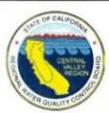

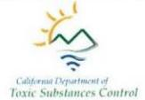

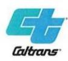

PH1

# [Response-PH1] Responses to Comments from Frank J. Varni

Thank you for your comments.

- PH1-1 Your preference for Alternative 2 has been included in the public record. Alternative 2 has been identified as the preferred alternative because it provides the best balance among avoiding and/or minimizing environmental impacts, project feasibility, right-of-way acquisition, overall cost, and ability to meet the project's purpose and need.
- PH1-2 The project will require the closure of some existing ramps, the modification of some existing ramps, and the construction of some new ramps, which may have an impact on surrounding businesses due to the change in freeway traffic circulation patterns. The changes to existing ramps are necessary to provide acceptable freeway traffic operations and to maintain the local road access to SR 99. The project could affect access to businesses and potentially reduce freeway-related traffic. Measures to reduce impacts are outlined in Section 2.1.4.2 (Relocations and Real Property Acquisition) of the EIR/EA.

Under Alternative 2, the southbound SR 99 off-ramp to Kansas Avenue would remain open, but the northbound SR 99 on- and off-ramps would be closed. Southbound freeway traffic would be affected as the existing southbound SR 99 on-ramp from Kansas Avenue would be changed to a collector-distributor ramp (a type of road that parallels and connects a freeway's or highway's main travel lanes to a frontage road or on-ramp) that would become 5th Street. From 5th Street, traffic continuing onto southbound SR 99 would have to enter at the H Street on-ramp. Businesses in this location may be impacted if motorists choose to use services with more traditional freeway access rather than the new access; however, access to Kansas Ave will be maintained from SR 99.

# [Comment-PH2] Comments from Edmond Morad

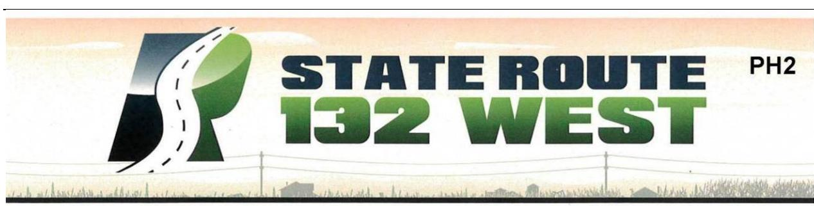

# **Comment Card**

| NAME:                               | EDMOND MORAD                                   |
|-------------------------------------|------------------------------------------------|
| BUS. ADDRESS:                       | 830 KANSAS AVE CITY: MODESTO ZIP: 95351        |
| REPRESENTING:                       | MY SELF                                        |
|                                     | HM ADDRESS: 3208 POPLLON CT, MODESTO CA. 95356 |
| <input checked="" type="checkbox"/> | Please add me to the project mailing list.     |

I would like the following comments filed in the record\* (please print):

| 1) | I WOULD LIKE to SELECT option #2 ROUTE                    |
|----|-----------------------------------------------------------|
|    | BECAUSE THE SOUTH BOUND, EXIT FROM 99 REMAINS AS IS.      |
|    | KANSAS                                                    |
| 2) | I BELIVE OPTION#2 WILL HAVE LESS IMPACT ON THE BUSINESSES |
|    | ON KANSAS.                                                |

\*Place your comments into the Comment Box tonight or mail your comments to the following address:Comments must be received by March 17, 2017Attention: Philip VallejoCalifornia Department of TransportationActing Senior Environmental Planner855 M Street, Suite 200Fresno, CA 93721

| How Did You Hear About This Meeting? | <input type="checkbox"/> newspaper <input checked="" type="checkbox"/> newsletter <input type="checkbox"/> someone told me about it <input type="checkbox"/> other: NOTIFICATION IN MAIL |
|--------------------------------------|------------------------------------------------------------------------------------------------------------------------------------------------------------------------------------------|
|--------------------------------------|------------------------------------------------------------------------------------------------------------------------------------------------------------------------------------------|

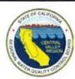

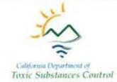

# [Response-PH2] Responses to Comments from Edmond Morad

Thank you for your comments.

- PH2-1 Your preference for Alternative 2 is noted and has been included in the public record. Alternative 2 has been identified as the preferred alternative because it provides the best balance among avoiding and/or minimizing environmental impacts, project feasibility, right-of-way acquisition, overall cost, and ability to meet the project's purpose and need.
- **PH2-2** Please refer to the response to Comment PH2-1.

# [Comment-PH3]

# Comments from Lewis Cimino, M.D.

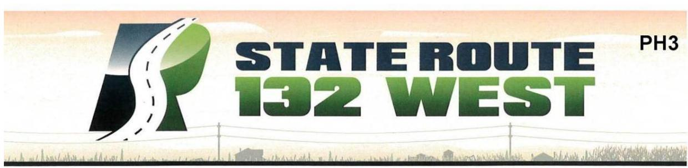

# **Comment Card**

| NAME:         | Lewis Cimino, M.D. |       |         |      |       |
|---------------|--------------------|-------|---------|------|-------|
| ADDRESS:      | 4101 Kansas Ave    | CITY: | Modesto | ZIP: | 95358 |
| REPRESENTING: |                    |       |         |      |       |

 Please add me to the project mailing list.

I would like the following comments filed in the record\* (please print):

There is no need to disrupt

our country roads (kansas, Dakota)

for this project. It should

be a true express way from

99 all the way out to Gates

Road and leave Kansas and

Dakota alone.

| *Place your comments into the Comment Box tonight or mail your comments to the following address:                                                          |  |
|------------------------------------------------------------------------------------------------------------------------------------------------------------|--|
| Comments must be received by March 17, 2017                                                                                                                |  |
| Attention: Philip Vallejo California Department of Transportation Acting Senior Environmental Planner 855 M Street, Suite 200 Fresno, CA 93721 |  |

How Did You Hear About This Meeting?

| <input type="checkbox"/> newspaper | <input checked="" type="checkbox"/> newsletter | <input type="checkbox"/> someone told me about it | <input type="checkbox"/> other: |
|------------------------------------|------------------------------------------------|---------------------------------------------------|---------------------------------|
|------------------------------------|------------------------------------------------|---------------------------------------------------|---------------------------------|

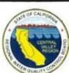

# [Response-PH3] Response to Comment from Lewis Cimino, M.D.

Thank you for your comments.

PH3-1 Please see Master Response #1 (Purpose and Need) and Master Response #3 (Logical Termini).

# [Comment-PH4]

# **Comment from Mary S. Matthews**

# **Comment Card**

| NAME:                                                                                                                                                                                                                                                        | MARY 5 MATTHEWS | ADDRESS:                                     | 819 LOLETTA AVE                                                          | CITY:                                                                                                                                          | MODESTO     | ZIP: | 95351 |
|--------------------------------------------------------------------------------------------------------------------------------------------------------------------------------------------------------------------------------------------------------------|-----------------|----------------------------------------------|--------------------------------------------------------------------------|------------------------------------------------------------------------------------------------------------------------------------------------|-------------|------|-------|
| REPRESENTING:                                                                                                                                                                                                                                                | SELF            | ☐ Please add me to the project mailing list. | I would like the following comments filed in the record* (please print): |                                                                                                                                                |             |      |       |
| WE ALREADY HAVE PROBLEMS WITH THE HOMELESS POPULATION IN OUR ALLEY AND UP ON THE CALTRANS BERM (STOCKPILE 2)                                                                                                                                                 |                 |                                              |                                                                          |                                                                                                                                                |             |      |       |
| ACCORDING TO THE DRAWINGS THERE WILL BE PLENTY OF ROOM BETWEEN THE BOUNDARY FENCE AND THE SOUNDWALL FOR THEM TO INVADE EVEN MORE THAN THEY ALREADY DO. WE HAVE FIRES ALMOST YEARLY CAUSED BY THE HOMELESS, WHAT STEPS WILL BE TAKEN TO PREVENT THIS PROBLEM? |                 |                                              |                                                                          |                                                                                                                                                |             |      |       |
| *Place your comments into the Comment Box tonight or mail your comments to the following address: Comments must be received by March 17, 2017                                                                                                                |                 |                                              |                                                                          | Attention: Philip Vallejo California Department of Transportation Acting Senior Environmental Planner 855 M Street, Suite 200 Fresno, CA 93721 |             |      |       |
| How Did You Hear About This Meeting?                                                                                                                                                                                                                         | ☐ newspaper     | ☐ newsletter                                 | ☐ someone told me about it                                               | ☐ other:                                                                                                                                       | DIRECT MAIL |      |       |

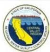

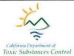

# [Response-PH4] Response to Comment from Mary S. Matthews

Thank you for your comments.

PH4-1 N

Measures to secure Caltrans right-of-way and deter occupation of the right-of-way may include installing chain link and/or steel bar security fencing, steepening slopes adjacent to walls and structures and installing block slopes pavers under bridges. To reduce potential fire hazards, Caltrans, at a minimum, mows the stockpiles annually prior to the 4th of July. Vegetation is an important element of Caltrans Modesto Soil Stockpile maintenance as it helps to prevent erosion, impede/reduce surface water runoff, and minimize dust generation. Maintenance of the stockpiles also includes regular repair of perimeter right-of-way fence breaches to preclude unauthorized access. Fence gates are locked. Although fires may be caused by the homeless, only one fire has been reported to have occurred at the stockpile (2014).

# [Comment-PH5]

# **Comments from Patricia Wilhelm**

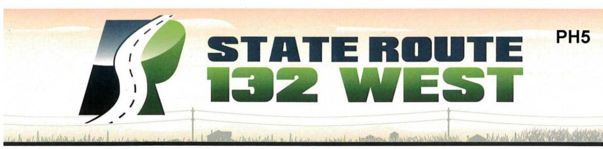

# **Comment Card**

| NAME:                                                                                                                                          | Patricia Wilhelm                                                                                                                                                        |
|------------------------------------------------------------------------------------------------------------------------------------------------|-------------------------------------------------------------------------------------------------------------------------------------------------------------------------|
| ADDRESS:                                                                                                                                       | 1717 Kansas City: Modesto ZIP: 95358                                                                                                                                    |
| REPRESENTING:                                                                                                                                  | myself                                                                                                                                                                  |
| Please add me to the project mailing list.                                                                                                     |                                                                                                                                                                         |
| I would like the following comments filed in the record* (please print):                                                                       |                                                                                                                                                                         |
| - Why does the 132 SR need to end at Dakota                                                                                                    |                                                                                                                                                                         |
| - Makes no sense                                                                                                                               |                                                                                                                                                                         |
| - Why can't the current 132 be widened and improved                                                                                            |                                                                                                                                                                         |
| - that proposal would eliminate the need to upset                                                                                              |                                                                                                                                                                         |
| that Barium site-                                                                                                                              |                                                                                                                                                                         |
|                                                                                                                                                |                                                                                                                                                                         |
|                                                                                                                                                |                                                                                                                                                                         |
| *Place your comments into the Comment Box tonight or mail your comments to the following address:                                              |                                                                                                                                                                         |
| Comments must be received by March 17, 2017                                                                                                    |                                                                                                                                                                         |
| Attention: Philip Vallejo California Department of Transportation Acting Senior Environmental Planner 855 M Street, Suite 200 Fresno, CA 93721 |                                                                                                                                                                         |
| How Did You Hear About This Meeting?                                                                                                           | <input type="checkbox"/> newspaper <input checked="true" type="checkbox"/> newsletter <input type="checkbox"/> someone told me about it <input type="checkbox"/> other: |

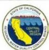

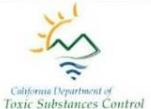

# [Response-PH5] Responses to Comments from Patricia Wilhelm

Thank you for your comments.

- PH5-1 Please see Master Response #3 (Logical Termini).
- PH5-2 Widening the existing SR 132 roadway would still require that the Caltrans Modesto Soil Stockpiles would still need to be addressed. Please see Master Response #6 (Improvements to Existing SR 132 (Maze Boulevard) Alternative 5).

# [Comment-PH6]

# **Comments from Hement Khatri**

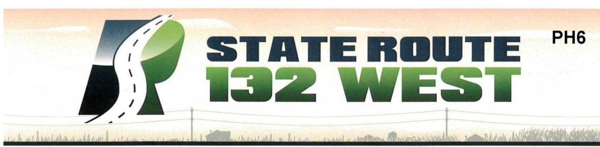

# **Comment Card**

| NAME:                                                                          | HEMENT KHATRI - QUALITY (NN (HOTEL)     |
|--------------------------------------------------------------------------------|-----------------------------------------|
| ADDRESS:                                                                       | 500 KANSAS ANC CITY: MODESTO ZIP: 95351 |
| REPRESENTING:                                                                  | Self                                    |
| <input checked="" type="checkbox"/> Please add me to the project mailing list. |                                         |

I would like the following comments filed in the record\* (please print):

| 1. | ACCORDING TO EIR REPORT, MY PROPERTY IS A "FULL TAKE" WHEREAS ACCORDING TO ENGINEERING / DESIGN, MY PROPERTY IS NOT IMPACTED. NEED CLARIFICATION. |
|----|---------------------------------------------------------------------------------------------------------------------------------------------------|
| 2. | IF THE PROJECT GOES AHEAD AND MY PROPERTY (& BUSINESS) NOT TAKEN THEN I AM CONCERNED ABOUT THE NOISE & EXPOSURE THAT WILL IMPACT MY HOTEL.        |

\*Place your comments into the Comment Box tonight or mail your comments to the following address:

Comments must be received by March 17, 2017

Attention: Philip Vallejo  
California Department of Transportation  
Acting Senior Environmental Planner  
855 M Street, Suite 200  
Fresno, CA 93721

| How Did You Hear About This Meeting? | <input type="checkbox"/> newspaper <input type="checkbox"/> newsletter <input type="checkbox"/> someone told me <input type="checkbox"/> other: |
|--------------------------------------|-------------------------------------------------------------------------------------------------------------------------------------------------|
|--------------------------------------|-------------------------------------------------------------------------------------------------------------------------------------------------|

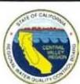

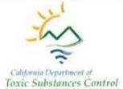

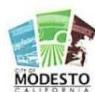

# [Response-PH6] Responses to Comments from Hement Khatri

Thank you for your comments.

# PH6-1

The Proposed Parcel Impact Maps have been revised and can be found in Appendix F of the EIR/EA. The Quality Inn property at 500 Kansas Avenue, Modesto (029-015-026) is located on Maps 3A and 3B of the revised maps. Under Alternative 1 and Alternative 2 (the preferred alternative), the property will remain. A partial acquisition and/or easement of approximately 2,460 square feet may be required to widen the roadway and adjust the curb cut to the property. Access to the restaurant will be maintained during and upon completion of construction. No relocation is required at this time. However, the design is preliminary, and easements or acquisitions will be finalized in the next phase. All required land within the proposed right-of-way will be acquired by the City of Modesto prior to construction. Please refer to Master Response #8 (Property Acquisitions) and Section 2.1.4.2 (Relocations and Real Property Acquisitions) of the EIR/EA for additional information on residential and/or business relocations, the right-of-way acquisition process and measures to reduce potential impacts to affected owners and occupants.

# PH6-2

Please refer to the response to Comment PH6-1. In the Draft EIR/EA, this property was shown as a full acquisition; however, the design has been updated so that it will require only a partial acquisition, and thus an additional noise analysis was conducted to evaluate noise impacts for this property. Please see Master Response #11 (Noise Impacts and Abatement).

An analysis of potential noise impacts resulting from the proposed improvements has been completed to determine what impacts either alternative would have on the hotel, and was included in an addendum to the Noise Study Report. Since the rooms at the Quality Inn have no balconies or patios, frequent human outdoor use was modeled and assessed at the pool area. Predicted existing and future noise levels at the hotel would be 65 A-weighted decibels (dBA) and 67 dBA, respectively. The change in noise levels from existing and future conditions would be 2 dBA, which is not noticeable to the human ear. There is no significant change in noise levels due to the existing high traffic volumes along existing SR 99. In addition, any traffic noise generated from the new SR 132 alignment would be partially shielded by the hotel building. In an effort to further reduce future traffic noise, noise barriers were modeled along the new SR 132 alignment and connector ramp from northbound SR 99 to westbound SR 132. A noise barrier 16 feet tall would not provide a minimum of 5 dB of noise reduction for one impacted receiver due to the existing shielding from the hotel building. Per 23 Code of Federal Regulations 772 and the Caltrans

# Appendix J • Comments and Responses

Noise Protocol, the construction of additional noise barriers to reduce traffic noise levels from Kansas Avenue would not be acoustically feasible due to access requirements, which would require openings in barriers. The noise analysis for this property has been updated and is included in the revised Noise Study Report.

# [Comment-PH7] Comments from Rachel Bradley

# **Comment Card**

| NAME:                                                                                             | Rachel Bradley                                                                                                                                                      |                                                                                                     |
|---------------------------------------------------------------------------------------------------|---------------------------------------------------------------------------------------------------------------------------------------------------------------------|-----------------------------------------------------------------------------------------------------|
| ADDRESS:                                                                                          | 1637 Elm alleity: Modesto ZIP: 95358                                                                                                                                |                                                                                                     |
| REPRESENTING:                                                                                     | Self                                                                                                                                                                |                                                                                                     |
|                                                                                                   | <input checked="" type="checkbox"/> Please add me to the project mailing list.                                                                                      |                                                                                                     |
| I would like the following comments filed in the record* (please print):                          |                                                                                                                                                                     |                                                                                                     |
| Please Revisit your list on the MAP                                                               |                                                                                                                                                                     |                                                                                                     |
| list. Confused on the Partial full decisions                                                      |                                                                                                                                                                     |                                                                                                     |
| We need to know indetail time trame of                                                            |                                                                                                                                                                     |                                                                                                     |
| the starte of Project and how much you                                                            |                                                                                                                                                                     |                                                                                                     |
| will finally take of our land!                                                                    |                                                                                                                                                                     |                                                                                                     |
| Keen us in the Loop                                                                               |                                                                                                                                                                     |                                                                                                     |
| tease                                                                                             |                                                                                                                                                                     |                                                                                                     |
| *Place your comments into the Comment Box tonight or mail your comments to the following address: |                                                                                                                                                                     | Attention: Philip Vallejo                                                                           |
| Comments must be received by March 17, 2017                                                       |                                                                                                                                                                     | California Department of Transportation Acting Senior Environmental Planner 855 M Street, Suite 200 |
|                                                                                                   |                                                                                                                                                                     | Fresno, CA 93721                                                                                    |
| How Did You Hear About This Meeting?                                                              | <input type="checkbox"/> newspaper <input type="checkbox"/> newsletter <input checked="" type="checkbox"/> someone told me about it <input type="checkbox"/> other: |                                                                                                     |

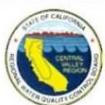

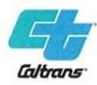

# [Response-PH7] Responses to Comments from Rachel Bradley

Thank you for your comments.

- PH7-1 The Proposed Parcel Impact Maps have been revised and can be found in Appendix F of the EIR/EA. Your property is located on Map 2 of the revised maps. Under Alternative 1 and Alternative 2 (the preferred alternative), the project will partially impact your property. It is anticipated that approximately 34,400 square feet of your property may be required for the proposed roadway design, slope work and fencing. However, the design is preliminary, and easements or acquisitions will be finalized in the next phase. Please see Master Response #8 (Property Acquisitions).
- PH7-2 Phase 1 is anticipated to begin in 2018, be completed within 12 to 15 months, and be open to traffic by 2020. Construction on your property would occur during Phase 2, which is expected to begin in 2026 and be completed by 2028. Please refer to Master Response #8 (Property Acquisitions) for additional information. You will be added to the project mailing list for future communications.

# [Comment-PH8]

# Comments from Alejandra Munõz

# Tarjeta para comentarios

| NOMBRE: Alejandra Muñoz                                                                                                                                                                               |
|-------------------------------------------------------------------------------------------------------------------------------------------------------------------------------------------------------|
| DIRECCIÓN: 500 Kansas Ave CIUDAD: Modesto CÓDIGO POSTAL: 95351                                                                                                                                        |
| ¿A QUIÉN REPRESENTA?: Guayabitos Restaurant (Ramos Diaz Enterprises Inc.)                                                                                                                             |
| <input checked="" type="checkbox"/> Por favor, agregame a la lista de correo del proyecto.                                                                                                            |
| Me gustaría que los siguientes comentarios se archivaran en el expediente * (escriba en letra de imprenta):                                                                                           |
| 1.- Porque no le avisaron a todos negocios Latinos en el 1                                                                                                                                            |
| idioma español? 2.- Porque no avisaron a los residentes de                                                                                                                                            |
| estas propiedades?                                                                                                                                                                                    |
| 3.- Que va a pasar con toda la inversión que hice en esta 3                                                                                                                                           |
| Propiedad para hacer mi negocio?                                                                                                                                                                      |
| 4.- Quien me pagaría mis gastos personales y lo de los 4                                                                                                                                              |
| empleados?                                                                                                                                                                                            |
| 5.- Me van a proveer otro edificio con permisos 5                                                                                                                                                     |
| para operar mi negocio y con cuanto me van a ayudar                                                                                                                                                   |
| para levantar otra vez mi negocio. 6º- Si agarro ayuda legal 6                                                                                                                                        |
| * Coloque sus comentarios en el cuadro de comentarios de Atención: Philip Vallejo (horarios)                                                                                                          |
| esta noche O envíe sus comentarios a la siguiente dirección: California Department of Transportation                                                                                                  |
| Los comentarios deben ser recibidos antes del 17 de marzo de 2017 Acting Senior Environmental Planner 855 M Street, Suite 200                                                                         |
| Fresno, CA 93721                                                                                                                                                                                      |
| ¿Cómo se enteró de <input type="checkbox"/> periódico <input type="checkbox"/> hoja informativa <input checked="" type="checkbox"/> alguien <input checked="" type="checkbox"/> de otra manera: fue a |
| esta reunión? me dijo avisarme Rosa.                                                                                                                                                                  |

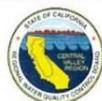

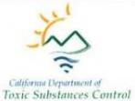

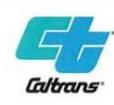

# [Response-PH8] Responses to Comments from Alejandra Munoz

Thank you for your comments.

PH8-1

To announce the Public Hearing, a Public Notice was published by StanCOG in *The* Modesto Bee (English version) and Vida en el Valle (Spanish version) on January 18, 2017. On January 30, 2017, the Public Hearing venue changed from the Red Event Center to Mark Twain Junior High School. An English and Spanish postcard advertising this change was mailed on February 8, 2017 to approximately 2,500 residents, tenants, and business owners within the project area. DTSC also sent out the Modesto Soil Stockpiles factsheet (English and Spanish) to the project mailing list on February 6, 2017. A revised Public Notice with the new location was published by StanCOG in *The Modesto Bee* and *Vida en el Valle* on February 8, 2017. The Public Notice was published one last time in the same newspapers above on February 15, 2017. The Hearing Notice was also published in English and Spanish on the Stanislaus Council of Government's website at http://www.stancog.org/trans-ps.shtm and on the Caltrans District 10 website at http://www.dot.ca.gov/d10/x-project-sr132west.html. Copies of the Draft Final RAP were also available on the DTSC Envirostor Database at http://www.envirostor.dtsc.ca.gov/public/profile\_report.asp?global\_id=60001626 and

For additional information on the public engagement process to date, please see Master Response #5 (Public Participation and Environmental Review Process).

http://www.envirostor.dtsc.ca.gov/public/profile report.asp?global id=50280024.

Para anunciar la Audiencia Pública, StanCOG publicó un Aviso Público en The Modesto Bee (versión en inglés) y Vida en el Valle (versión española) el 18 de enero de 2017. El 30 de enero de 2017, la Audiencia Pública Cambió del Red Event Center a Mark Twain Junior High School. Una tarjeta postal inglesa y española que anunciaba este cambio fue enviada por correo el 8 de febrero de 2017 a aproximadamente 2.500 residentes, inquilinos y dueños de negocios dentro del área del proyecto. El 6 de febrero de 2017, DTSC también envió la hoja informativa de Modesto Soil Stockpiles (inglés y español) a la lista de correo del proyecto. Un aviso público revisado con la nueva ubicación fue publicado por StanCOG en The Modesto Bee y Vida en el Valle el 8 de febrero, 2017. El Aviso Público fue publicado una última vez en los mismos periódicos anteriores el 15 de febrero de 2017. El Aviso de Audiencia también fue publicado en inglés y español en el sitio web del Consejo de Gobierno de Stanislaus en http://www.stancog.org/trans -ps.shtm y en el sitio web del Distrito 10 de Caltrans en http://www.dot.ca.gov/d10/x-project-

sr132west.html. También se pueden obtener copias del borrador del RAP final en la base de datos del DTSC Envirostor en

http://www.envirostor.dtsc.ca.gov/public/profile\_report.asp?global\_id=60001626 y http://www.envirostor.dtsc.ca.gov/public/profile\_report.asp? Global\_id = 50280024.

Para obtener información adicional sobre el proceso de participación pública hasta la fecha, consulte la Respuesta # 5 (Participación Pública y Proceso de Revisión Environmental).

PH8-2 Notices were circulated to the general public in Modesto, as well as the project direct mailing list. To announce the Public Hearing, a Public Notice was published by StanCOG in *The Modesto Bee* (English version) and *Vida en el Valle* (Spanish version) on January 18, 2017. On January 30, 2017, the Public Hearing venue changed from the Red Event Center to Mark Twain Junior High School. The Hearing Notice was also published in English and Spanish on the Stanislaus Council of Government's website at http://www.stancog.org/trans-ps.shtm and on the Caltrans District 10 website at http://www.dot.ca.gov/d10/x-project-sr132west.html. Copies of the Draft Final RAP were also available on the DTSC Envirostor Database at http://www.envirostor.dtsc.ca.gov/public/profile\_report.asp?global\_id=60001626 and

http://www.envirostor.dtsc.ca.gov/public/profile\_report.asp?global\_id=50280024.

Se distribuyeron avisos al público en general en Modesto, así como la lista de correo directo del proyecto. Para anunciar la Audiencia Pública, StanCOG publicó un Aviso Público en The Modesto Bee (versión en español) y Vida en el Valle (versión en español) el 18 de enero de 2017. El 30 de enero de 2017, la audiencia pública cambió de Red Centro de eventos para la escuela secundaria Mark Twain. El Aviso Público fue publicado una última vez en los mismos periódicos anteriores el 15 de febrero de 2017. El Aviso de Audiencia también fue publicado en inglés y español en el sitio web del Consejo de Gobierno de Stanislaus en http://www.stancog.org/trans-ps.shtm y en el sitio web del Distrito 10 de Caltrans en http://www.dot.ca.gov/d10/x-project-sr132west.html. También se pueden obtener copias del borrador del RAP final en la base de datos del DTSC Envirostor en http://www.envirostor.dtsc.ca.gov/public/profile report.asp?global id=60001626 y

http://www.envirostor.dtsc.ca.gov/public/profile\_report.asp?global\_id=60001626 y http://www.envirostor.dtsc.ca.gov/public/profile\_report.asp? Global\_id = 50280024.

PH8-3 The Proposed Parcel Impact Maps have been revised and can be found in Appendix F of the EIR/EA. The property at 500 Kansas Avenue, Modesto (029-015-026) is located on Maps 3A and 3B of the revised maps. Under Alternative 1 and Alternative 2 (the preferred alternative), the front building close to the roadway (the restaurant)

will remain. A partial acquisition and/or easement of approximately 2,460 square feet may be required from the front yard to widen the roadway and adjust the curb cut for access to the property. Access to the restaurant/sandwich shop will be maintained during and upon completion of construction. No relocation is required at this time. Please see Master Response #8 (Property Acquisitions).

Equipo de Desarrollo de Proyectos: Se han revisado los Mapas de Impactos de Parcelas Propuestos y se pueden encontrar en el Apéndice F del EIR / EA. La propiedad en 500 Kansas Ave, Modesto (029-015-026) se encuentra en el Mapa 3A y 3B de los mapas revisados. Bajo la alternativa 1 y la alternativa 2 (la alternativa preferida), el edificio delantero cerca de la carretera (el restaurante) permanecerá. Puede ser necesaria una toma y / o servidumbre parcial de aproximadamente 2.460 pies cuadrados para ensanchar la calzada y ajustar el corte de la acera para acceder a la propiedad. El acceso al restaurante se mantendrá durante y al término de la construcción. No se requiere ninguna reubicación en este momento. Consulte la Respuesta maestra # 8 (Adquisiciones de propiedades).

The buildings at 500 Kansas Avenue will no longer be taken as a part of the project.

Property owners will be justly compensated for the partial loss of property as a result of the project. However, compensation for personal or employee expenses or loss of business as a part of this project will not be provided. Please see Master Response #8 (Property Acquisitions). The roadway and access to your business will remain open during construction. To mitigate temporary, construction-related impacts, a Traffic Management Plan will be developed to outline the procedures for traffic re-routing,

**PH8-4** 

detour plans, construction scheduling, and public notification. These procedures will ensure that clear signage and information about limited mobility and access are provided to the residents, business owners, and patrons.

Los edificios en 500 Kansas Avenue ya no serán tomados como parte del proyecto. Los propietarios serán justamente compensados por la pérdida parcial de la propiedad como resultado del proyecto. Sin embargo, no habrá ninguna compensación por gastos personales o de empleados o pérdida de negocios como parte de este proyecto. Consulte la Respuesta maestra #8 (Adquisiciones de propiedades). La carretera y el acceso a su negocio permanecerán abiertos durante la construcción. Para mitigar los impactos temporales relacionados con la construcción, se desarrollará un Plan de Gestión del Tráfico para delinear los procedimientos para el reencaminamiento del tráfico, los planes de desvío, la programación de la construcción y la notificación pública. Estos procedimientos asegurarán que se proporcionen letreros claros e información sobre la movilidad y el acceso limitados a los residentes, propietarios de negocios y clientes.

PH8-5 The buildings at 500 Kansas Avenue will no longer be taken as a part of the project. There will not be any compensation for expenses associated with building permits or business operations. Please refer to the response to Comment PH8-4.

Los edificios en 500 Kansas Avenue ya no serán tomados como parte del proyecto. No habrá ninguna compensación por los gastos relacionados con los permisos de construcción o las operaciones comerciales. Consulte la respuesta al comentario PH8-4.

PH8-6 The Project Development Team recognizes and appreciates the challenges associated with relocations and the loss of property for the affected residents. The City of Modesto would be responsible for right-of-way acquisition and will acquire all land within the proposed right-of-way prior to construction. All property acquisitions have been carefully considered, and Caltrans will be responsible for assisting with relocations for individuals and businesses that are undergoing a difficult transition, consistent with the requirements of the Uniform Relocation Assistance and Real Property Acquisition Policies Act of 1970. Although Caltrans does not provide compensation for legal fees that may be incurred, the Proposed Parcel Impact Maps have been revised and can be found in Appendix F of the EIR/EA. Under Alternative 1 and Alternative 2 (the preferred alternative), the front building close to the roadway (the restaurant) will remain. No relocation is required at this time.

Equipo de Desarrollo de Proyectos: El Equipo de Desarrollo de Proyectos reconoce y aprecia los retos asociados con las reubicaciones y la pérdida de propiedad de los residentes afectados.La Ciudad de Modesto sería responsable de la adquisición del derecho de paso y adquirirá todas las tierras dentro del derecho de paso propuesto antes de la construcción.

Todas las adquisiciones de propiedad han sido cuidadosamente consideradas y Caltrans será responsable de asistir con las reubicaciones de individuos y negocios que están pasando por una transición difícil, consistente con los requisitos de la Ley de Asistencia de Reubicación y Acquisition de Bienes Raíces de 1970. Aunque Caltrans no provee Compensación por honorarios legales que se pueden incurrir, los Mapas de Impactos de Parcelas Propuestos han sido revisados pueden ser encontrados en el Apéndice F del EIR / EA. Bajo la alternativa 1 y la alternativa 2 (la alternativa preferida), el edificio delantero cerca de la carretera (el restaurante) permanecerá. No se requiere ninguna reubicación en este momento.

# [Comment-PH9] Comments from Ricardo Arrieta

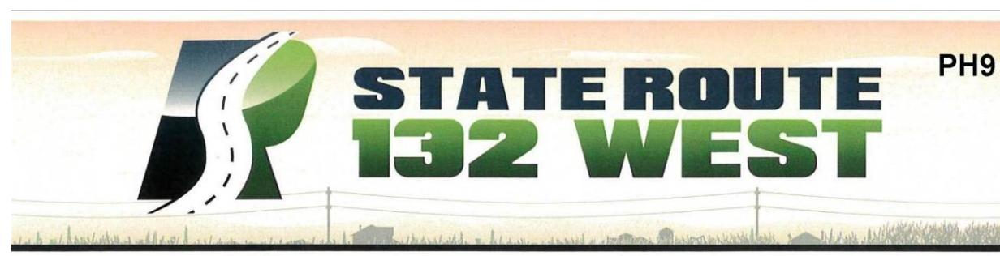

# **Comment Card**

| NAME:         | Ricardo Arnela |
|---------------|----------------|
| ADDRESS:      | 609 Elm Ave    |
| CITY:         | Modesto        |
| ZIP:          | 95351          |
| REPRESENTING: | Myself         |

Please add me to the project mailing list.

| I would like the following comments filed in the record* (please print): | I like the alternative 2 option. I like the Kansas exit. Also the somes wall is more back in my property. Alternative 1 would force me to move to a new House. I would have to sell. |
|--------------------------------------------------------------------------|--------------------------------------------------------------------------------------------------------------------------------------------------------------------------------------|
|--------------------------------------------------------------------------|--------------------------------------------------------------------------------------------------------------------------------------------------------------------------------------|

Comments must be received by March 17, 2017

| *Place your comments into the Comment Box tonight or mail your comments to the following address: | Attention: Philip Vallejo California Department of Transportation Acting Senior Environmental Planner 855 M Street, Suite 200 Fresno, CA 93721 |
|---------------------------------------------------------------------------------------------------|------------------------------------------------------------------------------------------------------------------------------------------------------------|
|---------------------------------------------------------------------------------------------------|------------------------------------------------------------------------------------------------------------------------------------------------------------|

| How Did You Hear About This Meeting? | <input type="checkbox"/> newspaper <input checked="" type="checkbox"/> newsletter <input type="checkbox"/> someone told me about it <input type="checkbox"/> other: |
|--------------------------------------|---------------------------------------------------------------------------------------------------------------------------------------------------------------------|
|--------------------------------------|---------------------------------------------------------------------------------------------------------------------------------------------------------------------|

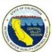

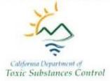

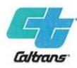

# [Response-PH9] Responses to Comments from Ricardo Arrieta

Thank you for your comments.

- PH9-1 Your preference for Alternative 2 is noted and has been included in the public record. Alternative 2 has been identified as the preferred alternative because it provides the best balance among avoiding and/or minimizing environmental impacts, project feasibility, right-of-way acquisition, overall cost, and ability to meet the project's purpose and need.
- PH9-2 The Proposed Parcel Impact Maps have been revised and can be found in Appendix F of the EIR/EA. The property at 609 Elm Street in Modesto (029-015-023) is located on Map 3A and Map 3B. Under Alternative 1 and Alternative 2 (the preferred alternative), a partial acquisition or easement of approximately 30,764 square feet of your property may be required. Impacts associated with Alternative 1 would be associated with the construction of the roadway and soundwall. Impacts associated with Alternative 2 would be associated with the construction of the roadway, retaining wall, guardrail and soundwall. No relocation is anticipated at this time. All impacted owners will be provided notification of the acquiring agency's intent to acquire an interest in the property, including a written offer letter of just compensation specifically describing those property interests. A right-of-way specialist will be assigned to each property owner to assist them with this process. Please refer to Master Response #8 (Property Acquisitions) and Section 2.1.4.2 (Relocations and Real Property Acquisitions) of the EIR/EA for additional information on residential and/or business relocations, the right-of-way acquisition process and measures to reduce potential impacts to affected owners and occupants.

# [Comment-PH10]

# **Comments from Jean Calkins**

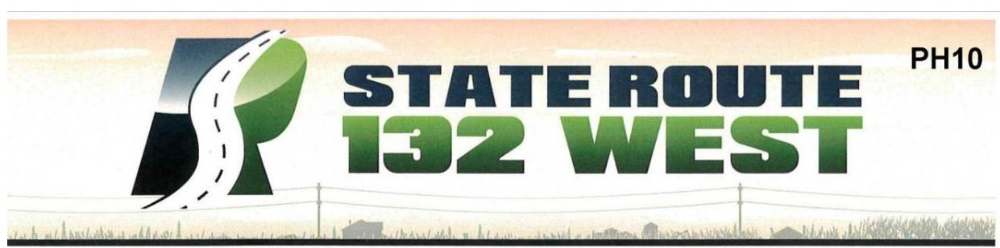

# **Comment Card**

| NAME:                                                                          | Jean Calkins                       |
|--------------------------------------------------------------------------------|------------------------------------|
| ADDRESS:                                                                       | 1317 Ohio CITY: Modesto ZIP: 95358 |
| REPRESENTING:                                                                  | Self                               |
| 
<input type="checkbox"/> Please add me to the project mailing list.
 |                                    |

I would like the following comments filed in the record\* (please print):

Do NOT BUILD THIS PROJECT will onlyTear up a good Neighborhood - Destroy farmlandThat cannot be replaced. Costs of 214 Milliondollars for a 4 mile road which is unneeded,Use our transportation money to repair andimprove our existing roads and bridges.Highway 99 is totally filled up now and thisproject only Mis-aligns 132 even furtheron the west/east side of Modesto.  

| <b>*Place your comments into the Comment Box tonight or mail your comments to the following address:</b> Comments must be received by March 17, 2017 |  | <b>Attention: Philip Vallejo</b> California Department of Transportation Acting Senior Environmental Planner 855 M Street, Suite 200 Fresno, CA 93721 |  |
|---------------------------------------------------------------------------------------------------------------------------------------------------------|--|-------------------------------------------------------------------------------------------------------------------------------------------------------------------|--|
|---------------------------------------------------------------------------------------------------------------------------------------------------------|--|-------------------------------------------------------------------------------------------------------------------------------------------------------------------|--|

How Did You Hear About This Meeting? newspaper  newsletter  someone told me about it  other: \_\_\_\_\_\_

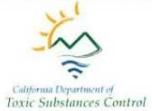

# [Response-PH10] Responses to Comments from Jean Calkins

Thank you for your comments.

# PH10-1

Your preference for the No-Build Alternative is noted and has been included in the public record. Alternative 2 has been identified as the preferred alternative because it provides the best balance among avoiding and/or minimizing environmental impacts, project feasibility, right-of-way acquisition, overall cost, and ability to meet the project's purpose and need.

The project will not bisect an established community and is therefore not expected to result in impacts to community character or cohesion. Established communities are located both to the north of Kansas Road and to the south of Kansas Road, south of the project alignment. Residential displacements would occur for houses located on the periphery of residential areas along SR 99 and would also occur within areas west of SR 99 that are not associated with established neighborhoods. Please see Master Response #9 (Farmland Impacts) and Section 2.1.3 (Farmlands) of the EIR/EA.

Both build alternatives would result in the conversion of prime and unique farmland, which includes encumbered land under Williamson Act contracts. Of the farmland properties impacted, nine have Williamson Act contracts. The conversion of small slivers, or linear strips, of land to transportation use should not affect the Williamson Act contract status of the remainder of the parcel because the amount of acreage remaining on the parcel is substantial enough to avoid cancellation of the contract.

# PH10-2

This project does not include repairs or improvements to other roads or bridges, beyond what is described in the EIR/EA. Funding for this project includes only items described in the Project Description Section 1.3 (Farmlands) of the EIR/EA. However, Caltrans is continuously working statewide to improve the existing infrastructure, which may include other facilities in the area in the future. Please see Master Response #1 (Purpose and Need) for more information.

# PH10-3

As shown in Table 2-26 of the EIR/EA, neither of the build alternatives would increase overall traffic volumes on SR 99, but both Alternative 1 and Alternative 2 (the preferred alternative) would change several locations where traffic can access SR 99. Though the build alternatives would not change the overall peak hour level of service on SR 99, both would reduce the peak period vehicle hours of delay as a result of eliminating and/or reconfiguring some ramps and by providing additional capacity through auxiliary lanes. The reduced vehicle hours of delay under both build alternatives would be beneficial and would not lead to direct or indirect

impacts on SR 99. The project would also include a direct-connector flyover ramp from northbound SR 99 to westbound SR 132. Please refer to Master Response #1 (Purpose and Need) for more information.

# [Comment-PH11] Comments from Ignacio Contreras

# **Comment Card**

| NAME:                                                                                                                                                      | Ignacio Contreras                                                                                                                                                    |       |         |      |       |
|------------------------------------------------------------------------------------------------------------------------------------------------------------|----------------------------------------------------------------------------------------------------------------------------------------------------------------------|-------|---------|------|-------|
| ADDRESS:                                                                                                                                                   | 830 Kansas Ave                                                                                                                                                       | CITY: | Modesto | ZIP: | 95351 |
| REPRESENTING:                                                                                                                                              | My self                                                                                                                                                              |       |         |      |       |
|                                                                                                                                                            | Home 2501 Bridle path 4m                                                                                                                                             |       |         |      |       |
| <input checked="" type="checkbox"/>                                                                                                                        | Please add me to the project mailing list.                                                                                                                           |       |         |      |       |
| I would like the following comments filed in the record* (please print):                                                                                   |                                                                                                                                                                      |       |         |      |       |
| 1)                                                                                                                                                         | I would like to select option #2 Route                                                                                                                               |       |         |      |       |
|                                                                                                                                                            | Because The South Bound Kansas Ext from 99                                                                                                                           |       |         |      |       |
|                                                                                                                                                            | Remain as is.                                                                                                                                                        |       |         |      |       |
| 2)                                                                                                                                                         | I Belive option #2 will Have Less impact on The                                                                                                                      |       |         |      |       |
|                                                                                                                                                            | BUSINESS ON Kansas                                                                                                                                                   |       |         |      |       |
| *Place your comments into the Comment Box tonight or mail your comments to the following address:                                                          |                                                                                                                                                                      |       |         |      |       |
| Comments must be received by March 17, 2017                                                                                                                |                                                                                                                                                                      |       |         |      |       |
| Attention: Philip Vallejo California Department of Transportation Acting Senior Environmental Planner 855 M Street, Suite 200 Fresno, CA 93721 |                                                                                                                                                                      |       |         |      |       |
| How Did You Hear About This Meeting?                                                                                                                       | <input type="checkbox"/> newspaper <input type="checkbox"/> newsletter <input type="checkbox"/> someone told me about it <input type="checkbox"/> other: ___________ |       |         |      |       |

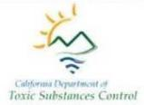

# [Response-PH11] Responses to Comments from Ignacio Contreras

Thank you for your comments.

- PH11-1 Your preference for Alternative 2 is noted and has been included in the public record. Alternative 2 has been identified as the preferred alternative because it provides the best balance among avoiding and/or minimizing environmental impacts, project feasibility, right-of-way acquisition, overall cost, and ability to meet the project's purpose and need.
- **PH11-2** Please see response to Comment PH11-1.

# [Comment-PH12]

# **Comments from Lou Varni**

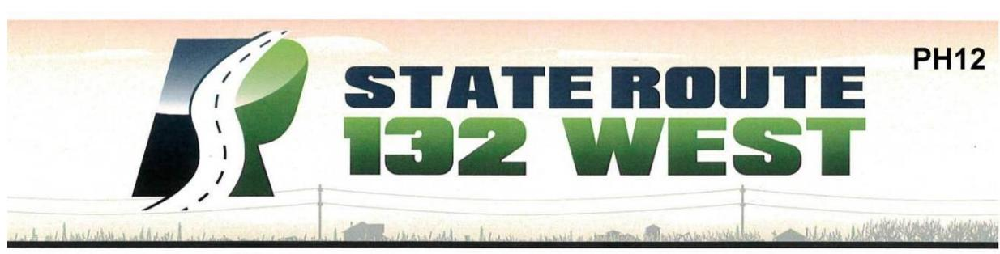

# **Comment Card**

| NAME:         | Lou Varni (209) 492-9355 |                               |         |      |       |
|---------------|--------------------------|-------------------------------|---------|------|-------|
| ADDRESS:      | 615 kansas ave           | CITY:                         | Modesto | ZIP: | 95350 |
| REPRESENTING: | LVF Enterprises          | LVFonterprises@ SBCglobal.net |         |      |       |

Please add me to the project mailing list.

I would like the following comments filed in the record\* (please print):I prefer option #2, kansas ave must have at least one direct egress/ingress to Highway 99. Without a direct link to Hwy 99 the commercial corridor along kansas ave will die. Many, many small business will close and hundreds of people will lose their jobs. The area will become a blighted area. An example of this in North 9th street along Briggman ave - that is what will happen to this kansas ave Business corridor - This should be a gateway to Modesto not a desert today and tomorrow.

| *Place your comments into the Comment Box tonight or mail your comments to the following address: | Attention: Philip Vallejo California Department of Transportation Acting Senior Environmental Planner 855 M Street, Suite 200 Fresno, CA 93721 |
|---------------------------------------------------------------------------------------------------|------------------------------------------------------------------------------------------------------------------------------------------------|
| Comments must be received by March 17, 2017                                                       |                                                                                                                                                |

How Did You Hear About This Meeting?

| <input type="checkbox"/> newspaper | <input type="checkbox"/> newsletter | <input type="checkbox"/> someone told me about it | <input type="checkbox"/> other: |
|------------------------------------|-------------------------------------|---------------------------------------------------|---------------------------------|
|------------------------------------|-------------------------------------|---------------------------------------------------|---------------------------------|

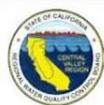

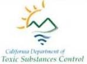

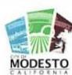

# [Response-PH12] Responses to Comments from Lou Varni

Thank you for your comments.

PH12-1 Your preference for Alternative 2 is noted and has been included in the public record. Alternative 2 has been identified as the preferred alternative because it provides the best balance among avoiding and/or minimizing environmental impacts, project feasibility, right-of-way acquisition, overall cost, and ability to meet the project's purpose and need.

# [Comment-PH13]

# **Comments from Vijay Solanki**

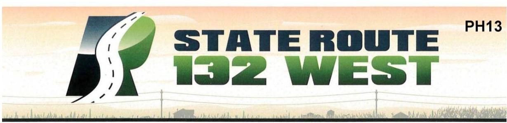

# **Comment Card**

| NAME:                                                                                                                                                      | VIJAY Solanter                                                                                                                                           |
|------------------------------------------------------------------------------------------------------------------------------------------------------------|----------------------------------------------------------------------------------------------------------------------------------------------------------|
| ADDRESS:                                                                                                                                                   | 722 Kansas the                                                                                                                                           |
| CITY:                                                                                                                                                      | Modeste CP                                                                                                                                               |
| ZIP:                                                                                                                                                       | 95351                                                                                                                                                    |
| REPRESENTING:                                                                                                                                              | Self-                                                                                                                                                    |
| ☑ Please add me to the project mailing list.                                                                                                               |                                                                                                                                                          |
| I would like the following comments filed in the record* (please print):                                                                                   |                                                                                                                                                          |
| Last Time when the Cty of modes to close the Koad, our                                                                                                     |                                                                                                                                                          |
| Business Loop 90% for 3 to 4 month. We are small                                                                                                           |                                                                                                                                                          |
| Business, We had to lay off. All He Staff.                                                                                                                 |                                                                                                                                                          |
| O closer of the Huy is NOT Acceptable to use if you                                                                                                        |                                                                                                                                                          |
| are closeing the tightay we want to be fally                                                                                                               |                                                                                                                                                          |
| Compensated. if this project move forward. The other                                                                                                       |                                                                                                                                                          |
| thing A Property on the Huy CREATE A lot of Business                                                                                                       |                                                                                                                                                          |
| During Season, this is How we Survive Through Slow Seaen                                                                                                   |                                                                                                                                                          |
| We will need to be well compensated Durring and after                                                                                                      |                                                                                                                                                          |
| the project is completed.                                                                                                                                  |                                                                                                                                                          |
| *Place your comments into the Comment Box tonight or mail your comments to the following address:                                                          |                                                                                                                                                          |
| Comments must be received by March 17, 2017                                                                                                                |                                                                                                                                                          |
| Attention: Philip Vallejo California Department of Transportation Acting Senior Environmental Planner 855 M Street, Suite 200 Fresno, CA 93721 |                                                                                                                                                          |
| How Did You Hear About This Meeting?                                                                                                                       | <input type="checkbox"/> newspaper <input type="checkbox"/> newsletter <input type="checkbox"/> someone told me about it <input type="checkbox"/> other: |

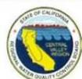

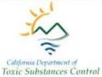

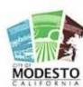

# [Response-PH13] Responses to Comments from Vijay Solanki

Thank you for your comments.

# PH13-1

The Proposed Parcel Impact Maps have been revised and can be found in Appendix F of the EIR/EA. Your property at 722 Kansas Avenue in Modesto (029-015-021) is located on Map 3A and Map 3B. Under Alternative 1 and Alternative 2 (the preferred alternative), a partial acquisition or easement of approximately 2,550 square feet of your property may be required. The driveway would be realigned under Alternative 1 and would remain in the same location under Alternative 2. Please refer to the Master Response #8 (Property Acquisitions) and Section 2.1.4.2 (Relocations and Real Property Acquisition) of the EIR/EA for additional information on residential and/or business relocations, the right-of-way acquisition process and measures to reduce potential impacts to affected owners and occupants.

As discussed in the EIR/EA, implementation of either build alternative would improve east-west travel within the study area, which would enhance regional and interregional circulation and highway operations. These improvements would benefit local and regional commerce by providing faster and more efficient transportation of goods and services throughout the region. However, short-term economic and business impacts would occur from business displacements, potential loss of tax revenue, and changes to business access.

The roadway and access to your business will remain open during construction. Please refer to the best management practices outlined in Section 2.1.6 (Traffic and Transportation/Pedestrian and Bicycle Facilities) of the EIR/EA for a list of measures that will minimize traffic access disturbance to your property. These procedures will ensure that clear signage and information about limited mobility and access are provided to the residents, business owners, and patrons.

# **PH13-2** Please refer to the response to Comment PH13-1.

# [Comment-PH14]

# **Comment from Hector Cortes**

# **Comment Card**

| NAME:                                                                                             | Hector Cortes  |              |                                                                                                                                                |          |       |
|---------------------------------------------------------------------------------------------------|----------------|--------------|------------------------------------------------------------------------------------------------------------------------------------------------|----------|-------|
| ADDRESS:                                                                                          | 737 Loletta AV | CITY:        | Midesto                                                                                                                                        | ZIP:     | 9535/ |
| REPRESENTING:                                                                                     |                |              |                                                                                                                                                |          |       |
| ☐ Please add me to the project mailing list.                                                      |                |              |                                                                                                                                                |          |       |
| I would like the following comments filed in the record* (please print):                          |                |              |                                                                                                                                                |          |       |
| We have not been told whether or not our property                                                 |                |              |                                                                                                                                                |          |       |
| is a partial or full take. We were told it is a                                                   |                |              |                                                                                                                                                |          |       |
| partial but not what (how much) portion of property                                               |                |              |                                                                                                                                                |          |       |
| Hector Cortes                                                                                     |                |              |                                                                                                                                                |          |       |
| 737 Loletta AV.                                                                                   |                |              |                                                                                                                                                |          |       |
|                                                                                                   |                |              |                                                                                                                                                |          |       |
| *Place your comments into the Comment Box tonight or mail your comments to the following address: |                |              | Attention: Philip Vallejo California Department of Transportation Acting Senior Environmental Planner 855 M Street, Suite 200 Fresno, CA 93721 |          |       |
| Comments must be received by March 17, 2017                                                       |                |              |                                                                                                                                                |          |       |
| How Did You Hear About This Meeting?                                                              | ☐ newspaper    | ☒ newsletter | ☐ someone told me about it                                                                                                                     | ☐ other: |       |

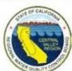

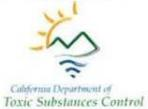

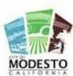

# [Response-PH14] Response to Comment from Hector Cortes

Thank you for your comments.

# PH14-1

The Proposed Parcel Impact Maps have been revised and can be found in Appendix F of the EIR/EA. The property at 737 Loletta Avenue in Modesto (029-017-017) is located on Map 3A and Map 3B. Property at 737 Loletta Avenue will not be physically impacted by the project, and there is no plan for right-of-way to be acquired. However, the design is preliminary, and easements or acquisitions will be finalized in the final design phase. All impacted owners will be provided notification of the acquiring agency's intent to acquire an interest in the property, including a written offer letter of just compensation specifically describing those property interests. Please see Master Response #8 (Property Acquisitions) and Section 2.1.4.2 (Relocations and Real Property Acquisition) of the EIR/EA for additional information on residential and/or business relocations, the right-of-way acquisition process and measures to reduce potential impacts to affected owners and occupants.

# [Comment-PH15] Comments from Don Calkins

# **Comment Card**

| NAME:                                                                                             | DON COLKING   |            |                                                                                                                                                            |        |       |
|---------------------------------------------------------------------------------------------------|---------------|------------|------------------------------------------------------------------------------------------------------------------------------------------------------------|--------|-------|
| ADDRESS:                                                                                          | 1317 OHIO Ave | CITY:      | MODESTO                                                                                                                                                    | ZIP:   | 95368 |
| REPRESENTING:                                                                                     |               |            |                                                                                                                                                            |        |       |
| Please add me to the project mailing list.                                                        |               |            |                                                                                                                                                            |        |       |
| I would like the following comments filed in the record* (please print):                          |               |            |                                                                                                                                                            |        |       |
| I favor the No build option for a lot                                                             |               |            |                                                                                                                                                            |        |       |
| of reasons.                                                                                       |               |            |                                                                                                                                                            |        |       |
| 1. Alternate #1 and #2 will not solve                                                             |               |            |                                                                                                                                                            |        |       |
| problems of too much traffic that                                                                 |               |            |                                                                                                                                                            |        |       |
| will end up in Modesto and 99. The                                                                |               |            |                                                                                                                                                            |        |       |
| atmost pass seems to be also a bottle neck.                                                       |               |            |                                                                                                                                                            |        |       |
| 2. Cost \$ 8 (my money)                                                                           |               |            |                                                                                                                                                            |        |       |
| 3. I use part of 132 almost daily and it                                                          |               |            |                                                                                                                                                            |        |       |
| works fine for me                                                                                 |               |            |                                                                                                                                                            |        |       |
| 4. Loss of Farm land                                                                              |               |            |                                                                                                                                                            |        |       |
| *Place your comments into the Comment Box tonight or mail your comments to the following address: |               |            | Attention: Philip Vallejo California Department of Transportation Acting Senior Environmental Planner 855 M Street, Suite 200 Fresno, CA 93721 |        |       |
| Comments must be received by March 17, 2017                                                       |               |            |                                                                                                                                                            |        |       |
| How Did You Hear About This Meeting?                                                              | newspaper     | newsletter | someone told me about it                                                                                                                                   | other: |       |

# [Response-PH15] Responses to Comments from Don Calkins

Thank you for your comments.

PH15-1 Your preference for the No-Build Alternative is noted and has been included in the public record. Alternative 2 has been identified as the preferred alternative because it provides the best balance between minimizing environmental impacts, right-of-way acquisition, and cost, while meeting the project's purpose and need. Future traffic projections indicate a need for these improvements. Please see Master Response #1 (Purpose and Need) for more information.

Altamont Pass along I-580 is approximately 40 miles west of the project limits and was not studied as a part of this project. The new SR 132 roadway from North Dakota Avenue to SR 99 will be an access-controlled freeway/expressway with no driveway access, which would prevent traffic bottlenecks.

- PH15-2 This project is of major regional importance and is part of an extensive plan to improve the efficient and safe movement of commercial and residential traffic within the county, region, and state, for the benefit of the traveling public. Under the No-Build Alternative, traffic conditions are expected to deteriorate to unacceptable levels of service (LOS) by 2028 and 2048. Please see Master Response #1 (Purpose and Need) and Master Response #4 (Project Funding).
- PH15-3 Future traffic on SR 132 (Maze Boulevard) will increase, requiring a need for improvements. Please see Master Response #1 (Purpose and Need).
- PH15-4 Please see Master Response #9 (Farmland Impacts).

# [Comment-PH16] Comment from Bert Tabrizi

# **Comment Card**

| NAME:                                                                                                                                                      | BENT TABRIZI                                                                                                                                                                                                                                                 |                                     |                                            |                          |                          |                          |                          |                          |        |
|------------------------------------------------------------------------------------------------------------------------------------------------------------|--------------------------------------------------------------------------------------------------------------------------------------------------------------------------------------------------------------------------------------------------------------|-------------------------------------|--------------------------------------------|--------------------------|--------------------------|--------------------------|--------------------------|--------------------------|--------|
| ADDRESS:                                                                                                                                                   | 1312 Mathenry AVECITY: MODESTO ZIP: CA. 91350                                                                                                                                                                                                                |                                     |                                            |                          |                          |                          |                          |                          |        |
| REPRESENTING:                                                                                                                                              |                                                                                                                                                                                                                                                              |                                     |                                            |                          |                          |                          |                          |                          |        |
| <table><tr><td><input checked="" type="checkbox"/></td><td>Please add me to the project mailing list.</td></tr></table>                                    |                                                                                                                                                                                                                                                              | <input checked="" type="checkbox"/> | Please add me to the project mailing list. |                          |                          |                          |                          |                          |        |
| <input checked="" type="checkbox"/>                                                                                                                        | Please add me to the project mailing list.                                                                                                                                                                                                                   |                                     |                                            |                          |                          |                          |                          |                          |        |
| I would like the following comments filed in the record* (please print):                                                                                   |                                                                                                                                                                                                                                                              |                                     |                                            |                          |                          |                          |                          |                          |        |
| WHAT'S THE IMPACT OF THE PROJECT ON SODKANSAS AVE AFTER FURTHER STUDY.                                                                                     |                                                                                                                                                                                                                                                              |                                     |                                            |                          |                          |                          |                          |                          |        |
|                                                                                                                                                            |                                                                                                                                                                                                                                                              |                                     |                                            |                          |                          |                          |                          |                          |        |
|                                                                                                                                                            |                                                                                                                                                                                                                                                              |                                     |                                            |                          |                          |                          |                          |                          |        |
|                                                                                                                                                            |                                                                                                                                                                                                                                                              |                                     |                                            |                          |                          |                          |                          |                          |        |
| *Place your comments into the Comment Box tonight or mail your comments to the following address:                                                          |                                                                                                                                                                                                                                                              |                                     |                                            |                          |                          |                          |                          |                          |        |
| Comments must be received by March 17, 2017                                                                                                                |                                                                                                                                                                                                                                                              |                                     |                                            |                          |                          |                          |                          |                          |        |
| Attention: Philip Vallejo California Department of Transportation Acting Senior Environmental Planner 855 M Street, Suite 200 Fresno, CA 93721 |                                                                                                                                                                                                                                                              |                                     |                                            |                          |                          |                          |                          |                          |        |
| How Did You Hear About This Meeting?                                                                                                                       | <table><tr><td><input checked="" type="checkbox"/></td><td>newspaper</td><td><input type="checkbox"/></td><td>newsletter</td><td><input type="checkbox"/></td><td>someone told me about it</td><td><input type="checkbox"/></td><td>other:</td></tr></table> | <input checked="" type="checkbox"/> | newspaper                                  | <input type="checkbox"/> | newsletter               | <input type="checkbox"/> | someone told me about it | <input type="checkbox"/> | other: |
| <input checked="" type="checkbox"/>                                                                                                                        | newspaper                                                                                                                                                                                                                                                    | <input type="checkbox"/>            | newsletter                                 | <input type="checkbox"/> | someone told me about it | <input type="checkbox"/> | other:                   |                          |        |

# [Response-PH16] Response to Comment from Bert Tabrizi

Thank you for your comments.

# PH16-1

The Proposed Parcel Impact Maps have been revised and can be found in Appendix F of the EIR/EA. The property at 500 Kansas Avenue, Modesto (029-015-026) is located on Maps 3A and 3B of the revised maps. Under Alternative 1 and Alternative 2 (the preferred alternative), the front building close to the roadway (the restaurant) will remain. A partial acquisition and/or easement of approximately 2,460 square feet may be required from the front yard to widen the roadway and adjust the curb cut for access to the property. Access to the restaurant/sandwich shop will be maintained during and upon completion of construction. No relocation is required at this time. Please see Master Response #8 (Property Acquisitions).

# [Comment-PH17]

# **Comments from Dennis Sevilla**

# **Comment Card**

| NAME:                                                                               | DENNIS SEVILLA                                                                                                                          |
|-------------------------------------------------------------------------------------|-----------------------------------------------------------------------------------------------------------------------------------------|
| ADDRESS:                                                                            | 704 RACHELE DR. CITY: MODESTO ZIP: 95351                                                                                                |
| REPRESENTING:                                                                       | SEVILLA FAMILY                                                                                                                          |
| <input type="checkbox"/> Please add me to the project mailing list.                 |                                                                                                                                         |
| I would like the following comments filed in the record* (please print):            |                                                                                                                                         |
| WE ARE OPPOSED TO THE PROPOSED EXTENSION IN THE MIDST OF THE POPULATED              |                                                                                                                                         |
| AREA, AND EVEN CONSIDER YOUR ORIGINAL PLAN FROM SEVERAL DECADES AGO AS              |                                                                                                                                         |
| OUTDATED FOR WHAT MODESTO HAS GROWN INTO. FROM OUR PERSPECTIVE, CARPENTER AVE.      |                                                                                                                                         |
| HAS BECOME MORE TRAVELED, AND MORE CONGESTED THAN HWY 132, AND SHOULD BE            |                                                                                                                                         |
| ATTENDED TO, INSTEAD. RATHER THAN SOLVING THE POLLUTED SOIL PROBLEM BY              |                                                                                                                                         |
| ENCASEMENT, TRANSPORT THE SOIL TO THE UNPOPULATED VACANT PROPERTY AREA ALONG        |                                                                                                                                         |
| THE TOULENNE RIVER (OFF ROBERTSON RD) TO RAISE THE LEVEES TO PREVENT FUTURE         |                                                                                                                                         |
| FLOODING, AND DEED THE PROPOSED HWY PROPERTIES TO MODESTO CITY FOR MIXED            |                                                                                                                                         |
| HOUSING & BUILDING DEVELOPMENT. THIS IS MORE NEEDED THAN THE 132 4                  |                                                                                                                                         |
| EXTENSION!                                                                          |                                                                                                                                         |
| *Place your comments into the Comment Box tonight Attention: Philip Vallejo         |                                                                                                                                         |
| or mail your comments to the following address:                                     |                                                                                                                                         |
| Comments must be received by March 17, 2017 California Department of Transportation |                                                                                                                                         |
| Acting Senior Environmental Planner                                                 |                                                                                                                                         |
| 855 M Street, Suite 200                                                             |                                                                                                                                         |
| Fresno, CA 93721                                                                    |                                                                                                                                         |
| How Did You Hear                                                                    | <input type="checkbox"/> newspaper <input type="checkbox"/> newsletter <input type="checkbox"/> someone <input type="checkbox"/> other: |
| About This Meeting?                                                                 | told me                                                                                                                                 |
|                                                                                     | about it                                                                                                                                |

# [Response-PH17] Responses to Comments from Dennis Sevilla

Thank you for your comments. The Lead Agency has prepared responses to the comments received, with coordination and review by the SR 132 West Project Development Team, and DTSC has responded to each DTSC-applicable comment. Specifically, DTSC has responded directly to comments pertaining to the Caltrans Modesto Soil Stockpiles, when appropriate.

PH17-1 Your preference for the No-Build Alternative is noted and has been included in the public record. When the relocation of SR 132 west of SR 99 was planned in the 1950s, the proposed alignment relocated SR 132 traffic onto SR 99 between Kansas Avenue and L Street for continuity. Since that time, SR 99 has grown into a major north-south corridor that is heavily relied upon for regional and interregional travel. Capacity on SR 99 in the corridor is constrained due to the built-out condition of the area. Currently, SR 99 includes six lanes through the project limits, but is ultimately projected to require up to 12 lanes. However, at this time, it is anticipated that future projects would only add two additional lanes.

When Caltrans began planning for the relocation of SR 132 to the proposed alignment, SR 99 was the planned end with a 1950s-era trumpet (Type F-5) interchange connection. Caltrans and Federal Highway Administration (FHWA) design standards have changed such that the original connection is now substandard in design as well as interchange spacing. Please see Master Response #1 (Purpose and Need).

PH17-2 Please see Master Response #1 (Purpose and Need). Motorists traveling westbound on SR 132 from SR 99 will follow the new SR 132 and will not be able to exit onto North Carpenter Road, which will indirectly prevent additional traffic on North Carpenter Road as a result of the project.

# **PH17-3 (DTSC)**

The comment is acknowledged and will be part of the public record. There was no specific alternative in the Draft Final RAP that evaluated removing the stockpiles and using the soil for the construction or raising of levees. The use of the stockpile soil for construction or raising of levees may not be feasible due to the presence of contaminants in the stockpiles and related regulatory requirements for managing contaminated soil off site. Draft Final RAP Alternative 4, Containment, which is the recommended alternative in the Draft Final RAP contains the stockpiles behind retaining walls, bridge abutments, and beneath the roadway pavement of the SR 132 West Project. Unpaved portions will have clean fill cover. Use of stockpile soil in

# Appendix J • Comments and Responses

levees would not achieve the same level of protection that Draft Final RAP Alternative 4, Containment provides.

DTSC sincerely appreciates the commenter's thoughtful questions and suggestions as well as their participation in this process.

- **(CT)** Caltrans concurs with the DTSC response above and incorporates it as its own response.
- PH17-4 Your preference for the No-Build Alternative is noted. Please see Master Response #1 (Purpose and Need).

# [Comment-PH18]

# **Comments from Maureen Dick**

# **Comment Card**

| NAME:                                                                    | MAUREEN DICK                               |       |            |      |       |
|--------------------------------------------------------------------------|--------------------------------------------|-------|------------|------|-------|
| ADDRESS:                                                                 | 1671 ELM AVE                               | CITY: | MODESTO CA | ZIP: | 95358 |
| REPRESENTING:                                                            | MYSELF                                     |       |            |      |       |
| <input type="checkbox"/>                                                 | Please add me to the project mailing list. |       |            |      |       |
| I would like the following comments filed in the record* (please print): | SEE ATTACHED. PAGES                        |       |            |      |       |

| *Place your comments into the Comment Box tonight or mail your comments to the following address: |
|---------------------------------------------------------------------------------------------------|
| Comments must be received by March 17, 2017                                                       |
| Attention: Philip Vallejo                                                                         |
| California Department of Transportation                                                           |
| Acting Senior Environmental Planner                                                               |
| 855 M Street, Suite 200                                                                           |
| Fresno, CA 93721                                                                                  |

| How Did You Hear About This Meeting? | <input type="checkbox"/> newspaper | <input type="checkbox"/> newsletter | <input type="checkbox"/> someone told me about it | <input type="checkbox"/> other: |
|--------------------------------------|------------------------------------|-------------------------------------|---------------------------------------------------|---------------------------------|
|--------------------------------------|------------------------------------|-------------------------------------|---------------------------------------------------|---------------------------------|

# MARCH 1, 2017

3

5

6

7

Let's use common sense and not government/Caltrans sense on the proposed 132 West Expressway.

Expressway – a highway especially planned for high speed traffic, usually having few if any intersections, limited points of access or exit, and a divider between lanes for traffic moving in opposite directions. Also called a **limited access highway**.

- Don't build the expressway unless you can do it right. If it's a 4-way expressway then construct it as a 4-way expressway. Don't start it off as a 2-way and then put us through more construction when funding is available for the other 2 lanes.
- "A highway especially planned for high speed traffic" the proposed expressway has two ninety degree turns; Maze to Dakota and Dakota to the Expressway. That does not fit the term expressway.
- "And access from private driveways along North Dakota Avenue to Maze Boulevard" pg 17 of proposed draft. The right of way impact map 1 of 3 shows at least 10 driveways that will access the proposed route. Again this does not fit the term expressway.
- Rumor has it that there might not be enough funding for the proposed expressway to be\nelevated or goes underground at the main intersections and therefore will result in 4-way stops
  at Rosemore, Carpenter, and Emerald.

# Why are you trying to build something that already exists?

And the toxic stockpiles that you say are safe. Who are you kidding? I don't care how the soil test results came out. There will never be enough soil samples taken to my liking to truly show the amount of toxic sludge waste in those stockpiles. (See attached "FMC Corporation-Modesto, CA.) Where did all those chemicals, heavy metals and who knows what else go? Did they dissipate or evaporate? Did they turn into gases which have not been disturbed and are just waiting for construction to activate them? With all the precautions that have been taken over the years in order to retrieve soil and water samples and all the precautions to have removed and transported soil from Stockpile #3 when the Highway 99 off ramp was being redone shows that you know it too. That soil should have never been removed until the environment reports were complete. Caltrans snuck that one over on us. Which makes me wonder what else has been snuck over on us; oh yeah, the stockpiles are not toxic.

Like I said in the beginning, let's use common sense and not government/Caltrans sense. Not to the mention the wealthy influence on the existing 132/Maze Boulevard.

Maureen Dick

# FMC CORPORATION - MODESTO, CA

Department of Toxic Substances Control August 2006

"Soil contaminated with barium, arsenic, and polynuclear aromatic hydrocarbons and soil containing petroleum hydrocarbons."

Barium – Soluble barium components are poisonous. Affects nervous system causing cardiac irregularities, tremors, weakness, anxiety, dyspnea (shortness of breath) and paralysis. – Wikipedia

Barium – Personal Protection: Splash goggles, lab coat, dust respirator, approved/certified respirator, gloves, and boots. Suggested protective clothing might not be sufficient; consult a specialist BEFORE handling this product. – Material Safety Data Sheet (MSDS)

Arsenic – Arsenic and many of its compounds are especially potent poisons. – Wikipedia

Arsenic - Personal Protection: Safety glasses. Lab coat. Dust respirator. Be sure to use an approved/certified respirator or equivalent. Gloves. - MSDS

3. Polynuclear aromatic hydrocarbons – Highly carcinogenic. High prenatal exposure to PAH is associated with lower IQ and childhood asthma. PAH pollution during pregnancy – low birth rate, premature delivery, and heart malformations. Cord blood of exposed babies shows DNA damage linked to cancer. Increased behaviorial problems at ages six and eight. – Wikipedia

Polynuclear aromatic hydrocarbons – This product contains polynuclear aromatic hydrocarbons some of which have produced cancer in laboratory animals and humans. Vapor can produce eye, skin, and respiratory tract irritation. This material is a flammable material.

Inhalation – Harmful if inhaled. Over exposure to vapors and mists can cause respiratory and nasal irritation, anesthetic effects, dizziness, possible unconsciousness and asphyxiation, stupor, weakness fatigue, nausea, and

headache. Long term overexposure may cause damage to the brain, liver, kidneys or central nervous system.

**Ingestion** – Gastrointestinal irritation, nausea, vomiting, diarrhea, death, aspiration into the lungs which can be fatal.

**Skin contact-** Discoloration, moderate irritation, drying of skin, defattening and possible dermatitis. Dermal exposure plus sunlight could cause a phototoxic reaction that resembles sunburn **Eye contact-** May cause severe irritation, redness, tearing or blurred vision. - MSDS

4. Petroleum Hydrocarbons – Also know as Total Petroleum Hydrocarbons – Some of the TPH compounds can affect your central nervous system. One compound can cause headaches and dizziness at high levels in the air. Another compound can cause a nerve disorder called "peripheral neuropathy" consisting of numbness in the feet and legs. Other TPH compounds can cause effects on the blood, immune system, lungs, skin, and eyes. – Agency for Toxic Substances and Disease Registry

# SUBMITTED IN 2013

# My concerns:

| 1. The health and welfare of my family, my friends, my community, and myself.                                                                                                                                                                                                                                                                                                                                                                                                                                                      | 9  |
|------------------------------------------------------------------------------------------------------------------------------------------------------------------------------------------------------------------------------------------------------------------------------------------------------------------------------------------------------------------------------------------------------------------------------------------------------------------------------------------------------------------------------------|----|
| 2. For Stanislaus County to grow and prosper and all factors of "Water, Wealth, Contentment, Health" are considered in every decision.                                                                                                                                                                                                                                                                                                                                                                                             | 10 |
| 3. My "Vision" is to not have the SR132W Expressway go in my backyard or my neighbor's backyards. My "Vision" is not to have any further air pollution, noise pollution and ground contamination in my neighborhood that isn't necessary.                                                                                                                                                                                                                                                                                          | 11 |
| 4. I wish CalTrans had not disturbed the FMC/Caltrans Stockpile that was removed and transported during the closure of the Kansas Avenue off ramp project. These stockpiles are part of the SR132W Expressway project and the while the stockpiles were being tested at the SR132W project site, the stockpile in the Kansas Avenue off ramp project was being hauled away. Moved and disturbed, without any of the tests results released. Just because these were two different projects, the same criteria should have applied. | 12 |
| 5. And therefore I want all elected officials, government officials, county officials and the public to know all aspects of all future projects and to work together, not independently, for everyone's "Water, Wealth, Contentment, Health".                                                                                                                                                                                                                                                                                      | 13 |

Maureen Dick 1671 Elm Ave Modesto, CA 95358 (209) 526-3174 tommoedick@sbcglobal.net

# [Response-PH18] Responses to Comments from Maureen Dick

Thank you for your comments. The Lead Agency has prepared responses to the comments received, with coordination and review by the SR 132 West Project Development Team, and DTSC has responded to each DTSC-applicable comment. Specifically, DTSC has responded directly to comments pertaining to the Caltrans Modesto Soil Stockpiles, when appropriate.

- **PH18-1** Please see Master Response #4 (Project Funding).
- PH18-2 According to the Caltrans Highway Design Manual, an expressway is characterized as having at least partial control of access, which may or may not be divided or have grade separations at intersections. The posted speed on North Dakota Avenue is 45 miles per hour and is expected to remain at 45 miles per hour or lower. Because driveway access will be maintained on North Dakota Avenue, this portion of the project is defined as a conventional highway. The freeway designation refers to the same segment between North Dakota Avenue and the Needham Street Bridge Overcrossing. The turns on North Dakota Avenue are consistent with design practice and standards at signal-controlled intersections.

The use of North Dakota Avenue as part of the new SR 132 route is temporary until future segments of the controlled-access freeway/expressway are built west of North Dakota Avenue. As a result, driveway access to North Dakota Avenue must be maintained. North Dakota Avenue will be a conventional highway during both phases of this project and will not be classified as an expressway or freeway because it will include driveway access and no center median.

- **PH18-3** Please refer to the response to Comment PH18-2.
- PH18-4 Traveling west to east, the profiles for Phase 1 would begin at-grade from North Dakota Avenue until just east of Morse Road. The profile would then transition below grade (be depressed) west of the North Rosemore Avenue Overcrossing and continue below grade past the North Carpenter Road Overcrossing. East of this overcrossing, the profile would rise above grade (be elevated) to cross over the North Emerald Avenue Undercrossing and would continue this way over the proposed SR 132/SR 99 interchange. Along SR 99, the profile would match the current profile of SR 99. Please see Appendix F and Section 1.3 (Project Description) in the EIR/EA.

The funding for Phase I is based on the design that includes grade separations at these intersections. The current design of the roadway will create below-grade separations at Rosemore Avenue and North Carpenter Road, and an above-grade separation at Emerald Avenue. Please see Master Response #4 (Project Funding).

# **PH18-5 (DTSC)**

The comment is acknowledged and will be part of the public record. The stockpiles, as currently managed by Caltrans on Caltrans property, do not pose an unacceptable risk to human health for: 1) Caltrans workers; 2) trespassers; and 3) residents adjacent to the stockpiles. Current management activities consist of maintaining the perimeter fencing, limiting access to Caltrans workers, maintaining the vegetative cover, surface/groundwater water monitoring, and prohibiting placement or removal of soil from the site. These measures are protective of human health.

Over 440 soil samples were collected to characterize the nature and extent of contaminants in the stockpiles. Results of sampling are presented in site investigations reports, including the Heavy Metal Contamination Preliminary Site investigation Report, Modesto California, (Shaw, 2004); Site Investigation Report, Soils Investigation for Heavy Metals, State Route 99, Stanislaus County, California, (Shaw 2006); Final Preliminary Endangerment Assessment Report, Caltrans Modesto Soil Stockpiles, State Route 132/99 Interchange, Stanislaus County, California, (Shaw, 2009) and Supplemental Site Investigation, Caltrans Modesto Soil Stockpiles, State Route132 West Freeway/Expressway Project, Stanislaus County, California, (Geocon, March 2013).

The soil stockpiles that make up this site contain material from part of one of the evaporation ponds of the former FMC facility. More than 16 chemicals were analyzed for and detected in the soil making up the stockpiles. The chemicals detected in the soil stockpiles and evaluated in the human health risk assessment for the stockpiles include all the chemicals considered potentially toxic and found at the FMC facility. These chemicals include arsenic, barium, strontium, carcinogenic polycyclic aromatic hydrocarbons (PAHs), vanadium, lead and nickel. These specific chemicals do not evaporate in the air and can only potentially migrate away from the stockpiles through wind-blown dust, transport as soil in surface water runoff, and leaching to underlying groundwater. With respect to dust and surface water runoff, surface soil at the fence line and the edges of the stockpiles were analyzed to see if such migration may have occurred. These concentrations are not significantly different than concentrations measured in surface soil in the stockpiles and do not pose an unacceptable risk to human health. With respect to potential leaching, groundwater sampling showed that there are no cancer-causing chemicals detected in groundwater. The presence of low concentrations of arsenic, a carcinogen, in groundwater is believed to be naturally occurring. Therefore, there has been no significant migration of these chemicals from the soil stockpile off-site either through wind-blown dust or through leaching to groundwater.

The maximum surface soil concentrations of arsenic, carcinogenic PAHs, and vanadium in the stockpiles are within the range of local soil background concentrations. The maximum surface soil concentrations of barium and nickel are less than concentrations established by the U.S. Environmental Protection Agency (U.S. EPA) to be safe. Strontium and nitrate, also identified as chemicals used by FMC, were detected in the stockpiles at concentrations lower than any level considered safe. The U.S. EPA calculates these safe levels (residential Regional Screening Levels (RSLs)) by assuming that persons are living on the site (in this case, stockpiles) for more than 25 years and exposed to site soil virtually every day of that exposure duration by incidentally ingesting the soil, breathing dust, and through direct contact with the soil. Of these exposure pathways, incidental soil ingestion is, by far, the dominant pathway, and dust inhalation or direct contact with contaminated soil are very minor ways for persons to be exposed. At this site, these calculated safe levels are protective of the residents living nearby.

**(CT)** Caltrans concurs with the DTSC response above and incorporates it as its own response.

# **PH18-6 (DTSC)**

The comment is acknowledged and will be part of the public record. The contaminants in the stockpiles are solids. They do not dissipate, evaporate, or turn into gasses. Contaminants in the stockpiles have not migrated off-site. Construction activities will not "activate" contaminants in the stockpiles. There has been no significant migration of contaminants from the stockpiles.

Although Stockpiles 1 and 2 will remain in the present location they now occupy, increasing their height with clean soil will likely be needed to meet the design grade of the elevated section of SR 132. As currently planned, the majority of Stockpile 3 will be consolidated within the SR 132 Overcrossing abutment where Needham Avenue meets SR 132. As described, excess soil from the consolidation of Stockpile 3 will be placed on top of Stockpile 2 and covered with clean soil.

To minimize dust and ensure public safety during construction, the soil in the stockpiles will be thoroughly wetted down in all work areas before work is started and during work. Air monitoring will be required in the work areas.

(CT) Caltrans concurs with the DTSC response above and incorporates it as its own response.

# **PH18-7 (DTSC)**

The comment is acknowledged and will be part of the public record. The Department of Toxic Substances Control (DTSC) reviewed work plans for the characterization and removal of soil associated with Modesto Ramp Rehabilitation Project, State Route 99 – Kansas Avenue. The sampling and analysis indicated that the excavated soil associated with the Ramp project was below screening level thresholds for contaminants. Based on these results and the off-site management of excavated soil, the Ramp project did not pose an unacceptable risk to human health. However, since soil testing indicated that the soil had the potential to contain designated waste, it was taken to a Class II landfill for the protection of groundwater. Forward Inc. Landfill was the Class II landfill selected by Caltrans.

In this case, a designated waste is a nonhazardous waste that consists of, or contains, pollutants that, under ambient environmental conditions at a Waste Management Unit, could be released in concentrations exceeding applicable water quality objectives or that could reasonably be expected to affect beneficial uses of the waters of the state as contained in the appropriate state water quality control plan.

The description above relates only to soils that are destined for Waste Management Units (WMUs) or landfills. WMUs are those waste units or landfills that accept varying types of wastes and have the potential to create acidified leachates within the unit. These acidified leachates have a tendency to dissolve metals, including naturally occurring metals from soils and/or other solids within the WMU. The leachates can then cause significant contamination threats to groundwater beneath the WMUs, especially in those older Class III-type landfills that are not lined. Even the newer Class III-type landfills do not have the proper liners and protections in place to handle designated wastes, thus the requirement to use Class II WMUs for these types of waste. The Class II WMUs have a more robust liner and leachate collection system in place. If used as planned, the soils within the stockpiles of the SR 132 West project are not expected to produce acidified leachates that could in turn create designated waste issues that are typically seen in WMUs or landfills.

(CT) Caltrans concurs with the DTSC response above and incorporates it as its own response.

# **PH18-8 (DTSC)**

The comment is acknowledged and will be part of the public record. The soil stockpiles that make up this site contain material from part of one of the evaporation ponds of the former FMC facility. More than 16 chemicals were analyzed for and detected in the soil making up the stockpiles. The chemicals detected in the soil stockpiles and evaluated in the human health risk assessment for the stockpiles

include all the chemicals considered potentially toxic and found at the FMC facility. These chemicals include arsenic, barium, strontium, carcinogenic polycyclic aromatic hydrocarbons (PAHs), vanadium, lead and nickel. These specific chemicals do not evaporate in the air and can only potentially migrate away from the stockpiles through wind-blown dust, transport as soil in surface water runoff, and leaching to underlying groundwater. With respect to dust and surface water runoff, surface soil at the fence line and the edges of the stockpiles were analyzed to see if such migration may have occurred. These concentrations are not significantly different than concentrations measured in surface soil in the stockpiles and do not pose an unacceptable risk to human health. With respect to potential leaching, groundwater sampling showed that there are no cancer-causing chemicals detected in groundwater. The presence of low concentrations of arsenic, a carcinogen, in groundwater is believed to be naturally occurring. Therefore, there has been no significant migration of these chemicals from the soil stockpile off-site either through wind-blown dust or through leaching to groundwater.

The maximum surface soil concentrations of arsenic, carcinogenic PAHs, and vanadium in the stockpiles are within the range of local soil background concentrations. The maximum surface soil concentrations of barium and nickel are less than concentrations established by the U.S. Environmental Protection Agency (U.S. EPA) to be safe. Strontium and nitrate, also identified as chemicals used by FMC, were detected in the stockpiles at concentrations lower than any level considered safe. The U.S. EPA calculates these safe levels (residential Regional Screening Levels (RSLs)) by assuming that persons are living on the site (in this case, stockpiles) for more than 25 years and exposed to site soil virtually every day of that exposure duration by incidentally ingesting the soil, breathing dust, and through direct contact with the soil. Of these exposure pathways, incidental soil ingestion is, by far, the dominant pathway, and dust inhalation or direct contact with contaminated soil are very minor ways for persons to be exposed. At this site, these calculated safe levels are protective of the residents living nearby.

(CT) Caltrans concurs with the DTSC response above and incorporates it as its own response.

# PH18-9 (DTSC)

The comment is acknowledged and will be part of the public record. The stockpiles, as currently managed by Caltrans on Caltrans property, do not pose an unacceptable risk to human health for: 1) Caltrans workers; 2) trespassers; and 3) residents adjacent to the stockpiles. Current management activities consist of maintaining the perimeter fencing, limiting access to Caltrans worker, maintaining the vegetative

cover, surface/groundwater water monitoring, prohibiting placement or removal of soil from the site. These measures are protective of human health.

Draft Final RAP Alternative 4, Containment, which is the recommended alternative in the Draft Final RAP, contains stockpiles behind retaining walls, bridge abutments and beneath the pavement of the SR 132 West project. Unpaved potions will have clean fill cover. It achieves the overall goal of long-term protection of human health and environment by eliminating the exposure pathway to human receptors and minimizes the infiltration of surface water into groundwater under the stockpiles.

(CT) Caltrans concurs with the DTSC response above and incorporates it as its own response.

# PH18-10 The project is consistent with the Modesto Urban Area General Plan and the Stanislaus County General Plan, except where noted in the EIR/EA in Table 2-3. The environmental process requires that projects be evaluated to determine the individual and cumulative impacts the project will have on the environment and community-related resources. The EIR/EA was prepared and circulated to the public in compliance with the California Environmental Quality Act (CEQA) and the National Environmental Quality Act (NEPA). Comments on the project, the Draft Final RAP and the EIR/EA were taken during the circulation period and at the Public Hearing on February 22, 2017. Environmental and community-related impacts associated with the project, including water, economic, and public health, were disclosed and evaluated in the EIR/EA. Where impacts were determined to be unavoidable, those impacts were minimized and mitigated as described and summarized in Section 3.2.5

(Unavoidable Significant Environmental Effects) of the EIR/EA.

# PH18-11 (DSTC)

The comment is acknowledged and will be part of the public record. Draft Final RAP Alternative 4, Containment, which is the recommended alternative in the Draft Final RAP, contains stockpiles behind retaining walls, bridge abutments and beneath the pavement of the SR 132 West project. Unpaved portions will have clean fill cover. It achieves the overall goal of long-term protection of human health and environment by eliminating the exposure pathway to human receptors and minimizes the infiltration of surface water into groundwater under the stockpiles.

This alternative requires Caltrans to enter into an Operation and Maintenance Agreement with DTSC and prepare an Operation and Maintenance Plan for DTSC's review and approval. The Operation and Maintenance Plan will require an annual inspection of the pavement and other features of the containment remedy. Groundwater monitoring will also continue. DTSC will also evaluate the containment remedy every 5 years to make sure it is operating as designed.

(CT) Caltrans concurs with the DTSC response above and incorporates it as its own response. Also, please see Master Response #1 (Purpose and Need), Master Response #10 (Air Quality Improvements), Master Response #5 (Public Participation and Environmental Review Process) and Master Response #11 (Noise Impacts and Abatement).

In addition, moving truck traffic to a freeway/expressway would increase safety by minimizing the potential for rear-end collisions that could result from sudden stopping and associated potential for hazardous spills from trucks and vehicles traveling on SR 132.

# PH18-12 (DTSC)

Please refer to the response to Comment PH18-7.

DTSC sincerely appreciates the commenter's thoughtful questions and suggestions as well as their participation in this process.

- **(CT)** Caltrans concurs with the DTSC response above and incorporates it as its own response.
- PH18-13 Local officials have worked collaboratively with the Project Development Team over the course of the project. A stakeholder outreach group known as the Plan Implementation Project Team met several times between 2010 and 2014. The team was composed of representatives from Caltrans, StanCOG, the public works departments of the local jurisdictions, the Chamber of Commerce, the Manufacturers Council for the Central Valley, businesses, the general public, and elected officials. In addition, Caltrans and StanCOG have been coordinating with federal and state agencies since 2002. Several elected officials from the City of Modesto and Stanislaus County were also present at the Public Hearing Meeting on February 22, 2017. Specific information regarding all public meetings and agency meetings and coordination is discussed in Chapter 4.0 of the EIR/EA.

# [Comment-PH19] Comments from David R. Abel

# **Comment Card**

| NAME:                                                                                                                                            | David R Abel                                  |                                     |                                                                                                                                                            |                                            |                  |
|--------------------------------------------------------------------------------------------------------------------------------------------------|-----------------------------------------------|-------------------------------------|------------------------------------------------------------------------------------------------------------------------------------------------------------|--------------------------------------------|------------------|
| ADDRESS:                                                                                                                                         | 2404 Wolfeboro LN                             | CITY:                               | Modesto                                                                                                                                                    | ZIP:                                       | 95358            |
| REPRESENTING:                                                                                                                                    | Self                                          |                                     |                                                                                                                                                            |                                            |                  |
| Please add me to the project mailing list.                                                                                                       |                                               |                                     |                                                                                                                                                            |                                            |                  |
| I would like the following comments filed in the record* (please print):                                                                         |                                               |                                     |                                                                                                                                                            |                                            |                  |
| Enclosed!                                                                                                                                        |                                               |                                     |                                                                                                                                                            |                                            |                  |
|                                                                                                                                                  |                                               |                                     |                                                                                                                                                            |                                            |                  |
|                                                                                                                                                  |                                               |                                     |                                                                                                                                                            |                                            |                  |
|                                                                                                                                                  |                                               |                                     |                                                                                                                                                            |                                            |                  |
|                                                                                                                                                  |                                               |                                     |                                                                                                                                                            |                                            |                  |
| *Place your comments into the Comment Box tonight or mail your comments to the following address: Comments must be received by March 17, 2017 |                                               |                                     | Attention: Philip Vallejo California Department of Transportation Acting Senior Environmental Planner 855 M Street, Suite 200 Fresno, CA 93721 |                                            |                  |
| How Did You Hear About This Meeting?                                                                                                             | <input checked="" type="checkbox"/> newspaper | <input type="checkbox"/> newsletter | <input type="checkbox"/> someone told me about it                                                                                                          | <input checked="" type="checkbox"/> other: | Stan COG meeting |

| David Abel 2404 Wolfeboro LN Modesto Ca 95358                                                                                                                                                                                                                                                                                                                                                                                                                  | 2/27/17 |
|----------------------------------------------------------------------------------------------------------------------------------------------------------------------------------------------------------------------------------------------------------------------------------------------------------------------------------------------------------------------------------------------------------------------------------------------------------------------|---------|
| First off I'd like to say I think your awakening a sleeping giant, there's more toxic garbage in those stock piles than anyone knows about. If those stock piles where clean, that would mean that the F.m.c site, where the dirt came from would also be clean and suitable for building on, which to date I don't believe it is. And if it where clean, being prime highway frontage you'd think someone would do something with it. |         |
| Secondly I don't understand how Cal Trans or someone has not had cover or maintain the stock piles, to keep the run off from going into are drainage system.                                                                                                                                                                                                                                                                                                |         |
| Thirdly I believe that your going to build two lanes on the southern side of the new 132 expressway, and that there will be no soundwalls along the                                                                                                                                                                                                                                                                                                         |         |
| north side of Kansas, this might be                                                                                                                                                                                                                                                                                                                                                                                                                                  |         |
| O.K on the East side of Rosemore but                                                                                                                                                                                                                                                                                                                                                                                                                                 |         |
| on the West of Rosemore where it comes                                                                                                                                                                                                                                                                                                                                                                                                                               |         |
| up to grade, being about the same                                                                                                                                                                                                                                                                                                                                                                                                                                    |         |
| elevation as Kansas, I feel that if not for                                                                                                                                                                                                                                                                                                                                                                                                                          |         |
| all homes at least 100 yards before and                                                                                                                                                                                                                                                                                                                                                                                                                              | 3       |
| a 100 yards after the 8 to 10 houses that                                                                                                                                                                                                                                                                                                                                                                                                                            |         |
| face Kansas and have no fence in front                                                                                                                                                                                                                                                                                                                                                                                                                               |         |
| or back of it, how ever you want to look                                                                                                                                                                                                                                                                                                                                                                                                                             |         |
| at it. And this needs to be done in the                                                                                                                                                                                                                                                                                                                                                                                                                              |         |
| 1st phase of the build not the second                                                                                                                                                                                                                                                                                                                                                                                                                                |         |
| or third                                                                                                                                                                                                                                                                                                                                                                                                                                                             |         |
| Finally when youget to Dakota I am                                                                                                                                                                                                                                                                                                                                                                                                                                   |         |
| unclear, how many lanes there are going to be                                                                                                                                                                                                                                                                                                                                                                                                                        |         |
| and which side they are going to be on.                                                                                                                                                                                                                                                                                                                                                                                                                              |         |
| Ive heard your going to build 2 maybe                                                                                                                                                                                                                                                                                                                                                                                                                                |         |
| 4 lanes, I personally think 2 lanes would                                                                                                                                                                                                                                                                                                                                                                                                                            |         |
| enough + that they need to be on the                                                                                                                                                                                                                                                                                                                                                                                                                                 | 4       |
| East side of Dakota, there for you                                                                                                                                                                                                                                                                                                                                                                                                                                   |         |
| wouldn't have to pay for the land or                                                                                                                                                                                                                                                                                                                                                                                                                                 |         |
| the houses that sit on the West side                                                                                                                                                                                                                                                                                                                                                                                                                                 |         |
| of Dakota. Also it looks to me that                                                                                                                                                                                                                                                                                                                                                                                                                                  |         |
| your going to put on or off ramp on the                                                                                                                                                                                                                                                                                                                                                                                                                              |         |
| north west corner of Kansas & Dakota                                                                                                                                                                                                                                                                                                                                                                                                                                 | 5       |
| Which means your going to have to                                                                                                                                                                                                                                                                                                                                                                                                                                    |         |
| disturb or buy land or the land and                                                                                                                                                                                                                                                                                                                                                                                                                                  | 5       |
| the home, when if you could use any                                                                                                                                                                                                                                                                                                                                                                                                                                  |         |
| of the other Three cornerall that you                                                                                                                                                                                                                                                                                                                                                                                                                                |         |
| would disturb or have to buy would                                                                                                                                                                                                                                                                                                                                                                                                                                   |         |
| be old Almond or Walnut trees.                                                                                                                                                                                                                                                                                                                                                                                                                                       |         |
| Thank you                                                                                                                                                                                                                                                                                                                                                                                                                                                            |         |
| David R Abel                                                                                                                                                                                                                                                                                                                                                                                                                                                         |         |
| David RAlas                                                                                                                                                                                                                                                                                                                                                                                                                                                          |         |

# Appendix J • Comments and Responses

WARNING []! Disturbing dormant poison can reactivate Want to know more? Ask Im here till 8:00 PM. FMC CORPORATION - MODESTO, CA Stockpiles between Kansas and Elm are not soil not dirt. Consist of only toxic Department of Toxic Substances Control August 2006 "Soil contaminated with barium, arsenic, and polynuclear aromatic hydrocarbons Sludge and soil containing petroleum hydrocarbons." drain off from 1. Barium – Soluble barium components are poisonous. Affects nervous causing cardiac irregularities, tremors, weakness, anxiety, dyspnea (shortness of breath) and paralysis. - Wikipedia Barium - Personal Protection: Splash goggles, lab coat, dust respirator, approved/certified respirator, gloves, and boots. Suggested FMC protective clothing might not be sufficient; consult a specialist BEFORE handling this product. – Material Safety Data Sheet (MSDS) 2. Arsenic - Arsenic and many of its compounds are especially potent

Arsenic – Arsenic and many of its compounds are especially potent poisons. – Wikipedia

Arsenic - Personal Protection: Safety glasses. Lab coat. Dust respirator. Be sure to use an approved/certified respirator or equivalent. Gloves. - MSDS

3. Polynuclear aromatic hydrocarbons – Highly carcinogenic. High prenatal exposure to PAH is associated with lower IQ and childhood asthma. PAH pollution during pregnancy – low birth rate, premature delivery, and heart malformations. Cord blood of exposed babies shows DNA damage linked to cancer. Increased behaviorial problems at ages six and eight. – Wikipedia

Polynuclear aromatic hydrocarbons – This product contains polynuclear aromatic hydrocarbons some of which have produced cancer in laboratory animals and humans. Vapor can produce eye, skin, and respiratory tract irritation. This material is a flammable material.

Inhalation – Harmful if inhaled. Over exposure to vapors and mists can cause respiratory and nasal irritation, anesthetic effects, dizziness, possible unconsciousness and asphyxiation, stupor, weakness fatigue, nausea, and

headache. Long term overexposure may cause damage to the brain, liver, kidneys or central nervous system.

**Ingestion** – Gastrointestinal irritation, nausea, vomiting, diarrhea, death, aspiration into the lungs which can be fatal.

Skin contact- Discoloration, moderate irritation, drying of skin, defattening and possible dermatitis. Dermal exposure plus sunlight could cause a phototoxic reaction that resembles sunburn Eye contact- May cause severe irritation, redness, tearing or blurred vision. - MSDS

4. Petroleum Hydrocarbons – Also know as Total Petroleum Hydrocarbons – Some of the TPH compounds can affect your central nervous system. One compound can cause headaches and dizziness at high levels in the air. Another compound can cause a nerve disorder called "peripheral neuropathy" consisting of numbness in the feet and legs. Other TPH compounds can cause effects on the blood, immune system, lungs, skin, and eyes. – Agency for Toxic Substances and Disease Registry

# BUREAU OF MINES 1961 YEAR, VOLUME 1 (1962)

FMC Corp. began producing barium hydroxide monohydrate at its Modesto, Calif. plant.

1. Barium Hydroxide - It is corrosive and toxic - Wikipedia

Barium Hydroxide – Do not breathe dust. Wear suitable protective clothing. In case of insufficient ventilation wear suitable respiratory equipment. If you feel unwell, seek medical attention. Splash goggles, lab coat, dust respirator, approved/certified respirator, and gloves. Causes damage to the following organs: blood, kidneys, lungs, the nervous system, liver, and mucous membranes. DANGER! Corrosive - MSDS

Appendix J • Comments and Responses

# [Response-PH19] Responses to Comments from David R. Abel

Thank you for your comments. The Lead Agency has prepared responses to the comments received, with coordination and review by the SR 132 West Project Development Team, and DTSC has responded to each DTSC-applicable comment. Specifically, DTSC has responded directly to comments pertaining to the Caltrans Modesto Soil Stockpiles, when appropriate.

# **PH19-1 (DTSC)**

The comment is acknowledged and will be part of the public record. Under the former Modesto Redevelopment Agency, the FMC site was being developed for commercial use. In 2007 under DTSC oversight, an Interim Removal Action Plan was implemented at the FMC site that cleaned up soil contamination to a level that is suitable for commercial use. The FMC site is currently under the oversight of the Central Valley Regional Water Quality Control Board.

(CT) Caltrans concurs with the DTSC response above and incorporates it as its own response.

# PH19-2 (DTSC)

The comment is acknowledged and will be part of the public record. The stockpiles, as currently managed by Caltrans on Caltrans property, do not pose an unacceptable risk to human health for: 1) Caltrans workers; 2) trespassers; and 3) residents adjacent to the stockpiles. Current management activities consist of maintaining the perimeter fencing, limiting access to authorized Caltrans workers, maintaining the vegetative cover, surface/groundwater water monitoring, and prohibiting placement or removal of soil from the site. These measures are protective of human health.

Contaminants in the stockpiles are not readily soluble in water from rainfall events. Therefore contaminants in surface water runoff from the stockpiles have no significant impact to water quality. Runoff/surface water from the stockpiles in generally contained within the perimeter of the stockpiles.

- **(CT)** Caltrans concurs with the DTSC response above and incorporates it as its own response.
- PH19-3 The new SR 132 alignment from North Carpenter Road to Mercy Drive (Area 2) would be constructed below grade (lower than the residential dwellings). It was determined that a noise barrier would not be effective in this area due to partial shielding from retaining walls and ambient traffic noise generated from other roadways. Please see Master Response #11 (Noise Impacts and Abatement). Please refer to Section 2.2.7 (Noise) of the EIR/EA.

PH19-4 North Dakota Avenue would be widened to two lanes in each direction during Phase 1 and would be the same for either alternative. The widening of North Dakota Avenue allows for one northbound lane and one northbound/right-turn lane from Dakota Avenue onto the new SR 132, one southbound lane, and one southbound/right-turn lane from North Dakota Avenue onto existing SR 132. The free right turn options help facilitate ease of traffic flow onto SR 132 and existing SR 132 from North Dakota Avenue and would reduce congestion and queueing on North Dakota Avenue. Furthermore, traffic analysis indicates that although the existing intersection at North Dakota Avenue and Maze Boulevard operates at LOS A, during the morning and evening periods, by 2048, the intersection would operate at LOS B in the morning and LOS D in the evening under the No-Build Alternative. Under the two build alternatives, the intersection will operate at LOS A in the morning and LOS B in the evening in 2048.

Please refer to Master Response #3 (Logical Termini) for further information.

**PH19-5** The property in the northwest corner of the intersection is located within Caltransowned right-of-way.

# [Comment-PH20]

# **Comments from Anna McCuistion**

# **Comment Card**

| NAME:                                                                          | Anna McChots Hon                                                                                        |       |       |      |       |
|--------------------------------------------------------------------------------|---------------------------------------------------------------------------------------------------------|-------|-------|------|-------|
| ADDRESS:                                                                       | 3412 Waynesberg De                                                                                      | CITY: | Ceros | ZIP: | 95307 |
| REPRESENTING:                                                                  | SAMSLAMS COUNTY BASEROSS OWN OF                                                                         |       |       |      |       |
| <input checked="" type="checkbox"/> Please add me to the project mailing list. |                                                                                                         |       |       |      |       |
| I would like the following comments filed in the record* (please print):       |                                                                                                         |       |       |      |       |
| 1.                                                                             | I agree with Altornative 3: Removal- Remove 160,000 cubic vards of stock pile soil to disposal Facility |       |       |      |       |
| 2.                                                                             | Fixes nothing yor the death pate on 132.                                                                |       |       |      |       |
| 3.                                                                             | No Build option!                                                                                        |       |       |      |       |

\*Place your comments into the Comment Box tonight or mail your comments to the following address:Comments must be received by March 17, 2017Attention: Philip Vallejo  
California Department of Transportation  
Acting Senior Environmental Planner  
855 M Street, Suite 200  
Fresno, CA 93721How Did You Hear About This Meeting? newspaper  newsletter  someone told me about it  other: social Media Local Land Owners

# [Response-PH20] Responses to Comments from Anna McCuistion

Thank you for your comments. The Lead Agency has prepared responses to the comments received, with coordination and review by the SR 132 West Project Development Team, and DTSC has responded to each DTSC-applicable comment. Specifically, DTSC has responded directly to comments pertaining to the Caltrans Modesto Soil Stockpiles, when appropriate.

# **PH20-1 (DTSC)**

Removal, which removes the contaminant source by excavating and transporting the 160,000 cubic yards of stockpile soil to an off-site disposal facility was evaluated in the Draft Final RAP but not selected as the recommended alternative. While this alternative is technically feasible and is in compliance with Applicable or Relevant and Appropriate Requirements (ARARs) and achieves the criteria for long-term effectiveness, reduction of toxicity, mobility and volume, short-term effectiveness, and implementability, Alternative 3, Removal, causes the greatest short-term impacts related to air quality and it is less cost-effective than Draft Final RAP Alternative 4, Containment.

DTSC concurs with Draft Final RAP Alternative 4, Containment, which is the recommended alternative in the Draft Final RAP. DTSC will make a final determination regarding Draft Final RAP Alternative 4, Containment, after Caltrans certifies the Final Environmental Impact Report. This alternative contains the stockpiles behind retaining walls, bridge abutments, and beneath the roadway pavement of the SR 132 West project. Unpaved portions will have clean fill/liner or asphalt cover. It achieves the overall goal of long-term protection of human health and environment by eliminating the exposure pathway to human receptors and minimizes the infiltration of surface water into groundwater under the stockpiles. This alternative is cost-effective and technically feasible and is in compliance with ARARs and achieves the criteria for long-term effectiveness, reduction of mobility, short-term effectiveness, and implementability.

DTSC sincerely appreciates the commenter's thoughtful questions and suggestions as well as their participation in this process.

- **(CT)** Caltrans concurs with the DTSC response above and incorporates it as its own response.
- **PH20-2** Please see Master Response #2 (Accidents/Fatalities on Existing SR 132/Maze Boulevard).

Your preference for the No-Build Alternative is noted and has been included in the public record. Alternative 2 has been identified as the preferred alternative because it provides the best balance among avoiding and/or minimizing environmental impacts, project feasibility, right-of-way acquisition, overall cost, and ability to meet the project's purpose and need.

# [Comment-PH21]

# **Comments from Melissa Kenney**

# **Comment Card**

| NAME:                                      | Melissa Kenney               |       |         |      |       |
|--------------------------------------------|------------------------------|-------|---------|------|-------|
| ADDRESS:                                   | 637 S. Dakota                | CITY: | Modesto | ZIP: | 95358 |
| REPRESENTING:                              | Ave Stanislaus Co. Landowner |       |         |      |       |
| Please add me to the project mailing list. |                              |       |         |      |       |

I would like the following comments filed in the record\* (please print):

1. I agree with Alternative 3: Removal of 160,000 cubic yards of stockpile soil to an off-site disposal facility.
2. This Project will not fix traffic or Road problems - waste of money.

| *Place your comments into the Comment Box tonight or mail your comments to the following address: |           | Attention: Philip Vallejo California Department of Transportation Acting Senior Environmental Planner 855 M Street, Suite 200 Fresno, CA 93721 |                          |                     |
|---------------------------------------------------------------------------------------------------|-----------|------------------------------------------------------------------------------------------------------------------------------------------------|--------------------------|---------------------|
| Comments must be received by March 17, 2017                                                       |           |                                                                                                                                                |                          |                     |
| How Did You Hear About This Meeting?                                                              | newspaper | newsletter                                                                                                                                     | someone told me about it | other: Social Media |

# [Response-PH21] Responses to Comments from Melissa Kenney

Thank you for your comments. The Lead Agency has prepared responses to the comments received, with coordination and review by the SR 132 West Project Development Team, and DTSC has responded to each DTSC-applicable comment. Specifically, DTSC has responded directly to comments pertaining to the Caltrans Modesto Soil Stockpiles, when appropriate.

# **PH21-1 (DTSC)**

The comment is acknowledged and will be part of the administrative record. Alternative 3, Removal, which removes the contaminant source by excavating and transporting the 160,000 cubic yards of stockpile soil to an off-site disposal facility, was evaluated in the Draft Final RAP but not selected as the recommended alternative. While this alternative is technically feasible and is in compliance with Applicable or Relevant and Appropriate Requirements (ARARs) and achieves the criteria for long-term effectiveness, reduction of toxicity, mobility and volume, short-term effectiveness, and implementability, Alternative 3, Removal, causes the greatest short-term impacts related to air quality and it is less cost-effective than Draft Final RAP Alternative 4, Containment.

DTSC concurs with Draft Final RAP Alternative 4, Containment, which is the recommended alternative in the Draft Final RAP. This alternative contains the stockpiles behind retaining walls, bridge abutments, and beneath the roadway pavement of the SR 132 West project. Unpaved portions will have clean fill/liner or asphalt cover. It achieves the overall goal of long-term protection of human health and environment by eliminating the exposure pathway to human receptors and minimizes the infiltration of surface water into groundwater under the stockpiles. This alternative is cost-effective and technically feasible and is in compliance with ARARs and achieves the criteria for long-term effectiveness, reduction of mobility, short-term effectiveness, and implementability.

DTSC sincerely appreciates the commenter's thoughtful questions and suggestions as well as their participation in this process.

- **(CT)** Caltrans concurs with the DTSC response above and incorporates it as its own response.
- PH21-2 Please see Master Response #1 (Purpose and Need).

# [Comment-PH22]

# Comments from Lewis Cimino, M.D.

# Tarjeta para comentarios

| NOMBRE:                                                                                                               | Lewis Cimino, M.D.                 |                                           |                                          |                                          |               |
|-----------------------------------------------------------------------------------------------------------------------|------------------------------------|-------------------------------------------|------------------------------------------|------------------------------------------|---------------|
| DIRECCIÓN:                                                                                                            | 4101 Kansas Ave                    | CIUDAD:                                   | Modesto                                  | CÓDIGO POSTAL:                           | CA 95358      |
| ¿A QUIÉN REPRESENTA?:                                                                                                 | Memorial Medical Center            |                                           |                                          |                                          |               |
| Por favor, agregame a la lista de correo del proyecto.                                                                |                                    |                                           |                                          |                                          |               |
| Me gustaría que los siguientes comentarios se archivaran en el expediente * (escriba en letra de imprenta):           |                                    |                                           |                                          |                                          |               |
| As a TRAUMA Surgeon WORKING in Modesto                                                                                |                                    |                                           |                                          |                                          |               |
| the past 40 years, I have intimate first hand                                                                         |                                    |                                           |                                          |                                          |               |
| Knowledge of the frequent serious and often fatal                                                                     |                                    |                                           |                                          |                                          |               |
| motor vehicle accidents that have occured on 1                                                                        |                                    |                                           |                                          |                                          |               |
| Hwy 132, I have cared for several hundred                                                                             |                                    |                                           |                                          |                                          |               |
| victims (my patients) over the years, even                                                                            |                                    |                                           |                                          |                                          |               |
| lost close friends. The proposal to divert                                                                            |                                    |                                           |                                          |                                          |               |
| MORE Traffic ON TO AN ALReady dangerous                                                                               |                                    |                                           |                                          |                                          |               |
| and inadequate Highway is CRIMINAL and 2                                                                              |                                    |                                           |                                          |                                          |               |
| Not Defendable.                                                                                                       |                                    |                                           |                                          |                                          |               |
| * Coloque sus comentarios en el cuadro de comentarios de esta noche O envíe sus comentarios a la siguiente dirección: |                                    |                                           |                                          |                                          |               |
| Los comentarios deben ser recibidos antes del 17 de marzo de 2017                                                     |                                    |                                           |                                          |                                          |               |
| Atención: Philip Vallejo                                                                                              |                                    |                                           | California Department of Transportation  |                                          |               |
| Acting Senior Environmental Planner                                                                                   |                                    |                                           | 855 M Street, Suite 200                  |                                          |               |
| Fresno, CA 93721                                                                                                      |                                    |                                           |                                          |                                          |               |
| ¿Cómo se enteró de esta reunión?                                                                                      | <input type="checkbox"/> periódico | <input type="checkbox"/> hoja informativa | <input type="checkbox"/> alguien me dijo | <input type="checkbox"/> de otra manera: | LR Cimino, MD |

# [Response-PH22] Responses to Comments from Lewis Cimino, M.D.

Thank you for your comments.

- PH22-1 Please see Master Response #2 (Accidents/Fatalities on Existing SR 132/Maze Boulevard).
- PH22-2 The project would construct a four-lane freeway/expressway on a new alignment. The proposed project would begin at the intersection of existing SR 132 (Maze Boulevard) and Dakota Avenue and extend north along North Dakota Avenue for roughly half a mile. At the proposed intersection with North Dakota Avenue, the new alignment would extend east to SR 99 at the Needham Street Overcrossing Bridge. The proposed project would also involve improvements to the 5th and 6th Street connections to SR 99. Once all phases of the project are complete, the new SR 132 will be a controlled-access freeway/expressway connecting SR 99 to I-580, removing commercial and agricultural truck traffic from local roadways, including Maze Boulevard (existing SR 132). Please see Master Response #1 (Purpose and Need) and Master Response #2 (Accidents/Fatalities).

# [Comment-PH23] Comments from John J. Kenney

# **Comment Card**

| NAME:                                                                                             | John J. Kenney                                                                                  |                                                |                                                                                                                                                |      |       |                                            |
|---------------------------------------------------------------------------------------------------|-------------------------------------------------------------------------------------------------|------------------------------------------------|------------------------------------------------------------------------------------------------------------------------------------------------|------|-------|--------------------------------------------|
| ADDRESS:                                                                                          | 6135. Dakota Ave.                                                                               | CITY:                                          | Modesto                                                                                                                                        | ZIP: | 95358 |                                            |
| REPRESENTING:                                                                                     | Land Owner - Stanislaus County                                                                  |                                                |                                                                                                                                                |      |       |                                            |
| <input checked="" type="checkbox"/> Please add me to the project mailing list.                    |                                                                                                 |                                                |                                                                                                                                                |      |       |                                            |
| I would like the following comments filed in the record* (please print): I believe:               |                                                                                                 |                                                |                                                                                                                                                |      |       |                                            |
| 1.                                                                                                | Fixes no death Rate on 132 - Most west of Dakota                                                |                                                |                                                                                                                                                |      |       |                                            |
| 2.                                                                                                | Alternative 3: Removal of 160,000 cubic yards (you would make any land owner remove @ our cost) |                                                |                                                                                                                                                |      |       |                                            |
| 3.                                                                                                | This will not Fix the Traffic on 132, N-5 99                                                    |                                                |                                                                                                                                                |      |       |                                            |
|                                                                                                   | 120 or the Traffic over the Altamont Pass                                                       |                                                |                                                                                                                                                |      |       |                                            |
| 4.                                                                                                | Fix current Roads                                                                               |                                                |                                                                                                                                                |      |       |                                            |
| *Place your comments into the Comment Box tonight or mail your comments to the following address: |                                                                                                 |                                                |                                                                                                                                                |      |       |                                            |
| Comments must be received by March 17, 2017                                                       |                                                                                                 |                                                | Attention: Philip Vallejo California Department of Transportation Acting Senior Environmental Planner 855 M Street, Suite 200 Fresno, CA 93721 |      |       |                                            |
| How Did You Hear About This Meeting?                                                              | <input checked="" type="checkbox"/> newspaper                                                   | <input checked="" type="checkbox"/> newsletter | <input checked="" type="checkbox"/> someone told me about it                                                                                   |      |       | <input type="checkbox"/> other: Land Owner |

# [Response-PH23] Responses to Comments from John J. Kenney

Thank you for your comments. The Lead Agency has prepared responses to the comments received, with coordination and review by the SR 132 West Project Development Team, and DTSC has responded to each DTSC-applicable comment. Specifically, DTSC has responded directly to comments pertaining to the Caltrans Modesto Soil Stockpiles, when appropriate.

PH23-1 Please see Master Response #2 (Accidents/Fatalities on Existing SR 132/Maze Boulevard). The project would begin at the intersection of Dakota Avenue and existing SR 132 and does not extend west of Dakota Avenue. Please see Master Response #3 (Logical Termini).

# **PH23-2 (DTSC)**

The comment is acknowledged and will be part of the public record. Contaminants are often left in place as part of a cleanup remedy. However, when this is done, the proponent, in this case Caltrans, enters into an Operation and Maintenance Agreement with DTSC and prepares an Operation and Maintenance Plan for DTSC's review and approval. The Operation and Maintenance Plan requires an annual inspection of the cap and other features of the containment remedy. The containment remedy is also evaluated every 5 years to make sure it is operating as designed.

Alternative 3, Removal, which removes the contaminant source by excavating and transporting the 160,000 cubic yards of stockpile soil to an off-site disposal facility was evaluated in the Draft Final RAP but not selected as the recommended alternative. While this alternative is technically feasible and is in compliance with Applicable or Relevant and Appropriate Requirements (ARARs) and achieves the criteria for long-term effectiveness, reduction of toxicity, mobility and volume, short-term effectiveness, and implementability, Alternative 3, Removal, causes the greatest short-term impacts related to air quality and is less cost-effective than Draft Final RAP Alternative 4, Containment.

DTSC concurs with Draft Final RAP Alternative 4, Containment, which is the recommended alternative in the Draft Final RAP. This alternative contains the stockpiles behind retaining walls, bridge abutments, and beneath the roadway pavement of the SR 132 West project. Unpaved portions will have clean fill cover. It achieves the overall goal of long-term protection of human health and environment by eliminating the exposure pathway to human receptors and minimizes the infiltration of surface water into groundwater under the stockpiles. This alternative is cost-effective and technically feasible and is in compliance with ARARs and

achieves the criteria for long-term effectiveness, reduction of mobility, short-term effectiveness, and implementability.

DTSC sincerely appreciates the commenter's thoughtful questions and suggestions as well as their participation in this process.

- **(CT)** Caltrans concurs with the DTSC response above and incorporates it as its own response.
- PH23-3 This project is needed because future traffic projections indicate a need for these improvements. The existing SR 132 (Maze Boulevard) currently operates at an acceptable level of service (LOS) D or better between North Dakota Avenue and SR 99 but is anticipated to deteriorate to unacceptable levels in the future. All of the study intersections along the existing highway currently operate at an acceptable LOS C or better. However, traffic operations would degrade over time so that, by 2028, the intersection of the existing highway and North Carpenter Road would operate at LOS F, an unacceptable service level and, by 2048, the intersections of the existing highway with Rosemore Avenue, North Carpenter Road, and Emerald Avenue would operate at unacceptable LOS F. As detailed in Section 2.1.6 (Traffic and Transportation/ Pedestrian and Bicycle Facilities), future congestion in 2048 along the 3.3-mile stretch between North Dakota Avenue and SR 99 would reduce travel speeds by 12.1 miles per hour during the morning commute and 12.3 miles per hour during the evening commute. This would increase travel times and decrease the level of service along SR 132 (Maze Boulevard) and at every area intersection studied.

The project is intended to benefit both commuter and local traffic. Both build alternatives would meet the purpose and need by shifting most of the truck and commuter traffic onto the proposed new alignment and improving regional circulation and operations on the local transportation network. The project is also part of a larger plan to connect SR 99 with Interstate 580 (I-580) via a controlled-access freeway/expressway. The further extension of the new SR 132 corridor (along Kansas Avenue), west of North Dakota Avenue to Gates Road, is currently in the planning stages. Part of the right-of-way west of North Dakota Avenue has already been acquired for this controlled-access freeway/expressway. Once SR 99 and I-580 are connected via an expressway, through traffic, including truck traffic, will be removed from local roadways, including the existing SR 132 (Maze Boulevard) alignment.

Traffic at SR 120 and over the Altamont Pass at I-580 is outside the project limits and is not a part of this project. Future improvements to SR 99 are proposed as separate projects.

# [Comment-PHT]

# Transcript of Verbal Public Comments Received at the February 22, 2017 Open Forum Public Hearing, Mark Twain Junior High School Gym, 707 South Emerald Avenue, Modesto

| Deposition of CAL TRANS PUBLIC HEARING ON DRAFT REMEDIAL ACTION PLAN OPEN FORUM PUBLIC HEARING |                                                 | PHT     |
|------------------------------------------------------------------------------------------------|-------------------------------------------------|---------|
| 1                                                                                              |                                                 |         |
| 2                                                                                              |                                                 |         |
| 3                                                                                              | OPEN FORUM PUBLIC HEARING                       |         |
| 4                                                                                              | ON DRAFT REMEDIAL ACTION PLAN                   |         |
| 5                                                                                              | CALTRANS MODESTO SOIL STOCKPILES                |         |
| 6                                                                                              | STATE ROUTE 132 WEST FREEWAY/EXPRESSWAY PROJECT |         |
| 7                                                                                              |                                                 |         |
| 8                                                                                              |                                                 |         |
| 9                                                                                              | TRANSCRIPT OF VERBAL PUBLIC COMMENTS            |         |
| 10                                                                                             |                                                 |         |
| 11                                                                                             |                                                 |         |
| 12                                                                                             | Wednesday, February 22, 2017                    |         |
| 13                                                                                             | 6:00 p.m. to 8:00 p.m.                          |         |
| 14                                                                                             |                                                 |         |
| 15                                                                                             | Mark Twain Junior High School Gym               |         |
| 16                                                                                             | 707 South Emerald Avenue                        |         |
| 17                                                                                             | Modesto, CA                                     |         |
| 18                                                                                             |                                                 |         |
| 19                                                                                             |                                                 |         |
| 20                                                                                             |                                                 |         |
| 21                                                                                             | Reported by:                                    |         |
| 22                                                                                             | LISA S. COELHO, CSR #9487                       |         |
| 23                                                                                             | Palermo Reporting Services                      |         |
| 24                                                                                             | 1301 G Street, Suite A Modesto, CA 95354     |         |
| 25                                                                                             | (209) 577-4451                                  |         |
| Palermo Reporting Services                                                                     |                                                 | Page: 1 |

# Deposition of CAL TRANS PUBLIC HEARING ON DRAFT REMEDIAL ACTION PLAN OPEN FORUM PUBLIC HEARING 1 VERBAL COMMENTS MADE BY THE FOLLOWING: 2 3 KATHY FARIA 4 MARGARET TARO 5 JULIE BRUGHELLI 6 BERNICE HENDON 7 STEVE HAGEMANN 8 MARIA VILLASENOR 9 JEFF MARTINEZ 10 DENNIS SEVILLA 11 HEMENT KHATRI 12 SHARON CUSTER 13 RAMON SALINAS 14 ALEJANDRA MUNOZ (Through Interpreter Roberto Radrigan) 15 VIRGINIA HAMMOND 16 AIDE ERREGUIN 17 THOMAS DICK 18 FRANK VARNI 19 --000--20 21 22 23 24 25

Page: 2

Palermo Reporting Services

MS. KATHY FARIA: My name is Kathy Faria. I'm at 817 Ranleigh Way, Modesto, California.

And my comment is dealing with the purpose and need of their reroute of 132 when I don't see the big traffic issues that 132 does have. Every once in a while, yes, it gets congested, but I feel like in Modesto we have bigger issues with traffic, especially the Carpenter-Briggsmore overpass over 99.

Especially now with -- at the west MJC campus and putting in more classrooms, more facilities, the traffic out there is a nightmare from morning -- basically from 7:00 to 8:00 o'clock, and then in the evening, from 3:30 almost to 6:00, it backs up. It is horrible. It is an ugly mess. They need some other transition off the freeway to that campus. It has been a nightmare for years. And now that -- because maybe there are more funds for MJC to add more classes, all the remodeling, the population of students has increased at that west campus.

Okay. This is dealing with the stockpiles, the three different stockpiles that are out there that are fenced off. And they have four different alternatives for what they're -- actions they're going to do and consider. They're in favor with alternate No. 4, but to me, covering it with cement does not solve the problem at all. It doesn't get rid of the issue. It's just covering another

Palermo Reporting Services

Page: 3

problem instead of alternate No. 3, removal of this dirt that they know is contaminated, that's been contaminated since the early 1900s. And, again, they know that's not safe for our environment, and that's a big concern.

MS. MARGARET TARO: Margaret Taro, 3530 Maze, M-A-Z-E, Boulevard, Modesto, 95358.

And I am in favor of changing 132 west to Dakota and Kansas. And I live at 3530 Maze Road, which it's more difficult to get my car out of the driveway all the time. And there's so much traffic there, that I think it's time to move and make a quicker, more safe entrance into and out of Modesto. And I own five houses there on the corner of Maze and Garrison. And I have tenants in four of them, and I'm sure that the tenants would all appreciate relocating Maze for their safety as well. And that's it, and I thank you.

19

MS. JULIE BRUGHELLI: My name is Julie Brughelli. (Address redacted per Ms. Brughelli).

And my comment is I have lived here since this plan was began, the square mile. I've lived in this area. It came in -- it came in behind my house as a child. We moved away. It's FMC toxic chemical plant that they're disturbing the soil on. They don't know -- and I've asked

Palermo Reporting Services

Page: 4

them. I've had meetings with all of them and met with them from every agency. They never could tell me what they made there, let alone what chemicals were made there. They don't know. 60 years -- please put that -- 60 years that sludge went into open soil. It was not contained.

When they decided to put the so-called dirt, which is all toxic sludge, and make these hills, these berms, they dug that sludge up and plopped it everywhere, 60 years' worth. So maybe three months of poisoning, making bricks; two months or five years making hospital equipment; other years of making nothing but chemicals. That was made. So we do know that arsenic and that -- we know that's in it. It lies dormant until you disturb it, and then it activates it.

We do not know how many other countless chemicals may be reactivated by putting this expressway on those -- on that pile. I have lists of the toxins and what some of them do, which are deadly. I have the list. And so that is going to go back into our air, even if it's capped. It's going to break down and be in our air, and if we could see it, we would see how far it spreads. So we can't see it; right? We cannot see it. Just like you don't see steam until a cold day; then you can see how much steam is flowing.

What they're doing to me is sinful to the

Palermo Reporting Services

community. They didn't have hardly any homes there at the time they put it there, but now they have over 4,000. I have lists of people with cancers and diseases directly related to some of these on my list, 200. And they've never bothered to even ask me or look. I've been to the Council since 2010. You know, just because you're poor -- and some of those families are over there, especially with -- east of Carpenter, some of those families don't even get newspapers.

I went out with bullhorns at nighttime to let them know about past meetings when they said we didn't care, and I got people involved. But they keep changing this around and shaking it up, And they don't note when there's the meetings and they don't get newspapers and they don't understand all this. Some of them don't even speak English and don't quite get the whole thing about toxins. They just know that an expressway's coming. That's sad.

20

MS. BERNICE HENDON: My name is Bernice Hendon.

I live at 225 North Dakota Avenue, Modesto, 95358.

And we're under full -- we fully understand that our house is a full take. They've notified us of that over seven months ago, and they just reiterated that they will be fully taking our property.

Palermo Reporting Services

Page: 6

So my thing is now I can't keep holding out. They need to work it out with us to get this -- I have a disabled child. I need to be able to move on, and I can't sit here and get the phone call one month that they're going to possibly take it and the next month there's a chance that they're going to only take a portion of it. Now, tonight they're saying they're taking the house completely, but they're not for sure when funding's going to happen. So I need to get in touch with somebody that can get us moved so we can get out of the way. That's it. MR. STEVE HAGEMANN: Steve Hagemann representing Stanislaus County Office of Education, 1100 H Street, Modesto, California, 95354. And I just need a little more detailed information on lot 99 -- VPN number or the VP -- yeah, VPN 10 number 029-015-025. It appears that the property is a full take for -- but not in the construction zone, and we just need more clarification on if it's a full take, how it's going to work and so we can make plans. And my e-mail address to contact me is shagemann@stancoe.org.

23

24

25

1

2

3

4

5

6

7

8

9

10

11

12

13

14

15

16

17

18

19

20

21

22

MS. MARIA VILLASENOR: My name is Maria Villasenor, and my address is 419 Laurel Avenue.

Palermo Reporting Services Page: 7

Okay. Want to know what -- I have a couple of questions, and one of them is when they built -- I live -you know where I live? There's a canal and behind it -behind the canal, it's my house on Laurel Avenue, the canal, and then Petersen School. And then it's the 132; it's Maze Boulevard. We're there. Is it going to affect Maze Boulevard all the way out to the 132, or what is 11 going to -- is congestion of the traffic going to be worse or better? Because I feel that we need -- we already have a lot of noise as it is because we're right by the freeway. There is -- behind my house where the embankment of the canal is, there is a fence. And the City put up that fence, but it's made out of wire. And the person that owned the house before had a taller fence made. like 8 feet tall. But a lot of people pass through there, especially in the summer, and they -- they get into 12

12

What I want to know, is there any way -- or what can we do or where do we go to see if they can build us a wall for traffic and for people that are able to see into our backyards and get into our -- into our property?

people's houses because they have a clear view of all of

24

1

2

3

4

5

6

7

8

9

10

11

12

13

14

15

16

17

18

19

20

21

22

23

25

MR. JEFF MARTINEZ: My name is Jeff Martinez.

Palermo Reporting Services

our homes.

Page: 8

live on 829 Chalone Drive, C-H-A-L-O-N-E, Modesto.

The reason -- I've, you know, read the report, 844-page report, online, the pdf. And the site No. 2, they've got it listed as a hazardous Class 1 substance or soil, I quess, and it makes no sense to me why they're not going to remove it. Capping it I don't think is the answer. Everything I've read talks about funding, no funding available. If they're going to do the freeway, why don't they do it right the first time.

14

13

The other, you know, problem I have with it is it's going to be two lanes until 2026, one in each direction, which means you're going to have cars that like to go faster than the speed limit, which I don't, that are going to be right on your tail, which is going to cause

road rage and have cars passing on the shoulder that are

15

16 in a hurry to go around. It's going to create problems. And it's also out in the country from Dakota until

18 Carpenter. It's a pretty quiet neighborhood, and the

19 police don't watch that part of the road.

20

21

22

23

24

25

1

2

3

4

5

6

7

8

9

10

11

12

13

14

15

17

MR. DENNIS SEVILLA: My name is Dennis Sevilla, S-E-V-I-L-L-A. I live at 704 Rachelle Drive in Modesto, California.

And this is just several thousand feet away from the deposits, the contaminated deposits, that Caltrans has

Palermo Reporting Services

Page: 9

off Emerald Avenue. My thinking is that they should remove that rather than try to enclose the sink -- like they have the spent uranium or contaminated material that they had from the East Coast. And my thinking is that they should instead transport the material to close to the Modesto sewage plant where they have approximately 100 plus or minus acres right next to the Tuolumne River that is overflowed.

Because the important thing nowadays is to raise -- try to raise the levees to prevent flooding, and this kind of solves the problem. Because I've seen in the past where the tomato companies have tried to help the situation by dumping some of the refuse over there just to help raise the levees. I think that would be a solution instead of just leaving it where you have a concentrated population where they have Loletta and Elm Street where they have all the contaminated soils there.

From the reports they've said that it's relatively safe, relatively safe; however, I would like to see them do a study on whether the people have contracted cancer or have died from cancer within that group and the area between Elm, Loletta, Emerald. They would have more bearing on whether it's safe or not, I'm afraid.

MR. HEMET KHATRI: My name is Hemet Khatri, and I

Palermo Reporting Services

Page: 10

1 represent the property Quality Inn on 500 Kansas Avenue.

The comments, No. 1, the environmental impact report says they were taking over my property 100 percent; 19 whereas, engineering is saying that my property is not impacted. I am confused. I need to know one way or the other. And No. 2 comment is if they don't take my property, I am concerned. If they don't take my property 20 and this project goes on, I'm concerned about, No. 1, the noise factor with the on-ramp so close to my hotel. It's a hotel; people want to be able to sleep.

And, No. 2, the exposure of my hotel. Apparently the overpass is going to be so high that it's going to 21 totally cover my building. People won't be able to see it, that there's a hotel there, so how that is going to affect my business. That's it.

16

17

18

19

20

21

22

23

24

25

2

3

4

5

6

7

8

9

10

11

12

13

14

15

MS. KATHY FARIA: Kathy Faria.

On the map of the preliminary, they show the route of 132 to Dakota to Kansas. I have big issues that they are going ahead with this project when straight out, the property has not been purchased at Dakota and Kansas, 22 the two farmlands where one big house is there and another one is an almond orchard. So that would be -- I'm sorry -- west, north.

Then coming up Kansas from Dakota, the property

Palermo Reporting Services

| 1  | hasn't been purchased from the farmers there, so they're   | 22 |
|----|------------------------------------------------------------|----|
| 2  | in progress of wanting to build this route when property   | 22 |
| 3  | hasn't even been purchased. They're saying the estimated   |    |
| 4  | date for the first phase to be done in 2020. To me which   |    |
| 5  | is a ridiculous idea when they say they're going to put in | 23 |
| 6  | two lanes by 2020. Then they're going to go back by 2028   | 23 |
| 7  | and put in another two lanes. What a freakin' waste of     |    |
| 8  | money. Excuse my French. What a waste of money. If         |    |
| 9  | you're going to build it, build it all at once, if you're  |    |
| 10 | going to do it, or don't do it at all.                     |    |
| 11 | And there's alternative 1, there's alternative 2,          | 24 |
| 12 | and there's no alternative. I want no alternative.         |    |
| 13 |                                                            |    |
| 14 | MS. SHARON CUSTER: So my name is Sharon Custer,            |    |
| 15 | and I live at 901 Ranleigh, R-A-N-L-E-I-G-H, Way in        |    |
| 16 | Modesto, 95358.                                            |    |
| 17 | And I have a couple of questions. As far as the            |    |
| 18 | proposals. I'm in agreement with a lot of my neighbors     |    |

proposals, I'm in agreement with a lot of my neighbors that the proposed plans do not make sense. You're only taking the freeway access from 99 to Dakota, and then you're moving traffic right back onto 132. You're only -- 25 phase 1 that you barely have funding for is only going to be two lanes, which is what we currently have on 132, so that doesn't make sense. And you're diverting the traffic. When they get to Dakota, they have to make a

Palermo Reporting Services

19

20

21

22

23

24

25

Page: 12

# Deposition of CAL TRANS PUBLIC HEARING ON DRAFT REMEDIAL ACTION PLAN OPEN FORUM PUBLIC HEARING 1 sound walls up to Carpenter, because from Carpenter out, 28 2 that section of the expressway was going to be below 3 ground. And it's obvious from the plans that it's not, so -- but my vote is I prefer the no change. But if 4 5 there's going to be a change, I want a clear explanation 29 why 132 -- the expansion of 132, improvement of 132 would 6 7 not be a better alternative. 8 9 MR. RAMON SALINAS: Ramon Salinas, 808 Altamont 10 Court, Modesto, California, 95358. 11 I'm concerned for Altamont Court that there's not 12 going to be a sound wall and that -- today we hear the 13 single tractors do farmland, and we're going to --30 14 you know, without that being considered, we're concerned 15 with the sound and the pollution and everything that's 16 going to come with the -- it being level to Kansas today. 17 That's what the proposal says. So that's what our concern 18 is from our neighborhood. So that's about -- that's all I 19 got. 20 21 MS. KATHY FARIA: Kathy Faria. 22 And concern about the contaminants in the 23 stockpiles of barium, strontium, and lead, and the 31 24 long-term effect already that it has had on our residents 25 that live in these areas. It was told to us that

Palermo Reporting Services

Page: 13

# Deposition of CAL TRANS PUBLIC HEARING ON DRAFT REMEDIAL ACTION PLAN OPEN FORUM PUBLIC HEARING 1 She means the money that she invested. 2 Are they going to help me to look for another 3 place to work? Okay. The lease -- I'm obligated for the lease for three more years. 4 33 5 Oh, she got it for five years and with an option 6 to extend it for another three. Okay. So that's her 7 question. What's going to happen and who is going to take 8 care of all the expenses that the move would mean? 9 There's another question. The plan that they 10 showed to me, it showed that it was -- the whole thing was 11 to be demolished: the hotel, the sandwich shop, the 12 restaurant. But she wants to know why not the next-door 13 building. I mean is there -- the one that is really right next to the exit of the freeway. Because that -- that 14 15 wasn't shown on the plan. She find it odd that they are 16 doing hers and not the other. That's what she means. And 17 we are in the same lot. I mean, what make them safe and 18 not me? That's what the question is. That she wants to 19 know if the only Spanish-speaking businesses, were they 35 20 actually notified in Spanish. Because I went to the next 21 door store, and they were not aware of this meeting. 22 23 MS. VIRGINIA HAMMOND: My name is Virginia 24 Hammond. My address is 404 Scout Way, Modesto. 25 I have some concerns regarding the proposed

Palermo Reporting Services

| officials have gone around door-to-door to find out        |
|------------------------------------------------------------|
| history and background of cancers, brain tumors, people in |
| the family dying, and the patterns and this, and we        |
| haven't seen any records on this. So we really need to     |
| see the records to have the concerns on these issues       |
| because all those contaminants are still there in the      |
| soil.                                                      |

You're addressing them as an issue, so we know it's an issue. And, again, some of it is you want to bury it with cement, cover it up. That still leaks in the soil and out through the soil. People are living just almost on top of these stockpiles, so it would be nice to have public record and truthful public records of what these contaminants are doing to some of our long-term residents that have been here since the 1900s.

17

MS. ALEJANDRA MUNOZ: (Through Interpreter)
Alejandra Munoz, 500 Kansas Avenue. Guayabitos
Restaurant, 500 Kansas Avenue, Suite A, Modesto, 95351.

I am worried that they are going to actually demolish the building. One of the -- all the money that I have invested in that restaurant. And to open that business actually, I spent \$140,000. That is in addition of the money that I lost while I was getting the business ready to go. And it's not only me because I do have

Palermo Reporting Services

Page: 15

employees. There is people that are working with.

It indicates that they are going to demolish all these. What's going to happen with all of us? I am worried about many things. More than anything, because when I opened the business, the City did not -- oh, the permits, permits and all the things were very difficult to get. I have to work a lot in order to get -- to get those permits. And on top of that, I have to pay rent for all those months that I was trying to get the permits.

Therefore, what she's trying to say is that she had a lot of investment and she wants to know what's going to happen, because if they demolish the building, she's out of a business.

After I opened the business, I have to invest a lot more in order to advertise it and to -- and to make -- to make it known to people. And it was a lot of work because it's a very small restaurant. And if I invested that money that I had and I invested in that business, and what I wanted to do what guarantee a future for my sons. If I wasn't interested on the future of -- my own future and that of my kids, I would -- I would just get a job as an employee somewhere.

Okay. The other thing that I want to know, what is -- what benefits I am going to get in case that they demolish. Who is going to pay for all that? For the --

Palermo Reporting Services

Page: 16

# Deposition of CAL TRANS PUBLIC HEARING ON DRAFT REMEDIAL ACTION PLAN OPEN FORUM PUBLIC HEARING 1 And I propose connecting this new freeway to the existing 37 2 Virginia Corridor, making this a viable alternative 3 transportation project eligible for funding. Vegetative solutions have been used in 4 5 environmental disasters such as the dioxin disaster of 38 1976 in Seveso, Italy. Today a lush green park, memorial 6 7 and tourist attraction, Bosco Delle Querce, is located on 8 this site. 9 Current trends in urban development are to remove 10 central freeways and replace them with pedestrian/bicycle 11 freeways. A number of cities have done this or are in 39 12 process of doing this, including Portland, Boston, and 13 Dallas. 14 We have a tremendous opportunity to beautify and 15 unite Modesto. Please consider my proposal and how close 16 we are to connecting with the Corridor and what it would 17 mean to the future of Modesto. 18 19 MS. AIDE ERREGUIN: Okay. My name is Aide 20 Errequin. My address is 1661 Elm Avenue in Modesto. 40 21 And I want to know why all my neighbors they're 22 taking partial and they take my property a full. 23 my -- that's my -- to double-check or revise what's going 24 on around this property on this street. Thank you. 25 111

Palermo Reporting Services

project. First, the impact on southbound 99 late afternoon and evening, traffic south of Kansas; the impact on Carpenter Road concerning reasonable accommodations under the Americans With Disabilities Act for our disabled community; and, third, the impact of further isolating residents south of the project from larger community.

And I have some comments. I want to start by referring to your draft plan, Appendix H.

Quote, "If the planned SR-132 project were not constructed, an alternative form of cap could be installed over the stockpiles. The alternative cap could consist of constructing a layer of clean soil (typically one foot thick) over the stockpiles. Prior to constructing the cap, the surface of the stockpiles would be graded for drainage to ensure primarily that stormwater did not pond on top of the stockpiles. Following construction, the cap surface would be vegetated to protect against stormwater and wind erosion. This form of cap would provide a similar degree of protection of human health and the environment as capping by the SR-132 project," end quote.

I propose the current planned SR-132 project not be constructed and that the alternative form of cap as quoted above be used and on that cap we build a pedestrian/bicycle freeway which aligns with current federal, state, and city bicycle and pedestrian goals.

Palermo Reporting Services

Page: 18

# Deposition of CAL TRANS PUBLIC HEARING ON DRAFT REMEDIAL ACTION PLAN OPEN FORUM PUBLIC HEARING 1 anywhere, and we don't need it right in this critical development. --000--

Palermo Reporting Services

MS. SHARON CUSTER: Sharon Custer.

And the last comment I wanted to make was that I really don't appreciate the way that they did the meeting. They tried to do the same thing last time so that they had everybody separated going from station to station so that questions that people asked were not -- the general attendees could not hear the questions and the responses.

So if they're going to do this again -- and I'm hoping that we get another public comment before they make a decision to move forward and approve the environmental reports and stuff -- they need to have another meeting where people can come sit, hear everybody's questions and everybody's concerns, and everybody can hear the responses as a group instead of separating us all into little groups of people going around.

MR. THOMAS DICK: My name is Thomas Dick. I live at 1671 Elm Avenue; it's on the west side of Carpenter.

My main concern is the berms, the stockpiles.

They have got a lot of nasty stuff in them, and I want to make sure -- I know they're going to encapsulate them, but I want to make sure that they don't go and put a lot of earth movers and graders up there and start moving that dirt around. I've been told that they're supposed to put clean dirt on top of it and then encapsulate it. I can

Palermo Reporting Services

Page: 20

maybe live with that. But I'm going to be watching, and I don't want to see any of that dirt moved because I know it will put those chemicals back up in the air. And I'm close enough with wind blowing, I can catch it.

And then another one I just -- because I'm on Elm and I can't find anybody to tell me if the water pipeline that irrigates those properties down there on Elm is getting removed or taken out or replaced. And some of that property hasn't been bought yet.

And they're not putting a retaining wall up on our side, on the Elm side, and they -- nobody seems to know how much of that land is going to be taken at this point. In fact, one of my neighbors, her whole property shows being taken and she doesn't -- she had no clue. So can't seem to find anybody here that can answer those questions for me; it's a little frustrating. So thank you.

19

MR. JEFF MARTINEZ: My name is Jeff Martinez.

And I was speaking with the guys on the maps, and I was asking them about where I live, if they're going to build a sound wall. And they were saying no sound walls, and it's -- we have an existing sound wall now around the tract of homes that I live, but it's only a 6-foot wall and they're saying that's sufficient enough. And the

Palermo Reporting Services

Page: 21

decibel level based on the report I read that was created in 2016 December says the decibel level, it is going to go up 7 or 8 decibels. And I don't even think that's truly accurate because it's all computer-based. And if you go out to the houses at night, the sound travels quite a bit more than it does in a city part of town.

And I just hope they can go with the no-build alternative. You know, everything I keep seeing on this and reading, it's just like doing a half a project. You know, they're going -- the road is rated as an F rating right now. And in 2028 when it's depleted, it's still going to be an F rating based on the reports. How is that progress? And that's with the four lanes. That's all.

MR. FRANK VARNI: Frank Varni, 615 Kansas Avenue, our business. And my home address is 2142 West Whitmore, Modesto, 95358.

We prefer option No. 2 for the reason that the businesses along that stretch are very productive and add jobs and are economically good for the -- for that area. A good example, what happens if you do close the off-ramp and on-ramp is North Ninth Street where there was hotels, motels -- or motels and other businesses that were profitable and now it's just vacant and deserted. So we don't need that right next to -- we don't need it

Palermo Reporting Services

Page: 22

# Deposition of CAL TRANS PUBLIC HEARING ON DRAFT REMEDIAL ACTION PLAN OPEN FORUM PUBLIC HEARING 1 anywhere, and we don't need it right in this critical development. --000--

Palermo Reporting Services Page: 23

# Deposition of CAL TRANS PUBLIC HEARING ON DRAFT REMEDIAL ACTION PLAN OPEN FORUM PUBLIC HEARING 1 STATE OF CALIFORNIA, 2 ) 3 COUNTY OF STANISLAUS. ) 4 5 I, LISA S. COELHO, a Certified Shorthand Reporter 6 in and for the County of Stanislaus, State of California, 7 do hereby certify: 8 That on February 22, 2017, thereof, I reported 9 verbatim in shorthand writing the foregoing proceedings; 10 That I thereafter caused my shorthand writing to 11 be reduced to typewriting, and that the foregoing 12 transcript constitutes a full, true, and correct 13 transcription of all proceedings had and given. 14 IN WITNESS HEREOF, I have hereunto set my hand 15 and affixed my Official Seal this 28th day of February 16 2017. 17 18 19 20 LISA S. COELHO, CSR #9487 21 Certified Shorthand Reporter 22 23 24 25

Palermo Reporting Services Page: 24

# [Response-PHT]

Responses to Transcript of Verbal Public Comments Received at the February 22, 2017 Open Forum Public Hearing, Mark Twain Junior High School Gym, 707 South Emerald Avenue, Modesto

Thank you for your comments. The Lead Agency has prepared responses to the comments received, with coordination and review by the SR 132 West Project Development Team, and DTSC has responded to each DTSC-applicable comment. Specifically, DTSC has responded directly to comments pertaining to the Caltrans Modesto Soil Stockpiles, when appropriate.

# **PHT-1** Please see Master Response #1 (Purpose and Need).

The Carpenter-Briggsmore interchange intersections were evaluated in the project Traffic Operations Analysis Report (TOAR) and the proposed improvement at the proposed SR 132 West/North Carpenter Road partial interchange. However, the existing interchange is not part of the SR 132 West project because the improvement necessary for the existing interchange does not meet the purpose and need of the current project. Therefore, traffic issues at Carpenter-Briggsmore are beyond the scope of this project.

The project is part of a larger plan to connect SR 99 with Interstate 580 (I-580) via a controlled-access freeway/expressway. The further extension of the new SR 132 corridor (along Kansas Avenue), west of North Dakota Avenue to Gates Road, is currently in the planning stages. Part of the right-of-way west of North Dakota Avenue has already been acquired for this controlled-access freeway/expressway. Once SR 99 and I-580 are connected via an expressway, through traffic, including truck traffic, will be removed from local roadways, including the existing SR 132 (Maze Boulevard) alignment. The use of North Dakota Avenue as a part of the new SR 132 route is temporary until future segments of the controlled-access freeway/expressway are built.

PHT-2 Commuters from the north and south along SR 99 would likely access the Modesto Junior College west campus (MJC West) from the SR 99 at North Carpenter Road Interchange. A second alternative would be for SR 99 northbound commuters to use the new SR 132 at the SR 99 Interchange. Northbound traffic from SR 99 may choose to exit at a new off-ramp that ends at Needham Street. From Needham Street, northbound commuters to the MJC West campus would likely travel northbound along North 9th Street to access the campus. Southbound SR 99 traffic would likely still use the SR 99 at North Carpenter Avenue exit. Alternative 2 has been identified as the preferred alternative because it provides the best balance among avoiding

and/or minimizing environmental impacts, project feasibility, right-of-way acquisition, overall cost, and ability to meet the project's purpose and need.

Furthermore, Alternative 2 will result in southbound traffic continuing to use the existing Kansas Avenue off-ramp and following the same 9th Street course as described above. Eastbound commuters to the MJC West campus would travel east along existing SR 132 (Maze Boulevard), turn north onto North Dakota Avenue, then east onto the new SR 132 (Kansas Avenue) and exit onto North Carpenter Road, northbound. As a result, travel past the existing SR 132 (Maze Boulevard) neighborhoods between North Dakota Avenue and SR 99 would be minimized. The additional capacity provided at the SR 99/SR 132 interchange, North Dakota Avenue, and the new SR 132 plus limited access along the new SR 132 alignment will reduce congestion within the area.

# PHT-3 (DTSC)

The comment is acknowledged and will be part of the public record. Draft Final RAP Alternative 4, Containment, which is the recommended alternative in the Draft Final RAP, contains stockpiles behind retaining walls, bridge abutments and beneath the pavement of the State Route 132 West project. Unpaved portions will have clean fill cover. It achieves the overall goal of long-term protection of human health and environment by eliminating the exposure pathway to human receptors and minimizes the infiltration of surface water into groundwater under the stockpiles.

This alternative requires Caltrans to enter into an Operation and Maintenance Agreement with DTSC and prepare an Operation and Maintenance Plan for DTSC's review and approval. The Operation and Maintenance Plan will require an annual inspection of the pavement and other features of the containment remedy. Groundwater monitoring will also continue. DTSC will also evaluate the containment remedy every 5 years to make sure it is operating as designed.

The soil stockpiles that make up this site contain material from part of one of the evaporation ponds of the former FMC facility. More than 16 chemicals were analyzed for and detected in the soil making up the stockpiles. The chemicals detected in the soil stockpiles and evaluated in the human health risk assessment for the stockpiles include all the chemicals considered potentially toxic and found at the FMC facility. These chemicals include arsenic, barium, strontium, carcinogenic polycyclic aromatic hydrocarbons (PAHs), vanadium, lead and nickel. These specific chemicals do not evaporate in the air and can only potentially migrate away from the stockpiles through wind-blown dust, transport as soil in surface water runoff, and leaching to underlying groundwater. With respect to dust and surface water runoff, surface soil at the fence line and the edges of the stockpiles were analyzed to see if

such migration may have occurred. These concentrations are not significantly different than concentrations measured in surface soil in the stockpiles and do not pose an unacceptable risk to human health. With respect to potential leaching, groundwater sampling showed that there are no cancer-causing chemicals detected in groundwater. The presence of low concentrations of arsenic, a carcinogen, in groundwater is believed to be naturally occurring. Therefore, there has been no significant migration of these chemicals from the soil stockpile off-site either through wind-blown dust or through leaching to groundwater.

The maximum surface soil concentrations of arsenic, carcinogenic PAHs, and vanadium in the stockpiles are within the range of local soil background concentrations. The maximum surface soil concentrations of barium and nickel are less than concentrations established by the U.S. Environmental Protection Agency (U.S. EPA) to be safe. Strontium and nitrate, also identified as chemicals used by FMC, were detected in the stockpiles at concentrations lower than any level considered safe. The U.S. EPA calculates these safe levels (residential Regional Screening Levels (RSLs)) by assuming that persons are living on the site (in this case, stockpiles) for more than 25 years and exposed to site soil virtually every day of that exposure duration by incidentally ingesting the soil, breathing dust, and through direct contact with the soil. Of these exposure pathways, incidental soil ingestion is, by far, the dominant pathway, and dust inhalation or direct contact with contaminated soil are very minor ways for persons to be exposed. At this site, these calculated safe levels are protective of the residents living nearby.

DTSC sincerely appreciates the commenter's thoughtful questions and suggestions as well as their participation in this process.

**(CT)** Caltrans concurs with the DTSC response above and incorporates it as its own response.

**PHT-4** Thank you for your comment and support of the project.

# PHT-5 (DTSC)

The comment is acknowledged and will be part of the public record. From the 1930s to the 1970s, property beneath and northeast of the SR 99 and Kansas Avenue Interchange was occupied by chemical processing facilities operated by Barium Products LTD, Westvaco Chlorine Products Corporation, and Food Machinery and Chemical Corporation (FMC). Ores and minerals including barite (barium sulfate) and celestite (strontium sulfate) were processed for use in greases, lubricating oil and pigment blanks. Various other chemicals were manufactured, including sodium sulfide and arsenic compounds.

The soil stockpiles that make up this site contain material from part of one of the evaporation ponds of the former FMC facility. More than 16 chemicals were analyzed for and detected in the soil making up the stockpiles. The chemicals detected in the soil stockpiles and evaluated in the human health risk assessment for the stockpiles include all the chemicals considered potentially toxic and found at the FMC facility. These chemicals include arsenic, barium, strontium, carcinogenic polycyclic aromatic hydrocarbons (PAHs), vanadium, lead and nickel. These specific chemicals do not evaporate in the air and can only potentially migrate away from the stockpiles through wind-blown dust, transport as soil in surface water runoff, and leaching to underlying groundwater. With respect to dust and surface water runoff, surface soil at the fence line and the edges of the stockpiles were analyzed to see if such migration may have occurred. These concentrations are not significantly different than concentrations measured in surface soil in the stockpiles and do not pose an unacceptable risk to human health. With respect to potential leaching, groundwater sampling showed that there are no cancer-causing chemicals detected in groundwater. The presence of low concentrations of arsenic, a carcinogen, in groundwater is believed to be naturally occurring. Therefore, there has been no significant migration of these chemicals from the soil stockpile off-site either through wind-blown dust or through leaching to groundwater.

The maximum surface soil concentrations of arsenic, carcinogenic PAHs, and vanadium in the stockpiles are within the range of local soil background concentrations. The maximum surface soil concentrations of barium and nickel are less than concentrations established by the U.S. Environmental Protection Agency (U.S. EPA) to be safe. Strontium and nitrate, also identified as chemicals used by FMC, were detected in the stockpiles at concentrations lower than any level considered safe. The U.S. EPA calculates these safe levels (residential Regional Screening Levels (RSLs)) by assuming that persons are living on the site (in this case, stockpiles) for more than 25 years and exposed to site soil virtually every day of that exposure duration by incidentally ingesting the soil, breathing dust, and through direct contact with the soil. Of these exposure pathways, incidental soil ingestion is, by far, the dominant pathway, and dust inhalation or direct contact with contaminated soil are very minor ways for persons to be exposed. At this site, these calculated safe levels are protective of the residents living nearby.

(CT) Caltrans concurs with the DTSC response above and incorporates it as its own response.

# PHT-6 (DTSC)

The comment is acknowledged and will be part of the public record. The contaminants in the stockpiles will not be affected by construction of the State Route 132 West project.

Draft Final RAP Alternative 4, Containment – which is the recommended alternative in the Draft Final RAP, contains stockpiles behind retaining walls, bridge abutments and beneath the pavement of the State Route 132 West project. Unpaved portions will have clean fill cover. It achieves the overall goal of long term protection of human health and environment by eliminating the exposure pathway to human receptors and minimizes the infiltration of surface water into groundwater under the stockpiles.

Although Stockpiles 1 and 2 will remain in the present location they now occupy, increasing their height with clean soil will likely be needed to meet the design grade of the elevated section of SR 132. As currently planned, most of Stockpile 3 will be consolidated within the SR 132 overcrossing abutment where Needham Avenue meets SR 132. Excess soil from the consolidation of Stockpile 3 will be placed on top of Stockpile 2 and covered with clean soil.

To minimize dust and ensure public safety during construction, DTSC will require that all areas of the stockpiles be thoroughly wetted down before work is started and during work. Air monitoring will also be required.

This alternative requires Caltrans to enter into an Operation and Maintenance Agreement with DTSC and prepare an Operation and Maintenance Plan for DTSC's review and approval. The Operation and Maintenance Plan will require an annual inspection of the pavement and other features of the containment remedy. Groundwater monitoring will also continue. DTSC will also evaluate the containment remedy every 5 years to make sure it is operating as designed.

Please refer to the response to Comment PHT-5.

**(CT)** Caltrans concurs with the DTSC response above and incorporates it as its own response.

# PHT-7 (DTSC)

The comment is acknowledged and will be part of the public record. The maximum surface soil concentrations of arsenic, carcinogenic polycyclic aromatic hydrocarbons (PAHs), and vanadium in the stockpiles are within the range of local soil background concentrations. The maximum surface soil concentrations of barium and nickel are less than concentrations established by the U.S. Environmental

Protection Agency (U.S. EPA) to be safe. Strontium and nitrate, also identified as chemicals used by FMC, were detected in the stockpiles at concentrations lower than any level considered safe. The U.S. EPA calculates these safe levels (residential Regional Screening Levels (RSLs)) by assuming that persons are living on the site (in this case, stockpiles) for more than 25 years and exposed to site soil virtually every day of that exposure duration by incidentally ingesting the soil, breathing dust, and through direct contact with the soil. Of these exposure pathways, incidental soil ingestion is, by far, the dominant pathway, and dust inhalation or direct contact with contaminated soil are very minor ways for persons to be exposed. At this site, these calculated safe levels are protective of the residents living nearby.

The number of persons who live near the stockpiles who have serious, and in some cases, fatal, health problems are concerning. The county health department at 209-558-7000 should be contacted, as they have the resources to determine if these health problems are greater than would be expected under normal circumstances. The county health department can assess the potential consequences of past exposure, whereas the Department of Toxic Substances Control (DTSC) does not have the expertise to do this.

Other than arsenic and carcinogenic PAHs, none of the chemicals considered potentially toxic, found at the FMC facility, and in the soil stockpiles are known to cause cancer. And both arsenic and PAHs were detected at close to background concentrations. So it is highly unlikely that chronic exposure to the contents of the stockpiles would cause more than one cancer in a million persons similarly exposed.

DTSC sincerely appreciates the commenter's thoughtful questions and suggestions as well as their participation in this process.

**(CT)** Caltrans concurs with the DTSC response above and incorporates it as its own response.

PHT-8 To announce the public hearing, a Public Notice was published by StanCOG in *The Modesto Bee* (English version) and *Vida en el Valle* (Spanish version) on January 18, 2017. On January 30, 2017, the public hearing venue changed from the Red Event Center to Mark Twain Junior High School. An English and Spanish postcard advertising this change was mailed on February 8, 2017 to approximately 2,500 residents, tenants, and business owners within the project area. DTSC also sent out the Modesto Soil Stockpiles factsheet (English and Spanish) to the project mailing list on February 6, 2017. A revised Public Notice with the new location was published by StanCOG in *The Modesto Bee* and *Vida en el Valle* on February 8, 2017. The Public Notice was published one last time in the same newspapers above on February 15, 2017. The hearing notice was also published in English and Spanish

on the Stanislaus Council of Government's website at http://www.stancog.org/trans-ps.shtm and on the Caltrans District 10 website at http://www.dot.ca.gov/d10/x-project-sr132west.html.

PHT-9

Please see Master Response #8 (Property Acquisitions). The Proposed Parcel Impact Maps have been revised and can be found in Appendix F of the EIR/EA. Based on the current preliminary design, your property at 225 North Dakota Avenue in Modesto (007-022-024) is located on Map 1 and may be fully acquired. Relocation will be conducted in conformance with the Caltrans Relocation Assistance Program and the federal Uniform Relocation Assistance and Real Property Acquisition Policies Act of 1970, as amended. Under Commitment CI-2, all impacted owners would be provided notification of the acquiring agency's intent to acquire an interest in their property, including a written offer letter of just compensation specifically describing those property interests. A right-of-way specialist would be assigned to each property owner to assist them with this process. However, the design is preliminary, and easements or acquisitions will be finalized in the next phase.

Following completion of the final environmental document, relocation assistance can proceed, which is anticipated to begin in early 2018. The estimated lead time to complete a residential relocation is 120–180 days. However, it is understood that owner-occupants may require additional time for relocation as they must secure a home loan and go through the escrow process, which can take 30–60 days. Please see Master Response #8 (Property Acquisitions), and refer to Section 2.1.4.2 (Relocations and Real Property Acquisition) of the EIR/EA for additional information on residential and/or business relocations, the right-of-way acquisition process and measures to reduce potential impacts to affected owners and occupants.

**PHT-10** 

The Proposed Parcel Impact Maps have been revised and can be found in Appendix F of the EIR/EA. The property at 524 Kansas Avenue in Modesto (029-015-025) is located on Map 3A and 3B of the revised maps. The Stanislaus County Office of Education building will no longer be acquired in full as a part of the project. A partial acquisition and/or easement of approximately 1,180 square feet may be required from the front of the property to widen Kansas Avenue. However, the design is preliminary, and easements or acquisitions will be finalized in the next phase. Please refer to Master Response #8 (Property Acquisitions), and refer to Section 2.1.4.2 (Relocations and Real Property Acquisition) of the EIR/EA for additional information on residential and/or business relocations, the right-of-way acquisition process and measures to reduce potential impacts to affected owners and occupants.

**PHT-11** The project will improve traffic congestion along Maze Boulevard (SR 132). Eastbound traffic intending to access SR 99 will be routed to North Dakota Avenue

and then the realigned segment of SR 132. The property at 419 Laurel Avenue, Modesto, CA is located outside the construction limits for the project. However, it is within the Noise Analysis Area 4. According to the Caltrans Technical Noise Abatement Policy (2011), all receptors that could be impacted by the proposed project need to be modeled and assessed. This is usually within a distance of 500 feet. Receptors located beyond 500 feet from the project area, such as your property, do not need to be considered for analysis unless there is reasonable expectation that noise impacts would extend beyond that boundary. Therefore, receptors located over 500 feet from the proposed improvements are not likely to notice a change in the noise levels, and impacts are not anticipated. Please see Master Response #11 (Noise Impacts and Abatement). Furthermore, the TNM 2.5 noise model has limited capabilities for calculating noise level impacts at receivers farther than 500 feet from the noise source and therefore leads to inaccurate calculations for these situations.

For each build alternative, two noise barriers were evaluated together as Noise Barrier D for Area 4. Under Alternative 1, one barrier would be located along the edge-of-pavement of the eastbound lanes of the proposed SR 132 alignment, extending from North Carpenter Road to the southbound SR 99 on-ramp. The other barrier would extend from the eastbound edge of the proposed SR 132 alignment to L Street. Under Alternative 2, a ground-mounted barrier would extend from North Carpenter Road to L Street. An on-structure barrier would be located along the SR 99 on-ramp. The barriers were evaluated for feasibility at wall heights in the range of 6 to 16 feet. Noise reductions in the range of 5 to 17 decibels (dB) are predicted for this range of wall heights. Based on the studies completed to date, Caltrans intends to incorporate noise abatement in the form of a barrier (Noise Barrier D) on the south side of the proposed new alignment and east of North Carpenter Road, continuing on the west side of the frontage road along SR 99 between the proposed SR 132/SR 99 interchange and the L Street crossing. Please refer to Section 2.2.7: Noise of the EIR/EA.

PHT-12 The property at 419 Laurel Avenue is outside the construction limits for the project. The SR 132 West project does not involve any work on the canal or along Laurel Avenue. Your comment has been forwarded to the City of Modesto's Project Manager, John Rawles.

# **PHT-13 (DTSC)**

The comment is acknowledged and will be part of the public record. Although there is soil in the stockpiles that meets the criteria for classification as a hazardous waste, most of the soil in the stockpiles is below screening levels for residential use and does not meet the criteria for being classified a hazardous waste. Soil in the stockpiles meeting the hazardous waste criteria is located at depths of 5 feet or

greater below ground surface. If removed from the site, this soil would be classified as hazardous waste and would need to be disposed of in a Class 1 landfill.

Draft Final RAP Alternative 4, Containment, which is the recommended alternative in the Draft Final RAP, contains stockpiles behind retaining walls, bridge abutments and beneath the pavement of the State Route 132 West project. Unpaved portions will have clean fill cover. It achieves the overall goal of long-term protection of human health and environment by eliminating the exposure pathway to human receptors and minimizes the infiltration of surface water into groundwater under the stockpiles.

This alternative requires Caltrans to enter into an Operation and Maintenance Agreement with DTSC and prepare an Operation and Maintenance Plan for DTSC's review and approval. The Operation and Maintenance Plan will require an annual inspection of the pavement and other features of the containment remedy. Groundwater monitoring will also continue. DTSC will also evaluate the containment remedy every 5 years to make sure it is operating as designed.

DTSC sincerely appreciates the commenter's thoughtful questions and suggestions as well as their participation in this process.

- **(CT)** Caltrans concurs with the DTSC response above and incorporates it as its own response.
- **PHT-14** Please see Master Response #4 (Project Funding).
- PHT-15 At the completion of Phase 1, the expressway would have full access control (no street connections) and grade separations at intersections from SR 99 to North Dakota Avenue and access from private driveways along North Dakota Avenue to Maze Boulevard. At the completion of Phase 2, the project would be a four-lane freeway from SR 99 to North Dakota Avenue with a center median separating the east and west directions of travel and a single-point urban interchange at North Carpenter Road. Phase 2 would add two additional lanes to the Phase 1 roadway to the north and would not require reconstruction of the roadway.

# **PHT-16 (DTSC)**

The comment is acknowledged and will be part of the public record. There was no specific alternative in the Draft Final RAP that evaluated removing the stockpiles and using the soil for the construction or raising of levees. The use of the stockpile soil for construction or raising of levees may not be feasible due to the presence of contaminants in the stockpiles and related regulatory requirements for managing contaminated soil off site. Draft Final RAP Alternative 4, Containment, which is the

recommended alternative in the Draft Final RAP contains the stockpiles behind retaining walls, bridge abutments, and beneath the roadway pavement of the SR 132 West Project. Unpaved portions will have clean fill cover. Use of stockpile soil in levees would not achieve the same level of protection that Draft Final RAP Alternative 4, Containment provides.

DTSC sincerely appreciates the commenter's thoughtful questions and suggestions as well as their participation in this process.

(CT) Caltrans concurs with the DTSC response above and incorporates it as its own response.

# **PHT-17 (DTSC)**

The comment is acknowledged and will be part of the public record. There was no specific alternative in the Draft Final RAP that evaluated removing the stockpiles and using the soil for the construction or raising of levees. The use of the stockpile soil for construction or raising of levees may not be feasible due to the presence of contaminants in the stockpiles and related regulatory requirements for managing contaminated soil off site. Draft Final RAP Alternative 4, Containment, which is the recommended alternative in the Draft Final RAP contains the stockpiles behind retaining walls, bridge abutments, and beneath the roadway pavement of the SR 132 West Project. Unpaved portions will have clean fill cover. Use of stockpile soil in levees would not achieve the same level of protection that Draft Final RAP Alternative 4, Containment provides.

DTSC sincerely appreciates the commenter's thoughtful questions and suggestions as well as their participation in this process.

**(CT)** Caltrans concurs with the DTSC response above and incorporates it as its own response.

# **PHT-18 (DTSC)**

The comment is acknowledged and will be part of the public record. The stockpiles, as currently managed by Caltrans on Caltrans property, do not pose an unacceptable risk to human health for: 1) Caltrans workers; 2) trespassers; and 3) residents adjacent to the stockpiles. Current management activities consist of maintaining the perimeter fencing, limiting access to authorized Caltrans workers, maintaining the vegetative cover, surface/groundwater water monitoring, and prohibiting placement or removal of soil from the site. These measures are protective of human health.

Draft Final RAP Alternative 4, Containment, which is the recommended alternative in the Draft Final RAP contains stockpiles behind retaining walls, bridge abutments

and beneath the pavement of the State Route 132 West project. Unpaved portions will have clean fill cover. It achieves the overall goal of long-term protection of human health and environment by eliminating the exposure pathway to human receptors and minimizes the infiltration of surface water into groundwater under the stockpiles.

This alternative requires Caltrans to enter into an Operation and Maintenance Agreement with DTSC and prepare an Operation and Maintenance Plan for DTSC's review and approval. The Operation and Maintenance Plan will require an annual inspection of the pavement and other features of the containment remedy. Groundwater monitoring will also continue. DTSC will also evaluate the containment remedy every 5 years to make sure it is operating as designed.

The maximum surface soil concentrations of arsenic, carcinogenic polycyclic aromatic hydrocarbons (PAHs), and vanadium in the stockpiles are within the range of local soil background concentrations. The maximum surface soil concentrations of barium and nickel are less than concentrations established by the U.S. Environmental Protection Agency (U.S. EPA) to be safe. Strontium and nitrate, also identified as chemicals used by FMC, were detected in the stockpiles at concentrations lower than any level considered safe. The U.S. EPA calculates these safe levels (residential Regional Screening Levels (RSLs)) by assuming that persons are living on the site (in this case, stockpiles) for more than 25 years and exposed to site soil virtually every day of that exposure duration by incidentally ingesting the soil, breathing dust, and through direct contact with the soil. Of these exposure pathways, incidental soil ingestion is, by far, the dominant pathway, and dust inhalation or direct contact with contaminated soil are very minor ways for persons to be exposed. At this site, these calculated safe levels are protective of the residents living nearby.

The number of persons who live near the stockpiles who have serious, and in some cases, fatal, health problems are concerning. The county health department at 209-558-7000 should be contacted, as they have the resources to determine if these health problems are greater than would be expected under normal circumstances. The county health department can assess the potential consequences of past exposure, whereas the Department of Toxic Substances Control (DTSC) does not have the expertise to do this.

Other than arsenic and carcinogenic PAHs, none of the chemicals considered potentially toxic, found at the FMC facility, and in the soil stockpiles are known to cause cancer. And both arsenic and PAHs were detected at close to background concentrations. So it is highly unlikely that chronic exposure to the contents of the stockpiles would cause more than one cancer in a million persons similarly exposed.

DTSC sincerely appreciates the commenter's thoughtful questions and suggestions as well as their participation in this process.

**(CT)** Caltrans concurs with the DTSC response above and incorporates it as its own response.

PHT-19 The Proposed Parcel Impact Maps have been revised and can be found in Appendix F of the EIR/EA. The Quality Inn property at 500 Kansas Avenue, Modesto (029-015-026) is located on Maps 3A and 3B of the revised maps. Under Alternative 1 and Alternative 2 (the preferred alternative), the property will remain. A partial acquisition and/or easement of approximately 2,460 square feet may be required to widen the roadway and adjust the curb cut to the property. Access to the restaurant will be maintained during and upon completion of construction. No relocation is required at this time. However, the design is preliminary, and easements or acquisitions will be finalized in the next phase. All required land within the proposed right-of-way will be acquired by the City of Modesto prior to construction. Please refer to Master Response #8 (Property Acquisitions) and Section 2.1.4.2 (Relocations and Real Property Acquisitions) of the EIR/EA for additional information on residential and/or business relocations, the right-of-way acquisition process and measures to reduce potential impacts to affected owners and occupants.

PHT-20 Please refer to the response to Comment PHT-19. In the Draft EIR/EA, this property was shown as a full acquisition; however, the design has been updated so that it will require only a partial acquisition, and thus an additional noise analysis was conducted to evaluate noise impacts for this property. Please see Master Response #11 (Noise Impacts and Abatement).

An analysis of potential noise impacts resulting from the proposed improvements has been completed to determine what impacts either alternative would have on the hotel, and was included in an addendum to the Noise Study Report. Since the rooms at the Quality Inn have no balconies or patios, frequent human outdoor use was modeled and assessed at the pool area. Predicted existing and future noise levels at the hotel would be 65 A-weighted decibels (dBA) and 67 dBA, respectively. The change in noise levels from existing and future conditions would be 2 dBA, which is not noticeable to the human ear. There is no significant change in noise levels due to the existing high traffic volumes along existing SR 99. In addition, any traffic noise generated from the new SR 132 alignment would be partially shielded by the hotel building. In an effort to further reduce future traffic noise, noise barriers were modeled along the new SR 132 alignment and connector ramp from northbound SR 99 to westbound SR 132. A noise barrier 16 feet tall would not provide a minimum of 5 dB of noise reduction for one impacted receiver due to the existing shielding from the hotel building. Per 23 Code of Federal Regulations 772 and the Caltrans

Noise Protocol, the construction of additional noise barriers to reduce traffic noise levels from Kansas Avenue would not be acoustically feasible due to access requirements, which would require openings in barriers. The noise analysis for this property has been updated and is included in the revised Noise Study Report.

- PHT-21 The proposed bridge and some of the ramp structures at the new SR 99 interchange east of SR 99 will be higher than the existing Kansas Avenue Overcrossing, which may partially obstruct the view of the hotel from the highway. Please see Master Response #8 (Property Acquisitions) for additional information.
- PHT-22 Property acquisition at the southwest and northwest corners of the North Dakota Avenue/Kansas Avenue intersection have not yet occurred because agencies typically do not proceed with property acquisition until the environmental document has been finalized, to avoid the purchase of land for a project that may not occur. However, all parcels within the proposed right-of-way will be acquired by the City of Modesto prior to construction. Please see Master Response #8 (Property Acquisition).
- PHT-23 Please see Master Response #4 (Project Funding).
- Your preference for the No-Build Alternative has been included in the public record. Alternative 2 has been identified as the preferred alternative because it provides the best balance among avoiding and/or minimizing environmental impacts, project feasibility, right-of-way acquisition, overall cost, and ability to meet the project's purpose and need.
- PHT-25 Please see Master Response #1 (Purpose and Need) and Master Response #4 (Project Funding).
- PHT-26 Please see Master Response #6 (Improvements to Existing SR 132 (Maze Boulevard) Alternative 5).

# **PHT-27 (DTSC)**

The comment is acknowledged and will be part of the public record. Draft Final RAP Alternative 4, Containment, which is the recommended alternative in the Draft Final RAP, contains stockpiles behind retaining walls, bridge abutments and beneath the pavement of the State Route 132 West project. Unpaved portions will have clean fill cover. It achieves the overall goal of long-term protection of human health and environment by eliminating the exposure pathway to human receptors and minimizes the infiltration of surface water into groundwater under the stockpiles.

Although Stockpiles 1 and 2 will remain in the present location they now occupy, increasing their height with clean soil will likely be needed to meet the design grade

of the elevated section of SR 132. As currently planned, most of Stockpile 3 will be consolidated within the SR 132 Overcrossing abutment where Needham Avenue meets SR 132. Excess soil from the consolidation of Stockpile 3 will be placed on top of Stockpile 2 and covered with clean soil.

To minimize dust and ensure public safety during construction, DTSC will require that all areas of the stockpiles be thoroughly wetted down before work is started and during work. Air monitoring will also be required.

This alternative requires Caltrans to enter into an Operation and Maintenance Agreement with DTSC and prepare an Operation and Maintenance Plan for DTSC's review and approval. The Operation and Maintenance Plan will require an annual inspection of the pavement and other features of the containment remedy. Groundwater monitoring will also continue. DTSC will also evaluate the containment remedy every 5 years to make sure it is operating as designed.

The soil stockpiles that make up this site contain material from part of one of the evaporation ponds of the former FMC facility. More than 16 chemicals were analyzed for and detected in the soil making up the stockpiles. The chemicals detected in the soil stockpiles and evaluated in the human health risk assessment for the stockpiles include all the chemicals considered potentially toxic and found at the FMC facility. These chemicals include arsenic, barium, strontium, carcinogenic polycyclic aromatic hydrocarbons (PAHs), vanadium, lead and nickel. These specific chemicals do not evaporate in the air and can only potentially migrate away from the stockpiles through wind-blown dust, transport as soil in surface water runoff, and leaching to underlying groundwater. With respect to dust and surface water runoff, surface soil at the fence line and the edges of the stockpiles were analyzed to see if such migration may have occurred. These concentrations are not significantly different than concentrations measured in surface soil in the stockpiles and do not pose an unacceptable risk to human health. With respect to potential leaching, groundwater sampling showed that there are no cancer-causing chemicals detected in groundwater. The presence of low concentrations of arsenic, a carcinogen, in groundwater is believed to be naturally occurring. Therefore, there has been no significant migration of these chemicals from the soil stockpile off-site either through wind-blown dust or through leaching to groundwater.

The maximum surface soil concentrations of arsenic, carcinogenic PAHs, and vanadium in the stockpiles are within the range of local soil background concentrations. The maximum surface soil concentrations of barium and nickel are less than concentrations established by the U.S. Environmental Protection Agency (U.S. EPA) to be safe. Strontium and nitrate, also identified as chemicals used by FMC, were detected in the stockpiles at concentrations lower than any level

considered safe. The U.S. EPA calculates these safe levels (residential Regional Screening Levels (RSLs)) by assuming that persons are living on the site (in this case, stockpiles) for more than 25 years and exposed to site soil virtually every day of that exposure duration by incidentally ingesting the soil, breathing dust, and through direct contact with the soil. Of these exposure pathways, incidental soil ingestion is, by far, the dominant pathway, and dust inhalation or direct contact with contaminated soil are very minor ways for persons to be exposed. At this site, these calculated safe levels are protective of the residents living nearby.

DTSC sincerely appreciates the commenter's thoughtful questions and suggestions as well as their participation in this process.

- **(CT)** Caltrans concurs with the DTSC response above and incorporates it as its own response.
- PHT-28 Your preference for the No-Build Alternative has been included in the public record. Alternative 2 has been identified as the preferred alternative because it provides the best balance among avoiding and/or minimizing environmental impacts, project feasibility, right-of-way acquisition, overall cost, and ability to meet the project's purpose and need.

Please see Master Response #11 (Noise Impacts and Abatement). It was determined that Barrier B (in Area 2) would not meet the abatement criteria and therefore was not recommended because it did not meet the criteria of reasonableness based on cost allowances and the noise reduction design goal of 7 A-weighted decibels at one or more benefitted receivers. Abatement was considered to reduce traffic noise from other roadways but was also not feasible due to the number of driveway openings. Additionally, the new SR 132 alignment from North Carpenter Road to Mercy Drive (Area 2) would be constructed below grade (lower than the residential dwellings); and it was determined that a noise barrier would not be feasible in this area due to partial shielding from retaining walls and ambient traffic noise generated from other roadways. Please refer to the Noise Section (2.2.7) of the EIR/EA.

- PHT-29 Please see Master Response #6 (Improvements to Existing SR 132 (Maze Boulevard) Alternative 5).
- PHT-30 Noise impacts were evaluated along the entire length of the project alignment to determine where noise abatement (barriers) would be acoustically feasible and reasonable to include as part of the design. Please see Master Response #11 (Noise Impacts and Abatement). Noise barriers were assessed in Area 3, which includes the Altamont Court/Kansas Avenue intersection. It was determined that Barrier C (in Area 3) would not meet the abatement criteria and therefore was not recommended because it did not meet the criteria of reasonableness based on cost allowances and

the noise reduction design goal of 7 A-weighted decibels at one or more benefitted receivers. Abatement was considered to reduce traffic noise from other roadways but was also not feasible due to the number of driveway openings. Additionally, the SR 132 new alignment from North Carpenter Road to Mercy Drive (Area 2) would be constructed below grade (lower than the residential dwellings); and it was determined that a noise barrier would not be feasible in this area due to partial shielding from retaining walls and ambient traffic noise generated from other roadways. Please refer to Section 2.2.7 (Noise) of the EIR/EA.

# PHT-31 (DTSC)

The comment is acknowledged and will be part of the public record. The stockpiles, as currently managed by Caltrans on Caltrans property, do not pose an unacceptable risk to human health for: 1) Caltrans workers; 2) trespassers; and 3) residents adjacent to the stockpiles. Current management activities consist of maintaining the perimeter fencing, limiting access to Caltrans workers, maintaining the vegetative cover, surface/groundwater water monitoring, prohibiting placement or removal of soil from the site. These measures are protective of human health.

The maximum surface soil concentrations of arsenic, carcinogenic polycyclic aromatic hydrocarbons (PAHs), and vanadium in the stockpiles are within the range of local soil background concentrations. The maximum surface soil concentrations of barium and nickel are less than concentrations established by the U.S. Environmental Protection Agency (U.S. EPA) to be safe. Strontium and nitrate, also identified as chemicals used by FMC, were detected in the stockpiles at concentrations lower than any level considered safe. The U.S. EPA calculates these safe levels (residential Regional Screening Levels (RSLs)) by assuming that persons are living on the site (in this case, stockpiles) for more than 25 years and exposed to site soil virtually every day of that exposure duration by incidentally ingesting the soil, breathing dust, and through direct contact with the soil. Of these exposure pathways, incidental soil ingestion is, by far, the dominant pathway, and dust inhalation or direct contact with contaminated soil are very minor ways for persons to be exposed. At this site, these calculated safe levels are protective of the residents living nearby.

The number of persons who live near the stockpiles who have serious, and in some cases, fatal, health problems are concerning. The county health department at 209-558-7000 should be contacted, as they have the resources to determine if these health problems are greater than would be expected under normal circumstances. The county health department can assess the potential consequences of past exposure, whereas the Department of Toxic Substances Control (DTSC) does not have the expertise to do this.

Other than arsenic and carcinogenic PAHs, none of the chemicals considered potentially toxic, found at the FMC facility, and in the soil stockpiles are known to cause cancer. And both arsenic and PAHs were detected at close to background concentrations. So it is highly unlikely that chronic exposure to the contents of the stockpiles would cause more than one cancer in a million persons similarly exposed.

(CT) Caltrans concurs with the DTSC response above and incorporates it as its own response.

# **PHT-32 (DTSC)**

The comment is acknowledged and will be part of the public record. The stockpiles, as currently managed by Caltrans on Caltrans property, do not pose an unacceptable risk to human health for: 1) Caltrans workers; 2) trespassers; and 3) residents adjacent to the stockpiles. Current management activities consist of maintaining the perimeter fencing, limiting access to Caltrans workers, maintaining the vegetative cover, surface/groundwater water monitoring, prohibiting placement or removal of soil from the site.

Draft Final RAP Alternative 4, Containment, which is the recommended alternative in the Draft Final RAP, contains stockpiles behind retaining walls, bridge abutments and beneath the pavement of the State Route 132 West project. Unpaved portions will have clean fill cover. It achieves the overall goal of long-term protection of human health and environment by eliminating the exposure pathway to human receptors and minimizes the infiltration of surface water into groundwater under the stockpiles.

The soil stockpiles that make up this site contain material from part of one of the evaporation ponds of the former FMC facility. More than 16 chemicals were analyzed for and detected in the soil making up the stockpiles. The chemicals detected in the soil stockpiles and evaluated in the human health risk assessment for the stockpiles include all the chemicals considered potentially toxic and found at the FMC facility. These chemicals include arsenic, barium, strontium, carcinogenic polycyclic aromatic hydrocarbons (PAHs), vanadium, lead and nickel. These specific chemicals do not evaporate in the air and can only potentially migrate away from the stockpiles through wind-blown dust, transport as soil in surface water runoff, and leaching to underlying groundwater. With respect to dust and surface water runoff, surface soil at the fence line and the edges of the stockpiles were analyzed to see if such migration may have occurred. These concentrations are not significantly different than concentrations measured in surface soil in the stockpiles and do not pose an unacceptable risk to human health. With respect to potential leaching, groundwater sampling showed that there are no cancer-causing chemicals detected in

groundwater. The presence of low concentrations of arsenic, a carcinogen, in groundwater is believed to be naturally occurring. Therefore, there has been no significant migration of these chemicals from the soil stockpile off-site either through wind-blown dust or through leaching to groundwater.

The maximum surface soil concentrations of arsenic, carcinogenic PAHs, and vanadium in the stockpiles are within the range of local soil background concentrations. The maximum surface soil concentrations of barium and nickel are less than concentrations established by the U.S. Environmental Protection Agency (U.S. EPA) to be safe. Strontium and nitrate, also identified as chemicals used by FMC, were detected in the stockpiles at concentrations lower than any level considered safe. The U.S. EPA calculates these safe levels (residential Regional Screening Levels (RSLs)) by assuming that persons are living on the site (in this case, stockpiles) for more than 25 years and exposed to site soil virtually every day of that exposure duration by incidentally ingesting the soil, breathing dust, and through direct contact with the soil. Of these exposure pathways, incidental soil ingestion is, by far, the dominant pathway, and dust inhalation or direct contact with contaminated soil are very minor ways for persons to be exposed. At this site, these calculated safe levels are protective of the residents living nearby.

DTSC sincerely appreciates the commenter's thoughtful questions and suggestions as well as their participation in this process.

- **(CT)** Caltrans concurs with the DTSC response above and incorporates it as its own response.
- PHT-33 The Proposed Parcel Impact Maps have been revised and can be found in Appendix F of the EIR/EA. The property at 500 Kansas Avenue in Modesto (029-015-026) is located on Map 3A and 3B of the revised maps. Under Alternative 1 and Alternative 2 (the preferred alternative), the front building close to the roadway (the restaurant) will remain. A partial acquisition and/or easement of approximately 2,460 square feet may be required to widen the roadway and adjust the curb cut for access to the property. Access to the restaurant/sandwich shop will be maintained during and upon completion of construction. No relocation is required at this time. Please refer to Master Response #8 (Property Acquisitions) and refer to Section 2.1.4.2 (Relocations and Real Property Acquisition) of the EIR/EA for additional information on residential and/or business relocations, the right-of-way acquisition process and measures to reduce potential impacts to affected owners and occupants.
- PHT-34 The Proposed Parcel Impact Maps have been revised and can be found in Appendix F of the EIR/EA. The property at 500 Kansas Avenue in Modesto (029-015-026) is located on Map 3A and 3B of the revised maps. Under Alternative 1 and Alternative

2 (the preferred alternative), the front building close to the roadway (the restaurant) will remain. A partial acquisition and/or easement of approximately 2,460 square feet may be required to widen the roadway and adjust the curb cut for access to the property. Access to the restaurant/sandwich shop will be maintained during and upon completion of construction. No relocation is required at this time. Please refer to Master Response #8 (Property Acquisitions) and refer to Section 2.1.4.2 (Relocations and Real Property Acquisition) of the EIR/EA for additional information on residential and/or business relocations, the right-of-way acquisition process and measures to reduce potential impacts to affected owners and occupants.

**PHT-35** 

To announce the public hearing, a Public Notice was published by StanCOG in *The Modesto Bee* (English version) and *Vida en el Valle* (Spanish version) on January 18, 2017. On January 30, 2017, the Public Hearing venue changed from the Red Event Center to Mark Twain Junior High School. An English and Spanish postcard advertising this change was mailed on February 8, 2017 to approximately 2,500 residents, tenants, and business owners within the project area. DTSC also sent out the Modesto Soil Stockpiles factsheet (English and Spanish) to the project mailing list on February 6, 2017. A revised Public Notice with the new location was published by StanCOG in *The Modesto Bee* and *Vida en el Valle* on February 8, 2017. The Public Notice was published one last time in the same newspapers above on February 15, 2017. The hearing notice was also published in English and Spanish on the Stanislaus Council of Government's website at http://www.stancog.org/transps.shtm and on the Caltrans District 10 website at http://www.dot.ca.gov/d10/x-project-sr132west.html.

For additional information on the public engagement process to date, please see Master Response #5 (Public Participation and Environmental Review Process).

**PHT-36** 

In regard to your concern about southbound SR 99 traffic volumes, the two build alternatives would reduce the annual average daily traffic count on SR 99 compared to the No-Build Alternative.

The Project Development Team recognizes and appreciates the important needs of vulnerable populations such as those of the disabled community. Any improvements to North Carpenter Road will meet the Americans with Disabilities Act (ADA) standards, including sidewalks with ramps at roadway crossings and signals with accessible audible pedestrian phases. Specifically, a signalized intersection at North Carpenter Road will accommodate crossings by bicyclists and pedestrians. Both build alternatives will provide a pedestrian/bicycle path along the east side of North Carpenter Road, which will benefit both bicyclists and pedestrians at this intersection. Additional intersection safety improvements may be considered during final design.

Lastly, in regard to your comment about the potential to isolate residents south of the new alignment, because the roadway would sit on the existing Caltrans right-of-way for most of the new alignment, neither build alternative would bisect the existing subdivisions/neighborhoods within the project study area.

# **PHT-37 (DTSC)**

The comment is acknowledged and will be part of the public record. The proposed pedestrian/bicycle "freeway" (trail) was not an alternative evaluated in the Draft Final RAP. However, as noted if the State Route 132 West Project were not constructed, then containment of the stockpiles would consist of a clean soil cap with a vegetative cover over the stockpiles. Consideration for including a pedestrian/bicycle trail is something that could be considered as an amendment to the Draft Final RAP at that time.

**(CT)** Caltrans concurs with the DTSC response above and incorporates it as its own response.

# **PHT-38 (DTSC)**

The comment is acknowledged and will be part of the public record. The proposed park was not an alternative evaluated in the Draft Final Remedial Action Plan. If the State Route 132 West Freeway/Expressway Project were not constructed, then containment of the stockpiles would consist of a clean soil cap with a vegetative cover over the stockpiles. Consideration for adding park features is something that could be considered as an amendment to the Draft Final RAP at that time.

DTSC sincerely appreciates the commenter's thoughtful questions and suggestions as well as their participation in this process.

- **(CT)** Caltrans concurs with the DTSC response above and incorporates it as its own response.
- **PHT-39** Please see Master Response #7 (Pedestrian and Bicycle Accommodations).
- PHT-40 The Proposed Parcel Impact Maps have been revised and can be found in Appendix F of the EIR/EA. Your property at 1661 Elm Avenue in Modesto (007-039-016) is located on Map 2 of the revised maps. The extent of property acquisitions vary throughout the project alignment based on the project design, and the right-of-way needed for improvements in a particular area. At this time, a partial acquisition or easement of 10,723 square feet may be required to accommodate the new SR 132 eastbound to North Carpenter Road ramp, slope work and fencing.

However, the design is preliminary, and easements or acquisitions will be finalized in the final design phase. All required land within the proposed right-of-way will be acquired by the City of Modesto prior to construction. Please see Master Response #8 (Property Acquisitions) and refer to Section 2.1.4.2 (Relocations and Real Property Acquisition) of the EIR/EA for additional information on residential and/or business relocations, the right-of-way acquisition process and measures to reduce potential impacts to affected owners and occupants.

# **PHT-41**

The meeting was conducted in an open house format with stations around the room for the public to review. Public notices were circulated in the local newspapers and included that the meeting would be held in an open house format. Each station was manned by staff to provide information upon request. This meeting style is one of many ways in which public meetings can be organized. Caltrans Environmental Review meetings may be structured in different formats, with a goal of communicating key information about the project and capturing as much public comment as possible. Team members were present to address comments and questions. A welcome board greeted attendees as they entered the meeting room. Members of the public signed in at the meeting and were encouraged to submit written comments on comment cards. Consultant Team staff gave each attendee information sheets stating the project description, purpose, background, cost, funding source, timeline, and a contact name for those interested in obtaining more information. An information sheet also contained a map showing the project locations. A court reporter was provided to record oral comments from attendees upon request.

Attendees were able to meet directly with officials and consultants to address their specific questions.

# **PHT-42**

Although there will not be additional meetings during the preliminary approval and environmental document (PA&ED) phase, opportunities may be available during the plans, specifications and estimate (PS&E) phase, also known as final design. Please see the response to Comment PHT-41. Please refer to Master Response #5 (Public Participation and Environmental Review Process) for more information on public engagement.

# **PHT-43 (DTSC)**

The comment is acknowledged and will be part of the public record. Draft Final RAP Alternative 4, Containment, which is the recommended alternative in the Draft Final RAP, contains stockpiles behind retaining walls, bridge abutments and beneath the pavement of the State Route 132 West project. Unpaved portions will have clean fill cover.

Although Stockpiles 1 and 2 will remain in the present location they now occupy, increasing their height with clean soil will likely be needed to meet the design grade of the elevated section of SR 132. As currently planned, most of Stockpile 3 will be consolidated within the SR 132 Overcrossing abutment where Needham Avenue meets SR 132. Excess soil from the consolidation of Stockpile 3 will be placed on top of Stockpile 2 and covered with clean soil.

To minimize dust and ensure public safety during construction, DTSC will require that all areas of the stockpiles be thoroughly wetted down before work is started and during work. Air monitoring will also be required.

DTSC sincerely appreciates the commenter's thoughtful questions and suggestions as well as their participation in this process.

- (CT) Caltrans concurs with the DTSC response above and incorporates it as its own response.
- PHT-44 There is an irrigation easement along the existing State right-of-way along Elm Avenue. Water lines along Elm Avenue are not proposed to be removed or replaced; however, a temporary disruption of water service may occur during construction as a result of relocating lines adjacent to Elm Street. Property owners will be notified in advance of any temporary water service interruptions. If impacts occur to the irrigation lines, the lines will be perpetuated and relocated. All construction-related impacts would be temporary in nature, and no utility services to the community would be permanently affected.
- PHT-45 The Proposed Parcel Impact Maps have been revised and are included in the EIR/EA and can be found in Appendix F. However, the design is preliminary, and easements or acquisitions will be finalized in the next phase. All required land within the proposed right-of-way will be acquired by the City of Modesto prior to construction. Please refer to Master Response #8 (Property Acquisitions) for additional information. Please also see Master Response #5 (Public Participation and Environmental Review Process).
- PHT-46 Please see Master Response #11 (Noise Impacts and Abatement). Noise impacts were evaluated along the entire length of the project alignment to determine where noise abatement (barriers) would be acoustically feasible and reasonable to include as part of the design. For a noise barrier to be acoustically feasible, the barriers must meet cost allowances and the noise reduction design goal of 7 A-weighted decibels at one or more benefitted receivers. Noise barriers were assessed in Areas 2 and 3, which include the Morse Road/Kansas Avenue intersection. Areas 2 and 3 include the south and north sides of the new SR 132 alignment between North Carpenter Road and North Dakota Avenue, respectively. It was determined that Barrier B (in

Area 2) would not meet the abatement criteria and therefore was not recommended because it did not meet the criteria of reasonableness based on cost allowances and the noise reduction design goal of 7 A-weighted decibels at one or more benefitted receivers. Abatement was considered to reduce traffic noise from other roadways but was also not feasible due to the number of driveway openings. Additionally, the SR 132 new alignment from North Carpenter Road to Mercy Drive (Area 2) would be constructed below grade (lower than the residential dwellings), and it was determined that a noise barrier would not be feasible in this area due to partial shielding from retaining walls and ambient traffic noise generated from other roadways. Please refer to Section 2.2.7 (Noise) of the EIR/EA.

PHT-47 Your preference for the No-Build Alternative has been included in the public record. Alternative 2 has been identified as the preferred alternative because it provides the best balance between minimizing environmental impacts, right-of-way acquisition, and cost, while meeting the project's purpose and need.

This project will help relieve traffic in the area, and future traffic projections indicate a need for these improvements. Existing SR 132 (Maze Boulevard) currently operates at an acceptable level of service (LOS) D or better between North Dakota Avenue and SR 99, but is anticipated to deteriorate to unacceptable levels in the future. All of the study intersections along the existing highway currently operate at an acceptable LOS C or better. However, traffic operations would degrade over time so that, by 2028, the intersection of the existing highway and North Carpenter Road would operate at LOS F, an unacceptable service level, and, by 2048, the intersections of the existing highway with Rosemore Avenue, North Carpenter Road, and Emerald Avenue would operate at unacceptable LOS F. As detailed in Section 2.1.6 (Traffic and Transportation/Pedestrian and Bicycle Facilities), future congestion in 2048 along the 3.3-mile stretch between North Dakota Avenue and SR 99 would reduce travel speeds by 12.1 miles per hour during the morning commute and 12.3 miles per hour during the evening commute. This would increase travel times and decrease the level of service along SR 132 (Maze Boulevard) and at every area intersection studied. Under the future 2028 build alternative, level of service (LOS) will be improved to between LOS A and LOS C for the entire existing SR 132 (Maze Boulevard), as demonstrated in Table 2.2.4 of the EIR/EA.

PHT-48 Your preference for Alternative 2 has been included in the public record. Alternative 2 has been identified as the preferred alternative because it provides the best balance between minimizing environmental impacts, right-of-way acquisition, and cost, while meeting the project's purpose and need.

The proposed project will require closure of some existing ramps, modification of some existing ramps, and construction of some new ramps, which may have an

impact on surrounding businesses due to the change in freeway traffic circulation patterns. The changes to existing ramps are necessary to provide acceptable freeway traffic operations and maintain the local road access to SR 99. Although the project could affect access to businesses and a potential reduction in freeway-related traffic, it would not result in economic blight of the area.

Alternative 1 would realign, lengthen, and raise the Kansas Avenue Overcrossing. The build alternative would also remove the existing southbound SR 99 off-ramp to Kansas Avenue and the southbound SR 99 loop on-ramp from Kansas Avenue. Removing the SR 99 off-ramp could affect access for businesses in the vicinity. A new SR 99 access configuration at the Needham Street Bridge Overcrossing would result in out-of-direction travel for patrons and employees of businesses located nearby. Businesses may also experience a potential reduction in freeway-related traffic. Because the Kansas Avenue Overcrossing would be replaced, the profile of Kansas Avenue would be raised several feet, which would possibly require driveways close to the bridge to be closed or moved. This could make access to the affected properties more difficult; however, access will be maintained. To accommodate these businesses and maintain access, new driveways have been designed. These new driveways account for the vertical change needed to raise the Kansas Avenue Overcrossing, but also provide a standard grade so vehicles are not entering and exiting along a steep slope.

Under Alternative 2, the southbound SR 99 off-ramp to Kansas Avenue would remain open, but the northbound SR 99 on- and off-ramps would be closed. Southbound freeway traffic would be affected, as the existing southbound SR 99 on-ramp from Kansas Avenue would be changed with an on-ramp to a collector-distributor ramp (a type of road that parallels and connects a freeway's or highway's main travel lanes to a frontage road or on-ramp) that would become 5th Street. From 5th Street, traffic continuing onto southbound SR 99 would have to enter at the H Street on-ramp. Businesses in this location may be impacted if motorists choose to use services with more traditional freeway access rather than the new access.

Alternative 2 has been identified as the preferred alternative because it provides the best balance among avoiding and/or minimizing environmental impacts, project feasibility, right-of-way acquisition, overall cost, and ability to meet the project's purpose and need.

# FREEWAY/EXPRESSWAY PROJECT

FINAL ENVIRONMENTAL IMPACT REPORT/ENVIRONMENTAL ASSESSMENT WITH FINDING OF NO SIGNIFICANT IMPACT AND DRAFT FINAL REMEDIAL ACTION PLAN

For project updates and other project information, please go to: <a href="http://www.dot.ca.gov/dist1@environmental/projects/sr132west/">http://www.dot.ca.gov/dist1@environmental/projects/sr132west/</a>

Follow us on Social Media: http://www.dot.ca.gov/socialmedia/

