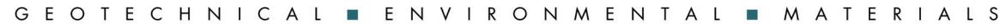


Project No. S2350-01-02 June 18, 2025

California Department of Transportation - District 6 Hazardous Waste Branch 2015 E. Shields Avenue, Suite 100 Fresno, California 93726

Attn: Adam Inman, PG

Subject: WELL DESTRUCTION REPORT

CALTRANS ENCAPSULATED SOIL STOCKPILES MODESTO, STANISLAUS COUNTY, CALIFORNIA

CONTRACT NO. 06A2767, TASK ORDER NO. 2, EA NO. 10-1E7003

GEOTRACKER CASE # SL0609924194

Mr. Inman:

In accordance with California Department of Transportation (Caltrans) Contract No. 06A2767, Task Order (TO) No. 2, Geocon destroyed four groundwater monitoring wells associated with the Caltrans Encapsulated Soil Stockpiles (the site) located south of the intersection of State Route (SR) 99 and Kansas Avenue in Modesto, Stanislaus County, California. The approximate site location is depicted on the attached Site Location Map (Figure 1). The approximate site boundaries, Stockpiles 1 and 2, which were encapsulated beneath SR 132, Stockpile 3 which was removed and placed at Stockpiles 1 and 2, and former monitoring well locations, are shown on the Site Plan (Figure 2). Six groundwater monitoring wells (MW1, MW2, MW3, MW5, MW7, and MW8) were destroyed in 2019 due to conflicts with Caltrans highway construction activities.

Phase II construction for SR 132 is scheduled to begin in 2026 and will fully encapsulate the soil stockpiles beneath highway pavement and perimeter retaining walls. In 2024, we updated a 2014 comparative evaluation of groundwater data for the site which demonstrated that the encapsulated soil stockpiles do not have the potential to impact groundwater and that future monitoring data from the four remaining Caltrans wells will not provide any useful data with respect to further analysis of the stockpiles. Based on the consistency of the more recent data with that used for the 2014 Evaluation, the declining water table, and the final encapsulation of the remaining stockpiles during Phase II construction, we recommended that the remaining four Caltrans monitoring wells (MW4, MW6, MW9, and MW10) be decommissioned and that groundwater monitoring related to the soil stockpiles be discontinued.

In correspondence dated May 3, 2024 (attached), the Department of Toxic Substances Control and Central Valley Regional Water Quality Control Board agreed that the encapsulated soil is not impacting groundwater, and approved destruction of the four remaining groundwater monitoring wells.


# SCOPE OF SERVICES

We provided the following services for the well destruction:

## Pre-field Activities

To complete our pre-field activities, we:

- obtained well destruction Permit Nos. MW25-13 and MW25-14 from the Stanislaus County Department of Environmental Resources (SCDER). Copies of the SCDER well destruction permits are attached.
- marked the proposed work area with white paint on March 11, 2025, and contacted local public utilities to delineate subsurface utilities and conduits via Underground Service Alert (USA Ticket Nos. 2025031101720, 2025031101731, 2025031101763, and 2025031101775).
- retained Advanced Geological Services, a utility locating company from Pleasant Hill, California, to perform a utility survey and mark out existing utilities in the areas surrounding the wells.
- notified Caltrans and the SCDER prior to well destruction activities.
- retained PeneCore Drilling (PeneCore), a C-57-licensed (#906899) drilling contractor from Woodland, California, to destroy the wells.

## Field Activities

On March 18, 2025, PeneCore destroyed groundwater monitoring wells MW4, MW6, MW9, and MW10 by filling each casing to the surface with grout via a tremie pipe and applying approximately 20 pounds per square inch of air pressure to the column of grout for 5 minutes. This process forced grout through the well screen and into the filter pack. PeneCore then removed the well box and concrete apron and overdrilled each well to a depth of 5 feet using their hollow-stem auger drilling rig. PeneCore then filled each overdrilled annulus with cement grout and capped the surface with native soil.

Well construction details are provided below:

| WELL<br>ID | CASING<br>MATERIAL | COMPLETED<br>WELL<br>DEPTH<br>(feet) | CASING<br>DIAMETER<br>(inches) | SCREENED<br>INTERVAL<br>(feet) | SLOT<br>SIZE<br>(inches) | FILTER PACK<br>INTERVAL<br>(feet) | FILTER<br>PACK<br>MATERIAL |
|------------|--------------------|--------------------------------------|--------------------------------|--------------------------------|--------------------------|-----------------------------------|----------------------------|
| MW4        | SCH 40 PVC         | 42                                   | 2                              | 30-40                          | 0.010                    | 26-42                             | #2/12 Sand                 |
| MW6        | SCH 40 PVC         | 46.5                                 | 2                              | 33-43                          | 0.010                    | 30-46.5                           | #2/12 Sand                 |
| MW9        | SCH 40 PVC         | 40                                   | 2                              | 29.5-39.5                      | 0.010                    | 27.5-40                           | #2/12 Sand                 |
| MW10       | SCH 40 PVC         | 40                                   | 2                              | 29.5-39.5                      | 0.010                    | 27.5-40                           | #2/12 Sand                 |


## Waste Materials

PeneCore transported the waste materials (well casings, pipes, and concrete debris) for disposal.

# Well Completion Reports

We completed California Department of Water Resources (DWR) Well Completion Reports on behalf of PeneCore for each of the destroyed wells and submitted them to the DWR's Online System for Well Completion Reports.

We appreciate the opportunity to assist Caltrans with this project. Please contact us if you have any questions concerning this report or if we may be of further service.

**GEOCON CONSULTANTS, INC.** 

**Chris Bates** 

Senior Staff Geologist

Rebecca Silva

**Project Manager** 

Attachments:

Figure 1, Site Location Map Figure 2, Site Plan DTSC Correspondence SCDER Well Permits

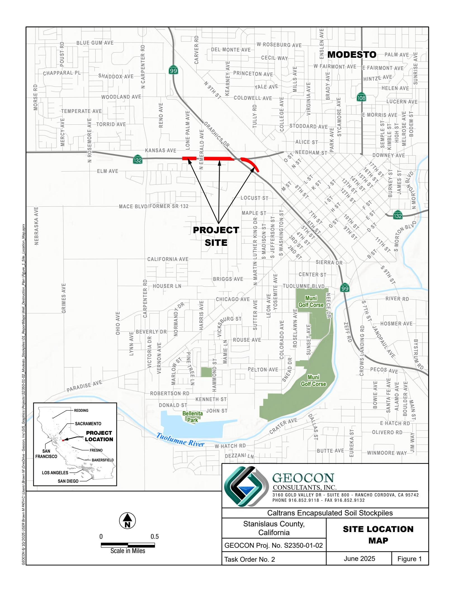

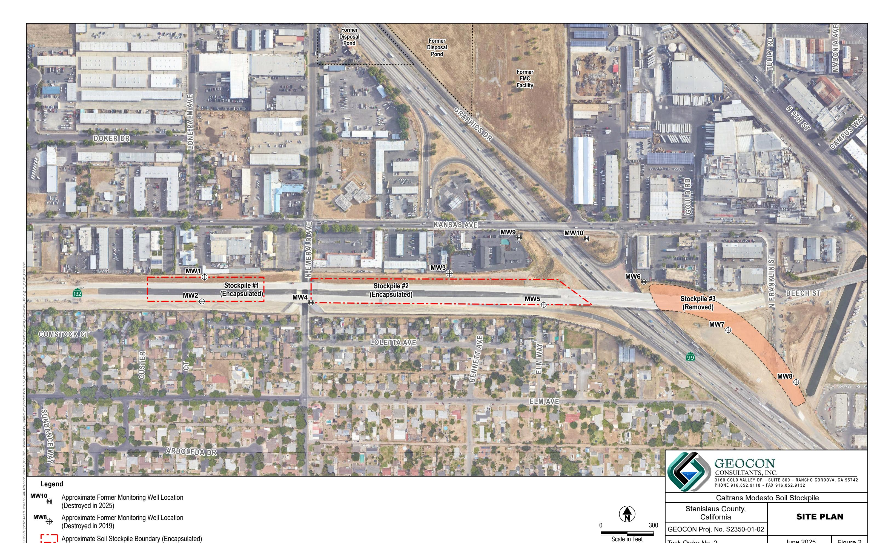

June 2025

Figure 2

Task Order No. 2

# Grout Volume Used vs. Grout Volume Anticipated

| Well IDs | Depth (Feet) | Grout Anticipated | Grout Used |
|----------|--------------|-------------------|------------|
| MW-4     | 37*          | 6.0 g             | 10 g       |
| MW-6     | 41.5*        | 6.8 g             | 15 g       |
| MW-9     | 35*          | 6.2 g             | 10 g       |
| MW-10    | 35*          | 5.7 g             | 17 g       |

# Notes:

g= gallons

<sup>\*= 5&#</sup>x27; subtracted from total depth of the well to account for the top 5' overdrilled.


Meredith Williams, Ph.D., Director
8800 Cal Center Drive
Sacramento, California 95826-3200


# Sent Via Electronic Mail

May 3, 2024

Rebecca L. Silva
Project Manager
Geocon Consultants, Inc
3160 Gold Valley Drive, Suite 800
Rancho Cordova, California 95742
Silva@geoconinc.com

APPROVAL OF THE UPDATED COMPARATIVE EVALUATION OF GROUNDWATER DATA, CALTRANS ENCAPSULATED SOIL STOCKPILES, STATE ROUTE 132, STANISLAUS COUNTY, CALIFORNIA (SITE CODE: 900259)

# Dear Ms. Silva:

The Department of Toxic Substances Control (DTSC) in consultation with the Central Valley Regional Water Quality Control Board (RWQCB) has reviewed the Updated Comparative Evaluation of Groundwater Data, Caltrans Encapsulated Soil Stockpiles (Evaluation Report) dated February 26, 2024. The Evaluation Report was submitted by Geocon Consultants Inc. (Geocon) on behalf of the Department of Transportation (Caltrans) to evaluate the potential of the barium and lead impacted soil stockpiles beneath the newly constructed State Route (SR) 132 Express Way to impact groundwater.

DTSC and the RWQCB agree that the data indicates the encapsulated soil is not impacting groundwater and that it will not impact groundwater in the future. As noted in the Evaluation Report, the consistency with the earlier 2014 evaluation and the recent encapsulation of the soil beneath the Express Way support this conclusion. In addition, both DTSC and the RWQCB concur with the recommendation that groundwater monitoring beneath the soil stockpiles be discontinued and the four remaining monitoring wells (MW4, MW6, MW9, and MW10) be decommissioned as per the approved Remedial Design and Implementation Plan.

Rebecca L. Silva May 3, 2024 Page 2

If you have any questions regarding this approval, please contact me at (916) 255-3591 or via email at Dean.Wright@dtsc.ca.gov.

Sincerely,

Dean Wright, PG Project Manager

Site Mitigation and Restoration Program Department of Toxic Substances Control

cc: (via email)

Adam Inman, P.G.
Engineering Geologist
Caltrans D-6, Office of Environmental Engineering
Adam.Inman@dot.ca.gov

Kyle Cockerham, PG Site Cleanup Unit Regional Water Quality Control Board Kyle.Cockerham@waterboards.ca.gov

Lora Jameson, PG, Chief Site Evaluation and Remediation Unit Department of Toxic Substances Control Site Evaluation and Remediation Program Lora.Jameson@dtsc.ca.gov

| DEPARTMENT USE ONLY                                                                                                                                                                                                                                                                                |                                       | Stanislaus<br>Department of Environmental Resources |                         |                                                                                         |          |     |       |
|----------------------------------------------------------------------------------------------------------------------------------------------------------------------------------------------------------------------------------------------------------------------------------------------------|---------------------------------------|-----------------------------------------------------|-------------------------|-----------------------------------------------------------------------------------------|----------|-----|-------|
| PERMIT #:                                                                                                                                                                                                                                                                                          | MW25-13                               | 3800 Cornucopia Way, Suite C, Modesto, CA 95358     |                         |                                                                                         |          |     |       |
| CASE #:                                                                                                                                                                                                                                                                                            | SL0609924194                          | Phone: (209) 525-6700 Fax: (209) 525-6774           |                         |                                                                                         |          |     |       |
| FEE PAID:                                                                                                                                                                                                                                                                                          | \$318- Rec#46762                      | County                                              |                         |                                                                                         |          |     |       |
| ISSUED BY:                                                                                                                                                                                                                                                                                         | Stephanie Freier                      | PERMIT APPLICATION                                  |                         |                                                                                         |          |     |       |
| SIGNED:                                                                                                                                                                                                                                                                                            | S. Freier                             | GROUNDWATER MONITORING WELLS AND                    |                         |                                                                                         |          |     |       |
| DATE ISSUED:                                                                                                                                                                                                                                                                                       | 3-12-2025                             | EXPLORATORY OR GEOTECHNICAL BORINGS                 |                         |                                                                                         |          |     |       |
| DATE CLOSED:                                                                                                                                                                                                                                                                                       |                                       |                                                     |                         |                                                                                         |          |     |       |
| INSPECTED BY:                                                                                                                                                                                                                                                                                      |                                       |                                                     |                         |                                                                                         |          |     |       |
| A. ASSESSOR'S PARCEL NUMBER 10-STA-99-16.7 (CALTRANS ROW) - West side of STA-99                                                                                                                                                                                                                    |                                       |                                                     |                         |                                                                                         |          |     |       |
| Site Name                                                                                                                                                                                                                                                                                          | Modesto Stockpile                     | City                                                | Modesto                 | Zip                                                                                     | 95351    |     |       |
| Site Address                                                                                                                                                                                                                                                                                       | West side of STA-99 & Kansas Ave      | City                                                | Modesto                 | Zip                                                                                     | 95351    |     |       |
| B. PROPERTY OWNER CA Dept. of Transportation (Caltrans) - Adam Inman                                                                                                                                                                                                                               |                                       |                                                     |                         |                                                                                         |          |     |       |
| Phone                                                                                                                                                                                                                                                                                              | 559-374-1574                          | Ext.                                                | Fax                     |                                                                                         |          |     |       |
| Mailing Address                                                                                                                                                                                                                                                                                    | 2015 E. Shields Ave #100              | City                                                | Fresno                  | State                                                                                   | CA       | Zip | 93726 |
| C. RESPONSIBLE PARTY Geocon Consultants, Inc. Email reblando@geoconinc.com                                                                                                                                                                                                                         |                                       |                                                     |                         |                                                                                         |          |     |       |
| (The person, persons, or company responsible for the construction, monitoring, and destruction of proposed wells and or borings.)                                                                                                                                                                  |                                       |                                                     |                         |                                                                                         |          |     |       |
| Mailing Address                                                                                                                                                                                                                                                                                    | 3160 Gold Valley Dr #800              | City                                                | Rancho Cordova          | State                                                                                   | CA       | Zip | 95742 |
| Contact Person                                                                                                                                                                                                                                                                                     | Gemma Reblando                        | Phone                                               | 916-396-8476            | Fax                                                                                     |          |     |       |
| D. CONSULTING FIRM Geocon Consultants, Inc.                                                                                                                                                                                                                                                        |                                       |                                                     |                         |                                                                                         |          |     |       |
| Mailing Address                                                                                                                                                                                                                                                                                    | 3160 Gold Valley Dr #800              | City                                                | Rancho Cordova          | State                                                                                   | CA       | Zip | 95742 |
| Registered Professional                                                                                                                                                                                                                                                                            | John Juhrend                          | Registration #                                      | 4929                    | (RG, RCE, CEG, PG)                                                                      |          |     |       |
| E-mail                                                                                                                                                                                                                                                                                             | juhrend@geoconinc.com                 |                                                     |                         |                                                                                         |          |     |       |
| Contact Person                                                                                                                                                                                                                                                                                     | Gemma Reblando                        | Phone                                               | 916-396-8476            | Fax                                                                                     |          |     |       |
| E. DRILLING COMPANY Penecore Drilling C57# 906899                                                                                                                                                                                                                                                  |                                       |                                                     |                         |                                                                                         |          |     |       |
| Contact Person                                                                                                                                                                                                                                                                                     | Xavier Green                          | E-mail                                              | xavier@penecore.com     |                                                                                         |          |     |       |
| Mailing Address                                                                                                                                                                                                                                                                                    | 220 N. East St.                       | City                                                | Woodland                | State                                                                                   | CA       | Zip | 95776 |
| Phone                                                                                                                                                                                                                                                                                              | 530-661-3600                          | Fax                                                 |                         | <input checked="" type="checkbox"/> Current Certificate of Liability Insurance included |          |     |       |
| F. A detailed/scaled site map with proposed drilling locations, well construction diagram(s), proof of underground utilities assessment, and encroachment permit or access agreement must be included.                                                                                             |                                       |                                                     |                         |                                                                                         |          |     |       |
| G. CONSTRUCTION INFORMATION                                                                                                                                                                                                                                                                        |                                       |                                                     |                         |                                                                                         |          |     |       |
| TYPE OF WELLS /BORINGS                                                                                                                                                                                                                                                                             | #                                     | MATERIALS TO BE USED                                | PROPOSED CONSTRUCTION   |                                                                                         |          |     |       |
| ☐ Monitoring                                                                                                                                                                                                                                                                                       |                                       | CASING                                              | SEAL/BORING BACKFILL    | Estimated groundwater depth:                                                            | ft       |     |       |
| ☐ Boring                                                                                                                                                                                                                                                                                           |                                       | Type                                                | ☐ Neat Cement           | Estimated depth of boring:                                                              | ft       |     |       |
| ☐ Soil Vapor                                                                                                                                                                                                                                                                                       |                                       | Gauge                                               | ☐ Cement & Bentonite    | Concrete seal                                                                           | 0        | to  |       |
| ☐ Other                                                                                                                                                                                                                                                                                            |                                       | Diameter                                            | ☐ Sand-Cement           | Annular seal                                                                            |          | to  |       |
|                                                                                                                                                                                                                                                                                                    |                                       | Screen Size                                         | ☐ Bentonite             | Bentonite                                                                               |          | to  |       |
| WELLS TO BE DESTROYED                                                                                                                                                                                                                                                                              |                                       | Filter Pack                                         | ☐ Other                 | transition seal                                                                         |          |     |       |
| X                                                                                                                                                                                                                                                                                                  | 2                                     |                                                     | Water Source Water tank | Filter Pack                                                                             |          | to  |       |
| (Wells MW4 and MW9)                                                                                                                                                                                                                                                                                |                                       | Drilling Method                                     |                         | Perforation                                                                             |          | to  |       |
|                                                                                                                                                                                                                                                                                                    | ☐ Auger                               | ☐ Air Rotary                                        | Borehole diameter       |                                                                                         |          |     |       |
|                                                                                                                                                                                                                                                                                                    | ☐ Mud Rotary                          | ☐ Other                                             |                         |                                                                                         |          |     |       |
|                                                                                                                                                                                                                                                                                                    | ☐ Percussion                          |                                                     |                         |                                                                                         |          |     |       |
| I hereby certify that I have prepared this application and that the work will be done in accordance with the provisions of the laws of the State of California, the ordinances of Stanislaus County, and the rules and regulations of the Stanislaus County Department of Environmental Resources. |                                       |                                                     |                         |                                                                                         |          |     |       |
| SIGNED                                                                                                                                                                                                                                                                                             | (Owner or Authorized Representative*) | PRINT                                               | GEMMA REBLANDO          | DATE                                                                                    | 3/3/2025 |     |       |

| Yes | No |
|-----|----|
|     |    |

• You are proposing 7 borings and 1 monitoring well, therefore, the cost for the seven (7) borings would be \$583 and the cost for the one (1) monitoring well would be \$265. The total cost of the permit would be \$848.

## Section I - Questionnaire:

- a. Have you answered all 6 questions?
- b. Open mitigation cases listed?
   Complete all applicable areas. If additional room is needed, please attach supplemental documents as needed. When a question is not applicable, please write "N/A" in the provided sections. Please do not leave them blank.

## Section J - Well Completion Report:

- a. Reports are required for all monitoring wells constructed, destroyed or altered. The responsible party or driller must submit reports within the Online System for Well Completion Reports (OSWCR). Please utilize the following link <a href="https://civicnet.resources.ca.gov/DWR">https://civicnet.resources.ca.gov/DWR</a> WELLS/ to access the system.
  - For more information on this requirement, please refer to the following website https://water.ca.gov/Programs/Groundwater-Management/Wells.

Forward the completed Monitoring Well and Exploratory or Geotechnical Boring permit Checklist and Application to the Stanislaus County Dept. of Environmental Resources email address <a href="mailto:HMpermit@envres.org">HMpermit@envres.org</a> to begin the review process.

• Expect that permit review will take an average of 14 days. This is to allow time for the HMPermit team to receive consent from State Case Workers for drilling projects within the vicinity of soil and/or groundwater contamination cases to proceed.

After the HMPermit team completes the application review and emails a permit number to you, and we are provided with proof of payment, a copy of the signed permit will be sent to you.

- Payment Options:
  - Payment over the phone may be made with Visa, MasterCard or Discovery (credit card or debit card). American Express is not accepted. Please call (209) 525-6700.
  - Postal Address:
    - Stanislaus County Department of Environmental Resources, Attn: Monitoring Well Permits, 3800 Cornucopia Way, Suite C, Modesto, CA 95358.
      - Checks must be made payable to: Stanislaus County or Stanislaus County
        Department of Environmental Resources. <u>Do not abbreviate and use SCDER on checks</u>.

To close this Monitoring Well and Exploratory or Geotechnical Boring permit, you are responsible for:

- 1. Removing soil cuttings and purge water from the drilling location within 30 days.
  - a. Containerized soil cuttings and purge water left onsite must have information the following information marked on the drum in indelible ink:
  - b. Site Name & Address
  - c. Contact Name and Phone
  - d. Contents of Drum
  - e. Accumulation start date
- 2. Submitting a photo log as a single PDF file showing the following:
  - a. Consistency of each batch of grout being used once it has been prepared with photos labeled by well or boring # and batch # an
  - b. Photos showing the final holes after grouting labeled by well or boring hole #.
  - **C.** Additional photos if the bore holes are covered by asphalt.
  - d. To represent grout consistency, also include a photo for each grout batch and well or bore hole of the grout adhering on a pen or possibly from a driller's gloved fingertip
- **e.** Forward the photo log to the Stanislaus County Dept. of Environmental Resources email address HMpermit@envres.org with the subject line "MW..-.. (permit number) Photo Log".
- 3. The permit is not valid if there are any changes to the scope of work as previously approved by this department. If changes are required, please contact the office at (209)-525-6700 as soon as possible to amend the permit on record.

| H. FEES                      |                                                                                       | Initial Monitoring Well         |  |
|------------------------------|---------------------------------------------------------------------------------------|---------------------------------|--|
| ACTIVITY                     | FEE SCHEDULE                                                                          | AMOUNT                          |  |
| Monitoring Well Construction | Additional Wells (up to 6)<br>Additional Wells (7+)                                   | \$ 265.00<br>x \$ 53.00<br>WLR* |  |
| Soil/Geotechnical Boring     | Initial Monitoring Borings<br>Additional Borings (up to 6)<br>Additional Borings (7+) | \$ 265.00<br>x \$ 53.00<br>WLR* |  |
| Monitoring Well Destruction  | Initial Destruction<br>Additional Destructions (up to 6)                              | \$ 265.00<br>x \$ 53.00<br>1    |  |

TOTAL COST OF PERMIT

\$ 318.00

I. QUESTIONNAIRE: Please answer all applicable questions completely.

For well destruction, complete only # 1 below and submit any required supportive documentation.

| 1. What is the purpose of the well/boring investigation? |                                                                                                                                                                                                                                                                                                       |                                     |                                 |                     |                          |                |               |                                |  |  |  |
|----------------------------------------------------------|-------------------------------------------------------------------------------------------------------------------------------------------------------------------------------------------------------------------------------------------------------------------------------------------------------|-------------------------------------|---------------------------------|---------------------|--------------------------|----------------|---------------|--------------------------------|--|--|--|
| a.                                                       | An ongoing site assessment case in which a government regulator is the lead agency. If yes, indicate which government regulator is the lead agency, site address, case number, and attach the associated approval letter to the permit application;                                                   |                                     |                                 |                     |                          |                |               |                                |  |  |  |
|                                                          | <table><tbody><tr><td><input checked="" type="checkbox"/></td><td>GeoTracker Case ID / Global ID:</td><td><u>SL0609924194</u></td><td><input type="checkbox"/></td><td>EnviroStor ID:</td></tr><tr><td>Site Address:</td><td colspan="4">State Route 99 &amp; Kansas Avenue</td></tr></tbody></table> | <input checked="" type="checkbox"/> | GeoTracker Case ID / Global ID: | <u>SL0609924194</u> | <input type="checkbox"/> | EnviroStor ID: | Site Address: | State Route 99 & Kansas Avenue |  |  |  |
| <input checked="" type="checkbox"/>                      | GeoTracker Case ID / Global ID:                                                                                                                                                                                                                                                                       | <u>SL0609924194</u>                 | <input type="checkbox"/>        | EnviroStor ID:      |                          |                |               |                                |  |  |  |
| Site Address:                                            | State Route 99 & Kansas Avenue                                                                                                                                                                                                                                                                        |                                     |                                 |                     |                          |                |               |                                |  |  |  |
| b.                                                       | Part of an Environmental Site Assessment for property ownership transfer; or                                                                                                                                                                                                                          |                                     |                                 |                     |                          |                |               |                                |  |  |  |
| c.                                                       | Geotechnical investigation for proposed construction, land stabilization; or                                                                                                                                                                                                                          |                                     |                                 |                     |                          |                |               |                                |  |  |  |
| d.                                                       | Other: Well abandonment required by DTSC and RWQCB                                                                                                                                                                                                                                                    |                                     |                                 |                     |                          |                |               |                                |  |  |  |
| 2.                                                       | What field procedures will be utilized to determine if contamination exists? N/A                                                                                                                                                                                                                      |                                     |                                 |                     |                          |                |               |                                |  |  |  |
| 3.                                                       | What procedures will be used to determine whether samples will be sent for laboratory testing or archiving? N/A                                                                                                                                                                                       |                                     |                                 |                     |                          |                |               |                                |  |  |  |
| 4.                                                       | What constituents will be monitored and tested (Include laboratory analytical method)? N/A                                                                                                                                                                                                            |                                     |                                 |                     |                          |                |               |                                |  |  |  |
| 5.                                                       | How will samples be transported and preserved? N/A                                                                                                                                                                                                                                                    |                                     |                                 |                     |                          |                |               |                                |  |  |  |
| 6.                                                       | What is your removal plan for containerized soil cuttings and purge water? N/A                                                                                                                                                                                                                        |                                     |                                 |                     |                          |                |               |                                |  |  |  |

## J. Well Completion Report:

California Water Code Section 13751 requires that anyone who constructs, alters, or destroys a water well, cathodic protection well, groundwater monitoring well, or geothermal heat exchange well must file with the Department of Water Resources a report completion within 60 days of the completion of the work. Drillers submit their well completion reports with the Online System of Well Completion Reports (OSWCR, say "Oscar"). OSWCR users create an account based on their C-57 license that DWR will validate. Upon approval users will be able to submit Well Completion Reports.

| Postal Mail                                                                                  | E-Mail                                       | Notice                                                                                                                                                                                    |
|----------------------------------------------------------------------------------------------|----------------------------------------------|-------------------------------------------------------------------------------------------------------------------------------------------------------------------------------------------|
| SC DER<br>Attn: Monitoring Well Permits<br>3800 Cornucopia Way, Suite C<br>Modesto, CA 95358 | HMpermit@envres.org<br>Fax<br>(209) 525-6774 | **Once permitted, SCDER must be notified a<br>minimum of 48 hours in advance of the<br>construction/destruction activities.<br>SCDER reserves the right to inspect field<br>activities.** |


# DEPARTMENT OF ENVIRONMENTAL RESOURCES 3800 Cornucopia Way, Suite C, Modesto, CA 95358-9492

Phone: 209.525.6700, Fax: 209.525.6774

## Monitoring Wells and Geotechnical Borings Within Stanislaus County

Stanislaus County Department of Environmental Resources (DER) oversees the constructing and destructing of soil borings for including those for installing vadose zone, groundwater (monitoring and/or extraction) and cathodic protection wells in all areas of Stanislaus County. The above types of wells include both permanent and temporary wells and those that are made with cone penetration technology or so called "Hydropunch type" sampling devices.

Please submit a <u>completed Checklist</u> (pages 3-6) for all Monitoring Well or Soil Boring Permit Applications (pages 7-8) submitted in Stanislaus County limits, <u>with the exception of the City of Modesto</u> (see Important Note #1 below). The checklist is not exhaustive nor inclusive of all requirements for the permit application, but rather its intent is to help applicants catch common mistakes before submitting permits to this department and ensure all provided information is correct and required documents are included. NOTE: Incomplete or inaccurate information will extend the application review process. Permit Application will not be accepted without a completed Checklist (pages 3-6).

## Important Notes:

- 1. All proposed work within City of Modesto limits has its own separate permitting requirement, in addition to those of DER, for activities performed within the incorporated area where they have jurisdiction. Please consult with the City of Modesto if you intend to place any wells and/or borings within their jurisdiction. If you're unsure if the proposed project is within City of Modesto limits, check the City of Modesto GIS at <a href="https://gis.modestogov.com/gis/">https://gis.modestogov.com/gis/</a>.
  - If the project is within City of Modesto limits, then contact the City of Modesto-Groundwater Application (Monitoring Wells) team at 209-342-4712, <a href="https://www.modestogov.com/1509/Groundwater-Application-Monitoring-Wells">https://www.modestogov.com/1509/Groundwater-Application-Monitoring-Wells</a> regarding the City of Modesto application.
  - Our Department does not require the submittal of any additional County application(s) or fees for these City of Modesto circumstances.
- 2. Completion and submittal of a Stanislaus County Monitoring Well Permit is <u>required</u> prior to beginning work on any of the following:
  - a. Exploratory boring in areas where hazardous substances or wastes have or are stored or where soil and/or groundwater is suspected/ known to be contaminated with hazardous substances or wastes, or
  - b. Any boring in which a casing will be installed, or
  - c. Any boring that has a monitoring device installed, or
  - d. Any soil boring greater than 20 feet. in depth, or
  - e. Any soil boring 20 feet in depth or less where it is anticipated that groundwater table will be encountered.
- 3. It is not necessary to obtain a separate monitoring well permit for the installation of multiple groundwater monitoring wells provided the wells:
  - a. Are all located at one site (one parcel number or address), and
  - b. Will be installed during the same specified time frame, and
  - c. Are of the same construction type.
- 4. All wells shall be constructed according to the State of California Department of Water Resources (CA DWR) Bulletins 74-81 and 74-90. Each well must be identified by a unique descriptive well name/number. Each well must have this descriptive name/number permanently marked on the well.

- 5. A representative line drawing of the wells construction details as well as a separate site map depicting the proposed location (referenced with each wells descriptive name/ number) must accompany each monitoring well permit. If construction specifications of the monitoring wells differ, a specific monitoring well construction diagram must be provided for each differing well. It is acceptable to reference a previously completed work plan if well construction details/location we addressed in the work plan and a copy of this work plan accompanies the well permit.
- 6. Any contractor performing work of this type must have on file with the DER:
  - a. A valid C-57 license, and
  - b. A current Certificate of Insurance.
- 7. Once permitted, the DER must be notified at least 48 hours in advance of the construction/ destruction activities. DER reserves its right to inspect field activities, but a representative of DER need not be present prior to commencing the work provided the activity has been properly permitted and the DER has been sufficiently notified. The permit fee is derived from analysis of staff time for review and processing of the permit application and any site inspections, which may be conducted by staff during or subsequent to the installation of the monitoring wells.
- 8. Monitoring wells and soil borings shall be abandoned in accordance with CA DWR Bulletins 74-81 and 74-90.
- 9. Prior to commencing boring/well destruction and for completion of boring/well permit, the contractor must:
  - a. Complete of the destruction section a monitoring well permit form. (For wells constructed and destroyed within the same mobilization both the construction and destruction sections must be completed.)
  - b. Estimate the volume of grout expected to be necessary to destruct each monitoring well prior to destruction, and
  - c. Describe the steps and methods used to destruct the well including the management of the casing and the installation method used to fill the well with grout.
- 10. After field destruction activities are complete, the contractor must report to the DER:
  - a. Any planned vs. field work anomalies, and
  - b. The actual amount of grout used so as to evaluate the effectiveness of the well destruction.

For additional information on boring/monitoring well construction and/or destruction, please contact the Environmental Resources Department at (209) 525-6700 or via email (<a href="https://email.org/lenviros.org">HMpermit@envres.org</a>).

## Permit Application Checklist

Check Yes or No boxes below. Permit Application will not be accepted without a completed Checklist (pages 3-6). Yes No Section A - Assessor's Parcel Number: 1. a. Does the APN match the Counties APN? Check Assessor Map Book Viewer (arcgis.com) at https://experience.arcgis.com/experience/29a526aa3639499f96b63f17c2b14cc5. b. Does the property owner access agreement match the listed property owner? c. If your project involves multiple parcel numbers and/or addresses, a separate application is required for each. d. If the property owner is the same, but the project involves multiple parcel numbers, a separate application is required for each parcel. e. If there are multiple property owners for a single project, then an application must be submitted for each property owner. f. If a project involves multiple drillers, then page 1 of the application must be submitted for each additional driller and a certificate of liability must be submitted for each one. 2. Are there any Mitigation cases with in ½ mile of the site? Check drilling location address in both public access databases listed below. a. https://geotracker.waterboards.ca.gov b. https://www.envirostor.dtsc.ca.gov/public If so, delays may occur in the permitting process while reaching out to State Case Worker for consent for drilling project to proceed. Section B - Property Owner: 1. This must be the property owner, which is listed through the Assessor's office website https://www.stancounty.com/assessor/. Do not use the resident or business owner information, unless they are the property owner. Sections C - E: Please check the box to reflect the entity completing this application. Section C - Responsible Party: 1. Complete? This will be the entity responsible for the proposed work and ensuring all standards and regulations are followed. Section D - Consulting Firm: 1. Complete? a. Is the Registered professional number listed on the permit application? b. Active? c. Match the name provided? d. Have you indicated the type of registration? e. Validate here: Search - DCA at <a href="https://search.dca.ca.gov/?BD=31">https://search.dca.ca.gov/?BD=31</a> If they are also the responsible party, the information for the Registered Professional is only needed within this section. Section E - Drilling Company: 1. Complete? a. Is the C57 listed? b. Does C57 match the listed company? c. Is Drillers Certificate Of Insurance included? i. At a minimum, they should have active general liability and workers' compensation.

| Yes                   | <u>No</u> |                                                                                                                                                                                                                                                                                                                                                                                                                                                                                          |
|-----------------------|-----------|------------------------------------------------------------------------------------------------------------------------------------------------------------------------------------------------------------------------------------------------------------------------------------------------------------------------------------------------------------------------------------------------------------------------------------------------------------------------------------------|
| <b>√</b>              |           | ii. The only time workers' compensation is not required, is if the owner of the business is the only one performing the work. If the employees utilized have been subcontracted, then their employer must provide proof of workers' compensation.                                                                                                                                                                                                                                        |
|                       |           | d. Did you check insurance included box on permit application?                                                                                                                                                                                                                                                                                                                                                                                                                           |
|                       |           | e. Validate here: Check A License - CSLB (ca.gov) at <a href="https://cslb.ca.gov/OnlineServices/CheckLicenseII/CheckLicense.aspx">https://cslb.ca.gov/OnlineServices/CheckLicenseII/CheckLicense.aspx</a>                                                                                                                                                                                                                                                                               |
|                       |           | When applicable, proof of workers compensation must be indicated on the Certificate of Liability form. If the company has one or more employees conducting the work, workers compensation is required. The responsible party must ensure the drilling company has workers compensation or exempt from this requirement.                                                                                                                                                                  |
|                       |           | Section F - Attachments:                                                                                                                                                                                                                                                                                                                                                                                                                                                                 |
|                       |           | 1. Have you included the following attachments with the permit application?                                                                                                                                                                                                                                                                                                                                                                                                              |
|                       |           | a. Detailed Site map with all borings keyed out with unique number/name identifiers.                                                                                                                                                                                                                                                                                                                                                                                                     |
|                       |           | b. Proposed well construction diagram(s) (when installing monitoring wells)                                                                                                                                                                                                                                                                                                                                                                                                              |
|                       |           | c. USA dig ticket (Proof of underground utilities assessment, i.e. receipt)                                                                                                                                                                                                                                                                                                                                                                                                              |
|                       |           | d. Access agreement from private property owner on record. It may be in the form of an email.                                                                                                                                                                                                                                                                                                                                                                                            |
|                       |           | e. Well construction diagrams (if appropriate)                                                                                                                                                                                                                                                                                                                                                                                                                                           |
|                       |           | f. List of all borings proposed on each APN.                                                                                                                                                                                                                                                                                                                                                                                                                                             |
|                       |           | g. Encroachment permit if right of way access is required. Apply here: Applications & Forms - Public Works - Stanislaus County (stancounty.com) at <a href="https://www.stancounty.com/publicworks/forms.shtm">https://www.stancounty.com/publicworks/forms.shtm</a>                                                                                                                                                                                                                     |
| ✓<br>✓<br>✓<br>✓<br>✓ |           | Section G - Construction Information:                                                                                                                                                                                                                                                                                                                                                                                                                                                    |
|                       |           | 1. Complete all applicable areas pertaining to your proposed work.                                                                                                                                                                                                                                                                                                                                                                                                                       |
|                       |           | a. Do the number of items being constructed match what is reflected on the map?                                                                                                                                                                                                                                                                                                                                                                                                          |
|                       |           | b. Backfill material listed?                                                                                                                                                                                                                                                                                                                                                                                                                                                             |
|                       |           | c. Water source listed? Water to be brought by drillers from Woodland, CA                                                                                                                                                                                                                                                                                                                                                                                                                |
|                       |           | d. Drilling method listed?                                                                                                                                                                                                                                                                                                                                                                                                                                                               |
|                       |           | e. Ground water depth listed?                                                                                                                                                                                                                                                                                                                                                                                                                                                            |
|                       |           | f. Depth of Boring listed?                                                                                                                                                                                                                                                                                                                                                                                                                                                               |
|                       |           | g. Seal material and depth listed?                                                                                                                                                                                                                                                                                                                                                                                                                                                       |
|                       |           | h. Is the permit application signed by owner or agent?                                                                                                                                                                                                                                                                                                                                                                                                                                   |
|                       |           | There will be no additional fee for backfilling the exploratory borings covered under the permit, therefore, do not include these in the fee section under well destruction.                                                                                                                                                                                                                                                                                                             |
| <b>√</b>              |           | Section H - Fees: Complete all applicable sections pertaining to the proposed work.                                                                                                                                                                                                                                                                                                                                                                                                      |
|                       |           | 1. Fees section filled out appropriately for the number of wells/borings?                                                                                                                                                                                                                                                                                                                                                                                                                |
|                       |           | a. Monitoring wells, exploratory borings, and destructions have their own separate categories. For monitoring wells installed in the unincorporated areas of the County, the DER permit fee is: \$265.00 for the first boring/well included in the permit, and \$53.00 for each additional boring/well. Contact us at 209-525-6700 for the current fees. Utilize the drop-down function to apply the appropriate fee for the amount and check to ensure it is correct before submitting. |
|                       |           | Examples:                                                                                                                                                                                                                                                                                                                                                                                                                                                                                |
|                       |           | The first construction, drilling and destruction is \$265, then \$53 for each one after.                                                                                                                                                                                                                                                                                                                                                                                                 |
|                       |           | You are proposing three (3) monitoring wells would be \$265,00+\$53.00+\$53.00 = \$371.00.                                                                                                                                                                                                                                                                                                                                                                                               |

You are proposing seven (7) monitoring wells, would be \$583.

## Stephanie Freier

From:

Gemma Reblando <reblando@geoconinc.com>

Sent:

Wednesday, March 12, 2025 8:36 AM

To:

**Hmpermit** 

**Subject:** 

FW: Modesto Well Destruction

## Good morning,

Please see email below from Caltrans regarding access agreement for the well destruction activities at the Caltrans Modesto Stockpiles.

Thank you.

Gemma Reblando Geocon Consultants. Inc. 916-396-8476

From: Inman, Adam@DOT < Adam.Inman@dot.ca.gov>

Sent: Wednesday, March 12, 2025 8:15 AM
To: Rebecca Silva < silva@geoconinc.com >
Subject: Re: Modesto Well Destruction

## Good Morning Rebecca,

Caltrans grants unrestricted access to Geocon and its sub consultants to State Right of Way for the duration of the well destruction project. Geocon will be accompanied by Caltrans staff during the project.

Thank you

Cell: 559-374-1574

Adam Inman, PG
Engineering Geologist
Caltrans D-6 | Office of Environmental Engineering
Hazardous Waste and Paleontology Branch
2015 East Shields Avenue, Suite 100
Fresno, CA 93726

From: Rebecca Silva < silva@geoconinc.com > Sent: Wednesday, March 12, 2025 7:36:50 AM
To: Inman, Adam@DOT < Adam.Inman@dot.ca.gov >

**Subject:** Modesto Well Destruction

EXTERNAL EMAIL. Links/attachments may not be safe.

Hi Adam – The County has asked for the following...

Access agreement from the property owner CalTrans. It may be in the form of an email.

Will you please send over an email giving us access for the well destructions?

## Thank you!

Please note that I will be on vacation from March 18 to March 23, returning to work on March 24, 2025.


Rebecca Silva Senior Environmental Scientist O: 916.852.9118 M: 916.508.1910 silva@geoconinc.com

GEOCON

GEOCON CONSULTANTS, INC.

3160 Gold Valley Drive, Suite 800, Rancho Cordova, California 95742

## Serving California through 9 Regional Offices:

| Livermore | Rancho Cordova | Fairfield | San Diego |           |
|-----------|----------------|-----------|-----------|-----------|
| Burbank   | Irvine         | Murrieta  | Redlands  | La Quinta |

Geotechnical Engineering Environmental Services
Engineering Geology Construction Inspection

InfrastructureTransportationLand DevelopmentInstitutionalBrownfields/RedevelopmentNatural Resources

Connect with us! www.geoconinc.com Linked in


## GEOTECHNICAL . ENVIRONMENTAL . MATERIAL


Project No. S2350-01-02 March 3, 2025

Stephanie Freier Stanislaus County Department of Environmental Resources 3800 Cornucopia Way, Suite C Modesto, California 95358

Subject:

MONITORING WELL DESTRUCTION
CALTRANS MODESTO SOIL STOCKPILES
GEOTRACKER CASE # SL0609924194

Ms. Freier:

Geocon Consultants, Inc. (Geocon) has prepared a permit application for the destruction of four monitoring wells. The site is located within California Department of Transportation (CalTrans) right-of-way (ROW) south of SR-99/Kansas Avenue Interchange (10-STA-99-16.7) (Figure 1). Geocon will retain PeneCore Drilling (C57#906899) for well destruction activities.

We will abandon monitoring wells MW4, MW6, MW9, and MW10 per Department of Toxic Substances Control (DTSC) directive letter dated May 3, 2024 (see attached) in concurrence with the Central Valley Regional Water Quality Control Board (CRWQCB). Wells MW4, MW6, MW9, and MW10 will be properly abandoned by pressure-grouting in general accordance with the requirements of California Well Standards Bulletin 74-90, Monitoring Well Standards, Part III. Well construction details are provided below:

| WELL<br>ID | CASING<br>MATERIAL | COMPLETED<br>WELL<br>DEPTH<br>(feet) | CASING<br>DIAMETER<br>(inches) | SCREENED<br>INTERVAL<br>(feet) | SLOT<br>SIZE<br>(inches) | FILTER<br>PACK<br>INTERVAL<br>(feet) | FILTER<br>PACK<br>MATERIAL |
|------------|--------------------|--------------------------------------|--------------------------------|--------------------------------|--------------------------|--------------------------------------|----------------------------|
| MW4        | SCH 40 PVC         | 42                                   | 2                              | 30-40                          | 0.010                    | 26-42                                | #2/12 Sand                 |
| MW6        | SCH 40 PVC         | 46.5                                 | 2                              | 33-43                          | 0.010                    | 30-46.5                              | #2/12 Sand                 |
| MW9        | SCH 40 PVC         | 40                                   | 2                              | 29.5-39.5                      | 0.010                    | 27.5-40                              | #2/12 Sand                 |
| MW10       | SCH 40 PVC         | 40                                   | 2                              | 29.5-39.5                      | 0.010                    | 27.5-40                              | #2/12 Sand                 |

To pressure grout, PeneCore will initially fill each well with neat Portland cement. The well seal material will be placed via a tremie pipe from the bottom of the well under sufficient pressure and length of time to penetrate the annular filter pack. Additional volume of seal material will be pumped into the well as needed after air pressure is administered.


Following pressure-grouting, Penecore will then remove the well box and concrete apron of the wells and the top 5 feet of each well will be over-drilled and that portion of the well casing removed. The over-drilled borings will then be filled with Portland cement or sand/cement slurry to the ground surface and cap the surface with approximately 6 inches of black-dyed concrete or soil to match the surrounding surface.

Please contact me if you have any questions.

Sincerely,

GEOCON CONSULTANTS, INC.

Gemma G. Reblando Project Geologist

Attachments:

SCDER Well Applications
Figure 1, Site Location Map
Figure 2, Site Plan

Figure 2, Site Plan DTSC Directive Letter

PeneCore Drilling - Certificate of Liability Insurance

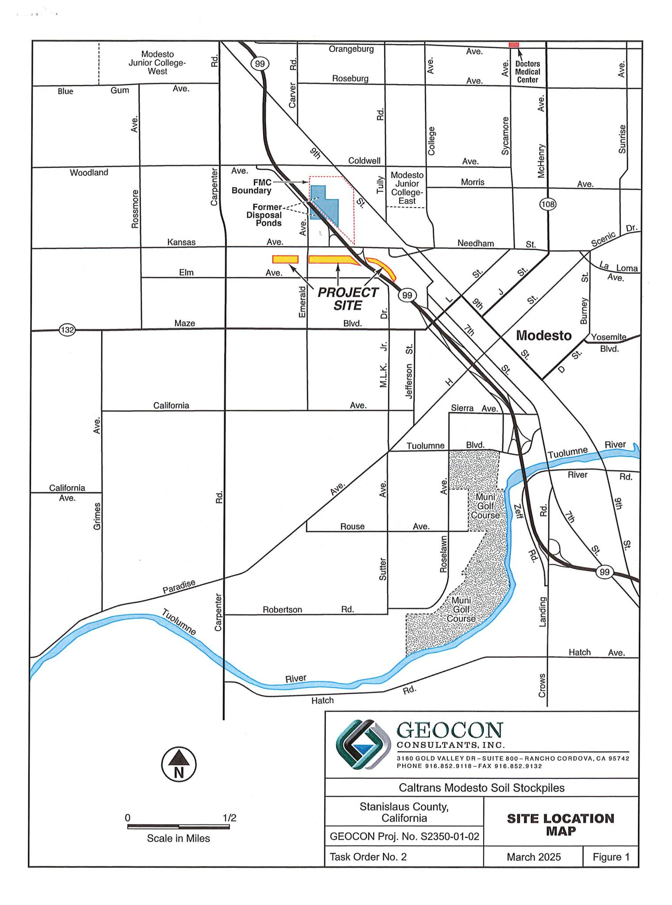

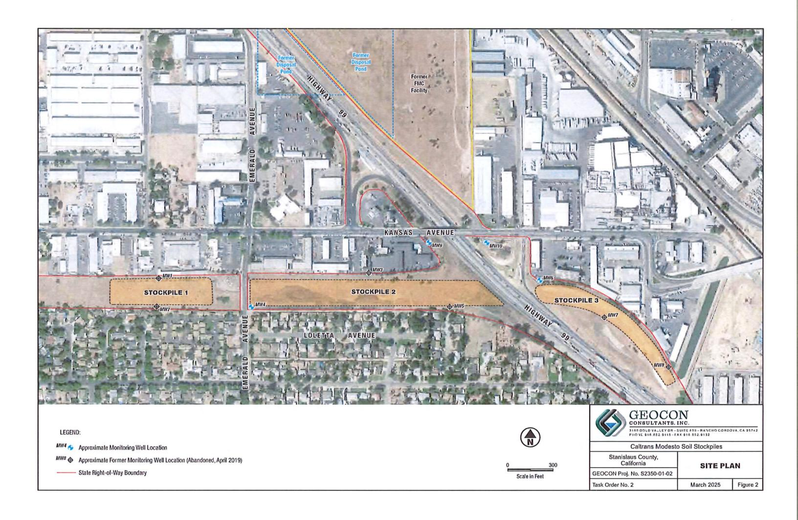


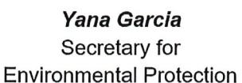


Meredith Williams, Ph.D., Director 8800 Cal Center Drive Sacramento, California 95826-3200


## Sent Via Electronic Mail

May 3, 2024

Rebecca L. Silva **Project Manager** Geocon Consultants, Inc. 3160 Gold Valley Drive, Suite 800 Rancho Cordova, California 95742 Silva@geoconinc.com

APPROVAL OF THE UPDATED COMPARATIVE EVALUATION OF GROUNDWATER DATA, CALTRANS ENCAPSULATED SOIL STOCKPILES, STATE ROUTE 132. STANISLAUS COUNTY, CALIFORNIA (SITE CODE: 900259)

## Dear Ms. Silva:

The Department of Toxic Substances Control (DTSC) in consultation with the Central Valley Regional Water Quality Control Board (RWQCB) has reviewed the Updated Comparative Evaluation of Groundwater Data, Caltrans Encapsulated Soil Stockpiles (Evaluation Report) dated February 26, 2024. The Evaluation Report was submitted by Geocon Consultants Inc. (Geocon) on behalf of the Department of Transportation (Caltrans) to evaluate the potential of the barium and lead impacted soil stockpiles beneath the newly constructed State Route (SR) 132 Express Way to impact groundwater.

DTSC and the RWQCB agree that the data indicates the encapsulated soil is not impacting groundwater and that it will not impact groundwater in the future. As noted in the Evaluation Report, the consistency with the earlier 2014 evaluation and the recent encapsulation of the soil beneath the Express Way support this conclusion. In addition, both DTSC and the RWQCB concur with the recommendation that groundwater monitoring beneath the soil stockpiles be discontinued and the four remaining monitoring wells (MW4, MW6, MW9, and MW10) be decommissioned as per the approved Remedial Design and Implementation Plan.

Rebecca L. Silva May 3, 2024 Page 2

If you have any questions regarding this approval, please contact me at (916) 255-3591 or via email at Dean.Wright@dtsc.ca.gov.

Sincerely,

Dean Wright, PG Project Manager

Site Mitigation and Restoration Program Department of Toxic Substances Control

(via email) CC:

> Adam Inman, P.G. **Engineering Geologist** Caltrans D-6, Office of Environmental Engineering Adam.Inman@dot.ca.gov

Kyle Cockerham, PG Site Cleanup Unit Regional Water Quality Control Board Kyle.Cockerham@waterboards.ca.gov

Lora Jameson, PG, Chief Site Evaluation and Remediation Unit Department of Toxic Substances Control Site Evaluation and Remediation Program

Lora.Jameson@dtsc.ca.gov

150,000


## CERTIFICATE OF LIABILITY INSURANCE

DATE (MM/DD/YYYY) 1/9/2025

THIS CERTIFICATE IS ISSUED AS A MATTER OF INFORMATION ONLY AND CONFERS NO RIGHTS UPON THE CERTIFICATE HOLDER. THIS CERTIFICATE DOES NOT AFFIRMATIVELY OR NEGATIVELY AMEND, EXTEND OR ALTER THE COVERAGE AFFORDED BY THE POLICIES BELOW. THIS CERTIFICATE OF INSURANCE DOES NOT CONSTITUTE A CONTRACT BETWEEN THE ISSUING INSURER(S), AUTHORIZED REPRESENTATIVE OR PRODUCER, AND THE CERTIFICATE HOLDER.

IMPORTANT: If the certificate holder is an ADDITIONAL INSURED, the policy(ies) must have ADDITIONAL INSURED provisions or be endorsed. If SUBROGATION IS WAIVED, subject to the terms and conditions of the policy, certain policies may require an endorsement. A statement on this certificate does not confer rights to the certificate holder in lieu of such endorsement(s).

| PRODUCER License # 0B50501  Armstrong & Associates Insurance Services 239 W Court St, Bldg A Woodland, CA 95695  Model and CA 95695  INSURER A: Homeland Insurance Company of New York  INSURE B: West American Insurance Company PeneCore Drilling  TSA Drilling Inc. PeneCore Drilling  CONTACT Teresa Galart PHONE (A/C, No, Ext): (530) 406-2742 (A/C, No, Ext): (530) 406-2742 (A/C, No, Ext): (530) 406-2742 (A/C, No, Ext): (530) 406-2742 (A/C, No, Ext): (530) 406-2742 (A/C, No, Ext): (530) 406-2742 (A/C, No, Ext): (530) 406-2742 (A/C, No, Ext): (530) 406-2742 (A/C, No, Ext): (530) 406-2742 (A/C, No, Ext): (530) 406-2742 (A/C, No, Ext): (530) 406-2742 (A/C, No, Ext): (530) 406-2742 (A/C, No, Ext): (530) 406-2742 (A/C, No, Ext): (530) 406-2742 (A/C, No, Ext): (530) 406-2742 (A/C, No, Ext): (530) 406-2742 (A/C, No, Ext): (530) 406-2742 (A/C, No, Ext): (530) 406-2742 (A/C, No, Ext): (530) 406-2742 (A/C, No, Ext): (530) 406-2742 (A/C, No, Ext): (530) 406-2742 (A/C, No, Ext): (530) 406-2742 (A/C, No, Ext): (530) 406-2742 (A/C, No, Ext): (530) 406-2742 (A/C, No, Ext): (530) 406-2742 (A/C, No, Ext): (530) 406-2742 (A/C, No, Ext): (530) 406-2742 (A/C, No, Ext): (530) 406-2742 (A/C, No, Ext): (530) 406-2742 (A/C, No, Ext): (530) 406-2742 (A/C, No, Ext): (530) 406-2742 (A/C, No, Ext): (530) 406-2742 (A/C, No, Ext): (530) 406-2742 (A/C, No, Ext): (530) 406-2742 (A/C, No, Ext): (530) 406-2742 (A/C, No, Ext): (530) 406-2742 (A/C, No, Ext): (530) 406-2742 (A/C, No, Ext): (530) 406-2742 (A/C, No, Ext): (530) 406-2742 (A/C, No, Ext): (530) 406-2742 (A/C, No, Ext): (530) 406-2742 (A/C, No, Ext): (530) 406-2742 (A/C, No, Ext): (530) 406-2742 (A/C, No, Ext): (530) 406-2742 (A/C, No, Ext): (530) 406-2742 (A/C, No, Ext): (530) 406-2742 (A/C, No, Ext): (530) 406-2742 (A/C, No, Ext): (530) 406-2742 (A/C, No, Ext): (530) 406-2742 (A/C, No, Ext): (530) 406-2742 (A/C, No, Ext): (530) 406-2742 (A/C, No, Ext): (530) 406-2742 (A/C, No, Ext): (530) 406-2742 (A/C, No, Ext): (530) 406-2742 (A/C, No, Ext): (530) 406-2742 (A/C, No, Ext): (530) 406-2742 | this certificate does not corner rights to the certificate holder in hea or st | den endersement(s).                                       |          |  |  |  |
|-------------------------------------------------------------------------------------------------------------------------------------------------------------------------------------------------------------------------------------------------------------------------------------------------------------------------------------------------------------------------------------------------------------------------------------------------------------------------------------------------------------------------------------------------------------------------------------------------------------------------------------------------------------------------------------------------------------------------------------------------------------------------------------------------------------------------------------------------------------------------------------------------------------------------------------------------------------------------------------------------------------------------------------------------------------------------------------------------------------------------------------------------------------------------------------------------------------------------------------------------------------------------------------------------------------------------------------------------------------------------------------------------------------------------------------------------------------------------------------------------------------------------------------------------------------------------------------------------------------------------------------------------------------------------------------------------------------------------------------------------------------------------------------------------------------------------------------------------------------------------------------------------------------------------------------------------------------------------------------------------------------------------------------------------------------------------------------------------------------------------------|--------------------------------------------------------------------------------|-----------------------------------------------------------|----------|--|--|--|
| Armstrong & Associates Insurance Services 239 W Court St, Bldg A Woodland, CA 95695    PHONE (A/C, No, Ext): (530) 406-2742   FAX (A/C, No): (530) 668-2779                                                                                                                                                                                                                                                                                                                                                                                                                                                                                                                                                                                                                                                                                                                                                                                                                                                                                                                                                                                                                                                                                                                                                                                                                                                                                                                                                                                                                                                                                                                                                                                                                                                                                                                                                                                                                                                                                                                                                                   | PRODUCER License # 0B50501                                                     | CONTACT Teresa Galart                                     |          |  |  |  |
| Woodland, CA 95695    E-MAIL                                                                                                                                                                                                                                                                                                                                                                                                                                                                                                                                                                                                                                                                                                                                                                                                                                                                                                                                                                                                                                                                                                                                                                                                                                                                                                                                                                                                                                                                                                                                                                                                                                                                                                                                                                                                                                                                                                                                                                                                                                                                                                  | Armstrong & Associates Insurance Services                                      |                                                           | 668-2779 |  |  |  |
| INSURER A : Homeland Insurance Company of New York  INSURER B : West American Insurance Company  TSA Drilling Inc. PeneCore Drilling  TSA Drilling Inc. PeneCore Drilling  TSA Drilling Inc. PeneCore Drilling  TSA Drilling Inc. PeneCore Drilling  TSA Drilling Inc. PeneCore Drilling  TSA Drilling Inc. PeneCore Drilling  TSA Drilling Inc. PeneCore Drilling  TSA Drilling Inc. PeneCore Drilling                                                                                                                                                                                                                                                                                                                                                                                                                                                                                                                                                                                                                                                                                                                                                                                                                                                                                                                                                                                                                                                                                                                                                                                                                                                                                                                                                                                                                                                                                                                                                                                                                                                                                                                       | Woodland, CA 95695                                                             |                                                           |          |  |  |  |
| INSURED  TSA Drilling Inc. PeneCore Drilling  PeneCore Drilling  INSURER B: West American Insurance Company INSURER C: Carolina Casualty Insurance Company  Ohio Security Insurance Company  24093                                                                                                                                                                                                                                                                                                                                                                                                                                                                                                                                                                                                                                                                                                                                                                                                                                                                                                                                                                                                                                                                                                                                                                                                                                                                                                                                                                                                                                                                                                                                                                                                                                                                                                                                                                                                                                                                                                                            |                                                                                | INSURER(S) AFFORDING COVERAGE                             | NAIC#    |  |  |  |
| TSA Drilling Inc.  PeneCore Drilling  INSURER C : Carolina Casualty Insurance Company  10510                                                                                                                                                                                                                                                                                                                                                                                                                                                                                                                                                                                                                                                                                                                                                                                                                                                                                                                                                                                                                                                                                                                                                                                                                                                                                                                                                                                                                                                                                                                                                                                                                                                                                                                                                                                                                                                                                                                                                                                                                                  |                                                                                | INSURER A: Homeland Insurance Company of New York         | 34452    |  |  |  |
| PeneCore Drilling                                                                                                                                                                                                                                                                                                                                                                                                                                                                                                                                                                                                                                                                                                                                                                                                                                                                                                                                                                                                                                                                                                                                                                                                                                                                                                                                                                                                                                                                                                                                                                                                                                                                                                                                                                                                                                                                                                                                                                                                                                                                                                             | INSURED                                                                        | INSURER B: West American Insurance Company                | 44393    |  |  |  |
|                                                                                                                                                                                                                                                                                                                                                                                                                                                                                                                                                                                                                                                                                                                                                                                                                                                                                                                                                                                                                                                                                                                                                                                                                                                                                                                                                                                                                                                                                                                                                                                                                                                                                                                                                                                                                                                                                                                                                                                                                                                                                                                               |                                                                                | INSURER C: Carolina Casualty Insurance Company            | 10510    |  |  |  |
| 220 North Fast St INSURER D: Office Security insurance Company 24002                                                                                                                                                                                                                                                                                                                                                                                                                                                                                                                                                                                                                                                                                                                                                                                                                                                                                                                                                                                                                                                                                                                                                                                                                                                                                                                                                                                                                                                                                                                                                                                                                                                                                                                                                                                                                                                                                                                                                                                                                                                          | 220 North East St                                                              | INSURER D : Ohio Security Insurance Company               | 24082    |  |  |  |
| Woodland, CA 95776 INSURER E: Travelers Property Casualty Company of America 25674                                                                                                                                                                                                                                                                                                                                                                                                                                                                                                                                                                                                                                                                                                                                                                                                                                                                                                                                                                                                                                                                                                                                                                                                                                                                                                                                                                                                                                                                                                                                                                                                                                                                                                                                                                                                                                                                                                                                                                                                                                            |                                                                                | INSURER E: Travelers Property Casualty Company of America | 25674    |  |  |  |
| INSURER F:                                                                                                                                                                                                                                                                                                                                                                                                                                                                                                                                                                                                                                                                                                                                                                                                                                                                                                                                                                                                                                                                                                                                                                                                                                                                                                                                                                                                                                                                                                                                                                                                                                                                                                                                                                                                                                                                                                                                                                                                                                                                                                                    |                                                                                | INSURER F:                                                |          |  |  |  |

**COVERAGES CERTIFICATE NUMBER: REVISION NUMBER:** THIS IS TO CERTIFY THAT THE POLICIES OF INSURANCE LISTED BELOW HAVE BEEN ISSUED TO THE INSURED NAMED ABOVE FOR THE POLICY PERIOD INDICATED. NOTWITHSTANDING ANY REQUIREMENT, TERM OR CONDITION OF ANY CONTRACT OR OTHER DOCUMENT WITH RESPECT TO WHICH THIS CERTIFICATE MAY BE ISSUED OR MAY PERTAIN, THE INSURANCE AFFORDED BY THE POLICIES DESCRIBED HEREIN IS SUBJECT TO ALL THE TERMS, EXCLUSIONS AND CONDITIONS OF SUCH POLICIES. LIMITS SHOWN MAY HAVE BEEN REDUCED BY PAID CLAIMS. ADDL SUBR POLICY NUMBER LIMITS TYPE OF INSURANCE 1,000,000 Α Χ COMMERCIAL GENERAL LIABILITY **EACH OCCURRENCE** DAMAGE TO RENTED PREMISES (Ea occurrence) 100,000 CLAIMS-MADE | X OCCUR 7930113350003 8/5/2024 8/5/2025 Х 5,000 Pollution X MED EXP (Any one person) Professional PERSONAL & ADV INJURY

1,000,000 2,000,000 GEN'L AGGREGATE LIMIT APPLIES PER: GENERAL AGGREGATE 2,000,000 X POLICY X PRO-PRODUCTS - COMPIOP AGG 1,000,000 Poll/Prof OTHER: COMBINED SINGLE LIMIT (Ea accident) 1,000,000 В **AUTOMOBILE LIABILITY** X BAW56829954 8/5/2024 8/5/2025 ANY AUTO X BODILY INJURY (Per person) \$ SCHEDULED AUTOS OWNED AUTOS ONLY **BODILY INJURY (Per accident)** PROPERTY DAMAGE (Per accident) HIRED AUTOS ONLY NON-OWNED 9,000,000 Α X UMBRELLA LIAB OCCUR EACH OCCURRENCE \$ 7930113360003 8/5/2024 8/5/2025 X EXCESS LIAB CLAIMS-MADE AGGREGATE 9.000.000 RETENTION \$ DED OTH-ER WORKERS COMPENSATION AND EMPLOYERS' LIABILITY X PER STATUTE BNUWC0163424 8/1/2024 8/1/2025 1.000.000 ANY PROPRIETOR/PARTNER/EXECUTIVE OFFICER/MEMBER EXCLUDED? (Mandatory in NH) X E.L. EACH ACCIDENT N/A 1,000,000 E.L. DISEASE - EA EMPLOYEE \$ If yes, describe under DESCRIPTION OF OPERATIONS below 1,000,000 E.L. DISEASE - POLICY LIMIT Property BKS56829954 8/5/2024 8/5/2025 Building 713,167

DESCRIPTION OF OPERATIONS / LOCATIONS / VEHICLES (ACORD 101, Additional Remarks Schedule, may be attached if more space is required) RE: All Operations

Geocon Consultants, Inc. and Client are named additional insured in regards to the General Liability and Auto Liability. Insurance is primary and

6605Y31714024

non-contributory. Waiver of Subrogation applies to the General Liability, Auto and Work Comp. Excess Liability follows form over the General Liability, Auto Liability and Employers Liability.

| <u>CERTIFICATE HOLDER</u> |
|---------------------------|
|---------------------------|

**Equipment Floater** 

CANCELLATION

Geocon Consultants, Inc. 3160 Gold Valley Drive Suite 800 Rancho Cordova, CA 95742

SHOULD ANY OF THE ABOVE DESCRIBED POLICIES BE CANCELLED BEFORE THE EXPIRATION DATE THEREOF, NOTICE WILL BE DELIVERED IN ACCORDANCE WITH THE POLICY PROVISIONS.

**AUTHORIZED REPRESENTATIVE** 

AUTHORIZED REPRESENTATIVE

8/5/2024

8/5/2025

ACORD 25 (2016/03)

© 1988-2015 ACORD CORPORATION. All rights reserved.

Rented Leased Borrow

Policy Number: 793-01-13-35-0003

## THIS ENDORSEMENT CHANGES THE POLICY, PLEASE READ IT CAREFULLY.

# ADDITIONAL INSURED – OWNERS, LESSEES OR CONTRACTORS – SCHEDULED PERSON OR ORGANIZATION – FORM III

This endorsement modifies coverage provided under the following:

COMMERCIAL GENERAL LIABILITY COVERAGE PART CONTRACTORS ENVIRONMENTAL LIABILITY COVERAGE PART

## SCHEDULE

| Name Of Additional Insured Person(s)<br>Or Organization(s)                                                                                                                                                                                                                                               | Location(s) Of Covered Operations                                                                                                                                                                        |
|----------------------------------------------------------------------------------------------------------------------------------------------------------------------------------------------------------------------------------------------------------------------------------------------------------|----------------------------------------------------------------------------------------------------------------------------------------------------------------------------------------------------------|
| Any person or organization that the Named Insured agreed to add as an additional insured in a written contract or written agreement that was fully executed by the Named Insured prior to the performance of the Named Insured's work that is the subject of such written contract or written agreement. | Any location where required by the written contract or written agreement in which the Named Insured agreed to add the person or organization qualifying as an additional insured under this endorsement. |
| Information required to complete this Schedule, if not shown above, will be shown in the Declarations.                                                                                                                                                                                                   |                                                                                                                                                                                                          |

- A. SECTION II WHO IS AN INSURED is amended to include as an additional insured the person(s) or organization(s) shown in the Schedule, but only with respect to liability for **bodily injury**, **property damage**, **environmental damage** or **personal and advertising injury** caused, in whole or in part, by:
  - 1. Your acts or omissions; or
  - 2. The acts or omissions of those acting on your behalf;

in the performance of your ongoing operations for the additional insured(s) at the location(s) designated above.

## However:

- 1. The insurance afforded to such additional insured only applies to the extent permitted by law; and
- 2. If coverage provided to the additional insured is required by a contract or agreement, the insurance afforded to such additional insured will not be broader than that which you are required by the contract or agreement to provide for such additional insured.
- B. With respect to the insurance afforded to these additional insureds, the following additional exclusions apply:

This insurance does not apply to **bodily injury**, **property damage** or **environmental damage** occurring after:

1. All work, including materials, parts or equipment furnished in connection with such work, on the project (other than service, maintenance or repairs) to be performed by or on behalf of the additional insured(s) at the location of the covered operations has been completed; or


# Ticket #: 2025031101775 Revision: 000

Previous Ticket #

**Work Begin Date** 

**Legal Start Date** 

**Ticket Expiration** 

Address/Location City/Town/Place

**Nearby Cross Street** 

**Onsite Contact Name** 

**Onsite Contact Phone** 

Subdivision/Lot

**Work Duration** 

County

State

Submitted

**Ticket Status:** Original **Transmission ID** 114

Ticket Type: Normal Response Required: Yes

Rev.#

Medium

WEB

95351

Nο No

## Excavator Details

Contact: Chris Bates

Phone: 925-437-5773

Mobile: Not Supplied

**Company:** Geo

Geocon Consultants, Inc.

Mobile: Not Supplied
Email: Not Supplied

# Company:

Company: Geocon Consultants, Inc.

Email: Bates@geoconinc.com

# #

**The following is a list of items:**

- Item 1
- Item 2
- Item 3

**This is a numbered list:**

1. First item
2. Second item
3. Third item

**This is a code block:**

`python
print("Hello, world!")`

**This is an inline code:** `variable_name`

**This is a bold text:** **bold**

**This is an italic text:** *italic*

**This is a link:** [Google](https://www.google.com)

**This is a table:**

| <strong>Header 1</strong> | <strong>Header 2</strong> |
|---------------------------|---------------------------|
| Row 1, Col 1              | Row 1, Col 2              |
| Row 2, Col 1              | Row 2, Col 2              |

**This is a form:**

| Labels | Values   |
|--------|----------|
| Name   | John Doe |
| Age    | 30       |
| City   | New York |

**This is a math expression:**  $E = mc^2$ 

**This is a display math expression:**

$$\int_0^\infty e^{-x^2} dx = \frac{\sqrt{\pi}}{2}$$
**Excavator Type:** Contractor (or other professional excavator)

Language: Not Supplied

03/11/2025 13:14

03/14/2025 07:01

03/14/2025 07:01

04/08/2025 23:59

Stanislaus County

N. Emerald Ave.

Zip Code

1 day or less 937 Loletta Ave

Modesto

CA

Address

160 Gold Valley

**Language:**

Address: 3160 Gold Valley

California 95742 Excavator ID: 36039

Drive, Suite 800

10 Gold Valley
Suite 800
California 9574

# Dig Site and Ticket Details

| Dig Site and Ticket Details |                                     |               |
|-----------------------------|-------------------------------------|---------------|
| 132                         |                                     |               |
| Google                      | Map data ©2025 Imagery ©2025 Airbus |               |
| Delineated Method           | White Paint                         |               |
| Work Type                   | Environmental                       |               |
| Work Activity               | Monitoring Wells Work               |               |
| Excavation Method           | Auger - truck mounted               |               |
| Anticipated Depth           | >84 inches                          |               |
| Boring                      | No                                  | Explosive     |
| Street/Sidewalk             | No                                  | Pavement Only |
| Vacuum Excavation           | No                                  |               |
| Project Owner               | Caltrans                            |               |
| Permit                      |                                     |               |
| Job #/Name                  | S2350-01-02                         |               |

Open Map

Latitude/Longitude:

37.644642 -121.021010

GIS coordinate system:

WGS84 (WKID 4326)

## Ticket Action Reason:

Chris Bates

9254375773

## Excavator Remarks:

Behind locked Caltrans gate

Page 1 of 2

## Additional Information

Log in to One Call Access and click Positive Response on the menu to view responses from member facility operators and confirm that all operators have responded before you begin digging. https://onecallca.undergroundservicealert.org/ngen.web/.

Be sure the work location is accessible to facility owners/operators and their contract locators.

- · Review your ticket details and utility members notified. If you notice anything that is in error or incorrect, please login to your One Call Access account and amend or create a new ticket to include the correct and accurate information. It is your responsibility to provide clear and accurate information on every
- Do not proceed with your work until the legal start date/response due date has passed and ALL facility owners/operators have responded.
  When working within 24" tolerance zone of any facility marking, you are required by state law to hand dig and expose and protect the facility.
- If you make contact with a line even scrapes, nicks, dents or other contact, you are required to report it to 811 and the facility operator immediately.
  If you would like free training regarding the 811 process and state excavation laws, please visit <a href="https://www.811pro.com">www.811pro.com</a>.
- If you need assistance, please contact us visiting www.undergroundservicealert.org, or information@usanorth811.org.

## Members Operator Notified

Total members impacted: 13

| Seq. No. | Authority Name                                               | Phone      | Status            |
|----------|--------------------------------------------------------------|------------|-------------------|
| 18459351 | ATT Distribution - California                                | 8882903111 | Notification Sent |
| 18459341 | City of Modesto - Street Lights & Traffic Signals            | 2093424585 | Notification Sent |
| 18459350 | City of Modesto - Waste Water, Storm Drain & Reclaimed Water | 2093424585 | Notification Sent |
| 18459342 | City of Modesto - Water                                      | 2093422246 | Notification Sent |
| 18459343 | Comcast                                                      | 3233425552 | Notification Sent |
| 18459353 | County of Stanislaus - Drains                                | 2094993989 | Notification Sent |
| 18459352 | County of Stanislaus - Electric                              | 2094993989 | Notification Sent |
| 18459344 | Modesto Irrigation District                                  | 2096521169 | Notification Sent |
| 18459345 | Modesto Irrigation District                                  | 2096521169 | Notification Sent |
| 18459346 | Modesto Irrigation District                                  | 2096521169 | Notification Sent |
| 18459347 | Modesto Irrigation District                                  | 2096521169 | Notification Sent |
| 18459348 | Pacific Gas & Electric Modesto                               | 6504181449 | Notification Sent |
| 18459349 | Wave Broadband - Concord                                     | 9253227806 | Notification Sent |

-----End of Member List-----

## Ticket Revision History

Total revision history showing: 1

| REV | DATE/TIME            | STATUS   | TYPE   | USER      | MEDIUM |
|-----|----------------------|----------|--------|-----------|--------|
| 000 | 3/11/2025 1:14:43 PM | Original | Normal | Cbates608 | Web    |

----------End of Revision History----------

----------End of Transmission----------


# Revision: 000 Ticket #: 2025031101720

**Ticket Status:** Original **Transmission ID** 110

Ticket Type: Normal Response Required:

## Excavator Details

Contact: Chris Bates

Phone: 925-437-5773

Mobile: Not Supplied

Company: Geocon Consultants, Inc.

Phone: 925-437-5773

Email: Bates@geoconinc.com

**Excavator Type:** Contractor (or other professional excavator) Address: 3160 Gold Valley

California 9574

Language: Not Supplied

Drive, Suite 800

California 95742 Excavator ID: 36039

## Dig Site and Ticket Details

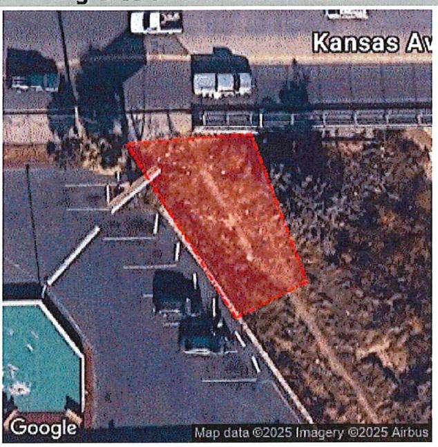

Open Map

Latitude/Longitude:

37.645831 -121.016951

GIS coordinate system:

WGS84 (WKID 4326)

## Ticket Action Reason:

| V |
|---|
| F |
| F |
| J |
| ( |
| ( |

# Excavator Remarks:

On the other side of the chain-linked fence near overpass

|                      |                       |               |  | Rev.#  |  |       |
|----------------------|-----------------------|---------------|--|--------|--|-------|
|                      | Previous Ticket #     |               |  | Medium |  | WEB   |
| Submitted            | 03/11/2025 13:05      |               |  |        |  |       |
| Work Begin Date      | 03/14/2025 07:01      |               |  |        |  |       |
| Legal Start Date     | 03/14/2025 07:01      |               |  |        |  |       |
| Ticket Expiration    | 04/08/2025 23:59      |               |  |        |  |       |
| Work Duration        | 1 day or less         |               |  |        |  |       |
| Address/Location     | 722 Kansas Ave        |               |  |        |  |       |
| City/Town/Place      | Modesto               |               |  |        |  |       |
| County               | Stanislaus County     |               |  |        |  |       |
| State                | CA                    | Zip Code      |  |        |  | 95351 |
| Nearby Cross Street  | Graphics Drive        |               |  |        |  |       |
| Subdivision/Lot      |                       |               |  |        |  |       |
| Delineated Method    | White Paint           |               |  |        |  |       |
| Work Type            | Environmental         |               |  |        |  |       |
| Work Activity        | Monitoring Wells Work |               |  |        |  |       |
| Excavation Method    | Auger - truck mounted |               |  |        |  |       |
| Anticipated Depth    | >84 inches            |               |  |        |  |       |
| Boring               | No                    | Explosive     |  | No     |  |       |
| Street/Sidewalk      | No                    | Pavement Only |  | No     |  |       |
| Vacuum Excavation    | No                    |               |  |        |  |       |
| Project Owner        | Caltrans              |               |  |        |  |       |
| Permit               |                       |               |  |        |  |       |
| Job #/Name           | S2350-01-02           |               |  |        |  |       |
| Onsite Contact Name  | Chris Bates           |               |  |        |  |       |
| Onsite Contact Phone | 9254375773            |               |  |        |  |       |

Page 1 of 2

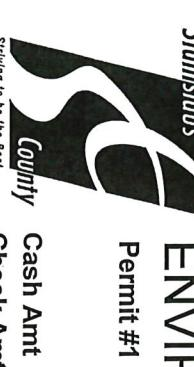

# ENVIRONMENTAL RESOURCES Permit #1 MW25-13; MW25-14 Receipt #

# 1

## 1

### 1

#### 1

##### 1

###### 1

1. 1
2. 1
3. 1

- 1
- 1
- 1

**1**

*1*

`1`

<1>

`1`

 $1$ 

$$1$$

| <strong>Labels</strong> | <strong>Values</strong> |
|-------------------------|-------------------------|
| 1                       | 1                       |
| 1                       | 1                       |

Receipt #

4676.

46762

Date:

3/12/2025

4679

The following is a list of items:

- Item 1
- Item 2
- Item 3

This is a numbered list:

1. First item
2. Second item
3. Third item

This is a bolded text: **Bold Text**

This is an italicized text: *Italic Text*

This is a code snippet: `code snippet`

This is a header:

# Header 1

## Header 2

### Header 3

This is a link: [Google](https://www.google.com)

This is a table:

| <strong>Header 1</strong> | <strong>Header 2</strong> |
|---------------------------|---------------------------|
| Row 1, Col 1              | Row 1, Col 2              |
| Row 2, Col 1              | Row 2, Col 2              |

This is a form:

| Labels | Values   |
|--------|----------|
| Name   | John Doe |
| Age    | 30       |
| City   | New York |

This is a code block:
`function greet(name) {
 console.log('Hello, ' + name + '!');
}`

This is inline math:  $x + y = z$ 

This is display math:

$$\int_{a}^{b} f(x) dx$$

|             | Signature | Description                                                                                            |               |                  | Received From               |                     |             |                | Amt Paid | 3.5% CC Fee | Credit Amt             | Check Amt              | Check # | Card Appr # |
|-------------|-----------|--------------------------------------------------------------------------------------------------------|---------------|------------------|-----------------------------|---------------------|-------------|----------------|----------|-------------|------------------------|------------------------|---------|-------------|
|             |           | HW- PAYMENTS FOR TWO WELL DESTRUCTION FOR CAL TRANS MODESTO STOCKPILES LOCATED WEST & EAST SIDE STA-99 |               | GEMMA G REBLANDO | 3260 VIRA GRANDE SACRAMENTO |                     |             |                | \$658.26 | \$22.26     | \$636.00               |                        |         | 02137C      |
|             |           |                                                                                                        |               |                  |                             |                     |             | Received By nl |          |             |                        |                        |         |             |
|             |           | INVOICE                                                                                                | Batch #:      | SEQ #:           | Card #:                     | VISA SALE           | CREDIT CARD |                | 12:22:29 | 03/12/2025  | 3800 CORNUCOPIA WAY ST | ENVIRONMENTAL RESOURCE |         |             |
| SALE AMOUNT |           |                                                                                                        |               |                  |                             |                     |             |                | \$658.26 |             |                        |                        |         |             |
|             | Mode:     | Approval Code:                                                                                         | Entry Method: |                  |                             | XXXXXXXXXXXXXXX9071 |             |                |          |             | MODESTO, CA 95358      |                        |         |             |
|             | Online    | 02137C                                                                                                 | Manual        |                  |                             |                     |             |                |          |             |                        |                        |         |             |

CUSTOMER COPY

| DEPARTMENT USE ONLY                                                                                                                                                                                                                                                                                |                             | Stanislaus                                                                   | Department of Environmental Resources   |
|----------------------------------------------------------------------------------------------------------------------------------------------------------------------------------------------------------------------------------------------------------------------------------------------------|-----------------------------|------------------------------------------------------------------------------|-----------------------------------------|
| PERMIT #: <u>MW25-14</u>                                                                                                                                                                                                                                                                           |                             | 3800 Cornucopia Way, Suite C, Modesto, CA 95358                              |                                         |
| CASE #: <u>SLO609924194</u>                                                                                                                                                                                                                                                                        |                             | Phone: (209) 525-6700 Fax: (209) 525-6774                                    |                                         |
| FEE PAID: <u>\$318.50</u>                                                                                                                                                                                                                                                                          | <u>Reet#46762</u>           | County                                                                       |                                         |
| ISSUED BY: <u>Stephanie Freier</u>                                                                                                                                                                                                                                                                 |                             |                                                                              | PERMIT APPLICATION                      |
| SIGNED: <u>Freier</u>                                                                                                                                                                                                                                                                              |                             |                                                                              | GROUNDWATER MONITORING WELLS AND        |
| DATE ISSUED: <u>3-12-2025</u>                                                                                                                                                                                                                                                                      |                             |                                                                              | EXPLORATORY OR GEOTECHNICAL BORINGS     |
| DATE CLOSED:                                                                                                                                                                                                                                                                                       |                             |                                                                              |                                         |
| INSPECTED BY:                                                                                                                                                                                                                                                                                      |                             |                                                                              |                                         |
| A. ASSESSOR'S PARCEL NUMBER <u>10-STA-99-16.7 (CALTRANS ROW)</u>                                                                                                                                                                                                                                   | - East side of STA-99       |                                                                              |                                         |
| Site Name <u>Modesto Stockpile</u>                                                                                                                                                                                                                                                                 |                             | Site Address <u>East side of STA-99 &amp; Kansas Ave</u> City <u>Modesto</u> | Zip <u>95351</u>                        |
| B. PROPERTY OWNER <u>CA Dept. of Transportation (Caltrans) - Adam Inman</u>                                                                                                                                                                                                                        |                             |                                                                              |                                         |
| Phone <u>559-374-1574</u>                                                                                                                                                                                                                                                                          | Ext.                        | Fax                                                                          |                                         |
| Mailing Address <u>2015 E. Shields Ave #100</u>                                                                                                                                                                                                                                                    | City <u>Fresno</u>          | State <u>CA</u>                                                              | Zip <u>93726</u>                        |
| C. RESPONSIBLE PARTY <u>Geocon Consultants, Inc.</u>                                                                                                                                                                                                                                               |                             | Email <u>reblando@geoconinc.com</u>                                          |                                         |
| (The person, persons, or company responsible for the construction, monitoring, and destruction of proposed wells and or borings.)                                                                                                                                                                  |                             |                                                                              |                                         |
| Mailing Address <u>3160 Gold Valley Dr #800</u>                                                                                                                                                                                                                                                    | City <u>Rancho Cordova</u>  | State <u>CA</u>                                                              | Zip <u>95742</u>                        |
| Contact Person <u>Gemma Reblando</u>                                                                                                                                                                                                                                                               | Phone <u>916-396-8476</u>   | Fax                                                                          |                                         |
| D. CONSULTING FIRM <u>Geocon Consultants, Inc.</u>                                                                                                                                                                                                                                                 |                             |                                                                              |                                         |
| Mailing Address <u>3160 Gold Valley Dr #800</u>                                                                                                                                                                                                                                                    | City <u>Rancho Cordova</u>  | State <u>CA</u>                                                              | Zip <u>95742</u>                        |
| Registered Professional <u>John Juhrend</u>                                                                                                                                                                                                                                                        | Registration # <u>4929</u>  | <u>(RG, RCE, CEG, PG)</u>                                                    |                                         |
| E-mail <u>juhrend@geoconinc.com</u>                                                                                                                                                                                                                                                                |                             |                                                                              |                                         |
| Contact Person <u>Gemma Reblando</u>                                                                                                                                                                                                                                                               | Phone <u>916-396-8476</u>   | Fax                                                                          |                                         |
| E. DRILLING COMPANY <u>Penecore Drilling</u>                                                                                                                                                                                                                                                       |                             | C57# <u>906899</u>                                                           |                                         |
| Contact Person <u>Xavier Green</u>                                                                                                                                                                                                                                                                 |                             | E-mail <u>xavier@penecore.com</u>                                            |                                         |
| Mailing Address <u>220 N. East St.</u>                                                                                                                                                                                                                                                             | City <u>Woodland</u>        | State <u>CA</u>                                                              | Zip <u>95776</u>                        |
| Phone <u>530-661-3600</u>                                                                                                                                                                                                                                                                          | Fax                         | <u>✓ Current Certificate of Liability Insurance included</u>                 |                                         |
| F. A detailed/scaled site map with proposed drilling locations, well construction diagram(s), proof of underground utilities assessment, and encroachment permit or access agreement must be included.                                                                                             |                             |                                                                              |                                         |
| G. CONSTRUCTION INFORMATION                                                                                                                                                                                                                                                                        |                             |                                                                              |                                         |
| TYPE OF WELLS /BORINGS                                                                                                                                                                                                                                                                             | #                           | MATERIALS TO BE USED<br>CASING<br>SEAL/BORING<br>BACKFILL                    | PROPOSED CONSTRUCTION                   |
| ☐ Monitoring                                                                                                                                                                                                                                                                                       | Type                        | ☐ Neat Cement                                                                | Estimated groundwater depth: <u></u> ft |
| ☐ Boring                                                                                                                                                                                                                                                                                           | Gauge                       | ☐ Cement & Bentonite                                                         | Estimated depth of boring: <u></u> ft   |
| ☐ Soil Vapor                                                                                                                                                                                                                                                                                       | Diameter                    | ☐ Sand-Cement                                                                | Concrete seal <u>0</u> to <u></u>       |
| ☐ Other                                                                                                                                                                                                                                                                                            | Screen Size                 | ☐ Bentonite                                                                  | Annular seal <u></u> to <u></u>         |
|                                                                                                                                                                                                                                                                                                    | Filter Pack                 | ☐ Other <u>City of Woodland</u>                                              | transition seal <u></u> to <u></u>      |
| WELLS TO BE DESTROYED                                                                                                                                                                                                                                                                              |                             | Water Source water tank                                                      | Filter Pack <u></u> to <u></u>          |
| <u>X</u> <u>2</u>                                                                                                                                                                                                                                                                                  | ☐ Auger                     | Drilling Method                                                              | Perforation <u></u> to <u></u>          |
| (Wells MW6 and MW10)                                                                                                                                                                                                                                                                               | ☐ Mud Rotary                | ☐ Air Rotary                                                                 | Borehole diameter <u></u>               |
|                                                                                                                                                                                                                                                                                                    | ☐ Percussion                | ☐ Other                                                                      |                                         |
| I hereby certify that I have prepared this application and that the work will be done in accordance with the provisions of the laws of the State of California, the ordinances of Stanislaus County, and the rules and regulations of the Stanislaus County Department of Environmental Resources. |                             |                                                                              |                                         |
| SIGNED <u>Luu S. Freier</u>                                                                                                                                                                                                                                                                        | PRINT <u>GEMMA REBLANDO</u> | DATE <u>3/3/2025</u>                                                         |                                         |
| (Owner or Authorized Representative*)                                                                                                                                                                                                                                                              |                             |                                                                              |                                         |

| Yes | No |
|-----|----|
|-----|----|

- You are proposing 7 borings and 1 monitoring well, therefore, the cost for the seven (7) borings would be \$583 and the cost for the one (1) monitoring well would be \$265. The total cost of the permit would be \$848.

Section I - Questionnaire:

- a. Have you answered all 6 questions?
- b. Open mitigation cases listed?
   Complete all applicable areas. If additional room is needed, please attach supplemental documents as needed. When a question is not applicable, please write "N/A" in the provided sections. Please do not leave them blank.

## Section J - Well Completion Report:

- a. Reports are required for all monitoring wells constructed, destroyed or altered. The
  responsible party or driller must submit reports within the Online System for Well Completion
  Reports (OSWCR). Please utilize the following link
  https://civicnet.resources.ca.gov/DWR WELLS/ to access the system.
  - For more information on this requirement, please refer to the following website https://water.ca.gov/Programs/Groundwater-Management/Wells.

Forward the completed Monitoring Well and Exploratory or Geotechnical Boring permit Checklist and Application to the Stanislaus County Dept. of Environmental Resources email address <a href="mailto:HMpermit@envres.org">HMpermit@envres.org</a> to begin the review process.

• Expect that permit review will take an average of 14 days. This is to allow time for the HMPermit team to receive consent from State Case Workers for drilling projects within the vicinity of soil and/or groundwater contamination cases to proceed.

After the HMPermit team completes the application review and emails a permit number to you, and we are provided with proof of payment, a copy of the signed permit will be sent to you.

- Payment Options:
  - Payment over the phone may be made with Visa, MasterCard or Discovery (credit card or debit card). American Express is not accepted. Please call (209) 525-6700.
  - Postal Address:
    - Stanislaus County Department of Environmental Resources, Attn: Monitoring Well Permits, 3800 Cornucopia Way, Suite C, Modesto, CA 95358.
      - Checks must be made payable to: Stanislaus County or Stanislaus County
        Department of Environmental Resources. <u>Do not abbreviate and use SCDER on checks</u>.

To close this Monitoring Well and Exploratory or Geotechnical Boring permit, you are responsible for:

- 1. Removing soil cuttings and purge water from the drilling location within 30 days.
  - a. Containerized soil cuttings and purge water left onsite must have information the following information marked on the drum in indelible ink:
  - b. Site Name & Address
  - c. Contact Name and Phone
  - d. Contents of Drum
  - e. Accumulation start date
- 2. Submitting a photo log as a single PDF file showing the following:
  - a. Consistency of each batch of grout being used once it has been prepared with photos labeled by well or boring # and batch # an
  - b. Photos showing the final holes after grouting labeled by well or boring hole #.
  - c. Additional photos if the bore holes are covered by asphalt.
  - d. To represent grout consistency, also include a photo for each grout batch and well or bore hole of the grout adhering on a pen or possibly from a driller's gloved fingertip
- **e.** Forward the photo log to the Stanislaus County Dept. of Environmental Resources email address HMpermit@envres.org with the subject line "MW..-.. (permit number) Photo Log".
- 3. The permit is not valid if there are any changes to the scope of work as previously approved by this department. If changes are required, please contact the office at (209)-525-6700 as soon as possible to amend the permit on record.

| ACTIVITY                     | FEE SCHEDULE                                                                                                                                                        |                                 | AMOUNT |
|------------------------------|---------------------------------------------------------------------------------------------------------------------------------------------------------------------|---------------------------------|--------|
| Monitoring Well Construction | Initial Monitoring Well..........................                                                                                                                   | \$ 265.00<br>x \$ 53.00<br>WLR* |        |
| Soil/Geotechnical Boring     | Initial Monitoring Borings..........................<br>Additional Borings (up to 6)..........................<br>Additional Borings (7+).......................... | \$ 265.00<br>x \$ 53.00<br>WLR* |        |
| Monitoring Well Destruction  | Initial Destruction..........................<br>Additional Destructions (up to 6)..........................                                                        | \$ 265.00<br>x \$ 53.00<br>1    |        |

For well destruction, complete only # 1 below and submit any required supportive documentation.

| 1. What is the purpose of the well/boring investigation?                                                                                                                                                                                                                                                                                                                                                                                                                                                                                                                                                                                                                                                                                                                                                                                                                                                                                                                                                                                                         |                                                                                                                                                                                                                                                        |                                                                                                                                                                                                                                                        |                                                                                                                                                                                                                                                                                            |                                                         |                                                     |                                         |                                                         |  |  |                          |                                                                                 |                          |                                                                                 |                                     |                                                              |
|------------------------------------------------------------------------------------------------------------------------------------------------------------------------------------------------------------------------------------------------------------------------------------------------------------------------------------------------------------------------------------------------------------------------------------------------------------------------------------------------------------------------------------------------------------------------------------------------------------------------------------------------------------------------------------------------------------------------------------------------------------------------------------------------------------------------------------------------------------------------------------------------------------------------------------------------------------------------------------------------------------------------------------------------------------------|--------------------------------------------------------------------------------------------------------------------------------------------------------------------------------------------------------------------------------------------------------|--------------------------------------------------------------------------------------------------------------------------------------------------------------------------------------------------------------------------------------------------------|--------------------------------------------------------------------------------------------------------------------------------------------------------------------------------------------------------------------------------------------------------------------------------------------|---------------------------------------------------------|-----------------------------------------------------|-----------------------------------------|---------------------------------------------------------|--|--|--------------------------|---------------------------------------------------------------------------------|--------------------------|---------------------------------------------------------------------------------|-------------------------------------|--------------------------------------------------------------|
| <table><tbody><tr><td><input checked="" type="checkbox"/></td><td>a. An ongoing site assessment case in which a government regulator is the lead agency. If yes, indicate which government regulator is the lead agency, site address, case number, and attach the associated approval letter to the permit application;</td></tr><tr><td> <table><tbody><tr><td><input checked="" type="checkbox"/></td><td>GeoTracker Case ID / Global ID: <u>SL0609924194</u></td><td><input type="checkbox"/> EnviroStor ID:</td></tr><tr><td>Site Address: <u>State Route 99 &amp; Kansas Avenue</u></td><td></td><td></td></tr></tbody></table></td></tr><tr><td> <input type="checkbox"/></td><td>b. Part of an Environmental Site Assessment for property ownership transfer; or</td></tr><tr><td> <input type="checkbox"/></td><td>c. Geotechnical investigation for proposed construction, land stabilization; or</td></tr><tr><td> <input checked="" type="checkbox"/></td><td>d. Other: <u>Well abandonment required by DTSC and RWQCB</u></td></tr></tbody></table> | <input checked="" type="checkbox"/>                                                                                                                                                                                                                    | a. An ongoing site assessment case in which a government regulator is the lead agency. If yes, indicate which government regulator is the lead agency, site address, case number, and attach the associated approval letter to the permit application; | <table><tbody><tr><td><input checked="" type="checkbox"/></td><td>GeoTracker Case ID / Global ID: <u>SL0609924194</u></td><td><input type="checkbox"/> EnviroStor ID:</td></tr><tr><td>Site Address: <u>State Route 99 &amp; Kansas Avenue</u></td><td></td><td></td></tr></tbody></table> | <input checked="" type="checkbox"/>                     | GeoTracker Case ID / Global ID: <u>SL0609924194</u> | <input type="checkbox"/> EnviroStor ID: | Site Address: <u>State Route 99 &amp; Kansas Avenue</u> |  |  | <input type="checkbox"/> | b. Part of an Environmental Site Assessment for property ownership transfer; or | <input type="checkbox"/> | c. Geotechnical investigation for proposed construction, land stabilization; or | <input checked="" type="checkbox"/> | d. Other: <u>Well abandonment required by DTSC and RWQCB</u> |
| <input checked="" type="checkbox"/>                                                                                                                                                                                                                                                                                                                                                                                                                                                                                                                                                                                                                                                                                                                                                                                                                                                                                                                                                                                                                              | a. An ongoing site assessment case in which a government regulator is the lead agency. If yes, indicate which government regulator is the lead agency, site address, case number, and attach the associated approval letter to the permit application; |                                                                                                                                                                                                                                                        |                                                                                                                                                                                                                                                                                            |                                                         |                                                     |                                         |                                                         |  |  |                          |                                                                                 |                          |                                                                                 |                                     |                                                              |
| <table><tbody><tr><td><input checked="" type="checkbox"/></td><td>GeoTracker Case ID / Global ID: <u>SL0609924194</u></td><td><input type="checkbox"/> EnviroStor ID:</td></tr><tr><td>Site Address: <u>State Route 99 &amp; Kansas Avenue</u></td><td></td><td></td></tr></tbody></table>                                                                                                                                                                                                                                                                                                                                                                                                                                                                                                                                                                                                                                                                                                                                                                       | <input checked="" type="checkbox"/>                                                                                                                                                                                                                    | GeoTracker Case ID / Global ID: <u>SL0609924194</u>                                                                                                                                                                                                    | <input type="checkbox"/> EnviroStor ID:                                                                                                                                                                                                                                                    | Site Address: <u>State Route 99 &amp; Kansas Avenue</u> |                                                     |                                         |                                                         |  |  |                          |                                                                                 |                          |                                                                                 |                                     |                                                              |
| <input checked="" type="checkbox"/>                                                                                                                                                                                                                                                                                                                                                                                                                                                                                                                                                                                                                                                                                                                                                                                                                                                                                                                                                                                                                              | GeoTracker Case ID / Global ID: <u>SL0609924194</u>                                                                                                                                                                                                    | <input type="checkbox"/> EnviroStor ID:                                                                                                                                                                                                                |                                                                                                                                                                                                                                                                                            |                                                         |                                                     |                                         |                                                         |  |  |                          |                                                                                 |                          |                                                                                 |                                     |                                                              |
| Site Address: <u>State Route 99 &amp; Kansas Avenue</u>                                                                                                                                                                                                                                                                                                                                                                                                                                                                                                                                                                                                                                                                                                                                                                                                                                                                                                                                                                                                          |                                                                                                                                                                                                                                                        |                                                                                                                                                                                                                                                        |                                                                                                                                                                                                                                                                                            |                                                         |                                                     |                                         |                                                         |  |  |                          |                                                                                 |                          |                                                                                 |                                     |                                                              |
| <input type="checkbox"/>                                                                                                                                                                                                                                                                                                                                                                                                                                                                                                                                                                                                                                                                                                                                                                                                                                                                                                                                                                                                                                         | b. Part of an Environmental Site Assessment for property ownership transfer; or                                                                                                                                                                        |                                                                                                                                                                                                                                                        |                                                                                                                                                                                                                                                                                            |                                                         |                                                     |                                         |                                                         |  |  |                          |                                                                                 |                          |                                                                                 |                                     |                                                              |
| <input type="checkbox"/>                                                                                                                                                                                                                                                                                                                                                                                                                                                                                                                                                                                                                                                                                                                                                                                                                                                                                                                                                                                                                                         | c. Geotechnical investigation for proposed construction, land stabilization; or                                                                                                                                                                        |                                                                                                                                                                                                                                                        |                                                                                                                                                                                                                                                                                            |                                                         |                                                     |                                         |                                                         |  |  |                          |                                                                                 |                          |                                                                                 |                                     |                                                              |
| <input checked="" type="checkbox"/>                                                                                                                                                                                                                                                                                                                                                                                                                                                                                                                                                                                                                                                                                                                                                                                                                                                                                                                                                                                                                              | d. Other: <u>Well abandonment required by DTSC and RWQCB</u>                                                                                                                                                                                           |                                                                                                                                                                                                                                                        |                                                                                                                                                                                                                                                                                            |                                                         |                                                     |                                         |                                                         |  |  |                          |                                                                                 |                          |                                                                                 |                                     |                                                              |
| 2. What field procedures will be utilized to determine if contamination exists?                                                                                                                                                                                                                                                                                                                                                                                                                                                                                                                                                                                                                                                                                                                                                                                                                                                                                                                                                                                  | N/A                                                                                                                                                                                                                                                    |                                                                                                                                                                                                                                                        |                                                                                                                                                                                                                                                                                            |                                                         |                                                     |                                         |                                                         |  |  |                          |                                                                                 |                          |                                                                                 |                                     |                                                              |
| 3. What procedures will be used to determine whether samples will be sent for laboratory testing or archiving?                                                                                                                                                                                                                                                                                                                                                                                                                                                                                                                                                                                                                                                                                                                                                                                                                                                                                                                                                   | N/A                                                                                                                                                                                                                                                    |                                                                                                                                                                                                                                                        |                                                                                                                                                                                                                                                                                            |                                                         |                                                     |                                         |                                                         |  |  |                          |                                                                                 |                          |                                                                                 |                                     |                                                              |
| 4. What constituents will be monitored and tested (Include laboratory analytical method)?                                                                                                                                                                                                                                                                                                                                                                                                                                                                                                                                                                                                                                                                                                                                                                                                                                                                                                                                                                        | N/A                                                                                                                                                                                                                                                    |                                                                                                                                                                                                                                                        |                                                                                                                                                                                                                                                                                            |                                                         |                                                     |                                         |                                                         |  |  |                          |                                                                                 |                          |                                                                                 |                                     |                                                              |
| 5. How will samples be transported and preserved?                                                                                                                                                                                                                                                                                                                                                                                                                                                                                                                                                                                                                                                                                                                                                                                                                                                                                                                                                                                                                | N/A                                                                                                                                                                                                                                                    |                                                                                                                                                                                                                                                        |                                                                                                                                                                                                                                                                                            |                                                         |                                                     |                                         |                                                         |  |  |                          |                                                                                 |                          |                                                                                 |                                     |                                                              |
| 6. <span style="background-color: yellow;">What is your removal plan for containerized soil cuttings and purge water?</span>                                                                                                                                                                                                                                                                                                                                                                                                                                                                                                                                                                                                                                                                                                                                                                                                                                                                                                                                     | <span style="background-color: yellow;">N/A</span>                                                                                                                                                                                                     |                                                                                                                                                                                                                                                        |                                                                                                                                                                                                                                                                                            |                                                         |                                                     |                                         |                                                         |  |  |                          |                                                                                 |                          |                                                                                 |                                     |                                                              |

## J. Well Completion Report:

California Water Code Section 13751 requires that anyone who constructs, alters, or destroys a water well, cathodic protection well, groundwater monitoring well, or geothermal heat exchange well must file with the Department of Water Resources a report completion within 60 days of the completion of the work. Drillers submit their well completion reports with the Online System of Well Completion Reports (OSWCR, say "Oscar"). OSWCR users create an account based on their C-57 license that DWR will validate. Upon approval users will be able to submit Well Completion Reports.

| Postal Mail                                                                                 | E-Mail                                       | Notice                                                                                                                                                                                    |
|---------------------------------------------------------------------------------------------|----------------------------------------------|-------------------------------------------------------------------------------------------------------------------------------------------------------------------------------------------|
| SCDER<br>Attn: Monitoring Well Permits<br>3800 Cornucopia Way, Suite C<br>Modesto, CA 95358 | HMpermit@envres.org<br>Fax<br>(209) 525-6774 | **Once permitted, SCDER must be notified a<br>minimum of 48 hours in advance of the<br>construction/destruction activities.<br>SCDER reserves the right to inspect field<br>activities.** |


# DEPARTMENT OF ENVIRONMENTAL RESOURCES

3800 Cornucopia Way, Suite C, Modesto, CA 95358-9492 Phone: 209.525.6700. Fax: 209.525.6774

## Monitoring Wells and Geotechnical Borings Within Stanislaus County

Stanislaus County Department of Environmental Resources (DER) oversees the constructing and destructing of soil borings for including those for installing vadose zone, groundwater (monitoring and/or extraction) and cathodic protection wells in all areas of Stanislaus County. The above types of wells include both permanent and temporary wells and those that are made with cone penetration technology or so called "Hydropunch type" sampling devices.

Please submit a <u>completed Checklist</u> (pages 3-6) for all Monitoring Well or Soil Boring Permit Applications (pages 7-8) submitted in Stanislaus County limits, <u>with the exception of the City of Modesto</u> (see Important Note #1 below). The checklist is not exhaustive nor inclusive of all requirements for the permit application, but rather its intent is to help applicants catch common mistakes before submitting permits to this department and ensure all provided information is correct and required documents are included. NOTE: Incomplete or inaccurate information will extend the application review process. Permit Application will not be accepted without a completed Checklist (pages 3-6).

## Important Notes:

- 1. All proposed work within City of Modesto limits has its own separate permitting requirement, in addition to those of DER, for activities performed within the incorporated area where they have jurisdiction. Please consult with the City of Modesto if you intend to place any wells and/or borings within their jurisdiction. If you're unsure if the proposed project is within City of Modesto limits, check the City of Modesto GIS at https://gis.modestogov.com/gis/.
  - If the project is within City of Modesto limits, then contact the City of Modesto-Groundwater
    Application (Monitoring Wells) team at 209-342-4712,
    <a href="https://www.modestogov.com/1509/Groundwater-Application-Monitoring-Wells">https://www.modestogov.com/1509/Groundwater-Application-Monitoring-Wells</a> regarding the
    City of Modesto application.
  - Our Department does not require the submittal of any additional County application(s) or fees for these City of Modesto circumstances.
- 2. Completion and submittal of a Stanislaus County Monitoring Well Permit is <u>required</u> prior to beginning work on any of the following:
  - a. Exploratory boring in areas where hazardous substances or wastes have or are stored or where soil and/or groundwater is suspected/ known to be contaminated with hazardous substances or wastes, or
  - b. Any boring in which a casing will be installed, or
  - c. Any boring that has a monitoring device installed, or
  - d. Any soil boring greater than 20 feet. in depth, or
  - e. Any soil boring 20 feet in depth or less where it is anticipated that groundwater table will be encountered.
- 3. It is not necessary to obtain a separate monitoring well permit for the installation of multiple groundwater monitoring wells provided the wells:
  - a. Are all located at one site (one parcel number or address), and
  - b. Will be installed during the same specified time frame, and
  - c. Are of the same construction type.
- 4. All wells shall be constructed according to the State of California Department of Water Resources (CA DWR) Bulletins 74-81 and 74-90. Each well must be identified by a unique descriptive well name/number. Each well must have this descriptive name/number permanently marked on the well.

- 5. A representative line drawing of the wells construction details as well as a separate site map depicting the proposed location (referenced with each wells descriptive name/ number) must accompany each monitoring well permit. If construction specifications of the monitoring wells differ, a specific monitoring well construction diagram must be provided for each differing well. It is acceptable to reference a previously completed work plan if well construction details/location we addressed in the work plan and a copy of this work plan accompanies the well permit.
- 6. Any contractor performing work of this type must have on file with the DER:
  - a. A valid C-57 license, and
  - b. A current Certificate of Insurance.
- 7. Once permitted, the DER must be notified at least 48 hours in advance of the construction/ destruction activities. DER reserves its right to inspect field activities, but a representative of DER need not be present prior to commencing the work provided the activity has been properly permitted and the DER has been sufficiently notified. The permit fee is derived from analysis of staff time for review and processing of the permit application and any site inspections, which may be conducted by staff during or subsequent to the installation of the monitoring wells.
- 8. Monitoring wells and soil borings shall be abandoned in accordance with CA DWR Bulletins 74-81 and 74-90.
- 9. Prior to commencing boring/well destruction and for completion of boring/well permit, the contractor must:
  - a. Complete of the destruction section a monitoring well permit form. (For wells constructed and destroyed within the same mobilization both the construction and destruction sections must be completed.)
  - b. Estimate the volume of grout expected to be necessary to destruct each monitoring well prior to destruction, and
  - c. Describe the steps and methods used to destruct the well including the management of the casing and the installation method used to fill the well with grout.
- 10. After field destruction activities are complete, the contractor must report to the DER:
  - a. Any planned vs. field work anomalies, and
  - b. The actual amount of grout used so as to evaluate the effectiveness of the well destruction.

For additional information on boring/monitoring well construction and/or destruction, please contact the Environmental Resources Department at (209) 525-6700 or via email (<a href="https://email.org/lenviros.org"><u>HMpermit@envres.org</u></a>).

**Permit Application Checklist** Check Yes or No boxes below. Permit Application will not be accepted without a completed Checklist (pages 3-6). Yes Section A - Assessor's Parcel Number: 1. a. Does the APN match the Counties APN? Check Assessor Map Book Viewer (arcgis.com) at https://experience.arcgis.com/experience/29a526aa3639499f96b63f17c2b14cc5. b. Does the property owner access agreement match the listed property owner? c. If your project involves multiple parcel numbers and/or addresses, a separate application is required for each. d. If the property owner is the same, but the project involves multiple parcel numbers, a separate application is required for each parcel. e. If there are multiple property owners for a single project, then an application must be submitted for each property owner. f. If a project involves multiple drillers, then page 1 of the application must be submitted for each additional driller and a certificate of liability must be submitted for each one. 2. Are there any Mitigation cases with in ½ mile of the site? Check drilling location address in both public access databases listed below. a. https://geotracker.waterboards.ca.gov b. https://www.envirostor.dtsc.ca.gov/public If so, delays may occur in the permitting process while reaching out to State Case Worker for consent for drilling project to proceed. Section B - Property Owner: 1. This must be the property owner, which is listed through the Assessor's office website https://www.stancounty.com/assessor/. Do not use the resident or business owner information, unless they are the property owner. Sections C - E: Please check the box to reflect the entity completing this application. Section C - Responsible Party: 1. Complete? This will be the entity responsible for the proposed work and ensuring all standards and regulations are followed. Section D - Consulting Firm: 1. Complete? a. Is the Registered professional number listed on the permit application? c. Match the name provided? d. Have you indicated the type of registration? e. Validate here: Search - DCA at https://search.dca.ca.gov/?BD=31 If they are also the responsible party, the information for the Registered Professional is only needed within this section. Section E - Drilling Company: 1. Complete? a. Is the C57 listed?

b. Does C57 match the listed company?

c. Is Drillers Certificate Of Insurance included?

i. At a minimum, they should have active general liability and workers' compensation.

| Yes                        | No |                                                                                                                                                                                                                                                                                                                                                                                                                                                                                                                                                                                                                                                                                                                                                                                                                                                                                                        |
|----------------------------|----|--------------------------------------------------------------------------------------------------------------------------------------------------------------------------------------------------------------------------------------------------------------------------------------------------------------------------------------------------------------------------------------------------------------------------------------------------------------------------------------------------------------------------------------------------------------------------------------------------------------------------------------------------------------------------------------------------------------------------------------------------------------------------------------------------------------------------------------------------------------------------------------------------------|
| <b>√</b>                   |    | <ul><li>ii. The only time workers' compensation is not required, is if the owner of the business is the only one performing the work. If the employees utilized have been subcontracted, then their employer must provide proof of workers' compensation.</li><li>d. Did you check insurance included box on permit application?</li><li>e. Validate here: Check A License - CSLB (ca.gov) at <a href="https://cslb.ca.gov/OnlineServices/CheckLicensell/CheckLicense.aspx">https://cslb.ca.gov/OnlineServices/CheckLicensell/CheckLicense.aspx</a></li><li>When applicable, proof of workers compensation must be indicated on the Certificate of Liability form. If the company has one or more employees conducting the work, workers compensation is required. The responsible party must ensure the drilling company has workers compensation or exempt from this requirement.</li></ul>          |
|                            |    | <ul><li>Section F - Attachments:</li><li>1. Have you included the following attachments with the permit application?</li><li>a. Detailed Site map with all borings keyed out with unique number/name identifiers.</li><li>b. Proposed well construction diagram(s) (when installing monitoring wells)</li><li>c. USA dig ticket (Proof of underground utilities assessment, i.e. receipt)</li><li>d. Access agreement from private property owner on record. It may be in the form of an email.</li><li>e. Well construction diagrams (if appropriate)</li><li>f. List of all borings proposed on each APN.</li><li>g. Encroachment permit if right of way access is required. Apply here: Applications &amp; Forms - Public Works - Stanislaus County (stancounty.com) at <a href="https://www.stancounty.com/publicworks/forms.shtm">https://www.stancounty.com/publicworks/forms.shtm</a></li></ul> |
| ✓<br>✓<br>✓<br>✓<br>✓<br>✓ |    | <ul><li>Section G - Construction Information:</li><li>1. Complete all applicable areas pertaining to your proposed work.<ul><li>a. Do the number of items being constructed match what is reflected on the map?</li><li>b. Backfill material listed?</li><li>c. Water source listed? Water to be brought by drillers from Woodland, CA</li><li>d. Drilling method listed?</li><li>e. Ground water depth listed?</li><li>f. Depth of Boring listed?</li><li>g. Seal material and depth listed?</li><li>h. Is the permit application signed by owner or agent?</li><li>There will be no additional fee for backfilling the exploratory borings covered under the permit, therefore, do not include these in the fee section under well destruction.</li></ul></li></ul>                                                                                                                                  |
| <b>√</b>                   |    | <ul><li>Section H - Fees: Complete all applicable sections pertaining to the proposed work.</li><li>1. Fees section filled out appropriately for the number of wells/borings?</li><li>a. Monitoring wells, exploratory borings, and destructions have their own separate categories. For monitoring wells installed in the unincorporated areas of the County, the DER permit fee is: \$265.00 for the first boring/well included in the permit, and \$53.00 for each additional boring/well. Contact us at 209-525-6700 for the current fees. Utilize the drop-down function to apply the appropriate fee for the amount and check to ensure it is correct before submitting.</li><li>Examples:</li></ul>                                                                                                                                                                                             |
|                            |    | <ul><li>The first construction, drilling and destruction is \$265, then \$53 for each one after.</li><li>You are proposing three (3) monitoring wells would be \$265,00+\$53,00+\$53,00 = \$371,00</li></ul>                                                                                                                                                                                                                                                                                                                                                                                                                                                                                                                                                                                                                                                                                           |

You are proposing seven (7) monitoring wells, would be \$583.

## Stephanie Freier

From:

Gemma Reblando <reblando@geoconinc.com>

Sent:

Wednesday, March 12, 2025 8:36 AM

To:

**Hmpermit** 

Subject:

FW: Modesto Well Destruction

## Good morning,

Please see email below from Caltrans regarding access agreement for the well destruction activities at the Caltrans Modesto Stockpiles.

Thank you.

Gemma Reblando Geocon Consultants. Inc. 916-396-8476

From: Inman, Adam@DOT < Adam.Inman@dot.ca.gov >

Sent: Wednesday, March 12, 2025 8:15 AM

To: Rebecca Silva < silva@geoconinc.com >
Subject: Re: Modesto Well Destruction

## Good Morning Rebecca,

Caltrans grants unrestricted access to Geocon and its sub consultants to State Right of Way for the duration of the well destruction project. Geocon will be accompanied by Caltrans staff during the project.

Thank you

Adam Inman, PG
Engineering Geologist
Caltrans D-6 | Office of Environmental Engineering
Hazardous Waste and Paleontology Branch
2015 East Shields Avenue, Suite 100
Fresno, CA 93726

Cell: 559-374-1574

From: Rebecca Silva < silva@geoconinc.com > Sent: Wednesday, March 12, 2025 7:36:50 AM To: Inman, Adam@DOT < Adam.Inman@dot.ca.gov >

Subject: Modesto Well Destruction

EXTERNAL EMAIL. Links/attachments may not be safe.

Hi Adam – The County has asked for the following...

Access agreement from the property owner CalTrans. It may be in the form of an email.

Will you please send over an email giving us access for the well destructions?

## Thank you!

Please note that I will be on vacation from March 18 to March 23, returning to work on March 24, 2025.


Rebecca Silva Senior Environmental Scientist O: 916.852.9118 M: 916.508.1910 silva@geoconinc.com

GEOCO

GEOCON CONSULTANTS, INC.

3160 Gold Valley Drive, Suite 800, Rancho Cordova, California 95742

## Serving California through 9 Regional Offices:

LivermoreRancho CordovaFairfieldSan DiegoBurbankIrvineMurrietaRedlandsLa Quinta

Geotechnical Engineering Environmental Services
Engineering Geology Construction Inspection

InfrastructureTransportationLand DevelopmentInstitutionalBrownfields/RedevelopmentNatural Resources

Connect with us! www.geoconinc.com Linked in

## GEOTECHNICAL I ENVIRONMENTAL MATERIALS


Project No. S2350-01-02 March 3, 2025

Stephanie Freier Stanislaus County Department of Environmental Resources 3800 Cornucopia Way, Suite C Modesto, California 95358

Subject:

MONITORING WELL DESTRUCTION
CALTRANS MODESTO SOIL STOCKPILES
GEOTRACKER CASE # SL0609924194

Ms. Freier:

Geocon Consultants, Inc. (Geocon) has prepared a permit application for the destruction of four monitoring wells. The site is located within California Department of Transportation (CalTrans) right-of-way (ROW) south of SR-99/Kansas Avenue Interchange (10-STA-99-16.7) (Figure 1). Geocon will retain PeneCore Drilling (C57#906899) for well destruction activities.

We will abandon monitoring wells MW4, MW6, MW9, and MW10 per Department of Toxic Substances Control (DTSC) directive letter dated May 3, 2024 (see attached) in concurrence with the Central Valley Regional Water Quality Control Board (CRWQCB). Wells MW4, MW6, MW9, and MW10 will be properly abandoned by pressure-grouting in general accordance with the requirements of California Well Standards Bulletin 74-90, Monitoring Well Standards, Part III. Well construction details are provided below:

| WELL<br>ID | CASING<br>MATERIAL | COMPLETED<br>WELL<br>DEPTH<br>(feet) | CASING<br>DIAMETER<br>(inches) | SCREENED<br>INTERVAL<br>(feet) | SLOT<br>SIZE<br>(inches) | FILTER<br>PACK<br>INTERVAL<br>(feet) | FILTER<br>PACK<br>MATERIAL |
|------------|--------------------|--------------------------------------|--------------------------------|--------------------------------|--------------------------|--------------------------------------|----------------------------|
| MW4        | SCH 40 PVC         | 42                                   | 2                              | 30-40                          | 0.010                    | 26-42                                | #2/12 Sand                 |
| MW6        | SCH 40 PVC         | 46.5                                 | 2                              | 33-43                          | 0.010                    | 30-46.5                              | #2/12 Sand                 |
| MW9        | SCH 40 PVC         | 40                                   | 2                              | 29.5-39.5                      | 0.010                    | 27.5-40                              | #2/12 Sand                 |
| MW10       | SCH 40 PVC         | 40                                   | 2                              | 29.5-39.5                      | 0.010                    | 27.5-40                              | #2/12 Sand                 |

To pressure grout, PeneCore will initially fill each well with neat Portland cement. The well seal material will be placed via a tremie pipe from the bottom of the well under sufficient pressure and length of time to penetrate the annular filter pack. Additional volume of seal material will be pumped into the well as needed after air pressure is administered.


Following pressure-grouting, Penecore will then remove the well box and concrete apron of the wells and the top 5 feet of each well will be over-drilled and that portion of the well casing removed. The over-drilled borings will then be filled with Portland cement or sand/cement slurry to the ground surface and cap the surface with approximately 6 inches of black-dyed concrete or soil to match the surrounding surface.

Please contact me if you have any questions.

Sincerely,

GEOCON CONSULTANTS, INC.

Gemma G. Reblando Project Geologist

Attachments:

SCDER Well Applications

Figure 1, Site Location Map

Figure 2, Site Plan

**DTSC Directive Letter** 

PeneCore Drilling - Certificate of Liability Insurance

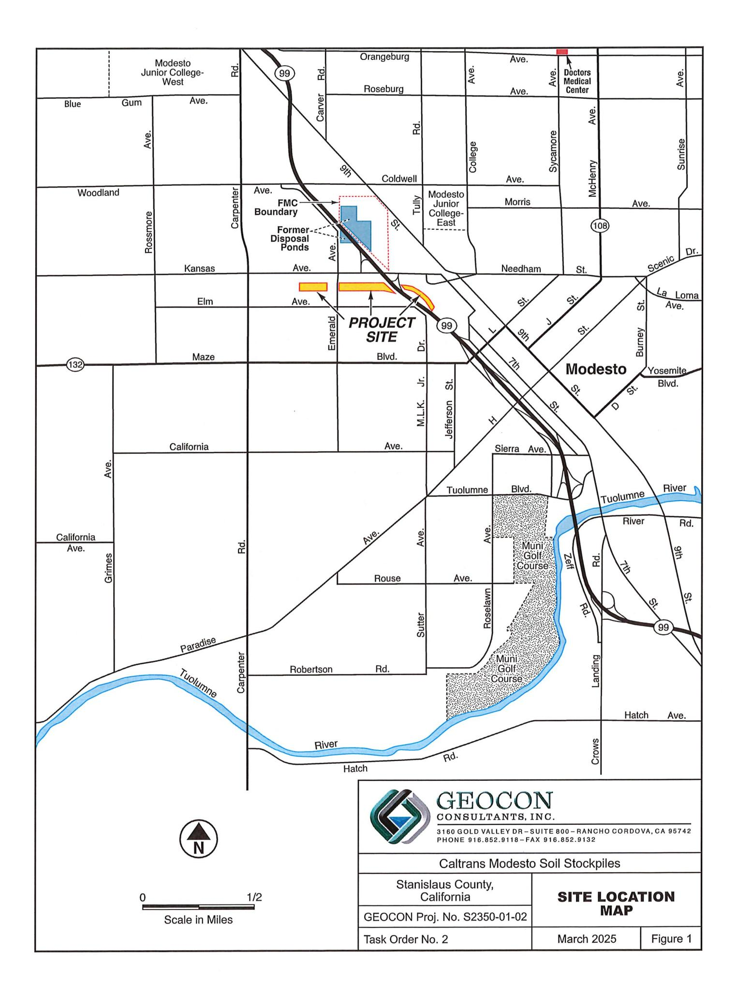

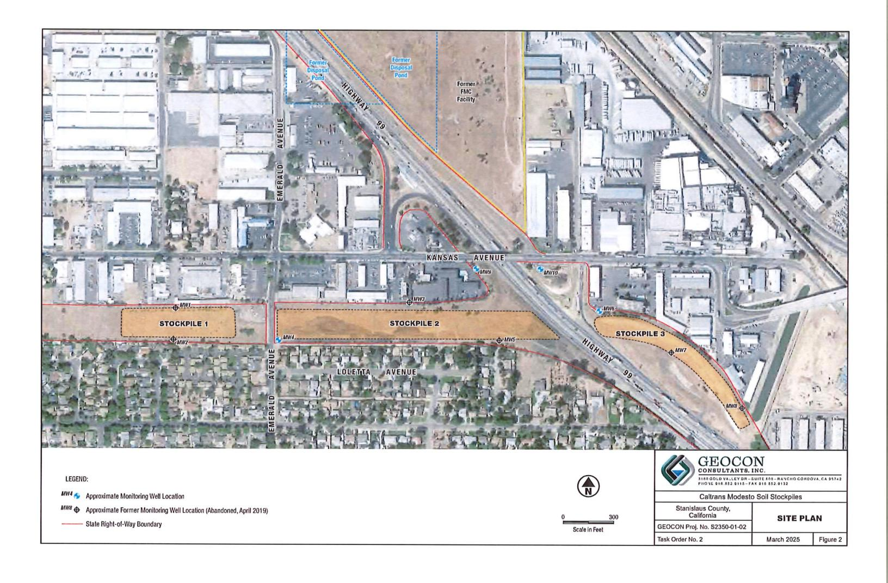


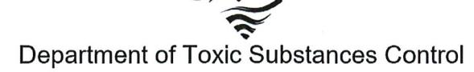

Gavin Newsom
Governor

Meredith Williams, Ph.D., Director 8800 Cal Center Drive Sacramento, California 95826-3200

## Sent Via Electronic Mail

May 3, 2024

Rebecca L. Silva
Project Manager
Geocon Consultants, Inc
3160 Gold Valley Drive, Suite 800
Rancho Cordova, California 95742
Silva@geoconinc.com

APPROVAL OF THE UPDATED COMPARATIVE EVALUATION OF GROUNDWATER DATA, CALTRANS ENCAPSULATED SOIL STOCKPILES, STATE ROUTE 132, STANISLAUS COUNTY, CALIFORNIA (SITE CODE: 900259)

## Dear Ms. Silva:

The Department of Toxic Substances Control (DTSC) in consultation with the Central Valley Regional Water Quality Control Board (RWQCB) has reviewed the Updated Comparative Evaluation of Groundwater Data, Caltrans Encapsulated Soil Stockpiles (Evaluation Report) dated February 26, 2024. The Evaluation Report was submitted by Geocon Consultants Inc. (Geocon) on behalf of the Department of Transportation (Caltrans) to evaluate the potential of the barium and lead impacted soil stockpiles beneath the newly constructed State Route (SR) 132 Express Way to impact groundwater.

DTSC and the RWQCB agree that the data indicates the encapsulated soil is not impacting groundwater and that it will not impact groundwater in the future. As noted in the Evaluation Report, the consistency with the earlier 2014 evaluation and the recent encapsulation of the soil beneath the Express Way support this conclusion. In addition, both DTSC and the RWQCB concur with the recommendation that groundwater monitoring beneath the soil stockpiles be discontinued and the four remaining monitoring wells (MW4, MW6, MW9, and MW10) be decommissioned as per the approved Remedial Design and Implementation Plan.

Rebecca L. Silva May 3, 2024 Page 2

If you have any questions regarding this approval, please contact me at (916) 255-3591 or via email at Dean.Wright@dtsc.ca.gov.

Sincerely,

Dean Wright, PG Project Manager

Site Mitigation and Restoration Program Department of Toxic Substances Control

cc: (via email)

Adam Inman, P.G.
Engineering Geologist
Caltrans D-6, Office of Environmental Engineering
Adam.Inman@dot.ca.gov

Kyle Cockerham, PG Site Cleanup Unit Regional Water Quality Control Board Kyle.Cockerham@waterboards.ca.gov

Lora Jameson, PG, Chief Site Evaluation and Remediation Unit Department of Toxic Substances Control Site Evaluation and Remediation Program Lora.Jameson@dtsc.ca.gov

# ACORD

## CERTIFICATE OF LIABILITY INSURANCE

DATE (MM/DD/YYYY) 1/9/2025

THIS CERTIFICATE IS ISSUED AS A MATTER OF INFORMATION ONLY AND CONFERS NO RIGHTS UPON THE CERTIFICATE HOLDER. THIS CERTIFICATE DOES NOT AFFIRMATIVELY OR NEGATIVELY AMEND, EXTEND OR ALTER THE COVERAGE AFFORDED BY THE POLICIES BELOW. THIS CERTIFICATE OF INSURANCE DOES NOT CONSTITUTE A CONTRACT BETWEEN THE ISSUING INSURER(S), AUTHORIZED REPRESENTATIVE OR PRODUCER, AND THE CERTIFICATE HOLDER.

IMPORTANT: If the certificate holder is an ADDITIONAL INSURED, the policy(ies) must have ADDITIONAL INSURED provisions or be endorsed. If SUBROGATION IS WAIVED, subject to the terms and conditions of the policy, certain policies may require an endorsement. A statement on this certificate does not confer rights to the certificate holder in lieu of such endorsement(s).

| PRODUCER                                  |  | License # 0B50501  |  | CONTACT |  | Teresa Galart                                             |  |                                   |  |        |  |                           |  |
|-------------------------------------------|--|--------------------|--|---------|--|-----------------------------------------------------------|--|-----------------------------------|--|--------|--|---------------------------|--|
| Armstrong & Associates Insurance Services |  |                    |  |         |  | PHONE                                                     |  | (A/C, No, Ext): (530) 406-2742    |  | FAX    |  | (A/C, No): (530) 668-2779 |  |
| 239 W Court St, Bldg A                    |  |                    |  |         |  | E-MAIL ADDRESS:                                           |  | tgalart@armstrongprofessional.com |  |        |  |                           |  |
| INSURED                                   |  |                    |  |         |  | INSURER(S) AFFORDING COVERAGE                             |  |                                   |  | NAIC # |  |                           |  |
| TSA Drilling Inc.                         |  | PeneCore Drilling  |  |         |  | INSURER A: Homeland Insurance Company of New York         |  |                                   |  | 34452  |  |                           |  |
| 220 North East St                         |  | Woodland, CA 95776 |  |         |  | INSURER B: West American Insurance Company                |  |                                   |  | 44393  |  |                           |  |
|                                           |  |                    |  |         |  | INSURER C: Carolina Casualty Insurance Company            |  |                                   |  | 10510  |  |                           |  |
|                                           |  |                    |  |         |  | INSURER D : Ohio Security Insurance Company               |  |                                   |  | 24082  |  |                           |  |
|                                           |  |                    |  |         |  | INSURER E: Travelers Property Casualty Company of America |  |                                   |  | 25674  |  |                           |  |
|                                           |  |                    |  |         |  | INSURER F:                                                |  |                                   |  |        |  |                           |  |

**REVISION NUMBER: COVERAGES CERTIFICATE NUMBER:** THIS IS TO CERTIFY THAT THE POLICIES OF INSURANCE LISTED BELOW HAVE BEEN ISSUED TO THE INSURED NAMED ABOVE FOR THE POLICY PERIOD INDICATED. NOTWITHSTANDING ANY REQUIREMENT, TERM OR CONDITION OF ANY CONTRACT OR OTHER DOCUMENT WITH RESPECT TO WHICH THIS CERTIFICATE MAY BE ISSUED OR MAY PERIAIN, THE INSURANCE AFFORDED BY THE POLICIES DESCRIBED HEREIN IS SUBJECT TO ALL THE TERMS, EVALUATION OF ANY CONDITIONS OF SUICE BUILDING AND CONDITIONS OF SUICE BUILDING AND CONDITIONS OF SUICE BUILDING AND CONDITIONS OF SUICE BUILDING AND CONDITIONS OF SUICE BUILDING AND CONDITIONS OF SUICE BUILDING AND CONDITIONS OF SUICE BUILDING AND CONDITIONS OF SUICE BUILDING AND CONDITIONS OF SUICE BUILDING AND CONDITIONS OF SUICE BUILDING AND CONDITIONS OF SUICE BUILDING AND CONDITIONS OF SUICE BUILDING AND CONDITIONS OF SUICE BUILDING AND CONDITIONS OF SUICE BUILDING AND CONDITIONS OF SUICE BUILDING AND CONDITIONS OF SUICE BUILDING AND CONDITIONS OF SUICE BUILDING AND CONDITIONS OF SUICE BUILDING AND CONDITIONS OF SUICE BUILDING AND CONDITIONS OF SUICE BUILDING AND CONDITIONS OF SUICE BUILDING AND CONDITIONS OF SUICE BUILDING AND CONDITIONS OF SUICE BUILDING AND CONDITIONS OF SUICE BUILDING AND CONDITIONS OF SUICE BUILDING AND CONDITIONS OF SUICE BUILDING AND CONDITIONS OF SUICE BUILDING AND CONDITIONS OF SUICE BUILDING AND CONDITIONS OF SUICE BUILDING AND CONDITIONS OF SUICE BUILDING AND CONDITIONS OF SUICE BUILDING AND CONDITIONS OF SUICE BUILDING AND CONDITIONS OF SUICE BUILDING AND CONDITIONS OF SUICE BUILDING AND CONDITIONS OF SUICE BUILDING AND CONDITIONS OF SUICE BUILDING AND CONDITIONS OF SUICE BUILDING AND CONDITIONS OF SUICE BUILDING AND CONDITIONS OF SUICE BUILDING AND CONDITIONS OF SUICE BUILDING AND CONDITIONS OF SUICE BUILDING AND CONDITIONS OF SUICE BUILDING AND CONDITIONS OF SUICE BUILDING AND CONDITIONS OF SUICE BUILDING AND CONDITIONS OF SUICE BUILDING AND CONDITIONS OF SUICE BUILDING AND CONDITIONS OF SUICE BUILDING AND CONDITIONS OF SUICE BUILDING AND CONDITIONS OF SUICE BUILDING AND CONDITIONS OF SUICE BUILDING AND

| E           | EXCLUSIONS AND CONDITIONS OF SUCH POLICIES. LIMITS SHOWN MAY HAVE BEEN REDUCED BY PAID CLAIMS. |              |      |               |                            |                                                                                                                                                                                                                                                                                                                                                                                                                                                                                                                                                                                                                                                                                                                                                                                                                                                                                                                                                                                                                                                                                                                                                                                                                                                                                                                                                                                                                                                                                                                                                                                                                                                                                                                                                                                                                                                                                                                                                                                                                                                                                                                                |                                                 |  |  |  |
|-------------|------------------------------------------------------------------------------------------------|--------------|------|---------------|----------------------------|--------------------------------------------------------------------------------------------------------------------------------------------------------------------------------------------------------------------------------------------------------------------------------------------------------------------------------------------------------------------------------------------------------------------------------------------------------------------------------------------------------------------------------------------------------------------------------------------------------------------------------------------------------------------------------------------------------------------------------------------------------------------------------------------------------------------------------------------------------------------------------------------------------------------------------------------------------------------------------------------------------------------------------------------------------------------------------------------------------------------------------------------------------------------------------------------------------------------------------------------------------------------------------------------------------------------------------------------------------------------------------------------------------------------------------------------------------------------------------------------------------------------------------------------------------------------------------------------------------------------------------------------------------------------------------------------------------------------------------------------------------------------------------------------------------------------------------------------------------------------------------------------------------------------------------------------------------------------------------------------------------------------------------------------------------------------------------------------------------------------------------|-------------------------------------------------|--|--|--|
| INSR<br>LTR | TYPE OF INSURANCE                                                                              | ADDL<br>INSD | SUBR | POLICY NUMBER | POLICY EFF<br>(MM/DD/YYYY) | POLICY EXP<br>(MM/DD/YYYY)                                                                                                                                                                                                                                                                                                                                                                                                                                                                                                                                                                                                                                                                                                                                                                                                                                                                                                                                                                                                                                                                                                                                                                                                                                                                                                                                                                                                                                                                                                                                                                                                                                                                                                                                                                                                                                                                                                                                                                                                                                                                                                     | LIMITS                                          |  |  |  |
| Α           | X COMMERCIAL GENERAL LIABILITY                                                                 |              |      | E             |                            |                                                                                                                                                                                                                                                                                                                                                                                                                                                                                                                                                                                                                                                                                                                                                                                                                                                                                                                                                                                                                                                                                                                                                                                                                                                                                                                                                                                                                                                                                                                                                                                                                                                                                                                                                                                                                                                                                                                                                                                                                                                                                                                                | EACH OCCURRENCE \$ 1,000,00                     |  |  |  |
|             | CLAIMS-MADE X OCCUR                                                                            | Х            |      | 7930113350003 | 8/5/2024                   | 8/5/2025                                                                                                                                                                                                                                                                                                                                                                                                                                                                                                                                                                                                                                                                                                                                                                                                                                                                                                                                                                                                                                                                                                                                                                                                                                                                                                                                                                                                                                                                                                                                                                                                                                                                                                                                                                                                                                                                                                                                                                                                                                                                                                                       | DAMAGE TO RENTED \$ 100,00                      |  |  |  |
| ١,          | χ Pollution                                                                                    |              |      |               |                            |                                                                                                                                                                                                                                                                                                                                                                                                                                                                                                                                                                                                                                                                                                                                                                                                                                                                                                                                                                                                                                                                                                                                                                                                                                                                                                                                                                                                                                                                                                                                                                                                                                                                                                                                                                                                                                                                                                                                                                                                                                                                                                                                | MED EXP (Any one person) \$ 5,00                |  |  |  |
| 1           | χ Professional                                                                                 |              |      |               |                            |                                                                                                                                                                                                                                                                                                                                                                                                                                                                                                                                                                                                                                                                                                                                                                                                                                                                                                                                                                                                                                                                                                                                                                                                                                                                                                                                                                                                                                                                                                                                                                                                                                                                                                                                                                                                                                                                                                                                                                                                                                                                                                                                | PERSONAL & ADV INJURY \$ 1,000,00               |  |  |  |
|             | GEN'L AGGREGATE LIMIT APPLIES PER:                                                             |              |      |               |                            |                                                                                                                                                                                                                                                                                                                                                                                                                                                                                                                                                                                                                                                                                                                                                                                                                                                                                                                                                                                                                                                                                                                                                                                                                                                                                                                                                                                                                                                                                                                                                                                                                                                                                                                                                                                                                                                                                                                                                                                                                                                                                                                                | GENERAL AGGREGATE \$ 2,000,00                   |  |  |  |
|             | X POLICY X PRO-                                                                                |              |      |               |                            |                                                                                                                                                                                                                                                                                                                                                                                                                                                                                                                                                                                                                                                                                                                                                                                                                                                                                                                                                                                                                                                                                                                                                                                                                                                                                                                                                                                                                                                                                                                                                                                                                                                                                                                                                                                                                                                                                                                                                                                                                                                                                                                                | PRODUCTS - COMP/OP AGG \$ 2,000,00              |  |  |  |
|             | OTHER:                                                                                         |              |      |               |                            |                                                                                                                                                                                                                                                                                                                                                                                                                                                                                                                                                                                                                                                                                                                                                                                                                                                                                                                                                                                                                                                                                                                                                                                                                                                                                                                                                                                                                                                                                                                                                                                                                                                                                                                                                                                                                                                                                                                                                                                                                                                                                                                                | Poll/Prof   s 1,000,00                          |  |  |  |
| В           | AUTOMOBILE LIABILITY                                                                           |              |      |               |                            |                                                                                                                                                                                                                                                                                                                                                                                                                                                                                                                                                                                                                                                                                                                                                                                                                                                                                                                                                                                                                                                                                                                                                                                                                                                                                                                                                                                                                                                                                                                                                                                                                                                                                                                                                                                                                                                                                                                                                                                                                                                                                                                                | COMBINED SINGLE LIMIT (Ea accident) \$ 1,000,00 |  |  |  |
|             | X ANY AUTO                                                                                     | X            |      | BAW56829954   | 8/5/2024                   | 8/5/2025                                                                                                                                                                                                                                                                                                                                                                                                                                                                                                                                                                                                                                                                                                                                                                                                                                                                                                                                                                                                                                                                                                                                                                                                                                                                                                                                                                                                                                                                                                                                                                                                                                                                                                                                                                                                                                                                                                                                                                                                                                                                                                                       | BODILY INJURY (Per person) \$                   |  |  |  |
|             | OWNED SCHEDULED AUTOS                                                                          |              |      | 4 4 4         |                            |                                                                                                                                                                                                                                                                                                                                                                                                                                                                                                                                                                                                                                                                                                                                                                                                                                                                                                                                                                                                                                                                                                                                                                                                                                                                                                                                                                                                                                                                                                                                                                                                                                                                                                                                                                                                                                                                                                                                                                                                                                                                                                                                | BODILY INJURY (Per accident) \$                 |  |  |  |
|             | HIRED NON-OWNED AUTOS ONLY                                                                     |              |      |               |                            |                                                                                                                                                                                                                                                                                                                                                                                                                                                                                                                                                                                                                                                                                                                                                                                                                                                                                                                                                                                                                                                                                                                                                                                                                                                                                                                                                                                                                                                                                                                                                                                                                                                                                                                                                                                                                                                                                                                                                                                                                                                                                                                                | PROPERTY DAMAGE (Per accident) \$               |  |  |  |
|             |                                                                                                |              |      |               | 1                          |                                                                                                                                                                                                                                                                                                                                                                                                                                                                                                                                                                                                                                                                                                                                                                                                                                                                                                                                                                                                                                                                                                                                                                                                                                                                                                                                                                                                                                                                                                                                                                                                                                                                                                                                                                                                                                                                                                                                                                                                                                                                                                                                | \$                                              |  |  |  |
| Α           | UMBRELLA LIAB X OCCUR                                                                          |              |      | 40 1          |                            |                                                                                                                                                                                                                                                                                                                                                                                                                                                                                                                                                                                                                                                                                                                                                                                                                                                                                                                                                                                                                                                                                                                                                                                                                                                                                                                                                                                                                                                                                                                                                                                                                                                                                                                                                                                                                                                                                                                                                                                                                                                                                                                                | EACH OCCURRENCE \$ 9,000,00                     |  |  |  |
|             | X EXCESS LIAB CLAIMS-MADE                                                                      |              |      | 7930113360003 | 8/5/2024                   | 8/5/2025                                                                                                                                                                                                                                                                                                                                                                                                                                                                                                                                                                                                                                                                                                                                                                                                                                                                                                                                                                                                                                                                                                                                                                                                                                                                                                                                                                                                                                                                                                                                                                                                                                                                                                                                                                                                                                                                                                                                                                                                                                                                                                                       | AGGREGATE \$                                    |  |  |  |
|             | DED RETENTION\$                                                                                |              |      |               |                            |                                                                                                                                                                                                                                                                                                                                                                                                                                                                                                                                                                                                                                                                                                                                                                                                                                                                                                                                                                                                                                                                                                                                                                                                                                                                                                                                                                                                                                                                                                                                                                                                                                                                                                                                                                                                                                                                                                                                                                                                                                                                                                                                | \$ 9,000,00                                     |  |  |  |
| С           | WORKERS COMPENSATION<br>AND EMPLOYERS' LIABILITY                                               |              |      |               |                            | A CONTRACTOR OF THE PARTY OF THE PARTY OF THE PARTY OF THE PARTY OF THE PARTY OF THE PARTY OF THE PARTY OF THE PARTY OF THE PARTY OF THE PARTY OF THE PARTY OF THE PARTY OF THE PARTY OF THE PARTY OF THE PARTY OF THE PARTY OF THE PARTY OF THE PARTY OF THE PARTY OF THE PARTY OF THE PARTY OF THE PARTY OF THE PARTY OF THE PARTY OF THE PARTY OF THE PARTY OF THE PARTY OF THE PARTY OF THE PARTY OF THE PARTY OF THE PARTY OF THE PARTY OF THE PARTY OF THE PARTY OF THE PARTY OF THE PARTY OF THE PARTY OF THE PARTY OF THE PARTY OF THE PARTY OF THE PARTY OF THE PARTY OF THE PARTY OF THE PARTY OF THE PARTY OF THE PARTY OF THE PARTY OF THE PARTY OF THE PARTY OF THE PARTY OF THE PARTY OF THE PARTY OF THE PARTY OF THE PARTY OF THE PARTY OF THE PARTY OF THE PARTY OF THE PARTY OF THE PARTY OF THE PARTY OF THE PARTY OF THE PARTY OF THE PARTY OF THE PARTY OF THE PARTY OF THE PARTY OF THE PARTY OF THE PARTY OF THE PARTY OF THE PARTY OF THE PARTY OF THE PARTY OF THE PARTY OF THE PARTY OF THE PARTY OF THE PARTY OF THE PARTY OF THE PARTY OF THE PARTY OF THE PARTY OF THE PARTY OF THE PARTY OF THE PARTY OF THE PARTY OF THE PARTY OF THE PARTY OF THE PARTY OF THE PARTY OF THE PARTY OF THE PARTY OF THE PARTY OF THE PARTY OF THE PARTY OF THE PARTY OF THE PARTY OF THE PARTY OF THE PARTY OF THE PARTY OF THE PARTY OF THE PARTY OF THE PARTY OF THE PARTY OF THE PARTY OF THE PARTY OF THE PARTY OF THE PARTY OF THE PARTY OF THE PARTY OF THE PARTY OF THE PARTY OF THE PARTY OF THE PARTY OF THE PARTY OF THE PARTY OF THE PARTY OF THE PARTY OF THE PARTY OF THE PARTY OF THE PARTY OF THE PARTY OF THE PARTY OF THE PARTY OF THE PARTY OF THE PARTY OF THE PARTY OF THE PARTY OF THE PARTY OF THE PARTY OF THE PARTY OF THE PARTY OF THE PARTY OF THE PARTY OF THE PARTY OF THE PARTY OF THE PARTY OF THE PARTY OF THE PARTY OF THE PARTY OF THE PARTY OF THE PARTY OF THE PARTY OF THE PARTY OF THE PARTY OF THE PARTY OF THE PARTY OF THE PARTY OF THE PARTY OF THE PARTY OF THE PARTY OF THE PARTY OF THE PARTY OF THE PARTY OF THE PARTY OF THE PARTY OF THE PARTY OF THE PARTY OF TH | X PER OTH-ER                                    |  |  |  |
|             | ANY PROPRIETOR/DAPTNER/EYECUTIVE                                                               | N/A          | Χ    | BNUWC0163424  | 8/1/2024                   | 8/1/2025                                                                                                                                                                                                                                                                                                                                                                                                                                                                                                                                                                                                                                                                                                                                                                                                                                                                                                                                                                                                                                                                                                                                                                                                                                                                                                                                                                                                                                                                                                                                                                                                                                                                                                                                                                                                                                                                                                                                                                                                                                                                                                                       | E.L. EACH ACCIDENT \$ 1,000,00                  |  |  |  |
|             | (Mandatory in NH)                                                                              | N/A          |      |               |                            | Participation                                                                                                                                                                                                                                                                                                                                                                                                                                                                                                                                                                                                                                                                                                                                                                                                                                                                                                                                                                                                                                                                                                                                                                                                                                                                                                                                                                                                                                                                                                                                                                                                                                                                                                                                                                                                                                                                                                                                                                                                                                                                                                                  | E.L. DISEASE - EA EMPLOYEE \$ 1,000,00          |  |  |  |
|             | If yes, describe under<br>DESCRIPTION OF OPERATIONS below                                      |              |      |               |                            |                                                                                                                                                                                                                                                                                                                                                                                                                                                                                                                                                                                                                                                                                                                                                                                                                                                                                                                                                                                                                                                                                                                                                                                                                                                                                                                                                                                                                                                                                                                                                                                                                                                                                                                                                                                                                                                                                                                                                                                                                                                                                                                                | E.L. DISEASE - POLICY LIMIT \$ 1,000,00         |  |  |  |
| D           | Property                                                                                       |              |      | BKS56829954   | 8/5/2024                   | 8/5/2025                                                                                                                                                                                                                                                                                                                                                                                                                                                                                                                                                                                                                                                                                                                                                                                                                                                                                                                                                                                                                                                                                                                                                                                                                                                                                                                                                                                                                                                                                                                                                                                                                                                                                                                                                                                                                                                                                                                                                                                                                                                                                                                       | Building 713,16                                 |  |  |  |
| E           | Equipment Floater                                                                              |              |      | 6605Y31714024 | 8/5/2024                   | 8/5/2025                                                                                                                                                                                                                                                                                                                                                                                                                                                                                                                                                                                                                                                                                                                                                                                                                                                                                                                                                                                                                                                                                                                                                                                                                                                                                                                                                                                                                                                                                                                                                                                                                                                                                                                                                                                                                                                                                                                                                                                                                                                                                                                       | Rented Leased Borrow 150,00                     |  |  |  |
|             |                                                                                                |              |      |               |                            |                                                                                                                                                                                                                                                                                                                                                                                                                                                                                                                                                                                                                                                                                                                                                                                                                                                                                                                                                                                                                                                                                                                                                                                                                                                                                                                                                                                                                                                                                                                                                                                                                                                                                                                                                                                                                                                                                                                                                                                                                                                                                                                                |                                                 |  |  |  |

DESCRIPTION OF OPERATIONS / LOCATIONS / VEHICLES (ACORD 101, Additional Remarks Schedule, may be attached if more space is required) RE: All Operations

RE: All Operations

Geocon Consultants, Inc. and Client are named additional insured in regards to the General Liability and Auto Liability. Insurance is primary and non-contributory. Waiver of Subrogation applies to the General Liability, Auto and Work Comp. Excess Liability follows form over the General Liability, Auto Liability and Employers Liability.

| CERTIFICATE HOLDER                                                                       |  |
|------------------------------------------------------------------------------------------|--|
| Geocon Consultants, Inc.<br>3160 Gold Valley Drive Suite 800<br>Rancho Cordova, CA 95742 |  |

CANCELLATION

SHOULD ANY OF THE ABOVE DESCRIBED POLICIES BE CANCELLED BEFORE THE EXPIRATION DATE THEREOF, NOTICE WILL BE DELIVERED IN ACCORDANCE WITH THE POLICY PROVISIONS.

AUTHORIZED REPRESENTATIVE

ACORD 25 (2016/03)

© 1988-2015 ACORD CORPORATION. All rights reserved.

Policy Number: 793-01-13-35-0003

## THIS ENDORSEMENT CHANGES THE POLICY, PLEASE READ IT CAREFULLY.

# ADDITIONAL INSURED – OWNERS, LESSEES OR CONTRACTORS – SCHEDULED PERSON OR ORGANIZATION – FORM III

This endorsement modifies coverage provided under the following:

COMMERCIAL GENERAL LIABILITY COVERAGE PART CONTRACTORS ENVIRONMENTAL LIABILITY COVERAGE PART

## SCHEDULE

| Name Of Additional Insured Person(s)<br>Or Organization(s)                                                                                                                                                                                                                                               | Location(s) Of Covered Operations                                                                                                                                                                        |  |  |  |  |  |  |
|----------------------------------------------------------------------------------------------------------------------------------------------------------------------------------------------------------------------------------------------------------------------------------------------------------|----------------------------------------------------------------------------------------------------------------------------------------------------------------------------------------------------------|--|--|--|--|--|--|
| Any person or organization that the Named Insured agreed to add as an additional insured in a written contract or written agreement that was fully executed by the Named Insured prior to the performance of the Named Insured's work that is the subject of such written contract or written agreement. | Any location where required by the written contract or written agreement in which the Named Insured agreed to add the person or organization qualifying as an additional insured under this endorsement. |  |  |  |  |  |  |
| Information required to complete this Schedule, if not shown above, will be shown in the Declarations.                                                                                                                                                                                                   |                                                                                                                                                                                                          |  |  |  |  |  |  |

- A. SECTION II WHO IS AN INSURED is amended to include as an additional insured the person(s) or organization(s) shown in the Schedule, but only with respect to liability for **bodily injury**, **property damage**, **environmental damage** or **personal and advertising injury** caused, in whole or in part, by:
  - 1. Your acts or omissions: or
  - 2. The acts or omissions of those acting on your behalf;

in the performance of your ongoing operations for the additional insured(s) at the location(s) designated above.

## However:

- 1. The insurance afforded to such additional insured only applies to the extent permitted by law; and
- 2. If coverage provided to the additional insured is required by a contract or agreement, the insurance afforded to such additional insured will not be broader than that which you are required by the contract or agreement to provide for such additional insured.
- B. With respect to the insurance afforded to these additional insureds, the following additional exclusions apply:

This insurance does not apply to bodily injury, property damage or environmental damage occurring after:

1. All work, including materials, parts or equipment furnished in connection with such work, on the project (other than service, maintenance or repairs) to be performed by or on behalf of the additional insured(s) at the location of the covered operations has been completed; or


# Ticket #: 2025031101763 Revision: 000

Previous Ticket #

**Work Begin Date** 

**Legal Start Date** 

**Work Duration** 

Ticket Expiration

Address/Location City/Town/Place

**Nearby Cross Street** 

**Onsite Contact Phone** 

Subdivision/Lot **Delineated Method** 

**Work Type** 

**Work Activity** 

Submitted

County

State

**Ticket Status:** Original **Transmission ID** 112

Ticket Type: Normal **Response Required:** 

Rev.#

Medium

WEB

95351

No No

## Excavator Details

Contact: Chris Bates

Phone: 925-437-5773

The following table shows the results of the experiment:

| <strong>Parameter</strong> | <strong>Value</strong> |
|----------------------------|------------------------|
| Temperature                | 25°C                   |
| Pressure                   | 1 atm                  |
| Time                       | 60 minutes             |

This is an example of inline code: `print("Hello, world!")`.

This is an example of a block of code:

`python
def greet(name):
 print(f"Hello, {name}!")`

This is an example of a mathematical expression: \$E=mc^2\$.

This is an example of a displayed mathematical expression:

$$\int_{0}^{\infty} e^{-x^2} dx = \frac{\sqrt{\pi}}{2}$$
This is an example of a link: [Google](https://www.google.com).

This is an example of a bold text: **bold text**.

This is an example of an italic text: *italic text*.

This is an example of a header:

# Header 1

## Header 2

### Header 3

This is an example of an unordered list:

- Item 1
- Item 2
- Item 3

This is an example of an ordered list:

1. First item
2. Second item
3. Third item

**Contact:** Chris Bates

**Company:** Caesar Cons

Phone: 925-437-5773

Mobile: Not Supplied

**Company:** G

Company: Geocon Consultants, Inc.

Email: Bates@geoconinc.com

03/11/2025 13:12

03/14/2025 07:01

03/14/2025 07:01

04/08/2025 23:59

Stanislaus County

**Zip Code** 

1 day or less 0 Kansas Ave

Graphics Ave

White Paint

Environmental

Monitoring Wells Work

Modesto

CA

Excavator Ty

**Excavator Type:** Contractor (or other professional excavator)

Language: Not Supplied

Address: 3160 Gold Valley

California 95742

Excavator ID: 36039

Drive, Suite 800

Excavator ID: 36039

# Dig Site and Ticket Details

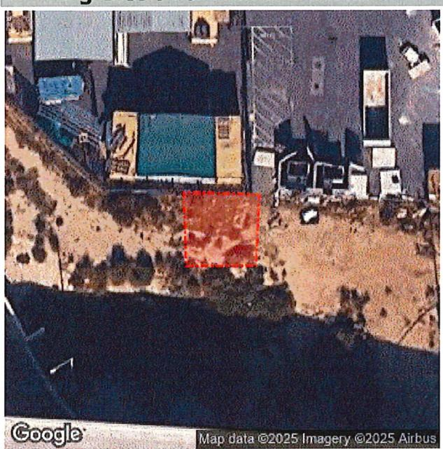

Open Map

Latitude/Longitude:

37.645080 -121.014338

GIS coordinate system:

WGS84 (WKID 4326)

## Ticket Action Reason:

| Excavation Method   | Auger - truck mounted |               |
|---------------------|-----------------------|---------------|
| Anticipated Depth   | >84 inches            |               |
| Boring              | No                    | Explosive     |
| Street/Sidewalk     | No                    | Pavement Only |
| Vacuum Excavation   | No                    |               |
| Project Owner       | Caltrans              |               |
| Permit              |                       |               |
| Job #/Name          | S2350-01-02           |               |
| Onsite Contact Name | Chris Bates           |               |

9254375773

## Excavator Remarks:

Behind chain-link fencing between Floor Outlet and Hilton. Well location marked with a white square.

Page 1 of 2 CA Ticket 2025031101763-000

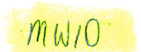


# Ticket #: 2025031101731 Revision: 000

**Ticket Status:** 

Original

Transmission ID 111

Ticket Type: Normal Response Required:

## Excavator Details

Contact: Chris Bates

Phone: 925-437-5773

Mobile: Not Supplied

**Company:**

Company: Geocon Consultants, Inc.

Email: Bates@geoconinc.com

**Company**

**Excavator T**

**Excavator Type:** Contractor (or other professional excavator)

Language: Not Supplied

**Address:**

Address: 3160 Gold Valley

Excavator ID: 36039

Drive, Suite 800

California 95742

# Dig Site and Ticket Details

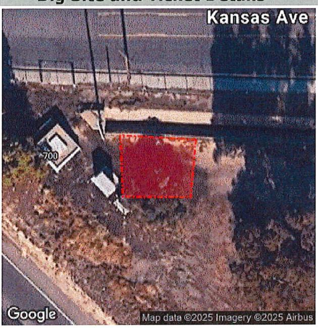

Open Map

Latitude/Longitude:

37.645799 -121.015608

GIS coordinate system:

WGS84 (WKID 4326)

| Ticket Action Reason: |  |
|-----------------------|--|
|-----------------------|--|

## Excavator Remarks:

Well location near cement pad and has a cone on it

| Previous Ticket #    |                       |               | Rev.#  |       |     |
|----------------------|-----------------------|---------------|--------|-------|-----|
| Submitted            | 03/11/2025 13:08      |               | Medium |       | WEB |
| Work Begin Date      | 03/14/2025 07:01      |               |        |       |     |
| Legal Start Date     | 03/14/2025 07:01      |               |        |       |     |
| Ticket Expiration    | 04/08/2025 23:59      |               |        |       |     |
| Work Duration        | 1 day or less         |               |        |       |     |
| Address/Location     | 700 Kansas Ave        |               |        |       |     |
| City/Town/Place      | Modesto               |               |        |       |     |
| County               | Stanislaus County     |               |        |       |     |
| State                | CA                    | Zip Code      |        | 95351 |     |
| Nearby Cross Street  | Graphics Drive        |               |        |       |     |
| Subdivision/Lot      |                       |               |        |       |     |
| Delineated Method    | White Paint           |               |        |       |     |
| Work Type            | Environmental         |               |        |       |     |
| Work Activity        | Monitoring Wells Work |               |        |       |     |
| Excavation Method    | Auger - truck mounted |               |        |       |     |
| Anticipated Depth    | >84 inches            |               |        |       |     |
| Boring               | No                    | Explosive     |        | No    |     |
| Street/Sidewalk      | No                    | Pavement Only |        | No    |     |
| Vacuum Excavation    | No                    |               |        |       |     |
| Project Owner        | Caltrans              |               |        |       |     |
| Permit               |                       |               |        |       |     |
| Job #/Name           | S2350-01-02           |               |        |       |     |
| Onsite Contact Name  | Chris Bates           |               |        |       |     |
| Onsite Contact Phone | 9254375773            |               |        |       |     |

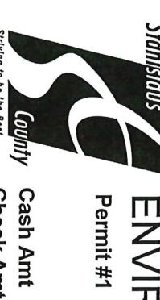

# ENVIRONMENTAL RESOURCES Permit #1 MW25-13; MW25-14 Receipt #

# 1

## 13.5-14

### 13.5-15

#### 14-15

Receipt
#

46
96
6
26

46762

Date: 3/12/2025

The following table lists the parameters for the `fit_model` function:

| <strong>Parameter</strong>   | <strong>Type</strong>         | <strong>Description</strong>                                                    |
|------------------------------|-------------------------------|---------------------------------------------------------------------------------|
| <code>data</code>            | <code>pandas.DataFrame</code> | The input data for training.                                                    |
| <code>target_column</code>   | <code>str</code>              | The name of the column to predict.                                              |
| <code>model_type</code>      | <code>str</code>              | The type of model to use (e.g., 'linear <em>regression', 'random</em> forest'). |
| <code>hyperparameters</code> | <code>dict</code>             | A dictionary of hyperparameters for the chosen model.                           |

Example usage:

```python
import pandas as pd
from sklearn.model*selection import train*test\_split

# Load your data

data = pd.read*csv('your*data.csv')

# Define target column and hyperparameters

target = 'your*target*column'
hyperparams = {'n*estimators': 100, 'max*depth': 5}

# Fit the model

model = fit*model(data=data, target*column=target, model*type='random*forest', hyperparameters=hyperparams)
```

This function returns a trained model object that can be used for making predictions.

| Cigilacai   | Signature STA-99                                                                               | Description HW- PA<br>TRANS       |                | 3260 V                      | GEMMA            | Received From      |           |             |            | Amt Paid          | 3.5% CC Fee            | Credit Amt            | Striving to be the Best Check Amt | COUNTY |
|-------------|------------------------------------------------------------------------------------------------|-----------------------------------|----------------|-----------------------------|------------------|--------------------|-----------|-------------|------------|-------------------|------------------------|-----------------------|-----------------------------------|--------|
|             |                                                                                                | YMENTS FOR TWO WI                 |                | 3260 VIRA GRANDE SACRAMENTO | GEMMA G REBLANDO | ٠                  |           |             |            | \$658.26          | Fee \$22.26            | mt \$636.00           | mt                                |        |
|             | HW-PAYMENTS FOR TWO WELL DESTRUCTION FOR CAL TRANS MODESTO STOCKPILES LOCATED WEST & EAST SIDE |                                   | ENTO           |                             |                  |                    |           |             |            | Received By nl    | Card Appr# 02137C      | Check #               |                                   |        |
| SALE AMOUNT | Mode:                                                                                          | ્રધ્proval Code:<br>Entry Method: | INVOICE        | Ealtch #:                   | <b>5</b>         | Card # XX          | VISA SALE | CREDIT CARD | (3/12/2025 | MODESTO, CA 95358 | 3800 CORNUCOPIA WAY ST | ENNTRONVALIA RESOLIRO |                                   |        |
| \$658,26    | Online                                                                                         | 02137C<br>Manual                  | <sub>(,)</sub> | 2311                        | 6.3              | XXXXXXXXXXXXXX9071 |           | J           | 12:22:29   | 5358              | WAY ST                 | SOLIBOR               |                                   |        |

CUSTOMER COPY