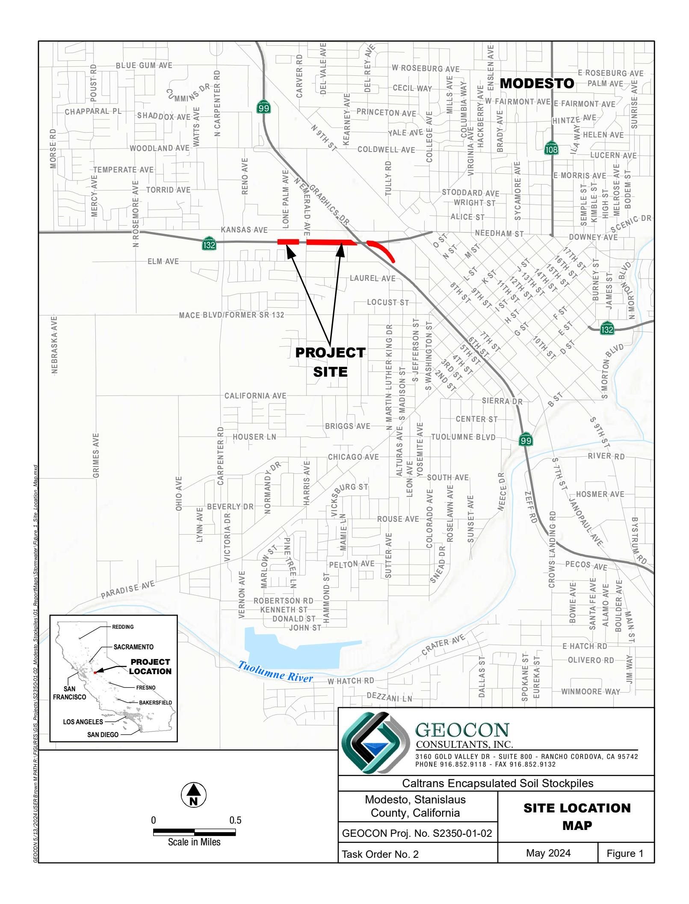
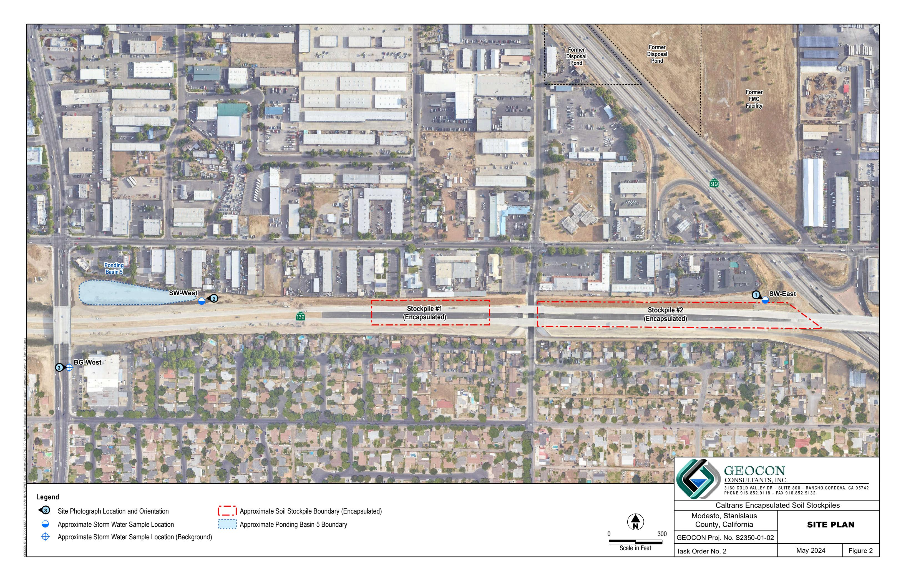
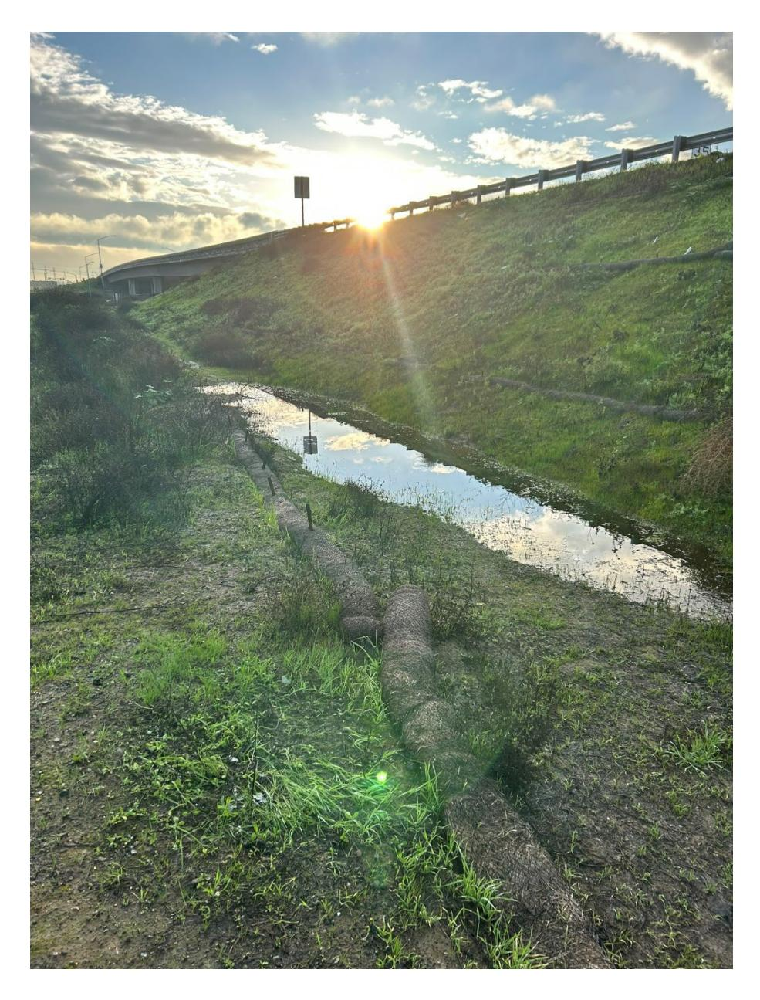
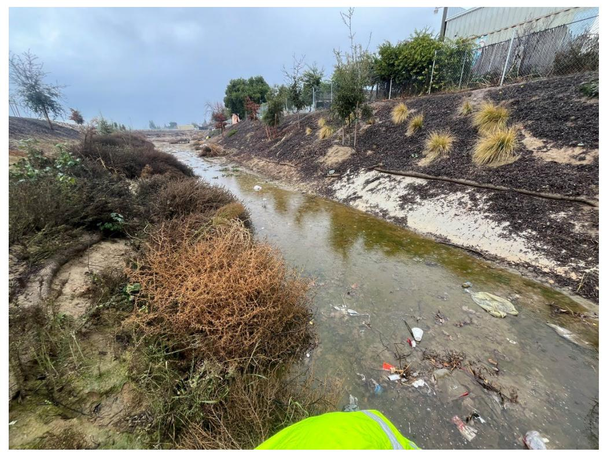
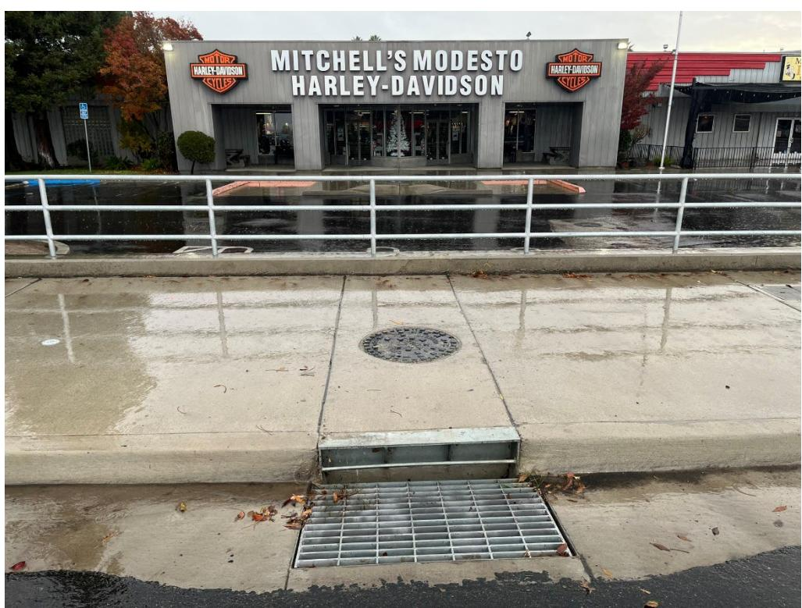
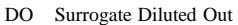
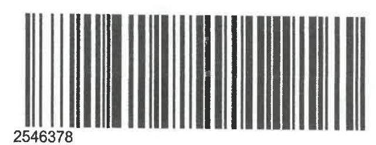

Project No. S2350-01-02 May 14, 2024

California Department of Transportation - District 6 Hazardous Waste Branch 2015 E. Shields Avenue, Suite 100 Fresno, California 93726

Attn: Adam Inman, PG

Subject: STORM WATER SAMPLING REPORT – FEBRUARY 1, 2024

CALTRANS ENCAPSULATED SOIL STOCKPILES MODESTO, STANISLAUS COUNTY, CALIFORNIA

CONTRACT NO. 06A2767, TASK ORDER NO. 2, EA NO. 10-1E7003

Mr. Inman:

In accordance with California Department of Transportation (Caltrans) Contract No. 06A2767, Task Order (TO) No. 2, Geocon sampled storm water at the Caltrans Encapsulated Soil Stockpiles (the site) located south of the intersection of State Route (SR) 99 and Kansas Avenue in Modesto, Stanislaus County, California. The approximate site location is depicted on the attached Site Location Map (Figure 1). The approximate site boundaries, Stockpiles 1 and 2, which were encapsulated beneath SR 132, and storm water sampling locations, are shown on the Site Plan (Figure 2).

We collected storm water samples on February 1, 2024, in general accordance with protocols approved by the California Environmental Protection Agency, Department of Toxic Substances Control (DTSC) and Central Valley Regional Water Quality Control Board (CVRWQCB) as established in the *Storm Water Sampling and Analysis Plan (SAP)*, prepared by Geocon Consultants, Inc., dated December 13, 2023. The scope of services included collection of storm water samples, analysis of the storm water samples by a California-certified laboratory, and preparation of this summary report detailing the sampling activities.

# **BACKGROUND**

## **Project Description and History**

During the 1930s, Barium Products Ltd. occupied property at 1200 Barium Road (now Graphics Drive) in Modesto, California, east of SR 99 between Woodland Avenue and Kansas Avenue. Barium Products Ltd. was a chemical manufacturing company processing a variety of ores and minerals including barite (barium sulfate) and celestite (strontium sulfate). Materials produced included barium and strontium compounds used for greases, lubricating oil, and pigment blanks. Sodium sulfide was generated as a by-product of barite processing, sold as a caustic, and used as a reagent in the mining industry.

In 1943, Barium Products Ltd. was purchased by Westvaco Chlorine Products Corporation (Westvaco). In 1948 Westvaco merged with Food Machinery and Chemical Corporation (FMC). From the 1950s to the 1970s, liquid residue from the processing operations was discharged to unlined evaporation/disposal ponds along the western portion of the FMC facility. The approximate boundaries of the former FMC facility and evaporation/disposal ponds are shown on Figure 2.

In 1961, a 4.3-acre parcel at the southwestern corner of the FMC facility was purchased by Caltrans for highway right-of-way (ROW) needed to construct SR 99. An aerial photograph from 1957 shows that a portion of the southernmost evaporation/disposal pond on the FMC property was within the area purchased for the SR 99 ROW. Soil in and around the pond was excavated during construction of SR 99 and stockpiled within the current Caltrans ROW at the location of the SR 132 West Freeway/Expressway project. Three distinct stockpiles were constructed at the site:

- Stockpile 1, located south of Kansas Avenue and west of North Emerald Avenue,
- Stockpile 2, located south of Kansas Avenue, between North Emerald Avenue and SR 99, and
- Stockpile 3, located south of Kansas Avenue and east of SR 99.

The earthwork on Phase I of the SR 99/132 expressway began in January 2020. Soil from Stockpile 3 was excavated, transported, and placed on top of Stockpiles 1 and 2. In October 2021, the majority of Stockpiles 1 and 2 were completely encapsulated beneath the structural section of SR 132 and with clean soil and vegetation on the northern side slopes. SR 132 was opened to traffic in November 2022.

## Surface Water Sampling Activities – Prior to Stockpile Encapsulation

The initial surface water sampling event at the former stockpiles was conducted by Shaw in March 2006 in general accordance with their January 2006 SAP. A total of seven runoff samples were collected from constructed impoundments during a qualifying rain event (i.e., visible runoff and 72 hours of prior dry weather). Shaw constructed shallow depressions within the Caltrans ROW in order to collect runoff from the stockpiles as there was no surface water migration observed beyond the ROW. The samples were analyzed for dissolved metals, polycyclic aromatic hydrocarbons (PAHs), nitrate, sulfate, and sulfide.

Subsequently, Geocon collected surface water samples from five designated surface runoff locations and two background locations on an on-call basis between April 2013 and April 2019 in accordance with a SAP addendum. The sample locations were approved by the DTSC and the CVRWQCB. Geocon personnel did not observe runoff migration from the Caltrans ROW during their inspections.

Road construction on SR 99/132 eliminated the need for the previously designated surface runoff sampling locations. On November 2, 2022, Stantec met with the Caltrans TO Manager to identify revised sampling locations. Two new storm water sample locations and one new background sampling location were established.

Storm water sampling events were conducted by Stantec in March 2023 and by Geocon in December 2023. Reported total dissolved solids (TDS), sulfate, and metal concentrations for the storm water samples during these two events were less than their Primary and Secondary Maximum Contaminant Levels (MCLs) except for thallium, which exceeded the primary MCL in storm water samples collected in December 2023. The approximate sample locations are depicted on Figure 2. Analytical results are summarized on Tables 1 and 2.

# STORM WATER SAMPLING ACTIVITIES

This section describes the field activities for the February 1, 2024, storm water sampling event. It was raining when we arrived on site and the rain stopped at the time of sample collection. The rainfall total for this event which began on January 31, 2024, and ended on February 8, 2024, was approximately 3.02 inches.

### **Field Activities**

On February 1, 2024, we collected storm water samples from designated locations SW-East, SW-West, and BG-West. The approximate sample locations are depicted on Figure 2. Photos of the sample locations are attached.

We collected samples from SW-East from the storm water discharge point on the north side of SR 132 west of SR 99 (Photo 1). We collected samples from SW-West within the east side of Ponding Basin 5, north of SR-132 and east of N. Carpenter Road (Photo 2).

We collected sample BG-West (Photo 3) from water flowing into a drop inlet along the east side of North Carpenter Road approximately 700 feet south of the North Carpenter Road and Kansas Avenue intersection.

We collected each of the storm water samples using a pressure bailer with a suction pump, and subsequently transferred them into laboratory-provided containers. We field filtered samples to be analyzed for dissolved metals by passing the samples through 0.45-micron filters. We capped, labeled, chilled and transported the samples to ASSET Laboratories (Asset) utilizing chain-of-custody procedures.

We followed Quality Assurance/Quality Control (QA/QC) procedures during the field sampling activities including the use of disposable bailers and providing chain-of-custody documentation for each water sample transferred to the laboratory.

### **Laboratory Analyses**

We delivered the samples to Asset for the following analyses under chain-of-custody protocol:

- Title 22 dissolved metals (including barium and strontium) by United States Environmental Protection Agency (EPA) Test Method 6020/7470;
- Sulfate by EPA Test Method 9056/300.0; and
- TDS by EPA Method 160.1.

Analytical results for this monitoring event are summarized on Tables 1 and 2. The laboratory report and chain-of-custody documentation are attached.

# **Analytical Results**

## **Dissolved Metals and Sulfate**

TDS was reported for the samples collected from each of the sample locations (SW-West, SW-East, and BG-West) at concentrations ranging from 42 to 88 milligrams per liter (mg/l), and sulfate was reported for the samples collected from two of the three sample locations (SW-West and BG-West) at concentrations of 3.6 and 6.5 mg/l. TDS and sulfate concentrations do not exceed the secondary Maximum Contaminant Levels (MCL) for drinking water.

### **Title 22 Metals**

Barium and zinc were detected in each of the storm water samples at concentrations that do not exceed their respective primary or secondary drinking water MCLs.

Copper was detected in sample SW-East at a concentration that does not exceed its primary drinking water MCL.

Strontium was detected in storm water samples SW-East and SW-West, however, MCLs have not been established for this analyte.

## **Laboratory QA/QC**

We reviewed the analytical laboratory QC data provided with the CLS laboratory report. Laboratory QC procedures included method blanks, laboratory control samples (LCS), LCS duplicate samples (LCSD), matrix spikes (MS), and matrix spike duplicates (MSD). The data show acceptable surrogate recoveries and non-detect results for the method blanks and acceptable recoveries for the LCS and LCSD samples.

# STORM WATER MANAGEMENT

No discharge/runoff from the Caltrans ROW was observed during the February 1, 2024, sampling event.

Caltrans plans to conduct additional storm water sampling during qualifying rain events in 2024.

We appreciate the opportunity to provide our services on this project. Please contact us if you have any questions concerning the contents of this report or if we may be of further service.

Sincerely,

**GEOCON CONSULTANTS, INC.** 

Rebecca L. Silva Project Manager

John E. Juhrend, PE, CEG Senior Engineer

Attachments: Figure 1, Site Location Map

Figure 2, Site Plan

Photographs 1 through 3

Table 1, Summary of Laboratory Analysis Results – TDS and Sulfate

Table 2, Summary of Laboratory Analysis Results – Title 22 Metals (Dissolved)

Laboratory Report and Chain-of-custody Documentation

Photo No. 1 View to the east of sample location SW-East

# PHOTO NO. 1

Caltrans Encapsulated Soil Stockpiles

Modesto, Stanislaus County, California

GEOCON Project No. S2350-01-02 May 2024

Photo No. 2 View to the west of sample location SW-West

Photo No. 3 View to the east of sample location BG-West collected from the drop inlet

Caltrans Encapsulated Soil Stockpiles

Modesto, Stanislaus County, California

###### TABLE 1

# SUMMARY OF LABORATORY ANALYSIS RESULTS - TDS AND SULFATE

### CALTRANS CONTRACT 06A2767, TO NO. 2, EA 10-1E7003

### CALTRANS ENCAPSULATED SOIL STOCKPILES

### MODESTO, CALIFORNIA

| Sample ID      | Sample Date | Total Dissolved Solids |  | Sulfate |
|----------------|-------------|------------------------|--|---------|
|                |             | mg/l                   |  |         |
| SW-East        | 12/19/2023  | 170                    |  | 22      |
| SW-East        | 2/1/2024    | 88                     |  | <2.0    |
| SW-West        | 12/19/2023  | 140                    |  | 11      |
| SW-West        | 2/1/2024    | 63                     |  | 3.6     |
| BG-West        | 12/19/2023  | 180                    |  | 38      |
| BG-West        | 2/1/2024    | 42                     |  | 6.5     |
| Secondary MCLs |             | 500                    |  | 250     |

### Notes:

Secondary MCL = secondary Maximum Containment Level, United States Environmental Protection Agency, February 14, 2023 mg/l = milligrams per liter

###### TABLE 2

# SUMMARY OF LABORATORY ANALYSIS RESULTS - TITLE 22 METALS (DISSOLVED)

### CALTRANS CONTRACT 06A2767, TO NO. 2, EA 10-1E7003

### CALTRANS ENCAPSULATED SOIL STOCKPILES

### MODESTO, CALIFORNIA

| Sample ID | Sample Date | Antimony | Arsenic | Barium | Beryllium | Cadmium | Chromium | Cobalt | Copper | Lead | Molybdenum | Nickel | Selenium | Silver | Thallium | Vanadium | Zinc    | Mercury | Strontium |  |
|--------------|-------------|----------|---------|--------|-----------|---------|----------|--------|--------|------|------------|--------|----------|--------|----------|----------|---------|---------|-----------|--|
| SW-East*     | 3/10/2023   | <8.8     | 9.2 J   | 160    | <3.0      | <11 UJ  | 12 J+    | <1.6   | 17 J+  | <4.7 | 6.6 J+     | <4.6   | <9.3     | <2.4   | <8.5     | 25 J+    | 27 J+   | 0.08 J  | 52 J      |  |
| SW-East      | 12/19/2023  | <10      | <10     | 270    | <3.0      | <3.0    | <3.0     | <3.0   | 11     | <10  | 15         | <5.0   | <10      | <3.0   | 18       | 4.7      | 43      | <0.20   | 130       |  |
| SW-East      | 2/1/2024    | <10      | <10     | 900    | <3.0      | <3.0    | <3.0     | <3.0   | 13     | <10  | <5.0       | <5.0   | <10      | <3.0   | <15      | <3.0     | 25      | <0.20   | 180       |  |
| SW-West*     | 3/10/2023   | <8.8     | <7.8    | 300    | <1.6      | <3.0    | <3.0     | <1.6   | 16 J+  | <4.7 | 6.7 J+     | <4.6   | <9.3     | <2.4   | <8.5     | 16 J+    | 130     | 0.07 J  | 77 J      |  |
| SW-West      | 12/19/2023  | <10      | <10     | 49     | <3.0      | <3.0    | <3.0     | <3.0   | 11     | <10  | <5.0       | <5.0   | <10      | <3.0   | 15       | 8.1      | 27      | <0.20   | 99        |  |
| SW-West      | 2/1/2024    | <10      | <10     | 520    | <3.0      | <3.0    | <3.0     | <3.0   | <5.0   | <10  | <5.0       | <5.0   | <10      | <3.0   | <15      | <3.0     | 240     | <0.20   | 78        |  |
| BG-West*     | 3/10/2023   | <8.8     | 8.0 J   | 17     | <1.6      | <3.0 UJ | <2.0     | <1.6   | 14 J+  | <4.7 | 13 J+      | <4.6   | 12       | <2.4   | <8.5     | 13 J+    | <25     | 0.06 J  | 63 J      |  |
| BG-West      | 12/19/2023  | <10      | <10     | 21     | <3.0      | <3.0    | <3.0     | <3.0   | 7.0    | <10  | 13         | <5.0   | <10      | <3.0   | 17       | 6.0      | 46      | <0.20   | 110       |  |
| BG-West      | 2/1/2024    | <10      | <10     | 10     | <3.0      | <3.0    | <3.0     | <3.0   | <5.0   | <10  | <5.0       | <5.0   | <10      | <3.0   | <15      | <3.0     | 18      | <0.20   | <50       |  |
| MCLs         |             | 6.0      | 10      | 1,000  | 4.0       | 5.0     | 50       |        | 1,300  | 15   |            | 100    | 50       | 100 1  | 2.0      |          | 5,000 1 | 2.0     |           |  |

| Notes: |   |
|--------|---|
| MCI    | = |

Maximum Contaminant Levels for drinking water, California Environmental Protection Agency State Water Resources Control Board, August 16, 2023

1 = secondary MCL, United States Environmental Protection Agency, February 14, 2023

**Bold** = concentration exceeds MCL

\* = Stantec Sample IDs: SW-East = PL6, SW-West = PL7, BG-West = BG3

 $\mu g/l = micrograms per liter$ 

--- = screening level not established

<= less than the laboratory reporting limit

J = J-flag result (result is an estimated concentration reported between the method detection limit and practical quantitation limit)

J+= the analyte was positively identified; the assoicated numerical value is an estimated quantity that may be biased high

UJ = indicates estimated non-detect

February 12, 2024

Rebecca Silva Geocon Consultants, Inc. 3160 Gold Valley Drive, Suite 800 Rancho Cordova, CA 95742

TEL: (916) 852-9118 FAX: (916) 852-9132

RE: Modesto Stockpiles Stormwater, S2350-01-02

Attention: Rebecca Silva

Enclosed are the results for sample(s) received on February 02, 2024 by ASSET Laboratories. The sample(s) are tested for the parameters as indicated in the enclosed chain of custody in accordance with the applicable laboratory certifications.

Workorder No.: N062854

Thank you for the opportunity to service the needs of your company.

Please feel free to call me at (702) 307-2659 if I can be of further assistance to your company.

Sincerely,

Nancy Sibucao

(orbible on da)

Laboratory Director

The cover letter is an integral part of this analytical report. This Laboratory Report cannot be reproduced in part or in its entirety without written permission from the client and ASSET Laboratories - Las Vegas.

CLIENT: Geocon Consultants, Inc.

Project: Modesto Stockpiles Stormwater, S2350-01-02 CASE NARRATIVE

Lab Order: N062854

## SAMPLE RECEIVING/GENERAL COMMENTS:

All sample containers were received intact with proper chain of custody documentation.

Information on sample receipt conditions including discrepancies can be found in attached Sample Receipt Checklist Form.

Cooler temperature and sample preservation were verified upon receipt of samples if applicable.

Samples were analyzed within method holding time.

Analytical Comments for EPA 300:

Dilution was necessary due to precipitation of sample upon addition of eluent.

Date: 12-Feb-24

CLIENT: Geocon Consultants, Inc.

Project: Modesto Stockpiles Stormwater, S2350-01-02 Work Order Sample Summary

Date: 12-Feb-24

Lab Order: N062854

Contract No:

| Lab Sample ID                                    | Client Sample ID  | Matrix        | Collection Date     | Date Received | Date Reported     |                   |
|--------------------------------------------------|-------------------|---------------|---------------------|---------------|-------------------|-------------------|
| N062854-001A                                     | SW-East           | Surface Water | 2/1/2024 6:10:00 AM | 2/2/2024      | 2/12/2024         |                   |
| N062854-001B                                     | SW-East           | Surface Water | 2/1/2024 6:10:00 AM | 2/2/2024      | 2/12/2024         |                   |
| N062854-001C                                     | SW-East           | Surface Water | 2/1/2024 6:10:00 AM | 2/2/2024      | 2/12/2024         |                   |
| N062854-002A                                     | BG-West           | Surface Water | 2/1/2024 6:40:00 AM | 2/2/2024      | 2/12/2024         |                   |
| N062854-002B                                     | BG-West           | Surface Water | 2/1/2024 6:40:00 AM | 2/2/2024      | 2/12/2024         |                   |
| N062854-002C                                     | BG-West           | Surface Water | 2/1/2024 6:40:00 AM | 2/2/2024      | 2/12/2024         |                   |
| N062854-003A                                     | SW-West           | Surface Water | 2/1/2024 7:15:00 AM | 2/2/2024      | 2/12/2024         |                   |
| N062854-003B                                     | SW-West           | Surface Water | 2/1/2024 7:15:00 AM | 2/2/2024      | 2/12/2024         |                   |
| N062854-003C                                     | SW-West           | Surface Water | 2/1/2024 7:15:00 AM | 2/2/2024      | 2/12/2024         |                   |
| Analyses                                         | Result            | PQL           | Qual                | Units         | DF                | Date Analyzed     |
| <b>TOTAL FILTERABLE RESIDUE</b>                  |                   |               |                     |               |                   |                   |
|                                                  |                   |               |                     | SM2540C       |                   |                   |
| RunID: NV00922-WC_240205E                        | QC Batch: 106620  |               |                     | PrepDate:     | 2/5/2024          | Analyst: LR       |
| Total Dissolved Solids (Residue, Filterable)     | 88                | 10            |                     | mg/L          | 1                 | 2/5/2024 11:33 AM |
| <b>ANIONS BY ION CHROMATOGRAPHY</b>              |                   |               |                     |               |                   |                   |
|                                                  |                   |               |                     | EPA 300.0     |                   |                   |
| RunID: NV00922-IC8_240202A                       | QC Batch: R181145 |               |                     | PrepDate:     |                   | Analyst: RAB      |
| Sulfate                                          | ND                | 2.0           |                     | mg/L          | 2                 | 2/2/2024 10:52 PM |
| <b>DISSOLVED MERCURY BY COLD VAPOR TECHNIQUE</b> |                   |               |                     |               |                   |                   |
|                                                  |                   |               |                     | EPA 7470A     |                   |                   |
| RunID: NV00922-AA2_240202C                       | QC Batch: 106588  |               |                     | PrepDate:     | 2/2/2024          | Analyst: JRR      |
| Mercury                                          | ND                | 0.20          |                     | µg/L          | 1                 | 2/2/2024 09:42 PM |
| <b>DISSOLVED METALS BY ICP</b>                   |                   |               |                     |               |                   |                   |
| EPA 3010A                                        |                   |               |                     | EPA 6010B     |                   |                   |
| RunID: NV00922-ICP3_240206A                      | QC Batch: 106627  |               |                     | PrepDate:     | 2/5/2024          | Analyst: DJ       |
| Antimony                                         | ND                | 0.010         |                     | mg/L          | 1                 | 2/6/2024 02:27 PM |
| Arsenic                                          | ND                | 0.010         |                     | mg/L          | 1                 | 2/6/2024 02:27 PM |
| Barium                                           | 0.90              | 0.0030        |                     | mg/L          | 1                 | 2/6/2024 02:27 PM |
| Beryllium                                        | ND                | 0.0030        |                     | mg/L          | 1                 | 2/6/2024 02:27 PM |
| Cadmium                                          | ND                | 0.0030        |                     | mg/L          | 1                 | 2/6/2024 02:27 PM |
| Chromium                                         | ND                | 0.0030        |                     | mg/L          | 1                 | 2/6/2024 02:27 PM |
| Cobalt                                           | ND                | 0.0030        |                     | mg/L          | 1                 | 2/6/2024 02:27 PM |
| Copper                                           | 0.013             | 0.0050        |                     | mg/L          | 1                 | 2/6/2024 02:27 PM |
| Lead                                             | ND                | 0.010         |                     | mg/L          | 1                 | 2/6/2024 02:27 PM |
| Molybdenum                                       | ND                | 0.0050        |                     | mg/L          | 1                 | 2/6/2024 02:27 PM |
| Nickel                                           | ND                | 0.0050        |                     | mg/L          | 1                 | 2/6/2024 02:27 PM |
| Selenium                                         | ND                | 0.010         |                     | mg/L          | 1                 | 2/6/2024 02:27 PM |
| Silver                                           | ND                | 0.0030        |                     | mg/L          | 1                 | 2/6/2024 02:27 PM |
| Thallium                                         | ND                | 0.015         |                     | mg/L          | 1                 | 2/6/2024 02:27 PM |
| Vanadium                                         | ND                | 0.0030        |                     | mg/L          | 1                 | 2/6/2024 02:27 PM |
| Zinc                                             | 0.025             | 0.010         |                     | mg/L          | 1                 | 2/6/2024 02:27 PM |
| <b>DISSOLVED METALS BY ICP</b>                   |                   |               |                     |               |                   |                   |
| EPA 3010A                                        |                   |               |                     | EPA 6010B     |                   |                   |
| RunID: NV00922-ICP2_240206C                      | QC Batch: 106627  |               |                     | PrepDate:     | 2/5/2024          | Analyst: DJ       |
| Strontium                                        | 0.18              | 0.050         |                     | mg/L          | 1                 | 2/6/2024 03:49 PM |
| Analyses                                         | Result            | PQL           | Qual                | Units         | DF                | Date Analyzed     |
| <b>TOTAL FILTERABLE RESIDUE</b>                  |                   |               |                     |               |                   |                   |
|                                                  |                   |               | SM2540C             |               |                   |                   |
| RunID: NV00922-WC_240205E                        | QC Batch: 106620  |               | PrepDate:           | 2/5/2024      | Analyst: LR       |                   |
| Total Dissolved Solids (Residue, Filterable)     | 42                | 5.0           | mg/L                | 1             | 2/5/2024 11:33 AM |                   |
| <b>ANIONS BY ION CHROMATOGRAPHY</b>              |                   |               |                     |               |                   |                   |
|                                                  |                   |               | EPA 300.0           |               |                   |                   |
| RunID: NV00922-IC8_240202A                       | QC Batch: R181145 |               | PrepDate:           |               | Analyst: RAB      |                   |
| Sulfate                                          | 6.5               | 2.0           | mg/L                | 2             | 2/2/2024 02:44 PM |                   |
| <b>DISSOLVED MERCURY BY COLD VAPOR TECHNIQUE</b> |                   |               |                     |               |                   |                   |
|                                                  |                   |               | EPA 7470A           |               |                   |                   |
| RunID: NV00922-AA2_240202C                       | QC Batch: 106588  |               | PrepDate:           | 2/2/2024      | Analyst: JRR      |                   |
| Mercury                                          | ND                | 0.20          | µg/L                | 1             | 2/2/2024 09:49 PM |                   |
| <b>DISSOLVED METALS BY ICP</b>                   |                   |               |                     |               |                   |                   |
|                                                  | EPA 3010A         |               | EPA 6010B           |               |                   |                   |
| RunID: NV00922-ICP3_240206A                      | QC Batch: 106627  |               | PrepDate:           | 2/5/2024      | Analyst: DJ       |                   |
| Antimony                                         | ND                | 0.010         | mg/L                | 1             | 2/6/2024 02:33 PM |                   |
| Arsenic                                          | ND                | 0.010         | mg/L                | 1             | 2/6/2024 02:33 PM |                   |
| Barium                                           | 0.010             | 0.0030        | mg/L                | 1             | 2/6/2024 02:33 PM |                   |
| Beryllium                                        | ND                | 0.0030        | mg/L                | 1             | 2/6/2024 02:33 PM |                   |
| Cadmium                                          | ND                | 0.0030        | mg/L                | 1             | 2/6/2024 02:33 PM |                   |
| Chromium                                         | ND                | 0.0030        | mg/L                | 1             | 2/6/2024 02:33 PM |                   |
| Cobalt                                           | ND                | 0.0030        | mg/L                | 1             | 2/6/2024 02:33 PM |                   |
| Copper                                           | ND                | 0.0050        | mg/L                | 1             | 2/6/2024 02:33 PM |                   |
| Lead                                             | ND                | 0.010         | mg/L                | 1             | 2/6/2024 02:33 PM |                   |
| Molybdenum                                       | ND                | 0.0050        | mg/L                | 1             | 2/6/2024 02:33 PM |                   |
| Nickel                                           | ND                | 0.0050        | mg/L                | 1             | 2/6/2024 02:33 PM |                   |
| Selenium                                         | ND                | 0.010         | mg/L                | 1             | 2/6/2024 02:33 PM |                   |
| Silver                                           | ND                | 0.0030        | mg/L                | 1             | 2/6/2024 02:33 PM |                   |
| Thallium                                         | ND                | 0.015         | mg/L                | 1             | 2/6/2024 02:33 PM |                   |
| Vanadium                                         | ND                | 0.0030        | mg/L                | 1             | 2/6/2024 02:33 PM |                   |
| Zinc                                             | 0.018             | 0.010         | mg/L                | 1             | 2/6/2024 02:33 PM |                   |
| <b>DISSOLVED METALS BY ICP</b>                   |                   |               |                     |               |                   |                   |
|                                                  | EPA 3010A         |               | EPA 6010B           |               |                   |                   |
| RunID: NV00922-ICP2_240206C                      | QC Batch: 106627  |               | PrepDate:           | 2/5/2024      | Analyst: DJ       |                   |
| Strontium                                        | ND                | 0.050         | mg/L                | 1             | 2/6/2024 03:52 PM |                   |

# ANALYTICAL RESULTS

### ASSET Laboratories

Print Date: 12-Feb-24

CLIENT: Geocon Consultants, Inc. Client Sample ID: SW-East

Lab Order: N062854

Project: Modesto Stockpiles Stormwater, S2350-01-02 Collection Date: 2/1/2024 6:10:00 AM

Lab ID: N062854-001 Matrix: SURFACE WATER

Qualifiers: B Analyte detected in the associated Method Blank

H Holding times for preparation or analysis exceeded

S Spike/Surrogate outside of limits due to matrix interference

DO Surrogate Diluted Out

- E Value above quantitation range
- ND Not Detected at the Reporting Limit
  Results are wet unless otherwise specified

CALIFORNIA | P:562.219.7435 F:562.219.7436 11110 Artesia Blvd., Ste B, Cerritos, CA 90703 ELAP Cert 2921 EPA ID CA01638

# ANALYTICAL RESULTS

### ASSET Laboratories

Print Date: 12-Feb-24

Geocon Consultants, Inc. **CLIENT:** Client Sample ID: BG-West

Lab Order: N062854

Project: Modesto Stockpiles Stormwater, S2350-01-02 **Collection Date:** 2/1/2024 6:40:00 AM N062854-002 Lab ID: Matrix: SURFACE WATER

Qualifiers: Analyte detected in the associated Method Blank

> Н Holding times for preparation or analysis exceeded

S Spike/Surrogate outside of limits due to matrix interference

Surrogate Diluted Out

- Ε Value above quantitation range
- ND Not Detected at the Reporting Limit Results are wet unless otherwise specified

DO Surrogate Diluted Out

CALIFORNIA | P:562.219.7435 F:562.219.7436 11110 Artesia Blvd., Ste B, Cerritos, CA 90703 ELAP Cert 2921 **EPA ID CA01638** 

NEVADA | P:702.307.2659 F:702.307.2691 3151 W. Post Rd., Las Vegas, NV 89118 ELAP Cert 2676 | NV Cert NV00922 ORELAP Cert 4046 (EPA TO15 & TO3)

# ANALYTICAL RESULTS

### ASSET Laboratories

Print Date: 12-Feb-24

Geocon Consultants, Inc. **CLIENT:** Client Sample ID: SW-West

Lab Order: N062854

Project: Modesto Stockpiles Stormwater, S2350-01-02 Collection Date: 2/1/2024 7:15:00 AM N062854-003 Lab ID: Matrix: SURFACE WATER

| Analyses                                     | Result            | PQL    | Qual | Units | DF | Method    |  | PrepDate  | Date Analyzed                  |  |
|----------------------------------------------|-------------------|--------|------|-------|----|-----------|--|-----------|--------------------------------|--|
| TOTAL FILTERABLE RESIDUE                     |                   |        |      |       |    |           |  |           |                                |  |
|                                              |                   |        |      |       |    | SM2540C   |  |           |                                |  |
| RunID: NV00922-WC_240205E                    | QC Batch: 106620  |        |      | mg/L  | 1  |           |  | 2/5/2024  | Analyst: LR 2/5/2024 11:33 AM  |  |
| Total Dissolved Solids (Residue, Filterable) | 63                | 10     |      | mg/L  | 1  |           |  |           |                                |  |
| ANIONS BY ION CHROMATOGRAPHY                 |                   |        |      |       |    |           |  |           |                                |  |
|                                              |                   |        |      |       |    | EPA 300.0 |  |           |                                |  |
| RunID: NV00922-IC8_240202A                   | QC Batch: R181145 |        |      | mg/L  | 2  |           |  | 2/2/2024  | Analyst: RAB 2/2/2024 02:59 PM |  |
| Sulfate                                      | 3.6               | 2.0    |      | mg/L  | 2  |           |  |           |                                |  |
| DISSOLVED MERCURY BY COLD VAPOR TECHNIQUE    |                   |        |      |       |    |           |  |           |                                |  |
|                                              |                   |        |      |       |    | EPA 7470A |  |           |                                |  |
| RunID: NV00922-AA2_240202C                   | QC Batch: 106588  |        |      | µg/L  | 1  |           |  | 2/2/2024  | Analyst: JRR 2/2/2024 09:52 PM |  |
| Mercury                                      | ND                | 0.20   |      | µg/L  | 1  |           |  |           |                                |  |
| DISSOLVED METALS BY ICP                      |                   |        |      |       |    |           |  |           |                                |  |
|                                              |                   |        |      |       |    | EPA 3010A |  | EPA 6010B |                                |  |
| RunID: NV00922-ICP3_240206A                  | QC Batch: 106627  |        |      | mg/L  | 1  |           |  | 2/5/2024  | Analyst: DJ 2/6/2024 03:02 PM  |  |
| Antimony                                     | ND                | 0.010  |      | mg/L  | 1  |           |  |           |                                |  |
| Arsenic                                      | ND                | 0.010  |      | mg/L  | 1  |           |  |           |                                |  |
| Barium                                       | 0.52              | 0.0030 |      | mg/L  | 1  |           |  |           |                                |  |
| Beryllium                                    | ND                | 0.0030 |      | mg/L  | 1  |           |  |           |                                |  |
| Cadmium                                      | ND                | 0.0030 |      | mg/L  | 1  |           |  |           |                                |  |
| Chromium                                     | ND                | 0.0030 |      | mg/L  | 1  |           |  |           |                                |  |
| Cobalt                                       | ND                | 0.0030 |      | mg/L  | 1  |           |  |           |                                |  |
| Copper                                       | ND                | 0.0050 |      | mg/L  | 1  |           |  |           |                                |  |
| Lead                                         | ND                | 0.010  |      | mg/L  | 1  |           |  |           |                                |  |
| Molybdenum                                   | ND                | 0.0050 |      | mg/L  | 1  |           |  |           |                                |  |
| Nickel                                       | ND                | 0.0050 |      | mg/L  | 1  |           |  |           |                                |  |
| Selenium                                     | ND                | 0.010  |      | mg/L  | 1  |           |  |           |                                |  |
| Silver                                       | ND                | 0.0030 |      | mg/L  | 1  |           |  |           |                                |  |
| Thallium                                     | ND                | 0.015  |      | mg/L  | 1  |           |  |           |                                |  |
| Vanadium                                     | ND                | 0.0030 |      | mg/L  | 1  |           |  |           |                                |  |
| Zinc                                         | 0.24              | 0.010  |      | mg/L  | 1  |           |  |           |                                |  |
| DISSOLVED METALS BY ICP                      |                   |        |      |       |    |           |  |           |                                |  |
|                                              |                   |        |      |       |    | EPA 3010A |  | EPA 6010B |                                |  |
| RunID: NV00922-ICP2_240206C                  | QC Batch: 106627  |        |      | mg/L  | 1  |           |  | 2/5/2024  | Analyst: DJ 2/6/2024 03:02 PM  |  |

Qualifiers: Analyte detected in the associated Method Blank

> Н Holding times for preparation or analysis exceeded

S Spike/Surrogate outside of limits due to matrix interference

DO Surrogate Diluted Out

- Ε Value above quantitation range
- ND Not Detected at the Reporting Limit Results are wet unless otherwise specified

Date: 12-Feb-24 **ASSET Laboratories** 

**CLIENT:** Geocon Consultants, Inc.

Work Order: N062854

Project: Modesto Stockpiles Stormwater, S2350-01-02

# ANALYTICAL QC SUMMARY REPORT

TestCode: 160.1\_2540C\_W

| Sample ID: LCS-106620 Client ID: LCSW        |          | SampType: LCS Batch ID: 106620  | TestCode: 160.1_2540C Units: mg/L TestNo: SM2540C | Prep Date: 2/5/2024 Analysis Date: 2/5/2024 | RunNo: 181242 SeqNo: 5672451 |
|-------------------------------------------------|----------|------------------------------------|------------------------------------------------------|------------------------------------------------|---------------------------------|
| Analyte                                         | Result   | PQL                                | SPK value SPK Ref Val                                | %REC LowLimit HighLimit RPD Ref Val            | %RPD RPDLimit Qual              |
| Total Dissolved Solids (Residue, Filtera        | 979.000  | 10                                 | 1000 0                                               | 97.9 80 120                                    |                                 |
| Sample ID: MB-106620 Client ID: PBW          |          | SampType: MBLK Batch ID: 106620 | TestCode: 160.1_2540C Units: mg/L TestNo: SM2540C | Prep Date: 2/5/2024 Analysis Date: 2/5/2024 | RunNo: 181242 SeqNo: 5672452 |
| Analyte                                         | Result   | PQL                                | SPK value SPK Ref Val                                | %REC LowLimit HighLimit RPD Ref Val            | %RPD RPDLimit Qual              |
| Total Dissolved Solids (Residue, Filtera        | ND       | 10                                 |                                                      |                                                |                                 |
| Sample ID: N062803-002CDUP Client ID: ZZZZZZ |          | SampType: DUP Batch ID: 106620  | TestCode: 160.1_2540C Units: mg/L TestNo: SM2540C | Prep Date: 2/5/2024 Analysis Date: 2/5/2024 | RunNo: 181242 SeqNo: 5672456 |
| Analyte                                         | Result   | PQL                                | SPK value SPK Ref Val                                | %REC LowLimit HighLimit RPD Ref Val            | %RPD RPDLimit Qual              |
| Total Dissolved Solids (Residue, Filtera        | 3586.667 | 33                                 |                                                      | 3477                                           | 3.11 10                         |

### Qualifiers:

- B Analyte detected in the associated Method Blank
- ND Not Detected at the Reporting Limit
- DO Surrogate Diluted Out

- RPD outside accepted recovery limits
  - Calculations are based on raw values

NEVADA | P:702.307.2659 F:702.307.2691

- E Value above quantitation range

H Holding times for preparation or analysis exceeded S Spike/Surrogate outside of limits due to matrix interference

ASSET LABORATORIES "Serving Clients with Passion and Professionalism"

CALIFORNIA | P:562.219.7435 F:562.219.7436 11110 Artesia Blvd., Ste B, Cerritos, CA 90703 ELAP Cert 2921 **EPA ID CA01638** 

Work Order: N062854

**Project:** Modesto Stockpiles Stormwater, S2350-01-02

# ANALYTICAL QC SUMMARY REPORT

TestCode: 300\_W\_SO4

H Holding times for preparation or analysis exceeded

S Spike/Surrogate outside of limits due to matrix interference

| Sample ID: MB-R181145_SO4  | SampType: MBLK    | TestCode: 300_W_SO4 | Units: mg/L             | Prep Date:     | RunNo: 181145 |          |           |             |       |          |      |
|----------------------------|-------------------|---------------------|-------------------------|----------------|---------------|----------|-----------|-------------|-------|----------|------|
| Client ID: PBW             | Batch ID: R181145 | TestNo: EPA 300.0   | Analysis Date: 2/2/2024 | SeqNo: 5667879 |               |          |           |             |       |          |      |
| Analyte                    | Result            | PQL                 | SPK value               | SPK Ref Val    | %REC          | LowLimit | HighLimit | RPD Ref Val | %RPD  | RPDLimit | Qual |
| Sulfate                    | ND                | 1.0                 |                         |                |               |          |           |             |       |          |      |
| Sample ID: LCS-R181145_SO4 | SampType: LCS     | TestCode: 300_W_SO4 | Units: mg/L             | Prep Date:     | RunNo: 181145 |          |           |             |       |          |      |
| Client ID: LCSW            | Batch ID: R181145 | TestNo: EPA 300.0   | Analysis Date: 2/2/2024 | SeqNo: 5667880 |               |          |           |             |       |          |      |
| Analyte                    | Result            | PQL                 | SPK value               | SPK Ref Val    | %REC          | LowLimit | HighLimit | RPD Ref Val | %RPD  | RPDLimit | Qual |
| Sulfate                    | 4.062             | 1.0                 | 4.000                   | 0              | 102           | 90       | 110       |             |       |          |      |
| Sample ID: N062854-002BDUP | SampType: DUP     | TestCode: 300_W_SO4 | Units: mg/L             | Prep Date:     | RunNo: 181145 |          |           |             |       |          |      |
| Client ID: ZZZZZZ          | Batch ID: R181145 | TestNo: EPA 300.0   | Analysis Date: 2/2/2024 | SeqNo: 5667883 |               |          |           |             |       |          |      |
| Analyte                    | Result            | PQL                 | SPK value               | SPK Ref Val    | %REC          | LowLimit | HighLimit | RPD Ref Val | %RPD  | RPDLimit | Qual |
| Sulfate                    | 6.342             | 2.0                 |                         |                |               |          | 6.474     |             | 2.06  | 15       |      |
| Sample ID: N062854-002BMS  | SampType: MS      | TestCode: 300_W_SO4 | Units: mg/L             | Prep Date:     | RunNo: 181145 |          |           |             |       |          |      |
| Client ID: ZZZZZZ          | Batch ID: R181145 | TestNo: EPA 300.0   | Analysis Date: 2/2/2024 | SeqNo: 5667884 |               |          |           |             |       |          |      |
| Analyte                    | Result            | PQL                 | SPK value               | SPK Ref Val    | %REC          | LowLimit | HighLimit | RPD Ref Val | %RPD  | RPDLimit | Qual |
| Sulfate                    | 14.236            | 2.0                 | 8.000                   | 6.474          | 97.0          | 80       | 120       |             |       |          |      |
| Sample ID: N062854-002BMSD | SampType: MSD     | TestCode: 300_W_SO4 | Units: mg/L             | Prep Date:     | RunNo: 181145 |          |           |             |       |          |      |
| Client ID: ZZZZZZ          | Batch ID: R181145 | TestNo: EPA 300.0   | Analysis Date: 2/2/2024 | SeqNo: 5667885 |               |          |           |             |       |          |      |
| Analyte                    | Result            | PQL                 | SPK value               | SPK Ref Val    | %REC          | LowLimit | HighLimit | RPD Ref Val | %RPD  | RPDLimit | Qual |
| Sulfate                    | 14.106            | 2.0                 | 8.000                   | 6.474          | 95.4          | 80       | 120       | 14.24       | 0.916 | 15       |      |

### Qualifiers:

- B Analyte detected in the associated Method Blank
- ND Not Detected at the Reporting Limit
- E Value above quantitation range
  - RPD outside accepted recovery limits Calculations are based on raw values

NEVADA | P:702.307.2659 F:702.307.2691

3151 W. Post Rd., Las Vegas, NV 89118 ELAP Cert 2676 | NV Cert NV00922 ORELAP Cert 4046 (EPA TO15 & TO3)

- DO Surrogate Diluted Out ASSET LABORATORIES
- CALIFORNIA | P:562.219.7435 F:562.219.7436 11110 Artesia Blvd., Ste B, Cerritos, CA 90703 ELAP Cert 2921 "Serving Clients with Passion and Professionalism" **EPA ID CA01638**

Work Order: N062854

Modesto Stockpiles Stormwater, S2350-01-02 **Project:** 

# ANALYTICAL QC SUMMARY REPORT

TestCode: 6010\_WD

H Holding times for preparation or analysis exceeded

S Spike/Surrogate outside of limits due to matrix interference

| Sample ID: MB-106627        | SampType: MBLK   | TestCode: 6010_WD    | Units: mg/L                        | Prep Date: 2/5/2024         | RunNo: 181220  |                                |                |                            |      |                      |      |
|-----------------------------|------------------|----------------------|------------------------------------|-----------------------------|----------------|--------------------------------|----------------|----------------------------|------|----------------------|------|
| Client ID: PBW              | Batch ID: 106627 | TestNo: EPA 6010B    | EPA 3010A                          | Analysis Date: 2/6/2024     | SeqNo: 5671739 |                                |                |                            |      |                      |      |
| Analyte                     | Result           | PQL                  | SPK value                          | SPK Ref Val                 | %REC           | LowLimit                       | HighLimit      | RPD Ref Val                | %RPD | RPDLimit             | Qual |
| Antimony                    | ND               | 0.010                |                                    |                             |                |                                |                |                            |      |                      |      |
| Arsenic                     | ND               | 0.010                |                                    |                             |                |                                |                |                            |      |                      |      |
| Barium                      | ND               | 0.0030               |                                    |                             |                |                                |                |                            |      |                      |      |
| Beryllium                   | ND               | 0.0030               |                                    |                             |                |                                |                |                            |      |                      |      |
| Cadmium                     | ND               | 0.0030               |                                    |                             |                |                                |                |                            |      |                      |      |
| Chromium                    | ND               | 0.0030               |                                    |                             |                |                                |                |                            |      |                      |      |
| Cobalt                      | ND               | 0.0030               |                                    |                             |                |                                |                |                            |      |                      |      |
| Copper                      | ND               | 0.0050               |                                    |                             |                |                                |                |                            |      |                      |      |
| Lead                        | ND               | 0.010                |                                    |                             |                |                                |                |                            |      |                      |      |
| Molybdenum                  | ND               | 0.0050               |                                    |                             |                |                                |                |                            |      |                      |      |
| Nickel                      | ND               | 0.0050               |                                    |                             |                |                                |                |                            |      |                      |      |
| Selenium                    | ND               | 0.010                |                                    |                             |                |                                |                |                            |      |                      |      |
| Silver                      | ND               | 0.0030               |                                    |                             |                |                                |                |                            |      |                      |      |
| Thallium                    | ND               | 0.015                |                                    |                             |                |                                |                |                            |      |                      |      |
| Vanadium                    | ND               | 0.0030               |                                    |                             |                |                                |                |                            |      |                      |      |
| Zinc                        | ND               | 0.010                |                                    |                             |                |                                |                |                            |      |                      |      |
| Sample ID: LCS1-106627      |                  | SampType: <b>LCS</b> |                                    | TestCode: <b>6010_WD</b>    | Units: mg/L    | Prep Date: <b>2/5/2024</b>     | RunNo: 181220  |                            |      |                      |      |
| Client ID: LCSW             |                  | Batch ID: 106627     |                                    | TestNo: EPA 6010B EPA 3010A |                | Analysis Date: <b>2/6/2024</b> | SeqNo: 5671740 |                            |      |                      |      |
| Analyte                     | Result           | PQL                  | SPK value                          | SPK Ref Val                 | %REC           | LowLimit                       | HighLimit      | RPD Ref Val                | %RPD | RPDLimit             | Qual |
| Antimony                    | 0.466            | 0.010                | 0.5000                             | 0                           | 93.3           | 85                             | 115            |                            |      |                      |      |
| Arsenic                     | 0.479            | 0.010                | 0.5000                             | 0                           | 95.7           | 85                             | 115            |                            |      |                      |      |
| Barium                      | 0.495            | 0.0030               | 0.5000                             | 0                           | 98.9           | 85                             | 115            |                            |      |                      |      |
| Beryllium                   | 0.491            | 0.0030               | 0.5000                             | 0                           | 98.2           | 85                             | 115            |                            |      |                      |      |
| Cadmium                     | 0.485            | 0.0030               | 0.5000                             | 0                           | 97.1           | 85                             | 115            |                            |      |                      |      |
| Chromium                    | 0.478            | 0.0030               | 0.5000                             | 0                           | 95.6           | 85                             | 115            |                            |      |                      |      |
| Cobalt                      | 0.492            | 0.0030               | 0.5000                             | 0                           | 98.5           | 85                             | 115            |                            |      |                      |      |
| Copper                      | 0.505            | 0.0050               | 0.5000                             | 0                           | 101            | 85                             | 115            |                            |      |                      |      |
| Lead                        | 0.449            | 0.010                | 0.5000                             | 0                           | 89.7           | 85                             | 115            |                            |      |                      |      |
| Sample ID: LCS1-106627      |                  | SampType: LCS        | TestCode: <b>6010_WD</b>           |                             |                | Units: mg/L                    |                | Prep Date: <b>2/5/2024</b> |      | RunNo: <b>181220</b> |      |
| Client ID: LCSW             |                  | Batch ID: 106627     | TestNo: EPA 6010B EPA 3010A        |                             |                | Analysis Date: 2/6/2024        |                | SeqNo: 5671740             |      |                      |      |
| Analyte                     | Result           | PQL                  | SPK value                          | SPK Ref Val                 | %REC           | LowLimit                       | HighLimit      | RPD Ref Val                | %RPD | RPDLimit             | Qual |
| Molybdenum                  | 0.491            | 0.0050               | 0.5000                             | 0                           | 98.3           | 85                             | 115            |                            |      |                      |      |
| Nickel                      | 0.483            | 0.0050               | 0.5000                             | 0                           | 96.7           | 85                             | 115            |                            |      |                      |      |
| Selenium                    | 0.462            | 0.010                | 0.5000                             | 0                           | 92.4           | 85                             | 115            |                            |      |                      |      |
| Silver                      | 0.549            | 0.0030               | 0.5000                             | 0                           | 110            | 85                             | 115            |                            |      |                      |      |
| Thallium                    | 0.480            | 0.015                | 0.5000                             | 0                           | 96.0           | 85                             | 115            |                            |      |                      |      |
| Vanadium                    | 0.496            | 0.0030               | 0.5000                             | 0                           | 99.1           | 85                             | 115            |                            |      |                      |      |
| Zinc                        | 0.488            | 0.010                | 0.5000                             | 0                           | 97.7           | 85                             | 115            |                            |      |                      |      |
| Sample ID: N062854-002A-MS1 |                  | SampType: MS         | TestCode: <b>6010_WD</b>           |                             |                | Units: mg/L                    |                | Prep Date: <b>2/5/2024</b> |      | RunNo: <b>181220</b> |      |
| Client ID: ZZZZZZ           |                  | Batch ID: 106627     | TestNo: <b>EPA 6010B</b> EPA 3010A |                             |                | Analysis Date: 2/6/2024        |                | SeqNo: 5671745             |      |                      |      |
| Analyte                     | Result           | PQL                  | SPK value                          | SPK Ref Val                 | %REC           | LowLimit                       | HighLimit      | RPD Ref Val                | %RPD | RPDLimit             | Qual |
| Antimony                    | 0.446            | 0.010                | 0.5000                             | 0                           | 89.2           | 75                             | 125            |                            |      |                      |      |
| Arsenic                     | 0.477            | 0.010                | 0.5000                             | 0                           | 95.4           | 75                             | 125            |                            |      |                      |      |
| Barium                      | 0.487            | 0.0030               | 0.5000                             | 0.01034                     | 95.3           | 75                             | 125            |                            |      |                      |      |
| Beryllium                   | 0.474            | 0.0030               | 0.5000                             | 0                           | 94.7           | 75                             | 125            |                            |      |                      |      |
| Cadmium                     | 0.451            | 0.0030               | 0.5000                             | 0                           | 90.2           | 75                             | 125            |                            |      |                      |      |
| Chromium                    | 0.459            | 0.0030               | 0.5000                             | 0                           | 91.8           | 75                             | 125            |                            |      |                      |      |
| Cobalt                      | 0.471            | 0.0030               | 0.5000                             | 0                           | 94.2           | 75                             | 125            |                            |      |                      |      |
| Copper                      | 0.483            | 0.0050               | 0.5000                             | 0.002363                    | 96.1           | 75                             | 125            |                            |      |                      |      |
| Lead                        | 0.428            | 0.010                | 0.5000                             | 0                           | 85.6           | 75                             | 125            |                            |      |                      |      |
| Molybdenum                  | 0.479            | 0.0050               | 0.5000                             | 0                           | 95.7           | 75                             | 125            |                            |      |                      |      |
| Nickel                      | 0.461            | 0.0050               | 0.5000                             | 0                           | 92.1           | 75                             | 125            |                            |      |                      |      |
| Selenium                    | 0.434            | 0.010                | 0.5000                             | 0                           | 86.9           | 75                             | 125            |                            |      |                      |      |
| Silver                      | 0.623            | 0.0030               | 0.5000                             | 0                           | 125            | 75                             | 125            |                            |      |                      |      |
| Thallium                    | 0.455            | 0.015                | 0.5000                             | 0                           | 90.9           | 75                             | 125            |                            |      |                      |      |
| Vanadium                    | 0.479            | 0.0030               | 0.5000                             | 0.002561                    | 95.2           | 90                             | 113            |                            |      |                      |      |

### Qualifiers:

- B Analyte detected in the associated Method Blank
- ND Not Detected at the Reporting Limit
- DO Surrogate Diluted Out

ASSET LABORATORIES

- E Value above quantitation range
- RPD outside accepted recovery limits
  - Calculations are based on raw values

3151 W. Post Rd., Las Vegas, NV 89118 ELAP Cert 2676 | NV Cert NV00922 ORELAP Cert 4046 (EPA TO15 & TO3)

CALIFORNIA | P:562.219.7435 F:562.219.7436 11110 Artesia Blvd., Ste B, Cerritos, CA 90703 ELAP Cert 2921 **EPA ID CA01638** 

"Serving Clients with Passion and Professionalism"

Work Order: N062854

Modesto Stockpiles Stormwater, S2350-01-02 **Project:** 

# ANALYTICAL QC SUMMARY REPORT

TestCode: 6010\_WD

### Qualifiers:

- B Analyte detected in the associated Method Blank
- ND Not Detected at the Reporting Limit

- E Value above quantitation range
- RPD outside accepted recovery limits

Calculations are based on raw values

Calculations are based

`105.749±0.001`

`NEMB4110.7

CALIFORNIA | P:562.219.7435 F:562.219.7436 11110 Artesia Blvd., Ste B, Cerritos, CA 90703 ELAP Cert 2921 **EPA ID CA01638** 

NEVADA | P:702.307.2659 F:702.307.2691 3151 W. Post Rd., Las Vegas, NV 89118 ELAP Cert 2676 | NV Cert NV00922 ORELAP Cert 4046 (EPA TO15 & TO3)

- H Holding times for preparation or analysis exceeded
- S Spike/Surrogate outside of limits due to matrix interference

DO Surrogate Diluted Out

Work Order: N062854

Modesto Stockpiles Stormwater, S2350-01-02 **Project:** 

# ANALYTICAL QC SUMMARY REPORT

TestCode: 6010\_WD

| Sample ID: N062854-002A-MSD | SampType: MSD    | TestCode: 6010_WD | Units: mg/L | Prep Date: 2/5/2024     |      | RunNo: 181220  |           |             |       |          |      |
|-----------------------------|------------------|-------------------|-------------|-------------------------|------|----------------|-----------|-------------|-------|----------|------|
| Client ID: ZZZZZZ           | Batch ID: 106627 | TestNo: EPA 6010B | EPA 3010A   | Analysis Date: 2/6/2024 |      | SeqNo: 5671746 |           |             |       |          |      |
| Analyte                     | Result           | PQL               | SPK value   | SPK Ref Val             | %REC | LowLimit       | HighLimit | RPD Ref Val | %RPD  | RPDLimit | Qual |
| Antimony                    | 0.447            | 0.010             | 0.5000      | 0                       | 89.5 | 75             | 125       | 0.4462      | 0.274 | 20       |      |
| Arsenic                     | 0.469            | 0.010             | 0.5000      | 0                       | 93.9 | 75             | 125       | 0.4771      | 1.65  | 20       |      |
| Barium                      | 0.485            | 0.0030            | 0.5000      | 0.01034                 | 95.0 | 75             | 125       | 0.4870      | 0.321 | 20       |      |
| Beryllium                   | 0.473            | 0.0030            | 0.5000      | 0                       | 94.6 | 75             | 125       | 0.4737      | 0.130 | 20       |      |
| Cadmium                     | 0.454            | 0.0030            | 0.5000      | 0                       | 90.8 | 75             | 125       | 0.4512      | 0.603 | 20       |      |
| Chromium                    | 0.461            | 0.0030            | 0.5000      | 0                       | 92.2 | 75             | 125       | 0.4590      | 0.457 | 20       |      |
| Cobalt                      | 0.469            | 0.0030            | 0.5000      | 0                       | 93.9 | 75             | 125       | 0.4710      | 0.332 | 20       |      |
| Copper                      | 0.485            | 0.0050            | 0.5000      | 0.002363                | 96.4 | 75             | 125       | 0.4826      | 0.407 | 20       |      |
| Lead                        | 0.434            | 0.010             | 0.5000      | 0                       | 86.8 | 75             | 125       | 0.4278      | 1.41  | 20       |      |
| Molybdenum                  | 0.477            | 0.0050            | 0.5000      | 0                       | 95.5 | 75             | 125       | 0.4785      | 0.229 | 20       |      |
| Nickel                      | 0.460            | 0.0050            | 0.5000      | 0                       | 91.9 | 75             | 125       | 0.4607      | 0.249 | 20       |      |
| Selenium                    | 0.426            | 0.010             | 0.5000      | 0                       | 85.1 | 75             | 125       | 0.4343      | 2.03  | 20       |      |
| Silver                      | 0.621            | 0.0030            | 0.5000      | 0                       | 124  | 75             | 125       | 0.6232      | 0.427 | 20       |      |
| Thallium                    | 0.455            | 0.015             | 0.5000      | 0                       | 91.1 | 75             | 125       | 0.4547      | 0.136 | 20       |      |
| Vanadium                    | 0.478            | 0.0030            | 0.5000      | 0.002561                | 95.1 | 90             | 113       | 0.4786      | 0.134 | 20       |      |
| Zinc                        | 0.476            | 0.010             | 0.5000      | 0.01751                 | 91.6 | 64             | 125       | 0.4846      | 1.88  | 20       |      |

### Qualifiers:

- B Analyte detected in the associated Method Blank
- ND Not Detected at the Reporting Limit
- DO Surrogate Diluted Out

- E Value above quantitation range
- RPD outside accepted recovery limits

Calculations are based on raw values

tions are based on raw values
NEVADA ID: 702, 307, 3650, F:702

CALIFORNIA | P:562.219.7435 F:562.219.7436 11110 Artesia Blvd., Ste B, Cerritos, CA 90703 ELAP Cert 2921 **EPA ID CA01638** 

NEVADA | P:702.307.2659 F:702.307.2691 3151 W. Post Rd., Las Vegas, NV 89118 ELAP Cert 2676 | NV Cert NV00922 ORELAP Cert 4046 (EPA TO15 & TO3)

- H Holding times for preparation or analysis exceeded
- S Spike/Surrogate outside of limits due to matrix interference

Work Order: N062854

Modesto Stockpiles Stormwater, S2350-01-02 **Project:** 

# ANALYTICAL QC SUMMARY REPORT

TestCode: 6010\_WD1

H Holding times for preparation or analysis exceeded

S Spike/Surrogate outside of limits due to matrix interference

| Sample ID  | MB-106627        | SampType: | MBLK   | TestCode: | 6010_WD1  | Units: mg/L |      | Prep Date:     | 2/5/2024  |             |      | RunNo:   | 181225  |  |
|------------|------------------|-----------|--------|-----------|-----------|-------------|------|----------------|-----------|-------------|------|----------|---------|--|
| Client ID: | PBW              | Batch ID: | 106627 | TestNo:   | EPA 6010B | EPA 3010A   |      | Analysis Date: | 2/6/2024  |             |      | SeqNo:   | 5671837 |  |
| Analyte    |                  |           | Result | PQL       | SPK value | SPK Ref Val | %REC | LowLimit       | HighLimit | RPD Ref Val | %RPD | RPDLimit | Qual    |  |
| Strontium  |                  |           | ND     | 0.050     |           |             |      |                |           |             |      |          |         |  |
| Sample ID  | LCS2-106627      | SampType: | LCS    | TestCode: | 6010_WD1  | Units: mg/L |      | Prep Date:     | 2/5/2024  |             |      | RunNo:   | 181225  |  |
| Client ID: | LCSW             | Batch ID: | 106627 | TestNo:   | EPA 6010B | EPA 3010A   |      | Analysis Date: | 2/6/2024  |             |      | SeqNo:   | 5671838 |  |
| Analyte    |                  |           | Result | PQL       | SPK value | SPK Ref Val | %REC | LowLimit       | HighLimit | RPD Ref Val | %RPD | RPDLimit | Qual    |  |
| Strontium  |                  |           | 5.019  | 0.050     | 5.000     | 0           | 100  | 85             | 115       |             |      |          |         |  |
| Sample ID  | N062854-003A-MS2 | SampType: | MS     | TestCode: | 6010_WD1  | Units: mg/L |      | Prep Date:     | 2/5/2024  |             |      | RunNo:   | 181225  |  |
| Client ID: | ZZZZZZ           | Batch ID: | 106627 | TestNo:   | EPA 6010B | EPA 3010A   |      | Analysis Date: | 2/6/2024  |             |      | SeqNo:   | 5671844 |  |
| Analyte    |                  |           | Result | PQL       | SPK value | SPK Ref Val | %REC | LowLimit       | HighLimit | RPD Ref Val | %RPD | RPDLimit | Qual    |  |
| Strontium  |                  |           | 5.120  | 0.050     | 5.000     | 0.07842     | 101  | 75             | 125       |             |      |          |         |  |
| Sample ID  | N062854-003A-MSD | SampType: | MSD    | TestCode: | 6010_WD1  | Units: mg/L |      | Prep Date:     | 2/5/2024  |             |      | RunNo:   | 181225  |  |
| Client ID: | ZZZZZZ           | Batch ID: | 106627 | TestNo:   | EPA 6010B | EPA 3010A   |      | Analysis Date: | 2/6/2024  |             |      | SeqNo:   | 5671845 |  |
| Analyte    |                  |           | Result | PQL       | SPK value | SPK Ref Val | %REC | LowLimit       | HighLimit | RPD Ref Val | %RPD | RPDLimit | Qual    |  |
| Strontium  |                  |           |        |           |           |             |      |                |           |             |      |          |         |  |

### Qualifiers:

- B Analyte detected in the associated Method Blank
- ND Not Detected at the Reporting Limit
- DO Surrogate Diluted Out

ASSET LABORATORIES

- E Value above quantitation range
- RPD outside accepted recovery limits
  - Calculations are based on raw values

NEVADA | P:702.307.2659 F:702.307.2691 3151 W. Post Rd., Las Vegas, NV 89118 ELAP Cert 2676 | NV Cert NV00922 ORELAP Cert 4046 (EPA TO15 & TO3)

CALIFORNIA | P:562.219.7435 F:562.219.7436 11110 Artesia Blvd., Ste B, Cerritos, CA 90703 ELAP Cert 2921

**EPA ID CA01638** 

NEVADA|P:702.307.2659 F:702.307.2695
3151 W. Post Rd., Las Vegas, NV 89118
ELAP Cert 2676 | NV Cert NV00922

Work Order: N062854

Modesto Stockpiles Stormwater, S2350-01-02 **Project:** 

# ANALYTICAL QC SUMMARY REPORT

TestCode: 7470\_W\_DISS

H Holding times for preparation or analysis exceeded

S Spike/Surrogate outside of limits due to matrix interference

| Sample ID: MB-106588        | SampType: MBLK   | TestCode: 7470_W_DIS Units: μg/L | Prep Date: 2/2/2024     | RunNo: 181134                                          |
|-----------------------------|------------------|----------------------------------|-------------------------|--------------------------------------------------------|
| Client ID: PBW              | Batch ID: 106588 | TestNo: EPA 7470A                | Analysis Date: 2/2/2024 | SeqNo: 5666260                                         |
| Analyte                     | Result           | PQL                              | SPK value SPK Ref Val   | %REC LowLimit HighLimit RPD Ref Val %RPD RPDLimit Qual |
| Mercury                     | ND               | 0.20                             |                         |                                                        |
| Sample ID: LCS-106588       | SampType: LCS    | TestCode: 7470_W_DIS Units: µg/L | Prep Date: 2/2/2024     | RunNo: 181134                                          |
| Client ID: LCSW             | Batch ID: 106588 | TestNo: EPA 7470A                | Analysis Date: 2/2/2024 | SeqNo: 5666263                                         |
| Analyte                     | Result           | PQL                              | SPK value SPK Ref Val   | %REC LowLimit HighLimit RPD Ref Val %RPD RPDLimit Qual |
| Mercury                     | 5.040            | 0.20                             | 5.000 0                 | 101 85 115                                             |
| Sample ID: N062836-003A-MS  | SampType: MS     | TestCode: 7470_W_DIS Units: µg/L | Prep Date: 2/2/2024     | RunNo: 181134                                          |
| Client ID: ZZZZZZ           | Batch ID: 106588 | TestNo: EPA 7470A                | Analysis Date: 2/2/2024 | SeqNo: 5666267                                         |
| Analyte                     | Result           | PQL                              | SPK value SPK Ref Val   | %REC LowLimit HighLimit RPD Ref Val %RPD RPDLimit Qual |
| Mercury                     | 4.840            | 0.20                             | 5.000 0                 | 96.8 75 125                                            |
| Sample ID: N062836-003A-MSD | SampType: MSD    | TestCode: 7470_W_DIS Units: µg/L | Prep Date: 2/2/2024     | RunNo: 181134                                          |
| Client ID: ZZZZZZ           | Batch ID: 106588 | TestNo: EPA 7470A                | Analysis Date: 2/2/2024 | SeqNo: 5666268                                         |
| Analyte                     | Result           | PQL                              | SPK value SPK Ref Val   | %REC LowLimit HighLimit RPD Ref Val %RPD RPDLimit Qual |
| Mercury                     | 4.800            | 0.20                             | 5.000 0                 | 96.0 75 125 4.840 0.830 20                             |
| Sample ID: N062854-001A-DUP | SampType: DUP    | TestCode: 7470_W_DIS Units: µg/L | Prep Date: 2/2/2024     | RunNo: 181134                                          |
| Client ID: ZZZZZZ           | Batch ID: 106588 | TestNo: EPA 7470A                | Analysis Date: 2/2/2024 | SeqNo: 5666274                                         |
| Analyte                     | Result           | PQL                              | SPK value SPK Ref Val   | %REC LowLimit HighLimit RPD Ref Val %RPD RPDLimit Qual |
| Mercury                     | ND               | 0.20                             |                         | 0 0 20                                                 |

### Qualifiers:

- B Analyte detected in the associated Method Blank
- ND Not Detected at the Reporting Limit
- DO Surrogate Diluted Out

- E Value above quantitation range
- RPD outside accepted recovery limits
  - Calculations are based on raw values

NEVADA| P:702.307.2659 F:702.307.2659
3151 W. Post Rd. Las Vegas, NV 891

CALIFORNIA | P:562.219.7435 F:562.219.7436 11110 Artesia Blvd., Ste B, Cerritos, CA 90703 ELAP Cert 2921 **EPA ID CA01638** 

# CHAIN OF CUSTODY RECORD

GEOCO02 FOLDER

C: 2/9/2024 12:00 AM

R: 2/2/2024

N062854-004A

1 of 1

| 0                     | ANALYTICAL SUPPORT SER                                                                                                                                                                                                                                                                                                                                                                                                                                                                                                                                                                                                                                                                                                                                                                                                                                                                                                                                                                                                                                                                                                                                                                                                                                                                                                                                                                                                                                                                                                                                                                                                                                                                                                                                                                                                                                                                                                                                                                                                                                                                                                         | VICES FOR ENVIRONMENTAL TECHNOL                       | OGIES                                                                 |                                                                                  | OI IAI                |                                   | Page 1                                                                                                                                                                                                                                                                                                                                                                                                                                                                                                                                                                                                                                                                                                                                                                                                                                                                                                                                                                                                                                                                                                                                                                                                                                                                                                                                                                                                                                                                                                                                                                                                                                                                                                                                                                                                                                                                                                                                                                                                                                                                                                                         | of 1                   |             |                |          |                    |          |                 |                     |      |          |                            |                 |          |                            | Ш                     |
|-----------------------|--------------------------------------------------------------------------------------------------------------------------------------------------------------------------------------------------------------------------------------------------------------------------------------------------------------------------------------------------------------------------------------------------------------------------------------------------------------------------------------------------------------------------------------------------------------------------------------------------------------------------------------------------------------------------------------------------------------------------------------------------------------------------------------------------------------------------------------------------------------------------------------------------------------------------------------------------------------------------------------------------------------------------------------------------------------------------------------------------------------------------------------------------------------------------------------------------------------------------------------------------------------------------------------------------------------------------------------------------------------------------------------------------------------------------------------------------------------------------------------------------------------------------------------------------------------------------------------------------------------------------------------------------------------------------------------------------------------------------------------------------------------------------------------------------------------------------------------------------------------------------------------------------------------------------------------------------------------------------------------------------------------------------------------------------------------------------------------------------------------------------------|-------------------------------------------------------|-----------------------------------------------------------------------|----------------------------------------------------------------------------------|-----------------------|-----------------------------------|--------------------------------------------------------------------------------------------------------------------------------------------------------------------------------------------------------------------------------------------------------------------------------------------------------------------------------------------------------------------------------------------------------------------------------------------------------------------------------------------------------------------------------------------------------------------------------------------------------------------------------------------------------------------------------------------------------------------------------------------------------------------------------------------------------------------------------------------------------------------------------------------------------------------------------------------------------------------------------------------------------------------------------------------------------------------------------------------------------------------------------------------------------------------------------------------------------------------------------------------------------------------------------------------------------------------------------------------------------------------------------------------------------------------------------------------------------------------------------------------------------------------------------------------------------------------------------------------------------------------------------------------------------------------------------------------------------------------------------------------------------------------------------------------------------------------------------------------------------------------------------------------------------------------------------------------------------------------------------------------------------------------------------------------------------------------------------------------------------------------------------|------------------------|-------------|----------------|----------|--------------------|----------|-----------------|---------------------|------|----------|----------------------------|-----------------|----------|----------------------------|-----------------------|
| Client:               | Geocon Consultants, Inc.                                                                                                                                                                                                                                                                                                                                                                                                                                                                                                                                                                                                                                                                                                                                                                                                                                                                                                                                                                                                                                                                                                                                                                                                                                                                                                                                                                                                                                                                                                                                                                                                                                                                                                                                                                                                                                                                                                                                                                                                                                                                                                       |                                                       | Report to: Rebecca S                                                  | ilva                                                                             |                       |                                   | Bill to:                                                                                                                                                                                                                                                                                                                                                                                                                                                                                                                                                                                                                                                                                                                                                                                                                                                                                                                                                                                                                                                                                                                                                                                                                                                                                                                                                                                                                                                                                                                                                                                                                                                                                                                                                                                                                                                                                                                                                                                                                                                                                                                       |                        |             |                |          |                    |          |                 |                     |      |          | -UES/S                     |                 |          |                            |                       |
| Address               |                                                                                                                                                                                                                                                                                                                                                                                                                                                                                                                                                                                                                                                                                                                                                                                                                                                                                                                                                                                                                                                                                                                                                                                                                                                                                                                                                                                                                                                                                                                                                                                                                                                                                                                                                                                                                                                                                                                                                                                                                                                                                                                                | 0.11.000                                              | Campanii                                                              | onsultants, Inc                                                                  |                       |                                   | Address:                                                                                                                                                                                                                                                                                                                                                                                                                                                                                                                                                                                                                                                                                                                                                                                                                                                                                                                                                                                                                                                                                                                                                                                                                                                                                                                                                                                                                                                                                                                                                                                                                                                                                                                                                                                                                                                                                                                                                                                                                                                                                                                       |                        |             |                |          |                    |          | Excel           |                     | _    |          | RTNE                       |                 | H        | 1. Chilled                 | YN                    |
|                       | 3160 Gold Valley Drive                                                                                                                                                                                                                                                                                                                                                                                                                                                                                                                                                                                                                                                                                                                                                                                                                                                                                                                                                                                                                                                                                                                                                                                                                                                                                                                                                                                                                                                                                                                                                                                                                                                                                                                                                                                                                                                                                                                                                                                                                                                                                                         | e, Suite 800                                          | Geocon Co                                                             | misulants, inc                                                                   | ·-                    |                                   |                                                                                                                                                                                                                                                                                                                                                                                                                                                                                                                                                                                                                                                                                                                                                                                                                                                                                                                                                                                                                                                                                                                                                                                                                                                                                                                                                                                                                                                                                                                                                                                                                                                                                                                                                                                                                                                                                                                                                                                                                                                                                                                                |                        |             |                |          |                    |          | Geotra Labsp |                     | _    |          | RWQC                       |                 | 0        | Headspace                  |                       |
| Address               | Rancho Cordova, CA 9                                                                                                                                                                                                                                                                                                                                                                                                                                                                                                                                                                                                                                                                                                                                                                                                                                                                                                                                                                                                                                                                                                                                                                                                                                                                                                                                                                                                                                                                                                                                                                                                                                                                                                                                                                                                                                                                                                                                                                                                                                                                                                           | 95742                                                 | Email: silva@geoco                                                    | ninc.com                                                                         |                       |                                   |                                                                                                                                                                                                                                                                                                                                                                                                                                                                                                                                                                                                                                                                                                                                                                                                                                                                                                                                                                                                                                                                                                                                                                                                                                                                                                                                                                                                                                                                                                                                                                                                                                                                                                                                                                                                                                                                                                                                                                                                                                                                                                                                |                        |             |                |          |                    |          | Others          | S                   | _    |          | Level I                    |                 |          | 3: Container Intac         |                       |
| Phone:                | Fax:                                                                                                                                                                                                                                                                                                                                                                                                                                                                                                                                                                                                                                                                                                                                                                                                                                                                                                                                                                                                                                                                                                                                                                                                                                                                                                                                                                                                                                                                                                                                                                                                                                                                                                                                                                                                                                                                                                                                                                                                                                                                                                                           |                                                       | Address: 3160 Gold                                                    | Valley Drive,                                                                    | Suite 800             |                                   | Email to:                                                                                                                                                                                                                                                                                                                                                                                                                                                                                                                                                                                                                                                                                                                                                                                                                                                                                                                                                                                                                                                                                                                                                                                                                                                                                                                                                                                                                                                                                                                                                                                                                                                                                                                                                                                                                                                                                                                                                                                                                                                                                                                      |                        |             | PO             | #        |                    |          | Specify         | r:                  |      | - 1      | Regula                     |                 | -        | Seal Present     IR number | 3                     |
|                       | 916-852-9118                                                                                                                                                                                                                                                                                                                                                                                                                                                                                                                                                                                                                                                                                                                                                                                                                                                                                                                                                                                                                                                                                                                                                                                                                                                                                                                                                                                                                                                                                                                                                                                                                                                                                                                                                                                                                                                                                                                                                                                                                                                                                                                   |                                                       |                                                                       |                                                                                  |                       |                                   | Phone:                                                                                                                                                                                                                                                                                                                                                                                                                                                                                                                                                                                                                                                                                                                                                                                                                                                                                                                                                                                                                                                                                                                                                                                                                                                                                                                                                                                                                                                                                                                                                                                                                                                                                                                                                                                                                                                                                                                                                                                                                                                                                                                         |                        |             | Fax            | :        | _                  |          | Global          | ID:                 |      |          | _                          | y State:        | 1        | 6. Method of               | 100                   |
| Submitte              | T. Esquirel                                                                                                                                                                                                                                                                                                                                                                                                                                                                                                                                                                                                                                                                                                                                                                                                                                                                                                                                                                                                                                                                                                                                                                                                                                                                                                                                                                                                                                                                                                                                                                                                                                                                                                                                                                                                                                                                                                                                                                                                                                                                                                                    |                                                       |                                                                       | rdova, CA 95                                                                     | 742                   |                                   |                                                                                                                                                                                                                                                                                                                                                                                                                                                                                                                                                                                                                                                                                                                                                                                                                                                                                                                                                                                                                                                                                                                                                                                                                                                                                                                                                                                                                                                                                                                                                                                                                                                                                                                                                                                                                                                                                                                                                                                                                                                                                                                                |                        |             |                |          |                    |          | _               |                     |      | -        |                            |                 | 1        | Cooling Sample Temp:    |                       |
| Title:                | Se Field Tec                                                                                                                                                                                                                                                                                                                                                                                                                                                                                                                                                                                                                                                                                                                                                                                                                                                                                                                                                                                                                                                                                                                                                                                                                                                                                                                                                                                                                                                                                                                                                                                                                                                                                                                                                                                                                                                                                                                                                                                                                                                                                                                   | \ \                                                   | Phone: 916-508-19                                                     | 910 Fax:                                                                         |                       |                                   |                                                                                                                                                                                                                                                                                                                                                                                                                                                                                                                                                                                                                                                                                                                                                                                                                                                                                                                                                                                                                                                                                                                                                                                                                                                                                                                                                                                                                                                                                                                                                                                                                                                                                                                                                                                                                                                                                                                                                                                                                                                                                                                                | Matrix                 |             |                |          | Analy              | ses Req  | ueste           | d                   |      | $\vdash$ |                            |                 |          | 2.40                       | 1e                    |
| Signatur              |                                                                                                                                                                                                                                                                                                                                                                                                                                                                                                                                                                                                                                                                                                                                                                                                                                                                                                                                                                                                                                                                                                                                                                                                                                                                                                                                                                                                                                                                                                                                                                                                                                                                                                                                                                                                                                                                                                                                                                                                                                                                                                                                | Date:                                                 | Sampled By:                                                           | Squivel                                                                          |                       |                                   | Ground                                                                                                                                                                                                                                                                                                                                                                                                                                                                                                                                                                                                                                                                                                                                                                                                                                                                                                                                                                                                                                                                                                                                                                                                                                                                                                                                                                                                                                                                                                                                                                                                                                                                                                                                                                                                                                                                                                                                                                                                                                                                                                                         | Sediment               |             | utium)         |          |                    |          |                 |                     |      |          | _                          |                 | _        |                            |                       |
| 1                     | Mun                                                                                                                                                                                                                                                                                                                                                                                                                                                                                                                                                                                                                                                                                                                                                                                                                                                                                                                                                                                                                                                                                                                                                                                                                                                                                                                                                                                                                                                                                                                                                                                                                                                                                                                                                                                                                                                                                                                                                                                                                                                                                                                            | 2/1/24                                                | I attest to the validity and auth with or intentionally mislabelin | en icity of this sampl g the sample location                                  | n, date or time o     | hat tampering of collection is | Potable                                                                                                                                                                                                                                                                                                                                                                                                                                                                                                                                                                                                                                                                                                                                                                                                                                                                                                                                                                                                                                                                                                                                                                                                                                                                                                                                                                                                                                                                                                                                                                                                                                                                                                                                                                                                                                                                                                                                                                                                                                                                                                                        | Soil 🗸                 |             | and strontium) |          |                    |          |                 |                     | М    | Ш        |                            |                 | Cour     |                            |                       |
| hereby a Project I | nutho ire ASSET Labs to perform the                                                                                                                                                                                                                                                                                                                                                                                                                                                                                                                                                                                                                                                                                                                                                                                                                                                                                                                                                                                                                                                                                                                                                                                                                                                                                                                                                                                                                                                                                                                                                                                                                                                                                                                                                                                                                                                                                                                                                                                                                                                                                            |                                                       | considered fraud and may be Signal re                              | grounds for legal act                                                            | Date                  |                                   | NPDES                                                                                                                                                                                                                                                                                                                                                                                                                                                                                                                                                                                                                                                                                                                                                                                                                                                                                                                                                                                                                                                                                                                                                                                                                                                                                                                                                                                                                                                                                                                                                                                                                                                                                                                                                                                                                                                                                                                                                                                                                                                                                                                          | Other                  | 1 1         | barium ar      |          |                    |          |                 |                     |      | П        | e .                        | ξ               | Track    | QLS king No.            |                       |
|                       | 4 Modesto otockpii                                                                                                                                                                                                                                                                                                                                                                                                                                                                                                                                                                                                                                                                                                                                                                                                                                                                                                                                                                                                                                                                                                                                                                                                                                                                                                                                                                                                                                                                                                                                                                                                                                                                                                                                                                                                                                                                                                                                                                                                                                                                                                             | es Stormwater                                         | thrus.                                                                |                                                                                  | 2/1/2                 | 1                                 |                                                                                                                                                                                                                                                                                                                                                                                                                                                                                                                                                                                                                                                                                                                                                                                                                                                                                                                                                                                                                                                                                                                                                                                                                                                                                                                                                                                                                                                                                                                                                                                                                                                                                                                                                                                                                                                                                                                                                                                                                                                                                                                                | Solid 🗀                | 1           | nc bar         |          |                    |          |                 |                     |      |          | ind Tim                    | ntainer Type    | i l'au   | 580                        | 21                    |
|                       | Number: \$2350-01-02                                                                                                                                                                                                                                                                                                                                                                                                                                                                                                                                                                                                                                                                                                                                                                                                                                                                                                                                                                                                                                                                                                                                                                                                                                                                                                                                                                                                                                                                                                                                                                                                                                                                                                                                                                                                                                                                                                                                                                                                                                                                                                           |                                                       |                                                                       |                                                                                  | 1/6                   |                                   | Surface X                                                                                                                                                                                                                                                                                                                                                                                                                                                                                                                                                                                                                                                                                                                                                                                                                                                                                                                                                                                                                                                                                                                                                                                                                                                                                                                                                                                                                                                                                                                                                                                                                                                                                                                                                                                                                                                                                                                                                                                                                                                                                                                      |                        | $\vdash$    | CAM 17 (inc    | Sulfate  | ,                  |          |                 | 11                  |      |          | Turn Around Vo. of contain | Container Type  | -        | Remar                      |                       |
| Item No.           | Laboratory Work Order No.                                                                                                                                                                                                                                                                                                                                                                                                                                                                                                                                                                                                                                                                                                                                                                                                                                                                                                                                                                                                                                                                                                                                                                                                                                                                                                                                                                                                                                                                                                                                                                                                                                                                                                                                                                                                                                                                                                                                                                                                                                                                                                      |                                                       | ple ID/Location                                                       |                                                                                  | Date                  | Time                              | Water                                                                                                                                                                                                                                                                                                                                                                                                                                                                                                                                                                                                                                                                                                                                                                                                                                                                                                                                                                                                                                                                                                                                                                                                                                                                                                                                                                                                                                                                                                                                                                                                                                                                                                                                                                                                                                                                                                                                                                                                                                                                                                                          | Solid                  | Others      | $\overline{}$  |          |                    |          | -               | -                   | +    | +        |                            |                 |          |                            |                       |
| 1_                    | N062854-001                                                                                                                                                                                                                                                                                                                                                                                                                                                                                                                                                                                                                                                                                                                                                                                                                                                                                                                                                                                                                                                                                                                                                                                                                                                                                                                                                                                                                                                                                                                                                                                                                                                                                                                                                                                                                                                                                                                                                                                                                                                                                                                    | SW-E0 BG-W SW-W                                 | st                                                                    |                                                                                  | 2124                  | 0610                              | X                                                                                                                                                                                                                                                                                                                                                                                                                                                                                                                                                                                                                                                                                                                                                                                                                                                                                                                                                                                                                                                                                                                                                                                                                                                                                                                                                                                                                                                                                                                                                                                                                                                                                                                                                                                                                                                                                                                                                                                                                                                                                                                              |                        |             | X              | X        | X                  |          | -               |                     | +    | +        | E3                         | P 8             | HN       | 03 XFiel                   | d tiller              |
| 2                     | -002                                                                                                                                                                                                                                                                                                                                                                                                                                                                                                                                                                                                                                                                                                                                                                                                                                                                                                                                                                                                                                                                                                                                                                                                                                                                                                                                                                                                                                                                                                                                                                                                                                                                                                                                                                                                                                                                                                                                                                                                                                                                                                                           | BG-W                                                  | est                                                                   |                                                                                  | 1                     | 0640                              |                                                                                                                                                                                                                                                                                                                                                                                                                                                                                                                                                                                                                                                                                                                                                                                                                                                                                                                                                                                                                                                                                                                                                                                                                                                                                                                                                                                                                                                                                                                                                                                                                                                                                                                                                                                                                                                                                                                                                                                                                                                                                                                                |                        |             | +              | +++      | -                  |          | -               | ++                  | +    | +        | 11                         | 1               | -        | 1                          |                       |
| 3                     | -003                                                                                                                                                                                                                                                                                                                                                                                                                                                                                                                                                                                                                                                                                                                                                                                                                                                                                                                                                                                                                                                                                                                                                                                                                                                                                                                                                                                                                                                                                                                                                                                                                                                                                                                                                                                                                                                                                                                                                                                                                                                                                                                           | 5W-W                                                  | est                                                                   |                                                                                  | W.                    | ขา5                               | - W                                                                                                                                                                                                                                                                                                                                                                                                                                                                                                                                                                                                                                                                                                                                                                                                                                                                                                                                                                                                                                                                                                                                                                                                                                                                                                                                                                                                                                                                                                                                                                                                                                                                                                                                                                                                                                                                                                                                                                                                                                                                                                                            |                        |             | W              | 14       | -                  | 1        | -               |                     | +    |          | 4 4                        | 44              | 1        | V                          |                       |
| 4                     |                                                                                                                                                                                                                                                                                                                                                                                                                                                                                                                                                                                                                                                                                                                                                                                                                                                                                                                                                                                                                                                                                                                                                                                                                                                                                                                                                                                                                                                                                                                                                                                                                                                                                                                                                                                                                                                                                                                                                                                                                                                                                                                                |                                                       |                                                                       |                                                                                  |                       |                                   |                                                                                                                                                                                                                                                                                                                                                                                                                                                                                                                                                                                                                                                                                                                                                                                                                                                                                                                                                                                                                                                                                                                                                                                                                                                                                                                                                                                                                                                                                                                                                                                                                                                                                                                                                                                                                                                                                                                                                                                                                                                                                                                                |                        |             | +              |          | +++                |          |                 | 17                  | T    | П        |                            |                 | T        |                            |                       |
| 5                     |                                                                                                                                                                                                                                                                                                                                                                                                                                                                                                                                                                                                                                                                                                                                                                                                                                                                                                                                                                                                                                                                                                                                                                                                                                                                                                                                                                                                                                                                                                                                                                                                                                                                                                                                                                                                                                                                                                                                                                                                                                                                                                                                |                                                       |                                                                       |                                                                                  |                       |                                   |                                                                                                                                                                                                                                                                                                                                                                                                                                                                                                                                                                                                                                                                                                                                                                                                                                                                                                                                                                                                                                                                                                                                                                                                                                                                                                                                                                                                                                                                                                                                                                                                                                                                                                                                                                                                                                                                                                                                                                                                                                                                                                                                |                        |             |                |          |                    |          |                 |                     |      |          |                            |                 |          |                            |                       |
| 6 7                |                                                                                                                                                                                                                                                                                                                                                                                                                                                                                                                                                                                                                                                                                                                                                                                                                                                                                                                                                                                                                                                                                                                                                                                                                                                                                                                                                                                                                                                                                                                                                                                                                                                                                                                                                                                                                                                                                                                                                                                                                                                                                                                                |                                                       |                                                                       |                                                                                  |                       |                                   |                                                                                                                                                                                                                                                                                                                                                                                                                                                                                                                                                                                                                                                                                                                                                                                                                                                                                                                                                                                                                                                                                                                                                                                                                                                                                                                                                                                                                                                                                                                                                                                                                                                                                                                                                                                                                                                                                                                                                                                                                                                                                                                                |                        |             |                |          |                    |          |                 |                     |      |          |                            |                 |          |                            |                       |
| 8                     |                                                                                                                                                                                                                                                                                                                                                                                                                                                                                                                                                                                                                                                                                                                                                                                                                                                                                                                                                                                                                                                                                                                                                                                                                                                                                                                                                                                                                                                                                                                                                                                                                                                                                                                                                                                                                                                                                                                                                                                                                                                                                                                                |                                                       |                                                                       |                                                                                  |                       |                                   |                                                                                                                                                                                                                                                                                                                                                                                                                                                                                                                                                                                                                                                                                                                                                                                                                                                                                                                                                                                                                                                                                                                                                                                                                                                                                                                                                                                                                                                                                                                                                                                                                                                                                                                                                                                                                                                                                                                                                                                                                                                                                                                                |                        |             |                |          |                    |          |                 |                     |      |          | $\perp$                    | 11              | _        |                            |                       |
| 9                     |                                                                                                                                                                                                                                                                                                                                                                                                                                                                                                                                                                                                                                                                                                                                                                                                                                                                                                                                                                                                                                                                                                                                                                                                                                                                                                                                                                                                                                                                                                                                                                                                                                                                                                                                                                                                                                                                                                                                                                                                                                                                                                                                |                                                       |                                                                       |                                                                                  |                       |                                   |                                                                                                                                                                                                                                                                                                                                                                                                                                                                                                                                                                                                                                                                                                                                                                                                                                                                                                                                                                                                                                                                                                                                                                                                                                                                                                                                                                                                                                                                                                                                                                                                                                                                                                                                                                                                                                                                                                                                                                                                                                                                                                                                |                        |             | _              | $\vdash$ |                    |          | Н               | +                   | -    | $\perp$  | -                          | ++              | <b>!</b> |                            |                       |
| 10                    |                                                                                                                                                                                                                                                                                                                                                                                                                                                                                                                                                                                                                                                                                                                                                                                                                                                                                                                                                                                                                                                                                                                                                                                                                                                                                                                                                                                                                                                                                                                                                                                                                                                                                                                                                                                                                                                                                                                                                                                                                                                                                                                                |                                                       |                                                                       |                                                                                  |                       |                                   |                                                                                                                                                                                                                                                                                                                                                                                                                                                                                                                                                                                                                                                                                                                                                                                                                                                                                                                                                                                                                                                                                                                                                                                                                                                                                                                                                                                                                                                                                                                                                                                                                                                                                                                                                                                                                                                                                                                                                                                                                                                                                                                                |                        |             | +              | $\vdash$ |                    |          | $\vdash$        | $\dashv$            |      | +        | +                          | ++              | +        |                            |                       |
| 11                    |                                                                                                                                                                                                                                                                                                                                                                                                                                                                                                                                                                                                                                                                                                                                                                                                                                                                                                                                                                                                                                                                                                                                                                                                                                                                                                                                                                                                                                                                                                                                                                                                                                                                                                                                                                                                                                                                                                                                                                                                                                                                                                                                |                                                       |                                                                       |                                                                                  |                       |                                   |                                                                                                                                                                                                                                                                                                                                                                                                                                                                                                                                                                                                                                                                                                                                                                                                                                                                                                                                                                                                                                                                                                                                                                                                                                                                                                                                                                                                                                                                                                                                                                                                                                                                                                                                                                                                                                                                                                                                                                                                                                                                                                                                |                        |             | +              | +        | ++                 |          | $\vdash$        | +                   | -    | +        | +                          | ++              | +        |                            |                       |
| 12                    |                                                                                                                                                                                                                                                                                                                                                                                                                                                                                                                                                                                                                                                                                                                                                                                                                                                                                                                                                                                                                                                                                                                                                                                                                                                                                                                                                                                                                                                                                                                                                                                                                                                                                                                                                                                                                                                                                                                                                                                                                                                                                                                                |                                                       |                                                                       |                                                                                  |                       |                                   | -                                                                                                                                                                                                                                                                                                                                                                                                                                                                                                                                                                                                                                                                                                                                                                                                                                                                                                                                                                                                                                                                                                                                                                                                                                                                                                                                                                                                                                                                                                                                                                                                                                                                                                                                                                                                                                                                                                                                                                                                                                                                                                                              |                        |             | +              | +        | ++-                |          | $\vdash$        | +++                 |      | +        | $\top$                     | +               | 1        |                            |                       |
| 13                    |                                                                                                                                                                                                                                                                                                                                                                                                                                                                                                                                                                                                                                                                                                                                                                                                                                                                                                                                                                                                                                                                                                                                                                                                                                                                                                                                                                                                                                                                                                                                                                                                                                                                                                                                                                                                                                                                                                                                                                                                                                                                                                                                |                                                       |                                                                       |                                                                                  |                       |                                   |                                                                                                                                                                                                                                                                                                                                                                                                                                                                                                                                                                                                                                                                                                                                                                                                                                                                                                                                                                                                                                                                                                                                                                                                                                                                                                                                                                                                                                                                                                                                                                                                                                                                                                                                                                                                                                                                                                                                                                                                                                                                                                                                |                        |             |                |          |                    |          | $\Box$          |                     |      |          |                            | $\top$          |          |                            |                       |
| 14                    |                                                                                                                                                                                                                                                                                                                                                                                                                                                                                                                                                                                                                                                                                                                                                                                                                                                                                                                                                                                                                                                                                                                                                                                                                                                                                                                                                                                                                                                                                                                                                                                                                                                                                                                                                                                                                                                                                                                                                                                                                                                                                                                                |                                                       |                                                                       |                                                                                  | -                     |                                   |                                                                                                                                                                                                                                                                                                                                                                                                                                                                                                                                                                                                                                                                                                                                                                                                                                                                                                                                                                                                                                                                                                                                                                                                                                                                                                                                                                                                                                                                                                                                                                                                                                                                                                                                                                                                                                                                                                                                                                                                                                                                                                                                |                        |             |                |          |                    |          |                 |                     |      |          |                            |                 |          |                            |                       |
| 15 16              |                                                                                                                                                                                                                                                                                                                                                                                                                                                                                                                                                                                                                                                                                                                                                                                                                                                                                                                                                                                                                                                                                                                                                                                                                                                                                                                                                                                                                                                                                                                                                                                                                                                                                                                                                                                                                                                                                                                                                                                                                                                                                                                                |                                                       |                                                                       |                                                                                  |                       |                                   |                                                                                                                                                                                                                                                                                                                                                                                                                                                                                                                                                                                                                                                                                                                                                                                                                                                                                                                                                                                                                                                                                                                                                                                                                                                                                                                                                                                                                                                                                                                                                                                                                                                                                                                                                                                                                                                                                                                                                                                                                                                                                                                                |                        |             |                |          |                    |          | П               |                     |      | Ш        | $\perp$                    | $\Box$          |          |                            |                       |
| 17                    |                                                                                                                                                                                                                                                                                                                                                                                                                                                                                                                                                                                                                                                                                                                                                                                                                                                                                                                                                                                                                                                                                                                                                                                                                                                                                                                                                                                                                                                                                                                                                                                                                                                                                                                                                                                                                                                                                                                                                                                                                                                                                                                                |                                                       |                                                                       |                                                                                  |                       |                                   |                                                                                                                                                                                                                                                                                                                                                                                                                                                                                                                                                                                                                                                                                                                                                                                                                                                                                                                                                                                                                                                                                                                                                                                                                                                                                                                                                                                                                                                                                                                                                                                                                                                                                                                                                                                                                                                                                                                                                                                                                                                                                                                                |                        |             |                | $\vdash$ |                    |          |                 | -                   | _    | +        | +                          | ₩               | -        |                            |                       |
| 18                    |                                                                                                                                                                                                                                                                                                                                                                                                                                                                                                                                                                                                                                                                                                                                                                                                                                                                                                                                                                                                                                                                                                                                                                                                                                                                                                                                                                                                                                                                                                                                                                                                                                                                                                                                                                                                                                                                                                                                                                                                                                                                                                                                |                                                       |                                                                       |                                                                                  |                       |                                   |                                                                                                                                                                                                                                                                                                                                                                                                                                                                                                                                                                                                                                                                                                                                                                                                                                                                                                                                                                                                                                                                                                                                                                                                                                                                                                                                                                                                                                                                                                                                                                                                                                                                                                                                                                                                                                                                                                                                                                                                                                                                                                                                |                        | $\vdash$    | +              | -        | +                  |          | $\vdash$        |                     | -    | +        | +                          | ++              | +        |                            |                       |
| 19                    |                                                                                                                                                                                                                                                                                                                                                                                                                                                                                                                                                                                                                                                                                                                                                                                                                                                                                                                                                                                                                                                                                                                                                                                                                                                                                                                                                                                                                                                                                                                                                                                                                                                                                                                                                                                                                                                                                                                                                                                                                                                                                                                                |                                                       |                                                                       |                                                                                  |                       |                                   |                                                                                                                                                                                                                                                                                                                                                                                                                                                                                                                                                                                                                                                                                                                                                                                                                                                                                                                                                                                                                                                                                                                                                                                                                                                                                                                                                                                                                                                                                                                                                                                                                                                                                                                                                                                                                                                                                                                                                                                                                                                                                                                                |                        |             | +              | +        | ++-                | -        | $\vdash$        |                     | -    | +        | +                          | ++              | +        |                            |                       |
| 20                    | and by (Signature and Printed Name)                                                                                                                                                                                                                                                                                                                                                                                                                                                                                                                                                                                                                                                                                                                                                                                                                                                                                                                                                                                                                                                                                                                                                                                                                                                                                                                                                                                                                                                                                                                                                                                                                                                                                                                                                                                                                                                                                                                                                                                                                                                                                            |                                                       | Date / Time Re                                                        | ceived by (Signature                                                             | and Printed No        | EDA!                              | 1                                                                                                                                                                                                                                                                                                                                                                                                                                                                                                                                                                                                                                                                                                                                                                                                                                                                                                                                                                                                                                                                                                                                                                                                                                                                                                                                                                                                                                                                                                                                                                                                                                                                                                                                                                                                                                                                                                                                                                                                                                                                                                                              |                        | Date / Time |                |          | urn Aroun          |          |                 |                     |      | pecial   | Instru                     | ction:          |          |                            |                       |
| 1                     | 1                                                                                                                                                                                                                                                                                                                                                                                                                                                                                                                                                                                                                                                                                                                                                                                                                                                                                                                                                                                                                                                                                                                                                                                                                                                                                                                                                                                                                                                                                                                                                                                                                                                                                                                                                                                                                                                                                                                                                                                                                                                                                                                              | - + 1                                                 |                                                                       | ceived by (Signature                                                             | 2000                  | 0                                 |                                                                                                                                                                                                                                                                                                                                                                                                                                                                                                                                                                                                                                                                                                                                                                                                                                                                                                                                                                                                                                                                                                                                                                                                                                                                                                                                                                                                                                                                                                                                                                                                                                                                                                                                                                                                                                                                                                                                                                                                                                                                                                                                | 2/1/24                 | 1 121       | ς              | - 1      | □ A < 2            |          |                 | Day TA              | л    |          |                            |                 |          |                            |                       |
| Palingui              | and by Signature and Printed Jame):                                                                                                                                                                                                                                                                                                                                                                                                                                                                                                                                                                                                                                                                                                                                                                                                                                                                                                                                                                                                                                                                                                                                                                                                                                                                                                                                                                                                                                                                                                                                                                                                                                                                                                                                                                                                                                                                                                                                                                                                                                                                                            | J. REGUIVEL S                                         | 1 24 1215                                                             | NSSC.1                                                                           | and Printed Na        | ime):                             |                                                                                                                                                                                                                                                                                                                                                                                                                                                                                                                                                                                                                                                                                                                                                                                                                                                                                                                                                                                                                                                                                                                                                                                                                                                                                                                                                                                                                                                                                                                                                                                                                                                                                                                                                                                                                                                                                                                                                                                                                                                                                                                                | 1/1/1/                 | Date / Time | <del>_</del> _ |          | □ B = N            |          |                 |                     |      |          |                            |                 |          |                            |                       |
| und                   | 16                                                                                                                                                                                                                                                                                                                                                                                                                                                                                                                                                                                                                                                                                                                                                                                                                                                                                                                                                                                                                                                                                                                                                                                                                                                                                                                                                                                                                                                                                                                                                                                                                                                                                                                                                                                                                                                                                                                                                                                                                                                                                                                             | ih 7 2                                                | 1108                                                                  | Man                                                                              | c N                   | .66                               | کی ہے اس                                                                                                                                                                                                                                                                                                                                                                                                                                                                                                                                                                                                                                                                                                                                                                                                                                                                                                                                                                                                                                                                                                                                                                                                                                                                                                                                                                                                                                                                                                                                                                                                                                                                                                                                                                                                                                                                                                                                                                                                                                                                                                                       | 2 2                    | 12/2        | h.             | D        | □ C = 2 □ D = 3 |          |                 |                     |      |          |                            | Caltra          | ns Cont  | tract 06A2767              |                       |
| Reloguis              | Hey by (Signature and Printed Name):                                                                                                                                                                                                                                                                                                                                                                                                                                                                                                                                                                                                                                                                                                                                                                                                                                                                                                                                                                                                                                                                                                                                                                                                                                                                                                                                                                                                                                                                                                                                                                                                                                                                                                                                                                                                                                                                                                                                                                                                                                                                                           | 6.1.20                                                | Date / Time Re                                                        | ceived by (Signature                                                             | and Printed Na        | ime):                             | 1                                                                                                                                                                                                                                                                                                                                                                                                                                                                                                                                                                                                                                                                                                                                                                                                                                                                                                                                                                                                                                                                                                                                                                                                                                                                                                                                                                                                                                                                                                                                                                                                                                                                                                                                                                                                                                                                                                                                                                                                                                                                                                                              | 5                      | Date / Time | an             | 4        |                    |          |                 | kdavs               |      | 19,752   |                            |                 |          |                            |                       |
| Candola               | ( and the state of the state of the state of the state of the state of the state of the state of the state of the state of the state of the state of the state of the state of the state of the state of the state of the state of the state of the state of the state of the state of the state of the state of the state of the state of the state of the state of the state of the state of the state of the state of the state of the state of the state of the state of the state of the state of the state of the state of the state of the state of the state of the state of the state of the state of the state of the state of the state of the state of the state of the state of the state of the state of the state of the state of the state of the state of the state of the state of the state of the state of the state of the state of the state of the state of the state of the state of the state of the state of the state of the state of the state of the state of the state of the state of the state of the state of the state of the state of the state of the state of the state of the state of the state of the state of the state of the state of the state of the state of the state of the state of the state of the state of the state of the state of the state of the state of the state of the state of the state of the state of the state of the state of the state of the state of the state of the state of the state of the state of the state of the state of the state of the state of the state of the state of the state of the state of the state of the state of the state of the state of the state of the state of the state of the state of the state of the state of the state of the state of the state of the state of the state of the state of the state of the state of the state of the state of the state of the state of the state of the state of the state of the state of the state of the state of the state of the state of the state of the state of the state of the state of the state of the state of the state of the state of the state of the state of |                                                       |                                                                       |                                                                                  |                       |                                   |                                                                                                                                                                                                                                                                                                                                                                                                                                                                                                                                                                                                                                                                                                                                                                                                                                                                                                                                                                                                                                                                                                                                                                                                                                                                                                                                                                                                                                                                                                                                                                                                                                                                                                                                                                                                                                                                                                                                                                                                                                                                                                                                |                        |             |                |          | TAT Starts         |          | follow          | iing day            | if 5 | *        | Fin                        | 11.             | T        | Hove                       | 7                     |
| Tarres                |                                                                                                                                                                                                                                                                                                                                                                                                                                                                                                                                                                                                                                                                                                                                                                                                                                                                                                                                                                                                                                                                                                                                                                                                                                                                                                                                                                                                                                                                                                                                                                                                                                                                                                                                                                                                                                                                                                                                                                                                                                                                                                                                |                                                       | 5.                                                                    | Trip Blanks and Equipmen                                                         | t Blanks are billable | sample.                           |                                                                                                                                                                                                                                                                                                                                                                                                                                                                                                                                                                                                                                                                                                                                                                                                                                                                                                                                                                                                                                                                                                                                                                                                                                                                                                                                                                                                                                                                                                                                                                                                                                                                                                                                                                                                                                                                                                                                                                                                                                                                                                                                |                        |             |                |          | reservativ         |          | a.uer 3:        | OU F III.           |      | ./       |                            | ontainer        | Type:    |                            |                       |
| 2. Regular 1          | les will be disposed in 45 days upon receipt and re FAT is 5-7 business days, surcharges will apply for                                                                                                                                                                                                                                                                                                                                                                                                                                                                                                                                                                                                                                                                                                                                                                                                                                                                                                                                                                                                                                                                                                                                                                                                                                                                                                                                                                                                                                                                                                                                                                                                                                                                                                                                                                                                                                                                                                                                                                                                                     | rush analysis                                         | n of final report. 6. A 7. T                                       | SSET Laboratories is not erms are net 30 Days. Ill reports are submitted i | responsible for sam   | ples collected using i            |                                                                                                                                                                                                                                                                                                                                                                                                                                                                                                                                                                                                                                                                                                                                                                                                                                                                                                                                                                                                                                                                                                                                                                                                                                                                                                                                                                                                                                                                                                                                                                                                                                                                                                                                                                                                                                                                                                                                                                                                                                                                                                                                |                        | eeded.      |                |          | = HCI = Zn(AC)2 | N = HNO3 |                 | = H2SO4 = Na2S20 | _    | = 4°C    |                            | = Tube = Jar |          | 1                          | P = Pint G = Glass |
| Less t 3. Custom E | han 24 Hrs = 200% Next Day = 100% 2.1 EDD formats will be an additional 3% of the total p                                                                                                                                                                                                                                                                                                                                                                                                                                                                                                                                                                                                                                                                                                                                                                                                                                                                                                                                                                                                                                                                                                                                                                                                                                                                                                                                                                                                                                                                                                                                                                                                                                                                                                                                                                                                                                                                                                                                                                                                                                   | Workdays = 50% 3 Workdays = 35% 4 V project price. |                                                                       | ill reports are submitted i For subcontract analysis.                         |                       |                                   | and the state of the state of the state of the state of the state of the state of the state of the state of the state of the state of the state of the state of the state of the state of the state of the state of the state of the state of the state of the state of the state of the state of the state of the state of the state of the state of the state of the state of the state of the state of the state of the state of the state of the state of the state of the state of the state of the state of the state of the state of the state of the state of the state of the state of the state of the state of the state of the state of the state of the state of the state of the state of the state of the state of the state of the state of the state of the state of the state of the state of the state of the state of the state of the state of the state of the state of the state of the state of the state of the state of the state of the state of the state of the state of the state of the state of the state of the state of the state of the state of the state of the state of the state of the state of the state of the state of the state of the state of the state of the state of the state of the state of the state of the state of the state of the state of the state of the state of the state of the state of the state of the state of the state of the state of the state of the state of the state of the state of the state of the state of the state of the state of the state of the state of the state of the state of the state of the state of the state of the state of the state of the state of the state of the state of the state of the state of the state of the state of the state of the state of the state of the state of the state of the state of the state of the state of the state of the state of the state of the state of the state of the state of the state of the state of the state of the state of the state of the state of the state of the state of the state of the state of the state of the state of the state of the state of the state of t | - copy of report is to |             |                |          | thers/Specify      |          |                 |                     |      |          | _                          | = Metal         |          |                            | C = Can               |

Please review the checklist below. Any NO signifies non-compliance. Any non-compliance will be noted and must be understood as having an impact on the quality of the data. All tests will be performed as requested regardless of any compliance issues.

| If you have any questions of                               | or further in                | nstruction, pleas   | se contact our F | Project Coo | rdinator at (70  | 2) 307-2659. |             |   |
|------------------------------------------------------------|------------------------------|---------------------|------------------|-------------|------------------|--------------|-------------|---|
| Cooler Received/Opened On:                                 | 2/2/2024                     |                     |                  |             | Workorder:       | N062854      |             |   |
| Rep sample Temp (Deg C):                                   | 2.4                          |                     |                  |             | IR Gun ID:       | 3            |             |   |
| Temp Blank:                                                | Yes                          | ✓ No                |                  |             |                  |              |             |   |
| Carrier name:                                              | Golden St                    | ate Overnight       |                  |             |                  |              |             |   |
| Last 4 digits of Tracking No.:                             | 5801                         |                     |                  | Packing     | g Material Used: | Bubble Wrap  |             |   |
| Cooling process:                                           | <b>✓</b> Ice                 | ☐ Ice Pack          | Dry Ice          | Other       | ☐ None           |              |             |   |
|                                                            |                              | Sa                  | ample Receip     | t Checklis  | <u>t</u>         |              |             |   |
| 1. Shipping container/cooler in g                          | on?                          | Yes 🗸               | No $\square$     | Not Present |                  |              |             |   |
| 2. Custody seals intact, signed,                           | ippping container/           | Yes                 | No $\square$     | Not Present | ✓                |              |             |   |
| 3. Custody seals intact on samp                            | le bottles?                  |                     |                  |             | Yes              | No $\square$ | Not Present | ✓ |
| 4. Chain of custody present?                               |                              |                     |                  |             | Yes 🗹            | No $\square$ |             |   |
| 5. Sampler's name present in Co                            | OC?                          |                     |                  |             | Yes 🗹            | No $\square$ |             |   |
| 6. Chain of custody signed wher                            | n relinquishe                | ed and received?    |                  |             | Yes 🗹            | No $\square$ |             |   |
| 7. Chain of custody agrees with                            | sample labe                  | els?                |                  |             | Yes 🗹            | No $\square$ |             |   |
| 8. Samples in proper container/b                           | oottle?                      |                     |                  |             | Yes 🗸            | No $\square$ |             |   |
| 9. Sample containers intact?                               |                              |                     |                  |             | Yes 🗸            | No $\square$ |             |   |
| 10. Sufficient sample volume for                           | indicated te                 | est?                |                  |             | Yes 🗸            | No $\square$ |             |   |
| 11. All samples received within h                          | nolding time                 | ?                   |                  |             | Yes 🗸            | No $\square$ |             |   |
| 12. Temperature of rep sample of                           | or Temp Bla                  | ınk within acceptat | ole limit?       |             | Yes 🗹            | No $\square$ | NA          |   |
| 13. Water - VOA vials have zero                            | headspace                    | ?                   |                  |             | Yes              | No $\square$ | NA          | ✓ |
| 14. Water - pH acceptable upon Example: pH > 12 for (CN | •                            | or Metals           |                  |             | Yes 🗹            | No 🗌         | NA          |   |
| 15. Did the bottle labels indicate                         |                              |                     |                  |             | Yes 🗸            | No 🗌         | NA          |   |
| 16. Were there Non-Conforman                               | ce issues at as Client no |                     |                  |             | Yes              | No 🗌 No 🗆 | NA NA    |   |
| Comments:                                                  |                              |                     |                  |             |                  |              |             |   |

Checklist Completed By: MDB MCampa 2/2/2024 Reviewed By: MBC 02/02/2024

# **WORK ORDER Summary**

02-Feb-24

WorkOrder: N062854

Client ID: GEOCO02

**Project:** Modesto Stockpiles Stormwater, S2350-01-02

Date Received:

2/2/2024 10:18 AM

**Comments:** Caltrans Contract 06A2767

| Sample ID    | Client Sample ID | Date Collected      | Date Due | Matrix        | Test No   | Test Name                                 | Hld | MS | Sub | Storage |
|--------------|------------------|---------------------|----------|---------------|-----------|-------------------------------------------|-----|----|-----|---------|
| N062854-001A | SW-East          | 2/1/2024 6:10:00 AM | 2/9/2024 | Surface Water | EPA 3010A | AQPREP TOTAL METALS: ICP, FLAA            |     |    |     | WW      |
|              |                  |                     | 2/9/2024 | Surface Water | EPA 3010A | AQPREP TOTAL METALS: ICP, FLAA            |     |    |     | WW      |
|              |                  |                     | 2/9/2024 | Surface Water | EPA 6010B | DISSOLVED METALS BY ICP                   |     |    |     | WW      |
|              |                  |                     | 2/9/2024 | Surface Water | EPA 6010B | DISSOLVED METALS BY ICP                   |     |    |     | WW      |
|              |                  |                     | 2/9/2024 | Surface Water |           | DISSOLVED MERCURY PREP                    |     |    |     | WW      |
|              |                  |                     | 2/9/2024 | Surface Water | EPA 7470A | DISSOLVED MERCURY BY COLD VAPOR TECHNIQUE |     |    |     | WW      |
| N062854-001B |                  |                     | 2/9/2024 | Surface Water | SM2540C   | TOTAL FILTERABLE RESIDUE                  |     |    |     | WW      |
|              |                  |                     | 2/9/2024 | Surface Water |           | Total Dissolved Solids Prep               |     |    |     | WW      |
|              |                  |                     | 2/9/2024 | Surface Water | EPA 300.0 | ANIONS BY ION CHROMATOGRAPHY              |     |    |     | WW      |
| N062854-001C |                  |                     |          |               |           |                                           |     |    |     | WW      |
| N062854-002A | BG-West          | 2/1/2024 6:40:00 AM | 2/9/2024 | Surface Water | EPA 3010A | AQPREP TOTAL METALS: ICP, FLAA            |     |    |     | WW      |
|              |                  |                     | 2/9/2024 | Surface Water | EPA 3010A | AQPREP TOTAL METALS: ICP, FLAA            |     |    |     | WW      |
|              |                  |                     | 2/9/2024 | Surface Water | EPA 6010B | DISSOLVED METALS BY ICP                   |     |    |     | WW      |
|              |                  |                     | 2/9/2024 | Surface Water | EPA 6010B | DISSOLVED METALS BY ICP                   |     |    |     | WW      |
|              |                  |                     | 2/9/2024 | Surface Water |           | DISSOLVED MERCURY PREP                    |     |    |     | WW      |
|              |                  |                     | 2/9/2024 | Surface Water | EPA 7470A | DISSOLVED MERCURY BY COLD VAPOR TECHNIQUE |     |    |     | WW      |
| N062854-002B |                  |                     | 2/9/2024 | Surface Water | SM2540C   | TOTAL FILTERABLE RESIDUE                  |     |    |     | WW      |
|              |                  |                     | 2/9/2024 | Surface Water |           | Total Dissolved Solids Prep               |     |    |     | WW      |
|              |                  |                     | 2/9/2024 | Surface Water | EPA 300.0 | ANIONS BY ION CHROMATOGRAPHY              |     |    |     | WW      |
| N062854-002C |                  |                     |          |               |           |                                           |     |    |     | WW      |
| N062854-003A | SW-West          | 2/1/2024 7:15:00 AM | 2/9/2024 | Surface Water | EPA 3010A | AQPREP TOTAL METALS: ICP, FLAA            |     |    |     | WW      |

QC Level: CT

# **WORK ORDER Summary**

02-Feb-24

**WorkOrder**: N06

WorkOrder: N062854

GEOCO02 **Client ID:** 

Modesto Stockpiles Stormwater, S2350-01-02 **Project:** 

QC Level: CT **Date Received:**  2/2/2024 10:18 AM

| Comments: | Caltrans Contract 06A2767 |  |  |
|-----------|---------------------------|--|--|
|-----------|---------------------------|--|--|

| Sample ID    | Client Sample ID | <b>Date Collected</b> | Date Due | Matrix        | Test No   | Test Name                                    | Hld MS Sub Storage |
|--------------|------------------|-----------------------|----------|---------------|-----------|----------------------------------------------|--------------------|
| N062854-003A | SW-West          | 2/1/2024 7:15:00 AM   | 2/9/2024 | Surface Water | EPA 3010A | AQPREP TOTAL METALS: ICP, FLAA               | □ □ WW             |
|              |                  |                       | 2/9/2024 |               | EPA 6010B | DISSOLVED METALS BY ICP                      | □ □ WW             |
|              |                  |                       | 2/9/2024 |               | EPA 6010B | DISSOLVED METALS BY ICP                      | □ □ WW             |
|              |                  |                       | 2/9/2024 |               |           | DISSOLVED MERCURY PREP                       | □ □ WW             |
|              |                  |                       | 2/9/2024 |               | EPA 7470A | DISSOLVED MERCURY BY COLD VAPOR TECHNIQUE | U WW               |
| N062854-003B |                  |                       | 2/9/2024 |               | SM2540C   | TOTAL FILTERABLE RESIDUE                     | □ □ WW             |
|              |                  |                       | 2/9/2024 |               |           | Total Dissolved Solids Prep                  | □ □ WW             |
|              |                  |                       | 2/9/2024 |               | EPA 300.0 | ANIONS BY ION CHROMATOGRAPHY                 | □ □ WW             |
| N062854-003C |                  |                       |          |               |           |                                              | □ □ WW             |
| N062854-004A | FOLDER           | 2/9/2024              | 2/9/2024 |               | Folder    | Folder                                       | LAB                |
|              |                  |                       | 2/9/2024 |               | Folder    | Folder                                       | LAB                |

800-322-5555 www.gls-us.com

### Ship From

ADVANCED TECHNOLOGY LABORATORIES, INC. MARLON CARTIN 4020 LENNANE DR, SUITE 103 SACRAMENTO, CA 95834

Ship To ASSET LABORATORIES MARLON CARTIN 3151 W. POST ROAD LAS VEGAS, NV 89118

COD: \$0.00 Weight: 0 lb(s) Reference:

**Delivery Instructions:** 

Signature Type: STANDARD

Tracking #: 560835801

LAS VEGAS

2400

10:18an

PDS

D000060

LVS NV891-068

Print Date: 1/24/2024 11:51 AM

Package 5 of 7

### **LABEL INSTRUCTIONS:**

Do not copy or reprint this label for additional shipments - each package must have a unique barcode.

Step 1: Use the "Print Label" button on this page to print the shipping label on a laser or inkjet printer.

Step 2: Fold this page in half.

Step 3: Securely attach this label to your package and do not cover the barcode.

### **TERMS AND CONDITIONS:**

By giving us your shipment to deliver, you agree to all of the General Logistics Systems US, Inc. (GLS) service terms & conditions including, but not limited to; limits of liability, declared value conditions, and claim procedures which are available on our website at www.gls-us.com.