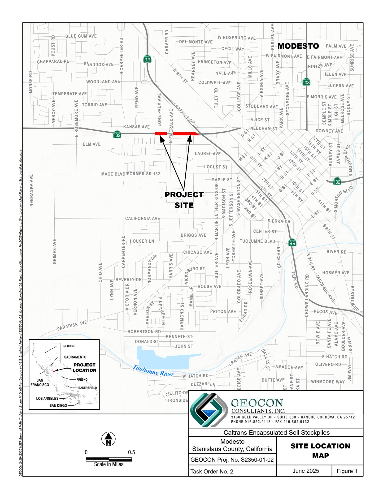
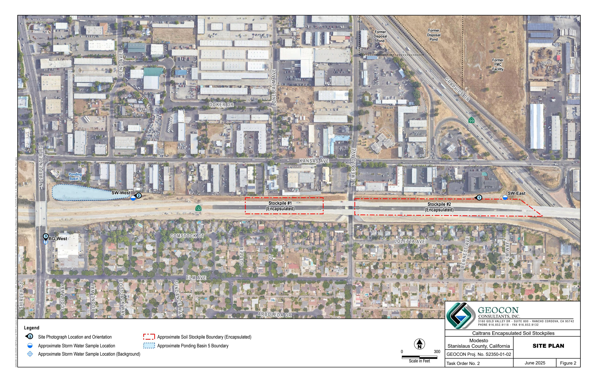
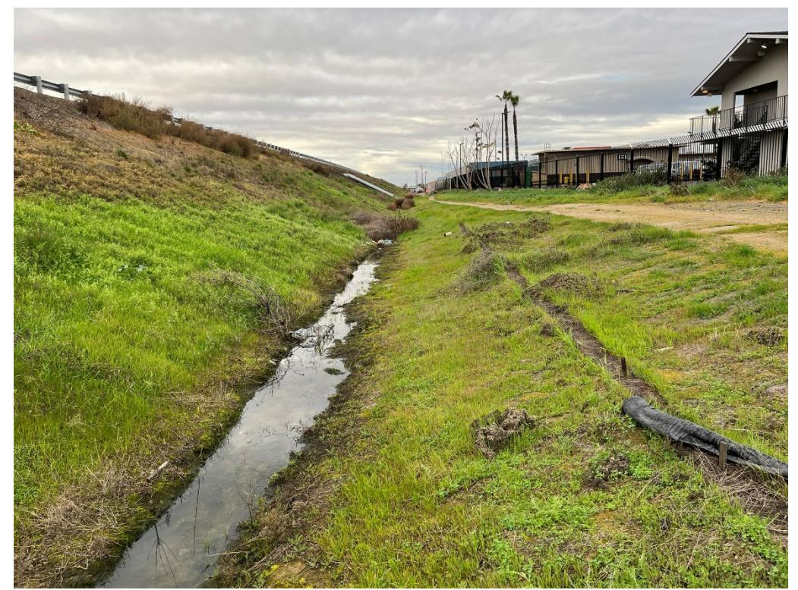
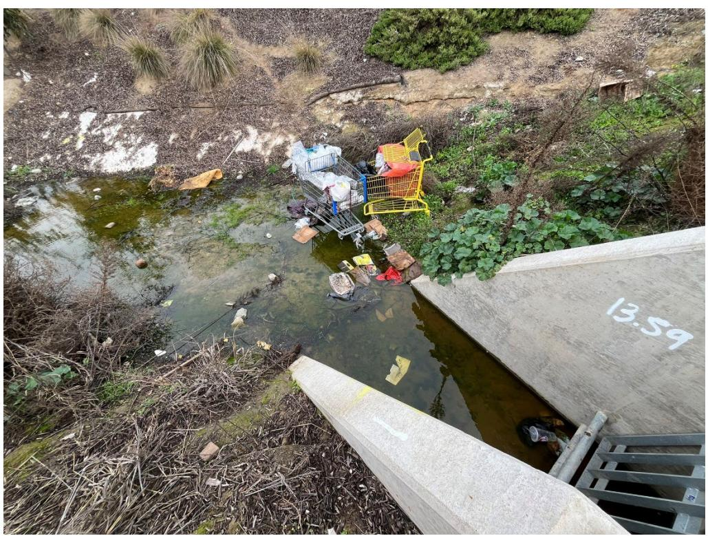
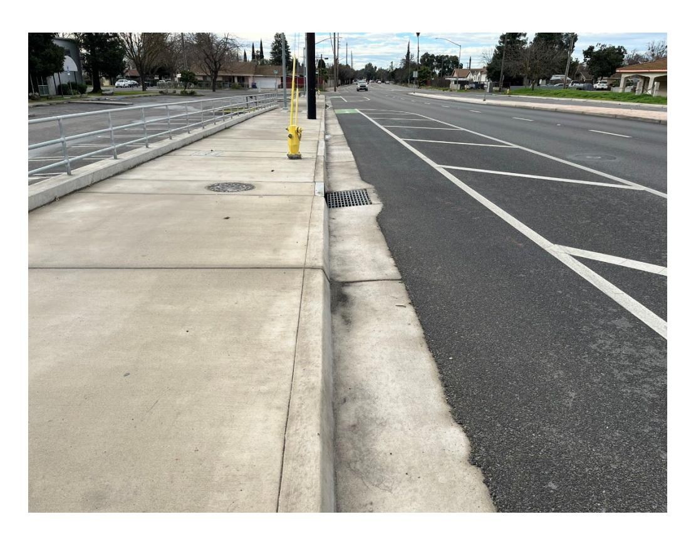

Project No. S2350-01-02 June 18, 2025

California Department of Transportation - District 6 Hazardous Waste Branch 2015 E. Shields Avenue, Suite 100 Fresno, California 93726

Attn: Adam Inman, PG

Subject: STORM WATER SAMPLING REPORT – FEBRUARY 4, 2025

CALTRANS ENCAPSULATED SOIL STOCKPILES MODESTO, STANISLAUS COUNTY, CALIFORNIA

CONTRACT NO. 06A2767, TASK ORDER NO. 2, EA NO. 10-1E7003

Mr. Inman:

In accordance with California Department of Transportation (Caltrans) Contract No. 06A2767, Task Order (TO) No. 2, Geocon sampled storm water at the Caltrans Encapsulated Soil Stockpiles (the site) located south of the intersection of State Route (SR) 99 and Kansas Avenue in Modesto, Stanislaus County, California. The approximate site location is depicted on the attached Site Location Map (Figure 1). The approximate site boundaries, Stockpiles 1 and 2, which were encapsulated beneath SR 132, and storm water sampling locations, are shown on the Site Plan (Figure 2).

We collected storm water samples on February 4, 2025, in general accordance with protocols approved by the California Environmental Protection Agency, Department of Toxic Substances Control (DTSC) and Central Valley Regional Water Quality Control Board (CVRWQCB) as established in the *Storm Water Sampling and Analysis Plan (SAP)*, prepared by Geocon Consultants, Inc., dated December 13, 2023. The scope of services included collection of storm water samples, analysis of the storm water samples by a California-certified laboratory, and preparation of this summary report detailing the sampling activities.

# BACKGROUND

# Project Description and History

During the 1930s, Barium Products Ltd. occupied property at 1200 Barium Road (now Graphics Drive) in Modesto, California, east of SR 99 between Woodland Avenue and Kansas Avenue. Barium Products Ltd. was a chemical manufacturing company processing a variety of ores and minerals including barite (barium sulfate) and celestite (strontium sulfate). Materials produced included barium and strontium compounds used for greases, lubricating oil, and pigment blanks. Sodium sulfide was generated as a by-product of barite processing, sold as a caustic, and used as a reagent in the mining industry.

In 1943, Barium Products Ltd. was purchased by Westvaco Chlorine Products Corporation (Westvaco). In 1948 Westvaco merged with Food Machinery and Chemical Corporation (FMC). From the 1950s to the 1970s, liquid residue from the processing operations was discharged to unlined evaporation/disposal ponds along the western portion of the FMC facility. The approximate boundaries of the former FMC facility and evaporation/disposal ponds are shown on Figure 2.

In 1961, a 4.3-acre parcel at the southwestern corner of the FMC facility was purchased by Caltrans for highway right-of-way (ROW) needed to construct SR 99. An aerial photograph from 1957 shows that a portion of the southernmost evaporation/disposal pond on the FMC property was within the area purchased for the SR 99 ROW. Soil in and around the pond was excavated during construction of SR 99 and stockpiled within the current Caltrans ROW at the location of the SR 132 West Freeway/Expressway project. Three distinct stockpiles were constructed at the site:

- Stockpile 1, located south of Kansas Avenue and west of North Emerald Avenue,
- Stockpile 2, located south of Kansas Avenue, between North Emerald Avenue and SR 99, and
- Stockpile 3, located south of Kansas Avenue and east of SR 99.

The earthwork on Phase I of the SR 99/132 expressway began in January 2020. Soil from Stockpile 3 was excavated, transported, and placed on top of Stockpiles 1 and 2. In October 2021, the majority of Stockpiles 1 and 2 were completely encapsulated beneath the structural section of SR 132 and with clean soil and vegetation on the northern side slopes. SR 132 was opened to traffic in November 2022.

# Surface Water Sampling Activities – Prior to Stockpile Encapsulation

The initial surface water sampling event at the former stockpiles was conducted by Shaw in March 2006 in general accordance with their January 2006 SAP. A total of seven runoff samples were collected from constructed impoundments during a qualifying rain event (i.e., visible runoff and 72 hours of prior dry weather). Shaw constructed shallow depressions within the Caltrans ROW in order to collect runoff from the stockpiles as there was no surface water migration observed beyond the ROW. The samples were analyzed for dissolved metals, polycyclic aromatic hydrocarbons (PAHs), nitrate, sulfate, and sulfide.

Subsequently, Geocon collected surface water samples from five designated surface runoff locations and two background locations on an on-call basis between April 2013 and April 2019 in accordance with an SAP addendum. The sample locations were approved by the DTSC and the CVRWQCB. Geocon personnel did not observe runoff migration from the Caltrans ROW during these sampling events.

Road construction on SR 99/132 eliminated the need for the previously designated surface runoff sampling locations. On November 2, 2022, Stantec met with the Caltrans TO Manager to identify revised sampling locations. Two new storm water sample locations and one new background sampling location were established.

Storm water sampling events were conducted by Stantec in March 2023 and by Geocon in December 2023 and February 2024. Reported total dissolved solids (TDS), sulfate, and metal concentrations for the storm water samples during these events were less than their Primary and Secondary Maximum Contaminant Levels (MCLs) except for thallium, which exceeded the Primary MCL in storm water samples collected in December 2023. The approximate sample locations are depicted on Figure 2. Analytical results are summarized on Tables 1 and 2.

# STORM WATER SAMPLING ACTIVITIES

This section describes the field activities for the February 4, 2025, storm water sampling event. It was not raining when we arrived on site or at the time of sample collection. The rainfall total for this event which began and ended on February 4, 2025, was approximately 0.52 inch.

### Field Activities

On February 4, 2025, we collected storm water samples from designated locations SW-East and SW-West. Sample location BG-West was dry at the time of sampling. The approximate sample locations are depicted on Figure 2. Photos of the sample locations are attached.

We collected samples from SW-East from the storm water discharge point on the north side of SR 132 west of SR 99 (Photo 1). We collected samples from SW-West within the east side of Ponding Basin 5, north of SR-132 and east of N. Carpenter Road (Photo 2).

We did not collect sample BG-West (Photo 3) at the drop inlet along the east side of North Carpenter Road approximately 700 feet south of the North Carpenter Road and Kansas Avenue intersection due to no flowing storm water at the time of sampling.

We collected each of the storm water samples using a pressure bailer with a suction pump and subsequently transferred them into laboratory-provided containers. We field filtered samples to be analyzed for dissolved metals by passing the samples through 0.45-micron filters. We capped, labeled, chilled and transported the samples to ASSET Laboratories (Asset) utilizing chain-of-custody procedures.

We followed Quality Assurance/Quality Control (QA/QC) procedures during the field sampling activities including the use of disposable bailers and providing chain-of-custody documentation for each water sample transferred to the laboratory.

## Laboratory Analyses

We delivered the samples to Asset for the following analyses under chain-of-custody protocol:

- Title 22 dissolved metals (including barium and strontium) by United States Environmental Protection Agency (EPA) Test Method 6020/7470;
- Sulfate by EPA Test Method 9056/300.0; and
- TDS by EPA Method 160.1.

Analytical results for this monitoring event are summarized on Tables 1 and 2. The laboratory report and chain-of-custody documentation are attached.

### Analytical Results

## TDS and Sulfate

TDS was reported for samples SW-East and SW-West at respective concentrations of 210 and 180 milligrams per liter (mg/l). Sulfate was reported for samples SW-East and SW-West at respective concentrations of 21 and 14 mg/l. TDS and sulfate concentrations do not exceed the Secondary Maximum Contaminant Levels (MCL) for drinking water.

## Title 22 Metals

Barium, copper, and zinc were detected in each of the storm water samples at concentrations that do not exceed their respective Primary or Secondary drinking water MCLs.

Molybdenum, vanadium, and strontium were detected in storm water samples SW-East and SW-West, however, MCLs have not been established for these analytes.

## Laboratory QA/QC

We reviewed the analytical laboratory QC data provided with the Asset laboratory report. Laboratory QC procedures included method blanks, laboratory control samples (LCS), LCS duplicate samples (LCSD), matrix spikes (MS), and matrix spike duplicates (MSD). The laboratory notes that the RPD in the MSD are outside accepted recovery limits for silver in samples N071731-001A-MSD and the RPD is outside accepted recovery limits for molybdenum in samples N071731-001A-DUP. The data shows acceptable non-detect results for the method blanks and acceptable recoveries for the LCS and LCSD samples.

# STORM WATER MANAGEMENT

Discharge/runoff was not observed migrating away from the Caltrans ROW during the February 4, 2025, sampling event.

Caltrans plans to conduct additional storm water sampling during qualifying rain events in 2025.

We appreciate the opportunity to provide our services on this project. Please contact us if you have any questions concerning the contents of this report or if we may be of further service.

Sincerely,

GEOCON CONSULTANTS, INC.

Rebecca L. Silva Project Manager

John E. Juhrend, PE, CEG Senior Engineer

Attachments: Figure 1, Site Location Map

Figure 2, Site Plan Photographs 1 through 3

Table 1, Summary of Laboratory Analysis Results – TDS and Sulfate

Table 2, Summary of Laboratory Analysis Results – Title 22 Metals (Dissolved)

Laboratory Report and Chain-of-custody Documentation

Photo No. 1 SW-East Sample Location

Photo No. 2 SW-West Sample Location

# Photo No. 1 & 2

Caltrans Encapsulated Soil Stockpiles

Modesto
Stanislaus, California

GEOCON Project No. S2350-01-02

June 2025

Photo No. 3 View south of dry drop inlet at sample location BG-West

# PHOTO NO. 3

| Caltrans Encapsulated Soil Stockpiles |
|---------------------------------------|
| Modesto                               |
| Stanislaus, California                |

GEOCON Project No. S2350-01-02

June 2025

# TABLE 1

## SUMMARY OF LABORATORY ANALYSIS RESULTS - TDS AND SULFATE

### CALTRANS CONTRACT 06A2767, TO NO. 2, EA 10-1E7003

### CALTRANS ENCAPSULATED SOIL STOCKPILES

### MODESTO, CALIFORNIA

| Sample ID      | Sample Date | Total Dissolved Solids mg/l |  | Sulfate |
|----------------|-------------|--------------------------------|--|---------|
| SW-East        | 12/19/2023  | 170                            |  | 22      |
| SW-East        | 2/1/2024    | 88                             |  | <2.0    |
| SW-East        | 2/4/2025    | 210                            |  | 21      |
| SW-West        | 12/19/2023  | 140                            |  | 11      |
| SW-West        | 2/1/2024    | 63                             |  | 3.6     |
| SW-West        | 2/4/2025    | 180                            |  | 14      |
| BG-West        | 12/19/2023  | 180                            |  | 38      |
| BG-West        | 2/1/2024    | 42                             |  | 6.5     |
| BG-West        | 2/4/2025    | ***                            |  | ***     |
| Secondary MCLs |             | 500                            |  | 250     |

### Notes:

Secondary MCL = Secondary Maximum Containment Level, United States Environmental Protection Agency, February 14, 2023

mg/l = milligrams per liter

\*\*\* = dry conditions

# TABLE 2

## SUMMARY OF LABORATORY ANALYSIS RESULTS - TITLE 22 METALS (DISSOLVED)

### CALTRANS CONTRACT 06A2767, TO NO. 2, EA 10-1E7003

### CALTRANS ENCAPSULATED SOIL STOCKPILES

### MODESTO, CALIFORNIA

| Sample ID | Sample Date | Antimony | Arsenic            | Barium | Beryllium | Cadmium            | Chromium         | Cobalt | Copper           | Lead | Molybdenum        | Nickel | Selenium | Silver           | Thallium | Vanadium         | Zinc             | Mercury             | Strontium         |
|--------------|-------------|----------|--------------------|--------|-----------|--------------------|------------------|--------|------------------|------|-------------------|--------|----------|------------------|----------|------------------|------------------|---------------------|-------------------|
| SW-East*     | 3/10/2023   | <8.8     | 9.2 J   | 160    | <3.0      | <11 UJ  | 12 J+ | <1.6   | 17 J+ | <4.7 | 6.6 J+            | <4.6   | <9.3     | <2.4             | <8.5     | 25 J+ | 27 J+ | 0.08 J   | 52 J   |
| SW-East      | 12/19/2023  | <10      | <10                | 270    | < 3.0     | < 3.0              | < 3.0            | < 3.0  | 11               | <10  | 15                | < 5.0  | <10      | < 3.0            | 18       | 4.7              | 43               | < 0.20              | 130               |
| SW-East      | 2/1/2024    | <10      | <10                | 900    | < 3.0     | < 3.0              | < 3.0            | < 3.0  | 13               | <10  | < 5.0             | < 5.0  | <10      | < 3.0            | <15      | < 3.0            | 25               | < 0.20              | 180               |
| SW-East      | 2/5/2025    | <10      | <10                | 390    | < 3.0     | < 3.0              | < 3.0            | < 3.0  | 16               | <10  | 16                | < 5.0  | <10      | < 3.0            | <15      | 6.1              | 55               | < 0.20              | 170               |
| SW-West*     | 3/10/2023   | <8.8     | <7.8               | 300    | <1.6      | <3.0               | <3.0             | <1.6   | 16 J+ | <4.7 | 6.7 J+ | <4.6   | <9.3     | <2.4             | <8.5     | 16 J+ | 130              | 0.07 J   | 77 J   |
| SW-West      | 12/19/2023  | <10      | <10                | 49     | <3.0      | <3.0               | <3.0             | <3.0   | 11               | <10  | <5.0              | <5.0   | <10      | <3.0             | 15       | 8.1              | 27               | <0.20               | 99                |
| SW-West      | 2/1/2024    | <10      | <10                | 520    | < 3.0     | < 3.0              | < 3.0            | <3.0   | < 5.0            | <10  | < 5.0             | < 5.0  | <10      | < 3.0            | <15      | <3.0             | 240              | < 0.20              | 78                |
| SW-West      | 2/5/2025    | <10      | <10                | 90     | < 3.0     | < 3.0              | < 3.0            | < 3.0  | 14               | <10  | 10                | < 5.0  | <10      | < 3.0            | <15      | 8.2              | 39               | < 0.20              | 190               |
| BG-West*     | 3/10/2023   | <8.8     | $8.0^{\mathrm{J}}$ | 17     | <1.6      | <3.0 UJ | < 2.0            | <1.6   | $14^{\ J+}$      | <4.7 | $13^{J+}$         | <4.6   | 12       | <2.4             | <8.5     | $13^{J+}$        | <25              | $0.06^{\mathrm{J}}$ | $63^{\mathrm{J}}$ |
| BG-West      | 12/19/2023  | <10      | <10                | 21     | < 3.0     | < 3.0              | < 3.0            | < 3.0  | 7.0              | <10  | 13                | < 5.0  | <10      | < 3.0            | 17       | 6.0              | 46               | < 0.20              | 110               |
| BG-West      | 2/1/2024    | <10      | <10                | 10     | < 3.0     | < 3.0              | < 3.0            | < 3.0  | < 5.0            | <10  | < 5.0             | < 5.0  | <10      | < 3.0            | <15      | < 3.0            | 18               | < 0.20              | < 50              |
| BG-West      | 2/5/2025    | ***      | ***                | ***    | ***       | ***                | ***              | ***    | ***              | ***  | ***               | ***    | ***      | ***              | ***      | ***              | ***              | ***                 | ***               |
| MCLs         |             | 6.0      | 10                 | 1,000  | 4.0       | 5.0                | 50               |        | 1,300            | 15   |                   | 100    | 50       | 100 1 | 2.0      |                  | 5,000 1          | 2.0                 |                   |

### Notes:

MCL = Maximum Contaminant Levels for drinking water, California Environmental Protection Agency State Water Resources Control Board, August 16, 2023

1 = Secondary MCL, United States Environmental Protection Agency, February 14, 2023

**Bold** = concentration exceeds MCL

\* = Stantec Sample IDs: SW-East = PL6, SW-West = PL7, BG-West = BG3

 $\mu g/l = micrograms per liter$ 

--- = screening level not established

\*\*\* = dry conditions

< = less than the laboratory reporting limit

1 = J-flag result (result is an estimated concentration reported between the method detection limit and practical quantitation limit)

J+ = the analyte was positively identified; the assoicated numerical value is an estimated quantity that may be biased high

UJ = indicates estimated non-detect

February 12, 2025

Rebecca Silva Geocon Consultants, Inc. 3160 Gold Valley Drive, Suite 800 Rancho Cordova, CA 95742

TEL: (916) 852-9118 FAX: (916) 852-9132

RE: Modesto Stockpiles, S2350-01-02

Attention: Rebecca Silva

Enclosed are the results for sample(s) received on February 05, 2025 by ASSET Laboratories. The sample(s) are tested for the parameters as indicated in the enclosed chain of custody in accordance with the applicable laboratory certifications.

Workorder No.: N071731

The reported results relate only to the samples as received and parameters tested by the laboratory.

Thank you for the opportunity to service the needs of your company.

Please feel free to call me at (702) 307-2659 if I can be of further assistance to your company.

Sincerely,

Nancy Sibucao

Calilleanda for

Laboratory Director

The cover letter is an integral part of this analytical report. This Laboratory Report cannot be reproduced in part or in its entirety without written permission from the client and ASSET Laboratories - Las Vegas.

# ASSET Laboratories

CLIENT: Geocon Consultants, Inc.

Project: Modesto Stockpiles, S2350-01-02 CASE NARRATIVE

Date: 12-Feb-25

Lab Order: N071731

## SAMPLE RECEIVING/GENERAL COMMENTS:

All sample containers were received intact with proper chain of custody documentation.

Information on sample receipt conditions including discrepancies can be found in attached Sample Receipt Checklist Form.

Cooler temperature and sample preservation were verified upon receipt of samples if applicable.

Samples were analyzed within method holding time.

Analytical Comments for EPA 6010B:

RPD for Sample Duplicate (DUP) is outside criteria for Molybdenum; however, the Laboratory Control Sample (LCS) validated the analytical batch.

RPD for Matrix Spike (MS)/ Matrix Spike Duplicate (MSD) is outside criteria for Silver; however, the Laboratory Control Sample (LCS) validated the analytical batch.

# ASSET Laboratories

CLIENT: Geocon Consultants, Inc.

Project: Modesto Stockpiles, S2350-01-02 Work Order Sample Summary

Lab Order: N071731

Contract No:

| Lab Sample ID | Client Sample ID | Matrix        | Collection Date     | Date Received | Date Reported |
|---------------|------------------|---------------|---------------------|---------------|---------------|
| N071731-001A  | SW-East          | Surface Water | 2/4/2025 8:22:00 AM | 2/5/2025      | 2/12/2025     |
| N071731-001B  | SW-East          | Surface Water | 2/4/2025 8:22:00 AM | 2/5/2025      | 2/12/2025     |
| N071731-001C  | SW-East          | Surface Water | 2/4/2025 8:22:00 AM | 2/5/2025      | 2/12/2025     |
| N071731-002A  | SW-West          | Surface Water | 2/4/2025 9:00:00 AM | 2/5/2025      | 2/12/2025     |
| N071731-002B  | SW-West          | Surface Water | 2/4/2025 9:00:00 AM | 2/5/2025      | 2/12/2025     |
| N071731-002C  | SW-West          | Surface Water | 2/4/2025 9:00:00 AM | 2/5/2025      | 2/12/2025     |

Date: 12-Feb-25

# ANALYTICAL RESULTS

Print Date: 12-Feb-25

## ASSET Laboratories

CLIENT: Geocon Consultants, Inc. Client Sample ID: SW-East

Lab Order: N071731

Project:Modesto Stockpiles, S2350-01-02Collection Date: 2/4/2025 8:22:00 AMLab ID:N071731-001Matrix: SURFACE WATER

| Lab ID:     | N071731-001            |                  |        |        | Ma       | trix: SURFAC | E WATER     |                   |
|-------------|------------------------|------------------|--------|--------|----------|--------------|-------------|-------------------|
| Analyses    |                        | Resul            | t      | PQL Qu | al Units | DF           | Date Ana    | alyzed            |
| TOTAL FIL   | TERABLE RESIDUE        |                  |        |        |          |              |             |                   |
|             |                        |                  |        |        | SM2540   | C            |             |                   |
| RunID: N\   | /00922-WC_250205D      | QC Batch:        | 117002 |        |          | PrepDate:    | 2/5/2025 Ar | nalyst: <b>LR</b> |
| Total Disso | olved Solids (Residue, | 2                | 10     | 10     | mg/L     | 1            |             | 25 10:16 AM       |
| ,           | Y ION CHROMATOGE       | RAPHY            |        |        |          |              |             |                   |
|             |                        |                  |        |        | EPA 300  | 0.0          |             |                   |
| RunID: N\   | /00922-IC9_250205A     | QC Batch:        | R19855 | 7      |          | PrepDate:    | Δr          | nalyst: RAB       |
| Sulfate     |                        |                  | 21     | 5.0    | mg/L     | 5            |             | 25 11:54 AM       |
|             | D MERCURY BY COL       |                  |        | 0.0    | 9/ =     | · ·          | 2/0/20      | 20                |
| DIOCOLVE    | .b iii.ci.coici bi ooi | LD VAI OIL ILO   | HIGOL  |        | EPA 747  | '0A          |             |                   |
| RunID: N\   | /00922-AA2_250205C     | QC Batch:        | 116992 |        |          | PrepDate:    | 2/5/2025 Ar | nalyst: MN        |
| Mercury     |                        | N                | ID     | 0.20   | μg/L     | 1            | 2/5/20      | 25 05:18 PM       |
| DISSOLVE    | D METALS BY ICP        |                  |        |        |          |              |             |                   |
|             |                        | <b>EPA 3010A</b> |        |        | EPA 601  | 0B           |             |                   |
| RunID: N\   | /00922-ICP4_250210E    | QC Batch:        | 117088 |        |          | PrepDate:    | 2/8/2025 Ar | nalyst: <b>DJ</b> |
| Antimony    |                        | Ν                | ID     | 0.010  | mg/L     | 1            | 2/10/20     | 025 03:29 PM      |
| Arsenic     |                        | N                | ID     | 0.010  | mg/L     | 1            | 2/10/20     | 025 03:29 PM      |
| Barium      |                        | 0.3              | 39     | 0.0030 | mg/L     | 1            | 2/10/20     | 025 03:29 PM      |
| Beryllium   |                        | N                | ID     | 0.0030 | mg/L     | 1            | 2/10/20     | 025 03:29 PM      |
| Cadmium     |                        | N                | ID     | 0.0030 | mg/L     | 1            | 2/10/20     | 025 03:29 PM      |
| Chromium    |                        | N                | ID     | 0.0030 | mg/L     | 1            | 2/10/20     | 025 03:29 PM      |
| Cobalt      |                        | N                | ID     | 0.0030 | mg/L     | 1            | 2/10/20     | 025 03:29 PM      |
| Copper      |                        | 0.0              | 16     | 0.0050 | mg/L     | 1            | 2/10/20     | 025 03:29 PM      |
| Lead        |                        | N                | ID     | 0.010  | mg/L     | 1            | 2/10/20     | 025 03:29 PM      |
| Molybdenu   | ım                     | 0.0              | 16     | 0.0050 | mg/L     | 1            | 2/10/20     | 025 03:29 PM      |
| Nickel      |                        | N                | ID     | 0.0050 | mg/L     | 1            | 2/10/20     | 025 03:29 PM      |
| Selenium    |                        |                  | ID     | 0.010  | mg/L     | 1            | 2/10/20     | 025 03:29 PM      |
| Silver      |                        | •                | ID     | 0.0030 | mg/L     | 1            | 2/10/20     | 025 03:29 PM      |
| Thallium    |                        | N                | ID     | 0.015  | mg/L     | 1            | 2/10/20     | 025 03:29 PM      |
| Vanadium    |                        | 0.000            | 51     | 0.0030 | mg/L     | 1            | 2/10/20     | 025 03:29 PM      |
| Zinc        |                        | 0.0              | 55     | 0.010  | mg/L     | 1            | 2/10/20     | 025 03:29 PM      |
| DISSOLVE    | D METALS BY ICP        |                  |        |        |          |              |             |                   |
|             |                        | EPA 3010A        |        |        | EPA 601  | 0B           |             |                   |
| RunID: N\   | /00922-ICP3_250211A    | QC Batch:        | 117088 |        |          | PrepDate:    | 2/8/2025 Ar | nalyst: <b>DJ</b> |
| Strontium   |                        | 0.               | 17     | 0.050  | mg/L     | 1            | 2/11/20     | 025 05:19 PM      |
|             |                        |                  |        |        |          |              |             |                   |

Qualifiers: B Analyte detected in the associated Method Blank

H Holding times for preparation or analysis exceeded

S Spike/Surrogate outside of limits due to matrix interference

DO Surrogate Diluted Out

- E Value above quantitation range
- ND Not Detected at the Reporting Limit
  Results are wet unless otherwise specified
- (M) Test is modified

CALIFORNIA | P:562.219.7435 F:562.219.7436 11110 Artesia Blvd., Ste B, Cerritos, CA 90703 ELAP Cert 2921 NV Cert CA01638

# ANALYTICAL RESULTS

Print Date: 12-Feb-25

## ASSET Laboratories

CLIENT: Geocon Consultants, Inc. Client Sample ID: SW-West

Lab Order: N071731

Project:Modesto Stockpiles, S2350-01-02Collection Date: 2/4/2025 9:00:00 AMLab ID:N071731-002Matrix: SURFACE WATER

| Amalwasa |                                                                                                                                                                                                                                                                                                                                                                                                                                                                                                                                                                                                                                                                                                                                                                                                                                                                                                                                                                                                                                                                                                                                                                                                                                                                                                                                                                                                                                                                                                                                                                                                                                                                                                                                                                                                                                                                                                                                                                                                                                                                                                                              |                          |        |           |            |                                          |
|----------|------------------------------------------------------------------------------------------------------------------------------------------------------------------------------------------------------------------------------------------------------------------------------------------------------------------------------------------------------------------------------------------------------------------------------------------------------------------------------------------------------------------------------------------------------------------------------------------------------------------------------------------------------------------------------------------------------------------------------------------------------------------------------------------------------------------------------------------------------------------------------------------------------------------------------------------------------------------------------------------------------------------------------------------------------------------------------------------------------------------------------------------------------------------------------------------------------------------------------------------------------------------------------------------------------------------------------------------------------------------------------------------------------------------------------------------------------------------------------------------------------------------------------------------------------------------------------------------------------------------------------------------------------------------------------------------------------------------------------------------------------------------------------------------------------------------------------------------------------------------------------------------------------------------------------------------------------------------------------------------------------------------------------------------------------------------------------------------------------------------------------|--------------------------|--------|-----------|------------|------------------------------------------|
| Analyses |                                                                                                                                                                                                                                                                                                                                                                                                                                                                                                                                                                                                                                                                                                                                                                                                                                                                                                                                                                                                                                                                                                                                                                                                                                                                                                                                                                                                                                                                                                                                                                                                                                                                                                                                                                                                                                                                                                                                                                                                                                                                                                                              | Result                   | PQL Q  | ual Units | DF         | Date Analyzed                            |
| TOTAL    | FILTERABLE RESIDUE                                                                                                                                                                                                                                                                                                                                                                                                                                                                                                                                                                                                                                                                                                                                                                                                                                                                                                                                                                                                                                                                                                                                                                                                                                                                                                                                                                                                                                                                                                                                                                                                                                                                                                                                                                                                                                                                                                                                                                                                                                                                                                           |                          |        |           |            |                                          |
|          |                                                                                                                                                                                                                                                                                                                                                                                                                                                                                                                                                                                                                                                                                                                                                                                                                                                                                                                                                                                                                                                                                                                                                                                                                                                                                                                                                                                                                                                                                                                                                                                                                                                                                                                                                                                                                                                                                                                                                                                                                                                                                                                              |                          |        | SM25400   |            |                                          |
| RunID:   | NV00922-WC 250205D                                                                                                                                                                                                                                                                                                                                                                                                                                                                                                                                                                                                                                                                                                                                                                                                                                                                                                                                                                                                                                                                                                                                                                                                                                                                                                                                                                                                                                                                                                                                                                                                                                                                                                                                                                                                                                                                                                                                                                                                                                                                                                           | QC Batch: 11             | 7002   | ı         | PrepDate:  | 2/5/2025 Analyst: <b>LR</b>              |
|          | _                                                                                                                                                                                                                                                                                                                                                                                                                                                                                                                                                                                                                                                                                                                                                                                                                                                                                                                                                                                                                                                                                                                                                                                                                                                                                                                                                                                                                                                                                                                                                                                                                                                                                                                                                                                                                                                                                                                                                                                                                                                                                                                            | 180                      | 10     | ma/l      | . 1        | 2/5/2025 10:16 AM                        |
|          | •                                                                                                                                                                                                                                                                                                                                                                                                                                                                                                                                                                                                                                                                                                                                                                                                                                                                                                                                                                                                                                                                                                                                                                                                                                                                                                                                                                                                                                                                                                                                                                                                                                                                                                                                                                                                                                                                                                                                                                                                                                                                                                                            | 100                      | 10     | mg/L      |            | 2/0/2020 10:10 / 1101                    |
| ANIONS   | BY ION CHROMATOGR                                                                                                                                                                                                                                                                                                                                                                                                                                                                                                                                                                                                                                                                                                                                                                                                                                                                                                                                                                                                                                                                                                                                                                                                                                                                                                                                                                                                                                                                                                                                                                                                                                                                                                                                                                                                                                                                                                                                                                                                                                                                                                            | APHY                     |        |           |            |                                          |
|          |                                                                                                                                                                                                                                                                                                                                                                                                                                                                                                                                                                                                                                                                                                                                                                                                                                                                                                                                                                                                                                                                                                                                                                                                                                                                                                                                                                                                                                                                                                                                                                                                                                                                                                                                                                                                                                                                                                                                                                                                                                                                                                                              |                          |        | EPA 300.  | 0          |                                          |
| RunID:   | NV00922-IC9_250205A                                                                                                                                                                                                                                                                                                                                                                                                                                                                                                                                                                                                                                                                                                                                                                                                                                                                                                                                                                                                                                                                                                                                                                                                                                                                                                                                                                                                                                                                                                                                                                                                                                                                                                                                                                                                                                                                                                                                                                                                                                                                                                          | QC Batch: R1             | 198557 | ı         | PrepDate:  | Analyst: RAB                             |
| Sulfate  |                                                                                                                                                                                                                                                                                                                                                                                                                                                                                                                                                                                                                                                                                                                                                                                                                                                                                                                                                                                                                                                                                                                                                                                                                                                                                                                                                                                                                                                                                                                                                                                                                                                                                                                                                                                                                                                                                                                                                                                                                                                                                                                              | 14                       | 5.0    | ma/l      | 5          | 2/5/2025 12:10 PM                        |
|          | VED MERCURY BY COL                                                                                                                                                                                                                                                                                                                                                                                                                                                                                                                                                                                                                                                                                                                                                                                                                                                                                                                                                                                                                                                                                                                                                                                                                                                                                                                                                                                                                                                                                                                                                                                                                                                                                                                                                                                                                                                                                                                                                                                                                                                                                                           |                          |        | 9/ =      | · ·        | 2,0,2020 12110 1 111                     |
| 5.0002   | 125 11121100111 21 002                                                                                                                                                                                                                                                                                                                                                                                                                                                                                                                                                                                                                                                                                                                                                                                                                                                                                                                                                                                                                                                                                                                                                                                                                                                                                                                                                                                                                                                                                                                                                                                                                                                                                                                                                                                                                                                                                                                                                                                                                                                                                                       | 2 V/ O.K 1 2 0 1 1 1 1 1 |        | EPA 7470  | Α          |                                          |
| DunID:   | NI\/00022 AA2 250205C                                                                                                                                                                                                                                                                                                                                                                                                                                                                                                                                                                                                                                                                                                                                                                                                                                                                                                                                                                                                                                                                                                                                                                                                                                                                                                                                                                                                                                                                                                                                                                                                                                                                                                                                                                                                                                                                                                                                                                                                                                                                                                        | OC Botoh: 11             | 6003   |           | Drop Doto: | 2/E/202E A I t. BABI                     |
|          | _                                                                                                                                                                                                                                                                                                                                                                                                                                                                                                                                                                                                                                                                                                                                                                                                                                                                                                                                                                                                                                                                                                                                                                                                                                                                                                                                                                                                                                                                                                                                                                                                                                                                                                                                                                                                                                                                                                                                                                                                                                                                                                                            |                          |        |           | •          | · ·····, · · · · · · · · · · · · · · ·   |
| •        | •                                                                                                                                                                                                                                                                                                                                                                                                                                                                                                                                                                                                                                                                                                                                                                                                                                                                                                                                                                                                                                                                                                                                                                                                                                                                                                                                                                                                                                                                                                                                                                                                                                                                                                                                                                                                                                                                                                                                                                                                                                                                                                                            | ND                       | 0.20   | μg/L      | 1          | 2/5/2025 05:25 PM                        |
| DISSOL   |                                                                                                                                                                                                                                                                                                                                                                                                                                                                                                                                                                                                                                                                                                                                                                                                                                                                                                                                                                                                                                                                                                                                                                                                                                                                                                                                                                                                                                                                                                                                                                                                                                                                                                                                                                                                                                                                                                                                                                                                                                                                                                                              |                          |        | == 1 0010 | _          |                                          |
|          |                                                                                                                                                                                                                                                                                                                                                                                                                                                                                                                                                                                                                                                                                                                                                                                                                                                                                                                                                                                                                                                                                                                                                                                                                                                                                                                                                                                                                                                                                                                                                                                                                                                                                                                                                                                                                                                                                                                                                                                                                                                                                                                              | EPA 3010A                |        | EPA 6010  | В          |                                          |
| RunID:   | NV00922-ICP4_250210E                                                                                                                                                                                                                                                                                                                                                                                                                                                                                                                                                                                                                                                                                                                                                                                                                                                                                                                                                                                                                                                                                                                                                                                                                                                                                                                                                                                                                                                                                                                                                                                                                                                                                                                                                                                                                                                                                                                                                                                                                                                                                                         | QC Batch: 11             | 7088   | I         | PrepDate:  | 2/8/2025 Analyst: <b>DJ</b>              |
| Antimor  | ny                                                                                                                                                                                                                                                                                                                                                                                                                                                                                                                                                                                                                                                                                                                                                                                                                                                                                                                                                                                                                                                                                                                                                                                                                                                                                                                                                                                                                                                                                                                                                                                                                                                                                                                                                                                                                                                                                                                                                                                                                                                                                                                           | ND                       | 0.010  | mg/L      | 1          | 2/10/2025 03:40 PM                       |
| Arsenic  | :                                                                                                                                                                                                                                                                                                                                                                                                                                                                                                                                                                                                                                                                                                                                                                                                                                                                                                                                                                                                                                                                                                                                                                                                                                                                                                                                                                                                                                                                                                                                                                                                                                                                                                                                                                                                                                                                                                                                                                                                                                                                                                                            | ND                       | 0.010  | mg/L      | 1          | 2/10/2025 03:40 PM                       |
| Barium   |                                                                                                                                                                                                                                                                                                                                                                                                                                                                                                                                                                                                                                                                                                                                                                                                                                                                                                                                                                                                                                                                                                                                                                                                                                                                                                                                                                                                                                                                                                                                                                                                                                                                                                                                                                                                                                                                                                                                                                                                                                                                                                                              | 0.090                    | 0.0030 | mg/L      | 1          | 2/10/2025 03:40 PM                       |
| Berylliu | m                                                                                                                                                                                                                                                                                                                                                                                                                                                                                                                                                                                                                                                                                                                                                                                                                                                                                                                                                                                                                                                                                                                                                                                                                                                                                                                                                                                                                                                                                                                                                                                                                                                                                                                                                                                                                                                                                                                                                                                                                                                                                                                            | ND                       | 0.0030 | mg/L      | 1          | 2/10/2025 03:40 PM                       |
| Cadmiu   | ım                                                                                                                                                                                                                                                                                                                                                                                                                                                                                                                                                                                                                                                                                                                                                                                                                                                                                                                                                                                                                                                                                                                                                                                                                                                                                                                                                                                                                                                                                                                                                                                                                                                                                                                                                                                                                                                                                                                                                                                                                                                                                                                           | ND                       | 0.0030 | mg/L      | 1          | 2/10/2025 03:40 PM                       |
|          | um                                                                                                                                                                                                                                                                                                                                                                                                                                                                                                                                                                                                                                                                                                                                                                                                                                                                                                                                                                                                                                                                                                                                                                                                                                                                                                                                                                                                                                                                                                                                                                                                                                                                                                                                                                                                                                                                                                                                                                                                                                                                                                                           |                          | 0.0030 | mg/L      |            | 2/10/2025 03:40 PM                       |
|          |                                                                                                                                                                                                                                                                                                                                                                                                                                                                                                                                                                                                                                                                                                                                                                                                                                                                                                                                                                                                                                                                                                                                                                                                                                                                                                                                                                                                                                                                                                                                                                                                                                                                                                                                                                                                                                                                                                                                                                                                                                                                                                                              |                          |        | · ·       | •          | 2/10/2025 03:40 PM                       |
| • • •    |                                                                                                                                                                                                                                                                                                                                                                                                                                                                                                                                                                                                                                                                                                                                                                                                                                                                                                                                                                                                                                                                                                                                                                                                                                                                                                                                                                                                                                                                                                                                                                                                                                                                                                                                                                                                                                                                                                                                                                                                                                                                                                                              |                          |        | · ·       | •          | 2/10/2025 03:40 PM                       |
|          |                                                                                                                                                                                                                                                                                                                                                                                                                                                                                                                                                                                                                                                                                                                                                                                                                                                                                                                                                                                                                                                                                                                                                                                                                                                                                                                                                                                                                                                                                                                                                                                                                                                                                                                                                                                                                                                                                                                                                                                                                                                                                                                              |                          |        | -         | •          | 2/10/2025 03:40 PM                       |
| -        | enum                                                                                                                                                                                                                                                                                                                                                                                                                                                                                                                                                                                                                                                                                                                                                                                                                                                                                                                                                                                                                                                                                                                                                                                                                                                                                                                                                                                                                                                                                                                                                                                                                                                                                                                                                                                                                                                                                                                                                                                                                                                                                                                         |                          |        | -         | •          | 2/10/2025 03:40 PM                       |
|          |                                                                                                                                                                                                                                                                                                                                                                                                                                                                                                                                                                                                                                                                                                                                                                                                                                                                                                                                                                                                                                                                                                                                                                                                                                                                                                                                                                                                                                                                                                                                                                                                                                                                                                                                                                                                                                                                                                                                                                                                                                                                                                                              |                          |        | · ·       |            | 2/10/2025 03:40 PM                       |
|          | m                                                                                                                                                                                                                                                                                                                                                                                                                                                                                                                                                                                                                                                                                                                                                                                                                                                                                                                                                                                                                                                                                                                                                                                                                                                                                                                                                                                                                                                                                                                                                                                                                                                                                                                                                                                                                                                                                                                                                                                                                                                                                                                            |                          |        | · ·       |            | 2/10/2025 03:40 PM                       |
|          | _                                                                                                                                                                                                                                                                                                                                                                                                                                                                                                                                                                                                                                                                                                                                                                                                                                                                                                                                                                                                                                                                                                                                                                                                                                                                                                                                                                                                                                                                                                                                                                                                                                                                                                                                                                                                                                                                                                                                                                                                                                                                                                                            |                          |        | · ·       |            | 2/10/2025 03:40 PM                       |
|          |                                                                                                                                                                                                                                                                                                                                                                                                                                                                                                                                                                                                                                                                                                                                                                                                                                                                                                                                                                                                                                                                                                                                                                                                                                                                                                                                                                                                                                                                                                                                                                                                                                                                                                                                                                                                                                                                                                                                                                                                                                                                                                                              |                          |        | · ·       |            | 2/10/2025 03:40 PM 2/10/2025 03:40 PM |
|          | uiii                                                                                                                                                                                                                                                                                                                                                                                                                                                                                                                                                                                                                                                                                                                                                                                                                                                                                                                                                                                                                                                                                                                                                                                                                                                                                                                                                                                                                                                                                                                                                                                                                                                                                                                                                                                                                                                                                                                                                                                                                                                                                                                         |                          |        | · ·       | •          | 2/10/2025 03:40 PM 2/10/2025 03:40 PM |
|          | VED METALS BY ICD                                                                                                                                                                                                                                                                                                                                                                                                                                                                                                                                                                                                                                                                                                                                                                                                                                                                                                                                                                                                                                                                                                                                                                                                                                                                                                                                                                                                                                                                                                                                                                                                                                                                                                                                                                                                                                                                                                                                                                                                                                                                                                            | 0.039                    | 0.010  | my/L      | '          | Z/ 10/2023 03.40 PM                      |
| DISSUL   | Company   Company   Company   Company   Company   Company   Company   Company   Company   Company   Company   Company   Company   Company   Company   Company   Company   Company   Company   Company   Company   Company   Company   Company   Company   Company   Company   Company   Company   Company   Company   Company   Company   Company   Company   Company   Company   Company   Company   Company   Company   Company   Company   Company   Company   Company   Company   Company   Company   Company   Company   Company   Company   Company   Company   Company   Company   Company   Company   Company   Company   Company   Company   Company   Company   Company   Company   Company   Company   Company   Company   Company   Company   Company   Company   Company   Company   Company   Company   Company   Company   Company   Company   Company   Company   Company   Company   Company   Company   Company   Company   Company   Company   Company   Company   Company   Company   Company   Company   Company   Company   Company   Company   Company   Company   Company   Company   Company   Company   Company   Company   Company   Company   Company   Company   Company   Company   Company   Company   Company   Company   Company   Company   Company   Company   Company   Company   Company   Company   Company   Company   Company   Company   Company   Company   Company   Company   Company   Company   Company   Company   Company   Company   Company   Company   Company   Company   Company   Company   Company   Company   Company   Company   Company   Company   Company   Company   Company   Company   Company   Company   Company   Company   Company   Company   Company   Company   Company   Company   Company   Company   Company   Company   Company   Company   Company   Company   Company   Company   Company   Company   Company   Company   Company   Company   Company   Company   Company   Company   Company   Company   Company   Company   Company   Company   Company   Company   Company   Company   Company   Company   Company   Company   Company   Comp |                          |        |           |            |                                          |
| RunID:   |                                                                                                                                                                                                                                                                                                                                                                                                                                                                                                                                                                                                                                                                                                                                                                                                                                                                                                                                                                                                                                                                                                                                                                                                                                                                                                                                                                                                                                                                                                                                                                                                                                                                                                                                                                                                                                                                                                                                                                                                                                                                                                                              |                          | 7088   |           |            | 2/8/2025 Applyot: <b>D.</b>              |
|          |                                                                                                                                                                                                                                                                                                                                                                                                                                                                                                                                                                                                                                                                                                                                                                                                                                                                                                                                                                                                                                                                                                                                                                                                                                                                                                                                                                                                                                                                                                                                                                                                                                                                                                                                                                                                                                                                                                                                                                                                                                                                                                                              |                          |        |           | •          | ,                                        |
| Strontiu | ım                                                                                                                                                                                                                                                                                                                                                                                                                                                                                                                                                                                                                                                                                                                                                                                                                                                                                                                                                                                                                                                                                                                                                                                                                                                                                                                                                                                                                                                                                                                                                                                                                                                                                                                                                                                                                                                                                                                                                                                                                                                                                                                           | 0.19                     | 0.050  | mg/L      | 1          | 2/11/2025 05:25 PM                       |

Qualifiers: B Analyte detected in the associated Method Blank

H Holding times for preparation or analysis exceeded

S Spike/Surrogate outside of limits due to matrix interference

DO Surrogate Diluted Out

- E Value above quantitation range
- ND Not Detected at the Reporting Limit
  Results are wet unless otherwise specified
- (M) Test is modified

CALIFORNIA | P:562.219.7435 F:562.219.7436 11110 Artesia Blvd., Ste B, Cerritos, CA 90703 ELAP Cert 2921 NV Cert CA01638

**ASSET Laboratories** Date: 12-Feb-25

**CLIENT:** Geocon Consultants, Inc.

Work Order: N071731

Project: Modesto Stockpiles, S2350-01-02

# ANALYTICAL QC SUMMARY REPORT

**TestCode:** 160.1\_2540C\_W

| Sample ID: LCS-117002 Client ID: LCSW        |          | SampType: LCS Batch ID: 117002  | TestCode: 160.1_2540C Units: mg/L TestNo: SM2540C | Prep Date: 2/5/2025 Analysis Date: 2/5/2025 | RunNo: 198651 SeqNo: 6495820 |          |           |             |      |          |      |
|-------------------------------------------------|----------|------------------------------------|------------------------------------------------------|------------------------------------------------|---------------------------------|----------|-----------|-------------|------|----------|------|
| Analyte                                         | Result   | PQL                                | SPK value                                            | SPK Ref Val                                    | %REC                            | LowLimit | HighLimit | RPD Ref Val | %RPD | RPDLimit | Qual |
| Total Dissolved Solids (Residue, Filtera        | 974.000  | 10                                 | 1000                                                 | 0                                              | 97.4                            | 90       | 110       |             |      |          |      |
| Sample ID: MB-117002 Client ID: PBW          |          | SampType: MBLK Batch ID: 117002 | TestCode: 160.1_2540C Units: mg/L TestNo: SM2540C | Prep Date: 2/5/2025 Analysis Date: 2/5/2025 | RunNo: 198651 SeqNo: 6495821 |          |           |             |      |          |      |
| Analyte                                         | Result   | PQL                                | SPK value                                            | SPK Ref Val                                    | %REC                            | LowLimit | HighLimit | RPD Ref Val | %RPD | RPDLimit | Qual |
| Total Dissolved Solids (Residue, Filtera        | ND       | 10                                 |                                                      |                                                |                                 |          |           |             |      |          |      |
| Sample ID: N071688-011BDUP Client ID: ZZZZZZ |          | SampType: DUP Batch ID: 117002  | TestCode: 160.1_2540C Units: mg/L TestNo: SM2540C | Prep Date: 2/5/2025 Analysis Date: 2/5/2025 | RunNo: 198651 SeqNo: 6495828 |          |           |             |      |          |      |
| Analyte                                         | Result   | PQL                                | SPK value                                            | SPK Ref Val                                    | %REC                            | LowLimit | HighLimit | RPD Ref Val | %RPD | RPDLimit | Qual |
| Total Dissolved Solids (Residue, Filtera        | 5590.000 | 50                                 |                                                      | 5765                                           |                                 |          |           |             | 3.08 | 10       |      |

### Qualifiers:

- B Analyte detected in the associated Method Blank
- ND Not Detected at the Reporting Limit
- DO Surrogate Diluted Out

- E Value above quantitation range
- RPD outside accepted recovery limits
  - Calculations are based on raw values
    - NEVADA | P:702.307.2659 F:702.307.2691 3151 W. Post Rd., Las Vegas, NV 89118
- H Holding times for preparation or analysis exceeded
- S Spike/Surrogate outside of limits due to matrix interference
- (M) Test is modified

Work Order: N071731

Modesto Stockpiles, S2350-01-02 **Project:** 

# ANALYTICAL QC SUMMARY REPORT

TestCode: 300\_W\_SO4

| Sample ID                  | SampType          | TestCode            | Units                   | Prep Date      | RunNo         |          |           |             |      |          |      |
|----------------------------|-------------------|---------------------|-------------------------|----------------|---------------|----------|-----------|-------------|------|----------|------|
| Client ID                  | Batch ID          | TestNo              | Analysis Date           | SeqNo          |               |          |           |             |      |          |      |
| Sample ID: MB-R198557_SO4  | SampType: MBLK    | TestCode: 300_W_SO4 | Units: mg/L             | Prep Date:     | RunNo: 198557 |          |           |             |      |          |      |
| Client ID: PBW             | Batch ID: R198557 | TestNo: EPA 300.0   | Analysis Date: 2/5/2025 | SeqNo: 6488797 |               |          |           |             |      |          |      |
| Analyte                    | Result            | PQL                 | SPK value               | SPK Ref Val    | %REC          | LowLimit | HighLimit | RPD Ref Val | %RPD | RPDLimit | Qual |
| Sulfate                    | ND                | 1.0                 |                         |                |               |          |           |             |      |          |      |
| Sample ID: LCS-R198557_SO4 | SampType: LCS     | TestCode: 300_W_SO4 | Units: mg/L             | Prep Date:     | RunNo: 198557 |          |           |             |      |          |      |
| Client ID: LCSW            | Batch ID: R198557 | TestNo: EPA 300.0   | Analysis Date: 2/5/2025 | SeqNo: 6488798 |               |          |           |             |      |          |      |
| Analyte                    | Result            | PQL                 | SPK value               | SPK Ref Val    | %REC          | LowLimit | HighLimit | RPD Ref Val | %RPD | RPDLimit | Qual |
| Sulfate                    | 4.001             | 1.0                 | 4.000                   | 0              | 100           | 90       | 110       |             |      |          |      |
| Sample ID: N071691-002BDUP | SampType: DUP     | TestCode: 300_W_SO4 | Units: mg/L             | Prep Date:     | RunNo: 198557 |          |           |             |      |          |      |
| Client ID: ZZZZZZ          | Batch ID: R198557 | TestNo: EPA 300.0   | Analysis Date: 2/5/2025 | SeqNo: 6488802 |               |          |           |             |      |          |      |
| Analyte                    | Result            | PQL                 | SPK value               | SPK Ref Val    | %REC          | LowLimit | HighLimit | RPD Ref Val | %RPD | RPDLimit | Qual |
| Sulfate                    | 2593.000          | 200                 |                         |                |               |          | 2598      | 0.200       | 15   |          |      |
| Sample ID: N071691-002BMS  | SampType: MS      | TestCode: 300_W_SO4 | Units: mg/L             | Prep Date:     | RunNo: 198557 |          |           |             |      |          |      |
| Client ID: ZZZZZZ          | Batch ID: R198557 | TestNo: EPA 300.0   | Analysis Date: 2/5/2025 | SeqNo: 6488803 |               |          |           |             |      |          |      |
| Analyte                    | Result            | PQL                 | SPK value               | SPK Ref Val    | %REC          | LowLimit | HighLimit | RPD Ref Val | %RPD | RPDLimit | Qual |
| Sulfate                    | 3417.140          | 200                 | 800.0                   | 2598           | 102           | 80       | 120       |             |      |          |      |
| Sample ID: N071691-002BMSD | SampType: MSD     | TestCode: 300_W_SO4 | Units: mg/L             | Prep Date:     | RunNo: 198557 |          |           |             |      |          |      |
| Client ID: ZZZZZZ          | Batch ID: R198557 | TestNo: EPA 300.0   | Analysis Date: 2/5/2025 | SeqNo: 6488804 |               |          |           |             |      |          |      |
| Analyte                    | Result            | PQL                 | SPK value               | SPK Ref Val    | %REC          | LowLimit | HighLimit | RPD Ref Val | %RPD | RPDLimit | Qual |
|                            |                   |                     |                         |                |               |          |           |             |      |          |      |

### Qualifiers:

- B Analyte detected in the associated Method Blank
- ND Not Detected at the Reporting Limit
- DO Surrogate Diluted Out

- E Value above quantitation range
- RPD outside accepted recovery limits
- Calculations are based on raw values

Calculations are based on raw values

Calculations are based on raw values

- H Holding times for preparation or analysis exceeded
- S Spike/Surrogate outside of limits due to matrix interference
- (M) Test is modified

Work Order: N071731

Modesto Stockpiles, S2350-01-02 **Project:** 

# ANALYTICAL QC SUMMARY REPORT

TestCode: 6010\_WD

| Sample ID: MB-117088        | SampType: MBLK       | TestCode: 6010_WD           | Units: mg/L              |                             |                          | Prep Date: 2/8/2025             |                          |             | RunNo: 198684  |          |      |
|-----------------------------|----------------------|-----------------------------|--------------------------|-----------------------------|--------------------------|---------------------------------|--------------------------|-------------|----------------|----------|------|
| Client ID: PBW              | Batch ID: 117088     | TestNo: EPA 6010B EPA 3010A |                          |                             | Analysis Date: 2/10/2025 | SeqNo: 6498991                  |                          |             |                |          |      |
| Analyte                     | Result               | PQL                         | SPK value                | SPK Ref Val                 | %REC                     | LowLimit                        | HighLimit                | RPD Ref Val | %RPD           | RPDLimit | Qual |
| Antimony                    | ND                   | 0.010                       |                          |                             |                          |                                 |                          |             |                |          |      |
| Arsenic                     | ND                   | 0.010                       |                          |                             |                          |                                 |                          |             |                |          |      |
| Barium                      | ND                   | 0.0030                      |                          |                             |                          |                                 |                          |             |                |          |      |
| Beryllium                   | ND                   | 0.0030                      |                          |                             |                          |                                 |                          |             |                |          |      |
| Cadmium                     | ND                   | 0.0030                      |                          |                             |                          |                                 |                          |             |                |          |      |
| Chromium                    | ND                   | 0.0030                      |                          |                             |                          |                                 |                          |             |                |          |      |
| Cobalt                      | ND                   | 0.0030                      |                          |                             |                          |                                 |                          |             |                |          |      |
| Copper                      | ND                   | 0.0050                      |                          |                             |                          |                                 |                          |             |                |          |      |
| Lead                        | ND                   | 0.010                       |                          |                             |                          |                                 |                          |             |                |          |      |
| Molybdenum                  | ND                   | 0.0050                      |                          |                             |                          |                                 |                          |             |                |          |      |
| Nickel                      | ND                   | 0.0050                      |                          |                             |                          |                                 |                          |             |                |          |      |
| Selenium                    | ND                   | 0.010                       |                          |                             |                          |                                 |                          |             |                |          |      |
| Silver                      | ND                   | 0.0030                      |                          |                             |                          |                                 |                          |             |                |          |      |
| Thallium                    | ND                   | 0.015                       |                          |                             |                          |                                 |                          |             |                |          |      |
| Vanadium                    | ND                   | 0.0030                      |                          |                             |                          |                                 |                          |             |                |          |      |
| Zinc                        | ND                   | 0.010                       |                          |                             |                          |                                 |                          |             |                |          |      |
| Sample ID: LCS1-117088      | SampType: LCS        | TestCode: 6010_WD           | Units: mg/L              | Prep Date: 2/8/2025         | RunNo: 198684            |                                 |                          |             |                |          |      |
| Client ID: LCSW             | Batch ID: 117088     | TestNo: EPA 6010B EPA 3010A | Analysis Date: 2/10/2025 | SeqNo: 6498992              |                          |                                 |                          |             |                |          |      |
| Analyte                     | Result               | PQL                         | SPK value                | SPK Ref Val                 | %REC                     | LowLimit                        | HighLimit                | RPD Ref Val | %RPD           | RPDLimit | Qual |
| Antimony                    | 0.488                | 0.010                       | 0.5000                   | 0                           | 97.6                     | 85                              | 115                      |             |                |          |      |
| Arsenic                     | 0.483                | 0.010                       | 0.5000                   | 0                           | 96.7                     | 85                              | 115                      |             |                |          |      |
| Barium                      | 0.494                | 0.0030                      | 0.5000                   | 0                           | 98.8                     | 85                              | 115                      |             |                |          |      |
| Beryllium                   | 0.486                | 0.0030                      | 0.5000                   | 0                           | 97.2                     | 85                              | 115                      |             |                |          |      |
| Cadmium                     | 0.486                | 0.0030                      | 0.5000                   | 0                           | 97.1                     | 85                              | 115                      |             |                |          |      |
| Chromium                    | 0.493                | 0.0030                      | 0.5000                   | 0                           | 98.6                     | 85                              | 115                      |             |                |          |      |
| Cobalt                      | 0.485                | 0.0030                      | 0.5000                   | 0                           | 97.0                     | 85                              | 115                      |             |                |          |      |
| Copper                      | 0.498                | 0.0050                      | 0.5000                   | 0                           | 99.7                     | 85                              | 115                      |             |                |          |      |
| Lead                        | 0.490                | 0.010                       | 0.5000                   | 0                           | 97.9                     | 85                              | 115                      |             |                |          |      |
| Sample ID: LCS1-117088      |                      | SampType: LCS               |                          | TestCode: 6010_WD           |                          | Units: mg/L                     | Prep Date: 2/8/2025      |             | RunNo: 198684  |          |      |
| Client ID: LCSW             |                      | Batch ID: 117088            |                          | TestNo: EPA 6010B EPA 3010A |                          |                                 | Analysis Date: 2/10/2025 |             | SeqNo: 6498992 |          |      |
| Analyte                     | Result               | PQL                         | SPK value                | SPK Ref Val                 | %REC                     | LowLimit                        | HighLimit                | RPD Ref Val | %RPD           | RPDLimit | Qual |
| Molybdenum                  | 0.498                | 0.0050                      | 0.5000                   | 0                           | 99.6                     | 85                              | 115                      |             |                |          |      |
| Nickel                      | 0.486                | 0.0050                      | 0.5000                   | 0                           | 97.2                     | 85                              | 115                      |             |                |          |      |
| Selenium                    | 0.485                | 0.010                       | 0.5000                   | 0                           | 97.0                     | 85                              | 115                      |             |                |          |      |
| Silver                      | 0.530                | 0.0030                      | 0.5000                   | 0                           | 106                      | 85                              | 115                      |             |                |          |      |
| Thallium                    | 0.495                | 0.015                       | 0.5000                   | 0                           | 98.9                     | 85                              | 115                      |             |                |          |      |
| Vanadium                    | 0.496                | 0.0030                      | 0.5000                   | 0                           | 99.1                     | 85                              | 115                      |             |                |          |      |
| Zinc                        | 0.487                | 0.010                       | 0.5000                   | 0                           | 97.4                     | 85                              | 115                      |             |                |          |      |
| Sample ID: N071731-001A-MS1 |                      | SampType: MS                |                          | TestCode: 6010_WD           |                          | Units: mg/L                     | Prep Date: 2/8/2025      |             | RunNo: 198684  |          |      |
| Client ID: ZZZZZZ           |                      | Batch ID: 117088            |                          | TestNo: EPA 6010B EPA 3010A |                          |                                 | Analysis Date: 2/10/2025 |             | SeqNo: 6498996 |          |      |
| Analyte                     | Result               | PQL                         | SPK value                | SPK Ref Val                 | %REC                     | LowLimit                        | HighLimit                | RPD Ref Val | %RPD           | RPDLimit | Qual |
| Antimony                    | 0.493                | 0.010                       | 0.5000                   | 0.008060                    | 97.0                     | 75                              | 125                      |             |                |          |      |
| Arsenic                     | 0.467                | 0.010                       | 0.5000                   | 0                           | 93.3                     | 75                              | 125                      |             |                |          |      |
| Barium                      | 0.886                | 0.0030                      | 0.5000                   | 0.3944                      | 98.2                     | 75                              | 125                      |             |                |          |      |
| Beryllium                   | 0.467                | 0.0030                      | 0.5000                   | 0                           | 93.3                     | 75                              | 125                      |             |                |          |      |
| Cadmium                     | 0.460                | 0.0030                      | 0.5000                   | 0                           | 92.0                     | 75                              | 125                      |             |                |          |      |
| Chromium                    | 0.477                | 0.0030                      | 0.5000                   | 0.002260                    | 95.0                     | 75                              | 125                      |             |                |          |      |
| Cobalt                      | 0.476                | 0.0030                      | 0.5000                   | 0                           | 95.2                     | 75                              | 125                      |             |                |          |      |
| Copper                      | 0.524                | 0.0050                      | 0.5000                   | 0.01639                     | 101                      | 75                              | 125                      |             |                |          |      |
| Lead                        | 0.466                | 0.010                       | 0.5000                   | 0.004370                    | 92.4                     | 75                              | 125                      |             |                |          |      |
| Molybdenum                  | 0.500                | 0.0050                      | 0.5000                   | 0.01553                     | 97.0                     | 75                              | 125                      |             |                |          |      |
| Nickel                      | 0.463                | 0.0050                      | 0.5000                   | 0                           | 92.7                     | 75                              | 125                      |             |                |          |      |
| Selenium                    | 0.459                | 0.010                       | 0.5000                   | 0                           | 91.8                     | 75                              | 125                      |             |                |          |      |
| Silver                      | 0.120                | 0.0030                      | 0.1250                   | 0                           | 96.4                     | 75                              | 125                      |             |                |          |      |
| Thallium                    | 0.488                | 0.015                       | 0.5000                   | 0                           | 97.7                     | 75                              | 125                      |             |                |          |      |
| Vanadium                    | 0.487                | 0.0030                      | 0.5000                   | 0.006090                    | 96.2                     | 90                              | 113                      |             |                |          |      |
| Zinc                        | 0.540                | 0.010                       | 0.5000                   | 0.05472                     | 97.0                     | 64                              | 125                      |             |                |          |      |
| Sample ID: N071731-001A-MSD |                      | SampType: MSD               |                          | TestCode: 6010_WD           |                          | Units: mg/L                     | Prep Date: 2/8/2025      |             | RunNo: 198684  |          |      |
| Client ID: ZZZZZZ           |                      | Batch ID: 117088            |                          | TestNo: EPA 6010B EPA 3010A |                          |                                 | Analysis Date: 2/10/2025 |             | SeqNo: 6498997 |          |      |
| Analyte                     | Result               | PQL                         | SPK value                | SPK Ref Val                 | %REC                     | LowLimit                        | HighLimit                | RPD Ref Val | %RPD           | RPDLimit | Qual |
| Antimony                    | 0.494                | 0.010                       | 0.5000                   | 0.008060                    | 97.2                     | 75                              | 125                      | 0.4933      | 0.126          | 20       |      |
| Arsenic                     | 0.468                | 0.010                       | 0.5000                   | 0                           | 93.6                     | 75                              | 125                      | 0.4666      | 0.300          | 20       |      |
| Barium                      | 0.889                | 0.0030                      | 0.5000                   | 0.3944                      | 98.8                     | 75                              | 125                      | 0.8857      | 0.333          | 20       |      |
| Beryllium                   | 0.467                | 0.0030                      | 0.5000                   | 0                           | 93.5                     | 75                              | 125                      | 0.4666      | 0.191          | 20       |      |
| Cadmium                     | 0.460                | 0.0030                      | 0.5000                   | 0                           | 92.1                     | 75                              | 125                      | 0.4600      | 0.0652         | 20       |      |
| Chromium                    | 0.477                | 0.0030                      | 0.5000                   | 0.002260                    | 94.9                     | 75                              | 125                      | 0.4770      | 0.0839         | 20       |      |
| Cobalt                      | 0.475                | 0.0030                      | 0.5000                   | 0                           | 95.1                     | 75                              | 125                      | 0.4760      | 0.128          | 20       |      |
| Copper                      | 0.523                | 0.0050                      | 0.5000                   | 0.01639                     | 101                      | 75                              | 125                      | 0.5235      | 0.128          | 20       |      |
| Lead                        | 0.467                | 0.010                       | 0.5000                   | 0.004370                    | 92.5                     | 75                              | 125                      | 0.4662      | 0.154          | 20       |      |
| Molybdenum                  | 0.497                | 0.0050                      | 0.5000                   | 0.01553                     | 96.4                     | 75                              | 125                      | 0.5003      | 0.599          | 20       |      |
| Nickel                      | 0.463                | 0.0050                      | 0.5000                   | 0                           | 92.5                     | 75                              | 125                      | 0.4634      | 0.134          | 20       |      |
| Selenium                    | 0.457                | 0.010                       | 0.5000                   | 0                           | 91.4                     | 75                              | 125                      | 0.4590      | 0.450          | 20       |      |
| Silver                      | 0.156                | 0.0030                      | 0.1250                   | 0                           | 125                      | 75                              | 125                      | 0.1205      | 25.7           | 20       | R    |
| Thallium                    | 0.488                | 0.015                       | 0.5000                   | 0                           | 97.7                     | 75                              | 125                      | 0.4884      | 0.0164         | 20       |      |
| Vanadium                    | 0.486                | 0.0030                      | 0.5000                   | 0.006090                    | 96.0                     | 90                              | 113                      | 0.4869      | 0.222          | 20       |      |
| Zinc                        | 0.540                | 0.010                       | 0.5000                   | 0.05472                     | 97.0                     | 64                              | 125                      | 0.5398      | 0.0185         | 20       |      |
| Sample ID: N071731-001A-DUP |                      | SampType: DUP               |                          | TestCode: 6010_WD           |                          | Units: mg/L                     | Prep Date: 2/8/2025      |             | RunNo: 198684  |          |      |
| Client ID: ZZZZZZ           |                      | Batch ID: 117088            |                          | TestNo: EPA 6010B EPA 3010A |                          |                                 | Analysis Date: 2/10/2025 |             | SeqNo: 6499000 |          |      |
| Analyte                     | Result               | PQL                         | SPK value                | SPK Ref Val                 | %REC                     | LowLimit                        | HighLimit                | RPD Ref Val | %RPD           | RPDLimit | Qual |
| Antimony                    | ND                   | 0.010                       |                          |                             |                          |                                 |                          | 0.008060    | 0              | 20       |      |
| Arsenic                     | ND                   | 0.010                       |                          |                             |                          |                                 |                          | 0           | 0              | 20       |      |
| Barium                      | 0.399                | 0.0030                      |                          |                             |                          |                                 |                          | 0.3944      | 1.17           | 20       |      |
| Beryllium                   | ND                   | 0.0030                      |                          |                             |                          |                                 |                          | 0           | 0              | 20       |      |
| Cadmium                     | ND                   | 0.0030                      |                          |                             |                          |                                 |                          | 0           | 0              | 20       |      |
| Chromium                    | 0.002                | 0.0030                      |                          |                             |                          |                                 |                          | 0.002260    | 0              | 20       |      |
| Cobalt                      | ND                   | 0.0030                      |                          |                             |                          |                                 |                          | 0           | 0              | 20       |      |
| Copper                      | 0.016                | 0.0050                      |                          |                             |                          |                                 |                          | 0.01639     | 2.53           | 20       |      |
| Sample ID: N071731-001A-DUP | SampType: <b>DUP</b> | TestCode: <b>6010_WD</b>    | Units: mg/L              |                             |                          | Prep Date: <b>2/8/2025</b>      | RunNo: <b>198684</b>     |             |                |          |      |
| Client ID: ZZZZZZ           | Batch ID: 117088     | TestNo: <b>EPA 6010B</b>    | EPA 3010A                |                             |                          | Analysis Date: <b>2/10/2025</b> | SeqNo: 6499000           |             |                |          |      |
| Analyte                     | Result               | PQL                         | SPK value                | SPK Ref Val                 | %REC                     | LowLimit                        | HighLimit                | RPD Ref Val | %RPD           | RPDLimit | Qual |
| Molybdenum                  | 0.012                | 0.0050                      |                          |                             |                          |                                 |                          | 0.01553     | 28.1           | 20       | R    |
| Nickel                      | ND                   | 0.0050                      |                          |                             |                          |                                 |                          | 0           | 0              | 20       |      |
| Selenium                    | ND                   | 0.010                       |                          |                             |                          |                                 |                          | 0           | 0              | 20       |      |
| Silver                      | ND                   | 0.0030                      |                          |                             |                          |                                 |                          | 0           | 0              | 20       |      |
| Thallium                    | ND                   | 0.015                       |                          |                             |                          |                                 |                          | 0           | 0              | 20       |      |
| Vanadium                    | 0.006                | 0.0030                      |                          |                             |                          |                                 |                          | 0.006090    | 4.53           | 20       |      |
| Zinc                        | 0.056                | 0.010                       |                          |                             |                          |                                 |                          | 0.05472     | 1.61           | 20       |      |

### Qualifiers:

- B Analyte detected in the associated Method Blank
- ND Not Detected at the Reporting Limit
- DO Surrogate Diluted Out

- E Value above quantitation range
- RPD outside accepted recovery limits
  - Calculations are based on raw values

NEVADA | P:702.307.2659 F:702.307.2691 3151 W. Post Rd., Las Vegas, NV 89118

- H Holding times for preparation or analysis exceeded
- S Spike/Surrogate outside of limits due to matrix interference
- (M) Test is modified

CALIFORNIA | P:562.219.7435 F:562.219.7436 11110 Artesia Blvd., Ste B, Cerritos, CA 90703 ELAP Cert 2921 NV Cert CA01638

Work Order: N071731

Modesto Stockpiles, S2350-01-02 **Project:** 

# ANALYTICAL QC SUMMARY REPORT

TestCode: 6010\_WD

### Qualifiers:

- B Analyte detected in the associated Method Blank
- ND Not Detected at the Reporting Limit
- DO Surrogate Diluted Out

- E Value above quantitation range
- RPD outside accepted recovery limits
  - Calculations are based on raw values

NEVADA | P:702.307.2659 F:702.307.2691

CALIFORNIA | P:562.219.7435 F:562.219.7436 11110 Artesia Blvd., Ste B, Cerritos, CA 90703 ELAP Cert 2921 NV Cert CA01638

3151 W. Post Rd., Las Vegas, NV 89118 ELAP Cert 2676 | NV Cert NV00922 ORELAP Cert 4046

- H Holding times for preparation or analysis exceeded
- S Spike/Surrogate outside of limits due to matrix interference
- (M) Test is modified

Work Order: N071731

Modesto Stockpiles, S2350-01-02 **Project:** 

# ANALYTICAL QC SUMMARY REPORT

TestCode: 6010\_WD

### Qualifiers:

Lead

- B Analyte detected in the associated Method Blank
- ND Not Detected at the Reporting Limit
- DO Surrogate Diluted Out

- E Value above quantitation range
- RPD outside accepted recovery limits
  - Calculations are based on raw values

NEVADA | P:702.307.2659 F:702.307.2691 3151 W. Post Rd., Las Vegas, NV 89118

H Holding times for preparation or analysis exceeded

0.004370

Spike/Surrogate outside of limits due to matrix interference

0

20

(M) Test is modified

CALIFORNIA | P:562.219.7435 F:562.219.7436 11110 Artesia Blvd., Ste B, Cerritos, CA 90703 ELAP Cert 2921 NV Cert CA01638

0.010

ND

Work Order: N071731

Modesto Stockpiles, S2350-01-02 **Project:** 

# ANALYTICAL QC SUMMARY REPORT

TestCode: 6010\_WD

### Qualifiers:

- B Analyte detected in the associated Method Blank
- ND Not Detected at the Reporting Limit
- DO Surrogate Diluted Out

- E Value above quantitation range
- RPD outside accepted recovery limits

Calculations are based on raw values

lculations are based on raw values

CALIFORNIA | P:562.219.7435 F:562.219.7436 11110 Artesia Blvd., Ste B, Cerritos, CA 90703 ELAP Cert 2921

- H Holding times for preparation or analysis exceeded
- S Spike/Surrogate outside of limits due to matrix interference
- (M) Test is modified

Work Order: N071731

Modesto Stockpiles, S2350-01-02 **Project:** 

# ANALYTICAL QC SUMMARY REPORT

TestCode: 6010\_WD1

| Sample ID: MB-117088        | SampType: MBLK   | TestCode: 6010_WD1 Units: mg/L | Prep Date: 2/8/2025      | RunNo: 198714                       |                    |
|-----------------------------|------------------|--------------------------------|--------------------------|-------------------------------------|--------------------|
| Client ID: PBW              | Batch ID: 117088 | TestNo: EPA 6010B EPA 3010A    | Analysis Date: 2/11/2025 | SeqNo: 6500776                      |                    |
| Analyte                     | Result           | PQL                            | SPK value SPK Ref Val    | %REC LowLimit HighLimit RPD Ref Val | %RPD RPDLimit Qual |
| Strontium                   | ND               | 0.050                          |                          |                                     |                    |
| Sample ID: N071731-001A-DUP | SampType: DUP    | TestCode: 6010_WD1 Units: mg/L | Prep Date: 2/8/2025      | RunNo: 198714                       |                    |
| Client ID: ZZZZZZ           | Batch ID: 117088 | TestNo: EPA 6010B EPA 3010A    | Analysis Date: 2/11/2025 | SeqNo: 6500779                      |                    |
| Analyte                     | Result           | PQL                            | SPK value SPK Ref Val    | %REC LowLimit HighLimit RPD Ref Val | %RPD RPDLimit Qual |
| Strontium                   | 0.153            | 0.050                          | 0.1656                   | 7.88                                | 30                 |
| Sample ID: N071731-002A-MS2 | SampType: MS     | TestCode: 6010_WD1 Units: mg/L | Prep Date: 2/8/2025      | RunNo: 198714                       |                    |
| Client ID: ZZZZZZ           | Batch ID: 117088 | TestNo: EPA 6010B EPA 3010A    | Analysis Date: 2/11/2025 | SeqNo: 6500783                      |                    |
| Analyte                     | Result           | PQL                            | SPK value SPK Ref Val    | %REC LowLimit HighLimit RPD Ref Val | %RPD RPDLimit Qual |
| Strontium                   | 2.973            | 0.050                          | 2.500 0.1874             | 111 75 125                          |                    |
| Sample ID: N071731-002A-MSD | SampType: MSD    | TestCode: 6010_WD1 Units: mg/L | Prep Date: 2/8/2025      | RunNo: 198714                       |                    |
| Client ID: ZZZZZZ           | Batch ID: 117088 | TestNo: EPA 6010B EPA 3010A    | Analysis Date: 2/11/2025 | SeqNo: 6500784                      |                    |
| Analyte                     | Result           | PQL                            | SPK value SPK Ref Val    | %REC LowLimit HighLimit RPD Ref Val | %RPD RPDLimit Qual |
| Strontium                   | 2.880            | 0.050                          | 2.500 0.1874             | 108 75 125                          | 3.15 20            |
| Sample ID: LCS2-117088      | SampType: LCS    | TestCode: 6010_WD1 Units: mg/L | Prep Date: 2/8/2025      | RunNo: 198714                       |                    |
| Client ID: LCSW             | Batch ID: 117088 | TestNo: EPA 6010B EPA 3010A    | Analysis Date: 2/11/2025 | SeqNo: 6500787                      |                    |
| Analyte                     | Result           | PQL                            | SPK value SPK Ref Val    | %REC LowLimit HighLimit RPD Ref Val | %RPD RPDLimit Qual |
| Strontium                   | 2.719            | 0.050                          | 2.500 0                  | 109 85 115                          |                    |

### Qualifiers:

- B Analyte detected in the associated Method Blank
- ND Not Detected at the Reporting Limit
- DO Surrogate Diluted Out

**ASSET LABORATORIES** 

- E Value above quantitation range
- RPD outside accepted recovery limits

Calculations are based on raw values

lations are based on raw values

1.000 1000 0.999 999 0.998 998 0.997 997 0.996 996 0.995 995 0.994 994 0.993 993 0.992 992 0.991 991 0.990 990 0.989 989 0.988 988 0.987 987 0.986 986 0.985 985 0.984 984 0.983 983 0.982 982 0.981 981 0.980 980 0.979 979 0.978 978 0.977 977 0.976 976 0.975 975 0.974 974 0.973 973 0.972 972 0.971 971 0.970 970 0.969 969 0.968 968 0.967 967 0.966 966 0.965 965 0.964 964 0.963 963 0.962 962 0.961 961 0.960 960 0.959 959 0.958 958 0.957 957 0.956 956 0.955 955 0.954 954 0.953 953 0.952 952 0.951 951 0.950 950 0.949 949 0.948 948 0.947 947 0.946 946 0.945 945 0.944 944 0.943 943 0.942 942 0.941 941 0.940 940 0.939 939 0.938 938 0.937 937 0.936 936 0.935 935 0.934 934 0.933 933 0.932 932 0.931 931 0.930 930 0.929 929 0.928 928 0.927 927 0.926 926 0.925 925 0.924 924 0.923 923 0.922 922 0.921 921 0.920 920 0.919 919 0.918 918 0.917 917 0.916 916 0.915 915 0.914 914 0.913 913 0.912 912 0.911 911 0.910 910 0.909 909 0.908 908 0.907 907 0.906 906 0.905 905 0.904 904 0.903 903 0.902 902 0.901 901 0.900 900 0.899 899 0.898 898 0.897 897 0.896 896 0.895 895 0.894 894 0.893 893 0.892 892 0.891 891 0.890 890 0.889 889 0.888 888 0.887 887 0.886 886 0.885 885 0.884 884 0.883 883 0.882 882 0.881 881 0.880 880 0.879 879 0.878 878 0.877 877 0.876 876 0.875 875 0.874 874 0.873 873 0.872 872 0.871 871 0.870 870 0.869 869 0.868 868 0.867 867 0.866 866 0.865 865 0.864 864 0.863 863 0.862 862 0.861 861 0.860 860 0.859 859 0.858 858 0.857 857 0.856 856 0.855 855 0.854 854 0.853 853 0.852 852 0.851 851 0.850 850 0.849 849 0.848 848 0.847 847 0.846 846 0.845 845 0.844 844 0.843 843 0.842 842 0.841 841 0.840 840 0.839 839 0.838 838 0.837 837 0.836 836 0.835 835 0.834 834 0.833 833 0.832 832 0.831 831 0.830 830 0.829 829 0.828 828 0.827 827 0.826 826 0.825 825 0.824 824 0.823 823 0.822 822 0.821 821 0.820 820 0.819 819 0.818 818 0.817 817 0.816 816 0.815 815 0.814 814 0.813 813 0.812 812 0.811 811 0.810 810 0.809 809 0.808 808 0.807 807 0.806 806 0.805 805 0.804 804 0.803 803 0.802 802 0.801 801 0.800 800 0.799 799 0.798 798 0.797 797 0.796 796 0.795 795 0.794 794 0.793 793 0.792 792 0.791 791 0.790 790 0.789 789 0.788 788 0.787 787 0.786 786 0.785 785 0.784 784 0.783 783 0.782 782 0.781 781 0.780 780 0.779 779 0.778 778 0.777 777 0.776 776 0.775 775 0.774 774 0.773 773 0.772 772 0.771 771 0.770 770 0.769 769 0.768 768 0.767 767 0.766 766 0.765 765 0.764 764 0.763 763 0.762 762 0.761 761 0.760 760 0.759 759 0.758 758 0.757 757 0.756 756 0.755 755 0.754 754 0.753 753 0.752 752 0.751 751 0.750 750 0.749 749 0.748 748 0.747 747 0.746 746 0.745 745 0.744 744 0.743 743 0.742 742 0.741 741 0.740 740 0.739 739 0.738 738 0.737 737 0.736 736 0.735 735 0.734 734 0.733 733 0.732 732 0.731 731 0.730 730 0.729 729 0.728 728 0.727 727 0.726 726 0.725 725 0.724 724 0.723 723 0.722 722 0.721 721 0.720 720 0.719 719 0.718 718 0.717 717 0.716 716 0.715 715 0.714 714 0.713 713 0.712 712 0.711 711 0.710 710 0.709 709 0.708 708 0.707 707 0.706 706 0.705 705 0.704 704 0.703 703 0.702 702 0.701 701 0.700 700 0.699 699 0.698 698 0.697 697 0.696 696 0.695 695 0.694 694 0.693 693 0.692 692 0.691 691 0.690 690 0.689 689 0.688 688 0.687 687 0.686 686 0.685 685 0.684 684 0.683 683 0.682 682 0.681 681 0.680 680 0.679 679 0.678 678 0.677 677 0.676 676 0.675 675 0.674 674 0.673 673 0.672 672 0.671 671 0.670 670 0.669 669 0.668 668 0.667 667 0.666 666 0.665 665 0.664 664 0.663 663 0.662 662 0.661 661 0.660 660 0.659 659 0.658 658 0.657 657 0.656 656 0.655 655 0.654 654 0.653 653 0.652 652 0.651 651 0.650 650 0.649 649 0.648 648 0.647 647 0.646 646 0.645 645 0.644 644 0.643 643 0.642 642 0.641 641 0.640 640 0.639 639 0.638 638 0.637 637 0.636 636 0.635 635 0.634 634 0.633 633 0.632 632 0.631 631 0.630 630 0.629 629 0.628 628 0.627 627 0.626 626 0.625 625 0.624 624 0.623 623 0.622 622 0.621 621 0.620 620 0.619 619 0.618 618 0.617 617 0.616 616 0.615 615 0.614 614 0.613 613 0.612 612 0.611 611 0.610 610 0.609 609 0.608 608 0.607 607 0.606 606 0.605 605 0.604 604 0.603 603 0.602 602 0.601 601 0.600 600 0.599 599 0.598 598 0.597 597 0.596 596 0.595 595 0.594 594 0.593 593 0.592 592 0.591 591 0.590 590 0.589 589 0.588 588 0.587 587 0.586 586 0.585 585 0.584 584 0.583 583 0.582 582 0.581 581 0.580 580 0.579 579 0.578 578 0.577 577 0.576 576 0.575 575 0.574 574 0.573 573 0.572 572 0.571 571 0.570 570 0.569 569 0.568 568 0.567 567 0.566 566 0.565 565 0.564 564 0.563 563 0.562 562 0.561 561 0.560 560 0.559 559 0.558 558 0.557 557 0.556 556 0.555 555 0.554 554 0.553 553 0.552 552 0.551 551 0.550 550 0.549 549 0.548 548 0.547 547 0.546 546 0.545 545 0.544 544 0.543 543 0.542 542 0.541 541 0.540 540 0.539 539 0.538 538 0.537 537 0.536 536 0.535 535 0.534 534 0.533 533 0.532 532 0.531 531 0.530 530 0.529 529 0.528 528 0.527 527 0.526 526 0.525 525 0.524 524 0.523 523 0.522 522 0.521 521 0.520 520 0.519 519 0.518 518 0.517 517 0.516 516 0.515 515 0.514 514 0.513 513 0.512 512 0.511 511 0.510 510 0.509 509 0.508 508 0.507 507 0.506 506 0.505 505 0.504 504 0.503 503 0.502 502 0.501 501 0.500 500 0.499 499 0.498 498 0.497 497 0.496 496 0.495 495 0.494 494 0.493 493 0.492 492 0.491 491 0.490 490 0.489 489 0.488 488 0.487 487 0.486 486 0.485 485 0.484 484 0.483 483 0.482 482 0.481 481 0.480 480 0.479 479 0.478 478 0.477 477 0.476 476 0.475 475 0.474 474 0.473 473 0.472 472 0.471 471 0.470 470 0.469 469 0.468 468 0.467 467 0.466 466 0.465 465 0.464 464 0.463 463 0.462 462 0.461 461 0.460 460 0.459 459 0.458 458 0.457 457 0.456 456 0.455 455 0.454 454 0.453 453 0.452 452 0.451 451 0.450 450 0.449 449 0.448 448 0.447 447 0.446 446 0.445 445 0.444 444 0.443 443 0.442 442 0.441 441 0.440 440 0.439 439 0.438 438 0.437 437 0.436 436 0.435 435 0.434 434 0.433 433 0.432 432 0.431 431 0.430 430 0.429 429 0.428 428 0.427 427 0.426 426 0.425 425 0.424 424 0.423 423 0.422 422 0.421 421 0.420 420 0.419 419 0.418 418 0.417 417 0.416 416 0.415 415 0.414 414 0.413 413 0.412 412 0.411 411 0.410 410 0.409 409 0.408 408 0.407 407 0.406 406 0.405 405 0.404 404 0.403 403 0.402 402 0.401 401 0.400 400 0.399 399 0.398 398 0.397 397 0.396 396 0.395 395 0.394 394 0.393 393 0.392 392 0.391 391 0.390 390 0.389 389 0.388 388 0.387 387 0.386 386 0.385 385 0.384 384 0.383 383 0.382 382 0.381 381 0.380 380 0.379 379 0.378 378 0.377 377 0.376 376 0.375 375 0.374 374 0.373 373 0.372 372 0.371 371 0.370 370 0.369 369 0.368 368 0.367 367 0.366 366 0.365 365 0.364 364 0.363 363 0.362 362 0.361 361 0.360 360 0.359 359 0.358 358 0.357 357 0.356 356 0.355 355 0.354 354 0.353 353 0.352 352 0.351 351 0.350 350 0.349 349 0.348 348 0.347 347 0.346 346 0.345 345 0.344 344 0.343 343 0.342 342 0.341 341 0.340 340 0.339 339 0.338 338 0.337 337 0.336 336 0.335 335 0.334 334 0.333 333 0.332 332 0.331 331 0.330 330 0.329 329 0.328 328 0.327 327 0.326 326 0.325 325 0.324 324 0.323 323 0.322 322 0.321 321 0.320 320 0.319 319 0.318 318 0.317 317 0.316 316 0.315 315 0.314 314 0.313 313 0.312 312 0.311 311 0.310 310 0.309 309 0.308 308 0.307 307 0.306 306 0.305 305 0.304 304 0.303 303 0.302 302 0.301 301 0.300 300 0.299 299 0.298 298 0.297 297 0.296 296 0.295 295 0.294 294 0.293 293 0.292 292 0.291 291 0.290 290 0.289 289 0.288 288 0.287 287 0.286 286 0.285 285 0.284 284 0.283 283 0.282 282 0.281 281 0.280 280 0.279 279 0.278 278 0.277 277 0.276 276 0.275 275 0.274 274 0.273 273 0.272 272 0.271 271 0.270 270 0.269 269 0.268 268 0.267 267 0.266 266 0.265 265 0.264 264 0.263 263 0.262 262 0.261 261 0.260 260 0.259 259 0.258 258 0.257 257 0.256 256 0.255 255 0.254 254 0.253 253 0.252 252 0.251 251 0.250 250 0.249 249 0.248 248 0.247 247 0.246 246 0.245 245 0.244 244 0.243 243 0.242 242 0.241 241 0.240 240 0.239 239 0.238 238 0.237 237 0.236 236 0.235 235 0.234 234 0.233 233 0.232 232 0.231 231 0.230 230 0.229 229 0.228 228 0.227 227 0.226 226 0.225 225 0.224 224 0.223 223 0.222 222 0.221 221 0.220 220 0.219 219 0.218 218 0.217 217 0.216 216 0.215 215 0.214 214 0.213 213 0.212 212 0.211 211 0.210 210 0.209 209 0.208 208 0.207 207 0.206 206 0.205 205 0.204 204 0.203 203 0.202 202 0.201 201 0.200 200 0.199 199 0.198 198 0.197 197 0.196 196 0.195 195 0.194 194 0.193 193 0.192 192 0.191 191 0.190 190 0.189 189 0.188 188 0.187 187 0.186 186 0.185 185 0.184 184 0.183 183 0.182 182 0.181 181 0.180 180 0.179 179 0.178 178 0.177 177 0.176 176 0.175 175 0.174 174 0.173 173 0.172 172 0.171 171 0.170 170 0.169 169 0.168 168 0.167 167 0.166 166 0.165 165 0.164 164 0.163 163 0.162 162 0.161 161 0.160 160 0.159 159 0.158 158 0.157 157 0.156 156 0.155 155 0.154 154 0.153 153 0.152 152 0.151 151 0.150 150 0.149 149 0.148 148 0.147 147 0.146 146 0.145 145 0.144 144 0.143 143 0.142 142 0.141 141 0.140 140 0.139 139 0.138 138 0.137 137 0.136 136 0.135 135 0.134 134 0.133 133 0.132 132 0.131 131 0.130 130 0.129 129 0.128 128 0.127 127 0.126 126 0.125 125 0.124 124 0.123 123 0.122 122 0.121 121 0.120 120 0.119 119 0.118 118 0.117 117 0.116 116 0.115 115 0.114 114 0.113 113 0.112 112 0.111 111 0.110 110 0.109 109 0.108 108 0.107 107 0.106 106 0.105 105 0.104 104 0.103 103 0.102 102 0.101 101 0.100 100 0.099 99 0.098 98 0.097 97 0.096 96 0.095 95 0.094 94 0.093 93 0.092 92 0.091 91 0.090 90 0.089 89 0.088 88 0.087 87 0.086 86 0.085 85 0.084 84 0.083 83 0.082 82 0.081 81 0.080 80 0.079 79 0.078 78 0.077 77 0.076 76 0.075 75 0.074 74 0.073 73 0.072 72 0.071 71 0.070 70 0.069 69 0.068 68 0.067 67 0.066 66 0.065 65 0.064 64 0.063 63 0.062 62 0.061 61 0.060 60 0.059 59 0.058 58 0.057 57 0.056 56 0.055 55 0.054 54 0.053 53 0.052 52 0.051 51 0.050 50 0.049 49 0.048 48 0.047 47 0.046 46 0.045 45 0.044 44 0.043 43 0.042 42 0.041 41 0.040 40 0.039 39 0.038 38 0.037 37 0.036 36 0.035 35 0.034 34 0.033 33 0.032 32 0.031 31 0.030 30 0.029 29 0.028 28 0.027 27 0.026 26 0.025 25 0.024 24 0.023 23 0.022 22 0.021 21 0.020 20 0.019 19 0.018 18 0.017 17 0.016 16 0.015 15 0.014 14 0.013 13 0.012 12 0.011 11 0.010 10 0.009 9 0.008 8 0.007 7 0.006 6 0.005 5 0.004 4 0.003 3 0.002 2 0.001 1 0.000 0

136
703
3151 W. Po
ELAP Cert

- H Holding times for preparation or analysis exceeded S Spike/Surrogate outside of limits due to matrix interference
- (M) Test is modified

CALIFORNIA | P:562.219.7435 F:562.219.7436 11110 Artesia Blvd., Ste B, Cerritos, CA 90703 ELAP Cert 2921 NV Cert CA01638

Work Order: N071731

Modesto Stockpiles, S2350-01-02 **Project:** 

# ANALYTICAL QC SUMMARY REPORT

TestCode: 7470\_W\_DISS

| Sample ID         | SampType         | TestCode               | Prep Date               | RunNo                                                  |
|-------------------|------------------|------------------------|-------------------------|--------------------------------------------------------|
| MB-116992         | MBLK             | 7470_W_DIS Units: µg/L | 2/5/2025                | 198538                                                 |
| Client ID: PBW    | Batch ID: 116992 | TestNo: EPA 7470A      | Analysis Date: 2/5/2025 | SeqNo: 6487260                                         |
| Analyte           | Result           | PQL                    | SPK value SPK Ref Val   | %REC LowLimit HighLimit RPD Ref Val %RPD RPDLimit Qual |
| Mercury           | ND               | 0.20                   |                         |                                                        |
| Sample ID         | SampType         | TestCode               | Prep Date               | RunNo                                                  |
| LCS-116992        | LCS              | 7470_W_DIS Units: µg/L | 2/5/2025                | 198538                                                 |
| Client ID: LCSW   | Batch ID: 116992 | TestNo: EPA 7470A      | Analysis Date: 2/5/2025 | SeqNo: 6487261                                         |
| Analyte           | Result           | PQL                    | SPK value SPK Ref Val   | %REC LowLimit HighLimit RPD Ref Val %RPD RPDLimit Qual |
| Mercury           | 5.120            | 0.20                   | 5.000 0                 | 102 85 115                                             |
| Sample ID         | SampType         | TestCode               | Prep Date               | RunNo                                                  |
| N071691-002A-MS   | MS               | 7470_W_DIS Units: µg/L | 2/5/2025                | 198538                                                 |
| Client ID: ZZZZZZ | Batch ID: 116992 | TestNo: EPA 7470A      | Analysis Date: 2/5/2025 | SeqNo: 6487266                                         |
| Analyte           | Result           | PQL                    | SPK value SPK Ref Val   | %REC LowLimit HighLimit RPD Ref Val %RPD RPDLimit Qual |
| Mercury           | 4.760            | 0.20                   | 5.000 0                 | 95.2 75 125                                            |
| Sample ID         | SampType         | TestCode               | Prep Date               | RunNo                                                  |
| N071691-002A-MSD  | MSD              | 7470_W_DIS Units: µg/L | 2/5/2025                | 198538                                                 |
| Client ID: ZZZZZZ | Batch ID: 116992 | TestNo: EPA 7470A      | Analysis Date: 2/5/2025 | SeqNo: 6487267                                         |
| Analyte           | Result           | PQL                    | SPK value SPK Ref Val   | %REC LowLimit HighLimit RPD Ref Val %RPD RPDLimit Qual |
| Mercury           | 4.740            | 0.20                   | 5.000 0                 | 94.8 75 125 4.760 0.421 20                             |
| Sample ID         | SampType         | TestCode               | Prep Date               | RunNo                                                  |
| N071731-001A-DUP  | DUP              | 7470_W_DIS Units: µg/L | 2/5/2025                | 198538                                                 |
| Client ID: ZZZZZZ | Batch ID: 116992 | TestNo: EPA 7470A      | Analysis Date: 2/5/2025 | SeqNo: 6487272                                         |
| Analyte           | Result           | PQL                    | SPK value SPK Ref Val   | %REC LowLimit HighLimit RPD Ref Val %RPD RPDLimit Qual |
| Mercury           | ND               | 0.20                   | 0                       | 0 20                                                   |

### Qualifiers:

- B Analyte detected in the associated Method Blank
- ND Not Detected at the Reporting Limit
- DO Surrogate Diluted Out

- E Value above quantitation range
- RPD outside accepted recovery limits
- Calculations are based on raw values

Calculations are based on raw values

culations are based on raw values

- H Holding times for preparation or analysis exceeded
- Spike/Surrogate outside of limits due to matrix interference
- (M) Test is modified

# CHAIN OF CUSTODY RECORD

|        |         | 1   | Exce     | el ED    | D        | UL.      | - E |       | RT               | 715 25           |                |              |          | Y N                            |     |
|--------|---------|-----|----------|----------|----------|----------|-----|-------|------------------|------------------|----------------|--------------|----------|--------------------------------|-----|
|        |         |     | _        | track    | er       |          |     |       | -                | /QCI             | _              |              | <u>_</u> | 1 Chilled                      |     |
|        |         |     | Caba     |          | _        |          | L   | -     | 1500             | Tran             |                | _            |          | Headspace     Gentainer Intact |     |
| _      | _       | -   | Spec     |          | _        |          |     | _     | 100              | VEL.             |                | _            | 금        | 4. Seal Present                |     |
|        |         |     |          |          |          |          |     | - 11  | 160              | gulai            |                | -            | H        | 5. IR number                   |     |
|        |         |     | Glob     | al ID:   |          |          |     |       |                  | ecify            |                | te:          | _        | 6. Method of Cooling 2.50      | ice |
| naly   | /ses    | Req | ues      | ted      |          |          |     |       |                  |                  |                |              |          | Sample Temp: 68                |     |
|        |         |     |          |          |          |          |     |       | L                | _                |                |              |          |                                |     |
|        |         |     |          |          |          |          |     |       |                  |                  |                | z            | Cou      |                                |     |
|        |         |     |          |          |          |          |     |       | Turn Around Time | ntainer          | r Type         | PRESERVATION | Trac     | king No. 1115                  |     |
| N.     |         |     |          |          |          |          |     |       | Turn Aro         | No. of container | Container Type | PRESE        |          | Remarks                        |     |
| 1      |         |     |          |          |          |          |     |       | E                | 3                | P              | 4            |          |                                |     |
| $\top$ |         |     |          |          |          |          |     |       | 1                | 1                | 1              | 1            |          |                                |     |
| _      |         | П   |          |          |          |          |     |       |                  |                  |                |              |          |                                | 1   |
| +      | +       |     |          |          |          | $\vdash$ |     |       | Г                |                  | П              |              |          |                                | 1   |
| +      | +       |     |          |          | _        | 1        |     | _     | Г                |                  |                |              |          |                                | 1   |
| +      | +       |     | -        |          | _        | $\vdash$ |     | -     | Н                | -                |                | Н            | $\vdash$ |                                |     |
| +      | +       | -   | $\vdash$ | _        | _        | $\vdash$ | -   | -     | H                | -                | H              | Н            | $\vdash$ |                                |     |
| +      | +       | ⊢   | _        | _        | _        | ⊢        | _   | _     | L                | -                |                |              | _        |                                | 1   |
|        | $\perp$ | L   | _        |          |          | ┖        | _   |       |                  |                  |                | L            |          |                                |     |
|        |         |     |          |          |          |          |     |       |                  |                  |                |              |          |                                |     |
|        |         |     |          |          |          |          |     |       |                  |                  |                |              |          |                                |     |
| $\top$ |         | П   |          | Г        |          |          |     |       | Г                |                  | П              |              |          |                                |     |
| +      | +       |     |          | $\vdash$ |          | $\vdash$ |     |       | Т                |                  | П              |              |          |                                | 1   |
| +      | +       | ┢   | $\vdash$ | -        | $\vdash$ | $\vdash$ | -   | -     | H                | $\vdash$         |                |              | -        |                                |     |
| +      | _       |     | _        | -        |          | -        | -   | -     | H                | -                |                |              | _        |                                | 1   |
| _      | _       | _   | _        | L        | _        | -        | _   | _     | L                | L                | L              | L            | _        |                                |     |
|        |         |     |          |          |          |          |     |       |                  |                  |                |              | _        |                                |     |
|        |         |     |          |          |          |          |     |       |                  |                  |                |              |          |                                |     |
|        |         |     |          |          |          |          |     |       |                  |                  |                |              |          |                                |     |
| +      |         |     |          | $\vdash$ |          |          |     |       |                  | Г                |                |              |          |                                | 1   |
| +      | +       |     |          |          |          | 1        |     |       |                  |                  | $\vdash$       |              | $\vdash$ |                                | 1   |
| -      | -       | -   |          | -        | -        | -        | -   | -     | -                |                  | -              | $\vdash$     | $\vdash$ |                                | 1   |
| _      | nd Tin  |     | _        |          |          |          |     | ecial | L                |                  |                | L.,          |          |                                | 1   |

|                          | ANALYTICAL SUPPORT SERV                                                                   | VICES FOR ENVIRONMENTAL TECHNOLO                                     | GIES                                                                               |                                                                   |                        | Page 1       | of 1                |             |            |          |                    | 3        | IN        |                    | IIII   |                    |                  |            |                    |            |                          |                      |        |
|--------------------------|-------------------------------------------------------------------------------------------|----------------------------------------------------------------------|------------------------------------------------------------------------------------|-------------------------------------------------------------------|------------------------|--------------|---------------------|-------------|------------|----------|--------------------|----------|-----------|--------------------|--------|--------------------|------------------|------------|--------------------|------------|--------------------------|----------------------|--------|
| Client:                  | Geocon Consultants, Inc.                                                                  |                                                                      | Report to: Rebecca Silva                                                           |                                                                   |                        | Bill to:     |                     |             |            |          |                    | (        |           | 11.1.1             | LILL   |                    | T                |            |                    | -1         |                          |                      | - 1    |
| Address                  | : 3160 Gold Valley Drive                                                                  | , Suite 800                                                          | Geocon Consulta                                                                    | nts, Inc.                                                         |                        | Address:     |                     |             |            |          |                    |          | _         | I EDD racker    |        |                    | _                | NE VQCB |                    | ☐ 1 CI     | illed                    | Ż                    | N      |
| Address                  | : Rancho Cordova, CA 9                                                                 | 5742                                                                 | Email: silva@geoconinc.cor                                                         | <u>m</u>                                                          |                        |              |                     |             |            |          |                    |          | Labsp     | -                  |        |                    | _                | Trans      | $\rightarrow$      |            | adspace intainer Inta |                      | 믬      |
| Phone:                   |                                                                                           |                                                                      | Address: 3160 Gold Valley                                                          | Drive Suite 800                                                   | )                      | Email to:    |                     |             | PO         | #        |                    | Specify: |           |                    | 1      | VEL IV             | $\overline{}$    |            | al Present         | Ψ.         |                          |                      |        |
| Phone: 916-852-9118 Fax: |                                                                                           |                                                                      |                                                                                    | Phone: Fax:                                                       |                        |              |                     |             |            |          | Globa              | il ID:   |           |                    |        | gulator ecify S | •                | 6. M       | number ethod of | 9          | .5°C                     |                      |        |
| Submitte                 | ed By: Chyis Bate.                                                                        |                                                                      | Rancho Cordova, CA 95742                                                           |                                                                   |                        |              | Matrice             |             |            |          | Analys             | on Po    | - I       | - d                |        |                    | +                |            |                    | San        | ple Temp:                | 88                   |        |
| Title:                   | s. Staff Golo                                                                             | 4.51                                                                 | 916-508-1910                                                                       |                                                                   |                        |              | Matrix              | _           | 1.5        |          | Allalys            | es Re    | quest     | eu                 | _      |                    | -                |            |                    |            | 2.                       | ŚC                   |        |
| Signatu                  | Jun Files                                                                                 | Date: 2/4/25                                                         | Sampled By Chris Ba-                                                               | f this sample. I am aware                                         | that tampering         | Ground _     | Sediment            | 1           | nd stranf  |          |                    |          |           |                    |        | $\vdash$           | П                |            | Courier:           | Cn         |                          | $\dashv$             |        |
| I hereby                 | authorize ASSET Labs to perform the                                                       |                                                                      | with or intentionally mislabeling the sam considered fraud and may be grounds f | nple location, date or tim for legal action.                   | e of collection is     | Potable      | Soil [              |             | arium a    |          |                    |          |           |                    |        |                    |                  |            |                    |            |                          | •                    |        |
| Project                  | Name: Modesto Stockpile                                                                   | es                                                                   | Mer Batto                                                                          | 2/4/                                                              | 25                     | NPDES        | Other Solid         |             | als (inc b |          |                    |          |           |                    |        |                    | d ⊤ime           | ainer      | VATIO              | Tracking I | Rema                     | >                    |        |
| Project                  | Number: S2350-01-02                                                                       | 10                                                                   | War 1/11/8                                                                         | 411                                                               | 25                     | Surface 🗸    |                     |             | Me ₹       | age (c)  |                    |          |           |                    |        |                    | Turn Around Time | of cont    | ESER               |            |                          | _                    | _      |
| ltem No.              | Laboratory Work Order No.                                                                 | -                                                                    | le ID/Location                                                                     | Date                                                              | Time                   | Water        | Solid               | Others      | CAM 17     | Sulfate  | M                  |          | $\vdash$  | 4                  | +      | $\vdash$           | T In             | 2          |                    |            | Rema                     | KS                   | -      |
| . 1                      | NO71731 -001                                                                              | 5W-EGH                                                               |                                                                                    | 2/4/2                                                             | 5 0822                 | X            |                     |             | 1          | 1 イ×  |                    |          | +         | +                  | +      | H                  | 1                | 3 1        | J                  |            |                          |                      |        |
| 2                        | -002                                                                                      | 5W-Dest                                                              |                                                                                    | दापारः                                                            | 50900                  | V            |                     | -           | <b>-</b>   | 1        | $\vdash$           |          | ++        | +                  | +      | +                  | -                | H          |                    |            |                          |                      |        |
| . 3                      |                                                                                           |                                                                      |                                                                                    |                                                                   |                        |              |                     |             | $\vdash$   | $\vdash$ |                    |          | 11        |                    | 1      | $\Box$             | T                | П          |                    |            |                          |                      |        |
| 4                        |                                                                                           |                                                                      |                                                                                    |                                                                   |                        |              |                     |             |            |          |                    |          | $\Box$    |                    |        | $\Box$             |                  | П          |                    |            |                          |                      |        |
| 5                        |                                                                                           |                                                                      |                                                                                    |                                                                   |                        |              |                     |             |            |          |                    |          |           |                    |        |                    |                  |            |                    |            |                          |                      |        |
| 6                        |                                                                                           |                                                                      |                                                                                    |                                                                   |                        |              |                     |             |            |          |                    |          |           |                    |        |                    |                  |            |                    |            |                          |                      |        |
| 7                        |                                                                                           |                                                                      |                                                                                    |                                                                   |                        |              |                     |             |            |          |                    |          |           |                    |        |                    |                  | $\Box$     |                    |            |                          |                      |        |
| 8                        |                                                                                           |                                                                      |                                                                                    |                                                                   |                        |              |                     |             |            |          |                    |          | $\perp$   | _                  |        | Н                  | $\perp$          | $\sqcup$   | $\perp$            |            |                          |                      |        |
| 10                       |                                                                                           |                                                                      |                                                                                    |                                                                   |                        |              |                     |             |            | $\perp$  |                    | $\perp$  | $\perp$   | _                  | +-     | $\vdash$           | +                | $\vdash$   | +                  |            |                          |                      |        |
| 11                       |                                                                                           |                                                                      |                                                                                    |                                                                   |                        |              |                     |             | 1          |          |                    | 1        | $\vdash$  | _                  | +      | $\vdash$           | +                | H          | +                  |            |                          |                      |        |
| 12                       |                                                                                           |                                                                      |                                                                                    |                                                                   |                        |              |                     |             | -          |          |                    | ₩        | -         | _                  | -      | ₩                  | +                | H          | +                  |            |                          | _                    | _      |
| 13                       |                                                                                           |                                                                      |                                                                                    |                                                                   |                        |              |                     | -           | 1          | -        |                    | ++       | +         | -+                 | +      | +                  | +                | $\vdash$   | +                  |            |                          |                      | -      |
| 14                       |                                                                                           |                                                                      |                                                                                    |                                                                   |                        |              |                     |             |            | -        |                    | +        | +         | -                  | +      | +                  | +                | $\forall$  | +                  |            |                          |                      | -      |
| 15                       |                                                                                           |                                                                      | ·                                                                                  |                                                                   |                        |              |                     |             | ++         |          | $\vdash$           | +        | +-        | +                  | +      | ++                 | +                | $\forall$  | +                  |            |                          |                      |        |
| 16                       |                                                                                           |                                                                      |                                                                                    |                                                                   | -                      |              |                     |             | +-         |          |                    |          | +         | -                  | +      | +                  | +                | H          | +                  | -          |                          |                      | $\neg$ |
| 17                       |                                                                                           |                                                                      |                                                                                    |                                                                   |                        | <del> </del> |                     |             | ++-        | $\vdash$ |                    | +        | +         | $\vdash$           | +      | +                  | $\top$           | H          | ++                 |            |                          |                      |        |
| 18                       |                                                                                           |                                                                      |                                                                                    |                                                                   | +                      |              |                     |             |            |          |                    |          |           |                    | $\top$ | $\Box$             | $\top$           | $\Box$     |                    |            |                          |                      |        |
| 19                       |                                                                                           |                                                                      |                                                                                    |                                                                   | +                      |              |                     |             |            |          |                    |          |           |                    |        |                    |                  |            |                    |            |                          |                      |        |
| 20 Relinquis          | shed by (Signature and Pri Jed Name):                                                     | 3                                                                    | Date / Time Received by                                                            | (Signature and Printed                                            |                        |              |                     | Date / Time |            |          | n Around           |          |           | _                  |        | Spec               | cial Ins         | tructio    | on:                |            |                          |                      |        |
| 1                        | 1 2/201                                                                                   | ris Pites 1/41                                                       |                                                                                    | 1                                                                 | TEL                    | RUA          | 2/1                 | the         | 1124       |          | ] A < 2            |          |           | е рау              | IAI    | 1                  |                  |            |                    |            |                          |                      |        |
| Relingui                 | ed by (Signature and Printed Name):                                                       | nris Dates 2141                                                      | Date / Time Received by                                                            | (Salature and Printed                                             |                        | 4 - 7 / 1    |                     | Date / Time |            |          | ] B = N ] C = 2 |          |           |                    |        |                    |                  | ,          | altrani            | : Contract | 06A2767                  |                      |        |
| 1                        | 2.1                                                                                       | 2/Hr                                                                 | 1700                                                                               | nutumb -                                                          | Russell !              | chichen      | A2                  | 15/2        | 5 08       |          | ]                  |          |           |                    |        |                    |                  |            | u:L10115           | , Contract | JUNE / UI                |                      |        |
| D./linguis               | by (Signature and Printed Name):                                                          | 21 (1 2)                                                             |                                                                                    | (Signature and Printed                                            | Name):                 | Pittoral     | <u> </u>            | Date / Time |            | _        | ) E = R            |          | -         | orkday             | 'S     | 1                  |                  |            |                    |            |                          |                      |        |
|                          |                                                                                           |                                                                      |                                                                                    |                                                                   |                        |              |                     |             |            |          | AT Starts          |          | he follov | wiing d            | ay if  |                    |                  |            |                    |            |                          |                      |        |
| Tarres                   |                                                                                           |                                                                      | 5. Trip Blanks                                                                     | and Equipment Blanks are bill                                     | ble sample.            |              |                     |             |            | Pro      | servative          |          |           |                    |        | _                  |                  |            | ainer 1            |            |                          |                      |        |
| 2. Regular               | TAT is 5-7 business days, surcharges will apply for                                       | ecords will be destroyed in 5 years upon submission rush analysis | n of final report. 6. ASSET Labor: 7. Terms are no                              | atories is not responsible for s                                  | amples collected using |              |                     | needed      |            |          | HCI Zn(AC)2     | N = HN   |           | S = H2: T = Na: |        | C = 4º0            | С                | T≃T J=J |                    |            |                          | P = Pint G = Glas |        |
| Less                     | than 24 Hrs = 200% Next Day = 100% 2 EDD formats will be an additional 3% of the total | Workdays = 50% 3 Workdays = 35% 4 W                                  |                                                                                    | re submitted in electronic for tract analysis. TAT and Surchar |                        |              | spy or report to it |             |            |          | ers/Specify        |          |           |                    |        | 4                  |                  | M = N      |                    |            |                          | C = Can              |        |

# ASSET Laboratories

Please review the checklist below. Any NO signifies non-compliance. Any non-compliance will be noted and must be understood as having an impact on the quality of the data. All tests will be performed as requested regardless of any compliance issues.

| If you have any questions or further instruction, please contact our Project Coordinator at (702) 307-2659. |
|-------------------------------------------------------------------------------------------------------------|
|-------------------------------------------------------------------------------------------------------------|

| Cooler Received/Opened On:     | 2/5/2025                                  | Workorder:             | N071731     |
|--------------------------------|-------------------------------------------|------------------------|-------------|
| Rep sample Temp (Deg C):       | 2.5                                       | IR Gun ID:             | 4           |
| Temp Blank:                    | Yes ☐ No 🗹                                |                        |             |
| Carrier name:                  | Southwest Express                         |                        |             |
| Last 4 digits of Tracking No.: | 1115                                      | Packing Material Used: | Bubble Wrap |
| Cooling process:               | Ice 🗹 Ice Pack ☐ Dry Ice ☐ Other ☐ None ☐ |                        |             |

|                                                                       |       | <u>Sample Receipt Checklist</u> |               |  |  |  |  |  |
|-----------------------------------------------------------------------|-------|---------------------------------|---------------|--|--|--|--|--|
| 1. Shipping container/cooler in good condition?                       | Yes 🗹 | No ☐                            | Not Present ☐ |  |  |  |  |  |
| 2. Custody seals intact, signed, dated on shippping container/cooler? | Yes ☐ | No ☐                            | Not Present 🗹 |  |  |  |  |  |
| 3. Custody seals intact on sample bottles?                            | Yes ☐ | No ☐                            | Not Present 🗹 |  |  |  |  |  |
| 4. Chain of custody present?                                          | Yes 🗹 | No ☐                            |               |  |  |  |  |  |
| 5. Sampler's name present in COC?                                     | Yes 🗹 | No ☐                            |               |  |  |  |  |  |
| 6. Chain of custody signed when relinquished and received?            | Yes 🗹 | No ☐                            |               |  |  |  |  |  |
| 7. Chain of custody agrees with sample labels?                        | Yes 🗹 | No ☐                            |               |  |  |  |  |  |
| 8. Samples in proper container/bottle?                                | Yes 🗹 | No ☐                            |               |  |  |  |  |  |
| 9. Sample containers intact?                                          | Yes 🗹 | No ☐                            |               |  |  |  |  |  |
| 10. Sufficient sample volume for indicated test?                      | Yes 🗹 | No ☐                            |               |  |  |  |  |  |
| 11. All samples received within holding time?                         | Yes 🗹 | No ☐                            |               |  |  |  |  |  |
| 12. Temperature of rep sample or Temp Blank within acceptable limit?  | Yes 🗹 | No ☐                            | NA ☐          |  |  |  |  |  |
| 13. Water - VOA vials have zero headspace?                            | Yes ☐ | No ☐                            | NA 🗹          |  |  |  |  |  |
| 14. Water - pH acceptable upon receipt?                               | Yes 🗹 | No ☐                            | NA ☐          |  |  |  |  |  |
| Example: pH > 12 for (CN,S); pH<2 for Metals                          |       |                                 |               |  |  |  |  |  |
| 15. Did the bottle labels indicate correct preservatives used?        | Yes 🗹 | No ☐                            | NA ☐          |  |  |  |  |  |
| 16. Were there Non-Conformance issues at login?                       | Yes ☐ | No ☐                            | NA 🗹          |  |  |  |  |  |
| Was Client notified?                                                  | Yes ☐ | No ☐                            | NA 🗹          |  |  |  |  |  |
| Comments:                                                             |       |                                 |               |  |  |  |  |  |

Checklist Completed By: BB Benyapha B 2/5/2025

Reviewed By:

or: maysapine YR 02/05/2025

## ASSET Laboratories

# **WORK ORDER Summary**

05-Feb-25

WorkOrder: N071731

Client ID: GEOCO02

**Project:** Modesto Stockpiles, S2350-01-02

Date Received:

2/5/2025 8:46 AM

**Comments:** Caltrans Contract 06A2767

| Sample ID    | Client Sample ID | Date Collected      | Date Due  | Matrix        | Test No   | Test Name                                | Hld | MS | Sub | Storage |
|--------------|------------------|---------------------|-----------|---------------|-----------|------------------------------------------|-----|----|-----|---------|
| N071731-001A | SW-East          | 2/4/2025 8:22:00 AM | 2/12/2025 | Surface Water | EPA 3010A | AQPREP TOTAL METALS: ICP, FLAA           |     |    |     | WW      |
|              |                  |                     | 2/12/2025 |               | EPA 6010B | TOTAL METALS BY ICP                      |     |    |     | WW      |
|              |                  |                     | 2/12/2025 |               |           | MERCURY PREP                             |     |    |     | WW      |
|              |                  |                     | 2/12/2025 |               | EPA 7470A | TOTAL MERCURY BY COLD VAPOR TECHNIQUE |     |    |     | WW      |
| N071731-001B |                  |                     | 2/12/2025 |               | EPA 300.0 | ANIONS BY ION CHROMATOGRAPHY             |     |    |     | WW      |
| N071731-001C |                  |                     | 2/12/2025 |               | SM2540C   | TOTAL FILTERABLE RESIDUE                 |     |    |     | WW      |
|              |                  |                     | 2/12/2025 |               |           | Total Dissolved Solids Prep              |     |    |     | WW      |
| N071731-002A | SW-West          | 2/4/2025 9:00:00 AM | 2/12/2025 |               | EPA 3010A | AQPREP TOTAL METALS: ICP, FLAA           |     |    |     | WW      |
|              |                  |                     | 2/12/2025 |               | EPA 6010B | TOTAL METALS BY ICP                      |     |    |     | WW      |
|              |                  |                     | 2/12/2025 |               |           | MERCURY PREP                             |     |    |     | WW      |
|              |                  |                     | 2/12/2025 |               | EPA 7470A | TOTAL MERCURY BY COLD VAPOR TECHNIQUE |     |    |     | WW      |
| N071731-002B |                  |                     | 2/12/2025 |               | EPA 300.0 | ANIONS BY ION CHROMATOGRAPHY             |     |    |     | WW      |
| N071731-002C |                  |                     | 2/12/2025 |               | SM2540C   | TOTAL FILTERABLE RESIDUE                 |     |    |     | WW      |
|              |                  |                     | 2/12/2025 |               |           | Total Dissolved Solids Prep              |     |    |     | WW      |
| N071731-003A | FOLDER           | 2/12/2025           | 2/12/2025 |               | Folder    | Folder                                   |     |    |     | LAB     |
|              |                  |                     | 2/12/2025 |               | Folder    | Folder                                   |     |    |     | LAB     |

QC Level: CT

| Shipper's Name and Address                                          | ADVANCED TECHNOLOGY LABORATORIES 3151 W POST RD LAS VEGAS, NV 89118 US +1 (702) 307-2659                                                                                                                                                             |                                                                                                           |                               |                                           |                    |                   |        |                     |                                                               |                                                          |  |
|---------------------------------------------------------------------|---------------------------------------------------------------------------------------------------------------------------------------------------------------------------------------------------------------------------------------------------------------|-----------------------------------------------------------------------------------------------------------|-------------------------------|-------------------------------------------|--------------------|-------------------|--------|---------------------|---------------------------------------------------------------|----------------------------------------------------------|--|
| Shipper's Account Number                                            | 74299 - 1                                                                                                                                                                                                                                                     |                                                                                                           |                               |                                           |                    |                   |        |                     |                                                               |                                                          |  |
| Consignee's Name and Address                                        | ADVANCED TECHNOLOGY LABORATORIES 3151 W POST RD LAS VEGAS, NV 89118 US +1 (702) 307-2659                                                                                                                                                             |                                                                                                           |                               |                                           |                    |                   |        |                     |                                                               |                                                          |  |
| Consignee's Account Number                                          | 74299 - 1                                                                                                                                                                                                                                                     |                                                                                                           |                               |                                           |                    |                   |        |                     |                                                               |                                                          |  |
| Issuing Carrier's Agent Name and City                               |                                                                                                                                                                                                                                                               |                                                                                                           |                               |                                           |                    |                   |        |                     |                                                               |                                                          |  |
| Agent's IATA Code                                                   |                                                                                                                                                                                                                                                               |                                                                                                           |                               |                                           |                    |                   |        |                     |                                                               |                                                          |  |
| Account No.                                                         | *                                                                                                                                                                                                                                                             |                                                                                                           |                               |                                           |                    |                   |        |                     |                                                               |                                                          |  |
| Airport of Departure (Addr. of First Carrier) and Requested Routing | SACRAMENTO                                                                                                                                                                                                                                                    |                                                                                                           |                               |                                           |                    |                   |        |                     |                                                               |                                                          |  |
| To                                                                  | LAS                                                                                                                                                                                                                                                           | By First Carrier                                                                                          | SOUTHWEST AIRLINES            | To                                        |                    | By                |        | To                  |                                                               | By                                                       |  |
| Airport of Destination                                              | LAS                                                                                                                                                                                                                                                           | Flight Date                                                                                               | WN2282 / 04FEB                | For Carrier Use Only                      |                    | Flight Date       |        | Amount of Insurance |                                                               |                                                          |  |
| HANDLING INFORMATION -                                              |                                                                                                                                                                                                                                                               |                                                                                                           |                               |                                           |                    |                   |        |                     |                                                               |                                                          |  |
| No. of Pieces RCP                                                   | Gross Weight                                                                                                                                                                                                                                                  | kg                                                                                                        | lb                            | Rate Class                                | Commodity Item No. | Chargeable Weight | Rate   | Charge              | Total                                                         | Nature and Quantity of Goods (Inc. Dimensions or Volume) |  |
| 2                                                                   | 90                                                                                                                                                                                                                                                            | L                                                                                                         | B                             | 0000                                      | 90                 |                   | 143.00 | 143.00              | SOIL/WATER/AIR SAMPLES DIMS IN INCHES: 1 = 25 X 15 X 15 | 1 = 18 X 15 X 14                                         |  |
| 2                                                                   | 90                                                                                                                                                                                                                                                            |                                                                                                           |                               |                                           |                    |                   |        | 143.00              |                                                               |                                                          |  |
| Prepaid                                                             | Weight Charge                                                                                                                                                                                                                                                 | Collect                                                                                                   | Other Charges and Description |                                           |                    |                   |        |                     |                                                               |                                                          |  |
|                                                                     | 143.00                                                                                                                                                                                                                                                        |                                                                                                           | MYC 0.00 SCC 0.00             |                                           |                    |                   |        |                     |                                                               |                                                          |  |
| Valuation Charge                                                    |                                                                                                                                                                                                                                                               |                                                                                                           |                               |                                           |                    |                   |        |                     |                                                               |                                                          |  |
| 0.00                                                                |                                                                                                                                                                                                                                                               |                                                                                                           |                               |                                           |                    |                   |        |                     |                                                               |                                                          |  |
| Tax                                                                 |                                                                                                                                                                                                                                                               |                                                                                                           |                               |                                           |                    |                   |        |                     |                                                               |                                                          |  |
| 8.94                                                                |                                                                                                                                                                                                                                                               |                                                                                                           |                               |                                           |                    |                   |        |                     |                                                               |                                                          |  |
| Total Other Charges Due Agent                                       |                                                                                                                                                                                                                                                               | Shipper certifies that the particulars on the face hereof are correct and that insofar as any part of the |                               |                                           |                    |                   |        |                     |                                                               |                                                          |  |
| Total Other Charges Due Carrier                                     | consignment contains dangerous goods, such part is properly described by name and is in proper condition for carriage by air according to the applicable Dangerous Goods Regulations. I consent that this shipment shall be subject to search by the Carrier. |                                                                                                           |                               |                                           |                    |                   |        |                     |                                                               |                                                          |  |
|                                                                     | ARV PUA                                                                                                                                                                                                                                                       |                                                                                                           |                               |                                           |                    |                   |        |                     |                                                               |                                                          |  |
|                                                                     |                                                                                                                                                                                                                                                               |                                                                                                           |                               | Signature of Shipper or his Agent         |                    |                   |        |                     |                                                               |                                                          |  |
| Total Prepaid                                                       | Total Collect                                                                                                                                                                                                                                                 |                                                                                                           |                               |                                           |                    |                   |        |                     |                                                               |                                                          |  |
| 151.94                                                              |                                                                                                                                                                                                                                                               |                                                                                                           |                               |                                           |                    |                   |        |                     |                                                               |                                                          |  |
| Currency Conversion Rates                                           | CC Charges in Dest.Currency                                                                                                                                                                                                                                   | 02/04/2025 17:32 PST                                                                                      | SMF                           | E43220                                    |                    |                   |        |                     |                                                               |                                                          |  |
| For Carriers Use only at Destination                                | Charges at Destination                                                                                                                                                                                                                                        | Executed on (date and time)                                                                               | At (place)                    | Signature of Issuing Carrier or its Agent |                    |                   |        |                     |                                                               |                                                          |  |
|                                                                     |                                                                                                                                                                                                                                                               |                                                                                                           |                               | 526 - 23601115                            |                    |                   |        |                     |                                                               |                                                          |  |