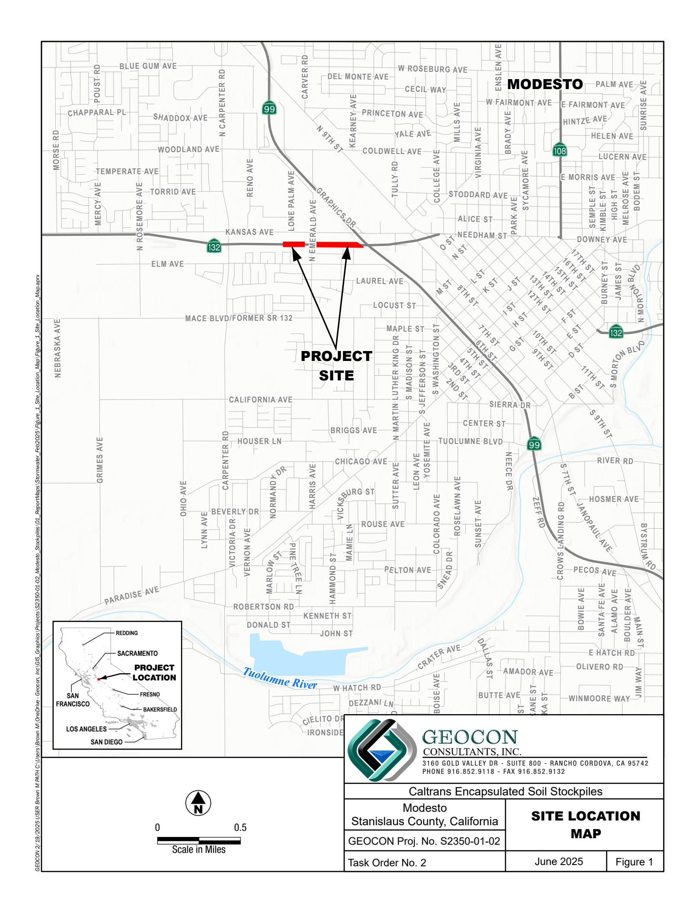
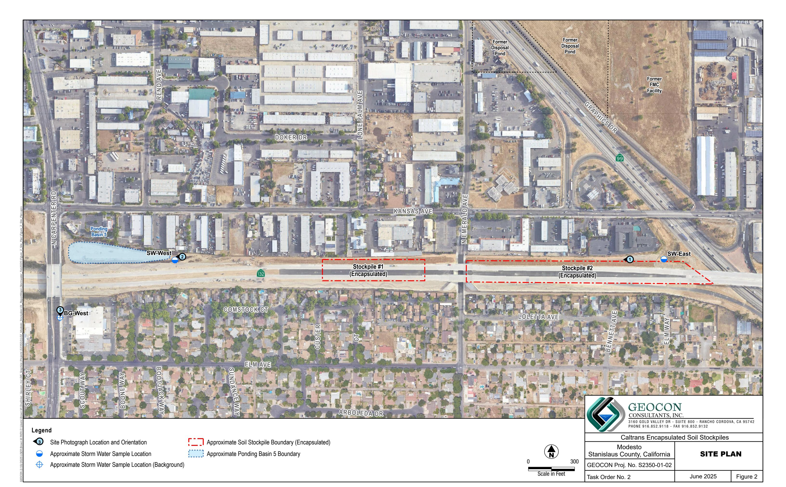
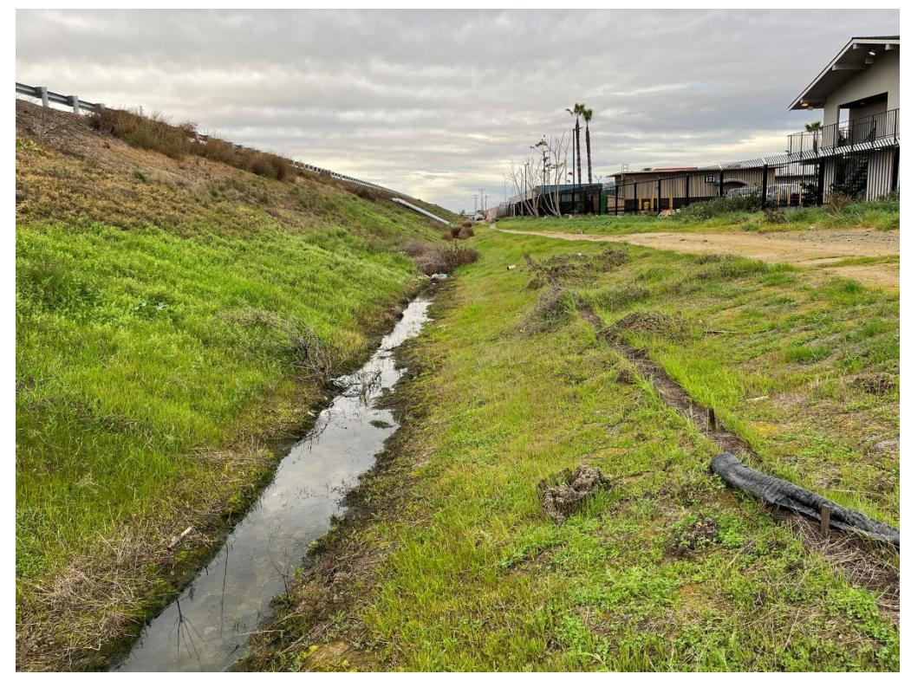
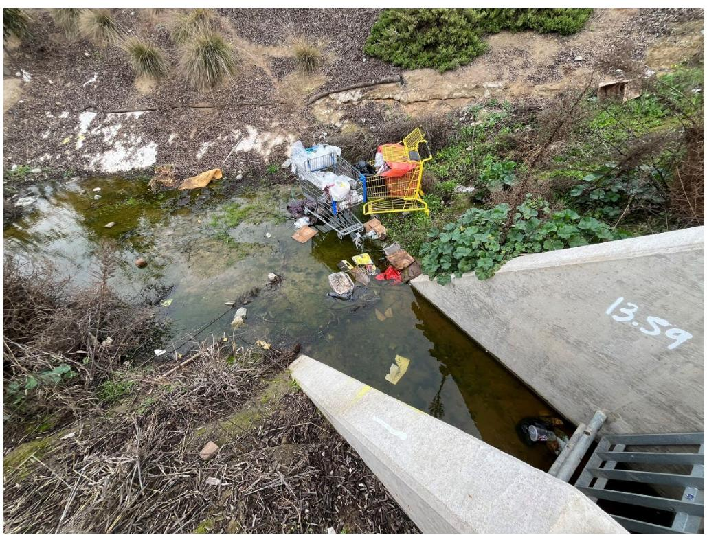
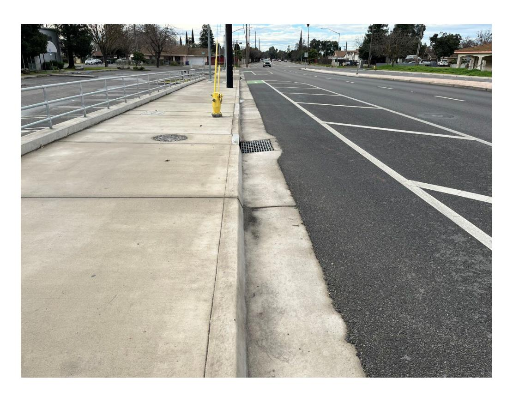

Project No. S2350-01-02 June 18, 2025

California Department of Transportation - District 6 Hazardous Waste Branch 2015 E. Shields Avenue, Suite 100 Fresno, California 93726

Attn: Adam Inman, PG

Subject: STORM WATER SAMPLING REPORT – FEBRUARY 4, 2025

CALTRANS ENCAPSULATED SOIL STOCKPILES MODESTO, STANISLAUS COUNTY, CALIFORNIA

CONTRACT NO. 06A2767, TASK ORDER NO. 2, EA NO. 10-1E7003

Mr. Inman:

In accordance with California Department of Transportation (Caltrans) Contract No. 06A2767, Task Order (TO) No. 2, Geocon sampled storm water at the Caltrans Encapsulated Soil Stockpiles (the site) located south of the intersection of State Route (SR) 99 and Kansas Avenue in Modesto, Stanislaus County, California. The approximate site location is depicted on the attached Site Location Map (Figure 1). The approximate site boundaries, Stockpiles 1 and 2, which were encapsulated beneath SR 132, and storm water sampling locations, are shown on the Site Plan (Figure 2).

We collected storm water samples on February 4, 2025, in general accordance with protocols approved by the California Environmental Protection Agency, Department of Toxic Substances Control (DTSC) and Central Valley Regional Water Quality Control Board (CVRWQCB) as established in the *Storm Water Sampling and Analysis Plan (SAP)*, prepared by Geocon Consultants, Inc., dated December 13, 2023. The scope of services included collection of storm water samples, analysis of the storm water samples by a California-certified laboratory, and preparation of this summary report detailing the sampling activities.

### **BACKGROUND**

### **Project Description and History**

During the 1930s, Barium Products Ltd. occupied property at 1200 Barium Road (now Graphics Drive) in Modesto, California, east of SR 99 between Woodland Avenue and Kansas Avenue. Barium Products Ltd. was a chemical manufacturing company processing a variety of ores and minerals including barite (barium sulfate) and celestite (strontium sulfate). Materials produced included barium and strontium compounds used for greases, lubricating oil, and pigment blanks. Sodium sulfide was generated as a by-product of barite processing, sold as a caustic, and used as a reagent in the mining industry.

In 1943, Barium Products Ltd. was purchased by Westvaco Chlorine Products Corporation (Westvaco). In 1948 Westvaco merged with Food Machinery and Chemical Corporation (FMC). From the 1950s to the 1970s, liquid residue from the processing operations was discharged to unlined evaporation/disposal ponds along the western portion of the FMC facility. The approximate boundaries of the former FMC facility and evaporation/disposal ponds are shown on Figure 2.

In 1961, a 4.3-acre parcel at the southwestern corner of the FMC facility was purchased by Caltrans for highway right-of-way (ROW) needed to construct SR 99. An aerial photograph from 1957 shows that a portion of the southernmost evaporation/disposal pond on the FMC property was within the area purchased for the SR 99 ROW. Soil in and around the pond was excavated during construction of SR 99 and stockpiled within the current Caltrans ROW at the location of the SR 132 West Freeway/Expressway project. Three distinct stockpiles were constructed at the site:

- Stockpile 1, located south of Kansas Avenue and west of North Emerald Avenue,
- Stockpile 2, located south of Kansas Avenue, between North Emerald Avenue and SR 99, and
- Stockpile 3, located south of Kansas Avenue and east of SR 99.

The earthwork on Phase I of the SR 99/132 expressway began in January 2020. Soil from Stockpile 3 was excavated, transported, and placed on top of Stockpiles 1 and 2. In October 2021, the majority of Stockpiles 1 and 2 were completely encapsulated beneath the structural section of SR 132 and with clean soil and vegetation on the northern side slopes. SR 132 was opened to traffic in November 2022.

### **Surface Water Sampling Activities – Prior to Stockpile Encapsulation**

The initial surface water sampling event at the former stockpiles was conducted by Shaw in March 2006 in general accordance with their January 2006 SAP. A total of seven runoff samples were collected from constructed impoundments during a qualifying rain event (i.e., visible runoff and 72 hours of prior dry weather). Shaw constructed shallow depressions within the Caltrans ROW in order to collect runoff from the stockpiles as there was no surface water migration observed beyond the ROW. The samples were analyzed for dissolved metals, polycyclic aromatic hydrocarbons (PAHs), nitrate, sulfate, and sulfide.

Subsequently, Geocon collected surface water samples from five designated surface runoff locations and two background locations on an on-call basis between April 2013 and April 2019 in accordance with an SAP addendum. The sample locations were approved by the DTSC and the CVRWQCB. Geocon personnel did not observe runoff migration from the Caltrans ROW during these sampling events.

Road construction on SR 99/132 eliminated the need for the previously designated surface runoff sampling locations. On November 2, 2022, Stantec met with the Caltrans TO Manager to identify revised sampling locations. Two new storm water sample locations and one new background sampling location were established.

Storm water sampling events were conducted by Stantec in March 2023 and by Geocon in December 2023 and February 2024. Reported total dissolved solids (TDS), sulfate, and metal concentrations for the storm water samples during these events were less than their Primary and Secondary Maximum Contaminant Levels (MCLs) except for thallium, which exceeded the Primary MCL in storm water samples collected in December 2023. The approximate sample locations are depicted on Figure 2. Analytical results are summarized on Tables 1 and 2.

### STORM WATER SAMPLING ACTIVITIES

This section describes the field activities for the February 4, 2025, storm water sampling event. It was not raining when we arrived on site or at the time of sample collection. The rainfall total for this event which began and ended on February 4, 2025, was approximately 0.52 inch.

#### **Field Activities**

On February 4, 2025, we collected storm water samples from designated locations SW-East and SW-West. Sample location BG-West was dry at the time of sampling. The approximate sample locations are depicted on Figure 2. Photos of the sample locations are attached.

We collected samples from SW-East from the storm water discharge point on the north side of SR 132 west of SR 99 (Photo 1). We collected samples from SW-West within the east side of Ponding Basin 5, north of SR-132 and east of N. Carpenter Road (Photo 2).

We did not collect sample BG-West (Photo 3) at the drop inlet along the east side of North Carpenter Road approximately 700 feet south of the North Carpenter Road and Kansas Avenue intersection due to no flowing storm water at the time of sampling.

We collected each of the storm water samples using a pressure bailer with a suction pump and subsequently transferred them into laboratory-provided containers. We field filtered samples to be analyzed for dissolved metals by passing the samples through 0.45-micron filters. We capped, labeled, chilled and transported the samples to ASSET Laboratories (Asset) utilizing chain-of-custody procedures.

We followed Quality Assurance/Quality Control (QA/QC) procedures during the field sampling activities including the use of disposable bailers and providing chain-of-custody documentation for each water sample transferred to the laboratory.

### **Laboratory Analyses**

We delivered the samples to Asset for the following analyses under chain-of-custody protocol:

- Title 22 dissolved metals (including barium and strontium) by United States Environmental Protection Agency (EPA) Test Method 6020/7470;
- Sulfate by EPA Test Method 9056/300.0; and
- TDS by EPA Method 160.1.

Analytical results for this monitoring event are summarized on Tables 1 and 2. The laboratory report and chain-of-custody documentation are attached.

#### **Analytical Results**

### **TDS and Sulfate**

TDS was reported for samples SW-East and SW-West at respective concentrations of 210 and 180 milligrams per liter (mg/l). Sulfate was reported for samples SW-East and SW-West at respective concentrations of 21 and 14 mg/l. TDS and sulfate concentrations do not exceed the Secondary Maximum Contaminant Levels (MCL) for drinking water.

### **Title 22 Metals**

Barium, copper, and zinc were detected in each of the storm water samples at concentrations that do not exceed their respective Primary or Secondary drinking water MCLs.

Molybdenum, vanadium, and strontium were detected in storm water samples SW-East and SW-West, however, MCLs have not been established for these analytes.

### **Laboratory QA/QC**

We reviewed the analytical laboratory QC data provided with the Asset laboratory report. Laboratory QC procedures included method blanks, laboratory control samples (LCS), LCS duplicate samples (LCSD), matrix spikes (MS), and matrix spike duplicates (MSD). The laboratory notes that the RPD in the MSD are outside accepted recovery limits for silver in samples N071731-001A-MSD and the RPD is outside accepted recovery limits for molybdenum in samples N071731-001A-DUP. The data shows acceptable non-detect results for the method blanks and acceptable recoveries for the LCS and LCSD samples.

### STORM WATER MANAGEMENT

Discharge/runoff was not observed migrating away from the Caltrans ROW during the February 4, 2025, sampling event.

Caltrans plans to conduct additional storm water sampling during qualifying rain events in 2025.

We appreciate the opportunity to provide our services on this project. Please contact us if you have any questions concerning the contents of this report or if we may be of further service.

Sincerely,

GEOCON CONSULTANTS, INC.

Rebecca L. Silva Project Manager

John E. Juhrend, PE, CEG Senior Engineer

Attachments: Figure 1, Site Location Map

Figure 2, Site Plan Photographs 1 through 3

Table 1, Summary of Laboratory Analysis Results – TDS and Sulfate

Table 2, Summary of Laboratory Analysis Results – Title 22 Metals (Dissolved)

Laboratory Report and Chain-of-custody Documentation

Photo No. 1 SW-East Sample Location

Photo No. 2 SW-West Sample Location

#### Photo No. 1 & 2

Caltrans Encapsulated Soil Stockpiles

Modesto
Stanislaus, California

GEOCON Project No. S2350-01-02

June 2025

Photo No. 3 View south of dry drop inlet at sample location BG-West

# PHOTO NO. 3

| Caltrans Encapsulated Soil Stockpiles |
|---------------------------------------|
| Modesto                               |
| Stanislaus, California                |

GEOCON Project No. S2350-01-02

June 2025

#### TABLE 1

#### SUMMARY OF LABORATORY ANALYSIS RESULTS - TDS AND SULFATE

#### CALTRANS CONTRACT 06A2767, TO NO. 2, EA 10-1E7003

#### CALTRANS ENCAPSULATED SOIL STOCKPILES

#### MODESTO, CALIFORNIA

| Sample ID      | Sample Date | Total Dissolved Solids | Sulfate |
|----------------|-------------|------------------------------|---------|
|                |             | mg/l                         |         |
| SW-East        | 12/19/2023  | 170                          | 22      |
| SW-East        | 2/1/2024    | 88                           | <2.0    |
| SW-East        | 2/4/2025    | 210                          | 21      |
| SW-West        | 12/19/2023  | 140                          | 11      |
| SW-West        | 2/1/2024    | 63                           | 3.6     |
| SW-West        | 2/4/2025    | 180                          | 14      |
| BG-West        | 12/19/2023  | 180                          | 38      |
| BG-West        | 2/1/2024    | 42                           | 6.5     |
| BG-West        | 2/4/2025    | ***                          | ***     |
| Secondary MCLs |             | 500                          | 250     |

### Notes:

Secondary MCL = Secondary Maximum Containment Level, United States Environmental Protection Agency, February 14, 2023

mg/l = milligrams per liter

\*\*\* = dry conditions

#### TABLE 2

#### SUMMARY OF LABORATORY ANALYSIS RESULTS - TITLE 22 METALS (DISSOLVED)

#### CALTRANS CONTRACT 06A2767, TO NO. 2, EA 10-1E7003

#### CALTRANS ENCAPSULATED SOIL STOCKPILES

#### MODESTO, CALIFORNIA

| Sample ID | Sample Date | Antimony | Arsenic | Barium | Beryllium | Cadmium | Chromium | Cobalt | Copper | Lead | Molybdenum | Nickel | Selenium | Silver | Thallium  | Vanadium | Zinc   | Mercury | Strontium |
|--------------|-------------|----------|---------|--------|-----------|---------|----------|--------|--------|------|------------|--------|----------|--------|-----------|----------|--------|---------|-----------|
| SW-East*     | 3/10/2023   | <8.8     | 9.2J    | 160    | <3.0      | <11UJ   | 12J+     | <1.6   | 17J+   | <4.7 | 6.6J+      | <4.6   | <9.3     | <2.4   | <8.5      | 25J+     | 27J+   | 0.08J   | 52J       |
| SW-East      | 12/19/2023  | <10      | <10     | 270    | <3.0      | <3.0    | <3.0     | <3.0   | 11     | <10  | 15         | <5.0   | <10      | <3.0   | <b>18</b> | 4.7      | 43     | <0.20   | 130       |
| SW-East      | 2/1/2024    | <10      | <10     | 900    | <3.0      | <3.0    | <3.0     | <3.0   | 13     | <10  | <5.0       | <5.0   | <10      | <3.0   | <15       | <3.0     | 25     | <0.20   | 180       |
| SW-East      | 2/5/2025    | <10      | <10     | 390    | <3.0      | <3.0    | <3.0     | <3.0   | 16     | <10  | 16         | <5.0   | <10      | <3.0   | <15       | 6.1      | 55     | <0.20   | 170       |
| SW-West*     | 3/10/2023   | <8.8     | <7.8    | 300    | <1.6      | <3.0    | <3.0     | <1.6   | 16J+   | <4.7 | 6.7J+      | <4.6   | <9.3     | <2.4   | <8.5      | 16J+     | 130    | 0.07J   | 77J       |
| SW-West      | 12/19/2023  | <10      | <10     | 49     | <3.0      | <3.0    | <3.0     | <3.0   | 11     | <10  | <5.0       | <5.0   | <10      | <3.0   | <b>15</b> | 8.1      | 27     | <0.20   | 99        |
| SW-West      | 2/1/2024    | <10      | <10     | 520    | <3.0      | <3.0    | <3.0     | <3.0   | <5.0   | <10  | <5.0       | <5.0   | <10      | <3.0   | <15       | <3.0     | 240    | <0.20   | 78        |
| SW-West      | 2/5/2025    | <10      | <10     | 90     | <3.0      | <3.0    | <3.0     | <3.0   | 14     | <10  | 10         | <5.0   | <10      | <3.0   | <15       | 8.2      | 39     | <0.20   | 190       |
| BG-West*     | 3/10/2023   | <8.8     | 8.0J    | 17     | <1.6      | <3.0UJ  | <2.0     | <1.6   | 14J+   | <4.7 | 13J+       | <4.6   | 12       | <2.4   | <8.5      | 13J+     | <25    | 0.06J   | 63J       |
| BG-West      | 12/19/2023  | <10      | <10     | 21     | <3.0      | <3.0    | <3.0     | <3.0   | 7.0    | <10  | 13         | <5.0   | <10      | <3.0   | <b>17</b> | 6.0      | 46     | <0.20   | 110       |
| BG-West      | 2/1/2024    | <10      | <10     | 10     | <3.0      | <3.0    | <3.0     | <3.0   | <5.0   | <10  | <5.0       | <5.0   | <10      | <3.0   | <15       | <3.0     | 18     | <0.20   | <50       |
| BG-West      | 2/5/2025    | ***      | ***     | ***    | ***       | ***     | ***      | ***    | ***    | ***  | ***        | ***    | ***      | ***    | ***       | ***      | ***    | ***     | ***       |
| MCLs         |             | 6.0      | 10      | 1,000  | 4.0       | 5.0     | 50       |        | 1,300  | 15   |            | 100    | 50       | 1001   | 2.0       |          | 5,0001 | 2.0     |           |

#### Notes:

MCL = Maximum Contaminant Levels for drinking water, California Environmental Protection Agency State Water Resources Control Board, August 16, 2023

1 = Secondary MCL, United States Environmental Protection Agency, February 14, 2023

**Bold** = concentration exceeds MCL

\* = Stantec Sample IDs: SW-East = PL6, SW-West = PL7, BG-West = BG3

 $\mu g/l = micrograms per liter$ 

--- = screening level not established

\*\*\* = dry conditions

< = less than the laboratory reporting limit

1 = J-flag result (result is an estimated concentration reported between the method detection limit and practical quantitation limit)

J+ = the analyte was positively identified; the assoicated numerical value is an estimated quantity that may be biased high

UJ = indicates estimated non-detect

February 12, 2025

Rebecca Silva Geocon Consultants, Inc. 3160 Gold Valley Drive, Suite 800 Rancho Cordova, CA 95742

TEL: (916) 852-9118 FAX: (916) 852-9132

RE: Modesto Stockpiles, S2350-01-02

Attention: Rebecca Silva

Enclosed are the results for sample(s) received on February 05, 2025 by ASSET Laboratories. The sample(s) are tested for the parameters as indicated in the enclosed chain of custody in accordance with the applicable laboratory certifications.

Workorder No.: N071731

The reported results relate only to the samples as received and parameters tested by the laboratory.

Thank you for the opportunity to service the needs of your company.

Please feel free to call me at (702) 307-2659 if I can be of further assistance to your company.

Sincerely,

Nancy Sibucao

Calilleanda for

Laboratory Director

The cover letter is an integral part of this analytical report. This Laboratory Report cannot be reproduced in part or in its entirety without written permission from the client and ASSET Laboratories - Las Vegas.

### **ASSET Laboratories**

CLIENT: Geocon Consultants, Inc.

Project: Modesto Stockpiles, S2350-01-02 CASE NARRATIVE

Date: 12-Feb-25

Lab Order: N071731

### SAMPLE RECEIVING/GENERAL COMMENTS:

All sample containers were received intact with proper chain of custody documentation.

Information on sample receipt conditions including discrepancies can be found in attached Sample Receipt Checklist Form.

Cooler temperature and sample preservation were verified upon receipt of samples if applicable.

Samples were analyzed within method holding time.

Analytical Comments for EPA 6010B:

RPD for Sample Duplicate (DUP) is outside criteria for Molybdenum; however, the Laboratory Control Sample (LCS) validated the analytical batch.

RPD for Matrix Spike (MS)/ Matrix Spike Duplicate (MSD) is outside criteria for Silver; however, the Laboratory Control Sample (LCS) validated the analytical batch.

### **ASSET Laboratories**

CLIENT: Geocon Consultants, Inc.

Project: Modesto Stockpiles, S2350-01-02 Work Order Sample Summary

Lab Order: N071731

Contract No:

| Lab Sample ID | Client Sample ID | Matrix        | Collection Date     | Date Received | Date Reported |
|---------------|------------------|---------------|---------------------|---------------|---------------|
| N071731-001A  | SW-East          | Surface Water | 2/4/2025 8:22:00 AM | 2/5/2025      | 2/12/2025     |
| N071731-001B  | SW-East          | Surface Water | 2/4/2025 8:22:00 AM | 2/5/2025      | 2/12/2025     |
| N071731-001C  | SW-East          | Surface Water | 2/4/2025 8:22:00 AM | 2/5/2025      | 2/12/2025     |
| N071731-002A  | SW-West          | Surface Water | 2/4/2025 9:00:00 AM | 2/5/2025      | 2/12/2025     |
| N071731-002B  | SW-West          | Surface Water | 2/4/2025 9:00:00 AM | 2/5/2025      | 2/12/2025     |
| N071731-002C  | SW-West          | Surface Water | 2/4/2025 9:00:00 AM | 2/5/2025      | 2/12/2025     |

Date: 12-Feb-25

### ANALYTICAL RESULTS

Print Date: 12-Feb-25

### **ASSET Laboratories**

CLIENT: Geocon Consultants, Inc. Client Sample ID: SW-East

Lab Order: N071731

Project:Modesto Stockpiles, S2350-01-02Collection Date: 2/4/2025 8:22:00 AMLab ID:N071731-001Matrix: SURFACE WATER

| <b>Lab ID:</b> N071731-001                       |                   | <b>Matrix:</b> SURFACE WATER |             |              |           |                                        |  |  |
|--------------------------------------------------|-------------------|------------------------------|-------------|--------------|-----------|----------------------------------------|--|--|
| <b>Analyses</b>                                  | <b>Result</b>     | <b>PQL</b>                   | <b>Qual</b> | <b>Units</b> | <b>DF</b> | <b>Date Analyzed</b>                   |  |  |
| <b>TOTAL FILTERABLE RESIDUE</b>                  |                   |                              |             |              |           | <b>SM2540C</b>                         |  |  |
| RunID: NV00922-WC_250205D                        | QC Batch: 117002  |                              |             |              |           | PrepDate: 2/5/2025 Analyst: <b>LR</b>  |  |  |
| Total Dissolved Solids (Residue, Filterable)     | 210               | 10                           |             | mg/L         | 1         | 2/5/2025 10:16 AM                      |  |  |
| <b>ANIONS BY ION CHROMATOGRAPHY</b>              |                   |                              |             |              |           | <b>EPA 300.0</b>                       |  |  |
| RunID: NV00922-IC9_250205A                       | QC Batch: R198557 |                              |             |              |           | PrepDate: 2/5/2025 Analyst: <b>RAB</b> |  |  |
| Sulfate                                          | 21                | 5.0                          |             | mg/L         | 5         | 2/5/2025 11:54 AM                      |  |  |
| <b>DISSOLVED MERCURY BY COLD VAPOR TECHNIQUE</b> |                   |                              |             |              |           | <b>EPA 7470A</b>                       |  |  |
| RunID: NV00922-AA2_250205C                       | QC Batch: 116992  |                              |             |              |           | PrepDate: 2/5/2025 Analyst: <b>MN</b>  |  |  |
| Mercury                                          | ND                | 0.20                         |             | μg/L         | 1         | 2/5/2025 05:18 PM                      |  |  |
| <b>DISSOLVED METALS BY ICP</b>                   |                   |                              |             |              |           | <b>EPA 3010A / EPA 6010B</b>           |  |  |
| RunID: NV00922-ICP4_250210E                      | QC Batch: 117088  |                              |             |              |           | PrepDate: 2/8/2025 Analyst: <b>DJ</b>  |  |  |
| Antimony                                         | ND                | 0.010                        |             | mg/L         | 1         | 2/10/2025 03:29 PM                     |  |  |
| Arsenic                                          | ND                | 0.010                        |             | mg/L         | 1         | 2/10/2025 03:29 PM                     |  |  |
| Barium                                           | 0.39              | 0.0030                       |             | mg/L         | 1         | 2/10/2025 03:29 PM                     |  |  |
| Beryllium                                        | ND                | 0.0030                       |             | mg/L         | 1         | 2/10/2025 03:29 PM                     |  |  |
| Cadmium                                          | ND                | 0.0030                       |             | mg/L         | 1         | 2/10/2025 03:29 PM                     |  |  |
| Chromium                                         | ND                | 0.0030                       |             | mg/L         | 1         | 2/10/2025 03:29 PM                     |  |  |
| Cobalt                                           | ND                | 0.0030                       |             | mg/L         | 1         | 2/10/2025 03:29 PM                     |  |  |
| Copper                                           | 0.016             | 0.0050                       |             | mg/L         | 1         | 2/10/2025 03:29 PM                     |  |  |
| Lead                                             | ND                | 0.010                        |             | mg/L         | 1         | 2/10/2025 03:29 PM                     |  |  |
| Molybdenum                                       | 0.016             | 0.0050                       |             | mg/L         | 1         | 2/10/2025 03:29 PM                     |  |  |
| Nickel                                           | ND                | 0.0050                       |             | mg/L         | 1         | 2/10/2025 03:29 PM                     |  |  |
| Selenium                                         | ND                | 0.010                        |             | mg/L         | 1         | 2/10/2025 03:29 PM                     |  |  |
| Silver                                           | ND                | 0.0030                       |             | mg/L         | 1         | 2/10/2025 03:29 PM                     |  |  |
| Thallium                                         | ND                | 0.015                        |             | mg/L         | 1         | 2/10/2025 03:29 PM                     |  |  |
| Vanadium                                         | 0.0061            | 0.0030                       |             | mg/L         | 1         | 2/10/2025 03:29 PM                     |  |  |
| Zinc                                             | 0.055             | 0.010                        |             | mg/L         | 1         | 2/10/2025 03:29 PM                     |  |  |
| <b>DISSOLVED METALS BY ICP</b>                   |                   |                              |             |              |           | <b>EPA 3010A / EPA 6010B</b>           |  |  |
| RunID: NV00922-ICP3_250211A                      | QC Batch: 117088  |                              |             |              |           | PrepDate: 2/8/2025 Analyst: <b>DJ</b>  |  |  |
| Strontium                                        | 0.17              | 0.050                        |             | mg/L         | 1         | 2/11/2025 05:19 PM                     |  |  |

Qualifiers: B Analyte detected in the associated Method Blank

H Holding times for preparation or analysis exceeded

S Spike/Surrogate outside of limits due to matrix interference

DO Surrogate Diluted Out

- E Value above quantitation range
- ND Not Detected at the Reporting Limit
  Results are wet unless otherwise specified
- (M) Test is modified

CALIFORNIA | P:562.219.7435 F:562.219.7436 11110 Artesia Blvd., Ste B, Cerritos, CA 90703 ELAP Cert 2921 NV Cert CA01638

### ANALYTICAL RESULTS

Print Date: 12-Feb-25

### **ASSET Laboratories**

CLIENT: Geocon Consultants, Inc. Client Sample ID: SW-West

Lab Order: N071731

Project:Modesto Stockpiles, S2350-01-02Collection Date: 2/4/2025 9:00:00 AMLab ID:N071731-002Matrix: SURFACE WATER

| Analyses                                                                            | Result | PQL    | Qual | Units | DF | Date Analyzed      |
|-------------------------------------------------------------------------------------|--------|--------|------|-------|----|--------------------|
| <b>TOTAL FILTERABLE RESIDUE</b>                                                     |        |        |      |       |    |                    |
| SM2540C                                                                             |        |        |      |       |    |                    |
| RunID: NV00922-WC_250205D QC Batch: 117002 PrepDate: 2/5/2025 Analyst: <b>LR</b>    |        |        |      |       |    |                    |
| Total Dissolved Solids (Residue, Filterable)                                        | 180    | 10     |      | mg/L  | 1  | 2/5/2025 10:16 AM  |
| <b>ANIONS BY ION CHROMATOGRAPHY</b>                                                 |        |        |      |       |    |                    |
| EPA 300.0                                                                           |        |        |      |       |    |                    |
| RunID: NV00922-IC9_250205A QC Batch: R198557 PrepDate: 2/5/2025 Analyst: <b>RAB</b> |        |        |      |       |    |                    |
| Sulfate                                                                             | 14     | 5.0    |      | mg/L  | 5  | 2/5/2025 12:10 PM  |
| <b>DISSOLVED MERCURY BY COLD VAPOR TECHNIQUE</b>                                    |        |        |      |       |    |                    |
| EPA 7470A                                                                           |        |        |      |       |    |                    |
| RunID: NV00922-AA2_250205C QC Batch: 116992 PrepDate: 2/5/2025 Analyst: <b>MN</b>   |        |        |      |       |    |                    |
| Mercury                                                                             | ND     | 0.20   |      | μg/L  | 1  | 2/5/2025 05:25 PM  |
| <b>DISSOLVED METALS BY ICP</b>                                                      |        |        |      |       |    |                    |
| EPA 3010A EPA 6010B                                                                 |        |        |      |       |    |                    |
| RunID: NV00922-ICP4_250210E QC Batch: 117088 PrepDate: 2/8/2025 Analyst: <b>DJ</b>  |        |        |      |       |    |                    |
| Antimony                                                                            | ND     | 0.010  |      | mg/L  | 1  | 2/10/2025 03:40 PM |
| Arsenic                                                                             | ND     | 0.010  |      | mg/L  | 1  | 2/10/2025 03:40 PM |
| Barium                                                                              | 0.090  | 0.0030 |      | mg/L  | 1  | 2/10/2025 03:40 PM |
| Beryllium                                                                           | ND     | 0.0030 |      | mg/L  | 1  | 2/10/2025 03:40 PM |
| Cadmium                                                                             | ND     | 0.0030 |      | mg/L  | 1  | 2/10/2025 03:40 PM |
| Chromium                                                                            | ND     | 0.0030 |      | mg/L  | 1  | 2/10/2025 03:40 PM |
| Cobalt                                                                              | ND     | 0.0030 |      | mg/L  | 1  | 2/10/2025 03:40 PM |
| Copper                                                                              | 0.014  | 0.0050 |      | mg/L  | 1  | 2/10/2025 03:40 PM |
| Lead                                                                                | ND     | 0.010  |      | mg/L  | 1  | 2/10/2025 03:40 PM |
| Molybdenum                                                                          | 0.010  | 0.0050 |      | mg/L  | 1  | 2/10/2025 03:40 PM |
| Nickel                                                                              | ND     | 0.0050 |      | mg/L  | 1  | 2/10/2025 03:40 PM |
| Selenium                                                                            | ND     | 0.010  |      | mg/L  | 1  | 2/10/2025 03:40 PM |
| Silver                                                                              | ND     | 0.0030 |      | mg/L  | 1  | 2/10/2025 03:40 PM |
| Thallium                                                                            | ND     | 0.015  |      | mg/L  | 1  | 2/10/2025 03:40 PM |
| Vanadium                                                                            | 0.0082 | 0.0030 |      | mg/L  | 1  | 2/10/2025 03:40 PM |
| Zinc                                                                                | 0.039  | 0.010  |      | mg/L  | 1  | 2/10/2025 03:40 PM |
| <b>DISSOLVED METALS BY ICP</b>                                                      |        |        |      |       |    |                    |
| EPA 3010A EPA 6010B                                                                 |        |        |      |       |    |                    |
| RunID: NV00922-ICP3_250211A QC Batch: 117088 PrepDate: 2/8/2025 Analyst: <b>DJ</b>  |        |        |      |       |    |                    |
| Strontium                                                                           | 0.19   | 0.050  |      | mg/L  | 1  | 2/11/2025 05:25 PM |

Qualifiers: B Analyte detected in the associated Method Blank

H Holding times for preparation or analysis exceeded

S Spike/Surrogate outside of limits due to matrix interference

DO Surrogate Diluted Out

- E Value above quantitation range
- ND Not Detected at the Reporting Limit
  Results are wet unless otherwise specified
- (M) Test is modified

CALIFORNIA | P:562.219.7435 F:562.219.7436 11110 Artesia Blvd., Ste B, Cerritos, CA 90703 ELAP Cert 2921 NV Cert CA01638

**ASSET Laboratories** Date: 12-Feb-25

**CLIENT:** Geocon Consultants, Inc.

Work Order: N071731

Project: Modesto Stockpiles, S2350-01-02

### ANALYTICAL QC SUMMARY REPORT

**TestCode:** 160.1\_2540C\_W

| Sample ID       | SampType | TestCode    | Prep/Analysis Date | Run/Seq No     | Analyte                                      | Result   | PQL | SPK value | SPK Ref Val | %REC | LowLimit | HighLimit | RPD Ref Val | %RPD | RPDLimit | Qual |
|-----------------|----------|-------------|--------------------|----------------|----------------------------------------------|----------|-----|-----------|-------------|------|----------|-----------|-------------|------|----------|------|
| LCS-117002      | LCS      | 160.1_2540C | 2/5/2025           | 198651/6495820 | Total Dissolved Solids (Residue, Filterable) | 974.000  | 10  | 1000      | 0           | 97.4 | 90       | 110       |             |      |          |      |
| MB-117002       | MBLK     | 160.1_2540C | 2/5/2025           | 198651/6495821 | Total Dissolved Solids (Residue, Filterable) | ND       | 10  |           |             |      |          |           |             |      |          |      |
| N071688-011BDUP | DUP      | 160.1_2540C | 2/5/2025           | 198651/6495828 | Total Dissolved Solids (Residue, Filterable) | 5590.000 | 50  |           |             |      |          |           | 5765        | 3.08 | 10       |      |

#### Qualifiers:

- B Analyte detected in the associated Method Blank
- ND Not Detected at the Reporting Limit
- DO Surrogate Diluted Out

- E Value above quantitation range
- RPD outside accepted recovery limits
  - Calculations are based on raw values
    - NEVADA | P:702.307.2659 F:702.307.2691 3151 W. Post Rd., Las Vegas, NV 89118
- H Holding times for preparation or analysis exceeded
- S Spike/Surrogate outside of limits due to matrix interference
- (M) Test is modified

Work Order: N071731

Modesto Stockpiles, S2350-01-02 **Project:** 

### ANALYTICAL QC SUMMARY REPORT

TestCode: 300\_W\_SO4

| Sample ID: <b>MB-R198557_SO4</b>  | SampType: <b>MBLK</b>    | TestCode: <b>300_W_SO4</b> | Units: <b>mg/L</b>             | Prep Date:            | RunNo: <b>198557</b> |          |           |             |       |          |      |
|-----------------------------------|--------------------------|----------------------------|--------------------------------|-----------------------|----------------------|----------|-----------|-------------|-------|----------|------|
| Client ID: <b>PBW</b>             | Batch ID: <b>R198557</b> | TestNo: <b>EPA 300.0</b>   | Analysis Date: <b>2/5/2025</b> | SeqNo: <b>6488797</b> |                      |          |           |             |       |          |      |
| Analyte                           | Result                   | PQL                        | SPK value                      | SPK Ref Val           | %REC                 | LowLimit | HighLimit | RPD Ref Val | %RPD  | RPDLimit | Qual |
| Sulfate                           | ND                       | 1.0                        |                                |                       |                      |          |           |             |       |          |      |
|                                   |                          |                            |                                |                       |                      |          |           |             |       |          |      |
| Sample ID: <b>LCS-R198557_SO4</b> | SampType: <b>LCS</b>     | TestCode: <b>300_W_SO4</b> | Units: <b>mg/L</b>             | Prep Date:            | RunNo: <b>198557</b> |          |           |             |       |          |      |
| Client ID: <b>LCSW</b>            | Batch ID: <b>R198557</b> | TestNo: <b>EPA 300.0</b>   | Analysis Date: <b>2/5/2025</b> | SeqNo: <b>6488798</b> |                      |          |           |             |       |          |      |
| Analyte                           | Result                   | PQL                        | SPK value                      | SPK Ref Val           | %REC                 | LowLimit | HighLimit | RPD Ref Val | %RPD  | RPDLimit | Qual |
| Sulfate                           | 4.001                    | 1.0                        | 4.000                          | 0                     | 100                  | 90       | 110       |             |       |          |      |
|                                   |                          |                            |                                |                       |                      |          |           |             |       |          |      |
| Sample ID: <b>N071691-002BDUP</b> | SampType: <b>DUP</b>     | TestCode: <b>300_W_SO4</b> | Units: <b>mg/L</b>             | Prep Date:            | RunNo: <b>198557</b> |          |           |             |       |          |      |
| Client ID: <b>ZZZZZZ</b>          | Batch ID: <b>R198557</b> | TestNo: <b>EPA 300.0</b>   | Analysis Date: <b>2/5/2025</b> | SeqNo: <b>6488802</b> |                      |          |           |             |       |          |      |
| Analyte                           | Result                   | PQL                        | SPK value                      | SPK Ref Val           | %REC                 | LowLimit | HighLimit | RPD Ref Val | %RPD  | RPDLimit | Qual |
| Sulfate                           | 2593.000                 | 200                        |                                |                       |                      |          |           | 2598        | 0.200 | 15       |      |
|                                   |                          |                            |                                |                       |                      |          |           |             |       |          |      |
| Sample ID: <b>N071691-002BMS</b>  | SampType: <b>MS</b>      | TestCode: <b>300_W_SO4</b> | Units: <b>mg/L</b>             | Prep Date:            | RunNo: <b>198557</b> |          |           |             |       |          |      |
| Client ID: <b>ZZZZZZ</b>          | Batch ID: <b>R198557</b> | TestNo: <b>EPA 300.0</b>   | Analysis Date: <b>2/5/2025</b> | SeqNo: <b>6488803</b> |                      |          |           |             |       |          |      |
| Analyte                           | Result                   | PQL                        | SPK value                      | SPK Ref Val           | %REC                 | LowLimit | HighLimit | RPD Ref Val | %RPD  | RPDLimit | Qual |
| Sulfate                           | 3417.140                 | 200                        | 800.0                          | 2598                  | 102                  | 80       | 120       |             |       |          |      |
|                                   |                          |                            |                                |                       |                      |          |           |             |       |          |      |
| Sample ID: <b>N071691-002BMSD</b> | SampType: <b>MSD</b>     | TestCode: <b>300_W_SO4</b> | Units: <b>mg/L</b>             | Prep Date:            | RunNo: <b>198557</b> |          |           |             |       |          |      |
| Client ID: <b>ZZZZZZ</b>          | Batch ID: <b>R198557</b> | TestNo: <b>EPA 300.0</b>   | Analysis Date: <b>2/5/2025</b> | SeqNo: <b>6488804</b> |                      |          |           |             |       |          |      |
| Analyte                           | Result                   | PQL                        | SPK value                      | SPK Ref Val           | %REC                 | LowLimit | HighLimit | RPD Ref Val | %RPD  | RPDLimit | Qual |

#### Qualifiers:

- B Analyte detected in the associated Method Blank
- ND Not Detected at the Reporting Limit
- DO Surrogate Diluted Out

- E Value above quantitation range
- RPD outside accepted recovery limits
- Calculations are based on raw values

Calculations are based on raw values

culations are based on raw values

- H Holding times for preparation or analysis exceeded
- S Spike/Surrogate outside of limits due to matrix interference
- (M) Test is modified

Work Order: N071731

Modesto Stockpiles, S2350-01-02 **Project:** 

### ANALYTICAL QC SUMMARY REPORT

TestCode: 6010\_WD

| <b>Sample ID:</b> MB-117088 |               |            | <b>SampType:</b> MBLK   |                    | <b>TestCode:</b> 6010_WD           |                 | <b>Units:</b> mg/L | <b>Prep Date:</b> 2/8/2025      |             | <b>RunNo:</b> 198684  |             |
|-----------------------------|---------------|------------|-------------------------|--------------------|------------------------------------|-----------------|--------------------|---------------------------------|-------------|-----------------------|-------------|
| <b>Client ID:</b> PBW       |               |            | <b>Batch ID:</b> 117088 |                    | <b>TestNo:</b> EPA 6010B EPA 3010A |                 |                    | <b>Analysis Date:</b> 2/10/2025 |             | <b>SeqNo:</b> 6498991 |             |
| <b>Analyte</b>              | <b>Result</b> | <b>PQL</b> | <b>SPK value</b>        | <b>SPK Ref Val</b> | <b>%REC</b>                        | <b>LowLimit</b> | <b>HighLimit</b>   | <b>RPD Ref Val</b>              | <b>%RPD</b> | <b>RPDLimit</b>       | <b>Qual</b> |
| Antimony                    | ND            | 0.010      |                         |                    |                                    |                 |                    |                                 |             |                       |             |
| Arsenic                     | ND            | 0.010      |                         |                    |                                    |                 |                    |                                 |             |                       |             |
| Barium                      | ND            | 0.0030     |                         |                    |                                    |                 |                    |                                 |             |                       |             |
| Beryllium                   | ND            | 0.0030     |                         |                    |                                    |                 |                    |                                 |             |                       |             |
| Cadmium                     | ND            | 0.0030     |                         |                    |                                    |                 |                    |                                 |             |                       |             |
| Chromium                    | ND            | 0.0030     |                         |                    |                                    |                 |                    |                                 |             |                       |             |
| Cobalt                      | ND            | 0.0030     |                         |                    |                                    |                 |                    |                                 |             |                       |             |
| Copper                      | ND            | 0.0050     |                         |                    |                                    |                 |                    |                                 |             |                       |             |
| Lead                        | ND            | 0.010      |                         |                    |                                    |                 |                    |                                 |             |                       |             |
| Molybdenum                  | ND            | 0.0050     |                         |                    |                                    |                 |                    |                                 |             |                       |             |
| Nickel                      | ND            | 0.0050     |                         |                    |                                    |                 |                    |                                 |             |                       |             |
| Selenium                    | ND            | 0.010      |                         |                    |                                    |                 |                    |                                 |             |                       |             |
| Silver                      | ND            | 0.0030     |                         |                    |                                    |                 |                    |                                 |             |                       |             |
| Thallium                    | ND            | 0.015      |                         |                    |                                    |                 |                    |                                 |             |                       |             |
| Vanadium                    | ND            | 0.0030     |                         |                    |                                    |                 |                    |                                 |             |                       |             |
| Zinc                        | ND            | 0.010      |                         |                    |                                    |                 |                    |                                 |             |                       |             |

| Sample ID: LCS1-117088      | SampType: LCS    | TestCode: 6010_WD           | Units: mg/L | Prep Date: 2/8/2025         | RunNo: 198684       |             |                     |                          |               |                |      |
|-----------------------------|------------------|-----------------------------|-------------|-----------------------------|---------------------|-------------|---------------------|--------------------------|---------------|----------------|------|
| Client ID: LCSW             | Batch ID: 117088 | TestNo: EPA 6010B EPA 3010A |             | Analysis Date: 2/10/2025    | SeqNo: 6498992      |             |                     |                          |               |                |      |
| Analyte                     | Result           | PQL                         | SPK value   | SPK Ref Val                 | %REC                | LowLimit    | HighLimit           | RPD Ref Val              | %RPD          | RPDLimit       | Qual |
| Antimony                    | 0.488            | 0.010                       | 0.5000      | 0                           | 97.6                | 85          | 115                 |                          |               |                |      |
| Arsenic                     | 0.483            | 0.010                       | 0.5000      | 0                           | 96.7                | 85          | 115                 |                          |               |                |      |
| Barium                      | 0.494            | 0.0030                      | 0.5000      | 0                           | 98.8                | 85          | 115                 |                          |               |                |      |
| Beryllium                   | 0.486            | 0.0030                      | 0.5000      | 0                           | 97.2                | 85          | 115                 |                          |               |                |      |
| Cadmium                     | 0.486            | 0.0030                      | 0.5000      | 0                           | 97.1                | 85          | 115                 |                          |               |                |      |
| Chromium                    | 0.493            | 0.0030                      | 0.5000      | 0                           | 98.6                | 85          | 115                 |                          |               |                |      |
| Cobalt                      | 0.485            | 0.0030                      | 0.5000      | 0                           | 97.0                | 85          | 115                 |                          |               |                |      |
| Copper                      | 0.498            | 0.0050                      | 0.5000      | 0                           | 99.7                | 85          | 115                 |                          |               |                |      |
| Lead                        | 0.490            | 0.010                       | 0.5000      | 0                           | 97.9                | 85          | 115                 |                          |               |                |      |
| Sample ID: LCS1-117088      | SampType: LCS    | TestCode: 6010_WD           | Units: mg/L | Prep Date: 2/8/2025         | RunNo: 198684       |             |                     |                          |               |                |      |
| Client ID: LCSW             | Batch ID: 117088 | TestNo: EPA 6010B EPA 3010A |             | Analysis Date: 2/10/2025    | SeqNo: 6498992      |             |                     |                          |               |                |      |
| Analyte                     | Result           | PQL                         | SPK value   | SPK Ref Val                 | %REC                | LowLimit    | HighLimit           | RPD Ref Val              | %RPD          | RPDLimit       | Qual |
| Molybdenum                  | 0.498            | 0.0050                      | 0.5000      | 0                           | 99.6                | 85          | 115                 |                          |               |                |      |
| Nickel                      | 0.486            | 0.0050                      | 0.5000      | 0                           | 97.2                | 85          | 115                 |                          |               |                |      |
| Selenium                    | 0.485            | 0.010                       | 0.5000      | 0                           | 97.0                | 85          | 115                 |                          |               |                |      |
| Silver                      | 0.530            | 0.0030                      | 0.5000      | 0                           | 106                 | 85          | 115                 |                          |               |                |      |
| Thallium                    | 0.495            | 0.015                       | 0.5000      | 0                           | 98.9                | 85          | 115                 |                          |               |                |      |
| Vanadium                    | 0.496            | 0.0030                      | 0.5000      | 0                           | 99.1                | 85          | 115                 |                          |               |                |      |
| Zinc                        | 0.487            | 0.010                       | 0.5000      | 0                           | 97.4                | 85          | 115                 |                          |               |                |      |
| Sample ID: N071731-001A-MS1 | SampType: MS     | TestCode: 6010_WD           | Units: mg/L | Prep Date: 2/8/2025         | RunNo: 198684       |             |                     |                          |               |                |      |
| Client ID: ZZZZZZ           | Batch ID: 117088 | TestNo: EPA 6010B EPA 3010A |             | Analysis Date: 2/10/2025    | SeqNo: 6498996      |             |                     |                          |               |                |      |
| Analyte                     | Result           | PQL                         | SPK value   | SPK Ref Val                 | %REC                | LowLimit    | HighLimit           | RPD Ref Val              | %RPD          | RPDLimit       | Qual |
| Antimony                    | 0.493            | 0.010                       | 0.5000      | 0.008060                    | 97.0                | 75          | 125                 |                          |               |                |      |
| Arsenic                     | 0.467            | 0.010                       | 0.5000      | 0                           | 93.3                | 75          | 125                 |                          |               |                |      |
| Barium                      | 0.886            | 0.0030                      | 0.5000      | 0.3944                      | 98.2                | 75          | 125                 |                          |               |                |      |
| Beryllium                   | 0.467            | 0.0030                      | 0.5000      | 0                           | 93.3                | 75          | 125                 |                          |               |                |      |
| Cadmium                     | 0.460            | 0.0030                      | 0.5000      | 0                           | 92.0                | 75          | 125                 |                          |               |                |      |
| Chromium                    | 0.477            | 0.0030                      | 0.5000      | 0.002260                    | 95.0                | 75          | 125                 |                          |               |                |      |
| Cobalt                      | 0.476            | 0.0030                      | 0.5000      | 0                           | 95.2                | 75          | 125                 |                          |               |                |      |
| Copper                      | 0.524            | 0.0050                      | 0.5000      | 0.01639                     | 101                 | 75          | 125                 |                          |               |                |      |
| Lead                        | 0.466            | 0.010                       | 0.5000      | 0.004370                    | 92.4                | 75          | 125                 |                          |               |                |      |
| Molybdenum                  | 0.500            | 0.0050                      | 0.5000      | 0.01553                     | 97.0                | 75          | 125                 |                          |               |                |      |
| Nickel                      | 0.463            | 0.0050                      | 0.5000      | 0                           | 92.7                | 75          | 125                 |                          |               |                |      |
| Selenium                    | 0.459            | 0.010                       | 0.5000      | 0                           | 91.8                | 75          | 125                 |                          |               |                |      |
| Silver                      | 0.120            | 0.0030                      | 0.1250      | 0                           | 96.4                | 75          | 125                 |                          |               |                |      |
| Thallium                    | 0.488            | 0.015                       | 0.5000      | 0                           | 97.7                | 75          | 125                 |                          |               |                |      |
| Vanadium                    | 0.487            | 0.0030                      | 0.5000      | 0.006090                    | 96.2                | 90          | 113                 |                          |               |                |      |
| Zinc                        | 0.540            | 0.010                       | 0.5000      | 0.05472                     | 97.0                | 64          | 125                 |                          |               |                |      |
| Sample ID: N071731-001A-MSD |                  | SampType: MSD               |             | TestCode: 6010_WD           |                     | Units: mg/L | Prep Date: 2/8/2025 |                          | RunNo: 198684 |                |      |
| Client ID: ZZZZZZ           |                  | Batch ID: 117088            |             | TestNo: EPA 6010B EPA 3010A |                     |             |                     | Analysis Date: 2/10/2025 |               | SeqNo: 6498997 |      |
| Analyte                     | Result           | PQL                         | SPK value   | SPK Ref Val                 | %REC                | LowLimit    | HighLimit           | RPD Ref Val              | %RPD          | RPDLimit       | Qual |
| Antimony                    | 0.494            | 0.010                       | 0.5000      | 0.008060                    | 97.2                | 75          | 125                 | 0.4933                   | 0.126         | 20             |      |
| Arsenic                     | 0.468            | 0.010                       | 0.5000      | 0                           | 93.6                | 75          | 125                 | 0.4666                   | 0.300         | 20             |      |
| Barium                      | 0.889            | 0.0030                      | 0.5000      | 0.3944                      | 98.8                | 75          | 125                 | 0.8857                   | 0.333         | 20             |      |
| Beryllium                   | 0.467            | 0.0030                      | 0.5000      | 0                           | 93.5                | 75          | 125                 | 0.4666                   | 0.191         | 20             |      |
| Cadmium                     | 0.460            | 0.0030                      | 0.5000      | 0                           | 92.1                | 75          | 125                 | 0.4600                   | 0.0652        | 20             |      |
| Chromium                    | 0.477            | 0.0030                      | 0.5000      | 0.002260                    | 94.9                | 75          | 125                 | 0.4770                   | 0.0839        | 20             |      |
| Cobalt                      | 0.475            | 0.0030                      | 0.5000      | 0                           | 95.1                | 75          | 125                 | 0.4760                   | 0.128         | 20             |      |
| Copper                      | 0.523            | 0.0050                      | 0.5000      | 0.01639                     | 101                 | 75          | 125                 | 0.5235                   | 0.128         | 20             |      |
| Lead                        | 0.467            | 0.010                       | 0.5000      | 0.004370                    | 92.5                | 75          | 125                 | 0.4662                   | 0.154         | 20             |      |
| Molybdenum                  | 0.497            | 0.0050                      | 0.5000      | 0.01553                     | 96.4                | 75          | 125                 | 0.5003                   | 0.599         | 20             |      |
| Nickel                      | 0.463            | 0.0050                      | 0.5000      | 0                           | 92.5                | 75          | 125                 | 0.4634                   | 0.134         | 20             |      |
| Selenium                    | 0.457            | 0.010                       | 0.5000      | 0                           | 91.4                | 75          | 125                 | 0.4590                   | 0.450         | 20             |      |
| Silver                      | 0.156            | 0.0030                      | 0.1250      | 0                           | 125                 | 75          | 125                 | 0.1205                   | 25.7          | 20             | R    |
| Thallium                    | 0.488            | 0.015                       | 0.5000      | 0                           | 97.7                | 75          | 125                 | 0.4884                   | 0.0164        | 20             |      |
| Vanadium                    | 0.486            | 0.0030                      | 0.5000      | 0.006090                    | 96.0                | 90          | 113                 | 0.4869                   | 0.222         | 20             |      |
| Zinc                        | 0.540            | 0.010                       | 0.5000      | 0.05472                     | 97.0                | 64          | 125                 | 0.5398                   | 0.0185        | 20             |      |
| Sample ID: N071731-001A-DUP |                  | SampType: DUP               |             | TestCode: 6010_WD           |                     | Units: mg/L | Prep Date: 2/8/2025 |                          | RunNo: 198684 |                |      |
| Client ID: ZZZZZZ           |                  | Batch ID: 117088            |             | TestNo: EPA 6010B EPA 3010A |                     |             |                     | Analysis Date: 2/10/2025 |               | SeqNo: 6499000 |      |
| Analyte                     | Result           | PQL                         | SPK value   | SPK Ref Val                 | %REC                | LowLimit    | HighLimit           | RPD Ref Val              | %RPD          | RPDLimit       | Qual |
| Antimony                    | ND               | 0.010                       |             |                             |                     |             |                     | 0.008060                 | 0             | 20             |      |
| Arsenic                     | ND               | 0.010                       |             |                             |                     |             |                     | 0                        | 0             | 20             |      |
| Barium                      | 0.399            | 0.0030                      |             |                             |                     |             |                     | 0.3944                   | 1.17          | 20             |      |
| Beryllium                   | ND               | 0.0030                      |             |                             |                     |             |                     | 0                        | 0             | 20             |      |
| Cadmium                     | ND               | 0.0030                      |             |                             |                     |             |                     | 0                        | 0             | 20             |      |
| Chromium                    | 0.002            | 0.0030                      |             |                             |                     |             |                     | 0.002260                 | 0             | 20             |      |
| Cobalt                      | ND               | 0.0030                      |             |                             |                     |             |                     | 0                        | 0             | 20             |      |
| Copper                      | 0.016            | 0.0050                      |             |                             |                     |             |                     | 0.01639                  | 2.53          | 20             |      |
| Sample ID: N071731-001A-DUP | SampType: DUP    | TestCode: 6010_WD           |             | Units: mg/L                 | Prep Date: 2/8/2025 |             | RunNo: 198684       |                          |               |                |      |
| Client ID: ZZZZZZ           | Batch ID: 117088 | TestNo: EPA 6010B EPA 3010A |             | Analysis Date: 2/10/2025    |                     |             | SeqNo: 6499000      |                          |               |                |      |
| Analyte                     | Result           | PQL                         | SPK value   | SPK Ref Val                 | %REC                | LowLimit    | HighLimit           | RPD Ref Val              | %RPD          | RPDLimit       | Qual |
| Molybdenum                  | 0.012            | 0.0050                      |             |                             |                     |             |                     | 0.01553                  | 28.1          | 20             | R    |
| Nickel                      | ND               | 0.0050                      |             |                             |                     |             |                     | 0                        | 0             | 20             |      |
| Selenium                    | ND               | 0.010                       |             |                             |                     |             |                     | 0                        | 0             | 20             |      |
| Silver                      | ND               | 0.0030                      |             |                             |                     |             |                     | 0                        | 0             | 20             |      |
| Thallium                    | ND               | 0.015                       |             |                             |                     |             |                     | 0                        | 0             | 20             |      |
| Vanadium                    | 0.006            | 0.0030                      |             |                             |                     |             |                     | 0.006090                 | 4.53          | 20             |      |
| Zinc                        | 0.056            | 0.010                       |             |                             |                     |             |                     | 0.05472                  | 1.61          | 20             |      |

#### Qualifiers:

- B Analyte detected in the associated Method Blank
- ND Not Detected at the Reporting Limit
- DO Surrogate Diluted Out

- E Value above quantitation range
- RPD outside accepted recovery limits
  - Calculations are based on raw values

NEVADA | P:702.307.2659 F:702.307.2691 3151 W. Post Rd., Las Vegas, NV 89118

- H Holding times for preparation or analysis exceeded
- S Spike/Surrogate outside of limits due to matrix interference
- (M) Test is modified

CALIFORNIA | P:562.219.7435 F:562.219.7436 11110 Artesia Blvd., Ste B, Cerritos, CA 90703 ELAP Cert 2921 NV Cert CA01638

Work Order: N071731

Modesto Stockpiles, S2350-01-02 **Project:** 

### ANALYTICAL QC SUMMARY REPORT

TestCode: 6010\_WD

#### Qualifiers:

- B Analyte detected in the associated Method Blank
- ND Not Detected at the Reporting Limit
- DO Surrogate Diluted Out

- E Value above quantitation range
- RPD outside accepted recovery limits
  - Calculations are based on raw values

NEVADA | P:702.307.2659 F:702.307.2691

CALIFORNIA | P:562.219.7435 F:562.219.7436 11110 Artesia Blvd., Ste B, Cerritos, CA 90703 ELAP Cert 2921 NV Cert CA01638

3151 W. Post Rd., Las Vegas, NV 89118 ELAP Cert 2676 | NV Cert NV00922 ORELAP Cert 4046

- H Holding times for preparation or analysis exceeded
- S Spike/Surrogate outside of limits due to matrix interference
- (M) Test is modified

Work Order: N071731

Modesto Stockpiles, S2350-01-02 **Project:** 

### ANALYTICAL QC SUMMARY REPORT

TestCode: 6010\_WD

#### Qualifiers:

Lead

- B Analyte detected in the associated Method Blank
- ND Not Detected at the Reporting Limit
- DO Surrogate Diluted Out

- E Value above quantitation range
- RPD outside accepted recovery limits
  - Calculations are based on raw values

NEVADA | P:702.307.2659 F:702.307.2691 3151 W. Post Rd., Las Vegas, NV 89118

H Holding times for preparation or analysis exceeded

0.004370

Spike/Surrogate outside of limits due to matrix interference

0

20

(M) Test is modified

CALIFORNIA | P:562.219.7435 F:562.219.7436 11110 Artesia Blvd., Ste B, Cerritos, CA 90703 ELAP Cert 2921 NV Cert CA01638

0.010

ND

Work Order: N071731

Modesto Stockpiles, S2350-01-02 **Project:** 

### ANALYTICAL QC SUMMARY REPORT

TestCode: 6010\_WD

#### Qualifiers:

- B Analyte detected in the associated Method Blank
- ND Not Detected at the Reporting Limit
- DO Surrogate Diluted Out

- E Value above quantitation range
- RPD outside accepted recovery limits

Calculations are based on raw values

lculations are based on raw values

CALIFORNIA | P:562.219.7435 F:562.219.7436 11110 Artesia Blvd., Ste B, Cerritos, CA 90703 ELAP Cert 2921

- H Holding times for preparation or analysis exceeded
- S Spike/Surrogate outside of limits due to matrix interference
- (M) Test is modified

Work Order: N071731

Modesto Stockpiles, S2350-01-02 **Project:** 

### ANALYTICAL QC SUMMARY REPORT

TestCode: 6010\_WD1

| Sample ID        | SampType | TestCode/Units | Prep/Analysis Date | Run/SeqNo      | Analyte   | Result | PQL   | SPK Value | SPK Ref Val | %REC | LowLimit | HighLimit | RPD Ref Val | %RPD | RPDLimit | Qual |
|------------------|----------|----------------|--------------------|----------------|-----------|--------|-------|-----------|-------------|------|----------|-----------|-------------|------|----------|------|
| MB-117088        | MBLK     | 6010_WD1 mg/L  | 2/8/2025 2/11/2025 | 198714 6500776 | Strontium | ND     | 0.050 |           |             |      |          |           |             |      |          |      |
| N071731-001A-DUP | DUP      | 6010_WD1 mg/L  | 2/8/2025 2/11/2025 | 198714 6500779 | Strontium | 0.153  | 0.050 |           |             |      |          |           | 0.1656      | 7.88 | 30       |      |
| N071731-002A-MS2 | MS       | 6010_WD1 mg/L  | 2/8/2025 2/11/2025 | 198714 6500783 | Strontium | 2.973  | 0.050 | 2.500     | 0.1874      | 111  | 75       | 125       |             |      |          |      |
| N071731-002A-MSD | MSD      | 6010_WD1 mg/L  | 2/8/2025 2/11/2025 | 198714 6500784 | Strontium | 2.880  | 0.050 | 2.500     | 0.1874      | 108  | 75       | 125       | 2.973       | 3.15 | 20       |      |
| LCS2-117088      | LCS      | 6010_WD1 mg/L  | 2/8/2025 2/11/2025 | 198714 6500787 | Strontium | 2.719  | 0.050 | 2.500     |             | 109  | 85       | 115       |             |      |          |      |

#### Qualifiers:

- B Analyte detected in the associated Method Blank
- ND Not Detected at the Reporting Limit
- DO Surrogate Diluted Out

**ASSET LABORATORIES** 

- E Value above quantitation range
- RPD outside accepted recovery limits

Calculations are based on raw values

lations are based on raw values

138 HELMER | PH
703 3151 W. Pos
 ELAP Cert

- H Holding times for preparation or analysis exceeded S Spike/Surrogate outside of limits due to matrix interference
- (M) Test is modified

CALIFORNIA | P:562.219.7435 F:562.219.7436 11110 Artesia Blvd., Ste B, Cerritos, CA 90703 ELAP Cert 2921 NV Cert CA01638

Work Order: N071731

Modesto Stockpiles, S2350-01-02 **Project:** 

### ANALYTICAL QC SUMMARY REPORT

TestCode: 7470\_W\_DISS

| Sample ID                                                  | SampType | TestCode   | Units     | Prep Date   | Analysis Date | RunNo    | SeqNo     |
|------------------------------------------------------------|----------|------------|-----------|-------------|---------------|----------|-----------|
| MB-116992                                                  | MBLK     | 7470_W_DIS | µg/L      | 2/5/2025    | 2/5/2025      | 198538   | 6487260   |
| Client ID: PBW    Batch ID: 116992    TestNo: EPA 7470A    |          |            |           |             |               |          |           |
| Analyte                                                    | Result   | PQL        | SPK value | SPK Ref Val | %REC          | LowLimit | HighLimit |
| Mercury                                                    | ND       | 0.20       |           |             |               |          |           |
| LCS-116992                                                 | LCS      | 7470_W_DIS | µg/L      | 2/5/2025    | 2/5/2025      | 198538   | 6487261   |
| Client ID: LCSW    Batch ID: 116992    TestNo: EPA 7470A   |          |            |           |             |               |          |           |
| Mercury                                                    | 5.120    | 0.20       | 5.000     | 0           | 102           | 85       | 115       |
| N071691-002A-MS                                            | MS       | 7470_W_DIS | µg/L      | 2/5/2025    | 2/5/2025      | 198538   | 6487266   |
| Client ID: ZZZZZZ    Batch ID: 116992    TestNo: EPA 7470A |          |            |           |             |               |          |           |
| Mercury                                                    | 4.760    | 0.20       | 5.000     | 0           | 95.2          | 75       | 125       |
| N071691-002A-MSD                                           | MSD      | 7470_W_DIS | µg/L      | 2/5/2025    | 2/5/2025      | 198538   | 6487267   |
| Client ID: ZZZZZZ    Batch ID: 116992    TestNo: EPA 7470A |          |            |           |             |               |          |           |
| Mercury                                                    | 4.740    | 0.20       | 5.000     | 0           | 94.8          | 75       | 125       |
| N071731-001A-DUP                                           | DUP      | 7470_W_DIS | µg/L      | 2/5/2025    | 2/5/2025      | 198538   | 6487272   |
| Client ID: ZZZZZZ    Batch ID: 116992    TestNo: EPA 7470A |          |            |           |             |               |          |           |
| Mercury                                                    | ND       | 0.20       |           |             |               |          |           |

#### Qualifiers:

- B Analyte detected in the associated Method Blank
- ND Not Detected at the Reporting Limit
- DO Surrogate Diluted Out

- E Value above quantitation range
- RPD outside accepted recovery limits
- Calculations are based on raw values

Calculations are based on raw values

culations are based on raw values

- H Holding times for preparation or analysis exceeded
- Spike/Surrogate outside of limits due to matrix interference
- (M) Test is modified

# CHAIN OF CUSTODY RECORD

|        |         | 1   | Exce     | el ED    | D        | UL.      | - E |       | RT               | 715 25           |                |              |          | Y N                            |     |
|--------|---------|-----|----------|----------|----------|----------|-----|-------|------------------|------------------|----------------|--------------|----------|--------------------------------|-----|
|        |         |     | _        | track    | er       |          |     |       | -                | /QCI             | _              |              | <u>_</u> | 1 Chilled                      |     |
|        |         |     | Caba     |          | _        |          | L   | -     | 1500             | Tran             |                | _            |          | Headspace     Gentainer Intact |     |
| _      | _       | -   | Spec     |          | _        |          |     | _     | 100              | VEL.             |                | _            | 금        | 4. Seal Present                |     |
|        |         |     |          |          |          |          |     | - 11  | 160              | gulai            |                | -            | H        | 5. IR number                   |     |
|        |         |     | Glob     | al ID:   |          |          |     |       |                  | ecify            |                | te:          | _        | 6. Method of Cooling 2.50      | ice |
| naly   | /ses    | Req | ues      | ted      |          |          |     |       |                  |                  |                |              |          | Sample Temp: 68                |     |
|        |         |     |          |          |          |          |     |       | L                | _                |                |              |          |                                |     |
|        |         |     |          |          |          |          |     |       |                  |                  |                | z            | Cou      |                                |     |
|        |         |     |          |          |          |          |     |       | Turn Around Time | ntainer          | r Type         | PRESERVATION | Trac     | king No. 1115                  |     |
| N.     |         |     |          |          |          |          |     |       | Turn Aro         | No. of container | Container Type | PRESE        |          | Remarks                        |     |
| 1      |         |     |          |          |          |          |     |       | E                | 3                | P              | 4            |          |                                |     |
| $\top$ |         |     |          |          |          |          |     |       | 1                | 1                | 1              | 1            |          |                                |     |
| _      |         | П   |          |          |          |          |     |       |                  |                  |                |              |          |                                | 1   |
| +      | +       |     |          |          |          | $\vdash$ |     |       | Г                |                  | П              |              |          |                                | 1   |
| +      | +       |     |          |          | _        | 1        |     | _     | Г                |                  |                |              |          |                                | 1   |
| +      | +       |     | -        |          | _        | $\vdash$ |     | -     | Н                | -                |                | Н            | $\vdash$ |                                |     |
| +      | +       | -   | $\vdash$ | _        | _        | $\vdash$ | -   | -     | H                | -                | H              | Н            | $\vdash$ |                                |     |
| +      | +       | ⊢   | _        | _        | _        | ⊢        | _   | _     | L                | -                |                |              | _        |                                | 1   |
|        | $\perp$ | L   | _        |          |          | ┖        | _   |       |                  |                  |                | L            |          |                                |     |
|        |         |     |          |          |          |          |     |       |                  |                  |                |              |          |                                |     |
|        |         |     |          |          |          |          |     |       |                  |                  |                |              |          |                                |     |
| $\top$ |         | П   |          | Г        |          |          |     |       | Г                |                  | П              |              |          |                                |     |
| +      | +       |     |          | $\vdash$ |          | $\vdash$ |     |       | Т                |                  | П              |              |          |                                | 1   |
| +      | +       | ┢   | $\vdash$ | -        | $\vdash$ | $\vdash$ | -   | -     | H                | $\vdash$         |                |              | -        |                                |     |
| +      | _       |     | _        | -        |          | -        | -   | -     | H                | -                |                |              | _        |                                | 1   |
| _      | _       | _   | _        | L        | _        | -        | _   | _     | L                | L                | L              | L            | _        |                                |     |
|        |         |     |          |          |          |          |     |       |                  |                  |                |              | _        |                                |     |
|        |         |     |          |          |          |          |     |       |                  |                  |                |              |          |                                |     |
|        |         |     |          |          |          |          |     |       |                  |                  |                |              |          |                                |     |
| +      |         |     |          | $\vdash$ |          |          |     |       |                  | Г                |                |              |          |                                | 1   |
| +      | +       |     |          |          |          | 1        |     |       |                  |                  | $\vdash$       |              | $\vdash$ |                                | 1   |
| -      | -       | -   |          | -        | -        | -        | -   | -     | -                |                  | -              | $\vdash$     | $\vdash$ |                                | 1   |
| _      | nd Tin  |     | _        |          |          |          |     | ecial | L                |                  |                | L.,          |          |                                | 1   |

|                          | ANALYTICAL SUPPORT SERV                                                                   | VICES FOR ENVIRONMENTAL TECHNOLO                                     | GIES                                                                               |                                                                   |                        | Page 1       | of 1                |             |            |          |                    | 3        | IN        |                    | IIII   |                    |                  |            |                    |            |                          |                      |        |
|--------------------------|-------------------------------------------------------------------------------------------|----------------------------------------------------------------------|------------------------------------------------------------------------------------|-------------------------------------------------------------------|------------------------|--------------|---------------------|-------------|------------|----------|--------------------|----------|-----------|--------------------|--------|--------------------|------------------|------------|--------------------|------------|--------------------------|----------------------|--------|
| Client:                  | Geocon Consultants, Inc.                                                                  |                                                                      | Report to: Rebecca Silva                                                           |                                                                   |                        | Bill to:     |                     |             |            |          |                    | (        |           | 11.1.1             | LILL   |                    | T                |            |                    | -1         |                          |                      | - 1    |
| Address                  | : 3160 Gold Valley Drive                                                                  | , Suite 800                                                          | Geocon Consulta                                                                    | nts, Inc.                                                         |                        | Address:     |                     |             |            |          |                    |          | _         | I EDD racker    |        |                    | _                | NE VQCB |                    | ☐ 1 CI     | illed                    | Ż                    | N      |
| Address                  | : Rancho Cordova, CA 9                                                                 | 5742                                                                 | Email: silva@geoconinc.cor                                                         | <u>m</u>                                                          |                        |              |                     |             |            |          |                    |          | Labsp     | -                  |        |                    | _                | Trans      | $\rightarrow$      |            | adspace intainer Inta |                      | 믬      |
| Phone:                   |                                                                                           |                                                                      | Address: 3160 Gold Valley                                                          | Drive Suite 800                                                   | )                      | Email to:    |                     |             | PO         | #        |                    | Specify: |           |                    | 1      | VEL IV             | $\overline{}$    |            | al Present         | Ψ.         |                          |                      |        |
| Phone: 916-852-9118 Fax: |                                                                                           |                                                                      |                                                                                    | Phone: Fax:                                                       |                        |              |                     |             |            |          | Globa              | il ID:   |           |                    |        | gulator ecify S | •                | 6. M       | number ethod of | 9          | .5°C                     |                      |        |
| Submitte                 | ed By: Chyis Bate.                                                                        |                                                                      | Rancho Cordova, CA 95742                                                           |                                                                   |                        |              | Matrice             |             |            |          | Analys             | on Po    | - I       | - d                |        |                    | +                |            |                    | San        | ple Temp:                | 88                   |        |
| Title:                   | s. Staff Golo                                                                             | 4.51                                                                 | 916-508-1910                                                                       |                                                                   |                        |              | Matrix              | _           | 1.5        |          | Allalys            | es Re    | quest     | eu                 | _      |                    | -                |            |                    |            | 2.                       | ŚC                   |        |
| Signatu                  | Jun Files                                                                                 | Date: 2/4/25                                                         | Sampled By Chris Ba-                                                               | f this sample. I am aware                                         | that tampering         | Ground _     | Sediment            | 1           | nd stranf  |          |                    |          |           |                    |        | $\vdash$           | П                |            | Courier:           | Cn         |                          | $\dashv$             |        |
| I hereby                 | authorize ASSET Labs to perform the                                                       |                                                                      | with or intentionally mislabeling the sam considered fraud and may be grounds f | nple location, date or tim for legal action.                   | e of collection is     | Potable      | Soil [              |             | arium a    |          |                    |          |           |                    |        |                    |                  |            |                    |            |                          | •                    |        |
| Project                  | Name: Modesto Stockpile                                                                   | es                                                                   | Mer Batto                                                                          | 2/4/                                                              | 25                     | NPDES        | Other Solid         |             | als (inc b |          |                    |          |           |                    |        |                    | d ⊤ime           | ainer      | VATIO              | Tracking I | Rema                     | >                    |        |
| Project                  | Number: S2350-01-02                                                                       | 10                                                                   | War 1/11/8                                                                         | 411                                                               | 25                     | Surface 🗸    |                     |             | Me ₹       | age (c)  |                    |          |           |                    |        |                    | Turn Around Time | of cont    | ESER               |            |                          | _                    | _      |
| ltem No.              | Laboratory Work Order No.                                                                 | -                                                                    | le ID/Location                                                                     | Date                                                              | Time                   | Water        | Solid               | Others      | CAM 17     | Sulfate  | M                  |          | $\vdash$  | 4                  | +      | $\vdash$           | T In             | 2          |                    |            | Rema                     | KS                   | -      |
| . 1                      | NO71731 -001                                                                              | 5W-EGH                                                               |                                                                                    | 2/4/2                                                             | 5 0822                 | X            |                     |             | 1          | 1 イ×  |                    |          | +         | +                  | +      | H                  | 1                | 3 1        | J                  |            |                          |                      |        |
| 2                        | -002                                                                                      | 5W-Dest                                                              |                                                                                    | दापारः                                                            | 50900                  | V            |                     | -           | <b>-</b>   | 1        | $\vdash$           |          | ++        | +                  | +      | +                  | -                | H          |                    |            |                          |                      |        |
| . 3                      |                                                                                           |                                                                      |                                                                                    |                                                                   |                        |              |                     |             | $\vdash$   | $\vdash$ |                    |          | 11        |                    | 1      | $\Box$             | T                | П          |                    |            |                          |                      |        |
| 4                        |                                                                                           |                                                                      |                                                                                    |                                                                   |                        |              |                     |             |            |          |                    |          | $\Box$    |                    |        | $\Box$             |                  | П          |                    |            |                          |                      |        |
| 5                        |                                                                                           |                                                                      |                                                                                    |                                                                   |                        |              |                     |             |            |          |                    |          |           |                    |        |                    |                  |            |                    |            |                          |                      |        |
| 6                        |                                                                                           |                                                                      |                                                                                    |                                                                   |                        |              |                     |             |            |          |                    |          |           |                    |        |                    |                  |            |                    |            |                          |                      |        |
| 7                        |                                                                                           |                                                                      |                                                                                    |                                                                   |                        |              |                     |             |            |          |                    |          |           |                    |        |                    |                  | $\Box$     |                    |            |                          |                      |        |
| 8                        |                                                                                           |                                                                      |                                                                                    |                                                                   |                        |              |                     |             |            |          |                    |          | $\perp$   | _                  |        | Н                  | $\perp$          | $\sqcup$   | $\perp$            |            |                          |                      |        |
| 10                       |                                                                                           |                                                                      |                                                                                    |                                                                   |                        |              |                     |             |            | $\perp$  |                    | $\perp$  | $\perp$   | _                  | +-     | $\vdash$           | +                | $\vdash$   | +                  |            |                          |                      |        |
| 11                       |                                                                                           |                                                                      |                                                                                    |                                                                   |                        |              |                     |             | 1          |          |                    | 1        | $\vdash$  | _                  | +      | $\vdash$           | +                | H          | +                  |            |                          |                      |        |
| 12                       |                                                                                           |                                                                      |                                                                                    |                                                                   |                        |              |                     |             | -          |          |                    | ₩        | -         | _                  | -      | ₩                  | +                | H          | +                  |            |                          | _                    | _      |
| 13                       |                                                                                           |                                                                      |                                                                                    |                                                                   |                        |              |                     | -           | 1          | -        |                    | ++       | +         | -+                 | +      | +                  | +                | $\vdash$   | +                  |            |                          |                      | -      |
| 14                       |                                                                                           |                                                                      |                                                                                    |                                                                   |                        |              |                     |             |            | -        |                    | +        | +         | -                  | +      | +                  | +                | $\forall$  | +                  |            |                          |                      | -      |
| 15                       |                                                                                           |                                                                      | ·                                                                                  |                                                                   |                        |              |                     |             | ++         |          | $\vdash$           | +        | +-        | +                  | +      | ++                 | +                | $\forall$  | +                  |            |                          |                      |        |
| 16                       |                                                                                           |                                                                      |                                                                                    |                                                                   | -                      |              |                     |             | +-         |          |                    |          | +         | -                  | +      | +                  | +                | H          | +                  | -          |                          |                      | $\neg$ |
| 17                       |                                                                                           |                                                                      |                                                                                    |                                                                   |                        | <del> </del> |                     |             | ++-        | $\vdash$ |                    | +        | +         | $\vdash$           | +      | +                  | $\top$           | H          | ++                 |            |                          |                      |        |
| 18                       |                                                                                           |                                                                      |                                                                                    |                                                                   | +                      |              |                     |             |            |          |                    |          |           |                    | $\top$ | $\Box$             | $\top$           | $\Box$     |                    |            |                          |                      |        |
| 19                       |                                                                                           |                                                                      |                                                                                    |                                                                   | +                      |              |                     |             |            |          |                    |          |           |                    |        |                    |                  |            |                    |            |                          |                      |        |
| 20 Relinquis          | shed by (Signature and Pri Jed Name):                                                     | 3                                                                    | Date / Time Received by                                                            | (Signature and Printed                                            |                        |              |                     | Date / Time |            |          | n Around           |          |           | _                  |        | Spec               | cial Ins         | tructio    | on:                |            |                          |                      |        |
| 1                        | 1 2/201                                                                                   | ris Pites 1/41                                                       |                                                                                    | 1                                                                 | TEL                    | RUA          | 2/1                 | the         | 1124       |          | ] A < 2            |          |           | е рау              | IAI    | 1                  |                  |            |                    |            |                          |                      |        |
| Relingui                 | ed by (Signature and Printed Name):                                                       | nris Dates 2141                                                      | Date / Time Received by                                                            | (Salature and Printed                                             |                        | 4 - 7 / 1    |                     | Date / Time |            |          | ] B = N ] C = 2 |          |           |                    |        |                    |                  | ,          | altrani            | : Contract | 06A2767                  |                      |        |
| 1                        | 2.1                                                                                       | 2/Hr                                                                 | 1700                                                                               | nutumb -                                                          | Russell !              | chichen      | A2                  | 15/2        | 5 08       |          | ]                  |          |           |                    |        |                    |                  |            | u:L10115           | , Contract | JUNE / UI                |                      |        |
| D./linguis               | by (Signature and Printed Name):                                                          | 21 (1 2)                                                             |                                                                                    | (Signature and Printed                                            | Name):                 | Pittoral     | <u> </u>            | Date / Time |            | _        | ) E = R            |          | -         | orkday             | 'S     | 1                  |                  |            |                    |            |                          |                      |        |
|                          |                                                                                           |                                                                      |                                                                                    |                                                                   |                        |              |                     |             |            |          | AT Starts          |          | he follov | wiing d            | ay if  |                    |                  |            |                    |            |                          |                      |        |
| Tarres                   |                                                                                           |                                                                      | 5. Trip Blanks                                                                     | and Equipment Blanks are bill                                     | ble sample.            |              |                     |             |            | Pro      | servative          |          |           |                    |        | _                  |                  |            | ainer 1            |            |                          |                      |        |
| 2. Regular               | TAT is 5-7 business days, surcharges will apply for                                       | ecords will be destroyed in 5 years upon submission rush analysis | n of final report. 6. ASSET Labor: 7. Terms are no                              | atories is not responsible for s                                  | amples collected using |              |                     | needed      |            |          | HCI Zn(AC)2     | N = HN   |           | S = H2: T = Na: |        | C = 4º0            | С                | T≃T J=J |                    |            |                          | P = Pint G = Glas |        |
| Less                     | than 24 Hrs = 200% Next Day = 100% 2 EDD formats will be an additional 3% of the total | Workdays = 50% 3 Workdays = 35% 4 W                                  |                                                                                    | re submitted in electronic for tract analysis. TAT and Surchar |                        |              | spy or report to it |             |            |          | ers/Specify        |          |           |                    |        | 4                  |                  | M = N      |                    |            |                          | C = Can              |        |

### **ASSET Laboratories**

Please review the checklist below. Any NO signifies non-compliance. Any non-compliance will be noted and must be understood as having an impact on the quality of the data. All tests will be performed as requested regardless of any compliance issues.

If you have any questions or further instruction, please contact our Project Coordinator at (702) 307-2659.

| Cooler Received/Opened On:     | 2/5/2025                                         | Workorder:             | N071731     |
|--------------------------------|--------------------------------------------------|------------------------|-------------|
| Rep sample Temp (Deg C):       | 2.5                                              | IR Gun ID:             | 4           |
| Temp Blank:                    | Yes ☐ No <b>✓</b>                                |                        |             |
| Carrier name:                  | Southwest Express                                |                        |             |
| Last 4 digits of Tracking No.: | 1115                                             | Packing Material Used: | Bubble Wrap |
| Cooling process:               | <b>✓</b> Ice ☐ Ice Pack ☐ Dry Ice ☐ Other ☐ None |                        |             |

**Sampe Receipt Checklist**

| 1. Shipping container/cooler in good condition?                                        | Yes <b>✓</b> | No ☐      | Not Present ☐           |
|----------------------------------------------------------------------------------------|--------------|-----------|-------------------------|
| 2. Custody seals intact, signed, dated on shippping container/cooler?                  | Yes ☐        | No ☐      | Not Present <b>✓</b>    |
| 3. Custody seals intact on sample bottles?                                             | Yes ☐        | No ☐      | Not Present <b>✓</b>    |
| 4. Chain of custody present?                                                           | Yes <b>✓</b> | No ☐      |                         |
| 5. Sampler's name present in COC?                                                      | Yes <b>✓</b> | No ☐      |                         |
| 6. Chain of custody signed when relinquished and received?                             | Yes <b>✓</b> | No ☐      |                         |
| 7. Chain of custody agrees with sample labels?                                         | Yes <b>✓</b> | No ☐      |                         |
| 8. Samples in proper container/bottle?                                                 | Yes <b>✓</b> | No ☐      |                         |
| 9. Sample containers intact?                                                           | Yes <b>✓</b> | No ☐      |                         |
| 10. Sufficient sample volume for indicated test?                                       | Yes <b>✓</b> | No ☐      |                         |
| 11. All samples received within holding time?                                          | Yes <b>✓</b> | No ☐      |                         |
| 12. Temperature of rep sample or Temp Blank within acceptable limit?                   | Yes <b>✓</b> | No ☐      | NA ☐                    |
| 13. Water - VOA vials have zero headspace?                                             | Yes ☐        | No ☐      | NA <b>✓</b>             |
| 14. Water - pH acceptable upon receipt? (Example: pH > 12 for (CN,S); pH<2 for Metals) | Yes <b>✓</b> | No ☐      | NA ☐                    |
| 15. Did the bottle labels indicate correct preservatives used?                         | Yes <b>✓</b> | No ☐      | NA ☐                    |
| 16. Were there Non-Conformance issues at login? Was Client notified?                   | Yes ☐ Yes ☐  | No ☐ No ☐ | NA <b>✓</b> NA <b>✓</b> |

Comments: \_\_\_\_\_\_\_\_\_\_\_\_\_\_\_\_\_\_\_\_\_\_\_\_\_\_\_\_\_\_\_\_\_\_\_\_\_\_\_\_\_\_\_\_\_\_\_\_\_\_\_\_\_\_\_\_\_\_\_\_\_\_\_\_\_\_\_\_\_\_\_\_\_\_\_\_\_\_\_\_\_\_\_\_\_\_\_\_\_\_\_\_\_\_\_\_\_\_\_\_\_\_\_\_\_\_\_\_\_\_\_\_\_\_\_\_\_\_\_\_\_\_\_\_\_\_\_\_\_\_\_\_\_\_\_\_\_\_\_\_\_\_\_\_\_\_\_\_\_\_\_\_\_\_\_\_\_\_\_\_\_\_\_\_\_\_\_\_\_\_\_\_\_\_\_\_\_\_\_\_\_\_\_\_\_\_\_\_\_\_\_\_\_\_\_\_\_\_\_\_\_\_\_\_\_\_\_\_\_\_\_\_\_\_\_\_\_\_\_\_\_\_\_\_\_\_\_\_\_\_\_\_\_\_\_\_\_\_\_\_\_\_\_\_\_\_\_\_\_\_\_\_\_\_\_\_\_\_\_\_\_\_\_\_\_\_\_\_\_\_\_\_\_\_\_\_\_\_\_\_\_\_\_\_\_\_\_\_\_\_\_\_\_\_\_\_\_\_\_\_\_\_\_\_\_\_\_\_\_\_\_\_\_\_\_\_\_\_\_\_\_\_\_\_\_\_\_\_\_\_\_\_\_\_\_\_\_\_\_\_\_\_\_\_\_\_\_\_\_\_\_\_\_\_\_\_\_\_\_\_\_\_\_\_\_\_\_\_\_\_\_\_\_\_\_\_\_\_\_\_\_\_\_\_\_\_\_\_\_\_\_\_\_\_\_\_\_\_\_\_\_\_\_\_\_\_\_\_\_\_\_\_\_\_\_\_\_\_\_\_\_\_\_\_

Checklist Completed By: BB Benyapha B 2/5/2025

Reviewed By:

or: maysapine YR 02/05/2025

## **ASSET Laboratories**

# **WORK ORDER Summary**

05-Feb-25

WorkOrder: N071731

Client ID: GEOCO02

**Project:** Modesto Stockpiles, S2350-01-02

Date Received:

2/5/2025 8:46 AM

**Comments:** Caltrans Contract 06A2767

| Sample ID    | Client Sample ID | Date Collected      | Date Due  | Matrix        | Test No   | Test Name                                | Hld | MS | Sub | Storage |
|--------------|------------------|---------------------|-----------|---------------|-----------|------------------------------------------|-----|----|-----|---------|
| N071731-001A | SW-East          | 2/4/2025 8:22:00 AM | 2/12/2025 | Surface Water | EPA 3010A | AQPREP TOTAL METALS: ICP, FLAA           |     |    |     | WW      |
|              |                  |                     | 2/12/2025 |               | EPA 6010B | TOTAL METALS BY ICP                      |     |    |     | WW      |
|              |                  |                     | 2/12/2025 |               |           | MERCURY PREP                             |     |    |     | WW      |
|              |                  |                     | 2/12/2025 |               | EPA 7470A | TOTAL MERCURY BY COLD VAPOR TECHNIQUE |     |    |     | WW      |
| N071731-001B |                  |                     | 2/12/2025 |               | EPA 300.0 | ANIONS BY ION CHROMATOGRAPHY             |     |    |     | WW      |
| N071731-001C |                  |                     | 2/12/2025 |               | SM2540C   | TOTAL FILTERABLE RESIDUE                 |     |    |     | WW      |
|              |                  |                     | 2/12/2025 |               |           | Total Dissolved Solids Prep              |     |    |     | WW      |
| N071731-002A | SW-West          | 2/4/2025 9:00:00 AM | 2/12/2025 |               | EPA 3010A | AQPREP TOTAL METALS: ICP, FLAA           |     |    |     | WW      |
|              |                  |                     | 2/12/2025 |               | EPA 6010B | TOTAL METALS BY ICP                      |     |    |     | WW      |
|              |                  |                     | 2/12/2025 |               |           | MERCURY PREP                             |     |    |     | WW      |
|              |                  |                     | 2/12/2025 |               | EPA 7470A | TOTAL MERCURY BY COLD VAPOR TECHNIQUE |     |    |     | WW      |
| N071731-002B |                  |                     | 2/12/2025 |               | EPA 300.0 | ANIONS BY ION CHROMATOGRAPHY             |     |    |     | WW      |
| N071731-002C |                  |                     | 2/12/2025 |               | SM2540C   | TOTAL FILTERABLE RESIDUE                 |     |    |     | WW      |
|              |                  |                     | 2/12/2025 |               |           | Total Dissolved Solids Prep              |     |    |     | WW      |
| N071731-003A | FOLDER           | 2/12/2025           | 2/12/2025 |               | Folder    | Folder                                   |     |    |     | LAB     |
|              |                  |                     | 2/12/2025 |               | Folder    | Folder                                   |     |    |     | LAB     |

QC Level: CT

| <b>Shipper's Name and Address</b> ADVANCED TECHNOLOGY LABORATORIES 3151 W POST RD LAS VEGAS, NV 89118 US +1 (702) 307-2659   | <b>Shipper's Account Number</b> 74299 - 1   | <b>Not Negotiable / Issued by</b> Southwest Cargo swacargo.com (800) 533-1222                                                                                                                                                                                                                                                                                                                                                                                                                                                                                                                                                                                                                                                                                                                                                                                                                                                                                                                                                                                                                                                      |
|---------------------------------------------------------------------------------------------------------------------------------------------|------------------------------------------------|------------------------------------------------------------------------------------------------------------------------------------------------------------------------------------------------------------------------------------------------------------------------------------------------------------------------------------------------------------------------------------------------------------------------------------------------------------------------------------------------------------------------------------------------------------------------------------------------------------------------------------------------------------------------------------------------------------------------------------------------------------------------------------------------------------------------------------------------------------------------------------------------------------------------------------------------------------------------------------------------------------------------------------------------------------------------------------------------------------------------------------------|
| <b>Consignee's Name and Address</b> ADVANCED TECHNOLOGY LABORATORIES 3151 W POST RD LAS VEGAS, NV 89118 US +1 (702) 307-2659 | <b>Consignee's Account Number</b> 74299 - 1 | 
Copies 1, 2 and 3 of this Air Waybill are originals and have the same validity. It is agreed that the goods described herein are accepted in apparent good order and condition (except as noted) for carriage subject to Southwest Airlines' Contract of Carriage which is www.swacargo.com and any location where air waybills are available. Shipper's attention is drawn to the terms of the contract which includes, among other things; (1) Limits on Carriers' liability for loss, damage, or delay of goods, including fragile or perishable goods; (2) Claim restrictions, including time within which shippers or consignees must file a claim or bring an action against the carrier for its acts or omissions or those of its agents; (3) Right of the carrier to change the terms of the contract; (4) Rules about refusal to carry; and (5) Rights of the carrier to change the terms of the contract; (4) Rules about refusal to carry; and (5) Rights of the carrier to change the terms of the contract; (4) Rules about refusal to carry; and (5) Rights of the carrier to change the terms of the contract.
 |

| <b>Issuing Carrier's Agent Name and City</b> | <b>Accounting Information</b> Billed on 02/04/2025 17:32 PST SWA ACCOUNT 74299 | <b>Service Level - N</b> |
|----------------------------------------------|-----------------------------------------------------------------------------------|--------------------------|
| <b>Agent's IATA Code</b>                     | <b>Account No.</b>                                                                |                          |

| <b>Airport of Departure (Addr. of First Carrier) and Requested Routing</b> SACRAMENTO |
|------------------------------------------------------------------------------------------|
|------------------------------------------------------------------------------------------|

| <b>To</b> LAS | <b>By First Carrier</b> SOUTHWEST AIRLINES | <b>To</b> | <b>By</b> | <b>To</b> | <b>By</b> | <b>Currency</b> USD | <b>CHGS Code</b> PPD | <b>WT.VAL</b> PPD: X, COLL: | <b>Other</b> PPD: X, COLL: | <b>Declared Value for Carriage</b> NVD | <b>Declared Value for Customs</b> |
|------------------|-----------------------------------------------|-----------|-----------|-----------|-----------|------------------------|-------------------------|--------------------------------|-------------------------------|-------------------------------------------|-----------------------------------|
|------------------|-----------------------------------------------|-----------|-----------|-----------|-----------|------------------------|-------------------------|--------------------------------|-------------------------------|-------------------------------------------|-----------------------------------|

| <b>Airport of Destination</b> LAS | <b>Flight Date</b> WN2282 / 04FEB | <b>Amount of Insurance</b> | INSURANCE - If carrier offers insurance, and such insurance is requested in accordance with the conditions thereof, indicate amount to be insured in figures in box marked "Amount of Insurance". |
|--------------------------------------|--------------------------------------|----------------------------|---------------------------------------------------------------------------------------------------------------------------------------------------------------------------------------------------|
|--------------------------------------|--------------------------------------|----------------------------|---------------------------------------------------------------------------------------------------------------------------------------------------------------------------------------------------|

| <b>HANDLING INFORMATION -</b> | SCI |
|-------------------------------|-----|
|-------------------------------|-----|

| No. of Pieces RCP | Gross Weight | kg/lb | Rate Class | Commodity Item No. | Chargeable Weight | Rate   | Charge | Total  | Nature and Quantity of Goods (Inc. Dimensions or Volume)                          |
|-------------------|--------------|-------|------------|--------------------|-------------------|--------|--------|--------|-----------------------------------------------------------------------------------|
| 2                 | 90           | L     | B          | 0000               | 90                | 143.00 |        | 143.00 | SOIL/WATER/AIR SAMPLES DIMS IN INCHES: 1 = 25 X 15 X 15 1 = 18 X 15 X 14 |
| 2                 | 90           |       |            |                    |                   |        |        | 143.00 |                                                                                   |

| <b>Prepaid</b> 143.00        | <b>Weight Charge</b> | <b>Collect</b> | <b>Other Charges and Description</b> MYC 0.00 SCC 0.00 |
|---------------------------------|----------------------|----------------|-----------------------------------------------------------|
| <b>Valuation Charge</b> 0.00 |                      |                |                                                           |
| <b>Tax</b> 8.94              |                      |                |                                                           |
| <b>Total Prepaid</b> 151.94  | <b>Total Collect</b> |                |                                                           |

Shipper certifies that the particulars on the face hereof are correct and that insofar as any part of the consignment contains dangerous goods, such part is properly described by name and is in proper condition for carriage by air according to the applicable Dangerous Goods Regulations. I consent that this shipment shall be subject to search by the Carrier.  
ARV PUA  
\_\_\_\_\_\_\_\_\_\_\_\_\_\_\_\_\_\_\_\_\_\_\_\_\_\_\_  
Signature of Shipper or his Agent

| 02/04/2025 17:32 PST        | SMF        | E43220                                    |
|-----------------------------|------------|-------------------------------------------|
| Executed on (date and time) | At (place) | Signature of Issuing Carrier or its Agent |

526 - 23601115