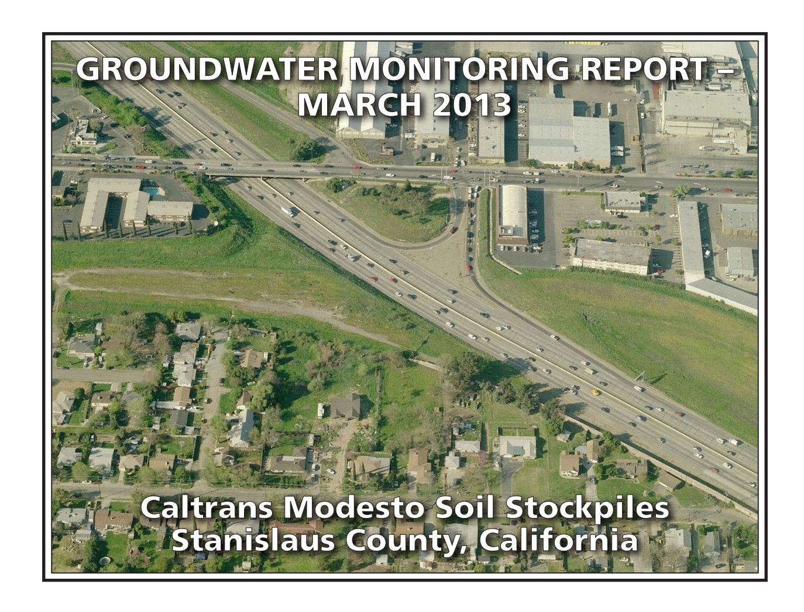

## PREPARED FOR:

CALIFORNIA DEPARTMENT OF TRANSPORTATION – DISTRICT 6
HAZARDOUS WASTE BRANCH
855 M STREET, SUITE 200
FRESNO, CALIFORNIA 93721

## PREPARED BY:

GEOCON CONSULTANTS, INC. 3160 GOLD VALLEY DRIVE, SUITE 800 RANCHO CORDOVA, CALIFORNIA 95742

**GEOCON PROJECT NO. S9525-01-44B TASK ORDER NO. 44, EA 10-403500 CONTRACT NO 06A1580** 

Project No. S9525-01-44B May 16, 2013

Mr. Richard Stewart, PG California Department of Transportation - District 6 Hazardous Waste Branch 855 M Street, Suite 200 Fresno. California 93721

Subject: GROUNDWATER MONITORING REPORT – MARCH 2013

CALTRANS MODESTO SOIL STOCKPILES STANISLAUS COUNTY, CALIFORNIA

CONTRACT NO. 06A1580, TASK ORDER NO. 44, EA NO. 10-403500

Dear Mr. Stewart:

In accordance with California Department of Transportation (Caltrans) Contract No. 06A1580, Task Order (TO) No. 44, Geocon performed groundwater monitoring activities at the Caltrans Modesto Soil Stockpiles (Site) located southerly of the intersection of State Route (SR) 99 and Kansas Avenue in Stanislaus County, California. This report presents the results of the March 2013 sampling event. The approximate site location is depicted on the attached Vicinity Map, Figure 1. The approximate site boundaries and Stockpiles 1 through 3 are shown on the Site Plan, Figure 2.

The objective of TO No. 44 is to perform groundwater sampling and analysis at the Site in accordance with protocols approved by the California Environmental Protection Agency Department of Toxic Substances Control (DTSC) as established in the *Final Work Plan, Groundwater Assessment* prepared by Shaw Environmental, Inc., and dated January 2006. The scope of services reported herein included depth to groundwater measurements, groundwater sample collection from ten groundwater monitoring wells, analysis of the water samples by a California-certified laboratory, and preparation of this report.

## BACKGROUND

## Project Description and History

Stockpiles 1 through 3 were generated during construction of SR 99 through Modesto around 1961 when Caltrans excavated soil from property purchased from Food Machinery and Chemical Corporation (FMC) that contained an evaporation pond. The stockpiles were placed in their present location in anticipation of construction of the State Route 132 West Freeway/Expressway project.

During the 1930s, Barium Products Ltd. occupied property at 1200 Barium Road (now Graphics Drive) in Modesto just east of SR 99 between Woodland and Kansas Avenues. Barium Products Ltd. was a chemical manufacturing company processing a variety of ores and minerals including barite (barium sulfate) and celestite (strontium sulfate). Materials produced included barium and strontium compounds; these were used in greases, lubricating oil and pigment blanks. Sodium sulfide generated as a by-product of barite processing was sold as a caustic and used as a reagent in the mining industry.

In 1943, Barium Products Ltd. was purchased by Westvaco Chlorine Products Corporation which subsequently merged with FMC in 1948. From the 1950s to the 1970s, a liquid residue from the processing operations was discharged to unlined evaporation ponds along the western portion of the FMC Site. The approximate boundaries of the former evaporation/disposal ponds are shown on Figure 2.

In 1961, a 4.3–acre parcel at the southwestern corner of the FMC site was purchased by the State of California for highway right-of-way needed to construct SR 99. An aerial photograph from 1957 shows that a portion of the southernmost pond on the FMC property was within the area purchased for right-of-way.

Soil in and around the pond was excavated during construction of SR 99 and stockpiled within the current Caltrans right-of-way at the location of the future State Route 132 West Freeway/Expressway project. Three distinct stockpiles are present at the Site:

- Stockpile 1, located south of Kansas Avenue and west of North Emerald Avenue,
- Stockpile 2, located south of Kansas Avenue, between North Emerald Avenue and SR 99, and
- Stockpile 3, located south of Kansas Avenue and east of SR 99.

In 2006, Caltrans arranged for the installation of monitoring wells MW-1 through MW-8 at locations adjacent to the three stockpiles as shown on Figure 2. General groundwater chemistry analytical results from June and October 2006 groundwater events suggested that two distinct groundwater types are present beneath the Site. A survey of groundwater wells within a one-mile radius of the Site identified 43 existing or former wells; however, there were no active supply wells identified in the general (southeast) flow direction from the Site.

Groundwater monitoring was resumed for the Site with the March 2012 sampling of wells MW-1 through MW-8. Representatives from the DTSC observed the sample collection procedures and collected split samples which were submitted to an alternate laboratory. No notable differences in the concentrations for each reported analyte were evident.

In June 2012, Geocon arranged for the installation of monitoring wells MW-9 and MW-10 at locations that are both upgradient and adjacent to the three stockpiles as shown on Figure 2.

Geocon compared the analytical results from the seven recent groundwater sampling events (March, May, June, July, September and November 2012 and January 2013) to the following water quality threshold values:

- Primary Maximum Contaminant Levels (MCLs) promulgated by the California Department of Public Health (CDPH); and
- Secondary MCLs promulgated by the CDPH.

The results of the previous 2012 and 2013 groundwater sampling events show that both dissolved metals and general minerals have predominantly been reported at concentrations less than their respective numeric water quality threshold values. Only nitrates (expressed as nitrogen) in MW-1, MW-5, and MW-6 and total dissolved solids (TDS) in wells MW-5, MW-6, and MW-10 have been consistently reported at concentrations that exceed their respective primary or secondary MCLs of 10 and 500 milligrams per liter (mg/l). Manganese has been sporadically reported for various wells at concentrations exceeding the secondary MCL; however, the concentrations have not been consistently

elevated for any one well. Based on the lack of polycyclic aromatic hydrocarbons (PAHs) reported for each of the samples analyzed, we requested discontinuation of analysis for PAHs. PAH analysis was discontinued after the November 2012 sampling event with concurrence from the DTSC.

## Hydrogeologic Characterization

The hydrogeology of the adjacent FMC site has been characterized by numerous studies since the early 1980s. The GeoTrans January 2005 report *Addendum to Comprehensive Remedial Investigations Report, FMC Corporation, 1200 Graphics Drive, Modesto, Stanislaus County, California* (GeoTrans, 2005) provides a description of the FMC site hydrogeology. This description follows:

"The site is underlain by laterally discontinuous and unconsolidated sand and silty sand associated with the Modesto and Riverbank Formations. First encountered groundwater is approximately 30 feet below ground surface (bgs) under confined to semi-confined conditions. A deeper aquifer is present at a depth of 165 feet bgs and separated from the upper zone by a blue clay aquitard. The upper water bearing unit has been divided into two zones: a shallow zone from first encountered groundwater to 120 feet bgs and a deeper zone from 140 feet bgs to the top of the aquitard. Groundwater flow within the upper zone is toward the southeast under a gradient of 0.002 ft/ft."

Monitoring wells MW-1 through MW-10 were installed into the unconsolidated sand, silty sand and silt layers within the Modesto Formation underlying the Site. The wells were completed within the shallow zone of the upper aquifer (shallow zone).

The lithology encountered in the borings for the wells includes interbedded (laterally discontinuous) sands, silts, and clays. In the areas investigated, the unsaturated (vadose) zone was dominated by silty soils. The shallow zone groundwater beneath the stockpiles was encountered at approximately 35 feet (elevation approximately 50 feet) under unconfined to semi-confined conditions. Based on historical depth to water measurements from the Site, the groundwater flow direction in the shallow upper aquifer is generally toward the southeast with hydraulic gradients varying from 0.0006 to 0.001. The shallow aquifer conditions beneath the Site and the adjacent FMC site appear similar and representative of conditions in the local area.

## MARCH 2013 FIELD ACTIVITIES

This section describes the field activities performed for the March 2013 monitoring event.

## Depth to Groundwater Measurements

On March 18, 2013, prior to opening the wells, Geocon observed each of the ten well boxes for signs of potential tampering. No signs of tampering were observed. The security well boxes and casing caps were noted to be properly sealed and locked. Geocon measured the depth to groundwater and the dissolved oxygen (DO) levels and oxygen-reduction potential (ORP) in monitoring wells MW-1 through MW-10 using a battery-operated water level meter, a Hanna Model No. 9143 DO meter, and an Oakton ORP meter. Depth to water measurements were obtained from a surveyed reference point at the top of the well casings (TOC).

In March 2013, depth to groundwater at the Site ranged from 31.15 (MW-1) to 39.62 (MW-5) feet below TOC. Based on the groundwater elevation data, the groundwater flow is toward the east-southeast at an average gradient of 0.0006, which is generally consistent with historical flow. A gradient rose diagram depicting historical flow direction and gradient is included on Figure 3. A summary of the TOC elevations, depth to groundwater measurements and groundwater elevations is on Table 1. Groundwater elevation contours, flow direction and gradient are depicted on Figure 3, Groundwater Elevation and Ionic Composition Map – March 2013.

## Well Purging and Sampling

On March 18, 2013, Geocon purged approximately three well volumes of water (2 to 6.5 gallons) from groundwater monitoring wells MW-1 through MW-4 and MW-7 through MW-10 using a submersible pump or disposable bailer. Wells MW-5 and MW-6 went dry after purging 1 gallon and 1.5 gallons, respectively. Geocon allowed both wells to recover, purged an additional 1.7 gallons from well MW-6, allowed the well to recover a second time, and then collected groundwater samples. The pump was decontaminated before and after each use by washing in an AlconoxTM solution followed by fresh and distilled water rinses. During the well purging activities, the groundwater was monitored for pH, electrical conductivity, temperature and turbidity. This information is included on the Monitoring Well Sampling Data sheets in Appendix A.

Following well purging, groundwater samples were collected from each of the wells using disposable bailers and decanted through slow emptying devices into laboratory-provided sample containers. The groundwater samples collected for dissolved metals analysis were filtered using a hand-pressure pump through a 0.45-micron filter while filling the container. The samples were sealed, labeled, placed in a chilled cooler and subsequently transported to the laboratory using chain-of-custody protocol.

Purged groundwater was placed into one Department of Transportation-approved, 17-H, 55-gallon drum and transported offsite to Geocon's Rancho Cordova office pending receipt of analytical results and subsequent disposal at Inviro-tec Disposal facility in Lincoln, California, on March 27, 2013.

## ANALYTICAL METHODS AND RESULTS

## Laboratory Analysis

The groundwater samples were delivered to Advanced Technology Laboratories (ATL) for the following analyses under chain-of-custody protocol:

- Title 22 dissolved metals (including strontium) following United States Environmental Protection Agency (EPA) Test Methods 6020/7470;
- Dissolved calcium, magnesium, potassium and sodium by EPA Test Method 6020;
- Chloride, nitrate as nitrogen and sulfate by EPA Test Method 300.0;
- Sulfide by Standard Method (SM) 4500;
- TDS by SM 2540C; and
- Total alkalinity, bicarbonate alkalinity, carbonate alkalinity by SM 2320B.

Groundwater analytical results for this monitoring event are summarized on Tables 2 and 3. The laboratory reports and chain-of-custody documentation are in Appendix B.

## Analytical Results

## Dissolved Metals

Analytical results for dissolved metals along with their associated numeric water quality thresholds are summarized on Table 2. Plots of barium, lead and strontium concentrations vs. time are presented as Figures 4 through 6.

DTSC has identified barium, lead and strontium as the primary chemicals of concern in groundwater for the Site. For the March 2013 groundwater samples, barium and strontium were reported for each of the ten groundwater samples, and lead was reported for samples from two of the wells. The ranges of barium, lead and strontium concentrations reported for the March sampling event are in the following table:

|                                    | Barium (μg/l)    | Lead (μg/l) | Strontium (μg/l) |
|------------------------------------|------------------|-------------|------------------|
| High Concentration                 | 300 (MW-5)       | 2.5 (MW-7)  | 1,100 (MW-5)     |
| Low Concentration                  | 43 (MW-3)        | 2.2 (MW-1)  | 250 (MW-8)       |
| Numeric Water Quality Threshold | 1,000(1) /700(2) | 15(3)       | 4,000(2)         |

(1) = California Department of Public Health Primary MCL for Drinking Water

Beryllium, cadmium, silver, thallium and mercury were not reported at concentrations equal to or greater than their respective practical quantitation limits (PQLs) in samples from each well. As shown in the following table, the dissolved metals arsenic, chromium and vanadium were reported for each of the samples collected with the following ranges:

|                                    | Arsenic (μg/l) | Chromium (µg/l) | Vanadium (μg/l)    |
|------------------------------------|-------------------|--------------------|-----------------------|
| High Concentration                 | 5.2 (MW-3)     | 12 (MW-1)       | 35 (MW-7)          |
| Low Concentration                  | 2.0 (MW-4)     | 1.5 (MW-10)     | 17 (MW-4 and MW-5) |
| Numeric Water Quality Threshold | 10(1)             | 50(1)              | 50(3)                 |

(1) = California Department of Public Health Primary Maximum Contaminant Level for Drinking Water

Although concentrations of arsenic, barium, chromium, strontium and vanadium were reported for the samples collected from each well, none of the reported concentrations exceed their respective numeric water quality thresholds for drinking water. In addition, the lead concentrations reported for the samples from wells MW-1 and MW-7 did not exceed the water quality threshold for lead in drinking water.

(2) = EPA Drinking Water Health Advisory

(3) = California Department of Public Health Regulatory Action Level

 $\mu g/l = Micrograms per liter$ 

(2) = EPA Drinking Water Health Advisory

(3) = California Department of Public Health Notification Level for Drinking Water

Nickel was reported for eight of the ten samples collected, and molybdenum was reported for seven of the ten samples collected. Copper was detected in five of the ten samples collected and selenium was detected in four of the ten samples collected. Cobalt and manganese were detected in three of the ten samples collected. Antimony and zinc were detected in two of the ten samples collected. The following table summarizes the dissolved antimony, cobalt, copper, manganese, molybdenum, nickel, selenium and zinc concentrations reported for the listed samples:

|                                       | Antimony (μg/l) | Cobalt (μg/l)          | Copper (μg/l)          | Manganese (μg/l) | Molybdenum (μg/l) | Nickel (μg/l) | Selenium (μg/l)        | Zinc (μg/l)        |
|---------------------------------------|--------------------|---------------------------|---------------------------|---------------------|----------------------|------------------|---------------------------|-----------------------|
| High Concentration                 | 0.78 (MW-7)     | 3.9 (MW-1 and MW-7) | 6.7 (MW-1)             | 260 (MW-7)       | 5.1 (MW-6)        | 8.8 (MW-1)    | 3.0 (MW-10)            | 77 (MW-1)          |
| Low Concentration                  | 0.72 (MW-5)     | 0.58 (MW-10)           | 1.1 (MW-5 and MW-9) | 14 (MW-10)       | 0.86 (MW-2)       | 1.9 (MW-6)    | 1.1 (MW-5 and MW-9) | 29 (MW-7)          |
| Numeric Water Quality Threshold | 6(1)               | --                        | 1,000(2)/ 1,300(4)     | 50(2)               | --                   | 100(1)           | 50(1)                     | 5,000(2)/ 2,000(3) |

 $^{(1)} = California\ Department\ of\ Public\ Health\ Primary\ Maximum\ Contaminant\ Level\ for\ Drinking\ Water$ 

Although concentrations of antimony, cobalt, copper, manganese, molybdenum, nickel, selenium and zinc were reported for the samples collected from site monitoring wells, none of the reported concentrations exceed their respective numeric water quality thresholds for drinking water with the exception of the samples from MW-1 and MW-7 for manganese.

## General Minerals/Stiff Diagrams

To further characterize the geochemistry of the groundwater, general minerals analyses were conducted and included the following constituents:

- dissolved calcium
- dissolved magnesium
- chloride
- nitrate as nitrogen
- sulfate
- dissolved potassium
- dissolved sodium
- sulfide
- total alkalinity
- TDS

General groundwater chemistry provides information regarding the origin and geochemical nature of the groundwater sampled. The analytical results for the major cation (dissolved sodium, potassium, calcium and magnesium) and anion species (chloride, bicarbonate alkalinity reported as calcium carbonate, and sulfate) were used to create Stiff diagrams. Stiff diagrams provide a graphical display of ionic content and can be used to characterize and evaluate the relative composition of groundwater and its consistency or variability. Groundwater with different cation/anion concentrations will result in Stiff diagrams of different

(2) = California Department of Public Health Secondary Maximum Contaminant Level (taste and odor)

(3) = EPA Drinking Water Health Advisory

(4) = California Department of Public Health Regulatory Action Level

shapes and sizes. Stiff diagrams can also help to illustrate mixing of water with different compositions or origins. The presence of more than one water type can be an indication of influences due to hydrogeologic variation or from other sources including man-made impacts.

Appendix C contains Stiff diagrams constructed using site groundwater data for March 2013. The diagrams show that groundwater sampled in each monitoring well is bicarbonate (HCO3) dominant. However, variations in the sodium and potassium (Na+K) and calcium composition are readily apparent. The variations are seen primarily in the sodium content with the potassium concentrations being less variable. In March 2013, the samples from wells MW-1, MW-2, MW-4, MW-5, MW-7, MW-9 and MW-10 had a calcium-dominant composition while the samples from wells MW-3, MW-6 and MW-8 were sodium-dominant

Nitrate as nitrogen and TDS were both reported for each of the groundwater samples, with nitrate as nitrogen concentrations ranging from 2.7 (MW-3) to 30 mg/l (MW-5) and TDS concentrations ranging from 290 (MW-7) to 700 mg/l (MW-5). The reported nitrate concentrations for samples from MW-1, MW-5, MW-6 and MW-10 exceed the primary MCL for nitrate of 10 mg/l, and the reported TDS concentrations for samples from MW-1, MW-5, MW-6 and MW-10 meet or exceed the secondary MCL for TDS of 500 mg/l. Noteworthy is that MW-1 is an upgradient monitoring well; thus, the reported nitrate and TDS concentrations of 13 and 500 mg/l, respectively, may be indicative of natural background nitrate and TDS concentrations for the shallow groundwater in the vicinity of the Site. Sulfide was reported for seven of the ten samples with concentrations ranging from 0.010 (MW-8) to 0.18 mg/l (MW-1).

The analytical results for general minerals are summarized on Table 3.

## Field and Laboratory Quality Assurance/Quality Control

The field quality assurance/quality control (QA/QC) implemented for the March 2013 groundwater monitoring at the Site included the collection of an equipment blank which was analyzed for dissolved metals. The blank was collected by pouring distilled water over a decontaminated pump and allowing the water to collect into the laboratory-provided sample container. Dissolved metals were not reported at concentrations equal to or greater than their respective PQLs for the equipment blank, with the exception of chromium at  $0.91~\mu g/l$ . The chromium concentrations reported for the samples appeared similar to those previously reported for each of the wells; therefore, it does not appear that the presence of chromium in the equipment blank has significantly influenced the sample results.

Geocon also reviewed the analytical laboratory QA/QC provided with the laboratory report. These data show that the method blank surrogate recoveries are acceptable and that concentrations of selected analytes were not reported at concentrations equal to or greater than their respective PQLs for each method blank for each analysis. Appropriate recoveries were noted for each laboratory control sample for each analysis. Several matrix spike/matrix spike duplicate (MS/MSD) analytes had recoveries or relative percent differences outside of laboratory control limits; however, the sample results were validated by the laboratory control samples. No qualification of the data is necessary, and the data are considered of sufficient quality for the purposes of this report.

## GeoTracker Submittal

The laboratory prepared electronic data files for submittal to the State Water Resources Control Board GeoTracker database. The GeoTracker database is accessible via the GeoTracker website at <a href="http://geotracker.waterboards.ca.gov">http://geotracker.waterboards.ca.gov</a>. The electronic data was uploaded to GeoTracker on May 16, 2013, 2013, The confirmation numbers are 9369449675 and 7861438810.

## CONCLUSIONS AND RECOMMENDATIONS

With the exception of manganese detected in the samples from MW-1 and MW-7, none of the reported dissolved metals concentrations for the groundwater samples collected in March 2013 exceeded their respective numeric water quality threshold values.

With the exception of nitrate, none of the reported general minerals for the groundwater samples collected in March 2013 exceeded their respective California primary MCLs. TDS was reported at concentrations meeting or exceeding the secondary MCL of 500 mg/l for the samples collected from wells MW-1, MW-5, MW-6 and MW-10.

Barium and strontium were reported for the March 2013 groundwater samples at concentrations similar to historical levels and remained significantly less than their numeric water quality thresholds. The remaining dissolved metals were also reported at concentrations similar to historical levels. Lead was reported in two samples at  $2.2 \mu g/l$  (MW-1) and  $2.5 \mu g/l$  (MW-7), less than its numeric water quality threshold.

Stiff diagrams for the 2012 through March 2013 groundwater sampling events show that very slight changes in ionic content have occurred since groundwater sampling resumed at the Site in March 2012. Water samples from wells MW-1, MW-2, MW-4, MW-5, MW-7 and MW-9 have consistently been reported as calcium-dominant, and those from wells MW-3, MW-6 and MW-8 as sodium-dominant. The groundwater monitoring schedule will be modified to a quarterly sampling schedule rather than bi-monthly, with the next monitoring event scheduled for June 2013.

During the June 2013 monitoring event, we will redevelop well MW-5 since the well consistently purges dry prior to recovery and sample collection. In comparison to the other wells, MW-5 samples have higher turbidity levels and sediment adjacent to the screen may be preventing flow into the well, potentially impacting the ability to collect representative samples. Redevelopment could restore hydraulic communication and allow the collection of samples representative of first encountered groundwater and native flow conditions at the Site.

We appreciate the opportunity to provide our services on this project. Please contact us if you have any questions concerning the contents of this Report or if we may be of further service.

Sincerely,

GEOCON CONSULTANTS, INC.

Rebecca L. Silva Project Manager

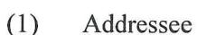

- (1) Caltrans, Sam Haack
- (1) DTSC, Randy Adams
- (1) CVRWQCB, Steve Meeks

Attachments:

Figure 1, Vicinity Map

Figure 2, Site Plan

Figure 3, Groundwater Elevation and Ionic Composition Map - March 2013

Figure 4, Barium Concentrations vs. Time

Figure 5, Lead Concentrations vs. Time

Figure 6, Strontium Concentrations vs. Time

Table 1, Groundwater Elevation Data

Table 2, Summary of Groundwater Analytical Results – Title 22 Metals (Dissolved)

Table 3, Summary of Groundwater Analytical Results – General Minerals and PAHs

Table 4, Well Construction Details

Appendix A, Monitoring Well Development and Sampling Data Sheets Appendix B, Laboratory Reports and Chain-of-custody Documentation Appendix C, Stiff Diagrams

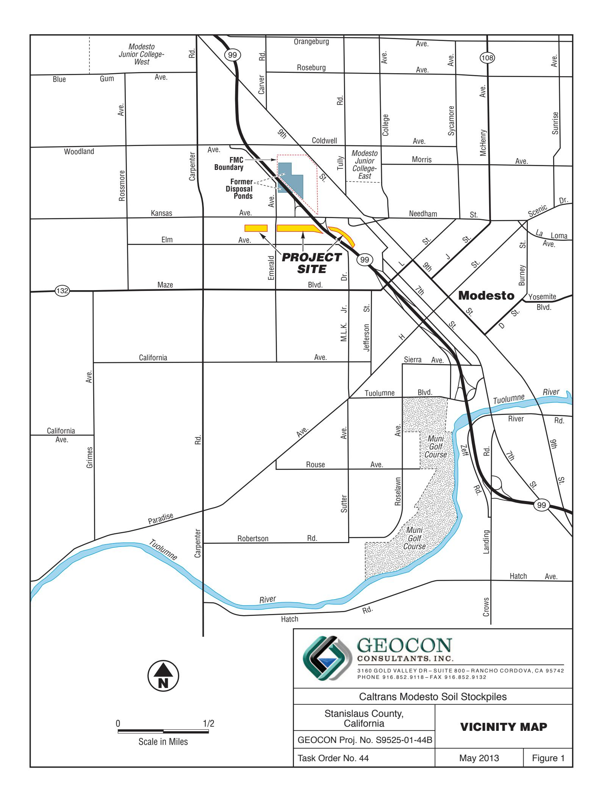

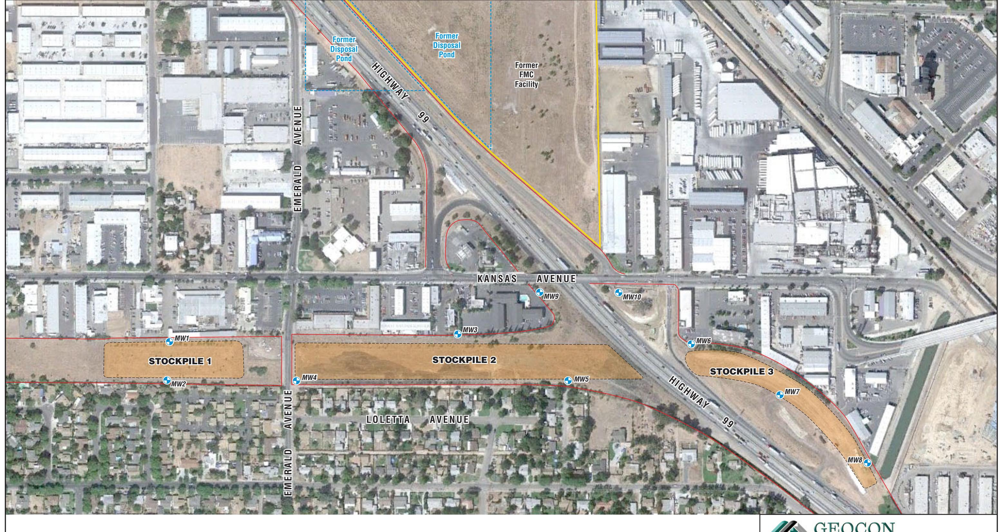

MW8 Approximate Monitoring Well Location

— State Right-of-Way Boundary

Scale in Feet

GEOCON CONSULTANTS, INC.

3160 GOLD VALLEY DR - SUITE 800 - RANCHO CORDOVA, CA 95742 PHONE 916.852.9118 - FAX 916.852.9132

Caltrans Modesto Soil Stockpiles

| Stanislaus County, |  |
|--------------------|--|
| California         |  |
|                    |  |

**SITE PLAN** 

GEOCON Proj. No. S9525-01-44B Task Order No. 44

May 2013

y 2013

Figure 2

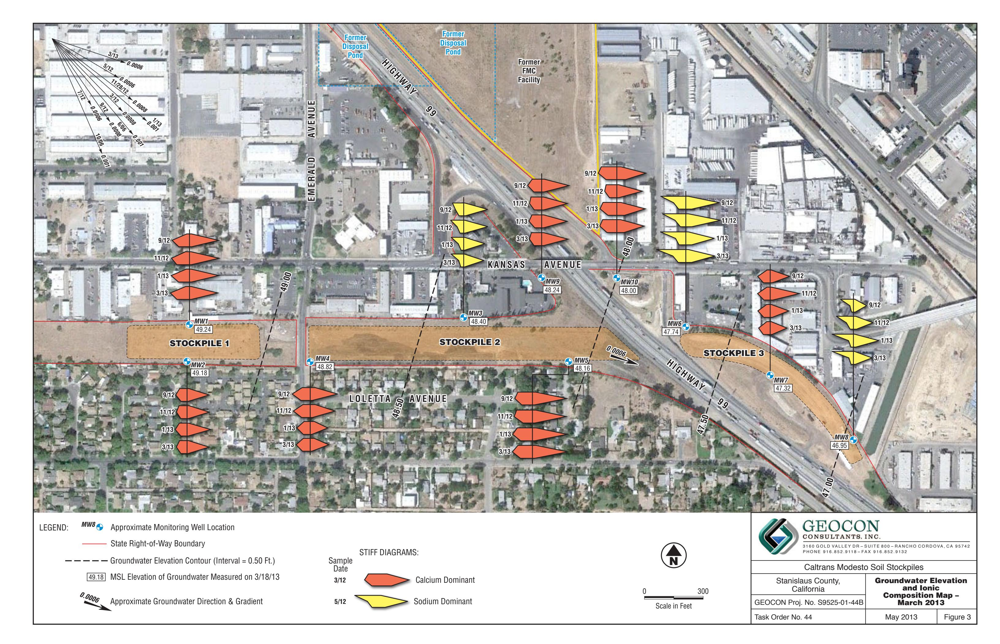

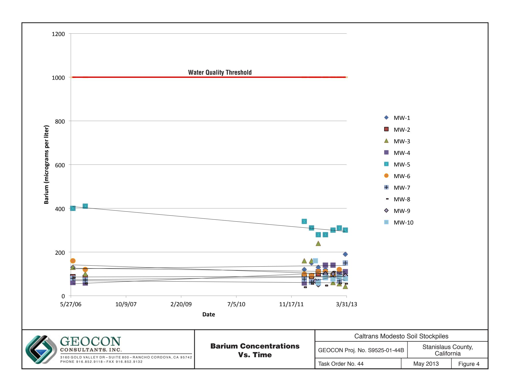

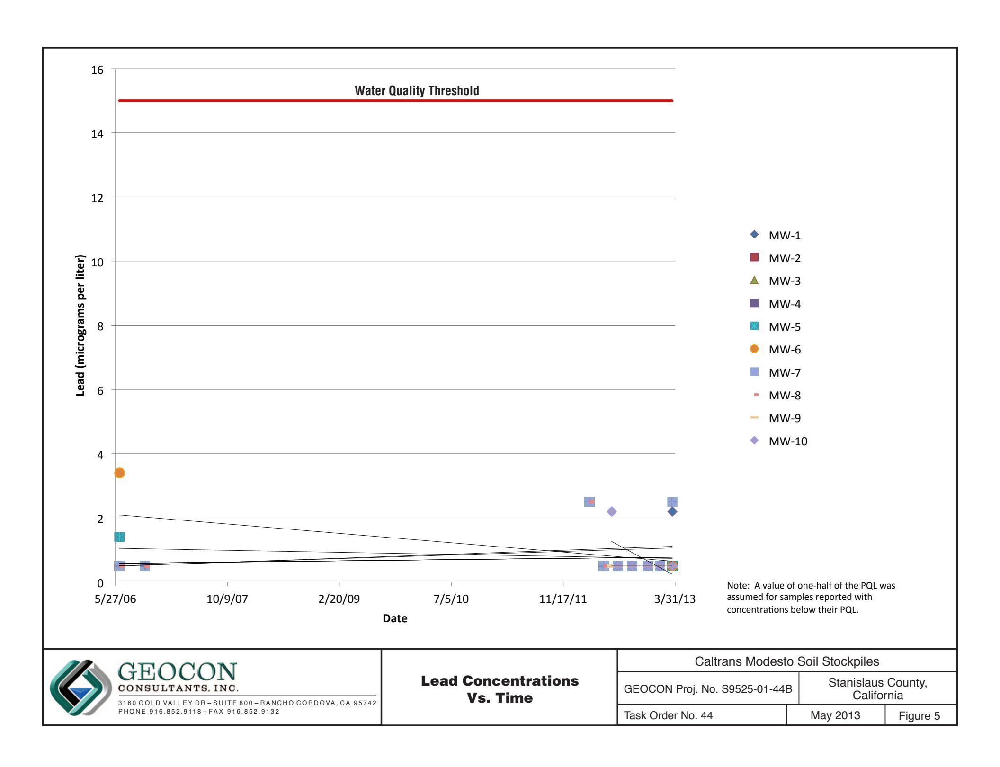

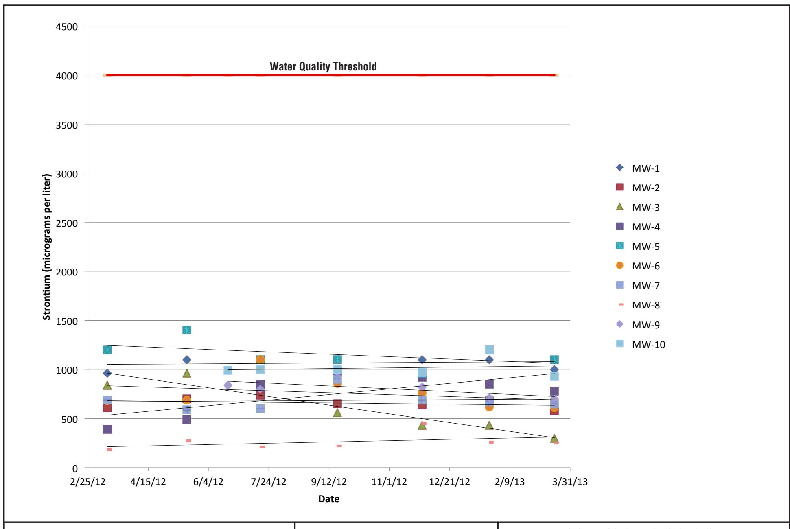

Strontium Concentrations Vs. Time

| Caltrans Modesto Soil Stockpiles |                                  |          |
|----------------------------------|----------------------------------|----------|
| GEOCON Proj. No. S9525-01-44B    | Stanislaus County, California |          |
| Task Order No. 44                | May 2013                         | Figure 6 |

# TABLE 1 GROUNDWATER ELEVATION DATA CALTRANS MODESTO SOIL STOCKPILES STANISLAUS COUNTY, CALIFORNIA

| WELL ID | DATE       | WELL CASING ELEVATION (feet MSL) | DEPTH TO GROUNDWATER (feet below TOC) | GROUNDWATER ELEVATION (feet MSL) |
|---------|------------|----------------------------------------|---------------------------------------------|----------------------------------------|
| MW-1    | 6/14/2006  | 80.26                                  | 29.82                                       | 50.44                                  |
| MW-1    | 10/5/2006  | 80.26                                  | 32.35                                       | 47.91                                  |
| MW-1    | 3/12/2012  | 80.26                                  | 30.12                                       | 50.14                                  |
| MW-1    | 5/17/2012  | 80.26                                  | 29.74                                       | 50.52                                  |
| MW-1    | 7/17/2012  | 80.39                                  | 31.34                                       | 49.05                                  |
| MW-1    | 9/19/2012  | 80.39                                  | 32.73                                       | 47.66                                  |
| MW-1    | 11/28/2012 | 80.39                                  | 32.28                                       | 48.11                                  |
| MW-1    | 1/22/2013  | 80.39                                  | 31.04                                       | 49.35                                  |
| MW-1    | 3/18/2013  | 80.39                                  | 31.15                                       | 49.24                                  |
| MW-2    | 6/13/2006  | 81.10                                  | 30.72                                       | 50.38                                  |
| MW-2    | 10/5/2006  | 81.10                                  | 33.35                                       | 47.75                                  |
| MW-2    | 3/12/2012  | 81.10                                  | 31.04                                       | 50.06                                  |
| MW-2    | 5/17/2012  | 81.10                                  | 30.69                                       | 50.41                                  |
| MW-2    | 7/17/2012  | 81.25                                  | 33.28                                       | 47.97                                  |
| MW-2    | 9/19/2012  | 81.25                                  | 33.70                                       | 47.55                                  |
| MW-2    | 11/28/2012 | 81.25                                  | 33.22                                       | 48.03                                  |
| MW-2    | 1/22/2013  | 81.25                                  | 31.97                                       | 49.28                                  |
| MW-2    | 3/18/2013  | 81.25                                  | 32.07                                       | 49.18                                  |
| MW-3    | 6/13/2006  | 81.76                                  | 32.38                                       | 49.38                                  |
| MW-3    | 10/5/2006  | 81.76                                  | 34.88                                       | 46.88                                  |
| MW-3    | 3/12/2012  | 81.76                                  | 32.35                                       | 49.41                                  |
| MW-3    | 5/17/2012  | 81.76                                  | 31.91                                       | 49.85                                  |
| MW-3    | 7/17/2012  | 81.82                                  | 33.45                                       | 48.37                                  |
| MW-3    | 9/19/2012  | 81.82                                  | 34.89                                       | 46.93                                  |
| MW-3    | 11/28/2012 | 81.82                                  | 34.69                                       | 47.13                                  |
| MW-3    | 1/22/2013  | 81.82                                  | 33.43                                       | 48.39                                  |
| MW-3    | 3/18/2013  | 81.82                                  | 33.42                                       | 48.40                                  |
| MW-4    | 6/13/2006  | 82.36                                  | 32.39                                       | 49.97                                  |
| MW-4    | 10/4/2006  | 82.36                                  | 35.05                                       | 47.31                                  |
| MW-4    | 3/12/2012  | 82.36                                  | 32.60                                       | 49.76                                  |
| MW-4    | 5/17/2012  | 82.36                                  | 32.20                                       | 50.16                                  |
| MW-4    | 7/17/2012  | 82.47                                  | 33.86                                       | 48.61                                  |
| MW-4    | 9/19/2012  | 82.47                                  | 35.28                                       | 47.19                                  |
| MW-4    | 11/28/2012 | 82.47                                  | 34.84                                       | 47.63                                  |
| WELL ID | DATE       | WELL CASING ELEVATION (feet MSL) | DEPTH TO GROUNDWATER (feet below TOC) | GROUNDWATER ELEVATION (feet MSL) |
| MW-4    | 1/22/2013  | 82.47                                  | 33.60                                       | 48.87                                  |
| MW-4    | 3/18/2013  | 82.47                                  | 33.65                                       | 48.82                                  |
| MW-5    | 6/14/2006  | 87.73                                  | 38.79                                       | 48.94                                  |
| MW-5    | 10/5/2006  | 87.73                                  | 41.40                                       | 46.33                                  |
| MW-5    | 3/12/2012  | 87.73                                  | 38.74                                       | 48.99                                  |
| MW-5    | 5/17/2012  | 87.73                                  | 38.25                                       | 49.48                                  |
| MW-5    | 7/17/2012  | 87.78                                  | 39.74                                       | 48.04                                  |
| MW-5    | 9/19/2012  | 87.78                                  | 41.19                                       | 46.59                                  |
| MW-5    | 11/28/2012 | 87.78                                  | 41.18                                       | 46.60                                  |
| MW-5    | 1/22/2013  | 87.78                                  | 40.02                                       | 47.76                                  |
| MW-5    | 3/18/2013  | 87.78                                  | 39.62                                       | 48.16                                  |
| MW-6    | 6/14/2006  | 84.37                                  | 36.35                                       | 48.02                                  |
| MW-6    | 10/5/2006  | 84.37                                  | 38.55                                       | 45.82                                  |
| MW-6    | 3/12/2012  | 84.37                                  | 35.70                                       | 48.67                                  |
| MW-6    | 5/17/2012  | 84.37                                  | 35.18                                       | 49.19                                  |
| MW-6    | 7/17/2012  | 84.52                                  | 36.40                                       | 48.12                                  |
| MW-6    | 9/19/2012  | 84.52                                  | 37.99                                       | 46.53                                  |
| MW-6    | 11/28/2012 | 84.52                                  | 38.19                                       | 46.33                                  |
| MW-6    | 1/22/2013  | 84.52                                  | 37.07                                       | 47.45                                  |
| MW-6    | 3/18/2013  | 84.52                                  | 36.78                                       | 47.74                                  |
| MW-7    | 6/14/2006  | 83.64                                  | 35.59                                       | 48.05                                  |
| MW-7    | 10/4/2006  | 83.64                                  | 38.32                                       | 45.32                                  |
| MW-7    | 3/12/2012  | 83.64                                  | 35.31                                       | 48.33                                  |
| MW-7    | 5/17/2012  | 83.64                                  | 34.72                                       | 48.92                                  |
| MW-7    | 7/17/2012  | 83.74                                  | 36.00                                       | 47.74                                  |
| MW-7    | 9/19/2012  | 83.74                                  | 37.60                                       | 46.14                                  |
| MW-7    | 11/28/2012 | 83.74                                  | 37.35                                       | 46.39                                  |
| MW-7    | 1/22/2013  | 83.74                                  | 36.78                                       | 46.96                                  |
| MW-7    | 3/18/2013  | 83.74                                  | 36.42                                       | 47.32                                  |
| MW-8    | 6/14/2006  | 83.73                                  | 36.12                                       | 47.61                                  |
| MW-8    | 10/4/2006  | 83.73                                  | 38.95                                       | 44.78                                  |
| MW-8    | 3/12/2012  | 83.73                                  | 35.75                                       | 47.98                                  |
| MW-8    | 5/17/2012  | 83.73                                  | 35.11                                       | 48.62                                  |
| WELL ID | DATE       | WELL CASING ELEVATION (feet MSL) | DEPTH TO GROUNDWATER (feet below TOC) | GROUNDWATER ELEVATION (feet MSL) |
| MW-8    | 7/17/2012  | 83.85                                  | 36.29                                       | 47.56                                  |
| MW-8    | 9/19/2012  | 83.85                                  | 38.04                                       | 45.81                                  |
| MW-8    | 11/28/2012 | 83.85                                  | 38.37                                       | 45.48                                  |
| MW-8    | 1/22/2013  | 83.85                                  | 37.35                                       | 46.50                                  |
| MW-8    | 3/18/2013  | 83.85                                  | 36.90                                       | 46.95                                  |
| MW-9    | 6/18/2012  | 82.53                                  | 33.67                                       | 48.86                                  |
| MW-9    | 7/17/2012  | 82.53                                  | 34.22                                       | 48.31                                  |
| MW-9    | 9/19/2012  | 82.53                                  | 35.64                                       | 46.89                                  |
| MW-9    | 11/28/2012 | 82.53                                  | 35.65                                       | 46.88                                  |
| MW-9    | 1/22/2013  | 82.53                                  | 34.35                                       | 48.18                                  |
| MW-9    | 3/18/2013  | 82.53                                  | 34.29                                       | 48.24                                  |
| MW-10   | 6/18/2012  | 83.97                                  | 35.18                                       | 48.79                                  |
| MW-10   | 7/17/2012  | 83.97                                  | 35.75                                       | 48.22                                  |
| MW-10   | 9/19/2012  | 83.97                                  | 37.18                                       | 46.79                                  |
| MW-10   | 11/28/2012 | 83.97                                  | 37.34                                       | 46.63                                  |
| MW-10   | 1/22/2013  | 83.97                                  | 36.13                                       | 47.84                                  |
| MW-10   | 3/18/2013  | 83.97                                  | 35.97                                       | 48.00                                  |

TABLE 1 GROUNDWATER ELEVATION DATA CALTRANS MODESTO SOIL STOCKPILES STANISLAUS COUNTY, CALIFORNIA

TABLE 1
GROUNDWATER ELEVATION DATA
CALTRANS MODESTO SOIL STOCKPILES
STANISLAUS COUNTY, CALIFORNIA

Notes:

MSL = Mean sea level

TOC = Top of well casing

Data prior to 3/12/2012 reproduced from *Site Investigation Report, Groundwater Assessment, Caltrans Modesto Soil Stockpiles State Route 99/132 Project, Stanislaus County, California,* Shaw Environmental, Inc., May 14, 2007.

Wells resurveyed by Morrow Surveying on June 18, 2012.

# TABLE 2

# SUMMARY OF GROUNDWATER ANALYTICAL RESULTS - TITLE 22 METALS (Dissolved) CALTRANS MODESTO SOIL STOCKPILES

# STANISLAUS COUNTY, CALIFORNIA

| ANALYTE   |                | Antimony       | Arsenic                         | Barium                          | Beryllium                       | Cadmium                         | Chromium                        | Cobalt                          | Copper                          | Lead                            | Manganese                       | Molybdenum                      | Nickel                          | Selenium                        | Silver                          | Thallium                        | Vanadium                        | Zinc                            | Strontium                       | Mercury                         |                                 |
|-----------|----------------|----------------|---------------------------------|---------------------------------|---------------------------------|---------------------------------|---------------------------------|---------------------------------|---------------------------------|---------------------------------|---------------------------------|---------------------------------|---------------------------------|---------------------------------|---------------------------------|---------------------------------|---------------------------------|---------------------------------|---------------------------------|---------------------------------|---------------------------------|
| SAMPLE ID | SAMPLE DATE |                |                                 |                                 |                                 |                                 |                                 |                                 |                                 | Results in                      | microgran                       | ns per lite                     | r                               |                                 |                                 |                                 |                                 |                                 |                                 |                                 |                                 |
| MW-1      | 6/14/2006      | <1.0           | 2.1                             | 130                             | <1.0                            | <1.0                            | 10                              | <1.0                            | 1.1                             | <1.0                            | 34                              | 2.9                             | 2.9                             | <1.0                            | <1.0                            | <1.0                            | 23                              | <10                             |                                 | < 0.2                           |                                 |
| MW-1      | 10/5/2006      | <1.0           | 2.2                             | 120                             | <1.0                            | <1.0                            | 16                              | <1.0                            | 2.0                             | <1.0                            | <1.0                            | < 2.0                           | 1.5                             | <1.0                            | <1.0                            | <1.0                            | 26                              | <10                             |                                 | < 0.2                           |                                 |
| MW-1      | 3/12/2012      | < 2.5          | < 5.0                           | 120                             | < 5.0                           | < 2.5                           | 6.4                             | < 2.5                           | < 5.0                           | < 5.0                           | < 50                            | < 2.5                           | < 5.0                           | < 2.5                           | < 2.5                           | < 2.5                           | 22                              | < 50                            | 960                             | 0.41                            |                                 |
| MW-1      | 3/12/2012 S    | <10            | 1.6                             | 105                             | < 5.0                           | 0.6                             | 6.8                             | < 5.0                           | 3.4                             | 2                               | 2.0                             | 1.3                             | < 5.0                           | < 20                            | < 5.0                           | < 20                            | 21.2                            | 5.6                             | 1,010                           |                                 |                                 |
| MW-1      | 5/17/2012      | < 0.50         | 2.3                             | 150                             | < 0.50                          | < 0.50                          | 7.0                             | 1.0                             | 2.5                             | <1.0                            | 35                              | 1.3                             | 4.0                             | 0.62                            | < 0.50                          | < 0.50                          | 21                              | <10                             | 1,100                           | < 0.20                          |                                 |
| MW-1      | 7/16/2012      | 0.51           | 2.2                             | 130                             | < 0.50                          | < 0.50                          | 7.2                             | < 0.50                          | 1.4                             | <1.0                            | <10                             | 0.73                            | 3.7                             | 0.60                            | < 0.50                          | < 0.50                          | 20                              | <10                             | 1,100                           | < 0.20                          |                                 |
| MW-1      | 9/19/2012      | < 0.50         | 2.1                             | 120                             | < 0.50                          | < 0.50                          | 7.0                             | < 0.50                          | <1.0                            | <1.0                            | <10                             | 0.53                            | 2.7                             | 0.56                            | < 0.50                          | < 0.50                          | 18                              | <10                             | 1,100                           | < 0.20                          |                                 |
| MW-1      | 11/28/2012     | < 0.50         | 2.2                             | 140                             | < 0.50                          | < 0.50                          | 5.1                             | < 0.50                          | <1.0                            | <1.0                            | <10                             | 0.58                            | 1.9                             | 0.61                            | < 0.50                          | < 0.50                          | 18                              | <10                             | 1,100                           | < 0.20                          |                                 |
| MW-1      | 1/22/2013      | < 0.50         | 2.0                             | 110                             | < 0.50                          | < 0.50                          | 6.0                             | < 0.50                          | 1.4                             | <1.0                            | 12                              | 0.63                            | 3.2                             | < 0.50                          | < 0.50                          | < 0.50                          | 17                              | 23                              | 1,100                           | < 0.20                          |                                 |
| MW-1      | 3/18/2013      | < 0.50         | 3.3                             | 190                             | <2.5                            | < 0.50                          | 12                              | 3.9                             | 6.7                             | 2.2                             | 160                             | 0.89                            | 8.8                             | < 0.50                          | < 0.50                          | < 0.50                          | 34                              | 77                              | 1,000                           | < 0.20                          |                                 |
| MW-2      | 6/13/2006      | <1.0           | 2.1                             | 87                              | <1.0                            | <1.0                            | 8.5                             | <1.0                            | 1.2 U                           | <1.0                            | 24                              | 3.3                             | 2.0                             | 1.3                             | <1.0                            | <1.0                            | 22                              | <10                             |                                 | < 0.2                           |                                 |
| MW-2      | 10/5/2006      | <1.0           | 2.6                             | 84                              | <1.0                            | <1.0                            | 11                              | <1.0                            | 1.7                             | <1.0                            | <1.0                            | < 2.0                           | 1.2                             | <1.0                            | <1.0                            | <1.0                            | 27                              | <10                             |                                 | < 0.2                           |                                 |
| MW-2      | 3/12/2012      | < 2.5          | < 5.0                           | 88                              | < 5.0                           | < 2.5                           | 4.7                             | < 2.5                           | < 5.0                           | < 5.0                           | < 50                            | < 2.5                           | < 5.0                           | < 2.5                           | < 2.5                           | < 2.5                           | 23                              | < 50                            | 610                             | 0.28                            |                                 |
| MW-2      | 3/12/2012 S    | <10            | <10                             | 89.6                            | < 5.0                           | 0.4                             | 6.1                             | < 5.0                           | < 5.0                           | <b></b> 2            | 1.4                             | 1.4                             | < 5.0                           | <20                             | < 5.0                           | 4.6                             | 23.1                            | 3.7                             | 642                             |                                 |                                 |
| MW-2      | 5/17/2012      | < 0.50         | 2.6                             | 89                              | < 0.50                          | < 0.50                          | 6.6                             | < 0.50                          | 1.5                             | <1.0                            | <10                             | 1.2                             | 1.9                             | < 0.50                          | < 0.50                          | < 0.50                          | 20                              | <10                             | 700                             | < 0.20                          |                                 |
| MW-2      | 7/16/2012      | < 0.50         | 3.1                             | 100                             | < 0.50                          | < 0.50                          | 5.8                             | < 0.50                          | <1.0                            | <1.0                            | <10                             | 1.2                             | 3.5                             | < 0.50                          | < 0.50                          | < 0.50                          | 25                              | 49                              | 740                             | < 0.20                          |                                 |
| MW-2      | 9/19/2012      | < 0.50         | 2.5                             | 88                              | < 0.50                          | < 0.50                          | 5.5                             | < 0.50                          | <1.0                            | <1.0                            | <10                             | 1.3                             | 2.1                             | < 0.50                          | < 0.50                          | < 0.50                          | 22                              | <10                             | 650                             | < 0.20                          |                                 |
| MW-2      | 11/28/2012     | < 0.50         | 2.6                             | 88                              | < 0.50                          | < 0.50                          | 4.0                             | < 0.50                          | <1.0                            | <1.0                            | <10                             | 0.95                            | 1.4                             | < 0.50                          | < 0.50                          | < 0.50                          | 21                              | <10                             | 640                             | < 0.20                          |                                 |
| MW-2      | 1/22/2013      | < 0.50         | 2.7                             | 87                              | < 0.50                          | < 0.50                          | 4.5                             | < 0.50                          | <1.0                            | <1.0                            | <10                             | 1.1                             | 1.8                             | < 0.50                          | < 0.50                          | < 0.50                          | 19                              | <10                             | 680                             | < 0.20                          |                                 |
| MW-2      | 3/18/2013      | < 0.50         | 2.6                             | 83                              | <1.0                            | < 0.50                          | 5.7                             | < 0.50                          | <1.0                            | <1.0                            | <10                             | 0.86                            | 2.0                             | < 0.50                          | < 0.50                          | < 0.50                          | 21                              | <10                             | 580                             | < 0.20                          |                                 |
| MW-3      | 6/13/2006      | <1.0           | 3.0                             | 60                              | <1.0                            | <1.0                            | 7.1                             | <1.0                            | 1 U                             | <1.0                            | 4.7                             | <2.0                            | 1.4                             | 1.4                             | <1.0                            | <1.0                            | 25                              | <10                             |                                 | < 0.2                           |                                 |
| MW-3      | 10/5/2006      | <1.0           | 3.3                             | 58                              | <1.0                            | <1.0                            | 7.9                             | <1.0                            | 1.5                             | <1.0                            | 18                              | 2.2                             | <1.0                            | <1.0                            | <1.0                            | <1.0                            | 29                              | <10                             |                                 | < 0.2                           |                                 |
| MW-3      | 3/12/2012      | < 2.5          | < 5.0                           | 58                              | < 5.0                           | < 2.5                           | 4.4                             | < 2.5                           | < 5.0                           | < 5.0                           | < 50                            | < 2.5                           | < 5.0                           | < 2.5                           | < 2.5                           | < 2.5                           | 28                              | < 50                            | 390                             | < 0.20                          |                                 |
| MW-3      | 3/12/2012 S    | <10            | 2.1                             | 44.4                            | 0.1                             | 0.3                             | 4.0                             | < 5.0                           | 1.5                             | 2                               | 1.8                             | 0.9                             | < 5.0                           | < 20                            | < 5.0                           | < 20                            | 22.6                            | 4.5                             | 342                             |                                 |                                 |
| MW-3      | 5/17/2012      | < 0.50         | 3.8                             | 64                              | < 0.50                          | < 0.50                          | 3.7                             | < 0.50                          | <1.0                            | <1.0                            | <10                             | 1.4                             | 1.1                             | < 0.50                          | < 0.50                          | < 0.50                          | 26                              | <10                             | 490                             | < 0.20                          |                                 |
| MW-3      | 7/16/2012      | < 0.50         | 2.2                             | 240                             | < 0.50                          | < 0.50                          | 6.5                             | < 0.50                          | 5.2                             | <1.0                            | <10                             | 0.56                            | 4.3                             | < 0.50                          | < 0.50                          | < 0.50                          | 18                              | 48                              | 840                             | < 0.20                          |                                 |
| MW-3      | 9/19/2012      | < 0.50         | 4.6                             | 84                              | < 0.50                          | < 0.50                          | 4.7                             | 1.3                             | 1.9                             | <1.0                            | 74                              | 1.1                             | 2.8                             | < 0.50                          | < 0.50                          | < 0.50                          | 33                              | <10                             | 560                             | < 0.20                          |                                 |
| MW-3      | 11/28/2012     | < 0.50         | 4.6                             | 60                              | < 0.50                          | < 0.50                          | 3.5                             | < 0.50                          | <1.0                            | <1.0                            | <10                             | 1.5                             | <1.0                            | < 0.50                          | < 0.50                          | < 0.50                          | 29                              | <10                             | 430                             | < 0.20                          |                                 |
| MW-3      | 1/22/2013      | < 0.50         | 5.5                             | 55                              | < 0.50                          | < 0.50                          | 3.5                             | < 0.50                          | <1.0                            | <1.0                            | <10                             | 2.0                             | <1.0                            | < 0.50                          | < 0.50                          | < 0.50                          | 31                              | 29                              | 430                             | < 0.20                          |                                 |
| MW-3      | 3/18/2013      | < 0.50         | 5.2                             | 43                              | <1.0                            | < 0.50                          | 3.8                             | < 0.50                          | <1.0                            | <1.0                            | <10                             | 1.8                             | <1.0                            | < 0.50                          | < 0.50                          | < 0.50                          | 33                              | <10                             | 300                             | < 0.20                          |                                 |
| ANALYTE   | SAMPLE ID      | SAMPLE DATE | Results in micrograms per liter |                                 |                                 |                                 |                                 |                                 |                                 |                                 |                                 |                                 |                                 |                                 |                                 |                                 |                                 |                                 |                                 |                                 |                                 |
|           |                |                | Antimony                        | Arsenic                         | Barium                          | Beryllium                       | Cadmium                         | Chromium                        | Cobalt                          | Copper                          | Lead                            | Manganese                       | Molybdenum                      | Nickel                          | Selenium                        | Silver                          | Thallium                        | Vanadium                        | Zinc                            | Strontium                       | Mercury                         |
| MW-4      | 6/13/2006      | <1.0           | 1.8                             | 130                             | <1.0                            | <1.0                            | 8.9                             | <1.0                            | 1.6 U                           | <1.0                            | 62                              | 2.5                             | 2.4                             | <1.0                            | <1.0                            | <1.0                            | 19                              | <10                             | --                              | <0.20                           |                                 |
| MW-4      | 10/4/2006      | <1.0           | 2.1                             | 100                             | <1.0                            | <1.0                            | 9.9                             | <1.0                            | 2.1                             | <1.0                            | 4.1                             | <2.0                            | <1.0                            | <1.0                            | <1.0                            | <1.0                            | 24                              | <10                             | --                              | <0.20                           |                                 |
| MW-4      | 3/12/2012      | <2.5           | <5.0                            | 160                             | <5.0                            | <2.5                            | 8.9                             | <2.5                            | <5.0                            | <5.0                            | 88                              | <2.5                            | 5.4                             | <2.5                            | <2.5                            | <2.5                            | 26                              | <50                             | 840                             | 0.29                            |                                 |
| MW-4      | 3/12/2012 S    | <10            | 1.4                             | 134                             | <5.0                            | 0.4                             | 7.7                             | <5.0                            | 0.9                             | 2                               | 0.7                             | <5.0                            | <5.0                            | <20                             | <5.0                            | 3.5                             | 19.3                            | 3.5                             | 812                             |                                 |                                 |
| MW-4      | 5/17/2012      | <0.50          | 2.1                             | 160                             | <0.50                           | <0.50                           | 6.6                             | <0.50                           | <1.0                            | <1.0                            | <10                             | <0.50                           | 1.7                             | 0.62                            | <0.50                           | <0.50                           | 18                              | <10                             | 960                             | <0.20                           |                                 |
| MW-4      | 7/16/2012      | <0.50          | 6.6                             | 110                             | <0.50                           | <0.50                           | 6.6                             | <0.50                           | 1.1                             | <1.0                            | <10                             | 2.4                             | 3.2                             | 0.55                            | <0.50                           | <0.50                           | 42                              | <10                             | 850                             | <0.20                           |                                 |
| MW-4      | 9/19/2012      | <0.50          | 2.2                             | 140                             | <0.50                           | <0.50                           | 7.0                             | <0.50                           | <1.0                            | <1.0                            | <10                             | <0.50                           | 2.6                             | 0.78                            | <0.50                           | <0.50                           | 18                              | <10                             | 980                             | <0.20                           |                                 |
| MW-4      | 11/28/2012     | <0.50          | 2.1                             | 140                             | <0.50                           | <0.50                           | 5.2                             | <0.50                           | 1.0                             | <1.0                            | 11                              | <0.50                           | 2.3                             | 0.54                            | <0.50                           | <0.50                           | 18                              | <10                             | 920                             | <0.20                           |                                 |
| MW-4      | 1/22/2013      | <0.50          | 1.8                             | 100                             | <0.50                           | <0.50                           | 5.0                             | <0.50                           | <1.0                            | <1.0                            | <10                             | <0.50                           | 1.9                             | 0.59                            | <0.50                           | <0.50                           | 15                              | <10                             | 850                             | <0.20                           |                                 |
| MW-4      | 3/18/2013      | <0.50          | 2.0                             | 110                             | <0.50                           | <0.50                           | 5.7                             | <0.50                           | <1.0                            | <1.0                            | <10                             | <0.50                           | 2.3                             | <0.50                           | <0.50                           | <0.50                           | 17                              | <10                             | 780                             | <0.20                           |                                 |
| MW-5      | 6/14/2006      | <1.0           | 1.8                             | 400                             | <1.0                            | <1.0                            | 9.6                             | 2.2                             | 4.8                             | 1.4                             | 260                             | 9.9                             | 7.1                             | 2.0                             | <1.0                            | <1.0                            | 23                              | <10                             | --                              | <0.20                           |                                 |
| MW-5      | 10/5/2006      | <1.0           | 2.5                             | 410                             | <1.0                            | <1.0                            | 18                              | <1.0                            | 1.9                             | <1.0                            | 120                             | 14                              | 3.4                             | <1.0                            | 2.1                             | <1.0                            | 24                              | <10                             | --                              | <0.20                           |                                 |
| MW-5      | 3/12/2012      | <2.5           | <5.0                            | 340                             | <5.0                            | <2.5                            | 9.2                             | <2.5                            | <5.0                            | <5.0                            | <50                             | <2.5                            | <5.0                            | <2.5                            | <2.5                            | <2.5                            | 18                              | <50                             | 1,200                           | 0.28                            |                                 |
| MW-5      | 3/12/2012 S    | <10            | 1.3                             | 310                             | <5.0                            | 0.5                             | 9.6                             | <5.0                            | 1.0                             | 2                               | 4.4                             | 1.5                             | <5.0                            | 1.5                             | <5.0                            | 3.6                             | 17.8                            | 14.5                            | 1,140                           |                                 |                                 |
| MW-5      | 5/17/2012      | 0.59           | 2.4                             | 310                             | <0.50                           | <0.50                           | 12                              | <0.50                           | 1.1                             | <1.0                            | <10                             | 1.8                             | 3.1                             | 2.6                             | <0.50                           | <0.50                           | 14                              | <10                             | 1,400                           | <0.20                           |                                 |
| MW-5      | 7/17/2012      | 0.69           | 2.8                             | 280                             | <0.50                           | <0.50                           | 9.8                             | <0.50                           | 1.2                             | <1.0                            | <10                             | 1.9                             | 2.8                             | 2.1                             | <0.50                           | <0.50                           | 20                              | <10                             | 1,100                           | <0.20                           |                                 |
| MW-5      | 9/20/2012      | 0.55           | 2.3                             | 280                             | <0.50                           | <0.50                           | 5.7                             | <0.50                           | 1.0                             | <1.0                            | <10                             | 1.4                             | 2.4                             | 1.3                             | <0.50                           | <0.50                           | 18                              | <10                             | 1,100                           | <0.20                           |                                 |
| MW-5      | 11/29/2012     | <0.50          | 2.9                             | 300                             | <0.50                           | <0.50                           | 6.2                             | <0.50                           | <1.0                            | <1.0                            | <10                             | 1.6                             | 2.0                             | 1.3                             | <0.50                           | <0.50                           | 20                              | <10                             | 960                             | <0.20                           |                                 |
| MW-5      | 1/23/2013      | <0.50          | 1.7                             | 310                             | <0.50                           | <0.50                           | 7.3                             | <0.50                           | <1.0                            | <1.0                            | <10                             | 1.4                             | 2.7                             | 0.90                            | <0.50                           | <0.50                           | 17                              | <10                             | 1,200                           | <0.20                           |                                 |
| MW-5      | 3/18/2013      | 0.72           | 2.3                             | 300                             | <1.0                            | <0.50                           | 7.2                             | <0.50                           | 1.1                             | <1.0                            | <10                             | 1.4                             | 3.1                             | 1.1                             | <0.50                           | <0.50                           | 17                              | <10                             | 1,100                           | <0.20                           |                                 |
| MW-6      | 6/14/2006      | <1.0           | 3.6                             | 160                             | <1.0                            | <1.0                            | 16                              | 3.0                             | 6.2                             | 3.4                             | 190                             | 13                              | 5.9                             | 3.0                             | <1.0                            | <1.0                            | 33                              | 15                              | --                              | <0.20                           |                                 |
| MW-6      | 10/5/2006      | <1.0           | 5.2                             | 120                             | <1.0                            | <1.0                            | 29                              | <1.0                            | 1.5                             | <1.0                            | 130                             | 13                              | 1.7                             | <1.0                            | <1.0                            | <1.0                            | 34                              | <10                             | --                              | <0.20                           |                                 |
| MW-6      | 3/12/2012      | <2.5           | <5.0                            | 99                              | <5.0                            | <2.5                            | 9.5                             | <2.5                            | <5.0                            | <5.0                            | <50                             | 5.3                             | <5.0                            | <2.5                            | <2.5                            | <2.5                            | 37                              | <50                             | 680                             | 0.27                            |                                 |
| MW-6      | 3/12/2012 S    | <10            | 2.8                             | 94.2                            | <5.0                            | 0.4                             | 9.9                             | <5.0                            | <5.0                            | 2                               | 2.7                             | 5.2                             | <5.0                            | <20                             | <5.0                            | 2.6                             | 36.3                            | 3.8                             | 655                             |                                 |                                 |
| MW-6      | 5/17/2012      | <0.50          | 3.9                             | 93                              | <0.50                           | <0.50                           | 8.3                             | <0.50                           | 1.3                             | <1.0                            | <10                             | 5.5                             | 1.8                             | 2.1                             | <0.50                           | <0.50                           | 32                              | <10                             | 690                             | <0.20                           |                                 |
| MW-6      | 7/17/2012      | <0.50          | 6.3                             | 110                             | <0.50                           | <0.50                           | 14                              | <0.50                           | 1.2                             | <1.0                            | <10                             | 8.2                             | 3.0                             | 3.1                             | <0.50                           | <0.50                           | 51                              | <10                             | 1,100                           | <0.20                           |                                 |
| MW-6      | 9/20/2012      | <0.50          | 4.7                             | 110                             | <0.50                           | <0.50                           | 10                              | <0.50                           | <1.0                            | <1.0                            | <10                             | 5.6                             | 1.7                             | 2.6                             | <0.50                           | <0.50                           | 39                              | <10                             | 860                             | <0.20                           |                                 |
| MW-6      | 11/29/2012     | <0.50          | 5.1                             | 98                              | <0.50                           | <0.50                           | 8.0                             | <0.50                           | <1.0                            | <1.0                            | <10                             | 6.0                             | 1.6                             | 2.6                             | <0.50                           | <0.50                           | 38                              | <10                             | 760                             | <0.20                           |                                 |
| MW-6      | 1/23/2013      | <0.50          | 4.2                             | 120                             | <0.50                           | <0.50                           | 9.5                             | 1.9                             | 3.2                             | <1.0                            | 100                             | 5.2                             | 4.0                             | 1.2                             | <0.50                           | <0.50                           | 41                              | 16                              | 620                             | <0.20                           |                                 |
| ANALYTE   | SAMPLE ID      | SAMPLE DATE | Results in micrograms per liter |                                 |                                 |                                 |                                 |                                 |                                 |                                 |                                 |                                 |                                 |                                 |                                 |                                 |                                 |                                 |                                 |                                 |                                 |
|           |                |                | Antimony                        | Arsenic                         | Barium                          | Beryllium                       | Cadmium                         | Chromium                        | Cobalt                          | Copper                          | Lead                            | Manganese                       | Molybdenum                      | Nickel                          | Selenium                        | Silver                          | Thallium                        | Vanadium                        | Zinc                            | Strontium                       | Mercury                         |
| MW-6      | 3/18/2013      | <0.50          | 4.6                             | 79                              | <0.50                           | <0.50                           | 8.0                             | <0.50                           | <1.0                            | <1.0                            | <10                             | 5.1                             | 1.9                             | 1.8                             | <0.50                           | <0.50                           | 34                              | <10                             | 610                             | <0.20                           |                                 |
| MW-7      | 6/14/2006      | <1.0           | 2.3                             | 80                              | <1.0                            | <1.0                            | 7.0                             | <1.0                            | <1.0                            | <1.0                            | 9.0                             | 2.6                             | 2.2                             | 1.1                             | <1.0                            | <1.0                            | 17                              | <10                             | --                              | <0.20                           |                                 |
| MW-7      | 10/4/2006      | <1.0           | 2.7                             | 73                              | <1.0                            | <1.0                            | 10                              | <1.0                            | 1.6                             | <1.0                            | 1.1                             | <2.0                            | 1.4                             | 1.2                             | <1.0                            | <1.0                            | 23                              | <10                             | --                              | <0.20                           |                                 |
| MW-7      | 3/12/2012      | <2.5           | <5.0                            | 76                              | <5.0                            | <2.5                            | <2.5                            | <2.5                            | <5.0                            | <5.0                            | <50                             | <2.5                            | <5.0                            | <2.5                            | <2.5                            | <2.5                            | 24                              | <50                             | 690                             | 0.28                            |                                 |
| MW-7      | 5/17/2012      | 0.74           | 2.3                             | 63                              | <0.50                           | <0.50                           | 1.6                             | <0.50                           | <1.0                            | <1.0                            | <10                             | 1.0                             | 1.3                             | <0.50                           | <0.50                           | <0.50                           | 19                              | <10                             | 590                             | <0.20                           |                                 |
| MW-7      | 7/17/2012      | 0.95           | 2.2                             | 66                              | <0.50                           | <0.50                           | 2.2                             | <0.50                           | 1.1                             | <1.0                            | <10                             | 1.0                             | 2.3                             | <0.50                           | <0.50                           | <0.50                           | 17                              | <10                             | 600                             | <0.20                           |                                 |
| MW-7      | 9/20/2012      | <0.50          | 3.1                             | 96                              | <0.50                           | <0.50                           | 3.7                             | <0.50                           | 1.1                             | <1.0                            | <10                             | 1.2                             | 3.0                             | 0.66                            | <0.50                           | <0.50                           | 25                              | <10                             | 900                             | <0.20                           |                                 |
| MW-7      | 11/29/2012     | <0.50          | 2.5                             | 77                              | <0.50                           | <0.50                           | 2.3                             | <0.50                           | <1.0                            | <1.0                            | <10                             | 1.2                             | 1.3                             | <0.50                           | <0.50                           | <0.50                           | 20                              | <10                             | 690                             | <0.20                           |                                 |
| MW-7      | 1/23/2013      | <0.50          | 2.9                             | 68                              | <0.50                           | <0.50                           | 2.9                             | <0.50                           | <1.0                            | <1.0                            | <10                             | 0.99                            | 1.7                             | <0.50                           | <0.50                           | <0.50                           | 21                              | <10                             | 670                             | <0.20                           |                                 |
| MW-7      | 3/18/2013      | 0.78           | 4.0                             | 150                             | <0.50                           | <0.50                           | 6.4                             | 3.9                             | 6.5                             | 2.5                             | 260                             | 1.6                             | 8.0                             | <0.50                           | <0.50                           | <0.50                           | 35                              | 29                              | 650                             | <0.20                           |                                 |
| MW-8      | 6/14/2006      | <1.0           | 2.7                             | 84                              | <1.0                            | <1.0                            | 8.8                             | <1.0                            | <1.0                            | <1.0                            | 5.8                             | <2.0                            | 1.2                             | 1.6                             | <1.0                            | <1.0                            | 25                              | <10                             | --                              | <0.20                           |                                 |
| MW-8      | 10/4/2006      | <1.0           | 4.0                             | 57                              | <1.0                            | <1.0                            | 9.7                             | <1.0                            | 1.7                             | <1.0                            | <1.0                            | 2.0                             | <1.0                            | <1.0                            | <1.0                            | <1.0                            | 32                              | <10                             | --                              | <0.20                           |                                 |
| MW-8      | 3/12/2012      | <2.5           | <5.0                            | 39                              | <5.0                            | <2.5                            | 4.4                             | <2.5                            | <5.0                            | <5.0                            | <50                             | <2.5                            | <5.0                            | <2.5                            | <2.5                            | <2.5                            | 20                              | <50                             | 180                             | 0.23                            |                                 |
| MW-8      | 3/12/2012 S    | <10            | 2.5                             | 39.4                            | <5.0                            | 0.1                             | 4.7                             | <5.0                            | <5.0                            | 2                               | 1.7                             | 1.3                             | <5.0                            | <20                             | <5.0                            | <20                             | 23.4                            | 3.6                             | 211                             | --                              |                                 |
| MW-8      | 5/17/2012      | <0.50          | 3.2                             | 55                              | <0.50                           | <0.50                           | 4.6                             | <0.50                           | <1.0                            | <1.0                            | <10                             | 1.8                             | <1.0                            | 0.73                            | <0.50                           | <0.50                           | 22                              | <10                             | 270                             | <0.20                           |                                 |
| MW-8      | 7/17/2012      | <0.50          | 3.2                             | 51                              | <0.50                           | <0.50                           | 5.6                             | <0.50                           | <1.0                            | <1.0                            | <10                             | 1.7                             | <1.0                            | 0.74                            | <0.50                           | <0.50                           | 23                              | <10                             | 210                             | <0.20                           |                                 |
| MW-8      | 9/20/2012      | <0.50          | 3.9                             | 47                              | <0.50                           | <0.50                           | 3.8                             | <0.50                           | <1.0                            | <1.0                            | <10                             | 1.8                             | <1.0                            | 0.89                            | <0.50                           | <0.50                           | 28                              | <10                             | 220                             | <0.20                           |                                 |
| MW-8      | 11/29/2012     | <0.50          | 4.0                             | 110                             | <0.50                           | <0.50                           | 6.3                             | 0.94                            | 2.1                             | <1.0                            | 160                             | 2.1                             | 2.3                             | 1.4                             | <0.50                           | <0.50                           | 27                              | <10                             | 450                             | <0.20                           |                                 |
| MW-8      | 1/23/2013      | <0.50          | 4.2                             | 57                              | <0.50                           | <0.50                           | 5.7                             | <0.50                           | <1.0                            | <1.0                            | <10                             | 2.1                             | <1.0                            | <0.50                           | <0.50                           | <0.50                           | 28                              | <10                             | 260                             | <0.20                           |                                 |
| MW-8      | 3/18/2013      | <0.50          | 4.0                             | 56                              | <0.50                           | <0.50                           | 5.4                             | <0.50                           | <1.0                            | <1.0                            | <10                             | 1.9                             | <1.0                            | <0.50                           | <0.50                           | <0.50                           | 26                              | <10                             | 250                             | <0.20                           |                                 |
| MW-9      | 6/20/2012      | <0.50          | 2.3                             | 67                              | <0.50                           | <0.50                           | 2.5                             | <0.50                           | <1.0                            | <1.0                            | 43                              | 0.76                            | 2.2                             | 1.8                             | <0.50                           | <0.50                           | 15                              | 15                              | 840                             | <0.20                           |                                 |
| MW-9      | 7/17/2012      | <0.50          | 2.7                             | 51                              | <0.50                           | <0.50                           | 2.6                             | <0.50                           | <1.0                            | <1.0                            | <10                             | 0.68                            | 1.9                             | 1.7                             | <0.50                           | <0.50                           | 14                              | <10                             | 800                             | <0.20                           |                                 |
| MW-9      | 9/19/2012      | <0.50          | 3.1                             | 100                             | <0.50                           | <0.50                           | 3.6                             | <0.50                           | 2.2                             | <1.0                            | 73                              | 0.76                            | 3.4                             | 2.5                             | <0.50                           | <0.50                           | 22                              | <10                             | 970                             | <0.20                           |                                 |
| MW-9      | 11/28/2012     | <0.50          | 3.2                             | 100                             | <0.50                           | <0.50                           | 3.0                             | <0.50                           | 1.0                             | <1.0                            | 15                              | 0.65                            | 1.9                             | 1.5                             | <0.50                           | <0.50                           | 22                              | <10                             | 820                             | <0.20                           |                                 |
| MW-9      | 1/22/2013      | <0.50          | 2.6                             | 90                              | <0.50                           | <0.50                           | 3.1                             | <1.0                            | <2.0                            | <1.0                            | <20                             | <0.50                           | <2.0                            | 1.1                             | <0.50                           | <0.50                           | 19                              | <10                             | 710                             | <0.20                           |                                 |
| MW-9      | 3/18/2013      | <0.50          | 3.1                             | 92                              | <1.0                            | <0.50                           | 3.5                             | <0.50                           | 1.1                             | <1.0                            | <10                             | <0.50                           | 2.2                             | 1.1                             | <0.50                           | <0.50                           | 20                              | <10                             | 700                             | <0.20                           |                                 |
| ANALYTE   | SAMPLE ID      | SAMPLE DATE | Antimony                        | Arsenic                         | Barium                          | Beryllium                       | Cadmium                         | Chromium                        | Cobalt                          | Copper                          | Lead                            | Manganese                       | Molybdenum                      | Nickel                          | Selenium                        | Silver                          | Thallium                        | Vanadium                        | Zinc                            | Strontium                       | Mercury                         |
|           |                |                | Results in micrograms per liter | Results in micrograms per liter | Results in micrograms per liter | Results in micrograms per liter | Results in micrograms per liter | Results in micrograms per liter | Results in micrograms per liter | Results in micrograms per liter | Results in micrograms per liter | Results in micrograms per liter | Results in micrograms per liter | Results in micrograms per liter | Results in micrograms per liter | Results in micrograms per liter | Results in micrograms per liter | Results in micrograms per liter | Results in micrograms per liter | Results in micrograms per liter | Results in micrograms per liter |
|           | MW-10          | 6/20/2012      | <0.50                           | 4.1                             | 160                             | <1.0                            | <0.50                           | 6.2                             | 5.3                             | 7.4                             | 2.2                             | 290                             | 3.1                             | 9.6                             | 4.3                             | <0.50                           | <0.50                           | 33                              | 24                              | 990                             | <0.20                           |
|           | MW-10          | 7/17/2012      | <0.50                           | 2.8                             | 59                              | <0.50                           | <0.50                           | 1.3                             | <0.50                           | <1.0                            | <1.0                            | <10                             | 1.0                             | 2.4                             | 4.4                             | <0.50                           | <0.50                           | 16                              | 15                              | 1,000                           | <0.20                           |
|           | MW-10          | 9/20/2012      | <0.50                           | 2.7                             | 83                              | <0.50                           | <0.50                           | 1.1                             | <0.50                           | 1.0                             | <1.0                            | 16                              | 0.61                            | 2.8                             | 4.4                             | <0.50                           | <0.50                           | 19                              | 120                             | 1,100                           | <0.20                           |
|           | MW-10          | 11/29/2012     | <0.50                           | 3.1                             | 76                              | <0.50                           | <0.50                           | 0.60                            | <0.50                           | <1.0                            | <1.0                            | <10                             | <0.50                           | 1.7                             | 3.0                             | <0.50                           | <0.50                           | 18                              | <10                             | 970                             | <0.20                           |
|           | MW-10          | 1/22/2013      | <0.50                           | 3.8                             | 86                              | <0.50                           | <0.50                           | 0.92                            | <0.50                           | <1.0                            | <1.0                            | <10                             | <0.50                           | 2.4                             | 3.7                             | <0.50                           | <0.50                           | 18                              | <10                             | 1,200                           | <0.20                           |
|           | MW-10          | 3/18/2013      | <0.50                           | 3.5                             | 78                              | <0.50                           | <0.50                           | 1.5                             | 0.58                            | 1.5                             | <1.0                            | 14                              | <0.50                           | 3.1                             | 3.0                             | <0.50                           | <0.50                           | 19                              | <10                             | 930                             | <0.20                           |
| MCLs      |                |                | 6                               | 10                              | 1000/ 700 (4)                | 4                               | 5                               | 50                              | 1,000 (1)/ 1,300 (3)         | 15 (3)                          | 50 (1)                          |                                 | 100                             | 50                              | 100 (1)                         | 2                               | 50(5)                           | 5,000 (1)/ 2,000 (4)         | 4,000 (4)                       | 2                               |                                 |

# TABLE 2

## SUMMARY OF GROUNDWATER ANALYTICAL RESULTS - TITLE 22 METALS (Dissolved) CALTRANS MODESTO SOIL STOCKPILES

# TABLE 2

## SUMMARY OF GROUNDWATER ANALYTICAL RESULTS - TITLE 22 METALS (Dissolved) CALTRANS MODESTO SOIL STOCKPILES

## STANISLAUS COUNTY, CALIFORNIA

## TABLE 2 SUMMARY OF GROUNDWATER ANALYTICAL RESULTS - TITLE 22 METALS (Dissolved) CALTRANS MODESTO SOIL STOCKPILES STANISLAUS COUNTY, CALIFORNIA

Notes:

- --- = not analyzed or not applicable
- < = Less than laboratory reporting limits
- S = Split samples submitted by Central Valley Regional Water Quality Control Board (CVRWQCB) to Excelchem Environmental Labs
- U = Notation: The result was qualified as a non-detect due to equipment blank contamination

MCLs = Maximum Contaminant Levels per California Environmental Protection Agency (EPA), May 2009

**Bold** = Reported concentration exceeds laboratory reporting limit

Data prior to 3/12/2012 reproduced from Site Investigation Report, Groundwater Assessment, Caltrans Modesto Soil Stockpiles State Route 99/132 Project, Stanislaus County, California, Shaw Environmental, Inc., May 14, 2007.

(1) = Secondary MCL

(2) = Laboratory error in sample preparation (CVRWQCB personal communication)

(3) = California Department of Public Health Regulatory Action Level

(4) = EPA Drinking Water Health Advisory

 $^{(5)}$  = California Department of Public Health Notification Level for Drinking Water

| SAMPLE ID                       | SAMPLE DATE | DISSOLVED CALCIUM               | DISSOLVED MAGNESIUM    | CHLORIDE | NITROGEN, NITRATE (as N)    | SULFATE | DISSOLVED POTASSIUM | DISSOLVED SODIUM | SULFIDE | ALKALINITY, BICARBONATE    | ALKALINITY, CARBONATE    | ALKALINITY, TOTAL    | TOTAL DISSOLVED SOLIDS       | PAHs (SIM)           |
|---------------------------------|-------------|---------------------------------|------------------------|----------|-----------------------------|---------|---------------------|------------------|---------|----------------------------|--------------------------|----------------------|------------------------------|----------------------|
| MW-1                            | 6/14/2006   | --                              | --                     | --       | 5.0                         | 18      | --                  | <0.1             | --      | --                         | --                       | --                   | --                           | --                   |
| MW-1                            | 10/5/2006   | 88                              | 34                     | 14       | 6.8                         | 18      | 3.7                 | 22               | <0.1    | 360                        | <1                       | 360                  | 500                          | --                   |
| MW-1                            | 3/12/2012   | 78                              | 31                     | 13       | 12                          | 16      | 3.2                 | 21               | <0.05   | 328                        | <5.0                     | 328                  | 550                          | <0.20                |
| MW-1                            | 3/12/2012 S | 84                              | 29.4                   | 12       | 11.4                        | 15.6    | 3.3                 | 23.8             | 0.0637  | 342                        | <5.0                     | 342                  | 453                          | --                   |
| MW-1                            | 5/17/2012   | 83                              | 34                     | 12       | 12                          | 16      | 3.8                 | 20               | 0.1     | 340                        | <5.0                     | 340                  | 480                          | <0.20                |
| MW-1                            | 7/16/2012   | 87                              | 34                     | 12       | 12                          | 20      | 2.8                 | 17               | 0.1     | 330                        | <5.0                     | 330                  | 540                          | <0.20                |
| MW-1                            | 9/19/2012   | 80                              | 30                     | 14       | 12                          | 25      | 2.5                 | 13               | 0.28    | 330                        | <5.0                     | 330                  | 460                          | <0.20                |
| MW-1                            | 11/28/2012  | 81                              | 35                     | 12       | 12                          | 19      | 2.9                 | 19               | 0.12    | 330                        | <5.0                     | 330                  | 460                          | <0.20                |
| MW-1                            | 1/22/2013   | 84                              | 30                     | 13       | 12                          | 20      | 2.5                 | 15               | 0.52    | 330                        | <5.0                     | 330                  | 460                          | --                   |
| MW-1                            | 3/18/2013   | 87                              | 35                     | 13       | 13                          | 18      | 4.7                 | 17               | 0.18    | 320                        | <5.0                     | 320                  | 500                          | --                   |
| MW-2                            | 6/13/2006   | --                              | --                     | --       | 5.5                         | 21      | --                  | <0.1             | --      | --                         | --                       | --                   | --                           | --                   |
| MW-2                            | 10/5/2006   | 49                              | 16                     | 23       | 6.1                         | 16      | 2.7                 | 56               | <0.1    | 250                        | <1                       | 250                  | 390                          | --                   |
| MW-2                            | 3/12/2012   | 52                              | 18                     | 17       | 9.0                         | 16      | 2.6                 | 40               | 0.06    | 266                        | <5.0                     | 266                  | 460                          | <0.20                |
| MW-2                            | 3/12/2012 S | 58.1                            | 17.2                   | 15.4     | 8.77                        | 15.2    | 2.89                | 54               | 0.0497  | 270                        | <5.0                     | 270                  | 382                          | --                   |
| MW-2                            | 5/17/2012   | 55                              | 19                     | 15       | 7.5                         | 14      | 2.9                 | 39               | 0.07    | 248                        | <5.0                     | 248                  | 400                          | <0.20                |
| MW-2                            | 7/16/2012   | 50                              | 16                     | 14       | 7.2                         | 13      | 2.2                 | 38               | 0.042   | 230                        | <5.0                     | 230                  | 410                          | <0.20                |
| MW-2                            | 9/19/2012   | 52                              | 17                     | 13       | 7.3                         | 14      | 2.2                 | 38               | 0.10    | 250                        | <5.0                     | 250                  | 390                          | <0.20                |
| MW-2                            | 11/28/2012  | 48                              | 17                     | 14       | 7.5                         | 14      | 2.3                 | 41               | 0.07    | 250                        | <5.0                     | 250                  | 390                          | --                   |
| MW-2                            | 1/22/2013   | 54                              | 17                     | 12       | 6.9                         | 13      | 2.0                 | 39               | 0.04    | 270                        | <5.0                     | 270                  | 360                          | --                   |
| MW-2                            | 3/18/2013   | 48                              | 17                     | 11       | 6.2                         | 11      | 2.5                 | 38               | <0.020  | 250                        | <5.0                     | 250                  | 390                          | --                   |
| MW-3                            | 6/13/2006   | --                              | --                     | --       | 5.4                         | 18      | --                  | <0.1             | --      | --                         | --                       | --                   | --                           | --                   |
| MW-3                            | 10/5/2006   | 42                              | 15                     | 11       | 5.0                         | 17      | 2.5                 | 43               | <0.1    | 220                        | <1                       | 220                  | 340                          | --                   |
| MW-3                            | 3/12/2012   | 31                              | 11                     | 7.5      | 2.9                         | 17      | 2.3                 | 66               | 0.09    | 268                        | <5.0                     | 268                  | 400                          | <0.20                |
| MW-3                            | 3/12/2012 S | 29.5                            | 9.19                   | 5.7      | 2.24                        | 13.8    | 2.04                | 66.3             | 0.0281  | 220                        | <5.0                     | 220                  | 273                          | --                   |
| MW-3                            | 5/17/2012   | 37                              | 12                     | 6.6      | 2.5                         | 14      | 2.4                 | 66               | 0.05    | 221                        | <5.0                     | 221                  | 300                          | <0.20                |
| MW-3                            | 7/16/2012   | 42                              | 14                     | 7.5      | 2.8                         | 17      | 2.3                 | 71               | 0.014   | 300                        | <5.0                     | 300                  | 400                          | <0.20                |
| MW-3                            | 9/19/2012   | 39                              | 14                     | 5.9      | 3.0                         | 18      | 2.4                 | 58               | <0.05   | 270                        | <5.0                     | 270                  | 350                          | <0.20                |
| MW-3                            | 11/28/2012  | 31                              | 11                     | 5.7      | 2.8                         | 12      | 2.2                 | 68               | 0.062   | 270                        | <5.0                     | 270                  | 380                          | <0.20                |
| SAMPLE ID                       | SAMPLE DATE | Results in milligrams per liter |                        |          |                             |         |                     |                  |         |                            |                          | micrograms per liter |                              |                      |
|                                 |             | DISSOLVED CALCIUM               | DISSOLVED MAGNESIUM    | CHLORIDE | NITROGEN, NITRATE (as N)    | SULFATE | DISSOLVED POTASSIUM | DISSOLVED SODIUM | SULFIDE | ALKALINITY, BICARBONATE    | ALKALINITY, CARBONATE    | ALKALINITY, TOTAL    | TOTAL DISSOLVED SOLIDS       | PAHs (SIM)           |
| MW-3                            | 1/22/2013   | 25                              | 7.4                    | 5.5      | 2.9                         | 9.9     | 1.7                 | 64               | 0.034   | 240                        | <5.0                     | 240                  | 330                          | --                   |
| MW-3                            | 3/18/2013   | 23                              | 8.1                    | 5.3      | 2.7                         | 9.4     | 2.1                 | 64               | <0.010  | 230                        | <5.0                     | 230                  | 340                          | --                   |
| MW-4                            | 6/13/2006   | --                              | --                     | --       | 3.5                         | 15      | --                  | --               | <0.1    | --                         | --                       | --                   | --                           | --                   |
| MW-4                            | 10/4/2006   | 43                              | 13                     | 6.6      | 3.5                         | 11      | 2.6                 | 43               | <0.1    | 250                        | <1                       | 250                  | 340                          | --                   |
| MW-4                            | 3/12/2012   | 71                              | 23                     | 39       | 9.5                         | 23      | 3.7                 | 39               | 0.05    | 290                        | <5.0                     | 290                  | 530                          | <0.20                |
| MW-4                            | 3/12/2012 S | 74.2                            | 20.7                   | 34.8     | 9.59                        | 21.8    | 3.14                | 47.4             | 0.172   | 286                        | <5.0                     | 286                  | 472                          | --                   |
| MW-4                            | 5/17/2012   | 77                              | 26                     | 35       | 10                          | 23      | 3.3                 | 45               | 0.09    | 357                        | <5.0                     | 357                  | 540                          | <0.20                |
| MW-4                            | 7/16/2012   | 60                              | 19                     | 30       | 8.2                         | 20      | 2.5                 | 28               | <0.010  | 260                        | <5.0                     | 260                  | 430                          | <0.20                |
| MW-4                            | 9/19/2012   | 83                              | 26                     | 40       | 8.2                         | 23      | 2.5                 | 41               | 0.085   | 310                        | <5.0                     | 310                  | 480                          | <0.20                |
| MW-4                            | 11/28/2012  | 77                              | 24                     | 42       | 8.9                         | 26      | 2.7                 | 36               | 0.06    | 280                        | <5.0                     | 280                  | 500                          | <0.20                |
| MW-4                            | 1/22/2013   | 61                              | 19                     | 33       | 7.2                         | 18      | 2.0                 | 31               | 0.054   | 200                        | <5.0                     | 200                  | 370                          | --                   |
| MW-4                            | 3/18/2013   | 64                              | 21                     | 32       | 7.1                         | 18      | 2.6                 | 34               | 0.022   | 210                        | <5.0                     | 210                  | 380                          | --                   |
| MW-5                            | 6/14/2006   | --                              | --                     | --       | 8.3                         | 37      | --                  | --               | <0.1    | --                         | --                       | --                   | --                           | --                   |
| MW-5                            | 10/5/2006   | 100                             | 37                     | 28       | 10                          | 32      | 7.5                 | 160              | <0.1    | 540                        | <1                       | 540                  | 730                          | --                   |
| MW-5                            | 3/12/2012   | 93                              | 33                     | 29       | 27                          | 33      | 4.4                 | 77               | <0.05   | 415                        | <5.0                     | 415                  | 700                          | <0.20                |
| MW-5                            | 3/12/2012 S | 94.9                            | 32.7                   | 24.6     | 25.4                        | 30.4    | 4.44                | 86.9             | 0.0778  | 410                        | <5.0                     | 410                  | 632                          | --                   |
| MW-5                            | 5/17/2012   | 100                             | 40                     | 26       | 26                          | 38      | 3.6                 | 48               | 0.08    | 399                        | <5.0                     | 399                  | 690                          | <0.20                |
| MW-5                            | 7/17/2012   | 83                              | 30                     | 22       | 20                          | 26      | 4.4                 | 51               | <0.05   | 360                        | <5.0                     | 360                  | 620                          | <0.20                |
| MW-5                            | 9/20/2012   | 81                              | 30                     | 25       | 22                          | 26      | 3.4                 | 75               | 0.015   | 390                        | <5.0                     | 390                  | 590                          | <0.20                |
| MW-5                            | 11/29/2012  | 82                              | 26                     | 25       | 24                          | 25      | 3.7                 | 79               | 0.09    | 380                        | <5.0                     | 380                  | 640                          | <0.20                |
| MW-5                            | 1/23/2013   | 89                              | 33                     | 29       | 30                          | 26      | 3.5                 | 77               | 0.022   | 390                        | <5.0                     | 390                  | 680                          | --                   |
| MW-5                            | 3/18/2013   | 91                              | 33                     | 30       | 30                          | 26      | 3.8                 | 73               | <0.010  | 400                        | <5.0                     | 400                  | 700                          | --                   |
| MW-6                            | 6/14/2006   | --                              | --                     | --       | 12                          | 70      | --                  | --               | <0.1    | --                         | --                       | --                   | --                           | --                   |
| MW-6                            | 10/4/2006   | 67                              | 22                     | 21       | 15                          | 76      | 5.6                 | 160              | <0.1    | 420                        | <1                       | 420                  | 700                          | --                   |
| MW-6                            | 3/12/2012   | 54                              | 19                     | 22       | 18                          | 75      | 3.9                 | 130              | 0.05    | 357                        | <5.0                     | 357                  | 680                          | <0.20                |
| MW-6                            | 3/12/2012 S | 54.8                            | 16.3                   | 20.2     | 17.7                        | 72.0    | 4.14                | 165              | 0.0788  | 358                        | <5.0                     | 358                  | 613                          | --                   |
| SAMPLE ID                       | SAMPLE DATE | DISSOLVED CALCIUM               | DISSOLVED MAGNESIUM    | CHLORIDE | NITROGEN, NITRATE (as N)    | SULFATE | DISSOLVED POTASSIUM | DISSOLVED SODIUM | SULFIDE | ALKALINITY, BICARBONATE    | ALKALINITY, CARBONATE    | ALKALINITY, TOTAL    | TOTAL DISSOLVED SOLIDS       | PAHs (SIM)           |
| Results in milligrams per liter |             |                                 |                        |          |                             |         |                     |                  |         |                            |                          |                      |                              | micrograms per liter |
| MW-6                            | 5/17/2012   | 54                              | 19                     | 20       | 18                          | 66      | 3.8                 | 140              | 0.07    | 355                        | <5.0                     | 357                  | 630                          | <0.20                |
| MW-6                            | 7/17/2012   | 62                              | 21                     | 19       | 19                          | 70      | 4.9                 | 130              | <0.05   | 400                        | <5.0                     | 400                  | 590                          | <0.20                |
| MW-6                            | 9/20/2012   | 56                              | 20                     | 18       | 18                          | 65      | 3.8                 | 130              | 0.13    | 380                        | <5.0                     | 380                  | 610                          | <0.20                |
| MW-6                            | 11/29/2012  | 48                              | 15                     | 21       | 18                          | 66      | 3.3                 | 120              | 0.061   | 390                        | <5.0                     | 390                  | 610                          | <0.20                |
| MW-6                            | 1/23/2013   | 47                              | 19                     | 21       | 18                          | 65      | 3.6                 | 130              | 0.065   | 320                        | <5.0                     | 320                  | 600                          |                      |
| MW-6                            | 3/18/2013   | 59                              | 21                     | 21       | 17                          | 62      | 3.2                 | 150              | 0.082   | 330                        | <5.0                     | 330                  | 600                          |                      |
| MW-7                            | 6/14/2006   | --                              | --                     | --       | 3.0                         | 29      | --                  | --               | <0.1    | --                         | --                       | --                   | --                           | --                   |
| MW-7                            | 10/4/2006   | 69                              | 21                     | 7.4      | 3.1                         | 26      | 2.9                 | 16               | <0.1    | 270                        | <1                       | 270                  | 370                          |                      |
| MW-7                            | 3/12/2012   | 60                              | 20                     | 7.9      | 3.0                         | 26      | 2.6                 | 14               | <0.05   | 228                        | <5.0                     | 228                  | 360                          | <0.20                |
| MW-7                            | 5/17/2012   | 54                              | 20                     | 6.3      | 2.5                         | 18      | 2.6                 | 15               | 0.1     | 194                        | <5.0                     | 194                  | 280                          | <0.20                |
| MW-7                            | 7/17/2012   | 51                              | 17                     | 7.6      | 3.3                         | 24      | 1.8                 | 12               | 0.07    | 220                        | <5.0                     | 220                  | 300                          | <0.20                |
| MW-7                            | 9/20/2012   | 58                              | 19                     | 7.4      | 3.6                         | 22      | 2.7                 | 15               | <0.10   | 220                        | <5.0                     | 220                  | 320                          | <0.20                |
| MW-7                            | 11/29/2012  | 57                              | 17                     | 8.2      | 3.4                         | 28      | 2.3                 | 16               | 0.069   | 330                        | <5.0                     | 330                  | 340                          | <0.20                |
| MW-7                            | 1/23/2013   | 56                              | 18                     | 8.1      | 3.4                         | 22      | 2.2                 | 17               | 0.017   | 210                        | <5.0                     | 210                  | 310                          |                      |
| MW-7                            | 3/18/2013   | 52                              | 19                     | 7.2      | 3.0                         | 20      | 3.2                 | 16               | 0.033   | 190                        | <5.0                     | 190                  | 290                          |                      |
| MW-8                            | 6/14/2006   | --                              | --                     | --       | 9.2                         | 26      | --                  | --               | <0.1    | --                         | --                       | --                   | --                           | --                   |
| MW-8                            | 10/4/2006   | 22                              | 6.8                    | 12       | 7.8                         | 21      | 2.4                 | 77               | <0.1    | 200                        | <1                       | 200                  | 360                          |                      |
| MW-8                            | 3/12/2012   | 15                              | 5.1                    | 11       | 6.7                         | 25      | 1.8                 | 52               | 0.05    | 154                        | <5.0                     | 154                  | 330                          | <0.20                |
| MW-8                            | 3/12/2012 S | 18.4                            | 5.8                    | 8.3      | 5.31                        | 25.2    | 2.06                | 73.6             | 0.0194  | 154                        | <5.0                     | 154                  | 253                          |                      |
| MW-8                            | 5/17/2012   | 44                              | 13                     | 11       | 6.3                         | 32      | 10                  | 81               | 0.07    | 226                        | <5.0                     | 226                  | 390                          | <0.20                |
| MW-8                            | 7/17/2012   | 17                              | 5.7                    | 9.3      | 5.2                         | 32      | 1.9                 | 88               | 0.05    | 160                        | <5.0                     | 160                  | 390                          | <0.20                |
| MW-8                            | 9/20/2012   | 16                              | 5.1                    | 11       | 5.9                         | 19      | 2.0                 | 67               | 0.031   | 150                        | <5.0                     | 150                  | 280                          | <0.20                |
| MW-8                            | 11/29/2012  | 32                              | 9.4                    | 17       | 11                          | 32      | 3.0                 | 87               | <0.05   | 220                        | <5.0                     | 220                  | 390                          | <0.20                |
| MW-8                            | 1/23/2013   | 22                              | 6.9                    | 9.8      | 3.6                         | 26      | 2.2                 | 110              | 0.014   | 290                        | <5.0                     | 290                  | 420                          |                      |
| MW-8                            | 3/18/2013   | 20                              | 6.4                    | 10       | 4.2                         | 22      | 2.1                 | 110              | 0.010   | 210                        | <5.0                     | 210                  | 340                          |                      |
| SAMPLE ID                       | SAMPLE DATE | DISSOLVED CALCIUM            | DISSOLVED MAGNESIUM | CHLORIDE | NITROGEN, NITRATE (as N) | SULFATE | DISSOLVED POTASSIUM | DISSOLVED SODIUM | SULFIDE | ALKALINITY, BICARBONATE | ALKALINITY, CARBONATE | ALKALINITY, TOTAL | TOTAL DISSOLVED SOLIDS | PAHs (SIM)           |
| MW-9                            | 6/20/2012   | 66                              | 26                     | 24       | 13                          | 27      | 5.1                 | 53               | 0.07    | 293                        | <5.0                     | 293                  | 510                          | <0.20                |
| MW-9                            | 7/17/2012   | 68                              | 25                     | 22       | 11                          | 25      | 3.3                 | 46               | 0.14    | 300                        | <5.0                     | 300                  | 350                          | <0.20                |
| MW-9                            | 9/19/2012   | 64                              | 22                     | 19       | 11                          | 25      | 3.4                 | 48               | <0.05   | 310                        | <5.0                     | 310                  | 470                          | <0.20                |
| MW-9                            | 11/28/2012  | 55                              | 20                     | 16       | 9.0                         | 22      | 2.9                 | 54               | <0.05   | 290                        | <5.0                     | 290                  | 440                          | <0.20                |
| MW-9                            | 1/22/2013   | 58                              | 19                     | 16       | 8.5                         | 22      | 2.4                 | 50               | 0.035   | 290                        | <5.0                     | 290                  | 430                          |                      |
| MW-9                            | 3/18/2013   | 56                              | 21                     | 17       | 8.8                         | 22      | 2.7                 | 52               | 0.015   | 300                        | <5.0                     | 300                  | 450                          |                      |
| MW-10                           | 6/20/2012   | 77                              | 32                     | 63       | 9.2                         | 120     | 9.2                 | 100              | <0.05   | 356                        | <5.0                     | 356                  | 710                          | <0.20                |
| MW-10                           | 7/17/2012   | 86                              | 31                     | 39       | 9.8                         | 110     | 4.6                 | 75               | 0.18    | 330                        | <5.0                     | 330                  | 710                          | <0.20                |
| MW-10                           | 9/20/2012   | 85                              | 30                     | 33       | 14                          | 99      | 3.9                 | 79               | 0.011   | 330                        | <5.0                     | 330                  | 630                          | <0.20                |
| MW-10                           | 11/29/2012  | 78                              | 27                     | 30       | 16                          | 98      | 3.3                 | 78               | 0.089   | 300                        | <5.0                     | 300                  | 640                          | <0.20                |
| MW-10                           | 1/22/2013   | 76                              | 25                     | 31       | 18                          | 83      | 2.8                 | 71               | 0.022   | 320                        | <5.0                     | 320                  | 610                          |                      |
| MW-10                           | 3/18/2013   | 78                              | 27                     | 30       | 17                          | 77      | 3.2                 | 72               | 0.027   | 310                        | <5.0                     | 310                  | 620                          |                      |
| MCLs                            |             |                                 |                        | 250 (1)  | 10                          | 250 (1) |                     |                  |         |                            |                          | 500 (1)              | Various                      |                      |

Notes:

PAHs (SIM) = Polycyclic aromatic hydrocarbons (selective ion monitoring) by EPA Test Method 8270C for semi-volatile organic compounds

MCLs = Maximum Contaminant Levels per California Environmental Protection Agency, May 2009

Data prior to 3/12/2012 reproduced from *Site Investigation Report, Groundwater Assessment, Caltrans Modesto Soil Stockpiles State Route 99/132 Project, Stanislaus County, California,* Shaw Environmental, Inc., May 14, 2007.

S = Split samples submitted by the Central Valley Regional Water Quality Control Board to Excelchem Environmental Labs.

&lt; = Less than the indicated laboratory reporting limit

--- = Not analyzed or not applicable

(1) = Secondary MCL

Geocon Project No. S9525-01-44B May 16, 2013 Page 1 of 1

# TABLE 4 WELL CONSTRUCTION DETAILS CALTRANS MODESTO SOIL STOCKPILES STANISLAUS COUNTY, CALIFORNIA

| WELL ID | WELL INSTALLATION DATE | TOC ELEVATION (1) (MSL) | CASING MATERIAL | TOTAL BORING DEPTH (feet) | COMPLETED WELL DEPTH (feet) | BOREHOLE DIAMETER (inches) | CASING DIAMETER (inches) | SCREENED INTERVAL (feet) | SLOT SIZE (inches) | FILTER PACK INTERVAL (feet) | FILTER PACK MATERIAL |
|---------|------------------------------|-------------------------------|--------------------|------------------------------------|-----------------------------------|----------------------------------|--------------------------------|--------------------------------|--------------------|-----------------------------------|-------------------------|
| MW-1    | 6/2/2006                     | 80.39                         | SCH 40 PVC         | 44                                 | 42                                | 8                                | 2                              | 32-42                          | 0.010              | 27-44                             | #2/12 Sand              |
| MW-2    | 6/2/2006                     | 81.25                         | SCH 40 PVC         | 40                                 | 39                                | 8                                | 2                              | 29-39                          | 0.010              | 27.5-40                           | #2/12 Sand              |
| MW-3    | 5/22/2006                    | 81.82                         | SCH 40 PVC         | 41                                 | 41                                | 8                                | 2                              | 31-41                          | 0.010              | 28-41                             | #2/12 Sand              |
| MW-4    | 5/8/2006                     | 82.47                         | SCH 40 PVC         | 42                                 | 40                                | 8                                | 2                              | 30-40                          | 0.010              | 26-42                             | #2/12 Sand              |
| MW-5    | 5/22/2006                    | 87.78                         | SCH 40 PVC         | 45                                 | 45                                | 8                                | 2                              | 35-45                          | 0.010              | 33.7-46.5                         | #2/12 Sand              |
| MW-6    | 5/9/2006                     | 84.52                         | SCH 40 PVC         | 46.5                               | 43                                | 8                                | 2                              | 33-43                          | 0.010              | 30-46.5                           | #2/12 Sand              |
| MW-7    | 6/6/2006                     | 83.74                         | SCH 40 PVC         | 48                                 | 45.5                              | 8                                | 2                              | 35.5-45.5                      | 0.010              | 34.5-48                           | #2/12 Sand              |
| MW-8    | 5/9/2006                     | 83.85                         | SCH 40 PVC         | 45                                 | 41                                | 8                                | 2                              | 31-41                          | 0.010              | 27-45                             | #2/12 Sand              |
| MW-9    | 5/30/2012                    | 82.53                         | SCH 40 PVC         | 40                                 | 40                                | 8                                | 2                              | 29.5-39.5                      | 0.010              | 27.5-40                           | #2/12 Sand              |
| MW-10   | 5/29/2012                    | 83.97                         | SCH 40 PVC         | 40                                 | 40                                | 8                                | 2                              | 29.5-39.5                      | 0.010              | 27.5-40                           | #2/12 Sand              |

Notes: TOC = Top of casing

MSL = Mean sea level PVC = Polyvinyl chloride

 $^{(1)}$  = Wells resurveyed by Morrow Surveying on June 18, 2012.

# APPENDIX A

| Project Name: Caltrans Modesto Soil Stockpiles | Project Number: S9525-01-44B          |
|------------------------------------------------|---------------------------------------|
| Well No.: MW-1                                 | Date: 3/18/13                         |
| Well Diameter: 2 in.                           | Field Personnel: JE/MO                |
| Casing Length: 44 feet                         | Screened Casing Length: 10 feet       |
| Well Elevation: 80.39 feet above MSL           | Water Elevation: 49.24 feet above MSL |

| PURGE CHARACTERISTICS                     |                                             |
|-------------------------------------------|---------------------------------------------|
| Water Depth Before Purging: 31.15 ft.     | 2 in. = .1632 gal/ft. 4 in. = .6528 gal/ft. |
| Calculated Water Column Volume: 2.10 gal. | Volumes Purged: 3.1                         |
| Start Purging Time: 0939                  | End Purging Time: 0942                      |
| Total Time: 3 min.                        | Flow Measurement: 5-gal bucket              |
| Total Volume Purged: 6.5 gal.             | Avg. Flow Rate: 2.2 gpm                     |
| Dissolved Oxygen: 4.97 mg/l               | Free Product: (N); Thickness: inches        |

| SAMPLING CHARACTERISTICS                                         |                                    |                         |      |                |
|------------------------------------------------------------------|------------------------------------|-------------------------|------|----------------|
| Purging Method: Submersible Pump                                 | Sampling Method: Disposable Bailer |                         |      |                |
| Laboratory Analysis: General Minerals, Title 22 Dissolved Metals |                                    |                         |      |                |
| TIME                                                             | TEMPERATURE (°C)                   | CONDUCTIVITY (μmhos/cm) | pH   | Gallons Purged |
| 0940                                                             | 18.4                               | 819                     | 7.48 | 2              |
| 0941                                                             | 19.0                               | 774                     | 7.35 | 4              |
| 0942                                                             | 18.9                               | 793                     | 7.35 | 6.5            |
|                                                                  |                                    |                         |      |                |
| 0950                                                             |                                    |                         |      | Sample         |

| Comments: Turbid first 2 gallons, water cleared. No odor.                    |  |  |  |  |  |  |  |
|------------------------------------------------------------------------------|--|--|--|--|--|--|--|
|                                                                              |  |  |  |  |  |  |  |
|                                                                              |  |  |  |  |  |  |  |
| ORP = 190 millivolts, Turbidity = 740 ntu at start of purge, 211 ntu at end. |  |  |  |  |  |  |  |

| Project Name: Caltrans Modesto Soil Stockpiles | Project Number: S9525-01-44B          |
|------------------------------------------------|---------------------------------------|
| Well No.: MW-2                                 | Date: 3/18/13                         |
| Well Diameter: 2 in.                           | Field Personnel: JE/MO                |
| Casing Length: 40 feet                         | Screened Casing Length: 10 feet       |
| Well Elevation: 81.25 feet above MSL           | Water Elevation: 49.18 feet above MSL |

| PURGE CHARACTERISTICS                     |                                             |
|-------------------------------------------|---------------------------------------------|
| Water Depth Before Purging: 32.07 ft.     | 2 in. = .1632 gal/ft. 4 in. = .6528 gal/ft. |
| Calculated Water Column Volume: 1.29 gal. | Volumes Purged: 3.1                         |
| Start Purging Time: 0916                  | End Purging Time: 0920                      |
| Total Time: 4 min.                        | Flow Measurement: 5-gal bucket              |
| Total Volume Purged: 4 gal.               | Avg. Flow Rate: 1.0 gpm                     |
| Dissolved Oxygen: 5.10 mg/l               | Free Product: (N); Thickness: inches        |

| SAMPLING CHARACTERISTICS                                         |                  |                                    |      |                |
|------------------------------------------------------------------|------------------|------------------------------------|------|----------------|
| Purging Method: Submersible Pump                                 |                  | Sampling Method: Disposable Bailer |      |                |
| Laboratory Analysis: General Minerals, Title 22 Dissolved Metals |                  |                                    |      |                |
| TIME                                                             | TEMPERATURE (°C) | CONDUCTIVITY (µmhos/cm)            | pH   | Gallons Purged |
| 0917                                                             | 16.7             | 603                                | 7.86 | 2              |
| 0918                                                             | 17.6             | 619                                | 7.64 | 3              |
| 0920                                                             | 18.2             | 617                                | 7.51 | 4              |
|                                                                  |                  |                                    |      |                |
| 0930                                                             |                  |                                    |      | Sample         |

Comments: First 2 gallons silty, light brown. Water changed to clear after 2 gallons. No odors.

ORP = 176 millivolts, Turbidity = 470 ntu at start of purge, 21 ntu at end.

| Project Name: Caltrans Modesto Soil Stockpiles | Project Number: S9525-01-44B          |
|------------------------------------------------|---------------------------------------|
| Well No.: MW-3                                 | Date: 3/18/13                         |
| Well Diameter: 2 in.                           | Field Personnel: JE/MO                |
| Casing Length: 41 feet                         | Screened Casing Length: 10 feet       |
| Well Elevation: 81.82 feet above MSL           | Water Elevation: 48.40 feet above MSL |

| PURGE CHARACTERISTICS                     |                                             |
|-------------------------------------------|---------------------------------------------|
| Water Depth Before Purging: 33.42 ft.     | 2 in. = .1632 gal/ft. 4 in. = .6528 gal/ft. |
| Calculated Water Column Volume: 1.24 gal. | Volumes Purged: 3.2                         |
| Start Purging Time: 0830                  | End Purging Time: 0834                      |
| Total Time: 4 min.                        | Flow Measurement: 5-gal bucket              |
| Total Volume Purged: 4 gal.               | Avg. Flow Rate: 1.0 gpm                     |
| Dissolved Oxygen: 5.86 mg/l               | Free Product: (N); Thickness: inches        |

| SAMPLING CHARACTERISTICS                                         |                     |                                    |      |                |
|------------------------------------------------------------------|---------------------|------------------------------------|------|----------------|
| Purging Method: Submersible Pump                                 |                     | Sampling Method: Disposable Bailer |      |                |
| Laboratory Analysis: General Minerals, Title 22 Dissolved Metals |                     |                                    |      |                |
| TIME                                                             | TEMPERATURE (°C) | CONDUCTIVITY (µmhos/cm)         | pH   | Gallons Purged |
| 0831                                                             | 16.7                | 523                                | 7.70 | 2              |
| 0832                                                             | 17.9                | 505                                | 7.57 | 3              |
| 0834                                                             | 19.0                | 522                                | 7.38 | 4              |
|                                                                  |                     |                                    |      |                |
| 0845                                                             |                     |                                    |      | Sample         |

| Comments: Clear, no odor                                                             |
|--------------------------------------------------------------------------------------|
| ORP = 153 millivolts, Turbidity = 21 ntu at start of purge, 6.0 ntu at end of purge. |

| Project Name: Caltrans Modesto Soil Stockpiles | Project Number: S9525-01-44B          |
|------------------------------------------------|---------------------------------------|
| Well No.: MW-4                                 | Date: 3/18/13                         |
| Well Diameter: 2 in.                           | Field Personnel: JE/MO                |
| Casing Length: 42 feet                         | Screened Casing Length: 10 feet       |
| Well Elevation: 82.47 feet above MSL           | Water Elevation: 48.82 feet above MSL |

| PURGE CHARACTERISTICS                     |                                             |
|-------------------------------------------|---------------------------------------------|
| Water Depth Before Purging: 33.65 ft.     | 2 in. = .1632 gal/ft. 4 in. = .6528 gal/ft. |
| Calculated Water Column Volume: 1.36 gal. | Volumes Purged: 3.3                         |
| Start Purging Time: 1000                  | End Purging Time: 1003                      |
| Total Time: 3 min.                        | Flow Measurement: 5-gal bucket              |
| Total Volume Purged: 4.5 gal.             | Avg. Flow Rate: 1.5 gpm                     |
| Dissolved Oxygen: 4.51 mg/l               | Free Product: (N); Thickness: inches        |

| SAMPLING CHARACTERISTICS                                         |                                    |                         |      |                |
|------------------------------------------------------------------|------------------------------------|-------------------------|------|----------------|
| Purging Method: Submersible Pump                                 | Sampling Method: Disposable Bailer |                         |      |                |
| Laboratory Analysis: General Minerals, Title 22 Dissolved Metals |                                    |                         |      |                |
| TIME                                                             | TEMPERATURE (°C)                   | CONDUCTIVITY (μmhos/cm) | pH   | Gallons Purged |
| 1001                                                             | 19.2                               | 793                     | 7.56 | 2              |
| 1002                                                             | 19.5                               | 788                     | 7.47 | 3              |
| 1003                                                             | 19.9                               | 781                     | 7.41 | 4.5            |
|                                                                  |                                    |                         |      |                |
| 1010                                                             |                                    |                         |      | Sample         |

| Comments: Clear after 3 gallons. No odor. |
|-------------------------------------------|
|                                           |
|                                           |
| ORP = 171 millivolts, Turbidity = 86 ntu  |

| Project Name: Caltrans Modesto Soil Stockpiles | Project Number: S9525-01-44B          |
|------------------------------------------------|---------------------------------------|
| Well No.: MW-5                                 | Date: 3/18/13                         |
| Well Diameter: 2 in.                           | Field Personnel: JE/MO                |
| Casing Length: 45 feet                         | Screened Casing Length: 10 feet       |
| Well Elevation: 87.78 feet above MSL           | Water Elevation: 48.16 feet above MSL |

| PURGE CHARACTERISTICS                     |                                             |  |
|-------------------------------------------|---------------------------------------------|--|
| Water Depth Before Purging: 39.62 ft.     | 2 in. = .1632 gal/ft. 4 in. = .6528 gal/ft. |  |
| Calculated Water Column Volume: 0.88 gal. | Volumes Purged: 1.1                         |  |
| Start Purging Time: 0813                  | End Purging Time: 0815                      |  |
| Total Time: 2 min.                        | Flow Measurement: 5-gal bucket              |  |
| Total Volume Purged: 1 gal.               | Avg. Flow Rate: gpm                         |  |
| Dissolved Oxygen: 5.81 mg/l               | Free Product: (N); Thickness: inches        |  |

| SAMPLING CHARACTERISTICS                                         |                     |                                    |      |                |
|------------------------------------------------------------------|---------------------|------------------------------------|------|----------------|
| Purging Method: Disposable Bailer                                |                     | Sampling Method: Disposable Bailer |      |                |
| Laboratory Analysis: General Minerals, Title 22 Dissolved Metals |                     |                                    |      |                |
| TIME                                                             | TEMPERATURE (°C) | CONDUCTIVITY (μmhos/cm)         | pH   | Gallons Purged |
| 0815                                                             | 13.6                | 1004                               | 6.85 | 1              |
|                                                                  |                     |                                    |      |                |
|                                                                  |                     |                                    |      |                |
|                                                                  |                     |                                    |      |                |
| 1230                                                             |                     |                                    |      | Sample         |

| Comments: Water had slight silt, no odor. Well went dry at 1 gallon. |
|----------------------------------------------------------------------|
|                                                                      |
|                                                                      |
| ORP = 132 millivolts, Turbidity = 615 ntu                            |

| Project Name: Caltrans Modesto Soil Stockpiles | Project Number: S9525-01-44B          |
|------------------------------------------------|---------------------------------------|
| Well No.: MW-6                                 | Date: 3/18/13                         |
| Well Diameter: 2 in.                           | Field Personnel: JE/MO                |
| Casing Length: 46.5 feet                       | Screened Casing Length: 10 feet       |
| Well Elevation: 84.52 feet above MSL           | Water Elevation: 47.74 feet above MSL |

| PURGE CHARACTERISTICS                     |                                             |
|-------------------------------------------|---------------------------------------------|
| Water Depth Before Purging: 36.78 ft.     | 2 in. = .1632 gal/ft. 4 in. = .6528 gal/ft. |
| Calculated Water Column Volume: 1.59 gal. | Volumes Purged: 2.0                         |
| Start Purging Time: 1029                  | End Purging Time: 1045                      |
| Total Time: 16 min.                       | Flow Measurement: 5-gal bucket              |
| Total Volume Purged: 3.2 gal.             | Avg. Flow Rate: gpm                         |
| Dissolved Oxygen: 5.90 mg/l               | Free Product: (N); Thickness: inches        |

| SAMPLING CHARACTERISTICS                                         |                     |                            |                                    |                |  |
|------------------------------------------------------------------|---------------------|----------------------------|------------------------------------|----------------|--|
| Purging Method: Submersible Pump                                 |                     |                            | Sampling Method: Disposable Bailer |                |  |
| Laboratory Analysis: General Minerals, Title 22 Dissolved Metals |                     |                            |                                    |                |  |
| TIME                                                             | TEMPERATURE (°C) | CONDUCTIVITY (µmhos/cm) | pH                                 | Gallons Purged |  |
| 1030                                                             | 18.7                | 924                        | 7.68                               | 1.5            |  |
| 1038                                                             | 20.0                | 897                        | 7.71                               | 2.5            |  |
| 1045                                                             | 20.2                | 890                        | 7.73                               | 3.2            |  |
|                                                                  |                     |                            |                                    |                |  |
| 1050                                                             |                     |                            |                                    | Sample         |  |

Comments: Dry at 1.5 gallon. Turbid, no odor. Quick recharge. Dry again at 3.2 gallons, then sampled.

ORP = 163 millivolts, Turbidity = 862 ntu at start of purge, 411 ntu at end.

| Project Name: Caltrans Modesto Soil Stockpiles | Project Number: S9525-01-44B          |
|------------------------------------------------|---------------------------------------|
| Well No.: MW-7                                 | Date: 3/18/13                         |
| Well Diameter: 2 in.                           | Field Personnel: JE/MO                |
| Casing Length: 48 feet                         | Screened Casing Length: 10 feet       |
| Well Elevation: 83.74 feet above MSL           | Water Elevation: 47.32 feet above MSL |

| PURGE CHARACTERISTICS                     |                                             |
|-------------------------------------------|---------------------------------------------|
| Water Depth Before Purging: 36.42 ft.     | 2 in. = .1632 gal/ft. 4 in. = .6528 gal/ft. |
| Calculated Water Column Volume: 1.89 gal. | Volumes Purged: 3.2                         |
| Start Purging Time: 1056                  | End Purging Time: 1100                      |
| Total Time: 4 min.                        | Flow Measurement: 5-gal bucket              |
| Total Volume Purged: 6 gal.               | Avg. Flow Rate: 1.5 gpm                     |
| Dissolved Oxygen: 6.21 mg/l               | Free Product: (N); Thickness: inches        |

| SAMPLING CHARACTERISTICS                                         |                     |                                    |      |                |
|------------------------------------------------------------------|---------------------|------------------------------------|------|----------------|
| Purging Method: Submersible Pump                                 |                     | Sampling Method: Disposable Bailer |      |                |
| Laboratory Analysis: General Minerals, Title 22 Dissolved Metals |                     |                                    |      |                |
| TIME                                                             | TEMPERATURE (°C) | CONDUCTIVITY (µmhos/cm)         | pH   | Gallons Purged |
| 1057                                                             | 20.4                | 540                                | 7.91 | 2              |
| 1058                                                             | 20.1                | 542                                | 7.62 | 4              |
| 1100                                                             | 20.0                | 547                                | 7.55 | 6              |
|                                                                  |                     |                                    |      |                |
| 1110                                                             |                     |                                    |      | Sample         |

| Comments: | Clear, no odor. |
|-----------|-----------------|
|-----------|-----------------|

| ORP = 127 millivolts, Turbidity = 910 ntu at start of purge, 22 ntu at end |
|----------------------------------------------------------------------------|
|----------------------------------------------------------------------------|

| Project Name: Caltrans Modesto Soil Stockpiles | Project Number: S9525-01-44B          |
|------------------------------------------------|---------------------------------------|
| Well No.: MW-8                                 | Date: 3/18/13                         |
| Well Diameter: 2 in.                           | Field Personnel: JE/MO                |
| Casing Length: 45 feet                         | Screened Casing Length: 10 feet       |
| Well Elevation: 83.85 feet above MSL           | Water Elevation: 46.95 feet above MSL |

| PURGE CHARACTERISTICS                     |                                             |  |
|-------------------------------------------|---------------------------------------------|--|
| Water Depth Before Purging: 36.90 ft.     | 2 in. = .1632 gal/ft. 4 in. = .6528 gal/ft. |  |
| Calculated Water Column Volume: 1.32 gal. | Volumes Purged: 3.0                         |  |
| Start Purging Time: 1114                  | End Purging Time: 1117                      |  |
| Total Time: 3 min.                        | Flow Measurement: 5-gal bucket              |  |
| Total Volume Purged: 4 gal.               | Avg. Flow Rate: 1.3 gpm                     |  |
| Dissolved Oxygen: 6.37 mg/l               | Free Product: (N); Thickness: inches        |  |

| SAMPLING CHARACTERISTICS                                         |                     |                                    |      |                |
|------------------------------------------------------------------|---------------------|------------------------------------|------|----------------|
| Purging Method: Disposable Bailer                                |                     | Sampling Method: Disposable Bailer |      |                |
| Laboratory Analysis: General Minerals, Title 22 Dissolved Metals |                     |                                    |      |                |
| TIME                                                             | TEMPERATURE (°C) | CONDUCTIVITY (µmhos/cm)         | pH   | Gallons Purged |
| 1115                                                             | 18.8                | 582                                | 7.56 | 1.5            |
| 1116                                                             | 19.1                | 617                                | 7.48 | 3              |
| 1117                                                             | 19.3                | 636                                | 7.21 | 4              |
|                                                                  |                     |                                    |      |                |
| 1130                                                             |                     |                                    |      | Sample         |

| Comments: Clear. No odor.                                                   |
|-----------------------------------------------------------------------------|
|                                                                             |
|                                                                             |
| ORP = 144 millivolts, Turbidity = 111 ntu at start of purge, 19 ntu at end. |

| Project Name: Caltrans Modesto Soil Stockpiles | Project Number: S9525-01-44B          |
|------------------------------------------------|---------------------------------------|
| Well No.: MW-9                                 | Date: 3/18/13                         |
| Well Diameter: 2 in.                           | Field Personnel: JE/MO                |
| Casing Length: 40 feet                         | Screened Casing Length: 10 feet       |
| Well Elevation: 82.53 feet above MSL           | Water Elevation: 48.24 feet above MSL |

| PURGE CHARACTERISTICS                     |                                             |
|-------------------------------------------|---------------------------------------------|
| Water Depth Before Purging: 34.29 ft.     | 2 in. = .1632 gal/ft. 4 in. = .6528 gal/ft. |
| Calculated Water Column Volume: 0.93 gal. | Volumes Purged: 3.2                         |
| Start Purging Time: 1159                  | End Purging Time: 1202                      |
| Total Time: 3 min.                        | Flow Measurement: 5-gal bucket              |
| Total Volume Purged: 3 gal.               | Avg. Flow Rate: 1.0 gpm                     |
| Dissolved Oxygen: 5.40 mg/l               | Free Product: (N); Thickness: inches        |

| SAMPLING CHARACTERISTICS                                         |                     |                                    |      |                |
|------------------------------------------------------------------|---------------------|------------------------------------|------|----------------|
| Purging Method: Submersible Pump                                 |                     | Sampling Method: Disposable Bailer |      |                |
| Laboratory Analysis: General Minerals, Title 22 Dissolved Metals |                     |                                    |      |                |
| TIME                                                             | TEMPERATURE (°C) | CONDUCTIVITY (µmhos/cm)         | pH   | Gallons Purged |
| 1200                                                             | 19.6                | 564                                | 7.92 | 1              |
| 1201                                                             | 20.4                | 712                                | 7.75 | 2              |
| 1202                                                             | 21.0                | 744                                | 7.29 | 3              |
|                                                                  |                     |                                    |      |                |
| 1215                                                             |                     |                                    |      | Sample         |

| Comments: Slightly silty, turbid, no odor.                                 |
|----------------------------------------------------------------------------|
| ORP = 156 millivolts, Turbidity = 535 ntu at start of purge, 38 ntu at end |

| Project Name: Caltrans Modesto Soil Stockpiles | Project Number: S9525-01-44B          |
|------------------------------------------------|---------------------------------------|
| Well No.: MW-10                                | Date: 3/18/13                         |
| Well Diameter: 2 in.                           | Field Personnel: JE/MO                |
| Casing Length: 40 feet                         | Screened Casing Length: 10 feet       |
| Well Elevation: 83.97 feet above MSL           | Water Elevation: 48.00 feet above MSL |

| PURGE CHARACTERISTICS                     |                                             |
|-------------------------------------------|---------------------------------------------|
| Water Depth Before Purging: 35.97 ft.     | 2 in. = .1632 gal/ft. 4 in. = .6528 gal/ft. |
| Calculated Water Column Volume: 0.66 gal. | Volumes Purged: 3.0                         |
| Start Purging Time: 1134                  | End Purging Time: 1137                      |
| Total Time: 3 min.                        | Flow Measurement: 5-gal bucket              |
| Total Volume Purged: 2 gal.               | Avg. Flow Rate: gpm                         |
| Dissolved Oxygen: 3.85 mg/l               | Free Product: (N); Thickness: inches        |

| SAMPLING CHARACTERISTICS                                         |                     |                            |                                    |      |                |
|------------------------------------------------------------------|---------------------|----------------------------|------------------------------------|------|----------------|
| Purging Method: Disposable Bailer                                |                     |                            | Sampling Method: Disposable Bailer |      |                |
| Laboratory Analysis: General Minerals, Title 22 Dissolved Metals |                     |                            |                                    |      |                |
| TIME                                                             | TEMPERATURE (°C) | CONDUCTIVITY (µmhos/cm) |                                    | pH   | Gallons Purged |
| 1135                                                             | 18.9                | 977                        |                                    | 7.47 | 1              |
| 1136                                                             | 19.2                | 1000                       |                                    | 7.27 | 1.5            |
| 1137                                                             | 19.7                | 1010                       |                                    | 7.03 | 2              |
|                                                                  |                     |                            |                                    |      |                |
| 11145                                                            |                     |                            |                                    |      | Sample         |

| Comments: Slightly silty. No odor.                                          |
|-----------------------------------------------------------------------------|
|                                                                             |
|                                                                             |
| ORP = 171 millivolts, Turbidity = 282 ntu at start of purge, 62 ntu at end. |

# APPENDIX B

April 01, 2013

Rebecca Silva Geocon Consultants, Inc. 3160 Gold Valley Drive, Suite 800 Rancho Cordova, CA 95742

Tel: (916) 852-9118 Fax:(916) 852-9132

ELAP No.: 1838
NELAP No.: 02107CA
CSDLAC No.: 10196
ORELAP No.: CA300003
TCEQ No.: T104704502

Re: ATL Work Order Number: 1300826

Client Reference: Modesto Stockpiles, S9525-01-44B

Enclosed are the results for sample(s) received on March 19, 2013 by Advanced Technology Laboratories. The sample(s) are tested for the parameters as indicated on the enclosed chain of custody in accordance with applicable laboratory certifications. The laboratory results contained in this report specifically pertains to the sample(s) submitted.

Thank you for the opportunity to serve the needs of your company. If you have any questions, please feel free to contact me or your Project Manager.

Sincerely,

Eddie Rodriguez

Laboratory Director

The cover letter and the case narrative are an integral part of this analytical report and its absence renders the report invalid. Test results contained within this data package meet the requirements of the National Environmental Laboratory Accreditation Conference and/or applicable state-specific certification programs. The report cannot be reproduced without written permission from the client and Advanced Technology Laboratories.

Geocon Consultants, Inc. Project Number: Modesto Stockpiles, S9525-01-44B

3160 Gold Valley Drive, Suite 800 Report To: Rebecca Silva Rancho Cordova, CA 95742 Reported: 04/01/2013

## SUMMARY OF SAMPLES

| Sample ID       | Laboratory ID | Matrix | Date Sampled  | Date Received |
|-----------------|---------------|--------|---------------|---------------|
| MW-3            | 1300826-01    | Water  | 3/18/13 8:45  | 3/19/13 8:30  |
| MW-2            | 1300826-02    | Water  | 3/18/13 9:30  | 3/19/13 8:30  |
| MW-1            | 1300826-03    | Water  | 3/18/13 9:50  | 3/19/13 8:30  |
| MW-4            | 1300826-04    | Water  | 3/18/13 10:10 | 3/19/13 8:30  |
| MW-6            | 1300826-05    | Water  | 3/18/13 10:50 | 3/19/13 8:30  |
| MW-7            | 1300826-06    | Water  | 3/18/13 11:10 | 3/19/13 8:30  |
| MW-8            | 1300826-07    | Water  | 3/18/13 11:30 | 3/19/13 8:30  |
| MW-10           | 1300826-08    | Water  | 3/18/13 11:45 | 3/19/13 8:30  |
| MW-9            | 1300826-09    | Water  | 3/18/13 12:15 | 3/19/13 8:30  |
| MW-5            | 1300826-10    | Water  | 3/18/13 12:30 | 3/19/13 8:30  |
| Equipment Blank | 1300826-11    | Water  | 3/18/13 12:25 | 3/19/13 8:30  |

Geocon Consultants, Inc. Project Number: Modesto Stockpiles, S9525-01-44B

3160 Gold Valley Drive, Suite 800 Report To: Rebecca Silva Rancho Cordova, CA 95742 Reported: 04/01/2013

Client Sample ID MW-3 Lab ID: 1300826-01

| Anions by Ion Chromatography                                                                          | EPA 300.0     |            |            |          |         |            |                       | Analyst: AC |
|-------------------------------------------------------------------------------------------------------|---------------|------------|------------|----------|---------|------------|-----------------------|-------------|
|                                                                                                       | Result        | PQL        | MDL        |          |         |            | Date/Time             |             |
| Analyte                                                                                               | (mg/L)        | (mg/L)     | (mg/L)     | Dilution | Batch   | Prepared   | Analyzed              | Notes       |
| Chloride                                                                                              | 5.3           | 0.50       | NA         | 1        | B3C0297 | 03/19/2013 | 03/19/13 10:45        |             |
| Nitrate as N                                                                                          | 2.7           | 0.10       | NA         | 1        | B3C0297 | 03/19/2013 | 03/19/13 10:45        |             |
| Sulfate                                                                                               | 9.4           | 1.0        | NA         | 1        | B3C0297 | 03/19/2013 | 03/19/13 10:45        |             |
| Alkalinity, Speciated by SM 2320B Analyst: AC                        |               |            |            |          |         |            |                       |             |
|                                                                                                       | Result        | PQL        | MDL        |          |         |            | Date/Time             |             |
| Analyte                                                                                               | (mg/L)        | (mg/L)     | (mg/L)     | Dilution | Batch   | Prepared   | Analyzed              | Notes       |
| Alkalinity, Bicarbonate (as CaCO3)                                                                    | 230           | 5.0        | NA         | 1        | B3C0406 | 03/22/2013 | 03/22/13 16:00        |             |
| Alkalinity, Carbonate (as CaCO3)                                                                      | ND            | 5.0        | NA         | 1        | B3C0406 | 03/22/2013 | 03/22/13 16:00        |             |
| Alkalinity, Hydroxide (as CaCO3)                                                                      | ND            | 5.0        | NA         | 1        | B3C0406 | 03/22/2013 | 03/22/13 16:00        |             |
| Alkalinity, Total (as CaCO3)                                                                          | 230           | 5.0        | NA         | 1        | B3C0406 | 03/22/2013 | 03/22/13 16:00        |             |
| Total Dissolved Solids (Residue, Filterable) by SM 2540C Analyst: AC |               |            |            |          |         |            |                       |             |
|                                                                                                       | Result        | PQL        | MDL        |          |         |            | Date/Time             |             |
| Analyte                                                                                               | (mg/L)        | (mg/L)     | (mg/L)     | Dilution | Batch   | Prepared   | Analyzed              | Notes       |
| Residue, Dissolved                                                                                    | 340           | 10         | NA         | 1        | B3C0314 | 03/19/2013 | 03/19/13 15:04        |             |
| Sulfide, Total by SM 4500-S=D Analyst: LA                            |               |            |            |          |         |            |                       |             |
|                                                                                                       | Result        | PQL        | MDL        |          |         |            | Date/Time             |             |
| Analyte                                                                                               | (mg/L)        | (mg/L)     | (mg/L)     | Dilution | Batch   | Prepared   | Analyzed              | Notes       |
| Sulfide, Total                                                                                        | ND            | 0.010      | NA         | 1        | B3C0384 | 03/25/2013 | 03/25/13 09:51        |             |
| Cation-Anion Balance Analyst: Various                                |               |            |            |          |         |            |                       |             |
|                                                                                                       | Result        | PQL        | MDL        |          |         |            | Date/Time             |             |
| Analyte                                                                                               | (meq/L)       | (meq/L)    | (meq/L)    | Dilution | Batch   | Prepared   | Analyzed              | Notes       |
| Total Cation                                                                                          | 4.7           | 0.14       |            |          | [CALC]  |            |                       |             |
| Total Anions                                                                                          | 5.2           | 0.44       |            |          | [CALC]  |            |                       |             |
| Dissolved Metals by ICP-MS EPA 6020 Analyst: S                       |               |            |            |          |         |            |                       |             |
|                                                                                                       | Result        | PQL        | MDL        |          |         |            | Date/Time             |             |
| Analyte                                                                                               | (units)       | (units)    | (units)    | Dilution | Batch   | Prepared   | Analyzed              | Notes       |
| Analyte                                                                                               | Result (ug/L) | PQL (ug/L) | MDL (ug/L) | Dilution | Batch   | Prepared   | Date/Time Analyzed | Notes       |
| Arsenic                                                                                               | 5.2           | 1.0        | NA         | 1        | B3C0307 | 03/19/2013 | 03/21/13 14:26        |             |
| Barium                                                                                                | 43            | 1.0        | NA         | 1        | B3C0307 | 03/19/2013 | 03/21/13 14:26        |             |
| Beryllium                                                                                             | ND            | 1.0        | NA         | 2        | B3C0307 | 03/19/2013 | 03/25/13 11:36        | D5          |
| Cadmium                                                                                               | ND            | 0.50       | NA         | 1        | B3C0307 | 03/19/2013 | 03/21/13 14:26        |             |
| Chromium                                                                                              | 3.8           | 0.50       | NA         | 1        | B3C0307 | 03/19/2013 | 03/21/13 14:26        |             |
| Cobalt                                                                                                | ND            | 0.50       | NA         | 1        | B3C0307 | 03/19/2013 | 03/21/13 14:26        |             |
| Copper                                                                                                | ND            | 1.0        | NA         | 1        | B3C0307 | 03/19/2013 | 03/21/13 14:26        |             |
| Lead                                                                                                  | ND            | 1.0        | NA         | 1        | B3C0307 | 03/19/2013 | 03/21/13 14:26        |             |
| Manganese                                                                                             | ND            | 10         | NA         | 1        | B3C0307 | 03/19/2013 | 03/21/13 14:26        |             |
| Molybdenum                                                                                            | 1.8           | 0.50       | NA         | 1        | B3C0307 | 03/19/2013 | 03/21/13 14:26        |             |
| Nickel                                                                                                | ND            | 1.0        | NA         | 1        | B3C0307 | 03/19/2013 | 03/21/13 14:26        |             |
| Selenium                                                                                              | ND            | 0.50       | NA         | 1        | B3C0307 | 03/19/2013 | 03/21/13 14:26        |             |
| Silver                                                                                                | ND            | 0.50       | NA         | 1        | B3C0307 | 03/19/2013 | 03/21/13 14:26        |             |
| Thallium                                                                                              | ND            | 0.50       | NA         | 1        | B3C0307 | 03/19/2013 | 03/21/13 14:26        |             |
| Vanadium                                                                                              | 33            | 1.0        | NA         | 1        | B3C0307 | 03/19/2013 | 03/21/13 14:26        |             |
| Zinc                                                                                                  | ND            | 10         | NA         | 1        | B3C0307 | 03/19/2013 | 03/21/13 14:26        |             |
| Strontium                                                                                             | 300           | 10         | NA         | 1        | B3C0307 | 03/19/2013 | 03/21/13 14:26        |             |
| Calcium                                                                                               | 23000         | 250        | NA         | 5        | B3C0307 | 03/19/2013 | 03/21/13 17:47        | D6          |
| Magnesium                                                                                             | 8100          | 250        | NA         | 5        | B3C0307 | 03/19/2013 | 03/21/13 17:47        | D6          |
| Potassium                                                                                             | 2100          | 50         | NA         | 1        | B3C0307 | 03/19/2013 | 03/21/13 14:26        |             |
| Sodium                                                                                                | 64000         | 2500       | NA         | 50       | B3C0307 | 03/19/2013 | 03/21/13 17:38        | D6          |

1

B3C0307

03/19/2013

03/21/13 14:26

NA

ND

0.50

Antimony

Geocon Consultants, Inc. Project Number: Modesto Stockpiles, S9525-01-44B

3160 Gold Valley Drive, Suite 800 Report To: Rebecca Silva Rancho Cordova, CA 95742 Reported: 04/01/2013

Client Sample ID MW-3 Lab ID: 1300826-01

#### Dissolved Metals by ICP-MS EPA 6020

**Analyst: SB** 

## Dissolved Mercury by AA (Cold Vapor) by EPA 7470

**Analyst: MS** 

| Analyte | Result (ug/L) | PQL (ug/L) | MDL (ug/L) | Dilution | Batch   | Prepared   | Date/Time Analyzed | Notes |
|---------|------------------|---------------|---------------|----------|---------|------------|-----------------------|-------|
| Mercury | ND               | 0.20          | NA            | 1        | B3C0385 | 03/25/2013 | 03/25/13 11:47        |       |

Geocon Consultants, Inc. Project Number: Modesto Stockpiles, S9525-01-44B

3160 Gold Valley Drive, Suite 800 Report To: Rebecca Silva Rancho Cordova, CA 95742 Reported: 04/01/2013

Client Sample ID MW-2 Lab ID: 1300826-02

| Anions by Ion Chromatography                             | EPA 300.0        |               |               |          |         |            | Date/Time             |       |
|----------------------------------------------------------|------------------|---------------|---------------|----------|---------|------------|-----------------------|-------|
|                                                          | Result           | PQL           | MDL           | Dilution | Batch   | Prepared   | Analyzed              | Notes |
| Analyte                                                  | (mg/L)           | (mg/L)        | (mg/L)        |          |         |            |                       |       |
| Chloride                                                 | 11               | 0.50          | NA            | 1        | B3C0297 | 03/19/2013 | 03/19/13 11:30        |       |
| Nitrate as N                                             | 6.2              | 0.10          | NA            | 1        | B3C0297 | 03/19/2013 | 03/19/13 11:30        |       |
| Sulfate                                                  | 11               | 1.0           | NA            | 1        | B3C0297 | 03/19/2013 | 03/19/13 11:30        |       |
| Alkalinity, Speciated by SM 2320B                        |                  |               |               |          |         |            |                       |       |
|                                                          | Result           | PQL           | MDL           | Dilution | Batch   | Prepared   | Date/Time Analyzed    | Notes |
| Analyte                                                  | (mg/L)           | (mg/L)        | (mg/L)        |          |         |            |                       |       |
| Alkalinity, Bicarbonate (as CaCO3)                       | 250              | 5.0           | NA            | 1        | B3C0406 | 03/22/2013 | 03/22/13 16:00        |       |
| Alkalinity, Carbonate (as CaCO3)                         | ND               | 5.0           | NA            | 1        | B3C0406 | 03/22/2013 | 03/22/13 16:00        |       |
| Alkalinity, Hydroxide (as CaCO3)                         | ND               | 5.0           | NA            | 1        | B3C0406 | 03/22/2013 | 03/22/13 16:00        |       |
| Alkalinity, Total (as CaCO3)                             | 250              | 5.0           | NA            | 1        | B3C0406 | 03/22/2013 | 03/22/13 16:00        |       |
| Total Dissolved Solids (Residue, Filterable) by SM 2540C |                  |               |               |          |         |            |                       |       |
|                                                          | Result           | PQL           | MDL           | Dilution | Batch   | Prepared   | Date/Time Analyzed    | Notes |
| Analyte                                                  | (mg/L)           | (mg/L)        | (mg/L)        |          |         |            |                       |       |
| Residue, Dissolved                                       | 390              | 20            | NA            | 1        | B3C0314 | 03/19/2013 | 03/19/13 15:06        |       |
| Sulfide, Total by SM 4500-S=D                            |                  |               |               |          |         |            |                       |       |
|                                                          | Result           | PQL           | MDL           | Dilution | Batch   | Prepared   | Date/Time Analyzed    | Notes |
| Analyte                                                  | (mg/L)           | (mg/L)        | (mg/L)        |          |         |            |                       |       |
| Sulfide, Total                                           | ND               | 0.020         | NA            | 2        | B3C0384 | 03/25/2013 | 03/25/13 09:51        |       |
| Cation-Anion Balance                                     |                  |               |               |          |         |            |                       |       |
|                                                          | Result           | PQL           | MDL           | Dilution | Batch   | Prepared   | Date/Time Analyzed    | Notes |
| Analyte                                                  | (meq/L)          | (meq/L)       | (meq/L)       |          |         |            |                       |       |
| Total Cation                                             | 5.5              | 0.09          |               |          | [CALC]  |            |                       |       |
| Total Anions                                             | 6.0              | 0.44          |               |          | [CALC]  |            |                       |       |
| Dissolved Metals by ICP-MS EPA 6020                      |                  |               |               |          |         |            |                       |       |
|                                                          | Result           | PQL           | MDL           | Dilution | Batch   | Prepared   | Date/Time Analyzed    | Notes |
|                                                          |                  |               |               |          |         |            |                       |       |
| Analyte                                                  | Result (ug/L) | PQL (ug/L) | MDL (ug/L) | Dilution | Batch   | Prepared   | Date/Time Analyzed | Notes |
| Arsenic                                                  | 2.6              | 1.0           | NA            | 1        | B3C0307 | 03/19/2013 | 03/21/13 14:34        |       |
| Barium                                                   | 83               | 1.0           | NA            | 1        | B3C0307 | 03/19/2013 | 03/21/13 14:34        |       |
| Beryllium                                                | ND               | 1.0           | NA            | 2        | B3C0307 | 03/19/2013 | 03/25/13 11:45        | D5    |
| Cadmium                                                  | ND               | 0.50          | NA            | 1        | B3C0307 | 03/19/2013 | 03/21/13 14:34        |       |
| Chromium                                                 | 5.7              | 0.50          | NA            | 1        | B3C0307 | 03/19/2013 | 03/21/13 14:34        |       |
| Cobalt                                                   | ND               | 0.50          | NA            | 1        | B3C0307 | 03/19/2013 | 03/21/13 14:34        |       |
| Copper                                                   | ND               | 1.0           | NA            | 1        | B3C0307 | 03/19/2013 | 03/21/13 14:34        |       |
| Lead                                                     | ND               | 1.0           | NA            | 1        | B3C0307 | 03/19/2013 | 03/21/13 14:34        |       |
| Manganese                                                | ND               | 10            | NA            | 1        | B3C0307 | 03/19/2013 | 03/21/13 14:34        |       |
| Molybdenum                                               | 0.86             | 0.50          | NA            | 1        | B3C0307 | 03/19/2013 | 03/21/13 14:34        |       |
| Nickel                                                   | 2.0              | 1.0           | NA            | 1        | B3C0307 | 03/19/2013 | 03/21/13 14:34        |       |
| Selenium                                                 | ND               | 0.50          | NA            | 1        | B3C0307 | 03/19/2013 | 03/21/13 14:34        |       |
| Silver                                                   | ND               | 0.50          | NA            | 1        | B3C0307 | 03/19/2013 | 03/21/13 14:34        |       |
| Thallium                                                 | ND               | 0.50          | NA            | 1        | B3C0307 | 03/19/2013 | 03/21/13 14:34        |       |
| Vanadium                                                 | 21               | 1.0           | NA            | 1        | B3C0307 | 03/19/2013 | 03/21/13 14:34        |       |
| Zinc                                                     | ND               | 10            | NA            | 1        | B3C0307 | 03/19/2013 | 03/21/13 14:34        |       |
| Strontium                                                | 580              | 10            | NA            | 1        | B3C0307 | 03/19/2013 | 03/21/13 14:34        |       |
| Calcium                                                  | 48000            | 500           | NA            | 10       | B3C0307 | 03/19/2013 | 03/22/13 16:12        | D6    |
| Magnesium                                                | 17000            | 500           | NA            | 10       | B3C0307 | 03/19/2013 | 03/22/13 16:12        | D6    |
| Potassium                                                | 2500             | 50            | NA            | 1        | B3C0307 | 03/19/2013 | 03/21/13 14:34        |       |
| Sodium                                                   | 38000            | 500           | NA            | 10       | B3C0307 | 03/19/2013 | 03/22/13 16:12        | D6    |

1

B3C0307

03/19/2013

03/21/13 14:34

NA

ND

Antimony

0.50

Geocon Consultants, Inc. Project Number: Modesto Stockpiles, S9525-01-44B

3160 Gold Valley Drive, Suite 800 Report To: Rebecca Silva Rancho Cordova, CA 95742 Reported: 04/01/2013

Client Sample ID MW-2 Lab ID: 1300826-02

#### Dissolved Metals by ICP-MS EPA 6020

**Analyst: SB** 

## Dissolved Mercury by AA (Cold Vapor) by EPA 7470

**Analyst: MS** 

| Analyte | Result (ug/L) | PQL (ug/L) | MDL (ug/L) | Dilution | Batch   | Prepared   | Date/Time Analyzed | Notes |
|---------|------------------|---------------|---------------|----------|---------|------------|-----------------------|-------|
| Mercury | ND               | 0.20          | NA            | 1        | B3C0385 | 03/25/2013 | 03/25/13 11:58        |       |

Geocon Consultants, Inc. Project Number: Modesto Stockpiles, S9525-01-44B

3160 Gold Valley Drive, Suite 800 Report To: Rebecca Silva Rancho Cordova, CA 95742 Reported: 04/01/2013

Client Sample ID MW-1 Lab ID: 1300826-03

| Anions by Ion Chromatography                             | EPA 300.0        |               |               |          |         |            |                       | Analyst: A       |
|----------------------------------------------------------|------------------|---------------|---------------|----------|---------|------------|-----------------------|------------------|
| Analyte                                                  | Result (mg/L)    | PQL (mg/L)    | MDL (mg/L)    | Dilution | Batch   | Prepared   | Date/Time Analyzed    | Notes            |
| Chloride                                                 | 13               | 0.50          | NA            | 1        | B3C0297 | 03/19/2013 | 03/19/13 11:42        |                  |
| Nitrate as N                                             | 13               | 0.10          | NA            | 1        | B3C0297 | 03/19/2013 | 03/19/13 11:42        |                  |
| Sulfate                                                  | 18               | 1.0           | NA            | 1        | B3C0297 | 03/19/2013 | 03/19/13 11:42        |                  |
| Alkalinity, Speciated by SM 2320B                        |                  |               |               |          |         |            |                       | Analyst: A       |
| Analyte                                                  | Result (mg/L)    | PQL (mg/L)    | MDL (mg/L)    | Dilution | Batch   | Prepared   | Date/Time Analyzed    | Notes            |
| Alkalinity, Bicarbonate (as CaCO3)                       | 320              | 5.0           | NA            | 1        | B3C0406 | 03/22/2013 | 03/22/13 16:00        |                  |
| Alkalinity, Carbonate (as CaCO3)                         | ND               | 5.0           | NA            | 1        | B3C0406 | 03/22/2013 | 03/22/13 16:00        |                  |
| Alkalinity, Hydroxide (as CaCO3)                         | ND               | 5.0           | NA            | 1        | B3C0406 | 03/22/2013 | 03/22/13 16:00        |                  |
| Alkalinity, Total (as CaCO3)                             | 320              | 5.0           | NA            | 1        | B3C0406 | 03/22/2013 | 03/22/13 16:00        |                  |
| Total Dissolved Solids (Residue, Filterable) by SM 2540C |                  |               |               |          |         |            |                       | Analyst: A       |
| Analyte                                                  | Result (mg/L)    | PQL (mg/L)    | MDL (mg/L)    | Dilution | Batch   | Prepared   | Date/Time Analyzed    | Notes            |
| Residue, Dissolved                                       | 500              | 20            | NA            | 1        | B3C0314 | 03/19/2013 | 03/19/13 15:08        |                  |
| Sulfide, Total by SM 4500-S=D                            |                  |               |               |          |         |            |                       | Analyst: L       |
| Analyte                                                  | Result (mg/L)    | PQL (mg/L)    | MDL (mg/L)    | Dilution | Batch   | Prepared   | Date/Time Analyzed    | Notes            |
| Sulfide, Total                                           | 0.18             | 0.10          | NA            | 10       | B3C0384 | 03/25/2013 | 03/25/13 09:51        |                  |
| Cation-Anion Balance                                     |                  |               |               |          |         |            |                       | Analyst: Various |
| Analyte                                                  | Result (meq/L)   | PQL (meq/L)   | MDL (meq/L)   | Dilution | Batch   | Prepared   | Date/Time Analyzed    | Notes            |
| Total Cation                                             | 8.1              | 0.11          |               |          | [CALC]  |            |                       |                  |
| Total Anions                                             | 8.1              | 0.44          |               |          | [CALC]  |            |                       |                  |
| Dissolved Metals by ICP-MS EPA 6020                      |                  |               |               |          |         |            |                       | Analyst: S       |
| Analyte                                                  | Result (ug/L)    | PQL (ug/L)    | MDL (ug/L)    | Dilution | Batch   | Prepared   | Date/Time Analyzed    | Notes            |
| Analyte                                                  | Result (ug/L) | PQL (ug/L) | MDL (ug/L) | Dilution | Batch   | Prepared   | Date/Time Analyzed | Notes            |
| Arsenic                                                  | 3.3              | 1.0           | NA            | 1        | B3C0307 | 03/19/2013 | 03/21/13 14:48        |                  |
| Barium                                                   | 190              | 5.0           | NA            | 5        | B3C0307 | 03/19/2013 | 03/21/13 15:45        | D6               |
| Beryllium                                                | ND               | 2.5           | NA            | 5        | B3C0307 | 03/19/2013 | 03/25/13 12:04        | D5               |
| Cadmium                                                  | ND               | 0.50          | NA            | 1        | B3C0307 | 03/19/2013 | 03/21/13 14:48        |                  |
| Chromium                                                 | 12               | 0.50          | NA            | 1        | B3C0307 | 03/19/2013 | 03/21/13 14:48        |                  |
| Cobalt                                                   | 3.9              | 0.50          | NA            | 1        | B3C0307 | 03/19/2013 | 03/21/13 14:48        |                  |
| Copper                                                   | 6.7              | 1.0           | NA            | 1        | B3C0307 | 03/19/2013 | 03/21/13 14:48        |                  |
| Lead                                                     | 2.2              | 1.0           | NA            | 1        | B3C0307 | 03/19/2013 | 03/21/13 14:48        |                  |
| Manganese                                                | 160              | 10            | NA            | 1        | B3C0307 | 03/19/2013 | 03/21/13 14:48        |                  |
| Molybdenum                                               | 0.89             | 0.50          | NA            | 1        | B3C0307 | 03/19/2013 | 03/21/13 14:48        |                  |
| Nickel                                                   | 8.8              | 1.0           | NA            | 1        | B3C0307 | 03/19/2013 | 03/21/13 14:48        |                  |
| Selenium                                                 | ND               | 0.50          | NA            | 1        | B3C0307 | 03/19/2013 | 03/21/13 14:48        |                  |
| Silver                                                   | ND               | 0.50          | NA            | 1        | B3C0307 | 03/19/2013 | 03/21/13 14:48        |                  |
| Thallium                                                 | ND               | 0.50          | NA            | 1        | B3C0307 | 03/19/2013 | 03/21/13 14:48        |                  |
| Vanadium                                                 | 34               | 1.0           | NA            | 1        | B3C0307 | 03/19/2013 | 03/21/13 14:48        |                  |
| Zinc                                                     | 77               | 10            | NA            | 1        | B3C0307 | 03/19/2013 | 03/21/13 14:48        |                  |
| Strontium                                                | 1000             | 10            | NA            | 1        | B3C0307 | 03/19/2013 | 03/21/13 14:48        |                  |
| Calcium                                                  | 87000            | 1000          | NA            | 20       | B3C0307 | 03/19/2013 | 03/21/13 18:10        | D6               |
| Magnesium                                                | 35000            | 500           | NA            | 10       | B3C0307 | 03/19/2013 | 03/21/13 18:14        | D6               |
| Potassium                                                | 4700             | 50            | NA            | 1        | B3C0307 | 03/19/2013 | 03/21/13 14:48        |                  |
| Sodium                                                   | 17000            | 500           | NA            | 10       | B3C0307 | 03/19/2013 | 03/21/13 18:14        | D6               |

1

B3C0307

03/19/2013

03/21/13 14:48

NA

ND

Antimony

0.50

Geocon Consultants, Inc. Project Number: Modesto Stockpiles, S9525-01-44B

3160 Gold Valley Drive, Suite 800 Report To: Rebecca Silva Rancho Cordova, CA 95742 Reported: 04/01/2013

Client Sample ID MW-1 Lab ID: 1300826-03

## Dissolved Metals by ICP-MS EPA 6020

**Analyst: SB** 

## Dissolved Mercury by AA (Cold Vapor) by EPA 7470

**Analyst: MS** 

| Analyte | Result (ug/L) | PQL (ug/L) | MDL (ug/L) | Dilution | Batch   | Prepared   | Date/Time Analyzed | Notes |
|---------|------------------|---------------|---------------|----------|---------|------------|-----------------------|-------|
| Mercury | ND               | 0.20          | NA            | 1        | B3C0385 | 03/25/2013 | 03/25/13 12:00        |       |

Geocon Consultants, Inc. Project Number: Modesto Stockpiles, S9525-01-44B

3160 Gold Valley Drive, Suite 800 Report To: Rebecca Silva Rancho Cordova, CA 95742 Reported: 04/01/2013

Client Sample ID MW-4 Lab ID: 1300826-04

| Anions by Ion Chromatography                             |                  | EPA 300.0         |                |                |          |            |                       | Analyst: A            |       |
|----------------------------------------------------------|------------------|-------------------|----------------|----------------|----------|------------|-----------------------|-----------------------|-------|
|                                                          |                  | Result (mg/L)  | PQL (mg/L)  | MDL (mg/L)  | Dilution | Batch      | Prepared              | Date/Time Analyzed | Notes |
| Chloride                                                 | 32               | 2.5               | NA             | 5              | B3C0297  | 03/19/2013 | 03/19/13 13:47        |                       |       |
| Nitrate as N                                             | 7.1              | 0.10              | NA             | 1              | B3C0297  | 03/19/2013 | 03/19/13 11:53        |                       |       |
| Sulfate                                                  | 18               | 1.0               | NA             | 1              | B3C0297  | 03/19/2013 | 03/19/13 11:53        |                       |       |
| Alkalinity, Speciated by SM 2320B                        |                  |                   |                |                |          |            |                       | Analyst: A            |       |
|                                                          |                  | Result (mg/L)  | PQL (mg/L)  | MDL (mg/L)  | Dilution | Batch      | Prepared              | Date/Time Analyzed | Notes |
| Alkalinity, Bicarbonate (as CaCO3)                       | 210              | 5.0               | NA             | 1              | B3C0406  | 03/22/2013 | 03/22/13 16:00        |                       |       |
| Alkalinity, Carbonate (as CaCO3)                         | ND               | 5.0               | NA             | 1              | B3C0406  | 03/22/2013 | 03/22/13 16:00        |                       |       |
| Alkalinity, Hydroxide (as CaCO3)                         | ND               | 5.0               | NA             | 1              | B3C0406  | 03/22/2013 | 03/22/13 16:00        |                       |       |
| Alkalinity, Total (as CaCO3)                             | 210              | 5.0               | NA             | 1              | B3C0406  | 03/22/2013 | 03/22/13 16:00        |                       |       |
| Total Dissolved Solids (Residue, Filterable) by SM 2540C |                  |                   |                |                |          |            |                       | Analyst: A            |       |
|                                                          |                  | Result (mg/L)  | PQL (mg/L)  | MDL (mg/L)  | Dilution | Batch      | Prepared              | Date/Time Analyzed | Notes |
| Residue, Dissolved                                       | 380              | 10                | NA             | 1              | B3C0403  | 03/22/2013 | 03/22/13 12:30        |                       |       |
| Sulfide, Total by SM 4500-S=D                            |                  |                   |                |                |          |            |                       | Analyst: L            |       |
|                                                          |                  | Result (mg/L)  | PQL (mg/L)  | MDL (mg/L)  | Dilution | Batch      | Prepared              | Date/Time Analyzed | Notes |
| Sulfide, Total                                           | 0.022            | 0.010             | NA             | 1              | B3C0384  | 03/25/2013 | 03/25/13 09:51        |                       |       |
| Cation-Anion Balance                                     |                  |                   |                |                |          |            |                       | Analyst: Various      |       |
|                                                          |                  | Result (meq/L) | PQL (meq/L) | MDL (meq/L) | Dilution | Batch      | Prepared              | Date/Time Analyzed | Notes |
| Total Cation                                             | 6.5              | 0.11              |                |                | [CALC]   |            |                       |                       |       |
| Total Anions                                             | 6.1              | 0.50              |                |                | [CALC]   |            |                       |                       |       |
| Dissolved Metals by ICP-MS EPA 6020                      |                  |                   |                |                |          |            |                       | Analyst: S            |       |
|                                                          |                  | Result (mg/L)  | PQL (mg/L)  | MDL (mg/L)  | Dilution | Batch      | Prepared              | Date/Time Analyzed | Notes |
| Analyte                                                  | Result (ug/L) | PQL (ug/L)     | MDL (ug/L)  | Dilution       | Batch    | Prepared   | Date/Time Analyzed | Notes                 |       |
| Arsenic                                                  | <b>2.0</b>       | 1.0               | NA             | 1              | B3C0307  | 03/19/2013 | 03/21/13 14:52        |                       |       |
| Barium                                                   | <b>110</b>       | 2.0               | NA             | 2              | B3C0307  | 03/19/2013 | 03/21/13 15:49        | D6                    |       |
| Beryllium                                                | ND               | 0.50              | NA             | 1              | B3C0307  | 03/19/2013 | 03/21/13 14:52        |                       |       |
| Cadmium                                                  | ND               | 0.50              | NA             | 1              | B3C0307  | 03/19/2013 | 03/21/13 14:52        |                       |       |
| Chromium                                                 | <b>5.7</b>       | 0.50              | NA             | 1              | B3C0307  | 03/19/2013 | 03/21/13 14:52        |                       |       |
| Cobalt                                                   | ND               | 0.50              | NA             | 1              | B3C0307  | 03/19/2013 | 03/21/13 14:52        |                       |       |
| Copper                                                   | ND               | 1.0               | NA             | 1              | B3C0307  | 03/19/2013 | 03/21/13 14:52        |                       |       |
| Lead                                                     | ND               | 1.0               | NA             | 1              | B3C0307  | 03/19/2013 | 03/21/13 14:52        |                       |       |
| Manganese                                                | ND               | 10                | NA             | 1              | B3C0307  | 03/19/2013 | 03/21/13 14:52        |                       |       |
| Molybdenum                                               | ND               | 0.50              | NA             | 1              | B3C0307  | 03/19/2013 | 03/21/13 14:52        |                       |       |
| Nickel                                                   | <b>2.3</b>       | 1.0               | NA             | 1              | B3C0307  | 03/19/2013 | 03/21/13 14:52        |                       |       |
| Selenium                                                 | ND               | 0.50              | NA             | 1              | B3C0307  | 03/19/2013 | 03/21/13 14:52        |                       |       |
| Silver                                                   | ND               | 0.50              | NA             | 1              | B3C0307  | 03/19/2013 | 03/21/13 14:52        |                       |       |
| Thallium                                                 | ND               | 0.50              | NA             | 1              | B3C0307  | 03/19/2013 | 03/21/13 14:52        |                       |       |
| Vanadium                                                 | <b>17</b>        | 1.0               | NA             | 1              | B3C0307  | 03/19/2013 | 03/21/13 14:52        |                       |       |
| Zinc                                                     | ND               | 10                | NA             | 1              | B3C0307  | 03/19/2013 | 03/21/13 14:52        |                       |       |
| Strontium                                                | <b>780</b>       | 10                | NA             | 1              | B3C0307  | 03/19/2013 | 03/21/13 14:52        |                       |       |
| Calcium                                                  | <b>64000</b>     | 1000              | NA             | 20             | B3C0307  | 03/19/2013 | 03/26/13 11:45        | D6                    |       |
| Magnesium                                                | <b>21000</b>     | 500               | NA             | 10             | B3C0307  | 03/19/2013 | 03/26/13 11:49        | D6                    |       |
| Potassium                                                | <b>2600</b>      | 50                | NA             | 1              | B3C0307  | 03/19/2013 | 03/21/13 14:52        |                       |       |
| Sodium                                                   | <b>34000</b>     | 500               | NA             | 10             | B3C0307  | 03/19/2013 | 03/26/13 11:49        | D6                    |       |

1

B3C0307

03/19/2013

03/21/13 14:52

NA

ND

Antimony

0.50

Geocon Consultants, Inc. Project Number: Modesto Stockpiles, S9525-01-44B

3160 Gold Valley Drive, Suite 800 Report To: Rebecca Silva Rancho Cordova, CA 95742 Reported: 04/01/2013

## Client Sample ID MW-4 Lab ID: 1300826-04

## Dissolved Metals by ICP-MS EPA 6020

**Analyst: SB** 

## Dissolved Mercury by AA (Cold Vapor) by EPA 7470

**Analyst: MS** 

| Analyte | Result (ug/L) | PQL (ug/L) | MDL (ug/L) | Dilution | Batch   | Prepared   | Date/Time Analyzed | Notes |
|---------|------------------|---------------|---------------|----------|---------|------------|-----------------------|-------|
| Mercury | ND               | 0.20          | NA            | 1        | B3C0385 | 03/25/2013 | 03/25/13 12:03        |       |

Geocon Consultants, Inc. Project Number: Modesto Stockpiles, S9525-01-44B

3160 Gold Valley Drive, Suite 800 Report To: Rebecca Silva Rancho Cordova, CA 95742 Reported: 04/01/2013

Client Sample ID MW-6 Lab ID: 1300826-05

| Anions by Ion Chromatography                             |                  | EPA 300.0     |               |          |         |            |                       |       | Analyst: AC      |
|----------------------------------------------------------|------------------|---------------|---------------|----------|---------|------------|-----------------------|-------|------------------|
|                                                          | Result           | PQL           | MDL           | Dilution | Batch   | Prepared   | Date/Time Analyzed    | Notes |                  |
| Analyte                                                  | (mg/L)           | (mg/L)        | (mg/L)        |          |         |            |                       |       |                  |
| Chloride                                                 | 21               | 2.5           | NA            | 5        | B3C0297 | 03/19/2013 | 03/19/13 13:59        |       |                  |
| Nitrate as N                                             | 17               | 0.50          | NA            | 5        | B3C0297 | 03/19/2013 | 03/19/13 13:59        |       |                  |
| Sulfate                                                  | 62               | 5.0           | NA            | 5        | B3C0297 | 03/19/2013 | 03/19/13 13:59        |       |                  |
| Alkalinity, Speciated by SM 2320B                        |                  |               |               |          |         |            |                       |       | Analyst: A(      |
|                                                          | Result           | PQL           | MDL           | Dilution | Batch   | Prepared   | Date/Time Analyzed    | Notes |                  |
| Analyte                                                  | (mg/L)           | (mg/L)        | (mg/L)        |          |         |            |                       |       |                  |
| Alkalinity, Bicarbonate (as CaCO3)                       | 330              | 5.0           | NA            | 1        | B3C0406 | 03/22/2013 | 03/22/13 16:00        |       |                  |
| Alkalinity, Carbonate (as CaCO3)                         | ND               | 5.0           | NA            | 1        | B3C0406 | 03/22/2013 | 03/22/13 16:00        |       |                  |
| Alkalinity, Hydroxide (as CaCO3)                         | ND               | 5.0           | NA            | 1        | B3C0406 | 03/22/2013 | 03/22/13 16:00        |       |                  |
| Alkalinity, Total (as CaCO3)                             | 330              | 5.0           | NA            | 1        | B3C0406 | 03/22/2013 | 03/22/13 16:00        |       |                  |
| Total Dissolved Solids (Residue, Filterable) by SM 2540C |                  |               |               |          |         |            |                       |       | Analyst: AC      |
|                                                          | Result           | PQL           | MDL           | Dilution | Batch   | Prepared   | Date/Time Analyzed    | Notes |                  |
| Analyte                                                  | (mg/L)           | (mg/L)        | (mg/L)        |          |         |            |                       |       |                  |
| Residue, Dissolved                                       | 600              | 10            | NA            | 1        | B3C0403 | 03/22/2013 | 03/22/13 12:32        |       |                  |
| Sulfide, Total by SM 4500-S=D                            |                  |               |               |          |         |            |                       |       | Analyst: LA      |
|                                                          | Result           | PQL           | MDL           | Dilution | Batch   | Prepared   | Date/Time Analyzed    | Notes |                  |
| Analyte                                                  | (mg/L)           | (mg/L)        | (mg/L)        |          |         |            |                       |       |                  |
| Sulfide, Total                                           | 0.082            | 0.020         | NA            | 2        | B3C0384 | 03/25/2013 | 03/25/13 09:51        |       |                  |
| Cation-Anion Balance                                     |                  |               |               |          |         |            |                       |       | Analyst: Various |
|                                                          | Result           | PQL           | MDL           | Dilution | Batch   | Prepared   | Date/Time Analyzed    | Notes |                  |
| Analyte                                                  | (meq/L)          | (meq/L)       | (meq/L)       |          |         |            |                       |       |                  |
| Total Cation                                             | 11               | 0.28          |               |          | [CALC]  |            |                       |       |                  |
| Total Anions                                             | 9.7              | 0.61          |               |          | [CALC]  |            |                       |       |                  |
| Dissolved Metals by ICP-MS EPA 6020                      |                  |               |               |          |         |            |                       |       | Analyst: S       |
|                                                          | Result           | PQL           | MDL           | Dilution | Batch   | Prepared   | Date/Time Analyzed    | Notes |                  |
| Analyte                                                  | Result (ug/L) | PQL (ug/L) | MDL (ug/L) | Dilution | Batch   | Prepared   | Date/Time Analyzed | Notes |                  |
| Arsenic                                                  | 4.6              | 1.0           | NA            | 1        | B3C0307 | 03/19/2013 | 03/21/13 15:06        |       |                  |
| Barium                                                   | 79               | 1.0           | NA            | 1        | B3C0307 | 03/19/2013 | 03/21/13 15:06        |       |                  |
| Beryllium                                                | ND               | 0.50          | NA            | 1        | B3C0307 | 03/19/2013 | 03/22/13 16:43        |       |                  |
| Cadmium                                                  | ND               | 0.50          | NA            | 1        | B3C0307 | 03/19/2013 | 03/21/13 15:06        |       |                  |
| Chromium                                                 | 8.0              | 0.50          | NA            | 1        | B3C0307 | 03/19/2013 | 03/21/13 15:06        |       |                  |
| Cobalt                                                   | ND               | 0.50          | NA            | 1        | B3C0307 | 03/19/2013 | 03/21/13 15:06        |       |                  |
| Copper                                                   | ND               | 1.0           | NA            | 1        | B3C0307 | 03/19/2013 | 03/21/13 15:06        |       |                  |
| Lead                                                     | ND               | 1.0           | NA            | 1        | B3C0307 | 03/19/2013 | 03/21/13 15:06        |       |                  |
| Manganese                                                | ND               | 10            | NA            | 1        | B3C0307 | 03/19/2013 | 03/21/13 15:06        |       |                  |
| Molybdenum                                               | 5.1              | 0.50          | NA            | 1        | B3C0307 | 03/19/2013 | 03/21/13 15:06        |       |                  |
| Nickel                                                   | 1.9              | 1.0           | NA            | 1        | B3C0307 | 03/19/2013 | 03/21/13 15:06        |       |                  |
| Selenium                                                 | 1.8              | 0.50          | NA            | 1        | B3C0307 | 03/19/2013 | 03/21/13 15:06        |       |                  |
| Silver                                                   | ND               | 0.50          | NA            | 1        | B3C0307 | 03/19/2013 | 03/21/13 15:06        |       |                  |
| Thallium                                                 | ND               | 0.50          | NA            | 1        | B3C0307 | 03/19/2013 | 03/21/13 15:06        |       |                  |
| Vanadium                                                 | 34               | 1.0           | NA            | 1        | B3C0307 | 03/19/2013 | 03/21/13 15:06        |       |                  |
| Zinc                                                     | ND               | 10            | NA            | 1        | B3C0307 | 03/19/2013 | 03/21/13 15:06        |       |                  |
| Strontium                                                | 610              | 10            | NA            | 1        | B3C0307 | 03/19/2013 | 03/21/13 15:06        |       |                  |
| Calcium                                                  | 59000            | 2500          | NA            | 50       | B3C0307 | 03/19/2013 | 03/21/13 18:36        | D6    |                  |
| Magnesium                                                | 21000            | 500           | NA            | 10       | B3C0307 | 03/19/2013 | 03/21/13 18:41        | D6    |                  |
| Potassium                                                | 3200             | 50            | NA            | 1        | B3C0307 | 03/19/2013 | 03/22/13 16:43        |       |                  |
| Sodium                                                   | 150000           | 2500          | NA            | 50       | B3C0307 | 03/19/2013 | 03/21/13 18:36        | D6    |                  |

1

B3C0307

03/19/2013

03/21/13 15:06

NA

ND

Antimony

0.50

Geocon Consultants, Inc. Project Number: Modesto Stockpiles, S9525-01-44B

3160 Gold Valley Drive, Suite 800 Report To: Rebecca Silva Rancho Cordova, CA 95742 Reported: 04/01/2013

## Client Sample ID MW-6 Lab ID: 1300826-05

## Dissolved Metals by ICP-MS EPA 6020

**Analyst: SB** 

## Dissolved Mercury by AA (Cold Vapor) by EPA 7470

Analyst: MS

| Analyte | Result (ug/L) | PQL (ug/L) | MDL (ug/L) | Dilution | Batch   | Prepared   | Date/Time Analyzed | Notes |
|---------|------------------|---------------|---------------|----------|---------|------------|-----------------------|-------|
| Mercury | ND               | 0.20          | NA            | 1        | B3C0385 | 03/25/2013 | 03/25/13 12:09        |       |

Geocon Consultants, Inc. Project Number: Modesto Stockpiles, S9525-01-44B

3160 Gold Valley Drive, Suite 800 Report To: Rebecca Silva Rancho Cordova, CA 95742 Reported: 04/01/2013

Client Sample ID MW-7 Lab ID: 1300826-06

| Anions by Ion Chromatography                             |                  | EPA 300.0     |               |          |         |            |                       | Analyst: A       |
|----------------------------------------------------------|------------------|---------------|---------------|----------|---------|------------|-----------------------|------------------|
|                                                          | Result           | PQL           | MDL           | Dilution | Batch   | Prepared   | Date/Time Analyzed    | Notes            |
| Analyte                                                  | (mg/L)           | (mg/L)        | (mg/L)        |          |         |            |                       |                  |
| Chloride                                                 | 7.2              | 0.50          | NA            | 1        | B3C0297 | 03/19/2013 | 03/19/13 12:50        |                  |
| Nitrate as N                                             | 3.0              | 0.10          | NA            | 1        | B3C0297 | 03/19/2013 | 03/19/13 12:50        |                  |
| Sulfate                                                  | 20               | 1.0           | NA            | 1        | B3C0297 | 03/19/2013 | 03/19/13 12:50        |                  |
| Alkalinity, Speciated by SM 2320B                        |                  |               |               |          |         |            |                       | Analyst: A       |
|                                                          | Result           | PQL           | MDL           | Dilution | Batch   | Prepared   | Date/Time Analyzed    | Notes            |
| Analyte                                                  | (mg/L)           | (mg/L)        | (mg/L)        |          |         |            |                       |                  |
| Alkalinity, Bicarbonate (as CaCO3)                       | 190              | 5.0           | NA            | 1        | B3C0406 | 03/22/2013 | 03/22/13 16:00        |                  |
| Alkalinity, Carbonate (as CaCO3)                         | ND               | 5.0           | NA            | 1        | B3C0406 | 03/22/2013 | 03/22/13 16:00        |                  |
| Alkalinity, Hydroxide (as CaCO3)                         | ND               | 5.0           | NA            | 1        | B3C0406 | 03/22/2013 | 03/22/13 16:00        |                  |
| Alkalinity, Total (as CaCO3)                             | 190              | 5.0           | NA            | 1        | B3C0406 | 03/22/2013 | 03/22/13 16:00        |                  |
| Total Dissolved Solids (Residue, Filterable) by SM 2540C |                  |               |               |          |         |            |                       | Analyst: A       |
|                                                          | Result           | PQL           | MDL           | Dilution | Batch   | Prepared   | Date/Time Analyzed    | Notes            |
| Analyte                                                  | (mg/L)           | (mg/L)        | (mg/L)        |          |         |            |                       |                  |
| Residue, Dissolved                                       | 290              | 10            | NA            | 1        | B3C0403 | 03/22/2013 | 03/22/13 12:34        |                  |
| Sulfide, Total by SM 4500-S=D                            |                  |               |               |          |         |            |                       | Analyst: L       |
|                                                          | Result           | PQL           | MDL           | Dilution | Batch   | Prepared   | Date/Time Analyzed    | Notes            |
| Analyte                                                  | (mg/L)           | (mg/L)        | (mg/L)        |          |         |            |                       |                  |
| Sulfide, Total                                           | 0.033            | 0.010         | NA            | 1        | B3C0384 | 03/25/2013 | 03/25/13 09:51        |                  |
| Cation-Anion Balance                                     |                  |               |               |          |         |            |                       | Analyst: Various |
|                                                          | Result           | PQL           | MDL           | Dilution | Batch   | Prepared   | Date/Time Analyzed    | Notes            |
| Analyte                                                  | (meq/L)          | (meq/L)       | (meq/L)       |          |         |            |                       |                  |
| Total Cation                                             | 5.0              | 0.10          |               |          | [CALC]  |            |                       |                  |
| Total Anions                                             | 4.6              | 0.44          |               |          | [CALC]  |            |                       |                  |
| Dissolved Metals by ICP-MS EPA 6020                      |                  |               |               |          |         |            |                       | Analyst: S       |
|                                                          | Result           | PQL           | MDL           | Dilution | Batch   | Prepared   | Date/Time Analyzed    | Notes            |
| Analyte                                                  |                  |               |               |          |         |            |                       |                  |
| Analyte                                                  | Result (ug/L) | PQL (ug/L) | MDL (ug/L) | Dilution | Batch   | Prepared   | Date/Time Analyzed | Notes            |
| Arsenic                                                  | 4.0              | 1.0           | NA            | 1        | B3C0307 | 03/19/2013 | 03/21/13 15:10        |                  |
| Barium                                                   | 150              | 2.0           | NA            | 2        | B3C0307 | 03/19/2013 | 03/21/13 15:54        | D6               |
| Beryllium                                                | ND               | 0.50          | NA            | 1        | B3C0307 | 03/19/2013 | 03/22/13 16:48        |                  |
| Cadmium                                                  | ND               | 0.50          | NA            | 1        | B3C0307 | 03/19/2013 | 03/21/13 15:10        |                  |
| Chromium                                                 | 6.4              | 0.50          | NA            | 1        | B3C0307 | 03/19/2013 | 03/21/13 15:10        |                  |
| Cobalt                                                   | 3.9              | 0.50          | NA            | 1        | B3C0307 | 03/19/2013 | 03/21/13 15:10        |                  |
| Copper                                                   | 6.5              | 1.0           | NA            | 1        | B3C0307 | 03/19/2013 | 03/21/13 15:10        |                  |
| Lead                                                     | 2.5              | 1.0           | NA            | 1        | B3C0307 | 03/19/2013 | 03/21/13 15:10        |                  |
| Manganese                                                | 260              | 10            | NA            | 1        | B3C0307 | 03/19/2013 | 03/21/13 15:10        |                  |
| Molybdenum                                               | 1.6              | 0.50          | NA            | 1        | B3C0307 | 03/19/2013 | 03/21/13 15:10        |                  |
| Nickel                                                   | 8.0              | 1.0           | NA            | 1        | B3C0307 | 03/19/2013 | 03/21/13 15:10        |                  |
| Selenium                                                 | ND               | 0.50          | NA            | 1        | B3C0307 | 03/19/2013 | 03/21/13 15:10        |                  |
| Silver                                                   | ND               | 0.50          | NA            | 1        | B3C0307 | 03/19/2013 | 03/21/13 15:10        |                  |
| Thallium                                                 | ND               | 0.50          | NA            | 1        | B3C0307 | 03/19/2013 | 03/21/13 15:10        |                  |
| Vanadium                                                 | 35               | 1.0           | NA            | 1        | B3C0307 | 03/19/2013 | 03/21/13 15:10        |                  |
| Zinc                                                     | 29               | 10            | NA            | 1        | B3C0307 | 03/19/2013 | 03/21/13 15:10        |                  |
| Strontium                                                | 650              | 10            | NA            | 1        | B3C0307 | 03/19/2013 | 03/21/13 15:10        |                  |
| Calcium                                                  | 52000            | 1000          | NA            | 20       | B3C0307 | 03/19/2013 | 03/26/13 11:53        | D6               |
| Magnesium                                                | 19000            | 500           | NA            | 10       | B3C0307 | 03/19/2013 | 03/26/13 11:58        | D6               |
| Potassium                                                | 3200             | 50            | NA            | 1        | B3C0307 | 03/19/2013 | 03/22/13 16:48        |                  |
| Sodium                                                   | 16000            | 250           | NA            | 5        | B3C0307 | 03/19/2013 | 03/26/13 12:02        | D6               |

1

B3C0307

03/19/2013

03/21/13 15:10

NA

0.78

Antimony

0.50

Geocon Consultants, Inc. Project Number: Modesto Stockpiles, S9525-01-44B

3160 Gold Valley Drive, Suite 800 Report To: Rebecca Silva Rancho Cordova, CA 95742 Reported: 04/01/2013

Client Sample ID MW-7 Lab ID: 1300826-06

## Dissolved Metals by ICP-MS EPA 6020

**Analyst: SB** 

## Dissolved Mercury by AA (Cold Vapor) by EPA 7470

Analyst: MS

| Analyte                                                  | Result (ug/L) | PQL (ug/L) | MDL (ug/L) | Dilution | Batch   | Prepared   | Date/Time Analyzed | Notes          |
|----------------------------------------------------------|------------------|---------------|---------------|----------|---------|------------|-----------------------|----------------|
| Mercury                                                  | ND               | 0.20          | NA            | 1        | B3C0385 | 03/25/2013 | 03/25/13 12:12        |                |
| Anions by Ion Chromatography                             |                  | EPA 300.0     |               |          |         |            |                       | Analyst: A     |
|                                                          | Result           | PQL           | MDL           | Dilution | Batch   | Prepared   | Date/Time Analyzed    | Notes          |
| Analyte                                                  | (mg/L)           | (mg/L)        | (mg/L)        |          |         |            |                       |                |
| Chloride                                                 | 10               | 0.50          | NA            | 1        | B3C0297 | 03/19/2013 | 03/19/13 13:01        |                |
| Nitrate as N                                             | 4.2              | 0.10          | NA            | 1        | B3C0297 | 03/19/2013 | 03/19/13 13:01        |                |
| Sulfate                                                  | 22               | 1.0           | NA            | 1        | B3C0297 | 03/19/2013 | 03/19/13 13:01        |                |
| Alkalinity, Speciated by SM 2320B                        |                  |               |               |          |         |            |                       | Analyst: AC    |
|                                                          | Result           | PQL           | MDL           | Dilution | Batch   | Prepared   | Date/Time Analyzed    | Notes          |
| Analyte                                                  | (mg/L)           | (mg/L)        | (mg/L)        |          |         |            |                       |                |
| Alkalinity, Bicarbonate (as CaCO3)                       | 210              | 5.0           | NA            | 1        | B3C0406 | 03/22/2013 | 03/22/13 16:00        |                |
| Alkalinity, Carbonate (as CaCO3)                         | ND               | 5.0           | NA            | 1        | B3C0406 | 03/22/2013 | 03/22/13 16:00        |                |
| Alkalinity, Hydroxide (as CaCO3)                         | ND               | 5.0           | NA            | 1        | B3C0406 | 03/22/2013 | 03/22/13 16:00        |                |
| Alkalinity, Total (as CaCO3)                             | 210              | 5.0           | NA            | 1        | B3C0406 | 03/22/2013 | 03/22/13 16:00        |                |
| Total Dissolved Solids (Residue, Filterable) by SM 2540C |                  |               |               |          |         |            |                       | Analyst: A0    |
|                                                          | Result           | PQL           | MDL           | Dilution | Batch   | Prepared   | Date/Time Analyzed    | Notes          |
| Analyte                                                  | (mg/L)           | (mg/L)        | (mg/L)        |          |         |            |                       |                |
| Residue, Dissolved                                       | 340              | 10            | NA            | 1        | B3C0403 | 03/22/2013 | 03/22/13 12:36        |                |
| Sulfide, Total by SM 4500-S=D                            |                  |               |               |          |         |            |                       | Analyst: L     |
|                                                          | Result           | PQL           | MDL           | Dilution | Batch   | Prepared   | Date/Time Analyzed    | Notes          |
| Analyte                                                  | (mg/L)           | (mg/L)        | (mg/L)        |          |         |            |                       |                |
| Sulfide, Total                                           | 0.010            | 0.010         | NA            | 1        | B3C0384 | 03/25/2013 | 03/25/13 09:51        |                |
| Cation-Anion Balance                                     |                  |               |               |          |         |            |                       | Analyst: Vario |
|                                                          | Result           | PQL           | MDL           | Dilution | Batch   | Prepared   | Date/Time Analyzed    | Notes          |
| Analyte                                                  | (meq/L)          | (meq/L)       | (meq/L)       |          |         |            |                       |                |
| Total Cation                                             | 6.4              | 0.14          |               |          | [CALC]  |            |                       |                |
| Total Anions                                             | 5.3              | 0.44          |               |          | [CALC]  |            |                       |                |
| Dissolved Metals by ICP-MS EPA 6020                      |                  |               |               |          |         |            |                       | Analyst: S     |
|                                                          | Result           | PQL           | MDL           | Dilution | Batch   | Prepared   | Date/Time Analyzed    | Notes          |
| Analyte                                                  |                  |               |               |          |         |            |                       |                |
| Analyte                                                  | Result (ug/L) | PQL (ug/L) | MDL (ug/L)    | Dilution | Batch   | Prepared   | Date/Time Analyzed | Notes          |
| Arsenic                                                  | 4.0              | 1.0           | NA            | 1        | B3C0307 | 03/19/2013 | 03/21/13 15:14        |                |
| Barium                                                   | 56               | 1.0           | NA            | 1        | B3C0307 | 03/19/2013 | 03/21/13 15:14        |                |
| Beryllium                                                | ND               | 0.50          | NA            | 1        | B3C0307 | 03/19/2013 | 03/22/13 16:52        |                |
| Cadmium                                                  | ND               | 0.50          | NA            | 1        | B3C0307 | 03/19/2013 | 03/21/13 15:14        |                |
| Chromium                                                 | 5.4              | 0.50          | NA            | 1        | B3C0307 | 03/19/2013 | 03/21/13 15:14        |                |
| Cobalt                                                   | ND               | 0.50          | NA            | 1        | B3C0307 | 03/19/2013 | 03/21/13 15:14        |                |
| Copper                                                   | ND               | 1.0           | NA            | 1        | B3C0307 | 03/19/2013 | 03/21/13 15:14        |                |
| Lead                                                     | ND               | 1.0           | NA            | 1        | B3C0307 | 03/19/2013 | 03/21/13 15:14        |                |
| Manganese                                                | ND               | 10            | NA            | 1        | B3C0307 | 03/19/2013 | 03/21/13 15:14        |                |
| Molybdenum                                               | 1.9              | 0.50          | NA            | 1        | B3C0307 | 03/19/2013 | 03/21/13 15:14        |                |
| Nickel                                                   | ND               | 1.0           | NA            | 1        | B3C0307 | 03/19/2013 | 03/21/13 15:14        |                |
| Selenium                                                 | ND               | 0.50          | NA            | 1        | B3C0307 | 03/19/2013 | 03/21/13 15:14        |                |
| Silver                                                   | ND               | 0.50          | NA            | 1        | B3C0307 | 03/19/2013 | 03/21/13 15:14        |                |
| Thallium                                                 | ND               | 0.50          | NA            | 1        | B3C0307 | 03/19/2013 | 03/21/13 15:14        |                |
| Vanadium                                                 | 26               | 1.0           | NA            | 1        | B3C0307 | 03/19/2013 | 03/21/13 15:14        |                |
| Zinc                                                     | ND               | 10            | NA            | 1        | B3C0307 | 03/19/2013 | 03/21/13 15:14        |                |
| Strontium                                                | 250              | 10            | NA            | 1        | B3C0307 | 03/19/2013 | 03/21/13 15:14        |                |
| Calcium                                                  | 20000            | 250           | NA            | 5        | B3C0307 | 03/19/2013 | 03/21/13 18:59        | D6             |
| Magnesium                                                | 6400             | 250           | NA            | 5        | B3C0307 | 03/19/2013 | 03/21/13 18:59        | D6             |
| Potassium                                                | 2100             | 50            | NA            | 1        | B3C0307 | 03/19/2013 | 03/22/13 16:52        |                |
| Sodium                                                   | 110000           | 2500          | NA            | 50       | B3C0307 | 03/19/2013 | 03/21/13 18:54        | D6             |

Geocon Consultants, Inc. Project Number: Modesto Stockpiles, S9525-01-44B

3160 Gold Valley Drive, Suite 800 Report To: Rebecca Silva Rancho Cordova, CA 95742 Reported: 04/01/2013

Client Sample ID MW-8 Lab ID: 1300826-07

1

B3C0307

03/19/2013

03/21/13 15:14

NA

ND

Antimony

0.50

Geocon Consultants, Inc. Project Number: Modesto Stockpiles, S9525-01-44B

3160 Gold Valley Drive, Suite 800 Report To: Rebecca Silva Rancho Cordova, CA 95742 Reported: 04/01/2013

Client Sample ID MW-8 Lab ID: 1300826-07

## Dissolved Metals by ICP-MS EPA 6020

**Analyst: SB** 

## Dissolved Mercury by AA (Cold Vapor) by EPA 7470

Analyst: MS

| Analyte | Result (ug/L) | PQL (ug/L) | MDL (ug/L) | Dilution | Batch   | Prepared   | Date/Time Analyzed | Notes |
|---------|---------------|------------|------------|----------|---------|------------|-----------------------|-------|
| Mercury | ND            | 0.20       | NA         | 1        | B3C0385 | 03/25/2013 | 03/25/13 12:14        |       |

Geocon Consultants, Inc. Project Number: Modesto Stockpiles, S9525-01-44B

3160 Gold Valley Drive, Suite 800 Report To: Rebecca Silva Rancho Cordova, CA 95742 Reported: 04/01/2013

Client Sample ID MW-10 Lab ID: 1300826-08

| Anions by Ion Chromatography                             |                | EPA 300.0        |             |          |         |            |                    |       |
|----------------------------------------------------------|----------------|------------------|-------------|----------|---------|------------|--------------------|-------|
|                                                          |                | Analyst: A       |             |          |         |            |                    |       |
| Analyte                                                  | Result (mg/L)  | PQL (mg/L)       | MDL (mg/L)  | Dilution | Batch   | Prepared   | Date/Time Analyzed | Notes |
| Chloride                                                 | 30             | 2.5              | NA          | 5        | B3C0297 | 03/19/2013 | 03/19/13 14:10     |       |
| Nitrate as N                                             | 17             | 0.50             | NA          | 5        | B3C0297 | 03/19/2013 | 03/19/13 14:10     |       |
| Sulfate                                                  | 77             | 5.0              | NA          | 5        | B3C0297 | 03/19/2013 | 03/19/13 14:10     |       |
| Alkalinity, Speciated by SM 2320B                        |                | Analyst: A       |             |          |         |            |                    |       |
| Analyte                                                  | Result (mg/L)  | PQL (mg/L)       | MDL (mg/L)  | Dilution | Batch   | Prepared   | Date/Time Analyzed | Notes |
| Alkalinity, Bicarbonate (as CaCO3)                       | 310            | 5.0              | NA          | 1        | B3C0406 | 03/22/2013 | 03/22/13 16:00     |       |
| Alkalinity, Carbonate (as CaCO3)                         | ND             | 5.0              | NA          | 1        | B3C0406 | 03/22/2013 | 03/22/13 16:00     |       |
| Alkalinity, Hydroxide (as CaCO3)                         | ND             | 5.0              | NA          | 1        | B3C0406 | 03/22/2013 | 03/22/13 16:00     |       |
| Alkalinity, Total (as CaCO3)                             | 310            | 5.0              | NA          | 1        | B3C0406 | 03/22/2013 | 03/22/13 16:00     |       |
| Total Dissolved Solids (Residue, Filterable) by SM 2540C |                | Analyst: A       |             |          |         |            |                    |       |
| Analyte                                                  | Result (mg/L)  | PQL (mg/L)       | MDL (mg/L)  | Dilution | Batch   | Prepared   | Date/Time Analyzed | Notes |
| Residue, Dissolved                                       | 620            | 10               | NA          | 1        | B3C0403 | 03/22/2013 | 03/22/13 12:38     |       |
| Sulfide, Total by SM 4500-S=D                            |                | Analyst: L       |             |          |         |            |                    |       |
| Analyte                                                  | Result (mg/L)  | PQL (mg/L)       | MDL (mg/L)  | Dilution | Batch   | Prepared   | Date/Time Analyzed | Notes |
| Sulfide, Total                                           | 0.027          | 0.010            | NA          | 1        | B3C0384 | 03/25/2013 | 03/25/13 09:51     |       |
| Cation-Anion Balance                                     |                | Analyst: Various |             |          |         |            |                    |       |
| Analyte                                                  | Result (meq/L) | PQL (meq/L)      | MDL (meq/L) | Dilution | Batch   | Prepared   | Date/Time Analyzed | Notes |
| Total Cation                                             | 9.3            | 0.18             |             |          | [CALC]  |            |                    |       |
| Total Anions                                             | 9.8            | 0.61             |             |          | [CALC]  |            |                    |       |
| Dissolved Metals by ICP-MS EPA 6020                      |                | Analyst: S       |             |          |         |            |                    |       |
| Analyte                                                  | Result (mg/L)  | PQL (mg/L)       | MDL (mg/L)  | Dilution | Batch   | Prepared   | Date/Time Analyzed | Notes |
| Analyte                                                  | Result (ug/L)  | PQL (ug/L)       | MDL (ug/L)  | Dilution | Batch   | Prepared   | Analyzed           | Notes |
| Arsenic                                                  | 3.5            | 1.0              | NA          | 1        | B3C0307 | 03/19/2013 | 03/21/13 15:19     |       |
| Barium                                                   | 78             | 1.0              | NA          | 1        | B3C0307 | 03/19/2013 | 03/21/13 15:19     |       |
| Beryllium                                                | ND             | 0.50             | NA          | 1        | B3C0307 | 03/19/2013 | 03/22/13 17:05     |       |
| Cadmium                                                  | ND             | 0.50             | NA          | 1        | B3C0307 | 03/19/2013 | 03/21/13 15:19     |       |
| Chromium                                                 | 1.5            | 0.50             | NA          | 1        | B3C0307 | 03/19/2013 | 03/21/13 15:19     |       |
| Cobalt                                                   | 0.58           | 0.50             | NA          | 1        | B3C0307 | 03/19/2013 | 03/21/13 15:19     |       |
| Copper                                                   | 1.5            | 1.0              | NA          | 1        | B3C0307 | 03/19/2013 | 03/21/13 15:19     |       |
| Lead                                                     | ND             | 1.0              | NA          | 1        | B3C0307 | 03/19/2013 | 03/21/13 15:19     |       |
| Manganese                                                | 14             | 10               | NA          | 1        | B3C0307 | 03/19/2013 | 03/21/13 15:19     |       |
| Molybdenum                                               | ND             | 0.50             | NA          | 1        | B3C0307 | 03/19/2013 | 03/21/13 15:19     |       |
| Nickel                                                   | 3.1            | 1.0              | NA          | 1        | B3C0307 | 03/19/2013 | 03/21/13 15:19     |       |
| Selenium                                                 | 3.0            | 0.50             | NA          | 1        | B3C0307 | 03/19/2013 | 03/21/13 15:19     |       |
| Silver                                                   | ND             | 0.50             | NA          | 1        | B3C0307 | 03/19/2013 | 03/21/13 15:19     |       |
| Thallium                                                 | ND             | 0.50             | NA          | 1        | B3C0307 | 03/19/2013 | 03/21/13 15:19     |       |
| Vanadium                                                 | 19             | 1.0              | NA          | 1        | B3C0307 | 03/19/2013 | 03/21/13 15:19     |       |
| Zinc                                                     | ND             | 10               | NA          | 1        | B3C0307 | 03/19/2013 | 03/21/13 15:19     |       |
| Strontium                                                | 930            | 10               | NA          | 1        | B3C0307 | 03/19/2013 | 03/21/13 15:19     |       |
| Calcium                                                  | 78000          | 1000             | NA          | 20       | B3C0307 | 03/19/2013 | 03/21/13 19:08     | D6    |
| Magnesium                                                | 27000          | 1000             | NA          | 20       | B3C0307 | 03/19/2013 | 03/21/13 19:08     | D6    |
| Potassium                                                | 3200           | 50               | NA          | 1        | B3C0307 | 03/19/2013 | 03/22/13 17:05     |       |
| Sodium                                                   | 72000          | 1000             | NA          | 20       | B3C0307 | 03/19/2013 | 03/21/13 19:08     | D6    |

1

B3C0307

03/19/2013

03/21/13 15:19

NA

ND

Antimony

0.50

Project Number: Modesto Stockpiles, S9525-01-44B Geocon Consultants, Inc.

3160 Gold Valley Drive, Suite 800 Report To: Rebecca Silva Rancho Cordova, CA 95742 Reported: 04/01/2013

> **Client Sample ID MW-10** Lab ID: 1300826-08

## Dissolved Metals by ICP-MS EPA 6020

**Analyst: SB** 

## Dissolved Mercury by AA (Cold Vapor) by EPA 7470

**Analyst: MS** 

| Analyte | Result (ug/L) | PQL (ug/L) | MDL (ug/L) | Dilution | Batch   | Prepared   | Date/Time Analyzed | Notes |
|---------|------------------|---------------|---------------|----------|---------|------------|-----------------------|-------|
| Mercury | ND               | 0.20          | NA            | 1        | B3C0385 | 03/25/2013 | 03/25/13 12:16        |       |

Geocon Consultants, Inc. Project Number: Modesto Stockpiles, S9525-01-44B

3160 Gold Valley Drive, Suite 800 Report To: Rebecca Silva Rancho Cordova, CA 95742 Reported: 04/01/2013

Client Sample ID MW-9 Lab ID: 1300826-09

| Anions by Ion Chromatography EPA 300.0                   |                  |               |               |          |         |            |                       |       | Analyst: A     |
|----------------------------------------------------------|------------------|---------------|---------------|----------|---------|------------|-----------------------|-------|----------------|
| Analyte                                                  | Result (mg/L)    | PQL (mg/L)    | MDL (mg/L)    | Dilution | Batch   | Prepared   | Date/Time Analyzed    | Notes |                |
| Chloride                                                 | 17               | 2.5           | NA            | 5        | B3C0297 | 03/19/2013 | 03/19/13 14:21        |       |                |
| Nitrate as N                                             | 8.8              | 0.10          | NA            | 1        | B3C0297 | 03/19/2013 | 03/19/13 13:24        |       |                |
| Sulfate                                                  | 22               | 1.0           | NA            | 1        | B3C0297 | 03/19/2013 | 03/19/13 13:24        |       |                |
| Alkalinity, Speciated by SM 2320B                        |                  |               |               |          |         |            |                       |       | Analyst: A     |
| Analyte                                                  | Result (mg/L)    | PQL (mg/L)    | MDL (mg/L)    | Dilution | Batch   | Prepared   | Date/Time Analyzed    | Notes |                |
| Alkalinity, Bicarbonate (as CaCO3)                       | 300              | 5.0           | NA            | 1        | B3C0406 | 03/22/2013 | 03/22/13 16:00        |       |                |
| Alkalinity, Carbonate (as CaCO3)                         | ND               | 5.0           | NA            | 1        | B3C0406 | 03/22/2013 | 03/22/13 16:00        |       |                |
| Alkalinity, Hydroxide (as CaCO3)                         | ND               | 5.0           | NA            | 1        | B3C0406 | 03/22/2013 | 03/22/13 16:00        |       |                |
| Alkalinity, Total (as CaCO3)                             | 300              | 5.0           | NA            | 1        | B3C0406 | 03/22/2013 | 03/22/13 16:00        |       |                |
| Total Dissolved Solids (Residue, Filterable) by SM 2540C |                  |               |               |          |         |            |                       |       | Analyst: A     |
| Analyte                                                  | Result (mg/L)    | PQL (mg/L)    | MDL (mg/L)    | Dilution | Batch   | Prepared   | Date/Time Analyzed    | Notes |                |
| Residue, Dissolved                                       | 450              | 10            | NA            | 1        | B3C0403 | 03/22/2013 | 03/22/13 12:40        |       |                |
| Sulfide, Total by SM 4500-S=D                            |                  |               |               |          |         |            |                       |       | Analyst: L     |
| Analyte                                                  | Result (mg/L)    | PQL (mg/L)    | MDL (mg/L)    | Dilution | Batch   | Prepared   | Date/Time Analyzed    | Notes |                |
| Sulfide, Total                                           | 0.015            | 0.010         | NA            | 1        | B3C0384 | 03/25/2013 | 03/25/13 09:51        |       |                |
| Cation-Anion Balance                                     |                  |               |               |          |         |            |                       |       | Analyst: Vario |
| Analyte                                                  | Result (meq/L)   | PQL (meq/L)   | MDL (meq/L)   | Dilution | Batch   | Prepared   | Date/Time Analyzed    | Notes |                |
| Total Cation                                             | 6.8              | 0.11          |               |          | [CALC]  |            |                       |       |                |
| Total Anions                                             | 7.5              | 0.50          |               |          | [CALC]  |            |                       |       |                |
| Dissolved Metals by ICP-MS EPA 6020                      |                  |               |               |          |         |            |                       |       | Analyst: S     |
| Analyte                                                  | Result           | PQL           | MDL           |          |         |            | Date/Time Analyzed    |       |                |
| Analyte                                                  | Result (ug/L) | PQL (ug/L) | MDL (ug/L) | Dilution | Batch   | Prepared   | Date/Time Analyzed | Notes |                |
| Arsenic                                                  | 3.1              | 1.0           | NA            | 1        | B3C0307 | 03/19/2013 | 03/21/13 15:23        |       |                |
| Barium                                                   | 92               | 1.0           | NA            | 1        | B3C0307 | 03/19/2013 | 03/21/13 15:23        |       |                |
| Beryllium                                                | ND               | 1.0           | NA            | 2        | B3C0307 | 03/19/2013 | 03/25/13 11:27        | D5    |                |
| Cadmium                                                  | ND               | 0.50          | NA            | 1        | B3C0307 | 03/19/2013 | 03/21/13 15:23        |       |                |
| Chromium                                                 | 3.5              | 0.50          | NA            | 1        | B3C0307 | 03/19/2013 | 03/21/13 15:23        |       |                |
| Cobalt                                                   | ND               | 0.50          | NA            | 1        | B3C0307 | 03/19/2013 | 03/21/13 15:23        |       |                |
| Copper                                                   | 1.1              | 1.0           | NA            | 1        | B3C0307 | 03/19/2013 | 03/21/13 15:23        |       |                |
| Lead                                                     | ND               | 1.0           | NA            | 1        | B3C0307 | 03/19/2013 | 03/21/13 15:23        |       |                |
| Manganese                                                | ND               | 10            | NA            | 1        | B3C0307 | 03/19/2013 | 03/21/13 15:23        |       |                |
| Molybdenum                                               | ND               | 0.50          | NA            | 1        | B3C0307 | 03/19/2013 | 03/21/13 15:23        |       |                |
| Nickel                                                   | 2.2              | 1.0           | NA            | 1        | B3C0307 | 03/19/2013 | 03/21/13 15:23        |       |                |
| Selenium                                                 | 1.1              | 0.50          | NA            | 1        | B3C0307 | 03/19/2013 | 03/21/13 15:23        |       |                |
| Silver                                                   | ND               | 0.50          | NA            | 1        | B3C0307 | 03/19/2013 | 03/21/13 15:23        |       |                |
| Thallium                                                 | ND               | 0.50          | NA            | 1        | B3C0307 | 03/19/2013 | 03/21/13 15:23        |       |                |
| Vanadium                                                 | 20               | 1.0           | NA            | 1        | B3C0307 | 03/19/2013 | 03/21/13 15:23        |       |                |
| Zinc                                                     | ND               | 10            | NA            | 1        | B3C0307 | 03/19/2013 | 03/21/13 15:23        |       |                |
| Strontium                                                | 700              | 10            | NA            | 1        | B3C0307 | 03/19/2013 | 03/21/13 15:23        |       |                |
| Calcium                                                  | 56000            | 1000          | NA            | 20       | B3C0307 | 03/19/2013 | 03/22/13 16:30        | D6    |                |
| Magnesium                                                | 21000            | 500           | NA            | 10       | B3C0307 | 03/19/2013 | 03/21/13 19:21        | D6    |                |
| Potassium                                                | 2700             | 50            | NA            | 1        | B3C0307 | 03/19/2013 | 03/22/13 17:10        |       |                |
| Sodium                                                   | 52000            | 500           | NA            | 10       | B3C0307 | 03/19/2013 | 03/21/13 19:21        | D6    |                |

1

B3C0307

03/19/2013

03/21/13 15:23

NA

ND

Antimony

0.50

Geocon Consultants, Inc. Project Number: Modesto Stockpiles, S9525-01-44B

3160 Gold Valley Drive, Suite 800 Report To: Rebecca Silva Rancho Cordova, CA 95742 Reported: 04/01/2013

Client Sample ID MW-9 Lab ID: 1300826-09

## Dissolved Metals by ICP-MS EPA 6020

**Analyst: SB** 

## Dissolved Mercury by AA (Cold Vapor) by EPA 7470

**Analyst: MS** 

| Analyte | Result (ug/L) | PQL (ug/L) | MDL (ug/L) | Dilution | Batch   | Prepared   | Date/Time Analyzed | Notes |
|---------|---------------|---------------|------------|----------|---------|------------|-----------------------|-------|
| Mercury | ND            | 0.20          | NA         | 1        | B3C0385 | 03/25/2013 | 03/25/13 12:18        |       |

Geocon Consultants, Inc. Project Number: Modesto Stockpiles, S9525-01-44B

3160 Gold Valley Drive, Suite 800 Report To: Rebecca Silva Rancho Cordova, CA 95742 Reported: 04/01/2013

Client Sample ID MW-5 Lab ID: 1300826-10

| Anions by Ion Chromatography                             | EPA 300.0      |             |             |          |         |            |                    | Analyst: A |
|----------------------------------------------------------|----------------|-------------|-------------|----------|---------|------------|--------------------|------------|
| Analyte                                                  | Result (mg/L)  | PQL (mg/L)  | MDL (mg/L)  | Dilution | Batch   | Prepared   | Date/Time Analyzed | Notes      |
| Chloride                                                 | 30             | 2.5         | NA          | 5        | B3C0297 | 03/19/2013 | 03/19/13 14:33     |            |
| Nitrate as N                                             | 30             | 0.50        | NA          | 5        | B3C0297 | 03/19/2013 | 03/19/13 14:33     |            |
| Sulfate                                                  | 26             | 1.0         | NA          | 1        | B3C0297 | 03/19/2013 | 03/19/13 13:36     |            |
| Alkalinity, Speciated by SM 2320B                        |                |             |             |          |         |            |                    |            |
| Analyte                                                  | Result (mg/L)  | PQL (mg/L)  | MDL (mg/L)  | Dilution | Batch   | Prepared   | Date/Time Analyzed | Notes      |
| Alkalinity, Bicarbonate (as CaCO3)                       | 400            | 5.0         | NA          | 1        | B3C0406 | 03/22/2013 | 03/22/13 16:00     |            |
| Alkalinity, Carbonate (as CaCO3)                         | ND             | 5.0         | NA          | 1        | B3C0406 | 03/22/2013 | 03/22/13 16:00     |            |
| Alkalinity, Hydroxide (as CaCO3)                         | ND             | 5.0         | NA          | 1        | B3C0406 | 03/22/2013 | 03/22/13 16:00     |            |
| Alkalinity, Total (as CaCO3)                             | 400            | 5.0         | NA          | 1        | B3C0406 | 03/22/2013 | 03/22/13 16:00     |            |
| Total Dissolved Solids (Residue, Filterable) by SM 2540C |                |             |             |          |         |            |                    |            |
| Analyte                                                  | Result (mg/L)  | PQL (mg/L)  | MDL (mg/L)  | Dilution | Batch   | Prepared   | Date/Time Analyzed | Notes      |
| Residue, Dissolved                                       | 700            | 10          | NA          | 1        | B3C0403 | 03/22/2013 | 03/22/13 12:42     |            |
| Sulfide, Total by SM 4500-S=D                            |                |             |             |          |         |            |                    |            |
| Analyte                                                  | Result (mg/L)  | PQL (mg/L)  | MDL (mg/L)  | Dilution | Batch   | Prepared   | Date/Time Analyzed | Notes      |
| Sulfide, Total                                           | ND             | 0.010       | NA          | 1        | B3C0384 | 03/25/2013 | 03/25/13 09:51     |            |
| Cation-Anion Balance                                     |                |             |             |          |         |            |                    |            |
| Analyte                                                  | Result (meq/L) | PQL (meq/L) | MDL (meq/L) | Dilution | Batch   | Prepared   | Date/Time Analyzed | Notes      |
| Total Cation                                             | 10             | 0.18        |             |          | [CALC]  |            |                    |            |
| Total Anions                                             | 12             | 0.53        |             |          | [CALC]  |            |                    |            |
| Dissolved Metals by ICP-MS EPA 6020                      |                |             |             |          |         |            |                    |            |
| Analyte                                                  | Result (ug/L)  | PQL (ug/L)  | MDL (ug/L)  | Dilution | Batch   | Prepared   | Date/Time Analyzed | Notes      |
| Analyte                                                  | Result (ug/L)  | PQL (ug/L)  | MDL (ug/L)  | Dilution | Batch   | Prepared   | Date/Time Analyzed | Notes      |
| Arsenic                                                  | 2.3            | 1.0         | NA          | 1        | B3C0307 | 03/19/2013 | 03/21/13 15:28     |            |
| Barium                                                   | 300            | 5.0         | NA          | 5        | B3C0307 | 03/19/2013 | 03/21/13 15:58     | D6         |
| Beryllium                                                | ND             | 1.0         | NA          | 2        | B3C0307 | 03/19/2013 | 03/25/13 11:31     | D5         |
| Cadmium                                                  | ND             | 0.50        | NA          | 1        | B3C0307 | 03/19/2013 | 03/21/13 15:28     |            |
| Chromium                                                 | 7.2            | 0.50        | NA          | 1        | B3C0307 | 03/19/2013 | 03/21/13 15:28     |            |
| Cobalt                                                   | ND             | 0.50        | NA          | 1        | B3C0307 | 03/19/2013 | 03/21/13 15:28     |            |
| Copper                                                   | 1.1            | 1.0         | NA          | 1        | B3C0307 | 03/19/2013 | 03/21/13 15:28     |            |
| Lead                                                     | ND             | 1.0         | NA          | 1        | B3C0307 | 03/19/2013 | 03/21/13 15:28     |            |
| Manganese                                                | ND             | 10          | NA          | 1        | B3C0307 | 03/19/2013 | 03/21/13 15:28     |            |
| Molybdenum                                               | 1.4            | 0.50        | NA          | 1        | B3C0307 | 03/19/2013 | 03/21/13 15:28     |            |
| Nickel                                                   | 3.1            | 1.0         | NA          | 1        | B3C0307 | 03/19/2013 | 03/21/13 15:28     |            |
| Selenium                                                 | 1.1            | 0.50        | NA          | 1        | B3C0307 | 03/19/2013 | 03/21/13 15:28     |            |
| Silver                                                   | ND             | 0.50        | NA          | 1        | B3C0307 | 03/19/2013 | 03/21/13 15:28     |            |
| Thallium                                                 | ND             | 0.50        | NA          | 1        | B3C0307 | 03/19/2013 | 03/21/13 15:28     |            |
| Vanadium                                                 | 17             | 1.0         | NA          | 1        | B3C0307 | 03/19/2013 | 03/21/13 15:28     |            |
| Zinc                                                     | ND             | 10          | NA          | 1        | B3C0307 | 03/19/2013 | 03/21/13 15:28     |            |
| Strontium                                                | 1100           | 50          | NA          | 5        | B3C0307 | 03/19/2013 | 03/21/13 15:58     | D6         |
| Calcium                                                  | 91000          | 1000        | NA          | 20       | B3C0307 | 03/19/2013 | 03/21/13 19:30     | D6         |
| Magnesium                                                | 33000          | 1000        | NA          | 20       | B3C0307 | 03/19/2013 | 03/21/13 19:30     | D6         |
| Potassium                                                | 3800           | 100         | NA          | 2        | B3C0307 | 03/19/2013 | 03/25/13 11:31     | D5         |
| Sodium                                                   | 73000          | 1000        | NA          | 20       | B3C0307 | 03/19/2013 | 03/21/13 19:30     | D6         |

1

B3C0307

03/19/2013

03/21/13 15:28

NA

0.72

Antimony

0.50

Geocon Consultants, Inc. Project Number: Modesto Stockpiles, S9525-01-44B

3160 Gold Valley Drive, Suite 800 Report To: Rebecca Silva Rancho Cordova, CA 95742 Reported: 04/01/2013

Client Sample ID MW-5 Lab ID: 1300826-10

## Dissolved Metals by ICP-MS EPA 6020

**Analyst: SB** 

## Dissolved Mercury by AA (Cold Vapor) by EPA 7470

**Analyst: MS** 

| Analyte | Result (ug/L) | PQL (ug/L) | MDL (ug/L) | Dilution | Batch   | Prepared   | Date/Time Analyzed | Notes |
|---------|------------------|---------------|---------------|----------|---------|------------|-----------------------|-------|
| Mercury | ND               | 0.20          | NA            | 1        | B3C0385 | 03/25/2013 | 03/25/13 12:21        |       |

Geocon Consultants, Inc. Project Number: Modesto Stockpiles, S9525-01-44B

3160 Gold Valley Drive, Suite 800 Report To: Rebecca Silva Rancho Cordova, CA 95742 Reported: 04/01/2013

## Client Sample ID Equipment Blank Lab ID: 1300826-11

## Dissolved Metals by ICP-MS EPA 6020

**Analyst: SB** 

| Analyte         | Result (ug/L) | PQL (ug/L) | MDL (ug/L) | Dilution | Batch   | Prepared   | Date/Time Analyzed | Notes |
|-----------------|---------------|------------|------------|----------|---------|------------|-----------------------|-------|
| Antimony        | ND            | 0.50       | NA         | 1        | B3C0307 | 03/19/2013 | 03/21/13 14:21        |       |
| Arsenic         | ND            | 1.0        | NA         | 1        | B3C0307 | 03/19/2013 | 03/21/13 14:21        |       |
| Barium          | ND            | 1.0        | NA         | 1        | B3C0307 | 03/19/2013 | 03/21/13 14:21        |       |
| Beryllium       | ND            | 0.50       | NA         | 1        | B3C0307 | 03/19/2013 | 03/21/13 14:21        |       |
| Cadmium         | ND            | 0.50       | NA         | 1        | B3C0307 | 03/19/2013 | 03/21/13 14:21        |       |
| <b>Chromium</b> | <b>0.91</b>   | 0.50       | NA         | 1        | B3C0307 | 03/19/2013 | 03/21/13 14:21        |       |
| Cobalt          | ND            | 0.50       | NA         | 1        | B3C0307 | 03/19/2013 | 03/21/13 14:21        |       |
| Copper          | ND            | 1.0        | NA         | 1        | B3C0307 | 03/19/2013 | 03/21/13 14:21        |       |
| Lead            | ND            | 1.0        | NA         | 1        | B3C0307 | 03/19/2013 | 03/21/13 14:21        |       |
| Manganese       | ND            | 10         | NA         | 1        | B3C0307 | 03/19/2013 | 03/21/13 14:21        |       |
| Molybdenum      | ND            | 0.50       | NA         | 1        | B3C0307 | 03/19/2013 | 03/21/13 14:21        |       |
| Nickel          | ND            | 1.0        | NA         | 1        | B3C0307 | 03/19/2013 | 03/21/13 14:21        |       |
| Selenium        | ND            | 0.50       | NA         | 1        | B3C0307 | 03/19/2013 | 03/21/13 14:21        |       |
| Silver          | ND            | 0.50       | NA         | 1        | B3C0307 | 03/19/2013 | 03/21/13 14:21        |       |
| Thallium        | ND            | 0.50       | NA         | 1        | B3C0307 | 03/19/2013 | 03/21/13 14:21        |       |
| Vanadium        | ND            | 1.0        | NA         | 1        | B3C0307 | 03/19/2013 | 03/21/13 14:21        |       |
| Zinc            | ND            | 10         | NA         | 1        | B3C0307 | 03/19/2013 | 03/21/13 14:21        |       |
| Strontium       | ND            | 10         | NA         | 1        | B3C0307 | 03/19/2013 | 03/21/13 14:21        |       |

## Dissolved Mercury by AA (Cold Vapor) by EPA 7470

**Analyst: MS** 

| Analyte | Result (ug/L) | PQL (ug/L) | MDL (ug/L) | Dilution | Batch   | Prepared   | Date/Time Analyzed | Notes |
|---------|------------------|---------------|---------------|----------|---------|------------|-----------------------|-------|
| Mercury | ND               | 0.20          | NA            | 1        | B3C0386 | 03/25/2013 | 03/25/13 12:27        |       |

Geocon Consultants, Inc. Project Number: Modesto Stockpiles, S9525-01-44B

3160 Gold Valley Drive, Suite 800 Report To: Rebecca Silva Rancho Cordova, CA 95742 Reported: 04/01/2013

## QUALITY CONTROL SECTION

## Anions by Ion Chromatography EPA 300.0 - Quality Control

| Analyte                                | Result  |                    | PQL (mg/L) | Spike Level                          | Source  |          | % Rec Limits | RPD     |       | Notes |
|----------------------------------------|---------|--------------------|---------------|-----------------------------------------|---------|----------|-----------------|---------|-------|-------|
|                                        | (mg/L)  |                    |               |                                         | Result  | % Rec    |                 | RPD     | Limit |       |
| <b>Batch B3C0297 - No_Prep_IC_1</b>    |         |                    |               |                                         |         |          |                 |         |       |       |
| <b>Blank (B3C0297-BLK1)</b>            |         |                    |               |                                         |         |          |                 |         |       |       |
|                                        |         |                    |               | Prepared: 3/19/2013 Analyzed: 3/19/2013 |         |          |                 |         |       |       |
| Chloride                               | ND      |                    | 0.50          |                                         | NR      |          |                 |         |       |       |
| Nitrate as N                           | ND      |                    | 0.10          |                                         | NR      |          |                 |         |       |       |
| Sulfate                                | ND      |                    | 1.0           |                                         | NR      |          |                 |         |       |       |
| <b>LCS (B3C0297-BS1)</b>               |         |                    |               |                                         |         |          |                 |         |       |       |
|                                        |         |                    |               | Prepared: 3/19/2013 Analyzed: 3/19/2013 |         |          |                 |         |       |       |
| Chloride                               | 1.03610 |                    | 0.50          | 1.00000                                 | 104     | 90 - 110 |                 |         |       |       |
| Nitrate as N                           | 1.02210 |                    | 0.10          | 1.00000                                 | 102     | 90 - 110 |                 |         |       |       |
| Sulfate                                | 2.09110 |                    | 1.0           | 2.00000                                 | 105     | 90 - 110 |                 |         |       |       |
| <b>Duplicate (B3C0297-DUP1)</b>        |         |                    |               |                                         |         |          |                 |         |       |       |
|                                        |         | Source: 1300826-01 |               | Prepared: 3/19/2013 Analyzed: 3/19/2013 |         |          |                 |         |       |       |
| Chloride                               | 5.16840 |                    | 0.50          | 5.33360                                 | NR      |          | 3.15            | 20      |       |       |
| Nitrate as N                           | 2.73970 |                    | 0.10          | 2.69460                                 | NR      |          | 1.66            | 20      |       |       |
| Sulfate                                | 9.32540 |                    | 1.0           | 9.37390                                 | NR      |          | 0.519           | 20      |       |       |
| <b>Matrix Spike (B3C0297-MS1)</b>      |         |                    |               |                                         |         |          |                 |         |       |       |
|                                        |         | Source: 1300826-01 |               | Prepared: 3/19/2013 Analyzed: 3/19/2013 |         |          |                 |         |       |       |
| Chloride                               | 7.57620 |                    | 0.50          | 2.50000                                 | 5.33360 | 89.7     | 80 - 120        |         |       |       |
| Nitrate as N                           | 5.01990 |                    | 0.10          | 2.50000                                 | 2.69460 | 93.0     | 80 - 120        |         |       |       |
| Sulfate                                | 14.4306 |                    | 1.0           | 5.00000                                 | 9.37390 | 101      | 80 - 120        |         |       |       |
| <b>Matrix Spike Dup (B3C0297-MSD1)</b> |         |                    |               |                                         |         |          |                 |         |       |       |
|                                        |         | Source: 1300826-01 |               | Prepared: 3/19/2013 Analyzed: 3/19/2013 |         |          |                 |         |       |       |
| Chloride                               | 7.57550 |                    | 0.50          | 2.50000                                 | 5.33360 | 89.7     | 80 - 120        | 0.00924 | 20    |       |
| Nitrate as N                           | 5.03240 |                    | 0.10          | 2.50000                                 | 2.69460 | 93.5     | 80 - 120        | 0.249   | 20    |       |

Geocon Consultants, Inc. Project Number: Modesto Stockpiles, S9525-01-44B

3160 Gold Valley Drive, Suite 800 Report To: Rebecca Silva Rancho Cordova, CA 95742 Reported: 04/01/2013

## Alkalinity, Speciated by SM 2320B - Quality Control

| Analyte                                 |  | Result (mg/L)   | PQL (mg/L) | Spike Level | Source Result                        | % Rec    | % Rec Limits | RPD    | RPD Limit | Notes |
|-----------------------------------------|--|--------------------|---------------|----------------|-----------------------------------------|----------|-----------------|--------|--------------|-------|
| Batch B3C0406 - No_Prep_WC_1            |  |                    |               |                |                                         |          |                 |        |              |       |
| Blank (B3C0406-BLK1)                    |  |                    |               |                |                                         |          |                 |        |              |       |
| Prepared: 3/22/2013 Analyzed: 3/22/2013 |  |                    |               |                |                                         |          |                 |        |              |       |
| Alkalinity, Bicarbonate (as CaCO3)      |  | ND                 | 5.0           |                | NR                                      |          |                 |        |              |       |
| Alkalinity, Carbonate (as CaCO3)        |  | ND                 | 5.0           |                | NR                                      |          |                 |        |              |       |
| Alkalinity, Hydroxide (as CaCO3)        |  | ND                 | 5.0           |                | NR                                      |          |                 |        |              |       |
| Alkalinity, Total (as CaCO3)            |  | ND                 | 5.0           |                | NR                                      |          |                 |        |              |       |
| LCS (B3C0406-BS1)                       |  |                    |               |                |                                         |          |                 |        |              |       |
| Prepared: 3/22/2013 Analyzed: 3/22/2013 |  |                    |               |                |                                         |          |                 |        |              |       |
| Alkalinity, Bicarbonate (as CaCO3)      |  | 3.36000            | 5.0           | 0.00000        | NR                                      | 80 - 120 |                 |        |              |       |
| Alkalinity, Carbonate (as CaCO3)        |  | 97.3900            | 5.0           | 99.9580        | 97.4                                    | 80 - 120 |                 |        |              |       |
| Alkalinity, Hydroxide (as CaCO3)        |  | ND                 | 5.0           | 0.00000        | NR                                      | 80 - 120 |                 |        |              |       |
| Alkalinity, Total (as CaCO3)            |  | 100.750            | 5.0           | 99.9580        | 101                                     | 80 - 120 |                 |        |              |       |
| Duplicate (B3C0406-DUP1)                |  | Source: 1300826-06 |               |                | Prepared: 3/22/2013 Analyzed: 3/22/2013 |          |                 |        |              |       |
| Alkalinity, Bicarbonate (as CaCO3)      |  | 187.130            | 5.0           |                | 186.190                                 | NR       |                 | 0.504  | 20           |       |
| Alkalinity, Carbonate (as CaCO3)        |  | ND                 | 5.0           |                | ND                                      | NR       |                 |        | 20           |       |
| Alkalinity, Hydroxide (as CaCO3)        |  | ND                 | 5.0           |                | ND                                      | NR       |                 |        | 20           |       |
| Alkalinity, Total (as CaCO3)            |  | 187.130            | 5.0           |                | 186.190                                 | NR       |                 | 0.504  | 20           |       |
| Matrix Spike (B3C0406-MS1)              |  | Source: 1300826-06 |               |                | Prepared: 3/22/2013 Analyzed: 3/22/2013 |          |                 |        |              |       |
| Alkalinity, Bicarbonate (as CaCO3)      |  | 218.470            | 5.0           | 0.00000        | 186.190                                 | NR       | 80 - 120        |        |              |       |
| Alkalinity, Carbonate (as CaCO3)        |  | 67.1600            | 5.0           | 99.9580        | ND                                      | 67.2     | 80 - 120        |        |              | M2    |
| Alkalinity, Hydroxide (as CaCO3)        |  | ND                 | 5.0           | 0.00000        | ND                                      | NR       | 80 - 120        |        |              |       |
| Alkalinity, Total (as CaCO3)            |  | 285.630            | 5.0           | 99.9580        | 186.190                                 | 99.5     | 80 - 120        |        |              |       |
| Matrix Spike Dup (B3C0406-MSD1)         |  | Source: 1300826-06 |               |                | Prepared: 3/22/2013 Analyzed: 3/22/2013 |          |                 |        |              |       |
| Alkalinity, Bicarbonate (as CaCO3)      |  | 217.540            | 5.0           | 0.00000        | 186.190                                 | NR       | 80 - 120        | 0.427  | 20           |       |
| Alkalinity, Carbonate (as CaCO3)        |  | 67.9100            | 5.0           | 99.9580        | ND                                      | 67.9     | 80 - 120        | 1.11   | 20           | M2    |
| Alkalinity, Hydroxide (as CaCO3)        |  | ND                 | 5.0           | 0.00000        | ND                                      | NR       | 80 - 120        |        | 20           |       |
| Alkalinity, Total (as CaCO3)            |  | 285.450            | 5.0           | 99.9580        | 186.190                                 | 99.3     | 80 - 120        | 0.0630 | 20           |       |

Geocon Consultants, Inc. Project Number: Modesto Stockpiles, S9525-01-44B

3160 Gold Valley Drive, Suite 800 Report To: Rebecca Silva Rancho Cordova, CA 95742 Reported: 04/01/2013

Total Dissolved Solids (Residue, Filterable) by SM 2540C - Quality Control

| Analyte                      | Result (mg/L) | PQL (mg/L)         | Spike Level | Source Result                           | % Rec | % Rec Limits | RPD   | RPD Limit | Notes |
|------------------------------|---------------|--------------------|-------------|-----------------------------------------|-------|--------------|-------|-----------|-------|
| Batch B3C0314 - No_Prep_WC_1 |               |                    |             |                                         |       |              |       |           |       |
| Blank (B3C0314-BLK1)         |               |                    |             | Prepared: 3/19/2013 Analyzed: 3/19/2013 | NR    |              |       |           |       |
| Residue, Dissolved           | ND            | 10                 |             |                                         |       |              |       |           |       |
| LCS (B3C0314-BS1)            |               |                    |             | Prepared: 3/19/2013 Analyzed: 3/19/2013 |       |              |       |           |       |
| Residue, Dissolved           | 992.000       | 10                 | 970.000     |                                         | 102   | 80 - 120     |       |           |       |
| Duplicate (B3C0314-DUP1)     |               | Source: 1300826-01 |             | Prepared: 3/19/2013 Analyzed: 3/19/2013 |       |              |       |           |       |
| Residue, Dissolved           | 335.000       | 10                 |             | 338.000                                 | NR    |              | 0.892 | 10        |       |
| Batch B3C0403 - No_Prep_WC_1 |               |                    |             |                                         |       |              |       |           |       |
| Blank (B3C0403-BLK1)         |               |                    |             | Prepared: 3/22/2013 Analyzed: 3/22/2013 | NR    |              |       |           |       |
| Residue, Dissolved           | ND            | 10                 |             |                                         |       |              |       |           |       |
| LCS (B3C0403-BS1)            |               |                    |             | Prepared: 3/22/2013 Analyzed: 3/22/2013 |       |              |       |           |       |
| Residue, Dissolved           | 980.000       | 10                 | 970.000     |                                         | 101   | 80 - 120     |       |           |       |
| Duplicate (B3C0403-DUP1)     |               | Source: 1300826-10 |             | Prepared: 3/22/2013 Analyzed: 3/22/2013 |       |              |       |           |       |
| Residue, Dissolved           | 708.000       | 10                 |             | 704.000                                 | NR    |              | 0.567 | 10        |       |

Geocon Consultants, Inc. Project Number: Modesto Stockpiles, S9525-01-44B

3160 Gold Valley Drive, Suite 800 Report To: Rebecca Silva Rancho Cordova, CA 95742 Reported: 04/01/2013

Sulfide, Total by SM 4500-S=D - Quality Control

| Analyte                            | Result |                    | PQL    |          | Spike Level                             | Source |          | % Rec  |     | RPD   |  | Notes |
|------------------------------------|--------|--------------------|--------|----------|--------------------------------------------|--------|----------|--------|-----|-------|--|-------|
|                                    | (mg/L) |                    | (mg/L) |          |                                            | Result | % Rec    | Limits | RPD | Limit |  |       |
| <b>Batch B3C0384 - Prep_WC_3_W</b> |        |                    |        |          |                                            |        |          |        |     |       |  |       |
| Blank (B3C0384-BLK1)               |        |                    |        |          | Prepared: 3/25/2013 Analyzed: 3/25/2013 | NR     |          |        |     |       |  |       |
| Sulfide, Total                     | ND     |                    | 0.010  |          |                                            | NR     |          |        |     |       |  |       |
| LCS (B3C0384-BS1)                  |        |                    |        |          | Prepared: 3/25/2013 Analyzed: 3/25/2013 |        |          |        |     |       |  |       |
| Sulfide, Total                     | 0.0939 |                    | 0.010  | 0.100000 |                                            | 93.9   | 80 - 120 |        |     |       |  |       |
| Matrix Spike (B3C0384-MS1)         |        | Source: 1300826-01 |        |          | Prepared: 3/25/2013 Analyzed: 3/25/2013 |        |          |        |     |       |  |       |
| Sulfide, Total                     | ND     |                    | 0.010  | 0.100000 | ND                                         | NR     | 70 - 120 |        |     | M2    |  |       |
| Matrix Spike Dup (B3C0384-MSD1)    |        | Source: 1300826-01 |        |          | Prepared: 3/25/2013 Analyzed: 3/25/2013 |        |          |        |     |       |  |       |
| Sulfide, Total                     | ND     |                    | 0.010  | 0.100000 | ND                                         | NR     | 70 - 120 | 20     |     | M2    |  |       |

Geocon Consultants, Inc. Project Number: Modesto Stockpiles, S9525-01-44B

PQL

3160 Gold Valley Drive, Suite 800 Report To: Rebecca Silva Rancho Cordova, CA 95742 Reported: 04/01/2013

Result

## Dissolved Metals by ICP-MS EPA 6020 - Quality Control

Spike

Source

% Rec

RPD

| Analyte                                         | Result (ug/L)      | PQL (ug/L) | Spike Level | Source Result                        | % Rec | % Rec Limits | RPD   | RPD Limit | Notes |
|-------------------------------------------------|-----------------------|---------------|----------------|-----------------------------------------|-------|-----------------|-------|--------------|-------|
| <b>Batch B3C0307 - EPA 3010A MS</b>             |                       |               |                |                                         |       |                 |       |              |       |
| <b>Blank (B3C0307-BLK1)</b>                     |                       |               |                |                                         |       |                 |       |              |       |
| Prepared: 3/19/2013 Analyzed: 3/21/2013         |                       |               |                |                                         |       |                 |       |              |       |
| Antimony                                        | ND                    | 0.50          |                |                                         | NR    |                 |       |              |       |
| Arsenic                                         | ND                    | 1.0           |                |                                         | NR    |                 |       |              |       |
| Barium                                          | ND                    | 1.0           |                |                                         | NR    |                 |       |              |       |
| Beryllium                                       | ND                    | 0.50          |                |                                         | NR    |                 |       |              |       |
| Cadmium                                         | ND                    | 0.50          |                |                                         | NR    |                 |       |              |       |
| Calcium                                         | ND                    | 50            |                |                                         | NR    |                 |       |              |       |
| Chromium                                        | ND                    | 0.50          |                |                                         | NR    |                 |       |              |       |
| Cobalt                                          | ND                    | 0.50          |                |                                         | NR    |                 |       |              |       |
| Copper                                          | ND                    | 1.0           |                |                                         | NR    |                 |       |              |       |
| Lead                                            | ND                    | 1.0           |                |                                         | NR    |                 |       |              |       |
| Magnesium                                       | ND                    | 50            |                |                                         | NR    |                 |       |              |       |
| Manganese                                       | ND                    | 10            |                |                                         | NR    |                 |       |              |       |
| Molybdenum                                      | ND                    | 0.50          |                |                                         | NR    |                 |       |              |       |
| Nickel                                          | ND                    | 1.0           |                |                                         | NR    |                 |       |              |       |
| Potassium                                       | ND                    | 50            |                |                                         | NR    |                 |       |              |       |
| Selenium                                        | ND                    | 0.50          |                |                                         | NR    |                 |       |              |       |
| Silver                                          | ND                    | 0.50          |                |                                         | NR    |                 |       |              |       |
| Sodium                                          | ND                    | 50            |                |                                         | NR    |                 |       |              |       |
| Thallium                                        | ND                    | 0.50          |                |                                         | NR    |                 |       |              |       |
| Vanadium                                        | ND                    | 1.0           |                |                                         | NR    |                 |       |              |       |
| Zinc                                            | ND                    | 10            |                |                                         | NR    |                 |       |              |       |
| Strontium                                       | ND                    | 10            |                |                                         | NR    |                 |       |              |       |
| <b>LCS (B3C0307-BS1)</b>                        |                       |               |                |                                         |       |                 |       |              |       |
| Prepared: 3/19/2013 Analyzed: 3/21/2013         |                       |               |                |                                         |       |                 |       |              |       |
| Antimony                                        | 9.92214               | 0.50          | 10.0000        |                                         | 99.2  | 85 - 115        |       |              |       |
| Arsenic                                         | 9.53934               | 1.0           | 10.0000        |                                         | 95.4  | 85 - 115        |       |              |       |
| Barium                                          | 9.58956               | 1.0           | 10.0000        |                                         | 95.9  | 85 - 115        |       |              |       |
| Beryllium                                       | 9.48743               | 0.50          | 10.0000        |                                         | 94.9  | 85 - 115        |       |              |       |
| Cadmium                                         | 9.69176               | 0.50          | 10.0000        |                                         | 96.9  | 85 - 115        |       |              |       |
| Chromium                                        | 9.88467               | 0.50          | 10.0000        |                                         | 98.8  | 85 - 115        |       |              |       |
| Cobalt                                          | 9.52169               | 0.50          | 10.0000        |                                         | 95.2  | 85 - 115        |       |              |       |
| Copper                                          | 9.67364               | 1.0           | 10.0000        |                                         | 96.7  | 85 - 115        |       |              |       |
| Lead                                            | 9.45190               | 1.0           | 10.0000        |                                         | 94.5  | 85 - 115        |       |              |       |
| Manganese                                       | 95.9400               | 10            | 100.000        |                                         | 95.9  | 85 - 115        |       |              |       |
| Molybdenum                                      | 9.51144               | 0.50          | 10.0000        |                                         | 95.1  | 85 - 115        |       |              |       |
| Nickel                                          | 9.55433               | 1.0           | 10.0000        |                                         | 95.5  | 85 - 115        |       |              |       |
| Selenium                                        | 9.68316               | 0.50          | 10.0000        |                                         | 96.8  | 85 - 115        |       |              |       |
| Silver                                          | 9.53728               | 0.50          | 10.0000        |                                         | 95.4  | 85 - 115        |       |              |       |
| Thallium                                        | 9.36698               | 0.50          | 10.0000        |                                         | 93.7  | 85 - 115        |       |              |       |
| Vanadium                                        | 8.67895               | 1.0           | 10.0000        |                                         | 86.8  | 85 - 115        |       |              |       |
| Analyte                                         | Result (ug/L)      | PQL (ug/L) | Spike Level | Source Result                        | % Rec | Limits          | RPD   | Limit        | Notes |
| <b>Batch B3C0307 - EPA 3010A MS (continued)</b> |                       |               |                |                                         |       |                 |       |              |       |
| <b>Duplicate (B3C0307-DUP1)</b>                 | Source: 1300826-01    |               |                | Prepared: 3/19/2013 Analyzed: 3/21/2013 |       |                 |       |              |       |
| Antimony                                        | ND                    | 0.50          |                | ND                                      | NR    |                 |       | 20           |       |
| Arsenic                                         | 5.01852               | 1.0           |                | 5.19270                                 | NR    |                 | 3.41  | 20           |       |
| Barium                                          | 44.7355               | 1.0           |                | 43.4883                                 | NR    |                 | 2.83  | 20           |       |
| Beryllium                                       | ND                    | 0.50          |                | ND                                      | NR    |                 |       | 20           |       |
| Cadmium                                         | ND                    | 0.50          |                | ND                                      | NR    |                 |       | 20           |       |
| Chromium                                        | 3.82084               | 0.50          |                | 3.81562                                 | NR    |                 | 0.137 | 20           |       |
| Cobalt                                          | ND                    | 0.50          |                | ND                                      | NR    |                 |       | 20           |       |
| Copper                                          | 0.492768              | 1.0           |                | 0.600021                                | NR    |                 | 19.6  | 20           |       |
| Lead                                            | ND                    | 1.0           |                | ND                                      | NR    |                 |       | 20           |       |
| Manganese                                       | 3.87161               | 10            |                | 4.37126                                 | NR    |                 | 12.1  | 20           |       |
| Molybdenum                                      | 1.78838               | 0.50          |                | 1.82179                                 | NR    |                 | 1.85  | 20           |       |
| Nickel                                          | 0.864766              | 1.0           |                | 0.979229                                | NR    |                 | 12.4  | 20           |       |
| Selenium                                        | ND                    | 0.50          |                | ND                                      | NR    |                 |       | 20           |       |
| Silver                                          | ND                    | 0.50          |                | ND                                      | NR    |                 |       | 20           |       |
| Thallium                                        | ND                    | 0.50          |                | ND                                      | NR    |                 |       | 20           |       |
| Vanadium                                        | 33.0722               | 1.0           |                | 32.9448                                 | NR    |                 | 0.386 | 20           |       |
| Zinc                                            | ND                    | 10            |                | ND                                      | NR    |                 |       | 20           |       |
| Strontium                                       | 301.849               | 10            |                | 304.075                                 | NR    |                 | 0.735 | 20           |       |
| <b>Duplicate (B3C0307-DUP2)</b>                 | Source: 1300826-01RE1 |               |                | Prepared: 3/19/2013 Analyzed: 3/21/2013 |       |                 |       |              |       |
| Antimony                                        | ND                    | 25            |                | 7.34106                                 | NR    |                 |       | 20           |       |
| Arsenic                                         | ND                    | 50            |                | ND                                      | NR    |                 |       | 20           |       |
| Barium                                          | 49.5305               | 50            |                | 47.1833                                 | NR    |                 | 4.85  | 20           |       |
| Beryllium                                       | ND                    | 25            |                | ND                                      | NR    |                 |       | 20           |       |
| Cadmium                                         | ND                    | 25            |                | ND                                      | NR    |                 |       | 20           |       |
| Chromium                                        | ND                    | 25            |                | ND                                      | NR    |                 |       | 20           |       |
| Cobalt                                          | ND                    | 25            |                | ND                                      | NR    |                 |       | 20           |       |
| Copper                                          | ND                    | 50            |                | ND                                      | NR    |                 |       | 20           |       |
| Lead                                            | ND                    | 50            |                | ND                                      | NR    |                 |       | 20           |       |
| Manganese                                       | ND                    | 500           |                | ND                                      | NR    |                 |       | 20           |       |
| Molybdenum                                      | 4.26056               | 25            |                | 6.86206                                 | NR    |                 | 46.8  | 20           |       |
| Nickel                                          | ND                    | 50            |                | ND                                      | NR    |                 |       | 20           |       |
| Selenium                                        | ND                    | 25            |                | ND                                      | NR    |                 |       | 20           |       |
| Silver                                          | ND                    | 25            |                | ND                                      | NR    |                 |       | 20           |       |
| Sodium                                          | 67685.5               | 2500          |                | 63983.0                                 | NR    |                 | 5.62  | 20           | D6    |
| Thallium                                        | ND                    | 25            |                | ND                                      | NR    |                 |       | 20           |       |
| Vanadium                                        | 38.2180               | 50            |                | 37.4965                                 | NR    |                 | 1.91  | 20           |       |
| Zinc                                            | ND                    | 500           |                | ND                                      | NR    |                 |       | 20           |       |
| Strontium                                       | 322.788               | 500           |                | 305.835                                 | NR    |                 | 5.39  | 20           |       |
| <b>Duplicate (B3C0307-DUP3)</b>                 | Source: 1300826-01RE2 |               |                | Prepared: 3/19/2013 Analyzed: 3/21/2013 |       |                 |       |              |       |

Antimony

## Certificate of Analysis

Geocon Consultants, Inc. Project Number: Modesto Stockpiles, S9525-01-44B

PQL

3160 Gold Valley Drive, Suite 800 Report To: Rebecca Silva Rancho Cordova, CA 95742 Reported: 04/01/2013

Result

## Dissolved Metals by ICP-MS EPA 6020 - Quality Control (cont'd)

Spike

Source

20

RPD

% Rec

ND

NR

2.5

ND

Geocon Consultants, Inc. Project Number: Modesto Stockpiles, S9525-01-44B

PQL

3160 Gold Valley Drive, Suite 800 Report To: Rebecca Silva Rancho Cordova, CA 95742 Reported: 04/01/2013

Result

## Dissolved Metals by ICP-MS EPA 6020 - Quality Control (cont'd)

Spike

Source

% Rec

RPD

|                                                 | Result   | PQL    | Spike | Source   | % Rec | Limits | RPD   | Limit | Notes |                       |                                         |
|-------------------------------------------------|----------|--------|-------|----------|-------|--------|-------|-------|-------|-----------------------|-----------------------------------------|
| Analyte                                         | (ug/L)   | (ug/L) | Level | Result   | % Rec | Limits | RPD   | Limit | Notes |                       |                                         |
| <b>Batch B3C0307 - EPA 3010A MS (continued)</b> |          |        |       |          |       |        |       |       |       |                       |                                         |
| <b>Duplicate (B3C0307-DUP3) - Continued</b>     |          |        |       |          |       |        |       |       |       | Source: 1300826-01RE2 | Prepared: 3/19/2013 Analyzed: 3/21/2013 |
| Arsenic                                         | 4.75790  | 5.0    |       | 5.05318  | NR    |        | 6.02  | 20    |       |                       |                                         |
| Barium                                          | 46.8960  | 5.0    |       | 45.7769  | NR    |        | 2.42  | 20    |       |                       |                                         |
| Beryllium                                       | ND       | 2.5    |       | ND       | NR    |        |       | 20    |       |                       |                                         |
| Cadmium                                         | ND       | 2.5    |       | ND       | NR    |        |       | 20    |       |                       |                                         |
| Calcium                                         | 24415.7  | 250    |       | 23255.6  | NR    |        | 4.87  | 20    | D6    |                       |                                         |
| Chromium                                        | 4.24441  | 2.5    |       | 4.21679  | NR    |        | 0.653 | 20    |       |                       |                                         |
| Cobalt                                          | ND       | 2.5    |       | ND       | NR    |        |       | 20    |       |                       |                                         |
| Copper                                          | ND       | 5.0    |       | ND       | NR    |        |       | 20    |       |                       |                                         |
| Lead                                            | ND       | 5.0    |       | ND       | NR    |        |       | 20    |       |                       |                                         |
| Magnesium                                       | 8421.34  | 250    |       | 8068.39  | NR    |        | 4.28  | 20    | D6    |                       |                                         |
| Manganese                                       | ND       | 50     |       | ND       | NR    |        |       | 20    |       |                       |                                         |
| Molybdenum                                      | 1.77569  | 2.5    |       | 1.83631  | NR    |        | 3.36  | 20    |       |                       |                                         |
| Nickel                                          | 1.08171  | 5.0    |       | 1.12661  | NR    |        | 4.07  | 20    |       |                       |                                         |
| Selenium                                        | ND       | 2.5    |       | ND       | NR    |        |       | 20    |       |                       |                                         |
| Silver                                          | ND       | 2.5    |       | ND       | NR    |        |       | 20    |       |                       |                                         |
| Thallium                                        | ND       | 2.5    |       | ND       | NR    |        |       | 20    |       |                       |                                         |
| Vanadium                                        | 36.2952  | 5.0    |       | 35.0086  | NR    |        | 3.61  | 20    |       |                       |                                         |
| Zinc                                            | ND       | 50     |       | ND       | NR    |        |       | 20    |       |                       |                                         |
| Strontium                                       | 313.012  | 50     |       | 306.577  | NR    |        | 2.08  | 20    |       |                       |                                         |
| <b>Duplicate (B3C0307-DUP4)</b>                 |          |        |       |          |       |        |       |       |       | Source: 1300826-01RE3 | Prepared: 3/19/2013 Analyzed: 3/25/2013 |
| Antimony                                        | 0.282065 | 1.0    |       | 0.321178 | NR    |        | 13.0  | 20    |       |                       |                                         |
| Arsenic                                         | 4.52453  | 2.0    |       | 4.42232  | NR    |        | 2.28  | 20    |       |                       |                                         |
| Barium                                          | 45.5441  | 2.0    |       | 43.3916  | NR    |        | 4.84  | 20    |       |                       |                                         |
| Beryllium                                       | ND       | 1.0    |       | ND       | NR    |        |       | 20    | D5    |                       |                                         |
| Cadmium                                         | ND       | 1.0    |       | ND       | NR    |        |       | 20    |       |                       |                                         |
| Chromium                                        | 4.30296  | 1.0    |       | 3.90341  | NR    |        | 9.74  | 20    |       |                       |                                         |
| Cobalt                                          | ND       | 1.0    |       | ND       | NR    |        |       | 20    |       |                       |                                         |
| Copper                                          | 0.781258 | 2.0    |       | 0.831458 | NR    |        | 6.23  | 20    |       |                       |                                         |
| Lead                                            | ND       | 2.0    |       | ND       | NR    |        |       | 20    |       |                       |                                         |
| Manganese                                       | 4.43439  | 20     |       | 4.65987  | NR    |        | 4.96  | 20    |       |                       |                                         |
| Molybdenum                                      | 1.92909  | 1.0    |       | 1.85427  | NR    |        | 3.96  | 20    |       |                       |                                         |
| Nickel                                          | 1.35874  | 2.0    |       | 1.32069  | NR    |        | 2.84  | 20    |       |                       |                                         |
| Selenium                                        | ND       | 1.0    |       | ND       | NR    |        |       | 20    |       |                       |                                         |
| Silver                                          | ND       | 1.0    |       | ND       | NR    |        |       | 20    |       |                       |                                         |
| Thallium                                        | ND       | 1.0    |       | ND       | NR    |        |       | 20    |       |                       |                                         |
| Vanadium                                        | 34.6545  | 2.0    |       | 33.2236  | NR    |        | 4.22  | 20    |       |                       |                                         |
| Zinc                                            | 18.9974  | 20     |       | 17.7063  | NR    |        | 7.04  | 20    |       |                       |                                         |
| Strontium                                       | 310.182  | 20     |       | 294.380  | NR    |        | 5.23  | 20    |       |                       |                                         |

Geocon Consultants, Inc. Project Number: Modesto Stockpiles, S9525-01-44B

3160 Gold Valley Drive, Suite 800 Report To: Rebecca Silva Rancho Cordova, CA 95742 Reported: 04/01/2013

## Dissolved Metals by ICP-MS EPA 6020 - Quality Control (cont'd)

| Analyte | Result (ug/L) | PQL (ug/L) | Spike Level | Source Result | Source % Rec | % Rec Limits | RPD RPD | RPD Limit | Notes |
|---------|------------------|---------------|----------------|------------------|-----------------|-----------------|------------|--------------|-------|
|---------|------------------|---------------|----------------|------------------|-----------------|-----------------|------------|--------------|-------|

| Matrix Spike (B3C0307-MS1) |         | Source: 1300826-02 |         | Prepared: 3/19/2013 Analyzed: 3/21/2013 |      |          |
|----------------------------|---------|--------------------|---------|-----------------------------------------|------|----------|
| Antimony                   | 9.96628 | 0.50               | 10.0000 | 0.133551                                | 98.3 | 70 - 130 |
| Arsenic                    | 12.0654 | 1.0                | 10.0000 | 2.62311                                 | 94.4 | 70 - 130 |
| Barium                     | 92.2968 | 1.0                | 10.0000 | 82.5259                                 | 97.7 | 70 - 130 |
| Beryllium                  | 8.03393 | 0.50               | 10.0000 | ND                                      | 80.3 | 70 - 130 |
| Cadmium                    | 9.18442 | 0.50               | 10.0000 | 0.041739                                | 91.4 | 70 - 130 |
| Chromium                   | 13.9942 | 0.50               | 10.0000 | 5.65570                                 | 83.4 | 70 - 130 |
| Cobalt                     | 8.28316 | 0.50               | 10.0000 | 0.307255                                | 79.8 | 70 - 130 |
| Copper                     | 8.51485 | 1.0                | 10.0000 | 0.809568                                | 77.1 | 70 - 130 |
| Lead                       | 8.80918 | 1.0                | 10.0000 | ND                                      | 88.1 | 70 - 130 |
| Manganese                  | 88.7733 | 10                 | 100.000 | 5.82492                                 | 82.9 | 70 - 130 |
| Molybdenum                 | 10.3820 | 0.50               | 10.0000 | 0.861101                                | 95.2 | 70 - 130 |
| Nickel                     | 9.86159 | 1.0                | 10.0000 | 2.02868                                 | 78.3 | 70 - 130 |
| Potassium                  | 2953.78 | 50                 | 500.000 | 2491.80                                 | 92.4 | 70 - 130 |
| Selenium                   | 9.30390 | 0.50               | 10.0000 | ND                                      | 93.0 | 70 - 130 |
| Silver                     | 8.82481 | 0.50               | 10.0000 | ND                                      | 88.2 | 70 - 130 |
| Thallium                   | 8.73364 | 0.50               | 10.0000 | ND                                      | 87.3 | 70 - 130 |
| Vanadium                   | 29.5736 | 1.0                | 10.0000 | 20.8603                                 | 87.1 | 70 - 130 |
| Zinc                       | 90.7846 | 10                 | 100.000 | ND                                      | 90.8 | 70 - 130 |
| Strontium                  | 690.484 | 10                 | 100.000 | 581.818                                 | 109  | 70 - 130 |

Geocon Consultants, Inc. Project Number: Modesto Stockpiles, S9525-01-44B

3160 Gold Valley Drive, Suite 800 Report To: Rebecca Silva Rancho Cordova, CA 95742 Reported: 04/01/2013

## Dissolved Metals by ICP-MS EPA 6020 - Quality Control (cont'd)

| Analyte | Result (ug/L) | PQL (ug/L) | Spike Level | Source Result | % Rec | % Rec Limits | RPD | RPD Limit | Notes |
|---------|------------------|---------------|----------------|------------------|-------|-----------------|-----|--------------|-------|
|---------|------------------|---------------|----------------|------------------|-------|-----------------|-----|--------------|-------|

| Matrix Spike (B3C0307-MS2) |         | Source: 1300826-02RE1 |         | Prepared: 3/19/2013 Analyzed: 3/22/2013 |       |          |        |
|----------------------------|---------|-----------------------|---------|-----------------------------------------|-------|----------|--------|
|                            |         |                       |         |                                         |       |          |        |
| Antimony                   | 7.71054 | 5.0                   | 10.0000 | ND                                      | 77.1  | 70 - 130 |        |
| Arsenic                    | 12.5125 | 10                    | 10.0000 | 2.89596                                 | 96.2  | 70 - 130 |        |
| Barium                     | 96.2264 | 10                    | 10.0000 | 85.9242                                 | 103   | 70 - 130 |        |
| Beryllium                  | 8.45709 | 5.0                   | 10.0000 | ND                                      | 84.6  | 70 - 130 |        |
| Cadmium                    | 8.84614 | 5.0                   | 10.0000 | ND                                      | 88.5  | 70 - 130 |        |
| Chromium                   | 15.5116 | 5.0                   | 10.0000 | 6.02854                                 | 94.8  | 70 - 130 |        |
| Cobalt                     | 9.60641 | 5.0                   | 10.0000 | ND                                      | 96.1  | 70 - 130 |        |
| Copper                     | 10.2692 | 10                    | 10.0000 | ND                                      | 103   | 70 - 130 |        |
| Lead                       | 9.24918 | 10                    | 10.0000 | ND                                      | 92.5  | 70 - 130 |        |
| Magnesium                  | 16829.2 | 500                   | 500.000 | 16651.0                                 | 35.6  | 70 - 130 | D6, M1 |
| Manganese                  | 102.955 | 100                   | 100.000 | ND                                      | 103   | 70 - 130 |        |
| Molybdenum                 | 10.7058 | 5.0                   | 10.0000 | 1.82846                                 | 88.8  | 70 - 130 |        |
| Nickel                     | 14.6840 | 10                    | 10.0000 | 5.56412                                 | 91.2  | 70 - 130 |        |
| Selenium                   | 9.72061 | 5.0                   | 10.0000 | ND                                      | 97.2  | 70 - 130 |        |
| Silver                     | 9.16345 | 5.0                   | 10.0000 | ND                                      | 91.6  | 70 - 130 |        |
| Sodium                     | 37489.6 | 500                   | 500.000 | 37932.2                                 | -88.5 | 70 - 130 | D6, M1 |
| Thallium                   | 9.08578 | 5.0                   | 10.0000 | ND                                      | 90.9  | 70 - 130 |        |
| Vanadium                   | 32.7441 | 10                    | 10.0000 | 23.5551                                 | 91.9  | 70 - 130 |        |
| Zinc                       | 113.114 | 100                   | 100.000 | 61.3247                                 | 51.8  | 70 - 130 |        |
| Strontium                  | 704.560 | 100                   | 100.000 | 604.061                                 | 100   | 70 - 130 |        |

Geocon Consultants, Inc. Project Number: Modesto Stockpiles, S9525-01-44B

3160 Gold Valley Drive, Suite 800 Report To: Rebecca Silva Rancho Cordova, CA 95742 Reported: 04/01/2013

## Dissolved Metals by ICP-MS EPA 6020 - Quality Control (cont'd)

| Analyte | Result (ug/L) | PQL (ug/L) | Spike Level | Source Result | Source % Rec | % Rec Limits | RPD RPD | RPD Limit | Notes |
|---------|------------------|---------------|----------------|------------------|-----------------|-----------------|------------|--------------|-------|
|---------|------------------|---------------|----------------|------------------|-----------------|-----------------|------------|--------------|-------|

| Matrix Spike (B3C0307-MS3) |         | Source: 1300826-02RE2 |         | Prepared: 3/19/2013 Analyzed: 3/25/2013 |      |          |
|----------------------------|---------|-----------------------|---------|-----------------------------------------|------|----------|
|                            |         |                       |         |                                         |      |          |
| Antimony                   | 9.51672 | 1.0                   | 10.0000 | ND                                      | 95.2 | 70 - 130 |
| Arsenic                    | 11.0919 | 2.0                   | 10.0000 | 2.12598                                 | 89.7 | 70 - 130 |
| Barium                     | 90.2782 | 2.0                   | 10.0000 | 81.0720                                 | 92.1 | 70 - 130 |
| Beryllium                  | 7.66023 | 1.0                   | 10.0000 | ND                                      | 76.6 | 70 - 130 |
| Cadmium                    | 8.59909 | 1.0                   | 10.0000 | 0.032355                                | 85.7 | 70 - 130 |
| Chromium                   | 14.3636 | 1.0                   | 10.0000 | 6.08958                                 | 82.7 | 70 - 130 |
| Cobalt                     | 8.61832 | 1.0                   | 10.0000 | 0.323690                                | 82.9 | 70 - 130 |
| Copper                     | 9.03917 | 2.0                   | 10.0000 | 1.14782                                 | 78.9 | 70 - 130 |
| Lead                       | 8.78508 | 2.0                   | 10.0000 | ND                                      | 87.9 | 70 - 130 |
| Manganese                  | 97.7427 | 20                    | 100.000 | 6.41974                                 | 91.3 | 70 - 130 |
| Molybdenum                 | 9.96613 | 1.0                   | 10.0000 | 0.909640                                | 90.6 | 70 - 130 |
| Nickel                     | 10.6487 | 2.0                   | 10.0000 | 2.47466                                 | 81.7 | 70 - 130 |
| Selenium                   | 8.38001 | 1.0                   | 10.0000 | ND                                      | 83.8 | 70 - 130 |
| Silver                     | 8.52710 | 1.0                   | 10.0000 | ND                                      | 85.3 | 70 - 130 |
| Thallium                   | 8.68078 | 1.0                   | 10.0000 | ND                                      | 86.8 | 70 - 130 |
| Vanadium                   | 30.4248 | 2.0                   | 10.0000 | 21.6291                                 | 88.0 | 70 - 130 |
| Zinc                       | 101.444 | 20                    | 100.000 | 24.5180                                 | 76.9 | 70 - 130 |
| Strontium                  | 680.702 | 20                    | 100.000 | 579.384                                 | 101  | 70 - 130 |

Geocon Consultants, Inc. Project Number: Modesto Stockpiles, S9525-01-44B

3160 Gold Valley Drive, Suite 800 Report To: Rebecca Silva Rancho Cordova, CA 95742 Reported: 04/01/2013

## Dissolved Metals by ICP-MS EPA 6020 - Quality Control (cont'd)

| Analyte | Result (ug/L) | PQL (ug/L) | Spike Level | Source Result | Source % Rec | % Rec Limits | RPD RPD | RPD Limit | Notes |
|---------|------------------|---------------|----------------|------------------|-----------------|-----------------|------------|--------------|-------|
|---------|------------------|---------------|----------------|------------------|-----------------|-----------------|------------|--------------|-------|

| Matrix Spike (B3C0307-MS4) |         | Source: 130 | 0826-02RE1 | Prepared: | 3/19/2013 | Analyzed: 3/22/2013 |        |
|----------------------------|---------|-------------|------------|-----------|-----------|---------------------|--------|
| Antimony                   | 3.35998 | 10          | 10.0000    | ND        | 33.6      | 70 - 130            |        |
| Arsenic                    | 10.3692 | 20          | 10.0000    | 2.89596   | 74.7      | 70 - 130            |        |
| Barium                     | 97.4894 | 20          | 10.0000    | 85.9242   | 116       | 70 - 130            |        |
| Beryllium                  | 8.39522 | 10          | 10.0000    | ND        | 84.0      | 70 - 130            |        |
| Cadmium                    | 8.94900 | 10          | 10.0000    | ND        | 89.5      | 70 - 130            |        |
| Calcium                    | 49637.6 | 1000        | 500.000    | 47924.0   | 343       | 70 - 130            | D6, M1 |
| Chromium                   | 16.3580 | 10          | 10.0000    | 6.02854   | 103       | 70 - 130            |        |
| Cobalt                     | 9.86930 | 10          | 10.0000    | ND        | 98.7      | 70 - 130            |        |
| Copper                     | 11.7217 | 20          | 10.0000    | ND        | 117       | 70 - 130            |        |
| Lead                       | 8.82535 | 20          | 10.0000    | ND        | 88.3      | 70 - 130            |        |
| Manganese                  | 109.939 | 200         | 100.000    | ND        | 110       | 70 - 130            |        |
| Molybdenum                 | 9.92952 | 10          | 10.0000    | 1.82846   | 81.0      | 70 - 130            |        |
| Nickel                     | 19.4865 | 20          | 10.0000    | 5.56412   | 139       | 70 - 130            |        |
| Selenium                   | 9.28200 | 10          | 10.0000    | ND        | 92.8      | 70 - 130            |        |
| Silver                     | 8.75775 | 10          | 10.0000    | ND        | 87.6      | 70 - 130            |        |
| Thallium                   | 8.90940 | 10          | 10.0000    | ND        | 89.1      | 70 - 130            |        |
| Vanadium                   | 33.2933 | 20          | 10.0000    | 23.5551   | 97.4      | 70 - 130            |        |
| Zinc                       | 158.275 | 200         | 100.000    | 61.3247   | 97.0      | 70 - 130            |        |
| Strontium                  | 713.144 | 200         | 100.000    | 604.061   | 109       | 70 - 130            |        |

Geocon Consultants, Inc. Project Number: Modesto Stockpiles, S9525-01-44B

3160 Gold Valley Drive, Suite 800 Report To: Rebecca Silva Rancho Cordova, CA 95742 Reported: 04/01/2013

## Dissolved Metals by ICP-MS EPA 6020 - Quality Control (cont'd)

| Analyte | Result (ug/L) | PQL (ug/L) | Spike Level | Source Result | % Rec | Limits | RPD | Limit | Notes |
|---------|------------------|---------------|----------------|------------------|-------|--------|-----|-------|-------|
|---------|------------------|---------------|----------------|------------------|-------|--------|-----|-------|-------|

| Matrix Spike Dup (B3C0307-MSD1) |         | Source: 1300826-02 |         | Prepared: 3/19/2013 | Analyzed: 3/21/2013 |          |      |    |    |
|---------------------------------|---------|--------------------|---------|---------------------|---------------------|----------|------|----|----|
| Antimony                        | 10.8197 | 0.50               | 10.0000 | 0.133551            | 107                 | 70 - 130 | 8.21 | 20 |    |
| Arsenic                         | 13.3266 | 1.0                | 10.0000 | 2.62311             | 107                 | 70 - 130 | 9.93 | 20 |    |
| Barium                          | 100.860 | 1.0                | 10.0000 | 82.5259             | 183                 | 70 - 130 | 8.87 | 20 | M1 |
| Beryllium                       | 8.82731 | 0.50               | 10.0000 | ND                  | 88.3                | 70 - 130 | 9.41 | 20 |    |
| Cadmium                         | 9.93921 | 0.50               | 10.0000 | 0.041739            | 99.0                | 70 - 130 | 7.89 | 20 |    |
| Chromium                        | 14.7852 | 0.50               | 10.0000 | 5.65570             | 91.3                | 70 - 130 | 5.50 | 20 |    |
| Cobalt                          | 8.88508 | 0.50               | 10.0000 | 0.307255            | 85.8                | 70 - 130 | 7.01 | 20 |    |
| Copper                          | 9.04682 | 1.0                | 10.0000 | 0.809568            | 82.4                | 70 - 130 | 6.06 | 20 |    |
| Lead                            | 9.77798 | 1.0                | 10.0000 | ND                  | 97.8                | 70 - 130 | 10.4 | 20 |    |
| Manganese                       | 95.1433 | 10                 | 100.000 | 5.82492             | 89.3                | 70 - 130 | 6.93 | 20 |    |
| Molybdenum                      | 11.4697 | 0.50               | 10.0000 | 0.861101            | 106                 | 70 - 130 | 9.96 | 20 |    |
| Nickel                          | 10.8694 | 1.0                | 10.0000 | 2.02868             | 88.4                | 70 - 130 | 9.72 | 20 |    |
| Potassium                       | 3090.67 | 50                 | 500.000 | 2491.80             | 120                 | 70 - 130 | 4.53 | 20 |    |
| Selenium                        | 10.2079 | 0.50               | 10.0000 | ND                  | 102                 | 70 - 130 | 9.27 | 20 |    |
| Silver                          | 9.56316 | 0.50               | 10.0000 | ND                  | 95.6                | 70 - 130 | 8.03 | 20 |    |
| Thallium                        | 9.63574 | 0.50               | 10.0000 | ND                  | 96.4                | 70 - 130 | 9.82 | 20 |    |
| Vanadium                        | 31.4893 | 1.0                | 10.0000 | 20.8603             | 106                 | 70 - 130 | 6.27 | 20 |    |
| Zinc                            | 98.2366 | 10                 | 100.000 | ND                  | 98.2                | 70 - 130 | 7.88 | 20 |    |
| Strontium                       | 739.961 | 10                 | 100.000 | 581.818             | 158                 | 70 - 130 | 6.92 | 20 | M1 |

Geocon Consultants, Inc. Project Number: Modesto Stockpiles, S9525-01-44B

3160 Gold Valley Drive, Suite 800 Report To: Rebecca Silva Rancho Cordova, CA 95742 Reported: 04/01/2013

## Dissolved Metals by ICP-MS EPA 6020 - Quality Control (cont'd)

| Analyte | Result (ug/L) | PQL (ug/L) | Spike Level | Source Result | Source % Rec | % Rec Limits | RPD | RPD Limit | Notes |
|---------|------------------|---------------|----------------|------------------|-----------------|-----------------|-----|--------------|-------|
|---------|------------------|---------------|----------------|------------------|-----------------|-----------------|-----|--------------|-------|

|                                 | Source: 1300826-02RE1 | Prepared: 3/19/2013 | Analyzed: 3/22/2013 |         |      |          |      |           |  |
|---------------------------------|-----------------------|---------------------|---------------------|---------|------|----------|------|-----------|--|
| Matrix Spike Dup (B3C0307-MSD2) |                       |                     |                     |         |      |          |      |           |  |
|                                 |                       |                     |                     |         |      |          |      |           |  |
| Antimony                        | 9.98285               | 5.0                 | 10.0000             | ND      | 99.8 | 70 - 130 | 25.7 | 20        |  |
| Arsenic                         | 14.8605               | 10                  | 10.0000             | 2.89596 | 120  | 70 - 130 | 17.2 | 20        |  |
| Barium                          | 120.870               | 10                  | 10.0000             | 85.9242 | 349  | 70 - 130 | 22.7 | 20        |  |
| Beryllium                       | 10.7807               | 5.0                 | 10.0000             | ND      | 108  | 70 - 130 | 24.2 | 20        |  |
| Cadmium                         | 11.1877               | 5.0                 | 10.0000             | ND      | 112  | 70 - 130 | 23.4 | 20        |  |
| Chromium                        | 21.5750               | 5.0                 | 10.0000             | 6.02854 | 155  | 70 - 130 | 32.7 | 20        |  |
| Cobalt                          | 11.9875               | 5.0                 | 10.0000             | ND      | 120  | 70 - 130 | 22.1 | 20        |  |
| Copper                          | 13.0197               | 10                  | 10.0000             | ND      | 130  | 70 - 130 | 23.6 | 20        |  |
| Lead                            | 11.8377               | 10                  | 10.0000             | ND      | 118  | 70 - 130 | 24.6 | 20        |  |
| Magnesium                       | 21143.2               | 500                 | 500.000             | 16651.0 | 898  | 70 - 130 | 22.7 | D6, M1, R |  |
| Manganese                       | 129.356               | 100                 | 100.000             | ND      | 129  | 70 - 130 | 22.7 | 20        |  |
| Molybdenum                      | 13.3653               | 5.0                 | 10.0000             | 1.82846 | 115  | 70 - 130 | 22.1 | 20        |  |
| Nickel                          | 18.7388               | 10                  | 10.0000             | 5.56412 | 132  | 70 - 130 | 24.3 | 20        |  |
| Selenium                        | 10.3189               | 5.0                 | 10.0000             | ND      | 103  | 70 - 130 | 5.97 | 20        |  |
| Silver                          | 11.5266               | 5.0                 | 10.0000             | ND      | 115  | 70 - 130 | 22.8 | 20        |  |
| Sodium                          | 47254.7               | 500                 | 500.000             | 37932.2 | 1860 | 70 - 130 | 23.0 | D6, M1, R |  |
| Thallium                        | 11.4690               | 5.0                 | 10.0000             | ND      | 115  | 70 - 130 | 23.2 | 20        |  |
| Vanadium                        | 41.3749               | 10                  | 10.0000             | 23.5551 | 178  | 70 - 130 | 23.3 | 20        |  |
| Zinc                            | 145.256               | 100                 | 100.000             | 61.3247 | 83.9 | 70 - 130 | 24.9 | 20        |  |
| Strontium                       | 904.626               | 100                 | 100.000             | 604.061 | 301  | 70 - 130 | 24.9 | 20        |  |

Geocon Consultants, Inc. Project Number: Modesto Stockpiles, S9525-01-44B

3160 Gold Valley Drive, Suite 800 Report To: Rebecca Silva Rancho Cordova, CA 95742 Reported: 04/01/2013

## Dissolved Metals by ICP-MS EPA 6020 - Quality Control (cont'd)

| Analyte | Result |  | PQL | Spike  |       |        | % Rec |        | RPD |       | Notes |
|---------|--------|--|-----|--------|-------|--------|-------|--------|-----|-------|-------|
|         | (ug/L) |  |     | (ug/L) | Level | Result | % Rec | Limits | RPD | Limit |       |

| Matrix Spike Dup (B3C0307-MSD3) | Source: 1300826-02RE2 | Prepared: 3/19/2013 | Analyzed: 3/25/2013 |          |      |          |       |    |
|---------------------------------|-----------------------|---------------------|---------------------|----------|------|----------|-------|----|
|                                 |                       |                     |                     |          |      |          |       |    |
| Antimony                        | 9.31966               | 1.0                 | 10.0000             | ND       | 93.2 | 70 - 130 | 2.09  | 20 |
| Arsenic                         | 11.1033               | 2.0                 | 10.0000             | 2.12598  | 89.8 | 70 - 130 | 0.103 | 20 |
| Barium                          | 90.0637               | 2.0                 | 10.0000             | 81.0720  | 89.9 | 70 - 130 | 0.238 | 20 |
| Beryllium                       | 7.27992               | 1.0                 | 10.0000             | ND       | 72.8 | 70 - 130 | 5.09  | 20 |
| Cadmium                         | 8.55600               | 1.0                 | 10.0000             | 0.032355 | 85.2 | 70 - 130 | 0.502 | 20 |
| Chromium                        | 14.4150               | 1.0                 | 10.0000             | 6.08958  | 83.3 | 70 - 130 | 0.357 | 20 |
| Cobalt                          | 8.56932               | 1.0                 | 10.0000             | 0.323690 | 82.5 | 70 - 130 | 0.570 | 20 |
| Copper                          | 8.83569               | 2.0                 | 10.0000             | 1.14782  | 76.9 | 70 - 130 | 2.28  | 20 |
| Lead                            | 8.56846               | 2.0                 | 10.0000             | ND       | 85.7 | 70 - 130 | 2.50  | 20 |
| Manganese                       | 96.4566               | 20                  | 100.000             | 6.41974  | 90.0 | 70 - 130 | 1.32  | 20 |
| Molybdenum                      | 10.0179               | 1.0                 | 10.0000             | 0.909640 | 91.1 | 70 - 130 | 0.519 | 20 |
| Nickel                          | 10.6618               | 2.0                 | 10.0000             | 2.47466  | 81.9 | 70 - 130 | 0.123 | 20 |
| Selenium                        | 8.56641               | 1.0                 | 10.0000             | ND       | 85.7 | 70 - 130 | 2.20  | 20 |
| Silver                          | 8.12856               | 1.0                 | 10.0000             | ND       | 81.3 | 70 - 130 | 4.79  | 20 |
| Thallium                        | 8.41205               | 1.0                 | 10.0000             | ND       | 84.1 | 70 - 130 | 3.14  | 20 |
| Vanadium                        | 30.5446               | 2.0                 | 10.0000             | 21.6291  | 89.2 | 70 - 130 | 0.393 | 20 |
| Zinc                            | 107.255               | 20                  | 100.000             | 24.5180  | 82.7 | 70 - 130 | 5.57  | 20 |
| Strontium                       | 675.258               | 20                  | 100.000             | 579.384  | 95.9 | 70 - 130 | 0.803 | 20 |

Geocon Consultants, Inc. Project Number: Modesto Stockpiles, S9525-01-44B

3160 Gold Valley Drive, Suite 800 Report To: Rebecca Silva Rancho Cordova, CA 95742 Reported: 04/01/2013

## Dissolved Metals by ICP-MS EPA 6020 - Quality Control (cont'd)

| Analyte | Result (ug/L) | PQL (ug/L) | Spike Level | Source Result | % Rec Limits | RPD Limit | Notes |
|---------|---------------|------------|-------------|---------------|--------------|-----------|-------|
|         |               |            |             |               |              |           |       |

| Matrix Spike Dup (B3C0307-MSD4) |         | Source: 1300826-02RE1 |         | Prepared: 3/19/2013 |      | Analyzed: 3/22/2013 |        |    |        |
|---------------------------------|---------|-----------------------|---------|---------------------|------|---------------------|--------|----|--------|
|                                 |         |                       |         |                     |      |                     |        |    |        |
| Antimony                        | 3.35778 | 10                    | 10.0000 | ND                  | 33.6 | 70 - 130            | 0.0655 | 20 |        |
| Arsenic                         | 11.0644 | 20                    | 10.0000 | 2.89596             | 81.7 | 70 - 130            | 6.49   | 20 |        |
| Barium                          | 96.9306 | 20                    | 10.0000 | 85.9242             | 110  | 70 - 130            | 0.575  | 20 |        |
| Beryllium                       | 8.96772 | 10                    | 10.0000 | ND                  | 89.7 | 70 - 130            | 6.59   | 20 |        |
| Cadmium                         | 8.79055 | 10                    | 10.0000 | ND                  | 87.9 | 70 - 130            | 1.79   | 20 |        |
| Calcium                         | 49952.4 | 1000                  | 500.000 | 47924.0             | 406  | 70 - 130            | 0.632  | 20 | D6, M1 |
| Chromium                        | 15.4790 | 10                    | 10.0000 | 6.02854             | 94.5 | 70 - 130            | 5.52   | 20 |        |
| Cobalt                          | 9.57092 | 10                    | 10.0000 | ND                  | 95.7 | 70 - 130            | 3.07   | 20 |        |
| Copper                          | 10.9249 | 20                    | 10.0000 | ND                  | 109  | 70 - 130            | 7.04   | 20 |        |
| Lead                            | 9.21568 | 20                    | 10.0000 | ND                  | 92.2 | 70 - 130            | 4.33   | 20 |        |
| Manganese                       | 103.264 | 200                   | 100.000 | ND                  | 103  | 70 - 130            | 6.26   | 20 |        |
| Molybdenum                      | 9.37005 | 10                    | 10.0000 | 1.82846             | 75.4 | 70 - 130            | 5.80   | 20 |        |
| Nickel                          | 20.1092 | 20                    | 10.0000 | 5.56412             | 145  | 70 - 130            | 3.15   | 20 |        |
| Selenium                        | 8.42622 | 10                    | 10.0000 | ND                  | 84.3 | 70 - 130            | 9.67   | 20 |        |
| Silver                          | 8.77530 | 10                    | 10.0000 | ND                  | 87.8 | 70 - 130            | 0.200  | 20 |        |
| Thallium                        | 8.96702 | 10                    | 10.0000 | ND                  | 89.7 | 70 - 130            | 0.645  | 20 |        |
| Vanadium                        | 33.2139 | 20                    | 10.0000 | 23.5551             | 96.6 | 70 - 130            | 0.239  | 20 |        |
| Zinc                            | 147.916 | 200                   | 100.000 | 61.3247             | 86.6 | 70 - 130            | 6.77   | 20 |        |
| Strontium                       | 719.742 | 200                   | 100.000 | 604.061             | 116  | 70 - 130            | 0.921  | 20 |        |

Geocon Consultants, Inc. Project Number: Modesto Stockpiles, S9525-01-44B

3160 Gold Valley Drive, Suite 800 Report To: Rebecca Silva Rancho Cordova, CA 95742 Reported: 04/01/2013

## Dissolved Mercury by AA (Cold Vapor) by EPA 7470 - Quality Control

| Analyte | Result (ug/L) | PQL (ug/L) | Spike Level | Source Result | % Rec | % Rec Limits | RPD | RPD Limit | Notes |
|---------|------------------|---------------|----------------|------------------|-------|-----------------|-----|--------------|-------|
|---------|------------------|---------------|----------------|------------------|-------|-----------------|-----|--------------|-------|

Batch B3C0385 - EPA 245.1/7470

Blank (B3C0385-BLK1) Prepared: 3/25/2013 Analyzed: 3/25/2013

Mercury ND 0.20 NR

Geocon Consultants, Inc. Project Number: Modesto Stockpiles, S9525-01-44B

3160 Gold Valley Drive, Suite 800 Report To: Rebecca Silva Rancho Cordova, CA 95742 Reported: 04/01/2013

Dissolved Mercury by AA (Cold Vapor) by EPA 7470 - Quality Control (cont'd)

| Analyte | Result (ug/L) | PQL (ug/L) | Spike Level | Source Result | % Rec | % Rec Limits | RPD | RPD Limit | Notes |
|---------|------------------|---------------|----------------|------------------|-------|-----------------|-----|--------------|-------|
|         |                  |               |                |                  |       |                 |     |              |       |

Batch B3C0385 - EPA 245.1/7470 (continued)

LCS (B3C0385-BS1) Prepared: 3/25/2013 Analyzed: 3/25/2013

Mercury 11.3096 0.20 10.0000 113 80 - 120

Geocon Consultants, Inc. Project Number: Modesto Stockpiles, S9525-01-44B

3160 Gold Valley Drive, Suite 800 Report To: Rebecca Silva

Rancho Cordova , CA 95742 Reported: 04/01/2013

## Dissolved Mercury by AA (Cold Vapor) by EPA 7470 - Quality Control (cont'd)

| Analyte | Result (ug/L) | PQL (ug/L) | Spike Level | Source Result | % Rec | % Rec Limits | RPD | RPD Limit | Notes |
|---------|------------------|---------------|----------------|------------------|-------|-----------------|-----|--------------|-------|
|---------|------------------|---------------|----------------|------------------|-------|-----------------|-----|--------------|-------|

Batch B3C0385 - EPA 245.1/7470 (continued)

**Duplicate (B3C0385-DUP1)** Source: 1300826-01 Prepared: 3/25/2013 Analyzed: 3/25/2013

Mercury ND 0.20 ND NR 20

Geocon Consultants, Inc. Project Number: Modesto Stockpiles, S9525-01-44B

3160 Gold Valley Drive, Suite 800 Report To: Rebecca Silva

Rancho Cordova , CA 95742 Reported: 04/01/2013

## Dissolved Mercury by AA (Cold Vapor) by EPA 7470 - Quality Control (cont'd)

| Analyte | Result |  | PQL    |  | Spike |        | Source |       |        | % Rec  |     | RPD   |  | Notes |
|---------|--------|--|--------|--|-------|--------|--------|-------|--------|--------|-----|-------|--|-------|
|         | (ug/L) |  | (ug/L) |  | Level | Result | Result | % Rec | Limits | Limits | RPD | Limit |  |       |
|         |        |  |        |  |       |        |        |       |        |        |     |       |  |       |

Batch B3C0385 - EPA 245.1/7470 (continued)

Matrix Spike (B3C0385-MS1) Source: 1300826-01 Prepared: 3/25/2013 Analyzed: 3/25/2013

Mercury 10.7887 0.20 10.0000 ND 108 70 - 130

Geocon Consultants, Inc. Project Number: Modesto Stockpiles, S9525-01-44B

3160 Gold Valley Drive, Suite 800 Report To: Rebecca Silva Rancho Cordova, CA 95742 Reported: 04/01/2013

Dissolved Mercury by AA (Cold Vapor) by EPA 7470 - Quality Control (cont'd)

| Analyte | Result (ug/L) | PQL (ug/L) | Spike Level | Source Result | % Rec | % Rec Limits | RPD | RPD Limit | Notes |
|---------|------------------|---------------|----------------|------------------|-------|-----------------|-----|--------------|-------|
|---------|------------------|---------------|----------------|------------------|-------|-----------------|-----|--------------|-------|

Batch B3C0385 - EPA 245.1/7470 (continued)

Matrix Spike (B3C0385-MS2) Source: 1300826-01 Prepared: 3/25/2013 Analyzed: 3/25/2013

Mercury 6.08326 5.00000 -0.002144 122 70 - 130

Geocon Consultants, Inc. Project Number: Modesto Stockpiles, S9525-01-44B

3160 Gold Valley Drive, Suite 800 Report To: Rebecca Silva

Rancho Cordova , CA 95742 Reported: 04/01/2013

## Dissolved Mercury by AA (Cold Vapor) by EPA 7470 - Quality Control (cont'd)

| Analyte | Result (ug/L) | PQL (ug/L) | Spike Level | Source Result | % Rec (% Rec) | % Rec Limits | RPD (RPD) | RPD Limit | Notes |
|---------|------------------|---------------|----------------|------------------|------------------|-----------------|--------------|--------------|-------|
|         |                  |               |                |                  |                  |                 |              |              |       |

Batch B3C0385 - EPA 245.1/7470 (continued)

Matrix Spike Dup (B3C0385-MSD1) Source: 1300826-01 Prepared: 3/25/2013 Analyzed: 3/25/2013

Mercury 10.9216 0.20 10.0000 ND 109 70 - 130 1.22 20

Geocon Consultants, Inc. Project Number: Modesto Stockpiles, S9525-01-44B

3160 Gold Valley Drive, Suite 800 Report To: Rebecca Silva Rancho Cordova, CA 95742 Reported: 04/01/2013

Dissolved Mercury by AA (Cold Vapor) by EPA 7470 - Quality Control (cont'd)

| Analyte | Result (ug/L) | PQL (ug/L) | Spike Level | Source Result | % Rec | % Rec Limits | RPD | RPD Limit | Notes |
|---------|------------------|---------------|----------------|------------------|-------|-----------------|-----|--------------|-------|
|         |                  |               |                |                  |       |                 |     |              |       |

Batch B3C0386 - EPA 245.1/7470

**Blank (B3C0386-BLK1)** Prepared: 3/25/2013 Analyzed: 3/25/2013

Mercury ND 0.20 NR

Geocon Consultants, Inc. Project Number: Modesto Stockpiles, S9525-01-44B

3160 Gold Valley Drive, Suite 800 Report To: Rebecca Silva Rancho Cordova, CA 95742 Reported: 04/01/2013

Dissolved Mercury by AA (Cold Vapor) by EPA 7470 - Quality Control (cont'd)

| Analyte | Result (ug/L) | PQL (ug/L) | Spike Level | Source Result | % Rec | % Rec Limits | RPD | RPD Limit | Notes |
|---------|------------------|---------------|----------------|------------------|-------|-----------------|-----|--------------|-------|
|         |                  |               |                |                  |       |                 |     |              |       |

Batch B3C0386 - EPA 245.1/7470 (continued)

LCS (B3C0386-BS1) Prepared: 3/25/2013 Analyzed: 3/25/2013

Mercury 11.6400 0.20 10.0000 116 80 - 120

Geocon Consultants, Inc. Project Number: Modesto Stockpiles, S9525-01-44B

3160 Gold Valley Drive, Suite 800 Report To: Rebecca Silva

Rancho Cordova , CA 95742 Reported: 04/01/2013

## Dissolved Mercury by AA (Cold Vapor) by EPA 7470 - Quality Control (cont'd)

| Analyte | Result (ug/L) | PQL (ug/L) | Spike Level | Source Result | % Rec | % Rec Limits | RPD | RPD Limit | Notes |
|---------|------------------|---------------|----------------|------------------|-------|-----------------|-----|--------------|-------|
|---------|------------------|---------------|----------------|------------------|-------|-----------------|-----|--------------|-------|

Batch B3C0386 - EPA 245.1/7470 (continued)

**Duplicate (B3C0386-DUP1)** Source: 1300826-11 Prepared: 3/25/2013 Analyzed: 3/25/2013

Mercury ND 0.20 ND NR 20

Geocon Consultants, Inc. Project Number: Modesto Stockpiles, S9525-01-44B

3160 Gold Valley Drive, Suite 800 Report To: Rebecca Silva

Rancho Cordova , CA 95742 Reported: 04/01/2013

## Dissolved Mercury by AA (Cold Vapor) by EPA 7470 - Quality Control (cont'd)

| Analyte | Result |  | PQL    |  | Spike |        | Source |       |        | % Rec  |     | RPD   |  | Notes |
|---------|--------|--|--------|--|-------|--------|--------|-------|--------|--------|-----|-------|--|-------|
|         | (ug/L) |  | (ug/L) |  | Level | Result | Result | % Rec | Limits | Limits | RPD | Limit |  |       |
|         |        |  |        |  |       |        |        |       |        |        |     |       |  |       |

Batch B3C0386 - EPA 245.1/7470 (continued)

**Matrix Spike (B3C0386-MS1)** Source: 1300826-11 Prepared: 3/25/2013 Analyzed: 3/25/2013

Mercury 10.9395 0.20 10.0000 ND 109 70 - 130

Geocon Consultants, Inc. Project Number: Modesto Stockpiles, S9525-01-44B

3160 Gold Valley Drive, Suite 800 Report To: Rebecca Silva Rancho Cordova, CA 95742 Reported: 04/01/2013

Dissolved Mercury by AA (Cold Vapor) by EPA 7470 - Quality Control (cont'd)

| Analyte | Result (ug/L) | PQL (ug/L) | Spike Level | Source Result | Source % Rec | % Rec Limits | RPD | RPD Limit | Notes |
|---------|------------------|---------------|----------------|------------------|-----------------|-----------------|-----|--------------|-------|
|---------|------------------|---------------|----------------|------------------|-----------------|-----------------|-----|--------------|-------|

Batch B3C0386 - EPA 245.1/7470 (continued)

Matrix Spike (B3C0386-MS2) Source: 1300826-11 Prepared: 3/25/2013 Analyzed: 3/25/2013

Mercury 5.42233 5.00000 0.001175 108 70 - 130

Geocon Consultants, Inc. Project Number: Modesto Stockpiles, S9525-01-44B

3160 Gold Valley Drive, Suite 800 Report To: Rebecca Silva Rancho Cordova, CA 95742 Reported: 04/01/2013

Dissolved Mercury by AA (Cold Vapor) by EPA 7470 - Quality Control (cont'd)

| Analyte | Result (ug/L) | PQL (ug/L) | Spike Level | Source Result | % Rec | % Rec Limits | RPD | RPD Limit | Notes |
|---------|------------------|---------------|----------------|------------------|-------|-----------------|-----|--------------|-------|
|         |                  |               |                |                  |       |                 |     |              |       |

Batch B3C0386 - EPA 245.1/7470 (continued)

Matrix Spike Dup (B3C0386-MSD1) Source: 1300826-11 Prepared: 3/25/2013 Analyzed: 3/25/2013

Mercury 10.9336 0.20 10.0000 ND 109 70 - 130 0.0540 20

Geocon Consultants, Inc. Project Number: Modesto Stockpiles, S9525-01-44B

3160 Gold Valley Drive, Suite 800 Report To: Rebecca Silva Rancho Cordova, CA 95742 Reported: 04/01/2013

## Notes and Definitions

R RPD value outside acceptance criteria. Calculation is based on raw values.

M2 Matrix spike recovery outside of acceptance limit due to possible matrix interference. The analytical batch was validated by the laboratory

control sample.

M1 Matrix spike recovery outside of acceptance limit. The analytical batch was validated by the laboratory control sample.

D6 Sample required dilution due to high concentration of target analyte.

D5 Sample diluted due to failing internal standard in the original run.

ND Analyte not detected at or above reporting limit

PQL Practical Quantitation Limit

MDL Method Detection Limit

NR Not Reported

RPD Relative Percent Difference

CA1 CA-NELAP (CDPH)

CA2 CA-ELAP (CDPH)

OR1 OR-NELAP (OSPHL)

TX1 TX-NELAP (TCEQ)

## Notes:

(1) The reported MDL and PQL are based on prep ratio variation and analytical dilution.

(2) The suffix [2C] of specific analytes signifies that the reported result is taken from the instrument's second column.

| Advanced Technology Laboratories                                                                                                                              |                                                                 |                             |                            |                         |                                                    |                                                  |                                                                      |  |   |   |   |   |  |  |                                        |   |                                                   |                                                          |       |   |   |   |       |  |  |
|---------------------------------------------------------------------------------------------------------------------------------------------------------------|-----------------------------------------------------------------|-----------------------------|----------------------------|-------------------------|----------------------------------------------------|--------------------------------------------------|----------------------------------------------------------------------|--|---|---|---|---|--|--|----------------------------------------|---|---------------------------------------------------|----------------------------------------------------------|-------|---|---|---|-------|--|--|
| 3275 Walnut Avenue                                                                                                                                            |                                                                 |                             |                            |                         |                                                    |                                                  |                                                                      |  |   |   |   |   |  |  |                                        |   |                                                   |                                                          |       |   |   |   |       |  |  |
| Signal Hill, CA 90755                                                                                                                                         |                                                                 |                             |                            |                         |                                                    |                                                  |                                                                      |  |   |   |   |   |  |  |                                        |   |                                                   |                                                          |       |   |   |   |       |  |  |
| Tel: (562) 989-4045 • Fax: (562) 989-4040                                                                                                                     |                                                                 |                             |                            |                         |                                                    |                                                  |                                                                      |  |   |   |   |   |  |  |                                        |   |                                                   |                                                          |       |   |   |   |       |  |  |
| Client: GEOCON Consultants, Inc                                                                                                                               |                                                                 |                             |                            |                         |                                                    |                                                  |                                                                      |  |   |   |   |   |  |  |                                        |   |                                                   |                                                          |       |   |   |   |       |  |  |
| Attention: Rebecca Silva                                                                                                                                      |                                                                 |                             |                            |                         |                                                    |                                                  |                                                                      |  |   |   |   |   |  |  |                                        |   |                                                   |                                                          |       |   |   |   |       |  |  |
| Project Name: Modesto Stockpiles                                                                                                                              |                                                                 |                             |                            | Project #: S9525-01-44B |                                                    |                                                  |                                                                      |  |   |   |   |   |  |  | Sampler: (Printed Name) Julio Esquivel |   |                                                   |                                                          |       |   |   |   |       |  |  |
| Relinquished by: (Signature and Printed Name) Julio Esquivel                                                                                                  |                                                                 |                             |                            | Date: 3/18/13           | Time: 1600                                         | Received by: (Signature and Printed Name) Ontrac |                                                                      |  |   |   |   |   |  |  |                                        |   |                                                   |                                                          |       |   |   |   |       |  |  |
| Relinquished by: (Signature and Printed Name)                                                                                                                 |                                                                 |                             | Date:                      | Time:                   | Received by: (Signature and Printed Name) C. Agula |                                                  |                                                                      |  |   |   |   |   |  |  |                                        |   |                                                   |                                                          |       |   |   |   |       |  |  |
| I hereby authorize ATL to perform the work indicated below:                                                                                                   | Send Report To:                                                 |                             |                            |                         |                                                    |                                                  |                                                                      |  |   |   |   |   |  |  |                                        |   |                                                   |                                                          |       |   |   |   |       |  |  |
| Project Mgr /Submitter:                                                                                                                                       | Attn:                                                           |                             |                            | Bill To:                |                                                    |                                                  |                                                                      |  |   |   |   |   |  |  |                                        |   |                                                   | Special Instructions/Comments: Caltrans Contract 06A1580 |       |   |   |   |       |  |  |
| Rebecca Silva                                                                                                                                                 | Co: SAME AS ABOVE                                               |                             |                            | Attn:                   |                                                    |                                                  |                                                                      |  |   |   |   |   |  |  |                                        |   | *Dissolved CAM 17 Metals plus Strontium - samples |                                                          |       |   |   |   |       |  |  |
| Print Name                                                                                                                                                    | Date                                                            |                             |                            | Co: SAME AS ABOVE       |                                                    |                                                  |                                                                      |  |   |   |   |   |  |  |                                        |   | were field filtered                               |                                                          |       |   |   |   |       |  |  |
| Signature                                                                                                                                                     | Addr:                                                           |                             |                            | Addr:                   |                                                    |                                                  |                                                                      |  |   |   |   |   |  |  |                                        |   | Please calculate Anion/Cation Balance             |                                                          |       |   |   |   |       |  |  |
| City:                                                                                                                                                         | State:                                                          | Zip:                        |                            | City:                   | State:                                             | Zip:                                             |                                                                      |  |   |   |   |   |  |  | Please prepare EDF for GeoTracker      |   |                                                   |                                                          |       |   |   |   |       |  |  |
| Sample/Records - Archival & Disposal                                                                                                                          |                                                                 |                             |                            |                         |                                                    |                                                  |                                                                      |  |   |   |   |   |  |  |                                        |   |                                                   |                                                          |       |   |   |   |       |  |  |
| Unless otherwise requested by client, all samples will be disposed 45 days after receipt and records will be disposed 1 year after submittal of final report. |                                                                 |                             |                            |                         |                                                    |                                                  |                                                                      |  |   |   |   |   |  |  |                                        |   |                                                   |                                                          |       |   |   |   |       |  |  |
| Storage Fees (applies when storage is requested):                                                                                                             |                                                                 |                             |                            |                         |                                                    |                                                  |                                                                      |  |   |   |   |   |  |  |                                        |   |                                                   |                                                          |       |   |   |   |       |  |  |
| • Sample : \$2.00 / sample /mo (after 45 days)                                                                                                                |                                                                 |                             |                            |                         |                                                    |                                                  |                                                                      |  |   |   |   |   |  |  |                                        |   |                                                   |                                                          |       |   |   |   |       |  |  |
| • Records: \$1 /ATL workorder /mo (after 1 year)                                                                                                              |                                                                 |                             |                            |                         |                                                    |                                                  |                                                                      |  |   |   |   |   |  |  |                                        |   |                                                   |                                                          |       |   |   |   |       |  |  |
| LAB USE ONLY:                                                                                                                                                 | Sample Description                                              |                             |                            |                         |                                                    |                                                  |                                                                      |  |   |   |   |   |  |  |                                        |   |                                                   |                                                          |       |   |   |   |       |  |  |
| T                                                                                                                                                             | E                                                               | M                           | Lab No.                    | Sample ID / Location    | Date                                               | Time                                             |                                                                      |  |   |   |   |   |  |  |                                        |   |                                                   |                                                          |       |   |   |   |       |  |  |
|                                                                                                                                                               | 1                                                               | 300825-1                    | MW-3                       | 3/18/13                 | 845                                                |                                                  | X                                                                    |  |   |   | X |   |  |  | E                                      | 1 | P                                                 | P                                                        | n/c   |   |   |   |       |  |  |
|                                                                                                                                                               | 2                                                               | MW-2                        | 930                        | X                       | X                                                  | X                                                | X                                                                    |  |   |   |   | X |  |  | E                                      | 1 | P                                                 | P                                                        | c/z/d |   |   |   |       |  |  |
|                                                                                                                                                               | 3                                                               | MW-1                        | 950                        | X                       | X                                                  | X                                                | X                                                                    |  |   |   |   | X |  |  | E                                      | 1 | L                                                 | P                                                        | c     |   |   |   |       |  |  |
|                                                                                                                                                               |                                                                 |                             |                            |                         |                                                    |                                                  | X                                                                    |  | X | X | X |   |  |  |                                        | X |                                                   |                                                          | E     | 1 | P | P | n/c   |  |  |
|                                                                                                                                                               |                                                                 |                             |                            |                         |                                                    |                                                  | X                                                                    |  | X | X | X |   |  |  |                                        | X |                                                   |                                                          | E     | 1 | P | P | c/z/d |  |  |
|                                                                                                                                                               |                                                                 |                             |                            |                         |                                                    |                                                  | X                                                                    |  | X | X | X |   |  |  |                                        | X |                                                   |                                                          | E     | 1 | L | P | c     |  |  |
|                                                                                                                                                               |                                                                 |                             |                            |                         |                                                    |                                                  | X                                                                    |  | X | X | X |   |  |  |                                        | X |                                                   |                                                          | E     | 1 | P | P | n/c   |  |  |
|                                                                                                                                                               |                                                                 |                             |                            |                         |                                                    |                                                  | X                                                                    |  | X | X | X |   |  |  |                                        | X |                                                   |                                                          | E     | 1 | L | P | c     |  |  |
|                                                                                                                                                               | TAT starts 8AM the following day if samples received after 3 PM | TAT: A = Overnight ≤ 24 hrs | B = Emergency Next Workday | C = Critical 2 Workdays | D = Urgent 3 Workdays                              | E = Routine 7 Workdays                           | Preservatives: H=HCl N=HNO₃ S=H₂SO₄ C=4°C Z=Zn(AC)₂ O=NaOH T=Na₂S₂O₃ |  |   |   |   |   |  |  |                                        |   |                                                   |                                                          |       |   |   |   |       |  |  |
| Container Types: T=Tube V=VOA L=Liter P=Pint J=Jar B=Tedlar G=Glass P=Plastic M=Metal                                                                         |                                                                 |                             |                            |                         |                                                    |                                                  |                                                                      |  |   |   |   |   |  |  |                                        |   |                                                   |                                                          |       |   |   |   |       |  |  |

|                                                                                                     |                                      |                                                  |          |                 |                         | FO                                                                                                                                                                                                                                                                                                                                                                                                                                                                                                                                                                                                                                                                                                                                                                                                                                                                                                                                                                                                                                                                                                                                                                                                                                                                                                                                                                                                                                                                                                                                                                                                                                                                                                                                                                                                                                                                                                                                                                                                                                                                                                                              | R LAB             | ORAT          | ORY US                                            | ONLY        |                |                                                  |              |                                                  |                                                  |               |                                               |
|-----------------------------------------------------------------------------------------------------|--------------------------------------|--------------------------------------------------|----------|-----------------|-------------------------|---------------------------------------------------------------------------------------------------------------------------------------------------------------------------------------------------------------------------------------------------------------------------------------------------------------------------------------------------------------------------------------------------------------------------------------------------------------------------------------------------------------------------------------------------------------------------------------------------------------------------------------------------------------------------------------------------------------------------------------------------------------------------------------------------------------------------------------------------------------------------------------------------------------------------------------------------------------------------------------------------------------------------------------------------------------------------------------------------------------------------------------------------------------------------------------------------------------------------------------------------------------------------------------------------------------------------------------------------------------------------------------------------------------------------------------------------------------------------------------------------------------------------------------------------------------------------------------------------------------------------------------------------------------------------------------------------------------------------------------------------------------------------------------------------------------------------------------------------------------------------------------------------------------------------------------------------------------------------------------------------------------------------------------------------------------------------------------------------------------------------------|-------------------|---------------|---------------------------------------------------|-------------|----------------|--------------------------------------------------|--------------|--------------------------------------------------|--------------------------------------------------|---------------|-----------------------------------------------|
| Advanced Technology                                                                                 |                                      |                                                  |          |                 | Met                     | hod of                                                                                                                                                                                                                                                                                                                                                                                                                                                                                                                                                                                                                                                                                                                                                                                                                                                                                                                                                                                                                                                                                                                                                                                                                                                                                                                                                                                                                                                                                                                                                                                                                                                                                                                                                                                                                                                                                                                                                                                                                                                                                                                          | Transpo           | ort           |                                                   |             | s              | ample C                                          | ondition     | Upon Receip                                      | t                                                |               |                                               |
| Laboratories                                                                                        |                                      |                                                  |          |                 |                         | Client                                                                                                                                                                                                                                                                                                                                                                                                                                                                                                                                                                                                                                                                                                                                                                                                                                                                                                                                                                                                                                                                                                                                                                                                                                                                                                                                                                                                                                                                                                                                                                                                                                                                                                                                                                                                                                                                                                                                                                                                                                                                                                                          |                   | 1             | . CHILLED                                         |             | Υ. 🗆           | Ν□                                               | 4. SE        | ALED                                             |                                                  | Υ□            | Ν□                                            |
|                                                                                                     | P.O. #:                              |                                                  |          |                 | A                       | \TL                                                                                                                                                                                                                                                                                                                                                                                                                                                                                                                                                                                                                                                                                                                                                                                                                                                                                                                                                                                                                                                                                                                                                                                                                                                                                                                                                                                                                                                                                                                                                                                                                                                                                                                                                                                                                                                                                                                                                                                                                                                                                                                             |                   |               |                                                   |             |                |                                                  |              |                                                  |                                                  |               |                                               |
| 3275 Walnut Avenue                                                                                  |                                      |                                                  |          |                 |                         | A Ove                                                                                                                                                                                                                                                                                                                                                                                                                                                                                                                                                                                                                                                                                                                                                                                                                                                                                                                                                                                                                                                                                                                                                                                                                                                                                                                                                                                                                                                                                                                                                                                                                                                                                                                                                                                                                                                                                                                                                                                                                                                                                                                           | rN 🗆              | 2             | . HEADSPA                                         | ACE (VOA)   | Υ□             | И                                                | 5. # C       | F SPLS MAT                                       | сн сос                                           | Υ□            | ИП                                            |
| Signal Hill, CA 90755                                                                               | Logged By:                           | Date                                             | :        |                 | F                       | edEx                                                                                                                                                                                                                                                                                                                                                                                                                                                                                                                                                                                                                                                                                                                                                                                                                                                                                                                                                                                                                                                                                                                                                                                                                                                                                                                                                                                                                                                                                                                                                                                                                                                                                                                                                                                                                                                                                                                                                                                                                                                                                                                            |                   |               |                                                   |             |                |                                                  |              |                                                  |                                                  |               |                                               |
| Tel: (562) 989-4045 • Fax: (562) 989-404                                                            |                                      |                                                  |          |                 |                         | Other: _                                                                                                                                                                                                                                                                                                                                                                                                                                                                                                                                                                                                                                                                                                                                                                                                                                                                                                                                                                                                                                                                                                                                                                                                                                                                                                                                                                                                                                                                                                                                                                                                                                                                                                                                                                                                                                                                                                                                                                                                                                                                                                                        |                   | 3             | . CONTAIN                                         | ER INTACT   | Υ□             | N□                                               | 6. PR        | ESERVED                                          |                                                  | Y 🗆           | И 🗆                                           |
| Client: GEOCON Consultants, Inc                                                                     |                                      |                                                  | Address: | 3160            | Gold V                  | allev l                                                                                                                                                                                                                                                                                                                                                                                                                                                                                                                                                                                                                                                                                                                                                                                                                                                                                                                                                                                                                                                                                                                                                                                                                                                                                                                                                                                                                                                                                                                                                                                                                                                                                                                                                                                                                                                                                                                                                                                                                                                                                                                         | Orive             |               |                                                   |             |                |                                                  |              | Tel:                                             | 9                                                | 16.852.9      | 9118                                          |
|                                                                                                     |                                      |                                                  |          |                 | cho Cor                 |                                                                                                                                                                                                                                                                                                                                                                                                                                                                                                                                                                                                                                                                                                                                                                                                                                                                                                                                                                                                                                                                                                                                                                                                                                                                                                                                                                                                                                                                                                                                                                                                                                                                                                                                                                                                                                                                                                                                                                                                                                                                                                                                 |                   | State         | e: CA                                             |             | Zin Co         | ode: 957                                         | 742          | Fax:                                             | 9.                                               | 16.852.9      | 9132                                          |
| Attention: Rebecca Silva                                                                            | Project #:                           |                                                  | City:    | Nan             | CITO COI                |                                                                                                                                                                                                                                                                                                                                                                                                                                                                                                                                                                                                                                                                                                                                                                                                                                                                                                                                                                                                                                                                                                                                                                                                                                                                                                                                                                                                                                                                                                                                                                                                                                                                                                                                                                                                                                                                                                                                                                                                                                                                                                                                 | oler: (Prin       |               |                                                   |             | Zip CC         | Jue. 50                                          | 7            | (Signature)                                      |                                                  | 10.002.0      | ,,,,,                                         |
| Project Name:                                                                                       | S9525-01-4                           | 44D                                              |          |                 |                         | Jann                                                                                                                                                                                                                                                                                                                                                                                                                                                                                                                                                                                                                                                                                                                                                                                                                                                                                                                                                                                                                                                                                                                                                                                                                                                                                                                                                                                                                                                                                                                                                                                                                                                                                                                                                                                                                                                                                                                                                                                                                                                                                                                            |                   | ılio Es       |                                                   |             |                |                                                  |              | H.A                                              | _                                                |               |                                               |
| Modesto Stockpiles                                                                                  | 39525-01-4 Dat                    |                                                  |          | Tim             | ie.                     | R                                                                                                                                                                                                                                                                                                                                                                                                                                                                                                                                                                                                                                                                                                                                                                                                                                                                                                                                                                                                                                                                                                                                                                                                                                                                                                                                                                                                                                                                                                                                                                                                                                                                                                                                                                                                                                                                                                                                                                                                                                                                                                                               |                   |               | ature and Printe                                  | d Name)     |                |                                                  |              | Date.                                            |                                                  | Time:         |                                               |
| Relinquished by: (Signature and Printed Name)                                                       | Dat                                  |                                                  | 8/13     | ( 1111          | ~160c                   |                                                                                                                                                                                                                                                                                                                                                                                                                                                                                                                                                                                                                                                                                                                                                                                                                                                                                                                                                                                                                                                                                                                                                                                                                                                                                                                                                                                                                                                                                                                                                                                                                                                                                                                                                                                                                                                                                                                                                                                                                                                                                                                                 | 0001100           |               | prtra                                             |             |                |                                                  |              |                                                  | 10/12                                            |               | 1600                                          |
| Julio Esquivel Relinquis (edgy (Signature and Printed Name)                                         | Dat                                  |                                                  | <u> </u> | Tim             | <del></del>             |                                                                                                                                                                                                                                                                                                                                                                                                                                                                                                                                                                                                                                                                                                                                                                                                                                                                                                                                                                                                                                                                                                                                                                                                                                                                                                                                                                                                                                                                                                                                                                                                                                                                                                                                                                                                                                                                                                                                                                                                                                                                                                                                 | eceived b         |               | ture and Printed                                  |             |                |                                                  |              | Date:                                            | 101.3                                            | Time:         | 1000                                          |
| Relinquished by (Signature and Printed Name)                                                        | Dai                                  |                                                  | •        | • ••••          |                         | .,                                                                                                                                                                                                                                                                                                                                                                                                                                                                                                                                                                                                                                                                                                                                                                                                                                                                                                                                                                                                                                                                                                                                                                                                                                                                                                                                                                                                                                                                                                                                                                                                                                                                                                                                                                                                                                                                                                                                                                                                                                                                                                                              | -                 | , (o.ga.      | C - 18                                            |             | (              | <u>'</u> ^                                       |              | 3/10                                             | 113                                              | 6             | λ 0                                |
| Delineutished by (Geneture and Rested Name)                                                         | Dat                                  | te .                                  |          | Tim             | ne.                     | R                                                                                                                                                                                                                                                                                                                                                                                                                                                                                                                                                                                                                                                                                                                                                                                                                                                                                                                                                                                                                                                                                                                                                                                                                                                                                                                                                                                                                                                                                                                                                                                                                                                                                                                                                                                                                                                                                                                                                                                                                                                                                                                               | eceived b         | OV: (Signat   | ture and Printed                                  | <u> </u>    |                |                                                  |              | Date:                                            | <del>                                     </del> | Time:         |                                               |
| Relinquished by: (Signature and Printed Name)                                                       | Dai                                  | ic.                                              |          |                 | ю.                      | .,                                                                                                                                                                                                                                                                                                                                                                                                                                                                                                                                                                                                                                                                                                                                                                                                                                                                                                                                                                                                                                                                                                                                                                                                                                                                                                                                                                                                                                                                                                                                                                                                                                                                                                                                                                                                                                                                                                                                                                                                                                                                                                                              |                   | y, (o.g.a.    |                                                   | V           |                |                                                  |              |                                                  |                                                  |               |                                               |
| ISen                                                                                                | I Report To:                         |                                                  |          | Bill To         | n:                      |                                                                                                                                                                                                                                                                                                                                                                                                                                                                                                                                                                                                                                                                                                                                                                                                                                                                                                                                                                                                                                                                                                                                                                                                                                                                                                                                                                                                                                                                                                                                                                                                                                                                                                                                                                                                                                                                                                                                                                                                                                                                                                                                 |                   |               |                                                   |             | Spe            | cial Instr                                       | ructions     | /Comments:                                       | -                                                |               |                                               |
| I hereby authorize ATL to perform the work Senindicated below:                                      | •                                    |                                                  |          | Att             |                         |                                                                                                                                                                                                                                                                                                                                                                                                                                                                                                                                                                                                                                                                                                                                                                                                                                                                                                                                                                                                                                                                                                                                                                                                                                                                                                                                                                                                                                                                                                                                                                                                                                                                                                                                                                                                                                                                                                                                                                                                                                                                                                                                 |                   |               |                                                   |             | Ca             | Itrans (                                         | Contra       | ct 06A1580                                       | )                                                |               |                                               |
| Project Mgr /Submitter:                                                                             |                                      |                                                  |          |                 |                         |                                                                                                                                                                                                                                                                                                                                                                                                                                                                                                                                                                                                                                                                                                                                                                                                                                                                                                                                                                                                                                                                                                                                                                                                                                                                                                                                                                                                                                                                                                                                                                                                                                                                                                                                                                                                                                                                                                                                                                                                                                                                                                                                 |                   |               |                                                   |             | *Di            | ssolve                                           | d CAN        | /I 17 Metals                                     | plus Str                                         | rontium       | - samples                                     |
| Rebecca Silva 3/18/13 C                                                                             | SAME AS ABO                          | OVE                                              |          | C               | :o:                     |                                                                                                                                                                                                                                                                                                                                                                                                                                                                                                                                                                                                                                                                                                                                                                                                                                                                                                                                                                                                                                                                                                                                                                                                                                                                                                                                                                                                                                                                                                                                                                                                                                                                                                                                                                                                                                                                                                                                                                                                                                                                                                                                 | SAM               | E AS          | ABOVE                                             |             | we             | re field                                         | filtere      | ed                                               |                                                  |               |                                               |
| Print-Name Date Add                                                                                 | Γ                                    |                                                  |          | Ado             | dr:                     |                                                                                                                                                                                                                                                                                                                                                                                                                                                                                                                                                                                                                                                                                                                                                                                                                                                                                                                                                                                                                                                                                                                                                                                                                                                                                                                                                                                                                                                                                                                                                                                                                                                                                                                                                                                                                                                                                                                                                                                                                                                                                                                                 |                   |               |                                                   |             | Ple            | ase ca                                           | lculate      | e Anion/Cat                                      | tion Bala                                        | ance          |                                               |
|                                                                                                     |                                      |                                                  |          | i               |                         |                                                                                                                                                                                                                                                                                                                                                                                                                                                                                                                                                                                                                                                                                                                                                                                                                                                                                                                                                                                                                                                                                                                                                                                                                                                                                                                                                                                                                                                                                                                                                                                                                                                                                                                                                                                                                                                                                                                                                                                                                                                                                                                                 |                   |               |                                                   |             | Ple            | ease pr                                          | epare        | EDF for Ge                                       | eoTrack                                          | er            | •                                             |
| Signature Git                                                                                       | y:State:                             | Zip:                                             |          | Ci              |                         | , -                                                                                                                                                                                                                                                                                                                                                                                                                                                                                                                                                                                                                                                                                                                                                                                                                                                                                                                                                                                                                                                                                                                                                                                                                                                                                                                                                                                                                                                                                                                                                                                                                                                                                                                                                                                                                                                                                                                                                                                                                                                                                                                             | S. /              | State:        | <del>\ \ \ \ \ \ \ \ \ \ \ \ \ \ \ \ \ \ \ </del> | Zip:        |                |                                                  |              |                                                  |                                                  |               |                                               |
| Sample/Records - Archival & Disposal Unless otherwise requested by client, all samples will be disp | acad 45 days after receipt and recor | rde will he                                      | dienneed |                 | de or Add alysis(es) |                                                                                                                                                                                                                                                                                                                                                                                                                                                                                                                                                                                                                                                                                                                                                                                                                                                                                                                                                                                                                                                                                                                                                                                                                                                                                                                                                                                                                                                                                                                                                                                                                                                                                                                                                                                                                                                                                                                                                                                                                                                                                                                                 |                   | //            | §/                                                | <u>.</u>    |                |                                                  | SPEC         | OIFY APPROP MATRIX                            | RIATE                                            |               | A/QC                                          |
| 1 year after submittal of final report.                                                             | osed 45 days after receipt and recor | ius wiii be                                      | disposed |                 | quested/                |                                                                                                                                                                                                                                                                                                                                                                                                                                                                                                                                                                                                                                                                                                                                                                                                                                                                                                                                                                                                                                                                                                                                                                                                                                                                                                                                                                                                                                                                                                                                                                                                                                                                                                                                                                                                                                                                                                                                                                                                                                                                                                                                 | 1 /\$/            | / / <i>ŝ</i>  | / / / / / / / / / / / / / / / / / / / /           | \$/         |                | 1                                                | 77           | 777                                              | <del>/</del>                                     | Z O R      | TNE -                                         |
| Storage Fees (applies when storage is requested):                                                   |                                      |                                                  |          |                 | . /                     | /\$/                                                                                                                                                                                                                                                                                                                                                                                                                                                                                                                                                                                                                                                                                                                                                                                                                                                                                                                                                                                                                                                                                                                                                                                                                                                                                                                                                                                                                                                                                                                                                                                                                                                                                                                                                                                                                                                                                                                                                                                                                                                                                                                            | /×/               | / <u>\$</u> / |                                                   | /           | ,              | //,                                              | / /          | ////                                             | /                                                | 티             | CT 🔽                                          |
| ■ Sample :\$2.00 / sample /mo (after 45 days)                                                       |                                      |                                                  |          |                 | \&\                     | \$\frac{\sqrt{2}}{2}\right\right\right\right\right\right\right\right\right\right\right\right\right\right\right\right\right\right\right\right\right\right\right\right\right\right\right\right\right\right\right\right\right\right\right\right\right\right\right\right\right\right\right\right\right\right\right\right\right\right\right\right\right\right\right\right\right\right\right\right\right\right\right\right\right\right\right\right\right\right\right\right\right\right\right\right\right\right\right\right\right\right\right\right\right\right\right\right\right\right\right\right\right\right\right\right\right\right\right\right\right\right\right\right\right\right\right\right\right\right\right\right\right\right\right\right\right\right\right\right\right\right\right\right\right\right\right\right\right\right\right\right\right\right\right\right\right\right\right\right\right\right\right\right\right\right\right\right\right\right\right\right\right\right\right\right\right\right\right\right\right\right\right\right\right\right\right\right\right\right\right\right\right\right\right\right\right\right\right\right\right\right\right\right\right\right\right\right\right\right\right\right\right\right\right\right\right\right\right\right\right\right\right\right\right\right\right\right\right\right\right\right\right\right\right\right\right\right\right\right\right\right\right\right\right\right\right\right\right\right\right\right\right\right\right\right\right\right\right\right\right\right\right\right\right\right\right\right\right\right\right\right\right\right\right\right\right\right\right\right\right\right\right\right\right\right\right\right\right\right\right\right\right\right\right\right\right\right\right\right\right\right\right\right\right\right\right\right\right\right\right\right\right\right\right\right\right\right\right\right\right\right\right\right\right\right\right\right\right\right\right\right\right\right\right\right\right\right\right\right\right\right\right\right\right\right\right\right\right\right\right\right\right\right\right\right\right\righ | /\$/_/            | /&/ /         |                                                   |             | /              | II                                               | //           | '                                                |                                                  | < swi         | RCB                                           |
| ■ Records: \$1 /ATL workorder /mo (after 1 year)                                                    |                                      |                                                  |          |                 |                         | y /                                                                                                                                                                                                                                                                                                                                                                                                                                                                                                                                                                                                                                                                                                                                                                                                                                                                                                                                                                                                                                                                                                                                                                                                                                                                                                                                                                                                                                                                                                                                                                                                                                                                                                                                                                                                                                                                                                                                                                                                                                                                                                                             | #\\$\!            | }\/\          | /\$/                                              |             |                | / [\$]                                           | /_/          | ///                                              | ļ                                                | ≥ Logo        | ode                                           |
|                                                                                                     |                                      |                                                  |          | 1               | [\$] <i>\$</i> [        | / /š                                                                                                                                                                                                                                                                                                                                                                                                                                                                                                                                                                                                                                                                                                                                                                                                                                                                                                                                                                                                                                                                                                                                                                                                                                                                                                                                                                                                                                                                                                                                                                                                                                                                                                                                                                                                                                                                                                                                                                                                                                                                                                                            | 18/4              | [S]           |                                                   |             | //             | 18/2                                             | \\ \\        | ////                                             |                                                  | ш             |                                               |
| T LAB USE ONLY:                                                                                     | Sample Description                   |                                                  |          |                 |                         | /3/                                                                                                                                                                                                                                                                                                                                                                                                                                                                                                                                                                                                                                                                                                                                                                                                                                                                                                                                                                                                                                                                                                                                                                                                                                                                                                                                                                                                                                                                                                                                                                                                                                                                                                                                                                                                                                                                                                                                                                                                                                                                                                                             | ¥\\$/a            | T/ /8         | o)                                                |             | / /~/          |                                                  | 7 <u>≥</u> / | / / Con                                          | tainer(s)                                        | S OTI         | HER                                           |
| E Constallation                                                                                     |                                      | ata                                              | Time     | 1/2             |                         |                                                                                                                                                                                                                                                                                                                                                                                                                                                                                                                                                                                                                                                                                                                                                                                                                                                                                                                                                                                                                                                                                                                                                                                                                                                                                                                                                                                                                                                                                                                                                                                                                                                                                                                                                                                                                                                                                                                                                                                                                                                                                                                                 | 13/3/             | 1 /4          | 7                                                 | /.          |                |                                                  | <u> </u>     | / /                                              |                                                  | 8             |                                               |
| M Lab No. Sample ID /                                                                               | ocation                              | ate                                              | imie     | \s\\\s\\        | \s\\_\\\\.              | <u>*</u>  S                                                                                                                                                                                                                                                                                                                                                                                                                                                                                                                                                                                                                                                                                                                                                                                                                                                                                                                                                                                                                                                                                                                                                                                                                                                                                                                                                                                                                                                                                                                                                                                                                                                                                                                                                                                                                                                                                                                                                                                                                                                                                                                     | <u> </u>          | <u>/&gt;/</u> |                                                   | /8          | <u>/ \$/ 8</u> | / <u>\$</u> /3                                   | 7_/          | /TAT #                                           | Туре                                             | <u> </u>      | EMARKS                                        |
| 130875-4 MW-4                                                                                       | 3/19                                 | 3/13                                             | 1010     |                 |                         |                                                                                                                                                                                                                                                                                                                                                                                                                                                                                                                                                                                                                                                                                                                                                                                                                                                                                                                                                                                                                                                                                                                                                                                                                                                                                                                                                                                                                                                                                                                                                                                                                                                                                                                                                                                                                                                                                                                                                                                                                                                                                                                                 | (                 | x             |                                                   |             | x              | 1 1                                              | 1 1          | E   1                                            | P P                                              | n/c           |                                               |
| 17.007                                                                                              |                                      |                                                  | 1010     | x               | ++-                     | ++                                                                                                                                                                                                                                                                                                                                                                                                                                                                                                                                                                                                                                                                                                                                                                                                                                                                                                                                                                                                                                                                                                                                                                                                                                                                                                                                                                                                                                                                                                                                                                                                                                                                                                                                                                                                                                                                                                                                                                                                                                                                                                                              | <del>     </del>  | + +           | <del>       </del>                                |             | x              |                                                  |              | E 1                                              | РР                                               | clzic         |                                               |
|                                                                                                     |                                      |                                                  |          |                 |                         | $\bot \bot$                                                                                                                                                                                                                                                                                                                                                                                                                                                                                                                                                                                                                                                                                                                                                                                                                                                                                                                                                                                                                                                                                                                                                                                                                                                                                                                                                                                                                                                                                                                                                                                                                                                                                                                                                                                                                                                                                                                                                                                                                                                                                                                     | ++                | $\bot\bot$    | $\perp$                                           |             |                |                                                  | -            | <del> </del>                                     | -                                                |               | ·                                             |
|                                                                                                     | 1                                    | 1                                                | 1        |                 | x]  x                   | X                                                                                                                                                                                                                                                                                                                                                                                                                                                                                                                                                                                                                                                                                                                                                                                                                                                                                                                                                                                                                                                                                                                                                                                                                                                                                                                                                                                                                                                                                                                                                                                                                                                                                                                                                                                                                                                                                                                                                                                                                                                                                                                               | X                 |               |                                                   |             | X              |                                                  |              | E   1                                            | L P                                              | С             |                                               |
| 1413/                                                                                               |                                      |                                                  | 1050     | $\Box$          | 77 7                    | 1                                                                                                                                                                                                                                                                                                                                                                                                                                                                                                                                                                                                                                                                                                                                                                                                                                                                                                                                                                                                                                                                                                                                                                                                                                                                                                                                                                                                                                                                                                                                                                                                                                                                                                                                                                                                                                                                                                                                                                                                                                                                                                                               | χ                 | X             |                                                   |             | X              |                                                  |              | E 1                                              | ΡР                                               | n/c           |                                               |
| 1 5 MW-6                                                                                            |                                      | 1                                                | 10,70    | ╌┼              |                         | +-+                                                                                                                                                                                                                                                                                                                                                                                                                                                                                                                                                                                                                                                                                                                                                                                                                                                                                                                                                                                                                                                                                                                                                                                                                                                                                                                                                                                                                                                                                                                                                                                                                                                                                                                                                                                                                                                                                                                                                                                                                                                                                                                             | <del>`   </del>   | 1^            |                                                   | <del></del> |                | <del>  </del>                                    |              | +                                                | <del>i</del> i                                   |               |                                               |
|                                                                                                     |                                      | 1                                                | 1        | X               |                         |                                                                                                                                                                                                                                                                                                                                                                                                                                                                                                                                                                                                                                                                                                                                                                                                                                                                                                                                                                                                                                                                                                                                                                                                                                                                                                                                                                                                                                                                                                                                                                                                                                                                                                                                                                                                                                                                                                                                                                                                                                                                                                                                 | 11                |               |                                                   |             | Х              |                                                  |              | E 1                                              | P P                                              | c/z/d         |                                               |
|                                                                                                     |                                      |                                                  |          | П               | х х                     | X                                                                                                                                                                                                                                                                                                                                                                                                                                                                                                                                                                                                                                                                                                                                                                                                                                                                                                                                                                                                                                                                                                                                                                                                                                                                                                                                                                                                                                                                                                                                                                                                                                                                                                                                                                                                                                                                                                                                                                                                                                                                                                                               | X                 | $\top$        |                                                   |             | х              |                                                  |              | E 1                                              | L P                                              | c             |                                               |
| <b>V</b>                                                                                            |                                      | <del>                                     </del> |          | ┼╌┼             | <del>``   `</del>       | +                                                                                                                                                                                                                                                                                                                                                                                                                                                                                                                                                                                                                                                                                                                                                                                                                                                                                                                                                                                                                                                                                                                                                                                                                                                                                                                                                                                                                                                                                                                                                                                                                                                                                                                                                                                                                                                                                                                                                                                                                                                                                                                               | $\rightarrow$     | 1,            |                                                   |             |                | ┝╌├╌                                             |              | + - + -                                          | <u> </u>                                         | -/2           |                                               |
| \ 6   <u>Mw-7</u>                                                                                   |                                      |                                                  | 1110     |                 | $\perp$                 | 1 1                                                                                                                                                                                                                                                                                                                                                                                                                                                                                                                                                                                                                                                                                                                                                                                                                                                                                                                                                                                                                                                                                                                                                                                                                                                                                                                                                                                                                                                                                                                                                                                                                                                                                                                                                                                                                                                                                                                                                                                                                                                                                                                             | <u> </u>          | X             |                                                   |             | X   _          |                                                  | $\perp$      | E 1                                              | PΡ                                               |               |                                               |
|                                                                                                     |                                      |                                                  | ١        | X               |                         |                                                                                                                                                                                                                                                                                                                                                                                                                                                                                                                                                                                                                                                                                                                                                                                                                                                                                                                                                                                                                                                                                                                                                                                                                                                                                                                                                                                                                                                                                                                                                                                                                                                                                                                                                                                                                                                                                                                                                                                                                                                                                                                                 |                   |               |                                                   | ]           | x              |                                                  |              | E   1                                            | P P                                              | c/z/d         |                                               |
|                                                                                                     |                                      |                                                  | _        |                 | x x                     | x x                                                                                                                                                                                                                                                                                                                                                                                                                                                                                                                                                                                                                                                                                                                                                                                                                                                                                                                                                                                                                                                                                                                                                                                                                                                                                                                                                                                                                                                                                                                                                                                                                                                                                                                                                                                                                                                                                                                                                                                                                                                                                                                             | 1x                | +             | <del>-     </del>                                 | 11          | x              |                                                  | $\vdash$     | E 1                                              | L P                                              | С             |                                               |
|                                                                                                     |                                      | <u> </u>                                         | \        | $\vdash \vdash$ | <del>^    ^</del>       | 14                                                                                                                                                                                                                                                                                                                                                                                                                                                                                                                                                                                                                                                                                                                                                                                                                                                                                                                                                                                                                                                                                                                                                                                                                                                                                                                                                                                                                                                                                                                                                                                                                                                                                                                                                                                                                                                                                                                                                                                                                                                                                                                              | <del>- ^ </del> - | ++            |                                                   |             | ^ _            | <del>                                     </del> | ├            | <del>                                     </del> | - : ' -                                          | <del>  </del> |                                               |
|                                                                                                     |                                      |                                                  |          |                 |                         |                                                                                                                                                                                                                                                                                                                                                                                                                                                                                                                                                                                                                                                                                                                                                                                                                                                                                                                                                                                                                                                                                                                                                                                                                                                                                                                                                                                                                                                                                                                                                                                                                                                                                                                                                                                                                                                                                                                                                                                                                                                                                                                                 |                   |               |                                                   |             |                |                                                  |              |                                                  |                                                  |               |                                               |
|                                                                                                     | Overnight Er                         | mergency                                         | , ]      |                 | Critical                |                                                                                                                                                                                                                                                                                                                                                                                                                                                                                                                                                                                                                                                                                                                                                                                                                                                                                                                                                                                                                                                                                                                                                                                                                                                                                                                                                                                                                                                                                                                                                                                                                                                                                                                                                                                                                                                                                                                                                                                                                                                                                                                                 |                   | Urge          | nt                                                |             | Routine        |                                                  | Pı           | reservatives:                                    |                                                  |               |                                               |
| ■ TAT starts 8AM the following day TAT: A =                                                         | ≤ 24 hrs B = Ne                      | ext Work                                         |          | C =             | 2 Work                  | days                                                                                                                                                                                                                                                                                                                                                                                                                                                                                                                                                                                                                                                                                                                                                                                                                                                                                                                                                                                                                                                                                                                                                                                                                                                                                                                                                                                                                                                                                                                                                                                                                                                                                                                                                                                                                                                                                                                                                                                                                                                                                                                            | D =               | 3 Wc          | orkdays                                           | E =         | 7 Works        | lays                                             | H            | HCI N=HI                                         | NO₃ S=                                           | ±H₂SO₄        | C=4°C                                         |
| if samples received after 3 PM                                                                      | vpes: T=Tube V=VOA                   | L=Liter                                          | r P=Pi   | nt              | J=Jar                   | D⊷T                                                                                                                                                                                                                                                                                                                                                                                                                                                                                                                                                                                                                                                                                                                                                                                                                                                                                                                                                                                                                                                                                                                                                                                                                                                                                                                                                                                                                                                                                                                                                                                                                                                                                                                                                                                                                                                                                                                                                                                                                                                                                                                             | edlar             |               | G=Glass                                           | P=Plast     | ic M:          | =Metal                                           |              |                                                  | O=NaO                                            |               | Na 2 S 2 O 3 |

| 4                                             |                                                             |                                       |                                                  |                      |            |          |               |              |                  | F          | OR I    | LABO          | RATO             | DRY                  | USE             | ONL    | Υ            |                 |            |                 |               |              |               |                                 |             |                  |              |                                               |
|-----------------------------------------------|-------------------------------------------------------------|---------------------------------------|--------------------------------------------------|----------------------|------------|----------|---------------|--------------|------------------|------------|---------|---------------|------------------|----------------------|-----------------|--------|--------------|-----------------|------------|-----------------|---------------|--------------|---------------|---------------------------------|-------------|------------------|--------------|-----------------------------------------------|
|                                               | Advanced Technology                                         | •                                     |                                                  |                      |            |          |               |              | Meth             | nod o      | of Tra  | ansport       |                  |                      |                 |        |              | S               | ample      | Cond            | dition        | Upon F       | ≀eceir        | pt                              |             |                  |              |                                               |
|                                               | Laboratories                                                |                                       |                                                  |                      |            |          |               |              | CI               | ient       |         |               | 1.               | CHILL                | LED             |        |              | Y 🗆             | Ν□         | ] 4.            | . SEA         | LED.         |               |                                 |             | Υ                |              | Ν□                                            |
|                                               |                                                             | P.O. #:                               | _                                                |                      |            |          |               |              | ΑŤ               | TL .       |         |               |                  |                      |                 |        |              |                 |            |                 |               |              |               |                                 |             |                  |              |                                               |
|                                               | 3275 Walnut Avenue                                          |                                       |                                                  |                      |            |          |               |              | C                | A Ov       | erN     |               | 2.               | HEAD                 | SPAC            | CE (VC | A)           | Y 🗆             | ΝГ         | ] 5.            | . # OF        | SPLS         | MAT           | CH (                            | coc         | Y                |              | N $\square$                                   |
|                                               | Signal Hill, CA 90755                                       | Logged By:                            |                                                  | Dat                  | e:         |          |               |              | Fe               | edEx       |         |               |                  |                      |                 |        |              |                 |            |                 |               |              |               |                                 |             |                  |              |                                               |
| Tel: (5                                       | 62) 989-4045 • Fax: (562) 989-40-                           | 10                                    |                                                  |                      |            |          |               |              |                  | ther:      |         |               | 3.               | CONT                 | AINE            | RINTA  | ACT          | Y 🗆             | ΝL         | 6.              | . PRE         | SERVE        | <u>ED</u>     |                                 |             | Y                |              | N 🗆                                           |
| Client: G                                     | EOCON Consultants, Inc                                      |                                       |                                                  |                      | Add        | dress:   | 316           | i0 Gol       | ld Va            | alley      | Driv    | /e            |                  |                      |                 |        |              |                 |            |                 |               |              | Tel:          |                                 | ξ           | <i>3</i> 16.€    | 352.9        | }118                                          |
| Attention: R                                  | ebecca Silva                                                |                                       |                                                  |                      |            |          |               | ncho (       |                  |            |         |               | State            | : CA                 |                 |        |              | Zip Co          | de: 9      | 5742            | 2\            |              | Eax:          |                                 | ç           | <u></u> }16.₹ | 352.9        | 3132                                          |
| Project Name:                                 |                                                             | Project #:                            |                                                  |                      |            |          |               |              |                  |            | pler    | : (Printe     |                  |                      |                 |        |              |                 |            |                 | 1             |              | ature)        |                                 | _           |                  |              |                                               |
| N                                             | lodesto Stockpiles                                          | S95                                   | 25-01-                                           | 44B                  |            |          |               |              |                  |            |         | Julio         | Esq              | uivel                |                 |        |              |                 |            |                 | $\mathcal{J}$ | ی ∖بر        |               | ~ _                             | `           |                  |              |                                               |
| Relinquished by: (Sig                         | nature and Printed Name)                                    |                                       | Da                                               | ate: \               | .1         |          | Tir           | ne:          |                  | F          | Recei   | ived by:      | (Signat          | ure and              | Printed         | Name)  |              |                 |            |                 | 7             | Date:        |               | $\stackrel{\leftarrow}{\vdash}$ | 1           | T                | ſime:        |                                               |
| The .                                         | Julio Esquivel                                              |                                       |                                                  | 311                  | 8/1        | 3        |               | 16           | <b>00</b>        | 1          |         |               |                  | <u>0v</u>            | two             |        |              |                 |            |                 |               | 11           | 3             | 118                             | 1:          | う                | 1            | 600                                           |
| Relinquished by: (Sign                        | ature and Printed Name)                                     |                                       | Da                                               | ate:                 | -(         |          | Tir           | ne:          |                  |            | Recei   | ived by:      | (Signatu         | re and P             | rinted N        | lamę)  |              |                 |            |                 | -             | Date         | $\mathcal{J}$ | 5                               | $\top$      | T                | ime:         | •                                             |
|                                               |                                                             |                                       |                                                  |                      |            |          |               |              |                  |            |         |               |                  | $\mathcal{O}_{\ell}$ | BY              | wle    |              | (               | Λ          |                 |               | ٦/١          | 19   I        | (1)                             |             |                  | $g\gamma$    | 0                                             |
| Relinquished by: (sign                        | ature and Printed Name)                                     |                                       | Da                                               | ate:                 |            |          | Tir           | ne:          |                  | F          | Recei   | ived by:      | (Signatu         | re and P             | rinted          | ame)   |              |                 |            |                 |               | Date:        |               |                                 |             | T                | ime:         |                                               |
|                                               |                                                             |                                       |                                                  |                      |            |          |               |              |                  |            |         |               |                  |                      |                 |        |              |                 |            |                 |               |              |               |                                 |             |                  |              |                                               |
|                                               | E to portorni alo tront                                     | d Report To:                          |                                                  |                      |            |          | Bill T        |              |                  |            |         |               |                  |                      |                 |        |              | <u> </u>        |            |                 |               | Comme        |               |                                 |             |                  |              |                                               |
| indicated below: Project Mgr /Subm         | ittor: 1 1                                                  | n:                                    |                                                  |                      |            |          | A             | ttn:         |                  |            |         |               |                  |                      |                 |        |              | _               |            |                 |               | t 06A        |               |                                 |             |                  | _            |                                               |
| Rebeco                                        | ר בו אורי                                                   | o: SAME                               | AS AB                                            | OVE                  |            |          | (             | Co:          |                  |            | ,       | SAME          | AS A             | BOV                  | Έ               |        |              |                 |            |                 |               |              | etals         | ; plu                           | is St       | tront            | ium -        | - samples                                     |
|                                               | Vame ) Date                                                 |                                       |                                                  |                      |            |          |               | _            |                  |            |         |               |                  |                      |                 |        |              |                 | e fiel     |                 |               |              | <b>'</b>      |                                 | _           |                  |              |                                               |
| 1 1                                           | Add                                                         | lr:                                   |                                                  |                      |            |          | Ad            | ldr:         |                  |            |         |               |                  |                      |                 |        |              |                 |            |                 |               | Anior        |               |                                 |             |                  | €            |                                               |
| 7                                             | Signature Ci                                                | y: State                              |                                                  | Zip:                 |            |          | С             | ity:         |                  |            |         | Sta           | te:              |                      | Zip             | ):     |              | Pie             | ase p      | гера            | are E         | EDF fo       | )r Ge         | 90 I                            | гаск        | ær               |              |                                               |
| Sample/Records - A                            | rchival & Disposal                                          |                                       |                                                  |                      |            | 7        |               | cle or A     | ۸dd              | //         | /8/     | 7             | 7                | §/ /                 | //              | 7      |              |                 | 7          | SI              | PECI          | FY APF       | PROF          | PRIA                            | TE          |                  |              | A/QC                                          |
| Unless otherwise req 1 year after submitta | uested by client, all samples will be disp                  | osed 45 days after receipt a          | ind reco                                         | ords will b          | e disp     | osed     | An            | alysis(e     | es) /            |            | š/      | / <u>\$</u> / |                  | //                   |                 | /      |              |                 | $\angle$   |                 |               | MAT          |               |                                 |             | z                | _            |                                               |
| 1 1                                           | es when storage is requested):                              |                                       |                                                  |                      |            |          | R             | equeste      | ed/              |            | / /     | /§// /        | / § /            | //                   | [?]             |        |              |                 | / /        | //              |               | //           |               | 7                               |             | ] 의              | R.           | TNE   CT                                   |
|                                               | es when storage is requested): ample /mo (after 45 days) |                                       |                                                  |                      |            |          |               | /            | <u></u>          | ₩.         | /8      | §/ /s         | §/ /             | / /s                 | §/              |        |              |                 |            | / /             | / /           | /,           | / /           | /                               |             |                  | ļ            | CT 🔯                                          |
|                                               | . workorder /mo (after 1 year)                              |                                       |                                                  |                      |            |          |               | /ś           |                  | ¥ /        | /§/     | 3/8/          | //               | /3                   | /               |        |              |                 | / /,       | 2- / | /             | / /          |               |                                 |             | >                | SWR          |                                               |
| 1                                             | — п                                                         |                                       |                                                  |                      |            |          |               | /8/          |                  | / / s      |         | 7.Y.          | 7                | 3                    |                 |        |              | / /             | 15         | 181             | / /           | /,           | /             |                                 |             | 2                | Logco        |                                               |
| LAB USE ON                                    | ILY:                                                        | Sample Description                    |                                                  |                      |            |          | ,             |              | §/               | 19         | 1 & J   | Sta           |                  |                      |                 |        |              | /,              |            | <u>z</u> /_     | $\mathcal{L}$ | / /          | Cor           | ntaine                          | er(s)       | S                | ОТН          | iER                                           |
| E                                             |                                                             | - pq,                                 |                                                  |                      |            |          |               | §]\#]        | / /:             |            | \$/ş    | \$\&\         | /٧/              | 7                    |                 |        | /            |                 | \$/2       |                 | / /           |              | -             | Γ                               | <del></del> | 씸                | <del> </del> | -                                             |
| M Lab No.                                     | Sample ID /                                                 | _ocation                              | D                                                | ate                  | Tir        | ne       | /\$           | 13/          | /\$ 3 | 13/        | \v{\v}\ | [ž] [         | Ĕ[               |                      |                 | ,      | /š/ <u>;</u> | \$\8            | \ <u>z</u> | š/              | /             | /TAT         | #             | Ту                              | ре          | <u>-</u>         | RI           | EMARKS                                        |
| 130825 -                                      | 7 MW-8                                                      |                                       | 3 18                                             | 11.2                 | 117        |          | Ť             | 1            |                  | Ť          | χĺ      |               | x T              |                      | Т               | TÍ     | ĺχ           |                 |            | 1               | ſſ            | Е            | 1             | Р                               |             | n/c              |              |                                               |
| (1) ** 84.7 -                                 | 74W-0                                                       |                                       | 12/18                                            | 2/15                 | <u>113</u> | <u>0</u> | _             |              | -                | +          | _       | +             | `\               | $\vdash$             | +               | 1      |              | +               | +          | +               | Н             |              | ⊢⊹            | ا                               |             |                  | <b></b>      | <del></del>                                   |
|                                               |                                                             |                                       | '                                                | (                    |            |          | Х             |              | Ll               |            |         |               |                  | 1_1                  |                 |        | X            |                 | -          |                 |               | Ε            | 1             | Р                               | Р           | c/z/c            | l            |                                               |
|                                               |                                                             |                                       |                                                  |                      | 1          |          |               | x            | X                | х          | >       | ×П            |                  |                      |                 |        | Х            |                 |            |                 | П             | E            | 1             | L                               | Р           | С                |              |                                               |
|                                               | -8 MW-10                                                    | · · · · · · · · · · · · · · · · · · · |                                                  |                      | 114        | 5        |               |              |                  |            | x       |               | x                |                      |                 |        | ×            |                 | _          |                 | П             | E            | 1             | Р                               | Р           | n/c              |              |                                               |
|                                               |                                                             |                                       |                                                  |                      | 1          | <u></u>  | x             | 1            | $\Box$           | 1          |         |               |                  |                      |                 | 11     | $\forall x$  |                 | $\top$     | +-              |               | E            | 1             | Р                               | Р           | c/z/c            |              |                                               |
|                                               |                                                             |                                       |                                                  |                      |            |          | +             | x -          | x                | x          | ٦,      | x             |                  | $\dagger \dagger$    | +-              | $\Box$ | +            |                 | +          | <del> </del>    | $\Box$        | E            | 1             |                                 | Р           | С                |              |                                               |
|                                               | -9 nw.9                                                     |                                       |                                                  |                      | 121        | 4        |               | +-           | $\vdash$         |            | x       | +             | х                | $\Box$               | -               | ++     | ×            | <del>-}</del> + | $\top$     | -               | $\vdash$      | E            | 1             | Р                               | -           | n/c              |              |                                               |
| <u> </u>                                      | 70100                                                       |                                       |                                                  |                      | 121        | _        | $\frac{1}{x}$ |              | $\vdash$         |            | +       |               | ╁                |                      | +               | ++     | ×            | 1               | +          | +-              | ╁┼            | E            | 1             | _                               |             | c/z/c            | <b>├</b> ──  |                                               |
|                                               |                                                             |                                       | <del>                                     </del> |                      | +          |          | -             | x -          | х                | x          | +       | $\mathbf{x}$  | +                | +-+                  | +-              | ++     | +            |                 |            | +               | $\vdash$      | E            | 1             | <u> </u>                        | Р           | $\vdash$         |              |                                               |
|                                               | <b>Y</b>                                                    |                                       | - C                                              | <b>V</b>             | ¥          |          | $\dashv$      | +            |                  | +          | +       | +             | +                | $\vdash$             | +               | ++     | +^           |                 | +          | +               | Н             | <del>-</del> | $\dashv$      | _                               | $\vdash$    | $\vdash$         |              |                                               |
|                                               |                                                             | Oversight                             | L                                                |                      | . 1        | 1        |               | <u> </u>     | <u> </u>         | <u>-</u> - |         |               |                  |                      | <del>-1</del> - | 11     | ᆂ            | <u> </u>        |            |                 | 닏             |              | ب             |                                 |             | ш                |              |                                               |
| ■ TAT starts 8AM                              | the following day TAT: A =                                  | Overnight ≤ 24 hrs B                  | =   E                                            | mergency ext Work | day        |          | C =           | Criti 2 W | cai 'orkda    | avs        |         | D =           | Jrgent 3 Work | : kdays           |                 | E =    | RC           | utine Vorkda | ıvs        |                 | 1             | servati      |               |                                 | _           |                  | _            | <b>.</b>                                      |
| if samples recei                              | ved after 3 PM                                              |                                       |                                                  |                      |            |          |               | *            |                  |            |         |               |                  |                      |                 |        |              |                 | 4          |                 |               |              |               | _                               |             | C=4°C            |              |                                               |
|                                               | Container T                                                 | ypes: T=Tube V=\                      | /OA                                              | L=Lite               | r :        | P=Pir    | ıt            | J=Ja         | r                | B≖T        | edla    | r             | G                | =Glas                | ss              | P=Pla  | stic         | M=              | Vletal     |                 | Z=Z           | n(AC)        | 2             | O=                              | NaO         | ·Η               | 1=T          | Va 2 S 2 O 3 |

|            | al à                    |                                              |                                       |                                       |                    |                   |                |                                        | F            | OR          | LABO             | RATC                        | RY US        | SE ON        | iLY           |            |             |          |               |                 |               |                |                 |                              |                                                |
|------------|-------------------------|----------------------------------------------|---------------------------------------|---------------------------------------|--------------------|-------------------|----------------|----------------------------------------|--------------|-------------|------------------|-----------------------------|--------------|--------------|---------------|------------|-------------|----------|---------------|-----------------|---------------|----------------|-----------------|------------------------------|------------------------------------------------|
|            |                         | Advanced T                                   | echnology                             |                                       |                    |                   |                | М                                      | ethod        | of T        | ranspor          | t                           |              |              |               |            | Samp        | le Cor   | dition        | Upon R          | eceip         | ıt .           |                 |                              |                                                |
|            |                         | Labora                                       | tories                                |                                       |                    |                   |                |                                        | Client       | t           |                  | 1.                          | CHILLE       | D            |               | ΥC         | ΙΝ          |          | 4. SE/        | ALED            |               |                |                 | Υ□                           | N 🗆                                            |
|            |                         |                                              |                                       | P.O. #:                               |                    |                   |                |                                        | ATL          |             |                  |                             |              |              |               |            |             |          |               |                 |               |                |                 |                              |                                                |
|            |                         | 3275 Walnu                                   | t Avenue                              |                                       |                    |                   |                |                                        | CA O         | verN        | N 🗆              | 2.                          | HEADSI       | PACE (       | VOA)          | ΥD         | □ N         |          | 5. # O        | F SPLS          | MAT           | CH CC          | C               | Υ□                           | Ν□                                             |
|            | -                       | Signal Hill, (                               |                                       | Logged By:                            | Dat                | e:                |                |                                        | FedE:        | X           |                  |                             |              |              |               |            |             |          |               |                 |               |                |                 |                              |                                                |
|            | Tel: (56                | 2) 989-4045 • Fa                             | ıx: (562) 989-4040                    |                                       |                    |                   |                |                                        | Other        |             |                  | _ 3.                        | CONTAI       | NER IN       | ITACT         | ΥC         | □ N         |          | 6. PRI        | ESERVE          | .D            |                |                 | Y 🗆                          | N□                                             |
|            | Client: GE              | OCON Consultan                               | nts, Inc                              |                                       |                    | Address:          | 316            | 60 Gold                                | Valle        | y Dr        | ive              |                             |              |              |               |            |             |          |               |                 | Tel:          |                | 916             | 3.852                        | .9118                                          |
| 1 ,        | Attention: Rel          |                                              |                                       |                                       |                    |                   |                | ncho Co                                |              |             |                  | State:                      | CA           |              |               | Zin        | Code:       | 9574     | 12            |                 | Fax:          |                | 916             | 3.852                        | .9132                                          |
| Project    |                         | becca Oliva                                  |                                       | Proiect #:                            |                    | City.             | T Can          | 10110 00                               |              |             | er: (Printe      |                             |              |              |               | Zip        | Code.       |          |               | (\$igna         |               |                |                 | <u> </u>                     |                                                |
| 1 10,000   |                         | desto Stockpile                              | e                                     | •                                     | 25-01-44B          |                   |                |                                        | Ou.          |             |                  | io Esa                      |              |              |               |            |             | <        |               | A               | Ć             |                | _               |                              |                                                |
| Pelinguis  |                         | ture and Printed Name)                       | 3                                     | 0302                                  | Date: ./           |                   | Tir            | me:                                    |              | Rec         | eived by:        |                             |              | ited Name    | e)            |            |             |          |               | Bate:           | <del>~~</del> | <u> </u>       | <u> </u>        | Time                         |                                                |
| rteiniquis | Siled DY. (Olylla       | Julio Esc                                    | nuivel                                |                                       |                    | 18/13             |                | 160                                    |              |             |                  |                             | Ont          |              | ,             |            |             |          |               | V   -           | 2/1           | 8/1            | 7               |                              | 1600                                           |
| Relinguis  | shed by: (Signati       | ure and Printed Name)                        | 141101                                |                                       | Date:              | <del>, 01.2</del> | Tir            | me:                                    |              | Rec         | eived by:        |                             |              |              | )             |            | Λ           |          |               | Davie:          | 71            | <del>71'</del> | <u> </u>        | Time                         |                                                |
| 1          | 11                      |                                              |                                       |                                       | •                  |                   |                |                                        |              |             | •                | $\mathcal{L}$               |              | wh           |               |            | $(\sim$     |          |               | 3h 8            | 8a)'i         | 7)             |                 |                              | 820                                            |
| Relinguis  | shed by: (Signate       | ure and Printed Name)                        |                                       |                                       | Date:              |                   | Tir            | me:                                    | -            | Rec         | eived by:        | : (Signatur                 | re and Print | ed Name)     | ,             |            |             |          |               | Date            | +             | <u> </u>       |                 | Time                         |                                                |
|            |                         |                                              |                                       |                                       |                    |                   |                |                                        |              |             | _                |                             |              |              |               |            |             |          |               |                 | ,             |                |                 |                              |                                                |
| I hereby   | authorize ATL           | to perform the work                          | Send F                                | Report To:                            |                    |                   | Bill 1         | Го:                                    |              |             |                  |                             |              |              |               | S          | pecial      | Instruc  | tions/        | Commer          | nts:          |                |                 |                              |                                                |
| indicated  | below:                  |                                              | Attn:                                 |                                       |                    |                   | A              | .ttn:                                  |              |             |                  |                             |              |              |               |            |             |          |               | ct 06A1         |               |                |                 |                              |                                                |
| Project    | Mgr /Submitt            | •                                            | 1.01.2                                | CAME                                  | AS ABOVE           |                   | ]              |                                        |              |             | SAME             |                             | POVE         |              |               | *          | Disso       | lved     | CAM           | 17 Me           | tals          | plus           | Stro            | ntiun                        | n - samples                                    |
|            | Rebecca                 |                                              | 18/13 Co:                             | - SAIVIE A                            | 43 ABOVE           |                   | '              | Co:                                    |              |             | SAIVIE           | : AS A                      | DOVE         |              |               |            | vere fi     |          |               |                 |               |                |                 |                              |                                                |
| 1          | PrintNa                 | ame I                                        | Date Addr:                            |                                       |                    |                   | Ac             | ddr:                                   |              |             |                  |                             |              |              |               |            |             |          |               | Anion           |               |                |                 |                              |                                                |
|            | <u> </u>                | $\rightarrow$                                |                                       | 01-4-                                 |                    |                   | ]              | ···                                    |              |             | 01               |                             |              | 7:           |               | F          | Please      | prep     | oare          | EDF fo          | ır Ge         | ₃oTra          | ıcker           | •                            |                                                |
| Cample     | /Decords Av             | _Signature chival & Disposal              | City:                                 | State                                 | : Zip:             |                   |                | City:                                  | . /          | 7.0         | 57 /             | ate:                        | 8/ /         | Zip: /       |               | L          |             | 7-       |               |                 |               |                |                 | —                            |                                                |
|            |                         |                                              | amples will be dispos                 | ed 45 days after receipt a            | and records will b | e disposed        | An             | city: cite or Ad alysis(es\nequested   | 3//          | /ઙૢૺ/       |                  | / / š                       | "//          | / <u>*</u> / |               |            | /           | / :      | SPEC          | IFY APP MATE |               | RIATE          |                 | ~ C                          | QA/QC                                          |
| 1 year a   | fter submittal c        | of final report.                             | •                                     |                                       |                    | · l               | R              | equested                               | / /§         | %/          | /§/              | /.8/                        | //           | §/           |               |            |             | 77       | $\overline{}$ | 77              | 7             | 7              | _               | Z 0                          | RTNE -                                         |
|            |                         | s when storage is a                          |                                       |                                       |                    |                   |                | /_                                     | \\\          | /           | (š) /            |                             |              | /            |               |            | //          | / /      | //            | ///             | / /           | / -            | .               | =                            | CT 🔽                                           |
|            |                         | mple /mo (after 45 o workorder /mo (after |                                       |                                       |                    |                   |                | \\\\\\\\\\\\\\\\\\\\\\\\\\\\\\\\\\\\\\ | Y&] -        |             | 3/9/4 3/9/4   | <u> </u>                    | //§/         |              |               | ,          | / /         | //       | / /           | //              |               |                |                 | < sv                         | VRCB                                           |
|            | 5145. <b>\$177</b> 1121 | Nomoradi Amo (andi                           | r your,                               |                                       |                    |                   |                | /§/.                                   | ž/ /         |             |                  |                             |              |              |               |            | //          | [E] Q    | -//           | //,             | /             |                |                 | € Foc                        | gcode                                          |
|            | AB USE ONL              | v.                                           | S                                     | ample Description                     |                    |                   |                | 18/3                                   | ) / (        | ŝ/i}        | 1/2/3            | V /                         |              |              |               | //         | / /š        | 2/2/     | //            |                 | Con           | ıtainer(       |                 | S OI                         | THER                                           |
| 1, 1       | AD OOL ONE              |                                              |                                       | ample Description                     |                    |                   | /              |                                        |              | /&/         | \ <u>*</u> \&\   | ′ /ઐ                        | /            |              | /             | / /5       |             |          | <u>}</u> / /  | / /             | <del></del>   |                |                 | Щ                            | INEK                                           |
| E M        | Lab No.                 |                                              | Sample ID / Lo                        | cation                                | Date               | Time              |                |                                        |              |             | \$\g\            | [ž]                         |              |              |               |            |             | ]{\$/    | / /           | /               | ايرا          | Turn           | - 1             | <u>م</u> ا                   |                                                |
|            |                         |                                              | · .                                   | · · · · · · · · · · · · · · · · · · · |                    | ,                 | 100/           | <u> </u>                               | 4/0          | <u>/ ഗ്</u> | <u>/~/</u> /     | <u>/~/_</u>                 |              |              | 100           | <u>/2/</u> | <u> </u>    | / 3/     |               | /TAT            | #             | Туре           | <del>*  -</del> |                              | REMARKS                                        |
| 1 13       | 80875 - U               | <i>N</i>                                     | MW-5                                  |                                       | 3/18/13            | 1230              |                |                                        |              | X           |                  | X                           |              |              |               | Х          |             |          |               | E               | 1             | ΡĮΙ            | Pn              | /c                           |                                                |
|            |                         |                                              | 1                                     |                                       | 1                  | 1                 | Х              |                                        |              | П           |                  |                             |              |              |               | х          |             |          |               | Ε               | 1             | ΡĮ             | P c/:           | z/d                          |                                                |
|            |                         |                                              |                                       |                                       |                    |                   | <del>   </del> | +                                      |              | $\vdash$    | <del>.    </del> | _                           |              | ╁┼           | ╅             | -          | +           | $\dashv$ | +             | <del> </del>    |               | <del></del>    |                 |                              |                                                |
|            |                         |                                              | <u> </u>                              |                                       | 1                  | ų,                |                | X                                      | x x          | اريا        | <u>_X</u>        |                             |              |              | $\perp \perp$ | Х          |             |          |               | E               | 1             | LI             | P               | С                            |                                                |
|            | ~                       | -11 t                                        | guipment                              | Blank                                 | 3/18/13            | 1225              |                | 11                                     |              | 6           | '                | X                           |              |              |               | X          |             |          |               | E               | 1             | ΡĮΙ            | P n             | ı/c                          |                                                |
|            |                         |                                              | T T T T T T T T T T T T T T T T T T T | D VOLVE                               | 71013              |                   | _v             |                                        |              |             |                  |                             |              |              |               | ~-         |             |          |               | -E-             | -4-           |                | D- 0/2          | z/c                          | · · · · · · · · · · · · · · · · · · ·          |
|            |                         |                                              |                                       |                                       |                    |                   | ^              |                                        | $\Box$       |             |                  |                             |              |              | 4-4           | X          | $\perp$     | _        | +             |                 | ╨             |                | F 16/2          |                              |                                                |
|            |                         |                                              |                                       |                                       |                    | (-1               | Ы              | 1X                                     | x x          |             | x                |                             |              |              |               | X          |             |          |               | E               | 1             | Lil            | P   0           | С                            |                                                |
|            |                         |                                              |                                       |                                       |                    |                   | Ź              |                                        |              | х           | 1.1              | х                           |              |              | $\top$        | х          | $\neg \neg$ |          |               | Е               | 1             | PI             | Pn              | /c                           |                                                |
|            |                         |                                              |                                       |                                       |                    |                   |                | 4-1                                    | <del>-</del> |             |                  | $\stackrel{\wedge}{\vdash}$ | <del></del>  | $\vdash$     |               | _          | +           | +        | -             |                 | -             | <u>:</u>       |                 |                              |                                                |
|            |                         |                                              |                                       |                                       |                    |                   | X              |                                        |              |             |                  | _                           |              |              |               | Х          |             |          |               | E               | 1             | P   1          | ۲  c/:          | z/o                          |                                                |
|            |                         |                                              |                                       |                                       |                    |                   |                | x                                      | $x \mid x$   |             | х                |                             |              |              | +-1           | ×          | $\bot$      |          | 1             | E               | 1             | LII            | P               | c                            |                                                |
|            |                         |                                              | _                                     |                                       |                    |                   |                |                                        | $\dashv$     |             |                  |                             |              |              |               | +          |             |          | $\pm$         |                 | $\dashv$      | $\dashv$       | +               | +                            |                                                |
|            |                         |                                              |                                       |                                       | <u> </u>           |                   |                |                                        |              | Щ           | <u> </u>         |                             |              |              | П             |            |             | $\bot$   | $\perp$       |                 | <u> </u>      | <u> </u>       | $\bot$          |                              |                                                |
| _ TAT      | Fetarte 8AM+1           | he following day                             |                                       | Overnight B                           | = Emergenc         | y                 | C =            | Critica                                | 3Í           |             | D =              | Urgent 3 Work            | edane        | F            | =             | Routir     | ne Itale |          |               | eservati        |               |                |                 |                              |                                                |
|            |                         | ed after 3 PM                                |                                       | 24 hrs B                              | Next Work          | day j             |                | 2 VVoi                                 | kdays        |             |                  | 3 vVork                     | days         |              |               | / VVOI     | kdays       |          | H=            | HCI N           | 1=HV          | 1O3            | S=H             | 2 SO 4 | C=4°C                                          |
|            |                         |                                              | Container Typ                         | es: T=Tube V=\                        | /OA L=Lite         | r P=Pi            | nt             | J=Jar                                  | B=           | Tedl        | lar              | G                           | =Glass       | P=8          | Plasti        | c I        | и=Ме        | tal      | \Z=2          | Zn(AC)          | 2             | O=N            | аОН             | Т                            | =Na 2 S 2 O 3 |

## Diane Galvan

From:

Matthew Tidwell [tidwell@geoconinc.com]

Sent:

Monday, April 01, 2013 10:58 AM

To:

Diane Galvan

Subject:

Modesto Stockpiles, ATL Work Order Number# 1300826

Hi Diane,

The manganese results are missing from the Modesto Stockpiles lab report (ATL Work Order Number # 1300826). Please send me a revised lab report with these results.

Thank you,

Matthew Tidwell | Staff Geologist
Geocon Consultants, Inc.
3160 Gold Valley Drive Suite 800, Rancho Cordova, CA 95742
Tel 916.852.9118 Fax 916.852.9132 Cell 510-449-4764
Please visit our NEW website at www.geoconinc.com

# APPENDIX C

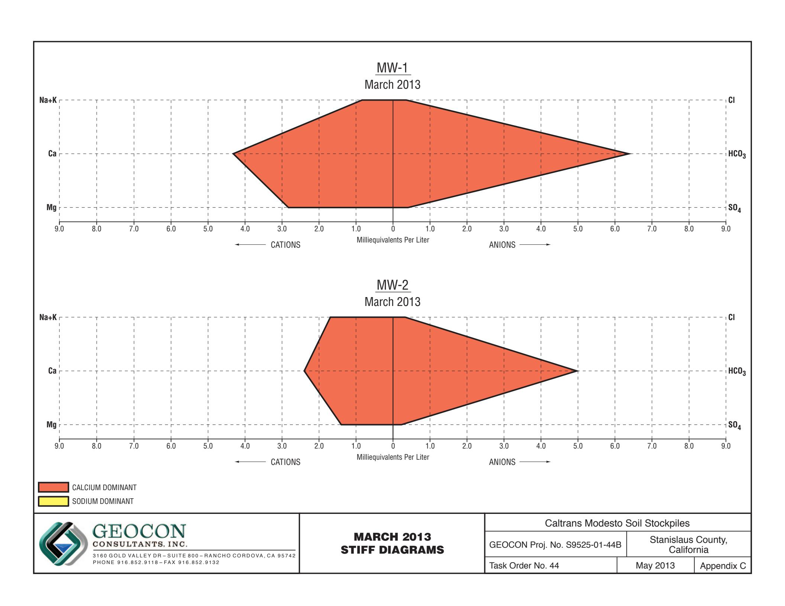

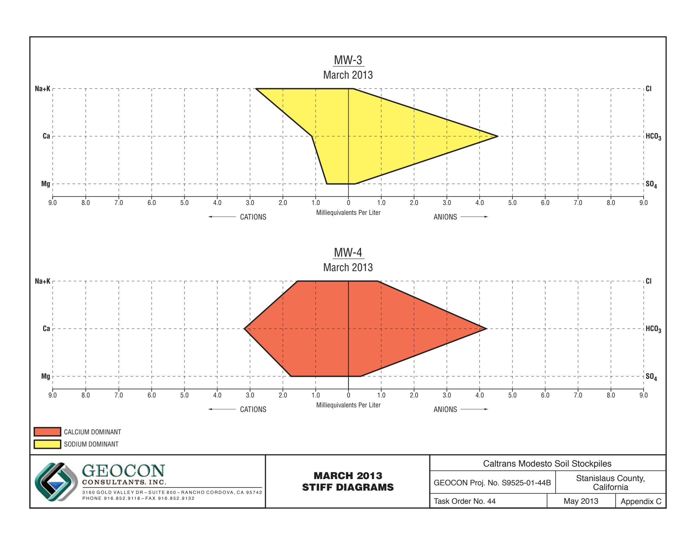

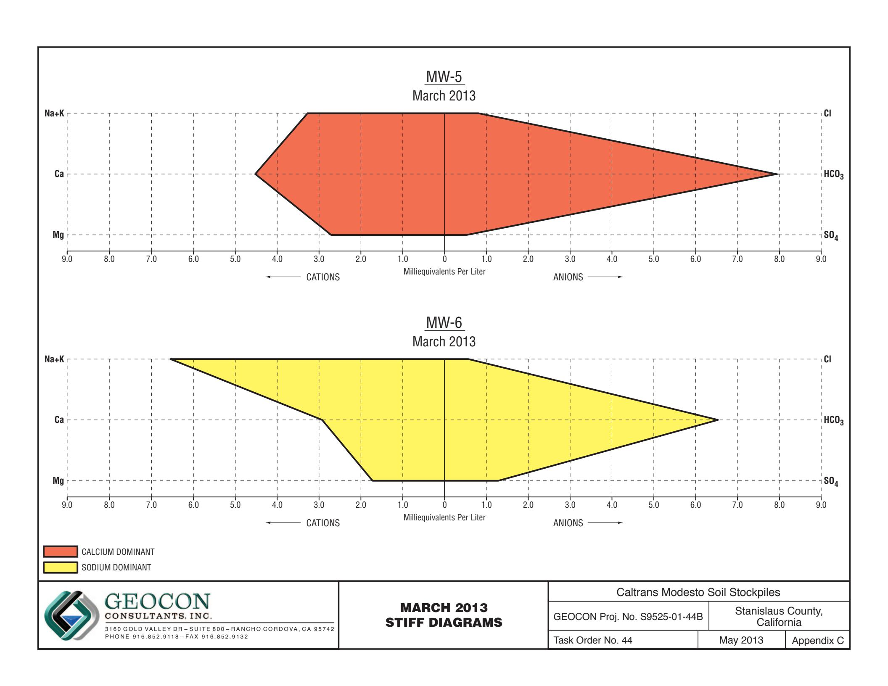

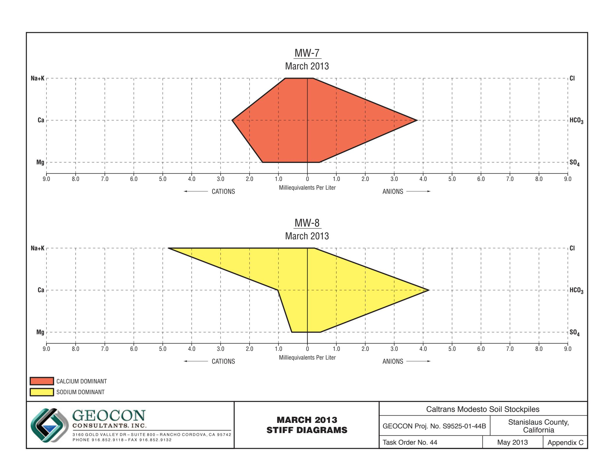

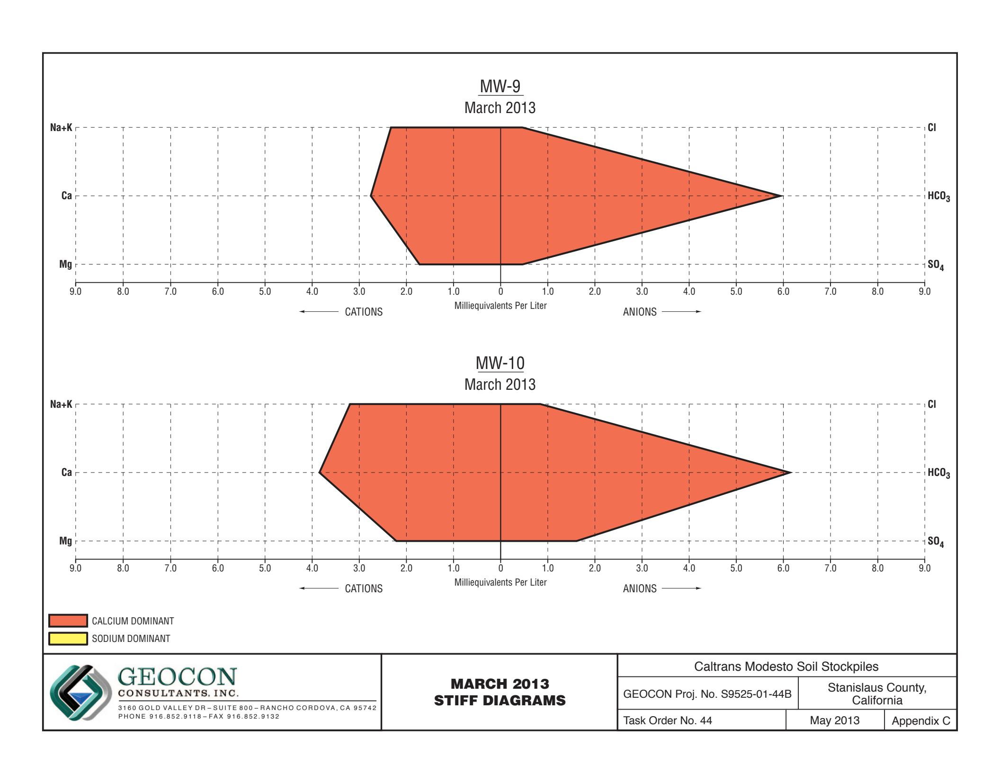