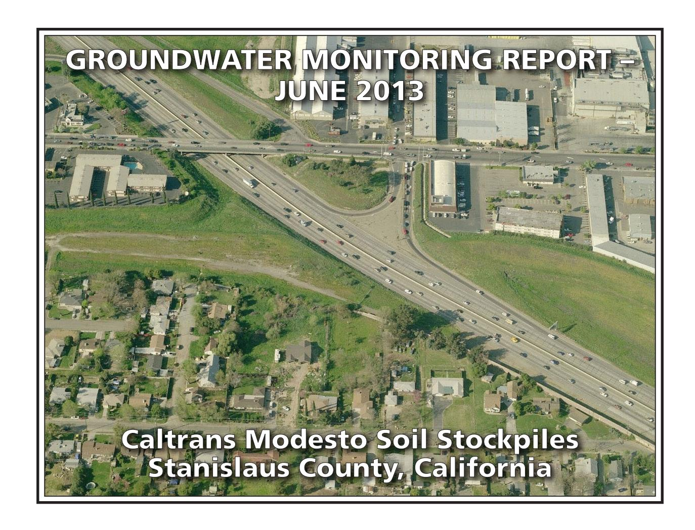

# PREPARED FOR:

CALIFORNIA DEPARTMENT OF TRANSPORTATION – DISTRICT 6
HAZARDOUS WASTE BRANCH
855 M STREET, SUITE 200
FRESNO, CALIFORNIA 93721

# PREPARED BY:

GEOCON CONSULTANTS, INC. 3160 GOLD VALLEY DRIVE, SUITE 800 RANCHO CORDOVA, CALIFORNIA 95742

GEOCON PROJECT NO. S9525-01-44B TASK ORDER NO. 44, EA 10-0X2700 CONTRACT NO 06A1580

Project No. S9525-01-44B June 27, 2013

Mr. Richard Stewart, PG California Department of Transportation - District 6 Hazardous Waste Branch 855 M Street, Suite 200 Fresno. California 93721

Subject: GROUNDWATER MONITORING REPORT – JUNE 2013

CALTRANS MODESTO SOIL STOCKPILES STANISLAUS COUNTY, CALIFORNIA

CONTRACT NO. 06A1580, TASK ORDER NO. 44, EA NO. 10-0X2700

Dear Mr. Stewart:

In accordance with California Department of Transportation (Caltrans) Contract No. 06A1580, Task Order (TO) No. 44, Geocon performed groundwater monitoring activities at the Caltrans Modesto Soil Stockpiles (Site) located southerly of the intersection of State Route (SR) 99 and Kansas Avenue in Stanislaus County, California. This report presents the results of the June 2013 sampling event. The approximate site location is depicted on the attached Vicinity Map, Figure 1. The approximate site boundaries and Stockpiles 1 through 3 are shown on the Site Plan, Figure 2.

The objective of TO No. 44 is to perform groundwater sampling and analysis at the Site in accordance with protocols approved by the California Environmental Protection Agency Department of Toxic Substances Control (DTSC) as established in the *Final Work Plan, Groundwater Assessment* prepared by Shaw Environmental, Inc., and dated January 2006. The scope of services reported herein included depth to groundwater measurements, groundwater sample collection from ten groundwater monitoring wells, analysis of the water samples by a California-certified laboratory, and preparation of this report.

# BACKGROUND

# Project Description and History

Stockpiles 1 through 3 were generated during construction of SR 99 through Modesto around 1961 when Caltrans excavated soil from property purchased from Food Machinery and Chemical Corporation (FMC) that contained an evaporation pond. The stockpiles were placed in their present location in anticipation of construction of the State Route 132 West Freeway/Expressway project.

During the 1930s, Barium Products Ltd. occupied property at 1200 Barium Road (now Graphics Drive) in Modesto just east of SR 99 between Woodland and Kansas Avenues. Barium Products Ltd. was a chemical manufacturing company processing a variety of ores and minerals including barite (barium sulfate) and celestite (strontium sulfate). Materials produced included barium and strontium compounds; these were used in greases, lubricating oil and pigment blanks. Sodium sulfide generated as a by-product of barite processing was sold as a caustic and used as a reagent in the mining industry.

In 1943, Barium Products Ltd. was purchased by Westvaco Chlorine Products Corporation which subsequently merged with FMC in 1948. From the 1950s to the 1970s, a liquid residue from the processing operations was discharged to unlined evaporation ponds along the western portion of the FMC Site. The approximate boundaries of the former evaporation/disposal ponds are shown on Figure 2.

In 1961, a 4.3–acre parcel at the southwestern corner of the FMC site was purchased by the State of California for highway right-of-way needed to construct SR 99. An aerial photograph from 1957 shows that a portion of the southernmost pond on the FMC property was within the area purchased for right-of-way.

Soil in and around the pond was excavated during construction of SR 99 and stockpiled within the current Caltrans right-of-way at the location of the future State Route 132 West Freeway/Expressway project. Three distinct stockpiles are present at the Site:

- Stockpile 1, located south of Kansas Avenue and west of North Emerald Avenue,
- Stockpile 2, located south of Kansas Avenue, between North Emerald Avenue and SR 99, and
- Stockpile 3, located south of Kansas Avenue and east of SR 99.

In 2006, Caltrans arranged for the installation of monitoring wells MW-1 through MW-8 at locations adjacent to the three stockpiles as shown on Figure 2. General groundwater chemistry analytical results from June and October 2006 groundwater events suggested that two distinct groundwater types are present beneath the Site. A survey of groundwater wells within a one-mile radius of the Site identified 43 existing or former wells; however, there were no active supply wells identified in the general (southeast) flow direction from the Site.

Groundwater monitoring was resumed for the Site with the March 2012 sampling of wells MW-1 through MW-8. Representatives from the DTSC observed the sample collection procedures and collected split samples which were submitted to an alternate laboratory. No notable differences in the concentrations for each reported analyte were evident.

In June 2012, Geocon arranged for the installation of monitoring wells MW-9 and MW-10 at locations that are both upgradient and adjacent to the three stockpiles as shown on Figure 2.

Geocon compared the analytical results from the eight recent groundwater sampling events (March, May, June, July, September and November 2012 and January and March 2013) to the following water quality threshold values:

- Primary Maximum Contaminant Levels (MCLs) promulgated by the California Department of Public Health (CDPH); and
- Secondary MCLs promulgated by the CDPH.

The results of the groundwater sampling events show that both dissolved metals and general minerals have predominantly been reported at concentrations less than their respective numeric water quality threshold values. Only nitrates (expressed as nitrogen) in MW-1, MW-5, MW-6, and MW-10 and total dissolved solids (TDS) in wells MW-5, MW-6, and MW-10 have been consistently reported at concentrations that exceed their respective primary or secondary MCLs of 10 and 500 milligrams per liter (mg/l). Manganese has been sporadically reported for various wells at concentrations exceeding the secondary MCL; however, the concentrations have not been consistently elevated for any one well.

Based on the lack of polycyclic aromatic hydrocarbons (PAHs) reported for each of the samples analyzed, we requested discontinuation of analysis for PAHs. PAH analysis was discontinued after the November 2012 sampling event with concurrence from the DTSC.

# Hydrogeologic Characterization

The hydrogeology of the adjacent FMC site has been characterized by numerous studies since the early 1980s. The GeoTrans January 2005 report *Addendum to Comprehensive Remedial Investigations Report, FMC Corporation, 1200 Graphics Drive, Modesto, Stanislaus County, California* (GeoTrans, 2005) provides a description of the FMC site hydrogeology. This description follows:

"The site is underlain by laterally discontinuous and unconsolidated sand and silty sand associated with the Modesto and Riverbank Formations. First encountered groundwater is approximately 30 feet below ground surface (bgs) under confined to semi-confined conditions. A deeper aquifer is present at a depth of 165 feet bgs and separated from the upper zone by a blue clay aquitard. The upper water bearing unit has been divided into two zones: a shallow zone from first encountered groundwater to 120 feet bgs and a deeper zone from 140 feet bgs to the top of the aquitard. Groundwater flow within the upper zone is toward the southeast under a gradient of 0.002 ft/ft."

Monitoring wells MW-1 through MW-10 were installed into the unconsolidated sand, silty sand and silt layers within the Modesto Formation underlying the Site. The wells were completed within the shallow zone of the upper aquifer (shallow zone).

The lithology encountered in the borings for the wells includes interbedded (laterally discontinuous) sands, silts, and clays. In the areas investigated, the unsaturated (vadose) zone was dominated by silty soils. The shallow zone groundwater beneath the stockpiles was encountered at approximately 35 feet (elevation approximately 50 feet) under unconfined to semi-confined conditions. Based on historical depth to water measurements from the Site, the groundwater flow direction in the shallow upper aquifer is generally toward the southeast with hydraulic gradients varying from 0.0006 to 0.001. The shallow aquifer conditions beneath the Site and the adjacent FMC site appear similar and representative of conditions in the local area.

# JUNE 2013 FIELD ACTIVITIES

This section describes the field activities performed for the June 2013 monitoring event.

# Depth to Groundwater Measurements

On June 5, 2013, prior to opening the wells, Geocon observed each of the ten well boxes for signs of potential tampering. No signs of tampering were observed. The security well boxes and casing caps were noted to be properly sealed and locked. Geocon measured the depth to groundwater and the dissolved oxygen (DO) levels and oxygen-reduction potential (ORP) in monitoring wells MW-1 through MW-10 using a battery-operated water level meter, a Hanna Model No. 9143 DO meter, and an Oakton ORP meter. Depth to water measurements were obtained from a surveyed reference point at the top of the well casings (TOC).

In June 2013, depth to groundwater at the Site ranged from 31.73 (MW-1) to 40.11 (MW-5) feet below TOC. Based on the groundwater elevation data, the groundwater flow is toward the east-southeast at an average gradient of 0.0005, which is generally consistent with historical flow. A gradient rose diagram depicting historical flow direction and gradient is included on Figure 3. A summary of the TOC elevations, depth to groundwater measurements and groundwater elevations is on Table 1. Groundwater elevation contours, flow direction and gradient are depicted on Figure 3, Groundwater Elevation and Ionic Composition Map – June 2013.

# Well Purging and Sampling

On June 5 and 6, 2013, Geocon purged approximately three well volumes of water (2 to 6.5 gallons) from groundwater monitoring wells MW-1 through MW-4 and MW-7 through MW-10 using a submersible pump or disposable bailer. Wells MW-5 and MW-6 went dry after purging 1 gallon and 1.75 gallons, respectively. Geocon allowed both wells to recover, purged an additional 1 gallon from well MW-5 and 2.5 gallons from MW-6, allowed both wells to recover a second time, and then collected a groundwater sample from MW-6. Geocon purged an additional 1 gallon from MW-5, allowed it to recover a third time, and then collected a groundwater sample from it. Well MW-5 was also redeveloped using a surge block for 15 minutes between each purging event in an attempt to clear the well screen and remove sediment from the well. The pump was decontaminated before and after each use by washing in an AlconoxTM solution followed by fresh and distilled water rinses. During the well purging activities, the groundwater was monitored for pH, electrical conductivity, temperature and turbidity. This information is included on the Monitoring Well Sampling Data sheets in Appendix A.

Following well purging, groundwater samples were collected from each of the wells using disposable bailers and decanted through slow emptying devices into laboratory-provided sample containers. The groundwater samples collected for dissolved metals analysis were filtered using a hand-pressure pump through a 0.45-micron filter while filling the container. The samples were sealed, labeled, placed in a chilled cooler and subsequently transported to the laboratory using chain-of-custody protocol.

Purged groundwater was placed into one Department of Transportation-approved, 17-H, 55-gallon drum and transported offsite to Geocon's Rancho Cordova office pending receipt of analytical results and subsequent disposal at Inviro-tec Disposal in Lincoln, California, on June 10, 2013.

# ANALYTICAL METHODS AND RESULTS

# Laboratory Analysis

The groundwater samples were delivered to Advanced Technology Laboratories (ATL) for the following analyses under chain-of-custody protocol:

- Title 22 dissolved metals (including strontium) following United States Environmental Protection Agency (EPA) Test Methods 6020/7470;
- Dissolved calcium, magnesium, potassium and sodium by EPA Test Method 6020;
- Chloride, nitrate as nitrogen and sulfate by EPA Test Method 300.0;
- Sulfide by Standard Method (SM) 4500;
- TDS by SM 2540C; and
- Total alkalinity, bicarbonate alkalinity, carbonate alkalinity by SM 2320B.

Groundwater analytical results for this monitoring event are summarized on Tables 2 and 3. The laboratory reports and chain-of-custody documentation are in Appendix B.

## **Analytical Results**

### **Dissolved Metals**

Analytical results for dissolved metals along with their associated numeric water quality thresholds are summarized on Table 2. Plots of barium, lead and strontium concentrations vs. time are presented as Figures 4 through 6.

DTSC has identified barium, lead and strontium as the primary chemicals of concern in groundwater for the Site. For the June 2013 groundwater samples, barium and strontium were reported for each of the ten groundwater samples. Lead was not reported at concentrations equal to or greater than the respective practical quantitation limit (PQL) in samples from each well. The ranges of barium and strontium concentrations reported for the June sampling event are in the following table:

|                                        | Barium (µg/l)   | Strontium (µg/l)       |
|----------------------------------------|-----------------|------------------------|
| High Concentration                     | 230 (MW-5)      | 1,000 (MW-1 and MW-10) |
| Low Concentration                      | 45 (MW-3)       | 250 (MW-8)             |
| <b>Numeric Water Quality Threshold</b> | 1,000(1)/700(2) | 4,000(2)               |

(1) = California Department of Public Health Primary MCL for Drinking Water

Beryllium, cadmium, silver, thallium, zinc and mercury were not reported at concentrations equal to or greater than their respective PQLs in samples from each well. As shown in the following table, the dissolved metals arsenic, chromium and vanadium were reported for each of the samples collected with the following ranges:

|                                 | Arsenic (µg/l) | Chromium (µg/l) | Vanadium (µg/l) |
|---------------------------------|-------------------|--------------------|--------------------|
| High Concentration              | 4.8 (MW-3)     | 7.5 (MW-6)      | 35 (MW-6)       |
| Low Concentration               | 2.0 (MW-4)     | 0.77 (MW-10)    | 17 (MW-5)       |
| Numeric Water Quality Threshold | 10(1)             | 50(1)              | 50(3)              |

(1) = California Department of Public Health Primary Maximum Contaminant Level for Drinking Water

(2) = EPA Drinking Water Health Advisory

(3) = California Department of Public Health Regulatory Action Level

 $\mu g/l = Micrograms per liter$ 

(2) = EPA Drinking Water Health Advisory

(3) = California Department of Public Health Notification Level for Drinking Water

Although concentrations of arsenic, barium, chromium, strontium and vanadium were reported for the samples collected from each well, none of the reported concentrations exceed their respective numeric water quality thresholds for drinking water.

Nickel was reported for nine of the ten samples collected, selenium was reported for eight of the ten samples collected, and molybdenum was reported for seven of the ten samples collected. Copper was reported for three of the ten samples collected, antimony was reported for two of the ten samples collected, and cobalt and manganese were reported for one of the ten samples collected. The following table summarizes the dissolved antimony, cobalt, copper, manganese, molybdenum, nickel and selenium concentrations reported for the listed samples:

|                                 | Antimony (μg/l) | Cobalt (µg/l) | Copper (µg/l)      | Manganese (μg/l) | Molybdenum (μg/l) | Nickel (µg/l) | Selenium (µg/l) |
|---------------------------------|--------------------|------------------|-----------------------|---------------------|----------------------|------------------|--------------------|
| High Concentration              | 0.61 (MW-5)     | 0.56 (MW-2)   | 1.6 (MW-5)         | 17 (MW-2)        | 5.0 (MW-6)        | 3.6 (MW-2)    | 3.8 (MW-10)     |
| Low Concentration               | 0.56 (MW-7)     | 0.56 (MW-2)   | 1.1 (MW-4)         | 17 (MW-2)        | 0.60 (MW-1)       | 1.1 (MW-6)    | 0.53 (MW-4)     |
| Numeric Water Quality Threshold | 6(1)               | --               | 1,000(2)/ 1,300(4) | 50(2)               | --                   | 100(1)           | 50(1)              |

(1) = California Department of Public Health Primary Maximum Contaminant Level for Drinking Water

Although concentrations of antimony, cobalt, copper, manganese, molybdenum, nickel and selenium were reported for the samples collected from site monitoring wells, none of the reported concentrations exceed their respective numeric water quality thresholds for drinking water.

### **General Minerals/Stiff Diagrams**

To further characterize the geochemistry of the groundwater, general minerals analyses were conducted and included the following constituents:

- dissolved calcium
- dissolved magnesium
- chloride
- nitrate as nitrogen
- sulfate
- dissolved potassium
- dissolved sodium
- sulfide
- total alkalinity
- TDS

General groundwater chemistry provides information regarding the origin and geochemical nature of the groundwater sampled. The analytical results for the major cation (dissolved sodium, potassium, calcium and magnesium) and anion species (chloride, bicarbonate alkalinity reported as calcium carbonate, and sulfate) were used to create Stiff diagrams. Stiff diagrams provide a graphical display of ionic content and can be used to characterize and evaluate the relative composition of groundwater and its consistency or

(2) = California Department of Public Health Secondary Maximum Contaminant Level (taste and odor)

(3) = EPA Drinking Water Health Advisory

(4) = California Department of Public Health Regulatory Action Level

variability. Groundwater with different cation/anion concentrations will result in Stiff diagrams of different shapes and sizes. Stiff diagrams can also help to illustrate mixing of water with different compositions or origins. The presence of more than one water type can be an indication of influences due to hydrogeologic variation or from other sources including man-made impacts.

Appendix C contains Stiff diagrams constructed using site groundwater data for June 2013. The diagrams show that groundwater sampled in each monitoring well is bicarbonate (HCO3) dominant. However, variations in the sodium and potassium (Na+K) and calcium composition are readily apparent. The variations are seen primarily in the sodium content with the potassium concentrations being less variable. In June 2013, the samples from wells MW-1, MW-2, MW-4, MW-5, MW-7, MW-9 and MW-10 had a calcium-dominant composition while the samples from wells MW-3, MW-6 and MW-8 were sodium-dominant.

Nitrate as nitrogen and TDS were both reported for each of the groundwater samples, with nitrate as nitrogen concentrations ranging from 3.3 (MW-3) to 20 mg/l (MW-6 and MW-10) and TDS concentrations ranging from 340 (MW-7) to 620 mg/l (MW-6 and MW-10). The reported nitrate concentrations for samples from MW-1, MW-5, MW-6, MW-9 and MW-10 exceed the primary MCL for nitrate of 10 mg/l, and the reported TDS concentrations for samples from MW-1, MW-5, MW-6 and MW-10 exceed the secondary MCL for TDS of 500 mg/l. Noteworthy is that MW-1 is an upgradient monitoring well; thus, the reported nitrate and TDS concentrations of 12 and 520 mg/l, respectively, may be indicative of natural background nitrate and TDS concentrations for the shallow groundwater in the vicinity of the Site. Sulfide was reported for six of the ten samples with concentrations ranging from 0.020 (MW-6) to 0.35 mg/l (MW-10).

The analytical results for general minerals are summarized on Table 3.

#### Field and Laboratory Quality Assurance/Quality Control

The field quality assurance/quality control (QA/QC) implemented for the June 2013 groundwater monitoring at the Site included the collection of an equipment blank which was analyzed for dissolved metals. The blank was collected by pouring distilled water over a decontaminated pump and allowing the water to collect into the laboratory-provided sample container. Dissolved metals were not reported at concentrations equal to or greater than their respective PQLs for the equipment blank, with the exception of nickel at  $1.8~\mu g/l$ . The nickel concentrations reported for the samples appeared similar to those previously reported for each of the wells; therefore, it does not appear that the presence of nickel in the equipment blank has significantly influenced the sample results.

Geocon also reviewed the analytical laboratory QA/QC provided with the laboratory report. These data show that the method blank surrogate recoveries are acceptable and that concentrations of selected analytes were not reported at concentrations equal to or greater than their respective PQLs for each method blank for each analysis. Appropriate recoveries were noted for each laboratory control sample for each analysis. Several matrix spike/matrix spike duplicate (MS/MSD) analytes had recoveries or relative percent differences outside of laboratory control limits; however, the sample results were validated by the laboratory control samples. No qualification of the data is necessary, and the data are considered of sufficient quality for the purposes of this report.

# GeoTracker Submittal

The laboratory prepared electronic data files for submittal to the State Water Resources Control Board GeoTracker database. The GeoTracker database is accessible via the GeoTracker website at <a href="http://geotracker.waterboards.ca.gov">http://geotracker.waterboards.ca.gov</a>. The electronic data was uploaded to GeoTracker on June 27, 2013. The confirmation numbers are 4870995700, 4151063442, and 3099016308.

# CONCLUSIONS AND RECOMMENDATIONS

None of the reported dissolved metals concentrations for the groundwater samples collected in June 2013 exceeded their respective numeric water quality threshold values.

With the exception of nitrate, none of the reported general minerals for the groundwater samples collected in June 2013 exceeded their respective California primary MCLs. TDS was reported at concentrations exceeding the secondary MCL of 500 mg/l for the samples collected from wells MW-1, MW-5, MW-6 and MW-10.

Barium and strontium were reported for the June 2013 groundwater samples at concentrations similar to historical levels and remained significantly less than their numeric water quality thresholds. The remaining dissolved metals were also reported at concentrations similar to historical levels. Lead was not reported at concentrations equal to or greater than the PQL of 1.0 µg/l in each of the groundwater samples.

Stiff diagrams for the 2012 through June 2013 groundwater sampling events show that very slight changes in ionic content have occurred since groundwater sampling resumed at the Site in March 2012. Water samples from wells MW-1, MW-2, MW-4, MW-5, MW-7 and MW-9 have consistently been reported as calcium-dominant, and those from wells MW-3, MW-6 and MW-8 as sodium-dominant. Groundwater monitoring is currently performed quarterly, with the next monitoring event scheduled for September 2013.

We appreciate the opportunity to provide our services on this project. Please contact us if you have any questions concerning the contents of this Report or if we may be of further service.

Sincerely,

GEOCON CONSULTANTS, INC.

Rebecca L. Silva Project Manager

- (1) Addressee
- (1) Caltrans, Sam Haack
- (1) DTSC, Randy Adams
- (1) CVRWQCB, Steve Meeks

Attachments:

Figure 1, Vicinity Map

Figure 2, Site Plan

Figure 3, Groundwater Elevation and Ionic Composition Map – June 2013

Figure 4, Barium Concentrations vs. Time

Figure 5, Lead Concentrations vs. Time

Figure 6, Strontium Concentrations vs. Time

Table 1, Groundwater Elevation Data

Table 2, Summary of Groundwater Analytical Results – Title 22 Metals (Dissolved)

Table 3, Summary of Groundwater Analytical Results – General Minerals and PAHs

Table 4, Well Construction Details

Appendix A, Monitoring Well Development and Sampling Data Sheets

Appendix B, Laboratory Reports and Chain-of-custody Documentation

Appendix C, Stiff Diagrams

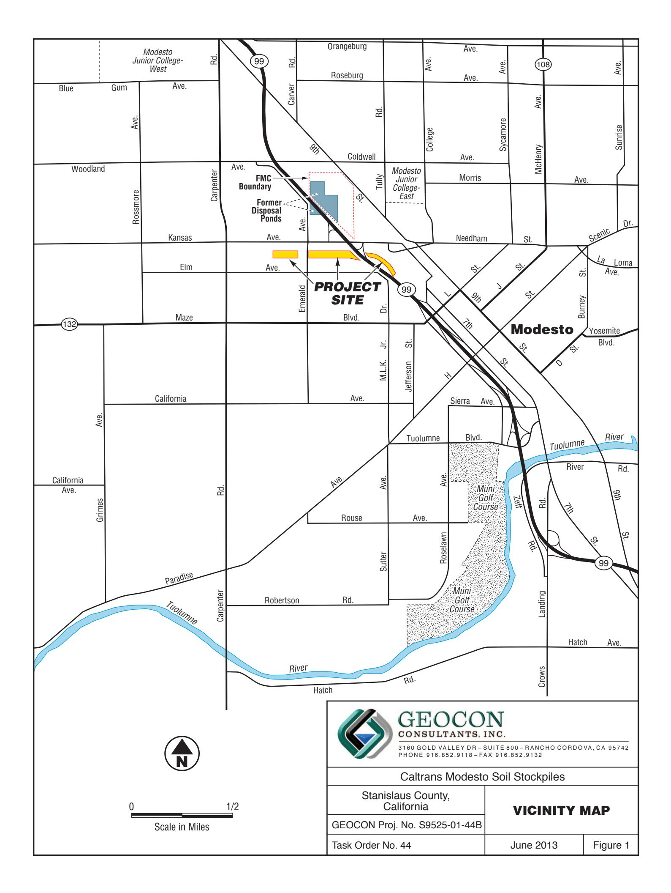

MW8 Approximate Monitoring Well Location

— State Right-of-Way Boundary

Scale in Feet

GEOCON CONSULTANTS, INC.

3160 GOLD VALLEY DR - SUITE 800 - RANCHO CORDOVA, CA 95742 PHONE 916.852.9118 - FAX 916.852.9132

Caltrans Modesto Soil Stockpiles

| Stanislaus County, |
|--------------------|
| California         |

**SITE PLAN** 

GEOCON Proj. No. S9525-01-44B Task Order No. 44

June 2013

Figure 2

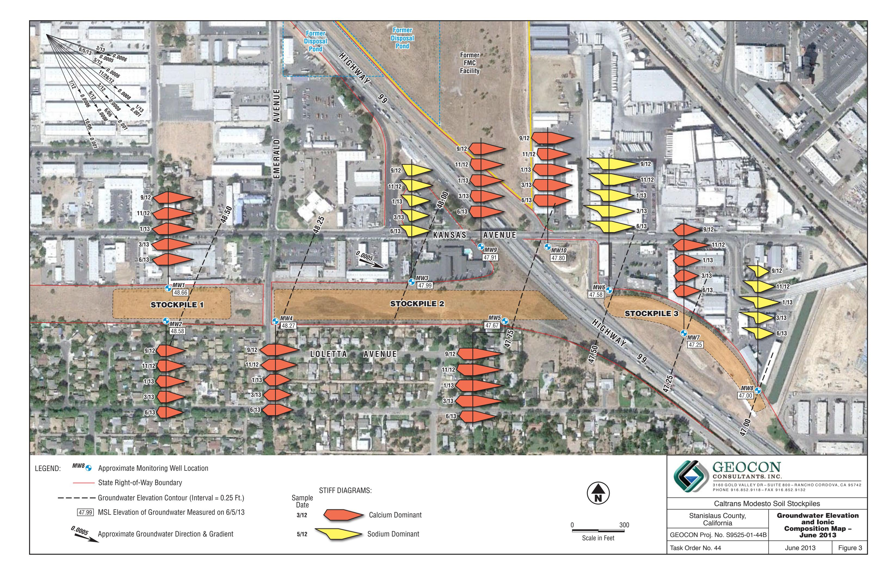

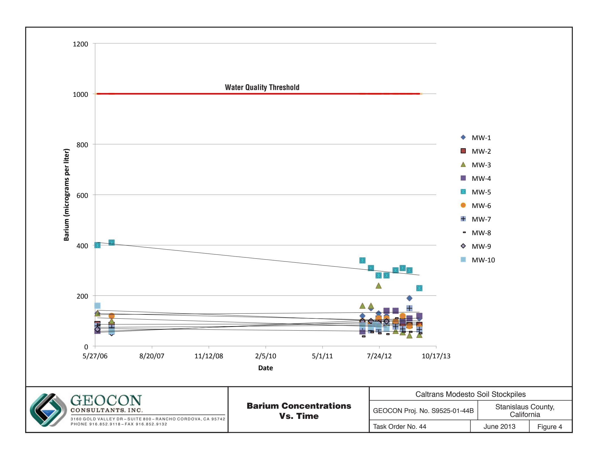

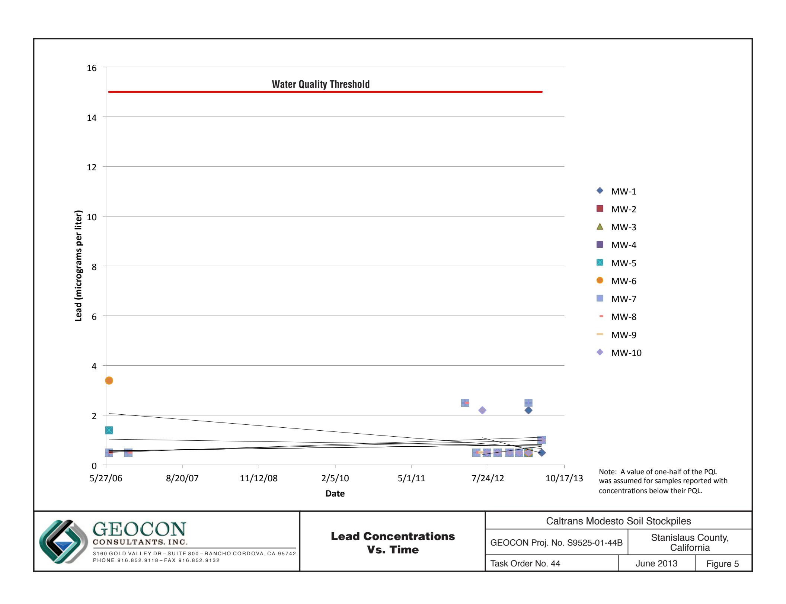

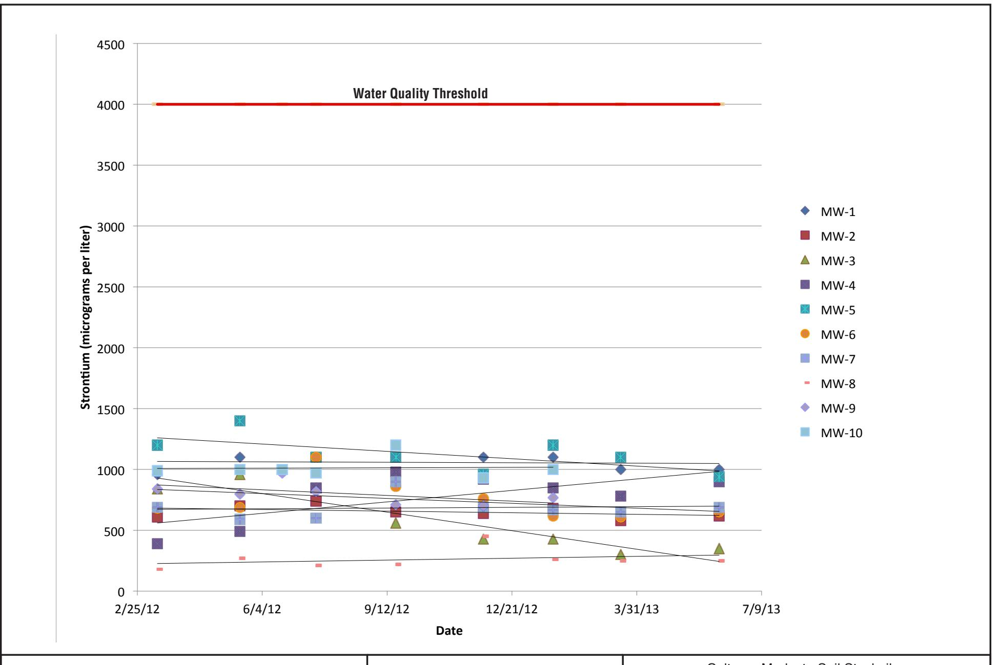

Strontium Concentrations Vs. Time

| Caltrans Modesto Soil Stockpiles |                                  |                                        |                                             |                                        |
|----------------------------------|----------------------------------|----------------------------------------|---------------------------------------------|----------------------------------------|
| GEOCON Proj. No. S9525-01-44B    | Stanislaus County, California |                                        |                                             |                                        |
| Task Order No. 44                | June 2013                        | Figure 6                               |                                             |                                        |
| STANISLAUS COUNTY, CALIFORNIA    |                                  |                                        |                                             |                                        |
| WELL ID                          | DATE                             | WELL CASING ELEVATION (feet MSL) | DEPTH TO GROUNDWATER (feet below TOC) | GROUNDWATER ELEVATION (feet MSL) |
| MW-1                             | 6/14/2006                        | 80.26                                  | 29.82                                       | 50.44                                  |
| MW-1                             | 10/5/2006                        | 80.26                                  | 32.35                                       | 47.91                                  |
| MW-1                             | 3/12/2012                        | 80.26                                  | 30.12                                       | 50.14                                  |
| MW-1                             | 5/17/2012                        | 80.26                                  | 29.74                                       | 50.52                                  |
| MW-1                             | 7/17/2012                        | 80.39                                  | 31.34                                       | 49.05                                  |
| MW-1                             | 9/19/2012                        | 80.39                                  | 32.73                                       | 47.66                                  |
| MW-1                             | 11/28/2012                       | 80.39                                  | 32.28                                       | 48.11                                  |
| MW-1                             | 1/22/2013                        | 80.39                                  | 31.04                                       | 49.35                                  |
| MW-1                             | 3/18/2013                        | 80.39                                  | 31.15                                       | 49.24                                  |
| MW-1                             | 6/5/2013                         | 80.39                                  | 31.73                                       | 48.66                                  |
| MW-2                             | 6/13/2006                        | 81.10                                  | 30.72                                       | 50.38                                  |
| MW-2                             | 10/5/2006                        | 81.10                                  | 33.35                                       | 47.75                                  |
| MW-2                             | 3/12/2012                        | 81.10                                  | 31.04                                       | 50.06                                  |
| MW-2                             | 5/17/2012                        | 81.10                                  | 30.69                                       | 50.41                                  |
| MW-2                             | 7/17/2012                        | 81.25                                  | 33.28                                       | 47.97                                  |
| MW-2                             | 9/19/2012                        | 81.25                                  | 33.70                                       | 47.55                                  |
| MW-2                             | 11/28/2012                       | 81.25                                  | 33.22                                       | 48.03                                  |
| MW-2                             | 1/22/2013                        | 81.25                                  | 31.97                                       | 49.28                                  |
| MW-2                             | 3/18/2013                        | 81.25                                  | 32.07                                       | 49.18                                  |
| MW-2                             | 6/5/2013                         | 81.25                                  | 32.67                                       | 48.58                                  |
| MW-3                             | 6/13/2006                        | 81.76                                  | 32.38                                       | 49.38                                  |
| MW-3                             | 10/5/2006                        | 81.76                                  | 34.88                                       | 46.88                                  |
| MW-3                             | 3/12/2012                        | 81.76                                  | 32.35                                       | 49.41                                  |
| MW-3                             | 5/17/2012                        | 81.76                                  | 31.91                                       | 49.85                                  |
| MW-3                             | 7/17/2012                        | 81.82                                  | 33.45                                       | 48.37                                  |
| MW-3                             | 9/19/2012                        | 81.82                                  | 34.89                                       | 46.93                                  |
| MW-3                             | 11/28/2012                       | 81.82                                  | 34.69                                       | 47.13                                  |
| MW-3                             | 1/22/2013                        | 81.82                                  | 33.43                                       | 48.39                                  |
| MW-3                             | 3/18/2013                        | 81.82                                  | 33.42                                       | 48.40                                  |
| MW-3                             | 6/5/2013                         | 81.82                                  | 33.83                                       | 47.99                                  |
| MW-4                             | 6/13/2006                        | 82.36                                  | 32.39                                       | 49.97                                  |
| MW-4                             | 10/4/2006                        | 82.36                                  | 35.05                                       | 47.31                                  |
| MW-4                             | 3/12/2012                        | 82.36                                  | 32.60                                       | 49.76                                  |
| MW-4                             | 5/17/2012                        | 82.36                                  | 32.20                                       | 50.16                                  |
|                                  |                                  | WELL CASING ELEVATION (feet MSL)       | DEPTH TO GROUNDWATER (feet below TOC)       | GROUNDWATER ELEVATION (feet MSL)       |
| WELL ID                          | DATE                             |                                        |                                             |                                        |
| MW-4                             | 7/17/2012                        | 82.47                                  | 33.86                                       | 48.61                                  |
| MW-4                             | 9/19/2012                        | 82.47                                  | 35.28                                       | 47.19                                  |
| MW-4                             | 11/28/2012                       | 82.47                                  | 34.84                                       | 47.63                                  |
| MW-4                             | 1/22/2013                        | 82.47                                  | 33.60                                       | 48.87                                  |
| MW-4                             | 3/18/2013                        | 82.47                                  | 33.65                                       | 48.82                                  |
| MW-4                             | 6/5/2013                         | 82.47                                  | 34.20                                       | 48.27                                  |
| MW-5                             | 6/14/2006                        | 87.73                                  | 38.79                                       | 48.94                                  |
| MW-5                             | 10/5/2006                        | 87.73                                  | 41.40                                       | 46.33                                  |
| MW-5                             | 3/12/2012                        | 87.73                                  | 38.74                                       | 48.99                                  |
| MW-5                             | 5/17/2012                        | 87.73                                  | 38.25                                       | 49.48                                  |
| MW-5                             | 7/17/2012                        | 87.78                                  | 39.74                                       | 48.04                                  |
| MW-5                             | 9/19/2012                        | 87.78                                  | 41.19                                       | 46.59                                  |
| MW-5                             | 11/28/2012                       | 87.78                                  | 41.18                                       | 46.60                                  |
| MW-5                             | 1/22/2013                        | 87.78                                  | 40.02                                       | 47.76                                  |
| MW-5                             | 3/18/2013                        | 87.78                                  | 39.62                                       | 48.16                                  |
| MW-5                             | 6/5/2013                         | 87.78                                  | 40.11                                       | 47.67                                  |
| MW-6                             | 6/14/2006                        | 84.37                                  | 36.35                                       | 48.02                                  |
| MW-6                             | 10/5/2006                        | 84.37                                  | 38.55                                       | 45.82                                  |
| MW-6                             | 3/12/2012                        | 84.37                                  | 35.70                                       | 48.67                                  |
| MW-6                             | 5/17/2012                        | 84.37                                  | 35.18                                       | 49.19                                  |
| MW-6                             | 7/17/2012                        | 84.52                                  | 36.40                                       | 48.12                                  |
| MW-6                             | 9/19/2012                        | 84.52                                  | 37.99                                       | 46.53                                  |
| MW-6                             | 11/28/2012                       | 84.52                                  | 38.19                                       | 46.33                                  |
| MW-6                             | 1/22/2013                        | 84.52                                  | 37.07                                       | 47.45                                  |
| MW-6                             | 3/18/2013                        | 84.52                                  | 36.78                                       | 47.74                                  |
| MW-6                             | 6/5/2013                         | 84.52                                  | 36.94                                       | 47.58                                  |
| MW-7                             | 6/14/2006                        | 83.64                                  | 35.59                                       | 48.05                                  |
| MW-7                             | 10/4/2006                        | 83.64                                  | 38.32                                       | 45.32                                  |
| MW-7                             | 3/12/2012                        | 83.64                                  | 35.31                                       | 48.33                                  |
| MW-7                             | 5/17/2012                        | 83.64                                  | 34.72                                       | 48.92                                  |
| MW-7                             | 7/17/2012                        | 83.74                                  | 36.00                                       | 47.74                                  |
| MW-7                             | 9/19/2012                        | 83.74                                  | 37.60                                       | 46.14                                  |
| MW-7                             | 11/28/2012                       | 83.74                                  | 37.35                                       | 46.39                                  |
| MW-7                             | 1/22/2013                        | 83.74                                  | 36.78                                       | 46.96                                  |
| WELL ID                          | DATE                             | WELL CASING ELEVATION (feet MSL) | DEPTH TO GROUNDWATER (feet below TOC) | GROUNDWATER ELEVATION (feet MSL) |
| MW-7                             | 3/18/2013                        | 83.74                                  | 36.42                                       | 47.32                                  |
| MW-7                             | 6/5/2013                         | 83.74                                  | 36.49                                       | 47.25                                  |
| MW-8                             | 6/14/2006                        | 83.73                                  | 36.12                                       | 47.61                                  |
| MW-8                             | 10/4/2006                        | 83.73                                  | 38.95                                       | 44.78                                  |
| MW-8                             | 3/12/2012                        | 83.73                                  | 35.75                                       | 47.98                                  |
| MW-8                             | 5/17/2012                        | 83.73                                  | 35.11                                       | 48.62                                  |
| MW-8                             | 7/17/2012                        | 83.85                                  | 36.29                                       | 47.56                                  |
| MW-8                             | 9/19/2012                        | 83.85                                  | 38.04                                       | 45.81                                  |
| MW-8                             | 11/28/2012                       | 83.85                                  | 38.37                                       | 45.48                                  |
| MW-8                             | 1/22/2013                        | 83.85                                  | 37.35                                       | 46.50                                  |
| MW-8                             | 3/18/2013                        | 83.85                                  | 36.90                                       | 46.95                                  |
| MW-8                             | 6/5/2013                         | 83.85                                  | 36.85                                       | 47.00                                  |
| MW-9                             | 6/18/2012                        | 82.53                                  | 33.67                                       | 48.86                                  |
| MW-9                             | 7/17/2012                        | 82.53                                  | 34.22                                       | 48.31                                  |
| MW-9                             | 9/19/2012                        | 82.53                                  | 35.64                                       | 46.89                                  |
| MW-9                             | 11/28/2012                       | 82.53                                  | 35.65                                       | 46.88                                  |
| MW-9                             | 1/22/2013                        | 82.53                                  | 34.35                                       | 48.18                                  |
| MW-9                             | 3/18/2013                        | 82.53                                  | 34.29                                       | 48.24                                  |
| MW-9                             | 6/5/2013                         | 82.53                                  | 34.62                                       | 47.91                                  |
| MW-10                            | 6/18/2012                        | 83.97                                  | 35.18                                       | 48.79                                  |
| MW-10                            | 7/17/2012                        | 83.97                                  | 35.75                                       | 48.22                                  |
| MW-10                            | 9/19/2012                        | 83.97                                  | 37.18                                       | 46.79                                  |
| MW-10                            | 11/28/2012                       | 83.97                                  | 37.34                                       | 46.63                                  |
| MW-10                            | 1/22/2013                        | 83.97                                  | 36.13                                       | 47.84                                  |
| MW-10                            | 3/18/2013                        | 83.97                                  | 35.97                                       | 48.00                                  |
| MW-10                            | 6/5/2013                         | 83.97                                  | 36.17                                       | 47.80                                  |

TABLE 1 GROUNDWATER ELEVATION DATA CALTRANS MODESTO SOIL STOCKPILES STANISLAUS COUNTY, CALIFORNIA

TABLE 1 GROUNDWATER ELEVATION DATA CALTRANS MODESTO SOIL STOCKPILES STANISLAUS COUNTY, CALIFORNIA

TABLE 1
GROUNDWATER ELEVATION DATA
CALTRANS MODESTO SOIL STOCKPILES
STANISLAUS COUNTY, CALIFORNIA

Notes:

MSL = Mean sea level

TOC = Top of well casing

Data prior to 3/12/2012 reproduced from *Site Investigation Report, Groundwater Assessment, Caltrans Modesto Soil Stockpiles State Route 99/132 Project, Stanislaus County, California,* Shaw Environmental, Inc., May 14, 2007.

Wells resurveyed by Morrow Surveying on June 18, 2012.

# SUMMARY OF GROUNDWATER ANALYTICAL RESULTS - TITLE 22 METALS (DISSOLVED) CALTRANS MODESTO SOIL STOCKPILES

|                                                              |                                                                                                                                                                                                                  |                                                                                                                                           |                                                                                                                |                                                                                                                        |                                                                                                                             |                                                                                                                                          |                                                                                                                        | STANISLA                                                                                                                  | OS COUN                                                                                                                       | III, CALI                                                                | TOKNIA                                                     |                                                                                |                                                                                                                  |                                                                                                           |                                                                                                                                                      |                                                                                                                                   |                                                                                                              |                                                                                                          |                                                                                                           |                                                                                                                      |
|--------------------------------------------------------------|------------------------------------------------------------------------------------------------------------------------------------------------------------------------------------------------------------------|-------------------------------------------------------------------------------------------------------------------------------------------|----------------------------------------------------------------------------------------------------------------|------------------------------------------------------------------------------------------------------------------------|-----------------------------------------------------------------------------------------------------------------------------|------------------------------------------------------------------------------------------------------------------------------------------|------------------------------------------------------------------------------------------------------------------------|---------------------------------------------------------------------------------------------------------------------------|-------------------------------------------------------------------------------------------------------------------------------|--------------------------------------------------------------------------|------------------------------------------------------------|--------------------------------------------------------------------------------|------------------------------------------------------------------------------------------------------------------|-----------------------------------------------------------------------------------------------------------|------------------------------------------------------------------------------------------------------------------------------------------------------|-----------------------------------------------------------------------------------------------------------------------------------|--------------------------------------------------------------------------------------------------------------|----------------------------------------------------------------------------------------------------------|-----------------------------------------------------------------------------------------------------------|----------------------------------------------------------------------------------------------------------------------|
| ANALYTE                                                      |                                                                                                                                                                                                                  | Antimony                                                                                                                                  | Arsenic                                                                                                        | Barium                                                                                                                 | Beryllium                                                                                                                   | Cadmium                                                                                                                                  | Chromium                                                                                                               | Cobalt                                                                                                                    | Copper                                                                                                                        | Lead                                                                     | Manganese                                                  | Molybdenum                                                                     | Nickel                                                                                                           | Selenium                                                                                                  | Silver                                                                                                                                               | Thallium                                                                                                                          | Vanadium                                                                                                     | Zinc                                                                                                     | Strontium                                                                                                 | Mercury                                                                                                              |
| SAMPLE ID                                                    | SAMPLE DATE                                                                                                                                                                                                   |                                                                                                                                           |                                                                                                                |                                                                                                                        |                                                                                                                             |                                                                                                                                          |                                                                                                                        |                                                                                                                           |                                                                                                                               | Results in                                                               | microgran                                                  | ns per lite                                                                    | r                                                                                                                |                                                                                                           |                                                                                                                                                      |                                                                                                                                   |                                                                                                              |                                                                                                          |                                                                                                           |                                                                                                                      |
| MW-1 MW-1 MW-1 MW-1 MW-1 MW-1 MW-1 MW-1 | 6/14/2006 10/5/2006 3/12/2012 3/12/2012 S 5/17/2012 7/16/2012 9/19/2012 11/28/2013 3/18/2013 6/5/2013 6/13/2006 10/5/2006 3/12/2012 S 5/17/2012 7/16/2012 9/19/2012 | <1.0 <1.0 <2.5 <10 <0.50 <b>0.51</b> <0.50 <0.50 <0.50 <0.50 <1.0 <2.5 <10 <0.50 <0.50 <0.50 | 2.1 2.2 <5.0 1.6 2.3 2.2 2.1 2.2 2.0 3.3 2.2 2.1 2.6 <5.0 <10 2.5 | 130 120 120 105 150 130 120 140 110 190 110 87 84 88 89.6 89 100 88 | <1.0 <1.0 <5.0 <5.0 <0.50 <0.50 <0.50 <0.50 <1.50 <1.0 <5.0 <0.50 <1.0 <5.0 <0.50 | <1.0 <1.0 <2.5 <b>0.6</b> <0.50 <0.50 <0.50 <0.50 <0.50 <1.0 <2.5 <b>0.4</b> <0.50 <0.50 <0.50 | 10 16 6.4 6.8 7.0 7.2 7.0 5.1 6.0 12 6.9 8.5 11 4.7 6.1 6.6 5.8 5.5 | <1.0 <1.0 <2.5 <5.0 1.0 <0.50 <0.50 <0.50 <0.50 <1.0 <1.0 <2.5 <5.0 <0.50 <0.50 | 1.1 2.0 <5.0 3.4 2.5 1.4 <1.0 <1.0 1.4 6.7 <1.0 1.2 U 1.7 <5.0 <5.0 <1.0 <1.0 | <1.0 <1.0 <1.0 <5.0 2 <1.0 <1.0 <1.0 <1.0 <1.0 <1.0 <1.0 <1.0 | 34 <1.0 <50 2.0 35 <10 <10 <10 <10 <10 <10 <10 <10 <10 <10 | 2.9 <2.0 <2.5 1.3 1.3 0.73 0.53 0.58 0.63 0.89 0.60  3.3 <2.0 <2.5 1.4 1.2 1.3 | 2.9 1.5 <5.0 <5.0 4.0 3.7 2.7 1.9 3.2 8.8 2.1 2.0 1.2 <5.0 <5.0 5.0 | <1.0 <1.0 <1.0 <2.5 <20 <b>0.62 0.60 0.56 0.61</b> <0.50 <0.50 <1.3 <1.0 <2.5 <20 <0.50 <0.50 <0.50 <0.50 | <1.0 <1.0 <2.5 <5.0 <0.50 <0.50 <0.50 <0.50 <0.50 <1.0 <2.5 <5.0 <0.50 <0.50 <1.0 <2.5 <5.0 <0.50 | <1.0 <1.0 <2.5 <20 <0.50 <0.50 <0.50 <0.50 <0.50 <1.0 <2.5 <b>4.6</b> <0.50 <0.50 <0.50 | 23 26 22 21.2 21 20 18 18 17 34 20 22 27 23 23.1 20 25 22 | <10 <10 <10 <50 <b>5.6</b> <10 <10 <10 <10 <b>23 77</b> <10 <10 <40 <40 <50 <b>3.7</b> <10 <b>49</b> <10 | 960 1,010 1,100 1,100 1,100 1,100 1,000 1,000  610 642 700 740 650 | <0.2 <0.2 0.41 <0.20 <0.20 <0.20 <0.20 <0.20 <0.20 <0.20 <0.20 <0.20 <0.20 <0.20 <0.20 <0.20 <0.20 <0.20 <0.20 <0.20 |
| MW-2 MW-2 MW-2 MW-2                                 | 11/28/2012 1/22/2013 3/18/2013 6/5/2013                                                                                                                                                                 | <0.50 <0.50 <0.50 <0.50                                                                                                          | 2.6 2.7 2.6 2.5                                                                                       | 88 87 83 84                                                                                                   | <0.50 <0.50 <1.0 <0.50                                                                                             | <0.50 <0.50 <0.50 <0.50                                                                                                         | 4.0 4.5 5.7 5.4                                                                                               | <0.50 <0.50 <0.50 <b>0.56</b>                                                                                    | <1.0 <1.0 <1.0 1.5                                                                                                   | <1.0 <1.0 <1.0 <1.0                                             | <10 <10 <10 17                                    | 0.95 1.1 0.86 0.95                                                    | 1.4 1.8 2.0 3.6                                                                                         | <0.50 <0.50 <0.50 <b>0.56</b>                                                                    | <0.50 <0.50 <0.50 <0.50                                                                                                                     | <0.50 <0.50 <0.50 <0.50                                                                                                  | 21 19 21 22                                                                                         | <10 <10 <10 <10                                                                                 | 640 680 580 620                                                                                  | <0.20 <0.20 <0.20 <0.20                                                                                     |
| MW-3 MW-3 MW-3 MW-3 MW-3 MW-3                 | 6/13/2006 10/5/2006 3/12/2012 3/12/2012 S 5/17/2012 7/16/2012 9/19/2012                                                                                                                        | <1.0 <1.0 <2.5 <10 <0.50 <0.50 <0.50                                                                                    | 3.0 3.3 <5.0 2.1 3.8 2.2 4.6                                                                 | 60 58 58 44.4 64 240 84                                                                              | <1.0 <1.0 <5.0 <b>0.1</b> <0.50 <0.50 <0.50                                                               | <1.0 <1.0 <2.5 <b>0.3</b> <0.50 <0.50 <0.50                                                                            | 7.1 7.9 4.4 4.0 3.7 6.5 4.7                                                                          | <1.0 <1.0 <2.5 <5.0 <0.50 <0.50 <b>1.3</b>                                                              | 1 U 1.5 <5.0 1.5 <1.0 5.2 1.9                                                                               | <1.0 <1.0 <5.0 2 <1.0 <1.0 <1.0             | 4.7 18 <50 1.8 <10 <10                      | <2.0 2.2 <2.5 0.9 1.4 0.56 1.1                                                 | 1.4 <1.0 <5.0 <5.0 1.1 4.3 2.8                                                                 | 1.4 <1.0 <2.5 <20 <0.50 <0.50 <0.50                                                                       | <1.0 <1.0 <2.5 <5.0 <0.50 <0.50 <0.50                                                                                              | <1.0 <1.0 <2.5 <20 <0.50 <0.50                                                                                     | 25 29 28 22.6 26 18 33                                                                     | <10 <10 <50 <b>4.5</b> <10 <b>48</b> <10                                               | 390 342 490 840 560                                                                           | <0.2 <0.2 <0.20  <0.20 <0.20 <0.20                                                                 |

# SUMMARY OF GROUNDWATER ANALYTICAL RESULTS - TITLE 22 METALS (DISSOLVED) CALTRANS MODESTO SOIL STOCKPILES

| ANALYTE | SAMPLE ID   | SAMPLE DATE | Results in micrograms per liter |         |        |           |         |          |        |        |      |           |            |        |          |        |          |          |       |           |         |  |  |
|---------|-------------|-------------|---------------------------------|---------|--------|-----------|---------|----------|--------|--------|------|-----------|------------|--------|----------|--------|----------|----------|-------|-----------|---------|--|--|
|         |             |             | Antimony                        | Arsenic | Barium | Beryllium | Cadmium | Chromium | Cobalt | Copper | Lead | Manganese | Molybdenum | Nickel | Selenium | Silver | Thallium | Vanadium | Zinc  | Strontium | Mercury |  |  |
| MW-3    | 11/28/2012  | <0.50       | 4.6                             | 60      | <0.50  | <0.50     | 3.5     | <0.50    | <1.0   | <1.0   | <10  | 1.5       | <1.0       | <0.50  | <0.50    | 29     | <10      | 430      | <0.20 |           |         |  |  |
| MW-3    | 1/22/2013   | <0.50       | 5.5                             | 55      | <0.50  | <0.50     | 3.5     | <0.50    | <1.0   | <1.0   | <10  | 2.0       | <1.0       | <0.50  | <0.50    | 31     | <10      | 430      | <0.20 |           |         |  |  |
| MW-3    | 3/18/2013   | <0.50       | 5.2                             | 43      | <1.0   | <0.50     | 3.8     | <0.50    | <1.0   | <1.0   | <10  | 1.8       | <1.0       | <0.50  | <0.50    | 33     | <10      | 300      | <0.20 |           |         |  |  |
| MW-3    | 6/6/2013    | <0.50       | 4.8                             | 45      | <0.50  | <0.50     | 3.6     | <0.50    | <1.0   | <1.0   | <10  | 1.9       | 2.3        | <0.50  | <0.50    | 33     | <10      | 350      | <0.20 |           |         |  |  |
| MW-4    | 6/13/2006   | <1.0        | 1.8                             | 130     | <1.0   | <1.0      | 8.9     | <1.0     | 1.6 U  | <1.0   | 62   | 2.5       | 2.4        | <1.0   | <1.0     | <1.0   | 19       | <10      |       | <0.2      |         |  |  |
| MW-4    | 10/4/2006   | <1.0        | 2.1                             | 100     | <1.0   | <1.0      | 9.9     | <1.0     | 2.1    | <1.0   | 4.1  | <2.0      | <1.0       | <1.0   | <1.0     | 24     | <10      |          | <0.2  |           |         |  |  |
| MW-4    | 3/12/2012   | <2.5        | <5.0                            | 160     | <5.0   | <2.5      | 8.9     | <2.5     | <5.0   | <5.0   | 88   | <2.5      | 5.4        | <2.5   | <2.5     | <2.5   | 26       | <50      | 840   | 0.29      |         |  |  |
| MW-4    | 3/12/2012 S | <10         | 1.4                             | 134     | <5.0   | 0.4       | 7.7     | <5.0     | 0.9    | 2      | 0.7  | <5.0      | <5.0       | <2.3   | <5.0     | 3.5    | 19.3     | 3.5      | 812   |           |         |  |  |
| MW-4    | 5/17/2012   | <0.50       | 2.1                             | 160     | <0.50  | <0.50     | 6.6     | <0.50    | <1.0   | <1.0   | <10  | <0.50     | 1.7        | 0.62   | <0.50    | <0.50  | 18       | <10      | 960   | <0.20     |         |  |  |
| MW-4    | 7/16/2012   | <0.50       | 6.6                             | 110     | <0.50  | <0.50     | 6.6     | <0.50    | 1.1    | <1.0   | <10  | 2.4       | 3.2        | 0.55   | <0.50    | <0.50  | 42       | <10      | 850   | <0.20     |         |  |  |
| MW-4    | 9/19/2012   | <0.50       | 2.2                             | 140     | <0.50  | <0.50     | 7.0     | <0.50    | <1.0   | <1.0   | <10  | <0.50     | 2.6        | 0.78   | <0.50    | <0.50  | 18       | <10      | 980   | <0.20     |         |  |  |
| MW-4    | 11/28/2012  | <0.50       | 2.1                             | 140     | <0.50  | <0.50     | 5.2     | <0.50    | 1.0    | <1.0   | 11   | <0.50     | 2.3        | 0.54   | <0.50    | <0.50  | 18       | <10      | 920   | <0.20     |         |  |  |
| MW-4    | 1/22/2013   | <0.50       | 1.8                             | 100     | <0.50  | <0.50     | 5.0     | <0.50    | <1.0   | <1.0   | <10  | <0.50     | 1.9        | 0.59   | <0.50    | <0.50  | 15       | <10      | 850   | <0.20     |         |  |  |
| MW-4    | 3/18/2013   | <0.50       | 2.0                             | 110     | <0.50  | <0.50     | 5.7     | <0.50    | <1.0   | <1.0   | <10  | <0.50     | 2.3        | <0.50  | <0.50    | <0.50  | 17       | <10      | 780   | <0.20     |         |  |  |
| MW-4    | 6/5/2013    | <0.50       | 2.0                             | 120     | <0.50  | <0.50     | 5.7     | <0.50    | 1.1    | <1.0   | <10  | <0.50     | 3.5        | 0.53   | <0.50    | <0.50  | 19       | <10      | 900   | <0.20     |         |  |  |
| MW-5    | 6/14/2006   | <1.0        | 1.8                             | 400     | <1.0   | <1.0      | 9.6     | 2.2      | 4.8    | 1.4    | 260  | 9.9       | 7.1        | 2.0    | <1.0     | <1.0   | 23       | <10      |       | <0.2      |         |  |  |
| MW-5    | 10/5/2006   | <1.0        | 2.5                             | 410     | <1.0   | <1.0      | 18      | <1.0     | 1.9    | <1.0   | 120  | 14        | 3.4        | <1.0   | 2.1      | <1.0   | 24       | <10      |       | <0.2      |         |  |  |
| MW-5    | 3/12/2012   | <2.5        | <5.0                            | 340     | <5.0   | <2.5      | 9.2     | <2.5     | <5.0   | <5.0   | <50  | <2.5      | <5.0       | <2.5   | <2.5     | <2.5   | 18       | <50      | 1,200 | 0.28      |         |  |  |
| MW-5    | 3/12/2012 S | <10         | 1.3                             | 310     | <5.0   | 0.5       | 9.6     | <5.0     | 1.0    | 2      | 4.4  | 1.5       | <5.0       | 1.5    | <5.0     | 3.6    | 17.8     | 14.5     | 1,140 |           |         |  |  |
| MW-5    | 5/17/2012   | 0.59        | 2.4                             | 310     | <0.50  | <0.50     | 12      | <0.50    | 1.1    | <1.0   | <10  | 1.8       | 3.1        | 2.6    | <0.50    | <0.50  | 14       | <10      | 1,400 | <0.20     |         |  |  |
| MW-5    | 7/17/2012   | 0.69        | 2.8                             | 280     | <0.50  | <0.50     | 9.8     | <0.50    | 1.2    | <1.0   | <10  | 1.9       | 2.8        | 2.1    | <0.50    | <0.50  | 20       | <10      | 1,100 | <0.20     |         |  |  |
| MW-5    | 9/20/2012   | 0.55        | 2.3                             | 280     | <0.50  | <0.50     | 5.7     | <0.50    | 1.0    | <1.0   | <10  | 1.4       | 2.4        | 1.3    | <0.50    | <0.50  | 18       | <10      | 1,100 | <0.20     |         |  |  |
| MW-5    | 11/29/2012  | <0.50       | 2.9                             | 300     | <0.50  | <0.50     | 6.2     | <0.50    | <1.0   | <1.0   | <10  | 1.6       | 2.0        | 1.3    | <0.50    | <0.50  | 20       | <10      | 960   | <0.20     |         |  |  |
| MW-5    | 1/23/2013   | <0.50       | 1.7                             | 310     | <0.50  | <0.50     | 7.3     | <0.50    | <1.0   | <1.0   | <10  | 1.4       | 2.7        | 0.90   | <0.50    | <0.50  | 17       | <10      | 1,200 | <0.20     |         |  |  |
| MW-5    | 3/18/2013   | 0.72        | 2.3                             | 300     | <1.0   | <0.50     | 7.2     | <0.50    | 1.1    | <1.0   | <10  | 1.4       | 3.1        | 1.1    | <0.50    | <0.50  | 17       | <10      | 1,100 | <0.20     |         |  |  |
| MW-5    | 6/6/2013    | 0.61        | 2.2                             | 230     | <0.50  | <0.50     | 5.0     | <0.50    | 1.6    | <1.0   | <10  | 1.4       | 3.5        | 1.2    | <0.50    | <0.50  | 17       | <10      | 940   | <0.20     |         |  |  |
| MW-6    | 6/14/2006   | <1.0        | 3.6                             | 160     | <1.0   | <1.0      | 16      | 3.0      | 6.2    | 3.4    | 190  | 13        | 5.9        | 3.0    | <1.0     | <1.0   | 33       | 15       |       | <0.2      |         |  |  |
| MW-6    | 10/5/2006   | <1.0        | 5.2                             | 120     | <1.0   | <1.0      | 29      | <1.0     | 1.5    | <1.0   | 130  | 13        | 1.7        | <1.0   | <1.0     | <1.0   | 34       | <10      |       | <0.2      |         |  |  |

# SUMMARY OF GROUNDWATER ANALYTICAL RESULTS - TITLE 22 METALS (DISSOLVED) CALTRANS MODESTO SOIL STOCKPILES

|                                 |            | STANISLAUS COUNTY, CALIFORNIA |                                 |         |        |           |         |          |        |          |       |           |            |        |          |        |          |          |          |           |         |
|---------------------------------|------------|-------------------------------|---------------------------------|---------|--------|-----------|---------|----------|--------|----------|-------|-----------|------------|--------|----------|--------|----------|----------|----------|-----------|---------|
| ANALYTE                         | SAMPLE ID  | SAMPLE DATE                | Results in micrograms per liter |         |        |           |         |          |        |          |       |           |            |        |          |        |          |          |          |           |         |
|                                 |            |                               | Antimony                        | Arsenic | Barium | Beryllium | Cadmium | Chromium | Cobalt | Copper   | Lead  | Manganese | Molybdenum | Nickel | Selenium | Silver | Thallium | Vanadium | Zinc     | Strontium | Mercury |
| MW-6                            | MW-6       | 3/12/2012                     | <2.5                            | <5.0    | 99     | <5.0      | <2.5    | 9.5      | <2.5   | <5.0     | <5.0  | 50        | 5.3        | <5.0   | <2.5     | <2.5   | 37       | <50      | 680      | 0.27      |         |
|                                 | MW-6       | 3/12/2012 S                   | <10                             | 2.8     | 94.2   | <5.0      | 0.4     | 9.9      | <5.0   | <5.0     | 22    | 2.7       | 5.2        | <5.0   | <20      | <5.0   | 2.6      | 36.3     | 3.8      | 655       | --      |
|                                 | MW-6       | 5/17/2012                     | <0.50                           | 3.9     | 93     | <0.50     | <0.50   | 8.3      | <0.50  | 1.3      | <1.0  | <10       | 5.5        | 1.8    | 2.1      | <0.50  | <0.50    | 32       | <10      | 690       | --      |
|                                 | MW-6       | 7/17/2012                     | <0.50                           | 6.3     | 110    | <0.50     | <0.50   | 14       | <0.50  | 1.2      | <1.0  | <10       | 8.2        | 3.0    | 3.1      | <0.50  | <0.50    | 51       | <10      | 1,100     | <0.20   |
|                                 | MW-6       | 9/20/2012                     | <0.50                           | 4.7     | 110    | <0.50     | <0.50   | 10       | <0.50  | <1.0     | <1.0  | <10       | 5.6        | 1.7    | 2.6      | <0.50  | <0.50    | 39       | <10      | 860       | <0.20   |
|                                 | MW-6       | 11/29/2012                    | <0.50                           | 5.1     | 98     | <0.50     | <0.50   | 8.0      | <0.50  | <1.0     | <1.0  | <10       | 6.0        | 1.6    | 2.6      | <0.50  | <0.50    | 38       | <10      | 760       | <0.20   |
|                                 | MW-6       | 1/23/2013                     | <0.50                           | 4.2     | 120    | <0.50     | <0.50   | 9.5      | 1.9    | 3.2      | <1.0  | 100       | 5.2        | 4.0    | 1.2      | <0.50  | <0.50    | 41       | 16       | 620       | <0.20   |
|                                 | MW-6       | 3/18/2013                     | <0.50                           | 4.6     | 79     | <0.50     | <0.50   | 8.0      | <0.50  | <1.0     | <1.0  | <10       | 5.1        | 1.9    | 1.8      | <0.50  | <0.50    | 34       | <10      | 610       | <0.20   |
|                                 | MW-6       | 6/6/2013                      | <0.50                           | 4.3     | 76     | <0.50     | <0.50   | 7.5      | <0.50  | <1.0     | <1.0  | <10       | 5.0        | 1.1    | 2.0      | <0.50  | <0.50    | 35       | <10      | 650       | <0.20   |
| MW-7                            | MW-7       | 6/14/2006                     | <1.0                            | 2.3     | 80     | <1.0      | <1.0    | 7.0      | <1.0   | <1.0     | <1.0  | 9.0       | 2.6        | 2.2    | 1.1      | <1.0   | <1.0     | 17       | <10      | --        | <0.2    |
|                                 | MW-7       | 10/4/2006                     | <1.0                            | 2.7     | 73     | <1.0      | <1.0    | 10       | <1.0   | 1.6      | <1.0  | 1.1       | <2.0       | 1.4    | 1.2      | <1.0   | <1.0     | 23       | <10      | --        | <0.2    |
|                                 | MW-7       | 3/12/2012                     | <2.5                            | <5.0    | 76     | <5.0      | <2.5    | <2.5     | <2.5   | <5.0     | <5.0  | <50       | <2.5       | <5.0   | <2.5     | <2.5   | 24       | <50      | 690      | 0.28      |         |
|                                 | MW-7       | 5/17/2012                     | 0.74                            | 2.3     | 63     | <0.50     | <0.50   | 1.6      | <0.50  | <1.0     | <1.0  | <10       | 1.0        | 1.3    | <0.50    | <0.50  | 19       | <10      | 590      | <0.20     |         |
|                                 | MW-7       | 7/17/2012                     | 0.95                            | 2.2     | 66     | <0.50     | <0.50   | 2.2      | <0.50  | 1.1      | <1.0  | <10       | 1.0        | 2.3    | <0.50    | <0.50  | 17       | <10      | 600      | <0.20     |         |
|                                 | MW-7       | 9/20/2012                     | <0.50                           | 3.1     | 96     | <0.50     | <0.50   | 3.7      | <0.50  | 1.1      | <1.0  | <10       | 1.2        | 3.0    | 0.66     | <0.50  | <0.50    | 25       | <10      | 900       | <0.20   |
|                                 | MW-7       | 11/29/2012                    | <0.50                           | 2.5     | 77     | <0.50     | <0.50   | 2.3      | <0.50  | <1.0     | <1.0  | <10       | 1.2        | 1.3    | <0.50    | <0.50  | 20       | <10      | 690      | <0.20     |         |
|                                 | MW-7       | 1/23/2013                     | <0.50                           | 2.9     | 68     | <0.50     | <0.50   | 2.9      | <0.50  | <1.0     | <1.0  | <10       | 0.99       | 1.7    | <0.50    | <0.50  | 21       | <10      | 670      | <0.20     |         |
|                                 | MW-7       | 3/18/2013                     | 0.78                            | 4.0     | 150    | <0.50     | <0.50   | 6.4      | 3.9    | 6.5      | 2.5   | 260       | 1.6        | 8.0    | <0.50    | <0.50  | 35       | 29       | 650      | <0.20     |         |
| MW-7                            | 6/6/2013   | 0.56                          | 2.7                             | 66      | <0.50  | <0.50     | 2.2     | <0.50    | <1.0   | <1.0     | <10   | 1.3       | 1.3        | 0.61   | <0.50    | <0.50  | 22       | <10      | 690      | <0.20     |         |
| MW-8                            | MW-8       | 6/14/2006                     | <1.0                            | 2.7     | 84     | <1.0      | <1.0    | 8.8      | <1.0   | <1.0     | <1.0  | 5.8       | <2.0       | 1.2    | 1.6      | <1.0   | <1.0     | 25       | <10      | --        | <0.2    |
|                                 | MW-8       | 10/4/2006                     | <1.0                            | 4.0     | 57     | <1.0      | <1.0    | 9.7      | <1.0   | 1.7      | <1.0  | 1.0       | <2.0       | 1.0    | <1.0     | <1.0   | <1.0     | 32       | <10      | --        | <0.2    |
|                                 | MW-8       | 3/12/2012                     | <2.5                            | <5.0    | 39     | <5.0      | <2.5    | 4.4      | <2.5   | <5.0     | <5.0  | <50       | <2.5       | <5.0   | <2.5     | <2.5   | 20       | <50      | 180      | 0.23      |         |
|                                 | MW-8       | 3/12/2012 S                   | <10                             | 2.5     | 39.4   | <5.0      | 0.1     | 4.7      | <5.0   | <5.0     | 22    | 1.7       | 1.3        | <5.0   | <20      | <5.0   | <2.5     | 23.4     | 3.6      | 211       | --      |
|                                 | MW-8       | 5/17/2012                     | <0.50                           | 3.2     | 55     | <0.50     | <0.50   | 4.6      | <0.50  | <1.0     | <1.0  | <10       | 1.7        | <1.0   | 0.74     | <0.50  | <0.50    | 22       | <10      | 270       | <0.20   |
|                                 | MW-8       | 7/17/2012                     | <0.50                           | 3.2     | 51     | <0.50     | <0.50   | 5.6      | <0.50  | <1.0     | <1.0  | <10       | 1.8        | <1.0   | 0.89     | <0.50  | <0.50    | 23       | <10      | 210       | <0.20   |
|                                 | MW-8       | 9/20/2012                     | <0.50                           | 3.9     | 47     | <0.50     | <0.50   | 3.8      | <0.50  | <1.0     | <1.0  | <10       | 1.8        | <1.0   | <0.50    | <0.50  | 28       | <10      | 220      | <0.20     |         |
|                                 | MW-8       | 11/29/2012                    | <0.50                           | 4.0     | 110    | <0.50     | <0.50   | 6.3      | 0.94   | 2.1      | <1.0  | 160       | 2.1        | 2.3    | 1.4      | <0.50  | <0.50    | 27       | <10      | 450       | <0.20   |
| MW-8                            | 1/23/2013  | <0.50                         | 4.2                             | 57      | <0.50  | <0.50     | 5.7     | <0.50    | <1.0   | <1.0     | <10   | 2.1       | <1.0       | <0.50  | <0.50    | 28     | <10      | 260      | <0.20    |           |         |
| MW-8                            | 3/18/2013  | <0.50                         | 4.0                             | 56      | <0.50  | <0.50     | 5.4     | <0.50    | <1.0   | <1.0     | <10   | 1.9       | <1.0       | <0.50  | <0.50    | 26     | <10      | 250      | <0.20    |           |         |
| ANALYTE                         | SAMPLE ID  | SAMPLE DATE                   | Antimony                        | Arsenic | Barium | Beryllium | Cadmium | Chromium | Cobalt | Copper   | Lead  | Manganese | Molybdenum | Nickel | Selenium | Silver | Thallium | Vanadium | Zinc     | Strontium | Mercury |
|                                 |            |                               |                                 |         |        |           |         |          |        |          |       |           |            |        |          |        |          |          |          |           |         |
| Results in micrograms per liter |            |                               | <0.50                           | 3.8     | 51     | <0.50     | <0.50   | 3.8      | <0.50  | <1.0     | <1.0  | <10       | 2.0        | <1.0   | 0.76     | <0.50  | <0.50    | 28       | <10      | 250       | <0.20   |
| MW-8                            | 6/6/2013   |                               | <0.50                           | 3.8     | 51     | <0.50     | <0.50   | 3.8      | <0.50  | <1.0     | <1.0  | <10       | 2.0        | <1.0   | 0.76     | <0.50  | <0.50    | 28       | <10      | 250       | <0.20   |
| MW-9                            | 6/20/2012  |                               | <0.50                           | 2.3     | 67     | <0.50     | <0.50   | 2.5      | <0.50  | <1.0     | <1.0  | 43        | 0.76       | 2.2    | 1.8      | <0.50  | <0.50    | 15       | 15       | 840       | <0.20   |
| MW-9                            | 7/17/2012  |                               | <0.50                           | 2.7     | 51     | <0.50     | <0.50   | 2.6      | <0.50  | <1.0     | <1.0  | <10       | 0.68       | 1.9    | 1.7      | <0.50  | <0.50    | 14       | <10      | 800       | <0.20   |
| MW-9                            | 9/19/2012  |                               | <0.50                           | 3.1     | 100    | <0.50     | <0.50   | 3.6      | <0.50  | 2.2      | <1.0  | 73        | 0.76       | 3.4    | 2.5      | <0.50  | <0.50    | 22       | <10      | 970       | <0.20   |
| MW-9                            | 11/28/2012 |                               | <0.50                           | 3.2     | 100    | <0.50     | <0.50   | 3.0      | <0.50  | 1.0      | <1.0  | 15        | 0.65       | 1.9    | 1.5      | <0.50  | <0.50    | 22       | <10      | 820       | <0.20   |
| MW-9                            | 1/22/2013  |                               | <0.50                           | 2.6     | 90     | <0.50     | <0.50   | 3.1      | <1.0   | <2.0     | <1.0  | <20       | <0.50      | <2.0   | 1.1      | <0.50  | <0.50    | 19       | <10      | 710       | <0.20   |
| MW-9                            | 3/18/2013  |                               | <0.50                           | 3.1     | 92     | <1.0      | <0.50   | 3.5      | <0.50  | 1.1      | <1.0  | <10       | <0.50      | 2.2    | 1.1      | <0.50  | <0.50    | 20       | <10      | 700       | <0.20   |
| MW-9                            | 6/6/2013   |                               | <0.50                           | 2.8     | 99     | <0.50     | <0.50   | 3.1      | <0.50  | <1.0     | <1.0  | <10       | <0.50      | 1.7    | 1.8      | <0.50  | <0.50    | 20       | <10      | 770       | <0.20   |
| MW-10                           | 6/20/2012  |                               | <0.50                           | 4.1     | 160    | <1.0      | <0.50   | 6.2      | 5.3    | 7.4      | 2.2   | 290       | 3.1        | 9.6    | 4.3      | <0.50  | <0.50    | 33       | 24       | 990       | <0.20   |
| MW-10                           | 7/17/2012  |                               | <0.50                           | 2.8     | 59     | <0.50     | <0.50   | 1.3      | <0.50  | <1.0     | <1.0  | <10       | 1.0        | 2.4    | 4.4      | <0.50  | <0.50    | 16       | 15       | 1,000     | <0.20   |
| MW-10                           | 9/20/2012  |                               | <0.50                           | 2.7     | 83     | <0.50     | <0.50   | 1.1      | <0.50  | 1.0      | <1.0  | 16        | 0.61       | 2.8    | 4.4      | <0.50  | <0.50    | 19       | 120      | 1,100     | <0.20   |
| MW-10                           | 11/29/2012 |                               | <0.50                           | 3.1     | 76     | <0.50     | <0.50   | 0.60     | <0.50  | <1.0     | <1.0  | <10       | <0.50      | 1.7    | 3.0      | <0.50  | <0.50    | 18       | <10      | 970       | <0.20   |
| MW-10                           | 1/22/2013  |                               | <0.50                           | 3.8     | 86     | <0.50     | <0.50   | 0.92     | <0.50  | <1.0     | <1.0  | <10       | <0.50      | 2.4    | 3.7      | <0.50  | <0.50    | 18       | <10      | 1,200     | <0.20   |
| MW-10                           | 3/18/2013  |                               | <0.50                           | 3.5     | 78     | <0.50     | <0.50   | 1.5      | 0.58   | 1.5      | <1.0  | 14        | <0.50      | 3.1    | 3.0      | <0.50  | <0.50    | 19       | <10      | 930       | <0.20   |
| MW-10                           | 6/6/2013   |                               | <0.50                           | 3.1     | 68     | <0.50     | <0.50   | 0.77     | <0.50  | <1.0     | <1.0  | <10       | <0.50      | 1.9    | 3.8      | <0.50  | <0.50    | 18       | <10      | 1,000     | <0.20   |
| MCLs                            |            |                               | 6                               | 10      | 700(4) | 4         | 5       | 50       |        | 1,300(3) | 15(3) | 50(1)     | --         | 100    | 50       | 100(1) | 2        | 50(5)    | 2,000(4) | 4,000(4)  | 2       |

# $SUMMARY\ OF\ GROUNDWATER\ ANALYTICAL\ RESULTS\ -\ TITLE\ 22\ METALS\ (DISSOLVED)$

# CALTRANS MODESTO SOIL STOCKPILES

# $SUMMARY\ OF\ GROUNDWATER\ ANALYTICAL\ RESULTS\ -\ TITLE\ 22\ METALS\ (DISSOLVED)$

# CALTRANS MODESTO SOIL STOCKPILES

| CALTRANS MODESTO SOIL STOCKPILES |                |                                 |         |        |           |         |          |        |        |      |           |            |        |          |        |          |          |      |           |         |
|----------------------------------|----------------|---------------------------------|---------|--------|-----------|---------|----------|--------|--------|------|-----------|------------|--------|----------|--------|----------|----------|------|-----------|---------|
| STANISLAUS COUNTY, CALIFORNIA    |                |                                 |         |        |           |         |          |        |        |      |           |            |        |          |        |          |          |      |           |         |
|                                  |                | Antimony                        | Arsenic | Barium | Beryllium | Cadmium | Chromium | Cobalt | Copper | Lead | Manganese | Molybdenum | Nickel | Selenium | Silver | Thallium | Vanadium | Zinc | Strontium | Mercury |
| ANALYTE                          |                |                                 |         |        |           |         |          |        |        |      |           |            |        |          |        |          |          |      |           |         |
|                                  |                |                                 |         |        |           |         |          |        |        |      |           |            |        |          |        |          |          |      |           |         |
| SAMPLE ID                        | SAMPLE DATE | Results in micrograms per liter |         |        |           |         |          |        |        |      |           |            |        |          |        |          |          |      |           |         |

Notes:

- --- = not analyzed or not applicable
- < = Less than laboratory reporting limits
- S = Split samples submitted by Central Valley Regional Water Quality Control Board (CVRWQCB) to Excelchem Environmental Labs
- U = Notation: The result was qualified as a non-detect due to equipment blank contamination
- MCLs = Maximum Contaminant Levels per California Environmental Protection Agency (EPA), May 2009
- **Bold** = Reported concentration exceeds laboratory reporting limit
- (1) = Secondary MCL
- (2) = Laboratory error in sample preparation (CVRWQCB personal communication)
- (3) = California Department of Public Health Regulatory Action Level
- (4) = EPA Drinking Water Health Advisory
- (5) = California Department of Public Health Notification Level for Drinking Water

Data prior to 3/12/2012 reproduced from Site Investigation Report, Groundwater Assessment, Caltrans Modesto Soil Stockpiles State Route 99/132 Project, Stanislaus County, California, Shaw Environmental, Inc., May 14, 2007.

| SAMPLE ID | SAMPLE DATE | Results in milligrams per liter |                     |          |                          |         |                     |                  |         |                         |                       | micrograms per liter |                        |                      |
|-----------|-------------|---------------------------------|---------------------|----------|--------------------------|---------|---------------------|------------------|---------|-------------------------|-----------------------|----------------------|------------------------|----------------------|
|           |             | DISSOLVED CALCIUM               | DISSOLVED MAGNESIUM | CHLORIDE | NITROGEN, NITRATE (as N) | SULFATE | DISSOLVED POTASSIUM | DISSOLVED SODIUM | SULFIDE | ALKALINITY, BICARBONATE | ALKALINITY, CARBONATE |                      | ALKALINITY, TOTAL      |                      |
| MW-1      | 6/14/2006   | --                              | --                  | --       | 5.0                      | 18      | --                  | --               | <0.1    | --                      | --                    | --                   | --                     |                      |
| MW-1      | 10/5/2006   | 88                              | 34                  | 14       | 6.8                      | 18      | 3.7                 | 22               | <0.1    | 360                     | <1                    | 360                  | 500                    | --                   |
| MW-1      | 3/12/2012   | 78                              | 31                  | 13       | 12                       | 16      | 3.2                 | 21               | <0.05   | 328                     | <5.0                  | 328                  | 550                    | <0.20                |
| MW-1      | 3/12/2012 S | 84                              | 29.4                | 12       | 11.4                     | 15.6    | 3.3                 | 23.8             | 0.0637  | 342                     | <5.0                  | 342                  | 453                    | --                   |
| MW-1      | 5/17/2012   | 83                              | 34                  | 12       | 12                       | 16      | 3.8                 | 20               | 0.1     | 340                     | <5.0                  | 340                  | 480                    | <0.20                |
| MW-1      | 7/16/2012   | 87                              | 34                  | 12       | 12                       | 20      | 2.8                 | 17               | 0.1     | 330                     | <5.0                  | 330                  | 540                    | <0.20                |
| MW-1      | 9/19/2012   | 80                              | 30                  | 14       | 12                       | 25      | 2.5                 | 13               | 0.28    | 330                     | <5.0                  | 330                  | 460                    | <0.20                |
| MW-1      | 11/28/2012  | 81                              | 35                  | 12       | 12                       | 19      | 2.9                 | 19               | 0.12    | 330                     | <5.0                  | 330                  | 420                    | <0.20                |
| MW-1      | 1/22/2013   | 84                              | 30                  | 13       | 12                       | 20      | 2.5                 | 15               | 0.52    | 330                     | <5.0                  | 330                  | 460                    | --                   |
| MW-1      | 3/18/2013   | 87                              | 35                  | 13       | 13                       | 18      | 4.7                 | 17               | 0.18    | 320                     | <5.0                  | 320                  | 500                    | --                   |
| MW-1      | 6/5/2013    | 82                              | 34                  | 12       | 12                       | 18      | 2.9                 | 16               | <0.05   | 320                     | <5.0                  | 320                  | 520                    | --                   |
| MW-2      | 6/13/2006   | --                              | --                  | --       | 5.5                      | 21      | --                  | --               | <0.1    | --                      | --                    | --                   | --                     | --                   |
| MW-2      | 10/5/2006   | 49                              | 16                  | 23       | 6.1                      | 16      | 2.7                 | 56               | <0.1    | 250                     | <1                    | 250                  | 390                    | --                   |
| MW-2      | 3/12/2012   | 52                              | 18                  | 17       | 9.0                      | 16      | 2.6                 | 40               | 0.06    | 266                     | <5.0                  | 266                  | 460                    | <0.20                |
| MW-2      | 3/12/2012 S | 58.1                            | 17.2                | 15.4     | 8.77                     | 15.2    | 2.89                | 54               | 0.0497  | 270                     | <5.0                  | 270                  | 382                    | --                   |
| MW-2      | 5/17/2012   | 55                              | 19                  | 15       | 7.5                      | 14      | 2.9                 | 39               | 0.07    | 248                     | <5.0                  | 248                  | 400                    | <0.20                |
| MW-2      | 7/16/2012   | 50                              | 16                  | 14       | 7.2                      | 13      | 2.2                 | 38               | 0.042   | 230                     | <5.0                  | 230                  | 410                    | <0.20                |
| MW-2      | 9/19/2012   | 52                              | 17                  | 13       | 7.3                      | 14      | 2.2                 | 38               | 0.10    | 250                     | <5.0                  | 250                  | 390                    | <0.20                |
| MW-2      | 11/28/2012  | 48                              | 17                  | 14       | 7.5                      | 14      | 2.3                 | 41               | 0.07    | 250                     | <5.0                  | 250                  | 390                    | <0.20                |
| MW-2      | 1/22/2013   | 54                              | 17                  | 12       | 6.9                      | 13      | 2.0                 | 39               | 0.04    | 270                     | <5.0                  | 270                  | 360                    | --                   |
| MW-2      | 3/18/2013   | 48                              | 17                  | 11       | 6.2                      | 11      | 2.5                 | 38               | <0.020  | 250                     | <5.0                  | 250                  | 390                    | --                   |
| MW-2      | 6/5/2013    | 48                              | 18                  | 11       | 6.1                      | 11      | 2.3                 | 38               | 0.073   | 230                     | <5.0                  | 230                  | 350                    | --                   |
| MW-3      | 6/13/2006   | --                              | --                  | --       | 5.4                      | 18      | --                  | --               | <0.1    | --                      | --                    | --                   | --                     | --                   |
| MW-3      | 10/5/2006   | 42                              | 15                  | 11       | 5.0                      | 17      | 2.5                 | 43               | <0.1    | 220                     | <1                    | 220                  | 340                    | --                   |
| MW-3      | 3/12/2012   | 31                              | 11                  | 7.5      | 2.9                      | 17      | 2.3                 | 66               | 0.09    | 268                     | <5.0                  | 268                  | 400                    | <0.20                |
| MW-3      | 3/12/2012 S | 29.5                            | 9.19                | 5.7      | 2.24                     | 13.8    | 2.04                | 66.3             | 0.0281  | 220                     | <5.0                  | 220                  | 273                    | --                   |
| SAMPLE ID | SAMPLE DATE | DISSOLVED CALCIUM               | DISSOLVED MAGNESIUM | CHLORIDE | NITROGEN, NITRATE (as N) | SULFATE | DISSOLVED POTASSIUM | DISSOLVED SODIUM | SULFIDE | ALKALINITY, BICARBONATE | ALKALINITY, CARBONATE | ALKALINITY, TOTAL    | TOTAL DISSOLVED SOLIDS | PAHs (SIM)           |
|           |             |                                 |                     |          |                          |         |                     |                  |         |                         |                       |                      |                        |                      |
| MW-3      | 5/17/2012   | 37                              | 12                  | 6.6      | 2.5                      | 14      | 2.4                 | 66               | 0.05    | 221                     | <5.0                  | 221                  | 300                    | <0.20                |
| MW-3      | 7/16/2012   | 42                              | 14                  | 7.5      | 2.8                      | 17      | 2.3                 | 71               | 0.014   | 300                     | <5.0                  | 300                  | 400                    | <0.20                |
| MW-3      | 9/19/2012   | 39                              | 14                  | 5.9      | 3.0                      | 18      | 2.4                 | 58               | <0.05   | 270                     | <5.0                  | 270                  | 350                    | <0.20                |
| MW-3      | 11/28/2012  | 31                              | 11                  | 5.7      | 2.8                      | 12      | 2.2                 | 68               | 0.062   | 270                     | <5.0                  | 270                  | 380                    | <0.20                |
| MW-3      | 1/22/2013   | 25                              | 7.4                 | 5.5      | 2.9                      | 9.9     | 1.7                 | 64               | 0.034   | 240                     | <5.0                  | 240                  | 330                    |                      |
| MW-3      | 3/18/2013   | 23                              | 8.1                 | 5.3      | 2.7                      | 9.4     | 2.1                 | 64               | <0.010  | 230                     | <5.0                  | 230                  | 340                    |                      |
| MW-3      | 6/6/2013    | 32                              | 12                  | 5.8      | 3.3                      | 9.6     | 2.1                 | 75               | <0.010  | 250                     | <5.0                  | 250                  | 360                    |                      |
|           |             |                                 |                     |          |                          |         |                     |                  |         |                         |                       |                      |                        |                      |
| MW-4      | 6/13/2006   | --                              | --                  | --       | 3.5                      | 15      | --                  | --               | <0.1    | --                      | --                    | --                   | --                     | --                   |
| MW-4      | 10/4/2006   | 43                              | 13                  | 6.6      | 3.5                      | 11      | 2.6                 | 43               | <0.1    | 250                     | <1                    | 250                  | 340                    |                      |
| MW-4      | 3/12/2012   | 71                              | 23                  | 39       | 9.5                      | 23      | 3.7                 | 39               | 0.05    | 290                     | <5.0                  | 290                  | 530                    | <0.20                |
| MW-4      | 3/12/2012 S | 74.2                            | 20.7                | 34.8     | 9.59                     | 21.8    | 3.14                | 47.4             | 0.172   | 286                     | <5.0                  | 286                  | 472                    |                      |
| MW-4      | 5/17/2012   | 77                              | 26                  | 35       | 10                       | 23      | 3.3                 | 45               | 0.09    | 357                     | <5.0                  | 357                  | 540                    | <0.20                |
| MW-4      | 7/16/2012   | 60                              | 19                  | 30       | 8.2                      | 20      | 2.5                 | 28               | <0.010  | 260                     | <5.0                  | 260                  | 430                    | <0.20                |
| MW-4      | 9/19/2012   | 83                              | 26                  | 40       | 8.2                      | 23      | 2.5                 | 41               | 0.085   | 310                     | <5.0                  | 310                  | 480                    | <0.20                |
| MW-4      | 11/28/2012  | 77                              | 24                  | 42       | 8.9                      | 26      | 2.7                 | 36               | 0.06    | 280                     | <5.0                  | 280                  | 500                    | <0.20                |
| MW-4      | 1/22/2013   | 61                              | 19                  | 33       | 7.2                      | 18      | 2.0                 | 31               | 0.054   | 200                     | <5.0                  | 200                  | 370                    |                      |
| MW-4      | 3/18/2013   | 64                              | 21                  | 32       | 7.1                      | 18      | 2.6                 | 34               | 0.022   | 210                     | <5.0                  | 210                  | 380                    |                      |
| MW-4      | 6/5/2013    | 70                              | 24                  | 34       | 7.1                      | 19      | 2.8                 | 39               | 0.045   | 230                     | <5.0                  | 230                  | 420                    |                      |
|           |             |                                 |                     |          |                          |         |                     |                  |         |                         |                       |                      |                        |                      |
| MW-5      | 6/14/2006   | --                              | --                  | --       | 8.3                      | 37      | --                  | --               | <0.1    | --                      | --                    | --                   | --                     | --                   |
| MW-5      | 10/5/2006   | 100                             | 37                  | 28       | 10                       | 32      | 7.5                 | 160              | <0.1    | 540                     | <1                    | 540                  | 730                    |                      |
| MW-5      | 3/12/2012   | 93                              | 33                  | 29       | 27                       | 33      | 4.4                 | 77               | <0.05   | 415                     | <5.0                  | 415                  | 700                    | <0.20                |
| MW-5      | 3/12/2012 S | 94.9                            | 32.7                | 24.6     | 25.4                     | 30.4    | 4.44                | 86.9             | 0.0778  | 410                     | <5.0                  | 410                  | 632                    |                      |
| MW-5      | 5/17/2012   | 100                             | 40                  | 26       | 26                       | 38      | 3.6                 | 48               | 0.08    | 399                     | <5.0                  | 399                  | 690                    | <0.20                |
| MW-5      | 7/17/2012   | 83                              | 30                  | 22       | 20                       | 26      | 4.4                 | 51               | <0.05   | 360                     | <5.0                  | 360                  | 620                    | <0.20                |
| MW-5      | 9/20/2012   | 81                              | 30                  | 25       | 22                       | 26      | 3.4                 | 75               | 0.015   | 390                     | <5.0                  | 390                  | 590                    | <0.20                |
| MW-5      | 11/29/2012  | 82                              | 26                  | 25       | 24                       | 25      | 3.7                 | 79               | 0.09    | 380                     | <5.0                  | 380                  | 640                    | <0.20                |
| SAMPLE ID | SAMPLE DATE | Results in milligrams per liter |                     |          |                          |         |                     |                  |         |                         |                       |                      |                        |                      |
|           |             | DISSOLVED CALCIUM               | DISSOLVED MAGNESIUM | CHLORIDE | NITROGEN, NITRATE (as N) | SULFATE | DISSOLVED POTASSIUM | DISSOLVED SODIUM | SULFIDE | ALKALINITY, BICARBONATE | ALKALINITY, CARBONATE | ALKALINITY, TOTAL    | TOTAL DISSOLVED SOLIDS | PAHs (SIM)           |
|           |             |                                 |                     |          |                          |         |                     |                  |         |                         |                       |                      | micrograms per liter   |                      |
| MW-5      | 1/23/2013   | 89                              | 33                  | 29       | 30                       | 26      | 3.5                 | 77               | 0.022   | 390                     | <5.0                  | 390                  | 680                    |                      |
| MW-5      | 3/18/2013   | 91                              | 33                  | 30       | 30                       | 26      | 3.8                 | 73               | <0.010  | 400                     | <5.0                  | 400                  | 700                    |                      |
| MW-5      | 6/6/2013    | 70                              | 25                  | 20       | 17                       | 20      | 3.1                 | 60               | <0.020  | 310                     | <5.0                  | 310                  | 530                    |                      |
| MW-6      | 6/14/2006   | --                              | --                  | --       | 12                       | 70      | --                  | --               | <0.1    | --                      | --                    | --                   | --                     |                      |
| MW-6      | 10/4/2006   | 67                              | 22                  | 21       | 15                       | 76      | 5.6                 | 160              | <0.1    | 420                     | <1                    | 420                  | 700                    |                      |
| MW-6      | 3/12/2012   | 54                              | 19                  | 22       | 18                       | 75      | 3.9                 | 130              | 0.05    | 357                     | <5.0                  | 357                  | 680                    | <0.20                |
| MW-6      | 3/12/2012 S | 54.8                            | 16.3                | 20.2     | 17.7                     | 72.0    | 4.14                | 165              | 0.0788  | 358                     | <5.0                  | 358                  | 613                    |                      |
| MW-6      | 5/17/2012   | 54                              | 19                  | 20       | 18                       | 66      | 3.8                 | 140              | 0.07    | 355                     | <5.0                  | 357                  | 630                    | <0.20                |
| MW-6      | 7/17/2012   | 62                              | 21                  | 19       | 19                       | 70      | 4.9                 | 130              | <0.05   | 400                     | <5.0                  | 400                  | 590                    | <0.20                |
| MW-6      | 9/20/2012   | 56                              | 20                  | 18       | 18                       | 65      | 3.8                 | 130              | 0.13    | 380                     | <5.0                  | 380                  | 610                    | <0.20                |
| MW-6      | 11/29/2012  | 48                              | 15                  | 21       | 18                       | 66      | 3.3                 | 120              | 0.061   | 390                     | <5.0                  | 390                  | 610                    | <0.20                |
| MW-6      | 1/23/2013   | 47                              | 19                  | 21       | 18                       | 65      | 3.6                 | 130              | 0.065   | 320                     | <5.0                  | 320                  | 600                    |                      |
| MW-6      | 3/18/2013   | 59                              | 21                  | 21       | 17                       | 62      | 3.2                 | 150              | 0.082   | 330                     | <5.0                  | 330                  | 600                    |                      |
| MW-6      | 6/6/2013    | 48                              | 17                  | 23       | 20                       | 67      | 3.0                 | 130              | 0.020   | 330                     | <5.0                  | 330                  | 620                    |                      |
| MW-7      | 6/14/2006   | --                              | --                  | --       | 3.0                      | 29      | --                  | --               | <0.1    | --                      | --                    | --                   | --                     |                      |
| MW-7      | 10/4/2006   | 69                              | 21                  | 7.4      | 3.1                      | 26      | 2.9                 | 16               | <0.1    | 270                     | <1                    | 270                  | 370                    |                      |
| MW-7      | 3/12/2012   | 60                              | 20                  | 7.9      | 3.0                      | 26      | 2.6                 | 14               | <0.05   | 228                     | <5.0                  | 228                  | 360                    | <0.20                |
| MW-7      | 5/17/2012   | 54                              | 20                  | 6.3      | 2.5                      | 18      | 2.6                 | 15               | 0.1     | 194                     | <5.0                  | 194                  | 280                    | <0.20                |
| MW-7      | 7/17/2012   | 51                              | 17                  | 7.6      | 3.3                      | 24      | 1.8                 | 12               | 0.07    | 220                     | <5.0                  | 220                  | 300                    | <0.20                |
| MW-7      | 9/20/2012   | 58                              | 19                  | 7.4      | 3.6                      | 22      | 2.7                 | 15               | <0.10   | 220                     | <5.0                  | 220                  | 320                    | <0.20                |
| MW-7      | 11/29/2012  | 57                              | 17                  | 8.2      | 3.4                      | 28      | 2.3                 | 16               | 0.069   | 330                     | <5.0                  | 330                  | 340                    | <0.20                |
| MW-7      | 1/23/2013   | 56                              | 18                  | 8.1      | 3.4                      | 22      | 2.2                 | 17               | 0.017   | 210                     | <5.0                  | 210                  | 310                    |                      |
| MW-7      | 3/18/2013   | 52                              | 19                  | 7.2      | 3.0                      | 20      | 3.2                 | 16               | 0.033   | 190                     | <5.0                  | 190                  | 290                    |                      |
| MW-7      | 6/6/2013    | 54                              | 20                  | 8.6      | 3.9                      | 22      | 2.2                 | 19               | 0.022   | 220                     | <5.0                  | 220                  | 340                    |                      |
| MW-8      | 6/14/2006   | --                              | --                  | --       | 9.2                      | 26      | --                  | --               | <0.1    | --                      | --                    | --                   | --                     |                      |
| SAMPLE ID | SAMPLE DATE | Results in milligrams per liter |                     |          |                          |         |                     |                  |         |                         |                       |                      |                        | micrograms per liter |
|           |             | DISSOLVED CALCIUM               | DISSOLVED MAGNESIUM | CHLORIDE | NITROGEN, NITRATE (as N) | SULFATE | DISSOLVED POTASSIUM | DISSOLVED SODIUM | SULFIDE | ALKALINITY, BICARBONATE | ALKALINITY, CARBONATE | ALKALINITY, TOTAL    | TOTAL DISSOLVED SOLIDS |                      |
| MW-8      | 10/4/2006   | 22                              | 6.8                 | 12       | 7.8                      | 21      | 2.4                 | 77               | <0.1    | 200                     | <1                    | 200                  | 360                    |                      |
| MW-8      | 3/12/2012   | 15                              | 5.1                 | 11       | 6.7                      | 25      | 1.8                 | 52               | 0.05    | 154                     | <5.0                  | 154                  | 330                    | <0.20                |
| MW-8      | 3/12/2012 S | 18.4                            | 5.8                 | 8.3      | 5.31                     | 25.2    | 2.06                | 73.6             | 0.0194  | 154                     | <5.0                  | 154                  | 253                    |                      |
| MW-8      | 5/17/2012   | 44                              | 13                  | 11       | 6.3                      | 32      | 10                  | 81               | 0.07    | 226                     | <5.0                  | 226                  | 390                    | <0.20                |
| MW-8      | 7/17/2012   | 17                              | 5.7                 | 9.3      | 5.2                      | 32      | 1.9                 | 88               | 0.05    | 160                     | <5.0                  | 160                  | 390                    | <0.20                |
| MW-8      | 9/20/2012   | 16                              | 5.1                 | 11       | 5.9                      | 19      | 2.0                 | 67               | 0.031   | 150                     | <5.0                  | 150                  | 280                    | <0.20                |
| MW-8      | 11/29/2012  | 32                              | 9.4                 | 17       | 11                       | 32      | 3.0                 | 87               | <0.05   | 220                     | <5.0                  | 220                  | 390                    | <0.20                |
| MW-8      | 1/23/2013   | 22                              | 6.9                 | 9.8      | 3.6                      | 26      | 2.2                 | 110              | 0.014   | 290                     | <5.0                  | 290                  | 420                    |                      |
| MW-8      | 3/18/2013   | 20                              | 6.4                 | 10       | 4.2                      | 22      | 2.1                 | 110              | 0.010   | 210                     | <5.0                  | 210                  | 340                    |                      |
| MW-8      | 6/6/2013    | 19                              | 6.8                 | 11       | 4.8                      | 35      | 2.1                 | 95               | 0.023   | 210                     | <5.0                  | 220                  | 380                    |                      |
| MW-9      | 6/20/2012   | 66                              | 26                  | 24       | 13                       | 27      | 5.1                 | 53               | 0.07    | 293                     | <5.0                  | 293                  | 510                    | <0.20                |
| MW-9      | 7/17/2012   | 68                              | 25                  | 22       | 11                       | 25      | 3.3                 | 46               | 0.14    | 300                     | <5.0                  | 300                  | 350                    | <0.20                |
| MW-9      | 9/19/2012   | 64                              | 22                  | 19       | 11                       | 25      | 3.4                 | 48               | <0.05   | 310                     | <5.0                  | 310                  | 470                    | <0.20                |
| MW-9      | 11/28/2012  | 55                              | 20                  | 16       | 9.0                      | 22      | 2.9                 | 54               | <0.05   | 290                     | <5.0                  | 290                  | 440                    | <0.20                |
| MW-9      | 1/22/2013   | 58                              | 19                  | 16       | 8.5                      | 22      | 2.4                 | 50               | 0.035   | 290                     | <5.0                  | 290                  | 430                    |                      |
| MW-9      | 3/18/2013   | 56                              | 21                  | 17       | 8.8                      | 22      | 2.7                 | 52               | 0.015   | 300                     | <5.0                  | 300                  | 450                    |                      |
| MW-9      | 6/6/2013    | 61                              | 24                  | 19       | 12                       | 23      | 2.9                 | 55               | <0.010  | 300                     | <5.0                  | 300                  | 490                    |                      |
| MW-10     | 6/20/2012   | 77                              | 32                  | 63       | 9.2                      | 120     | 9.2                 | 100              | <0.05   | 356                     | <5.0                  | 356                  | 710                    | <0.20                |
| MW-10     | 7/17/2012   | 86                              | 31                  | 39       | 9.8                      | 110     | 4.6                 | 75               | 0.18    | 330                     | <5.0                  | 330                  | 710                    | <0.20                |
| MW-10     | 9/20/2012   | 85                              | 30                  | 33       | 14                       | 99      | 3.9                 | 79               | 0.011   | 330                     | <5.0                  | 330                  | 630                    | <0.20                |
| MW-10     | 11/29/2012  | 78                              | 27                  | 30       | 16                       | 98      | 3.3                 | 78               | 0.089   | 300                     | <5.0                  | 300                  | 640                    | <0.20                |
| MW-10     | 1/22/2013   | 76                              | 25                  | 31       | 18                       | 83      | 2.8                 | 71               | 0.022   | 320                     | <5.0                  | 320                  | 610                    |                      |
| MW-10     | 3/18/2013   | 78                              | 27                  | 30       | 17                       | 77      | 3.2                 | 72               | 0.027   | 310                     | <5.0                  | 310                  | 620                    |                      |
| MW-10     | 6/6/2013    | 75                              | 28                  | 31       | 20                       | 83      | 3.1                 | 73               | 0.35    | 300                     | <5.0                  | 300                  | 620                    |                      |

# ${\it TABLE~3}$ SUMMARY OF GROUNDWATER ANALYTICAL RESULTS - GENERAL MINERALS AND PAHS ${\it CALTRANS~MODESTO~SOIL~STOCKPILES}$

# STANISLAUS COUNTY, CALIFORNIA

| SAMPLE ID                       | SAMPLE DATE | DISSOLVED CALCIUM | DISSOLVED MAGNESIUM | CHLORIDE | NITROGEN, NITRATE (as N) | SULFATE | DISSOLVED POTASSIUM | DISSOLVED SODIUM | SULFIDE | ALKALINITY, BICARBONATE | ALKALINITY, CARBONATE | ALKALINITY, TOTAL | TOTAL DISSOLVED SOLIDS | PAHs (SIM)           |
|---------------------------------|-------------|----------------------|------------------------|----------|-----------------------------|---------|------------------------|---------------------|---------|----------------------------|--------------------------|----------------------|------------------------------|----------------------|
| Results in milligrams per liter |             |                      |                        |          |                             |         |                        |                     |         |                            |                          |                      |                              | micrograms per liter |
| MCLs                            |             |                      |                        | 250(1)   | 10                          | 250(1)  |                        |                     |         |                            |                          |                      | 500(1)                       | Various              |

## Notes

PAHs (SIM) = Polycyclic aromatic hydrocarbons (selective ion monitoring) by EPA Test Method 8270C for semi-volatile organic compounds

S = Split samples submitted by the Central Valley Regional Water Quality Control Board to Excelchem Environmental Labs.

< = Less than the indicated laboratory reporting limit

--- = Not analyzed or not applicable

MCLs = Maximum Contaminant Levels per California Environmental Protection Agency, May 2009

(1) = Secondary MCL

Data prior to 3/12/2012 reproduced from Site Investigation Report, Groundwater Assessment, Caltrans Modesto Soil Stockpiles State Route 99/132 Project, Stanislaus County, California, Shaw Environmental, Inc., May 14, 2007.

Geocon Project No. S9525-01-44B June 27, 2013 Page 1 of 1

# TABLE 4 WELL CONSTRUCTION DETAILS CALTRANS MODESTO SOIL STOCKPILES STANISLAUS COUNTY, CALIFORNIA

| WELL ID | WELL INSTALLATION DATE | TOC ELEVATION (1) (MSL) | CASING MATERIAL | TOTAL BORING DEPTH (feet) | COMPLETED WELL DEPTH (feet) | BOREHOLE DIAMETER (inches) | CASING DIAMETER (inches) | SCREENED INTERVAL (feet) | SLOT SIZE (inches) | FILTER PACK INTERVAL (feet) | FILTER PACK MATERIAL |
|---------|------------------------------|-------------------------------|--------------------|------------------------------------|-----------------------------------|----------------------------------|--------------------------------|--------------------------------|--------------------|-----------------------------------|-------------------------|
| MW-1    | 6/2/2006                     | 80.39                         | SCH 40 PVC         | 44                                 | 42                                | 8                                | 2                              | 32-42                          | 0.010              | 27-44                             | #2/12 Sand              |
| MW-2    | 6/2/2006                     | 81.25                         | SCH 40 PVC         | 40                                 | 39                                | 8                                | 2                              | 29-39                          | 0.010              | 27.5-40                           | #2/12 Sand              |
| MW-3    | 5/22/2006                    | 81.82                         | SCH 40 PVC         | 41                                 | 41                                | 8                                | 2                              | 31-41                          | 0.010              | 28-41                             | #2/12 Sand              |
| MW-4    | 5/8/2006                     | 82.47                         | SCH 40 PVC         | 42                                 | 40                                | 8                                | 2                              | 30-40                          | 0.010              | 26-42                             | #2/12 Sand              |
| MW-5    | 5/22/2006                    | 87.78                         | SCH 40 PVC         | 45                                 | 45                                | 8                                | 2                              | 35-45                          | 0.010              | 33.7-46.5                         | #2/12 Sand              |
| MW-6    | 5/9/2006                     | 84.52                         | SCH 40 PVC         | 46.5                               | 43                                | 8                                | 2                              | 33-43                          | 0.010              | 30-46.5                           | #2/12 Sand              |
| MW-7    | 6/6/2006                     | 83.74                         | SCH 40 PVC         | 48                                 | 45.5                              | 8                                | 2                              | 35.5-45.5                      | 0.010              | 34.5-48                           | #2/12 Sand              |
| MW-8    | 5/9/2006                     | 83.85                         | SCH 40 PVC         | 45                                 | 41                                | 8                                | 2                              | 31-41                          | 0.010              | 27-45                             | #2/12 Sand              |
| MW-9    | 5/30/2012                    | 82.53                         | SCH 40 PVC         | 40                                 | 40                                | 8                                | 2                              | 29.5-39.5                      | 0.010              | 27.5-40                           | #2/12 Sand              |
| MW-10   | 5/29/2012                    | 83.97                         | SCH 40 PVC         | 40                                 | 40                                | 8                                | 2                              | 29.5-39.5                      | 0.010              | 27.5-40                           | #2/12 Sand              |

Notes: TOC = Top of casing

MSL = Mean sea level PVC = Polyvinyl chloride

(1) = Wells resurveyed by Morrow Surveying on June 18, 2012.

# APPENDIX A

| Project Name: Caltrans Modesto Soil Stockpiles | Project Number: S9525-01-44B          |
|------------------------------------------------|---------------------------------------|
| Well No.: MW-1                                 | Date: 6/5/2013                        |
| Well Diameter: 2 in.                           | Field Personnel: JE/MO                |
| Casing Length: 44 feet                         | Screened Casing Length: 10 feet       |
| Well Elevation: 80.39 feet above MSL           | Water Elevation: 48.66 feet above MSL |

| PURGE CHARACTERISTICS                     |                                             |
|-------------------------------------------|---------------------------------------------|
| Water Depth Before Purging: 31.73 ft.     | 2 in. = .1632 gal/ft. 4 in. = .6528 gal/ft. |
| Calculated Water Column Volume: 2.00 gal. | Volumes Purged: 3.3                         |
| Start Purging Time: 1213                  | End Purging Time: 1216                      |
| Total Time: 3 min.                        | Flow Measurement: 5-gal bucket              |
| Total Volume Purged: 6.5 gal.             | Avg. Flow Rate: 2.2 gpm                     |
| Dissolved Oxygen: 4.78 mg/l               | Free Product: (N); Thickness: inches     |

| SAMPLING CHARACTERISTICS                                         |                  |                                    |      |                |
|------------------------------------------------------------------|------------------|------------------------------------|------|----------------|
| Purging Method: Submersible Pump                                 |                  | Sampling Method: Disposable Bailer |      |                |
| Laboratory Analysis: General Minerals, Title 22 Dissolved Metals |                  |                                    |      |                |
| TIME                                                             | TEMPERATURE (°C) | CONDUCTIVITY (µmhos/cm)            | pH   | Gallons Purged |
| 1214                                                             | 22.1             | 517                                | 7.36 | 2              |
| 1215                                                             | 21.5             | 745                                | 7.33 | 4              |
| 1216                                                             | 21.5             | 768                                | 7.30 | 6.5            |
|                                                                  |                  |                                    |      |                |
| 1225                                                             |                  |                                    |      | Sample         |

| Comments: Turbid first 2 gallons, water cleared. No odor. |
|-----------------------------------------------------------|
|                                                           |
|                                                           |
| ORP = 138 millivolts                                      |

| Project Name: Caltrans Modesto Soil Stockpiles | Project Number: S9525-01-44B          |
|------------------------------------------------|---------------------------------------|
| Well No.: MW-2                                 | Date: 6/5/2013                        |
| Well Diameter: 2 in.                           | Field Personnel: JE/MO                |
| Casing Length: 40 feet                         | Screened Casing Length: 10 feet       |
| Well Elevation: 81.25 feet above MSL           | Water Elevation: 48.58 feet above MSL |

| PURGE CHARACTERISTICS                     |                                             |  |  |
|-------------------------------------------|---------------------------------------------|--|--|
| Water Depth Before Purging: 32.67 ft.     | 2 in. = .1632 gal/ft. 4 in. = .6528 gal/ft. |  |  |
| Calculated Water Column Volume: 1.20 gal. | Volumes Purged: 3.3                         |  |  |
| Start Purging Time: 1143                  | End Purging Time: 1146                      |  |  |
| Total Time: 3 min.                        | Flow Measurement: 5-gal bucket              |  |  |
| Total Volume Purged: 4 gal.               | Avg. Flow Rate: 1.3 gpm                     |  |  |
| Dissolved Oxygen: 4.01 mg/l               | Free Product: (N); Thickness: inches        |  |  |

| SAMPLING CHARACTERISTICS                                         |                     |                                    |      |                |
|------------------------------------------------------------------|---------------------|------------------------------------|------|----------------|
| Purging Method: Submersible Pump                                 |                     | Sampling Method: Disposable Bailer |      |                |
| Laboratory Analysis: General Minerals, Title 22 Dissolved Metals |                     |                                    |      |                |
| TIME                                                             | TEMPERATURE (°C) | CONDUCTIVITY (µmhos/cm)         | pH   | Gallons Purged |
| 1144                                                             | 22.1                | 616                                | 7.56 | 2              |
| 1145                                                             | 22.1                | 598                                | 7.32 | 3              |
| 1146                                                             | 22.3                | 586                                | 7.30 | 4              |
|                                                                  |                     |                                    |      |                |
| 1155                                                             |                     |                                    |      | Sample         |

Comments: First 2 gallons silty, light brown. Water changed to clear after 2 gallons. No odors.

ORP = 96 millivolts, Turbidity = 311 ntu at start of purge, 23 ntu at end.

| Project Name: Caltrans Modesto Soil Stockpiles | Project Number: S9525-01-44B          |
|------------------------------------------------|---------------------------------------|
| Well No.: MW-3                                 | Date: 6/6/2013                        |
| Well Diameter: 2 in.                           | Field Personnel: JE/MO                |
| Casing Length: 41 feet                         | Screened Casing Length: 10 feet       |
| Well Elevation: 81.82 feet above MSL           | Water Elevation: 47.99 feet above MSL |

| PURGE CHARACTERISTICS                     |                                             |  |  |
|-------------------------------------------|---------------------------------------------|--|--|
| Water Depth Before Purging: 33.83 ft.     | 2 in. = .1632 gal/ft. 4 in. = .6528 gal/ft. |  |  |
| Calculated Water Column Volume: 1.17 gal. | Volumes Purged: 3.4                         |  |  |
| Start Purging Time: 0906                  | End Purging Time: 0909                      |  |  |
| Total Time: 3 min.                        | Flow Measurement: 5-gal bucket              |  |  |
| Total Volume Purged: 4 gal.               | Avg. Flow Rate: 1.3 gpm                     |  |  |
| Dissolved Oxygen: 6.41 mg/l               | Free Product: (N); Thickness: inches        |  |  |

| SAMPLING CHARACTERISTICS                                         |                     |                                    |      |                |
|------------------------------------------------------------------|---------------------|------------------------------------|------|----------------|
| Purging Method: Submersible Pump                                 |                     | Sampling Method: Disposable Bailer |      |                |
| Laboratory Analysis: General Minerals, Title 22 Dissolved Metals |                     |                                    |      |                |
| TIME                                                             | TEMPERATURE (°C) | CONDUCTIVITY (µmhos/cm)         | pH   | Gallons Purged |
| 0907                                                             | 20.7                | 529                                | 7.92 | 2              |
| 0908                                                             | 20.9                | 520                                | 7.80 | 3              |
| 0909                                                             | 20.7                | 521                                | 7.76 | 4              |
|                                                                  |                     |                                    |      |                |
| 0920                                                             |                     |                                    |      | Sample         |

| Comments: Clear, no odor |
|--------------------------|
|--------------------------|

ORP = 103 millivolts, Turbidity = 66 ntu at start of purge, 6 ntu at end of purge.

| Project Name: Caltrans Modesto Soil Stockpiles | Project Number: S9525-01-44B          |
|------------------------------------------------|---------------------------------------|
| Well No.: MW-4                                 | Date: 6/5/2013                        |
| Well Diameter: 2 in.                           | Field Personnel: JE/MO                |
| Casing Length: 42 feet                         | Screened Casing Length: 10 feet       |
| Well Elevation: 82.47 feet above MSL           | Water Elevation: 48.27 feet above MSL |

| PURGE CHARACTERISTICS                     |                                             |
|-------------------------------------------|---------------------------------------------|
| Water Depth Before Purging: 34.20 ft.     | 2 in. = .1632 gal/ft. 4 in. = .6528 gal/ft. |
| Calculated Water Column Volume: 1.27 gal. | Volumes Purged: 3.1                         |
| Start Purging Time: 1235                  | End Purging Time: 1239                      |
| Total Time: 4 min.                        | Flow Measurement: 5-gal bucket              |
| Total Volume Purged: 4 gal.               | Avg. Flow Rate: 1.0 gpm                     |
| Dissolved Oxygen: 4.58 mg/l               | Free Product: (N); Thickness: inches        |

| SAMPLING CHARACTERISTICS                                         |                     |                            |                                    |                |  |
|------------------------------------------------------------------|---------------------|----------------------------|------------------------------------|----------------|--|
| Purging Method: Submersible Pump                                 |                     |                            | Sampling Method: Disposable Bailer |                |  |
| Laboratory Analysis: General Minerals, Title 22 Dissolved Metals |                     |                            |                                    |                |  |
| TIME                                                             | TEMPERATURE (°C) | CONDUCTIVITY (µmhos/cm) | pH                                 | Gallons Purged |  |
| 1236                                                             | 22.9                | 770                        | 7.40                               | 2              |  |
| 1237                                                             | 22.2                | 762                        | 7.38                               | 3              |  |
| 1239                                                             | 21.7                | 762                        | 7.30                               | 4              |  |
|                                                                  |                     |                            |                                    |                |  |
| 1250                                                             |                     |                            |                                    | Sample         |  |

Comments: Clear after 3 gallons. No odor.

ORP = 119 millivolts, Turbidity = 93 ntu at start of purge, 21 ntu at end.

| Project Name: Caltrans Modesto Soil Stockpiles | Project Number: S9525-01-44B          |
|------------------------------------------------|---------------------------------------|
| Well No.: MW-5                                 | Date: 6/5/2013 - 6/6/2013             |
| Well Diameter: 2 in.                           | Field Personnel: JE/MO                |
| Casing Length: 45 feet                         | Screened Casing Length: 10 feet       |
| Well Elevation: 87.78 feet above MSL           | Water Elevation: 47.67 feet above MSL |

| PURGE CHARACTERISTICS                     |                                             |
|-------------------------------------------|---------------------------------------------|
| Water Depth Before Purging: 40.11 ft.     | 2 in. = .1632 gal/ft. 4 in. = .6528 gal/ft. |
| Calculated Water Column Volume: 0.80 gal. | Volumes Purged: 3.8                         |
| Start Purging Time: 1108 (6/5/2013)       | End Purging Time: 0852 (6/6/2013)           |
| Total Time: min.                          | Flow Measurement: 5-gal bucket              |
| Total Volume Purged: 3 gal.               | Avg. Flow Rate: gpm                         |
| Dissolved Oxygen: 3.36 mg/l               | Free Product: (N); Thickness: inches        |

| SAMPLING CHARACTERISTICS                                         |                  |                         |                                    |      |                |
|------------------------------------------------------------------|------------------|-------------------------|------------------------------------|------|----------------|
| Purging Method: Disposable Bailer                                |                  |                         | Sampling Method: Disposable Bailer |      |                |
| Laboratory Analysis: General Minerals, Title 22 Dissolved Metals |                  |                         |                                    |      |                |
| TIME                                                             | TEMPERATURE (°C) | CONDUCTIVITY (µmhos/cm) |                                    | pH   | Gallons Purged |
| 1110 (6/5/2013)                                                  | 24.2             | 953                     |                                    | 7.31 | 1              |
| 1305 (6/5/2013)                                                  | 24.1             | 912                     |                                    | 7.48 | 2              |
| 0852 (6/6/2013)                                                  | 20.2             | 791                     |                                    | 7.61 | 3              |
|                                                                  |                  |                         |                                    |      |                |
| 1200 (6/6/2013)                                                  |                  |                         |                                    |      | Sample         |

Comments: (6/5/2013) - Water had slight silt, no odor. Well went dry at 1 gallon. Surge block well from 1050 to 1105 – purged with pump – water very silty. Well went dry @ 1 volume; waited for recharge – purged an additional 1/4 gallon (1125). At 1305 measured depth to water (DTW) in well at 40.11 feet. Purged 1 volume; waited for recharge – purged an additional 1/4 gallon (1315). Measured DTW approximately 15 minutes later and well recovered; surge block well from 1335 to 1350 – purged an additional volume – water was silty.

(6/6/2013) – Measured DTW at 40.11 feet – purged 1 volume; waited 5 minutes then purged  $\frac{1}{4}$  gallon. Sampled well at 1200. DTW before sampling was 40.08 feet.

ORP = 73 millivolts, Turbidity = 823 ntu

| Project Name: Caltrans Modesto Soil Stockpiles | Project Number: S9525-01-44B          |
|------------------------------------------------|---------------------------------------|
| Well No.: MW-6                                 | Date: 6/6/2013                        |
| Well Diameter: 2 in.                           | Field Personnel: JE/MO                |
| Casing Length: 46.5 feet                       | Screened Casing Length: 10 feet       |
| Well Elevation: 84.52 feet above MSL           | Water Elevation: 47.58 feet above MSL |

| PURGE CHARACTERISTICS                     |                                             |  |  |
|-------------------------------------------|---------------------------------------------|--|--|
| Water Depth Before Purging: 36.94 ft.     | 2 in. = .1632 gal/ft. 4 in. = .6528 gal/ft. |  |  |
| Calculated Water Column Volume: 1.56 gal. | Volumes Purged: 2.7                         |  |  |
| Start Purging Time: 0936                  | End Purging Time: 0946                      |  |  |
| Total Time: 10 min.                       | Flow Measurement: 5-gal bucket              |  |  |
| Total Volume Purged: 4.25 gal.            | Avg. Flow Rate: gpm                         |  |  |
| Dissolved Oxygen: 5.38 mg/l               | Free Product: (N); Thickness: inches        |  |  |

| SAMPLING CHARACTERISTICS                                         |                  |                         |                                    |      |                |
|------------------------------------------------------------------|------------------|-------------------------|------------------------------------|------|----------------|
| Purging Method: Submersible Pump                                 |                  |                         | Sampling Method: Disposable Bailer |      |                |
| Laboratory Analysis: General Minerals, Title 22 Dissolved Metals |                  |                         |                                    |      |                |
| TIME                                                             | TEMPERATURE (°C) | CONDUCTIVITY (µmhos/cm) |                                    | pH   | Gallons Purged |
| 0937                                                             | 21.5             | 895                     |                                    | 7.83 | 2              |
| 0942                                                             | 21.3             | 882                     |                                    | 8.13 | 3              |
| 0946                                                             | 20.7             | 895                     |                                    | 7.85 | 4.25           |
|                                                                  |                  |                         |                                    |      |                |
| 0955                                                             |                  |                         |                                    |      | Sample         |

Comments: Dry at 1.75 gallon. Turbid, no odor. Quick recharge. Dry again at 4.25 gallons, then sampled.

ORP = 136 millivolts, Turbidity = 762 ntu at start of purge, 367 ntu at end.

| Project Name: Caltrans Modesto Soil Stockpiles | Project Number: S9525-01-44B          |
|------------------------------------------------|---------------------------------------|
| Well No.: MW-7                                 | Date: 6/6/2013                        |
| Well Diameter: 2 in.                           | Field Personnel: JE/MO                |
| Casing Length: 48 feet                         | Screened Casing Length: 10 feet       |
| Well Elevation: 83.74 feet above MSL           | Water Elevation: 47.25 feet above MSL |

| PURGE CHARACTERISTICS                     |                                             |
|-------------------------------------------|---------------------------------------------|
| Water Depth Before Purging: 36.49 ft.     | 2 in. = .1632 gal/ft. 4 in. = .6528 gal/ft. |
| Calculated Water Column Volume: 1.88 gal. | Volumes Purged: 3.2                         |
| Start Purging Time: 1007                  | End Purging Time: 1010                      |
| Total Time: 3 min.                        | Flow Measurement: 5-gal bucket              |
| Total Volume Purged: 6 gal.               | Avg. Flow Rate: 2.0 gpm                     |
| Dissolved Oxygen: 6.52 mg/l               | Free Product: (N); Thickness: inches        |

| SAMPLING CHARACTERISTICS                                         |                  |                                    |  |      |                |
|------------------------------------------------------------------|------------------|------------------------------------|--|------|----------------|
| Purging Method: Submersible Pump                                 |                  | Sampling Method: Disposable Bailer |  |      |                |
| Laboratory Analysis: General Minerals, Title 22 Dissolved Metals |                  |                                    |  |      |                |
| TIME                                                             | TEMPERATURE (°C) | CONDUCTIVITY (µmhos/cm)            |  | pH   | Gallons Purged |
| 1008                                                             | 20.1             | 495                                |  | 8.08 | 2              |
| 1009                                                             | 20.2             | 494                                |  | 7.77 | 4              |
| 1010                                                             | 20.3             | 500                                |  | 7.68 | 6              |
|                                                                  |                  |                                    |  |      |                |
| 1020                                                             |                  |                                    |  |      | Sample         |

| Comments: Clear, no odor.                                                  |
|----------------------------------------------------------------------------|
| ORP = 118 millivolts, Turbidity = 899 ntu at start of purge, 23 ntu at end |

| Project Name: Caltrans Modesto Soil Stockpiles |                                       | Project Number: S9525-01-44B |  |
|------------------------------------------------|---------------------------------------|------------------------------|--|
| Well No.: MW-8                                 | Date: 6/6/2013                        |                              |  |
| Well Diameter: 2 in.                           | Field Personnel: JE/MO                |                              |  |
| Casing Length: 45 feet                         | Screened Casing Length: 10 feet       |                              |  |
| Well Elevation: 83.85 feet above MSL           | Water Elevation: 47.00 feet above MSL |                              |  |

| PURGE CHARACTERISTICS                     |                                             |
|-------------------------------------------|---------------------------------------------|
| Water Depth Before Purging: 36.85 ft.     | 2 in. = .1632 gal/ft. 4 in. = .6528 gal/ft. |
| Calculated Water Column Volume: 1.33 gal. | Volumes Purged: 3.4                         |
| Start Purging Time: 1026                  | End Purging Time: 1029                      |
| Total Time: 3 min.                        | Flow Measurement: 5-gal bucket              |
| Total Volume Purged: 4.5 gal.             | Avg. Flow Rate: 1.5 gpm                     |
| Dissolved Oxygen: 6.05 mg/l               | Free Product: (N); Thickness: inches        |

| SAMPLING CHARACTERISTICS                                         |                     |                            |                                    |                |  |
|------------------------------------------------------------------|---------------------|----------------------------|------------------------------------|----------------|--|
| Purging Method: Disposable Bailer                                |                     |                            | Sampling Method: Disposable Bailer |                |  |
| Laboratory Analysis: General Minerals, Title 22 Dissolved Metals |                     |                            |                                    |                |  |
| TIME                                                             | TEMPERATURE (°C) | CONDUCTIVITY (µmhos/cm) | pH                                 | Gallons Purged |  |
| 1027                                                             | 23.5                | 520                        | 7.83                               | 1.5            |  |
| 1028                                                             | 22.3                | 512                        | 7.66                               | 3              |  |
| 1029                                                             | 21.7                | 512                        | 7.47                               | 4.5            |  |
|                                                                  |                     |                            |                                    |                |  |
| 1040                                                             |                     |                            |                                    | Sample         |  |

| Comments:                    | Clear. No odor. |
|------------------------------|-----------------|
| ORP:                         | 124 millivolts  |
| Turbidity at start of purge: | 117 ntu         |
| Turbidity at end:            | 14 ntu          |

| Project Name: Caltrans Modesto Soil Stockpiles | Project Number: S9525-01-44B          |
|------------------------------------------------|---------------------------------------|
| Well No.: MW-9                                 | Date: 6/6/2013                        |
| Well Diameter: 2 in.                           | Field Personnel: JE/MO                |
| Casing Length: 40 feet                         | Screened Casing Length: 10 feet       |
| Well Elevation: 82.53 feet above MSL           | Water Elevation: 47.91 feet above MSL |

| PURGE CHARACTERISTICS                     |                                             |
|-------------------------------------------|---------------------------------------------|
| Water Depth Before Purging: 34.62 ft.     | 2 in. = .1632 gal/ft. 4 in. = .6528 gal/ft. |
| Calculated Water Column Volume: 0.88 gal. | Volumes Purged: 3.4                         |
| Start Purging Time: 1112                  | End Purging Time: 1115                      |
| Total Time: 3 min.                        | Flow Measurement: 5-gal bucket              |
| Total Volume Purged: 3 gal.               | Avg. Flow Rate: 1.0 gpm                     |
| Dissolved Oxygen: 4.06 mg/l               | Free Product: (N); Thickness: inches        |

| SAMPLING CHARACTERISTICS                                         |                                    |                            |      |                |
|------------------------------------------------------------------|------------------------------------|----------------------------|------|----------------|
| Purging Method: Submersible Pump                                 | Sampling Method: Disposable Bailer |                            |      |                |
| Laboratory Analysis: General Minerals, Title 22 Dissolved Metals |                                    |                            |      |                |
| TIME                                                             | TEMPERATURE (°C)                | CONDUCTIVITY (µmhos/cm) | pH   | Gallons Purged |
| 1113                                                             | 22.7                               | 684                        | 7.35 | 1              |
| 1114                                                             | 22.7                               | 687                        | 7.32 | 2              |
| 1115                                                             | 22.9                               | 690                        | 7.31 | 3              |
|                                                                  |                                    |                            |      |                |
| 1125                                                             |                                    |                            |      | Sample         |

| Comments: Slightly silty, turbid, no odor.                                 |
|----------------------------------------------------------------------------|
| ORP = 131 millivolts, Turbidity = 517 ntu at start of purge, 33 ntu at end |

| Project Name: Caltrans Modesto Soil Stockpiles | Project Number: S9525-01-44B          |
|------------------------------------------------|---------------------------------------|
| Well No.: MW-10                                | Date: 6/6/2013                        |
| Well Diameter: 2 in.                           | Field Personnel: JE/MO                |
| Casing Length: 40 feet                         | Screened Casing Length: 10 feet       |
| Well Elevation: 83.97 feet above MSL           | Water Elevation: 47.80 feet above MSL |

| PURGE CHARACTERISTICS                     |                                             |
|-------------------------------------------|---------------------------------------------|
| Water Depth Before Purging: 36.17 ft.     | 2 in. = .1632 gal/ft. 4 in. = .6528 gal/ft. |
| Calculated Water Column Volume: 0.63 gal. | Volumes Purged: 3.2                         |
| Start Purging Time: 1049                  | End Purging Time: 1052                      |
| Total Time: 3 min.                        | Flow Measurement: 5-gal bucket              |
| Total Volume Purged: 2 gal.               | Avg. Flow Rate: gpm                         |
| Dissolved Oxygen: 5.02 mg/l               | Free Product: (N); Thickness: inches        |

| SAMPLING CHARACTERISTICS                                         |                  |                                    |      |                |
|------------------------------------------------------------------|------------------|------------------------------------|------|----------------|
| Purging Method: Disposable Bailer                                |                  | Sampling Method: Disposable Bailer |      |                |
| Laboratory Analysis: General Minerals, Title 22 Dissolved Metals |                  |                                    |      |                |
| TIME                                                             | TEMPERATURE (°C) | CONDUCTIVITY (µmhos/cm)            | pH   | Gallons Purged |
| 1050                                                             | 22.2             | 850                                | 7.42 | 1              |
| 1051                                                             | 21.5             | 913                                | 7.19 | 1.5            |
| 1052                                                             | 21.1             | 916                                | 7.16 | 2              |
|                                                                  |                  |                                    |      |                |
| 1100                                                             |                  |                                    |      | Sample         |

| Comments:                                                                   | Slightly silty. No odor. |
|-----------------------------------------------------------------------------|--------------------------|
|                                                                             |                          |
|                                                                             |                          |
| ORP = 105 millivolts, Turbidity = 421 ntu at start of purge, 86 ntu at end. |                          |

# APPENDIX B

June 13, 2013

Rebecca Silva Geocon Consultants, Inc. 3160 Gold Valley Drive, Suite 800 Rancho Cordova, CA 95742

Tel: (916) 852-9118 Fax:(916) 852-9132

Re: ATL Work Order Number: 1301656

Client Reference: Modesto Stockpiles, S9525-01-44B

Enclosed are the results for sample(s) received on June 06, 2013 by Advanced Technology Laboratories. The sample(s) are tested for the parameters as indicated on the enclosed chain of custody in accordance with applicable laboratory certifications. The laboratory results contained in this report specifically pertains to the sample(s) submitted.

Thank you for the opportunity to serve the needs of your company. If you have any questions, please feel free to contact me or your Project Manager.

Sincerely,

Eddie Rodriguez

Laboratory Director

The cover letter and the case narrative are an integral part of this analytical report and its absence renders the report invalid. Test results contained within this data package meet the requirements of the National Environmental Laboratory Accreditation Conference and/or applicable state-specific certification programs. The report cannot be reproduced without written permission from the client and Advanced Technology Laboratories.

NELAP No.: 02107CA

ORELAP No.: CA300003 TCEQ No.: T104704502

CSDLAC No.: 10196

Geocon Consultants, Inc. Project Number: Modesto Stockpiles, S9525-01-44B

3160 Gold Valley Drive, Suite 800 Report To: Rebecca Silva Rancho Cordova, CA 95742 Reported: 06/13/2013

### **SUMMARY OF SAMPLES**

| Sample ID | Laboratory ID | Matrix | Date Sampled  | Date Received |
|-----------|---------------|--------|---------------|---------------|
| MW-4      | 1301656-01    | Water  | 6/05/13 12:50 | 6/06/13 8:40  |
| MW-1      | 1301656-02    | Water  | 6/05/13 12:25 | 6/06/13 8:40  |
| MW-2      | 1301656-03    | Water  | 6/05/13 11:55 | 6/06/13 8:40  |

Geocon Consultants, Inc. Project Number: Modesto Stockpiles, S9525-01-44B

3160 Gold Valley Drive, Suite 800 Report To: Rebecca Silva Rancho Cordova, CA 95742 Reported: 06/13/2013

Client Sample ID MW-4 Lab ID: 1301656-01

| Anions by Ion Chromatography                             | EPA 300.0        |            |               |          |         |            |                       | Analyst: AG      |  |
|----------------------------------------------------------|------------------|------------|---------------|----------|---------|------------|-----------------------|------------------|--|
|                                                          | Result           | PQL        | MDL           |          |         |            | Date/Time             |                  |  |
| Analyte                                                  | (mg/L)           | (mg/L)     | (mg/L)        | Dilution | Batch   | Prepared   | Analyzed              | Notes            |  |
| Chloride                                                 | 34               | 2.5        | NA            | 5        | B3F0172 | 06/07/2013 | 06/07/13 10:59        |                  |  |
| Nitrate as N                                             | 7.1              | 0.10       | NA            | 1        | B3F0172 | 06/07/2013 | 06/07/13 08:26        |                  |  |
| Sulfate                                                  | 19               | 1.0        | NA            | 1        | B3F0172 | 06/07/2013 | 06/07/13 08:26        |                  |  |
| Alkalinity, Speciated by SM 2320B                        |                  |            |               |          |         |            |                       |                  |  |
|                                                          | Result           | PQL        | MDL           |          |         |            | Date/Time             | Analyst: AG      |  |
| Analyte                                                  | (mg/L)           | (mg/L)     | (mg/L)        | Dilution | Batch   | Prepared   | Analyzed              | Notes            |  |
| Alkalinity, Bicarbonate (as CaCO3)                       | 230              | 5.0        | NA            | 1        | B3F0146 | 06/07/2013 | 06/07/13 16:20        |                  |  |
| Alkalinity, Carbonate (as CaCO3)                         | ND               | 5.0        | NA            | 1        | B3F0146 | 06/07/2013 | 06/07/13 16:20        |                  |  |
| Alkalinity, Hydroxide (as CaCO3)                         | ND               | 5.0        | NA            | 1        | B3F0146 | 06/07/2013 | 06/07/13 16:20        |                  |  |
| Alkalinity, Total (as CaCO3)                             | 230              | 5.0        | NA            | 1        | B3F0146 | 06/07/2013 | 06/07/13 16:20        |                  |  |
| Total Dissolved Solids (Residue, Filterable) by SM 2540C |                  |            |               |          |         |            |                       |                  |  |
|                                                          | Result           | PQL        | MDL           |          |         |            | Date/Time             | Analyst: AG      |  |
| Analyte                                                  | (mg/L)           | (mg/L)     | (mg/L)        | Dilution | Batch   | Prepared   | Analyzed              | Notes            |  |
| Residue, Dissolved                                       | 420              | 10         | NA            | 1        | B3F0200 | 06/11/2013 | 06/11/13 09:30        |                  |  |
| Sulfide, Total by SM 4500-S=D                            |                  |            |               |          |         |            |                       |                  |  |
|                                                          | Result           | PQL        | MDL           |          |         |            | Date/Time             | Analyst: LA      |  |
| Analyte                                                  | (mg/L)           | (mg/L)     | (mg/L)        | Dilution | Batch   | Prepared   | Analyzed              | Notes            |  |
| Sulfide, Total                                           | 0.045            | 0.020      | NA            | 2        | B3F0162 | 06/10/2013 | 06/10/13 10:08        |                  |  |
| Cation-Anion Balance                                     |                  |            |               |          |         |            |                       |                  |  |
|                                                          | Result           | PQL        | MDL           |          |         |            | Date/Time             | Analyst: Various |  |
| Analyte                                                  | (meq/L)          | (meq/L)    | (meq/L)       | Dilution | Batch   | Prepared   | Analyzed              | Notes            |  |
| Total Cation                                             | 7.2              | 0.11       |               |          | [CALC]  |            |                       |                  |  |
| <b>Total Anions</b>                                      | 6.5              | 0.50       |               |          | [CALC]  |            |                       |                  |  |
| Dissolved Metals by ICP-MS EPA 6020                      |                  |            |               |          |         |            |                       |                  |  |
|                                                          | Result           | PQL        | MDL           |          |         |            | Date/Time             | Analyst: SB      |  |
| Analyte                                                  | (ug/L)           | (ug/L)     | (ug/L)        | Dilution | Batch   | Prepared   | Analyzed              | Notes            |  |
| Analyte                                                  | Result (ug/L) | PQL (ug/L) | MDL (ug/L) | Dilution | Batch   | Prepared   | Date/Time Analyzed | Notes            |  |
| Antimony                                                 | ND               | 0.50       | NA            | 1        | B3F0167 | 06/10/2013 | 06/11/13 11:56        |                  |  |
| Arsenic                                                  | 2.0              | 1.0        | NA            | 1        | B3F0167 | 06/10/2013 | 06/11/13 11:56        |                  |  |
| Barium                                                   | 120              | 2.0        | NA            | 2        | B3F0167 | 06/10/2013 | 06/11/13 13:38        | D6               |  |
| Beryllium                                                | ND               | 0.50       | NA            | 1        | B3F0167 | 06/10/2013 | 06/11/13 11:56        |                  |  |
| Cadmium                                                  | ND               | 0.50       | NA            | 1        | B3F0167 | 06/10/2013 | 06/11/13 11:56        |                  |  |
| Chromium                                                 | 5.7              | 0.50       | NA            | 1        | B3F0167 | 06/10/2013 | 06/11/13 11:56        |                  |  |
| Cobalt                                                   | ND               | 0.50       | NA            | 1        | B3F0167 | 06/10/2013 | 06/11/13 11:56        |                  |  |
| Copper                                                   | 1.1              | 1.0        | NA            | 1        | B3F0167 | 06/10/2013 | 06/11/13 11:56        |                  |  |
| Lead                                                     | ND               | 1.0        | NA            | 1        | B3F0167 | 06/10/2013 | 06/11/13 11:56        |                  |  |
| Molybdenum                                               | ND               | 0.50       | NA            | 1        | B3F0167 | 06/10/2013 | 06/11/13 11:56        |                  |  |
| Nickel                                                   | 3.5              | 1.0        | NA            | 1        | B3F0167 | 06/10/2013 | 06/11/13 11:56        |                  |  |
| Selenium                                                 | 0.53             | 0.50       | NA            | 1        | B3F0167 | 06/10/2013 | 06/11/13 11:56        |                  |  |
| Silver                                                   | ND               | 0.50       | NA            | 1        | B3F0167 | 06/10/2013 | 06/11/13 11:56        |                  |  |
| Thallium                                                 | ND               | 0.50       | NA            | 1        | B3F0167 | 06/10/2013 | 06/11/13 11:56        |                  |  |
| Vanadium                                                 | 19               | 1.0        | NA            | 1        | B3F0167 | 06/10/2013 | 06/11/13 11:56        |                  |  |
| Zinc                                                     | ND               | 10         | NA            | 1        | B3F0167 | 06/10/2013 | 06/11/13 11:56        |                  |  |
| Strontium                                                | 900              | 10         | NA            | 1        | B3F0167 | 06/10/2013 | 06/11/13 11:56        |                  |  |
| Calcium                                                  | 70000            | 1000       | NA            | 20       | B3F0167 | 06/10/2013 | 06/11/13 13:11        | D6               |  |
| Magnesium                                                | 24000            | 500        | NA            | 10       | B3F0167 | 06/10/2013 | 06/11/13 13:20        | D6               |  |
| Potassium                                                | 2800             | 50         | NA            | 1        | B3F0167 | 06/10/2013 | 06/11/13 11:56        |                  |  |
| Sodium                                                   | 39000            | 500        | NA            | 10       | B3F0167 | 06/10/2013 | 06/11/13 13:20        | D6               |  |

Geocon Consultants, Inc. Project Number: Modesto Stockpiles, S9525-01-44B

3160 Gold Valley Drive, Suite 800 Report To: Rebecca Silva Rancho Cordova, CA 95742 Reported: 06/13/2013

Client Sample ID MW-4 Lab ID: 1301656-01

### Dissolved Metals by ICP-MS EPA 6020

Analyst: SB

#### Dissolved Mercury by AA (Cold Vapor) by EPA 7470

**Analyst: VV** 

| Analyte | Result (ug/L) | PQL (ug/L) | MDL (ug/L) | Dilution | Batch   | Prepared   | Date/Time Analyzed | Notes |
|---------|------------------|---------------|---------------|----------|---------|------------|-----------------------|-------|
| Mercury | ND               | 0.20          | NA            | 1        | B3F0230 | 06/12/2013 | 06/12/13 15:09        |       |

Geocon Consultants, Inc. Project Number: Modesto Stockpiles, S9525-01-44B

3160 Gold Valley Drive, Suite 800 Report To: Rebecca Silva Rancho Cordova, CA 95742 Reported: 06/13/2013

Client Sample ID MW-1 Lab ID: 1301656-02

| Anions by Ion Chromatography                             |                   | EPA 300.0      |                |          |         |            |                       | Analyst: AC      |
|----------------------------------------------------------|-------------------|----------------|----------------|----------|---------|------------|-----------------------|------------------|
| Analyte                                                  | Result (mg/L)  | PQL (mg/L)  | MDL (mg/L)  | Dilution | Batch   | Prepared   | Date/Time Analyzed | Notes            |
| Chloride                                                 | 12                | 0.50           | NA             | 1        | B3F0172 | 06/07/2013 | 06/07/13 08:37        |                  |
| Nitrate as N                                             | 12                | 0.10           | NA             | 1        | B3F0172 | 06/07/2013 | 06/07/13 08:37        |                  |
| Sulfate                                                  | 18                | 1.0            | NA             | 1        | B3F0172 | 06/07/2013 | 06/07/13 08:37        |                  |
| Alkalinity, Speciated by SM 2320B                        |                   |                |                |          |         |            |                       |                  |
| Analyte                                                  | Result (mg/L)  | PQL (mg/L)  | MDL (mg/L)  | Dilution | Batch   | Prepared   | Date/Time Analyzed | Notes            |
| Alkalinity, Bicarbonate (as CaCO3)                       | 320               | 5.0            | NA             | 1        | B3F0146 | 06/07/2013 | 06/07/13 16:20        |                  |
| Alkalinity, Carbonate (as CaCO3)                         | ND                | 5.0            | NA             | 1        | B3F0146 | 06/07/2013 | 06/07/13 16:20        |                  |
| Alkalinity, Hydroxide (as CaCO3)                         | ND                | 5.0            | NA             | 1        | B3F0146 | 06/07/2013 | 06/07/13 16:20        |                  |
| Alkalinity, Total (as CaCO3)                             | 320               | 5.0            | NA             | 1        | B3F0146 | 06/07/2013 | 06/07/13 16:20        |                  |
| Total Dissolved Solids (Residue, Filterable) by SM 2540C |                   |                |                |          |         |            |                       |                  |
| Analyte                                                  | Result (mg/L)  | PQL (mg/L)  | MDL (mg/L)  | Dilution | Batch   | Prepared   | Date/Time Analyzed | Notes            |
| Residue, Dissolved                                       | 520               | 20             | NA             | 1        | B3F0200 | 06/11/2013 | 06/11/13 09:32        |                  |
| Sulfide, Total by SM 4500-S=D                            |                   |                |                |          |         |            |                       |                  |
| Analyte                                                  | Result (mg/L)  | PQL (mg/L)  | MDL (mg/L)  | Dilution | Batch   | Prepared   | Date/Time Analyzed | Notes            |
| Sulfide, Total                                           | ND                | 0.050          | NA             | 5        | B3F0162 | 06/10/2013 | 06/10/13 10:08        |                  |
| Cation-Anion Balance                                     |                   |                |                |          |         |            |                       | Analyst: Various |
| Analyte                                                  | Result (meq/L) | PQL (meq/L) | MDL (meq/L) | Dilution | Batch   | Prepared   | Date/Time Analyzed | Notes            |
| Total Cation                                             | 7.7               | 0.11           |                |          | [CALC]  |            |                       |                  |
| Total Anions                                             | 8.0               | 0.44           |                |          | [CALC]  |            |                       |                  |
| Dissolved Metals by ICP-MS EPA 6020                      |                   |                |                |          |         |            |                       |                  |
| Analyte                                                  | Result (ug/L)  | PQL (ug/L)  | MDL (ug/L)  | Dilution | Batch   | Prepared   | Date/Time Analyzed | Notes            |
| Analyte                                                  | Result (ug/L)  | PQL (ug/L)     | MDL (ug/L)     | Dilution | Batch   | Prepared   | Date/Time Analyzed | Notes            |
| Antimony                                                 | ND                | 0.50           | NA             | 1        | B3F0167 | 06/10/2013 | 06/11/13 12:05        |                  |
| Arsenic                                                  | 2.2               | 1.0            | NA             | 1        | B3F0167 | 06/10/2013 | 06/11/13 12:05        |                  |
| Barium                                                   | 110               | 2.0            | NA             | 2        | B3F0167 | 06/10/2013 | 06/11/13 13:56        | D6               |
| Beryllium                                                | ND                | 0.50           | NA             | 1        | B3F0167 | 06/10/2013 | 06/11/13 12:05        |                  |
| Cadmium                                                  | ND                | 0.50           | NA             | 1        | B3F0167 | 06/10/2013 | 06/11/13 12:05        |                  |
| Chromium                                                 | 6.9               | 0.50           | NA             | 1        | B3F0167 | 06/10/2013 | 06/11/13 12:05        |                  |
| Cobalt                                                   | ND                | 0.50           | NA             | 1        | B3F0167 | 06/10/2013 | 06/11/13 12:05        |                  |
| Copper                                                   | ND                | 1.0            | NA             | 1        | B3F0167 | 06/10/2013 | 06/11/13 12:05        |                  |
| Lead                                                     | ND                | 1.0            | NA             | 1        | B3F0167 | 06/10/2013 | 06/11/13 12:05        |                  |
| Molybdenum                                               | 0.60              | 0.50           | NA             | 1        | B3F0167 | 06/10/2013 | 06/11/13 12:05        |                  |
| Nickel                                                   | 2.1               | 1.0            | NA             | 1        | B3F0167 | 06/10/2013 | 06/11/13 12:05        |                  |
| Selenium                                                 | ND                | 0.50           | NA             | 1        | B3F0167 | 06/10/2013 | 06/11/13 12:05        |                  |
| Silver                                                   | ND                | 0.50           | NA             | 1        | B3F0167 | 06/10/2013 | 06/11/13 12:05        |                  |
| Thallium                                                 | ND                | 0.50           | NA             | 1        | B3F0167 | 06/10/2013 | 06/11/13 12:05        |                  |
| Vanadium                                                 | 20                | 1.0            | NA             | 1        | B3F0167 | 06/10/2013 | 06/11/13 12:05        |                  |
| Zinc                                                     | ND                | 10             | NA             | 1        | B3F0167 | 06/10/2013 | 06/11/13 12:05        |                  |
| Strontium                                                | 1000              | 20             | NA             | 2        | B3F0167 | 06/10/2013 | 06/11/13 13:56        | D6               |
| Calcium                                                  | 82000             | 1000           | NA             | 20       | B3F0167 | 06/10/2013 | 06/11/13 13:47        | D6               |
| Magnesium                                                | 34000             | 500            | NA             | 10       | B3F0167 | 06/10/2013 | 06/11/13 13:51        | D6               |
| Potassium                                                | 2900              | 50             | NA             | 1        | B3F0167 | 06/10/2013 | 06/11/13 12:05        |                  |
| Sodium                                                   | 16000             | 500            | NA             | 10       | B3F0167 | 06/10/2013 | 06/11/13 13:51        | D6               |

Geocon Consultants, Inc. Project Number: Modesto Stockpiles, S9525-01-44B

3160 Gold Valley Drive, Suite 800 Report To: Rebecca Silva Rancho Cordova, CA 95742 Reported: 06/13/2013

Client Sample ID MW-1 Lab ID: 1301656-02

### Dissolved Metals by ICP-MS EPA 6020

Analyst: SB

#### Dissolved Mercury by AA (Cold Vapor) by EPA 7470

**Analyst: VV** 

| Analyte | Result (ug/L) | PQL (ug/L) | MDL (ug/L) | Dilution | Batch   | Prepared   | Date/Time Analyzed | Notes |
|---------|------------------|---------------|---------------|----------|---------|------------|-----------------------|-------|
| Mercury | ND               | 0.20          | NA            | 1        | B3F0230 | 06/12/2013 | 06/12/13 15:20        |       |

Geocon Consultants, Inc. Project Number: Modesto Stockpiles, S9525-01-44B

3160 Gold Valley Drive, Suite 800 Report To: Rebecca Silva Rancho Cordova, CA 95742 Reported: 06/13/2013

Client Sample ID MW-2 Lab ID: 1301656-03

| Anions by Ion Chromatography                             |                  | EPA 300.0     |               |          |         |            |                       | Analyst: AG |
|----------------------------------------------------------|------------------|---------------|---------------|----------|---------|------------|-----------------------|-------------|
|                                                          | Result           | PQL           | MDL           | Dilution | Batch   | Prepared   | Date/Time Analyzed    | Notes       |
| Analyte                                                  | (mg/L)           | (mg/L)        | (mg/L)        |          |         |            |                       |             |
| Chloride                                                 | 11               | 0.50          | NA            | 1        | B3F0172 | 06/07/2013 | 06/07/13 08:48        |             |
| Nitrate as N                                             | 6.1              | 0.10          | NA            | 1        | B3F0172 | 06/07/2013 | 06/07/13 08:48        |             |
| Sulfate                                                  | 11               | 1.0           | NA            | 1        | B3F0172 | 06/07/2013 | 06/07/13 08:48        |             |
| Alkalinity, Speciated by SM 2320B                        |                  |               |               |          |         |            |                       |             |
|                                                          | Result           | PQL           | MDL           | Dilution | Batch   | Prepared   | Date/Time Analyzed    | Notes       |
| Analyte                                                  | (mg/L)           | (mg/L)        | (mg/L)        |          |         |            |                       |             |
| Alkalinity, Bicarbonate (as CaCO3)                       | 230              | 5.0           | NA            | 1        | B3F0146 | 06/07/2013 | 06/07/13 16:20        |             |
| Alkalinity, Carbonate (as CaCO3)                         | ND               | 5.0           | NA            | 1        | B3F0146 | 06/07/2013 | 06/07/13 16:20        |             |
| Alkalinity, Hydroxide (as CaCO3)                         | ND               | 5.0           | NA            | 1        | B3F0146 | 06/07/2013 | 06/07/13 16:20        |             |
| Alkalinity, Total (as CaCO3)                             | 230              | 5.0           | NA            | 1        | B3F0146 | 06/07/2013 | 06/07/13 16:20        |             |
| Total Dissolved Solids (Residue, Filterable) by SM 2540C |                  |               |               |          |         |            |                       |             |
|                                                          | Result           | PQL           | MDL           | Dilution | Batch   | Prepared   | Date/Time Analyzed    | Notes       |
| Analyte                                                  | (mg/L)           | (mg/L)        | (mg/L)        |          |         |            |                       |             |
| Residue, Dissolved                                       | 350              | 10            | NA            | 1        | B3F0200 | 06/11/2013 | 06/11/13 09:34        |             |
| Sulfide, Total by SM 4500-S=D                            |                  |               |               |          |         |            |                       |             |
|                                                          | Result           | PQL           | MDL           | Dilution | Batch   | Prepared   | Date/Time Analyzed    | Notes       |
| Analyte                                                  | (mg/L)           | (mg/L)        | (mg/L)        |          |         |            |                       |             |
| Sulfide, Total                                           | 0.073            | 0.020         | NA            | 2        | B3F0162 | 06/10/2013 | 06/10/13 10:08        |             |
| Cation-Anion Balance                                     |                  |               |               |          |         |            |                       |             |
|                                                          | Result           | PQL           | MDL           | Dilution | Batch   | Prepared   | Date/Time Analyzed    | Notes       |
| Analyte                                                  | (meq/L)          | (meq/L)       | (meq/L)       |          |         |            |                       |             |
| Total Cation                                             | 5.6              | 0.09          |               | [CALC]   |         |            |                       |             |
| Total Anions                                             | 5.6              | 0.44          |               | [CALC]   |         |            |                       |             |
| Analyte                                                  | Result (ug/L) | PQL (ug/L) | MDL (ug/L) | Dilution | Batch   | Prepared   | Date/Time Analyzed | Notes       |
| Antimony                                                 | ND               | 0.50          | NA            | 1        | B3F0167 | 06/10/2013 | 06/11/13 12:09        |             |
| Arsenic                                                  | 2.5              | 1.0           | NA            | 1        | B3F0167 | 06/10/2013 | 06/11/13 12:09        |             |
| Barium                                                   | 84               | 1.0           | NA            | 1        | B3F0167 | 06/10/2013 | 06/11/13 12:09        |             |
| Beryllium                                                | ND               | 0.50          | NA            | 1        | B3F0167 | 06/10/2013 | 06/11/13 12:09        |             |
| Cadmium                                                  | ND               | 0.50          | NA            | 1        | B3F0167 | 06/10/2013 | 06/11/13 12:09        |             |
| Chromium                                                 | 5.4              | 0.50          | NA            | 1        | B3F0167 | 06/10/2013 | 06/11/13 12:09        |             |
| Cobalt                                                   | 0.56             | 0.50          | NA            | 1        | B3F0167 | 06/10/2013 | 06/11/13 12:09        |             |
| Copper                                                   | 1.5              | 1.0           | NA            | 1        | B3F0167 | 06/10/2013 | 06/11/13 12:09        |             |
| Lead                                                     | ND               | 1.0           | NA            | 1        | B3F0167 | 06/10/2013 | 06/11/13 12:09        |             |
| Molybdenum                                               | 0.95             | 0.50          | NA            | 1        | B3F0167 | 06/10/2013 | 06/11/13 12:09        |             |
| Nickel                                                   | 3.6              | 1.0           | NA            | 1        | B3F0167 | 06/10/2013 | 06/11/13 12:09        |             |
| Selenium                                                 | 0.56             | 0.50          | NA            | 1        | B3F0167 | 06/10/2013 | 06/11/13 12:09        |             |
| Silver                                                   | ND               | 0.50          | NA            | 1        | B3F0167 | 06/10/2013 | 06/11/13 12:09        |             |
| Thallium                                                 | ND               | 0.50          | NA            | 1        | B3F0167 | 06/10/2013 | 06/11/13 12:09        |             |
| Vanadium                                                 | 22               | 1.0           | NA            | 1        | B3F0167 | 06/10/2013 | 06/11/13 12:09        |             |
| Zinc                                                     | ND               | 10            | NA            | 1        | B3F0167 | 06/10/2013 | 06/11/13 12:09        |             |
| Strontium                                                | 620              | 10            | NA            | 1        | B3F0167 | 06/10/2013 | 06/11/13 12:09        |             |
| Calcium                                                  | 48000            | 500           | NA            | 10       | B3F0167 | 06/10/2013 | 06/11/13 14:00        | D6          |
| Magnesium                                                | 18000            | 500           | NA            | 10       | B3F0167 | 06/10/2013 | 06/11/13 14:00        | D6          |
| Potassium                                                | 2300             | 50            | NA            | 1        | B3F0167 | 06/10/2013 | 06/11/13 12:09        |             |
| Sodium                                                   | 38000            | 500           | NA            | 10       | B3F0167 | 06/10/2013 | 06/11/13 14:00        | D6          |

Geocon Consultants, Inc. Project Number: Modesto Stockpiles, S9525-01-44B

3160 Gold Valley Drive, Suite 800 Report To: Rebecca Silva Rancho Cordova, CA 95742 Reported: 06/13/2013

Client Sample ID MW-2 Lab ID: 1301656-03

### Dissolved Metals by ICP-MS EPA 6020

Analyst: SB

#### Dissolved Mercury by AA (Cold Vapor) by EPA 7470

**Analyst: VV** 

| Analyte | Result (ug/L) | PQL (ug/L) | MDL (ug/L) | Dilution | Batch   | Prepared   | Date/Time Analyzed | Notes |
|---------|------------------|---------------|---------------|----------|---------|------------|-----------------------|-------|
| Mercury | ND               | 0.20          | NA            | 1        | B3F0230 | 06/12/2013 | 06/12/13 15:23        |       |

Geocon Consultants, Inc. Project Number: Modesto Stockpiles, S9525-01-44B

3160 Gold Valley Drive, Suite 800 Report To: Rebecca Silva Rancho Cordova, CA 95742 Reported: 06/13/2013

# QUALITY CONTROL SECTION

### Anions by Ion Chromatography EPA 300.0 - Quality Control

| Analyte                         | Result   |                    | PQL (mg/L) | Spike Level                           | Source                                |       | % Rec    |       | RPD   |  | Notes |
|---------------------------------|----------|--------------------|------------|---------------------------------------|---------------------------------------|-------|----------|-------|-------|--|-------|
|                                 | (mg/L)   |                    |            |                                       | Result                                | % Rec | Limits   | RPD   | Limit |  |       |
| Batch B3F0172 - No_Prep_IC_1    |          |                    |            |                                       |                                       |       |          |       |       |  |       |
| Blank (B3F0172-BLK1)            |          |                    | 0.50       |                                       | Prepared: 6/7/2013 Analyzed: 6/7/2013 |       | NR       |       |       |  |       |
| Chloride                        | ND       |                    | 0.50       |                                       |                                       | NR    |          |       |       |  |       |
| Nitrate as N                    | ND       |                    | 0.10       |                                       |                                       | NR    |          |       |       |  |       |
| Sulfate                         | ND       |                    | 1.0        |                                       |                                       | NR    |          |       |       |  |       |
| LCS (B3F0172-BS1)               |          |                    |            |                                       | Prepared: 6/7/2013 Analyzed: 6/7/2013 |       |          |       |       |  |       |
| Chloride                        | 0.995000 |                    | 0.50       | 1.00000                               |                                       | 99.5  | 90 - 110 |       |       |  |       |
| Nitrate as N                    | 0.944300 |                    | 0.10       | 1.00000                               |                                       | 94.4  | 90 - 110 |       |       |  |       |
| Sulfate                         | 1.97020  |                    | 1.0        | 2.00000                               |                                       | 98.5  | 90 - 110 |       |       |  |       |
| Duplicate (B3F0172-DUP1)        |          | Source: 1301656-03 |            | Prepared: 6/7/2013 Analyzed: 6/7/2013 |                                       |       |          |       |       |  |       |
| Chloride                        | 11.2179  |                    | 0.50       |                                       | 11.1629                               | NR    | 0.491    | 20    |       |  |       |
| Nitrate as N                    | 6.12260  |                    | 0.10       |                                       | 6.05230                               | NR    | 1.15     | 20    |       |  |       |
| Sulfate                         | 11.4829  |                    | 1.0        |                                       | 11.3585                               | NR    | 1.09     | 20    |       |  |       |
| Matrix Spike (B3F0172-MS1)      |          | Source: 1301656-03 |            | Prepared: 6/7/2013 Analyzed: 6/7/2013 |                                       |       |          |       |       |  |       |
| Chloride                        | 14.0465  |                    | 0.50       | 2.50000                               | 11.1629                               | 115   | 80 - 120 |       |       |  |       |
| Nitrate as N                    | 8.21230  |                    | 0.10       | 2.50000                               | 6.05230                               | 86.4  | 80 - 120 |       |       |  |       |
| Sulfate                         | 16.1943  |                    | 1.0        | 5.00000                               | 11.3585                               | 96.7  | 80 - 120 |       |       |  |       |
| Matrix Spike Dup (B3F0172-MSD1) |          | Source: 1301656-03 |            | Prepared: 6/7/2013 Analyzed: 6/7/2013 |                                       |       |          |       |       |  |       |
| Chloride                        | 14.0928  |                    | 0.50       | 2.50000                               | 11.1629                               | 117   | 80 - 120 | 0.329 | 20    |  |       |
| Nitrate as N                    | 8.24460  |                    | 0.10       | 2.50000                               | 6.05230                               | 87.7  | 80 - 120 | 0.393 | 20    |  |       |
| Sulfate                         | 16.4995  |                    | 1.0        | 5.00000                               | 11.3585                               | 103   | 80 - 120 | 1.87  | 20    |  |       |

Geocon Consultants, Inc. Project Number: Modesto Stockpiles, S9525-01-44B

3160 Gold Valley Drive, Suite 800 Report To: Rebecca Silva Rancho Cordova, CA 95742 Reported: 06/13/2013

### Alkalinity, Speciated by SM 2320B - Quality Control

|                                     |  | Result (mg/L)                                         | PQL (mg/L) | Spike Level | Source Result                      | % Rec    | % Rec Limits | RPD    | RPD Limit | Notes |
|-------------------------------------|--|----------------------------------------------------------|---------------|----------------|---------------------------------------|----------|-----------------|--------|--------------|-------|
| Analyte                             |  |                                                          |               |                |                                       |          |                 |        |              |       |
| <b>Batch B3F0146 - No_Prep_WC_1</b> |  |                                                          |               |                |                                       |          |                 |        |              |       |
| Blank (B3F0146-BLK1)                |  |                                                          |               |                | Prepared: 6/7/2013 Analyzed: 6/7/2013 | NR       |                 |        |              |       |
| Alkalinity, Bicarbonate (as CaCO3)  |  | ND                                                       | 5.0           |                | NR                                    |          |                 |        |              |       |
| Alkalinity, Carbonate (as CaCO3)    |  | ND                                                       | 5.0           |                | NR                                    |          |                 |        |              |       |
| Alkalinity, Hydroxide (as CaCO3)    |  | ND                                                       | 5.0           |                | NR                                    |          |                 |        |              |       |
| Alkalinity, Total (as CaCO3)        |  | ND                                                       | 5.0           |                | NR                                    |          |                 |        |              |       |
| LCS (B3F0146-BS1)                   |  |                                                          |               |                | Prepared: 6/7/2013 Analyzed: 6/7/2013 |          |                 |        |              |       |
| Alkalinity, Bicarbonate (as CaCO3)  |  | 5.93000                                                  | 5.0           | 0.00000        | NR                                    | 80 - 120 |                 |        |              |       |
| Alkalinity, Carbonate (as CaCO3)    |  | 95.3400                                                  | 5.0           | 99.9580        | 95.4                                  | 80 - 120 |                 |        |              |       |
| Alkalinity, Hydroxide (as CaCO3)    |  | ND                                                       | 5.0           | 0.00000        | NR                                    | 80 - 120 |                 |        |              |       |
| Alkalinity, Total (as CaCO3)        |  | 101.270                                                  | 5.0           | 99.9580        | 101                                   | 80 - 120 |                 |        |              |       |
| Duplicate (B3F0146-DUP1)            |  | Source: 1301656-01 Prepared: 6/7/2013 Analyzed: 6/7/2013 |               |                |                                       |          |                 |        |              |       |
| Alkalinity, Bicarbonate (as CaCO3)  |  | 230.720                                                  | 5.0           |                | 229.870                               | NR       |                 | 0.369  | 20           |       |
| Alkalinity, Carbonate (as CaCO3)    |  | ND                                                       | 5.0           |                | ND                                    | NR       |                 |        | 20           |       |
| Alkalinity, Hydroxide (as CaCO3)    |  | ND                                                       | 5.0           |                | ND                                    | NR       |                 |        | 20           |       |
| Alkalinity, Total (as CaCO3)        |  | 230.720                                                  | 5.0           |                | 229.870                               | NR       |                 | 0.369  | 20           |       |
| Matrix Spike (B3F0146-MS1)          |  | Source: 1301656-01 Prepared: 6/7/2013 Analyzed: 6/7/2013 |               |                |                                       |          |                 |        |              |       |
| Alkalinity, Bicarbonate (as CaCO3)  |  | 313.770                                                  | 5.0           | 0.00000        | 229.870                               | NR       | 80 - 120        |        |              |       |
| Alkalinity, Carbonate (as CaCO3)    |  | 16.9500                                                  | 5.0           | 99.9580        | ND                                    | 17.0     | 80 - 120        |        |              | M1    |
| Alkalinity, Hydroxide (as CaCO3)    |  | ND                                                       | 5.0           | 0.00000        | ND                                    | NR       | 80 - 120        |        |              |       |
| Alkalinity, Total (as CaCO3)        |  | 330.720                                                  | 5.0           | 99.9580        | 229.870                               | 101      | 80 - 120        |        |              |       |
| Matrix Spike Dup (B3F0146-MSD1)     |  | Source: 1301656-01 Prepared: 6/7/2013 Analyzed: 6/7/2013 |               |                |                                       |          |                 |        |              |       |
| Alkalinity, Bicarbonate (as CaCO3)  |  | 313.140                                                  | 5.0           | 0.00000        | 229.870                               | NR       | 80 - 120        | 0.201  | 20           |       |
| Alkalinity, Carbonate (as CaCO3)    |  | 17.8000                                                  | 5.0           | 99.9580        | ND                                    | 17.8     | 80 - 120        | 4.89   | 20           | M1    |
| Alkalinity, Hydroxide (as CaCO3)    |  | ND                                                       | 5.0           | 0.00000        | ND                                    | NR       | 80 - 120        |        | 20           |       |
| Alkalinity, Total (as CaCO3)        |  | 330.930                                                  | 5.0           | 99.9580        | 229.870                               | 101      | 80 - 120        | 0.0635 | 20           |       |

Geocon Consultants, Inc. Project Number: Modesto Stockpiles, S9525-01-44B

3160 Gold Valley Drive, Suite 800 Report To: Rebecca Silva Rancho Cordova, CA 95742 Reported: 06/13/2013

### Total Dissolved Solids (Residue, Filterable) by SM 2540C - Quality Control

| Analyte                             | Result                                  |                    | PQL    |  | Spike Level                          | Source Result | % Rec    |        | RPD |       | Notes |
|-------------------------------------|-----------------------------------------|--------------------|--------|--|-----------------------------------------|------------------|----------|--------|-----|-------|-------|
|                                     | (mg/L)                                  |                    | (mg/L) |  |                                         |                  | % Rec    | Limits | RPD | Limit |       |
| <b>Batch B3F0200 - No_Prep_WC_1</b> |                                         |                    |        |  |                                         |                  |          |        |     |       |       |
| <b>Blank (B3F0200-BLK1)</b>         | Prepared: 6/11/2013 Analyzed: 6/11/2013 |                    |        |  |                                         |                  |          |        |     |       |       |
| Residue, Dissolved                  | ND                                      |                    | 10     |  |                                         |                  | NR       |        |     |       |       |
| <b>LCS (B3F0200-BS1)</b>            | Prepared: 6/11/2013 Analyzed: 6/11/2013 |                    |        |  |                                         |                  |          |        |     |       |       |
| Residue, Dissolved                  | 1002.00                                 |                    | 10     |  | 970.000                                 | 103              | 80 - 120 |        |     |       |       |
| <b>Duplicate (B3F0200-DUP1)</b>     |                                         | Source: 1301671-08 |        |  | Prepared: 6/11/2013 Analyzed: 6/11/2013 |                  |          |        |     |       |       |
| Residue, Dissolved                  | 489.000                                 |                    | 10     |  | 487.000                                 | NR               | 0.410    | 10     |     |       |       |

Geocon Consultants, Inc. Project Number: Modesto Stockpiles, S9525-01-44B

3160 Gold Valley Drive, Suite 800 Report To: Rebecca Silva Rancho Cordova, CA 95742 Reported: 06/13/2013

### Sulfide, Total by SM 4500-S=D - Quality Control

| Analyte                            | Result (mg/L) | PQL (mg/L) | Spike Level | Source Result                                                 | % Rec | % Rec Limits | RPD  | RPD Limit | Notes |
|------------------------------------|------------------|---------------|----------------|------------------------------------------------------------------|-------|-----------------|------|--------------|-------|
| <b>Batch B3F0162 - Prep_WC_3_W</b> |                  |               |                |                                                                  |       |                 |      |              |       |
| Blank (B3F0162-BLK1)               |                  |               |                | Prepared: 6/10/2013 Analyzed: 6/10/2013                       | NR    |                 |      |              |       |
| Sulfide, Total                     | ND               | 0.010         |                |                                                                  |       |                 |      |              |       |
| LCS (B3F0162-BS1)                  |                  |               |                | Prepared: 6/10/2013 Analyzed: 6/10/2013                       | 104   | 80 - 120        |      |              |       |
| Sulfide, Total                     | 0.104500         | 0.010         | 0.100000       |                                                                  |       |                 |      |              |       |
| Matrix Spike (B3F0162-MS1)         |                  |               |                | Source: 1301656-01 Prepared: 6/10/2013 Analyzed: 6/10/2013 | 77.1  | 70 - 120        |      |              |       |
| Sulfide, Total                     | 0.122300         | 0.010         | 0.100000       | 0.0452                                                           |       |                 |      |              |       |
| Matrix Spike Dup (B3F0162-MSD1)    |                  |               |                | Source: 1301656-01 Prepared: 6/10/2013 Analyzed: 6/10/2013 | 74.1  | 70 - 120        | 2.48 | 20           |       |
| Sulfide, Total                     | 0.119300         | 0.010         | 0.100000       | 0.0452                                                           |       |                 |      |              |       |

Geocon Consultants, Inc. Project Number: Modesto Stockpiles, S9525-01-44B

3160 Gold Valley Drive, Suite 800 Report To: Rebecca Silva Rancho Cordova, CA 95742 Reported: 06/13/2013

### Dissolved Metals by ICP-MS EPA 6020 - Quality Control

| Analyte                                 | Result (ug/L) | PQL (ug/L) | Spike Level | Source Result | % Rec | % Rec Limits | RPD | RPD Limit | Notes |
|-----------------------------------------|---------------|------------|-------------|---------------|-------|--------------|-----|-----------|-------|
| Batch B3F0167 - EPA 3010A MS            |               |            |             |               |       |              |     |           |       |
| Blank (B3F0167-BLK1)                    |               |            |             |               |       |              |     |           |       |
| Prepared: 6/10/2013 Analyzed: 6/11/2013 |               |            |             |               |       |              |     |           |       |
| Antimony                                | ND            | 0.50       |             |               | NR    |              |     |           |       |
| Arsenic                                 | ND            | 1.0        |             |               | NR    |              |     |           |       |
| Barium                                  | ND            | 1.0        |             |               | NR    |              |     |           |       |
| Beryllium                               | ND            | 0.50       |             |               | NR    |              |     |           |       |
| Cadmium                                 | ND            | 0.50       |             |               | NR    |              |     |           |       |
| Calcium                                 | ND            | 50         |             |               | NR    |              |     |           |       |
| Chromium                                | ND            | 0.50       |             |               | NR    |              |     |           |       |
| Cobalt                                  | ND            | 0.50       |             |               | NR    |              |     |           |       |
| Copper                                  | ND            | 1.0        |             |               | NR    |              |     |           |       |
| Lead                                    | ND            | 1.0        |             |               | NR    |              |     |           |       |
| Magnesium                               | ND            | 50         |             |               | NR    |              |     |           |       |
| Molybdenum                              | ND            | 0.50       |             |               | NR    |              |     |           |       |
| Nickel                                  | ND            | 1.0        |             |               | NR    |              |     |           |       |
| Potassium                               | ND            | 50         |             |               | NR    |              |     |           |       |
| Selenium                                | ND            | 0.50       |             |               | NR    |              |     |           |       |
| Silver                                  | ND            | 0.50       |             |               | NR    |              |     |           |       |
| Sodium                                  | ND            | 50         |             |               | NR    |              |     |           |       |
| Thallium                                | ND            | 0.50       |             |               | NR    |              |     |           |       |
| Vanadium                                | ND            | 1.0        |             |               | NR    |              |     |           |       |
| Zinc                                    | ND            | 10         |             |               | NR    |              |     |           |       |
| Strontium                               | ND            | 10         |             |               | NR    |              |     |           |       |
| LCS (B3F0167-BS1)                       |               |            |             |               |       |              |     |           |       |
| Prepared: 6/10/2013 Analyzed: 6/11/2013 |               |            |             |               |       |              |     |           |       |
| Antimony                                | 10.1617       | 0.50       | 10.0000     |               | 102   | 85 - 115     |     |           |       |
| Arsenic                                 | 9.75964       | 1.0        | 10.0000     |               | 97.6  | 85 - 115     |     |           |       |
| Barium                                  | 9.61640       | 1.0        | 10.0000     |               | 96.2  | 85 - 115     |     |           |       |
| Beryllium                               | 9.78898       | 0.50       | 10.0000     |               | 97.9  | 85 - 115     |     |           |       |
| Cadmium                                 | 9.61308       | 0.50       | 10.0000     |               | 96.1  | 85 - 115     |     |           |       |
| Chromium                                | 9.94938       | 0.50       | 10.0000     |               | 99.5  | 85 - 115     |     |           |       |
| Cobalt                                  | 9.93389       | 0.50       | 10.0000     |               | 99.3  | 85 - 115     |     |           |       |
| Copper                                  | 10.1447       | 1.0        | 10.0000     |               | 101   | 85 - 115     |     |           |       |
| Lead                                    | 9.36469       | 1.0        | 10.0000     |               | 93.6  | 85 - 115     |     |           |       |
| Molybdenum                              | 9.60739       | 0.50       | 10.0000     |               | 96.1  | 85 - 115     |     |           |       |
| Nickel                                  | 10.0706       | 1.0        | 10.0000     |               | 101   | 85 - 115     |     |           |       |
| Selenium                                | 9.64869       | 0.50       | 10.0000     |               | 96.5  | 85 - 115     |     |           |       |
| Silver                                  | 9.77626       | 0.50       | 10.0000     |               | 97.8  | 85 - 115     |     |           |       |
| Thallium                                | 9.57725       | 0.50       | 10.0000     |               | 95.8  | 85 - 115     |     |           |       |
| Vanadium                                | 9.81247       | 1.0        | 10.0000     |               | 98.1  | 85 - 115     |     |           |       |
| Zinc                                    | 97.8354       | 10         | 100.000     |               | 97.8  | 85 - 115     |     |           |       |
| Strontium                               | 99.7550       | 10         | 100.000     |               | 99.8  | 85 - 115     |     |           |       |

Geocon Consultants, Inc. Project Number: Modesto Stockpiles, S9525-01-44B

3160 Gold Valley Drive, Suite 800 Report To: Rebecca Silva Rancho Cordova, CA 95742 Reported: 06/13/2013

### Dissolved Metals by ICP-MS EPA 6020 - Quality Control (cont'd)

| Analyte                                         | Result (ug/L) | PQL (ug/L) | Spike Level | Source Result | % Rec | % Rec Limits | RPD     | RPD Limit | Notes |                       |                     |                     |
|-------------------------------------------------|---------------|------------|-------------|---------------|-------|--------------|---------|-----------|-------|-----------------------|---------------------|---------------------|
| <b>Batch B3F0167 - EPA 3010A MS (continued)</b> |               |            |             |               |       |              |         |           |       |                       |                     |                     |
| Duplicate (B3F0167-DUP1)                        |               |            |             |               |       |              |         |           |       | Source: 1301656-01    | Prepared: 6/10/2013 | Analyzed: 6/11/2013 |
| Antimony                                        | 0.291825      | 0.50       |             | 0.353535      | NR    |              | 19.1    | 20        |       |                       |                     |                     |
| Arsenic                                         | 2.03911       | 1.0        |             | 1.95145       | NR    |              | 4.39    | 20        |       |                       |                     |                     |
| Barium                                          | 120.176       | 1.0        |             | 120.422       | NR    |              | 0.205   | 20        |       |                       |                     |                     |
| Beryllium                                       | ND            | 0.50       |             | ND            | NR    |              |         | 20        |       |                       |                     |                     |
| Cadmium                                         | ND            | 0.50       |             | ND            | NR    |              |         | 20        |       |                       |                     |                     |
| Chromium                                        | 5.72803       | 0.50       |             | 5.68871       | NR    |              | 0.689   | 20        |       |                       |                     |                     |
| Cobalt                                          | 0.131655      | 0.50       |             | 0.139940      | NR    |              | 6.10    | 20        |       |                       |                     |                     |
| Copper                                          | 1.02562       | 1.0        |             | 1.05878       | NR    |              | 3.18    | 20        |       |                       |                     |                     |
| Lead                                            | ND            | 1.0        |             | ND            | NR    |              |         | 20        |       |                       |                     |                     |
| Molybdenum                                      | 0.365718      | 0.50       |             | 0.409096      | NR    |              | 11.2    | 20        |       |                       |                     |                     |
| Nickel                                          | 3.42342       | 1.0        |             | 3.47019       | NR    |              | 1.36    | 20        |       |                       |                     |                     |
| Selenium                                        | 0.621825      | 0.50       |             | 0.534436      | NR    |              | 15.1    | 20        |       |                       |                     |                     |
| Silver                                          | ND            | 0.50       |             | ND            | NR    |              |         | 20        |       |                       |                     |                     |
| Thallium                                        | ND            | 0.50       |             | ND            | NR    |              |         | 20        |       |                       |                     |                     |
| Vanadium                                        | 18.6094       | 1.0        |             | 18.5564       | NR    |              | 0.285   | 20        |       |                       |                     |                     |
| Zinc                                            | 4.41707       | 10         |             | 4.69670       | NR    |              | 6.14    | 20        |       |                       |                     |                     |
| Strontium                                       | 912.161       | 10         |             | 899.755       | NR    |              | 1.37    | 20        |       |                       |                     |                     |
| Duplicate (B3F0167-DUP2)                        |               |            |             |               |       |              |         |           |       | Source: 1301656-01RE1 | Prepared: 6/10/2013 | Analyzed: 6/11/2013 |
| Antimony                                        | ND            | 10         |             | ND            | NR    |              |         | 20        |       |                       |                     |                     |
| Arsenic                                         | ND            | 20         |             | ND            | NR    |              |         | 20        |       |                       |                     |                     |
| Barium                                          | 127.764       | 20         |             | 127.606       | NR    |              | 0.124   | 20        |       |                       |                     |                     |
| Beryllium                                       | ND            | 10         |             | ND            | NR    |              |         | 20        |       |                       |                     |                     |
| Cadmium                                         | ND            | 10         |             | ND            | NR    |              |         | 20        |       |                       |                     |                     |
| Calcium                                         | 70662.1       | 1000       |             | 70007.1       | NR    |              | 0.931   | 20        | D6    |                       |                     |                     |
| Chromium                                        | 16.1349       | 10         |             | ND            | NR    |              |         | 20        |       |                       |                     |                     |
| Cobalt                                          | ND            | 10         |             | ND            | NR    |              |         | 20        |       |                       |                     |                     |
| Copper                                          | ND            | 20         |             | ND            | NR    |              |         | 20        |       |                       |                     |                     |
| Lead                                            | ND            | 20         |             | ND            | NR    |              |         | 20        |       |                       |                     |                     |
| Molybdenum                                      | ND            | 10         |             | ND            | NR    |              |         | 20        |       |                       |                     |                     |
| Nickel                                          | 6.08035       | 20         |             | 5.70530       | NR    |              | 6.36    | 20        |       |                       |                     |                     |
| Selenium                                        | ND            | 10         |             | ND            | NR    |              |         | 20        |       |                       |                     |                     |
| Silver                                          | ND            | 10         |             | ND            | NR    |              |         | 20        |       |                       |                     |                     |
| Thallium                                        | ND            | 10         |             | ND            | NR    |              |         | 20        |       |                       |                     |                     |
| Vanadium                                        | 20.5444       | 20         |             | 20.4086       | NR    |              | 0.663   | 20        |       |                       |                     |                     |
| Zinc                                            | ND            | 200        |             | ND            | NR    |              | 1.95    | 20        |       |                       |                     |                     |
| Strontium                                       | 853.178       | 200        |             | 836.690       | NR    |              | 1.95    | 20        |       |                       |                     |                     |
| Duplicate (B3F0167-DUP3)                        |               |            |             |               |       |              |         |           |       | Source: 1301656-01RE2 | Prepared: 6/10/2013 | Analyzed: 6/11/2013 |
| Antimony                                        | ND            | 5.0        |             | ND            | NR    |              |         | 20        |       |                       |                     |                     |
| Arsenic                                         | ND            | 10         |             | ND            | NR    |              |         | 20        |       |                       |                     |                     |
| Analyte                                         | Result (ug/L) | PQL (ug/L) | Spike Level | Source Result | % Rec | % Rec Limits | RPD     | RPD Limit | Notes |                       |                     |                     |
| <b>Batch B3F0167 - EPA 3010A MS (continued)</b> |               |            |             |               |       |              |         |           |       |                       |                     |                     |
| <b>Duplicate (B3F0167-DUP3) - Continued</b>     |               |            |             |               |       |              |         |           |       | Source: 1301656-01RE2 | Prepared: 6/10/2013 | Analyzed: 6/11/2013 |
| Barium                                          | 129.078       | 10         |             | 123.562       | NR    |              | 4.37    | 20        |       |                       |                     |                     |
| Beryllium                                       | ND            | 5.0        |             | ND            | NR    |              |         | 20        |       |                       |                     |                     |
| Cadmium                                         | ND            | 5.0        |             | ND            | NR    |              |         | 20        |       |                       |                     |                     |
| Chromium                                        | 6.20559       | 5.0        |             | 6.18452       | NR    |              | 0.340   | 20        |       |                       |                     |                     |
| Cobalt                                          | ND            | 5.0        |             | ND            | NR    |              |         | 20        |       |                       |                     |                     |
| Copper                                          | ND            | 10         |             | ND            | NR    |              |         | 20        |       |                       |                     |                     |
| Lead                                            | ND            | 10         |             | ND            | NR    |              |         | 20        |       |                       |                     |                     |
| Magnesium                                       | 24510.2       | 500        |             | 23567.4       | NR    |              | 3.92    | 20        | D6    |                       |                     |                     |
| Molybdenum                                      | ND            | 5.0        |             | ND            | NR    |              |         | 20        |       |                       |                     |                     |
| Nickel                                          | 4.68050       | 10         |             | 4.68059       | NR    |              | 0.00185 | 20        |       |                       |                     |                     |
| Selenium                                        | ND            | 5.0        |             | ND            | NR    |              |         | 20        |       |                       |                     |                     |
| Silver                                          | ND            | 5.0        |             | ND            | NR    |              |         | 20        |       |                       |                     |                     |
| Sodium                                          | 40246.3       | 500        |             | 39288.4       | NR    |              | 2.41    | 20        | D6    |                       |                     |                     |
| Thallium                                        | ND            | 5.0        |             | ND            | NR    |              |         | 20        |       |                       |                     |                     |
| Vanadium                                        | 20.9705       | 10         |             | 20.4466       | NR    |              | 2.53    | 20        |       |                       |                     |                     |
| Zinc                                            | ND            | 100        |             | ND            | NR    |              |         | 20        |       |                       |                     |                     |
| Strontium                                       | 836.780       | 100        |             | 841.258       | NR    |              | 0.534   | 20        |       |                       |                     |                     |
| <b>Duplicate (B3F0167-DUP4)</b>                 |               |            |             |               |       |              |         |           |       | Source: 1301656-01RE3 | Prepared: 6/10/2013 | Analyzed: 6/11/2013 |
| Antimony                                        | ND            | 1.0        |             | ND            | NR    |              |         | 20        |       |                       |                     |                     |
| Arsenic                                         | 2.08432       | 2.0        |             | 1.86221       | NR    |              | 11.3    | 20        |       |                       |                     |                     |
| Barium                                          | 122.403       | 2.0        |             | 119.423       | NR    |              | 2.46    | 20        |       |                       |                     |                     |
| Beryllium                                       | ND            | 1.0        |             | ND            | NR    |              |         | 20        |       |                       |                     |                     |
| Cadmium                                         | ND            | 1.0        |             | ND            | NR    |              |         | 20        |       |                       |                     |                     |
| Chromium                                        | 5.97856       | 1.0        |             | 5.71206       | NR    |              | 4.56    | 20        |       |                       |                     |                     |
| Cobalt                                          | ND            | 1.0        |             | ND            | NR    |              |         | 20        |       |                       |                     |                     |
| Copper                                          | 1.09136       | 2.0        |             | 5.29157       | NR    |              | 132     | 20        |       |                       |                     |                     |
| Lead                                            | ND            | 2.0        |             | ND            | NR    |              |         | 20        |       |                       |                     |                     |
| Molybdenum                                      | 0.306828      | 1.0        |             | 0.340240      | NR    |              | 10.3    | 20        |       |                       |                     |                     |
| Nickel                                          | 3.72535       | 2.0        |             | 3.67480       | NR    |              | 1.37    | 20        |       |                       |                     |                     |
| Selenium                                        | ND            | 1.0        |             | ND            | NR    |              |         | 20        |       |                       |                     |                     |
| Silver                                          | ND            | 1.0        |             | ND            | NR    |              |         | 20        |       |                       |                     |                     |
| Thallium                                        | ND            | 1.0        |             | ND            | NR    |              |         | 20        |       |                       |                     |                     |
| Vanadium                                        | 19.5797       | 2.0        |             | 18.8007       | NR    |              | 4.06    | 20        |       |                       |                     |                     |
| Zinc                                            | ND            | 20         |             | 7.38718       | NR    |              |         | 20        |       |                       |                     |                     |
| Strontium                                       | 885.594       | 20         |             | 869.640       | NR    |              | 1.82    | 20        |       |                       |                     |                     |
| <b>Matrix Spike (B3F0167-MS1)</b>               |               |            |             |               |       |              |         |           |       | Source: 1301671-01    | Prepared: 6/10/2013 | Analyzed: 6/11/2013 |
| Antimony                                        | 10.9738       | 0.50       | 10.0000     | ND            | 110   | 70 - 130     |         |           |       |                       |                     |                     |
| Arsenic                                         | 15.2984       | 1.0        | 10.0000     | 4.79606       | 105   | 70 - 130     |         |           |       |                       |                     |                     |
| Barium                                          | 56.3122       | 1.0        | 10.0000     | 44.9675       | 113   | 70 - 130     |         |           |       |                       |                     |                     |
| Beryllium                                       | 50.5122       | 1.0        | 10.0000     | 11.7013       | 113   | 70 - 150     |         |           |       |                       |                     |                     |

Geocon Consultants, Inc. Project Number: Modesto Stockpiles, S9525-01-44B

3160 Gold Valley Drive, Suite 800 Report To: Rebecca Silva Rancho Cordova, CA 95742 Reported: 06/13/2013

### Dissolved Metals by ICP-MS EPA 6020 - Quality Control (cont'd)

Geocon Consultants, Inc. Project Number: Modesto Stockpiles, S9525-01-44B

3160 Gold Valley Drive, Suite 800 Report To: Rebecca Silva Rancho Cordova, CA 95742 Reported: 06/13/2013

### Dissolved Metals by ICP-MS EPA 6020 - Quality Control (cont'd)

| Analyte | Result (ug/L) | PQL (ug/L) | Spike Level | Source Result | Source % Rec | % Rec Limits | RPD RPD | RPD Limit | Notes |
|---------|------------------|---------------|----------------|------------------|-----------------|-----------------|------------|--------------|-------|
|---------|------------------|---------------|----------------|------------------|-----------------|-----------------|------------|--------------|-------|

#### Batch B3F0167 - EPA 3010A MS (continued)

| Matrix Spike (B3F0167-MS1) - Continued |         | Source: 1301671-01    |         | Prepared: 6/10/2013 Analyzed: 6/11/2013 |       |                 | Analyte                                  |  | Result (ug/L)      | PQL (ug/L) | Spike Level | Source                                  |       | % Rec    | Limits | RPD | RPD Limit | Notes |
|----------------------------------------|---------|-----------------------|---------|-----------------------------------------|-------|-----------------|------------------------------------------|--|-----------------------|---------------|----------------|-----------------------------------------|-------|----------|--------|-----|--------------|-------|
|                                        |         |                       |         |                                         |       |                 | Batch B3F0167 - EPA 3010A MS (continued) |  |                       |               |                |                                         |       |          |        |     |              |       |
| Beryllium                              | 9.53767 | 0.50                  | 10.0000 | ND                                      | 95.4  | 70 - 130        | Matrix Spike (B3F0167-MS3) - Continued   |  | Source: 1301671-01RE2 |               |                | Prepared: 6/10/2013 Analyzed: 6/11/2013 |       |          |        |     |              |       |
| Cadmium                                | 9.81489 | 0.50                  | 10.0000 | ND                                      | 98.1  | 70 - 130        | Cadmium                                  |  | 9.25456               | 5.0           | 10.0000        | ND                                      | 92.5  | 70 - 130 |        |     |              |       |
| Chromium                               | 12.5645 | 0.50                  | 10.0000 | 3.55947                                 | 90.1  | 70 - 130        | Calcium                                  |  | 25670.8               | 500           | 500.000        | 32293.7                                 | -1320 | 70 - 130 |        |     | D6, M1       |       |
| Cobalt                                 | 8.96264 | 0.50                  | 10.0000 | ND                                      | 89.6  | 70 - 130        | Chromium                                 |  | 12.3026               | 5.0           | 10.0000        | 5.87206                                 | 64.3  | 70 - 130 |        |     |              |       |
| Copper                                 | 9.41990 | 1.0                   | 10.0000 | 0.964382                                | 84.6  | 70 - 130        | Cobalt                                   |  | 9.09205               | 5.0           | 10.0000        | ND                                      | 90.9  | 70 - 130 |        |     |              |       |
| Lead                                   | 8.94791 | 1.0                   | 10.0000 | ND                                      | 89.5  | 70 - 130        | Copper                                   |  | 10.0934               | 10            | 10.0000        | ND                                      | 101   | 70 - 130 |        |     |              |       |
| Molybdenum                             | 12.4115 | 0.50                  | 10.0000 | 1.86540                                 | 105   | 70 - 130        | Lead                                     |  | 7.41349               | 10            | 10.0000        | ND                                      | 74.1  | 70 - 130 |        |     |              |       |
| Nickel                                 | 11.1572 | 1.0                   | 10.0000 | 2.31558                                 | 88.4  | 70 - 130        | Magnesium                                |  | 9853.60               | 500           | 500.000        | 12030.0                                 | -435  | 70 - 130 |        |     | D6, M1       |       |
| Potassium                              | 2575.78 | 50                    | 500.000 | 2080.14                                 | 99.1  | 70 - 130        | Molybdenum                               |  | 11.2375               | 5.0           | 10.0000        | 2.69796                                 | 85.4  | 70 - 130 |        |     |              |       |
| Selenium                               | 9.78571 | 0.50                  | 10.0000 | ND                                      | 97.9  | 70 - 130        | Nickel                                   |  | 11.8390               | 10            | 10.0000        | 3.53034                                 | 83.1  | 70 - 130 |        |     |              |       |
| Silver                                 | 9.37421 | 0.50                  | 10.0000 | ND                                      | 93.7  | 70 - 130        | Selenium                                 |  | 8.78084               | 5.0           | 10.0000        | ND                                      | 87.8  | 70 - 130 |        |     |              |       |
| Thallium                               | 9.09555 | 0.50                  | 10.0000 | ND                                      | 91.0  | 70 - 130        | Silver                                   |  | 8.93168               | 5.0           | 10.0000        | ND                                      | 89.3  | 70 - 130 |        |     |              |       |
| Vanadium                               | 43.3169 | 1.0                   | 10.0000 | 33.1620                                 | 102   | 70 - 130        | Thallium                                 |  | 8.89876               | 5.0           | 10.0000        | ND                                      | 89.0  | 70 - 130 |        |     |              |       |
| Zinc                                   | 96.0167 | 10                    | 100.000 | ND                                      | 96.0  | 70 - 130        | Vanadium                                 |  | 43.8322               | 10            | 10.0000        | 44.3691                                 | -5.37 | 70 - 130 |        |     |              |       |
| Strontium                              | 478.326 | 10                    | 100.000 | 354.061                                 | 124   | 70 - 130        | Zinc                                     |  | 86.1694               | 100           | 100.000        | ND                                      | 86.2  | 70 - 130 |        |     |              |       |
| Matrix Spike (B3F0167-MS2)             |         | Source: 1301671-01RE1 |         | Prepared: 6/10/2013 Analyzed: 6/11/2013 |       |                 | Strontium                                |  | 410.489               | 100           | 100.000        | 412.068                                 | -1.58 | 70 - 130 |        |     |              |       |
| Antimony                               | ND      | 25                    | 10.0000 | ND                                      | NR    | 70 - 130        | Matrix Spike Dup (B3F0167-MSD1)          |  | Source: 1301671-01    |               |                | Prepared: 6/10/2013 Analyzed: 6/11/2013 |       |          |        |     |              |       |
| Arsenic                                | ND      | 50                    | 10.0000 | ND                                      | NR    | 70 - 130        | Antimony                                 |  | 10.4307               | 0.50          | 10.0000        | ND                                      | 104   | 70 - 130 | 5.07   | 20  |              |       |
| Barium                                 | 58.6847 | 50                    | 10.0000 | 47.1115                                 | 116   | 70 - 130        | Arsenic                                  |  | 14.3717               | 1.0           | 10.0000        | 4.79606                                 | 95.8  | 70 - 130 | 6.25   | 20  |              |       |
| Beryllium                              | 9.34806 | 25                    | 10.0000 | ND                                      | 93.5  | 70 - 130        | Barium                                   |  | 54.8651               | 1.0           | 10.0000        | 44.9675                                 | 99.0  | 70 - 130 | 2.60   | 20  |              |       |
| Cadmium                                | 9.22800 | 25                    | 10.0000 | ND                                      | 92.3  | 70 - 130        | Beryllium                                |  | 9.00661               | 0.50          | 10.0000        | ND                                      | 90.1  | 70 - 130 | 5.73   | 20  |              |       |
| Chromium                               | ND      | 25                    | 10.0000 | ND                                      | NR    | 70 - 130        | Cadmium                                  |  | 9.32481               | 0.50          | 10.0000        | ND                                      | 93.2  | 70 - 130 | 5.12   | 20  |              |       |
| Cobalt                                 | 10.0278 | 25                    | 10.0000 | ND                                      | 100   | 70 - 130        | Chromium                                 |  | 12.0438               | 0.50          | 10.0000        | 3.55947                                 | 84.8  | 70 - 130 | 4.23   | 20  |              |       |
| Copper                                 | ND      | 50                    | 10.0000 | ND                                      | NR    | 70 - 130        | Cobalt                                   |  | 8.64162               | 0.50          | 10.0000        | ND                                      | 86.4  | 70 - 130 | 3.65   | 20  |              |       |
| Lead                                   | ND      | 50                    | 10.0000 | ND                                      | NR    | 70 - 130        | Copper                                   |  | 8.98098               | 1.0           | 10.0000        | 0.964382                                | 80.2  | 70 - 130 | 4.77   | 20  |              |       |
| Molybdenum                             | 12.5836 | 25                    | 10.0000 | ND                                      | 126   | 70 - 130        | Lead                                     |  | 8.62260               | 1.0           | 10.0000        | ND                                      | 86.2  | 70 - 130 | 3.70   | 20  |              |       |
| Nickel                                 | 13.4022 | 50                    | 10.0000 | ND                                      | 134   | 70 - 130        | Molybdenum                               |  | 11.7270               | 0.50          | 10.0000        | 1.86540                                 | 98.6  | 70 - 130 | 5.67   | 20  |              |       |
| Selenium                               | ND      | 25                    | 10.0000 | ND                                      | NR    | 70 - 130        | Nickel                                   |  | 10.6976               | 1.0           | 10.0000        | 2.31558                                 | 83.8  | 70 - 130 | 4.21   | 20  |              |       |
| Silver                                 | 9.61144 | 25                    | 10.0000 | ND                                      | 96.1  | 70 - 130        | Potassium                                |  | 2560.60               | 50            | 500.000        | 2080.14                                 | 96.1  | 70 - 130 | 0.591  | 20  |              |       |
| Sodium                                 | 79545.8 | 2500                  | 500.000 | 75160.4                                 | 877   | 70 - 130 D6, M1 | Selenium                                 |  | 9.02152               | 0.50          | 10.0000        | ND                                      | 90.2  | 70 - 130 | 8.13   | 20  |              |       |
| Thallium                               | 9.64200 | 25                    | 10.0000 | ND                                      | 96.4  | 70 - 130        | Silver                                   |  | 8.85211               | 0.50          | 10.0000        | ND                                      | 88.5  | 70 - 130 | 5.73   | 20  |              |       |
| Vanadium                               | 47.8319 | 50                    | 10.0000 | 36.1956                                 | 116   | 70 - 130        | Thallium                                 |  | 8.73737               | 0.50          | 10.0000        | ND                                      | 87.4  | 70 - 130 | 4.02   | 20  |              |       |
| Zinc                                   | ND      | 500                   | 100.000 | ND                                      | NR    | 70 - 130        | Vanadium                                 |  | 42.0993               | 1.0           | 10.0000        | 33.1620                                 | 89.4  | 70 - 130 | 2.85   | 20  |              |       |
| Strontium                              | 438.679 | 500                   | 100.000 | 330.973                                 | 108   | 70 - 130        | Zinc                                     |  | 90.3446               | 10            | 100.000        | ND                                      | 90.3  | 70 - 130 | 6.09   | 20  |              |       |
| Matrix Spike (B3F0167-MS3)             |         | Source: 1301671-01RE2 |         | Prepared: 6/10/2013 Analyzed: 6/11/2013 |       |                 | Strontium                                |  | 467.482               | 10            | 100.000        | 354.061                                 | 113   | 70 - 130 | 2.29   | 20  |              |       |
| Antimony                               | 10.3931 | 5.0                   | 10.0000 | ND                                      | 104   | 70 - 130        |                                          |  |                       |               |                |                                         |       |          |        |     |              |       |
| Arsenic                                | 13.2778 | 10                    | 10.0000 | 5.60848                                 | 76.7  | 70 - 130        |                                          |  |                       |               |                |                                         |       |          |        |     |              |       |
| Barium                                 | 55.5169 | 10                    | 10.0000 | 60.4672                                 | -49.5 | 70 - 130        |                                          |  |                       |               |                |                                         |       |          |        |     |              |       |
| Beryllium                              | 8.76741 | 5.0                   | 10.0000 | ND                                      | 87.7  | 70 - 130        |                                          |  |                       |               |                |                                         |       |          |        |     |              |       |

Geocon Consultants, Inc. Project Number: Modesto Stockpiles, S9525-01-44B

3160 Gold Valley Drive, Suite 800 Report To: Rebecca Silva Rancho Cordova, CA 95742 Reported: 06/13/2013

### Dissolved Metals by ICP-MS EPA 6020 - Quality Control (cont'd)

Geocon Consultants, Inc. Project Number: Modesto Stockpiles, S9525-01-44B

3160 Gold Valley Drive, Suite 800 Report To: Rebecca Silva Rancho Cordova, CA 95742 Reported: 06/13/2013

### Dissolved Metals by ICP-MS EPA 6020 - Quality Control (cont'd)

| Analyte | Result (ug/L) | PQL (ug/L) | Spike Level | Source Result | % Rec | % Rec Limits | RPD | RPD Limit | Notes |
|---------|------------------|---------------|----------------|------------------|-------|-----------------|-----|--------------|-------|
|---------|------------------|---------------|----------------|------------------|-------|-----------------|-----|--------------|-------|

#### Batch B3F0167 - EPA 3010A MS (continued)

| Batch B3F0167 - EPA 3010A MS (continued) |         | Source: 1301671-01RE1 |         |         | Prepared: 6/10/2013 Analyzed: 6/11/2013 |          |       |    |        |
|------------------------------------------|---------|-----------------------|---------|---------|-----------------------------------------|----------|-------|----|--------|
| Matrix Spike Dup (B3F0167-MSD2)          |         |                       |         |         |                                         |          |       |    |        |
|                                          | ND      | 25                    | 10.0000 | ND      | NR                                      | 70 - 130 |       | 20 |        |
| Antimony                                 | ND      | 25                    | 10.0000 | ND      | NR                                      | 70 - 130 |       | 20 |        |
| Arsenic                                  | ND      | 50                    | 10.0000 | ND      | NR                                      | 70 - 130 |       | 20 |        |
| Barium                                   | 59.1169 | 50                    | 10.0000 | 47.1115 | 120                                     | 70 - 130 | 0.734 | 20 |        |
| Beryllium                                | 9.90906 | 25                    | 10.0000 | ND      | 99.1                                    | 70 - 130 | 5.83  | 20 |        |
| Cadmium                                  | 9.43538 | 25                    | 10.0000 | ND      | 94.4                                    | 70 - 130 | 2.22  | 20 |        |
| Chromium                                 | ND      | 25                    | 10.0000 | ND      | NR                                      | 70 - 130 |       | 20 |        |
| Cobalt                                   | 9.58956 | 25                    | 10.0000 | ND      | 95.9                                    | 70 - 130 | 4.47  | 20 |        |
| Copper                                   | ND      | 50                    | 10.0000 | ND      | NR                                      | 70 - 130 |       | 20 |        |
| Lead                                     | ND      | 50                    | 10.0000 | ND      | NR                                      | 70 - 130 |       | 20 |        |
| Molybdenum                               | 11.5120 | 25                    | 10.0000 | ND      | 115                                     | 70 - 130 | 8.89  | 20 |        |
| Nickel                                   | 12.0333 | 50                    | 10.0000 | ND      | 120                                     | 70 - 130 | 10.8  | 20 |        |
| Selenium                                 | ND      | 25                    | 10.0000 | ND      | NR                                      | 70 - 130 |       | 20 |        |
| Silver                                   | 9.38894 | 25                    | 10.0000 | ND      | 93.9                                    | 70 - 130 | 2.34  | 20 |        |
| Sodium                                   | 79677.9 | 2500                  | 500.000 | 75160.4 | 903                                     | 70 - 130 | 0.166 | 20 | D6, M1 |
| Thallium                                 | ND      | 25                    | 10.0000 | ND      | NR                                      | 70 - 130 |       | 20 |        |
| Vanadium                                 | 46.8649 | 50                    | 10.0000 | 36.1956 | 107                                     | 70 - 130 | 2.04  | 20 |        |
| Zinc                                     | ND      | 500                   | 100.000 | ND      | NR                                      | 70 - 130 |       | 20 |        |
| Strontium                                | 439.422 | 500                   | 100.000 | 330.973 | 108                                     | 70 - 130 | 0.169 | 20 |        |

Project Number: Modesto Stockpiles, S9525-01-44B Geocon Consultants, Inc.

3160 Gold Valley Drive, Suite 800 Report To: Rebecca Silva Reported: 06/13/2013 Rancho Cordova, CA 95742

### Dissolved Metals by ICP-MS EPA 6020 - Quality Control (cont'd)

| Analyte                                  | Result (ug/L) | PQL (ug/L)         | Spike Level      | Source Result    | % Rec | % Rec Limits | RPD  | RPD Limit | Notes  |
|------------------------------------------|------------------|-----------------------|---------------------|---------------------|-------|-----------------|------|--------------|--------|
| D2F01/7 FD1 2010 A MS (water)            |                  |                       |                     |                     |       |                 |      |              |        |
| Batch B3F0167 - EPA 3010A MS (continued) |                  |                       |                     |                     |       |                 |      |              |        |
| Matrix Spike Dup (B3F0167-MSD3)          |                  | Source: 1301671-01RE2 | Prepared: 6/10/2013 | Analyzed: 6/11/2013 |       |                 |      |              |        |
| Antimony                                 | 10.7574          | 5.0                   | 10.0000             | ND                  | 108   | 70 - 130        | 3.44 | 20           |        |
| Arsenic                                  | 14.5390          | 10                    | 10.0000             | 5.60848             | 89.3  | 70 - 130        | 9.07 | 20           |        |
| Barium                                   | 58.5127          | 10                    | 10.0000             | 60.4672             | -19.5 | 70 - 130        | 5.25 | 20           |        |
| Beryllium                                | 9.24879          | 5.0                   | 10.0000             | ND                  | 92.5  | 70 - 130        | 5.34 | 20           |        |
| Cadmium                                  | 9.58272          | 5.0                   | 10.0000             | ND                  | 95.8  | 70 - 130        | 3.48 | 20           |        |
| Calcium                                  | 27609.3          | 500                   | 500.000             | 32293.7             | -937  | 70 - 130        | 7.28 | 20           | D6, M1 |
| Chromium                                 | 13.3089          | 5.0                   | 10.0000             | 5.87206             | 74.4  | 70 - 130        | 7.86 | 20           |        |
| Cobalt                                   | 9.61259          | 5.0                   | 10.0000             | ND                  | 96.1  | 70 - 130        | 5.57 | 20           |        |
| Copper                                   | 10.6671          | 10                    | 10.0000             | ND                  | 107   | 70 - 130        | 5.53 | 20           |        |
| Lead                                     | 7.85989          | 10                    | 10.0000             | ND                  | 78.6  | 70 - 130        | 5.85 | 20           |        |
| Magnesium                                | 10562.8          | 500                   | 500.000             | 12030.0             | -293  | 70 - 130        | 6.95 | 20           | D6, M1 |
| Molybdenum                               | 11.8380          | 5.0                   | 10.0000             | 2.69796             | 91.4  | 70 - 130        | 5.20 | 20           |        |
| Nickel                                   | 12.5084          | 10                    | 10.0000             | 3.53034             | 89.8  | 70 - 130        | 5.50 | 20           |        |
| Selenium                                 | 8.92105          | 5.0                   | 10.0000             | ND                  | 89.2  | 70 - 130        | 1.58 | 20           |        |
| Silver                                   | 9.42714          | 5.0                   | 10.0000             | ND                  | 94.3  | 70 - 130        | 5.40 | 20           |        |
| Thallium                                 | 9.20036          | 5.0                   | 10.0000             | ND                  | 92.0  | 70 - 130        | 3.33 | 20           |        |
| Vanadium                                 | 47.1445          | 10                    | 10.0000             | 44.3691             | 27.8  | 70 - 130        | 7.28 | 20           |        |
| Zinc                                     | 89.6794          | 100                   | 100.000             | ND                  | 89.7  | 70 - 130        | 3.99 | 20           |        |
| Strontium                                | 440.315          | 100                   | 100.000             | 412.068             | 28.2  | 70 - 130        | 7.01 | 20           |        |

Geocon Consultants, Inc. Project Number: Modesto Stockpiles, S9525-01-44B

3160 Gold Valley Drive, Suite 800 Report To: Rebecca Silva Rancho Cordova, CA 95742 Reported: 06/13/2013

### Dissolved Mercury by AA (Cold Vapor) by EPA 7470 - Quality Control

| Analyte | Result |  | PQL    |  | Spike |        | Source |        | % Rec |       | RPD   |  |
|---------|--------|--|--------|--|-------|--------|--------|--------|-------|-------|-------|--|
|         | (ug/L) |  | (ug/L) |  | Level | Result | % Rec  | Limits | RPD   | Limit | Notes |  |

Batch B3F0230 - EPA 245.1/7470

Blank (B3F0230-BLK1) Prepared: 6/12/2013 Analyzed: 6/12/2013

Mercury ND 0.20 NR

Geocon Consultants, Inc. Project Number: Modesto Stockpiles, S9525-01-44B

3160 Gold Valley Drive, Suite 800 Report To: Rebecca Silva Rancho Cordova, CA 95742 Reported: 06/13/2013

### Dissolved Mercury by AA (Cold Vapor) by EPA 7470 - Quality Control (cont'd)

| Analyte | Result |  | PQL    |  | Spike |        | Source |        | % Rec |       | RPD |  | Notes |
|---------|--------|--|--------|--|-------|--------|--------|--------|-------|-------|-----|--|-------|
|         | (ug/L) |  | (ug/L) |  | Level | Result | % Rec  | Limits | RPD   | Limit |     |  |       |
|         |        |  |        |  |       |        |        |        |       |       |     |  |       |

Batch B3F0230 - EPA 245.1/7470 (continued)

LCS (B3F0230-BS1) Prepared: 6/12/2013 Analyzed: 6/12/2013

Mercury 8.26427 0.20 10.0000 82.6 80 - 120

Geocon Consultants, Inc. Project Number: Modesto Stockpiles, S9525-01-44B

3160 Gold Valley Drive, Suite 800 Report To: Rebecca Silva Rancho Cordova, CA 95742 Reported: 06/13/2013

### Dissolved Mercury by AA (Cold Vapor) by EPA 7470 - Quality Control (cont'd)

| Analyte | Result (ug/L) | PQL (ug/L) | Spike Level | Source Result | Source % Rec | % Rec Limits | RPD RPD | RPD Limit | Notes |
|---------|------------------|---------------|----------------|------------------|-----------------|-----------------|------------|--------------|-------|
|---------|------------------|---------------|----------------|------------------|-----------------|-----------------|------------|--------------|-------|

Batch B3F0230 - EPA 245.1/7470 (continued)

**Duplicate (B3F0230-DUP1)** Source: 1301656-01 Prepared: 6/12/2013 Analyzed: 6/12/2013

Mercury ND 0.20 ND NR 20

Geocon Consultants, Inc. Project Number: Modesto Stockpiles, S9525-01-44B

3160 Gold Valley Drive, Suite 800 Report To: Rebecca Silva Rancho Cordova, CA 95742 Reported: 06/13/2013

### Dissolved Mercury by AA (Cold Vapor) by EPA 7470 - Quality Control (cont'd)

| Analyte | Result |  | PQL    |  | Spike |        | Source |        | % Rec |       | RPD |  | Notes |
|---------|--------|--|--------|--|-------|--------|--------|--------|-------|-------|-----|--|-------|
|         | (ug/L) |  | (ug/L) |  | Level | Result | % Rec  | Limits | RPD   | Limit |     |  |       |
|         |        |  |        |  |       |        |        |        |       |       |     |  |       |

Batch B3F0230 - EPA 245.1/7470 (continued)

Matrix Spike (B3F0230-MS1) Source: 1301656-01 Prepared: 6/12/2013 Analyzed: 6/12/2013

Mercury 8.38896 0.20 10.0000 ND 83.9 70 - 130

Geocon Consultants, Inc. Project Number: Modesto Stockpiles, S9525-01-44B

3160 Gold Valley Drive, Suite 800 Report To: Rebecca Silva Rancho Cordova, CA 95742 Reported: 06/13/2013

### Dissolved Mercury by AA (Cold Vapor) by EPA 7470 - Quality Control (cont'd)

| Analyte | Result (ug/L) | PQL (ug/L) | Spike Level | Source Result | Source % Rec | % Rec Limits | RPD | RPD Limit | Notes |
|---------|------------------|---------------|----------------|------------------|-----------------|-----------------|-----|--------------|-------|
|---------|------------------|---------------|----------------|------------------|-----------------|-----------------|-----|--------------|-------|

Batch B3F0230 - EPA 245.1/7470 (continued)

Matrix Spike Dup (B3F0230-MSD1) Source: 1301656-01 Prepared: 6/12/2013 Analyzed: 6/12/2013

Mercury 8.34058 0.20 10.0000 ND 83.4 70 - 130 0.578 20

Geocon Consultants, Inc. Project Number: Modesto Stockpiles, S9525-01-44B

3160 Gold Valley Drive, Suite 800 Report To: Rebecca Silva Rancho Cordova, CA 95742 Reported: 06/13/2013

### Dissolved Mercury by AA (Cold Vapor) by EPA 7470 - Quality Control (cont'd)

| Analyte | Result |  | PQL (ug/L) | Spike |        | % Rec |        | RPD |       | Notes |
|---------|--------|--|---------------|-------|--------|-------|--------|-----|-------|-------|
|         | (ug/L) |  |               | Level | Result | % Rec | Limits | RPD | Limit |       |
|         |        |  |               |       |        |       |        |     |       |       |

Batch B3F0230 - EPA 245.1/7470 (continued)

Post Spike (B3F0230-PS1) Source: 1301656-01 Prepared: 6/12/2013 Analyzed: 6/12/2013

Mercury 5.54427 5.0000 -0.043086 112 70 - 130

Geocon Consultants, Inc. Project Number: Modesto Stockpiles, S9525-01-44B

3160 Gold Valley Drive, Suite 800 Report To: Rebecca Silva Rancho Cordova, CA 95742 Reported: 06/13/2013

#### **Notes and Definitions**

M1 Matrix spike recovery outside of acceptance limit. The analytical batch was validated by the laboratory control sample.

D6 Sample required dilution due to high concentration of target analyte.

ND Analyte not detected at or above reporting limit

PQL Practical Quantitation Limit
MDL Method Detection Limit

NR Not Reported

RPD Relative Percent Difference

CA1 CA-NELAP (CDPH)
CA2 CA-ELAP (CDPH)
OR1 OR-NELAP (OSPHL)
TX1 TX-NELAP (TCEQ)

#### Notes

(1) The reported MDL and PQL are based on prep ratio variation and analytical dilution.

(2) The suffix [2C] of specific analytes signifies that the reported result is taken from the instrument's second column.

# CHAIN OF CUSTODY RECORD

| Γ                                           |                                                               | FOR LABORATORY USE ONLY                                                                                            |                |                                     |                            |                           |               |                                  |                                                |             |                                                  |               |                      |                                         |               |           |             |                                                     |          |                     |         |                |                                                                |          |                    |                 |                  |            |                                                |
|---------------------------------------------|---------------------------------------------------------------|--------------------------------------------------------------------------------------------------------------------|----------------|-------------------------------------|----------------------------|---------------------------|---------------|----------------------------------|------------------------------------------------|-------------|--------------------------------------------------|---------------|----------------------|-----------------------------------------|---------------|-----------|-------------|-----------------------------------------------------|----------|---------------------|---------|----------------|----------------------------------------------------------------|----------|--------------------|-----------------|------------------|------------|------------------------------------------------|
|                                             | 1                                                             |                                                                                                                    | A              | dvanced Technology                  |                            |                           |               |                                  |                                                | Met         | thod                                             | of Tr         | anspo                |                                         |               |           |             | c/                                                  |          | mple (              |         |                |                                                                | eceip    | t                  |                 |                  |            |                                                |
|                                             | <b>9</b>                                                      |                                                                                                                    |                | Laboratories                        |                            |                           |               |                                  |                                                |             | 1                                                | Client        |                      |                                         | 1             | . CHIL    | LED         | 5                                                   | B Y      | ď                   | Ν□      | 4.             | SEALI                                                          | ED       |                    |                 | •                | <b>/</b> 🗌 | Ν□                                             |
|                                             | Ŋ                                                             | A V                                                                                                                | 1              |                                     | P.O. #:                    |                           |               |                                  |                                                |             |                                                  | ATL           |                      |                                         |               |           |             | -                                                   |          | _                   | _       |                |                                                                |          |                    |                 |                  |            | _                                              |
|                                             | 3275 Walnut Avenue                                            |                                                                                                                    |                |                                     |                            |                           |               |                                  |                                                |             |                                                  | CA O          |                      |                                         | 2             | . HEAT    | OSPA(       | CE (VOA                                             | () Y     | ′ 🗆                 | И       | 5.             | # OF S                                                         | SPLS     | MAT                | сн сс           | C ,              | Y 🗀        | N 🗆 .                                          |
|                                             | •                                                             | - -                                                                                                             |                | Signal Hill, CA 90755               | Logged By:                 | Dat                       | e:            |                                  |                                                | 1           | edE                                              | 1.1           | مدمل                 | . ار                                    |               |           | ·- ·        | AT -                                                | . —      | —                   | _       | DD=-           |                                                                | _        |                    |                 | , I              | <u></u>    |                                                |
| Tel: (562) 989-4045 • Fax: (562) 989-4040   |                                                               |                                                                                                                    |                |                                     |                            |                           |               | Addr                             | ec.                                            |             |                                                  | Other         |                      | htm                                     | ∠ 3           | . CON     | IAINE       | R INTA                                              | JT Y     | <u> </u>            | ΝL      | 6.             | PRES                                                           |          |                    |                 |                  | <u> </u>   | N □ _                                          |
| Client: GEOCON Consultants, Inc             |                                                               |                                                                                                                    |                |                                     |                            |                           |               | Addi                             |                                                | 3160        | Gold V                                           | alley         | / Dri                | ve'                                     |               |           |             |                                                     |          |                     |         |                |                                                                |          | Tel:               |                 |                  |            | 9118                                           |
| Attention: Rebecca Silva                    |                                                               |                                                                                                                    |                |                                     |                            |                           |               | (                                | City: Rancho Cordova State: CA Zip Code: 95742 |             |                                                  |               |                      |                                         |               | 742       |             |                                                     |          |                     |         |                | 9132                                                           |          |                    |                 |                  |            |                                                |
| Project Name: Project #:                    |                                                               |                                                                                                                    |                |                                     |                            |                           |               |                                  |                                                |             |                                                  |               | •                    | : (Print                                |               | •         | _           |                                                     |          |                     |         | _              | —-/                                                            | (Slgna   | ature)             | <u>.</u> .      |                  |            |                                                |
| ┟                                           |                                                               | <del>\                                   </del>                                                                    |                | to Stockpiles                       | S9                         |                           |               | -1                               |                                                |             |                                                  |               |                      | Jul lived by                         |               | 1         |             |                                                     |          |                     |         |                |                                                                | ate:     | بكت                | 7. 7            | <u> </u>         | Timo       |                                                |
| 1                                           | Relingu                                                       | uished by: (s                                                                                                      | Signature an   | d Printed Name)                     |                            | Da                        | ite:          | 5/12                             | 1                                              | Time:       | 1530                                             |               | Rece                 | ived by                                 | . (Signa      | _         | 1           |                                                     |          |                     |         |                | U                                                              | are.     | \ /.               | 1611            | 2                | Time:      | 1530                                           |
| -                                           | Relino                                                        | uished by: le                                                                                                      | ionature and   | Julio Esquivel                      |                            | Da                        | ite:          | 4,7                              |                                                | Time:       |                                                  |               | Rece                 | ived by                                 | à (Sinna      | Ure and I |             |                                                     |          |                     | -       |                | D                                                              | ate:     | $\frac{\gamma}{2}$ | (1)             | <u> </u>         | Time:      |                                                |
| l'                                          | . comiqu                                                      | A. B.                                                                                                              | .9.10.016 8110 | · ········                          |                            | 50                        |               |                                  |                                                | ,           |                                                  |               |                      | (                                       | 1/-           | rail      | <b>∧</b>    | ,                                                   | 1~       | ,                   |         |                | ,                                                              | (.)      | ı, lı              | 3               |                  |            | 840                                            |
| h                                           | Reling                                                        | uished by: (si                                                                                                     | ignature and   | Printed Name)                       |                            | Da                        | ite:          |                                  |                                                | Time:       | _                                                |               | Rece                 | ived by                                 | <u> </u>      | 2/1       |             | Vame)                                               | <u>v</u> |                     |         |                | D                                                              | ate:     | 1                  |                 |                  | Time:      | <del>- V-</del>                                |
|                                             | •                                                             |                                                                                                                    |                |                                     |                            |                           |               |                                  |                                                |             |                                                  |               |                      |                                         |               | V         |             |                                                     |          |                     |         |                |                                                                |          |                    |                 |                  |            |                                                |
| Ī                                           |                                                               |                                                                                                                    | ATL to pe      | month the work                      | d Report To:               |                           |               |                                  |                                                | Bill To:    |                                                  |               |                      |                                         |               |           |             |                                                     |          | <u> </u>            | ial Ins |                |                                                                |          |                    |                 |                  |            |                                                |
| indicated below: Attn:                      |                                                               |                                                                                                                    |                |                                     |                            |                           |               |                                  |                                                | Attn:       |                                                  |               |                      |                                         |               |           |             |                                                     |          | _                   | irans   |                |                                                                |          |                    |                 | C1               | .at        |                                                |
| ď                                           | Project Mgr /Submitter:  Rebecca Silva  A D Co: SAME AS ABOVE |                                                                                                                    |                |                                     |                            |                           |               |                                  |                                                | Co:         |                                                  |               |                      | SAME                                    | E AS          | ABO\      | /E          |                                                     |          |                     |         |                | CAM 17 Metals plus Strontium and - samples were field filtered |          |                    |                 |                  |            |                                                |
| ŀ                                           | Prod-Name Date                                                |                                                                                                                    |                |                                     |                            |                           |               |                                  |                                                | A -J -J     |                                                  |               |                      |                                         |               |           |             |                                                     |          |                     | ~       |                |                                                                | •        |                    |                 |                  |            |                                                |
| 1                                           | Addr:                                                         |                                                                                                                    |                |                                     |                            |                           |               |                                  | / laur.                                        |             |                                                  |               |                      |                                         |               |           |             | late Anion/Cation Balance are EDF for GeoTracker |          |                     |         |                |                                                                |          |                    |                 |                  |            |                                                |
| t                                           |                                                               |                                                                                                                    | Signa          | aturo Ci                            | ty: Stat                   | e:                        | Zip:          |                                  |                                                | City:       |                                                  |               |                      | St                                      | ate:          |           | Zij         | o:                                                  |          |                     | доо р   | ТОРО           |                                                                |          |                    | ,0,110          |                  |            |                                                |
|                                             |                                                               |                                                                                                                    |                | I & Disposal                        |                            |                        | ما کائیں مامد |                                  |                                                |             | or Add                                           | /             | /ş/                  |                                         | //            | §/ /      | / /.        | ./                                                  |          |                     |         | SF             | ECIF                                                           |          |                    | RIATE           |                  | Q          | A/QC                                           |
|                                             |                                                               | s otherwise r after submit                                                                                      |                | by client, all samples will be disp | osed 45 days after receipt | and reco                  | ras WIII D    | e aispo                          | sea                                            |             | sis(es) ested                                 | / /           | <i>\$</i> /          | /\$/                                    | 18            | //        |             | Y                                                   |          |                     | -       |                | 7                                                              | MATE     | RIX                | _               | _  }             | Z F        | RTNE                                           |
|                                             | •                                                             |                                                                                                                    |                | en storage is requested):           |                            |                           |               |                                  | -                                              |             |                                                  | /8            |                      | \\$\\\\\\\\\\\\\\\\\\\\\\\\\\\\\\\\\\\\ | /š/           | //        | \ŝY         |                                                     |          | /                   | //      | / /            | / /                                                            |          | / /                | /-              | 1 3              | ∃ '        | CT 🔽                                           |
| Sample :\$2.00 / sample /mo (after 45 days) |                                                               |                                                                                                                    |                |                                     |                            |                           |               |                                  | - 1                                            |             | /.&/.&//.&/                                      |               |                      |                                         |               |           | \$/         | ////                                                |          |                     |         | //             | ////                                                           |          |                    |                 | < sw             | RCB        |                                                |
| ı                                           | Records: \$1 /ATL workorder /mo (after 1 year)                |                                                                                                                    |                |                                     |                            |                           |               |                                  |                                                |             | /š/ š                                 | )          |                      | \$\\£                                   | /_/           | 13/       | 7           |                                                     |          | / /                 | / /2    | 5/~/           | / /                                                            | Ι.       | /                  |                 |                  | رم ال      | code                                           |
| Ì                                           | 1                                                             | LABLICE                                                                                                            | 2NII 37.       |                                     | Cample Description         | Sample Description        |               |                                  |                                                | /:          | ?\ <u>?</u> \                                    | ///           |                      | 17.                                     | §/ /          |           |             | ,                                                   |          |                     |         |                |                                                                |          | <b>1</b>           |                 | ш                | ul car     |                                                |
| 1                                           | ٠,                                                            | LAB USE ONLY:                                                                                                      |                |                                     | Sample Description         |                           |               |                                  |                                                | 1           | / §/                                             | / <u>\$</u> / | /*/                  | 3/8                                     | <b>*/ /ŵ/</b> |           |             | /                                                   |          |                     |         | `\ <i>\</i> 8\ | //                                                             |          | Container          |                 | .5)              |            | HER                                            |
| 1                                           | E M                                                           | Lab No                                                                                                             | o.             | Sample ID /                         | Sample ID / Location       |                           | Date          |                                  | e                                              |             |                                                  |               |                      | ]8]                                     | 121           | /         |             | ,                                                   |          | X/2                 | 18/     |                | //                                                             | / TAT | #                  | Туре            | <u> </u>         |            | REMARKS                                        |
| ŀ                                           | +                                                             | 10.11.00                                                                                                           |                |                                     |                            |                           | 6/1/10        |                                  | $\dashv$                                       | 15/5        | <del>/ / s</del>                                 |               |                      | ~/_                                     |               |           | <del></del> |                                                     |          | 7 97                | 2/0     | <del>"</del> 1 | $\leftarrow$                                                   |          | #                  |                 | <u> </u>         | +          | LIVIAINIO                                      |
|                                             |                                                               | 1301156                                                                                                            | ~              | MW-4                                |                            | b/:                       | 913           | 125                              |                                                |             | $\sqcup \! \! \! \! \! \perp$                    |               | Х                    |                                         | X             | $\perp$   |             | $\perp \perp$                                       | X        | + +                 |         | 1_             |                                                                | Е        | 1                  | Р               | -                |            |                                                |
| ١                                           |                                                               | ١                                                                                                                  | <i>'</i>       |                                     |                            | •                         |               |                                  |                                                | Х           |                                                  |               |                      |                                         |               |           |             |                                                     | X        |                     |         |                |                                                                | Ε        | 1                  | Р               | P c/z            | /d         |                                                |
| ı                                           |                                                               |                                                                                                                    |                |                                     |                            |                           |               | ),                               |                                                | Х           | Х                                                | Х             |                      | х                                       |               |           |             |                                                     | Х        |                     |         |                |                                                                | Е        | 1                  | L               | P c              |            |                                                |
| ŀ                                           |                                                               |                                                                                                                    | -1             |                                     |                            |                           |               | 122                              | $\overline{z}$                                 | -           |                                                  | $\top$        | х                    | +                                       | x             | +         | $\dashv$    | ++                                                  | X        | ++                  | $\top$  | $\top$         | $\vdash$                                                       | E        | 1                  | Р               | P n/             | c          |                                                |
| ŀ                                           |                                                               |                                                                                                                    | -              | <u> </u>                            |                            |                           |               | 166                              | 2                                              | X           | $\vdash \vdash$                                  | +             | $\stackrel{\sim}{+}$ | +                                       | +             | +         |             | +                                                   | +        | +                   | +       | +              | +                                                              | E        | 1                  | P               |                  | 1-         |                                                |
| -                                           | _                                                             |                                                                                                                    |                |                                     |                            |                           |               | -                                | _                                              | <del></del> | <del>                                     </del> |               | $\vdash$             | +                                       | +             | +         |             |                                                     | X        | 1-1                 | +       | +              | $\vdash$                                                       |          | -                  | -               |                  | -          | <u> </u>                                       |
|                                             |                                                               |                                                                                                                    | -3             |                                     |                            |                           |               | $  \downarrow \!\!\! \downarrow$ | _                                              | ×           | X                                                | X             | $\sqcup$             | Х                                       | $\bigspace$   | 44        |             | 1-1-                                                | X        | $\sqcup \downarrow$ |         |                | $\perp$                                                        | E        | 1                  | <del>-</del>    | P c              | +          |                                                |
| _                                           |                                                               |                                                                                                                    |                | MW-2                                |                            |                           |               | 115                              | 5                                              |             |                                                  |               | X                    | $\perp$                                 | X             | $\perp$   |             |                                                     | X        | +                   |         |                | $\boxed$                                                       | Е        | $\vdash$           | Р               |                  | -          |                                                |
| , [[                                        |                                                               | l                                                                                                                  |                | Ĭ                                   |                            |                           |               |                                  |                                                | Х           |                                                  |               |                      |                                         |               |           |             |                                                     | X        |                     |         |                |                                                                | Е        | 1                  | Р               | P c/z            | /d         |                                                |
|                                             |                                                               | U                                                                                                                  |                |                                     |                            |                           |               |                                  |                                                | Х           | X                                                | X             |                      | Х                                       |               |           |             |                                                     | Х        |                     |         |                |                                                                | Ε        | 1                  | L               | PC               |            |                                                |
| ٦                                           |                                                               |                                                                                                                    |                | <u> </u>                            |                            |                           | •             |                                  |                                                |             |                                                  |               |                      |                                         |               |           |             |                                                     |          |                     |         |                |                                                                |          |                    |                 |                  |            |                                                |
| ╣                                           |                                                               |                                                                                                                    |                |                                     | Overnight                  | _ F                       | mergeno       | у                                |                                                |             | Critical                                         |               | Τ,                   |                                         | Urge          | nt        | 7           |                                                     | Ro       | utine               |         | •              | Pres                                                           | ervati   | ves:               |                 |                  |            | <del></del>                                    |
| 5                                           |                                                               |                                                                                                                    |                | Illowing day TAT: A =               | ≤ 24 hrs                   | B = N                     | ext Work      | day                              |                                                | C =         | 2 Work                                           | days          | ]                    | D =                                     | 3 Wo          | rkdays    |             | E =                                                 | _ 7 V    | utine Vorkda     | ays     |                | H=H                                                            | CI N     | √H=N               | 1O 3 | S=H 2 | SO₄        | C=4°C                                          |
| 1                                           | if                                                            | samples red                                                                                                        | ceived af      | ter 3 PM Container T                | vpes: T=Tube V             | vpes: T=Tube V=VOA L=Lite |               |                                  |                                                | nt J        | =Jar                                             | B=            | Tedla                | ar                                      |               | G=Gla     | ss          | P=Pla                                               | stic     | M=                  | Metal   |                |                                                                |          |                    |                 |                  |            | =Na 2 S 2 O 3 |
| Ш                                           |                                                               | Container Types: T=Tube V=VOA L=Liter P=Pint J=Jar B=Tedlar G=Glass P=Plastic M=Metal Z=Zn(AC) 2 O=NaOH |                |                                     |                            |                           |               |                                  |                                                |             |                                                  |               |                      |                                         |               |           | -           |                                                     |          |                     |         |                |                                                                | //       | ,                  |                 |                  |            | - 4 - 7                                        |

# APPENDIX C

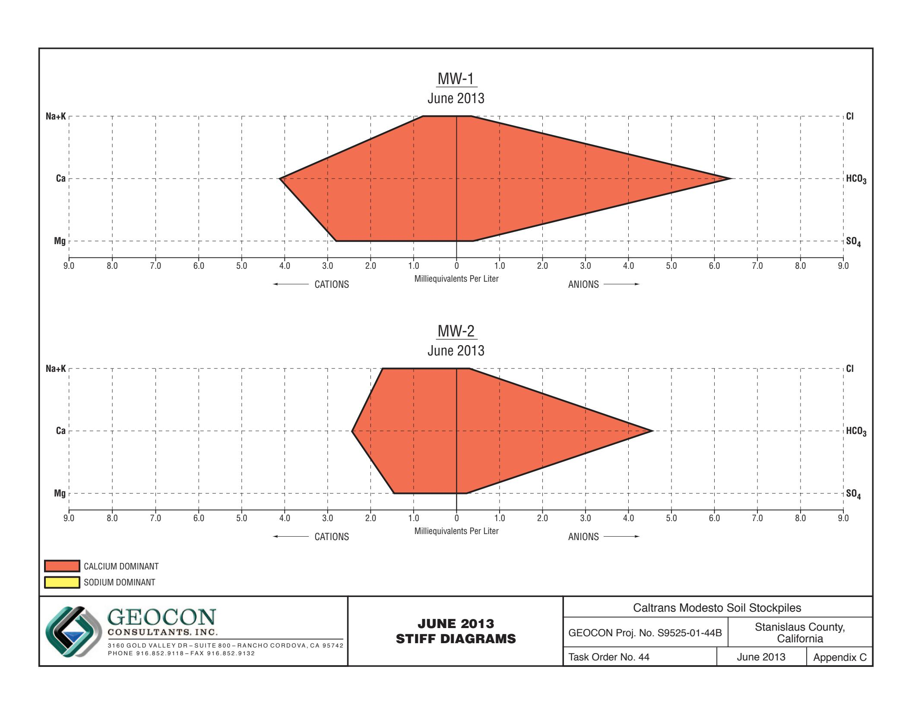

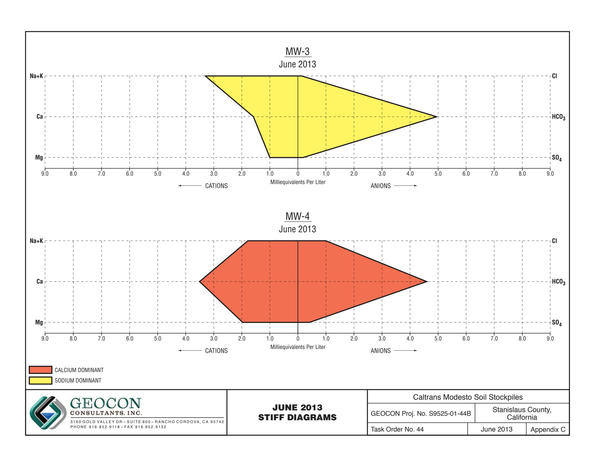

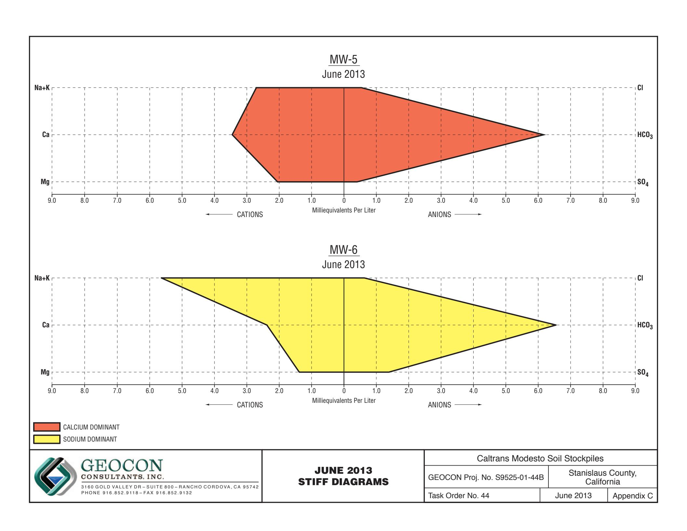

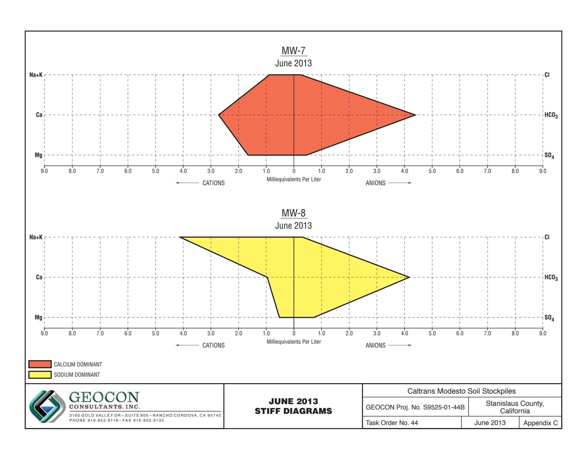

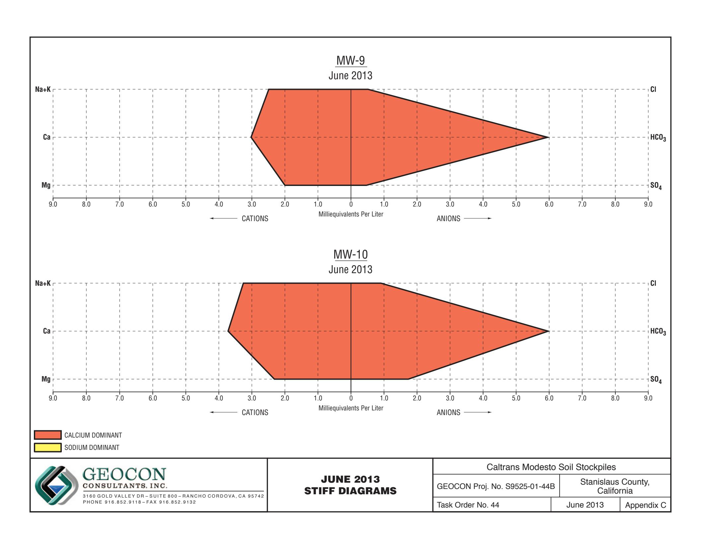