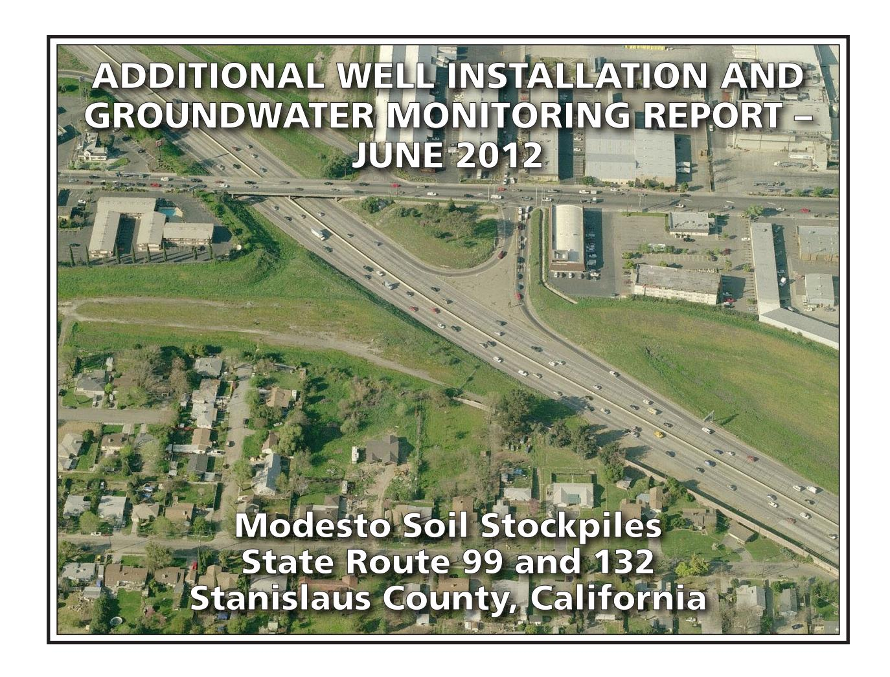
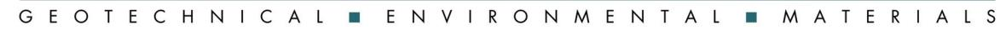
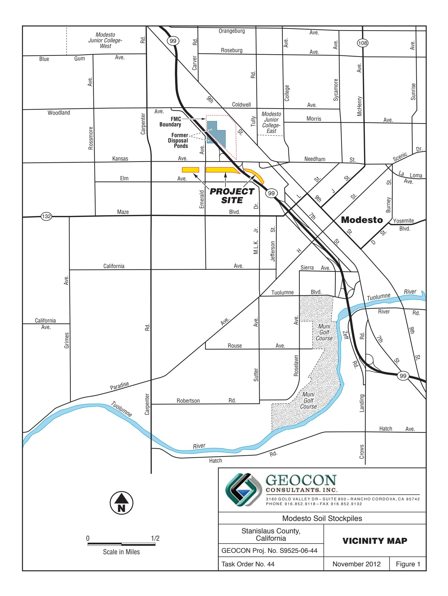
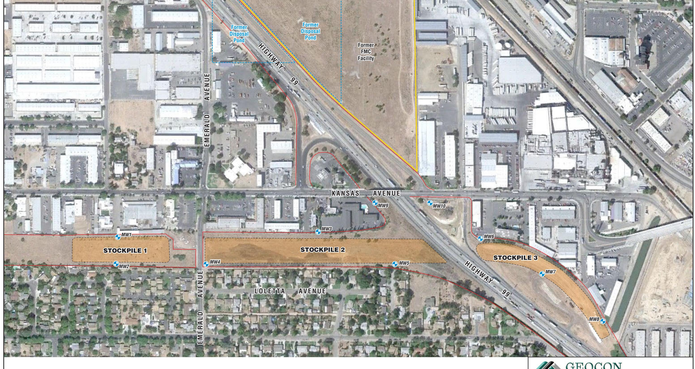
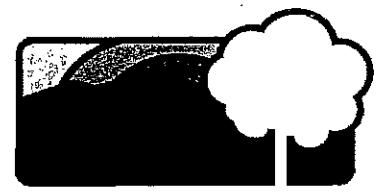
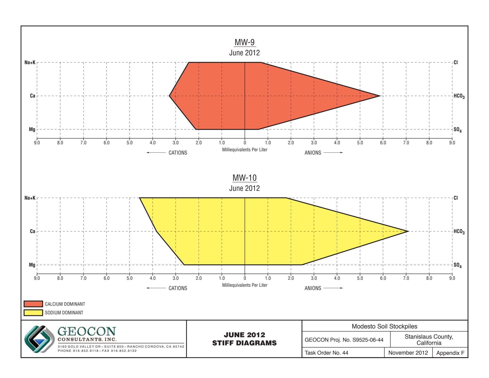

# PREPARED FOR:

CALIFORNIA DEPARTMENT OF TRANSPORTATION – DISTRICT 6
HAZARDOUS WASTE BRANCH
855 M STREET, SUITE 200
FRESNO, CALIFORNIA 93721

# PREPARED BY:

GEOCON CONSULTANTS, INC. 3160 GOLD VALLEY DRIVE, SUITE 800 RANCHO CORDOVA, CALIFORNIA 95742

**GEOCON PROJECT NO. S9525-06-44 TASK ORDER NO. 44, EA 10-403500 CONTRACT NO 06A1580** 

Project No. S9525-06-44A November 28, 2012

Mr. Richard Stewart, PG California Department of Transportation - District 6 Hazardous Waste Branch 855 M Street, Suite 200 Fresno, California 93721

Subject: ADDITIONAL WELL INSTALLATION AND GROUNDWATER MONITORING

REPORT – JUNE 2012

MODESTO SOIL STOCKPILES

STATE ROUTE 99 AND 132, STANISLAUS COUNTY, CALIFORNIA CONTRACT NO. 06A1580, TASK ORDER NO. 44, EA NO. 10-403500

Dear Mr. Stewart:

In accordance with California Department of Transportation (Caltrans) Contract No. 06A1580, Task Order (TO) No. 44, Geocon has performed groundwater monitoring activities and additional well installation activities at the Caltrans Modesto Soil Stockpiles (Site) located southerly of the intersection of State Route (SR) 99 and Kansas Avenue in Stanislaus County, California. The well installation activities were performed in general accordance with the *Monitoring Well Installation Workplan*, dated May 8, 2012, prepared by Geocon and approved by the California Environmental Protection Agency Department of Toxic Substances Control (DTSC) in an email dated May 11, 2011. The approximate site location is depicted on the attached Vicinity Map, Figure 1. The approximate site boundaries and soil stockpiles 1 through 3 are shown on the Site Plan, Figure 2.

The purpose of TO No. 44 was to initiate groundwater sampling and analysis at the Site in accordance with protocols approved by the DTSC as established in the *Final Work Plan, Groundwater Assessment* prepared by Shaw and dated January 2006. The scope of services reported herein includes the installation, development, and sampling of two groundwater monitoring wells, submittal of the water samples to a California-certified laboratory for analytical testing, and preparation of this report.

# BACKGROUND

# Project Description and History

Stockpiles 1 through 3 were generated during construction of SR 99 through Modesto around 1961 when Caltrans excavated property purchased from Food Machinery and Chemical Corporation (FMC) that contained an evaporation pond. The stockpiles were placed in their present location in anticipation of construction of the Route 132 West Expressway project.

During the 1930s, Barium Products Ltd. occupied property at 1200 Barium Road (now Graphics Drive) in Modesto just east of SR 99 between Woodland and Kansas Avenues. Barium Products Ltd. was a chemical manufacturing company processing a variety of ores and minerals including barite (barium sulfate) and celestite (strontium sulfate). Materials produced included barium and strontium compounds; these were used in greases, lubricating oil and pigment blanks. Sodium sulfide generated as a by-product of barite processing was sold as a caustic and used as a reagent in the mining industry.

In 1943, Barium Products Ltd. was purchased by Westvaco Chlorine Products Corporation which subsequently merged with FMC in 1948. From the 1950s to the 1970s, a liquid residue from the processing operations was discharged to unlined evaporation ponds along the western portion of the FMC Site. The approximate boundaries of the former evaporation/disposal ponds are shown on Figure 2.

In 1961, a 4.3–acre parcel at the southwest corner of the FMC site was purchased by the State of California for highway right-of-way needed to construct SR 99. An aerial photograph from 1957 shows that a portion of the southernmost pond on the FMC property was within the area purchased for right-of-way.

Soil in and around the holding pond was excavated during construction of SR 99 and, according to provisions of the construction contract, stockpiled within the current Caltrans right-of-way at the location of the future Route 132 Expressway project. Three distinct stockpiles are present at the Site:

- Stockpile 1, located south of Kansas Avenue and west of North Emerald Avenue,
- Stockpile 2, south of Kansas Avenue, between North Emerald Avenue and SR 99, and
- Stockpile 3, south of Kansas Avenue and east of SR 99.

In 2006, Caltrans arranged for the installation of monitoring wells MW-1 through MW-8 at locations adjacent to the three stockpiles as shown on Figure 2. General groundwater chemistry analytical results from June and October 2006 groundwater events suggested that two distinct groundwater types are present beneath the Site. A survey of groundwater wells within a one-mile radius of the Site identified 43 existing or former wells; however, there were no active supply wells identified in the general (southeast) flow direction from the Site.

Groundwater monitoring resumed for the Site with the March 2012 groundwater sampling of well MW-1 through MW-8. Representatives from the DTSC observed the sample collection procedures and collected spilt samples which were sent to an alternate laboratory. No notable differences in the concentrations for each reported analyte were evident.

Geocon compared the analytical results from the March and May 2012 sampling activities to the water quality threshold values referenced below:

- Primary Maximum Contaminant Levels (MCLs) promulgated by the California Department of Environmental Health;
- Secondary MCLs promulgated by the California Department of Environmental Health;
- Public Health Goals for drinking water promulgated by the California Department of Public Health:
- Integrated Risk Information System Reference Dose promulgated by the United States Environmental Protection Agency (EPA);
- Notification Level for Drinking Water promulgated by the California Department of Environmental Health: and
- Water Quality for Agriculture (Ayers & Westcott).

The results of the March and May 2012 groundwater sampling events showed that both dissolved metals and general minerals were predominantly reported at concentrations below their respective water quality threshold values including each of the primary chemicals of concern: barium, lead and strontium. Only nitrates and total dissolved solids (TDS) in wells MW-5 and MW-6 have each been consistently reported at concentrations that exceed their respective water quality thresholds of 10 and 500 milligrams per liter (mg/l).

# Hydrogeologic Characterization

The hydrogeology of the adjacent FMC site has been characterized by numerous studies since the early 1980s. The GeoTrans January 2005 report *Addendum to Comprehensive Remedial Investigations Report, FMC Corporation, 1200 Graphics Drive, Modesto, Stanislaus County, California* (GeoTrans, 2005) provides a description of the FMC site hydrogeology. This description follows:

"The site is underlain by laterally discontinuous and unconsolidated sand and silty sand associated with the Modesto and Riverbank Formations. First encountered groundwater is approximately 30 feet below ground surface (bgs) under confined to semi-confined conditions. A deeper aquifer is present at a depth of 165 feet bgs and separated from the upper zone by a blue clay aquitard. The upper water bearing unit has been divided into two zones: a shallow zone from first encountered groundwater to 120 feet bgs and a deeper zone from 140 feet bgs to the top of the aquitard. Groundwater flow within the upper zone is toward the southeast under a gradient of 0.002 ft/ft."

Monitoring wells MW-1 through MW-8 were each installed into the unconsolidated sand, silty sand and silt layers within the Modesto Formation underlying the Site. The wells were completed within the shallow zone of the upper aquifer (shallow zone).

The lithology encountered in the borings for the wells includes interbedded (laterally discontinuous) sands, silts, and clays. In the areas investigated, the unsaturated (vadose) zone was dominated by silty soils. The shallow zone groundwater beneath the stockpiles was encountered at approximately 35 feet (elevation approximately 50 feet) under unconfined to semi-confined conditions flowing southeast at a gradient of approximately 0.001. The shallow aquifer conditions beneath the Site and the adjacent FMC site appear similar and representative of the local area.

Based on historical depth to water measurements from the Site, the groundwater flow direction in the shallow upper aquifer is generally toward the southeast with hydraulic gradients varying from 0.001 to 0.0008.

# GROUNDWATER MONITORING WELL INSTALLATIONS

The following scope of services was performed as requested by Caltrans in an amendment to TO No. 44.

# Pre-field Activities

- Conducted a TO meeting on May 10, 2012, to discuss the proposed scope of services. Caltrans Engineering Geologist Richard Stewart and Geocon field supervisor Josh Ewert attended the TO meeting with the purpose of identifying possible well locations with respect to underground utilities.
- Utilized the project-specific health and safety plan to provide guidelines on the use of personal

protective equipment and health and safety procedures to be implemented during proposed field activities.

- Contacted Underground Service Alert (USA) (Ticket Nos. 172706 and 172738) prior to the start of field activities to attempt to delineate subsurface public utilities and conduits in proximity to the proposed well installation locations. Prior to contacting USA, the proposed boring locations were field located and marked with white paint as required by law.
- Obtained a monitoring well installation permit from the Stanislaus County Department of Environmental Resources (No. MW12-36). A copy of the monitoring well installation permit is in Appendix A.
- Obtained an encroachment permit from the City of Modesto (No. ENC2012-40123) and paid requisite fees. A copy of the encroachment permit is in Appendix A.
- Prepared a Workplan dated May 8, 2012, which described the requested scope of services and Quality Assurance/Quality Control (QA/QC) sampling and laboratory procedures. Mr. Randy Adams with the DTSC approved the Workplan via an email dated May 11, 2012.
- Retained the services of Cruz Brothers Locators, a Caltrans-approved independent pipe and cable locator, to provide additional clearance of boring locations relative to underground utilities.
- Retained the services of Gregg Drilling & Testing (Gregg), a C57-licensed (No. 485165) drilling company, to advance the soil borings and construct the monitoring wells.
- Retained the services of Advanced Technology Laboratories (ATL), a California-certified analytical laboratory, to perform the chemical analyses of groundwater samples.
- Retained the services of Morrow Surveying (Morrow), a Caltrans-approved land surveyor, to provide latitude and longitude coordinates for the new monitoring well locations and to update the coordinates of the pre-existing monitoring wells consistent with GeoTracker requirements. A copy of Morrow's survey data is presented in Appendix B.

# Field Activities

# Soil Borings

On May 29 and 30, 2012, Gregg advanced two hollow-stem auger (HSA) soil borings utilizing a Marl M11 drill rig to facilitate the installation of two 2-inch-diameter groundwater monitoring wells (MW-9 and MW-10). The approximate locations of the wells are depicted on Figure 2.

Each boring was logged under the direction of a California Professional Geologist (PG) utilizing the Unified Soil Classification System (USCS). Copies of the boring logs are in Appendix C. The generated soil cuttings were placed on the ground surface.

QA/QC procedures provided during the field exploration activities included cleansing/rinsing of the sampling equipment prior to and following each boring. Cleansing/rinsing of the sampling equipment was performed by washing the equipment with an AlconoxTM solution followed by subsequent tap water and deionized water rinses.

# Monitoring Well Construction

Monitoring wells MW-9 and MW-10 were constructed to a depth of approximately 40 feet using flush-threaded, 2-inch diameter Schedule 40 polyvinyl chloride (PVC) well casing. Each well was constructed using 10-foot-long, 0.010-inch-slotted screens and a #2/12 Monterey silica sand filter pack.

The screens for each well were placed from approximately 29.5 to 39.5 feet with a threaded end cap closing the pipe from approximately 39.5 to 40 feet. Sand filter packs were placed from approximately 27.5 feet to the bottom of each boring (40 feet).

Following placement of the filter pack, each well was pre-developed by swabbing the saturated screen interval with a surge block for approximately 10 minutes to assist in densification of the filter pack and to encourage groundwater flow into the well. Additional sand was added as necessary to bring the top of the filter pack back up to the pre-surge level. Two-foot-thick bentonite well seals were placed above each of the surged filter packs and the remaining annular space was grouted to the surface with a Portland cement slurry and fitted with a 12-inch-diameter, traffic-rated, flush-mounted well box set in concrete.

Following the installation of wells MW-9 and MW-10, Geocon submitted copies of the boring logs and Well Completion Report forms to the California Department of Water Resources. The construction details for each groundwater monitoring well are shown on Table 4 and on the boring/well logs in Appendix C.

# Well Development

On June 18, 2012, Geocon developed wells MW-9 and MW-10. Prior to development, Geocon measured the depth to groundwater in each well using a battery-operated water level meter. Approximately ten well volumes of groundwater (8.5 to 10 gallons) were extracted from each of the newly installed wells during the development activities. Each well was first hand-bailed using a reusable PVC bailer to remove silt and sediment introduced during the well construction activities and subsequently purged with a submersible pump to induce groundwater flow into the well. Measurements of turbidity were periodically recorded during the development activities and noted on a field log. This information was recorded on Monitoring Well Development Data sheets, copies of which are presented in Appendix D.

# Monitoring Well Survey

On June 18, 2012, Morrow surveyed the location and TOC elevation for each of the groundwater monitoring wells at the Site. The latitude and longitude for each well location was plotted using the California State Plane Zone 3 coordinate system. A copy of the surveyor's coordinate data is presented in Appendix B. The TOC elevations are included on Table 1.

# INVESTIGATION RESULTS AND FIELD OBSERVATIONS

Soil conditions encountered in the field along with soil analytical results are discussed below.

# Soil Conditions

Wells MW-9 and MW-10, both located north of the stockpiles and adjacent to SR 99 on the west and east sides, respectively, are underlain by alluvial soil of the Modesto Formation. These soils consist of interbedded layers of predominantly silt and sands to the total depth explored (40 feet) with some clay observed at MW-10 at a depth of 30 feet. These soils are consistent with previous descriptions of the area. Groundwater was first encountered at respective depths of 33.5 and 35.4 feet. The soil conditions

encountered are depicted on the boring logs in Appendix C.

# GROUNDWATER MONITORING – JUNE 2012

# Groundwater Field Measurements

On June 20, 2012, Geocon recorded the DO level and ORP in monitoring wells MW-9 and MW-10 using a Hanna Model No. 9143 DO meter, and an Oakton ORP meter.

# Well Purging and Sampling

On June 20, 2012, Geocon purged wells MW-9 and MW-10 using a portable, 12-volt submersible pump. Geocon decontaminated the pump before and after each use by washing in an Alconox® solution followed by fresh and distilled water rinses. During the well purging activities, Geocon recorded the pH, electrical conductivity and temperature on Monitoring Well Sampling Data sheets. This information is presented in Appendix D.

Following the purging activities, Geocon collected groundwater samples from the wells using precleaned, disposable polyethylene bailers. The samples were decanted from the bailer through a low-flow sample release tube into laboratory-provided sample containers. Geocon sealed, labeled and placed the samples in a chilled cooler and subsequently transported them to the laboratory using chain-of-custody protocol.

Purged groundwater was placed into one Department of Transportation-approved, 17-H, 55-gallon drum and temporarily stored near MW-8 pending receipt of analytical results. The contents of the drum were subsequently placed on the ground surface.

# Laboratory Analysis

The groundwater samples were delivered to Advanced Technology Laboratories (ATL) for the following analyses under chain-of-custody protocol:

- Title 22 dissolved metals following the United States Environmental Protection Agency (EPA) Test Method 6020/7470;
- Dissolved strontium, calcium, magnesium, potassium and sodium by EPA Test Method 6020;
- Chloride, nitrate as nitrogen and sulfate by EPA Test Method 300.0;
- Sulfide by Standard Method (SM) 4500;
- Total dissolved solids (TDS) by SM 2540C;
- Total alkalinity, bicarbonate alkalinity, carbonate alkalinity by SM 2320B; and
- Polycyclic aromatic hydrocarbons (PAHs) by EPA Test Method 8270-SIM.

Groundwater analytical results for this monitoring event are summarized on Tables 2 and 3. The laboratory report and chain-of-custody documentation are in Appendix E.

# Analytical Results

# PAHs

The PAH results are summarized on Table 3. No PAHs were reported at concentrations equal to or greater than their respective Practical Quantitation Limits (PQLs) for each of the groundwater samples collected during this monitoring event.

# Dissolved Metals

Analytical results for dissolved metals along with their associated numeric water quality thresholds are summarized on Table 2.

The DTSC has identified barium, lead and strontium as the primary chemicals of concern for the Site. For the June 2012 groundwater samples, barium, lead and strontium were reported with the following concentrations:

| Well ID                            | Barium (μg/l)      | Lead (µg/l) | Strontium (µg/l) |
|------------------------------------|--------------------|-------------|------------------|
| MW-9                               | 67                 | <1.0        | 840              |
| MW-10                              | 160                | 2.2         | 990              |
| Numeric Water Quality Threshold | 1,000 (1) /700 (2) | 15 (1)      | 4,000 (2)        |

Antimony, beryllium, cadmium, silver, thallium and mercury were not reported above their respective POLs in samples from each well.

As shown in the following table, the dissolved metals arsenic, chromium, manganese, molybdenum, nickel, selenium, vanadium, and zinc were reported for both of the samples collected with the following concentration ranges:

| Well ID                                  | Arsenic (µg/l) | Chromium (µg/l) | Manganese (µg/l) | Molybdenum (µg/l) | Nickel (µg/l) | Selenium (µg/l) | Vanadium (µg/l) | Zinc (µg/l)    |
|------------------------------------------|-------------------|--------------------|---------------------|----------------------|------------------|--------------------|--------------------|-------------------|
| MW-9                                     | 2.3               | 2.5                | 43                  | 0.76                 | 2.2              | 1.8                | 15                 | 15                |
| MW-10                                    | 4.1               | 6.2                | 290                 | 3.1                  | 9.6              | 4.3                | 33                 | 24                |
| Numeric Water Quality Threshold | 10(1)             | 50(1)              | 50(1)               | 40(2)                | 100(1)           | 50(1)              | 50(3)              | 5,000(4)/2,000(2) |

 $\mu g/l = micrograms per liter$ 

 $\mu g/l = micrograms$  per liter  $^{(1)} = California$  Department of Public Health Primary MCL for Drinking Water

(2) = EPA Drinking Water Health Advisory

= California Department of Public Health Primary Maximum Contaminant Level for Drinking Water

(2) = EPA Drinking Water Health Advisory

(3) = California Department of Public Health Notification Level for Drinking Water

(4) = California Department of Public Health Secondary Maximum Contaminant Level (taste and odor)

Although concentrations of arsenic, barium, chromium, molybdenum, nickel, selenium, vanadium, zinc and strontium were reported for the samples collected from both wells, none of the reported concentrations exceed their respective numeric water quality thresholds for drinking water. The concentration of manganese in MW-10 is the only occurrence of a detection above a numeric threshold (taste and odor) for any site monitoring well.

Cobalt, copper and lead were reported only for the sample collected from MW-10 at respective concentrations of 5.3, 7.4, and 2.2  $\mu$ g/l. Although concentrations of cobalt, copper and lead were reported for the sample collected from MW-10, none of the reported concentrations exceed their respective numeric water quality thresholds for drinking water.

# General Minerals/Stiff Diagrams

To further characterize the geochemistry of the groundwater, general minerals analyses were conducted and included the following constituents:

- Calcium
- Magnesium
- Chloride
- Nitrate as nitrogen
- Sulfate
- Potassium
- Sodium
- Sulfide
- Total alkalinity
- TDS

General groundwater chemistry provides information regarding the origin and geochemical nature of the groundwater sampled. The analytical results for the major cation (dissolved sodium, potassium, calcium and magnesium) and anion species (chloride, bicarbonate alkalinity reported as calcium carbonate, and sulfate) were used to create Stiff diagrams. Stiff diagrams provide a pictorial or graphical display of ionic content and can be used to characterize and evaluate the relative composition of groundwater and its consistency or variability. Groundwater exhibiting different cation/anion concentrations will result in Stiff diagrams of different shapes and sizes. Stiff diagrams can also help to illustrate mixing of water with different compositions or origins. The presence of more than one water type can be an indication of influences due to hydrogeologic variation or from other sources including man-made impacts.

Appendix F contains Stiff diagrams constructed using site groundwater data for June 2012. The samples from MW-9 and MW-10 were calcium-dominant and sodium-dominant, respectively.

Nitrate as nitrogen was also reported for the groundwater samples from MW-9 and MW-10 at 13 and 9.2 mg/l respectively. The reported nitrate concentration for MW-9 exceeds the primary MCL of 10 mg/l established for nitrate. TDS was reported at concentrations of 510 and 710 mg/l for the samples from respective wells MW-9 and MW-10. Both of these concentrations are greater than the secondary MCL of 500 mg/l.

The analytical results for general minerals are summarized on Table 3. The Stiff diagrams are in Appendix F.

# Laboratory QA/QC

Geocon reviewed the analytical laboratory QA/QC provided with the laboratory report. These data show that that the method blank surrogate recoveries are acceptable and that concentrations of selected analytes were not reported at concentrations equal to or greater than their respective PQLs for each method blank for each analysis. Appropriate recoveries were noted for each laboratory control sample for each analysis. Several matrix spike/matrix spike duplicate (MS/MSD) analytes had recoveries or relative percent differences outside of laboratory control limits including a June 25, 2012, MS for barium that had a recovery that exceeded 130%, a June 25, 2012, MSD for barium that had a recovery of less than 70%, and a June 25, 2012, MSD for barium and strontium that had recoveries of less than 70%. Since none of the dissolved metals concentrations for these analytes were close to exceeding their respective numeric water quality thresholds, no additional qualification of the data is necessary, and the data are considered of sufficient quality for the purposes of this report.

# GeoTracker Submittal

The laboratory prepared electronic data files for submittal to the State Water Resources Control Board GeoTracker database. The GeoTracker database is accessible via the GeoTracker website at <a href="http://geotracker.waterboards.ca.gov">http://geotracker.waterboards.ca.gov</a>. The electronic data from the June groundwater sampling activities was uploaded to GeoTracker on November 14 and 21, 2012. The confirmation numbers are 2845493376 and 1602109789.

# CONCLUSIONS AND RECOMMENDATIONS

With the exception of manganese in the sample from well MW-10, none of the reported dissolved metals concentrations for the groundwater samples collected in June 2012 exceeded their respective numeric water quality threshold values.

With the exception of nitrate in the sample collected from MW-9, none of the reported general minerals for the groundwater samples collected in June 2012 exceeded their respective California primary MCLs. TDS was reported at concentrations greater than the secondary MCL of 500 mg/l for samples from both MW-9 and MW-10

Please contact us if you have any questions concerning the contents of this Report or if we may be of further service.

Sincerely,

GEOCON CONSULTANTS, INC.

Josh Ewert

Senior Staff Geologist

Rebecca L. Silva Project Manager

John E. Juhrend, PE, CEG Principal

- (3) Addressee
- (1) Caltrans, Sam Haack
- (1) DTSC, Randy Adams
- (1) CVRWQCB, Steve Meeks

Attachments:

Figure 1, Vicinity Map Figure 2, Site Plan

- Table 1, Groundwater Elevation Data
- Table 2, Summary of Groundwater Analytical Results Title 22 Metals (Dissolved)
- Table 3, Summary of Groundwater Analytical Results General Minerals and PAHs
- Table 4, Well Construction Details

Appendix A, Well Installation and Encroachment Permits

Appendix B, Monitoring Well Exhibit – Morrow Surveying

Appendix C, Boring Logs, MW-9 and MW-10

No. 46681

Appendix D, Monitoring Well Development and Sampling Data Sheets

Appendix E, Laboratory Reports and Chain-of-custody Documentation

Appendix F, Stiff Diagrams

MW8 Approximate Monitoring Well Location

— State Right-of-Way Boundary

Scale in Feet

## GEOCON CONSULTANTS, INC.

3160 GOLD VALLEY DR - SUITE 800 - RANCHO CORDOVA, CA 95742 PHONE 916.852.9118 - FAX 916.852.9132

| Modesto Soil Stockpil | ıles |
|-----------------------|------|
|-----------------------|------|

| Stanisiaus County, California |  |
|----------------------------------|--|
|                                  |  |

**SITE PLAN** 

GEOCON Proj. No. S9525-06-44 Task Order No. 44

November 2012

vember 2012

Figure 2

# TABLE 1 GROUNDWATER ELEVATION DATA STATE ROUTE 99/132 MODESTO SOIL STOCKPILES STANISLAUS COUNTY, CALIFORNIA

| WELL ID | DATE      | WELL CASING ELEVATION (feet MSL) | DEPTH TO GROUNDWATER (feet below TOC) | GROUNDWATER ELEVATION (feet MSL) |
|---------|-----------|----------------------------------------|---------------------------------------------|----------------------------------------|
| MW-1    | 6/14/2006 | 80.26                                  | 29.82                                       | 50.44                                  |
| MW-1    | 10/5/2006 | 80.26                                  | 32.35                                       | 47.91                                  |
| MW-1    | 3/12/2012 | 80.26                                  | 30.12                                       | 50.14                                  |
| MW-1    | 5/17/2012 | 80.26                                  | 29.74                                       | 50.52                                  |
| MW-2    | 6/13/2006 | 81.10                                  | 30.72                                       | 50.38                                  |
| MW-2    | 10/5/2006 | 81.10                                  | 33.35                                       | 47.75                                  |
| MW-2    | 3/12/2012 | 81.10                                  | 31.04                                       | 50.06                                  |
| MW-2    | 5/17/2012 | 81.10                                  | 30.69                                       | 50.41                                  |
| MW-3    | 6/13/2006 | 81.76                                  | 32.38                                       | 49.38                                  |
| MW-3    | 10/5/2006 | 81.76                                  | 34.88                                       | 46.88                                  |
| MW-3    | 3/12/2012 | 81.76                                  | 32.35                                       | 49.41                                  |
| MW-3    | 5/17/2012 | 81.76                                  | 31.91                                       | 49.85                                  |
| MW-4    | 6/13/2006 | 82.36                                  | 32.39                                       | 49.97                                  |
| MW-4    | 10/4/2006 | 82.36                                  | 35.05                                       | 47.31                                  |
| MW-4    | 3/12/2012 | 82.36                                  | 32.60                                       | 49.76                                  |
| MW-4    | 5/17/2012 | 82.36                                  | 32.20                                       | 50.16                                  |
| MW-5    | 6/14/2006 | 87.73                                  | 38.79                                       | 48.94                                  |
| MW-5    | 10/5/2006 | 87.73                                  | 41.40                                       | 46.33                                  |
| MW-5    | 3/12/2012 | 87.73                                  | 38.74                                       | 48.99                                  |
| MW-5    | 5/17/2012 | 87.73                                  | 38.25                                       | 49.48                                  |
| MW-6    | 6/14/2006 | 84.37                                  | 36.35                                       | 48.02                                  |
| MW-6    | 10/5/2006 | 84.37                                  | 38.55                                       | 45.82                                  |
| MW-6    | 3/12/2012 | 84.37                                  | 35.70                                       | 48.67                                  |
| MW-6    | 5/17/2012 | 84.37                                  | 35.18                                       | 49.19                                  |
| MW-7    | 6/14/2006 | 83.64                                  | 35.59                                       | 48.05                                  |
| MW-7    | 10/4/2006 | 83.64                                  | 38.32                                       | 45.32                                  |
| MW-7    | 3/12/2012 | 83.64                                  | 35.31                                       | 48.33                                  |
| MW-7    | 5/17/2012 | 83.64                                  | 34.72                                       | 48.92                                  |
| MW-8    | 6/14/2006 | 83.73                                  | 36.12                                       | 47.61                                  |
| MW-8    | 10/4/2006 | 83.73                                  | 38.95                                       | 44.78                                  |
| WELL ID | DATE      | WELL CASING ELEVATION (feet MSL) | DEPTH TO GROUNDWATER (feet below TOC) | GROUNDWATER ELEVATION (feet MSL) |
| MW-8    | 3/12/2012 | 83.73                                  | 35.75                                       | 47.98                                  |
| MW-8    | 5/17/2012 | 83.73                                  | 35.11                                       | 48.62                                  |
| MW-9    | 6/18/2012 | 82.53                                  | 33.67                                       | 48.86                                  |
| MW-10   | 6/18/2012 | 83.97                                  | 35.18                                       | 48.79                                  |

# TABLE 1 GROUNDWATER ELEVATION DATA

# STATE ROUTE 99/132 MODESTO SOIL STOCKPILES

# STANISLAUS COUNTY, CALIFORNIA

Notes:

MSL = Mean sea level

TOC = Top of well casing

Data prior to 3/12/2012 reproduced from Site Investigation Report, Groundwater Assessment, Caltrans Modesto Soil Stockpiles State Route 99/132 Project, Stanislaus County, California, Shaw Environmental, Inc., May 14, 2007.

Wells resurveyed by Morrow Surveying on June 18, 2012.

# TABLE 2

## SUMMARY OF GROUNDWATER ANALYTICAL RESULTS - TITLE 22 METALS (Dissolved) STATE ROUTE 99/132 MODESTO SOIL STOCKPILES

# STANISLAUS COUNTY, CALIFORNIA

| ANALYTE                              | SAMPLE ID                                                    | SAMPLE DATE                       | Antimony                         | Arsenic                      | Barium                                | Beryllium                                   | Cadmium                         | Chromium                              | Cobalt                              | Copper                            | Lead                                     | Manganese                         | Molybdenum                          | Nickel                            | Selenium                              | Silver                              | Thallium                     | Vanadium                               | Zinc                          | Strontium                                  | Mercury |
|--------------------------------------|-----------------------------------------------------------------|--------------------------------------|----------------------------------|------------------------------|---------------------------------------|---------------------------------------------|---------------------------------|---------------------------------------|-------------------------------------|-----------------------------------|------------------------------------------|-----------------------------------|-------------------------------------|-----------------------------------|---------------------------------------|-------------------------------------|------------------------------|----------------------------------------|-------------------------------|--------------------------------------------|---------|
|                                      |                                                                 |                                      | Results in micrograms per liter  |                              |                                       |                                             |                                 |                                       |                                     |                                   |                                          |                                   |                                     |                                   |                                       |                                     |                              |                                        |                               |                                            |         |
| MW-1                                 | 6/14/2006                                                       | <1.0                                 | 2.1                              | 130                          | <1.0                                  | <1.0                                        | 10                              | <1.0                                  | 1.1                                 | <1.0                              | 34                                       | 2.9                               | 2.9                                 | <1.0                              | <1.0                                  | <1.0                                | 23                           | <10                                    | 960                           | <0.2                                       |         |
| MW-1                                 | 10/5/2006                                                       | <1.0                                 | 2.2                              | 120                          | <1.0                                  | <1.0                                        | 16                              | <1.0                                  | 2.0                                 | <1.0                              | <1.0                                     | <2.0                              | 1.5                                 | <1.0                              | <1.0                                  | 26                                  | <10                          | --                                     | 0.41                          |                                            |         |
| MW-1                                 | 3/12/2012                                                       | <2.5                                 | <5.0                             | 120                          | <5.0                                  | <2.5                                        | 6.4                             | <2.5                                  | <5.0                                | <5.0                              | <50                                      | <2.5                              | <5.0                                | <2.5                              | <2.5                                  | 22                                  | <50                          | 960                                    | --                            |                                            |         |
| MW-1                                 | 3/12/2012 S                                                     | <10                                  | 1.6                              | 105                          | <5.0                                  | <b>0.6</b>                                  | 6.8                             | <5.0                                  | 3.4                                 | 2                                 | 2.0                                      | 1.3                               | <5.0                                | <20                               | <5.0                                  | 21.2                                | <b>5.6</b>                   | 1,010                                  | --                            |                                            |         |
| MW-1                                 | 5/17/2012                                                       | <0.50                                | 2.3                              | 150                          | <0.50                                 | <0.50                                       | 7.0                             | 1.0                                   | 2.5                                 | <1.0                              | 35                                       | 1.3                               | 4.0                                 | <b>0.62</b>                       | <0.50                                 | <0.50                               | 21                           | <10                                    | 1,100                         | <0.20                                      |         |
| MW-2                                 | 6/13/2006                                                       | <1.0                                 | 2.1                              | 87                           | <1.0                                  | <1.0                                        | 8.5                             | <1.0                                  | 1.2 U                               | <1.0                              | 24                                       | 3.3                               | 2.0                                 | 1.3                               | <1.0                                  | <1.0                                | 22                           | <10                                    | --                            | <0.2                                       |         |
| MW-2                                 | 10/5/2006                                                       | <1.0                                 | 2.6                              | 84                           | <1.0                                  | <1.0                                        | 11                              | <1.0                                  | 1.7                                 | <1.0                              | <1.0                                     | <2.0                              | 1.2                                 | <1.0                              | <1.0                                  | 27                                  | <10                          | --                                     | <0.2                          |                                            |         |
| MW-2                                 | 3/12/2012                                                       | <2.5                                 | <5.0                             | 88                           | <5.0                                  | <2.5                                        | 4.7                             | <2.5                                  | <5.0                                | <5.0                              | <50                                      | <2.5                              | <5.0                                | <2.5                              | <2.5                                  | 23                                  | <50                          | 610                                    | 0.28                          |                                            |         |
| MW-2                                 | 3/12/2012 S                                                     | <10                                  | <10                              | 89.6                         | <5.0                                  | <b>0.4</b>                                  | 6.1                             | <5.0                                  | <5.0                                | 2                                 | 1.4                                      | 1.4                               | <5.0                                | <20                               | <5.0                                  | 23.1                                | <b>3.7</b>                   | 642                                    | --                            |                                            |         |
| MW-2                                 | 5/17/2012                                                       | <0.50                                | 2.6                              | 89                           | <0.50                                 | <0.50                                       | 6.6                             | <0.50                                 | 1.5                                 | <1.0                              | 10                                       | 1.2                               | 1.9                                 | <0.50                             | <0.50                                 | 20                                  | <10                          | 700                                    | <0.20                         |                                            |         |
| MW-3                                 | 6/13/2006                                                       | <1.0                                 | 3.0                              | 60                           | <1.0                                  | <1.0                                        | 7.1                             | <1.0                                  | 1 U                                 | <1.0                              | 4.7                                      | <2.0                              | 1.4                                 | 1.4                               | <1.0                                  | <1.0                                | 25                           | <10                                    | --                            | <0.2                                       |         |
| MW-3                                 | 10/5/2006                                                       | <1.0                                 | 3.3                              | 58                           | <1.0                                  | <1.0                                        | 7.9                             | <1.0                                  | 1.5                                 | <1.0                              | 18                                       | 2.2                               | <1.0                                | <1.0                              | <1.0                                  | 29                                  | <10                          | --                                     | <0.2                          |                                            |         |
| MW-3                                 | 3/12/2012                                                       | <2.5                                 | <5.0                             | 58                           | <5.0                                  | <2.5                                        | 4.4                             | <2.5                                  | <5.0                                | <5.0                              | <50                                      | <2.5                              | <2.5                                | <2.5                              | <2.5                                  | 28                                  | <50                          | 390                                    | <0.20                         |                                            |         |
| MW-3                                 | 3/12/2012 S                                                     | <10                                  | 2.1                              | 44.4                         | 0.1                                   | <b>0.3</b>                                  | 4.0                             | <5.0                                  | 1.5                                 | 2                                 | 1.8                                      | <b>0.9</b>                        | <5.0                                | <20                               | <5.0                                  | 22.6                                | <b>4.5</b>                   | 342                                    | --                            |                                            |         |
| MW-3                                 | 5/17/2012                                                       | <0.50                                | 3.8                              | 64                           | <0.50                                 | <0.50                                       | 3.7                             | <0.50                                 | <1.0                                | <1.0                              | 10                                       | 1.4                               | 1.1                                 | <0.50                             | <0.50                                 | 26                                  | <10                          | 490                                    | <0.20                         |                                            |         |
| MW-4                                 | 6/13/2006                                                       | <1.0                                 | 1.8                              | 130                          | <1.0                                  | <1.0                                        | 8.9                             | <1.0                                  | 1.6 U                               | <1.0                              | 62                                       | 2.5                               | 2.4                                 | <1.0                              | <1.0                                  | <1.0                                | 19                           | <10                                    | --                            | <0.2                                       |         |
| MW-4                                 | 10/4/2006                                                       | <1.0                                 | 2.1                              | 100                          | <1.0                                  | <1.0                                        | 9.9                             | <1.0                                  | 2.1                                 | <1.0                              | 4.1                                      | <2.0                              | <1.0                                | <1.0                              | <1.0                                  | 24                                  | <10                          | --                                     | <0.2                          |                                            |         |
| MW-4                                 | 3/12/2012                                                       | <2.5                                 | <5.0                             | 160                          | <5.0                                  | <2.5                                        | 8.9                             | <2.5                                  | <5.0                                | <5.0                              | 88                                       | <2.5                              | 5.4                                 | <2.5                              | <2.5                                  | 26                                  | <50                          | 840                                    | 0.29                          |                                            |         |
| MW-4                                 | 3/12/2012 S                                                     | <10                                  | 1.4                              | <i>134</i>                   | <5.0                                  | <b>0.4</b>                                  | 7.7                             | <5.0                                  | 0.9                                 | 2                                 | 0.7                                      | <5.0                              | <5.0                                | <20                               | <5.0                                  | 19.3                                | <b>3.5</b>                   | 812                                    | --                            |                                            |         |
| MW-4                                 | 5/17/2012                                                       | <0.50                                | 2.1                              | 160                          | <0.50                                 | <0.50                                       | 6.6                             | <0.50                                 | <1.0                                | <1.0                              | 10                                       | <0.50                             | 1.7                                 | <b>0.62</b>                       | <0.50                                 | <0.50                               | 18                           | <10                                    | 960                           | <0.20                                      |         |
| MW-5                                 | 6/14/2006                                                       | <1.0                                 | 1.8                              | 400                          | <1.0                                  | <1.0                                        | 9.6                             | 2.2                                   | 4.8                                 | 1.4                               | 260                                      | 9.9                               | 7.1                                 | 2.0                               | <1.0                                  | <1.0                                | 23                           | <10                                    | --                            | <0.2                                       |         |
| MW-5                                 | 10/5/2006                                                       | <1.0                                 | 2.5                              | 410                          | <1.0                                  | <1.0                                        | 18                              | <1.0                                  | 1.9                                 | <1.0                              | 120                                      | 14                                | 3.4                                 | <1.0                              | <b>2.1</b>                            | <1.0                                | 24                           | <10                                    | --                            | <0.2                                       |         |
| MW-5                                 | 3/12/2012                                                       | <2.5                                 | <5.0                             | 340                          | <5.0                                  | <2.5                                        | 9.2                             | <2.5                                  | <5.0                                | <5.0                              | <50                                      | <2.5                              | <5.0                                | <2.5                              | <2.5                                  | 18                                  | <50                          | 1,200                                  | 0.28                          |                                            |         |
| ANALYTE                              | SAMPLE ID                                                       | SAMPLE DATE                       | Results in micrograms per liter  |                              |                                       |                                             |                                 |                                       |                                     |                                   |                                          |                                   |                                     |                                   |                                       |                                     |                              |                                        |                               |                                            |         |
|                                      |                                                                 |                                      | Antimony                         | Arsenic                      | Barium                                | Beryllium                                   | Cadmium                         | Chromium                              | Cobalt                              | Copper                            | Lead                                     | Manganese                         | Molybdenum                          | Nickel                            | Selenium                              | Silver                              | Thallium                     | Vanadium                               | Zinc                          | Strontium                                  | Mercury |
| MW-5 MW-5                         | 3/12/2012 S 5/17/2012                                        | <10 <b>0.59</b>                   | 1.3 <b>2.4</b>                | 310 310                   | <5.0 <0.50                         | <b>0.5</b> <0.50                         | 9.6 12                       | <5.0 <0.50                         | 1.0 1.1                          | --2 <1.0                       | <b>4.4</b> <10                        | 1.5 1.8                        | <5.0 <b>3.1</b>                  | 1.5 2.6                        | <5.0 <0.50                         | <b>3.6</b> <0.50                 | 17.8 14                   | <b>14.5</b> <10                     | 1,140 <b>1,400</b>         | <0.20                                      |         |
| MW-6 MW-6 MW-6                 | 6/14/2006 10/5/2006 3/12/2012                             | <1.0 <1.0 <2.5                 | <b>3.6</b> <b>5.2</b> <5.0 | 160 120 99             | <1.0 <1.0 <5.0                  | <1.0 <1.0 <2.5                        | 16 29 9.5                 | <b>3.0</b> 1.0 <2.5             | <b>6.2</b> 1.5 <5.0           | <b>3.4</b> <1.0 <5.0        | 190 130 <50                        | 13 13 5.3                   | <b>5.9</b> 1.7 <5.0           | <b>3.0</b> 1.0 <2.5         | <1.0 <1.0 <2.5                  | <1.0 <1.0 <2.5                | 33 34 37               | 15 <10 <50                       | -- 680 --               | <0.2 <0.2 <b>0.27</b>                |         |
| MW-6 MW-6                         | 3/12/2012 S 5/17/2012                                        | <10 <0.50                         | 2.8 <b>3.9</b>                | 94.2 93                   | <5.0 <0.50                         | <b>0.4</b> <0.50                         | 9.9 8.3                      | <5.0 <0.50                         | <5.0 <b>1.3</b>                  | <1.0                              | <b>2.7</b> <10                        | 5.2 5.5                        | <5.0 <b>1.8</b>                  | <20 <b>2.1</b>                 | <5.0 <0.50                         | <b>2.6</b> <0.50                 | 36.3 32                   | <b>3.8</b> <10                      | 655 690                    | <0.20                                      |         |
| MW-7 MW-7 MW-7 MW-7         | 6/14/2006 10/4/2006 3/12/2012 5/17/2012                | <1.0 <1.0 <2.5 <b>0.74</b>  | 2.3 2.7 <5.0 2.3        | 80 73 76 63         | <1.0 <1.0 <5.0 <0.50         | <1.0 <1.0 <2.5 <0.50               | 7.0 10 <2.5 1.6        | <1.0 <1.0 <2.5 <0.50         | <1.0 <b>1.6</b> <5.0 <1.0  | <1.0 <1.0 <5.0 <1.0      | 9.0 1.1 <50 <10                 | 2.6 <2.0 <2.5 1.0        | 2.2 1.4 <5.0 1.3           | 1.1 1.2 <2.5 <0.50       | <1.0 <1.0 <2.5 <0.50         | <1.0 <1.0 <2.5 <0.50       | 17 23 24 19         | <10 <10 <50 <10               | -- 690 590              | <0.2 <0.2 <b>0.28</b> <0.20       |         |
| MW-8 MW-8 MW-8 MW-8 MW-8 | 6/14/2006 10/4/2006 3/12/2012 3/12/2012 S 5/17/2012 | <1.0 <1.0 <2.5 <10 <0.50 | 2.7 4.0 <5.0 2.5 3.2 | 84 57 39 39.4 55 | <1.0 <1.0 <5.0 <5.0 <0.50 | <1.0 <1.0 <2.5 <b>0.1</b> <0.50 | 8.8 9.7 4.4 4.7 4.6 | <1.0 <1.0 <2.5 <5.0 <0.50 | <1.0 1.7 <5.0 <5.0 <1.0 | <1.0 <1.0 <5.0 2 <1.0 | <b>5.8</b> <1.0 <50 1.7 <1.0 | <2.0 2.0 <2.5 1.3 1.8 | 1.2 <1.0 <5.0 <5.0 <1.0 | 1.6 <1.0 <2.5 20 0.73 | <1.0 <1.0 <2.5 <5.0 <0.50 | <1.0 <1.0 <2.5 20 <0.50 | 25 32 20 23.4 22 | <10 <10 <50 <b>3.6</b> <10 | 180 -- -- 211 270 | <0.2 <0.2 <b>0.23</b> -- <0.20 |         |
| MW-9 MW-10                        | 6/20/2012 6/20/2012                                          | <0.50 <0.50                       | 2.3 4.1                       | 67 160                    | <0.50 <1.0                         | <0.50 <0.50                              | 2.5 6.2                      | <0.50 <b>5.3</b>                   | <1.0 <b>7.4</b>                  | <1.0 <b>2.2</b>                | 43 290                                | 0.76 3.1                       | 2.2 9.6                          | 1.8 4.3                        | <0.50 <0.50                        | <0.50 <0.50                      | 15 33                     | 15 24                               | 840 990                    | <0.20 <0.20                             |         |
| MCLs                                 |                                                                 | 6                                    | 10                               | 1,000                        | 4                                     | 5                                           | 50                              | --                                    | 1,300                               | 15                                | 50 (1)                                   | --                                | 100                                 | 50                                | 100 (1)                               | 2                                   | --                           | 5,000 (1)                              | --                            | 2                                          |         |
| ANALYTE                              |                                                                 | Results in micrograms per liter      |                                  |                              |                                       |                                             |                                 |                                       |                                     |                                   |                                          |                                   |                                     |                                   |                                       |                                     |                              |                                        |                               |                                            |         |
|                                      |                                                                 | Antimony                             | Arsenic                          | Barium                       | Beryllium                             | Cadmium                                     | Chromium                        | Cobalt                                | Copper                              | Lead                              | Manganese                                | Molybdenum                        | Nickel                              | Selenium                          | Silver                                | Thallium                            | Vanadium                     | Zinc                                   | Strontium                     | Mercury                                    |         |
| SAMPLE ID                            | SAMPLE DATE                                                  |                                      |                                  |                              |                                       |                                             |                                 |                                       |                                     |                                   |                                          |                                   |                                     |                                   |                                       |                                     |                              |                                        |                               |                                            |         |

# TABLE 2

### SUMMARY OF GROUNDWATER ANALYTICAL RESULTS - TITLE 22 METALS (Dissolved) STATE ROUTE 99/132 MODESTO SOIL STOCKPILES

# STANISLAUS COUNTY, CALIFORNIA

# TABLE 2

### SUMMARY OF GROUNDWATER ANALYTICAL RESULTS - TITLE 22 METALS (Dissolved) STATE ROUTE 99/132 MODESTO SOIL STOCKPILES

# STANISLAUS COUNTY, CALIFORNIA

Notes:

- --- = not analyzed or not applicable
- < = Less than practical quantitation limits
- S = Split samples submitted by Central Valley Regional Water Quality Control Board (CVRWQCB) to Excelchem Environmental Labs
- U = Notation: The result was qualified as a non-detect due to equipment blank contamination
- MCLs = Maximum Contaminant Levels per California Environmental Protection Agency, May 2009

**Bold** = Reported concentration exceeds laboratory reporting limit

Data prior to 3/12/2012 reproduced from Site Investigation Report, Groundwater Assessment, Caltrans Modesto Soil Stockpiles State Route 99/132 Project, Stanislaus County, California, S haw Environmental, Inc., May 14, 2007.

(1) = Secondary MCL

(2) = Laboratory error in sample preparation (CVRWQCB personal communication)

# TABLE 3 SUMMARY OF GROUNDWATER ANALYTICAL RESULTS - GENERAL MINERALS AND PAHS STATE ROUTE 99/132 MODESTO SOIL STOCKPILES STANISLAUS COUNTY, CALIFORNIA

| SAMPLE ID                       | SAMPLE DATE | Results in milligrams per liter |                     |          |                          |         |                     |                  |         |                         |                       | micrograms per liter |                        |                      |                      |
|---------------------------------|-------------|---------------------------------|---------------------|----------|--------------------------|---------|---------------------|------------------|---------|-------------------------|-----------------------|----------------------|------------------------|----------------------|----------------------|
|                                 |             | DISSOLVED CALCIUM               | DISSOLVED MAGNESIUM | CHLORIDE | NITROGEN, NITRATE (as N) | SULFATE | DISSOLVED POTASSIUM | DISSOLVED SODIUM | SULFIDE | ALKALINITY, BICARBONATE | ALKALINITY, CARBONATE | ALKALINITY, TOTAL    | TOTAL DISSOLVED SOLIDS | PAHs (SIM)           |                      |
| MW-1                            | 6/14/2006   | --                              | --                  | --       | 5.0                      | 18      | --                  | --               | <0.1    | --                      | --                    | --                   | --                     | --                   |                      |
| MW-1                            | 10/5/2006   | 88                              | 34                  | 14       | 6.8                      | 18      | 3.7                 | 22               | <0.1    | 360                     | <1                    | 360                  | 500                    | --                   |                      |
| MW-1                            | 3/12/2012   | 78                              | 31                  | 13       | 12                       | 16      | 3.2                 | 21               | <0.05   | 328                     | <5.0                  | 328                  | 550                    | <0.20                |                      |
| MW-1                            | 3/12/2012 S | 84                              | 29.4                | 12       | 11.4                     | 15.6    | 3.3                 | 23.8             | 0.0637  | 342                     | <5.0                  | 342                  | 453                    | --                   |                      |
| MW-1                            | 5/17/2012   | 83                              | 34                  | 12       | 12                       | 16      | 3.8                 | 20               | 0.1     | 340                     | <5.0                  | 340                  | 480                    | <0.20                |                      |
| MW-2                            | 6/13/2006   | --                              | --                  | --       | 5.5                      | 21      | --                  | --               | <0.1    | --                      | --                    | --                   | --                     | --                   |                      |
| MW-2                            | 10/5/2006   | 49                              | 16                  | 23       | 6.1                      | 16      | 2.7                 | 56               | <0.1    | 250                     | <1                    | 250                  | 390                    | --                   |                      |
| MW-2                            | 3/12/2012   | 52                              | 18                  | 17       | 9.0                      | 16      | 2.6                 | 40               | 0.06    | 266                     | <5.0                  | 266                  | 460                    | <0.20                |                      |
| MW-2                            | 3/12/2012 S | 58.1                            | 17.2                | 15.4     | 8.77                     | 15.2    | 2.89                | 54               | 0.0497  | 270                     | <5.0                  | 270                  | 382                    | --                   |                      |
| MW-2                            | 5/17/2012   | 55                              | 19                  | 15       | 7.5                      | 14      | 2.9                 | 39               | 0.07    | 248                     | <5.0                  | 248                  | 400                    | <0.20                |                      |
| MW-3                            | 6/13/2006   | --                              | --                  | --       | 5.4                      | 18      | --                  | --               | <0.1    | --                      | --                    | --                   | --                     | --                   |                      |
| MW-3                            | 10/5/2006   | 42                              | 15                  | 11       | 5.0                      | 17      | 2.5                 | 43               | <0.1    | 220                     | <1                    | 220                  | 340                    | --                   |                      |
| MW-3                            | 3/12/2012   | 31                              | 11                  | 7.5      | 2.9                      | 17      | 2.3                 | 66               | 0.09    | 268                     | <5.0                  | 268                  | 400                    | <0.20                |                      |
| MW-3                            | 3/12/2012 S | 29.5                            | 9.19                | 5.7      | 2.24                     | 13.8    | 2.04                | 66.3             | 0.0281  | 220                     | <5.0                  | 220                  | 273                    | --                   |                      |
| MW-3                            | 5/17/2012   | 37                              | 12                  | 6.6      | 2.5                      | 14      | 2.4                 | 66               | 0.05    | 221                     | <5.0                  | 221                  | 300                    | <0.20                |                      |
| MW-4                            | 6/13/2006   | --                              | --                  | --       | 3.5                      | 15      | --                  | --               | <0.1    | --                      | --                    | --                   | --                     | --                   |                      |
| MW-4                            | 10/4/2006   | 43                              | 13                  | 6.6      | 3.5                      | 11      | 2.6                 | 43               | <0.1    | 250                     | <1                    | 250                  | 340                    | --                   |                      |
| MW-4                            | 3/12/2012   | 71                              | 23                  | 39       | 9.5                      | 23      | 3.7                 | 39               | 0.05    | 290                     | <5.0                  | 290                  | 530                    | <0.20                |                      |
| MW-4                            | 3/12/2012 S | 74.2                            | 20.7                | 34.8     | 9.59                     | 21.8    | 3.14                | 47.4             | 0.172   | 286                     | <5.0                  | 286                  | 472                    | --                   |                      |
| SAMPLE ID                       | SAMPLE DATE | Results in milligrams per liter |                     |          |                          |         |                     |                  |         |                         |                       |                      |                        |                      | micrograms per liter |
|                                 |             | DISSOLVED CALCIUM               | DISSOLVED MAGNESIUM | CHLORIDE | NITROGEN, NITRATE (as N) | SULFATE | DISSOLVED POTASSIUM | DISSOLVED SODIUM | SULFIDE | ALKALINITY, BICARBONATE | ALKALINITY, CARBONATE | ALKALINITY, TOTAL    | TOTAL DISSOLVED SOLIDS |                      |                      |
| MW-4                            | 5/17/2012   | 77                              | 26                  | 35       | 10                       | 23      | 3.3                 | 45               | 0.09    | 357                     | <5.0                  | 357                  | 540                    | <0.20                |                      |
| MW-5                            | 6/14/2006   | ---                             | ---                 | ---      | 8.3                      | 37      | ---                 | ---              | <0.1    | ---                     | ---                   | ---                  | ---                    | ---                  |                      |
| MW-5                            | 10/5/2006   | 100                             | 37                  | 28       | 10                       | 32      | 7.5                 | 160              | <0.1    | 540                     | <1                    | 540                  | 730                    | ---                  |                      |
| MW-5                            | 3/12/2012   | 93                              | 33                  | 29       | 27                       | 33      | 4.4                 | 77               | <0.05   | 415                     | <5.0                  | 415                  | 700                    | <0.20                |                      |
| MW-5                            | 3/12/2012 S | 94.9                            | 32.7                | 24.6     | 25.4                     | 30.4    | 4.44                | 86.9             | 0.0778  | 410                     | <5.0                  | 410                  | 632                    | ---                  |                      |
| MW-5                            | 5/17/2012   | 100                             | 40                  | 26       | 26                       | 38      | 3.6                 | 48               | 0.08    | 399                     | <5.0                  | 399                  | 690                    | <0.20                |                      |
| MW-6                            | 6/14/2006   | ---                             | ---                 | ---      | 12                       | 70      | ---                 | ---              | <0.1    | ---                     | ---                   | ---                  | ---                    | ---                  |                      |
| MW-6                            | 10/4/2006   | 67                              | 22                  | 21       | 15                       | 76      | 5.6                 | 160              | <0.1    | 420                     | <1                    | 420                  | 700                    | ---                  |                      |
| MW-6                            | 3/12/2012   | 54                              | 19                  | 22       | 18                       | 75      | 3.9                 | 130              | 0.05    | 357                     | <5.0                  | 357                  | 680                    | <0.20                |                      |
| MW-6                            | 3/12/2012 S | 54.8                            | 16.3                | 20.2     | 17.7                     | 72.0    | 4.14                | 165              | 0.0788  | 358                     | <5.0                  | 358                  | 613                    | ---                  |                      |
| MW-6                            | 5/17/2012   | 54                              | 19                  | 20       | 18                       | 66      | 3.8                 | 140              | 0.07    | 355                     | <5.0                  | 357                  | 630                    | <0.20                |                      |
| MW-7                            | 6/14/2006   | ---                             | ---                 | ---      | 3.0                      | 29      | ---                 | ---              | <0.1    | ---                     | ---                   | ---                  | ---                    | ---                  |                      |
| MW-7                            | 10/4/2006   | 69                              | 21                  | 7.4      | 3.1                      | 26      | 2.9                 | 16               | <0.1    | 270                     | <1                    | 270                  | 370                    | ---                  |                      |
| MW-7                            | 3/12/2012   | 60                              | 20                  | 7.9      | 3.0                      | 26      | 2.6                 | 14               | <0.05   | 228                     | <5.0                  | 228                  | 360                    | <0.20                |                      |
| MW-7                            | 5/17/2012   | 54                              | 20                  | 6.3      | 2.5                      | 18      | 2.6                 | 15               | 0.1     | 194                     | <5.0                  | 194                  | 280                    | <0.20                |                      |
| MW-8                            | 6/14/2006   | ---                             | ---                 | ---      | 9.2                      | 26      | ---                 | ---              | <0.1    | ---                     | ---                   | ---                  | ---                    | ---                  |                      |
| MW-8                            | 10/4/2006   | 22                              | 6.8                 | 12       | 7.8                      | 21      | 2.4                 | 77               | <0.1    | 200                     | <1                    | 200                  | 360                    | ---                  |                      |
| MW-8                            | 3/12/2012   | 15                              | 5.1                 | 11       | 6.7                      | 25      | 1.8                 | 52               | 0.05    | 154                     | <5.0                  | 154                  | 330                    | <0.20                |                      |
| MW-8                            | 3/12/2012 S | 18.4                            | 5.8                 | 8.3      | 5.31                     | 25.2    | 2.06                | 73.6             | 0.0194  | 154                     | <5.0                  | 154                  | 253                    | ---                  |                      |
| MW-8                            | 5/17/2012   | 44                              | 13                  | 11       | 6.3                      | 32      | 10                  | 81               | 0.07    | 226                     | <5.0                  | 226                  | 390                    | <0.20                |                      |
| SAMPLE ID                       | SAMPLE DATE | DISSOLVED CALCIUM               | DISSOLVED MAGNESIUM | CHLORIDE | NITROGEN, NITRATE (as N) | SULFATE | DISSOLVED POTASSIUM | DISSOLVED SODIUM | SULFIDE | ALKALINITY, BICARBONATE | ALKALINITY, CARBONATE | ALKALINITY, TOTAL    | TOTAL DISSOLVED SOLIDS | PAHs (SIM)           |                      |
| Results in milligrams per liter |             |                                 |                     |          |                          |         |                     |                  |         |                         |                       |                      |                        | micrograms per liter |                      |
| MW-9                            | 6/20/2012   | 66                              | 26                  | 24       | 13                       | 27      | 5.1                 | 53               | 0.07    | 293                     | <5.0                  | 293                  | 510                    | <0.20                |                      |
| MW-10                           | 6/20/2012   | 77                              | 32                  | 63       | 9.2                      | 120     | 9.2                 | 100              | <0.05   | 356                     | <5.0                  | 356                  | 710                    | <0.20                |                      |
| MCLs                            |             |                                 |                     | 250 (1)  | 10                       | 250 (1) |                     |                  |         |                         |                       |                      | 500 (1)                | Various              |                      |

# TABLE 3 SUMMARY OF GROUNDWATER ANALYTICAL RESULTS - GENERAL MINERALS AND PAHS STATE ROUTE 99/132 MODESTO SOIL STOCKPILES STANISLAUS COUNTY, CALIFORNIA

# TABLE 3 $SUMMARY \ OF \ GROUNDWATER \ ANALYTICAL \ RESULTS \ -GENERAL \ MINERALS \ AND \ PAHS$ $STATE \ ROUTE \ 99/132 \ MODESTO \ SOIL \ STOCKPILES$ $STANISLAUS \ COUNTY, \ CALIFORNIA$

# Notes:

PAHs (SIM) = Polycyclic aromatic hydrocarbons (selective ion monitoring) by EPA Test Method 8270C for semi-volatile organic compounds

MCLs = Maximum Contaminant Levels per California Environmental Protection Agency, May 2009

Data prior to 3/12/2012 reproduced from Site Investigation Report, Groundwater Assessment, Caltrans Modesto Soil Stockpiles State Route 99/132 Project, Stanislaus County, California, Shaw Environmental, Inc., May 14, 2007.

S = Split samples submitted by the Central Valley Regional Water Quality Control Board to Excelchem Environmental Labs.

&lt; = Less than the indicated practical quantitation limit

--- = Not analyzed or not applicable

(1) = Secondary MCL

# TABLE 4 WELL CONSTRUCTION DETAILS STATE ROUTE 99/132 MODESTO SOIL STOCKPILES STANISLAUS COUNTY, CALIFORNIA

| WELL ID | WELL INSTALLATION DATE | TOC ELEVATION (1) (MSL) | CASING MATERIAL | TOTAL BORING DEPTH (feet) | COMPLETED WELL DEPTH (feet) | BOREHOLE DIAMETER (inches) | CASING DIAMETER (inches) | SCREENED INTERVAL (feet) | SLOT SIZE (inches) | FILTER PACK INTERVAL (feet) | FILTER PACK MATERIAL |
|---------|------------------------------|-------------------------------|--------------------|------------------------------------|-----------------------------------|----------------------------------|--------------------------------|--------------------------------|--------------------|-----------------------------------|-------------------------|
| MW-1    | 6/2/2006                     | 80.39                         | SCH 40 PVC         | 44                                 | 42                                | 8                                | 2                              | 32-42                          | 0.010              | 27-44                             | #2/12 Sand              |
| MW-2    | 6/2/2006                     | 81.25                         | SCH 40 PVC         | 40                                 | 39                                | 8                                | 2                              | 29-39                          | 0.010              | 27.5-40                           | #2/12 Sand              |
| MW-3    | 5/22/2006                    | 81.82                         | SCH 40 PVC         | 41                                 | 41                                | 8                                | 2                              | 31-41                          | 0.010              | 28-41                             | #2/12 Sand              |
| MW-4    | 5/8/2006                     | 82.47                         | SCH 40 PVC         | 42                                 | 40                                | 8                                | 2                              | 30-40                          | 0.010              | 26-42                             | #2/12 Sand              |
| MW-5    | 5/22/2006                    | 87.78                         | SCH 40 PVC         | 45                                 | 45                                | 8                                | 2                              | 35-45                          | 0.010              | 33.7-46.5                         | #2/12 Sand              |
| MW-6    | 5/9/2006                     | 84.52                         | SCH 40 PVC         | 46.5                               | 43                                | 8                                | 2                              | 33-43                          | 0.010              | 30-46.5                           | #2/12 Sand              |
| MW-7    | 6/6/2006                     | 83.74                         | SCH 40 PVC         | 48                                 | 45.5                              | 8                                | 2                              | 35.5-45.5                      | 0.010              | 34.5-48                           | #2/12 Sand              |
| MW-8    | 5/9/2006                     | 83.85                         | SCH 40 PVC         | 45                                 | 41                                | 8                                | 2                              | 31-41                          | 0.010              | 27-45                             | #2/12 Sand              |
| MW-9    | 5/30/2012                    | 82.53                         | SCH 40 PVC         | 40                                 | 40                                | 8                                | 2                              | 29.5-39.5                      | 0.010              | 27.5-40                           | #2/12 Sand              |
| MW-10   | 5/29/2012                    | 83.97                         | SCH 40 PVC         | 40                                 | 40                                | 8                                | 2                              | 29.5-39.5                      | 0.010              | 27.5-40                           | #2/12 Sand              |

Notes: TOC = Top of casing

MSL = Mean sea level PVC = Polyvinyl chloride

(1) = Well survey performed by Morrow Surveying in June 2012

# APPENDIX A

# LAND DEVELOPMENT ENGINEERING DIVISION

1010 10TH ST, Suite 3100, MODESTO, CA 95353 OFFICE (209) 342-4712

OFFICE HOURS 8:00 AM - 5:00 PM

## CITY OF MODESTO ENCROACHMENT PERMIT

PERMIT NUMBER ENC2012-40123

FEES PAID TODAY

PERMIT TYPE W - Work Intersecting Groundware

| DATE OF APPLICATION 5/16/2012                                                                                     | DATE OF ISSUE 5/23/2012                                                                                                       | APN 029015021 | VALID DATES 05/23/2012 - 11/23/2012 |  |
|----------------------------------------------------------------------------------------------------------------------|----------------------------------------------------------------------------------------------------------------------------------|------------------|----------------------------------------|--|
| WORK ADDRESS KANSAS AV AND HWY 99                                                                                 | SUBDIVISION                                                                                                                      | BLOCK            | LOT                                    |  |
| CONTRACTOR GREGG DRILLING 950 HOWE RD MARTINEZ CA 94553 925-313-5800                                     | OWNER VIJAY SOLANKI 722 KANSAS AVE MODESTO CA 95351                                                                     |                  |                                        |  |
| APPLICANT/CONSULTANT GEOCON CONSULTANTS INC 3160 GOLD VALEY DR #800 RANCHO CORDOVA CA 95742 916-852-9118 | TIME & MATERIALS? NO SEWER COST SHARING? NO ESCROW ACCT: CITY/COUNTY: CITY ISSUED BY: WCORREIA PLANS PROVIDED? NO |                  |                                        |  |

DESCRIPTION OF WORK: INSTALL TWO MONITORING WELLS AT THE MODESTO STOCKPILE SITE AT KANSAS AV AND HWY 99 (STATE OF CALIFORNIA PROJECT)

Work Detail
Monitoring well inspection
Monitoring well application

Qty 2,00

1.00

This is a blank image. There is no text to extract.

Width

Length

**FEE SUMMARY** 

TOTAL PERMIT FEES PAID PRIOR TO 5/23/2012:

\$292.00

# STANISLAUS COUNTY DEPARTMENT OF ENVIRONMENTAL RESOURCES 3800 CORNUCOPIA WAY, SUITE C, MODESTO, CA 95358 (209) 525-6700

**Application For Monitoring Well Construction Permit** (This Permit Expires 1 Year From Date Issued) Application is hereby made to the Stanislaus County Department of Environmental Resources for a permit to conduct the work herein described. Please notify the Hazardous Materials Division at least 48 hours in advance of starting the work. FACILITY/SITE NAME MODESTO STOCKATUES JOB ADDRESS/LOCATION Approximation 300' SOUTH OF INTERSECTION OF KANSAS AVE AND HAY 99 CITY/STATE/ZIP MOSESTO CA OWNER'S NAME CALTRANS % EXCHARO STEWART ADDRESS 855 M STREET 93721 CITY/STATE/ZIP FRESNO, CA PHONE (559) 445 - 6378 DRILLING CONTRACTOR GREGG DREUENG C-57 LICENSE NO \* WORKMAN'S COMP SEABREGHT # BB1090261 3211 CONTRACTOR PHONE (925) 313-5800 If construction of the well(s) will follow methodology described in a work plan on file with the Department of Environmental Resources, please list the title of the work plan, consultant, and date we know as ATTACHED TYPE OF WORK (Check): INTENDED USE OF NEW WELL (Check): 🖎 Install New Well M Groundwater Monitoring/Sampling Number of New Wells 2 Groundwater Extraction Install Temporary Well (ex. Hydropunch) Fluid Injection Number of Temporary Wells Other Well Destruction Number of Wells To Destroy METHOD OF DRILLING (Check): □ Other Information \_\_\_\_ M Hollow Stem Auger Other CONSTRUCTION SPECIFICATIONS: Boring Diameter \_\_\_\_ DISTANCE TO NEAREST: Casing Type, Diameter, and Gauge 2"50440 PVC Domestic Supply Well Expected Depth To Groundwater \_\_ ~ 461 Sewer Lines or Septic Tank/Leach Field ~50 Expected Depth of Well Rock Well or French Drain Depth of Screened Interval 35-50 Other Subsurface Structure Depth of Filter Pack Type/Size of Filter Pack Material DESTRUCTION OF WELL: and Slot Size #2/12 SAND Well Diameter Depth and Type of Transitional Seal Well Depth Depth and Type of Grout Seal 0'-31' NEAT CHERRY (Please attach description of material/volume and procedures to NOTE: A detailed and scaled site plan with proposed drilling locations, and proposed well construction diagrams, MUST be attached to this application. I HEREBY CERTIFY THAT I HAVE PREPARED THIS APPLICATION AND THAT THE WORK WILL BE DONE IN ACCORDANCE WITH THE PROVISIONS OF THE LAWS OF THE STATE OF CALIFORNIA, THE ORDINANCES OF THE COUNTY OF STANISLAUS, AND THE RULES AND REGULATIONS OF THE STANISLAUS COUNTY DEPARTMENT OF ENVIRONMENTAL RESOURCES SIGNED: (Owner or Authorized Representative)

| Permit Issued By: | (Shakxunnan |
|-------------------|-------------|
| PERMIT NUMBER:    | MW12-36     |
| DATE ISSUED:      | 05/16/12    |
| Inspected By:     |             |
| Date:             |             |

| □ Permit Denied By: |                        |
|---------------------|------------------------|
| Date:               |                        |
| Fee Paid:           | Yes __ No __ Amount __ |

# APPENDIX B

# Monitoring Well Exhibit Prepared For: Geocon Consultants, Inc.

| DESC. | NORTHING   | EASTING    | LATITUDE    | LONGITUDE     | EL. PVC | EL. RIM |
|-------|------------|------------|-------------|---------------|---------|---------|
| MW-1  | 2057795. 0 | 6410227. 6 | 37. 6451376 | -121. 0230601 | 80. 39  | 80. 74  |
| MW-2  | 2057604. 9 | 6410211. 3 | 37. 6446153 | -121. 0231127 | 81. 25  | 81. 50  |
| MW-3  | 2057805. 6 | 6411614. 8 | 37. 6451880 | -121. 0182689 | 81. 82  | 82. 19  |
| MW-4  | 2057593. 5 | 6410826. 3 | 37. 6445935 | -121. 0209884 | 82. 47  | 82. 66  |
| MW-5  | 2057588. 0 | 6412147. 7 | 37. 6445984 | -121. 0164245 | 87. 78  | 88. 08  |
| MW-6  | 2057758. 9 | 6412757. 1 | 37. 6450770 | -121. 0143228 | 84. 52  | 84. 68  |
| MW-7  | 2057519. 6 | 6413162. 9 | 37. 6444260 | -121. 0129168 | 83. 74  | 83. 98  |
| MW-8  | 2057196. 7 | 6413592. 6 | 37. 6435454 | -121. 0114267 | 83. 85  | 84. 07  |
| MW-9  | 2058021. 3 | 6412012. 1 | 37. 6457863 | -121. 0169009 | 82. 53  | 83. 03  |
| MW-10 | 2058017. 0 | 6412394. 3 | 37. 6457804 | -121. 0155806 | 83. 97  | 84. 40  |

1"=300' 0 150 300 600 900 SCALE IN FEET

Modesto Stockpiles Hwy. 99 and Kansas Ave. Modesto Stanislaus County California

1255 Starboard Drive West Sacramento California 95691 (916) 372—8124 mark@morrowsurveying.com Date: June, 2012 Field: 6-18-12 SF Scale: 1"=300' Revised: Field Book: MW-54 Dwg. No. 2472-079 MAM

# APPENDIX C

| PROJECT NO.       | S9525-06-44 Modesto Stockpiles |            |           | BORING/WELL NO.                                                                              | MW9               |                   |                 |
|-------------------|--------------------------------|------------|-----------|----------------------------------------------------------------------------------------------|-------------------|-------------------|-----------------|
| DEPTH IN FEET     | PENETRAT. RESIST. BLOWS/FT.    | SAMPLE NO. | LITHOLOGY | DATE DRILLED                                                                                 | WATER LEVEL (ATD) | WELL CONSTRUCTION | HEADSPACE (PPM) |
|                   |                                |            |           | EQUIPMENT                                                                                    | DRILLER           |                   |                 |
|                   |                                |            |           | Marl M10 HSA w/8" augers                                                                     | Gregg Drilling    |                   |                 |
| SOIL DESCRIPTION  |                                |            |           |                                                                                              |                   |                   |                 |
| MODESTO FORMATION |                                |            |           |                                                                                              |                   |                   |                 |
| - 1 -             |                                |            |           | Medium stiff, dry, dark yellowish orange, fine Sandy SILT (ML)                               |                   |                   |                 |
| - 2 -             |                                |            |           |                                                                                              |                   |                   |                 |
| - 3 -             |                                |            |           | Hard, dry, yellowish gray, SILT (ML)                                                         |                   |                   |                 |
| - 4 -             |                                |            |           |                                                                                              |                   |                   |                 |
| - 5 -             |                                |            |           | - iron oxidation                                                                             |                   |                   |                 |
| - 6 -             |                                |            |           |                                                                                              |                   |                   |                 |
| - 7 -             |                                |            |           |                                                                                              |                   |                   |                 |
| - 8 -             |                                |            |           |                                                                                              |                   |                   |                 |
| - 9 -             |                                |            |           |                                                                                              |                   |                   |                 |
| - 10 -            |                                |            |           | Medium dense, dry, dark yellowish orange, Silty fine SAND (SM)                               |                   |                   |                 |
| - 11 -            |                                |            |           |                                                                                              |                   |                   |                 |
| - 12 -            |                                |            |           | - light olive gray and silts decrease                                                        |                   |                   |                 |
| - 13 -            |                                |            |           | Loose, dry, yellowish gray, fine SAND (SP), poorly graded                                    |                   |                   |                 |
| - 14 -            |                                |            |           | Medium stiff, dry, pale yellowish brown, SILT (ML), with fine sand                           |                   |                   |                 |
| - 15 -            |                                |            |           | Loose, dry, yellowish gray, fine SAND (SP), poorly graded                                    |                   |                   |                 |
| - 16 -            |                                |            |           |                                                                                              |                   |                   |                 |
| - 17 -            |                                |            |           | Loose, moist, yellowish gray, medium SAND (SP), with iron oxidation and roots, poorly graded |                   |                   |                 |
| - 18 -            |                                |            |           | Loose, moist, yellowish gray, Silty fine to medium SAND (SM)                                 |                   |                   |                 |
| - 19 -            |                                |            |           |                                                                                              |                   |                   |                 |
| - 20 -            |                                |            |           | - becomes medium to coarse sand, well graded                                                 |                   |                   |                 |
| - 21 -            |                                |            |           | Very loose, moist, pale yellowish brown, fine SAND (SP), poorly graded                       |                   |                   |                 |
| - 22 -            |                                |            |           |                                                                                              |                   |                   |                 |
| - 23 -            |                                |            |           |                                                                                              |                   |                   |                 |
| - 24 -            |                                |            |           |                                                                                              |                   |                   |                 |
|                   |                                |            |           | Medium stiff, moist, yellowish gray, SILT (ML)                                               |                   |                   |                 |
|                   |                                |            |           |                                                                                              |                   |                   |                 |

Figure 3, Log of Boring MW9, page 1 of 2

ENV\_WELL S9525-06-44 MODESTO WELL LOGS MW-9 MW-10.GPJ  $\,$  08/29/12

| CASING ELEVATION:          | QUANTITY OF FILTER MATERIAL: | 7 50-lb bags           |                             |
|----------------------------|------------------------------|------------------------|-----------------------------|
| DIAMETER & TYPE OF CASING: | 2" SCH 40 PVC                | WELL SEAL & INTERVAL:  | Bentonite Chips, 25.5-27.5' |
| CASING INTERVAL:           | 0 - 29.5'                    | WELL SEAL QUANTITY:    | 1 50-lb bag                 |
| WELL SCREEN:               | 0.010" Slotted               | ANNULUS SEAL/INTERVAL: | 0 - 25.5' Portland Cement   |
| SCREEN INTERVAL:           | 29.5 - 39.5'                 | ADDITIVES:             | None                        |
| WELL COVER:                | 12" Emco Well Box            | WELL DEPTH:            | 40'                         |
| FILTERPACK/INTERVAL:       | #2/12 Sand, 27.5-40'         | ENGINEER/GEOLOGIST:    | Josh Ewert                  |

| PROJECT NO.                                |                                   | S9525-06-44 Modesto Stockpiles |           |                                                                                              | BORING/WELL NO. MW9     |                      |                    |
|--------------------------------------------|-----------------------------------|--------------------------------|-----------|----------------------------------------------------------------------------------------------|-------------------------|----------------------|--------------------|
| DEPTH IN FEET                        | PENETRAT. RESIST. BLOWS/FT. | SAMPLE NO.                  | LITHOLOGY | DATE DRILLED 5/30/2012 WATER LEVEL (ATD) 33.5'                                               |                         | WELL CONSTRUCTION | HEADSPACE (PPM) |
|                                            |                                   |                                |           | EQUIPMENT Marl M10 HSA w/8" augers                                                           | DRILLER Gregg Drilling  |                      |                    |
| SOIL DESCRIPTION                           |                                   |                                |           |                                                                                              |                         |                      |                    |
| - 26 -                                     |                                   |                                |           | - abundant rootlets and iron oxidation to 27 feet                                            |                         |                      |                    |
| - 27 -                                     |                                   |                                |           | Loose, moist, grayish orange, fine SAND (SM) with silt                                       |                         |                      |                    |
| - 28 -                                     |                                   |                                |           | Stiff, moist, moderate yellowish brown, SILT (ML), with abundant rootlets and iron oxidation |                         |                      |                    |
| - 29 -                                     |                                   |                                |           |                                                                                              |                         |                      |                    |
| - 30 -                                     |                                   |                                |           | Dense, moist, dusky yellowish brown, medium SAND (SW),                                       |                         |                      |                    |
| - 31 -                                     |                                   |                                |           | with rootlets Dense, moist, moderate brown, Silty fine to medium SAND                     |                         |                      |                    |
| - 32 -                                     |                                   |                                |           | (SM) Medium stiff, moist, moderate yellowish brown, fine Sandy                            |                         |                      |                    |
| - 33 -                                     |                                   |                                |           | SILT (ML)                                                                                    |                         |                      |                    |
| - 34 -                                     |                                   |                                |           | - sands increase                                                                             |                         |                      |                    |
| - 35 -                                     |                                   |                                |           | Loose, wet, moderate yellowish brown, Silty fine to medium                                   |                         |                      |                    |
| - 36 -                                     |                                   |                                |           | SAND (SM)                                                                                    |                         |                      |                    |
| - 37 -                                     |                                   |                                |           | - silts lessen                                                                               |                         |                      |                    |
| - 38 -                                     |                                   |                                |           |                                                                                              |                         |                      |                    |
| - 39 -                                     |                                   |                                |           | - some coarse sands to 40 feet                                                               |                         |                      |                    |
| - 40 -                                     |                                   |                                |           | BORING TERMINATED AT 40 FEET                                                                 |                         |                      |                    |
| - 41 -                                     |                                   |                                |           |                                                                                              |                         |                      |                    |
| - 42 -                                     |                                   |                                |           |                                                                                              |                         |                      |                    |
| - 43 -                                     |                                   |                                |           |                                                                                              |                         |                      |                    |
| - 44 -                                     |                                   |                                |           |                                                                                              |                         |                      |                    |
| - 45 -                                     |                                   |                                |           |                                                                                              |                         |                      |                    |
| - 46 -                                     |                                   |                                |           |                                                                                              |                         |                      |                    |
| - 47 -                                     |                                   |                                |           |                                                                                              |                         |                      |                    |
| - 48 -                                     |                                   |                                |           |                                                                                              |                         |                      |                    |
| - 49 -                                     |                                   |                                |           |                                                                                              |                         |                      |                    |
| - 50 -                                     |                                   |                                |           |                                                                                              |                         |                      |                    |
| - 51 -                                     |                                   |                                |           |                                                                                              |                         |                      |                    |
| - 52 -                                     |                                   |                                |           |                                                                                              |                         |                      |                    |
| - 53 -                                     |                                   |                                |           |                                                                                              |                         |                      |                    |
| - 54 -                                     |                                   |                                |           |                                                                                              |                         |                      |                    |
| PROJECT NO. S9525-06-44 Modesto Stockpiles |                                   |                                |           | BORING/WELL NO. MW10                                                                         |                         |                      |                    |
| DEPTH IN FEET                        | PENETRAT. RESIST. BLOWS/FT. | SAMPLE NO.                  | LITHOLOGY | DATE DRILLED 5/29/2012                                                                       | WATER LEVEL (ATD) 35.4' |                      |                    |
|                                            |                                   |                                |           | EQUIPMENT Marl M10 HSA w/8" augers                                                           | DRILLER Gregg Drilling  |                      |                    |
| SOIL DESCRIPTION                           |                                   |                                |           | WELL CONSTRUCTION                                                                         | HEADSPACE (PPM)      |                      |                    |
|                                            |                                   |                                |           |                                                                                              |                         |                      |                    |
| MODESTO FORMATION                          |                                   |                                |           |                                                                                              |                         |                      |                    |
| 1 -                                        |                                   |                                |           | Stiff, dry, moderate brown, SILT (ML), with fine sand                                        |                         |                      |                    |
| 2 -                                        |                                   |                                |           | - hardpan                                                                                    |                         |                      |                    |
| 3 -                                        |                                   |                                |           |                                                                                              |                         |                      |                    |
| 4 -                                        |                                   |                                |           |                                                                                              |                         |                      |                    |
| 5 -                                        |                                   |                                |           |                                                                                              |                         |                      |                    |
| 6 -                                        |                                   |                                |           |                                                                                              |                         |                      |                    |
| 7 -                                        |                                   |                                |           |                                                                                              |                         |                      |                    |
| 8 -                                        |                                   |                                |           |                                                                                              |                         |                      |                    |
| 9 -                                        |                                   |                                |           |                                                                                              |                         |                      |                    |
| 10 -                                       |                                   |                                |           | Stiff, dry, moderate yellowish brown, medium to fine Sandy                                   |                         |                      |                    |
| 11 -                                       |                                   |                                |           | SILT (ML)                                                                                    |                         |                      |                    |
| 12 -                                       |                                   |                                |           |                                                                                              |                         |                      |                    |
| 13 -                                       |                                   |                                |           |                                                                                              |                         |                      |                    |
| 14 -                                       |                                   |                                |           | - interbedded pale yellowish brown, silt and and moderate                                    |                         |                      |                    |
| 15 -                                       |                                   |                                |           | yellowish brown, sandy silt lenses (~2mm thick)                                              |                         |                      |                    |
| 16 -                                       |                                   |                                |           |                                                                                              |                         |                      |                    |
| 17 -                                       |                                   |                                |           |                                                                                              |                         |                      |                    |
| 18 -                                       |                                   |                                |           | Hard, dry, dark yellowish brown, SILT (ML), with rootlets and                                |                         |                      |                    |
| 19 -                                       |                                   |                                |           | orange oxidation                                                                             |                         |                      |                    |
| 20 -                                       |                                   |                                |           |                                                                                              |                         |                      |                    |
| 21 -                                       |                                   |                                |           |                                                                                              |                         |                      |                    |
| 22 -                                       |                                   |                                |           | Stiff, dry, pale yellowish brown, SILT (ML) interbedded with                                 |                         |                      |                    |
| 23 -                                       |                                   |                                |           | moderate yellowish brown, Sandy SILT (~5mm thick)                                            |                         |                      |                    |
| 24 -                                       |                                   |                                |           |                                                                                              |                         |                      |                    |

Figure 1, Log of Boring MW10, page 1 of 2

ENV\_WELL S9525-06-44 MODESTO WELL LOGS MW-9 MW-10.GPJ  $\,$  08/29/12

| CASING ELEVATION:          |                      | QUANTITY OF FILTER MATERIAL: | 6 50-lb bags                |
|----------------------------|----------------------|------------------------------|-----------------------------|
| DIAMETER & TYPE OF CASING: | 2" SCH 40 PVC        | WELL SEAL & INTERVAL:        | Bentonite Chips, 25.5-27.5' |
| CASING INTERVAL:           | 0 - 29.5'            | WELL SEAL QUANTITY:          | 1 50-lb bag                 |
| WELL SCREEN:               | 0.010" Slotted       | ANNULUS SEAL/INTERVAL:       | 0 - 25.5' Portland Cement   |
| SCREEN INTERVAL:           | 29.5 - 39.5'         | ADDITIVES:                   | None                        |
| WELL COVER:                | 12" Emco Well Box    | WELL DEPTH:                  | 40'                         |
| FILTERPACK/INTERVAL:       | #2/12 Sand, 27.5-40' | ENGINEER/GEOLOGIST:          | Josh Ewert                  |

| PROJECT NO. S9525-06-44 Modesto Stockpiles |                                   | BORING/WELL NO. MW10 |           |                                                                                   |  |  |                      |                    |
|--------------------------------------------|-----------------------------------|----------------------|-----------|-----------------------------------------------------------------------------------|--|--|----------------------|--------------------|
| DEPTH IN FEET                        | PENETRAT. RESIST. BLOWS/FT. | SAMPLE NO.        | LITHOLOGY | SOIL DESCRIPTION                                                                  |  |  | WELL CONSTRUCTION | HEADSPACE (PPM) |
|                                            |                                   |                      |           |                                                                                   |  |  |                      |                    |
|                                            |                                   |                      |           | EQUIPMENT Marl M10 HSA w/8" augers DRILLER Gregg Drilling                         |  |  |                      |                    |
| 26                                         |                                   |                      |           | Hard, dry, very pale orange, CLAY (CL)                                            |  |  |                      |                    |
| 27                                         |                                   |                      |           |                                                                                   |  |  |                      |                    |
| 28                                         |                                   |                      |           |                                                                                   |  |  |                      |                    |
| 29                                         |                                   |                      |           | - interbedded with moderate brown, fine Sandy SILT (~5mm thick)                   |  |  |                      |                    |
| 30                                         |                                   |                      |           | - moist                                                                           |  |  |                      |                    |
| 31                                         |                                   |                      |           |                                                                                   |  |  |                      |                    |
| 32                                         |                                   |                      |           | Medium stiff, moist, moderate brown, fine Sandy SILT (ML)                         |  |  |                      |                    |
| 33                                         |                                   |                      |           |                                                                                   |  |  |                      |                    |
| 34                                         |                                   |                      |           | ▼ - wet, fine to medium sand                                                      |  |  |                      |                    |
| 35                                         |                                   |                      |           |                                                                                   |  |  |                      |                    |
| 36                                         |                                   |                      |           | Loose, wet, moderate yellowish brown, fine to medium SAND (SM) with silt, rounded |  |  |                      |                    |
| 37                                         |                                   |                      |           |                                                                                   |  |  |                      |                    |
| 38                                         |                                   |                      |           | - silts lessen at 40 feet                                                         |  |  |                      |                    |
| 39                                         |                                   |                      |           |                                                                                   |  |  |                      |                    |
| 40                                         |                                   |                      |           | BORING TERMINATED AT 40 FEET                                                      |  |  |                      |                    |
| 41                                         |                                   |                      |           |                                                                                   |  |  |                      |                    |
| 42                                         |                                   |                      |           |                                                                                   |  |  |                      |                    |
| 43                                         |                                   |                      |           |                                                                                   |  |  |                      |                    |
| 44                                         |                                   |                      |           |                                                                                   |  |  |                      |                    |
| 45                                         |                                   |                      |           |                                                                                   |  |  |                      |                    |
| 46                                         |                                   |                      |           |                                                                                   |  |  |                      |                    |
| 47                                         |                                   |                      |           |                                                                                   |  |  |                      |                    |
| 48                                         |                                   |                      |           |                                                                                   |  |  |                      |                    |
| 49                                         |                                   |                      |           |                                                                                   |  |  |                      |                    |
| 50                                         |                                   |                      |           |                                                                                   |  |  |                      |                    |
| 51                                         |                                   |                      |           |                                                                                   |  |  |                      |                    |
| 52                                         |                                   |                      |           |                                                                                   |  |  |                      |                    |
| 53                                         |                                   |                      |           |                                                                                   |  |  |                      |                    |
| 54                                         |                                   |                      |           |                                                                                   |  |  |                      |                    |

Figure 2, Log of Boring MW10, page 2 of 2

# APPENDIX D

# MONITORING WELL SAMPLING DATA

| Project Name: Modesto Stockpiles     | Project Number: S9525-06-44     |
|--------------------------------------|---------------------------------|
| Well No.: MW-9                       | Date: 6/20/12                   |
| Well Diameter: 2 in.                 | Field Personnel: MO             |
| Casing Length: 40 feet               | Screened Casing Length: 10 feet |
| Well Elevation: 82.53 feet above MSL | Water Elevation: feet above MSL |

| PURGE CHARACTERISTICS                |                                             |
|--------------------------------------|---------------------------------------------|
| Water Depth Before Purging: ft.      | 2 in. = .1632 gal/ft. 4 in. = .6528 gal/ft. |
| Calculated Water Column Volume: gal. | Volumes Purged:                             |
| Start Purging Time: 0855             | End Purging Time:                           |
| Total Time: min.                     | Flow Measurement: 5-gal bucket              |
| Total Volume Purged: gal.            | Avg. Flow Rate: gpm                         |
| Dissolved Oxygen: 5.20 mg/l          | Free Product: (N); Thickness: inches        |

| SAMPLING CHARACTERISTICS                                               |                     |                            |                                    |                |  |
|------------------------------------------------------------------------|---------------------|----------------------------|------------------------------------|----------------|--|
| Purging Method: Disposable Bailer                                      |                     |                            | Sampling Method: Disposable Bailer |                |  |
| Laboratory Analysis: General Minerals, Title 22 Dissolved Metals, PAHs |                     |                            |                                    |                |  |
| TIME                                                                   | TEMPERATURE (°C) | CONDUCTIVITY (µmhos/cm) | pH                                 | Gallons Purged |  |
| 0857                                                                   | 24.1                | 1,510                      | 6.66                               |                |  |
| 0859                                                                   | 22.4                | 720                        | 6.89                               |                |  |
| 0902                                                                   | 22.1                | 746                        | 6.89                               |                |  |
| 0915                                                                   |                     |                            |                                    | Sample         |  |

| Comments: | Turbid, no odor. |
|-----------|------------------|
|           |                  |
|           |                  |
| ORP =     | 50 millivolts.   |

# MONITORING WELL SAMPLING DATA

| Project Name: Modesto Stockpiles     | Project Number: S9525-06-44     |
|--------------------------------------|---------------------------------|
| Well No.: MW-10                      | Date: 6/20/12                   |
| Well Diameter: 2 in.                 | Field Personnel: MO             |
| Casing Length: 40 feet               | Screened Casing Length: 10 feet |
| Well Elevation: 83.97 feet above MSL | Water Elevation: feet above MSL |

| PURGE CHARACTERISTICS                                                  |                                             |                            |                                    |      |                |
|------------------------------------------------------------------------|---------------------------------------------|----------------------------|------------------------------------|------|----------------|
| Water Depth Before Purging: ft.                                        | 2 in. = .1632 gal/ft. 4 in. = .6528 gal/ft. |                            |                                    |      |                |
| Calculated Water Column Volume: gal.                                   | Volumes Purged:                             |                            |                                    |      |                |
| Start Purging Time: 0943                                               | End Purging Time: 0949                      |                            |                                    |      |                |
| Total Time: 6 min.                                                     | Flow Measurement: 5-gal bucket              |                            |                                    |      |                |
| Total Volume Purged: gal.                                              | Avg. Flow Rate: gpm                         |                            |                                    |      |                |
| Dissolved Oxygen: 5.66 mg/l                                            | Free Product: (N); Thickness: inches        |                            |                                    |      |                |
| SAMPLING CHARACTERISTICS                                               |                                             |                            |                                    |      |                |
| Purging Method: Disposable Bailer                                      |                                             |                            | Sampling Method: Disposable Bailer |      |                |
| Laboratory Analysis: General Minerals, Title 22 Dissolved Metals, PAHs |                                             |                            |                                    |      |                |
| TIME                                                                   | TEMPERATURE (°C)                         | CONDUCTIVITY (µmhos/cm) |                                    | pH   | Gallons Purged |
| 0945                                                                   | 22.8                                        | 974                        |                                    | 7.18 |                |
| 0947                                                                   | 21.2                                        | 947                        |                                    | 7.13 |                |
| 0949                                                                   | 21.1                                        | 936                        |                                    | 7.09 |                |
| 1000                                                                   |                                             |                            |                                    |      | Sample         |

| Comments:             |  |
|-----------------------|--|
| ORP = 174 millivolts. |  |

# MONITORING WELL DEVELOPMENT DATA

| Project Name: Modesto Stockpiles     | Project Number: S9525-06-44           |
|--------------------------------------|---------------------------------------|
| Well No.: MW-9                       | Date: 6/18/12                         |
| Well Diameter: 2 in.                 | Field Personnel: MO                   |
| Casing Length: 40 feet               | Screened Casing Length: 10 feet       |
| Well Elevation: 82.53 feet above MSL | Water Elevation: 48.86 feet above MSL |

| PURGE CHARACTERISTICS                     |                                             |
|-------------------------------------------|---------------------------------------------|
| Water Depth Before Purging: 33.67 ft.     | 2 in. = .1632 gal/ft. 4 in. = .6528 gal/ft. |
| Calculated Water Column Volume: 1.03 gal. | Volumes Purged: 10.2                        |
| Start Purging Time: 0946                  | End Purging Time: 0951                      |
| Total Time: 5 min.                        | Flow Measurement: 5-gal bucket              |
| Total Volume Purged: 10.5 gal.            | Avg. Flow Rate: gpm                         |
| Dissolved Oxygen: mg/l                    | Free Product: (N); Thickness: inches        |

| SAMPLING CHARACTERISTICS                             |               |                            |                    |    |                   |
|------------------------------------------------------|---------------|----------------------------|--------------------|----|-------------------|
| Purging Method: Reusable Bailer and Submersible Pump |               | Sampling Method:           |                    |    |                   |
| Laboratory Analysis:                                 |               |                            |                    |    |                   |
| TIME                                                 | TEMP. (°C) | CONDUCTIVITY (umhos/cm) | TURBIDITY (ntu) | pH | Gallons Purged |
| 0947                                                 |               |                            | 1.36               |    | 2                 |
| 0948                                                 |               |                            | 6.36               |    | 4                 |
| 0949                                                 |               |                            | 160.2              |    | 6                 |
| 0950                                                 |               |                            | 350.0              |    | 8                 |
| 0951                                                 |               |                            | 824.0              |    | 10.5              |

| Comments: Water less turbid at 5 gallons |  |  |
|------------------------------------------|--|--|
|                                          |  |  |
|                                          |  |  |
|                                          |  |  |

# MONITORING WELL DEVELOPMENT DATA

| Project Name: Modesto Stockpiles     | Project Number: S9525-06-44           |
|--------------------------------------|---------------------------------------|
| Well No.: MW-10                      | Date: 6/18/12                         |
| Well Diameter: 2 in.                 | Field Personnel: MO                   |
| Casing Length: 40 feet               | Screened Casing Length: 10 feet       |
| Well Elevation: 83.97 feet above MSL | Water Elevation: 48.79 feet above MSL |

| PURGE CHARACTERISTICS                     |                                             |
|-------------------------------------------|---------------------------------------------|
| Water Depth Before Purging: 35.18 ft.     | 2 in. = .1632 gal/ft. 4 in. = .6528 gal/ft. |
| Calculated Water Column Volume: 0.79 gal. | Volumes Purged: 10.2                        |
| Start Purging Time: 1030                  | End Purging Time: 1035                      |
| Total Time: 5 min.                        | Flow Measurement: 5-gal bucket              |
| Total Volume Purged: 8 gal.               | Avg. Flow Rate: 1.6 gpm                     |
| Dissolved Oxygen: mg/l                    | Free Product: (N); Thickness: inches        |

| SAMPLING CHARACTERISTICS                             |               |                            |                    |    |                   |
|------------------------------------------------------|---------------|----------------------------|--------------------|----|-------------------|
| Purging Method: Reusable Bailer and Submersible Pump |               | Sampling Method:           |                    |    |                   |
| Laboratory Analysis:                                 |               |                            |                    |    |                   |
| TIME                                                 | TEMP. (°C) | CONDUCTIVITY (umhos/cm) | TURBIDITY (ntu) | pH | Gallons Purged |
| 1031                                                 |               |                            | 2.14               |    | 2                 |
| 1032                                                 |               |                            | 6.20               |    | 4                 |
| 1033                                                 |               |                            | 630.0              |    | 6                 |
| 1034                                                 |               |                            | 900.0              |    | 7                 |
| 1035                                                 |               |                            | 950.0              |    | 8                 |

| Comments: Water less turbid at 5 gallons |  |
|------------------------------------------|--|
|                                          |  |
|                                          |  |
|                                          |  |

June 28, 2012

Rebecca Silva Geocon Consultants, Inc. 3160 Gold Valley Drive, Suite 800 Rancho Cordova, CA 95742

Tel: (916) 852-9118 Fax:(916) 852-9132

ELAP No.: 1838
NELAP No.: 02107CA
CSDLAC No.: 10196
ORELAP No.: CA300003
TCEQ No.: T104704502

Re: ATL Work Order Number: 1202270

Client Reference: Modesto Stockpiles, S9525-06-44

Enclosed are the results for sample(s) received on June 21, 2012 by Advanced Technology Laboratories. The sample(s) are tested for the parameters as indicated on the enclosed chain of custody in accordance with applicable laboratory certifications. The laboratory results contained in this report specifically pertains to the sample(s) submitted.

Thank you for the opportunity to serve the needs of your company. If you have any questions, please feel free to contact me or your Project Manager.

Sincerely,

Eddie Rodriguez

Laboratory Director

The cover letter and the case narrative are an integral part of this analytical report and its absence renders the report invalid. The report cannot be reproduced without written permission from the client and Advanced Technology Laboratories.

3160 Gold Valley Drive, Suite 800 Report To: Rebecca Silva Rancho Cordova, CA 95742 Reported: 06/28/2012

# SUMMARY OF SAMPLES

| Sample ID | Laboratory ID | Matrix | Date Sampled  | Date Received |
|-----------|---------------|--------|---------------|---------------|
| MW-9      | 1202270-01    | Water  | 6/20/12 9:15  | 6/21/12 8:15  |
| MW-10     | 1202270-02    | Water  | 6/20/12 10:00 | 6/21/12 8:15  |

Project Number: Modesto Stockpiles, S9525-06-44

3160 Gold Valley Drive, Suite 800 Rancho Cordova, CA 95742

Report To: Rebecca Silva Reported: 06/28/2012

Reported: 00/28/2012

# Client Sample ID MW-9 Lab ID: 1202270-01

| Anions by Ion Chromatography | EPA 300.0 | Analyst: Phali |
|------------------------------|-----------|----------------|
|------------------------------|-----------|----------------|

| Analyte      | Result (mg/L) | PQL (mg/L) | MDL (mg/L) | Dilution | Batch   | Prepared   | Date/Time Analyzed | Notes |
|--------------|---------------|---------------|---------------|----------|---------|------------|-----------------------|-------|
| Chloride     | 24            | 1.0           | NA            | 2        | B2F0624 | 06/21/2012 | 06/21/12 17:57        |       |
| Nitrate as N | 13            | 0.10          | NA            | 1        | B2F0624 | 06/21/2012 | 06/21/12 15:41        |       |
| Sulfate      | 27            | 1.0           | NA            | 1        | B2F0624 | 06/21/2012 | 06/21/12 15:41        |       |

# Alkalinity, Speciated by SM 2320B

# Analyst: CB

| Analyte                            | Result (mg/L) | PQL (mg/L) | MDL (mg/L) | Dilution | Batch   | Prepared   | Date/Time Analyzed | Notes |
|------------------------------------|------------------|---------------|---------------|----------|---------|------------|-----------------------|-------|
| Alkalinity, Bicarbonate (as CaCO3) | 293              | 5.0           | NA            | 1        | B2F0762 | 06/28/2012 | 06/28/12 15:34        |       |
| Alkalinity, Carbonate (as CaCO3)   | ND               | 5.0           | NA            | 1        | B2F0762 | 06/28/2012 | 06/28/12 15:34        |       |
| Alkalinity, Hydroxide (as CaCO3)   | ND               | 5.0           | NA            | 1        | B2F0762 | 06/28/2012 | 06/28/12 15:34        |       |
| Alkalinity, Total (as CaCO3)       | 293              | 5.0           | NA            | 1        | B2F0762 | 06/28/2012 | 06/28/12 15:34        |       |

# Total Dissolved Solids (Residue, Filterable) by SM 2540C

| Analyst: | AG |
|----------|----|
|----------|----|

| Analyte            | Result (mg/L) | PQL (mg/L) | MDL (mg/L) | Dilution | Batch   | Prepared   | Date/Time Analyzed | Notes |
|--------------------|------------------|---------------|---------------|----------|---------|------------|-----------------------|-------|
| Residue, Dissolved | 510              | 33            | 33            | 1        | B2F0732 | 06/26/2012 | 06/26/12 15:50        |       |

# Total Metals by ICP-MS EPA 6020

# Analyst: SB

| Analyte   | Result (ug/L) | PQL (ug/L) | MDL (ug/L) | Dilution | Batch   | Prepared   | Date/Time Analyzed | Notes |
|-----------|------------------|---------------|---------------|----------|---------|------------|-----------------------|-------|
| Calcium   | 92000            | 1000          | NA            | 20       | B2F0635 | 06/22/2012 | 06/25/12 14:44        | D6    |
| Magnesium | 67000            | 1000          | NA            | 20       | B2F0635 | 06/22/2012 | 06/25/12 14:44        | D6    |
| Potassium | 37000            | 1000          | NA            | 20       | B2F0635 | 06/22/2012 | 06/25/12 14:44        | D6    |
| Sodium    | 54000            | 1000          | NA            | 20       | B2F0635 | 06/22/2012 | 06/25/12 14:44        | D6    |

# Sulfide, Total by SM 4500-S=D

# Analyst: LA

| Analyte        | Result (mg/L) | PQL (mg/L) | MDL (mg/L) | Dilution | Batch   | Prepared   | Date/Time Analyzed | Notes |
|----------------|------------------|---------------|---------------|----------|---------|------------|-----------------------|-------|
| Sulfide, Total | 0.07             | 0.05          | NA            | 5        | B2F0729 | 06/27/2012 | 06/27/12 14:41        |       |

3160 Gold Valley Drive, Suite 800 Report To: Rebecca Silva Rancho Cordova, CA 95742 Reported: 06/28/2012

# Client Sample ID MW-9 Lab ID: 1202270-01

Cation-Anion Balance Analyst: Various

| Analyte      | Result (meq/L) | PQL (meq/L) | MDL (meq/L) | Dilution | Batch  | Prepared | Date/Time Analyzed | Notes |
|--------------|-------------------|----------------|----------------|----------|--------|----------|-----------------------|-------|
| Total Cation | 7.8               | 0.18           |                |          | [CALC] |          |                       |       |
| Total Anions | 8.0               | 0.46           |                |          | [CALC] |          |                       |       |

# Dissolved Metals by ICP-MS EPA 6020

**Analyst: SB** 

| Dissolved Metals by ICP-MS EPA 6020 |                  |               |               |          |         |            |                       | Analyst: S |
|-------------------------------------|------------------|---------------|---------------|----------|---------|------------|-----------------------|------------|
| Analyte                             | Result (ug/L) | PQL (ug/L) | MDL (ug/L) | Dilution | Batch   | Prepared   | Date/Time Analyzed | Notes      |
| Antimony                            | ND               | 0.50          | NA            | 1        | B2F0637 | 06/22/2012 | 06/25/12 16:32        |            |
| Arsenic                             | 2.3              | 1.0           | NA            | 1        | B2F0637 | 06/22/2012 | 06/25/12 16:32        |            |
| Barium                              | 67               | 1.0           | NA            | 1        | B2F0637 | 06/22/2012 | 06/25/12 16:32        |            |
| Beryllium                           | ND               | 0.50          | NA            | 1        | B2F0637 | 06/22/2012 | 06/25/12 16:32        |            |
| Cadmium                             | ND               | 0.50          | NA            | 1        | B2F0637 | 06/22/2012 | 06/25/12 16:32        |            |
| Calcium                             | 66000            | 1000          | NA            | 20       | B2F0637 | 06/22/2012 | 06/25/12 19:52        | D6         |
| Chromium                            | 2.5              | 0.50          | NA            | 1        | B2F0637 | 06/22/2012 | 06/25/12 16:32        |            |
| Cobalt                              | ND               | 0.50          | NA            | 1        | B2F0637 | 06/22/2012 | 06/25/12 16:32        |            |
| Copper                              | ND               | 1.0           | NA            | 1        | B2F0637 | 06/22/2012 | 06/25/12 16:32        |            |
| Lead                                | ND               | 1.0           | NA            | 1        | B2F0637 | 06/22/2012 | 06/25/12 16:32        |            |
| Magnesium                           | 26000            | 1000          | NA            | 20       | B2F0637 | 06/22/2012 | 06/25/12 19:52        | D6         |
| Manganese                           | 43               | 10            | NA            | 1        | B2F0637 | 06/22/2012 | 06/25/12 16:32        |            |
| Molybdenum                          | 0.76             | 0.50          | NA            | 1        | B2F0637 | 06/22/2012 | 06/25/12 16:32        |            |
| Nickel                              | 2.2              | 1.0           | NA            | 1        | B2F0637 | 06/22/2012 | 06/25/12 16:32        |            |
| Potassium                           | 5100             | 50            | NA            | 1        | B2F0637 | 06/22/2012 | 06/25/12 16:32        |            |
| Selenium                            | 1.8              | 0.50          | NA            | 1        | B2F0637 | 06/22/2012 | 06/25/12 16:32        |            |
| Silver                              | ND               | 0.50          | NA            | 1        | B2F0637 | 06/22/2012 | 06/25/12 16:32        |            |
| Sodium                              | 53000            | 1000          | NA            | 20       | B2F0637 | 06/22/2012 | 06/25/12 19:52        | D6         |
| Thallium                            | ND               | 0.50          | NA            | 1        | B2F0637 | 06/22/2012 | 06/25/12 16:32        |            |
| Vanadium                            | 15               | 1.0           | NA            | 1        | B2F0637 | 06/22/2012 | 06/25/12 16:32        |            |
| Zinc                                | 15               | 10            | NA            | 1        | B2F0637 | 06/22/2012 | 06/25/12 16:32        |            |
| Strontium                           | 840              | 10            | NA            | 1        | B2F0637 | 06/22/2012 | 06/25/12 16:32        |            |
| Calcium                             | 66000            | 1000          | NA            | 20       | B2F0637 | 06/22/2012 | 06/25/12 19:52        | D6         |
| Magnesium                           | 26000            | 1000          | NA            | 20       | B2F0637 | 06/22/2012 | 06/25/12 19:52        | D6         |
| Potassium                           | 5100             | 50            | NA            | 1        | B2F0637 | 06/22/2012 | 06/25/12 16:32        |            |
| Sodium                              | 53000            | 1000          | NA            | 20       | B2F0637 | 06/22/2012 | 06/25/12 19:52        | D6         |

Project Number: Modesto Stockpiles, S9525-06-44 Geocon Consultants, Inc.

3160 Gold Valley Drive, Suite 800 Report To: Rebecca Silva Rancho Cordova, CA 95742 Reported: 06/28/2012

# Client Sample ID MW-9 Lab ID: 1202270-02

# Dissolved Mercury by AA (Cold Vapor) by EPA 7470

| Dissolved Mercury by AA (Cold Vapor) by EPA 7470 |                  |               |               |          |         |            |                       |       |
|--------------------------------------------------|------------------|---------------|---------------|----------|---------|------------|-----------------------|-------|
| Analyst: VV                                      |                  |               |               |          |         |            |                       |       |
| Analyte                                          | Result (ug/L) | PQL (ug/L) | MDL (ug/L) | Dilution | Batch   | Prepared   | Date/Time Analyzed | Notes |
| Mercury                                          | ND               | 0.20          | NA            | 1        | B2F0720 | 06/27/2012 | 06/27/12 16:03        |       |

# Semivolatile Organic Compounds by EPA 8270/SIM

| Analyte                           | Result (ug/L) | PQL (ug/L) | MDL (ug/L) | Dilution | Batch   | Prepared   | Date/Time Analyzed | Notes |
|-----------------------------------|------------------|---------------|---------------|----------|---------|------------|-----------------------|-------|
| 2-Methylnaphthalene               | ND               | 0.20          | NA            | 1        | B2F0705 | 06/26/2012 | 06/26/12 18:49        |       |
| Acenaphthene                      | ND               | 0.20          | NA            | 1        | B2F0705 | 06/26/2012 | 06/26/12 18:49        |       |
| Acenaphthylene                    | ND               | 0.20          | NA            | 1        | B2F0705 | 06/26/2012 | 06/26/12 18:49        |       |
| Anthracene                        | ND               | 0.20          | NA            | 1        | B2F0705 | 06/26/2012 | 06/26/12 18:49        |       |
| Benzo(a)anthracene                | ND               | 0.20          | NA            | 1        | B2F0705 | 06/26/2012 | 06/26/12 18:49        |       |
| Benzo(a)pyrene                    | ND               | 0.20          | NA            | 1        | B2F0705 | 06/26/2012 | 06/26/12 18:49        |       |
| Benzo(b)fluoranthene              | ND               | 0.20          | NA            | 1        | B2F0705 | 06/26/2012 | 06/26/12 18:49        |       |
| Benzo(g,h,i)perylene              | ND               | 0.20          | NA            | 1        | B2F0705 | 06/26/2012 | 06/26/12 18:49        |       |
| Benzo(k)fluoranthene              | ND               | 0.20          | NA            | 1        | B2F0705 | 06/26/2012 | 06/26/12 18:49        |       |
| Chrysene                          | ND               | 0.20          | NA            | 1        | B2F0705 | 06/26/2012 | 06/26/12 18:49        |       |
| Dibenz(a,h)anthracene             | ND               | 0.20          | NA            | 1        | B2F0705 | 06/26/2012 | 06/26/12 18:49        |       |
| Fluoranthene                      | ND               | 0.20          | NA            | 1        | B2F0705 | 06/26/2012 | 06/26/12 18:49        |       |
| Fluorene                          | ND               | 0.20          | NA            | 1        | B2F0705 | 06/26/2012 | 06/26/12 18:49        |       |
| Indeno(1,2,3-cd)pyrene            | ND               | 0.20          | NA            | 1        | B2F0705 | 06/26/2012 | 06/26/12 18:49        |       |
| Naphthalene                       | ND               | 0.20          | NA            | 1        | B2F0705 | 06/26/2012 | 06/26/12 18:49        |       |
| Phenanthrene                      | ND               | 0.20          | NA            | 1        | B2F0705 | 06/26/2012 | 06/26/12 18:49        |       |
| Pyrene                            | ND               | 0.20          | NA            | 1        | B2F0705 | 06/26/2012 | 06/26/12 18:49        |       |
| Surrogate: 1,2-Dichlorobenzene-d4 | 82.7 %           | 36 - 107      |               |          | B2F0705 | 06/26/2012 | 06/26/12 18:49        |       |
| Surrogate: 2-Fluorobiphenyl       | 94.6 %           | 42 - 120      |               |          | B2F0705 | 06/26/2012 | 06/26/12 18:49        |       |
| Surrogate: Nitrobenzene-d5        | 91.7 %           | 36 - 130      |               |          | B2F0705 | 06/26/2012 | 06/26/12 18:49        |       |
| Surrogate: 4-Terphenyl-d14        | 121 %            | 67 - 142      |               |          | B2F0705 | 06/26/2012 | 06/26/12 18:49        |       |

Analyst: BB/

3160 Gold Valley Drive, Suite 800 Report To: Rebecca Silva Rancho Cordova, CA 95742 Reported: 06/28/2012

# Client Sample ID MW-10 Lab ID: 1202270-02

| Anions by Ion Chromatography | EPA 300.0 | Analyst: P |
|------------------------------|-----------|------------|
|------------------------------|-----------|------------|

| Analyte      | Result (mg/L) | PQL (mg/L) | MDL (mg/L) | Dilution | Batch   | Prepared   | Date/Time Analyzed | Notes |
|--------------|---------------|---------------|---------------|----------|---------|------------|-----------------------|-------|
| Chloride     | 63            | 5.0           | NA            | 10       | B2F0624 | 06/21/2012 | 06/21/12 18:09        |       |
| Nitrate as N | 9.2           | 0.10          | NA            | 1        | B2F0624 | 06/21/2012 | 06/21/12 15:52        |       |
| Sulfate      | 120           | 10            | NA            | 10       | B2F0624 | 06/21/2012 | 06/21/12 18:09        |       |

# Alkalinity, Speciated by SM 2320B

# Analyst: CB

| Analyte                            | Result (mg/L) | PQL (mg/L) | MDL (mg/L) | Dilution | Batch   | Prepared   | Date/Time Analyzed | Notes |
|------------------------------------|---------------|---------------|---------------|----------|---------|------------|-----------------------|-------|
| Alkalinity, Bicarbonate (as CaCO3) | <b>356</b>    | 5.0           | NA            | 1        | B2F0762 | 06/28/2012 | 06/28/12 15:34        |       |
| Alkalinity, Carbonate (as CaCO3)   | ND            | 5.0           | NA            | 1        | B2F0762 | 06/28/2012 | 06/28/12 15:34        |       |
| Alkalinity, Hydroxide (as CaCO3)   | ND            | 5.0           | NA            | 1        | B2F0762 | 06/28/2012 | 06/28/12 15:34        |       |
| Alkalinity, Total (as CaCO3)       | <b>356</b>    | 5.0           | NA            | 1        | B2F0762 | 06/28/2012 | 06/28/12 15:34        |       |

# Total Dissolved Solids (Residue, Filterable) by SM 2540C

| Allalyst. AU |  | <b>Analyst:</b> | $\mathbf{AG}$ |
|--------------|--|-----------------|---------------|
|--------------|--|-----------------|---------------|

| Analyte            | Result (mg/L) | PQL (mg/L) | MDL (mg/L) | Dilution | Batch   | Prepared   | Date/Time Analyzed | Notes |
|--------------------|------------------|---------------|---------------|----------|---------|------------|-----------------------|-------|
| Residue, Dissolved | 710              | 40            | 40            | 1        | B2F0732 | 06/26/2012 | 06/26/12 15:52        |       |

# Total Metals by ICP-MS EPA 6020

# Analyst: SB

| Analyte   | Result (ug/L) | PQL (ug/L) | MDL (ug/L) | Dilution | Batch   | Prepared   | Date/Time Analyzed | Notes |
|-----------|------------------|---------------|---------------|----------|---------|------------|-----------------------|-------|
| Calcium   | 130000           | 2500          | NA            | 50       | B2F0635 | 06/22/2012 | 06/25/12 19:02        | D6    |
| Magnesium | 110000           | 1000          | NA            | 20       | B2F0635 | 06/22/2012 | 06/25/12 14:48        | D6    |
| Potassium | 58000            | 1000          | NA            | 20       | B2F0635 | 06/22/2012 | 06/25/12 14:48        | D6    |
| Sodium    | 110000           | 1000          | NA            | 20       | B2F0635 | 06/22/2012 | 06/25/12 14:48        | D6    |

# Sulfide, Total by SM 4500-S=D

# Analyst: LA

| Analyte        | Result (mg/L) | PQL (mg/L) | MDL (mg/L) | Dilution | Batch   | Prepared   | Date/Time Analyzed | Notes |
|----------------|---------------|------------|------------|----------|---------|------------|--------------------|-------|
| Sulfide, Total | ND            | 0.05       | NA         | 5        | B2F0729 | 06/27/2012 | 06/27/12 14:41     |       |

3160 Gold Valley Drive, Suite 800 Report To: Rebecca Silva Rancho Cordova, CA 95742 Reported: 06/28/2012

# Client Sample ID MW-10 Lab ID: 1202270-02

Cation-Anion Balance Analyst: Various

| Analyte      | Result (meq/L) | PQL (meq/L) | MDL (meq/L) | Dilution | Batch  | Prepared | Date/Time Analyzed | Notes |
|--------------|-------------------|----------------|----------------|----------|--------|----------|-----------------------|-------|
| Total Cation | 11                | 0.18           |                |          | [CALC] |          |                       |       |
| Total Anions | 12                | 0.76           |                |          | [CALC] |          |                       |       |

# Dissolved Metals by ICP-MS EPA 6020

**Analyst: SB** 

| Dissolved Metals by ICP-MS EPA 6020 |                  |               |               |          |         |            |                       | Analyst: |
|-------------------------------------|------------------|---------------|---------------|----------|---------|------------|-----------------------|----------|
| Analyte                             | Result (ug/L) | PQL (ug/L) | MDL (ug/L) | Dilution | Batch   | Prepared   | Date/Time Analyzed | Notes    |
| Antimony                            | ND               | 0.50          | NA            | 1        | B2F0637 | 06/22/2012 | 06/25/12 16:36        |          |
| Arsenic                             | 4.1              | 1.0           | NA            | 1        | B2F0637 | 06/22/2012 | 06/25/12 16:36        |          |
| Barium                              | 160              | 2.0           | NA            | 2        | B2F0637 | 06/22/2012 | 06/25/12 17:03        | D5       |
| Beryllium                           | ND               | 1.0           | NA            | 2        | B2F0637 | 06/22/2012 | 06/25/12 17:03        | D5       |
| Cadmium                             | ND               | 0.50          | NA            | 1        | B2F0637 | 06/22/2012 | 06/25/12 16:36        |          |
| Calcium                             | 77000            | 1000          | NA            | 20       | B2F0637 | 06/22/2012 | 06/25/12 19:56        | D6       |
| Chromium                            | 6.2              | 1.0           | NA            | 2        | B2F0637 | 06/22/2012 | 06/25/12 17:03        | D5       |
| Cobalt                              | 5.3              | 1.0           | NA            | 2        | B2F0637 | 06/22/2012 | 06/25/12 17:03        | D5       |
| Copper                              | 7.4              | 2.0           | NA            | 2        | B2F0637 | 06/22/2012 | 06/25/12 17:03        | D5       |
| Lead                                | 2.2              | 1.0           | NA            | 1        | B2F0637 | 06/22/2012 | 06/25/12 16:36        |          |
| Magnesium                           | 32000            | 1000          | NA            | 20       | B2F0637 | 06/22/2012 | 06/25/12 19:56        | D6       |
| Manganese                           | 290              | 20            | NA            | 2        | B2F0637 | 06/22/2012 | 06/25/12 17:03        | D5       |
| Molybdenum                          | 3.1              | 0.50          | NA            | 1        | B2F0637 | 06/22/2012 | 06/25/12 16:36        |          |
| Nickel                              | 9.6              | 2.0           | NA            | 2        | B2F0637 | 06/22/2012 | 06/25/12 17:03        | D5       |
| Potassium                           | 9200             | 100           | NA            | 2        | B2F0637 | 06/22/2012 | 06/25/12 17:03        | D5       |
| Selenium                            | 4.3              | 0.50          | NA            | 1        | B2F0637 | 06/22/2012 | 06/25/12 16:36        |          |
| Silver                              | ND               | 0.50          | NA            | 1        | B2F0637 | 06/22/2012 | 06/25/12 16:36        |          |
| Sodium                              | 100000           | 1000          | NA            | 20       | B2F0637 | 06/22/2012 | 06/25/12 19:56        | D6       |
| Thallium                            | ND               | 0.50          | NA            | 1        | B2F0637 | 06/22/2012 | 06/25/12 16:36        |          |
| Vanadium                            | 33               | 2.0           | NA            | 2        | B2F0637 | 06/22/2012 | 06/25/12 17:03        | D5       |
| Zinc                                | 24               | 10            | NA            | 1        | B2F0637 | 06/22/2012 | 06/25/12 16:36        |          |
| Strontium                           | 990              | 10            | NA            | 1        | B2F0637 | 06/22/2012 | 06/25/12 16:36        |          |
| Calcium                             | 77000            | 1000          | NA            | 20       | B2F0637 | 06/22/2012 | 06/25/12 19:56        | D6       |
| Magnesium                           | 32000            | 1000          | NA            | 20       | B2F0637 | 06/22/2012 | 06/25/12 19:56        | D6       |
| Potassium                           | 9200             | 100           | NA            | 2        | B2F0637 | 06/22/2012 | 06/25/12 17:03        | D5       |
| Sodium                              | 100000           | 1000          | NA            | 20       | B2F0637 | 06/22/2012 | 06/25/12 19:56        | D6       |

Project Number: Modesto Stockpiles, S9525-06-44 Geocon Consultants, Inc.

3160 Gold Valley Drive, Suite 800 Report To: Rebecca Silva Rancho Cordova, CA 95742 Reported: 06/28/2012

# Client Sample ID MW-10 Lab ID: 1202270-02

# Dissolved Mercury by AA (Cold Vapor) by EPA 7470

Analyst: VV

| Analyte | Result (ug/L) | PQL (ug/L) | MDL (ug/L) | Dilution | Batch   | Prepared   | Date/Time Analyzed | Notes |
|---------|------------------|---------------|---------------|----------|---------|------------|-----------------------|-------|
| Mercury | ND               | 0.20          | NA            | 1        | B2F0720 | 06/27/2012 | 06/27/12 16:12        |       |

# Semivolatile Organic Compounds by EPA 8270/SIM

Analyst: BB/

| Analyte                           | Result (ug/L) | PQL (ug/L) | MDL (ug/L) | Dilution | Batch   | Prepared   | Date/Time Analyzed | Notes |
|-----------------------------------|---------------|---------------|---------------|----------|---------|------------|-----------------------|-------|
| 2-Methylnaphthalene               | ND            | 0.20          | NA            | 1        | B2F0705 | 06/26/2012 | 06/26/12 19:17        |       |
| Acenaphthene                      | ND            | 0.20          | NA            | 1        | B2F0705 | 06/26/2012 | 06/26/12 19:17        |       |
| Acenaphthylene                    | ND            | 0.20          | NA            | 1        | B2F0705 | 06/26/2012 | 06/26/12 19:17        |       |
| Anthracene                        | ND            | 0.20          | NA            | 1        | B2F0705 | 06/26/2012 | 06/26/12 19:17        |       |
| Benzo(a)anthracene                | ND            | 0.20          | NA            | 1        | B2F0705 | 06/26/2012 | 06/26/12 19:17        |       |
| Benzo(a)pyrene                    | ND            | 0.20          | NA            | 1        | B2F0705 | 06/26/2012 | 06/26/12 19:17        |       |
| Benzo(b)fluoranthene              | ND            | 0.20          | NA            | 1        | B2F0705 | 06/26/2012 | 06/26/12 19:17        |       |
| Benzo(g,h,i)perylene              | ND            | 0.20          | NA            | 1        | B2F0705 | 06/26/2012 | 06/26/12 19:17        |       |
| Benzo(k)fluoranthene              | ND            | 0.20          | NA            | 1        | B2F0705 | 06/26/2012 | 06/26/12 19:17        |       |
| Chrysene                          | ND            | 0.20          | NA            | 1        | B2F0705 | 06/26/2012 | 06/26/12 19:17        |       |
| Dibenz(a,h)anthracene             | ND            | 0.20          | NA            | 1        | B2F0705 | 06/26/2012 | 06/26/12 19:17        |       |
| Fluoranthene                      | ND            | 0.20          | NA            | 1        | B2F0705 | 06/26/2012 | 06/26/12 19:17        |       |
| Fluorene                          | ND            | 0.20          | NA            | 1        | B2F0705 | 06/26/2012 | 06/26/12 19:17        |       |
| Indeno(1,2,3-cd)pyrene            | ND            | 0.20          | NA            | 1        | B2F0705 | 06/26/2012 | 06/26/12 19:17        |       |
| Naphthalene                       | ND            | 0.20          | NA            | 1        | B2F0705 | 06/26/2012 | 06/26/12 19:17        |       |
| Phenanthrene                      | ND            | 0.20          | NA            | 1        | B2F0705 | 06/26/2012 | 06/26/12 19:17        |       |
| Pyrene                            | ND            | 0.20          | NA            | 1        | B2F0705 | 06/26/2012 | 06/26/12 19:17        |       |
| Surrogate: 1,2-Dichlorobenzene-d4 | 87.9 %        | 36 - 107      | NA            |          | B2F0705 | 06/26/2012 | 06/26/12 19:17        |       |
| Surrogate: 2-Fluorobiphenyl       | 97.1 %        | 42 - 120      | NA            |          | B2F0705 | 06/26/2012 | 06/26/12 19:17        |       |
| Surrogate: Nitrobenzene-d5        | 99.0 %        | 36 - 130      | NA            |          | B2F0705 | 06/26/2012 | 06/26/12 19:17        |       |
| Surrogate: 4-Terphenyl-d14        | 124 %         | 67 - 142      | NA            |          | B2F0705 | 06/26/2012 | 06/26/12 19:17        |       |

3160 Gold Valley Drive, Suite 800 Report To: Rebecca Silva Rancho Cordova, CA 95742 Reported: 06/28/2012

# QUALITY CONTROL SECTION

# Anions by Ion Chromatography EPA 300.0 - Quality Control

| Analyte                         | Result (mg/L) | PQL (mg/L)         | Spike Level | Source Result                           | % Rec | Limits   | RPD | RPD Limit | Notes |
|---------------------------------|---------------|--------------------|-------------|-----------------------------------------|-------|----------|-----|-----------|-------|
| Batch B2F0624 - No_Prep_IC_1    |               |                    |             |                                         |       |          |     |           |       |
| Blank (B2F0624-BLK1)            |               |                    |             | Prepared: 6/21/2012 Analyzed: 6/21/2012 |       |          |     |           |       |
| Chloride                        | ND            | 0.50               |             |                                         | NR    |          |     |           |       |
| Nitrate as N                    | ND            | 0.10               |             |                                         | NR    |          |     |           |       |
| Sulfate                         | ND            | 1.0                |             |                                         | NR    |          |     |           |       |
| LCS (B2F0624-BS1)               |               |                    |             | Prepared: 6/21/2012 Analyzed: 6/21/2012 |       |          |     |           |       |
| Chloride                        | 1.0           | 0.50               | 1.00        |                                         | 104   | 90 - 110 |     |           |       |
| Nitrate as N                    | 1.0           | 0.10               | 1.00        |                                         | 101   | 90 - 110 |     |           |       |
| Sulfate                         | 2.1           | 1.0                | 2.00        |                                         | 104   | 90 - 110 |     |           |       |
| Duplicate (B2F0624-DUP1)        |               | Source: 1202270-01 |             | Prepared: 6/21/2012 Analyzed: 6/21/2012 |       |          |     |           |       |
| Chloride                        | 29            | 0.50               |             | 24                                      | NR    |          | 20  | 20        |       |
| Nitrate as N                    | 14            | 0.10               |             | 13                                      | NR    |          | 3   | 20        |       |
| Sulfate                         | 31            | 1.0                |             | 27                                      | NR    |          | 15  | 20        |       |
| Matrix Spike (B2F0624-MS1)      |               | Source: 1202270-01 |             | Prepared: 6/21/2012 Analyzed: 6/21/2012 |       |          |     |           | M1    |
| Chloride                        | 28            | 0.50               | 2.50        | 24                                      | 169   | 80 - 120 |     |           | M1    |
| Nitrate as N                    | 16            | 0.10               | 2.50        | 13                                      | 132   | 80 - 120 |     |           | M1    |
| Sulfate                         | 34            | 1.0                | 5.00        | 27                                      | 135   | 80 - 120 |     |           | M1    |
| Matrix Spike Dup (B2F0624-MSD1) |               | Source: 1202270-01 |             | Prepared: 6/21/2012 Analyzed: 6/21/2012 |       |          |     |           | M1    |
| Chloride                        | 28            | 0.50               | 2.50        | 24                                      | 179   | 80 - 120 | 6   | 20        | M1    |
| Nitrate as N                    | 17            | 0.10               | 2.50        | 13                                      | 139   | 80 - 120 | 5   | 20        | M1    |
| Sulfate                         | 34            | 1.0                | 5.00        | 27                                      | 132   | 80 - 120 | 2   | 20        | M1    |

3160 Gold Valley Drive, Suite 800 Report To: Rebecca Silva Rancho Cordova, CA 95742 Reported: 06/28/2012

# Alkalinity, Speciated by SM 2320B - Quality Control

| Analyte                                | Result                                                     |  | PQL (mg/L) | Spike Level | Source |       | % Rec    |     | RPD   |  | Notes |
|----------------------------------------|------------------------------------------------------------|--|---------------|----------------|--------|-------|----------|-----|-------|--|-------|
|                                        | (mg/L)                                                     |  |               |                | Result | % Rec | Limits   | RPD | Limit |  |       |
| <b>Batch B2F0762 - No_Prep_WC_1</b>    |                                                            |  |               |                |        |       |          |     |       |  |       |
| <b>Blank (B2F0762-BLK1)</b>            |                                                            |  |               |                |        |       |          |     |       |  |       |
|                                        | Prepared: 6/28/2012 Analyzed: 6/28/2012                    |  |               |                |        |       |          |     |       |  |       |
| Alkalinity, Bicarbonate (as CaCO3)     | ND                                                         |  | 5.0           |                |        | NR    |          |     |       |  |       |
| Alkalinity, Carbonate (as CaCO3)       | ND                                                         |  | 5.0           |                |        | NR    |          |     |       |  |       |
| Alkalinity, Hydroxide (as CaCO3)       | ND                                                         |  | 5.0           |                |        | NR    |          |     |       |  |       |
| Alkalinity, Total (as CaCO3)           | ND                                                         |  | 5.0           |                |        | NR    |          |     |       |  |       |
| <b>LCS (B2F0762-BS1)</b>               |                                                            |  |               |                |        |       |          |     |       |  |       |
|                                        | Prepared: 6/28/2012 Analyzed: 6/28/2012                    |  |               |                |        |       |          |     |       |  |       |
| Alkalinity, Bicarbonate (as CaCO3)     | 12.3                                                       |  | 5.0           | 0.00           |        | NR    | 80 - 120 |     |       |  |       |
| Alkalinity, Carbonate (as CaCO3)       | 88.7                                                       |  | 5.0           | 100            |        | 89    | 80 - 120 |     |       |  |       |
| Alkalinity, Hydroxide (as CaCO3)       | ND                                                         |  | 5.0           | 0.00           |        | NR    | 80 - 120 |     |       |  |       |
| Alkalinity, Total (as CaCO3)           | 101                                                        |  | 5.0           | 100            |        | 101   | 80 - 120 |     |       |  |       |
| <b>Matrix Spike (B2F0762-MS1)</b>      |                                                            |  |               |                |        |       |          |     |       |  |       |
|                                        | Source: 1202270-01 Prepared: 6/28/2012 Analyzed: 6/28/2012 |  |               |                |        |       |          |     |       |  |       |
| Alkalinity, Bicarbonate (as CaCO3)     | 380                                                        |  | 5.0           | 0.00           | 293    | NR    | 80 - 120 |     |       |  |       |
| Alkalinity, Carbonate (as CaCO3)       | 120                                                        |  | 5.0           | 200            | ND     | 60    | 80 - 120 |     |       |  |       |
| Alkalinity, Hydroxide (as CaCO3)       | ND                                                         |  | 5.0           | 0.00           | ND     | NR    | 80 - 120 |     |       |  |       |
| Alkalinity, Total (as CaCO3)           | 501                                                        |  | 5.0           | 200            | 293    | 104   | 80 - 120 |     |       |  |       |
| <b>Matrix Spike Dup (B2F0762-MSD1)</b> |                                                            |  |               |                |        |       |          |     |       |  |       |
|                                        | Source: 1202270-01 Prepared: 6/28/2012 Analyzed: 6/28/2012 |  |               |                |        |       |          |     |       |  |       |
| Alkalinity, Bicarbonate (as CaCO3)     | 375                                                        |  | 5.0           | 0.00           | 293    | NR    | 80 - 120 | 1   | 20    |  |       |
| Alkalinity, Carbonate (as CaCO3)       | 128                                                        |  | 5.0           | 200            | ND     | 64    | 80 - 120 | 6   | 20    |  |       |
| Alkalinity, Hydroxide (as CaCO3)       | ND                                                         |  | 5.0           | 0.00           | ND     | NR    | 80 - 120 |     | 20    |  |       |
| Alkalinity, Total (as CaCO3)           | 503                                                        |  | 5.0           | 200            | 293    | 105   | 80 - 120 | 0.3 | 20    |  |       |

Project Number: Modesto Stockpiles, S9525-06-44

3160 Gold Valley Drive, Suite 800

Report To: Rebecca Silva

Rancho Cordova, CA 95742

 $Reported: \ 06/28/2012$ 

# Total Dissolved Solids (Residue, Filterable) by SM 2540C - Quality Control

| Analyte                             | Result (mg/L)                                           | PQL (mg/L) | Spike Level | Source Result | % Rec | % Rec Limits | RPD | RPD Limit | Notes |
|-------------------------------------|------------------------------------------------------------|---------------|----------------|------------------|-------|-----------------|-----|--------------|-------|
| <b>Batch B2F0732 - No_Prep_WC_1</b> |                                                            |               |                |                  |       |                 |     |              |       |
| <b>Blank (B2F0732-BLK1)</b>         | Prepared: 6/26/2012 Analyzed: 6/26/2012                    |               |                |                  |       |                 |     |              |       |
| Residue, Dissolved                  | ND                                                         | 10            |                |                  | NR    |                 |     |              |       |
| <b>LCS (B2F0732-BS1)</b>            | Prepared: 6/26/2012 Analyzed: 6/26/2012                    |               |                |                  |       |                 |     |              |       |
| Residue, Dissolved                  | 990                                                        | 10            | 970            |                  | 102   | 80 - 120        |     |              |       |
| <b>Duplicate (B2F0732-DUP1)</b>     | Source: 1202270-02 Prepared: 6/26/2012 Analyzed: 6/26/2012 |               |                |                  |       |                 |     |              |       |
| Residue, Dissolved                  | 700                                                        | 40            |                | 710              | NR    |                 | 2   | 10           |       |

PQL

3160 Gold Valley Drive, Suite 800 Report To: Rebecca Silva Rancho Cordova, CA 95742 Reported: 06/28/2012

Result

# Total Metals by ICP-MS EPA 6020 - Quality Control

Spike

Source

% Rec

RPD

| Analyte                                     |                                         | Result (ug/L)                        | PQL (ug/L)  | Spike Level                          | Source Result | % Rec           | % Rec Limits | RPD          | RPD Limit | Notes |
|---------------------------------------------|-----------------------------------------|-----------------------------------------|----------------|-----------------------------------------|------------------|-----------------|-----------------|--------------|--------------|-------|
| <b>Batch B2F0635 - EPA 3010A MS</b>         |                                         |                                         |                |                                         |                  |                 |                 |              |              |       |
| <b>Blank (B2F0635-BLK2)</b>                 |                                         |                                         |                |                                         |                  |                 |                 |              |              |       |
|                                             | Prepared: 6/22/2012 Analyzed: 6/25/2012 |                                         |                |                                         |                  |                 |                 |              |              |       |
| Calcium                                     |                                         | ND                                      | 50             |                                         |                  | NR              | 85 - 115        |              |              |       |
| Magnesium                                   |                                         | ND                                      | 50             |                                         |                  | NR              | 85 - 115        |              |              |       |
| Potassium                                   |                                         | ND                                      | 50             |                                         |                  | NR              | 85 - 115        |              |              |       |
| Sodium                                      |                                         | ND                                      | 50             |                                         |                  | NR              | 85 - 115        |              |              |       |
| <b>LCS (B2F0635-BS2)</b>                    |                                         |                                         |                |                                         |                  |                 |                 |              |              |       |
|                                             | Prepared: 6/22/2012 Analyzed: 6/25/2012 |                                         |                |                                         |                  |                 |                 |              |              |       |
| Calcium                                     |                                         | 470                                     | 50             | 500                                     |                  | 93.1            | 85 - 115        |              |              |       |
| Magnesium                                   |                                         | 480                                     | 50             | 500                                     |                  | 96.6            | 85 - 115        |              |              |       |
| Potassium                                   |                                         | 510                                     | 50             | 500                                     |                  | 102             | 85 - 115        |              |              |       |
| Sodium                                      |                                         | 590                                     | 50             | 500                                     |                  | 118             | 85 - 115        |              |              |       |
| <b>LCS (B2F0635-BS3)</b>                    |                                         |                                         |                |                                         |                  |                 |                 |              |              |       |
|                                             | Prepared: 6/22/2012 Analyzed: 6/25/2012 |                                         |                |                                         |                  |                 |                 |              |              |       |
| Calcium                                     |                                         | 480                                     | 50             | 500                                     |                  | 95.2            | 85 - 115        |              |              |       |
| Magnesium                                   |                                         | 480                                     | 50             | 500                                     |                  | 96.6            | 85 - 115        |              |              |       |
| Potassium                                   |                                         | 510                                     | 50             | 500                                     |                  | 102             | 85 - 115        |              |              |       |
| Sodium                                      |                                         | 570                                     | 50             | 500                                     |                  | 115             | 85 - 115        |              |              |       |
| <b>Duplicate (B2F0635-DUP2)</b>             |                                         | Source: 1202270-02                      |                | Prepared: 6/22/2012 Analyzed: 6/25/2012 |                  |                 |                 |              |              |       |
| Calcium                                     |                                         | 130000                                  | 1000           |                                         | 130000           | NR              | 1.10            | 20           | E            |       |
| Magnesium                                   |                                         | 83000                                   | 1000           |                                         | 110000           | NR              | 24.3            | 20           | R            |       |
| Potassium                                   |                                         | 42000                                   | 1000           |                                         | 58000            | NR              | 32.0            | 20           | R            |       |
| Sodium                                      |                                         | 110000                                  | 1000           |                                         | 110000           | NR              | 0.421           | 20           |              |       |
| <b>Duplicate (B2F0635-DUP3)</b>             |                                         | Source: 1202270-02RE1                   |                | Prepared: 6/22/2012 Analyzed: 6/25/2012 |                  |                 |                 |              |              |       |
| Calcium                                     |                                         | 130000                                  | 2500           |                                         | 130000           | NR              | 2.26            | 20           |              |       |
| Magnesium                                   |                                         | 86000                                   | 2500           |                                         | 110000           | NR              | 22.1            | 20           |              |       |
| Potassium                                   |                                         | 43000                                   | 2500           |                                         | 59000            | NR              | 32.5            | 20           |              |       |
| Sodium                                      |                                         | 110000                                  | 2500           |                                         | 110000           | NR              | 2.35            | 20           |              |       |
| <b>Matrix Spike (B2F0635-MS2)</b>           |                                         | Source: 1202270-02                      |                | Prepared: 6/22/2012 Analyzed: 6/25/2012 |                  |                 |                 |              |              |       |
| Calcium                                     |                                         | 130000                                  | 1000           | 500                                     | 130000           | -339            | 70 - 130        |              |              | E     |
| Magnesium                                   |                                         | 83000                                   | 1000           | 500                                     | 110000           | -4710           | 70 - 130        |              |              | M1    |
| Potassium                                   |                                         | 42000                                   | 1000           | 500                                     | 58000            | -3290           | 70 - 130        |              |              | M1    |
| Sodium                                      |                                         | 110000                                  | 1000           | 500                                     | 110000           | 244             | 70 - 130        |              |              | M1    |
| <b>Matrix Spike (B2F0635-MS3)</b>           |                                         | Source: 1202270-02RE1                   |                | Prepared: 6/22/2012 Analyzed: 6/25/2012 |                  |                 |                 |              |              |       |
| Calcium                                     |                                         | 130000                                  | 2500           | 500                                     | 130000           | -214            | 70 - 130        |              |              | M1    |
| Magnesium                                   |                                         | 86000                                   | 2500           | 500                                     | 110000           | -4380           | 70 - 130        |              |              |       |
| Potassium                                   |                                         | 43000                                   | 2500           | 500                                     | 59000            | -3350           | 70 - 130        |              |              |       |
| Sodium                                      |                                         | 110000                                  | 2500           | 500                                     | 110000           | -341            | 70 - 130        |              |              |       |
| <b>Matrix Spike Dup (B2F0635-MSD2)</b>      |                                         | Source: 1202270-02                      |                | Prepared: 6/22/2012 Analyzed: 6/25/2012 |                  |                 |                 |              |              |       |
| Calcium                                     |                                         | 130000                                  | 1000           | 500                                     | 130000           | -339            | 70 - 130        |              |              | E     |
| Magnesium                                   |                                         | 83000                                   | 1000           | 500                                     | 110000           | -4710           | 70 - 130        |              |              | M1    |
| Potassium                                   |                                         | 42000                                   | 1000           | 500                                     | 58000            | -3290           | 70 - 130        |              |              | M1    |
| Sodium                                      |                                         | 110000                                  | 1000           | 500                                     | 110000           | 244             | 70 - 130        |              |              | M1    |
| Analyte                                     | Result (ug/L)                        | PQL (ug/L)                           | Spike Level | Source Result                        | % Rec            | % Rec Limits | RPD             | RPD Limit | Notes        |       |
| Batch B2F0635 - EPA 3010A MS (continued)    |                                         |                                         |                |                                         |                  |                 |                 |              |              |       |
| Matrix Spike Dup (B2F0635-MSD2) - Continued |                                         |                                         |                |                                         |                  |                 |                 |              |              |       |
|                                             | Source: 1202270-02                      | Prepared: 6/22/2012 Analyzed: 6/25/2012 |                |                                         |                  |                 |                 |              |              |       |
| Calcium                                     | 130000                                  | 1000                                    | 500            | 130000                                  | 167              | 70 - 130        | NR              | 20           | E            |       |
| Magnesium                                   | 86000                                   | 1000                                    | 500            | 110000                                  | -3970            | 70 - 130        | NR              | 20           | M1           |       |
| Potassium                                   | 44000                                   | 1000                                    | 500            | 58000                                   | -2760            | 70 - 130        | NR              | 20           | M1           |       |
| Sodium                                      | 110000                                  | 1000                                    | 500            | 110000                                  | 465              | 70 - 130        | 62.3            | 20           | M1           |       |
| Matrix Spike Dup (B2F0635-MSD3)             |                                         |                                         |                |                                         |                  |                 |                 |              |              |       |
|                                             | Source: 1202270-02RE1                   | Prepared: 6/22/2012 Analyzed: 6/25/2012 |                |                                         |                  |                 |                 |              |              |       |
| Calcium                                     | 130000                                  | 2500                                    | 500            | 130000                                  | -168             | 70 - 130        | NR              | 20           | M1           |       |
| Magnesium                                   | 90000                                   | 2500                                    | 500            | 110000                                  | -3610            | 70 - 130        | NR              | 20           |              |       |
| Potassium                                   | 45000                                   | 2500                                    | 500            | 59000                                   | -2770            | 70 - 130        | NR              | 20           |              |       |
| Sodium                                      | 110000                                  | 2500                                    | 500            | 110000                                  | -87.9            | 70 - 130        | NR              | 20           |              |       |

Project Number: Modesto Stockpiles, S9525-06-44

3160 Gold Valley Drive, Suite 800

Report To: Rebecca Silva

Rancho Cordova, CA 95742

Reported: 06/28/2012

# Total Metals by ICP-MS EPA 6020 - Quality Control (cont'd)

Project Number: Modesto Stockpiles, S9525-06-44

3160 Gold Valley Drive, Suite 800

Report To: Rebecca Silva

Rancho Cordova, CA 95742

Reported: 06/28/2012

# Sulfide, Total by SM 4500-S=D - Quality Control

| Analyte                         | Result (mg/L) | PQL (mg/L) | Spike Level | Source Result   | % Rec                                   | % Rec Limits                         | RPD | RPD Limit | Notes |  |
|---------------------------------|------------------|---------------|----------------|--------------------|-----------------------------------------|-----------------------------------------|-----|--------------|-------|--|
| Batch B2F0729 - Prep_WC_3_W     |                  |               |                |                    |                                         |                                         |     |              |       |  |
| Blank (B2F0729-BLK1)            |                  |               |                |                    |                                         | Prepared: 6/27/2012 Analyzed: 6/27/2012 |     |              |       |  |
| Sulfide, Total                  | ND               | 0.01          |                |                    | NR                                      |                                         |     |              |       |  |
| LCS (B2F0729-BS1)               |                  |               |                |                    |                                         | Prepared: 6/27/2012 Analyzed: 6/27/2012 |     |              |       |  |
| Sulfide, Total                  | 0.1              | 0.01          | 0.100          |                    | 107                                     | 80 - 120                                |     |              |       |  |
| Duplicate (B2F0729-DUP1)        |                  |               |                | Source: 1202270-01 | Prepared: 6/27/2012 Analyzed: 6/27/2012 |                                         | 4   | 20           |       |  |
| Sulfide, Total                  | 0.06800          | 0.05          |                | 0.07100            | NR                                      |                                         |     |              |       |  |
| Matrix Spike (B2F0729-MS1)      |                  |               |                | Source: 1202270-01 | Prepared: 6/27/2012 Analyzed: 6/27/2012 |                                         |     |              | M6    |  |
| Sulfide, Total                  | 0.03             | 0.05          | 0.100          | 0.07               | -40                                     | 70 - 120                                |     |              |       |  |
| Matrix Spike Dup (B2F0729-MSD1) |                  |               |                | Source: 1202270-01 | Prepared: 6/27/2012 Analyzed: 6/27/2012 |                                         | NR  | 20           | M6    |  |
| Sulfide, Total                  | 0.05             | 0.05          | 0.100          | 0.07               | -20                                     | 70 - 120                                |     |              |       |  |

Zinc

Strontium

Geocon Consultants, Inc. Project Number: Modesto Stockpiles, S9525-06-44

3160 Gold Valley Drive, Suite 800 Report To: Rebecca Silva

Rancho Cordova , CA 95742 Reported: 06/28/2012

ND

ND

10

10

# Dissolved Metals by ICP-MS EPA 6020 - Quality Control

| Analyte | Result |  | PQL    |  | Spike |  | Source |       | % Rec  |     | RPD   |  | Notes |
|---------|--------|--|--------|--|-------|--|--------|-------|--------|-----|-------|--|-------|
|         | (ug/L) |  | (ug/L) |  | Level |  | Result | % Rec | Limits | RPD | Limit |  |       |
|         |        |  |        |  |       |  |        |       |        |     |       |  |       |

| Batch B2F0637 - EPA 3010A MS |    |      | Prepared: 6/22/2012 Analyzed: 6/25/2012 |
|------------------------------|----|------|-----------------------------------------|
| Blank (B2F0637-BLK1)         |    |      |                                         |
| Antimony                     | ND | 0.50 | NR                                      |
| Arsenic                      | ND | 1.0  | NR                                      |
| Barium                       | ND | 1.0  | NR                                      |
| Beryllium                    | ND | 0.50 | NR                                      |
| Cadmium                      | ND | 0.50 | NR                                      |
| Calcium                      | ND | 50   | NR                                      |
| Chromium                     | ND | 0.50 | NR                                      |
| Cobalt                       | ND | 0.50 | NR                                      |
| Copper                       | ND | 1.0  | NR                                      |
| Lead                         | ND | 1.0  | NR                                      |
| Magnesium                    | ND | 50   | NR                                      |
| Magnesium                    | ND | 50   | NR                                      |
| Manganese                    | ND | 10   | NR                                      |
| Molybdenum                   | ND | 0.50 | NR                                      |
| Nickel                       | ND | 1.0  | NR                                      |
| Potassium                    | ND | 50   | NR                                      |
| Potassium                    | ND | 50   | NR                                      |
| Selenium                     | ND | 0.50 | NR                                      |
| Silver                       | ND | 0.50 | NR                                      |
| Sodium                       | ND | 50   | NR                                      |
| Sodium                       | ND | 50   | NR                                      |
| Thallium                     | ND | 0.50 | NR                                      |
| Vanadium                     | ND | 1.0  | NR                                      |

NR NR

3160 Gold Valley Drive, Suite 800 Report To: Rebecca Silva

Rancho Cordova , CA 95742 Reported: 06/28/2012

# Dissolved Metals by ICP-MS EPA 6020 - Quality Control (cont'd)

| Analyte | Result (ug/L) | PQL (ug/L) | Spike Level | Source Result | Source % Rec | % Rec Limits | RPD | RPD Limit | Notes |
|---------|------------------|---------------|----------------|------------------|-----------------|-----------------|-----|--------------|-------|
|---------|------------------|---------------|----------------|------------------|-----------------|-----------------|-----|--------------|-------|

| Blank (B2F0637-BLK2) |    |      | Prepared: 6/22/2012 Analyzed: 6/25/2012 |
|----------------------|----|------|-----------------------------------------|
| Antimony             | ND | 0.50 | NR                                      |
| Arsenic              | ND | 1.0  | NR                                      |
| Barium               | ND | 1.0  | NR                                      |
| Beryllium            | ND | 0.50 | NR                                      |
| Cadmium              | ND | 0.50 | NR                                      |
| Calcium              | ND | 50   | NR                                      |
| Calcium              | ND | 50   | NR                                      |
| Chromium             | ND | 0.50 | NR                                      |
| Cobalt               | ND | 0.50 | NR                                      |
| Copper               | ND | 1.0  | NR                                      |
| Lead                 | ND | 1.0  | NR                                      |
| Magnesium            | ND | 50   | NR                                      |
| Manganese            | ND | 10   | NR                                      |
| Molybdenum           | ND | 0.50 | NR                                      |
| Nickel               | ND | 1.0  | NR                                      |
| Potassium            | ND | 50   | NR                                      |
| Selenium             | ND | 0.50 | NR                                      |
| Silver               | ND | 0.50 | NR                                      |
| Sodium               | ND | 50   | NR                                      |
| Thallium             | ND | 0.50 | NR                                      |
| Vanadium             | ND | 1.0  | NR                                      |
| Zinc                 | ND | 10   | NR                                      |
| Strontium            | ND | 10   | NR                                      |

3160 Gold Valley Drive, Suite 800 Report To: Rebecca Silva Rancho Cordova, CA 95742 Reported: 06/28/2012

# Dissolved Metals by ICP-MS EPA 6020 - Quality Control (cont'd)

| Analyte | Result (ug/L) | PQL (ug/L) | Spike Level | Source Result | Source % Rec | % Rec Limits | RPD RPD | RPD Limit | Notes |
|---------|------------------|---------------|----------------|------------------|-----------------|-----------------|------------|--------------|-------|
|---------|------------------|---------------|----------------|------------------|-----------------|-----------------|------------|--------------|-------|

| LCS (B2F0637-BS1) |        |        |        | Prepared: 6/22/2012 Analyzed: 6/25/2012 |
|-------------------|--------|--------|--------|-----------------------------------------|
| Element           | Value1 | Value2 | Value3 | Range                                   |
| Antimony          | 8.6    | 0.50   | 10.0   | 86.0 85 - 115                           |
| Arsenic           | 9.5    | 1.0    | 10.0   | 94.9 85 - 115                           |
| Barium            | 9.4    | 1.0    | 10.0   | 94.3 85 - 115                           |
| Beryllium         | 9.5    | 0.50   | 10.0   | 95.5 85 - 115                           |
| Cadmium           | 9.8    | 0.50   | 10.0   | 98.5 85 - 115                           |
| Calcium           | 440    | 50     | 500    | 88.5 85 - 115                           |
| Chromium          | 9.6    | 0.50   | 10.0   | 96.1 85 - 115                           |
| Cobalt            | 9.7    | 0.50   | 10.0   | 96.6 85 - 115                           |
| Copper            | 9.6    | 1.0    | 10.0   | 96.2 85 - 115                           |
| Lead              | 10     | 1.0    | 10.0   | 99.7 85 - 115                           |
| Magnesium         | 490    | 50     | 500    | 97.2 85 - 115                           |
| Magnesium         | 490    | 50     | 500    | 97.2 85 - 115                           |
| Manganese         | 99     | 10     | 100    | 98.9 85 - 115                           |
| Molybdenum        | 9.3    | 0.50   | 10.0   | 93.4 85 - 115                           |
| Nickel            | 9.6    | 1.0    | 10.0   | 95.8 85 - 115                           |
| Potassium         | 500    | 50     | 500    | 101 85 - 115                            |
| Potassium         | 500    | 50     | 500    | 101 85 - 115                            |
| Selenium          | 9.9    | 0.50   | 10.0   | 99.1 85 - 115                           |
| Silver            | 9.5    | 0.50   | 10.0   | 95.1 85 - 115                           |
| Sodium            | 480    | 50     | 500    | 95.9 85 - 115                           |
| Sodium            | 480    | 50     | 500    | 95.9 85 - 115                           |
| Thallium          | 9.8    | 0.50   | 10.0   | 97.8 85 - 115                           |
| Vanadium          | 9.5    | 1.0    | 10.0   | 95.2 85 - 115                           |
| Zinc              | 97     | 10     | 100    | 97.1 85 - 115                           |
| Strontium         | 95     | 10     | 100    | 95.3 85 - 115                           |

3160 Gold Valley Drive, Suite 800 Report To: Rebecca Silva Rancho Cordova, CA 95742 Reported: 06/28/2012

# Dissolved Metals by ICP-MS EPA 6020 - Quality Control (cont'd)

| Analyte | Result (ug/L) | PQL (ug/L) | Spike Level | Source Result | Source % Rec | % Rec Limits | RPD RPD | RPD Limit | Notes |
|---------|------------------|---------------|----------------|------------------|-----------------|-----------------|------------|--------------|-------|
|---------|------------------|---------------|----------------|------------------|-----------------|-----------------|------------|--------------|-------|

| Batch B2F0637 - EPA 3010A MS (continued) |         |                                         |         |        |          |
|------------------------------------------|---------|-----------------------------------------|---------|--------|----------|
| LCS (B2F0637-BS2)                        |         | Prepared: 6/22/2012 Analyzed: 6/25/2012 |         |        |          |
| Analyte                                  | Value 1 | Value 2                                 | Value 3 | Result | Range    |
| Antimony                                 | 8.6     | 0.50                                    | 10.0    | 86.0   | 85 - 115 |
| Arsenic                                  | 9.4     | 1.0                                     | 10.0    | 93.8   | 85 - 115 |
| Barium                                   | 9.6     | 1.0                                     | 10.0    | 95.8   | 85 - 115 |
| Beryllium                                | 9.5     | 0.50                                    | 10.0    | 95.0   | 85 - 115 |
| Cadmium                                  | 9.6     | 0.50                                    | 10.0    | 95.8   | 85 - 115 |
| Calcium                                  | 450     | 50                                      | 500     | 90.9   | 85 - 115 |
| Calcium                                  | 450     | 50                                      | 500     | 90.9   | 85 - 115 |
| Chromium                                 | 9.6     | 0.50                                    | 10.0    | 96.0   | 85 - 115 |
| Cobalt                                   | 9.6     | 0.50                                    | 10.0    | 95.5   | 85 - 115 |
| Copper                                   | 9.7     | 1.0                                     | 10.0    | 97.4   | 85 - 115 |
| Lead                                     | 10      | 1.0                                     | 10.0    | 99.6   | 85 - 115 |
| Magnesium                                | 480     | 50                                      | 500     | 95.3   | 85 - 115 |
| Manganese                                | 94      | 10                                      | 100     | 94.4   | 85 - 115 |
| Molybdenum                               | 9.4     | 0.50                                    | 10.0    | 94.0   | 85 - 115 |
| Nickel                                   | 9.6     | 1.0                                     | 10.0    | 95.7   | 85 - 115 |
| Potassium                                | 500     | 50                                      | 500     | 99.5   | 85 - 115 |
| Selenium                                 | 9.7     | 0.50                                    | 10.0    | 97.1   | 85 - 115 |
| Silver                                   | 9.5     | 0.50                                    | 10.0    | 95.1   | 85 - 115 |
| Sodium                                   | 450     | 50                                      | 500     | 90.8   | 85 - 115 |
| Thallium                                 | 9.8     | 0.50                                    | 10.0    | 98.4   | 85 - 115 |
| Vanadium                                 | 9.7     | 1.0                                     | 10.0    | 96.9   | 85 - 115 |
| Zinc                                     | 95      | 10                                      | 100     | 95.2   | 85 - 115 |
| Strontium                                | 93      | 10                                      |         | NR     | 85 - 115 |

Project Number: Modesto Stockpiles, S9525-06-44

3160 Gold Valley Drive, Suite 800

Report To: Rebecca Silva

Rancho Cordova, CA 95742

Reported: 06/28/2012

# Dissolved Metals by ICP-MS EPA 6020 - Quality Control (cont'd)

| Analyte | Result (ug/L) | PQL (ug/L) | Spike Level | Source Result | Source % Rec | % Rec Limits | RPD RPD | RPD Limit | Notes |
|---------|------------------|---------------|----------------|------------------|-----------------|-----------------|------------|--------------|-------|
|---------|------------------|---------------|----------------|------------------|-----------------|-----------------|------------|--------------|-------|

| Duplicate (B2F0637-DUP1) |       | Source: 1202270-02 |       | Prepared: 6/22/2012 | Analyzed: 6/25/2012 |    |   |
|--------------------------|-------|--------------------|-------|---------------------|---------------------|----|---|
| Antimony                 | 0.32  | 0.50               | 0.36  | NR                  | 12.2                | 20 |   |
| Arsenic                  | 4.0   | 1.0                | 4.1   | NR                  | 4.10                | 20 |   |
| Barium                   | 160   | 1.0                | 160   | NR                  | 4.21                | 20 | E |
| Beryllium                | 0.17  | 0.50               | 0.18  | NR                  | 8.45                | 20 |   |
| Cadmium                  | 0.07  | 0.50               | 0.07  | NR                  | 0.303               | 20 |   |
| Calcium                  | 63000 | 50                 | 64000 | NR                  | 1.80                | 20 | E |
| Chromium                 | 5.4   | 0.50               | 5.6   | NR                  | 3.21                | 20 |   |
| Cobalt                   | 4.5   | 0.50               | 4.6   | NR                  | 1.98                | 20 |   |
| Copper                   | 6.3   | 1.0                | 6.5   | NR                  | 3.19                | 20 |   |
| Lead                     | 2.1   | 1.0                | 2.2   | NR                  | 3.61                | 20 |   |
| Magnesium                | 26000 | 50                 | 26000 | NR                  | 1.60                | 20 | E |
| Manganese                | 270   | 10                 | 280   | NR                  | 2.97                | 20 |   |
| Molybdenum               | 2.9   | 0.50               | 3.1   | NR                  | 7.26                | 20 |   |
| Nickel                   | 8.1   | 1.0                | 8.4   | NR                  | 3.92                | 20 |   |
| Potassium                | 7800  | 50                 | ND    | NR                  |                     | 20 | E |
| Selenium                 | 4.2   | 0.50               | 4.3   | NR                  | 1.91                | 20 |   |
| Silver                   | ND    | 0.50               | ND    | NR                  |                     | 20 |   |
| Sodium                   | ND    | 50                 | ND    | NR                  |                     | 20 |   |
| Thallium                 | 0.11  | 0.50               | 0.11  | NR                  | 0.550               | 20 |   |
| Vanadium                 | 29    | 1.0                | 30    | NR                  | 1.87                | 20 |   |
| Zinc                     | 24    | 10                 | 24    | NR                  | 1.04                | 20 |   |
| Strontium                | 940   | 10                 | 990   | NR                  | 5.04                | 20 |   |

Project Number: Modesto Stockpiles, S9525-06-44

3160 Gold Valley Drive, Suite 800

Report To: Rebecca Silva

Rancho Cordova , CA 95742

Reported: 06/28/2012

# Dissolved Metals by ICP-MS EPA 6020 - Quality Control (cont'd)

| Analyte | Result (ug/L) | PQL (ug/L) | Spike Level | Source Result | Source % Rec | % Rec Limits | RPD RPD | RPD Limit | Notes |
|---------|------------------|---------------|----------------|------------------|-----------------|-----------------|------------|--------------|-------|
|---------|------------------|---------------|----------------|------------------|-----------------|-----------------|------------|--------------|-------|

| Duplicate (B2F0637-DUP2) |       | Source: 1202270-02RE1 | Prepared: 6/22/2012 Analyzed: 6/25/2012 |    |        |    |   |
|--------------------------|-------|-----------------------|-----------------------------------------|----|--------|----|---|
| Antimony                 | 0.42  | 1.0                   | 0.54                                    | NR | 25.3   | 20 |   |
| Arsenic                  | 4.0   | 2.0                   | 4.0                                     | NR | 0.0523 | 20 |   |
| Barium                   | 150   | 2.0                   | 160                                     | NR | 2.60   | 20 |   |
| Beryllium                | 0.19  | 1.0                   | 0.19                                    | NR | 0.594  | 20 |   |
| Cadmium                  | 0.07  | 1.0                   | 0.07                                    | NR | 1.74   | 20 |   |
| Calcium                  | 72000 | 100                   | 72000                                   | NR | 0.859  | 20 | E |
| Chromium                 | 6.3   | 1.0                   | 6.2                                     | NR | 1.48   | 20 |   |
| Cobalt                   | 5.2   | 1.0                   | 5.3                                     | NR | 1.42   | 20 |   |
| Copper                   | 7.4   | 2.0                   | 7.4                                     | NR | 0.194  | 20 |   |
| Lead                     | 2.2   | 2.0                   | 2.2                                     | NR | 2.15   | 20 |   |
| Magnesium                | 31000 | 100                   | 31000                                   | NR | 0.217  | 20 | E |
| Manganese                | 290   | 20                    | 290                                     | NR | 0.285  | 20 |   |
| Molybdenum               | 2.2   | 1.0                   | 2.4                                     | NR | 7.70   | 20 |   |
| Nickel                   | 9.3   | 2.0                   | 9.6                                     | NR | 3.12   | 20 |   |
| Potassium                | 9200  | 100                   | 9200                                    | NR | 0.0510 | 20 |   |
| Potassium                | 9200  | 100                   | 9200                                    | NR | 0.0510 | 20 |   |
| Selenium                 | 3.4   | 1.0                   | 3.4                                     | NR | 0.245  | 20 |   |
| Silver                   | ND    | 1.0                   | ND                                      | NR |        | 20 |   |
| Sodium                   | 95000 | 100                   | 94000                                   | NR | 0.984  | 20 | E |
| Thallium                 | 0.12  | 1.0                   | 0.12                                    | NR | 0.737  | 20 |   |
| Vanadium                 | 33    | 2.0                   | 33                                      | NR | 0.543  | 20 |   |
| Zinc                     | 24    | 20                    | 26                                      | NR | 5.35   | 20 |   |
| Strontium                | 920   | 20                    | 930                                     | NR | 1.07   | 20 |   |

Geocon Consultants, Inc.

Project N

Project Number: Modesto Stockpiles, S9525-06-44

3160 Gold Valley Drive, Suite 800

Report To: Rebecca Silva

Rancho Cordova, CA 95742

Reported: 06/28/2012

# Dissolved Metals by ICP-MS EPA 6020 - Quality Control (cont'd)

| Analyte | Result | PQL    | Spike | Source |       | % Rec  |     | RPD   |       |
|---------|--------|--------|-------|--------|-------|--------|-----|-------|-------|
|         | (ug/L) | (ug/L) | Level | Result | % Rec | Limits | RPD | Limit | Notes |

| Duplicate (B2F0637-DUP3) |        |      | Source: 1202270-02RE2 | Prepared: 6/22/2012 |       | Analyzed: 6/25/2012 |
|--------------------------|--------|------|-----------------------|---------------------|-------|---------------------|
|                          |        |      |                       |                     |       |                     |
| Antimony                 | ND     | 10   | ND                    | NR                  |       | 20                  |
| Arsenic                  | 3.9    | 20   | 4.1                   | NR                  | 3.64  | 20                  |
| Barium                   | 150    | 20   | 160                   | NR                  | 4.20  | 20                  |
| Beryllium                | ND     | 10   | ND                    | NR                  |       | 20                  |
| Cadmium                  | ND     | 10   | ND                    | NR                  |       | 20                  |
| Calcium                  | 74000  | 1000 | 77000                 | NR                  | 3.64  | 20                  |
| Calcium                  | 74000  | 1000 | 77000                 | NR                  | 3.64  | 20                  |
| Chromium                 | 7.4    | 10   | 7.8                   | NR                  | 6.10  | 20                  |
| Cobalt                   | 5.9    | 10   | 6.0                   | NR                  | 1.67  | 20                  |
| Copper                   | 9.5    | 20   | 10                    | NR                  | 6.52  | 20                  |
| Lead                     | ND     | 20   | ND                    | NR                  |       | 20                  |
| Magnesium                | 31000  | 1000 | 32000                 | NR                  | 3.11  | 20                  |
| Magnesium                | 31000  | 1000 | 32000                 | NR                  | 3.11  | 20                  |
| Manganese                | 320    | 200  | 330                   | NR                  | 3.97  | 20                  |
| Molybdenum               | 1.6    | 10   | 3.4                   | NR                  | 69.8  | 20                  |
| Nickel                   | 11     | 20   | 12                    | NR                  | 0.898 | 20                  |
| Potassium                | 9900   | 1000 | 10000                 | NR                  | 2.25  | 20                  |
| Selenium                 | ND     | 10   | ND                    | NR                  |       | 20                  |
| Silver                   | ND     | 10   | ND                    | NR                  |       | 20                  |
| Sodium                   | 100000 | 1000 | 100000                | NR                  | 3.75  | 20                  |
| Sodium                   | 100000 | 1000 | 100000                | NR                  | 3.75  | 20                  |
| Thallium                 | ND     | 10   | ND                    | NR                  |       | 20                  |
| Vanadium                 | 35     | 20   | 38                    | NR                  | 6.94  | 20                  |
| Zinc                     | ND     | 200  | ND                    | NR                  |       | 20                  |
| Strontium                | 850    | 200  | 880                   | NR                  | 3.78  | 20                  |

3160 Gold Valley Drive, Suite 800 Report To: Rebecca Silva Rancho Cordova, CA 95742 Reported: 06/28/2012

# Dissolved Metals by ICP-MS EPA 6020 - Quality Control (cont'd)

| Analyte | Result (ug/L) | PQL (ug/L) | Spike Level | Source Result | % Rec | % Rec Limits | RPD | RPD Limit | Notes |
|---------|------------------|---------------|----------------|------------------|-------|-----------------|-----|--------------|-------|
|         |                  |               |                |                  |       |                 |     |              |       |

| Matrix Spike (B2F0637-MS1) |       | Source: 1202270-02 |      | Prepared: 6/22/2012 Analyzed: 6/25/2012 |      |          |   |
|----------------------------|-------|--------------------|------|-----------------------------------------|------|----------|---|
| Antimony                   | 8.9   | 0.50               | 10.0 | 0.36                                    | 85.1 | 70 - 130 |   |
| Arsenic                    | 13    | 1.0                | 10.0 | 4.1                                     | 93.2 | 70 - 130 |   |
| Barium                     | 170   | 1.0                | 10.0 | 160                                     | 90.6 | 70 - 130 | E |
| Beryllium                  | 7.5   | 0.50               | 10.0 | 0.18                                    | 73.5 | 70 - 130 |   |
| Cadmium                    | 9.4   | 0.50               | 10.0 | 0.07                                    | 93.8 | 70 - 130 |   |
| Calcium                    | 65000 | 50                 | 500  | 64000                                   | 180  | 70 - 130 | E |
| Chromium                   | 13    | 0.50               | 10.0 | 5.6                                     | 76.1 | 70 - 130 |   |
| Cobalt                     | 12    | 0.50               | 10.0 | 4.6                                     | 72.7 | 70 - 130 |   |
| Copper                     | 14    | 1.0                | 10.0 | 6.5                                     | 72.4 | 70 - 130 |   |
| Lead                       | 12    | 1.0                | 10.0 | 2.2                                     | 93.6 | 70 - 130 |   |
| Magnesium                  | 26000 | 50                 | 500  | 26000                                   | 53.9 | 70 - 130 | E |
| Manganese                  | 360   | 10                 | 100  | 280                                     | 76.8 | 70 - 130 |   |
| Molybdenum                 | 14    | 0.50               | 10.0 | 3.1                                     | 109  | 70 - 130 |   |
| Nickel                     | 16    | 1.0                | 10.0 | 8.4                                     | 73.6 | 70 - 130 |   |
| Potassium                  | 8500  | 50                 | 500  | ND                                      | 1690 | 70 - 130 | E |
| Selenium                   | 13    | 0.50               | 10.0 | 4.3                                     | 83.7 | 70 - 130 |   |
| Silver                     | 9.0   | 0.50               | 10.0 | ND                                      | 89.6 | 70 - 130 |   |
| Sodium                     | ND    | 50                 | 500  | ND                                      | NR   | 70 - 130 |   |
| Thallium                   | 9.4   | 0.50               | 10.0 | 0.11                                    | 92.5 | 70 - 130 |   |
| Vanadium                   | 38    | 1.0                | 10.0 | 30                                      | 82.8 | 70 - 130 |   |
| Zinc                       | 110   | 10                 | 100  | 24                                      | 86.0 | 70 - 130 |   |
| Strontium                  | 1100  | 10                 |      | 990                                     | NR   | 70 - 130 |   |

3160 Gold Valley Drive, Suite 800 Report To: Rebecca Silva Rancho Cordova, CA 95742 Reported: 06/28/2012

# Dissolved Metals by ICP-MS EPA 6020 - Quality Control (cont'd)

| Analyte | Result (ug/L) | PQL (ug/L) | Spike Level | Source Result | % Rec | % Rec Limits | RPD | RPD Limit | Notes |
|---------|------------------|---------------|----------------|------------------|-------|-----------------|-----|--------------|-------|
|         |                  |               |                |                  |       |                 |     |              |       |

| Matrix Spike (B2F0637-MS2) |       | Source: 1202270-02RE1 |      | Prepared: 6/22/2012 Analyzed: 6/25/2012 |      |          |    |
|----------------------------|-------|-----------------------|------|-----------------------------------------|------|----------|----|
|                            |       |                       |      |                                         |      |          |    |
| Antimony                   | 8.9   | 1.0                   | 10.0 | 0.54                                    | 84.1 | 70 - 130 |    |
| Arsenic                    | 14    | 2.0                   | 10.0 | 4.0                                     | 96.1 | 70 - 130 |    |
| Barium                     | 170   | 2.0                   | 10.0 | 160                                     | 131  | 70 - 130 | M1 |
| Beryllium                  | 8.4   | 1.0                   | 10.0 | 0.19                                    | 82.1 | 70 - 130 |    |
| Cadmium                    | 9.6   | 1.0                   | 10.0 | 0.07                                    | 94.9 | 70 - 130 |    |
| Calcium                    | 75000 | 100                   | 500  | 72000                                   | 596  | 70 - 130 | E  |
| Chromium                   | 15    | 1.0                   | 10.0 | 6.2                                     | 88.7 | 70 - 130 |    |
| Cobalt                     | 14    | 1.0                   | 10.0 | 5.3                                     | 84.6 | 70 - 130 |    |
| Copper                     | 16    | 2.0                   | 10.0 | 7.4                                     | 85.3 | 70 - 130 |    |
| Lead                       | 12    | 2.0                   | 10.0 | 2.2                                     | 94.9 | 70 - 130 |    |
| Magnesium                  | 32000 | 100                   | 500  | 31000                                   | 253  | 70 - 130 | E  |
| Manganese                  | 390   | 20                    | 100  | 290                                     | 92.6 | 70 - 130 |    |
| Molybdenum                 | 14    | 1.0                   | 10.0 | 2.4                                     | 112  | 70 - 130 |    |
| Nickel                     | 18    | 2.0                   | 10.0 | 9.6                                     | 85.0 | 70 - 130 |    |
| Potassium                  | 9900  | 100                   | 500  | 9200                                    | 143  | 70 - 130 | M1 |
| Potassium                  | 9900  | 100                   | 500  | 9200                                    | 143  | 70 - 130 | M1 |
| Selenium                   | 12    | 1.0                   | 10.0 | 3.4                                     | 85.0 | 70 - 130 |    |
| Silver                     | 9.1   | 1.0                   | 10.0 | ND                                      | 90.8 | 70 - 130 |    |
| Sodium                     | 98000 | 100                   | 500  | 94000                                   | 726  | 70 - 130 | E  |
| Thallium                   | 9.5   | 1.0                   | 10.0 | 0.12                                    | 93.5 | 70 - 130 |    |
| Vanadium                   | 43    | 2.0                   | 10.0 | 33                                      | 96.3 | 70 - 130 |    |
| Zinc                       | 110   | 20                    | 100  | 26                                      | 86.4 | 70 - 130 |    |
| Strontium                  | 1100  | 20                    | 100  | 930                                     | 134  | 70 - 130 |    |

3160 Gold Valley Drive, Suite 800 Report To: Rebecca Silva Rancho Cordova, CA 95742 Reported: 06/28/2012

# Dissolved Metals by ICP-MS EPA 6020 - Quality Control (cont'd)

| Analyte | Result (ug/L) | PQL (ug/L) | Spike Level | Source Result | % Rec | % Rec Limits | RPD | RPD Limit | Notes |
|---------|------------------|---------------|----------------|------------------|-------|-----------------|-----|--------------|-------|
|         |                  |               |                |                  |       |                 |     |              |       |

| Matrix Spike (B2F0637-MS3) |        | Source: 1202270-02RE2 |      | Prepared: 6/22/2012 |       | Analyzed: 6/25/2012 |    |
|----------------------------|--------|-----------------------|------|---------------------|-------|---------------------|----|
|                            |        |                       |      |                     |       |                     |    |
| Antimony                   | 8.6    | 10                    | 10.0 | ND                  | 86.3  | 70 - 130            |    |
| Arsenic                    | 13     | 20                    | 10.0 | 4.1                 | 92.1  | 70 - 130            |    |
| Barium                     | 170    | 20                    | 10.0 | 160                 | 96.1  | 70 - 130            |    |
| Beryllium                  | 8.9    | 10                    | 10.0 | ND                  | 89.0  | 70 - 130            |    |
| Cadmium                    | 9.1    | 10                    | 10.0 | ND                  | 91.5  | 70 - 130            |    |
| Calcium                    | 77000  | 1000                  | 500  | 77000               | -47.3 | 70 - 130            | M1 |
| Calcium                    | 77000  | 1000                  | 500  | 77000               | -47.3 | 70 - 130            | M1 |
| Chromium                   | 18     | 10                    | 10.0 | 7.8                 | 97.7  | 70 - 130            |    |
| Cobalt                     | 16     | 10                    | 10.0 | 6.0                 | 98.5  | 70 - 130            |    |
| Copper                     | 20     | 20                    | 10.0 | 10                  | 96.0  | 70 - 130            |    |
| Lead                       | 12     | 20                    | 10.0 | ND                  | 119   | 70 - 130            |    |
| Magnesium                  | 32000  | 1000                  | 500  | 32000               | 44.6  | 70 - 130            | M1 |
| Magnesium                  | 32000  | 1000                  | 500  | 32000               | 44.6  | 70 - 130            | M1 |
| Manganese                  | 420    | 200                   | 100  | 330                 | 90.0  | 70 - 130            |    |
| Molybdenum                 | 12     | 10                    | 10.0 | 3.4                 | 85.1  | 70 - 130            |    |
| Nickel                     | 21     | 20                    | 10.0 | 12                  | 94.5  | 70 - 130            |    |
| Potassium                  | 11000  | 1000                  | 500  | 10000               | 167   | 70 - 130            |    |
| Selenium                   | 12     | 10                    | 10.0 | ND                  | 122   | 70 - 130            |    |
| Silver                     | 9.5    | 10                    | 10.0 | ND                  | 95.2  | 70 - 130            |    |
| Sodium                     | 100000 | 1000                  | 500  | 100000              | 68.8  | 70 - 130            | M1 |
| Sodium                     | 100000 | 1000                  | 500  | 100000              | 68.8  | 70 - 130            | M1 |
| Thallium                   | 9.6    | 10                    | 10.0 | ND                  | 95.9  | 70 - 130            |    |
| Vanadium                   | 46     | 20                    | 10.0 | 38                  | 86.0  | 70 - 130            |    |
| Zinc                       | 110    | 200                   | 100  | ND                  | 113   | 70 - 130            |    |
| Strontium                  | 990    | 200                   | 100  | 880                 | 107   | 70 - 130            |    |

Project Number: Modesto Stockpiles, S9525-06-44 Geocon Consultants, Inc.

3160 Gold Valley Drive, Suite 800 Report To: Rebecca Silva

Rancho Cordova, CA 95742 Reported: 06/28/2012

# Dissolved Metals by ICP-MS EPA 6020 - Quality Control (cont'd)

| Analyte | Result | PQL    | Spike | Source |       | % Rec  |     | RPD   |       |
|---------|--------|--------|-------|--------|-------|--------|-----|-------|-------|
|         | (ug/L) | (ug/L) | Level | Result | % Rec | Limits | RPD | Limit | Notes |

| Matrix Spike Dup (B2F0637-MSD1) |       |      |      |                                         |       |          |       | Source: 1202270-02 |   |
|---------------------------------|-------|------|------|-----------------------------------------|-------|----------|-------|--------------------|---|
|                                 |       |      |      | Prepared: 6/22/2012 Analyzed: 6/25/2012 |       |          |       |                    |   |
|                                 | 9.0   | 0.50 | 10.0 | 0.36                                    | 85.9  | 70 - 130 | 0.865 | 20                 |   |
| Antimony                        | 9.0   | 0.50 | 10.0 | 0.36                                    | 85.9  | 70 - 130 | 0.865 | 20                 |   |
| Arsenic                         | 13    | 1.0  | 10.0 | 4.1                                     | 93.5  | 70 - 130 | 0.184 | 20                 |   |
| Barium                          | 170   | 1.0  | 10.0 | 160                                     | 65.8  | 70 - 130 | 1.46  | 20                 | E |
| Beryllium                       | 7.5   | 0.50 | 10.0 | 0.18                                    | 73.4  | 70 - 130 | 0.138 | 20                 |   |
| Cadmium                         | 9.5   | 0.50 | 10.0 | 0.07                                    | 94.2  | 70 - 130 | 0.464 | 20                 |   |
| Calcium                         | 64000 | 50   | 500  | 64000                                   | -42.8 | 70 - 130 | 1.73  | 20                 | E |
| Chromium                        | 13    | 0.50 | 10.0 | 5.6                                     | 77.8  | 70 - 130 | 1.30  | 20                 |   |
| Cobalt                          | 12    | 0.50 | 10.0 | 4.6                                     | 73.8  | 70 - 130 | 0.907 | 20                 |   |
| Copper                          | 14    | 1.0  | 10.0 | 6.5                                     | 74.0  | 70 - 130 | 1.14  | 20                 |   |
| Lead                            | 11    | 1.0  | 10.0 | 2.2                                     | 91.7  | 70 - 130 | 1.68  | 20                 |   |
| Magnesium                       | 26000 | 50   | 500  | 26000                                   | -12.1 | 70 - 130 | 1.26  | 20                 | E |
| Manganese                       | 360   | 10   | 100  | 280                                     | 78.7  | 70 - 130 | 0.548 | 20                 |   |
| Molybdenum                      | 14    | 0.50 | 10.0 | 3.1                                     | 106   | 70 - 130 | 1.74  | 20                 |   |
| Nickel                          | 16    | 1.0  | 10.0 | 8.4                                     | 75.8  | 70 - 130 | 1.34  | 20                 |   |
| Potassium                       | 8400  | 50   | 500  | ND                                      | 1680  | 70 - 130 | 0.828 | 20                 | E |
| Selenium                        | 13    | 0.50 | 10.0 | 4.3                                     | 82.5  | 70 - 130 | 0.926 | 20                 |   |
| Silver                          | 9.1   | 0.50 | 10.0 | ND                                      | 90.7  | 70 - 130 | 1.30  | 20                 |   |
| Sodium                          | ND    | 50   | 500  | ND                                      | NR    | 70 - 130 |       | 20                 |   |
| Thallium                        | 9.3   | 0.50 | 10.0 | 0.11                                    | 91.6  | 70 - 130 | 1.00  | 20                 |   |
| Vanadium                        | 38    | 1.0  | 10.0 | 30                                      | 78.9  | 70 - 130 | 1.02  | 20                 |   |
| Zinc                            | 130   | 10   | 100  | 24                                      | 102   | 70 - 130 | 13.8  | 20                 |   |
| Strontium                       | 1100  | 10   |      | 990                                     | NR    | 70 - 130 | 0.556 | 20                 |   |

3160 Gold Valley Drive, Suite 800 Report To: Rebecca Silva Rancho Cordova, CA 95742 Reported: 06/28/2012

# Dissolved Metals by ICP-MS EPA 6020 - Quality Control (cont'd)

| Analyte | Result (ug/L) | PQL (ug/L) | Spike Level | Source Result | Source % Rec | % Rec Limits | RPD RPD | RPD Limit | Notes |
|---------|------------------|---------------|----------------|------------------|-----------------|-----------------|------------|--------------|-------|
|---------|------------------|---------------|----------------|------------------|-----------------|-----------------|------------|--------------|-------|

| Batch B2F0637 - EPA 3010A MS (continued) |       | Source: 1202270-02RE1 |      | Prepared: 6/22/2012 Analyzed: 6/25/2012 |      |          |      |    |    |
|------------------------------------------|-------|-----------------------|------|-----------------------------------------|------|----------|------|----|----|
| Matrix Spike Dup (B2F0637-MSD2)          |       |                       |      |                                         |      |          |      |    |    |
|                                          |       |                       |      |                                         |      |          |      |    |    |
| Antimony                                 | 8.5   | 1.0                   | 10.0 | 0.54                                    | 79.2 | 70 - 130 | 5.64 | 20 |    |
| Arsenic                                  | 12    | 2.0                   | 10.0 | 4.0                                     | 84.7 | 70 - 130 | 8.78 | 20 |    |
| Barium                                   | 160   | 2.0                   | 10.0 | 160                                     | 17.9 | 70 - 130 | 6.83 | 20 | M1 |
| Beryllium                                | 7.7   | 1.0                   | 10.0 | 0.19                                    | 75.1 | 70 - 130 | 8.71 | 20 |    |
| Cadmium                                  | 9.0   | 1.0                   | 10.0 | 0.07                                    | 88.9 | 70 - 130 | 6.42 | 20 |    |
| Calcium                                  | 70000 | 100                   | 500  | 72000                                   | -335 | 70 - 130 | 6.42 | 20 | E  |
| Chromium                                 | 15    | 1.0                   | 10.0 | 6.2                                     | 83.1 | 70 - 130 | 3.79 | 20 |    |
| Cobalt                                   | 13    | 1.0                   | 10.0 | 5.3                                     | 78.3 | 70 - 130 | 4.75 | 20 |    |
| Copper                                   | 15    | 2.0                   | 10.0 | 7.4                                     | 80.5 | 70 - 130 | 3.04 | 20 |    |
| Lead                                     | 11    | 2.0                   | 10.0 | 2.2                                     | 89.9 | 70 - 130 | 4.29 | 20 |    |
| Magnesium                                | 30000 | 100                   | 500  | 31000                                   | -117 | 70 - 130 | 5.99 | 20 | E  |
| Manganese                                | 370   | 20                    | 100  | 290                                     | 72.0 | 70 - 130 | 5.47 | 20 |    |
| Molybdenum                               | 12    | 1.0                   | 10.0 | 2.4                                     | 101  | 70 - 130 | 9.07 | 20 |    |
| Nickel                                   | 17    | 2.0                   | 10.0 | 9.6                                     | 78.5 | 70 - 130 | 3.66 | 20 |    |
| Potassium                                | 9400  | 100                   | 500  | 9200                                    | 37.1 | 70 - 130 | 5.46 | 20 | M1 |
| Potassium                                | 9400  | 100                   | 500  | 9200                                    | 37.1 | 70 - 130 | 5.46 | 20 | M1 |
| Selenium                                 | 11    | 1.0                   | 10.0 | 3.4                                     | 80.8 | 70 - 130 | 3.60 | 20 |    |
| Silver                                   | 8.6   | 1.0                   | 10.0 | ND                                      | 86.1 | 70 - 130 | 5.35 | 20 |    |
| Sodium                                   | 93000 | 100                   | 500  | 94000                                   | -277 | 70 - 130 | 5.25 | 20 | E  |
| Thallium                                 | 9.0   | 1.0                   | 10.0 | 0.12                                    | 89.2 | 70 - 130 | 4.62 | 20 |    |
| Vanadium                                 | 41    | 2.0                   | 10.0 | 33                                      | 75.4 | 70 - 130 | 4.98 | 20 |    |
| Zinc                                     | 110   | 20                    | 100  | 26                                      | 80.5 | 70 - 130 | 5.42 | 20 |    |
| Strontium                                | 980   | 20                    | 100  | 930                                     | 54.9 | 70 - 130 | 7.79 | 20 |    |

3160 Gold Valley Drive, Suite 800 Report To: Rebecca Silva Rancho Cordova, CA 95742 Reported: 06/28/2012

# Dissolved Metals by ICP-MS EPA 6020 - Quality Control (cont'd)

| Analyte | Result (ug/L) | PQL (ug/L) | Spike Level | Source Result | Source % Rec | % Rec Limits | RPD RPD | RPD Limit | Notes |
|---------|------------------|---------------|----------------|------------------|-----------------|-----------------|------------|--------------|-------|
|---------|------------------|---------------|----------------|------------------|-----------------|-----------------|------------|--------------|-------|

| Matrix Spike Dup (B2F0637-MSD3) | Source: 1202270-02RE2 |      | Prepared: 6/22/2012 |        | Analyzed: 6/25/2012 |          |       |    |    |
|---------------------------------|-----------------------|------|---------------------|--------|---------------------|----------|-------|----|----|
|                                 |                       |      |                     |        |                     |          |       |    |    |
| Antimony                        | 8.6                   | 10   | 10.0                | ND     | 85.7                | 70 - 130 | 0.687 | 20 |    |
| Arsenic                         | 13                    | 20   | 10.0                | 4.1    | 92.8                | 70 - 130 | 0.495 | 20 |    |
| Barium                          | 170                   | 20   | 10.0                | 160    | 85.2                | 70 - 130 | 0.640 | 20 |    |
| Beryllium                       | 9.6                   | 10   | 10.0                | ND     | 95.8                | 70 - 130 | 7.36  | 20 |    |
| Cadmium                         | 9.4                   | 10   | 10.0                | ND     | 93.5                | 70 - 130 | 2.18  | 20 |    |
| Calcium                         | 76000                 | 1000 | 500                 | 77000  | -159                | 70 - 130 | 0.731 | 20 | M1 |
| Calcium                         | 76000                 | 1000 | 500                 | 77000  | -159                | 70 - 130 | 0.731 | 20 | M1 |
| Chromium                        | 18                    | 10   | 10.0                | 7.8    | 99.8                | 70 - 130 | 1.15  | 20 |    |
| Cobalt                          | 16                    | 10   | 10.0                | 6.0    | 96.3                | 70 - 130 | 1.40  | 20 |    |
| Copper                          | 19                    | 20   | 10.0                | 10     | 86.3                | 70 - 130 | 5.02  | 20 |    |
| Lead                            | 12                    | 20   | 10.0                | ND     | 117                 | 70 - 130 | 2.18  | 20 |    |
| Magnesium                       | 33000                 | 1000 | 500                 | 32000  | 68.3                | 70 - 130 | 0.365 | 20 | M1 |
| Magnesium                       | 33000                 | 1000 | 500                 | 32000  | 68.3                | 70 - 130 | 0.365 | 20 | M1 |
| Manganese                       | 420                   | 200  | 100                 | 330    | 84.5                | 70 - 130 | 1.30  | 20 |    |
| Molybdenum                      | 12                    | 10   | 10.0                | 3.4    | 86.5                | 70 - 130 | 1.23  | 20 |    |
| Nickel                          | 21                    | 20   | 10.0                | 12     | 97.1                | 70 - 130 | 1.22  | 20 |    |
| Potassium                       | 11000                 | 1000 | 500                 | 10000  | 97.1                | 70 - 130 | 3.22  | 20 |    |
| Selenium                        | 14                    | 10   | 10.0                | ND     | 136                 | 70 - 130 | 10.3  | 20 |    |
| Silver                          | 9.4                   | 10   | 10.0                | ND     | 93.8                | 70 - 130 | 1.45  | 20 |    |
| Sodium                          | 100000                | 1000 | 500                 | 100000 | -244                | 70 - 130 | 1.51  | 20 | M1 |
| Sodium                          | 100000                | 1000 | 500                 | 100000 | -244                | 70 - 130 | 1.51  | 20 | M1 |
| Thallium                        | 9.6                   | 10   | 10.0                | ND     | 96.3                | 70 - 130 | 0.413 | 20 |    |
| Vanadium                        | 45                    | 20   | 10.0                | 38     | 78.3                | 70 - 130 | 1.67  | 20 |    |
| Zinc                            | 120                   | 200  | 100                 | ND     | 122                 | 70 - 130 | 7.33  | 20 |    |
| Strontium                       | 960                   | 200  | 100                 | 880    | 77.3                | 70 - 130 | 3.07  | 20 |    |

Project Number: Modesto Stockpiles, S9525-06-44

3160 Gold Valley Drive, Suite 800

Report To: Rebecca Silva

Rancho Cordova, CA 95742

Reported: 06/28/2012

# Dissolved Mercury by AA (Cold Vapor) by EPA 7470 - Quality Control

| Analyte | Result (ug/L) | PQL (ug/L) | Spike Level | Source Result | % Rec | % Rec Limits | RPD | RPD Limit | Notes |
|---------|------------------|---------------|----------------|------------------|-------|-----------------|-----|--------------|-------|
|---------|------------------|---------------|----------------|------------------|-------|-----------------|-----|--------------|-------|

Batch B2F0720 - EPA 245.1/7470

Blank (B2F0720-BLK1) Prepared: 6/27/2012 Analyzed: 6/27/2012

Mercury ND 0.20 NR

Project Number: Modesto Stockpiles, S9525-06-44

3160 Gold Valley Drive, Suite 800

Report To: Rebecca Silva

Rancho Cordova, CA 95742

Reported: 06/28/2012

# Dissolved Mercury by AA (Cold Vapor) by EPA 7470 - Quality Control (cont'd)

| Analyte | Result (ug/L) | PQL (ug/L) | Spike Level | Source Result | % Rec | % Rec Limits | RPD | RPD Limit | Notes |
|---------|------------------|---------------|----------------|------------------|-------|-----------------|-----|--------------|-------|
|---------|------------------|---------------|----------------|------------------|-------|-----------------|-----|--------------|-------|

Batch B2F0720 - EPA 245.1/7470 (continued)

LCS (B2F0720-BS1) Prepared: 6/27/2012 Analyzed: 6/27/2012

Mercury 10 0.20 10.0 103 85 - 115

Project Number: Modesto Stockpiles, S9525-06-44

3160 Gold Valley Drive, Suite 800

Report To: Rebecca Silva

Rancho Cordova, CA 95742

Reported: 06/28/2012

# Dissolved Mercury by AA (Cold Vapor) by EPA 7470 - Quality Control (cont'd)

| Analyte | Result (ug/L) | PQL (ug/L) | Spike Level | Source Result | % Rec | Limits | RPD | Limit | Notes |
|---------|------------------|---------------|----------------|------------------|-------|--------|-----|-------|-------|
|---------|------------------|---------------|----------------|------------------|-------|--------|-----|-------|-------|

Batch B2F0720 - EPA 245.1/7470 (continued)

**Duplicate (B2F0720-DUP1)** Source: 1202270-01 Prepared: 6/27/2012 Analyzed: 6/27/2012

Mercury ND 0.20 ND NR 20

Project Number: Modesto Stockpiles, S9525-06-44

3160 Gold Valley Drive, Suite 800

Report To: Rebecca Silva

Rancho Cordova, CA 95742

Reported: 06/28/2012

# Dissolved Mercury by AA (Cold Vapor) by EPA 7470 - Quality Control (cont'd)

| Analyte | Result (ug/L) | PQL (ug/L) | Spike Level | Source Result | Source % Rec | % Rec Limits | RPD RPD | RPD Limit | Notes |
|---------|------------------|---------------|----------------|------------------|-----------------|-----------------|------------|--------------|-------|
|---------|------------------|---------------|----------------|------------------|-----------------|-----------------|------------|--------------|-------|

Batch B2F0720 - EPA 245.1/7470 (continued)

**Matrix Spike (B2F0720-MS1)** Source: 1202270-01 Prepared: 6/27/2012 Analyzed: 6/27/2012

Mercury 10 0.20 10.0 ND 101 70 - 130

Project Number: Modesto Stockpiles, S9525-06-44

3160 Gold Valley Drive, Suite 800

Report To: Rebecca Silva

Rancho Cordova, CA 95742

Reported: 06/28/2012

# Dissolved Mercury by AA (Cold Vapor) by EPA 7470 - Quality Control (cont'd)

| Analyte | Result (ug/L) | PQL (ug/L) | Spike Level | Source Result | Source % Rec | % Rec Limits | RPD RPD | RPD Limit | Notes |
|---------|------------------|---------------|----------------|------------------|-----------------|-----------------|------------|--------------|-------|
|---------|------------------|---------------|----------------|------------------|-----------------|-----------------|------------|--------------|-------|

Batch B2F0720 - EPA 245.1/7470 (continued)

Matrix Spike (B2F0720-MS2) Source: 1202288-08 Prepared: 6/27/2012 Analyzed: 6/27/2012

Mercury 4.9 5.00 0.008 98.6 70 - 130

Project Number: Modesto Stockpiles, S9525-06-44

3160 Gold Valley Drive, Suite 800

Report To: Rebecca Silva

Rancho Cordova, CA 95742

Reported: 06/28/2012

# Dissolved Mercury by AA (Cold Vapor) by EPA 7470 - Quality Control (cont'd)

| Analyte | Result (ug/L) | PQL (ug/L) | Spike Level | Source Result | Source % Rec | % Rec Limits | RPD | RPD Limit | Notes |
|---------|------------------|---------------|----------------|------------------|-----------------|-----------------|-----|--------------|-------|
|---------|------------------|---------------|----------------|------------------|-----------------|-----------------|-----|--------------|-------|

Batch B2F0720 - EPA 245.1/7470 (continued)

Matrix Spike Dup (B2F0720-MSD1) Source: 1202270-01 Prepared: 6/27/2012 Analyzed: 6/27/2012

Mercury 10 0.20 10.0 ND 100 70 - 130 0.423 20

3160 Gold Valley Drive, Suite 800 Report To: Rebecca Silva Rancho Cordova, CA 95742 Reported: 06/28/2012

# Semivolatile Organic Compounds by EPA 8270/SIM - Quality Control

| Analyte                                 | Result (ug/L) | PQL (ug/L) | Spike Level | Source Result | % Rec | % Rec Limits | RPD | RPD Limit | Notes |
|-----------------------------------------|---------------|------------|-------------|---------------|-------|--------------|-----|-----------|-------|
| Batch B2F0705 - MSSEMI                  |               |            |             |               |       |              |     |           |       |
| Blank (B2F0705-BLK1)                    |               |            |             |               |       |              |     |           |       |
| Prepared: 6/26/2012 Analyzed: 6/26/2012 |               |            |             |               |       |              |     |           |       |
| 2-Methylnaphthalene                     | ND            | 0.20       |             |               | NR    |              |     |           |       |
| Acenaphthene                            | ND            | 0.20       |             |               | NR    |              |     |           |       |
| Acenaphthylene                          | ND            | 0.20       |             |               | NR    |              |     |           |       |
| Anthracene                              | ND            | 0.20       |             |               | NR    |              |     |           |       |
| Benzo(a)anthracene                      | ND            | 0.20       |             |               | NR    |              |     |           |       |
| Benzo(a)pyrene                          | ND            | 0.20       |             |               | NR    |              |     |           |       |
| Benzo(b)fluoranthene                    | ND            | 0.20       |             |               | NR    |              |     |           |       |
| Benzo(g,h,i)perylene                    | ND            | 0.20       |             |               | NR    |              |     |           |       |
| Benzo(k)fluoranthene                    | ND            | 0.20       |             |               | NR    |              |     |           |       |
| Chrysene                                | ND            | 0.20       |             |               | NR    |              |     |           |       |
| Dibenz(a,h)anthracene                   | ND            | 0.20       |             |               | NR    |              |     |           |       |
| Fluoranthene                            | ND            | 0.20       |             |               | NR    |              |     |           |       |
| Fluorene                                | ND            | 0.20       |             |               | NR    |              |     |           |       |
| Indeno(1,2,3-cd)pyrene                  | ND            | 0.20       |             |               | NR    |              |     |           |       |
| Naphthalene                             | ND            | 0.20       |             |               | NR    |              |     |           |       |
| Phenanthrene                            | ND            | 0.20       |             |               | NR    |              |     |           |       |
| Pyrene                                  | ND            | 0.20       |             |               | NR    |              |     |           |       |
| Surrogate: 1,2-Dichlorobenzene-d4       | 0.89          |            | 1.00        |               | 88.7  | 36 - 107     |     |           |       |
| Surrogate: 2-Fluorobiphenyl             | 1.0           |            | 1.00        |               | 103   | 42 - 120     |     |           |       |
| Surrogate: Nitrobenzene-d5              | 0.95          |            | 1.00        |               | 94.6  | 36 - 130     |     |           |       |
| Surrogate: 4-Terphenyl-d14              | 1.4           |            | 1.00        |               | 137   | 67 - 142     |     |           |       |

Project Number: Modesto Stockpiles, S9525-06-44 Geocon Consultants, Inc.

Report To: Rebecca Silva

Rancho Cordova, CA 95742

3160 Gold Valley Drive, Suite 800

Reported: 06/28/2012

# Semivolatile Organic Compounds by EPA 8270/SIM - Quality Control (cont'd)

| Analyte                            | Result |        | Spike Level | Source                                  |       | % Rec    |     | RPD   |  | Notes |
|------------------------------------|--------|--------|----------------|-----------------------------------------|-------|----------|-----|-------|--|-------|
|                                    | (ug/L) | (ug/L) |                | Result                                  | % Rec | Limits   | RPD | Limit |  |       |
| Batch B2F0705 - MSSEMI (continued) |        |        |                |                                         |       |          |     |       |  |       |
| LCS (B2F0705-BS1)                  |        |        |                | Prepared: 6/26/2012 Analyzed: 6/26/2012 |       |          |     |       |  |       |
| Acenaphthene                       | 0.81   | 0.20   | 1.00           |                                         | 80.7  | 58 - 108 |     |       |  |       |
| Phenanthrene                       | 0.82   | 0.20   | 1.00           |                                         | 81.9  | 63 - 111 |     |       |  |       |
| Pyrene                             | 0.83   | 0.20   | 1.00           |                                         | 83.4  | 71 - 117 |     |       |  |       |
| Surrogate: 1,2-Dichlorobenzene-d4  | 0.73   |        | 1.00           |                                         | 72.6  | 36 - 107 |     |       |  |       |
| Surrogate: 2-Fluorobiphenyl        | 0.83   |        | 1.00           |                                         | 82.6  | 42 - 120 |     |       |  |       |
| Surrogate: Nitrobenzene-d5         | 0.79   |        | 1.00           |                                         | 79.3  | 36 - 130 |     |       |  |       |
| Surrogate: 4-Terphenyl-d14         | 1.1    |        | 1.00           |                                         | 115   | 67 - 142 |     |       |  |       |

Project Number: Modesto Stockpiles, S9525-06-44

3160 Gold Valley Drive, Suite 800

Report To: Rebecca Silva

Rancho Cordova, CA 95742

Reported: 06/28/2012

# Semivolatile Organic Compounds by EPA 8270/SIM - Quality Control (cont'd)

| Analyte                                                        | Result |        | Spike Level | Source |       | % Rec    |      | RPD   |  | Notes |
|----------------------------------------------------------------|--------|--------|-------------|--------|-------|----------|------|-------|--|-------|
|                                                                | (ug/L) | (ug/L) |             | Result | % Rec | Limits   | RPD  | Limit |  |       |
| Batch B2F0705 - MSSEMI (continued)                             |        |        |             |        |       |          |      |       |  |       |
| LCS Dup (B2F0705-BSD1) Prepared: 6/26/2012 Analyzed: 6/26/2012 |        |        |             |        |       |          |      |       |  |       |
| Acenaphthene                                                   | 0.80   | 0.20   | 1.00        |        | 79.8  | 58 - 108 | 1.06 | 20    |  |       |
| Phenanthrene                                                   | 0.84   | 0.20   | 1.00        |        | 83.7  | 63 - 111 | 2.13 | 20    |  |       |
| Pyrene                                                         | 0.85   | 0.20   | 1.00        |        | 85.4  | 71 - 117 | 2.38 | 20    |  |       |
| Surrogate: 1,2-Dichlorobenzene-d4                              | 0.70   |        | 1.00        |        | 70.4  | 36 - 107 |      |       |  |       |
| Surrogate: 2-Fluorobiphenyl                                    | 0.81   |        | 1.00        |        | 80.5  | 42 - 120 |      |       |  |       |
| Surrogate: Nitrobenzene-d5                                     | 0.74   |        | 1.00        |        | 73.5  | 36 - 130 |      |       |  |       |
| Surrogate: 4-Terphenyl-d14                                     | 1.0    |        | 1.00        |        | 104   | 67 - 142 |      |       |  |       |

3160 Gold Valley Drive, Suite 800 Report To: Rebecca Silva Rancho Cordova, CA 95742 Reported: 06/28/2012

# Notes and Definitions

R RPD value outside acceptance criteria. Calculation is based on raw values.

M6 Matrix spike analyte was diluted out.

M1 Matrix spike recovery outside of acceptance limit. The analytical batch was validated by the laboratory control sample.

L1 Laboratory control sample outside of acceptance limit for non-target analyte.

E Result value above quantitation range.

D6 Sample required dilution due to high concentration of target analyte.

D5 Sample diluted due to failing internal standard in the original run.

ND Analyte not detected at or above reporting limit

PQL Practical Quantitation Limit

MDL Method Detection Limit

NR Not Reported

RPD Relative Percent Difference

CA1 CA-NELAP (CDPH)

CA2 CA-ELAP (CDPH)

OR1 OR-NELAP (OSPHL)

TX1 TX-NELAP (TCEQ)

\_\_\_\_\_\_\_\_\_\_\_\_\_\_\_\_\_\_\_\_\_\_\_\_\_\_\_\_\_\_\_\_\_\_\_\_\_\_\_

**CHAIN OF CUSTODY RECORD** 

| _               |                          |                                                                   |                                                                                                                                                  |                      |                                                                                                                                                         |                        |                  |                               |                        | FOR LA                                                                                                                                                                                                                                                                                                                                                                                                                                                                                                                                                                                                                                                                                                                                                                                                                                                                                                                                                                                                                                                                                                                                                                                                                                                                                                                                                                                                                                                                                                                                                                                                                                                                                                                                                                                                                                                                                                                                                                                                                                                                                                                         | BORA        | FOR LABORATORY USE ONLY                   | SE ONLY             |                                                             |                                                                                             |                                            |                              |                                  |               |                                                 |
|-----------------|--------------------------|-------------------------------------------------------------------|--------------------------------------------------------------------------------------------------------------------------------------------------|----------------------|---------------------------------------------------------------------------------------------------------------------------------------------------------|------------------------|------------------|-------------------------------|------------------------|--------------------------------------------------------------------------------------------------------------------------------------------------------------------------------------------------------------------------------------------------------------------------------------------------------------------------------------------------------------------------------------------------------------------------------------------------------------------------------------------------------------------------------------------------------------------------------------------------------------------------------------------------------------------------------------------------------------------------------------------------------------------------------------------------------------------------------------------------------------------------------------------------------------------------------------------------------------------------------------------------------------------------------------------------------------------------------------------------------------------------------------------------------------------------------------------------------------------------------------------------------------------------------------------------------------------------------------------------------------------------------------------------------------------------------------------------------------------------------------------------------------------------------------------------------------------------------------------------------------------------------------------------------------------------------------------------------------------------------------------------------------------------------------------------------------------------------------------------------------------------------------------------------------------------------------------------------------------------------------------------------------------------------------------------------------------------------------------------------------------------------|-------------|-------------------------------------------|---------------------|-------------------------------------------------------------|---------------------------------------------------------------------------------------------|--------------------------------------------|------------------------------|----------------------------------|---------------|-------------------------------------------------|
|                 | 100                      |                                                                   | Advanced Technology                                                                                                                              | logy                 |                                                                                                                                                         |                        |                  |                               | Metho                  | Method of Transport                                                                                                                                                                                                                                                                                                                                                                                                                                                                                                                                                                                                                                                                                                                                                                                                                                                                                                                                                                                                                                                                                                                                                                                                                                                                                                                                                                                                                                                                                                                                                                                                                                                                                                                                                                                                                                                                                                                                                                                                                                                                                                            | sport       |                                           | 1                   |                                                             | Sample Condition Upon Receipt                                                               | lition Upon F                              | Receipt                      |                                  |               |                                                 |
|                 | - Y                      |                                                                   | Laboratories                                                                                                                                     |                      |                                                                                                                                                         |                        |                  |                               | Client                 | ıţ                                                                                                                                                                                                                                                                                                                                                                                                                                                                                                                                                                                                                                                                                                                                                                                                                                                                                                                                                                                                                                                                                                                                                                                                                                                                                                                                                                                                                                                                                                                                                                                                                                                                                                                                                                                                                                                                                                                                                                                                                                                                                                                             |             | 1. CHILLED                                | 0.7 0.0          | <u>^</u>                                                    | N   N   1                                                                                   | 4. SEALED                                  |                              | >                                | _ _        |                                                 |
|                 |                          |                                                                   |                                                                                                                                                  |                      | P.O. #:                                                                                                                                                 |                        |                  | -                             | ATL                    |                                                                                                                                                                                                                                                                                                                                                                                                                                                                                                                                                                                                                                                                                                                                                                                                                                                                                                                                                                                                                                                                                                                                                                                                                                                                                                                                                                                                                                                                                                                                                                                                                                                                                                                                                                                                                                                                                                                                                                                                                                                                                                                                |             |                                           |                     |                                                             |                                                                                             |                                            |                              |                                  |               |                                                 |
|                 |                          |                                                                   | 3275 Walnut Avenue Signal Hill CA 90755                                                                                                       | le 55             | Loaped Bv.                                                                                                                                              | Date:                  | ä                |                               | CA Ove                 | CA OverN FedEx                                                                                                                                                                                                                                                                                                                                                                                                                                                                                                                                                                                                                                                                                                                                                                                                                                                                                                                                                                                                                                                                                                                                                                                                                                                                                                                                                                                                                                                                                                                                                                                                                                                                                                                                                                                                                                                                                                                                                                                                                                                                                                              | D C         | 2. HEADS                                  | 2. HEADSPACE (VOA)  | □ ≻                                                      | ς; □ z                                                                                | # OF SPLS MATCH COC                        | S MATCH                      |                                  | _  _    | o z                                             |
|                 |                          | Tel: (562)                                                        | Tel: (562) 989-4045 • Fax: (562) 989-4040                                                                                                        | ) 989-4040           |                                                                                                                                                         |                        |                  |                               | Other:                 | :i:                                                                                                                                                                                                                                                                                                                                                                                                                                                                                                                                                                                                                                                                                                                                                                                                                                                                                                                                                                                                                                                                                                                                                                                                                                                                                                                                                                                                                                                                                                                                                                                                                                                                                                                                                                                                                                                                                                                                                                                                                                                                                                                            |             | 3. CONTA                                  | 3. CONTAINER INTACT | CT ≺                                                        | 9    Z                                                                                | 6. PRESERVED                               | Ē                            | >                                | _             |                                                 |
|                 |                          | Client: GEOC                                                      | Client: GEOCON Consultants, Inc                                                                                                                  |                      |                                                                                                                                                         |                        | Address:         | 3160 Gc                       | ld Valle               | 3160 Gold Valley Drive                                                                                                                                                                                                                                                                                                                                                                                                                                                                                                                                                                                                                                                                                                                                                                                                                                                                                                                                                                                                                                                                                                                                                                                                                                                                                                                                                                                                                                                                                                                                                                                                                                                                                                                                                                                                                                                                                                                                                                                                                                                                                                         |             |                                           |                     |                                                             |                                                                                             |                                            | Tel:                         | 916.                             | 916.852.9118  | 18                                              |
|                 | •                        | Attention: Rebecca Silva                                          | sca Silva                                                                                                                                        |                      |                                                                                                                                                         | • •                    | City:            | Rancho Cordova                | Cordo                  | /a                                                                                                                                                                                                                                                                                                                                                                                                                                                                                                                                                                                                                                                                                                                                                                                                                                                                                                                                                                                                                                                                                                                                                                                                                                                                                                                                                                                                                                                                                                                                                                                                                                                                                                                                                                                                                                                                                                                                                                                                                                                                                                                             | ਲ        | State: CA                                 |                     | Zip C                                                       | Zip Code: 95742                                                                             |                                            | Fax:                         | 916.                             | 916.852.9132  | 32                                              |
|                 | Project                  | Project Name: Mode                                             | Modesto Stockpiles                                                                                                                               |                      | Project #: S952                                                                                                                                         | S9525-06-44            |                  |                               | Ś                      | Sampler: (Printed Name)                                                                                                                                                                                                                                                                                                                                                                                                                                                                                                                                                                                                                                                                                                                                                                                                                                                                                                                                                                                                                                                                                                                                                                                                                                                                                                                                                                                                                                                                                                                                                                                                                                                                                                                                                                                                                                                                                                                                                                                                                                                                                                        | (Printed N  | Printed Name) Mike O'Brien             |                     |                                                             | '                                                                                           | (Sign                                      | (Signatura)                  |                                  | <b></b>       |                                                 |
|                 | Relinqu                  | Relinquished by: (Signature and Printed Name)                     | and Printed Name)                                                                                                                                |                      | 7                                                                                                                                                       | Date:                  |                  | Time:                         |                        | Receive                                                                                                                                                                                                                                                                                                                                                                                                                                                                                                                                                                                                                                                                                                                                                                                                                                                                                                                                                                                                                                                                                                                                                                                                                                                                                                                                                                                                                                                                                                                                                                                                                                                                                                                                                                                                                                                                                                                                                                                                                                                                                                                        | s) :kq pa   | Received by: (Signature and Printed Name) | inted Name)         |                                                             |                                                                                             | `.₩`                                       |                              |                                  | Time:         | 3                                               |
|                 |                          |                                                                   | Mike O'Brien                                                                                                                                     | <i>\\</i>            | 8                                                                                                                                                       | 102/9                  | 1/               | 32                            |                        |                                                                                                                                                                                                                                                                                                                                                                                                                                                                                                                                                                                                                                                                                                                                                                                                                                                                                                                                                                                                                                                                                                                                                                                                                                                                                                                                                                                                                                                                                                                                                                                                                                                                                                                                                                                                                                                                                                                                                                                                                                                                                                                                |             | 2                                         | 4                   | J                                                           |                                                                                             | 0                                          | 110                          | 1                                | )  -  - | ,                                               |
| <b></b>         | Relinqu                  | Relinquished by: (Signature and Printed Name)                     | and Printed Name)                                                                                                                                | <b>\</b>             |                                                                                                                                                         | Date:                  |                  | Time:                         |                        | Receive                                                                                                                                                                                                                                                                                                                                                                                                                                                                                                                                                                                                                                                                                                                                                                                                                                                                                                                                                                                                                                                                                                                                                                                                                                                                                                                                                                                                                                                                                                                                                                                                                                                                                                                                                                                                                                                                                                                                                                                                                                                                                                                        | ed by: (Si  | Received by: (Signature and Printed Name) | nted Names          |                                                             |                                                                                             | Date:                                      | 21/12                        |                                  | Time:         | 8.75                                            |
|                 | Relinqu                  | Relinquished by: (Signature and Printed Name)                     | and Printed Name)                                                                                                                                |                      |                                                                                                                                                         | Date:                  |                  | Time:                         |                        | Receive                                                                                                                                                                                                                                                                                                                                                                                                                                                                                                                                                                                                                                                                                                                                                                                                                                                                                                                                                                                                                                                                                                                                                                                                                                                                                                                                                                                                                                                                                                                                                                                                                                                                                                                                                                                                                                                                                                                                                                                                                                                                                                                        | ed by: (sig | Received by: (Signature and Printed Name) | ted Name)           |                                                             |                                                                                             | Date:                                      | •                            |                                  | Time:         |                                                 |
|                 | l hereby                 | hereby authorize ATL to perform the work                          | perform the work                                                                                                                                 | Send R               | Send Report To:                                                                                                                                         |                        |                  | Bill To:                      |                        |                                                                                                                                                                                                                                                                                                                                                                                                                                                                                                                                                                                                                                                                                                                                                                                                                                                                                                                                                                                                                                                                                                                                                                                                                                                                                                                                                                                                                                                                                                                                                                                                                                                                                                                                                                                                                                                                                                                                                                                                                                                                                                                                |             |                                           |                     | જી                                                          | Special Instructions/Comments:                                                              | ions/Comme                                 | ents:                        |                                  |               |                                                 |
|                 | indicate                 | indicated below:                                                  |                                                                                                                                                  | - Attu:              |                                                                                                                                                         |                        |                  | Attn:                         |                        |                                                                                                                                                                                                                                                                                                                                                                                                                                                                                                                                                                                                                                                                                                                                                                                                                                                                                                                                                                                                                                                                                                                                                                                                                                                                                                                                                                                                                                                                                                                                                                                                                                                                                                                                                                                                                                                                                                                                                                                                                                                                                                                                |             |                                           |                     | <u>ا ق</u>                                                  | Caltrans Contract 06A1580                                                                   | tract 06A                                  | 1580                         | ċ                                |               |                                                 |
|                 | rojec.                   | Project Mgr /Subrinter: Rebecca Silva                          | lva                                                                                                                                              |                      | SAMEA                                                                                                                                                   | SAME AS ABOVE          |                  | ë ë                        |                        | Ś                                                                                                                                                                                                                                                                                                                                                                                                                                                                                                                                                                                                                                                                                                                                                                                                                                                                                                                                                                                                                                                                                                                                                                                                                                                                                                                                                                                                                                                                                                                                                                                                                                                                                                                                                                                                                                                                                                                                                                                                                                                                                                                              | AME A       | SAME AS ABOVE                             |                     |                                                             | *Dissolved CAM 17 Metals plus Strontium were field filtered                              | :AM 17 Me ered                          | letals plu                   | ıs Stroni                        | s - wnii      | - samples                                       |
|                 | ]                        | Print Name                                                        | Date                                                                                                                                             | e Addr:              |                                                                                                                                                         |                        |                  | Addr:                         |                        |                                                                                                                                                                                                                                                                                                                                                                                                                                                                                                                                                                                                                                                                                                                                                                                                                                                                                                                                                                                                                                                                                                                                                                                                                                                                                                                                                                                                                                                                                                                                                                                                                                                                                                                                                                                                                                                                                                                                                                                                                                                                                                                                |             |                                           |                     |                                                             |                                                                                             |                                            |                              |                                  |               |                                                 |
|                 |                          | Ö                                                                 | Signatura                                                                                                                                        | '              | Ctate                                                                                                                                                   | Zin:                   |                  | <u>ئ</u> ز                 |                        |                                                                                                                                                                                                                                                                                                                                                                                                                                                                                                                                                                                                                                                                                                                                                                                                                                                                                                                                                                                                                                                                                                                                                                                                                                                                                                                                                                                                                                                                                                                                                                                                                                                                                                                                                                                                                                                                                                                                                                                                                                                                                                                                | Ctate:      |                                           | Zin:                | ₫_                                                          | Please calculate Anion/Cation Balance                                                       | ılate Anior                                | n/Cation                     | Balanc                           | a)            |                                                 |
|                 |                          | NO PROPERTY.                                                      | griature                                                                                                                                         | City.                | olaic.                                                                                                                                                  |                        | 1                | <u>.</u>                      |                        | 10                                                                                                                                                                                                                                                                                                                                                                                                                                                                                                                                                                                                                                                                                                                                                                                                                                                                                                                                                                                                                                                                                                                                                                                                                                                                                                                                                                                                                                                                                                                                                                                                                                                                                                                                                                                                                                                                                                                                                                                                                                                                                                                             | Ŷ\          |                                           | 1                   |                                                             | ,                                                                                           |                                            |                              |                                  |               | 1                                               |
|                 | Unless                   | otherwise requeste                                                | val & Disposal ed by client, all samples w                                                                                                    | will be dispose      | <u>Samplerkecords - Arcnival &amp; Uisposai</u> Unless otherwise requested by client, all samples will be disposed 45 days after receipt and records |                        | will be disposed | Circle or Add Analysis(es) | `                      | 0E 10                                                                                                                                                                                                                                                                                                                                                                                                                                                                                                                                                                                                                                                                                                                                                                                                                                                                                                                                                                                                                                                                                                                                                                                                                                                                                                                                                                                                                                                                                                                                                                                                                                                                                                                                                                                                                                                                                                                                                                                                                                                                                                                          | (Pa         | <u> </u>                                  | ·00                 |                                                             | ν                                                                                        | SPECIFY APPROPRIATE MATRIX              | PROPRIA TRIX              |                                  | <u> </u>      | Ø                                               |
|                 | 1 year                   | 1 year after submittal of final report.                           | nal report.                                                                                                                                      | -                    |                                                                                                                                                         |                        |                  | Rednes                        | •                      | 3  WS  990#                                                                                                                                                                                                                                                                                                                                                                                                                                                                                                                                                                                                                                                                                                                                                                                                                                                                                                                                                                                                                                                                                                                                                                                                                                                                                                                                                                                                                                                                                                                                                                                                                                                                                                                                                                                                                                                                                                                                                                                                                                                                                                              | 25          |                                           | <i>آر</i> ين        |                                                             |                                                                                             |                                            |                              | 01                               | RTNE          | _ [3 ш <u>Б</u>                              |
|                 | otorag ■ Sar ■ Rec | ge rees (applies w mple :\$2.00 / samp cords: \$1 /ATI_work | Storage Fees (applies when storage is requested): ■ Sample :\$2.00 / sample /mo (after 45 days) ■ Records: \$1 /AT1 workorder /mo (after 1 year) | :(pa                 |                                                                                                                                                         |                        |                  | `                             | *~\\\                  | \\\\\\\\\\\\\\\\\\\\\\\\\\\\\\\\\\\\\\                                                                                                                                                                                                                                                                                                                                                                                                                                                                                                                                                                                                                                                                                                                                                                                                                                                                                                                                                                                                                                                                                                                                                                                                                                                                                                                                                                                                                                                                                                                                                                                                                                                                                                                                                                                                                                                                                                                                                                                                                                                                                         |             | (CO)                                      | _                   |                                                             |                                                                                             |                                            | \                            | TΑν                              | Į.            |                                                 |
|                 |                          |                                                                   |                                                                                                                                                  |                      |                                                                                                                                                         |                        |                  | 000                           | · V.                   | 10E /2E                                                                                                                                                                                                                                                                                                                                                                                                                                                                                                                                                                                                                                                                                                                                                                                                                                                                                                                                                                                                                                                                                                                                                                                                                                                                                                                                                                                                                                                                                                                                                                                                                                                                                                                                                                                                                                                                                                                                                                                                                                                                                                                        | 73).        | I W                                       |                     | \                                                           | \ \ \ \ \ \ \ \ \ \ \ \ \ \ \ \ \ \ \ | \ \ \                                | `                            | . В                              | Logcode       |                                                 |
|                 | <b>- ⊢</b>               | LAB USE ONLY:                                                     |                                                                                                                                                  | SS                   | Sample Description                                                                                                                                      |                        |                  | Vall                          | <b>~</b> ·             |                                                                                                                                                                                                                                                                                                                                                                                                                                                                                                                                                                                                                                                                                                                                                                                                                                                                                                                                                                                                                                                                                                                                                                                                                                                                                                                                                                                                                                                                                                                                                                                                                                                                                                                                                                                                                                                                                                                                                                                                                                                                                                                                | <i>Y</i>    | ا کاکتو                                |                     | /                                                           | MON                                                                                         |                                            | Container(s)                 |                                  | ОТНЕВ         | ۲                                               |
|                 | m ≥                      | Lab No.                                                           | Sam                                                                                                                                              | Sample ID / Location | cation                                                                                                                                                  | Date                   | Time             | SUMOB PARS                    | VIJEYIV                | SUFFIGURE STATE STATE STATE STATE STATE STATE STATE STATE STATE STATE STATE STATE STATE STATE STATE STATE STATE STATE STATE STATE STATE STATE STATE STATE STATE STATE STATE STATE STATE STATE STATE STATE STATE STATE STATE STATE STATE STATE STATE STATE STATE STATE STATE STATE STATE STATE STATE STATE STATE STATE STATE STATE STATE STATE STATE STATE STATE STATE STATE STATE STATE STATE STATE STATE STATE STATE STATE STATE STATE STATE STATE STATE STATE STATE STATE STATE STATE STATE STATE STATE STATE STATE STATE STATE STATE STATE STATE STATE STATE STATE STATE STATE STATE STATE STATE STATE STATE STATE STATE STATE STATE STATE STATE STATE STATE STATE STATE STATE STATE STATE STATE STATE STATE STATE STATE STATE STATE STATE STATE STATE STATE STATE STATE STATE STATE STATE STATE STATE STATE STATE STATE STATE STATE STATE STATE STATE STATE STATE STATE STATE STATE STATE STATE STATE STATE STATE STATE STATE STATE STATE STATE STATE STATE STATE STATE STATE STATE STATE STATE STATE STATE STATE STATE STATE STATE STATE STATE STATE STATE STATE STATE STATE STATE STATE STATE STATE STATE STATE STATE STATE STATE STATE STATE STATE STATE STATE STATE STATE STATE STATE STATE STATE STATE STATE STATE STATE STATE STATE STATE STATE STATE STATE STATE STATE STATE STATE STATE STATE STATE STATE STATE STATE STATE STATE STATE STATE STATE STATE STATE STATE STATE STATE STATE STATE STATE STATE STATE STATE STATE STATE STATE STATE STATE STATE STATE STATE STATE STATE STATE STATE STATE STATE STATE STATE STATE STATE STATE STATE STATE STATE STATE STATE STATE STATE STATE STATE STATE STATE STATE STATE STATE STATE STATE STATE STATE STATE STATE STATE STATE STATE STATE STATE STATE STATE STATE STATE STATE STATE STATE STATE STATE STATE STATE STATE STATE STATE STATE STATE STATE STATE STATE STATE STATE STATE STATE STATE STATE STATE STATE STATE STATE STATE STATE STATE STATE STATE STATE STATE STATE STATE STATE STATE STATE STATE STATE STATE STATE STATE STATE STATE STATE STATE STATE STATE STATE STATE STATE STATE STATE STATE STATE STATE STATE STATE STATE STATE STATE STATE STATE ST | 3) S        | FILLE                                     | `                   | 100 1100 1100 1100 1100 1100 1100 1100 |                                                                                             | / TAT                                   | #                            | Type P. R                        |               | REMARKS                                         |
| ١,              | <u> `</u>                | 10-01270-07                                                       | MW-9                                                                                                                                             |                      |                                                                                                                                                         | 6/20/2012              | 415              |                               |                        | ×                                                                                                                                                                                                                                                                                                                                                                                                                                                                                                                                                                                                                                                                                                                                                                                                                                                                                                                                                                                                                                                                                                                                                                                                                                                                                                                                                                                                                                                                                                                                                                                                                                                                                                                                                                                                                                                                                                                                                                                                                                                                                                                              | L           |                                           |                     | 1.7                                                         |                                                                                             | ш                                          | 2 P                          | P c/n                            |               |                                                 |
|                 |                          |                                                                   | MW-9                                                                                                                                             |                      |                                                                                                                                                         | 6/20/2012              | 915              | ×                             |                        |                                                                                                                                                                                                                                                                                                                                                                                                                                                                                                                                                                                                                                                                                                                                                                                                                                                                                                                                                                                                                                                                                                                                                                                                                                                                                                                                                                                                                                                                                                                                                                                                                                                                                                                                                                                                                                                                                                                                                                                                                                                                                                                                |             |                                           |                     | ×                                                           |                                                                                             | Ш                                          | 1- P                      | P c/z/o                          |               |                                                 |
|                 | -                        |                                                                   | MW-9                                                                                                                                             |                      |                                                                                                                                                         | 6/20/2012              | 415              | ×                             | ×                      | ×                                                                                                                                                                                                                                                                                                                                                                                                                                                                                                                                                                                                                                                                                                                                                                                                                                                                                                                                                                                                                                                                                                                                                                                                                                                                                                                                                                                                                                                                                                                                                                                                                                                                                                                                                                                                                                                                                                                                                                                                                                                                                                                              |             |                                           |                     | ×                                                           |                                                                                             | ш                                          | 1                            | о В                           |               |                                                 |
|                 |                          |                                                                   | MW-9                                                                                                                                             |                      |                                                                                                                                                         | 6/20/2012              | 915              | ×                             |                        |                                                                                                                                                                                                                                                                                                                                                                                                                                                                                                                                                                                                                                                                                                                                                                                                                                                                                                                                                                                                                                                                                                                                                                                                                                                                                                                                                                                                                                                                                                                                                                                                                                                                                                                                                                                                                                                                                                                                                                                                                                                                                                                                |             |                                           |                     | ×                                                           |                                                                                             | ш                                          | 1 L                          | ၁ ၅                           |               |                                                 |
|                 |                          |                                                                   |                                                                                                                                                  |                      |                                                                                                                                                         |                        |                  |                               |                        |                                                                                                                                                                                                                                                                                                                                                                                                                                                                                                                                                                                                                                                                                                                                                                                                                                                                                                                                                                                                                                                                                                                                                                                                                                                                                                                                                                                                                                                                                                                                                                                                                                                                                                                                                                                                                                                                                                                                                                                                                                                                                                                                |             |                                           |                     |                                                             |                                                                                             |                                            |                              |                                  |               |                                                 |
|                 | <u> </u>                 |                                                                   |                                                                                                                                                  |                      |                                                                                                                                                         |                        |                  |                               | Αĺ                     |                                                                                                                                                                                                                                                                                                                                                                                                                                                                                                                                                                                                                                                                                                                                                                                                                                                                                                                                                                                                                                                                                                                                                                                                                                                                                                                                                                                                                                                                                                                                                                                                                                                                                                                                                                                                                                                                                                                                                                                                                                                                                                                                |             |                                           |                     |                                                             |                                                                                             |                                            |                              |                                  |               |                                                 |
|                 | <u> </u>                 | 7                                                                 | MW-10                                                                                                                                            |                      |                                                                                                                                                         | 6/20/2012              | 000)             |                               |                        | ×                                                                                                                                                                                                                                                                                                                                                                                                                                                                                                                                                                                                                                                                                                                                                                                                                                                                                                                                                                                                                                                                                                                                                                                                                                                                                                                                                                                                                                                                                                                                                                                                                                                                                                                                                                                                                                                                                                                                                                                                                                                                                                                              | ×           |                                           |                     | ×                                                           |                                                                                             | ш                                          | 2 P                       | P c/n                            |               |                                                 |
| F               |                          |                                                                   | MW-10                                                                                                                                            |                      |                                                                                                                                                         | 6/20/2012              | 1000             | ×                             |                        |                                                                                                                                                                                                                                                                                                                                                                                                                                                                                                                                                                                                                                                                                                                                                                                                                                                                                                                                                                                                                                                                                                                                                                                                                                                                                                                                                                                                                                                                                                                                                                                                                                                                                                                                                                                                                                                                                                                                                                                                                                                                                                                                |             |                                           |                     | ×                                                           |                                                                                             | ш                                          | <u>-</u>                     | P dz/c                           |               |                                                 |
| 2 ag |                          |                                                                   | MW-10                                                                                                                                            |                      | -                                                                                                                                                       | 6/20/2012              | 1000             | ×                             | ×                      | ×                                                                                                                                                                                                                                                                                                                                                                                                                                                                                                                                                                                                                                                                                                                                                                                                                                                                                                                                                                                                                                                                                                                                                                                                                                                                                                                                                                                                                                                                                                                                                                                                                                                                                                                                                                                                                                                                                                                                                                                                                                                                                                                              |             |                                           |                     | ×                                                           |                                                                                             | ш                                          | 2 P                          | РС                               |               |                                                 |
| e 38            | H                        |                                                                   | MW-10                                                                                                                                            |                      |                                                                                                                                                         | 6/20/2012              | 000              | ×                             |                        |                                                                                                                                                                                                                                                                                                                                                                                                                                                                                                                                                                                                                                                                                                                                                                                                                                                                                                                                                                                                                                                                                                                                                                                                                                                                                                                                                                                                                                                                                                                                                                                                                                                                                                                                                                                                                                                                                                                                                                                                                                                                                                                                |             |                                           |                     | ×                                                           |                                                                                             | ш                                          | 1 L                          | ၁                                |               |                                                 |
| 3 of 4          |  A.T. ■               | TAT starts 8AM the following day                                  |                                                                                                                                                  | TAT: A=              | Overnight ≤ 24 hrs                                                                                                                                      | Emergency Next Workday |                  | <b>C</b> = 2 Gi               | Critical 2 Workdays | <u>م</u>                                                                                                                                                                                                                                                                                                                                                                                                                                                                                                                                                                                                                                                                                                                                                                                                                                                                                                                                                                                                                                                                                                                                                                                                                                                                                                                                                                                                                                                                                                                                                                                                                                                                                                                                                                                                                                                                                                                                                                                                                                                                                                                       | ll li       | Urgent 3 Workdays                      | Ш                   | Routine 7 Workdays                                       | days                                                                                        | Preservatives: H=HCI N=HNO 3 | tives: N=HNO 3 | S=H 2 SO 4 |               | C=4°C                                           |
| 0               | <u>"</u>                 | samples received                                                  | Ц                                                                                                                                                | Container Types:     | es: T=Tube V=VOA                                                                                                                                        | /OA L=Liter            | r P=Pint         | t J=Jar                       |                        | B=Tedlar                                                                                                                                                                                                                                                                                                                                                                                                                                                                                                                                                                                                                                                                                                                                                                                                                                                                                                                                                                                                                                                                                                                                                                                                                                                                                                                                                                                                                                                                                                                                                                                                                                                                                                                                                                                                                                                                                                                                                                                                                                                                                                                       |             | G=Glass                                   | s P=Plastic         |                                                             | M=Metal                                                                                     | Z=Zn(AC) 2                      | -0 2 (            | žΙ                               | T≕Na          | T=Na 2 S 2 O 3 |
|                 |                          |                                                                   |                                                                                                                                                  |                      |                                                                                                                                                         |                        |                  |                               |                        |                                                                                                                                                                                                                                                                                                                                                                                                                                                                                                                                                                                                                                                                                                                                                                                                                                                                                                                                                                                                                                                                                                                                                                                                                                                                                                                                                                                                                                                                                                                                                                                                                                                                                                                                                                                                                                                                                                                                                                                                                                                                                                                                |             |                                           |                     |                                                             |                                                                                             |                                            |                              |                                  |               |                                                 |

# Carmen Aguila

From: Rebecca Silva [silva@geoconinc.com]
Sent: Thursday, June 21, 2012 9:54 AM
To: Carmen Aguila; Diane Galvan

**Subject:** Modesto GW Samples Attachments: 20120621215212684.pdf

Good morning. For these samples that you are receiving today we need 5-day TAT, not standard.

Thanks, Rebecca

----Original Message----

From: <a href="mailto:sacramento@geoconinc.com"><u>sacramento@geoconinc.com</u></a>]

Sent: Thursday, June 21, 2012 6:52 PM

To: Rebecca Silva

Subject: Message from "workroom"

This E-mail was sent from "workroom" (MP C6501/LD365C).

Scan Date: 06.21.2012 21:52:12 (-0400) Queries to: sacramento@geoconinc.com

\*Dissolved CAM 17 Metals plus Strontium - samples REMARKS QAIQC 1 T=Na2S2O3 O z ] z □ z H=HCI N=HNO3 S=H2SO4 C=4°C 916.852.9118 1400 916.852.9132 RTNE SWRCB OTHER Pogcode Time: Time: \_ 7 Please calculate Anion/Cation Balance PRESERVATION c/z/c c/z/c 5 O 5 U Ç O O=NaOH 5. # OF SPLS MATCH COC ۵ O Container(s) 0 ۵ ۵ G ۵ ۵ SPECIFY APPROPRIATE MATRIX \_\_\_\_ ۵ 0 \_ ب 0 Д, Д. Sample Condition Upon Receipt Caltrans Contract 06A1580 Preservatives: Te Fax ~ # N 7 N (Signatura Special Instructions/Comments 6. PRESERVED Z=Zn(AC)2 Date: 15 Щ ш Ш ш ш Ŋ Ш N \ 4. SEALED were field filtered NOBBION STANDS Zip Code: 95742 □ z □ z P=Plastic M=Metal Routine 7 Workdays □ □ ≻ 3. CONTAINER INTACT Y × × × × × × × しゃり 2. HEADSPACE (VOA) Ш FOR LABORATORY USE ONLY Received by: (Signature and Printed Name) Received by: (Signature and Printed Name) Received by: (Signature and Printed Name) 1. CHILLED G=Glass SAME AS ABOVE Urgent 3 Workdays State: CA Mike O'Brien Sampler: (Printed Name) CHAIN OF CUSTODY RECORD × Method of Transport 11 0 Address: 3160 Gold Valley Drive × × B=Tedlar ATL CA OverN × FedEx Client Other: city: Rancho Cordova Critical 2 Workdays × × × × Circle or Add Analysis(es) Requested J=Jar 1400 × × Time: Attu: Addr: Co: × Time: Bill To: City: × II O × × P=Pint Sample/Records - Archival & Disposal
Unless otherwise requested by client, all samples will be disposed 45 days after receipt and records will be disposed
1 year after submittal of final report. Time 6/20/2012 1000 6/20/2012 | F & GU 6/20/2012 1000 6/20/2012 1000 6/20/2012 915 6/20/2012 915 6/20/2012 915 2 N Emergency Next Workday Date: L=Liter 6/20/2012 20 SAME AS ABOVE Date \$9525-06-44 Date: Date: V=VOA II M State: Sample Description T=Tube Project Logged By: Send Report To: TAT: A = Overnight Sample ID / Location Container Types: 000 Addr. Tel: (562) 989-4045 • Fax: (562) 989-4040 City. Advanced Technology Signal Hill, CA 90755 Storage Fees (applies when storage is requested): 3275 Walnut Avenue Laboratories Sample :\$2.00 / sample /mo (after 45 days)
 Records: \$1 /ATL workorder /mo (after 1 year) Client: GEOCON Consultants, Inc Mike O'Brien Modesto Stockpiles hereby authorize ATL to perform the work TAT starts 8AM the following day if samples received after 3 PM Relinguished by: (Signature and Printed Name) Relinquished by: (Signature and Printed Name) Relinquished by: (Signature and Printed Name) MW-10 MW-10 MW-10 Attention: Rebecca Silva MW-10 MW-9 MW-9 MW-9 MW-9 Rebecca Silva indicated below: Project Mgr /Submitter: LAB USE ONLY:

Project Name

Lab No.

- H III Z

# APPENDIX F

