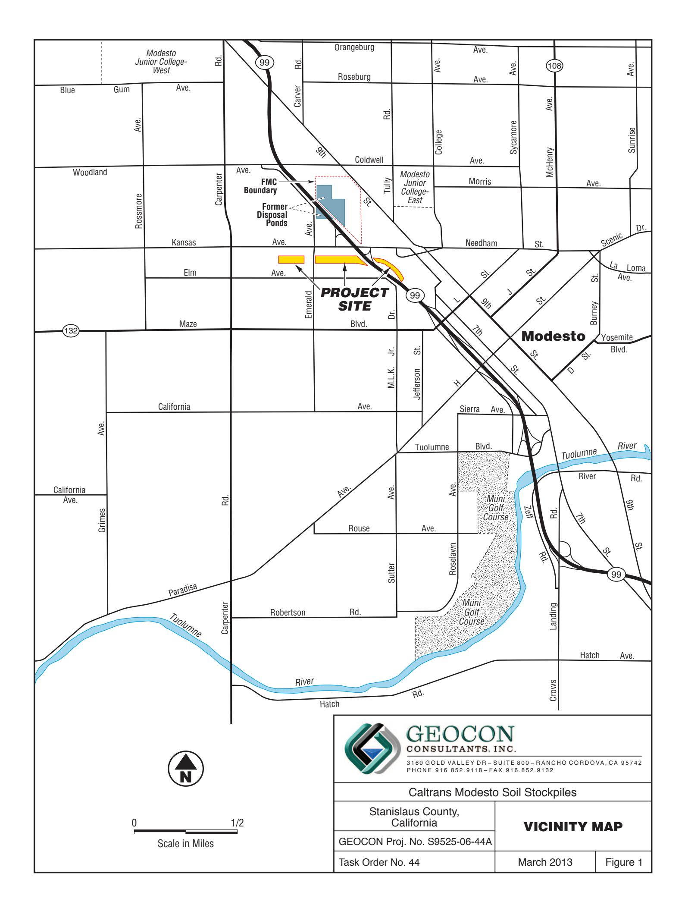
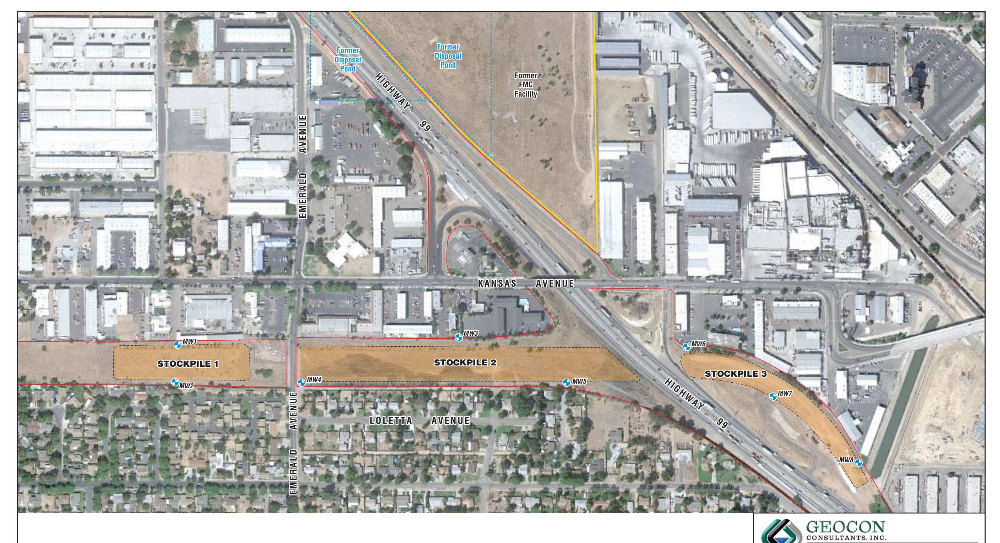
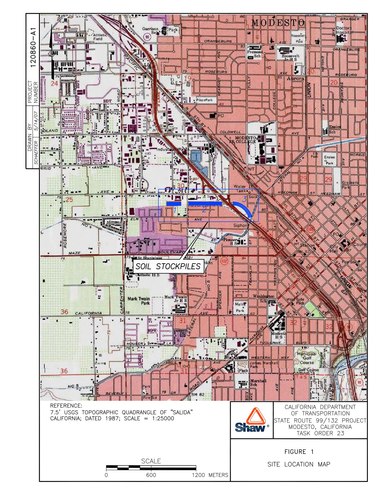
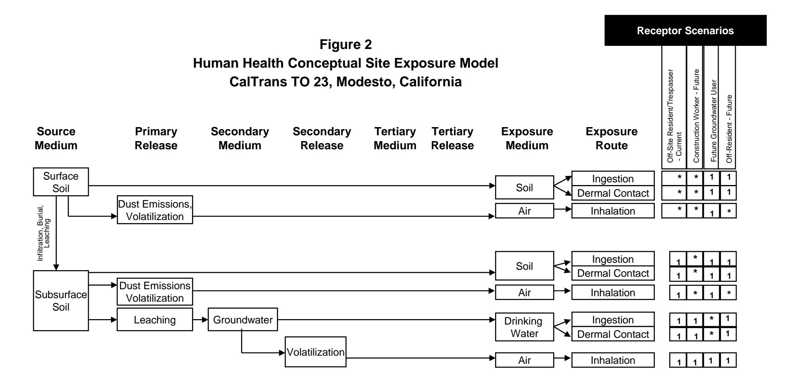

Project No. S9525-06-44A December 17, 2012 Revised March 1, 2013

## VIA ELECTRONIC DELIVERY

Mr. Richard Stewart, PG California Department of Transportation - District 6 855 M Street, Suite 200 Fresno, California 93721

Subject: HUMAN HEALTH RISK ASSESSMENT UPDATE

CALTRANS MODESTO SOIL STOCKPILES

STATE ROUTE 132 WEST FREEWAY/EXPRESSWAY PROJECT

STANISLAUS COUNTY, CALIFORNIA

CONTRACT NO. 06A1580, TASK ORDER NO. 44, EA NO. 10-403500

Dear Mr Stewart:

In accordance with California Department of Transportation (Caltrans) Contract No. 06A1580 and Task Order No. 44, we are submitting this Human Health Risk Assessment (HHRA) Update for the Caltrans Modesto Soil Stockpiles (Site) located south of the intersection of State Route (SR) 99 and Kansas Avenue in Modesto, Stanislaus County, California. This Revised HHRA Update incorporates revisions based on comments provided in DTSC's review letter dated February 15, 2013. A copy of the DTSC review letter is in Appendix A.

The approximate site location is depicted on the attached Vicinity Map, Figure 1.

This document presents an update to the HHRA prepared by Shaw Environmental, Inc. dated May 14, 2007, as requested by Caltrans, the California Department of Toxic Substances Control (DTSC), and the Central Valley Regional Water Quality Control Board (CVRWQCB) during a November 16, 2012, project meeting. The purpose of the HHRA Update is to incorporate soil analytical data recently generated from fenceline, perimeter, and stockpile sampling as presented in our *Supplemental Site Investigation* dated December 14, 2012, and recent groundwater analytical data generated from bimonthly sampling events.

## BACKGROUND

## Project Description and History

Caltrans and the DTSC, in cooperation with the CVRWQCB, have entered into an Interagency Agreement to address the presence of approximately 160,000 cubic yards of fill embankment (Stockpiles 1 through 3) located within Caltrans right-of-way (ROW) west and east of SR99 immediately south of the Kansas Avenue interchange. The soil stockpiles were placed in the early 1960s for the future SR132 highway alignment and were partially generated from excavations of soil from evaporation ponds containing elevated heavy metals (notably barium) and polycyclic aromatic hydrocarbons (PAHs).

From the 1930s to 1970s, property beneath and northeast of the SR99 and Kansas Avenue Interchange was occupied by chemical processing facilities operated by Barium Products LTD., Westvaco Chlorine Products Corporation and Food Machinery and Chemical Corporation (FMC). Ores and minerals

including barite (barium sulfate) and celestite (strontium sulfate) were processed for use in greases, lubricating oil and pigment blanks. Sodium sulfide was generated as a by-product and sold as a caustic and reagent.

From the 1950s to the 1970s, a liquid residue generated by FMC at this facility was discharged to unlined evaporation ponds. In 1961, a 4.3-acre parcel in the southwestern portion of the FMC facility, including a portion of the ponds, was purchased by the State for the construction of SR99 through Modesto. Pond tailings and native soil were removed from this parcel and placed in lifts to form bridge abutments and embankment fills for the future SR99/132 Interchange south of FMC. The pond tailings and soil were stockpiled in the following three distinct locations within existing Caltrans ROW:

- Stockpile 1 located south of Kansas Avenue and west of Emerald Avenue
- Stockpile 2 located south of Kansas Avenue, between Emerald Avenue and SR99
- Stockpile 3 located south of Kansas Avenue and east of SR99

The stockpiles are enclosed within security fencing and bordered by adjacent property boundary fencing/walls or structures. Stockpiles 1 and 2 are bounded by residential areas to the south. The remaining areas adjacent to Stockpiles 1 through 3 consist of commercial/industrial development, Caltrans ROW and city streets. The Modesto Irrigation District Lateral #4 canal extends beneath the southern end of Stockpile 3. The stockpiles and adjacent development are depicted on the Site Plan, Figure 2.

## Previous Environmental Site Investigations

An Initial Site Assessment (ISA) was conducted for the Caltrans SR132 Project by Shaw in 2003. The ISA identified a potential for the soil stockpiles within the SR99/132 ROW to contain residual chemicals associated with the former FMC impoundments. A Preliminary Site Investigation (PSI) was conducted by Shaw in 2004 to characterize the stockpiles. The PSI consisted of drilling 51 borings from which soil samples were collected from the stockpiles, underlying native soil, and background soil and analyzed for heavy metals, PAHs, nitrate and pH. The analytical results indicated elevated barium concentrations in the stockpile samples exceeding the commercial/industrial California Human Health Screening Levels (CHHSLs). Elevated cadmium concentrations exceeding the commercial/industrial CHHSLs were also detected in soil samples obtained from 8 of 25 borings at Stockpile 2 and in 2 of 10 borings at Stockpile 3.

Additional site investigation was conducted by Shaw in 2006 to further characterize the soil stockpiles and compare their chemical contents relative to background conditions and established health goals as well as to assess groundwater quality by installing eight groundwater monitoring wells. The results of the 2004 and 2006 Shaw investigations indicate that the stockpiles are primarily comprised of layered, poorly graded sand and silty sand similar to underlying native alluvial deposits of the Modesto Formation. The average maximum stockpile fill thickness is approximately 25 feet. First encountered groundwater was present in the project vicinity at depths between 30 and 40 feet below natural grade with flow direction toward the southeast. The results of analysis of groundwater samples collected from the eight monitoring wells in June and October 2006 indicated that groundwater generally met drinking water standards for those constituents analyzed.

Shaw prepared the 2007 HHRA for chemicals of potential concern (COPCs) in the stockpiles and groundwater using multiple exposure scenarios. Metals (notably barium) and PAHs were identified as the primary COPCs in the soil stockpiles, and metals and general minerals as the primary COPCs in groundwater. None of the COPCs were deemed to be potential health risks or hazards to current or

future offsite residents, trespassers or construction workers. For the purposes of the HHRA, cadmium was not identified as a COPC due to the lack of elevated cadmium concentrations reported for soil samples collected during the 2006 site investigation. Strontium was further not identified as a COPC in the HHRA since the maximum strontium concentration of 765 milligrams per kilogram (mg/kg) reported in the Shaw 2004 PSI is orders of magnitude below the Environmental Protection Agency (EPA) residential Regional Screening Level (RSL) of 47,000 mg/kg. There is no CHHSL for strontium

In response to the HHRA, the DTSC issued an August 2007 letter that requested additional toxicological and site information prior to a final determination regarding risk or hazard posed by the stockpile material. Shaw prepared a Final Preliminary Endangerment Assessment (PEA) and a Response to Comments document in 2009 to summarize the findings of previous reports prepared for the soil stockpiles and to provide the additional information requested in DTSC's August 2007 letter. In a letter dated December 17, 2009, the DTSC responded to the Final PEA stating that:

"DTSC finds that the soil stockpiles, as currently managed by Caltrans on Caltrans property, do not pose a risk to human health for: 1) Caltrans workers who access the fenced site to conduct mowing operations, conduct fence repairs, or other routine activities; 2) trespassers; and 3) residents adjacent to the stockpiles. Until such time that the State Route 132/99 Interchange project is constructed and/or the final disposition of the soil stockpiles is determined, Caltrans should continue to manage the soil stockpiles by: 1) limiting access to Caltrans authorized personnel; 2) inspecting and maintaining the chain-link fence; 3) prohibiting any activities involving excavation/grading, off-site removal of soil, or placement of other soil on the Site; and 4) maintaining the current grade and vegetative cover. Caltrans should also maintain the existing groundwater monitoring system associated with the Site."

Caltrans reinitiated groundwater monitoring activities in March 2012 as part of the SR132 Project. Geocon samples wells MW-1 through MW-8 on a bi-monthly basis and to date has completed monitoring events in March, May, July, September and November 2012. We also installed upgradient wells MW-9 and MW-10 immediately south of Kansas Avenue and west and east of SR99, sampled them in June 2012, and incorporated them into subsequent bi-monthly sampling events. The results of the recent 2012 groundwater monitoring events are similar to those of the 2006 monitoring events, with the primary analytes reported at concentrations less than California Maximum Contaminant Levels (MCLs).

In response to DTSC's and CVRWQCB's request for further soil investigation in and around the stockpiles, we performed the following supplemental site investigation activities in September 2012:

- 1. Perimeter ROW fenceline stockpile soil sampling (Fenceline Borings) to assess potential offsite and vertical migration of contaminants.
- 2. Perimeter stockpile soil sampling (Perimeter Borings) to define the lateral stockpile limits to aid in consolidation during future construction of the SR132 Project.
- 3. Additional stockpile soil sampling in areas of elevated cadmium soil impacts (Cadmium Borings) identified in Stockpiles 2 and 3 during the Shaw 2004 PSI.

The results of analytical testing of 97 soil samples collected from 35 Fenceline Borings and 28 Perimeter Borings did not indicate barium concentrations exceeding residential or commercial CHHSLs. Barium concentrations in the surface soil samples ranged up to 4,300 mg/kg. Barium

concentrations consistently decreased with depth for surface and bottom soil samples (2 to 5 feet) collected from the Fenceline Borings. Strontium was detected at concentrations up to 110 mg/kg for the Fenceline Boring surface soil samples, which is within the range of background and orders of magnitude below the residential RSL of 47,000 mg/kg. Cadmium was not detected in any of the soil samples collected from the Cadmium Borings advanced in Stockpiles 2 and 3 in areas of elevated cadmium reported in the Shaw 2004 PSI.

## 2007 HUMAN HEALTH RISK ASSESSMENT UPDATE

The Shaw 2007 HHRA is in Appendix B. The HHRA evaluated the three stockpiles separately and collectively for exposure to COPCs in soil, groundwater and outdoor air based on the Shaw 2006 site investigation data. Due to infrequent rain events and the lack of surface water bodies or significant exposure potential, surface water was not considered an exposure pathway. COPCs evaluated include metals reported at concentrations exceeding maximum detected background concentrations and PAHs. The HHRA did not include cadmium as a COPC due to the lack of reported concentrations above the laboratory reporting limits (RLs). The HHRA further did not evaluate strontium as a COPC since strontium was not included in the 2006 site investigation laboratory analysis.

Exposure scenarios for current and future uses were evaluated. Current exposure scenarios evaluated included onsite trespasser and offsite resident that are conservatively combined using residential exposure variables as a resident/trespasser. Future exposure scenarios included evaluation of onsite construction worker and offsite resident. For a conservative groundwater evaluation, a hypothetical future groundwater user was assumed to be exposed to shallow groundwater developed as a potable water supply using residential exposure assumptions. No "current" exposure scenario was considered for groundwater since shallow groundwater is not used as a drinking water resource.

## COPC Exposure-point Concentration, Risk and Hazard Comparisons

We compared the COPC exposure-point concentrations (EPCs) utilized in the 2007 HHRA to the recent supplemental soil data collected in September 2012 and groundwater data collected since March 2012. The EPCs utilized in the Shaw HHRA were the maximum detected concentrations (MDCs) for the selected COPCs for each exposure scenario with the exception of the Stockpile 2 Current Exposure Assessment which utilized the 95% upper confidence levels (UCLs) for the selected COPCs. This information was utilized to evaluate the validity of the 2007 HHRA cancer risk and noncancer hazard estimates. The following sections summarize our EPC comparisons and risk/hazard evaluations for each exposure scenario.

## Stockpile 1 Current Exposure Assessment

The maximum detected concentrations (MDCs) for eight metals (barium, beryllium, chromium, cobalt, copper, lead, mercury and nickel) reported for five surface soil samples from the Shaw 2006 investigation were utilized as the EPCs for the selected COPCs for Stockpile 1. Of these metals, barium (240 vs. 130 mg/kg), copper (24 vs. 13 mg/kg) and lead (17 vs. 12 mg/kg) were detected at slightly higher concentrations in the surface soil samples obtained from the September 2012 Fenceline Borings and Perimeter Borings (first values in brackets) compared to the HHRA EPCs (second values in brackets). Zinc was further detected at an MDC of 120 mg/kg in the 2012 surface soil samples, exceeding the background MDC of 44 mg/kg. Cadmium was detected in one 2012 surface soil sample at 0.26 mg/kg, slightly above the RL of 0.25 mg/kg and less than the residential CHHSL of 1.7 mg/kg. Strontium was detected in each 2012 surface soil sample with a MDC of 61 mg/kg.

The HHRA calculated current cancer risk and noncancer hazard estimates of 8E-8 and 0.04, respectively, for the offsite resident/trespasser receptor exposed to surface soil at Stockpile 1. Based on the 2012 metal concentrations being the same order of magnitude as those used in the HHRA, the lack of any 2012 metal detections exceeding respective residential CHHSLs or RSLs, the calculated excess cancer risk being orders of magnitude less than the conservative criterion of 1E-6, and the estimated noncancer hazard quotient orders of magnitude less than the threshold of 1, the HHRA risk and hazard calculations for the current resident/trespasser remain valid for Stockpile 1.

## Stockpile 2 Current Exposure Assessment

The 95% UCLs for seven metals (arsenic, barium, copper, lead, molybdenum, nickel and zinc) detected in 33 surface soil samples from the Shaw 2006 investigation were selected as the COPCs for Stockpile 2. The MDC for chromium (divided as chromium III and VI) was further selected. Of these metals, barium (4,300 vs. 1,100 mg/kg), copper (41 vs. 29 mg/kg) and zinc (200 vs. 89 mg/kg) were detected at higher concentrations in the surface soil samples obtained from the September 2012 Fenceline Borings and Perimeter Borings (first values in brackets) compared to the HHRA MDCs (second values in brackets). Cadmium was detected in one 2012 surface soil sample at 0.42 mg/kg, less than the residential CHHSL of 1.7 mg/kg. Strontium was detected in each of the 2012 surface soil samples, with an MDC of 110 mg/kg.

The HHRA calculated current cancer risk and noncancer hazard estimates of 1E-7 (background arsenic removed) and 0.1, respectively, for the offsite resident/trespasser receptor exposed to surface soil at Stockpile 2. Based on the 2012 metal concentrations being the same order of magnitude as those used in the HHRA, the lack of any 2012 metal detections exceeding respective residential CHHSLs or RSLs, the calculated excess cancer risk being less than the conservative criterion of 1E-6, and the estimated noncancer hazard quotient being an order of magnitude less than the threshold of 1, the HHRA risk and hazard calculations for the current resident/trespasser remain valid for Stockpile 2.

## Stockpile 3 Current Exposure Assessment

The MDCs for three metals (barium, lead and molybdenum) reported for 13 surface soil samples from the Shaw 2006 investigation were selected as the COPCs for Stockpile 3. Of these metals, barium (1,600 vs. 250 mg/kg) and lead (34 vs. 12 mg/kg) were detected at higher levels in the surface soil samples obtained from the September 2012 Fenceline Borings and Perimeter Borings (first values in brackets) compared to the HHRA EPCs (second values in brackets). Copper and zinc were further detected at maximum respective concentrations of 17 and 190 mg/kg in the 2012 surface soil samples, which exceed the respective background MDCs of 11 and 44 mg/kg. Cadmium was detected in four 2012 surface soil samples at a MDC of 0.78 mg/kg, less than the residential CHHSL of 1.7 mg/kg. Strontium was detected in all but one of the 2012 surface soil samples with a MDC of 100 mg/kg.

The HHRA calculated a current noncancer hazard estimate of 0.02 for the offsite resident/trespasser receptor exposed to surface soil at Stockpile 3. None of the COPCs for Stockpile 3 are considered to be carcinogens and therefore no cancer risk was calculated. Based on the 2012 metal concentrations being the same order of magnitude as those used in the HHRA, the lack of any 2012 metal detections exceeding respective residential CHHSLs or RSLs, and the estimated noncancer hazard quotient being orders of magnitude less than the threshold of 1, the HHRA risk and hazard calculations for the current resident/trespasser remain valid for Stockpile 3.

## Stockpiles 1 through 3 - Future Construction Worker and Offsite Resident

The MDCs for ten metals (arsenic, barium, chromium, cobalt, copper, lead, molybdenum, nickel, vanadium and zinc) reported for 165 soil samples from the Shaw 2006 investigation were selected as the COPCs for Stockpiles 1 through 3. The PAH benzo(a)pyrene was further selected as a COPC. For the metals, barium (130,000 vs. 72,000 mg/kg), copper (41 vs. 29 mg/kg) and zinc (200 vs. 110 mg/kg) were detected at higher concentrations in the soil samples obtained from the September 2012 Fenceline Borings and Cadmium Borings (first values in brackets) compared to the HHRA EPC (second values in brackets). The calculated 95% UCL for the 2012 barium data is 7,556 mg/kg, significantly less than the MDC of 130,000 mg/kg and the EPC of 72,000 mg/kg used in the HHRA. Strontium was detected in all but one of the 2012 soil samples with an MDC of 270 mg/kg.

The HHRA calculated current cancer risk and noncancer hazard estimates of 9.2E-7 and 0.4, respectively, for the construction worker receptor exposed to soil at Stockpiles 1 through 3. The calculated current cancer risk and noncancer hazard estimates were 6E-10 and 0.017, respectively, for the future offsite resident receptor exposed to soil at Stockpiles 1 through 3. Based on the conservative approach of using MDCs of each metal versus the 95% UCLs, the calculated excess cancer risks being order(s) of magnitude less than the conservative criterion of 1E-6, and the estimated noncancer hazard quotients significantly less than the threshold of 1, the HHRA risk and hazard calculations for future conditions for construction workers and offsite residents remain valid for Stockpiles 1 through 3.

## Onsite Shallow Groundwater

The MDCs for twelve metals (barium, chromium, cobalt, copper, lead, manganese, molybdenum, nickel, selenium, silver, vanadium and zinc) reported for groundwater samples collected in June and October 2006 were selected as the COPCs for evaluation of the hypothetical shallow groundwater user. The maximum 2006 metal concentrations were reported for samples obtained from wells MW-5 and MW-6. Of these metals, cobalt (5.3 vs. 3.0 micrograms per liter [ $\mu$ g/I]), copper (7.4 vs. 6.2  $\mu$ g/I), manganese (290 vs. 260  $\mu$ g/I), nickel (9.6 vs. 7.1  $\mu$ g/I), selenium (4.4 vs. 3.0  $\mu$ g/I), vanadium (42 vs. 34  $\mu$ g/I) and zinc (120 vs. 15  $\mu$ g/I) were detected at slightly higher concentrations in the 2012 groundwater samples (primarily from upgradient well MW-10) (first values in brackets) compared to the HHRA EPCs (second values in brackets). Strontium was detected in all of the 2012 groundwater samples with a MDC of 1,400  $\mu$ g/I.

The HHRA calculated a current noncancer hazard estimate for the hypothetical shallow groundwater user at 0.9. None of the selected groundwater COPCs are considered to be carcinogens and therefore no cancer risk was calculated. Based on the similar metals data with the majority of the higher concentrations reported for samples collected from upgradient well MW-10, and the estimated noncancer hazard quotient being less than the threshold of 1, the HHRA risk and hazard calculations for the hypothetical groundwater user remain valid.

## SUMMARY

The 2007 HHRA conservatively utilized MDC or 95% UCL soil and groundwater analyte concentrations obtained during the 2006 site investigation and groundwater monitoring events. We compared these EPCs to the recent 2012 soil and groundwater data collected at the Site to verify the validity of the 2007 HHRA. The results of the comparative analysis indicate that the 2012 soil and groundwater data is similar to the 2006 data utilized in the HHRA and do not significantly increase the conservative cancer risk and noncancer hazard estimations. Based on our review, the attached 2007 HHRA remains valid with respect to exposure potential for the current resident/trespasser, future construction worker and offsite resident, and hypothetical shallow groundwater user at the Caltrans Modesto Soil Stockpile Site.

Please contact us if you have any questions or comments concerning this HHRA Update or if we may be of further service.

Sincerely,

GEOCON CONSULTANTS, INC.

John E. Juhrend, PE, CEG Principal/Senior Engineer

Jim Brake, PG Senior Geologist

Attachments:

Figure 1, Vicinity Map

Figure 2, Site Plan

Appendix A, DTSC February 15, 2013, Review Letter

Appendix B, Shaw 2007 HHRA

cc:

Caltrans, Sam Haack (sam haack@dot.ca.gov)

DTSC, Randy Adams (Randy.Adams@dtsc.gov)

CVRWQCB, Steve Meeks (Steven.Meeks@waterboard.ca.gov)

MW8 Approximate Monitoring Well Location

— State Right-of-Way Boundary

Approximate Monitoring Well Location

Scale in Feet

3160 GOLD VALLEY DR - SUITE 800 - RANCHO CORDOVA, CA 95742 PHONE 916.852.9118 - FAX 916.852.9132 Caltrans Modesto Soil Stockpiles

| Stanislaus County, California |
|----------------------------------|
| GEOCON Proj. No. S9525-06-44A    |

**SITE PLAN** 

Task Order No. 44

March 2013

ch 2013

Figure 2

# APPENDIX A

## Department of Toxic Substances Control

Deborah O. Raphael, Director 8800 Cal Center Drive Sacramento, California 95826-3200

February 15, 2013

Ms. Sam Haack, P.E. Project Manger California Department of Transportation District 10 P.O. Box 2048 Stockton, California 95201

SUPPLEMENTAL SITE INVESTIGATION AND HUMAN HEALTH RISK ASSESSMENT UPDATE. CALTRANS MODESTO SOIL STOCKPILES. STATE ROUTE 132/99. STANISLAUS COUNTY CALIFORNIA

Dear Ms. Haack:

The Department of Toxic Substances Control (DTSC) in consultation with the Regional Water Quality Control Board, Central Valley Regional (RWQCB) has reviewed the draft reports titled "Supplemental Site Investigation (SSI), Caltrans Modesto Soil Stockpiles, State Route 132. West Freeway/Expressway Project, Stanislaus County" dated December 14, 2012 and "Human Health Risk Assessment (HHRA) Update. Caltrans Modesto Soil Stockpiles, State Routes 99 and 132, Stanislaus County, California" dated December 17, 2012. The subject reports were prepared by the Department of Transportation's (Caltrans) contractor, Geocon Consultants, Inc. (Geocon).

## Background Information

Beginning in January 2005 DTSC, via Interagency Agreements and Task Orders with Caltrans, reviewed reports related to the characterization of soil stockpiles on Caltrans "right-of-way" (ROW) property located south of Kansas Avenue, just east and west of North Emerald Avenue and State Route (SR) 99 in Modesto, Stanislaus County (Site). The soil stockpiles consist of three separate piles totaling approximately 160,000 cubic yards on Caltrans property and originated from native soils and pond tailings that were generated when Caltrans constructed a segment of SR 99 north of Kansas Avenue in the 1960's. Excavating the segment traversed a portion of a 4.3-acre parcel purchased from Food Machinery and Chemical Corporation Inc. (FMC). The parcel was previously occupied by a corner of FMC's southernmost percolation pond. FMC (and its predecessors) was a chemical manufacturing company that processed barium sulfate and strontium sulfate ores and other minerals. Caltrans and the Stanislaus Council of

Governments (StanCOG) are planning the construction of the SR 132 West Expressway at the location of the soil stockpiles. The project is proposed to use the stockpile soils to construct the core of the abutments and elevated sections of the SR 132 West Expressway/Freeway.

In accordance with the Interagency Agreements and Tasks Orders, DTSC reviewed reports identified in DTSC's correspondence to Caltrans dated December 17, 2009. Collectively, these reports were intended to provide information for determining whether there is a potential for a release of hazardous substances that presents risk to human health or the environment. DTSC in consultation with the RWQCB reviewed and provided comments to Caltrans on various environmental reports. In this same correspondence, DTSC requested that prior to the design and construction of the SR Route 132/99 West Expressway project, Caltrans and the StanCOG will need to consult with DTSC and RWQCB to address the use of the soil stockpile material in the subject project and/or its final disposition as it relates to human health and water quality. Accordingly, soil stockpile material used in ramps and roadways will need to be managed in a manner that is protective of human health and water quality. These activities will require concurrence from DTSC and RWQCB via approval of Removal Action Workplan (RAW) or Remedial Action Plan (RAP), depending on the costs.

Beginning in February 2012, Caltrans resumed coordination with DTSC and the RWQCB for the purpose of preparing a RAP associated with the management of the soil stockpiles. Under a new Interagency Agreement and Task Order with Caltrans, DTSC in consultation with RWQCB is providing oversight for the purpose of preparing a RAP for the management of the soil stockpiles including additional characterization and updating of the HHRA. In DTSC's correspondence dated September 20, 2012, DTSC in consultation with the RWQCB reviewed and approved the "Final Supplemental Site Characterization Workplan, Modesto Soil Stockpiles, SR 99 and 132, Stanislaus County, California dated September 2012 and prepared by Geocon. The Final Workplan provides additional characterization of soil stockpiles at the location the proposed SR 132/99 West Expressway to evaluate and finalize a remedy for the management of hazardous substances in the soil stockpiles. The additional characterization data is to evaluate potential lateral and vertical migration of contaminants from the soil stockpiles and to update the Human Health Risk Assessment.

The following comments were prepared by the Brownfields and Environmental Restoration Program, San Joaquin and Legacy Landfills - Sacramento Unit project manager and are arranged according to the format of the subject reports. Additional comments prepared by DTSC's Human and Ecological Risk Office (HERO) addressing the HHRA Update are enclosed.

## Supplemental Site Investigation Report

## Section 2.3, Previous Environmental Site Investigations

This section discusses previous environmental investigations associated with the Site from 2003 to 2007. It reports that cadmium was not identified as a chemical of potential concern (COPC) with respect to the 2007 HHRA. Based on results from the 2012 investigations cadmium is also not identified as a COPC. Please reference and include in an appropriate section a discussion regarding cadmium sampling results for 2004 and 2012 addressing apparent differences in the respective data sets.

Please clarify/revise the first paragraph on page No. 4 referencing the sentence beginning with "None of the COPCs were deemed to be potential health risks or hazards to the current or future offsite residents, trespassers or construction workers". This sentence is apparently in reference to the 2007 HHRA prepared by Shaw Environmental Inc. It is not a DTSC finding. As partially discussed in the second paragraph on page No. 4, health risks associated with the COPCs are qualified in DTSCs' letter dated December 17, 2009. However, the discussion is incomplete. Please include the complete quote from DTSC's letter dated December 17, 2009 as follows.

"DTSC finds that the soil stockpiles, as currently managed by Caltrans on Caltrans property, do not pose a risk to human health for: 1) Caltrans workers who access the fenced site to conduct mowing operations, conduct fence repairs, or other routine activities; 2) trespassers; and 3) residents adjacent to the stockpiles. Until such time that the State Route 132/99 Interchange project is constructed and/or the final disposition of the soil stockpiles is determined, Caltrans should continue to manage the soil stockpiles by: 1) limiting access to Caltrans authorized personnel; 2) inspecting and maintaining the chain-link fence; 3) prohibiting any activities involving excavation/grading, off-site removal of soil, or placement of other soil on the Site; and 4) maintaining the current grade and vegetative cover. Caltrans should also maintain the existing groundwater monitoring system associated with the Site".

## Section 7.0, Summary of findings

This section summarizes the findings of the 2012 investigations stating that "the results of the of the 2012 Fenceline and Perimeter Boring soil sample analytical results does not suggest lateral or vertical migration of soil containing metals (notably barium) exceeding State or Federal residential human health screening levels (or in the isolated case of arsenic, site specific background levels) along the stockpile perimeters and adjacent property fencelines". This section also references a 1963 aerial photograph (Figure 3) addressing the placement of barium impacted soil materials in the right-of-

way (ROW) of Stockpiles 2 and 3. Section 2.2, Additional Site History Research also reference hall roads in the ROW of Stockpiles 2 and 3.

As noted in Figure 3, placement of soil in the vicinity of Stockpile 1 had not been implemented at the time of this photograph (1963) and residential/commercial development is absent along the footprint of the existing Stockpile 1. If possible, please include additional aerial photographs showing the placement of soil material in the ROW of Stockpile 1 and/or design drawings for this purpose.

## HHRA Update

DTSC notes that the title of the HHRA report is slightly different than the title of the SSI report (e.g., the SSI includes "Caltrans Modesto Soil Stockpiles, State Route 132, West Freeway/Expressway Project, Stanislaus County" in the title and the HHRA includes "Caltrans Modesto Soil Stockpiles, State Routes 99 and 132, Stanislaus County, California" in the title). Please revise the HHRA title to be consistent with the SSI.

## COPC Exposure-Point Concentration, Risk, and Hazard Index

This section discusses current exposure assessment for Stockpiles 1, 2, and 3 in respective subsections and future construction worker and offsite resident for Stockpiles 1 through 3 in a separate subsection.

Please provide a discussion regarding the maximum detected concentrations (MDCs) verses exposure point concentrations (EPCs) as used in subsection Stockpile 1 Current Exposure Assessment. Cadmium is referenced as being detected in one 2012 surface soil sampling location. Please include a discussion on this result with respect to Cadmium Borings. Refer to DTSC comments in Section 2.3, Previous Environmental Site Investigations.

Also, please clarify the comparison of surface sampling results from the 2012 investigations with respect to the previous investigations for all related subsections. For example, when comparing data from the 2012 investigations to previous investigations explain that the first value in brackets is the 2012 data and the second value is from previous investigations.

DTSC requests that Caltrans address stockpile material outside of the fence line at the western boundary of Stockpile No. 2 along Emerald Avenue. Please prepare a plan that would divert/contain any potential water runoff or sediment migration from rain events

and to cover stockpile material outside the fence line at the western boundary of Stockpile No. 2 at this location.

If you have any questions, please contact me at (916) 255-3591.

Sincerely,

Randy S. Adams, C.E.G.

Rau Ladan

Senior Engineering Geologist

Brownfields and Environmental Restoration Program

## Enclosure

cc: Mr. John E. Juhrend, P.E., C.E.G. Geocon Consultants, Inc. 3160 Gold Valley Drive, Suite 800 Rancho Cordova, California 95742-7515

> Mr. Jim Brake, P.G. Geocon Consultants, Inc. 3160 Gold Valley Drive, Suite 800 Rancho Cordova, California 95742-7515

Mr. Richard Stewart, P.G.
Engineering Geologist
California Department of Transportation
Division of Environmental Planning
2015 E. Shields Avenue, Suite 100
Fresno, California 93726-5428

Ms. Nicole Damin Senior Hazardous Materials Specialist Stanislaus County Health Agency 3800 Cornucopia Way, Suite C Modesto, California 95358-9492

cc: Mr. Duncan Austin, P.E.
Program Manager, Site Cleanup
Supervising Water Resources Control Engineer
Regional Water Quality Control Board
Central Valley Region
11020 Sun Center Drive, #200

Rancho Cordova, California 95670-6144 Mr. Steven Meeks, P.E., Chief

Private Sites Cleanup Senior Water Resources Control Engineer Regional Water Quality Control Board Central Valley Region 11020 Sun Center Drive, #200 Rancho Cordova, California 95670-6144

Ms. Kimiko Klein, Ph.D.
Staff Toxicologist Emerita
Human and Ecological Risk Office
Department of toxic Substances Control
700 Heinz Avenue Suite 200
Berkeley, California 94710-2721

Mr. Steven R. Becker, P.G., Chief
Site Evaluation and Remediation Unit
San Joaquin and Legacy Landfills Office
Brownfields and Environmental Restoration Program
Department of Toxic Substances Control
8800 Cal Center Drive
Sacramento, California 95826

## Department of Toxic Substances Control

Deborah O. Raphael, Director 8800 Cal Center Drive Sacramento, California 95826-3200

## MEMORANDUM

TO:

Randy S. Adams, C.E.G.

Senior Engineering Geologist

Brownfields and Environmental Restoration Program

8800 Cal Center Drive

Sacramento, CA 95826-3200

FROM:

Kimiko Klein, Ph.D.

Staff Toxicologist Emerita

Human and Ecological Risk Office (HERO)

DATE:

February 14, 2013

SUBJECT:

Human Health Risk Assessment Update

CalTrans Modesto Soil Stockpiles

State Routes 99 and 132

PCA 12019 Site Code: 102183-11

Kimileo Kand

## Background

This site consists of three soil stockpiles located near Highway 99. Stockpile 1 covers about 2.5 acres. Stockpile 2 covers approximately 7.5 acres. Stockpile 3 covers about 2.5 acres. Stockpiles 1 and 2 are located on the western side of Highway 99 and are bounded by residential areas on the south and commercial/industrial areas to the north. Stockpile 3 is located on the eastern side of Highway 99 and is bounded by the highway and by industrial areas. These stockpiles were generated during the construction of Highway 99 through an area that contained a portion of one of the evaporation ponds of the FMC facility. The primary chemical present in these stockpiles is barium. There are somewhat elevated concentrations of other metals when compared to local background, and a few semi-volatile organic chemicals are also present. These stockpiles are intended for use as part of a future highway interchange. The Human and Ecological Risk Office (HERO) has been requested to provide technical support and has recently participated in several meetings with the concerned public to discuss the risks and hazards posed to near-by residents by potential exposure to chemicals present in the stockpiles.

Randy S. Adams February 14, 2013 Page 2

## Documents Reviewed

The HERO reviewed a document titled "Human Health Risk Assessment Update, CalTrans Modesto Soil Stockpiles, State Routes 99 and 132, Stanislaus County, California", dated December 17, 2012, and prepared by GeoCon for the California DTSC of Transportation – District 6. The HERO received this document electronically on January 9, 20132. This report is an update to "Human Health Risk Assessment Caltrans Modesto Soil Stockpiles", May 2007, reviewed by the HERO in a memorandum, dated July 17, 2007.

In addition, the HERO reviewed the following:

Site Investigation Report Characterization of Soil Stockpiles, Caltrans Modesto Soil Stockpiles, May 2007

2. Table 2 Summary of Soil Analytical Results – Fenceline Borings – Title 22 Metals, from Geocon Project No. S9525-06-44, October 2012;

3. Addendum to the Comprehensive Remedial Investigation Report, FMC Corporation, January 2005, excerpt;

4. Tables from Remedial Action Options Report, July 2004;

## Comments and Conclusions - Human Health Risk Assessment Update, 2012

The HERO assumes that the data used in the human health risk assessments have been reviewed and accepted by other regulatory agency staff for adherence to all data quality objectives and that the data reasonably characterizes the soil stockpiles. The updated human health risk assessment is a qualitative review of the soil data collected in 2012 at the fenceline of the stockpiles site and the perimeters of the stockpiles. The fenceline data were collected to assess the potential for offsite and vertical migration of contaminants in the stockpiles. The perimeter data were collected to define the lateral limits of the stockpiles. Both the fenceline and perimeter soil data represent surface soil concentrations. The maximum detected concentrations of the chemicals of concern in these soil data were compared to surface soil concentrations evaluated in the risk assessment performed in 2007. Surface soil concentrations are evaluated in the risk assessments, because humans trespassing the stockpiles would be exposed to surface soil, and particulates making up surface soil are the most likely to be transported off-site by wind, erosion and surface water flow.

Since the maximum concentrations of each chemical of concern detected at the fenceline or at the perimeters of the stockpiles are less than 10-fold different, that is, less than an order of magnitude, from those concentrations evaluated in the 2007 risk assessment, the update concludes that the calculated risks and hazards from potential exposure to soil in the stockpiles remain virtually unchanged as currently managed. These risks and hazards are insignificant, with cumulative cancer risks of less than one-in-a-million for all cancer-causing chemicals detected. The hazard index is less than one for all hazardous chemicals detected, indicating that adverse health effects from

Randy S. Adams February 14, 2013 Page 3

potential exposure to contaminated soil in the stockpiles would not be expected. The HERO agrees with this conclusion.

The updated health risk assessment also evaluated the maximum concentrations of chemicals of concern detected in onsite shallow groundwater in the most recent groundwater monitoring event conducted in 2012 by comparing those concentrations with the concentrations used in the original risk assessment. As with the soils data, the concentrations of chemicals recently measured in groundwater are similar to the concentrations evaluated in the 2007 risk assessment, thus, the results of the risk assessment remain unchanged. No cancer-causing chemicals were detected in groundwater, therefore, potential exposure to groundwater would pose no cancer risk. The hazard index (HI) is less than the threshold HI of one, indicating that no non-cancer adverse health effects would be expected to occur upon potential chronic exposure to groundwater. The HERO agrees with this conclusion

## Comments and Conclusions – Addendum to the Comprehensive Remedial Investigation Report, FMC Corporation, 2005

In the excerpt of this report reviewed by the HERO, a listing is provided of raw materials and intermediates used in the manufacturing activities at the FMC facility as well as the agricultural products made by FMC. This list is attached as Table 1 to this memorandum. Of the materials listed, arsenic, barium and petroleum coke are the chemicals considered by the Department of Toxic Substances Control (DTSC) to have toxic properties with barium having substantially less toxicity than arsenic and petroleum coke. Polycyclic aromatic hydrocarbons (PAHs) and metals, such as vanadium and nickel, are commonly found components of petroleum coke. Arsenic, barium, nickel and vanadium were analyzed for in the soil stockpiles in sampling events provided in Reports designated 1, 2, and 4 under the Documents Reviewed section above. PAHs were analyzed for in the soil stockpiles and the results presented in Report 1.

Sulfate, nitrate and sulfide were salts used and produced by FMC, as shown on Table 1. The results of analysis of these salts in the soil stockpiles are given in Report 1. Nitrates were detected at levels below background concentrations. The maximum sulfate concentration was 8,600 mg/kg, compared to the maximum background concentration of 21 mg/kg. The maximum sulfide concentration was 2.4 mg/kg, whereas sulfides were not detected in background soils. There are no toxicity criteria or risk-based screening levels associated with sulfates and sulfides when present in soil, and, therefore, no estimate of toxic effects of these salts to humans can be made.

The HERO concludes that the investigation of the soil stockpiles appears to include all the chemicals used at and produced by the FMC facility and considered toxic by the DTSC. This conclusion is based on the HERO's review of the excerpt from this addendum to the remedial investigation report of the FMC Corporation and the site investigation reports listed under the Documents Reviewed section above.

## Comments - Table 2 Chemicals found in Caltrans Modesto Soil Stockpiles

Table 2 has been created by the HERO and is attached to this memorandum. The table lists the chemicals detected in the soil stockpiles, identifies those chemicals used and manufactured at the FMC facility and considered toxic, and compares the maximum concentrations of those chemicals to risk-based soil screening levels and to local background concentrations. Asterisks identify those chemicals used or produced at the FMC facility. Sulfates and sulfides are not included in the table, because there are no risk-based screening levels for these salts. The maximum detected concentration measured in any of the sampling events for each chemical and the stockpile where that concentration was found are listed. These concentrations are compared to the most conservative risk-based screening levels provided by both the U.S. Environmental Protection Agency (US EPA, regional screening levels (RSLs)) and the California Environmental Protection Agency (Cal/EPA, California Human Health Screening Levels (CHHSLs)). Exposure to concentrations less than these screening levels would not be expected to result in any adverse human health effects.

The maximum concentrations are also compared to local background levels, since metals are naturally occurring in soil, and PAHs are present at detectable levels in most urban and semi-urban environments. If the maximum concentrations of chemicals are within the range of local background concentrations, those chemicals are eliminated as chemicals of concern.

With respect to the chemicals found in the stockpile that were also used or produced at the FMC facility, the maximum concentrations of arsenic, carcinogenic PAHs (cPAHs), nitrates, and vanadium in the stockpiles are within the range of background concentrations. The maximum concentrations of barium, nickel, and strontium are less than their risk-based screening levels.

The chromium+6 concentration is a calculated, rather than a measured, value. This calculated value is greater than its risk-based US EPA RSL but less than its CHHSL. There is no history of chromium+6 being used at the FMC facility or in the vicinity of the current stockpiles, so the HERO considers it unlikely that chromium+6 is present in the stockpiles. All of the other chemicals listed in Table 2 were not identified as being used or produced at the FMC facility.

The maximum concentrations of most of the metals listed in Table 2 exceed local background concentrations. However, none of these chemicals were detected at levels approaching their risk-based levels.

## Conclusions - Table 2 Chemicals found in Caltrans Modesto Soil Stockpiles

The HERO evaluated the chemicals in the soil stockpiles using the results obtained from multiple site investigation events over the years where soil from the stockpiles were sampled for chemicals of potential concern. The HERO made two conservative assumptions in performing this evaluation. The first assumption is that the maximum concentration of each chemical detected in the stockpile is the concentration to which human receptors would be exposed on a daily basis, whereas a person would actually be exposed to some estimate of an average concentration over an area, since the person would move across or about the stockpile(s) over time. The second assumption concerns the comparison of those maximum concentrations with the most conservative risk-based screening levels available. The screening levels listed in Table 2 of this memorandum are calculated by regulatory agencies to be protective for residential land use. The soil stockpiles will not be converted to residential land use. The stockpiles are to be part of a highway bypass and are currently managed to prevent every day access by humans. The chemicals in the stockpiles are present either at background concentrations or at concentrations below their respective risk-based screening levels and, therefore, do not represent a significant risk or hazard.

Residents currently living adjacent or near the soil stockpiles could potentially be transiently exposed to contaminants in the stockpiles due to wind-blown dust or off-site migration of contaminated surface soil through erosion or surface water flow. But these potential exposures would still not result in any risk or hazard, since it is highly improbable for risks and hazards to increase with distance away from the stockpiles.

## Overall Conclusions

The HERO concludes that the soil stockpiles do not pose a cancer risk or non-cancer hazard to persons in the vicinity of these stockpiles as long as the stockpiles remain in place and are properly managed. The evaluation presented here is based on concentrations measured in surface soil. There are areas in the stockpiles with elevated concentrations of chemicals at depths greater than one foot below ground surface. Therefore, if there is substantial grading or reworking of the stockpiles or if the stockpiles are removed, these elevated concentrations at depth will have to be evaluated with respect to the potential for exposure by residents living adjacent or near the stockpiles during the period when the soil is being moved.

If you have any further questions, please contact me at (510) 540-3762 or via electronic mail at kklein @dtsc.ca.gov.

Randy S. Adams February 14, 2013 Page 6

Kimiko Ken for:

Reviewed by:

Claudio Sorrentino, Ph.D. Senior Toxicologist

**Senior Toxicologist**

Human and Ecological Risk Office

Attachments

Randy S. Adams February 14, 2013 Page 7

Table 1 Materials Used at and Produced by FMC Corporation

| Raw Materials     | Intermediates     | Products               |
|-------------------|-------------------|------------------------|
| Arsenic trioxide  | Barium sulfide    | Barium carbonate       |
| Barium sulfate    | Barium oxide      | Barium nitrate         |
| Calcium hydroxide | Strontium sulfide | Barium silicate        |
| Carbon dioxide    |                   | Barium hydroxide       |
| Strontium sulfate |                   | Sodium polysulfide     |
| Petroleum coke    |                   | Sodium sulfide         |
| Iron oxide        | ,                 | Sodium sulfide-arsenic |
|                   |                   | trioxide               |
| Iron powder       |                   | Strontium oxide        |
| Hydrochloric acid |                   | Strontium carbonate    |
| Nitric acid       |                   | Strontium nitrate      |
| Sodium carbonate  |                   |                        |
| Sodium hydroxide  |                   |                        |
| Sodium silicate   |                   |                        |
| Sulfur            |                   |                        |
| Sulfuric acid     |                   |                        |

Table 2 Chemicals found in Caltrans Modesto Soil Stockpiles - mg/kg

| Chemical               | Maximum Detected surface a | Report b | Stockpile   | Residential RSL° | Residential CHHSL d | Maximum Local Bkg e | Notes                            |
|------------------------|---------------------------------------------|---------------------|-------------|------------------|-----------------------------------|--------------------------------------|----------------------------------|
| Arsenic*               | 4.9                                         | 1                   | 2           | 0.39             | 0.07                              | 4.1                                  | carcinogen                       |
| Barium*                | 4300                                        | 3                   | 2 perimeter | 15,000           | 5,200                             | 120                                  |                                  |
| Beryllium              | 0.4                                         | 1                   | 1           | 160              | 16                                | 0.4                                  |                                  |
| Cadmium                | NDg                                         | 1, 3                |             | 70               | 1.7                               | 0.4                                  | carcinogen                       |
| Chromium               | 18                                          | 1                   | 2           | 120,000          | 100,000                           | 10                                   |                                  |
| Chromium +6 | 2.6 h                            | 1                   | 2           | 0.29             | 17                                | -                                    | carcinogen                       |
| Cobalt                 | 7.3                                         | 1                   | 1           | 23               | 660                               | 6.3                                  |                                  |
| Copper                 | 41                                          | 3                   | 2 perimeter | 3,100            | 3,000                             | 11                                   |                                  |
| Lead                   | 44                                          | 3                   | 2 perimeter | 400              | 80                                | 3.8                                  |                                  |
| Mercury                | 0.1                                         | 1                   | 2           | 23               | 18                                | 0.04                                 |                                  |
| Molybdenum             | 1.1                                         | 1                   | 2           | 390              | 380                               | 0.6                                  |                                  |
| Nitrate*               | 30                                          | 2                   | 2           | 130,000          | -                                 | 34                                   |                                  |
| Nickel*                | 16                                          | 1                   | 2           | 1,500            | 1,600                             | 8.7                                  |                                  |
| cPAHs*                 | 0.019 i                          | 2                   | 1           | 0.015            | 0.038                             | 0.4j i                    | BaP k , carcinogen |
| Strontium*             | 765                                         | 4                   | 2           | 47,000           | -                                 | 128 l                     |                                  |
| Vanadium*              | 40                                          | 2                   | 1           | 390              | 530                               | 58                                   |                                  |
| Zinc                   | 200                                         | 3                   | 2 perimeter | 23,000           | 23,000                            | 44                                   |                                  |

\*Used at FMC. Nickel, vanadium, and cPAHs are presumed components of petroleum coke.

a 0-1 ft bgs

b Reports: 1. Tables 2, 3, 4, Human Health Risk Assessment 2007; 2. Table 3b, Site Investigation Report Characterization of Soil Stockpiles, 5/2007; 3. Table 2, Geocon Project No. S9525-06-44, 10/2012; 4. Table 2, Remedial Action Options Report, July 2004.

- c US EPA Residential Regional Screening Level (RSL), 11/2012
- d Cal/EPA Residential California Human Health Screening Level (CHHSL), 9/2010
- e Table 2a, Site Investigation Report Characterization of Soil Stockpiles, 5/2007, except as noted
- f Reporting limit
- g 2012 data; Cadmium detected in 2004 but not detected in 2006 and 2012
- h Calculated Chromium6 not analyzed for
- i At 5 ft bgs. ND at surface (n=9)
- j 95% UCL of mean of northern California bkg, Background Levels of Polycyclic Aromatic Hydrocarbons in Northern California Surface Soil 2002
- k BaP: Benzo(a)pyrene is the reference compound
- Average from Background Concentrations of trace and Major Elements in California Soils 1996

# APPENDIX B

4005 Port Chicago Highway Concord, CA 94521 Phone: 925.288.9898 Fax: 925.288.0888

May 14, 2007 Project 120860

Mr. Richard Stewart California Department of Transportation 2015 Shields Avenue, Suite 100 Fresno, California 93726

Re: Human Health Risk Assessment, State Route 99/132 Project, Caltrans Modesto Soil Stockpiles, Stanislaus County, California

Dear Mr. Stewart:

Shaw Environmental is pleased to submit this Human Health Risk Assessment for the Caltrans Modesto Soil Stockpiles, Stanislaus County, California. This report is submitted in accordance with Contract No. 06A0752, Task Order Number 23.

If you have any questions, please contact me at (916) 565-4183 at your convenience.

Sincerely,

SHAW ENVIRONMENTAL, INC.

Martha Adams, P.E.

Project Manager

## HUMAN HEALTH RISK ASSESSMENT

## Caltrans Modesto Soil Stockpiles Stanislaus County, California

May 14, 2007

## Prepared for:

California Department of Transportation Office of Environmental Engineering, District 6 2015 East Shields Avenue Fresno, California 93726

## Prepared by:

Shaw Shaw Environmental, Inc. 1326 North Market Boulevard Sacramento, California 95834-1912

Task Order No.: 23 Contract No.: 06A0752

**Project No. 120860** 

## Human Health Risk Assessment Caltrans Modesto Soil Stockpiles Stanislaus County, California

The material and data in this report were prepared under the supervision and direction of the undersigned. This report was prepared consistent with current and generally accepted environmental consulting principles and practices that are within the limitations provided herein.

PORRO OF INDUSTRIAL TO SERVING STATE OF THE SERVING STATE OF THE SERVING STATE OF THE SERVING STATE OF THE SERVING STATE OF THE SERVING STATE OF THE SERVING STATE OF THE SERVING STATE OF THE SERVING STATE OF THE SERVING STATE OF THE SERVING STATE OF THE SERVING STATE OF THE SERVING STATE OF THE SERVING STATE OF THE SERVING STATE OF THE SERVING STATE OF THE SERVING STATE OF THE SERVING STATE OF THE SERVING STATE OF THE SERVING STATE OF THE SERVING STATE OF THE SERVING STATE OF THE SERVING STATE OF THE SERVING STATE OF THE SERVING STATE OF THE SERVING STATE OF THE SERVING STATE OF THE SERVING STATE OF THE SERVING STATE OF THE SERVING STATE OF THE SERVING STATE OF THE SERVING STATE OF THE SERVING STATE OF THE SERVING STATE OF THE SERVING STATE OF THE SERVING STATE OF THE SERVING STATE OF THE SERVING STATE OF THE SERVING STATE OF THE SERVING STATE OF THE SERVING STATE OF THE SERVING STATE OF THE SERVING STATE OF THE SERVING STATE OF THE SERVING STATE OF THE SERVING STATE OF THE SERVING STATE OF THE SERVING STATE OF THE SERVING STATE OF THE SERVING STATE OF THE SERVING STATE OF THE SERVING STATE OF THE SERVING STATE OF THE SERVING STATE OF THE SERVING STATE OF THE SERVING STATE OF THE SERVING STATE OF THE SERVING STATE OF THE SERVING STATE OF THE SERVING STATE OF THE SERVING STATE OF THE SERVING STATE OF THE SERVING STATE OF THE SERVING STATE OF THE SERVING STATE OF THE SERVING STATE OF THE SERVING STATE OF THE SERVING STATE OF THE SERVING STATE OF THE SERVING STATE OF THE SERVING STATE OF THE SERVING STATE OF THE SERVING STATE OF THE SERVING STATE OF THE SERVING STATE OF THE SERVING STATE OF THE SERVING STATE OF THE SERVING STATE OF THE SERVING STATE OF THE SERVING STATE OF THE SERVING STATE OF THE SERVING STATE OF THE SERVING STATE OF THE SERVING STATE OF THE SERVING STATE OF THE SERVING STATE OF THE SERVING STATE OF THE SERVING STATE OF THE SERVING STATE OF THE SERVING STATE OF THE SERVING STATE OF THE SERVING STATE OF THE SERVING STATE OF THE SERVING STATE OF THE SERVING STATE OF THE SERVING STATE OF THE SERVING

Rudy Von Burg

Certified Industrial Hygienist # 6839CP

Michelle Shipp

Master of Science in Public Health

Michelle Shipp

## Table of Contents

| List of Figures            |                                                                  |                                                                                     |                                                                                    | i   |     |
|----------------------------|------------------------------------------------------------------|-------------------------------------------------------------------------------------|------------------------------------------------------------------------------------|-----|-----|
| List of Tables             |                                                                  |                                                                                     |                                                                                    | i   |     |
| List of Appendices         |                                                                  |                                                                                     |                                                                                    |     |     |
| Acronyms and Abbreviations |                                                                  |                                                                                     |                                                                                    | ii  |     |
| 1.0                        | Introduction                                                     |                                                                                     |                                                                                    | 1-1 |     |
| 2.0                        | Site Description and Conceptual Exposure Model                   |                                                                                     |                                                                                    | 2-1 |     |
|                            | 2.1                                                              | Media of Potential Concern                                                          |                                                                                    | 2-1 |     |
|                            | 2.2                                                              | Potential Human Receptors                                                           |                                                                                    | 2-2 |     |
|                            | 2.3                                                              | Exposure Routes                                                                     |                                                                                    | 2-2 |     |
|                            | 2.4                                                              | Division of Current and Future Data Sets                                            |                                                                                    | 2-3 |     |
| 3.0                        | Chemicals of Potential Concern and Exposure-Point Concentrations |                                                                                     |                                                                                    | 3-1 |     |
|                            | 3.1                                                              | Total Chromium Evaluation                                                           |                                                                                    | 3-1 |     |
|                            | 3.2                                                              | Background Metals Data                                                              |                                                                                    | 3-2 |     |
|                            | 3.3                                                              | Chemicals of Potential Concern for Soil                                             |                                                                                    | 3-3 |     |
|                            | 3.4                                                              | Chemicals of Potential Concern for Groundwater                                      |                                                                                    | 3-3 |     |
|                            | 3.5                                                              | Lead Risk Assessment                                                                |                                                                                    | 3-4 |     |
| 4.0                        | Toxicity Values                                                  |                                                                                     |                                                                                    | 4-1 |     |
|                            | 4.1                                                              | Exposure Route-Specific Intake Doses                                                |                                                                                    | 4-1 |     |
|                            |                                                                  | 4.1.1                                                                               | Ingestion of Soil                                                                  |     | 4-1 |
|                            |                                                                  | 4.1.2                                                                               | Dermal Contact with Soil                                                           |     | 4-2 |
|                            |                                                                  | 4.1.3                                                                               | Inhalation of Soil Particulates in Current Outdoor Air from Wind Erosion           |     | 4-2 |
|                            |                                                                  | 4.1.4                                                                               | Inhalation of Soil Particulates in Future Outdoor Air from Construction Activities |     | 4-3 |
|                            |                                                                  | 4.1.5                                                                               | Ingestion of COPCs in Groundwater                                                  |     | 4-3 |
|                            |                                                                  | 4.1.6                                                                               | Dermal Contact with COPCs in Groundwater                                           |     | 4-4 |
| 5.0                        | Risk Characterization                                            |                                                                                     |                                                                                    | 5-1 |     |
|                            | 5.1                                                              | Cancer Risk Characterization Methodology                                            |                                                                                    | 5-1 |     |
|                            | 5.2                                                              | Noncancer Effects Characterization Methodology                                      |                                                                                    | 5-2 |     |
| 6.0                        | Tabulation of Estimated Doses, Risks, and Hazards                |                                                                                     |                                                                                    | 6-1 |     |
|                            | 6.1                                                              | Current Off-Site Resident/Trespasser                                                |                                                                                    | 6-1 |     |
|                            | 6.2                                                              | Future Construction Worker                                                          |                                                                                    | 6-2 |     |
|                            | 6.3                                                              | Future Off-Site Resident                                                            |                                                                                    | 6-2 |     |
|                            | 6.4                                                              | Hypothetical Future Shallow Groundwater User                                        |                                                                                    | 6-3 |     |
| 7.0                        | Uncertainty Analysis                                             |                                                                                     |                                                                                    | 7-1 |     |
|                            | 7.1                                                              | Environmental Sampling and Analysis and Selection of Chemicals of Potential Concern |                                                                                    | 7-1 |     |
|                            | 7.2                                                              | Exposure Assessment                                                                 |                                                                                    | 7-2 |     |
|                            | 7.3                                                              | Toxicity Assessment                                                                 |                                                                                    | 7-2 |     |
| 8.0                        | Conclusions of Human Health Risk Assessment                      |                                                                                     |                                                                                    | 8-1 |     |
| 9.0                        | References                                                       |                                                                                     |                                                                                    | 9-1 |     |

## List of Figures

Figure 1 Site Location Map

Figure 1 Site Location Map
Figure 2 Human Health Conceptual Site Exposure Model

## List of Tables

| Table    | Description                                                                                                                                         |
|----------|-----------------------------------------------------------------------------------------------------------------------------------------------------|
| Table 1  | Soil Samples Used in Risk Assessment                                                                                                                |
| Table 2  | Stockpile #1: Selection of Chemicals of Potential Concern (COPCs) in Surface Soil (0 to 1 feet bgs)                                                 |
| Table 3  | Stockpile #2: Selection of Chemicals of Potential Concern in Surface Soil (0 to 1 ft bgs)                                                           |
| Table 4  | Stockpile #3: Selection of Chemicals of Potential Concern in Surface Soil (0 to 1 ft bgs)                                                           |
| Table 5  | Selection of Chemicals of Potential Concern in Construction Zone Soil (0 to 20 ft bgs) from SP#1, SP#2, and SP#3                                    |
| Table 6  | Groundwater Samples Used in the Risk Assessment                                                                                                     |
| Table 7  | Selection of Chemicals of Potential Concern in Groundwater                                                                                          |
| Table 8  | Toxicity and Dermal Absorption Criteria                                                                                                             |
| Table 9  | Exposure Parameters                                                                                                                                 |
| Table 10 | SP#1: Estimation of Ambient Air Concentrations of Particulates from Surface Soil (0 to 1 ft bgs)                                                    |
| Table 11 | SP#2: Estimation of Ambient Air Concentrations of Particulates from Stockpile #2 Surface Soil (0 to 1 ft bgs)                                       |
| Table 12 | SP#3: Estimation of Ambient Air Concentrations of Particulates from Surface Soil (0 to 1 ft bgs)                                                    |
| Table 13 | Estimated Particulate Emissions Based on Assumed Future Construction Activities                                                                     |
| Table 14 | SP#1: Off-Site Residents/Trespasser Exposed to Surface Soil                                                                                         |
| Table 15 | SP#1: Off-Site Resident/Trespasser Risk and Hazard Characterizations from Surface Soil (0 to 1 ft bgs) Exposures                                    |
| Table 16 | Lead Risk Assessment Spreadsheet, Surface Soil Stockpile #1                                                                                         |
| Table 17 | SP#2: Off-Site Residents/Trespasser Exposed to Surface Soil (0 to 1ft bgs)                                                                          |
| Table 18 | SP#2: Off-Site Resident/Trespasser Risk and Hazard Characterizations from Exposure to Surface Soil (0 to 1 ft bgs)                                  |
| Table 19 | Lead Risk Assessment Spreadsheet, Surface Soil Stockpile #2 Using the 95th UCL for Lead                                                             |
| Table 20 | SP#3: Off-Site Residents/Trespasser Exposed to Surface Soil (0 to 1 ft bgs)                                                                         |
| Table 21 | SP#3: Off-Site Resident/Trespasser Risk and Hazard Characterizations from Surface Soil (0 to 1 ft bgs) Exposures                                    |
| Table 22 | Lead Risk Assessment Spreadsheet, Surface Soil Stockpile #3                                                                                         |
| Table 23 | Future On-Site Construction Worker Estimated Doses Based Upon Exposure to Construction Zone Soil (0 to 20 ft bgs) from SP#1, SP#2, and SP#3         |
| Table 24 | Future On-Site Construction Worker Risk and Hazard Estimates based on Exposure to Construction Zone Soil (0 to 20 ft bgs) from SP#1, SP#2, and SP#3 |
| Table 25 | Lead Risk Assessment Spreadsheet, Construction Zone Soil (0 to 20 ft bgs)                                                                           |
| Table 26 | Future Off-Site Resident Estimated Doses During Construction Activities from Construction Zone Soil (0 to 20 ft bgs) from SP#1, SP#2, and SP#3      |
| Table 27 | Future Off-Site Resident Risk and Hazard Estimates for Exposure to Construction Zone Soil (0 to 20 ft bgs) from SP#1, SP#2, and SP#3                |
| Table 28 | Hypothetical Groundwater User's Exposure Estimates                                                                                                  |
| Table 29 | Hypothetical Groundwater User's Risk and Hazard Estimates from Groundwater Exposure                                                                 |

O:\Caltrans\HHRA\_TO-23\_Final

## List of Tables (continued)

## List of Appendices

| Appendix A | Site Investigation Report for the Characterization of Soil Stockpiles |
|------------|-----------------------------------------------------------------------|
| , .lp lp 0 | one in reduigation respect for the orial action at a confined         |

Appendix B Site Investigation Report for Groundwater Assessment
Appendix C Spreadsheets for Table 13

Appendix C Spreadsheets for Table 13

## Acronyms and Abbreviations

μg/dL microgram(s) per deciliter
μg/L microgram(s) per liter

μg/m3 microgram(s) per cubic meter

ADD Average Daily Dose
AF Adherence Factor
AT Averaging Time
bgs below ground surface

BW Body Weight

Cal EPA California Environmental Protection Agency
Caltrans California Department of Transportation

CF Conversion Factor chromium III trivalent chromium chromium VI hexavalent chromium chemical of concern

COPC chemical of potential concern

CR Contact Rate

CSEM Conceptual Site Exposure Model

CSF Cancer Slope Factor
DA Apparent Diffusivity
DA Dose Absorbed

DAD Dermally Absorbed Dose DAF Dermal Absorption Factor

Di Diffusivity in Air

DTSC Department of Toxic Substances Control

DupDuplicate SampleDwDiffusivity in WaterEDExposure DurationEFExposure Frequency

ELCR Excess Lifetime Cancer Risk

EPA U.S. Environmental Protection Agency

EPC Exposure Point Concentration

EV Event Frequency

FI Fraction Contaminated Soil Ingested

F(x) Function dependent on Um/Ut derived using Cowherd et al.

HHRA Human Health Risk Assessment

HI Hazard Index HQ Hazard Quotient

IR Ingestion Rate/Inhalation Rate
IRIS Integrated Risk Information System
Kd Soil Water Partition Coefficient

kg kilogram(s)

kg/m³ kilogram(s) per cubic meter Kp Permeability Coefficient

## Acronyms and Abbreviations (continued)

LADD Lifetime Average Daily Dose

LOAEL Lowest Observed Adverse Effect Level MDC Maximum Detected Concentration mg/cm2 milligram(s) per square centimeter

mg/kg milligram(s) per kilogram mg/L milligram(s) per liter

mg/m3 milligram(s) per cubic meter

ND Not Detected

NOAEL No Observed Adverse Effect Level

OEHHA Office of Environmental Health Hazards Assessment

PAH polycyclic aromatic hydrocarbon PEF Particulate Emission Factor PRG Preliminary Remedial Goal

RAGs Risk Assessment Guidance for Superfund

RfC Reference Concentration

RfD Reference Dose RL Reporting Limit

RME Reasonable Maximum Exposure

SA Skin Surface Area

 $\begin{array}{lll} SF_i & Slope \ Factors - Inhalation \\ SF_o & Slope \ Factors - Oral \\ Shaw & Shaw \ Environmental, \ Inc. \\ SHSP & Site \ Health \ and \ Safety \ Plan \end{array}$ 

SI Soil Ingestion Rate

SP Stockpile SR State Route

STC Source Term Concentration SVOC semivolatile organic compound

T Exposure Interval

UCL Upper Confidence Limit Um mean annual wind speed

URF Unit Risk Factor

Ut equivalent threshold value of wind speed

V Fraction of Vegetative Cover

VF Volatilization Factor

 $\begin{array}{lll} VOC & Volatile \ Organic \ Compound \\ \theta_a & Air-Filled \ Soil \ Porosity \\ \theta_w & Water-Filled \ Soil \ Porosity \\ \rho_b & Dry \ Soil \ Bulk \ Density \\ \rho_s & Soil \ Particulate \ Density \end{array}$ 

## 1.0 Introduction

A human health risk assessment (HHRA) was conducted for the California Department of Transportation (Caltrans) on the three soil stockpiles (Site) adjacent to State Route (SR) 99 and Kansas Avenue in Modesto, California. The HHRA evaluated three soil stockpiles (SP#1, SP#2, and SP#3); thus, each stockpile was evaluated separately and collectively. The HHRA was conducted in accordance with Department of Toxic Substances Control (DTSC) and U.S. Environmental Protection Agency (EPA) guidance. The goal of the HHRA is to provide risk managers with an estimate of the potential *chronic* health risks and hazards to persons exposed to chemicals from the Site.

Residential and construction exposure assumptions are incorporated into this risk assessment, providing estimates of the risks or hazards from the Site media to potential current and future human receptors. Additionally, a conservative risk assessment was also conducted for a hypothetical residential groundwater user. Where the risk assessment results suggest that cancer risks do not exceed the acceptable risk range and noncarcinogenic health hazards are below the threshold of concern, no further risk assessment or investigation is generally warranted. The following sections discuss the potential risks to humans via exposure to chemicals of potential concern (COPCs) in soil, groundwater, and outdoor air at the Caltrans Soil Stockpiles (SPs) in Modesto, California.

## 2.0 Site Description and Conceptual Exposure Model

The three soil stockpiles are located adjacent to, or nearby, SR 99 (Figure 1). Stockpiles #1 and #2 are located on the western side of SR 99. Stockpile #1 (SP#1) lies furthest to the west, between Elm Avenue and Kansas Avenue. Stockpile #2 (SP#2) is just east of SP#1, across North Emerald Avenue (which runs north/south). SP#1 is approximately 2.5 acres, while SP#2 is approximately 7.5 acres. Both of these SPs have residential areas to the south and commercial/industrial areas to the north.

Stockpile #3 (SP#3) is on the eastern side of SR 99. It is approximately 2.5 acres and is bounded to the east by an industrial area and on the west by SR 99; North Franklin Street runs north/south through the industrial area. SP#3 is shaped like a crescent.

Details regarding the sampling and analyses of the soil stockpiles are provided in Appendix A of this report, Site Investigation Report for the Characterization of Soil Stockpiles.

As observed during several site visits by Shaw personnel, the stockpiles are well vegetated with grasses and small bushes, especially during the winter months when rain occurs. However, the stockpiles are also covered in grass during the summer months. It is estimated that 85% of each stockpile is covered in vegetation year round.

Each of the stockpiles is fenced; however, trespassing does occur.

As indicated in the conceptual site exposure model (CSEM), Figure 2, the primary source of potential contamination at the Site is the barium-contaminated soil from the former FMC Corporation Modesto Facility. The stockpiles were generated when SR 99 was constructed through a small area of the FMC facility that was purchased by the State. That area contained a portion of one of the facility's evaporation ponds. Soil excavated from this area was stockpiled in its present location within the Caltrans right-of-way for the future SR 99/132 interchange.

Metals and semivolatile organic compounds (SVOCs) are considered to be the COPCs in the soil due to the historical information. Generally, these types of chemicals are not very mobile in soil, and leaching to subsurface soil or groundwater is not anticipated to occur. However, deep soil samples (0 to 35 feet below ground surface [bgs]) and groundwater samples were also collected and analyzed for metals and SVOCs.

When the stockpiles were created, some native soil was mixed with soil from the evaporation pond; therefore, differentiating between native versus stockpiled soil is not purely based upon depth. Rather, a combination of depth, soil type, and texture was used by the field geologist to distinguish between native and stockpiled soil. Table 1 presents the soil samples collected from the stockpiles and identifies each sample as native or stockpiled soil.

Although native vs. stockpile soil samples were identified for each sample, the selection of soil samples used in the HHRA was based upon depth *only*. For the current exposure scenario, all surface soil data (0 to 1 foot bgs) was used, while a depth interval of 0 to 20 feet bgs was used for the future construction scenario.

A future construction scenario is included in the HHRA because a highway interchange is proposed for construction at the stockpiles location. SR 132 (Maze Boulevard), located 1.3 kilometers (0.82 miles) south of the stockpiles, is currently a two-lane, undivided, conventional highway that serves as a major commute route between Modesto and the San Francisco Bay region. To alleviate traffic congestion, Caltrans proposes to construct a 4-lane expressway along SR 132 between SR 99 and Dakota Avenue, 5.2 kilometers (3.1 miles) to the west, in Modesto, California. The soil stockpiles lie within the Caltrans right-of-way for the proposed SR 99/132 interchange.

Shallow groundwater occurs at depths of 30 to 40 feet across the Site. The groundwater flow direction appears to be to the east/southeast, based upon the two sampling events in 2006. A deeper aquifer, approximately 120 to 165 feet bgs, is used by the city of Modesto as a source of drinking water. More details regarding groundwater beneath the site are provided in Appendix B, *Site Investigation Report for Groundwater Assessment*. Domestic water supply in the vicinity of the Site is provided by the City of Modesto.

A well survey was completed by Shaw in June 2006. Although some private, domestic, and industrial wells were found within a 1-mile radius of the Site, none were identified as being screened in the shallow aquifer. Additionally, these wells appear to be up-gradient or cross-gradient from the Site; no private wells are present directly downgradient from the stockpiles. For these reasons, current groundwater use by a resident is not considered to be a relevant exposure pathway; however, a future hypothetical resident is evaluated for exposure to groundwater.

Two municipal wells were identified during the well survey conducted in 2006 as being within the 1-mile radius; however, no addresses were presented by the California Division of Water Resources in the documentation provided for these wells. The lack of specific information regarding the locations of these wells does not add significant uncertainty to the risk assessment because these wells are screened in a deeper aquifer than the shallow aquifer.

No surface water exists at the site. Very minor puddles (approximately 1 inch deep) may form along the site boundary during significant rain storms from runoff; however, these rain events are

infrequent, and significant exposure does not occur. Due to the limited rain events and no relevant exposure, surface water was not evaluated in this HHRA.

## 2.1 Media of Potential Concern

The historical Site information and CSEM indicate that the media of potential concern at the Site are groundwater, soil, and outdoor air. Chemicals detected in soil include metals and SVOCs, while groundwater had only detections of metals. Outdoor air samples were not collected directly; rather, models were used to estimate the outdoor air concentrations of metals and SVOCs.

## 2.2 Potential Human Receptors

Currently, the stockpiles are not used for any official purpose and are fenced. A Caltrans employee mows each of the stockpiles once a year just before the Fourth of July holiday to decrease the risk of fire. Typically, this mowing takes less than a day for all three piles, depending upon the mowing equipment used. Due to the very short exposure frequency, this employee is not evaluated in this HHRA. An HHRA is intended to evaluate *chronic* exposures; short exposures may produce an acute hazard, but it is not possible to evaluate acute situations in the general risk assessment paradigm using chronic toxicity values. Risk assessment models, as developed by EPA, model only long-term, chronic exposures. Additionally, it is unlikely that the same Caltrans employee would mow the stockpiles each year.

For these reasons, the current on-site employee is not included in the HHRA. Rather, the Site Health and Safety Plan (SHSP) will be evaluated to determine if any changes are needed to address the current worker's once-a-year exposure to the Site while mowing. If an unacceptable risk or hazard is thought to occur for the worker, measures will be taken to limit his/her exposure to dust, such as use of a dust mask or other dust minimization techniques. These steps, if required, will be presented in the SHSP.

The off-site resident is also not evaluated for his/her exposure to dust from mowing, for reasons similar to those stated above. The very short-term duration of the mowing would be unlikely to produce any significant risk or hazard. The future construction scenario (described in detail in the sections below) would produce much more dust for a longer period of time. Thus, if the off-site resident has no significant risk or hazard based upon the future construction scenario, mowing the Site once a year would not pose an unacceptable risk or hazard. Lastly, as mentioned above, the stockpiles are well vegetated; thus, dust from soil is minimal.

While the stockpiles are generally vacant and fenced, trespassers commonly cross Stockpiles #1 and #2 to reach a commercial/industrial district. There are no records of trespassing on Stockpile #3.

It is likely that the off-site residents who live south of SP#1 and SP#2 are the people crossing the stockpiles. For this reason, the off-site residential receptor and the on-site trespasser are combined in the HHRA; this provides for a conservative approach.

The current land-use of the stockpiles is not anticipated to change; therefore, no on-site employee is evaluated for either the current or future scenario. However, as indicated above, a proposal to use the stockpiles area as an interchange between SR 132 and SR 99 is possible. Therefore, a future construction worker is evaluated, as well as a future off-site resident, during the construction scenario

The human receptors that may be exposed currently to COPCs from the Site include the following:

- Current On-Site Trespasser—This person crosses each of the stockpiles on a regular basis. She/he would be directly exposed to surface soil and outdoor air.
- Current Off-Site Resident—This person does not necessarily cross the stockpiles but may be affected by windborne erosion of soil. She/he would not be directly exposed to surface soil, but would be directly exposed to outdoor air.

These two scenarios are combined to provide a very conservative risk and hazard estimate. In other words, the current off-site resident is not only assumed to be exposed to windborne dust from the Site in outdoor air, he/she is also assumed to be in direct contact with surface soil. This conservative evaluation is completed using residential exposure variables rather than the less conservative trespasser variables. From this point forward in the HHRA, the off-site resident and the on-site trespasser are referred to as the resident/trespasser.

If the stockpiles are redeveloped as an interchange between SR 132 and SR 99, future human receptors at the Site would include an on-site construction worker and the off-site resident. No other future land use is currently being considered. As a highway interchange, trespassing would no longer be viable; therefore, no trespasser is evaluated for the future land use scenario.

## 2.3 Exposure Routes

Soil is the primary source medium. Potential exposure routes associated with direct surface soil contact for the current resident/trespasser exposure scenario include incidental ingestion, inhalation of dust, and dermal contact.

Exposure routes associated with the future land-use scenario still have soil as the primary source medium; however, due to mixing of soils during construction activities, surface and subsurface soil would be available for direct contact, including incidental ingestion, dermal contact, and inhalation of dust for the construction worker.

An off-site resident or trespasser would not be allowed on site during the construction; therefore, direct contact exposure pathways would not be relevant for the resident/trespasser. Rather, dust in outdoor air may be carried off-site due to the construction activities. Therefore, inhalation for the off-site resident is evaluated in the future construction scenario.

Shallow groundwater may be impacted by previous Site activities; however, because no one currently uses the groundwater for drinking water or other domestic purposes, only a hypothetical future groundwater user is evaluated. This person is assumed to be exposed to the shallow groundwater hypothetically developed as a potable source using residential exposure assumptions.

## 2.4 Division of Current and Future Data Sets

For the current exposure scenario, each of the stockpiles is evaluated separately; for the future construction activities, analytical data from all stockpiles are combined.

## 3.0 Chemicals of Potential Concern and Exposure-Point Concentrations

Based upon the Site history, metals and SVOCs were analyzed in groundwater and soil. A discussion regarding total chromium is presented below, as well as a brief summary of the background data available for soil and groundwater. Additionally, the methodologies used to determine the COPCs are described in the following sections: Section 3.3, Chemicals of Potential Concern for Groundwater, and Section 3.5, Lead Risk Assessment. Exposure-point concentrations (EPCs) are the maximum detected concentration (MDC) or the 95% Upper Confidence Level (UCL) of the mean as discussed below.

## 3.1 Total Chromium Evaluation

Soil and groundwater data were analyzed for total chromium, which includes both hexavalent chromium (chromium VI) and trivalent chromium (chromium III). Since chromium VI was not used at the Site, and any chromium VI that may have been present for other reasons would likely have oxidized to chromium III during the 40-plus years that the piles have been dormant, the MDC for total chromium is assumed to consist of one part chromium VI and six parts chromium III. This assumption is used by EPA's Integrated Risk Information System (IRIS) database and is justified at this Site for the aforementioned reasons.

## 3.2 Background Metals Data

Background soil metals data were collected from the vacant, grass-covered lot to the west of SP#1. This property is also owned by Caltrans and has no history of hazardous waste production, storage, or disposal. Table 1 presents the locations, sample dates, depths, and analysis for the background soil samples, as well as the on-site soil samples. The background soil data is presented in more detail in the *Site Investigation Report for the Characterization of Soil Stockpiles* (Appendix A).

Groundwater background metals data were obtained from FMC Corporation. Table 3-1 of the *Revised 2006 Semi-Annual Groundwater Monitoring and Groundwater Remediation System Operations Report* (Parsons, 2006) presents the background values used in the risk assessment.

## 3.3 Chemicals of Potential Concern for Soil

COPCs in soil were determined using the following criteria:

1. Only data from samples identified as from the stockpile were evaluated in this risk assessment. Samples taken from the stockpile but identified as representing native soil were not included.

- 2. If a chemical was not detected in any sample above the method detection limit, it was not selected as a COPC
- 3. If 20 samples or more were analyzed for a chemical and the chemical was detected in less than 5 percent (%) of the samples, it was not selected as a COPC.
- 4. If the chemical's maximum detected concentration was equal to or less than the background chemical's maximum detected concentration, then it was not selected as a COPC.

All other chemicals detected in soil were selected as COPCs and carried through the risk assessment.

## 3.3.1 Stockpile #1 – Current Exposure Assessment

Table 2 presents the surface soil data summary and selection of COPCs for SP#1. Five surface soil samples (0 to 1 feet bgs) were collected in May 2006 and analyzed for metals and SVOCs. Eleven metals were detected in the surface soil samples; no SVOCs were detected. Three of the metals detected—arsenic, vanadium, and zinc—had MDCs less than their respective background MDC and therefore were not selected as COPCs. All other metals detected in SP#1 surface soil were carried through the risk assessment. The EPC selected for the current scenario assessment was the MDC for each metal. Although DTSC *LeadSpread* guidance states that the 95% UCL for lead is preferable, the data set for SP#1 surface soil was too small to calculate the UCL. Therefore, the lead MDC was used in the lead model for SP#1.

## 3.3.2 Stockpile #2 – Current Exposure Assessment

Table 3 presents the surface soil data summary and selection of COPCs for SP#2. Thirty-three surface soil samples (0 to 1 feet bgs) were collected in May 2006 from SP#2 and analyzed for metals and SVOCs. Eleven metals were detected in the surface soil samples; no SVOCs were detected. Two of the metals detected—cobalt and vanadium—had MDCs equal to, or less than, their respective background MDCs; therefore, they were not selected as COPCs. Additionally, mercury was only detected in one of 33 surface soil samples (0.03%); therefore, mercury was not selected as COPC. The EPC selected for the current scenario assessment was the 95th UCL for all metals selected as COPCs, except for chromium. The MDC of total chromium was divided by seven, with six parts of the total chromium MDC assumed to be chromium III and one part assumed to be chromium VI.

All UCLs were estimated using EPA's ProUCL software (2004) available on-line.

## 3.3.3 Stockpile #3 – Current Exposure Assessment

Table 4 presents the surface soil data summary and selection of COPCs for SP#3. Thirteen surface soil samples (0 to 1 feet bgs) were collected in May 2006 from SP#3 and analyzed for

metals and SVOCs. Ten metals were detected in the surface soil samples; no SVOCs were detected. Seven of the metals detected—arsenic, chromium, cobalt, copper, nickel, vanadium, and zinc—have MDCs equal to, or less than, their respective background MDCs; therefore, they were not selected as COPCs. The EPC selected for the current scenario assessment was the MDC for each metal, except lead. The 95% UCL was used for lead.

## 3.3.4 Stockpiles #1, #2, and #3 – Future Exposure Assessment

Table 5 presents the surface and subsurface soil data summary and selection of COPCs for the future construction scenario. Soil data (0 to 20 feet bgs) from all three stockpiles were combined for the future scenario.

The combined soil data sets from 0 to 20 feet bgs include 165 soil samples analyzed for metals and 38 soil samples analyzed for SVOCs. Twelve metals and five SVOCs (all polycyclic aromatic hydrocarbons [PAHs]) were detected in the surface and subsurface soil samples. Two metals detected—beryllium and mercury—have MDCs equal to, or less than, their respective background MDCs; therefore, they were not selected as COPCs. Additionally, four of the PAHs were only detected in 1 of 38 soil samples (3%); therefore those four PAHs were not selected as COPCs. The PAH benzo(a)pyrene was detected in 5% of the samples and was selected as a COPC. The EPC selected for the future scenario assessment was the MDC for each COPC.

## 3.4 Chemicals of Potential Concern for Groundwater

COPCs in groundwater were determined using the following criteria:

- 1. If a chemical was not detected in any sample above the method detection limit, it was not selected as a COPC.
- 2. If the chemical's maximum detected concentration was equal to or less than the background chemical's maximum detected concentration, then it was not selected as a COPC.
- 3. If a chemical is considered to be an essential nutrient (e.g., sodium), it was not selected as a COPC

All other chemicals detected in groundwater were selected as COPCs and carried through the risk assessment.

*On-Site Shallow Groundwater*. Sixteen groundwater samples, collected in June and October 2006, were analyzed for metals and PAHs (Table 6). Only metals were detected in groundwater (Table 7). The on-site maximum detected arsenic groundwater concentration is less than the upgradient, background FMC concentration (Parsons, 2006); therefore, arsenic was not selected as a COPC. The MDC for each metal selected as a COPC was used for the EPC.

## 3.5 Lead Risk Assessment

In accordance with the *Preliminary Endangerment Assessment Guidance Manual* (DTSC, 1999), lead was evaluated using the DTSC's *LeadSpread Version 7* model (DTSC, 2000a). Lead in air, soil, and water was evaluated at the Site using the *LeadSpread* lead risk assessment spreadsheet. The model was run for each scenario using the MDC or 95% UCL; a separate model was completed for each current stockpile scenario, and an additional model was completed for the future construction scenario.

The maximum detection of lead in the shallow groundwater was 3.4 micrograms per liter ( $\mu$ g/L). This is well below the action level of 15  $\mu$ g/L generally used as a default value in the *LeadSpread* model. The well survey indicated that no one was using the shallow aquifer as a source of drinking water; therefore, the default value for lead in water was retained in the model, as no water data are available from the other sources of water for the off-site residents. The use of the default value provides a conservative approach.

The model default concentration for lead in air was used: 0.028 micrograms per cubic meter ( $\mu g/m^3$ ). Since the stockpiles are currently vacant and the future proposal is for the stockpiles to be developed into a highway interchange, no vegetable gardening is occurring or would occur in the future; therefore the home-grown produce parameter was set to 0%.

Respirable dust was set at the default of 1.5  $\mu g/m^3$ ; this value is much higher than the actual estimated lead dust concentrations in air estimated for each stockpile using the MDC and particulate emission factor (PEF). As presented later in the report and shown on the individual stockpile tables, the highest lead air concentration was estimated to be 6E-6  $\mu g/m^3$ . Therefore, the use of the 1.5  $\mu g/m^3$  default presents a conservative approach.

The default values for exposure parameters (e.g., days per week a person is exposed and daily soil ingestion rate) from the *LeadSpread* model were used.

## 4.0 Toxicity Values

Toxicity values and dermal absorption fractions from soil for each COPC, and their associated references, are presented on Table 8. In general, the hierarchies described below were used to select toxicity values for the COPCs:

- DTSC Office of Environmental Health Hazards Assessment (OEHHA) (2004 and 2005).
- USEPA's Integrated Risk Information System (IRIS) [EPA, 2006].
- EPA Region 9 2004 Preliminary Remedial Goal (PRG) table.
- Health Effects Assessment Summary Tables (EPA, 1997a).

## 4.1 Exposure Route-Specific Intake Doses

The EPA-recommended procedures established in the *RAGS: Volume I, Part A – Human Health Evaluation* (EPA, 1989) and the *Exposure Factors Handbook* (EPA, 1997b) were used to estimate the route-specific intake doses evaluated in the HHRA. The following subsections describe the methodology used to estimate the intake doses and the selected exposure parameters for the identified complete or potentially complete exposure pathways.

Intake doses were calculated using the following generic equation:

Intake (LADD or ADD) = 
$$\frac{C \times CR \times EF \times ED}{BW \times AT_{(c,or,pc)}}$$
 Eq. 1-1

where:

LADD = Lifetime average daily dose for cancer risk
ADD = Average daily dose for noncancer effects
C = EPC of chemical in exposure medium

CR = Contact rate

EF = Exposure frequency ED = Exposure duration BW = Body weight

 $AT_{(c \text{ or nc})}$  = Averaging time in days (toxic effect assessment-determined variable, equal to ED for noncancer effects and 70 years for cancer risk)

The receptor-specific exposure parameters for each exposure route evaluated in the HHRA process are presented on Table 9. The following subsections describe the methodology used to estimate the route-specific intake doses and the selected exposure parameters for the complete or potentially complete pathways identified above. For this HHRA, reasonable maximum exposure

(RME) parameters were used. RME, as defined by EPA, is the "highest exposure that is reasonably expected to occur" and is estimated using a combination of average and upper bound values for human exposure assumptions (EPA, 1989).

Contact rate refers to the amount of contaminated medium contacted per unit time or event and can be represented by several parameters. Exposure frequency and duration are used to estimate the total time of exposure. The exposure frequency is determined by considering site-specific population activity patterns and other physical-setting factors, such as climate. The exposure duration is the length of time over which the receptor comes into contact with the contaminant, usually the time a person works in the affected area. The value used for body weight is the average body weight of the exposed individual or population during the time over which exposure occurs.

For the evaluation of non-carcinogenic health effects of residential receptors, a child between the ages of 1 and 6 has been used. For the evaluation of carcinogenic effects, a resident that spends a portion of both childhood and adulthood at the Site has been considered. As appropriate, exposure parameters have been age-weighted for the carcinogenic evaluation.

Dermal absorption of COPCs in soil and groundwater are potentially complete exposure pathways. To estimate doses via these pathways, dermal absorption factors are needed. For chemicals in soil, the absorption factor recommended by DTSC (1999) in the *PEA Manual* have been used. These values are summarized on Table 8. For chemicals in water, the dermal absorption factors were obtained from EPA (2004b) in *RAGs Part E: Dermal Exposure Assessment: Principles and Applications*.

## 4.1.1 Ingestion of Soil

Receptor-specific chronic daily intakes for the ingestion of soil exposure pathway were calculated using the following equation:

$$LADD \ or \ ADD = \frac{C_s \times SI \times EF_s \times ED \times FI \times CF_s}{BW \times (AT_c \ or \ AT_{rc})}$$
 Eq. 1-2

where:

LADD = Lifetime average daily dose for cancer risk (milligrams per kilogram per day [mg/kg-day])

ADD = Average daily dose for noncancer effects (mg/kg-day)

 $C_s$  = EPC of chemical in soil (mg/kg)

SI = Soil ingestion rate (milligrams per day) EFs = Soil exposure frequency (days per year)

ED = Exposure duration (years)

FI = Fraction contaminated soil ingested (unitless)

CFs = Conversion factor for soil of 1E-06 (kilograms per milligram)

BW = Body weight (kilograms)

 $AT_c$  = Averaging time in days (toxic effect assessment-determined

variable, equal to 70 years for cancer risk)

 $AT_{nc}$  = Averaging time in days (toxic effect assessment-determined variable,

equal to ED for noncancer effects)

For the resident/trespasser, the assumed soil ingestion rate was 100 mg/day for the adult and 200 mg/day for the child (EPA, 2002b); for the construction worker it was assumed to be 330 mg/day (DTSC, 2005).

The  $EF_s$  and ED parameters are used to estimate the total time of exposure. The ED is the length of time over which the receptor comes into contact with the contaminant, usually the time a person lives or works in the affected area. The current exposure scenario ED was assumed to be 30 years for the resident/trespasser, while the future exposure scenario is assumed to be 1 year for the construction worker and the resident/trespasser (EPA, 1991).

Assumptions regarding the future construction work lead to the selection of 60 days as the EF for the future construction worker. These assumptions included estimates of the time required to move approximately 120,000 cubic yards (1.8E+5 tons) of soil using excavators and dumptrucks. Two dumptrucks were assumed to be used and two excavator. Based upon these assumptions, the EF for a future construction scenario of 60 days per year is used for the off-site resident and construction worker. An EF of 350 days per year was used for current residential/trespasser evaluations and for the future hypothetical groundwater user (EPA, 1991).

The value used for BW is the average for the exposed individual or population during the time over which exposure occurs. A BW of 70 kilograms (kg) was used in the evaluation of the adults, while the BW for the child is assumed to be 15 kg (EPA, 1991).

The AT was selected based on the type of toxic effect being assessed. For noncancer effects, the  $AT_{nc}$  is equal to the ED. ATs based on noncancer effects were 30 years for the resident/trespasser for the current scenario evaluation, and 1 year for the resident and construction worker for the future exposure scenario. For potentially carcinogenic compounds, the  $AT_{c}$  is 70 years to reflect cumulative dose rate averaged over the lifetime.

## 4.1.2 Dermal Contact with Soil

Receptor-specific chronic daily intakes for the dermal contact with soil exposure pathway were calculated using the following equation:

$$DAD = \frac{C_s \times CF_s \times SA_s \times AF \times EV \times ET_s \times DAF_s \times EF_s \times ED}{BW \times (AT_c \text{ or } AT_{nc})}$$
 Eq. 1-3

where:

DAD = Dermally absorbed dose (mg/kg-day)

SAs = Skin surface area available for contact with soil, assuming one event of dermal exposure per day (square centimeters per event)

AF = Soil to skin adherence factor (milligrams per square centimeter

 $[mg/cm^2]$ 

EV = Event frequency (events/day)

 $ET_s$  = Fraction of  $EF_s$  in contact with soil (unitless)

DAFs = Chemical-specific dermal absorption factor for soil (unitless)

All other exposure variables have been previously defined. An assumption of one event per day was used in the calculation of the DAD.

Dermal uptake of contaminants in soil can occur when the chemicals migrate through the semi-permeable skin layer. The potential for chemical exposure via this route is less well studied than for soil ingestion or soil/dust inhalation. Unlike other exposure pathways, the exposure intakes for the dermal contact route are estimated as absorbed doses (EPA, 2004b). The body surface area assumed available for contact is 5,700 cm²/day for both the adult resident/trespasser and construction worker (DTSC, 2000b), while 2,900 cm²/day is used for the child resident/trespasser. The fraction of time spent in contact with soil is defined as ET; it is conservatively assumed to be 1.

Recent EPA guidance provides an updated approach for quantifying the amount of soil adhering to human skin during and after direct contact with soil (EPA, 2004b). A key element of the new approach is that data are available to derive receptor and activity-specific AF or a "weighted" AF that accounts for the body parts in contact with soil. Using this approach for potential receptors at the Site, AF values were assumed at 0.3 milligrams per square centimeter (mg/cm²) for the construction worker, 0.07 mg/cm² for the adult resident/trespasser, and 0.2 mg/cm² for the child resident/trespasser.

## 4.1.3 Inhalation of Soil Particulates in Current Outdoor Air from Wind Erosion

Specific methods used to estimate risks/hazards for the fugitive dust inhalation pathway from wind erosion are presented below. Methods for estimating airborne concentrations of COPCs entrained in airborne dusts are described in this section. Default exposure and site-specific exposure parameters are also discussed.

To calculate the particulate concentrations in air for non-volatile COPCs, soil concentrations were divided by the PEF as follows:

$$C_{air} = \frac{C_s}{PEF}$$
 Eq. 1-4

where:

 $C_{air}$  = EPC of chemical in air (mg/m3)

PEF = Particulate emission factor for non-volatiles (m3/kg)

The PEFs used in this assessment were derived using methodology presented in the Supplemental Guidance for Developing Soil Screening Levels for Superfund Sites (EPA, 2002a).

The windborne PEF used to estimate the concentration of COPCs in air for the current exposure scenario was calculated separately for each stockpile. The PEFs were derived as follows:

$$PEF(m^3/kg) = Q/C \times \frac{3,600 \text{ s/h}}{0.036 \times (1 - V) \times (U_m/U_L)^3 \times F(x)}$$
 Eq. 1-5

Definitions of the parameters, values, and sources used to derive the PEFs are as follows:

| Parameter/Definition (units)                                                      | Value                                              | Source                                                                                                   |
|-----------------------------------------------------------------------------------|----------------------------------------------------|----------------------------------------------------------------------------------------------------------|
| PEF = particulate emission factor (m³/kg) (μg/ m³)                             | 1.96E+9 (0.51) 1.64E+9 (0.61) 1.96E+9 (0.51) | Derived for SP#1 Derived for SP#2 Derived for SP#3                                                 |
| Q/C = Inverse of mean concentration at center of square source (g/m²-s per kg/m³) | 47.2 39.4 47.2                               | Calculated for SP#1 (EPA, 2002a) Calculated for SP#2 (EPA, 2002a) Calculated for SP#3 (EPA, 2002a) |
| V = Fraction of vegetative cover                                                  | 50%                                                | Conservative default value (EPA, 2002a)                                                                  |
| Um = mean annual wind speed (meters per second [m/s])                             | 3.3                                                | Data for Stockton, CA (Western Climate Research, 2006)                                                   |
| Ut = equivalent threshold value of wind speed at 7 m (m/s)                        | 11.32                                              | Default value (EPA, 2002a)                                                                               |
| F(x) = function dependent on Um/Ut                                                | 0.194                                              | Default value (EPA, 2002a)                                                                               |

The PEFs and estimated ambient air concentrations for each stockpile (SP#1, SP#2, and SP#3) were calculated for the 0 to 1-foot bgs soil depth interval and are presented on Tables 10, 11, and 12, respectively.

Receptor-specific chronic daily intakes for the inhalation of soil exposure pathway were calculated using the following equation:

LADD or ADD = 
$$\frac{C_{air} * IR * ET * EF * ED}{BW * (AT_{c} \text{ or } AT_{nc})}$$
Eq. 1-6

where:

 $C_{air}$  = Concentration of COPC in air (mg/m3)

IR = Inhalation rate  $(m^3/day)$ 

ET = Exposure time (hr/day), 24 hrs per day for the resident and 10 hrs

per day for the construction worker

The inhalation rate for the child is assumed to be 8.3 m3/day from the *Child-Specific Exposure Handbook* (EPA, 2002b), while the inhalation rate for the adult is 20 m3/day (EPA, 1991). The inhalation rate for the construction worker was assumed to be 25 m3/day for each 10-hour day spent on Site (ET) [EPA, 2002a]. All other parameters were previously identified.

## 4.1.4 Inhalation of Soil Particulates in Future Outdoor Air from Construction Activities

During the likely future construction activities, soil from all three stockpiles would potentially be disturbed and mixed together, and soils from depth brought to the surface. For this reason, the soil particulate emission models from Appendix E of EPA's *Supplemental Guidance for Developing Soil Screening Levels for Superfund Sites* were used to estimate the amount of dust generated during the construction activities by dump trucks and excavators, and the resulting COPC concentrations in dust.

Many assumptions necessary for the models were hypothesized based upon the amount of soil within each stockpile. It was assumed that soil up to 20 feet deep would be moved approximately 300 meters during the construction activities; this distance is roughly half the distance of SP#2. The most significant assumptions are the number and size of the equipment. Based upon equipment and the amount of soil needed to be moved, 60 days for earth moving was estimated to be a conservative number. While the model inputs are assumptions, they are the best conservative estimates that can be made at this time. Table 13 presents the details of the dumptruck and excavator models; Appendix C contains spreadsheets used in the modeling.

The size of the Site was assumed to be approximately 10 acres, with all stockpile acreage summed. Additionally, it was conservatively assumed that no rain would fall during the estimated 60 days of earth moving. Particulate (dust) concentrations (PA) were determined for both the on-site and off-site portions of the future construction zone scenario; therefore, the future on-site construction worker has a separate PA estimate than the future off-site resident.

To calculate the particulate concentrations in air for non-volatile COPCs due to the construction activity, soil concentrations were divided by the PA estimates (one for on-site and one for offsite) as shown in Eq. 1-4 for the PEF model. The inhalation dose was calculated using Eq. 1-6.

## 4.1.5 Ingestion of COPCs in Groundwater

Ingestion of shallow groundwater as a source of potable water is a potential future exposure pathway quantified for the hypothetical resident. It is quantified with the following equation:

$$I_w = \frac{(C_w)(GWI)(EF)(ED)}{(BW)(AT_c \text{ or } AT_{vc})}$$
 Eq. 1-7

where:

 $I_w$  = ingested dose of COPC in drinking water (mg/kg-day)

 $C_w$  = concentration of COPC in drinking water (mg/L)

GWI = drinking water ingestion rate (L/day)

The drinking water ingestion rates used in the risk assessment are 1 L/day for the child and 2 L/day for the adult (DTSC, 2005). All other terms have previously been identified.

## 4.1.6 Dermal Contact with COPCs in Groundwater

Dermal contact with groundwater is a potential future exposure pathway quantified for the hypothetical future resident. The absorbed dose of COPC in water is estimated from the following equation:

$$DAD = \frac{DA * SA_{GW} * EF * ED}{BW * (AT_c \text{ or } AT_{rc})}$$
 Eq. 1-8

where:

DAD = Dermally absorbed dose (mg/kg-day)

SAGW = Skin surface area available for contact with water, assuming one event of dermal exposure per day (square centimeters per event)

All other exposure variables have been previously defined. An assumption of one event per day was used in the calculation of the DAD.

Quantification of dermal uptake of constituents from water (DA) depends on a permeability coefficient ( $K_p$ ), which describes the rate of movement of a constituent from water across the dermal barrier to the systemic circulation (EPA, 2004b). For inorganic chemicals in water, DA is calculated from the following equation:

$$DA = (C_w)(K_p)(t_{event})(CF_5)$$
 Eq. 1-9

where:

DA = dose absorbed per unit body surface area per day (mg/cm²-day, calculated)

 $C_w$  = concentration of chemical in water (mg/L)

 $K_p$  = permeability coefficient (cm/hour)

 $t_{\text{event}} = \text{exposure time (hours/day)}$ 

 $CF_5$  = conversion factor (0.001 L/cm3).

Values for Kp are obtained from EPA (2004b) and are presented on Table 8.

## 5.0 Risk Characterization

Risk characterization is the culmination of the risk assessment process. The risk characterization integrates the COPC selection, exposure assessment, and toxicity assessment to describe the risks to individuals in terms of the nature and likelihood of potential adverse health risks under both current and future land use conditions.

The risk characterization process involves integrating the exposure intakes and toxicity values to estimate both cancer risk and noncancer health effects. Because cancer risk and noncancer effects are quantified differently, separate methods were used to evaluate these effects, as described below.

## 5.1 Cancer Risk Characterization Methodology

Cancer risk is expressed as an increased probability of developing cancer as a result of lifetime exposure. Cancer risk characterization methodology is predicated on the regulatory assumption that cancer induction does not have a threshold, and any dose, no matter how small, is associated with some incremental or excess cancer risk.

In assessing the cancer risk resulting from exposures to environmental contaminants, the excess lifetime cancer risk (ELCR) is calculated using the following equation (EPA, 1989):

$$ECLR = LADD \times CSF$$
 Eq. 1-10

where:

LADD = Lifetime average daily dose, averaged over a lifetime of 70 years, in mg/kg-day

CSF = Cancer slope factor, in  $(mg/kg-day)^{-1}$ 

These excess lifetime cancer risk values are expressed in terms such as one-in-ten-thousand (1E-04) or one-in-one-million (1E-06). An excess cancer risk of 1E-06 means that an exposed individual may have an added one-in-one-million chance of developing cancer greater than an unexposed individual.

Total cancer risk for a given receptor generally involves multiple chemicals, exposure routes, and media. The route-specific risk is estimated by summing the excess cancer risks for all chemicals for that exposure route, using the following simple additive equation (EPA, 1989):

Route - Specific Risk = 
$$\sum$$
 Chemical - Specific Cancer Risk for a given exposure route

For multiple chemical or mixture exposures, the total risk for each medium is estimated by summing the excess cancer risks for all chemicals for each exposure route, using the following simple additive equation (EPA, 1989):

$$\textit{Medium - Specific Risk} = \sum \textit{Chemical - Specific Cancer Risk} \ \ \text{summed across exposure routes}$$

To be health protective, lifetime excess cancer risks from various media are assumed to be additive, as indicated by the following equation (EPA, 1989):

$$Total\ Risk = \sum Medium - Specific\ Cancer\ Risk$$

The additive model for cancer risk is based on the assumption that the chemicals being considered behave independently.

## 5.2 Noncancer Effects Characterization Methodology

The potential for noncancer effects was evaluated by comparing the estimated exposure level over a specified period with noncancer toxicity values derived for a similar exposure period. To assess the potential adverse noncancer effects resulting from exposure to contaminants, the route-specific and chemical-specific average daily dose (or concentration) is compared with the appropriate chronic reference dose (RfD) to arrive at a ratio called the hazard quotient (HQ) (EPA, 1989), as presented below:

$$Hazard\ Quotient = \frac{ADD (mg/kg - day)}{RfD (mg/kg - day)}$$

where:

ADD = Average daily dose, in mg/kg-day RfD = Chronic reference dose, in mg/kg-day

This ratio is termed the HQ. The HQ is the ratio of the exposure level to the noncancer toxicity value. The HQ approach assumes that an exposure level exists (i.e., the RfD) below which even sensitive populations would be unlikely to experience adverse health effects. If the exposure level exceeds the threshold (i.e., if HQ exceeds unity), there may be concern for potential noncancer effects.

For a given COPC and route of exposure, the noncancer hazard was calculated as follows:

- Oral HQ = Exposure intake (administered dose) ÷ oral RfD (administered dose)
- Dermal HQ = Absorbed dose ÷ oral RfD (absorbed dose)
- Inhalation HQ = Modeled air concentration × exposure factors ÷ RfD

The potential additivity of noncancer hazard due to exposure to multiple substances is quantified as a hazard index (HI), which is the sum of all possible chemical-specific HQs (EPA, 1989). The route-specific HI is estimated by summing the chemical-specific HQs, using the following simple additive equation (EPA, 1989):

Route - Specific 
$$HI = \sum Chemical$$
 - Specific  $HQ$  for a given exposure route

For multiple chemical or mixture exposures, the total HI for each medium is estimated by summing the HI for all chemicals for each exposure route, using the following simple additive equation (EPA, 1989):

$$Medium$$
 -  $Specific HI = \sum Chemical$  -  $Specific HI$  summed across exposure routes

To be health protective, HIs from various media are assumed to be additive, as indicated by the following equation (EPA, 1989):

$$Total\ HI = \sum Medium - Specific\ HI$$

Usually, if the total HI is greater than unity or one, meaning the exposure level exceeds the threshold RfD, a potential for adverse noncancer health effects may exist. If the HI is equal to or less than one, exposures to the COPCs are not expected to result in noncancer health effects. It should be noted that HQs and HIs are not statistical probabilities, such as excess cancer risks, and the level of concern does not increase linearly as the RfD is approached or exceeded. For regulatory purposes, an HI of one or less is considered to be an acceptable noncancer hazard level (EPA, 1989). If the route-specific or cumulative exposure HI is greater than one, segregation of the HI, based on the type of effects, target organ specificity, or mechanisms of action, is considered (EPA, 1989).

## 6.1 Current Off-Site Resident/Trespasser

**SP#1:** The current off-site resident/trespasser is evaluated for exposure to soil through incidental ingestion, dermal contact, and dust inhalation. Estimated doses based upon the exposure variable values (Table 9) for the resident/trespasser are presented on Table 14 for SP#1.

The current cancer risk and noncancer hazard estimates for the off-site resident/trespasser receptor exposed to surface soil on SP#1 (0 to 1 feet bgs) are 8E-8 and 4E-2, respectively (Table 15). The estimated excess cancer risk of 8E-8 is much less than the generally used conservative criterion of one in one million (1E-6). Additionally, the estimated hazard quotient for noncancer effects is well below the threshold of 1.

Using the MDC for lead in SP#1 surface soil, the *LeadSpread* model (Table 16) did not indicate that any residential receptor would have a blood lead concentration greater than 10 µg/dL in the 95th or 99th percentile. Therefore, lead in surface soil of SP#1 does not pose an unacceptable hazard to a current resident/trespasser.

Thus, surface soil from SP#1 does not pose an unacceptable risk or hazard to a resident/trespasser receptor.

*SP#2:* The current off-site resident/trespasser is evaluated for exposure to soil through incidental ingestion, dermal contact, and dust inhalation. Estimated doses based upon the exposure variable values (Table 9) for the resident/trespasser are presented on Table 17 for SP#2.

The total current risk and hazard estimates for the off-site resident/trespasser receptor exposed to surface soil on SP#2 (0 to 1 ft bgs) are 1E-5 and 0.1, respectively (Table 18). While the total estimated noncancer hazard is below the threshold of 1, the total estimated cancer risk is above the general risk target of 1E-6 for residential exposures. This cancer risk estimate is driven by the large contribution from arsenic in surface soil.

The arsenic cancer risk estimate is 1.45E-5 for the off-site resident/trespasser exposure scenario, based upon the 95th UCL of arsenic in SP#2 (1.63 mg/kg). However, when the background arsenic 95th UCL (1.15 mg/kg by ProUCL) is used as the EPC in the off-site resident/trespasser risk model, the resulting estimated cancer is 1.15E-5. This risk estimate is very nearly the same to that based upon the SP#2 arsenic 95th UCL; thus, the risk from arsenic on-site appears to be equal to the background risk from arsenic in soil near the Site. For this reason, arsenic in surface soil at SP#2 is not included in the final total risk estimate for SP#2.

The revised cancer risk estimate, with arsenic removed, is 1E-7; this is less than the generally used conservative criterion of one in one million. Additionally, the estimated hazard quotient for noncancer effects is below the threshold of 1. Therefore, surface soil from SP#2 does not pose an unacceptable risk or hazard to a resident/trespasser receptor.

The  $95^{th}$  UCL for lead in SP#2 surface soil (estimated to be 30 mg/kg by EPA ProUCL version 3) was used in the *LeadSpread* model; the results indicate that all percentiles of adults and children are less than  $10 \mu g/dL$  (Table 19). Thus, the lead present in SP#2 surface soil is not considered to represent an unacceptable hazard.

Therefore, surface soil from SP#2 does not pose an unacceptable risk or hazard to a resident/trespasser receptor.

*SP#3:* The current off-site resident/trespasser is evaluated for exposure to soil through incidental ingestion, dermal contact, and dust inhalation. Estimated doses based upon the exposure variable values (Table 9) for the resident/trespasser are presented on Table 20 for SP#3.

The current noncancer hazard estimate for the off-site resident/trespasser receptor exposed to surface soil on SP#3 (0 to 1 feet bgs) is 0.02 (Table 21). None of the COPCs in SP#3 surface soil are considered to be carcinogens; therefore, no cancer risk estimate was presented for the SP#3 surface soil COPCs. The estimated hazard quotient for noncancer effects is well below the threshold of 1.

Using the  $95^{th}$  UCL for lead (6.7 mg/kg as calculated by ProUCL) in SP#3 surface soil, the *LeadSpread* model (Table 2) did not indicate that any residential receptor would have a blood lead concentration greater than  $10 \, \mu g/dL$  in the  $95^{th}$  or  $99^{th}$  percentile. Therefore, lead in surface soil of SP#3 does not pose an unacceptable hazard to a current resident/trespasser.

Thus, surface soil from SP#3 does not pose an unacceptable risk or hazard to a resident/trespasser receptor.

## 6.2 Future Construction Worker

The construction worker was evaluated for exposure to soil through incidental ingestion, dermal contact, and dust inhalation. Estimated doses based upon the exposure variable values (Table 9) for the construction worker are presented on Table 23 for surface and subsurface soil in all three SPs (0 to 20 feet bgs).

The cumulative excess lifetime cancer risk associated with exposure to COPCs detected in soil (0 to 20 feet bgs) is 9.2E-7 for the construction worker (Table 24), which is just below the 1E-06 cancer risk criterion generally recognized. The cumulative noncancer HI associated with

exposure to COPCs detected in soil is 0.4 for the construction worker (Table 24), which does not exceed the threshold of 1.

Using the 95th UCL for lead from the future construction soil zone (0 to 20 feet bgs) (estimated to be 54 mg/kg by EPA ProUCL), the results indicate that all percentiles of a pica child are less than 10  $\mu$ g/dL (Table 25). This would not be an unacceptable exposure. Because the pica child exposure is more conservative than a construction worker's exposure, it is presumed that a construction worker would not have an unacceptable exposure either. If construction does occur at the stockpiles, children will not have access to direct soil exposure. Additionally, only 1.2% of the 165 soil samples analyzed for lead had concentrations greater than 20 mg/kg (one detection of 150 mg/kg and one detection of 1,500 mg/kg). For these reasons, lead in soil (0 to 20 feet bgs) is not considered to pose an unacceptable hazard to construction workers.

## 6.3 Future Off-Site Resident

The future off-site resident was evaluated for exposure to dust produced from the future construction work, estimated to include 60 days of construction throughout 1 year to complete. Estimated doses based upon the exposure variable values (Table 9) for the off-site resident are presented on Table 26 for the future construction scenario.

The excess lifetime cancer risk associated with exposure to COPCs detected in soil (0 to 20 feet bgs) is 6E-10 for the off-site resident (Table 27), which is well below the 1E-06 cancer risk criterion generally recognized. The cumulative noncancer HI associated with exposure to COPCs detected in soil is 0.017 (Table 27), which does not exceed the threshold of 1.

The results of the *LeadSpread* model presented above indicate that an on-site child exposed to the 95th UCL lead concentration would not exceed 10  $\mu$ g/dL in the 99th percentile through direct exposure routes. Because the off-site resident would only be exposed to soil through dust in the proposed future construction work, the estimated blood lead concentration would be much less than that estimated previously. Additionally, the default lead in respirable dust concentration is 1.5  $\mu$ g/m³ in the *LeadSpread* model. As calculated using the maximum lead concentration (1,500 mg/kg) from soil (0 to 20 feet bgs) multiplied by the off-site dust concentration (9.95E-8 kg/m³), the resulting respirable dust concentration is 0.15  $\mu$ g/m³, well below the default value.

## 6.4 Hypothetical Future Shallow Groundwater User

As discussed above, the shallow groundwater is approximately 35 feet bgs. According to the results of the well survey, no one within a 1-mile radius is using the shallow aquifer as a source of drinking water. There are municipal and private wells screened at deeper intervals, however.

Estimated doses based upon the exposure variable values (Table 9) for the hypothetical future shallow groundwater user are presented on Table 28. The risk and hazard estimates presented here are based upon the MDC from two groundwater sampling events in 2006 as the EPC. The exposure pathways evaluated are ingestion of groundwater and dermal contact. The resulting cumulative noncancer hazard estimate is 0.9 (Table 29), less than the threshold of 1. The maximum lead detection in groundwater was 3.4  $\mu$ g/L; this is well below the federal action level of 15  $\mu$ g/L. Therefore, lead in groundwater does not appear to present an unacceptable hazard.

## 7.0 Uncertainty Analysis

All HHRAs involve the use of assumptions, judgments, and incomplete data to varying degrees that may contribute to the uncertainty associated with the final risk estimates. Uncertainties may result both from the use of assumptions or models in lieu of actual data and from the error inherent in estimating exposure parameters. These uncertainties may result in the potential overor underestimation of receptor-specific risks. Based on the uncertainties described below, this HHRA should not be construed as presenting an absolute estimate of risk associated with exposure to chemicals detected in soil or groundwater at the Site.

Consideration of the uncertainty associated with the components of the risk assessment process allows for a more meaningful interpretation of the results and a better understanding of the potential for adverse effects on human health. Generally, the primary sources of uncertainty are associated with environmental sampling and analysis, selection of COPCs, exposure assessment, and the toxicity assessment. The effects of some of these potential uncertainties on the HHRA are discussed below

### 7.1 Environmental Sampling and Analysis and Selection of Chemicals of Potential Concern

**Environmental Sampling and Analysis.** Errors in chemical analyses may result from several sources including errors inherent in the sampling and analytical procedures. Analytical accuracy or sampling errors can result in the rejection of data, which decreases the available data for use in the HHRA, or in the qualification of data, which increases the uncertainty in the detected chemical concentrations.

Limited uncertainty is associated with the number and type of compounds selected for analysis in order to characterize potential contamination in soil and groundwater. For example, chemicals not analyzed in soil and groundwater samples may be present. Omitting such chemicals from a quantitative evaluation in the HHRA may result in underestimating potential risks. However, the predominant chemicals expected at the Site (e.g., metals and SVOCs) were analyzed for in Site samples and evaluated in the HHRA, thus reducing the potential for underestimation of risks.

**COPC Selection.** All chemicals detected at the Site, excluding metals below background, essential nutrients, and those detected at a very low frequency (<5%), were retained as COPCs in the risk assessment. The inclusion of most chemicals detected at the Site reduces the uncertainties associated with a risk assessment.

**Exclusion of Arsenic.** As described in Section 1.5, arsenic in surface soil at SP#2 was not selected as a chemical of concern (COC). Rather, the estimated cancer risk from arsenic SP#2

surface soil was subtracted from the total estimated surface soil cancer risk for the off-site resident/trespasser. The result was removed from the total because the background cancer risk from arsenic is equal to the SP#2 arsenic cancer risk.

The exclusion of arsenic as a COC adds some uncertainty to the risk assessment; however, this additional uncertainty is considered to be negligible due to the very similar estimated cancer risk from background soil arsenic concentrations.

Arsenic was detected in background soil (collected from the Caltrans property adjacent to the barium soil piles [Table 1]) at concentrations ranging from 0.2 mg/kg to 4.1 mg/kg. The SP#2 surface soil arsenic concentrations ranged from 0.7 mg/kg to 4.9 mg/kg. These data ranges are extremely similar; however, the Wilcoxon-Rank Sum test performed on the SP#2 surface soil and background arsenic data set did indicate a significant difference between the two sets of data. Again, the estimated cancer risk is approximately the same for the different data sets, and thus arsenic was excluded.

Although no background surface soil samples were collected (background samples were collected only from 5, 10, and 15 feet bgs), the very low arsenic concentrations detected in both the surface soil and subsurface soil samples indicate that there is unlikely to be much variability of arsenic concentration by depth.

Additionally, the maximum detected arsenic concentrations are well within the general background soil arsenic values for California (EPA, 2004a; DTSC and Air Force Center for Environmental Excellence, 2005). Therefore, the exclusion of arsenic in surface soil at SP#2 is not considered to add significantly to the uncertainty of the risk assessment conclusions.

## 7.2 Exposure Assessment

Exposure assessment is a single step in the risk assessment process that uses a wide array of information sources and techniques. In the absence of reliable sources of data, assumptions and inferences are often made, which lead to varying degrees of uncertainties mostly on the conservative side of the HHRA. Sources of uncertainty in the exposure assessment include the degrees of completeness and confidence in the following:

- Chemical concentration estimation (related to field measurement and modeling parameter estimation)
- Time of contact identification (for example, exposure scenario characterization, target population identification, and population stability over time)
- The methodology for chemical intake calculation

Variability or heterogeneity in exposure routes and exposure dynamics, such as age, gender, behavior, state of health, and random movement of the potentially exposed populations, also contribute to the uncertainty of the exposure estimates.

**Source-Term Concentrations.** Maximum detected concentrations were used as EPCs for all metals, except lead, in the risk assessment. The use of the maximum detected concentrations has likely overestimated the actual risk and hazard for current off-site residents/trespassers and future off-site residents and construction workers.

**Intake/Dose Estimation.** The goal of characterizing the time of contact is to develop estimates of contact rate and frequency and duration of exposure. This was done indirectly by use of national demographic data and behavior observation, which is, in some instances, not site-specific and may lead to over- or underestimation of exposure. For this HHRA, most of the RME assumptions were selected to be conservative and health protective.

**Percent of Vegetation at the Site.** Vegetation cover changes little at the stockpiles throughout the year at the Site. It is thought that approximately 85% of the stockpiles, or greater, are covered by vegetation most of the year. Fifty percent was used in each of the PEF models in order to be conservative and because this value is also designated as an appropriate default value by EPA (1996). Airborne concentrations of particulates are inversely and linearly related to percent vegetated.

**Exposure Pathways.** The exposure pathways evaluated for both the current and future land use scenarios considered on-site use and off-site use. As discussed above, while mowing does occur once a year at each of the stockpiles, this land-use scenario was not included in the HHRA; however, it is certain that the risk and hazard from mowing once a year would be considerably less than from the future construction scenario. Mowing was not included in the HHRA for the following reasons:

- The extremely short-term exposure duration (less than a day per stockpile each year) is not considered to be chronic. An HHRA is intended to evaluate chronic exposures.
- Toxicity values used in the HHRA are based upon long-term exposures.

## 7.3 Toxicity Assessment

Risks and HIs were calculated using OEHHA or EPA-derived dose-response criteria. These health effects criteria are conservative and designed to be protective of sensitive subpopulations, such as children and the elderly. The health criteria used in the evaluation of *chronic or long-term exposures*, such as RfDs and CSFs, are based on concepts and assumptions that may bias an evaluation and potentially result in the overestimation of risks and HIs. As stated by EPA (1986):

There are major uncertainties in extrapolating both from animals to humans and from high to low doses. There are important species differences in uptake, metabolism, and organ distribution of carcinogens, as well as species and strain differences in target site susceptibility. Human populations are variable with respect to genetic constitution, diet, occupational and home environment, activity patterns, and other cultural factors.

In addition, the application of chronic toxicity criteria to evaluate the risk and hazards from the relatively short-term exposure during the future construction of the highway interchange is highly uncertain and conservative. The assumptions used in this HHRA provide a plausible estimate of the upper limit of risk. It is unlikely that the true risk would be much higher than the estimated risk, but it could very well be considerably lower, even approaching *zero*. More refined modeling in the area of dose-response calculation (i.e., using maximum likelihood dose-response values rather than the 95 percent upper bound) would be expected to substantially lower the final risk estimates.

## 9.0 References

Department of Toxic Substance Control, 1999, *Preliminary Endangerment Assessment Guidance Manual*, June.

Department of Toxic Substances Control and Air Force Center for Environmental Excellence, 2005, *Inorganic Chemicals in Ground Water and Soil: Background Concentrations at California Air Force Bases*, 44th Annual Meeting of the Society of Toxicology, New Orleans, Louisiana, March 10.

Department of Toxic Substances Control, 2000a, *LeadSpread Model Version 7.0*, on-line: http://www.dtsc.ca.gov/AssessingRisk/leadspread.cfm.

Department of Toxic Substances Control, 2000b, *Draft Memorandum: Guidance for the Dermal Exposure Pathway*, January 7.

Department of Toxic Substances Control, 2005, Human Health Risk Assessment Note: Recommended DTSC Default Exposure Factors for Use in Risk Assessment at California Military Facilities, October 27.

DTSC, see Department of Toxic Substances Control.

*EPA*, see U.S. Environmental Protection Agency.

*OEHHA*, see Office of Environmental Health Hazards Assessment.

Office of Environmental Health Hazard Assessment, 2004, Cancer Potency List, September.

Office of Environmental Health Hazards Assessment, 2005, Reference Exposure Level, February.

Parsons, 2006, Revised 2006 Semi-Annual Groundwater Monitoring and Groundwater Remediation System Operations Report.

Shaw Environmental, Inc., 2006, Site Investigation Report: Characterization of Soil Stockpiles.

- U.S. Environmental Protection Agency, 1986, Guidelines for Carcinogen Risk Assessment Federal Register. Vol. 51, No. 185, September 24.
- U.S. Environmental Protection Agency, 1989, *Risk Assessment Guidance for Superfund (RAGS): Volume I Human Health Evaluation Manual (Part A)*, EPA/540/1-89/002, December.
- U.S. Environmental Protection Agency, 1991, Risk Assessment Guidance for Superfund, Volume I: Human Health Evaluation Manual, Supplemental Guidance, March 25.
- U.S. Environmental Protection Agency, 1996, *Soil Screening Guidance: User's Guide*, EPA/540/R-96/018, April, Washington, D.C.

- U.S. Environmental Protection Agency, 1997a, Health Effects Assessment Summary Tables.
- U.S. Environmental Protection Agency, 1997b, *Exposure Factors Handbook Volume I General Factors*, EPA/600/P-95/002Fa, August.
- U.S. Environmental Protection Agency, 2002a, Supplemental Guidance for Developing Soil Screening Levels for Superfund Sites, December.
- U.S. Environmental Protection Agency, 2002b, *Child-Specific Exposure Handbook*.
- U.S. Environmental Protection Agency, 2004a, *EPA Region 9 Preliminary Remediation Goals*, October.
- U.S. Environmental Protection Agency, 2004b, Risk Assessment Guidance for Superfund Volume I: Human Health Evaluation Manual, Part E, Supplemental Guidance for Dermal Risk Assessment, Final, July.
- U.S. Environmental Protection Agency, 2006, Integrated Risk Information System, on-line.

Western Regional Climatic Center, 2006, www.wrcc.dri.edu.

**Figures** 

\* = Complete exposure pathway evaluated in the risk assessment.

1 = Incomplete exposure pathway.

|                                                                                                                                                                                                                                                                                                                                                                                                                                                                                                                                                                                                                                                                                                                                                                                                                                                                                                                                                                                                                                                                                                                                                                                                                                                                                                                                                                                                                                                                                                                                                                                                                                                                                                                                                                                                                                                                                                                                                                                                                                                                                                                            |                                | Sample       |                        | Soil                   |           | Risk Calculati | on                                    | EPA                                              | EPA  | EPA      |          |
|----------------------------------------------------------------------------------------------------------------------------------------------------------------------------------------------------------------------------------------------------------------------------------------------------------------------------------------------------------------------------------------------------------------------------------------------------------------------------------------------------------------------------------------------------------------------------------------------------------------------------------------------------------------------------------------------------------------------------------------------------------------------------------------------------------------------------------------------------------------------------------------------------------------------------------------------------------------------------------------------------------------------------------------------------------------------------------------------------------------------------------------------------------------------------------------------------------------------------------------------------------------------------------------------------------------------------------------------------------------------------------------------------------------------------------------------------------------------------------------------------------------------------------------------------------------------------------------------------------------------------------------------------------------------------------------------------------------------------------------------------------------------------------------------------------------------------------------------------------------------------------------------------------------------------------------------------------------------------------------------------------------------------------------------------------------------------------------------------------------------------|--------------------------------|--------------|------------------------|------------------------|-----------|----------------|---------------------------------------|--------------------------------------------------|------|----------|----------|
| Sample                                                                                                                                                                                                                                                                                                                                                                                                                                                                                                                                                                                                                                                                                                                                                                                                                                                                                                                                                                                                                                                                                                                                                                                                                                                                                                                                                                                                                                                                                                                                                                                                                                                                                                                                                                                                                                                                                                                                                                                                                                                                                                                     | Sample                         | Depth        | Sample                 | Source                 | Surface   | Construction   |                                       |                                                  |      |          |          |
| Location                                                                                                                                                                                                                                                                                                                                                                                                                                                                                                                                                                                                                                                                                                                                                                                                                                                                                                                                                                                                                                                                                                                                                                                                                                                                                                                                                                                                                                                                                                                                                                                                                                                                                                                                                                                                                                                                                                                                                                                                                                                                                                                   | Location ID                    | (feet)       | Date                   | Description            | Soil      | Zone           | Background                            | 6020                                             | 7471 | 8270 SIM |          |
| Background                                                                                                                                                                                                                                                                                                                                                                                                                                                                                                                                                                                                                                                                                                                                                                                                                                                                                                                                                                                                                                                                                                                                                                                                                                                                                                                                                                                                                                                                                                                                                                                                                                                                                                                                                                                                                                                                                                                                                                                                                                                                                                                 | SR99/132-BG01                  | 5            | 5/15/2006              | Native                 |           |                | X                                     | Χ                                                | X    |          |          |
| Background                                                                                                                                                                                                                                                                                                                                                                                                                                                                                                                                                                                                                                                                                                                                                                                                                                                                                                                                                                                                                                                                                                                                                                                                                                                                                                                                                                                                                                                                                                                                                                                                                                                                                                                                                                                                                                                                                                                                                                                                                                                                                                                 | SR99/132-BG01                  | 10           | 5/15/2006              | Native                 |           |                | X                                     | X                                                | X    |          |          |
| Background                                                                                                                                                                                                                                                                                                                                                                                                                                                                                                                                                                                                                                                                                                                                                                                                                                                                                                                                                                                                                                                                                                                                                                                                                                                                                                                                                                                                                                                                                                                                                                                                                                                                                                                                                                                                                                                                                                                                                                                                                                                                                                                 | SR99/132-BG01                  | 15           | 5/15/2006              | Native                 |           |                | X                                     | X                                                | X    |          |          |
| Background Background                                                                                                                                                                                                                                                                                                                                                                                                                                                                                                                                                                                                                                                                                                                                                                                                                                                                                                                                                                                                                                                                                                                                                                                                                                                                                                                                                                                                                                                                                                                                                                                                                                                                                                                                                                                                                                                                                                                                                                                                                                                                                                   | SR99/132-BG02 SR99/132-BG02 | 5 10      | 5/15/2006 5/15/2006 | Native Native       |           |                | X                                     | X                                                | X    | Х        |          |
| Background                                                                                                                                                                                                                                                                                                                                                                                                                                                                                                                                                                                                                                                                                                                                                                                                                                                                                                                                                                                                                                                                                                                                                                                                                                                                                                                                                                                                                                                                                                                                                                                                                                                                                                                                                                                                                                                                                                                                                                                                                                                                                                                 | SR99/132-BG02                  | 15           | 5/15/2006              | Native                 |           |                | X                                     | X                                                | X    | ^        |          |
| Background                                                                                                                                                                                                                                                                                                                                                                                                                                                                                                                                                                                                                                                                                                                                                                                                                                                                                                                                                                                                                                                                                                                                                                                                                                                                                                                                                                                                                                                                                                                                                                                                                                                                                                                                                                                                                                                                                                                                                                                                                                                                                                                 | SR99/132-BG03                  | 5            | 5/15/2006              | Native                 |           |                | X                                     | X                                                | X    |          |          |
| Background                                                                                                                                                                                                                                                                                                                                                                                                                                                                                                                                                                                                                                                                                                                                                                                                                                                                                                                                                                                                                                                                                                                                                                                                                                                                                                                                                                                                                                                                                                                                                                                                                                                                                                                                                                                                                                                                                                                                                                                                                                                                                                                 | SR99/132-BG03                  | 10           | 5/15/2006              | Native                 |           |                | Х                                     | Х                                                | Х    |          |          |
| Background                                                                                                                                                                                                                                                                                                                                                                                                                                                                                                                                                                                                                                                                                                                                                                                                                                                                                                                                                                                                                                                                                                                                                                                                                                                                                                                                                                                                                                                                                                                                                                                                                                                                                                                                                                                                                                                                                                                                                                                                                                                                                                                 | SR99/132-BG03                  | 15           | 5/15/2006              | Native                 |           |                | X                                     | Χ                                                | Χ    |          |          |
| Background                                                                                                                                                                                                                                                                                                                                                                                                                                                                                                                                                                                                                                                                                                                                                                                                                                                                                                                                                                                                                                                                                                                                                                                                                                                                                                                                                                                                                                                                                                                                                                                                                                                                                                                                                                                                                                                                                                                                                                                                                                                                                                                 | SR99/132-BG04                  | 5            | 5/15/2006              | Native                 |           |                | X                                     | Х                                                | X    | Х        |          |
| Background                                                                                                                                                                                                                                                                                                                                                                                                                                                                                                                                                                                                                                                                                                                                                                                                                                                                                                                                                                                                                                                                                                                                                                                                                                                                                                                                                                                                                                                                                                                                                                                                                                                                                                                                                                                                                                                                                                                                                                                                                                                                                                                 | SR99/132-BG04                  | 10           | 5/15/2006              | Native                 |           |                | X                                     | X                                                | X    |          |          |
| Background                                                                                                                                                                                                                                                                                                                                                                                                                                                                                                                                                                                                                                                                                                                                                                                                                                                                                                                                                                                                                                                                                                                                                                                                                                                                                                                                                                                                                                                                                                                                                                                                                                                                                                                                                                                                                                                                                                                                                                                                                                                                                                                 | SR99/132-BG04                  | 15           | 5/15/2006              | Native                 |           |                | X                                     | X                                                | X    |          |          |
| Background Background                                                                                                                                                                                                                                                                                                                                                                                                                                                                                                                                                                                                                                                                                                                                                                                                                                                                                                                                                                                                                                                                                                                                                                                                                                                                                                                                                                                                                                                                                                                                                                                                                                                                                                                                                                                                                                                                                                                                                                                                                                                                                                   | SR99/132-BG05 SR99/132-BG05 | 5 10      | 5/15/2006 5/15/2006 | Native Native       |           |                | X                                     | X                                                | X    |          |          |
| Background                                                                                                                                                                                                                                                                                                                                                                                                                                                                                                                                                                                                                                                                                                                                                                                                                                                                                                                                                                                                                                                                                                                                                                                                                                                                                                                                                                                                                                                                                                                                                                                                                                                                                                                                                                                                                                                                                                                                                                                                                                                                                                                 | SR99/132-BG05                  | 15           | 5/15/2006              | Native                 |           |                | X                                     | X                                                | X    | Х        |          |
| Background                                                                                                                                                                                                                                                                                                                                                                                                                                                                                                                                                                                                                                                                                                                                                                                                                                                                                                                                                                                                                                                                                                                                                                                                                                                                                                                                                                                                                                                                                                                                                                                                                                                                                                                                                                                                                                                                                                                                                                                                                                                                                                                 | SR99/132-BG06                  | 5            | 5/15/2006              | Native                 |           |                | X                                     | X                                                | X    |          |          |
| Background                                                                                                                                                                                                                                                                                                                                                                                                                                                                                                                                                                                                                                                                                                                                                                                                                                                                                                                                                                                                                                                                                                                                                                                                                                                                                                                                                                                                                                                                                                                                                                                                                                                                                                                                                                                                                                                                                                                                                                                                                                                                                                                 | SR99/132-BG06                  | 10           | 5/15/2006              | Native                 |           |                | X                                     | X                                                | X    |          |          |
| Background                                                                                                                                                                                                                                                                                                                                                                                                                                                                                                                                                                                                                                                                                                                                                                                                                                                                                                                                                                                                                                                                                                                                                                                                                                                                                                                                                                                                                                                                                                                                                                                                                                                                                                                                                                                                                                                                                                                                                                                                                                                                                                                 | SR99/132-BG06                  | 15           | 5/15/2006              | Native                 |           |                | Х                                     | Χ                                                | Х    |          |          |
| Background                                                                                                                                                                                                                                                                                                                                                                                                                                                                                                                                                                                                                                                                                                                                                                                                                                                                                                                                                                                                                                                                                                                                                                                                                                                                                                                                                                                                                                                                                                                                                                                                                                                                                                                                                                                                                                                                                                                                                                                                                                                                                                                 | SR99/132-BG07                  | 5            | 5/15/2006              | Native                 |           |                | Х                                     | Χ                                                | X    |          |          |
| Background                                                                                                                                                                                                                                                                                                                                                                                                                                                                                                                                                                                                                                                                                                                                                                                                                                                                                                                                                                                                                                                                                                                                                                                                                                                                                                                                                                                                                                                                                                                                                                                                                                                                                                                                                                                                                                                                                                                                                                                                                                                                                                                 | SR99/132-BG07                  | 10           | 5/15/2006              | Native                 |           |                | Х                                     | Χ                                                | Х    | Х        |          |
| Background                                                                                                                                                                                                                                                                                                                                                                                                                                                                                                                                                                                                                                                                                                                                                                                                                                                                                                                                                                                                                                                                                                                                                                                                                                                                                                                                                                                                                                                                                                                                                                                                                                                                                                                                                                                                                                                                                                                                                                                                                                                                                                                 | SR99/132-BG07                  | 15           | 5/15/2006              | Native                 |           |                | X                                     | Х                                                | X    |          |          |
| Background                                                                                                                                                                                                                                                                                                                                                                                                                                                                                                                                                                                                                                                                                                                                                                                                                                                                                                                                                                                                                                                                                                                                                                                                                                                                                                                                                                                                                                                                                                                                                                                                                                                                                                                                                                                                                                                                                                                                                                                                                                                                                                                 | SR99/132-BG08                  | 5            | 5/15/2006              | Native                 |           |                | X                                     | X                                                | X    |          |          |
| Background                                                                                                                                                                                                                                                                                                                                                                                                                                                                                                                                                                                                                                                                                                                                                                                                                                                                                                                                                                                                                                                                                                                                                                                                                                                                                                                                                                                                                                                                                                                                                                                                                                                                                                                                                                                                                                                                                                                                                                                                                                                                                                                 | SR99/132-BG08                  | 10           | 5/15/2006              | Native                 |           |                | X                                     | X                                                | X    |          |          |
| Background                                                                                                                                                                                                                                                                                                                                                                                                                                                                                                                                                                                                                                                                                                                                                                                                                                                                                                                                                                                                                                                                                                                                                                                                                                                                                                                                                                                                                                                                                                                                                                                                                                                                                                                                                                                                                                                                                                                                                                                                                                                                                                                 | SR99/132-BG08 SR99/132-N01  | 15           | 5/15/2006              | Native                 | V         | X              | Х                                     | X                                                | X    | V        |          |
| Stockpile #1 Stockpile #1                                                                                                                                                                                                                                                                                                                                                                                                                                                                                                                                                                                                                                                                                                                                                                                                                                                                                                                                                                                                                                                                                                                                                                                                                                                                                                                                                                                                                                                                                                                                                                                                                                                                                                                                                                                                                                                                                                                                                                                                                                                                                                  | SR99/132-N01                   | 0.5 5     | 5/15/2006 5/15/2006 | Stockpile Native    | Х         | ^              |                                       | X                                                | X    | Х        |          |
| Stockpile #1                                                                                                                                                                                                                                                                                                                                                                                                                                                                                                                                                                                                                                                                                                                                                                                                                                                                                                                                                                                                                                                                                                                                                                                                                                                                                                                                                                                                                                                                                                                                                                                                                                                                                                                                                                                                                                                                                                                                                                                                                                                                                                               | SR99/132-N01                   | 9            | 5/15/2006              | Native                 |           |                |                                       | X                                                | X    |          |          |
| Stockpile #1                                                                                                                                                                                                                                                                                                                                                                                                                                                                                                                                                                                                                                                                                                                                                                                                                                                                                                                                                                                                                                                                                                                                                                                                                                                                                                                                                                                                                                                                                                                                                                                                                                                                                                                                                                                                                                                                                                                                                                                                                                                                                                               | SR99/132-N01                   | 14.5         | 5/15/2006              | Native                 |           |                |                                       | X                                                | X    |          |          |
| Stockpile #1                                                                                                                                                                                                                                                                                                                                                                                                                                                                                                                                                                                                                                                                                                                                                                                                                                                                                                                                                                                                                                                                                                                                                                                                                                                                                                                                                                                                                                                                                                                                                                                                                                                                                                                                                                                                                                                                                                                                                                                                                                                                                                               | SR99/132-N01                   | 19.5         | 5/15/2006              | Native                 |           |                |                                       | Х                                                | Х    |          |          |
| Stockpile #1                                                                                                                                                                                                                                                                                                                                                                                                                                                                                                                                                                                                                                                                                                                                                                                                                                                                                                                                                                                                                                                                                                                                                                                                                                                                                                                                                                                                                                                                                                                                                                                                                                                                                                                                                                                                                                                                                                                                                                                                                                                                                                               | SR99/132-N01                   | 23.5         | 5/15/2006              | Native                 |           |                |                                       | Χ                                                | Χ    |          |          |
| Stockpile #1                                                                                                                                                                                                                                                                                                                                                                                                                                                                                                                                                                                                                                                                                                                                                                                                                                                                                                                                                                                                                                                                                                                                                                                                                                                                                                                                                                                                                                                                                                                                                                                                                                                                                                                                                                                                                                                                                                                                                                                                                                                                                                               | SR99/132-N02                   | 0.5          | 5/15/2006              | Stockpile              | Х         | X              |                                       | Χ                                                | Х    |          |          |
| Stockpile #1                                                                                                                                                                                                                                                                                                                                                                                                                                                                                                                                                                                                                                                                                                                                                                                                                                                                                                                                                                                                                                                                                                                                                                                                                                                                                                                                                                                                                                                                                                                                                                                                                                                                                                                                                                                                                                                                                                                                                                                                                                                                                                               | SR99/132-N02                   | 5            | 5/15/2006              | Stockpile              |           | Х              |                                       | X                                                | X    |          |          |
| Stockpile #1                                                                                                                                                                                                                                                                                                                                                                                                                                                                                                                                                                                                                                                                                                                                                                                                                                                                                                                                                                                                                                                                                                                                                                                                                                                                                                                                                                                                                                                                                                                                                                                                                                                                                                                                                                                                                                                                                                                                                                                                                                                                                                               | SR99/132-N02                   | 10           | 5/15/2006              | Native                 |           |                |                                       | Х                                                | X    | Х        |          |
| Stockpile #1                                                                                                                                                                                                                                                                                                                                                                                                                                                                                                                                                                                                                                                                                                                                                                                                                                                                                                                                                                                                                                                                                                                                                                                                                                                                                                                                                                                                                                                                                                                                                                                                                                                                                                                                                                                                                                                                                                                                                                                                                                                                                                               | SR99/132-N02                   | 18           | 5/15/2006              | Native                 |           |                |                                       | X                                                | X    |          |          |
| Stockpile #1 Stockpile #1                                                                                                                                                                                                                                                                                                                                                                                                                                                                                                                                                                                                                                                                                                                                                                                                                                                                                                                                                                                                                                                                                                                                                                                                                                                                                                                                                                                                                                                                                                                                                                                                                                                                                                                                                                                                                                                                                                                                                                                                                                                                                                  | SR99/132-N02 SR99/132-N02   | 23 27     | 5/15/2006 5/15/2006 | Native Native       |           |                |                                       | X                                                | X    |          |          |
| Stockpile #1                                                                                                                                                                                                                                                                                                                                                                                                                                                                                                                                                                                                                                                                                                                                                                                                                                                                                                                                                                                                                                                                                                                                                                                                                                                                                                                                                                                                                                                                                                                                                                                                                                                                                                                                                                                                                                                                                                                                                                                                                                                                                                               | SR99/132-N03                   | 0.5          | 5/15/2006              | Stockpile              | Х         | Х              |                                       | X                                                | X    |          |          |
| Stockpile #1                                                                                                                                                                                                                                                                                                                                                                                                                                                                                                                                                                                                                                                                                                                                                                                                                                                                                                                                                                                                                                                                                                                                                                                                                                                                                                                                                                                                                                                                                                                                                                                                                                                                                                                                                                                                                                                                                                                                                                                                                                                                                                               | SR99/132-N03                   | 5            | 5/15/2006              | Stockpile              |           | X              |                                       | X                                                | X    | Х        |          |
| Stockpile #1                                                                                                                                                                                                                                                                                                                                                                                                                                                                                                                                                                                                                                                                                                                                                                                                                                                                                                                                                                                                                                                                                                                                                                                                                                                                                                                                                                                                                                                                                                                                                                                                                                                                                                                                                                                                                                                                                                                                                                                                                                                                                                               | SR99/132-N03                   | 10           | 5/15/2006              | Stockpile              |           | Х              |                                       | Х                                                | Х    |          |          |
| Stockpile #1                                                                                                                                                                                                                                                                                                                                                                                                                                                                                                                                                                                                                                                                                                                                                                                                                                                                                                                                                                                                                                                                                                                                                                                                                                                                                                                                                                                                                                                                                                                                                                                                                                                                                                                                                                                                                                                                                                                                                                                                                                                                                                               | SR99/132-N03                   | 19           | 5/15/2006              | Native                 |           |                |                                       | Χ                                                | Χ    |          |          |
| Stockpile #1                                                                                                                                                                                                                                                                                                                                                                                                                                                                                                                                                                                                                                                                                                                                                                                                                                                                                                                                                                                                                                                                                                                                                                                                                                                                                                                                                                                                                                                                                                                                                                                                                                                                                                                                                                                                                                                                                                                                                                                                                                                                                                               | SR99/132-N03                   | 24           | 5/15/2006              | Native                 |           |                |                                       | Χ                                                | Х    |          |          |
| Stockpile #1                                                                                                                                                                                                                                                                                                                                                                                                                                                                                                                                                                                                                                                                                                                                                                                                                                                                                                                                                                                                                                                                                                                                                                                                                                                                                                                                                                                                                                                                                                                                                                                                                                                                                                                                                                                                                                                                                                                                                                                                                                                                                                               | SR99/132-N03                   | 29           | 5/15/2006              | Native                 |           |                |                                       | X                                                | X    |          |          |
| Stockpile #1                                                                                                                                                                                                                                                                                                                                                                                                                                                                                                                                                                                                                                                                                                                                                                                                                                                                                                                                                                                                                                                                                                                                                                                                                                                                                                                                                                                                                                                                                                                                                                                                                                                                                                                                                                                                                                                                                                                                                                                                                                                                                                               | SR99/132-S01                   | 0.5          | 5/15/2006              | Stockpile              | Х         | X              |                                       | X                                                | X    | Х        |          |
| Stockpile #1 Stockpile #1                                                                                                                                                                                                                                                                                                                                                                                                                                                                                                                                                                                                                                                                                                                                                                                                                                                                                                                                                                                                                                                                                                                                                                                                                                                                                                                                                                                                                                                                                                                                                                                                                                                                                                                                                                                                                                                                                                                                                                                                                                                                                                  | SR99/132-S01 SR99/132-S01   | 5 10      | 5/15/2006 5/15/2006 | Stockpile Native    |           | Х              |                                       | X                                                | X    |          |          |
| Stockpile #1                                                                                                                                                                                                                                                                                                                                                                                                                                                                                                                                                                                                                                                                                                                                                                                                                                                                                                                                                                                                                                                                                                                                                                                                                                                                                                                                                                                                                                                                                                                                                                                                                                                                                                                                                                                                                                                                                                                                                                                                                                                                                                               | SR99/132-S01 SR99/132-S02   | 0.5          | 5/15/2006              | Stockpile              | Х         | X              |                                       | X                                                | X    |          |          |
| Stockpile #1                                                                                                                                                                                                                                                                                                                                                                                                                                                                                                                                                                                                                                                                                                                                                                                                                                                                                                                                                                                                                                                                                                                                                                                                                                                                                                                                                                                                                                                                                                                                                                                                                                                                                                                                                                                                                                                                                                                                                                                                                                                                                                               | SR99/132-S02                   | 5            | 5/15/2006              | Stockpile              |           | X              |                                       | X                                                | X    |          |          |
| Stockpile #1                                                                                                                                                                                                                                                                                                                                                                                                                                                                                                                                                                                                                                                                                                                                                                                                                                                                                                                                                                                                                                                                                                                                                                                                                                                                                                                                                                                                                                                                                                                                                                                                                                                                                                                                                                                                                                                                                                                                                                                                                                                                                                               | SR99/132-S02                   | 10           | 5/15/2006              | Native                 |           | , ,            |                                       | X                                                | X    | Х        |          |
| Stockpile #2                                                                                                                                                                                                                                                                                                                                                                                                                                                                                                                                                                                                                                                                                                                                                                                                                                                                                                                                                                                                                                                                                                                                                                                                                                                                                                                                                                                                                                                                                                                                                                                                                                                                                                                                                                                                                                                                                                                                                                                                                                                                                                               | SR99/132-N04                   | 0.5          | 5/17/2006              | Stockpile              | Χ         | Х              |                                       | Χ                                                | Х    | Х        |          |
| Stockpile #2                                                                                                                                                                                                                                                                                                                                                                                                                                                                                                                                                                                                                                                                                                                                                                                                                                                                                                                                                                                                                                                                                                                                                                                                                                                                                                                                                                                                                                                                                                                                                                                                                                                                                                                                                                                                                                                                                                                                                                                                                                                                                                               | SR99/132-N04                   | 5            | 5/17/2006              | Stockpile              |           | Х              |                                       | Χ                                                | Х    |          |          |
| Stockpile #2                                                                                                                                                                                                                                                                                                                                                                                                                                                                                                                                                                                                                                                                                                                                                                                                                                                                                                                                                                                                                                                                                                                                                                                                                                                                                                                                                                                                                                                                                                                                                                                                                                                                                                                                                                                                                                                                                                                                                                                                                                                                                                               | SR99/132-N04                   | 10           | 5/17/2006              | Stockpile              |           | X              |                                       | Х                                                | X    |          |          |
| Stockpile #2                                                                                                                                                                                                                                                                                                                                                                                                                                                                                                                                                                                                                                                                                                                                                                                                                                                                                                                                                                                                                                                                                                                                                                                                                                                                                                                                                                                                                                                                                                                                                                                                                                                                                                                                                                                                                                                                                                                                                                                                                                                                                                               | SR99/132-N04                   | 15           | 5/17/2006              | Stockpile              |           | X              |                                       | X                                                | X    |          |          |
| Stockpile #2                                                                                                                                                                                                                                                                                                                                                                                                                                                                                                                                                                                                                                                                                                                                                                                                                                                                                                                                                                                                                                                                                                                                                                                                                                                                                                                                                                                                                                                                                                                                                                                                                                                                                                                                                                                                                                                                                                                                                                                                                                                                                                               | SR99/132-N04                   | 20           | 5/17/2006              | Stockpile              |           | Х              |                                       | X                                                | X    |          |          |
| Stockpile #2 Stockpile #2                                                                                                                                                                                                                                                                                                                                                                                                                                                                                                                                                                                                                                                                                                                                                                                                                                                                                                                                                                                                                                                                                                                                                                                                                                                                                                                                                                                                                                                                                                                                                                                                                                                                                                                                                                                                                                                                                                                                                                                                                                                                                               | SR99/132-N04 SR99/132-N04   | 26 31     | 5/17/2006 5/17/2006 | Native Native       |           |                |                                       | X                                                | X    | Х        |          |
| Stockpile #2                                                                                                                                                                                                                                                                                                                                                                                                                                                                                                                                                                                                                                                                                                                                                                                                                                                                                                                                                                                                                                                                                                                                                                                                                                                                                                                                                                                                                                                                                                                                                                                                                                                                                                                                                                                                                                                                                                                                                                                                                                                                                                               | SR99/132-N04 SR99/132-N04   | 35.5         | 5/17/2006              | Native                 |           |                |                                       | X                                                | X    | _ ^      |          |
| Stockpile #2                                                                                                                                                                                                                                                                                                                                                                                                                                                                                                                                                                                                                                                                                                                                                                                                                                                                                                                                                                                                                                                                                                                                                                                                                                                                                                                                                                                                                                                                                                                                                                                                                                                                                                                                                                                                                                                                                                                                                                                                                                                                                                               | SR99/132-N05                   | 0.5          | 5/17/2006              | Stockpile              | Х         | Х              |                                       | X                                                | X    | Х        |          |
| Stockpile #2                                                                                                                                                                                                                                                                                                                                                                                                                                                                                                                                                                                                                                                                                                                                                                                                                                                                                                                                                                                                                                                                                                                                                                                                                                                                                                                                                                                                                                                                                                                                                                                                                                                                                                                                                                                                                                                                                                                                                                                                                                                                                                               | SR99/132-N05                   | 5            | 5/17/2006              | Stockpile              |           | X              |                                       | X                                                | X    |          |          |
| Stockpile #2                                                                                                                                                                                                                                                                                                                                                                                                                                                                                                                                                                                                                                                                                                                                                                                                                                                                                                                                                                                                                                                                                                                                                                                                                                                                                                                                                                                                                                                                                                                                                                                                                                                                                                                                                                                                                                                                                                                                                                                                                                                                                                               | SR99/132-N05                   | 10           | 5/17/2006              | Stockpile              |           | X              |                                       | Χ                                                | Χ    |          |          |
| Stockpile #2                                                                                                                                                                                                                                                                                                                                                                                                                                                                                                                                                                                                                                                                                                                                                                                                                                                                                                                                                                                                                                                                                                                                                                                                                                                                                                                                                                                                                                                                                                                                                                                                                                                                                                                                                                                                                                                                                                                                                                                                                                                                                                               | SR99/132-N05                   | 15           | 5/17/2006              | Stockpile              |           | Х              |                                       | Χ                                                | Х    |          |          |
| Stockpile #2                                                                                                                                                                                                                                                                                                                                                                                                                                                                                                                                                                                                                                                                                                                                                                                                                                                                                                                                                                                                                                                                                                                                                                                                                                                                                                                                                                                                                                                                                                                                                                                                                                                                                                                                                                                                                                                                                                                                                                                                                                                                                                               | SR99/132-N05                   | 19.5         | 5/17/2006              | Stockpile              |           | X              |                                       | Х                                                | X    |          |          |
| Stockpile #2                                                                                                                                                                                                                                                                                                                                                                                                                                                                                                                                                                                                                                                                                                                                                                                                                                                                                                                                                                                                                                                                                                                                                                                                                                                                                                                                                                                                                                                                                                                                                                                                                                                                                                                                                                                                                                                                                                                                                                                                                                                                                                               | SR99/132-N05                   | 24.5         | 5/17/2006              | Native                 |           |                |                                       | X                                                | X    | Х        |          |
| Stockpile #2                                                                                                                                                                                                                                                                                                                                                                                                                                                                                                                                                                                                                                                                                                                                                                                                                                                                                                                                                                                                                                                                                                                                                                                                                                                                                                                                                                                                                                                                                                                                                                                                                                                                                                                                                                                                                                                                                                                                                                                                                                                                                                               | SR99/132-N05                   | 29.5         | 5/17/2006              | Native                 |           |                |                                       | X                                                | X    |          |          |
|                                                                                                                                                                                                                                                                                                                                                                                                                                                                                                                                                                                                                                                                                                                                                                                                                                                                                                                                                                                                                                                                                                                                                                                                                                                                                                                                                                                                                                                                                                                                                                                                                                                                                                                                                                                                                                                                                                                                                                                                                                                                                                                            |                                | Sample       |                        | Soil                   |           | Risk Calculat  | on                                    | EPA                                              | EPA  | EPA      |          |
| Sample                                                                                                                                                                                                                                                                                                                                                                                                                                                                                                                                                                                                                                                                                                                                                                                                                                                                                                                                                                                                                                                                                                                                                                                                                                                                                                                                                                                                                                                                                                                                                                                                                                                                                                                                                                                                                                                                                                                                                                                                                                                                                                                     | Sample                         | Depth        | Sample                 | Source                 | Surface   | Construction   |                                       |                                                  |      |          |          |
| Location                                                                                                                                                                                                                                                                                                                                                                                                                                                                                                                                                                                                                                                                                                                                                                                                                                                                                                                                                                                                                                                                                                                                                                                                                                                                                                                                                                                                                                                                                                                                                                                                                                                                                                                                                                                                                                                                                                                                                                                                                                                                                                                   | Location ID                    | (feet)       | Date                   | Description            | Soil      | Zone           | Background                            | 6020                                             | 7471 | 8270 SIM |          |
| Stockpile #2                                                                                                                                                                                                                                                                                                                                                                                                                                                                                                                                                                                                                                                                                                                                                                                                                                                                                                                                                                                                                                                                                                                                                                                                                                                                                                                                                                                                                                                                                                                                                                                                                                                                                                                                                                                                                                                                                                                                                                                                                                                                                                               | SR99/132-N06                   | 0.5          | 5/16/2006              | Stockpile              | Х         | X              |                                       | X                                                | X    | V        |          |
| Stockpile #2                                                                                                                                                                                                                                                                                                                                                                                                                                                                                                                                                                                                                                                                                                                                                                                                                                                                                                                                                                                                                                                                                                                                                                                                                                                                                                                                                                                                                                                                                                                                                                                                                                                                                                                                                                                                                                                                                                                                                                                                                                                                                                               | SR99/132-N06 SR99/132-N06   | 5 10      | 5/16/2006 5/16/2006 | Stockpile              |           | X              |                                       | X                                                | X    | Х        |          |
| Stockpile #2 Stockpile #2                                                                                                                                                                                                                                                                                                                                                                                                                                                                                                                                                                                                                                                                                                                                                                                                                                                                                                                                                                                                                                                                                                                                                                                                                                                                                                                                                                                                                                                                                                                                                                                                                                                                                                                                                                                                                                                                                                                                                                                                                                                                                               | SR99/132-N06 SR99/132-N06   | 15           | 5/16/2006              | Stockpile Stockpile |           | X              |                                       | X                                                | X    |          |          |
| Stockpile #2                                                                                                                                                                                                                                                                                                                                                                                                                                                                                                                                                                                                                                                                                                                                                                                                                                                                                                                                                                                                                                                                                                                                                                                                                                                                                                                                                                                                                                                                                                                                                                                                                                                                                                                                                                                                                                                                                                                                                                                                                                                                                                               | SR99/132-N06                   | 24           | 5/16/2006              | Native                 |           |                |                                       | X                                                | X    |          |          |
| Stockpile #2                                                                                                                                                                                                                                                                                                                                                                                                                                                                                                                                                                                                                                                                                                                                                                                                                                                                                                                                                                                                                                                                                                                                                                                                                                                                                                                                                                                                                                                                                                                                                                                                                                                                                                                                                                                                                                                                                                                                                                                                                                                                                                               | SR99/132-N06                   | 29           | 5/16/2006              | Native                 |           |                |                                       | X                                                | X    |          |          |
| Stockpile #2                                                                                                                                                                                                                                                                                                                                                                                                                                                                                                                                                                                                                                                                                                                                                                                                                                                                                                                                                                                                                                                                                                                                                                                                                                                                                                                                                                                                                                                                                                                                                                                                                                                                                                                                                                                                                                                                                                                                                                                                                                                                                                               | SR99/132-N06                   | 34           | 5/16/2006              | Native                 |           |                |                                       | X                                                | X    | Х        |          |
| Stockpile #2                                                                                                                                                                                                                                                                                                                                                                                                                                                                                                                                                                                                                                                                                                                                                                                                                                                                                                                                                                                                                                                                                                                                                                                                                                                                                                                                                                                                                                                                                                                                                                                                                                                                                                                                                                                                                                                                                                                                                                                                                                                                                                               | SR99/132-N07                   | 0.5          | 5/16/2006              | Stockpile              | Х         | Х              |                                       | Χ                                                | Х    |          |          |
| Stockpile #2                                                                                                                                                                                                                                                                                                                                                                                                                                                                                                                                                                                                                                                                                                                                                                                                                                                                                                                                                                                                                                                                                                                                                                                                                                                                                                                                                                                                                                                                                                                                                                                                                                                                                                                                                                                                                                                                                                                                                                                                                                                                                                               | SR99/132-N07                   | 5            | 5/16/2006              | Stockpile              |           | Х              |                                       | Χ                                                | Χ    |          |          |
| Stockpile #2                                                                                                                                                                                                                                                                                                                                                                                                                                                                                                                                                                                                                                                                                                                                                                                                                                                                                                                                                                                                                                                                                                                                                                                                                                                                                                                                                                                                                                                                                                                                                                                                                                                                                                                                                                                                                                                                                                                                                                                                                                                                                                               | SR99/132-N07                   | 10           | 5/16/2006              | Stockpile              |           | X              |                                       | Χ                                                | Х    |          |          |
| Stockpile #2                                                                                                                                                                                                                                                                                                                                                                                                                                                                                                                                                                                                                                                                                                                                                                                                                                                                                                                                                                                                                                                                                                                                                                                                                                                                                                                                                                                                                                                                                                                                                                                                                                                                                                                                                                                                                                                                                                                                                                                                                                                                                                               | SR99/132-N07                   | 15           | 5/16/2006              | Stockpile              |           | Х              |                                       | Х                                                | Х    | Х        |          |
| Stockpile #2                                                                                                                                                                                                                                                                                                                                                                                                                                                                                                                                                                                                                                                                                                                                                                                                                                                                                                                                                                                                                                                                                                                                                                                                                                                                                                                                                                                                                                                                                                                                                                                                                                                                                                                                                                                                                                                                                                                                                                                                                                                                                                               | SR99/132-N07                   | 22           | 5/16/2006              | Native                 |           |                |                                       | X                                                | X    |          |          |
| Stockpile #2                                                                                                                                                                                                                                                                                                                                                                                                                                                                                                                                                                                                                                                                                                                                                                                                                                                                                                                                                                                                                                                                                                                                                                                                                                                                                                                                                                                                                                                                                                                                                                                                                                                                                                                                                                                                                                                                                                                                                                                                                                                                                                               | SR99/132-N07                   | 27           | 5/16/2006              | Native                 |           |                |                                       | X                                                | X    |          |          |
| Stockpile #2 Stockpile #2                                                                                                                                                                                                                                                                                                                                                                                                                                                                                                                                                                                                                                                                                                                                                                                                                                                                                                                                                                                                                                                                                                                                                                                                                                                                                                                                                                                                                                                                                                                                                                                                                                                                                                                                                                                                                                                                                                                                                                                                                                                                                               | SR99/132-N07 SR99/132-N08   | 32 0.5    | 5/16/2006 5/16/2006 | Native Stockpile    | Х         | Х              |                                       | X                                                | X    |          |          |
| Stockpile #2                                                                                                                                                                                                                                                                                                                                                                                                                                                                                                                                                                                                                                                                                                                                                                                                                                                                                                                                                                                                                                                                                                                                                                                                                                                                                                                                                                                                                                                                                                                                                                                                                                                                                                                                                                                                                                                                                                                                                                                                                                                                                                               | SR99/132-N08                   | 5            | 5/16/2006              | Stockpile              | ^         | ×              |                                       | X                                                | X    |          |          |
| Stockpile #2                                                                                                                                                                                                                                                                                                                                                                                                                                                                                                                                                                                                                                                                                                                                                                                                                                                                                                                                                                                                                                                                                                                                                                                                                                                                                                                                                                                                                                                                                                                                                                                                                                                                                                                                                                                                                                                                                                                                                                                                                                                                                                               | SR99/132-N08                   | 10           | 5/16/2006              | Stockpile              |           | X              |                                       | X                                                | X    |          |          |
| Stockpile #2                                                                                                                                                                                                                                                                                                                                                                                                                                                                                                                                                                                                                                                                                                                                                                                                                                                                                                                                                                                                                                                                                                                                                                                                                                                                                                                                                                                                                                                                                                                                                                                                                                                                                                                                                                                                                                                                                                                                                                                                                                                                                                               | SR99/132-N08                   | 14           | 5/16/2006              | Stockpile              |           | X              |                                       | X                                                | X    |          |          |
| Stockpile #2                                                                                                                                                                                                                                                                                                                                                                                                                                                                                                                                                                                                                                                                                                                                                                                                                                                                                                                                                                                                                                                                                                                                                                                                                                                                                                                                                                                                                                                                                                                                                                                                                                                                                                                                                                                                                                                                                                                                                                                                                                                                                                               | SR99/132-N08                   | 19.5         | 5/16/2006              | Native                 |           |                |                                       | X                                                | Х    | Х        |          |
| Stockpile #2                                                                                                                                                                                                                                                                                                                                                                                                                                                                                                                                                                                                                                                                                                                                                                                                                                                                                                                                                                                                                                                                                                                                                                                                                                                                                                                                                                                                                                                                                                                                                                                                                                                                                                                                                                                                                                                                                                                                                                                                                                                                                                               | SR99/132-N08                   | 24.5         | 5/16/2006              | Native                 |           |                |                                       | Χ                                                | Х    |          |          |
| Stockpile #2                                                                                                                                                                                                                                                                                                                                                                                                                                                                                                                                                                                                                                                                                                                                                                                                                                                                                                                                                                                                                                                                                                                                                                                                                                                                                                                                                                                                                                                                                                                                                                                                                                                                                                                                                                                                                                                                                                                                                                                                                                                                                                               | SR99/132-N08                   | 29.5         | 5/16/2006              | Native                 |           |                |                                       | Χ                                                | Х    |          |          |
| Stockpile #2                                                                                                                                                                                                                                                                                                                                                                                                                                                                                                                                                                                                                                                                                                                                                                                                                                                                                                                                                                                                                                                                                                                                                                                                                                                                                                                                                                                                                                                                                                                                                                                                                                                                                                                                                                                                                                                                                                                                                                                                                                                                                                               | SR99/132-N09                   | 0.5          | 5/17/2006              | Stockpile              | Х         | Х              |                                       | Х                                                | Х    |          |          |
| Stockpile #2                                                                                                                                                                                                                                                                                                                                                                                                                                                                                                                                                                                                                                                                                                                                                                                                                                                                                                                                                                                                                                                                                                                                                                                                                                                                                                                                                                                                                                                                                                                                                                                                                                                                                                                                                                                                                                                                                                                                                                                                                                                                                                               | SR99/132-N09                   | 5            | 5/17/2006              | Stockpile              |           | X              |                                       | Х                                                | Х    | Х        |          |
| Stockpile #2                                                                                                                                                                                                                                                                                                                                                                                                                                                                                                                                                                                                                                                                                                                                                                                                                                                                                                                                                                                                                                                                                                                                                                                                                                                                                                                                                                                                                                                                                                                                                                                                                                                                                                                                                                                                                                                                                                                                                                                                                                                                                                               | SR99/132-N09                   | 10           | 5/17/2006              | Stockpile              |           | Х              |                                       | X                                                | X    |          |          |
| Stockpile #2                                                                                                                                                                                                                                                                                                                                                                                                                                                                                                                                                                                                                                                                                                                                                                                                                                                                                                                                                                                                                                                                                                                                                                                                                                                                                                                                                                                                                                                                                                                                                                                                                                                                                                                                                                                                                                                                                                                                                                                                                                                                                                               | SR99/132-N09                   | 18           | 5/17/2006              | Native                 |           |                |                                       | X                                                | X    | -        |          |
| Stockpile #2 Stockpile #2                                                                                                                                                                                                                                                                                                                                                                                                                                                                                                                                                                                                                                                                                                                                                                                                                                                                                                                                                                                                                                                                                                                                                                                                                                                                                                                                                                                                                                                                                                                                                                                                                                                                                                                                                                                                                                                                                                                                                                                                                                                                                               | SR99/132-N09 SR99/132-N09   | 23 28     | 5/17/2006 5/17/2006 | Native Native       |           |                |                                       | X                                                | X    | Х        |          |
| Stockpile #2                                                                                                                                                                                                                                                                                                                                                                                                                                                                                                                                                                                                                                                                                                                                                                                                                                                                                                                                                                                                                                                                                                                                                                                                                                                                                                                                                                                                                                                                                                                                                                                                                                                                                                                                                                                                                                                                                                                                                                                                                                                                                                               | SR99/132-N10                   | 0.5          | 5/17/2006              | Stockpile              | Х         | Х              |                                       | X                                                | X    | ^        |          |
| Stockpile #2                                                                                                                                                                                                                                                                                                                                                                                                                                                                                                                                                                                                                                                                                                                                                                                                                                                                                                                                                                                                                                                                                                                                                                                                                                                                                                                                                                                                                                                                                                                                                                                                                                                                                                                                                                                                                                                                                                                                                                                                                                                                                                               | SR99/132-N10                   | 5            | 5/17/2006              | Stockpile              |           | X              |                                       | X                                                | X    |          |          |
| Stockpile #2                                                                                                                                                                                                                                                                                                                                                                                                                                                                                                                                                                                                                                                                                                                                                                                                                                                                                                                                                                                                                                                                                                                                                                                                                                                                                                                                                                                                                                                                                                                                                                                                                                                                                                                                                                                                                                                                                                                                                                                                                                                                                                               | SR99/132-N10                   | 13           | 5/17/2006              | Stockpile              |           | X              |                                       | X                                                | X    |          |          |
| Stockpile #2                                                                                                                                                                                                                                                                                                                                                                                                                                                                                                                                                                                                                                                                                                                                                                                                                                                                                                                                                                                                                                                                                                                                                                                                                                                                                                                                                                                                                                                                                                                                                                                                                                                                                                                                                                                                                                                                                                                                                                                                                                                                                                               | SR99/132-N10                   | 18           | 5/17/2006              | Native                 |           |                |                                       | Х                                                | Х    |          |          |
| Stockpile #2                                                                                                                                                                                                                                                                                                                                                                                                                                                                                                                                                                                                                                                                                                                                                                                                                                                                                                                                                                                                                                                                                                                                                                                                                                                                                                                                                                                                                                                                                                                                                                                                                                                                                                                                                                                                                                                                                                                                                                                                                                                                                                               | SR99/132-N10                   | 23           | 5/17/2006              | Native                 |           |                |                                       | Χ                                                | Χ    |          |          |
| Stockpile #2                                                                                                                                                                                                                                                                                                                                                                                                                                                                                                                                                                                                                                                                                                                                                                                                                                                                                                                                                                                                                                                                                                                                                                                                                                                                                                                                                                                                                                                                                                                                                                                                                                                                                                                                                                                                                                                                                                                                                                                                                                                                                                               | SR99/132-N11                   | 0.5          | 5/18/2006              | Stockpile              | Х         | X              |                                       | Χ                                                | Х    |          |          |
| Stockpile #2                                                                                                                                                                                                                                                                                                                                                                                                                                                                                                                                                                                                                                                                                                                                                                                                                                                                                                                                                                                                                                                                                                                                                                                                                                                                                                                                                                                                                                                                                                                                                                                                                                                                                                                                                                                                                                                                                                                                                                                                                                                                                                               | SR99/132-N11                   | 5            | 5/18/2006              | Stockpile              |           | Х              |                                       | Х                                                | Х    | Х        |          |
| Stockpile #2                                                                                                                                                                                                                                                                                                                                                                                                                                                                                                                                                                                                                                                                                                                                                                                                                                                                                                                                                                                                                                                                                                                                                                                                                                                                                                                                                                                                                                                                                                                                                                                                                                                                                                                                                                                                                                                                                                                                                                                                                                                                                                               | SR99/132-N11                   | 13           | 5/18/2006              | Native                 |           |                |                                       | X                                                | Х    |          |          |
| Stockpile #2                                                                                                                                                                                                                                                                                                                                                                                                                                                                                                                                                                                                                                                                                                                                                                                                                                                                                                                                                                                                                                                                                                                                                                                                                                                                                                                                                                                                                                                                                                                                                                                                                                                                                                                                                                                                                                                                                                                                                                                                                                                                                                               | SR99/132-N11                   | 18           | 5/18/2006              | Native                 |           |                |                                       | X                                                | X    |          |          |
| Stockpile #2 Stockpile #2                                                                                                                                                                                                                                                                                                                                                                                                                                                                                                                                                                                                                                                                                                                                                                                                                                                                                                                                                                                                                                                                                                                                                                                                                                                                                                                                                                                                                                                                                                                                                                                                                                                                                                                                                                                                                                                                                                                                                                                                                                                                                               | SR99/132-N11 SR99/132-S03   | 23 0.5    | 5/18/2006 5/17/2006 | Native Stockpile    | Х         | Х              |                                       | X                                                | X    |          |          |
| Stockpile #2                                                                                                                                                                                                                                                                                                                                                                                                                                                                                                                                                                                                                                                                                                                                                                                                                                                                                                                                                                                                                                                                                                                                                                                                                                                                                                                                                                                                                                                                                                                                                                                                                                                                                                                                                                                                                                                                                                                                                                                                                                                                                                               | SR99/132-S03 SR99/132-S03   | 5            | 5/17/2006              | Stockpile              | ^         | X              |                                       | X                                                | X    | Х        |          |
| Stockpile #2                                                                                                                                                                                                                                                                                                                                                                                                                                                                                                                                                                                                                                                                                                                                                                                                                                                                                                                                                                                                                                                                                                                                                                                                                                                                                                                                                                                                                                                                                                                                                                                                                                                                                                                                                                                                                                                                                                                                                                                                                                                                                                               | SR99/132-S03                   | 10           | 5/17/2006              | Stockpile              |           | X              |                                       | X                                                | X    |          |          |
| Stockpile #2                                                                                                                                                                                                                                                                                                                                                                                                                                                                                                                                                                                                                                                                                                                                                                                                                                                                                                                                                                                                                                                                                                                                                                                                                                                                                                                                                                                                                                                                                                                                                                                                                                                                                                                                                                                                                                                                                                                                                                                                                                                                                                               | SR99/132-S03                   | 15           | 5/17/2006              | Stockpile              |           | X              |                                       | X                                                | X    |          |          |
| Stockpile #2                                                                                                                                                                                                                                                                                                                                                                                                                                                                                                                                                                                                                                                                                                                                                                                                                                                                                                                                                                                                                                                                                                                                                                                                                                                                                                                                                                                                                                                                                                                                                                                                                                                                                                                                                                                                                                                                                                                                                                                                                                                                                                               | SR99/132-S03                   | 20           | 5/17/2006              | Native                 |           |                |                                       | X                                                | X    |          |          |
| Stockpile #2                                                                                                                                                                                                                                                                                                                                                                                                                                                                                                                                                                                                                                                                                                                                                                                                                                                                                                                                                                                                                                                                                                                                                                                                                                                                                                                                                                                                                                                                                                                                                                                                                                                                                                                                                                                                                                                                                                                                                                                                                                                                                                               | SR99/132-S04                   | 0.5          | 5/16/2006              | Stockpile              | Х         | Х              |                                       | Χ                                                | Х    |          |          |
| Stockpile #2                                                                                                                                                                                                                                                                                                                                                                                                                                                                                                                                                                                                                                                                                                                                                                                                                                                                                                                                                                                                                                                                                                                                                                                                                                                                                                                                                                                                                                                                                                                                                                                                                                                                                                                                                                                                                                                                                                                                                                                                                                                                                                               | SR99/132-S04                   | 5            | 5/16/2006              | Stockpile              |           | Х              |                                       | Χ                                                | Χ    |          |          |
| Stockpile #2                                                                                                                                                                                                                                                                                                                                                                                                                                                                                                                                                                                                                                                                                                                                                                                                                                                                                                                                                                                                                                                                                                                                                                                                                                                                                                                                                                                                                                                                                                                                                                                                                                                                                                                                                                                                                                                                                                                                                                                                                                                                                                               | SR99/132-S04                   | 10           | 5/16/2006              | Stockpile              |           | Х              |                                       | Х                                                | Х    |          |          |
| Stockpile #2                                                                                                                                                                                                                                                                                                                                                                                                                                                                                                                                                                                                                                                                                                                                                                                                                                                                                                                                                                                                                                                                                                                                                                                                                                                                                                                                                                                                                                                                                                                                                                                                                                                                                                                                                                                                                                                                                                                                                                                                                                                                                                               | SR99/132-S04                   | 15           | 5/16/2006              | Stockpile              |           | X              |                                       | X                                                | Х    |          |          |
| Stockpile #2                                                                                                                                                                                                                                                                                                                                                                                                                                                                                                                                                                                                                                                                                                                                                                                                                                                                                                                                                                                                                                                                                                                                                                                                                                                                                                                                                                                                                                                                                                                                                                                                                                                                                                                                                                                                                                                                                                                                                                                                                                                                                                               | SR99/132-S04                   | 20           | 5/16/2006              | Stockpile              |           | X              |                                       | X                                                | X    | X        |          |
| Stockpile #2                                                                                                                                                                                                                                                                                                                                                                                                                                                                                                                                                                                                                                                                                                                                                                                                                                                                                                                                                                                                                                                                                                                                                                                                                                                                                                                                                                                                                                                                                                                                                                                                                                                                                                                                                                                                                                                                                                                                                                                                                                                                                                               | SR99/132-S05                   | 0.5          | 5/17/2006              | Stockpile              | Х         | X              |                                       | X                                                | X    |          |          |
| Stockpile #2 Stockpile #2                                                                                                                                                                                                                                                                                                                                                                                                                                                                                                                                                                                                                                                                                                                                                                                                                                                                                                                                                                                                                                                                                                                                                                                                                                                                                                                                                                                                                                                                                                                                                                                                                                                                                                                                                                                                                                                                                                                                                                                                                                                                                               | SR99/132-S05 SR99/132-S05   | 5 10      | 5/17/2006 5/17/2006 | Stockpile Stockpile |           | X              |                                       | X                                                | X    |          |          |
| Stockpile #2                                                                                                                                                                                                                                                                                                                                                                                                                                                                                                                                                                                                                                                                                                                                                                                                                                                                                                                                                                                                                                                                                                                                                                                                                                                                                                                                                                                                                                                                                                                                                                                                                                                                                                                                                                                                                                                                                                                                                                                                                                                                                                               | SR99/132-S05 SR99/132-S05   | 15           | 5/17/2006              | Stockpile              |           | X              |                                       | X                                                | X    |          |          |
| Stockpile #2                                                                                                                                                                                                                                                                                                                                                                                                                                                                                                                                                                                                                                                                                                                                                                                                                                                                                                                                                                                                                                                                                                                                                                                                                                                                                                                                                                                                                                                                                                                                                                                                                                                                                                                                                                                                                                                                                                                                                                                                                                                                                                               | SR99/132-S05                   | 20           | 5/17/2006              | Stockpile              |           | X              |                                       | X                                                | X    | Х        |          |
| Stockpile #2                                                                                                                                                                                                                                                                                                                                                                                                                                                                                                                                                                                                                                                                                                                                                                                                                                                                                                                                                                                                                                                                                                                                                                                                                                                                                                                                                                                                                                                                                                                                                                                                                                                                                                                                                                                                                                                                                                                                                                                                                                                                                                               | SR99/132-S06                   | 0.5          | 5/17/2006              | Stockpile              | Х         | X              |                                       | X                                                | X    | <u> </u> |          |
| Stockpile #2                                                                                                                                                                                                                                                                                                                                                                                                                                                                                                                                                                                                                                                                                                                                                                                                                                                                                                                                                                                                                                                                                                                                                                                                                                                                                                                                                                                                                                                                                                                                                                                                                                                                                                                                                                                                                                                                                                                                                                                                                                                                                                               | SR99/132-S06                   | 5            | 5/17/2006              | Stockpile              |           | Х              |                                       | Χ                                                | Х    |          |          |
| Stockpile #2                                                                                                                                                                                                                                                                                                                                                                                                                                                                                                                                                                                                                                                                                                                                                                                                                                                                                                                                                                                                                                                                                                                                                                                                                                                                                                                                                                                                                                                                                                                                                                                                                                                                                                                                                                                                                                                                                                                                                                                                                                                                                                               | SR99/132-S06                   | 10           | 5/17/2006              | Stockpile              |           | Х              |                                       | Χ                                                | Х    | Х        |          |
| Stockpile #2                                                                                                                                                                                                                                                                                                                                                                                                                                                                                                                                                                                                                                                                                                                                                                                                                                                                                                                                                                                                                                                                                                                                                                                                                                                                                                                                                                                                                                                                                                                                                                                                                                                                                                                                                                                                                                                                                                                                                                                                                                                                                                               | SR99/132-S06                   | 15           | 5/17/2006              | Stockpile              |           | Х              |                                       | Χ                                                | Х    |          |          |
| Stockpile #2                                                                                                                                                                                                                                                                                                                                                                                                                                                                                                                                                                                                                                                                                                                                                                                                                                                                                                                                                                                                                                                                                                                                                                                                                                                                                                                                                                                                                                                                                                                                                                                                                                                                                                                                                                                                                                                                                                                                                                                                                                                                                                               | SR99/132-S06                   | 20           | 5/17/2006              | Native                 | .,        | .,             |                                       | X                                                | X    |          |          |
| Stockpile #2                                                                                                                                                                                                                                                                                                                                                                                                                                                                                                                                                                                                                                                                                                                                                                                                                                                                                                                                                                                                                                                                                                                                                                                                                                                                                                                                                                                                                                                                                                                                                                                                                                                                                                                                                                                                                                                                                                                                                                                                                                                                                                               | SR99/132-S07                   | 0.5          | 5/16/2006              | Stockpile              | Х         | X              |                                       | X                                                | X    | L        |          |
| Stockpile #2                                                                                                                                                                                                                                                                                                                                                                                                                                                                                                                                                                                                                                                                                                                                                                                                                                                                                                                                                                                                                                                                                                                                                                                                                                                                                                                                                                                                                                                                                                                                                                                                                                                                                                                                                                                                                                                                                                                                                                                                                                                                                                               | SR99/132-S07                   | 5            | 5/16/2006              | Stockpile              |           | X              |                                       | X                                                | X    | Х        |          |
| Stockpile #2 Stockpile #2                                                                                                                                                                                                                                                                                                                                                                                                                                                                                                                                                                                                                                                                                                                                                                                                                                                                                                                                                                                                                                                                                                                                                                                                                                                                                                                                                                                                                                                                                                                                                                                                                                                                                                                                                                                                                                                                                                                                                                                                                                                                                               | SR99/132-S07 SR99/132-S07   | 10 15     | 5/16/2006 5/16/2006 | Stockpile Stockpile |           | X              |                                       | X                                                | X    | -        |          |
| Stockpile #2                                                                                                                                                                                                                                                                                                                                                                                                                                                                                                                                                                                                                                                                                                                                                                                                                                                                                                                                                                                                                                                                                                                                                                                                                                                                                                                                                                                                                                                                                                                                                                                                                                                                                                                                                                                                                                                                                                                                                                                                                                                                                                               | SR99/132-S07 SR99/132-S07   | 20           | 5/16/2006              | Native                 |           | ^              |                                       | X                                                | X    |          |          |
| Stockpile #2                                                                                                                                                                                                                                                                                                                                                                                                                                                                                                                                                                                                                                                                                                                                                                                                                                                                                                                                                                                                                                                                                                                                                                                                                                                                                                                                                                                                                                                                                                                                                                                                                                                                                                                                                                                                                                                                                                                                                                                                                                                                                                               | SR99/132-S08                   | 0.5          | 5/17/2006              | Stockpile              | Х         | X              |                                       | X                                                | X    | İ        |          |
| Stockpile #2                                                                                                                                                                                                                                                                                                                                                                                                                                                                                                                                                                                                                                                                                                                                                                                                                                                                                                                                                                                                                                                                                                                                                                                                                                                                                                                                                                                                                                                                                                                                                                                                                                                                                                                                                                                                                                                                                                                                                                                                                                                                                                               | SR99/132-S08                   | 5            | 5/17/2006              | Stockpile              |           | X              |                                       | X                                                | X    |          |          |
| Stockpile #2                                                                                                                                                                                                                                                                                                                                                                                                                                                                                                                                                                                                                                                                                                                                                                                                                                                                                                                                                                                                                                                                                                                                                                                                                                                                                                                                                                                                                                                                                                                                                                                                                                                                                                                                                                                                                                                                                                                                                                                                                                                                                                               | SR99/132-S08                   | 10           | 5/17/2006              | Stockpile              |           | X              |                                       | X                                                | X    | Х        |          |
| Stockpile #2                                                                                                                                                                                                                                                                                                                                                                                                                                                                                                                                                                                                                                                                                                                                                                                                                                                                                                                                                                                                                                                                                                                                                                                                                                                                                                                                                                                                                                                                                                                                                                                                                                                                                                                                                                                                                                                                                                                                                                                                                                                                                                               | SR99/132-S08                   | 15           | 5/17/2006              | Stockpile              |           | Х              |                                       | Χ                                                | Х    |          |          |
| Stockpile #2                                                                                                                                                                                                                                                                                                                                                                                                                                                                                                                                                                                                                                                                                                                                                                                                                                                                                                                                                                                                                                                                                                                                                                                                                                                                                                                                                                                                                                                                                                                                                                                                                                                                                                                                                                                                                                                                                                                                                                                                                                                                                                               | SR99/132-S08                   | 20           | 5/17/2006              | Native                 |           |                |                                       | Χ                                                | Х    |          |          |
| Stockpile #2                                                                                                                                                                                                                                                                                                                                                                                                                                                                                                                                                                                                                                                                                                                                                                                                                                                                                                                                                                                                                                                                                                                                                                                                                                                                                                                                                                                                                                                                                                                                                                                                                                                                                                                                                                                                                                                                                                                                                                                                                                                                                                               | SR99/132-S09                   | 0.5          | 5/16/2006              | Stockpile              | Х         | Х              |                                       | Χ                                                | Х    |          |          |
| Stockpile #2                                                                                                                                                                                                                                                                                                                                                                                                                                                                                                                                                                                                                                                                                                                                                                                                                                                                                                                                                                                                                                                                                                                                                                                                                                                                                                                                                                                                                                                                                                                                                                                                                                                                                                                                                                                                                                                                                                                                                                                                                                                                                                               | SR99/132-S09                   | 5            | 5/16/2006              | Stockpile              |           | X              |                                       | X                                                | Х    |          |          |
| Stockpile #2                                                                                                                                                                                                                                                                                                                                                                                                                                                                                                                                                                                                                                                                                                                                                                                                                                                                                                                                                                                                                                                                                                                                                                                                                                                                                                                                                                                                                                                                                                                                                                                                                                                                                                                                                                                                                                                                                                                                                                                                                                                                                                               | SR99/132-S09                   | 10           | 5/16/2006              | Stockpile              |           | X              |                                       | X                                                | X    | Х        |          |
| Stockpile #2                                                                                                                                                                                                                                                                                                                                                                                                                                                                                                                                                                                                                                                                                                                                                                                                                                                                                                                                                                                                                                                                                                                                                                                                                                                                                                                                                                                                                                                                                                                                                                                                                                                                                                                                                                                                                                                                                                                                                                                                                                                                                                               | SR99/132-S09                   | 15           | 5/16/2006              | Stockpile              |           | Х              |                                       | X                                                | X    |          |          |
| Stockpile #2 Stockpile #2                                                                                                                                                                                                                                                                                                                                                                                                                                                                                                                                                                                                                                                                                                                                                                                                                                                                                                                                                                                                                                                                                                                                                                                                                                                                                                                                                                                                                                                                                                                                                                                                                                                                                                                                                                                                                                                                                                                                                                                                                                                                                               | SR99/132-S09 SR99/132-S10   | 20 0.5    | 5/16/2006 5/17/2006 | Native Stockpile    | Х         | X              |                                       | X                                                | X    | Х        |          |
| Stockpile #2                                                                                                                                                                                                                                                                                                                                                                                                                                                                                                                                                                                                                                                                                                                                                                                                                                                                                                                                                                                                                                                                                                                                                                                                                                                                                                                                                                                                                                                                                                                                                                                                                                                                                                                                                                                                                                                                                                                                                                                                                                                                                                               | SR99/132-S10 SR99/132-S10   | 5            | 5/17/2006              | Stockpile              | ^         | X              |                                       | X                                                | X    | Х        |          |
| Otockhile #2                                                                                                                                                                                                                                                                                                                                                                                                                                                                                                                                                                                                                                                                                                                                                                                                                                                                                                                                                                                                                                                                                                                                                                                                                                                                                                                                                                                                                                                                                                                                                                                                                                                                                                                                                                                                                                                                                                                                                                                                                                                                                                               | 31133/132-310                  | J            | 3/11/2000              | Otockhile              | 1         | ^              |                                       | ^                                                | ^    | ^        |          |
| Sample   Location   Location   Location   Location   Location   Location   Location   Location   Location   Location   Location   Location   Location   Location   Location   Location   Location   Location   Location   Location   Location   Location   Location   Location   Location   Location   Location   Location   Location   Location   Location   Location   Location   Location   Location   Location   Location   Location   Location   Location   Location   Location   Location   Location   Location   Location   Location   Location   Location   Location   Location   Location   Location   Location   Location   Location   Location   Location   Location   Location   Location   Location   Location   Location   Location   Location   Location   Location   Location   Location   Location   Location   Location   Location   Location   Location   Location   Location   Location   Location   Location   Location   Location   Location   Location   Location   Location   Location   Location   Location   Location   Location   Location   Location   Location   Location   Location   Location   Location   Location   Location   Location   Location   Location   Location   Location   Location   Location   Location   Location   Location   Location   Location   Location   Location   Location   Location   Location   Location   Location   Location   Location   Location   Location   Location   Location   Location   Location   Location   Location   Location   Location   Location   Location   Location   Location   Location   Location   Location   Location   Location   Location   Location   Location   Location   Location   Location   Location   Location   Location   Location   Location   Location   Location   Location   Location   Location   Location   Location   Location   Location   Location   Location   Location   Location   Location   Location   Location   Location   Location   Location   Location   Location   Location   Location   Location   Location   Location   Location   Location   Location   Location   Location   Location   Location  |                                |              | Sample                 |                        | Soil      |                | Risk Calculat                         | ion                                              | EPA  | EPA      | EPA      |
| Sebodylie RZ   SR6991328-S10   10   517/2006   Stockylie X                                                                                                                                                                                                                                                                                                                                                                                                                                                                                                                                                                                                                                                                                                                                                                                                                                                                                                                                                                                                                                                                                                                                                                                                                                                                                                                                                                                                                                                                                                                                                                                                                                                                                                                                                                                                                                                                                                                                                                                                                                                                 | •                              | •            |                        | -                      |           |                |                                       |                                                  |      |          |          |
| Stocypie #2   SR9919128-S10   15   S17/2006   Stocypie   X                                                                                                                                                                                                                                                                                                                                                                                                                                                                                                                                                                                                                                                                                                                                                                                                                                                                                                                                                                                                                                                                                                                                                                                                                                                                                                                                                                                                                                                                                                                                                                                                                                                                                                                                                                                                                                                                                                                                                                                                                                                                 |                                |              | ` ′                    |                        |           | Soil           |                                       | Background                                       |      |          | 8270 SIM |
| Stockpile #2   SR6919128-11   0.5   S162006   Stockpile   X                                                                                                                                                                                                                                                                                                                                                                                                                                                                                                                                                                                                                                                                                                                                                                                                                                                                                                                                                                                                                                                                                                                                                                                                                                                                                                                                                                                                                                                                                                                                                                                                                                                                                                                                                                                                                                                                                                                                                                                                                                                                |                                |              |                        |                        |           |                |                                       |                                                  |      |          |          |
| Stockpile #2   SR999132-S11   0                                                                                                                                                                                                                                                                                                                                                                                                                                                                                                                                                                                                                                                                                                                                                                                                                                                                                                                                                                                                                                                                                                                                                                                                                                                                                                                                                                                                                                                                                                                                                                                                                                                                                                                                                                                                                                                                                                                                                                                                                                                                                            |                                |              |                        |                        |           |                |                                       |                                                  |      |          |          |
| Stockpile #2   SR99193_S11   10   S162006   Stockpile   X   X   X   X   X   X   X   X   X                                                                                                                                                                                                                                                                                                                                                                                                                                                                                                                                                                                                                                                                                                                                                                                                                                                                                                                                                                                                                                                                                                                                                                                                                                                                                                                                                                                                                                                                                                                                                                                                                                                                                                                                                                                                                                                                                                                                                                                                                                  |                                |              |                        |                        |           | Х              | Х                                     |                                                  |      |          |          |
| Shockpile #2   SR9919125-911   15   51162006   Shockpile   X                                                                                                                                                                                                                                                                                                                                                                                                                                                                                                                                                                                                                                                                                                                                                                                                                                                                                                                                                                                                                                                                                                                                                                                                                                                                                                                                                                                                                                                                                                                                                                                                                                                                                                                                                                                                                                                                                                                                                                                                                                                               | Stockpile #2                   | SR99/132-S11 | 5                      | 5/16/2006              | Stockpile |                | Х                                     |                                                  |      |          |          |
| Shockpile #2   SR999132511   20   S1462006   Shockpile   X                                                                                                                                                                                                                                                                                                                                                                                                                                                                                                                                                                                                                                                                                                                                                                                                                                                                                                                                                                                                                                                                                                                                                                                                                                                                                                                                                                                                                                                                                                                                                                                                                                                                                                                                                                                                                                                                                                                                                                                                                                                                 |                                |              |                        |                        |           |                |                                       |                                                  |      |          | Х        |
| Slockpile #2   SR99132-S12   0.5   Sr172006   Slockpile   X                                                                                                                                                                                                                                                                                                                                                                                                                                                                                                                                                                                                                                                                                                                                                                                                                                                                                                                                                                                                                                                                                                                                                                                                                                                                                                                                                                                                                                                                                                                                                                                                                                                                                                                                                                                                                                                                                                                                                                                                                                                                |                                |              |                        |                        |           |                | X                                     |                                                  |      |          |          |
| Stockpile #Z   SR89132-S12   5   51772006   Stockpile   X   X   X   X   X   Stockpile #Z   SR89132-S12   10   51772006   Stockpile   X   X   X   X   X   X   X   X   X                                                                                                                                                                                                                                                                                                                                                                                                                                                                                                                                                                                                                                                                                                                                                                                                                                                                                                                                                                                                                                                                                                                                                                                                                                                                                                                                                                                                                                                                                                                                                                                                                                                                                                                                                                                                                                                                                                                                                     |                                |              |                        |                        |           |                | V                                     |                                                  |      |          |          |
| Stockpile #Z   SR99132-S12   10   61772006   Stockpile   X   X   X   X   X   X   Stockpile #Z   SR99132-S12   20   51772006   Stockpile   X   X   X   X   X   X   X   X   Stockpile #Z   SR99132-S13   10   6182006   Stockpile   X   X   X   X   X   X   X   X   X                                                                                                                                                                                                                                                                                                                                                                                                                                                                                                                                                                                                                                                                                                                                                                                                                                                                                                                                                                                                                                                                                                                                                                                                                                                                                                                                                                                                                                                                                                                                                                                                                                                                                                                                                                                                                                                        |                                |              |                        |                        |           | ^              |                                       |                                                  |      |          |          |
| Stockspile #Z   SR999132-S12   15   51772006   Stockspile   X   X   X   X   X   X   Stockspile #Z   SR999132-S13   0.5   51872006   Stockspile #Z   X   X   X   X   X   X   X   X   X                                                                                                                                                                                                                                                                                                                                                                                                                                                                                                                                                                                                                                                                                                                                                                                                                                                                                                                                                                                                                                                                                                                                                                                                                                                                                                                                                                                                                                                                                                                                                                                                                                                                                                                                                                                                                                                                                                                                      | •                              |              |                        |                        |           |                |                                       |                                                  |      |          |          |
| Stockpile #Z   SR99132-S13   0.5                                                                                                                                                                                                                                                                                                                                                                                                                                                                                                                                                                                                                                                                                                                                                                                                                                                                                                                                                                                                                                                                                                                                                                                                                                                                                                                                                                                                                                                                                                                                                                                                                                                                                                                                                                                                                                                                                                                                                                                                                                                                                           |                                | SR99/132-S12 | 15                     | 5/17/2006              |           |                |                                       |                                                  |      | Χ        | Х        |
| Stockspile #Z   SR999132-S13   5   5/18/2006   Stockspile   X   X   X   X   X   Stockspile #Z   SR999132-S13   10   5/18/2006   Stockspile   X   X   X   X   X   X   X   Stockspile #Z   SR999132-S13   10   5/18/2006   Stockspile   X   X   X   X   X   X   X   X   X                                                                                                                                                                                                                                                                                                                                                                                                                                                                                                                                                                                                                                                                                                                                                                                                                                                                                                                                                                                                                                                                                                                                                                                                                                                                                                                                                                                                                                                                                                                                                                                                                                                                                                                                                                                                                                                    |                                |              |                        |                        |           |                |                                       |                                                  |      |          |          |
| Stockpile #2   SR899132-S13   15   5118/2006   Stockpile   X   X   X   X   X   Stockpile #2   SR999132-S13   15   5118/2006   Native   X   X   X   X   X   Stockpile #2   SR999132-S14   0.5   5118/2006   Stockpile X   X   X   X   X   X   Stockpile #2   SR999132-S14   0.5   5118/2006   Stockpile X   X   X   X   X   X   Stockpile #2   SR999132-S14   10   5117/2006   Stockpile X   X   X   X   X   X   Stockpile #2   SR999132-S14   10   5117/2006   Stockpile X   X   X   X   X   X   Stockpile #2   SR999132-S14   10   5117/2006   Stockpile X   X   X   X   X   X   Stockpile #2   SR999132-S14   20   5117/2006   Stockpile X   X   X   X   X   X   X   Stockpile #2   SR999132-S14   20   5117/2006   Stockpile X   X   X   X   X   X   X   X   Stockpile #2   SR999132-S14   20   5117/2006   Stockpile X   X   X   X   X   X   X   X   X   Stockpile #2   SR999132-S15   5   5117/2006   Stockpile X   X   X   X   X   X   X   X   X   X                                                                                                                                                                                                                                                                                                                                                                                                                                                                                                                                                                                                                                                                                                                                                                                                                                                                                                                                                                                                                                                                                                                                                                 |                                |              |                        |                        |           | Х              |                                       |                                                  |      |          |          |
| Stockpile #2   SR999132-S13   15   518/2006   Native                                                                                                                                                                                                                                                                                                                                                                                                                                                                                                                                                                                                                                                                                                                                                                                                                                                                                                                                                                                                                                                                                                                                                                                                                                                                                                                                                                                                                                                                                                                                                                                                                                                                                                                                                                                                                                                                                                                                                                                                                                                                       |                                |              |                        |                        |           |                |                                       |                                                  |      |          |          |
| Stockpile #2   SR899132-S14   0.5   6172006   Stockpile   X                                                                                                                                                                                                                                                                                                                                                                                                                                                                                                                                                                                                                                                                                                                                                                                                                                                                                                                                                                                                                                                                                                                                                                                                                                                                                                                                                                                                                                                                                                                                                                                                                                                                                                                                                                                                                                                                                                                                                                                                                                                                |                                |              |                        |                        |           |                | ^                                     |                                                  |      |          |          |
| Stockpile #2   SR991/32-S14   0.5   5/17/2006   Stockpile   X                                                                                                                                                                                                                                                                                                                                                                                                                                                                                                                                                                                                                                                                                                                                                                                                                                                                                                                                                                                                                                                                                                                                                                                                                                                                                                                                                                                                                                                                                                                                                                                                                                                                                                                                                                                                                                                                                                                                                                                                                                                              |                                |              |                        |                        |           |                |                                       |                                                  |      |          | Х        |
| Stockpile #2   SR99132-S14   5   517/2006   Stockpile   X   X   X   X   X   X   Stockpile #2   SR99132-S14   10   517/2006   Native   X   X   X   X   X   X   Stockpile #2   SR99132-S14   15   517/2006   Native   X   X   X   X   X   X   X   Stockpile #2   SR99132-S15   0.5   517/2006   Stockpile #2   SR99132-S15   0.5   517/2006   Stockpile X   X   X   X   X   X   X   X   X   X                                                                                                                                                                                                                                                                                                                                                                                                                                                                                                                                                                                                                                                                                                                                                                                                                                                                                                                                                                                                                                                                                                                                                                                                                                                                                                                                                                                                                                                                                                                                                                                                                                                                                                                                |                                |              |                        |                        |           | Х              | Х                                     |                                                  |      |          |          |
| Stockpile #2   SR99132-S14   15   5:77/2006   Native                                                                                                                                                                                                                                                                                                                                                                                                                                                                                                                                                                                                                                                                                                                                                                                                                                                                                                                                                                                                                                                                                                                                                                                                                                                                                                                                                                                                                                                                                                                                                                                                                                                                                                                                                                                                                                                                                                                                                                                                                                                                       |                                |              |                        |                        |           | <u> </u>       |                                       |                                                  |      |          |          |
| Stockpile #2   SR999132-S14   20   517/2006   Native                                                                                                                                                                                                                                                                                                                                                                                                                                                                                                                                                                                                                                                                                                                                                                                                                                                                                                                                                                                                                                                                                                                                                                                                                                                                                                                                                                                                                                                                                                                                                                                                                                                                                                                                                                                                                                                                                                                                                                                                                                                                       | •                              |              |                        |                        | Stockpile |                |                                       |                                                  |      |          |          |
| Stockpile #2   SR894132-S15   0.5   S17122006   Stockpile   X                                                                                                                                                                                                                                                                                                                                                                                                                                                                                                                                                                                                                                                                                                                                                                                                                                                                                                                                                                                                                                                                                                                                                                                                                                                                                                                                                                                                                                                                                                                                                                                                                                                                                                                                                                                                                                                                                                                                                                                                                                                              |                                |              |                        |                        |           |                | <u> </u>                              |                                                  |      |          |          |
| Stockpile #2   SR894132-S15   5   S7172006   Stockpile   X   X   X   X   X   X   Stockpile #2   SR894132-S15   10   S7172006   Stockpile #2   SR894132-S15   15   S7172006   Stockpile #2   SR894132-S15   20   S7172006   Stockpile #2   SR894132-S16   0.5   S7182006   Stockpile   X   X   X   X   X   X   Stockpile #2   SR894132-S16   0.5   S7182006   Stockpile   X   X   X   X   X   X   X   X   X                                                                                                                                                                                                                                                                                                                                                                                                                                                                                                                                                                                                                                                                                                                                                                                                                                                                                                                                                                                                                                                                                                                                                                                                                                                                                                                                                                                                                                                                                                                                                                                                                                                                                                                 |                                |              |                        |                        |           |                |                                       |                                                  |      |          |          |
| Stockpile #2   SR99/132-S15   10   5/17/2006   Stockpile   X   X   X   X   Stockpile #2   SR99/132-S15   15   5/17/2006   Native   X   X   X   X   Stockpile #2   SR99/132-S15   20   5/17/2006   Native   X   X   X   X   X   X   X   X   X                                                                                                                                                                                                                                                                                                                                                                                                                                                                                                                                                                                                                                                                                                                                                                                                                                                                                                                                                                                                                                                                                                                                                                                                                                                                                                                                                                                                                                                                                                                                                                                                                                                                                                                                                                                                                                                                               |                                |              |                        |                        |           | Х              |                                       |                                                  |      |          | Х        |
| Stockpile #2   SR99/132-S15   15   S7/72/006   Native   X                                                                                                                                                                                                                                                                                                                                                                                                                                                                                                                                                                                                                                                                                                                                                                                                                                                                                                                                                                                                                                                                                                                                                                                                                                                                                                                                                                                                                                                                                                                                                                                                                                                                                                                                                                                                                                                                                                                                                                                                                                                                  |                                |              |                        |                        |           |                |                                       | <del>                                     </del> |      |          | -        |
| Stockpile #2   SR89/132-S15   20   9/17/2006   Native   X                                                                                                                                                                                                                                                                                                                                                                                                                                                                                                                                                                                                                                                                                                                                                                                                                                                                                                                                                                                                                                                                                                                                                                                                                                                                                                                                                                                                                                                                                                                                                                                                                                                                                                                                                                                                                                                                                                                                                                                                                                                                  |                                |              |                        |                        |           |                |                                       |                                                  |      |          |          |
| Stockpile #2   SR89/132-S16   0.5   5/18/2006   Stockpile   X   X   X   X   X   X   X   Stockpile #2   SR89/132-S16   10   5/18/2006   Stockpile   X   X   X   X   X   X   X   Stockpile #2   SR89/132-S16   10   5/18/2006   Stockpile   X   X   X   X   X   X   X   Stockpile #2   SR89/132-S16   10   5/18/2006   Native   X   X   X   X   X   X   Stockpile #2   SR89/132-S16   20   5/18/2006   Native   X   X   X   X   X   X   Stockpile #2   SR89/132-S17   10   5/18/2006   Stockpile   X   X   X   X   X   X   X   Stockpile #2   SR89/132-S17   10   5/18/2006   Native   X   X   X   X   X   X   Stockpile #2   SR89/132-S17   10   5/18/2006   Native   X   X   X   X   X   X   Stockpile #2   SR89/132-S17   10   5/18/2006   Native   X   X   X   X   X   X   Stockpile #2   SR89/132-S17   19.5   5/18/2006   Native   X   X   X   X   X   X   Stockpile #2   SR89/132-S17   19.5   5/18/2006   Native   X   X   X   X   X   X   Stockpile #2   SR89/132-S18   5   5/17/2006   Stockpile   X   X   X   X   X   X   Stockpile #2   SR89/132-S18   5   5/17/2006   Stockpile   X   X   X   X   X   X   Stockpile #2   SR89/132-S18   5   5/17/2006   Stockpile   X   X   X   X   X   X   X   Stockpile #2   SR89/132-S18   5   5/17/2006   Stockpile   X   X   X   X   X   X   X   Stockpile #2   SR89/132-S18   5   5/17/2006   Stockpile   X   X   X   X   X   X   X   X   X                                                                                                                                                                                                                                                                                                                                                                                                                                                                                                                                                                                                                                                                                                                               |                                |              |                        |                        |           |                |                                       |                                                  |      |          |          |
| Stockpile #2 SR99/132-S16                                                                                                                                                                                                                                                                                                                                                                                                                                                                                                                                                                                                                                                                                                                                                                                                                                                                                                                                                                                                                                                                                                                                                                                                                                                                                                                                                                                                                                                                                                                                                                                                                                                                                                                                                                                                                                                                                                                                                                                                                                                                                                  |                                |              |                        |                        |           | Х              | Х                                     |                                                  |      |          | Х        |
| Stockpile #2 SR99/132-S16 15 5/18/2006 Native                                                                                                                                                                                                                                                                                                                                                                                                                                                                                                                                                                                                                                                                                                                                                                                                                                                                                                                                                                                                                                                                                                                                                                                                                                                                                                                                                                                                                                                                                                                                                                                                                                                                                                                                                                                                                                                                                                                                                                                                                                                                              | Stockpile #2                   | SR99/132-S16 |                        | 5/18/2006              | Stockpile |                | Х                                     |                                                  |      |          |          |
| Stockpile #2   SR99/132-S16   20   5/18/2006   Native   X   X   X   X   Stockpile #2   SR99/132-S17   0.5   5/18/2006   Stockpile   X   X   X   X   X   X   Stockpile #2   SR99/132-S17   10   5/18/2006   Native   X   X   X   X   X   Stockpile #2   SR99/132-S17   10   5/18/2006   Native   X   X   X   X   X   Stockpile #2   SR99/132-S17   10   5/18/2006   Native   X   X   X   X   X   Stockpile #2   SR99/132-S17   10   5/18/2006   Native   X   X   X   X   X   X   Stockpile #2   SR99/132-S17   19.5   5/18/2006   Native   X   X   X   X   X   X   Stockpile #2   SR99/132-S18   5   5/17/2006   Stockpile   X   X   X   X   X   X   X   Stockpile #2   SR99/132-S18   5   5/17/2006   Stockpile   X   X   X   X   X   X   X   Stockpile #2   SR99/132-S18   10   5/17/2006   Stockpile   X   X   X   X   X   X   X   X   Stockpile #2   SR99/132-S18   10   5/17/2006   Native   X   X   X   X   X   X   X   X   X                                                                                                                                                                                                                                                                                                                                                                                                                                                                                                                                                                                                                                                                                                                                                                                                                                                                                                                                                                                                                                                                                                                                                                                         |                                |              |                        |                        |           |                | Х                                     |                                                  |      |          |          |
| Stockpile #2   SR99/132-S17   0.5   5/18/2006   Stockpile   X   X   X   X   X   X   Stockpile #2   SR99/132-S17   10   5/18/2006   Native   X   X   X   X   X   X   Stockpile #2   SR99/132-S17   15   5/18/2006   Native   X   X   X   X   X   X   X   Stockpile #2   SR99/132-S17   15   5/18/2006   Native   X   X   X   X   X   X   X   X   X                                                                                                                                                                                                                                                                                                                                                                                                                                                                                                                                                                                                                                                                                                                                                                                                                                                                                                                                                                                                                                                                                                                                                                                                                                                                                                                                                                                                                                                                                                                                                                                                                                                                                                                                                                          |                                |              |                        |                        |           |                |                                       |                                                  |      |          |          |
| Stockpile #2   SR89/132-S17   5                                                                                                                                                                                                                                                                                                                                                                                                                                                                                                                                                                                                                                                                                                                                                                                                                                                                                                                                                                                                                                                                                                                                                                                                                                                                                                                                                                                                                                                                                                                                                                                                                                                                                                                                                                                                                                                                                                                                                                                                                                                                                            |                                |              |                        |                        |           | V              | · · · · · · · · · · · · · · · · · · · |                                                  |      |          |          |
| Stockpile #2   SR99/132-S17   10   5/18/2006   Native   X   X   X   X   Stockpile #2   SR99/132-S17   15   5/18/2006   Native   X   X   X   X   X   X   Stockpile #2   SR99/132-S17   19.5   5/18/2006   Native   X   X   X   X   X   X   X   X   X                                                                                                                                                                                                                                                                                                                                                                                                                                                                                                                                                                                                                                                                                                                                                                                                                                                                                                                                                                                                                                                                                                                                                                                                                                                                                                                                                                                                                                                                                                                                                                                                                                                                                                                                                                                                                                                                        |                                |              |                        |                        |           | Χ              |                                       |                                                  |      |          |          |
| Stockpile #2   SR99/132-S17   15   5/18/2006   Native                                                                                                                                                                                                                                                                                                                                                                                                                                                                                                                                                                                                                                                                                                                                                                                                                                                                                                                                                                                                                                                                                                                                                                                                                                                                                                                                                                                                                                                                                                                                                                                                                                                                                                                                                                                                                                                                                                                                                                                                                                                                      |                                |              |                        |                        |           |                | ^                                     |                                                  |      |          |          |
| Stockpile #2   SR99/132-S18   0.5   5/17/2006   Stockpile   X   X   X   X   X   X   X   X   X                                                                                                                                                                                                                                                                                                                                                                                                                                                                                                                                                                                                                                                                                                                                                                                                                                                                                                                                                                                                                                                                                                                                                                                                                                                                                                                                                                                                                                                                                                                                                                                                                                                                                                                                                                                                                                                                                                                                                                                                                              |                                |              |                        |                        |           |                |                                       |                                                  |      |          | Х        |
| Stockpile #2   SR99/132-S18   5   5/17/2006   Stockpile   X   X   X   X   X   X   Stockpile #2   SR99/132-S18   10   5/17/2006   Native   X   X   X   X   X   X   Stockpile #2   SR99/132-S18   15   5/17/2006   Native   X   X   X   X   X   Stockpile #2   SR99/132-S18   20   5/17/2006   Native   X   X   X   X   X   Stockpile #2   SR99/132-S19   0.5   5/18/2006   Stockpile   X   X   X   X   X   X   X   X   X                                                                                                                                                                                                                                                                                                                                                                                                                                                                                                                                                                                                                                                                                                                                                                                                                                                                                                                                                                                                                                                                                                                                                                                                                                                                                                                                                                                                                                                                                                                                                                                                                                                                                                    | Stockpile #2                   | SR99/132-S17 | 19.5                   | 5/18/2006              | Native    |                |                                       |                                                  | Х    | Х        |          |
| Stockpile #2   SR99/132-S18   10   5/17/2006   Native   X   X   X   X   Stockpile #2   SR99/132-S18   15   5/17/2006   Native   X   X   X   X   Stockpile #2   SR99/132-S19   20   5/17/2006   Stockpile   X   X   X   X   X   Stockpile #2   SR99/132-S19   0.5   5/18/2006   Stockpile   X   X   X   X   X   X   X   X   Stockpile #2   SR99/132-S19   5   5/18/2006   Stockpile   X   X   X   X   X   X   X   X   X                                                                                                                                                                                                                                                                                                                                                                                                                                                                                                                                                                                                                                                                                                                                                                                                                                                                                                                                                                                                                                                                                                                                                                                                                                                                                                                                                                                                                                                                                                                                                                                                                                                                                                     |                                |              |                        |                        |           | Χ              |                                       |                                                  |      |          |          |
| Stockpile #2   SR99/132-S18   15   5/17/2006   Native                                                                                                                                                                                                                                                                                                                                                                                                                                                                                                                                                                                                                                                                                                                                                                                                                                                                                                                                                                                                                                                                                                                                                                                                                                                                                                                                                                                                                                                                                                                                                                                                                                                                                                                                                                                                                                                                                                                                                                                                                                                                      |                                |              |                        |                        |           |                |                                       |                                                  |      |          |          |
| Stockpile #2   SR99/132-S18   20   5/17/2006   Native   X   X   X   X   X   X   X   X   X                                                                                                                                                                                                                                                                                                                                                                                                                                                                                                                                                                                                                                                                                                                                                                                                                                                                                                                                                                                                                                                                                                                                                                                                                                                                                                                                                                                                                                                                                                                                                                                                                                                                                                                                                                                                                                                                                                                                                                                                                                  |                                |              |                        |                        |           |                | X                                     |                                                  |      |          | X        |
| Stockpile #2   SR99/132-S19   0.5   5/18/2006   Stockpile   X   X   X   X   X   X   X   X   X                                                                                                                                                                                                                                                                                                                                                                                                                                                                                                                                                                                                                                                                                                                                                                                                                                                                                                                                                                                                                                                                                                                                                                                                                                                                                                                                                                                                                                                                                                                                                                                                                                                                                                                                                                                                                                                                                                                                                                                                                              |                                |              |                        |                        |           |                |                                       |                                                  |      |          |          |
| Stockpile #2   SR99/132-S19   5   5/18/2006   Stockpile   X   X   X   X   X   X   Stockpile #2   SR99/132-S19   10   5/18/2006   Native   X   X   X   X   X   X   Stockpile #2   SR99/132-S19   15   5/18/2006   Native   X   X   X   X   X   Stockpile #2   SR99/132-S19   20   5/18/2006   Native   X   X   X   X   X   Stockpile #2   SR99/132-S20   0.5   5/18/2006   Stockpile   X   X   X   X   X   X   X   X   X                                                                                                                                                                                                                                                                                                                                                                                                                                                                                                                                                                                                                                                                                                                                                                                                                                                                                                                                                                                                                                                                                                                                                                                                                                                                                                                                                                                                                                                                                                                                                                                                                                                                                                    |                                |              |                        |                        |           | X              | X                                     |                                                  |      |          |          |
| Stockpile #2   SR99/132-S19   10   5/18/2006   Stockpile   X   X   X   X   X   X   Stockpile #2   SR99/132-S19   15   5/18/2006   Native   X   X   X   X   X   X   Stockpile #2   SR99/132-S20   0.5   5/18/2006   Stockpile   X   X   X   X   X   X   X   Stockpile #2   SR99/132-S20   0.5   5/18/2006   Stockpile   X   X   X   X   X   X   X   X   X                                                                                                                                                                                                                                                                                                                                                                                                                                                                                                                                                                                                                                                                                                                                                                                                                                                                                                                                                                                                                                                                                                                                                                                                                                                                                                                                                                                                                                                                                                                                                                                                                                                                                                                                                                   |                                |              |                        |                        |           |                |                                       |                                                  |      |          | Х        |
| Stockpile #2   SR99/132-S19   20   5/18/2006   Native   X   X   X   X   X   X   X   X   X                                                                                                                                                                                                                                                                                                                                                                                                                                                                                                                                                                                                                                                                                                                                                                                                                                                                                                                                                                                                                                                                                                                                                                                                                                                                                                                                                                                                                                                                                                                                                                                                                                                                                                                                                                                                                                                                                                                                                                                                                                  |                                |              |                        |                        |           |                |                                       |                                                  |      |          |          |
| Stockpile #2   SR99/132-S20   0.5   5/18/2006   Stockpile   X   X   X   X   X   X   X   X   X                                                                                                                                                                                                                                                                                                                                                                                                                                                                                                                                                                                                                                                                                                                                                                                                                                                                                                                                                                                                                                                                                                                                                                                                                                                                                                                                                                                                                                                                                                                                                                                                                                                                                                                                                                                                                                                                                                                                                                                                                              | Stockpile #2                   | SR99/132-S19 | 15                     | 5/18/2006              | Native    |                |                                       |                                                  |      |          |          |
| Stockpile #2   SR99/132-S20   5   5/18/2006   Stockpile   X   X   X   X   X   X   Stockpile #2   SR99/132-S20   10   5/18/2006   Stockpile   X   X   X   X   X   X   Stockpile #2   SR99/132-S20   15   5/18/2006   Native   X   X   X   X   X   Stockpile #2   SR99/132-S20   20   5/18/2006   Native   X   X   X   X   X   Stockpile #2   SR99/132-S21   0.5   5/18/2006   Stockpile   X   X   X   X   X   X   X   X   Stockpile #2   SR99/132-S21   5   5/18/2006   Stockpile   X   X   X   X   X   X   X   X   X                                                                                                                                                                                                                                                                                                                                                                                                                                                                                                                                                                                                                                                                                                                                                                                                                                                                                                                                                                                                                                                                                                                                                                                                                                                                                                                                                                                                                                                                                                                                                                                                       |                                |              |                        |                        |           |                | <u> </u>                              |                                                  | Χ    | Х        |          |
| Stockpile #2   SR99/132-S20   10   5/18/2006   Stockpile   X   X   X   X   X   X   Stockpile #2   SR99/132-S20   15   5/18/2006   Native   X   X   X   X   Stockpile #2   SR99/132-S20   20   5/18/2006   Native   X   X   X   X   X   Stockpile #2   SR99/132-S21   0.5   5/18/2006   Stockpile   X   X   X   X   X   X   X   X   Stockpile #2   SR99/132-S21   5   5/18/2006   Stockpile   X   X   X   X   X   X   X   X   X                                                                                                                                                                                                                                                                                                                                                                                                                                                                                                                                                                                                                                                                                                                                                                                                                                                                                                                                                                                                                                                                                                                                                                                                                                                                                                                                                                                                                                                                                                                                                                                                                                                                                             |                                |              |                        |                        |           | Х              |                                       |                                                  |      |          |          |
| Stockpile #2   SR99/132-S20   15   5/18/2006   Native                                                                                                                                                                                                                                                                                                                                                                                                                                                                                                                                                                                                                                                                                                                                                                                                                                                                                                                                                                                                                                                                                                                                                                                                                                                                                                                                                                                                                                                                                                                                                                                                                                                                                                                                                                                                                                                                                                                                                                                                                                                                      |                                |              |                        |                        |           |                |                                       |                                                  |      |          | X        |
| Stockpile #2   SR99/132-S20   20   5/18/2006   Native   X   X   X   X   X   X   X   X   X                                                                                                                                                                                                                                                                                                                                                                                                                                                                                                                                                                                                                                                                                                                                                                                                                                                                                                                                                                                                                                                                                                                                                                                                                                                                                                                                                                                                                                                                                                                                                                                                                                                                                                                                                                                                                                                                                                                                                                                                                                  |                                |              |                        |                        |           |                |                                       |                                                  |      |          |          |
| Stockpile #2   SR99/132-S21   0.5   5/18/2006   Stockpile   X   X   X   X   X   X   X   X   Stockpile #2   SR99/132-S21   5   5/18/2006   Stockpile   X   X   X   X   X   X   X   X   Stockpile #2   SR99/132-S21   10   5/18/2006   Stockpile   X   X   X   X   X   X   X   X   X                                                                                                                                                                                                                                                                                                                                                                                                                                                                                                                                                                                                                                                                                                                                                                                                                                                                                                                                                                                                                                                                                                                                                                                                                                                                                                                                                                                                                                                                                                                                                                                                                                                                                                                                                                                                                                         |                                |              |                        |                        |           |                |                                       |                                                  |      |          | <u> </u> |
| Stockpile #2   SR99/132-S21   5   5/18/2006   Stockpile   X   X   X   X   X   X   X   X   X                                                                                                                                                                                                                                                                                                                                                                                                                                                                                                                                                                                                                                                                                                                                                                                                                                                                                                                                                                                                                                                                                                                                                                                                                                                                                                                                                                                                                                                                                                                                                                                                                                                                                                                                                                                                                                                                                                                                                                                                                                |                                |              |                        |                        |           | Х              | Х                                     |                                                  |      |          | Х        |
| Stockpile #2   SR99/132-S21   15   5/18/2006   Native   Native   Native   Native   Native   Native   Native   Native   Native   Native   Native   Native   Native   Native   Native   Native   Native   Native   Native   Native   Native   Native   Native   Native   Native   Native   Native   Native   Native   Native   Native   Native   Native   Native   Native   Native   Native   Native   Native   Native   Native   Native   Native   Native   Native   Native   Native   Native   Native   Native   Native   Native   Native   Native   Native   Native   Native   Native   Native   Native   Native   Native   Native   Native   Native   Native   Native   Native   Native   Native   Native   Native   Native   Native   Native   Native   Native   Native   Native   Native   Native   Native   Native   Native   Native   Native   Native   Native   Native   Native   Native   Native   Native   Native   Native   Native   Native   Native   Native   Native   Native   Native   Native   Native   Native   Native   Native   Native   Native   Native   Native   Native   Native   Native   Native   Native   Native   Native   Native   Native   Native   Native   Native   Native   Native   Native   Native   Native   Native   Native   Native   Native   Native   Native   Native   Native   Native   Native   Native   Native   Native   Native   Native   Native   Native   Native   Native   Native   Native   Native   Native   Native   Native   Native   Native   Native   Native   Native   Native   Native   Native   Native   Native   Native   Native   Native   Native   Native   Native   Native   Native   Native   Native   Native   Native   Native   Native   Native   Native   Native   Native   Native   Native   Native   Native   Native   Native   Native   Native   Native   Native   Native   Native   Native   Native   Native   Native   Native   Native   Native   Native   Native   Native   Native   Native   Native   Native   Native   Native   Native   Native   Native   Native   Native   Native   Native   Native   Native   Native   Native   Native   Native | Stockpile #2                   | SR99/132-S21 |                        |                        |           |                |                                       |                                                  |      | Х        |          |
| Stockpile #2   SR99/132-S21   20   5/18/2006   Native   X   X   X   X   X   Stockpile #2   SR99/132-S22   0.5   5/18/2006   Stockpile   X   X   X   X   X   X   X   X   X                                                                                                                                                                                                                                                                                                                                                                                                                                                                                                                                                                                                                                                                                                                                                                                                                                                                                                                                                                                                                                                                                                                                                                                                                                                                                                                                                                                                                                                                                                                                                                                                                                                                                                                                                                                                                                                                                                                                                  |                                |              |                        |                        |           |                | X                                     |                                                  |      |          |          |
| Stockpile #2   SR99/132-S22   0.5   5/18/2006   Stockpile   X   X   X   X   X   X   X   X   X                                                                                                                                                                                                                                                                                                                                                                                                                                                                                                                                                                                                                                                                                                                                                                                                                                                                                                                                                                                                                                                                                                                                                                                                                                                                                                                                                                                                                                                                                                                                                                                                                                                                                                                                                                                                                                                                                                                                                                                                                              |                                |              |                        |                        |           |                |                                       |                                                  |      |          |          |
| Stockpile #2   SR99/132-S22   5   5/18/2006   Stockpile   X   X   X   X   X   X   Stockpile #2   SR99/132-S22   10   5/18/2006   Native   X   X   X   X   X   X   Stockpile #2   SR99/132-S22   15   5/18/2006   Native   X   X   X   X   X   X   Stockpile #2   SR99/132-S22   20   5/18/2006   Native   X   X   X   X   X   X   X   X   X                                                                                                                                                                                                                                                                                                                                                                                                                                                                                                                                                                                                                                                                                                                                                                                                                                                                                                                                                                                                                                                                                                                                                                                                                                                                                                                                                                                                                                                                                                                                                                                                                                                                                                                                                                                |                                |              |                        |                        |           | V              |                                       |                                                  |      |          | X        |
| Stockpile #2   SR99/132-S22   10   5/18/2006   Native                                                                                                                                                                                                                                                                                                                                                                                                                                                                                                                                                                                                                                                                                                                                                                                                                                                                                                                                                                                                                                                                                                                                                                                                                                                                                                                                                                                                                                                                                                                                                                                                                                                                                                                                                                                                                                                                                                                                                                                                                                                                      |                                |              |                        |                        |           | X              |                                       | -                                                |      |          |          |
| Stockpile #2         SR99/132-S22         15         5/18/2006         Native         X         X         X           Stockpile #2         SR99/132-S22         20         5/18/2006         Native         X         X         X         X           Stockpile #2         SR99/132-S23         0.5         5/18/2006         Stockpile         X         X         X         X         X           Stockpile #2         SR99/132-S23         10         5/18/2006         Native         X         X         X         X         X         X         X         X         X         X         X         X         X         X         X         X         X         X         X         X         X         X         X         X         X         X         X         X         X         X         X         X         X         X         X         X         X         X         X         X         X         X         X         X         X         X         X         X         X         X         X         X         X         X         X         X         X         X         X         X         X         X         X         X                                                                                                                                                                                                                                                                                                                                                                                                                                                                                                                                                                                                                                                                                                                                                                                                                                                                                                                                                                          |                                |              |                        |                        |           |                | _ ^                                   | <del> </del>                                     |      |          | Y        |
| Stockpile #2         SR99/132-S22         20         5/18/2006         Native         X         X         X           Stockpile #2         SR99/132-S23         0.5         5/18/2006         Stockpile         X         X         X         X         X         X         X         X         X         X         X         X         X         X         X         X         X         X         X         X         X         X         X         X         X         X         X         X         X         X         X         X         X         X         X         X         X         X         X         X         X         X         X         X         X         X         X         X         X         X         X         X         X         X         X         X         X         X         X         X         X         X         X         X         X         X         X         X         X         X         X         X         X         X         X         X         X         X         X         X         X         X         X         X         X         X         X         X         X                                                                                                                                                                                                                                                                                                                                                                                                                                                                                                                                                                                                                                                                                                                                                                                                                                                                                                                                                                                          |                                |              |                        |                        |           |                |                                       |                                                  |      |          |          |
| Stockpile #2         SR99/132-S23         0.5         5/18/2006         Stockpile         X         X         X         X         X         X         X         X         X         X         X         X         X         X         X         X         X         X         X         X         X         X         X         X         X         X         X         X         X         X         X         X         X         X         X         X         X         X         X         X         X         X         X         X         X         X         X         X         X         X         X         X         X         X         X         X         X         X         X         X         X         X         X         X         X         X         X         X         X         X         X         X         X         X         X         X         X         X         X         X         X         X         X         X         X         X         X         X         X         X         X         X         X         X         X         X         X         X         X         X                                                                                                                                                                                                                                                                                                                                                                                                                                                                                                                                                                                                                                                                                                                                                                                                                                                                                                                                                                                                  |                                |              |                        |                        |           |                |                                       |                                                  |      |          |          |
| Stockpile #2         SR99/132-S23         5         5/18/2006         Stockpile         X         X         X         X         X         X         X         X         X         X         X         X         X         X         X         X         X         X         X         X         X         X         X         X         X         X         X         X         X         X         X         X         X         X         X         X         X         X         X         X         X         X         X         X         X         X         X         X         X         X         X         X         X         X         X         X         X         X         X         X         X         X         X         X         X         X         X         X         X         X         X         X         X         X         X         X         X         X         X         X         X         X         X         X         X         X         X         X         X         X         X         X         X         X         X         X         X         X         X         X                                                                                                                                                                                                                                                                                                                                                                                                                                                                                                                                                                                                                                                                                                                                                                                                                                                                                                                                                                                                    | Stockpile #2                   |              |                        |                        |           | X              |                                       |                                                  | Х    | Х        |          |
| Stockpile #2         SR99/132-S23         15         5/18/2006         Native         X         X         X           Stockpile #2         SR99/132-S23         19.5         5/18/2006         Native         X         X         X           Stockpile #2         SR99/132-S32         0.5         5/18/2006         Stockpile         X         X         X         X           Stockpile #2         SR99/132-S32         5         5/18/2006         Stockpile         X         X         X         X           Stockpile #2         SR99/132-S32         10         5/18/2006         Stockpile         X         X         X         X           Stockpile #2         SR99/132-S32         15         5/18/2006         Native         X         X         X           Stockpile #2         SR99/132-S32         20         5/18/2006         Native         X         X         X                                                                                                                                                                                                                                                                                                                                                                                                                                                                                                                                                                                                                                                                                                                                                                                                                                                                                                                                                                                                                                                                                                                                                                                                                                   |                                |              |                        |                        |           |                | X                                     |                                                  |      |          |          |
| Stockpile #2         SR99/132-S23         19.5         5/18/2006         Native         X         X         X           Stockpile #2         SR99/132-S32         0.5         5/18/2006         Stockpile         X         X         X         X           Stockpile #2         SR99/132-S32         5         5/18/2006         Stockpile         X         X         X         X           Stockpile #2         SR99/132-S32         10         5/18/2006         Stockpile         X         X         X         X           Stockpile #2         SR99/132-S32         15         5/18/2006         Stockpile         X         X         X         X           Stockpile #2         SR99/132-S32         20         5/18/2006         Native         X         X         X                                                                                                                                                                                                                                                                                                                                                                                                                                                                                                                                                                                                                                                                                                                                                                                                                                                                                                                                                                                                                                                                                                                                                                                                                                                                                                                                            |                                |              |                        |                        |           |                |                                       |                                                  |      |          | Х        |
| Stockpile #2         SR99/132-S32         0.5         5/18/2006         Stockpile         X         X         X         X         X           Stockpile #2         SR99/132-S32         5         5/18/2006         Stockpile         X         X         X         X         X           Stockpile #2         SR99/132-S32         10         5/18/2006         Stockpile         X         X         X         X         X           Stockpile #2         SR99/132-S32         15         5/18/2006         Stockpile         X         X         X         X           Stockpile #2         SR99/132-S32         20         5/18/2006         Native         X         X         X                                                                                                                                                                                                                                                                                                                                                                                                                                                                                                                                                                                                                                                                                                                                                                                                                                                                                                                                                                                                                                                                                                                                                                                                                                                                                                                                                                                                                                      |                                |              |                        |                        |           |                |                                       |                                                  |      |          |          |
| Stockpile #2         SR99/132-S32         5         5/18/2006         Stockpile         X         X         X         X           Stockpile #2         SR99/132-S32         10         5/18/2006         Stockpile         X         X         X         X         X         X           Stockpile #2         SR99/132-S32         15         5/18/2006         Stockpile         X         X         X         X           Stockpile #2         SR99/132-S32         20         5/18/2006         Native         X         X         X                                                                                                                                                                                                                                                                                                                                                                                                                                                                                                                                                                                                                                                                                                                                                                                                                                                                                                                                                                                                                                                                                                                                                                                                                                                                                                                                                                                                                                                                                                                                                                                    |                                |              |                        |                        |           |                |                                       | <del>                                     </del> |      |          |          |
| Stockpile #2         SR99/132-S32         10         5/18/2006         Stockpile         X         X         X         X         X           Stockpile #2         SR99/132-S32         15         5/18/2006         Stockpile         X         X         X         X           Stockpile #2         SR99/132-S32         20         5/18/2006         Native         X         X         X                                                                                                                                                                                                                                                                                                                                                                                                                                                                                                                                                                                                                                                                                                                                                                                                                                                                                                                                                                                                                                                                                                                                                                                                                                                                                                                                                                                                                                                                                                                                                                                                                                                                                                                                |                                |              |                        |                        |           | _ X            |                                       | <del> </del>                                     |      |          |          |
| Stockpile #2         SR99/132-S32         15         5/18/2006         Stockpile         X         X         X           Stockpile #2         SR99/132-S32         20         5/18/2006         Native         X         X         X                                                                                                                                                                                                                                                                                                                                                                                                                                                                                                                                                                                                                                                                                                                                                                                                                                                                                                                                                                                                                                                                                                                                                                                                                                                                                                                                                                                                                                                                                                                                                                                                                                                                                                                                                                                                                                                                                       |                                |              |                        |                        |           |                |                                       |                                                  |      |          | X        |
| Stockpile #2 SR99/132-S32 20 5/18/2006 Native X X                                                                                                                                                                                                                                                                                                                                                                                                                                                                                                                                                                                                                                                                                                                                                                                                                                                                                                                                                                                                                                                                                                                                                                                                                                                                                                                                                                                                                                                                                                                                                                                                                                                                                                                                                                                                                                                                                                                                                                                                                                                                          |                                |              |                        |                        |           |                |                                       |                                                  |      |          |          |
| Stockpile #2   SR99/132-S33   0.5   5/18/2006   Stockpile   X   X   X   X   X                                                                                                                                                                                                                                                                                                                                                                                                                                                                                                                                                                                                                                                                                                                                                                                                                                                                                                                                                                                                                                                                                                                                                                                                                                                                                                                                                                                                                                                                                                                                                                                                                                                                                                                                                                                                                                                                                                                                                                                                                                              |                                |              |                        |                        |           |                |                                       |                                                  |      | Χ        |          |
| <u> </u>                                                                                                                                                                                                                                                                                                                                                                                                                                                                                                                                                                                                                                                                                                                                                                                                                                                                                                                                                                                                                                                                                                                                                                                                                                                                                                                                                                                                                                                                                                                                                                                                                                                                                                                                                                                                                                                                                                                                                                                                                                                                                                                   | Stockpile #2                   | SR99/132-S33 |                        | 5/18/2006              | Stockpile | Х              | Х                                     |                                                  | Χ    | Х        |          |

| Sample Location | Sample Location ID | Sample Depth (feet) | Sample Date | Soil      |             | Risk Calculation |                      | EPA        |           |      |  |   |   |  |  |   |   |   |   |  |  |
|--------------------|-----------------------|---------------------------|----------------|-----------|-------------|------------------|----------------------|------------|-----------|------|--|---|---|--|--|---|---|---|---|--|--|
|                    |                       |                           |                | Source    | Description | Surface Soil  | Construction Zone | Background | 6020      | 7471 |  |   |   |  |  |   |   |   |   |  |  |
| Stockpile #2       | SR99/132-S33          | 5                         | 5/18/2006      | Stockpile |             |                  |                      | X          | X         |      |  |   |   |  |  |   |   |   |   |  |  |
| Stockpile #2       | SR99/132-S33          | 10                        | 5/18/2006      | Stockpile |             |                  |                      | X          | X         |      |  |   |   |  |  |   |   |   |   |  |  |
| Stockpile #2       | SR99/132-S33          | 15                        | 5/18/2006      | Stockpile |             |                  |                      | X          | X         |      |  |   |   |  |  |   |   |   |   |  |  |
| Stockpile #2       | SR99/132-S33          | 20                        | 5/18/2006      | Native    |             |                  |                      | X          | X         |      |  |   |   |  |  |   |   |   |   |  |  |
| Stockpile #2       | SR99/132-S34          | 0.5                       | 5/18/2006      | Stockpile | X           | X                |                      | X          | X         |      |  |   |   |  |  |   |   |   |   |  |  |
| Stockpile #2       | SR99/132-S34          | 5                         | 5/18/2006      | Stockpile |             | X                |                      | X          | X         |      |  |   |   |  |  |   |   |   |   |  |  |
| Stockpile #2       | SR99/132-S34          | 10                        | 5/18/2006      | Stockpile |             | X                |                      | X          | X         |      |  |   |   |  |  |   |   |   |   |  |  |
| Stockpile #2       | SR99/132-S34          | 15                        | 5/18/2006      | Stockpile |             | X                |                      | X          | X         |      |  |   |   |  |  |   |   |   |   |  |  |
| Stockpile #2       | SR99/132-S34          | 20                        | 5/18/2006      | Native    |             |                  |                      | X          | X         |      |  |   |   |  |  |   |   |   |   |  |  |
| Stockpile #2       | SR99/132-S35          | 0.5                       | 5/18/2006      | Stockpile | X           | X                |                      | X          | X         |      |  |   |   |  |  |   |   |   |   |  |  |
| Stockpile #2       | SR99/132-S35          | 5                         | 5/18/2006      | Stockpile |             | X                |                      | X          | X         |      |  |   |   |  |  |   |   |   |   |  |  |
| Stockpile #2       | SR99/132-S35          | 10                        | 5/18/2006      | Stockpile |             | X                |                      | X          | X         |      |  |   |   |  |  |   |   |   |   |  |  |
| Stockpile #2       | SR99/132-S35          | 15                        | 5/18/2006      | Stockpile |             | X                |                      | X          | X         |      |  |   |   |  |  |   |   |   |   |  |  |
| Stockpile #2       | SR99/132-S35          | 20                        | 5/18/2006      | Native    |             |                  |                      | X          | X         |      |  |   |   |  |  |   |   |   |   |  |  |
| Stockpile #3       | SR99/132-N12          | 0.5                       | 5/19/2006      | Stockpile | X           | X                |                      | X          | X         |      |  |   |   |  |  |   |   |   |   |  |  |
| Stockpile #3       | SR99/132-N12          | 5                         | 5/19/2006      | Stockpile |             | X                |                      | X          | X         |      |  |   |   |  |  |   |   |   |   |  |  |
| Stockpile #3       | SR99/132-N12          | 10                        | 5/19/2006      | Stockpile |             | X                |                      | X          | X         |      |  |   |   |  |  |   |   |   |   |  |  |
| Stockpile #3       | SR99/132-N12          | 19                        | 5/19/2006      | Native    |             |                  |                      | X          | X         | X    |  |   |   |  |  |   |   |   |   |  |  |
| Stockpile #3       | SR99/132-N12          | 24                        | 5/19/2006      | Native    |             |                  |                      | X          | X         |      |  |   |   |  |  |   |   |   |   |  |  |
| Stockpile #3       | SR99/132-N12          | 29                        | 5/19/2006      | Native    |             |                  |                      | X          | X         |      |  |   |   |  |  |   |   |   |   |  |  |
| Stockpile #3       | SR99/132-N13          | 0.5                       | 5/19/2006      | Stockpile | X           | X                |                      | X          | X         |      |  |   |   |  |  |   |   |   |   |  |  |
| Stockpile #3       | SR99/132-N13          | 5                         | 5/19/2006      | Stockpile |             | X                |                      | X          | X         | X    |  |   |   |  |  |   |   |   |   |  |  |
| Stockpile #3       | SR99/132-N13          | 10                        | 5/19/2006      | Stockpile |             | X                |                      | X          | X         |      |  |   |   |  |  |   |   |   |   |  |  |
| Stockpile #3       | SR99/132-N13          | 20.5                      | 5/19/2006      | Native    |             |                  |                      | X          | X         |      |  |   |   |  |  |   |   |   |   |  |  |
| Stockpile #3       | SR99/132-N13          | 25.5                      | 5/19/2006      | Native    |             |                  |                      | X          | X         |      |  |   |   |  |  |   |   |   |   |  |  |
| Stockpile #3       | SR99/132-N13          | 30.5                      | 5/19/2006      | Native    |             |                  |                      | X          | X         |      |  |   |   |  |  |   |   |   |   |  |  |
| Stockpile #3       | SR99/132-N14          | 0.5                       | 5/19/2006      | Stockpile | X           | X                |                      | X          | X         |      |  |   |   |  |  |   |   |   |   |  |  |
| Stockpile #3       | SR99/132-N14          | 5                         | 5/19/2006      | Stockpile |             | X                |                      | X          | X         |      |  |   |   |  |  |   |   |   |   |  |  |
| Stockpile #3       | SR99/132-N14          | 10                        | 5/19/2006      | Stockpile |             | X                |                      | X          | X         |      |  |   |   |  |  |   |   |   |   |  |  |
| Stockpile #3       | SR99/132-N14          | 16.5                      | 5/19/2006      | Native    |             |                  |                      | X          | X         | X    |  |   |   |  |  |   |   |   |   |  |  |
| Stockpile #3       | SR99/132-N14          | 21.5                      | 5/19/2006      | Native    |             |                  |                      | X          | X         |      |  |   |   |  |  |   |   |   |   |  |  |
| Stockpile #3       | SR99/132-N14          | 26.5                      | 5/19/2006      | Native    |             |                  |                      | X          | X         |      |  |   |   |  |  |   |   |   |   |  |  |
| Stockpile #3       | SR99/132-N15          | 0.5                       | 5/19/2006      | Stockpile | X           | X                |                      | X          | X         |      |  |   |   |  |  |   |   |   |   |  |  |
| Stockpile #3       | SR99/132-N15          | 5                         | 5/19/2006      | Stockpile |             | X                |                      | X          | X         |      |  |   |   |  |  |   |   |   |   |  |  |
| Stockpile #3       | SR99/132-N15          | 10                        | 5/19/2006      | Stockpile |             | X                |                      | X          | X         |      |  |   |   |  |  |   |   |   |   |  |  |
| Stockpile #3       | SR99/132-N15          | 16                        | 5/19/2006      | Native    |             |                  |                      | X          | X         |      |  |   |   |  |  |   |   |   |   |  |  |
| Stockpile #3       | SR99/132-N15          | 21                        | 5/19/2006      | Native    |             |                  |                      | X          | X         |      |  |   |   |  |  |   |   |   |   |  |  |
| Stockpile #3       | SR99/132-N15          | 26                        | 5/19/2006      | Native    |             |                  |                      | X          | X         |      |  |   |   |  |  |   |   |   |   |  |  |
| Stockpile #3       | SR99/132-N16          | 0.5                       | 5/19/2006      | Stockpile | X           | X                |                      | X          | X         |      |  |   |   |  |  |   |   |   |   |  |  |
| Stockpile #3       | SR99/132-N16          | 5                         | 5/19/2006      | Stockpile |             | X                |                      | X          | X         |      |  |   |   |  |  |   |   |   |   |  |  |
| Stockpile #3       | SR99/132-N16          | 13.25                     | 5/19/2006      | Native    |             |                  |                      | X          | X         |      |  |   |   |  |  |   |   |   |   |  |  |
| Stockpile #3       | SR99/132-N16          | 18.25                     | 5/19/2006      | Native    |             |                  |                      | X          | X         |      |  |   |   |  |  |   |   |   |   |  |  |
| Stockpile #3       | SR99/132-N16          | 23.25                     | 5/19/2006      | Native    |             |                  |                      | X          | X         |      |  |   |   |  |  |   |   |   |   |  |  |
| Stockpile #3       | SR99/132-S24          | 0.5                       | 5/19/2006      | Stockpile | X           | X                |                      | X          | X         |      |  |   |   |  |  |   |   |   |   |  |  |
| Stockpile #3       | SR99/132-S24          | 5                         | 5/19/2006      | Stockpile |             | X                |                      | X          | X         |      |  |   |   |  |  |   |   |   |   |  |  |
| Stockpile #3       | SR99/132-S24          | 10                        | 5/19/2006      | Stockpile |             | X                |                      | X          | X         |      |  |   |   |  |  |   |   |   |   |  |  |
| Stockpile #3       | SR99/132-S25          | 0.5                       | 5/19/2006      | Stockpile | X           | X                |                      | X          | X         |      |  |   |   |  |  |   |   |   |   |  |  |
| Stockpile #3       | SR99/132-S25          | 5                         | 5/19/2006      | Stockpile |             | X                |                      | X          | X         |      |  |   |   |  |  |   |   |   |   |  |  |
| Stockpile #3       | SR99/132-S25          | 10                        | 5/19/2006      | Stockpile |             | X                |                      | X          | X         |      |  |   |   |  |  |   |   |   |   |  |  |
| Stockpile #3       | SR99/132-S26          | 0.5                       | 5/19/2006      | Stockpile | X           | X                |                      | X          | X         |      |  |   |   |  |  |   |   |   |   |  |  |
| Stockpile #3       | SR99/132-S26          | 5                         | 5/19/2006      | Stockpile |             | X                |                      | X          | X         |      |  |   |   |  |  |   |   |   |   |  |  |
| Stockpile #3       | SR99/132-S26          | 10                        | 5/19/2006      | Stockpile |             | X                |                      | X          | X         | X    |  |   |   |  |  |   |   |   |   |  |  |
| Stockpile #3       | SR99/132-S27          | 0.5                       | 5/19/2006      | Stockpile | X           | X                |                      | X          | X         |      |  |   |   |  |  |   |   |   |   |  |  |
| Stockpile #3       | SR99/132-S27          | 5                         | 5/19/2006      | Stockpile |             | X                |                      | X          | X         |      |  |   |   |  |  |   |   |   |   |  |  |
| Stockpile #3       | SR99/132-S27          | 10                        | 5/19/2006      | Stockpile |             | X                |                      | X          | X         |      |  |   |   |  |  |   |   |   |   |  |  |
| Stockpile #3       | SR99/132-S28          | 0.5                       | 5/19/2006      | Stockpile | X           | X                |                      | X          | X         |      |  |   |   |  |  |   |   |   |   |  |  |
| Stockpile #3       | SR99/132-S28          | 5                         | 5/19/2006      | Stockpile |             | X                |                      | X          | X         |      |  |   |   |  |  |   |   |   |   |  |  |
| Stockpile #3       | SR99/132-S28          | 10                        | 5/19/2006      | Stockpile |             | X                |                      | X          | X         |      |  |   |   |  |  |   |   |   |   |  |  |
| Stockpile #3       | SR99/132-S29          | 0.5                       | 5/19/2006      | Stockpile | X           | X                |                      | X          | X         |      |  |   |   |  |  |   |   |   |   |  |  |
| Stockpile #3       | SR99/132-S29          | 5                         | 5/19/2006      | Stockpile |             | X                |                      | X          | X         |      |  |   |   |  |  |   |   |   |   |  |  |
| Stockpile #3       | SR99/132-S29          | 10                        | 5/19/2006      | Stockpile |             | X                |                      | X          | X         | X    |  |   |   |  |  |   |   |   |   |  |  |
| Stockpile #3       | SR99/132-S30          | 0.5                       | 5/19/2006      | Stockpile | X           | X                |                      | X          | X         |      |  |   |   |  |  |   |   |   |   |  |  |
| Stockpile #3       | Stockpile #3          | SR99/132-S30              | SR99/132-S30   | 5         | 5           | 5/19/2006        | 5/19/2006            | Stockpile  | Stockpile |      |  | X | X |  |  | X | X | X | X |  |  |
| Stockpile #3       | SR99/132-S30          | 10                        | 5/19/2006      | Stockpile |             | X                |                      | X          | X         |      |  |   |   |  |  |   |   |   |   |  |  |
| Stockpile #3       | SR99/132-S31          | 0.5                       | 5/19/2006      | Stockpile | X           | X                |                      | X          | X         |      |  |   |   |  |  |   |   |   |   |  |  |
| Stockpile #3       | SR99/132-S31          | 5                         | 5/19/2006      | Stockpile |             | X                |                      | X          | X         |      |  |   |   |  |  |   |   |   |   |  |  |
| Stockpile #3       | SR99/132-S31          | 10                        | 5/19/2006      | Native    |             | X                |                      | X          | X         |      |  |   |   |  |  |   |   |   |   |  |  |

Table 2
Stockpile #1: Selection of Chemicals of Potential Concern (COPCs) in Surface Soil (0 to 1 feet bgs)
Caltrans TO 23, Modesto, California

| Chemical  | Frequency of Detection |                 | Range of Detection Limits |                 | Detected Concentrations |                 |          | Max Background Concentration (mg/kg) | COPC? | Reason for Exclusion | EPC (mg/kg) |      |
|-----------|------------------------|-----------------|---------------------------|-----------------|-------------------------|-----------------|----------|--------------------------------------|-------|----------------------|-------------|------|
|           | % Detected             | Minimum (mg/kg) | Maximum (mg/kg)           | Minimum (mg/kg) | Location                | Maximum (mg/kg) | Location |                                      |       |                      |             |      |
| Arsenic   | 5 / 5                  | 100%            | 0.4                       | 0.4             | 0.6                     | SR99/132-N02    | 1.1      | Multiple                             | 4.1   | No                   | 1           | --   |
| Barium    | 5 / 5                  | 100%            | 0.4                       | 0.4             | 50                      | SR99/132-N02    | 130      | SR99/132-N01                         | 120   | Yes                  | --          | 130  |
| Beryllium | 1 / 5                  | 20%             | 0.4                       | 0.4             | 0.4                     | SR99/132-N02    | 0.4      | SR99/132-N02                         | 0.4   | Yes                  | --          | 0.4  |
| Chromium  | 5 / 5                  | 100%            | 0.4                       | 0.4             | 9.1                     | SR99/132-N02    | 16       | SR99/132-N02                         | 10    | Yes                  | --          | 16   |
| Cobalt    | 5 / 5                  | 100%            | 0.4                       | 0.4             | 3.3                     | SR99/132-N02    | 7.3      | SR99/132-N02                         | 6.3   | Yes                  | --          | 7.3  |
| Copper    | 5 / 5                  | 100%            | 0.4                       | 0.4             | 9.6                     | SR99/132-N02    | 13       | SR99/132-S02                         | 11    | Yes                  | --          | 13   |
| Lead      | 5 / 5                  | 100%            | 0.4                       | 0.4             | 6.4                     | SR99/132-S01    | 12       | SR99/132-N01                         | 3.8   | Yes                  | --          | 12   |
| Mercury   | 1 / 5                  | 20%             | 0.04                      | 0.04            | 0.08                    | SR99/132-S01    | 0.08     | SR99/132-S01                         | 0.04  | Yes                  | --          | 0.08 |
| Nickel    | 5 / 5                  | 100%            | 0.4                       | 0.4             | 10                      | SR99/132-N01    | 15       | SR99/132-S01                         | 8.7   | Yes                  | --          | 15   |
| Vanadium  | 5 / 5                  | 100%            | 0.4                       | 0.4             | 15                      | SR99/132-S01    | 40       | SR99/132-N02                         | 58    | No                   | 1           | --   |
| Zinc      | 5 / 5                  | 100%            | 0.4                       | 0.4             | 16                      | SR99/132-S01    | 36       | SR99/132-N03                         | 44    | No                   | 1           | --   |

--- = Not applicable

mg/kg= miligrams per kilogram

ft bgs = feet below ground surface

EPC = Exposure point concentration

COPC = Chemical of potential concern

1 = Maximum detected concentration is less than the maximum detected background concentration.

Table 3
Stockpile #2: Selection of Chemicals of Potential Concern in Surface Soil (0 to 1 ft bgs)
Caltrans TO 23, Modesto, California

|              | Frequency |          | Range of De | tection Limits |         | Detected Co  | oncentration | าร           | Max Background |       | Reason    | 95%              |                  |
|--------------|-----------|----------|-------------|----------------|---------|--------------|--------------|--------------|----------------|-------|-----------|------------------|------------------|
|              | of        | %        | Minimum     | Maximum        | Minimum |              | Maximum      |              | Concentration  |       | for       | UCL A | EPC B |
| Chemical     | Detection | Detected | (mg/kg)     | (mg/kg)        | (mg/kg) | Location     | (mg/kg)      | Location     | (mg/kg)        | COPC? | Exclusion | (mg/kg)          | (mg/kg)          |
| Metals       |           |          |             |                |         |              |              |              |                |       |           |                  |                  |
| Arsenic      | 33 / 33   | 100%     | 0.4         | 0.4            | 0.7     | SR99/132-S19 | 4.9          | SR99/132-S20 | 4.1            | Yes   |           | 1.63E+00         | 1.63E+00         |
| Barium       | 33 / 33   | 100%     | 0.4         | 0.4            | 62      | SR99/132-S05 | 1100         | SR99/132-S13 | 120            | Yes   |           | 3.76E+02         | 3.76E+02         |
| Chromium*    | 33 / 33   | 100%     | 0.4         | 0.4            | 6.2     | SR99/132-S22 | 18           | SR99/132-S20 | 10             | Yes   |           | 1.11E+01         | NA               |
| Chromium III |           |          |             |                |         |              | 15.43        |              |                | Yes   |           | NA               | 1.54E+01         |
| Chromium VI  |           |          |             |                |         |              | 2.57         |              |                | Yes   |           | NA               | 2.57E+00         |
| Cobalt       | 33 / 33   | 100%     | 0.4         | 0.4            | 3.6     | Multiple     | 6.3          | SR99/132-N06 | 6.3            | No    | 1         |                  |                  |
| Copper       | 33 / 33   | 100%     | 0.4         | 0.4            | 6.6     | SR99/132-S13 | 29           | SR99/132-S20 | 11             | Yes   |           | 1.13E+01         | 1.13E+01         |
| Lead         | 33 / 33   | 100%     | 0.4         | 0.4            | 2.5     | SR99/132-S19 | 150          | SR99/132-S20 | 3.8            | Yes   |           | 2.93E+01         | 2.93E+01         |
| Mercury      | 1 / 33    | 3%       | 0.04        | 0.04           | 0.1     | SR99/132-N09 | 0.1          | SR99/132-N09 | 0.04           | No    | 2         |                  |                  |
| Molybdenum   | 5 / 33    | 15%      | 0.4         | 0.4            | 0.4     | SR99/132-S13 | 1.1          | SR99/132-N06 | 0.6            | Yes   |           | 3.25E-01         | 3.25E-01         |
| Nickel       | 33 / 33   | 100%     | 0.4         | 0.4            | 4.4     | SR99/132-S22 | 16           | SR99/132-S20 | 8.7            | Yes   |           | 9.37E+00         | 9.37E+00         |
| Vanadium     | 33 / 33   | 100%     | 0.4         | 0.4            | 25      | SR99/132-S13 | 38           | Multiple     | 58             | No    | 1         |                  |                  |
| Zinc         | 33 / 33   | 100%     | 0.4         | 0.4            | 22      | SR99/132-S06 | 89           | SR99/132-S20 | 44             | Yes   |           | 3.39E+01         | 3.39E+01         |
|              |           |          |             |                |         |              |              |              |                |       |           |                  |                  |

mg/kg= miligrams per kilogram

EPC = Exposure point concentration

COPC = Chemical of potential concern

ft bgs = feet below ground surface

NA = Not applicable.

&lt;sup>A 95% Upper Confidence Limit (UCL) estimated using ProUCL (EPA, 2004)

1 = Maximum detected concentration is equal to, or less than, the maximum detected background concentration.

2 = Frequency of detection is less than 5%.

--- = Not selected as a COPC.

\*Chromium is selected as a COPC; however chromium III and chromium VI are carried through the risk assessment.

They are assumed to be present in the 1:6 ratio (USEPA IRIS database, 2007).

&lt;sup>B The EPC selected is the lesser of the maximum detected concentration or the 95% UCL.

Table 4 Stockpile #3: Selection of Chemicals of Potential Concern in Surface Soil (0 to 1 ft bgs) Caltrans TO 23, Modesto, California

| Chemical   | Frequency of Detection |            | Range of Detection Limits |                 | Detected Concentrations |              |                 | Max Background Concentration (mg/kg) | COPC? | Reason for Exclusion | EPC (mg/kg) |          |
|------------|------------------------|------------|---------------------------|-----------------|-------------------------|--------------|-----------------|--------------------------------------|-------|----------------------|-------------|----------|
|            | Detection              | % Detected | Minimum (mg/kg)           | Maximum (mg/kg) | Minimum (mg/kg)         | Location     | Maximum (mg/kg) |                                      |       |                      |             |          |
| Arsenic    | 9 / 13                 | 69%        | 0.4                       | 0.4             | 0.4                     | Multiple     | 1.3             | SR99/132-S31                         | 4.1   | No                   | 1           | ---      |
| Barium     | 13 / 13                | 100%       | 0.4                       | 0.4             | 38                      | SR99/132-N13 | 250             | SR99/132-S31                         | 120   | Yes                  |             | 2.50E+02 |
| Chromium   | 13 / 13                | 100%       | 0.4                       | 0.4             | 4.4                     | SR99/132-N13 | 10              | SR99/132-N12                         | 10    | No                   | 1           | ---      |
| Cobalt     | 13 / 13                | 100%       | 0.4                       | 0.4             | 2.7                     | Multiple     | 4.9             | SR99/132-N12                         | 6.3   | No                   | 1           | ---      |
| Copper     | 13 / 13                | 100%       | 0.4                       | 0.4             | 4.5                     | SR99/132-N13 | 8.1             | SR99/132-S31                         | 11    | No                   | 1           | ---      |
| Lead       | 13 / 13                | 100%       | 0.4                       | 0.4             | 1.2                     | SR99/132-N13 | 12              | SR99/132-S31                         | 3.8   | Yes                  |             | 1.20E+01 |
| Molybdenum | 1 / 13                 | 8%         | 0.4                       | 0.4             | 0.7                     | SR99/132-S27 | 0.7             | SR99/132-S27                         | 0.6   | Yes                  |             | 7.00E-01 |
| Nickel     | 13 / 13                | 100%       | 0.4                       | 0.4             | 2.7                     | SR99/132-S27 | 7.2             | SR99/132-N12                         | 8.7   | No                   | 1           | ---      |
| Vanadium   | 13 / 13                | 100%       | 0.4                       | 0.4             | 18                      | SR99/132-N13 | 32              | SR99/132-N14                         | 58    | No                   | 1           | ---      |
| Zinc       | 13 / 13                | 100%       | 0.4                       | 0.4             | 17                      | SR99/132-N13 | 28              | SR99/132-S31                         | 44    | No                   | 1           | ---      |

g/kg = milligrams per kilogram

mg/kg = miligrams per kilogram EPC = Exposure point concentration

COPC = Chemical of potential concern

ft bgs = feet below ground surface

1 = Maximum detected concentration is equal to or less than the maximum detected background concentration.

Table 5
Selection of Chemicals of Potential Concern in Construction Zone Soil (0 to 20 ft bgs) from SP#1, SP#2, and SP#3
CalTrans TO 23, Modesto, California

| Chemical             | Frequency of Detection |            | Minimum (mg/kg) | Location     | Detected Concentrations |                 | Location     | depth (ft bgs) | Max Background Concentration (mg/kg) | COPC? | Reason For Exclusion | EPC (mg/kg) |
|----------------------|------------------------|------------|-----------------|--------------|-------------------------|-----------------|--------------|----------------|--------------------------------------|-------|----------------------|-------------|
|                      |                        | % Detected |                 |              | depth (ft bgs)          | Maximum (mg/kg) |              |                |                                      |       |                      |             |
| Metals               |                        |            |                 |              |                         |                 |              |                |                                      |       |                      |             |
| Arsenic              | 152 / 165              | 92%        | 0.4             | Multiple     | Multiple                | 5.5             | SR99/132-N08 | 14             | 4.1                                  | Yes   | --                   | 5.5         |
| Barium               | 165 / 165              | 100%       | 35              | SR99/132-N12 | 10                      | 72000           | SR99/132-N15 | 10             | 120                                  | Yes   | --                   | 72000       |
| Beryllium            | 1 / 165                | 1%         | 0.4             | SR99/132-N02 | 0.5                     | 0.4             | SR99/132-N02 | 0.5            | --                                   | No    | 1                    | --          |
| Chromium             | 165 / 165              | 100%       | 4.4             | SR99/132-N13 | 0.5                     | 27              | SR99/132-S06 | 10             | 10                                   | Yes   | --                   | 27          |
| Cobalt               | 165 / 165              | 100%       | 2.6             | SR99/132-S34 | 15                      | 7.3             | SR99/132-N02 | 0.5            | 6.3                                  | Yes   | --                   | 7.3         |
| Copper               | 165 / 165              | 100%       | 4.5             | SR99/132-N13 | 0.5                     | 29              | SR99/132-S20 | 0.5            | 11                                   | Yes   | --                   | 29          |
| Lead                 | 165 / 165              | 100%       | 1.2             | SR99/132-N13 | 0.5                     | 1500            | SR99/132-N14 | 10             | 3.8                                  | Yes   | --                   | 1500        |
| Mercury              | 3 / 165                | 2%         | 0.06            | SR99/132-S32 | 10                      | 0.1             | SR99/132-N09 | 0.5            | --                                   | No    | 1                    | --          |
| Molybdenum           | 37 / 165               | 22%        | 0.4             | Multiple     | Multiple                | 1.5             | SR99/132-S05 | 15             | 0.6                                  | Yes   | --                   | 1.5         |
| Nickel               | 165 / 165              | 100%       | 2.7             | SR99/132-S27 | 0.5                     | 160             | Multiple     | Multiple       | 8.7                                  | Yes   | --                   | 160         |
| Vanadium             | 165 / 165              | 100%       | 15              | SR99/132-S01 | 0.5                     | 230             | Multiple     | Multiple       | 58                                   | Yes   | --                   | 230         |
| Zinc                 | 165 / 165              | 100%       | 14              | SR99/132-S34 | 15                      | 110             | SR99/132-N07 | 15             | 44                                   | Yes   | --                   | 110         |
| PAHs                 |                        |            |                 |              |                         |                 |              |                |                                      |       |                      |             |
| Benzo(a)pyrene       | 2 / 38                 | 5%         | 0.011           | SR99/132-S30 | 5                       | 0.019           | SR99/132-N03 | 5              | --                                   | Yes   | --                   | 0.019       |
| Benzo(g,h,i)perylene | 1 / 38                 | 3%         | 0.017           | SR99/132-N03 | 5                       | 0.017           | SR99/132-N03 | 5              | --                                   | No    | 1                    | --          |
| Chrysene             | 1 / 38                 | 3%         | 0.021           | SR99/132-N03 | 5                       | 0.021           | SR99/132-N03 | 5              | --                                   | No    | 1                    | --          |
| Fluoranthene         | 1 / 38                 | 3%         | 0.015           | SR99/132-S30 | 5                       | 0.015           | SR99/132-S30 | 5              | --                                   | No    | 1                    | --          |
| Pyrene               | 1 / 38                 | 3%         | 0.019           | SR99/132-S30 | 5                       | 0.019           | SR99/132-S30 | 5              | --                                   | No    | 1                    | --          |

--- = Not applicable

mg/kg= miligrams per kilogram

ft bgs = feet below ground surface

EPC = Exposure point concentration is selected to be the maximum detected concentration from SP#1, SP#2, or SP#3.

COPC = Chemical of potential concern

SP = Stock pile

1 = Chemical detected in less than 5% of the total number of samples

## Table 6 Groundwater Samples Used in the Risk Assessment Caltrans TO 23 Modesto, California

| Sample        | е            | Sample    |                    |
|---------------|--------------|-----------|--------------------|
| Locatio       | n            | Date      | Analyses Conducted |
| SR99/132-MW-1 | Stockpile #1 | 6/14/2006 | Metals, PAHs       |
| SR99/132-MW-1 | Stockpile #1 | 10/5/2006 | Metals, PAHs       |
| SR99/132-MW-2 | Stockpile #1 | 6/13/2006 | Metals, PAHs       |
| SR99/132-MW-2 | Stockpile #1 | 10/5/2006 | Metals, PAHs       |
| SR99/132-MW-3 | Stockpile #2 | 6/13/2006 | Metals, PAHs       |
| SR99/132-MW-3 | Stockpile #2 | 10/5/2006 | Metals, PAHs       |
| SR99/132-MW-4 | Stockpile #2 | 6/13/2006 | Metals, PAHs       |
| SR99/132-MW-4 | Stockpile #2 | 10/4/2006 | Metals, PAHs       |
| SR99/132-MW-5 | Stockpile #2 | 6/14/2006 | Metals, PAHs       |
| SR99/132-MW-5 | Stockpile #2 | 10/5/2006 | Metals, PAHs       |
| SR99/132-MW-6 | Stockpile #3 | 6/14/2006 | Metals, PAHs       |
| SR99/132-MW-6 | Stockpile #3 | 10/5/2006 | Metals, PAHs       |
| SR99/132-MW-7 | Stockpile #3 | 6/14/2006 | Metals, PAHs       |
| SR99/132-MW-7 | Stockpile #3 | 10/4/2006 | Metals, PAHs       |
| SR99/132-MW-8 | Stockpile #3 | 6/14/2006 | Metals, PAHs       |
| SR99/132-MW-8 | Stockpile #3 | 10/4/2006 | Metals, PAHs       |

PAHs = Polycyclic Aromatic Hydrocarbons

Table 7
Selection of Chemicals of Potential Concern in Groundwater
Caltrans TO 23
Modesto, California

| Chemical   | Frequency of Detection |          | Range of Detection Limits |                   | Detected Concentrations |                   | FMC Site Backgrounda (mg/L) | COPC?    | Reason for Exclusion | EPC (mg/L) |                   |
|------------|------------------------|----------|---------------------------|-------------------|-------------------------|-------------------|--------------------------------|----------|----------------------|---------------|-------------------|
|            | (mg/L)                 | (mg/L)   | Minimum (mg/L)         | Maximum (mg/L) | Location                | Minimum (mg/L) |                                |          |                      |               | Maximum (mg/L) |
| Arsenic    | 16 / 16                | 1.00E-03 | 1.00E-03                  | 1.80E-03          | Multiple                | 5.20E-03          | SR99/132-MW-6                  | 7.70E-03 | No                   | 1             | --                |
| Barium     | 16 / 16                | 1.00E-03 | 1.00E-03                  | 5.70E-02          | SR99/132-MW-8           | 4.10E-01          | SR99/132-MW-5                  | 6.90E-02 | Yes                  | --            | 4.10E-01          |
| Calcium    | 8 / 8                  | NA       | NA                        | 2.20E+01          | SR99/132-MW-8           | 1.00E+02          | SR99/132-MW-5                  | --       | No                   | 2             | --                |
| Chromium   | 16 / 16                | 1.00E-03 | 1.00E-03                  | 7.00E-03          | SR99/132-MW-7           | 2.90E-02          | SR99/132-MW-6                  | 8.40E-03 | Yes                  | --            | 2.90E-02          |
| Cobalt     | 2 / 16                 | 1.00E-03 | 1.00E-03                  | 2.20E-03          | SR99/132-MW-5           | 3.00E-03          | SR99/132-MW-6                  | --       | Yes                  | --            | 3.00E-03          |
| Copper     | 14 / 16                | 1.00E-03 | 1.00E-03                  | 1.00E-03          | SR99/132-MW-3           | 6.20E-03          | SR99/132-MW-6                  | --       | Yes                  | --            | 6.20E-03          |
| Lead       | 2 / 16                 | 1.00E-03 | 1.00E-03                  | 1.40E-03          | SR99/132-MW-5           | 3.40E-03          | SR99/132-MW-6                  | --       | Yes                  | --            | 3.40E-03          |
| Magnesium  | 8 / 16                 | NA       | NA                        | 6.80E+00          | SR99/132-MW-8           | 3.70E+01          | SR99/132-MW-5                  | --       | No                   | 2             | --                |
| Manganese  | 13 / 16                | NA       | NA                        | 1.10E-03          | SR99/132-MW-7           | 2.60E-01          | SR99/132-MW-5                  | --       | Yes                  | --            | 2.60E-01          |
| Molybdenum | 10 / 16                | 2.00E-03 | 2.00E-03                  | 2.00E-03          | SR99/132-MW-8           | 1.40E-02          | SR99/132-MW-5                  | --       | Yes                  | --            | 1.40E-02          |
| Nickel     | 13 / 16                | 1.00E-03 | 1.00E-03                  | 1.20E-03          | Multiple                | 7.10E-03          | SR99/132-MW-5                  | --       | Yes                  | --            | 7.10E-03          |
| Potassium  | 8 / 8                  | NA       | NA                        | 2.40E+00          | SR99/132-MW-8           | 7.50E+00          | SR99/132-MW-5                  | --       | No                   | 2             | --                |
| Selenium   | 7 / 8                  | 1.00E-03 | 1.00E-03                  | 1.10E-03          | SR99/132-MW-7           | 3.00E-03          | SR99/132-MW-6                  | --       | Yes                  | --            | 3.00E-03          |
| Silver     | 1 / 16                 | NA       | NA                        | 2.10E-03          | SR99/132-MW-5           | 2.10E-03          | SR99/132-MW-5                  | --       | Yes                  | --            | 2.10E-03          |
| Sodium     | 8 / 8                  | NA       | NA                        | 1.60E+01          | SR99/132-MW-7           | 7.21E+01          | Multiple                       | --       | No                   | 2             | --                |
| Vanadium   | 16 / 16                | 1.00E-03 | 1.00E-03                  | 1.70E-02          | SR99/132-MW-7           | 3.40E-02          | SR99/132-MW-6                  | --       | Yes                  | --            | 3.40E-02          |
| Zinc       | 1 / 16                 | 1.00E-02 | 1.00E-02                  | 1.50E-02          | SR99/132-MW-6           | 1.50E-02          | SR99/132-MW-6                  | --       | Yes                  | --            | 1.50E-02          |

mg/L = miligrams per liter

EPC = Exposure point concentration

COPC = Chemical of potential concern

--- = Not applicable or not available

&lt;sup>a Background groundwater data from FMC obtained from Parsons, 2006. *Revised 2006 Semi-Annual Groundwater monitoring and Groundwater Remediation System Operations Report*, FMC Corporation, 1200 Graphics Drive, Modesto, Stanislaus County, California. May.

1 = Maximum detected concentration is less than the FMC background concentration.

2 = Chemical is an essential nutrient.

Table 8
Toxicity and Dermal Absorption Criteria
Caltrans TO 23, Modesto, California

| Chemical             | Soil Dermal Absorptiona | $K_p^b$ (cm/hour) | Carcinogenic Slope Factors |        | Noncarcinogenic Factors |        |                        |        |                       |        |
|----------------------|----------------------------|----------------------|----------------------------|--------|-------------------------|--------|------------------------|--------|-----------------------|--------|
|                      |                            |                      | CSForal (mg/kg day)-1   | Source | CSFinh (mg/kg day)-1 | Source | RfDoral (mg/kg day) | Source | RfDinh (mg/kg day) | Source |
| Acenaphthylene       | 0.15                       |                      |                            |        |                         |        | 6.00E-02               | IRIS c |                       |        |
| Benzo(a)pyrene       | 0.15                       |                      | 12                         | OEHHA  | 3.9                     | OEHHA  |                        |        |                       |        |
| Benzo[b]fluoranthene | 0.15                       |                      | 1.2                        | OEHHA  | 0.39                    | OEHHA  |                        |        |                       |        |
| Benzo(g,h,i)perylene | 0.15                       |                      |                            |        |                         |        | 3.00E-02               | IRIS d |                       |        |
| Chrysene             | 0.15                       |                      | 0.12                       | OEHHA  | 0.039                   | OEHHA  |                        |        |                       |        |
| Fluoranthene         | 0.15                       |                      |                            |        |                         |        | 4.00E-02               | IRIS   | 4.00E-02              | Route  |
| Phenanthrene         | 0.15                       |                      |                            |        |                         |        | 3.00E-02               | IRIS d |                       |        |
| Pyrene               | 0.15                       |                      |                            |        |                         |        | 3.00E-02               | IRIS   | 3.00E-02              | Route  |
| Antimony             | 0.01                       |                      |                            |        |                         |        | 4.00E-04               | IRIS   |                       |        |
| Arsenic              | 0.03                       |                      | 9.45                       | OEHHA  | 12                      | OEHHA  | 3.00E-04               | IRIS   | 8.57E-06              | OEHHA  |
| Barium               | 0.01                       | 1.00E-03             |                            |        |                         |        | 2.00E-01               | IRIS   | 2.00E-02              | Route  |
| Beryllium            | 0.01                       |                      |                            |        | 8.4                     | PRG    | 2.00E-03               | IRIS   | 2.00E-06              | OEHHA  |
| Cadmium              | 0.01                       |                      | 0.38                       | OEHHA  | 15                      | OEHHA  | 5.00E-04               | IRIS   | 5.70E-06              | OEHHA  |
| Chromium III         | 0.01                       | 1.00E-03             |                            |        |                         |        | 1.50E+00               | IRIS   |                       |        |
| Chromium VI          | 0.01                       | 2.00E-03             |                            |        | 510                     | OEHHA  | 3.00E-03               | IRIS   | 5.70E-05              | OEHHA  |
| Cobalt               | 0.01                       | 4.00E-04             |                            |        | 9.8                     | PRG    | 2.00E-02               | PRG    | 5.70E-06              | PRG    |
| Copper               | 0.01                       | 1.00E-03             |                            |        |                         |        | 4.00E-02               | HEAST  |                       |        |
| Lead                 | 0.01                       | 1.00E-04             |                            |        |                         |        |                        |        |                       |        |
| Manganese            | 0.01                       | 1.00E-03             |                            |        |                         |        | 1.40E-01               | IRIS   | 5.00E-05              | IRIS   |
| Mercury              | 0.01                       |                      |                            |        |                         |        | 3.00E-04               | IRIS   | 2.60E-05              | OEHHA  |
| Molybdenum           | 0.01                       | 1.00E-03             |                            |        |                         |        | 5.00E-03               | IRIS   |                       |        |
| Nickel               | 0.01                       | 2.00E-04             |                            |        | 0.91                    | OEHHA  | 2.00E-02               | IRIS   | 1.40E-05              | OEHHA  |
| Selenium             | 0.01                       | 1.00E-03             |                            |        |                         |        | 5.00E-03               | PRG    | 5.70E-03              | OEHHA  |
| Silver               | 0.01                       | 6.00E-04             |                            |        |                         |        |                        |        |                       |        |
| Vanadium             | 0.01                       | 1.00E-03             |                            |        |                         |        | 7.00E-03               | HEAST  |                       |        |
| Zinc                 | 0.01                       | 6.00E-04             |                            |        |                         |        | 3.00E-01               | IRIS   |                       |        |

## Notes:

Route: Indicates an exposure route to exposure route extrapolation toxicity factors

HEAST, NCEA, Provisional, and Route-to-Route extrapolation (Route) are from the 2004 Preliminary Remediation Goals Documentation

a: dermal absorption factors are from the Preliminary Endangerment Assessment Manual (DTSC, June 1999)

b: Kp = Permeability coefficient (USEPA, 2004. Risk Assessment Guidance for Superfund Volume I: Human Health Evaluation Manual [Part E, Supplemental Guidance for Dermal Risk Assessment], July.)

c: Acenaphthene used as a surrogate since no toxicity values are available for compound.

d: Pyrene used as a surrogate since no toxicity values are available for this compound.

IRIS = U.S. Environmental Protection Agency Integrated Risk Information System, searched 2006

OEHHA = California Office of Environmental Health Hazard Assessment Toxicity Criteria Database, searched 2006

PRG = U.S. Environmental Protection Agency Preliminary Remediation Goals Toxicity Values, October 2004

Table 9
Exposure Parameters a
CalTrans TO 23, Modesto, California

| Parameter    | Definition                                         | Units           | Current and Future Off-Site Resident and Trespassera, b |                |                | Construction Worker | Hypothetical Groundwater User |                |                |
|--------------|----------------------------------------------------|-----------------|---------------------------------------------------------|----------------|----------------|------------------------|-------------------------------|----------------|----------------|
|              |                                                    |                 | Child                                                   | Adult          | Age-Weightedd  |                        | Child                         | Adult          | Age-Weightedd  |
| $SA_{GW}$    | Exposed Skin Surface Area - Groundwater Contact    | cm2/daye        | Not Applicable                                          | Not Applicable | Not Applicable | Not Applicable         | 6600                          | 18000          | 15720          |
| $SA_{soil}$  | Exposed Skin Surface Area - Soil                   | cm2/dayf        | 2900                                                    | 5700           | 5140           | 5700                   | 2800                          | 5700           | 5120           |
| $t_{event}$  | Event Time for Groundwater Contact                 | hours/daye      | Not Applicable                                          | Not Applicable | Not Applicable | Not Applicable         | 1                             | 0.58           | 0.664          |
| EF           | Exposure Frequency - Groundwater/Soil Ingestion    | days/year       | 350                                                     | 350            | 350            | Not Applicable         | 350                           | 350            | 350            |
| $EF_{const}$ | Exposure Frequency - Construction                  | days/yearh      | 60                                                      | 60             | 60             | 60                     | Not Applicable                | Not Applicable | Not Applicable |
| ED           | Exposure Duration                                  | years           | 6                                                       | 24             | 30             | Not Applicable         | 6                             | 24             | 30             |
| $ED_{cons}$  | Exposure Duration During Construction              | years           | 1                                                       | 1              | 1              | 1                      | Not Applicable                | Not Applicable | Not Applicable |
| $ET_{air}$   | Exposure Time                                      | hours/day       | 24                                                      | 24             | 24             | Not Applicable         | 24                            | 24             | 24             |
| $ET_{const}$ | Exposure Time - Construction                       | hours/day       | 10                                                      | 10             | 10             | 10                     |                               |                |                |
| SI           | Site Soil Ingestion Rate                           | kg/day          | 0.0002                                                  | 0.0001         | 0.00012        | 0.00033                | Not Applicable                | Not Applicable | Not Applicable |
| IR           | Inhalation Rate c                                  | m3/hour         | 0.35                                                    | 0.83           | 0.73           | 2                      | Not Applicable                | Not Applicable | Not Applicable |
| GWI          | Groundwater (Drinking Water) Ingestion Rate        | L/day           | Not Applicable                                          | Not Applicable | Not Applicable | Not Applicable         | 1                             | 2              | 1.8            |
| $AT_n$       | Averaging Time - Noncarcinogen                     | days            | 2190                                                    | Not Applicable | Not Applicable | 365                    | 2190                          | Not Applicable | Not Applicable |
| $AT_c$       | Averaging Time - Carcinogen                        | days            | Not Applicable                                          | Not Applicable | 25550          | 25550                  | Not Applicable                | Not Applicable | 25550          |
| $AT_{cons}$  | Averaging Time - Noncarcinogen During Construction | days            | 365                                                     | 365            | 365            | 365                    | Not Applicable                | Not Applicable | Not Applicable |
| BW           | Body Weight                                        | kg              | 15                                                      | 70             | 59             | 70                     | 15                            | 70             | 59             |
| AF           | Soil to Skin Adherence Factor                      | kg soil/cm²skin | 2.0E-07                                                 | 7.0E-08        | 9.6E-08        | 3.E-07                 | Not Applicable                | Not Applicable | Not Applicable |

## Sources

- a Unless otherwise noted, the source of the parameter value is EPA (2002a) Supplemental Guidance for Developing Soil Screening Levels for Superfund Sites. December. EPA OSWER 9344.4-25
- b EPA (2004) Source for residential values is Risk Assessment Guidance for Superfund, Volume 1 (Human Health Evaluation Manual: Part E, Supplemental Guidance for Dermal Risk Assessment. Final EPA 540/R/99/005
- c Respiration rate for a child is based on 8.3 m³/day that EPA recommends as the default value for children between 3 and 5. EPA (2002b) Child-Specific Exposure Factors Handbook. EPA 600-P-00-002B
- d Exposure parameters were age-weighted as follows
  - Age Weighted Value = [(6 years/30 years) \* child value] + [(24 years/30 years) \* adult value]
- e Based on complete skin contact, value is adult skin surface area for RAGS, Part E, for the work day
- f Based on partial skin contact, for child and adult, arms, hands, feet, lower legs. Value is from DTSC (2000) HHRA Note
- h Exposure fregency for construction worker is based on 2 excavators removing 2000 cubic yards of soil per day which equals 60 days to remove all soil

## SP#1: Estimation of Ambient Air Concentrations of Particulates from Surface Soil (0 to 1 ft bgs) CalTrans TO23, Modesto, California

## Ambient Air Concentration (mg/m3) for nonvolatile particulates, $C_a = C_s / PEF$

| PEF = Particulate emission factor (m 3 /kg ) = Q/C x 3600 s/h / (0.036 x (1-V) x (Um / Ut) 3 x F(x)) | = | 1.96E+09 | Calculated (USEPA, 2002)                                      |
|----------------------------------------------------------------------------------------------------------------------------|---|----------|---------------------------------------------------------------|
| Where: $Q/C = \text{inverse of mean conc. at center of square source } (g/m^2-s \text{ per kg/m}^3)$                       | = | 4.72E+01 | calculated site specific (Fresno [USEPA, 2002])               |
| V = fraction of vegetative cover                                                                                           | = | 5.00E-01 | site specific                                                 |
| Um = mean annual windspeed (m/s)                                                                                           | = | 3.30E+00 | site specific (Stockton, CA [Western Climate Research, 2006]) |
| Ut = equivalent threshold value of windspeed at $7 \text{ m (m/s)}$                                                        | = | 1.13E+01 | default (USEPA, 2002)                                         |
| F(x) = function dependent on Um/Ut (unitless)                                                                              | = | 1.94E-01 | default (USEPA, 2002)                                         |
|                                                                                                                            |   |          |                                                               |
| $Q/C_{wind} (g/m^2 s per kg/m^2) = A*exp[(ln A_{site} - B)^2/C]$                                                           | = | 4.72E+01 | Calculated (USEPA, 2002)                                      |
| Where: A = Constant (unitless)                                                                                             | = | 10.2152  | site specific (Fresno [EPA, 2002])                            |
| B = Constant (unitless)                                                                                                    | = | 19.2654  | site specific (Fresno [EPA, 2002])                            |
| C = Constant (unitless)                                                                                                    | = | 220.0604 | site specific (Fresno [EPA, 2002])                            |
| $A_{\text{site}} = Acreage \text{ of site (acres)}$                                                                        | = | 2.5      | site specific                                                 |
|                                                                                                                            |   |          |                                                               |

kg - kilograms

m - meters

 $\mathrm{m}^2$  - meters squared

m3 - cubic meters

mg - milligrams

s - seconds

SP = Stock pile

ft bgs - feet below ground surface

## References:

g - grams h - hours

USEPA. 2002. Supplemental Guidance for Developing Soil Screening Levels for Superfund Sites, OSWER 9355.4-24, December.

## SP#2: Estimation of Ambient Air Concentrations of Particulates from Stockpile #2 Surface Soil (0 to 1 ft bgs) CalTrans TO 23, Modesto, California

## Ambient Air Concentration (mg/m3) for nonvolatile particulates, $C_a = C_s / PEF$

| PEF = Particulate emission factor (m3/kg ) = Q/C x 3600 s/h / (0.036 x (1-V) x (Um / Ut)3 x F(x)) | = | 1.64E+09 | Calculated (USEPA, 2002)                                      |
|---------------------------------------------------------------------------------------------------|---|----------|---------------------------------------------------------------|
| Where: Q/C = inverse of mean conc. at center of square source (g/m2-s per kg/m3)                  | = | 3.94E+01 | calculated site specific (Fresno [USEPA, 2002])               |
| V = fraction of vegetative cover                                                                  | = | 5.00E-01 | site specific                                                 |
| Um = mean annual windspeed (m/s)                                                                  | = | 3.30E+00 | site specific (Stockton, CA [Western Climate Research, 2006]) |
| Ut = equivalent threshold value of windspeed at 7 m (m/s)                                         | = | 1.13E+01 | default (USEPA, 2002)                                         |
| F(x) = function dependent on Um/Ut (unitless)                                                     | = | 1.94E-01 | default (USEPA, 2002)                                         |
| Q/Cwind (g/m2 s per kg/m2) = A*exp[(ln Asite - B)2/C]                                             | = | 3.94E+01 | Calculated (USEPA, 2002)                                      |
| Where: A = Constant (unitless)                                                                    | = | 10.2152  | site specific (Fresno [EPA, 2002])                            |
| B = Constant (unitless)                                                                           | = | 19.2654  | site specific (Fresno [EPA, 2002])                            |
| C = Constant (unitless)                                                                           | = | 220.0604 | site specific (Fresno [EPA, 2002])                            |
| Asite = Acreage of site (acres)                                                                   | = | 7.6      | site specific                                                 |

ft bgs - feet below ground surface

g - grams

h - hours

kg - kilograms

m - meters

m2 - meters squared

mg - milligrams

s - seconds

SP = Stock pile

References:

USEPA. 2002. Supplemental Guidance for Developing Soil Screening Levels for Superfund Sites, OSWER 9355.4-24, December.

## SP#3: Estimation of Ambient Air Concentrations of Particulates from Surface Soil (0 to 1 ft bgs) CalTrans TO 23, Modesto, California

## Ambient Air Concentration (mg/m3) for nonvolatile particulates, $C_a = C_s / PEF$

| PEF = Particulate emission factor $(m^3/kg) = Q/C 	imes 3600 	ext{ s/h} / (0.036 	imes (1-V) 	imes (Um / Ut)^3 	imes F(x))$ |  | 1.96E+09 | Calculated (USEPA, 2002)                                      |
|-----------------------------------------------------------------------------------------------------------------------------|--|----------|---------------------------------------------------------------|
| Where: $Q/C = 	ext{inverse of mean conc.}$ at center of square source $(g/m^2 - s 	ext{ per kg/m}^3)$                       |  | 4.72E+01 | calculated site specific (Fresno [USEPA, 2002])               |
| V = fraction of vegetative cover                                                                                            |  | 5.00E-01 | site specific                                                 |
| Um = mean annual windspeed (m/s)                                                                                            |  | 3.30E+00 | site specific (Stockton, CA [Western Climate Research, 2006]) |
| Ut = equivalent threshold value of windspeed at $7 	ext{ m (m/s)}$                                                          |  | 1.13E+01 | default (USEPA, 2002)                                         |
| F(x) = function dependent on Um/Ut (unitless)                                                                               |  | 1.94E-01 | default (USEPA, 2002)                                         |
| $Q/C_{wind} (g/m^2 s per kg/m^2) = A*exp[(ln A_{site} - B)^2/C]$                                                            |  | 4.72E+01 | Calculated (USEPA, 2002)                                      |
| Where: A = Constant (unitless)                                                                                              |  | 10.2152  | site specific (Fresno [EPA, 2002])                            |
| B = Constant (unitless)                                                                                                     |  | 19.2654  | site specific (Fresno [EPA, 2002])                            |
| C = Constant (unitless)                                                                                                     |  | 220.0604 | site specific (Fresno [EPA, 2002])                            |
| $A_{site} = Acreage of site (acres)$                                                                                        |  | 2.5      | site specific                                                 |

 $kg - kilograms \\ m - meters \\ SP = Stock pile \\ ft bgs - feet below ground surface \\ g - grams \\ h - hours \\ kg - kilograms \\ m^2 - meters squared \\ m^3 - cubic meters \\ mg - milligrams \\ s - seconds \\$ 

## References:

USEPA. 2002. Supplemental Guidance for Developing Soil Screening Levels for Superfund Sites, OSWER 9355.4-24, December.

### Table 13 Estimated Particulate Emissions Based on Assumed Future Construction Activities

Caltrans TO 23, Modesto, California

## PART A: Particulate Emissions by Dumptrucks During Construction Activities

Step 1. Equipment Assumed to be used in earthmoving activites

| Number | Equipment                   | Example Model             | Weight (tons) |
|--------|-----------------------------|---------------------------|---------------|
| 2      | 20 cubic yard dump truck | Tandem Axle Dump Truck | 36.2 a        |
| 2      | Excavators                  | CAT-330                   |               |

a. Current Federal weight limits on interstate highway and bridges for a tandem-axel dump truck, www.fhwa.dot.gov

Step 2. Travel on Unpaved Roads: Assumed Vehicle Kilometer Traveled (VKT) for Construction

| Number     | Equipment | Assumed Distance Traveledb | Number of Days | VKT  |
|------------|-----------|-------------------------------|----------------|------|
| (day-1)    |           | (km)                          |                | (km) |
| 100 trucks | Dumptruck | 0.286                         | 60             | 1716 |

b. Assumed typical truck travel distance for load in and out is approximately 940 feet

## Step 3. Total Particulate Mass Emitted Over Project

 $M_{road} = 556 * (W/3)^{0.4} * [(365 - p)/365] * VKT$ 

| Where      | 556                                                | Constant                               | 556 (constant, portion of Eq. E-18, EPA 2002) |
|------------|----------------------------------------------------|----------------------------------------|-----------------------------------------------|
| W          | Average vehicle weight, tons                       | 36.2 (assumed as indicated by a above) |                                               |
| p          | number if days with 0.01 inches or more of rain    | 0 (conservative assumption)            |                                               |
| VKT        | total vehicle kilometers travels over project (km) | 1716 (calculated)                      |                                               |
| $M_{road}$ | emission, grams                                    | 2.58E+06 (calculated)                  |                                               |

(Eq. 5-10, EPA 2002)

## Step 4. Average Emission Rate During Construction Project

 $J_t = M_{road}/(A_{site} * ED * 3.25E7)$ 

| Where | Variable | Description                            | Value                                              |
|-------|----------|----------------------------------------|----------------------------------------------------|
|       | Asite    | area of site, m2                       | 4.05E+04 (approx. 10 acres total for 3 stockpiles) |
|       | ED       | assumed duration of 60 days in 1 year  | 1.6E-01 (assumed duration of earth movement)       |
|       | 3.15E+07 | conversion of year to seconds          | 3.15E+07 (conversion)                              |
|       | $J_{t}$  | emission rate from dump trucks, g/m2-s | 1.23E-05 (calculated)                              |

## Table 13 **Estimated Particulate Emissions Based on Assumed Future Construction Activities** Caltrans TO 23, Modesto, California

## Step 5. Calculation of On-Site Air Particulate Dispersion Factor - From Dumptrucks

 $Q/C_{wind} = A * exp((ln(A_{site})) - B)^2/C)$ 

| A          | constant from EPA (2002) for Fresno Area | 10.22 (constant for Fresno, EPA 2002) |
|------------|------------------------------------------|---------------------------------------|
| $A_{site}$ | Site Area (acres)                        | 10 (total of 3 stockpiles)            |

(Eq. D-1, EPA 2002)

| Where        |                                                  |                                        |  |
|--------------|--------------------------------------------------|----------------------------------------|--|
| A            | constant from EPA (2002) for Fresno Area         | 10.22 (constant for Fresno, EPA 2002)  |  |
| $A_{site}$   | Site Area (acres)                                | 10 (total of 3 stockpiles)             |  |
| B            | constant from EPA (2002) for Fresno Area         | 19.26 (constant for Fresno, EPA 2002)  |  |
| C            | constant from EPA (2002) for Fresno Area         | 220.06 (constant for Fresno, EPA 2002) |  |
| $Q/C_{wind}$ | Off-site air dispersion factor, (g/m2-s)/(kg/m3) | 37.7 (calculated)                      |  |

## Step 6. On-Site Soil Concentration in Air for Construction Workers - From Dumptrucks

$$PA_{on-truck} = J_t * Fd * (1/QC_{wind})$$
 (Eq. E-18, EPA, 2002)

| Where | Symbol       | Description                                                          | Value                                               |
|-------|--------------|----------------------------------------------------------------------|-----------------------------------------------------|
|       | $Fd$         | correction factor                                                    | 0.194 (Eq. E-16, EPA 2002; 60 days & 10 hr per day) |
|       | $Q/Cwind$    | On-site air dispersion factor for Fresno, 10 acres, (g/m2-s)/(kg/m3) | 37.7 (calculated)                                   |
|       | $Jt$         | emission rate from dump trucks, g/m2-s                               | 1.97E-05 (calculated)                               |
|       | $PAon-truck$ | On-site dust concentration from trucks, kg soil/m3                   | 1.01E-07 (calculated)                               |

## Step 7. Calculation of Off-Site Air Particulate Dispersion Factor - From Dumptrucks

$$Q/C_{off} = A * exp((In(A_{site})) - B)^{2}/C)$$
 (Eq. D-1, EPA 2002)

| Where | A           | constant from EPA (2002) for Fresno Area         | 11.55 (constant for Fresno, EPA 2002)    |
|-------|-------------|--------------------------------------------------|------------------------------------------|
|       | $A_{site}$  | Site Area (acres)                                | 10 (site-specific total of 3 stockpiles) |
|       | B           | constant from EPA (2002) for Fresno Area         | 22.25 (constant for Fresno, EPA 2002)    |
|       | C           | constant from EPA (2002) for Fresno Area         | 268.03 (constant for Fresno, EPA 2002)   |
|       | $Q/C_{off}$ | Off-site air dispersion factor, (g/m2-s)/(kg/m3) | 51.0 (calculated)                        |

## Step 8. Calculation of Off-Site Air Particulate Concentration - From Dumptrucks

| $PA_{off-trucks} = J_t * F_d * (1/QC_{off})$ | (Eq. E-18, EPA, 2002) |
|----------------------------------------------|-----------------------|
|----------------------------------------------|-----------------------|

| Where | Variable          | Description                                         | Value                                               |
|-------|-------------------|-----------------------------------------------------|-----------------------------------------------------|
|       | $F_d$             | correction factor                                   | 0.194 (Eq. E-16, EPA 2002; 60 days & 10 hr per day) |
|       | $QC_{off}$        | air dispersion factor, (g/m2-s)/(kg/m3)             | 51.0 (calculated)                                   |
|       | $J_{t}$           | emission rate from dump trucks, g/m2-s              | 1.97E-05 (calculated)                               |
|       | $PA_{off-trucks}$ | Off-site dust concentration from trucks, kg soil/m3 | 7.48E-08 (calculated)                               |

### Estimated Particulate Emissions Based on Assumed Future Construction Activities Caltrans TO 23, Modesto, California

## PART B: Particulate Emissions by Excavators During Construction Activities

## Step 1: Particulate Emissions generated by Excavator

Excavation Model:  $120,000 \text{ yd}^3(1.5 \text{ tons/yd}^3) = 1.8\text{E}+5 \text{ tons}$ 

1.8E5 tons (0.9Mega grams/ton) = 1.6E+5 Mg

1.6E+5 Mg/(60day\*10hr/day\*3600s/hour) = 0.075 Mg/s

E = k(0.0016) X  $\frac{(U/2.2)^{1.4}}{(M/2)^{1.4}}$ 

(portion of Eq. E-21, EPA 2002)

| Where           | Е              | Emission rate from Excavator, kg/Mg                | 1.37E-04 (calculated)                              |
|-----------------|----------------|----------------------------------------------------|----------------------------------------------------|
|                 | k              | particle size multiplier (dimensionless); 0.48     | 0.48 (conservative estimate)                       |
|                 | U              | mean wind speed (m/sec); 3.3 m/s for Stockton Area | 3.3 (Western Climate Research, 2006)               |
|                 | M              | material moisture content (%); estimated 10%       | 10 (conservative estimate)                         |
| Emission Rate f | for Excavator: | $J_t = E * (0.075 \text{ Mg/s}) * X / A_{site}$    | (Eq. E-25 and portion of E-21, EPA 2002)           |
|                 | E              | Emission factor from Excavator, kg/Mg              | 1.37E-04 (calculated)                              |
|                 | X              | conversion kg to g                                 | 1.00E+03 (conversion factor)                       |
|                 | $A_{site}$     | area of site, m 2                       | 4.05E+04 (approx. 10 acres total for 3 stockpiles) |
|                 | $J_{t}$        | emission rate from excavator, g/m²-s               | 2.53E-07 (calculated)                              |

## Step 2. On-Site Soil Concentration in Air for Construction Workers - From Excavators

$$PA_{on-exc} = J_t * F_d * (1/QC_{wind})$$

(Eq. E-18, EPA, 2002)

| Where | Fd         | correction factor                                      | 0.194 (Eq. E-16, EPA 2002; 60 days & 10 hr per day) |
|-------|------------|--------------------------------------------------------|-----------------------------------------------------|
|       | $QCwind$   | air dispersion factor, (g/m2-s)/(kg/m3)                | 37.7 (calculated)                                   |
|       | $Jt$       | emission rate from excavator, g/m2-s                   | 2.53E-07 (calculated)                               |
|       | $PAon-exc$ | On-site dust concentration from excavators, kg soil/m3 | 1.30E-09 (calculated)                               |

## Step 4. Calculation of Off-Site Air Particulate Concentration - From Excavators

$$PA_{off-exc} = J_t * F_d * (1/QC_{off})$$

| Where | Variable       | Description                                             | Value                                               |
|-------|----------------|---------------------------------------------------------|-----------------------------------------------------|
|       | $F_d$          | correction factor                                       | 0.194 (Eq. E-16, EPA 2002; 60 days & 10 hr per day) |
|       | $QC_{off}$     | air dispersion factor, (g/m2-s)/(kg/m3)                 | 51.0 (calculated)                                   |
|       | $J_t$          | emission rate from excavator, g/m2-s                    | 2.53E-07 (calculated)                               |
|       | $PA_{off-exc}$ | Off-site dust concentration from excavators, kg soil/m3 | 9.64E-10 (calculated)                               |

## Table 13 Estimated Particulate Emissions Based on Assumed Future Construction Activities Caltrans TO 23, Modesto, California

PART C: Final Estimated Particulate Emissions for On and Off Site During Construction

| PAon  | On-site dust concentration for Construction Workers (kg/m3) = PAon-truck + PAon-exc = | 1.02E-07 (calculated) |
|-------|---------------------------------------------------------------------------------------|-----------------------|
| PAoff | Off-Site dust concentration for Off-Site Resident (kg/m3) = PAoff-truck + PAoff-exc = | 7.58E-08 (calculated) |

## Reference:

EPA, 2002. Supplemental Guidance for Developing Soil Screening Levels for Superfund Sites. OSWER 9355.4-24, December.

Table 14
SP#1: Off-Site Residents/Trespasser Exposed to Surface Soil
Caltrans TO 23, Modesto, California

|              |            |                     | Inhala      | Inhalation   |             | Ingestion    |             | Contact      |
|--------------|------------|---------------------|-------------|--------------|-------------|--------------|-------------|--------------|
|              |            |                     | Noncancer   | Carcinogenic | Noncancer   | Carcinogenic | Noncancer   | Carcinogenic |
|              | $C_{soil}$ | $C_{air}$           | Dose        | Dose         | Dose        | Dose         | Dose        | Dose         |
| COPC         | (mg/kg)    | (mg/m 3) | (mg/kg-day) | (mg/kg-day)  | (mg/kg-day) | (mg/kg-day)  | (mg/kg-day) | (mg/kg-day)  |
| Barium       | 130        | 6.6E-08             | 3.5E-08     | 8.1E-09      | 1.7E-03     | 1.1E-04      | 4.8E-05     | 4.5E-06      |
| Beryllium    | 0.4        | 2.0E-10             | 1.1E-10     | 2.5E-11      | 5.1E-06     | 3.3E-07      | 1.5E-07     | 1.4E-08      |
| Chromium III | 13.7       | 7.0E-09             | 3.7E-09     | 8.6E-10      | 1.8E-04     | 1.1E-05      | 5.1E-06     | 4.7E-07      |
| Chromium VI  | 2.29       | 1.2E-09             | 6.2E-10     | 1.4E-10      | 2.9E-05     | 1.9E-06      | 8.5E-07     | 7.9E-08      |
| Cobalt       | 7.3        | 3.7E-09             | 2.0E-09     | 4.6E-10      | 9.3E-05     | 6.1E-06      | 2.7E-06     | 2.5E-07      |
| Copper       | 13         | 6.6E-09             | 3.5E-09     | 8.1E-10      | 1.7E-04     | 1.1E-05      | 4.8E-06     | 4.5E-07      |
| Lead         | 12         | 6.1E-09             | 3.2E-09     | 7.5E-10      | 1.5E-04     | 1.0E-05      | 4.4E-06     | 4.1E-07      |
| Mercury      | 0.08       | 4.1E-11             | 2.2E-11     | 5.0E-12      | 1.0E-06     | 6.7E-08      | 3.0E-08     | 2.7E-09      |
| Nickel       | 15         | 7.6E-09             | 4.1E-09     | 9.4E-10      | 1.9E-04     | 1.3E-05      | 5.6E-06     | 5.2E-07      |

COPC = Chemicals of potential concern

Csoil = Maximum detected concentration in surface soil of SP #1

 $C_{air} = C_{soil}/PEF$ 

PEF = Particulate Emission Factor, calculated to be 1.96E+09 m3/kg on Table 10.

mg/kg = Milligrams per kilogram

mg/m3 = milligrams per cubic meter

SP = Stock pile

Table 15
SP#1: Off-Site Resident/Trespasser Risk and Hazard Characterizations from Surface Soil (0 to 1 ft bgs) Exposures
Caltrans TO 23
Modesto, California

| Noncarcinogenic Hazard for Off-Site Resident or Trespasser Exposure To Surface Soil (0 to 1 ft bgs) |                     |                    |                 |                     |                     |                    |                 |               |  |
|-----------------------------------------------------------------------------------------------------|---------------------|--------------------|-----------------|---------------------|---------------------|--------------------|-----------------|---------------|--|
| COPC                                                                                                | Inhalation          |                    |                 | Ingestion           |                     | Dermal             |                 | Oral + Dermal |  |
|                                                                                                     | Dose (mg/kg-day) | RfD (mg/kg-day) | Hazard Quotient | Dose (mg/kg-day) | Dose (mg/kg-day) | RfD (mg/kg-day) | Hazard Quotient |               |  |
| Barium                                                                                              | 3.5E-08             | 2.00E-02           | 1.8E-06         | 1.7E-03             | 4.8E-05             | 2.00E-01           | 8.55E-03        |               |  |
| Beryllium                                                                                           | 1.1E-10             | 2.00E-06           | 5.4E-05         | 5.1E-06             | 1.5E-07             | 2.00E-03           | 2.63E-03        |               |  |
| Chromium III                                                                                        | 3.7E-09             | NA                 | NA              | 1.8E-04             | 5.1E-06             | 1.50E+00           | 1.20E-04        |               |  |
| Chromium VI                                                                                         | 6.2E-10             | 5.71E-05           | 1.1E-05         | 2.9E-05             | 8.5E-07             | 3.00E-03           | 1.00E-02        |               |  |
| Cobalt                                                                                              | 2.0E-09             | 5.70E-06           | 3.5E-04         | 9.3E-05             | 2.7E-06             | 2.00E-02           | 4.80E-03        |               |  |
| Copper                                                                                              | 3.5E-09             | NA                 | NA              | 1.7E-04             | 4.8E-06             | 4.00E-02           | 4.28E-03        |               |  |
| Lead                                                                                                | 3.2E-09             | NA                 | NA              | 1.5E-04             | 4.4E-06             | NA                 | NA              |               |  |
| Mercury                                                                                             | 2.2E-11             | 2.60E-05           | 8.3E-07         | 1.0E-06             | 3.0E-08             | 3.00E-04           | 3.51E-03        |               |  |
| Nickel                                                                                              | 4.1E-09             | 1.40E-05           | 2.9E-04         | 1.9E-04             | 5.6E-06             | 2.00E-02           | 9.87E-03        |               |  |
| <b>Hazard Index by Pathway</b>                                                                      |                     |                    | 7.0E-04         |                     |                     |                    | 4.38E-02        |               |  |
| Total Hazard                                                                                        | 4.E-02              |                    |                 |                     |                     |                    |                 |               |  |

| Excess Lifetime Cancer Risk for Off-Site Resident or Trespasser Exposure to Surface Soil (0 to 1 ft bgs) |                  |                   |         |                  |                  |                   |      |
|----------------------------------------------------------------------------------------------------------|------------------|-------------------|---------|------------------|------------------|-------------------|------|
| COPC                                                                                                     | Inhalation       |                   |         | Ingestion        |                  | Dermal + Oral     |      |
|                                                                                                          | Dose (mg/kg-day) | CSF (mg/kg-day)-1 | ELCR    | Dose (mg/kg-day) | Dose (mg/kg-day) | CSF (mg/kg-day)-1 | ELCR |
| Barium                                                                                                   | 8.1E-09          | No Value          | NA      | 1.1E-04          | 4.5E-06          | NA                | NA   |
| Beryllium                                                                                                | 2.5E-11          | 8.4               | 2.1E-10 | 3.3E-07          | 1.4E-08          | NA                | NA   |
| Chromium III                                                                                             | 8.6E-10          | NA                | NA      | 1.1E-05          | 4.7E-07          | NA                | NA   |
| Chromium VI                                                                                              | 1.4E-10          | 510               | 7.3E-08 | 1.9E-06          | 7.9E-08          | NA                | NA   |
| Cobalt                                                                                                   | 4.6E-10          | 10                | 4.5E-09 | 6.1E-06          | 2.5E-07          | NA                | NA   |
| Copper                                                                                                   | 8.1E-10          | NA                | NA      | 1.1E-05          | 4.5E-07          | NA                | NA   |
| Lead                                                                                                     | 7.5E-10          | NA                | NA      | 1.0E-05          | 4.1E-07          | NA                | NA   |
| Mercury                                                                                                  | 5.0E-12          | NA                | NA      | 6.7E-08          | 2.7E-09          | NA                | NA   |
| Nickel                                                                                                   | 9.4E-10          | 0.910             | 8.5E-10 | 1.3E-05          | 5.2E-07          | NA                | NA   |
| Risk by Pathway                                                                                          |                  |                   | 7.8E-08 |                  |                  |                   | NA   |
| Total Risk                                                                                               |                  |                   |         |                  |                  | 8.E-08            |      |

COPC = Chemicals of potential concern

ELCR = Excess Lifetime Cancer Risk

NA = Not applicable

SP = Stock pile

ft bgs = feet below ground surface

mg/kg - day = milligrams per kilogram - day

## TABLE 16

## Lead Risk Assessment Spreadsheet Surface Soil Stockpile # 1 California Department of Toxic Substances Control Human Health Risk Assessment Caltrans TO 23, Modesto, California

#### **USER'S GUIDE to version 7**

| INPUT                                                           |       |
|-----------------------------------------------------------------|-------|
| MEDIUM                                                          | LEVEL |
| Lead in Air ( µ g/m3)      | 0.028 |
| Lead in Soil/Dust ( µ g/g) | 12.0  |
| Lead in Water ( µ g/l)     | 15    |
| % Home-grown Produce                                            | 0%    |
| Respirable Dust (ug/m3)                                         | 1.5   |

| OUTPUT                 |                                         |      |      |      |      |                  |                  |
|------------------------|-----------------------------------------|------|------|------|------|------------------|------------------|
|                        | Percentile Estimate of Blood Pb (µg/dl) |      |      |      |      |                  |                  |
|                        | 50th                                    | 90th | 95th | 98th | 99th | PRG-99 (µg/g) | PRG-95 (µg/g) |
| BLOOD Pb, ADULT        | 1.1                                     | 2.1  | 2.4  | 3.0  | 3.4  | 2407             | 3793             |
| BLOOD Pb, CHILD        | 1.6                                     | 3.0  | 3.5  | 4.3  | 4.8  | 255              | 435              |
| BLOOD Pb, PICA CHILD   | 1.7                                     | 3.1  | 3.7  | 4.5  | 5.1  | 128              | 218              |
| BLOOD Pb, OCCUPATIONAL | 1.1                                     | 2.0  | 2.4  | 2.9  | 3.3  | 3468             | 5452             |

## EXPOSURE PARAMETERS units adults children Days per week days/wk Days per week, occupational 5 Geometric Standard Deviation 1.6 Blood lead level of concern (µg/dl) 10 Skin area, residential 5700 2900 Skin area occupational cm2 2900 Soil adherence µg/cm2 200 Dermal uptake constant (µg/dl)/(µg/day) 0.00011 Soil ingestion 100 kg/day Soil ingestion, pica kg/day 200 (µg/dl)/(µg/day) 0.16 Ingestion constant 0.04 Bioavailability unitless 0.44 m3/day 20 Breathing rate 6.8 Inhalation constant (µg/dl)/(µg/day) 0.082 0.192 Water ingestion I/day 0.4 Food ingestion kg/day 1.9 1.1 ead in market basket μg/kg 3.1 Lead in produce 5.4 μg/kg

| PATHWAYS        |        |             |         |              |             |         |  |
|-----------------|--------|-------------|---------|--------------|-------------|---------|--|
| ADULTS          |        | Residentia  | I       | Occupational |             |         |  |
|                 | Path   | way contril | bution  | Pathw        | ay contribu | ution   |  |
| Pathway         | PEF    | μg/dl       | percent | PEF          | μg/dl       | percent |  |
| Soil Contact    | 4.2E-5 | 0.00        | 0%      | 1.5E-5       | 0.00        | 0%      |  |
| Soil Ingestion  | 8.8E-4 | 0.01        | 1%      | 6.3E-4       | 0.01        | 1%      |  |
| Inhalation1     |        | 0.05        | 4%      |              | 0.03        | 3%      |  |
| Inhalation      | 2.5E-6 | 0.00        | 0%      | 1.8E-6       | 0.00        | 0%      |  |
| Water Ingestion |        | 0.84        | 74%     |              | 0.84        | 75%     |  |
| Food Ingestion1 |        | 0.23        | 21%     |              | 0.23        | 21%     |  |
| Food Ingestion  | 0.0E+0 | 0.00        | 0%      |              |             | 0%      |  |

| CHILDREN              | typical              |       |         | with pica            |       |         |
|-----------------------|----------------------|-------|---------|----------------------|-------|---------|
|                       | Pathway contribution |       |         | Pathway contribution |       |         |
| Pathway               | PEF                  | μg/dl | percent | PEF                  | μg/dl | percent |
| Soil Contact          | 6.1E-5               | 0.00  | 0%      |                      | 0.00  | 0%      |
| Soil Ingestion        | 7.0E-3               | 0.08  | 5%      | 1.4E-2               | 0.17  | 10%     |
| Inhalation1           | 1.5E-6               | 0.00  | 0%      |                      | 0.00  | 0%      |
| Inhalation            |                      | 0.04  | 2%      |                      | 0.04  | 2%      |
| Water Ingestion       |                      | 0.96  | 59%     |                      | 0.96  | 56%     |
| Food Ingestion, child |                      | 0.54  | 33%     |                      | 0.54  | 32%     |
| Food Ingestion        | 0.0E+0               | 0.00  | 0%      |                      | 0.00  | 0%      |

ug/m³ = micrograms per cubic meter \nug/g = micrograms per gram \nug/L = micrograms per liter cm² = centimeters squared kg = kilograms \nug/dl = micrograms per deciliter m³ = meters cubed wk = week

Table 17
SP#2: Off-Site Residents/Trespasser Exposed to Surface Soil (0 to 1 ft bgs)
Caltrans TO 23, Modesto, California

| COPC         | $Csoil$ (mg/kg) | $Cair$ (mg/m3) | Inhalation                    |                                  | Ingestion                     |                                  | Dermal Contact                |                                  |
|--------------|--------------------|-------------------|-------------------------------|----------------------------------|-------------------------------|----------------------------------|-------------------------------|----------------------------------|
|              |                    |                   | Noncancer Dose (mg/kg-day) | Carcinogenic Dose (mg/kg-day) | Noncancer Dose (mg/kg-day) | Carcinogenic Dose (mg/kg-day) | Noncancer Dose (mg/kg-day) | Carcinogenic Dose (mg/kg-day) |
| Arsenic      | 1.63E+00           | 9.96E-10          | 5.28E-10                      | 1.22E-10                         | 2.09E-05                      | 1.36E-06                         | 1.82E-06                      | 1.68E-07                         |
| Barium       | 3.76E+02           | 2.29E-07          | 1.22E-07                      | 2.81E-08                         | 4.80E-03                      | 3.14E-04                         | 1.39E-04                      | 1.29E-05                         |
| Chromium III | 1.54E+01           | 9.41E-09          | 4.99E-09                      | 1.15E-09                         | 1.97E-04                      | 1.29E-05                         | 5.72E-06                      | 5.30E-07                         |
| Chromium VI  | 2.57E+00           | 1.57E-09          | 8.31E-10                      | 1.92E-10                         | 3.29E-05                      | 2.15E-06                         | 9.53E-07                      | 8.83E-08                         |
| Copper       | 1.13E+01           | 6.91E-09          | 3.67E-09                      | 8.47E-10                         | 1.45E-04                      | 9.48E-06                         | 4.20E-06                      | 3.90E-07                         |
| Lead         | 2.93E+01           | 1.79E-08          | 9.48E-09                      | 2.19E-09                         | 3.75E-04                      | 2.45E-05                         | 1.09E-05                      | 1.01E-06                         |
| Molybdenum   | 3.25E-01           | 1.98E-10          | 1.05E-10                      | 2.43E-11                         | 4.15E-06                      | 2.72E-07                         | 1.20E-07                      | 1.12E-08                         |
| Nickel       | 9.37E+00           | 5.71E-09          | 3.03E-09                      | 7.00E-10                         | 1.20E-04                      | 7.83E-06                         | 3.47E-06                      | 3.22E-07                         |
| Zinc         | 3.39E+01           | 2.06E-08          | 1.10E-08                      | 2.53E-09                         | 4.33E-04                      | 2.83E-05                         | 1.26E-05                      | 1.16E-06                         |

COPC = Chemicals of potential concern

Csoil = Maximum detected concentration in surface soil of SP #2

 $C_{air} = C_{soil}/PEF$ 

PEF = Particulate Emission Factor, calculated to be 1.64E+09 m3/kg for Stockpile #2 on Table 11.

mg/kg = Milligrams per kilogram

mg/m3 = Milligrams per cubic meter

m3/kg = Cubic meters per kilogram

mg/kg-day = Millograms per kilogram day

SP = Stock pile

3/5/2007

Table 18
SP#2: Off-Site Resident/Trespasser Risk and Hazard Characterizations from Exposure to Surface Soil (0 to 1 ft bgs)
Caltrans TO 23, Modesto, California

| Noncarcinogenic Hazard for Off-Site Resident or Trespasser Exposure To Surface Soil (0 to 1 ft bgs) |                     |                    |                 |                     |                     |                    |                 |
|-----------------------------------------------------------------------------------------------------|---------------------|--------------------|-----------------|---------------------|---------------------|--------------------|-----------------|
| COPC                                                                                                | Inhalation          |                    |                 | Ingestion           |                     | Oral + Dermal      |                 |
|                                                                                                     | Dose (mg/kg-day) | RfD (mg/kg-day) | Hazard Quotient | Dose (mg/kg-day) | Dose (mg/kg-day) | RfD (mg/kg-day) | Hazard Quotient |
| Arsenic                                                                                             | 5.3E-10             | 8.57E-06           | 6.2E-05         | 2.1E-05             | 1.8E-06             | 3.00E-04           | 7.56E-02        |
| Barium                                                                                              | 1.2E-07             | 2.00E-02           | 6.1E-06         | 4.8E-03             | 1.4E-04             | 2.00E-01           | 2.47E-02        |
| Chromium III                                                                                        | 5.0E-09             | NA                 | NA              | 2.0E-04             | 5.7E-06             | 1.50E+00           | 1.35E-04        |
| Chromium VI                                                                                         | 8.3E-10             | 5.71E-05           | 1.5E-05         | 3.3E-05             | 9.5E-07             | 3.00E-03           | 1.13E-02        |
| Copper                                                                                              | 3.7E-09             | NA                 | NA              | 1.4E-04             | 4.2E-06             | 4.00E-02           | 3.73E-03        |
| Lead                                                                                                | 9.5E-09             | NA                 | NA              | 3.7E-04             | 1.1E-05             | NA                 | NA              |
| Molybdenum                                                                                          | 1.1E-10             | NA                 | NA              | 4.2E-06             | 1.2E-07             | 5.00E-03           | 8.55E-04        |
| Nickel                                                                                              | 3.0E-09             | 1.40E-05           | 2.2E-04         | 1.2E-04             | 3.5E-06             | 2.00E-02           | 6.17E-03        |
| Zinc                                                                                                | 1.1E-08             | NA                 | NA              | 4.3E-04             | 1.3E-05             | 3.00E-01           | 1.48E-03        |
| Hazard Index by Pathway                                                                             |                     |                    | 3.0E-04         |                     |                     |                    | 1.2E-01         |
| Total Hazard                                                                                        | 1.E-01              |                    |                 |                     |                     |                    |                 |

| Exces                     | s Lifetime Cancer | Risk for Off-Site         | Resident or Tre | spasser Exposure t | o Surface Soil ( | 0 to 1 ft bgs)            |          |
|---------------------------|-------------------|---------------------------|-----------------|--------------------|------------------|---------------------------|----------|
|                           |                   | Inhalation                |                 | Ingestion          | Dermal           | Oral                      | Oral +   |
|                           | Dose              | CSF                       |                 | Dose               | Dose             | CSF                       | Dermal   |
| COPC                      | (mg/kg-day)       | (mg/kg-day) -1 | ELCR            | (mg/kg-day)        | (mg/kg-day)      | (mg/kg-day) -1 | ELCR     |
| Arsenic                   | 1.22E-10          | 1.20E+01                  | 1.46E-09        | 1.36E-06           | 1.68E-07         | 9.45E+00                  | 1.45E-05 |
| Barium                    | 2.81E-08          | NA                        | NA              | 3.14E-04           | 1.29E-05         | NA                        | NA       |
| Chromium III              | 1.15E-09          | NA                        | NA              | 1.29E-05           | 5.30E-07         | NA                        | NA       |
| Chromium VI               | 1.92E-10          | 5.10E+02                  | 9.80E-08        | 2.15E-06           | 8.83E-08         | NA                        | NA       |
| Copper                    | 8.47E-10          | NA                        | NA              | 9.48E-06           | 3.90E-07         | NA                        | NA       |
| Lead                      | 2.19E-09          | NA                        | NA              | 2.45E-05           | 1.01E-06         | NA                        | NA       |
| Molybdenum                | 2.43E-11          | NA                        | NA              | 2.72E-07           | 1.12E-08         | NA                        | NA       |
| Nickel                    | 7.00E-10          | 9.10E-01                  | 6.37E-10        | 7.83E-06           | 3.22E-07         | NA                        | NA       |
| Zinc                      | 2.53E-09          | NA                        | NA              | 2.83E-05           | 1.16E-06         | NA                        | NA       |
| Risk by Pathway           |                   |                           | 1.0E-07         |                    |                  |                           | 1.4E-05  |
| Total Risk                | 1.E-05            |                           |                 |                    |                  |                           |          |
| Total Risk - Arsenic Risl | k 1.E-07          |                           |                 | •                  | •                | •                         | •        |

COPC = Chemicals of potential concern

CSF = Cancer Slope Factor

ELCR = Excess Lifetime Cancer Risk

RfD = Reference Dose

NA = Not available or Not applicable

ft bgs = feet below ground surface

mg/kg-day = Millograms per kilogram day

SP = Stock pile

## TABLE 19

Lead Risk Assessment Spreadsheet
Surface Soil Stockpile # 2 Using the 95th UCL for Lead
California Department of Toxic Substances Control
Human Health Risk Assessment
Caltrans TO 23, Modesto, California

#### **USER'S GUIDE to version 7**

| INPUT                    |       |
|--------------------------|-------|
| MEDIUM                   | LEVEL |
| Lead in Air (µg/m3)      | 0.028 |
| Lead in Soil/Dust (µg/g) | 30.0  |
| Lead in Water (µg/l)     | 15    |
| % Home-grown Produce     | 0%    |
| Respirable Dust (µg/m3)  | 1.5   |

|                        | OUTPUT |        |        |      |      |        |        |
|------------------------|--------|--------|--------|------|------|--------|--------|
|                        | Perc   | PRG-99 | PRG-95 |      |      |        |        |
|                        | 50th   | 90th   | 95th   | 98th | 99th | (µg/g) | (µg/g) |
| BLOOD Pb, ADULT        | 1.1    | 2.1    | 2.5    | 3.0  | 3.4  | 2407   | 3793   |
| BLOOD Pb, CHILD        | 1.7    | 3.2    | 3.8    | 4.6  | 5.2  | 255    | 435    |
| BLOOD Pb, PICA CHILD   | 2.0    | 3.6    | 4.2    | 5.2  | 5.9  | 128    | 218    |
| BLOOD Pb, OCCUPATIONAL | 1.1    | 2.0    | 2.4    | 2.9  | 3.3  | 3468   | 5452   |

| EXPOSURE PARAMETERS                     |                  |         |          |
|-----------------------------------------|------------------|---------|----------|
|                                         | units            | adults  | children |
| Days per week                           | days/wk          |         | 7        |
| Days per week, occupational             |                  | 5       |          |
| Geometric Standard Deviation            |                  | 1.6     |          |
| Blood lead level of concern (µg/dl)     |                  | 10      |          |
| Skin area, residential                  | cm2              | 5700    | 2900     |
| Skin area occupational                  | cm2              | 2900    |          |
| Soil adherence                          | µg/cm2           | 70      | 200      |
| Dermal uptake constant (µg/dl)/(µg/day) |                  | 0.00011 |          |
| Soil ingestion                          | kg/day           | 50      | 100      |
| Soil ingestion, pica                    | kg/day           |         | 200      |
| Ingestion constant                      | (µg/dl)/(µg/day) | 0.04    | 0.16     |
| Bioavailability                         | unitless         |         | 0.44     |
| Breathing rate                          | m3/day           | 20      | 6.8      |
| Inhalation constant                     | (µg/dl)/(µg/day) | 0.082   | 0.192    |
| Water ingestion                         | l/day            | 1.4     | 0.4      |
| Food ingestion                          | kg/day           | 1.9     | 1.1      |
| Lead in market basket                   | µg/kg            |         | 3.1      |
| Lead in produce                         | µg/kg            |         | 13.5     |

| PATHWAYS        |        |                                           |         |        |              |         |  |  |
|-----------------|--------|-------------------------------------------|---------|--------|--------------|---------|--|--|
| ADULTS          |        | Residential                               |         |        | Occupational |         |  |  |
|                 | Path   | Pathway contribution Pathway contribution |         |        |              |         |  |  |
| Pathway         | PEF    | μg/dl                                     | percent | PEF    | μg/dl        | percent |  |  |
| Soil Contact    | 4.2E-5 | 0.00                                      | 0%      | 1.5E-5 | 0.00         | 0%      |  |  |
| Soil Ingestion  | 8.8E-4 | 0.03                                      | 2%      | 6.3E-4 | 0.01         | 1%      |  |  |
| Inhalation1     |        | 0.05                                      | 4%      |        | 0.03         | 3%      |  |  |
| Inhalation      | 2.5E-6 | 0.00                                      | 0%      | 1.8E-6 | 0.00         | 0%      |  |  |
| Water Ingestion |        | 0.84                                      | 73%     |        | 0.84         | 75%     |  |  |
| Food Ingestion1 |        | 0.23                                      | 20%     |        | 0.23         | 21%     |  |  |
| Food Ingestion  | 0.0E+0 | 0.00                                      | 0%      |        |              | 0%      |  |  |

| CHILDREN              | typical              |                      |         | with pica |       |         |
|-----------------------|----------------------|----------------------|---------|-----------|-------|---------|
|                       | Pathway contribution | Pathway contribution |         |           |       |         |
| Pathway               | PEF                  | μg/dl                | percent | PEF       | μg/dl | percent |
| Soil Contact          | 6.1E-5               | 0.00                 | 0%      |           | 0.00  | 0%      |
| Soil Ingestion        | 7.0E-3               | 0.21                 | 12%     | 1.4E-2    | 0.42  | 22%     |
| Inhalation1           | 1.5E-6               | 0.00                 | 0%      |           | 0.00  | 0%      |
| Inhalation            |                      | 0.04                 | 2%      |           | 0.04  | 2%      |
| Water Ingestion       |                      | 0.96                 | 55%     |           | 0.96  | 49%     |
| Food Ingestion, child |                      | 0.54                 | 31%     |           | 0.54  | 28%     |
| Food Ingestion        | 0.0E+0               | 0.00                 | 0%      |           | 0.00  | 0%      |

ug/m³ = micrograms per cubic meter ug/g = micrograms per gram ug/L = micrograms per liter cm² = centimeters squared kg = kilograms ug/dl = micrograms per deciliter

m3 = meters cubed

wk = week

Table 20 SP#3: Off-Site Residents/Trespasser Exposed to Surface Soil (0 to 1 ft bgs) Caltrans TO 23, Modesto, California

|            |            |                      | Inhalation  |              | Ingestion   |              | Dermal Contact |              |
|------------|------------|----------------------|-------------|--------------|-------------|--------------|----------------|--------------|
|            |            |                      | Noncancer   | Carcinogenic | Noncancer   | Carcinogenic | Noncancer      | Carcinogenic |
|            | $C_{soil}$ | $C_{air}$            | Dose        | Dose         | Dose        | Dose         | Dose           | Dose         |
| COPC       | (mg/kg)    | (mg/m 3 ) | (mg/kg-day) | (mg/kg-day)  | (mg/kg-day) | (mg/kg-day)  | (mg/kg-day)    | (mg/kg-day)  |
| Barium     | 250        | 1.3E-07              | 6.8E-08     | 1.6E-08      | 3.2E-03     | 2.1E-04      | 9.3E-05        | 8.6E-06      |
| Lead       | 12         | 6.1E-09              | 3.2E-09     | 7.5E-10      | 1.5E-04     | 1.0E-05      | 4.4E-06        | 4.1E-07      |
| Molybdenum | 0.7        | 3.6E-10              | 1.9E-10     | 4.4E-11      | 8.9E-06     | 5.9E-07      | 2.6E-07        | 2.4E-08      |

Csoil = Maximum detected concentration in surface soil of SP #3

 $C_{air} = C_{soil}/PEF$ 

PEF = Particulate Emission Factor, calculated to be 1.96E+09 m3/kg for Stockpile #3 on Table 12.

mg/kg = milligrams per kilogram

mg/m3 = milligrams per cubic meter

COPC = Chemicals of potential concern

SP = Stock pile

ft bgs = feet below ground surface

Table 21
SP#3: Off-Site Resident/Trespasser Risk and Hazard Characterizations from Surface Soil (0 to 1 ft bgs) Exposures
Caltrans TO 23, Modesto, California

|                         |             | Inhalation  |          | Ingestion   | Dermal      | Oral        | Oral + Derma |
|-------------------------|-------------|-------------|----------|-------------|-------------|-------------|--------------|
| -                       | Dose        | RfD         | Hazard   | Dose        | Dose        | RfD         | Hazard       |
| COPC                    | (mg/kg-day) | (mg/kg-day) | Quotient | (mg/kg-day) | (mg/kg-day) | (mg/kg-day) | Quotient     |
| Barium                  | 6.76E-08    | 2.00E-02    | 3.38E-06 | 3.20E-03    | 9.27E-05    | 2.00E-01    | 1.64E-02     |
| Lead                    | 3.24E-09    | NA          | NA       | 1.53E-04    | 4.45E-06    | NA          | NA           |
| Molybdenum              | 1.89E-10    | NA          | NA       | 8.95E-06    | 2.60E-07    | 5.00E-03    | 1.84E-03     |
| Hazard Index by Pathway |             |             | 3.4E-06  |             |             |             | 1.8E-02      |
| Total Hazard            | 2.E-02      |             |          |             |             |             |              |

| Excess Lifetime Cancer Risk for Off-Site Resident or Trespasser Exposure to Surface Soil (0 to 1 ft bgs) |                     |                      |      |                     |                     |                      |               |  |
|----------------------------------------------------------------------------------------------------------|---------------------|----------------------|------|---------------------|---------------------|----------------------|---------------|--|
| COPC                                                                                                     | Inhalation          |                      |      | Ingestion           |                     |                      | Oral + Dermal |  |
|                                                                                                          | Dose (mg/kg-day) | CSF (mg/kg-day)-1 | ILCR | Dose (mg/kg-day) | Dose (mg/kg-day) | CSF (mg/kg-day)-1 | ILCR          |  |
| Barium                                                                                                   | 1.56E-08            | NA                   | NA   | 2.09E-04            | 8.59E-06            | NA                   | NA            |  |
| Lead                                                                                                     | 7.49E-10            | NA                   | NA   | 1.00E-05            | 4.12E-07            | NA                   | NA            |  |
| Molybdenum                                                                                               | 4.37E-11            | NA                   | NA   | 5.85E-07            | 2.41E-08            | NA                   | NA            |  |
| Risk by Pathway                                                                                          |                     |                      | NA   |                     |                     |                      | NA            |  |
| Total Risk                                                                                               | NA                  |                      |      |                     |                     |                      |               |  |

COPC = Chemicals of potential concern

CSF = Cancer Slope Factor

ELCR = Excess Lifetime Cancer Risk

RfD = Reference Dose

NA = Not available or Not applicable

ft bgs = feet below ground surface

mg/kg = milligram per kilogram

SP = Stock pile

## TABLE 22

## Lead Risk Assessment Spreadsheet Surface Soil Stockpile # 3 California Department of Toxic Substances Control Human Health Risk Assessment Caltrans TO 23, Modesto, California

#### **USER'S GUIDE to version 7**

| INPUT                    |       |
|--------------------------|-------|
| MEDIUM                   | LEVEL |
| Lead in Air (µg/m3)      | 0.028 |
| Lead in Soil/Dust (µg/g) | 6.7   |
| Lead in Water (µg/l)     | 15    |
| % Home-grown Produce     | 0%    |
| Respirable Dust (µg/m3)  | 1.5   |

| OUTPUT                 |                                         |      |      |      |      |               |               |
|------------------------|-----------------------------------------|------|------|------|------|---------------|---------------|
|                        | Percentile Estimate of Blood Pb (µg/dl) |      |      |      |      | PRG-99 (µg/g) | PRG-95 (µg/g) |
|                        | 50th                                    | 90th | 95th | 98th | 99th |               |               |
| BLOOD Pb, ADULT        | 1.1                                     | 2.1  | 2.4  | 3.0  | 3.4  | 2407          | 3793          |
| BLOOD Pb, CHILD        | 1.6                                     | 2.9  | 3.4  | 4.2  | 4.7  | 255           | 435           |
| BLOOD Pb, PICA CHILD   | 1.6                                     | 3.0  | 3.5  | 4.3  | 4.9  | 128           | 218           |
| BLOOD Pb, OCCUPATIONAL | 1.1                                     | 2.0  | 2.4  | 2.9  | 3.3  | 3468          | 5452          |

| EXPOSURE PARAMETERS                 |                  |        |          |
|-------------------------------------|------------------|--------|----------|
|                                     | units            | adults | children |
| Days per week                       | days/wk          |        | 7        |
| Days per week, occupational         |                  | 5      |          |
| Geometric Standard Deviation        |                  |        | 1.6      |
| Blood lead level of concern (μg/dl) |                  |        | 10       |
| Skin area, residential              | cm2              | 5700   | 2900     |
| Skin area occupational              | cm2              | 2900   |          |
| Soil adherence                      | μg/cm2           | 70     | 200      |
| Dermal uptake constant              | (μg/dl)/(μg/day) |        | 0.00011  |
| Soil ingestion                      | kg/day           | 50     | 100      |
| Soil ingestion, pica                | kg/day           |        | 200      |
| Ingestion constant                  | (μg/dl)/(μg/day) | 0.04   | 0.16     |
| Bioavailability                     | unitless         |        | 0.44     |
| Breathing rate                      | m3/day           | 20     | 6.8      |
| Inhalation constant                 | (μg/dl)/(μg/day) | 0.082  | 0.192    |
| Water ingestion                     | l/day            | 1.4    | 0.4      |
| Food ingestion                      | kg/day           | 1.9    | 1.1      |
| Lead in market basket               | μg/kg            |        | 3.1      |
| Lead in produce                     | μg/kg            |        | 3.0      |

| PATHWAYS        |         |             |       |         |              |       |         |
|-----------------|---------|-------------|-------|---------|--------------|-------|---------|
| ADULTS          | Pathway | Residential |       |         | Occupational |       |         |
|                 |         | PEF         | μg/dl | percent | PEF          | μg/dl | percent |
| Soil Contact    | 4.2E-5  | 0.00        | 0%    | 1.5E-5  | 0.00         | 0%    |         |
| Soil Ingestion  | 8.8E-4  | 0.01        | 1%    | 6.3E-4  | 0.01         | 1%    |         |
| Inhalation1     |         | 0.05        | 4%    |         | 0.03         | 3%    |         |
| Inhalation      | 2.5E-6  | 0.00        | 0%    | 1.8E-6  | 0.00         | 0%    |         |
| Water Ingestion |         | 0.84        | 75%   |         | 0.84         | 75%   |         |
| Food Ingestion1 |         | 0.23        | 21%   |         | 0.23         | 21%   |         |
| Food Ingestion  | 0.0E+0  | 0.00        | 0%    |         |              | 0%    |         |

| CHILDREN              | typical              |       |         | with pica            |       |         |
|-----------------------|----------------------|-------|---------|----------------------|-------|---------|
|                       | Pathway contribution |       |         | Pathway contribution |       |         |
| Pathway               | PEF                  | μg/dl | percent | PEF                  | μg/dl | percent |
| Soil Contact          | 6.1E-5               | 0.00  | 0%      |                      | 0.00  | 0%      |
| Soil Ingestion        | 7.0E-3               | 0.05  | 3%      | 1.4E-2               | 0.09  | 6%      |
| Inhalation1           | 1.5E-6               | 0.00  | 0%      |                      | 0.00  | 0%      |
| Inhalation            |                      | 0.04  | 2%      |                      | 0.04  | 2%      |
| Water Ingestion       |                      | 0.96  | 61%     |                      | 0.96  | 59%     |
| Food Ingestion, child |                      | 0.54  | 34%     |                      | 0.54  | 33%     |
| Food Ingestion        | 0.0E+0               | 0.00  | 0%      |                      | 0.00  | 0%      |

ug/m³ = micrograms per cubic meter \nug/g = micrograms per gram \nug/L = micrograms per liter cm² = centimeters squared kg = kilograms \nug/dl = micrograms per deciliter m³ = meters cubed wk = week

Table 23
Future On-Site Construction Worker Estimated Doses Based
Upon Exposure to Construction Zone Soil (0 to 20 ft bgs) from SP#1, SP#2, and SP#3
Caltrans TO 23, Modesto, California

| COPC           | $C_{soil}$ (mg/kg) |  | $C_{air}$ (mg/m3) |  | Inhalation                    |                                  | Ingestion                     |                                  | Dermal Contact                |                                  |
|----------------|-----------------------|--|----------------------|--|-------------------------------|----------------------------------|-------------------------------|----------------------------------|-------------------------------|----------------------------------|
|                |                       |  |                      |  | Noncancer Dose (mg/kg-day) | Carcinogenic Dose (mg/kg-day) | Noncancer Dose (mg/kg-day) | Carcinogenic Dose (mg/kg-day) | Noncancer Dose (mg/kg-day) | Carcinogenic Dose (mg/kg-day) |
| Metals         |                       |  |                      |  |                               |                                  |                               |                                  |                               |                                  |
| Arsenic        | 5.5E+00               |  | 5.6E-07              |  | 2.6E-08                       | 3.8E-10                          | 4.3E-06                       | 6.1E-08                          | 1.8E-06                       | 2.5E-08                          |
| Barium         | 7.2E+04               |  | 7.4E-03              |  | 3.5E-04                       | 4.9E-06                          | 5.6E-02                       | 8.0E-04                          | 7.7E-03                       | 1.1E-04                          |
| Chromium III   | 2.3E+01               |  | 2.4E-06              |  | 1.1E-07                       | 1.6E-09                          | 1.8E-05                       | 2.6E-07                          | 2.5E-06                       | 3.5E-08                          |
| Chromium VI    | 3.9E+00               |  | 4.0E-07              |  | 1.9E-08                       | 2.7E-10                          | 3.0E-06                       | 4.3E-08                          | 4.1E-07                       | 5.9E-09                          |
| Cobalt         | 7.3E+00               |  | 7.5E-07              |  | 3.5E-08                       | 5.0E-10                          | 5.7E-06                       | 8.1E-08                          | 7.8E-07                       | 1.1E-08                          |
| Copper         | 2.9E+01               |  | 3.0E-06              |  | 1.4E-07                       | 2.0E-09                          | 2.2E-05                       | 3.2E-07                          | 3.1E-06                       | 4.4E-08                          |
| Lead           | 1.5E+03               |  | 1.5E-04              |  | 7.2E-06                       | 1.0E-07                          | 1.2E-03                       | 1.7E-05                          | 1.6E-04                       | 2.3E-06                          |
| Molybdenum     | 1.5E+00               |  | 1.5E-07              |  | 7.2E-09                       | 1.0E-10                          | 1.2E-06                       | 1.7E-08                          | 1.6E-07                       | 2.3E-09                          |
| Nickel         | 1.6E+02               |  | 1.6E-05              |  | 7.7E-07                       | 1.1E-08                          | 1.2E-04                       | 1.8E-06                          | 1.7E-05                       | 2.4E-07                          |
| Vanadium       | 2.3E+02               |  | 2.4E-05              |  | 1.1E-06                       | 1.6E-08                          | 1.8E-04                       | 2.5E-06                          | 2.5E-05                       | 3.5E-07                          |
| Zinc           | 1.1E+02               |  | 1.1E-05              |  | 5.3E-07                       | 7.6E-09                          | 8.5E-05                       | 1.2E-06                          | 1.2E-05                       | 1.7E-07                          |
| PAHs           |                       |  |                      |  |                               |                                  |                               |                                  |                               |                                  |
| Benzo(a)pyrene | 1.9E-02               |  | 1.9E-09              |  | 9.1E-11                       | 1.3E-12                          | 1.5E-08                       | 2.1E-10                          | 3.1E-08                       | 4.4E-10                          |

Csoil = Maximum detected concentration in soil of Stockpiles #1, #2, and #3.

 $C_{air} = C_{soil} * PA_{on}$  (see Table 13)

COPC = Chemicals of potential concern

PAH = Polycyclic Aromatic Hydrocarbons

mg/kg = milligrams per kilogram

mg/m3 = milligrams per cubic meter

mg/kg-day = millograms per kilogram day

SP = stock pile

ft bgs = feet below ground surface

Table 24
Future On-Site Construction Worker Risk and Hazard Estimates based on Exposure to Construction Zone Soil (0 to 20 ft bgs) from SP#1, SP#2, and SP#3
Caltrans TO 23, Modesto, California

| Noncarcinogenic Hazard for On-Site Construction Worker Exposures To Construction Zone Soil (0 to 20 ft bgs) |                     |                    |                 |                     |                     |                    |                 |               |  |
|-------------------------------------------------------------------------------------------------------------|---------------------|--------------------|-----------------|---------------------|---------------------|--------------------|-----------------|---------------|--|
| COPC                                                                                                        | Inhalation          |                    |                 | Ingestion           |                     | Dermal             |                 | Oral + Dermal |  |
|                                                                                                             | Dose (mg/kg-day) | RfD (mg/kg-day) | Hazard Quotient | Dose (mg/kg-day) | Dose (mg/kg-day) | RfD (mg/kg-day) | Hazard Quotient |               |  |
| Metals                                                                                                      |                     |                    |                 |                     |                     |                    |                 |               |  |
| Arsenic                                                                                                     | 2.6E-08             | 8.57E-06           | 3.09E-03        | 4.3E-06             | 1.8E-06             | 3.00E-04           | 2.01E-02        |               |  |
| Barium                                                                                                      | 3.5E-04             | 2.00E-02           | 1.73E-02        | 5.6E-02             | 7.7E-03             | 2.00E-01           | 3.18E-01        |               |  |
| Chromium III                                                                                                | 1.1E-07             | NA                 | NA              | 1.8E-05             | 2.5E-06             | 1.50E+00           | 1.36E-05        |               |  |
| Chromium VI                                                                                                 | 1.9E-08             | 5.71E-05           | 3.25E-04        | 3.0E-06             | 4.1E-07             | 3.00E-03           | 1.13E-03        |               |  |
| Cobalt                                                                                                      | 3.5E-08             | 5.70E-06           | 6.16E-03        | 5.7E-06             | 7.8E-07             | 2.00E-02           | 3.22E-04        |               |  |
| Copper                                                                                                      | 1.4E-07             | NA                 | NA              | 2.2E-05             | 3.1E-06             | 4.00E-02           | 6.39E-04        |               |  |
| Lead                                                                                                        | 7.2E-06             | NA                 | NA              | 1.2E-03             | 1.6E-04             | NA                 | NA              |               |  |
| Molybdenum                                                                                                  | 7.2E-09             | NA                 | NA              | 1.2E-06             | 1.6E-07             | 5.00E-03           | 2.65E-04        |               |  |
| Nickel                                                                                                      | 7.7E-07             | 1.40E-05           | 5.49E-02        | 1.2E-04             | 1.7E-05             | 2.00E-02           | 7.06E-03        |               |  |
| Vanadium                                                                                                    | 1.1E-06             | NA                 | NA              | 1.8E-04             | 2.5E-05             | 7.00E-03           | 2.90E-02        |               |  |
| Zinc                                                                                                        | 5.3E-07             | NA                 | NA              | 8.5E-05             | 1.2E-05             | 3.00E-01           | 3.23E-04        |               |  |
| PAHs                                                                                                        |                     |                    |                 |                     |                     |                    |                 |               |  |
| Benzo(a)pyrene                                                                                              | 9.1E-11             | NA                 | NA              | 1.5E-08             | 3.1E-08             | NA                 | NA              |               |  |
| Hazard Index By Pathway                                                                                     |                     |                    | 0.08            |                     |                     |                    | 0.38            |               |  |
| Total Hazard                                                                                                | 5.E-01              |                    |                 |                     |                     |                    |                 |               |  |

| Carcinogenic Risk for On-Site Construction Worker Exposures To Construction Zone Soil (0 to 20 ft bgs) |                  |                   |          |                  |                  |                   |         |               |  |
|--------------------------------------------------------------------------------------------------------|------------------|-------------------|----------|------------------|------------------|-------------------|---------|---------------|--|
| COPC                                                                                                   | Inhalation       |                   |          | Ingestion        |                  | Dermal            |         | Oral + Dermal |  |
|                                                                                                        | Dose (mg/kg-day) | CSF (mg/kg-day)-1 | ELCR     | Dose (mg/kg-day) | Dose (mg/kg-day) | CSF (mg/kg-day)-1 | ELCR    |               |  |
| Metals                                                                                                 |                  |                   |          |                  |                  |                   |         |               |  |
| Arsenic                                                                                                | 3.8E-10          | 1.20E+01          | 4.53E-09 | 6.09E-08         | 2.52E-08         | 9.45E+00          | 8.1E-07 |               |  |
| Barium                                                                                                 | 4.9E-06          | NA                | NA       | 7.97E-04         | 1.10E-04         | NA                | NA      |               |  |
| Chromium III                                                                                           | 1.6E-09          | NA                | NA       | 2.56E-07         | 3.54E-08         | NA                | NA      |               |  |
| Chromium VI                                                                                            | 2.7E-10          | 5.10E+02          | 1.35E-07 | 4.27E-08         | 5.90E-09         | NA                | NA      |               |  |
| Cobalt                                                                                                 | 5.0E-10          | 9.80E+00          | 4.91E-09 | 8.08E-08         | 1.12E-08         | NA                | NA      |               |  |
| Copper                                                                                                 | 2.0E-09          | NA                | NA       | 3.21E-07         | 4.44E-08         | NA                | NA      |               |  |
| Lead                                                                                                   | 1.0E-07          | NA                | NA       | 1.66E-05         | 2.29E-06         | NA                | NA      |               |  |
| Molybdenum                                                                                             | 1.0E-10          | NA                | NA       | 1.66E-08         | 2.29E-09         | NA                | NA      |               |  |
| Nickel                                                                                                 | 1.1E-08          | 9.10E-01          | 1.00E-08 | 1.77E-06         | 2.45E-07         | NA                | NA      |               |  |
| Vanadium                                                                                               | 1.6E-08          | NA                | NA       | 2.55E-06         | 3.52E-07         | NA                | NA      |               |  |
| Zinc                                                                                                   | 7.6E-09          | NA                | NA       | 1.22E-06         | 1.68E-07         | NA                | NA      |               |  |
| PAHs                                                                                                   |                  |                   |          |                  |                  |                   |         |               |  |
| Benzo(a)pyrene                                                                                         | 1.3E-12          | 3.90E+00          | 5.09E-12 | 2.10E-10         | 4.36E-10         | 1.20E+01          | 7.8E-09 |               |  |
| Total Risk by Pathway                                                                                  |                  |                   | 1.5E-07  |                  |                  |                   | 8.2E-07 |               |  |
| Total Risk                                                                                             | 9.8E-07          |                   |          |                  |                  |                   |         |               |  |

## Future On-Site Construction Worker Risk and Hazard Estimates based on Exposure to Construction Zone Soil (0 to 20 ft bgs) from SP#1, SP#2, and SP#3 Caltrans TO 23, Modesto, California

COPC = Chemicals of potential concern

CSF = Cancer Slope Factor

ELCR = Excess Lifetime Cancer Risk

PAH = Polycyclic Aromatic Hydrocarbons

RfD = Reference Dose

NA = Not available or Not applicable

mg/kg = milligram per kilogram

SP = Stock pile

ft bgs = feet below ground surface

## TABLE 25

Lead Risk Assessment Spreadsheet
Construction Zone Soil (0 to 20 ft. bgs)
California Department of Toxic Substances Control
Human Health Risk Assessment
Caltrans TO 23, Modesto, California

#### **USER'S GUIDE to version 7**

| INPUT                    |       |
|--------------------------|-------|
| MEDIUM                   | LEVEL |
| Lead in Air (µg/m3)      | 0.028 |
| Lead in Soil/Dust (µg/g) | 54.0  |
| Lead in Water (µg/l)     | 15    |
| % Home-grown Produce     | 0%    |
| Respirable Dust (µg/m3)  | 1.5   |

|                        |  | Percentile Estimate of Blood Pb (µg/dl) |      |      |      |      |                  |                  |
|------------------------|--|-----------------------------------------|------|------|------|------|------------------|------------------|
|                        |  | 50th                                    | 90th | 95th | 98th | 99th | PRG-99 (µg/g) | PRG-95 (µg/g) |
| BLOOD Pb, ADULT        |  | 1.2                                     | 2.1  | 2.5  | 3.1  | 3.5  | 2407             | 3793             |
| BLOOD Pb, CHILD        |  | 1.9                                     | 3.5  | 4.2  | 5.0  | 5.7  | 255              | 435              |
| BLOOD Pb, PICA CHILD   |  | 2.3                                     | 4.2  | 5.0  | 6.0  | 6.9  | 128              | 218              |
| BLOOD Pb, OCCUPATIONAL |  | 1.1                                     | 2.0  | 2.4  | 2.9  | 3.3  | 3468             | 5452             |

## EXPOSURE PARAMETERS adults children units Days per week days/wk Days per week, occupational 5 Geometric Standard Deviation 1.6 Blood lead level of concern (µg/dl) 10 Skin area, residential 5700 2900 Skin area occupational cm2 2900 Soil adherence µg/cm2 200 Dermal uptake constant (µg/dl)/(µg/day) 0.00011 Soil ingestion 100 kg/day Soil ingestion, pica kg/day 200 (µg/dl)/(µg/day) Ingestion constant 0.04 0.16 Bioavailability unitless 0.44 m3/dav 20 Breathing rate 6.8 Inhalation constant (µg/dl)/(µg/day) 0.082 0.192 Water ingestion I/day 0.4 kg/day 1.9 Food ingestion 1.1 ead in market basket μg/kg 3.1 Lead in produce 24.3 μg/kg

| PATHWAYS |                 |             |       |         |              |       |         |
|----------|-----------------|-------------|-------|---------|--------------|-------|---------|
| ADULTS   | Pathway         | Residential |       |         | Occupational |       |         |
|          |                 | PEF         | μg/dl | percent | PEF          | μg/dl | percent |
|          | Soil Contact    | 4.2E-5      | 0.00  | 0%      | 1.5E-5       | 0.00  | 0%      |
|          | Soil Ingestion  | 8.8E-4      | 0.05  | 4%      | 6.3E-4       | 0.01  | 1%      |
|          | Inhalation1     |             | 0.05  | 4%      |              | 0.03  | 3%      |
|          | Inhalation      | 2.5E-6      | 0.00  | 0%      | 1.8E-6       | 0.00  | 0%      |
|          | Water Ingestion |             | 0.84  | 72%     |              | 0.84  | 75%     |
|          | Food Ingestion1 |             | 0.23  | 20%     |              | 0.23  | 21%     |
|          | Food Ingestion  | 0.0E+0      | 0.00  | 0%      |              |       | 0%      |

| CHILDREN              | typical              |       |         | with pica            |       |         |
|-----------------------|----------------------|-------|---------|----------------------|-------|---------|
|                       | Pathway contribution |       |         | Pathway contribution |       |         |
| Pathway               | PEF                  | μg/dl | percent | PEF                  | μg/dl | percent |
| Soil Contact          | 6.1E-5               | 0.00  | 0%      |                      | 0.00  | 0%      |
| Soil Ingestion        | 7.0E-3               | 0.38  | 20%     | 1.4E-2               | 0.76  | 33%     |
| Inhalation1           | 1.5E-6               | 0.00  | 0%      |                      | 0.00  | 0%      |
| Inhalation            |                      | 0.04  | 2%      |                      | 0.04  | 2%      |
| Water Ingestion       |                      | 0.96  | 50%     |                      | 0.96  | 42%     |
| Food Ingestion, child |                      | 0.54  | 28%     |                      | 0.54  | 23%     |
| Food Ingestion        | 0.0E+0               | 0.00  | 0%      |                      | 0.00  | 0%      |

ug/m³ = micrograms per cubic meter ug/g = micrograms per gram ug/L = micrograms per liter cm² = centimeters squared kg = kilograms ug/dl = micrograms per deciliter m³ = meters cubed

wk = week

Table 26
Future Off-Site Resident Estimated Doses During Constrution Activities from Construction Zone Soil (0 to 20 ft bgs) from SP#1, SP#2, and SP#3
CalTrans TO 23, Modesto, California

| COPC           | $C_{soil}$ (mg/kg) | $C_{air}$ (mg/m3) | Inhalation                 |                               | Ingestion                  |                               | Dermal Contact             |                               |
|----------------|-----------------------|----------------------|----------------------------|-------------------------------|----------------------------|-------------------------------|----------------------------|-------------------------------|
|                |                       |                      | Noncancer Dose (mg/kg-day) | Carcinogenic Dose (mg/kg-day) | Noncancer Dose (mg/kg-day) | Carcinogenic Dose (mg/kg-day) | Noncancer Dose (mg/kg-day) | Carcinogenic Dose (mg/kg-day) |
| Metals         |                       |                      |                            |                               |                            |                               |                            |                               |
| Arsenic        | 5.50E+00              | 4.2E-07              | 8.51E-09                   | 2.48E-12                      | Incomplete Pathway         |                               | Incomplete Pathway         |                               |
| Barium         | 7.20E+04              | 5.5E-03              | 1.11E-04                   | 3.25E-08                      | Incomplete Pathway         |                               | Incomplete Pathway         |                               |
| Chromium III   | 2.31E+01              | 1.8E-06              | 3.58E-08                   | 1.05E-11                      | Incomplete Pathway         |                               | Incomplete Pathway         |                               |
| Chromium VI    | 3.86E+00              | 2.9E-07              | 5.98E-09                   | 1.74E-12                      | Incomplete Pathway         |                               | Incomplete Pathway         |                               |
| Cobalt         | 7.30E+00              | 5.5E-07              | 1.13E-08                   | 3.30E-12                      | Incomplete Pathway         |                               | Incomplete Pathway         |                               |
| Copper         | 2.90E+01              | 2.2E-06              | 4.49E-08                   | 1.31E-11                      | Incomplete Pathway         |                               | Incomplete Pathway         |                               |
| Lead           | 1.50E+03              | 1.1E-04              | 2.32E-06                   | 6.78E-10                      | Incomplete Pathway         |                               | Incomplete Pathway         |                               |
| Molybdenum     | 1.50E+00              | 1.1E-07              | 2.32E-09                   | 6.78E-13                      | Incomplete Pathway         |                               | Incomplete Pathway         |                               |
| Nickel         | 1.60E+02              | 1.2E-05              | 2.48E-07                   | 7.23E-11                      | Incomplete Pathway         |                               | Incomplete Pathway         |                               |
| Vanadium       | 2.30E+02              | 1.7E-05              | 3.56E-07                   | 1.04E-10                      | Incomplete Pathway         |                               | Incomplete Pathway         |                               |
| Zinc           | 1.10E+02              | 8.3E-06              | 1.70E-07                   | 4.97E-11                      | Incomplete Pathway         |                               | Incomplete Pathway         |                               |
| PAHs           |                       |                      |                            |                               |                            |                               |                            |                               |
| Benzo(a)pyrene | 1.90E-02              | 1.4E-09              | 2.94E-11                   | 8.58E-15                      | Incomplete Pathway         |                               | Incomplete Pathway         |                               |

Csoil = Maximum detected concentration in soil of Stockpiles #1, #2, and #3.

 $C_{air} = C_{soil} * PA_{off}$  (see Table 13)

COPC = Chemicals of potential concern

PAH = Polycyclic Aromatic Hydrocarbons

mg/kg = milligrams per kilogram

mg/m3 = milligrams per cubic meter

mg/kg-day = millograms per kilogram day

ft bgs = feet below ground surface

SP = Stock pile

Table 27
Future Off-Site Resident Risk and Hazard Estimates
for Exposure to Construction Zone Soil (0 to 20 ft bgs) from SP#1, SP#2, and SP#3
Caltrans TO 23, Modesto, California

| Estimated Noncarcinogenic Hazard |                     |                    |                    |
|----------------------------------|---------------------|--------------------|--------------------|
| COPC                             | Inhalation          |                    |                    |
|                                  | Dose (mg/kg-day) | RfD (mg/kg-day) | Hazard Quotient |
| Metals                           |                     |                    |                    |
| Arsenic                          | 8.5E-09             | 8.57E-06           | 9.93E-04           |
| Barium                           | 1.1E-04             | 2.00E-02           | 5.57E-03           |
| Chromium III                     | 3.6E-08             | NA                 | NA                 |
| Chromium VI                      | 6.0E-09             | 5.71E-05           | 1.05E-04           |
| Cobalt                           | 1.1E-08             | 5.70E-06           | 1.98E-03           |
| Copper                           | 4.5E-08             | NA                 | NA                 |
| Lead                             | 2.3E-06             | NA                 | NA                 |
| Molybdenum                       | 2.3E-09             | NA                 | NA                 |
| Nickel                           | 2.5E-07             | 1.40E-05           | 1.77E-02           |
| Vanadium                         | 3.6E-07             | NA                 | NA                 |
| Zinc                             | 1.7E-07             | NA                 | NA                 |
| PAHs                             |                     |                    |                    |
| Benzo(a)pyrene                   | 2.9E-11             | NA                 | NA                 |
| Hazard Index                     |                     |                    | 0.026              |

| Estimated Carcinogenic Risk |                     |                      |         |
|-----------------------------|---------------------|----------------------|---------|
| COPC                        | Inhalation          |                      |         |
|                             | Dose (mg/kg-day) | CSF (mg/kg-day)-1 | ELCR    |
| Metals                      |                     |                      |         |
| Arsenic                     | 2.5E-12             | 12                   | 3.0E-11 |
| Barium                      | 3.3E-08             | NA                   | NA      |
| Chromium III                | 1.0E-11             | NA                   | NA      |
| Chromium VI                 | 1.7E-12             | 510                  | 8.9E-10 |
| Cobalt                      | 3.3E-12             | 10                   | 3.2E-11 |
| Copper                      | 1.3E-11             | NA                   | NA      |
| Lead                        | 6.8E-10             | NA                   | NA      |
| Molybdenum                  | 6.8E-13             | NA                   | NA      |
| Nickel                      | 7.2E-11             | 0.910                | 6.6E-11 |
| Vanadium                    | 1.0E-10             | NA                   | NA      |
| Zinc                        | 5.0E-11             | NA                   | NA      |
| PAHs                        |                     |                      |         |
| Benzo(a)pyrene              | 8.6E-15             | 3.90                 | 3.3E-14 |
| Total Risk                  |                     |                      | 1.E-09  |

COPC = Chemicals of potential concern

CSF = Cancer Slope Factor

ELCR = Excess Lifetime Cancer Risk

PAH = Polycyclic Aromatic Hydrocarbons

RfD = Reference Dose

NA = Not available or Not applicable

mg/kg-day = millograms per kilogram day

SP = Stock pile

ft bgs = feet below ground surface

Table 28
Hypothetical Groundwater User's Exposure Estimates
Caltrans TO 23
Modesto, California

| COPC         | $CWgw$ (mg/L) | Ingestion                        |                                     |                         | Dermal Contact                   |                                     |         | $Kp$ (cm/hr) |
|--------------|------------------|----------------------------------|-------------------------------------|-------------------------|----------------------------------|-------------------------------------|---------|-----------------|
|              |                  | Noncancer Dose (mg/kg-day) | Carcinogenic Dose (mg/kg-day) | DAevent (mg/cm2/day) | Noncancer Dose (mg/kg-day) | Carcinogenic Dose (mg/kg-day) |         |                 |
| Barium       | 4.10E-01         | 2.6E-02                          | 5.1E-03                             | 4.1E-07                 | 1.7E-04                          | 4.5E-05                             | 1.0E-03 |                 |
| Chromium III | 2.48E-02         | 1.6E-03                          | 3.1E-04                             | 2.5E-08                 | 1.0E-05                          | 2.7E-06                             | 1.0E-03 |                 |
| Chromium VI  | 4.10E-03         | 2.6E-04                          | 5.1E-05                             | 8.2E-09                 | 3.5E-06                          | 9.0E-07                             | 2.0E-03 |                 |
| Cobalt       | 3.00E-03         | 1.9E-04                          | 3.8E-05                             | 1.2E-09                 | 5.1E-07                          | 1.3E-07                             | 4.0E-04 |                 |
| Copper       | 6.20E-03         | 4.0E-04                          | 7.8E-05                             | 6.2E-09                 | 2.6E-06                          | 6.8E-07                             | 1.0E-03 |                 |
| Lead         | 3.40E-03         | 2.2E-04                          | 4.3E-05                             | 3.4E-10                 | 1.4E-07                          | 3.7E-08                             | 1.0E-04 |                 |
| Manganese    | 2.60E-01         | 1.7E-02                          | 3.3E-03                             | 2.6E-07                 | 1.1E-04                          | 2.8E-05                             | 1.0E-03 |                 |
| Molybdenum   | 1.40E-02         | 8.9E-04                          | 1.8E-04                             | 1.4E-08                 | 5.9E-06                          | 1.5E-06                             | 1.0E-03 |                 |
| Nickel       | 7.10E-03         | 4.5E-04                          | 8.9E-05                             | 1.4E-09                 | 6.0E-07                          | 1.6E-07                             | 2.0E-04 |                 |
| Selenium     | 3.00E-03         | 1.9E-04                          | 3.8E-05                             | 3.0E-09                 | 1.3E-06                          | 3.3E-07                             | 1.0E-03 |                 |
| Silver       | 2.10E-03         | 1.3E-04                          | 2.6E-05                             | 1.3E-09                 | 5.3E-07                          | 1.4E-07                             | 6.0E-04 |                 |
| Vanadium     | 3.40E-02         | 2.2E-03                          | 4.3E-04                             | 3.4E-08                 | 1.4E-05                          | 3.7E-06                             | 1.0E-03 |                 |
| Zinc         | 1.50E-02         | 9.6E-04                          | 1.9E-04                             | 9.0E-09                 | 3.8E-06                          | 9.9E-07                             | 6.0E-04 |                 |

CWqw = Maximum detected concentration in groundwater.

COPC = Chemicals of potential concern

DAevent = Dermal absorption per event (assumed to be once per day)

KD = permeability coefficient (USEPA, 2004, *Risk Assessment Guidance for Superfund Volume I:* 

Human Health Evaluation Manual (Part E, Supplemental Guidance for Dermal Risk Assessment), July.

mg/L = milligrams per Liter

cm/hr = centimeters per hour

mg/kg-day = milligrams per kilogram - day

mg/cm2-day = milligrams per centimeter squared - day

Table 29
Hypothetical Groundwater User's Risk and Hazard Estimates from Groundwater Exposure
Caltrans TO 23,
Modesto, California

| COPC              | Ingestion        |                  |                      |                               | Dermal           |                  |                        |                    |
|-------------------|------------------|------------------|----------------------|-------------------------------|------------------|------------------|------------------------|--------------------|
|                   | Dose (mg/kg-day) | Dose (mg/kg-day) | Oral RfD (mg/kg-day) | Oral + Dermal Hazard Quotient | Dose (mg/kg-day) | Dose (mg/kg-day) | Oral CSF (mg/kg-day)-1 | Oral + Dermal ELCR |
| Barium            | 2.6E-02          | 1.7E-04          | 2.0E-01              | 1.32E-01                      | 5.1E-03          | 4.5E-05          | NA                     | NA                 |
| Chromium III      | 1.6E-03          | 1.0E-05          | 1.5E+00              | 1.06E-03                      | 3.1E-04          | 2.7E-06          | NA                     | NA                 |
| Chromium VI       | 2.6E-04          | 3.5E-06          | NA                   | NA                            | 5.1E-05          | 9.0E-07          | NA                     | NA                 |
| Cobalt            | 1.9E-04          | 5.1E-07          | 2.0E-02              | 9.61E-03                      | 3.8E-05          | 1.3E-07          | NA                     | NA                 |
| Copper            | 4.0E-04          | 2.6E-06          | 4.0E-02              | 9.97E-03                      | 7.8E-05          | 6.8E-07          | NA                     | NA                 |
| Lead              | 2.2E-04          | 1.4E-07          | NA                   | NA                            | 4.3E-05          | 3.7E-08          | NA                     | NA                 |
| Manganese         | 1.7E-02          | 1.1E-04          | 1.4E-01              | 1.20E-01                      | 3.3E-03          | 2.8E-05          | NA                     | NA                 |
| Molybdenum        | 8.9E-04          | 5.9E-06          | 5.0E-03              | 1.80E-01                      | 1.8E-04          | 1.5E-06          | NA                     | NA                 |
| Nickel            | 4.5E-04          | 6.0E-07          | 2.0E-02              | 2.27E-02                      | 8.9E-05          | 1.6E-07          | NA                     | NA                 |
| Selenium          | 1.9E-04          | 1.3E-06          | 5.0E-03              | 3.86E-02                      | 3.8E-05          | 3.3E-07          | NA                     | NA                 |
| Silver            | 1.3E-04          | 5.3E-07          | 5.0E-03              | 2.70E-02                      | 2.6E-05          | 1.4E-07          | NA                     | NA                 |
| Vanadium          | 2.2E-03          | 1.4E-05          | 7.0E-03              | 3.13E-01                      | 4.3E-04          | 3.7E-06          | NA                     | NA                 |
| Zinc              | 9.6E-04          | 3.8E-06          | 3.0E-01              | 3.21E-03                      | 1.9E-04          | 9.9E-07          | NA                     | NA                 |
| Total Hazard/Risk |                  |                  |                      | 0.9                           | NA               |                  |                        |                    |

COPC = Chemicals of potential concern

CSF = Cancer Slope Factor

ELCR = Excess Lifetime Cancer Risk

RfD = Reference Dose

NA = Not available or Not applicable

mg/kg-day = milligrams per kilogram-day

## Appendix A Site Investigation Report for the Characterization of Soil Stockpiles

## Appendix C Spreadsheets for Table 13

Table X Hypothetical Groundwater User Noncarcinogenic Hazard Characterizations from Groundwater Exposure Caltrans TO 23 Modesto, California

Hazard Quotientoral =  $(ADD_{ing} + ADD_{skin}) / RfD_{oral}$ Hazard Index =  $\Sigma$ Hazard Quotientsoral

ADD values are from Table F-11 RfD values are from Table F-13

| COPC         | ADDing mg/kg-day | ADDskin mg/kg-day | RfDo mg/kg-day            | Oral Hazard Quotient* |
|--------------|---------------------|----------------------|------------------------------|--------------------------|
| Barium       | 2.6E-02             | 1.7E-04              | 0.200                        | 0.13                     |
| Chromium     | #N/A                | #N/A                 | #N/A                         | #N/A                     |
| Cobalt       | 1.9E-04             | 5.1E-07              | 0.020                        | 0.01                     |
| Copper       | 4.0E-04             | 2.6E-06              | 0.040                        | 0.01                     |
| Lead         | 2.2E-04             | 1.4E-07              | Calculated Using Lead Spread | 0.18                     |
| Molybdenum   | 8.9E-04             | 5.9E-06              | 0.005                        | 0.18                     |
| Nickel       | 4.5E-04             | 6.0E-07              | 0.020                        | 0.02                     |
| Selenium     | 1.9E-04             | 1.3E-06              | 0.005                        | 0.04                     |
| Vanadium     | 2.2E-03             | 1.4E-05              | 0.007                        | 0.31                     |
| Zinc         | 9.6E-04             | 3.8E-06              | 0.300                        | 0.00                     |
| Hazard Index |                     |                      |                              | #N/A                     |

TABLE

Lead Risk Assessment Spreadsheet California Department of Toxic Substances Control Human Health Risk Assessment Caltrans TO 23, Groundwater Modesto, California

# USER'S GUIDE to version 7

| MEDIUM                   | LEVEL |
|--------------------------|-------|
| Lead in Air (µg/m3)      | 0.028 |
| Lead in Soil/Dust (µg/g) | 150.0 |
| Lead in Water (µg/l)     | 3.4   |
| % Home-grown Produce     | 0%    |
| Respirable Dust (µg/m3)  | 1.5   |

| Percentile Estimate of Blood Pb (µg/dl) |      |      |      |      | PRG-99 (µg/g) | PRG-95 (µg/g) |      |
|-----------------------------------------|------|------|------|------|---------------|---------------|------|
|                                         | 50th | 90th | 95th | 98th | 99th          |               |      |
| BLOOD Pb, ADULT                         | 0.6  | 1.1  | 1.3  | 1.6  | 1.8           | 3110          | 4496 |
| BLOOD Pb, CHILD                         | 1.9  | 3.4  | 4.0  | 4.9  | 5.6           | 359           | 539  |
| BLOOD Pb, PICA CHILD                    | 2.9  | 5.3  | 6.3  | 7.7  | 8.7           | 180           | 271  |
| BLOOD Pb, OCCUPATIONAL                  | 1.1  | 2.0  | 2.4  | 2.9  | 3.3           | 3468          | 5452 |

|                     |  |       |               | adults                      |                              | children                            |                        |                        |                |                                         |                       |                             |                                     |                          |                       |                                      |                       |                       |                             |                       |
|---------------------|--|-------|---------------|-----------------------------|------------------------------|-------------------------------------|------------------------|------------------------|----------------|-----------------------------------------|-----------------------|-----------------------------|-------------------------------------|--------------------------|-----------------------|--------------------------------------|-----------------------|-----------------------|-----------------------------|-----------------------|
|                     |  | units | days/wk       |                             | 5                            | 7                                   |                        | 10                     |                |                                         |                       |                             |                                     |                          |                       |                                      |                       |                       |                             |                       |
| EXPOSURE PARAMETERS |  |       | Days per week | Days per week, occupational | Geometric Standard Deviation | Blood lead level of concern (µg/dl) | Skin area, residential | Skin area occupational | Soil adherence | Dermal uptake constant (µg/dl)/(µg/day) | Soil ingestion kg/day | Soil ingestion, pica kg/day | Ingestion constant (µg/dl)/(µg/day) | Bioavailability unitless | Breathing rate m³/day | Inhalation constant (µg/dl)/(µg/day) | Water ingestion l/day | Food ingestion kg/day | Lead in market basket µg/kg | Lead in produce µg/kg |
|                     |  |       |               |                             | 1.6                          | 10                                  | 5700                   | 2900                   | 70             | 0.00011                                 | 50                    | 200                         | 0.04                                | 0.44                     | 20                    | 0.082                                | 1.4                   | 1.9                   | 3.1                         | 67.5                  |

| PATHWAYS        |        |                               |         |                             |              |         |
|-----------------|--------|-------------------------------|---------|-----------------------------|--------------|---------|
| ADULTS          |        | Residential                   |         |                             | Occupational |         |
| Pathway         | PEF    | Pathway contribution µg/dl | percent | Pathway contribution PEF | µg/dl        | percent |
| Soil Contact    | 4.2E-5 | 0.01                          | 1%      | 1.5E-5                      | 0.00         | 0%      |
| Soil Ingestion  | 8.8E-4 | 0.13                          | 22%     | 6.3E-4                      | 0.01         | 1%      |
| Inhalation1     |        | 0.05                          | 8%      |                             | 0.03         | 3%      |
| Inhalation      | 2.5E-6 | 0.00                          | 0%      | 1.8E-6                      | 0.00         | 0%      |
| Water Ingestion |        | 0.19                          | 31%     |                             | 0.84         | 75%     |
| Food Ingestion1 |        | 0.23                          | 38%     |                             | 0.23         | 21%     |
| Food Ingestion  | 0.0E+0 | 0.00                          | 0%      |                             |              | 0%      |

| CHILDREN              | typical              |       |         | with pica            |       |         |
|-----------------------|----------------------|-------|---------|----------------------|-------|---------|
|                       | Pathway contribution |       |         | Pathway contribution |       |         |
| Pathway               | PEF                  | µg/dl | percent | PEF                  | µg/dl | percent |
| Soil Contact          | 6.1E-5               | 0.01  | 0%      |                      | 0.01  | 0%      |
| Soil Ingestion        | 7.0E-3               | 1.06  | 57%     | 1.4E-2               | 2.11  | 72%     |
| Inhalation1           | 1.5E-6               | 0.00  | 0%      |                      | 0.00  | 0%      |
| Inhalation            |                      | 0.04  | 2%      |                      | 0.04  | 1%      |
| Water Ingestion       |                      | 0.22  | 12%     |                      | 0.22  | 7%      |
| Food Ingestion, child |                      | 0.54  | 29%     |                      | 0.54  | 19%     |
| Food Ingestion        | 0.0E+0               | 0.00  | 0%      |                      | 0.00  | 0%      |

Toxicity and Dermal Absorption Criteria Modesto, California Caltrans TO 23 Table X

| Chemical             | Soil Dermal Absorptiona | Carcinogenic Slope Factors |        | Noncarcinogenic Factors |        |                     |        |                    |        |
|----------------------|-------------------------|----------------------------|--------|-------------------------|--------|---------------------|--------|--------------------|--------|
|                      |                         | CSForal (mg/kg day)-1      | Source | CSFinh (mg/kg day)-1    | Source | RfDoral (mg/kg day) | Source | RfDinh (mg/kg day) | Source |
| Acenaphthyleneb      | 0.15                    |                            |        |                         |        | 0.06                | IRIS   |                    |        |
| Benzo(a)pyrene       | 0.15                    | 12                         | OEHHA  | 3.9                     | OEHHA  |                     |        |                    |        |
| Benzo[b]fluoranthene | 0.15                    | 1.2                        | OEHHA  | 0.39                    | OEHHA  |                     |        |                    |        |
| Benzo(g,h,i)perylene | 0.15                    |                            |        |                         |        | 0.03                | IRIS   |                    |        |
| Chrysene             | 0.15                    | 0.12                       | OEHHA  | 0.039                   | OEHHA  |                     |        |                    |        |
| Fluoranthene         | 0.15                    |                            |        |                         |        | 0.04                | IRIS   | 0.04               | Route  |
| Phenanthreneb        | 0.15                    |                            |        |                         |        | 0.03                | IRIS   |                    |        |
| Pyrene               | 0.15                    |                            |        |                         |        | 0.03                | IRIS   | 0.03               | Route  |
| Antimony             | 0.01                    |                            |        |                         |        | 4.00E-04            | IRIS   |                    |        |
| Arsenic              | 0.03                    | 9.45                       | OEHHA  | 12                      | OEHHA  | 3.00E-04            | IRIS   | 8.57E-06           | OEHHA  |
| Barium               | 0.01                    |                            |        |                         |        | 0.2                 | IRIS   | 0.02               | Route  |
| Beryllium            | 0.01                    |                            |        | 8.4                     | PRG    | 0.002               | IRIS   | 2.00E-06           | OEHHA  |
| Chromium III         | 0.01                    |                            |        |                         |        | 1.5                 | IRIS   |                    |        |
| Chromium VI          | 0.01                    |                            |        | 510                     | OEHHA  | 0.003               | IRIS   | 5.71E-05           | OEHHA  |
| Cobalt               | 0.01                    |                            |        | 9.8                     | PRG    | 0.02                | PRG    | 5.70E-06           | PRG    |
| Copper               | 0.01                    |                            |        |                         |        | 0.04                | HEAST  |                    |        |
| Lead                 | 0.01                    |                            |        |                         |        |                     |        |                    |        |
| Manganese            | 0.01                    |                            |        |                         |        | 0.14                | IRIS   | 1.00E-05           | IRIS   |
| Mercury              | 0.01                    |                            |        |                         |        | 3.00E-04            | IRIS   | 2.60E-05           | OEHHA  |
| Molybdenum           | 0.01                    |                            |        |                         |        | 0.005               | IRIS   |                    |        |
| Selenium             | 0.01                    |                            |        |                         |        | 0.005               | PRG    | 0.01               | OEHHA  |
| Nickel               | 0.01                    |                            |        | 0.91                    | OEHHA  | 0.02                | IRIS   | 1.40E-05           | OEHHA  |
| Vanadium             | 0.01                    |                            |        |                         |        | 0.007               | HEAST  |                    |        |
| Zinc                 | 0.01                    |                            |        |                         |        | 0.3                 | IRIS   |                    |        |

tes

a: dermal absorption factors are from the Preliminary Endangerment Assessment Manual (DTSC, 1999)

b: No toxicity factors available for these analytes (IRIS, OEHHA, PRGs)

IRIS = U.S. Environmental Protection Agency Integrated Risk Information System, searched December 2005

OEHHA = California Office of Environmental Health Hazard Assessment Toxicity Criteria Database, searched December 2005 PRG = U.S. Environmental Protection Agency Preliminary Remediation Goals Toxicity Values, October 2004

The following factors indicate a route to exposure:

- Inhalation
- Ingestion
- Dermal absorption
- Injection

Route: Indicates a exposure route to exposure route extrapolation toxicity factors HEAST, NCEA, Provisional, and Route-to-Route extrapolation (Route) are from the 2004 Preliminary Remediation Goals Documentation

Table X
Exposure Parameters
Caltrans TO 23
Modesto, California

| Parameter                                                                                                                                                                                                                                                                                                                                                                                                                                                                                                                                                                                                                                                                                                                                                                                                                                                                                                                                                                                                                                                                                                                                                                                                                                                                                                                                                                                                                                                                                                                                                                                                                                                              | Parameter Definition                               | Units            | Current and Future Off-Site Resident and Trespasser a |                |                | Construction Worker | Hypothetical Groundwater User |                |                |
|------------------------------------------------------------------------------------------------------------------------------------------------------------------------------------------------------------------------------------------------------------------------------------------------------------------------------------------------------------------------------------------------------------------------------------------------------------------------------------------------------------------------------------------------------------------------------------------------------------------------------------------------------------------------------------------------------------------------------------------------------------------------------------------------------------------------------------------------------------------------------------------------------------------------------------------------------------------------------------------------------------------------------------------------------------------------------------------------------------------------------------------------------------------------------------------------------------------------------------------------------------------------------------------------------------------------------------------------------------------------------------------------------------------------------------------------------------------------------------------------------------------------------------------------------------------------------------------------------------------------------------------------------------------------|----------------------------------------------------|------------------|-------------------------------------------------------|----------------|----------------|---------------------|-------------------------------|----------------|----------------|
|                                                                                                                                                                                                                                                                                                                                                                                                                                                                                                                                                                                                                                                                                                                                                                                                                                                                                                                                                                                                                                                                                                                                                                                                                                                                                                                                                                                                                                                                                                                                                                                                                                                                        |                                                    |                  | Child                                                 | Adult          | Age-Weighted d |                     | Child                         | Adult          | Age-Weighted d |
| ASGW                                                                                                                                                                                                                                                                                                                                                                                                                                                                                                                                                                                                                                                                                                                                                                                                                                                                                                                                                                                                                                                                                                                                                                                                                                                                                                                                                                                                                                                                                                                                                                                                                                                                   | Exposed Skin Surface Area - Groundwater Contact    | cm2/daye         | Not Applicable                                        | Not Applicable | Not Applicable | Not Applicable      | 6600                          | 18000          | 15720          |
| Asoil                                                                                                                                                                                                                                                                                                                                                                                                                                                                                                                                                                                                                                                                                                                                                                                                                                                                                                                                                                                                                                                                                                                                                                                                                                                                                                                                                                                                                                                                                                                                                                                                                                                                  | Exposed Skin Surface Area - Soil                   | cm2/dayf         | 2900                                                  | 5700           | 5140           | 5700                | 2800                          | 5700           | 5120           |
| TGWC                                                                                                                                                                                                                                                                                                                                                                                                                                                                                                                                                                                                                                                                                                                                                                                                                                                                                                                                                                                                                                                                                                                                                                                                                                                                                                                                                                                                                                                                                                                                                                                                                                                                   | Event Time for Groundwater Contact                 | hours/daye       | Not Applicable                                        | Not Applicable | Not Applicable | Not Applicable      | 1                             | 0.58           | 0.664          |
| Ffreq                                                                                                                                                                                                                                                                                                                                                                                                                                                                                                                                                                                                                                                                                                                                                                                                                                                                                                                                                                                                                                                                                                                                                                                                                                                                                                                                                                                                                                                                                                                                                                                                                                                                  | Exposure Frequency - Groundwater/Soil Ingestion    | days/yeare       | 350                                                   | 350            | 350            | 350                 | 350                           | 350            | 350            |
| Fconst                                                                                                                                                                                                                                                                                                                                                                                                                                                                                                                                                                                                                                                                                                                                                                                                                                                                                                                                                                                                                                                                                                                                                                                                                                                                                                                                                                                                                                                                                                                                                                                                                                                                 | Exposure Frequency - Construction                  | days/yearh       | 60                                                    | 60             | 60             | 60                  | Not Applicable                | Not Applicable | Not Applicable |
| Dexp                                                                                                                                                                                                                                                                                                                                                                                                                                                                                                                                                                                                                                                                                                                                                                                                                                                                                                                                                                                                                                                                                                                                                                                                                                                                                                                                                                                                                                                                                                                                                                                                                                                                   | Exposure Duration                                  | years            | 1                                                     | 24             | 30             | Not Applicable      | 6                             | 24             | 30             |
| Dcons                                                                                                                                                                                                                                                                                                                                                                                                                                                                                                                                                                                                                                                                                                                                                                                                                                                                                                                                                                                                                                                                                                                                                                                                                                                                                                                                                                                                                                                                                                                                                                                                                                                                  | Exposure Duration During Construction              | years            | Not Applicable                                        | 1              | 1              | Not Applicable      | Not Applicable                | Not Applicable | Not Applicable |
| Tair                                                                                                                                                                                                                                                                                                                                                                                                                                                                                                                                                                                                                                                                                                                                                                                                                                                                                                                                                                                                                                                                                                                                                                                                                                                                                                                                                                                                                                                                                                                                                                                                                                                                   | Exposure Time                                      | hours/daye       | 24                                                    | 24             | 24             | 10                  | 24                            | 24             | 24             |
| Tconst                                                                                                                                                                                                                                                                                                                                                                                                                                                                                                                                                                                                                                                                                                                                                                                                                                                                                                                                                                                                                                                                                                                                                                                                                                                                                                                                                                                                                                                                                                                                                                                                                                                                 | Exposure Time - Construction                       | hours/day        | 10                                                    | 10             | 10             | 10                  | 10                            | 10             | 10             |
| Isite                                                                                                                                                                                                                                                                                                                                                                                                                                                                                                                                                                                                                                                                                                                                                                                                                                                                                                                                                                                                                                                                                                                                                                                                                                                                                                                                                                                                                                                                                                                                                                                                                                                                  | Site Soil Ingestion Rate                           | kg/day           | 0.0002                                                | 0.0001         | 0.00012        | 0.00033             | Not Applicable                | Not Applicable | Not Applicable |
| Iinh                                                                                                                                                                                                                                                                                                                                                                                                                                                                                                                                                                                                                                                                                                                                                                                                                                                                                                                                                                                                                                                                                                                                                                                                                                                                                                                                                                                                                                                                                                                                                                                                                                                                   | Inhalation Rate b                                  | m3/hour          | 0.35                                                  | 0.83           | 0.73           | 2                   | Not Applicable                | Not Applicable | Not Applicable |
| IWI                                                                                                                                                                                                                                                                                                                                                                                                                                                                                                                                                                                                                                                                                                                                                                                                                                                                                                                                                                                                                                                                                                                                                                                                                                                                                                                                                                                                                                                                                                                                                                                                                                                                    | Groundwater (Drinking Water) Ingestion Rate        | L/day            | Not Applicable                                        | Not Applicable | Not Applicable | 1                   | Not Applicable                | 2              | 1.8            |
| ISI                                                                                                                                                                                                                                                                                                                                                                                                                                                                                                                                                                                                                                                                                                                                                                                                                                                                                                                                                                                                                                                                                                                                                                                                                                                                                                                                                                                                                                                                                                                                                                                                                                                                    | Stormwater Incidental Ingestion Rate               | L/day            | 0.05                                                  | 0.05           | 0.05           | Not Applicable      | Not Applicable                | Not Applicable | Not Applicable |
| Tn                                                                                                                                                                                                                                                                                                                                                                                                                                                                                                                                                                                                                                                                                                                                                                                                                                                                                                                                                                                                                                                                                                                                                                                                                                                                                                                                                                                                                                                                                                                                                                                                                                                                     | Averaging Time - Noncarcinogen                     | days             | 2190                                                  | Not Applicable | 25550          | 365                 | 2190                          | Not Applicable | 25550          |
| Tc                                                                                                                                                                                                                                                                                                                                                                                                                                                                                                                                                                                                                                                                                                                                                                                                                                                                                                                                                                                                                                                                                                                                                                                                                                                                                                                                                                                                                                                                                                                                                                                                                                                                     | Averaging Time - Carcinogen                        | days             | Not Applicable                                        | Not Applicable | 365            | 25550               | Not Applicable                | Not Applicable | Not Applicable |
| Tcons                                                                                                                                                                                                                                                                                                                                                                                                                                                                                                                                                                                                                                                                                                                                                                                                                                                                                                                                                                                                                                                                                                                                                                                                                                                                                                                                                                                                                                                                                                                                                                                                                                                                  | Averaging Time - Noncarcinogen During Construction | days             | 365                                                   | 365            | 365            | 365                 | Not Applicable                | Not Applicable | Not Applicable |
| W                                                                                                                                                                                                                                                                                                                                                                                                                                                                                                                                                                                                                                                                                                                                                                                                                                                                                                                                                                                                                                                                                                                                                                                                                                                                                                                                                                                                                                                                                                                                                                                                                                                                      | Body Weight                                        | kg               | 15                                                    | 70             | 59             | 70                  | 15                            | 70             | 59             |
| Fadh                                                                                                                                                                                                                                                                                                                                                                                                                                                                                                                                                                                                                                                                                                                                                                                                                                                                                                                                                                                                                                                                                                                                                                                                                                                                                                                                                                                                                                                                                                                                                                                                                                                                   | Adherence Factor                                   | kg soil/ cm2skin | 2.0E-07                                               | 7.0E-08        | 9.6E-08        | 3.E-07              | 2.0E-07                       | 7.0E-08        | 9.6E-08        |
| Sources a Unless otherwise noted, the source of the parameter value is EPA (2001a). Supplemental Guidance for Developing Soil Screening Levels for Superfund Sites. Peer Review Draft EPA OSWER 9344.4-25 http://www.epa.gov/superfund/resources/soil/ssgmarch01.pdf b Respiration rate for a child is based on 8.3 m³/day that EPA recommends as the default value for children between 3 and 5. EPA, 2002. Child-Specific Exposure Factors Handbook. EPA 600-P-00-002B http://cfpub.epa.gov/ncea/cfm?recordisplay.cfm?deid=55145 c EPA (2001b). Source for residential values is Risk Assessment Guidance for Superfund, Volume 1 (Human Health Explanation Manual: Part E. Supplemental Guidance for Dermal Risk Assessment. Interim EPA 540/R/99/005 (RAGS, Part E) http://www.epa.gov/superfund/programs/risk/ragse/introduction.pdf d Exposure parameters were age-weighted as follows: Age Weighted Value = [(6 years/30 years)* child value] + [(24 years/30 years)* adult value] e Based on complete skin contact, value is adult skin surface area for RAGS, Part E, for the work day f Based on partial skin contact, value is child adult skin surface area for RAGS, Part E, for the work day g Value is child skin surface area for RAGS, Part E, 2 hours per day h Exposure freqency to stormwater puddle based on number of days in Modesto (1931 - 2006) with a minimum of 0.1 inch of rain fall, Western Regional Climate Center, wrcc@dri.edu Exposure frequency for construction worker is based on 2 excavators removing 2000 cubic yards of soil per day which equals 60 days to remove all soil |                                                    |                  |                                                       |                |                |                     |                               |                |                |