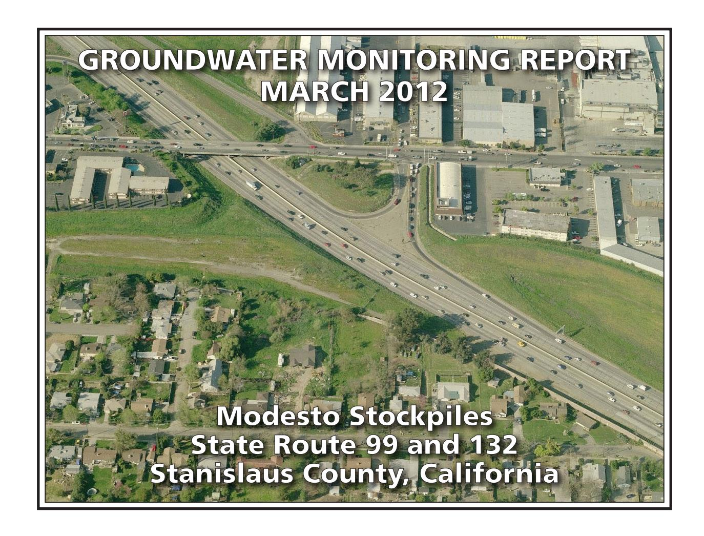

#### **PREPARED FOR:**

CALIFORNIA DEPARTMENT OF TRANSPORTATION – DISTRICT 6
HAZARDOUS WASTE BRANCH
855 M STREET, SUITE 200
FRESNO, CALIFORNIA 93721

#### PREPARED BY:

GEOCON CONSULTANTS, INC. 3160 GOLD VALLEY DRIVE, SUITE 800 RANCHO CORDOVA, CALIFORNIA 95742

**GEOCON PROJECT NO. S9525-06-44 TASK ORDER NO. 44, EA 10-403500 CONTRACT NO 06A1580** 

Project No. S9525-06-44 June 29, 2012

Mr. Richard Stewart, PG California Department of Transportation - District 6 Hazardous Waste Branch 855 M Street, Suite 200 Fresno. California 93721

Subject: GROUNDWATER MONITORING REPORT – MARCH 2012

MODESTO STOCKPILES

STATE ROUTE 99 AND 132, STANISLAUS COUNTY, CALIFORNIA CONTRACT NO. 06A1580, TASK ORDER NO. 44, EA NO. 10-403500

Dear Mr. Stewart:

In accordance with California Department of Transportation (Caltrans) Contract No. 06A1580, Task Order No. 44, Geocon has performed groundwater monitoring activities at the Caltrans Modesto Soil Stockpiles (Site) located southerly of the intersection of State Route (SR) 99 and Kansas Avenue in Stanislaus County, California. The approximate site location is depicted on the attached Vicinity Map, Figure 1. The approximate site boundaries and soil stockpiles 1 through 3 are shown on the Site Plan, Figure 2.

The purpose of Task Order No. 44 was to initiate quarterly groundwater sampling and analysis at the Site in accordance with protocols approved by the California Environmental Protection Agency Department of Toxic Substances Control (DTSC) as established in the *Final Work Plan, Groundwater Assessment* prepared by Shaw and dated January 2006. The scope of services included depth to groundwater measurements, the sampling of eight groundwater monitoring wells, submittal of the water samples to a California-certified laboratory for analytical testing, and preparation of this report.

#### **BACKGROUND**

#### **Project Description and History**

The stockpiles (Site) were generated during construction of State Route 99 through Modesto around 1961 when Caltrans excavated property purchased from Food Machinery and Chemical Corporation (FMC) that contained an evaporation pond. The stockpiles were placed in their present location in anticipation of construction of the Route 132 West Expressway project.

During the 1930s, Barium Products Ltd. occupied property at 1200 Barium Road (now Graphics Drive) in Modesto just east of SR99 between Woodland and Kansas Avenues. Barium Products Ltd. was a chemical manufacturing company processing a variety of ores and minerals including barite (barium sulfate) and celestite (strontium sulfate). Materials produced included barium and strontium compounds; these were used in greases, lubricating oil and pigment blanks. Sodium sulfide generated as a by-product of barite processing was sold as a caustic and used as a reagent in the mining industry.

Barium Products Ltd. was purchased by Westvaco Chlorine Products Corporation in 1943. In 1948, Westvaco merged with FMC. From the 1950s to the 1970s, a liquid residue from the processing operations was discharged to unlined evaporation ponds along the western portion of the FMC Site.

In 1961, a 4.3–acre parcel at the southwest corner of the FMC site was purchased by the State for highway right-of-way needed to construct SR 99. An aerial photograph from 1957 shows that a portion of the southernmost holding pond on the FMC property was within the area purchased for right-of-way.

Soil in and around the holding pond was excavated during construction of SR99 and, according to provisions of the construction contract, stockpiled within the current Caltrans right-of-way at the location of the future Route 132 Expressway project. Three distinct stockpiles are present at the Site:

- Stockpile 1 (Photo 1), located south of Kansas Avenue and west of North Emerald Avenue,
- Stockpile 2 (Photos 2 and 3), south of Kansas Avenue, between North Emerald Avenue and SR 99, and
- Stockpile 3 (Photo 4), south of Kansas Avenue and east of SR 99.

#### Hydrogeologic Characterization

The hydrogeology of the adjacent FMC site has been characterized by numerous studies since the early 1980s. The GeoTrans January 2005 report *Addendum to Comprehensive Remedial Investigations Report, FMC Corporation, 1200 Graphics Drive, Modesto, Stanislaus County, California* (GeoTrans, 2005) provides a description of the FMC site hydrogeology. This description follows:

"The site is underlain by laterally discontinuous and unconsolidated sand and silty sand associated with the Modesto and Riverbank Formations. First encountered groundwater is approximately 30 feet below ground surface (bgs) under confined to semi-confined conditions. A deeper aquifer is present at a depth of 165 feet bgs and separated from the upper zone by a blue clay aquitard. The upper water bearing unit has been divided into two zones: a shallow zone from first encountered groundwater to 120 feet bgs and a deeper zone from 140 feet bgs to the top of the aquitard. Groundwater flow within the upper zone is toward the southeast under a gradient of 0.002 ft/ft."

In 2006, Caltrans arranged for the installation of monitoring wells MW-1 through MW-8 at locations adjacent to the three stockpiles as shown on Figure 2. Monitoring wells MW-1 through MW-8 were each installed into the unconsolidated sand, silty sand and silt layers within the Modesto Formation underlying the Site. The wells were completed within the shallow zone of the upper aquifer (shallow zone).

The lithology encountered in the borings for the wells includes interbedded (laterally discontinuous) sands, silts, and clays. In the areas investigated, the unsaturated (vadose) zone was dominated by silty soils. The shallow zone groundwater beneath the stockpiles was encountered at approximately 35 feet (elevation approximately 50 feet) under unconfined to semi-confined conditions flowing southeast at a gradient of approximately 0.001. The shallow aquifer conditions beneath the Site and the adjacent FMC site appear similar and representative of the local area.

Two groundwater sampling events were conducted in 2006 (June and October). The depth to water measurements from these sampling events confirmed that the groundwater flow direction in the shallow upper aquifer is generally southeast with a hydraulic gradient of approximately 0.001.

General groundwater chemistry analytical results suggested that two distinct groundwater types are present beneath the Site. The groundwater assessment also included a survey of groundwater wells within a one-mile radius of the Site. The survey identified 43 existing or former wells; however, within the one-mile radius of the well survey, there were no active supply wells identified in the general (southeast) flow direction from the Site.

#### **MARCH 2012 FIELD ACTIVITIES**

#### **Depth to Groundwater Measurements**

On March 12, 2012, Geocon measured the depth to groundwater and recorded the dissolved oxygen (DO) level and oxygen-reduction potential (ORP) in monitoring wells MW-1 through MW-8 using a battery-operated water level meter, a Hanna Model No. 9143 DO meter, and an Oakton ORP meter. Measurements were obtained from a surveyed reference point at the top of the well casings (TOC).

In March 2012, depth to groundwater at the Site ranged from 30.12 (MW-1) to 38.74 (MW-5) feet below TOC. Based on the groundwater elevation data, the groundwater flow is toward the southeast at an average gradient of 0.0008. A summary of the TOC elevations, depth to groundwater measurements and groundwater elevations is on Table 1. Groundwater elevation contours, flow direction and gradient are depicted on Figure 3, Groundwater Elevation Map – March 2012.

#### **Well Purging and Sampling**

On March 12, 2012, Geocon purged approximately three well volumes of water (4.5 to 7 gallons) from groundwater monitoring wells MW-1 through MW-4 and MW-6 through MW-8 using a submersible pump. Well MW-5 went dry after purging 1 gallon, was allowed to recover, purged of an additional half gallon, allowed to recover and sampled. The pump was decontaminated before and after each use by washing in an AlconoxTM solution followed by fresh and distilled water rinses. During the well purging activities, the groundwater was monitored for pH, electrical conductivity, temperature and turbidity. This information is included on the Monitoring Well Sampling Data sheets in Appendix A.

Following well purging, groundwater samples were collected from each of the wells using disposable bailers and decanted through low-flow sample release tubes into laboratory-provided sample containers. The groundwater samples collected for dissolved metals analyses were filtered through a 0.45-micron filter while filling the container. The samples were sealed, labeled, placed in a chilled cooler and subsequently transported to the laboratory using chain-of-custody protocol.

Sample collection procedures were observed by Mr. Randy Adams from the DTSC and Mr. Roberto Cervantes of the Central Valley Regional Water Quality Control Board (CVRWQCB). Mr. Cervantes collected split samples (1-liter amber glass bottles) from each well. The amber liter collected from well MW-7 was broken during transport. Split samples are a representative subset of primary samples collected using the same sampling protocols. Split samples are usually submitted to an alternate laboratory to compare results between laboratories for the purpose of validating quality control and assurance of the analytical methods.

Purged groundwater was placed into one Department of Transportation-approved, 17-H, 55-gallon drum and temporarily stored near MW-8 pending receipt of analytical results. The contents of the drum were subsequently placed on the ground surface.

#### ANALYTICAL METHODS AND RESULTS

#### **Laboratory Analysis**

The groundwater samples were delivered to Advanced Technology Laboratories (ATL) for the following analyses under chain-of-custody protocol:

- Title 22 dissolved metals following the United States Environmental Protection Agency (EPA) Test Method 6020/7470;
- Strontium, calcium, magnesium, potassium and sodium by EPA Test Method 6020;
- Chloride, nitrate as nitrogen and sulfate by EPA Test Method 300.0;
- Sulfide by Standard Method (SM) 4500;
- Total dissolved solids (TDS) by SM 2540C;
- Total alkalinity, bicarbonate alkalinity, carbonate alkalinity by SM 2320B; and
- Polycyclic aromatic hydrocarbons (PAHs) by EPA Test Method 8270-SIM.

Groundwater samples collected by the CVRWQCB were delivered to Excelchem Environmental Laboratories and analyzed for each of the above listed analyses except PAHs. Groundwater analytical results for this monitoring event are summarized on Tables 2 and 3. The laboratory report and chain-of-custody documentation are in Appendix B.

#### **Analytical Results**

#### **PAHs**

The PAH results are summarized on Table 3. No PAHs were reported at concentrations equal to or greater than their respective practical quantitation limits (PQLs) for each of the groundwater samples collected during this monitoring event.

#### **Dissolved Metals**

Analytical results for dissolved metals along with their associated numeric water quality thresholds are summarized on Table 2. Antimony, arsenic, beryllium, cadmium, cobalt, copper, lead, selenium, silver, thallium and zinc were each not reported above their respective PQLs in samples from each well.

As shown in the following table, the dissolved metals barium, vanadium and strontium were reported for each of the samples collected with the following concentration ranges:

| ,                    | Well ID |         | Barium            | Vanadium          | Strontium   |
|----------------------|---------|---------|-------------------|-------------------|-------------|
|                      |         |         | $(\mu g/l)$       | $(\mu g/l)$       | $(\mu g/l)$ |
|                      | MW-1    |         | 120               | 22                | 960         |
|                      | MW-2    |         | 88                | 23                | 610         |
|                      | MW-3    |         | 58                | 28                | 390         |
|                      | MW-4    |         | 160               | 26                | 840         |
|                      | MW-5    |         | 340               | 18                | 1,200       |
|                      | MW-6    |         | 99                | 37                | 680         |
|                      | MW-7    |         | 76                | 24                | 690         |
|                      | MW-8    |         | 39                | 20                | 1,801       |
| Numeric Threshold | Water   | Quality | 1,000 (1)/700 (3) | 50 (2) | 4,000 (3)   |

\$\mu g/l\$ = micrograms per liter

Although concentrations of barium, vanadium and strontium were reported for the samples collected from each well, none of the reported concentrations exceed their respective numeric water quality thresholds for drinking water.

Total chromium and mercury were reported for each sample except MW-7 and MW-3, respectively. Nickel and manganese were reported for the sample collected from MW-4, and molybdenum was reported for the sample collected from MW-6.

The following table lists the dissolved chromium, mercury, nickel and manganese concentrations reported for each of the samples collected:

 $\mu g/l$  = micrograms per liter  $^{(1)}$  = California Department of Public Health Primary Maximum Contaminant Level for **Drinking Water** 

&lt;sup>(2) = California Department of Public Health Notification Level for Drinking Water

(3) = EPA Drinking Water Health Advisory

| Well ID                            | Chromium (µg/l) | Mercury (µg/l) | Nickel (µg/l) | Manganese (µg/l) |
|------------------------------------|-----------------|----------------|------------------|------------------|
| MW-1                               | 6.4             | 0.41           | <5.0             | <50              |
| MW-2                               | 4.7             | 0.28           | <5.0             | <50              |
| MW-3                               | 4.4             | <0.20          | <5.0             | <50              |
| MW-4                               | 8.9             | 0.29           | 5.4              | 88               |
| MW-5                               | 9.2             | 0.28           | <5.0             | <50              |
| MW-6                               | 9.5             | 0.27           | <5.0             | <50              |
| MW-7                               | <2.5            | 0.28           | <5.0             | <50              |
| MW-8                               | 4.4             | 0.23           | <5.0             | <50              |
| Numeric Water Quality Threshold | 50(1)           | 2(1)/1.2(2)    | 100(1)/12(2)     | 50(3)            |

 $\mu g/l = micrograms per liter$ 

Footnote: Mercury, which has historically been less than the reporting limit for all samples, was also reported for the equipment blank (0.31  $\mu$ g/l) at a similar concentration. Therefore, the mercury results discussed herein should be considered estimated values (see subsequent quality assurance/quality control section).

Although concentrations of chromium, mercury, nickel and manganese were reported for the samples collected from site monitoring wells, none of the reported concentrations exceed their respective numeric water quality thresholds for drinking water. The concentration of manganese in MW-4 is the only occurrence of a detection above a numeric threshold (taste and odor) for any site monitoring well. The mercury results are considered non-representative of the site groundwater and over-estimated based on its presence at a similar concentration in the equipment blank.

#### **General Minerals/Stiff Diagram**

To further characterize the geochemistry of the groundwater, general minerals analyses were conducted and included the following constituents:

- Calcium
- Magnesium
- Chloride
- Nitrate as nitrogen
- Sulfate
- Potassium
- Sodium
- Sulfide
- Total alkalinity
- TDS

(1) = California Department of Public Health Primary Maximum Contaminant Level for Drinking Water

(2) = California EPA Public Health Goal

(3) = California Department of Public Health Secondary Maximum Contaminant Level (taste and odor)

General groundwater chemistry provides information regarding the origin and geochemical nature of the groundwater sampled. The analytical results for the major cation (sodium, potassium, calcium and magnesium) and anion species (chloride, bicarbonate alkalinity reported as calcium carbonate, and sulfate) were used to create Stiff diagrams. Stiff diagrams provide a pictorial or graphical display of ionic content and can be used to characterize and evaluate the relative composition of groundwater and its consistency or variability. Groundwater exhibiting different cation/anion concentrations will result in Stiff diagrams of different shapes and sizes. Stiff diagrams can also help to illustrate mixing of water with different compositions or origins. The presence of more than one water type can be an indication of influences due to hydrogeologic variation or from other sources including man-made impacts.

Appendix C contains Stiff diagrams constructed using site groundwater data for October 2006 and March 2012. The diagrams show that each groundwater monitoring well contains bicarbonate (HCO3) dominant water. However, variations in the sodium and potassium (Na+K) and calcium composition are readily apparent in the site groundwater data between individual wells and from 2006 to 2012. The variations are related primarily to the groundwater's sodium content with the potassium concentrations being less variable between the individual wells. Groundwater geochemistry and Stiff diagrams of the October 2006 and March 2012 groundwater samples are discussed below.

In 2006, the samples from the Site's furthest upgradient monitoring well (MW-1) along with MW-7 (located on the opposite end of the Site) had calcium-dominant compositions, while the samples from wells MW-5, MW-6 and MW-8 (each situated downgradient to FMC) were sodium-dominant. The samples from wells MW-2, MW-3 and MW-4 demonstrated a similar balance of calcium and sodium, suggesting a mix of these water types at those locations.

In 2012, the samples from MW-1 and MW-7 were again calcium-dominant, and the samples from MW-6 and MW-8 were again sodium-dominant. However, the sample from MW-5 changed from sodium-dominant to calcium-dominant water, and the previously mixed waters at MW-2 and MW-4 became calcium-dominant. The mixed waters at MW-3 became sodium-dominant.

The geochemical evidence supports that groundwater upgradient (MW-1) and beneath Stockpile 1 and Stockpile 2 (MW-2, MW-4 and MW-5) is calcium-dominant and that the sodium-dominant water is found at locations upgradient to the stockpiles that further coincide with locations downgradient to the FMC facility (MW-3 and MW-6). Sodium-dominant water is also evident at MW-8 (the furthest downgradient well).

Nitrate as nitrogen was also reported for each of the groundwater samples ranging from 2.9 mg/l at MW-3 to 27 mg/l at MW-5. The reported nitrate concentrations for MW-1 (12 mg/l), MW-5, and MW-6 (18 mg/l) each exceed the primary MCL of 10 mg/l established for nitrate. Noteworthy is that MW-1 is an upgradient monitoring well; thus, the reported nitrate concentration of 12 mg/l for this location may be indicative of natural background nitrate concentrations for the shallow groundwater in the vicinity of the Site.

The analytical results for general minerals are summarized on Table 3. The Stiff diagrams are in Appendix C.

#### Field and Laboratory Quality Assurance/Quality Control

The field quality assurance/quality control (QA/QC) implemented for the March 2012 groundwater monitoring at the Site included the collection of an equipment blank analyzed for dissolved metals. The blank was collected by pouring distilled water over a decontaminated pump and allowing the water to collect into the laboratory-provided sample container. Copper, sodium and mercury were each reported for the equipment blank at respective concentrations of 1.9, 95 and 0.31  $\mu$ g/l. Copper was not reported for any of the groundwater samples. However, mercury was reported at a similar concentration in seven of eight samples, and sodium was reported for each of the samples. Based on the presence of sodium and mercury in the equipment blank, the concentrations for each of these constituents reported herein must be qualified as estimated with the potential to be less than the reported values.

We also reviewed the analytical laboratory OA/OC provided with the laboratory report. These data show that that the method blank surrogate recoveries are acceptable and that concentrations of selected analytes were not reported at concentrations equal to or greater than their respective PQLs for each method blank for each analysis. One exception being copper, molybdenum and zinc each reported in a March 14, 2012, method blank. MW-6 is the only sample analyzed on this date to report one of these compounds. Based on the presence of molybdenum in the March 14, 2012, method blank, the molybdenum result for sample MW-6 must be qualified as estimated with the potential to be less than the reported value. Appropriate recoveries were noted for each laboratory control sample for each analysis. Several matrix spike (MS) and matrix spike duplicate (MSD) analytes had recoveries or relative percent differences (RPDs) outside of laboratory control limits including a March 16, 2012, MS for nickel that had a recovery less than 70%, a March 16, 2012, MSD that had barium, chromium, molybdenum, nickel, vanadium, zinc and strontium recoveries of less than 70%, and a 3/14/2012, MSD for mercury that had an RPD of greater than 20%. However, no samples were analyzed for barium, chromium, molybdenum, nickel, vanadium, zinc or strontium on March 16, 2012, and therefore, these discrepancies have no impact on the data quality presented herein. The mercury results have already been qualified as estimated. Based on this data review, no additional qualification of the data is necessary, and the data are considered of sufficient quality for the purposes of this report.

#### **CVRWQCB Sample Analytical Results**

The results of CVRWQCB split samples collected by Mr. Cervantes and analyzed by Excelchem are summarized on Tables 2 and 3. Excelchem's analytical data report is in Appendix B. When comparing the split metals results to the site sample metals results, the reported concentrations for each sample are nearly the same. In cases where one laboratory reported a metal (i.e. arsenic, beryllium, cadmium, copper) that the other laboratory did not, it was a result of that lab using a lower reporting limit for that individual compound. Higher thallium concentrations were reported in the CVRWQCB samples from wells MW-2, MW-4, MW-5 and MW-6; although, they were at the same order of magnitude as the samples collected from the Site. One additional noteworthy difference between the two Title 22 metal data sample sets is with the manganese result for sample MW-4 being reported at 88 µg/l for the sample collected from the Site and at 0.7 µg/l for the CVRWQCB sample. Although the thallium and manganese CVRWQCB concentrations differ from the site sample results, it should be noted that for thallium, the 2006 and 2012 results for the site groundwater samples are consistent between wells even though the analyses were performed six years later and by different laboratories.

A comparison of the general chemistry analytical data for the two sample sets also shows consistent results. No notable differences in the concentrations for each reported analyte are evident.

#### GeoTracker Submittal

The laboratory prepared electronic data files for submittal to the State Water Resources Control Board GeoTracker database. The GeoTracker database is accessible via the GeoTracker website at <a href="http://geotracker.waterboards.ca.gov">http://geotracker.waterboards.ca.gov</a>. The electronic data was uploaded to GeoTracker on May 11, 2012. The confirmation numbers are 6317977190, 5859272778 and 7072463274.

#### CONCLUSIONS AND RECOMMENDATIONS

With the exception of manganese that was reported at greater than the secondary MCL of  $50 \mu g/l$  for the sample collected from MW-4, none of the reported dissolved metals concentrations for the groundwater samples collected in March 2012 exceeded their respective water quality threshold values as referenced below:

- Primary MCLs promulgated by the California Department of Environmental Health;
- Secondary MCLs promulgated by the California Department of Environmental Health;
- Public Health Goals for drinking water promulgated by the California Department of Public Health;
- Integrated Risk Information System Reference Dose promulgated by the USEPA;
- Notification Level for Drinking Water promulgated by the California Department of Environmental Health; and
- Water Quality for Agriculture (Ayers & Westcott).

With the exception of nitrate, none of the reported general minerals for the groundwater samples collected in March 2012 exceeded their respective California primary MCLs. TDS was reported at greater than the secondary MCL of 500 mg/l for the samples collected from wells MW-1, MW-4, MW-5 and MW-6.

Please contact us if you have any questions concerning the contents of this Report or if we may be of further service.

Sincerely,

GEOCON CONSULTANTS, INC.

Kevin J Brown, PG Senior Geo ogist

KEVIN J.
BROWN
NO. 7101
Oi/31//3

Rebecca L. Silva, REA

Project Manager

John E. Juhrend, PE, CEG

Principal

#### (3) Addressee

Attachments:

Figure 1, Vicinity Map

Figure 2, Site Plan

Figure 3, Groundwater Elevation Map – March 2012

Photos 1 through 4

Table 1, Groundwater Elevation Data

Table 2, Summary of Groundwater Analytical Results – Title 22 Metals (Dissolved)

Table 3, Summary of Groundwater Analytical Results – General Minerals and PAHs

Appendix A, Monitoring Well Sampling Data Sheets

Appendix B, Laboratory Report and Chain-of-custody Documentation

Appendix C, Stiff Diagrams

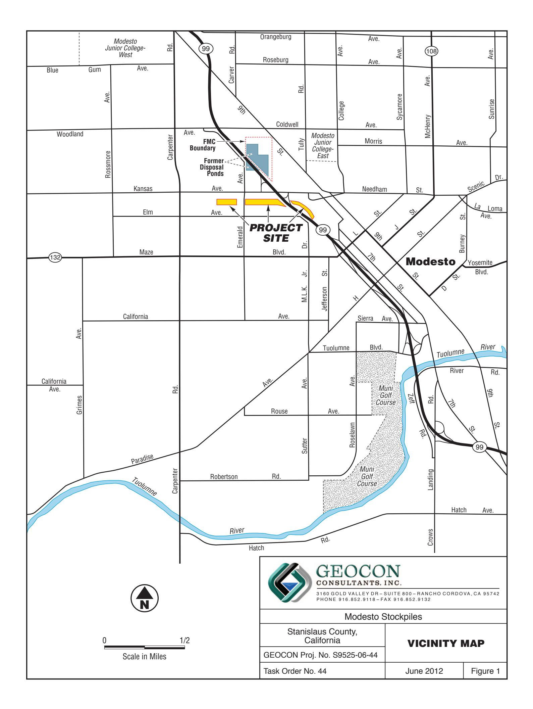

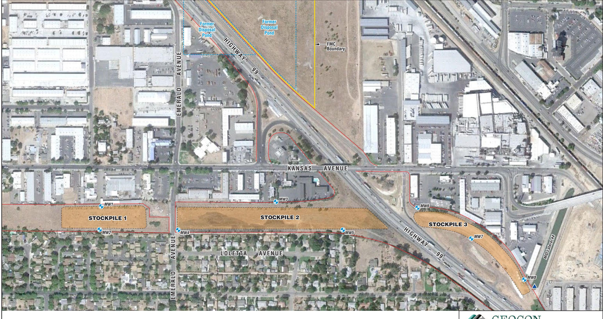

MW8 Approximate Monitoring Well Location

▲ Approximate Location of Lateral 4 Water Sample

 State Right-of-Way Boundary MID Modesto Irrigation District

— State Right-of-Way Boundary

Scale in Feet

GEOCON CONSULTANTS, INC.

3160 GOLD VALLEY DR - SUITE 800 - RANCHO CORDOVA, CA 95742 PHONE 916.852.9118 - FAX 916.852.9132

Modesto Stockpiles

Stanislaus County, California

**SITE PLAN** 

GEOCON Proj. No. S9525-06-44

1. **Name:**
   - John Doe
2. **Age:**
   - 30
3. **City:**
   - New York

June 2012

Task Order No. 44 June 2012 Figure 2

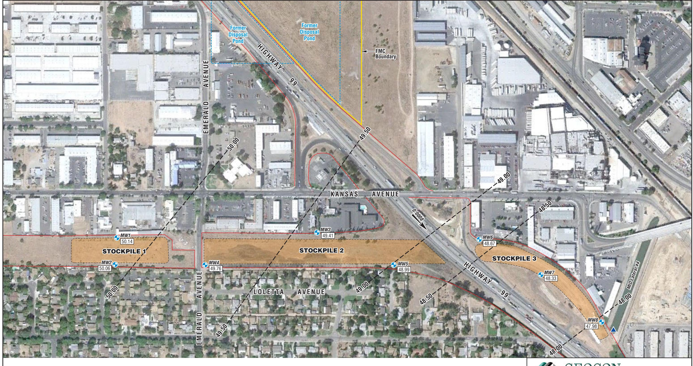

LEGEND:

MW8 Approximate Monitoring Well Location

▲ Approximate Location of Lateral 4 Water Sample

— State Right-of-Way Boundary

MID Modesto Irrigation District

————— Groundwater Elevation Contour (Interval = 0.50 Ft.)

49.76 MSL Elevation of Groundwater Measured on 3/12/12

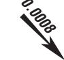

Approximate Groundwater Direction & Gradient

Scale in Feet

GEOCON
CONSULTANTS, INC.
3160 GOLD VALLEY DR-SUITE 800-RAN

3160 GOLD VALLEY DR - SUITE 800 - RANCHO CORDOVA, CA 95742 PHONE 916.852.9118 - FAX 916.852.9132

#### Modesto Stockpiles

Stanislaus County, California

Groundwater Elevation Map – March 2012

GEOCON Proj. No. S9525-06-44

Task Order No. 44

June 2012

Figure 3

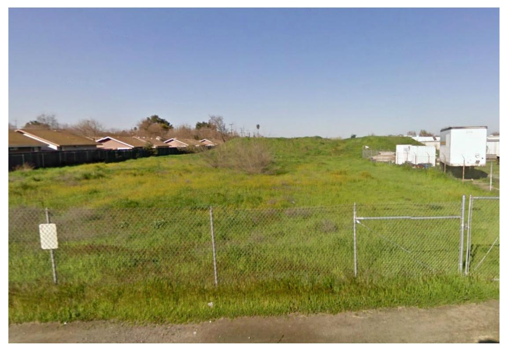

Photo No. 1 Stockpile No. 1 Looking West

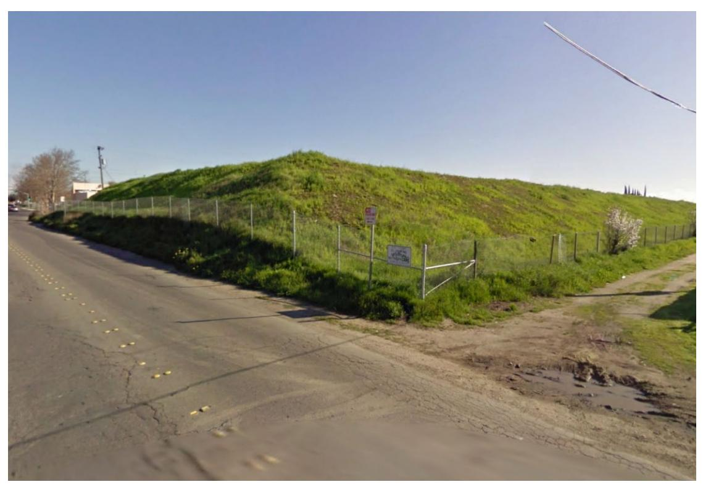

Photo No. 2 Stockpile No. 2 Looking Northeast

#### **PHOTOS NO. 1 & 2**

| Modesto Stockpiles           |                                  |
|------------------------------|----------------------------------|
| GEOCON Proj. No. S9525-06-44 | Stanislaus County, California |
| Task Order No. 44            | June 2012                        |

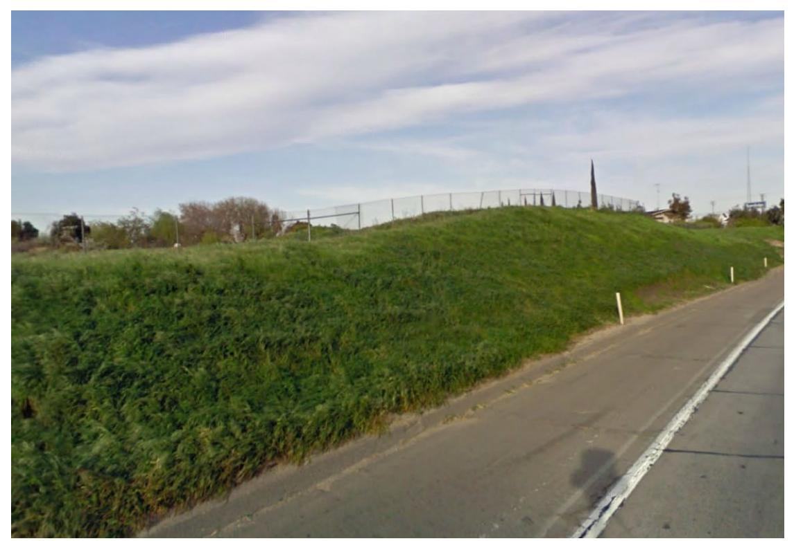

Photo No. 3 Stockpile No. 2 Looking Northwest

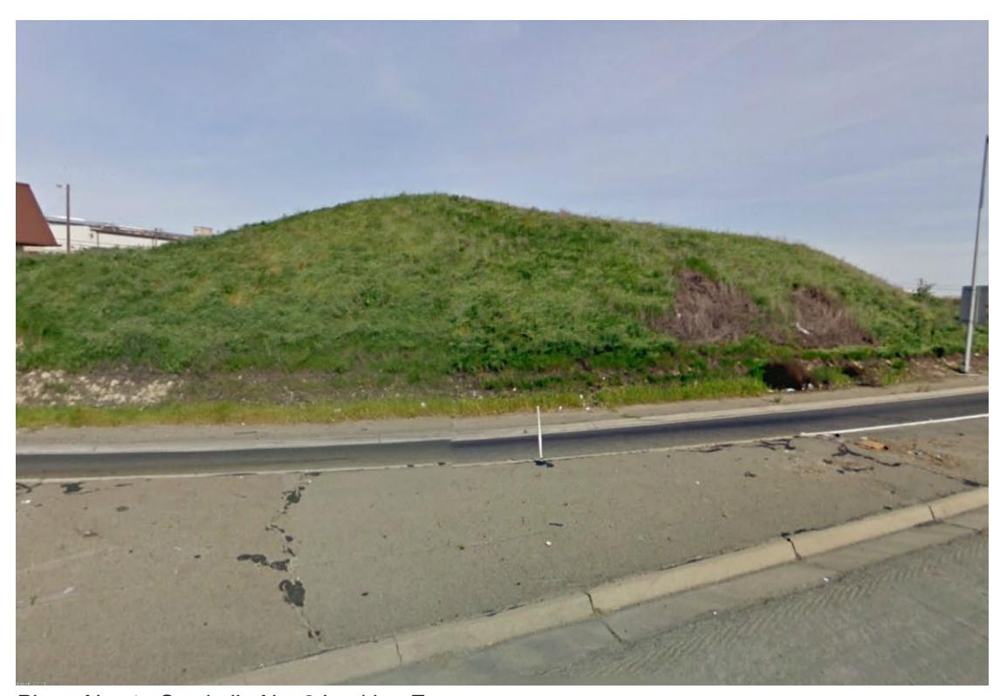

Photo No. 4 Stockpile No. 3 Looking East

#### **PHOTOS NO. 3 & 4**

| Modesto Stockpiles           |                                  |
|------------------------------|----------------------------------|
| GEOCON Proj. No. S9525-06-44 | Stanislaus County, California |
| Task Order No. 44            | June 2012                        |

TABLE 1 GROUNDWATER ELEVATION DATA STATE ROUTE 99/132 MODESTO SOIL STOCKPILES STANISLAUS COUNTY, CALIFORNIA

| WELL ID | DATE      | WELL CASING ELEVATION (feet MSL) | DEPTH TO GROUNDWATER (feet below TOC) | GROUNDWATER ELEVATION (feet MSL) |
|---------|-----------|----------------------------------------|---------------------------------------------|----------------------------------------|
| MW-1    | 6/14/2006 | 80.26                                  | 29.82                                       | 50.44                                  |
| MW-1    | 10/5/2006 | 80.26                                  | 32.35                                       | 47.91                                  |
| MW-1    | 3/12/2012 | 80.26                                  | 30.12                                       | 50.14                                  |
| MW-2    | 6/13/2006 | 81.10                                  | 30.72                                       | 50.38                                  |
| MW-2    | 10/5/2006 | 81.10                                  | 33.35                                       | 47.75                                  |
| MW-2    | 3/12/2012 | 81.10                                  | 31.04                                       | 50.06                                  |
| MW-3    | 6/13/2006 | 81.76                                  | 32.38                                       | 49.38                                  |
| MW-3    | 10/5/2006 | 81.76                                  | 34.88                                       | 46.88                                  |
| MW-3    | 3/12/2012 | 81.76                                  | 32.35                                       | 49.41                                  |
| MW-4    | 6/13/2006 | 82.36                                  | 32.39                                       | 49.97                                  |
| MW-4    | 10/4/2006 | 82.36                                  | 35.05                                       | 47.31                                  |
| MW-4    | 3/12/2012 | 82.36                                  | 32.60                                       | 49.76                                  |
| MW-5    | 6/14/2006 | 87.73                                  | 38.79                                       | 48.94                                  |
| MW-5    | 10/5/2006 | 87.73                                  | 41.40                                       | 46.33                                  |
| MW-5    | 3/12/2012 | 87.73                                  | 38.74                                       | 48.99                                  |
| MW-6    | 6/14/2006 | 84.37                                  | 36.35                                       | 48.02                                  |
| MW-6    | 10/5/2006 | 84.37                                  | 38.55                                       | 45.82                                  |
| MW-6    | 3/12/2012 | 84.37                                  | 35.70                                       | 48.67                                  |
| MW-7    | 6/14/2006 | 83.64                                  | 35.59                                       | 48.05                                  |
| MW-7    | 10/4/2006 | 83.64                                  | 38.32                                       | 45.32                                  |
| MW-7    | 3/12/2012 | 83.64                                  | 35.31                                       | 48.33                                  |
| MW-8    | 6/14/2006 | 83.73                                  | 36.12                                       | 47.61                                  |
| MW-8    | 10/4/2006 | 83.73                                  | 38.95                                       | 44.78                                  |
| MW-8    | 3/12/2012 | 83.73                                  | 35.75                                       | 47.98                                  |

Notes:

MSL = Mean sea level

TOC = Top of well casing

Data prior to 3/12/2012 reproduced from Site Investigation Report, Groundwater Assessment, Caltrans Modesto Soil Stockpiles State Route 99/132 Project, Stanislaus County, California. Shaw Environmental, Inc., May 14, 2007.

#### TABLE 2

## SUMMARY OF GROUNDWATER ANALYTICAL RESULTS - TITLE 22 METALS (Dissolved) STATE ROUTE 99/132 MODESTO SOIL STOCKPILES

#### STANISLAUS COUNTY, CALIFORNIA

| ANALYTE   |                                                    | Antimony                    | Arsenic                         | Barium                   | Beryllium                          | Cadmium                            | Chromium                 | Cobalt                       | Copper                       | Lead                 | Manganese                | Molybdenum                 | Nickel                      | Selenium                    | Silver                       | Thallium                           | Vanadium               | Zinc                             | Strontium          | Mercury                     |         |
|-----------|----------------------------------------------------|-----------------------------|---------------------------------|--------------------------|------------------------------------|------------------------------------|--------------------------|------------------------------|------------------------------|----------------------|--------------------------|----------------------------|-----------------------------|-----------------------------|------------------------------|------------------------------------|------------------------|----------------------------------|--------------------|-----------------------------|---------|
| SAMPLE ID | SAMPLE DATE                                     |                             |                                 |                          |                                    |                                    |                          |                              | R                            | esults in m          | icrograms                | s per liter                |                             |                             |                              |                                    |                        |                                  |                    |                             |         |
| MW-1      | 6/14/2006 10/5/2006 3/12/2012 3/12/2012 S | <1.0 <1.0 <2.5 <10 | 2.1 2.2 <5.0 1.6       | 130 120 120 105 | <1.0 <1.0 <5.0 <5.0       | <1.0 <1.0 <2.5 <b>0.6</b> | 10 16 6.4 6.8   | <1.0 <1.0 <2.5 <5.0 | 1.1 2.0 <5.0 3.4    | <1.0 <1.0 <5.0 | 34 <1.0 <50 2.0 | 2.9 <2.0 <2.5 1.3 | 2.9 1.5 <5.0 <5.0  | <1.0 <1.0 <2.5 <20 | <1.0 <1.0 <2.5 <5.0 | <1.0 <1.0 <2.5 <20        | 23 26 22 21.2 | <10 <10 <50 <b>5.6</b>  |  960 1,010   | <0.2 <0.2 <b>0.41</b> |         |
| MW-2      | 6/13/2006 10/5/2006 3/12/2012 3/12/2012 S | <1.0 <1.0 <2.5 <10 | 2.1 2.6 <5.0 <10       | 87 84 88 89.6   | <1.0 <1.0 <5.0 <5.0       | <1.0 <1.0 <2.5 <b>0.4</b> | 8.5 11 4.7 6.1  | <1.0 <1.0 <2.5 <5.0 | 1.2 U 1.7 <5.0 <5.0 | <1.0 <1.0 <5.0 | 24 <1.0 <50 1.4 | 3.3 <2.0 <2.5 1.4 | 2.0 1.2 <5.0 <5.0  | 1.3 <1.0 <2.5 <20  | <1.0 <1.0 <2.5 <5.0 | <1.0 <1.0 <2.5 <b>4.6</b> | 22 27 23 23.1 | <10 <10 <50 <b>3.7</b>  |  610 642     | <0.2 <0.2 <b>0.28</b> |         |
| MW-3      | 6/13/2006 10/5/2006 3/12/2012 3/12/2012 S | <1.0 <1.0 <2.5 <10 | 3.0 3.3 <5.0 2.1       | 60 58 58 44.4   | <1.0 <1.0 <5.0 <b>0.1</b> | <1.0 <1.0 <2.5 <b>0.3</b> | 7.1 7.9 4.4 4.0 | <1.0 <1.0 <2.5 <5.0 | 1 U 1.5 <5.0 1.5    | <1.0 <1.0 <5.0 | 4.7 18 <50 1.8  | <2.0 2.2 <2.5 0.9 | 1.4 <1.0 <5.0 <5.0 | 1.4 <1.0 <2.5 <20  | <1.0 <1.0 <2.5 <5.0 | <1.0 <1.0 <2.5 <20        | 25 29 28 22.6 | <10 <10 <50 <b>4.5</b>  | 390 342         | <0.2 <0.2 <0.20       |         |
| MW-4      | 6/13/2006 10/4/2006 3/12/2012 3/12/2012 S | <1.0 <1.0 <2.5 <10 | 1.8 2.1 <5.0 1.4       | 130 100 160 134 | <1.0 <1.0 <5.0 <5.0       | <1.0 <1.0 <2.5 <b>0.4</b> | 8.9 9.9 8.9 7.7 | <1.0 <1.0 <2.5 <5.0 | 1.6 U 2.1 <5.0 0.9  | <1.0 <1.0 <5.0 | 62 4.1 88 0.7   | 2.5 <2.0 <2.5 <5.0         | 2.4 <1.0 <b>5.4</b> <5.0    | <1.0 <1.0 <2.5 <20 | <1.0 <1.0 <2.5 <5.0 | <1.0 <1.0 <2.5 <b>3.5</b> | 19 24 26 19.3 | <10 <10 <50 <b>3.5</b>  |  840 812     | <0.2 <0.2 <b>0.29</b> |         |
| MW-5      | 6/14/2006 10/5/2006 3/12/2012 3/12/2012 S | <1.0 <1.0 <2.5 <10 | 1.8 2.5 <5.0 1.3       | 400 410 340 310 | <1.0 <1.0 <5.0 <5.0       | <1.0 <1.0 <2.5 <b>0.5</b> | 9.6 18 9.2 9.6  | 2.2 <1.0 <2.5 <5.0  | 4.8 1.9 <5.0 1.0    | 1.4 <1.0 <5.0  | 260 120 <50 4.4 | 9.9 14 <2.5 1.5   | <b>7.1 3.4</b> <5.0 <5.0    | 2.0 <1.0 <2.5 1.5  | <1.0 2.1 <2.5 <5.0  | <1.0 <1.0 <2.5 <b>3.6</b> | 23 24 18 17.8 | <10 <10 <50 <b>14.5</b> |  1,200 1,140 | <0.2 <0.2 <b>0.28</b> |         |
| MW-6      | 6/14/2006 10/5/2006 3/12/2012 3/12/2012 S | <1.0 <1.0 <2.5 <10 | 3.6 5.2 <5.0 2.8       | 160 120 99 94.2 | <1.0 <1.0 <5.0 <5.0       | <1.0 <1.0 <2.5 <b>0.4</b> | 16 29 9.5 9.9   | 3.0 <1.0 <2.5 <5.0  | 6.2 1.5 <5.0 <5.0   | 3.4 <1.0 <5.0  | 190 130 <50 2.7 | 13 13 5.3 5.2     | 5.9 1.7 <5.0 <5.0  | 3.0 <1.0 <2.5 <20  | <1.0 <1.0 <2.5 <5.0 | <1.0 <1.0 <2.5 <b>2.6</b> | 33 34 37 36.3 | 15 <10 <50 <b>3.8</b>   |  680 655     | <0.2 <0.2 <b>0.27</b> |         |
| ANALYTE   | SAMPLE ID                                          | SAMPLE DATE              | Results in micrograms per liter |                          |                                    |                                    |                          |                              |                              |                      |                          |                            |                             |                             |                              |                                    |                        |                                  |                    |                             |         |
|           |                                                    |                             | Antimony                        | Arsenic                  | Barium                             | Beryllium                          | Cadmium                  | Chromium                     | Cobalt                       | Copper               | Lead                     | Manganese                  | Molybdenum                  | Nickel                      | Selenium                     | Silver                             | Thallium               | Vanadium                         | Zinc               | Strontium                   | Mercury |
|           | MW-7                                               | 6/14/2006                   | <1.0                            | 2.3                      | 80                                 | <1.0                               | <1.0                     | 7.0                          | <1.0                         | <1.0                 | <1.0                     | 9.0                        | 2.6                         | 2.2                         | 1.1                          | <1.0                               | <1.0                   | 17                               | <10                | --                          | <0.2    |
|           |                                                    | 10/4/2006                   | <1.0                            | 2.7                      | 73                                 | <1.0                               | <1.0                     | 10                           | <1.0                         | 1.6                  | <1.0                     | 1.1                        | <2.0                        | 1.4                         | 1.2                          | <1.0                               | <1.0                   | 23                               | <10                | --                          | <0.2    |
|           |                                                    | 3/12/2012                   | <2.5                            | <5.0                     | 76                                 | <5.0                               | <2.5                     | <2.5                         | <2.5                         | <5.0                 | <5.0                     | <50                        | <2.5                        | <5.0                        | <2.5                         | <2.5                               | <2.5                   | 24                               | <50                | 690                         | 0.28    |
|           | MW-8                                               | 6/14/2006                   | <1.0                            | 2.7                      | 84                                 | <1.0                               | <1.0                     | 8.8                          | <1.0                         | <1.0                 | <1.0                     | 5.8                        | <2.0                        | 1.2                         | 1.6                          | <1.0                               | <1.0                   | 25                               | <10                | --                          | <0.2    |
|           |                                                    | 10/4/2006                   | <1.0                            | 4.0                      | 57                                 | <1.0                               | <1.0                     | 9.7                          | <1.0                         | 1.7                  | <1.0                     | <1.0                       | 2.0                         | <1.0                        | <1.0                         | <1.0                               | <1.0                   | 32                               | <10                | --                          | <0.2    |
|           |                                                    | 3/12/2012                   | <2.5                            | <5.0                     | 39                                 | <5.0                               | <2.5                     | 4.4                          | <2.5                         | <5.0                 | <5.0                     | <50                        | <2.5                        | <5.0                        | <2.5                         | <2.5                               | <2.5                   | 20                               | <50                | 180                         | 0.23    |
|           |                                                    | 3/12/2012 S                 | <10                             | 2.5                      | 39.4                               | <5.0                               | 0.1                      | 4.7                          | <5.0                         | <5.0                 | 2                        | 1.7                        | 1.3                         | <5.0                        | <20                          | <5.0                               | 23.4                   | 3.6                              | 211                |                             |         |
| MCLs      |                                                    |                             | 6                               | 10                       | 1,000                              | 4                                  | 5                        | 50                           | --                           | 1,300                | 15                       | 50 (1)                     | --                          | 100                         | 50                           | 100 (1)                            | 2                      | --                               | 5,000 (1)          | --                          | 2       |

#### TABLE 2

## SUMMARY OF GROUNDWATER ANALYTICAL RESULTS - TITLE 22 METALS (Dissolved) STATE ROUTE 99/132 MODESTO SOIL STOCKPILES

#### STANISLAUS COUNTY, CALIFORNIA

Notes: --- = not analyzed or not applicable

MCLs = Maximum Contaminant Levels per California Environmental Protection Agency, May 2009

Data prior to 3/12/2012 reproduced from Site Investigation Report, Groundwater Assessment, Caltrans Modesto Soil Stockpiles State Route 99/132 Project, Stanislaus County, California. Shaw Environmental, Inc., May 14, 2007.

&lt; = Less than laboratory reporting limits

S = Split samples submitted by Central Valley Regional Water Quality Control Board (CVRWQCB) to Excelchem Environmental Labs

U = Notation: The result was qualified as a non-detect due to equipment blank contamination

(1) = Secondary MCL

(2) = Laboratory error in sample preparation (CVRWQCB personal communication)

## TABLE 3 SUMMARY OF GROUNDWATER ANALYTICAL RESULTS - GENERAL MINERALS AND PAHS STATE ROUTE 99/132 MODESTO SOIL STOCKPILES STANISLAUS COUNTY, CALIFORNIA

|           |                                                    | CALCIUM                         | MAGNESIUM        | CHLORIDE          | NITROGEN, NITRATE (as N)  | SULFATE                | POTASSIUM          | SODIUM                | SULFIDE                         | ALKALINITY, BICARBONATE | ALKALINITY, CARBONATE | ALKALINITY, TOTAL | TOTAL DISSOLVED SOLIDS | PAHs (SIM)           |
|-----------|----------------------------------------------------|---------------------------------|------------------|-------------------|---------------------------|------------------------|--------------------|-----------------------|---------------------------------|-------------------------|-----------------------|-------------------|------------------------|----------------------|
| SAMPLE ID | SAMPLE DATE                                        |                                 |                  |                   |                           | Re                     | sults in mil       | ligrams per           | r liter                         |                         |                       |                   |                        | micrograms per liter |
| MW-1      | 6/14/2006 10/5/2006 3/12/2012 3/12/2012 S |  88 78 84              | 34 31 29.4 | 14 13 12    | 5.0 6.8 12 11.4  | 18 18 16 15.6 | 3.7 3.2 3.3  | 22 21 23.8      | <0.1 <0.1 <0.05 0.0637 | 360 328 342       | <1 <5.0 <5.0    | 360 328 342 | 500 550 453      |   <0.20        |
| MW-2      | 6/13/2006 10/5/2006 3/12/2012 3/12/2012 S |  49 52 58.1            | 16 18 17.2 | 23 17 15.4  | 5.5 6.1 9.0 8.77 | 21 16 16 15.2 | 2.7 2.6 2.89 | 56 40 54        | <0.1 <0.1 0.06 0.0497  | 250 266 270       | <1 <5.0 <5.0    | 250 266 270 | 390 460 382      |   <0.20        |
| MW-3      | 6/13/2006 10/5/2006 3/12/2012 3/12/2012 S | 42 31 29.5                | 15 11 9.19 | 11 7.5 5.7  | 5.4 5.0 2.9 2.24 | 18 17 17 13.8 | 2.5 2.3 2.04 | 43 66 66.3      | <0.1 <0.1 0.09 0.0281  | 220 268 220       | <1 <5.0 <5.0    | 220 268 220 | 340 400 273      |   <0.20        |
| MW-4      | 6/13/2006 10/4/2006 3/12/2012 3/12/2012 S | 43 71 74.2                | 13 23 20.7 | 6.6 39 34.8 | 3.5 3.5 9.5 9.59 | 15 11 23 21.8 | 2.6 3.7 3.14 |  43 39 47.4  | <0.1 <0.1 0.05 0.172   | 250 290 286       | <1 <5.0 <5.0    | 250 290 286 | 340 530 472      |   <0.20        |
| MW-5      | 6/14/2006 10/5/2006 3/12/2012 3/12/2012 S |  100 93 94.9           | 37 33 32.7 | 28 29 24.6  | 8.3 10 27 25.4   | 37 32 33 30.4 | 7.5 4.4 4.44 |  160 77 86.9 | <0.1 <0.1 <0.05 0.0778 | 540 415 410       | <1 <5.0 <5.0          | 540 415 410 | 730 700 632      |   <0.20        |
|           |                                                    | CALCIUM                         | MAGNESIUM        | CHLORIDE          | NITROGEN, NITRATE (as N)  | SULFATE                | POTASSIUM          | SODIUM                | SULFIDE                         | ALKALINITY, BICARBONATE | ALKALINITY, CARBONATE | ALKALINITY, TOTAL | TOTAL DISSOLVED SOLIDS | PAHs (SIM)           |
|           |                                                    | Results in milligrams per liter |                  |                   |                           |                        |                    |                       |                                 |                         |                       |                   |                        | micrograms per liter |
| SAMPLE ID | SAMPLE DATE                                        |                                 |                  |                   |                           |                        |                    |                       |                                 |                         |                       |                   |                        |                      |
| MW-6      | 6/14/2006                                          | --                              | --               | --                | 12                        | 70                     | --                 | --                    | <0.1                            | --                      | --                    | --                | --                     | --                   |
|           | 10/4/2006                                          | 67                              | 22               | 21                | 15                        | 76                     | 5.6                | 160                   | <0.1                            | 420                     | <1                    | 420               | 700                    | --                   |
|           | 3/12/2012                                          | 54                              | 19               | 22                | 18                        | 75                     | 3.9                | 130                   | 0.05                            | 357                     | <5.0                  | 357               | 680                    | <0.20                |
|           | 3/12/2012 S                                        | 54.8                            | 16.3             | 20.2              | 17.7                      | 72.0                   | 4.14               | 165                   | 0.0788                          | 358                     | <5.0                  | 358               | 613                    |                      |
| MW-7      | 6/14/2006                                          | --                              | --               | --                | 3.0                       | 29                     | --                 | --                    | <0.1                            | --                      | --                    | --                | --                     | --                   |
|           | 10/4/2006                                          | 69                              | 21               | 7.4               | 3.1                       | 26                     | 2.9                | 16                    | <0.1                            | 270                     | <1                    | 270               | 370                    | --                   |
|           | 3/12/2012                                          | 60                              | 20               | 7.9               | 3.0                       | 26                     | 2.6                | 14                    | <0.05                           | 228                     | <5.0                  | 228               | 360                    | <0.20                |
| MW-8      | 6/14/2006                                          | --                              | --               | --                | 9.2                       | 26                     | --                 | --                    | <0.1                            | --                      | --                    | --                | --                     | --                   |
|           | 10/4/2006                                          | 22                              | 6.8              | 12                | 7.8                       | 21                     | 2.4                | 77                    | <0.1                            | 200                     | <1                    | 200               | 360                    | --                   |
|           | 3/12/2012                                          | 15                              | 5.1              | 11                | 6.7                       | 25                     | 1.8                | 52                    | 0.05                            | 154                     | <5.0                  | 154               | 330                    | <0.20                |
|           | 3/12/2012 S                                        | 18.4                            | 5.8              | 8.3               | 5.31                      | 25.2                   | 2.06               | 73.6                  | 0.0194                          | 154                     | <5.0                  | 154               | 253                    |                      |
| MCLs      |                                                    | --                              | --               | 250 (1)           | 10                        | 250 (1)                | --                 | --                    | --                              | --                      | --                    | --                | 500 (2)                | Various              |

## TABLE 3 SUMMARY OF GROUNDWATER ANALYTICAL RESULTS - GENERAL MINERALS AND PAHS STATE ROUTE 99/132 MODESTO SOIL STOCKPILES STANISLAUS COUNTY, CALIFORNIA

#### TABLE 3

#### SUMMARY OF GROUNDWATER ANALYTICAL RESULTS $\,$ - GENERAL MINERALS AND PAHs

#### STATE ROUTE 99/132 MODESTO SOIL STOCKPILES

#### STANISLAUS COUNTY, CALIFORNIA

| SAMPLE ID | SAMPLE DATE | Results in milligrams per liter |           |          |                          |         |           |        |         |                         |                       |                   |                        | micrograms per liter |
|-----------|-------------|---------------------------------|-----------|----------|--------------------------|---------|-----------|--------|---------|-------------------------|-----------------------|-------------------|------------------------|----------------------|
|           |             | CALCIUM                         | MAGNESIUM | CHLORIDE | NITROGEN, NITRATE (as N) | SULFATE | POTASSIUM | SODIUM | SULFIDE | ALKALINITY, BICARBONATE | ALKALINITY, CARBONATE | ALKALINITY, TOTAL | TOTAL DISSOLVED SOLIDS |                      |

#### Notes:

PAHs (SIM) = polycyclic aromatic hydrocarbons (selective ion monitoring) by EPA Test Method 8270C for semi-volatile organic compounds

- S = Split samples submitted by the Central Valley Regional Water Quality Control Board to Excelchem Environmental Labs.
- < = Less than the indicated laboratory reporting limit
- --- = Not analyzed or not applicable

MCLs = Maximum Contaminant Levels per California Environmental Protection Agency, May 2009

(1) = Secondary MCL

Data prior to 3/12/2012 reproduced from Site Investigation Report, Groundwater Assessment, Caltrans Modesto Soil Stockpiles State Route 99/132 Project, Stanislaus County, California. Shaw Environmental, Inc., May 14, 2007.

## APPENDIX A

| Project Name: Modesto Stockpiles     | Project Number: S9525-06-44           |
|--------------------------------------|---------------------------------------|
| Well No.: MW-1                       | Date: 3/12/12                         |
| Well Diameter: 2 in.                 | Field Personnel: JAE/MO               |
| Casing Length: 44 feet               | Screened Casing Length: 10 feet       |
| Well Elevation: 80.26 feet above MSL | Water Elevation: 50.14 feet above MSL |

| PURGE CHARACTERISTICS                     |                                             |
|-------------------------------------------|---------------------------------------------|
| Water Depth Before Purging: 30.12 ft.     | 2 in. = .1632 gal/ft. 4 in. = .6528 gal/ft. |
| Calculated Water Column Volume: 2.27 gal. | Volumes Purged: 3.1                         |
| Start Purging Time: 0943                  | End Purging Time: 0948                      |
| Total Time: 5 min.                        | Flow Measurement: 5-gal bucket              |
| Total Volume Purged: 7 gal.               | Avg. Flow Rate: 1.4 gpm                     |
| Dissolved Oxygen: 5.44 mg/l               | Free Product: (N); Thickness: inches        |

| SAMPLING CHARACTERISTICS                                               |                  |                         |                                    |                |  |  |
|------------------------------------------------------------------------|------------------|-------------------------|------------------------------------|----------------|--|--|
| Purging Method: Submersible Pump                                       |                  |                         | Sampling Method: Disposable Bailer |                |  |  |
| Laboratory Analysis: General Minerals, Title 22 Dissolved Metals, PAHs |                  |                         |                                    |                |  |  |
| TIME                                                                   | TEMPERATURE (°C) | CONDUCTIVITY (μmhos/cm) | pH                                 | Gallons Purged |  |  |
| 0944                                                                   | 16.8             | 654                     | 6.32                               | 2              |  |  |
| 0946                                                                   | 17.7             | 601                     | 6.51                               | 5              |  |  |
| 0948                                                                   | 17.5             | 600                     | 6.55                               | 7              |  |  |
|                                                                        |                  |                         |                                    |                |  |  |
| 1000                                                                   |                  |                         |                                    | Sample         |  |  |

| Comments: Turbid first 3 gallons, water cleared. No odor.                   |  |  |
|-----------------------------------------------------------------------------|--|--|
| Replaced well cap and lock                                                  |  |  |
|                                                                             |  |  |
| ORP = 103 millivolts, Turbidity = 625 ntu at start of purge, 48 ntu at end. |  |  |

| Project Name: Modesto Stockpiles    | Project Number: S9525-06-44           |
|-------------------------------------|---------------------------------------|
| Well No.: MW-2                      | Date: 3/12/12                         |
| Well Diameter: 2 in.                | Field Personnel: JAE/MO               |
| Casing Length: 40 feet              | Screened Casing Length: 10 feet       |
| Well Elevation: 81.1 feet above MSL | Water Elevation: 50.06 feet above MSL |

| PURGE CHARACTERISTICS                     |                                             |
|-------------------------------------------|---------------------------------------------|
| Water Depth Before Purging: 31.04 ft.     | 2 in. = .1632 gal/ft. 4 in. = .6528 gal/ft. |
| Calculated Water Column Volume: 1.46 gal. | Volumes Purged: 3.1                         |
| Start Purging Time: 1023                  | End Purging Time: 1026                      |
| Total Time: 3 min.                        | Flow Measurement: 5-gal bucket              |
| Total Volume Purged: 4.5 gal.             | Avg. Flow Rate: 1.5 gpm                     |
| Dissolved Oxygen: 5.05 mg/l               | Free Product: (N); Thickness: inches        |

| SAMPLING CHARACTERISTICS         |                                                                        |     |                                    |      |                |  |
|----------------------------------|------------------------------------------------------------------------|-----|------------------------------------|------|----------------|--|
| Purging Method: Submersible Pump |                                                                        |     | Sampling Method: Disposable Bailer |      |                |  |
| Laboratory Analysi               | Laboratory Analysis: General Minerals, Title 22 Dissolved Metals, PAHs |     |                                    |      |                |  |
| TIME                             | TEMPERATURE CONDUCTIVITY (°C) (μmhos/cm) pH Gallons Purged             |     |                                    |      | Gallons Purged |  |
| 1024                             | 17.6                                                                   | 453 |                                    | 7.31 | 2              |  |
| 1025                             | 17.7                                                                   | 476 |                                    | 7.18 | 3              |  |
| 1026                             | 18.6                                                                   | 489 |                                    | 7.02 | 4.5            |  |
|                                  |                                                                        |     |                                    |      |                |  |
| 1035                             |                                                                        |     |                                    |      | Sample         |  |

Comments: First 3 gallons silty, light brown. Water changed to slightly turbid after 3 gallons. No odors.

Replaced well cap and lock

ORP = 165 millivolts, Turbidity = 529 ntu at start of purge, 191 ntu at end.

| Project Name: Modesto Stockpiles     | Project Number: S9525-06-44           |
|--------------------------------------|---------------------------------------|
| Well No.: MW-3                       | Date: 3/12/12                         |
| Well Diameter: 2 in.                 | Field Personnel: JAE/MO               |
| Casing Length: 41 feet               | Screened Casing Length: 10 feet       |
| Well Elevation: 81.76 feet above MSL | Water Elevation: 49.41 feet above MSL |

| PURGE CHARACTERISTICS                     |                                             |
|-------------------------------------------|---------------------------------------------|
| Water Depth Before Purging: 32.35 ft.     | 2 in. = .1632 gal/ft. 4 in. = .6528 gal/ft. |
| Calculated Water Column Volume: 1.41 gal. | Volumes Purged: 3.2                         |
| Start Purging Time: 1144                  | End Purging Time: 1147                      |
| Total Time: 3 min.                        | Flow Measurement: 5-gal bucket              |
| Total Volume Purged: 4.5 gal.             | Avg. Flow Rate: 1.5 gpm                     |
| Dissolved Oxygen: 5.85 mg/l               | Free Product: (N); Thickness: inches        |

| SAMPLING CHARACTERISTICS                                               |                  |                         |                                    |                |
|------------------------------------------------------------------------|------------------|-------------------------|------------------------------------|----------------|
| Purging Method: Submersible Pump                                       |                  |                         | Sampling Method: Disposable Bailer |                |
| Laboratory Analysis: General Minerals, Title 22 Dissolved Metals, PAHs |                  |                         |                                    |                |
| TIME                                                                   | TEMPERATURE (°C) | CONDUCTIVITY (µmhos/cm) | pH                                 | Gallons Purged |
| 1145                                                                   | 18.5             | 482                     | 7.25                               | 2              |
| 1146                                                                   | 19.3             | 472                     | 7.22                               | 3              |
| 1147                                                                   | 19.5             | 471                     | 7.15                               | 4.5            |
|                                                                        |                  |                         |                                    |                |
| 1200                                                                   |                  |                         |                                    | Sample         |

| Comments: Clear, no odor                                    |
|-------------------------------------------------------------|
| Replaced well cap and lock                                  |
|                                                             |
| ORP = 203 millivolts, Turbidity = 92 ntu at start of purge. |

| Project Name: Modesto Stockpiles     | Project Number: S9525-06-44           |
|--------------------------------------|---------------------------------------|
| Well No.: MW-4                       | Date: 3/12/12                         |
| Well Diameter: 2 in.                 | Field Personnel: JAE/MO               |
| Casing Length: 42 feet               | Screened Casing Length: 10 feet       |
| Well Elevation: 82.36 feet above MSL | Water Elevation: 49.76 feet above MSL |

| PURGE CHARACTERISTICS                                            |                                             |  |  |  |
|------------------------------------------------------------------|---------------------------------------------|--|--|--|
| Water Depth Before Purging: 32.60 ft.                            | 2 in. = .1632 gal/ft. 4 in. = .6528 gal/ft. |  |  |  |
| Calculated Water Column Volume: 1.53 gal.                        | Volumes Purged: 3.3                         |  |  |  |
| Start Purging Time: 1110                                         | End Purging Time: 1114                      |  |  |  |
| Total Time: 4 min.                                               | Flow Measurement: 5-gal bucket              |  |  |  |
| Total Volume Purged: 5 gal.                                      | Avg. Flow Rate: 1.2 gpm                     |  |  |  |
| Dissolved Oxygen: 5.44 mg/l Free Product: (N); Thickness: inches |                                             |  |  |  |

| SAMPLING CHARACTERISTICS                                               |                  |                                    |      |                |
|------------------------------------------------------------------------|------------------|------------------------------------|------|----------------|
| Purging Method: Submersible Pump                                       |                  | Sampling Method: Disposable Bailer |      |                |
| Laboratory Analysis: General Minerals, Title 22 Dissolved Metals, PAHs |                  |                                    |      |                |
| TIME                                                                   | TEMPERATURE (°C) | CONDUCTIVITY (μmhos/cm)            | pH   | Gallons Purged |
| 1111                                                                   | 17.0             | 507                                | 7.48 | 2              |
| 1112                                                                   | 18.3             | 605                                | 7.23 | 3              |
| 1114                                                                   | 19.9             | 617                                | 7.01 | 5              |
|                                                                        |                  |                                    |      |                |
| 1125                                                                   |                  |                                    |      | Sample         |

| Comments: Clear after 4 gallons. No odor.                                    |
|------------------------------------------------------------------------------|
| Replaced well cap and lock                                                   |
|                                                                              |
| ORP = 193 millivolts, Turbidity = 221 ntu at start of purge, 117 ntu at end. |

| Project Name: Modesto Stockpiles     | Project Number: S9525-06-44           |
|--------------------------------------|---------------------------------------|
| Well No.: MW-5                       | Date: 3/12/12                         |
| Well Diameter: 2 in.                 | Field Personnel: JAE/MO               |
| Casing Length: 45 feet               | Screened Casing Length: 10 feet       |
| Well Elevation: 87.73 feet above MSL | Water Elevation: 48.99 feet above MSL |

| PURGE CHARACTERISTICS                     |                                             |  |
|-------------------------------------------|---------------------------------------------|--|
| Water Depth Before Purging: 38.74 ft.     | 2 in. = .1632 gal/ft. 4 in. = .6528 gal/ft. |  |
| Calculated Water Column Volume: 1.02 gal. | Volumes Purged: 1.5                         |  |
| Start Purging Time: 1212                  | End Purging Time: 1225                      |  |
| Total Time: 13 min.                       | Flow Measurement: 5-gal bucket              |  |
| Total Volume Purged: 1.5 gal.             | Avg. Flow Rate: gpm                         |  |
| Dissolved Oxygen: 3.30 mg/l               | Free Product: (N); Thickness: inches        |  |

| SAMPLING CHARACTERISTICS                                               |                     |                                    |      |                |
|------------------------------------------------------------------------|---------------------|------------------------------------|------|----------------|
| Purging Method: Submersible Pump                                       |                     | Sampling Method: Disposable Bailer |      |                |
| Laboratory Analysis: General Minerals, Title 22 Dissolved Metals, PAHs |                     |                                    |      |                |
| TIME                                                                   | TEMPERATURE (°C) | CONDUCTIVITY (µmhos/cm)         | pH   | Gallons Purged |
| 1213                                                                   | 18.8                | 846                                | 7.08 | 1              |
| 1214                                                                   | 19.0                | 783                                | 6.98 | 1.25           |
| 1225                                                                   | 19.8                | 781                                | 6.82 | 1.5            |
|                                                                        |                     |                                    |      |                |
| 1540                                                                   |                     |                                    |      | Sample         |

Comments: Water had slight silt, no odor. Well went dry at 1 gallon. Purged additional 0.5 gallon,

Waited for recovery. Slow recharge. Replaced well box, cap and lock

Equipment Blank collected at 1500.

ORP = 226 millivolts, Turbidity = 666 ntu

| Project Name: Modesto Stockpiles     | Project Number: S9525-06-44           |
|--------------------------------------|---------------------------------------|
| Well No.: MW-6                       | Date: 3/12/12                         |
| Well Diameter: 2 in.                 | Field Personnel: JAE/MO               |
| Casing Length: 46.5 feet             | Screened Casing Length: 10 feet       |
| Well Elevation: 84.37 feet above MSL | Water Elevation: 48.67 feet above MSL |

| PURGE CHARACTERISTICS                     |                                             |  |
|-------------------------------------------|---------------------------------------------|--|
| Water Depth Before Purging: 35.70 ft.     | 2 in. = .1632 gal/ft. 4 in. = .6528 gal/ft. |  |
| Calculated Water Column Volume: 1.76 gal. | Volumes Purged: 3.1                         |  |
| Start Purging Time: 1249                  | End Purging Time: 1300                      |  |
| Total Time: 11 min.                       | Flow Measurement: 5-gal bucket              |  |
| Total Volume Purged: 5.5 gal.             | Avg. Flow Rate: 0.5 gpm                     |  |
| Dissolved Oxygen: 5.70 mg/l               | Free Product: (N); Thickness: inches        |  |

| SAMPLING CHARACTERISTICS                                               |                     |                            |                                    |                |
|------------------------------------------------------------------------|---------------------|----------------------------|------------------------------------|----------------|
| Purging Method: Submersible Pump                                       |                     |                            | Sampling Method: Disposable Bailer |                |
| Laboratory Analysis: General Minerals, Title 22 Dissolved Metals, PAHs |                     |                            |                                    |                |
| TIME                                                                   | TEMPERATURE (°C) | CONDUCTIVITY (µmhos/cm) | pH                                 | Gallons Purged |
| 1250                                                                   | 20.4                | 805                        | 7.54                               | 2              |
| 1255                                                                   | 20.5                | 809                        | 7.53                               | 4              |
| 1300                                                                   | 20.7                | 811                        | 7.51                               | 5.5            |
|                                                                        |                     |                            |                                    |                |
| 1310                                                                   |                     |                            |                                    | Sample         |

| Comments: Dry at 2 gallons. Turbid, no odor. Quick recharge.                 |
|------------------------------------------------------------------------------|
| Replaced well cap and lock                                                   |
| ORP = 173 millivolts, Turbidity = 449 ntu at start of purge, 296 ntu at end. |

| Project Name: Modesto Stockpiles     | Project Number: S9525-06-44           |
|--------------------------------------|---------------------------------------|
| Well No.: MW-7                       | Date: 3/12/12                         |
| Well Diameter: 2 in.                 | Field Personnel: JAE/MO               |
| Casing Length: 48 feet               | Screened Casing Length: 10 feet       |
| Well Elevation: 83.64 feet above MSL | Water Elevation: 48.33 feet above MSL |

| PURGE CHARACTERISTICS                     |                                             |
|-------------------------------------------|---------------------------------------------|
| Water Depth Before Purging: 35.31 ft.     | 2 in. = .1632 gal/ft. 4 in. = .6528 gal/ft. |
| Calculated Water Column Volume: 2.07 gal. | Volumes Purged: 3.1                         |
| Start Purging Time: 1330                  | End Purging Time: 1335                      |
| Total Time: 5 min.                        | Flow Measurement: 5-gal bucket              |
| Total Volume Purged: 6.5 gal.             | Avg. Flow Rate: 1.3 gpm                     |
| Dissolved Oxygen: 4.81 mg/l               | Free Product: (N); Thickness: inches        |

| SAMPLING CHARACTERISTICS                                               |                     |                                    |      |                |
|------------------------------------------------------------------------|---------------------|------------------------------------|------|----------------|
| Purging Method: Submersible Pump                                       |                     | Sampling Method: Disposable Bailer |      |                |
| Laboratory Analysis: General Minerals, Title 22 Dissolved Metals, PAHs |                     |                                    |      |                |
| TIME                                                                   | TEMPERATURE (°C) | CONDUCTIVITY (µmhos/cm)         | pH   | Gallons Purged |
| 1331                                                                   | 20.8                | 416                                | 7.85 | 2              |
| 1333                                                                   | 20.6                | 442                                | 7.56 | 4              |
| 1335                                                                   | 20.3                | 446                                | 7.54 | 6.5            |
|                                                                        |                     |                                    |      |                |
| 1345                                                                   |                     |                                    |      | Sample         |

| Comments: Clear, no odor.                                                 |
|---------------------------------------------------------------------------|
| Replaced well cap and lock                                                |
| ORP = 207 millivolts, Turbidity = 31 ntu at start of purge, 27 ntu at end |

| Project Name: Modesto Stockpiles     | Project Number: S9525-06-44           |
|--------------------------------------|---------------------------------------|
| Well No.: MW-8                       | Date: 3/12/12                         |
| Well Diameter: 2 in.                 | Field Personnel: JAE/MO               |
| Casing Length: 45 feet               | Screened Casing Length: 10 feet       |
| Well Elevation: 83.73 feet above MSL | Water Elevation: 47.98 feet above MSL |

| PURGE CHARACTERISTICS                     |                                             |
|-------------------------------------------|---------------------------------------------|
| Water Depth Before Purging: 35.75 ft.     | 2 in. = .1632 gal/ft. 4 in. = .6528 gal/ft. |
| Calculated Water Column Volume: 1.51 gal. | Volumes Purged: 3.3                         |
| Start Purging Time: 1412                  | End Purging Time: 1416                      |
| Total Time: 4 min.                        | Flow Measurement: 5-gal bucket              |
| Total Volume Purged: 5 gal.               | Avg. Flow Rate: 1.3 gpm                     |
| Dissolved Oxygen: not measured            | Free Product: (N); Thickness: inches        |

| SAMPLING CHARACTERISTICS                                               |                     |                                    |  |      |                |
|------------------------------------------------------------------------|---------------------|------------------------------------|--|------|----------------|
| Purging Method: Submersible Pump                                       |                     | Sampling Method: Disposable Bailer |  |      |                |
| Laboratory Analysis: General Minerals, Title 22 Dissolved Metals, PAHs |                     |                                    |  |      |                |
| TIME                                                                   | TEMPERATURE (°C) | CONDUCTIVITY (µmhos/cm)         |  | pH   | Gallons Purged |
| 1413                                                                   | 20.9                | 379                                |  | 7.62 | 2              |
| 1414                                                                   | 20.7                | 370                                |  | 7.40 | 3              |
| 1416                                                                   | 20.6                | 367                                |  | 7.33 | 5              |
|                                                                        |                     |                                    |  |      |                |
| 1430                                                                   |                     |                                    |  |      | Sample         |

| Comments: Clear. No odor.                                                  |
|----------------------------------------------------------------------------|
| Replaced well cap and lock.                                                |
| ORP = 212 millivolts, Turbidity = 76 ntu at start of purge, 27 ntu at end. |

# APPENDIX B

March 21, 2012

Rebecca Silva Geocon Consultants, Inc. 3160 Gold Valley Drive, Suite 800 Rancho Cordova, CA 95742

Tel: (916) 852-9118 Fax:(916) 852-9132

ELAP No.: 1838
NELAP No.: 02107CA
CSDLAC No.: 10196
ORELAP No.: CA300003

Re: ATL Work Order Number: 1200914

Client Reference: Modesto Stockpiles, S9525-06-44

Enclosed are the results for sample(s) received on March 14, 2012 by Advanced Technology Laboratories. The sample(s) are tested for the parameters as indicated on the enclosed chain of custody in accordance with applicable laboratory certifications. The laboratory results contained in this report specifically pertains to the sample(s) submitted.

Thank you for the opportunity to serve the needs of your company. If you have any questions, please feel free to contact me or your Project Manager.

Sincerely,

Eddie Rodriguez

Laboratory Director

The cover letter and the case narrative are an integral part of this analytical report and its absence renders the report invalid. The report cannot be reproduced without written permission from the client and Advanced Technology Laboratories.

3160 Gold Valley Drive, Suite 800 Report To: Rebecca Silva Rancho Cordova, CA 95742 Reported: 03/21/2012

#### **SUMMARY OF SAMPLES**

| Sample ID       | Laboratory ID | Matrix      | Date Sampled  | Date Received |
|-----------------|---------------|-------------|---------------|---------------|
| MW-2            | 1200914-01    | Groundwater | 3/12/12 10:35 | 3/14/12 8:02  |
| MW-4            | 1200914-02    | Groundwater | 3/12/12 11:25 | 3/14/12 8:02  |
| MW-3            | 1200914-03    | Groundwater | 3/12/12 12:00 | 3/14/12 8:02  |
| MW-6            | 1200914-04    | Groundwater | 3/12/12 13:10 | 3/14/12 8:02  |
| MW-7            | 1200914-05    | Groundwater | 3/12/12 13:45 | 3/14/12 8:02  |
| MW-8            | 1200914-06    | Groundwater | 3/12/12 14:30 | 3/14/12 8:02  |
| MW-5            | 1200914-07    | Groundwater | 3/12/12 15:40 | 3/14/12 8:02  |
| MW-1            | 1200914-08    | Groundwater | 3/12/12 10:00 | 3/14/12 8:02  |
| Equipment Blank | 1200914-09    | Water       | 3/12/12 15:00 | 3/14/12 8:02  |

3160 Gold Valley Drive, Suite 800 Report To: Rebecca Silva Rancho Cordova, CA 95742 Reported: 03/21/2012

## Client Sample ID MW-2 Lab ID: 1200914-01

| Anions by Ion Chromatography                             |                   | EPA 300.0      |                | Analyst: Phan |         |            |                       |       |
|----------------------------------------------------------|-------------------|----------------|----------------|---------------|---------|------------|-----------------------|-------|
| Analyte                                                  | Result (mg/L)  | PQL (mg/L)  | MDL (mg/L)  | Dilution      | Batch   | Prepared   | Date/Time Analyzed | Notes |
| Chloride                                                 | 17                | 1.0            | NA             | 2             | B2C0381 | 03/14/2012 | 03/14/12 12:14        | D6    |
| Nitrate as N                                             | 9.0               | 0.10           | NA             | 1             | B2C0381 | 03/14/2012 | 03/14/12 09:12        |       |
| Sulfate                                                  | 16                | 1.0            | NA             | 1             | B2C0381 | 03/14/2012 | 03/14/12 09:12        |       |
| Alkalinity, Speciated by SM 2320B                        |                   |                |                |               |         |            |                       |       |
| Analyst: Phan                                            |                   |                |                |               |         |            |                       |       |
| Analyte                                                  | Result (mg/L)  | PQL (mg/L)  | MDL (mg/L)  | Dilution      | Batch   | Prepared   | Date/Time Analyzed | Notes |
| Alkalinity, Bicarbonate (as CaCO3)                       | 266               | 5.0            | NA             | 1             | B2C0446 | 03/16/2012 | 03/16/12 16:28        |       |
| Alkalinity, Carbonate (as CaCO3)                         | ND                | 5.0            | NA             | 1             | B2C0446 | 03/16/2012 | 03/16/12 16:28        |       |
| Alkalinity, Total (as CaCO3)                             | 266               | 5.0            | NA             | 1             | B2C0446 | 03/16/2012 | 03/16/12 16:28        |       |
| Total Dissolved Solids (Residue, Filterable) by SM 2540C |                   |                |                |               |         |            |                       |       |
| Analyst: A.C.                                            |                   |                |                |               |         |            |                       |       |
| Analyte                                                  | Result (mg/L)  | PQL (mg/L)  | MDL (mg/L)  | Dilution      | Batch   | Prepared   | Date/Time Analyzed | Notes |
| Residue, Dissolved                                       | 460               | 18             | NA             | 1             | B2C0409 | 03/14/2012 | 03/15/12 07:30        |       |
| Sulfide, Total by SM 4500-S=D                            |                   |                |                |               |         |            |                       |       |
| Analyst: A.C.                                            |                   |                |                |               |         |            |                       |       |
| Analyte                                                  | Result (mg/L)  | PQL (mg/L)  | MDL (mg/L)  | Dilution      | Batch   | Prepared   | Date/Time Analyzed | Notes |
| Sulfide, Total                                           | 0.06              | 0.05           | NA             | 5             | B2C0377 | 03/14/2012 | 03/14/12 12:51        | D1    |
| Cation-Anion Balance                                     |                   |                |                |               |         |            |                       |       |
| Analyst: Various                                         |                   |                |                |               |         |            |                       |       |
| Analyte                                                  | Result (meq/L) | PQL (meq/L) | MDL (meq/L) | Dilution      | Batch   | Prepared   | Date/Time Analyzed | Notes |
| Total Cation                                             | 5.9               |                |                |               | [CALC]  |            |                       |       |
| Total Anions                                             | 6.8               |                |                |               | [CALC]  |            |                       |       |
| Dissolved Metals by ICP-MS EPA 6020                      |                   |                |                |               |         |            |                       |       |
| Analyst: S.                                              |                   |                |                |               |         |            |                       |       |
| Analyte                                                  | Result (mg/L)  | PQL (mg/L)  | MDL (mg/L)  | Dilution      | Batch   | Prepared   | Date/Time Analyzed | Notes |
| Analyte                                                  | Result (ug/L)  | PQL (ug/L)  | MDL (ug/L)  | Dilution      | Batch   | Prepared   | Date/Time Analyzed | Notes |
| Barium                                                   | 88                | 5.0            | NA             | 5             | B2C0341 | 03/14/2012 | 03/14/12 16:49        | D1    |
| Beryllium                                                | ND                | 5.0            | NA             | 10            | B2C0341 | 03/14/2012 | 03/14/12 19:04        | D5    |
| Cadmium                                                  | ND                | 2.5            | NA             | 5             | B2C0341 | 03/14/2012 | 03/14/12 16:49        | D1    |
| Calcium                                                  | 52000             | 1000           | NA             | 20            | B2C0341 | 03/14/2012 | 03/16/12 14:37        | D6    |
| Chromium                                                 | 4.7               | 2.5            | NA             | 5             | B2C0341 | 03/14/2012 | 03/14/12 16:49        | D1, B |
| Cobalt                                                   | ND                | 2.5            | NA             | 5             | B2C0341 | 03/14/2012 | 03/14/12 16:49        | D1    |
| Copper                                                   | ND                | 5.0            | NA             | 5             | B2C0341 | 03/14/2012 | 03/14/12 16:49        | D1    |
| Lead                                                     | ND                | 5.0            | NA             | 5             | B2C0341 | 03/14/2012 | 03/14/12 16:49        | D1    |
| Magnesium                                                | 18000             | 1000           | NA             | 20            | B2C0341 | 03/14/2012 | 03/16/12 14:37        | D6    |
| Manganese                                                | ND                | 50             | NA             | 5             | B2C0341 | 03/14/2012 | 03/14/12 16:49        | D1    |
| Molybdenum                                               | ND                | 2.5            | NA             | 5             | B2C0341 | 03/14/2012 | 03/14/12 16:49        | D1    |
| Nickel                                                   | ND                | 5.0            | NA             | 5             | B2C0341 | 03/14/2012 | 03/14/12 16:49        | D1    |
| Potassium                                                | 2600              | 1000           | NA             | 20            | B2C0341 | 03/14/2012 | 03/16/12 14:37        | D6    |
| Selenium                                                 | ND                | 2.5            | NA             | 5             | B2C0341 | 03/14/2012 | 03/14/12 16:49        | D1    |
| Silver                                                   | ND                | 2.5            | NA             | 5             | B2C0341 | 03/14/2012 | 03/14/12 16:49        | D1    |
| Sodium                                                   | 40000             | 1000           | NA             | 20            | B2C0341 | 03/14/2012 | 03/16/12 14:37        | D6    |
| Thallium                                                 | ND                | 2.5            | NA             | 5             | B2C0341 | 03/14/2012 | 03/14/12 16:49        | D1    |
| Vanadium                                                 | 23                | 5.0            | NA             | 5             | B2C0341 | 03/14/2012 | 03/14/12 16:49        | D1    |
| Zinc                                                     | ND                | 50             | NA             | 5             | B2C0341 | 03/14/2012 | 03/14/12 16:49        | D1    |
| Strontium                                                | 610               | 50             | NA             | 5             | B2C0341 | 03/14/2012 | 03/14/12 16:49        | D1    |

D1

D1

03/14/12 16:49

03/14/12 16:49

5

5

NA

NA

ND

ND

Antimony

Arsenic

2.5

5.0

B2C0341

B2C0341

03/14/2012

03/14/2012

3160 Gold Valley Drive, Suite 800 Report To: Rebecca Silva Rancho Cordova, CA 95742 Reported: 03/21/2012

## Client Sample ID MW-2 Lab ID: 1200914-01

#### Dissolved Metals by ICP-MS EPA 6020

**Analyst: SB** 

#### Dissolved Mercury by AA (Cold Vapor) by EPA 7470

Analyst: VV

| Analyte | Result (ug/L) | PQL (ug/L) | MDL (ug/L) | Dilution | Batch   | Prepared   | Date/Time Analyzed | Notes |
|---------|---------------|------------|------------|----------|---------|------------|-----------------------|-------|
| Mercury | 0.28          | 0.20       | NA         | 1        | B2C0357 | 03/14/2012 | 03/14/12 17:07        |       |

#### Semivolatile Organic Compounds by EPA 8270/SIM

**Analyst: PIL** 

| Analyte             | Result (ug/L) | PQL (ug/L) | MDL (ug/L) | Dilution | Batch   | Prepared   | Date/Time Analyzed | Notes |
|---------------------|------------------|---------------|---------------|----------|---------|------------|-----------------------|-------|
| 2-Methylnaphthalene | ND               | 0.20          | NA            | 1        | B2C0344 | 03/14/2012 | 03/14/12 12:04        |       |
| Acenaphthene        | ND               | 0.20          | NA            | 1        | B2C0344 | 03/14/2012 | 03/14/12 12:04        |       |
| Acenaphthylene      | ND               | 0.20          | NA            | 1        | B2C0344 | 03/14/2012 | 03/14/12 12:04        |       |
| Anthracene          | ND               | 0.20          | NA            | 1        | B2C0344 | 03/14/2012 | 03/14/12 12:04        |       |
| Benzo(a)anthracene  | ND               | 0.20          | NA            | 1        | B2C0344 | 03/14/2012 | 03/14/12 12:04        |       |

3160 Gold Valley Drive, Suite 800 Report To: Rebecca Silva Rancho Cordova, CA 95742 Reported: 03/21/2012

Client Sample ID MW-2 Lab ID: 1200914-01

#### Semivolatile Organic Compounds by EPA 8270/SIM

**Analyst: PIL** 

| Analyte                           | Result (ug/L) | PQL (ug/L) | MDL (ug/L) | Dilution | Batch   | Prepared   | Date/Time Analyzed | Notes |
|-----------------------------------|---------------|---------------|---------------|----------|---------|------------|-----------------------|-------|
| Benzo(a)pyrene                    | ND            | 0.20          | NA            | 1        | B2C0344 | 03/14/2012 | 03/14/12 12:04        |       |
| Benzo(b)fluoranthene              | ND            | 0.20          | NA            | 1        | B2C0344 | 03/14/2012 | 03/14/12 12:04        |       |
| Benzo(g,h,i)perylene              | ND            | 0.20          | NA            | 1        | B2C0344 | 03/14/2012 | 03/14/12 12:04        |       |
| Benzo(k)fluoranthene              | ND            | 0.20          | NA            | 1        | B2C0344 | 03/14/2012 | 03/14/12 12:04        |       |
| Chrysene                          | ND            | 0.20          | NA            | 1        | B2C0344 | 03/14/2012 | 03/14/12 12:04        |       |
| Dibenz(a,h)anthracene             | ND            | 0.20          | NA            | 1        | B2C0344 | 03/14/2012 | 03/14/12 12:04        |       |
| Fluoranthene                      | ND            | 0.20          | NA            | 1        | B2C0344 | 03/14/2012 | 03/14/12 12:04        |       |
| Fluorene                          | ND            | 0.20          | NA            | 1        | B2C0344 | 03/14/2012 | 03/14/12 12:04        |       |
| Indeno(1,2,3-cd)pyrene            | ND            | 0.20          | NA            | 1        | B2C0344 | 03/14/2012 | 03/14/12 12:04        |       |
| Naphthalene                       | ND            | 0.20          | NA            | 1        | B2C0344 | 03/14/2012 | 03/14/12 12:04        |       |
| Phenanthrene                      | ND            | 0.20          | NA            | 1        | B2C0344 | 03/14/2012 | 03/14/12 12:04        |       |
| Pyrene                            | ND            | 0.20          | NA            | 1        | B2C0344 | 03/14/2012 | 03/14/12 12:04        |       |
| Surrogate: 1,2-Dichlorobenzene-d4 | 78.3 %        | 36 - 107      |               |          | B2C0344 | 03/14/2012 | 03/14/12 12:04        |       |
| Surrogate: 2-Fluorobiphenyl       | 86.5 %        | 42 - 120      |               |          | B2C0344 | 03/14/2012 | 03/14/12 12:04        |       |
| Surrogate: Nitrobenzene-d5        | 151 %         | 36 - 130      |               |          | B2C0344 | 03/14/2012 | 03/14/12 12:04        | S1    |
| Surrogate: 4-Terphenyl-d14        | 103 %         | 67 - 142      |               |          | B2C0344 | 03/14/2012 | 03/14/12 12:04        |       |

Project Number: Modesto Stockpiles, S9525-06-44

3160 Gold Valley Drive, Suite 800

Report To: Rebecca Silva

Rancho Cordova , CA 95742

Reported: 03/21/2012

## Client Sample ID MW-4 Lab ID: 1200914-02

| Anions by Ion Chromatography                             |                  | EPA 300.0     |               |          |         |            |                       |       | Analyst: Pha   |
|----------------------------------------------------------|------------------|---------------|---------------|----------|---------|------------|-----------------------|-------|----------------|
|                                                          | Result           | PQL           | MDL           | Dilution | Batch   | Prepared   | Date/Time Analyzed    | Notes |                |
| Chloride                                                 | 39               | 2.5           | NA            | 5        | B2C0381 | 03/14/2012 | 03/14/12 10:54        | D6    |                |
| Nitrate as N                                             | 9.5              | 0.10          | NA            | 1        | B2C0381 | 03/14/2012 | 03/14/12 09:23        |       |                |
| Sulfate                                                  | 23               | 1.0           | NA            | 1        | B2C0381 | 03/14/2012 | 03/14/12 09:23        |       |                |
| Alkalinity, Speciated by SM 2320B                        |                  |               |               |          |         |            |                       |       | Analyst: P     |
|                                                          | Result           | PQL           | MDL           | Dilution | Batch   | Prepared   | Date/Time Analyzed    | Notes |                |
| Alkalinity, Bicarbonate (as CaCO3)                       | 290              | 5.0           | NA            | 1        | B2C0446 | 03/16/2012 | 03/16/12 16:28        |       |                |
| Alkalinity, Carbonate (as CaCO3)                         | ND               | 5.0           | NA            | 1        | B2C0446 | 03/16/2012 | 03/16/12 16:28        |       |                |
| Alkalinity, Total (as CaCO3)                             | 290              | 5.0           | NA            | 1        | B2C0446 | 03/16/2012 | 03/16/12 16:28        |       |                |
| Total Dissolved Solids (Residue, Filterable) by SM 2540C |                  |               |               |          |         |            |                       |       | Analyst: A     |
|                                                          | Result           | PQL           | MDL           | Dilution | Batch   | Prepared   | Date/Time Analyzed    | Notes |                |
| Residue, Dissolved                                       | 530              | 20            | NA            | 1        | B2C0409 | 03/14/2012 | 03/15/12 07:32        |       |                |
| Sulfide, Total by SM 4500-S=D                            |                  |               |               |          |         |            |                       |       | Analyst: A     |
|                                                          | Result           | PQL           | MDL           | Dilution | Batch   | Prepared   | Date/Time Analyzed    | Notes |                |
| Sulfide, Total                                           | 0.05             | 0.05          | NA            | 5        | B2C0377 | 03/14/2012 | 03/14/12 12:51        | D1    |                |
| Cation-Anion Balance                                     |                  |               |               |          |         |            |                       |       | Analyst: Vario |
|                                                          | Result           | PQL           | MDL           | Dilution | Batch   | Prepared   | Date/Time Analyzed    | Notes |                |
| Total Cation                                             | 7.3              |               |               | [CALC]   |         |            |                       |       |                |
| Total Anions                                             | 8.1              |               |               | [CALC]   |         |            |                       |       |                |
| Dissolved Metals by ICP-MS EPA 6020                      |                  |               |               |          |         |            |                       |       | Analyst: S     |
|                                                          | Result           | PQL           | MDL           | Dilution | Batch   | Prepared   | Date/Time Analyzed    | Notes |                |
| Analyte                                                  | Result (ug/L) | PQL (ug/L) | MDL (ug/L) | Dilution | Batch   | Prepared   | Date/Time Analyzed | Notes |                |
| Barium                                                   | 160              | 5.0           | NA            | 5        | B2C0341 | 03/14/2012 | 03/14/12 17:06        | D1    |                |
| Beryllium                                                | ND               | 5.0           | NA            | 10       | B2C0341 | 03/14/2012 | 03/14/12 19:21        | D5    |                |
| Cadmium                                                  | ND               | 2.5           | NA            | 5        | B2C0341 | 03/14/2012 | 03/14/12 17:06        | D1    |                |
| Calcium                                                  | 71000            | 1000          | NA            | 20       | B2C0341 | 03/14/2012 | 03/16/12 14:54        | D6    |                |
| Chromium                                                 | 8.9              | 2.5           | NA            | 5        | B2C0341 | 03/14/2012 | 03/14/12 17:06        | D1, B |                |
| Cobalt                                                   | ND               | 2.5           | NA            | 5        | B2C0341 | 03/14/2012 | 03/14/12 17:06        | D1    |                |
| Copper                                                   | ND               | 5.0           | NA            | 5        | B2C0341 | 03/14/2012 | 03/14/12 17:06        | D1    |                |
| Lead                                                     | ND               | 5.0           | NA            | 5        | B2C0341 | 03/14/2012 | 03/14/12 17:06        | D1    |                |
| Magnesium                                                | 23000            | 1000          | NA            | 20       | B2C0341 | 03/14/2012 | 03/16/12 14:54        | D6    |                |
| Manganese                                                | 88               | 50            | NA            | 5        | B2C0341 | 03/14/2012 | 03/14/12 17:06        | D1    |                |
| Molybdenum                                               | ND               | 2.5           | NA            | 5        | B2C0341 | 03/14/2012 | 03/14/12 17:06        | D1    |                |
| Nickel                                                   | 5.4              | 5.0           | NA            | 5        | B2C0341 | 03/14/2012 | 03/14/12 17:06        | D1    |                |
| Potassium                                                | 3700             | 1000          | NA            | 20       | B2C0341 | 03/14/2012 | 03/16/12 14:54        | D6    |                |
| Selenium                                                 | ND               | 2.5           | NA            | 5        | B2C0341 | 03/14/2012 | 03/14/12 17:06        | D1    |                |
| Silver                                                   | ND               | 2.5           | NA            | 5        | B2C0341 | 03/14/2012 | 03/14/12 17:06        | D1    |                |
| Sodium                                                   | 39000            | 1000          | NA            | 20       | B2C0341 | 03/14/2012 | 03/16/12 14:54        | D6    |                |
| Thallium                                                 | ND               | 2.5           | NA            | 5        | B2C0341 | 03/14/2012 | 03/14/12 17:06        | D1    |                |
| Vanadium                                                 | 26               | 5.0           | NA            | 5        | B2C0341 | 03/14/2012 | 03/14/12 17:06        | D1    |                |
| Zinc                                                     | ND               | 50            | NA            | 5        | B2C0341 | 03/14/2012 | 03/14/12 17:06        | D1    |                |
| Strontium                                                | 840              | 50            | NA            | 5        | B2C0341 | 03/14/2012 | 03/14/12 17:06        | D1    |                |

D1

D1

5

5

B2C0341

B2C0341

03/14/2012

03/14/2012

03/14/12 17:06

03/14/12 17:06

NA

NA

ND

ND

Antimony

Arsenic

2.5

5.0

3160 Gold Valley Drive, Suite 800 Report To: Rebecca Silva Rancho Cordova, CA 95742 Reported: 03/21/2012

## Client Sample ID MW-4 Lab ID: 1200914-02

#### Dissolved Metals by ICP-MS EPA 6020

**Analyst: SB** 

#### Dissolved Mercury by AA (Cold Vapor) by EPA 7470

Analyst: VV

| Analyte | Result (ug/L) | PQL (ug/L) | MDL (ug/L) | Dilution | Batch   | Prepared   | Date/Time Analyzed | Notes |
|---------|------------------|---------------|---------------|----------|---------|------------|-----------------------|-------|
| Mercury | 0.29             | 0.20          | NA            | 1        | B2C0357 | 03/14/2012 | 03/14/12 17:09        |       |

#### Semivolatile Organic Compounds by EPA 8270/SIM

**Analyst: PIL** 

| Analyte             | Result (ug/L) | PQL (ug/L) | MDL (ug/L) | Dilution | Batch   | Prepared   | Date/Time Analyzed | Notes |
|---------------------|------------------|---------------|------------|----------|---------|------------|-----------------------|-------|
| 2-Methylnaphthalene | ND               | 0.20          | NA         | 1        | B2C0344 | 03/14/2012 | 03/14/12 12:33        |       |
| Acenaphthene        | ND               | 0.20          | NA         | 1        | B2C0344 | 03/14/2012 | 03/14/12 12:33        |       |
| Acenaphthylene      | ND               | 0.20          | NA         | 1        | B2C0344 | 03/14/2012 | 03/14/12 12:33        |       |
| Anthracene          | ND               | 0.20          | NA         | 1        | B2C0344 | 03/14/2012 | 03/14/12 12:33        |       |
| Benzo(a)anthracene  | ND               | 0.20          | NA         | 1        | B2C0344 | 03/14/2012 | 03/14/12 12:33        |       |

3160 Gold Valley Drive, Suite 800 Report To: Rebecca Silva Rancho Cordova, CA 95742 Reported: 03/21/2012

## Client Sample ID MW-4 Lab ID: 1200914-02

#### Semivolatile Organic Compounds by EPA 8270/SIM

**Analyst: PIL** 

| Analyte                           | Result (ug/L) | PQL (ug/L) | MDL (ug/L) | Dilution | Batch   | Prepared   | Date/Time Analyzed | Notes |
|-----------------------------------|------------------|---------------|------------|----------|---------|------------|-----------------------|-------|
| Benzo(a)pyrene                    | ND               | 0.20          | NA         | 1        | B2C0344 | 03/14/2012 | 03/14/12 12:33        |       |
| Benzo(b)fluoranthene              | ND               | 0.20          | NA         | 1        | B2C0344 | 03/14/2012 | 03/14/12 12:33        |       |
| Benzo(g,h,i)perylene              | ND               | 0.20          | NA         | 1        | B2C0344 | 03/14/2012 | 03/14/12 12:33        |       |
| Benzo(k)fluoranthene              | ND               | 0.20          | NA         | 1        | B2C0344 | 03/14/2012 | 03/14/12 12:33        |       |
| Chrysene                          | ND               | 0.20          | NA         | 1        | B2C0344 | 03/14/2012 | 03/14/12 12:33        |       |
| Dibenz(a,h)anthracene             | ND               | 0.20          | NA         | 1        | B2C0344 | 03/14/2012 | 03/14/12 12:33        |       |
| Fluoranthene                      | ND               | 0.20          | NA         | 1        | B2C0344 | 03/14/2012 | 03/14/12 12:33        |       |
| Fluorene                          | ND               | 0.20          | NA         | 1        | B2C0344 | 03/14/2012 | 03/14/12 12:33        |       |
| Indeno(1,2,3-cd)pyrene            | ND               | 0.20          | NA         | 1        | B2C0344 | 03/14/2012 | 03/14/12 12:33        |       |
| Naphthalene                       | ND               | 0.20          | NA         | 1        | B2C0344 | 03/14/2012 | 03/14/12 12:33        |       |
| Phenanthrene                      | ND               | 0.20          | NA         | 1        | B2C0344 | 03/14/2012 | 03/14/12 12:33        |       |
| Pyrene                            | ND               | 0.20          | NA         | 1        | B2C0344 | 03/14/2012 | 03/14/12 12:33        |       |
| Surrogate: 1,2-Dichlorobenzene-d4 | 81.9 %           | 36            | 36 - 107   |          | B2C0344 | 03/14/2012 | 03/14/12 12:33        |       |
| Surrogate: 2-Fluorobiphenyl       | 89.1 %           | 42            | - 120      |          | B2C0344 | 03/14/2012 | 03/14/12 12:33        |       |
| Surrogate: Nitrobenzene-d5        | 159 %            | 36            | - 130      |          | B2C0344 | 03/14/2012 | 03/14/12 12:33        | S1    |
| Surrogate: 4-Terphenyl-d14        | 108 %            | 67            | - 142      |          | B2C0344 | 03/14/2012 | 03/14/12 12:33        |       |

Project Number: Modesto Stockpiles, S9525-06-44

3160 Gold Valley Drive, Suite 800

Report To: Rebecca Silva

Rancho Cordova, CA 95742

Reported: 03/21/2012

## Client Sample ID MW-3 Lab ID: 1200914-03

| Anions by Ion Chromatography       | EPA 300.0     |               |            |          |                    |                          |                                  | Analyst: Phali |
|------------------------------------|---------------|---------------|------------|----------|--------------------|--------------------------|----------------------------------|----------------|
| Analyte                            | Result (mg/L) | PQL (mg/L) | MDL (mg/L) | Dilution | Batch              | Prepared                 | Date/Time Analyzed            | Notes          |
|                                    |               |               |            |          |                    |                          |                                  | 11000          |
| Chloride Nitroto as N           | 7.5           | 0.50          | NA NA   | 1        | B2C0381            | 03/14/2012               | 03/14/12 09:57                   |                |
| Nitrate as N                       | 2.9 17     | 0.10 1.0   | NA NA   | 1 1   | B2C0381 B2C0381 | 03/14/2012 03/14/2012 | 03/14/12 09:57 03/14/12 09:57 |                |
| Sulfate                            | 17            | 1.0           | NA         | 1        | B2C0301            | U3/14/2012               | U3/14/12 U7.J i                  |                |
| Alkalinity, Speciated by SM 2320   | )B            |               |            |          |                    |                          |                                  | Analyst: PT    |
|                                    | Result        | PQL           | MDL        |          |                    |                          | Date/Time                        |                |
| Analyte                            | (mg/L)        | (mg/L)        | (mg/L)     | Dilution | Batch              | Prepared                 | Analyzed                         | Notes          |
| Alkalinity, Bicarbonate (as CaCO3) | 268           | 5.0           | NA         | 1        | B2C0446            | 03/16/2012               | 03/16/12 16:28                   |                |
| Alkalinity, Carbonate (as CaCO3)   | ND            | 5.0           | NA         | 1        | B2C0446            | 03/16/2012               | 03/16/12 16:28                   |                |
| Alkalinity, Total (as CaCO3)       | 268           | 5.0           | NA         | 1        | B2C0446            | 03/16/2012               | 03/16/12 16:28                   |                |
| Total Dissolved Solids (Residue, 1 | Filterable) ł | oy SM 25400   | Z          |          |                    |                          |                                  | Analyst: A(    |
|                                    | Result        | PQL           | MDL        |          |                    |                          | Date/Time                        |                |
| Analyte                            | (mg/L)        | (mg/L)        | (mg/L)     | Dilution | Batch              | Prepared                 | Analyzed                         | Notes          |
| Residue, Dissolved                 | 400           | 20            | NA         | 1        | B2C0409            | 03/14/2012               | 03/15/12 07:34                   |                |
| Sulfide, Total by SM 4500-S=D      |               |               |            |          |                    |                          |                                  | Analyst: AC    |
|                                    | Result        | PQL           | MDL        |          |                    |                          | Date/Time                        |                |
| Analyte                            | (mg/L)        | (mg/L)        | (mg/L)     | Dilution | Batch              | Prepared                 | Analyzed                         | Notes          |
| Sulfide, Total                     | 0.09          | 0.05          | NA         | 5        | B2C0377            | 03/14/2012               | 03/14/12 12:51                   | D1             |
| Cation-Anion Balance               |               |               |            |          |                    |                          | An                               | alyst: Variou  |
|                                    | Result        | PQL           | MDL        |          |                    |                          | Date/Time                        |                |
| Analyte                            | (meq/L)       | (meq/L)       | (meq/L)    | Dilution | Batch              | Prepared                 | Analyzed                         | Notes          |
|                                    |               |               |            |          | [CALC]             |                          |                                  |                |
| Total Cation                       | 5.4           |               |            |          |                    |                          |                                  |                |
| Total Cation Total Anions       | 5.4 6.1    |               |            |          | [CALC]             |                          |                                  |                |
|                                    | 6.1           |               |            |          | [CALC]             |                          |                                  | Analyst: S     |
| Total Anions                       | 6.1           | PQL           | MDL        |          | [CALC]             |                          | Date/Time                        | Analyst: S     |

D1

D1

5

5

B2C0341

B2C0341

03/14/2012

03/14/2012

03/14/12 17:10

03/14/12 17:10

NA

NA

ND

ND

Antimony

Arsenic

2.5

5.0

3160 Gold Valley Drive, Suite 800 Report To: Rebecca Silva Rancho Cordova, CA 95742 Reported: 03/21/2012

#### **Client Sample ID MW-3** Lab ID: 1200914-03

#### **Dissolved Metals by ICP-MS EPA 6020**

**Analyst: SB** 

| Dissolved Metals by ICP-MS EPA 6020 |                  |               |               |          |         |            |                       |       |
|-------------------------------------|------------------|---------------|---------------|----------|---------|------------|-----------------------|-------|
| Analyte                             | Result (ug/L) | PQL (ug/L) | MDL (ug/L) | Dilution | Batch   | Prepared   | Date/Time Analyzed | Notes |
| <b>Barium</b>                       | 58               | 5.0           | NA            | 5        | B2C0341 | 03/14/2012 | 03/14/12 17:10        | D1    |
| <b>Beryllium</b>                    | ND               | 5.0           | NA            | 10       | B2C0341 | 03/14/2012 | 03/14/12 19:25        | D5    |
| <b>Cadmium</b>                      | ND               | 2.5           | NA            | 5        | B2C0341 | 03/14/2012 | 03/14/12 17:10        | D1    |
| <b>Calcium</b>                      | 31000            | 1000          | NA            | 20       | B2C0341 | 03/14/2012 | 03/16/12 15:07        | D6    |
| <b>Chromium</b>                     | 4.4              | 2.5           | NA            | 5        | B2C0341 | 03/14/2012 | 03/14/12 17:10        | D1, B |
| <b>Cobalt</b>                       | ND               | 2.5           | NA            | 5        | B2C0341 | 03/14/2012 | 03/14/12 17:10        | D1    |
| <b>Copper</b>                       | ND               | 5.0           | NA            | 5        | B2C0341 | 03/14/2012 | 03/14/12 17:10        | D1    |
| <b>Lead</b>                         | ND               | 5.0           | NA            | 5        | B2C0341 | 03/14/2012 | 03/14/12 17:10        | D1    |
| <b>Magnesium</b>                    | 11000            | 1000          | NA            | 20       | B2C0341 | 03/14/2012 | 03/16/12 15:07        | D6    |
| <b>Manganese</b>                    | ND               | 50            | NA            | 5        | B2C0341 | 03/14/2012 | 03/14/12 17:10        | D1    |
| <b>Molybdenum</b>                   | ND               | 2.5           | NA            | 5        | B2C0341 | 03/14/2012 | 03/14/12 17:10        | D1    |
| <b>Nickel</b>                       | ND               | 5.0           | NA            | 5        | B2C0341 | 03/14/2012 | 03/14/12 17:10        | D1    |
| <b>Potassium</b>                    | 2300             | 1000          | NA            | 20       | B2C0341 | 03/14/2012 | 03/16/12 15:07        | D6    |
| <b>Selenium</b>                     | ND               | 2.5           | NA            | 5        | B2C0341 | 03/14/2012 | 03/14/12 17:10        | D1    |
| <b>Silver</b>                       | ND               | 2.5           | NA            | 5        | B2C0341 | 03/14/2012 | 03/14/12 17:10        | D1    |
| <b>Sodium</b>                       | 66000            | 1000          | NA            | 20       | B2C0341 | 03/14/2012 | 03/16/12 15:07        | D6    |
| <b>Thallium</b>                     | ND               | 2.5           | NA            | 5        | B2C0341 | 03/14/2012 | 03/14/12 17:10        | D1    |
| <b>Vanadium</b>                     | 28               | 5.0           | NA            | 5        | B2C0341 | 03/14/2012 | 03/14/12 17:10        | D1    |
| <b>Zinc</b>                         | ND               | 50            | NA            | 5        | B2C0341 | 03/14/2012 | 03/14/12 17:10        | D1    |
| <b>Strontium</b>                    | 390              | 50            | NA            | 5        | B2C0341 | 03/14/2012 | 03/14/12 17:10        | D1    |

#### Dissolved Mercury by AA (Cold Vapor) by EPA 7470

PQL MDL Date/Time Result Analyte (ug/L) (ug/L) (ug/L) Dilution Batch Prepared Analyzed Notes ND 0.20 NA B2C0357 03/14/2012 03/14/12 17:12

Semivolatile Organic Compounds by EPA 8270/SIM

Mercury

**Analyst: PIL** 

Analyst: VV

| Analyte             | Result (ug/L) | PQL (ug/L) | MDL (ug/L) | Dilution | Batch   | Prepared   | Date/Time Analyzed | Notes |
|---------------------|------------------|---------------|---------------|----------|---------|------------|-----------------------|-------|
| 2-Methylnaphthalene | ND               | 0.20          | NA            | 1        | B2C0344 | 03/14/2012 | 03/14/12 13:02        |       |
| Acenaphthene        | ND               | 0.20          | NA            | 1        | B2C0344 | 03/14/2012 | 03/14/12 13:02        |       |
| Acenaphthylene      | ND               | 0.20          | NA            | 1        | B2C0344 | 03/14/2012 | 03/14/12 13:02        |       |
| Anthracene          | ND               | 0.20          | NA            | 1        | B2C0344 | 03/14/2012 | 03/14/12 13:02        |       |
| Benzo(a)anthracene  | ND               | 0.20          | NA            | 1        | B2C0344 | 03/14/2012 | 03/14/12 13:02        |       |

3160 Gold Valley Drive, Suite 800 Report To: Rebecca Silva Rancho Cordova, CA 95742 Reported: 03/21/2012

## Client Sample ID MW-3 Lab ID: 1200914-03

#### Semivolatile Organic Compounds by EPA 8270/SIM

**Analyst: PIL** 

| Analyte                           | Result (ug/L) | PQL (ug/L) | MDL (ug/L) | Dilution | Batch   | Prepared   | Date/Time Analyzed | Notes |
|-----------------------------------|---------------|---------------|------------|----------|---------|------------|-----------------------|-------|
| Benzo(a)pyrene                    | ND            | 0.20          | NA         | 1        | B2C0344 | 03/14/2012 | 03/14/12 13:02        |       |
| Benzo(b)fluoranthene              | ND            | 0.20          | NA         | 1        | B2C0344 | 03/14/2012 | 03/14/12 13:02        |       |
| Benzo(g,h,i)perylene              | ND            | 0.20          | NA         | 1        | B2C0344 | 03/14/2012 | 03/14/12 13:02        |       |
| Benzo(k)fluoranthene              | ND            | 0.20          | NA         | 1        | B2C0344 | 03/14/2012 | 03/14/12 13:02        |       |
| Chrysene                          | ND            | 0.20          | NA         | 1        | B2C0344 | 03/14/2012 | 03/14/12 13:02        |       |
| Dibenz(a,h)anthracene             | ND            | 0.20          | NA         | 1        | B2C0344 | 03/14/2012 | 03/14/12 13:02        |       |
| Fluoranthene                      | ND            | 0.20          | NA         | 1        | B2C0344 | 03/14/2012 | 03/14/12 13:02        |       |
| Fluorene                          | ND            | 0.20          | NA         | 1        | B2C0344 | 03/14/2012 | 03/14/12 13:02        |       |
| Indeno(1,2,3-cd)pyrene            | ND            | 0.20          | NA         | 1        | B2C0344 | 03/14/2012 | 03/14/12 13:02        |       |
| Naphthalene                       | ND            | 0.20          | NA         | 1        | B2C0344 | 03/14/2012 | 03/14/12 13:02        |       |
| Phenanthrene                      | ND            | 0.20          | NA         | 1        | B2C0344 | 03/14/2012 | 03/14/12 13:02        |       |
| Pyrene                            | ND            | 0.20          | NA         | 1        | B2C0344 | 03/14/2012 | 03/14/12 13:02        |       |
| Surrogate: 1,2-Dichlorobenzene-d4 | 82.8 %        | 36 - 107      |            |          | B2C0344 | 03/14/2012 | 03/14/12 13:02        |       |
| Surrogate: 2-Fluorobiphenyl       | 91.3 %        | 42 - 120      |            |          | B2C0344 | 03/14/2012 | 03/14/12 13:02        |       |
| Surrogate: Nitrobenzene-d5        | 141 %         | 36 - 130      |            |          | B2C0344 | 03/14/2012 | 03/14/12 13:02        | S1    |
| Surrogate: 4-Terphenyl-d14        | 108 %         | 67 - 142      |            |          | B2C0344 | 03/14/2012 | 03/14/12 13:02        |       |

Analyte

Antimony

Arsenic

Geocon Consultants, Inc. Project Number: Modesto Stockpiles, S9525-06-44

Report To: Rebecca Silva

3160 Gold Valley Drive, Suite 800 Rancho Cordova , CA 95742

Reported: 03/21/2012

Client Sample ID MW-6 Lab ID: 1200914-04

| <b>Anions by Ion Chromatography EPA 300.0</b>                   |                  |               |               |          |         |            |                       |       |                  |
|-----------------------------------------------------------------|------------------|---------------|---------------|----------|---------|------------|-----------------------|-------|------------------|
| Analyte                                                         | Result (mg/L)    | PQL (mg/L)    | MDL (mg/L)    | Dilution | Batch   | Prepared   | Date/Time Analyzed    | Notes |                  |
| Chloride                                                        | 22               | 1.0           | NA            | 2        | B2C0381 | 03/14/2012 | 03/14/12 12:25        | D6    |                  |
| Nitrate as N                                                    | 18               | 0.20          | NA            | 2        | B2C0381 | 03/14/2012 | 03/14/12 12:25        | D6    |                  |
| Sulfate                                                         | 75               | 5.0           | NA            | 5        | B2C0381 | 03/14/2012 | 03/14/12 12:37        | D6    |                  |
| <b>Alkalinity, Speciated by SM 2320B</b>                        |                  |               |               |          |         |            |                       |       | Analyst: P       |
| Analyte                                                         | Result (mg/L)    | PQL (mg/L)    | MDL (mg/L)    | Dilution | Batch   | Prepared   | Date/Time Analyzed    | Notes |                  |
| Alkalinity, Bicarbonate (as CaCO3)                              | 357              | 5.0           | NA            | 1        | B2C0446 | 03/16/2012 | 03/16/12 16:28        |       |                  |
| Alkalinity, Carbonate (as CaCO3)                                | ND               | 5.0           | NA            | 1        | B2C0446 | 03/16/2012 | 03/16/12 16:28        |       |                  |
| Alkalinity, Total (as CaCO3)                                    | 357              | 5.0           | NA            | 1        | B2C0446 | 03/16/2012 | 03/16/12 16:28        |       |                  |
| <b>Total Dissolved Solids (Residue, Filterable) by SM 2540C</b> |                  |               |               |          |         |            |                       |       | Analyst: A       |
| Analyte                                                         | Result (mg/L)    | PQL (mg/L)    | MDL (mg/L)    | Dilution | Batch   | Prepared   | Date/Time Analyzed    | Notes |                  |
| Residue, Dissolved                                              | 680              | 10            | NA            | 1        | B2C0409 | 03/14/2012 | 03/15/12 07:36        |       |                  |
| <b>Sulfide, Total by SM 4500-S=D</b>                            |                  |               |               |          |         |            |                       |       | Analyst: A       |
| Analyte                                                         | Result (mg/L)    | PQL (mg/L)    | MDL (mg/L)    | Dilution | Batch   | Prepared   | Date/Time Analyzed    | Notes |                  |
| Sulfide, Total                                                  | 0.05             | 0.05          | NA            | 5        | B2C0377 | 03/14/2012 | 03/14/12 12:51        | D1    |                  |
| <b>Cation-Anion Balance</b>                                     |                  |               |               |          |         |            |                       |       | Analyst: Various |
| Analyte                                                         | Result (meq/L)   | PQL (meq/L)   | MDL (meq/L)   | Dilution | Batch   | Prepared   | Date/Time Analyzed    | Notes |                  |
| Total Cation                                                    | 9.9              |               |               |          | [CALC]  |            |                       |       |                  |
| Total Anions                                                    | 11               |               |               |          | [CALC]  |            |                       |       |                  |
| <b>Dissolved Metals by ICP-MS EPA 6020</b>                      |                  |               |               |          |         |            |                       |       | Analyst: S       |
| Analyte                                                         | Result           | PQL           | MDL           | Dilution | Batch   | Prepared   | Date/Time Analyzed    | Notes |                  |
| Analyte                                                         | Result (ug/L) | PQL (ug/L) | MDL (ug/L) | Dilution | Batch   | Prepared   | Date/Time Analyzed | Notes |                  |
| Barium                                                          | 99               | 5.0           | NA            | 5        | B2C0341 | 03/14/2012 | 03/14/12 17:14        | D1    |                  |
| Beryllium                                                       | ND               | 5.0           | NA            | 10       | B2C0341 | 03/14/2012 | 03/14/12 19:29        | D5    |                  |
| Cadmium                                                         | ND               | 2.5           | NA            | 5        | B2C0341 | 03/14/2012 | 03/14/12 17:14        | D1    |                  |
| Calcium                                                         | 54000            | 2500          | NA            | 50       | B2C0341 | 03/14/2012 | 03/16/12 14:29        | D6    |                  |
| Chromium                                                        | 9.5              | 2.5           | NA            | 5        | B2C0341 | 03/14/2012 | 03/14/12 17:14        | D1, B |                  |
| Cobalt                                                          | ND               | 2.5           | NA            | 5        | B2C0341 | 03/14/2012 | 03/14/12 17:14        | D1    |                  |
| Copper                                                          | ND               | 5.0           | NA            | 5        | B2C0341 | 03/14/2012 | 03/14/12 17:14        | D1    |                  |
| Lead                                                            | ND               | 5.0           | NA            | 5        | B2C0341 | 03/14/2012 | 03/14/12 17:14        | D1    |                  |
| Magnesium                                                       | 19000            | 2500          | NA            | 50       | B2C0341 | 03/14/2012 | 03/16/12 14:29        | D6    |                  |
| Manganese                                                       | ND               | 50            | NA            | 5        | B2C0341 | 03/14/2012 | 03/14/12 17:14        | D1    |                  |
| Molybdenum                                                      | 5.3              | 2.5           | NA            | 5        | B2C0341 | 03/14/2012 | 03/14/12 17:14        | D1, B |                  |
| Nickel                                                          | ND               | 5.0           | NA            | 5        | B2C0341 | 03/14/2012 | 03/14/12 17:14        | D1    |                  |
| Potassium                                                       | 3900             | 2500          | NA            | 50       | B2C0341 | 03/14/2012 | 03/16/12 14:29        | D6    |                  |
| Selenium                                                        | ND               | 2.5           | NA            | 5        | B2C0341 | 03/14/2012 | 03/14/12 17:14        | D1    |                  |
| Silver                                                          | ND               | 2.5           | NA            | 5        | B2C0341 | 03/14/2012 | 03/14/12 17:14        | D1    |                  |
| Sodium                                                          | 130000           | 2500          | NA            | 50       | B2C0341 | 03/14/2012 | 03/16/12 14:29        | D6    |                  |
| Thallium                                                        | ND               | 2.5           | NA            | 5        | B2C0341 | 03/14/2012 | 03/14/12 17:14        | D1    |                  |
| Vanadium                                                        | 37               | 5.0           | NA            | 5        | B2C0341 | 03/14/2012 | 03/14/12 17:14        | D1    |                  |
| Zinc                                                            | ND               | 50            | NA            | 5        | B2C0341 | 03/14/2012 | 03/14/12 17:14        | D1    |                  |
| Strontium                                                       | 680              | 50            | NA            | 5        | B2C0341 | 03/14/2012 | 03/14/12 17:14        | D1    |                  |

Notes

D1

D1

(ug/L)

NA

NA

(ug/L)

ND

ND

(ug/L)

2.5

5.0

Dilution

5

5

Prepared

03/14/2012

03/14/2012

Analyzed

03/14/12 17:14

03/14/12 17:14

Batch

B2C0341

B2C0341

3160 Gold Valley Drive, Suite 800 Report To: Rebecca Silva Rancho Cordova, CA 95742 Reported: 03/21/2012

## Client Sample ID MW-6 Lab ID: 1200914-04

#### Dissolved Metals by ICP-MS EPA 6020

**Analyst: SB** 

#### Dissolved Mercury by AA (Cold Vapor) by EPA 7470

Analyst: VV

| Analyte | Result (ug/L) | PQL (ug/L) | MDL (ug/L) | Dilution | Batch   | Prepared   | Date/Time Analyzed | Notes |
|---------|------------------|---------------|---------------|----------|---------|------------|-----------------------|-------|
| Mercury | 0.27             | 0.20          | NA            | 1        | B2C0357 | 03/14/2012 | 03/14/12 17:14        |       |

#### Semivolatile Organic Compounds by EPA 8270/SIM

**Analyst: PIL** 

| Analyte             | Result (ug/L) | PQL (ug/L) | MDL (ug/L) | Dilution | Batch   | Prepared   | Date/Time Analyzed | Notes |
|---------------------|------------------|---------------|---------------|----------|---------|------------|-----------------------|-------|
| 2-Methylnaphthalene | ND               | 0.20          | NA            | 1        | B2C0344 | 03/14/2012 | 03/14/12 13:30        |       |
| Acenaphthene        | ND               | 0.20          | NA            | 1        | B2C0344 | 03/14/2012 | 03/14/12 13:30        |       |
| Acenaphthylene      | ND               | 0.20          | NA            | 1        | B2C0344 | 03/14/2012 | 03/14/12 13:30        |       |
| Anthracene          | ND               | 0.20          | NA            | 1        | B2C0344 | 03/14/2012 | 03/14/12 13:30        |       |
| Benzo(a)anthracene  | ND               | 0.20          | NA            | 1        | B2C0344 | 03/14/2012 | 03/14/12 13:30        |       |

3160 Gold Valley Drive, Suite 800 Report To: Rebecca Silva Rancho Cordova, CA 95742 Reported: 03/21/2012

## Client Sample ID MW-6 Lab ID: 1200914-04

#### Semivolatile Organic Compounds by EPA 8270/SIM

**Analyst: PIL** 

| Analyte                           | Result (ug/L) | PQL (ug/L) | MDL (ug/L) | Dilution | Batch   | Prepared   | Date/Time Analyzed | Notes |
|-----------------------------------|---------------|---------------|---------------|----------|---------|------------|-----------------------|-------|
| Benzo(a)pyrene                    | ND            | 0.20          | NA            | 1        | B2C0344 | 03/14/2012 | 03/14/12 13:30        |       |
| Benzo(b)fluoranthene              | ND            | 0.20          | NA            | 1        | B2C0344 | 03/14/2012 | 03/14/12 13:30        |       |
| Benzo(g,h,i)perylene              | ND            | 0.20          | NA            | 1        | B2C0344 | 03/14/2012 | 03/14/12 13:30        |       |
| Benzo(k)fluoranthene              | ND            | 0.20          | NA            | 1        | B2C0344 | 03/14/2012 | 03/14/12 13:30        |       |
| Chrysene                          | ND            | 0.20          | NA            | 1        | B2C0344 | 03/14/2012 | 03/14/12 13:30        |       |
| Dibenz(a,h)anthracene             | ND            | 0.20          | NA            | 1        | B2C0344 | 03/14/2012 | 03/14/12 13:30        |       |
| Fluoranthene                      | ND            | 0.20          | NA            | 1        | B2C0344 | 03/14/2012 | 03/14/12 13:30        |       |
| Fluorene                          | ND            | 0.20          | NA            | 1        | B2C0344 | 03/14/2012 | 03/14/12 13:30        |       |
| Indeno(1,2,3-cd)pyrene            | ND            | 0.20          | NA            | 1        | B2C0344 | 03/14/2012 | 03/14/12 13:30        |       |
| Naphthalene                       | ND            | 0.20          | NA            | 1        | B2C0344 | 03/14/2012 | 03/14/12 13:30        |       |
| Phenanthrene                      | ND            | 0.20          | NA            | 1        | B2C0344 | 03/14/2012 | 03/14/12 13:30        |       |
| Pyrene                            | ND            | 0.20          | NA            | 1        | B2C0344 | 03/14/2012 | 03/14/12 13:30        |       |
| Surrogate: 1,2-Dichlorobenzene-d4 | 79.1 %        | 36 - 107      | NA            |          | B2C0344 | 03/14/2012 | 03/14/12 13:30        |       |
| Surrogate: 2-Fluorobiphenyl       | 89.4 %        | 42 - 120      | NA            |          | B2C0344 | 03/14/2012 | 03/14/12 13:30        |       |
| Surrogate: Nitrobenzene-d5        | 152 %         | 36 - 130      | NA            |          | B2C0344 | 03/14/2012 | 03/14/12 13:30        | S1    |
| Surrogate: 4-Terphenyl-d14        | 106 %         | 67 - 142      | NA            |          | B2C0344 | 03/14/2012 | 03/14/12 13:30        |       |

Analyte

Antimony

Arsenic

Geocon Consultants, Inc.

Project Number: Modesto Stockpiles, S9525-06-44

3160 Gold Valley Drive, Suite 800

Report To: Rebecca Silva

Rancho Cordova , CA 95742

Reported: 03/21/2012

Client Sample ID MW-7 Lab ID: 1200914-05

| Anions by Ion Chromatography EPA 300.0                   |                  |               |               |          |         |            |                       |       |
|----------------------------------------------------------|------------------|---------------|---------------|----------|---------|------------|-----------------------|-------|
| Analyte                                                  | Result (mg/L)    | PQL (mg/L)    | MDL (mg/L)    | Dilution | Batch   | Prepared   | Date/Time Analyzed    | Notes |
| Chloride                                                 | 7.9              | 0.50          | NA            | 1        | B2C0381 | 03/14/2012 | 03/14/12 10:20        |       |
| Nitrate as N                                             | 3.0              | 0.10          | NA            | 1        | B2C0381 | 03/14/2012 | 03/14/12 10:20        |       |
| Sulfate                                                  | 26               | 1.0           | NA            | 1        | B2C0381 | 03/14/2012 | 03/14/12 10:20        |       |
| Alkalinity, Speciated by SM 2320B                        |                  |               |               |          |         |            |                       |       |
| Analyte                                                  | Result (mg/L)    | PQL (mg/L)    | MDL (mg/L)    | Dilution | Batch   | Prepared   | Date/Time Analyzed    | Notes |
| Alkalinity, Bicarbonate (as CaCO3)                       | 228              | 5.0           | NA            | 1        | B2C0446 | 03/16/2012 | 03/16/12 16:28        |       |
| Alkalinity, Carbonate (as CaCO3)                         | ND               | 5.0           | NA            | 1        | B2C0446 | 03/16/2012 | 03/16/12 16:28        |       |
| Alkalinity, Total (as CaCO3)                             | 228              | 5.0           | NA            | 1        | B2C0446 | 03/16/2012 | 03/16/12 16:28        |       |
| Total Dissolved Solids (Residue, Filterable) by SM 2540C |                  |               |               |          |         |            |                       |       |
| Analyte                                                  | Result (mg/L)    | PQL (mg/L)    | MDL (mg/L)    | Dilution | Batch   | Prepared   | Date/Time Analyzed    | Notes |
| Residue, Dissolved                                       | 360              | 10            | NA            | 1        | B2C0409 | 03/14/2012 | 03/15/12 07:38        |       |
| Sulfide, Total by SM 4500-S=D                            |                  |               |               |          |         |            |                       |       |
| Analyte                                                  | Result (mg/L)    | PQL (mg/L)    | MDL (mg/L)    | Dilution | Batch   | Prepared   | Date/Time Analyzed    | Notes |
| Sulfide, Total                                           | ND               | 0.05          | NA            | 5        | B2C0377 | 03/14/2012 | 03/14/12 12:51        | D1    |
| Cation-Anion Balance                                     |                  |               |               |          |         |            |                       |       |
| Analyte                                                  | Result (meq/L)   | PQL (meq/L)   | MDL (meq/L)   | Dilution | Batch   | Prepared   | Date/Time Analyzed    | Notes |
| Total Cation                                             | 5.3              |               |               |          | [CALC]  |            |                       |       |
| Total Anions                                             | 5.5              |               |               |          | [CALC]  |            |                       |       |
| Dissolved Metals by ICP-MS EPA 6020                      |                  |               |               |          |         |            |                       |       |
| Analyte                                                  | Result           | PQL           | MDL           | Dilution | Batch   | Prepared   | Date/Time Analyzed    | Notes |
| Analyte                                                  | Result (ug/L) | PQL (ug/L) | MDL (ug/L) | Dilution | Batch   | Prepared   | Date/Time Analyzed | Notes |
| Barium                                                   | 76               | 5.0           | NA            | 5        | B2C0341 | 03/14/2012 | 03/14/12 17:26        | D1    |
| Beryllium                                                | ND               | 5.0           | NA            | 10       | B2C0341 | 03/14/2012 | 03/14/12 19:42        | D5    |
| Cadmium                                                  | ND               | 2.5           | NA            | 5        | B2C0341 | 03/14/2012 | 03/14/12 17:26        | D1    |
| Calcium                                                  | 60000            | 1000          | NA            | 20       | B2C0341 | 03/14/2012 | 03/16/12 15:15        | D6    |
| Chromium                                                 | ND               | 2.5           | NA            | 5        | B2C0341 | 03/14/2012 | 03/14/12 17:26        | D1    |
| Cobalt                                                   | ND               | 2.5           | NA            | 5        | B2C0341 | 03/14/2012 | 03/14/12 17:26        | D1    |
| Copper                                                   | ND               | 5.0           | NA            | 5        | B2C0341 | 03/14/2012 | 03/14/12 17:26        | D1    |
| Lead                                                     | ND               | 5.0           | NA            | 5        | B2C0341 | 03/14/2012 | 03/14/12 17:26        | D1    |
| Magnesium                                                | 20000            | 1000          | NA            | 20       | B2C0341 | 03/14/2012 | 03/16/12 15:15        | D6    |
| Manganese                                                | ND               | 50            | NA            | 5        | B2C0341 | 03/14/2012 | 03/14/12 17:26        | D1    |
| Molybdenum                                               | ND               | 2.5           | NA            | 5        | B2C0341 | 03/14/2012 | 03/14/12 17:26        | D1    |
| Nickel                                                   | ND               | 5.0           | NA            | 5        | B2C0341 | 03/14/2012 | 03/14/12 17:26        | D1    |
| Potassium                                                | 2600             | 1000          | NA            | 20       | B2C0341 | 03/14/2012 | 03/16/12 15:15        | D6    |
| Selenium                                                 | ND               | 2.5           | NA            | 5        | B2C0341 | 03/14/2012 | 03/14/12 17:26        | D1    |
| Silver                                                   | ND               | 2.5           | NA            | 5        | B2C0341 | 03/14/2012 | 03/14/12 17:26        | D1    |
| Sodium                                                   | 14000            | 1000          | NA            | 20       | B2C0341 | 03/14/2012 | 03/16/12 15:15        | D6    |
| Thallium                                                 | ND               | 2.5           | NA            | 5        | B2C0341 | 03/14/2012 | 03/14/12 17:26        | D1    |
| Vanadium                                                 | 24               | 5.0           | NA            | 5        | B2C0341 | 03/14/2012 | 03/14/12 17:26        | D1    |
| Zinc                                                     | ND               | 50            | NA            | 5        | B2C0341 | 03/14/2012 | 03/14/12 17:26        | D1    |
| Strontium                                                | 690              | 50            | NA            | 5        | B2C0341 | 03/14/2012 | 03/14/12 17:26        | D1    |

Notes

D1

D1

(ug/L)

NA

NA

Dilution

5

5

Batch

B2C0341

B2C0341

Prepared

03/14/2012

03/14/2012

Analyzed

03/14/12 17:26

03/14/12 17:26

(ug/L)

ND

ND

(ug/L)

2.5

5.0

3160 Gold Valley Drive, Suite 800 Report To: Rebecca Silva Rancho Cordova, CA 95742 Reported: 03/21/2012

#### **Client Sample ID MW-7** Lab ID: 1200914-05

#### Dissolved Metals by ICP-MS EPA 6020

**Analyst: SB** 

#### Dissolved Mercury by AA (Cold Vapor) by EPA 7470

| Dissolved Mercury by AA (C | Cold Vapor) by E | PA 7470       |            |          |         |            |                       | Analyst: VV |
|----------------------------|------------------|---------------|------------|----------|---------|------------|-----------------------|-------------|
| Analyte                    | Result (ug/L) | PQL (ug/L) | MDL (ug/L) | Dilution | Batch   | Prepared   | Date/Time Analyzed | Notes       |
| 1 1111119 00               | (48/2)           | (48/2)        | (48/2)     | Bildion  | Buten   | Tropurou   | 1111417204            | 11000       |
| Mercury                    | 0.28             | 0.20          | NA         | 1        | B2C0357 | 03/14/2012 | 03/14/12 17:21        |             |

#### Semivolatile Organic Compounds by EPA 8270/SIM

**Analyst: PIL** 

| Analyte             | Result (ug/L) | PQL (ug/L) | MDL (ug/L) | Dilution | Batch   | Prepared   | Date/Time Analyzed | Notes |
|---------------------|------------------|---------------|---------------|----------|---------|------------|-----------------------|-------|
| 2-Methylnaphthalene | ND               | 0.20          | NA            | 1        | B2C0344 | 03/14/2012 | 03/14/12 13:58        |       |
| Acenaphthene        | ND               | 0.20          | NA            | 1        | B2C0344 | 03/14/2012 | 03/14/12 13:58        |       |
| Acenaphthylene      | ND               | 0.20          | NA            | 1        | B2C0344 | 03/14/2012 | 03/14/12 13:58        |       |
| Anthracene          | ND               | 0.20          | NA            | 1        | B2C0344 | 03/14/2012 | 03/14/12 13:58        |       |
| Benzo(a)anthracene  | ND               | 0.20          | NA            | 1        | B2C0344 | 03/14/2012 | 03/14/12 13:58        |       |

3160 Gold Valley Drive, Suite 800 Report To: Rebecca Silva Rancho Cordova, CA 95742 Reported: 03/21/2012

Client Sample ID MW-7 Lab ID: 1200914-05

#### Semivolatile Organic Compounds by EPA 8270/SIM

**Analyst: PIL** 

| Analyte                           | Result (ug/L) | PQL (ug/L) | MDL (ug/L) | Dilution | Batch   | Prepared   | Date/Time Analyzed | Notes |
|-----------------------------------|---------------|---------------|------------|----------|---------|------------|-----------------------|-------|
| Benzo(a)pyrene                    | ND            | 0.20          | NA         | 1        | B2C0344 | 03/14/2012 | 03/14/12 13:58        |       |
| Benzo(b)fluoranthene              | ND            | 0.20          | NA         | 1        | B2C0344 | 03/14/2012 | 03/14/12 13:58        |       |
| Benzo(g,h,i)perylene              | ND            | 0.20          | NA         | 1        | B2C0344 | 03/14/2012 | 03/14/12 13:58        |       |
| Benzo(k)fluoranthene              | ND            | 0.20          | NA         | 1        | B2C0344 | 03/14/2012 | 03/14/12 13:58        |       |
| Chrysene                          | ND            | 0.20          | NA         | 1        | B2C0344 | 03/14/2012 | 03/14/12 13:58        |       |
| Dibenz(a,h)anthracene             | ND            | 0.20          | NA         | 1        | B2C0344 | 03/14/2012 | 03/14/12 13:58        |       |
| Fluoranthene                      | ND            | 0.20          | NA         | 1        | B2C0344 | 03/14/2012 | 03/14/12 13:58        |       |
| Fluorene                          | ND            | 0.20          | NA         | 1        | B2C0344 | 03/14/2012 | 03/14/12 13:58        |       |
| Indeno(1,2,3-cd)pyrene            | ND            | 0.20          | NA         | 1        | B2C0344 | 03/14/2012 | 03/14/12 13:58        |       |
| Naphthalene                       | ND            | 0.20          | NA         | 1        | B2C0344 | 03/14/2012 | 03/14/12 13:58        |       |
| Phenanthrene                      | ND            | 0.20          | NA         | 1        | B2C0344 | 03/14/2012 | 03/14/12 13:58        |       |
| Pyrene                            | ND            | 0.20          | NA         | 1        | B2C0344 | 03/14/2012 | 03/14/12 13:58        |       |
| Surrogate: 1,2-Dichlorobenzene-d4 | 94.4 %        | 36 - 107      |            | 1        | B2C0344 | 03/14/2012 | 03/14/12 13:58        |       |
| Surrogate: 2-Fluorobiphenyl       | 103 %         | 42 - 120      |            | 1        | B2C0344 | 03/14/2012 | 03/14/12 13:58        |       |
| Surrogate: Nitrobenzene-d5        | 175 %         | 36 - 130      |            | 1        | B2C0344 | 03/14/2012 | 03/14/12 13:58        | S1    |
| Surrogate: 4-Terphenyl-d14        | 120 %         | 67 - 142      |            | 1        | B2C0344 | 03/14/2012 | 03/14/12 13:58        |       |

Analyte

Antimony

Arsenic

Geocon Consultants, Inc. Project Number: Modesto Stockpiles, S9525-06-44

3160 Gold Valley Drive, Suite 800 Report To: Rebecca Silva Rancho Cordova, CA 95742 Reported: 03/21/2012

Client Sample ID MW-8 Lab ID: 1200914-06

| Anions by Ion Chromatography EPA 300.0                   |                |             |             |          |         |            |                    |       | Analyst: Phali   |  |  |  |  |  |  |  |  |
|----------------------------------------------------------|----------------|-------------|-------------|----------|---------|------------|--------------------|-------|------------------|--|--|--|--|--|--|--|--|
| Analyte                                                  | Result (mg/L)  | PQL (mg/L)  | MDL (mg/L)  | Dilution | Batch   | Prepared   | Date/Time Analyzed | Notes |                  |  |  |  |  |  |  |  |  |
| Chloride                                                 | 11             | 0.50        | NA          | 1        | B2C0381 | 03/14/2012 | 03/14/12 10:31     |       |                  |  |  |  |  |  |  |  |  |
| Nitrate as N                                             | 6.7            | 0.10        | NA          | 1        | B2C0381 | 03/14/2012 | 03/14/12 10:31     |       |                  |  |  |  |  |  |  |  |  |
| Sulfate                                                  | 25             | 1.0         | NA          | 1        | B2C0381 | 03/14/2012 | 03/14/12 10:31     |       |                  |  |  |  |  |  |  |  |  |
| Alkalinity, Speciated by SM 2320B                        |                |             |             |          |         |            |                    |       | Analyst: PT      |  |  |  |  |  |  |  |  |
| Analyte                                                  | Result (mg/L)  | PQL (mg/L)  | MDL (mg/L)  | Dilution | Batch   | Prepared   | Date/Time Analyzed | Notes |                  |  |  |  |  |  |  |  |  |
| Alkalinity, Bicarbonate (as CaCO3)                       | 154            | 5.0         | NA          | 1        | B2C0446 | 03/16/2012 | 03/16/12 16:28     |       |                  |  |  |  |  |  |  |  |  |
| Alkalinity, Carbonate (as CaCO3)                         | ND             | 5.0         | NA          | 1        | B2C0446 | 03/16/2012 | 03/16/12 16:28     |       |                  |  |  |  |  |  |  |  |  |
| Alkalinity, Total (as CaCO3)                             | 154            | 5.0         | NA          | 1        | B2C0446 | 03/16/2012 | 03/16/12 16:28     |       |                  |  |  |  |  |  |  |  |  |
| Total Dissolved Solids (Residue, Filterable) by SM 2540C |                |             |             |          |         |            |                    |       | Analyst: A       |  |  |  |  |  |  |  |  |
| Analyte                                                  | Result (mg/L)  | PQL (mg/L)  | MDL (mg/L)  | Dilution | Batch   | Prepared   | Date/Time Analyzed | Notes |                  |  |  |  |  |  |  |  |  |
| Residue, Dissolved                                       | 330            | 10          | NA          | 1        | B2C0409 | 03/14/2012 | 03/15/12 07:40     |       |                  |  |  |  |  |  |  |  |  |
| Sulfide, Total by SM 4500-S=D                            |                |             |             |          |         |            |                    |       | Analyst: AC      |  |  |  |  |  |  |  |  |
| Analyte                                                  | Result (mg/L)  | PQL (mg/L)  | MDL (mg/L)  | Dilution | Batch   | Prepared   | Date/Time Analyzed | Notes |                  |  |  |  |  |  |  |  |  |
| Sulfide, Total                                           | 0.05           | 0.05        | NA          | 5        | B2C0377 | 03/14/2012 | 03/14/12 12:51     | D1    |                  |  |  |  |  |  |  |  |  |
| Cation-Anion Balance                                     |                |             |             |          |         |            |                    |       | Analyst: Various |  |  |  |  |  |  |  |  |
| Analyte                                                  | Result (meq/L) | PQL (meq/L) | MDL (meq/L) | Dilution | Batch   | Prepared   | Date/Time Analyzed | Notes |                  |  |  |  |  |  |  |  |  |
| Total Cation                                             | 3.5            |             |             |          | [CALC]  |            |                    |       |                  |  |  |  |  |  |  |  |  |
| Total Anions                                             | 4.4            |             |             |          | [CALC]  |            |                    |       |                  |  |  |  |  |  |  |  |  |
| Dissolved Metals by ICP-MS EPA 6020                      |                |             |             |          |         |            |                    |       | Analyst: S       |  |  |  |  |  |  |  |  |
| Analyte                                                  | Result         | PQL         | MDL         | Dilution | Batch   | Prepared   | Date/Time Analyzed | Notes |                  |  |  |  |  |  |  |  |  |
|                                                          | (mg/L)         | (mg/L)      | (mg/L)      |          |         |            |                    |       |                  |  |  |  |  |  |  |  |  |

Notes

D1

D1

Analyzed

03/14/12 17:31

03/14/12 17:31

(ug/L)

NA

NA

Dilution

5

5

Batch

B2C0341

B2C0341

Prepared

03/14/2012

03/14/2012

(ug/L)

ND

ND

(ug/L)

2.5

5.0

3160 Gold Valley Drive, Suite 800 Report To: Rebecca Silva Rancho Cordova, CA 95742 Reported: 03/21/2012

## Client Sample ID MW-8 Lab ID: 1200914-06

#### Dissolved Metals by ICP-MS EPA 6020

**Analyst: SB** 

| Analyte    | Result (ug/L) | PQL (ug/L) | MDL (ug/L) | Dilution | Batch   | Prepared   | Date/Time Analyzed | Notes |
|------------|------------------|------------|------------|----------|---------|------------|-----------------------|-------|
| Barium     | 39               | 5.0        | NA         | 5        | B2C0341 | 03/14/2012 | 03/14/12 17:31        | D1    |
| Beryllium  | ND               | 5.0        | NA         | 10       | B2C0341 | 03/14/2012 | 03/14/12 19:46        | D5    |
| Cadmium    | ND               | 2.5        | NA         | 5        | B2C0341 | 03/14/2012 | 03/14/12 17:31        | D1    |
| Calcium    | 15000            | 1000       | NA         | 20       | B2C0341 | 03/14/2012 | 03/16/12 15:19        | D6    |
| Chromium   | 4.4              | 2.5        | NA         | 5        | B2C0341 | 03/14/2012 | 03/14/12 17:31        | D1, B |
| Cobalt     | ND               | 2.5        | NA         | 5        | B2C0341 | 03/14/2012 | 03/14/12 17:31        | D1    |
| Copper     | ND               | 5.0        | NA         | 5        | B2C0341 | 03/14/2012 | 03/14/12 17:31        | D1    |
| Lead       | ND               | 5.0        | NA         | 5        | B2C0341 | 03/14/2012 | 03/14/12 17:31        | D1    |
| Magnesium  | 5100             | 1000       | NA         | 20       | B2C0341 | 03/14/2012 | 03/16/12 15:19        | D6    |
| Manganese  | ND               | 50         | NA         | 5        | B2C0341 | 03/14/2012 | 03/14/12 17:31        | D1    |
| Molybdenum | ND               | 2.5        | NA         | 5        | B2C0341 | 03/14/2012 | 03/14/12 17:31        | D1    |
| Nickel     | ND               | 5.0        | NA         | 5        | B2C0341 | 03/14/2012 | 03/14/12 17:31        | D1    |
| Potassium  | 1800             | 1000       | NA         | 20       | B2C0341 | 03/14/2012 | 03/16/12 15:19        | D6    |
| Selenium   | ND               | 2.5        | NA         | 5        | B2C0341 | 03/14/2012 | 03/14/12 17:31        | D1    |
| Silver     | ND               | 2.5        | NA         | 5        | B2C0341 | 03/14/2012 | 03/14/12 17:31        | D1    |
| Sodium     | 52000            | 1000       | NA         | 20       | B2C0341 | 03/14/2012 | 03/16/12 15:19        | D6    |
| Thallium   | ND               | 2.5        | NA         | 5        | B2C0341 | 03/14/2012 | 03/14/12 17:31        | D1    |
| Vanadium   | 20               | 5.0        | NA         | 5        | B2C0341 | 03/14/2012 | 03/14/12 17:31        | D1    |
| Zinc       | ND               | 50         | NA         | 5        | B2C0341 | 03/14/2012 | 03/14/12 17:31        | D1    |
| Strontium  | 180              | 50         | NA         | 5        | B2C0341 | 03/14/2012 | 03/14/12 17:31        | D1    |

#### Dissolved Mercury by AA (Cold Vapor) by EPA 7470

Analyst: VV

| Analyte | Result (ug/L) | PQL (ug/L) | MDL (ug/L) | Dilution | Batch   | Prepared   | Date/Time Analyzed | Notes |
|---------|------------------|---------------|---------------|----------|---------|------------|-----------------------|-------|
| Mercury | 0.23             | 0.20          | NA            | 1        | B2C0357 | 03/14/2012 | 03/14/12 17:23        |       |

#### Semivolatile Organic Compounds by EPA 8270/SIM

**Analyst: PIL** 

| Analyte             | Result (ug/L) | PQL (ug/L) | MDL (ug/L) | Dilution | Batch   | Prepared   | Date/Time Analyzed | Notes |
|---------------------|------------------|---------------|---------------|----------|---------|------------|-----------------------|-------|
| 2-Methylnaphthalene | ND               | 0.20          | NA            | 1        | B2C0344 | 03/14/2012 | 03/14/12 14:27        |       |
| Acenaphthene        | ND               | 0.20          | NA            | 1        | B2C0344 | 03/14/2012 | 03/14/12 14:27        |       |
| Acenaphthylene      | ND               | 0.20          | NA            | 1        | B2C0344 | 03/14/2012 | 03/14/12 14:27        |       |
| Anthracene          | ND               | 0.20          | NA            | 1        | B2C0344 | 03/14/2012 | 03/14/12 14:27        |       |
| Benzo(a)anthracene  | ND               | 0.20          | NA            | 1        | B2C0344 | 03/14/2012 | 03/14/12 14:27        |       |

3160 Gold Valley Drive, Suite 800 Report To: Rebecca Silva Rancho Cordova, CA 95742 Reported: 03/21/2012

## Client Sample ID MW-8 Lab ID: 1200914-06

#### Semivolatile Organic Compounds by EPA 8270/SIM

**Analyst: PIL** 

| Analyte                           | Result (ug/L) | PQL (ug/L) | MDL (ug/L) | Dilution | Batch   | Prepared   | Date/Time Analyzed | Notes |
|-----------------------------------|---------------|---------------|------------|----------|---------|------------|-----------------------|-------|
| Benzo(a)pyrene                    | ND            | 0.20          | NA         | 1        | B2C0344 | 03/14/2012 | 03/14/12 14:27        |       |
| Benzo(b)fluoranthene              | ND            | 0.20          | NA         | 1        | B2C0344 | 03/14/2012 | 03/14/12 14:27        |       |
| Benzo(g,h,i)perylene              | ND            | 0.20          | NA         | 1        | B2C0344 | 03/14/2012 | 03/14/12 14:27        |       |
| Benzo(k)fluoranthene              | ND            | 0.20          | NA         | 1        | B2C0344 | 03/14/2012 | 03/14/12 14:27        |       |
| Chrysene                          | ND            | 0.20          | NA         | 1        | B2C0344 | 03/14/2012 | 03/14/12 14:27        |       |
| Dibenz(a,h)anthracene             | ND            | 0.20          | NA         | 1        | B2C0344 | 03/14/2012 | 03/14/12 14:27        |       |
| Fluoranthene                      | ND            | 0.20          | NA         | 1        | B2C0344 | 03/14/2012 | 03/14/12 14:27        |       |
| Fluorene                          | ND            | 0.20          | NA         | 1        | B2C0344 | 03/14/2012 | 03/14/12 14:27        |       |
| Indeno(1,2,3-cd)pyrene            | ND            | 0.20          | NA         | 1        | B2C0344 | 03/14/2012 | 03/14/12 14:27        |       |
| Naphthalene                       | ND            | 0.20          | NA         | 1        | B2C0344 | 03/14/2012 | 03/14/12 14:27        |       |
| Phenanthrene                      | ND            | 0.20          | NA         | 1        | B2C0344 | 03/14/2012 | 03/14/12 14:27        |       |
| Pyrene                            | ND            | 0.20          | NA         | 1        | B2C0344 | 03/14/2012 | 03/14/12 14:27        |       |
| Surrogate: 1,2-Dichlorobenzene-d4 | 95.8 %        | 36            | - 107      |          | B2C0344 | 03/14/2012 | 03/14/12 14:27        |       |
| Surrogate: 2-Fluorobiphenyl       | 101 %         | 42            | - 120      |          | B2C0344 | 03/14/2012 | 03/14/12 14:27        |       |
| Surrogate: Nitrobenzene-d5        | 172 %         | 36            | - 130      |          | B2C0344 | 03/14/2012 | 03/14/12 14:27        | S1    |
| Surrogate: 4-Terphenyl-d14        | 115 %         | 67            | - 142      |          | B2C0344 | 03/14/2012 | 03/14/12 14:27        |       |

Antimony

Arsenic

Geocon Consultants, Inc.

Project Number: Modesto Stockpiles, S9525-06-44

3160 Gold Valley Drive, Suite 800

Report To: Rebecca Silva

Rancho Cordova, CA 95742

Reported: 03/21/2012

## Client Sample ID MW-5 Lab ID: 1200914-07

| Anions by Ion Chromatography       | EPA 300.0     | ,                        |         |          |         |            |                | Analyst: Phali |
|------------------------------------|---------------|--------------------------|---------|----------|---------|------------|----------------|----------------|
|                                    | Result        | PQL                      | MDL     | _        |         |            | Date/Time      |                |
| Analyte                            | (mg/L)        | (mg/L)                   | (mg/L)  | Dilution | Batch   | Prepared   | Analyzed       | Notes          |
| Chloride                           | 29            | 1.0                      | NA      | 2        | B2C0381 | 03/14/2012 | 03/14/12 12:48 | D6             |
| Nitrate as N                       | 27            | 0.20                     | NA      | 2        | B2C0381 | 03/14/2012 | 03/14/12 12:48 | D6             |
| Sulfate                            | 33            | 2.0                      | NA      | 2        | B2C0381 | 03/14/2012 | 03/14/12 12:48 | D6             |
| Alkalinity, Speciated by SM 2320   | )B            |                          |         |          |         |            |                | Analyst: PT    |
|                                    | Result        | PQL                      | MDL     |          |         |            | Date/Time      |                |
| Analyte                            | (mg/L)        | (mg/L)                   | (mg/L)  | Dilution | Batch   | Prepared   | Analyzed       | Notes          |
| Alkalinity, Bicarbonate (as CaCO3) | 415           | 5.0                      | NA      | 1        | B2C0446 | 03/16/2012 | 03/16/12 16:28 |                |
| Alkalinity, Carbonate (as CaCO3)   | ND            | 5.0                      | NA      | 1        | B2C0446 | 03/16/2012 | 03/16/12 16:28 |                |
| Alkalinity, Total (as CaCO3)       | 415           | 5.0                      | NA      | 1        | B2C0446 | 03/16/2012 | 03/16/12 16:28 |                |
| Total Dissolved Solids (Residue, 1 | Filterable) b | oy <mark>SM 25400</mark> | C       |          |         |            |                | Analyst: AG    |
|                                    | Result        | PQL                      | MDL     |          |         |            | Date/Time      |                |
| Analyte                            | (mg/L)        | (mg/L)                   | (mg/L)  | Dilution | Batch   | Prepared   | Analyzed       | Notes          |
| Residue, Dissolved                 | 700           | 10                       | NA      | 1        | B2C0409 | 03/14/2012 | 03/15/12 07:42 |                |
| Sulfide, Total by SM 4500-S=D      |               |                          |         |          |         |            |                | Analyst: AG    |
|                                    | Result        | PQL                      | MDL     | _        |         |            | Date/Time      |                |
| Analyte                            | (mg/L)        | (mg/L)                   | (mg/L)  | Dilution | Batch   | Prepared   | Analyzed       | Notes          |
| Sulfide, Total                     | ND            | 0.05                     | NA      | 5        | B2C0377 | 03/14/2012 | 03/14/12 12:51 | D1             |
| Cation-Anion Balance               |               |                          |         |          |         |            | An             | alyst: Various |
|                                    | Result        | PQL                      | MDL     |          |         |            | Date/Time      |                |
| Analyte                            | (meq/L)       | (meq/L)                  | (meq/L) | Dilution | Batch   | Prepared   | Analyzed       | Notes          |
| Total Cation                       | 11            |                          |         |          | [CALC]  |            |                |                |
| Total Anions                       | 12            |                          |         |          | [CALC]  |            |                |                |
| Dissolved Metals by ICP-MS EPA     | A 6020        |                          |         |          |         |            |                | Analyst: SB    |
|                                    | Result        | PQL                      | MDL     |          |         |            | Date/Time      |                |
|                                    |               |                          |         |          |         |            |                |                |

D1

D1

5

5

B2C0341

B2C0341

03/14/2012

03/14/2012

03/14/12 17:35

03/14/12 17:35

NA

NA

ND

ND

2.5

5.0

3160 Gold Valley Drive, Suite 800 Report To: Rebecca Silva Rancho Cordova, CA 95742 Reported: 03/21/2012

## Client Sample ID MW-5 Lab ID: 1200914-07

#### Dissolved Metals by ICP-MS EPA 6020

**Analyst: SB** 

| Analyte    | Result (ug/L) | PQL (ug/L) | MDL (ug/L) | Dilution | Batch   | Prepared   | Date/Time Analyzed | Notes |
|------------|------------------|------------|------------|----------|---------|------------|-----------------------|-------|
| Barium     | 340              | 5.0        | NA         | 5        | B2C0341 | 03/14/2012 | 03/14/12 17:35        | D1    |
| Beryllium  | ND               | 5.0        | NA         | 10       | B2C0341 | 03/14/2012 | 03/14/12 19:50        | D5    |
| Cadmium    | ND               | 2.5        | NA         | 5        | B2C0341 | 03/14/2012 | 03/14/12 17:35        | D1    |
| Calcium    | 93000            | 1000       | NA         | 20       | B2C0341 | 03/14/2012 | 03/16/12 15:24        | D6    |
| Chromium   | 9.2              | 2.5        | NA         | 5        | B2C0341 | 03/14/2012 | 03/14/12 17:35        | D1, B |
| Cobalt     | ND               | 2.5        | NA         | 5        | B2C0341 | 03/14/2012 | 03/14/12 17:35        | D1    |
| Copper     | ND               | 5.0        | NA         | 5        | B2C0341 | 03/14/2012 | 03/14/12 17:35        | D1    |
| Lead       | ND               | 5.0        | NA         | 5        | B2C0341 | 03/14/2012 | 03/14/12 17:35        | D1    |
| Magnesium  | 33000            | 1000       | NA         | 20       | B2C0341 | 03/14/2012 | 03/16/12 15:24        | D6    |
| Manganese  | ND               | 50         | NA         | 5        | B2C0341 | 03/14/2012 | 03/14/12 17:35        | D1    |
| Molybdenum | ND               | 2.5        | NA         | 5        | B2C0341 | 03/14/2012 | 03/14/12 17:35        | D1    |
| Nickel     | ND               | 5.0        | NA         | 5        | B2C0341 | 03/14/2012 | 03/14/12 17:35        | D1    |
| Potassium  | 4400             | 1000       | NA         | 20       | B2C0341 | 03/14/2012 | 03/16/12 15:24        | D6    |
| Selenium   | ND               | 2.5        | NA         | 5        | B2C0341 | 03/14/2012 | 03/14/12 17:35        | D1    |
| Silver     | ND               | 2.5        | NA         | 5        | B2C0341 | 03/14/2012 | 03/14/12 17:35        | D1    |
| Sodium     | 77000            | 1000       | NA         | 20       | B2C0341 | 03/14/2012 | 03/16/12 15:24        | D6    |
| Thallium   | ND               | 2.5        | NA         | 5        | B2C0341 | 03/14/2012 | 03/14/12 17:35        | D1    |
| Vanadium   | 18               | 5.0        | NA         | 5        | B2C0341 | 03/14/2012 | 03/14/12 17:35        | D1    |
| Zinc       | ND               | 50         | NA         | 5        | B2C0341 | 03/14/2012 | 03/14/12 17:35        | D1    |
| Strontium  | 1200             | 50         | NA         | 5        | B2C0341 | 03/14/2012 | 03/14/12 17:35        | D1    |

#### Dissolved Mercury by AA (Cold Vapor) by EPA 7470

Analyst: VV

| Analyte | Result (ug/L) | PQL (ug/L) | MDL (ug/L) | Dilution | Batch   | Prepared   | Date/Time Analyzed | Notes |
|---------|------------------|---------------|---------------|----------|---------|------------|-----------------------|-------|
| Mercury | 0.28             | 0.20          | NA            | 1        | B2C0357 | 03/14/2012 | 03/14/12 17:25        |       |

#### Semivolatile Organic Compounds by EPA 8270/SIM

**Analyst: PIL** 

| Analyte             | Result (ug/L) | PQL (ug/L) | MDL (ug/L) | Dilution | Batch   | Prepared   | Date/Time Analyzed | Notes |
|---------------------|------------------|---------------|---------------|----------|---------|------------|-----------------------|-------|
| 2-Methylnaphthalene | ND               | 0.20          | NA            | 1        | B2C0344 | 03/14/2012 | 03/14/12 14:56        |       |
| Acenaphthene        | ND               | 0.20          | NA            | 1        | B2C0344 | 03/14/2012 | 03/14/12 14:56        |       |
| Acenaphthylene      | ND               | 0.20          | NA            | 1        | B2C0344 | 03/14/2012 | 03/14/12 14:56        |       |
| Anthracene          | ND               | 0.20          | NA            | 1        | B2C0344 | 03/14/2012 | 03/14/12 14:56        |       |
| Benzo(a)anthracene  | ND               | 0.20          | NA            | 1        | B2C0344 | 03/14/2012 | 03/14/12 14:56        |       |

3160 Gold Valley Drive, Suite 800 Report To: Rebecca Silva Rancho Cordova, CA 95742 Reported: 03/21/2012

## Client Sample ID MW-5 Lab ID: 1200914-07

#### Semivolatile Organic Compounds by EPA 8270/SIM

**Analyst: PIL** 

| Analyte                           | Result (ug/L) | PQL (ug/L) | MDL (ug/L) | Dilution | Batch   | Prepared   | Date/Time Analyzed | Notes |
|-----------------------------------|---------------|------------|------------|----------|---------|------------|-----------------------|-------|
| Benzo(a)pyrene                    | ND            | 0.20       | NA         | 1        | B2C0344 | 03/14/2012 | 03/14/12 14:56        |       |
| Benzo(b)fluoranthene              | ND            | 0.20       | NA         | 1        | B2C0344 | 03/14/2012 | 03/14/12 14:56        |       |
| Benzo(g,h,i)perylene              | ND            | 0.20       | NA         | 1        | B2C0344 | 03/14/2012 | 03/14/12 14:56        |       |
| Benzo(k)fluoranthene              | ND            | 0.20       | NA         | 1        | B2C0344 | 03/14/2012 | 03/14/12 14:56        |       |
| Chrysene                          | ND            | 0.20       | NA         | 1        | B2C0344 | 03/14/2012 | 03/14/12 14:56        |       |
| Dibenz(a,h)anthracene             | ND            | 0.20       | NA         | 1        | B2C0344 | 03/14/2012 | 03/14/12 14:56        |       |
| Fluoranthene                      | ND            | 0.20       | NA         | 1        | B2C0344 | 03/14/2012 | 03/14/12 14:56        |       |
| Fluorene                          | ND            | 0.20       | NA         | 1        | B2C0344 | 03/14/2012 | 03/14/12 14:56        |       |
| Indeno(1,2,3-cd)pyrene            | ND            | 0.20       | NA         | 1        | B2C0344 | 03/14/2012 | 03/14/12 14:56        |       |
| Naphthalene                       | ND            | 0.20       | NA         | 1        | B2C0344 | 03/14/2012 | 03/14/12 14:56        |       |
| Phenanthrene                      | ND            | 0.20       | NA         | 1        | B2C0344 | 03/14/2012 | 03/14/12 14:56        |       |
| Pyrene                            | ND            | 0.20       | NA         | 1        | B2C0344 | 03/14/2012 | 03/14/12 14:56        |       |
| Surrogate: 1,2-Dichlorobenzene-d4 | 92.8 %        | 36 - 107   |            |          | B2C0344 | 03/14/2012 | 03/14/12 14:56        |       |
| Surrogate: 2-Fluorobiphenyl       | 100 %         | 42 - 120   |            |          | B2C0344 | 03/14/2012 | 03/14/12 14:56        |       |
| Surrogate: Nitrobenzene-d5        | 176 %         | 36 - 130   |            |          | B2C0344 | 03/14/2012 | 03/14/12 14:56        | S1    |
| Surrogate: 4-Terphenyl-d14        | 116 %         | 67 - 142   |            |          | B2C0344 | 03/14/2012 | 03/14/12 14:56        |       |

Antimony

Arsenic

Geocon Consultants, Inc.

Project Number: Modesto Stockpiles, S9525-06-44

3160 Gold Valley Drive, Suite 800

Report To: Rebecca Silva

Rancho Cordova , CA 95742

Reported: 03/21/2012

## Client Sample ID MW-1 Lab ID: 1200914-08

| Anions by Ion Chromatography       | EPA 300.0        | ,           |            |          |         |            |                       | Analyst: Phali |
|------------------------------------|------------------|-------------|------------|----------|---------|------------|-----------------------|----------------|
| Analyte                            | Result (mg/L)    | PQL (mg/L)  | MDL (mg/L) | Dilution | Batch   | Prepared   | Date/Time Analyzed | Notes          |
| Chloride                           | 13               | 0.50        | NA         | 1        | B2C0381 | 03/14/2012 | 03/14/12 09:00        |                |
| Nitrate as N                       | 12               | 0.10        | NA         | 1        | B2C0381 | 03/14/2012 | 03/14/12 09:00        |                |
| Sulfate                            | 16               | 1.0         | NA         | 1        | B2C0381 | 03/14/2012 | 03/14/12 09:00        |                |
| Alkalinity, Speciated by SM 232    | 0B               |             |            |          |         |            |                       | Analyst: PT    |
|                                    | Result           | PQL         | MDL        |          |         |            | Date/Time             |                |
| Analyte                            | (mg/L)           | (mg/L)      | (mg/L)     | Dilution | Batch   | Prepared   | Analyzed              | Notes          |
| Alkalinity, Bicarbonate (as CaCO3) | 328              | 5.0         | NA         | 1        | B2C0446 | 03/16/2012 | 03/16/12 16:28        |                |
| Alkalinity, Carbonate (as CaCO3)   | ND               | 5.0         | NA         | 1        | B2C0446 | 03/16/2012 | 03/16/12 16:28        |                |
| Alkalinity, Total (as CaCO3)       | 328              | 5.0         | NA         | 1        | B2C0446 | 03/16/2012 | 03/16/12 16:28        |                |
| Total Dissolved Solids (Residue,   | Filterable) b    | oy SM 25400 | C          |          |         |            |                       | Analyst: AG    |
|                                    | Result           | PQL         | MDL        |          |         |            | Date/Time             |                |
| Analyte                            | (mg/L)           | (mg/L)      | (mg/L)     | Dilution | Batch   | Prepared   | Analyzed              | Notes          |
| Residue, Dissolved                 | 550              | 18          | NA         | 1        | B2C0409 | 03/14/2012 | 03/15/12 07:44        |                |
| Sulfide, Total by SM 4500-S=D      |                  |             |            |          |         |            |                       | Analyst: AG    |
|                                    | Result           | PQL         | MDL        |          |         |            | Date/Time             |                |
| Analyte                            | (mg/L)           | (mg/L)      | (mg/L)     | Dilution | Batch   | Prepared   | Analyzed              | Notes          |
| Sulfide, Total                     | ND               | 0.05        | NA         | 5        | B2C0377 | 03/14/2012 | 03/14/12 12:51        | D1             |
| Cation-Anion Balance               |                  |             |            |          |         |            | An                    | alyst: Various |
|                                    | Result           | PQL         | MDL        |          |         |            | Date/Time             |                |
| Analyte                            | (meq/L)          | (meq/L)     | (meq/L)    | Dilution | Batch   | Prepared   | Analyzed              | Notes          |
| Total Cation                       | 7.5              |             |            |          | [CALC]  |            |                       |                |
| Total Anions                       | 8.1              |             |            |          | [CALC]  |            |                       |                |
| Dissolved Metals by ICP-MS EF      | PA 6020          |             |            |          |         |            |                       | Analyst: SB    |
|                                    | Result           | PQL         | MDL        |          |         |            | Date/Time             |                |
|                                    |                  |             |            |          |         |            |                       |                |
| Analyte                            | Result (ug/L) | PQL (ug/L)  | MDL (ug/L) | Dilution | Batch   | Prepared   | Date/Time Analyzed | Notes          |
| Barium                             | 120              | 5.0         | NA         | 5        | B2C0341 | 03/14/2012 | 03/14/12 17:39        | D1             |
| Beryllium                          | ND               | 5.0         | NA         | 10       | B2C0341 | 03/14/2012 | 03/14/12 19:54        | D5             |
| Cadmium                            | ND               | 2.5         | NA         | 5        | B2C0341 | 03/14/2012 | 03/14/12 17:39        | D1             |
| Calcium                            | 78000            | 1000        | NA         | 20       | B2C0341 | 03/14/2012 | 03/16/12 15:28        | D6             |
| Chromium                           | 6.4              | 2.5         | NA         | 5        | B2C0341 | 03/14/2012 | 03/14/12 17:39        | D1, B          |
| Cobalt                             | ND               | 2.5         | NA         | 5        | B2C0341 | 03/14/2012 | 03/14/12 17:39        | D1             |
| Copper                             | ND               | 5.0         | NA         | 5        | B2C0341 | 03/14/2012 | 03/14/12 17:39        | D1             |
| Lead                               | ND               | 5.0         | NA         | 5        | B2C0341 | 03/14/2012 | 03/14/12 17:39        | D1             |
| Magnesium                          | 31000            | 1000        | NA         | 20       | B2C0341 | 03/14/2012 | 03/16/12 15:28        | D6             |
| Manganese                          | ND               | 50          | NA         | 5        | B2C0341 | 03/14/2012 | 03/14/12 17:39        | D1             |
| Molybdenum                         | ND               | 2.5         | NA         | 5        | B2C0341 | 03/14/2012 | 03/14/12 17:39        | D1             |
| Nickel                             | ND               | 5.0         | NA         | 5        | B2C0341 | 03/14/2012 | 03/14/12 17:39        | D1             |
| Potassium                          | 3200             | 1000        | NA         | 20       | B2C0341 | 03/14/2012 | 03/16/12 15:28        | D6             |
| Selenium                           | ND               | 2.5         | NA         | 5        | B2C0341 | 03/14/2012 | 03/14/12 17:39        | D1             |
| Silver                             | ND               | 2.5         | NA         | 5        | B2C0341 | 03/14/2012 | 03/14/12 17:39        | D1             |
| Sodium                             | 21000            | 1000        | NA         | 20       | B2C0341 | 03/14/2012 | 03/16/12 15:28        | D6             |
| Thallium                           | ND               | 2.5         | NA         | 5        | B2C0341 | 03/14/2012 | 03/14/12 17:39        | D1             |
| Vanadium                           | 22               | 5.0         | NA         | 5        | B2C0341 | 03/14/2012 | 03/14/12 17:39        | D1             |
| Zinc                               | ND               | 50          | NA         | 5        | B2C0341 | 03/14/2012 | 03/14/12 17:39        | D1             |
| Strontium                          | 960              | 50          | NA         | 5        | B2C0341 | 03/14/2012 | 03/14/12 17:39        | D1             |

D1

D1

5

5

B2C0341

B2C0341

03/14/2012

03/14/2012

03/14/12 17:39

03/14/12 17:39

NA

NA

ND

ND

2.5

5.0

3160 Gold Valley Drive, Suite 800 Report To: Rebecca Silva Rancho Cordova, CA 95742 Reported: 03/21/2012

## Client Sample ID MW-1 Lab ID: 1200914-08

#### Dissolved Metals by ICP-MS EPA 6020

**Analyst: SB** 

#### Dissolved Mercury by AA (Cold Vapor) by EPA 7470

Analyst: VV

| Analyte | Result (ug/L) | PQL (ug/L) | MDL (ug/L) | Dilution | Batch   | Prepared   | Date/Time Analyzed | Notes |
|---------|------------------|---------------|---------------|----------|---------|------------|-----------------------|-------|
| Mercury | 0.41             | 0.20          | NA            | 1        | B2C0357 | 03/14/2012 | 03/14/12 17:02        |       |

#### Semivolatile Organic Compounds by EPA 8270/SIM

**Analyst: PIL** 

| Analyte             | Result (ug/L) | PQL (ug/L) | MDL (ug/L) | Dilution | Batch   | Prepared   | Date/Time Analyzed | Notes |
|---------------------|---------------|---------------|------------|----------|---------|------------|-----------------------|-------|
| 2-Methylnaphthalene | ND            | 0.20          | NA         | 1        | B2C0344 | 03/14/2012 | 03/14/12 15:25        |       |
| Acenaphthene        | ND            | 0.20          | NA         | 1        | B2C0344 | 03/14/2012 | 03/14/12 15:25        |       |
| Acenaphthylene      | ND            | 0.20          | NA         | 1        | B2C0344 | 03/14/2012 | 03/14/12 15:25        |       |
| Anthracene          | ND            | 0.20          | NA         | 1        | B2C0344 | 03/14/2012 | 03/14/12 15:25        |       |
| Benzo(a)anthracene  | ND            | 0.20          | NA         | 1        | B2C0344 | 03/14/2012 | 03/14/12 15:25        |       |

3160 Gold Valley Drive, Suite 800 Report To: Rebecca Silva Rancho Cordova, CA 95742 Reported: 03/21/2012

## Client Sample ID MW-1 Lab ID: 1200914-08

#### Semivolatile Organic Compounds by EPA 8270/SIM

**Analyst: PIL** 

| Analyte                           | Result (ug/L) | PQL (ug/L) | MDL (ug/L) | Dilution | Batch   | Prepared   | Date/Time Analyzed | Notes |
|-----------------------------------|------------------|---------------|---------------|----------|---------|------------|-----------------------|-------|
| Benzo(a)pyrene                    | ND               | 0.20          | NA            | 1        | B2C0344 | 03/14/2012 | 03/14/12 15:25        |       |
| Benzo(b)fluoranthene              | ND               | 0.20          | NA            | 1        | B2C0344 | 03/14/2012 | 03/14/12 15:25        |       |
| Benzo(g,h,i)perylene              | ND               | 0.20          | NA            | 1        | B2C0344 | 03/14/2012 | 03/14/12 15:25        |       |
| Benzo(k)fluoranthene              | ND               | 0.20          | NA            | 1        | B2C0344 | 03/14/2012 | 03/14/12 15:25        |       |
| Chrysene                          | ND               | 0.20          | NA            | 1        | B2C0344 | 03/14/2012 | 03/14/12 15:25        |       |
| Dibenz(a,h)anthracene             | ND               | 0.20          | NA            | 1        | B2C0344 | 03/14/2012 | 03/14/12 15:25        |       |
| Fluoranthene                      | ND               | 0.20          | NA            | 1        | B2C0344 | 03/14/2012 | 03/14/12 15:25        |       |
| Fluorene                          | ND               | 0.20          | NA            | 1        | B2C0344 | 03/14/2012 | 03/14/12 15:25        |       |
| Indeno(1,2,3-cd)pyrene            | ND               | 0.20          | NA            | 1        | B2C0344 | 03/14/2012 | 03/14/12 15:25        |       |
| Naphthalene                       | ND               | 0.20          | NA            | 1        | B2C0344 | 03/14/2012 | 03/14/12 15:25        |       |
| Phenanthrene                      | ND               | 0.20          | NA            | 1        | B2C0344 | 03/14/2012 | 03/14/12 15:25        |       |
| Pyrene                            | ND               | 0.20          | NA            | 1        | B2C0344 | 03/14/2012 | 03/14/12 15:25        |       |
| Surrogate: 1,2-Dichlorobenzene-d4 | 91.7 %           | 36 - 107      |               |          | B2C0344 | 03/14/2012 | 03/14/12 15:25        |       |
| Surrogate: 2-Fluorobiphenyl       | 103 %            | 42 - 120      |               |          | B2C0344 | 03/14/2012 | 03/14/12 15:25        |       |
| Surrogate: Nitrobenzene-d5        | 171 %            | 36 - 130      |               |          | B2C0344 | 03/14/2012 | 03/14/12 15:25        | S1    |
| Surrogate: 4-Terphenyl-d14        | 119 %            | 67 - 142      |               |          | B2C0344 | 03/14/2012 | 03/14/12 15:25        |       |

3160 Gold Valley Drive, Suite 800 Report To: Rebecca Silva Rancho Cordova, CA 95742 Reported: 03/21/2012

## Client Sample ID Equipment Blank Lab ID: 1200914-09

#### Dissolved Metals by ICP-MS EPA 6020

**Analyst: SB** 

| Analyte    | Result (ug/L) | PQL (ug/L) | MDL (ug/L) | Dilution | Batch   | Prepared   | Date/Time Analyzed | Notes |
|------------|------------------|---------------|---------------|----------|---------|------------|-----------------------|-------|
| Antimony   | ND               | 0.50          | NA            | 1        | B2C0341 | 03/14/2012 | 03/14/12 16:45        |       |
| Arsenic    | ND               | 1.0           | NA            | 1        | B2C0341 | 03/14/2012 | 03/14/12 16:45        |       |
| Barium     | ND               | 1.0           | NA            | 1        | B2C0341 | 03/14/2012 | 03/14/12 16:45        |       |
| Beryllium  | ND               | 0.50          | NA            | 1        | B2C0341 | 03/14/2012 | 03/14/12 19:00        |       |
| Cadmium    | ND               | 0.50          | NA            | 1        | B2C0341 | 03/14/2012 | 03/14/12 16:45        |       |
| Chromium   | ND               | 0.50          | NA            | 1        | B2C0341 | 03/14/2012 | 03/14/12 16:45        |       |
| Cobalt     | ND               | 0.50          | NA            | 1        | B2C0341 | 03/14/2012 | 03/14/12 16:45        |       |
| Copper     | 1.9              | 1.0           | NA            | 1        | B2C0341 | 03/14/2012 | 03/14/12 16:45        | B     |
| Lead       | ND               | 1.0           | NA            | 1        | B2C0341 | 03/14/2012 | 03/14/12 16:45        |       |
| Manganese  | ND               | 10            | NA            | 1        | B2C0341 | 03/14/2012 | 03/14/12 16:45        |       |
| Molybdenum | ND               | 0.50          | NA            | 1        | B2C0341 | 03/14/2012 | 03/14/12 16:45        |       |
| Nickel     | ND               | 1.0           | NA            | 1        | B2C0341 | 03/14/2012 | 03/14/12 16:45        |       |
| Selenium   | ND               | 0.50          | NA            | 1        | B2C0341 | 03/14/2012 | 03/14/12 16:45        |       |
| Silver     | ND               | 0.50          | NA            | 1        | B2C0341 | 03/14/2012 | 03/14/12 16:45        |       |
| Thallium   | ND               | 0.50          | NA            | 1        | B2C0341 | 03/14/2012 | 03/14/12 16:45        |       |
| Vanadium   | ND               | 1.0           | NA            | 1        | B2C0341 | 03/14/2012 | 03/14/12 16:45        |       |
| Zinc       | ND               | 10            | NA            | 1        | B2C0341 | 03/14/2012 | 03/14/12 16:45        |       |
| Strontium  | ND               | 10            | NA            | 1        | B2C0341 | 03/14/2012 | 03/14/12 16:45        |       |

#### Dissolved Mercury by AA (Cold Vapor) by EPA 7470

Analyst: VV

| Analyte | Result (ug/L) | PQL (ug/L) | MDL (ug/L) | Dilution | Batch   | Prepared   | Date/Time Analyzed | Notes |
|---------|------------------|---------------|---------------|----------|---------|------------|-----------------------|-------|
| Mercury | 0.31             | 0.20          | NA            | 1        | B2C0357 | 03/14/2012 | 03/14/12 17:28        |       |

3160 Gold Valley Drive, Suite 800 Report To: Rebecca Silva Rancho Cordova, CA 95742 Reported: 03/21/2012

#### **QUALITY CONTROL SECTION**

#### Anions by Ion Chromatography EPA 300.0 - Quality Control

| Analyte                                | Result |                    | PQL (mg/L) | Spike Level                             | Source Result | % Rec    | % Rec Limits | RPD |       | Notes |
|----------------------------------------|--------|--------------------|------------|-----------------------------------------|---------------|----------|--------------|-----|-------|-------|
|                                        | (mg/L) |                    |            |                                         |               |          |              | RPD | Limit |       |
| <b>Batch B2C0381 - No_Prep_IC_1</b>    |        |                    |            |                                         |               |          |              |     |       |       |
| <b>Blank (B2C0381-BLK1)</b>            |        |                    |            |                                         |               |          |              |     |       |       |
|                                        |        |                    |            | Prepared: 3/14/2012 Analyzed: 3/14/2012 |               | NR       |              |     |       |       |
| Chloride                               | ND     |                    | 0.50       |                                         |               | NR       |              |     |       |       |
| Nitrate as N                           | ND     |                    | 0.10       |                                         |               | NR       |              |     |       |       |
| Sulfate                                | ND     |                    | 1.0        |                                         |               | NR       |              |     |       |       |
| <b>LCS (B2C0381-BS1)</b>               |        |                    |            |                                         |               |          |              |     |       |       |
|                                        |        |                    |            | Prepared: 3/14/2012 Analyzed: 3/14/2012 |               |          |              |     |       |       |
| Chloride                               | 0.99   |                    | 0.50       | 1.00                                    |               | 99       | 90 - 110     |     |       |       |
| Nitrate as N                           | 0.97   |                    | 0.10       | 1.00                                    |               | 97       | 90 - 110     |     |       |       |
| Sulfate                                | 2.0    |                    | 1.0        | 2.00                                    |               | 102      | 90 - 110     |     |       |       |
| <b>Duplicate (B2C0381-DUP1)</b>        |        |                    |            |                                         |               |          |              |     |       |       |
|                                        |        | Source: 1200914-02 |            | Prepared: 3/14/2012 Analyzed: 3/14/2012 |               |          |              |     |       |       |
| Chloride                               | 35     |                    | 2.5        |                                         | 39            | NR       |              | 10  | 20    |       |
| Nitrate as N                           | 9.8    |                    | 0.50       |                                         | 9.5           | NR       |              | 3   | 20    |       |
| Sulfate                                | 23     |                    | 5.0        |                                         | 23            | NR       |              | 0.4 | 20    |       |
| <b>Matrix Spike (B2C0381-MS1)</b>      |        |                    |            |                                         |               |          |              |     |       |       |
|                                        |        | Source: 1200914-02 |            | Prepared: 3/14/2012 Analyzed: 3/14/2012 |               |          |              |     |       |       |
| Chloride                               | 9.4    |                    | 2.50       | 7.8                                     | 65            | 80 - 120 |              |     | M1    |       |
| Nitrate as N                           | 4.4    |                    | 2.50       | 1.9                                     | 99            | 80 - 120 |              |     |       |       |
| Sulfate                                | 9.8    |                    | 5.00       | 4.7                                     | 103           | 80 - 120 |              |     |       |       |
| <b>Matrix Spike Dup (B2C0381-MSD1)</b> |        |                    |            |                                         |               |          |              |     |       |       |
|                                        |        | Source: 1200914-02 |            | Prepared: 3/14/2012 Analyzed: 3/14/2012 |               |          |              |     |       |       |
| Chloride                               | 9.4    |                    | 2.50       | 7.8                                     | 65            | 80 - 120 | 0.4          | 20  | M1    |       |
| Nitrate as N                           | 4.4    |                    | 2.50       | 1.9                                     | 98            | 80 - 120 | 1            | 200 |       |       |
| Sulfate                                | 9.8    |                    | 5.00       | 4.7                                     | 102           | 80 - 120 | 0.9          | 20  | D6    |       |

Project Number: Modesto Stockpiles, S9525-06-44

3160 Gold Valley Drive, Suite 800

Report To: Rebecca Silva

Rancho Cordova , CA 95742

Reported: 03/21/2012

#### Alkalinity, Speciated by SM 2320B - Quality Control

| Analyte                            | Result |                       | PQL (mg/L) | Spike Level                             | Source Result | % Rec | % Rec Limits | RPD | RPD Limit | Notes |
|------------------------------------|--------|-----------------------|------------|-----------------------------------------|---------------|-------|--------------|-----|-----------|-------|
|                                    | (mg/L) |                       |            |                                         |               |       |              |     |           |       |
| Batch B2C0446 - No_Prep_WC_1       |        |                       |            |                                         |               |       |              |     |           |       |
| Blank (B2C0446-BLK1)               |        |                       |            |                                         |               |       |              |     |           |       |
|                                    |        |                       | 5.0        |                                         |               | NR    |              |     |           |       |
| Alkalinity, Bicarbonate (as CaCO3) | ND     |                       |            |                                         |               |       |              |     |           |       |
| Alkalinity, Carbonate (as CaCO3)   | ND     |                       |            |                                         |               |       |              |     |           |       |
| Alkalinity, Total (as CaCO3)       | ND     |                       |            |                                         |               |       |              |     |           |       |
| LCS (B2C0446-BS1)                  |        |                       |            |                                         |               |       |              |     |           |       |
|                                    |        |                       | 5.0        | 100                                     |               | 98    | 80 - 120     |     |           |       |
| Alkalinity, Carbonate (as CaCO3)   | 97.5   |                       |            |                                         |               |       |              |     |           |       |
| Alkalinity, Total (as CaCO3)       | 101    |                       |            |                                         |               |       |              |     |           |       |
| Matrix Spike (B2C0446-MS1)         |        |                       |            |                                         |               |       |              |     |           |       |
|                                    |        | Source: 1200914-06RE1 |            | Prepared: 3/16/2012 Analyzed: 3/16/2012 |               |       | 80 - 120     |     |           | M1    |
| Alkalinity, Carbonate (as CaCO3)   | 162    |                       |            | 100                                     | ND            | 162   |              |     |           |       |
| Alkalinity, Total (as CaCO3)       | 353    |                       |            | 100                                     | 154           | 199   |              |     |           | M1    |
| Matrix Spike Dup (B2C0446-MSD1)    |        |                       |            |                                         |               |       |              |     |           |       |
|                                    |        | Source: 1200914-06RE1 |            | Prepared: 3/16/2012 Analyzed: 3/16/2012 |               |       | 80 - 120     | 3   | 20        | M1    |
| Alkalinity, Carbonate (as CaCO3)   | 158    |                       |            | 100                                     | ND            | 158   |              |     |           |       |
| Alkalinity, Total (as CaCO3)       | 353    |                       |            | 100                                     | 154           | 199   |              |     |           | M1    |

Project Number: Modesto Stockpiles, S9525-06-44

3160 Gold Valley Drive, Suite 800

Report To: Rebecca Silva

Rancho Cordova, CA 95742

Reported: 03/21/2012

#### Total Dissolved Solids (Residue, Filterable) by SM 2540C - Quality Control

| Analyte                                                       | Result (mg/L) | PQL (mg/L) | Spike Level | Source Result | % Rec | % Rec Limits | RPD | RPD Limit | Notes |
|---------------------------------------------------------------|------------------|---------------|----------------|------------------|-------|-----------------|-----|--------------|-------|
|                                                               |                  |               |                |                  |       |                 |     |              |       |
| <b>Batch B2C0409 - No_Prep_WC_1</b>                           |                  |               |                |                  |       |                 |     |              |       |
| Blank (B2C0409-BLK1)                                          | ND               | 10            |                |                  | NR    |                 |     |              |       |
| Prepared: 3/14/2012 Analyzed: 3/15/2012                       |                  |               |                |                  |       |                 |     |              |       |
| LCS (B2C0409-BS1)                                             | 960              | 10            | 970            |                  | 99    | 80 - 120        |     |              |       |
| Prepared: 3/14/2012 Analyzed: 3/15/2012                       |                  |               |                |                  |       |                 |     |              |       |
| Duplicate (B2C0409-DUP1)                                      | 660              | 10            |                | 680              | NR    |                 | 2   | 10           |       |
| Source: 1200914-04 Prepared: 3/14/2012 Analyzed: 3/15/2012 |                  |               |                |                  |       |                 |     |              |       |

Project Number: Modesto Stockpiles, S9525-06-44

3160 Gold Valley Drive, Suite 800

Report To: Rebecca Silva
Reported: 03/21/2012

Rancho Cordova , CA 95742

Sulfide, Total by SM 4500-S=D - Quality Control

| Analyte                         | Result |  | PQL    |  | Spike Level     | Source                                  |       | % Rec  |          | RPD   |    | Notes |  |
|---------------------------------|--------|--|--------|--|--------------------|-----------------------------------------|-------|--------|----------|-------|----|-------|--|
|                                 | (mg/L) |  | (mg/L) |  |                    | Result                                  | % Rec | Limits | RPD      | Limit |    |       |  |
| Batch B2C0377 - Prep_WC_3_W     |        |  |        |  |                    |                                         |       |        |          |       |    |       |  |
| Blank (B2C0377-BLK1)            |        |  |        |  |                    | Prepared: 3/14/2012 Analyzed: 3/14/2012 |       |        |          |       |    |       |  |
| Sulfide, Total                  | ND     |  | 0.01   |  |                    | NR                                      |       |        |          |       |    |       |  |
| LCS (B2C0377-BS1)               |        |  |        |  | 0.100              | Prepared: 3/14/2012 Analyzed: 3/14/2012 |       | 99     | 80 - 120 |       |    |       |  |
| Sulfide, Total                  | 0.1    |  | 0.01   |  | 0.100              |                                         |       | 99     | 80 - 120 |       |    |       |  |
| Matrix Spike (B2C0377-MS1)      |        |  |        |  | Source: 1200849-01 | Prepared: 3/14/2012 Analyzed: 3/14/2012 |       | 46     | 70 - 120 |       |    | M1    |  |
| Sulfide, Total                  | 0.06   |  | 0.01   |  | 0.100              |                                         | 0.01  | 46     | 70 - 120 |       |    | M1    |  |
| Matrix Spike Dup (B2C0377-MSD1) |        |  |        |  | Source: 1200849-01 | Prepared: 3/14/2012 Analyzed: 3/14/2012 |       | 44     | 70 - 120 | 4     | 20 | M1    |  |
| Sulfide, Total                  | 0.06   |  | 0.01   |  | 0.100              |                                         | 0.01  | 44     | 70 - 120 | 4     | 20 | M1    |  |

PQL

3160 Gold Valley Drive, Suite 800 Report To: Rebecca Silva

Rancho Cordova, CA 95742 Reported: 03/21/2012

Result

#### Dissolved Metals by ICP-MS EPA 6020 - Quality Control

Spike

Source

% Rec

RPD

| Analyte                      | (ug/L)                                                  | (ug/L)                                                                                                                                                                                                                                                                                                                                                                                                                                                                                                                                                                                                                                                                                                                                                                                                                                                                                                                                                                                                                                                                                                                                                                                                                                                                                                                                                                                                                                                                                                                                                                                                                                                                                                                                                                                                                                                                                                                                                                                                                                                                                                                         | Level     | Result       | % Rec            | Limits         | RPD   | Limit    | Notes |
|------------------------------|---------------------------------------------------------|--------------------------------------------------------------------------------------------------------------------------------------------------------------------------------------------------------------------------------------------------------------------------------------------------------------------------------------------------------------------------------------------------------------------------------------------------------------------------------------------------------------------------------------------------------------------------------------------------------------------------------------------------------------------------------------------------------------------------------------------------------------------------------------------------------------------------------------------------------------------------------------------------------------------------------------------------------------------------------------------------------------------------------------------------------------------------------------------------------------------------------------------------------------------------------------------------------------------------------------------------------------------------------------------------------------------------------------------------------------------------------------------------------------------------------------------------------------------------------------------------------------------------------------------------------------------------------------------------------------------------------------------------------------------------------------------------------------------------------------------------------------------------------------------------------------------------------------------------------------------------------------------------------------------------------------------------------------------------------------------------------------------------------------------------------------------------------------------------------------------------------|-----------|--------------|------------------|----------------|-------|----------|-------|
| Batch B2C0341 - EPA 3010A MS |                                                         |                                                                                                                                                                                                                                                                                                                                                                                                                                                                                                                                                                                                                                                                                                                                                                                                                                                                                                                                                                                                                                                                                                                                                                                                                                                                                                                                                                                                                                                                                                                                                                                                                                                                                                                                                                                                                                                                                                                                                                                                                                                                                                                                |           |              |                  |                |       |          |       |
| Blank (B2C0341-BLK1)         |                                                         |                                                                                                                                                                                                                                                                                                                                                                                                                                                                                                                                                                                                                                                                                                                                                                                                                                                                                                                                                                                                                                                                                                                                                                                                                                                                                                                                                                                                                                                                                                                                                                                                                                                                                                                                                                                                                                                                                                                                                                                                                                                                                                                                |           | Prepare      | d: 3/14/2012 A   | Analyzed: 3/14 | /2012 |          |       |
| Antimony                     | ND                                                      | 0.50                                                                                                                                                                                                                                                                                                                                                                                                                                                                                                                                                                                                                                                                                                                                                                                                                                                                                                                                                                                                                                                                                                                                                                                                                                                                                                                                                                                                                                                                                                                                                                                                                                                                                                                                                                                                                                                                                                                                                                                                                                                                                                                           |           |              | NR               |                |       |          |       |
| Arsenic                      | ND                                                      | 1.0                                                                                                                                                                                                                                                                                                                                                                                                                                                                                                                                                                                                                                                                                                                                                                                                                                                                                                                                                                                                                                                                                                                                                                                                                                                                                                                                                                                                                                                                                                                                                                                                                                                                                                                                                                                                                                                                                                                                                                                                                                                                                                                            |           |              | NR               |                |       |          |       |
| Barium                       | ND                                                      | 1.0                                                                                                                                                                                                                                                                                                                                                                                                                                                                                                                                                                                                                                                                                                                                                                                                                                                                                                                                                                                                                                                                                                                                                                                                                                                                                                                                                                                                                                                                                                                                                                                                                                                                                                                                                                                                                                                                                                                                                                                                                                                                                                                            |           |              | NR               |                |       |          |       |
| Beryllium                    | ND                                                      | 0.50                                                                                                                                                                                                                                                                                                                                                                                                                                                                                                                                                                                                                                                                                                                                                                                                                                                                                                                                                                                                                                                                                                                                                                                                                                                                                                                                                                                                                                                                                                                                                                                                                                                                                                                                                                                                                                                                                                                                                                                                                                                                                                                           |           |              | NR               |                |       |          |       |
| Cadmium                      | ND                                                      | 0.50                                                                                                                                                                                                                                                                                                                                                                                                                                                                                                                                                                                                                                                                                                                                                                                                                                                                                                                                                                                                                                                                                                                                                                                                                                                                                                                                                                                                                                                                                                                                                                                                                                                                                                                                                                                                                                                                                                                                                                                                                                                                                                                           |           |              | NR               |                |       |          |       |
| Chromium                     | ND                                                      | 0.50                                                                                                                                                                                                                                                                                                                                                                                                                                                                                                                                                                                                                                                                                                                                                                                                                                                                                                                                                                                                                                                                                                                                                                                                                                                                                                                                                                                                                                                                                                                                                                                                                                                                                                                                                                                                                                                                                                                                                                                                                                                                                                                           |           |              | NR               |                |       |          |       |
| Cobalt                       | ND                                                      | 0.50                                                                                                                                                                                                                                                                                                                                                                                                                                                                                                                                                                                                                                                                                                                                                                                                                                                                                                                                                                                                                                                                                                                                                                                                                                                                                                                                                                                                                                                                                                                                                                                                                                                                                                                                                                                                                                                                                                                                                                                                                                                                                                                           |           |              | NR               |                |       |          |       |
| Copper                       | ND                                                      | 1.0                                                                                                                                                                                                                                                                                                                                                                                                                                                                                                                                                                                                                                                                                                                                                                                                                                                                                                                                                                                                                                                                                                                                                                                                                                                                                                                                                                                                                                                                                                                                                                                                                                                                                                                                                                                                                                                                                                                                                                                                                                                                                                                            |           |              | NR               |                |       |          |       |
| Lead                         | ND                                                      | 1.0                                                                                                                                                                                                                                                                                                                                                                                                                                                                                                                                                                                                                                                                                                                                                                                                                                                                                                                                                                                                                                                                                                                                                                                                                                                                                                                                                                                                                                                                                                                                                                                                                                                                                                                                                                                                                                                                                                                                                                                                                                                                                                                            |           |              | NR               |                |       |          |       |
| Manganese                    | ND                                                      | 10                                                                                                                                                                                                                                                                                                                                                                                                                                                                                                                                                                                                                                                                                                                                                                                                                                                                                                                                                                                                                                                                                                                                                                                                                                                                                                                                                                                                                                                                                                                                                                                                                                                                                                                                                                                                                                                                                                                                                                                                                                                                                                                             |           |              | NR               |                |       |          |       |
| Molybdenum                   | ND                                                      | 0.50                                                                                                                                                                                                                                                                                                                                                                                                                                                                                                                                                                                                                                                                                                                                                                                                                                                                                                                                                                                                                                                                                                                                                                                                                                                                                                                                                                                                                                                                                                                                                                                                                                                                                                                                                                                                                                                                                                                                                                                                                                                                                                                           |           |              | NR               |                |       |          |       |
| Nickel                       | ND                                                      | 1.0                                                                                                                                                                                                                                                                                                                                                                                                                                                                                                                                                                                                                                                                                                                                                                                                                                                                                                                                                                                                                                                                                                                                                                                                                                                                                                                                                                                                                                                                                                                                                                                                                                                                                                                                                                                                                                                                                                                                                                                                                                                                                                                            |           |              | NR               |                |       |          |       |
| Selenium                     | ND                                                      | 0.50                                                                                                                                                                                                                                                                                                                                                                                                                                                                                                                                                                                                                                                                                                                                                                                                                                                                                                                                                                                                                                                                                                                                                                                                                                                                                                                                                                                                                                                                                                                                                                                                                                                                                                                                                                                                                                                                                                                                                                                                                                                                                                                           |           |              | NR               |                |       |          |       |
| Silver                       | ND                                                      | 0.50                                                                                                                                                                                                                                                                                                                                                                                                                                                                                                                                                                                                                                                                                                                                                                                                                                                                                                                                                                                                                                                                                                                                                                                                                                                                                                                                                                                                                                                                                                                                                                                                                                                                                                                                                                                                                                                                                                                                                                                                                                                                                                                           |           |              | NR               |                |       |          |       |
| Γhallium                     | ND                                                      | 0.50                                                                                                                                                                                                                                                                                                                                                                                                                                                                                                                                                                                                                                                                                                                                                                                                                                                                                                                                                                                                                                                                                                                                                                                                                                                                                                                                                                                                                                                                                                                                                                                                                                                                                                                                                                                                                                                                                                                                                                                                                                                                                                                           |           |              | NR               |                |       |          |       |
| Vanadium                     | ND                                                      | 1.0                                                                                                                                                                                                                                                                                                                                                                                                                                                                                                                                                                                                                                                                                                                                                                                                                                                                                                                                                                                                                                                                                                                                                                                                                                                                                                                                                                                                                                                                                                                                                                                                                                                                                                                                                                                                                                                                                                                                                                                                                                                                                                                            |           |              | NR               |                |       |          |       |
| Zinc                         | ND                                                      | 10                                                                                                                                                                                                                                                                                                                                                                                                                                                                                                                                                                                                                                                                                                                                                                                                                                                                                                                                                                                                                                                                                                                                                                                                                                                                                                                                                                                                                                                                                                                                                                                                                                                                                                                                                                                                                                                                                                                                                                                                                                                                                                                             |           |              | NR               |                |       |          |       |
| Strontium                    | ND                                                      | 10                                                                                                                                                                                                                                                                                                                                                                                                                                                                                                                                                                                                                                                                                                                                                                                                                                                                                                                                                                                                                                                                                                                                                                                                                                                                                                                                                                                                                                                                                                                                                                                                                                                                                                                                                                                                                                                                                                                                                                                                                                                                                                                             |           |              | NR               |                |       |          |       |
| Blank (B2C0341-BLK2)         |                                                         |                                                                                                                                                                                                                                                                                                                                                                                                                                                                                                                                                                                                                                                                                                                                                                                                                                                                                                                                                                                                                                                                                                                                                                                                                                                                                                                                                                                                                                                                                                                                                                                                                                                                                                                                                                                                                                                                                                                                                                                                                                                                                                                                |           | Prepare      | d: 3/14/2012 A   | Analyzed: 3/14 | /2012 |          |       |
| Antimony                     | ND                                                      | 0.50                                                                                                                                                                                                                                                                                                                                                                                                                                                                                                                                                                                                                                                                                                                                                                                                                                                                                                                                                                                                                                                                                                                                                                                                                                                                                                                                                                                                                                                                                                                                                                                                                                                                                                                                                                                                                                                                                                                                                                                                                                                                                                                           |           |              | NR               |                |       |          |       |
| Arsenic                      | ND                                                      | 1.0                                                                                                                                                                                                                                                                                                                                                                                                                                                                                                                                                                                                                                                                                                                                                                                                                                                                                                                                                                                                                                                                                                                                                                                                                                                                                                                                                                                                                                                                                                                                                                                                                                                                                                                                                                                                                                                                                                                                                                                                                                                                                                                            |           |              | NR               |                |       |          |       |
| Barium                       | ND                                                      | 1.0                                                                                                                                                                                                                                                                                                                                                                                                                                                                                                                                                                                                                                                                                                                                                                                                                                                                                                                                                                                                                                                                                                                                                                                                                                                                                                                                                                                                                                                                                                                                                                                                                                                                                                                                                                                                                                                                                                                                                                                                                                                                                                                            |           |              | NR               |                |       |          |       |
| Beryllium                    | ND                                                      | 0.50                                                                                                                                                                                                                                                                                                                                                                                                                                                                                                                                                                                                                                                                                                                                                                                                                                                                                                                                                                                                                                                                                                                                                                                                                                                                                                                                                                                                                                                                                                                                                                                                                                                                                                                                                                                                                                                                                                                                                                                                                                                                                                                           |           |              | NR               |                |       |          |       |
| Cadmium                      | ND                                                      | 0.50                                                                                                                                                                                                                                                                                                                                                                                                                                                                                                                                                                                                                                                                                                                                                                                                                                                                                                                                                                                                                                                                                                                                                                                                                                                                                                                                                                                                                                                                                                                                                                                                                                                                                                                                                                                                                                                                                                                                                                                                                                                                                                                           |           |              | NR               |                |       |          |       |
| Chromium                     | ND                                                      | 0.50                                                                                                                                                                                                                                                                                                                                                                                                                                                                                                                                                                                                                                                                                                                                                                                                                                                                                                                                                                                                                                                                                                                                                                                                                                                                                                                                                                                                                                                                                                                                                                                                                                                                                                                                                                                                                                                                                                                                                                                                                                                                                                                           |           |              | NR               |                |       |          |       |
| Cobalt                       | ND                                                      | 0.50                                                                                                                                                                                                                                                                                                                                                                                                                                                                                                                                                                                                                                                                                                                                                                                                                                                                                                                                                                                                                                                                                                                                                                                                                                                                                                                                                                                                                                                                                                                                                                                                                                                                                                                                                                                                                                                                                                                                                                                                                                                                                                                           |           |              | NR               |                |       |          |       |
| Copper                       | 3.0                                                     | 1.0                                                                                                                                                                                                                                                                                                                                                                                                                                                                                                                                                                                                                                                                                                                                                                                                                                                                                                                                                                                                                                                                                                                                                                                                                                                                                                                                                                                                                                                                                                                                                                                                                                                                                                                                                                                                                                                                                                                                                                                                                                                                                                                            |           |              | NR               |                |       |          |       |
| Lead                         | ND                                                      | 1.0                                                                                                                                                                                                                                                                                                                                                                                                                                                                                                                                                                                                                                                                                                                                                                                                                                                                                                                                                                                                                                                                                                                                                                                                                                                                                                                                                                                                                                                                                                                                                                                                                                                                                                                                                                                                                                                                                                                                                                                                                                                                                                                            |           |              | NR               |                |       |          |       |
| Manganese                    | ND                                                      | 10                                                                                                                                                                                                                                                                                                                                                                                                                                                                                                                                                                                                                                                                                                                                                                                                                                                                                                                                                                                                                                                                                                                                                                                                                                                                                                                                                                                                                                                                                                                                                                                                                                                                                                                                                                                                                                                                                                                                                                                                                                                                                                                             |           |              | NR               |                |       |          |       |
| Molybdenum                   | 2.1                                                     | 0.50                                                                                                                                                                                                                                                                                                                                                                                                                                                                                                                                                                                                                                                                                                                                                                                                                                                                                                                                                                                                                                                                                                                                                                                                                                                                                                                                                                                                                                                                                                                                                                                                                                                                                                                                                                                                                                                                                                                                                                                                                                                                                                                           |           |              | NR               |                |       |          |       |
| Nickel                       | ND                                                      | 1.0                                                                                                                                                                                                                                                                                                                                                                                                                                                                                                                                                                                                                                                                                                                                                                                                                                                                                                                                                                                                                                                                                                                                                                                                                                                                                                                                                                                                                                                                                                                                                                                                                                                                                                                                                                                                                                                                                                                                                                                                                                                                                                                            |           |              | NR               |                |       |          |       |
| Selenium                     | ND                                                      | 0.50                                                                                                                                                                                                                                                                                                                                                                                                                                                                                                                                                                                                                                                                                                                                                                                                                                                                                                                                                                                                                                                                                                                                                                                                                                                                                                                                                                                                                                                                                                                                                                                                                                                                                                                                                                                                                                                                                                                                                                                                                                                                                                                           |           |              | NR               |                |       |          |       |
| Silver                       | ND                                                      | 0.50                                                                                                                                                                                                                                                                                                                                                                                                                                                                                                                                                                                                                                                                                                                                                                                                                                                                                                                                                                                                                                                                                                                                                                                                                                                                                                                                                                                                                                                                                                                                                                                                                                                                                                                                                                                                                                                                                                                                                                                                                                                                                                                           |           |              | NR               |                |       |          |       |
| Challium                     | ND                                                      | 0.50                                                                                                                                                                                                                                                                                                                                                                                                                                                                                                                                                                                                                                                                                                                                                                                                                                                                                                                                                                                                                                                                                                                                                                                                                                                                                                                                                                                                                                                                                                                                                                                                                                                                                                                                                                                                                                                                                                                                                                                                                                                                                                                           |           |              | NR               |                |       |          |       |
| Vanadium                     | ND                                                      | 1.0                                                                                                                                                                                                                                                                                                                                                                                                                                                                                                                                                                                                                                                                                                                                                                                                                                                                                                                                                                                                                                                                                                                                                                                                                                                                                                                                                                                                                                                                                                                                                                                                                                                                                                                                                                                                                                                                                                                                                                                                                                                                                                                            |           |              | NR               |                |       |          |       |
| Zinc                         | 36                                                      | 10                                                                                                                                                                                                                                                                                                                                                                                                                                                                                                                                                                                                                                                                                                                                                                                                                                                                                                                                                                                                                                                                                                                                                                                                                                                                                                                                                                                                                                                                                                                                                                                                                                                                                                                                                                                                                                                                                                                                                                                                                                                                                                                             |           |              | NR               |                |       |          |       |
| trontium                     | ND                                                      | 10                                                                                                                                                                                                                                                                                                                                                                                                                                                                                                                                                                                                                                                                                                                                                                                                                                                                                                                                                                                                                                                                                                                                                                                                                                                                                                                                                                                                                                                                                                                                                                                                                                                                                                                                                                                                                                                                                                                                                                                                                                                                                                                             |           |              | NR               |                |       |          |       |
| Blank (B2C0341-BLK3)         |                                                         |                                                                                                                                                                                                                                                                                                                                                                                                                                                                                                                                                                                                                                                                                                                                                                                                                                                                                                                                                                                                                                                                                                                                                                                                                                                                                                                                                                                                                                                                                                                                                                                                                                                                                                                                                                                                                                                                                                                                                                                                                                                                                                                                |           | Prepare      | d: 3/14/2012 A   | Analyzed: 3/16 | /2012 |          |       |
| Antimony                     | ND                                                      | 0.50                                                                                                                                                                                                                                                                                                                                                                                                                                                                                                                                                                                                                                                                                                                                                                                                                                                                                                                                                                                                                                                                                                                                                                                                                                                                                                                                                                                                                                                                                                                                                                                                                                                                                                                                                                                                                                                                                                                                                                                                                                                                                                                           |           | -            | NR               |                |       |          |       |
| Arsenic                      | ND                                                      | 1.0                                                                                                                                                                                                                                                                                                                                                                                                                                                                                                                                                                                                                                                                                                                                                                                                                                                                                                                                                                                                                                                                                                                                                                                                                                                                                                                                                                                                                                                                                                                                                                                                                                                                                                                                                                                                                                                                                                                                                                                                                                                                                                                            |           |              | NR               |                |       |          |       |
| Result                       | 1 QL                                                    | Spike                                                                                                                                                                                                                                                                                                                                                                                                                                                                                                                                                                                                                                                                                                                                                                                                                                                                                                                                                                                                                                                                                                                                                                                                                                                                                                                                                                                                                                                                                                                                                                                                                                                                                                                                                                                                                                                                                                                                                                                                                                                                                                                          | Bource    |              | 70 RCC           |                | KI D  |          |       |
| (ug/L)                       | (ug/L)                                                  | Level                                                                                                                                                                                                                                                                                                                                                                                                                                                                                                                                                                                                                                                                                                                                                                                                                                                                                                                                                                                                                                                                                                                                                                                                                                                                                                                                                                                                                                                                                                                                                                                                                                                                                                                                                                                                                                                                                                                                                                                                                                                                                                                          | Result    | % Rec        | Limits           | RPD            | Limit | Notes    |       |
| inuad)                       |                                                         |                                                                                                                                                                                                                                                                                                                                                                                                                                                                                                                                                                                                                                                                                                                                                                                                                                                                                                                                                                                                                                                                                                                                                                                                                                                                                                                                                                                                                                                                                                                                                                                                                                                                                                                                                                                                                                                                                                                                                                                                                                                                                                                                |           |              |                  |                |       |          |       |
| inucu)                       |                                                         |                                                                                                                                                                                                                                                                                                                                                                                                                                                                                                                                                                                                                                                                                                                                                                                                                                                                                                                                                                                                                                                                                                                                                                                                                                                                                                                                                                                                                                                                                                                                                                                                                                                                                                                                                                                                                                                                                                                                                                                                                                                                                                                                | Drenare   | d: 3/14/2012 | Analyzed: 3/16   | /2012          |       |          |       |
| ND                           | 1.0                                                     |                                                                                                                                                                                                                                                                                                                                                                                                                                                                                                                                                                                                                                                                                                                                                                                                                                                                                                                                                                                                                                                                                                                                                                                                                                                                                                                                                                                                                                                                                                                                                                                                                                                                                                                                                                                                                                                                                                                                                                                                                                                                                                                                | Ттераго   |              | Allaryzcu. 5/10/ | 2012           |       |          |       |
|                              |                                                         |                                                                                                                                                                                                                                                                                                                                                                                                                                                                                                                                                                                                                                                                                                                                                                                                                                                                                                                                                                                                                                                                                                                                                                                                                                                                                                                                                                                                                                                                                                                                                                                                                                                                                                                                                                                                                                                                                                                                                                                                                                                                                                                                |           |              |                  |                |       |          |       |
|                              |                                                         |                                                                                                                                                                                                                                                                                                                                                                                                                                                                                                                                                                                                                                                                                                                                                                                                                                                                                                                                                                                                                                                                                                                                                                                                                                                                                                                                                                                                                                                                                                                                                                                                                                                                                                                                                                                                                                                                                                                                                                                                                                                                                                                                |           |              |                  |                |       |          |       |
|                              |                                                         |                                                                                                                                                                                                                                                                                                                                                                                                                                                                                                                                                                                                                                                                                                                                                                                                                                                                                                                                                                                                                                                                                                                                                                                                                                                                                                                                                                                                                                                                                                                                                                                                                                                                                                                                                                                                                                                                                                                                                                                                                                                                                                                                |           |              |                  |                |       |          |       |
|                              |                                                         |                                                                                                                                                                                                                                                                                                                                                                                                                                                                                                                                                                                                                                                                                                                                                                                                                                                                                                                                                                                                                                                                                                                                                                                                                                                                                                                                                                                                                                                                                                                                                                                                                                                                                                                                                                                                                                                                                                                                                                                                                                                                                                                                |           |              |                  |                |       |          |       |
|                              |                                                         |                                                                                                                                                                                                                                                                                                                                                                                                                                                                                                                                                                                                                                                                                                                                                                                                                                                                                                                                                                                                                                                                                                                                                                                                                                                                                                                                                                                                                                                                                                                                                                                                                                                                                                                                                                                                                                                                                                                                                                                                                                                                                                                                |           |              |                  |                |       |          |       |
|                              |                                                         |                                                                                                                                                                                                                                                                                                                                                                                                                                                                                                                                                                                                                                                                                                                                                                                                                                                                                                                                                                                                                                                                                                                                                                                                                                                                                                                                                                                                                                                                                                                                                                                                                                                                                                                                                                                                                                                                                                                                                                                                                                                                                                                                |           |              |                  |                |       |          |       |
|                              |                                                         |                                                                                                                                                                                                                                                                                                                                                                                                                                                                                                                                                                                                                                                                                                                                                                                                                                                                                                                                                                                                                                                                                                                                                                                                                                                                                                                                                                                                                                                                                                                                                                                                                                                                                                                                                                                                                                                                                                                                                                                                                                                                                                                                |           |              |                  |                |       |          |       |
|                              |                                                         |                                                                                                                                                                                                                                                                                                                                                                                                                                                                                                                                                                                                                                                                                                                                                                                                                                                                                                                                                                                                                                                                                                                                                                                                                                                                                                                                                                                                                                                                                                                                                                                                                                                                                                                                                                                                                                                                                                                                                                                                                                                                                                                                |           |              |                  |                |       |          |       |
|                              |                                                         |                                                                                                                                                                                                                                                                                                                                                                                                                                                                                                                                                                                                                                                                                                                                                                                                                                                                                                                                                                                                                                                                                                                                                                                                                                                                                                                                                                                                                                                                                                                                                                                                                                                                                                                                                                                                                                                                                                                                                                                                                                                                                                                                |           |              |                  |                |       |          |       |
|                              |                                                         |                                                                                                                                                                                                                                                                                                                                                                                                                                                                                                                                                                                                                                                                                                                                                                                                                                                                                                                                                                                                                                                                                                                                                                                                                                                                                                                                                                                                                                                                                                                                                                                                                                                                                                                                                                                                                                                                                                                                                                                                                                                                                                                                |           |              |                  |                |       |          |       |
|                              |                                                         |                                                                                                                                                                                                                                                                                                                                                                                                                                                                                                                                                                                                                                                                                                                                                                                                                                                                                                                                                                                                                                                                                                                                                                                                                                                                                                                                                                                                                                                                                                                                                                                                                                                                                                                                                                                                                                                                                                                                                                                                                                                                                                                                |           |              |                  |                |       |          |       |
|                              |                                                         |                                                                                                                                                                                                                                                                                                                                                                                                                                                                                                                                                                                                                                                                                                                                                                                                                                                                                                                                                                                                                                                                                                                                                                                                                                                                                                                                                                                                                                                                                                                                                                                                                                                                                                                                                                                                                                                                                                                                                                                                                                                                                                                                |           |              |                  |                |       |          |       |
| ND                           |                                                         |                                                                                                                                                                                                                                                                                                                                                                                                                                                                                                                                                                                                                                                                                                                                                                                                                                                                                                                                                                                                                                                                                                                                                                                                                                                                                                                                                                                                                                                                                                                                                                                                                                                                                                                                                                                                                                                                                                                                                                                                                                                                                                                                |           | NR           |                  |                |       |          |       |
| ND                           | 1.0                                                     |                                                                                                                                                                                                                                                                                                                                                                                                                                                                                                                                                                                                                                                                                                                                                                                                                                                                                                                                                                                                                                                                                                                                                                                                                                                                                                                                                                                                                                                                                                                                                                                                                                                                                                                                                                                                                                                                                                                                                                                                                                                                                                                                |           | NR           |                  |                |       |          |       |
| ND                           | 10                                                      |                                                                                                                                                                                                                                                                                                                                                                                                                                                                                                                                                                                                                                                                                                                                                                                                                                                                                                                                                                                                                                                                                                                                                                                                                                                                                                                                                                                                                                                                                                                                                                                                                                                                                                                                                                                                                                                                                                                                                                                                                                                                                                                                |           | NR           |                  |                |       |          |       |
| ND                           | 10                                                      |                                                                                                                                                                                                                                                                                                                                                                                                                                                                                                                                                                                                                                                                                                                                                                                                                                                                                                                                                                                                                                                                                                                                                                                                                                                                                                                                                                                                                                                                                                                                                                                                                                                                                                                                                                                                                                                                                                                                                                                                                                                                                                                                |           | NR           |                  |                |       |          |       |
|                              |                                                         |                                                                                                                                                                                                                                                                                                                                                                                                                                                                                                                                                                                                                                                                                                                                                                                                                                                                                                                                                                                                                                                                                                                                                                                                                                                                                                                                                                                                                                                                                                                                                                                                                                                                                                                                                                                                                                                                                                                                                                                                                                                                                                                                | Prepare   | d: 3/14/2012 | Analyzed: 3/14/  | /2012          |       |          |       |
| 9.3                          | 0.50                                                    | 10.0                                                                                                                                                                                                                                                                                                                                                                                                                                                                                                                                                                                                                                                                                                                                                                                                                                                                                                                                                                                                                                                                                                                                                                                                                                                                                                                                                                                                                                                                                                                                                                                                                                                                                                                                                                                                                                                                                                                                                                                                                                                                                                                           |           | 92.7         | 85 - 115         |                |       |          |       |
| 9.6                          | 1.0                                                     | 10.0                                                                                                                                                                                                                                                                                                                                                                                                                                                                                                                                                                                                                                                                                                                                                                                                                                                                                                                                                                                                                                                                                                                                                                                                                                                                                                                                                                                                                                                                                                                                                                                                                                                                                                                                                                                                                                                                                                                                                                                                                                                                                                                           |           | 96.2         | 85 - 115         |                |       |          |       |
| 9.8                          | 1.0                                                     | 10.0                                                                                                                                                                                                                                                                                                                                                                                                                                                                                                                                                                                                                                                                                                                                                                                                                                                                                                                                                                                                                                                                                                                                                                                                                                                                                                                                                                                                                                                                                                                                                                                                                                                                                                                                                                                                                                                                                                                                                                                                                                                                                                                           |           | 98.1         | 85 - 115         |                |       |          |       |
| 9.2                          |                                                         |                                                                                                                                                                                                                                                                                                                                                                                                                                                                                                                                                                                                                                                                                                                                                                                                                                                                                                                                                                                                                                                                                                                                                                                                                                                                                                                                                                                                                                                                                                                                                                                                                                                                                                                                                                                                                                                                                                                                                                                                                                                                                                                                |           |              |                  |                |       |          |       |
| 9.9                          | 0.50                                                    | 10.0                                                                                                                                                                                                                                                                                                                                                                                                                                                                                                                                                                                                                                                                                                                                                                                                                                                                                                                                                                                                                                                                                                                                                                                                                                                                                                                                                                                                                                                                                                                                                                                                                                                                                                                                                                                                                                                                                                                                                                                                                                                                                                                           |           | 99.4         | 85 - 115         |                |       |          |       |
| 9.9                          | 0.50                                                    | 10.0                                                                                                                                                                                                                                                                                                                                                                                                                                                                                                                                                                                                                                                                                                                                                                                                                                                                                                                                                                                                                                                                                                                                                                                                                                                                                                                                                                                                                                                                                                                                                                                                                                                                                                                                                                                                                                                                                                                                                                                                                                                                                                                           |           | 99.3         | 85 - 115         |                |       | В        |       |
| 9.9                          | 0.50                                                    |                                                                                                                                                                                                                                                                                                                                                                                                                                                                                                                                                                                                                                                                                                                                                                                                                                                                                                                                                                                                                                                                                                                                                                                                                                                                                                                                                                                                                                                                                                                                                                                                                                                                                                                                                                                                                                                                                                                                                                                                                                                                                                                                |           | 98.7         |                  |                |       |          |       |
| 10                           |                                                         |                                                                                                                                                                                                                                                                                                                                                                                                                                                                                                                                                                                                                                                                                                                                                                                                                                                                                                                                                                                                                                                                                                                                                                                                                                                                                                                                                                                                                                                                                                                                                                                                                                                                                                                                                                                                                                                                                                                                                                                                                                                                                                                                |           |              |                  |                |       | В        |       |
|                              |                                                         |                                                                                                                                                                                                                                                                                                                                                                                                                                                                                                                                                                                                                                                                                                                                                                                                                                                                                                                                                                                                                                                                                                                                                                                                                                                                                                                                                                                                                                                                                                                                                                                                                                                                                                                                                                                                                                                                                                                                                                                                                                                                                                                                |           |              |                  |                |       |          |       |
| 100                          |                                                         |                                                                                                                                                                                                                                                                                                                                                                                                                                                                                                                                                                                                                                                                                                                                                                                                                                                                                                                                                                                                                                                                                                                                                                                                                                                                                                                                                                                                                                                                                                                                                                                                                                                                                                                                                                                                                                                                                                                                                                                                                                                                                                                                |           |              |                  |                |       |          |       |
|                              |                                                         |                                                                                                                                                                                                                                                                                                                                                                                                                                                                                                                                                                                                                                                                                                                                                                                                                                                                                                                                                                                                                                                                                                                                                                                                                                                                                                                                                                                                                                                                                                                                                                                                                                                                                                                                                                                                                                                                                                                                                                                                                                                                                                                                |           |              |                  |                |       | В        |       |
|                              |                                                         |                                                                                                                                                                                                                                                                                                                                                                                                                                                                                                                                                                                                                                                                                                                                                                                                                                                                                                                                                                                                                                                                                                                                                                                                                                                                                                                                                                                                                                                                                                                                                                                                                                                                                                                                                                                                                                                                                                                                                                                                                                                                                                                                |           |              |                  |                |       |          |       |
|                              |                                                         |                                                                                                                                                                                                                                                                                                                                                                                                                                                                                                                                                                                                                                                                                                                                                                                                                                                                                                                                                                                                                                                                                                                                                                                                                                                                                                                                                                                                                                                                                                                                                                                                                                                                                                                                                                                                                                                                                                                                                                                                                                                                                                                                |           |              |                  |                |       |          |       |
|                              |                                                         |                                                                                                                                                                                                                                                                                                                                                                                                                                                                                                                                                                                                                                                                                                                                                                                                                                                                                                                                                                                                                                                                                                                                                                                                                                                                                                                                                                                                                                                                                                                                                                                                                                                                                                                                                                                                                                                                                                                                                                                                                                                                                                                                |           |              |                  |                |       |          |       |
|                              |                                                         |                                                                                                                                                                                                                                                                                                                                                                                                                                                                                                                                                                                                                                                                                                                                                                                                                                                                                                                                                                                                                                                                                                                                                                                                                                                                                                                                                                                                                                                                                                                                                                                                                                                                                                                                                                                                                                                                                                                                                                                                                                                                                                                                |           |              |                  |                |       |          |       |
|                              |                                                         |                                                                                                                                                                                                                                                                                                                                                                                                                                                                                                                                                                                                                                                                                                                                                                                                                                                                                                                                                                                                                                                                                                                                                                                                                                                                                                                                                                                                                                                                                                                                                                                                                                                                                                                                                                                                                                                                                                                                                                                                                                                                                                                                |           |              |                  |                |       |          |       |
|                              |                                                         |                                                                                                                                                                                                                                                                                                                                                                                                                                                                                                                                                                                                                                                                                                                                                                                                                                                                                                                                                                                                                                                                                                                                                                                                                                                                                                                                                                                                                                                                                                                                                                                                                                                                                                                                                                                                                                                                                                                                                                                                                                                                                                                                |           |              |                  |                |       | В        |       |
|                              |                                                         | 100                                                                                                                                                                                                                                                                                                                                                                                                                                                                                                                                                                                                                                                                                                                                                                                                                                                                                                                                                                                                                                                                                                                                                                                                                                                                                                                                                                                                                                                                                                                                                                                                                                                                                                                                                                                                                                                                                                                                                                                                                                                                                                                            |           |              |                  |                |       | Ь        |       |
| ,,                           |                                                         |                                                                                                                                                                                                                                                                                                                                                                                                                                                                                                                                                                                                                                                                                                                                                                                                                                                                                                                                                                                                                                                                                                                                                                                                                                                                                                                                                                                                                                                                                                                                                                                                                                                                                                                                                                                                                                                                                                                                                                                                                                                                                                                                | Prepare   |              |                  | /2012          |       |          |       |
| 8.9                          | 0.50                                                    | 10.0                                                                                                                                                                                                                                                                                                                                                                                                                                                                                                                                                                                                                                                                                                                                                                                                                                                                                                                                                                                                                                                                                                                                                                                                                                                                                                                                                                                                                                                                                                                                                                                                                                                                                                                                                                                                                                                                                                                                                                                                                                                                                                                           | - repaire |              |                  |                |       |          |       |
|                              |                                                         |                                                                                                                                                                                                                                                                                                                                                                                                                                                                                                                                                                                                                                                                                                                                                                                                                                                                                                                                                                                                                                                                                                                                                                                                                                                                                                                                                                                                                                                                                                                                                                                                                                                                                                                                                                                                                                                                                                                                                                                                                                                                                                                                |           |              |                  |                |       |          |       |
|                              |                                                         |                                                                                                                                                                                                                                                                                                                                                                                                                                                                                                                                                                                                                                                                                                                                                                                                                                                                                                                                                                                                                                                                                                                                                                                                                                                                                                                                                                                                                                                                                                                                                                                                                                                                                                                                                                                                                                                                                                                                                                                                                                                                                                                                |           |              |                  |                |       |          |       |
|                              |                                                         |                                                                                                                                                                                                                                                                                                                                                                                                                                                                                                                                                                                                                                                                                                                                                                                                                                                                                                                                                                                                                                                                                                                                                                                                                                                                                                                                                                                                                                                                                                                                                                                                                                                                                                                                                                                                                                                                                                                                                                                                                                                                                                                                |           |              |                  |                |       |          |       |
| 7.4                          | 0.30                                                    | 10.0                                                                                                                                                                                                                                                                                                                                                                                                                                                                                                                                                                                                                                                                                                                                                                                                                                                                                                                                                                                                                                                                                                                                                                                                                                                                                                                                                                                                                                                                                                                                                                                                                                                                                                                                                                                                                                                                                                                                                                                                                                                                                                                           |           | 73.1         | 03 - 113         |                |       |          |       |
|                              | (ug/L) \ninued)  ND ND ND ND ND ND ND ND ND ND ND ND ND | (ug/L) (ug/L) \ninued)  ND 1.0 ND 0.50 ND 0.50 ND 0.50 ND 1.0 ND 1.0 ND 1.0 ND 10 0.64 0.50 ND 1.0 ND 0.50 ND 1.0 ND 1.0 ND 10 ND 10 ND 10 0.50 ND 1.0 ND 10 ND 0.50 ND 1.0 ND 10 ND 10 ND 10 ND 10 ND 10 ND 10 ND 10 ND 10 ND 10 ND 10 ND 10 ND 10 ND 10 ND 10 ND 10 ND 10 ND 10 ND 10 ND 10 ND 10 ND 10 ND 10 ND 10 ND 10 ND 10 ND 10 ND 10 ND 10 ND 10 ND 10 ND 10 ND 10 ND 10 ND 10 ND 10 ND 10 ND 10 ND 10 ND 10 ND 10 ND 10 ND 10 ND 10 ND 10 ND 10 ND 10 ND 10 ND 10 ND 10 ND 10 ND 10 ND 10 ND 10 ND 10 ND 10 ND 10 ND 10 ND 10 ND 10 ND 10 ND 10 ND 10 ND 10 ND 10 ND 10 ND 10 ND 10 ND 10 ND 10 ND 10 ND 10 ND 10 ND 10 ND 10 ND 10 ND 10 ND 10 ND 10 ND 10 ND 10 ND 10 ND 10 ND 10 ND 10 ND 10 ND 10 ND 10 ND 10 ND 10 ND 10 ND 10 ND 10 ND 10 ND 10 ND 10 ND 10 ND 10 ND 10 ND 10 ND 10 ND 10 ND 10 ND 10 ND 10 ND 10 ND 10 ND 10 ND 10 ND 10 ND 10 ND 10 ND 10 ND 10 ND 10 ND 10 ND 10 ND 10 ND 10 ND 10 ND 10 ND 10 ND 10 ND 10 ND 10 ND 10 ND 10 ND 10 ND 10 ND 10 ND 10 ND 10 ND 10 ND 10 ND 10 ND 10 ND 10 ND 10 ND 10 ND 10 ND 10 ND 10 ND 10 ND 10 ND 10 ND 10 ND 10 ND 10 ND 10 ND 10 ND 10 ND 10 ND 10 ND 10 ND 10 ND 10 ND 10 ND 10 ND 10 ND 10 ND 10 ND 10 ND 10 ND 10 ND 10 ND 10 ND 10 ND 10 ND 10 ND 10 ND 10 ND 10 ND 10 ND 10 ND 10 ND 10 ND 10 ND 10 ND 10 ND 10 ND 10 ND 10 ND 10 ND 10 ND 10 ND 10 ND 10 ND 10 ND 10 ND 10 ND 10 ND 10 ND 10 ND 10 ND 10 ND 10 ND 10 ND 10 ND 10 ND 10 ND 10 ND 10 ND 10 ND 10 ND 10 ND 10 ND 10 ND 10 ND 10 ND 10 ND 10 ND 10 ND 10 ND 10 ND 10 ND 10 ND 10 ND 10 ND 10 ND 10 ND 10 ND 10 ND 10 ND 10 ND 10 ND 10 ND 10 ND 10 ND 10 ND 10 ND 10 ND 10 ND 10 ND 10 ND 10 ND 10 ND 10 ND 10 ND 10 ND 10 ND 10 ND 10 ND 10 ND 10 ND 10 ND 10 ND 10 ND 10 ND 10 ND 10 ND 10 ND 10 ND 10 ND 10 ND 10 ND 10 ND 10 ND 10 ND 10 ND 10 ND 10 ND 10 ND 10 ND 10 ND 10 ND 10 ND 10 ND 10 ND 10 ND 10 ND 10 ND 10 ND 10 ND 10 ND 10 ND 10 ND 10 ND 10 ND 10 ND 10 ND 10 ND 10 ND 10 ND 10 ND 10 ND 10 ND 10 ND 10 ND 10 ND 10 ND 10 ND 10 ND 10 ND 10 ND 10 ND 10 ND 10 ND 10 ND 10 ND 10 ND 10 ND 10 ND 10 ND 10 ND 10 ND 10 ND 10 ND 10 ND 10 ND 10 ND 10 ND 10 ND 10 ND | ND        | ND           | ND               | ND             | ND    | Interest |       |

PQL

3160 Gold Valley Drive, Suite 800 Report To: Rebecca Silva Rancho Cordova, CA 95742 Reported: 03/21/2012

Result

#### Dissolved Metals by ICP-MS EPA 6020 - Quality Control (cont'd)

Spike

Source

% Rec

RPD

3160 Gold Valley Drive, Suite 800 Report To: Rebecca Silva Rancho Cordova, CA 95742 Reported: 03/21/2012

#### Dissolved Metals by ICP-MS EPA 6020 - Quality Control (cont'd)

| Analyte                                         |                                         | Result (ug/L)                        | PQL (ug/L) | Spike Level | Source Result | % Rec | % Rec Limits | RPD    | RPD Limit | Notes |
|-------------------------------------------------|-----------------------------------------|-----------------------------------------|---------------|----------------|------------------|-------|-----------------|--------|--------------|-------|
| <b>Batch B2C0341 - EPA 3010A MS (continued)</b> |                                         |                                         |               |                |                  |       |                 |        |              |       |
| <b>LCS (B2C0341-BS2) - Continued</b>            |                                         |                                         |               |                |                  |       |                 |        |              |       |
|                                                 | Prepared: 3/14/2012 Analyzed: 3/14/2012 |                                         |               |                |                  |       |                 |        |              |       |
| Cadmium                                         |                                         | 9.7                                     | 0.50          | 10.0           |                  | 96.6  | 85 - 115        |        |              |       |
| Chromium                                        |                                         | 9.7                                     | 0.50          | 10.0           |                  | 96.9  | 85 - 115        |        |              | B     |
| Cobalt                                          |                                         | 9.6                                     | 0.50          | 10.0           |                  | 95.5  | 85 - 115        |        |              |       |
| Copper                                          |                                         | 11                                      | 1.0           | 10.0           |                  | 111   | 85 - 115        |        |              | B     |
| Lead                                            |                                         | 9.7                                     | 1.0           | 10.0           |                  | 97.2  | 85 - 115        |        |              |       |
| Manganese                                       |                                         | 98                                      | 10            | 100            |                  | 98.0  | 85 - 115        |        |              |       |
| Molybdenum                                      |                                         | 10                                      | 0.50          | 10.0           |                  | 104   | 85 - 115        |        |              | B     |
| Nickel                                          |                                         | 9.5                                     | 1.0           | 10.0           |                  | 95.4  | 85 - 115        |        |              |       |
| Selenium                                        |                                         | 10                                      | 0.50          | 10.0           |                  | 100   | 85 - 115        |        |              |       |
| Silver                                          |                                         | 9.4                                     | 0.50          | 10.0           |                  | 93.7  | 85 - 115        |        |              |       |
| Thallium                                        |                                         | 9.6                                     | 0.50          | 10.0           |                  | 96.4  | 85 - 115        |        |              |       |
| Vanadium                                        |                                         | 9.7                                     | 1.0           | 10.0           |                  | 96.6  | 85 - 115        |        |              |       |
| Zinc                                            |                                         | 110                                     | 10            | 100            |                  | 112   | 85 - 115        |        |              | B     |
| Strontium                                       |                                         | 97                                      | 10            |                |                  | NR    | 85 - 115        |        |              |       |
| <b>LCS (B2C0341-BS3)</b>                        |                                         |                                         |               |                |                  |       |                 |        |              |       |
|                                                 | Prepared: 3/14/2012 Analyzed: 3/16/2012 |                                         |               |                |                  |       |                 |        |              |       |
| Antimony                                        |                                         | 9.4                                     | 0.50          | 10.0           |                  | 93.6  | 85 - 115        |        |              |       |
| Arsenic                                         |                                         | 9.7                                     | 1.0           | 10.0           |                  | 96.8  | 85 - 115        |        |              |       |
| Barium                                          |                                         | 9.7                                     | 1.0           | 10.0           |                  | 97.2  | 85 - 115        |        |              |       |
| Beryllium                                       |                                         | 10                                      | 0.50          | 10.0           |                  | 99.8  | 85 - 115        |        |              |       |
| Cadmium                                         |                                         | 10                                      | 0.50          | 10.0           |                  | 99.7  | 85 - 115        |        |              |       |
| Chromium                                        |                                         | 9.6                                     | 0.50          | 10.0           |                  | 96.0  | 85 - 115        |        |              | B     |
| Cobalt                                          |                                         | 9.6                                     | 0.50          | 10.0           |                  | 95.7  | 85 - 115        |        |              |       |
| Copper                                          |                                         | 9.8                                     | 1.0           | 10.0           |                  | 98.4  | 85 - 115        |        |              | B     |
| Lead                                            |                                         | 9.8                                     | 1.0           | 10.0           |                  | 98.2  | 85 - 115        |        |              |       |
| Manganese                                       |                                         | 94                                      | 10            | 100            |                  | 94.2  | 85 - 115        |        |              |       |
| Molybdenum                                      |                                         | 9.8                                     | 0.50          | 10.0           |                  | 98.1  | 85 - 115        |        |              | B     |
| Nickel                                          |                                         | 9.6                                     | 1.0           | 10.0           |                  | 96.0  | 85 - 115        |        |              |       |
| Selenium                                        |                                         | 10                                      | 0.50          | 10.0           |                  | 100   | 85 - 115        |        |              |       |
| Silver                                          |                                         | 9.5                                     | 0.50          | 10.0           |                  | 95.2  | 85 - 115        |        |              |       |
| Thallium                                        |                                         | 9.8                                     | 0.50          | 10.0           |                  | 97.8  | 85 - 115        |        |              |       |
| Vanadium                                        |                                         | 9.8                                     | 1.0           | 10.0           |                  | 98.2  | 85 - 115        |        |              |       |
| Zinc                                            |                                         | 99                                      | 10            | 100            |                  | 98.9  | 85 - 115        |        |              | B     |
| Strontium                                       |                                         | 93                                      | 10            |                |                  | NR    | 85 - 115        |        |              |       |
| <b>Duplicate (B2C0341-DUP1)</b>                 |                                         |                                         |               |                |                  |       |                 |        |              |       |
|                                                 | Source: 1200914-01                      | Prepared: 3/14/2012 Analyzed: 3/14/2012 |               |                |                  |       |                 |        |              |       |
| Antimony                                        |                                         | ND                                      | 2.5           |                | ND               | NR    |                 |        | 20           |       |
| Arsenic                                         |                                         | 2.4                                     | 5.0           |                | 2.4              | NR    |                 | 2.58   | 20           |       |
| Barium                                          |                                         | 88                                      | 5.0           |                | 88               | NR    |                 | 0.0809 | 20           |       |
| Beryllium                                       |                                         | ND                                      | 2.5           |                | ND               | NR    |                 |        | 20           |       |
| Cadmium                                         |                                         | ND                                      | 2.5           |                | ND               | NR    |                 |        | 20           |       |
| Chromium                                        |                                         | 5.0                                     | 2.5           |                | 4.7              | NR    |                 | 4.90   | 20           | B     |

PQL

3160 Gold Valley Drive, Suite 800 Report To: Rebecca Silva

Rancho Cordova , CA 95742 Reported: 03/21/2012

Result

#### Dissolved Metals by ICP-MS EPA 6020 - Quality Control (cont'd)

Spike

Source

| Analyte                                     | (ug/L)   | (ug/L)       | Level                 | Result   | % Rec        | Limits         | RPD   | Limit    | Notes |
|---------------------------------------------|----------|--------------|-----------------------|----------|--------------|----------------|-------|----------|-------|
| Batch B2C0341 - EPA 3010A MS (contin        | nued)    |              |                       |          |              |                |       |          |       |
| <b>Duplicate (B2C0341-DUP1) - Continued</b> |          | Source: 1200 | 914-01                | Prepare  | d: 3/14/2012 | Analyzed: 3/14 | /2012 |          |       |
| Cobalt                                      | 0.72     | 2.5          |                       | ND       | NR           |                |       | 20       |       |
| Copper                                      | 0.81     | 5.0          |                       | 0.87     | NR           |                | 6.51  | 20       | В     |
| Lead                                        | ND       | 5.0          |                       | ND       | NR           |                |       | 20       |       |
| Manganese                                   | ND       | 50           |                       | ND       | NR           |                |       | 20       |       |
| Molybdenum                                  | 0.95     | 2.5          |                       | 1.2      | NR           |                | 21.0  | 20       | R, B  |
| Nickel                                      | 2.0      | 5.0          |                       | 2.0      | NR           |                | 1.89  | 20       |       |
| Selenium                                    | ND       | 2.5          |                       | ND       | NR           |                |       | 20       |       |
| Silver                                      | ND       | 2.5          |                       | ND       | NR           |                |       | 20       |       |
| Thallium                                    | ND       | 2.5          |                       | ND       | NR           |                |       | 20       |       |
| Vanadium                                    | 23       | 5.0          |                       | 23       | NR           |                | 0.160 | 20       |       |
| Zinc                                        | ND       | 50           |                       | ND       | NR           |                |       | 20       |       |
| Strontium                                   | 610      | 50           |                       | 610      | NR           |                | 0.513 | 20       |       |
| Duplicate (B2C0341-DUP2)                    |          | Source: 1200 | 914-01RE1             | Prepare  | d: 3/14/2012 | Analyzed: 3/14 | /2012 |          |       |
| Antimony                                    | ND       | 5.0          |                       | 0.99     | NR           |                |       | 20       |       |
| Arsenic                                     | 2.3      | 10           |                       | 2.6      | NR           |                | 10.9  | 20       |       |
| Barium                                      | 89       | 10           |                       | 89       | NR           |                | 0.672 | 20       |       |
| Beryllium                                   | ND       | 5.0          |                       | ND       | NR           |                |       | 20       |       |
| Cadmium                                     | ND       | 5.0          |                       | ND       | NR           |                |       | 20       |       |
| Chromium                                    | 4.7      | 5.0          |                       | 4.8      | NR           |                | 2.08  | 20       | В     |
| Cobalt                                      | ND       | 5.0          |                       | ND       | NR           |                |       | 20       |       |
| Copper                                      | ND       | 10           |                       | ND       | NR           |                |       | 20       |       |
| Lead                                        | ND       | 10           |                       | ND       | NR           |                |       | 20       |       |
| Manganese                                   | ND       | 100          |                       | ND       | NR           |                |       | 20       |       |
| Molybdenum                                  | ND       | 5.0          |                       | ND       | NR           |                |       | 20       |       |
| Nickel                                      | ND       | 10           |                       | ND       | NR           |                |       | 20       |       |
| Selenium                                    | ND       | 5.0          |                       | ND       | NR           |                |       | 20       |       |
| Silver                                      | ND       | 5.0          |                       | 0.23     | NR           |                |       | 20       |       |
| Thallium Vanadium                        | ND       | 5.0          |                       | ND       | NR           |                | 2.02  | 20       |       |
| Zinc                                        | 24 ND | 10 100    |                       | 24 ND | NR NR     |                | 2.93  | 20 20 |       |
| Strontium                                   | 630      | 100          |                       | 630      | NR           |                | 0.947 | 20       |       |
| Duplicate (B2C0341-DUP3)                    |          | Source: 1200 | 914-01RE2             |          |              | Analyzed: 3/16 |       |          |       |
| Antimony Antimony                           | ND       | 10           | , 1 . VII.L. <u>-</u> | ND       | NR           |                |       | 20       |       |
| Arsenic                                     | 2.6      | 20           |                       | 2.9      | NR           |                | 13.0  | 20       |       |
| Barium                                      | 90       | 20           |                       | 89       | NR           |                | 1.21  | 20       |       |
| Beryllium                                   | ND       | 10           |                       | ND       | NR           |                |       | 20       |       |
| Cadmium                                     | ND       | 10           |                       | ND       | NR           |                |       | 20       |       |
| Chromium                                    | 5.4      | 10           |                       | 6.2      | NR           |                | 13.0  | 20       | В     |
| Cobalt                                      | ND       | 10           |                       | ND       | NR           |                |       | 20       |       |
| Copper                                      | ND       | 20           |                       | ND       | NR           |                |       | 20       |       |
|                                             |          |              |                       |          |              |                |       |          |       |

RPD

% Rec

PQL

3160 Gold Valley Drive, Suite 800 Report To: Rebecca Silva

Rancho Cordova , CA 95742 Reported: 03/21/2012

Result

#### Dissolved Metals by ICP-MS EPA 6020 - Quality Control (cont'd)

Spike

Source

% Rec

RPD

|                                      | resuit   | ı QL         | Spike     | Bource   |                | /0 ICCC         |       | KI D  |       |
|--------------------------------------|----------|--------------|-----------|----------|----------------|-----------------|-------|-------|-------|
| Analyte                              | (ug/L)   | (ug/L)       | Level     | Result   | % Rec          | Limits          | RPD   | Limit | Notes |
| Batch B2C0341 - EPA 3010A MS (contir | med)     |              |           |          |                |                 |       |       |       |
| Duplicate (B2C0341-DUP3) - Continued | iucu)    | Source: 1200 | 914-01RF2 | Prepare  | d· 3/14/2012 / | Analyzed: 3/16/ | /2012 |       |       |
| Lead                                 | ND       | 20           | 214-01KL2 | ND       | NR             | maryzea. 5/10/  | 2012  | 20    |       |
| Manganese                            | ND ND | 200          |           | ND ND | NR             |                 |       | 20    |       |
| Molybdenum                           | 2.0      | 10           |           | 3.6      | NR             |                 | 60.0  | 20    | В     |
| Nickel                               | ND       | 20           |           | 6.7      | NR             |                 | 00.0  | 20    | ь     |
| Selenium                             | ND       | 10           |           | ND       | NR             |                 |       | 20    |       |
| Silver                               | ND       | 10           |           | ND       | NR             |                 |       | 20    |       |
| Thallium                             | ND       | 10           |           | ND       | NR             |                 |       | 20    |       |
| Vanadium                             | 26       | 20           |           | 26       | NR             |                 | 0.632 | 20    |       |
| Zinc                                 | ND       | 200          |           | 72       | NR             |                 | 0.032 | 20    |       |
| Strontium                            | 600      | 200          |           | 580      | NR             |                 | 2.01  | 20    |       |
| Montani                              | 000      |              |           |          |                |                 |       | 20    |       |
| Matrix Spike (B2C0341-MS1)           |          | Source: 1200 | 914-01    | Prepare  | d: 3/14/2012   | Analyzed: 3/14/ | /2012 |       |       |
| Antimony                             | 9.5      | 2.5          | 10.0      | ND       | 94.7           | 70 - 130        |       |       |       |
| Arsenic                              | 11       | 5.0          | 10.0      | 2.4      | 91.4           | 70 - 130        |       |       |       |
| Barium                               | 96       | 5.0          | 10.0      | 88       | 86.4           | 70 - 130        |       |       |       |
| Beryllium                            | 8.1      | 2.5          | 10.0      | ND       | 81.3           | 70 - 130        |       |       |       |
| Cadmium                              | 9.2      | 2.5          | 10.0      | ND       | 91.9           | 70 - 130        |       |       |       |
| Chromium                             | 14       | 2.5          | 10.0      | 4.7      | 93.8           | 70 - 130        |       |       | В     |
| Cobalt                               | 9.7      | 2.5          | 10.0      | ND       | 96.9           | 70 - 130        |       |       |       |
| Copper                               | 10       | 5.0          | 10.0      | 0.87     | 92.9           | 70 - 130        |       |       | В     |
| Lead                                 | 9.2      | 5.0          | 10.0      | ND       | 91.9           | 70 - 130        |       |       |       |
| Manganese                            | 96       | 50           | 100       | ND       | 95.6           | 70 - 130        |       |       |       |
| Molybdenum                           | 11       | 2.5          | 10.0      | 1.2      | 97.6           | 70 - 130        |       |       | В     |
| Nickel                               | 11       | 5.0          | 10.0      | 2.0      | 90.6           | 70 - 130        |       |       |       |
| Selenium                             | 9.5      | 2.5          | 10.0      | ND       | 95.0           | 70 - 130        |       |       |       |
| Silver                               | 9.0      | 2.5          | 10.0      | ND       | 90.0           | 70 - 130        |       |       |       |
| Thallium                             | 9.2      | 2.5          | 10.0      | ND       | 92.1           | 70 - 130        |       |       |       |
| Vanadium                             | 32       | 5.0          | 10.0      | 23       | 90.9           | 70 - 130        |       |       |       |
| Zine                                 | 90       | 50           | 100       | ND       | 90.4           | 70 - 130        |       |       | В     |
| Strontium                            | 680      | 50           | 100       | 610      | 72.0           | 70 - 130        |       |       |       |
| Matrix Spike (B2C0341-MS2)           |          | Source: 1200 | 914-01RE1 | Prepare  | d: 3/14/2012   | Analyzed: 3/14/ | /2012 |       |       |
| Antimony                             | 9.6      | 5.0          | 10.0      | 0.99     | 86.3           | 70 - 130        |       |       |       |
| Arsenic                              | 12       | 10           | 10.0      | 2.6      | 91.3           | 70 - 130        |       |       |       |
| Barium                               | 96       | 10           | 10.0      | 89       | 71.4           | 70 - 130        |       |       |       |
| Beryllium                            | 8.9      | 5.0          | 10.0      | ND       | 89.2           | 70 - 130        |       |       |       |
| Cadmium                              | 9.3      | 5.0          | 10.0      | ND       | 93.3           | 70 - 130        |       |       |       |
| Chromium                             | 14       | 5.0          | 10.0      | 4.8      | 95.3           | 70 - 130        |       |       | В     |
| Cobalt                               | 9.8      | 5.0          | 10.0      | ND       | 97.7           | 70 - 130        |       |       |       |
| Copper                               | 10       | 10           | 10.0      | ND       | 102            | 70 - 130        |       |       | В     |
| Lead                                 | 9.5      | 10           | 10.0      | ND       | 95.3           | 70 - 130        |       |       |       |
| Manganese                            | 97       | 100          | 100       | ND       | 97.3           | 70 - 130        |       |       |       |
| ·· •                                 |          |              |           |          |                |                 |       |       |       |

Project Number: Modesto Stockpiles, S9525-06-44

3160 Gold Valley Drive, Suite 800

Report To: Rebecca Silva

Rancho Cordova , CA 95742

Reported: 03/21/2012

#### Dissolved Metals by ICP-MS EPA 6020 - Quality Control (cont'd)

| Analyte | Result (ug/L) | PQL (ug/L) | Spike Level | Source Result | % Rec | % Rec Limits | RPD | RPD Limit | Notes |
|---------|------------------|---------------|----------------|------------------|-------|-----------------|-----|--------------|-------|
|         |                  |               |                |                  |       |                 |     |              |       |

| Matrix Spike (B2C0341-MS2) - Continued |     |     |      | Source: 1200914-01RE1 Prepared: 3/14/2012 Analyzed: 3/14/2012 |      |          |   |
|----------------------------------------|-----|-----|------|---------------------------------------------------------------|------|----------|---|
|                                        |     |     |      |                                                               |      |          |   |
| Molybdenum                             | 8.3 | 5.0 | 10.0 | ND                                                            | 83.4 | 70 - 130 | B |
| Nickel                                 | 11  | 10  | 10.0 | ND                                                            | 113  | 70 - 130 |   |
| Selenium                               | 8.3 | 5.0 | 10.0 | ND                                                            | 82.7 | 70 - 130 |   |
| Silver                                 | 9.3 | 5.0 | 10.0 | 0.23                                                          | 90.6 | 70 - 130 |   |
| Thallium                               | 9.6 | 5.0 | 10.0 | ND                                                            | 96.0 | 70 - 130 |   |
| Vanadium                               | 33  | 10  | 10.0 | 24                                                            | 89.1 | 70 - 130 |   |
| Zinc                                   | 91  | 100 | 100  | ND                                                            | 90.7 | 70 - 130 | B |
| Strontium                              | 720 | 100 | 100  | 630                                                           | 95.7 | 70 - 130 |   |

3160 Gold Valley Drive, Suite 800 Report To: Rebecca Silva

Rancho Cordova , CA 95742 Reported: 03/21/2012

#### Dissolved Metals by ICP-MS EPA 6020 - Quality Control (cont'd)

| Analyte | Result (ug/L) | PQL (ug/L) | Spike Level | Source Result | % Rec | % Rec Limits | RPD | RPD Limit | Notes |
|---------|------------------|---------------|----------------|------------------|-------|-----------------|-----|--------------|-------|
|         |                  |               |                |                  |       |                 |     |              |       |

| Matrix Spike (B2C0341-MS3) |     | Source: 1200914-01RE2 |      | Prepared: 3/14/2012 |      | Analyzed: 3/16/2012 |   |
|----------------------------|-----|-----------------------|------|---------------------|------|---------------------|---|
|                            |     |                       |      |                     |      |                     |   |
| Antimony                   | 10  | 10                    | 10.0 | ND                  | 103  | 70 - 130            |   |
| Arsenic                    | 12  | 20                    | 10.0 | 2.9                 | 88.3 | 70 - 130            |   |
| Barium                     | 99  | 20                    | 10.0 | 89                  | 95.2 | 70 - 130            |   |
| Beryllium                  | 9.6 | 10                    | 10.0 | ND                  | 96.2 | 70 - 130            |   |
| Cadmium                    | 9.4 | 10                    | 10.0 | ND                  | 93.7 | 70 - 130            |   |
| Chromium                   | 15  | 10                    | 10.0 | 6.2                 | 87.7 | 70 - 130            | B |
| Cobalt                     | 10  | 10                    | 10.0 | ND                  | 101  | 70 - 130            |   |
| Copper                     | 11  | 20                    | 10.0 | ND                  | 110  | 70 - 130            | B |
| Lead                       | 9.6 | 20                    | 10.0 | ND                  | 96.3 | 70 - 130            |   |
| Manganese                  | 95  | 200                   | 100  | ND                  | 94.8 | 70 - 130            |   |
| Molybdenum                 | 11  | 10                    | 10.0 | 3.6                 | 72.7 | 70 - 130            | B |
| Nickel                     | 13  | 20                    | 10.0 | 6.7                 | 59.5 | 70 - 130            |   |
| Selenium                   | 10  | 10                    | 10.0 | ND                  | 104  | 70 - 130            |   |
| Silver                     | 9.1 | 10                    | 10.0 | ND                  | 90.7 | 70 - 130            |   |
| Thallium                   | 9.7 | 10                    | 10.0 | ND                  | 96.7 | 70 - 130            |   |
| Vanadium                   | 35  | 20                    | 10.0 | 26                  | 90.0 | 70 - 130            |   |
| Zinc                       | 120 | 200                   | 100  | 72                  | 50.0 | 70 - 130            | B |
| Strontium                  | 700 | 200                   | 100  | ND                  | 111  | 70 - 130            |   |

3160 Gold Valley Drive, Suite 800 Report To: Rebecca Silva

Rancho Cordova , CA 95742 Reported: 03/21/2012

#### Dissolved Metals by ICP-MS EPA 6020 - Quality Control (cont'd)

| Analyte | Result (ug/L) | PQL (ug/L) | Spike Level | Source Result | Source % Rec | % Rec Limits | RPD RPD | RPD Limit | Notes |
|---------|------------------|---------------|----------------|------------------|-----------------|-----------------|------------|--------------|-------|
|         |                  |               |                |                  |                 |                 |            |              |       |

| Batch B2C0341 - EPA 3010A MS (continued) |     |                    |      |                     |                     |          |       |    |   |
|------------------------------------------|-----|--------------------|------|---------------------|---------------------|----------|-------|----|---|
| Matrix Spike Dup (B2C0341-MSD1)          |     | Source: 1200914-01 |      | Prepared: 3/14/2012 | Analyzed: 3/14/2012 |          |       |    |   |
| Antimony                                 | 9.4 | 2.5                | 10.0 | ND                  | 94.3                | 70 - 130 | 0.352 | 20 |   |
| Arsenic                                  | 12  | 5.0                | 10.0 | 2.4                 | 92.6                | 70 - 130 | 1.04  | 20 |   |
| Barium                                   | 98  | 5.0                | 10.0 | 88                  | 105                 | 70 - 130 | 1.92  | 20 |   |
| Beryllium                                | 8.2 | 2.5                | 10.0 | ND                  | 81.8                | 70 - 130 | 0.603 | 20 |   |
| Cadmium                                  | 9.1 | 2.5                | 10.0 | ND                  | 90.9                | 70 - 130 | 1.10  | 20 |   |
| Chromium                                 | 14  | 2.5                | 10.0 | 4.7                 | 91.2                | 70 - 130 | 1.84  | 20 | B |
| Cobalt                                   | 9.3 | 2.5                | 10.0 | ND                  | 93.4                | 70 - 130 | 3.70  | 20 |   |
| Copper                                   | 9.9 | 5.0                | 10.0 | 0.87                | 90.1                | 70 - 130 | 2.81  | 20 | B |
| Lead                                     | 9.2 | 5.0                | 10.0 | ND                  | 91.8                | 70 - 130 | 0.180 | 20 |   |
| Manganese                                | 94  | 50                 | 100  | ND                  | 93.8                | 70 - 130 | 1.94  | 20 |   |
| Molybdenum                               | 11  | 2.5                | 10.0 | 1.2                 | 97.5                | 70 - 130 | 0.105 | 20 | B |
| Nickel                                   | 13  | 5.0                | 10.0 | 2.0                 | 109                 | 70 - 130 | 15.2  | 20 |   |
| Selenium                                 | 9.0 | 2.5                | 10.0 | ND                  | 89.9                | 70 - 130 | 5.51  | 20 |   |
| Silver                                   | 9.0 | 2.5                | 10.0 | ND                  | 90.5                | 70 - 130 | 0.571 | 20 |   |
| Thallium                                 | 9.1 | 2.5                | 10.0 | ND                  | 91.2                | 70 - 130 | 0.916 | 20 |   |
| Vanadium                                 | 32  | 5.0                | 10.0 | 23                  | 91.3                | 70 - 130 | 0.116 | 20 |   |
| Zinc                                     | 93  | 50                 | 100  | ND                  | 93.0                | 70 - 130 | 2.83  | 20 | B |
| Strontium                                | 700 | 50                 | 100  | 610                 | 87.7                | 70 - 130 | 2.28  | 20 |   |

3160 Gold Valley Drive, Suite 800 Report To: Rebecca Silva

Rancho Cordova , CA 95742 Reported: 03/21/2012

#### Dissolved Metals by ICP-MS EPA 6020 - Quality Control (cont'd)

| Analyte | Result (ug/L) | PQL (ug/L) | Spike Level | Source Result | % Rec | % Rec Limits | RPD | RPD Limit | Notes |
|---------|------------------|---------------|----------------|------------------|-------|-----------------|-----|--------------|-------|
|---------|------------------|---------------|----------------|------------------|-------|-----------------|-----|--------------|-------|

| Batch B2C0341 - EPA 3010A MS (continued) |     |                       |      |      |                                         |          |       |    |   |
|------------------------------------------|-----|-----------------------|------|------|-----------------------------------------|----------|-------|----|---|
| Matrix Spike Dup (B2C0341-MSD2)          |     | Source: 1200914-01RE1 |      |      | Prepared: 3/14/2012 Analyzed: 3/14/2012 |          |       |    |   |
| Antimony                                 | 9.8 | 5.0                   | 10.0 | 0.99 | 88.4                                    | 70 - 130 | 2.12  | 20 |   |
| Arsenic                                  | 11  | 10                    | 10.0 | 2.6  | 88.2                                    | 70 - 130 | 2.69  | 20 |   |
| Barium                                   | 100 | 10                    | 10.0 | 89   | 106                                     | 70 - 130 | 3.56  | 20 |   |
| Beryllium                                | 9.5 | 5.0                   | 10.0 | ND   | 94.5                                    | 70 - 130 | 5.78  | 20 |   |
| Cadmium                                  | 9.3 | 5.0                   | 10.0 | ND   | 92.8                                    | 70 - 130 | 0.525 | 20 |   |
| Chromium                                 | 14  | 5.0                   | 10.0 | 4.8  | 95.7                                    | 70 - 130 | 0.318 | 20 | B |
| Cobalt                                   | 9.8 | 5.0                   | 10.0 | ND   | 97.9                                    | 70 - 130 | 0.275 | 20 |   |
| Copper                                   | 10  | 10                    | 10.0 | ND   | 104                                     | 70 - 130 | 1.08  | 20 | B |
| Lead                                     | 9.5 | 10                    | 10.0 | ND   | 94.9                                    | 70 - 130 | 0.488 | 20 |   |
| Manganese                                | 97  | 100                   | 100  | ND   | 97.4                                    | 70 - 130 | 0.129 | 20 |   |
| Molybdenum                               | 8.6 | 5.0                   | 10.0 | ND   | 85.6                                    | 70 - 130 | 2.61  | 20 | B |
| Nickel                                   | 11  | 10                    | 10.0 | ND   | 110                                     | 70 - 130 | 2.47  | 20 |   |
| Selenium                                 | 9.3 | 5.0                   | 10.0 | ND   | 92.9                                    | 70 - 130 | 11.6  | 20 |   |
| Silver                                   | 9.5 | 5.0                   | 10.0 | 0.23 | 92.5                                    | 70 - 130 | 2.06  | 20 |   |
| Thallium                                 | 9.7 | 5.0                   | 10.0 | ND   | 96.9                                    | 70 - 130 | 0.960 | 20 |   |
| Vanadium                                 | 34  | 10                    | 10.0 | 24   | 95.8                                    | 70 - 130 | 2.01  | 20 |   |
| Zinc                                     | 88  | 100                   | 100  | ND   | 88.2                                    | 70 - 130 | 2.78  | 20 | B |
| Strontium                                | 730 | 100                   | 100  | 630  | 101                                     | 70 - 130 | 0.676 | 20 |   |

3160 Gold Valley Drive, Suite 800 Report To: Rebecca Silva

Rancho Cordova , CA 95742 Reported: 03/21/2012

#### Dissolved Metals by ICP-MS EPA 6020 - Quality Control (cont'd)

|        | Resu    | t PQL    | Spike | Source |       | % Rec  |     | RPD   |       |   |
|--------|---------|----------|-------|--------|-------|--------|-----|-------|-------|---|
| Analyt | e (ug/L | ) (ug/L) | Level | Result | % Rec | Limits | RPD | Limit | Notes | l |

| Batch B2C0341 - EPA 3010A MS (continued) |     |                       |                                         |     |      |          |      |    |   |
|------------------------------------------|-----|-----------------------|-----------------------------------------|-----|------|----------|------|----|---|
| Matrix Spike Dup (B2C0341-MSD3)          |     | Source: 1200914-01RE2 | Prepared: 3/14/2012 Analyzed: 3/16/2012 |     |      |          |      |    |   |
|                                          |     |                       |                                         |     |      |          |      |    |   |
| Antimony                                 | 9.2 | 10                    | 10.0                                    | ND  | 91.6 | 70 - 130 | 11.6 | 20 |   |
| Arsenic                                  | 11  | 20                    | 10.0                                    | 2.9 | 78.7 | 70 - 130 | 8.47 | 20 |   |
| Barium                                   | 91  | 20                    | 10.0                                    | 89  | 20.4 | 70 - 130 | 7.87 | 20 |   |
| Beryllium                                | 8.8 | 10                    | 10.0                                    | ND  | 87.5 | 70 - 130 | 9.37 | 20 |   |
| Cadmium                                  | 8.5 | 10                    | 10.0                                    | ND  | 84.8 | 70 - 130 | 9.88 | 20 |   |
| Chromium                                 | 13  | 10                    | 10.0                                    | 6.2 | 66.8 | 70 - 130 | 15.1 | 20 | B |
| Cobalt                                   | 9.0 | 10                    | 10.0                                    | ND  | 89.7 | 70 - 130 | 11.9 | 20 |   |
| Copper                                   | 9.8 | 20                    | 10.0                                    | ND  | 97.5 | 70 - 130 | 12.4 | 20 | B |
| Lead                                     | 8.7 | 20                    | 10.0                                    | ND  | 87.1 | 70 - 130 | 10.1 | 20 |   |
| Manganese                                | 84  | 200                   | 100                                     | ND  | 84.2 | 70 - 130 | 11.8 | 20 |   |
| Molybdenum                               | 10  | 10                    | 10.0                                    | 3.6 | 68.1 | 70 - 130 | 4.22 | 20 | B |
| Nickel                                   | 11  | 20                    | 10.0                                    | 6.7 | 47.0 | 70 - 130 | 10.4 | 20 |   |
| Selenium                                 | 9.3 | 10                    | 10.0                                    | ND  | 92.7 | 70 - 130 | 11.9 | 20 |   |
| Silver                                   | 8.3 | 10                    | 10.0                                    | ND  | 82.7 | 70 - 130 | 9.25 | 20 |   |
| Thallium                                 | 8.8 | 10                    | 10.0                                    | ND  | 87.9 | 70 - 130 | 9.58 | 20 |   |
| Vanadium                                 | 31  | 20                    | 10.0                                    | 26  | 52.6 | 70 - 130 | 11.4 | 20 |   |
| Zinc                                     | 96  | 200                   | 100                                     | 72  | 24.7 | 70 - 130 | 23.2 | 20 | B |
| Strontium                                | 620 | 200                   | 100                                     | 580 | 39.3 | 70 - 130 | 10.9 | 20 |   |

Project Number: Modesto Stockpiles, S9525-06-44

3160 Gold Valley Drive, Suite 800

Report To: Rebecca Silva

Rancho Cordova, CA 95742

Reported: 03/21/2012

#### Dissolved Mercury by AA (Cold Vapor) by EPA 7470 - Quality Control

| Analyte | Result (ug/L) | PQL (ug/L) | Spike Level | Source Result | Source % Rec | % Rec Limits | RPD | RPD Limit | Notes |
|---------|------------------|---------------|----------------|------------------|-----------------|-----------------|-----|--------------|-------|
|         |                  |               |                |                  |                 |                 |     |              |       |

Batch B2C0357 - EPA 245.1/7470

Blank (B2C0357-BLK1) Prepared: 3/14/2012 Analyzed: 3/14/2012

Mercury ND 0.20 NR

Project Number: Modesto Stockpiles, S9525-06-44

3160 Gold Valley Drive, Suite 800

Report To: Rebecca Silva

Rancho Cordova, CA 95742

Reported: 03/21/2012

#### Dissolved Mercury by AA (Cold Vapor) by EPA 7470 - Quality Control (cont'd)

| Analyte | Result (ug/L) | PQL (ug/L) | Spike Level | Source Result | Source % Rec | % Rec Limits | RPD | RPD Limit | Notes |
|---------|------------------|---------------|----------------|------------------|-----------------|-----------------|-----|--------------|-------|
|---------|------------------|---------------|----------------|------------------|-----------------|-----------------|-----|--------------|-------|

Batch B2C0357 - EPA 245.1/7470 (continued)

LCS (B2C0357-BS1) Prepared: 3/14/2012 Analyzed: 3/14/2012

Mercury 9.9 0.20 10.0 99.3 85 - 115

Project Number: Modesto Stockpiles, S9525-06-44

3160 Gold Valley Drive, Suite 800

Report To: Rebecca Silva

Rancho Cordova, CA 95742

Reported: 03/21/2012

#### Dissolved Mercury by AA (Cold Vapor) by EPA 7470 - Quality Control (cont'd)

| Analyte | Result (ug/L) | PQL (ug/L) | Spike Level | Source Result | % Rec | % Rec Limits | RPD | RPD Limit | Notes |
|---------|------------------|---------------|----------------|------------------|-------|-----------------|-----|--------------|-------|
|---------|------------------|---------------|----------------|------------------|-------|-----------------|-----|--------------|-------|

Batch B2C0357 - EPA 245.1/7470 (continued)

**Duplicate (B2C0357-DUP1)** Source: 1200914-01 Prepared: 3/14/2012 Analyzed: 3/14/2012

Mercury 0.41 0.20 0.28 NR 38.5 20 R

Project Number: Modesto Stockpiles, S9525-06-44

3160 Gold Valley Drive, Suite 800

Report To: Rebecca Silva

Rancho Cordova, CA 95742

Reported: 03/21/2012

#### Dissolved Mercury by AA (Cold Vapor) by EPA 7470 - Quality Control (cont'd)

| Analyte | Result (ug/L) | PQL (ug/L) | Spike Level | Source Result | % Rec | % Rec Limits | RPD | RPD Limit | Notes |
|---------|------------------|---------------|----------------|------------------|-------|-----------------|-----|--------------|-------|
|---------|------------------|---------------|----------------|------------------|-------|-----------------|-----|--------------|-------|

Batch B2C0357 - EPA 245.1/7470 (continued)

**Matrix Spike (B2C0357-MS1)** Source: 1200914-01 Prepared: 3/14/2012 Analyzed: 3/14/2012

Mercury 10 0.20 10.0 0.28 97.5 70 - 130

Project Number: Modesto Stockpiles, S9525-06-44

3160 Gold Valley Drive, Suite 800

Report To: Rebecca Silva

Rancho Cordova, CA 95742

Reported: 03/21/2012

#### Dissolved Mercury by AA (Cold Vapor) by EPA 7470 - Quality Control (cont'd)

| Analyte | Result (ug/L) | PQL (ug/L) | Spike Level | Source Result | Source % Rec | % Rec Limits | RPD | RPD Limit | Notes |
|---------|------------------|---------------|----------------|------------------|-----------------|-----------------|-----|--------------|-------|
|---------|------------------|---------------|----------------|------------------|-----------------|-----------------|-----|--------------|-------|

Batch B2C0357 - EPA 245.1/7470 (continued)

Matrix Spike Dup (B2C0357-MSD1) Source: 1200914-01 Prepared: 3/14/2012 Analyzed: 3/14/2012

Mercury 10 0.20 10.0 0.28 98.9 70 - 130 1.34 20

3160 Gold Valley Drive, Suite 800 Report To: Rebecca Silva

Rancho Cordova , CA 95742 Reported: 03/21/2012

#### Semivolatile Organic Compounds by EPA 8270/SIM - Quality Control

|                                    | Result | PQL    | Spike | Source |       | % Rec  |     | RPD   |       |                                         |  |
|------------------------------------|--------|--------|-------|--------|-------|--------|-----|-------|-------|-----------------------------------------|--|
| Analyte                            | (ug/L) | (ug/L) | Level | Result | % Rec | Limits | RPD | Limit | Notes |                                         |  |
| Batch B2C0344 - MSSEMI_ISOTOPEDILN |        |        |       |        |       |        |     |       |       |                                         |  |
| Blank (B2C0344-BLK1)               |        |        |       |        |       |        |     |       |       | Prepared: 3/14/2012 Analyzed: 3/14/2012 |  |
| 23641 141                          | NR     | 0.20   |       |        | N.D.  |        |     |       |       |                                         |  |

| Blank (B2C0344-BLK1)              |      |      |      | Prepared: 3/14/2012 Analyzed: 3/14/2012 |  |
|-----------------------------------|------|------|------|-----------------------------------------|--|
| 2-Methylnaphthalene               | ND   | 0.20 |      | NR                                      |  |
| Acenaphthene                      | ND   | 0.20 |      | NR                                      |  |
| Acenaphthylene                    | ND   | 0.20 |      | NR                                      |  |
| Anthracene                        | ND   | 0.20 |      | NR                                      |  |
| Benzo(a)anthracene                | ND   | 0.20 |      | NR                                      |  |
| Benzo(a)pyrene                    | ND   | 0.20 |      | NR                                      |  |
| Benzo(b)fluoranthene              | ND   | 0.20 |      | NR                                      |  |
| Benzo(g,h,i)perylene              | ND   | 0.20 |      | NR                                      |  |
| Benzo(k)fluoranthene              | ND   | 0.20 |      | NR                                      |  |
| Chrysene                          | ND   | 0.20 |      | NR                                      |  |
| Dibenz(a,h)anthracene             | ND   | 0.20 |      | NR                                      |  |
| Fluoranthene                      | ND   | 0.20 |      | NR                                      |  |
| Fluorene                          | ND   | 0.20 |      | NR                                      |  |
| Indeno(1,2,3-cd)pyrene            | ND   | 0.20 |      | NR                                      |  |
| Naphthalene                       | ND   | 0.20 |      | NR                                      |  |
| Phenanthrene                      | ND   | 0.20 |      | NR                                      |  |
| Pyrene                            | ND   | 0.20 |      | NR                                      |  |
| Surrogate: 1,2-Dichlorobenzene-d4 | 0.67 |      | 1.00 | 67.1 36 - 107                           |  |
| Surrogate: 2-Fluorobiphenyl       | 0.76 |      | 1.00 | 75.9 42 - 120                           |  |
| Surrogate: Nitrobenzene-d5        | 1.2  |      | 1.00 | 123 36 - 130                            |  |
| Surrogate: 4-Terphenyl-d14        | 1.1  |      | 1.00 | 110 67 - 142                            |  |

0.70

0.79

1.2

0.98

Project Number: Modesto Stockpiles, S9525-06-44

3160 Gold Valley Drive, Suite 800

Report To: Rebecca Silva

Rancho Cordova, CA 95742

 $Surrogate: 1, 2\hbox{-}Dichlorobenzene-d4$ 

Surrogate: 2-Fluorobiphenyl

Surrogate: Nitrobenzene-d5

Surrogate: 4-Terphenyl-d14

Reported: 03/21/2012

#### Semivolatile Organic Compounds by EPA 8270/SIM - Quality Control (cont'd)

| Analyte                                               | Result (ug/L) | PQL (ug/L) | Spike Level | Source Result    | % Rec               | % Rec Limits | RPD | RPD Limit | Notes |
|-------------------------------------------------------|------------------|---------------|----------------|---------------------|---------------------|-----------------|-----|--------------|-------|
| <b>Batch B2C0344 - MSSEMI_ISOTOPEDILN (continued)</b> |                  |               |                |                     |                     |                 |     |              |       |
| LCS (B2C0344-BS1)                                     |                  |               |                |                     |                     |                 |     |              |       |
|                                                       |                  |               |                | Prepared: 3/14/2012 | Analyzed: 3/14/2012 |                 |     |              |       |
| Acenaphthene                                          | 0.80             | 0.20          | 1.00           |                     | 79.6                | 58 - 108        |     |              |       |
| Phenanthrene                                          | 0.85             | 0.20          | 1.00           |                     | 84.8                | 63 - 111        |     |              |       |
| Pyrene                                                | 0.96             | 0.20          | 1.00           |                     | 96.3                | 71 - 117        |     |              |       |

1.00

1.00

1.00

1.00

36 - 107

70.1

Project Number: Modesto Stockpiles, S9525-06-44

3160 Gold Valley Drive, Suite 800

Report To: Rebecca Silva

Rancho Cordova, CA 95742

Reported: 03/21/2012

#### Semivolatile Organic Compounds by EPA 8270/SIM - Quality Control (cont'd)

|                                   | Result           | PQL    | Spike | Source  |                | % Rec           |       | RPD   |       |
|-----------------------------------|------------------|--------|-------|---------|----------------|-----------------|-------|-------|-------|
| Analyte                           | (ug/L)           | (ug/L) | Level | Result  | % Rec          | Limits          | RPD   | Limit | Notes |
| Batch B2C0344 - MSSEMI_ISOTOPI    | EDII N (continue | vd)    |       |         |                |                 |       |       |       |
| _                                 | EDILIV (Continue | cu)    |       |         | 1 0/14/0010    |                 | 10010 |       |       |
| LCS Dup (B2C0344-BSD1)            |                  |        |       | Prepare | d: 3/14/2012 A | Analyzed: 3/14/ | 2012  |       |       |
| Acenaphthene                      | 0.76             | 0.20   | 1.00  |         | 75.5           | 58 - 108        | 5.32  | 20    |       |
| Phenanthrene                      | 0.84             | 0.20   | 1.00  |         | 84.1           | 63 - 111        | 0.854 | 20    |       |
| Pyrene                            | 0.93             | 0.20   | 1.00  |         | 93.4           | 71 - 117        | 3.07  | 20    |       |
| Surrogate: 1,2-Dichlorobenzene-d4 | 0.70             |        | 1.00  |         | 69.9           | 36 - 107        |       |       |       |
| Surrogate: 2-Fluorobiphenyl       | 0.77             |        | 1.00  |         | 76.8           | 42 - 120        |       |       |       |
| Surrogate: Nitrobenzene-d5        | 1.3              |        | 1.00  |         | 127            | 36 - 130        |       |       |       |
| Surrogate: 4-Terphenyl-d14        | 0.98             |        | 1.00  |         | 97.8           | 67 - 142        |       |       |       |

3160 Gold Valley Drive, Suite 800 Report To: Rebecca Silva

Rancho Cordova, CA 95742 Reported: 03/21/2012

#### **Notes and Definitions**

S1 Surrogate recovery was above laboratory acceptance limit. No target analyte was detected in the sample.

R RPD value outside acceptance criteria. Calculation is based on raw values.

M1 Matrix spike recovery outside of acceptance limit. The analytical batch was validated by the laboratory control sample.

D6 Sample required dilution due to high concentration of target analyte.

D5 Sample diluted due to failing internal standard in the original run.

D1 Sample required dilution due to possible matrix interference.

B Analyte detected in the associated method blank.

ND Analyte not detected at or above reporting limit

PQL Practical Quantitation Limit

MDL Method Detection Limit

NR Not Reported

RPD Relative Percent Difference

CA1 CA-NELAP (CDPH)

CA2 CA-ELAP (CDPH)

OR1 OR-NELAP (OSPHL)

TX1 TX-NELAP (TCEQ)

| 144.5                                               | n en komunistrativa Ne komunistrativa     |                                  | СНА                         | IN OF       | CU                | STO              | ODY              | RE            | CO                                      | RD               |               |            |                |                   |                              |                      |               |                    | 10                    | .f3        |
|-----------------------------------------------------|----------------------------------------------|----------------------------------|-----------------------------|-------------|-------------------|------------------|------------------|---------------|-----------------------------------------|------------------|---------------|------------|----------------|-------------------|------------------------------|----------------------|---------------|--------------------|-----------------------|------------|
| , ö                                                 |                                              |                                  |                             |             |                   |                  |                  | FOR L         | ABO                                     | RATORY           | USE ON        | ΙLΥ        |                |                   |                              |                      |               |                    |                       |            |
|                                                     | Advanced Tech Laboratori                  | <u> </u>                         |                             |             |                   | T N              | Method of Client | of Trans      | sport                                   | 1. CHILL         | 7 /3.         |            |                | •                 | ndition Upon SEALED       | Rece                 | ipt           |                    | Υ□                    | N 🗆        |
|                                                     | 3275 Walnut Av Signal Hill, CA            | enue                             | D                           | ate: 3/14/  | In                |                  | CA Ov FedEx   | erN           |                                         | 2. HEAD          | SPACE (V      | OA) Y      | □ NI           | □ 5.              | # OF SPLS                    | MAT                  | сн сс         | С                  | Υ□                    | N 🗆        |
| Tel: (562                                           | 2) 989-4045 • Fax: (5                        | 62) 989-4040                     |                             | ,           |                   |                  | Other:           |               |                                         | 3. CONT          | AINER INT     | ACT Y      | □ N.           | ☐ 6.              | PRESERVE                     | D                    |               |                    | Υ□                    | N 🗀        |
| Client: GEC                                         | DCON Consultants, Ir                         | nc                               |                             | Address     | : 3160 | Gold             | Valley           | Drive         |                                         |                  |               |            |                |                   |                              | Tel:                 |               | 916                | 3.852.                | 9118       |
| Attention: Reb                                      | ecca Silva                                   |                                  |                             | 1           |                   |                  | ordova           |               |                                         | State: CA        |               | Zi         | o Code:        | 957\$2            | 2 N                          | Fax:                 |               | 910                | 6.852.                | 9132       |
|                                                     | desto Stockpiles                             | Projec                           | st#: S9525-06-44         |             |                   |                  |                  | npler: (      | J                                       | . YSON           |               |            |                | 7                 | (Sign                        | ature)               |               |                    |                       |            |
|                                                     | ne)                                          | J. Esquire                       |                             | 3/12        | Tim               | 1500             | <u> </u>         |               |                                         | Signature and F  | rac           |            |                |                   | Date:                        | 13                   | 12            |                    |                       | 1500       |
| Relinquished by: (signatur                          | 11                                           |                                  | Date: \                     | \        | Tim               |                  |                  | N             | 101K                                    |                  | $M_{\sim}$    |            |                | :                 | Date:\                       | [4]                  | 'n            |                    | Time                  | e: 8:0V |
| Relinquished by: (Signatur                          | ·                                            |                                  | Date:                       |             | Tim               |                  |                  | Réceive       | ed by//s                                | ignature and P   | rinteki Name) |            |                |                   | Date:                        |                      |               |                    | Time                  | 9:         |
| I hereby authorize ATL to                           | o perform the work                           | Send Report To:                  |                             |             | Bill To           |                  |                  |               |                                         |                  |               |            |                |                   | ons/Comme                    |                      | - 04          |                    |                       | -1         |
| indicated below: Project Mgr /Submitte           | er:                                          | Attn:                            |                             |             | Att               |                  |                  |               |                                         |                  |               |            | field filte    | rea CA ered. 🛶 | M 17 meta <b>≠</b> ⊃lacea | IS <u>DIU</u> Î Î | is Stro       | ntium VV        | - sam eん           | pies were  |
| Rebecca                                             | Silva                                        | Co:                              | SAME AS ABOVE               |             | ∫ c               | o:               |                  | SA            | AME A                                   | S ABOV           | E             |            | Caltrans       | 6 06A1            | 580                          |                      | P             | JU. •              | <u> </u>              | WII 0      |
| Print Nan                                           | ne                                           | Date Addr:                       |                             |             | Add               | lr:              |                  |               |                                         |                  |               |            | 24-HR 1        |                   |                              | _4!                  | D-1           |                    |                       |            |
|                                                     | Signature                                    | City:                            | State: Zip                  |             | Cit               | · · ·            |                  |               | State                                   |                  | Zip:          |            | make of        | calcula V      | ite Anion/C ການໄດ້ດີ      | ation                | Balar Ye C | λ÷γ ice         | 20 N                  | preservi   |
| Sample/Records - Arci                               | hival & Disposal                             |                                  |                             |             | Circl             | e or Ad          | d /              | /8/           | 7 7                                     | 777              | <u> Ζιρ.</u>  |            | <u>war k</u>   | 7                 | PECIFY API                   |                      |               |                    |                       |            |
| Unless otherwise reque 1 year after submittal of |                                              | es will be disposed 45 days afte | er receipt and records will | be disposed | Ana               | lysis(es         |                  |               | \ <u>@</u> /                            | /                | /ġ/           |            | L              |                   | MAT                          |                      | 11011         |                    | zl -                  | QA/QC      |
| Storage Fees (applies                               | •                                            | ested):                          |                             |             | Red               | quested /     | / /ś             |               | ) / <u>.</u>                            |                  |               |            | /_             | //                | ///                          |                      |               |                    | 의                     | RTNE CT    |
| ■ Sample :\$2.00 / san                              | nple /mo (after 45 days)                     | •                                |                             |             |                   | /3               |                  | 8/ <i>§</i> / | \ \\ \\ \\ \\ \\ \\ \\ \\ \\ \\ \\ \\ \ | / / 🎖 🖁          | <b>)</b>      |            | //             | //                | ' / / /                      | / /                  |               |                    | ∀ାଲ                   |            |
| Records: \$1 /ATL w                                 | rorkorder /mo (after 1 ye                    | ar)                              |                             |             |                   |                  |                  |               |                                         | / /ミア            |               | ,          | / / /          | S                 | ///                          |                      |               |                    | - 1                   | WRCB [     |
| LAB USE ONLY                                        | v.                                           | Sample Descri                    | ntion                       | -           | 1 /               | \2\2 \2\2     | ソベル              | 57 X7         | 73/                                     |                  |               |            |                | 72/               | ////                         | (                    | tainer(       |                    | ш                     |            |
| T EAD USE ONE                                       | <u>'                                    </u> |                                  | ption                       |             |                   | ¥] \$\]          |                  | 8/3           |                                         | /ŵ/              |               | //         | &   §          |                   | ///                          | Con                  | tamen         | <u> </u>           | ய                     | THER       |
| M Lab No.                                           |                                              | Sample ID / Location             | Date                        | Time        | Onling Solling |                  |                  |               | 3] [ž                                   |                  |               |            |                |                   | // TAT            | #                    | Туре          | •                  | 집                     | REMARKS    |
| 1200914-07                                          | r Mi                                         | J-2                              | 3/12/12                     | 1035        |                   |                  |                  | x x           | ×                                       |                  |               |            | x              |                   | В                            | 4                    | 500           |                    | /e N       |            |
| 1                                                   |                                              |                                  |                             |             | x   x             | <b>(</b>         | ×                |               |                                         |                  |               |            | x              |                   | В                            | 2                    | 250           | РС                 | /zo                   |            |
|                                                     | ,                                            | <u> </u>                         |                             | V           |                   | х                |                  |               |                                         |                  |               |            | x              |                   | В                            | 1                    | L             | G                  | С                     |            |
|                                                     | Z Mu                                         | J-4                              |                             | 1125        |                   |                  | x                | x x           | x                                       |                  |               |            | x              |                   | В                            | 4                    | 500           | P                  | :/s N      |            |
|                                                     |                                              |                                  |                             |             | x x               |                  | x                |               |                                         |                  |               |            | х              |                   | В                            | 2                    | 250           | P c                | /zo                   |            |
|                                                     |                                              |                                  |                             | <u> </u>    |                   | x                |                  |               |                                         | <u> </u>         |               |            | -x-            |                   | В_                           | -1-                  | L             |                    | С                     |            |
|                                                     | 3 MW.                                        | 3                                |                             | 1200        |                   |                  | ×                | x x           | ×                                       |                  |               |            | ×              |                   | В                            | 4                    | 500           | Р                  | / <b>e</b> N          |            |
|                                                     |                                              |                                  |                             |             | x >               | $\langle      $  | ×                |               |                                         |                  |               |            | x              |                   | В                            | 2                    | 250           | P c                | /zo                   |            |
| '                                                   |                                              | ,                                |                             |             |                   | x                |                  |               |                                         |                  |               |            | x              |                   | В                            | 1                    | L             | G                  | С                     |            |
|                                                     |                                              |                                  |                             |             |                   |                  |                  |               |                                         |                  |               |            |                |                   |                              |                      |               |                    |                       |            |
| TAT starts 8AM the                                  | c ronowing day                               | TAT: A = Overnight ≤ 24 hrs      | B = Emergen                 | cy kday  | c =               | Critica 2 Wor | al rkdays     | ם             | = U 1                        | gent Workdays | ] E:          | Rou 7 W | ine orkdays |                   | Preservat H=HCI I         |                      |  1O₃       | S=H 2 S |  SO 4 ( | C=4°C      |
| i samples receive                                   | a arter or wi                                | Container Types: T=Tub           | e V=VOA L=Lit               | er P=Pi     | nt .              | J=Jar            | B=T              | edlar         |                                         | G=Glas           | s P=P         | lastic     | M=Meta         | al                | Z=Zn(AC)                     |                      | -             | -                  |                       | la₂S₂O₃    |

## CHAIN OF CUSTODY RECORD 2.F3

| Į        | ط امر خا         |                                                                                                                                                                                                                                                                                                                                                                                                                                                                                                                                                                                                                                                                                                                                                                                                                                                                                                                                                                                                                                                                                                                                                                                                                                                                                                                                                                                                                                                                                                                                                                                                                                                                                                                                                                                                                                                                                                                                                                                                                                                                                                                                | _                                              | _                                                |                       |                 |                                       |               |          |                     |                                         | <u>FO</u> F | LAB       | <u>ORA</u>      | TORY          | <u>USE</u> (  | DNLY                           |                   |                   |                |            |                 |          |       |                 |                                                |
|----------|---------------------|--------------------------------------------------------------------------------------------------------------------------------------------------------------------------------------------------------------------------------------------------------------------------------------------------------------------------------------------------------------------------------------------------------------------------------------------------------------------------------------------------------------------------------------------------------------------------------------------------------------------------------------------------------------------------------------------------------------------------------------------------------------------------------------------------------------------------------------------------------------------------------------------------------------------------------------------------------------------------------------------------------------------------------------------------------------------------------------------------------------------------------------------------------------------------------------------------------------------------------------------------------------------------------------------------------------------------------------------------------------------------------------------------------------------------------------------------------------------------------------------------------------------------------------------------------------------------------------------------------------------------------------------------------------------------------------------------------------------------------------------------------------------------------------------------------------------------------------------------------------------------------------------------------------------------------------------------------------------------------------------------------------------------------------------------------------------------------------------------------------------------------|------------------------------------------------|--------------------------------------------------|-----------------------|-----------------|---------------------------------------|---------------|----------|---------------------|-----------------------------------------|-------------|-----------|-----------------|---------------|---------------|--------------------------------|-------------------|-------------------|----------------|------------|-----------------|----------|-------|-----------------|------------------------------------------------|
|          |                     |                                                                                                                                                                                                                                                                                                                                                                                                                                                                                                                                                                                                                                                                                                                                                                                                                                                                                                                                                                                                                                                                                                                                                                                                                                                                                                                                                                                                                                                                                                                                                                                                                                                                                                                                                                                                                                                                                                                                                                                                                                                                                                                                | dvanced Techi                                  |                                                  |                       |                 |                                       |               |          |                     | Method                                  |             |           | - 1             |               |               |                                |                   | •                 | e Conditi      | •          | Rec             | eipt     |       |                 |                                                |
| 1        |                     |                                                                                                                                                                                                                                                                                                                                                                                                                                                                                                                                                                                                                                                                                                                                                                                                                                                                                                                                                                                                                                                                                                                                                                                                                                                                                                                                                                                                                                                                                                                                                                                                                                                                                                                                                                                                                                                                                                                                                                                                                                                                                                                                | Laboratorie                                    | es e                                             |                       |                 |                                       |               |          |                     | Clier                                   |             |           | 1               | 1. CHILLE     | D             |                                | Y 🗆               | Ν□                | 4. SE          | ALED       |                 |          |       | Υ               |                                                |
|          |                     | Y STATE OF THE STATE OF THE STATE OF THE STATE OF THE STATE OF THE STATE OF THE STATE OF THE STATE OF THE STATE OF THE STATE OF THE STATE OF THE STATE OF THE STATE OF THE STATE OF THE STATE OF THE STATE OF THE STATE OF THE STATE OF THE STATE OF THE STATE OF THE STATE OF THE STATE OF THE STATE OF THE STATE OF THE STATE OF THE STATE OF THE STATE OF THE STATE OF THE STATE OF THE STATE OF THE STATE OF THE STATE OF THE STATE OF THE STATE OF THE STATE OF THE STATE OF THE STATE OF THE STATE OF THE STATE OF THE STATE OF THE STATE OF THE STATE OF THE STATE OF THE STATE OF THE STATE OF THE STATE OF THE STATE OF THE STATE OF THE STATE OF THE STATE OF THE STATE OF THE STATE OF THE STATE OF THE STATE OF THE STATE OF THE STATE OF THE STATE OF THE STATE OF THE STATE OF THE STATE OF THE STATE OF THE STATE OF THE STATE OF THE STATE OF THE STATE OF THE STATE OF THE STATE OF THE STATE OF THE STATE OF THE STATE OF THE STATE OF THE STATE OF THE STATE OF THE STATE OF THE STATE OF THE STATE OF THE STATE OF THE STATE OF THE STATE OF THE STATE OF THE STATE OF THE STATE OF THE STATE OF THE STATE OF THE STATE OF THE STATE OF THE STATE OF THE STATE OF THE STATE OF THE STATE OF THE STATE OF THE STATE OF THE STATE OF THE STATE OF THE STATE OF THE STATE OF THE STATE OF THE STATE OF THE STATE OF THE STATE OF THE STATE OF THE STATE OF THE STATE OF THE STATE OF THE STATE OF THE STATE OF THE STATE OF THE STATE OF THE STATE OF THE STATE OF THE STATE OF THE STATE OF THE STATE OF THE STATE OF THE STATE OF THE STATE OF THE STATE OF THE STATE OF THE STATE OF THE STATE OF THE STATE OF THE STATE OF THE STATE OF THE STATE OF THE STATE OF THE STATE OF THE STATE OF THE STATE OF THE STATE OF THE STATE OF THE STATE OF THE STATE OF THE STATE OF THE STATE OF THE STATE OF THE STATE OF THE STATE OF THE STATE OF THE STATE OF THE STATE OF THE STATE OF THE STATE OF THE STATE OF THE STATE OF THE STATE OF THE STATE OF THE STATE OF THE STATE OF THE STATE OF THE STATE OF THE STATE OF THE STATE OF THE STATE OF THE STATE OF THE STATE OF THE STATE OF THE STATE OF THE STA | 2005 111 1                                     |                                                  | P.O. #:               |                 |                                       |               |          |                     | ATL                                     |             |           |                 |               |               |                                |                   |                   |                |            |                 |          |       |                 | <del></del>                                    |
|          |                     | NOTE THE PERSON NAMED IN COLUMN TWO IS NOT THE PERSON NAMED IN COLUMN TWO IS NOT THE PERSON NAMED IN COLUMN TWO IS NOT THE PERSON NAMED IN COLUMN TWO IS NOT THE PERSON NAMED IN COLUMN TWO IS NOT THE PERSON NAMED IN COLUMN TWO IS NOT THE PERSON NAMED IN COLUMN TWO IS NOT THE PERSON NAMED IN COLUMN TWO IS NOT THE PERSON NAMED IN COLUMN TWO IS NOT THE PERSON NAMED IN COLUMN TWO IS NOT THE PERSON NAMED IN COLUMN TWO IS NOT THE PERSON NAMED IN COLUMN TWO IS NOT THE PERSON NAMED IN COLUMN TWO IS NOT THE PERSON NAMED IN COLUMN TWO IS NOT THE PERSON NAMED IN COLUMN TWO IS NOT THE PERSON NAMED IN COLUMN TWO IS NOT THE PERSON NAMED IN COLUMN TWO IS NOT THE PERSON NAMED IN COLUMN TWO IS NOT THE PERSON NAMED IN COLUMN TWO IS NOT THE PERSON NAMED IN COLUMN TWO IS NOT THE PERSON NAMED IN COLUMN TWO IS NOT THE PERSON NAMED IN COLUMN TWO IS NOT THE PERSON NAMED IN COLUMN TWO IS NOT THE PERSON NAMED IN COLUMN TWO IS NOT THE PERSON NAMED IN COLUMN TWO IS NOT THE PERSON NAMED IN COLUMN TWO IS NOT THE PERSON NAMED IN COLUMN TWO IS NOT THE PERSON NAMED IN COLUMN TWO IS NOT THE PERSON NAMED IN COLUMN TWO IS NOT THE PERSON NAMED IN COLUMN TWO IS NOT THE PERSON NAMED IN COLUMN TWO IS NOT THE PERSON NAMED IN COLUMN TWO IS NOT THE PERSON NAMED IN COLUMN TWO IS NOT THE PERSON NAMED IN COLUMN TWO IS NOT THE PERSON NAMED IN COLUMN TWO IS NOT THE PERSON NAMED IN COLUMN TWO IS NOT THE PERSON NAMED IN COLUMN TWO IS NOT THE PERSON NAMED IN COLUMN TWO IS NOT THE PERSON NAMED IN COLUMN TWO IS NOT THE PERSON NAMED IN COLUMN TWO IS NOT THE PERSON NAMED IN COLUMN TWO IS NOT THE PERSON NAMED IN COLUMN TWO IS NOT THE PERSON NAMED IN COLUMN TWO IS NOT THE PERSON NAMED IN COLUMN TWO IS NOT THE PERSON NAMED IN COLUMN TWO IS NAMED IN COLUMN TWO IS NAMED IN COLUMN TWO IS NAMED IN COLUMN TWO IS NAMED IN COLUMN TWO IS NAMED IN COLUMN TWO IS NAMED IN COLUMN TWO IS NAMED IN COLUMN TWO IS NAMED IN COLUMN TWO IS NAMED IN COLUMN TWO IS NAMED IN COLUMN TWO IS NAMED IN COLUMN TWO IS NAMED IN COLUMN TWO IS NAMED IN COLUMN TWO IS NAMED IN COLUMN TWO IS NAMED IN COLU | 3275 Walnut Ave                                |                                                  | 1                     |                 |                                       |               |          |                     |                                         | OverN       |           | 2               | 2. HEADS      | PACE          | (VOA)                          | Υ□                | N□                | 5.#0           | F SPLS     | MAT             | CH C     | C     | Υ               |                                                |
| 1        |                     |                                                                                                                                                                                                                                                                                                                                                                                                                                                                                                                                                                                                                                                                                                                                                                                                                                                                                                                                                                                                                                                                                                                                                                                                                                                                                                                                                                                                                                                                                                                                                                                                                                                                                                                                                                                                                                                                                                                                                                                                                                                                                                                                | Signal Hill, CA 9 89-4045 • Fax: (5)        |                                                  | Logged By:            |                 | Date                                  | :             |          |                     | FedE Othe                            |             |           |                 | CONT          | ואובים י      | NIT A CT                       | v Г               | N I               | l e pr         | ECED!      | =D              |          |       | v               | □и□                                            |
| -        |                     |                                                                                                                                                                                                                                                                                                                                                                                                                                                                                                                                                                                                                                                                                                                                                                                                                                                                                                                                                                                                                                                                                                                                                                                                                                                                                                                                                                                                                                                                                                                                                                                                                                                                                                                                                                                                                                                                                                                                                                                                                                                                                                                                | `                                              |                                                  |                       |                 |                                       | Address:      | 240      | 0.00                |                                         |             |           | _ 1 5           | 3. CONTA      | MINERI        | NIACI                          | <u> </u>          | N L               | 6. PR          | ESERV      |                 |          |       |                 |                                                |
| 1        |                     |                                                                                                                                                                                                                                                                                                                                                                                                                                                                                                                                                                                                                                                                                                                                                                                                                                                                                                                                                                                                                                                                                                                                                                                                                                                                                                                                                                                                                                                                                                                                                                                                                                                                                                                                                                                                                                                                                                                                                                                                                                                                                                                                | ON Consultants, In                             | C                                                |                       |                 | }                                     |               |          |                     |                                         |             | ve        |                 |               |               |                                |                   | . 01              | -740           | -          | Tel:            |          |       |                 | 2.9118                                         |
| Proje    | Atter               | tion: Rebecc                                                                                                                                                                                                                                                                                                                                                                                                                                                                                                                                                                                                                                                                                                                                                                                                                                                                                                                                                                                                                                                                                                                                                                                                                                                                                                                                                                                                                                                                                                                                                                                                                                                                                                                                                                                                                                                                                                                                                                                                                                                                                                                   | a Silva                                        | ·                                                | Project #             | <i>#</i> ·      | ]_                                    | City:         | Kan      | icno C              | Cordov                                  |             | r: (Print |                 | te: CA        |               |                                | Zip Ci            | ode: 9t           | 5742           |            | Fax:            |          | 9     | 16.85           | 52.9132                                        |
| l' l'Oje | ot Man              |                                                                                                                                                                                                                                                                                                                                                                                                                                                                                                                                                                                                                                                                                                                                                                                                                                                                                                                                                                                                                                                                                                                                                                                                                                                                                                                                                                                                                                                                                                                                                                                                                                                                                                                                                                                                                                                                                                                                                                                                                                                                                                                                | to Stockpiles                                  |                                                  | r roject <del>r</del> |  S9525-06    | -44                                   |               |          |                     | 0.                                      | arripiei    |           |                 | Brien         |               |                                |                   | (                 |                | 7          |                 |          |       |                 | <b>1</b>                                       |
| Relin    | quished             | 1                                                                                                                                                                                                                                                                                                                                                                                                                                                                                                                                                                                                                                                                                                                                                                                                                                                                                                                                                                                                                                                                                                                                                                                                                                                                                                                                                                                                                                                                                                                                                                                                                                                                                                                                                                                                                                                                                                                                                                                                                                                                                                                              | d Printed Name)                                |                                                  |                       |                 | ate:                                  | {             | Tin      | ne:                 |                                         | Rece        |           | /: (Sign        | ature and Pr  |               | ne)                            |                   |                   | -11            | (Dala)     | _               | 1        |       | <del>-/-,</del> | ime:                                           |
|          |                     | .// //                                                                                                                                                                                                                                                                                                                                                                                                                                                                                                                                                                                                                                                                                                                                                                                                                                                                                                                                                                                                                                                                                                                                                                                                                                                                                                                                                                                                                                                                                                                                                                                                                                                                                                                                                                                                                                                                                                                                                                                                                                                                                                                         | ~ ~                                            | 7.                                               | DSQUIVEL              |                 | 3 (3                                  | 12            |          | 150                 | 0                                       |             |           |                 | ONFr          | ۵(            |                                |                   |                   |                | 1/         | 13              | 1317     | t     |                 | 1500                                           |
| Relin    | quished             | by: (Signature and                                                                                                                                                                                                                                                                                                                                                                                                                                                                                                                                                                                                                                                                                                                                                                                                                                                                                                                                                                                                                                                                                                                                                                                                                                                                                                                                                                                                                                                                                                                                                                                                                                                                                                                                                                                                                                                                                                                                                                                                                                                                                                             | Winted Name)                                   |                                                  |                       | D               | ate:                                  | ľ             | Tin      | ne:                 |                                         | Rece        | eived by  | /. (Signa       | ture and Pri  | nted Nam      | ie) M                          | ,                 |                   |                | Date:      | <u> </u>        |          |       | Ţ               | ime:                                           |
| <u> </u> |                     |                                                                                                                                                                                                                                                                                                                                                                                                                                                                                                                                                                                                                                                                                                                                                                                                                                                                                                                                                                                                                                                                                                                                                                                                                                                                                                                                                                                                                                                                                                                                                                                                                                                                                                                                                                                                                                                                                                                                                                                                                                                                                                                                |                                                |                                                  |                       |                 |                                       |               | -        |                     |                                         |             | /         |                 | nsp           | Ú             | <u> 11/2</u>                   |                   |                   |                | <u> 1/</u> | 14/             | 12       |       | -               | ·                                              |
| Relin    | quished             | by: (Signature and                                                                                                                                                                                                                                                                                                                                                                                                                                                                                                                                                                                                                                                                                                                                                                                                                                                                                                                                                                                                                                                                                                                                                                                                                                                                                                                                                                                                                                                                                                                                                                                                                                                                                                                                                                                                                                                                                                                                                                                                                                                                                                             | Printed Name)                                  |                                                  |                       | U               | ate:                                  |               | Tin      | ne:                 |                                         | Rece        | eived,by  | /: (Signa       | ature and Pri | nted Nam      | ie) √                          |                   |                   |                | Date:      |                 |          |       | 1               | ïme:                                           |
| here     | by auth             | orize ATL to ne                                                                                                                                                                                                                                                                                                                                                                                                                                                                                                                                                                                                                                                                                                                                                                                                                                                                                                                                                                                                                                                                                                                                                                                                                                                                                                                                                                                                                                                                                                                                                                                                                                                                                                                                                                                                                                                                                                                                                                                                                                                                                                                | rform the work                                 | Send F                                           | Report To:            |                 |                                       |               | Bill T   | o:                  |                                         |             |           |                 |               |               |                                | Spe               | cial Ins          | tructions      | /Comme     | ents:           |          |       |                 |                                                |
| indica   | ited belo           | w:                                                                                                                                                                                                                                                                                                                                                                                                                                                                                                                                                                                                                                                                                                                                                                                                                                                                                                                                                                                                                                                                                                                                                                                                                                                                                                                                                                                                                                                                                                                                                                                                                                                                                                                                                                                                                                                                                                                                                                                                                                                                                                                             |                                                | Attn:                                            |                       |                 |                                       |               | 1        | tn:                 |                                         |             |           |                 |               |               |                                |                   |                   |                | 17 meta    | ıls <u>pl</u>   | us Str   | ontiu | ım - sa         | amples were                                    |
| Proje    | -                   | /Submitter:                                                                                                                                                                                                                                                                                                                                                                                                                                                                                                                                                                                                                                                                                                                                                                                                                                                                                                                                                                                                                                                                                                                                                                                                                                                                                                                                                                                                                                                                                                                                                                                                                                                                                                                                                                                                                                                                                                                                                                                                                                                                                                                    |                                                | Co:                                              |                       | SAME AS AE      | SOVE                                  |               | ؍ ا      | `o:                 |                                         |             | SAME      | - Δς            | ABOVE         |               |                                |                   | d filtere         | ed. 06A1580 | ,          |                 |          |       |                 |                                                |
| -        |                     | Rebecca Silva Print Name                                                                                                                                                                                                                                                                                                                                                                                                                                                                                                                                                                                                                                                                                                                                                                                                                                                                                                                                                                                                                                                                                                                                                                                                                                                                                                                                                                                                                                                                                                                                                                                                                                                                                                                                                                                                                                                                                                                                                                                                                                                                                                    |                                                | Date                                             |                       | TAVIL TAO TAL   | OVL                                   |               | ┧ `      | ···-                |                                         |             | OAIVIL    | - 70            | ADOVE         |               |                                |                   | itrans t HR TA |                | ,          |                 |          |       |                 |                                                |
|          |                     | THETTAINS                                                                                                                                                                                                                                                                                                                                                                                                                                                                                                                                                                                                                                                                                                                                                                                                                                                                                                                                                                                                                                                                                                                                                                                                                                                                                                                                                                                                                                                                                                                                                                                                                                                                                                                                                                                                                                                                                                                                                                                                                                                                                                                      | •                                              | Addr:                                            |                       |                 |                                       |               | Ad       | dr:                 |                                         |             |           |                 |               |               |                                | - 1               |                   | ilculate.      | Anion/C    | ation           | ı Bala   | nce   |                 |                                                |
|          |                     | Sign                                                                                                                                                                                                                                                                                                                                                                                                                                                                                                                                                                                                                                                                                                                                                                                                                                                                                                                                                                                                                                                                                                                                                                                                                                                                                                                                                                                                                                                                                                                                                                                                                                                                                                                                                                                                                                                                                                                                                                                                                                                                                                                           | ature                                          | City:                                            |                       | State:          | Zip:                                  |               | c        | ity:                |                                         |             | St        | ate:            |               | Zip:          |                                |                   |                   |                |            |                 |          |       |                 |                                                |
|          |                     | ords - Archiva                                                                                                                                                                                                                                                                                                                                                                                                                                                                                                                                                                                                                                                                                                                                                                                                                                                                                                                                                                                                                                                                                                                                                                                                                                                                                                                                                                                                                                                                                                                                                                                                                                                                                                                                                                                                                                                                                                                                                                                                                                                                                                                 | II & Disposal by client, all sample            | as will be dispos                                | nd 45 days offer      | roccipt and roc | orde will be                          | dienocod      |          | cle or A            | dd /                                    |             |           | //              | 77            | /:/           | /                              |                   |                   | SPE            | JFY AP     |                 | PRIAT    | E     |                 | QA/QC                                          |
|          |                     | ubmittal of fina                                                                                                                                                                                                                                                                                                                                                                                                                                                                                                                                                                                                                                                                                                                                                                                                                                                                                                                                                                                                                                                                                                                                                                                                                                                                                                                                                                                                                                                                                                                                                                                                                                                                                                                                                                                                                                                                                                                                                                                                                                                                                                               |                                                | es will be dispos                                | eu 45 days aiter      | receipt and rec | orus win be                           | disposed      |          | alysis(e equeste | ed//                                    |             |           | Ι.              | ///৯          |               |                                |                   | -                 | , , ,          | MAT        | 7 <b>XIX</b>    |          |       | Z O          | RTNE                                           |
|          |                     |                                                                                                                                                                                                                                                                                                                                                                                                                                                                                                                                                                                                                                                                                                                                                                                                                                                                                                                                                                                                                                                                                                                                                                                                                                                                                                                                                                                                                                                                                                                                                                                                                                                                                                                                                                                                                                                                                                                                                                                                                                                                                                                                | en storage is reque                            |                                                  |                       |                 |                                       |               |          |                     | / / _                                   |             | [3]       | /§/             | 18            | $\mathcal{Y}$ |                                |                   | / /               | //             | //         | /               | /        |       | Ĕ               | ст 🕟                                           |
|          |                     |                                                                                                                                                                                                                                                                                                                                                                                                                                                                                                                                                                                                                                                                                                                                                                                                                                                                                                                                                                                                                                                                                                                                                                                                                                                                                                                                                                                                                                                                                                                                                                                                                                                                                                                                                                                                                                                                                                                                                                                                                                                                                                                                | /mo (after 45 days) order /mo (after 1 year |                                                  |                       |                 |                                       |               |          |                     | &\&\                                    | 1~10        | ~ / /     | §/ /            | / 74          | /             |                                |                   | //                | ///            | ///        | / /             | ,        |       | ⋖               | SWRCB                                          |
| "        | ecolus.             | TIMIL WOIKE                                                                                                                                                                                                                                                                                                                                                                                                                                                                                                                                                                                                                                                                                                                                                                                                                                                                                                                                                                                                                                                                                                                                                                                                                                                                                                                                                                                                                                                                                                                                                                                                                                                                                                                                                                                                                                                                                                                                                                                                                                                                                                                    | nder mio (alter 1 yea                          | aij                                              |                       |                 |                                       |               |          | \§                  | 13/5                                    | ]]**/       |           |                 |               |               |                                | //                | / /٤              | 3/0/           | //         | /               |          |       | ۳. >         | Logcode                                        |
| 1        | LABI                | ISE ONLY:                                                                                                                                                                                                                                                                                                                                                                                                                                                                                                                                                                                                                                                                                                                                                                                                                                                                                                                                                                                                                                                                                                                                                                                                                                                                                                                                                                                                                                                                                                                                                                                                                                                                                                                                                                                                                                                                                                                                                                                                                                                                                                                      |                                                | S                                                | ample Descript        | ion             |                                       |               | 1.       | /5/2                | \$\\\ \\\\\\\\\\\\\\\\\\\\\\\\\\\\\\\\\ | ~×/ ^       | ·/ ·/ :   | .0/             | \ <i>\$</i> { |               |                                | //                | 12/               |                | ///        | 1 co | ntainer  | (s)   | SE              | OTHER                                          |
| E        |                     |                                                                                                                                                                                                                                                                                                                                                                                                                                                                                                                                                                                                                                                                                                                                                                                                                                                                                                                                                                                                                                                                                                                                                                                                                                                                                                                                                                                                                                                                                                                                                                                                                                                                                                                                                                                                                                                                                                                                                                                                                                                                                                                                |                                                |                                                  |                       | 1               | · · · · · · · · · · · · · · · · · · · |               | 1/       | ¥\$                 |                                         | /87.        | \$\\$\    |                 | $\Im$         |               | /                              | 1/5/              |                   | ) }}        | //         | -               | ······   |       | Ш,              | OTTER                                          |
| м        | L                   | ab No.                                                                                                                                                                                                                                                                                                                                                                                                                                                                                                                                                                                                                                                                                                                                                                                                                                                                                                                                                                                                                                                                                                                                                                                                                                                                                                                                                                                                                                                                                                                                                                                                                                                                                                                                                                                                                                                                                                                                                                                                                                                                                                                         | S                                              | Sample ID / Lo                                   | cation                | ו               | Date                                  | Time          |          |                     |                                         |             |           |                 | 7             |               |                                |                   |                   |                | TAT        | #               | Тур      | e     | P R             | REMARKS                                        |
|          | 1200                | 314- 4                                                                                                                                                                                                                                                                                                                                                                                                                                                                                                                                                                                                                                                                                                                                                                                                                                                                                                                                                                                                                                                                                                                                                                                                                                                                                                                                                                                                                                                                                                                                                                                                                                                                                                                                                                                                                                                                                                                                                                                                                                                                                                                         | .Λa                                            | W-6                                              |                       | 3/1             | 412                                   | 1310          |          |                     | x                                       |             | x         | x               |               |               |                                | x                 |                   |                | В          | 4               | 500      | Р     | c/ <b>s</b> /   |                                                |
|          |                     | ;                                                                                                                                                                                                                                                                                                                                                                                                                                                                                                                                                                                                                                                                                                                                                                                                                                                                                                                                                                                                                                                                                                                                                                                                                                                                                                                                                                                                                                                                                                                                                                                                                                                                                                                                                                                                                                                                                                                                                                                                                                                                                                                              |                                                | 1                                                |                       | 175             | 7 -                                   | 1             | x        | x                   | $H_{\star}$                             | +           | 1         | $\vdash$        | +             | +             | $\dashv$                       | T x    |                   | ++             | В          | 2               | 250      | Р     | c/zo            |                                                |
| $\vdash$ |                     | <del> </del>                                                                                                                                                                                                                                                                                                                                                                                                                                                                                                                                                                                                                                                                                                                                                                                                                                                                                                                                                                                                                                                                                                                                                                                                                                                                                                                                                                                                                                                                                                                                                                                                                                                                                                                                                                                                                                                                                                                                                                                                                                                                                                                   |                                                | <del> </del>                                     |                       |                 |                                       |               | H        | ^ x                 | <del>   </del>                          | ++          |           |                 | ++            | ++            |                                |                   |                   | ++             | В          | 1               | <u> </u> | G     | С               |                                                |
| .        |                     |                                                                                                                                                                                                                                                                                                                                                                                                                                                                                                                                                                                                                                                                                                                                                                                                                                                                                                                                                                                                                                                                                                                                                                                                                                                                                                                                                                                                                                                                                                                                                                                                                                                                                                                                                                                                                                                                                                                                                                                                                                                                                                                                |                                                | <u>V</u>                                         |                       |                 |                                       | <u> </u>      | $\vdash$ | <del> </del>        | <del>-</del>                            | ++          |           | $\vdash$        | ++            | ++            | $\dashv$                       | ×                 |                   | ++             |            | ╀.              |          | i     |                 |                                                |
|          |                     | 5                                                                                                                                                                                                                                                                                                                                                                                                                                                                                                                                                                                                                                                                                                                                                                                                                                                                                                                                                                                                                                                                                                                                                                                                                                                                                                                                                                                                                                                                                                                                                                                                                                                                                                                                                                                                                                                                                                                                                                                                                                                                                                                              | M!                                             | W-7                                              |                       |                 |                                       | 1345          |          |                     | ×                                       | X           | X         | ×               | $\perp$       | $\bot \bot$   | $\perp \! \! \perp \! \! \mid$ | ×                 |                   | $\bot \bot$    | В          | ┿               | 500      |       | c/ <b>5</b> N   |                                                |
|          |                     |                                                                                                                                                                                                                                                                                                                                                                                                                                                                                                                                                                                                                                                                                                                                                                                                                                                                                                                                                                                                                                                                                                                                                                                                                                                                                                                                                                                                                                                                                                                                                                                                                                                                                                                                                                                                                                                                                                                                                                                                                                                                                                                                |                                                |                                                  |                       |                 |                                       |               | x        | ×                   | ×                                       |             |           |                 |               |               |                                | x                 |                   |                | В          | 2               | 250      | Р     | c/zo            |                                                |
|          |                     |                                                                                                                                                                                                                                                                                                                                                                                                                                                                                                                                                                                                                                                                                                                                                                                                                                                                                                                                                                                                                                                                                                                                                                                                                                                                                                                                                                                                                                                                                                                                                                                                                                                                                                                                                                                                                                                                                                                                                                                                                                                                                                                                |                                                | ,                                                |                       |                 |                                       | _J            |          | X.                  |                                         |             |           |                 |               |               |                                | x                 |                   | -              | В.         | 1_1_            | L_       | G_    | c_              |                                                |
|          | /                   | · C                                                                                                                                                                                                                                                                                                                                                                                                                                                                                                                                                                                                                                                                                                                                                                                                                                                                                                                                                                                                                                                                                                                                                                                                                                                                                                                                                                                                                                                                                                                                                                                                                                                                                                                                                                                                                                                                                                                                                                                                                                                                                                                            | ħA s                                           | v8                                               | ·· <u> </u>           |                 |                                       | 1430          | П        |                     | x                                       | x           | x         | x               |               |               |                                | ×                 |                   | $\top$         | В          | 4               | 500      | Р     | c/ <b>e</b> /   |                                                |
| _        | -                   |                                                                                                                                                                                                                                                                                                                                                                                                                                                                                                                                                                                                                                                                                                                                                                                                                                                                                                                                                                                                                                                                                                                                                                                                                                                                                                                                                                                                                                                                                                                                                                                                                                                                                                                                                                                                                                                                                                                                                                                                                                                                                                                                | JUL                                            | <u>v ()                                   </u>   |                       |                 |                                       | <u> المار</u> | x        | ×                   | ×                                       | +           | +         | $\vdash$        | ++            | ++            | +                              | x                 |                   | ++             | В          | ļ               |          |       | c/zo            |                                                |
| , —      | -+                  | :                                                                                                                                                                                                                                                                                                                                                                                                                                                                                                                                                                                                                                                                                                                                                                                                                                                                                                                                                                                                                                                                                                                                                                                                                                                                                                                                                                                                                                                                                                                                                                                                                                                                                                                                                                                                                                                                                                                                                                                                                                                                                                                              |                                                | <del>                                     </del> |                       | -               | 1.                                    |               | ^        | _                   | 1                                       |             | +         |                 | ++-           | ++            | +                              | -                 |                   | ++             | В          | 1               |          | G     | C/20            |                                                |
|          |                     |                                                                                                                                                                                                                                                                                                                                                                                                                                                                                                                                                                                                                                                                                                                                                                                                                                                                                                                                                                                                                                                                                                                                                                                                                                                                                                                                                                                                                                                                                                                                                                                                                                                                                                                                                                                                                                                                                                                                                                                                                                                                                                                                |                                                | Ψ                                                |                       |                 | 4                                     | 4             | H        | ×                   |                                         |             | -         | $\vdash \vdash$ |               | ++            | +                              | X                 |                   | ++-            |            | ┼               | -        | 9     | ٦               |                                                |
|          |                     |                                                                                                                                                                                                                                                                                                                                                                                                                                                                                                                                                                                                                                                                                                                                                                                                                                                                                                                                                                                                                                                                                                                                                                                                                                                                                                                                                                                                                                                                                                                                                                                                                                                                                                                                                                                                                                                                                                                                                                                                                                                                                                                                |                                                |                                                  |                       |                 |                                       |               | Ш        |                     |                                         | <u> </u>    |           |                 |               |               |                                |                   | <u> </u>          | 11             |            |                 |          |       | L               |                                                |
|          | <i>J</i> TAT sta | ts 8AM the fo                                                                                                                                                                                                                                                                                                                                                                                                                                                                                                                                                                                                                                                                                                                                                                                                                                                                                                                                                                                                                                                                                                                                                                                                                                                                                                                                                                                                                                                                                                                                                                                                                                                                                                                                                                                                                                                                                                                                                                                                                                                                                                                  | llowing day                                    |                                                  | Overnight 24 hrs   | B =             | mergency Next Works                | lav           | C=       | Critic              | cal orkdays                          | .           | D=        | Urge            | nt orkdays |               | E =                            | Routine 7 Work | lave              | i i            | eserva     |                 |          |       |                 |                                                |
|          |                     | es received af                                                                                                                                                                                                                                                                                                                                                                                                                                                                                                                                                                                                                                                                                                                                                                                                                                                                                                                                                                                                                                                                                                                                                                                                                                                                                                                                                                                                                                                                                                                                                                                                                                                                                                                                                                                                                                                                                                                                                                                                                                                                                                                 | g aa,                                          |                                                  |                       |                 |                                       |               |          |                     |                                         |             | _ L       |                 |               |               | L                              |                   |                   |                |            |                 |          |       |                 | C=4°C                                          |
| ن ا      |                     |                                                                                                                                                                                                                                                                                                                                                                                                                                                                                                                                                                                                                                                                                                                                                                                                                                                                                                                                                                                                                                                                                                                                                                                                                                                                                                                                                                                                                                                                                                                                                                                                                                                                                                                                                                                                                                                                                                                                                                                                                                                                                                                                |                                                | Container Ty                                     | pes: T=Tube           | V=VOA           | L=Liter                               | P≐Pii         | nt ·     | J=Jar               | B=                                      | Tedla       | r         | 1               | G=Glas        | s P           | =Plasti                        | c M               | Metal             | Z              | Zn(AC      | )2              | O=N      | аОН   | ı T             | =Na 2 S 2 O 3 |

## CHAIN OF CUSTODY RECORD

| Advanced Technology Laboratories                                                                                      |                                  |                                 |                      |                                                       |                        |               |                     |                                 |                                                        | FOR LABORATORY USE ONLY               |                    |                |                     |                               |       |  |   |                        |         |      |              |              |         |      |      |  |
|-----------------------------------------------------------------------------------------------------------------------|----------------------------------|---------------------------------|----------------------|-------------------------------------------------------|------------------------|---------------|---------------------|---------------------------------|--------------------------------------------------------|---------------------------------------|--------------------|----------------|---------------------|-------------------------------|-------|--|---|------------------------|---------|------|--------------|--------------|---------|------|------|--|
|                                                                                                                       |                                  |                                 |                      |                                                       |                        |               |                     |                                 | Method of Transport                                    |                                       |                    |                |                     | Sample Condition Upon Receipt |       |  |   |                        |         |      |              |              |         |      |      |  |
|                                                                                                                       |                                  | 3275 Walnut Avenue              |                      |                                                       |                        |               |                     |                                 | Client                                                 |                                       |                    |                | 1. CHILLED          |                               | Y     |  | N | 4. SEALED              |         | Y    |              | N            |         |      |      |  |
|                                                                                                                       |                                  | Signal Hill, CA 90755           |                      | P.O.#:                                                |                        |               |                     |                                 | ATL                                                    |                                       |                    |                | 2. HEADSPACE (VOA)  |                               | Y     |  | N | 5. # OF SPLS MATCH COC |         | Y    |              | N            |         |      |      |  |
|                                                                                                                       |                                  | Tel: (562) 989-4045             | Fax: (562) 989-4040  | Logged By:                                            |                        | Date:         |                     |                                 | CA OverN                                               |                                       |                    |                | 3. CONTAINER INTACT |                               | Y     |  | N | 6. PRESERVED           |         | Y    |              | N            |         |      |      |  |
|                                                                                                                       |                                  | Client: GEOCON Consultants, Inc |                      |                                                       |                        |               |                     | Address: 3160 Gold Valley Drive |                                                        |                                       |                    |                |                     |                               |       |  |   |                        |         | Tel: |              | 916.852.9118 |         |      |      |  |
|                                                                                                                       | Attention: Rebecca Silva         |                                 |                      |                                                       |                        |               |                     | City: Rancho Cordova            | State: CA                                              | Zip Code: 95742                       | Fax:               |                | 916.852.9132        |                               |       |  |   |                        |         |      |              |              |         |      |      |  |
| Project Name: Modesto Stockpiles                                                                                      |                                  | Project #: S9525-06-44          |                      | Sampler: (Printed Name)                               |                        |               | (Signature)         |                                 |                                                        |                                       |                    |                |                     |                               |       |  |   |                        |         |      |              |              |         |      |      |  |
| Relinquished by: (Signature and Printed Name)                                                                         |                                  | Date: 3/13/12                   | Time: 1500           | Received by: (Signature and Printed Name) J. Esquivel |                        | Date: 3/13/12 | Time: 1500          |                                 |                                                        |                                       |                    |                |                     |                               |       |  |   |                        |         |      |              |              |         |      |      |  |
| Relinquished by: (Signature and Printed Name)                                                                         |                                  | Date:                           | Time:                | Received by: (Signature and Printed Name) Detrac      |                        | Date:         | Time:               |                                 |                                                        |                                       |                    |                |                     |                               |       |  |   |                        |         |      |              |              |         |      |      |  |
| Relinquished by: (Signature and Printed Name)                                                                         |                                  | Date:                           | Time:                | Received by: (Signature and Printed Name)             |                        | Date:         | Time:               |                                 |                                                        |                                       |                    |                |                     |                               |       |  |   |                        |         |      |              |              |         |      |      |  |
| I hereby authorize ATL to perform the work indicated below:                                                           | Send Report To:                  |                                 |                      | Bill To:                                              |                        |               |                     |                                 |                                                        | Special Instructions/Comments:        |                    |                |                     |                               |       |  |   |                        |         |      |              |              |         |      |      |  |
| Project Mgr /Submitter:                                                                                               | Attn:                            |                                 |                      | Attn:                                                 |                        |               |                     |                                 | *Dissolved CAM 17 metals plus Strontium - samples were |                                       |                    |                |                     |                               |       |  |   |                        |         |      |              |              |         |      |      |  |
| Rebecca Silva                                                                                                         | Co:                              | SAME AS ABOVE                   |                      | Co:                                                   | SAME AS ABOVE          |               |                     | field filtered.                 |                                                        |                                       |                    |                |                     |                               |       |  |   |                        |         |      |              |              |         |      |      |  |
| Print Name                                                                                                            | Date                             |                                 |                      | Add:                                                  |                        |               |                     |                                 | Caltrans 06A1580                                       |                                       |                    |                |                     |                               |       |  |   |                        |         |      |              |              |         |      |      |  |
|                                                                                                                       |                                  |                                 | Addr:                |                                                       |                        |               |                     |                                 | 24-HR TAT                                              |                                       |                    |                |                     |                               |       |  |   |                        |         |      |              |              |         |      |      |  |
|                                                                                                                       | Signature                        | City:                           | State:               | Zip:                                                  |                        | City:         | State:              | Zip:                            |                                                        | Please calculate Anion/Cation Balance |                    |                |                     |                               |       |  |   |                        |         |      |              |              |         |      |      |  |
| Sample/Records - Archival & Disposal                                                                                  |                                  |                                 |                      |                                                       |                        |               |                     |                                 |                                                        | SPECIFY APPROPRIATE                   |                    |                |                     |                               |       |  |   |                        |         |      |              |              |         |      |      |  |
| Unless otherwise requested by client, all samples will be disposed 45 days after receipt and records will be disposed | Circle or Add                    |                                 |                      |                                                       |                        |               |                     |                                 | MATRIX                                                 |                                       |                    |                |                     |                               |       |  |   | QA/QC                  |         |      |              |              |         |      |      |  |
| 1 year after submittal of final report.                                                                               | Analysis(es)                     |                                 |                      |                                                       |                        |               |                     |                                 |                                                        |                                       |                    |                |                     |                               |       |  |   |                        | RTNE    |      |              |              |         |      |      |  |
| Storage Fees (applies when storage is requested):                                                                     | Requested                        |                                 |                      |                                                       |                        |               |                     |                                 |                                                        |                                       |                    |                |                     |                               |       |  |   | CT                     | 🗸       |      |              |              |         |      |      |  |
| ■ Sample : \$2.00 / sample /mo (after 45 days)                                                                        |                                  |                                 |                      |                                                       |                        |               |                     |                                 |                                                        |                                       |                    |                |                     |                               |       |  |   |                        | SWRCB   |      |              |              |         |      |      |  |
| ■ Records: \$1 /ATL workorder /mo (after 1 year)                                                                      |                                  |                                 |                      |                                                       |                        |               |                     |                                 |                                                        |                                       |                    |                |                     |                               |       |  |   |                        | Logcode |      |              |              |         |      |      |  |
|                                                                                                                       |                                  |                                 |                      |                                                       |                        |               |                     |                                 |                                                        |                                       |                    |                |                     |                               |       |  |   |                        | OTHER   |      |              |              |         |      |      |  |
| T                                                                                                                     | LAB USE ONLY:                    |                                 | Sample Description   |                                                       |                        |               |                     |                                 |                                                        |                                       |                    |                |                     |                               |       |  |   |                        |         |      |              |              |         |      |      |  |
| E                                                                                                                     | Lab No.                          |                                 | Sample ID / Location | Date                                                  | Time                   |               |                     |                                 |                                                        |                                       |                    |                |                     |                               |       |  |   |                        |         |      | Container(s) |              | REMARKS |      |      |  |
| M                                                                                                                     |                                  |                                 |                      |                                                       |                        |               |                     |                                 |                                                        |                                       |                    |                |                     |                               |       |  |   |                        |         |      |              |              |         |      |      |  |
| 1200914~ 7                                                                                                            |                                  | Mw-5                            |                      | 3/12/12                                               | 1540                   | x             | x                   |                                 | x                                                      |                                       |                    |                |                     | x                             |       |  |   |                        |         | B    | 4            | 500          | P       | c/   |      |  |
|                                                                                                                       |                                  |                                 |                      |                                                       |                        | x             | x                   |                                 | x                                                      |                                       |                    |                |                     |                               | x     |  |   |                        |         |      | B            | 2            | 250     | P    | c/zo |  |
|                                                                                                                       | 8                                | MW-1                            |                      |                                                       | 1000                   |               | x                   | x                               | x                                                      | x                                     |                    |                |                     |                               | x     |  |   |                        |         |      | B            | 1            | L       | G    | c    |  |
|                                                                                                                       |                                  |                                 |                      |                                                       |                        | x             | x                   |                                 | x                                                      |                                       |                    |                |                     | x                             |       |  |   |                        |         | B    | 4            | 500          | P       | c/   |      |  |
|                                                                                                                       |                                  |                                 |                      |                                                       |                        | x             | x                   |                                 | x                                                      |                                       |                    |                |                     | x                             |       |  |   |                        |         | B    | 2            | 250          | P       | c/zo |      |  |
|                                                                                                                       | 9                                | Equipment Blank                 |                      | 3/12/12                                               | 1500                   |               | x                   |                                 |                                                        |                                       |                    |                |                     |                               | x     |  |   |                        |         |      | B            | 1            | L       | G    | c    |  |
|                                                                                                                       |                                  |                                 |                      |                                                       |                        |               |                     |                                 |                                                        |                                       |                    |                |                     |                               |       |  |   |                        |         | B    | 1            | 500          | P       | c    |      |  |
|                                                                                                                       |                                  |                                 |                      |                                                       |                        |               |                     |                                 |                                                        |                                       |                    |                |                     |                               |       |  |   |                        |         |      |              |              |         |      |      |  |
|                                                                                                                       | TAT starts 8AM the following day | TAT: A =                        | Overnight ≤ 24 hrs   | B =                                                   | Emergency Next Workday | C =           | Critical 2 Workdays | D =                             | Urgent 3 Workdays                                      | E =                                   | Routine 7 Workdays | Preservatives: |                     |                               |       |  |   |                        |         |      |              |              |         |      |      |  |
| if samples received after 3 PM                                                                                        |                                  |                                 |                      |                                                       |                        |               |                     |                                 |                                                        |                                       |                    | H=HCI          | N=HNO3              | S=H2SO4                       | C=4°C |  |   |                        |         |      |              |              |         |      |      |  |
|                                                                                                                       | Container Types:                 | T=Tube                          | V=VOA                | L=Liter                                               | P=Pint                 | J=Jar         | B=Tedlar            |                                 | G=Glass                                                | P=Plastic                             | M=Metal            | Z=Zn(AC)2      | O=NaOH              | T=Na2S2O3                     |       |  |   |                        |         |      |              |              |         |      |      |  |

## EXCELCHEM Environmental Labs

1135 W Sunset Boulevard Suite A Rocklin, CA 95765 Phone# 916-543-4445 Fax# 916-543-4449

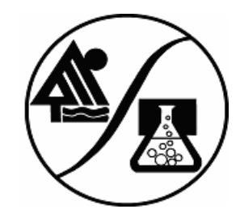

**ELAP Certificate No.: 2119** 

28 March 2012 Roberto Cervantes

RWQC Central Valley

11020 Sun Center Dr. #200

Rancho Cordova, CA 95670

RE: Caltrans

Work order number: 1203136

Enclosed are the results of analyses for samples received by the laboratory on 03/13/12 17:45. All Quality Control results are within acceptable limits except where noted as a case narrative. If you have any questions concerning this report, please feel free to contact the laboratory.

Sincerely,

John Somers, Lab Director

RWQC Central Valley Project: Caltrans
11020 Sun Center Dr. #200 Project Number: SR132 Date Reported:
Rancho Cordova, CA 95670 Project Manager: Roberto Cervantes 03/28/12 12:26

#### ANALYTICAL REPORT FOR SAMPLES

| Sample ID | Laboratory ID | Matrix       | Date Sampled   | Date Received  |
|-----------|---------------|--------------|----------------|----------------|
| MW-1      | 1203136-01    | Ground Water | 03/12/12 10:10 | 03/13/12 17:45 |
| MW-2      | 1203136-02    | Ground Water | 03/12/12 10:30 | 03/13/12 17:45 |
| MW-3      | 1203136-03    | Ground Water | 03/12/12 11:50 | 03/13/12 17:45 |
| MW-4      | 1203136-04    | Ground Water | 03/12/12 11:10 | 03/13/12 17:45 |
| MW-5      | 1203136-05    | Ground Water | 03/12/12 15:15 | 03/13/12 17:45 |
| MW-6      | 1203136-06    | Ground Water | 03/12/12 12:46 | 03/13/12 17:45 |
| MW-8      | 1203136-08    | Ground Water | 03/12/12 14:05 | 03/13/12 17:45 |

Excelchem Environmental Lab.

De Donn

RWQC Central Valley Project: Caltrans
11020 Sun Center Dr. #200 Project Number: SR132

Rancho Cordova, CA 95670 Project Manager: Roberto Cervantes

Date Reported: 03/28/12 12:26

## MW-1 1203136-01 (Ground Water)

| Analyte              | Result | Reporting Limit | MDL  | Units | DF | Batch   | Date Prepared | Date Analyzed | Method    | Notes |
|----------------------|--------|--------------------|------|-------|----|---------|------------------|------------------|-----------|-------|
| Metals by 200 series |        |                    |      |       |    |         |                  |                  |           |       |
| Dissolved Calcium    | 84000  | 100                | 79.0 | ug/l  | 1  | AVC0340 | 03/27/12         | 03/27/12         | EPA 200.7 |       |
| Calcium              | 90800  | 100                | 79.0 | "     | 1  | AVC0252 | 03/20/12         | 03/27/12         | "         |       |
| Antimony             | 2.5    | 10.0               | 1.3  | "     | 1  | "       | "                | "                | "         | J     |
| Arsenic              | 2.9    | 10.0               | 1.0  | "     | 1  | "       | "                | "                | "         | J     |
| Barium               | 251    | 5.0                | 1.2  | "     | 1  | "       | "                | "                | "         |       |
| Beryllium            | 0.4    | 5.0                | 0.09 | "     | 1  | "       | "                | "                | "         | J     |
| Cadmium              | 1.3    | 5.0                | 0.1  | "     | 1  | "       | "                | "                | "         | J     |
| Chromium             | 23.0   | 5.0                | 0.3  | "     | 1  | "       | "                | "                | "         |       |
| Cobalt               | 8.0    | 5.0                | 0.2  | "     | 1  | "       | "                | "                | "         |       |
| Copper               | 13.4   | 5.0                | 0.8  | "     | 1  | "       | "                | "                | "         |       |
| Lead                 | 6.3    | 5.0                | 0.9  | "     | 1  | "       | "                | "                | "         |       |
| Molybdenum           | 1.2    | 5.0                | 0.8  | "     | 1  | "       | "                | "                | "         | J     |
| , Nickel          | 3.2    | 5.0                | 0.6  | "     | 1  | "       | "                | "                | "         | J     |
| Selenium             | 1.3    | 20.0               | 1.3  | "     | 1  | "       | "                | "                | "         | J     |
| Silver               | ND     | 5.0                | 0.4  | "     | 1  | "       | "                | "                | "         |       |
| Thallium             | ND     | 20.0               | 2.2  | "     | 1  | "       | "                | "                | "         |       |
| Vanadium             | 56.9   | 5.0                | 0.2  | "     | 1  | "       | "                | "                | "         |       |
| Zinc                 | 48.4   | 10.0               | 0.3  | "     | 1  | "       | "                | "                | "         |       |
| Dissolved Antimony   | ND     | 10.0               | 1.3  | "     | 1  | AVC0340 | 03/27/12         | 03/27/12         | "         |       |
| Dissolved Arsenic    | 1.6    | 10.0               | 1.0  | "     | 1  | "       | "                | "                | "         | J     |
| Dissolved Barium     | 105    | 5.0                | 1.2  | "     | 1  | "       | "                | "                | "         |       |
| Dissolved Berylium   | ND     | 5.0                | 0.09 | "     | 1  | "       | "                | "                | "         |       |
| Dissolved Cadmium    | 0.6    | 5.0                | 0.1  | "     | 1  | "       | "                | "                | "         | J     |
| Dissolved Chromium   | 6.8    | 5.0                | 0.3  | "     | 1  | "       | "                | "                | "         |       |
| Dissolved Cobalt     | ND     | 5.0                | 0.2  | "     | 1  | "       | "                | "                | "         |       |
| Dissolved Copper     | 3.4    | 5.0                | 0.8  | "     | 1  | "       | "                | "                | "         | J     |
| Dissolved Lead       | 1.4    | 5.0                | 0.9  | "     | 1  | "       | "                | "                | "         | J     |
| Dissolved Molybdenum | 1.3    | 5.0                | 0.8  | "     | 1  | "       | "                | "                | "         | J     |
| Dissolved Nickel     | ND     | 5.0                | 0.6  | "     | 1  | "       | "                | "                | "         |       |
| Dissolved Selenium   | ND     | 20.0               | 1.3  | "     | 1  | "       | "                | "                | "         |       |
| Dissolved Silver     | ND     | 5.0                | 0.4  | "     | 1  | "       | "                | "                | "         |       |
| Dissolved Thallium   | ND     | 20.0               | 2.2  | "     | 1  | "       | "                | "                | "         |       |
| Dissolved Vanadium   | 21.2   | 5.0                | 0.2  | "     | 1  | "       | "                | "                | "         |       |
| Dissolved Zinc       | 5.6    | 10.0               | 0.3  | "     | 1  | "       | ,,               | "                | "         | J     |

Excelchem Environmental Lab.

De Donn

RWQC Central Valley Project: Caltrans
11020 Sun Center Dr. #200 Project Number: SR132

Rancho Cordova, CA 95670 Project Manager: Roberto Cervantes

Date Reported: 03/28/12 12:26

## MW-1 1203136-01 (Ground Water)

| Analyte                | Result | Reporting Limit | MDL     | Units | DF | Batch   | Date Prepared | Date Analyzed | Method      | Notes |
|------------------------|--------|--------------------|---------|-------|----|---------|------------------|------------------|-------------|-------|
| Metals by 200 series   |        |                    |         |       |    |         |                  |                  |             |       |
| Dissolved Magnesium    | 29400  | 50.0               | 15.6    | ug/l  | 1  | AVC0340 | 03/27/12         | 03/27/12         |             |       |
| Magnesium              | 36300  | 50.0               | 15.6    | "     | 1  | AVC0252 | 03/20/12         | 03/27/12         | "           |       |
| Dissolved Manganese    | 2.0    | 10.0               | 0.6     | "     | 1  | AVC0340 | 03/27/12         | 03/27/12         | "           | J     |
| Manganese              | 280    | 10.0               | 0.6     | "     | 1  | AVC0252 | 03/20/12         | 03/27/12         | "           |       |
| Dissolved Potassium    | 3260   | 100                | 46.8    | "     | 1  | AVC0340 | 03/27/12         | 03/27/12         | "           |       |
| Potassium              | 7800   | 100                | 46.8    | "     | 1  | AVC0252 | 03/20/12         | 03/27/12         | "           |       |
| Dissolved Sodium       | 23800  | 200                | 120     | "     | 1  | AVC0340 | 03/27/12         | 03/27/12         | "           |       |
| Sodium                 | 26500  | 200                | 120     | "     | 1  | AVC0252 | 03/20/12         | 03/27/12         | "           |       |
| Dissolved Strontium    | 1010   | 100                | 50.0    | "     | 1  | AVC0340 | 03/27/12         | 03/27/12         | "           |       |
| Strontium              | 1120   | 100                | 50.0    | "     | 1  | AVC0252 | 03/20/12         | 03/27/12         | "           |       |
| Wet Chemistry          |        |                    |         |       |    |         |                  |                  |             |       |
| Total Alkalinity       | 342    | 5.00               | 2.37    | mg/L  | 1  | AVC0192 | 03/16/12         | 03/16/12         | SM2320B     |       |
| Bicarbonate Alkalinity | 342    | 5.00               | 2.37    | "     | 1  | "       | "                | "                | "           |       |
| Carbonate Alkalinity   | ND     | 5.00               | 2.37    | "     | 1  | "       | "                | "                | "           |       |
| Sulfide                | 0.0637 | 0.0200             | 0.00394 | "     | 1  | AVC0228 | 03/15/12         | 03/15/12         | SM4500-S2 D |       |
| Total Dissolved Solids | 453    | 15.0               | 7.68    | "     | 1  | AVC0264 | 03/15/12         | 03/15/12         | SM 2540C    |       |
| Ion Chromatography     |        |                    |         |       |    |         |                  |                  |             |       |
| Chloride               | 12.0   | 0.5                | 0.02    | mg/L  | 1  | AVC0208 | 03/14/12         | 03/14/12         | EPA 300.0   |       |
| Fluoride               | 0.06   | 0.1                | 0.008   | "     | 1  | "       | "                | "                | "           | J     |
| Sulfate as SO4         | 15.6   | 0.5                | 0.03    | "     | 1  | "       | "                | "                | "           |       |

Excelchem Environmental Lab.

De Donn

RWQC Central Valley Caltrans Project: 11020 Sun Center Dr. #200 SR132 Project Number: Rancho Cordova, CA 95670 03/28/12 12:26 Project Manager: Roberto Cervantes

#### MW-1 1203136-01RE1 (Ground Water)

| Analyte                   | Result | Reporting Limit | MDL     | Units | DF | Batch   | Date Prepared | Date Analyzed | Method      | Notes |
|---------------------------|--------|--------------------|---------|-------|----|---------|------------------|------------------|-------------|-------|
| <b>Ion Chromatography</b> |        |                    |         |       |    |         |                  |                  |             |       |
| Nitrate as Nitrogen       | 11.4   | 0.55               | 0.12    | mg/L  | 5  | AVC0208 | 03/14/12         | 03/14/12         | EPA 300.0   |       |
| Analyte                   | Result | Reporting Limit | MDL     | Units | DF | Batch   | Date Prepared | Date Analyzed | Method      | Notes |
| Metals by 200 series      |        |                    |         |       |    |         |                  |                  |             |       |
| Dissolved Calcium         | 58100  | 100                | 79.0    | ug/l  | 1  | AVC0340 | 03/27/12         | 03/28/12         | EPA 200.7   |       |
| Calcium                   | 65000  | 100                | 79.0    | "     | 1  | AVC0252 | 03/20/12         | 03/27/12         | "           |       |
| Antimony                  | 2.1    | 10.0               | 1.3     | "     | 1  | "       | "                | "                | "           | J     |
| Arsenic                   | 4.1    | 10.0               | 1.0     | "     | 1  | "       | "                | "                | "           | J     |
| Barium                    | 245    | 5.0                | 1.2     | "     | 1  | "       | "                | "                | "           |       |
| Beryllium                 | 0.3    | 5.0                | 0.09    | "     | 1  | "       | "                | "                | "           | J     |
| Cadmium                   | 0.8    | 5.0                | 0.1     | "     | 1  | "       | "                | "                | "           | J     |
| Chromium                  | 22.3   | 5.0                | 0.3     | "     | 1  | "       | "                | "                | "           |       |
| Cobalt                    | 9.7    | 5.0                | 0.2     | "     | 1  | "       | "                | "                | "           |       |
| Copper                    | 10.5   | 5.0                | 0.8     | "     | 1  | "       | "                | "                | "           |       |
| Lead                      | 6.9    | 5.0                | 0.9     | "     | 1  | "       | "                | "                | "           |       |
| Molybdenum                | 1.6    | 5.0                | 0.8     | "     | 1  | "       | "                | "                | "           | J     |
| Nickel                    | 2.3    | 5.0                | 0.6     | "     | 1  | "       | "                | "                | "           | J     |
| Selenium                  | 1.8    | 20.0               | 1.3     | "     | 1  | "       | "                | "                | "           | J     |
| Silver                    | ND     | 5.0                | 0.4     | "     | 1  | "       | "                | "                | "           |       |
| Thallium                  | ND     | 20.0               | 2.2     | "     | 1  | "       | "                | "                | "           |       |
| Vanadium                  | 67.1   | 5.0                | 0.2     | "     | 1  | "       | "                | "                | "           |       |
| Zinc                      | 41.3   | 10.0               | 0.3     | "     | 1  | "       | "                | "                | "           |       |
| Dissolved Antimony        | ND     | 10.0               | 1.3     | "     | 1  | AVC0340 | 03/27/12         | 03/28/12         | "           |       |
| Dissolved Arsenic         | ND     | 10.0               | 1.0     | "     | 1  | "       | "                | "                | "           |       |
| Dissolved Barium          | 89.6   | 5.0                | 1.2     | "     | 1  | "       | "                | "                | "           |       |
| Dissolved Beryllium       | ND     | 5.0                | 0.09    | "     | 1  | "       | "                | "                | "           |       |
| Dissolved Cadmium         | 0.4    | 5.0                | 0.1     | "     | 1  | "       | "                | "                | "           | J     |
| Dissolved Chromium        | 6.1    | 5.0                | 0.3     | "     | 1  | "       | "                | "                | "           |       |
| Dissolved Cobalt          | ND     | 5.0                | 0.2     | "     | 1  | "       | "                | "                | "           |       |
| Dissolved Copper          | ND     | 5.0                | 0.8     | "     | 1  | "       | "                | "                | "           |       |
| Dissolved Lead            | 15.3   | 5.0                | 0.9     | "     | 1  | "       | "                | "                | "           |       |
| Dissolved Molybdenum      | 1.4    | 5.0                | 0.8     | "     | 1  | "       | "                | "                | "           | J     |
| Dissolved Nickel          | ND     | 5.0                | 0.6     | "     | 1  | "       | "                | "                | "           |       |
| Dissolved Selenium        | ND     | 20.0               | 1.3     | "     | 1  | "       | "                | "                | "           |       |
| Dissolved Silver          | ND     | 5.0                | 0.4     | "     | 1  | "       | "                | "                | "           |       |
| Dissolved Thallium        | 4.6    | 20.0               | 2.2     | "     | 1  | "       | "                | "                | "           | J     |
| Dissolved Vanadium        | 23.1   | 5.0                | 0.2     | "     | 1  | "       | "                | "                | "           |       |
| Dissolved Zinc            | 3.7    | 10.0               | 0.3     | "     | 1  | "       | "                | "                | "           | J     |
| Analyte                   | Result | Reporting Limit | MDL     | Units | DF | Batch   | Date Prepared | Date Analyzed | Method      | Notes |
| Metals by 200 series      |        |                    |         |       |    |         |                  |                  |             |       |
| Dissolved Magnesium       | 17200  | 50.0               | 15.6    | ug/l  | 1  | AVC0340 | 03/27/12         | 03/28/12         | "           |       |
| Magnesium                 | 24900  | 50.0               | 15.6    | "     | 1  | AVC0252 | 03/20/12         | 03/27/12         | "           |       |
| Dissolved Manganese       | 1.4    | 10.0               | 0.6     | "     | 1  | AVC0340 | 03/27/12         | 03/28/12         | "           | J     |
| Manganese                 | 458    | 10.0               | 0.6     | "     | 1  | AVC0252 | 03/20/12         | 03/27/12         | "           |       |
| Dissolved Potassium       | 2890   | 100                | 46.8    | "     | 1  | AVC0340 | 03/27/12         | 03/28/12         | "           |       |
| Potassium                 | 7580   | 100                | 46.8    | "     | 1  | AVC0252 | 03/20/12         | 03/27/12         | "           |       |
| Dissolved Sodium          | 54000  | 200                | 120     | "     | 1  | AVC0340 | 03/27/12         | 03/28/12         | "           |       |
| Sodium                    | 59800  | 200                | 120     | "     | 1  | AVC0252 | 03/20/12         | 03/27/12         | "           |       |
| Dissolved Strontium       | 642    | 100                | 50.0    | "     | 1  | AVC0340 | 03/27/12         | 03/28/12         | "           |       |
| Strontium                 | 782    | 100                | 50.0    | "     | 1  | AVC0252 | 03/20/12         | 03/27/12         | "           |       |
| Wet Chemistry             |        |                    |         |       |    |         |                  |                  |             |       |
| Total Alkalinity          | 270    | 5.00               | 2.37    | mg/L  | 1  | AVC0192 | 03/16/12         | 03/16/12         | SM2320B     |       |
| Bicarbonate Alkalinity    | 270    | 5.00               | 2.37    | "     | 1  | "       | "                | "                | "           |       |
| Carbonate Alkalinity      | ND     | 5.00               | 2.37    | "     | 1  | "       | "                | "                | "           |       |
| Sulfide                   | 0.0497 | 0.0200             | 0.00394 | "     | 1  | AVC0228 | 03/15/12         | 03/15/12         | SM4500-S2 D |       |
| Total Dissolved Solids    | 382    | 15.0               | 7.68    | "     | 1  | AVC0264 | 03/15/12         | 03/15/12         | SM 2540C    |       |
| Ion Chromatography        |        |                    |         |       |    |         |                  |                  |             |       |
| Chloride                  | 15.4   | 1.0                | 0.04    | mg/L  | 2  | AVC0208 | 03/14/12         | 03/14/12         | EPA 300.0   |       |
| Fluoride                  | 0.1    | 0.2                | 0.02    | "     | 2  | "       | "                | "                | "           | J     |
| Nitrate as Nitrogen       | 8.77   | 0.22               | 0.05    | "     | 2  | "       | "                | "                | "           |       |
| Sulfate as SO4            | 15.2   | 1.0                | 0.05    | "     | 2  | "       | "                | "                | "           |       |

Excelchem Environmental Lab.

John
Somers

The results in this report apply to the samples analyzed in accordance with the chain of custody document. This analytical report must be reproduced in its entirety.

Date Reported:

RWQC Central Valley Project: Caltrans 11020 Sun Center Dr. #200 Project Number: SR132

Rancho Cordova, CA 95670 Project Manager: Roberto Cervantes

Date Reported: 03/28/12 12:26

## MW-2 1203136-02 (Ground Water)

Excelchem Environmental Lab.

De Donn

RWQC Central Valley Project: Caltrans
11020 Sun Center Dr. #200 Project Number: SR132

Rancho Cordova, CA 95670 Project Manager: Roberto Cervantes

Date Reported: 03/28/12 12:26

## MW-2 1203136-02 (Ground Water)

Excelchem Environmental Lab.

De Donn

RWQC Central Valley Project: Caltrans
11020 Sun Center Dr. #200 Project Number: SR132

Rancho Cordova, CA 95670 Project Manager: Roberto Cervantes

Date Reported: 03/28/12 12:26

## MW-3 1203136-03 (Ground Water)

| Analyte              | Result | Reporting Limit | MDL  | Units | DF | Batch   | Date Prepared | Date Analyzed | Method    | Notes |
|----------------------|--------|-----------------|------|-------|----|---------|---------------|---------------|-----------|-------|
| Metals by 200 series |        |                 |      |       |    |         |               |               |           |       |
| Dissolved Calcium    | 29500  | 100             | 79.0 | ug/l  | 1  | AVC0340 | 03/27/12      | 03/28/12      | EPA 200.7 |       |
| Calcium              | 33400  | 100             | 79.0 | ug/l  | 1  | AVC0340 | 03/27/12      | 03/28/12      | EPA 200.7 | J     |
| Antimony             | 2.5    | 10.0            | 1.3  | "     | 1  | AVC0252 | 03/20/12      | 03/27/12      | "         | J     |
| Arsenic              | 2.9    | 10.0            | 1.0  | "     | 1  | "       | "             | "             | "         | J     |
| Barium               | 103    | 5.0             | 1.2  | "     | 1  | "       | "             | "             | "         | J     |
| Beryllium            | 0.1    | 5.0             | 0.09 | "     | 1  | "       | "             | "             | "         | J     |
| Cadmium              | 0.9    | 5.0             | 0.1  | "     | 1  | "       | "             | "             | "         | J     |
| Chromium             | 9.5    | 5.0             | 0.3  | "     | 1  | "       | "             | "             | "         | J     |
| Cobalt               | 4.0    | 5.0             | 0.2  | "     | 1  | "       | "             | "             | "         | J     |
| Copper               | 6.6    | 5.0             | 0.8  | "     | 1  | "       | "             | "             | "         | J     |
| Lead                 | 5.0    | 5.0             | 0.9  | "     | 1  | "       | "             | "             | "         |       |
| Molybdenum           | 1.3    | 5.0             | 0.8  | "     | 1  | "       | "             | "             | "         | J     |
| Nickel               | ND     | 5.0             | 0.6  | "     | 1  | "       | "             | "             | "         |       |
| Selenium             | 2.2    | 20.0            | 1.3  | "     | 1  | "       | "             | "             | "         | J     |
| Silver               | ND     | 5.0             | 0.4  | "     | 1  | "       | "             | "             | "         |       |
| Thallium             | ND     | 20.0            | 2.2  | "     | 1  | "       | "             | "             | "         |       |
| Vanadium             | 40.1   | 5.0             | 0.2  | "     | 1  | "       | "             | "             | "         |       |
| Zinc                 | 25.6   | 10.0            | 0.3  | "     | 1  | "       | "             | "             | "         |       |
| Dissolved Antimony   | ND     | 10.0            | 1.3  | "     | 1  | AVC0340 | 03/27/12      | 03/28/12      | "         |       |
| Dissolved Arsenic    | 2.1    | 10.0            | 1.0  | "     | 1  | AVC0340 | 03/27/12      | 03/28/12      | "         | J     |
| Dissolved Barium     | 44.4   | 5.0             | 1.2  | "     | 1  | AVC0340 | 03/27/12      | 03/28/12      | "         |       |
| Dissolved Beryllium  | 0.1    | 5.0             | 0.09 | "     | 1  | AVC0340 | 03/27/12      | 03/28/12      | "         | J     |
| Dissolved Cadmium    | 0.3    | 5.0             | 0.1  | "     | 1  | AVC0340 | 03/27/12      | 03/28/12      | "         | J     |
| Dissolved Chromium   | 4.0    | 5.0             | 0.3  | "     | 1  | AVC0340 | 03/27/12      | 03/28/12      | "         | J     |
| Dissolved Cobalt     | ND     | 5.0             | 0.2  | "     | 1  | AVC0340 | 03/27/12      | 03/28/12      | "         |       |
| Dissolved Copper     | 1.5    | 5.0             | 0.8  | "     | 1  | AVC0340 | 03/27/12      | 03/28/12      | "         | J     |
| Dissolved Lead       | 11.5   | 5.0             | 0.9  | "     | 1  | AVC0340 | 03/27/12      | 03/28/12      | "         |       |
| Dissolved Molybdenum | 0.9    | 5.0             | 0.8  | "     | 1  | AVC0340 | 03/27/12      | 03/28/12      | "         | J     |
| Dissolved Nickel     | ND     | 5.0             | 0.6  | "     | 1  | AVC0340 | 03/27/12      | 03/28/12      | "         |       |
| Dissolved Selenium   | ND     | 20.0            | 1.3  | "     | 1  | AVC0340 | 03/27/12      | 03/28/12      | "         |       |
| Dissolved Silver     | ND     | 5.0             | 0.4  | "     | 1  | AVC0340 | 03/27/12      | 03/28/12      | "         |       |
| Dissolved Thallium   | ND     | 20.0            | 2.2  | "     | 1  | AVC0340 | 03/27/12      | 03/28/12      | "         |       |
| Dissolved Vanadium   | 22.6   | 5.0             | 0.2  | "     | 1  | AVC0340 | 03/27/12      | 03/28/12      | "         |       |
| Dissolved Zinc       | 4.5    | 10.0            | 0.3  | "     | 1  | AVC0340 | 03/27/12      | 03/28/12      | "         | J     |

Excelchem Environmental Lab.

De Donn

RWQC Central Valley Project: Caltrans
11020 Sun Center Dr. #200 Project Number: SR132

Rancho Cordova, CA 95670 Project Manager: Roberto Cervantes

Date Reported: 03/28/12 12:26

## MW-3 1203136-03 (Ground Water)

| Analyte                       | Result | Reporting Limit | MDL     | Units | DF | Batch   | Date Prepared | Date Analyzed | Method      | Notes |
|-------------------------------|--------|--------------------|---------|-------|----|---------|------------------|------------------|-------------|-------|
| <b>Metals by 200 series</b>   |        |                    |         |       |    |         |                  |                  |             |       |
| Dissolved Magnesium           | 9190   | 50.0               | 15.6    | ug/l  | 1  | AVC0340 | 03/27/12         | 03/28/12         | "           |       |
| Magnesium                     | 12500  | 50.0               | 15.6    | "     | 1  | AVC0252 | 03/20/12         | 03/27/12         | "           |       |
| Dissolved Manganese           | 1.8    | 10.0               | 0.6     | "     | 1  | AVC0340 | 03/27/12         | 03/28/12         | "           | J     |
| Manganese                     | 162    | 10.0               | 0.6     | "     | 1  | AVC0252 | 03/20/12         | 03/27/12         | "           |       |
| Dissolved Potassium           | 2040   | 100                | 46.8    | "     | 1  | AVC0340 | 03/27/12         | 03/28/12         | "           |       |
| Potassium                     | 4190   | 100                | 46.8    | "     | 1  | AVC0252 | 03/20/12         | 03/27/12         | "           |       |
| Dissolved Sodium              | 66300  | 200                | 120     | "     | 1  | AVC0340 | 03/27/12         | 03/28/12         | "           |       |
| Sodium                        | 73600  | 200                | 120     | "     | 1  | AVC0252 | 03/20/12         | 03/27/12         | "           |       |
| Dissolved Strontium           | 342    | 100                | 50.0    | "     | 1  | AVC0340 | 03/27/12         | 03/28/12         | "           |       |
| Strontium                     | 414    | 100                | 50.0    | "     | 1  | AVC0252 | 03/20/12         | 03/27/12         | "           |       |
| <b>Wet Chemistry</b>          |        |                    |         |       |    |         |                  |                  |             |       |
| Total Alkalinity              | 220    | 5.00               | 2.37    | mg/L  | 1  | AVC0192 | 03/16/12         | 03/16/12         | SM2320B     |       |
| Bicarbonate Alkalinity        | 220    | 5.00               | 2.37    | "     | 1  | "       | "                | "                | "           |       |
| Carbonate Alkalinity          | ND     | 5.00               | 2.37    | "     | 1  | "       | "                | "                | "           |       |
| Sulfide                       | 0.0281 | 0.0200             | 0.00394 | "     | 1  | AVC0228 | 03/15/12         | 03/15/12         | SM4500-S2 D |       |
| <b>Total Dissolved Solids</b> | 273    | 15.0               | 7.68    | "     | 1  | AVC0264 | 03/15/12         | 03/15/12         | SM 2540C    |       |
| <b>Ion Chromatography</b>     |        |                    |         |       |    |         |                  |                  |             |       |
| Chloride                      | 5.7    | 0.5                | 0.02    | mg/L  | 1  | AVC0208 | 03/14/12         | 03/14/12         | EPA 300.0   |       |
| Fluoride                      | 0.1    | 0.1                | 0.008   | "     | 1  | "       | "                | "                | "           |       |
| Nitrate as Nitrogen           | 2.24   | 0.11               | 0.02    | "     | 1  | "       | "                | "                | "           |       |
| Sulfate as SO4                | 13.8   | 0.5                | 0.03    | "     | 1  | "       | "                | "                | "           |       |

Excelchem Environmental Lab.

De Donn

RWQC Central Valley Project: Caltrans
11020 Sun Center Dr. #200 Project Number: SR132

Rancho Cordova, CA 95670 Project Manager: Roberto Cervantes

Date Reported: 03/28/12 12:26

## MW-4 1203136-04 (Ground Water)

| Analyte              | Result | Reporting Limit | MDL  | Units | DF | Batch   | Date Prepared | Date Analyzed | Method    | Notes |
|----------------------|--------|-----------------|------|-------|----|---------|---------------|---------------|-----------|-------|
| Metals by 200 series |        |                 |      |       |    |         |               |               |           |       |
| Dissolved Calcium    | 74200  | 100             | 79.0 | ug/l  | 1  | AVC0340 | 03/27/12      | 03/28/12      | EPA 200.7 |       |
| Calcium              | 83400  | 100             | 79.0 |       | 1  | AVC0252 | 03/20/12      | 03/27/12      |           |       |
| Antimony             | 1.4    | 10.0            | 1.3  |       | 1  |         |               |               |           | J     |
| Arsenic              | 3.5    | 10.0            | 1.0  |       | 1  |         |               |               |           | J     |
| Barium               | 302    | 5.0             | 1.2  |       | 1  |         |               |               |           |       |
| Beryllium            | 0.2    | 5.0             | 0.09 |       | 1  |         |               |               |           | J     |
| Cadmium              | 0.8    | 5.0             | 0.1  |       | 1  |         |               |               |           | J     |
| Chromium             | 20.7   | 5.0             | 0.3  |       | 1  |         |               |               |           |       |
| Cobalt               | 8.5    | 5.0             | 0.2  |       | 1  |         |               |               |           |       |
| Copper               | 11.4   | 5.0             | 0.8  |       | 1  |         |               |               |           |       |
| Lead                 | 7.3    | 5.0             | 0.9  |       | 1  |         |               |               |           |       |
| Molybdenum           | 0.8    | 5.0             | 0.8  |       | 1  |         |               |               |           | J     |
| Nickel               | 2.4    | 5.0             | 0.6  |       | 1  |         |               |               |           | J     |
| Selenium             | 2.1    | 20.0            | 1.3  |       | 1  |         |               |               |           | J     |
| Silver               | ND     | 5.0             | 0.4  |       | 1  |         |               |               |           |       |
| Thallium             | ND     | 20.0            | 2.2  |       | 1  |         |               |               |           |       |
| Vanadium             | 58.5   | 5.0             | 0.2  |       | 1  |         |               |               |           |       |
| Zinc                 | 44.9   | 10.0            | 0.3  |       | 1  |         |               |               |           |       |
| Dissolved Antimony   | ND     | 10.0            | 1.3  |       | 1  | AVC0340 | 03/27/12      | 03/28/12      |           |       |
| Dissolved Arsenic    | 1.4    | 10.0            | 1.0  |       | 1  |         |               |               |           | J     |
| Dissolved Barium     | 134    | 5.0             | 1.2  |       | 1  |         |               |               |           |       |
| Dissolved Berylium   | ND     | 5.0             | 0.09 |       | 1  |         |               |               |           |       |
| Dissolved Cadmium    | 0.4    | 5.0             | 0.1  |       | 1  |         |               |               |           | J     |
| Dissolved Chromium   | 7.7    | 5.0             | 0.3  |       | 1  |         |               |               |           |       |
| Dissolved Cobalt     | ND     | 5.0             | 0.2  |       | 1  |         |               |               |           |       |
| Dissolved Copper     | 0.9    | 5.0             | 0.8  |       | 1  |         |               |               |           | J     |
| Dissolved Lead       | 14.9   | 5.0             | 0.9  |       | 1  |         |               |               |           |       |
| Dissolved Molybdenum | ND     | 5.0             | 0.8  |       | 1  |         |               |               |           |       |
| Dissolved Nickel     | ND     | 5.0             | 0.6  |       | 1  |         |               |               |           |       |
| Dissolved Selenium   | ND     | 20.0            | 1.3  |       | 1  |         |               |               |           |       |
| Dissolved Silver     | ND     | 5.0             | 0.4  |       | 1  |         |               |               |           |       |
| Dissolved Thallium   | 3.5    | 20.0            | 2.2  |       | 1  |         |               |               |           | J     |
| Dissolved Vanadium   | 19.3   | 5.0             | 0.2  |       | 1  |         |               |               |           |       |
| Dissolved Zinc       | 3.5    | 10.0            | 0.3  |       | 1  |         |               |               |           | J     |

Excelchem Environmental Lab.

De Donn

RWQC Central Valley Project: Caltrans
11020 Sun Center Dr. #200 Project Number: SR132

Rancho Cordova, CA 95670 Project Manager: Roberto Cervantes

Date Reported: 03/28/12 12:26

## MW-4 1203136-04 (Ground Water)

| Analyte                       | Result | Reporting Limit | MDL     | Units | DF | Batch   | Date Prepared | Date Analyzed | Method      | Notes |
|-------------------------------|--------|--------------------|---------|-------|----|---------|------------------|------------------|-------------|-------|
| Metals by 200 series          |        |                    |         |       |    |         |                  |                  |             |       |
| Dissolved Magnesium           | 20700  | 50.0               | 15.6    | ug/l  | 1  | AVC0340 | 03/27/12         | 03/28/12         | "           |       |
| Magnesium                     | 28700  | 50.0               | 15.6    | "     | 1  | AVC0252 | 03/20/12         | 03/27/12         | "           |       |
| Dissolved Manganese           | 0.7    | 10.0               | 0.6     | "     | 1  | AVC0340 | 03/27/12         | 03/28/12         | "           | J     |
| Manganese                     | 431    | 10.0               | 0.6     | "     | 1  | AVC0252 | 03/20/12         | 03/27/12         | "           |       |
| Dissolved Potassium           | 3140   | 100                | 46.8    | "     | 1  | AVC0340 | 03/27/12         | 03/28/12         | "           |       |
| Potassium                     | 8040   | 100                | 46.8    | "     | 1  | AVC0252 | 03/20/12         | 03/27/12         | "           |       |
| Dissolved Sodium              | 47400  | 200                | 120     | "     | 1  | AVC0340 | 03/27/12         | 03/28/12         | "           |       |
| Sodium                        | 53300  | 200                | 120     | "     | 1  | AVC0252 | 03/20/12         | 03/27/12         | "           |       |
| Dissolved Strontium           | 812    | 100                | 50.0    | "     | 1  | AVC0340 | 03/27/12         | 03/28/12         | "           |       |
| Strontium                     | 1030   | 100                | 50.0    | "     | 1  | AVC0252 | 03/20/12         | 03/27/12         | "           |       |
| Wet Chemistry                 |        |                    |         |       |    |         |                  |                  |             |       |
| Total Alkalinity              | 286    | 5.00               | 2.37    | mg/L  | 1  | AVC0192 | 03/16/12         | 03/16/12         | SM2320B     |       |
| Bicarbonate Alkalinity        | 286    | 5.00               | 2.37    | "     | 1  | "       | "                | "                | "           |       |
| Carbonate Alkalinity          | ND     | 5.00               | 2.37    | "     | 1  | "       | "                | "                | "           |       |
| Sulfide                       | 0.172  | 0.0200             | 0.00394 | "     | 1  | AVC0228 | 03/15/12         | 03/15/12         | SM4500-S2 D |       |
| <b>Total Dissolved Solids</b> | 472    | 15.0               | 7.68    | "     | 1  | AVC0264 | 03/15/12         | 03/15/12         | SM 2540C    |       |
| Ion Chromatography            |        |                    |         |       |    |         |                  |                  |             |       |
| Chloride                      | 34.8   | 1.0                | 0.04    | mg/L  | 2  | AVC0208 | 03/14/12         | 03/14/12         | EPA 300.0   |       |
| Fluoride                      | 0.09   | 0.2                | 0.02    | "     | 2  | "       | "                | "                | "           | J     |
| Nitrate as Nitrogen           | 9.59   | 0.22               | 0.05    | "     | 2  | "       | "                | "                | "           |       |
| Sulfate as SO4                | 21.8   | 1.0                | 0.05    | "     | 2  | "       | "                | "                | "           |       |

Excelchem Environmental Lab.

De Donn

RWQC Central Valley Project: Caltrans 11020 Sun Center Dr. #200 Project Number: SR132

Rancho Cordova, CA 95670 Project Manager: Roberto Cervantes

Date Reported: 03/28/12 12:26

## MW-5 1203136-05 (Ground Water)

| Analyte              | Result | Reporting Limit | MDL  | Units | DF | Batch   | Date Prepared | Date Analyzed | Method    | Notes |
|----------------------|--------|--------------------|------|-------|----|---------|------------------|------------------|-----------|-------|
| Metals by 200 series |        |                    |      |       |    |         |                  |                  |           |       |
| Dissolved Calcium    | 94900  | 100                | 79.0 | ug/l  | 1  | AVC0340 | 03/27/12         | 03/28/12         | EPA 200.7 |       |
| Calcium              | 105000 | 100                | 79.0 |       | 1  | AVC0252 | 03/20/12         | 03/27/12         |           |       |
| Antimony             | ND     | 10.0               | 1.3  |       | 1  |         |                  |                  |           |       |
| Arsenic              | 2.7    | 10.0               | 1.0  |       | 1  |         |                  |                  |           | J     |
| Barium               | 400    | 5.0                | 1.2  |       | 1  |         |                  |                  |           |       |
| Beryllium            | 0.1    | 5.0                | 0.09 |       | 1  |         |                  |                  |           | J     |
| Cadmium              | 0.7    | 5.0                | 0.1  |       | 1  |         |                  |                  |           | J     |
| Chromium             | 14.1   | 5.0                | 0.3  |       | 1  |         |                  |                  |           |       |
| Cobalt               | 2.0    | 5.0                | 0.2  |       | 1  |         |                  |                  |           | J     |
| Copper               | 4.4    | 5.0                | 0.8  |       | 1  |         |                  |                  |           | J     |
| Lead                 | 2.6    | 5.0                | 0.9  |       | 1  |         |                  |                  |           | J     |
| Molybdenum           | 1.8    | 5.0                | 0.8  |       | 1  |         |                  |                  |           | J     |
| Nickel               | ND     | 5.0                | 0.6  |       | 1  |         |                  |                  |           |       |
| Selenium             | ND     | 20.0               | 1.3  |       | 1  |         |                  |                  |           |       |
| Silver               | ND     | 5.0                | 0.4  |       | 1  |         |                  |                  |           |       |
| Thallium             | ND     | 20.0               | 2.2  |       | 1  |         |                  |                  |           |       |
| Vanadium             | 30.0   | 5.0                | 0.2  |       | 1  |         |                  |                  |           |       |
| Zinc                 | 13.8   | 10.0               | 0.3  |       | 1  |         |                  |                  |           |       |
| Dissolved Antimony   | ND     | 10.0               | 1.3  |       | 1  | AVC0340 | 03/27/12         | 03/28/12         |           |       |
| Dissolved Arsenic    | 1.3    | 10.0               | 1.0  |       | 1  |         |                  |                  |           | J     |
| Dissolved Barium     | 310    | 5.0                | 1.2  |       | 1  |         |                  |                  |           |       |
| Dissolved Berylium   | ND     | 5.0                | 0.09 |       | 1  |         |                  |                  |           |       |
| Dissolved Cadmium    | 0.5    | 5.0                | 0.1  |       | 1  |         |                  |                  |           | J     |
| Dissolved Chromium   | 9.6    | 5.0                | 0.3  |       | 1  |         |                  |                  |           |       |
| Dissolved Cobalt     | ND     | 5.0                | 0.2  |       | 1  |         |                  |                  |           |       |
| Dissolved Copper     | 1.0    | 5.0                | 0.8  |       | 1  |         |                  |                  |           | J     |
| Dissolved Lead       | 13.3   | 5.0                | 0.9  |       | 1  |         |                  |                  |           |       |
| Dissolved Molybdenum | 1.5    | 5.0                | 0.8  |       | 1  |         |                  |                  |           | J     |
| Dissolved Nickel     | ND     | 5.0                | 0.6  |       | 1  |         |                  |                  |           |       |
| Dissolved Selenium   | 1.5    | 20.0               | 1.3  |       | 1  |         |                  |                  |           | J     |
| Dissolved Silver     | ND     | 5.0                | 0.4  |       | 1  |         |                  |                  |           |       |
| Dissolved Thallium   | 3.6    | 20.0               | 2.2  |       | 1  |         |                  |                  |           | J     |
| Dissolved Vanadium   | 17.8   | 5.0                | 0.2  |       | 1  |         |                  |                  |           |       |
| Dissolved Zinc       | 14.5   | 10.0               | 0.3  |       | 1  |         |                  |                  |           |       |

Excelchem Environmental Lab.

De donn

RWQC Central Valley Project: Caltrans
11020 Sun Center Dr. #200 Project Number: SR132

Rancho Cordova, CA 95670 Project Manager: Roberto Cervantes

Date Reported: 03/28/12 12:26

## MW-5 1203136-05 (Ground Water)

| Analyte                       | Result | Reporting Limit | MDL     | Units | DF | Batch   | Date Prepared | Date Analyzed | Method      | Notes |
|-------------------------------|--------|--------------------|---------|-------|----|---------|------------------|------------------|-------------|-------|
| Metals by 200 series          |        |                    |         |       |    |         |                  |                  |             |       |
| Dissolved Magnesium           | 32700  | 50.0               | 15.6    | ug/l  | 1  | AVC0340 | 03/27/12         | 03/28/12         |             |       |
| Magnesium                     | 36000  | 50.0               | 15.6    | "     | 1  | AVC0252 | 03/20/12         | 03/27/12         |             |       |
| Dissolved Manganese           | 4.4    | 10.0               | 0.6     | "     | 1  | AVC0340 | 03/27/12         | 03/28/12         |             | J     |
| Manganese                     | 107    | 10.0               | 0.6     | "     | 1  | AVC0252 | 03/20/12         | 03/27/12         |             |       |
| Dissolved Potassium           | 4440   | 100                | 46.8    | "     | 1  | AVC0340 | 03/27/12         | 03/28/12         |             |       |
| Potassium                     | 6180   | 100                | 46.8    | "     | 1  | AVC0252 | 03/20/12         | 03/27/12         |             |       |
| Dissolved Sodium              | 86900  | 200                | 120     | "     | 1  | AVC0340 | 03/27/12         | 03/28/12         |             |       |
| Sodium                        | 96400  | 200                | 120     | "     | 1  | AVC0252 | 03/20/12         | 03/27/12         |             |       |
| Dissolved Strontium           | 1140   | 100                | 50.0    | "     | 1  | AVC0340 | 03/27/12         | 03/28/12         |             |       |
| Strontium                     | 1360   | 100                | 50.0    | "     | 1  | AVC0252 | 03/20/12         | 03/27/12         |             |       |
| Wet Chemistry                 |        |                    |         |       |    |         |                  |                  |             |       |
| Total Alkalinity              | 410    | 5.00               | 2.37    | mg/L  | 1  | AVC0192 | 03/16/12         | 03/16/12         | SM2320B     |       |
| Bicarbonate Alkalinity        | 410    | 5.00               | 2.37    | "     | 1  | "       | "                | "                | "           |       |
| Carbonate Alkalinity          | ND     | 5.00               | 2.37    | "     | 1  | "       | "                | "                | "           |       |
| Sulfide                       | 0.0778 | 0.0200             | 0.00394 | "     | 1  | AVC0228 | 03/15/12         | 03/15/12         | SM4500-S2 D |       |
| <b>Total Dissolved Solids</b> | 632    | 15.0               | 7.68    | mg/L  | 1  | AVC0264 | 03/15/12         | 03/15/12         | SM 2540C    |       |
| Ion Chromatography            |        |                    |         |       |    |         |                  |                  |             |       |
| Chloride                      | 24.6   | 2.5                | 0.1     | mg/L  | 5  | AVC0208 | 03/14/12         | 03/14/12         | EPA 300.0   |       |
| Fluoride                      | 0.1    | 0.5                | 0.04    | "     | 5  | "       | "                | "                | "           | J     |
| Nitrate as Nitrogen           | 25.4   | 0.55               | 0.12    | "     | 5  | "       | "                | "                | "           |       |
| Sulfate as SO4                | 30.4   | 2.5                | 0.1     | "     | 5  | "       | "                | "                | "           |       |

Excelchem Environmental Lab.

De Donn

RWQC Central Valley Project: Caltrans
11020 Sun Center Dr. #200 Project Number: SR132

Rancho Cordova, CA 95670 Project Manager: Roberto Cervantes

Date Reported: 03/28/12 12:26

## MW-6 1203136-06 (Ground Water)

| Analyte              | Result | Reporting Limit | MDL  | Units | DF | Batch   | Date Prepared | Date Analyzed | Method    | Notes |
|----------------------|--------|--------------------|------|-------|----|---------|------------------|------------------|-----------|-------|
| Metals by 200 series |        |                    |      |       |    |         |                  |                  |           |       |
| Dissolved Calcium    | 54800  | 100                | 79.0 | ug/l  | 1  | AVC0340 | 03/27/12         | 03/28/12         | EPA 200.7 |       |
| Calcium              | 65000  | 100                | 79.0 | "     | 1  | AVC0252 | 03/20/12         | 03/27/12         | "         |       |
| Antimony             | ND     | 10.0               | 1.3  | "     | 1  | "       | "                | "                | "         |       |
| Arsenic              | 5.7    | 10.0               | 1.0  | "     | 1  | "       | "                | "                | "         | J     |
| Barium               | 241    | 5.0                | 1.2  | "     | 1  | "       | "                | "                | "         |       |
| Beryllium            | 0.3    | 5.0                | 0.09 | "     | 1  | "       | "                | "                | "         | J     |
| Cadmium              | 0.8    | 5.0                | 0.1  | "     | 1  | "       | "                | "                | "         | J     |
| Chromium             | 22.0   | 5.0                | 0.3  | "     | 1  | "       | "                | "                | "         |       |
| Cobalt               | 9.7    | 5.0                | 0.2  | "     | 1  | "       | "                | "                | "         |       |
| Copper               | 11.6   | 5.0                | 0.8  | "     | 1  | "       | "                | "                | "         |       |
| Lead                 | 5.3    | 5.0                | 0.9  | "     | 1  | "       | "                | "                | "         |       |
| Molybdenum           | 5.7    | 5.0                | 0.8  | "     | 1  | "       | "                | "                | "         |       |
| Nickel               | ND     | 5.0                | 0.6  | "     | 1  | "       | "                | "                | "         |       |
| Selenium             | ND     | 20.0               | 1.3  | "     | 1  | "       | "                | "                | "         |       |
| Silver               | ND     | 5.0                | 0.4  | "     | 1  | "       | "                | "                | "         |       |
| Thallium             | ND     | 20.0               | 2.2  | "     | 1  | "       | "                | "                | "         |       |
| Vanadium             | 82.8   | 5.0                | 0.2  | "     | 1  | "       | "                | "                | "         |       |
| Zinc                 | 49.6   | 10.0               | 0.3  | "     | 1  | "       | "                | "                | "         |       |
| Dissolved Antimony   | ND     | 10.0               | 1.3  | "     | 1  | AVC0340 | 03/27/12         | 03/28/12         | "         |       |
| Dissolved Arsenic    | 2.8    | 10.0               | 1.0  | "     | 1  | "       | "                | "                | "         | J     |
| Dissolved Barium     | 94.2   | 5.0                | 1.2  | "     | 1  | "       | "                | "                | "         |       |
| Dissolved Beryllium  | ND     | 5.0                | 0.09 | "     | 1  | "       | "                | "                | "         |       |
| Dissolved Cadmium    | 0.4    | 5.0                | 0.1  | "     | 1  | "       | "                | "                | "         | J     |
| Dissolved Chromium   | 9.9    | 5.0                | 0.3  | "     | 1  | "       | "                | "                | "         |       |
| Dissolved Cobalt     | ND     | 5.0                | 0.2  | "     | 1  | "       | "                | "                | "         |       |
| Dissolved Copper     | ND     | 5.0                | 0.8  | "     | 1  | "       | "                | "                | "         |       |
| Dissolved Lead       | 14.0   | 5.0                | 0.9  | "     | 1  | "       | "                | "                | "         |       |
| Dissolved Molybdenum | 5.2    | 5.0                | 0.8  | "     | 1  | "       | "                | "                | "         |       |
| Dissolved Nickel     | ND     | 5.0                | 0.6  | "     | 1  | "       | "                | "                | "         |       |
| Dissolved Selenium   | ND     | 20.0               | 1.3  | "     | 1  | "       | "                | "                | "         |       |
| Dissolved Silver     | ND     | 5.0                | 0.4  | "     | 1  | "       | "                | "                | "         |       |
| Dissolved Thallium   | 2.6    | 20.0               | 2.2  | "     | 1  | "       | "                | "                | "         | J     |
| Dissolved Vanadium   | 36.3   | 5.0                | 0.2  | "     | 1  | "       | "                | "                | "         |       |
| Dissolved Zinc       | 3.8    | 10.0               | 0.3  | "     | 1  | "       | "                | "                | "         | J     |

Excelchem Environmental Lab.

De Donn

RWQC Central Valley Project: Caltrans
11020 Sun Center Dr. #200 Project Number: SR132

Rancho Cordova, CA 95670 Project Manager: Roberto Cervantes

Date Reported: 03/28/12 12:26

## MW-6 1203136-06 (Ground Water)

| Analyte                       | Result | Reporting Limit | MDL     | Units | DF | Batch   | Date Prepared | Date Analyzed | Method      | Notes |
|-------------------------------|--------|--------------------|---------|-------|----|---------|------------------|------------------|-------------|-------|
| Metals by 200 series          |        |                    |         |       |    |         |                  |                  |             |       |
| Dissolved Magnesium           | 16300  | 50.0               | 15.6    | ug/l  | 1  | AVC0340 | 03/27/12         | 03/28/12         | n .         |       |
| Magnesium                     | 25200  | 50.0               | 15.6    | "     | 1  | AVC0252 | 03/20/12         | 03/27/12         | "           |       |
| Dissolved Manganese           | 2.7    | 10.0               | 0.6     | "     | 1  | AVC0340 | 03/27/12         | 03/28/12         | "           | J     |
| Manganese                     | 468    | 10.0               | 0.6     | "     | 1  | AVC0252 | 03/20/12         | 03/27/12         | "           |       |
| Dissolved Potassium           | 4140   | 100                | 46.8    | "     | 1  | AVC0340 | 03/27/12         | 03/28/12         | "           |       |
| Potassium                     | 8350   | 100                | 46.8    | "     | 1  | AVC0252 | 03/20/12         | 03/27/12         | "           |       |
| Dissolved Sodium              | 165000 | 200                | 120     | "     | 1  | AVC0340 | 03/27/12         | 03/28/12         | "           |       |
| Sodium                        | 178000 | 200                | 120     | "     | 1  | AVC0252 | 03/20/12         | 03/27/12         | "           |       |
| Dissolved Strontium           | 655    | 100                | 50.0    | "     | 1  | AVC0340 | 03/27/12         | 03/28/12         | "           |       |
| Strontium                     | 836    | 100                | 50.0    | "     | 1  | AVC0252 | 03/20/12         | 03/27/12         | "           |       |
| Wet Chemistry                 |        |                    |         |       |    |         |                  |                  |             |       |
| Total Alkalinity              | 358    | 5.00               | 2.37    | mg/L  | 1  | AVC0192 | 03/16/12         | 03/16/12         | SM2320B     |       |
| Bicarbonate Alkalinity        | 358    | 5.00               | 2.37    | "     | 1  | "       | "                | "                | "           |       |
| Carbonate Alkalinity          | ND     | 5.00               | 2.37    | "     | 1  | "       | "                | "                | "           |       |
| Sulfide                       | 0.0788 | 0.0200             | 0.00394 | "     | 1  | AVC0228 | 03/15/12         | 03/15/12         | SM4500-S2 D |       |
| <b>Total Dissolved Solids</b> | 613    | 15.0               | 7.68    | "     | 1  | AVC0264 | 03/15/12         | 03/15/12         | SM 2540C    |       |
| Ion Chromatography            |        |                    |         |       |    |         |                  |                  |             |       |
| Chloride                      | 20.2   | 5.0                | 0.2     | mg/L  | 10 | AVC0208 | 03/14/12         | 03/14/12         | EPA 300.0   |       |
| Fluoride                      | 0.8    | 1.0                | 0.08    | "     | 10 | "       | "                | "                | "           | J     |
| Nitrate as Nitrogen           | 17.7   | 1.10               | 0.25    | "     | 10 | "       | "                | "                | "           |       |
| Sulfate as SO4                | 72.0   | 5.0                | 0.3     | "     | 10 | "       | "                | "                | "           |       |

Excelchem Environmental Lab.

De Donn

RWQC Central Valley Project: Caltrans
11020 Sun Center Dr. #200 Project Number: SR132

Rancho Cordova, CA 95670 Project Manager: Roberto Cervantes

Date Reported: 03/28/12 12:26

## MW-8 1203136-08 (Ground Water)

| Analyte              | Result | Reporting Limit | MDL  | Units | DF | Batch   | Date Prepared | Date Analyzed | Method    | Notes |
|----------------------|--------|--------------------|------|-------|----|---------|------------------|------------------|-----------|-------|
| Metals by 200 series |        |                    |      |       |    |         |                  |                  |           |       |
| Dissolved Calcium    | 18400  | 100                | 79.0 | ug/l  | 1  | AVC0340 | 03/27/12         | 03/28/12         | EPA 200.7 |       |
| Calcium              | 23400  | 100                | 79.0 | "     | 1  | AVC0252 | 03/20/12         | 03/27/12         | "         |       |
| Antimony             | 1.4    | 10.0               | 1.3  | "     | 1  | "       | "                | "                | "         | J     |
| Arsenic              | 4.3    | 10.0               | 1.0  | "     | 1  | "       | "                | "                | "         | J     |
| Barium               | 281    | 5.0                | 1.2  | "     | 1  | "       | "                | "                |           |       |
| Beryllium            | 0.2    | 5.0                | 0.09 | "     | 1  | "       | "                | "                | "         | J     |
| Cadmium              | 0.7    | 5.0                | 0.1  | "     | 1  | "       | "                | "                |           | J     |
| Chromium             | 14.9   | 5.0                | 0.3  | "     | 1  | "       | "                | "                | "         |       |
| Cobalt               | 10.0   | 5.0                | 0.2  | "     | 1  | "       | "                | "                | "         |       |
| Copper               | 14.4   | 5.0                | 0.8  | "     | 1  | "       | "                | "                | "         |       |
| Lead                 | 5.4    | 5.0                | 0.9  | "     | 1  | "       | "                | "                |           |       |
| Molybdenum           | 1.5    | 5.0                | 0.8  | "     | 1  | "       | "                | "                |           | J     |
| Nickel               | ND     | 5.0                | 0.6  | "     | 1  | "       | "                | "                | "         | -     |
| Selenium             | ND     | 20.0               | 1.3  | "     | 1  | "       | "                | "                | "         |       |
| Silver               | ND     | 5.0                | 0.4  | "     | 1  | "       | "                | "                |           |       |
| Γhallium             | ND     | 20.0               | 2.2  | "     | 1  | "       | "                | "                |           |       |
| Vanadium             | 66.6   | 5.0                | 0.2  | "     | 1  | "       | "                | "                |           |       |
| Zinc                 | 45.6   | 10.0               | 0.3  | "     | 1  | "       | "                | "                | "         |       |
| Dissolved Antimony   | ND     | 10.0               | 1.3  | "     | 1  | AVC0340 | 03/27/12         | 03/28/12         | "         |       |
| Dissolved Arsenic    | 2.5    | 10.0               | 1.0  | "     | 1  | "       | "                | "                | "         | J     |
| Dissolved Barium     | 39.4   | 5.0                | 1.2  | "     | 1  | "       | "                | "                |           | -     |
| Dissolved Berylium   | ND     | 5.0                | 0.09 | "     | 1  | "       | "                | "                |           |       |
| Dissolved Cadmium    | 0.1    | 5.0                | 0.1  | "     | 1  | "       | "                | "                | "         | J     |
| Dissolved Chromium   | 4.7    | 5.0                | 0.3  | "     | 1  | "       | "                | "                |           | J     |
| Dissolved Cobalt     | ND     | 5.0                | 0.2  | "     | 1  | "       | "                | "                |           |       |
| Dissolved Copper     | ND     | 5.0                | 0.8  | "     | 1  | "       | "                | "                |           |       |
| Dissolved Lead       | 13.4   | 5.0                | 0.9  | "     | 1  | "       | "                | "                | "         |       |
| Dissolved Molybdenum | 1.3    | 5.0                | 0.8  | "     | 1  | "       | "                | "                | "         | J     |
| Dissolved Nickel     | ND     | 5.0                | 0.6  | "     | 1  | "       | "                | "                | "         | -     |
| Dissolved Selenium   | ND     | 20.0               | 1.3  | "     | 1  | "       | "                | "                | "         |       |
| Dissolved Silver     | ND     | 5.0                | 0.4  | "     | 1  | "       | "                | "                | "         |       |
| Dissolved Thallium   | ND     | 20.0               | 2.2  | "     | 1  | "       | ,,               | "                | "         |       |
| Dissolved Vanadium   | 23.4   | 5.0                | 0.2  | "     | 1  | "       | ,,               | "                | "         |       |
| Dissolved Zinc       | 3.6    | 10.0               | 0.3  | "     | 1  | ,,      | ,,               | "                | "         | J     |

Excelchem Environmental Lab.

De Donn

RWQC Central Valley Project: Caltrans
11020 Sun Center Dr. #200 Project Number: SR132

Rancho Cordova, CA 95670 Project Manager: Roberto Cervantes

Date Reported: 03/28/12 12:26

## MW-8 1203136-08 (Ground Water)

| Analyte                       | Result | Reporting Limit | MDL     | Units | DF | Batch   | Date Prepared | Date Analyzed | Method      | Notes |
|-------------------------------|--------|--------------------|---------|-------|----|---------|------------------|------------------|-------------|-------|
| Metals by 200 series          |        |                    |         |       |    |         |                  |                  |             |       |
| Dissolved Magnesium           | 5800   | 50.0               | 15.6    | ug/l  | 1  | AVC0340 | 03/27/12         | 03/28/12         | n n         |       |
| Magnesium                     | 11600  | 50.0               | 15.6    | "     | 1  | AVC0252 | 03/20/12         | 03/27/12         | "           |       |
| Dissolved Manganese           | 1.7    | 10.0               | 0.6     | "     | 1  | AVC0340 | 03/27/12         | 03/28/12         | "           | J     |
| Manganese                     | 1220   | 10.0               | 0.6     | "     | 1  | AVC0252 | 03/20/12         | 03/27/12         | "           |       |
| Dissolved Potassium           | 2060   | 100                | 46.8    | "     | 1  | AVC0340 | 03/27/12         | 03/28/12         | "           |       |
| Potassium                     | 6450   | 100                | 46.8    | "     | 1  | AVC0252 | 03/20/12         | 03/27/12         | "           |       |
| Dissolved Sodium              | 73600  | 200                | 120     | "     | 1  | AVC0340 | 03/27/12         | 03/28/12         | "           |       |
| Sodium                        | 77100  | 200                | 120     | "     | 1  | AVC0252 | 03/20/12         | 03/27/12         | "           |       |
| Dissolved Strontium           | 211    | 100                | 50.0    | "     | 1  | AVC0340 | 03/27/12         | 03/28/12         | "           |       |
| Strontium                     | 294    | 100                | 50.0    | "     | 1  | AVC0252 | 03/20/12         | 03/27/12         | "           |       |
| Wet Chemistry                 |        |                    |         |       |    |         |                  |                  |             |       |
| Total Alkalinity              | 154    | 5.00               | 2.37    | mg/L  | 1  | AVC0192 | 03/16/12         | 03/16/12         | SM2320B     |       |
| Bicarbonate Alkalinity        | 154    | 5.00               | 2.37    | "     | 1  | "       | "                | "                | "           |       |
| Carbonate Alkalinity          | ND     | 5.00               | 2.37    | "     | 1  | "       | "                | "                | "           |       |
| Sulfide                       | 0.0194 | 0.0200             | 0.00394 | "     | 1  | AVC0228 | 03/15/12         | 03/15/12         | SM4500-S2 D | J     |
| <b>Total Dissolved Solids</b> | 253    | 15.0               | 7.68    | "     | 1  | AVC0264 | 03/15/12         | 03/15/12         | SM 2540C    |       |
| Ion Chromatography            |        |                    |         |       |    |         |                  |                  |             |       |
| Chloride                      | 8.3    | 0.5                | 0.02    | mg/L  | 1  | AVC0208 | 03/14/12         | 03/14/12         | EPA 300.0   |       |
| Fluoride                      | 0.1    | 0.1                | 0.008   | "     | 1  | "       | "                | "                | "           |       |
| Nitrate as Nitrogen           | 5.31   | 0.11               | 0.02    | "     | 1  | "       | "                | "                | "           |       |
| Sulfate as SO4                | 25.2   | 0.5                | 0.03    | "     | 1  | "       | "                | "                | "           |       |

Excelchem Environmental Lab.

De Donn

RWQC Central ValleyProject:Caltrans11020 Sun Center Dr. #200Project Number:SR132Date Reported:Rancho Cordova, CA 95670Project Manager:Roberto Cervantes03/28/12 12:26

#### Metals by 200 series - Quality Control

| Analyte                   | Result | Reporting Limit | MDL  | Units | Spike Level                        | Source Result | %REC | %REC Limits | RPD | RPD Limit | Notes |
|---------------------------|--------|--------------------|------|-------|---------------------------------------|------------------|------|----------------|-----|--------------|-------|
| Batch AVC0252 - EPA 200.7 |        |                    |      |       |                                       |                  |      |                |     |              |       |
| Blank (AVC0252-BLK1)      |        |                    |      |       |                                       |                  |      |                |     |              |       |
|                           |        |                    |      |       | Prepared: 03/20/12 Analyzed: 03/27/12 |                  |      |                |     |              |       |
| Strontium                 | ND     | 100                | 50.0 | ug/l  |                                       |                  |      |                |     |              |       |
| Antimony                  | ND     | 10.0               | 1.3  | "     |                                       |                  |      |                |     |              |       |
| Arsenic                   | ND     | 10.0               | 1.0  | "     |                                       |                  |      |                |     |              |       |
| Barium                    | ND     | 5.0                | 1.2  | "     |                                       |                  |      |                |     |              |       |
| Beryllium                 | ND     | 5.0                | 0.09 | "     |                                       |                  |      |                |     |              |       |
| Cadmium                   | ND     | 5.0                | 0.1  | "     |                                       |                  |      |                |     |              |       |
| Calcium                   | ND     | 100                | 79.0 | "     |                                       |                  |      |                |     |              |       |
| Chromium                  | ND     | 5.0                | 0.3  | "     |                                       |                  |      |                |     |              |       |
| Cobalt                    | ND     | 5.0                | 0.2  | "     |                                       |                  |      |                |     |              |       |
| Copper                    | ND     | 5.0                | 0.8  | "     |                                       |                  |      |                |     |              |       |
| Lead                      | ND     | 5.0                | 0.9  | "     |                                       |                  |      |                |     |              |       |
| Molybdenum                | ND     | 5.0                | 0.8  | "     |                                       |                  |      |                |     |              |       |
| Nickel                    | ND     | 5.0                | 0.6  | "     |                                       |                  |      |                |     |              |       |
| Magnesium                 | ND     | 50.0               | 15.6 | "     |                                       |                  |      |                |     |              |       |
| Selenium                  | 1.40   | 20.0               | 1.3  | "     |                                       |                  |      |                |     |              |       |
| Manganese                 | ND     | 10.0               | 0.6  | "     |                                       |                  |      |                |     |              |       |
| Silver                    | ND     | 5.0                | 0.4  | "     |                                       |                  |      |                |     |              |       |
| Thallium                  | ND     | 20.0               | 2.2  | "     |                                       |                  |      |                |     |              |       |
| Vanadium                  | ND     | 5.0                | 0.2  | "     |                                       |                  |      |                |     |              |       |
| Zinc                      | ND     | 10.0               | 0.3  | "     |                                       |                  |      |                |     |              |       |
| Potassium                 | ND     | 100                | 46.8 | "     |                                       |                  |      |                |     |              |       |
| Sodium                    | ND     | 200                | 120  | "     |                                       |                  |      |                |     |              |       |
| LCS (AVC0252-BS1)         |        |                    |      |       |                                       |                  |      |                |     |              |       |
|                           |        |                    |      |       | Prepared: 03/20/12 Analyzed: 03/27/12 |                  |      |                |     |              |       |
| Antimony                  | 991    | 10.0               | 1.3  | ug/l  | 1000                                  |                  | 99.1 | 85-115         |     |              |       |
| Strontium                 | 1060   | 100                | 50.0 | "     | 1000                                  |                  | 106  | 85-115         |     |              |       |
| Arsenic                   | 978    | 10.0               | 1.0  | "     | 1000                                  |                  | 97.8 | 85-115         |     |              |       |
| Barium                    | 1020   | 5.0                | 1.2  | "     | 1000                                  |                  | 102  | 85-115         |     |              |       |
| Beryllium                 | 986    | 5.0                | 0.09 | "     | 1000                                  |                  | 98.6 | 85-115         |     |              |       |
| Cadmium                   | 972    | 5.0                | 0.1  | "     | 1000                                  |                  | 97.2 | 85-115         |     |              |       |
| Chromium                  | 1010   | 5.0                | 0.3  | "     | 1000                                  |                  | 101  | 85-115         |     |              |       |
| Calcium                   | 996    | 100                | 79.0 | "     | 1000                                  |                  | 99.6 | 85-115         |     |              |       |
| Cobalt                    | 993    | 5.0                | 0.2  | "     | 1000                                  |                  | 99.3 | 85-115         |     |              |       |
| Copper                    | 984    | 5.0                | 0.8  | "     | 1000                                  |                  | 98.4 | 85-115         |     |              |       |
| Lead                      | 985    | 5.0                | 0.9  | "     | 1000                                  |                  | 98.5 | 85-115         |     |              |       |
| Molybdenum                | 1010   | 5.0                | 0.8  | "     | 1000                                  |                  | 101  | 85-115         |     |              |       |
| Nickel                    | 984    | 5.0                | 0.6  | "     | 1000                                  |                  | 98.4 | 85-115         |     |              |       |
| Magnesium                 | 986    | 50.0               | 15.6 | "     | 1000                                  |                  | 98.6 | 85-115         |     |              |       |
| Selenium                  | 935    | 20.0               | 1.3  | "     | 1000                                  |                  | 93.5 | 85-115         |     |              |       |

Excelchem Environmental Lab.

Sple Down

RWQC Central Valley Project: Caltrans
11020 Sun Center Dr. #200 Project Number: SR132 Date Reported:
Rancho Cordova, CA 95670 Project Manager: Roberto Cervantes 03/28/12 12:26

#### Metals by 200 series - Quality Control

| Analyte                               | Result | Reporting Limit | MDL  | Units | Spike Level | Source Result | %REC | %REC Limits | RPD    | RPD Limit | Notes |
|---------------------------------------|--------|--------------------|------|-------|----------------|------------------|------|----------------|--------|--------------|-------|
| <b>Batch AVC0252 - EPA 200.7</b>      |        |                    |      |       |                |                  |      |                |        |              |       |
| <b>LCS (AVC0252-BS1)</b>              |        |                    |      |       |                |                  |      |                |        |              |       |
| Prepared: 03/20/12 Analyzed: 03/27/12 |        |                    |      |       |                |                  |      |                |        |              |       |
| Manganese                             | 990    | 10.0               | 0.6  | ug/l  | 1000           |                  | 99.0 | 85-115         |        |              |       |
| Silver                                | 978    | 5.0                | 0.4  | "     | 1000           |                  | 97.8 | 85-115         |        |              |       |
| Thallium                              | 975    | 20.0               | 2.2  | "     | 1000           |                  | 97.5 | 85-115         |        |              |       |
| Vanadium                              | 987    | 5.0                | 0.2  | "     | 1000           |                  | 98.7 | 85-115         |        |              |       |
| Zinc                                  | 971    | 10.0               | 0.3  | "     | 1000           |                  | 97.1 | 85-115         |        |              |       |
| Potassium                             | 10300  | 100                | 46.8 | "     | 10000          |                  | 103  | 85-115         |        |              |       |
| Sodium                                | 1020   | 200                | 120  | "     | 1000           |                  | 102  | 85-115         |        |              |       |
| <b>LCS Dup (AVC0252-BSD1)</b>         |        |                    |      |       |                |                  |      |                |        |              |       |
| Prepared: 03/20/12 Analyzed: 03/27/12 |        |                    |      |       |                |                  |      |                |        |              |       |
| Antimony                              | 996    | 10.0               | 1.3  | ug/l  | 1000           |                  | 99.6 | 85-115         | 0.534  | 20           |       |
| Strontium                             | 1070   | 100                | 50.0 | "     | 1000           |                  | 107  | 85-115         | 1.22   | 20           |       |
| Arsenic                               | 980    | 10.0               | 1.0  | "     | 1000           |                  | 98.0 | 85-115         | 0.204  | 20           |       |
| Barium                                | 999    | 5.0                | 1.2  | "     | 1000           |                  | 99.9 | 85-115         | 2.50   | 20           |       |
| Beryllium                             | 992    | 5.0                | 0.09 | "     | 1000           |                  | 99.2 | 85-115         | 0.536  | 20           |       |
| Cadmium                               | 976    | 5.0                | 0.1  | "     | 1000           |                  | 97.6 | 85-115         | 0.483  | 20           |       |
| Chromium                              | 1010   | 5.0                | 0.3  | "     | 1000           |                  | 101  | 85-115         | 0.297  | 20           |       |
| Calcium                               | 1000   | 100                | 79.0 | "     | 1000           |                  | 100  | 85-115         | 0.401  | 20           |       |
| Cobalt                                | 996    | 5.0                | 0.2  | "     | 1000           |                  | 99.6 | 85-115         | 0.322  | 20           |       |
| Copper                                | 995    | 5.0                | 0.8  | "     | 1000           |                  | 99.5 | 85-115         | 1.15   | 20           |       |
| Lead                                  | 988    | 5.0                | 0.9  | "     | 1000           |                  | 98.8 | 85-115         | 0.314  | 20           |       |
| Molybdenum                            | 1020   | 5.0                | 0.8  | "     | 1000           |                  | 102  | 85-115         | 0.590  | 20           |       |
| Nickel                                | 991    | 5.0                | 0.6  | "     | 1000           |                  | 99.1 | 85-115         | 0.739  | 20           |       |
| Magnesium                             | 994    | 50.0               | 15.6 | "     | 1000           |                  | 99.4 | 85-115         | 0.798  | 20           |       |
| Selenium                              | 941    | 20.0               | 1.3  | "     | 1000           |                  | 94.1 | 85-115         | 0.704  | 20           |       |
| Silver                                | 962    | 5.0                | 0.4  | "     | 1000           |                  | 96.2 | 85-115         | 1.64   | 20           |       |
| Manganese                             | 990    | 10.0               | 0.6  | "     | 1000           |                  | 99.0 | 85-115         | 0.0404 | 20           |       |
| Thallium                              | 986    | 20.0               | 2.2  | "     | 1000           |                  | 98.6 | 85-115         | 1.12   | 20           |       |
| Vanadium                              | 993    | 5.0                | 0.2  | "     | 1000           |                  | 99.3 | 85-115         | 0.576  | 20           |       |
| Zinc                                  | 973    | 10.0               | 0.3  | "     | 1000           |                  | 97.3 | 85-115         | 0.195  | 20           |       |
| Potassium                             | 10000  | 100                | 46.8 | "     | 10000          |                  | 100  | 85-115         | 2.57   | 20           |       |
| Sodium                                | 977    | 200                | 120  | "     | 1000           |                  | 97.7 | 85-115         | 4.39   | 20           |       |

Excelchem Environmental Lab.

De Donn

RWQC Central Valley Project: Caltrans
11020 Sun Center Dr. #200 Project Number: SR132

Rancho Cordova, CA 95670 Project Manager: Roberto Cervantes

Date Reported: 03/28/12 12:26

#### **Metals by 200 series - Quality Control**

| Analyte | Result | Reporting Limit | MDL | Units | Spike Level | Source Result | %REC | %REC Limits | RPD | RPD Limit | Notes |
|---------|--------|--------------------|-----|-------|----------------|------------------|------|----------------|-----|--------------|-------|
|---------|--------|--------------------|-----|-------|----------------|------------------|------|----------------|-----|--------------|-------|

#### Batch AVC0252 - EPA 200.7

| Batch AVC0252 - EPA 200.7       |       |      |      | Source: 1203136-01 |       |       |      |        |        |    |      | Prepared: 03/20/12 Analyzed: 03/27/12 |  |  |
|---------------------------------|-------|------|------|--------------------|-------|-------|------|--------|--------|----|------|---------------------------------------|--|--|
| Matrix Spike (AVC0252-MS1)      |       |      |      |                    |       |       |      |        |        |    |      |                                       |  |  |
| Strontium                       | 2180  | 100  | 50.0 | ug/l               | 1000  | 1120  | 106  | 75-125 |        |    |      |                                       |  |  |
| Antimony                        | 959   | 10.0 | 1.3  | "                  | 1000  | 2.50  | 95.6 | 75-125 |        |    |      |                                       |  |  |
| Arsenic                         | 994   | 10.0 | 1.0  | "                  | 1000  | 2.90  | 99.1 | 75-125 |        |    |      |                                       |  |  |
| Barium                          | 1230  | 5.0  | 1.2  | "                  | 1000  | 251   | 98.3 | 75-125 |        |    |      |                                       |  |  |
| Beryllium                       | 1000  | 5.0  | 0.09 | "                  | 1000  | 0.400 | 100  | 75-125 |        |    |      |                                       |  |  |
| Cadmium                         | 979   | 5.0  | 0.1  | "                  | 1000  | 1.30  | 97.8 | 75-125 |        |    |      |                                       |  |  |
| Chromium                        | 1010  | 5.0  | 0.3  | "                  | 1000  | 23.0  | 98.8 | 75-125 |        |    |      |                                       |  |  |
| Calcium                         | 92000 | 100  | 79.0 | "                  | 1000  | 90800 | 117  | 75-125 |        |    |      |                                       |  |  |
| Cobalt                          | 948   | 5.0  | 0.2  | "                  | 1000  | 8.00  | 94.0 | 75-125 |        |    |      |                                       |  |  |
| Copper                          | 962   | 5.0  | 0.8  | "                  | 1000  | 13.4  | 94.8 | 75-125 |        |    |      |                                       |  |  |
| Lead                            | 923   | 5.0  | 0.9  | "                  | 1000  | 6.30  | 91.7 | 75-125 |        |    |      |                                       |  |  |
| Molybdenum                      | 999   | 5.0  | 0.8  | "                  | 1000  | 1.20  | 99.8 | 75-125 |        |    |      |                                       |  |  |
| Nickel                          | 944   | 5.0  | 0.6  | "                  | 1000  | 3.20  | 94.1 | 75-125 |        |    |      |                                       |  |  |
| Selenium                        | 945   | 20.0 | 1.3  | "                  | 1000  | 1.30  | 94.4 | 75-125 |        |    |      |                                       |  |  |
| Magnesium                       | 37400 | 50.0 | 15.6 | "                  | 1000  | 36300 | 109  | 75-125 |        |    |      |                                       |  |  |
| Manganese                       | 1240  | 10.0 | 0.6  | "                  | 1000  | 280   | 96.4 | 75-125 |        |    |      |                                       |  |  |
| Silver                          | 927   | 5.0  | 0.4  | "                  | 1000  | ND    | 92.7 | 75-125 |        |    |      |                                       |  |  |
| Thallium                        | 894   | 20.0 | 2.2  | "                  | 1000  | ND    | 89.4 | 75-125 |        |    |      |                                       |  |  |
| Vanadium                        | 1010  | 5.0  | 0.2  | "                  | 1000  | 56.9  | 95.0 | 75-125 |        |    |      |                                       |  |  |
| Zinc                            | 986   | 10.0 | 0.3  | "                  | 1000  | 48.4  | 93.7 | 75-125 |        |    |      |                                       |  |  |
| Potassium                       | 18200 | 100  | 46.8 | "                  | 10000 | 7800  | 104  | 75-125 |        |    |      |                                       |  |  |
| Sodium                          | 27600 | 200  | 120  | "                  | 1000  | 26500 | 110  | 75-125 |        |    |      |                                       |  |  |
|                                 |       |      |      |                    |       |       |      |        |        |    |      |                                       |  |  |
| Matrix Spike Dup (AVC0252-MSD1) |       |      |      | Source: 1203136-01 |       |       |      |        |        |    |      | Prepared: 03/20/12 Analyzed: 03/27/12 |  |  |
| Antimony                        | 960   | 10.0 | 1.3  | ug/l               | 1000  | 2.50  | 95.8 | 75-125 | 0.177  | 25 |      |                                       |  |  |
| Strontium                       | 2180  | 100  | 50.0 | "                  | 1000  | 1120  | 106  | 75-125 | 0.321  | 25 |      |                                       |  |  |
| Arsenic                         | 997   | 10.0 | 1.0  | "                  | 1000  | 2.90  | 99.4 | 75-125 | 0.331  | 25 |      |                                       |  |  |
| Barium                          | 1240  | 5.0  | 1.2  | "                  | 1000  | 251   | 98.7 | 75-125 | 0.324  | 25 |      |                                       |  |  |
| Beryllium                       | 1000  | 5.0  | 0.09 | "                  | 1000  | 0.400 | 100  | 75-125 | 0.0996 | 25 |      |                                       |  |  |
| Cadmium                         | 982   | 5.0  | 0.1  | "                  | 1000  | 1.30  | 98.0 | 75-125 | 0.265  | 25 |      |                                       |  |  |
| Calcium                         | 92200 | 100  | 79.0 | "                  | 1000  | 90800 | 137  | 75-125 | 0.217  | 25 | QL-0 |                                       |  |  |
| Chromium                        | 1010  | 5.0  | 0.3  | "                  | 1000  | 23.0  | 98.9 | 75-125 | 0.0989 | 25 |      |                                       |  |  |
| Cobalt                          | 949   | 5.0  | 0.2  | "                  | 1000  | 8.00  | 94.1 | 75-125 | 0.116  | 25 |      |                                       |  |  |
| Copper                          | 963   | 5.0  | 0.8  | "                  | 1000  | 13.4  | 95.0 | 75-125 | 0.197  | 25 |      |                                       |  |  |
| Lead                            | 925   | 5.0  | 0.9  | "                  | 1000  | 6.30  | 91.8 | 75-125 | 0.173  | 25 |      |                                       |  |  |
| Molybdenum                      | 1000  | 5.0  | 0.8  | "                  | 1000  | 1.20  | 100  | 75-125 | 0.180  | 25 |      |                                       |  |  |
| Nickel                          | 946   | 5.0  | 0.6  | "                  | 1000  | 3.20  | 94.3 | 75-125 | 0.180  | 25 |      |                                       |  |  |
| Selenium                        | 949   | 20.0 | 1.3  | "                  | 1000  | 1.30  | 94.8 | 75-125 | 0.454  | 25 |      |                                       |  |  |
| Magnesium                       | 37500 | 50.0 | 15.6 | "                  | 1000  | 36300 | 117  | 75-125 | 0.214  | 25 |      |                                       |  |  |

Excelchem Environmental Lab.

The results in this report apply to the samples analyzed in accordance with the chain of custody document. This analytical report must be reproduced in its entirety.

Laboratory Representative

| RWQC Central Valley       | Project:         | Caltrans          | Date Reported: |
|---------------------------|------------------|-------------------|----------------|
| 11020 Sun Center Dr. #200 | Project Number:  | SR132             | 03/28/12 12:26 |
| Rancho Cordova, CA 95670  | Project Manager: | Roberto Cervantes |                |

#### Metals by 200 series - Quality Control

| Analyte                                | Result | Reporting Limit | MDL  | Units | Spike Level |       | Source Result | %REC   | %REC Limits | RPD | RPD Limit | Notes |                                          |  |                                              |  |  |
|----------------------------------------|--------|--------------------|------|-------|----------------|-------|------------------|--------|----------------|-----|--------------|-------|------------------------------------------|--|----------------------------------------------|--|--|
|                                        |        |                    |      |       |                |       |                  |        |                |     |              |       |                                          |  |                                              |  |  |
| <b>Batch AVC0252 - EPA 200.7</b>       |        |                    |      |       |                |       |                  |        |                |     |              |       |                                          |  |                                              |  |  |
| <b>Matrix Spike Dup (AVC0252-MSD1)</b> |        |                    |      |       |                |       |                  |        |                |     |              |       | <b>Source: 1203136-01</b>                |  | <b>Prepared: 03/20/12 Analyzed: 03/27/12</b> |  |  |
| Silver                                 | 923    | 5.0                | 0.4  | ug/l  | 1000           | ND    | 92.3             | 75-125 | 0.432          | 25  |              |       |                                          |  |                                              |  |  |
| Manganese                              | 1250   | 10.0               | 0.6  | "     | 1000           | 280   | 96.7             | 75-125 | 0.241          | 25  |              |       |                                          |  |                                              |  |  |
| Thallium                               | 894    | 20.0               | 2.2  | "     | 1000           | ND    | 89.4             | 75-125 | 0.00           | 25  |              |       |                                          |  |                                              |  |  |
| Vanadium                               | 1010   | 5.0                | 0.2  | "     | 1000           | 56.9  | 95.1             | 75-125 | 0.0993         | 25  |              |       |                                          |  |                                              |  |  |
| Zinc                                   | 988    | 10.0               | 0.3  | "     | 1000           | 48.4  | 93.9             | 75-125 | 0.223          | 25  |              |       |                                          |  |                                              |  |  |
| Potassium                              | 18300  | 100                | 46.8 | "     | 10000          | 7800  | 105              | 75-125 | 0.548          | 25  |              |       |                                          |  |                                              |  |  |
| Sodium                                 | 27800  | 200                | 120  | "     | 1000           | 26500 | 124              | 75-125 | 0.506          | 25  |              |       |                                          |  |                                              |  |  |
| <b>Batch AVC0340 - EPA 200.7</b>       |        |                    |      |       |                |       |                  |        |                |     |              |       |                                          |  |                                              |  |  |
| <b>Blank (AVC0340-BLK1)</b>            |        |                    |      |       |                |       |                  |        |                |     |              |       | <b>Prepared &amp; Analyzed: 03/27/12</b> |  |                                              |  |  |
| Dissolved Strontium                    | ND     | 100                | 50.0 | ug/l  |                |       |                  |        |                |     |              |       |                                          |  |                                              |  |  |
| Dissolved Antimony                     | ND     | 10.0               | 1.3  | "     |                |       |                  |        |                |     |              |       |                                          |  |                                              |  |  |
| Dissolved Arsenic                      | ND     | 10.0               | 1.0  | "     |                |       |                  |        |                |     |              |       |                                          |  |                                              |  |  |
| Dissolved Barium                       | ND     | 5.0                | 1.2  | "     |                |       |                  |        |                |     |              |       |                                          |  |                                              |  |  |
| Dissolved Beryllium                    | ND     | 5.0                | 0.09 | "     |                |       |                  |        |                |     |              |       |                                          |  |                                              |  |  |
| Dissolved Cadmium                      | 0.100  | 5.0                | 0.1  | "     |                |       |                  |        |                |     |              |       |                                          |  |                                              |  |  |
| Dissolved Calcium                      | ND     | 100                | 79.0 | "     |                |       |                  |        |                |     |              |       |                                          |  |                                              |  |  |
| Dissolved Chromium                     | ND     | 5.0                | 0.3  | "     |                |       |                  |        |                |     |              |       |                                          |  |                                              |  |  |
| Dissolved Cobalt                       | ND     | 5.0                | 0.2  | "     |                |       |                  |        |                |     |              |       |                                          |  |                                              |  |  |
| Dissolved Copper                       | ND     | 5.0                | 0.8  | "     |                |       |                  |        |                |     |              |       |                                          |  |                                              |  |  |
| Dissolved Lead                         | ND     | 5.0                | 0.9  | "     |                |       |                  |        |                |     |              |       |                                          |  |                                              |  |  |
| Dissolved Molybdenum                   | ND     | 5.0                | 0.8  | "     |                |       |                  |        |                |     |              |       |                                          |  |                                              |  |  |
| Dissolved Nickel                       | ND     | 5.0                | 0.6  | "     |                |       |                  |        |                |     |              |       |                                          |  |                                              |  |  |
| Dissolved Magnesium                    | ND     | 50.0               | 15.6 | "     |                |       |                  |        |                |     |              |       |                                          |  |                                              |  |  |
| Dissolved Selenium                     | ND     | 20.0               | 1.3  | "     |                |       |                  |        |                |     |              |       |                                          |  |                                              |  |  |
| Dissolved Silver                       | ND     | 5.0                | 0.4  | "     |                |       |                  |        |                |     |              |       |                                          |  |                                              |  |  |
| Dissolved Manganese                    | 2.00   | 10.0               | 0.6  | "     |                |       |                  |        |                |     |              |       |                                          |  |                                              |  |  |
| Dissolved Thallium                     | ND     | 20.0               | 2.2  | "     |                |       |                  |        |                |     |              |       |                                          |  |                                              |  |  |
| Dissolved Vanadium                     | ND     | 5.0                | 0.2  | "     |                |       |                  |        |                |     |              |       |                                          |  |                                              |  |  |
| Dissolved Zinc                         | 1.80   | 10.0               | 0.3  | "     |                |       |                  |        |                |     |              |       |                                          |  |                                              |  |  |
| Dissolved Potassium                    | ND     | 100                | 46.8 | "     |                |       |                  |        |                |     |              |       |                                          |  |                                              |  |  |
| Dissolved Sodium                       | ND     | 200                | 120  | "     |                |       |                  |        |                |     |              |       |                                          |  |                                              |  |  |

Excelchem Environmental Lab.

De Donn

RWQC Central Valley Project: Caltrans
11020 Sun Center Dr. #200 Project Number: SR132 Date Reported:
Rancho Cordova, CA 95670 Project Manager: Roberto Cervantes 03/28/12 12:26

#### Metals by 200 series - Quality Control

| Analyte                           | Result | Reporting Limit | MDL  | Units                                 | Spike Level                | Source Result   | %REC | %REC Limits | RPD    | RPD Limit | Notes |
|-----------------------------------|--------|--------------------|------|---------------------------------------|-------------------------------|--------------------|------|----------------|--------|--------------|-------|
| Batch AVC0340 - EPA 200.7         |        |                    |      |                                       |                               |                    |      |                |        |              |       |
| LCS (AVC0340-BS1)                 |        |                    |      |                                       |                               |                    |      |                |        |              |       |
|                                   |        |                    |      | Prepared: 03/27/12 Analyzed: 03/28/12 |                               |                    |      |                |        |              |       |
| Dissolved Antimony                | 1000   | 10.0               | 1.3  | ug/l                                  | 1000                          |                    | 100  | 85-115         |        |              |       |
| Dissolved Strontium               | 998    | 100                | 50.0 | "                                     | 1000                          |                    | 99.8 | 85-115         |        |              |       |
| Dissolved Arsenic                 | 986    | 10.0               | 1.0  | "                                     | 1000                          |                    | 98.6 | 85-115         |        |              |       |
| Dissolved Barium                  | 1020   | 5.0                | 1.2  | "                                     | 1000                          |                    | 102  | 85-115         |        |              |       |
| Dissolved Berylium                | 984    | 5.0                | 0.09 | "                                     | 1000                          |                    | 98.4 | 85-115         |        |              |       |
| Dissolved Cadmium                 | 1000   | 5.0                | 0.1  | "                                     | 1000                          |                    | 100  | 85-115         |        |              |       |
| Dissolved Chromium                | 984    | 5.0                | 0.3  | "                                     | 1000                          |                    | 98.4 | 85-115         |        |              |       |
| Dissolved Calcium                 | 993    | 100                | 79.0 | "                                     | 1000                          |                    | 99.3 | 85-115         |        |              |       |
| Dissolved Cobalt                  | 1000   | 5.0                | 0.2  | "                                     | 1000                          |                    | 100  | 85-115         |        |              |       |
| Dissolved Copper                  | 987    | 5.0                | 0.8  | "                                     | 1000                          |                    | 98.7 | 85-115         |        |              |       |
| Dissolved Lead                    | 996    | 5.0                | 0.9  | "                                     | 1000                          |                    | 99.6 | 85-115         |        |              |       |
| Dissolved Molybdenum              | 1000   | 5.0                | 0.8  | "                                     | 1000                          |                    | 100  | 85-115         |        |              |       |
| Dissolved Nickel                  | 976    | 5.0                | 0.6  | "                                     | 1000                          |                    | 97.6 | 85-115         |        |              |       |
| Dissolved Magnesium               | 1020   | 50.0               | 15.6 | "                                     | 1000                          |                    | 102  | 85-115         |        |              |       |
| Dissolved Selenium                | 989    | 20.0               | 1.3  | "                                     | 1000                          |                    | 98.9 | 85-115         |        |              |       |
| Dissolved Manganese               | 1010   | 10.0               | 0.6  | "                                     | 1000                          |                    | 101  | 85-115         |        |              |       |
| Dissolved Silver                  | 994    | 5.0                | 0.4  | "                                     | 1000                          |                    | 99.4 | 85-115         |        |              |       |
| Dissolved Thallium                | 981    | 20.0               | 2.2  | "                                     | 1000                          |                    | 98.1 | 85-115         |        |              |       |
| Dissolved Vanadium                | 996    | 5.0                | 0.2  | "                                     | 1000                          |                    | 99.6 | 85-115         |        |              |       |
| Dissolved Zinc                    | 992    | 10.0               | 0.3  | "                                     | 1000                          |                    | 99.2 | 85-115         |        |              |       |
| Dissolved Potassium               | 9850   | 100                | 46.8 | "                                     | 10000                         |                    | 98.5 | 85-115         |        |              |       |
| Dissolved Sodium                  | 1050   | 200                | 120  | "                                     | 1000                          |                    | 105  | 85-115         |        |              |       |
| LCS Dup (AVC0340-BSD1)            |        |                    |      |                                       |                               |                    |      |                |        |              |       |
|                                   |        |                    |      | Prepared: 03/27/12 Analyzed: 03/28/12 |                               |                    |      |                |        |              |       |
| Dissolved Antimony                | 1000   | 10.0               | 1.3  | ug/l                                  | 1000                          | 100                | 100  | 85-115         | 0.210  | 20           |       |
| Dissolved Strontium               | 1010   | 100                | 50.0 | "                                     | 1000                          | 101                | 101  | 85-115         | 0.838  | 20           |       |
| Dissolved Arsenic                 | 978    | 10.0               | 1.0  | "                                     | 1000                          | 97.8               | 97.8 | 85-115         | 0.753  | 20           |       |
| Dissolved Barium                  | 998    | 5.0                | 1.2  | "                                     | 1000                          | 99.8               | 99.8 | 85-115         | 2.02   | 20           |       |
| Dissolved Berylium                | 982    | 5.0                | 0.09 | "                                     | 1000                          | 98.2               | 98.2 | 85-115         | 0.193  | 20           |       |
| Dissolved Cadmium                 | 1000   | 5.0                | 0.1  | "                                     | 1000                          | 100                | 100  | 85-115         | 0.399  | 20           |       |
| Dissolved Chromium                | 982    | 5.0                | 0.3  | "                                     | 1000                          | 98.2               | 98.2 | 85-115         | 0.193  | 20           |       |
| Dissolved Calcium                 | 995    | 100                | 79.0 | "                                     | 1000                          | 99.5               | 99.5 | 85-115         | 0.211  | 20           |       |
| Dissolved Cobalt                  | 1000   | 5.0                | 0.2  | "                                     | 1000                          | 100                | 100  | 85-115         | 0.0997 | 20           |       |
| Dissolved Copper                  | 981    | 5.0                | 0.8  | "                                     | 1000                          | 98.1               | 98.1 | 85-115         | 0.630  | 20           |       |
| Dissolved Lead                    | 998    | 5.0                | 0.9  | "                                     | 1000                          | 99.8               | 99.8 | 85-115         | 0.281  | 20           |       |
| Dissolved Molybdenum              | 1010   | 5.0                | 0.8  | "                                     | 1000                          | 101                | 101  | 85-115         | 0.497  | 20           |       |
| Dissolved Nickel                  | 973    | 5.0                | 0.6  | "                                     | 1000                          | 97.3               | 97.3 | 85-115         | 0.328  | 20           |       |
| Dissolved Magnesium               | 998    | 50.0               | 15.6 | "                                     | 1000                          | 99.8               | 99.8 | 85-115         | 2.10   | 20           |       |
| Dissolved Selenium                | 989    | 20.0               | 1.3  | "                                     | 1000                          | 98.9               | 98.9 | 85-115         | 0.0506 | 20           |       |
| Analyte                           | Result | Reporting Limit | MDL  | Units                                 | Spike Level                | Source Result   | %REC | %REC Limits | RPD    | RPD Limit | Notes |
| <b>Batch AVC0340 - EPA 200.7</b>  |        |                    |      |                                       |                               |                    |      |                |        |              |       |
| <b>LCS Dup (AVC0340-BSD1)</b>     |        |                    |      |                                       |                               |                    |      |                |        |              |       |
|                                   |        |                    |      |                                       | Prepared: 03/27/12            | Analyzed: 03/28/12 |      |                |        |              |       |
| Dissolved Manganese               | 996    | 10.0               | 0.6  | ug/l                                  | 1000                          |                    | 99.6 | 85-115         | 1.11   | 20           |       |
| Dissolved Silver                  | 977    | 5.0                | 0.4  | "                                     | 1000                          |                    | 97.7 | 85-115         | 1.68   | 20           |       |
| Dissolved Thallium                | 988    | 20.0               | 2.2  | "                                     | 1000                          |                    | 98.8 | 85-115         | 0.640  | 20           |       |
| Dissolved Vanadium                | 979    | 5.0                | 0.2  | "                                     | 1000                          |                    | 97.9 | 85-115         | 1.70   | 20           |       |
| Dissolved Zinc                    | 993    | 10.0               | 0.3  | "                                     | 1000                          |                    | 99.3 | 85-115         | 0.0806 | 20           |       |
| Dissolved Potassium               | 9700   | 100                | 46.8 | "                                     | 10000                         |                    | 97.0 | 85-115         | 1.51   | 20           |       |
| Dissolved Sodium                  | 1030   | 200                | 120  | "                                     | 1000                          |                    | 103  | 85-115         | 1.92   | 20           |       |
| <b>Matrix Spike (AVC0340-MS1)</b> |        |                    |      |                                       |                               |                    |      |                |        |              |       |
|                                   |        | Source: 1203136-08 |      |                                       | Prepared & Analyzed: 03/27/12 |                    |      |                |        |              |       |
| Dissolved Antimony                | 1080   | 10.0               | 1.3  | ug/l                                  | 1000                          | ND                 | 108  | 75-125         |        |              |       |
| Dissolved Strontium               | 1250   | 100                | 50.0 | "                                     | 1000                          | 211                | 104  | 75-125         |        |              |       |
| Dissolved Arsenic                 | 1060   | 10.0               | 1.0  | "                                     | 1000                          | 2.50               | 106  | 75-125         |        |              |       |
| Dissolved Barium                  | 1080   | 5.0                | 1.2  | "                                     | 1000                          | 39.4               | 104  | 75-125         |        |              |       |
| Dissolved Beryllium               | 1210   | 5.0                | 0.09 | "                                     | 1000                          | ND                 | 121  | 75-125         |        |              |       |
| Dissolved Cadmium                 | 1030   | 5.0                | 0.1  | "                                     | 1000                          | 0.100              | 103  | 75-125         |        |              |       |
| Dissolved Calcium                 | 20700  | 100                | 79.0 | "                                     | 1000                          | 18400              | 226  | 75-125         |        |              | QL-0  |
| Dissolved Chromium                | 1070   | 5.0                | 0.3  | "                                     | 1000                          | 4.70               | 106  | 75-125         |        |              |       |
| Dissolved Cobalt                  | 1120   | 5.0                | 0.2  | "                                     | 1000                          | ND                 | 112  | 75-125         |        |              |       |
| Dissolved Copper                  | 1180   | 5.0                | 0.8  | "                                     | 1000                          | ND                 | 118  | 75-125         |        |              |       |
| Dissolved Lead                    | 1060   | 5.0                | 0.9  | "                                     | 1000                          | 13.4               | 105  | 75-125         |        |              |       |
| Dissolved Molybdenum              | 1070   | 5.0                | 0.8  | "                                     | 1000                          | 1.30               | 107  | 75-125         |        |              |       |
| Dissolved Nickel                  | 1010   | 5.0                | 0.6  | "                                     | 1000                          | ND                 | 101  | 75-125         |        |              |       |
| Dissolved Selenium                | 1030   | 20.0               | 1.3  | "                                     | 1000                          | ND                 | 103  | 75-125         |        |              |       |
| Dissolved Magnesium               | 6870   | 50.0               | 15.6 | "                                     | 1000                          | 5800               | 107  | 75-125         |        |              |       |
| Dissolved Manganese               | 1230   | 10.0               | 0.6  | "                                     | 1000                          | 1.70               | 123  | 75-125         |        |              |       |
| Dissolved Silver                  | 1120   | 5.0                | 0.4  | "                                     | 1000                          | ND                 | 112  | 75-125         |        |              |       |
| Dissolved Thallium                | 961    | 20.0               | 2.2  | "                                     | 1000                          | ND                 | 96.1 | 75-125         |        |              |       |
| Dissolved Vanadium                | 1230   | 5.0                | 0.2  | "                                     | 1000                          | 23.4               | 121  | 75-125         |        |              |       |
| Dissolved Zinc                    | 1060   | 10.0               | 0.3  | "                                     | 1000                          | 3.60               | 106  | 75-125         |        |              |       |
| Dissolved Potassium               | 14000  | 100                | 46.8 | "                                     | 10000                         | 2060               | 120  | 75-125         |        |              |       |
| Dissolved Sodium                  | 79200  | 200                | 120  | "                                     | 1000                          | 73600              | 560  | 75-125         |        |              | QL-0  |

Excelchem Environmental Lab.

Sple Down

RWQC Central Valley Project: Caltrans
11020 Sun Center Dr. #200 Project Number: SR132 Date Reported:
Rancho Cordova, CA 95670 Project Manager: Roberto Cervantes 03/28/12 12:26

#### Metals by 200 series - Quality Control

Excelchem Environmental Lab.

De Donn

RWQC Central Valley Project: Caltrans 11020 Sun Center Dr. #200 Project Number: SR132

Rancho Cordova, CA 95670 Project Manager: Roberto Cervantes

Date Reported: 03/28/12 12:26

#### Metals by 200 series - Quality Control

| Analyte | Result | Reporting Limit | MDL | Units | Spike Level | Source Result | %REC | %REC Limits | RPD | RPD Limit | Notes |
|---------|--------|--------------------|-----|-------|----------------|------------------|------|----------------|-----|--------------|-------|
|---------|--------|--------------------|-----|-------|----------------|------------------|------|----------------|-----|--------------|-------|

#### Batch AVC0340 - EPA 200.7

| Matrix Spike Dup (AVC0340-MSD1) |       |      |          | Source: 1203136-08 | Prepared & Analyzed: 03/27/12 |      |        |        |    |       |  |
|---------------------------------|-------|------|----------|--------------------|-------------------------------|------|--------|--------|----|-------|--|
|                                 |       |      |          |                    |                               |      |        |        |    |       |  |
| Dissolved Antimony              | 1070  | 10.0 | 1.3 ug/l | 1000               | ND                            | 107  | 75-125 | 0.186  | 25 |       |  |
| Dissolved Strontium             | 1240  | 100  | 50.0 "   | 1000               | 211                           | 103  | 75-125 | 0.965  | 25 |       |  |
| Dissolved Arsenic               | 1050  | 10.0 | 1.0 "    | 1000               | 2.50                          | 105  | 75-125 | 0.379  | 25 |       |  |
| Dissolved Barium                | 1110  | 5.0  | 1.2 "    | 1000               | 39.4                          | 107  | 75-125 | 2.10   | 25 |       |  |
| Dissolved Berylium              | 1210  | 5.0  | 0.09 "   | 1000               | ND                            | 121  | 75-125 | 0.248  | 25 |       |  |
| Dissolved Cadmium               | 1020  | 5.0  | 0.1 "    | 1000               | 0.100                         | 102  | 75-125 | 0.293  | 25 |       |  |
| Dissolved Calcium               | 21100 | 100  | 79.0 "   | 1000               | 18400                         | 272  | 75-125 | 2.20   | 25 | QL-01 |  |
| Dissolved Chromium              | 1070  | 5.0  | 0.3 "    | 1000               | 4.70                          | 106  | 75-125 | 0.187  | 25 |       |  |
| Dissolved Cobalt                | 1120  | 5.0  | 0.2 "    | 1000               | ND                            | 112  | 75-125 | 0.0893 | 25 |       |  |
| Dissolved Copper                | 1190  | 5.0  | 0.8 "    | 1000               | ND                            | 119  | 75-125 | 0.592  | 25 |       |  |
| Dissolved Lead                  | 1060  | 5.0  | 0.9 "    | 1000               | 13.4                          | 105  | 75-125 | 0.0943 | 25 |       |  |
| Dissolved Molybdenum            | 1060  | 5.0  | 0.8 "    | 1000               | 1.30                          | 106  | 75-125 | 0.188  | 25 |       |  |
| Dissolved Nickel                | 1010  | 5.0  | 0.6 "    | 1000               | ND                            | 101  | 75-125 | 0.00   | 25 |       |  |
| Dissolved Magnesium             | 6920  | 50.0 | 15.6 "   | 1000               | 5800                          | 112  | 75-125 | 0.710  | 25 |       |  |
| Dissolved Selenium              | 1030  | 20.0 | 1.3 "    | 1000               | ND                            | 103  | 75-125 | 0.292  | 25 |       |  |
| Dissolved Silver                | 1150  | 5.0  | 0.4 "    | 1000               | ND                            | 115  | 75-125 | 2.38   | 25 |       |  |
| Dissolved Manganese             | 1240  | 10.0 | 0.6 "    | 1000               | 1.70                          | 124  | 75-125 | 0.971  | 25 |       |  |
| Dissolved Thallium              | 960   | 20.0 | 2.2 "    | 1000               | ND                            | 96.0 | 75-125 | 0.0833 | 25 |       |  |
| Dissolved Vanadium              | 1240  | 5.0  | 0.2 "    | 1000               | 23.4                          | 121  | 75-125 | 0.405  | 25 |       |  |
| Dissolved Zinc                  | 1060  | 10.0 | 0.3 "    | 1000               | 3.60                          | 106  | 75-125 | 0.00   | 25 |       |  |
| Dissolved Potassium             | 14400 | 100  | 46.8 "   | 10000              | 2060                          | 123  | 75-125 | 2.18   | 25 |       |  |
| Dissolved Sodium                | 81200 | 200  | 120 "    | 1000               | 73600                         | 763  | 75-125 | 2.53   | 25 | QL-01 |  |

Excelchem Environmental Lab.

De Donn

| RWQC Central Valley       | Project:         | Caltrans          | Date Reported: |
|---------------------------|------------------|-------------------|----------------|
| 11020 Sun Center Dr. #200 | Project Number:  | SR132             |                |
| Rancho Cordova, CA 95670  | Project Manager: | Roberto Cervantes | 03/28/12 12:26 |

#### **Wet Chemistry - Quality Control**

| Analyte                            | Result | Reporting Limit | MDL                | Units | Spike Level                | Source Result | %REC | %REC Limits | RPD   | RPD Limit | Notes |
|------------------------------------|--------|--------------------|--------------------|-------|-------------------------------|------------------|------|----------------|-------|--------------|-------|
| <b>Batch AVC0192 - SM2320B</b>     |        |                    |                    |       |                               |                  |      |                |       |              |       |
| Blank (AVC0192-BLK1)               |        |                    |                    |       | Prepared & Analyzed: 03/16/12 |                  |      |                |       |              |       |
| Bicarbonate Alkalinity             | 4.00   | 5.00               | 2.37               | mg/L  |                               |                  |      |                |       |              |       |
| Carbonate Alkalinity               | ND     | 5.00               | 2.37               | "     |                               |                  |      |                |       |              |       |
| Total Alkalinity                   | 4.00   | 5.00               | 2.37               | "     |                               |                  |      |                |       |              |       |
| LCS (AVC0192-BS1)                  |        |                    |                    |       | Prepared & Analyzed: 03/16/12 |                  |      |                |       |              |       |
| Bicarbonate Alkalinity             | 102    | 5.00               | 2.37               | mg/L  | 100                           |                  | 102  | 80-120         |       |              |       |
| Total Alkalinity                   | 102    | 5.00               | 2.37               | "     | 100                           |                  | 102  | 80-120         |       |              |       |
| LCS Dup (AVC0192-BSD1)             |        |                    |                    |       | Prepared & Analyzed: 03/16/12 |                  |      |                |       |              |       |
| Bicarbonate Alkalinity             | 104    | 5.00               | 2.37               | mg/L  | 100                           |                  | 104  | 80-120         | 1.94  | 20           |       |
| Total Alkalinity                   | 104    | 5.00               | 2.37               | "     | 100                           |                  | 104  | 80-120         | 1.94  | 20           |       |
| Duplicate (AVC0192-DUP1)           |        |                    | Source: 1203186-06 |       | Prepared & Analyzed: 03/16/12 |                  |      |                |       |              |       |
| Bicarbonate Alkalinity             | 344    | 5.00               | 2.37               | mg/L  |                               | 334              |      |                | 2.95  | 20           |       |
| Carbonate Alkalinity               | ND     | 5.00               | 2.37               | "     |                               | ND               |      |                |       | 20           |       |
| Total Alkalinity                   | 344    | 5.00               | 2.37               | "     |                               | 334              |      |                | 2.95  | 20           |       |
| Matrix Spike (AVC0192-MS1)         |        |                    | Source: 1203136-01 |       | Prepared & Analyzed: 03/16/12 |                  |      |                |       |              |       |
| Total Alkalinity                   | 444    | 5.00               | 2.37               | mg/L  | 100                           | 342              | 102  | 80-120         |       |              |       |
| Matrix Spike Dup (AVC0192-MSD1)    |        |                    | Source: 1203136-01 |       | Prepared & Analyzed: 03/16/12 |                  |      |                |       |              |       |
| Total Alkalinity                   | 442    | 5.00               | 2.37               | mg/L  | 100                           | 342              | 100  | 80-120         | 0.451 | 20           |       |
| <b>Batch AVC0228 - SM4500-S2 D</b> |        |                    |                    |       |                               |                  |      |                |       |              |       |
| Blank (AVC0228-BLK1)               |        |                    |                    |       | Prepared & Analyzed: 03/20/12 |                  |      |                |       |              |       |
| Sulfide                            | ND     | 0.0200             | 0.00394            | mg/L  |                               |                  |      |                |       |              |       |

Excelchem Environmental Lab.

De Donn

RWQC Central Valley Project: Caltrans
11020 Sun Center Dr. #200 Project Number: SR132 Date Reported:
Rancho Cordova, CA 95670 Project Manager: Roberto Cervantes 03/28/12 12:26

#### **Wet Chemistry - Quality Control**

| Analyte                         | Result | Reporting Limit | MDL            | Units | Spike Level | Source Result | %REC     | %REC Limits | RPD   | RPD Limit | Notes |
|---------------------------------|--------|--------------------|----------------|-------|----------------|------------------|----------|----------------|-------|--------------|-------|
| D . I AVG0000 GD54500 CC        |        |                    |                |       |                |                  |          |                |       |              |       |
| Batch AVC0228 - SM4500-S2 D     |        |                    |                |       |                |                  |          |                |       |              |       |
| Blank (AVC0228-BLK2)            |        |                    |                |       | Prepared &     | Analyzed: (      | 03/15/12 |                |       |              |       |
| Sulfide                         | ND     | 0.0200             | 0.00394        | mg/L  |                |                  |          |                |       |              |       |
| LCS (AVC0228-BS1)               |        |                    |                |       | Prepared &     | Analyzed: (      | 03/20/12 |                |       |              |       |
| Sulfide                         | 0.396  | 0.0200             | 0.00394        | mg/L  | 0.400          |                  | 99.1     | 70-130         |       |              |       |
| LCS (AVC0228-BS2)               |        |                    |                |       | Prepared &     | Analyzed: (      | 03/15/12 |                |       |              |       |
| Sulfide                         | 0.374  | 0.0200             | 0.00394        | mg/L  | 0.400          |                  | 93.4     | 70-130         |       |              |       |
| LCS Dup (AVC0228-BSD1)          |        |                    |                |       | Prepared &     | Analyzed: (      | 03/20/12 |                |       |              |       |
| Sulfide                         | 0.391  | 0.0200             | 0.00394        | mg/L  | 0.400          |                  | 97.7     | 70-130         | 1.37  | 30           |       |
| LCS Dup (AVC0228-BSD2)          |        |                    |                |       | Prepared &     | Analyzed: (      | 03/15/12 |                |       |              |       |
| Sulfide                         | 0.381  | 0.0200             | 0.00394        | mg/L  | 0.400          |                  | 95.3     | 70-130         | 2.00  | 30           |       |
| Duplicate (AVC0228-DUP1)        |        | Sou                | rce: 1203211-0 | 1     | Prepared &     | Analyzed: (      | 03/20/12 |                |       |              |       |
| Sulfide                         | 0.0335 | 0.0200             | 0.00394        | mg/L  |                | 0.0324           |          |                | 3.28  | 20           |       |
| Matrix Spike (AVC0228-MS1)      |        | Sou                | rce: 1203136-0 | )1    | Prepared &     | Analyzed: (      | 03/20/12 |                |       |              |       |
| Sulfide                         | 0.463  | 0.0200             | 0.00394        | mg/L  | 0.400          | 0.0637           | 99.9     | 70-130         |       |              |       |
| Matrix Spike Dup (AVC0228-MSD1) |        | Sou                | rce: 1203136-0 | )1    | Prepared &     | Analyzed: (      | 03/20/12 |                |       |              |       |
| Sulfide                         | 0.468  | 0.0200             | 0.00394        | mg/L  | 0.400          | 0.0637           | 101      | 70-130         | 0.928 | 30           |       |
| Batch AVC0264 - SM 2540C        |        |                    |                |       |                |                  |          |                |       |              |       |
| Blank (AVC0264-BLK1)            |        |                    |                |       | Prepared &     | Analyzed: (      | 03/15/12 |                |       |              |       |
| Total Dissolved Solids          | ND     | 15.0               | 7.68           | mg/L  | -              |                  |          |                |       |              |       |

Excelchem Environmental Lab.

De Donn

RWQC Central Valley Project: Caltrans
11020 Sun Center Dr. #200 Project Number: SR132 Date Reported:
Rancho Cordova, CA 95670 Project Manager: Roberto Cervantes 03/28/12 12:26

#### **Wet Chemistry - Quality Control**

| Analyte | Result | Reporting Limit | MDL | Units | Spike Level | Source Result | %REC | %REC Limits | RPD | RPD Limit | Notes |
|---------|--------|--------------------|-----|-------|----------------|------------------|------|----------------|-----|--------------|-------|
|---------|--------|--------------------|-----|-------|----------------|------------------|------|----------------|-----|--------------|-------|

#### Batch AVC0264 - SM 2540C

| Duplicate (AVC0264-DUP1) |     | Sou  | rce: 1203186- | -01  | Prepared & Analyzed: 03/15/12 |      |    |  |
|--------------------------|-----|------|---------------|------|-------------------------------|------|----|--|
| Total Dissolved Solids   | 558 | 15.0 | 7.68          | mg/L | 549                           | 1.63 | 20 |  |

Excelchem Environmental Lab.

De donn

RWQC Central Valley Project: Caltrans
11020 Sun Center Dr. #200 Project Number: SR132 Date Reported:
Rancho Cordova, CA 95670 Project Manager: Roberto Cervantes 03/28/12 12:26

#### **Ion Chromatography - Quality Control**

| Analyte                           | Result | Reporting Limit | MDL                           | Units | Spike Level | Source Result | %REC   | %REC Limits | RPD    | RPD Limit | Notes |
|-----------------------------------|--------|--------------------|-------------------------------|-------|----------------|------------------|--------|----------------|--------|--------------|-------|
| <b>Batch AVC0208 - EPA 300.0</b>  |        |                    |                               |       |                |                  |        |                |        |              |       |
| <b>Blank (AVC0208-BLK1)</b>       |        |                    |                               |       |                |                  |        |                |        |              |       |
| Prepared & Analyzed: 03/14/12     |        |                    |                               |       |                |                  |        |                |        |              |       |
| Fluoride                          | ND     | 0.1                | 0.008                         | mg/L  |                |                  |        |                |        |              |       |
| Chloride                          | ND     | 0.5                | 0.02                          | "     |                |                  |        |                |        |              |       |
| Nitrate as Nitrogen               | ND     | 0.11               | 0.02                          | "     |                |                  |        |                |        |              |       |
| Sulfate as SO4                    | ND     | 0.5                | 0.03                          | "     |                |                  |        |                |        |              |       |
| <b>LCS (AVC0208-BS1)</b>          |        |                    |                               |       |                |                  |        |                |        |              |       |
| Prepared & Analyzed: 03/14/12     |        |                    |                               |       |                |                  |        |                |        |              |       |
| Fluoride                          | 10.1   | 0.1                | 0.008                         | mg/L  | 10.0           |                  | 101    | 80-120         |        |              |       |
| Chloride                          | 9.5    | 0.5                | 0.02                          | "     | 10.0           |                  | 94.6   | 80-120         |        |              |       |
| Nitrate as Nitrogen               | 2.15   | 0.11               | 0.02                          | "     | 2.26           |                  | 95.2   | 80-120         |        |              |       |
| Sulfate as SO4                    | 9.7    | 0.5                | 0.03                          | "     | 10.0           |                  | 97.0   | 80-120         |        |              |       |
| <b>LCS Dup (AVC0208-BSD1)</b>     |        |                    |                               |       |                |                  |        |                |        |              |       |
| Prepared & Analyzed: 03/14/12     |        |                    |                               |       |                |                  |        |                |        |              |       |
| Fluoride                          | 10.1   | 0.1                | 0.008                         | mg/L  | 10.0           | 101              | 80-120 | 0.377          | 20     |              |       |
| Chloride                          | 9.5    | 0.5                | 0.02                          | "     | 10.0           | 94.9             | 80-120 | 0.338          | 20     |              |       |
| Nitrate as Nitrogen               | 2.15   | 0.11               | 0.02                          | "     | 2.26           | 94.9             | 80-120 | 0.294          | 20     |              |       |
| Sulfate as SO4                    | 9.6    | 0.5                | 0.03                          | "     | 10.0           | 96.3             | 80-120 | 0.693          | 20     |              |       |
| <b>Duplicate (AVC0208-DUP1)</b>   |        |                    |                               |       |                |                  |        |                |        |              |       |
| Source: 1203137-01                |        |                    | Prepared & Analyzed: 03/14/12 |       |                |                  |        |                |        |              |       |
| Fluoride                          | 0.09   | 0.1                | 0.008                         | mg/L  |                | 0.09             |        |                | 2.15   | 20           |       |
| Chloride                          | 18.5   | 0.5                | 0.02                          | "     |                | 18.3             |        |                | 0.750  | 20           |       |
| Nitrate as Nitrogen               | 0.55   | 0.11               | 0.02                          | "     |                | 0.55             |        |                | 0.613  | 20           |       |
| Sulfate as SO4                    | 8.8    | 0.5                | 0.03                          | "     |                | 8.8              |        |                | 0.0340 | 20           |       |
| <b>Matrix Spike (AVC0208-MS1)</b> |        |                    |                               |       |                |                  |        |                |        |              |       |
| Source: 1203136-03                |        |                    | Prepared & Analyzed: 03/15/12 |       |                |                  |        |                |        |              |       |
| Fluoride                          | 9.8    | 0.1                | 0.008                         | mg/L  | 10.0           | 0.1              | 97.4   | 75-125         |        |              |       |
| Chloride                          | 16.9   | 0.5                | 0.02                          | "     | 10.0           | 5.7              | 113    | 75-125         |        |              |       |
| Nitrate as Nitrogen               | 4.49   | 0.11               | 0.02                          | "     | 2.26           | 2.24             | 99.6   | 75-125         |        |              |       |
| Sulfate as SO4                    | 25.0   | 0.5                | 0.03                          | "     | 10.0           | 13.8             | 112    | 75-125         |        |              |       |

Excelchem Environmental Lab.

De Donn

RWQC Central Valley Project: Caltrans
11020 Sun Center Dr. #200 Project Number: SR132 Date Reported:
Rancho Cordova, CA 95670 Project Manager: Roberto Cervantes 03/28/12 12:26

#### **Ion Chromatography - Quality Control**

|     | Analyte  | Result | Reporting Limit | MDL | Units | Spike | Source Result | %REC  | %REC Limits | RPD | RPD Limit | Notes |
|-----|----------|--------|--------------------|-----|-------|-------|------------------|-------|----------------|-----|--------------|-------|
| - 1 | rinaryte | Result | Liiiit             | MDL | Units | Level | Resuit           | /0KEC | Lillits        | KFD | LIIIII       | Notes |

#### Batch AVC0208 - EPA 300.0

| Matrix Spike Dup (AVC0208-MSD1) | Sa   | <b>Source: 1203136-03</b> Prepared & Analyzed: 03/15/12 |       |      |      |      |      |        |      |    |
|---------------------------------|------|---------------------------------------------------------|-------|------|------|------|------|--------|------|----|
| Fluoride Fluoride               | 9.6  | 0.1                                                     | 0.008 | mg/L | 10.0 | 0.1  | 94.8 | 75-125 | 2.69 | 20 |
| Chloride                        | 15.4 | 0.5                                                     | 0.02  | "    | 10.0 | 5.7  | 97.5 | 75-125 | 9.41 | 20 |
| Nitrate as Nitrogen             | 4.63 | 0.11                                                    | 0.02  | "    | 2.26 | 2.24 | 106  | 75-125 | 3.01 | 20 |
| Sulfate as SO4                  | 24.3 | 0.5                                                     | 0.03  | "    | 10.0 | 13.8 | 105  | 75-125 | 2.62 | 20 |

Excelchem Environmental Lab.

De Donn

RWQC Central Valley Project: Caltrans
11020 Sun Center Dr. #200 Project Number: SR132 Date Reported:
Rancho Cordova, CA 95670 Project Manager: Roberto Cervantes 03/28/12 12:26

#### **Notes and Definitions**

QL-01 Sample results for the QC batch were accepted based on LCS/LCSD percent recoveries and RPD values.

J Detected but below the Reporting Limit; therefore, result is an estimated concentration (CLP J-Flag).

ND Analyte not detected at reporting limit.

NR Not reported

| Analysis Method                                                 | Prep Method                        |
|-----------------------------------------------------------------|------------------------------------|
| EPA 8260, EPA 8021/8015M                                        | EPA 5030B                          |
| EPA 8270, EPA 8081, EPA 8082, EPA 8141, EPA 8015M (extractable) | Water - EPA 3510C, Soil- EPA 3550B |
| Metals                                                          | Water- 3005A, Soil- 3050B          |
| TCLP                                                            | EPA 1311                           |
| Not Specified                                                   | Same as Analysis Method            |

Excelchem Environmental Lab.

De donn

RWQC Central Valley Project: Caltrans
11020 Sun Center Dr. #200 Project Number: SR132 Date Reported:
Rancho Cordova, CA 95670 Project Manager: Roberto Cervantes 03/28/12 12:26

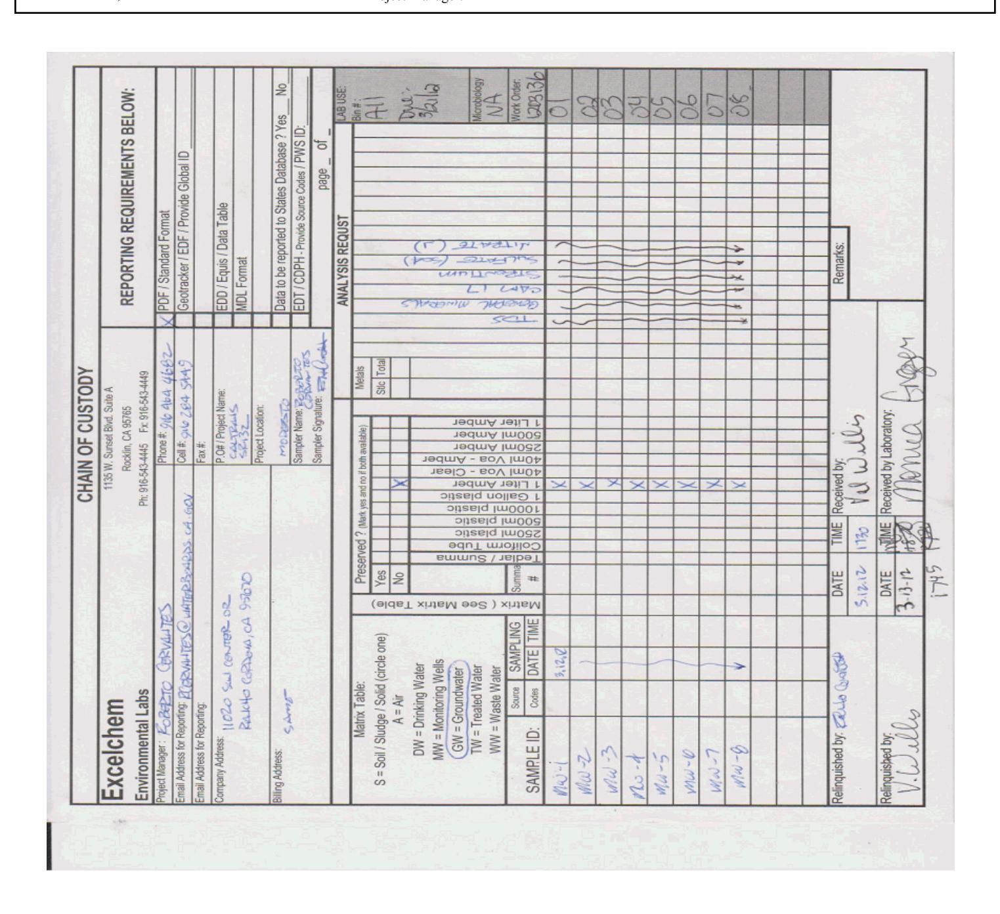

Excelchem Environmental Lab.

De Donn

RWQC Central ValleyProject:Caltrans11020 Sun Center Dr. #200Project Number:SR132Date Reported:Rancho Cordova, CA 95670Project Manager:Roberto Cervantes03/28/12 12:26

Print Page 1 of 2

Subject: Re: Project Caltrans SR132- Modesto, WO #1203136

From: Excelchem Labs (excelchemlabs@yahoo.com)

To: RCervantes@waterboards.ca.gov:
Co: Ivaladez@waterboards.ca.gov;
Date: Friday, March 16, 2012 11:01 AM

Good Morning Roberto,

Yes, will do.

\*\*\* Our Excelchem e-mail is currently down.Please note that this is a temporary e-mail address. Thank you,
Marisa Torres
Excelchem Environmental Labs
1135 W. Sunset Blvd. Suite A

Rocklin, CA 95765 (916) 543-4445 Phone (916) 543-4449 Fax

From: Roberto Cervantes <RCervantes@waterboards.ca.gov>
To: Excelchem Labs <excelchemlabs@yahoo.com>
Sent: Friday, March 16, 2012 10:42 AM
Subject: Re: Project Caltrans SR132- Modesto, WO #1203136

Hi Marisa,

Would you please add Manganese to the list as well? Thanks

 $\mathbf{r}$ 

>>> Excelchem Labs <excelchemlabs@yahoo.com> 3/15/2012 11:43 AM >>> Hello,

Per our conversation we will run the following analyses on all samples:

Anion/cation balance
CAM 17 metals- total and dissolved
Stronitum- total and dissolved
Sulfide
Sulfate
Nitrate
Alkalinity (total, carbonate, bicarbonate)
Chloride by method 300.0
Calcium- total and dissolved
Magnesium- total and dissolved
Calcium- total and dissolved
Sodium- total and dissolved
Potassium- total and dissolved

http://us.mg5.mail.yahoo.com/neo/launch?.rand=a04mql644t90v

3/16/2012

Excelchem Environmental Lab.

This is a blank image. There is no text to extract.

RWQC Central Valley Project: Caltrans

11020 Sun Center Dr. #200 Project Number: SR132 Date Reported:
Rancho Cordova, CA 95670 Project Manager: Roberto Cervantes 03/28/12 12:26

Print Page 2 of 2

Total dissolved solids

Please confirm.

Also, the bottle for MW-7 broke and we have cancelled all analyses per your request.

\*\*\* Our Excelchem e-mail is currently down.Please note that this is a temporary e-mail address. Thank you,
Marisa Torres
Excelchem Environmental Labs1135 W. Sunset Blvd. Suite A
Rocklin, CA 95765
(916) 543-4445 Phone
(916) 543-4449 Fax

http://us.mg5.mail.yahoo.com/neo/launch?.rand=a04mql644t90v

3/16/2012

Excelchem Environmental Lab.

Spe Down

RWQC Central Valley Project: Caltrans
11020 Sun Center Dr. #200 Project Number: SR132 Date Reported:
Rancho Cordova, CA 95670 Project Manager: Roberto Cervantes 03/28/12 12:26

| Sample Integrity | WORK ORDER 1203136 |
|------------------|--------------------|
| Date Received:   | 3/13/12            |

| Section 1 – Sample Arrival Info.    |                                                             |
|-------------------------------------|-------------------------------------------------------------|
| Sample Transport:                   | ONTRAC UPS USPS Walk-In EXCELCHEM Courier Fed-Ex Other:     |
| Transported In:                     | (Ice Chest) Box Hand                                        |
| Describe type of packing materials: | Bubble Wrap Foam Packing Peanuts Paper Other:               |
| Has chilling process begun?         | (Y) N Samples Received: Chilled to Touch / Ambient (On Ice) |
| Temperature of Samples (°C):        | 8 Ice Chest Temperature(s) (°C): 3                          |

| Section 2 – Bottle/Analysis Info.                           |                                                |
|-------------------------------------------------------------|------------------------------------------------|
| Did all bottles arrive unbroken and intact?                 | Yes X No N/A Comments time of collection       |
| Did all bottle labels agree with COC?                       | Yes X No N/A not noted on COC                  |
| Were correct containers used for the tests requested?       | Yes (IL Ambra) X No N/A took off sample labels |
| Were correct preservations used for the tests requested?    | Yes X No N/A                                   |
| Was a sufficient amount of sample sent for tests indicated? | Yes X No N/A                                   |
| Were bubbles present in VOA Vials?: (Volatile Methods Only) | Yes X No N/A                                   |

| Section 3 – Summa/Flow regulator Info.                                      |                                         |
|-----------------------------------------------------------------------------|-----------------------------------------|
| Used Summa#:                                                                | MW1= 1010                               |
| Unused Summa#:                                                              | MW2= 1030                               |
| Cleaning Summa#:                                                            | NA MW3= 1150                            |
| Regulator#:                                                                 | MW4= 1110                               |
| Was there any visual damage to summa canisters or flow regulators? Explain. | MW5= 1015 MW6= 1246 MW7= 1330 MW8= 1405 |

| Section 4 – COC Info. |                                              |
|-----------------------|----------------------------------------------|
|                       | Completed Info From Container                |
| Was COC Received      | Yes X No Comments Analysis Requested         |
| Date Sampled          | Yes X No Samples arrived within holding time |
| Time Sampled          | Yes X No Any hold times less than 72 hrs     |
| Sample ID             | Yes X No Client Name                         |
| Rush TAT              | Yes X No Address/Telephone #                 |

| Section 5 - Comments / Discrepancies  |                                                |                          |
|---------------------------------------|------------------------------------------------|--------------------------|
| Was Client notified of discrepancies: | (Yes) No N/A Notified by:                      |                          |
| Explanations / Comments:              | * Gen. Min. not specified - need clarification |                          |
| Samples Labeled by:                   | vr Bin #s: All                              |                          |
| COC Scanned/Attached by:              | mc                                             |                          |
| Sample labels reviewed by:            | Filled Out by: Monica                          | Date: 3/13/12 Time: 1745 |

Excelchem Environmental Lab.

# APPENDIX C

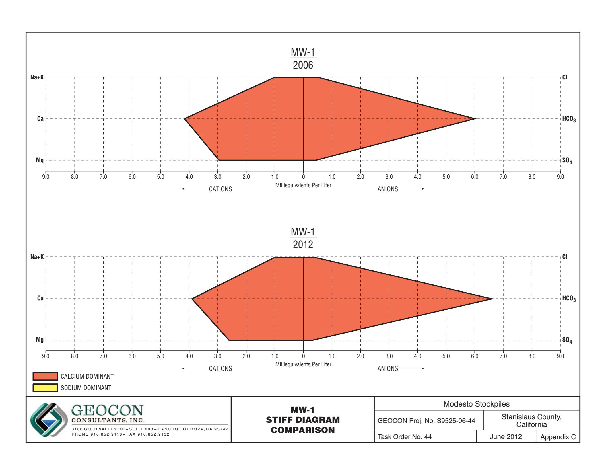

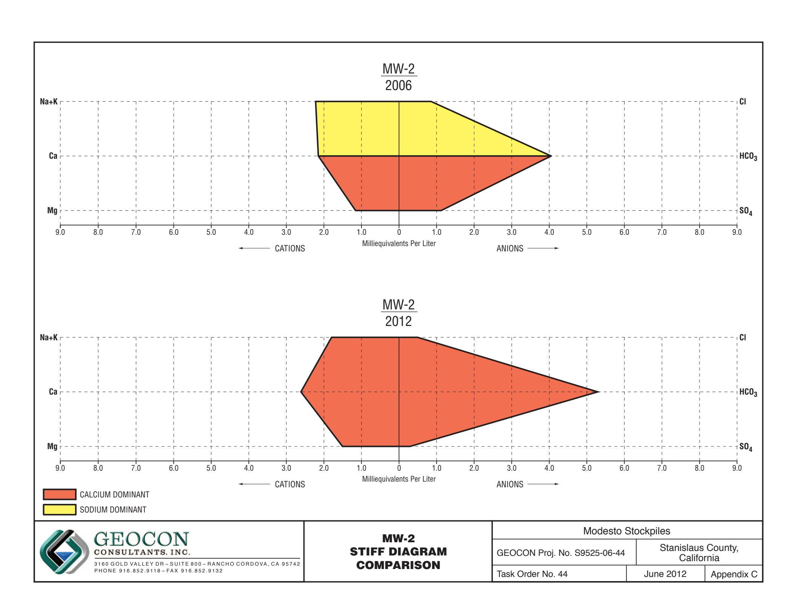

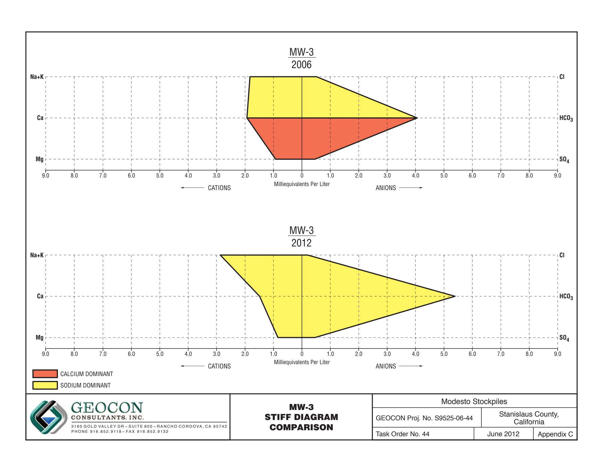

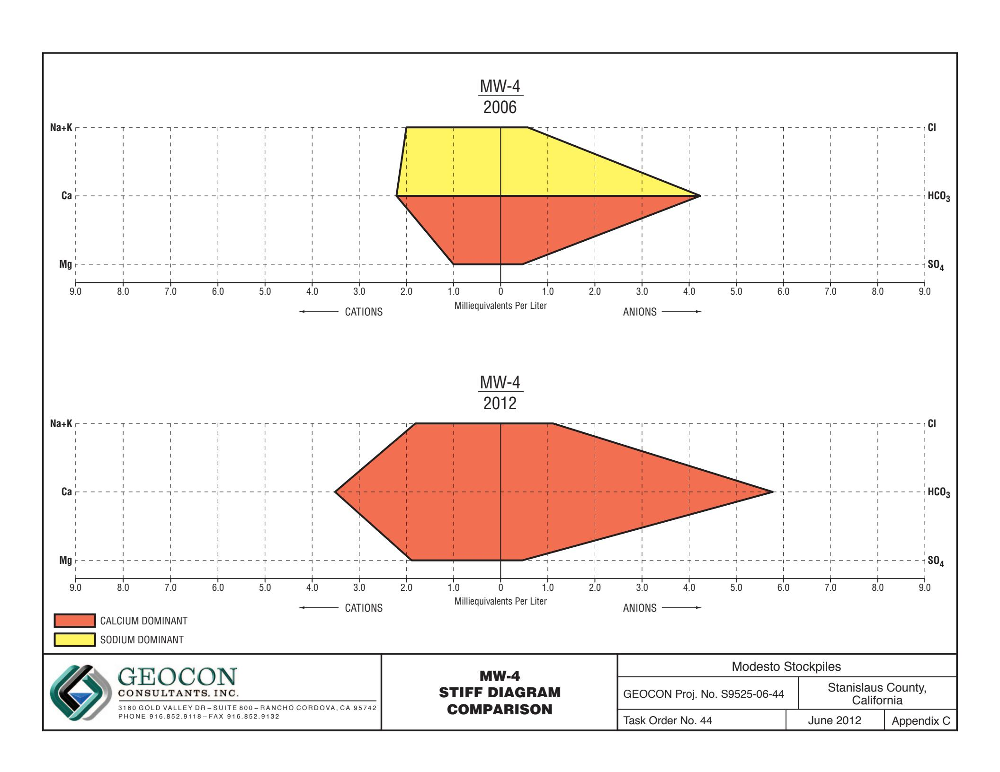

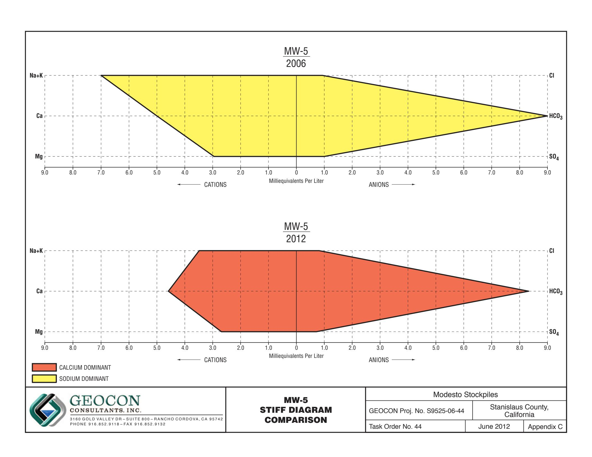

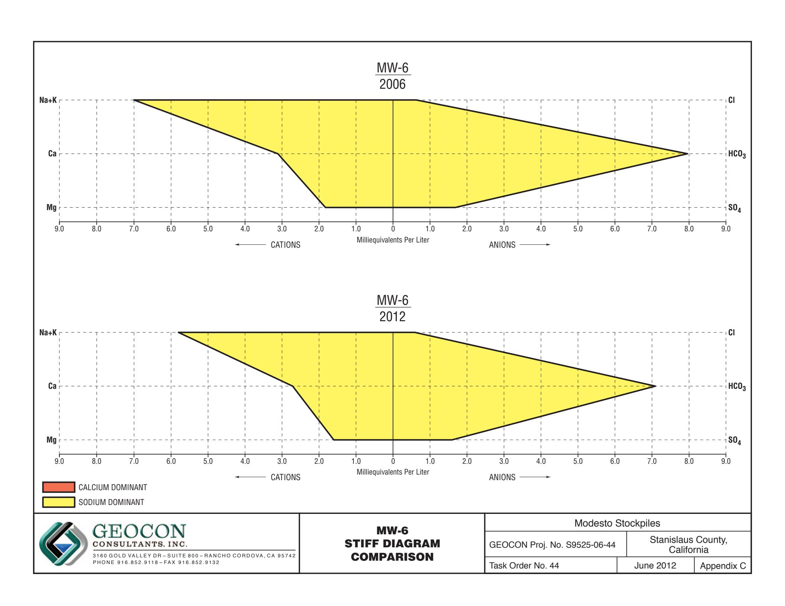

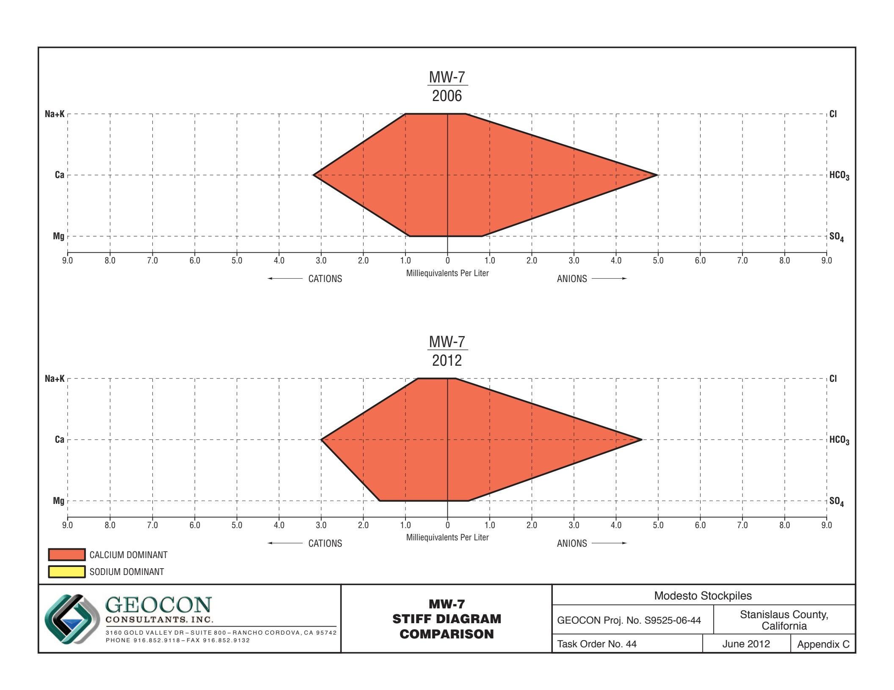

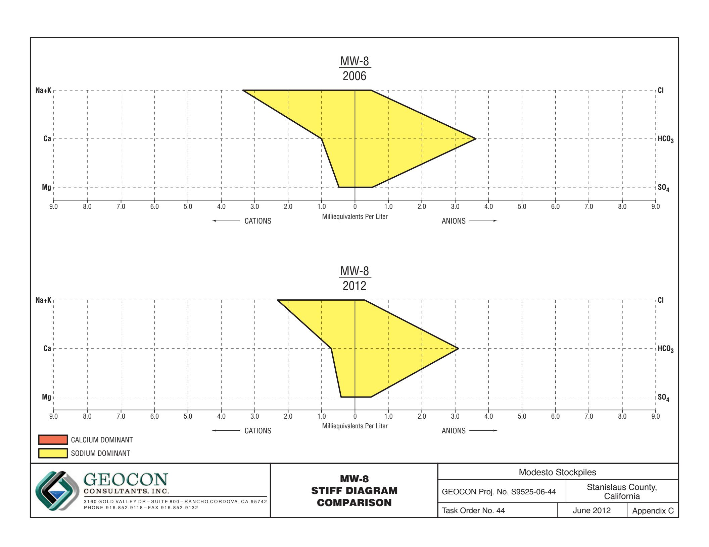