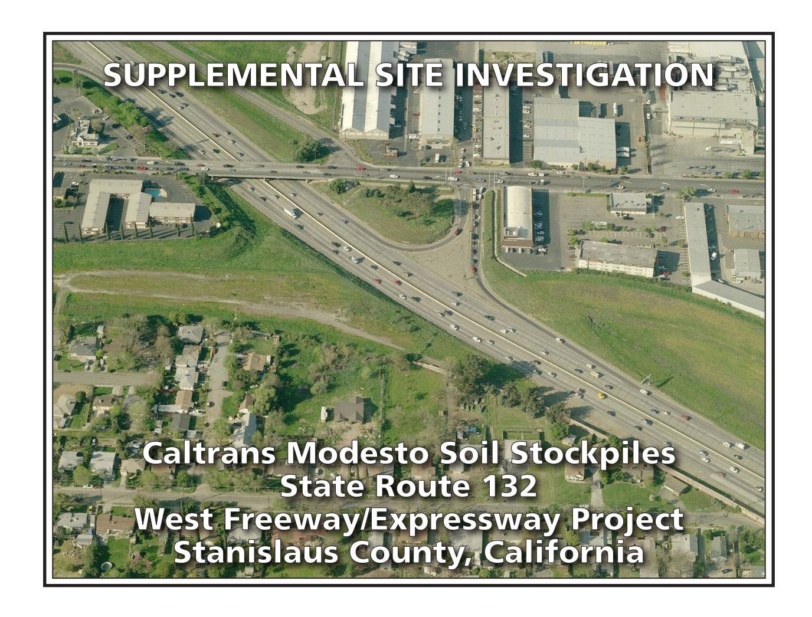

# PREPARED FOR:

CALIFORNIA DEPARTMENT OF TRANSPORTATION – DISTRICT 6
HAZARDOUS WASTE BRANCH
855 M STREET, SUITE 200
FRESNO, CALIFORNIA 93721

# PREPARED BY:

GEOCON CONSULTANTS, INC. 3160 GOLD VALLEY DRIVE, SUITE 800 RANCHO CORDOVA, CALIFORNIA 95742

**GEOCON PROJECT NO. S9525-06-44A TASK ORDER NO. 44, EA 10-403500 CONTRACT NO 06A1580** 

# GEOTECHNICAL . ENVIRONMENTAL . MATERIAL

Project No. S9525-06-44A December 14, 2012 Revised March 1, 2013

Mr. Richard Stewart, PG California Department of Transportation – District 6 855 M Street, Suite 200 Fresno, California 93721

Subject:

SUPPLEMENTAL SITE INVESTIGATION CALTRANS MODESTO SOIL STOCKPILES

STATE ROUTE 132 WEST FREEWAY/EXPRESSWAY PROJECT

STANISLAUS COUNTY, CALIFORNIA

CONTRACT NO. 06A1580, TASK ORDER NO. 44, EA NO. 10-403500

Dear Mr. Stewart:

In accordance with California Department of Transportation (Caltrans) Contract No. 06A1580, Task Order Number 44, Geocon Consultants, Inc. has performed a Supplemental Site Investigation at the Caltrans Modesto Soil Stockpiles located south of State Route 99 and Kansas Avenue interchange in Modesto. Stanislaus County, California. The soil stockpiles are located within the planned State Route 132 West Freeway/Expressway Project.

The accompanying report summarizes the services performed including the advancement of 68 borings for soil sampling and analytical testing. The Supplemental Site Investigation was performed as directed by the California Department of Toxic Substances Control (DTSC) in consultation with the Central Valley Regional Water Quality Control Board (CVRWQCB) to address potential environmental data gaps as required for regulatory agency approval of the State Route 132 West Freeway/Expressway Project. This Revised SSI incorporates revisions based on comments provided in DTSC's review letter dated February 15, 2013.

The contents of this report reflect the views of the author, who is responsible for the facts and accuracy of the data presented herein. The contents do not necessarily reflect the official views or policies of the State of California or the Federal Highway Administration. This report does not constitute a standard, specification, or regulation.

Please contact us if there are any questions concerning the contents of this report or if we may be of further service.

Sincerely,

cc:

GEOCON CONSULTANTS, INC.

John E. Junrend, PE, CEG Principal/Senior Engineer

Caltrans, Sam Haack (sam haack@dot.ca.gov)

DTSC, Randy Adams (Randy.Adams@dtsc.gov)

CVRWQCB, Steve Meeks (Steven.Meeks@waterboard.ca.gov)

No. 46681

Gemma G. Reblando

Project Geologist

# TABLE OF CONTENTS

| SUPPLEME                                   | ENTAL SITE INVESTIGATION REPORT                                                                                                                                                                                                                                                                                             | PAGE        |
|--------------------------------------------|-----------------------------------------------------------------------------------------------------------------------------------------------------------------------------------------------------------------------------------------------------------------------------------------------------------------------------|-------------|
| 1.0 INT 1.1 1.2                      | Project Description and Proposed Improvements  Summary of Project Scope                                                                                                                                                                                                                                                     | 1           |
| 2.0 BAC 2.1 2.2 2.3               | CKGROUNDSite HistoryAdditional Site History ResearchPrevious Environmental Site Investigations                                                                                                                                                                                                                              | 2 3      |
| 3.0 WA 3.1 3.2 3.3 3.4 3.5                 | ASTE THRESHOLD AND SOIL SCREENING LEVELS.  Hazardous Waste Determination Criteria.  California Human Health Screening Levels.  Environmental Screening Levels.  Regional Screening Levels.  Site-specific Heavy Metal Background Levels.                                                                                    | 5 6 6 |
| 4.0 PUI 4.1 4.2                      | RPOSE AND PROJECT SCOPE  Pre-field Activities  Field Activities                                                                                                                                                                                                                                                             | 7           |
| 5.0 INV 5.1 5.2 5.3               | VESTIGATIVE METHODS Boring Location Rationale Soil Sampling Procedures Laboratory Analyses 5.3.1 Fenceline Boring Soil Samples 5.3.2 Perimeter Boring Soil Samples 5.3.3 Cadmium Boring Soil Samples 5.3.4 Decontamination Water 5.3.5 QA/QC Procedures                                                                     |             |
| 6.0 FIE 6.1 6.2 6.3 6.4 6.5 | LD OBSERVATIONS AND INVESTIGATIVE RESULTS  Soil Conditions  Soil Analytical Results  6.2.1 Fenceline Borings  6.2.2 Perimeter Borings  6.2.3 Cadmium Borings  6.2.4 Decontamination Water  Laboratory Quality Assurance/Quality Control  Investigation-Derived Waste  Regulatory Review of Preliminary Soil Analytical Data |             |
| 7.0 SUI                                    | MMARY OF FINDINGS                                                                                                                                                                                                                                                                                                           | 16          |
| 8.0 REI                                    | PORT LIMITATIONS                                                                                                                                                                                                                                                                                                            | 17          |
| 2. Site 3. 196 4. 196                | inity Map Plan 3 Aerial Photograph 7 Aerial Photograph APHS (1 through 14)                                                                                                                                                                                                                                      |             |

# TABLE OF CONTENTS (continued)

# TABLES

- 1. Summary of Soil Boring Coordinates
- 2. Summary of Soil Analytical Results Fenceline Borings Title 22 Metals
- 3. Summary of Soil Analytical Results Barium and Cadmium
- 4. Summary of Soil Analytical Results Petroleum Hydrocarbons
- 5. Summary of Soil Analytical Results Semi-volatile Organic Compounds
- 6. Summary of Decontamination Water Analytical Results Title 22 Metals

# APPENDICES

- A. DTSC February 15, 2013 Review Letter
- B. Boring Logs
- C. Laboratory Report and Chain-of-custody Documentation

# SUPPLEMENTAL SITE INVESTIGATION REPORT

# 1.0 INTRODUCTION

This Supplemental Site Investigation Report for the Caltrans Modesto Soil Stockpiles (the Project Site) was prepared by Geocon Consultants, Inc. under California Department of Transportation (Caltrans) Contract No. 06A1580, Task Order (TO) Number 44, and Expense Authorization (EA) 10-403500

# 1.1 Project Description and Proposed Improvements

The Project Site consists of three separate soil stockpiles within Caltrans right-of-way (ROW) planned for the State Route 132 (SR132) West Freeway/Expressway Project located south of the State Route 99 (SR99) and Kansas Avenue interchange in the City of Modesto, Stanislaus County, California. Stockpiles 1 and 2 are west of SR99, and Stockpile 3 is east of SR99. The approximate project location is depicted on the Vicinity Map, Figure 1, and Site Plan, Figure 2.

Caltrans is in the process of finalizing the environmental document for the proposed SR132 Project. Construction of the first phase of the project is scheduled to start in 2015 with project completion anticipated by 2028. The stockpiles will likely be utilized as raised fill embankments, retaining wall backfill and bridge abutments during construction of the future SR132 highway. It is anticipated that remedial and contour cut/fill grading will be necessary to achieve final finish grades and to properly consolidate and isolate the existing soil stockpiles which contain elevated levels of barium from the original borrow source.

# 1.2 Summary of Project Scope

The purpose of the scope of services outlined in TO No. 44 included providing additional soil stockpile and native soil characterization data for areas within the project boundaries to address identified potential environmental data gaps. The supplemental soil analytical data will be utilized to re-evaluate existing adjacent resident and trespasser, and future adjacent resident and construction worker exposure to the soil stockpiles and potential vertical and lateral migration of the identified contaminants. This information will be incorporated into a Remedial Action Plan (RAP) to address the selected final remedy as required by the California Department of Toxic Substances Control (DTSC) and the Central Valley Regional Water Quality Control Board (CVRWQCB). The purpose and details of the scope of services are provided in Section 4.0.

This Revised SSI incorporates revisions based on comments provided in DTSC's review letter dated February 15, 2013 (Appendix A).

# 2.0 BACKGROUND

# 2.1 Site History

Caltrans and the DTSC, in cooperation with the CVRWQCB, have entered into an Interagency Agreement to address the presence of approximately 160,000 cubic yards of fill embankment (Stockpiles 1 through 3) located within Caltrans right-of-way (ROW) west and east of SR99 immediately south of the Kansas Avenue interchange. The soil stockpiles were placed in the early 1960s for the future SR132 highway alignment and were partially generated from excavations of soil from evaporation ponds containing elevated heavy metals (notably barium) and polycyclic aromatic hydrocarbons (PAHs).

From the 1930s to 1970s, property beneath and northeast of the SR99 and Kansas Avenue Interchange was occupied by chemical processing facilities operated by Barium Products LTD., Westvaco Chlorine Products Corporation and Food Machinery and Chemical Corporation (FMC). Ores and minerals including barite (barium sulfate) and celestite (strontium sulfate) were processed for use in greases, lubricating oil and pigment blanks. Sodium sulfide was generated as a by-product and sold as a caustic and reagent.

From the 1950s to the 1970s, a liquid residue generated by FMC at this facility was discharged to unlined evaporation ponds. In 1961, a 4.3-acre parcel in the southwest portion of the FMC facility, including a portion of the ponds, was purchased by the State for the construction of SR99 through Modesto. Pond tailings and native soil were removed from this parcel and placed in lifts to form bridge abutments and embankment fills for the future SR99/132 Interchange south of FMC. The pond tailings and soil were stockpiled in the following three distinct locations within existing Caltrans ROW:

- Stockpile 1 located south of Kansas Avenue and west of Emerald Avenue
- Stockpile 2 located south of Kansas Avenue, between Emerald Avenue and SR99
- Stockpile 3 located south of Kansas Avenue and east of SR99

The stockpiles are enclosed within security fencing and bordered by adjacent property boundary fencing/walls or structures. Stockpiles 1 and 2 are bounded by residential areas to the south. The remaining adjacent areas to Stockpiles 1 through 3 consist of commercial/industrial development, Caltrans ROW and city streets. The Modesto Irrigation District Lateral #4 canal crosses beneath the southern end of Stockpile 3. The stockpile locations and adjacent development are depicted on the Site Plan, Figure 2. Photographs of typical stockpile perimeter and fenceline conditions are attached.

# 2.2 Additional Site History Research

We obtained a June 1963 aerial photograph (Figure 3) to aid in evaluating the soil stockpile and adjacent property conditions during construction of the excavated depressed section of SR99 north and south of Kansas Avenue. The 1963 photograph shows grading/construction of the SR99 mainline including the southwestern portion of the FMC property, interchange ramps at Kansas Avenue, and placement of Stockpiles 2 and 3. The Kansas Avenue overpass appears to have been completed. Haul roads to Stockpiles 2 and 3 appear to have been within Caltrans ROW. Adjacent property conditions included rural residential and agricultural property west of Emerald Avenue at the current location of Stockpile 1. Residential development was present adjacent and south of Stockpile 2. The remaining areas north and northeast of Stockpiles 2 and 3 appear to have been rural residential, agricultural land and commercial/industrial businesses.

# 2.3 Previous Environmental Site Investigations

An Initial Site Assessment (ISA) was conducted for the Caltrans SR132 Project by Shaw Environmental, Inc. in 2003. The ISA identified a potential for the soil stockpiles within the SR99/132 ROW to contain residual chemicals associated with the former FMC impoundments. A Preliminary Site Investigation (PSI) was conducted by Shaw in 2004 to characterize the stockpiles. The PSI consisted of drilling 50 borings from which soil samples were collected from the stockpiles, underlying native soil, and background soil and analyzed for heavy metals, PAHs, nitrate and pH. The analytical results indicated elevated barium concentrations in the stockpile samples exceeding the commercial/industrial California Human Health Screening Levels (CHHSLs). Elevated cadmium exceeding the commercial/industrial CHHSLs were also detected in soil samples obtained from 8 of 25 borings at Stockpile 2 and in 2 of 10 borings at Stockpile 3.

Additional site investigation was conducted by Shaw in 2006 to further characterize the soil stockpiles and compare their chemical contents relative to background conditions and established health goals as well as to assess groundwater quality by installing eight groundwater monitoring wells. The results of the 2004 and 2006 Shaw investigations indicate that the stockpiles are primarily comprised of layered, poorly graded sand and silty sand similar to underlying native alluvial deposits of the Modesto Formation. The average maximum stockpile fill thickness is approximately 25 feet. First encountered groundwater was present in the project vicinity at depths between 30 and 40 feet below natural grade with flow direction toward the southeast. The results of analysis of groundwater samples collected from the eight monitoring wells in June and October 2006 indicated that groundwater generally met drinking water standards for those constituents analyzed.

Shaw prepared a Human Health Risk Assessment (HHRA) in 2007 for chemicals of potential concern (COPCs) in the stockpiles and groundwater using multiple exposure scenarios. Metals (notably barium) and PAHs were identified as the primary COPCs in the soil stockpiles and metals and general minerals

(i.e. nitrate, total dissolved solids) as the primary COPCs in groundwater. For the purposes of the HHRA, cadmium was not identified as a COPC due to the lack of elevated cadmium concentrations reported for soil samples collected during the 2006 site investigation. Strontium was further not identified as a COPC in the HHRA since the maximum strontium concentration of 765 milligrams per kilogram (mg/kg) reported in the Shaw 2004 PSI is orders of magnitude below the Environmental Protection Agency (EPA) residential Regional Screening Level (RSL) of 47,000 mg/kg. There is no CHHSL for strontium. The results of the Shaw HHRA indicated that the soil stockpiles do not pose an unacceptable risk or hazard to current or future offsite residents, trespassers, construction workers or hypothetical future shallow groundwater users.

In response to the HHRA, the DTSC issued an August 2007 letter that requested additional toxicological and site information prior to a final determination regarding risk or hazard posed by the stockpile material. Shaw prepared a Final Preliminary Endangerment Assessment (PEA) and a Response to Comments document in 2009 to summarize the findings of previous reports prepared for the soil stockpiles and to provide the additional information requested in DTSC's August 2007 letter. In writing dated December 17, 2009, the DTSC responded to the Final PEA stating that:

"DTSC finds that the soil stockpiles, as currently managed by Caltrans on Caltrans property, do not pose a risk to human health for: 1) Caltrans workers who access the fenced site to conduct mowing operations, conduct fence repairs, or other routine activities; 2) trespassers; and 3) residents adjacent to the stockpiles. Until such time that the State Route 132/99 Interchange project is constructed and/or the final disposition of the soil stockpiles is determined, Caltrans should continue to manage the soil stockpiles by: 1) limiting access to Caltrans authorized personnel; 2) inspecting and maintaining the chain-link fence; 3) prohibiting any activities involving excavation/grading, off-site removal of soil, or placement of other soil on the Site; and 4) maintaining the current grade and vegetative cover. Caltrans should also maintain the existing groundwater monitoring system associated with the Site."

Caltrans reinitiated groundwater monitoring activities in March 2012 as part of the SR132 Project. Geocon samples wells MW-1 through MW-8 on a bi-monthly basis and to date has completed monitoring events in March, May, July, September and November 2012. We also installed upgradient wells MW-9 and MW-10 immediately south of Kansas Avenue and west and east of SR99, sampled them in June 2012, and incorporated them into subsequent bi-monthly sampling events. The results of the recent 2012 groundwater monitoring events are similar to those of the 2006 monitoring events, with the primary analytes reported at concentrations less than California Maximum Contaminant Levels (MCLs).

# 3.0 WASTE THRESHOLD AND SOIL SCREENING LEVELS

The following sections provide background information on regulatory waste classification criteria and soil screening levels utilized for this report and referenced on the summary laboratory tables.

# 3.1 Hazardous Waste Determination Criteria

Regulatory criteria to classify a waste as "California hazardous" for handling and disposal purposes are contained in the California Code of Regulations (CCR), Title 22, Division 4.5, Chapter 11, Article 3, §66261.24. Criteria to classify a waste as "Resource, Conservation, and Recovery Act (RCRA) hazardous" are contained in Chapter 40 of the Code of Federal Regulations (40 CFR), Section 261.

For waste containing metals, the waste is classified as California hazardous when: 1) the representative total content exceeds the respective Total Threshold Limit Concentration (TTLC); or 2) the representative soluble content exceeds the respective Soluble Threshold Limit Concentration (STLC) based on the standard Waste Extraction Test (WET). A waste may have the potential of exceeding the STLC when the waste's total content is greater than or equal to ten times the respective STLC value, since the WET uses a 1:10 dilution ratio. Hence, when an analyte is detected at a concentration greater than or equal to ten times the respective STLC, and assuming that 100 percent of the analyte is soluble, soluble analysis is required. A material is classified as RCRA hazardous, or Federal hazardous, when the representative soluble content exceeds the Federal regulatory level based on the Toxicity Characteristic Leaching Procedure (TCLP).

The above regulatory criteria are based on chemical concentrations. Wastes may also be classified as hazardous based on other criteria such as ignitability and corrosivity; however, for the purposes of this investigation, toxicity (i.e., representative lead concentrations) is the primary factor considered for waste classification since the soil stockpiles would not likely warrant testing for ignitability or corrosivity. Waste that is classified as either California hazardous or RCRA hazardous requires management as a hazardous waste.

The DTSC regulates and interprets hazardous waste laws in California. DTSC generally considers excavated or transported materials that exhibit "hazardous waste" characteristics to be a "waste" requiring proper management, treatment and disposal.

# 3.2 California Human Health Screening Levels

The California Environmental Protection Agency (Cal/EPA) has prepared technical reports entitled *Use of* California Human Health Screening Levels (CHHSLs) in Evaluation of Contaminated Properties (Cal/EPA, January 2005) and Revised California Human Health Screening Levels for Beryllium (Cal/EPA, March 2009) and Lead (Cal/EPA, September 2009), which present CHHSLs for soil, shallow soil gas, and indoor air to assist in evaluating sites impacted by releases of hazardous chemicals.

The CHHSLs are concentrations of 54 hazardous chemicals including Title 22 metals that Cal/EPA considers to be below thresholds of concern for risks to human health. The CHHSLs were developed by the Office of Environmental Health Hazard Assessment (OEHHA) on behalf of Cal/EPA. The thresholds of concern used to develop the CHHSLs are an excess lifetime cancer risk of one in a million and a hazard quotient or 1.0 for noncancer effects. Under most circumstances, the presence of a chemical at concentrations below its respective CHHSL can be assumed to not pose a significant risk. The presence of a chemical at concentrations exceeding a CHHSL does not indicate that adverse impacts to human health are occurring or will occur, but suggests that further evaluation is warranted (Cal/EPA, January 2005).

# 3.3 Environmental Screening Levels

The San Francisco Bay Regional Water Quality Control Board (SFRWQCB) has prepared a technical report entitled Screening For Environmental Concerns At Sites With Contaminated Soil and Groundwater, Interim Final (May 2008), which presents Environmental Screening Levels (ESLs) for soil, groundwater, soil gas, and surface water, to assist in evaluating sites impacted by releases of hazardous chemicals. The ESLs are conservative values for more than 100 commonly detected contaminants, which may be used to compare with environmental data collected at a site. ESLs are strictly risk assessment tools and "not regulatory clean up standards." The presence of a chemical at concentrations in excess of an ESL does not necessarily indicate that adverse impacts to human health or the environment are occurring; this simply indicates that a potential for adverse risk may exist and that additional evaluation is or "may be" warranted (SFRWOCB, 2008).

ESL values presented in Table A – ESLs, Shallow Soils (<3m bgs), Groundwater is Current or Potential Source of Drinking Water are used herein for comparative purposes.

# 3.4 Regional Screening Levels

The United States Environmental Protection Agency (EPA) has developed Regional Screening Levels (RSLs) which consist of screening levels/preliminary remediation goals for soil, groundwater, tapwater, and indoor air at residential and industrial properties. The RSLs may be used when a potential site is initially investigated to determine if potentially significant levels of contamination are present to warrant further investigation.

# 3.5 Site-specific Heavy Metal Background Levels

Shaw completed background soil sampling from eight borings performed on the vacant lot west of Stockpile 1 in 2006. Soil samples were collected at depths of 5, 10 and 15 feet and analyzed for heavy metals, PAHs and inorganics (i.e. nitrate, sulfate, etc.). The 95% upper confidence level (UCL) and arithmetic mean were determined for those metals that had a sufficient number of detections.

# 4.0 PURPOSE AND PROJECT SCOPE

On July 26, 2012, representatives from Caltrans, DTSC, RWQCB and Geocon met to review regulatory requirements necessary to evaluate and finalize the selected remedy that adequately addresses human health exposure and environmental impacts associated with the barium-impacted soil stockpiles. The following potential environmental data gaps were identified:

- 1. Perimeter ROW fenceline stockpile soil sampling to assess potential offsite and vertical migration of contaminants.
- 2. Perimeter stockpile soil sampling to define the lateral stockpile limits to aid in consolidation during future construction of the SR132 Project.
- 3. Additional stockpile soil sampling in areas of elevated cadmium soil impacts identified in Stockpiles 2 and 3 during the Shaw 2004 PSI.

The purpose of the scope of services outlined herein was to provide additional stockpile and native soil characterization data within the project boundaries to address the stated perimeter stockpile and cadmium supplemental data requirements. The soil analytical data will be utilized to re-evaluate adjacent resident exposure to the soil stockpiles and potential vertical migration of contaminants and will be incorporated into the RAP as required by the DTSC and RWQCB. The RAP is also required for regulatory approval of the SR 132 Project.

We performed the following scope of services as requested by Caltrans:

# 4.1 Pre-field Activities

- We performed an initial site visit on August 2, 2012, to observe current site conditions, evaluate access to proposed exploration locations and mark the investigation area boundaries in white paint for subsequent Underground Service Alert (USA) 48-hour notification. We performed a follow-up site visit on September 13, 2012, to stake the location of each proposed boring.
- Representatives of DTSC, Caltrans and Geocon performed a site survey on September 17, 2012, to review the staked proposed boring locations. Boring locations were added or adjusted at each of the stockpiles based on observed field conditions. Erosional features indicative of offsite transport of the stockpile materials were not identified other than at the toe of slope on the west end of Stockpile 2 adjacent to Emerald Avenue (Photo No. 6). During the site meeting, a DTSC representative utilized a hand-held Geiger counter to measure ionizing radiation at each stockpile. Radioactivity was not detected at levels above background conditions at each stockpile location.
- Prepared a *Workplan* dated September 18, 2012, which described the requested scope of services, quality assurance/quality control (QA/QC) sampling and laboratory procedures, and project *Health and Safety Plan*. The *Workplan* incorporated comments received by DTSC in consultation with the CVRWQCB.
- Provided 48-hour notification to USA prior to job site mobilization (USA Ticket Nos. 338471, 338490 and 338517).

- Retained the services of Advanced Technology Laboratories (ATL) to perform the chemical analysis of soil and decontamination water samples.
- Caltrans provided advance field work notification to representatives of DTSC and CVRWQCB and distributed notice to the local residents and businesses. The Stockpile 1 field sampling activities were scheduled to avoid conflict with an outdoor social event held at an adjacent business as requested by the business owner.

# 4.2 Field Activities

Between September 25 and 28, 2012, we completed 68 soil borings at the pre-determined sampling locations using direct-push and hand-auger sampling techniques. Hand-auger sampling was performed in areas not accessible to the direct-push rig. The field sampling activities were performed under the supervision of Geocon's Project Manager and observed by representatives of Caltrans, DTSC and RWQCB. Details of the field sampling activities follow.

# 5.0 INVESTIGATIVE METHODS

# 5.1 Boring Location Rationale

The following completed soil boring locations were agreed upon by Caltrans, DTSC, CVRWQCB and Geocon representatives as presented in the referenced *Workplan*:

- Thirty-five "Fenceline Borings" at stockpile perimeter/fenceline locations adjacent to residential and commercial/industrial development to assess potential offsite and vertical migration of contaminants. Borings FB1 through FB9 were performed along the north and south sides of Stockpile 1. Borings FB10 through FB29 were performed along the north and south sides of Stockpile 2. Borings FB30 through FB36 were performed along the northeastern side of Stockpile 3.
- Twenty-eight "Perimeter Borings" at perimeter and stockpile end locations to define the lateral stockpile limits to aid in consolidation during future highway construction. Borings PB1 through PB9 were performed along the west and east ends of Stockpile 1. Borings PB10 through PB18 were performed along the west and east ends of Stockpile 2. Borings PB19 through PB28 were performed along the southwestern side and southern end of Stockpile 3.
- Five "Cadmium Borings" in the vicinity of elevated cadmium detections reported during the Shaw 2004 PSI. Borings CB1, CB2 and CB3 were performed within Stockpile 2 and CB4 and CB5 within Stockpile 3.

The approximate soil boring locations are depicted on Figure 2. Typical sampling locations are depicted on Photo Nos. 1 through 14.

The coordinates of the boring locations were determined using a differential global positioning system (GPS). The GPS was utilized during the field activities to locate the horizontal position of each location with an error of no more than 3.3 feet. We were unable to obtain GPS coordinate data for five of the borings due to lack of satellite coverage. The latitude and longitude of the boring locations are summarized in Table 1.

# 5.2 Soil Sampling Procedures

The majority of the Fenceline and Perimeter Borings were performed using direct-push sampling techniques. Continuous soil samples were collected in new 3-foot-long cellulose thermoplastic (acetate) sleeves to the maximum boring depths of 5 feet for the Fenceline Borings and 3 feet for the Perimeter Borings. Eight of 35 Fenceline Borings encountered refusal conditions at depths between 0.5 and 4 feet. One of 28 Perimeter Borings encountered refusal conditions at a depth of 1 foot. Fenceline and Perimeter Boring locations inaccessible to the direct-push rig were completed using hand-auger sampling techniques. Soil samples from the Fenceline and Perimeter Borings were collected at an initial depth interval of 0 to 0.5 foot and at approximate one-foot intervals thereafter. No field indications of potential contamination (e.g. soil discoloration, odors, debris, etc.) were observed in soil samples collected from the Fenceline and Perimeter Borings.

The Cadmium Borings were performed using direct-push sampling techniques to maximum depths between 11 and 22 feet. Soil samples were collected from the Cadmium Borings at an initial depth interval of 0.0 to 0.5 foot and from approximate 5-foot intervals thereafter using new 3-foot-long acetate sleeves. A targeted soil sample was obtained at a depth of 9 feet in boring CB3 based on observed staining and petroleum hydrocarbon odor. No other indications of potential contamination were observed in soil samples collected from the remaining Cadmium Borings.

The ends of each sample tube were sealed with Teflon sheets and plastic end caps. Samples collected from hand-auger borings were placed in resealable plastic bags and field homogenized. The sample containers were labeled with the sample number, date/time of collection, etc., and placed into chilled ice chests for storage and subsequent transport to the analytical laboratory using chain-of-custody (COC) protocol. The borings were logged by a Geocon geologist under the direction of a California Professional Geologist using the Unified Soil Classification System (USCS). Logs for the deeper Cadmium Borings are in Appendix B.

The deeper Cadmium Borings were backfilled with bentonite slurry. The shallow Fenceline and Perimeter Borings were backfilled with excess soil sample. The sampling activities did not materially impact the physical condition of the project location nor was visible dust generated during the field sampling activities. Used disposable sampling/screening supplies were placed in plastic bags for subsequent disposal. Non-disposable boring equipment that came in contact with soil was

decontaminated prior to use by a wash-and-double-rinse process using a non-phosphate detergent solution (e.g., Alconox®), deionized or distilled water, and tapwater. The decontamination water was contained, sampled, analyzed for metals, and appropriately disposed of.

Quality assurance/quality control (QA/QC) procedures were adhered to during the field activities to aid in verifying that the data collected are of the type and quality required to evaluate site conditions and meet project objectives. These procedures included (but not necessarily were limited to) boring/sampling equipment decontamination prior to and between each boring location and providing chain-of-custody documentation for each sample submitted to the laboratory.

# 5.3 Laboratory Analyses

The soil and decontamination water samples collected within the project boundaries were submitted to ATL for the following analyses under standard turnaround time. The laboratory was instructed to homogenize the soil samples for metals analysis prior to laboratory testing in accordance with Caltrans Contract 06A1580 requirements. The unused soil samples are currently being held by ATL and Geocon under COC protocol in case additional laboratory analysis for metals is required within the six-month holding time.

# 5.3.1 Fenceline Boring Soil Samples

The surface soil sample (0.0 to 0.5 foot) and deepest soil sample (2.0 to 3.0, 3.0 to 4.0, or 4.0 to 5.0 feet) collected from each Fenceline Boring were analyzed for Title 22 metals following EPA Test Methods 6020, 7471A (mercury) and 6010B (strontium).

# 5.3.2 Perimeter Boring Soil Samples

The surface soil sample (0.0 to 0.5 foot) collected from each Perimeter Boring was analyzed for barium following EPA Test Method 6010B.

# 5.3.3 Cadmium Boring Soil Samples

The surface soil sample (0.0 to 0.5 feet) and approximate 5-foot interval sample collected thereafter from each Cadmium Boring were analyzed for barium and cadmium following EPA Test Method 6010B.

Soil sample CB3-9.0 was noted in the field to exhibit discoloration and petroleum hydrocarbon odor was analyzed for gasoline-, diesel- and oil-range organics (GRO, DRO and ORO) following EPA Test Method 8015B and PAHs following EPA Test Method 8270/SIM.

# 5.3.4 Decontamination Water

One decontamination water sample was analyzed for Title 22 metals following EPA Test Methods 6010 and 7470 (mercury).

# 5.3.5 QA/QC Procedures

QA/QC procedures were performed for each method of analysis with specificity for each analyte listed in the test method's QA/QC. The laboratory QA/QC procedures included the following:

- One method blank for every ten samples, batch of samples or type of matrix, whichever was more frequent.
- One sample analyzed in duplicate for every ten samples, batch of samples or type of matrix, whichever was more frequent.
- One spiked sample for every ten samples, batch of samples or type of matrix, whichever was more frequent, with the spike made at ten times the reporting limit or at the analyte level.

Prior to submitting the samples to the laboratory, the COC documentation was reviewed for accuracy and completeness. Reproductions of the laboratory report and COC documentation are in Appendix C.

# 6.0 FIELD OBSERVATIONS AND INVESTIGATIVE RESULTS

# 6.1 Soil Conditions

Soil stockpile material encountered in the borings was generally comprised of sandy silt, clayey silt and silty sand with few gravel to the maximum sampling depth of approximately 22.0 feet. Minor asphalt and wood debris, darker gray layers, and petroleum hydrocarbon odor (sample CB3-9.0) were encountered in the soil stockpile material in the Stockpile 2 Cadmium Borings. The underlying Modesto Formation comprised of hard cemented sediments was encountered in boring CB4 at a depth of 20 feet and likely was the reason for refusal conditions encountered in some of the Fenceline and Perimeter Boring locations. Groundwater was not encountered in the borings.

# 6.2 Soil Analytical Results

A summary of the soil analytical results are in Tables 2 through 5 presented hereinafter. The laboratory report and COC documentation are in Appendix C. The analytical results are discussed in the following sections.

# 6.2.1 Fenceline Borings

The range of Title 22 metals analytical results for the surface/bottom soil samples analyzed from the Fenceline Borings are listed below and summarized on Table 2:

# Fenceline Boring Metal Data Summary

| Metal      | Surface Sample Range (mg/kg) | Bottom Sample Range (mg/kg) |
|------------|---------------------------------|-----------------------------|
| Antimony   | <0.25                           | <0.25                       |
| Arsenic    | 0.53 to 2.1                     | <0.25 to 1.0                |
| Barium     | 140 to 4,300                    | 42 to 680                   |
| Beryllium  | <0.25 to <0.50                  | <0.25 to <0.50              |
| Cadmium    | <0.25 to 0.78                   | < 0.25                      |
| Chromium   | 3.2 to 10                       | 2.9 to 6.5                  |
| Cobalt     | 2.2 to 6.6                      | 2.2 to 5.1                  |
| Copper     | 5.7 to 41                       | 3.2 to 8.5                  |
| Lead       | 5.4 to 44                       | 1.1 to 20                   |
| Molybdenum | <0.25 to 0.63                   | <0.25 to 0.41               |
| Nickel     | 3.2 to 11                       | 2.6 to 6.8                  |
| Selenium   | <0.25 to 0.28                   | < 0.25                      |
| Silver     | <0.25                           | < 0.25                      |
| Thallium   | <0.25                           | < 0.25                      |
| Vanadium   | 9.5 to 21                       | 8.5 to 25                   |
| Zinc       | 22 to 200                       | 10 to 40                    |
| Mercury    | <0.10                           | <0.10                       |
| Strontium  | <0.50 to 110                    | 14 to 270                   |

None of the reported metal concentrations exceed hazardous waste thresholds. With the exception of arsenic (within the range of site-specific background), none of the reported metal concentrations exceed residential CHHSLs. With the exception of barium and lead, the remaining Title 22 metals concentrations generally fall within the range of the site-specific naturally occurring background.

Barium was detected in each soil sample at concentrations ranging from 140 to 4,300 mg/kg for the surface soil samples and 42 to 680 mg/kg for the deepest soil sample obtained from the Fenceline Borings. At each boring location, the reported barium levels decreased with depth. The majority of the deeper soil samples contained barium within the range of background (47 to 110 mg/kg for 5-foot-deep background soil samples, Shaw 2006). Surface soil samples collected from borings FB10 through FB13 and FB16 contained barium above 1,000 mg/kg. These borings were located along the north side of Stockpile 2 adjacent to commercial/industrial development. None of the reported barium concentrations exceeded the residential and industrial CHHSLs of 5,200 and 63,000 mg/kg, respectively.

# 6.2.2 Perimeter Borings

Barium was detected in each soil sample obtained from the Perimeter Borings at concentrations ranging from 76 to 1,600 mg/kg as summarized on Table 3. The majority of the perimeter surface samples contained barium up to 300 mg/kg. Elevated barium concentrations between 710 and 1,600 mg/kg were detected in surface soil samples obtained from borings at the east end of Stockpile 2 and southwest side of Stockpile 3. All of the reported barium concentrations were below the residential and industrial CHHSLs of 5,200 and 63,000 mg/kg, respectively.

# 6.2.3 Cadmium Borings

Barium was detected in each soil sample obtained from the Cadmium Borings at concentrations ranging from 58 to 130,000 mg/kg as summarized on Table 3.

Cadmium was not detected at concentrations greater than the laboratory reporting limit (RL) of 1.0 mg/kg for each soil sample. The results of the Shaw 2004 investigation identified elevated cadmium concentrations (greater than industrial CHHSL of 7.5 mg/kg) in Stockpiles 2 and 3 for 11 soil samples with corresponding elevated barium concentrations (25,800 to 196,000 mg/kg). The Shaw 2006 investigation and the recent soil stockpile data presented herein indicates that cadmium was not detected at concentrations greater than 1.0 mg/kg for all 348 soil samples analyzed including 19 soil samples with reported elevated barium concentrations between 25,000 mg/kg and 130,000 mg/kg. The Shaw 2004 data (Sparger Technology, Inc.), Shaw 2006 data (Creek Environmental Laboratories, Inc.), and the Geocon data presented herein (ATL) were generated by three different analytical laboratories. Based on the cumulative cadmium data, it appears the Shaw 2004 cadmium data is not reproducible nor reliable and represents false positives possibly as result of sample interference/dilution effects due to the associated high barium concentrations.

Sample CB3-9.0 was analyzed for petroleum hydrocarbons and PAHs based on field indicators of potential impacts (see Table 4). GRO was not detected greater than the RL of 1.0 mg/kg. DRO was detected at a concentration of 120 mg/kg, slightly higher than the residential/industrial ESL of 83 mg/kg. ORO was detected at a concentration of 82 mg/kg, less than the residential ESL of 370 mg/kg.

PAHs 2-methylnaphthalene, fluorene and phenanthrene were detected at concentrations ranging from 23 to 45 micrograms per kilogram, significantly less than respective residential/industrial ESLs (see Table 5).

# 6.2.4 Decontamination Water

Heavy metal results for the decontamination water are summarized on Table 6.

# 6.3 Laboratory Quality Assurance/Quality Control

We reviewed the analytical laboratory QA/QC data provided with the laboratory report. As noted in the laboratory report, several samples required dilution due to high concentration of target analyte and/or diluted due to failing internal standard in the original run. The laboratory states that percent recoveries for matrix spike (MS) and/or matrix spike duplicate (MSD) for several target analytes were outside of acceptance limit recovery, stating "Matrix spike recovery outside of acceptance limit. The analytical batch was validated by the laboratory control sample." The laboratory also states that percent recoveries for MS and/or MSD for several target analytes were outside of acceptance limits, stating "Matrix spike recovery outside of acceptance limit due to possible matrix interference. The analytical batch was validated by the laboratory control sample." The relative percent difference (RPD) for MS/MSD samples was outside the RPD limit, stating "RPD value outside acceptance criteria. Calculation is based on raw values". RPD values for several duplicate samples were outside acceptance criteria due to possible matrix interference. The data show acceptable non-detect results for the method blanks and acceptable recoveries and RPDs for the rest of the matrix spikes and duplicates. Based on the laboratory QA/QC data, no additional qualification of the data presented herein is necessary, and the data are of sufficient quality for the purposes of this report.

# 6.4 Investigation-Derived Waste

No excess soil (other than retained soil samples) was generated during the field sampling activities. The decontamination water (less than 10 gallons) was utilized in the field to mix grout to backfill the deeper Cadmium Borings.

# 6.5 Regulatory Review of Preliminary Soil Analytical Data

Representatives of Caltrans, DTSC, CVRWQCB, and Geocon held a project meeting on November 16, 2012, to review the preliminary soil analytical data generated from the Fenceline, Perimeter, and Cadmium Borings. The following presents a summary of the preliminary findings and action items discussed at the meeting pending submittal and regulatory review of this Supplemental Site Investigation report:

- Based on reported barium concentrations below the residential CHHSL for all of the soil samples obtained from the Fenceline and Perimeter Borings and decreasing barium concentrations with depth, additional environmental assessment of the lateral and vertical extent of barium-impacted soil stockpile is not warranted at this time.
- Based on reported cadmium concentrations below the residential CHHSL of 1.7 mg/kg in all of the soil samples obtained from the Fenceline and Cadmium Borings, cadmium is not considered a COPC for the project site.
- The soil analytical data generated from the Fenceline, Perimeter and Cadmium Borings should be utilized to update the Shaw 2007 HHRA. Geocon is currently preparing an update to the Shaw 2007 HHRA.

- Review historical information to determine the potential for barium-impacted pond tailings and soil excavated from the FMC evaporation ponds to have been deposited outside of the Caltrans ROW during the placement of the soil stockpiles. This information is presented in Section 2.2 and on Figure 3 of this report.
- Retain unused soil samples obtained from the Fenceline, Perimeter and Cadmium Borings for additional laboratory analysis within the six-month holding time for metals. Geocon and ATL are retaining the unused samples under COC protocol.

# 7.0 SUMMARY OF FINDINGS

The results of the Fenceline and Perimeter Boring soil sample analytical data does not suggest lateral or vertical migration of soil containing metals (notably barium) exceeding State and Federal residential human health screening levels (or in the isolated case of arsenic, site-specific background levels) along the stockpile perimeters and adjacent property fencelines. Review of 1963 and 1967 aerial photographs (Figures 3 and 4) provides further evidence that transport and placement of barium-impacted soil materials in the soil stockpiles occurred within Caltrans ROW. The results of analysis of soil samples collected from the Cadmium Borings confirmed the lack of cadmium exceeding residential human health screening levels. Cadmium is therefore not considered a COPC for the project site.

The results of this Supplemental Site Investigation satisfy regulatory directives to address the remaining potential environmental assessment data gaps for the soil stockpiles. Caltrans and Geocon are preparing an update to the Shaw 2007 HHRA and an evaluation and selection of the final remedy to be presented in a RAP that adequately addresses human health exposure and environmental impacts associated with the barium-impacted soil stockpiles using the "no action," remove and dispose of stockpiles, and build SR132 West Freeway/Expressway Project alternatives.

# 8.0 REPORT LIMITATIONS

This report has been prepared exclusively for Caltrans. The information contained herein is only valid as of the date of the report and will require an update to reflect additional information obtained.

This report is not a comprehensive site characterization and should not be construed as such. The findings as presented in this report are predicated on the results of the limited sampling and laboratory testing performed. In addition, the information obtained is not intended to address potential impacts related to sources other than those specified herein. Therefore, the report should be deemed conclusive with respect to only the information obtained. We make no warranty, express or implied, with respect to the content of this report or any subsequent reports, correspondence or consultation. We strived to perform the services summarized herein in accordance with the local standard of care in the geographic region at the time the services were rendered.

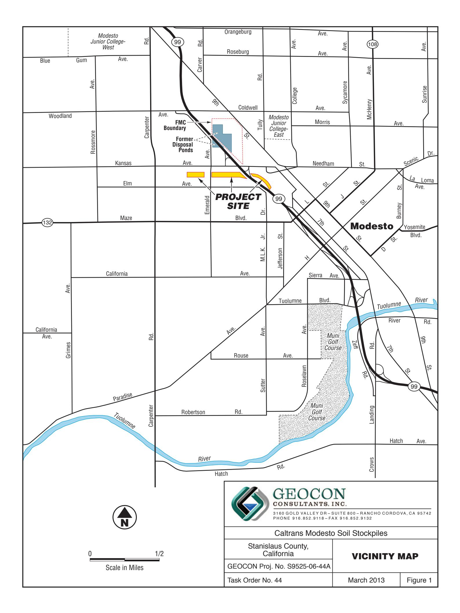

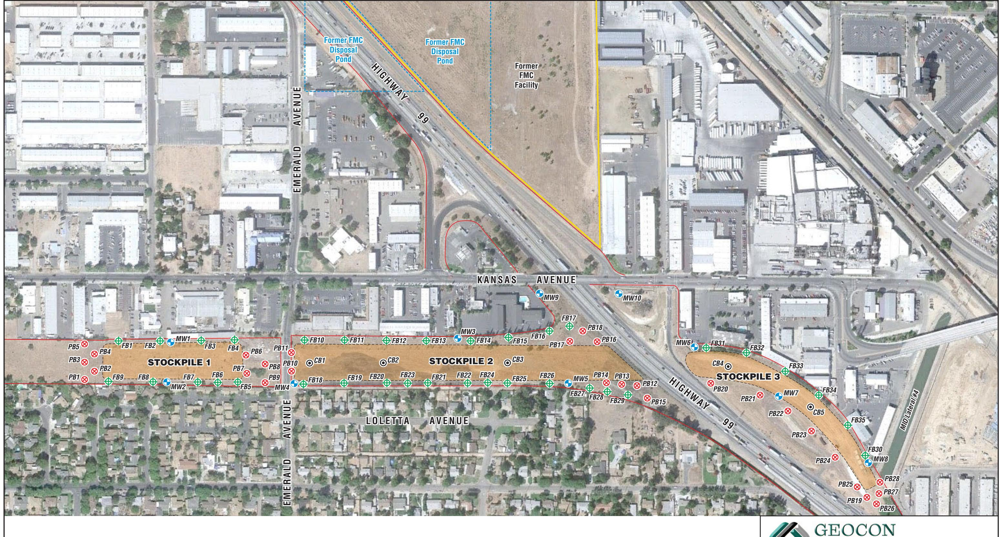

**MW8**

MW8 Approximate Monitoring Well Location

State Right-of-Way Boundary

MID Modesto Irrigation District

Approximate Fenceline Boring Location

**⊗** Approximate Perimeter Boring Location

Approximate Cadmium Boring Location

Scale in Feet

# GEOCON CONSULTANTS, INC.

3160 GOLD VALLEY DR - SUITE 800 - RANCHO CORDOVA, CA 95742 PHONE 916.852.9118 - FAX 916.852.9132

# Caltrans Modesto Soil Stockpiles

| Stanisiaus County, California |  |  |
|----------------------------------|--|--|
| EOCON Proi. No. S9525-06-44A     |  |  |

**SITE PLAN** 

Task Order No. 44

March 2013

013 | Figure

Figure 2

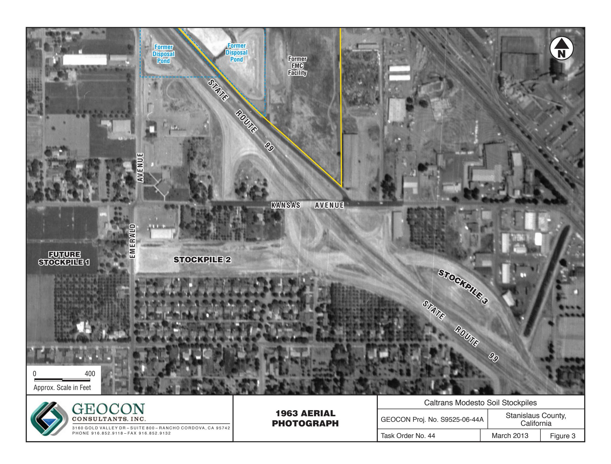

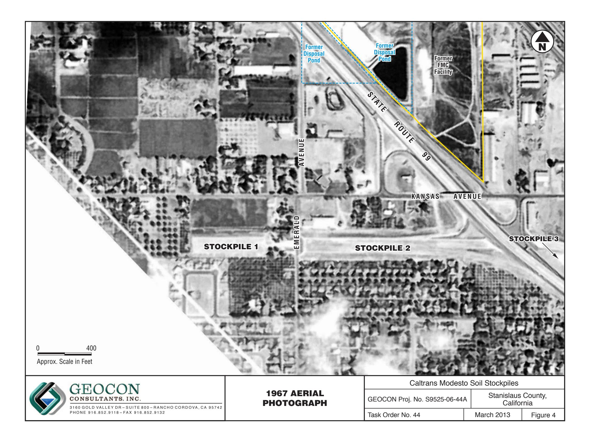

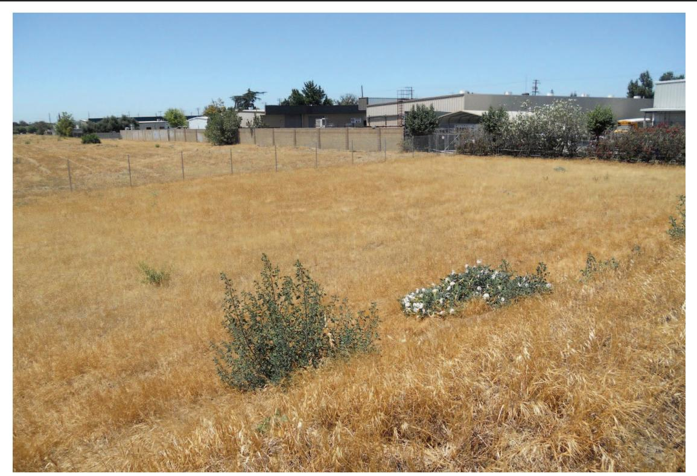

Photo No. 1 West End Stockpile 1

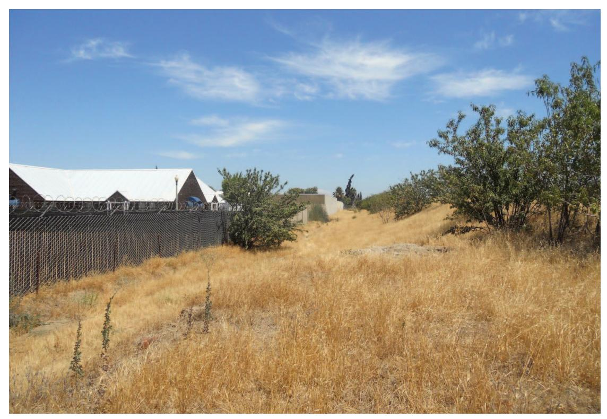

Photo No. 2 North Side Stockpile 1

# PHOTOS NO. 1 & 2

| Caltrans Modesto Soil Stockpiles |                               |
|----------------------------------|-------------------------------|
| GEOCON Proj. No. S9525-06-44A    | Stanislaus County, California |
| Task Order No. 44                | March 2013                    |

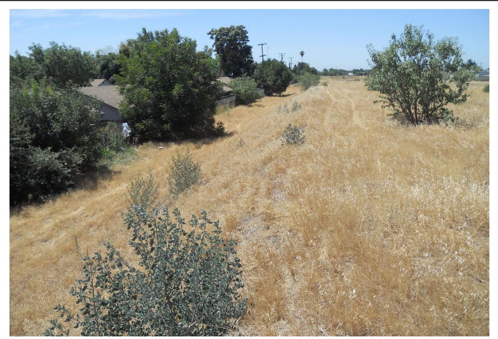

Photo No. 3 South Side Stockpile 1

Photo No. 4 East End Stockpile 1 from Emerald Avenue

# PHOTOS NO. 3 & 4

| Caltrans Modesto Soil Stockpiles |                                  |  |
|----------------------------------|----------------------------------|--|
| GEOCON Proj. No. S9525-06-44A    | Stanislaus County, California |  |
| Task Order No. 44                | March 2013                       |  |

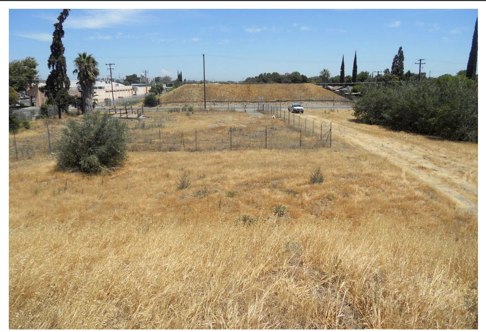

Photo No. 5 West End Stockpile 2 from East End Stockpile 1

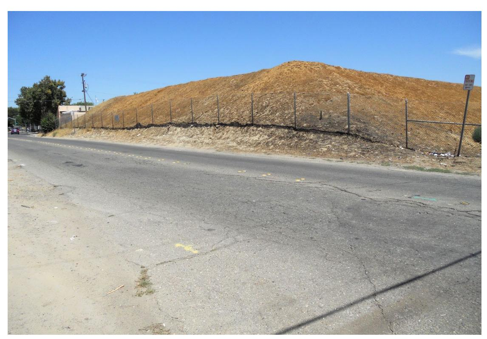

Photo No. 6 West End Stockpile Adjacent Emerald Avenue

# PHOTOS NO. 5 & 6

| Caltrans Modesto Soil Stockpiles |                                  |
|----------------------------------|----------------------------------|
| GEOCON Proj. No. S9525-06-44A    | Stanislaus County, California |
| Task Order No. 44                | March 2013                       |

Photo No. 7 North Side Stockpile 2 from Northwestern Corner Adjacent Emerald Avenue

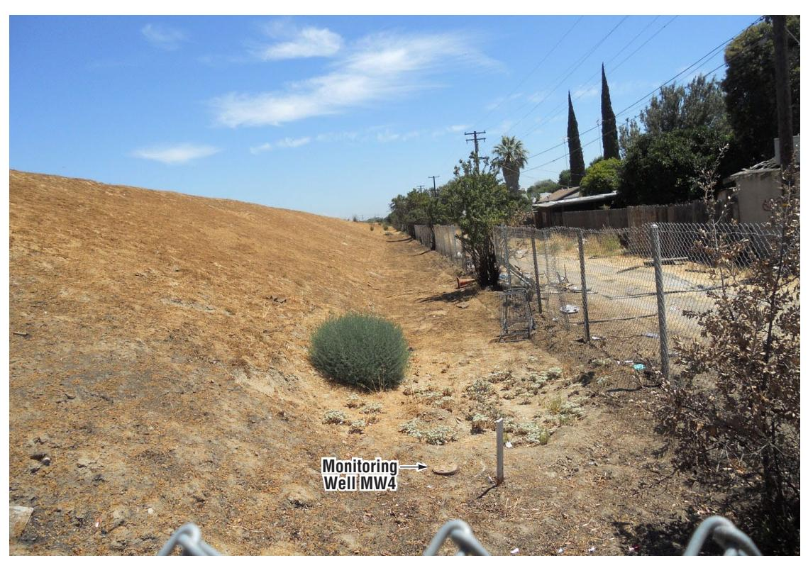

Photo No. 8 South Side Stockpile 2 from Southwestern Corner Adjacent Emerald Avenue

# PHOTOS NO. 7 & 8

| Caltrans Modesto Soil Stockpiles |                                  |
|----------------------------------|----------------------------------|
| GEOCON Proj. No. S9525-06-44A    | Stanislaus County, California |
| Task Order No. 44                | March 2013                       |

Photo No. 9 Southern Gate to Stockpile 2 from Loletta Avenue

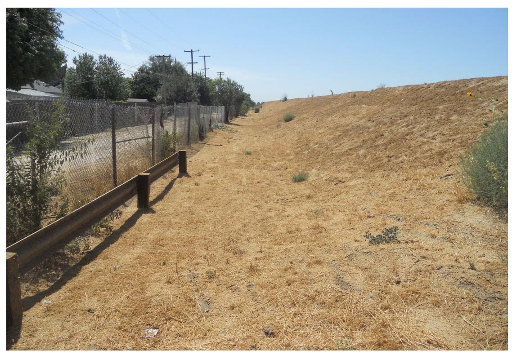

Photo No. 10 South Side Stockpile 2 from Southern Gate

# PHOTOS NO. 9 & 10

| Caltrans Modesto Soil Stockpiles |                                  |  |
|----------------------------------|----------------------------------|--|
| GEOCON Proj. No. S9525-06-44A    | Stanislaus County, California |  |
| Task Order No. 44                | March 2013                       |  |

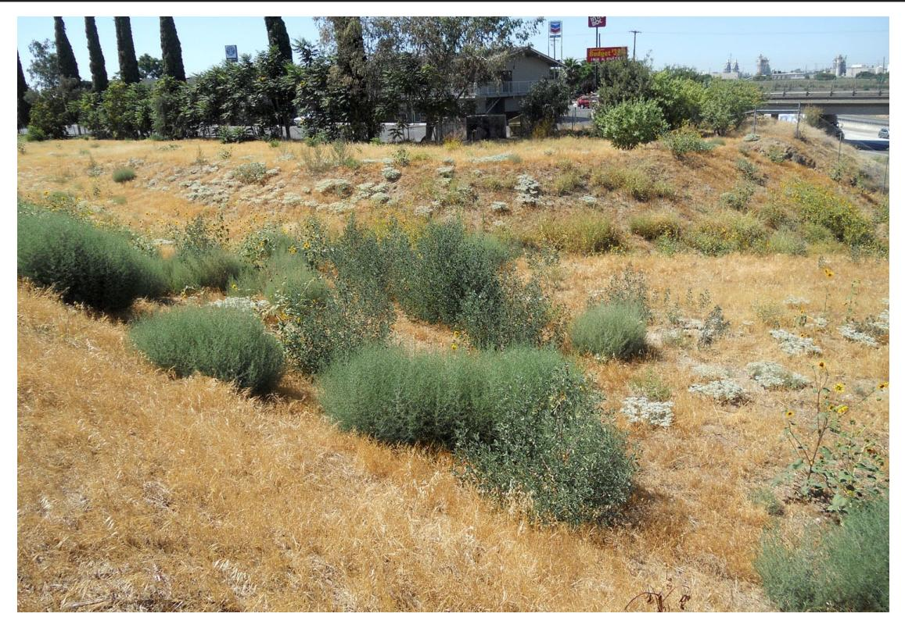

Photo No. 11 Northeastern Corner Stockpile 2

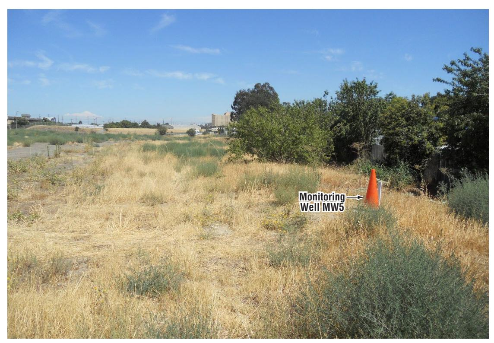

Photo No. 12 Southeastern Corner Stockpile 2

# PHOTOS NO. 11 & 12

| Caltrans Modesto Soil Stockpiles |                               |  |
|----------------------------------|-------------------------------|--|
| GEOCON Proj. No. S9525-06-44A    | Stanislaus County, California |  |
| Task Order No. 44                | March 2013                    |  |

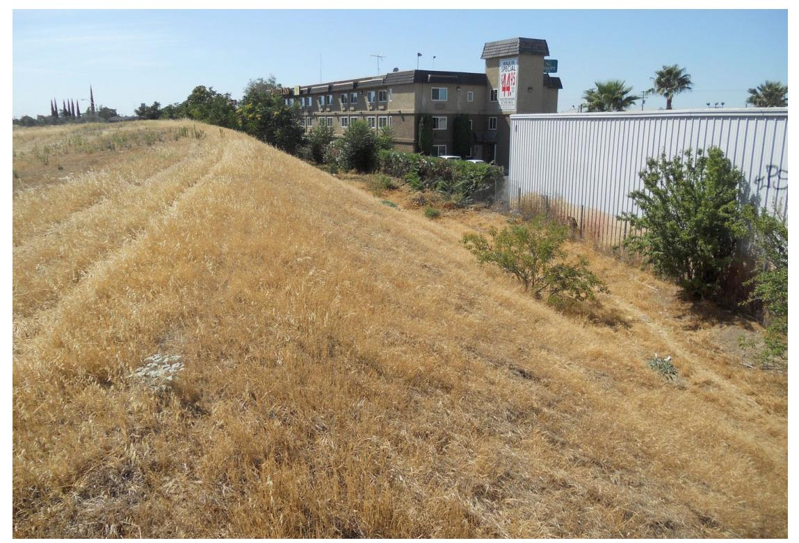

Photo No. 13 North Side Stockpile 3

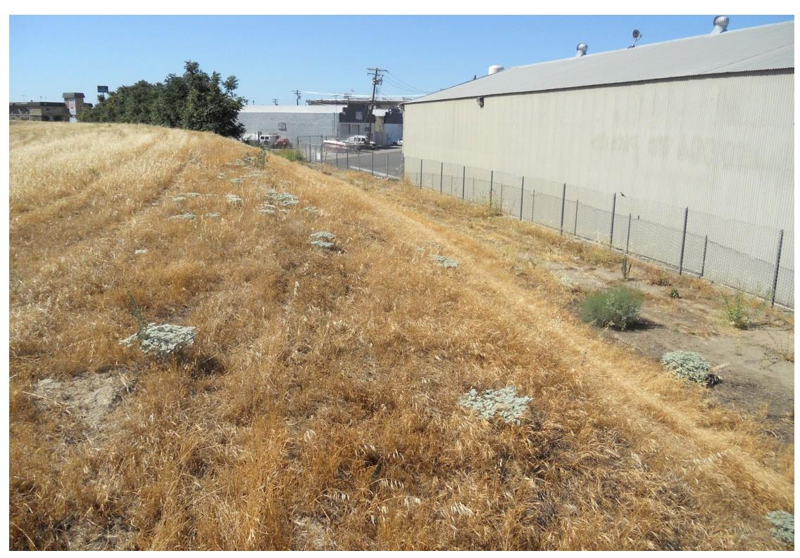

Photo No. 14 Northeast Side Stockpile 3

# PHOTOS NO. 13 & 14

| Caltrans Modesto Soil Stockpiles |             |                                  |                |
|----------------------------------|-------------|----------------------------------|----------------|
| GEOCON Proj. No. S9525-06-44A    |             | Stanislaus County, California |                |
| Task Order No. 44                |             | March 2013                       |                |
| BORING ID                        | SAMPLE DATE | LATITUDE                         | LONGITUDE      |
| FENCELINE BORINGS                |             |                                  |                |
| FB1                              | 9/26/2012   | 37.645141820                     | -121.024083121 |
| FB2                              | 9/26/2012   | 37.645134191                     | -121.023446469 |
| FB3                              | 9/26/2012   | 37.645169401                     | -121.022782053 |
| FB4                              | 9/26/2012   | 37.645171193                     | -121.022089482 |
| FB5                              | 9/26/2012   | 37.644569554                     | -121.022141043 |
| FB6                              | 9/26/2012   | 37.644577604                     | -121.022433172 |
| FB7                              | 9/26/2012   | 37.644579984                     | -121.022788750 |
| FB8                              | 9/26/2012   | 37.644602288                     | -121.023463196 |
| FB9                              | 9/26/2012   | 37.644599886                     | -121.024134806 |
| FB10                             | 9/27/2012   | 37.645166942                     | -121.021013228 |
| FB11                             | 9/27/2012   | 37.645189306                     | -121.020168781 |
| FB12                             | 9/27/2012   | 37.645186659                     | -121.019487261 |
| FB13                             | 9/27/2012   | 37.645179944                     | -121.018854766 |
| FB14                             | 9/27/2012   | 37.645179658                     | -121.018235377 |
| FB15                             | 9/27/2012   | 37.645212412                     | -121.017427603 |
| FB16                             | 9/27/2012   | 37.645251364                     | -121.016760511 |
| FB17                             | 9/27/2012   | 37.645342276                     | -121.016364688 |
| FB18                             | 9/27/2012   | NA                               | NA             |
| FB19                             | 9/27/2012   | 37.644585918                     | -121.020218350 |
| FB20                             | 9/27/2012   | 37.644586127                     | -121.019565204 |
| FB21                             | 9/27/2012   | 37.644579071                     | -121.018880023 |
| FB22                             | 9/27/2012   | 37.644581498                     | -121.018033910 |
| FB23                             | 9/27/2012   | 37.644577660                     | -121.019810872 |
| FB24                             | 9/27/2012   | 37.644591284                     | -121.017727291 |
| FB25                             | 9/27/2012   | NA                               | NA             |
| FB26                             | 9/27/2012   | NA                               | NA             |
| FB27                             | 9/27/2012   | 37.644494861                     | -121.016016682 |
| FB28                             | 9/27/2012   | 37.644412925                     | -121.015706206 |
| FB29                             | 9/27/2012   | 37.644350579                     | -121.015382391 |
| FB30                             | 9/28/2012   | 37.643643011                     | -121.011438959 |
| FB31                             | 9/26/2012   | 37.645098113                     | -121.014285373 |
| FB32                             | 9/26/2012   | 37.644991485                     | -121.013378938 |
| FB33                             | 9/26/2012   | NA                               | NA             |
| FB34                             | 9/26/2012   | 37.644437372                     | -121.012194910 |
| FB35                             | 9/28/2012   | 37.644082246                     | -121.011790028 |
| PERIMETER BORINGS                |             |                                  |                |
| PB1                              | 9/26/2012   | 37.644610451                     | -121.024452268 |
| PB2                              | 9/26/2012   | 37.644745286                     | -121.024290703 |
| PB3                              | 9/26/2012   | 37.644924931                     | -121.024546287 |
| PB4                              | 9/26/2012   | 37.645060996                     | -121.024279597 |
| PB5                              | 9/26/2012   | 37.645148313                     | -121.024423122 |
| PB6                              | 9/26/2012   | 37.644980134                     | -121.021875766 |
| PB7                              | 9/26/2012   | 37.644720805                     | -121.021872050 |
| PB8                              | 9/26/2012   | 37.644861647                     | -121.021487637 |
| PB9                              | 9/26/2012   | 37.644569595                     | -121.021504113 |
| BORING ID                        | SAMPLE DATE | LATITUDE                         | LONGITUDE      |
| PB10                             | 9/26/2012   | 37.644727764                     | -121.021074649 |
| PB11                             | 9/26/2012   | 37.645012815                     | -121.021075032 |
| PB12                             | 9/26/2012   | NA                               | NA             |
| PB13                             | 9/26/2012   | 37.644722778                     | -121.015454785 |
| PB14                             | 9/26/2012   | 37.644699794                     | -121.015748447 |
| PB15                             | 9/26/2012   | 37.644368885                     | -121.015237758 |
| PB16                             | 9/27/2012   | 37.645063466                     | -121.015957237 |
| PB17                             | 9/27/2012   | 37.645069207                     | -121.016458937 |
| PB18                             | 9/27/2012   | 37.645274585                     | -121.016228614 |
| PB19                             | 9/28/2012   | 37.643119139                     | -121.011342712 |
| PB20                             | 9/28/2012   | 37.644680535                     | -121.014014977 |
| PB21                             | 9/28/2012   | 37.644543779                     | -121.013291564 |
| PB22                             | 9/28/2012   | 37.644354937                     | -121.012837561 |
| PB23                             | 9/28/2012   | 37.644025346                     | -121.012315704 |
| PB24                             | 9/28/2012   | 37.643637573                     | -121.011915251 |
| PB25                             | 9/28/2012   | 37.643147914                     | -121.011444893 |
| PB26                             | 9/28/2012   | 37.642988482                     | -121.011276990 |
| PB27                             | 9/28/2012   | 37.643195474                     | -121.011255977 |
| PB28                             | 9/28/2012   | 37.643323321                     | -121.011277967 |
| CADMIUM BORINGS                  |             |                                  |                |
| CB1                              | 9/25/2012   | 37.644881828                     | -121.020764179 |
| CB2                              | 9/25/2012   | 37.644869571                     | -121.019449463 |
| CB3                              | 9/25/2012   | 37.644866172                     | -121.017408614 |
| CB4                              | 9/26/2012   | 37.644903458                     | -121.013772270 |
| CB5                              | 9/25/2012   | 37.644359841                     | -121.012497582 |

# TABLE I SUMMARY OF SOIL BORING COORDINATES CALTRANS MODESTO SOIL STOCKPILES STANISLAUS COUNTY, CALIFORNIA

TABLE 1
SUMMARY OF SOIL BORING COORDINATES
CALTRANS MODESTO SOIL STOCKPILES
STANISLAUS COUNTY, CALIFORNIA

Note: NA = GPS data not available

# TABLE 2 SUMMARY OF SOIL ANALYTICAL RESULTS - FENCELINE BORINGS - TITLE 22 METALS CALTRANS MODESTO SOIL STOCKPILES STANISLAUS COUNTY, CALIFORNIA

| ANALYTE                  | Antimony             | Arsenic      | Barium          | Beryllium            | Cadmium              | Chromium    | Cobalt       | Copper                             | Lead            | Molybdenum       | Nickel       | Selenium              | Silver               | Thallium             | Vanadium     | Zinc           | Mercury               | Strontium |
|--------------------------|----------------------|--------------|-----------------|----------------------|----------------------|-------------|--------------|------------------------------------|-----------------|------------------|--------------|-----------------------|----------------------|----------------------|--------------|----------------|-----------------------|-----------|
|                          |                      |              |                 |                      |                      |             |              | Results in milligrams per kilogram |                 |                  |              |                       |                      |                      |              |                |                       |           |
| SAMPLE ID                |                      |              |                 |                      |                      |             |              |                                    |                 |                  |              |                       |                      |                      |              |                |                       |           |
| STOCKPILE 1 - NORTH SIDE |                      |              |                 |                      |                      |             |              |                                    |                 |                  |              |                       |                      |                      |              |                |                       |           |
| FB1-0.0                  | <0.25                | 0.83         | 230             | <0.25                | <0.25                | 5.6         | 3.6          | 9.0                                | 14              | 0.43             | 5.2          | 0.28                  | <0.25                | <0.25                | 15           | 58             | <0.10                 | 26        |
| FB1-3.0                  | <0.25                | <0.25        | 77              | <0.25                | <0.25                | 4.0         | 3.5          | 4.8                                | 1.9             | <0.25            | 4.6          | <0.25                 | <0.25                | <0.25                | 10           | 14             | <0.10                 | 21        |
| FB2-0.0                  | <0.25                | 0.85         | 180             | <0.25                | 0.26                 | 5.2         | 3.4          | 7.6                                | 16              | 0.33             | 5.4          | <0.25                 | <0.25                | <0.25                | 14           | 39             | <0.10                 | 30        |
| FB2-4.0                  | <0.25                | 1.0          | 43              | <0.25                | <0.25                | 2.9         | 2.8          | 5.8                                | 1.1             | 0.41             | 3.4          | <0.25                 | <0.25                | <0.25                | 20           | 17             | <0.10                 | 19        |
| FB3-0.0                  | <0.25                | 0.53         | 190             | <0.25                | <0.25                | 4.9         | 6.6          | 6.4                                | 5.4             | <0.25            | 4.8          | <0.25                 | <0.25                | <0.25                | 12           | 75             | <0.10                 | 20        |
| FB3-4.0                  | <0.25                | 0.25         | 120             | <0.25                | <0.25                | 3.8         | 4.6          | 4.5                                | 2.4             | <0.25            | 4.3          | <0.25                 | <0.25                | <0.25                | 9.9          | 26             | <0.10                 | 18        |
| FB4-0.0                  | <0.25                | 0.94         | 240             | <0.25                | <0.25                | 5.9         | 3.9          | 9.7                                | 16              | 0.37             | 6.2          | <0.25                 | <0.25                | <0.25                | 13           | 120            | <0.10                 | 61        |
| FB4-2.0                  | <0.25                | 0.41         | 120             | <0.25                | <0.25                | 5.5         | 4.4          | 7.5                                | 10              | 0.27             | 6.4          | <0.25                 | <0.25                | <0.25                | 13           | 38             | <0.10                 | 26        |
| STOCKPILE 1 - SOUTH SIDE |                      |              |                 |                      |                      |             |              |                                    |                 |                  |              |                       |                      |                      |              |                |                       |           |
| FB5-0.0                  | <0.25                | 1.3          | 200             | <0.25                | <0.25                | 4.9         | 3.5          | 24                                 | 17              | 0.34             | 4.8          | <0.25                 | <0.25                | <0.25                | 12           | 28             | <0.10                 | 31        |
| FB5-4.0                  | <0.25                | 0.74         | 52              | <0.25                | <0.25                | 3.3         | 2.9          | 4.4                                | 1.6             | <0.25            | 2.7          | <0.25                 | <0.25                | <0.25                | 15           | 15             | <0.10                 | 28        |
| FB6-0.0                  | <0.25                | 0.53         | 140             | <0.25                | <0.25                | 4.9         | 4.0          | 11                                 | 5.7             | <0.25            | 5.6          | <0.25                 | <0.25                | <0.25                | 12           | 22             | <0.10                 | 28        |
| FB6-4.0                  | <0.25                | 0.54         | 60              | <0.25                | <0.25                | 3.4         | 2.3          | 4.2                                | 1.7             | 0.29             | 2.6          | <0.25                 | <0.25                | <0.25                | 13           | 13             | <0.10                 | 39        |
| FB7-0.0                  | <0.25                | 0.85         | 150             | <0.25                | <0.25                | 10          | 3.9          | 17                                 | 9.6             | <0.25            | 6.1          | <0.25                 | <0.25                | <0.25                | 12           | 25             | <0.10                 | 27        |
| FB7-2.0                  | <0.25                | 0.38         | 79              | <0.25                | <0.25                | 5.7         | 3.9          | 8.5                                | 1.9             | 0.40             | 6.8          | <0.25                 | <0.25                | <0.25                | 13           | 19             | <0.10                 | 110       |
| FB8-0.0                  | <0.25                | 0.58         | 180             | <0.25                | <0.25                | 4.8         | 3.9          | 13                                 | 9.2             | <0.25            | 5.4          | <0.25                 | <0.25                | <0.25                | 12           | 25             | <0.10                 | 27        |
| FB8-4.0                  | <0.25                | 0.31         | 120             | <0.50                | <0.25                | 3.4         | 3.5          | 5.2                                | 1.5             | <0.25            | 5.3          | <0.25                 | <0.25                | <0.25                | 12           | 22             | <0.10                 | 150       |
| FB9-0.0                  | <0.25                | 0.87         | 150             | <0.25                | <0.25                | 4.7         | 3.6          | 15                                 | 16              | 0.26             | 5.5          | <0.25                 | <0.25                | <0.25                | 13           | 38             | <0.10                 | 31        |
| FB9-4.0                  | <0.25                | 0.34         | 92              | <0.50                | <0.25                | 3.5         | 3.1          | 6.1                                | 1.6             | <0.25            | 5.0          | <0.25                 | <0.25                | <0.25                | 10           | 20             | <0.10                 | 190       |
| STOCKPILE 2 - NORTH SIDE |                      |              |                 |                      |                      |             |              |                                    |                 |                  |              |                       |                      |                      |              |                |                       |           |
| FB10-0.0                 | <0.25                | 1.1          | 1,500           | <0.25                | <0.25                | 5.3         | 3.5          | 12                                 | 44              | 0.34             | 6.3          | <0.25                 | <0.25                | <0.25                | 16           | 77             | <0.10                 | 44        |
| FB10-4.0                 | <0.25                | 0.77         | 680             | <0.25                | <0.25                | 3.6         | 2.9          | 7.2                                | 20              | <0.25            | 5.1          | <0.25                 | <0.25                | <0.25                | 12           | 40             | <0.10                 | 57        |
| FB11-0.0                 | <0.25                | 0.92         | 4,300           | <0.25                | 0.42                 | 5.9         | 3.3          | 41                                 | 35              | 0.63             | 11           | <0.25                 | <0.25                | <0.25                | 21           | 200            | <0.10                 | 110       |
| FB11-4.0                 | <0.25                | 0.38         | 590             | <0.25                | <0.25                | 4.2         | 3.0          | 6.1                                | 5.9             | 0.32             | 5.4          | <0.25                 | <0.25                | <0.25                | 12           | 27             | <0.10                 | 38        |
| FB12-0.0                 | <0.25                | 0.59         | 1,500           | <0.25                | <0.25                | 4.0         | 2.8          | 11                                 | 14              | 0.31             | 4.8          | <0.25                 | <0.25                | <0.25                | 11           | 32             | <0.10                 | 25        |
| FB12-4.0                 | <0.25                | <0.25        | 140             | <0.25                | <0.25                | 2.9         | 2.5          | 3.9                                | 1.9             | <0.25            | 3.3          | <0.25                 | <0.25                | <0.25                | 8.6          | 12             | <0.10                 | 15        |
| ANALYTE                  | Antimony             | rsenic       | Щ               | 3eryllium            | admium               | Chromium    | llt          | Ser                                |                 | olybdenum        | el           | elenium               | i,                   | Thallium             | anadium      |                | lercury               | trontium  |
|                          | Antiı                | Arse         | Barium          | Bery                 | Cadn                 | Chro        | Cobalt       | Copper                             | Lead            | Moly             | Nickel       | Seler                 | Silver               | [[hal]               | Vana         | Zinc           | Merc                  | Stror     |
| SAMPLE ID                |                      |              |                 |                      |                      |             |              | Re                                 | sults in millig | rams per kilog   | ram          |                       |                      |                      |              |                |                       |           |
| FB13-0.0                 | < 0.25               | 0.80         | 1,900           | < 0.25               | < 0.25               | 4.0         | 3.1          | 14                                 | 10              | 0.27             | 6.0          | < 0.25                | < 0.25               | < 0.25               | 13           | 41             | < 0.10                | 37        |
| FB13-4.0                 | < 0.25               | 0.34         | 560             | <0.25                | <0.25                | 3.9         | 3.3          | 5.6                                | 3.6             | <0.27            | 4.8          | <0.25                 | <0.25                | <0.25                | 14           | 20             | <0.10                 | 24        |
|                          |                      |              |                 |                      |                      |             |              |                                    |                 |                  |              |                       |                      |                      |              |                |                       |           |
| FB14-0.0                 | < 0.25               | 0.66         | 540             | < 0.25               | < 0.25               | 5.1         | 3.2          | 7.5                                | 10              | < 0.25           | 6.5          | < 0.25                | < 0.25               | < 0.25               | 13           | 120            | < 0.10                | 48        |
| FB14-3.0                 | < 0.25               | 0.45         | 94              | < 0.25               | < 0.25               | 3.3         | 3.0          | 5.2                                | 1.2             | < 0.25           | 5.1          | < 0.25                | < 0.25               | < 0.25               | 12           | 16             | < 0.10                | 190       |
| FB15-0.0                 | < 0.25               | 0.67         | 1,000           | < 0.25               | < 0.25               | 4.2         | 2.9          | 7.9                                | 11              | 0.25             | 5.3          | < 0.25                | < 0.25               | < 0.25               | 13           | 49             | < 0.10                | 44        |
| FB15-4.0                 | < 0.25               | < 0.25       | 140             | < 0.25               | < 0.25               | 3.8         | 3.0          | 4.4                                | 2.2             | < 0.25           | 4.2          | < 0.25                | < 0.25               | < 0.25               | 12           | 18             | < 0.10                | 22        |
| FB16-0.0                 | < 0.25               | 0.79         | 1.200           | < 0.25               | < 0.25               | 4.5         | 3.1          | 8.2                                | 10              | < 0.25           | 5.0          | < 0.25                | < 0.25               | < 0.25               | 12           | 29             | < 0.10                | 35        |
| FB16-4.0                 | <0.25                | 0.79         | 470             | <0.25                | <0.25                | 4.3         | 3.1          | 6.1                                | 5.2             | 0.23             | 4.4          | <0.25                 | <0.25                | <0.25                | 16           | 29             | <0.10                 | 27        |
| 10104.0                  | (0.25                | 0.51         | 470             | Q0.25                | VO.23                | 7.1         | 3.2          | 0.1                                | 3.2             | 0.55             | -11          | V0.25                 | V0.25                | VO.23                | 10           | 22             | νο.10                 | 27        |
| FB17-0.0                 | < 0.25               | 0.72         | 270             | < 0.25               | < 0.25               | 3.2         | 2.4          | 5.8                                | 16              | 0.26             | 3.2          | < 0.25                | < 0.25               | < 0.25               | 12           | 42             | < 0.10                | 23        |
| FB17-4.0                 | < 0.25               | 0.27         | 65              | < 0.25               | < 0.25               | 6.0         | 5.1          | 7.7                                | 3.0             | < 0.25           | 5.8          | < 0.25                | < 0.25               | < 0.25               | 15           | 21             | < 0.10                | 35        |
| STOCKPILE                | 2 - SOUT             | H SIDE       |                 |                      |                      |             |              |                                    |                 |                  |              |                       |                      |                      |              |                |                       |           |
| FB18-0.0                 | < 0.25               | 0.77         | 370             | < 0.25               | < 0.25               | 5.8         | 3.8          | 10                                 | 26              | 0.38             | 6.0          | < 0.25                | < 0.25               | < 0.25               | 14           | 58             | < 0.10                | 32        |
| FB18-2.0                 | < 0.25               | 0.61         | 100             | < 0.25               | < 0.25               | 4.9         | 3.8          | 7.7                                | 1.8             | 0.30             | 6.7          | < 0.25                | < 0.25               | < 0.25               | 13           | 18             | < 0.10                | 270       |
| FB19-0.0                 | < 0.25               | 1.6          | 250             | < 0.25               | < 0.25               | 4.0         | 2.7          | 5.7                                | 6.3             | < 0.25           | 4.2          | < 0.25                | < 0.25               | < 0.25               | 11           | 27             | < 0.10                | 27        |
| FB19-4.0                 | <0.25                | 0.35         | 57              | <0.25                | <0.25                | 3.2         | 2.7          | 3.7                                | 1.2             | <0.25            | 3.7          | <0.25                 | <0.25                | <0.25                | 9.5          | 13             | <0.10                 | 88        |
|                          |                      | -            |                 | 10120                |                      |             |              |                                    |                 |                  |              |                       |                      |                      |              |                |                       |           |
| FB20-0.0                 | < 0.25               | 2.1          | 690             | < 0.25               | < 0.25               | 5.2         | 3.3          | 7.7                                | 12              | 0.27             | 5.5          | < 0.25                | < 0.25               | < 0.25               | 12           | 52             | < 0.10                | 44        |
| FB20-4.0                 | < 0.25               | 0.56         | 160             | < 0.25               | < 0.25               | 3.9         | 2.6          | 4.5                                | 4.6             | < 0.25           | 3.8          | < 0.25                | < 0.25               | < 0.25               | 11           | 26             | < 0.10                | 24        |
| FB21-0.0                 | < 0.25               | 0.94         | 990             | < 0.25               | < 0.25               | 5.2         | 3.5          | 9.1                                | 22              | 0.31             | 5.6          | < 0.25                | < 0.25               | < 0.25               | 13           | 60             | < 0.10                | 41        |
| FB21-4.0                 | < 0.25               | 0.31         | 110             | < 0.25               | < 0.25               | 4.0         | 2.8          | 4.5                                | 3.8             | 0.31             | 4.5          | < 0.25                | < 0.25               | < 0.25               | 12           | 18             | < 0.10                | 19        |
| FB22-0.0                 | < 0.25               | 0.78         | 940             | < 0.50               | < 0.25               | 5.3         | 3.4          | 11                                 | 18              | 0.34             | 5.6          | < 0.25                | <0.25                | < 0.25               | 14           | 57             | < 0.10                | 45        |
| FB22-4.0                 | <0.25                | 0.78         | 940 190      | <0.50                | <0.25                | 3.7         | 3.4          | 5.5                                | 4.2             | 0.34             | 4.5          | <0.25                 | <0.25                | <0.25                | 14           | 20             | <0.10                 | 45 70  |
| 1 1 1 2 2 4.0            | (0.25                | 0.57         | 170             | V0.25                | VO.25                | 5.7         | 5.0          | 5.5                                | 7.2             | 0.20             | 4.5          | V0.25                 | V0.25                | VO.23                | 13           | 20             | νο.10                 | 70        |
| FB23-0.0                 | < 0.25               | 1.2          | 300             | < 0.50               | < 0.25               | 4.2         | 2.9          | 6.9                                | 11              | 0.30             | 4.6          | < 0.25                | < 0.25               | < 0.25               | 11           | 37             | < 0.10                | 39        |
| FB23-4.0                 | < 0.25               | 0.34         | 62              | < 0.25               | < 0.25               | 3.7         | 2.6          | 4.2                                | 2.0             | 0.27             | 4.0          | < 0.25                | < 0.25               | < 0.25               | 11           | 15             | < 0.10                | 19        |
| FB24-0.0                 | < 0.25               | 0.65         | 590             | < 0.50               | < 0.25               | 3.5         | 2.2          | 5.8                                | 14              | 0.27             | 4.3          | < 0.25                | < 0.25               | < 0.25               | 11           | 35             | < 0.10                | 40        |
| FB24-4.0                 | < 0.25               | 0.32         | 190             | < 0.25               | < 0.25               | 6.5         | 4.0          | 5.9                                | 6.0             | 0.38             | 6.0          | < 0.25                | < 0.25               | < 0.25               | 14           | 28             | < 0.10                | 28        |
|                          |                      |              |                 |                      |                      |             | _            |                                    |                 |                  |              |                       |                      |                      |              |                |                       |           |
| FB25-0.0 FB25-4.0     | <0.25 <0.25       | 0.89 0.89 | 440 99       | <0.25 <0.50       | <0.25 <0.25       | 4.2         | 3.1 3.8   | 6.4 6.6                         | 9.1             | <0.25 0.32    | 4.7 5.5   | <0.25 <0.25        | <0.25 <0.25       | <0.25 <0.25       | 12 19     | 45 25       | <0.10 <0.10        | 42 99  |
| FD23-4.0                 | <0.25                | 0.89         | 99              | <0.50                | <0.25                | 3.8         | 3.8          | 0.0                                | 1.5             | 0.32             | 5.5          | <0.25                 | <0.25                | <0.25                | 19           | 25             | <0.10                 | 99        |
| ANALYTE                  | Antimony             | Arsenic      | Barium          | Beryllium            | Zadmium              | Chromium    | Cobalt       | Copper                             | p               | 40lybdenum       | Nickel       | Selenium              | er                   | Fhallium             | /anadium     | υ              | Mercury               | Strontium |
|                          | Ant                  | Ars          | Bar             | Ber                  | Cad                  | Chr         | Cob          |                                    | Lead            |                  |              | Sele                  | Silver               | Tha                  | Van          | Zinc           | Meı                   | Strc      |
| SAMPLE ID                |                      |              |                 |                      |                      |             |              | Re                                 | sults in millig | grams per kilogi | am           |                       |                      |                      |              |                |                       |           |
| FB26-0.0                 | < 0.25               | 0.94         | 1,000           | < 0.50               | < 0.25               | 4.3         | 2.8          | 9.5                                | 14              | 0.36             | 4.3          | < 0.25                | < 0.25               | < 0.25               | 14           | 58             | < 0.10                | 59        |
| FB26-4.0                 | < 0.25               | 0.36         | 71              | < 0.50               | < 0.25               | 3.8         | 3.6          | 5.5                                | 1.4             | 0.33             | 5.6          | < 0.25                | < 0.25               | < 0.25               | 15           | 21             | < 0.10                | 45        |
|                          |                      |              |                 |                      |                      |             |              |                                    |                 |                  |              |                       |                      |                      |              |                |                       |           |
| FB27-0.0                 | <0.25                | 1.1          | 920             | < 0.25               | < 0.25               | 5.2         | 3.5          | 17                                 | 10              | 0.34             | 6.0          | < 0.25                | < 0.25               | <0.25                | 14           | 39             | <0.10                 | 56        |
| FB27-4.0                 | < 0.25               | 0.41         | 150             | < 0.50               | < 0.25               | 3.9         | 3.1          | 6.1                                | 1.9             | 0.30             | 5.4          | < 0.25                | < 0.25               | < 0.25               | 12           | 20             | < 0.10                | 120       |
| FB28-0.0                 | < 0.25               | 0.80         | 530             | < 0.25               | < 0.25               | 5.2         | 3.6          | 11                                 | 7.7             | 0.36             | 5.6          | < 0.25                | < 0.25               | < 0.25               | 14           | 40             | < 0.10                | 44        |
| FB28-4.0                 | < 0.25               | 0.50         | 97              | < 0.50               | < 0.25               | 3.7         | 4.3          | 5.5                                | 1.2             | 0.39             | 4.5          | < 0.25                | < 0.25               | < 0.25               | 25           | 23             | < 0.10                | 70        |
| FB29-0.0                 | < 0.25               | 1.2          | 720             | < 0.25               | < 0.25               | 4.5         | 3.0          | 18                                 | 13              | 0.34             | 4.6          | < 0.25                | < 0.25               | < 0.25               | 12           | 67             | < 0.10                | 54        |
| FB29-4.0                 | < 0.25               | < 0.25       | 55              | < 0.25               | < 0.25               | 3.7         | 2.8          | 3.6                                | 1.6             | < 0.25           | 3.4          | < 0.25                | < 0.25               | < 0.25               | 11           | 14             | < 0.10                | 17        |
|                          |                      |              |                 |                      |                      |             |              |                                    |                 |                  |              |                       |                      |                      |              |                |                       |           |
| STOCKPILE                | 3 - NORT             | 'H AND N     | ORTHEA          | ST SIDE              |                      |             |              |                                    |                 |                  |              |                       |                      |                      |              |                |                       |           |
| FB30-0.0                 | < 0.25               | 1.3          | 320             | < 0.25               | < 0.25               | 4.7         | 3.0          | 7.2                                | 15              | < 0.25           | 4.9          | < 0.25                | < 0.25               | < 0.25               | 11           | 47             | < 0.10                | 43        |
| FB30-4.0                 | < 0.25               | < 0.25       | 65              | < 0.25               | < 0.25               | 3.4         | 2.6          | 3.8                                | 2.3             | < 0.25           | 3.7          | < 0.25                | < 0.25               | < 0.25               | 11           | 16             | < 0.10                | 17        |
| FD21 0.0                 | 0.25                 | 1.0          | 720             | 0.25                 | 0.47                 |             | 2.0          | 17                                 | 24              | 0.45             |              | 0.25                  | 0.25                 | 0.25                 | 12           | 100            | 0.10                  | 100       |
| FB31-0.0                 | < 0.25               | 1.2          | 720             | < 0.25               | 0.47                 | 6.0         | 2.9          | 17                                 | 34              | 0.47             | 6.3          | < 0.25                | < 0.25               | < 0.25               | 12           | 190            | < 0.10                | 100       |
| FB32-0.0                 | < 0.25               | 2.1          | 910             | < 0.25               | < 0.25               | 4.7         | 3.1          | 16                                 | 17              | 0.30             | 5.7          | < 0.25                | < 0.25               | < 0.25               | 13           | 55             | < 0.10                | < 0.50    |
| FB32-1.0                 | < 0.25               | < 0.25       | 88              | < 0.25               | < 0.25               | 4.5         | 3.5          | 5.7                                | 1.8             | < 0.25           | 4.7          | < 0.25                | < 0.25               | < 0.25               | 12           | 17             | < 0.10                | 20        |
| FB33-0.0                 | < 0.25               | 2.0          | 550             | < 0.25               | 0.43                 | 7.9         | 4.5          | 15                                 | 28              | 0.52             | 7.8          | < 0.25                | < 0.25               | < 0.25               | 19           | 100            | < 0.10                | 63        |
| FB33-4.0                 | < 0.25               | 0.33         | 50              | < 0.25               | < 0.25               | 5.2         | 3.8          | 5.4                                | 1.6             | 0.30             | 5.4          | < 0.25                | < 0.25               | < 0.25               | 17           | 19             | <0.10                 | 20        |
|                          |                      |              |                 |                      |                      |             |              |                                    |                 |                  |              |                       |                      |                      |              |                |                       |           |
| FB34-0.0                 | <0.25                | 0.57         | 200             | <0.25                | 0.78                 | 5.1         | 3.0          | 12                                 | 22              | 0.38             | 5.4          | <0.25                 | <0.25                | <0.25                | 12           | 110            | < 0.10                | 22        |
| FB34-3.0                 | < 0.25               | 0.35         | 45              | < 0.25               | < 0.25               | 3.2         | 2.5          | 4.4                                | 1.3             | 0.40             | 4.3          | < 0.25                | < 0.25               | < 0.25               | 12           | 14             | < 0.10                | 58        |
| FB35-0.0                 | < 0.25               | 1.2          | 590             | < 0.25               | 0.28                 | 5.2         | 2.5          | 8.1                                | 26              | 0.30             | 4.3          | < 0.25                | < 0.25               | < 0.25               | 9.5          | 130            | < 0.10                | 71        |
| FB35-4.0                 | < 0.25               | < 0.25       | 42              | < 0.25               | < 0.25               | 2.9         | 2.3          | 3.2                                | 1.3             | < 0.25           | 2.7          | < 0.25                | < 0.25               | < 0.25               | 8.5          | 10             | < 0.10                | 14        |
|                          | #00                  | <b>700</b>   | 10.000          |                      | 100                  | 2.500       | 0.000        | 2 #00                              | 1.000           | 2.500            | 2.000        | 100                   | #00                  | <b>7</b> 00          | 2.400        | # 000          | 20                    | 27.1      |
| TTLC 10 X STLC        | 500 150           | 500 50    | 10,000 1,000 | 75 7.5            | 100 10            | 2,500 50 | 8,000 800 | 2,500 250                       | 1,000 50     | 3,500 3,500   | 2,000 200 | 100 10             | 500 50            | 700 70            | 2,400 240 | 5,000 2,500 | 20 2.0             | NA NA  |
| CHHSLs                   | 130                  | 50           | 1,000           | 7.5                  | 10                   | 50          | 000          | 250                                | 50              | 3,300            | 200          | 10                    | 50                   | 70                   | 240          | 2,300          | 2.0                   | 1411      |
| Industrial               | 380                  | 0.24         | 63,000          | 190                  | 7.5                  | 100,000     | 3,200        | 38,000                             | 320             | 4,800            | 16,000       | 4,800                 | 4,800                | 63                   | 6,700        | 100,000        | 180                   | 610,000   |
| Residential              | 30                   | 0.07         | 5,200           | 16                   | 1.7                  | 100,000     | 660          | 3,000                              | 80              | 380              | 1,600        | 380                   | 380                  | 5.0                  | 530          | 23,000         | 18                    | 47,000    |
| Background 1             | NC 2 /0.2 | 1.2/0.97     | 72.8/63.5       | NC 2 /0.2 | NC 2 /0.2 | 7.1/6.4     | 4.4/4.1      | 7.5/6.8                            | 2.0/1.8         | 0.26 3/0.23      | 5.3/4.6      | NC 2 /0.25 | NC 2 /0.2 | NC 2 /0.2 | 31.3/28.4    | 26.3/23.9      | NC 2 /0.02 | NA        |

# TABLE 2 SUMMARY OF SOIL ANALYTICAL RESULTS - FENCELINE BORINGS - TITLE 22 METALS CALTRANS MODESTO SOIL STOCKPILES STANISLAUS COUNTY, CALIFORNIA

# TABLE 2 SUMMARY OF SOIL ANALYTICAL RESULTS - FENCELINE BORINGS - TITLE 22 METALS CALTRANS MODESTO SOIL STOCKPILES STANISLAUS COUNTY, CALIFORNIA

# TABLE 2

# SUMMARY OF SOIL ANALYTICAL RESULTS - FENCELINE BORINGS - TITLE 22 METALS CALTRANS MODESTO SOIL STOCKPILES

# STANISLAUS COUNTY, CALIFORNIA

|           |          |         |        |           |         |          | 51     | I TIBE TOB | 2001111, 62     | illi Olti tiri |        |          |        |          |          |      |         |           |
|-----------|----------|---------|--------|-----------|---------|----------|--------|------------|-----------------|----------------|--------|----------|--------|----------|----------|------|---------|-----------|
| ANALYTE   | Antimony | Arsenic | Barium | Beryllium | Cadmium | Chromium | Cobalt | Copper     | Lead            | Molybdenum     | Nickel | Selenium | Silver | Thallium | Vanadium | Zinc | Mercury | Strontium |
| SAMPLE ID |          |         |        |           |         |          |        | Re         | sults in millig | rams per kilos | gram   |          |        |          |          |      |         |           |

Notes: FB1-0.0

L Top of sample depth interval in feet below ground surface

Fenceline Boring Identification

< = Less than the laboratory reporting limits

TTLC = Total Threshold Limit Concentration

STLC = Soluble Threshold Limit Concentration

CHHSLs = California Environmental Protection Agency, California Human Health Screening Levels for industrial and residential land use - Envvironmental Protection Agency Regional Screening Levels for strontium

TTLC, STLC, and CHHSLs shown for chromium are for chromium III

NA = Not available

&lt;sup>1 Source: Final Preliminary Endangerment Assessment, Caltrans Modesto Soil Stockpiles, Shaw 2009. 95% upper confidence level/arithmetic mean

&lt;sup>2 NC = No statistics calculated, non-detected values only or too few detections. One-half the detection limit posted for non-detect only cases.

&lt;sup>3 Insufficient number of detections to derive an accurate bootstrap estimate. Arithmetic mean applied as average.

# TABLE 3 SUMMARY OF SOIL ANALYTICAL RESULTS - BARIUM AND CADMIUM CALTRANS MODESTO SOIL STOCKPILES STANISLAUS COUNTY, CALIFORNIA

| SAMPLE ID                             | TOTAL BARIUM (mg/kg)                 | TOTAL CADMIUM (mg/kg)                |
|---------------------------------------|-----------------------------------------|-----------------------------------------|
| PERIMETER BORINGS                     | (************************************** | (************************************** |
| Stockpile 1 - West End                |                                         |                                         |
| PB1-0.0                               | 130                                     |                                         |
| PB2-0.0                               | 97                                      |                                         |
| PB3-0.0                               | 160                                     |                                         |
| PB4-0.0                               | 120                                     |                                         |
| PB5-0.0                               | 100                                     |                                         |
| Stockpile 1 - East End                |                                         |                                         |
| PB6-0.0                               | 170                                     |                                         |
| PB7-0.0                               | 210                                     |                                         |
| PB8-0.0                               | 170                                     |                                         |
| PB9-0.0                               | 210                                     |                                         |
| Stockpile 2 - West End                |                                         |                                         |
| PB10-0.0                              | 190                                     |                                         |
| PB11-0.0                              | 280                                     |                                         |
| Stockpile 2 - South Side East E       | <u>nd</u>                               |                                         |
| PB12-0.0                              | 190                                     |                                         |
| PB13-0.0                              | 240                                     |                                         |
| PB14-0.0                              | 76                                      |                                         |
| PB15-0.0                              | 790                                     |                                         |
| Stockpile 2 - North Side East F       | <u>End</u>                              |                                         |
| PB16-0.0                              | 960                                     |                                         |
| PB17-0.0                              | 1,100                                   |                                         |
| PB18-0.0                              | 860                                     |                                         |
| Stockpile 3 - Southwest Side an       | nd South End                            |                                         |
| PB19-0.0                              | 170                                     |                                         |
| PB20-0.0                              | 980                                     |                                         |
| PB21-0.0                              | 710                                     |                                         |
| PB22-0.0                              | 1,500                                   |                                         |
| SAMPLE ID                             | TOTAL BARIUM (mg/kg)                 | TOTAL CADMIUM (mg/kg)                |
| PB23-0.0                              | 1,600                                   | ---                                     |
| PB24-0.0                              | 230                                     | ---                                     |
| PB25-0.0                              | 180                                     | ---                                     |
| PB26-0.0                              | 230                                     | ---                                     |
| PB27-0.0                              | 180                                     | ---                                     |
| PB28-0.0                              | 130                                     | ---                                     |
| <b>CADMIUM BORINGS</b> Stockpile 2 |                                         |                                         |
| CB1-0.0                               | 58                                      | <1.0                                    |
| CB1-4.0                               | 170                                     | <1.0                                    |
| CB1-9.0                               | 82                                      | <1.0                                    |
| CB1-14.0                              | 1,400                                   | <1.0                                    |
| CB1-19.0                              | 60,000                                  | <1.0                                    |
| CB2-0.0                               | 110                                     | <1.0                                    |
| CB2-4.0                               | 70                                      | <1.0                                    |
| CB2-7.0                               | 470                                     | <1.0                                    |
| CB2-9.0                               | 870                                     | <1.0                                    |
| CB2-11.0                              | 130,000                                 | <1.0                                    |
| CB2-16.0                              | 97,000                                  | <1.0                                    |
| CB2-18.0                              | 300                                     | <1.0                                    |
| CB3-0.0                               | 280                                     | <1.0                                    |
| CB3-4.0                               | 95,000                                  | <1.0                                    |
| CB3-9.0                               | 53,000                                  | <1.0                                    |
| CB3-14.0                              | 100                                     | <1.0                                    |
| Stockpile 3                           |                                         |                                         |
| CB4-0.0                               | 100                                     | <1.0                                    |
| CB4-4.0                               | 71                                      | <1.0                                    |
| CB4-9.0                               | 88                                      | <1.0                                    |
| CB4-14.0                              | 68                                      | <1.0                                    |
| SAMPLE ID                             | TOTAL BARIUM (mg/kg)                 | TOTAL CADMIUM (mg/kg)                |
| CB4-19.0                              | 210                                     | <1.0                                    |
| CB5-0.0                               | 85                                      | <1.0                                    |
| CB5-4.0                               | 70                                      | <1.0                                    |
| CB5-6.0                               | 87,000                                  | <1.0                                    |
| CB5-10.0                              | 77                                      | <1.0                                    |
| <u>CHHSLs</u>                         |                                         |                                         |
| Industrial                            | 63,000                                  | 7.5                                     |
| Residential                           | 5,200                                   | 1.7                                     |
| Background 1                          | 72.8/63.5                               | NC 2 /0.2                    |

TABLE 3
SUMMARY OF SOIL ANALYTICAL RESULTS - BARIUM AND CADMIUM
CALTRANS MODESTO SOIL STOCKPILES
STANISLAUS COUNTY, CALIFORNIA

# TABLE 3 SUMMARY OF SOIL ANALYTICAL RESULTS - BARIUM AND CADMIUM CALTRANS MODESTO SOIL STOCKPILES STANISLAUS COUNTY, CALIFORNIA

Notes:

CB1-0.0

Top of sample depth interval in feet below ground surface

Boring identification

mg/kg = Milligrams per kilogram

--- = Not analyzed

 $CHHSLs = California\ Environmental\ Protection\ Agency,\ California\ Human\ Health\ Screening\ Levels\ for\ industrial\ and\ residential\ land\ use$ 

&lt;sup>1 Source: Final Preliminary Endangerment Assessment, Caltrans Modesto Soil Stockpiles, Shaw 2009.

 $^{2}$  NC = No statistics calculated, non-detected values only or too few detections. One-half the detection limit posted for non-detect only cases.

# TABLE 4 ${\tt SUMMARY\ OF\ SOIL\ ANALYTICAL\ RESULTS\ -\ PETROLEUM\ HYDROCARBONS}$ ${\tt CALTRANS\ MODESTO\ SOIL\ STOCKPILES}$

|             | STANISLAUS COU | INTY, CALIFORNIA |         |
|-------------|----------------|------------------|---------|
|             | GRO            | DRO              | ORO     |
| SAMPLE I.D. | (mg/kg)        | (mg/kg)          | (mg/kg) |
| CB3-9.0     | <1.0           | 120              | 82      |
| ESLs        |                |                  |         |
| Industrial  | 83             | 83               | 2,500   |
| Residential | 83             | 83               | 370     |

Notes:

GRO = Gasoline range organics

DRO = Diesel range organics

ORO = Oil range organics

< = Not detected above laboratory reporting limit

mg/kg = milligrams per kilogram

ESLs = Environmental Screening Levels, Table A, San Francisco Regional Water Quality Control Board, Revised May 2008

# TABLE 5 SUMMARY OF SOIL ANALYTICAL RESULTS - PAHS CALTRANS MODESTO SOIL STOCKPILES STANISLAUS COUNTY, CALIFORNIA

| SAMPLE ID   | 2-Methylnaphthalene | Acenaphthene | Acenaphthylene | Anthracene | Benzo(a)anthracene | Benzo(a)pyrene | Benzo(b)fluoranthene | Benzo(g,h,i)perylene | Benzo(k)fluoranthene | Chrysene | Dibenz(a,h)anthracene | Fluoranthene | Fluorene | Indeno(1,2,3-cd)pyrene | Naphthalene | Phenanthrene | Pyrene |
|-------------|---------------------|--------------|----------------|------------|--------------------|----------------|----------------------|----------------------|----------------------|----------|-----------------------|--------------|----------|------------------------|-------------|--------------|--------|
|             |                     |              |                |            |                    |                |                      |                      |                      | <5.0     |                       |              |          |                        |             |              |        |
| CB3-9.0     | 45                  | <5.0         | <5.0           | <5.0       | <5.0               | <5.0           | <5.0                 | <5.0                 | <5.0                 | <5.0     | <5.0                  | <5.0         | 23       | <5.0                   | <5.0        | 32           | <5.0   |
| ESLs        |                     |              |                |            |                    |                |                      |                      |                      |          |                       |              |          |                        |             |              |        |
| Industrial  | 250                 | 16,000       | 13,000         | 2,800      | 1,300              | 130            | 130                  | 27,000               | 130                  | 23,000   | 210                   | 40,000       | 8,900    | 2,100                  | 2,800       | 11,000       | 85,000 |
| Residential | 250                 | 16,000       | 13,000         | 2,800      | 380                | 38             | 38                   | 27,000               | 38                   | 23,000   | 62                    | 40,000       | 8,900    | 620                    | 1,300       | 11,000       | 85,000 |

Notes: < = Less than laboratory detection limits

ESLs = Environmental Screening Levels, Table A, San Francisco Regional Water Quality Control Board, Revised May 2008

# TABLE 6

# SUMMARY OF DECONTAMINATION WATER ANALYTICAL RESULTS - TITLE 22 METALS

#### CALTRANS MODESTO SOIL STOCKPILES

# STANISLAUS COUNTY, CALIFORNIA

| ANALYTE     | Antimony | Arsenic | Barium | Beryllium | Cadmium | Chromium | Cobalt | Copper | Lead          | Molybdenum | Nickel | Selenium | Silver   | Fhallium | Vanadium | Zinc | Mercury  |
|-------------|----------|---------|--------|-----------|---------|----------|--------|--------|---------------|------------|--------|----------|----------|----------|----------|------|----------|
| SAMPLE ID   |          |         |        |           |         |          |        | Result | ts in milligi | rams per I | iter   |          |          |          |          |      |          |
| DECON WATER | < 0.010  | < 0.020 | 0.92   | < 0.0060  | 0.0069  | 0.30     | 0.016  | 0.096  | 0.043         | 0.12       | 0.079  | < 0.020  | < 0.0060 | <0.030   | 0.061    | 0.58 | <0.00020 |

Notes:

< = Less than laboratory reporting limits

# APPENDIX A

# Department of Toxic Substances Control

Deborah O. Raphael, Director 8800 Cal Center Drive Sacramento, California 95826-3200

February 15, 2013

Ms. Sam Haack, P.E. Project Manger California Department of Transportation District 10 P.O. Box 2048 Stockton, California 95201

SUPPLEMENTAL SITE INVESTIGATION AND HUMAN HEALTH RISK ASSESSMENT UPDATE. CALTRANS MODESTO SOIL STOCKPILES. STATE ROUTE 132/99. STANISLAUS COUNTY CALIFORNIA

Dear Ms. Haack:

The Department of Toxic Substances Control (DTSC) in consultation with the Regional Water Quality Control Board, Central Valley Regional (RWQCB) has reviewed the draft reports titled "Supplemental Site Investigation (SSI), Caltrans Modesto Soil Stockpiles, State Route 132. West Freeway/Expressway Project, Stanislaus County" dated December 14, 2012 and "Human Health Risk Assessment (HHRA) Update. Caltrans Modesto Soil Stockpiles, State Routes 99 and 132, Stanislaus County, California" dated December 17, 2012. The subject reports were prepared by the Department of Transportation's (Caltrans) contractor, Geocon Consultants, Inc. (Geocon).

#### Background Information

Beginning in January 2005 DTSC, via Interagency Agreements and Task Orders with Caltrans, reviewed reports related to the characterization of soil stockpiles on Caltrans "right-of-way" (ROW) property located south of Kansas Avenue, just east and west of North Emerald Avenue and State Route (SR) 99 in Modesto, Stanislaus County (Site). The soil stockpiles consist of three separate piles totaling approximately 160,000 cubic yards on Caltrans property and originated from native soils and pond tailings that were generated when Caltrans constructed a segment of SR 99 north of Kansas Avenue in the 1960's. Excavating the segment traversed a portion of a 4.3-acre parcel purchased from Food Machinery and Chemical Corporation Inc. (FMC). The parcel was previously occupied by a corner of FMC's southernmost percolation pond. FMC (and its predecessors) was a chemical manufacturing company that processed barium sulfate and strontium sulfate ores and other minerals. Caltrans and the Stanislaus Council of

Governments (StanCOG) are planning the construction of the SR 132 West Expressway at the location of the soil stockpiles. The project is proposed to use the stockpile soils to construct the core of the abutments and elevated sections of the SR 132 West Expressway/Freeway.

In accordance with the Interagency Agreements and Tasks Orders, DTSC reviewed reports identified in DTSC's correspondence to Caltrans dated December 17, 2009. Collectively, these reports were intended to provide information for determining whether there is a potential for a release of hazardous substances that presents risk to human health or the environment. DTSC in consultation with the RWQCB reviewed and provided comments to Caltrans on various environmental reports. In this same correspondence, DTSC requested that prior to the design and construction of the SR Route 132/99 West Expressway project, Caltrans and the StanCOG will need to consult with DTSC and RWQCB to address the use of the soil stockpile material in the subject project and/or its final disposition as it relates to human health and water quality. Accordingly, soil stockpile material used in ramps and roadways will need to be managed in a manner that is protective of human health and water quality. These activities will require concurrence from DTSC and RWQCB via approval of Removal Action Workplan (RAW) or Remedial Action Plan (RAP), depending on the costs.

Beginning in February 2012, Caltrans resumed coordination with DTSC and the RWQCB for the purpose of preparing a RAP associated with the management of the soil stockpiles. Under a new Interagency Agreement and Task Order with Caltrans, DTSC in consultation with RWQCB is providing oversight for the purpose of preparing a RAP for the management of the soil stockpiles including additional characterization and updating of the HHRA. In DTSC's correspondence dated September 20, 2012, DTSC in consultation with the RWQCB reviewed and approved the "Final Supplemental Site Characterization Workplan, Modesto Soil Stockpiles, SR 99 and 132, Stanislaus County, California dated September 2012 and prepared by Geocon. The Final Workplan provides additional characterization of soil stockpiles at the location the proposed SR 132/99 West Expressway to evaluate and finalize a remedy for the management of hazardous substances in the soil stockpiles. The additional characterization data is to evaluate potential lateral and vertical migration of contaminants from the soil stockpiles and to update the Human Health Risk Assessment.

The following comments were prepared by the Brownfields and Environmental Restoration Program, San Joaquin and Legacy Landfills - Sacramento Unit project manager and are arranged according to the format of the subject reports. Additional comments prepared by DTSC's Human and Ecological Risk Office (HERO) addressing the HHRA Update are enclosed.

#### Supplemental Site Investigation Report

#### Section 2.3, Previous Environmental Site Investigations

This section discusses previous environmental investigations associated with the Site from 2003 to 2007. It reports that cadmium was not identified as a chemical of potential concern (COPC) with respect to the 2007 HHRA. Based on results from the 2012 investigations cadmium is also not identified as a COPC. Please reference and include in an appropriate section a discussion regarding cadmium sampling results for 2004 and 2012 addressing apparent differences in the respective data sets.

Please clarify/revise the first paragraph on page No. 4 referencing the sentence beginning with "None of the COPCs were deemed to be potential health risks or hazards to the current or future offsite residents, trespassers or construction workers". This sentence is apparently in reference to the 2007 HHRA prepared by Shaw Environmental Inc. It is not a DTSC finding. As partially discussed in the second paragraph on page No. 4, health risks associated with the COPCs are qualified in DTSCs' letter dated December 17, 2009. However, the discussion is incomplete. Please include the complete quote from DTSC's letter dated December 17, 2009 as follows.

"DTSC finds that the soil stockpiles, as currently managed by Caltrans on Caltrans property, do not pose a risk to human health for: 1) Caltrans workers who access the fenced site to conduct mowing operations, conduct fence repairs, or other routine activities; 2) trespassers; and 3) residents adjacent to the stockpiles. Until such time that the State Route 132/99 Interchange project is constructed and/or the final disposition of the soil stockpiles is determined, Caltrans should continue to manage the soil stockpiles by: 1) limiting access to Caltrans authorized personnel; 2) inspecting and maintaining the chain-link fence; 3) prohibiting any activities involving excavation/grading, off-site removal of soil, or placement of other soil on the Site; and 4) maintaining the current grade and vegetative cover. Caltrans should also maintain the existing groundwater monitoring system associated with the Site".

#### Section 7.0, Summary of findings

This section summarizes the findings of the 2012 investigations stating that "the results of the of the 2012 Fenceline and Perimeter Boring soil sample analytical results does not suggest lateral or vertical migration of soil containing metals (notably barium) exceeding State or Federal residential human health screening levels (or in the isolated case of arsenic, site specific background levels) along the stockpile perimeters and adjacent property fencelines". This section also references a 1963 aerial photograph (Figure 3) addressing the placement of barium impacted soil materials in the right-of-

way (ROW) of Stockpiles 2 and 3. Section 2.2, Additional Site History Research also reference hall roads in the ROW of Stockpiles 2 and 3.

As noted in Figure 3, placement of soil in the vicinity of Stockpile 1 had not been implemented at the time of this photograph (1963) and residential/commercial development is absent along the footprint of the existing Stockpile 1. If possible, please include additional aerial photographs showing the placement of soil material in the ROW of Stockpile 1 and/or design drawings for this purpose.

#### HHRA Update

DTSC notes that the title of the HHRA report is slightly different than the title of the SSI report (e.g., the SSI includes "Caltrans Modesto Soil Stockpiles, State Route 132, West Freeway/Expressway Project, Stanislaus County" in the title and the HHRA includes "Caltrans Modesto Soil Stockpiles, State Routes 99 and 132, Stanislaus County, California" in the title). Please revise the HHRA title to be consistent with the SSI.

#### COPC Exposure-Point Concentration, Risk, and Hazard Index

This section discusses current exposure assessment for Stockpiles 1, 2, and 3 in respective subsections and future construction worker and offsite resident for Stockpiles 1 through 3 in a separate subsection.

Please provide a discussion regarding the maximum detected concentrations (MDCs) verses exposure point concentrations (EPCs) as used in subsection Stockpile 1 Current Exposure Assessment. Cadmium is referenced as being detected in one 2012 surface soil sampling location. Please include a discussion on this result with respect to Cadmium Borings. Refer to DTSC comments in Section 2.3, Previous Environmental Site Investigations.

Also, please clarify the comparison of surface sampling results from the 2012 investigations with respect to the previous investigations for all related subsections. For example, when comparing data from the 2012 investigations to previous investigations explain that the first value in brackets is the 2012 data and the second value is from previous investigations.

DTSC requests that Caltrans address stockpile material outside of the fence line at the western boundary of Stockpile No. 2 along Emerald Avenue. Please prepare a plan that would divert/contain any potential water runoff or sediment migration from rain events

and to cover stockpile material outside the fence line at the western boundary of Stockpile No. 2 at this location.

If you have any questions, please contact me at (916) 255-3591.

Sincerely,

Randy S. Adams, C.E.G.

Rau Ladan

Senior Engineering Geologist

Brownfields and Environmental Restoration Program

#### Enclosure

cc: Mr. John E. Juhrend, P.E., C.E.G. Geocon Consultants, Inc. 3160 Gold Valley Drive, Suite 800 Rancho Cordova, California 95742-7515

> Mr. Jim Brake, P.G. Geocon Consultants, Inc. 3160 Gold Valley Drive, Suite 800 Rancho Cordova, California 95742-7515

Mr. Richard Stewart, P.G.
Engineering Geologist
California Department of Transportation
Division of Environmental Planning
2015 E. Shields Avenue, Suite 100
Fresno, California 93726-5428

Ms. Nicole Damin Senior Hazardous Materials Specialist Stanislaus County Health Agency 3800 Cornucopia Way, Suite C Modesto, California 95358-9492

cc: Mr. Duncan Austin, P.E.
Program Manager, Site Cleanup
Supervising Water Resources Control Engineer
Regional Water Quality Control Board
Central Valley Region
11020 Sun Center Drive, #200

Rancho Cordova, California 95670-6144 Mr. Steven Meeks, P.E., Chief

Private Sites Cleanup Senior Water Resources Control Engineer Regional Water Quality Control Board Central Valley Region 11020 Sun Center Drive, #200 Rancho Cordova, California 95670-6144

Ms. Kimiko Klein, Ph.D.
Staff Toxicologist Emerita
Human and Ecological Risk Office
Department of toxic Substances Control
700 Heinz Avenue Suite 200
Berkeley, California 94710-2721

Mr. Steven R. Becker, P.G., Chief
Site Evaluation and Remediation Unit
San Joaquin and Legacy Landfills Office
Brownfields and Environmental Restoration Program
Department of Toxic Substances Control
8800 Cal Center Drive
Sacramento, California 95826

# Department of Toxic Substances Control

Deborah O. Raphael, Director 8800 Cal Center Drive Sacramento, California 95826-3200

#### MEMORANDUM

TO:

Randy S. Adams, C.E.G.

Senior Engineering Geologist

Brownfields and Environmental Restoration Program

8800 Cal Center Drive

Sacramento, CA 95826-3200

FROM:

Kimiko Klein, Ph.D.

Staff Toxicologist Emerita

Human and Ecological Risk Office (HERO)

DATE:

February 14, 2013

SUBJECT:

Human Health Risk Assessment Update

CalTrans Modesto Soil Stockpiles

State Routes 99 and 132

PCA 12019 Site Code: 102183-11

Kimileo Kand

#### Background

This site consists of three soil stockpiles located near Highway 99. Stockpile 1 covers about 2.5 acres. Stockpile 2 covers approximately 7.5 acres. Stockpile 3 covers about 2.5 acres. Stockpiles 1 and 2 are located on the western side of Highway 99 and are bounded by residential areas on the south and commercial/industrial areas to the north. Stockpile 3 is located on the eastern side of Highway 99 and is bounded by the highway and by industrial areas. These stockpiles were generated during the construction of Highway 99 through an area that contained a portion of one of the evaporation ponds of the FMC facility. The primary chemical present in these stockpiles is barium. There are somewhat elevated concentrations of other metals when compared to local background, and a few semi-volatile organic chemicals are also present. These stockpiles are intended for use as part of a future highway interchange. The Human and Ecological Risk Office (HERO) has been requested to provide technical support and has recently participated in several meetings with the concerned public to discuss the risks and hazards posed to near-by residents by potential exposure to chemicals present in the stockpiles.

Randy S. Adams February 14, 2013 Page 2

#### Documents Reviewed

The HERO reviewed a document titled "Human Health Risk Assessment Update, CalTrans Modesto Soil Stockpiles, State Routes 99 and 132, Stanislaus County, California", dated December 17, 2012, and prepared by GeoCon for the California DTSC of Transportation – District 6. The HERO received this document electronically on January 9, 20132. This report is an update to "Human Health Risk Assessment Caltrans Modesto Soil Stockpiles", May 2007, reviewed by the HERO in a memorandum, dated July 17, 2007.

In addition, the HERO reviewed the following:

Site Investigation Report Characterization of Soil Stockpiles, Caltrans Modesto Soil Stockpiles, May 2007

2. Table 2 Summary of Soil Analytical Results – Fenceline Borings – Title 22 Metals, from Geocon Project No. S9525-06-44, October 2012;

3. Addendum to the Comprehensive Remedial Investigation Report, FMC Corporation, January 2005, excerpt;

4. Tables from Remedial Action Options Report, July 2004;

## Comments and Conclusions - Human Health Risk Assessment Update, 2012

The HERO assumes that the data used in the human health risk assessments have been reviewed and accepted by other regulatory agency staff for adherence to all data quality objectives and that the data reasonably characterizes the soil stockpiles. The updated human health risk assessment is a qualitative review of the soil data collected in 2012 at the fenceline of the stockpiles site and the perimeters of the stockpiles. The fenceline data were collected to assess the potential for offsite and vertical migration of contaminants in the stockpiles. The perimeter data were collected to define the lateral limits of the stockpiles. Both the fenceline and perimeter soil data represent surface soil concentrations. The maximum detected concentrations of the chemicals of concern in these soil data were compared to surface soil concentrations evaluated in the risk assessment performed in 2007. Surface soil concentrations are evaluated in the risk assessments, because humans trespassing the stockpiles would be exposed to surface soil, and particulates making up surface soil are the most likely to be transported off-site by wind, erosion and surface water flow.

Since the maximum concentrations of each chemical of concern detected at the fenceline or at the perimeters of the stockpiles are less than 10-fold different, that is, less than an order of magnitude, from those concentrations evaluated in the 2007 risk assessment, the update concludes that the calculated risks and hazards from potential exposure to soil in the stockpiles remain virtually unchanged as currently managed. These risks and hazards are insignificant, with cumulative cancer risks of less than one-in-a-million for all cancer-causing chemicals detected. The hazard index is less than one for all hazardous chemicals detected, indicating that adverse health effects from

Randy S. Adams February 14, 2013 Page 3

potential exposure to contaminated soil in the stockpiles would not be expected. The HERO agrees with this conclusion.

The updated health risk assessment also evaluated the maximum concentrations of chemicals of concern detected in onsite shallow groundwater in the most recent groundwater monitoring event conducted in 2012 by comparing those concentrations with the concentrations used in the original risk assessment. As with the soils data, the concentrations of chemicals recently measured in groundwater are similar to the concentrations evaluated in the 2007 risk assessment, thus, the results of the risk assessment remain unchanged. No cancer-causing chemicals were detected in groundwater, therefore, potential exposure to groundwater would pose no cancer risk. The hazard index (HI) is less than the threshold HI of one, indicating that no non-cancer adverse health effects would be expected to occur upon potential chronic exposure to groundwater. The HERO agrees with this conclusion

# Comments and Conclusions – Addendum to the Comprehensive Remedial Investigation Report, FMC Corporation, 2005

In the excerpt of this report reviewed by the HERO, a listing is provided of raw materials and intermediates used in the manufacturing activities at the FMC facility as well as the agricultural products made by FMC. This list is attached as Table 1 to this memorandum. Of the materials listed, arsenic, barium and petroleum coke are the chemicals considered by the Department of Toxic Substances Control (DTSC) to have toxic properties with barium having substantially less toxicity than arsenic and petroleum coke. Polycyclic aromatic hydrocarbons (PAHs) and metals, such as vanadium and nickel, are commonly found components of petroleum coke. Arsenic, barium, nickel and vanadium were analyzed for in the soil stockpiles in sampling events provided in Reports designated 1, 2, and 4 under the Documents Reviewed section above. PAHs were analyzed for in the soil stockpiles and the results presented in Report 1.

Sulfate, nitrate and sulfide were salts used and produced by FMC, as shown on Table 1. The results of analysis of these salts in the soil stockpiles are given in Report 1. Nitrates were detected at levels below background concentrations. The maximum sulfate concentration was 8,600 mg/kg, compared to the maximum background concentration of 21 mg/kg. The maximum sulfide concentration was 2.4 mg/kg, whereas sulfides were not detected in background soils. There are no toxicity criteria or risk-based screening levels associated with sulfates and sulfides when present in soil, and, therefore, no estimate of toxic effects of these salts to humans can be made.

The HERO concludes that the investigation of the soil stockpiles appears to include all the chemicals used at and produced by the FMC facility and considered toxic by the DTSC. This conclusion is based on the HERO's review of the excerpt from this addendum to the remedial investigation report of the FMC Corporation and the site investigation reports listed under the Documents Reviewed section above.

## Comments - Table 2 Chemicals found in Caltrans Modesto Soil Stockpiles

Table 2 has been created by the HERO and is attached to this memorandum. The table lists the chemicals detected in the soil stockpiles, identifies those chemicals used and manufactured at the FMC facility and considered toxic, and compares the maximum concentrations of those chemicals to risk-based soil screening levels and to local background concentrations. Asterisks identify those chemicals used or produced at the FMC facility. Sulfates and sulfides are not included in the table, because there are no risk-based screening levels for these salts. The maximum detected concentration measured in any of the sampling events for each chemical and the stockpile where that concentration was found are listed. These concentrations are compared to the most conservative risk-based screening levels provided by both the U.S. Environmental Protection Agency (US EPA, regional screening levels (RSLs)) and the California Environmental Protection Agency (Cal/EPA, California Human Health Screening Levels (CHHSLs)). Exposure to concentrations less than these screening levels would not be expected to result in any adverse human health effects.

The maximum concentrations are also compared to local background levels, since metals are naturally occurring in soil, and PAHs are present at detectable levels in most urban and semi-urban environments. If the maximum concentrations of chemicals are within the range of local background concentrations, those chemicals are eliminated as chemicals of concern.

With respect to the chemicals found in the stockpile that were also used or produced at the FMC facility, the maximum concentrations of arsenic, carcinogenic PAHs (cPAHs), nitrates, and vanadium in the stockpiles are within the range of background concentrations. The maximum concentrations of barium, nickel, and strontium are less than their risk-based screening levels.

The chromium+6 concentration is a calculated, rather than a measured, value. This calculated value is greater than its risk-based US EPA RSL but less than its CHHSL. There is no history of chromium+6 being used at the FMC facility or in the vicinity of the current stockpiles, so the HERO considers it unlikely that chromium+6 is present in the stockpiles. All of the other chemicals listed in Table 2 were not identified as being used or produced at the FMC facility.

The maximum concentrations of most of the metals listed in Table 2 exceed local background concentrations. However, none of these chemicals were detected at levels approaching their risk-based levels.

#### Conclusions - Table 2 Chemicals found in Caltrans Modesto Soil Stockpiles

The HERO evaluated the chemicals in the soil stockpiles using the results obtained from multiple site investigation events over the years where soil from the stockpiles were sampled for chemicals of potential concern. The HERO made two conservative assumptions in performing this evaluation. The first assumption is that the maximum concentration of each chemical detected in the stockpile is the concentration to which human receptors would be exposed on a daily basis, whereas a person would actually be exposed to some estimate of an average concentration over an area, since the person would move across or about the stockpile(s) over time. The second assumption concerns the comparison of those maximum concentrations with the most conservative risk-based screening levels available. The screening levels listed in Table 2 of this memorandum are calculated by regulatory agencies to be protective for residential land use. The soil stockpiles will not be converted to residential land use. The stockpiles are to be part of a highway bypass and are currently managed to prevent every day access by humans. The chemicals in the stockpiles are present either at background concentrations or at concentrations below their respective risk-based screening levels and, therefore, do not represent a significant risk or hazard.

Residents currently living adjacent or near the soil stockpiles could potentially be transiently exposed to contaminants in the stockpiles due to wind-blown dust or off-site migration of contaminated surface soil through erosion or surface water flow. But these potential exposures would still not result in any risk or hazard, since it is highly improbable for risks and hazards to increase with distance away from the stockpiles.

#### Overall Conclusions

The HERO concludes that the soil stockpiles do not pose a cancer risk or non-cancer hazard to persons in the vicinity of these stockpiles as long as the stockpiles remain in place and are properly managed. The evaluation presented here is based on concentrations measured in surface soil. There are areas in the stockpiles with elevated concentrations of chemicals at depths greater than one foot below ground surface. Therefore, if there is substantial grading or reworking of the stockpiles or if the stockpiles are removed, these elevated concentrations at depth will have to be evaluated with respect to the potential for exposure by residents living adjacent or near the stockpiles during the period when the soil is being moved.

If you have any further questions, please contact me at (510) 540-3762 or via electronic mail at kklein @dtsc.ca.gov.

Randy S. Adams February 14, 2013 Page 6

Kimiko Ken for:

Reviewed by:

Claudio Sorrentino, Ph.D. Senior Toxicologist

Human and Ecological Risk Office

Attachments

Randy S. Adams February 14, 2013 Page 7

Table 1 Materials Used at and Produced by FMC Corporation

| Raw Materials     | Intermediates     | Products                        |
|-------------------|-------------------|---------------------------------|
| Arsenic trioxide  | Barium sulfide    | Barium carbonate                |
| Barium sulfate    | Barium oxide      | Barium nitrate                  |
| Calcium hydroxide | Strontium sulfide | Barium silicate                 |
| Carbon dioxide    |                   | Barium hydroxide                |
| Strontium sulfate |                   | Sodium polysulfide              |
| Petroleum coke    |                   | Sodium sulfide                  |
| Iron oxide        |                   | Sodium sulfide-arsenic trioxide |
| Iron powder       |                   | Strontium oxide                 |
| Hydrochloric acid |                   | Strontium carbonate             |
| Nitric acid       |                   | Strontium nitrate               |
| Sodium carbonate  |                   |                                 |
| Sodium hydroxide  |                   |                                 |
| Sodium silicate   |                   |                                 |
| Sulfur            |                   |                                 |
| Sulfuric acid     |                   |                                 |

Table 2 Chemicals found in Caltrans Modesto Soil Stockpiles - mg/kg

| Chemical               | Maximum Detected surface a | Report b | Stockpile   | Residential RSL° | Residential CHHSL d | Maximum Local Bkg e | Notes                            |
|------------------------|---------------------------------------------|---------------------|-------------|---------------------|-----------------------------------|--------------------------------------|----------------------------------|
| Arsenic*               | 4.9                                         | 1                   | 2           | 0.39                | 0.07                              | 4.1                                  | carcinogen                       |
| Barium*                | 4300                                        | 3                   | 2 perimeter | 15,000              | 5,200                             | 120                                  |                                  |
| Beryllium              | 0.4                                         | 1                   | 1           | 160                 | 16                                | 0.4                                  |                                  |
| Cadmium                | ND g                             | 1, 3                |             | 70                  | 1.7                               | 0.4 f                     | carcinogen                       |
| Chromium               | 18                                          | 1                   | 2           | 120,000             | 100,000                           | 10                                   | ,                                |
| Chromium +6 | 2.6 h                            | 1                   | 2           | 0.29                | 17                                | -                                    | carcinogen                       |
| Cobalt                 | 7.3                                         | 1                   | 1           | 23                  | 660                               | 6.3                                  |                                  |
| Copper                 | 41                                          | 3                   | 2 perimeter | 3,100               | 3,000                             | 11                                   |                                  |
| Lead                   | 44                                          | 3                   | 2 perimeter | 400                 | 80                                | 3.8                                  |                                  |
| Mercury                | 0.1                                         | 1                   | 2           | 23                  | 18                                | 0.04                                 |                                  |
| Molybdenum             | 1.1                                         | 1                   | 2           | 390                 | 380                               | 0.6                                  |                                  |
| Nitrate*               | 30                                          | 2                   | 2           | 130,000             | -                                 | 34                                   |                                  |
| Nickel*                | 16                                          | 1                   | 2           | 1,500               | 1,600                             | 8.7                                  |                                  |
| cPAHs*                 | 0.019 i                          | 2                   | 1           | 0.015               | 0.038                             | 0.4j i                    | BaP k , carcinogen |
| Strontium*             | 765                                         | 4                   | 2           | 47,000              | -                                 | 128 l                     |                                  |
| Vanadium*              | 40                                          | 2                   | 1           | 390                 | 530                               | 58                                   |                                  |
| Zinc                   | 200                                         | 3                   | 2 perimeter | 23,000              | 23,000                            | 44                                   |                                  |

\*Used at FMC. Nickel, vanadium, and cPAHs are presumed components of petroleum coke.

- a 0-1 ft bgs
- b Reports: 1. Tables 2, 3, 4, Human Health Risk Assessment 2007; 2. Table 3b, Site Investigation Report Characterization of Soil Stockpiles, 5/2007; 3. Table 2, Geocon Project No. S9525-06-44, 10/2012; 4. Table 2, Remedial Action Options Report, July 2004.
- c US EPA Residential Regional Screening Level (RSL), 11/2012
- d Cal/EPA Residential California Human Health Screening Level (CHHSL), 9/2010
- e Table 2a, Site Investigation Report Characterization of Soil Stockpiles, 5/2007, except as noted
- f Reporting limit
- g 2012 data; Cadmium detected in 2004 but not detected in 2006 and 2012
- h Calculated Chromium6 not analyzed for
- i At 5 ft bgs. ND at surface (n=9)
- j 95% UCL of mean of northern California bkg, Background Levels of Polycyclic Aromatic Hydrocarbons in Northern California Surface Soil 2002
- k BaP: Benzo(a)pyrene is the reference compound
- Average from Background Concentrations of trace and Major Elements in California Soils 1996

# APPENDIX B

| CB1-0.0   CB1-0.0   CB1-0.0   CB1-0.0   CB1-0.0   CB1-0.0   CB1-0.0   CB1-0.0   CB1-0.0   CB1-0.0   CB1-0.0   CB1-0.0   CB1-0.0   CB1-0.0   CB1-0.0   CB1-0.0   CB1-0.0   CB1-0.0   CB1-0.0   CB1-0.0   CB1-0.0   CB1-0.0   CB1-0.0   CB1-0.0   CB1-0.0   CB1-0.0   CB1-0.0   CB1-0.0   CB1-0.0   CB1-0.0   CB1-0.0   CB1-0.0   CB1-0.0   CB1-0.0   CB1-0.0   CB1-0.0   CB1-0.0   CB1-0.0   CB1-0.0   CB1-0.0   CB1-0.0   CB1-0.0   CB1-0.0   CB1-0.0   CB1-0.0   CB1-0.0   CB1-0.0   CB1-0.0   CB1-0.0   CB1-0.0   CB1-0.0   CB1-0.0   CB1-0.0   CB1-0.0   CB1-0.0   CB1-0.0   CB1-0.0   CB1-0.0   CB1-0.0   CB1-0.0   CB1-0.0   CB1-0.0   CB1-0.0   CB1-0.0   CB1-0.0   CB1-0.0   CB1-0.0   CB1-0.0   CB1-0.0   CB1-0.0   CB1-0.0   CB1-0.0   CB1-0.0   CB1-0.0   CB1-0.0   CB1-0.0   CB1-0.0   CB1-0.0   CB1-0.0   CB1-0.0   CB1-0.0   CB1-0.0   CB1-0.0   CB1-0.0   CB1-0.0   CB1-0.0   CB1-0.0   CB1-0.0   CB1-0.0   CB1-0.0   CB1-0.0   CB1-0.0   CB1-0.0   CB1-0.0   CB1-0.0   CB1-0.0   CB1-0.0   CB1-0.0   CB1-0.0   CB1-0.0   CB1-0.0   CB1-0.0   CB1-0.0   CB1-0.0   CB1-0.0   CB1-0.0   CB1-0.0   CB1-0.0   CB1-0.0   CB1-0.0   CB1-0.0   CB1-0.0   CB1-0.0   CB1-0.0   CB1-0.0   CB1-0.0   CB1-0.0   CB1-0.0   CB1-0.0   CB1-0.0   CB1-0.0   CB1-0.0   CB1-0.0   CB1-0.0   CB1-0.0   CB1-0.0   CB1-0.0   CB1-0.0   CB1-0.0   CB1-0.0   CB1-0.0   CB1-0.0   CB1-0.0   CB1-0.0   CB1-0.0   CB1-0.0   CB1-0.0   CB1-0.0   CB1-0.0   CB1-0.0   CB1-0.0   CB1-0.0   CB1-0.0   CB1-0.0   CB1-0.0   CB1-0.0   CB1-0.0   CB1-0.0   CB1-0.0   CB1-0.0   CB1-0.0   CB1-0.0   CB1-0.0   CB1-0.0   CB1-0.0   CB1-0.0   CB1-0.0   CB1-0.0   CB1-0.0   CB1-0.0   CB1-0.0   CB1-0.0   CB1-0.0   CB1-0.0   CB1-0.0   CB1-0.0   CB1-0.0   CB1-0.0   CB1-0.0   CB1-0.0   CB1-0.0   CB1-0.0   CB1-0.0   CB1-0.0   CB1-0.0   CB1-0.0   CB1-0.0   CB1-0.0   CB1-0.0   CB1-0.0   CB1-0.0   CB1-0.0   CB1-0.0   CB1-0.0   CB1-0.0   CB1-0.0   CB1-0.0   CB1-0.0   CB1-0.0   CB1-0.0   CB1-0.0   CB1-0.0   CB1-0.0   CB1-0.0   CB1-0.0   CB1-0.0   CB1-0.0   CB1-0.0   CB1-0.0   CB1-0.0   CB1-0.0   CB1-0.0   CB1-0.0   CB1-0.0   CB1-   |           |
|--------------------------------------------------------------------------------------------------------------------------------------------------------------------------------------------------------------------------------------------------------------------------------------------------------------------------------------------------------------------------------------------------------------------------------------------------------------------------------------------------------------------------------------------------------------------------------------------------------------------------------------------------------------------------------------------------------------------------------------------------------------------------------------------------------------------------------------------------------------------------------------------------------------------------------------------------------------------------------------------------------------------------------------------------------------------------------------------------------------------------------------------------------------------------------------------------------------------------------------------------------------------------------------------------------------------------------------------------------------------------------------------------------------------------------------------------------------------------------------------------------------------------------------------------------------------------------------------------------------------------------------------------------------------------------------------------------------------------------------------------------------------------------------------------------------------------------------------------------------------------------------------------------------------------------------------------------------------------------------------------------------------------------------------------------------------------------------------------------------------------------|-----------|
| SOIL DESCRIPTION    CBI-0.0                                                                                                                                                                                                                                                                                                                                                                                                                                                                                                                                                                                                                                                                                                                                                                                                                                                                                                                                                                                                                                                                                                                                                                                                                                                                                                                                                                                                                                                                                                                                                                                                                                                                                                                                                                                                                                                                                                                                                                                                                                                                                                    |           |
| SOIL DESCRIPTION    CBI-0.0                                                                                                                                                                                                                                                                                                                                                                                                                                                                                                                                                                                                                                                                                                                                                                                                                                                                                                                                                                                                                                                                                                                                                                                                                                                                                                                                                                                                                                                                                                                                                                                                                                                                                                                                                                                                                                                                                                                                                                                                                                                                                                    | HEADSPACE |
| CB1-0.0                                                                                                                                                                                                                                                                                                                                                                                                                                                                                                                                                                                                                                                                                                                                                                                                                                                                                                                                                                                                                                                                                                                                                                                                                                                                                                                                                                                                                                                                                                                                                                                                                                                                                                                                                                                                                                                                                                                                                                                                                                                                                                                        | (PPM)     |
| Loose, dry, pale to moderate yellowish brown, fine Sandy SILT  Loose, dry, moderate to dark yellowish brown, fine Sandy SILT, fine mica crystals  CB1-4.0  Stiff, dry, dark yellowish brown with reddish brown mottling (oxidation), fine Silty SAND Medium dense, moist, moderate brown, silty medium SAND  CB1-9.0  CB1-9.0  CB1-9.0  CB1-10  CB1-15.0  CB1-15.0  CB1-15.0  CB1-15.0  CB1-15.0  CB1-15.0  CB1-15.0  CB1-15.0  CB1-15.0  CB1-15.0  CB1-15.0  CB1-15.0  CB1-15.0  CB1-15.0  CB1-15.0  CB1-15.0  CB1-15.0  CB1-15.0  CB1-15.0  CB1-15.0  CB1-15.0  CB1-15.0  CB1-15.0  CB1-15.0  CB1-15.0  CB1-15.0  CB1-15.0  CB1-15.0  CB1-15.0  CB1-15.0  CB1-15.0  CB1-15.0  CB1-15.0  CB1-15.0  CB1-15.0  CB1-15.0  CB1-15.0  CB1-15.0  CB1-15.0  CB1-15.0  CB1-15.0  CB1-15.0  CB1-15.0  CB1-15.0  CB1-15.0  CB1-15.0  CB1-15.0  CB1-15.0  CB1-15.0  CB1-15.0  CB1-15.0  CB1-15.0  CB1-15.0  CB1-15.0  CB1-15.0  CB1-15.0  CB1-15.0  CB1-15.0  CB1-15.0  CB1-15.0  CB1-15.0  CB1-15.0  CB1-15.0  CB1-15.0  CB1-15.0  CB1-15.0  CB1-15.0  CB1-15.0  CB1-15.0  CB1-15.0  CB1-15.0  CB1-15.0  CB1-15.0  CB1-15.0  CB1-15.0  CB1-15.0  CB1-15.0  CB1-15.0  CB1-15.0  CB1-15.0  CB1-15.0  CB1-15.0  CB1-15.0  CB1-15.0  CB1-15.0  CB1-15.0  CB1-15.0  CB1-15.0  CB1-15.0  CB1-15.0  CB1-15.0  CB1-15.0  CB1-15.0  CB1-15.0  CB1-15.0  CB1-15.0  CB1-15.0  CB1-15.0  CB1-15.0  CB1-15.0  CB1-15.0  CB1-15.0  CB1-15.0  CB1-15.0  CB1-15.0  CB1-15.0  CB1-15.0  CB1-15.0  CB1-15.0  CB1-15.0  CB1-15.0  CB1-15.0  CB1-15.0  CB1-15.0  CB1-15.0  CB1-15.0  CB1-15.0  CB1-15.0  CB1-15.0  CB1-15.0  CB1-15.0  CB1-15.0  CB1-15.0  CB1-15.0  CB1-15.0  CB1-15.0  CB1-15.0  CB1-15.0  CB1-15.0  CB1-15.0  CB1-15.0  CB1-15.0  CB1-15.0  CB1-15.0  CB1-15.0  CB1-15.0  CB1-15.0  CB1-15.0  CB1-15.0  CB1-15.0  CB1-15.0  CB1-15.0  CB1-15.0  CB1-15.0  CB1-15.0  CB1-15.0  CB1-15.0  CB1-15.0  CB1-15.0  CB1-15.0  CB1-15.0  CB1-15.0  CB1-15.0  CB1-15.0  CB1-15.0  CB1-15.0  CB1-15.0  CB1-15.0  CB1-15.0  CB1-15.0  CB1-15.0  CB1-15.0  CB1-15.0  CB1-15.0  CB1-15.0  CB1-15.0  CB1-15.0  CB1-15.0  CB1-15.0  CB1-15.0  CB1-15.0   |           |
| Loose, dry, moderate to dark yellowish brown, fine Sandy SILT,  fine mica crystals    CB1-4.0                                                                                                                                                                                                                                                                                                                                                                                                                                                                                                                                                                                                                                                                                                                                                                                                                                                                                                                                                                                                                                                                                                                                                                                                                                                                                                                                                                                                                                                                                                                                                                                                                                                                                                                                                                                                                                                                                                                                                                                                                                  |           |
| Stiff, dry, dark yellowish brown with reddish brown mottling (oxidation), fine Silty SAND   SM (oxidation), fine Silty SAND   Medium dense, moist, moderate brown, silty medium SAND   SM (oxidation), fine Silty SAND   Medium dense, moist, moderate brown, silty medium SAND   SM (oxidation)   SM (oxidation)   SM (oxidation)   SM (oxidation)   SM (oxidation)   SM (oxidation)   SM (oxidation)   SM (oxidation)   SM (oxidation)   SM (oxidation)   SM (oxidation)   SM (oxidation)   SM (oxidation)   SM (oxidation)   SM (oxidation)   SM (oxidation)   SM (oxidation)   SM (oxidation)   SM (oxidation)   SM (oxidation)   SM (oxidation)   SM (oxidation)   SM (oxidation)   SM (oxidation)   SM (oxidation)   SM (oxidation)   SM (oxidation)   SM (oxidation)   SM (oxidation)   SM (oxidation)   SM (oxidation)   SM (oxidation)   SM (oxidation)   SM (oxidation)   SM (oxidation)   SM (oxidation)   SM (oxidation)   SM (oxidation)   SM (oxidation)   SM (oxidation)   SM (oxidation)   SM (oxidation)   SM (oxidation)   SM (oxidation)   SM (oxidation)   SM (oxidation)   SM (oxidation)   SM (oxidation)   SM (oxidation)   SM (oxidation)   SM (oxidation)   SM (oxidation)   SM (oxidation)   SM (oxidation)   SM (oxidation)   SM (oxidation)   SM (oxidation)   SM (oxidation)   SM (oxidation)   SM (oxidation)   SM (oxidation)   SM (oxidation)   SM (oxidation)   SM (oxidation)   SM (oxidation)   SM (oxidation)   SM (oxidation)   SM (oxidation)   SM (oxidation)   SM (oxidation)   SM (oxidation)   SM (oxidation)   SM (oxidation)   SM (oxidation)   SM (oxidation)   SM (oxidation)   SM (oxidation)   SM (oxidation)   SM (oxidation)   SM (oxidation)   SM (oxidation)   SM (oxidation)   SM (oxidation)   SM (oxidation)   SM (oxidation)   SM (oxidation)   SM (oxidation)   SM (oxidation)   SM (oxidation)   SM (oxidation)   SM (oxidation)   SM (oxidation)   SM (oxidation)   SM (oxidation)   SM (oxidation)   SM (oxidation)   SM (oxidation)   SM (oxidation)   SM (oxidation)   SM (oxidation)   SM (oxidation)   SM (oxidation)   SM (oxidation)   SM (oxidation)   SM   |           |
| Stiff, dry, dark yellowish brown with reddish brown mottling (oxidation), fine Silty SAND   Medium dense, moist, moderate brown, silty medium SAND   SM                                                                                                                                                                                                                                                                                                                                                                                                                                                                                                                                                                                                                                                                                                                                                                                                                                                                                                                                                                                                                                                                                                                                                                                                                                                                                                                                                                                                                                                                                                                                                                                                                                                                                                                                                                                                                                                                                                                                                                        |           |
| Stiff, dry, dark yellowish brown with reddish brown mottling (oxidation), fine Silty SAND   Medium dense, moist, moderate brown, silty medium SAND   SM                                                                                                                                                                                                                                                                                                                                                                                                                                                                                                                                                                                                                                                                                                                                                                                                                                                                                                                                                                                                                                                                                                                                                                                                                                                                                                                                                                                                                                                                                                                                                                                                                                                                                                                                                                                                                                                                                                                                                                        |           |
| Stiff, dry, dark yellowish brown with reddish brown mottling (oxidation), fine Silty SAND  Solution Medium dense, moist, moderate brown, silty medium SAND  CB1-9.0                                                                                                                                                                                                                                                                                                                                                                                                                                                                                                                                                                                                                                                                                                                                                                                                                                                                                                                                                                                                                                                                                                                                                                                                                                                                                                                                                                                                                                                                                                                                                                                                                                                                                                                                                                                                                                                                                                                                                            |           |
| CB1-9.0 10 - 10 - 1035  - 10 - 11 - 12 - 13 - 14 - 15 - 15 - 1050 CB1-15.0 16 - 17 - 18 - 19 - 1305  CB1-19.0  CB1-19.0  CB1-19.0  CB1-19.0  CB1-19.0  CB1-19.0  CB1-19.0  CB1-19.0  CB1-19.0  CB1-19.0  CB1-19.0  CB1-19.0  CB1-19.0  CB1-19.0  CB1-19.0  CB1-19.0  CB1-19.0  CB1-19.0  CB1-19.0  CB1-19.0  CB1-19.0  CB1-19.0  CB1-19.0  CB1-19.0  CB1-19.0  CB1-19.0  CB1-19.0  CB1-19.0  CB1-19.0  CB1-19.0  CB1-19.0  CB1-19.0  CB1-19.0  CB1-19.0  CB1-19.0  CB1-19.0  CB1-19.0  CB1-19.0  CB1-19.0  CB1-19.0  CB1-19.0  CB1-19.0  CB1-19.0  CB1-19.0  CB1-19.0  CB1-19.0  CB1-19.0  CB1-19.0  CB1-19.0  CB1-19.0  CB1-19.0  CB1-19.0  CB1-19.0  CB1-19.0  CB1-19.0  CB1-19.0  CB1-19.0  CB1-19.0  CB1-19.0  CB1-19.0  CB1-19.0  CB1-19.0  CB1-19.0  CB1-19.0  CB1-19.0  CB1-19.0  CB1-19.0  CB1-19.0  CB1-19.0  CB1-19.0  CB1-19.0  CB1-19.0  CB1-19.0  CB1-19.0  CB1-19.0  CB1-19.0  CB1-19.0  CB1-19.0  CB1-19.0  CB1-19.0  CB1-19.0  CB1-19.0  CB1-19.0  CB1-19.0  CB1-19.0  CB1-19.0  CB1-19.0  CB1-19.0  CB1-19.0  CB1-19.0  CB1-19.0  CB1-19.0  CB1-19.0  CB1-19.0  CB1-19.0  CB1-19.0  CB1-19.0  CB1-19.0  CB1-19.0  CB1-19.0  CB1-19.0  CB1-19.0  CB1-19.0  CB1-19.0  CB1-19.0  CB1-19.0  CB1-19.0  CB1-19.0  CB1-19.0  CB1-19.0  CB1-19.0  CB1-19.0  CB1-19.0  CB1-19.0  CB1-19.0  CB1-19.0  CB1-19.0  CB1-19.0  CB1-19.0  CB1-19.0  CB1-19.0  CB1-19.0  CB1-19.0  CB1-19.0  CB1-19.0  CB1-19.0  CB1-19.0  CB1-19.0  CB1-19.0  CB1-19.0  CB1-19.0  CB1-19.0  CB1-19.0  CB1-19.0  CB1-19.0  CB1-19.0  CB1-19.0  CB1-19.0  CB1-19.0  CB1-19.0  CB1-19.0  CB1-19.0  CB1-19.0  CB1-19.0  CB1-19.0  CB1-19.0  CB1-19.0  CB1-19.0  CB1-19.0  CB1-19.0  CB1-19.0  CB1-19.0  CB1-19.0  CB1-19.0  CB1-19.0  CB1-19.0  CB1-19.0  CB1-19.0  CB1-19.0  CB1-19.0  CB1-19.0  CB1-19.0  CB1-19.0  CB1-19.0  CB1-19.0  CB1-19.0  CB1-19.0  CB1-19.0  CB1-19.0  CB1-19.0  CB1-19.0  CB1-19.0  CB1-19.0  CB1-19.0  CB1-19.0  CB1-19.0  CB1-19.0  CB1-19.0  CB1-19.0  CB1-19.0  CB1-19.0  CB1-19.0  CB1-19.0  CB1-19.0  CB1-19.0  CB1-19.0  CB1-19.0  CB1-19.0  CB1-19.0  CB1-19.0  CB1-19.0  CB1-19.0  CB1-19.0  CB1-19.0  CB1-1 |           |
| CB1-9.0 10 - 10 - 1035  - 10 - 11 - 12 - 13 - 14 - 15 - 15 - 1050 CB1-15.0 16 - 17 - 18 - 19 - 1305  CB1-19.0  CB1-19.0  CB1-19.0  CB1-19.0  CB1-19.0  CB1-19.0  CB1-19.0  CB1-19.0  CB1-19.0  CB1-19.0  CB1-19.0  CB1-19.0  CB1-19.0  CB1-19.0  CB1-19.0  CB1-19.0  CB1-19.0  CB1-19.0  CB1-19.0  CB1-19.0  CB1-19.0  CB1-19.0  CB1-19.0  CB1-19.0  CB1-19.0  CB1-19.0  CB1-19.0  CB1-19.0  CB1-19.0  CB1-19.0  CB1-19.0  CB1-19.0  CB1-19.0  CB1-19.0  CB1-19.0  CB1-19.0  CB1-19.0  CB1-19.0  CB1-19.0  CB1-19.0  CB1-19.0  CB1-19.0  CB1-19.0  CB1-19.0  CB1-19.0  CB1-19.0  CB1-19.0  CB1-19.0  CB1-19.0  CB1-19.0  CB1-19.0  CB1-19.0  CB1-19.0  CB1-19.0  CB1-19.0  CB1-19.0  CB1-19.0  CB1-19.0  CB1-19.0  CB1-19.0  CB1-19.0  CB1-19.0  CB1-19.0  CB1-19.0  CB1-19.0  CB1-19.0  CB1-19.0  CB1-19.0  CB1-19.0  CB1-19.0  CB1-19.0  CB1-19.0  CB1-19.0  CB1-19.0  CB1-19.0  CB1-19.0  CB1-19.0  CB1-19.0  CB1-19.0  CB1-19.0  CB1-19.0  CB1-19.0  CB1-19.0  CB1-19.0  CB1-19.0  CB1-19.0  CB1-19.0  CB1-19.0  CB1-19.0  CB1-19.0  CB1-19.0  CB1-19.0  CB1-19.0  CB1-19.0  CB1-19.0  CB1-19.0  CB1-19.0  CB1-19.0  CB1-19.0  CB1-19.0  CB1-19.0  CB1-19.0  CB1-19.0  CB1-19.0  CB1-19.0  CB1-19.0  CB1-19.0  CB1-19.0  CB1-19.0  CB1-19.0  CB1-19.0  CB1-19.0  CB1-19.0  CB1-19.0  CB1-19.0  CB1-19.0  CB1-19.0  CB1-19.0  CB1-19.0  CB1-19.0  CB1-19.0  CB1-19.0  CB1-19.0  CB1-19.0  CB1-19.0  CB1-19.0  CB1-19.0  CB1-19.0  CB1-19.0  CB1-19.0  CB1-19.0  CB1-19.0  CB1-19.0  CB1-19.0  CB1-19.0  CB1-19.0  CB1-19.0  CB1-19.0  CB1-19.0  CB1-19.0  CB1-19.0  CB1-19.0  CB1-19.0  CB1-19.0  CB1-19.0  CB1-19.0  CB1-19.0  CB1-19.0  CB1-19.0  CB1-19.0  CB1-19.0  CB1-19.0  CB1-19.0  CB1-19.0  CB1-19.0  CB1-19.0  CB1-19.0  CB1-19.0  CB1-19.0  CB1-19.0  CB1-19.0  CB1-19.0  CB1-19.0  CB1-19.0  CB1-19.0  CB1-19.0  CB1-19.0  CB1-19.0  CB1-19.0  CB1-19.0  CB1-19.0  CB1-19.0  CB1-19.0  CB1-19.0  CB1-19.0  CB1-19.0  CB1-19.0  CB1-19.0  CB1-19.0  CB1-19.0  CB1-19.0  CB1-19.0  CB1-19.0  CB1-19.0  CB1-19.0  CB1-19.0  CB1-19.0  CB1-19.0  CB1-19.0  CB1-19.0  CB1-19.0  CB1-19.0  CB1-19.0  CB1-19.0  CB1-1 |           |
| CB1-9.0   CB1-9.0   CB1-9.0   CB1-14.0   CB1-15.0   CB1-15.0   CB1-15.0   CB1-15.0   CB1-15.0   CB1-15.0   CB1-15.0   CB1-15.0   CB1-15.0   CB1-15.0   CB1-15.0   CB1-15.0   CB1-15.0   CB1-15.0   CB1-15.0   CB1-15.0   CB1-15.0   CB1-15.0   CB1-15.0   CB1-15.0   CB1-15.0   CB1-15.0   CB1-15.0   CB1-15.0   CB1-15.0   CB1-15.0   CB1-15.0   CB1-15.0   CB1-15.0   CB1-15.0   CB1-15.0   CB1-15.0   CB1-15.0   CB1-15.0   CB1-15.0   CB1-15.0   CB1-15.0   CB1-15.0   CB1-15.0   CB1-15.0   CB1-15.0   CB1-15.0   CB1-15.0   CB1-15.0   CB1-15.0   CB1-15.0   CB1-15.0   CB1-15.0   CB1-15.0   CB1-15.0   CB1-15.0   CB1-15.0   CB1-15.0   CB1-15.0   CB1-15.0   CB1-15.0   CB1-15.0   CB1-15.0   CB1-15.0   CB1-15.0   CB1-15.0   CB1-15.0   CB1-15.0   CB1-15.0   CB1-15.0   CB1-15.0   CB1-15.0   CB1-15.0   CB1-15.0   CB1-15.0   CB1-15.0   CB1-15.0   CB1-15.0   CB1-15.0   CB1-15.0   CB1-15.0   CB1-15.0   CB1-15.0   CB1-15.0   CB1-15.0   CB1-15.0   CB1-15.0   CB1-15.0   CB1-15.0   CB1-15.0   CB1-15.0   CB1-15.0   CB1-15.0   CB1-15.0   CB1-15.0   CB1-15.0   CB1-15.0   CB1-15.0   CB1-15.0   CB1-15.0   CB1-15.0   CB1-15.0   CB1-15.0   CB1-15.0   CB1-15.0   CB1-15.0   CB1-15.0   CB1-15.0   CB1-15.0   CB1-15.0   CB1-15.0   CB1-15.0   CB1-15.0   CB1-15.0   CB1-15.0   CB1-15.0   CB1-15.0   CB1-15.0   CB1-15.0   CB1-15.0   CB1-15.0   CB1-15.0   CB1-15.0   CB1-15.0   CB1-15.0   CB1-15.0   CB1-15.0   CB1-15.0   CB1-15.0   CB1-15.0   CB1-15.0   CB1-15.0   CB1-15.0   CB1-15.0   CB1-15.0   CB1-15.0   CB1-15.0   CB1-15.0   CB1-15.0   CB1-15.0   CB1-15.0   CB1-15.0   CB1-15.0   CB1-15.0   CB1-15.0   CB1-15.0   CB1-15.0   CB1-15.0   CB1-15.0   CB1-15.0   CB1-15.0   CB1-15.0   CB1-15.0   CB1-15.0   CB1-15.0   CB1-15.0   CB1-15.0   CB1-15.0   CB1-15.0   CB1-15.0   CB1-15.0   CB1-15.0   CB1-15.0   CB1-15.0   CB1-15.0   CB1-15.0   CB1-15.0   CB1-15.0   CB1-15.0   CB1-15.0   CB1-15.0   CB1-15.0   CB1-15.0   CB1-15.0   CB1-15.0   CB1-15.0   CB1-15.0   CB1-15.0   CB1-15.0   CB1-15.0   CB1-15.0   CB1-15.0   CB1-15.0   CB1-15.0   CB1-15.0   CB1-15.0   CB1-15.0   CB1 |           |
| CB1-9.0                                                                                                                                                                                                                                                                                                                                                                                                                                                                                                                                                                                                                                                                                                                                                                                                                                                                                                                                                                                                                                                                                                                                                                                                                                                                                                                                                                                                                                                                                                                                                                                                                                                                                                                                                                                                                                                                                                                                                                                                                                                                                                                        |           |
| - 10 -                                                                                                                                                                                                                                                                                                                                                                                                                                                                                                                                                                                                                                                                                                                                                                                                                                                                                                                                                                                                                                                                                                                                                                                                                                                                                                                                                                                                                                                                                                                                                                                                                                                                                                                                                                                                                                                                                                                                                                                                                                                                                                                         |           |
| - 11                                                                                                                                                                                                                                                                                                                                                                                                                                                                                                                                                                                                                                                                                                                                                                                                                                                                                                                                                                                                                                                                                                                                                                                                                                                                                                                                                                                                                                                                                                                                                                                                                                                                                                                                                                                                                                                                                                                                                                                                                                                                                                                           |           |
| - 12 -                                                                                                                                                                                                                                                                                                                                                                                                                                                                                                                                                                                                                                                                                                                                                                                                                                                                                                                                                                                                                                                                                                                                                                                                                                                                                                                                                                                                                                                                                                                                                                                                                                                                                                                                                                                                                                                                                                                                                                                                                                                                                                                         |           |
| - 13 -                                                                                                                                                                                                                                                                                                                                                                                                                                                                                                                                                                                                                                                                                                                                                                                                                                                                                                                                                                                                                                                                                                                                                                                                                                                                                                                                                                                                                                                                                                                                                                                                                                                                                                                                                                                                                                                                                                                                                                                                                                                                                                                         |           |
| - 14 - CB1-14.0   Stiff, moist, dark bluish gray, SILT   - with darker gray mottling   - olive gray   - olive gray   - olive gray   - olive gray   - olive gray   - olive gray   - olive gray   - olive gray   - olive gray   - olive gray   - olive gray   - olive gray   - olive gray   - olive gray   - olive gray   - olive gray   - olive gray   - olive gray   - olive gray   - olive gray   - olive gray   - olive gray   - olive gray   - olive gray   - olive gray   - olive gray   - olive gray   - olive gray   - olive gray   - olive gray   - olive gray   - olive gray   - olive gray   - olive gray   - olive gray   - olive gray   - olive gray   - olive gray   - olive gray   - olive gray   - olive gray   - olive gray   - olive gray   - olive gray   - olive gray   - olive gray   - olive gray   - olive gray   - olive gray   - olive gray   - olive gray   - olive gray   - olive gray   - olive gray   - olive gray   - olive gray   - olive gray   - olive gray   - olive gray   - olive gray   - olive gray   - olive gray   - olive gray   - olive gray   - olive gray   - olive gray   - olive gray   - olive gray   - olive gray   - olive gray   - olive gray   - olive gray   - olive gray   - olive gray   - olive gray   - olive gray   - olive gray   - olive gray   - olive gray   - olive gray   - olive gray   - olive gray   - olive gray   - olive gray   - olive gray   - olive gray   - olive gray   - olive gray   - olive gray   - olive gray   - olive gray   - olive gray   - olive gray   - olive gray   - olive gray   - olive gray   - olive gray   - olive gray   - olive gray   - olive gray   - olive gray   - olive gray   - olive gray   - olive gray   - olive gray   - olive gray   - olive gray   - olive gray   - olive gray   - olive gray   - olive gray   - olive gray   - olive gray   - olive gray   - olive gray   - olive gray   - olive gray   - olive gray   - olive gray   - olive gray   - olive gray   - olive gray   - olive gray   - olive gray   - olive gray   - olive gray   - olive gray   - olive gray   - olive gray   - olive gray   - olive g |           |
| - 15 - CB1-14.0   Stiff, moist, dark bluish gray, SIL1   - with darker gray mottling   - olive gray   - 17 -   ML   ML   - with darker gray mottling   - olive gray   - Medium stiff, moist, dark gray, Clayey SILT   ML   - ML   - ML   - ML   - ML   - ML   - ML   - ML   - ML   - ML   - ML   - ML   - ML   - ML   - ML   - ML   - ML   - ML   - ML   - ML   - ML   - ML   - ML   - ML   - ML   - ML   - ML   - ML   - ML   - ML   - ML   - ML   - ML   - ML   - ML   - ML   - ML   - ML   - ML   - ML   - ML   - ML   - ML   - ML   - ML   - ML   - ML   - ML   - ML   - ML   - ML   - ML   - ML   - ML   - ML   - ML   - ML   - ML   - ML   - ML   - ML   - ML   - ML   - ML   - ML   - ML   - ML   - ML   - ML   - ML   - ML   - ML   - ML   - ML   - ML   - ML   - ML   - ML   - ML   - ML   - ML   - ML   - ML   - ML   - ML   - ML   - ML   - ML   - ML   - ML   - ML   - ML   - ML   - ML   - ML   - ML   - ML   - ML   - ML   - ML   - ML   - ML   - ML   - ML   - ML   - ML   - ML   - ML   - ML   - ML   - ML   - ML   - ML   - ML   - ML   - ML   - ML   - ML   - ML   - ML   - ML   - ML   - ML   - ML   - ML   - ML   - ML   - ML   - ML   - ML   - ML   - ML   - ML   - ML   - ML   - ML   - ML   - ML   - ML   - ML   - ML   - ML   - ML   - ML   - ML   - ML   - ML   - ML   - ML   - ML   - ML   - ML   - ML   - ML   - ML   - ML   - ML   - ML   - ML   - ML   - ML   - ML   - ML   - ML   - ML   - ML   - ML   - ML   - ML   - ML   - ML   - ML   - ML   - ML   - ML   - ML   - ML   - ML   - ML   - ML   - ML   - ML   - ML   - ML   - ML   - ML   - ML   - ML   - ML   - ML   - ML   - ML   - ML   - ML   - ML   - ML   - ML   - ML   - ML   - ML   - ML   - ML   - ML   - ML   - ML   - ML   - ML   - ML   - ML   - ML   - ML   - ML   - ML   - ML   - ML   - ML   - ML   - ML   - ML   - ML   - ML   - ML   - ML   - ML   - ML   - ML   - ML   - ML   - ML   - ML   - ML   - ML   - ML   - ML   - ML   - ML   - ML   - ML   - ML   - ML   - ML   - ML   - ML   - ML   - ML   - ML   - ML   - ML   - ML   - ML   - ML   - ML   - ML   - ML   - ML   - ML   - ML   - ML   - ML   - ML   - ML   - ML    |           |
| CB1-15.0   - with darker gray mottling   - olive gray   - olive gray   Medium stiff, moist, dark gray, Clayey SILT   ML                                                                                                                                                                                                                                                                                                                                                                                                                                                                                                                                                                                                                                                                                                                                                                                                                                                                                                                                                                                                                                                                                                                                                                                                                                                                                                                                                                                                                                                                                                                                                                                                                                                                                                                                                                                                                                                                                                                                                                                                        |           |
| - 17                                                                                                                                                                                                                                                                                                                                                                                                                                                                                                                                                                                                                                                                                                                                                                                                                                                                                                                                                                                                                                                                                                                                                                                                                                                                                                                                                                                                                                                                                                                                                                                                                                                                                                                                                                                                                                                                                                                                                                                                                                                                                                                           |           |
| - 18 -   Medium stiff, moist, dark gray, Clayey SILT   ML   ML                                                                                                                                                                                                                                                                                                                                                                                                                                                                                                                                                                                                                                                                                                                                                                                                                                                                                                                                                                                                                                                                                                                                                                                                                                                                                                                                                                                                                                                                                                                                                                                                                                                                                                                                                                                                                                                                                                                                                                                                                                                                 |           |
| - 18 -                                                                                                                                                                                                                                                                                                                                                                                                                                                                                                                                                                                                                                                                                                                                                                                                                                                                                                                                                                                                                                                                                                                                                                                                                                                                                                                                                                                                                                                                                                                                                                                                                                                                                                                                                                                                                                                                                                                                                                                                                                                                                                                         |           |
| - 19 - CB1-19.0   CB1-19.0   CB1-19.0   CB1-19.0   CB1-19.0   CB1-19.0   CB1-19.0   CB1-19.0   CB1-19.0   CB1-19.0   CB1-19.0   CB1-19.0   CB1-19.0   CB1-19.0   CB1-19.0   CB1-19.0   CB1-19.0   CB1-19.0   CB1-19.0   CB1-19.0   CB1-19.0   CB1-19.0   CB1-19.0   CB1-19.0   CB1-19.0   CB1-19.0   CB1-19.0   CB1-19.0   CB1-19.0   CB1-19.0   CB1-19.0   CB1-19.0   CB1-19.0   CB1-19.0   CB1-19.0   CB1-19.0   CB1-19.0   CB1-19.0   CB1-19.0   CB1-19.0   CB1-19.0   CB1-19.0   CB1-19.0   CB1-19.0   CB1-19.0   CB1-19.0   CB1-19.0   CB1-19.0   CB1-19.0   CB1-19.0   CB1-19.0   CB1-19.0   CB1-19.0   CB1-19.0   CB1-19.0   CB1-19.0   CB1-19.0   CB1-19.0   CB1-19.0   CB1-19.0   CB1-19.0   CB1-19.0   CB1-19.0   CB1-19.0   CB1-19.0   CB1-19.0   CB1-19.0   CB1-19.0   CB1-19.0   CB1-19.0   CB1-19.0   CB1-19.0   CB1-19.0   CB1-19.0   CB1-19.0   CB1-19.0   CB1-19.0   CB1-19.0   CB1-19.0   CB1-19.0   CB1-19.0   CB1-19.0   CB1-19.0   CB1-19.0   CB1-19.0   CB1-19.0   CB1-19.0   CB1-19.0   CB1-19.0   CB1-19.0   CB1-19.0   CB1-19.0   CB1-19.0   CB1-19.0   CB1-19.0   CB1-19.0   CB1-19.0   CB1-19.0   CB1-19.0   CB1-19.0   CB1-19.0   CB1-19.0   CB1-19.0   CB1-19.0   CB1-19.0   CB1-19.0   CB1-19.0   CB1-19.0   CB1-19.0   CB1-19.0   CB1-19.0   CB1-19.0   CB1-19.0   CB1-19.0   CB1-19.0   CB1-19.0   CB1-19.0   CB1-19.0   CB1-19.0   CB1-19.0   CB1-19.0   CB1-19.0   CB1-19.0   CB1-19.0   CB1-19.0   CB1-19.0   CB1-19.0   CB1-19.0   CB1-19.0   CB1-19.0   CB1-19.0   CB1-19.0   CB1-19.0   CB1-19.0   CB1-19.0   CB1-19.0   CB1-19.0   CB1-19.0   CB1-19.0   CB1-19.0   CB1-19.0   CB1-19.0   CB1-19.0   CB1-19.0   CB1-19.0   CB1-19.0   CB1-19.0   CB1-19.0   CB1-19.0   CB1-19.0   CB1-19.0   CB1-19.0   CB1-19.0   CB1-19.0   CB1-19.0   CB1-19.0   CB1-19.0   CB1-19.0   CB1-19.0   CB1-19.0   CB1-19.0   CB1-19.0   CB1-19.0   CB1-19.0   CB1-19.0   CB1-19.0   CB1-19.0   CB1-19.0   CB1-19.0   CB1-19.0   CB1-19.0   CB1-19.0   CB1-19.0   CB1-19.0   CB1-19.0   CB1-19.0   CB1-19.0   CB1-19.0   CB1-19.0   CB1-19.0   CB1-19.0   CB1-19.0   CB1-19.0   CB1-19.0   CB1-19.0   CB1- |           |
| 1130                                                                                                                                                                                                                                                                                                                                                                                                                                                                                                                                                                                                                                                                                                                                                                                                                                                                                                                                                                                                                                                                                                                                                                                                                                                                                                                                                                                                                                                                                                                                                                                                                                                                                                                                                                                                                                                                                                                                                                                                                                                                                                                           |           |
| 20                                                                                                                                                                                                                                                                                                                                                                                                                                                                                                                                                                                                                                                                                                                                                                                                                                                                                                                                                                                                                                                                                                                                                                                                                                                                                                                                                                                                                                                                                                                                                                                                                                                                                                                                                                                                                                                                                                                                                                                                                                                                                                                             |           |
| Stiff, moist, reddish brown, fine Silty SAND  CB1-21.0  CB1-21.0  Stiff, moist, reddish brown, fine Silty SAND                                                                                                                                                                                                                                                                                                                                                                                                                                                                                                                                                                                                                                                                                                                                                                                                                                                                                                                                                                                                                                                                                                                                                                                                                                                                                                                                                                                                                                                                                                                                                                                                                                                                                                                                                                                                                                                                                                                                                                                                                 |           |
| 1135                                                                                                                                                                                                                                                                                                                                                                                                                                                                                                                                                                                                                                                                                                                                                                                                                                                                                                                                                                                                                                                                                                                                                                                                                                                                                                                                                                                                                                                                                                                                                                                                                                                                                                                                                                                                                                                                                                                                                                                                                                                                                                                           |           |
| BORING TERMINATED AT 22 FEET                                                                                                                                                                                                                                                                                                                                                                                                                                                                                                                                                                                                                                                                                                                                                                                                                                                                                                                                                                                                                                                                                                                                                                                                                                                                                                                                                                                                                                                                                                                                                                                                                                                                                                                                                                                                                                                                                                                                                                                                                                                                                                   |           |
|                                                                                                                                                                                                                                                                                                                                                                                                                                                                                                                                                                                                                                                                                                                                                                                                                                                                                                                                                                                                                                                                                                                                                                                                                                                                                                                                                                                                                                                                                                                                                                                                                                                                                                                                                                                                                                                                                                                                                                                                                                                                                                                                |           |
|                                                                                                                                                                                                                                                                                                                                                                                                                                                                                                                                                                                                                                                                                                                                                                                                                                                                                                                                                                                                                                                                                                                                                                                                                                                                                                                                                                                                                                                                                                                                                                                                                                                                                                                                                                                                                                                                                                                                                                                                                                                                                                                                |           |

Figure 1, Log of Boring CB1, page 1 of 1

| ENV NO | WELL | S9525-06-44 | BORING LOGS GPI | 12/17/12 |
|--------|------|-------------|-----------------|----------|
|--------|------|-------------|-----------------|----------|

| BORING ELEVATION: |  | ENGINEER/GEOLOGIST: | Gemma Reblando |
|-------------------|--|---------------------|----------------|
|-------------------|--|---------------------|----------------|

| PROJECT NO.             | S9525-06-44                       |                  |           | BORING NO.                                                                                                                                                                    | CB2               |                |                    |  |
|-------------------------|-----------------------------------|------------------|-----------|-------------------------------------------------------------------------------------------------------------------------------------------------------------------------------|-------------------|----------------|--------------------|--|
| DEPTH IN feet           | PENETRAT. RESIST. BLOWS/FT.       | SAMPLE NO.       | LITHOLOGY | DATE DRILLED                                                                                                                                                                  | WATER LEVEL (ATD) | SOIL (USCS)    | HEADSPACE (PPM)    |  |
|                         |                                   |                  |           | EQUIPMENT                                                                                                                                                                     | DRILLER           | GEOCON         |                    |  |
|                         |                                   | CB2-0.0 1230  |           | FILL                                                                                                                                                                          | ML                |                |                    |  |
| 1                       |                                   |                  |           | Loose, dry, pale yellowish brown, fine Sandy SILT, minor gravel                                                                                                               |                   |                |                    |  |
| 2                       |                                   |                  |           | - moderate yellowish brown with reddish mottling (oxidation), fine Silty SAND with minor mica crystals                                                                        |                   |                |                    |  |
| 3                       |                                   |                  |           |                                                                                                                                                                               |                   |                |                    |  |
| 4                       |                                   | CB2-4.0 1242  |           | Medium stiff, dry to moist, dark yellowish brown, fine Sandy SILT                                                                                                             | ML                |                |                    |  |
| 5                       |                                   |                  |           |                                                                                                                                                                               |                   |                |                    |  |
| 6                       |                                   |                  |           |                                                                                                                                                                               |                   |                |                    |  |
| 7                       |                                   | CB2-7.0 1250  |           | - minor asphalt debris, dark brown, gravelly                                                                                                                                  |                   |                |                    |  |
| 8                       |                                   |                  |           |                                                                                                                                                                               |                   |                |                    |  |
| 9                       |                                   | CB2-9.0 1255  |           | Dense, dry to moist, reddish to dark yellowish brown, fine Silty SAND with minor wood debris                                                                                  | SM                |                |                    |  |
| 10                      |                                   |                  |           |                                                                                                                                                                               |                   |                |                    |  |
| 11                      |                                   | CB2-11.0 1305 |           | Stiff, wet, dark gray with black blotches, Clayey SILT                                                                                                                        | ML                |                |                    |  |
| 12                      |                                   |                  |           |                                                                                                                                                                               |                   |                |                    |  |
| 13                      |                                   |                  |           | Stiff, moist, olive brown, fine Sandy SILT, with minor gravel                                                                                                                 |                   |                |                    |  |
| 14                      |                                   |                  |           |                                                                                                                                                                               | ML                |                |                    |  |
| 15                      |                                   |                  |           |                                                                                                                                                                               |                   |                |                    |  |
| 16                      |                                   | CB2-16.0 1318 |           | -                                                                                                                                                                             |                   |                |                    |  |
| 17                      |                                   |                  |           |                                                                                                                                                                               |                   |                |                    |  |
| 18                      |                                   |                  |           | Stiff, moist, dark reddish brown, fine Silty SAND                                                                                                                             |                   |                |                    |  |
| 19                      |                                   | CB2-18.0 1325 |           | BORING TERMINATED AT 19 FEET                                                                                                                                                  | SM                |                |                    |  |
| PROJECT NO. S9525-06-44 |                                   | BORING NO. CB3   |           |                                                                                                                                                                               |                   |                |                    |  |
| DEPTH IN feet     | PENETRAT. RESIST. BLOWS/FT. | SAMPLE NO.    | LITHOLOGY | DATE DRILLED 9/25/2012 WATER LEVEL (ATD)                                                                                                                                      |                   | SOIL (USCS) | HEADSPACE (PPM) |  |
|                         |                                   |                  |           | EQUIPMENT                                                                                                                                                                     | DRILLER           |                |                    |  |
|                         |                                   | CB3-0.0 1345  |           | FILL Loose to medium stiff, dry, pale to moderate yellowish brown, fine Sandy SILT - fine sand with mica crystals                                                       |                   |                | ML                 |  |
|                         |                                   | CB3-4.0 1355  |           | Stiff, moist, dark gray, Clayey SILT - moderate yellowish brown to dark yellowish brown, fine Sandy SILT - dark gray - very dark gray to black with hydrocarbon odor |                   |                | ML                 |  |
|                         |                                   | CB3-9.0 1415  |           | Stiff, moist, dark yellowish brown to reddish brown wih reddish brown mottling, fine Sandy SILT                                                                               |                   |                | ML                 |  |
|                         |                                   | CB3-14.0 1425 |           | BORING TERMINATED AT 15 FEET                                                                                                                                                  |                   |                |                    |  |
| DEPTH IN feet     | PENETRAT. RESIST. BLOWS/FT. | SAMPLE NO.    | LITHOLOGY | DATE DRILLED 9/26/2012                                                                                                                                                     | WATER LEVEL (ATD) | SOIL (USCS) | HEADSPACE (PPM) |  |
|                         |                                   |                  |           | EQUIPMENT Geoprobe 5410                                                                                                                                                    | DRILLER GEOCON |                |                    |  |
|                         |                                   |                  |           | SOIL DESCRIPTION                                                                                                                                                              |                   |                |                    |  |
|                         |                                   | CB4-0.0 00810 |           | FILL Loose, dry, pale yellowish brown, fine Silty SAND, with minor oxidation (reddish staining)                                                                            | SM                |                |                    |  |
| 1                       |                                   |                  |           |                                                                                                                                                                               |                   |                |                    |  |
| 2                       |                                   |                  |           |                                                                                                                                                                               |                   |                |                    |  |
| 3                       |                                   |                  |           |                                                                                                                                                                               |                   |                |                    |  |
| 4                       |                                   | CB4-4.0 0820  |           | Dense, moist, moderate yellowish brown to dark yellowish brown, fine Silty SAND                                                                                               | SM                |                |                    |  |
| 5                       |                                   |                  |           | - fine sand with mica crystals                                                                                                                                                |                   |                |                    |  |
| 6                       |                                   |                  |           |                                                                                                                                                                               |                   |                |                    |  |
| 7                       |                                   |                  |           |                                                                                                                                                                               |                   |                |                    |  |
| 8                       |                                   |                  |           | - lenses of pale yellowish brown Clayey material (very fine) trace                                                                                                            |                   |                |                    |  |
| 9                       |                                   | CB4-9.0 0830  |           | - lenses of pale yellowish brown Clayey material                                                                                                                              |                   |                |                    |  |
| 10                      |                                   |                  |           |                                                                                                                                                                               |                   |                |                    |  |
| 11                      |                                   |                  |           |                                                                                                                                                                               |                   |                |                    |  |
| 12                      |                                   |                  |           | Stiff, moist, dark brown, fine Silty SAND                                                                                                                                     | SM                |                |                    |  |
| 13                      |                                   |                  |           |                                                                                                                                                                               |                   |                |                    |  |
| 14                      |                                   | CB4-14.0 0845 |           |                                                                                                                                                                               |                   |                |                    |  |
| 15                      |                                   |                  |           |                                                                                                                                                                               |                   |                |                    |  |
| 16                      |                                   |                  |           | Loose, moist, moderate to dark yellowish brown, Silty medium to coarse SAND                                                                                                   | SM                |                |                    |  |
| 17                      |                                   |                  |           |                                                                                                                                                                               |                   |                |                    |  |
| 18                      |                                   |                  |           |                                                                                                                                                                               |                   |                |                    |  |
| 19                      |                                   | CB4-19.0 0915 |           | - coarse sand                                                                                                                                                                 |                   |                |                    |  |
| 20                      |                                   |                  |           | MODESTO FORMATION Hard cemented CLAY, platy, pale yellowish brown with oxidation staining REFUSAL - BORING TERMINATED AT 20.5 FEET                                      | SP                |                |                    |  |

Figure 2, Log of Boring CB2, page 1 of 1

ENV\_NO\_WELL

| BORING ELEVATION:   |                 |
|---------------------|-----------------|
| ENGINEER/GEOLOGIST: | Gemma Reblan-do |

Figure 3, Log of Boring CB3, page 1 of 1

| ENV NO WELL | S9525-06-44 | <b>BORING</b> | LOGS.GPJ | 12/17/12 |
|-------------|-------------|---------------|----------|----------|
|-------------|-------------|---------------|----------|----------|

| BORING ELEVATION:   |                |
|---------------------|----------------|
| ENGINEER/GEOLOGIST: | Gemma Reblando |

Figure 4, Log of Boring CB4, page 1 of 1

ENV\_NO\_WELL

| BORING ELEVATION: |  | ENGINEER/GEOLOGIST: | Gemma Reblando |
|-------------------|--|---------------------|----------------|
|-------------------|--|---------------------|----------------|

| PROJECT NO.         | S9525-06-44                       |                  |           |                                                                                                                                                                                     |                |                    |
|---------------------|-----------------------------------|------------------|-----------|-------------------------------------------------------------------------------------------------------------------------------------------------------------------------------------|----------------|--------------------|
| DEPTH IN feet | PENETRAT. RESIST. BLOWS/FT. | SAMPLE NO.    | LITHOLOGY | BORING NO. CB5 DATE DRILLED 9/25/2012 EQUIPMENT Geoprobe 5410 DRILLER GEOCON WATER LEVEL (ATD)                                                                             | SOIL (USCS) | HEADSPACE (PPM) |
|                     |                                   | CB5-0.0 1535  |           | FILL Loose to medium stiff, dry, pale yellowish brown to moderate Hard cemented CLAY, platy, pale yellowish brown with oxidation staining yellowish brown, fine Sandy SILT | ML             |                    |
| 1                   |                                   |                  |           |                                                                                                                                                                                     | - sandy        |                    |
| 2                   |                                   |                  |           |                                                                                                                                                                                     |                |                    |
| 3                   |                                   |                  |           |                                                                                                                                                                                     |                |                    |
| 4                   |                                   | CB5-4.0 1545  |           | Stiff, moist, dark gray to olive brown Clayey SILT                                                                                                                                  | ML             |                    |
| 5                   |                                   |                  |           |                                                                                                                                                                                     |                |                    |
| 6                   |                                   | CB5-6.0 1550  |           | Stiff, moist, dark yellowish brown to reddish brown, fine Silty SAND                                                                                                             | SM             |                    |
| 7                   |                                   |                  |           |                                                                                                                                                                                     |                |                    |
| 8                   |                                   |                  |           |                                                                                                                                                                                     |                |                    |
| 9                   |                                   |                  |           |                                                                                                                                                                                     |                |                    |
| 10                  |                                   | CB5-10.0 1555 |           | BORING TERMINATED AT 11 FEET                                                                                                                                                        |                |                    |
| 11                  |                                   |                  |           |                                                                                                                                                                                     |                |                    |

Figure 5, Log of Boring CB5, page 1 of 1

| ENV NO WELL | S9525-06-44 | <b>BORING</b> | LOGS.GPJ | 12/17/12 |
|-------------|-------------|---------------|----------|----------|
|-------------|-------------|---------------|----------|----------|

| BORING ELEVATION:   |                |
|---------------------|----------------|
| ENGINEER/GEOLOGIST: | Gemma Reblando |

# APPENDIX C

October 09, 2012

John Juhrend Geocon Consultants, Inc. 3160 Gold Valley Drive, Suite 800 Rancho Cordova, CA 95742

Tel: (916) 852-9118 Fax:(916) 852-9132

ELAP No.: 1838 NELAP No.: 02107CA CSDLAC No.: 10196 ORELAP No.: CA300003 TCEQ No.: T104704502

Re: ATL Work Order Number: 1203445

Client Reference: Modesto Stockpiles, S9525-06-44

Enclosed are the results for sample(s) received on October 02, 2012 by Advanced Technology Laboratories. The sample(s) are tested for the parameters as indicated on the enclosed chain of custody in accordance with applicable laboratory certifications. The laboratory results contained in this report specifically pertains to the sample(s) submitted.

Thank you for the opportunity to serve the needs of your company. If you have any questions, please feel free to contact me or your Project Manager.

Sincerely,

Eddie Rodriguez

Laboratory Director

The cover letter and the case narrative are an integral part of this analytical report and its absence renders the report invalid. Test results contained within this data package meet the requirements of the National Environmental Laboratory Accreditation Conference and/or applicable state-specific certification programs. The report cannot be reproduced without written permission from the client and Advanced Technology Laboratories.

Geocon Consultants, Inc. Project Number: Modesto Stockpiles, S9525-06-44

3160 Gold Valley Drive, Suite 800 Report To: John Juhrend Rancho Cordova, CA 95742 Reported: 10/09/2012

#### SUMMARY OF SAMPLES

| SUMMARY OF SAMPLES |               |        |               |               |
|--------------------|---------------|--------|---------------|---------------|
| Sample ID          | Laboratory ID | Matrix | Date Sampled  | Date Received |
| CB1-0.0            | 1203445-01    | Soil   | 9/25/12 10:15 | 10/02/12 8:45 |
| CB1-4.0            | 1203445-02    | Soil   | 9/25/12 10:30 | 10/02/12 8:45 |
| CB1-9.0            | 1203445-03    | Soil   | 9/25/12 10:35 | 10/02/12 8:45 |
| CB1-14.0           | 1203445-04    | Soil   | 9/25/12 10:50 | 10/02/12 8:45 |
| CB1-19.0           | 1203445-05    | Soil   | 9/25/12 11:30 | 10/02/12 8:45 |
| CB2-0.0            | 1203445-06    | Soil   | 9/25/12 12:30 | 10/02/12 8:45 |
| CB2-4.0            | 1203445-08    | Soil   | 9/25/12 12:42 | 10/02/12 8:45 |
| CB2-7.0            | 1203445-09    | Soil   | 9/25/12 12:50 | 10/02/12 8:45 |
| CB2-9.0            | 1203445-10    | Soil   | 9/25/12 12:55 | 10/02/12 8:45 |
| CB2-11.0           | 1203445-11    | Soil   | 9/25/12 13:05 | 10/02/12 8:45 |
| CB2-16.0           | 1203445-12    | Soil   | 9/25/12 13:18 | 10/02/12 8:45 |
| CB2-18.0           | 1203445-13    | Soil   | 9/25/12 13:25 | 10/02/12 8:45 |
| CB3-0.0            | 1203445-14    | Soil   | 9/25/12 13:45 | 10/02/12 8:45 |
| CB3-4.0            | 1203445-15    | Soil   | 9/25/12 13:55 | 10/02/12 8:45 |
| CB3-9.0            | 1203445-16    | Soil   | 9/25/12 14:15 | 10/02/12 8:45 |
| CB3-14.0           | 1203445-17    | Soil   | 9/25/12 14:25 | 10/02/12 8:45 |
| CB4-0.0            | 1203445-18    | Soil   | 9/26/12 8:10  | 10/02/12 8:45 |
| CB4-4.0            | 1203445-19    | Soil   | 9/26/12 8:20  | 10/02/12 8:45 |
| CB4-9.0            | 1203445-20    | Soil   | 9/26/12 8:30  | 10/02/12 8:45 |
| CB4-14.0           | 1203445-21    | Soil   | 9/26/12 8:45  | 10/02/12 8:45 |
| CB4-19.0           | 1203445-22    | Soil   | 9/26/12 9:15  | 10/02/12 8:45 |
| CB5-0.0            | 1203445-23    | Soil   | 9/25/12 15:35 | 10/02/12 8:45 |
| CB5-4.0            | 1203445-24    | Soil   | 9/25/12 15:45 | 10/02/12 8:45 |
| CB5-6.0            | 1203445-25    | Soil   | 9/25/12 15:50 | 10/02/12 8:45 |
| CB5-10.0           | 1203445-26    | Soil   | 9/25/12 15:55 | 10/02/12 8:45 |
| PB1-0.0            | 1203445-27    | Soil   | 9/26/12 10:15 | 10/02/12 8:45 |
| PB2-0.0            | 1203445-28    | Soil   | 9/25/12 10:30 | 10/02/12 8:45 |
| PB3-0.0            | 1203445-29    | Soil   | 9/25/12 10:40 | 10/02/12 8:45 |
| PB4-0.0            | 1203445-30    | Soil   | 9/25/12 10:50 | 10/02/12 8:45 |
| PB5-0.0            | 1203445-31    | Soil   | 9/25/12 11:00 | 10/02/12 8:45 |
| PB6-0.0            | 1203445-32    | Soil   | 9/26/12 13:40 | 10/02/12 8:45 |
| PB7-0.0            | 1203445-33    | Soil   | 9/26/12 13:50 | 10/02/12 8:45 |
| PB8-0.0            | 1203445-34    | Soil   | 9/26/12 14:00 | 10/02/12 8:45 |
| PB9-0.0            | 1203445-35    | Soil   | 9/26/12 14:06 | 10/02/12 8:45 |
| PB10-0.0           | 1203445-36    | Soil   | 9/26/12 14:15 | 10/02/12 8:45 |
| PB11-0.0           | 1203445-37    | Soil   | 9/26/12 14:20 | 10/02/12 8:45 |
| PB12-0.0           | 1203445-38    | Soil   | 9/26/12 14:50 | 10/02/12 8:45 |

Project Number: Modesto Stockpiles, S9525-06-44 Geocon Consultants, Inc. 3160 Gold Valley Drive, Suite 800 Report To: John Juhrend Reported: 10/09/2012 Rancho Cordova, CA 95742 PB13-0.0 1203445-39 Soil 9/26/12 15:05 10/02/12 8:45 PB14-0.0 1203445-40 Soil 9/26/12 15:12 10/02/12 8:45 PB15-0.0 1203445-41 Soil 9/26/12 15:20 10/02/12 8:45 PB16-0.0 1203445-42 Soil 9/27/12 15:10 10/02/12 8:45 PB17-0.0 1203445-43 Soil 9/27/12 15:15 10/02/12 8:45 PB18-0.0 1203445-44 Soil 9/27/12 15:30 10/02/12 8:45 PB19-0.0 1203445-45 Soil 9/28/12 10:10 10/02/12 8:45 PB20-0.0 1203445-46 Soil 9/28/12 10:00 10/02/12 8:45 Soil 10/02/12 8:45 PB21-0.0 1203445-47 9/28/12 9:38 PB22-0.0 1203445-48 Soil 9/28/12 9:30 10/02/12 8:45 PB23-0.0 1203445-49 Soil 9/28/12 9:24 10/02/12 8:45 PB24-0.0 Soil 9/28/12 9:18 10/02/12 8:45 1203445-50 PB25-0.0 1203445-51 Soil 9/28/12 9:10 10/02/12 8:45 PB26-0.0 1203445-52 Soil 9/28/12 9:00 10/02/12 8:45 1203445-53 PB27-0.0 Soil 10/02/12 8:45 9/28/12 10:16 PB28-0.0 1203445-54 Soil 9/28/12 10:30 10/02/12 8:45 DECON WATER 1203445-55 Water 9/28/12 10:50 10/02/12 8:45 Soil 9/26/12 11:14 10/02/12 8:45 FB1-0.0 1203445-56 FB1-3.0 1203445-57 Soil 9/26/12 11:20 10/02/12 8:45 FB2-0.0 1203445-58 Soil 9/26/12 11:32 10/02/12 8:45 FB2-4.0 1203445-59 Soil 9/26/12 11:40 10/02/12 8:45 FB3-0.0 1203445-60 Soil 9/26/12 11:50 10/02/12 8:45 FB3-4.0 1203445-61 Soil 9/26/12 11:58 10/02/12 8:45 FB4-0.0 1203445-62 Soil 9/26/12 12:10 10/02/12 8:45 FB4-2.0 1203445-63 Soil 9/26/12 12:14 10/02/12 8:45 FB5-0.0 1203445-64 Soil 9/26/12 12:20 10/02/12 8:45 FB5-4.0 10/02/12 8:45 1203445-65 Soil 9/26/12 12:28 FB6-0.0 Soil 9/26/12 12:40 10/02/12 8:45 1203445-66 FB6-4.0 1203445-67 Soil 9/26/12 12:48 10/02/12 8:45 FB7-0.0 1203445-68 Soil 9/26/12 12:55 10/02/12 8:45 FB7-2.0 1203445-69 Soil 9/26/12 12:59 10/02/12 8:45 FB8-0.0 1203445-70 Soil 9/26/12 13:00 10/02/12 8:45 FB8-4.0 Soil 9/26/12 13:08 10/02/12 8:45 1203445-71 FB9-0.0 1203445-72 Soil 9/26/12 13:20 10/02/12 8:45 FB9-4.0 1203445-73 Soil 9/26/12 13:28 10/02/12 8:45 FB10-0.0 1203445-74 Soil 9/27/12 8:15 10/02/12 8:45 FB10-4.0 1203445-75 Soil 9/27/12 8:25 10/02/12 8:45 FB11-0.0 1203445-76 Soil 9/27/12 8:40 10/02/12 8:45 FB11-4.0 1203445-77 Soil 9/27/12 8:48 10/02/12 8:45 FB12-0.0 1203445-78 Soil 9/27/12 8:50 10/02/12 8:45 FB12-4.0 1203445-79 Soil 9/27/12 8:58 10/02/12 8:45

Project Number: Modesto Stockpiles, S9525-06-44 Geocon Consultants, Inc. 3160 Gold Valley Drive, Suite 800 Report To: John Juhrend Reported: 10/09/2012 Rancho Cordova, CA 95742 FB13-0.0 1203445-80 Soil 9/27/12 9:00 10/02/12 8:45 FB13-4.0 1203445-81 Soil 9/27/12 9:08 10/02/12 8:45 FB14-0.0 1203445-82 Soil 9/27/12 9:14 10/02/12 8:45 FB14-3.0 1203445-83 Soil 9/27/12 9:20 10/02/12 8:45 FB15-0.0 1203445-84 Soil 9/27/12 9:28 10/02/12 8:45 FB15-4.0 1203445-85 Soil 9/27/12 9:36 10/02/12 8:45 FB16-0.0 1203445-86 Soil 9/27/12 9:38 10/02/12 8:45 FB16-4.0 1203445-87 Soil 9/27/12 9:46 10/02/12 8:45 Soil 10/02/12 8:45 FB17-0.0 1203445-88 9/27/12 9:55 FB17-4.0 1203445-89 Soil 9/27/12 9:59 10/02/12 8:45 FB18-0.0 1203445-90 Soil 9/27/12 10:15 10/02/12 8:45 FB18-2.0 1203445-91 Soil 9/27/12 10:19 10/02/12 8:45 FB19-0.0 1203445-92 Soil 9/27/12 10:30 10/02/12 8:45 FB19-4.0 1203445-93 Soil 9/27/12 10:38 10/02/12 8:45 FB20-0.0 Soil 9/27/12 10:45 10/02/12 8:45 1203445-94 FB20-4.0 1203445-95 Soil 9/27/12 10:49 10/02/12 8:45 FB21-0.0 1203445-96 Soil 9/27/12 10:55 10/02/12 8:45 FB21-4.0 Soil 9/27/12 10:59 10/02/12 8:45 1203445-97 FB22-0.0 1203445-98 Soil 9/27/12 11:06 10/02/12 8:45 FB22-4.0 1203445-99 Soil 9/27/12 11:12 10/02/12 8:45 FB23-0.0 1203445-AA Soil 9/27/12 11:34 10/02/12 8:45 FB23-4.0 1203445-AB Soil 9/27/12 11:42 10/02/12 8:45 FB24-0.0 1203445-AC Soil 9/27/12 11:52 10/02/12 8:45 FB24-4.0 1203445-AD Soil 9/27/12 12:00 10/02/12 8:45 FB25-0.0 1203445-AE Soil 9/27/12 12:08 10/02/12 8:45 FB25-4.0 1203445-AF Soil 9/27/12 12:16 10/02/12 8:45 FB26-0.0 1203445-AG Soil 9/27/12 12:25 10/02/12 8:45 FB26-4.0 9/27/12 12:31 10/02/12 8:45 1203445-AH Soil FB27-0.0 1203445-AI Soil 9/27/12 14:10 10/02/12 8:45 FB27-4.0 1203445-AJ Soil 9/27/12 14:18 10/02/12 8:45 FB28-0.0 1203445-AK Soil 9/27/12 14:28 10/02/12 8:45 FB28-4.0 1203445-AL Soil 9/27/12 14:36 10/02/12 8:45 FB29-0.0 9/27/12 14:38 10/02/12 8:45 1203445-AM Soil FB29-4.0 1203445-AN Soil 9/27/12 14:46 10/02/12 8:45 FB30-0.0 1203445-AO Soil 9/28/12 8:15 10/02/12 8:45 FB30-4.0 1203445-AP Soil 9/28/12 8:23 10/02/12 8:45 FB31-0.0 1203445-AQ Soil 9/26/12 9:30 10/02/12 8:45 FB32-0.0 1203445-AR Soil 9/26/12 9:50 10/02/12 8:45 FB32-1.0 1203445-AS Soil 9/26/12 10:00 10/02/12 8:45 FB33-0.0 1203445-AT Soil 9/26/12 10:15 10/02/12 8:45 FB33-4.0 1203445-AU Soil 9/26/12 10:35 10/02/12 8:45

| Geocon Consultants, Inc.          |            | Project Number: | Modesto Stockpiles, S9525-06-44 |          |      |
|-----------------------------------|------------|-----------------|---------------------------------|----------|------|
| 3160 Gold Valley Drive, Suite 800 |            | Report To:      | John Juhrend                    |          |      |
| Rancho Cordova , CA 95742         |            | Reported:       | 10/09/2012                      |          |      |
| FB34-0.0                          | 1203445-AV | Soil            | 9/26/12 10:40                   | 10/02/12 | 8:45 |
| FB34-3.0                          | 1203445-AW | Soil            | 9/26/12 10:55                   | 10/02/12 | 8:45 |
| FB35-0.0                          | 1203445-AX | Soil            | 9/28/12 8:32                    | 10/02/12 | 8:45 |
| FB35-4.0                          | 1203445-AY | Soil            | 9/28/12 8:40                    | 10/02/12 | 8:45 |

Geocon Consultants, Inc. Project Number: Modesto Stockpiles, S9525-06-44

3160 Gold Valley Drive, Suite 800 Report To: John Juhrend Rancho Cordova, CA 95742 Reported: 10/09/2012

Client Sample ID CB1-0.0 Lab ID: 1203445-01

#### Total Metals by ICP-AES EPA 6010B

| Analyte       | Result (mg/kg) | PQL (mg/kg) | MDL (mg/kg) | Dilution | Batch   | Prepared   | Date/Time Analyzed | Notes |
|---------------|-------------------|----------------|----------------|----------|---------|------------|-----------------------|-------|
| <b>Barium</b> | <b>58</b>         | 1.0            | NA             | 1        | B2J0068 | 10/03/2012 | 10/03/12 15:01        |       |
| Cadmium       | ND                | 1.0            | NA             | 1        | B2J0068 | 10/03/2012 | 10/03/12 15:01        |       |

Geocon Consultants, Inc. Project Number: Modesto Stockpiles, S9525-06-44

3160 Gold Valley Drive, Suite 800 Report To: John Juhrend Rancho Cordova, CA 95742 Reported: 10/09/2012

Client Sample ID CB1-4.0 Lab ID: 1203445-02

#### Total Metals by ICP-AES EPA 6010B

| Analyte | Result (mg/kg) | PQL (mg/kg) | MDL (mg/kg) | Dilution | Batch   | Prepared   | Date/Time Analyzed | Notes |
|---------|-------------------|-------------|-------------|----------|---------|------------|-----------------------|-------|
| Barium  | 170               | 1.0         | NA          | 1        | B2J0068 | 10/03/2012 | 10/03/12 15:03        |       |
| Cadmium | ND                | 1.0         | NA          | 1        | B2J0068 | 10/03/2012 | 10/03/12 15:03        |       |

Geocon Consultants, Inc. Project Number: Modesto Stockpiles, S9525-06-44

3160 Gold Valley Drive, Suite 800 Report To: John Juhrend Rancho Cordova, CA 95742 Reported: 10/09/2012

Client Sample ID CB1-9.0 Lab ID: 1203445-03

#### Total Metals by ICP-AES EPA 6010B

| Analyte | Result (mg/kg) | PQL (mg/kg) | MDL (mg/kg) | Dilution | Batch   | Prepared   | Date/Time Analyzed | Notes |
|---------|-------------------|----------------|----------------|----------|---------|------------|-----------------------|-------|
| Barium  | 82                | 1.0            | NA             | 1        | B2J0069 | 10/03/2012 | 10/03/12 15:16        |       |
| Cadmium | ND                | 1.0            | NA             | 1        | B2J0069 | 10/03/2012 | 10/03/12 15:16        |       |

Geocon Consultants, Inc. Project Number: Modesto Stockpiles, S9525-06-44

3160 Gold Valley Drive, Suite 800 Report To: John Juhrend Rancho Cordova, CA 95742 Reported: 10/09/2012

# Client Sample ID CB1-14.0 Lab ID: 1203445-04

#### Total Metals by ICP-AES EPA 6010B

| Analyte | Result (mg/kg) | PQL (mg/kg) | MDL (mg/kg) | Dilution | Batch   | Prepared   | Date/Time Analyzed | Notes |
|---------|-------------------|----------------|----------------|----------|---------|------------|-----------------------|-------|
| Barium  | 1400              | 2.0            | NA             | 2        | B2J0069 | 10/03/2012 | 10/04/12 14:53        |       |
| Cadmium | ND                | 1.0            | NA             | 1        | B2J0069 | 10/03/2012 | 10/03/12 15:22        |       |

Project Number: Modesto Stockpiles, S9525-06-44 Geocon Consultants, Inc.

3160 Gold Valley Drive, Suite 800 Report To: John Juhrend Rancho Cordova, CA 95742 Reported: 10/09/2012

# Client Sample ID CB1-19.0 Lab ID: 1203445-05

#### Total Metals by ICP-AES EPA 6010B

| Analyte | Result (mg/kg) | PQL (mg/kg) | MDL (mg/kg) | Dilution | Batch   | Prepared   | Date/Time Analyzed | Notes |
|---------|----------------|----------------|-------------|----------|---------|------------|-----------------------|-------|
| Barium  | 60000          | 50             | NA          | 50       | B2J0069 | 10/03/2012 | 10/05/12 14:01        |       |
| Cadmium | ND             | 1.0            | NA          | 1        | B2J0069 | 10/03/2012 | 10/03/12 15:24        |       |

Project Number: Modesto Stockpiles, S9525-06-44 Geocon Consultants, Inc.

3160 Gold Valley Drive, Suite 800 Report To: John Juhrend Reported: 10/09/2012 Rancho Cordova, CA 95742

> **Client Sample ID CB2-0.0** Lab ID: 1203445-07

#### Total Metals by ICP-AES EPA 6010B

| Analyte | Result (mg/kg) | PQL (mg/kg) | MDL (mg/kg) | Dilution | Batch   | Prepared   | Date/Time Analyzed | Notes |
|---------|----------------|-------------|-------------|----------|---------|------------|-----------------------|-------|
| Barium  | 110            | 1.0         | NA          | 1        | B2J0069 | 10/03/2012 | 10/03/12 15:26        |       |
| Cadmium | ND             | 1.0         | NA          | 1        | B2J0069 | 10/03/2012 | 10/03/12 15:26        |       |

Project Number: Modesto Stockpiles, S9525-06-44 Geocon Consultants, Inc.

3160 Gold Valley Drive, Suite 800 Report To: John Juhrend Reported: 10/09/2012 Rancho Cordova, CA 95742

> **Client Sample ID CB2-4.0** Lab ID: 1203445-08

#### Total Metals by ICP-AES EPA 6010B

| Analyte | Result (mg/kg) | PQL (mg/kg) | MDL (mg/kg) | Dilution | Batch   | Prepared   | Date/Time Analyzed | Notes |
|---------|-------------------|----------------|----------------|----------|---------|------------|-----------------------|-------|
| Barium  | 70                | 1.0            | NA             | 1        | B2J0069 | 10/03/2012 | 10/03/12 15:28        |       |
| Cadmium | ND                | 1.0            | NA             | 1        | B2J0069 | 10/03/2012 | 10/03/12 15:28        |       |

Project Number: Modesto Stockpiles, S9525-06-44 Geocon Consultants, Inc.

3160 Gold Valley Drive, Suite 800 Report To: John Juhrend Reported: 10/09/2012 Rancho Cordova, CA 95742

> **Client Sample ID CB2-7.0** Lab ID: 1203445-09

#### Total Metals by ICP-AES EPA 6010B

| Analyte | Result (mg/kg) | PQL (mg/kg) | MDL (mg/kg) | Dilution | Batch   | Prepared   | Date/Time Analyzed | Notes |
|---------|----------------|-------------|-------------|----------|---------|------------|-----------------------|-------|
| Barium  | 470            | 1.0         | NA          | 1        | B2J0069 | 10/03/2012 | 10/03/12 15:29        |       |
| Cadmium | ND             | 1.0         | NA          | 1        | B2J0069 | 10/03/2012 | 10/03/12 15:29        |       |

Project Number: Modesto Stockpiles, S9525-06-44 Geocon Consultants, Inc.

3160 Gold Valley Drive, Suite 800 Report To: John Juhrend Reported: 10/09/2012 Rancho Cordova, CA 95742

> **Client Sample ID CB2-9.0** Lab ID: 1203445-10

#### Total Metals by ICP-AES EPA 6010B

| Analyte | Result (mg/kg) | PQL (mg/kg) | MDL (mg/kg) | Dilution | Batch   | Prepared   | Date/Time Analyzed | Notes |
|---------|----------------|-------------|-------------|----------|---------|------------|-----------------------|-------|
| Barium  | 870            | 1.0         | NA          | 1        | B2J0069 | 10/03/2012 | 10/03/12 15:31        |       |
| Cadmium | ND             | 1.0         | NA          | 1        | B2J0069 | 10/03/2012 | 10/03/12 15:31        |       |

Project Number: Modesto Stockpiles, S9525-06-44 Geocon Consultants, Inc.

3160 Gold Valley Drive, Suite 800 Report To: John Juhrend Rancho Cordova, CA 95742 Reported: 10/09/2012

# Client Sample ID CB2-11.0 Lab ID: 1203445-11

#### Total Metals by ICP-AES EPA 6010B

| Analyte | Result (mg/kg) | PQL (mg/kg) | MDL (mg/kg) | Dilution | Batch   | Prepared   | Date/Time Analyzed | Notes |
|---------|----------------|-------------|-------------|----------|---------|------------|-----------------------|-------|
| Barium  | 130000         | 200         | NA          | 200      | B2J0069 | 10/03/2012 | 10/05/12 14:15        |       |
| Cadmium | ND             | 1.0         | NA          | 1        | B2J0069 | 10/03/2012 | 10/03/12 15:36        |       |

Project Number: Modesto Stockpiles, S9525-06-44 Geocon Consultants, Inc.

3160 Gold Valley Drive, Suite 800 Report To: John Juhrend Rancho Cordova, CA 95742 Reported: 10/09/2012

# Client Sample ID CB2-16.0 Lab ID: 1203445-12

#### Total Metals by ICP-AES EPA 6010B

| Analyte | Result (mg/kg) | PQL (mg/kg) | MDL (mg/kg) | Dilution | Batch   | Prepared   | Date/Time Analyzed | Notes |
|---------|----------------|-------------|-------------|----------|---------|------------|-----------------------|-------|
| Barium  | 97000          | 100         | NA          | 100      | B2J0069 | 10/03/2012 | 10/05/12 14:05        |       |
| Cadmium | ND             | 1.0         | NA          | 1        | B2J0069 | 10/03/2012 | 10/03/12 15:38        |       |

Project Number: Modesto Stockpiles, S9525-06-44 Geocon Consultants, Inc.

3160 Gold Valley Drive, Suite 800 Report To: John Juhrend Rancho Cordova, CA 95742 Reported: 10/09/2012

> **Client Sample ID CB2-18.0** Lab ID: 1203445-13

#### Total Metals by ICP-AES EPA 6010B

| Analyte | Result (mg/kg) | PQL (mg/kg) | MDL (mg/kg) | Dilution | Batch   | Prepared   | Date/Time Analyzed | Notes |
|---------|----------------|-------------|-------------|----------|---------|------------|-----------------------|-------|
| Barium  | 300            | 1.0         | NA          | 1        | B2J0069 | 10/03/2012 | 10/03/12 15:40        |       |
| Cadmium | ND             | 1.0         | NA          | 1        | B2J0069 | 10/03/2012 | 10/03/12 15:40        |       |

Project Number: Modesto Stockpiles, S9525-06-44 Geocon Consultants, Inc.

3160 Gold Valley Drive, Suite 800 Report To: John Juhrend Rancho Cordova, CA 95742 Reported: 10/09/2012

> **Client Sample ID CB3-0.0** Lab ID: 1203445-14

#### Total Metals by ICP-AES EPA 6010B

| Analyte | Result (mg/kg) | PQL (mg/kg) | MDL (mg/kg) | Dilution | Batch   | Prepared   | Date/Time Analyzed | Notes |
|---------|-------------------|----------------|----------------|----------|---------|------------|-----------------------|-------|
| Barium  | 280               | 1.0            | NA             | 1        | B2J0070 | 10/03/2012 | 10/03/12 15:46        |       |
| Cadmium | ND                | 1.0            | NA             | 1        | B2J0070 | 10/03/2012 | 10/03/12 15:46        |       |

Project Number: Modesto Stockpiles, S9525-06-44 Geocon Consultants, Inc.

3160 Gold Valley Drive, Suite 800 Report To: John Juhrend Reported: 10/09/2012 Rancho Cordova, CA 95742

> **Client Sample ID CB3-4.0** Lab ID: 1203445-15

#### Total Metals by ICP-AES EPA 6010B

| Analyte | Result (mg/kg) | PQL (mg/kg) | MDL (mg/kg) | Dilution | Batch   | Prepared   | Date/Time Analyzed | Notes |
|---------|-------------------|----------------|----------------|----------|---------|------------|-----------------------|-------|
| Barium  | 95000             | 100            | NA             | 100      | B2J0070 | 10/03/2012 | 10/05/12 14:07        |       |
| Cadmium | ND                | 1.0            | NA             | 1        | B2J0070 | 10/03/2012 | 10/03/12 15:51        |       |

Project Number: Modesto Stockpiles, S9525-06-44 Geocon Consultants, Inc.

3160 Gold Valley Drive, Suite 800 Report To: John Juhrend Rancho Cordova, CA 95742 Reported: 10/09/2012

# Client Sample ID CB3-9.0 Lab ID: 1203445-16

#### Total Metals by ICP-AES EPA 6010B

**Analyst: PT** 

| Analyte | Result (mg/kg) | PQL (mg/kg) | MDL (mg/kg) | Dilution | Batch   | Prepared   | Date/Time Analyzed | Notes |
|---------|-------------------|----------------|----------------|----------|---------|------------|-----------------------|-------|
| Barium  | 53000             | 100            | NA             | 100      | B2J0070 | 10/03/2012 | 10/08/12 15:44        |       |
| Cadmium | ND                | 1.0            | NA             | 1        | B2J0070 | 10/03/2012 | 10/03/12 16:04        |       |

#### Gasoline Range Organics by EPA 8015B

Analyst: VN

| Analyte                         | Result (mg/kg) | PQL (mg/kg) | MDL (mg/kg) | Dilution | Batch   | Prepared   | Date/Time Analyzed | Notes |
|---------------------------------|----------------|----------------|-------------|----------|---------|------------|-----------------------|-------|
| Gasoline Range Organics         | ND             | 1.0            | NA          | 1        | B2J0106 | 10/05/2012 | 10/05/12 02:16        |       |
| Surrogate: 4-Bromofluorobenzene | 125 %          | 69 - 158       |             |          | B2J0106 | 10/05/2012 | 10/05/12 02:16        |       |

#### Diesel Range Organics by EPA 8015B

**Analyst: CR** 

| Analyte                | Result (mg/kg) | PQL (mg/kg) | MDL (mg/kg) | Dilution | Batch   | Prepared   | Date/Time Analyzed | Notes |
|------------------------|-------------------|----------------|----------------|----------|---------|------------|-----------------------|-------|
| DRO                    | <b>120</b>        | 1.0            | NA             | 1        | B2J0147 | 10/05/2012 | 10/05/12 19:01        |       |
| ORO                    | <b>82</b>         | 1.0            | NA             | 1        | B2J0147 | 10/05/2012 | 10/05/12 19:01        |       |
| Surrogate: p-Terphenyl | 77.2 %            | 39 - 123       |                |          | B2J0147 | 10/05/2012 | 10/05/12 19:01        |       |

#### Semivolatile Organic Compounds by EPA 8270/SIM

Analyst: BB

| Semivolatile Organic Compounds by EPA 8270/SIM |                   |                |                |          |         |            |                       |       |
|------------------------------------------------|-------------------|----------------|----------------|----------|---------|------------|-----------------------|-------|
| Analyte                                        | Result (ug/kg) | PQL (ug/kg) | MDL (ug/kg) | Dilution | Batch   | Prepared   | Date/Time Analyzed | Notes |
| 2-Methylnaphthalene                            | 45                | 5.0            | NA             | 1        | B2J0138 | 10/04/2012 | 10/05/12 13:46        |       |
| Acenaphthene                                   | ND                | 5.0            | NA             | 1        | B2J0138 | 10/04/2012 | 10/05/12 13:46        |       |
| Acenaphthylene                                 | ND                | 5.0            | NA             | 1        | B2J0138 | 10/04/2012 | 10/05/12 13:46        |       |
| Anthracene                                     | ND                | 5.0            | NA             | 1        | B2J0138 | 10/04/2012 | 10/05/12 13:46        |       |
| Benzo(a)anthracene                             | ND                | 5.0            | NA             | 1        | B2J0138 | 10/04/2012 | 10/05/12 13:46        |       |
| Benzo(a)pyrene                                 | ND                | 5.0            | NA             | 1        | B2J0138 | 10/04/2012 | 10/05/12 13:46        |       |
| Benzo(b)fluoranthene                           | ND                | 5.0            | NA             | 1        | B2J0138 | 10/04/2012 | 10/05/12 13:46        |       |
| Benzo(g,h,i)perylene                           | ND                | 5.0            | NA             | 1        | B2J0138 | 10/04/2012 | 10/05/12 13:46        |       |
| Benzo(k)fluoranthene                           | ND                | 5.0            | NA             | 1        | B2J0138 | 10/04/2012 | 10/05/12 13:46        |       |
| Chrysene                                       | ND                | 5.0            | NA             | 1        | B2J0138 | 10/04/2012 | 10/05/12 13:46        |       |
| Dibenz(a,h)anthracene                          | ND                | 5.0            | NA             | 1        | B2J0138 | 10/04/2012 | 10/05/12 13:46        |       |
| Fluoranthene                                   | ND                | 5.0            | NA             | 1        | B2J0138 | 10/04/2012 | 10/05/12 13:46        |       |
| Fluorene                                       | 23                | 5.0            | NA             | 1        | B2J0138 | 10/04/2012 | 10/05/12 13:46        |       |
| Indeno(1,2,3-cd)pyrene                         | ND                | 5.0            | NA             | 1        | B2J0138 | 10/04/2012 | 10/05/12 13:46        |       |
| Naphthalene                                    | ND                | 5.0            | NA             | 1        | B2J0138 | 10/04/2012 | 10/05/12 13:46        |       |

Project Number: Modesto Stockpiles, S9525-06-44 Geocon Consultants, Inc.

3160 Gold Valley Drive, Suite 800 Report To: John Juhrend Reported: 10/09/2012 Rancho Cordova, CA 95742

> **Client Sample ID CB3-9.0** Lab ID: 1203445-16

#### Semivolatile Organic Compounds by EPA 8270/SIM

Analyst: BB

| Analyte                           | Result (ug/kg) | PQL (ug/kg) | MDL (ug/kg) | Dilution | Batch   | Prepared   | Date/Time Analyzed | Notes |
|-----------------------------------|-------------------|----------------|----------------|----------|---------|------------|-----------------------|-------|
| Phenanthrene                      | 32                | 5.0            | NA             | 1        | B2J0138 | 10/04/2012 | 10/05/12 13:46        |       |
| Pyrene                            | ND                | 5.0            | NA             | 1        | B2J0138 | 10/04/2012 | 10/05/12 13:46        |       |
| Surrogate: 1,2-Dichlorobenzene-d4 | 60.9 %            | 31 - 130       | NA             | 1        | B2J0138 | 10/04/2012 | 10/05/12 13:46        |       |
| Surrogate: 2-Fluorobiphenyl       | 64.9 %            | 34 - 143       | NA             | 1        | B2J0138 | 10/04/2012 | 10/05/12 13:46        |       |
| Surrogate: Nitrobenzene-d5        | 56.4 %            | 28 - 146       | NA             | 1        | B2J0138 | 10/04/2012 | 10/05/12 13:46        |       |
| Surrogate: 4-Terphenyl-d14        | 79.9 %            | 45 - 163       | NA             | 1        | B2J0138 | 10/04/2012 | 10/05/12 13:46        |       |

Project Number: Modesto Stockpiles, S9525-06-44 Geocon Consultants, Inc.

3160 Gold Valley Drive, Suite 800 Report To: John Juhrend Rancho Cordova, CA 95742 Reported: 10/09/2012

> **Client Sample ID CB3-14.0** Lab ID: 1203445-17

#### Total Metals by ICP-AES EPA 6010B

| Analyte       | Result (mg/kg) | PQL (mg/kg) | MDL (mg/kg) | Dilution | Batch   | Prepared   | Date/Time Analyzed | Notes |
|---------------|-------------------|----------------|----------------|----------|---------|------------|-----------------------|-------|
| <b>Barium</b> | <b>100</b>        | 1.0            | NA             | 1        | B2J0070 | 10/03/2012 | 10/03/12 16:06        |       |
| Cadmium       | ND                | 1.0            | NA             | 1        | B2J0070 | 10/03/2012 | 10/03/12 16:06        |       |

Project Number: Modesto Stockpiles, S9525-06-44 Geocon Consultants, Inc.

3160 Gold Valley Drive, Suite 800 Report To: John Juhrend Reported: 10/09/2012 Rancho Cordova, CA 95742

> **Client Sample ID CB4-0.0** Lab ID: 1203445-18

#### Total Metals by ICP-AES EPA 6010B

| Analyte | Result (mg/kg) | PQL (mg/kg) | MDL (mg/kg) | Dilution | Batch   | Prepared   | Date/Time Analyzed | Notes |
|---------|-------------------|-------------|-------------|----------|---------|------------|-----------------------|-------|
| Barium  | 100               | 1.0         | NA          | 1        | B2J0070 | 10/03/2012 | 10/03/12 16:07        |       |
| Cadmium | ND                | 1.0         | NA          | 1        | B2J0070 | 10/03/2012 | 10/03/12 16:07        |       |

Project Number: Modesto Stockpiles, S9525-06-44 Geocon Consultants, Inc.

3160 Gold Valley Drive, Suite 800 Report To: John Juhrend Rancho Cordova, CA 95742 Reported: 10/09/2012

> **Client Sample ID CB4-4.0** Lab ID: 1203445-19

#### Total Metals by ICP-AES EPA 6010B

| Analyte | Result (mg/kg) | PQL (mg/kg) | MDL (mg/kg) | Dilution | Batch   | Prepared   | Date/Time Analyzed | Notes |
|---------|----------------|-------------|-------------|----------|---------|------------|--------------------|-------|
| Barium  | 71             | 1.0         | NA          | 1        | B2J0070 | 10/03/2012 | 10/03/12 16:09     |       |
| Cadmium | ND             | 1.0         | NA          | 1        | B2J0070 | 10/03/2012 | 10/03/12 16:09     |       |

Project Number: Modesto Stockpiles, S9525-06-44 Geocon Consultants, Inc.

3160 Gold Valley Drive, Suite 800 Report To: John Juhrend Reported: 10/09/2012 Rancho Cordova, CA 95742

> **Client Sample ID CB4-9.0** Lab ID: 1203445-20

#### Total Metals by ICP-AES EPA 6010B

| Analyte | Result (mg/kg) | PQL (mg/kg) | MDL (mg/kg) | Dilution | Batch   | Prepared   | Date/Time Analyzed | Notes |
|---------|----------------|-------------|-------------|----------|---------|------------|-----------------------|-------|
| Barium  | 88             | 1.0         | NA          | 1        | B2J0070 | 10/03/2012 | 10/03/12 16:11        |       |
| Cadmium | ND             | 1.0         | NA          | 1        | B2J0070 | 10/03/2012 | 10/03/12 16:11        |       |

Project Number: Modesto Stockpiles, S9525-06-44 Geocon Consultants, Inc.

3160 Gold Valley Drive, Suite 800 Report To: John Juhrend Rancho Cordova, CA 95742 Reported: 10/09/2012

# Client Sample ID CB4-14.0 Lab ID: 1203445-21

#### Total Metals by ICP-AES EPA 6010B

| Analyte | Result (mg/kg) | PQL (mg/kg) | MDL (mg/kg) | Dilution | Batch   | Prepared   | Date/Time Analyzed | Notes |
|---------|----------------|-------------|-------------|----------|---------|------------|-----------------------|-------|
| Barium  | 68             | 1.0         | NA          | 1        | B2J0070 | 10/03/2012 | 10/03/12 16:12        |       |
| Cadmium | ND             | 1.0         | NA          | 1        | B2J0070 | 10/03/2012 | 10/03/12 16:12        |       |

Project Number: Modesto Stockpiles, S9525-06-44 Geocon Consultants, Inc.

3160 Gold Valley Drive, Suite 800 Report To: John Juhrend Rancho Cordova, CA 95742 Reported: 10/09/2012

# Client Sample ID CB4-19.0 Lab ID: 1203445-22

#### Total Metals by ICP-AES EPA 6010B

| Analyte | Result (mg/kg) | PQL (mg/kg) | MDL (mg/kg) | Dilution | Batch   | Prepared   | Date/Time Analyzed | Notes |
|---------|----------------|-------------|-------------|----------|---------|------------|-----------------------|-------|
| Barium  | 210            | 1.0         | NA          | 1        | B2J0070 | 10/03/2012 | 10/03/12 16:14        |       |
| Cadmium | ND             | 1.0         | NA          | 1        | B2J0070 | 10/03/2012 | 10/03/12 16:14        |       |

Project Number: Modesto Stockpiles, S9525-06-44 Geocon Consultants, Inc.

3160 Gold Valley Drive, Suite 800 Report To: John Juhrend Reported: 10/09/2012 Rancho Cordova, CA 95742

> **Client Sample ID CB5-0.0** Lab ID: 1203445-23

#### Total Metals by ICP-AES EPA 6010B

| Analyte       | Result (mg/kg) | PQL (mg/kg) | MDL (mg/kg) | Dilution | Batch   | Prepared   | Date/Time Analyzed | Notes |
|---------------|-------------------|----------------|----------------|----------|---------|------------|-----------------------|-------|
| <b>Barium</b> | <b>85</b>         | 1.0            | NA             | 1        | B2J0070 | 10/03/2012 | 10/03/12 16:16        |       |
| Cadmium       | ND                | 1.0            | NA             | 1        | B2J0070 | 10/03/2012 | 10/03/12 16:16        |       |

Project Number: Modesto Stockpiles, S9525-06-44 Geocon Consultants, Inc.

3160 Gold Valley Drive, Suite 800 Report To: John Juhrend Rancho Cordova, CA 95742 Reported: 10/09/2012

> **Client Sample ID CB5-4.0** Lab ID: 1203445-24

#### Total Metals by ICP-AES EPA 6010B

| Analyte       | Result (mg/kg) | PQL (mg/kg) | MDL (mg/kg) | Dilution | Batch   | Prepared   | Date/Time Analyzed | Notes |
|---------------|-------------------|----------------|----------------|----------|---------|------------|-----------------------|-------|
| <b>Barium</b> | <b>70</b>         | 1.0            | NA             | 1        | B2J0071 | 10/03/2012 | 10/03/12 16:25        |       |
| Cadmium       | ND                | 1.0            | NA             | 1        | B2J0071 | 10/03/2012 | 10/03/12 16:25        |       |

Project Number: Modesto Stockpiles, S9525-06-44 Geocon Consultants, Inc.

3160 Gold Valley Drive, Suite 800 Report To: John Juhrend Reported: 10/09/2012 Rancho Cordova, CA 95742

> **Client Sample ID CB5-6.0** Lab ID: 1203445-25

#### Total Metals by ICP-AES EPA 6010B

| Analyte | Result (mg/kg) | PQL (mg/kg) | MDL (mg/kg) | Dilution | Batch   | Prepared   | Date/Time Analyzed | Notes |
|---------|-------------------|----------------|----------------|----------|---------|------------|-----------------------|-------|
| Barium  | 87000             | 100            | NA             | 100      | B2J0071 | 10/03/2012 | 10/05/12 14:09        |       |
| Cadmium | ND                | 1.0            | NA             | 1        | B2J0071 | 10/03/2012 | 10/03/12 16:32        |       |

Project Number: Modesto Stockpiles, S9525-06-44 Geocon Consultants, Inc.

3160 Gold Valley Drive, Suite 800 Report To: John Juhrend Reported: 10/09/2012 Rancho Cordova, CA 95742

# Client Sample ID CB5-10.0 Lab ID: 1203445-26

#### Total Metals by ICP-AES EPA 6010B

| Analyte       | Result (mg/kg) | PQL (mg/kg) | MDL (mg/kg) | Dilution | Batch   | Prepared   | Date/Time Analyzed | Notes |
|---------------|-------------------|----------------|----------------|----------|---------|------------|-----------------------|-------|
| <b>Barium</b> | 77                | 1.0            | NA             | 1        | B2J0071 | 10/03/2012 | 10/03/12 16:34        |       |
| Cadmium       | ND                | 1.0            | NA             | 1        | B2J0071 | 10/03/2012 | 10/03/12 16:34        |       |

Project Number: Modesto Stockpiles, S9525-06-44 Geocon Consultants, Inc.

3160 Gold Valley Drive, Suite 800 Report To: John Juhrend Reported: 10/09/2012 Rancho Cordova, CA 95742

> **Client Sample ID PB1-0.0** Lab ID: 1203445-27

#### Total Metals by ICP-AES EPA 6010B

| Analyte | Result (mg/kg) | PQL (mg/kg) | MDL (mg/kg) | Dilution | Batch   | Prepared   | Date/Time Analyzed | Notes |
|---------|----------------|-------------|-------------|----------|---------|------------|-----------------------|-------|
| Barium  | 130            | 1.0         | NA          | 1        | B2J0071 | 10/03/2012 | 10/03/12 16:36        |       |

Project Number: Modesto Stockpiles, S9525-06-44 Geocon Consultants, Inc.

3160 Gold Valley Drive, Suite 800 Report To: John Juhrend Rancho Cordova, CA 95742 Reported: 10/09/2012

> **Client Sample ID PB2-0.0** Lab ID: 1203445-28

#### Total Metals by ICP-AES EPA 6010B

| Analyte | Result (mg/kg) | PQL (mg/kg) | MDL (mg/kg) | Dilution | Batch   | Prepared   | Date/Time Analyzed | Notes |
|---------|-------------------|----------------|----------------|----------|---------|------------|-----------------------|-------|
| Barium  | 97                | 1.0            | NA             | 1        | B2J0071 | 10/03/2012 | 10/03/12 16:37        |       |

Project Number: Modesto Stockpiles, S9525-06-44 Geocon Consultants, Inc.

3160 Gold Valley Drive, Suite 800 Report To: John Juhrend Rancho Cordova, CA 95742 Reported: 10/09/2012

> **Client Sample ID PB3-0.0** Lab ID: 1203445-29

#### Total Metals by ICP-AES EPA 6010B

| Analyte | Result (mg/kg) | PQL (mg/kg) | MDL (mg/kg) | Dilution | Batch   | Prepared   | Date/Time Analyzed | Notes |
|---------|-------------------|----------------|----------------|----------|---------|------------|-----------------------|-------|
| Barium  | 160               | 1.0            | NA             | 1        | B2J0071 | 10/03/2012 | 10/03/12 16:39        |       |

Project Number: Modesto Stockpiles, S9525-06-44 Geocon Consultants, Inc.

3160 Gold Valley Drive, Suite 800 Report To: John Juhrend Reported: 10/09/2012 Rancho Cordova, CA 95742

> **Client Sample ID PB4-0.0** Lab ID: 1203445-30

#### Total Metals by ICP-AES EPA 6010B

| Analyte | Result (mg/kg) | PQL (mg/kg) | MDL (mg/kg) | Dilution | Batch   | Prepared   | Date/Time Analyzed | Notes |
|---------|-------------------|----------------|----------------|----------|---------|------------|-----------------------|-------|
| Barium  | 120               | 1.0            | NA             | 1        | B2J0071 | 10/03/2012 | 10/03/12 16:41        |       |

Project Number: Modesto Stockpiles, S9525-06-44 Geocon Consultants, Inc.

3160 Gold Valley Drive, Suite 800 Report To: John Juhrend Reported: 10/09/2012 Rancho Cordova, CA 95742

> **Client Sample ID PB5-0.0** Lab ID: 1203445-31

#### Total Metals by ICP-AES EPA 6010B

| Analyte | Result (mg/kg) | PQL (mg/kg) | MDL (mg/kg) | Dilution | Batch   | Prepared   | Date/Time Analyzed | Notes |
|---------|----------------|-------------|-------------|----------|---------|------------|-----------------------|-------|
| Barium  | 100            | 1.0         | NA          | 1        | B2J0071 | 10/03/2012 | 10/03/12 16:46        |       |

Project Number: Modesto Stockpiles, S9525-06-44 Geocon Consultants, Inc.

3160 Gold Valley Drive, Suite 800 Report To: John Juhrend Reported: 10/09/2012 Rancho Cordova, CA 95742

> **Client Sample ID PB6-0.0** Lab ID: 1203445-32

#### Total Metals by ICP-AES EPA 6010B

| Analyte | Result (mg/kg) | PQL (mg/kg) | MDL (mg/kg) | Dilution | Batch   | Prepared   | Date/Time Analyzed | Notes |
|---------|-------------------|----------------|----------------|----------|---------|------------|-----------------------|-------|
| Barium  | 170               | 1.0            | NA             | 1        | B2J0071 | 10/03/2012 | 10/03/12 16:48        |       |

Project Number: Modesto Stockpiles, S9525-06-44 Geocon Consultants, Inc.

3160 Gold Valley Drive, Suite 800 Report To: John Juhrend Reported: 10/09/2012 Rancho Cordova, CA 95742

> **Client Sample ID PB7-0.0** Lab ID: 1203445-33

#### Total Metals by ICP-AES EPA 6010B

| Analyte | Result (mg/kg) | PQL (mg/kg) | MDL (mg/kg) | Dilution | Batch   | Prepared   | Date/Time Analyzed | Notes |
|---------|----------------|-------------|-------------|----------|---------|------------|-----------------------|-------|
| Barium  | 210            | 1.0         | NA          | 1        | B2J0071 | 10/03/2012 | 10/03/12 16:49        |       |

Project Number: Modesto Stockpiles, S9525-06-44 Geocon Consultants, Inc.

3160 Gold Valley Drive, Suite 800 Report To: John Juhrend Reported: 10/09/2012 Rancho Cordova, CA 95742

> **Client Sample ID PB8-0.0** Lab ID: 1203445-34

#### Total Metals by ICP-AES EPA 6010B

| Analyte | Result (mg/kg) | PQL (mg/kg) | MDL (mg/kg) | Dilution | Batch   | Prepared   | Date/Time Analyzed | Notes |
|---------|----------------|-------------|-------------|----------|---------|------------|-----------------------|-------|
| Barium  | 170            | 1.0         | NA          | 1        | B2J0072 | 10/03/2012 | 10/03/12 16:55        |       |

Project Number: Modesto Stockpiles, S9525-06-44 Geocon Consultants, Inc.

3160 Gold Valley Drive, Suite 800 Report To: John Juhrend Reported: 10/09/2012 Rancho Cordova, CA 95742

> **Client Sample ID PB9-0.0** Lab ID: 1203445-35

#### Total Metals by ICP-AES EPA 6010B

| Analyte | Result (mg/kg) | PQL (mg/kg) | MDL (mg/kg) | Dilution | Batch   | Prepared   | Date/Time Analyzed | Notes |
|---------|----------------|-------------|-------------|----------|---------|------------|-----------------------|-------|
| Barium  | 210            | 1.0         | NA          | 1        | B2J0072 | 10/03/2012 | 10/03/12 17:01        |       |

Project Number: Modesto Stockpiles, S9525-06-44 Geocon Consultants, Inc.

3160 Gold Valley Drive, Suite 800 Report To: John Juhrend Reported: 10/09/2012 Rancho Cordova, CA 95742

> **Client Sample ID PB10-0.0** Lab ID: 1203445-36

#### Total Metals by ICP-AES EPA 6010B

| Analyte | Result (mg/kg) | PQL (mg/kg) | MDL (mg/kg) | Dilution | Batch   | Prepared   | Date/Time Analyzed | Notes |
|---------|----------------|-------------|-------------|----------|---------|------------|-----------------------|-------|
| Barium  | 190            | 1.0         | NA          | 1        | B2J0072 | 10/03/2012 | 10/03/12 17:06        |       |

Project Number: Modesto Stockpiles, S9525-06-44 Geocon Consultants, Inc.

3160 Gold Valley Drive, Suite 800 Report To: John Juhrend Rancho Cordova, CA 95742 Reported: 10/09/2012

> **Client Sample ID PB11-0.0** Lab ID: 1203445-37

#### Total Metals by ICP-AES EPA 6010B

| Analyte | Result (mg/kg) | PQL (mg/kg) | MDL (mg/kg) | Dilution | Batch   | Prepared   | Date/Time Analyzed | Notes |
|---------|----------------|-------------|-------------|----------|---------|------------|-----------------------|-------|
| Barium  | 280            | 1.0         | NA          | 1        | B2J0072 | 10/03/2012 | 10/03/12 17:08        |       |

Project Number: Modesto Stockpiles, S9525-06-44 Geocon Consultants, Inc.

3160 Gold Valley Drive, Suite 800 Report To: John Juhrend Rancho Cordova, CA 95742 Reported: 10/09/2012

> **Client Sample ID PB12-0.0** Lab ID: 1203445-38

#### Total Metals by ICP-AES EPA 6010B

| Analyte | Result (mg/kg) | PQL (mg/kg) | MDL (mg/kg) | Dilution | Batch   | Prepared   | Date/Time Analyzed | Notes |
|---------|-------------------|----------------|----------------|----------|---------|------------|-----------------------|-------|
| Barium  | 190               | 1.0            | NA             | 1        | B2J0072 | 10/03/2012 | 10/03/12 17:09        |       |

Project Number: Modesto Stockpiles, S9525-06-44 Geocon Consultants, Inc.

3160 Gold Valley Drive, Suite 800 Report To: John Juhrend Rancho Cordova, CA 95742 Reported: 10/09/2012

> **Client Sample ID PB13-0.0** Lab ID: 1203445-39

#### Total Metals by ICP-AES EPA 6010B

| Analyte | Result (mg/kg) | PQL (mg/kg) | MDL (mg/kg) | Dilution | Batch   | Prepared   | Date/Time Analyzed | Notes |
|---------|-------------------|----------------|----------------|----------|---------|------------|-----------------------|-------|
| Barium  | 240               | 1.0            | NA             | 1        | B2J0072 | 10/03/2012 | 10/03/12 17:11        |       |

Project Number: Modesto Stockpiles, S9525-06-44 Geocon Consultants, Inc.

3160 Gold Valley Drive, Suite 800 Report To: John Juhrend Rancho Cordova, CA 95742 Reported: 10/09/2012

> **Client Sample ID PB14-0.0** Lab ID: 1203445-40

#### Total Metals by ICP-AES EPA 6010B

| Analyte | Result (mg/kg) | PQL (mg/kg) | MDL (mg/kg) | Dilution | Batch   | Prepared   | Date/Time Analyzed | Notes |
|---------|-------------------|----------------|----------------|----------|---------|------------|-----------------------|-------|
| Barium  | 76                | 1.0            | NA             | 1        | B2J0072 | 10/03/2012 | 10/03/12 17:13        |       |

Project Number: Modesto Stockpiles, S9525-06-44 Geocon Consultants, Inc.

3160 Gold Valley Drive, Suite 800 Report To: John Juhrend Rancho Cordova, CA 95742 Reported: 10/09/2012

> **Client Sample ID PB15-0.0** Lab ID: 1203445-41

#### Total Metals by ICP-AES EPA 6010B

| Analyte | Result (mg/kg) | PQL (mg/kg) | MDL (mg/kg) | Dilution | Batch   | Prepared   | Date/Time Analyzed | Notes |
|---------|-------------------|----------------|----------------|----------|---------|------------|-----------------------|-------|
| Barium  | 790               | 1.0            | NA             | 1        | B2J0072 | 10/03/2012 | 10/03/12 17:15        |       |

Project Number: Modesto Stockpiles, S9525-06-44 Geocon Consultants, Inc.

3160 Gold Valley Drive, Suite 800 Report To: John Juhrend Rancho Cordova, CA 95742 Reported: 10/09/2012

> **Client Sample ID PB16-0.0** Lab ID: 1203445-42

#### Total Metals by ICP-AES EPA 6010B

| Analyte | Result (mg/kg) | PQL (mg/kg) | MDL (mg/kg) | Dilution | Batch   | Prepared   | Date/Time Analyzed | Notes |
|---------|----------------|-------------|-------------|----------|---------|------------|-----------------------|-------|
| Barium  | 960            | 1.0         | NA          | 1        | B2J0072 | 10/03/2012 | 10/03/12 17:16        |       |

Project Number: Modesto Stockpiles, S9525-06-44 Geocon Consultants, Inc.

3160 Gold Valley Drive, Suite 800 Report To: John Juhrend Rancho Cordova, CA 95742 Reported: 10/09/2012

> **Client Sample ID PB17-0.0** Lab ID: 1203445-43

#### Total Metals by ICP-AES EPA 6010B

| Analyte | Result (mg/kg) | PQL (mg/kg) | MDL (mg/kg) | Dilution | Batch   | Prepared   | Date/Time Analyzed | Notes |
|---------|-------------------|----------------|----------------|----------|---------|------------|-----------------------|-------|
| Barium  | 1100              | 1.0            | NA             | 1        | B2J0072 | 10/03/2012 | 10/03/12 17:18        |       |

Project Number: Modesto Stockpiles, S9525-06-44 Geocon Consultants, Inc.

3160 Gold Valley Drive, Suite 800 Report To: John Juhrend Rancho Cordova, CA 95742 Reported: 10/09/2012

> **Client Sample ID PB18-0.0** Lab ID: 1203445-44

#### Total Metals by ICP-AES EPA 6010B

| Analyte | Result (mg/kg) | PQL (mg/kg) | MDL (mg/kg) | Dilution | Batch   | Prepared   | Date/Time Analyzed | Notes |
|---------|-------------------|----------------|----------------|----------|---------|------------|-----------------------|-------|
| Barium  | 860               | 1.0            | NA             | 1        | B2J0073 | 10/03/2012 | 10/03/12 17:30        |       |

Project Number: Modesto Stockpiles, S9525-06-44 Geocon Consultants, Inc.

3160 Gold Valley Drive, Suite 800 Report To: John Juhrend Rancho Cordova, CA 95742 Reported: 10/09/2012

> **Client Sample ID PB19-0.0** Lab ID: 1203445-45

#### Total Metals by ICP-AES EPA 6010B

| Analyte | Result (mg/kg) | PQL (mg/kg) | MDL (mg/kg) | Dilution | Batch   | Prepared   | Date/Time Analyzed | Notes |
|---------|-------------------|----------------|----------------|----------|---------|------------|-----------------------|-------|
| Barium  | 170               | 1.0            | NA             | 1        | B2J0073 | 10/03/2012 | 10/03/12 17:36        |       |

Project Number: Modesto Stockpiles, S9525-06-44 Geocon Consultants, Inc.

3160 Gold Valley Drive, Suite 800 Report To: John Juhrend Rancho Cordova, CA 95742 Reported: 10/09/2012

> **Client Sample ID PB20-0.0** Lab ID: 1203445-46

#### Total Metals by ICP-AES EPA 6010B

| Analyte | Result (mg/kg) | PQL (mg/kg) | MDL (mg/kg) | Dilution | Batch   | Prepared   | Date/Time Analyzed | Notes |
|---------|-------------------|----------------|----------------|----------|---------|------------|-----------------------|-------|
| Barium  | 980               | 1.0            | NA             | 1        | B2J0073 | 10/03/2012 | 10/03/12 17:37        |       |

Project Number: Modesto Stockpiles, S9525-06-44 Geocon Consultants, Inc.

3160 Gold Valley Drive, Suite 800 Report To: John Juhrend Rancho Cordova, CA 95742 Reported: 10/09/2012

> **Client Sample ID PB21-0.0** Lab ID: 1203445-47

#### Total Metals by ICP-AES EPA 6010B

| Analyte | Result (mg/kg) | PQL (mg/kg) | MDL (mg/kg) | Dilution | Batch   | Prepared   | Date/Time Analyzed | Notes |
|---------|-------------------|----------------|----------------|----------|---------|------------|-----------------------|-------|
| Barium  | 710               | 1.0            | NA             | 1        | B2J0073 | 10/03/2012 | 10/03/12 17:39        |       |

Project Number: Modesto Stockpiles, S9525-06-44 Geocon Consultants, Inc.

3160 Gold Valley Drive, Suite 800 Report To: John Juhrend Rancho Cordova, CA 95742 Reported: 10/09/2012

> **Client Sample ID PB22-0.0** Lab ID: 1203445-48

#### Total Metals by ICP-AES EPA 6010B

| Analyte | Result (mg/kg) | PQL (mg/kg) | MDL (mg/kg) | Dilution | Batch   | Prepared   | Date/Time Analyzed | Notes |
|---------|-------------------|----------------|----------------|----------|---------|------------|-----------------------|-------|
| Barium  | 1500              | 2.0            | NA             | 2        | B2J0073 | 10/03/2012 | 10/05/12 14:12        |       |

Project Number: Modesto Stockpiles, S9525-06-44 Geocon Consultants, Inc.

3160 Gold Valley Drive, Suite 800 Report To: John Juhrend Rancho Cordova, CA 95742 Reported: 10/09/2012

> **Client Sample ID PB23-0.0** Lab ID: 1203445-49

#### Total Metals by ICP-AES EPA 6010B

| Analyte | Result (mg/kg) | PQL (mg/kg) | MDL (mg/kg) | Dilution | Batch   | Prepared   | Date/Time Analyzed | Notes |
|---------|-------------------|----------------|----------------|----------|---------|------------|-----------------------|-------|
| Barium  | 1600              | 2.0            | NA             | 2        | B2J0073 | 10/03/2012 | 10/05/12 14:13        |       |

Project Number: Modesto Stockpiles, S9525-06-44 Geocon Consultants, Inc.

3160 Gold Valley Drive, Suite 800 Report To: John Juhrend Rancho Cordova, CA 95742 Reported: 10/09/2012

> **Client Sample ID PB24-0.0** Lab ID: 1203445-50

#### Total Metals by ICP-AES EPA 6010B

| Analyte | Result (mg/kg) | PQL (mg/kg) | MDL (mg/kg) | Dilution | Batch   | Prepared   | Date/Time Analyzed | Notes |
|---------|-------------------|----------------|----------------|----------|---------|------------|-----------------------|-------|
| Barium  | 230               | 1.0            | NA             | 1        | B2J0073 | 10/03/2012 | 10/03/12 17:48        |       |

Project Number: Modesto Stockpiles, S9525-06-44 Geocon Consultants, Inc.

3160 Gold Valley Drive, Suite 800 Report To: John Juhrend Rancho Cordova, CA 95742 Reported: 10/09/2012

> **Client Sample ID PB25-0.0** Lab ID: 1203445-51

#### Total Metals by ICP-AES EPA 6010B

| Analyte | Result (mg/kg) | PQL (mg/kg) | MDL (mg/kg) | Dilution | Batch   | Prepared   | Date/Time Analyzed | Notes |
|---------|-------------------|----------------|----------------|----------|---------|------------|-----------------------|-------|
| Barium  | 180               | 1.0            | NA             | 1        | B2J0073 | 10/03/2012 | 10/03/12 17:50        |       |

Project Number: Modesto Stockpiles, S9525-06-44 Geocon Consultants, Inc.

3160 Gold Valley Drive, Suite 800 Report To: John Juhrend Rancho Cordova, CA 95742 Reported: 10/09/2012

> **Client Sample ID PB26-0.0** Lab ID: 1203445-52

#### Total Metals by ICP-AES EPA 6010B

| Analyte | Result (mg/kg) | PQL (mg/kg) | MDL (mg/kg) | Dilution | Batch   | Prepared   | Date/Time Analyzed | Notes |
|---------|-------------------|----------------|----------------|----------|---------|------------|-----------------------|-------|
| Barium  | 230               | 1.0            | NA             | 1        | B2J0073 | 10/03/2012 | 10/03/12 17:51        |       |

Project Number: Modesto Stockpiles, S9525-06-44 Geocon Consultants, Inc.

3160 Gold Valley Drive, Suite 800 Report To: John Juhrend Rancho Cordova, CA 95742 Reported: 10/09/2012

> **Client Sample ID PB27-0.0** Lab ID: 1203445-53

#### Total Metals by ICP-AES EPA 6010B

| Analyte | Result (mg/kg) | PQL (mg/kg) | MDL (mg/kg) | Dilution | Batch   | Prepared   | Date/Time Analyzed | Notes |
|---------|-------------------|----------------|----------------|----------|---------|------------|-----------------------|-------|
| Barium  | 180               | 1.0            | NA             | 1        | B2J0073 | 10/03/2012 | 10/03/12 17:53        |       |

Project Number: Modesto Stockpiles, S9525-06-44 Geocon Consultants, Inc.

3160 Gold Valley Drive, Suite 800 Report To: John Juhrend Rancho Cordova, CA 95742 Reported: 10/09/2012

> **Client Sample ID PB28-0.0** Lab ID: 1203445-54

#### Total Metals by ICP-AES EPA 6010B

| Analyte | Result (mg/kg) | PQL (mg/kg) | MDL (mg/kg) | Dilution | Batch   | Prepared   | Date/Time Analyzed | Notes |
|---------|-------------------|----------------|----------------|----------|---------|------------|-----------------------|-------|
| Barium  | 130               | 1.0            | NA             | 1        | B2J0077 | 10/03/2012 | 10/04/12 15:37        |       |

Project Number: Modesto Stockpiles, S9525-06-44 Geocon Consultants, Inc.

3160 Gold Valley Drive, Suite 800 Report To: John Juhrend Rancho Cordova, CA 95742 Reported: 10/09/2012

# Client Sample ID FB15-4.0 Lab ID: 1203445-85

#### Total Metals by ICP-AES EPA 6010B

**Analyst: ICP** 

| Analyte    | Result (mg/L) | PQL (mg/L) | MDL (mg/L) | Dilution | Batch   | Prepared   | Date/Time Analyzed | Notes |
|------------|------------------|---------------|---------------|----------|---------|------------|-----------------------|-------|
| Antimony   | ND               | 0.010         | NA            | 2        | B2J0151 | 10/05/2012 | 10/08/12 12:02        |       |
| Arsenic    | ND               | 0.020         | NA            | 2        | B2J0151 | 10/05/2012 | 10/08/12 12:02        |       |
| Barium     | 0.92             | 0.0060        | NA            | 2        | B2J0151 | 10/05/2012 | 10/08/12 12:01        |       |
| Beryllium  | ND               | 0.0060        | NA            | 2        | B2J0151 | 10/05/2012 | 10/08/12 12:01        |       |
| Cadmium    | 0.0069           | 0.0060        | NA            | 2        | B2J0151 | 10/05/2012 | 10/08/12 12:02        |       |
| Chromium   | 0.30             | 0.0060        | NA            | 2        | B2J0151 | 10/05/2012 | 10/08/12 12:01        |       |
| Cobalt     | 0.016            | 0.0060        | NA            | 2        | B2J0151 | 10/05/2012 | 10/08/12 12:02        |       |
| Copper     | 0.096            | 0.010         | NA            | 2        | B2J0151 | 10/05/2012 | 10/08/12 12:01        |       |
| Lead       | 0.043            | 0.010         | NA            | 2        | B2J0151 | 10/05/2012 | 10/08/12 12:02        |       |
| Molybdenum | 0.12             | 0.010         | NA            | 2        | B2J0151 | 10/05/2012 | 10/08/12 12:02        |       |
| Nickel     | 0.079            | 0.010         | NA            | 2        | B2J0151 | 10/05/2012 | 10/08/12 12:02        |       |
| Selenium   | ND               | 0.020         | NA            | 2        | B2J0151 | 10/05/2012 | 10/08/12 12:02        |       |
| Silver     | ND               | 0.0060        | NA            | 2        | B2J0151 | 10/05/2012 | 10/08/12 12:01        |       |
| Thallium   | ND               | 0.030         | NA            | 2        | B2J0151 | 10/05/2012 | 10/08/12 12:02        |       |
| Vanadium   | 0.061            | 0.0060        | NA            | 2        | B2J0151 | 10/05/2012 | 10/08/12 12:02        |       |
| Zinc       | 0.58             | 0.020         | NA            | 2        | B2J0151 | 10/05/2012 | 10/08/12 12:02        |       |

#### Total Metals by ICP-AES EPA 6010B

| Analyte | Result (ug/L) | PQL (ug/L) | MDL (ug/L) | Dilution | Batch   | Prepared   | Date/Time Analyzed | Notes |
|---------|------------------|---------------|---------------|----------|---------|------------|-----------------------|-------|
| Mercury | ND               | 0.20          | NA            | 1        | B2J0196 | 10/08/2012 | 10/08/12 15:43        |       |

Project Number: Modesto Stockpiles, S9525-06-44 Geocon Consultants, Inc.

3160 Gold Valley Drive, Suite 800 Report To: John Juhrend Rancho Cordova, CA 95742 Reported: 10/09/2012

# Client Sample ID FB16-0.0 Lab ID: 1203445-86

#### Total Metals by ICP-MS EPA 6020

**Analyst: SB** 

| Analyte    | Result (ug/kg) | PQL (ug/kg) | MDL (ug/kg) | Dilution | Batch   | Prepared   | Date/Time Analyzed | Notes |
|------------|----------------|----------------|-------------|----------|---------|------------|-----------------------|-------|
| Antimony   | ND             | 250            | NA          | 5        | B2J0097 | 10/03/2012 | 10/04/12 14:20        |       |
| Arsenic    | 830            | 250            | NA          | 5        | B2J0097 | 10/03/2012 | 10/04/12 14:20        |       |
| Barium     | 230000         | 10000          | NA          | 200      | B2J0097 | 10/03/2012 | 10/04/12 16:43        | D6    |
| Beryllium  | ND             | 250            | NA          | 5        | B2J0097 | 10/03/2012 | 10/04/12 14:20        |       |
| Cadmium    | ND             | 250            | NA          | 5        | B2J0097 | 10/03/2012 | 10/04/12 14:20        |       |
| Chromium   | 5600           | 250            | NA          | 5        | B2J0097 | 10/03/2012 | 10/04/12 14:20        |       |
| Cobalt     | 3600           | 250            | NA          | 5        | B2J0097 | 10/03/2012 | 10/04/12 14:20        |       |
| Copper     | 9000           | 250            | NA          | 5        | B2J0097 | 10/03/2012 | 10/04/12 14:20        |       |
| Lead       | 14000          | 250            | NA          | 5        | B2J0097 | 10/03/2012 | 10/04/12 14:20        |       |
| Molybdenum | 430            | 250            | NA          | 5        | B2J0097 | 10/03/2012 | 10/04/12 14:20        |       |
| Nickel     | 5200           | 250            | NA          | 5        | B2J0097 | 10/03/2012 | 10/04/12 14:20        |       |
| Selenium   | 280            | 250            | NA          | 5        | B2J0097 | 10/03/2012 | 10/04/12 14:20        |       |
| Silver     | ND             | 250            | NA          | 5        | B2J0097 | 10/03/2012 | 10/04/12 14:20        |       |
| Thallium   | ND             | 250            | NA          | 5        | B2J0097 | 10/03/2012 | 10/04/12 14:20        |       |
| Vanadium   | 15000          | 250            | NA          | 5        | B2J0097 | 10/03/2012 | 10/04/12 14:20        |       |
| Zinc       | 58000          | 500            | NA          | 5        | B2J0097 | 10/03/2012 | 10/04/12 14:20        |       |

#### Total Metals by ICP-AES EPA 6010B

**Analyst: PT** 

| Analyte   | Result (mg/kg) | PQL (mg/kg) | MDL (mg/kg) | Dilution | Batch   | Prepared   | Date/Time Analyzed | Notes |
|-----------|----------------|-------------|-------------|----------|---------|------------|-----------------------|-------|
| Strontium | 26             | 0.50        | NA          | 1        | B2J0077 | 10/03/2012 | 10/04/12 15:42        |       |

#### Mercury by AA (Cold Vapor) EPA 7471

| Analyte | Result (mg/kg) | PQL (mg/kg) | MDL (mg/kg) | Dilution | Batch   | Prepared   | Date/Time Analyzed | Notes |
|---------|----------------|-------------|-------------|----------|---------|------------|-----------------------|-------|
| Mercury | ND             | 0.10        | NA          | 1        | B2J0087 | 10/03/2012 | 10/04/12 16:40        |       |

Project Number: Modesto Stockpiles, S9525-06-44 Geocon Consultants, Inc.

3160 Gold Valley Drive, Suite 800 Report To: John Juhrend Rancho Cordova, CA 95742 Reported: 10/09/2012

> **Client Sample ID FB1-3.0** Lab ID: 1203445-57

#### Total Metals by ICP-MS EPA 6020

**Analyst: SB** 

| Analyte         | Result (ug/kg) | PQL (ug/kg) | MDL (ug/kg) | Dilution | Batch   | Prepared   | Date/Time Analyzed | Notes |
|-----------------|-------------------|----------------|----------------|----------|---------|------------|-----------------------|-------|
| Antimony        | ND                | 250            | NA             | 5        | B2J0097 | 10/03/2012 | 10/04/12 14:37        |       |
| Arsenic         | ND                | 250            | NA             | 5        | B2J0097 | 10/03/2012 | 10/04/12 14:37        |       |
| <b>Barium</b>   | <b>77000</b>      | 2500           | NA             | 50       | B2J0097 | 10/03/2012 | 10/04/12 17:00        | D6    |
| Beryllium       | ND                | 250            | NA             | 5        | B2J0097 | 10/03/2012 | 10/04/12 14:37        |       |
| Cadmium         | ND                | 250            | NA             | 5        | B2J0097 | 10/03/2012 | 10/04/12 14:37        |       |
| <b>Chromium</b> | <b>4000</b>       | 250            | NA             | 5        | B2J0097 | 10/03/2012 | 10/04/12 14:37        |       |
| <b>Cobalt</b>   | <b>3500</b>       | 250            | NA             | 5        | B2J0097 | 10/03/2012 | 10/04/12 14:37        |       |
| <b>Copper</b>   | <b>4800</b>       | 250            | NA             | 5        | B2J0097 | 10/03/2012 | 10/04/12 14:37        |       |
| <b>Lead</b>     | <b>1900</b>       | 250            | NA             | 5        | B2J0097 | 10/03/2012 | 10/04/12 14:37        |       |
| Molybdenum      | ND                | 250            | NA             | 5        | B2J0097 | 10/03/2012 | 10/04/12 14:37        |       |
| <b>Nickel</b>   | <b>4600</b>       | 250            | NA             | 5        | B2J0097 | 10/03/2012 | 10/04/12 14:37        |       |
| Selenium        | ND                | 250            | NA             | 5        | B2J0097 | 10/03/2012 | 10/04/12 14:37        |       |
| Silver          | ND                | 250            | NA             | 5        | B2J0097 | 10/03/2012 | 10/04/12 14:37        |       |
| Thallium        | ND                | 250            | NA             | 5        | B2J0097 | 10/03/2012 | 10/04/12 14:37        |       |
| <b>Vanadium</b> | <b>10000</b>      | 250            | NA             | 5        | B2J0097 | 10/03/2012 | 10/04/12 14:37        |       |
| <b>Zinc</b>     | <b>14000</b>      | 500            | NA             | 5        | B2J0097 | 10/03/2012 | 10/04/12 14:37        |       |

#### Total Metals by ICP-AES EPA 6010B

**Analyst: PT** 

| Analyte   | Result (mg/kg) | PQL (mg/kg) | MDL (mg/kg) | Dilution | Batch   | Prepared   | Date/Time Analyzed | Notes |
|-----------|----------------|-------------|-------------|----------|---------|------------|-----------------------|-------|
| Strontium | 21             | 0.50        | NA          | 1        | B2J0077 | 10/03/2012 | 10/04/12 15:44        |       |

#### Mercury by AA (Cold Vapor) EPA 7471

| Analyte | Result (mg/kg) | PQL (mg/kg) | MDL (mg/kg) | Dilution | Batch   | Prepared   | Date/Time Analyzed | Notes |
|---------|----------------|-------------|-------------|----------|---------|------------|-----------------------|-------|
| Mercury | ND             | 0.10        | NA          | 1        | B2J0087 | 10/03/2012 | 10/04/12 16:50        |       |

Project Number: Modesto Stockpiles, S9525-06-44 Geocon Consultants, Inc.

3160 Gold Valley Drive, Suite 800 Report To: John Juhrend Rancho Cordova, CA 95742 Reported: 10/09/2012

# Client Sample ID FB2-0.0 Lab ID: 1203445-58

## Total Metals by ICP-MS EPA 6020

**Analyst: SB** 

| Analyte    | Result (ug/kg) | PQL (ug/kg) | MDL (ug/kg) | Dilution | Batch   | Prepared   | Date/Time Analyzed | Notes |
|------------|----------------|----------------|-------------|----------|---------|------------|-----------------------|-------|
| Antimony   | ND             | 250            | NA          | 5        | B2J0097 | 10/03/2012 | 10/04/12 14:41        |       |
| Arsenic    | <b>850</b>     | 250            | NA          | 5        | B2J0097 | 10/03/2012 | 10/04/12 14:41        |       |
| Barium     | <b>180000</b>  | 5000           | NA          | 100      | B2J0097 | 10/03/2012 | 10/04/12 17:15        | D6    |
| Beryllium  | ND             | 250            | NA          | 5        | B2J0097 | 10/03/2012 | 10/04/12 14:41        |       |
| Cadmium    | <b>260</b>     | 250            | NA          | 5        | B2J0097 | 10/03/2012 | 10/04/12 14:41        |       |
| Chromium   | <b>5200</b>    | 250            | NA          | 5        | B2J0097 | 10/03/2012 | 10/04/12 14:41        |       |
| Cobalt     | <b>3400</b>    | 250            | NA          | 5        | B2J0097 | 10/03/2012 | 10/04/12 14:41        |       |
| Copper     | <b>7600</b>    | 250            | NA          | 5        | B2J0097 | 10/03/2012 | 10/04/12 14:41        |       |
| Lead       | <b>16000</b>   | 250            | NA          | 5        | B2J0097 | 10/03/2012 | 10/04/12 14:41        |       |
| Molybdenum | <b>330</b>     | 250            | NA          | 5        | B2J0097 | 10/03/2012 | 10/04/12 14:41        |       |
| Nickel     | <b>5400</b>    | 250            | NA          | 5        | B2J0097 | 10/03/2012 | 10/04/12 14:41        |       |
| Selenium   | ND             | 250            | NA          | 5        | B2J0097 | 10/03/2012 | 10/04/12 14:41        |       |
| Silver     | ND             | 250            | NA          | 5        | B2J0097 | 10/03/2012 | 10/04/12 14:41        |       |
| Thallium   | ND             | 250            | NA          | 5        | B2J0097 | 10/03/2012 | 10/04/12 14:41        |       |
| Vanadium   | <b>14000</b>   | 250            | NA          | 5        | B2J0097 | 10/03/2012 | 10/04/12 14:41        |       |
| Zinc       | <b>39000</b>   | 500            | NA          | 5        | B2J0097 | 10/03/2012 | 10/04/12 14:41        |       |

#### Total Metals by ICP-AES EPA 6010B

**Analyst: PT** 

| Analyte   | Result (mg/kg) | PQL (mg/kg) | MDL (mg/kg) | Dilution | Batch   | Prepared   | Date/Time Analyzed | Notes |
|-----------|----------------|-------------|-------------|----------|---------|------------|-----------------------|-------|
| Strontium | 30             | 0.50        | NA          | 1        | B2J0077 | 10/03/2012 | 10/04/12 15:46        |       |

#### Mercury by AA (Cold Vapor) EPA 7471

| Analyte | Result (mg/kg) | PQL (mg/kg) | MDL (mg/kg) | Dilution | Batch   | Prepared   | Date/Time Analyzed | Notes |
|---------|-------------------|----------------|----------------|----------|---------|------------|-----------------------|-------|
| Mercury | ND                | 0.10           | NA             | 1        | B2J0087 | 10/03/2012 | 10/04/12 16:52        |       |

Project Number: Modesto Stockpiles, S9525-06-44 Geocon Consultants, Inc.

3160 Gold Valley Drive, Suite 800 Report To: John Juhrend Rancho Cordova, CA 95742 Reported: 10/09/2012

> **Client Sample ID FB2-4.0** Lab ID: 1203445-59

#### Total Metals by ICP-MS EPA 6020

**Analyst: SB** 

| Analyte    | Result (ug/kg) | PQL (ug/kg) | MDL (ug/kg) | Dilution | Batch   | Prepared   | Date/Time Analyzed | Notes |
|------------|-------------------|----------------|-------------|----------|---------|------------|-----------------------|-------|
| Antimony   | ND                | 250            | NA          | 5        | B2J0097 | 10/03/2012 | 10/04/12 14:45        |       |
| Arsenic    | 1000              | 250            | NA          | 5        | B2J0097 | 10/03/2012 | 10/04/12 14:45        |       |
| Barium     | 43000             | 2500           | NA          | 50       | B2J0097 | 10/03/2012 | 10/04/12 17:20        | D6    |
| Beryllium  | ND                | 250            | NA          | 5        | B2J0097 | 10/03/2012 | 10/04/12 14:45        |       |
| Cadmium    | ND                | 250            | NA          | 5        | B2J0097 | 10/03/2012 | 10/04/12 14:45        |       |
| Chromium   | 2900              | 250            | NA          | 5        | B2J0097 | 10/03/2012 | 10/04/12 14:45        |       |
| Cobalt     | 2800              | 250            | NA          | 5        | B2J0097 | 10/03/2012 | 10/04/12 14:45        |       |
| Copper     | 5800              | 250            | NA          | 5        | B2J0097 | 10/03/2012 | 10/04/12 14:45        |       |
| Lead       | 1100              | 250            | NA          | 5        | B2J0097 | 10/03/2012 | 10/04/12 14:45        |       |
| Molybdenum | 410               | 250            | NA          | 5        | B2J0097 | 10/03/2012 | 10/04/12 14:45        |       |
| Nickel     | 3400              | 250            | NA          | 5        | B2J0097 | 10/03/2012 | 10/04/12 14:45        |       |
| Selenium   | ND                | 250            | NA          | 5        | B2J0097 | 10/03/2012 | 10/04/12 14:45        |       |
| Silver     | ND                | 250            | NA          | 5        | B2J0097 | 10/03/2012 | 10/04/12 14:45        |       |
| Thallium   | ND                | 250            | NA          | 5        | B2J0097 | 10/03/2012 | 10/04/12 14:45        |       |
| Vanadium   | 20000             | 250            | NA          | 5        | B2J0097 | 10/03/2012 | 10/04/12 14:45        |       |
| Zinc       | 17000             | 500            | NA          | 5        | B2J0097 | 10/03/2012 | 10/04/12 14:45        |       |

#### Total Metals by ICP-AES EPA 6010B

Analyst: PT

| Analyte   | Result (mg/kg) | PQL (mg/kg) | MDL (mg/kg) | Dilution | Batch   | Prepared   | Date/Time Analyzed | Notes |
|-----------|----------------|-------------|-------------|----------|---------|------------|-----------------------|-------|
| Strontium | 19             | 0.50        | NA          | 1        | B2J0077 | 10/03/2012 | 10/04/12 15:47        |       |

#### Mercury by AA (Cold Vapor) EPA 7471

| Analyte | Result (mg/kg) | PQL (mg/kg) | MDL (mg/kg) | Dilution | Batch   | Prepared   | Date/Time Analyzed | Notes |
|---------|----------------|-------------|-------------|----------|---------|------------|-----------------------|-------|
| Mercury | ND             | 0.10        | NA          | 1        | B2J0087 | 10/03/2012 | 10/04/12 16:54        |       |

Project Number: Modesto Stockpiles, S9525-06-44 Geocon Consultants, Inc.

3160 Gold Valley Drive, Suite 800 Report To: John Juhrend Rancho Cordova, CA 95742 Reported: 10/09/2012

# Client Sample ID FB3-0.0 Lab ID: 1203445-60

#### Total Metals by ICP-MS EPA 6020

**Analyst: SB** 

| Analyte    | Result (ug/kg) | PQL (ug/kg) | MDL (ug/kg) | Dilution | Batch   | Prepared   | Date/Time Analyzed | Notes |
|------------|-------------------------------------------------------|----------------|-------------|----------|---------|------------|-----------------------|-------|
| Antimony   | ND                                                    | 250            | NA          | 5        | B2J0097 | 10/03/2012 | 10/04/12 14:50        |       |
| Arsenic    | 530            | 250            | NA          | 5        | B2J0097 | 10/03/2012 | 10/04/12 14:50        |       |
| Barium     | 190000         | 5000           | NA          | 100      | B2J0097 | 10/03/2012 | 10/04/12 17:24        | D6    |
| Beryllium  | ND                                                    | 250            | NA          | 5        | B2J0097 | 10/03/2012 | 10/04/12 14:50        |       |
| Cadmium    | ND                                                    | 250            | NA          | 5        | B2J0097 | 10/03/2012 | 10/04/12 14:50        |       |
| Chromium   | 4900           | 250            | NA          | 5        | B2J0097 | 10/03/2012 | 10/04/12 14:50        |       |
| Cobalt     | 6600           | 250            | NA          | 5        | B2J0097 | 10/03/2012 | 10/04/12 14:50        |       |
| Copper     | 6400           | 250            | NA          | 5        | B2J0097 | 10/03/2012 | 10/04/12 14:50        |       |
| Lead       | 5400           | 250            | NA          | 5        | B2J0097 | 10/03/2012 | 10/04/12 14:50        |       |
| Molybdenum | ND                                                    | 250            | NA          | 5        | B2J0097 | 10/03/2012 | 10/04/12 14:50        |       |
| Nickel     | 4800           | 250            | NA          | 5        | B2J0097 | 10/03/2012 | 10/04/12 14:50        |       |
| Selenium   | ND                                                    | 250            | NA          | 5        | B2J0097 | 10/03/2012 | 10/04/12 14:50        |       |
| Silver     | ND                                                    | 250            | NA          | 5        | B2J0097 | 10/03/2012 | 10/04/12 14:50        |       |
| Thallium   | ND                                                    | 250            | NA          | 5        | B2J0097 | 10/03/2012 | 10/04/12 14:50        |       |
| Vanadium   | 12000          | 250            | NA          | 5        | B2J0097 | 10/03/2012 | 10/04/12 14:50        |       |
| Zinc       | 75000          | 500            | NA          | 5        | B2J0097 | 10/03/2012 | 10/04/12 14:50        |       |

#### Total Metals by ICP-AES EPA 6010B

**Analyst: PT** 

| Analyte   | Result (mg/kg) | PQL (mg/kg) | MDL (mg/kg) | Dilution | Batch   | Prepared   | Date/Time Analyzed | Notes |
|-----------|----------------|-------------|-------------|----------|---------|------------|-----------------------|-------|
| Strontium | 20             | 0.50        | NA          | 1        | B2J0077 | 10/03/2012 | 10/04/12 15:49        |       |

#### Mercury by AA (Cold Vapor) EPA 7471

| Analyte | Result (mg/kg) | PQL (mg/kg) | MDL (mg/kg) | Dilution | Batch   | Prepared   | Date/Time Analyzed | Notes |
|---------|-------------------|----------------|----------------|----------|---------|------------|-----------------------|-------|
| Mercury | ND                | 0.10           | NA             | 1        | B2J0087 | 10/03/2012 | 10/04/12 17:00        |       |

Project Number: Modesto Stockpiles, S9525-06-44 Geocon Consultants, Inc.

3160 Gold Valley Drive, Suite 800 Report To: John Juhrend Rancho Cordova, CA 95742 Reported: 10/09/2012

> **Client Sample ID FB3-4.0** Lab ID: 1203445-61

## Total Metals by ICP-MS EPA 6020

**Analyst: SB** 

| Analyte           | Result (ug/kg) | PQL (ug/kg) | MDL (ug/kg) | Dilution | Batch   | Prepared   | Date/Time Analyzed | Notes |
|-------------------|-------------------|----------------|----------------|----------|---------|------------|-----------------------|-------|
| <b>Antimony</b>   | ND                | 250            | NA             | 5        | B2J0097 | 10/03/2012 | 10/04/12 15:02        |       |
| <b>Arsenic</b>    | 250               | 250            | NA             | 5        | B2J0097 | 10/03/2012 | 10/04/12 15:02        |       |
| <b>Barium</b>     | 120000            | 5000           | NA             | 100      | B2J0097 | 10/03/2012 | 10/04/12 17:29        | D6    |
| <b>Beryllium</b>  | ND                | 250            | NA             | 5        | B2J0097 | 10/03/2012 | 10/04/12 15:02        |       |
| <b>Cadmium</b>    | ND                | 250            | NA             | 5        | B2J0097 | 10/03/2012 | 10/04/12 15:02        |       |
| <b>Chromium</b>   | 3800              | 250            | NA             | 5        | B2J0097 | 10/03/2012 | 10/04/12 15:02        |       |
| <b>Cobalt</b>     | 4600              | 250            | NA             | 5        | B2J0097 | 10/03/2012 | 10/04/12 15:02        |       |
| <b>Copper</b>     | 4500              | 250            | NA             | 5        | B2J0097 | 10/03/2012 | 10/04/12 15:02        |       |
| <b>Lead</b>       | 2400              | 250            | NA             | 5        | B2J0097 | 10/03/2012 | 10/04/12 15:02        |       |
| <b>Molybdenum</b> | ND                | 250            | NA             | 5        | B2J0097 | 10/03/2012 | 10/04/12 15:02        |       |
| <b>Nickel</b>     | 4300              | 250            | NA             | 5        | B2J0097 | 10/03/2012 | 10/04/12 15:02        |       |
| <b>Selenium</b>   | ND                | 250            | NA             | 5        | B2J0097 | 10/03/2012 | 10/04/12 15:02        |       |
| <b>Silver</b>     | ND                | 250            | NA             | 5        | B2J0097 | 10/03/2012 | 10/04/12 15:02        |       |
| <b>Thallium</b>   | ND                | 250            | NA             | 5        | B2J0097 | 10/03/2012 | 10/04/12 15:02        |       |
| <b>Vanadium</b>   | 9900              | 250            | NA             | 5        | B2J0097 | 10/03/2012 | 10/04/12 15:02        |       |
| <b>Zinc</b>       | 26000             | 500            | NA             | 5        | B2J0097 | 10/03/2012 | 10/04/12 15:02        |       |

#### Total Metals by ICP-AES EPA 6010B

**Analyst: PT** 

| Analyte   | Result (mg/kg) | PQL (mg/kg) | MDL (mg/kg) | Dilution | Batch   | Prepared   | Date/Time Analyzed | Notes |
|-----------|----------------|-------------|-------------|----------|---------|------------|-----------------------|-------|
| Strontium | 18             | 0.50        | NA          | 1        | B2J0077 | 10/03/2012 | 10/04/12 15:51        |       |

#### Mercury by AA (Cold Vapor) EPA 7471

| Analyte | Result (mg/kg) | PQL (mg/kg) | MDL (mg/kg) | Dilution | Batch   | Prepared   | Date/Time Analyzed | Notes |
|---------|----------------|-------------|-------------|----------|---------|------------|-----------------------|-------|
| Mercury | ND             | 0.10        | NA          | 1        | B2J0087 | 10/03/2012 | 10/04/12 17:02        |       |

Project Number: Modesto Stockpiles, S9525-06-44 Geocon Consultants, Inc.

3160 Gold Valley Drive, Suite 800 Report To: John Juhrend Rancho Cordova, CA 95742 Reported: 10/09/2012

# Client Sample ID FB4-0.0 Lab ID: 1203445-62

#### Total Metals by ICP-MS EPA 6020

**Analyst: SB** 

| Analyte    | Result (ug/kg) | PQL (ug/kg) | MDL (ug/kg) | Dilution | Batch   | Prepared   | Date/Time Analyzed | Notes |
|------------|----------------|----------------|----------------|----------|---------|------------|-----------------------|-------|
| Antimony   | ND             | 250            | NA             | 5        | B2J0097 | 10/03/2012 | 10/04/12 15:06        |       |
| Arsenic    | 940            | 250            | NA             | 5        | B2J0097 | 10/03/2012 | 10/04/12 15:06        |       |
| Barium     | 240000         | 10000          | NA             | 200      | B2J0097 | 10/03/2012 | 10/04/12 17:33        | D6    |
| Beryllium  | ND             | 250            | NA             | 5        | B2J0097 | 10/03/2012 | 10/04/12 15:06        |       |
| Cadmium    | ND             | 250            | NA             | 5        | B2J0097 | 10/03/2012 | 10/04/12 15:06        |       |
| Chromium   | 5900           | 250            | NA             | 5        | B2J0097 | 10/03/2012 | 10/04/12 15:06        |       |
| Cobalt     | 3900           | 250            | NA             | 5        | B2J0097 | 10/03/2012 | 10/04/12 15:06        |       |
| Copper     | 9700           | 250            | NA             | 5        | B2J0097 | 10/03/2012 | 10/04/12 15:06        |       |
| Lead       | 16000          | 250            | NA             | 5        | B2J0097 | 10/03/2012 | 10/04/12 15:06        |       |
| Molybdenum | 370            | 250            | NA             | 5        | B2J0097 | 10/03/2012 | 10/04/12 15:06        |       |
| Nickel     | 6200           | 250            | NA             | 5        | B2J0097 | 10/03/2012 | 10/04/12 15:06        |       |
| Selenium   | ND             | 250            | NA             | 5        | B2J0097 | 10/03/2012 | 10/04/12 15:06        |       |
| Silver     | ND             | 250            | NA             | 5        | B2J0097 | 10/03/2012 | 10/04/12 15:06        |       |
| Thallium   | ND             | 250            | NA             | 5        | B2J0097 | 10/03/2012 | 10/04/12 15:06        |       |
| Vanadium   | 13000          | 250            | NA             | 5        | B2J0097 | 10/03/2012 | 10/04/12 15:06        |       |
| Zinc       | 120000         | 1000           | NA             | 10       | B2J0097 | 10/03/2012 | 10/04/12 17:37        | D6    |

#### Total Metals by ICP-AES EPA 6010B

**Analyst: PT** 

| Analyte   | Result (mg/kg) | PQL (mg/kg) | MDL (mg/kg) | Dilution | Batch   | Prepared   | Date/Time Analyzed | Notes |
|-----------|----------------|-------------|-------------|----------|---------|------------|-----------------------|-------|
| Strontium | 61             | 0.50        | NA          | 1        | B2J0077 | 10/03/2012 | 10/04/12 15:56        |       |

#### Mercury by AA (Cold Vapor) EPA 7471

| Analyte | Result (mg/kg) | PQL (mg/kg) | MDL (mg/kg) | Dilution | Batch   | Prepared   | Date/Time Analyzed | Notes |
|---------|-------------------|----------------|----------------|----------|---------|------------|-----------------------|-------|
| Mercury | ND                | 0.10           | NA             | 1        | B2J0087 | 10/03/2012 | 10/04/12 17:04        |       |

Project Number: Modesto Stockpiles, S9525-06-44 Geocon Consultants, Inc.

3160 Gold Valley Drive, Suite 800 Report To: John Juhrend Rancho Cordova, CA 95742 Reported: 10/09/2012

> **Client Sample ID FB4-2.0** Lab ID: 1203445-63

## Total Metals by ICP-MS EPA 6020

**Analyst: SB** 

| Analyte    | Result (ug/kg) | PQL (ug/kg) | MDL (ug/kg) | Dilution | Batch   | Prepared   | Date/Time Analyzed | Notes |
|------------|----------------|----------------|-------------|----------|---------|------------|-----------------------|-------|
| Antimony   | ND             | 250            | NA          | 5        | B2J0097 | 10/03/2012 | 10/04/12 15:11        |       |
| Arsenic    | 410            | 250            | NA          | 5        | B2J0097 | 10/03/2012 | 10/04/12 15:11        |       |
| Barium     | 120000         | 5000           | NA          | 100      | B2J0097 | 10/03/2012 | 10/04/12 17:41        | D6    |
| Beryllium  | ND             | 250            | NA          | 5        | B2J0097 | 10/03/2012 | 10/04/12 15:11        |       |
| Cadmium    | ND             | 250            | NA          | 5        | B2J0097 | 10/03/2012 | 10/04/12 15:11        |       |
| Chromium   | 5500           | 250            | NA          | 5        | B2J0097 | 10/03/2012 | 10/04/12 15:11        |       |
| Cobalt     | 4400           | 250            | NA          | 5        | B2J0097 | 10/03/2012 | 10/04/12 15:11        |       |
| Copper     | 7500           | 250            | NA          | 5        | B2J0097 | 10/03/2012 | 10/04/12 15:11        |       |
| Lead       | 10000          | 250            | NA          | 5        | B2J0097 | 10/03/2012 | 10/04/12 15:11        |       |
| Molybdenum | 270            | 250            | NA          | 5        | B2J0097 | 10/03/2012 | 10/04/12 15:11        |       |
| Nickel     | 6400           | 250            | NA          | 5        | B2J0097 | 10/03/2012 | 10/04/12 15:11        |       |
| Selenium   | ND             | 250            | NA          | 5        | B2J0097 | 10/03/2012 | 10/04/12 15:11        |       |
| Silver     | ND             | 250            | NA          | 5        | B2J0097 | 10/03/2012 | 10/04/12 15:11        |       |
| Thallium   | ND             | 250            | NA          | 5        | B2J0097 | 10/03/2012 | 10/04/12 15:11        |       |
| Vanadium   | 13000          | 250            | NA          | 5        | B2J0097 | 10/03/2012 | 10/04/12 15:11        |       |
| Zinc       | 38000          | 500            | NA          | 5        | B2J0097 | 10/03/2012 | 10/04/12 15:11        |       |

#### Total Metals by ICP-AES EPA 6010B

**Analyst: PT** 

| Analyte   | Result (mg/kg) | PQL (mg/kg) | MDL (mg/kg) | Dilution | Batch   | Prepared   | Date/Time Analyzed | Notes |
|-----------|----------------|-------------|-------------|----------|---------|------------|-----------------------|-------|
| Strontium | 26             | 0.50        | NA          | 1        | B2J0077 | 10/03/2012 | 10/04/12 15:58        |       |

#### Mercury by AA (Cold Vapor) EPA 7471

| Analyte | Result (mg/kg) | PQL (mg/kg) | MDL (mg/kg) | Dilution | Batch   | Prepared   | Date/Time Analyzed | Notes |
|---------|-------------------|----------------|----------------|----------|---------|------------|-----------------------|-------|
| Mercury | ND                | 0.10           | NA             | 1        | B2J0087 | 10/03/2012 | 10/04/12 17:06        |       |

Project Number: Modesto Stockpiles, S9525-06-44 Geocon Consultants, Inc.

3160 Gold Valley Drive, Suite 800 Report To: John Juhrend Rancho Cordova, CA 95742 Reported: 10/09/2012

# Client Sample ID FB5-0.0 Lab ID: 1203445-64

#### Total Metals by ICP-MS EPA 6020

**Analyst: SB** 

| Analyte    | Result (ug/kg) | PQL (ug/kg) | MDL (ug/kg) | Dilution | Batch   | Prepared   | Date/Time Analyzed | Notes |
|------------|----------------|----------------|-------------|----------|---------|------------|-----------------------|-------|
| Antimony   | ND             | 250            | NA          | 5        | B2J0097 | 10/03/2012 | 10/04/12 15:15        |       |
| Arsenic    | 1300           | 250            | NA          | 5        | B2J0097 | 10/03/2012 | 10/04/12 15:15        |       |
| Barium     | 200000         | 10000          | NA          | 200      | B2J0097 | 10/03/2012 | 10/04/12 17:45        | D6    |
| Beryllium  | ND             | 250            | NA          | 5        | B2J0097 | 10/03/2012 | 10/04/12 15:15        |       |
| Cadmium    | ND             | 250            | NA          | 5        | B2J0097 | 10/03/2012 | 10/04/12 15:15        |       |
| Chromium   | 4900           | 250            | NA          | 5        | B2J0097 | 10/03/2012 | 10/04/12 15:15        |       |
| Cobalt     | 3500           | 250            | NA          | 5        | B2J0097 | 10/03/2012 | 10/04/12 15:15        |       |
| Copper     | 24000          | 250            | NA          | 5        | B2J0097 | 10/03/2012 | 10/04/12 15:15        |       |
| Lead       | 17000          | 250            | NA          | 5        | B2J0097 | 10/03/2012 | 10/04/12 15:15        |       |
| Molybdenum | 340            | 250            | NA          | 5        | B2J0097 | 10/03/2012 | 10/04/12 15:15        |       |
| Nickel     | 4800           | 250            | NA          | 5        | B2J0097 | 10/03/2012 | 10/04/12 15:15        |       |
| Selenium   | ND             | 250            | NA          | 5        | B2J0097 | 10/03/2012 | 10/04/12 15:15        |       |
| Silver     | ND             | 250            | NA          | 5        | B2J0097 | 10/03/2012 | 10/04/12 15:15        |       |
| Thallium   | ND             | 250            | NA          | 5        | B2J0097 | 10/03/2012 | 10/04/12 15:15        |       |
| Vanadium   | 12000          | 250            | NA          | 5        | B2J0097 | 10/03/2012 | 10/04/12 15:15        |       |
| Zinc       | 28000          | 500            | NA          | 5        | B2J0097 | 10/03/2012 | 10/04/12 15:15        |       |

#### Total Metals by ICP-AES EPA 6010B

**Analyst: PT** 

| Analyte   | Result (mg/kg) | PQL (mg/kg) | MDL (mg/kg) | Dilution | Batch   | Prepared   | Date/Time Analyzed | Notes |
|-----------|----------------|-------------|-------------|----------|---------|------------|-----------------------|-------|
| Strontium | 31             | 0.50        | NA          | 1        | B2J0077 | 10/03/2012 | 10/04/12 15:59        |       |

#### Mercury by AA (Cold Vapor) EPA 7471

| Analyte | Result (mg/kg) | PQL (mg/kg) | MDL (mg/kg) | Dilution | Batch   | Prepared   | Date/Time Analyzed | Notes |
|---------|----------------|-------------|-------------|----------|---------|------------|-----------------------|-------|
| Mercury | ND             | 0.10        | NA          | 1        | B2J0087 | 10/03/2012 | 10/04/12 17:08        |       |

Project Number: Modesto Stockpiles, S9525-06-44 Geocon Consultants, Inc.

3160 Gold Valley Drive, Suite 800 Report To: John Juhrend Rancho Cordova, CA 95742 Reported: 10/09/2012

# Client Sample ID FB5-4.0 Lab ID: 1203445-65

#### Total Metals by ICP-MS EPA 6020

**Analyst: SB** 

| Analyte    | Result (ug/kg) | PQL (ug/kg) | MDL (ug/kg) | Dilution | Batch   | Prepared   | Date/Time Analyzed | Notes |
|------------|----------------|----------------|-------------|----------|---------|------------|-----------------------|-------|
| Antimony   | ND             | 250            | NA          | 5        | B2J0097 | 10/03/2012 | 10/04/12 15:19        |       |
| Arsenic    | 740            | 250            | NA          | 5        | B2J0097 | 10/03/2012 | 10/04/12 15:19        |       |
| Barium     | 52000          | 2500           | NA          | 50       | B2J0097 | 10/03/2012 | 10/04/12 17:50        | D6    |
| Beryllium  | ND             | 250            | NA          | 5        | B2J0097 | 10/03/2012 | 10/04/12 15:19        |       |
| Cadmium    | ND             | 250            | NA          | 5        | B2J0097 | 10/03/2012 | 10/04/12 15:19        |       |
| Chromium   | 3300           | 250            | NA          | 5        | B2J0097 | 10/03/2012 | 10/04/12 15:19        |       |
| Cobalt     | 2900           | 250            | NA          | 5        | B2J0097 | 10/03/2012 | 10/04/12 15:19        |       |
| Copper     | 4400           | 250            | NA          | 5        | B2J0097 | 10/03/2012 | 10/04/12 15:19        |       |
| Lead       | 1600           | 250            | NA          | 5        | B2J0097 | 10/03/2012 | 10/04/12 15:19        |       |
| Molybdenum | ND             | 250            | NA          | 5        | B2J0097 | 10/03/2012 | 10/04/12 15:19        |       |
| Nickel     | 2700           | 250            | NA          | 5        | B2J0097 | 10/03/2012 | 10/04/12 15:19        |       |
| Selenium   | ND             | 250            | NA          | 5        | B2J0097 | 10/03/2012 | 10/04/12 15:19        |       |
| Silver     | ND             | 250            | NA          | 5        | B2J0097 | 10/03/2012 | 10/04/12 15:19        |       |
| Thallium   | ND             | 250            | NA          | 5        | B2J0097 | 10/03/2012 | 10/04/12 15:19        |       |
| Vanadium   | 15000          | 250            | NA          | 5        | B2J0097 | 10/03/2012 | 10/04/12 15:19        |       |
| Zinc       | 15000          | 500            | NA          | 5        | B2J0097 | 10/03/2012 | 10/04/12 15:19        |       |

#### Total Metals by ICP-AES EPA 6010B

**Analyst: PT** 

| Analyte   | Result (mg/kg) | PQL (mg/kg) | MDL (mg/kg) | Dilution | Batch   | Prepared   | Date/Time Analyzed | Notes |
|-----------|----------------|-------------|-------------|----------|---------|------------|-----------------------|-------|
| Strontium | 28             | 0.50        | NA          | 1        | B2J0078 | 10/03/2012 | 10/04/12 16:05        |       |

#### Mercury by AA (Cold Vapor) EPA 7471

| Analyte | Result (mg/kg) | PQL (mg/kg) | MDL (mg/kg) | Dilution | Batch   | Prepared   | Date/Time Analyzed | Notes |
|---------|----------------|-------------|-------------|----------|---------|------------|-----------------------|-------|
| Mercury | ND             | 0.10        | NA          | 1        | B2J0087 | 10/03/2012 | 10/04/12 17:10        |       |

Project Number: Modesto Stockpiles, S9525-06-44 Geocon Consultants, Inc.

3160 Gold Valley Drive, Suite 800 Report To: John Juhrend Rancho Cordova, CA 95742 Reported: 10/09/2012

# Client Sample ID FB6-0.0 Lab ID: 1203445-66

## Total Metals by ICP-MS EPA 6020

**Analyst: SB** 

| Analyte    | Result (ug/kg) | PQL (ug/kg) | MDL (ug/kg) | Dilution | Batch   | Prepared   | Date/Time Analyzed | Notes |
|------------|----------------|----------------|-------------|----------|---------|------------|-----------------------|-------|
| Antimony   | ND             | 250            | NA          | 5        | B2J0098 | 10/03/2012 | 10/04/12 15:40        |       |
| Arsenic    | 530            | 250            | NA          | 5        | B2J0098 | 10/03/2012 | 10/04/12 15:40        |       |
| Barium     | 140000         | 5000           | NA          | 100      | B2J0098 | 10/03/2012 | 10/04/12 17:54        | D6    |
| Beryllium  | ND             | 250            | NA          | 5        | B2J0098 | 10/03/2012 | 10/04/12 15:40        |       |
| Cadmium    | ND             | 250            | NA          | 5        | B2J0098 | 10/03/2012 | 10/04/12 15:40        |       |
| Chromium   | 4900           | 250            | NA          | 5        | B2J0098 | 10/03/2012 | 10/04/12 15:40        |       |
| Cobalt     | 4000           | 250            | NA          | 5        | B2J0098 | 10/03/2012 | 10/04/12 15:40        |       |
| Copper     | 11000          | 250            | NA          | 5        | B2J0098 | 10/03/2012 | 10/04/12 15:40        |       |
| Lead       | 5700           | 250            | NA          | 5        | B2J0098 | 10/03/2012 | 10/04/12 15:40        |       |
| Molybdenum | ND             | 250            | NA          | 5        | B2J0098 | 10/03/2012 | 10/04/12 15:40        |       |
| Nickel     | 5600           | 250            | NA          | 5        | B2J0098 | 10/03/2012 | 10/04/12 15:40        |       |
| Selenium   | ND             | 250            | NA          | 5        | B2J0098 | 10/03/2012 | 10/04/12 15:40        |       |
| Silver     | ND             | 250            | NA          | 5        | B2J0098 | 10/03/2012 | 10/04/12 15:40        |       |
| Thallium   | ND             | 250            | NA          | 5        | B2J0098 | 10/03/2012 | 10/04/12 15:40        |       |
| Vanadium   | 12000          | 250            | NA          | 5        | B2J0098 | 10/03/2012 | 10/04/12 15:40        |       |
| Zinc       | 22000          | 500            | NA          | 5        | B2J0098 | 10/03/2012 | 10/04/12 15:40        |       |

#### Total Metals by ICP-AES EPA 6010B

Analyst: PT

| Analyte   | Result (mg/kg) | PQL (mg/kg) | MDL (mg/kg) | Dilution | Batch   | Prepared   | Date/Time Analyzed | Notes |
|-----------|-------------------|----------------|----------------|----------|---------|------------|-----------------------|-------|
| Strontium | 28                | 0.50           | NA             | 1        | B2J0078 | 10/03/2012 | 10/04/12 16:11        |       |

#### Mercury by AA (Cold Vapor) EPA 7471

| Analyte | Result (mg/kg) | PQL (mg/kg) | MDL (mg/kg) | Dilution | Batch   | Prepared   | Date/Time Analyzed | Notes |
|---------|----------------|-------------|-------------|----------|---------|------------|-----------------------|-------|
| Mercury | ND             | 0.10        | NA          | 1        | B2J0088 | 10/03/2012 | 10/04/12 17:16        |       |

Project Number: Modesto Stockpiles, S9525-06-44 Geocon Consultants, Inc.

3160 Gold Valley Drive, Suite 800 Report To: John Juhrend Rancho Cordova, CA 95742 Reported: 10/09/2012

> **Client Sample ID FB6-4.0** Lab ID: 1203445-67

#### Total Metals by ICP-MS EPA 6020

**Analyst: SB** 

| Analyte    | Result (ug/kg) | PQL (ug/kg) | MDL (ug/kg) | Dilution | Batch   | Prepared   | Date/Time Analyzed | Notes |
|------------|----------------|----------------|-------------|----------|---------|------------|-----------------------|-------|
| Antimony   | ND             | 250            | NA          | 5        | B2J0098 | 10/03/2012 | 10/04/12 15:57        |       |
| Arsenic    | 540            | 250            | NA          | 5        | B2J0098 | 10/03/2012 | 10/04/12 15:57        |       |
| Barium     | 60000          | 2500           | NA          | 50       | B2J0098 | 10/03/2012 | 10/04/12 18:19        | D6    |
| Beryllium  | ND             | 250            | NA          | 5        | B2J0098 | 10/03/2012 | 10/04/12 15:57        |       |
| Cadmium    | ND             | 250            | NA          | 5        | B2J0098 | 10/03/2012 | 10/04/12 15:57        |       |
| Chromium   | 3400           | 250            | NA          | 5        | B2J0098 | 10/03/2012 | 10/04/12 15:57        |       |
| Cobalt     | 2300           | 250            | NA          | 5        | B2J0098 | 10/03/2012 | 10/04/12 15:57        |       |
| Copper     | 4200           | 250            | NA          | 5        | B2J0098 | 10/03/2012 | 10/04/12 15:57        |       |
| Lead       | 1700           | 250            | NA          | 5        | B2J0098 | 10/03/2012 | 10/04/12 15:57        |       |
| Molybdenum | 290            | 250            | NA          | 5        | B2J0098 | 10/03/2012 | 10/04/12 15:57        |       |
| Nickel     | 2600           | 250            | NA          | 5        | B2J0098 | 10/03/2012 | 10/04/12 15:57        |       |
| Selenium   | ND             | 250            | NA          | 5        | B2J0098 | 10/03/2012 | 10/04/12 15:57        |       |
| Silver     | ND             | 250            | NA          | 5        | B2J0098 | 10/03/2012 | 10/04/12 15:57        |       |
| Thallium   | ND             | 250            | NA          | 5        | B2J0098 | 10/03/2012 | 10/04/12 15:57        |       |
| Vanadium   | 13000          | 250            | NA          | 5        | B2J0098 | 10/03/2012 | 10/04/12 15:57        |       |
| Zinc       | 13000          | 500            | NA          | 5        | B2J0098 | 10/03/2012 | 10/04/12 15:57        |       |

#### Total Metals by ICP-AES EPA 6010B

**Analyst: PT** 

| Analyte   | Result (mg/kg) | PQL (mg/kg) | MDL (mg/kg) | Dilution | Batch   | Prepared   | Date/Time Analyzed | Notes |
|-----------|----------------|-------------|-------------|----------|---------|------------|-----------------------|-------|
| Strontium | 39             | 0.50        | NA          | 1        | B2J0078 | 10/03/2012 | 10/04/12 16:16        |       |

#### Mercury by AA (Cold Vapor) EPA 7471

| Analyte | Result (mg/kg) | PQL (mg/kg) | MDL (mg/kg) | Dilution | Batch   | Prepared   | Date/Time Analyzed | Notes |
|---------|-------------------|----------------|----------------|----------|---------|------------|-----------------------|-------|
| Mercury | ND                | 0.10           | NA             | 1        | B2J0088 | 10/03/2012 | 10/04/12 17:30        |       |

Project Number: Modesto Stockpiles, S9525-06-44 Geocon Consultants, Inc.

3160 Gold Valley Drive, Suite 800 Report To: John Juhrend Rancho Cordova, CA 95742 Reported: 10/09/2012

# Client Sample ID FB8-0.0 Lab ID: 1203445-70

#### Total Metals by ICP-MS EPA 6020

**Analyst: SB** 

| Analyte    | Result (ug/kg) | PQL (ug/kg) | MDL (ug/kg) | Dilution | Batch   | Prepared   | Date/Time Analyzed | Notes |
|------------|----------------|----------------|-------------|----------|---------|------------|-----------------------|-------|
| Antimony   | ND             | 250            | NA          | 5        | B2J0098 | 10/03/2012 | 10/04/12 16:01        |       |
| Arsenic    | 850            | 250            | NA          | 5        | B2J0098 | 10/03/2012 | 10/04/12 16:01        |       |
| Barium     | 150000         | 5000           | NA          | 100      | B2J0098 | 10/03/2012 | 10/04/12 18:24        | D6    |
| Beryllium  | ND             | 250            | NA          | 5        | B2J0098 | 10/03/2012 | 10/04/12 16:01        |       |
| Cadmium    | ND             | 250            | NA          | 5        | B2J0098 | 10/03/2012 | 10/04/12 16:01        |       |
| Chromium   | 10000          | 250            | NA          | 5        | B2J0098 | 10/03/2012 | 10/04/12 16:01        |       |
| Cobalt     | 3900           | 250            | NA          | 5        | B2J0098 | 10/03/2012 | 10/04/12 16:01        |       |
| Copper     | 17000          | 250            | NA          | 5        | B2J0098 | 10/03/2012 | 10/04/12 16:01        |       |
| Lead       | 9600           | 250            | NA          | 5        | B2J0098 | 10/03/2012 | 10/04/12 16:01        |       |
| Molybdenum | ND             | 250            | NA          | 5        | B2J0098 | 10/03/2012 | 10/04/12 16:01        |       |
| Nickel     | 6100           | 250            | NA          | 5        | B2J0098 | 10/03/2012 | 10/04/12 16:01        |       |
| Selenium   | ND             | 250            | NA          | 5        | B2J0098 | 10/03/2012 | 10/04/12 16:01        |       |
| Silver     | ND             | 250            | NA          | 5        | B2J0098 | 10/03/2012 | 10/04/12 16:01        |       |
| Thallium   | ND             | 250            | NA          | 5        | B2J0098 | 10/03/2012 | 10/04/12 16:01        |       |
| Vanadium   | 12000          | 250            | NA          | 5        | B2J0098 | 10/03/2012 | 10/04/12 16:01        |       |
| Zinc       | 25000          | 500            | NA          | 5        | B2J0098 | 10/03/2012 | 10/04/12 16:01        |       |

#### Total Metals by ICP-AES EPA 6010B

**Analyst: PT** 

| Analyte   | Result (mg/kg) | PQL (mg/kg) | MDL (mg/kg) | Dilution | Batch   | Prepared   | Date/Time Analyzed | Notes |
|-----------|----------------|-------------|-------------|----------|---------|------------|-----------------------|-------|
| Strontium | 27             | 0.50        | NA          | 1        | B2J0078 | 10/03/2012 | 10/04/12 16:18        |       |

#### Mercury by AA (Cold Vapor) EPA 7471

| Analyte | Result (mg/kg) | PQL (mg/kg) | MDL (mg/kg) | Dilution | Batch   | Prepared   | Date/Time Analyzed | Notes |
|---------|----------------|-------------|-------------|----------|---------|------------|-----------------------|-------|
| Mercury | ND             | 0.10        | NA          | 1        | B2J0088 | 10/03/2012 | 10/04/12 17:32        |       |

Project Number: Modesto Stockpiles, S9525-06-44 Geocon Consultants, Inc.

3160 Gold Valley Drive, Suite 800 Report To: John Juhrend Rancho Cordova, CA 95742 Reported: 10/09/2012

> **Client Sample ID FB7-2.0** Lab ID: 1203445-69

#### Total Metals by ICP-MS EPA 6020

**Analyst: SB** 

| Analyte    | Result (ug/kg) | PQL (ug/kg) | MDL (ug/kg) | Dilution | Batch   | Prepared   | Date/Time Analyzed | Notes |
|------------|----------------|-------------|-------------|----------|---------|------------|-----------------------|-------|
| Antimony   | ND             | 250         | NA          | 5        | B2J0098 | 10/03/2012 | 10/04/12 16:05        |       |
| Arsenic    | 380            | 250         | NA          | 5        | B2J0098 | 10/03/2012 | 10/04/12 16:05        |       |
| Barium     | 79000          | 2500        | NA          | 50       | B2J0098 | 10/03/2012 | 10/04/12 18:28        | D6    |
| Beryllium  | ND             | 250         | NA          | 5        | B2J0098 | 10/03/2012 | 10/04/12 16:05        |       |
| Cadmium    | ND             | 250         | NA          | 5        | B2J0098 | 10/03/2012 | 10/04/12 16:05        |       |
| Chromium   | 5700           | 250         | NA          | 5        | B2J0098 | 10/03/2012 | 10/04/12 16:05        |       |
| Cobalt     | 3900           | 250         | NA          | 5        | B2J0098 | 10/03/2012 | 10/04/12 16:05        |       |
| Copper     | 8500           | 250         | NA          | 5        | B2J0098 | 10/03/2012 | 10/04/12 16:05        |       |
| Lead       | 1900           | 250         | NA          | 5        | B2J0098 | 10/03/2012 | 10/04/12 16:05        |       |
| Molybdenum | 400            | 250         | NA          | 5        | B2J0098 | 10/03/2012 | 10/04/12 16:05        |       |
| Nickel     | 6800           | 250         | NA          | 5        | B2J0098 | 10/03/2012 | 10/04/12 16:05        |       |
| Selenium   | ND             | 250         | NA          | 5        | B2J0098 | 10/03/2012 | 10/04/12 16:05        |       |
| Silver     | ND             | 250         | NA          | 5        | B2J0098 | 10/03/2012 | 10/04/12 16:05        |       |
| Thallium   | ND             | 250         | NA          | 5        | B2J0098 | 10/03/2012 | 10/04/12 16:05        |       |
| Vanadium   | 13000          | 250         | NA          | 5        | B2J0098 | 10/03/2012 | 10/04/12 16:05        |       |
| Zinc       | 19000          | 500         | NA          | 5        | B2J0098 | 10/03/2012 | 10/04/12 16:05        |       |

#### Total Metals by ICP-AES EPA 6010B

Analyst: PT

| Analyte   | Result (mg/kg) | PQL (mg/kg) | MDL (mg/kg) | Dilution | Batch   | Prepared   | Date/Time Analyzed | Notes |
|-----------|-------------------|----------------|----------------|----------|---------|------------|-----------------------|-------|
| Strontium | 110               | 0.50           | NA             | 1        | B2J0078 | 10/03/2012 | 10/04/12 16:20        |       |

#### Mercury by AA (Cold Vapor) EPA 7471

| Analyte | Result (mg/kg) | PQL (mg/kg) | MDL (mg/kg) | Dilution | Batch   | Prepared   | Date/Time Analyzed | Notes |
|---------|----------------|-------------|-------------|----------|---------|------------|-----------------------|-------|
| Mercury | ND             | 0.10        | NA          | 1        | B2J0088 | 10/03/2012 | 10/04/12 17:34        |       |

Project Number: Modesto Stockpiles, S9525-06-44 Geocon Consultants, Inc.

3160 Gold Valley Drive, Suite 800 Report To: John Juhrend Rancho Cordova, CA 95742 Reported: 10/09/2012

# Client Sample ID FB8-4.0 Lab ID: 1203445-71

#### Total Metals by ICP-MS EPA 6020

**Analyst: SB** 

| Analyte    | Result (ug/kg) | PQL (ug/kg) | MDL (ug/kg) | Dilution | Batch   | Prepared   | Date/Time Analyzed | Notes |
|------------|----------------|----------------|-------------|----------|---------|------------|-----------------------|-------|
| Antimony   | ND             | 250            | NA          | 5        | B2J0098 | 10/03/2012 | 10/04/12 16:09        |       |
| Arsenic    | 580            | 250            | NA          | 5        | B2J0098 | 10/03/2012 | 10/04/12 16:09        |       |
| Barium     | 180000         | 5000           | NA          | 100      | B2J0098 | 10/03/2012 | 10/04/12 18:32        | D6    |
| Beryllium  | ND             | 250            | NA          | 5        | B2J0098 | 10/03/2012 | 10/04/12 16:09        |       |
| Cadmium    | ND             | 250            | NA          | 5        | B2J0098 | 10/03/2012 | 10/04/12 16:09        |       |
| Chromium   | 4800           | 250            | NA          | 5        | B2J0098 | 10/03/2012 | 10/04/12 16:09        |       |
| Cobalt     | 3900           | 250            | NA          | 5        | B2J0098 | 10/03/2012 | 10/04/12 16:09        |       |
| Copper     | 13000          | 250            | NA          | 5        | B2J0098 | 10/03/2012 | 10/04/12 16:09        |       |
| Lead       | 9200           | 250            | NA          | 5        | B2J0098 | 10/03/2012 | 10/04/12 16:09        |       |
| Molybdenum | ND             | 250            | NA          | 5        | B2J0098 | 10/03/2012 | 10/04/12 16:09        |       |
| Nickel     | 5400           | 250            | NA          | 5        | B2J0098 | 10/03/2012 | 10/04/12 16:09        |       |
| Selenium   | ND             | 250            | NA          | 5        | B2J0098 | 10/03/2012 | 10/04/12 16:09        |       |
| Silver     | ND             | 250            | NA          | 5        | B2J0098 | 10/03/2012 | 10/04/12 16:09        |       |
| Thallium   | ND             | 250            | NA          | 5        | B2J0098 | 10/03/2012 | 10/04/12 16:09        |       |
| Vanadium   | 12000          | 250            | NA          | 5        | B2J0098 | 10/03/2012 | 10/04/12 16:09        |       |
| Zinc       | 25000          | 500            | NA          | 5        | B2J0098 | 10/03/2012 | 10/04/12 16:09        |       |

#### Total Metals by ICP-AES EPA 6010B

**Analyst: PT** 

| Analyte   | Result (mg/kg) | PQL (mg/kg) | MDL (mg/kg) | Dilution | Batch   | Prepared   | Date/Time Analyzed | Notes |
|-----------|----------------|-------------|-------------|----------|---------|------------|-----------------------|-------|
| Strontium | 2.7            | 0.50        | NA          | 1        | B2J0078 | 10/03/2012 | 10/04/12 16:21        |       |

#### Mercury by AA (Cold Vapor) EPA 7471

| Analyte | Result (mg/kg) | PQL (mg/kg) | MDL (mg/kg) | Dilution | Batch   | Prepared   | Date/Time Analyzed | Notes |
|---------|-------------------|----------------|----------------|----------|---------|------------|-----------------------|-------|
| Mercury | ND                | 0.10           | NA             | 1        | B2J0088 | 10/03/2012 | 10/04/12 17:36        |       |

Project Number: Modesto Stockpiles, S9525-06-44 Geocon Consultants, Inc.

3160 Gold Valley Drive, Suite 800 Report To: John Juhrend Rancho Cordova, CA 95742 Reported: 10/09/2012

# Client Sample ID FB9-0.0 Lab ID: 1203445-72

#### Total Metals by ICP-MS EPA 6020

**Analyst: SB** 

| Analyte    | Result (ug/kg) | PQL (ug/kg) | MDL (ug/kg) | Dilution | Batch   | Prepared   | Date/Time Analyzed | Notes |
|------------|----------------|----------------|-------------|----------|---------|------------|-----------------------|-------|
| Antimony   | ND             | 250            | NA          | 5        | B2J0098 | 10/03/2012 | 10/04/12 16:22        |       |
| Arsenic    | 310            | 250            | NA          | 5        | B2J0098 | 10/03/2012 | 10/04/12 16:22        |       |
| Barium     | 120000         | 5000           | NA          | 100      | B2J0098 | 10/03/2012 | 10/04/12 18:36        | D6    |
| Beryllium  | ND             | 500            | NA          | 10       | B2J0098 | 10/03/2012 | 10/04/12 18:40        | D5    |
| Cadmium    | ND             | 250            | NA          | 5        | B2J0098 | 10/03/2012 | 10/04/12 16:22        |       |
| Chromium   | 3400           | 250            | NA          | 5        | B2J0098 | 10/03/2012 | 10/04/12 16:22        |       |
| Cobalt     | 3500           | 250            | NA          | 5        | B2J0098 | 10/03/2012 | 10/04/12 16:22        |       |
| Copper     | 5200           | 250            | NA          | 5        | B2J0098 | 10/03/2012 | 10/04/12 16:22        |       |
| Lead       | 1500           | 250            | NA          | 5        | B2J0098 | 10/03/2012 | 10/04/12 16:22        |       |
| Molybdenum | ND             | 250            | NA          | 5        | B2J0098 | 10/03/2012 | 10/04/12 16:22        |       |
| Nickel     | 5300           | 250            | NA          | 5        | B2J0098 | 10/03/2012 | 10/04/12 16:22        |       |
| Selenium   | ND             | 250            | NA          | 5        | B2J0098 | 10/03/2012 | 10/04/12 16:22        |       |
| Silver     | ND             | 250            | NA          | 5        | B2J0098 | 10/03/2012 | 10/04/12 16:22        |       |
| Thallium   | ND             | 250            | NA          | 5        | B2J0098 | 10/03/2012 | 10/04/12 16:22        |       |
| Vanadium   | 12000          | 250            | NA          | 5        | B2J0098 | 10/03/2012 | 10/04/12 16:22        |       |
| Zinc       | 22000          | 500            | NA          | 5        | B2J0098 | 10/03/2012 | 10/04/12 16:22        |       |

#### Total Metals by ICP-AES EPA 6010B

**Analyst: PT** 

| Analyte   | Result (mg/kg) | PQL (mg/kg) | MDL (mg/kg) | Dilution | Batch   | Prepared   | Date/Time Analyzed | Notes |
|-----------|----------------|-------------|-------------|----------|---------|------------|-----------------------|-------|
| Strontium | 150            | 0.50        | NA          | 1        | B2J0078 | 10/03/2012 | 10/04/12 16:23        |       |

#### Mercury by AA (Cold Vapor) EPA 7471

| Analyte | Result (mg/kg) | PQL (mg/kg) | MDL (mg/kg) | Dilution | Batch   | Prepared   | Date/Time Analyzed | Notes |
|---------|----------------|-------------|-------------|----------|---------|------------|-----------------------|-------|
| Mercury | ND             | 0.10        | NA          | 1        | B2J0088 | 10/03/2012 | 10/04/12 17:38        |       |

Project Number: Modesto Stockpiles, S9525-06-44 Geocon Consultants, Inc.

3160 Gold Valley Drive, Suite 800 Report To: John Juhrend Rancho Cordova, CA 95742 Reported: 10/09/2012

# Client Sample ID FB10-0.0 Lab ID: 1203445-74

#### Total Metals by ICP-MS EPA 6020

**Analyst: SB** 

| Analyte    | Result (ug/kg) | PQL (ug/kg) | MDL (ug/kg) | Dilution | Batch   | Prepared   | Date/Time Analyzed | Notes |
|------------|----------------|----------------|-------------|----------|---------|------------|-----------------------|-------|
| Antimony   | ND             | 250            | NA          | 5        | B2J0098 | 10/03/2012 | 10/04/12 16:26        |       |
| Arsenic    | 870            | 250            | NA          | 5        | B2J0098 | 10/03/2012 | 10/04/12 16:26        |       |
| Barium     | 150000         | 5000           | NA          | 100      | B2J0098 | 10/03/2012 | 10/04/12 18:45        | D6    |
| Beryllium  | ND             | 250            | NA          | 5        | B2J0098 | 10/03/2012 | 10/04/12 16:26        |       |
| Cadmium    | ND             | 250            | NA          | 5        | B2J0098 | 10/03/2012 | 10/04/12 16:26        |       |
| Chromium   | 4700           | 250            | NA          | 5        | B2J0098 | 10/03/2012 | 10/04/12 16:26        |       |
| Cobalt     | 3600           | 250            | NA          | 5        | B2J0098 | 10/03/2012 | 10/04/12 16:26        |       |
| Copper     | 15000          | 250            | NA          | 5        | B2J0098 | 10/03/2012 | 10/04/12 16:26        |       |
| Lead       | 16000          | 250            | NA          | 5        | B2J0098 | 10/03/2012 | 10/04/12 16:26        |       |
| Molybdenum | 260            | 250            | NA          | 5        | B2J0098 | 10/03/2012 | 10/04/12 16:26        |       |
| Nickel     | 5500           | 250            | NA          | 5        | B2J0098 | 10/03/2012 | 10/04/12 16:26        |       |
| Selenium   | ND             | 250            | NA          | 5        | B2J0098 | 10/03/2012 | 10/04/12 16:26        |       |
| Silver     | ND             | 250            | NA          | 5        | B2J0098 | 10/03/2012 | 10/04/12 16:26        |       |
| Thallium   | ND             | 250            | NA          | 5        | B2J0098 | 10/03/2012 | 10/04/12 16:26        |       |
| Vanadium   | 13000          | 250            | NA          | 5        | B2J0098 | 10/03/2012 | 10/04/12 16:26        |       |
| Zinc       | 38000          | 500            | NA          | 5        | B2J0098 | 10/03/2012 | 10/04/12 16:26        |       |

#### Total Metals by ICP-AES EPA 6010B

**Analyst: PT** 

| Analyte   | Result (mg/kg) | PQL (mg/kg) | MDL (mg/kg) | Dilution | Batch   | Prepared   | Date/Time Analyzed | Notes |
|-----------|-------------------|----------------|----------------|----------|---------|------------|-----------------------|-------|
| Strontium | 31                | 0.50           | NA             | 1        | B2J0078 | 10/03/2012 | 10/04/12 16:25        |       |

#### Mercury by AA (Cold Vapor) EPA 7471

| Analyte | Result (mg/kg) | PQL (mg/kg) | MDL (mg/kg) | Dilution | Batch   | Prepared   | Date/Time Analyzed | Notes |
|---------|----------------|-------------|-------------|----------|---------|------------|-----------------------|-------|
| Mercury | ND             | 0.10        | NA          | 1        | B2J0088 | 10/03/2012 | 10/04/12 17:40        |       |

Project Number: Modesto Stockpiles, S9525-06-44 Geocon Consultants, Inc.

3160 Gold Valley Drive, Suite 800 Report To: John Juhrend Rancho Cordova, CA 95742 Reported: 10/09/2012

# Client Sample ID FB10-4.0 Lab ID: 1203445-75

#### Total Metals by ICP-MS EPA 6020

**Analyst: SB** 

| Analyte    | Result (ug/kg) | PQL (ug/kg) | MDL (ug/kg) | Dilution | Batch   | Prepared   | Date/Time Analyzed | Notes |
|------------|----------------|-------------|-------------|----------|---------|------------|-----------------------|-------|
| Antimony   | ND             | 250         | NA          | 5        | B2J0098 | 10/03/2012 | 10/04/12 16:30        |       |
| Arsenic    | 340            | 250         | NA          | 5        | B2J0098 | 10/03/2012 | 10/04/12 16:30        |       |
| Barium     | 92000          | 5000        | NA          | 100      | B2J0098 | 10/03/2012 | 10/04/12 18:57        | D6    |
| Beryllium  | ND             | 500         | NA          | 10       | B2J0098 | 10/03/2012 | 10/04/12 19:01        | D5    |
| Cadmium    | ND             | 250         | NA          | 5        | B2J0098 | 10/03/2012 | 10/04/12 16:30        |       |
| Chromium   | 3500           | 250         | NA          | 5        | B2J0098 | 10/03/2012 | 10/04/12 16:30        |       |
| Cobalt     | 3100           | 250         | NA          | 5        | B2J0098 | 10/03/2012 | 10/04/12 16:30        |       |
| Copper     | 6100           | 250         | NA          | 5        | B2J0098 | 10/03/2012 | 10/04/12 16:30        |       |
| Lead       | 1600           | 250         | NA          | 5        | B2J0098 | 10/03/2012 | 10/04/12 16:30        |       |
| Molybdenum | ND             | 250         | NA          | 5        | B2J0098 | 10/03/2012 | 10/04/12 16:30        |       |
| Nickel     | 5000           | 250         | NA          | 5        | B2J0098 | 10/03/2012 | 10/04/12 16:30        |       |
| Selenium   | ND             | 250         | NA          | 5        | B2J0098 | 10/03/2012 | 10/04/12 16:30        |       |
| Silver     | ND             | 250         | NA          | 5        | B2J0098 | 10/03/2012 | 10/04/12 16:30        |       |
| Thallium   | ND             | 250         | NA          | 5        | B2J0098 | 10/03/2012 | 10/04/12 16:30        |       |
| Vanadium   | 10000          | 250         | NA          | 5        | B2J0098 | 10/03/2012 | 10/04/12 16:30        |       |
| Zinc       | 20000          | 500         | NA          | 5        | B2J0098 | 10/03/2012 | 10/04/12 16:30        |       |

#### Total Metals by ICP-AES EPA 6010B

**Analyst: PT** 

| Analyte   | Result (mg/kg) | PQL (mg/kg) | MDL (mg/kg) | Dilution | Batch   | Prepared   | Date/Time Analyzed | Notes |
|-----------|-------------------|----------------|----------------|----------|---------|------------|-----------------------|-------|
| Strontium | 190               | 0.50           | NA             | 1        | B2J0078 | 10/03/2012 | 10/04/12 16:27        |       |

#### Mercury by AA (Cold Vapor) EPA 7471

| Analyte | Result (mg/kg) | PQL (mg/kg) | MDL (mg/kg) | Dilution | Batch   | Prepared   | Date/Time Analyzed | Notes |
|---------|----------------|-------------|-------------|----------|---------|------------|-----------------------|-------|
| Mercury | ND             | 0.10        | NA          | 1        | B2J0088 | 10/03/2012 | 10/04/12 17:42        |       |

Project Number: Modesto Stockpiles, S9525-06-44 Geocon Consultants, Inc.

3160 Gold Valley Drive, Suite 800 Report To: John Juhrend Rancho Cordova, CA 95742 Reported: 10/09/2012

# Client Sample ID FB11-0.0 Lab ID: 1203445-76

#### Total Metals by ICP-MS EPA 6020

**Analyst: SB** 

| Analyte    | Result (ug/kg) | PQL (ug/kg) | MDL (ug/kg) | Dilution | Batch   | Prepared   | Date/Time Analyzed | Notes |
|------------|-------------------|----------------|----------------|----------|---------|------------|-----------------------|-------|
| Antimony   | ND                | 250            | NA             | 5        | B2J0098 | 10/03/2012 | 10/04/12 16:34        |       |
| Arsenic    | 1100              | 250            | NA             | 5        | B2J0098 | 10/03/2012 | 10/04/12 16:34        |       |
| Barium     | 1500000           | 50000          | NA             | 1000     | B2J0098 | 10/03/2012 | 10/04/12 19:05        | D6    |
| Beryllium  | ND                | 250            | NA             | 5        | B2J0098 | 10/03/2012 | 10/04/12 16:34        |       |
| Cadmium    | ND                | 250            | NA             | 5        | B2J0098 | 10/03/2012 | 10/04/12 16:34        |       |
| Chromium   | 5300              | 250            | NA             | 5        | B2J0098 | 10/03/2012 | 10/04/12 16:34        |       |
| Cobalt     | 3500              | 250            | NA             | 5        | B2J0098 | 10/03/2012 | 10/04/12 16:34        |       |
| Copper     | 12000             | 250            | NA             | 5        | B2J0098 | 10/03/2012 | 10/04/12 16:34        |       |
| Lead       | 44000             | 250            | NA             | 5        | B2J0098 | 10/03/2012 | 10/04/12 16:34        |       |
| Molybdenum | 340               | 250            | NA             | 5        | B2J0098 | 10/03/2012 | 10/04/12 16:34        |       |
| Nickel     | 6300              | 250            | NA             | 5        | B2J0098 | 10/03/2012 | 10/04/12 16:34        |       |
| Selenium   | ND                | 250            | NA             | 5        | B2J0098 | 10/03/2012 | 10/04/12 16:34        |       |
| Silver     | ND                | 250            | NA             | 5        | B2J0098 | 10/03/2012 | 10/04/12 16:34        |       |
| Thallium   | ND                | 250            | NA             | 5        | B2J0098 | 10/03/2012 | 10/04/12 16:34        |       |
| Vanadium   | 16000             | 250            | NA             | 5        | B2J0098 | 10/03/2012 | 10/04/12 16:34        |       |
| Zinc       | 77000             | 500            | NA             | 5        | B2J0098 | 10/03/2012 | 10/04/12 16:34        |       |

#### Total Metals by ICP-AES EPA 6010B

Analyst: PT

| Analyte   | Result (mg/kg) | PQL (mg/kg) | MDL (mg/kg) | Dilution | Batch   | Prepared   | Date/Time Analyzed | Notes |
|-----------|----------------|-------------|-------------|----------|---------|------------|-----------------------|-------|
| Strontium | 44             | 0.50        | NA          | 1        | B2J0078 | 10/03/2012 | 10/04/12 16:28        |       |

#### Mercury by AA (Cold Vapor) EPA 7471

| Analyte | Result (mg/kg) | PQL (mg/kg) | MDL (mg/kg) | Dilution | Batch   | Prepared   | Date/Time Analyzed | Notes |
|---------|----------------|-------------|-------------|----------|---------|------------|-----------------------|-------|
| Mercury | ND             | 0.10        | NA          | 1        | B2J0088 | 10/03/2012 | 10/04/12 17:48        |       |

Project Number: Modesto Stockpiles, S9525-06-44 Geocon Consultants, Inc.

3160 Gold Valley Drive, Suite 800 Report To: John Juhrend Rancho Cordova, CA 95742 Reported: 10/09/2012

# Client Sample ID FB11-4.0 Lab ID: 1203445-77

#### Total Metals by ICP-MS EPA 6020

**Analyst: SB** 

| Analyte    | Result (ug/kg) | PQL (ug/kg) | MDL (ug/kg) | Dilution | Batch   | Prepared   | Date/Time Analyzed | Notes |
|------------|-------------------|----------------|-------------|----------|---------|------------|-----------------------|-------|
| Antimony   | ND                | 250            | NA          | 5        | B2J0098 | 10/03/2012 | 10/04/12 16:39        |       |
| Arsenic    | 770               | 250            | NA          | 5        | B2J0098 | 10/03/2012 | 10/04/12 16:39        |       |
| Barium     | 680000            | 25000          | NA          | 500      | B2J0098 | 10/03/2012 | 10/04/12 19:10        | D6    |
| Beryllium  | ND                | 250            | NA          | 5        | B2J0098 | 10/03/2012 | 10/04/12 16:39        |       |
| Cadmium    | ND                | 250            | NA          | 5        | B2J0098 | 10/03/2012 | 10/04/12 16:39        |       |
| Chromium   | 3600              | 250            | NA          | 5        | B2J0098 | 10/03/2012 | 10/04/12 16:39        |       |
| Cobalt     | 2900              | 250            | NA          | 5        | B2J0098 | 10/03/2012 | 10/04/12 16:39        |       |
| Copper     | 7200              | 250            | NA          | 5        | B2J0098 | 10/03/2012 | 10/04/12 16:39        |       |
| Lead       | 20000             | 250            | NA          | 5        | B2J0098 | 10/03/2012 | 10/04/12 16:39        |       |
| Molybdenum | ND                | 250            | NA          | 5        | B2J0098 | 10/03/2012 | 10/04/12 16:39        |       |
| Nickel     | 5100              | 250            | NA          | 5        | B2J0098 | 10/03/2012 | 10/04/12 16:39        |       |
| Selenium   | ND                | 250            | NA          | 5        | B2J0098 | 10/03/2012 | 10/04/12 16:39        |       |
| Silver     | ND                | 250            | NA          | 5        | B2J0098 | 10/03/2012 | 10/04/12 16:39        |       |
| Thallium   | ND                | 250            | NA          | 5        | B2J0098 | 10/03/2012 | 10/04/12 16:39        |       |
| Vanadium   | 12000             | 250            | NA          | 5        | B2J0098 | 10/03/2012 | 10/04/12 16:39        |       |
| Zinc       | 40000             | 500            | NA          | 5        | B2J0098 | 10/03/2012 | 10/04/12 16:39        |       |

#### Total Metals by ICP-AES EPA 6010B

**Analyst: PT** 

| Analyte   | Result (mg/kg) | PQL (mg/kg) | MDL (mg/kg) | Dilution | Batch   | Prepared   | Date/Time Analyzed | Notes |
|-----------|----------------|-------------|-------------|----------|---------|------------|-----------------------|-------|
| Strontium | 57             | 0.50        | NA          | 1        | B2J0079 | 10/03/2012 | 10/04/12 16:38        |       |

#### Mercury by AA (Cold Vapor) EPA 7471

| Analyte | Result (mg/kg) | PQL (mg/kg) | MDL (mg/kg) | Dilution | Batch   | Prepared   | Date/Time Analyzed | Notes |
|---------|----------------|-------------|-------------|----------|---------|------------|-----------------------|-------|
| Mercury | ND             | 0.10        | NA          | 1        | B2J0088 | 10/03/2012 | 10/04/12 17:50        |       |

Project Number: Modesto Stockpiles, S9525-06-44 Geocon Consultants, Inc.

3160 Gold Valley Drive, Suite 800 Report To: John Juhrend Rancho Cordova, CA 95742 Reported: 10/09/2012

# Client Sample ID FB12-0.0 Lab ID: 1203445-78

#### Total Metals by ICP-MS EPA 6020

**Analyst: SB** 

| Analyte    | Result (ug/kg) | PQL (ug/kg) | MDL (ug/kg) | Dilution | Batch   | Prepared   | Date/Time Analyzed | Notes |
|------------|-------------------|----------------|----------------|----------|---------|------------|-----------------------|-------|
| Antimony   | ND                | 250            | NA             | 5        | B2J0099 | 10/03/2012 | 10/04/12 19:27        |       |
| Arsenic    | 920               | 250            | NA             | 5        | B2J0099 | 10/03/2012 | 10/04/12 19:27        |       |
| Barium     | 4300000           | 50000          | NA             | 1000     | B2J0099 | 10/03/2012 | 10/05/12 11:37        | D6    |
| Beryllium  | ND                | 250            | NA             | 5        | B2J0099 | 10/03/2012 | 10/04/12 19:27        |       |
| Cadmium    | 420               | 250            | NA             | 5        | B2J0099 | 10/03/2012 | 10/04/12 19:27        |       |
| Chromium   | 5900              | 250            | NA             | 5        | B2J0099 | 10/03/2012 | 10/04/12 19:27        |       |
| Cobalt     | 3300              | 250            | NA             | 5        | B2J0099 | 10/03/2012 | 10/04/12 19:27        |       |
| Copper     | 41000             | 250            | NA             | 5        | B2J0099 | 10/03/2012 | 10/04/12 19:27        |       |
| Lead       | 35000             | 250            | NA             | 5        | B2J0099 | 10/03/2012 | 10/04/12 19:27        |       |
| Molybdenum | 630               | 250            | NA             | 5        | B2J0099 | 10/03/2012 | 10/04/12 19:27        |       |
| Nickel     | 11000             | 250            | NA             | 5        | B2J0099 | 10/03/2012 | 10/04/12 19:27        |       |
| Selenium   | ND                | 250            | NA             | 5        | B2J0099 | 10/03/2012 | 10/04/12 19:27        |       |
| Silver     | ND                | 250            | NA             | 5        | B2J0099 | 10/03/2012 | 10/04/12 19:27        |       |
| Thallium   | ND                | 250            | NA             | 5        | B2J0099 | 10/03/2012 | 10/04/12 19:27        |       |
| Vanadium   | 21000             | 250            | NA             | 5        | B2J0099 | 10/03/2012 | 10/04/12 19:27        |       |
| Zinc       | 200000            | 5000           | NA             | 50       | B2J0099 | 10/03/2012 | 10/05/12 11:20        | D6    |

#### Total Metals by ICP-AES EPA 6010B

**Analyst: PT** 

| Analyte   | Result (mg/kg) | PQL (mg/kg) | MDL (mg/kg) | Dilution | Batch   | Prepared   | Date/Time Analyzed | Notes |
|-----------|----------------|-------------|-------------|----------|---------|------------|-----------------------|-------|
| Strontium | 110            | 0.50        | NA          | 1        | B2J0079 | 10/03/2012 | 10/04/12 16:44        |       |

#### Mercury by AA (Cold Vapor) EPA 7471

| Analyte | Result (mg/kg) | PQL (mg/kg) | MDL (mg/kg) | Dilution | Batch   | Prepared   | Date/Time Analyzed | Notes |
|---------|----------------|-------------|-------------|----------|---------|------------|-----------------------|-------|
| Mercury | ND             | 0.10        | NA          | 1        | B2J0089 | 10/03/2012 | 10/04/12 17:56        |       |

Project Number: Modesto Stockpiles, S9525-06-44 Geocon Consultants, Inc.

3160 Gold Valley Drive, Suite 800 Report To: John Juhrend Rancho Cordova, CA 95742 Reported: 10/09/2012

# Client Sample ID FB13-0.0 Lab ID: 1203445-80

#### Total Metals by ICP-MS EPA 6020

**Analyst: SB** 

| Analyte    | Result (ug/kg) | PQL (ug/kg) | MDL (ug/kg) | Dilution | Batch   | Prepared   | Date/Time Analyzed | Notes |
|------------|----------------|----------------|-------------|----------|---------|------------|-----------------------|-------|
| Antimony   | ND             | 250            | NA          | 5        | B2J0099 | 10/03/2012 | 10/04/12 19:52        |       |
| Arsenic    | 380            | 250            | NA          | 5        | B2J0099 | 10/03/2012 | 10/04/12 19:52        |       |
| Barium     | 590000         | 5000           | NA          | 100      | B2J0099 | 10/03/2012 | 10/05/12 11:54        | D6    |
| Beryllium  | ND             | 250            | NA          | 5        | B2J0099 | 10/03/2012 | 10/04/12 19:52        |       |
| Cadmium    | ND             | 250            | NA          | 5        | B2J0099 | 10/03/2012 | 10/04/12 19:52        |       |
| Chromium   | 4200           | 250            | NA          | 5        | B2J0099 | 10/03/2012 | 10/04/12 19:52        |       |
| Cobalt     | 3000           | 250            | NA          | 5        | B2J0099 | 10/03/2012 | 10/04/12 19:52        |       |
| Copper     | 6100           | 250            | NA          | 5        | B2J0099 | 10/03/2012 | 10/04/12 19:52        |       |
| Lead       | 5900           | 250            | NA          | 5        | B2J0099 | 10/03/2012 | 10/04/12 19:52        |       |
| Molybdenum | 320            | 250            | NA          | 5        | B2J0099 | 10/03/2012 | 10/04/12 19:52        |       |
| Nickel     | 5400           | 250            | NA          | 5        | B2J0099 | 10/03/2012 | 10/04/12 19:52        |       |
| Selenium   | ND             | 250            | NA          | 5        | B2J0099 | 10/03/2012 | 10/04/12 19:52        |       |
| Silver     | ND             | 250            | NA          | 5        | B2J0099 | 10/03/2012 | 10/04/12 19:52        |       |
| Thallium   | ND             | 250            | NA          | 5        | B2J0099 | 10/03/2012 | 10/04/12 19:52        |       |
| Vanadium   | 12000          | 250            | NA          | 5        | B2J0099 | 10/03/2012 | 10/04/12 19:52        |       |
| Zinc       | 27000          | 500            | NA          | 5        | B2J0099 | 10/03/2012 | 10/04/12 19:52        |       |

#### Total Metals by ICP-AES EPA 6010B

**Analyst: PT** 

| Analyte   | Result (mg/kg) | PQL (mg/kg) | MDL (mg/kg) | Dilution | Batch   | Prepared   | Date/Time Analyzed | Notes |
|-----------|-------------------|----------------|----------------|----------|---------|------------|-----------------------|-------|
| Strontium | 38                | 0.50           | NA             | 1        | B2J0079 | 10/03/2012 | 10/04/12 16:46        |       |

#### Mercury by AA (Cold Vapor) EPA 7471

| Analyte | Result (mg/kg) | PQL (mg/kg) | MDL (mg/kg) | Dilution | Batch   | Prepared   | Date/Time Analyzed | Notes |
|---------|----------------|-------------|-------------|----------|---------|------------|-----------------------|-------|
| Mercury | ND             | 0.10        | NA          | 1        | B2J0089 | 10/03/2012 | 10/04/12 18:06        |       |

Project Number: Modesto Stockpiles, S9525-06-44 Geocon Consultants, Inc.

3160 Gold Valley Drive, Suite 800 Report To: John Juhrend Rancho Cordova, CA 95742 Reported: 10/09/2012

# Client Sample ID FB13-4.0 Lab ID: 1203445-81

#### Total Metals by ICP-MS EPA 6020

**Analyst: SB** 

| Analyte    | Result (ug/kg) | PQL (ug/kg) | MDL (ug/kg) | Dilution | Batch   | Prepared   | Date/Time Analyzed | Notes |
|------------|-------------------|----------------|----------------|----------|---------|------------|-----------------------|-------|
| Antimony   | ND                | 250            | NA             | 5        | B2J0099 | 10/03/2012 | 10/04/12 19:56        |       |
| Arsenic    | 590               | 250            | NA             | 5        | B2J0099 | 10/03/2012 | 10/04/12 19:56        |       |
| Barium     | 1500000           | 10000          | NA             | 200      | B2J0099 | 10/03/2012 | 10/05/12 11:58        | D6    |
| Beryllium  | ND                | 250            | NA             | 5        | B2J0099 | 10/03/2012 | 10/04/12 19:56        |       |
| Cadmium    | ND                | 250            | NA             | 5        | B2J0099 | 10/03/2012 | 10/04/12 19:56        |       |
| Chromium   | 4000              | 250            | NA             | 5        | B2J0099 | 10/03/2012 | 10/04/12 19:56        |       |
| Cobalt     | 2800              | 250            | NA             | 5        | B2J0099 | 10/03/2012 | 10/04/12 19:56        |       |
| Copper     | 11000             | 250            | NA             | 5        | B2J0099 | 10/03/2012 | 10/04/12 19:56        |       |
| Lead       | 14000             | 250            | NA             | 5        | B2J0099 | 10/03/2012 | 10/04/12 19:56        |       |
| Molybdenum | 310               | 250            | NA             | 5        | B2J0099 | 10/03/2012 | 10/04/12 19:56        |       |
| Nickel     | 4800              | 250            | NA             | 5        | B2J0099 | 10/03/2012 | 10/04/12 19:56        |       |
| Selenium   | ND                | 250            | NA             | 5        | B2J0099 | 10/03/2012 | 10/04/12 19:56        |       |
| Silver     | ND                | 250            | NA             | 5        | B2J0099 | 10/03/2012 | 10/04/12 19:56        |       |
| Thallium   | ND                | 250            | NA             | 5        | B2J0099 | 10/03/2012 | 10/04/12 19:56        |       |
| Vanadium   | 11000             | 250            | NA             | 5        | B2J0099 | 10/03/2012 | 10/04/12 19:56        |       |
| Zinc       | 32000             | 500            | NA             | 5        | B2J0099 | 10/03/2012 | 10/04/12 19:56        |       |

#### Total Metals by ICP-AES EPA 6010B

Analyst: PT

| Analyte   | Result (mg/kg) | PQL (mg/kg) | MDL (mg/kg) | Dilution | Batch   | Prepared   | Date/Time Analyzed | Notes |
|-----------|-------------------|----------------|----------------|----------|---------|------------|-----------------------|-------|
| Strontium | 25                | 0.50           | NA             | 1        | B2J0079 | 10/03/2012 | 10/04/12 16:47        |       |

#### Mercury by AA (Cold Vapor) EPA 7471

| Analyte | Result (mg/kg) | PQL (mg/kg) | MDL (mg/kg) | Dilution | Batch   | Prepared   | Date/Time Analyzed | Notes |
|---------|----------------|-------------|-------------|----------|---------|------------|-----------------------|-------|
| Mercury | ND             | 0.10        | NA          | 1        | B2J0089 | 10/03/2012 | 10/04/12 18:12        |       |

Project Number: Modesto Stockpiles, S9525-06-44 Geocon Consultants, Inc.

3160 Gold Valley Drive, Suite 800 Report To: John Juhrend Rancho Cordova, CA 95742 Reported: 10/09/2012

# Client Sample ID FB14-0.0 Lab ID: 1203445-82

#### Total Metals by ICP-MS EPA 6020

**Analyst: SB** 

| Analyte    | Result (ug/kg) | PQL (ug/kg) | MDL (ug/kg) | Dilution | Batch   | Prepared   | Date/Time Analyzed | Notes |
|------------|----------------|-------------|-------------|----------|---------|------------|-----------------------|-------|
| Antimony   | ND             | 250         | NA          | 5        | B2J0099 | 10/03/2012 | 10/04/12 20:00        |       |
| Arsenic    | ND             | 250         | NA          | 5        | B2J0099 | 10/03/2012 | 10/04/12 20:00        |       |
| Barium     | 140000         | 1000        | NA          | 20       | B2J0099 | 10/03/2012 | 10/05/12 12:16        | D6    |
| Beryllium  | ND             | 250         | NA          | 5        | B2J0099 | 10/03/2012 | 10/04/12 20:00        |       |
| Cadmium    | ND             | 250         | NA          | 5        | B2J0099 | 10/03/2012 | 10/04/12 20:00        |       |
| Chromium   | 2900           | 250         | NA          | 5        | B2J0099 | 10/03/2012 | 10/04/12 20:00        |       |
| Cobalt     | 2500           | 250         | NA          | 5        | B2J0099 | 10/03/2012 | 10/04/12 20:00        |       |
| Copper     | 3900           | 250         | NA          | 5        | B2J0099 | 10/03/2012 | 10/04/12 20:00        |       |
| Lead       | 1900           | 250         | NA          | 5        | B2J0099 | 10/03/2012 | 10/04/12 20:00        |       |
| Molybdenum | ND             | 250         | NA          | 5        | B2J0099 | 10/03/2012 | 10/04/12 20:00        |       |
| Nickel     | 3300           | 250         | NA          | 5        | B2J0099 | 10/03/2012 | 10/04/12 20:00        |       |
| Selenium   | ND             | 250         | NA          | 5        | B2J0099 | 10/03/2012 | 10/04/12 20:00        |       |
| Silver     | ND             | 250         | NA          | 5        | B2J0099 | 10/03/2012 | 10/04/12 20:00        |       |
| Thallium   | ND             | 250         | NA          | 5        | B2J0099 | 10/03/2012 | 10/04/12 20:00        |       |
| Vanadium   | 8600           | 250         | NA          | 5        | B2J0099 | 10/03/2012 | 10/04/12 20:00        |       |
| Zinc       | 12000          | 500         | NA          | 5        | B2J0099 | 10/03/2012 | 10/04/12 20:00        |       |

#### Total Metals by ICP-AES EPA 6010B

**Analyst: PT** 

| Analyte   | Result (mg/kg) | PQL (mg/kg) | MDL (mg/kg) | Dilution | Batch   | Prepared   | Date/Time Analyzed | Notes |
|-----------|----------------|-------------|-------------|----------|---------|------------|-----------------------|-------|
| Strontium | 15             | 0.50        | NA          | 1        | B2J0079 | 10/03/2012 | 10/04/12 16:49        |       |

#### Mercury by AA (Cold Vapor) EPA 7471

| Analyte | Result (mg/kg) | PQL (mg/kg) | MDL (mg/kg) | Dilution | Batch   | Prepared   | Date/Time Analyzed | Notes |
|---------|-------------------|----------------|----------------|----------|---------|------------|-----------------------|-------|
| Mercury | ND                | 0.10           | NA             | 1        | B2J0089 | 10/03/2012 | 10/04/12 18:14        |       |

Project Number: Modesto Stockpiles, S9525-06-44 Geocon Consultants, Inc.

3160 Gold Valley Drive, Suite 800 Report To: John Juhrend Rancho Cordova, CA 95742 Reported: 10/09/2012

# Client Sample ID FB14-3.0 Lab ID: 1203445-83

#### Total Metals by ICP-MS EPA 6020

**Analyst: SB** 

| Analyte    | Result (ug/kg) | PQL (ug/kg) | MDL (ug/kg) | Dilution | Batch   | Prepared   | Date/Time Analyzed | Notes |
|------------|----------------|----------------|-------------|----------|---------|------------|-----------------------|-------|
| Antimony   | ND             | 250            | NA          | 5        | B2J0099 | 10/03/2012 | 10/04/12 20:04        |       |
| Arsenic    | 800            | 250            | NA          | 5        | B2J0099 | 10/03/2012 | 10/04/12 20:04        |       |
| Barium     | 1900000        | 25000          | NA          | 500      | B2J0099 | 10/03/2012 | 10/05/12 12:21        | D6    |
| Beryllium  | ND             | 250            | NA          | 5        | B2J0099 | 10/03/2012 | 10/04/12 20:04        |       |
| Cadmium    | ND             | 250            | NA          | 5        | B2J0099 | 10/03/2012 | 10/04/12 20:04        |       |
| Chromium   | 4000           | 250            | NA          | 5        | B2J0099 | 10/03/2012 | 10/04/12 20:04        |       |
| Cobalt     | 3100           | 250            | NA          | 5        | B2J0099 | 10/03/2012 | 10/04/12 20:04        |       |
| Copper     | 14000          | 250            | NA          | 5        | B2J0099 | 10/03/2012 | 10/04/12 20:04        |       |
| Lead       | 10000          | 250            | NA          | 5        | B2J0099 | 10/03/2012 | 10/04/12 20:04        |       |
| Molybdenum | 270            | 250            | NA          | 5        | B2J0099 | 10/03/2012 | 10/04/12 20:04        |       |
| Nickel     | 6000           | 250            | NA          | 5        | B2J0099 | 10/03/2012 | 10/04/12 20:04        |       |
| Selenium   | ND             | 250            | NA          | 5        | B2J0099 | 10/03/2012 | 10/04/12 20:04        |       |
| Silver     | ND             | 250            | NA          | 5        | B2J0099 | 10/03/2012 | 10/04/12 20:04        |       |
| Thallium   | ND             | 250            | NA          | 5        | B2J0099 | 10/03/2012 | 10/04/12 20:04        |       |
| Vanadium   | 13000          | 250            | NA          | 5        | B2J0099 | 10/03/2012 | 10/04/12 20:04        |       |
| Zinc       | 41000          | 500            | NA          | 5        | B2J0099 | 10/03/2012 | 10/04/12 20:04        |       |

#### Total Metals by ICP-AES EPA 6010B

**Analyst: PT** 

| Analyte   | Result (mg/kg) | PQL (mg/kg) | MDL (mg/kg) | Dilution | Batch   | Prepared   | Date/Time Analyzed | Notes |
|-----------|----------------|-------------|-------------|----------|---------|------------|-----------------------|-------|
| Strontium | 37             | 0.50        | NA          | 1        | B2J0079 | 10/03/2012 | 10/04/12 16:50        |       |

#### Mercury by AA (Cold Vapor) EPA 7471

| Analyte | Result (mg/kg) | PQL (mg/kg) | MDL (mg/kg) | Dilution | Batch   | Prepared   | Date/Time Analyzed | Notes |
|---------|----------------|-------------|-------------|----------|---------|------------|-----------------------|-------|
| Mercury | ND             | 0.10        | NA          | 1        | B2J0089 | 10/03/2012 | 10/04/12 18:16        |       |

Project Number: Modesto Stockpiles, S9525-06-44 Geocon Consultants, Inc.

3160 Gold Valley Drive, Suite 800 Report To: John Juhrend Rancho Cordova, CA 95742 Reported: 10/09/2012

# Client Sample ID FB15-0.0 Lab ID: 1203445-84

#### Total Metals by ICP-MS EPA 6020

**Analyst: SB** 

| Analyte    | Result (ug/kg) | PQL (ug/kg) | MDL (ug/kg) | Dilution | Batch   | Prepared   | Date/Time Analyzed | Notes |
|------------|-------------------|----------------|----------------|----------|---------|------------|-----------------------|-------|
| Antimony   | ND                | 250            | NA             | 5        | B2J0099 | 10/03/2012 | 10/04/12 20:09        |       |
| Arsenic    | <b>340</b>        | 250            | NA             | 5        | B2J0099 | 10/03/2012 | 10/04/12 20:09        |       |
| Barium     | <b>560000</b>     | 5000           | NA             | 100      | B2J0099 | 10/03/2012 | 10/05/12 12:26        | D6    |
| Beryllium  | ND                | 250            | NA             | 5        | B2J0099 | 10/03/2012 | 10/04/12 20:09        |       |
| Cadmium    | ND                | 250            | NA             | 5        | B2J0099 | 10/03/2012 | 10/04/12 20:09        |       |
| Chromium   | <b>3900</b>       | 250            | NA             | 5        | B2J0099 | 10/03/2012 | 10/04/12 20:09        |       |
| Cobalt     | <b>3300</b>       | 250            | NA             | 5        | B2J0099 | 10/03/2012 | 10/04/12 20:09        |       |
| Copper     | <b>5600</b>       | 250            | NA             | 5        | B2J0099 | 10/03/2012 | 10/04/12 20:09        |       |
| Lead       | <b>3600</b>       | 250            | NA             | 5        | B2J0099 | 10/03/2012 | 10/04/12 20:09        |       |
| Molybdenum | ND                | 250            | NA             | 5        | B2J0099 | 10/03/2012 | 10/04/12 20:09        |       |
| Nickel     | <b>4800</b>       | 250            | NA             | 5        | B2J0099 | 10/03/2012 | 10/04/12 20:09        |       |
| Selenium   | ND                | 250            | NA             | 5        | B2J0099 | 10/03/2012 | 10/04/12 20:09        |       |
| Silver     | ND                | 250            | NA             | 5        | B2J0099 | 10/03/2012 | 10/04/12 20:09        |       |
| Thallium   | ND                | 250            | NA             | 5        | B2J0099 | 10/03/2012 | 10/04/12 20:09        |       |
| Vanadium   | <b>14000</b>      | 250            | NA             | 5        | B2J0099 | 10/03/2012 | 10/04/12 20:09        |       |
| Zinc       | <b>20000</b>      | 500            | NA             | 5        | B2J0099 | 10/03/2012 | 10/04/12 20:09        |       |

#### Total Metals by ICP-AES EPA 6010B

**Analyst: PT** 

| Analyte   | Result (mg/kg) | PQL (mg/kg) | MDL (mg/kg) | Dilution | Batch   | Prepared   | Date/Time Analyzed | Notes |
|-----------|----------------|-------------|-------------|----------|---------|------------|-----------------------|-------|
| Strontium | 24             | 0.50        | NA          | 1        | B2J0079 | 10/03/2012 | 10/04/12 16:52        |       |

#### Mercury by AA (Cold Vapor) EPA 7471

| Analyte | Result (mg/kg) | PQL (mg/kg) | MDL (mg/kg) | Dilution | Batch   | Prepared   | Date/Time Analyzed | Notes |
|---------|----------------|-------------|-------------|----------|---------|------------|-----------------------|-------|
| Mercury | ND             | 0.10        | NA          | 1        | B2J0089 | 10/03/2012 | 10/04/12 18:18        |       |

Project Number: Modesto Stockpiles, S9525-06-44 Geocon Consultants, Inc.

3160 Gold Valley Drive, Suite 800 Report To: John Juhrend Rancho Cordova, CA 95742 Reported: 10/09/2012

# Client Sample ID FB15-4.0 Lab ID: 1203445-85

#### Total Metals by ICP-MS EPA 6020

**Analyst: SB** 

| Analyte    | Result (ug/kg) | PQL (ug/kg) | MDL (ug/kg) | Dilution | Batch   | Prepared   | Date/Time Analyzed | Notes |
|------------|----------------|----------------|----------------|----------|---------|------------|-----------------------|-------|
| Antimony   | ND             | 250            | NA             | 5        | B2J0099 | 10/03/2012 | 10/04/12 20:13        |       |
| Arsenic    | 660            | 250            | NA             | 5        | B2J0099 | 10/03/2012 | 10/04/12 20:13        |       |
| Barium     | 540000         | 5000           | NA             | 100      | B2J0099 | 10/03/2012 | 10/05/12 12:30        | D6    |
| Beryllium  | ND             | 250            | NA             | 5        | B2J0099 | 10/03/2012 | 10/04/12 20:13        |       |
| Cadmium    | ND             | 250            | NA             | 5        | B2J0099 | 10/03/2012 | 10/04/12 20:13        |       |
| Chromium   | 5100           | 250            | NA             | 5        | B2J0099 | 10/03/2012 | 10/04/12 20:13        |       |
| Cobalt     | 3200           | 250            | NA             | 5        | B2J0099 | 10/03/2012 | 10/04/12 20:13        |       |
| Copper     | 7500           | 250            | NA             | 5        | B2J0099 | 10/03/2012 | 10/04/12 20:13        |       |
| Lead       | 10000          | 250            | NA             | 5        | B2J0099 | 10/03/2012 | 10/04/12 20:13        |       |
| Molybdenum | ND             | 250            | NA             | 5        | B2J0099 | 10/03/2012 | 10/04/12 20:13        |       |
| Nickel     | 6500           | 250            | NA             | 5        | B2J0099 | 10/03/2012 | 10/04/12 20:13        |       |
| Selenium   | ND             | 250            | NA             | 5        | B2J0099 | 10/03/2012 | 10/04/12 20:13        |       |
| Silver     | ND             | 250            | NA             | 5        | B2J0099 | 10/03/2012 | 10/04/12 20:13        |       |
| Thallium   | ND             | 250            | NA             | 5        | B2J0099 | 10/03/2012 | 10/04/12 20:13        |       |
| Vanadium   | 13000          | 250            | NA             | 5        | B2J0099 | 10/03/2012 | 10/04/12 20:13        |       |
| Zinc       | 120000         | 1000           | NA             | 10       | B2J0099 | 10/03/2012 | 10/05/12 12:34        | D6    |

#### Total Metals by ICP-AES EPA 6010B

**Analyst: PT** 

| Analyte          | Result (mg/kg) | PQL (mg/kg) | MDL (mg/kg) | Dilution | Batch   | Prepared   | Date/Time Analyzed | Notes |
|------------------|-------------------|----------------|----------------|----------|---------|------------|-----------------------|-------|
| <b>Strontium</b> | 48                | 0.50           | NA             | 1        | B2J0079 | 10/03/2012 | 10/04/12 16:57        |       |

#### Mercury by AA (Cold Vapor) EPA 7471

| Analyte | Result (mg/kg) | PQL (mg/kg) | MDL (mg/kg) | Dilution | Batch   | Prepared   | Date/Time Analyzed | Notes |
|---------|-------------------|----------------|----------------|----------|---------|------------|-----------------------|-------|
| Mercury | ND                | 0.10           | NA             | 1        | B2J0089 | 10/03/2012 | 10/04/12 18:20        |       |

Project Number: Modesto Stockpiles, S9525-06-44 Geocon Consultants, Inc.

3160 Gold Valley Drive, Suite 800 Report To: John Juhrend Rancho Cordova, CA 95742 Reported: 10/09/2012

# Client Sample ID FB16-0.0 Lab ID: 1203445-86

#### Total Metals by ICP-MS EPA 6020

**Analyst: SB** 

| Analyte    | Result (ug/kg) | PQL (ug/kg) | MDL (ug/kg) | Dilution | Batch   | Prepared   | Date/Time Analyzed | Notes |
|------------|-------------------|----------------|----------------|----------|---------|------------|-----------------------|-------|
| Antimony   | ND                | 250            | NA             | 5        | B2J0099 | 10/03/2012 | 10/04/12 20:17        |       |
| Arsenic    | 450               | 250            | NA             | 5        | B2J0099 | 10/03/2012 | 10/04/12 20:17        |       |
| Barium     | 94000             | 1000           | NA             | 20       | B2J0099 | 10/03/2012 | 10/05/12 12:39        | D6    |
| Beryllium  | ND                | 250            | NA             | 5        | B2J0099 | 10/03/2012 | 10/04/12 20:17        |       |
| Cadmium    | ND                | 250            | NA             | 5        | B2J0099 | 10/03/2012 | 10/04/12 20:17        |       |
| Chromium   | 3300              | 250            | NA             | 5        | B2J0099 | 10/03/2012 | 10/04/12 20:17        |       |
| Cobalt     | 3000              | 250            | NA             | 5        | B2J0099 | 10/03/2012 | 10/04/12 20:17        |       |
| Copper     | 5200              | 250            | NA             | 5        | B2J0099 | 10/03/2012 | 10/04/12 20:17        |       |
| Lead       | 1200              | 250            | NA             | 5        | B2J0099 | 10/03/2012 | 10/04/12 20:17        |       |
| Molybdenum | ND                | 250            | NA             | 5        | B2J0099 | 10/03/2012 | 10/04/12 20:17        |       |
| Nickel     | 5100              | 250            | NA             | 5        | B2J0099 | 10/03/2012 | 10/04/12 20:17        |       |
| Selenium   | ND                | 250            | NA             | 5        | B2J0099 | 10/03/2012 | 10/04/12 20:17        |       |
| Silver     | ND                | 250            | NA             | 5        | B2J0099 | 10/03/2012 | 10/04/12 20:17        |       |
| Thallium   | ND                | 250            | NA             | 5        | B2J0099 | 10/03/2012 | 10/04/12 20:17        |       |
| Vanadium   | 12000             | 250            | NA             | 5        | B2J0099 | 10/03/2012 | 10/04/12 20:17        |       |
| Zinc       | 16000             | 500            | NA             | 5        | B2J0099 | 10/03/2012 | 10/04/12 20:17        |       |

#### Total Metals by ICP-AES EPA 6010B

Analyst: PT

| Analyte   | Result (mg/kg) | PQL (mg/kg) | MDL (mg/kg) | Dilution | Batch   | Prepared   | Date/Time Analyzed | Notes |
|-----------|----------------|-------------|-------------|----------|---------|------------|-----------------------|-------|
| Strontium | 190            | 0.50        | NA          | 1        | B2J0079 | 10/03/2012 | 10/04/12 16:59        |       |

#### Mercury by AA (Cold Vapor) EPA 7471

| Analyte | Result (mg/kg) | PQL (mg/kg) | MDL (mg/kg) | Dilution | Batch   | Prepared   | Date/Time Analyzed | Notes |
|---------|----------------|-------------|-------------|----------|---------|------------|-----------------------|-------|
| Mercury | ND             | 0.10        | NA          | 1        | B2J0089 | 10/03/2012 | 10/04/12 18:22        |       |

Project Number: Modesto Stockpiles, S9525-06-44 Geocon Consultants, Inc.

3160 Gold Valley Drive, Suite 800 Report To: John Juhrend Rancho Cordova, CA 95742 Reported: 10/09/2012

# Client Sample ID FB16-4.0 Lab ID: 1203445-87

#### Total Metals by ICP-MS EPA 6020

**Analyst: SB** 

| Analyte    | Result (ug/kg) | PQL (ug/kg) | MDL (ug/kg) | Dilution | Batch   | Prepared   | Date/Time Analyzed | Notes |
|------------|----------------|----------------|-------------|----------|---------|------------|-----------------------|-------|
| Antimony   | ND             | 250            | NA          | 5        | B2J0099 | 10/03/2012 | 10/04/12 20:21        |       |
| Arsenic    | 670            | 250            | NA          | 5        | B2J0099 | 10/03/2012 | 10/04/12 20:21        |       |
| Barium     | 1000000        | 10000          | NA          | 200      | B2J0099 | 10/03/2012 | 10/05/12 12:43        | D6    |
| Beryllium  | ND             | 250            | NA          | 5        | B2J0099 | 10/03/2012 | 10/04/12 20:21        |       |
| Cadmium    | ND             | 250            | NA          | 5        | B2J0099 | 10/03/2012 | 10/04/12 20:21        |       |
| Chromium   | 4200           | 250            | NA          | 5        | B2J0099 | 10/03/2012 | 10/04/12 20:21        |       |
| Cobalt     | 2900           | 250            | NA          | 5        | B2J0099 | 10/03/2012 | 10/04/12 20:21        |       |
| Copper     | 7900           | 250            | NA          | 5        | B2J0099 | 10/03/2012 | 10/04/12 20:21        |       |
| Lead       | 11000          | 250            | NA          | 5        | B2J0099 | 10/03/2012 | 10/04/12 20:21        |       |
| Molybdenum | 250            | 250            | NA          | 5        | B2J0099 | 10/03/2012 | 10/04/12 20:21        |       |
| Nickel     | 5300           | 250            | NA          | 5        | B2J0099 | 10/03/2012 | 10/04/12 20:21        |       |
| Selenium   | ND             | 250            | NA          | 5        | B2J0099 | 10/03/2012 | 10/04/12 20:21        |       |
| Silver     | ND             | 250            | NA          | 5        | B2J0099 | 10/03/2012 | 10/04/12 20:21        |       |
| Thallium   | ND             | 250            | NA          | 5        | B2J0099 | 10/03/2012 | 10/04/12 20:21        |       |
| Vanadium   | 13000          | 250            | NA          | 5        | B2J0099 | 10/03/2012 | 10/04/12 20:21        |       |
| Zinc       | 49000          | 500            | NA          | 5        | B2J0099 | 10/03/2012 | 10/04/12 20:21        |       |

#### Total Metals by ICP-AES EPA 6010B

**Analyst: PT** 

| Analyte   | Result (mg/kg) | PQL (mg/kg) | MDL (mg/kg) | Dilution | Batch   | Prepared   | Date/Time Analyzed | Notes |
|-----------|-------------------|----------------|----------------|----------|---------|------------|-----------------------|-------|
| Strontium | 44                | 0.50           | NA             | 1        | B2J0079 | 10/03/2012 | 10/04/12 17:01        |       |

#### Mercury by AA (Cold Vapor) EPA 7471

| Analyte | Result (mg/kg) | PQL (mg/kg) | MDL (mg/kg) | Dilution | Batch   | Prepared   | Date/Time Analyzed | Notes |
|---------|----------------|-------------|-------------|----------|---------|------------|-----------------------|-------|
| Mercury | ND             | 0.10        | NA          | 1        | B2J0089 | 10/03/2012 | 10/04/12 18:23        |       |

Project Number: Modesto Stockpiles, S9525-06-44 Geocon Consultants, Inc.

3160 Gold Valley Drive, Suite 800 Report To: John Juhrend Rancho Cordova, CA 95742 Reported: 10/09/2012

# Client Sample ID FB17-0.0 Lab ID: 1203445-88

#### Total Metals by ICP-MS EPA 6020

**Analyst: SB** 

| Analyte    | Result (ug/kg) | PQL (ug/kg) | MDL (ug/kg) | Dilution | Batch   | Prepared   | Date/Time Analyzed | Notes |
|------------|-------------------|----------------|----------------|----------|---------|------------|-----------------------|-------|
| Antimony   | ND                | 250            | NA             | 5        | B2J0099 | 10/03/2012 | 10/04/12 20:25        |       |
| Arsenic    | ND                | 250            | NA             | 5        | B2J0099 | 10/03/2012 | 10/04/12 20:25        |       |
| Barium     | 140000            | 1000           | NA             | 20       | B2J0099 | 10/03/2012 | 10/05/12 12:47        | D6    |
| Beryllium  | ND                | 250            | NA             | 5        | B2J0099 | 10/03/2012 | 10/04/12 20:25        |       |
| Cadmium    | ND                | 250            | NA             | 5        | B2J0099 | 10/03/2012 | 10/04/12 20:25        |       |
| Chromium   | 3800              | 250            | NA             | 5        | B2J0099 | 10/03/2012 | 10/04/12 20:25        |       |
| Cobalt     | 3000              | 250            | NA             | 5        | B2J0099 | 10/03/2012 | 10/04/12 20:25        |       |
| Copper     | 4400              | 250            | NA             | 5        | B2J0099 | 10/03/2012 | 10/04/12 20:25        |       |
| Lead       | 2200              | 250            | NA             | 5        | B2J0099 | 10/03/2012 | 10/04/12 20:25        |       |
| Molybdenum | ND                | 250            | NA             | 5        | B2J0099 | 10/03/2012 | 10/04/12 20:25        |       |
| Nickel     | 4200              | 250            | NA             | 5        | B2J0099 | 10/03/2012 | 10/04/12 20:25        |       |
| Selenium   | ND                | 250            | NA             | 5        | B2J0099 | 10/03/2012 | 10/04/12 20:25        |       |
| Silver     | ND                | 250            | NA             | 5        | B2J0099 | 10/03/2012 | 10/04/12 20:25        |       |
| Thallium   | ND                | 250            | NA             | 5        | B2J0099 | 10/03/2012 | 10/04/12 20:25        |       |
| Vanadium   | 12000             | 250            | NA             | 5        | B2J0099 | 10/03/2012 | 10/04/12 20:25        |       |
| Zinc       | 18000             | 500            | NA             | 5        | B2J0099 | 10/03/2012 | 10/04/12 20:25        |       |

#### Total Metals by ICP-AES EPA 6010B

**Analyst: PT** 

| Analyte   | Result (mg/kg) | PQL (mg/kg) | MDL (mg/kg) | Dilution | Batch   | Prepared   | Date/Time Analyzed | Notes |
|-----------|-------------------|----------------|----------------|----------|---------|------------|-----------------------|-------|
| Strontium | 22                | 0.50           | NA             | 1        | B2J0080 | 10/03/2012 | 10/05/12 14:25        |       |

#### Mercury by AA (Cold Vapor) EPA 7471

| Analyte | Result (mg/kg) | PQL (mg/kg) | MDL (mg/kg) | Dilution | Batch   | Prepared   | Date/Time Analyzed | Notes |
|---------|----------------|-------------|-------------|----------|---------|------------|-----------------------|-------|
| Mercury | ND             | 0.10        | NA          | 1        | B2J0089 | 10/03/2012 | 10/04/12 18:25        |       |

Project Number: Modesto Stockpiles, S9525-06-44 Geocon Consultants, Inc.

3160 Gold Valley Drive, Suite 800 Report To: John Juhrend Rancho Cordova, CA 95742 Reported: 10/09/2012

# Client Sample ID FB18-0.0 Lab ID: 1203445-90

#### Total Metals by ICP-MS EPA 6020

**Analyst: SB** 

| Analyte    | Result (ug/kg) | PQL (ug/kg) | MDL (ug/kg) | Dilution | Batch   | Prepared   | Date/Time Analyzed | Notes |
|------------|----------------|-------------|-------------|----------|---------|------------|--------------------|-------|
| Antimony   | ND             | 250         | NA          | 5        | B2J0100 | 10/03/2012 | 10/04/12 20:46     |       |
| Arsenic    | 790            | 250         | NA          | 5        | B2J0100 | 10/03/2012 | 10/04/12 20:46     |       |
| Barium     | 1200000        | 10000       | NA          | 200      | B2J0100 | 10/03/2012 | 10/05/12 12:51     | D6    |
| Beryllium  | ND             | 250         | NA          | 5        | B2J0100 | 10/03/2012 | 10/04/12 20:46     |       |
| Cadmium    | ND             | 250         | NA          | 5        | B2J0100 | 10/03/2012 | 10/04/12 20:46     |       |
| Chromium   | 4500           | 250         | NA          | 5        | B2J0100 | 10/03/2012 | 10/04/12 20:46     |       |
| Cobalt     | 3100           | 250         | NA          | 5        | B2J0100 | 10/03/2012 | 10/04/12 20:46     |       |
| Copper     | 8200           | 250         | NA          | 5        | B2J0100 | 10/03/2012 | 10/04/12 20:46     |       |
| Lead       | 10000          | 250         | NA          | 5        | B2J0100 | 10/03/2012 | 10/04/12 20:46     |       |
| Molybdenum | ND             | 250         | NA          | 5        | B2J0100 | 10/03/2012 | 10/04/12 20:46     |       |
| Nickel     | 5000           | 250         | NA          | 5        | B2J0100 | 10/03/2012 | 10/04/12 20:46     |       |
| Selenium   | ND             | 250         | NA          | 5        | B2J0100 | 10/03/2012 | 10/04/12 20:46     |       |
| Silver     | ND             | 250         | NA          | 5        | B2J0100 | 10/03/2012 | 10/04/12 20:46     |       |
| Thallium   | ND             | 250         | NA          | 5        | B2J0100 | 10/03/2012 | 10/04/12 20:46     |       |
| Vanadium   | 12000          | 250         | NA          | 5        | B2J0100 | 10/03/2012 | 10/04/12 20:46     |       |
| Zinc       | 29000          | 500         | NA          | 5        | B2J0100 | 10/03/2012 | 10/04/12 20:46     |       |

#### Total Metals by ICP-AES EPA 6010B

**Analyst: PT** 

| Analyte   | Result (mg/kg) | PQL (mg/kg) | MDL (mg/kg) | Dilution | Batch   | Prepared   | Date/Time Analyzed | Notes |
|-----------|----------------|-------------|-------------|----------|---------|------------|-----------------------|-------|
| Strontium | 35             | 0.50        | NA          | 1        | B2J0080 | 10/03/2012 | 10/05/12 14:30        |       |

#### Mercury by AA (Cold Vapor) EPA 7471

| Analyte | Result (mg/kg) | PQL (mg/kg) | MDL (mg/kg) | Dilution | Batch   | Prepared   | Date/Time Analyzed | Notes |
|---------|----------------|-------------|-------------|----------|---------|------------|-----------------------|-------|
| Mercury | ND             | 0.10        | NA          | 1        | B2J0090 | 10/03/2012 | 10/05/12 11:38        |       |

Project Number: Modesto Stockpiles, S9525-06-44 Geocon Consultants, Inc.

3160 Gold Valley Drive, Suite 800 Report To: John Juhrend Rancho Cordova, CA 95742 Reported: 10/09/2012

# Client Sample ID FB18-2.0 Lab ID: 1203445-91

#### Total Metals by ICP-MS EPA 6020

**Analyst: SB** 

| Analyte    | Result (ug/kg) | PQL (ug/kg) | MDL (ug/kg) | Dilution | Batch   | Prepared   | Date/Time Analyzed | Notes |
|------------|-------------------|----------------|-------------|----------|---------|------------|-----------------------|-------|
| Antimony   | ND                | 250            | NA          | 5        | B2J0100 | 10/03/2012 | 10/04/12 21:03        |       |
| Arsenic    | 510               | 250            | NA          | 5        | B2J0100 | 10/03/2012 | 10/04/12 21:03        |       |
| Barium     | 470000            | 5000           | NA          | 100      | B2J0100 | 10/03/2012 | 10/05/12 13:16        | D6    |
| Beryllium  | ND                | 250            | NA          | 5        | B2J0100 | 10/03/2012 | 10/04/12 21:03        |       |
| Cadmium    | ND                | 250            | NA          | 5        | B2J0100 | 10/03/2012 | 10/04/12 21:03        |       |
| Chromium   | 4100              | 250            | NA          | 5        | B2J0100 | 10/03/2012 | 10/04/12 21:03        |       |
| Cobalt     | 3200              | 250            | NA          | 5        | B2J0100 | 10/03/2012 | 10/04/12 21:03        |       |
| Copper     | 6100              | 250            | NA          | 5        | B2J0100 | 10/03/2012 | 10/04/12 21:03        |       |
| Lead       | 5200              | 250            | NA          | 5        | B2J0100 | 10/03/2012 | 10/04/12 21:03        |       |
| Molybdenum | 330               | 250            | NA          | 5        | B2J0100 | 10/03/2012 | 10/04/12 21:03        |       |
| Nickel     | 4400              | 250            | NA          | 5        | B2J0100 | 10/03/2012 | 10/04/12 21:03        |       |
| Selenium   | ND                | 250            | NA          | 5        | B2J0100 | 10/03/2012 | 10/04/12 21:03        |       |
| Silver     | ND                | 250            | NA          | 5        | B2J0100 | 10/03/2012 | 10/04/12 21:03        |       |
| Thallium   | ND                | 250            | NA          | 5        | B2J0100 | 10/03/2012 | 10/04/12 21:03        |       |
| Vanadium   | 16000             | 250            | NA          | 5        | B2J0100 | 10/03/2012 | 10/04/12 21:03        |       |
| Zinc       | 22000             | 500            | NA          | 5        | B2J0100 | 10/03/2012 | 10/04/12 21:03        |       |

#### Total Metals by ICP-AES EPA 6010B

Analyst: PT

| Analyte   | Result (mg/kg) | PQL (mg/kg) | MDL (mg/kg) | Dilution | Batch   | Prepared   | Date/Time Analyzed | Notes |
|-----------|-------------------|----------------|----------------|----------|---------|------------|-----------------------|-------|
| Strontium | 27                | 0.50           | NA             | 1        | B2J0080 | 10/03/2012 | 10/05/12 14:32        |       |

#### Mercury by AA (Cold Vapor) EPA 7471

| Analyte | Result (mg/kg) | PQL (mg/kg) | MDL (mg/kg) | Dilution | Batch   | Prepared   | Date/Time Analyzed | Notes |
|---------|-------------------|----------------|----------------|----------|---------|------------|-----------------------|-------|
| Mercury | ND                | 0.10           | NA             | 1        | B2J0090 | 10/03/2012 | 10/05/12 11:48        |       |

Project Number: Modesto Stockpiles, S9525-06-44 Geocon Consultants, Inc.

3160 Gold Valley Drive, Suite 800 Report To: John Juhrend Rancho Cordova, CA 95742 Reported: 10/09/2012

# Client Sample ID FB19-0.0 Lab ID: 1203445-92

#### Total Metals by ICP-MS EPA 6020

**Analyst: SB** 

| Analyte    | Result (ug/kg) | PQL (ug/kg) | MDL (ug/kg) | Dilution | Batch   | Prepared   | Date/Time Analyzed | Notes |
|------------|----------------|-------------|-------------|----------|---------|------------|-----------------------|-------|
| Antimony   | ND             | 250         | NA          | 5        | B2J0100 | 10/03/2012 | 10/04/12 21:07        |       |
| Arsenic    | 720            | 250         | NA          | 5        | B2J0100 | 10/03/2012 | 10/04/12 21:07        |       |
| Barium     | 270000         | 2500        | NA          | 50       | B2J0100 | 10/03/2012 | 10/05/12 13:20        | D6    |
| Beryllium  | ND             | 250         | NA          | 5        | B2J0100 | 10/03/2012 | 10/04/12 21:07        |       |
| Cadmium    | ND             | 250         | NA          | 5        | B2J0100 | 10/03/2012 | 10/04/12 21:07        |       |
| Chromium   | 3200           | 250         | NA          | 5        | B2J0100 | 10/03/2012 | 10/04/12 21:07        |       |
| Cobalt     | 2400           | 250         | NA          | 5        | B2J0100 | 10/03/2012 | 10/04/12 21:07        |       |
| Copper     | 5800           | 250         | NA          | 5        | B2J0100 | 10/03/2012 | 10/04/12 21:07        |       |
| Lead       | 16000          | 250         | NA          | 5        | B2J0100 | 10/03/2012 | 10/04/12 21:07        |       |
| Molybdenum | 260            | 250         | NA          | 5        | B2J0100 | 10/03/2012 | 10/04/12 21:07        |       |
| Nickel     | 3200           | 250         | NA          | 5        | B2J0100 | 10/03/2012 | 10/04/12 21:07        |       |
| Selenium   | ND             | 250         | NA          | 5        | B2J0100 | 10/03/2012 | 10/04/12 21:07        |       |
| Silver     | ND             | 250         | NA          | 5        | B2J0100 | 10/03/2012 | 10/04/12 21:07        |       |
| Thallium   | ND             | 250         | NA          | 5        | B2J0100 | 10/03/2012 | 10/04/12 21:07        |       |
| Vanadium   | 12000          | 250         | NA          | 5        | B2J0100 | 10/03/2012 | 10/04/12 21:07        |       |
| Zinc       | 42000          | 500         | NA          | 5        | B2J0100 | 10/03/2012 | 10/04/12 21:07        |       |

#### Total Metals by ICP-AES EPA 6010B

Analyst: PT

| Analyte   | Result (mg/kg) | PQL (mg/kg) | MDL (mg/kg) | Dilution | Batch   | Prepared   | Date/Time Analyzed | Notes |
|-----------|----------------|-------------|-------------|----------|---------|------------|-----------------------|-------|
| Strontium | 23             | 0.50        | NA          | 1        | B2J0080 | 10/03/2012 | 10/05/12 14:34        |       |

#### Mercury by AA (Cold Vapor) EPA 7471

| Analyte | Result (mg/kg) | PQL (mg/kg) | MDL (mg/kg) | Dilution | Batch   | Prepared   | Date/Time Analyzed | Notes |
|---------|----------------|-------------|-------------|----------|---------|------------|-----------------------|-------|
| Mercury | ND             | 0.10        | NA          | 1        | B2J0090 | 10/03/2012 | 10/05/12 11:50        |       |

Project Number: Modesto Stockpiles, S9525-06-44 Geocon Consultants, Inc.

3160 Gold Valley Drive, Suite 800 Report To: John Juhrend Rancho Cordova, CA 95742 Reported: 10/09/2012

# Client Sample ID FB19-4.0 Lab ID: 1203445-93

#### Total Metals by ICP-MS EPA 6020

**Analyst: SB** 

| Analyte    | Result (ug/kg) | PQL (ug/kg) | MDL (ug/kg) | Dilution | Batch   | Prepared   | Date/Time Analyzed | Notes |
|------------|-------------------|----------------|-------------|----------|---------|------------|-----------------------|-------|
| Antimony   | ND                | 250            | NA          | 5        | B2J0100 | 10/03/2012 | 10/04/12 21:12        |       |
| Arsenic    | 270               | 250            | NA          | 5        | B2J0100 | 10/03/2012 | 10/04/12 21:12        |       |
| Barium     | 65000             | 500            | NA          | 10       | B2J0100 | 10/03/2012 | 10/05/12 13:25        | D6    |
| Beryllium  | ND                | 250            | NA          | 5        | B2J0100 | 10/03/2012 | 10/04/12 21:12        |       |
| Cadmium    | ND                | 250            | NA          | 5        | B2J0100 | 10/03/2012 | 10/04/12 21:12        |       |
| Chromium   | 6000              | 250            | NA          | 5        | B2J0100 | 10/03/2012 | 10/04/12 21:12        |       |
| Cobalt     | 5100              | 250            | NA          | 5        | B2J0100 | 10/03/2012 | 10/04/12 21:12        |       |
| Copper     | 7700              | 250            | NA          | 5        | B2J0100 | 10/03/2012 | 10/04/12 21:12        |       |
| Lead       | 3000              | 250            | NA          | 5        | B2J0100 | 10/03/2012 | 10/04/12 21:12        |       |
| Molybdenum | ND                | 250            | NA          | 5        | B2J0100 | 10/03/2012 | 10/04/12 21:12        |       |
| Nickel     | 5800              | 250            | NA          | 5        | B2J0100 | 10/03/2012 | 10/04/12 21:12        |       |
| Selenium   | ND                | 250            | NA          | 5        | B2J0100 | 10/03/2012 | 10/04/12 21:12        |       |
| Silver     | ND                | 250            | NA          | 5        | B2J0100 | 10/03/2012 | 10/04/12 21:12        |       |
| Thallium   | ND                | 250            | NA          | 5        | B2J0100 | 10/03/2012 | 10/04/12 21:12        |       |
| Vanadium   | 15000             | 250            | NA          | 5        | B2J0100 | 10/03/2012 | 10/04/12 21:12        |       |
| Zinc       | 21000             | 500            | NA          | 5        | B2J0100 | 10/03/2012 | 10/04/12 21:12        |       |

#### Total Metals by ICP-AES EPA 6010B

**Analyst: PT** 

| Analyte   | Result (mg/kg) | PQL (mg/kg) | MDL (mg/kg) | Dilution | Batch   | Prepared   | Date/Time Analyzed | Notes |
|-----------|----------------|-------------|-------------|----------|---------|------------|-----------------------|-------|
| Strontium | 35             | 0.50        | NA          | 1        | B2J0080 | 10/03/2012 | 10/05/12 14:35        |       |

#### Mercury by AA (Cold Vapor) EPA 7471

| Analyte | Result (mg/kg) | PQL (mg/kg) | MDL (mg/kg) | Dilution | Batch   | Prepared   | Date/Time Analyzed | Notes |
|---------|----------------|-------------|-------------|----------|---------|------------|-----------------------|-------|
| Mercury | ND             | 0.10        | NA          | 1        | B2J0090 | 10/03/2012 | 10/05/12 11:52        |       |

Project Number: Modesto Stockpiles, S9525-06-44 Geocon Consultants, Inc.

3160 Gold Valley Drive, Suite 800 Report To: John Juhrend Rancho Cordova, CA 95742 Reported: 10/09/2012

# Client Sample ID FB20-0.0 Lab ID: 1203445-94

#### Total Metals by ICP-MS EPA 6020

**Analyst: SB** 

| Analyte         | Result (ug/kg) | PQL (ug/kg) | MDL (ug/kg) | Dilution | Batch   | Prepared   | Date/Time Analyzed | Notes |
|-----------------|-------------------|----------------|----------------|----------|---------|------------|-----------------------|-------|
| Antimony        | ND                | 250            | NA             | 5        | B2J0100 | 10/03/2012 | 10/04/12 21:16        |       |
| Arsenic         | 770               | 250            | NA             | 5        | B2J0100 | 10/03/2012 | 10/04/12 21:16        |       |
| Barium          | 370000            | 2500           | NA             | 50       | B2J0100 | 10/03/2012 | 10/05/12 13:29        | D6    |
| Beryllium       | ND                | 250            | NA             | 5        | B2J0100 | 10/03/2012 | 10/04/12 21:16        |       |
| Cadmium         | ND                | 250            | NA             | 5        | B2J0100 | 10/03/2012 | 10/04/12 21:16        |       |
| Chromium        | 5800              | 250            | NA             | 5        | B2J0100 | 10/03/2012 | 10/04/12 21:16        |       |
| Cobalt          | 3800              | 250            | NA             | 5        | B2J0100 | 10/03/2012 | 10/04/12 21:16        |       |
| Copper          | 10000             | 250            | NA             | 5        | B2J0100 | 10/03/2012 | 10/04/12 21:16        |       |
| Lead            | 26000             | 250            | NA             | 5        | B2J0100 | 10/03/2012 | 10/04/12 21:16        |       |
| Molybdenum      | 380               | 250            | NA             | 5        | B2J0100 | 10/03/2012 | 10/04/12 21:16        |       |
| Nickel          | 6000              | 250            | NA             | 5        | B2J0100 | 10/03/2012 | 10/04/12 21:16        |       |
| Selenium        | ND                | 250            | NA             | 5        | B2J0100 | 10/03/2012 | 10/04/12 21:16        |       |
| <b>Silver</b>   | ND                | 250            | NA             | 5        | B2J0100 | 10/03/2012 | 10/04/12 21:16        |       |
| <b>Thallium</b> | ND                | 250            | NA             | 5        | B2J0100 | 10/03/2012 | 10/04/12 21:16        |       |
| <b>Vanadium</b> | 14000             | 250            | NA             | 5        | B2J0100 | 10/03/2012 | 10/04/12 21:16        |       |
| <b>Zinc</b>     | 58000             | 500            | NA             | 5        | B2J0100 | 10/03/2012 | 10/04/12 21:16        |       |

#### Total Metals by ICP-AES EPA 6010B

Analyst: PT

| Analyte   | Result (mg/kg) | PQL (mg/kg) | MDL (mg/kg) | Dilution | Batch   | Prepared   | Date/Time Analyzed | Notes |
|-----------|----------------|-------------|-------------|----------|---------|------------|-----------------------|-------|
| Strontium | 32             | 0.50        | NA          | 1        | B2J0080 | 10/03/2012 | 10/05/12 14:37        |       |

#### Mercury by AA (Cold Vapor) EPA 7471

| Analyte | Result (mg/kg) | PQL (mg/kg) | MDL (mg/kg) | Dilution | Batch   | Prepared   | Date/Time Analyzed | Notes |
|---------|----------------|-------------|-------------|----------|---------|------------|-----------------------|-------|
| Mercury | ND             | 0.10        | NA          | 1        | B2J0090 | 10/03/2012 | 10/05/12 11:58        |       |

Project Number: Modesto Stockpiles, S9525-06-44 Geocon Consultants, Inc.

3160 Gold Valley Drive, Suite 800 Report To: John Juhrend Rancho Cordova, CA 95742 Reported: 10/09/2012

# Client Sample ID FB20-4.0 Lab ID: 1203445-95

#### Total Metals by ICP-MS EPA 6020

**Analyst: SB** 

| Analyte    | Result (ug/kg) | PQL (ug/kg) | MDL (ug/kg) | Dilution | Batch   | Prepared   | Date/Time Analyzed | Notes |
|------------|-------------------|----------------|-------------|----------|---------|------------|-----------------------|-------|
| Antimony   | ND                | 250            | NA          | 5        | B2J0100 | 10/03/2012 | 10/04/12 21:28        |       |
| Arsenic    | 610               | 250            | NA          | 5        | B2J0100 | 10/03/2012 | 10/04/12 21:28        |       |
| Barium     | 100000            | 1000           | NA          | 20       | B2J0100 | 10/03/2012 | 10/05/12 13:33        | D6    |
| Beryllium  | ND                | 250            | NA          | 5        | B2J0100 | 10/03/2012 | 10/04/12 21:28        |       |
| Cadmium    | ND                | 250            | NA          | 5        | B2J0100 | 10/03/2012 | 10/04/12 21:28        |       |
| Chromium   | 4900              | 250            | NA          | 5        | B2J0100 | 10/03/2012 | 10/04/12 21:28        |       |
| Cobalt     | 3800              | 250            | NA          | 5        | B2J0100 | 10/03/2012 | 10/04/12 21:28        |       |
| Copper     | 7700              | 250            | NA          | 5        | B2J0100 | 10/03/2012 | 10/04/12 21:28        |       |
| Lead       | 1800              | 250            | NA          | 5        | B2J0100 | 10/03/2012 | 10/04/12 21:28        |       |
| Molybdenum | 300               | 250            | NA          | 5        | B2J0100 | 10/03/2012 | 10/04/12 21:28        |       |
| Nickel     | 6700              | 250            | NA          | 5        | B2J0100 | 10/03/2012 | 10/04/12 21:28        |       |
| Selenium   | ND                | 250            | NA          | 5        | B2J0100 | 10/03/2012 | 10/04/12 21:28        |       |
| Silver     | ND                | 250            | NA          | 5        | B2J0100 | 10/03/2012 | 10/04/12 21:28        |       |
| Thallium   | ND                | 250            | NA          | 5        | B2J0100 | 10/03/2012 | 10/04/12 21:28        |       |
| Vanadium   | 13000             | 250            | NA          | 5        | B2J0100 | 10/03/2012 | 10/04/12 21:28        |       |
| Zinc       | 18000             | 500            | NA          | 5        | B2J0100 | 10/03/2012 | 10/04/12 21:28        |       |

#### Total Metals by ICP-AES EPA 6010B

Analyst: PT

| Analyte   | Result (mg/kg) | PQL (mg/kg) | MDL (mg/kg) | Dilution | Batch   | Prepared   | Date/Time Analyzed | Notes |
|-----------|----------------|-------------|-------------|----------|---------|------------|-----------------------|-------|
| Strontium | 270            | 0.50        | NA          | 1        | B2J0080 | 10/03/2012 | 10/05/12 14:39        |       |

#### Mercury by AA (Cold Vapor) EPA 7471

| Analyte | Result (mg/kg) | PQL (mg/kg) | MDL (mg/kg) | Dilution | Batch   | Prepared   | Date/Time Analyzed | Notes |
|---------|----------------|-------------|-------------|----------|---------|------------|-----------------------|-------|
| Mercury | ND             | 0.10        | NA          | 1        | B2J0090 | 10/03/2012 | 10/05/12 12:00        |       |

Project Number: Modesto Stockpiles, S9525-06-44 Geocon Consultants, Inc.

3160 Gold Valley Drive, Suite 800 Report To: John Juhrend Rancho Cordova, CA 95742 Reported: 10/09/2012

# Client Sample ID FB21-4.0 Lab ID: 1203445-97

#### Total Metals by ICP-MS EPA 6020

**Analyst: SB** 

| Analyte    | Result (ug/kg) | PQL (ug/kg) | MDL (ug/kg) | Dilution | Batch   | Prepared   | Date/Time Analyzed | Notes |
|------------|-------------------|----------------|----------------|----------|---------|------------|-----------------------|-------|
| Antimony   | ND                | 250            | NA             | 5        | B2J0100 | 10/03/2012 | 10/04/12 21:33        |       |
| Arsenic    | <b>1600</b>       | 250            | NA             | 5        | B2J0100 | 10/03/2012 | 10/04/12 21:33        |       |
| Barium     | <b>250000</b>     | 2500           | NA             | 50       | B2J0100 | 10/03/2012 | 10/05/12 13:37        | D6    |
| Beryllium  | ND                | 250            | NA             | 5        | B2J0100 | 10/03/2012 | 10/04/12 21:33        |       |
| Cadmium    | ND                | 250            | NA             | 5        | B2J0100 | 10/03/2012 | 10/04/12 21:33        |       |
| Chromium   | <b>4000</b>       | 250            | NA             | 5        | B2J0100 | 10/03/2012 | 10/04/12 21:33        |       |
| Cobalt     | <b>2700</b>       | 250            | NA             | 5        | B2J0100 | 10/03/2012 | 10/04/12 21:33        |       |
| Copper     | <b>5700</b>       | 250            | NA             | 5        | B2J0100 | 10/03/2012 | 10/04/12 21:33        |       |
| Lead       | <b>6300</b>       | 250            | NA             | 5        | B2J0100 | 10/03/2012 | 10/04/12 21:33        |       |
| Molybdenum | ND                | 250            | NA             | 5        | B2J0100 | 10/03/2012 | 10/04/12 21:33        |       |
| Nickel     | <b>4200</b>       | 250            | NA             | 5        | B2J0100 | 10/03/2012 | 10/04/12 21:33        |       |
| Selenium   | ND                | 250            | NA             | 5        | B2J0100 | 10/03/2012 | 10/04/12 21:33        |       |
| Silver     | ND                | 250            | NA             | 5        | B2J0100 | 10/03/2012 | 10/04/12 21:33        |       |
| Thallium   | ND                | 250            | NA             | 5        | B2J0100 | 10/03/2012 | 10/04/12 21:33        |       |
| Vanadium   | <b>11000</b>      | 250            | NA             | 5        | B2J0100 | 10/03/2012 | 10/04/12 21:33        |       |
| Zinc       | <b>27000</b>      | 500            | NA             | 5        | B2J0100 | 10/03/2012 | 10/04/12 21:33        |       |

#### Total Metals by ICP-AES EPA 6010B

**Analyst: PT** 

| Analyte   | Result (mg/kg) | PQL (mg/kg) | MDL (mg/kg) | Dilution | Batch   | Prepared   | Date/Time Analyzed | Notes |
|-----------|----------------|-------------|-------------|----------|---------|------------|-----------------------|-------|
| Strontium | 27             | 0.50        | NA          | 1        | B2J0080 | 10/03/2012 | 10/05/12 14:44        |       |

#### Mercury by AA (Cold Vapor) EPA 7471

| Analyte | Result (mg/kg) | PQL (mg/kg) | MDL (mg/kg) | Dilution | Batch   | Prepared   | Date/Time Analyzed | Notes |
|---------|-------------------|----------------|-------------|----------|---------|------------|-----------------------|-------|
| Mercury | ND                | 0.10           | NA          | 1        | B2J0090 | 10/03/2012 | 10/05/12 12:02        |       |

Project Number: Modesto Stockpiles, S9525-06-44 Geocon Consultants, Inc.

3160 Gold Valley Drive, Suite 800 Report To: John Juhrend Rancho Cordova, CA 95742 Reported: 10/09/2012

# Client Sample ID FB23-0.0 Lab ID: 1203445-AA

#### Total Metals by ICP-MS EPA 6020

**Analyst: SB** 

| Analyte           | Result (ug/kg) | PQL (ug/kg) | MDL (ug/kg) | Dilution | Batch   | Prepared   | Date/Time Analyzed | Notes |
|-------------------|-------------------|----------------|----------------|----------|---------|------------|-----------------------|-------|
| <b>Antimony</b>   | ND                | 250            | NA             | 5        | B2J0100 | 10/03/2012 | 10/04/12 21:37        |       |
| <b>Arsenic</b>    | <b>350</b>        | 250            | NA             | 5        | B2J0100 | 10/03/2012 | 10/04/12 21:37        |       |
| <b>Barium</b>     | <b>57000</b>      | 500            | NA             | 10       | B2J0100 | 10/03/2012 | 10/05/12 13:41        | D6    |
| <b>Beryllium</b>  | ND                | 250            | NA             | 5        | B2J0100 | 10/03/2012 | 10/04/12 21:37        |       |
| <b>Cadmium</b>    | ND                | 250            | NA             | 5        | B2J0100 | 10/03/2012 | 10/04/12 21:37        |       |
| <b>Chromium</b>   | <b>3200</b>       | 250            | NA             | 5        | B2J0100 | 10/03/2012 | 10/04/12 21:37        |       |
| <b>Cobalt</b>     | <b>2200</b>       | 250            | NA             | 5        | B2J0100 | 10/03/2012 | 10/04/12 21:37        |       |
| <b>Copper</b>     | <b>3700</b>       | 250            | NA             | 5        | B2J0100 | 10/03/2012 | 10/04/12 21:37        |       |
| <b>Lead</b>       | <b>1200</b>       | 250            | NA             | 5        | B2J0100 | 10/03/2012 | 10/04/12 21:37        |       |
| <b>Molybdenum</b> | ND                | 250            | NA             | 5        | B2J0100 | 10/03/2012 | 10/04/12 21:37        |       |
| <b>Nickel</b>     | <b>3700</b>       | 250            | NA             | 5        | B2J0100 | 10/03/2012 | 10/04/12 21:37        |       |
| <b>Selenium</b>   | ND                | 250            | NA             | 5        | B2J0100 | 10/03/2012 | 10/04/12 21:37        |       |
| <b>Silver</b>     | ND                | 250            | NA             | 5        | B2J0100 | 10/03/2012 | 10/04/12 21:37        |       |
| <b>Thallium</b>   | ND                | 250            | NA             | 5        | B2J0100 | 10/03/2012 | 10/04/12 21:37        |       |
| <b>Vanadium</b>   | <b>9500</b>       | 250            | NA             | 5        | B2J0100 | 10/03/2012 | 10/04/12 21:37        |       |
| <b>Zinc</b>       | <b>13000</b>      | 500            | NA             | 5        | B2J0100 | 10/03/2012 | 10/04/12 21:37        |       |

#### Total Metals by ICP-AES EPA 6010B

**Analyst: PT** 

| Analyte   | Result (mg/kg) | PQL (mg/kg) | MDL (mg/kg) | Dilution | Batch   | Prepared   | Date/Time Analyzed | Notes |
|-----------|-------------------|----------------|----------------|----------|---------|------------|-----------------------|-------|
| Strontium | 88                | 0.50           | NA             | 1        | B2J0080 | 10/03/2012 | 10/05/12 14:46        |       |

#### Mercury by AA (Cold Vapor) EPA 7471

| Analyte | Result (mg/kg) | PQL (mg/kg) | MDL (mg/kg) | Dilution | Batch   | Prepared   | Date/Time Analyzed | Notes |
|---------|----------------|-------------|-------------|----------|---------|------------|-----------------------|-------|
| Mercury | ND             | 0.10        | NA          | 1        | B2J0090 | 10/03/2012 | 10/05/12 12:04        |       |

Project Number: Modesto Stockpiles, S9525-06-44 Geocon Consultants, Inc.

3160 Gold Valley Drive, Suite 800 Report To: John Juhrend Rancho Cordova, CA 95742 Reported: 10/09/2012

# Client Sample ID FB26-0.0 Lab ID: 1203445-AG

#### Total Metals by ICP-MS EPA 6020

**Analyst: SB** 

| Analyte    | Result (ug/kg) | PQL (ug/kg) | MDL (ug/kg) | Dilution | Batch   | Prepared   | Date/Time Analyzed | Notes |
|------------|-------------------|----------------|----------------|----------|---------|------------|-----------------------|-------|
| Antimony   | ND                | 250            | NA             | 5        | B2J0100 | 10/03/2012 | 10/04/12 21:41        |       |
| Arsenic    | 2100              | 250            | NA             | 5        | B2J0100 | 10/03/2012 | 10/04/12 21:41        |       |
| Barium     | 690000            | 5000           | NA             | 100      | B2J0100 | 10/03/2012 | 10/05/12 13:46        | D6    |
| Beryllium  | ND                | 250            | NA             | 5        | B2J0100 | 10/03/2012 | 10/04/12 21:41        |       |
| Cadmium    | ND                | 250            | NA             | 5        | B2J0100 | 10/03/2012 | 10/04/12 21:41        |       |
| Chromium   | 5200              | 250            | NA             | 5        | B2J0100 | 10/03/2012 | 10/04/12 21:41        |       |
| Cobalt     | 3300              | 250            | NA             | 5        | B2J0100 | 10/03/2012 | 10/04/12 21:41        |       |
| Copper     | 7700              | 250            | NA             | 5        | B2J0100 | 10/03/2012 | 10/04/12 21:41        |       |
| Lead       | 12000             | 250            | NA             | 5        | B2J0100 | 10/03/2012 | 10/04/12 21:41        |       |
| Molybdenum | 270               | 250            | NA             | 5        | B2J0100 | 10/03/2012 | 10/04/12 21:41        |       |
| Nickel     | 5500              | 250            | NA             | 5        | B2J0100 | 10/03/2012 | 10/04/12 21:41        |       |
| Selenium   | ND                | 250            | NA             | 5        | B2J0100 | 10/03/2012 | 10/04/12 21:41        |       |
| Silver     | ND                | 250            | NA             | 5        | B2J0100 | 10/03/2012 | 10/04/12 21:41        |       |
| Thallium   | ND                | 250            | NA             | 5        | B2J0100 | 10/03/2012 | 10/04/12 21:41        |       |
| Vanadium   | 12000             | 250            | NA             | 5        | B2J0100 | 10/03/2012 | 10/04/12 21:41        |       |
| Zinc       | 52000             | 500            | NA             | 5        | B2J0100 | 10/03/2012 | 10/04/12 21:41        |       |

#### Total Metals by ICP-AES EPA 6010B

**Analyst: PT** 

| Analyte   | Result (mg/kg) | PQL (mg/kg) | MDL (mg/kg) | Dilution | Batch   | Prepared   | Date/Time Analyzed | Notes |
|-----------|----------------|-------------|-------------|----------|---------|------------|-----------------------|-------|
| Strontium | 44             | 0.50        | NA          | 1        | B2J0080 | 10/03/2012 | 10/05/12 14:48        |       |

#### Mercury by AA (Cold Vapor) EPA 7471

| Analyte | Result (mg/kg) | PQL (mg/kg) | MDL (mg/kg) | Dilution | Batch   | Prepared   | Date/Time Analyzed | Notes |
|---------|----------------|-------------|-------------|----------|---------|------------|-----------------------|-------|
| Mercury | ND             | 0.10        | NA          | 1        | B2J0090 | 10/03/2012 | 10/05/12 12:06        |       |

Project Number: Modesto Stockpiles, S9525-06-44 Geocon Consultants, Inc.

3160 Gold Valley Drive, Suite 800 Report To: John Juhrend Rancho Cordova, CA 95742 Reported: 10/09/2012

# Client Sample ID FB26-4.0 Lab ID: 1203445-AH

#### Total Metals by ICP-MS EPA 6020

**Analyst: SB** 

| Analyte    | Result (ug/kg) | PQL (ug/kg) | MDL (ug/kg) | Dilution | Batch   | Prepared   | Date/Time Analyzed | Notes |
|------------|----------------|----------------|-------------|----------|---------|------------|-----------------------|-------|
| Antimony   | ND             | 250            | NA          | 5        | B2J0100 | 10/03/2012 | 10/04/12 21:45        |       |
| Arsenic    | 560            | 250            | NA          | 5        | B2J0100 | 10/03/2012 | 10/04/12 21:45        |       |
| Barium     | 160000         | 1000           | NA          | 20       | B2J0100 | 10/03/2012 | 10/05/12 13:58        | D6    |
| Beryllium  | ND             | 250            | NA          | 5        | B2J0100 | 10/03/2012 | 10/04/12 21:45        |       |
| Cadmium    | ND             | 250            | NA          | 5        | B2J0100 | 10/03/2012 | 10/04/12 21:45        |       |
| Chromium   | 3900           | 250            | NA          | 5        | B2J0100 | 10/03/2012 | 10/04/12 21:45        |       |
| Cobalt     | 2600           | 250            | NA          | 5        | B2J0100 | 10/03/2012 | 10/04/12 21:45        |       |
| Copper     | 4500           | 250            | NA          | 5        | B2J0100 | 10/03/2012 | 10/04/12 21:45        |       |
| Lead       | 4600           | 250            | NA          | 5        | B2J0100 | 10/03/2012 | 10/04/12 21:45        |       |
| Molybdenum | ND             | 250            | NA          | 5        | B2J0100 | 10/03/2012 | 10/04/12 21:45        |       |
| Nickel     | 3800           | 250            | NA          | 5        | B2J0100 | 10/03/2012 | 10/04/12 21:45        |       |
| Selenium   | ND             | 250            | NA          | 5        | B2J0100 | 10/03/2012 | 10/04/12 21:45        |       |
| Silver     | ND             | 250            | NA          | 5        | B2J0100 | 10/03/2012 | 10/04/12 21:45        |       |
| Thallium   | ND             | 250            | NA          | 5        | B2J0100 | 10/03/2012 | 10/04/12 21:45        |       |
| Vanadium   | 11000          | 250            | NA          | 5        | B2J0100 | 10/03/2012 | 10/04/12 21:45        |       |
| Zinc       | 26000          | 500            | NA          | 5        | B2J0100 | 10/03/2012 | 10/04/12 21:45        |       |

#### Total Metals by ICP-AES EPA 6010B

**Analyst: PT** 

| Analyte   | Result (mg/kg) | PQL (mg/kg) | MDL (mg/kg) | Dilution | Batch   | Prepared   | Date/Time Analyzed | Notes |
|-----------|-------------------|----------------|----------------|----------|---------|------------|-----------------------|-------|
| Strontium | 24                | 0.50           | NA             | 1        | B2J0081 | 10/03/2012 | 10/05/12 14:53        |       |

#### Mercury by AA (Cold Vapor) EPA 7471

| Analyte | Result (mg/kg) | PQL (mg/kg) | MDL (mg/kg) | Dilution | Batch   | Prepared   | Date/Time Analyzed | Notes |
|---------|----------------|-------------|-------------|----------|---------|------------|-----------------------|-------|
| Mercury | ND             | 0.10        | NA          | 1        | B2J0090 | 10/03/2012 | 10/05/12 12:08        |       |

Project Number: Modesto Stockpiles, S9525-06-44 Geocon Consultants, Inc.

3160 Gold Valley Drive, Suite 800 Report To: John Juhrend Rancho Cordova, CA 95742 Reported: 10/09/2012

> **Client Sample ID FB21-0.0** Lab ID: 1203445-96

#### Total Metals by ICP-MS EPA 6020

**Analyst: SB** 

| Analyte    | Result (ug/kg) | PQL (ug/kg) | MDL (ug/kg) | Dilution | Batch   | Prepared   | Date/Time Analyzed | Notes |
|------------|----------------|----------------|-------------|----------|---------|------------|-----------------------|-------|
| Antimony   | ND             | 250            | NA          | 5        | B2J0101 | 10/03/2012 | 10/04/12 22:06        |       |
| Arsenic    | 940            | 250            | NA          | 5        | B2J0101 | 10/03/2012 | 10/04/12 22:06        |       |
| Barium     | 990000         | 10000          | NA          | 200      | B2J0101 | 10/03/2012 | 10/05/12 14:02        | D6    |
| Beryllium  | ND             | 250            | NA          | 5        | B2J0101 | 10/03/2012 | 10/04/12 22:06        |       |
| Cadmium    | ND             | 250            | NA          | 5        | B2J0101 | 10/03/2012 | 10/04/12 22:06        |       |
| Chromium   | 5200           | 250            | NA          | 5        | B2J0101 | 10/03/2012 | 10/04/12 22:06        |       |
| Cobalt     | 3500           | 250            | NA          | 5        | B2J0101 | 10/03/2012 | 10/04/12 22:06        |       |
| Copper     | 9100           | 250            | NA          | 5        | B2J0101 | 10/03/2012 | 10/04/12 22:06        |       |
| Lead       | 22000          | 250            | NA          | 5        | B2J0101 | 10/03/2012 | 10/04/12 22:06        |       |
| Molybdenum | 310            | 250            | NA          | 5        | B2J0101 | 10/03/2012 | 10/04/12 22:06        |       |
| Nickel     | 5600           | 250            | NA          | 5        | B2J0101 | 10/03/2012 | 10/04/12 22:06        |       |
| Selenium   | ND             | 250            | NA          | 5        | B2J0101 | 10/03/2012 | 10/04/12 22:06        |       |
| Silver     | ND             | 250            | NA          | 5        | B2J0101 | 10/03/2012 | 10/04/12 22:06        |       |
| Thallium   | ND             | 250            | NA          | 5        | B2J0101 | 10/03/2012 | 10/04/12 22:06        |       |
| Vanadium   | 13000          | 250            | NA          | 5        | B2J0101 | 10/03/2012 | 10/04/12 22:06        |       |
| Zinc       | 60000          | 500            | NA          | 5        | B2J0101 | 10/03/2012 | 10/04/12 22:06        |       |

#### Total Metals by ICP-AES EPA 6010B

Analyst: PT

| Analyte   | Result (mg/kg) | PQL (mg/kg) | MDL (mg/kg) | Dilution | Batch   | Prepared   | Date/Time Analyzed | Notes |
|-----------|----------------|-------------|-------------|----------|---------|------------|-----------------------|-------|
| Strontium | 41             | 0.50        | NA          | 1        | B2J0081 | 10/03/2012 | 10/05/12 14:59        |       |

#### Mercury by AA (Cold Vapor) EPA 7471

| Analyte | Result (mg/kg) | PQL (mg/kg) | MDL (mg/kg) | Dilution | Batch   | Prepared   | Date/Time Analyzed | Notes |
|---------|----------------|-------------|-------------|----------|---------|------------|-----------------------|-------|
| Mercury | ND             | 0.10        | NA          | 1        | B2J0091 | 10/03/2012 | 10/05/12 12:14        |       |

Project Number: Modesto Stockpiles, S9525-06-44 Geocon Consultants, Inc.

3160 Gold Valley Drive, Suite 800 Report To: John Juhrend Rancho Cordova, CA 95742 Reported: 10/09/2012

# Client Sample ID FB28-0.0 Lab ID: 1203445-AK

#### Total Metals by ICP-MS EPA 6020

**Analyst: SB** 

| Analyte    | Result (ug/kg) | PQL (ug/kg) | MDL (ug/kg) | Dilution | Batch   | Prepared   | Date/Time Analyzed | Notes |
|------------|----------------|----------------|-------------|----------|---------|------------|-----------------------|-------|
| Antimony   | ND             | 250            | NA          | 5        | B2J0101 | 10/03/2012 | 10/04/12 22:23        |       |
| Arsenic    | 310            | 250            | NA          | 5        | B2J0101 | 10/03/2012 | 10/04/12 22:23        |       |
| Barium     | 110000         | 1000           | NA          | 20       | B2J0101 | 10/03/2012 | 10/05/12 14:28        | D6    |
| Beryllium  | ND             | 250            | NA          | 5        | B2J0101 | 10/03/2012 | 10/04/12 22:23        |       |
| Cadmium    | ND             | 250            | NA          | 5        | B2J0101 | 10/03/2012 | 10/04/12 22:23        |       |
| Chromium   | 4000           | 250            | NA          | 5        | B2J0101 | 10/03/2012 | 10/04/12 22:23        |       |
| Cobalt     | 2800           | 250            | NA          | 5        | B2J0101 | 10/03/2012 | 10/04/12 22:23        |       |
| Copper     | 4500           | 250            | NA          | 5        | B2J0101 | 10/03/2012 | 10/04/12 22:23        |       |
| Lead       | 3800           | 250            | NA          | 5        | B2J0101 | 10/03/2012 | 10/04/12 22:23        |       |
| Molybdenum | 310            | 250            | NA          | 5        | B2J0101 | 10/03/2012 | 10/04/12 22:23        |       |
| Nickel     | 4500           | 250            | NA          | 5        | B2J0101 | 10/03/2012 | 10/04/12 22:23        |       |
| Selenium   | ND             | 250            | NA          | 5        | B2J0101 | 10/03/2012 | 10/04/12 22:23        |       |
| Silver     | ND             | 250            | NA          | 5        | B2J0101 | 10/03/2012 | 10/04/12 22:23        |       |
| Thallium   | ND             | 250            | NA          | 5        | B2J0101 | 10/03/2012 | 10/04/12 22:23        |       |
| Vanadium   | 12000          | 250            | NA          | 5        | B2J0101 | 10/03/2012 | 10/04/12 22:23        |       |
| Zinc       | 18000          | 500            | NA          | 5        | B2J0101 | 10/03/2012 | 10/04/12 22:23        |       |

#### Total Metals by ICP-AES EPA 6010B

**Analyst: PT** 

| Analyte   | Result (mg/kg) | PQL (mg/kg) | MDL (mg/kg) | Dilution | Batch   | Prepared   | Date/Time Analyzed | Notes |
|-----------|-------------------|----------------|----------------|----------|---------|------------|-----------------------|-------|
| Strontium | 19                | 0.50           | NA             | 1        | B2J0081 | 10/03/2012 | 10/05/12 15:04        |       |

#### Mercury by AA (Cold Vapor) EPA 7471

| Analyte | Result (mg/kg) | PQL (mg/kg) | MDL (mg/kg) | Dilution | Batch   | Prepared   | Date/Time Analyzed | Notes |
|---------|-------------------|----------------|----------------|----------|---------|------------|-----------------------|-------|
| Mercury | ND                | 0.10           | NA             | 1        | B2J0091 | 10/03/2012 | 10/05/12 12:28        |       |

Project Number: Modesto Stockpiles, S9525-06-44 Geocon Consultants, Inc.

3160 Gold Valley Drive, Suite 800 Report To: John Juhrend Rancho Cordova, CA 95742 Reported: 10/09/2012

> **Client Sample ID FB22-0.0** Lab ID: 1203445-98

#### Total Metals by ICP-MS EPA 6020

**Analyst: SB** 

| Analyte    | Result (ug/kg) | PQL (ug/kg) | MDL (ug/kg) | Dilution | Batch   | Prepared   | Date/Time Analyzed | Notes |
|------------|-------------------|----------------|----------------|----------|---------|------------|-----------------------|-------|
| Antimony   | ND                | 250            | NA             | 5        | B2J0101 | 10/03/2012 | 10/04/12 22:27        |       |
| Arsenic    | <b>780</b>        | 250            | NA             | 5        | B2J0101 | 10/03/2012 | 10/04/12 22:27        |       |
| Barium     | <b>940000</b>     | 10000          | NA             | 200      | B2J0101 | 10/03/2012 | 10/05/12 14:32        | D6    |
| Beryllium  | ND                | 500            | NA             | 10       | B2J0101 | 10/03/2012 | 10/05/12 14:36        | D5    |
| Cadmium    | ND                | 250            | NA             | 5        | B2J0101 | 10/03/2012 | 10/04/12 22:27        |       |
| Chromium   | <b>5300</b>       | 250            | NA             | 5        | B2J0101 | 10/03/2012 | 10/04/12 22:27        |       |
| Cobalt     | <b>3400</b>       | 250            | NA             | 5        | B2J0101 | 10/03/2012 | 10/04/12 22:27        |       |
| Copper     | <b>11000</b>      | 250            | NA             | 5        | B2J0101 | 10/03/2012 | 10/04/12 22:27        |       |
| Lead       | <b>18000</b>      | 250            | NA             | 5        | B2J0101 | 10/03/2012 | 10/04/12 22:27        |       |
| Molybdenum | <b>340</b>        | 250            | NA             | 5        | B2J0101 | 10/03/2012 | 10/04/12 22:27        |       |
| Nickel     | <b>5600</b>       | 250            | NA             | 5        | B2J0101 | 10/03/2012 | 10/04/12 22:27        |       |
| Selenium   | ND                | 250            | NA             | 5        | B2J0101 | 10/03/2012 | 10/04/12 22:27        |       |
| Silver     | ND                | 250            | NA             | 5        | B2J0101 | 10/03/2012 | 10/04/12 22:27        |       |
| Thallium   | ND                | 250            | NA             | 5        | B2J0101 | 10/03/2012 | 10/04/12 22:27        |       |
| Vanadium   | <b>14000</b>      | 250            | NA             | 5        | B2J0101 | 10/03/2012 | 10/04/12 22:27        |       |
| Zinc       | <b>57000</b>      | 500            | NA             | 5        | B2J0101 | 10/03/2012 | 10/04/12 22:27        |       |

#### Total Metals by ICP-AES EPA 6010B

**Analyst: PT** 

| Analyte   | Result (mg/kg) | PQL (mg/kg) | MDL (mg/kg) | Dilution | Batch   | Prepared   | Date/Time Analyzed | Notes |
|-----------|-------------------|----------------|----------------|----------|---------|------------|-----------------------|-------|
| Strontium | 45                | 0.50           | NA             | 1        | B2J0081 | 10/03/2012 | 10/05/12 15:06        |       |

#### Mercury by AA (Cold Vapor) EPA 7471

| Analyte | Result (mg/kg) | PQL (mg/kg) | MDL (mg/kg) | Dilution | Batch   | Prepared   | Date/Time Analyzed | Notes |
|---------|----------------|-------------|-------------|----------|---------|------------|-----------------------|-------|
| Mercury | ND             | 0.10        | NA          | 1        | B2J0091 | 10/03/2012 | 10/05/12 12:30        |       |

Project Number: Modesto Stockpiles, S9525-06-44 Geocon Consultants, Inc.

3160 Gold Valley Drive, Suite 800 Report To: John Juhrend Rancho Cordova, CA 95742 Reported: 10/09/2012

> **Client Sample ID FB22-4.0** Lab ID: 1203445-99

#### Total Metals by ICP-MS EPA 6020

**Analyst: SB** 

| Analyte    | Result (ug/kg) | PQL (ug/kg) | MDL (ug/kg) | Dilution | Batch   | Prepared   | Date/Time Analyzed | Notes |
|------------|-------------------|----------------|----------------|----------|---------|------------|-----------------------|-------|
| Antimony   | ND                | 250            | NA             | 5        | B2J0101 | 10/03/2012 | 10/04/12 22:32        |       |
| Arsenic    | 370               | 250            | NA             | 5        | B2J0101 | 10/03/2012 | 10/04/12 22:32        |       |
| Barium     | 190000            | 2500           | NA             | 50       | B2J0101 | 10/03/2012 | 10/05/12 14:49        | D6    |
| Beryllium  | ND                | 250            | NA             | 5        | B2J0101 | 10/03/2012 | 10/04/12 22:32        |       |
| Cadmium    | ND                | 250            | NA             | 5        | B2J0101 | 10/03/2012 | 10/04/12 22:32        |       |
| Chromium   | 3700              | 250            | NA             | 5        | B2J0101 | 10/03/2012 | 10/04/12 22:32        |       |
| Cobalt     | 3000              | 250            | NA             | 5        | B2J0101 | 10/03/2012 | 10/04/12 22:32        |       |
| Copper     | 5500              | 250            | NA             | 5        | B2J0101 | 10/03/2012 | 10/04/12 22:32        |       |
| Lead       | 4200              | 250            | NA             | 5        | B2J0101 | 10/03/2012 | 10/04/12 22:32        |       |
| Molybdenum | 260               | 250            | NA             | 5        | B2J0101 | 10/03/2012 | 10/04/12 22:32        |       |
| Nickel     | 4500              | 250            | NA             | 5        | B2J0101 | 10/03/2012 | 10/04/12 22:32        |       |
| Selenium   | ND                | 250            | NA             | 5        | B2J0101 | 10/03/2012 | 10/04/12 22:32        |       |
| Silver     | ND                | 250            | NA             | 5        | B2J0101 | 10/03/2012 | 10/04/12 22:32        |       |
| Thallium   | ND                | 250            | NA             | 5        | B2J0101 | 10/03/2012 | 10/04/12 22:32        |       |
| Vanadium   | 13000             | 250            | NA             | 5        | B2J0101 | 10/03/2012 | 10/04/12 22:32        |       |
| Zinc       | 20000             | 500            | NA             | 5        | B2J0101 | 10/03/2012 | 10/04/12 22:32        |       |

#### Total Metals by ICP-AES EPA 6010B

**Analyst: PT** 

| Analyte   | Result (mg/kg) | PQL (mg/kg) | MDL (mg/kg) | Dilution | Batch   | Prepared   | Date/Time Analyzed | Notes |
|-----------|----------------|-------------|-------------|----------|---------|------------|-----------------------|-------|
| Strontium | 70             | 0.50        | NA          | 1        | B2J0081 | 10/03/2012 | 10/05/12 15:08        |       |

#### Mercury by AA (Cold Vapor) EPA 7471

| Analyte | Result (mg/kg) | PQL (mg/kg) | MDL (mg/kg) | Dilution | Batch   | Prepared   | Date/Time Analyzed | Notes |
|---------|----------------|-------------|-------------|----------|---------|------------|-----------------------|-------|
| Mercury | ND             | 0.10        | NA          | 1        | B2J0091 | 10/03/2012 | 10/05/12 12:32        |       |

Project Number: Modesto Stockpiles, S9525-06-44 Geocon Consultants, Inc.

3160 Gold Valley Drive, Suite 800 Report To: John Juhrend Rancho Cordova, CA 95742 Reported: 10/09/2012

# Client Sample ID FB28-4.0 Lab ID: 1203445-AL

#### Total Metals by ICP-MS EPA 6020

**Analyst: SB** 

| Analyte    | Result (ug/kg) | PQL (ug/kg) | MDL (ug/kg) | Dilution | Batch   | Prepared   | Date/Time Analyzed | Notes |
|------------|----------------|-------------|-------------|----------|---------|------------|-----------------------|-------|
| Antimony   | ND             | 250         | NA          | 5        | B2J0101 | 10/03/2012 | 10/04/12 22:36        |       |
| Arsenic    | 1200           | 250         | NA          | 5        | B2J0101 | 10/03/2012 | 10/04/12 22:36        |       |
| Barium     | 300000         | 2500        | NA          | 50       | B2J0101 | 10/03/2012 | 10/05/12 14:53        | D6    |
| Beryllium  | ND             | 500         | NA          | 10       | B2J0101 | 10/03/2012 | 10/05/12 14:57        | D5    |
| Cadmium    | ND             | 250         | NA          | 5        | B2J0101 | 10/03/2012 | 10/04/12 22:36        |       |
| Chromium   | 4200           | 250         | NA          | 5        | B2J0101 | 10/03/2012 | 10/04/12 22:36        |       |
| Cobalt     | 2900           | 250         | NA          | 5        | B2J0101 | 10/03/2012 | 10/04/12 22:36        |       |
| Copper     | 6900           | 250         | NA          | 5        | B2J0101 | 10/03/2012 | 10/04/12 22:36        |       |
| Lead       | 11000          | 250         | NA          | 5        | B2J0101 | 10/03/2012 | 10/04/12 22:36        |       |
| Molybdenum | 300            | 250         | NA          | 5        | B2J0101 | 10/03/2012 | 10/04/12 22:36        |       |
| Nickel     | 4600           | 250         | NA          | 5        | B2J0101 | 10/03/2012 | 10/04/12 22:36        |       |
| Selenium   | ND             | 250         | NA          | 5        | B2J0101 | 10/03/2012 | 10/04/12 22:36        |       |
| Silver     | ND             | 250         | NA          | 5        | B2J0101 | 10/03/2012 | 10/04/12 22:36        |       |
| Thallium   | ND             | 250         | NA          | 5        | B2J0101 | 10/03/2012 | 10/04/12 22:36        |       |
| Vanadium   | 11000          | 250         | NA          | 5        | B2J0101 | 10/03/2012 | 10/04/12 22:36        |       |
| Zinc       | 37000          | 500         | NA          | 5        | B2J0101 | 10/03/2012 | 10/04/12 22:36        |       |

#### Total Metals by ICP-AES EPA 6010B

**Analyst: PT** 

| Analyte   | Result (mg/kg) | PQL (mg/kg) | MDL (mg/kg) | Dilution | Batch   | Prepared   | Date/Time Analyzed | Notes |
|-----------|-------------------|----------------|----------------|----------|---------|------------|-----------------------|-------|
| Strontium | 39                | 0.50           | NA             | 1        | B2J0081 | 10/03/2012 | 10/05/12 15:09        |       |

#### Mercury by AA (Cold Vapor) EPA 7471

| Analyte | Result (mg/kg) | PQL (mg/kg) | MDL (mg/kg) | Dilution | Batch   | Prepared   | Date/Time Analyzed | Notes |
|---------|----------------|-------------|-------------|----------|---------|------------|-----------------------|-------|
| Mercury | ND             | 0.10        | NA          | 1        | B2J0091 | 10/03/2012 | 10/05/12 12:34        |       |

Project Number: Modesto Stockpiles, S9525-06-44 Geocon Consultants, Inc.

3160 Gold Valley Drive, Suite 800 Report To: John Juhrend Rancho Cordova, CA 95742 Reported: 10/09/2012

# Client Sample ID FB29-0.0 Lab ID: 1203445-AM

#### Total Metals by ICP-MS EPA 6020

**Analyst: SB** 

| Analyte    | Result (ug/kg) | PQL (ug/kg) | MDL (ug/kg) | Dilution | Batch   | Prepared   | Date/Time Analyzed | Notes |
|------------|-------------------|----------------|----------------|----------|---------|------------|-----------------------|-------|
| Antimony   | ND                | 250            | NA             | 5        | B2J0101 | 10/03/2012 | 10/04/12 22:48        |       |
| Arsenic    | 340               | 250            | NA             | 5        | B2J0101 | 10/03/2012 | 10/04/12 22:48        |       |
| Barium     | 62000             | 500            | NA             | 10       | B2J0101 | 10/03/2012 | 10/05/12 15:01        | D6    |
| Beryllium  | ND                | 250            | NA             | 5        | B2J0101 | 10/03/2012 | 10/04/12 22:48        |       |
| Cadmium    | ND                | 250            | NA             | 5        | B2J0101 | 10/03/2012 | 10/04/12 22:48        |       |
| Chromium   | 3700              | 250            | NA             | 5        | B2J0101 | 10/03/2012 | 10/04/12 22:48        |       |
| Cobalt     | 2600              | 250            | NA             | 5        | B2J0101 | 10/03/2012 | 10/04/12 22:48        |       |
| Copper     | 4200              | 250            | NA             | 5        | B2J0101 | 10/03/2012 | 10/04/12 22:48        |       |
| Lead       | 2000              | 250            | NA             | 5        | B2J0101 | 10/03/2012 | 10/04/12 22:48        |       |
| Molybdenum | 270               | 250            | NA             | 5        | B2J0101 | 10/03/2012 | 10/04/12 22:48        |       |
| Nickel     | 4000              | 250            | NA             | 5        | B2J0101 | 10/03/2012 | 10/04/12 22:48        |       |
| Selenium   | ND                | 250            | NA             | 5        | B2J0101 | 10/03/2012 | 10/04/12 22:48        |       |
| Silver     | ND                | 250            | NA             | 5        | B2J0101 | 10/03/2012 | 10/04/12 22:48        |       |
| Thallium   | ND                | 250            | NA             | 5        | B2J0101 | 10/03/2012 | 10/04/12 22:48        |       |
| Vanadium   | 11000             | 250            | NA             | 5        | B2J0101 | 10/03/2012 | 10/04/12 22:48        |       |
| Zinc       | 15000             | 500            | NA             | 5        | B2J0101 | 10/03/2012 | 10/04/12 22:48        |       |

#### Total Metals by ICP-AES EPA 6010B

**Analyst: PT** 

| Analyte   | Result (mg/kg) | PQL (mg/kg) | MDL (mg/kg) | Dilution | Batch   | Prepared   | Date/Time Analyzed | Notes |
|-----------|----------------|-------------|-------------|----------|---------|------------|-----------------------|-------|
| Strontium | 19             | 0.50        | NA          | 1        | B2J0081 | 10/03/2012 | 10/05/12 15:11        |       |

#### Mercury by AA (Cold Vapor) EPA 7471

| Analyte | Result (mg/kg) | PQL (mg/kg) | MDL (mg/kg) | Dilution | Batch   | Prepared   | Date/Time Analyzed | Notes |
|---------|----------------|-------------|-------------|----------|---------|------------|-----------------------|-------|
| Mercury | ND             | 0.10        | NA          | 1        | B2J0091 | 10/03/2012 | 10/05/12 12:36        |       |

Project Number: Modesto Stockpiles, S9525-06-44 Geocon Consultants, Inc.

3160 Gold Valley Drive, Suite 800 Report To: John Juhrend Rancho Cordova, CA 95742 Reported: 10/09/2012

# Client Sample ID FB31-0.0 Lab ID: 1203445-AQ

#### Total Metals by ICP-MS EPA 6020

**Analyst: SB** 

| Analyte    | Result (ug/kg) | PQL (ug/kg) | MDL (ug/kg) | Dilution | Batch   | Prepared   | Date/Time Analyzed | Notes |
|------------|-------------------|----------------|----------------|----------|---------|------------|-----------------------|-------|
| Antimony   | ND                | 250            | NA             | 5        | B2J0101 | 10/03/2012 | 10/04/12 22:53        |       |
| Arsenic    | 650               | 250            | NA             | 5        | B2J0101 | 10/03/2012 | 10/04/12 22:53        |       |
| Barium     | 590000            | 5000           | NA             | 100      | B2J0101 | 10/03/2012 | 10/05/12 15:05        | D6    |
| Beryllium  | ND                | 500            | NA             | 10       | B2J0101 | 10/03/2012 | 10/05/12 15:10        | D5    |
| Cadmium    | ND                | 250            | NA             | 5        | B2J0101 | 10/03/2012 | 10/04/12 22:53        |       |
| Chromium   | 3500              | 250            | NA             | 5        | B2J0101 | 10/03/2012 | 10/04/12 22:53        |       |
| Cobalt     | 2200              | 250            | NA             | 5        | B2J0101 | 10/03/2012 | 10/04/12 22:53        |       |
| Copper     | 5800              | 250            | NA             | 5        | B2J0101 | 10/03/2012 | 10/04/12 22:53        |       |
| Lead       | 14000             | 250            | NA             | 5        | B2J0101 | 10/03/2012 | 10/04/12 22:53        |       |
| Molybdenum | 270               | 250            | NA             | 5        | B2J0101 | 10/03/2012 | 10/04/12 22:53        |       |
| Nickel     | 4300              | 250            | NA             | 5        | B2J0101 | 10/03/2012 | 10/04/12 22:53        |       |
| Selenium   | ND                | 250            | NA             | 5        | B2J0101 | 10/03/2012 | 10/04/12 22:53        |       |
| Silver     | ND                | 250            | NA             | 5        | B2J0101 | 10/03/2012 | 10/04/12 22:53        |       |
| Thallium   | ND                | 250            | NA             | 5        | B2J0101 | 10/03/2012 | 10/04/12 22:53        |       |
| Vanadium   | 11000             | 250            | NA             | 5        | B2J0101 | 10/03/2012 | 10/04/12 22:53        |       |
| Zinc       | 35000             | 500            | NA             | 5        | B2J0101 | 10/03/2012 | 10/04/12 22:53        |       |

#### Total Metals by ICP-AES EPA 6010B

**Analyst: PT** 

| Analyte   | Result (mg/kg) | PQL (mg/kg) | MDL (mg/kg) | Dilution | Batch   | Prepared   | Date/Time Analyzed | Notes |
|-----------|-------------------|----------------|----------------|----------|---------|------------|-----------------------|-------|
| Strontium | 40                | 0.50           | NA             | 1        | B2J0081 | 10/03/2012 | 10/05/12 15:13        |       |

#### Mercury by AA (Cold Vapor) EPA 7471

| Analyte | Result (mg/kg) | PQL (mg/kg) | MDL (mg/kg) | Dilution | Batch   | Prepared   | Date/Time Analyzed | Notes |
|---------|----------------|-------------|-------------|----------|---------|------------|-----------------------|-------|
| Mercury | ND             | 0.10        | NA          | 1        | B2J0091 | 10/03/2012 | 10/05/12 12:38        |       |

Project Number: Modesto Stockpiles, S9525-06-44 Geocon Consultants, Inc.

3160 Gold Valley Drive, Suite 800 Report To: John Juhrend Rancho Cordova, CA 95742 Reported: 10/09/2012

# Client Sample ID FB34-0.0 Lab ID: 1203445-AV

#### Total Metals by ICP-MS EPA 6020

**Analyst: SB** 

| Analyte    | Result (ug/kg) | PQL (ug/kg) | MDL (ug/kg) | Dilution | Batch   | Prepared   | Date/Time Analyzed | Notes |
|------------|----------------|-------------|-------------|----------|---------|------------|--------------------|-------|
| Antimony   | ND             | 250         | NA          | 5        | B2J0101 | 10/03/2012 | 10/04/12 22:57     |       |
| Arsenic    | 320            | 250         | NA          | 5        | B2J0101 | 10/03/2012 | 10/04/12 22:57     |       |
| Barium     | 190000         | 2500        | NA          | 50       | B2J0101 | 10/03/2012 | 10/05/12 15:14     | D6    |
| Beryllium  | ND             | 250         | NA          | 5        | B2J0101 | 10/03/2012 | 10/04/12 22:57     |       |
| Cadmium    | ND             | 250         | NA          | 5        | B2J0101 | 10/03/2012 | 10/04/12 22:57     |       |
| Chromium   | 6500           | 250         | NA          | 5        | B2J0101 | 10/03/2012 | 10/04/12 22:57     |       |
| Cobalt     | 4000           | 250         | NA          | 5        | B2J0101 | 10/03/2012 | 10/04/12 22:57     |       |
| Copper     | 5900           | 250         | NA          | 5        | B2J0101 | 10/03/2012 | 10/04/12 22:57     |       |
| Lead       | 6000           | 250         | NA          | 5        | B2J0101 | 10/03/2012 | 10/04/12 22:57     |       |
| Molybdenum | 380            | 250         | NA          | 5        | B2J0101 | 10/03/2012 | 10/04/12 22:57     |       |
| Nickel     | 6000           | 250         | NA          | 5        | B2J0101 | 10/03/2012 | 10/04/12 22:57     |       |
| Selenium   | ND             | 250         | NA          | 5        | B2J0101 | 10/03/2012 | 10/04/12 22:57     |       |
| Silver     | ND             | 250         | NA          | 5        | B2J0101 | 10/03/2012 | 10/04/12 22:57     |       |
| Thallium   | ND             | 250         | NA          | 5        | B2J0101 | 10/03/2012 | 10/04/12 22:57     |       |
| Vanadium   | 14000          | 250         | NA          | 5        | B2J0101 | 10/03/2012 | 10/04/12 22:57     |       |
| Zinc       | 28000          | 500         | NA          | 5        | B2J0101 | 10/03/2012 | 10/04/12 22:57     |       |

#### Total Metals by ICP-AES EPA 6010B

**Analyst: PT** 

| Analyte   | Result (mg/kg) | PQL (mg/kg) | MDL (mg/kg) | Dilution | Batch   | Prepared   | Date/Time Analyzed | Notes |
|-----------|-------------------|----------------|----------------|----------|---------|------------|-----------------------|-------|
| Strontium | 28                | 0.50           | NA             | 1        | B2J0081 | 10/03/2012 | 10/05/12 15:14        |       |

#### Mercury by AA (Cold Vapor) EPA 7471

| Analyte | Result (mg/kg) | PQL (mg/kg) | MDL (mg/kg) | Dilution | Batch   | Prepared   | Date/Time Analyzed | Notes |
|---------|----------------|-------------|-------------|----------|---------|------------|-----------------------|-------|
| Mercury | ND             | 0.10        | NA          | 1        | B2J0091 | 10/03/2012 | 10/05/12 12:40        |       |

Project Number: Modesto Stockpiles, S9525-06-44 Geocon Consultants, Inc.

3160 Gold Valley Drive, Suite 800 Report To: John Juhrend Rancho Cordova, CA 95742 Reported: 10/09/2012

# Client Sample ID FB34-3.0 Lab ID: 1203445-AW

#### Total Metals by ICP-MS EPA 6020

**Analyst: SB** 

| Analyte    | Result (ug/kg) | PQL (ug/kg) | MDL (ug/kg) | Dilution | Batch   | Prepared   | Date/Time Analyzed | Notes |
|------------|----------------|-------------|-------------|----------|---------|------------|--------------------|-------|
| Antimony   | ND             | 250         | NA          | 5        | B2J0101 | 10/03/2012 | 10/04/12 23:01     |       |
| Arsenic    | 890            | 250         | NA          | 5        | B2J0101 | 10/03/2012 | 10/04/12 23:01     |       |
| Barium     | 440000         | 2500        | NA          | 50       | B2J0101 | 10/03/2012 | 10/05/12 15:18     | D6    |
| Beryllium  | ND             | 250         | NA          | 5        | B2J0101 | 10/03/2012 | 10/04/12 23:01     |       |
| Cadmium    | ND             | 250         | NA          | 5        | B2J0101 | 10/03/2012 | 10/04/12 23:01     |       |
| Chromium   | 4200           | 250         | NA          | 5        | B2J0101 | 10/03/2012 | 10/04/12 23:01     |       |
| Cobalt     | 3100           | 250         | NA          | 5        | B2J0101 | 10/03/2012 | 10/04/12 23:01     |       |
| Copper     | 6400           | 250         | NA          | 5        | B2J0101 | 10/03/2012 | 10/04/12 23:01     |       |
| Lead       | 9100           | 250         | NA          | 5        | B2J0101 | 10/03/2012 | 10/04/12 23:01     |       |
| Molybdenum | ND             | 250         | NA          | 5        | B2J0101 | 10/03/2012 | 10/04/12 23:01     |       |
| Nickel     | 4700           | 250         | NA          | 5        | B2J0101 | 10/03/2012 | 10/04/12 23:01     |       |
| Selenium   | ND             | 250         | NA          | 5        | B2J0101 | 10/03/2012 | 10/04/12 23:01     |       |
| Silver     | ND             | 250         | NA          | 5        | B2J0101 | 10/03/2012 | 10/04/12 23:01     |       |
| Thallium   | ND             | 250         | NA          | 5        | B2J0101 | 10/03/2012 | 10/04/12 23:01     |       |
| Vanadium   | 12000          | 250         | NA          | 5        | B2J0101 | 10/03/2012 | 10/04/12 23:01     |       |
| Zinc       | 45000          | 500         | NA          | 5        | B2J0101 | 10/03/2012 | 10/04/12 23:01     |       |

#### Total Metals by ICP-AES EPA 6010B

**Analyst: PT** 

| Analyte   | Result (mg/kg) | PQL (mg/kg) | MDL (mg/kg) | Dilution | Batch   | Prepared   | Date/Time Analyzed | Notes |
|-----------|----------------|-------------|-------------|----------|---------|------------|-----------------------|-------|
| Strontium | 42             | 0.50        | NA          | 1        | B2J0081 | 10/03/2012 | 10/05/12 15:16        |       |

#### Mercury by AA (Cold Vapor) EPA 7471

| Analyte | Result (mg/kg) | PQL (mg/kg) | MDL (mg/kg) | Dilution | Batch   | Prepared   | Date/Time Analyzed | Notes |
|---------|----------------|-------------|-------------|----------|---------|------------|-----------------------|-------|
| Mercury | ND             | 0.10        | NA          | 1        | B2J0091 | 10/03/2012 | 10/05/12 12:46        |       |

Project Number: Modesto Stockpiles, S9525-06-44 Geocon Consultants, Inc.

3160 Gold Valley Drive, Suite 800 Report To: John Juhrend Rancho Cordova, CA 95742 Reported: 10/09/2012

# Client Sample ID FB35-0.0 Lab ID: 1203445-AX

#### Total Metals by ICP-MS EPA 6020

**Analyst: SB** 

| Analyte    | Result (ug/kg) | PQL (ug/kg) | MDL (ug/kg) | Dilution | Batch   | Prepared   | Date/Time Analyzed | Notes |
|------------|-------------------|----------------|----------------|----------|---------|------------|-----------------------|-------|
| Antimony   | ND                | 250            | NA             | 5        | B2J0101 | 10/03/2012 | 10/04/12 23:05        |       |
| Arsenic    | <b>890</b>        | 250            | NA             | 5        | B2J0101 | 10/03/2012 | 10/04/12 23:05        |       |
| Barium     | <b>99000</b>      | 1000           | NA             | 20       | B2J0101 | 10/03/2012 | 10/05/12 15:22        | D6    |
| Beryllium  | ND                | 500            | NA             | 10       | B2J0101 | 10/03/2012 | 10/05/12 15:26        | D5    |
| Cadmium    | ND                | 250            | NA             | 5        | B2J0101 | 10/03/2012 | 10/04/12 23:05        |       |
| Chromium   | <b>3800</b>       | 250            | NA             | 5        | B2J0101 | 10/03/2012 | 10/04/12 23:05        |       |
| Cobalt     | <b>3800</b>       | 250            | NA             | 5        | B2J0101 | 10/03/2012 | 10/04/12 23:05        |       |
| Copper     | <b>6600</b>       | 250            | NA             | 5        | B2J0101 | 10/03/2012 | 10/04/12 23:05        |       |
| Lead       | <b>1500</b>       | 250            | NA             | 5        | B2J0101 | 10/03/2012 | 10/04/12 23:05        |       |
| Molybdenum | <b>320</b>        | 250            | NA             | 5        | B2J0101 | 10/03/2012 | 10/04/12 23:05        |       |
| Nickel     | <b>5500</b>       | 250            | NA             | 5        | B2J0101 | 10/03/2012 | 10/04/12 23:05        |       |
| Selenium   | ND                | 250            | NA             | 5        | B2J0101 | 10/03/2012 | 10/04/12 23:05        |       |
| Silver     | ND                | 250            | NA             | 5        | B2J0101 | 10/03/2012 | 10/04/12 23:05        |       |
| Thallium   | ND                | 250            | NA             | 5        | B2J0101 | 10/03/2012 | 10/04/12 23:05        |       |
| Vanadium   | <b>19000</b>      | 250            | NA             | 5        | B2J0101 | 10/03/2012 | 10/04/12 23:05        |       |
| Zinc       | <b>25000</b>      | 500            | NA             | 5        | B2J0101 | 10/03/2012 | 10/04/12 23:05        |       |

#### Total Metals by ICP-AES EPA 6010B

**Analyst: PT** 

| Analyte   | Result (mg/kg) | PQL (mg/kg) | MDL (mg/kg) | Dilution | Batch   | Prepared   | Date/Time Analyzed | Notes |
|-----------|----------------|-------------|-------------|----------|---------|------------|-----------------------|-------|
| Strontium | 99             | 0.50        | NA          | 1        | B2J0082 | 10/03/2012 | 10/05/12 15:25        |       |

#### Mercury by AA (Cold Vapor) EPA 7471

| Analyte | Result (mg/kg) | PQL (mg/kg) | MDL (mg/kg) | Dilution | Batch   | Prepared   | Date/Time Analyzed | Notes |
|---------|----------------|-------------|-------------|----------|---------|------------|-----------------------|-------|
| Mercury | ND             | 0.10        | NA          | 1        | B2J0091 | 10/03/2012 | 10/05/12 12:48        |       |

Project Number: Modesto Stockpiles, S9525-06-44 Geocon Consultants, Inc.

3160 Gold Valley Drive, Suite 800 Report To: John Juhrend Rancho Cordova, CA 95742 Reported: 10/09/2012

# Client Sample ID FB35-4.0 Lab ID: 1203445-85

#### Total Metals by ICP-MS EPA 6020

**Analyst: SB** 

| Analyte    | Result (ug/kg) | PQL (ug/kg) | MDL (ug/kg) | Dilution | Batch   | Prepared   | Date/Time Analyzed | Notes |
|------------|----------------|-------------|-------------|----------|---------|------------|-----------------------|-------|
| Antimony   | ND             | 250         | NA          | 5        | B2J0102 | 10/03/2012 | 10/05/12 15:47        |       |
| Arsenic    | 940            | 250         | NA          | 5        | B2J0102 | 10/03/2012 | 10/05/12 15:47        |       |
| Barium     | 1000000        | 10000       | NA          | 200      | B2J0102 | 10/03/2012 | 10/05/12 18:10        | D6    |
| Beryllium  | ND             | 500         | NA          | 10       | B2J0102 | 10/03/2012 | 10/05/12 18:28        | D5    |
| Cadmium    | ND             | 250         | NA          | 5        | B2J0102 | 10/03/2012 | 10/05/12 15:47        |       |
| Chromium   | 4300           | 250         | NA          | 5        | B2J0102 | 10/03/2012 | 10/05/12 15:47        |       |
| Cobalt     | 2800           | 250         | NA          | 5        | B2J0102 | 10/03/2012 | 10/05/12 15:47        |       |
| Copper     | 9500           | 250         | NA          | 5        | B2J0102 | 10/03/2012 | 10/05/12 15:47        |       |
| Lead       | 14000          | 250         | NA          | 5        | B2J0102 | 10/03/2012 | 10/05/12 15:47        |       |
| Molybdenum | 360            | 250         | NA          | 5        | B2J0102 | 10/03/2012 | 10/05/12 15:47        |       |
| Nickel     | 4300           | 250         | NA          | 5        | B2J0102 | 10/03/2012 | 10/05/12 15:47        |       |
| Selenium   | ND             | 250         | NA          | 5        | B2J0102 | 10/03/2012 | 10/05/12 15:47        |       |
| Silver     | ND             | 250         | NA          | 5        | B2J0102 | 10/03/2012 | 10/05/12 15:47        |       |
| Thallium   | ND             | 250         | NA          | 5        | B2J0102 | 10/03/2012 | 10/05/12 15:47        |       |
| Vanadium   | 14000          | 250         | NA          | 5        | B2J0102 | 10/03/2012 | 10/05/12 15:47        |       |
| Zinc       | 58000          | 500         | NA          | 5        | B2J0102 | 10/03/2012 | 10/05/12 15:47        |       |

#### Total Metals by ICP-AES EPA 6010B

**Analyst: PT** 

| Analyte   | Result (mg/kg) | PQL (mg/kg) | MDL (mg/kg) | Dilution | Batch   | Prepared   | Date/Time Analyzed | Notes |
|-----------|-------------------|----------------|----------------|----------|---------|------------|-----------------------|-------|
| Strontium | <b>59</b>         | 0.50           | NA             | 1        | B2J0082 | 10/03/2012 | 10/05/12 15:31        |       |

#### Mercury by AA (Cold Vapor) EPA 7471

| Analyte | Result (mg/kg) | PQL (mg/kg) | MDL (mg/kg) | Dilution | Batch   | Prepared   | Date/Time Analyzed | Notes |
|---------|----------------|-------------|-------------|----------|---------|------------|-----------------------|-------|
| Mercury | ND             | 0.10        | NA          | 1        | B2J0092 | 10/03/2012 | 10/05/12 12:54        |       |

Project Number: Modesto Stockpiles, S9525-06-44 Geocon Consultants, Inc.

3160 Gold Valley Drive, Suite 800 Report To: John Juhrend Rancho Cordova, CA 95742 Reported: 10/09/2012

# Client Sample ID FB36-0.0 Lab ID: 1203445-AY

#### Total Metals by ICP-MS EPA 6020

**Analyst: SB** 

| Analyte    | Result (ug/kg) | PQL (ug/kg) | MDL (ug/kg) | Dilution | Batch   | Prepared   | Date/Time Analyzed | Notes |
|------------|-------------------|----------------|----------------|----------|---------|------------|-----------------------|-------|
| Antimony   | ND                | 250            | NA             | 5        | B2J0102 | 10/03/2012 | 10/05/12 16:04        |       |
| Arsenic    | <b>360</b>        | 250            | NA             | 5        | B2J0102 | 10/03/2012 | 10/05/12 16:04        |       |
| Barium     | <b>71000</b>      | 500            | NA             | 10       | B2J0102 | 10/03/2012 | 10/05/12 18:45        | D6    |
| Beryllium  | ND                | 500            | NA             | 10       | B2J0102 | 10/03/2012 | 10/05/12 18:45        | D5    |
| Cadmium    | ND                | 250            | NA             | 5        | B2J0102 | 10/03/2012 | 10/05/12 16:04        |       |
| Chromium   | <b>3800</b>       | 250            | NA             | 5        | B2J0102 | 10/03/2012 | 10/05/12 16:04        |       |
| Cobalt     | <b>3600</b>       | 250            | NA             | 5        | B2J0102 | 10/03/2012 | 10/05/12 16:04        |       |
| Copper     | <b>5500</b>       | 250            | NA             | 5        | B2J0102 | 10/03/2012 | 10/05/12 16:04        |       |
| Lead       | <b>1400</b>       | 250            | NA             | 5        | B2J0102 | 10/03/2012 | 10/05/12 16:04        |       |
| Molybdenum | <b>330</b>        | 250            | NA             | 5        | B2J0102 | 10/03/2012 | 10/05/12 16:04        |       |
| Nickel     | <b>5600</b>       | 250            | NA             | 5        | B2J0102 | 10/03/2012 | 10/05/12 16:04        |       |
| Selenium   | ND                | 250            | NA             | 5        | B2J0102 | 10/03/2012 | 10/05/12 16:04        |       |
| Silver     | ND                | 250            | NA             | 5        | B2J0102 | 10/03/2012 | 10/05/12 16:04        |       |
| Thallium   | ND                | 250            | NA             | 5        | B2J0102 | 10/03/2012 | 10/05/12 16:04        |       |
| Vanadium   | <b>15000</b>      | 250            | NA             | 5        | B2J0102 | 10/03/2012 | 10/05/12 16:04        |       |
| Zinc       | <b>21000</b>      | 500            | NA             | 5        | B2J0102 | 10/03/2012 | 10/05/12 16:04        |       |

#### Total Metals by ICP-AES EPA 6010B

**Analyst: PT** 

| Analyte   | Result (mg/kg) | PQL (mg/kg) | MDL (mg/kg) | Dilution | Batch   | Prepared   | Date/Time Analyzed | Notes |
|-----------|-------------------|----------------|----------------|----------|---------|------------|-----------------------|-------|
| Strontium | 45                | 0.50           | NA             | 1        | B210082 | 10/03/2012 | 10/05/12 15:33        |       |

#### Mercury by AA (Cold Vapor) EPA 7471

| Analyte | Result (mg/kg) | PQL (mg/kg) | MDL (mg/kg) | Dilution | Batch   | Prepared   | Date/Time Analyzed | Notes |
|---------|----------------|-------------|-------------|----------|---------|------------|-----------------------|-------|
| Mercury | ND             | 0.10        | NA          | 1        | B2J0092 | 10/03/2012 | 10/05/12 13:04        |       |

Project Number: Modesto Stockpiles, S9525-06-44 Geocon Consultants, Inc.

3160 Gold Valley Drive, Suite 800 Report To: John Juhrend Rancho Cordova, CA 95742 Reported: 10/09/2012

> Client Sample ID FB27-0.0 Lab ID: 1203445-AI

## Total Metals by ICP-MS EPA 6020

**Analyst: SB** 

| Analyte    | Result (ug/kg) | PQL (ug/kg) | MDL (ug/kg) | Dilution | Batch   | Prepared   | Date/Time Analyzed | Notes |
|------------|----------------|----------------|-------------|----------|---------|------------|-----------------------|-------|
| Antimony   | ND             | 250            | NA          | 5        | B2J0102 | 10/03/2012 | 10/05/12 16:08        |       |
| Arsenic    | 1100           | 250            | NA          | 5        | B2J0102 | 10/03/2012 | 10/05/12 16:08        |       |
| Barium     | 920000         | 10000          | NA          | 200      | B2J0102 | 10/03/2012 | 10/05/12 18:49        | D6    |
| Beryllium  | ND             | 250            | NA          | 5        | B2J0102 | 10/03/2012 | 10/05/12 16:08        |       |
| Cadmium    | ND             | 250            | NA          | 5        | B2J0102 | 10/03/2012 | 10/05/12 16:08        |       |
| Chromium   | 5200           | 250            | NA          | 5        | B2J0102 | 10/03/2012 | 10/05/12 16:08        |       |
| Cobalt     | 3500           | 250            | NA          | 5        | B2J0102 | 10/03/2012 | 10/05/12 16:08        |       |
| Copper     | 17000          | 250            | NA          | 5        | B2J0102 | 10/03/2012 | 10/05/12 16:08        |       |
| Lead       | 10000          | 250            | NA          | 5        | B2J0102 | 10/03/2012 | 10/05/12 16:08        |       |
| Molybdenum | 340            | 250            | NA          | 5        | B2J0102 | 10/03/2012 | 10/05/12 16:08        |       |
| Nickel     | 6000           | 250            | NA          | 5        | B2J0102 | 10/03/2012 | 10/05/12 16:08        |       |
| Selenium   | ND             | 250            | NA          | 5        | B2J0102 | 10/03/2012 | 10/05/12 16:08        |       |
| Silver     | ND             | 250            | NA          | 5        | B2J0102 | 10/03/2012 | 10/05/12 16:08        |       |
| Thallium   | ND             | 250            | NA          | 5        | B2J0102 | 10/03/2012 | 10/05/12 16:08        |       |
| Vanadium   | 14000          | 250            | NA          | 5        | B2J0102 | 10/03/2012 | 10/05/12 16:08        |       |
| Zinc       | 39000          | 500            | NA          | 5        | B2J0102 | 10/03/2012 | 10/05/12 16:08        |       |

#### Total Metals by ICP-AES EPA 6010B

**Analyst: PT** 

| Analyte   | Result (mg/kg) | PQL (mg/kg) | MDL (mg/kg) | Dilution | Batch   | Prepared   | Date/Time Analyzed | Notes |
|-----------|-------------------|----------------|----------------|----------|---------|------------|-----------------------|-------|
| Strontium | 56                | 0.50           | NA             | 1        | B2J0082 | 10/03/2012 | 10/05/12 15:35        |       |

#### Mercury by AA (Cold Vapor) EPA 7471

| Analyte | Result (mg/kg) | PQL (mg/kg) | MDL (mg/kg) | Dilution | Batch   | Prepared   | Date/Time Analyzed | Notes |
|---------|-------------------|----------------|----------------|----------|---------|------------|-----------------------|-------|
| Mercury | ND                | 0.10           | NA             | 1        | B2J0092 | 10/03/2012 | 10/05/12 13:10        |       |

Project Number: Modesto Stockpiles, S9525-06-44 Geocon Consultants, Inc.

3160 Gold Valley Drive, Suite 800 Report To: John Juhrend Rancho Cordova, CA 95742 Reported: 10/09/2012

> **Client Sample ID FB27-4.0** Lab ID: 1203445-AJ

#### Total Metals by ICP-MS EPA 6020

**Analyst: SB** 

| Analyte    | Result (ug/kg) | PQL (ug/kg) | MDL (ug/kg) | Dilution | Batch   | Prepared   | Date/Time Analyzed | Notes |
|------------|-------------------|----------------|----------------|----------|---------|------------|-----------------------|-------|
| Antimony   | ND                | 250            | NA             | 5        | B2J0102 | 10/03/2012 | 10/05/12 16:13        |       |
| Arsenic    | <b>410</b>        | 250            | NA             | 5        | B2J0102 | 10/03/2012 | 10/05/12 16:13        |       |
| Barium     | <b>150000</b>     | 1000           | NA             | 20       | B2J0102 | 10/03/2012 | 10/05/12 19:02        | D6    |
| Beryllium  | ND                | 500            | NA             | 10       | B2J0102 | 10/03/2012 | 10/05/12 19:06        | D5    |
| Cadmium    | ND                | 250            | NA             | 5        | B2J0102 | 10/03/2012 | 10/05/12 16:13        |       |
| Chromium   | <b>3900</b>       | 250            | NA             | 5        | B2J0102 | 10/03/2012 | 10/05/12 16:13        |       |
| Cobalt     | <b>3100</b>       | 250            | NA             | 5        | B2J0102 | 10/03/2012 | 10/05/12 16:13        |       |
| Copper     | <b>6100</b>       | 250            | NA             | 5        | B2J0102 | 10/03/2012 | 10/05/12 16:13        |       |
| Lead       | <b>1900</b>       | 250            | NA             | 5        | B2J0102 | 10/03/2012 | 10/05/12 16:13        |       |
| Molybdenum | <b>300</b>        | 250            | NA             | 5        | B2J0102 | 10/03/2012 | 10/05/12 16:13        |       |
| Nickel     | <b>5400</b>       | 250            | NA             | 5        | B2J0102 | 10/03/2012 | 10/05/12 16:13        |       |
| Selenium   | ND                | 250            | NA             | 5        | B2J0102 | 10/03/2012 | 10/05/12 16:13        |       |
| Silver     | ND                | 250            | NA             | 5        | B2J0102 | 10/03/2012 | 10/05/12 16:13        |       |
| Thallium   | ND                | 250            | NA             | 5        | B2J0102 | 10/03/2012 | 10/05/12 16:13        |       |
| Vanadium   | <b>12000</b>      | 250            | NA             | 5        | B2J0102 | 10/03/2012 | 10/05/12 16:13        |       |
| Zinc       | <b>20000</b>      | 500            | NA             | 5        | B2J0102 | 10/03/2012 | 10/05/12 16:13        |       |

#### Total Metals by ICP-AES EPA 6010B

**Analyst: PT** 

| Analyte   | Result (mg/kg) | PQL (mg/kg) | MDL (mg/kg) | Dilution | Batch   | Prepared   | Date/Time Analyzed | Notes |
|-----------|-------------------|----------------|----------------|----------|---------|------------|-----------------------|-------|
| Strontium | 120               | 0.50           | NA             | 1        | B2J0082 | 10/03/2012 | 10/05/12 15:37        |       |

#### Mercury by AA (Cold Vapor) EPA 7471

| Analyte | Result (mg/kg) | PQL (mg/kg) | MDL (mg/kg) | Dilution | Batch   | Prepared   | Date/Time Analyzed | Notes |
|---------|----------------|-------------|-------------|----------|---------|------------|-----------------------|-------|
| Mercury | ND             | 0.10        | NA          | 1        | B2J0092 | 10/03/2012 | 10/05/12 13:12        |       |

Project Number: Modesto Stockpiles, S9525-06-44 Geocon Consultants, Inc.

3160 Gold Valley Drive, Suite 800 Report To: John Juhrend Rancho Cordova, CA 95742 Reported: 10/09/2012

# Client Sample ID FB36-4.0 Lab ID: 1203445-AZ

#### Total Metals by ICP-MS EPA 6020

**Analyst: SB** 

| Analyte           | Result (ug/kg) | PQL (ug/kg) | MDL (ug/kg) | Dilution | Batch   | Prepared   | Date/Time Analyzed | Notes |
|-------------------|-------------------|----------------|----------------|----------|---------|------------|-----------------------|-------|
| <b>Antimony</b>   | ND                | 250            | NA             | 5        | B2J0102 | 10/03/2012 | 10/05/12 16:17        |       |
| <b>Arsenic</b>    | 800               | 250            | NA             | 5        | B2J0102 | 10/03/2012 | 10/05/12 16:17        |       |
| <b>Barium</b>     | 530000            | 5000           | NA             | 100      | B2J0102 | 10/03/2012 | 10/05/12 19:10        | D6    |
| <b>Beryllium</b>  | ND                | 250            | NA             | 5        | B2J0102 | 10/03/2012 | 10/05/12 16:17        |       |
| <b>Cadmium</b>    | ND                | 250            | NA             | 5        | B2J0102 | 10/03/2012 | 10/05/12 16:17        |       |
| <b>Chromium</b>   | 5200              | 250            | NA             | 5        | B2J0102 | 10/03/2012 | 10/05/12 16:17        |       |
| <b>Cobalt</b>     | 3600              | 250            | NA             | 5        | B2J0102 | 10/03/2012 | 10/05/12 16:17        |       |
| <b>Copper</b>     | 11000             | 250            | NA             | 5        | B2J0102 | 10/03/2012 | 10/05/12 16:17        |       |
| <b>Lead</b>       | 7700              | 250            | NA             | 5        | B2J0102 | 10/03/2012 | 10/05/12 16:17        |       |
| <b>Molybdenum</b> | 360               | 250            | NA             | 5        | B2J0102 | 10/03/2012 | 10/05/12 16:17        |       |
| <b>Nickel</b>     | 5600              | 250            | NA             | 5        | B2J0102 | 10/03/2012 | 10/05/12 16:17        |       |
| <b>Selenium</b>   | ND                | 250            | NA             | 5        | B2J0102 | 10/03/2012 | 10/05/12 16:17        |       |
| <b>Silver</b>     | ND                | 250            | NA             | 5        | B2J0102 | 10/03/2012 | 10/05/12 16:17        |       |
| <b>Thallium</b>   | ND                | 250            | NA             | 5        | B2J0102 | 10/03/2012 | 10/05/12 16:17        |       |
| <b>Vanadium</b>   | 14000             | 250            | NA             | 5        | B2J0102 | 10/03/2012 | 10/05/12 16:17        |       |
| <b>Zinc</b>       | 40000             | 500            | NA             | 5        | B2J0102 | 10/03/2012 | 10/05/12 16:17        |       |

#### Total Metals by ICP-AES EPA 6010B

**Analyst: PT** 

| Analyte   | Result (mg/kg) | PQL (mg/kg) | MDL (mg/kg) | Dilution | Batch   | Prepared   | Date/Time Analyzed | Notes |
|-----------|----------------|-------------|-------------|----------|---------|------------|-----------------------|-------|
| Strontium | 44             | 0.50        | NA          | 1        | B2J0082 | 10/03/2012 | 10/05/12 15:39        |       |

#### Mercury by AA (Cold Vapor) EPA 7471

| Analyte | Result (mg/kg) | PQL (mg/kg) | MDL (mg/kg) | Dilution | Batch   | Prepared   | Date/Time Analyzed | Notes |
|---------|----------------|-------------|-------------|----------|---------|------------|-----------------------|-------|
| Mercury | ND             | 0.10        | NA          | 1        | B2J0092 | 10/03/2012 | 10/05/12 13:14        |       |

Project Number: Modesto Stockpiles, S9525-06-44 Geocon Consultants, Inc.

3160 Gold Valley Drive, Suite 800 Report To: John Juhrend Rancho Cordova, CA 95742 Reported: 10/10/2012

# Client Sample ID FB37-0.0 Lab ID: 1203445-BA

#### Total Metals by ICP-MS EPA 6020

**Analyst: SB** 

| Analyte    | Result (ug/kg) | PQL (ug/kg) | MDL (ug/kg) | Dilution | Batch   | Prepared   | Date/Time Analyzed | Notes |
|------------|-------------------|----------------|----------------|----------|---------|------------|-----------------------|-------|
| Antimony   | ND                | 250            | NA             | 5        | B2J0102 | 10/03/2012 | 10/05/12 16:29        |       |
| Arsenic    | <b>500</b>        | 250            | NA             | 5        | B2J0102 | 10/03/2012 | 10/05/12 16:29        |       |
| Barium     | <b>97000</b>      | 1000           | NA             | 20       | B2J0102 | 10/03/2012 | 10/05/12 19:14        | D6    |
| Beryllium  | ND                | 500            | NA             | 10       | B2J0102 | 10/03/2012 | 10/05/12 19:18        | D5    |
| Cadmium    | ND                | 250            | NA             | 5        | B2J0102 | 10/03/2012 | 10/05/12 16:29        |       |
| Chromium   | <b>3700</b>       | 250            | NA             | 5        | B2J0102 | 10/03/2012 | 10/05/12 16:29        |       |
| Cobalt     | <b>4300</b>       | 250            | NA             | 5        | B2J0102 | 10/03/2012 | 10/05/12 16:29        |       |
| Copper     | <b>5500</b>       | 250            | NA             | 5        | B2J0102 | 10/03/2012 | 10/05/12 16:29        |       |
| Lead       | <b>1200</b>       | 250            | NA             | 5        | B2J0102 | 10/03/2012 | 10/05/12 16:29        |       |
| Molybdenum | <b>390</b>        | 250            | NA             | 5        | B2J0102 | 10/03/2012 | 10/05/12 16:29        |       |
| Nickel     | <b>4500</b>       | 250            | NA             | 5        | B2J0102 | 10/03/2012 | 10/05/12 16:29        |       |
| Selenium   | ND                | 250            | NA             | 5        | B2J0102 | 10/03/2012 | 10/05/12 16:29        |       |
| Silver     | ND                | 250            | NA             | 5        | B2J0102 | 10/03/2012 | 10/05/12 16:29        |       |
| Thallium   | ND                | 250            | NA             | 5        | B2J0102 | 10/03/2012 | 10/05/12 16:29        |       |
| Vanadium   | <b>25000</b>      | 250            | NA             | 5        | B2J0102 | 10/03/2012 | 10/05/12 16:29        |       |
| Zinc       | <b>23000</b>      | 500            | NA             | 5        | B2J0102 | 10/03/2012 | 10/05/12 16:29        |       |

#### Total Metals by ICP-AES EPA 6010B

Analyst: PT

| Analyte   | Result (mg/kg) | PQL (mg/kg) | MDL (mg/kg) | Dilution | Batch   | Prepared   | Date/Time Analyzed | Notes |
|-----------|-------------------|----------------|----------------|----------|---------|------------|-----------------------|-------|
| Strontium | 70                | 0.50           | NA             | 1        | B2J0082 | 10/03/2012 | 10/05/12 15:40        |       |

#### Mercury by AA (Cold Vapor) EPA 7471

| Analyte | Result (mg/kg) | PQL (mg/kg) | MDL (mg/kg) | Dilution | Batch   | Prepared   | Date/Time Analyzed | Notes |
|---------|-------------------|----------------|----------------|----------|---------|------------|-----------------------|-------|
| Mercury | ND                | 0.10           | NA             | 1        | B2J0092 | 10/03/2012 | 10/05/12 13:16        |       |

Project Number: Modesto Stockpiles, S9525-06-44 Geocon Consultants, Inc.

3160 Gold Valley Drive, Suite 800 Report To: John Juhrend Rancho Cordova, CA 95742 Reported: 10/09/2012

# Client Sample ID FB37-4.0 Lab ID: 1203445-BB

#### Total Metals by ICP-MS EPA 6020

**Analyst: SB** 

| Analyte    | Result (ug/kg) | PQL (ug/kg) | MDL (ug/kg) | Dilution | Batch   | Prepared   | Date/Time Analyzed | Notes |
|------------|----------------|----------------|-------------|----------|---------|------------|-----------------------|-------|
| Antimony   | ND             | 250            | NA          | 5        | B2J0102 | 10/03/2012 | 10/05/12 16:34        |       |
| Arsenic    | 1200           | 250            | NA          | 5        | B2J0102 | 10/03/2012 | 10/05/12 16:34        |       |
| Barium     | 720000         | 5000           | NA          | 100      | B2J0102 | 10/03/2012 | 10/05/12 19:23        | D6    |
| Beryllium  | ND             | 250            | NA          | 5        | B2J0102 | 10/03/2012 | 10/05/12 16:34        |       |
| Cadmium    | ND             | 250            | NA          | 5        | B2J0102 | 10/03/2012 | 10/05/12 16:34        |       |
| Chromium   | 4500           | 250            | NA          | 5        | B2J0102 | 10/03/2012 | 10/05/12 16:34        |       |
| Cobalt     | 3000           | 250            | NA          | 5        | B2J0102 | 10/03/2012 | 10/05/12 16:34        |       |
| Copper     | 18000          | 250            | NA          | 5        | B2J0102 | 10/03/2012 | 10/05/12 16:34        |       |
| Lead       | 13000          | 250            | NA          | 5        | B2J0102 | 10/03/2012 | 10/05/12 16:34        |       |
| Molybdenum | 340            | 250            | NA          | 5        | B2J0102 | 10/03/2012 | 10/05/12 16:34        |       |
| Nickel     | 4600           | 250            | NA          | 5        | B2J0102 | 10/03/2012 | 10/05/12 16:34        |       |
| Selenium   | ND             | 250            | NA          | 5        | B2J0102 | 10/03/2012 | 10/05/12 16:34        |       |
| Silver     | ND             | 250            | NA          | 5        | B2J0102 | 10/03/2012 | 10/05/12 16:34        |       |
| Thallium   | ND             | 250            | NA          | 5        | B2J0102 | 10/03/2012 | 10/05/12 16:34        |       |
| Vanadium   | 12000          | 250            | NA          | 5        | B2J0102 | 10/03/2012 | 10/05/12 16:34        |       |
| Zinc       | 67000          | 500            | NA          | 5        | B2J0102 | 10/03/2012 | 10/05/12 16:34        |       |

#### Total Metals by ICP-AES EPA 6010B

Analyst: PT

| Analyte   | Result (mg/kg) | PQL (mg/kg) | MDL (mg/kg) | Dilution | Batch   | Prepared   | Date/Time Analyzed | Notes |
|-----------|-------------------|----------------|----------------|----------|---------|------------|-----------------------|-------|
| Strontium | 54                | 0.50           | NA             | 1        | B2J0082 | 10/03/2012 | 10/05/12 15:46        |       |

#### Mercury by AA (Cold Vapor) EPA 7471

| Analyte | Result (mg/kg) | PQL (mg/kg) | MDL (mg/kg) | Dilution | Batch   | Prepared   | Date/Time Analyzed | Notes |
|---------|-------------------|----------------|----------------|----------|---------|------------|-----------------------|-------|
| Mercury | ND                | 0.10           | NA             | 1        | B2J0092 | 10/03/2012 | 10/05/12 13:18        |       |

Project Number: Modesto Stockpiles, S9525-06-44 Geocon Consultants, Inc.

3160 Gold Valley Drive, Suite 800 Report To: John Juhrend Rancho Cordova, CA 95742 Reported: 10/09/2012

# Client Sample ID FB38-0.0 Lab ID: 1203445-BC

#### Total Metals by ICP-MS EPA 6020

**Analyst: SB** 

| Analyte         | Result (ug/kg) | PQL (ug/kg) | MDL (ug/kg) | Dilution | Batch   | Prepared   | Date/Time Analyzed | Notes |
|-----------------|-------------------|----------------|----------------|----------|---------|------------|-----------------------|-------|
| Antimony        | ND                | 250            | NA             | 5        | B2J0102 | 10/03/2012 | 10/05/12 16:38        |       |
| Arsenic         | ND                | 250            | NA             | 5        | B2J0102 | 10/03/2012 | 10/05/12 16:38        |       |
| <b>Barium</b>   | <b>55000</b>      | 500            | NA             | 10       | B2J0102 | 10/03/2012 | 10/05/12 19:27        | D6    |
| Beryllium       | ND                | 250            | NA             | 5        | B2J0102 | 10/03/2012 | 10/05/12 16:38        |       |
| Cadmium         | ND                | 250            | NA             | 5        | B2J0102 | 10/03/2012 | 10/05/12 16:38        |       |
| <b>Chromium</b> | <b>3700</b>       | 250            | NA             | 5        | B2J0102 | 10/03/2012 | 10/05/12 16:38        |       |
| <b>Cobalt</b>   | <b>2800</b>       | 250            | NA             | 5        | B2J0102 | 10/03/2012 | 10/05/12 16:38        |       |
| <b>Copper</b>   | <b>3600</b>       | 250            | NA             | 5        | B2J0102 | 10/03/2012 | 10/05/12 16:38        |       |
| <b>Lead</b>     | <b>1600</b>       | 250            | NA             | 5        | B2J0102 | 10/03/2012 | 10/05/12 16:38        |       |
| Molybdenum      | ND                | 250            | NA             | 5        | B2J0102 | 10/03/2012 | 10/05/12 16:38        |       |
| <b>Nickel</b>   | <b>3400</b>       | 250            | NA             | 5        | B2J0102 | 10/03/2012 | 10/05/12 16:38        |       |
| Selenium        | ND                | 250            | NA             | 5        | B2J0102 | 10/03/2012 | 10/05/12 16:38        |       |
| Silver          | ND                | 250            | NA             | 5        | B2J0102 | 10/03/2012 | 10/05/12 16:38        |       |
| Thallium        | ND                | 250            | NA             | 5        | B2J0102 | 10/03/2012 | 10/05/12 16:38        |       |
| <b>Vanadium</b> | <b>11000</b>      | 250            | NA             | 5        | B2J0102 | 10/03/2012 | 10/05/12 16:38        |       |
| <b>Zinc</b>     | <b>14000</b>      | 500            | NA             | 5        | B2J0102 | 10/03/2012 | 10/05/12 16:38        |       |

#### Total Metals by ICP-AES EPA 6010B

**Analyst: PT** 

| Analyte   | Result (mg/kg) | PQL (mg/kg) | MDL (mg/kg) | Dilution | Batch   | Prepared   | Date/Time Analyzed | Notes |
|-----------|----------------|-------------|-------------|----------|---------|------------|-----------------------|-------|
| Strontium | 17             | 0.50        | NA          | 1        | B2J0082 | 10/03/2012 | 10/05/12 15:48        |       |

#### Mercury by AA (Cold Vapor) EPA 7471

| Analyte | Result (mg/kg) | PQL (mg/kg) | MDL (mg/kg) | Dilution | Batch   | Prepared   | Date/Time Analyzed | Notes |
|---------|----------------|-------------|-------------|----------|---------|------------|-----------------------|-------|
| Mercury | ND             | 0.10        | NA          | 1        | B2J0092 | 10/03/2012 | 10/05/12 13:20        |       |

Project Number: Modesto Stockpiles, S9525-06-44 Geocon Consultants, Inc.

3160 Gold Valley Drive, Suite 800 Report To: John Juhrend Rancho Cordova, CA 95742 Reported: 10/09/2012

# Client Sample ID FB38-4.0 Lab ID: 1203445-BD

#### Total Metals by ICP-MS EPA 6020

**Analyst: SB** 

| Analyte           | Result (ug/kg) | PQL (ug/kg) | MDL (ug/kg) | Dilution | Batch   | Prepared   | Date/Time Analyzed | Notes |
|-------------------|-------------------|----------------|----------------|----------|---------|------------|-----------------------|-------|
| <b>Antimony</b>   | ND                | 250            | NA             | 5        | B2J0102 | 10/03/2012 | 10/05/12 16:42        |       |
| <b>Arsenic</b>    | 1300              | 250            | NA             | 5        | B2J0102 | 10/03/2012 | 10/05/12 16:42        |       |
| <b>Barium</b>     | 320000            | 2500           | NA             | 50       | B2J0102 | 10/03/2012 | 10/05/12 19:31        | D6    |
| <b>Beryllium</b>  | ND                | 250            | NA             | 5        | B2J0102 | 10/03/2012 | 10/05/12 16:42        |       |
| <b>Cadmium</b>    | ND                | 250            | NA             | 5        | B2J0102 | 10/03/2012 | 10/05/12 16:42        |       |
| <b>Chromium</b>   | 4700              | 250            | NA             | 5        | B2J0102 | 10/03/2012 | 10/05/12 16:42        |       |
| <b>Cobalt</b>     | 3000              | 250            | NA             | 5        | B2J0102 | 10/03/2012 | 10/05/12 16:42        |       |
| <b>Copper</b>     | 7200              | 250            | NA             | 5        | B2J0102 | 10/03/2012 | 10/05/12 16:42        |       |
| <b>Lead</b>       | 15000             | 250            | NA             | 5        | B2J0102 | 10/03/2012 | 10/05/12 16:42        |       |
| <b>Molybdenum</b> | ND                | 250            | NA             | 5        | B2J0102 | 10/03/2012 | 10/05/12 16:42        |       |
| <b>Nickel</b>     | 4900              | 250            | NA             | 5        | B2J0102 | 10/03/2012 | 10/05/12 16:42        |       |
| <b>Selenium</b>   | ND                | 250            | NA             | 5        | B2J0102 | 10/03/2012 | 10/05/12 16:42        |       |
| <b>Silver</b>     | ND                | 250            | NA             | 5        | B2J0102 | 10/03/2012 | 10/05/12 16:42        |       |
| <b>Thallium</b>   | ND                | 250            | NA             | 5        | B2J0102 | 10/03/2012 | 10/05/12 16:42        |       |
| <b>Vanadium</b>   | 11000             | 250            | NA             | 5        | B2J0102 | 10/03/2012 | 10/05/12 16:42        |       |
| <b>Zinc</b>       | 47000             | 500            | NA             | 5        | B2J0102 | 10/03/2012 | 10/05/12 16:42        |       |

#### Total Metals by ICP-AES EPA 6010B

**Analyst: PT** 

| Analyte   | Result (mg/kg) | PQL (mg/kg) | MDL (mg/kg) | Dilution | Batch   | Prepared   | Date/Time Analyzed | Notes |
|-----------|-------------------|----------------|----------------|----------|---------|------------|-----------------------|-------|
| Strontium | 43                | 0.50           | NA             | 1        | B2J0082 | 10/03/2012 | 10/05/12 15:49        |       |

#### Mercury by AA (Cold Vapor) EPA 7471

| Analyte | Result (mg/kg) | PQL (mg/kg) | MDL (mg/kg) | Dilution | Batch   | Prepared   | Date/Time Analyzed | Notes |
|---------|----------------|-------------|-------------|----------|---------|------------|-----------------------|-------|
| Mercury | ND             | 0.10        | NA          | 1        | B2J0092 | 10/03/2012 | 10/05/12 13:22        |       |

Project Number: Modesto Stockpiles, S9525-06-44 Geocon Consultants, Inc.

3160 Gold Valley Drive, Suite 800 Report To: John Juhrend Rancho Cordova, CA 95742 Reported: 10/09/2012

# Client Sample ID FB39-0.0 Lab ID: 1203445-BE

#### Total Metals by ICP-MS EPA 6020

**Analyst: SB** 

| Analyte    | Result (ug/kg) | PQL (ug/kg) | MDL (ug/kg) | Dilution | Batch   | Prepared   | Date/Time Analyzed | Notes |
|------------|----------------|----------------|----------------|----------|---------|------------|-----------------------|-------|
| Antimony   | ND             | 250            | NA             | 5        | B2J0102 | 10/03/2012 | 10/05/12 16:46        |       |
| Arsenic    | ND             | 250            | NA             | 5        | B2J0102 | 10/03/2012 | 10/05/12 16:46        |       |
| Barium     | 65000          | 500            | NA             | 10       | B2J0102 | 10/03/2012 | 10/05/12 19:35        | D6    |
| Beryllium  | ND             | 250            | NA             | 5        | B2J0102 | 10/03/2012 | 10/05/12 16:46        |       |
| Cadmium    | ND             | 250            | NA             | 5        | B2J0102 | 10/03/2012 | 10/05/12 16:46        |       |
| Chromium   | 3400           | 250            | NA             | 5        | B2J0102 | 10/03/2012 | 10/05/12 16:46        |       |
| Cobalt     | 2600           | 250            | NA             | 5        | B2J0102 | 10/03/2012 | 10/05/12 16:46        |       |
| Copper     | 3800           | 250            | NA             | 5        | B2J0102 | 10/03/2012 | 10/05/12 16:46        |       |
| Lead       | 2300           | 250            | NA             | 5        | B2J0102 | 10/03/2012 | 10/05/12 16:46        |       |
| Molybdenum | ND             | 250            | NA             | 5        | B2J0102 | 10/03/2012 | 10/05/12 16:46        |       |
| Nickel     | 3700           | 250            | NA             | 5        | B2J0102 | 10/03/2012 | 10/05/12 16:46        |       |
| Selenium   | ND             | 250            | NA             | 5        | B2J0102 | 10/03/2012 | 10/05/12 16:46        |       |
| Silver     | ND             | 250            | NA             | 5        | B2J0102 | 10/03/2012 | 10/05/12 16:46        |       |
| Thallium   | ND             | 250            | NA             | 5        | B2J0102 | 10/03/2012 | 10/05/12 16:46        |       |
| Vanadium   | 11000          | 250            | NA             | 5        | B2J0102 | 10/03/2012 | 10/05/12 16:46        |       |
| Zinc       | 16000          | 500            | NA             | 5        | B2J0102 | 10/03/2012 | 10/05/12 16:46        |       |

#### Total Metals by ICP-AES EPA 6010B

**Analyst: PT** 

| Analyte   | Result (mg/kg) | PQL (mg/kg) | MDL (mg/kg) | Dilution | Batch   | Prepared   | Date/Time Analyzed | Notes |
|-----------|----------------|-------------|-------------|----------|---------|------------|-----------------------|-------|
| Strontium | 17             | 0.50        | NA          | 1        | B2J0083 | 10/03/2012 | 10/05/12 15:55        |       |

#### Mercury by AA (Cold Vapor) EPA 7471

| Analyte | Result (mg/kg) | PQL (mg/kg) | MDL (mg/kg) | Dilution | Batch   | Prepared   | Date/Time Analyzed | Notes |
|---------|----------------|-------------|-------------|----------|---------|------------|-----------------------|-------|
| Mercury | ND             | 0.10        | NA          | 1        | B2J0092 | 10/03/2012 | 10/05/12 13:24        |       |

Project Number: Modesto Stockpiles, S9525-06-44 Geocon Consultants, Inc.

3160 Gold Valley Drive, Suite 800 Report To: John Juhrend Rancho Cordova, CA 95742 Reported: 10/09/2012

# Client Sample ID FB39-4.0 Lab ID: 1203445-BF

#### Total Metals by ICP-MS EPA 6020

**Analyst: SB** 

| Analyte    | Result (ug/kg) | PQL (ug/kg) | MDL (ug/kg) | Dilution | Batch   | Prepared   | Date/Time Analyzed | Notes |
|------------|-------------------|----------------|----------------|----------|---------|------------|-----------------------|-------|
| Antimony   | ND                | 250            | NA             | 5        | B2J0103 | 10/03/2012 | 10/05/12 17:03        |       |
| Arsenic    | <b>1200</b>       | 250            | NA             | 5        | B2J0103 | 10/03/2012 | 10/05/12 17:03        |       |
| Barium     | <b>720000</b>     | 5000           | NA             | 100      | B2J0103 | 10/03/2012 | 10/05/12 19:40        | D6    |
| Beryllium  | ND                | 250            | NA             | 5        | B2J0103 | 10/03/2012 | 10/05/12 17:03        |       |
| Cadmium    | <b>470</b>        | 250            | NA             | 5        | B2J0103 | 10/03/2012 | 10/05/12 17:03        |       |
| Chromium   | <b>6000</b>       | 250            | NA             | 5        | B2J0103 | 10/03/2012 | 10/05/12 17:03        |       |
| Cobalt     | <b>2900</b>       | 250            | NA             | 5        | B2J0103 | 10/03/2012 | 10/05/12 17:03        |       |
| Copper     | <b>17000</b>      | 250            | NA             | 5        | B2J0103 | 10/03/2012 | 10/05/12 17:03        |       |
| Lead       | <b>34000</b>      | 250            | NA             | 5        | B2J0103 | 10/03/2012 | 10/05/12 17:03        |       |
| Molybdenum | <b>470</b>        | 250            | NA             | 5        | B2J0103 | 10/03/2012 | 10/05/12 17:03        |       |
| Nickel     | <b>6300</b>       | 250            | NA             | 5        | B2J0103 | 10/03/2012 | 10/05/12 17:03        |       |
| Selenium   | ND                | 250            | NA             | 5        | B2J0103 | 10/03/2012 | 10/05/12 17:03        |       |
| Silver     | ND                | 250            | NA             | 5        | B2J0103 | 10/03/2012 | 10/05/12 17:03        |       |
| Thallium   | ND                | 250            | NA             | 5        | B2J0103 | 10/03/2012 | 10/05/12 17:03        |       |
| Vanadium   | <b>12000</b>      | 250            | NA             | 5        | B2J0103 | 10/03/2012 | 10/05/12 17:03        |       |
| Zinc       | <b>190000</b>     | 2000           | NA             | 20       | B2J0103 | 10/03/2012 | 10/05/12 20:05        | D6    |

#### Total Metals by ICP-AES EPA 6010B

**Analyst: PT** 

| Analyte   | Result (mg/kg) | PQL (mg/kg) | MDL (mg/kg) | Dilution | Batch   | Prepared   | Date/Time Analyzed | Notes |
|-----------|-------------------|----------------|----------------|----------|---------|------------|-----------------------|-------|
| Strontium | 100               | 0.50           | NA             | 1        | B2J0083 | 10/03/2012 | 10/05/12 16:01        |       |

#### Mercury by AA (Cold Vapor) EPA 7471

| Analyte | Result (mg/kg) | PQL (mg/kg) | MDL (mg/kg) | Dilution | Batch   | Prepared   | Date/Time Analyzed | Notes |
|---------|-------------------|----------------|----------------|----------|---------|------------|-----------------------|-------|
| Mercury | ND                | 0.10           | NA             | 1        | B2J0093 | 10/03/2012 | 10/05/12 13:33        |       |

Project Number: Modesto Stockpiles, S9525-06-44 Geocon Consultants, Inc.

3160 Gold Valley Drive, Suite 800 Report To: John Juhrend Rancho Cordova, CA 95742 Reported: 10/09/2012

# Client Sample ID FB40-0.0 Lab ID: 1203445-BG

#### Total Metals by ICP-MS EPA 6020

**Analyst: SB** 

| Analyte           | Result (ug/kg) | PQL (ug/kg) | MDL (ug/kg) | Dilution | Batch   | Prepared   | Date/Time Analyzed | Notes |
|-------------------|----------------|----------------|-------------|----------|---------|------------|-----------------------|-------|
| Antimony          | ND             | 250            | NA          | 5        | B2J0103 | 10/03/2012 | 10/05/12 17:28        |       |
| Arsenic           | <b>2100</b>    | 250            | NA          | 5        | B2J0103 | 10/03/2012 | 10/05/12 17:28        |       |
| <b>Barium</b>     | <b>910000</b>  | 10000          | NA          | 200      | B2J0103 | 10/03/2012 | 10/05/12 20:22        | D6    |
| Beryllium         | ND             | 250            | NA          | 5        | B2J0103 | 10/03/2012 | 10/05/12 17:28        |       |
| Cadmium           | ND             | 250            | NA          | 5        | B2J0103 | 10/03/2012 | 10/05/12 17:28        |       |
| <b>Chromium</b>   | <b>4700</b>    | 250            | NA          | 5        | B2J0103 | 10/03/2012 | 10/05/12 17:28        |       |
| <b>Cobalt</b>     | <b>3100</b>    | 250            | NA          | 5        | B2J0103 | 10/03/2012 | 10/05/12 17:28        |       |
| <b>Copper</b>     | <b>16000</b>   | 250            | NA          | 5        | B2J0103 | 10/03/2012 | 10/05/12 17:28        |       |
| <b>Lead</b>       | <b>17000</b>   | 250            | NA          | 5        | B2J0103 | 10/03/2012 | 10/09/12 11:54        |       |
| <b>Molybdenum</b> | <b>300</b>     | 250            | NA          | 5        | B2J0103 | 10/03/2012 | 10/05/12 17:28        |       |
| <b>Nickel</b>     | <b>5700</b>    | 250            | NA          | 5        | B2J0103 | 10/03/2012 | 10/05/12 17:28        |       |
| Selenium          | ND             | 250            | NA          | 5        | B2J0103 | 10/03/2012 | 10/05/12 17:28        |       |
| <b>Silver</b>     | <b>ND</b>      | 250            | NA          | 5        | B2J0103 | 10/03/2012 | 10/05/12 17:28        |       |
| <b>Thallium</b>   | <b>ND</b>      | 250            | NA          | 5        | B2J0103 | 10/03/2012 | 10/05/12 17:28        |       |
| <b>Vanadium</b>   | <b>13000</b>   | 250            | NA          | 5        | B2J0103 | 10/03/2012 | 10/05/12 17:28        |       |
| Zinc              | <b>55000</b>   | 500            | NA          | 5        | B2J0103 | 10/03/2012 | 10/05/12 17:28        |       |

#### Total Metals by ICP-AES EPA 6010B

Analyst: PT

| Analyte   | Result (mg/kg) | PQL (mg/kg) | MDL (mg/kg) | Dilution | Batch   | Prepared   | Date/Time Analyzed | Notes |
|-----------|----------------|-------------|-------------|----------|---------|------------|-----------------------|-------|
| Strontium | ND             | 0.50        | NA          | 1        | B2J0083 | 10/03/2012 | 10/05/12 16:06        |       |

#### Mercury by AA (Cold Vapor) EPA 7471

| Analyte | Result (mg/kg) | PQL (mg/kg) | MDL (mg/kg) | Dilution | Batch   | Prepared   | Date/Time Analyzed | Notes |
|---------|-------------------|----------------|----------------|----------|---------|------------|-----------------------|-------|
| Mercury | ND                | 0.10           | NA             | 1        | B2J0093 | 10/03/2012 | 10/05/12 13:43        |       |

Project Number: Modesto Stockpiles, S9525-06-44 Geocon Consultants, Inc.

3160 Gold Valley Drive, Suite 800 Report To: John Juhrend Rancho Cordova, CA 95742 Reported: 10/09/2012

> **Client Sample ID FB32-1.0** Lab ID: 1203445-AS

#### Total Metals by ICP-MS EPA 6020

**Analyst: SB** 

| Analyte         | Result (ug/kg) | PQL (ug/kg) | MDL (ug/kg) | Dilution | Batch   | Prepared   | Date/Time Analyzed | Notes |
|-----------------|-------------------|----------------|----------------|----------|---------|------------|-----------------------|-------|
| Antimony        | ND                | 250            | NA             | 5        | B2J0103 | 10/03/2012 | 10/05/12 17:32        |       |
| Arsenic         | ND                | 250            | NA             | 5        | B2J0103 | 10/03/2012 | 10/05/12 17:32        |       |
| <b>Barium</b>   | <b>88000</b>      | <b>1000</b>    | NA             | 20       | B2J0103 | 10/03/2012 | <b>10/05/12 20:26</b> | D6    |
| Beryllium       | ND                | 250            | NA             | 5        | B2J0103 | 10/03/2012 | 10/05/12 17:32        |       |
| Cadmium         | ND                | 250            | NA             | 5        | B2J0103 | 10/03/2012 | 10/05/12 17:32        |       |
| <b>Chromium</b> | <b>4500</b>       | 250            | NA             | 5        | B2J0103 | 10/03/2012 | 10/05/12 17:32        |       |
| <b>Cobalt</b>   | <b>3500</b>       | 250            | NA             | 5        | B2J0103 | 10/03/2012 | 10/05/12 17:32        |       |
| <b>Copper</b>   | <b>5700</b>       | 250            | NA             | 5        | B2J0103 | 10/03/2012 | 10/05/12 17:32        |       |
| <b>Lead</b>     | <b>1800</b>       | 250            | NA             | 5        | B2J0103 | 10/03/2012 | <b>10/09/12 11:58</b> |       |
| Molybdenum      | ND                | 250            | NA             | 5        | B2J0103 | 10/03/2012 | 10/05/12 17:32        |       |
| <b>Nickel</b>   | <b>4700</b>       | 250            | NA             | 5        | B2J0103 | 10/03/2012 | 10/05/12 17:32        |       |
| Selenium        | ND                | 250            | NA             | 5        | B2J0103 | 10/03/2012 | 10/05/12 17:32        |       |
| Silver          | ND                | 250            | NA             | 5        | B2J0103 | 10/03/2012 | 10/05/12 17:32        |       |
| Thallium        | ND                | 250            | NA             | 5        | B2J0103 | 10/03/2012 | 10/05/12 17:32        |       |
| <b>Vanadium</b> | <b>12000</b>      | 250            | NA             | 5        | B2J0103 | 10/03/2012 | 10/05/12 17:32        |       |
| <b>Zinc</b>     | <b>17000</b>      | 500            | NA             | 5        | B2J0103 | 10/03/2012 | 10/05/12 17:32        |       |

#### Total Metals by ICP-AES EPA 6010B

**Analyst: PT** 

| Analyte   | Result (mg/kg) | PQL (mg/kg) | MDL (mg/kg) | Dilution | Batch   | Prepared   | Date/Time Analyzed | Notes |
|-----------|----------------|-------------|-------------|----------|---------|------------|-----------------------|-------|
| Strontium | 20             | 0.50        | NA          | 1        | B2J0083 | 10/03/2012 | 10/05/12 16:12        |       |

#### Mercury by AA (Cold Vapor) EPA 7471

| Analyte | Result (mg/kg) | PQL (mg/kg) | MDL (mg/kg) | Dilution | Batch   | Prepared   | Date/Time Analyzed | Notes |
|---------|----------------|-------------|-------------|----------|---------|------------|-----------------------|-------|
| Mercury | ND             | 0.10        | NA          | 1        | B2J0093 | 10/03/2012 | 10/05/12 13:45        |       |

Project Number: Modesto Stockpiles, S9525-06-44 Geocon Consultants, Inc.

3160 Gold Valley Drive, Suite 800 Report To: John Juhrend Rancho Cordova, CA 95742 Reported: 10/09/2012

> **Client Sample ID FB33-0.0** Lab ID: 1203445-AT

## Total Metals by ICP-MS EPA 6020

**Analyst: SB** 

| Analyte     | Result (ug/kg) | PQL (ug/kg) | MDL (ug/kg) | Dilution  | Batch   | Prepared   | Date/Time Analyzed | Notes |
|-------------|-------------------|----------------|----------------|-----------|---------|------------|-----------------------|-------|
| Antimony    | ND                | 250            | NA             | 5         | B2J0103 | 10/03/2012 | 10/05/12 17:37        |       |
| Arsenic     | <b>2000</b>       | 250            | NA             | 5         | B2J0103 | 10/03/2012 | 10/05/12 17:37        |       |
| Barium      | <b>550000</b>     | 10000          | NA             | 200       | B2J0103 | 10/03/2012 | 10/05/12 20:30        | D6    |
| Beryllium   | ND                | 250            | NA             | 5         | B2J0103 | 10/03/2012 | 10/05/12 17:37        |       |
| Cadmium     | <b>430</b>        | 250            | NA             | 5         | B2J0103 | 10/03/2012 | 10/05/12 17:37        |       |
| Chromium    | <b>7900</b>       | 250            | NA             | 5         | B2J0103 | 10/03/2012 | 10/05/12 17:37        |       |
| Cobalt      | <b>4500</b>       | 250            | NA             | 5         | B2J0103 | 10/03/2012 | 10/05/12 17:37        |       |
| Copper      | <b>15000</b>      | 250            | NA             | 5         | B2J0103 | 10/03/2012 | 10/05/12 17:37        |       |
| Lead        | <b>28000</b>      | 250            | NA             | 5         | B2J0103 | 10/03/2012 | 10/09/12 12:02        |       |
| Molybdenum  | <b>520</b>        | 250            | NA             | 5         | B2J0103 | 10/03/2012 | 10/05/12 17:37        |       |
| Nickel      | <b>7800</b>       | 250            | NA             | 5         | B2J0103 | 10/03/2012 | 10/05/12 17:37        |       |
| Selenium    | ND                | 250            | NA             | 5         | B2J0103 | 10/03/2012 | 10/05/12 17:37        |       |
| Silver      | ND                | 250            | NA             | 5         | B2J0103 | 10/03/2012 | 10/05/12 17:37        |       |
| Thallium    | ND                | 250            | NA             | 5         | B2J0103 | 10/03/2012 | 10/05/12 17:37        |       |
| Vanadium    | <b>19000</b>      | 250            | NA             | 5         | B2J0103 | 10/03/2012 | 10/05/12 17:37        |       |
| <b>Zinc</b> | <b>100000</b>     | <b>1000</b>    | NA             | <b>10</b> | B2J0103 | 10/03/2012 | 10/05/12 20:43        | D6    |

#### Total Metals by ICP-AES EPA 6010B

**Analyst: PT** 

| Analyte   | Result (mg/kg) | PQL (mg/kg) | MDL (mg/kg) | Dilution | Batch   | Prepared   | Date/Time Analyzed | Notes |
|-----------|-------------------|----------------|----------------|----------|---------|------------|-----------------------|-------|
| Strontium | 63                | 0.50           | NA             | 1        | B2J0083 | 10/03/2012 | 10/05/12 16:14        |       |

#### Mercury by AA (Cold Vapor) EPA 7471

| Analyte | Result (mg/kg) | PQL (mg/kg) | MDL (mg/kg) | Dilution | Batch   | Prepared   | Date/Time Analyzed | Notes |
|---------|-------------------|----------------|----------------|----------|---------|------------|-----------------------|-------|
| Mercury | ND                | 0.10           | NA             | 1        | B2J0093 | 10/03/2012 | 10/05/12 13:47        |       |

Project Number: Modesto Stockpiles, S9525-06-44 Geocon Consultants, Inc.

3160 Gold Valley Drive, Suite 800 Report To: John Juhrend Rancho Cordova, CA 95742 Reported: 10/09/2012

> **Client Sample ID FB33-4.0** Lab ID: 1203445-AU

#### Total Metals by ICP-MS EPA 6020

**Analyst: SB** 

| Analyte    | Result (ug/kg) | PQL (ug/kg) | MDL (ug/kg) | Dilution | Batch   | Prepared   | Date/Time Analyzed | Notes |
|------------|----------------|-------------|-------------|----------|---------|------------|--------------------|-------|
| Antimony   | ND             | 250         | NA          | 5        | B2J0103 | 10/03/2012 | 10/05/12 17:41     |       |
| Arsenic    | 330            | 250         | NA          | 5        | B2J0103 | 10/03/2012 | 10/05/12 17:41     |       |
| Barium     | 50000          | 500         | NA          | 10       | B2J0103 | 10/03/2012 | 10/05/12 20:47     | D6    |
| Beryllium  | ND             | 250         | NA          | 5        | B2J0103 | 10/03/2012 | 10/05/12 17:41     |       |
| Cadmium    | ND             | 250         | NA          | 5        | B2J0103 | 10/03/2012 | 10/05/12 17:41     |       |
| Chromium   | 5200           | 250         | NA          | 5        | B2J0103 | 10/03/2012 | 10/05/12 17:41     |       |
| Cobalt     | 3800           | 250         | NA          | 5        | B2J0103 | 10/03/2012 | 10/05/12 17:41     |       |
| Copper     | 5400           | 250         | NA          | 5        | B2J0103 | 10/03/2012 | 10/05/12 17:41     |       |
| Lead       | 1600           | 250         | NA          | 5        | B2J0103 | 10/03/2012 | 10/09/12 12:06     |       |
| Molybdenum | 300            | 250         | NA          | 5        | B2J0103 | 10/03/2012 | 10/05/12 17:41     |       |
| Nickel     | 5400           | 250         | NA          | 5        | B2J0103 | 10/03/2012 | 10/05/12 17:41     |       |
| Selenium   | ND             | 250         | NA          | 5        | B2J0103 | 10/03/2012 | 10/05/12 17:41     |       |
| Silver     | ND             | 250         | NA          | 5        | B2J0103 | 10/03/2012 | 10/05/12 17:41     |       |
| Thallium   | ND             | 250         | NA          | 5        | B2J0103 | 10/03/2012 | 10/05/12 17:41     |       |
| Vanadium   | 17000          | 250         | NA          | 5        | B2J0103 | 10/03/2012 | 10/05/12 17:41     |       |
| Zinc       | 19000          | 500         | NA          | 5        | B2J0103 | 10/03/2012 | 10/05/12 17:41     |       |

#### Total Metals by ICP-AES EPA 6010B

**Analyst: PT** 

| Analyte   | Result (mg/kg) | PQL (mg/kg) | MDL (mg/kg) | Dilution | Batch   | Prepared   | Date/Time Analyzed | Notes |
|-----------|-------------------|----------------|----------------|----------|---------|------------|-----------------------|-------|
| Strontium | 20                | 0.50           | NA             | 1        | B2J0083 | 10/03/2012 | 10/05/12 16:16        |       |

#### Mercury by AA (Cold Vapor) EPA 7471

| Analyte | Result (mg/kg) | PQL (mg/kg) | MDL (mg/kg) | Dilution | Batch   | Prepared   | Date/Time Analyzed | Notes |
|---------|----------------|-------------|-------------|----------|---------|------------|-----------------------|-------|
| Mercury | ND             | 0.10        | NA          | 1        | B2J0093 | 10/03/2012 | 10/05/12 13:49        |       |

Project Number: Modesto Stockpiles, S9525-06-44 Geocon Consultants, Inc.

3160 Gold Valley Drive, Suite 800 Report To: John Juhrend Rancho Cordova, CA 95742 Reported: 10/09/2012

# Client Sample ID FB34-0.0 Lab ID: 1203445-AV

#### Total Metals by ICP-MS EPA 6020

**Analyst: SB** 

| Analyte    | Result (ug/kg) | PQL (ug/kg) | MDL (ug/kg) | Dilution | Batch   | Prepared   | Date/Time Analyzed | Notes |
|------------|----------------|----------------|-------------|----------|---------|------------|-----------------------|-------|
| Antimony   | ND             | 250            | NA          | 5        | B2J0103 | 10/03/2012 | 10/05/12 17:45        |       |
| Arsenic    | 570            | 250            | NA          | 5        | B2J0103 | 10/03/2012 | 10/05/12 17:45        |       |
| Barium     | 200000         | 2500           | NA          | 50       | B2J0103 | 10/03/2012 | 10/05/12 20:51        | D6    |
| Beryllium  | ND             | 250            | NA          | 5        | B2J0103 | 10/03/2012 | 10/05/12 17:45        |       |
| Cadmium    | 780            | 250            | NA          | 5        | B2J0103 | 10/03/2012 | 10/05/12 17:45        |       |
| Chromium   | 5100           | 250            | NA          | 5        | B2J0103 | 10/03/2012 | 10/05/12 17:45        |       |
| Cobalt     | 3000           | 250            | NA          | 5        | B2J0103 | 10/03/2012 | 10/05/12 17:45        |       |
| Copper     | 12000          | 250            | NA          | 5        | B2J0103 | 10/03/2012 | 10/05/12 17:45        |       |
| Lead       | 22000          | 250            | NA          | 5        | B2J0103 | 10/03/2012 | 10/09/12 12:10        |       |
| Molybdenum | 380            | 250            | NA          | 5        | B2J0103 | 10/03/2012 | 10/05/12 17:45        |       |
| Nickel     | 5400           | 250            | NA          | 5        | B2J0103 | 10/03/2012 | 10/05/12 17:45        |       |
| Selenium   | ND             | 250            | NA          | 5        | B2J0103 | 10/03/2012 | 10/05/12 17:45        |       |
| Silver     | ND             | 250            | NA          | 5        | B2J0103 | 10/03/2012 | 10/05/12 17:45        |       |
| Thallium   | ND             | 250            | NA          | 5        | B2J0103 | 10/03/2012 | 10/05/12 17:45        |       |
| Vanadium   | 12000          | 250            | NA          | 5        | B2J0103 | 10/03/2012 | 10/05/12 17:45        |       |
| Zinc       | 110000         | 1000           | NA          | 10       | B2J0103 | 10/03/2012 | 10/05/12 20:55        | D6    |

#### Total Metals by ICP-AES EPA 6010B

**Analyst: PT** 

| Analyte   | Result (mg/kg) | PQL (mg/kg) | MDL (mg/kg) | Dilution | Batch   | Prepared   | Date/Time Analyzed | Notes |
|-----------|----------------|-------------|-------------|----------|---------|------------|-----------------------|-------|
| Strontium | 22.            | 0.50        | NA          | 1        | B2J0083 | 10/03/2012 | 10/05/12 16:17        |       |

#### Mercury by AA (Cold Vapor) EPA 7471

| Analyte | Result (mg/kg) | PQL (mg/kg) | MDL (mg/kg) | Dilution | Batch   | Prepared   | Date/Time Analyzed | Notes |
|---------|----------------|-------------|-------------|----------|---------|------------|-----------------------|-------|
| Mercury | ND             | 0.10        | NA          | 1        | B2J0093 | 10/03/2012 | 10/05/12 13:51        |       |

Project Number: Modesto Stockpiles, S9525-06-44 Geocon Consultants, Inc.

3160 Gold Valley Drive, Suite 800 Report To: John Juhrend Rancho Cordova, CA 95742 Reported: 10/09/2012

# Client Sample ID FB34-3.0 Lab ID: 1203445-AW

#### Total Metals by ICP-MS EPA 6020

**Analyst: SB** 

| Analyte    | Result (ug/kg) | PQL (ug/kg) | MDL (ug/kg) | Dilution | Batch   | Prepared   | Date/Time Analyzed | Notes |
|------------|-------------------|----------------|-------------|----------|---------|------------|-----------------------|-------|
| Antimony   | ND                | 250            | NA          | 5        | B2J0103 | 10/03/2012 | 10/05/12 17:49        |       |
| Arsenic    | 350               | 250            | NA          | 5        | B2J0103 | 10/03/2012 | 10/05/12 17:49        |       |
| Barium     | 45000             | 250            | NA          | 5        | B2J0103 | 10/03/2012 | 10/05/12 17:49        |       |
| Beryllium  | ND                | 250            | NA          | 5        | B2J0103 | 10/03/2012 | 10/05/12 17:49        |       |
| Cadmium    | ND                | 250            | NA          | 5        | B2J0103 | 10/03/2012 | 10/05/12 17:49        |       |
| Chromium   | 3200              | 250            | NA          | 5        | B2J0103 | 10/03/2012 | 10/05/12 17:49        |       |
| Cobalt     | 2500              | 250            | NA          | 5        | B2J0103 | 10/03/2012 | 10/05/12 17:49        |       |
| Copper     | 4400              | 250            | NA          | 5        | B2J0103 | 10/03/2012 | 10/05/12 17:49        |       |
| Lead       | 1300              | 250            | NA          | 5        | B2J0103 | 10/03/2012 | 10/09/12 12:14        |       |
| Molybdenum | 400               | 250            | NA          | 5        | B2J0103 | 10/03/2012 | 10/05/12 17:49        |       |
| Nickel     | 4300              | 250            | NA          | 5        | B2J0103 | 10/03/2012 | 10/05/12 17:49        |       |
| Selenium   | ND                | 250            | NA          | 5        | B2J0103 | 10/03/2012 | 10/05/12 17:49        |       |
| Silver     | ND                | 250            | NA          | 5        | B2J0103 | 10/03/2012 | 10/05/12 17:49        |       |
| Thallium   | ND                | 250            | NA          | 5        | B2J0103 | 10/03/2012 | 10/05/12 17:49        |       |
| Vanadium   | 12000             | 250            | NA          | 5        | B2J0103 | 10/03/2012 | 10/05/12 17:49        |       |
| Zinc       | 14000             | 500            | NA          | 5        | B2J0103 | 10/03/2012 | 10/05/12 17:49        |       |

#### Total Metals by ICP-AES EPA 6010B

**Analyst: PT** 

| Analyte   | Result (mg/kg) | PQL (mg/kg) | MDL (mg/kg) | Dilution | Batch   | Prepared   | Date/Time Analyzed | Notes |
|-----------|----------------|-------------|-------------|----------|---------|------------|-----------------------|-------|
| Strontium | 58             | 0.50        | NA          | 1        | B2J0083 | 10/03/2012 | 10/05/12 16:19        |       |

#### Mercury by AA (Cold Vapor) EPA 7471

| Analyte | Result (mg/kg) | PQL (mg/kg) | MDL (mg/kg) | Dilution | Batch   | Prepared   | Date/Time Analyzed | Notes |
|---------|----------------|-------------|-------------|----------|---------|------------|-----------------------|-------|
| Mercury | ND             | 0.10        | NA          | 1        | B2J0093 | 10/03/2012 | 10/05/12 13:57        |       |

Project Number: Modesto Stockpiles, S9525-06-44 Geocon Consultants, Inc.

3160 Gold Valley Drive, Suite 800 Report To: John Juhrend Rancho Cordova, CA 95742 Reported: 10/09/2012

# Client Sample ID FB35-0.0 Lab ID: 1203445-AX

#### Total Metals by ICP-MS EPA 6020

**Analyst: SB** 

| Analyte    | Result (ug/kg) | PQL (ug/kg) | MDL (ug/kg) | Dilution | Batch   | Prepared   | Date/Time Analyzed | Notes |
|------------|----------------|----------------|-------------|----------|---------|------------|-----------------------|-------|
| Antimony   | ND             | 250            | NA          | 5        | B2J0103 | 10/03/2012 | 10/05/12 17:53        |       |
| Arsenic    | 1200           | 250            | NA          | 5        | B2J0103 | 10/03/2012 | 10/05/12 17:53        |       |
| Barium     | 590000         | 5000           | NA          | 100      | B2J0103 | 10/03/2012 | 10/05/12 21:00        | D6    |
| Beryllium  | ND             | 250            | NA          | 5        | B2J0103 | 10/03/2012 | 10/05/12 17:53        |       |
| Cadmium    | 280            | 250            | NA          | 5        | B2J0103 | 10/03/2012 | 10/05/12 17:53        |       |
| Chromium   | 5200           | 250            | NA          | 5        | B2J0103 | 10/03/2012 | 10/05/12 17:53        |       |
| Cobalt     | 2500           | 250            | NA          | 5        | B2J0103 | 10/03/2012 | 10/05/12 17:53        |       |
| Copper     | 8100           | 250            | NA          | 5        | B2J0103 | 10/03/2012 | 10/05/12 17:53        |       |
| Lead       | 26000          | 250            | NA          | 5        | B2J0103 | 10/03/2012 | 10/09/12 12:19        |       |
| Molybdenum | 300            | 250            | NA          | 5        | B2J0103 | 10/03/2012 | 10/05/12 17:53        |       |
| Nickel     | 4300           | 250            | NA          | 5        | B2J0103 | 10/03/2012 | 10/05/12 17:53        |       |
| Selenium   | ND             | 250            | NA          | 5        | B2J0103 | 10/03/2012 | 10/05/12 17:53        |       |
| Silver     | ND             | 250            | NA          | 5        | B2J0103 | 10/03/2012 | 10/05/12 17:53        |       |
| Thallium   | ND             | 250            | NA          | 5        | B2J0103 | 10/03/2012 | 10/05/12 17:53        |       |
| Vanadium   | 9500           | 250            | NA          | 5        | B2J0103 | 10/03/2012 | 10/05/12 17:53        |       |
| Zinc       | 130000         | 1000           | NA          | 10       | B2J0103 | 10/03/2012 | 10/05/12 21:04        | D6    |

#### Total Metals by ICP-AES EPA 6010B

**Analyst: PT** 

| Analyte   | Result (mg/kg) | PQL (mg/kg) | MDL (mg/kg) | Dilution | Batch   | Prepared   | Date/Time Analyzed | Notes |
|-----------|-------------------|----------------|----------------|----------|---------|------------|-----------------------|-------|
| Strontium | 71                | 0.50           | NA             | 1        | B2J0083 | 10/03/2012 | 10/05/12 16:21        |       |

#### Mercury by AA (Cold Vapor) EPA 7471

| Analyte | Result (mg/kg) | PQL (mg/kg) | MDL (mg/kg) | Dilution | Batch   | Prepared   | Date/Time Analyzed | Notes |
|---------|----------------|-------------|-------------|----------|---------|------------|-----------------------|-------|
| Mercury | ND             | 0.10        | NA          | 1        | B2J0093 | 10/03/2012 | 10/05/12 13:59        |       |

Project Number: Modesto Stockpiles, S9525-06-44 Geocon Consultants, Inc.

3160 Gold Valley Drive, Suite 800 Report To: John Juhrend Rancho Cordova, CA 95742 Reported: 10/09/2012

# Client Sample ID FB35-4.0 Lab ID: 1203445-AY

#### Total Metals by ICP-MS EPA 6020

**Analyst: SB** 

| Analyte    | Result (ug/kg) | PQL (ug/kg) | MDL (ug/kg) | Dilution | Batch   | Prepared   | Date/Time Analyzed | Notes |
|------------|-------------------|----------------|----------------|----------|---------|------------|-----------------------|-------|
| Antimony   | ND                | 250            | NA             | 5        | B2J0103 | 10/03/2012 | 10/05/12 17:58        |       |
| Arsenic    | ND                | 250            | NA             | 5        | B2J0103 | 10/03/2012 | 10/05/12 17:58        |       |
| Barium     | <b>42000</b>      | 250            | NA             | 5        | B2J0103 | 10/03/2012 | 10/05/12 17:58        |       |
| Beryllium  | ND                | 250            | NA             | 5        | B2J0103 | 10/03/2012 | 10/05/12 17:58        |       |
| Cadmium    | ND                | 250            | NA             | 5        | B2J0103 | 10/03/2012 | 10/05/12 17:58        |       |
| Chromium   | <b>2900</b>       | 250            | NA             | 5        | B2J0103 | 10/03/2012 | 10/05/12 17:58        |       |
| Cobalt     | <b>2300</b>       | 250            | NA             | 5        | B2J0103 | 10/03/2012 | 10/05/12 17:58        |       |
| Copper     | <b>3200</b>       | 250            | NA             | 5        | B2J0103 | 10/03/2012 | 10/05/12 17:58        |       |
| Lead       | <b>1300</b>       | 250            | NA             | 5        | B2J0103 | 10/03/2012 | 10/09/12 12:23        |       |
| Molybdenum | ND                | 250            | NA             | 5        | B2J0103 | 10/03/2012 | 10/05/12 17:58        |       |
| Nickel     | <b>2700</b>       | 250            | NA             | 5        | B2J0103 | 10/03/2012 | 10/05/12 17:58        |       |
| Selenium   | ND                | 250            | NA             | 5        | B2J0103 | 10/03/2012 | 10/05/12 17:58        |       |
| Silver     | ND                | 250            | NA             | 5        | B2J0103 | 10/03/2012 | 10/05/12 17:58        |       |
| Thallium   | ND                | 250            | NA             | 5        | B2J0103 | 10/03/2012 | 10/05/12 17:58        |       |
| Vanadium   | <b>8500</b>       | 250            | NA             | 5        | B2J0103 | 10/03/2012 | 10/05/12 17:58        |       |
| Zinc       | <b>10000</b>      | 500            | NA             | 5        | B2J0103 | 10/03/2012 | 10/05/12 17:58        |       |

#### Total Metals by ICP-AES EPA 6010B

Analyst: PT

| Analyte   | Result (mg/kg) | PQL (mg/kg) | MDL (mg/kg) | Dilution | Batch   | Prepared   | Date/Time Analyzed | Notes |
|-----------|----------------|-------------|-------------|----------|---------|------------|-----------------------|-------|
| Strontium | 14             | 0.50        | NA          | 1        | B210083 | 10/03/2012 | 10/05/12 16:22        |       |

#### Mercury by AA (Cold Vapor) EPA 7471

| Analyte | Result (mg/kg) | PQL (mg/kg) | MDL (mg/kg) | Dilution | Batch   | Prepared   | Date/Time Analyzed | Notes |
|---------|-------------------|----------------|----------------|----------|---------|------------|-----------------------|-------|
| Mercury | ND                | 0.10           | NA             | 1        | B2J0093 | 10/03/2012 | 10/05/12 14:01        |       |

Project Number: Modesto Stockpiles, S9525-06-44 Geocon Consultants, Inc.

PQL

3160 Gold Valley Drive, Suite 800 Report To: John Juhrend Rancho Cordova, CA 95742 Reported: 10/09/2012

Result

#### QUALITY CONTROL SECTION

#### Total Metals by ICP-MS EPA 6020 - Quality Control

Spike

Source

| Analyte                                         | Result (ug/kg)        | PQL (ug/kg)                  | Spike Level                             | Source Result                           | % Rec                                   | % Rec Limits    | RPD      | RPD Limit    | Notes  |                    |
|-------------------------------------------------|-----------------------|------------------------------|-----------------------------------------|-----------------------------------------|-----------------------------------------|-----------------|----------|--------------|--------|--------------------|
| <b>Batch B2J0097 - EPA 3050B MS</b>             |                       |                              |                                         |                                         |                                         |                 |          |              |        |                    |
| <b>Blank (B2J0097-BLK1)</b>                     |                       |                              |                                         |                                         |                                         |                 |          |              |        |                    |
|                                                 |                       |                              |                                         | Prepared: 10/3/2012 Analyzed: 10/4/2012 |                                         |                 |          |              |        |                    |
| Antimony                                        | ND                    | 250                          |                                         |                                         | NR                                      |                 |          |              |        |                    |
| Arsenic                                         | ND                    | 250                          |                                         |                                         | NR                                      |                 |          |              |        |                    |
| Barium                                          | ND                    | 250                          |                                         |                                         | NR                                      |                 |          |              |        |                    |
| Beryllium                                       | ND                    | 250                          |                                         |                                         | NR                                      |                 |          |              |        |                    |
| Cadmium                                         | ND                    | 250                          |                                         |                                         | NR                                      |                 |          |              |        |                    |
| Chromium                                        | ND                    | 250                          |                                         |                                         | NR                                      |                 |          |              |        |                    |
| Cobalt                                          | ND                    | 250                          |                                         |                                         | NR                                      |                 |          |              |        |                    |
| Copper                                          | ND                    | 250                          |                                         |                                         | NR                                      |                 |          |              |        |                    |
| Lead                                            | ND                    | 250                          |                                         |                                         | NR                                      |                 |          |              |        |                    |
| Molybdenum                                      | ND                    | 250                          |                                         |                                         | NR                                      |                 |          |              |        |                    |
| Nickel                                          | ND                    | 250                          |                                         |                                         | NR                                      |                 |          |              |        |                    |
| Selenium                                        | ND                    | 250                          |                                         |                                         | NR                                      |                 |          |              |        |                    |
| Silver                                          | ND                    | 250                          |                                         |                                         | NR                                      |                 |          |              |        |                    |
| Thallium                                        | ND                    | 250                          |                                         |                                         | NR                                      |                 |          |              |        |                    |
| Vanadium                                        | ND                    | 250                          |                                         |                                         | NR                                      |                 |          |              |        |                    |
| Zinc                                            | ND                    | 500                          |                                         |                                         | NR                                      |                 |          |              |        |                    |
| <b>LCS (B2J0097-BS1)</b>                        |                       |                              |                                         |                                         |                                         |                 |          |              |        |                    |
|                                                 |                       |                              |                                         | Prepared: 10/3/2012 Analyzed: 10/4/2012 |                                         |                 |          |              |        |                    |
| Antimony                                        | 4670.30               | 250                          | 5000.00                                 |                                         | 93.4                                    | 70 - 130        |          |              |        |                    |
| Arsenic                                         | 4488.19               | 250                          | 5000.00                                 |                                         | 89.8                                    | 70 - 130        |          |              |        |                    |
| Barium                                          | 4462.45               | 250                          | 5000.00                                 |                                         | 89.2                                    | 70 - 130        |          |              |        |                    |
| Beryllium                                       | 4421.66               | 250                          | 5000.00                                 |                                         | 88.4                                    | 70 - 130        |          |              |        |                    |
| Cadmium                                         | 4509.38               | 250                          | 5000.00                                 |                                         | 90.2                                    | 70 - 130        |          |              |        |                    |
| Chromium                                        | 4666.02               | 250                          | 5000.00                                 |                                         | 93.3                                    | 70 - 130        |          |              |        |                    |
| Cobalt                                          | 4643.94               | 250                          | 5000.00                                 |                                         | 92.9                                    | 70 - 130        |          |              |        |                    |
| Copper                                          | 4601.78               | 250                          | 5000.00                                 |                                         | 92.0                                    | 70 - 130        |          |              |        |                    |
| Lead                                            | 4792.89               | 250                          | 5000.00                                 |                                         | 95.9                                    | 70 - 130        |          |              |        |                    |
| Molybdenum                                      | 4729.86               | 250                          | 5000.00                                 |                                         | 94.6                                    | 70 - 130        |          |              |        |                    |
| Nickel                                          | 4644.00               | 250                          | 5000.00                                 |                                         | 92.9                                    | 70 - 130        |          |              |        |                    |
| Selenium                                        | 4335.14               | 250                          | 5000.00                                 |                                         | 86.7                                    | 70 - 130        |          |              |        |                    |
| Silver                                          | 4641.39               | 250                          | 5000.00                                 |                                         | 92.8                                    | 70 - 130        |          |              |        |                    |
| Thallium                                        | 4760.02               | 250                          | 5000.00                                 |                                         | 95.2                                    | 70 - 130        |          |              |        |                    |
| Vanadium                                        | 4575.68               | 250                          | 5000.00                                 |                                         | 91.5                                    | 70 - 130        |          |              |        |                    |
| Zinc                                            | 43799.9               | 500                          | 50000.0                                 |                                         | 87.6                                    | 70 - 130        |          |              |        |                    |
| <b>Duplicate (B2J0097-DUP1)</b>                 |                       |                              |                                         |                                         |                                         |                 |          |              |        | Source: 1203445-56 |
|                                                 |                       |                              |                                         | Prepared: 10/3/2012 Analyzed: 10/4/2012 |                                         |                 |          |              |        |                    |
| Antimony                                        | ND                    | 250                          |                                         | ND                                      | NR                                      |                 |          | 200          |        |                    |
| Arsenic                                         | 749.765               | 250                          |                                         | 832.804                                 | NR                                      |                 | 10.5     | 200          |        |                    |
| Barium                                          | 192566                | 250                          |                                         | 210492                                  | NR                                      |                 | 8.90     | 200          |        |                    |
| Beryllium                                       | 128.114               | 250                          |                                         | 137.396                                 | NR                                      |                 | 6.99     | 200          |        |                    |
| Analyte                                         | Result (ug/kg)        | PQL (ug/kg)                  | Spike Level                             | Result                                  | % Rec                                   | Limits          | RPD      | RPD Limit    | Notes  |                    |
| <b>Batch B2J0097 - EPA 3050B MS (continued)</b> |                       |                              |                                         |                                         |                                         |                 |          |              |        |                    |
| <b>Duplicate (B2J0097-DUP1) - Continued</b>     |                       |                              |                                         |                                         |                                         |                 |          |              |        |                    |
|                                                 |                       |                              | Source: 1203445-56                      | Prepared: 10/3/2012 Analyzed: 10/4/2012 |                                         |                 |          |              |        |                    |
| Cadmium                                         | 113.934               | 250                          |                                         | 124.933                                 | NR                                      |                 | 9.21     | 200          |        |                    |
| Chromium                                        | 5066.97               | 250                          |                                         | 5615.79                                 | NR                                      |                 | 10.3     | 200          |        |                    |
| Cobalt                                          | 3350.42               | 250                          |                                         | 3646.19                                 | NR                                      |                 | 8.45     | 200          |        |                    |
| Copper                                          | 8166.34               | 250                          |                                         | 9028.78                                 | NR                                      |                 | 10.0     | 200          |        |                    |
| Lead                                            | 12569.9               | 250                          |                                         | 13768.9                                 | NR                                      |                 | 9.10     | 200          |        |                    |
| Molybdenum                                      | 324.356               | 250                          |                                         | 428.534                                 | NR                                      |                 | 27.7     | 200          |        |                    |
| Nickel                                          | 4697.10               | 250                          |                                         | 5237.92                                 | NR                                      |                 | 10.9     | 200          |        |                    |
| Selenium                                        | 129.436               | 250                          |                                         | 277.731                                 | NR                                      |                 | 72.8     | 200          |        |                    |
| Silver                                          | ND                    | 250                          |                                         | ND                                      | NR                                      |                 |          | 200          |        |                    |
| Thallium                                        | ND                    | 250                          |                                         | 84.4885                                 | NR                                      |                 |          | 200          |        |                    |
| Vanadium                                        | 13412.2               | 250                          |                                         | 14849.8                                 | NR                                      |                 | 10.2     | 200          |        |                    |
| Zinc                                            | 54817.4               | 500                          |                                         | 58162.8                                 | NR                                      |                 | 5.92     | 200          |        |                    |
| <b>Duplicate (B2J0097-DUP2)</b>                 |                       |                              |                                         |                                         |                                         |                 |          |              |        |                    |
|                                                 |                       |                              | Source: 1203445-56RE1                   | Prepared: 10/3/2012 Analyzed: 10/4/2012 |                                         |                 |          |              |        |                    |
| Antimony                                        | ND                    | 10000                        |                                         | ND                                      | NR                                      |                 |          | 200          |        |                    |
| Arsenic                                         | ND                    | 10000                        |                                         | ND                                      | NR                                      |                 |          | 200          |        |                    |
| Barium                                          | 206645                | 10000                        |                                         | 228558                                  | NR                                      |                 | 10.1     | 200          | D6     |                    |
| Beryllium                                       | ND                    | 10000                        |                                         | ND                                      | NR                                      |                 |          | 200          |        |                    |
| Cadmium                                         | ND                    | 10000                        |                                         | ND                                      | NR                                      |                 |          | 200          |        |                    |
| Chromium                                        | 4764.14               | 10000                        |                                         | 5607.66                                 | NR                                      |                 | 16.3     | 200          |        |                    |
| Cobalt                                          | 3624.06               | 10000                        |                                         | 3947.16                                 | NR                                      |                 | 8.53     | 200          |        |                    |
| Copper                                          | 8654.88               | 10000                        |                                         | 9558.00                                 | NR                                      |                 | 9.92     | 200          |        |                    |
| Lead                                            | 12323.0               | 10000                        |                                         | 13894.0                                 | NR                                      |                 | 12.0     | 200          |        |                    |
| Molybdenum                                      | ND                    | 10000                        |                                         | ND                                      | NR                                      |                 |          | 200          |        |                    |
| Nickel                                          | 5063.86               | 10000                        |                                         | 5972.70                                 | NR                                      |                 | 16.5     | 200          |        |                    |
| Selenium                                        | ND                    | 10000                        |                                         | ND                                      | NR                                      |                 |          | 200          |        |                    |
| Silver                                          | ND                    | 10000                        |                                         | ND                                      | NR                                      |                 |          | 200          |        |                    |
| Thallium                                        | ND                    | 10000                        |                                         | ND                                      | NR                                      |                 |          | 200          |        |                    |
| Vanadium                                        | 11345.3               | 10000                        |                                         | 13942.2                                 | NR                                      |                 | 20.5     | 200          |        |                    |
| Zinc                                            | 62320.8               | 20000                        |                                         | 68520.9                                 | NR                                      |                 | 9.48     | 200          |        |                    |
| <b>Matrix Spike (B2J0097-MS1)</b>               |                       |                              |                                         |                                         |                                         |                 |          |              |        |                    |
|                                                 |                       |                              | Source: 1203445-56                      | Prepared: 10/3/2012 Analyzed: 10/4/2012 |                                         |                 |          |              |        |                    |
| Antimony                                        | 1002.28               | 250                          | 5000.00                                 | ND                                      | 20.0                                    | 70 - 130        |          |              | M1     |                    |
| Arsenic                                         | 4380.03               | 250                          | 5000.00                                 | 832.804                                 | 70.9                                    | 70 - 130        |          |              |        |                    |
| Barium                                          | 191054                | 250                          | 5000.00                                 | 210492                                  | -389                                    | 70 - 130        |          |              |        |                    |
| Beryllium                                       | 3899.74               | 250                          | 5000.00                                 | 137.396                                 | 75.2                                    | 70 - 130        |          |              |        |                    |
| Cadmium                                         | 4535.83               | 250                          | 5000.00                                 | 124.933                                 | 88.2                                    | 70 - 130        |          |              |        |                    |
| Chromium                                        | 9085.02               | 250                          | 5000.00                                 | 5615.79                                 | 69.4                                    | 70 - 130        |          |              | M1     |                    |
| Cobalt                                          | 7507.04               | 250                          | 5000.00                                 | 3646.19                                 | 77.2                                    | 70 - 130        |          |              |        |                    |
| Copper                                          | 12154.5               | 250                          | 5000.00                                 | 9028.78                                 | 62.5                                    | 70 - 130        |          |              | M1     |                    |
| Lead                                            | 16237.1               | 250                          | 5000.00                                 | 13768.9                                 | 49.4                                    | 70 - 130        |          |              | M1     |                    |
| Molybdenum                                      | 3620.61               | 250                          | 5000.00                                 | 428.534                                 | 63.8                                    | 70 - 130        |          |              | M1     |                    |
| Analyte                                         | Result (ug/kg)     | PQL (ug/kg)               | Spike Level                          | Source Result                        | % Rec                                   | % Rec Limits | RPD      | RPD Limit | Notes  |                    |
| Batch B2J0097 - EPA 3050B MS (continued)        |                       |                              |                                         |                                         |                                         |                 |          |              |        |                    |
| Matrix Spike (B2J0097-MS1) - Continued          |                       |                              |                                         |                                         |                                         |                 |          |              |        |                    |
| Nickel                                          | 8924.84               | 250                          | 5000.00                                 | 5237.92                                 | 73.7                                    | 70 - 130        |          |              |        |                    |
| Selenium                                        | 3001.88               | 250                          | 5000.00                                 | 277.731                                 | 54.5                                    | 70 - 130        |          |              | M1     |                    |
| Silver                                          | 3957.74               | 250                          | 5000.00                                 | ND                                      | 79.2                                    | 70 - 130        |          |              |        |                    |
| Thallium                                        | 4176.40               | 250                          | 5000.00                                 | 84.4885                                 | 81.8                                    | 70 - 130        |          |              |        |                    |
| Vanadium                                        | 16963.7               | 250                          | 5000.00                                 | 14849.8                                 | 42.3                                    | 70 - 130        |          |              | M1     |                    |
| Zinc                                            | 93178.0               | 500                          | 5000.0                                  | 58162.8                                 | 70.0                                    | 70 - 130        |          |              |        |                    |
| Matrix Spike (B2J0097-MS2)                      |                       |                              |                                         |                                         |                                         |                 |          |              |        |                    |
| Antimony                                        | ND                    | 10000                        | 5000.00                                 | ND                                      | NR                                      | 70 - 130        |          |              |        |                    |
| Arsenic                                         | 4176.86               | 10000                        | 5000.00                                 | ND                                      | 83.5                                    | 70 - 130        |          |              | D6, M1 |                    |
| Barium                                          | 208998                | 10000                        | 5000.00                                 | 228558                                  | -391                                    | 70 - 130        |          |              | D6, M1 |                    |
| Beryllium                                       | 4181.02               | 10000                        | 5000.00                                 | ND                                      | 83.6                                    | 70 - 130        |          |              |        |                    |
| Cadmium                                         | 4581.74               | 10000                        | 5000.00                                 | ND                                      | 91.6                                    | 70 - 130        |          |              |        |                    |
| Chromium                                        | 8612.20               | 10000                        | 5000.00                                 | 5607.66                                 | 60.1                                    | 70 - 130        |          |              |        |                    |
| Cobalt                                          | 7880.96               | 10000                        | 5000.00                                 | 3947.16                                 | 78.7                                    | 70 - 130        |          |              |        |                    |
| Copper                                          | 12512.2               | 10000                        | 5000.00                                 | 9558.00                                 | 59.1                                    | 70 - 130        |          |              |        |                    |
| Lead                                            | 16272.6               | 10000                        | 5000.00                                 | 13894.0                                 | 47.6                                    | 70 - 130        |          |              |        |                    |
| Molybdenum                                      | ND                    | 10000                        | 5000.00                                 | ND                                      | NR                                      | 70 - 130        |          |              |        |                    |
| Nickel                                          | 9354.96               | 10000                        | 5000.00                                 | 5972.70                                 | 67.6                                    | 70 - 130        |          |              |        |                    |
| Selenium                                        | ND                    | 10000                        | 5000.00                                 | ND                                      | NR                                      | 70 - 130        |          |              |        |                    |
| Silver                                          | 3697.84               | 10000                        | 5000.00                                 | ND                                      | 74.0                                    | 70 - 130        |          |              |        |                    |
| Thallium                                        | 4134.56               | 10000                        | 5000.00                                 | ND                                      | 82.7                                    | 70 - 130        |          |              |        |                    |
| Vanadium                                        | 14739.4               | 10000                        | 5000.00                                 | 13942.2                                 | 15.9                                    | 70 - 130        |          |              |        |                    |
| Zinc                                            | 102031                | 20000                        | 50000.0                                 | 68520.9                                 | 67.0                                    | 70 - 130        |          |              |        |                    |
| Matrix Spike Dup (B2J0097-MSD1)                 |                       |                              |                                         |                                         |                                         |                 |          |              |        |                    |
| Antimony                                        | 1026.92               | 250                          | 5000.00                                 | ND                                      | 20.5                                    | 70 - 130        | 2.43     | 20           | M1     |                    |
| Arsenic                                         | 4459.81               | 250                          | 5000.00                                 | 832.804                                 | 72.5                                    | 70 - 130        | 1.81     | 20           |        |                    |
| Barium                                          | 186782                | 250                          | 5000.00                                 | 210492                                  | -474                                    | 70 - 130        | 2.26     | 20           |        |                    |
| Beryllium                                       | 3853.72               | 250                          | 5000.00                                 | 137.396                                 | 74.3                                    | 70 - 130        | 1.19     | 20           |        |                    |
| Cadmium                                         | 4577.31               | 250                          | 5000.00                                 | 124.933                                 | 89.0                                    | 70 - 130        | 0.910    | 20           |        |                    |
| Chromium                                        | 8977.66               | 250                          | 5000.00                                 | 5615.79                                 | 67.2                                    | 70 - 130        | 1.19     | 20           | M1     |                    |
| Cobalt                                          | 8396.70               | 250                          | 5000.00                                 | 3646.19                                 | 95.0                                    | 70 - 130        | 11.2     | 20           |        |                    |
| Copper                                          | 12490.4               | 250                          | 5000.00                                 | 9028.78                                 | 69.2                                    | 70 - 130        | 2.73     | 20           | M1     |                    |
| Lead                                            | 16520.4               | 250                          | 5000.00                                 | 13768.9                                 | 55.0                                    | 70 - 130        | 1.73     | 20           | M1     |                    |
| Molybdenum                                      | 3619.01               | 250                          | 5000.00                                 | 428.534                                 | 63.8                                    | 70 - 130        | 0.0441   | 20           | M1     |                    |
| Nickel                                          | 9527.56               | 250                          | 5000.00                                 | 5237.92                                 | 85.8                                    | 70 - 130        | 6.53     | 20           |        |                    |
| Selenium                                        | 3083.83               | 250                          | 5000.00                                 | 277.731                                 | 56.1                                    | 70 - 130        | 2.69     | 20           | M1     |                    |
| Silver                                          | 4011.51               | 250                          | 5000.00                                 | ND                                      | 80.2                                    | 70 - 130        | 1.35     | 20           |        |                    |
| Thallium                                        | 4197.26               | 250                          | 5000.00                                 | 84.4885                                 | 82.3                                    | 70 - 130        | 0.498    | 20           |        |                    |
| Vanadium                                        | 16590.8               | 250                          | 5000.00                                 | 14949.8                                 | 40.3                                    | 70 - 130        | 1.01     | 20           | M1     |                    |
| Analyte                                         | (ug/kg)               | (ug/kg)                      | Level                                   | Source                                  | Prepared: 10/3/2012 Analyzed: 10/4/2012 | % Rec           | Limits   | RPD          | Limit  | Notes              |
| Batch B2J0097 - EPA 3050B MS (continued)        |                       |                              |                                         |                                         |                                         |                 |          |              |        |                    |
| Matrix Spike Dup (B2J0097-MSD2)                 |                       |                              |                                         |                                         |                                         |                 |          |              |        |                    |
| Antimony                                        | ND                    | 10000                        | 5000.00                                 | 1203445-56RE1                           |                                         | NR              | 70 - 130 |              | 20     |                    |
| Arsenic                                         | 4463.28               | 10000                        | 5000.00                                 | 1203445-56RE1                           |                                         | 89.3            | 70 - 130 | 6.63         | 20     |                    |
| Barium                                          | 207349                | 10000                        | 5000.00                                 | 1203445-56RE1                           |                                         | -424            | 70 - 130 | 0.793        | 20     | D6, M1             |
| Beryllium                                       | 4839.38               | 10000                        | 5000.00                                 | 1203445-56RE1                           |                                         | 96.8            | 70 - 130 | 14.6         | 20     |                    |
| Cadmium                                         | 4554.12               | 10000                        | 5000.00                                 | 1203445-56RE1                           |                                         | 91.1            | 70 - 130 | 0.605        | 20     |                    |
| Chromium                                        | 9331.86               | 10000                        | 5000.00                                 | 1203445-56RE1                           |                                         | 74.5            | 70 - 130 | 8.02         | 20     |                    |
| Cobalt                                          | 9036.92               | 10000                        | 5000.00                                 | 1203445-56RE1                           |                                         | 102             | 70 - 130 | 13.7         | 20     |                    |
| Copper                                          | 14222.5               | 10000                        | 5000.00                                 | 1203445-56RE1                           |                                         | 93.3            | 70 - 130 | 12.8         | 20     |                    |
| Lead                                            | 16765.1               | 10000                        | 5000.00                                 | 1203445-56RE1                           |                                         | 57.4            | 70 - 130 | 2.98         | 20     |                    |
| Molybdenum                                      | ND                    | 10000                        | 5000.00                                 | 1203445-56RE1                           |                                         | NR              | 70 - 130 |              | 20     |                    |
| Nickel                                          | 10470.9               | 10000                        | 5000.00                                 | 1203445-56RE1                           |                                         | 90.0            | 70 - 130 | 11.3         | 20     |                    |
| Selenium                                        | ND                    | 10000                        | 5000.00                                 | 1203445-56RE1                           |                                         | NR              | 70 - 130 |              | 20     |                    |
| Silver                                          | 3675.26               | 10000                        | 5000.00                                 | 1203445-56RE1                           |                                         | 73.5            | 70 - 130 | 0.612        | 20     |                    |
| Thallium                                        | 4185.10               | 10000                        | 5000.00                                 | 1203445-56RE1                           |                                         | 83.7            | 70 - 130 | 1.21         | 20     |                    |
| Vanadium                                        | 14993.8               | 10000                        | 5000.00                                 | 1203445-56RE1                           |                                         | 21.0            | 70 - 130 | 1.71         | 20     |                    |
| Zinc                                            | 109458                | 20000                        | 5000.00                                 | 1203445-56RE1                           |                                         | 81.9            | 70 - 130 | 7.02         | 20     |                    |
| Batch B2J0098 - EPA 3050B MS                    |                       |                              |                                         |                                         |                                         |                 |          |              |        |                    |
| Blank (B2J0098-BLK1)                            |                       |                              |                                         |                                         |                                         |                 |          |              |        |                    |
| Antimony                                        | ND                    | 250                          |                                         |                                         | Prepared: 10/3/2012 Analyzed: 10/4/2012 | NR              |          |              |        |                    |
| Arsenic                                         | ND                    | 250                          |                                         |                                         |                                         | NR              |          |              |        |                    |
| Barium                                          | ND                    | 250                          |                                         |                                         |                                         | NR              |          |              |        |                    |
| Beryllium                                       | ND                    | 250                          |                                         |                                         |                                         | NR              |          |              |        |                    |
| Cadmium                                         | ND                    | 250                          |                                         |                                         |                                         | NR              |          |              |        |                    |
| Chromium                                        | ND                    | 250                          |                                         |                                         |                                         | NR              |          |              |        |                    |
| Cobalt                                          | ND                    | 250                          |                                         |                                         |                                         | NR              |          |              |        |                    |
| Copper                                          | ND                    | 250                          |                                         |                                         |                                         | NR              |          |              |        |                    |
| Lead                                            | ND                    | 250                          |                                         |                                         |                                         | NR              |          |              |        |                    |
| Molybdenum                                      | ND                    | 250                          |                                         |                                         |                                         | NR              |          |              |        |                    |
| Nickel                                          | ND                    | 250                          |                                         |                                         |                                         | NR              |          |              |        |                    |
| Selenium                                        | ND                    | 250                          |                                         |                                         |                                         | NR              |          |              |        |                    |
| Silver                                          | ND                    | 250                          |                                         |                                         |                                         | NR              |          |              |        |                    |
| Thallium                                        | ND                    | 250                          |                                         |                                         |                                         | NR              |          |              |        |                    |
| Vanadium                                        | ND                    | 250                          |                                         |                                         |                                         | NR              |          |              |        |                    |
| Zinc                                            | ND                    | 500                          |                                         |                                         |                                         | NR              |          |              |        |                    |
| LCS (B2J0098-BS1)                               |                       |                              |                                         |                                         |                                         |                 |          |              |        |                    |
| Antimony                                        | 4619.56               | 250                          | 5000.00                                 |                                         | Prepared: 10/3/2012 Analyzed: 10/4/2012 | 92.4            | 70 - 130 |              |        |                    |
| Arsenic                                         | 4499.07               | 250                          | 5000.00                                 |                                         |                                         | 90.0            | 70 - 130 |              |        |                    |
| Barium                                          | 4496.85               | 250                          | 5000.00                                 |                                         |                                         | 89.9            | 70 - 130 |              |        |                    |
| Analyte                                         | Result (ug/kg)        | PQL (ug/kg)                  | Spike Level                             | Source Result                           | % Rec                                   | % Rec Limits    | RPD      | RPD Limit    | Notes  |                    |
| <b>Batch B2J0098 - EPA 3050B MS (continued)</b> |                       |                              |                                         |                                         |                                         |                 |          |              |        |                    |
| <b>LCS (B2J0098-BS1) - Continued</b>            |                       |                              |                                         |                                         |                                         |                 |          |              |        |                    |
| Prepared: 10/3/2012 Analyzed: 10/4/2012         |                       |                              |                                         |                                         |                                         |                 |          |              |        |                    |
| Cadmium                                         | 4552.96               | 250                          | 5000.00                                 |                                         | 91.1                                    | 70 - 130        |          |              |        |                    |
| Chromium                                        | 4667.30               | 250                          | 5000.00                                 |                                         | 93.3                                    | 70 - 130        |          |              |        |                    |
| Cobalt                                          | 4662.89               | 250                          | 5000.00                                 |                                         | 93.3                                    | 70 - 130        |          |              |        |                    |
| Copper                                          | 4641.82               | 250                          | 5000.00                                 |                                         | 92.8                                    | 70 - 130        |          |              |        |                    |
| Lead                                            | 4615.06               | 250                          | 5000.00                                 |                                         | 92.3                                    | 70 - 130        |          |              |        |                    |
| Molybdenum                                      | 4738.07               | 250                          | 5000.00                                 |                                         | 94.8                                    | 70 - 130        |          |              |        |                    |
| Nickel                                          | 4649.80               | 250                          | 5000.00                                 |                                         | 93.0                                    | 70 - 130        |          |              |        |                    |
| Selenium                                        | 4193.10               | 250                          | 5000.00                                 |                                         | 83.9                                    | 70 - 130        |          |              |        |                    |
| Silver                                          | 4628.50               | 250                          | 5000.00                                 |                                         | 92.6                                    | 70 - 130        |          |              |        |                    |
| Thallium                                        | 4634.59               | 250                          | 5000.00                                 |                                         | 92.7                                    | 70 - 130        |          |              |        |                    |
| Vanadium                                        | 4551.43               | 250                          | 5000.00                                 |                                         | 91.0                                    | 70 - 130        |          |              |        |                    |
| Zinc                                            | 43450.4               | 500                          | 50000.0                                 |                                         | 86.9                                    | 70 - 130        |          |              |        |                    |
| <b>Duplicate (B2J0098-DUP1)</b>                 |                       | <b>Source: 1203445-66</b>    |                                         | Prepared: 10/3/2012 Analyzed: 10/4/2012 |                                         |                 |          |              |        |                    |
| Antimony                                        | ND                    | 250                          |                                         | ND                                      | NR                                      |                 |          | 200          |        |                    |
| Arsenic                                         | 611.415               | 250                          |                                         | 531.972                                 | NR                                      | 13.9            | 200      |              |        |                    |
| Barium                                          | 143275                | 250                          |                                         | 126578                                  | NR                                      | 12.4            | 200      |              |        |                    |
| Beryllium                                       | 191.740               | 250                          |                                         | 155.442                                 | NR                                      | 20.9            | 200      |              |        |                    |
| Cadmium                                         | ND                    | 250                          |                                         | ND                                      | NR                                      |                 | 200      |              |        |                    |
| Chromium                                        | 5645.18               | 250                          |                                         | 4939.74                                 | NR                                      | 13.3            | 200      |              |        |                    |
| Cobalt                                          | 4677.32               | 250                          |                                         | 3980.44                                 | NR                                      | 16.1            | 200      |              |        |                    |
| Copper                                          | 12383.5               | 250                          |                                         | 10947.0                                 | NR                                      | 12.3            | 200      |              |        |                    |
| Lead                                            | 6447.58               | 250                          |                                         | 5732.63                                 | NR                                      | 11.7            | 200      |              |        |                    |
| Molybdenum                                      | 168.844               | 250                          |                                         | 205.522                                 | NR                                      | 19.6            | 200      |              |        |                    |
| Nickel                                          | 6566.79               | 250                          |                                         | 5609.61                                 | NR                                      | 15.7            | 200      |              |        |                    |
| Selenium                                        | 87.0465               | 250                          |                                         | ND                                      | NR                                      |                 | 200      |              |        |                    |
| Silver                                          | ND                    | 250                          |                                         | ND                                      | NR                                      |                 | 200      |              |        |                    |
| Thallium                                        | 94.6415               | 250                          |                                         | 85.6675                                 | NR                                      | 9.95            | 200      |              |        |                    |
| Vanadium                                        | 13255.2               | 250                          |                                         | 11822.9                                 | NR                                      | 11.4            | 200      |              |        |                    |
| Zinc                                            | 24443.2               | 500                          |                                         | 21593.1                                 | NR                                      | 12.4            | 200      |              |        |                    |
| <b>Duplicate (B2J0098-DUP2)</b>                 |                       | <b>Source: 1203445-66RE1</b> |                                         | Prepared: 10/3/2012 Analyzed: 10/4/2012 |                                         |                 |          |              |        |                    |
| Antimony                                        | ND                    | 5000                         |                                         | ND                                      | NR                                      |                 |          | 200          |        |                    |
| Arsenic                                         | ND                    | 5000                         |                                         | ND                                      | NR                                      |                 |          | 200          |        |                    |
| Barium                                          | 160420                | 5000                         |                                         | 141018                                  | NR                                      | 12.9            | 200      | D6           |        |                    |
| Beryllium                                       | ND                    | 5000                         |                                         | ND                                      | NR                                      |                 | 200      |              |        |                    |
| Cadmium                                         | ND                    | 5000                         |                                         | ND                                      | NR                                      |                 | 200      |              |        |                    |
| Chromium                                        | 6040.52               | 5000                         |                                         | 5481.17                                 | NR                                      | 9.71            | 200      |              |        |                    |
| Cobalt                                          | 5559.07               | 5000                         |                                         | 4741.35                                 | NR                                      | 15.9            | 200      |              |        |                    |
| Copper                                          | 14792.0               | 5000                         |                                         | 13443.8                                 | NR                                      | 9.55            | 200      |              |        |                    |
| Lead                                            | 6903.72               | 5000                         |                                         | 6202.88                                 | NR                                      | 10.7            | 200      |              |        |                    |
| Molybdenum                                      | ND                    | 5000                         |                                         | ND                                      | NR                                      |                 | 200      |              |        |                    |
| Analyte                                         |                       | Result (ug/kg)            | PQL (ug/kg)                          | Spike Level                          | Source Result                        | % Rec           | Limits   | RPD          | Limit  | Notes              |
| Batch B2J0098 - EPA 3050B MS (continued)        |                       |                              |                                         |                                         |                                         |                 |          |              |        |                    |
| Duplicate (B2J0098-DUP2) - Continued            |                       | Source: 1203445-66RE1        | Prepared: 10/3/2012 Analyzed: 10/4/2012 |                                         |                                         |                 |          |              |        |                    |
| Nickel                                          |                       | 7743.91                      | 5000                                    |                                         | 7034.21                                 | NR              | 9.60     | 200          |        |                    |
| Selenium                                        |                       | ND                           | 5000                                    |                                         | ND                                      | NR              |          | 200          |        |                    |
| Silver                                          |                       | ND                           | 5000                                    |                                         | ND                                      | NR              |          | 200          |        |                    |
| Thallium                                        |                       | ND                           | 5000                                    |                                         | ND                                      | NR              |          | 200          |        |                    |
| Vanadium                                        |                       | 14245.8                      | 5000                                    |                                         | 12595.4                                 | NR              | 12.3     | 200          |        |                    |
| Zinc                                            |                       | 31904.2                      | 10000                                   |                                         | 44721.3                                 | NR              | 33.5     | 200          |        |                    |
| Matrix Spike (B2J0098-MS1)                      |                       | Source: 1203445-66           | Prepared: 10/3/2012 Analyzed: 10/4/2012 |                                         |                                         |                 |          |              |        |                    |
| Antimony                                        |                       | 1307.08                      | 250                                     | 5000.00                                 | ND                                      | 26.1            | 70 - 130 |              |        | M1                 |
| Arsenic                                         |                       | 4252.28                      | 250                                     | 5000.00                                 | 531.972                                 | 74.4            | 70 - 130 |              |        |                    |
| Barium                                          |                       | 128031                       | 250                                     | 5000.00                                 | 126578                                  | 29.1            | 70 - 130 |              |        |                    |
| Beryllium                                       |                       | 4000.92                      | 250                                     | 5000.00                                 | 155.442                                 | 76.9            | 70 - 130 |              |        |                    |
| Cadmium                                         |                       | 4551.33                      | 250                                     | 5000.00                                 | ND                                      | 91.0            | 70 - 130 |              |        |                    |
| Chromium                                        |                       | 8837.39                      | 250                                     | 5000.00                                 | 4939.74                                 | 78.0            | 70 - 130 |              |        |                    |
| Cobalt                                          |                       | 8265.20                      | 250                                     | 5000.00                                 | 3980.44                                 | 85.7            | 70 - 130 |              |        |                    |
| Copper                                          |                       | 14946.5                      | 250                                     | 5000.00                                 | 10947.0                                 | 80.0            | 70 - 130 |              |        |                    |
| Lead                                            |                       | 10371.1                      | 250                                     | 5000.00                                 | 5732.63                                 | 92.8            | 70 - 130 |              |        |                    |
| Molybdenum                                      |                       | 3719.16                      | 250                                     | 5000.00                                 | 205.522                                 | 70.3            | 70 - 130 |              |        |                    |
| Nickel                                          |                       | 9811.92                      | 250                                     | 5000.00                                 | 5609.61                                 | 84.0            | 70 - 130 |              |        |                    |
| Selenium                                        |                       | 3071.44                      | 250                                     | 5000.00                                 | ND                                      | 61.4            | 70 - 130 |              |        | M1                 |
| Silver                                          |                       | 4210.10                      | 250                                     | 5000.00                                 | ND                                      | 84.2            | 70 - 130 |              |        |                    |
| Thallium                                        |                       | 4548.06                      | 250                                     | 5000.00                                 | 85.6675                                 | 89.2            | 70 - 130 |              |        |                    |
| Vanadium                                        |                       | 14596.3                      | 250                                     | 5000.00                                 | 11822.9                                 | 55.5            | 70 - 130 |              |        | M1                 |
| Zinc                                            |                       | 60993.2                      | 500                                     | 50000.0                                 | 21593.1                                 | 78.8            | 70 - 130 |              |        |                    |
| Matrix Spike (B2J0098-MS2)                      |                       | Source: 1203445-66RE1        | Prepared: 10/3/2012 Analyzed: 10/4/2012 |                                         |                                         |                 |          |              |        |                    |
| Antimony                                        |                       | ND                           | 5000                                    | 5000.00                                 | ND                                      | NR              | 70 - 130 |              |        |                    |
| Arsenic                                         |                       | 4267.57                      | 5000                                    | 5000.00                                 | ND                                      | 85.4            | 70 - 130 |              |        |                    |
| Barium                                          |                       | 135988                       | 5000                                    | 5000.00                                 | 141018                                  | -101            | 70 - 130 |              |        | D6, M1             |
| Beryllium                                       |                       | 4633.64                      | 5000                                    | 5000.00                                 | ND                                      | 92.7            | 70 - 130 |              |        |                    |
| Cadmium                                         |                       | 4598.97                      | 5000                                    | 5000.00                                 | ND                                      | 92.0            | 70 - 130 |              |        |                    |
| Chromium                                        |                       | 9410.01                      | 5000                                    | 5000.00                                 | 5481.17                                 | 78.6            | 70 - 130 |              |        |                    |
| Cobalt                                          |                       | 9253.84                      | 5000                                    | 5000.00                                 | 4741.35                                 | 90.2            | 70 - 130 |              |        |                    |
| Copper                                          |                       | 16934.2                      | 5000                                    | 5000.00                                 | 13443.8                                 | 69.8            | 70 - 130 |              |        |                    |
| Lead                                            |                       | 10616.0                      | 5000                                    | 5000.00                                 | 6202.88                                 | 88.3            | 70 - 130 |              |        |                    |
| Molybdenum                                      |                       | 3334.79                      | 5000                                    | 5000.00                                 | ND                                      | 66.7            | 70 - 130 |              |        |                    |
| Nickel                                          |                       | 10905.6                      | 5000                                    | 5000.00                                 | 7034.21                                 | 77.4            | 70 - 130 |              |        |                    |
| Selenium                                        |                       | 3234.56                      | 5000                                    | 5000.00                                 | ND                                      | 64.7            | 70 - 130 |              |        |                    |
| Silver                                          |                       | 4283.21                      | 5000                                    | 5000.00                                 | ND                                      | 85.7            | 70 - 130 |              |        |                    |
| Thallium                                        |                       | 4600.64                      | 5000                                    | 5000.00                                 | ND                                      | 92.0            | 70 - 130 |              |        |                    |
| Vanadium                                        |                       | 14962.0                      | 5000                                    | 5000.00                                 | 12595.4                                 | 47.3            | 70 - 130 |              |        |                    |
| Zinc                                            |                       | 70545.3                      | 10000                                   | 50000.0                                 | 44721.3                                 | 51.6            | 70 - 130 |              |        |                    |
| Batch B2J0098 - EPA 3050B MS (continued)        |                       | Source: 1203445-66           |                                         | Prepared: 10/3/2012 Analyzed: 10/4/2012 |                                         |                 |          |              |        |                    |
| Matrix Spike Dup (B2J0098-MSD1)                 |                       |                              |                                         |                                         |                                         |                 |          |              |        |                    |
| Analyte                                         | Result (ug/kg)     | PQL (ug/kg)               | Spike Level                          | Source Result                        | % Rec                                   | Limits          | RPD      | RPD Limit | Notes  |                    |
| Antimony                                        | 1321.10               | 250                          | 5000.00                                 | ND                                      | 26.4                                    | 70 - 130        | 1.07     | 20           | M1     |                    |
| Arsenic                                         | 4307.74               | 250                          | 5000.00                                 | 531.972                                 | 75.5                                    | 70 - 130        | 1.30     | 20           |        |                    |
| Barium                                          | 134613                | 250                          | 5000.00                                 | 126578                                  | 161                                     | 70 - 130        | 5.01     | 20           |        |                    |
| Beryllium                                       | 4111.13               | 250                          | 5000.00                                 | 155.442                                 | 79.1                                    | 70 - 130        | 2.72     | 20           |        |                    |
| Cadmium                                         | 4636.58               | 250                          | 5000.00                                 | ND                                      | 92.7                                    | 70 - 130        | 1.86     | 20           |        |                    |
| Chromium                                        | 8834.68               | 250                          | 5000.00                                 | 4939.74                                 | 77.9                                    | 70 - 130        | 0.0306   | 20           |        |                    |
| Cobalt                                          | 8301.60               | 250                          | 5000.00                                 | 3980.44                                 | 86.4                                    | 70 - 130        | 0.439    | 20           |        |                    |
| Copper                                          | 15516.5               | 250                          | 5000.00                                 | 10947.0                                 | 91.4                                    | 70 - 130        | 3.74     | 20           |        |                    |
| Lead                                            | 10665.2               | 250                          | 5000.00                                 | 5732.63                                 | 98.7                                    | 70 - 130        | 2.80     | 20           |        |                    |
| Molybdenum                                      | 3891.91               | 250                          | 5000.00                                 | 205.522                                 | 73.7                                    | 70 - 130        | 4.54     | 20           |        |                    |
| Nickel                                          | 9874.32               | 250                          | 5000.00                                 | 5609.61                                 | 85.3                                    | 70 - 130        | 0.634    | 20           |        |                    |
| Selenium                                        | 2951.68               | 250                          | 5000.00                                 | ND                                      | 59.0                                    | 70 - 130        | 3.98     | 20           | M1     |                    |
| Silver                                          | 4207.18               | 250                          | 5000.00                                 | ND                                      | 84.1                                    | 70 - 130        | 0.0695   | 20           |        |                    |
| Thallium                                        | 4483.08               | 250                          | 5000.00                                 | 85.6675                                 | 87.9                                    | 70 - 130        | 1.44     | 20           |        |                    |
| Vanadium                                        | 14661.8               | 250                          | 5000.00                                 | 11822.9                                 | 56.8                                    | 70 - 130        | 0.447    | 20           | M1     |                    |
| Zinc                                            | 62050.4               | 500                          | 5000.00                                 | 21593.1                                 | 80.9                                    | 70 - 130        | 1.72     | 20           |        |                    |
| Matrix Spike Dup (B2J0098-MSD2)                 |                       |                              |                                         |                                         |                                         |                 |          |              |        |                    |
|                                                 | Source: 1203445-66RE1 |                              | Prepared: 10/3/2012 Analyzed: 10/4/2012 |                                         |                                         |                 |          |              |        |                    |
| Analyte                                         | Result (ug/kg)     | PQL (ug/kg)               | Spike Level                          | Source Result                        | % Rec                                   | Limits          | RPD      | RPD Limit | Notes  |                    |
| Antimony                                        | ND                    | 5000                         | 5000.00                                 | ND                                      | NR                                      | 70 - 130        |          | 20           |        |                    |
| Arsenic                                         | 4672.32               | 5000                         | 5000.00                                 | ND                                      | 93.4                                    | 70 - 130        | 9.05     | 20           | D6, M1 |                    |
| Barium                                          | 148995                | 5000                         | 5000.00                                 | 141018                                  | 160                                     | 70 - 130        | 9.13     | 20           |        |                    |
| Beryllium                                       | 4910.27               | 5000                         | 5000.00                                 | ND                                      | 98.2                                    | 70 - 130        | 5.80     | 20           |        |                    |
| Cadmium                                         | 4926.98               | 5000                         | 5000.00                                 | ND                                      | 98.5                                    | 70 - 130        | 6.89     | 20           |        |                    |
| Chromium                                        | 9446.69               | 5000                         | 5000.00                                 | 5481.17                                 | 79.3                                    | 70 - 130        | 0.389    | 20           |        |                    |
| Cobalt                                          | 9265.08               | 5000                         | 5000.00                                 | 4741.35                                 | 90.5                                    | 70 - 130        | 0.121    | 20           |        |                    |
| Copper                                          | 18131.9               | 5000                         | 5000.00                                 | 13443.8                                 | 93.8                                    | 70 - 130        | 6.83     | 20           |        |                    |
| Lead                                            | 11283.2               | 5000                         | 5000.00                                 | 6202.88                                 | 102                                     | 70 - 130        | 6.09     | 20           |        |                    |
| Molybdenum                                      | 3442.72               | 5000                         | 5000.00                                 | ND                                      | 68.9                                    | 70 - 130        | 3.18     | 20           |        |                    |
| Nickel                                          | 11279.7               | 5000                         | 5000.00                                 | 7034.21                                 | 84.9                                    | 70 - 130        | 3.37     | 20           |        |                    |
| Selenium                                        | 2436.17               | 5000                         | 5000.00                                 | ND                                      | 48.7                                    | 70 - 130        | 28.2     | 20           |        |                    |
| Silver                                          | 4388.40               | 5000                         | 5000.00                                 | ND                                      | 87.8                                    | 70 - 130        | 2.43     | 20           |        |                    |
| Thallium                                        | 4729.51               | 5000                         | 5000.00                                 | ND                                      | 94.6                                    | 70 - 130        | 2.76     | 20           |        |                    |
| Vanadium                                        | 14893.3               | 5000                         | 5000.00                                 | 12595.4                                 | 46.0                                    | 70 - 130        | 0.460    | 20           |        |                    |
| Zinc                                            | 71816.1               | 10000                        | 50000.0                                 | 44721.3                                 | 54.2                                    | 70 - 130        | 1.79     | 20           |        |                    |
| Batch B2J0099 - EPA 3050B MS                    |                       |                              |                                         | Prepared: 10/3/2012 Analyzed: 10/4/2012 |                                         |                 |          |              |        |                    |
| Blank (B2J0099-BLK1)                            |                       |                              |                                         |                                         |                                         |                 |          |              |        |                    |
| Analyte                                         | Result (ug/kg)     | PQL (ug/kg)               | Spike Level                          | Source Result                        | % Rec                                   | Limits          | RPD      | RPD Limit | Notes  |                    |
| Antimony                                        | ND                    | 250                          |                                         |                                         | NR                                      |                 |          |              |        |                    |
| Arsenic                                         | ND                    | 250                          |                                         |                                         | NR                                      |                 |          |              |        |                    |
| Barium                                          | ND                    | 250                          |                                         |                                         | NR                                      |                 |          |              |        |                    |
| Beryllium                                       | ND                    | 250                          |                                         |                                         | NR                                      |                 |          |              |        |                    |

RPD

% Rec

Project Number: Modesto Stockpiles, S9525-06-44 Geocon Consultants, Inc.

PQL

3160 Gold Valley Drive, Suite 800 Report To: John Juhrend Rancho Cordova, CA 95742 Reported: 10/09/2012

Result

#### Total Metals by ICP-MS EPA 6020 - Quality Control (cont'd)

Spike

Source

RPD

% Rec

Project Number: Modesto Stockpiles, S9525-06-44 Geocon Consultants, Inc.

PQL

3160 Gold Valley Drive, Suite 800 Report To: John Juhrend Rancho Cordova, CA 95742 Reported: 10/09/2012

Result

#### Total Metals by ICP-MS EPA 6020 - Quality Control (cont'd)

Spike

Source

% Rec

RPD

Project Number: Modesto Stockpiles, S9525-06-44 Geocon Consultants, Inc.

PQL

3160 Gold Valley Drive, Suite 800 Report To: John Juhrend Rancho Cordova, CA 95742 Reported: 10/09/2012

Result

#### Total Metals by ICP-MS EPA 6020 - Quality Control (cont'd)

Spike

Source

RPD

% Rec

Project Number: Modesto Stockpiles, S9525-06-44 Geocon Consultants, Inc.

PQL

3160 Gold Valley Drive, Suite 800 Report To: John Juhrend Rancho Cordova, CA 95742 Reported: 10/09/2012

Result

#### Total Metals by ICP-MS EPA 6020 - Quality Control (cont'd)

Spike

Source

% Rec

RPD

Project Number: Modesto Stockpiles, S9525-06-44 Geocon Consultants, Inc.

PQL

3160 Gold Valley Drive, Suite 800 Report To: John Juhrend Rancho Cordova, CA 95742 Reported: 10/09/2012

Result

#### Total Metals by ICP-MS EPA 6020 - Quality Control (cont'd)

Spike

Source

RPD

% Rec

Project Number: Modesto Stockpiles, S9525-06-44 Geocon Consultants, Inc.

PQL

3160 Gold Valley Drive, Suite 800 Report To: John Juhrend Rancho Cordova, CA 95742 Reported: 10/09/2012

Result

#### Total Metals by ICP-MS EPA 6020 - Quality Control (cont'd)

Spike

Source

% Rec

RPD

Project Number: Modesto Stockpiles, S9525-06-44 Geocon Consultants, Inc.

PQL

3160 Gold Valley Drive, Suite 800 Report To: John Juhrend Rancho Cordova, CA 95742 Reported: 10/09/2012

Result

#### Total Metals by ICP-MS EPA 6020 - Quality Control (cont'd)

Spike

Source

% Rec

RPD

| Analyte                              | (ug/kg) | (ug/kg)      | Level     | Result   | % Rec       | Limits         | RPD   | Limit | Notes |
|--------------------------------------|---------|--------------|-----------|----------|-------------|----------------|-------|-------|-------|
| Batch B2J0099 - EPA 3050B MS (cont   | inued)  |              |           |          |             |                |       |       |       |
| Blank (B2J0099-BLK1) - Continued     |         |              |           | Prepared | : 10/3/2012 | Analyzed: 10/4 | /2012 |       |       |
| Cadmium                              | ND      | 250          |           |          | NR          |                |       |       |       |
| Chromium                             | ND      | 250          |           |          | NR          |                |       |       |       |
| Cobalt                               | ND      | 250          |           |          | NR          |                |       |       |       |
| Copper                               | ND      | 250          |           |          | NR          |                |       |       |       |
| Lead                                 | ND      | 250          |           |          | NR          |                |       |       |       |
| Molybdenum                           | ND      | 250          |           |          | NR          |                |       |       |       |
| Nickel                               | ND      | 250          |           |          | NR          |                |       |       |       |
| Selenium                             | ND      | 250          |           |          | NR          |                |       |       |       |
| Silver                               | ND      | 250          |           |          | NR          |                |       |       |       |
| Thallium                             | ND      | 250          |           |          | NR          |                |       |       |       |
| Vanadium                             | ND      | 250          |           |          | NR          |                |       |       |       |
| Zinc                                 | ND      | 500          |           |          | NR          |                |       |       |       |
| LCS (B2J0099-BS1)                    |         |              |           | Prepared | : 10/3/2012 | Analyzed: 10/4 | /2012 |       |       |
| Antimony                             | 4591.24 | 250          | 5000.00   |          | 91.8        | 70 - 130       |       |       |       |
| Arsenic                              | 4466.23 | 250          | 5000.00   |          | 89.3        | 70 - 130       |       |       |       |
| Barium                               | 4526.69 | 250          | 5000.00   |          | 90.5        | 70 - 130       |       |       |       |
| Beryllium                            | 4507.47 | 250          | 5000.00   |          | 90.1        | 70 - 130       |       |       |       |
| Cadmium                              | 4460.47 | 250          | 5000.00   |          | 89.2        | 70 - 130       |       |       |       |
| Chromium                             | 4614.10 | 250          | 5000.00   |          | 92.3        | 70 - 130       |       |       |       |
| Cobalt                               | 4704.11 | 250          | 5000.00   |          | 94.1        | 70 - 130       |       |       |       |
| Copper                               | 4785.29 | 250          | 5000.00   |          | 95.7        | 70 - 130       |       |       |       |
| Lead                                 | 4686.17 | 250          | 5000.00   |          | 93.7        | 70 - 130       |       |       |       |
| Molybdenum                           | 4688.80 | 250          | 5000.00   |          | 93.8        | 70 - 130       |       |       |       |
| Nickel                               | 4737.58 | 250          | 5000.00   |          | 94.8        | 70 - 130       |       |       |       |
| Selenium                             | 4214.37 | 250          | 5000.00   |          | 84.3        | 70 - 130       |       |       |       |
| Silver                               | 4543.54 | 250          | 5000.00   |          | 90.9        | 70 - 130       |       |       |       |
| Thallium                             | 4628.62 | 250          | 5000.00   |          | 92.6        | 70 - 130       |       |       |       |
| Vanadium                             | 4542.52 | 250          | 5000.00   |          | 90.9        | 70 - 130       |       |       |       |
| Zinc                                 | 43945.3 | 500          | 50000.0   |          | 87.9        | 70 - 130       |       |       |       |
| Duplicate (B2J0099-DUP1)             |         | Source: 1203 | 3445-76   | Prepared | 10/3/2012   | Analyzed: 10/4 | /2012 |       |       |
| Antimony                             | ND      | 250          |           | ND       | NR          |                |       | 200   |       |
| Arsenic                              | 856.740 | 250          |           | 922.694  | NR          |                | 7.41  | 200   |       |
| Barium                               | 3887890 | 250          |           | 4224910  | NR          |                | 8.31  | 200   |       |
| Beryllium                            | 104.016 | 250          |           | 104.664  | NR          |                | 0.621 | 200   |       |
| Cadmium                              | 424.896 | 250          |           | 420.782  | NR          |                | 0.973 | 200   |       |
| Chromium                             | 5349.06 | 250          |           | 5886.60  | NR          |                | 9.57  | 200   |       |
| Cobalt                               | 3027.54 | 250          |           | 3306.29  | NR          |                | 8.80  | 200   |       |
| Copper                               | 41837.2 | 250          |           | 40929.3  | NR          |                | 2.19  | 200   |       |
| Lead                                 | 249687  | 250          |           | 35497.1  | NR          |                | 150   | 200   |       |
| Molybdenum                           | 537.107 | 250          |           | 630.863  | NR          |                | 16.1  | 200   |       |
| <b>3</b>                             | , , ,   |              |           |          |             |                |       |       |       |
| Analyte                              | (ug/kg) | (ug/kg)      | Level     | Result   | % Rec       | Limits         | RPD   | Limit | Notes |
| Batch B2J0099 - EPA 3050B MS (contin | nued)   |              |           |          |             |                |       |       |       |
| Duplicate (B2J0099-DUP1) - Continued |         | Source: 1203 | 445-76    | Prepared | : 10/3/2012 | Analyzed: 10/4 | /2012 |       |       |
| Nickel                               | 9650.06 | 250          |           | 10568.8  | NR          |                | 9.09  | 200   |       |
| Selenium                             | ND      | 250          |           | ND       | NR          |                |       | 200   |       |
| Silver                               | ND      | 250          |           | 72.1460  | NR          |                |       | 200   |       |
| Thallium                             | ND      | 250          |           | ND       | NR          |                |       | 200   |       |
| Vanadium                             | 18889.7 | 250          |           | 21044.1  | NR          |                | 10.8  | 200   |       |
| Zinc                                 | 160946  | 500          |           | 178833   | NR          |                | 10.5  | 200   |       |
| Duplicate (B2J0099-DUP2)             |         | Source: 1203 | 445-76RE1 | Prepared | : 10/3/2012 | Analyzed: 10/5 | /2012 |       |       |
| Antimony                             | ND      | 2500         |           | 976.610  | NR          |                |       | 200   |       |
| Arsenic                              | 874.685 | 2500         |           | 951.015  | NR          |                | 8.36  | 200   |       |
| Barium                               | 3609870 | 2500         |           | 4002930  | NR          |                | 10.3  | 200   |       |
| Beryllium                            | ND      | 2500         |           | ND       | NR          |                |       | 200   |       |
| Cadmium                              | ND      | 2500         |           | ND       | NR          |                |       | 200   |       |
| Chromium                             | 5435.44 | 2500         |           | 6285.86  | NR          |                | 14.5  | 200   |       |
| Cobalt                               | 3176.14 | 2500         |           | 3620.50  | NR          |                | 13.1  | 200   |       |
| Copper                               | 44371.9 | 2500         |           | 44286.0  | NR          |                | 0.194 | 200   |       |
| Lead                                 | 240248  | 2500         |           | 37227.5  | NR          |                | 146   | 200   | D6    |
| Molybdenum                           | ND      | 2500         |           | 1264.94  | NR          |                |       | 200   |       |
| Nickel                               | 10973.6 | 2500         |           | 12217.0  | NR          |                | 10.7  | 200   |       |
| Selenium                             | 753.785 | 2500         |           | 768.320  | NR          |                | 1.91  | 200   |       |
| Silver                               | ND      | 2500         |           | ND       | NR          |                |       | 200   |       |
| Thallium                             | ND      | 2500         |           | ND       | NR          |                |       | 200   |       |
| Vanadium                             | 20227.4 | 2500         |           | 22695.9  | NR          |                | 11.5  | 200   |       |
| Zine                                 | 172270  | 5000         |           | 196629   | NR          |                | 13.2  | 200   | D6    |
| Duplicate (B2J0099-DUP3)             |         | Source: 1203 | 445-76RE2 | Prepared | : 10/3/2012 | Analyzed: 10/5 | /2012 |       |       |
| Antimony                             | ND      | 50000        |           | ND       | NR          |                |       | 200   |       |
| Arsenic                              | ND      | 50000        |           | ND       | NR          |                |       | 200   |       |
| Barium                               | 4048670 | 50000        |           | 4346010  | NR          |                | 7.08  | 200   | D6    |
| Beryllium                            | ND      | 50000        |           | ND       | NR          |                |       | 200   |       |
| Cadmium                              | ND      | 50000        |           | ND       | NR          |                |       | 200   |       |
| Chromium                             | ND      | 50000        |           | ND       | NR          |                |       | 200   |       |
| Cobalt                               | ND      | 50000        |           | ND       | NR          |                |       | 200   |       |
| Copper                               | 51253.9 | 50000        |           | 46042.2  | NR          |                | 10.7  | 200   |       |
| Lead                                 | 259256  | 50000        |           | 40151.1  | NR          |                | 146   | 200   |       |
| Molybdenum                           | ND      | 50000        |           | ND       | NR          |                |       | 200   |       |
| Nickel                               | 26784.1 | 50000        |           | 23025.7  | NR          |                | 15.1  | 200   |       |
| Selenium                             | ND      | 50000        |           | ND       | NR          |                |       | 200   |       |
| Silver                               | ND      | 50000        |           | ND       | NR          |                |       | 200   |       |
| Thallium                             | ND      | 50000        |           | ND       | NR          |                |       | 200   |       |
| Vanadium                             | ND      | 50000        |           | ND       | NR          |                |       | 200   |       |
| Zinc                                 | 243142  | 100000       |           | 222758   | NR          |                | 8.75  | 200   |       |
|                                      |         |              |           |          |             |                |       |       |       |

Project Number: Modesto Stockpiles, S9525-06-44 Geocon Consultants, Inc.

PQL

3160 Gold Valley Drive, Suite 800 Report To: John Juhrend Rancho Cordova, CA 95742 Reported: 10/09/2012

Result

#### Total Metals by ICP-MS EPA 6020 - Quality Control (cont'd)

Spike

Source

RPD

% Rec

Project Number: Modesto Stockpiles, S9525-06-44 Geocon Consultants, Inc.

PQL

3160 Gold Valley Drive, Suite 800 Report To: John Juhrend Rancho Cordova, CA 95742 Reported: 10/09/2012

Result

#### Total Metals by ICP-MS EPA 6020 - Quality Control (cont'd)

Spike

Source

% Rec

RPD

| Batch B2J0099 - EPA 3050B MS (continued) |                   |                       |                       |                     |                |                                         |         |              |        |       |
|------------------------------------------|-------------------|-----------------------|-----------------------|---------------------|----------------|-----------------------------------------|---------|--------------|--------|-------|
| Matrix Spike (B2J0099-MS1)               |                   | Source: 1203445-76    |                       | Prepared: 10/3/2012 |                | Analyzed: 10/4/2012                     |         |              |        |       |
| Analyte                                  | Result (ug/kg) | PQL (ug/kg)        | Spike Level        | Source Result    | % Rec          | Limits                                  | RPD     | RPD Limit | Notes  |       |
| Antimony                                 | 1080.87           | 250                   | 5000.00               | ND                  | 21.6           | 70 - 130                                |         |              | M1     |       |
| Arsenic                                  | 4830.64           | 250                   | 5000.00               | 922.694             | 78.2           | 70 - 130                                |         |              |        |       |
| Barium                                   | 4292030           | 250                   | 5000.00               | 4224910             | 1340           | 70 - 130                                |         |              |        |       |
| Beryllium                                | 3885.78           | 250                   | 5000.00               | 104.664             | 75.6           | 70 - 130                                |         |              |        |       |
| Cadmium                                  | 4850.77           | 250                   | 5000.00               | 420.782             | 88.6           | 70 - 130                                |         |              |        |       |
| Chromium                                 | 9666.70           | 250                   | 5000.00               | 5886.60             | 75.6           | 70 - 130                                |         |              |        |       |
| Cobalt                                   | 7366.20           | 250                   | 5000.00               | 3306.29             | 81.2           | 70 - 130                                |         |              |        |       |
| Copper                                   | 43474.4           | 250                   | 5000.00               | 40929.3             | 50.9           | 70 - 130                                |         |              | M1     |       |
| Lead                                     | 34051.5           | 250                   | 5000.00               | 35497.1             | -28.9          | 70 - 130                                |         |              | M1     |       |
| Molybdenum                               | 4095.51           | 250                   | 5000.00               | 630.863             | 69.3           | 70 - 130                                |         |              | M1     |       |
| Nickel                                   | 13927.3           | 250                   | 5000.00               | 10568.8             | 67.2           | 70 - 130                                |         |              | M1     |       |
| Selenium                                 | 3151.29           | 250                   | 5000.00               | ND                  | 63.0           | 70 - 130                                |         |              | M1     |       |
| Silver                                   | 3819.19           | 250                   | 5000.00               | 72.1460             | 74.9           | 70 - 130                                |         |              |        |       |
| Thallium                                 | 4395.37           | 250                   | 5000.00               | ND                  | 87.9           | 70 - 130                                |         |              |        |       |
| Vanadium                                 | 23847.4           | 250                   | 5000.00               | 21044.1             | 56.1           | 70 - 130                                |         |              | M1     |       |
| Zinc                                     | 237196            | 500                   | 5000.00               | 178833              | 117            | 70 - 130                                |         |              |        |       |
| Matrix Spike (B2J0099-MS2)               |                   | Source: 1203445-76RE1 |                       | Prepared: 10/3/2012 |                | Analyzed: 10/5/2012                     |         |              |        |       |
| Antimony                                 | 1507.22           | 2500                  | 5000.00               | 976.610             | 10.6           | 70 - 130                                |         |              |        |       |
| Arsenic                                  | 4844.09           | 2500                  | 5000.00               | 951.015             | 77.9           | 70 - 130                                |         |              |        |       |
| Barium                                   | 3856290           | 2500                  | 5000.00               | 4002930             | -2930          | 70 - 130                                |         |              |        |       |
| Beryllium                                | 4812.28           | 2500                  | 5000.00               | ND                  | 96.2           | 70 - 130                                |         |              |        |       |
| Cadmium                                  | 4862.64           | 2500                  | 5000.00               | ND                  | 97.3           | 70 - 130                                |         |              |        |       |
| Chromium                                 | 10015.1           | 2500                  | 5000.00               | 6285.86             | 74.6           | 70 - 130                                |         |              |        |       |
| Cobalt                                   | 7786.22           | 2500                  | 5000.00               | 3620.50             | 83.3           | 70 - 130                                |         |              |        |       |
| Copper                                   | 45936.8           | 2500                  | 5000.00               | 44286.0             | 33.0           | 70 - 130                                |         |              |        |       |
| Lead                                     | 34419.4           | 2500                  | 5000.00               | 37227.5             | -56.2          | 70 - 130                                |         |              |        |       |
| Molybdenum                               | 4311.26           | 2500                  | 5000.00               | 1264.94             | 60.9           | 70 - 130                                |         |              |        |       |
| Nickel                                   | 15605.2           | 2500                  | 5000.00               | 12217.0             | 67.8           | 70 - 130                                |         |              |        |       |
| Selenium                                 | 3328.40           | 2500                  | 5000.00               | 768.320             | 51.2           | 70 - 130                                |         |              |        |       |
| Silver                                   | 4042.16           | 2500                  | 5000.00               | ND                  | 80.8           | 70 - 130                                |         |              |        |       |
| Thallium                                 | 4483.30           | 2500                  | 5000.00               | ND                  | 89.7           | 70 - 130                                |         |              |        |       |
| Vanadium                                 | 25034.5           | 2500                  | 5000.00               | 22695.9             | 46.8           | 70 - 130                                |         |              |        |       |
| Zinc                                     | 255049            | 5000                  | 5000.00               | 196629              | 117            | 70 - 130                                |         |              | D6     |       |
| Matrix Spike (B2J0099-MS3)               |                   | Source: 1203445-76RE2 |                       | Prepared: 10/3/2012 |                | Analyzed: 10/5/2012                     |         |              |        |       |
| Antimony                                 | ND                | 50000                 | 5000.00               | ND                  | NR             | 70 - 130                                |         |              |        |       |
| Arsenic                                  | ND                | 50000                 | 5000.00               | ND                  | NR             | 70 - 130                                |         |              |        |       |
| Barium                                   | 4194120           | 50000                 | 5000.00               | 4346010             | -3040          | 70 - 130                                |         |              | D6     |       |
| Beryllium                                | ND                | 50000                 | 5000.00               | ND                  | NR             | 70 - 130                                |         |              |        |       |
| Cadmium                                  | ND                | 50000                 | 5000.00               | ND                  | NR             | 70 - 130                                |         |              |        |       |
| Analyte                                  | Result            |                       | PQL (ug/kg)        | Spike               |                | % Rec                                   |         | RPD          |        | Notes |
|                                          | (ug/kg)           |                       |                       | Level               | Result         | % Rec                                   | Limits  | RPD          | Limit  |       |
| Batch R210099 - EPA 3050B MS (continued) |                   |                       |                       |                     |                |                                         |         |              |        |       |
| Batch B2J0099 - EPA 3050B MS (continued) |                   |                       |                       |                     |                |                                         |         |              |        |       |
| Matrix Spike (B2J0099-MS3) - Continued   |                   |                       | Source: 1203445-76RE2 |                     |                | Prepared: 10/3/2012 Analyzed: 10/5/2012 |         |              |        |       |
|                                          |                   |                       |                       |                     |                |                                         |         |              |        |       |
| Cobalt                                   | ND                | 50000                 | 5000.00               | ND                  | NR             | 70 - 130                                |         |              |        |       |
| Copper                                   | 51168.6           | 50000                 | 5000.00               | 46042.2             | 103            | 70 - 130                                |         |              |        |       |
| Lead                                     | 35857.9           | 50000                 | 5000.00               | 40151.1             | -85.9          | 70 - 130                                |         |              |        |       |
| Molybdenum                               | ND                | 50000                 | 5000.00               | ND                  | NR             | 70 - 130                                |         |              |        |       |
| Nickel                                   | 24060.9           | 50000                 | 5000.00               | 23025.7             | 20.7           | 70 - 130                                |         |              |        |       |
| Selenium                                 | ND                | 50000                 | 5000.00               | ND                  | NR             | 70 - 130                                |         |              |        |       |
| Silver                                   | ND                | 50000                 | 5000.00               | ND                  | NR             | 70 - 130                                |         |              |        |       |
| Thallium                                 | ND                | 50000                 | 5000.00               | ND                  | NR             | 70 - 130                                |         |              |        |       |
| Vanadium                                 | ND                | 50000                 | 5000.00               | ND                  | NR             | 70 - 130                                |         |              |        |       |
| Zinc                                     | 249088            | 100000                | 50000.0               | 222758              | 52.7           | 70 - 130                                |         |              |        |       |
| Matrix Spike Dup (B2J0099-MSD1)          |                   |                       | Source: 1203445-76    |                     |                | Prepared: 10/3/2012 Analyzed: 10/4/2012 |         |              |        |       |
| Antimony                                 | 1167.58           | 250                   | 5000.00               | ND                  | 23.4           | 70 - 130                                | 7.71    | 20           | M1     |       |
| Arsenic                                  | 4658.87           | 250                   | 5000.00               | 922.694             | 74.7           | 70 - 130                                | 3.62    | 20           |        |       |
| Barium                                   | 4220220           | 250                   | 5000.00               | 4224910             | -93.9          | 70 - 130                                | 1.69    | 20           |        |       |
| Beryllium                                | 3877.30           | 250                   | 5000.00               | 104.664             | 75.5           | 70 - 130                                | 0.218   | 20           |        |       |
| Cadmium                                  | 4762.02           | 250                   | 5000.00               | 420.782             | 86.8           | 70 - 130                                | 1.85    | 20           |        |       |
| Chromium                                 | 11946.5           | 250                   | 5000.00               | 5886.60             | 121            | 70 - 130                                | 21.1    | 20           | M1     |       |
| Cobalt                                   | 7270.34           | 250                   | 5000.00               | 3306.29             | 79.3           | 70 - 130                                | 1.31    | 20           |        |       |
| Copper                                   | 39997.8           | 250                   | 5000.00               | 40929.3             | -18.6          | 70 - 130                                | 8.33    | 20           | M1     |       |
| Lead                                     | 29281.8           | 250                   | 5000.00               | 35497.1             | -124           | 70 - 130                                | 15.1    | 20           | M1     |       |
| Molybdenum                               | 4157.76           | 250                   | 5000.00               | 630.863             | 70.5           | 70 - 130                                | 1.51    | 20           |        |       |
| Nickel                                   | 13964.4           | 250                   | 5000.00               | 10568.8             | 67.9           | 70 - 130                                | 0.266   | 20           | M1     |       |
| Selenium                                 | 3049.07           | 250                   | 5000.00               | ND                  | 61.0           | 70 - 130                                | 3.30    | 20           | M1     |       |
| Silver                                   | 3854.76           | 250                   | 5000.00               | 72.1460             | 75.7           | 70 - 130                                | 0.927   | 20           |        |       |
| Thallium                                 | 4346.85           | 250                   | 5000.00               | ND                  | 86.9           | 70 - 130                                | 1.11    | 20           |        |       |
| Vanadium                                 | 22699.5           | 250                   | 5000.00               | 21044.1             | 33.1           | 70 - 130                                | 4.93    | 20           | M1     |       |
| Zinc                                     | 211402            | 500                   | 50000.0               | 178833              | 65.1           | 70 - 130                                | 11.5    | 20           |        |       |
| Matrix Spike Dup (B2J0099-MSD2)          |                   |                       | Source: 1203445-76RE1 |                     |                | Prepared: 10/3/2012 Analyzed: 10/5/2012 |         |              |        |       |
| Antimony                                 | 1445.76           | 2500                  | 5000.00               | 976.610             | 9.38           | 70 - 130                                | 4.16    | 20           |        |       |
| Arsenic                                  | 4708.93           | 2500                  | 5000.00               | 951.015             | 75.2           | 70 - 130                                | 2.83    | 20           |        |       |
| Barium                                   | 3807430           | 2500                  | 5000.00               | 4002930             | -3910          | 70 - 130                                | 1.28    | 20           |        |       |
| Beryllium                                | 4416.81           | 2500                  | 5000.00               | ND                  | 88.3           | 70 - 130                                | 8.57    | 20           |        |       |
| Cadmium                                  | 4854.84           | 2500                  | 5000.00               | ND                  | 97.1           | 70 - 130                                | 0.161   | 20           |        |       |
| Chromium                                 | 12294.9           | 2500                  | 5000.00               | 6285.86             | 120            | 70 - 130                                | 20.4    | 20           |        |       |
| Cobalt                                   | 7629.85           | 2500                  | 5000.00               | 3620.50             | 80.2           | 70 - 130                                | 2.03    | 20           |        |       |
| Copper                                   | 41854.3           | 2500                  | 5000.00               | 44286.0             | -48.6          | 70 - 130                                | 9.30    | 20           |        |       |
| Lead                                     | 28860.3           | 2500                  | 5000.00               | 37227.5             | -167           | 70 - 130                                | 17.6    | 20           |        |       |
| Molybdenum                               | 4195.36           | 2500                  | 5000.00               | 1264.94             | 58.6           | 70 - 130                                | 2.72    | 20           |        |       |
| Nickel                                   | 15249.2           | 2500                  | 5000.00               | 12217.0             | 60.6           | 70 - 130                                | 2.31    | 20           |        |       |
| Selenium                                 | 3595.32           | 2500                  | 5000.00               | 768.320             | 56.5           | 70 - 130                                | 7.71    | 20           |        |       |
|                                          | Result            | PQL                   | Spike                 | Source              |                | % Rec                                   |         | RPD          |        |       |
| Analyte                                  | (ug/kg)           | (ug/kg)               | Level                 | Result              | % Rec          | Limits                                  | RPD     | Limit        | Notes  |       |
| D. I DATOOO TD. ACTOD 150                |                   |                       |                       |                     |                |                                         |         |              |        |       |
| Batch B2J0099 - EPA 3050B MS (cont       | inued)            |                       |                       |                     |                |                                         |         |              |        |       |
| Matrix Spike Dup (B2J0099-MSD2) - Con    | tinued            | Source: 1203          | 445-76RE1             | Prepared            | 1: 10/3/2012   | Analyzed: 10/5                          | 5/2012  |              |        |       |
| Silver                                   | 4042.10           | 2500                  | 5000.00               | ND                  | 80.8           | 70 - 130                                | 0.00161 | 20           |        |       |
| Thallium                                 | 4257.83           | 2500                  | 5000.00               | ND                  | 85.2           | 70 - 130                                | 5.16    | 20           |        |       |
| Vanadium                                 | 23681.0           | 2500                  | 5000.00               | 22695.9             | 19.7           | 70 - 130                                | 5.56    | 20           |        |       |
| Zinc                                     | 225272            | 5000                  | 50000.0               | 196629              | 57.3           | 70 - 130                                | 12.4    | 20           | D6, M1 |       |
| Matrix Spike Dup (B2J0099-MSD3)          |                   | Source: 1203          | 445-76RE2             | Prepared            | 1: 10/3/2012   | Analyzed: 10/5                          | 5/2012  |              |        |       |
| Antimony                                 | ND                | 50000                 | 5000.00               | ND                  | NR             | 70 - 130                                |         | 20           |        |       |
| Arsenic                                  | ND                | 50000                 | 5000.00               | ND                  | NR             | 70 - 130                                |         | 20           |        |       |
| Barium                                   | 5737320           | 50000                 | 5000.00               | 4346010             | 27800          | 70 - 130                                | 31.1    | 20           | D6     |       |
| Beryllium                                | ND                | 50000                 | 5000.00               | ND                  | NR             | 70 - 130                                |         | 20           |        |       |
| Cadmium                                  | ND                | 50000                 | 5000.00               | ND                  | NR             | 70 - 130                                |         | 20           |        |       |
| Chromium                                 | ND                | 50000                 | 5000.00               | ND                  | NR             | 70 - 130                                |         | 20           |        |       |
| Cobalt                                   | ND                | 50000                 | 5000.00               | ND                  | NR             | 70 - 130                                |         | 20           |        |       |
| Copper                                   | 63032.0           | 50000                 | 5000.00               | 46042.2             | 340            | 70 - 130                                | 20.8    | 20           |        |       |
| Lead                                     | 43048.4           | 50000                 | 5000.00               | 40151.1             | 57.9           | 70 - 130                                | 18.2    | 20           |        |       |
| Molybdenum                               | ND                | 50000                 | 5000.00               | ND                  | NR             | 70 - 130                                |         | 20           |        |       |
| Nickel                                   | 34169.1           | 50000                 | 5000.00               | 23025.7             | 223            | 70 - 130                                | 34.7    | 20           |        |       |
| Selenium                                 | 15501.0           | 50000                 | 5000.00               | ND                  | 310            | 70 - 130                                |         | 20           |        |       |
| Silver                                   | ND                | 50000                 | 5000.00               | ND                  | NR             | 70 - 130                                |         | 20           |        |       |
| Thallium                                 | ND                | 50000                 | 5000.00               | ND                  | NR             | 70 - 130                                |         | 20           |        |       |
| Vanadium                                 | 26398.2           | 50000                 | 5000.00               | ND                  | 528            | 70 - 130                                |         | 20           |        |       |
| Zinc                                     | 331727            | 100000                | 50000.0               | 222758              | 218            | 70 - 130                                | 28.5    | 20           |        |       |
| Batch B2J0100 - EPA 3050B MS             |                   |                       |                       |                     |                |                                         |         |              |        |       |
| Blank (B2J0100-BLK1)                     |                   |                       |                       | Prepared            | l: 10/3/2012 . | Analyzed: 10/4                          | 1/2012  |              |        |       |
| Antimony                                 | ND                | 250                   |                       | 1                   | NR             | ,                                       |         |              |        |       |
| Arsenic                                  | ND                | 250                   |                       |                     | NR             |                                         |         |              |        |       |
| Barium                                   | ND                | 250                   |                       |                     | NR             |                                         |         |              |        |       |
| Beryllium                                | ND                | 250                   |                       |                     | NR             |                                         |         |              |        |       |
| Cadmium                                  | ND                | 250                   |                       |                     | NR             |                                         |         |              |        |       |
| Chromium                                 | ND                | 250                   |                       |                     | NR             |                                         |         |              |        |       |
| Cobalt                                   | ND                | 250                   |                       |                     | NR             |                                         |         |              |        |       |
| Copper                                   | ND                | 250                   |                       |                     | NR             |                                         |         |              |        |       |
| Lead                                     | ND                | 250                   |                       |                     | NR             |                                         |         |              |        |       |
| Molybdenum                               | ND                | 250                   |                       |                     | NR             |                                         |         |              |        |       |
| Nickel                                   | ND                | 250                   |                       |                     | NR             |                                         |         |              |        |       |
| Selenium                                 | ND                | 250                   |                       |                     | NR             |                                         |         |              |        |       |
| Silver                                   | ND                | 250                   |                       |                     | NR             |                                         |         |              |        |       |
| Thallium                                 | ND                | 250                   |                       |                     | NR             |                                         |         |              |        |       |
|                                          |                   |                       |                       |                     |                |                                         |         |              |        |       |

Project Number: Modesto Stockpiles, S9525-06-44 Geocon Consultants, Inc.

3160 Gold Valley Drive, Suite 800 Report To: John Juhrend Rancho Cordova, CA 95742 Reported: 10/09/2012

#### Total Metals by ICP-MS EPA 6020 - Quality Control (cont'd)

Vanadium

# Certificate of Analysis

Project Number: Modesto Stockpiles, S9525-06-44 Geocon Consultants, Inc.

3160 Gold Valley Drive, Suite 800 Report To: John Juhrend Rancho Cordova, CA 95742 Reported: 10/09/2012

#### Total Metals by ICP-MS EPA 6020 - Quality Control (cont'd)

NR

ND

250

Project Number: Modesto Stockpiles, S9525-06-44 Geocon Consultants, Inc.

3160 Gold Valley Drive, Suite 800 Report To: John Juhrend Rancho Cordova, CA 95742

#### Total Metals by ICP-MS EPA 6020 - Quality Control (cont'd)

#### Total Metals by ICP-MS EPA 6020 - Quality Control (cont'd)

| Analyte | Result (ug/kg) | PQL (ug/kg) | Spike Level | Source Result | Source % Rec | % Rec Limits | RPD | RPD Limit | Notes |
|---------|-------------------|----------------|----------------|------------------|-----------------|-----------------|-----|--------------|-------|
|---------|-------------------|----------------|----------------|------------------|-----------------|-----------------|-----|--------------|-------|

Batch B2J0100 - EPA 3050B MS (continued)

Prepared: 10/3/2012 Analyzed: 10/4/2012 Blank (B2J0100-BLK1) - Continued

ND 500 NR Zinc

Project Number: Modesto Stockpiles, S9525-06-44 Geocon Consultants, Inc.

3160 Gold Valley Drive, Suite 800 Report To: John Juhrend Rancho Cordova, CA 95742 Reported: 10/09/2012

#### Total Metals by ICP-MS EPA 6020 - Quality Control (cont'd)

| Analyte | Result (ug/kg) | PQL (ug/kg) | Spike Level | Source Result | % Rec | Limits | RPD | Limit | Notes |
|---------|-------------------|----------------|----------------|------------------|-------|--------|-----|-------|-------|
|         |                   |                |                |                  |       |        |     |       |       |

| Batch B2J0100 - EPA 3050B MS (continued) |         |         |         |         |                                         |
|------------------------------------------|---------|---------|---------|---------|-----------------------------------------|
| LCS (B2J0100-BS1)                        |         |         |         |         | Prepared: 10/3/2012 Analyzed: 10/4/2012 |
| Element                                  | Value 1 | Value 2 | Value 3 | Value 4 | Range                                   |
| Antimony                                 | 4479.24 | 250     | 5000.00 | 89.6    | 70 - 130                                |
| Arsenic                                  | 4307.24 | 250     | 5000.00 | 86.1    | 70 - 130                                |
| Barium                                   | 4553.87 | 250     | 5000.00 | 91.1    | 70 - 130                                |
| Beryllium                                | 4245.84 | 250     | 5000.00 | 84.9    | 70 - 130                                |
| Cadmium                                  | 4303.66 | 250     | 5000.00 | 86.1    | 70 - 130                                |
| Chromium                                 | 4508.70 | 250     | 5000.00 | 90.2    | 70 - 130                                |
| Cobalt                                   | 4495.09 | 250     | 5000.00 | 89.9    | 70 - 130                                |
| Copper                                   | 4573.53 | 250     | 5000.00 | 91.5    | 70 - 130                                |
| Lead                                     | 4479.73 | 250     | 5000.00 | 89.6    | 70 - 130                                |
| Molybdenum                               | 4566.30 | 250     | 5000.00 | 91.3    | 70 - 130                                |
| Nickel                                   | 4452.69 | 250     | 5000.00 | 89.1    | 70 - 130                                |
| Selenium                                 | 4069.88 | 250     | 5000.00 | 81.4    | 70 - 130                                |
| Silver                                   | 4482.35 | 250     | 5000.00 | 89.6    | 70 - 130                                |
| Thallium                                 | 4470.68 | 250     | 5000.00 | 89.4    | 70 - 130                                |
| Vanadium                                 | 4365.58 | 250     | 5000.00 | 87.3    | 70 - 130                                |
| Zinc                                     | 41653.8 | 500     | 50000.0 | 83.3    | 70 - 130                                |

Project Number: Modesto Stockpiles, S9525-06-44 Geocon Consultants, Inc.

3160 Gold Valley Drive, Suite 800 Report To: John Juhrend Rancho Cordova, CA 95742 Reported: 10/09/2012

#### Total Metals by ICP-MS EPA 6020 - Quality Control (cont'd)

| Analyte | Result  |  | PQL     |  | Spike |  | Source |  | % Rec  |  | RPD   |  | Notes |
|---------|---------|--|---------|--|-------|--|--------|--|--------|--|-------|--|-------|
|         | (ug/kg) |  | (ug/kg) |  | Level |  | Result |  | Limits |  | Limit |  |       |
| Analyte | Result  |  | PQL     |  | Spike |  | Source |  | % Rec  |  | RPD   |  | Notes |
|         | (ug/kg) |  | (ug/kg) |  | Level |  | Result |  | Limits |  | Limit |  |       |

| Duplicate (B2J0100-DUP1) |         | Source: 1203445-86 | Prepared: 10/3/2012 Analyzed: 10/4/2012 |    |       |     |
|--------------------------|---------|--------------------|-----------------------------------------|----|-------|-----|
|                          |         |                    |                                         |    |       |     |
| Antimony                 | ND      | 250                | ND                                      | NR |       | 200 |
| Arsenic                  | 724.906 | 250                | 791.297                                 | NR | 8.76  | 200 |
| Barium                   | 1211540 | 250                | 1223130                                 | NR | 0.952 | 200 |
| Beryllium                | 103.110 | 250                | 120.924                                 | NR | 15.9  | 200 |
| Cadmium                  | ND      | 250                | ND                                      | NR |       | 200 |
| Chromium                 | 4276.63 | 250                | 4520.98                                 | NR | 5.55  | 200 |
| Cobalt                   | 2964.60 | 250                | 3056.16                                 | NR | 3.04  | 200 |
| Copper                   | 7913.72 | 250                | 8207.28                                 | NR | 3.64  | 200 |
| Lead                     | 10917.6 | 250                | 10288.2                                 | NR | 5.94  | 200 |
| Molybdenum               | 157.810 | 250                | 223.922                                 | NR | 34.6  | 200 |
| Nickel                   | 4809.17 | 250                | 5000.27                                 | NR | 3.90  | 200 |
| Selenium                 | 81.8780 | 250                | ND                                      | NR |       | 200 |
| Silver                   | ND      | 250                | ND                                      | NR |       | 200 |
| Thallium                 | ND      | 250                | 82.5400                                 | NR |       | 200 |
| Vanadium                 | 10887.7 | 250                | 11606.1                                 | NR | 6.39  | 200 |
| Zinc                     | 28751.3 | 500                | 29388.8                                 | NR | 2.19  | 200 |

Project Number: Modesto Stockpiles, S9525-06-44 Geocon Consultants, Inc.

3160 Gold Valley Drive, Suite 800 Report To: John Juhrend Rancho Cordova, CA 95742 Reported: 10/09/2012

#### Total Metals by ICP-MS EPA 6020 - Quality Control (cont'd)

| Analyte | Result (ug/kg) | PQL (ug/kg) | Spike Level | Source Result | Source % Rec | % Rec Limits | RPD | RPD Limit | Notes |
|---------|-------------------|----------------|----------------|------------------|-----------------|-----------------|-----|--------------|-------|
|         |                   |                |                |                  |                 |                 |     |              |       |

| Duplicate (B2J0100-DUP2) |         |       | Source: 1203445-86RE1 |    | Prepared: 10/3/2012 Analyzed: 10/5/2012 |     |    |
|--------------------------|---------|-------|-----------------------|----|-----------------------------------------|-----|----|
|                          |         |       |                       |    |                                         |     |    |
| Antimony                 | ND      | 10000 | ND                    | NR |                                         | 200 |    |
| Arsenic                  | ND      | 10000 | ND                    | NR |                                         | 200 |    |
| Barium                   | 1231710 | 10000 | 1208480               | NR | 1.90                                    | 200 | D6 |
| Beryllium                | ND      | 10000 | ND                    | NR |                                         | 200 |    |
| Cadmium                  | ND      | 10000 | ND                    | NR |                                         | 200 |    |
| Chromium                 | ND      | 10000 | 4326.88               | NR |                                         | 200 |    |
| Cobalt                   | 3437.54 | 10000 | 4085.96               | NR | 17.2                                    | 200 |    |
| Copper                   | 9044.04 | 10000 | 9811.54               | NR | 8.14                                    | 200 |    |
| Lead                     | 11443.5 | 10000 | 10557.8               | NR | 8.05                                    | 200 |    |
| Molybdenum               | ND      | 10000 | ND                    | NR |                                         | 200 |    |
| Nickel                   | 5928.98 | 10000 | 6011.20               | NR | 1.38                                    | 200 |    |
| Selenium                 | ND      | 10000 | ND                    | NR |                                         | 200 |    |
| Silver                   | ND      | 10000 | ND                    | NR |                                         | 200 |    |
| Thallium                 | ND      | 10000 | ND                    | NR |                                         | 200 |    |
| Vanadium                 | 10199.3 | 10000 | 10862.9               | NR | 6.30                                    | 200 |    |
| Zinc                     | 23197.1 | 20000 | 24559.6               | NR | 5.71                                    | 200 |    |

Project Number: Modesto Stockpiles, S9525-06-44 Geocon Consultants, Inc.

3160 Gold Valley Drive, Suite 800 Report To: John Juhrend Rancho Cordova, CA 95742 Reported: 10/09/2012

#### Total Metals by ICP-MS EPA 6020 - Quality Control (cont'd)

| Analyte | Result  |  | PQL     |  | Spike |  | Source |  | % Rec  |  | RPD   |  | Notes |
|---------|---------|--|---------|--|-------|--|--------|--|--------|--|-------|--|-------|
|         | (ug/kg) |  | (ug/kg) |  | Level |  | Result |  | Limits |  | Limit |  |       |
| Analyte | Result  |  | PQL     |  | Spike |  | Source |  | % Rec  |  | RPD   |  | Notes |
|         | (ug/kg) |  | (ug/kg) |  | Level |  | Result |  | Limits |  | Limit |  |       |

| Batch B2J0100 - EPA 3050B MS (continued) |         |                    |         |                                         |      |          |    |  |  |
|------------------------------------------|---------|--------------------|---------|-----------------------------------------|------|----------|----|--|--|
| Matrix Spike (B2J0100-MS1)               |         | Source: 1203445-86 |         | Prepared: 10/3/2012 Analyzed: 10/4/2012 |      |          |    |  |  |
| Antimony                                 | 1345.35 | 250                | 5000.00 | ND                                      | 26.9 | 70 - 130 | M1 |  |  |
| Arsenic                                  | 4512.19 | 250                | 5000.00 | 791.297                                 | 74.4 | 70 - 130 |    |  |  |
| Barium                                   | 1248950 | 250                | 5000.00 | 1223130                                 | 516  | 70 - 130 |    |  |  |
| Beryllium                                | 3881.68 | 250                | 5000.00 | 120.924                                 | 75.2 | 70 - 130 |    |  |  |
| Cadmium                                  | 4532.05 | 250                | 5000.00 | ND                                      | 90.6 | 70 - 130 |    |  |  |
| Chromium                                 | 8206.13 | 250                | 5000.00 | 4520.98                                 | 73.7 | 70 - 130 |    |  |  |
| Cobalt                                   | 7115.98 | 250                | 5000.00 | 3056.16                                 | 81.2 | 70 - 130 |    |  |  |
| Copper                                   | 11938.9 | 250                | 5000.00 | 8207.28                                 | 74.6 | 70 - 130 |    |  |  |
| Lead                                     | 15330.2 | 250                | 5000.00 | 10288.2                                 | 101  | 70 - 130 |    |  |  |
| Molybdenum                               | 3940.95 | 250                | 5000.00 | 223.922                                 | 74.3 | 70 - 130 |    |  |  |
| Nickel                                   | 9041.18 | 250                | 5000.00 | 5000.27                                 | 80.8 | 70 - 130 |    |  |  |
| Selenium                                 | 2941.36 | 250                | 5000.00 | ND                                      | 58.8 | 70 - 130 | M1 |  |  |
| Silver                                   | 4091.15 | 250                | 5000.00 | ND                                      | 81.8 | 70 - 130 |    |  |  |
| Thallium                                 | 4463.26 | 250                | 5000.00 | 82.5400                                 | 87.6 | 70 - 130 |    |  |  |
| Vanadium                                 | 14378.2 | 250                | 5000.00 | 11606.1                                 | 55.4 | 70 - 130 | M1 |  |  |
| Zinc                                     | 68970.7 | 500                | 5000.00 | 29388.8                                 | 79.2 | 70 - 130 |    |  |  |

Project Number: Modesto Stockpiles, S9525-06-44 Geocon Consultants, Inc.

3160 Gold Valley Drive, Suite 800 Report To: John Juhrend Rancho Cordova, CA 95742 Reported: 10/09/2012

#### Total Metals by ICP-MS EPA 6020 - Quality Control (cont'd)

| Analyte | Result (ug/kg) | PQL (ug/kg) | Spike Level | Source Result | % Rec | % Rec Limits | RPD | RPD Limit | Notes |
|---------|-------------------|----------------|----------------|------------------|-------|-----------------|-----|--------------|-------|
|---------|-------------------|----------------|----------------|------------------|-------|-----------------|-----|--------------|-------|

| Matrix Spike (B2J0100-MS2) | Source: 1203445-86RE1 |       |         | Prepared: 10/3/2012 Analyzed: 10/5/2012 |      |          |
|----------------------------|-----------------------|-------|---------|-----------------------------------------|------|----------|
| Antimony                   | ND                    | 10000 | 5000.00 | ND                                      | NR   | 70 - 130 |
| Arsenic                    | 4651.26               | 10000 | 5000.00 | ND                                      | 93.0 | 70 - 130 |
| Barium                     | 1224970               | 10000 | 5000.00 | 1208480                                 | 330  | 70 - 130 |
| Beryllium                  | 4864.96               | 10000 | 5000.00 | ND                                      | 97.3 | 70 - 130 |
| Cadmium                    | 4966.98               | 10000 | 5000.00 | ND                                      | 99.3 | 70 - 130 |
| Chromium                   | 8143.82               | 10000 | 5000.00 | 4326.88                                 | 76.3 | 70 - 130 |
| Cobalt                     | 8166.72               | 10000 | 5000.00 | 4085.96                                 | 81.6 | 70 - 130 |
| Copper                     | 13499.5               | 10000 | 5000.00 | 9811.54                                 | 73.8 | 70 - 130 |
| Lead                       | 15338.3               | 10000 | 5000.00 | 10557.8                                 | 95.6 | 70 - 130 |
| Molybdenum                 | 4422.16               | 10000 | 5000.00 | ND                                      | 88.4 | 70 - 130 |
| Nickel                     | 10840.1               | 10000 | 5000.00 | 6011.20                                 | 96.6 | 70 - 130 |
| Selenium                   | 4012.20               | 10000 | 5000.00 | ND                                      | 80.2 | 70 - 130 |
| Silver                     | 4401.06               | 10000 | 5000.00 | ND                                      | 88.0 | 70 - 130 |
| Thallium                   | 4414.40               | 10000 | 5000.00 | ND                                      | 88.3 | 70 - 130 |
| Vanadium                   | 13574.4               | 10000 | 5000.00 | 10862.9                                 | 54.2 | 70 - 130 |
| Zinc                       | 67237.7               | 20000 | 50000.0 | 24559.6                                 | 85.4 | 70 - 130 |

Project Number: Modesto Stockpiles, S9525-06-44 Geocon Consultants, Inc.

3160 Gold Valley Drive, Suite 800 Report To: John Juhrend Rancho Cordova, CA 95742 Reported: 10/09/2012

#### Total Metals by ICP-MS EPA 6020 - Quality Control (cont'd)

| Analyte | Result  |  | PQL     |  | Spike |        | Source |        | % Rec |       | RPD   |  |
|---------|---------|--|---------|--|-------|--------|--------|--------|-------|-------|-------|--|
|         | (ug/kg) |  | (ug/kg) |  | Level | Result | % Rec  | Limits | RPD   | Limit | Notes |  |

| Batch B2J0100 - EPA 3050B MS (continued) |         |                    |         |                                         |      |          |        |       |
|------------------------------------------|---------|--------------------|---------|-----------------------------------------|------|----------|--------|-------|
| Matrix Spike Dup (B2J0100-MSD1)          |         | Source: 1203445-86 |         | Prepared: 10/3/2012 Analyzed: 10/4/2012 |      |          |        |       |
|                                          |         |                    |         |                                         |      |          |        |       |
| Antimony                                 | 1362.15 | 250                | 5000.00 | ND                                      | 27.2 | 70 - 130 | 1.24   | 20 M1 |
| Arsenic                                  | 4416.13 | 250                | 5000.00 | 791.297                                 | 72.5 | 70 - 130 | 2.15   | 20    |
| Barium                                   | 1189240 | 250                | 5000.00 | 1223130                                 | -678 | 70 - 130 | 4.90   | 20    |
| Beryllium                                | 3704.69 | 250                | 5000.00 | 120.924                                 | 71.7 | 70 - 130 | 4.67   | 20    |
| Cadmium                                  | 4530.86 | 250                | 5000.00 | ND                                      | 90.6 | 70 - 130 | 0.0264 | 20    |
| Chromium                                 | 8186.06 | 250                | 5000.00 | 4520.98                                 | 73.3 | 70 - 130 | 0.245  | 20    |
| Cobalt                                   | 7204.93 | 250                | 5000.00 | 3056.16                                 | 83.0 | 70 - 130 | 1.24   | 20    |
| Copper                                   | 11929.6 | 250                | 5000.00 | 8207.28                                 | 74.4 | 70 - 130 | 0.0781 | 20    |
| Lead                                     | 15106.2 | 250                | 5000.00 | 10288.2                                 | 96.4 | 70 - 130 | 1.47   | 20    |
| Molybdenum                               | 4033.80 | 250                | 5000.00 | 223.922                                 | 76.2 | 70 - 130 | 2.33   | 20    |
| Nickel                                   | 9024.42 | 250                | 5000.00 | 5000.27                                 | 80.5 | 70 - 130 | 0.186  | 20    |
| Selenium                                 | 2938.69 | 250                | 5000.00 | ND                                      | 58.8 | 70 - 130 | 0.0908 | 20 M1 |
| Silver                                   | 4088.94 | 250                | 5000.00 | ND                                      | 81.8 | 70 - 130 | 0.0539 | 20    |
| Thallium                                 | 4482.00 | 250                | 5000.00 | 82.5400                                 | 88.0 | 70 - 130 | 0.419  | 20    |
| Vanadium                                 | 14324.1 | 250                | 5000.00 | 11606.1                                 | 54.4 | 70 - 130 | 0.377  | 20 M1 |
| Zinc                                     | 68223.2 | 500                | 50000.0 | 29388.8                                 | 77.7 | 70 - 130 | 1.09   | 20    |

Project Number: Modesto Stockpiles, S9525-06-44 Geocon Consultants, Inc.

3160 Gold Valley Drive, Suite 800 Report To: John Juhrend Rancho Cordova, CA 95742 Reported: 10/09/2012

#### Total Metals by ICP-MS EPA 6020 - Quality Control (cont'd)

| Analyte | Result  |  | PQL     |  | Spike |  | Source |  | % Rec  |  | RPD   |  | Notes |
|---------|---------|--|---------|--|-------|--|--------|--|--------|--|-------|--|-------|
|         | (ug/kg) |  | (ug/kg) |  | Level |  | Result |  | Limits |  | Limit |  |       |
| Analyte | Result  |  | PQL     |  | Spike |  | Source |  | % Rec  |  | RPD   |  | Notes |
|         | (ug/kg) |  | (ug/kg) |  | Level |  | Result |  | Limits |  | Limit |  |       |

| Matrix Spike Dup (B2J0100-MSD2) |         | Source: 1203445-86RE1 |         |         | Prepared: 10/3/2012 |          | Analyzed: 10/5/2012 |    |        |
|---------------------------------|---------|-----------------------|---------|---------|---------------------|----------|---------------------|----|--------|
|                                 |         |                       |         |         |                     |          |                     |    |        |
| Antimony                        | ND      | 10000                 | 5000.00 | ND      | NR                  | 70 - 130 |                     | 20 |        |
| Arsenic                         | 4619.80 | 10000                 | 5000.00 | ND      | 92.4                | 70 - 130 | 0.679               | 20 |        |
| Barium                          | 1225700 | 10000                 | 5000.00 | 1208480 | 344                 | 70 - 130 | 0.0599              | 20 | D6, M1 |
| Beryllium                       | 4527.36 | 10000                 | 5000.00 | ND      | 90.5                | 70 - 130 | 7.19                | 20 |        |
| Cadmium                         | 5023.20 | 10000                 | 5000.00 | ND      | 100                 | 70 - 130 | 1.13                | 20 |        |
| Chromium                        | 8306.34 | 10000                 | 5000.00 | 4326.88 | 79.6                | 70 - 130 | 1.98                | 20 |        |
| Cobalt                          | 8288.06 | 10000                 | 5000.00 | 4085.96 | 84.0                | 70 - 130 | 1.47                | 20 |        |
| Copper                          | 14265.9 | 10000                 | 5000.00 | 9811.54 | 89.1                | 70 - 130 | 5.52                | 20 |        |
| Lead                            | 15659.8 | 10000                 | 5000.00 | 10557.8 | 102                 | 70 - 130 | 2.07                | 20 |        |
| Molybdenum                      | 4192.38 | 10000                 | 5000.00 | ND      | 83.8                | 70 - 130 | 5.33                | 20 |        |
| Nickel                          | 10447.6 | 10000                 | 5000.00 | 6011.20 | 88.7                | 70 - 130 | 3.69                | 20 |        |
| Selenium                        | 7446.48 | 10000                 | 5000.00 | ND      | 149                 | 70 - 130 | 59.9                | 20 |        |
| Silver                          | 4463.36 | 10000                 | 5000.00 | ND      | 89.3                | 70 - 130 | 1.41                | 20 |        |
| Thallium                        | 4625.54 | 10000                 | 5000.00 | ND      | 92.5                | 70 - 130 | 4.67                | 20 |        |
| Vanadium                        | 14158.0 | 10000                 | 5000.00 | 10862.9 | 65.9                | 70 - 130 | 4.21                | 20 |        |
| Zinc                            | 67629.1 | 20000                 | 50000.0 | 24559.6 | 86.1                | 70 - 130 | 0.580               | 20 |        |

Project Number: Modesto Stockpiles, S9525-06-44 Geocon Consultants, Inc.

3160 Gold Valley Drive, Suite 800 Report To: John Juhrend Rancho Cordova, CA 95742 Reported: 10/09/2012

#### Total Metals by ICP-MS EPA 6020 - Quality Control (cont'd)

| Analyte                                                                                              | Result (ug/kg) | PQL (ug/kg) | Spike Level | Source Result | % Rec | % Rec Limits | RPD | RPD Limit | Notes |
|------------------------------------------------------------------------------------------------------|-------------------|----------------|----------------|------------------|-------|-----------------|-----|--------------|-------|
| <b>Batch B2J0101 - EPA 3050B MS</b>                                                                  |                   |                |                |                  |       |                 |     |              |       |
| <b>Blank (B2J0101-BLK1)</b> Prepared: 10/3/2012 Analyzed: 10/4/2012 |                   |                |                |                  |       |                 |     |              |       |
| Antimony                                                                                             | ND                | 250            |                |                  | NR    |                 |     |              |       |

| Antimony   | ND | 250 | NR |
|------------|----|-----|----|
| Arsenic    | ND | 250 | NR |
| Barium     | ND | 250 | NR |
| Beryllium  | ND | 250 | NR |
| Cadmium    | ND | 250 | NR |
| Chromium   | ND | 250 | NR |
| Cobalt     | ND | 250 | NR |
| Copper     | ND | 250 | NR |
| Lead       | ND | 250 | NR |
| Molybdenum | ND | 250 | NR |
| Nickel     | ND | 250 | NR |
| Selenium   | ND | 250 | NR |
| Silver     | ND | 250 | NR |
| Thallium   | ND | 250 | NR |
| Vanadium   | ND | 250 | NR |
| Zinc       | ND | 500 | NR |

Project Number: Modesto Stockpiles, S9525-06-44 Geocon Consultants, Inc.

3160 Gold Valley Drive, Suite 800 Report To: John Juhrend Rancho Cordova, CA 95742 Reported: 10/09/2012

#### Total Metals by ICP-MS EPA 6020 - Quality Control (cont'd)

| Analyte | Result (ug/kg) | PQL (ug/kg) | Spike Level | Source Result | % Rec | % Rec Limits | RPD | RPD Limit | Notes |
|---------|-------------------|----------------|----------------|------------------|-------|-----------------|-----|--------------|-------|
|         |                   |                |                |                  |       |                 |     |              |       |

| Batch B2J0101 - EPA 3050B MS (continued) |         | Prepared: 10/3/2012 Analyzed: 10/4/2012 |         |      |          |
|------------------------------------------|---------|-----------------------------------------|---------|------|----------|
| LCS (B2J0101-BS1)                        |         |                                         |         |      |          |
| Antimony                                 | 4844.26 | 250                                     | 5000.00 | 96.9 | 70 - 130 |
| Arsenic                                  | 4629.13 | 250                                     | 5000.00 | 92.6 | 70 - 130 |
| Barium                                   | 4802.81 | 250                                     | 5000.00 | 96.1 | 70 - 130 |
| Beryllium                                | 4610.90 | 250                                     | 5000.00 | 92.2 | 70 - 130 |
| Cadmium                                  | 4614.56 | 250                                     | 5000.00 | 92.3 | 70 - 130 |
| Chromium                                 | 4832.40 | 250                                     | 5000.00 | 96.6 | 70 - 130 |
| Cobalt                                   | 4844.79 | 250                                     | 5000.00 | 96.9 | 70 - 130 |
| Copper                                   | 4880.25 | 250                                     | 5000.00 | 97.6 | 70 - 130 |
| Lead                                     | 4853.51 | 250                                     | 5000.00 | 97.1 | 70 - 130 |
| Molybdenum                               | 5051.08 | 250                                     | 5000.00 | 101  | 70 - 130 |
| Nickel                                   | 4849.42 | 250                                     | 5000.00 | 97.0 | 70 - 130 |
| Selenium                                 | 4262.31 | 250                                     | 5000.00 | 85.2 | 70 - 130 |
| Silver                                   | 4849.66 | 250                                     | 5000.00 | 97.0 | 70 - 130 |
| Thallium                                 | 4824.78 | 250                                     | 5000.00 | 96.5 | 70 - 130 |
| Vanadium                                 | 4687.44 | 250                                     | 5000.00 | 93.7 | 70 - 130 |
| Zinc                                     | 44735.1 | 500                                     | 50000.0 | 89.5 | 70 - 130 |

Project Number: Modesto Stockpiles, S9525-06-44 Geocon Consultants, Inc.

3160 Gold Valley Drive, Suite 800 Report To: John Juhrend Rancho Cordova, CA 95742 Reported: 10/09/2012

#### Total Metals by ICP-MS EPA 6020 - Quality Control (cont'd)

| Analyte | Result  |  | PQL     |  | Spike |  | Source |  | % Rec  |  | RPD   |  | Notes |
|---------|---------|--|---------|--|-------|--|--------|--|--------|--|-------|--|-------|
|         | (ug/kg) |  | (ug/kg) |  | Level |  | Result |  | Limits |  | Limit |  |       |
| Analyte | Result  |  | PQL     |  | Spike |  | Source |  | % Rec  |  | RPD   |  | Notes |
|         | (ug/kg) |  | (ug/kg) |  | Level |  | Result |  | Limits |  | Limit |  |       |

| Duplicate (B2J0101-DUP1) |         | Source: 1203445-96 |         | Prepared: 10/3/2012 Analyzed: 10/4/2012 |       |     |
|--------------------------|---------|--------------------|---------|-----------------------------------------|-------|-----|
|                          |         |                    |         |                                         |       |     |
| Antimony                 | ND      | 250                | ND      | NR                                      |       | 200 |
| Arsenic                  | 993.836 | 250                | 937.570 | NR                                      | 5.83  | 200 |
| Barium                   | 991038  | 250                | 1001760 | NR                                      | 1.08  | 200 |
| Beryllium                | 150.304 | 250                | 127.924 | NR                                      | 16.1  | 200 |
| Cadmium                  | 155.574 | 250                | 183.598 | NR                                      | 16.5  | 200 |
| Chromium                 | 5228.00 | 250                | 5172.66 | NR                                      | 1.06  | 200 |
| Cobalt                   | 3490.94 | 250                | 3469.61 | NR                                      | 0.613 | 200 |
| Copper                   | 8646.92 | 250                | 9079.04 | NR                                      | 4.88  | 200 |
| Lead                     | 34077.2 | 250                | 22452.2 | NR                                      | 41.1  | 200 |
| Molybdenum               | 314.420 | 250                | 307.999 | NR                                      | 2.06  | 200 |
| Nickel                   | 5636.34 | 250                | 5630.32 | NR                                      | 0.107 | 200 |
| Selenium                 | ND      | 250                | ND      | NR                                      |       | 200 |
| Silver                   | ND      | 250                | ND      | NR                                      |       | 200 |
| Thallium                 | 86.4780 | 250                | 82.8020 | NR                                      | 4.34  | 200 |
| Vanadium                 | 13278.1 | 250                | 13165.5 | NR                                      | 0.852 | 200 |
| Zinc                     | 57230.7 | 500                | 59774.8 | NR                                      | 4.35  | 200 |

Project Number: Modesto Stockpiles, S9525-06-44 Geocon Consultants, Inc.

3160 Gold Valley Drive, Suite 800 Report To: John Juhrend Rancho Cordova, CA 95742 Reported: 10/09/2012

#### Total Metals by ICP-MS EPA 6020 - Quality Control (cont'd)

| Analyte | Result (ug/kg) | PQL (ug/kg) | Spike Level | Source Result | Source % Rec | % Rec Limits | RPD RPD | RPD Limit | Notes |
|---------|-------------------|----------------|----------------|------------------|-----------------|-----------------|------------|--------------|-------|
|         |                   |                |                |                  |                 |                 |            |              |       |

| Duplicate (B2J0101-DUP2) |         | Source: 1203445-96RE1 |         | Prepared: 10/3/2012 Analyzed: 10/5/2012 |       |     |    |
|--------------------------|---------|-----------------------|---------|-----------------------------------------|-------|-----|----|
| Antimony                 | ND      | 10000                 | ND      | NR                                      |       | 200 |    |
| Arsenic                  | ND      | 10000                 | ND      | NR                                      |       | 200 |    |
| Barium                   | 957347  | 10000                 | 989941  | NR                                      | 3.35  | 200 | D6 |
| Beryllium                | ND      | 10000                 | ND      | NR                                      |       | 200 |    |
| Cadmium                  | ND      | 10000                 | ND      | NR                                      |       | 200 |    |
| Chromium                 | 5150.68 | 10000                 | 5168.38 | NR                                      | 0.343 | 200 |    |
| Cobalt                   | 3965.96 | 10000                 | 3847.96 | NR                                      | 3.02  | 200 |    |
| Copper                   | 10059.4 | 10000                 | 10360.3 | NR                                      | 2.95  | 200 |    |
| Lead                     | 32884.3 | 10000                 | 22256.6 | NR                                      | 38.5  | 200 |    |
| Molybdenum               | ND      | 10000                 | ND      | NR                                      |       | 200 |    |
| Nickel                   | 8637.02 | 10000                 | 8956.28 | NR                                      | 3.63  | 200 |    |
| Selenium                 | ND      | 10000                 | ND      | NR                                      |       | 200 |    |
| Silver                   | ND      | 10000                 | ND      | NR                                      |       | 200 |    |
| Thallium                 | ND      | 10000                 | ND      | NR                                      |       | 200 |    |
| Vanadium                 | 12945.8 | 10000                 | 12791.2 | NR                                      | 1.20  | 200 |    |
| Zinc                     | 56388.3 | 20000                 | 66762.6 | NR                                      | 16.8  | 200 |    |

Project Number: Modesto Stockpiles, S9525-06-44 Geocon Consultants, Inc.

3160 Gold Valley Drive, Suite 800 Report To: John Juhrend Rancho Cordova, CA 95742 Reported: 10/09/2012

#### Total Metals by ICP-MS EPA 6020 - Quality Control (cont'd)

| Analyte | Result  |  | PQL     |  | Spike |  | Source |  | % Rec  |  | RPD   |  | Notes |
|---------|---------|--|---------|--|-------|--|--------|--|--------|--|-------|--|-------|
|         | (ug/kg) |  | (ug/kg) |  | Level |  | Result |  | Limits |  | Limit |  |       |
| Analyte | Result  |  | PQL     |  | Spike |  | Source |  | % Rec  |  | RPD   |  | Notes |
|         | (ug/kg) |  | (ug/kg) |  | Level |  | Result |  | Limits |  | Limit |  |       |

| Matrix Spike (B2J0101-MS1) | Source: 1203445-96 |     |         | Prepared: 10/3/2012 Analyzed: 10/4/2012 |      |          |
|----------------------------|--------------------|-----|---------|-----------------------------------------|------|----------|
| Antimony                   | 1093.86            | 250 | 5000.00 | ND                                      | 21.9 | 70 - 130 |
| Arsenic                    | 4677.52            | 250 | 5000.00 | 937.570                                 | 74.8 | 70 - 130 |
| Barium                     | 1058920            | 250 | 5000.00 | 1001760                                 | 1140 | 70 - 130 |
| Beryllium                  | 3873.05            | 250 | 5000.00 | 127.924                                 | 74.9 | 70 - 130 |
| Cadmium                    | 4689.57            | 250 | 5000.00 | 183.598                                 | 90.1 | 70 - 130 |
| Chromium                   | 9565.10            | 250 | 5000.00 | 5172.66                                 | 87.8 | 70 - 130 |
| Cobalt                     | 8010.02            | 250 | 5000.00 | 3469.61                                 | 90.8 | 70 - 130 |
| Copper                     | 13069.6            | 250 | 5000.00 | 9079.04                                 | 79.8 | 70 - 130 |
| Lead                       | 27145.4            | 250 | 5000.00 | 22452.2                                 | 93.9 | 70 - 130 |
| Molybdenum                 | 3961.69            | 250 | 5000.00 | 307.999                                 | 73.1 | 70 - 130 |
| Nickel                     | 10034.7            | 250 | 5000.00 | 5630.32                                 | 88.1 | 70 - 130 |
| Selenium                   | 2752.14            | 250 | 5000.00 | ND                                      | 55.0 | 70 - 130 |
| Silver                     | 4032.35            | 250 | 5000.00 | ND                                      | 80.6 | 70 - 130 |
| Thallium                   | 4625.74            | 250 | 5000.00 | 82.8020                                 | 90.9 | 70 - 130 |
| Vanadium                   | 17340.2            | 250 | 5000.00 | 13165.5                                 | 83.5 | 70 - 130 |
| Zinc                       | 101903             | 500 | 5000.00 | 59774.8                                 | 84.3 | 70 - 130 |

Project Number: Modesto Stockpiles, S9525-06-44 Geocon Consultants, Inc.

3160 Gold Valley Drive, Suite 800 Report To: John Juhrend Rancho Cordova, CA 95742 Reported: 10/09/2012

#### Total Metals by ICP-MS EPA 6020 - Quality Control (cont'd)

| Analyte | Result (ug/kg) | PQL (ug/kg) | Spike Level | Source Result | Source % Rec | % Rec Limits | RPD | RPD Limit | Notes |
|---------|-------------------|----------------|----------------|------------------|-----------------|-----------------|-----|--------------|-------|
|         |                   |                |                |                  |                 |                 |     |              |       |

| Matrix Spike (B2J0101-MS2) | Source: 1203445-96RE1 |       |         | Prepared: 10/3/2012 Analyzed: 10/5/2012 |      |          |
|----------------------------|-----------------------|-------|---------|-----------------------------------------|------|----------|
| Antimony                   | ND                    | 10000 | 5000.00 | ND                                      | NR   | 70 - 130 |
| Arsenic                    | 5530.16               | 10000 | 5000.00 | ND                                      | 111  | 70 - 130 |
| Barium                     | 1084610               | 10000 | 5000.00 | 989941                                  | 1890 | 70 - 130 |
| Beryllium                  | 5191.64               | 10000 | 5000.00 | ND                                      | 104  | 70 - 130 |
| Cadmium                    | 5095.92               | 10000 | 5000.00 | ND                                      | 102  | 70 - 130 |
| Chromium                   | 10043.9               | 10000 | 5000.00 | 5168.38                                 | 97.5 | 70 - 130 |
| Cobalt                     | 9311.64               | 10000 | 5000.00 | 3847.96                                 | 109  | 70 - 130 |
| Copper                     | 15812.6               | 10000 | 5000.00 | 10360.3                                 | 109  | 70 - 130 |
| Lead                       | 27324.2               | 10000 | 5000.00 | 22256.6                                 | 101  | 70 - 130 |
| Molybdenum                 | 3961.02               | 10000 | 5000.00 | ND                                      | 79.2 | 70 - 130 |
| Nickel                     | 14692.7               | 10000 | 5000.00 | 8956.28                                 | 115  | 70 - 130 |
| Selenium                   | 4296.46               | 10000 | 5000.00 | ND                                      | 85.9 | 70 - 130 |
| Silver                     | 4452.06               | 10000 | 5000.00 | ND                                      | 89.0 | 70 - 130 |
| Thallium                   | 4684.76               | 10000 | 5000.00 | ND                                      | 93.7 | 70 - 130 |
| Vanadium                   | 18176.7               | 10000 | 5000.00 | 12791.2                                 | 108  | 70 - 130 |
| Zinc                       | 111629                | 20000 | 50000.0 | 66762.6                                 | 89.7 | 70 - 130 |

Project Number: Modesto Stockpiles, S9525-06-44 Geocon Consultants, Inc.

3160 Gold Valley Drive, Suite 800 Report To: John Juhrend Rancho Cordova, CA 95742 Reported: 10/09/2012

#### Total Metals by ICP-MS EPA 6020 - Quality Control (cont'd)

| Analyte | Result |  | (ug/kg) | Spike |        | Source |        | % Rec |       | RPD |  | Notes |
|---------|--------|--|---------|-------|--------|--------|--------|-------|-------|-----|--|-------|
|         |        |  |         | Level | Result | % Rec  | Limits | RPD   | Limit |     |  |       |

| Matrix Spike (B2J0101-MS3) |         | Source: 1203445-96 |         | Prepared: 10/3/2012 Analyzed: 10/5/2012 |          |
|----------------------------|---------|--------------------|---------|-----------------------------------------|----------|
|                            |         |                    |         |                                         | 70 - 130 |
| Antimony                   | 1216.61 | 500                | 5000.00 | ND                                      | 24.3     |
| Arsenic                    | 4908.79 | 500                | 5000.00 | 937.570                                 | 79.4     |
| Barium                     | 1078660 | 500                | 5000.00 | 1001760                                 | 1540     |
| Beryllium                  | 4532.44 | 500                | 5000.00 | 127.924                                 | 88.1     |
| Cadmium                    | 4827.66 | 500                | 5000.00 | 183.598                                 | 92.9     |
| Chromium                   | 9900.62 | 500                | 5000.00 | 5172.66                                 | 94.6     |
| Cobalt                     | 8273.87 | 500                | 5000.00 | 3469.61                                 | 96.1     |
| Copper                     | 13847.4 | 500                | 5000.00 | 9079.04                                 | 95.4     |
| Lead                       | 25061.6 | 500                | 5000.00 | 22452.2                                 | 52.2     |
| Molybdenum                 | 3732.22 | 500                | 5000.00 | 307.999                                 | 68.5     |
| Nickel                     | 10579.1 | 500                | 5000.00 | 5630.32                                 | 99.0     |
| Selenium                   | 2968.86 | 500                | 5000.00 | ND                                      | 59.4     |
| Silver                     | 4077.34 | 500                | 5000.00 | ND                                      | 81.5     |
| Thallium                   | 4325.06 | 500                | 5000.00 | 82.8020                                 | 84.8     |
| Vanadium                   | 18549.3 | 500                | 5000.00 | 13165.5                                 | 108      |
| Zinc                       | 106364  | 1000               | 50000.0 | 59774.8                                 | 93.2     |

Project Number: Modesto Stockpiles, S9525-06-44 Geocon Consultants, Inc.

3160 Gold Valley Drive, Suite 800 Report To: John Juhrend Rancho Cordova, CA 95742 Reported: 10/09/2012

#### Total Metals by ICP-MS EPA 6020 - Quality Control (cont'd)

| Analyte | Result  |  | PQL     |  | Spike |  | Source |  | % Rec  |  | RPD   |  | Notes |
|---------|---------|--|---------|--|-------|--|--------|--|--------|--|-------|--|-------|
|         | (ug/kg) |  | (ug/kg) |  | Level |  | Result |  | Limits |  | Limit |  |       |
| Analyte | Result  |  | PQL     |  | Spike |  | Source |  | % Rec  |  | RPD   |  | Notes |
|         | (ug/kg) |  | (ug/kg) |  | Level |  | Result |  | Limits |  | Limit |  |       |

| Butter Bevolvi Elilloveva ilia (commucu) |           |            |           |       |          |        |    |    |
|------------------------------------------|-----------|------------|-----------|-------|----------|--------|----|----|
| Matrix Spike Dup (B2J0101-MSD1)          | Source: 1 | 1203445-96 | Prepared: | /2012 |          |        |    |    |
| Antimony 108                             | 33.23 250 | 5000.00    | ND        | 21.7  | 70 - 130 | 0.977  | 20 | M1 |
| Arsenic 47                               | 6.84 250  | 5000.00    | 937.570   | 75.6  | 70 - 130 | 0.837  | 20 |    |
| Barium 104                               | 1680 250  | 5000.00    | 1001760   | 798   | 70 - 130 | 1.64   | 20 |    |
| Beryllium 38                             | 8.04 250  | 5000.00    | 127.924   | 73.8  | 70 - 130 | 1.43   | 20 |    |
| Cadmium 472                              | 4.30 250  | 5000.00    | 183.598   | 90.8  | 70 - 130 | 0.738  | 20 |    |
| Chromium 969                             | 9.98 250  | 5000.00    | 5172.66   | 90.5  | 70 - 130 | 1.40   | 20 |    |
| Cobalt 818                               | 30.96 250 | 5000.00    | 3469.61   | 94.2  | 70 - 130 | 2.11   | 20 |    |
| Copper 133                               | 27.2 250  | 5000.00    | 9079.04   | 81.0  | 70 - 130 | 0.440  | 20 |    |
| Lead 293                                 | 50.4 250  | 5000.00    | 22452.2   | 138   | 70 - 130 | 7.81   | 20 | M1 |
| Molybdenum 403                           | 9.53 250  | 5000.00    | 307.999   | 74.6  | 70 - 130 | 1.95   | 20 |    |
| Nickel 102                               | 264.4 250 | 5000.00    | 5630.32   | 92.7  | 70 - 130 | 2.26   | 20 |    |
| Selenium 275                             | 50.03 250 | 5000.00    | ND        | 55.0  | 70 - 130 | 0.0767 | 20 | M1 |
| Silver 409                               | 4.83 250  | 5000.00    | ND        | 81.9  | 70 - 130 | 1.54   | 20 |    |
| Thallium 467                             | 1.30 250  | 5000.00    | 82.8020   | 91.8  | 70 - 130 | 0.980  | 20 |    |
| Vanadium 178                             | 332.1 250 | 5000.00    | 13165.5   | 93.3  | 70 - 130 | 2.80   | 20 |    |
| Zinc 10                                  | 1028 500  | 50000.0    | 59774.8   | 82.5  | 70 - 130 | 0.862  | 20 |    |

Project Number: Modesto Stockpiles, S9525-06-44 Geocon Consultants, Inc.

3160 Gold Valley Drive, Suite 800 Report To: John Juhrend Rancho Cordova, CA 95742 Reported: 10/09/2012

#### Total Metals by ICP-MS EPA 6020 - Quality Control (cont'd)

| Analyte | Result (ug/kg) | PQL (ug/kg) | Spike Level | Source Result | % Rec Limits | RPD Limit | Notes |
|---------|----------------|-------------|-------------|---------------|--------------|-----------|-------|
|---------|----------------|-------------|-------------|---------------|--------------|-----------|-------|

| Matrix Spike Dup (B2J0101-MSD2) |         | Source: 1203 | 3445-96RE1 | Prepared: | 10/3/2012 | Analyzed: 10/5/ | 2012  |    |        |
|---------------------------------|---------|--------------|------------|-----------|-----------|-----------------|-------|----|--------|
| Antimony                        | ND      | 10000        | 5000.00    | ND        | NR        | 70 - 130        |       | 20 |        |
| Arsenic                         | 5055.02 | 10000        | 5000.00    | ND        | 101       | 70 - 130        | 8.98  | 20 |        |
| Barium                          | 991335  | 10000        | 5000.00    | 989941    | 27.9      | 70 - 130        | 8.99  | 20 | D6, M1 |
| Beryllium                       | 4728.92 | 10000        | 5000.00    | ND        | 94.6      | 70 - 130        | 9.33  | 20 |        |
| Cadmium                         | 4995.24 | 10000        | 5000.00    | ND        | 99.9      | 70 - 130        | 2.00  | 20 |        |
| Chromium                        | 10058.3 | 10000        | 5000.00    | 5168.38   | 97.8      | 70 - 130        | 0.143 | 20 |        |
| Cobalt                          | 8861.42 | 10000        | 5000.00    | 3847.96   | 100       | 70 - 130        | 4.95  | 20 |        |
| Copper                          | 15108.0 | 10000        | 5000.00    | 10360.3   | 95.0      | 70 - 130        | 4.56  | 20 |        |
| Lead                            | 27794.1 | 10000        | 5000.00    | 22256.6   | 111       | 70 - 130        | 1.71  | 20 |        |
| Molybdenum                      | 3724.16 | 10000        | 5000.00    | ND        | 74.5      | 70 - 130        | 6.16  | 20 |        |
| Nickel                          | 13642.0 | 10000        | 5000.00    | 8956.28   | 93.7      | 70 - 130        | 7.42  | 20 |        |
| Selenium                        | 5609.48 | 10000        | 5000.00    | ND        | 112       | 70 - 130        | 26.5  | 20 |        |
| Silver                          | 4229.94 | 10000        | 5000.00    | ND        | 84.6      | 70 - 130        | 5.12  | 20 |        |
| Thallium                        | 4359.20 | 10000        | 5000.00    | ND        | 87.2      | 70 - 130        | 7.20  | 20 |        |
| Vanadium                        | 17181.0 | 10000        | 5000.00    | 12791.2   | 87.8      | 70 - 130        | 5.63  | 20 |        |
| Zinc                            | 103630  | 20000        | 50000.0    | 66762.6   | 73.7      | 70 - 130        | 7.43  | 20 |        |

Project Number: Modesto Stockpiles, S9525-06-44 Geocon Consultants, Inc.

3160 Gold Valley Drive, Suite 800 Report To: John Juhrend Rancho Cordova, CA 95742 Reported: 10/09/2012

#### Total Metals by ICP-MS EPA 6020 - Quality Control (cont'd)

| Analyte | Result  |  | PQL     |  | Spike |  | Source |  | % Rec  |  | RPD   |  | Notes |
|---------|---------|--|---------|--|-------|--|--------|--|--------|--|-------|--|-------|
|         | (ug/kg) |  | (ug/kg) |  | Level |  | Result |  | Limits |  | Limit |  |       |
| Analyte | Result  |  | PQL     |  | Spike |  | Source |  | % Rec  |  | RPD   |  | Notes |
|         | (ug/kg) |  | (ug/kg) |  | Level |  | Result |  | Limits |  | Limit |  |       |

| Matrix Spike Dup (B2J0101-MSD3) | Source: 1203445-96 |      |         | Prepared: 10/3/2012 |      | Analyzed: 10/5/2012 |       |    |
|---------------------------------|--------------------|------|---------|---------------------|------|---------------------|-------|----|
|                                 |                    |      |         |                     |      |                     |       |    |
| Antimony                        | 1171.96            | 500  | 5000.00 | ND                  | 23.4 | 70 - 130            | 3.74  | 20 |
| Arsenic                         | 4829.34            | 500  | 5000.00 | 937.570             | 77.8 | 70 - 130            | 1.63  | 20 |
| Barium                          | 1050350            | 500  | 5000.00 | 1001760             | 972  | 70 - 130            | 2.66  | 20 |
| Beryllium                       | 4456.11            | 500  | 5000.00 | 127.924             | 86.6 | 70 - 130            | 1.70  | 20 |
| Cadmium                         | 4841.89            | 500  | 5000.00 | 183.598             | 93.2 | 70 - 130            | 0.294 | 20 |
| Chromium                        | 9915.15            | 500  | 5000.00 | 5172.66             | 94.8 | 70 - 130            | 0.147 | 20 |
| Cobalt                          | 8222.14            | 500  | 5000.00 | 3469.61             | 95.1 | 70 - 130            | 0.627 | 20 |
| Copper                          | 13774.8            | 500  | 5000.00 | 9079.04             | 93.9 | 70 - 130            | 0.526 | 20 |
| Lead                            | 26685.0            | 500  | 5000.00 | 22452.2             | 84.7 | 70 - 130            | 6.27  | 20 |
| Molybdenum                      | 3853.43            | 500  | 5000.00 | 307.999             | 70.9 | 70 - 130            | 3.20  | 20 |
| Nickel                          | 10540.7            | 500  | 5000.00 | 5630.32             | 98.2 | 70 - 130            | 0.364 | 20 |
| Selenium                        | 3055.07            | 500  | 5000.00 | ND                  | 61.1 | 70 - 130            | 2.86  | 20 |
| Silver                          | 4069.00            | 500  | 5000.00 | ND                  | 81.4 | 70 - 130            | 0.205 | 20 |
| Thallium                        | 4300.09            | 500  | 5000.00 | 82.8020             | 84.3 | 70 - 130            | 0.579 | 20 |
| Vanadium                        | 18663.9            | 500  | 5000.00 | 13165.5             | 110  | 70 - 130            | 0.616 | 20 |
| Zinc                            | 103819             | 1000 | 50000.0 | 59774.8             | 88.1 | 70 - 130            | 2.42  | 20 |

Project Number: Modesto Stockpiles, S9525-06-44 Geocon Consultants, Inc.

3160 Gold Valley Drive, Suite 800 Report To: John Juhrend Rancho Cordova, CA 95742 Reported: 10/09/2012

#### Total Metals by ICP-MS EPA 6020 - Quality Control (cont'd)

| Analyte                      | Result (ug/kg) | PQL (ug/kg) | Spike Level | Source Result | % Rec | % Rec Limits | RPD | RPD Limit | Notes                                   |
|------------------------------|-------------------|----------------|----------------|------------------|-------|-----------------|-----|--------------|-----------------------------------------|
| Batch B2J0102 - EPA 3050B MS |                   |                |                |                  |       |                 |     |              |                                         |
| Blank (B2J0102-BLK1)         |                   |                |                |                  |       |                 |     |              | Prepared: 10/3/2012 Analyzed: 10/5/2012 |

| Blank (B2J0102-BLK1) |        |                 | Prepared: 10/3/2012 A |
|----------------------|--------|-----------------|-----------------------|
| Element              | Result | Detection Limit | Units                 |
| Antimony             | ND     | 250             | NR                    |
| Arsenic              | ND     | 250             | NR                    |
| Barium               | ND     | 250             | NR                    |
| Beryllium            | ND     | 250             | NR                    |
| Cadmium              | ND     | 250             | NR                    |
| Chromium             | ND     | 250             | NR                    |
| Cobalt               | ND     | 250             | NR                    |
| Copper               | ND     | 250             | NR                    |
| Lead                 | ND     | 250             | NR                    |
| Molybdenum           | ND     | 250             | NR                    |
| Nickel               | ND     | 250             | NR                    |
| Selenium             | ND     | 250             | NR                    |
| Silver               | ND     | 250             | NR                    |
| Thallium             | ND     | 250             | NR                    |
| Vanadium             | ND     | 250             | NR                    |
| Zinc                 | ND     | 500             | NR                    |

Project Number: Modesto Stockpiles, S9525-06-44 Geocon Consultants, Inc.

3160 Gold Valley Drive, Suite 800 Report To: John Juhrend Rancho Cordova, CA 95742 Reported: 10/09/2012

#### Total Metals by ICP-MS EPA 6020 - Quality Control (cont'd)

| Analyte | Result (ug/kg) | PQL (ug/kg) | Spike Level | Source Result | % Rec | Limits | RPD | Limit | Notes |
|---------|-------------------|----------------|----------------|------------------|-------|--------|-----|-------|-------|
|         |                   |                |                |                  |       |        |     |       |       |

| Batch B2J0102 - EPA 3050B MS (continued) |                                         |          |               |        |          |
|------------------------------------------|-----------------------------------------|----------|---------------|--------|----------|
| LCS (B2J0102-BS1)                        | Prepared: 10/3/2012 Analyzed: 10/5/2012 |          |               |        |          |
| Analyte                                  | Value                                   | Dilution | Concentration | Result | Range    |
| Antimony                                 | 4656.35                                 | 250      | 5000.00       | 93.1   | 70 - 130 |
| Arsenic                                  | 4464.78                                 | 250      | 5000.00       | 89.3   | 70 - 130 |
| Barium                                   | 4497.82                                 | 250      | 5000.00       | 90.0   | 70 - 130 |
| Beryllium                                | 4499.90                                 | 250      | 5000.00       | 90.0   | 70 - 130 |
| Cadmium                                  | 4406.78                                 | 250      | 5000.00       | 88.1   | 70 - 130 |
| Chromium                                 | 4547.65                                 | 250      | 5000.00       | 91.0   | 70 - 130 |
| Cobalt                                   | 4466.17                                 | 250      | 5000.00       | 89.3   | 70 - 130 |
| Copper                                   | 4505.47                                 | 250      | 5000.00       | 90.1   | 70 - 130 |
| Lead                                     | 4163.65                                 | 250      | 5000.00       | 83.3   | 70 - 130 |
| Molybdenum                               | 4393.86                                 | 250      | 5000.00       | 87.9   | 70 - 130 |
| Nickel                                   | 4562.65                                 | 250      | 5000.00       | 91.3   | 70 - 130 |
| Selenium                                 | 4114.74                                 | 250      | 5000.00       | 82.3   | 70 - 130 |
| Silver                                   | 4464.17                                 | 250      | 5000.00       | 89.3   | 70 - 130 |
| Thallium                                 | 4207.90                                 | 250      | 5000.00       | 84.2   | 70 - 130 |
| Vanadium                                 | 4553.48                                 | 250      | 5000.00       | 91.1   | 70 - 130 |
| Zinc                                     | 41893.9                                 | 500      | 50000.0       | 83.8   | 70 - 130 |

Project Number: Modesto Stockpiles, S9525-06-44 Geocon Consultants, Inc.

3160 Gold Valley Drive, Suite 800 Report To: John Juhrend Rancho Cordova, CA 95742 Reported: 10/09/2012

#### Total Metals by ICP-MS EPA 6020 - Quality Control (cont'd)

| Analyte | Result (ug/kg) | PQL (ug/kg) | Spike Level | Source Result | Source % Rec | % Rec Limits | RPD | RPD Limit | Notes |
|---------|-------------------|----------------|----------------|------------------|-----------------|-----------------|-----|--------------|-------|
|         |                   |                |                |                  |                 |                 |     |              |       |

| Duplicate (B2J0102-DUP1) |         | Source: 1203445-AG | Prepared: 10/3/2012 | Analyzed: 10/5/2012 |      |     |
|--------------------------|---------|--------------------|---------------------|---------------------|------|-----|
| Antimony                 | ND      | 250                | 134.812             | NR                  |      | 200 |
| Arsenic                  | 1062.54 | 250                | 937.906             | NR                  | 12.5 | 200 |
| Barium                   | 1049160 | 250                | 884456              | NR                  | 17.0 | 200 |
| Beryllium                | 112.439 | 250                | 103.694             | NR                  | 8.09 | 200 |
| Cadmium                  | 147.296 | 250                | 126.058             | NR                  | 15.5 | 200 |
| Chromium                 | 4678.48 | 250                | 4310.77             | NR                  | 8.18 | 200 |
| Cobalt                   | 3219.37 | 250                | 2804.76             | NR                  | 13.8 | 200 |
| Copper                   | 10877.7 | 250                | 9484.14             | NR                  | 13.7 | 200 |
| Lead                     | 93883.6 | 250                | 14257.6             | NR                  | 147  | 200 |
| Molybdenum               | 321.368 | 250                | 356.338             | NR                  | 10.3 | 200 |
| Nickel                   | 4889.09 | 250                | 4287.34             | NR                  | 13.1 | 200 |
| Selenium                 | 90.2860 | 250                | 88.6320             | NR                  | 1.85 | 200 |
| Silver                   | ND      | 250                | ND                  | NR                  |      | 200 |
| Thallium                 | 88.7805 | 250                | ND                  | NR                  |      | 200 |
| Vanadium                 | 15648.4 | 250                | 13909.5             | NR                  | 11.8 | 200 |
| Zinc                     | 68368.8 | 500                | 58468.0             | NR                  | 15.6 | 200 |

Project Number: Modesto Stockpiles, S9525-06-44 Geocon Consultants, Inc.

3160 Gold Valley Drive, Suite 800 Report To: John Juhrend Rancho Cordova, CA 95742 Reported: 10/09/2012

#### Total Metals by ICP-MS EPA 6020 - Quality Control (cont'd)

| Analyte | Result (ug/kg) | PQL (ug/kg) | Spike Level | Source Result | Source % Rec | % Rec Limits | RPD RPD | RPD Limit | Notes |
|---------|-------------------|----------------|----------------|------------------|-----------------|-----------------|------------|--------------|-------|
|         |                   |                |                |                  |                 |                 |            |              |       |

| Duplicate (B2J0102-DUP2) |         | Source: 1203445-AGRE1 |         | Prepared: 10/3/2012 Analyzed: 10/5/2012 |       |     |    |
|--------------------------|---------|-----------------------|---------|-----------------------------------------|-------|-----|----|
| Antimony                 | ND      | 10000                 | ND      | NR                                      |       | 200 |    |
| Arsenic                  | ND      | 10000                 | ND      | NR                                      |       | 200 |    |
| Barium                   | 1041840 | 10000                 | 1010620 | NR                                      | 3.04  | 200 | D6 |
| Beryllium                | ND      | 10000                 | ND      | NR                                      |       | 200 |    |
| Cadmium                  | ND      | 10000                 | ND      | NR                                      |       | 200 |    |
| Chromium                 | ND      | 10000                 | 4385.38 | NR                                      |       | 200 |    |
| Cobalt                   | 3593.76 | 10000                 | 3529.56 | NR                                      | 1.80  | 200 |    |
| Copper                   | 12492.2 | 10000                 | 12367.5 | NR                                      | 1.00  | 200 |    |
| Lead                     | 102475  | 10000                 | 17653.5 | NR                                      | 141   | 200 | D6 |
| Molybdenum               | ND      | 10000                 | ND      | NR                                      |       | 200 |    |
| Nickel                   | 5657.30 | 10000                 | 5680.44 | NR                                      | 0.408 | 200 |    |
| Selenium                 | ND      | 10000                 | ND      | NR                                      |       | 200 |    |
| Silver                   | ND      | 10000                 | ND      | NR                                      |       | 200 |    |
| Thallium                 | ND      | 10000                 | ND      | NR                                      |       | 200 |    |
| Vanadium                 | 14743.8 | 10000                 | 14522.1 | NR                                      | 1.51  | 200 |    |
| Zinc                     | 64120.9 | 20000                 | 60899.9 | NR                                      | 5.15  | 200 |    |

Project Number: Modesto Stockpiles, S9525-06-44 Geocon Consultants, Inc.

3160 Gold Valley Drive, Suite 800 Report To: John Juhrend Rancho Cordova, CA 95742 Reported: 10/09/2012

#### Total Metals by ICP-MS EPA 6020 - Quality Control (cont'd)

| Analyte | Result (ug/kg) | PQL (ug/kg) | Spike Level | Source Result | Source % Rec | % Rec Limits | RPD | RPD Limit | Notes |
|---------|-------------------|----------------|----------------|------------------|-----------------|-----------------|-----|--------------|-------|
|         |                   |                |                |                  |                 |                 |     |              |       |

| Duplicate (B2J0102-DUP3) |         | Source: 1203445-AGRE2 |         | Prepared: 10/3/2012 Analyzed: 10/5/2012 |      |     |
|--------------------------|---------|-----------------------|---------|-----------------------------------------|------|-----|
| Antimony                 | ND      | 500                   | ND      | NR                                      | 200  |     |
| Arsenic                  | 1238.23 | 500                   | 1148.27 | NR                                      | 7.54 | 200 |
| Barium                   | 1233250 | 500                   | 1081510 | NR                                      | 13.1 | 200 |
| Beryllium                | ND      | 500                   | ND      | NR                                      | 200  | D5  |
| Cadmium                  | 170.215 | 500                   | ND      | NR                                      | 200  |     |
| Chromium                 | 5529.35 | 500                   | 5258.59 | NR                                      | 5.02 | 200 |
| Cobalt                   | 3841.04 | 500                   | 3446.21 | NR                                      | 10.8 | 200 |
| Copper                   | 13191.7 | 500                   | 11676.9 | NR                                      | 12.2 | 200 |
| Lead                     | 110726  | 500                   | 17255.9 | NR                                      | 146  | 200 |
| Molybdenum               | 372.935 | 500                   | 446.925 | NR                                      | 18.0 | 200 |
| Nickel                   | 5891.91 | 500                   | 5214.38 | NR                                      | 12.2 | 200 |
| Selenium                 | ND      | 500                   | 204.277 | NR                                      | 200  |     |
| Silver                   | ND      | 500                   | ND      | NR                                      | 200  |     |
| Thallium                 | ND      | 500                   | ND      | NR                                      | 200  |     |
| Vanadium                 | 18563.4 | 500                   | 16544.2 | NR                                      | 11.5 | 200 |
| Zinc                     | 79338.9 | 1000                  | 70630.3 | NR                                      | 11.6 | 200 |

Project Number: Modesto Stockpiles, S9525-06-44 Geocon Consultants, Inc.

3160 Gold Valley Drive, Suite 800 Report To: John Juhrend Rancho Cordova, CA 95742 Reported: 10/09/2012

#### Total Metals by ICP-MS EPA 6020 - Quality Control (cont'd)

| Analyte | Result  |  | PQL     |  | Spike |  | Source |  | % Rec  |  | RPD   |  | Notes |
|---------|---------|--|---------|--|-------|--|--------|--|--------|--|-------|--|-------|
|         | (ug/kg) |  | (ug/kg) |  | Level |  | Result |  | Limits |  | Limit |  |       |
| Analyte | Result  |  | PQL     |  | Spike |  | Source |  | % Rec  |  | RPD   |  | Notes |
|         | (ug/kg) |  | (ug/kg) |  | Level |  | Result |  | Limits |  | Limit |  |       |

| (********************************* | ,       |             |         |           |           |                     |    |
|------------------------------------|---------|-------------|---------|-----------|-----------|---------------------|----|
| Matrix Spike (B2J0102-MS1)         |         | Source: 120 | 3445-AG | Prepared: | 10/3/2012 | Analyzed: 10/5/2012 |    |
| Antimony                           | 1135.16 | 250         | 5000.00 | 134.812   | 20.0      | 70 - 130            | M1 |
| Arsenic                            | 4603.38 | 250         | 5000.00 | 937.906   | 73.3      | 70 - 130            |    |
| Barium                             | 978885  | 250         | 5000.00 | 884456    | 1890      | 70 - 130            |    |
| Beryllium                          | 3515.99 | 250         | 5000.00 | 103.694   | 68.2      | 70 - 130            |    |
| Cadmium                            | 4344.51 | 250         | 5000.00 | 126.058   | 84.4      | 70 - 130            |    |
| Chromium                           | 8264.05 | 250         | 5000.00 | 4310.77   | 79.1      | 70 - 130            |    |
| Cobalt                             | 6876.22 | 250         | 5000.00 | 2804.76   | 81.4      | 70 - 130            |    |
| Copper                             | 14152.4 | 250         | 5000.00 | 9484.14   | 93.4      | 70 - 130            |    |
| Lead                               | 19503.9 | 250         | 5000.00 | 14257.6   | 105       | 70 - 130            |    |
| Molybdenum                         | 3461.83 | 250         | 5000.00 | 356.338   | 62.1      | 70 - 130            | M1 |
| Nickel                             | 8478.52 | 250         | 5000.00 | 4287.34   | 83.8      | 70 - 130            |    |
| Selenium                           | 2978.54 | 250         | 5000.00 | 88.6320   | 57.8      | 70 - 130            | M1 |
| Silver                             | 3598.03 | 250         | 5000.00 | ND        | 72.0      | 70 - 130            |    |
| Thallium                           | 3922.36 | 250         | 5000.00 | ND        | 78.4      | 70 - 130            |    |
| Vanadium                           | 18003.4 | 250         | 5000.00 | 13909.5   | 81.9      | 70 - 130            |    |
| Zinc                               | 103092  | 500         | 50000.0 | 58468.0   | 89.2      | 70 - 130            |    |

Project Number: Modesto Stockpiles, S9525-06-44 Geocon Consultants, Inc.

3160 Gold Valley Drive, Suite 800 Report To: John Juhrend Rancho Cordova, CA 95742 Reported: 10/09/2012

#### Total Metals by ICP-MS EPA 6020 - Quality Control (cont'd)

| Analyte | Result  |  | PQL     |  | Spike |  | Source |  | % Rec  |  | RPD   |  | Notes |
|---------|---------|--|---------|--|-------|--|--------|--|--------|--|-------|--|-------|
|         | (ug/kg) |  | (ug/kg) |  | Level |  | Result |  | Limits |  | Limit |  |       |
| Analyte | Result  |  | PQL     |  | Spike |  | Source |  | % Rec  |  | RPD   |  | Notes |
|         | (ug/kg) |  | (ug/kg) |  | Level |  | Result |  | Limits |  | Limit |  |       |

| Matrix Spike (B2J0102-MS2) |         | Source: 1203445-AGRE1 | Prepared: 10/3/2012 Analyzed: 10/5/2012 |         |       |          |        |
|----------------------------|---------|-----------------------|-----------------------------------------|---------|-------|----------|--------|
| Antimony                   | ND      | 10000                 | 5000.00                                 | ND      | NR    | 70 - 130 |        |
| Arsenic                    | 4671.56 | 10000                 | 5000.00                                 | ND      | 93.4  | 70 - 130 |        |
| Barium                     | 957628  | 10000                 | 5000.00                                 | 1010620 | -1060 | 70 - 130 | D6, M1 |
| Beryllium                  | 4254.10 | 10000                 | 5000.00                                 | ND      | 85.1  | 70 - 130 |        |
| Cadmium                    | 4532.54 | 10000                 | 5000.00                                 | ND      | 90.7  | 70 - 130 |        |
| Chromium                   | 7947.88 | 10000                 | 5000.00                                 | 4385.38 | 71.2  | 70 - 130 |        |
| Cobalt                     | 7615.52 | 10000                 | 5000.00                                 | 3529.56 | 81.7  | 70 - 130 |        |
| Copper                     | 16607.3 | 10000                 | 5000.00                                 | 12367.5 | 84.8  | 70 - 130 |        |
| Lead                       | 20233.5 | 10000                 | 5000.00                                 | 17653.5 | 51.6  | 70 - 130 |        |
| Molybdenum                 | ND      | 10000                 | 5000.00                                 | ND      | NR    | 70 - 130 |        |
| Nickel                     | 9439.98 | 10000                 | 5000.00                                 | 5680.44 | 75.2  | 70 - 130 |        |
| Selenium                   | 5491.78 | 10000                 | 5000.00                                 | ND      | 110   | 70 - 130 |        |
| Silver                     | 3864.14 | 10000                 | 5000.00                                 | ND      | 77.3  | 70 - 130 |        |
| Thallium                   | 4061.26 | 10000                 | 5000.00                                 | ND      | 81.2  | 70 - 130 |        |
| Vanadium                   | 16883.7 | 10000                 | 5000.00                                 | 14522.1 | 47.2  | 70 - 130 |        |
| Zinc                       | 96968.9 | 20000                 | 50000.0                                 | 60899.9 | 72.1  | 70 - 130 |        |

Project Number: Modesto Stockpiles, S9525-06-44 Geocon Consultants, Inc.

3160 Gold Valley Drive, Suite 800 Report To: John Juhrend Rancho Cordova, CA 95742 Reported: 10/09/2012

#### Total Metals by ICP-MS EPA 6020 - Quality Control (cont'd)

| Analyte | Result (ug/kg) | PQL (ug/kg) | Spike Level | Source Result | Source % Rec | % Rec Limits | RPD | RPD Limit | Notes |
|---------|-------------------|----------------|----------------|------------------|-----------------|-----------------|-----|--------------|-------|
|         |                   |                |                |                  |                 |                 |     |              |       |

| Matrix Spike (B2J0102-MS3) |         | Source: 1203445-AGRE2 |         | Prepared: 10/3/2012 Analyzed: 10/5/2012 |      |          |    |
|----------------------------|---------|-----------------------|---------|-----------------------------------------|------|----------|----|
| Antimony                   | 1529.11 | 500                   | 5000.00 | ND                                      | 30.6 | 70 - 130 |    |
| Arsenic                    | 6245.06 | 500                   | 5000.00 | 1148.27                                 | 102  | 70 - 130 |    |
| Barium                     | 1365060 | 500                   | 5000.00 | 1081510                                 | 5670 | 70 - 130 |    |
| Beryllium                  | 5164.42 | 500                   | 5000.00 | ND                                      | 103  | 70 - 130 | D5 |
| Cadmium                    | 5930.22 | 500                   | 5000.00 | ND                                      | 119  | 70 - 130 |    |
| Chromium                   | 11476.0 | 500                   | 5000.00 | 5258.59                                 | 124  | 70 - 130 |    |
| Cobalt                     | 9618.46 | 500                   | 5000.00 | 3446.21                                 | 123  | 70 - 130 |    |
| Copper                     | 19636.1 | 500                   | 5000.00 | 11676.9                                 | 159  | 70 - 130 |    |
| Lead                       | 26708.8 | 500                   | 5000.00 | 17255.9                                 | 189  | 70 - 130 |    |
| Molybdenum                 | 4711.11 | 500                   | 5000.00 | 446.925                                 | 85.3 | 70 - 130 |    |
| Nickel                     | 11813.9 | 500                   | 5000.00 | 5214.38                                 | 132  | 70 - 130 |    |
| Selenium                   | 3749.24 | 500                   | 5000.00 | 204.277                                 | 70.9 | 70 - 130 |    |
| Silver                     | 4929.20 | 500                   | 5000.00 | ND                                      | 98.6 | 70 - 130 |    |
| Thallium                   | 5287.68 | 500                   | 5000.00 | ND                                      | 106  | 70 - 130 |    |
| Vanadium                   | 24745.4 | 500                   | 5000.00 | 16544.2                                 | 164  | 70 - 130 |    |
| Zinc                       | 140302  | 1000                  | 50000.0 | 70630.3                                 | 139  | 70 - 130 |    |

Project Number: Modesto Stockpiles, S9525-06-44 Geocon Consultants, Inc.

3160 Gold Valley Drive, Suite 800 Report To: John Juhrend Rancho Cordova, CA 95742 Reported: 10/09/2012

#### Total Metals by ICP-MS EPA 6020 - Quality Control (cont'd)

| Analyte | Result (ug/kg) | PQL (ug/kg) | Spike Level | Source Result | Source % Rec | % Rec Limits | RPD | RPD Limit | Notes |
|---------|-------------------|----------------|----------------|------------------|-----------------|-----------------|-----|--------------|-------|
|---------|-------------------|----------------|----------------|------------------|-----------------|-----------------|-----|--------------|-------|

| Batch B2J0102 - EPA 3050B MS (continued) |         | Source: 1203445-AG |         |         | Prepared: 10/3/2012 |          | Analyzed: 10/5/2012 |       |
|------------------------------------------|---------|--------------------|---------|---------|---------------------|----------|---------------------|-------|
| Matrix Spike Dup (B2J0102-MSD1)          |         |                    |         |         |                     |          |                     |       |
|                                          |         |                    |         |         |                     |          |                     |       |
| Antimony                                 | 1210.54 | 250                | 5000.00 | 134.812 | 21.5                | 70 - 130 | 6.43                | 20    |
| Arsenic                                  | 4868.13 | 250                | 5000.00 | 937.906 | 78.6                | 70 - 130 | 5.59                | 20    |
| Barium                                   | 1035800 | 250                | 5000.00 | 884456  | 3030                | 70 - 130 | 5.65                | 20    |
| Beryllium                                | 3846.36 | 250                | 5000.00 | 103.694 | 74.9                | 70 - 130 | 8.97                | 20    |
| Cadmium                                  | 4656.78 | 250                | 5000.00 | 126.058 | 90.6                | 70 - 130 | 6.94                | 20    |
| Chromium                                 | 8772.60 | 250                | 5000.00 | 4310.77 | 89.2                | 70 - 130 | 5.97                | 20    |
| Cobalt                                   | 7416.08 | 250                | 5000.00 | 2804.76 | 92.2                | 70 - 130 | 7.55                | 20    |
| Copper                                   | 14641.2 | 250                | 5000.00 | 9484.14 | 103                 | 70 - 130 | 3.39                | 20    |
| Lead                                     | 20652.4 | 250                | 5000.00 | 14257.6 | 128                 | 70 - 130 | 5.72                | 20    |
| Molybdenum                               | 3694.68 | 250                | 5000.00 | 356.338 | 66.8                | 70 - 130 | 6.51                | 20 M1 |
| Nickel                                   | 8896.14 | 250                | 5000.00 | 4287.34 | 92.2                | 70 - 130 | 4.81                | 20    |
| Selenium                                 | 3076.71 | 250                | 5000.00 | 88.6320 | 59.8                | 70 - 130 | 3.24                | 20 M1 |
| Silver                                   | 3871.18 | 250                | 5000.00 | ND      | 77.4                | 70 - 130 | 7.31                | 20    |
| Thallium                                 | 4231.93 | 250                | 5000.00 | ND      | 84.6                | 70 - 130 | 7.59                | 20    |
| Vanadium                                 | 18997.8 | 250                | 5000.00 | 13909.5 | 102                 | 70 - 130 | 5.37                | 20    |
| Zinc                                     | 106799  | 500                | 50000.0 | 58468.0 | 96.7                | 70 - 130 | 3.53                | 20    |

Project Number: Modesto Stockpiles, S9525-06-44 Geocon Consultants, Inc.

3160 Gold Valley Drive, Suite 800 Report To: John Juhrend Rancho Cordova, CA 95742 Reported: 10/09/2012

#### Total Metals by ICP-MS EPA 6020 - Quality Control (cont'd)

| Analyte | Result  |  | PQL     |  | Spike |  | Source |  | % Rec  |  | RPD   |  | Notes |
|---------|---------|--|---------|--|-------|--|--------|--|--------|--|-------|--|-------|
|         | (ug/kg) |  | (ug/kg) |  | Level |  | Result |  | Limits |  | Limit |  |       |
| Analyte | Result  |  | PQL     |  | Spike |  | Source |  | % Rec  |  | RPD   |  | Notes |
|         | (ug/kg) |  | (ug/kg) |  | Level |  | Result |  | Limits |  | Limit |  |       |

| Matrix Spike Dup (B2J0102-MSD2) |         | Source: 1203 | 8445-AGRE1 | Prepared: | 10/3/2012 | Analyzed: 10/5/ | /2012  |    |        |
|---------------------------------|---------|--------------|------------|-----------|-----------|-----------------|--------|----|--------|
| Antimony                        | ND      | 10000        | 5000.00    | ND        | NR        | 70 - 130        |        | 20 |        |
| Arsenic                         | 4722.20 | 10000        | 5000.00    | ND        | 94.4      | 70 - 130        | 1.08   | 20 |        |
| Barium                          | 957795  | 10000        | 5000.00    | 1010620   | -1060     | 70 - 130        | 0.0174 | 20 | D6, M1 |
| Beryllium                       | 4805.72 | 10000        | 5000.00    | ND        | 96.1      | 70 - 130        | 12.2   | 20 |        |
| Cadmium                         | 4692.24 | 10000        | 5000.00    | ND        | 93.8      | 70 - 130        | 3.46   | 20 |        |
| Chromium                        | 8129.60 | 10000        | 5000.00    | 4385.38   | 74.9      | 70 - 130        | 2.26   | 20 |        |
| Cobalt                          | 7768.12 | 10000        | 5000.00    | 3529.56   | 84.8      | 70 - 130        | 1.98   | 20 |        |
| Copper                          | 15875.0 | 10000        | 5000.00    | 12367.5   | 70.1      | 70 - 130        | 4.51   | 20 |        |
| Lead                            | 20336.7 | 10000        | 5000.00    | 17653.5   | 53.7      | 70 - 130        | 0.509  | 20 |        |
| Molybdenum                      | 3749.48 | 10000        | 5000.00    | ND        | 75.0      | 70 - 130        |        | 20 |        |
| Nickel                          | 9237.60 | 10000        | 5000.00    | 5680.44   | 71.1      | 70 - 130        | 2.17   | 20 |        |
| Selenium                        | 4854.16 | 10000        | 5000.00    | ND        | 97.1      | 70 - 130        | 12.3   | 20 |        |
| Silver                          | 3920.36 | 10000        | 5000.00    | ND        | 78.4      | 70 - 130        | 1.44   | 20 |        |
| Thallium                        | 4132.20 | 10000        | 5000.00    | ND        | 82.6      | 70 - 130        | 1.73   | 20 |        |
| Vanadium                        | 16479.7 | 10000        | 5000.00    | 14522.1   | 39.2      | 70 - 130        | 2.42   | 20 |        |
| Zinc                            | 100149  | 20000        | 50000.0    | 60899.9   | 78.5      | 70 - 130        | 3.23   | 20 |        |

Project Number: Modesto Stockpiles, S9525-06-44 Geocon Consultants, Inc.

3160 Gold Valley Drive, Suite 800 Report To: John Juhrend Rancho Cordova, CA 95742 Reported: 10/09/2012

#### Total Metals by ICP-MS EPA 6020 - Quality Control (cont'd)

| Analyte | Result (ug/kg) | PQL (ug/kg) | Spike Level | Source Result | Source % Rec | % Rec Limits | RPD | RPD Limit | Notes |
|---------|-------------------|----------------|----------------|------------------|-----------------|-----------------|-----|--------------|-------|
|         |                   |                |                |                  |                 |                 |     |              |       |

| •                               | ,       |             |            |           |           |                 |      |    |    |
|---------------------------------|---------|-------------|------------|-----------|-----------|-----------------|------|----|----|
| Matrix Spike Dup (B2J0102-MSD3) |         | Source: 120 | 3445-AGRE2 | Prepared: | 10/3/2012 | Analyzed: 10/5/ | 2012 |    |    |
| Antimony                        | 1343.97 | 500         | 5000.00    | ND        | 26.9      | 70 - 130        | 12.9 | 20 |    |
| Arsenic                         | 5412.90 | 500         | 5000.00    | 1148.27   | 85.3      | 70 - 130        | 14.3 | 20 |    |
| Barium                          | 1165810 | 500         | 5000.00    | 1081510   | 1690      | 70 - 130        | 15.7 | 20 |    |
| Beryllium                       | 4612.71 | 500         | 5000.00    | ND        | 92.3      | 70 - 130        | 11.3 | 20 | D5 |
| Cadmium                         | 5228.06 | 500         | 5000.00    | ND        | 105       | 70 - 130        | 12.6 | 20 |    |
| Chromium                        | 9975.73 | 500         | 5000.00    | 5258.59   | 94.3      | 70 - 130        | 14.0 | 20 |    |
| Cobalt                          | 8336.18 | 500         | 5000.00    | 3446.21   | 97.8      | 70 - 130        | 14.3 | 20 |    |
| Copper                          | 16755.9 | 500         | 5000.00    | 11676.9   | 102       | 70 - 130        | 15.8 | 20 |    |
| Lead                            | 22723.6 | 500         | 5000.00    | 17255.9   | 109       | 70 - 130        | 16.1 | 20 |    |
| Molybdenum                      | 4107.88 | 500         | 5000.00    | 446.925   | 73.2      | 70 - 130        | 13.7 | 20 |    |
| Nickel                          | 10079.8 | 500         | 5000.00    | 5214.38   | 97.3      | 70 - 130        | 15.8 | 20 |    |
| Selenium                        | 3528.77 | 500         | 5000.00    | 204.277   | 66.5      | 70 - 130        | 6.06 | 20 |    |
| Silver                          | 4344.91 | 500         | 5000.00    | ND        | 86.9      | 70 - 130        | 12.6 | 20 |    |
| Thallium                        | 4673.18 | 500         | 5000.00    | ND        | 93.5      | 70 - 130        | 12.3 | 20 |    |
| Vanadium                        | 21120.2 | 500         | 5000.00    | 16544.2   | 91.5      | 70 - 130        | 15.8 | 20 |    |
| Zinc                            | 120607  | 1000        | 50000.0    | 70630.3   | 100       | 70 - 130        | 15.1 | 20 |    |

Project Number: Modesto Stockpiles, S9525-06-44 Geocon Consultants, Inc.

3160 Gold Valley Drive, Suite 800 Report To: John Juhrend Rancho Cordova, CA 95742 Reported: 10/09/2012

#### Total Metals by ICP-MS EPA 6020 - Quality Control (cont'd)

| Analyte                                 | Result (ug/kg) | PQL (ug/kg) | Spike Level | Source Result | Source % Rec | % Rec Limits | RPD | RPD Limit | Notes |
|-----------------------------------------|-------------------|----------------|----------------|------------------|-----------------|-----------------|-----|--------------|-------|
| Analyte                                 | (ug/kg)           | (ug/kg)        | Level          | Result           | % Rec           | Limits          | RPD | Limit        | Notes |
| Batch B2J0103 - EPA 3050B MS            |                   |                |                |                  |                 |                 |     |              |       |
| Blank (B2J0103-BLK1)                    |                   |                |                |                  |                 |                 |     |              |       |
| Prepared: 10/3/2012 Analyzed: 10/5/2012 |                   |                |                |                  |                 |                 |     |              |       |
| Antimony                                | ND                | 250            |                |                  |                 |                 |     |              | NR    |
| Arsenic                                 | ND                | 250            |                |                  |                 |                 |     |              | NR    |
| Barium                                  | ND                | 250            |                |                  |                 |                 |     |              | NR    |
| Beryllium                               | ND                | 250            |                |                  |                 |                 |     |              | NR    |
| Cadmium                                 | ND                | 250            |                |                  |                 |                 |     |              | NR    |
| Chromium                                | ND                | 250            |                |                  |                 |                 |     |              | NR    |
| Cobalt                                  | ND                | 250            |                |                  |                 |                 |     |              | NR    |
| Copper                                  | ND                | 250            |                |                  |                 |                 |     |              | NR    |
| Lead                                    | ND                | 250            |                |                  |                 |                 |     |              | NR    |
| Molybdenum                              | ND                | 250            |                |                  |                 |                 |     |              | NR    |
| Nickel                                  | ND                | 250            |                |                  |                 |                 |     |              | NR    |
| Selenium                                | ND                | 250            |                |                  |                 |                 |     |              | NR    |
| Silver                                  | ND                | 250            |                |                  |                 |                 |     |              | NR    |
| Thallium                                | ND                | 250            |                |                  |                 |                 |     |              | NR    |
| Vanadium                                | ND                | 250            |                |                  |                 |                 |     |              | NR    |
| Zinc                                    | ND                | 500            |                |                  |                 |                 |     |              | NR    |

Project Number: Modesto Stockpiles, S9525-06-44 Geocon Consultants, Inc.

3160 Gold Valley Drive, Suite 800 Report To: John Juhrend Rancho Cordova, CA 95742 Reported: 10/09/2012

#### Total Metals by ICP-MS EPA 6020 - Quality Control (cont'd)

| Analyte | Result (ug/kg) | PQL (ug/kg) | Spike Level | Source Result | % Rec | Limits | RPD | Limit | Notes |
|---------|-------------------|----------------|----------------|------------------|-------|--------|-----|-------|-------|
|         |                   |                |                |                  |       |        |     |       |       |

| Batch B2J0103 - EPA 3050B MS (continued) |         |     |         |                     |                     |
|------------------------------------------|---------|-----|---------|---------------------|---------------------|
| LCS (B2J0103-BS1)                        |         |     |         | Prepared: 10/3/2012 | Analyzed: 10/5/2012 |
| Antimony                                 | 4714.37 | 250 | 5000.00 | 94.3                | 70 - 130            |
| Arsenic                                  | 4464.17 | 250 | 5000.00 | 89.3                | 70 - 130            |
| Barium                                   | 4587.41 | 250 | 5000.00 | 91.7                | 70 - 130            |
| Beryllium                                | 4515.11 | 250 | 5000.00 | 90.3                | 70 - 130            |
| Cadmium                                  | 4507.78 | 250 | 5000.00 | 90.2                | 70 - 130            |
| Chromium                                 | 4540.39 | 250 | 5000.00 | 90.8                | 70 - 130            |
| Cobalt                                   | 4507.28 | 250 | 5000.00 | 90.1                | 70 - 130            |
| Copper                                   | 4532.52 | 250 | 5000.00 | 90.7                | 70 - 130            |
| Lead                                     | 4257.60 | 250 | 5000.00 | 85.2                | 70 - 130            |
| Molybdenum                               | 4443.50 | 250 | 5000.00 | 88.9                | 70 - 130            |
| Nickel                                   | 4606.46 | 250 | 5000.00 | 92.1                | 70 - 130            |
| Selenium                                 | 4209.21 | 250 | 5000.00 | 84.2                | 70 - 130            |
| Silver                                   | 4466.66 | 250 | 5000.00 | 89.3                | 70 - 130            |
| Thallium                                 | 4262.88 | 250 | 5000.00 | 85.3                | 70 - 130            |
| Vanadium                                 | 4566.54 | 250 | 5000.00 | 91.3                | 70 - 130            |
| Zinc                                     | 42618.4 | 500 | 5000.00 | 85.2                | 70 - 130            |

Project Number: Modesto Stockpiles, S9525-06-44 Geocon Consultants, Inc.

3160 Gold Valley Drive, Suite 800 Report To: John Juhrend Rancho Cordova, CA 95742 Reported: 10/09/2012

#### Total Metals by ICP-MS EPA 6020 - Quality Control (cont'd)

|         | Result  | PQL     | Spike | Source |       | % Rec  |     | RPD   |       |   |
|---------|---------|---------|-------|--------|-------|--------|-----|-------|-------|---|
| Analyte | (ug/kg) | (ug/kg) | Level | Result | % Rec | Limits | RPD | Limit | Notes | ı |

| Duplicate (B2J0103-DUP1) |         | Source: 1203445-AQ | Prepared: | 10/3/2012 Analy | zed: 10/5/2012 |     |
|--------------------------|---------|--------------------|-----------|-----------------|----------------|-----|
| Antimony                 | 144.841 | 250                | 197.732   | NR              | 30.9           | 200 |
| Arsenic                  | 1334.73 | 250                | 1232.51   | NR              | 7.96           | 200 |
| Barium                   | 822384  | 250                | 778417    | NR              | 5.49           | 200 |
| Beryllium                | 93.6455 | 250                | 97.4915   | NR              | 4.02           | 200 |
| Cadmium                  | 411.746 | 250                | 468.409   | NR              | 12.9           | 200 |
| Chromium                 | 5844.30 | 250                | 5954.32   | NR              | 1.87           | 200 |
| Cobalt                   | 2910.25 | 250                | 2896.20   | NR              | 0.484          | 200 |
| Copper                   | 15975.2 | 250                | 16785.6   | NR              | 4.95           | 200 |
| Lead                     | 35766.4 | 250                | 34017.0   | NR              | 5.01           | 200 |
| Molybdenum               | 402.160 | 250                | 469.772   | NR              | 15.5           | 200 |
| Nickel                   | 5892.42 | 250                | 6276.09   | NR              | 6.31           | 200 |
| Selenium                 | 112.098 | 250                | 112.744   | NR              | 0.576          | 200 |
| Silver                   | 106.264 | 250                | ND        | NR              |                | 200 |
| Thallium                 | ND      | 250                | ND        | NR              |                | 200 |
| Vanadium                 | 12688.5 | 250                | 12294.2   | NR              | 3.16           | 200 |
| Zinc                     | 193750  | 500                | 191707    | NR              | 1.06           | 200 |

Project Number: Modesto Stockpiles, S9525-06-44 Geocon Consultants, Inc.

3160 Gold Valley Drive, Suite 800 Report To: John Juhrend Rancho Cordova, CA 95742 Reported: 10/09/2012

#### Total Metals by ICP-MS EPA 6020 - Quality Control (cont'd)

| Analyte | Result (ug/kg) | PQL (ug/kg) | Spike Level | Source Result | Source % Rec | % Rec Limits | RPD | RPD Limit | Notes |
|---------|-------------------|----------------|----------------|------------------|-----------------|-----------------|-----|--------------|-------|
|         |                   |                |                |                  |                 |                 |     |              |       |

| Duplicate (B2J0103-DUP2) |         | Source: 1203445-AQRE1 | Prepared: | 10/3/2012 Analyzed: 10/5/ | 2012  |     |    |
|--------------------------|---------|-----------------------|-----------|---------------------------|-------|-----|----|
| Antimony                 | ND      | 5000                  | ND        | NR                        |       | 200 |    |
| Arsenic                  | ND      | 5000                  | ND        | NR                        |       | 200 |    |
| Barium                   | 759018  | 5000                  | 719499    | NR                        | 5.35  | 200 | D6 |
| Beryllium                | ND      | 5000                  | ND        | NR                        |       | 200 |    |
| Cadmium                  | ND      | 5000                  | ND        | NR                        |       | 200 |    |
| Chromium                 | 5563.72 | 5000                  | 6120.96   | NR                        | 9.54  | 200 |    |
| Cobalt                   | 3134.72 | 5000                  | 3141.91   | NR                        | 0.229 | 200 |    |
| Copper                   | 17128.3 | 5000                  | 18245.5   | NR                        | 6.32  | 200 |    |
| Lead                     | 35555.2 | 5000                  | 34819.4   | NR                        | 2.09  | 200 |    |
| Molybdenum               | ND      | 5000                  | ND        | NR                        |       | 200 |    |
| Nickel                   | 6231.57 | 5000                  | 6646.90   | NR                        | 6.45  | 200 |    |
| Selenium                 | 1532.63 | 5000                  | ND        | NR                        |       | 200 |    |
| Silver                   | ND      | 5000                  | ND        | NR                        |       | 200 |    |
| Thallium                 | ND      | 5000                  | ND        | NR                        |       | 200 |    |
| Vanadium                 | 11368.5 | 5000                  | 11441.5   | NR                        | 0.640 | 200 |    |
| Zinc                     | 190080  | 10000                 | 200573    | NR                        | 5.37  | 200 |    |

Project Number: Modesto Stockpiles, S9525-06-44 Geocon Consultants, Inc.

3160 Gold Valley Drive, Suite 800 Report To: John Juhrend Rancho Cordova, CA 95742 Reported: 10/09/2012

#### Total Metals by ICP-MS EPA 6020 - Quality Control (cont'd)

|         | Result  | PQL     | Spike | Source |       | % Rec  |     | RPD   |       |  |
|---------|---------|---------|-------|--------|-------|--------|-----|-------|-------|--|
| Analyte | (ug/kg) | (ug/kg) | Level | Result | % Rec | Limits | RPD | Limit | Notes |  |

| Batch B2J0105 - EPA 3050B MS (continued) |                       |      |                     |                     |       |     |    |
|------------------------------------------|-----------------------|------|---------------------|---------------------|-------|-----|----|
| Duplicate (B2J0103-DUP3)                 | Source: 1203445-AQRE2 |      | Prepared: 10/3/2012 | Analyzed: 10/5/2012 |       |     |    |
| Antimony                                 | ND                    | 1000 | ND                  | NR                  |       | 200 |    |
| Arsenic                                  | 1304.98               | 1000 | 1214.84             | NR                  | 7.16  | 200 |    |
| Barium                                   | 744618                | 1000 | 699376              | NR                  | 6.27  | 200 |    |
| Beryllium                                | ND                    | 1000 | ND                  | NR                  |       | 200 |    |
| Cadmium                                  | 430.254               | 1000 | 451.402             | NR                  | 4.80  | 200 |    |
| Chromium                                 | 6090.65               | 1000 | 5972.91             | NR                  | 1.95  | 200 |    |
| Cobalt                                   | 3128.74               | 1000 | 2954.50             | NR                  | 5.73  | 200 |    |
| Copper                                   | 17336.7               | 1000 | 17508.6             | NR                  | 0.987 | 200 |    |
| Lead                                     | 35812.2               | 1000 | 34367.5             | NR                  | 4.12  | 200 |    |
| Molybdenum                               | ND                    | 1000 | ND                  | NR                  |       | 200 |    |
| Nickel                                   | 6310.63               | 1000 | 6456.99             | NR                  | 2.29  | 200 |    |
| Selenium                                 | ND                    | 1000 | ND                  | NR                  |       | 200 |    |
| Silver                                   | ND                    | 1000 | ND                  | NR                  |       | 200 |    |
| Thallium                                 | ND                    | 1000 | ND                  | NR                  |       | 200 |    |
| Vanadium                                 | 13030.2               | 1000 | 12209.9             | NR                  | 6.50  | 200 |    |
| Zinc                                     | 196708                | 2000 | 192628              | NR                  | 2.10  | 200 | D6 |

Project Number: Modesto Stockpiles, S9525-06-44 Geocon Consultants, Inc.

3160 Gold Valley Drive, Suite 800 Report To: John Juhrend Rancho Cordova, CA 95742 Reported: 10/09/2012

#### Total Metals by ICP-MS EPA 6020 - Quality Control (cont'd)

| Analyte | Result  |  | PQL     |  | Spike |  | Source |  | % Rec  |  | RPD   |  | Notes |
|---------|---------|--|---------|--|-------|--|--------|--|--------|--|-------|--|-------|
|         | (ug/kg) |  | (ug/kg) |  | Level |  | Result |  | Limits |  | Limit |  |       |
| Analyte | Result  |  | PQL     |  | Spike |  | Source |  | % Rec  |  | RPD   |  | Notes |
|         | (ug/kg) |  | (ug/kg) |  | Level |  | Result |  | Limits |  | Limit |  |       |

| Batch B2J0103 - EPA 3050B MS (continued) |         |                    |         |                     |                     |          |    |
|------------------------------------------|---------|--------------------|---------|---------------------|---------------------|----------|----|
| Matrix Spike (B2J0103-MS1)               |         | Source: 1203445-AQ |         | Prepared: 10/3/2012 | Analyzed: 10/5/2012 |          |    |
|                                          |         |                    |         |                     |                     |          |    |
| Antimony                                 | 1635.52 | 250                | 5000.00 | 197.732             | 28.8                | 70 - 130 | M1 |
| Arsenic                                  | 5320.02 | 250                | 5000.00 | 1232.51             | 81.8                | 70 - 130 |    |
| Barium                                   | 924034  | 250                | 5000.00 | 778417              | 2910                | 70 - 130 |    |
| Beryllium                                | 3967.06 | 250                | 5000.00 | 97.4915             | 77.4                | 70 - 130 |    |
| Cadmium                                  | 5022.50 | 250                | 5000.00 | 468.409             | 91.1                | 70 - 130 |    |
| Chromium                                 | 10364.9 | 250                | 5000.00 | 5954.32             | 88.2                | 70 - 130 |    |
| Cobalt                                   | 7454.94 | 250                | 5000.00 | 2896.20             | 91.2                | 70 - 130 |    |
| Copper                                   | 21449.5 | 250                | 5000.00 | 16785.6             | 93.3                | 70 - 130 |    |
| Lead                                     | 41716.9 | 250                | 5000.00 | 34017.0             | 154                 | 70 - 130 |    |
| Molybdenum                               | 3962.91 | 250                | 5000.00 | 469.772             | 69.9                | 70 - 130 | M1 |
| Nickel                                   | 11072.1 | 250                | 5000.00 | 6276.09             | 95.9                | 70 - 130 |    |
| Selenium                                 | 3070.03 | 250                | 5000.00 | 112.744             | 59.1                | 70 - 130 | M1 |
| Silver                                   | 4049.56 | 250                | 5000.00 | ND                  | 81.0                | 70 - 130 |    |
| Thallium                                 | 4243.78 | 250                | 5000.00 | ND                  | 84.9                | 70 - 130 |    |
| Vanadium                                 | 18116.5 | 250                | 5000.00 | 12294.2             | 116                 | 70 - 130 |    |
| Zinc                                     | 257666  | 500                | 50000.0 | 191707              | 132                 | 70 - 130 | M1 |

Project Number: Modesto Stockpiles, S9525-06-44 Geocon Consultants, Inc.

3160 Gold Valley Drive, Suite 800 Report To: John Juhrend Rancho Cordova, CA 95742 Reported: 10/09/2012

#### Total Metals by ICP-MS EPA 6020 - Quality Control (cont'd)

|         | Result  | PQL     | Spike | Source |       | % Rec  |     | RPD   |       |   |
|---------|---------|---------|-------|--------|-------|--------|-----|-------|-------|---|
| Analyte | (ug/kg) | (ug/kg) | Level | Result | % Rec | Limits | RPD | Limit | Notes | ı |

| Matrix Spike (B2J0103-MS2) |         | Source: 1203445-AQRE1 |         | Prepared: | 10/3/2012 | Analyzed: 10/5/2012 |        |
|----------------------------|---------|-----------------------|---------|-----------|-----------|---------------------|--------|
| Antimony                   | ND      | 5000                  | 5000.00 | ND        | NR        | 70 - 130            |        |
| Arsenic                    | 4989.04 | 5000                  | 5000.00 | ND        | 99.8      | 70 - 130            |        |
| Barium                     | 808345  | 5000                  | 5000.00 | 719499    | 1780      | 70 - 130            | D6, M1 |
| Beryllium                  | 4271.47 | 5000                  | 5000.00 | ND        | 85.4      | 70 - 130            |        |
| Cadmium                    | 4715.35 | 5000                  | 5000.00 | ND        | 94.3      | 70 - 130            |        |
| Chromium                   | 10001.2 | 5000                  | 5000.00 | 6120.96   | 77.6      | 70 - 130            |        |
| Cobalt                     | 7643.09 | 5000                  | 5000.00 | 3141.91   | 90.0      | 70 - 130            |        |
| Copper                     | 22136.3 | 5000                  | 5000.00 | 18245.5   | 77.8      | 70 - 130            |        |
| Lead                       | 40709.4 | 5000                  | 5000.00 | 34819.4   | 118       | 70 - 130            |        |
| Molybdenum                 | 3852.05 | 5000                  | 5000.00 | ND        | 77.0      | 70 - 130            |        |
| Nickel                     | 11118.2 | 5000                  | 5000.00 | 6646.90   | 89.4      | 70 - 130            |        |
| Selenium                   | 3624.97 | 5000                  | 5000.00 | ND        | 72.5      | 70 - 130            |        |
| Silver                     | 3959.79 | 5000                  | 5000.00 | ND        | 79.2      | 70 - 130            |        |
| Thallium                   | 4095.31 | 5000                  | 5000.00 | ND        | 81.9      | 70 - 130            |        |
| Vanadium                   | 16284.4 | 5000                  | 5000.00 | 11441.5   | 96.9      | 70 - 130            |        |
| Zinc                       | 246910  | 10000                 | 50000.0 | 200573    | 92.7      | 70 - 130            |        |

Project Number: Modesto Stockpiles, S9525-06-44 Geocon Consultants, Inc.

3160 Gold Valley Drive, Suite 800 Report To: John Juhrend Rancho Cordova, CA 95742 Reported: 10/09/2012

#### Total Metals by ICP-MS EPA 6020 - Quality Control (cont'd)

|         | Result  | PQL     | Spike | Source |       | % Rec  |     | RPD   |       |  |
|---------|---------|---------|-------|--------|-------|--------|-----|-------|-------|--|
| Analyte | (ug/kg) | (ug/kg) | Level | Result | % Rec | Limits | RPD | Limit | Notes |  |

|                            | •       |             |            |           |           |                     |
|----------------------------|---------|-------------|------------|-----------|-----------|---------------------|
| Matrix Spike (B2J0103-MS3) |         | Source: 120 | 3445-AQRE2 | Prepared: | 10/3/2012 | Analyzed: 10/5/2012 |
| Antimony                   | 1470.54 | 1000        | 5000.00    | ND        | 29.4      | 70 - 130            |
| rsenic                     | 5093.32 | 1000        | 5000.00    | 1214.84   | 77.6      | 70 - 130            |
| rium                       | 792530  | 1000        | 5000.00    | 699376    | 1860      | 70 - 130            |
| ryllium                    | 4191.16 | 1000        | 5000.00    | ND        | 83.8      | 70 - 130            |
| nium                       | 4822.72 | 1000        | 5000.00    | 451.402   | 87.4      | 70 - 130            |
| mium                       | 10170.2 | 1000        | 5000.00    | 5972.91   | 83.9      | 70 - 130            |
| lt                         | 7423.59 | 1000        | 5000.00    | 2954.50   | 89.4      | 70 - 130            |
| er                         | 21768.5 | 1000        | 5000.00    | 17508.6   | 85.2      | 70 - 130            |
|                            | 41286.9 | 1000        | 5000.00    | 34367.5   | 138       | 70 - 130            |
| odenum                     | 3839.12 | 1000        | 5000.00    | ND        | 76.8      | 70 - 130            |
| el                         | 11033.6 | 1000        | 5000.00    | 6456.99   | 91.5      | 70 - 130            |
| ium                        | 3177.25 | 1000        | 5000.00    | ND        | 63.5      | 70 - 130            |
| r                          | 3961.19 | 1000        | 5000.00    | ND        | 79.2      | 70 - 130            |
| ium                        | 4138.43 | 1000        | 5000.00    | ND        | 82.8      | 70 - 130            |
| lium                       | 17525.8 | 1000        | 5000.00    | 12209.9   | 106       | 70 - 130            |
|                            | 252145  | 2000        | 50000.0    | 192628    | 119       | 70 - 130            |

Project Number: Modesto Stockpiles, S9525-06-44 Geocon Consultants, Inc.

3160 Gold Valley Drive, Suite 800 Report To: John Juhrend Rancho Cordova, CA 95742 Reported: 10/09/2012

#### Total Metals by ICP-MS EPA 6020 - Quality Control (cont'd)

|         | Result  | PQL     | Spike | Source |       | % Rec  |     | RPD   |       |   |
|---------|---------|---------|-------|--------|-------|--------|-----|-------|-------|---|
| Analyte | (ug/kg) | (ug/kg) | Level | Result | % Rec | Limits | RPD | Limit | Notes | ı |

| Matrix Spike (B2J0103-MS4) | Source: 1203445-AQ |      |         | Prepared: 10/3/2012 Analyzed: 10/9/2012 |      |          |
|----------------------------|--------------------|------|---------|-----------------------------------------|------|----------|
|                            |                    |      |         |                                         |      |          |
| Antimony                   | 1622.61            | 500  | 5000.00 | 197.732                                 | 28.5 | 70 - 130 |
| Arsenic                    | 5120.37            | 500  | 5000.00 | 1232.51                                 | 77.8 | 70 - 130 |
| Barium                     | 789582             | 500  | 5000.00 | 778417                                  | 223  | 70 - 130 |
| Beryllium                  | 4164.86            | 500  | 5000.00 | 97.4915                                 | 81.3 | 70 - 130 |
| Cadmium                    | 4943.52            | 500  | 5000.00 | 468.409                                 | 89.5 | 70 - 130 |
| Chromium                   | 10590.7            | 500  | 5000.00 | 5954.32                                 | 92.7 | 70 - 130 |
| Cobalt                     | 8095.56            | 500  | 5000.00 | 2896.20                                 | 104  | 70 - 130 |
| Copper                     | 22562.5            | 500  | 5000.00 | 16785.6                                 | 116  | 70 - 130 |
| Lead                       | 43302.6            | 500  | 5000.00 | 34017.0                                 | 186  | 70 - 130 |
| Molybdenum                 | 4111.10            | 500  | 5000.00 | 469.772                                 | 72.8 | 70 - 130 |
| Nickel                     | 11651.7            | 500  | 5000.00 | 6276.09                                 | 108  | 70 - 130 |
| Selenium                   | 2974.60            | 500  | 5000.00 | 112.744                                 | 57.2 | 70 - 130 |
| Silver                     | 4115.68            | 500  | 5000.00 | ND                                      | 82.3 | 70 - 130 |
| Thallium                   | 4296.67            | 500  | 5000.00 | ND                                      | 85.9 | 70 - 130 |
| Vanadium                   | 18208.3            | 500  | 5000.00 | 12294.2                                 | 118  | 70 - 130 |
| Zinc                       | 252795             | 1000 | 50000.0 | 191707                                  | 122  | 70 - 130 |

Project Number: Modesto Stockpiles, S9525-06-44 Geocon Consultants, Inc.

3160 Gold Valley Drive, Suite 800 Report To: John Juhrend Rancho Cordova, CA 95742 Reported: 10/09/2012

#### Total Metals by ICP-MS EPA 6020 - Quality Control (cont'd)

| Analyte | Result (ug/kg) | PQL (ug/kg) | Spike Level | Source Result | % Rec | % Rec Limits | RPD | RPD Limit | Notes |
|---------|-------------------|----------------|----------------|------------------|-------|-----------------|-----|--------------|-------|
|---------|-------------------|----------------|----------------|------------------|-------|-----------------|-----|--------------|-------|

| Batch B2J0103 - EPA 3050B MS (continued) |         |             |         |           |           |                 |       |    |    |  |  |
|------------------------------------------|---------|-------------|---------|-----------|-----------|-----------------|-------|----|----|--|--|
| Matrix Spike Dup (B2J0103-MSD1)          |         | Source: 120 | 3445-AQ | Prepared: | 10/3/2012 | Analyzed: 10/5/ | 2012  |    |    |  |  |
| Antimony                                 | 1797.69 | 250         | 5000.00 | 197.732   | 32.0      | 70 - 130        | 9.45  | 20 | M1 |  |  |
| Arsenic                                  | 5706.32 | 250         | 5000.00 | 1232.51   | 89.5      | 70 - 130        | 7.01  | 20 |    |  |  |
| Barium                                   | 943462  | 250         | 5000.00 | 778417    | 3300      | 70 - 130        | 2.08  | 20 |    |  |  |
| Beryllium                                | 4309.15 | 250         | 5000.00 | 97.4915   | 84.2      | 70 - 130        | 8.27  | 20 |    |  |  |
| Cadmium                                  | 5508.43 | 250         | 5000.00 | 468.409   | 101       | 70 - 130        | 9.23  | 20 |    |  |  |
| Chromium                                 | 11037.0 | 250         | 5000.00 | 5954.32   | 102       | 70 - 130        | 6.28  | 20 |    |  |  |
| Cobalt                                   | 7849.06 | 250         | 5000.00 | 2896.20   | 99.1      | 70 - 130        | 5.15  | 20 |    |  |  |
| Copper                                   | 22762.9 | 250         | 5000.00 | 16785.6   | 120       | 70 - 130        | 5.94  | 20 |    |  |  |
| Lead                                     | 50810.0 | 250         | 5000.00 | 34017.0   | 336       | 70 - 130        | 19.7  | 20 |    |  |  |
| Molybdenum                               | 4392.19 | 250         | 5000.00 | 469.772   | 78.4      | 70 - 130        | 10.3  | 20 |    |  |  |
| Nickel                                   | 11351.1 | 250         | 5000.00 | 6276.09   | 101       | 70 - 130        | 2.49  | 20 |    |  |  |
| Selenium                                 | 3428.62 | 250         | 5000.00 | 112.744   | 66.3      | 70 - 130        | 11.0  | 20 | M1 |  |  |
| Silver                                   | 4496.24 | 250         | 5000.00 | ND        | 89.9      | 70 - 130        | 10.5  | 20 |    |  |  |
| Thallium                                 | 4644.51 | 250         | 5000.00 | ND        | 92.9      | 70 - 130        | 9.02  | 20 |    |  |  |
| Vanadium                                 | 18076.7 | 250         | 5000.00 | 12294.2   | 116       | 70 - 130        | 0.220 | 20 |    |  |  |
| Zinc                                     | 263073  | 500         | 50000.0 | 191707    | 143       | 70 - 130        | 2.08  | 20 | M1 |  |  |

Project Number: Modesto Stockpiles, S9525-06-44 Geocon Consultants, Inc.

3160 Gold Valley Drive, Suite 800 Report To: John Juhrend Rancho Cordova, CA 95742 Reported: 10/09/2012

#### Total Metals by ICP-MS EPA 6020 - Quality Control (cont'd)

|         | Result  | PQL     | Spike | Source |       | % Rec  |     | RPD   |       |   |
|---------|---------|---------|-------|--------|-------|--------|-----|-------|-------|---|
| Analyte | (ug/kg) | (ug/kg) | Level | Result | % Rec | Limits | RPD | Limit | Notes | ı |

| Matrix Spike Dup (B2J0103-MSD2) |         | Source: 12033445-AQRE1 |         | Prepared: 10/3/2012 |      | Analyzed: 10/5/2012 |       |    |        |
|---------------------------------|---------|------------------------|---------|---------------------|------|---------------------|-------|----|--------|
|                                 |         |                        |         |                     |      |                     |       |    |        |
|                                 |         |                        |         |                     |      |                     |       |    |        |
| Antimony                        | ND      | 5000                   | 5000.00 | ND                  | NR   | 70 - 130            |       | 20 |        |
| Arsenic                         | 4723.26 | 5000                   | 5000.00 | ND                  | 94.5 | 70 - 130            | 5.47  | 20 |        |
| Barium                          | 741037  | 5000                   | 5000.00 | 719499              | 431  | 70 - 130            | 8.69  | 20 | D6, M1 |
| Beryllium                       | 4424.13 | 5000                   | 5000.00 | ND                  | 88.5 | 70 - 130            | 3.51  | 20 |        |
| Cadmium                         | 4688.95 | 5000                   | 5000.00 | ND                  | 93.8 | 70 - 130            | 0.561 | 20 |        |
| Chromium                        | 9572.26 | 5000                   | 5000.00 | 6120.96             | 69.0 | 70 - 130            | 4.38  | 20 |        |
| Cobalt                          | 7278.88 | 5000                   | 5000.00 | 3141.91             | 82.7 | 70 - 130            | 4.88  | 20 |        |
| Copper                          | 21241.8 | 5000                   | 5000.00 | 18245.5             | 59.9 | 70 - 130            | 4.12  | 20 |        |
| Lead                            | 44505.7 | 5000                   | 5000.00 | 34819.4             | 194  | 70 - 130            | 8.91  | 20 |        |
| Molybdenum                      | 3593.30 | 5000                   | 5000.00 | ND                  | 71.9 | 70 - 130            | 6.95  | 20 |        |
| Nickel                          | 10479.3 | 5000                   | 5000.00 | 6646.90             | 76.6 | 70 - 130            | 5.92  | 20 |        |
| Selenium                        | 4124.09 | 5000                   | 5000.00 | ND                  | 82.5 | 70 - 130            | 12.9  | 20 |        |
| Silver                          | 3943.79 | 5000                   | 5000.00 | ND                  | 78.9 | 70 - 130            | 0.405 | 20 |        |
| Thallium                        | 3981.25 | 5000                   | 5000.00 | ND                  | 79.6 | 70 - 130            | 2.82  | 20 |        |
| Vanadium                        | 14805.9 | 5000                   | 5000.00 | 11441.5             | 67.3 | 70 - 130            | 9.51  | 20 |        |
| Zinc                            | 231045  | 10000                  | 50000.0 | 200573              | 60.9 | 70 - 130            | 6.64  | 20 |        |

Project Number: Modesto Stockpiles, S9525-06-44 Geocon Consultants, Inc.

3160 Gold Valley Drive, Suite 800 Report To: John Juhrend Rancho Cordova, CA 95742 Reported: 10/09/2012

#### Total Metals by ICP-MS EPA 6020 - Quality Control (cont'd)

| Analyte | Result  |  | PQL     |  | Spike |  | Source |  | % Rec  |  | RPD   |  | Notes |
|---------|---------|--|---------|--|-------|--|--------|--|--------|--|-------|--|-------|
|         | (ug/kg) |  | (ug/kg) |  | Level |  | Result |  | Limits |  | Limit |  |       |
| Analyte | Result  |  | PQL     |  | Spike |  | Source |  | % Rec  |  | RPD   |  | Notes |
|         | (ug/kg) |  | (ug/kg) |  | Level |  | Result |  | Limits |  | Limit |  |       |

| Batch B2J0105 - EPA 3050B MS (continued) |         | Source: 1203445-AQRE2 |         |         | Prepared: 10/3/2012 |          | Analyzed: 10/5/2012 |    |    |
|------------------------------------------|---------|-----------------------|---------|---------|---------------------|----------|---------------------|----|----|
| Matrix Spike Dup (B2J0103-MSD3)          |         |                       |         |         |                     |          |                     |    |    |
|                                          |         |                       |         |         |                     |          |                     |    |    |
| Antimony                                 | 1496.04 | 1000                  | 5000.00 | ND      | 29.9                | 70 - 130 | 1.72                | 20 |    |
| Arsenic                                  | 4976.95 | 1000                  | 5000.00 | 1214.84 | 75.2                | 70 - 130 | 2.31                | 20 |    |
| Barium                                   | 732522  | 1000                  | 5000.00 | 699376  | 663                 | 70 - 130 | 7.87                | 20 |    |
| Beryllium                                | 4189.33 | 1000                  | 5000.00 | ND      | 83.8                | 70 - 130 | 0.0439              | 20 |    |
| Cadmium                                  | 4712.87 | 1000                  | 5000.00 | 451.402 | 85.2                | 70 - 130 | 2.30                | 20 |    |
| Chromium                                 | 9984.14 | 1000                  | 5000.00 | 5972.91 | 80.2                | 70 - 130 | 1.85                | 20 |    |
| Cobalt                                   | 7267.38 | 1000                  | 5000.00 | 2954.50 | 86.3                | 70 - 130 | 2.13                | 20 |    |
| Copper                                   | 20936.7 | 1000                  | 5000.00 | 17508.6 | 68.6                | 70 - 130 | 3.90                | 20 |    |
| Lead                                     | 44493.9 | 1000                  | 5000.00 | 34367.5 | 203                 | 70 - 130 | 7.48                | 20 |    |
| Molybdenum                               | 3612.96 | 1000                  | 5000.00 | ND      | 72.3                | 70 - 130 | 6.07                | 20 |    |
| Nickel                                   | 10574.7 | 1000                  | 5000.00 | 6456.99 | 82.4                | 70 - 130 | 4.25                | 20 |    |
| Selenium                                 | 3321.74 | 1000                  | 5000.00 | ND      | 66.4                | 70 - 130 | 4.45                | 20 |    |
| Silver                                   | 3945.96 | 1000                  | 5000.00 | ND      | 78.9                | 70 - 130 | 0.385               | 20 |    |
| Thallium                                 | 4061.26 | 1000                  | 5000.00 | ND      | 81.2                | 70 - 130 | 1.88                | 20 |    |
| Vanadium                                 | 16193.6 | 1000                  | 5000.00 | 12209.9 | 79.7                | 70 - 130 | 7.90                | 20 |    |
| Zinc                                     | 230305  | 2000                  | 50000.0 | 192628  | 75.4                | 70 - 130 | 9.05                | 20 | D6 |

Project Number: Modesto Stockpiles, S9525-06-44 Geocon Consultants, Inc.

3160 Gold Valley Drive, Suite 800 Report To: John Juhrend Rancho Cordova, CA 95742 Reported: 10/09/2012

#### Total Metals by ICP-MS EPA 6020 - Quality Control (cont'd)

| Analyte | Result  | PQL     | Spike | Source | % Rec | RPD    |     |       |       |
|---------|---------|---------|-------|--------|-------|--------|-----|-------|-------|
|         | (ug/kg) | (ug/kg) | Level | Result | % Rec | Limits | RPD | Limit | Notes |

|                                 |         | Source: 1203445-AQ |         | Prepared: 10/3/2012 |      | Analyzed: 10/9/2012 |        |    |        |
|---------------------------------|---------|--------------------|---------|---------------------|------|---------------------|--------|----|--------|
|                                 |         |                    |         |                     |      |                     |        |    |        |
| Matrix Spike Dup (B2J0103-MSD4) |         |                    |         |                     |      |                     |        |    |        |
| Antimony                        | 1569.03 | 500                | 5000.00 | 197.732             | 27.4 | 70 - 130            | 3.36   | 20 |        |
| Arsenic                         | 5080.87 | 500                | 5000.00 | 1232.51             | 77.0 | 70 - 130            | 0.774  | 20 |        |
| Barium                          | 740154  | 500                | 5000.00 | 778417              | -765 | 70 - 130            | 6.46   | 20 |        |
| Beryllium                       | 4165.37 | 500                | 5000.00 | 97.4915             | 81.4 | 70 - 130            | 0.0123 | 20 |        |
| Cadmium                         | 4844.10 | 500                | 5000.00 | 468.409             | 87.5 | 70 - 130            | 2.03   | 20 |        |
| Chromium                        | 10224.2 | 500                | 5000.00 | 5954.32             | 85.4 | 70 - 130            | 3.52   | 20 |        |
| Cobalt                          | 7595.09 | 500                | 5000.00 | 2896.20             | 94.0 | 70 - 130            | 6.38   | 20 |        |
| Copper                          | 21558.9 | 500                | 5000.00 | 16785.6             | 95.5 | 70 - 130            | 4.55   | 20 |        |
| Lead                            | 47642.7 | 500                | 5000.00 | 34017.0             | 273  | 70 - 130            | 9.54   | 20 | D6, M1 |
| Molybdenum                      | 4046.45 | 500                | 5000.00 | 469.772             | 71.5 | 70 - 130            | 1.58   | 20 |        |
| Nickel                          | 10979.1 | 500                | 5000.00 | 6276.09             | 94.1 | 70 - 130            | 5.94   | 20 |        |
| Selenium                        | 2909.75 | 500                | 5000.00 | 112.744             | 55.9 | 70 - 130            | 2.20   | 20 |        |
| Silver                          | 4032.31 | 500                | 5000.00 | ND                  | 80.6 | 70 - 130            | 2.05   | 20 |        |
| Thallium                        | 4279.12 | 500                | 5000.00 | ND                  | 85.6 | 70 - 130            | 0.409  | 20 |        |
| Vanadium                        | 16519.0 | 500                | 5000.00 | 12294.2             | 84.5 | 70 - 130            | 9.73   | 20 |        |
| Zinc                            | 240142  | 1000               | 50000.0 | 191707              | 96.9 | 70 - 130            | 5.13   | 20 |        |

Project Number: Modesto Stockpiles, S9525-06-44 Geocon Consultants, Inc.

3160 Gold Valley Drive, Suite 800 Report To: John Juhrend Rancho Cordova, CA 95742 Reported: 10/09/2012

Total Metals by ICP-AES EPA 6010B - Quality Control

| Analyte | Result (mg/kg) | PQL (mg/kg) | Spike Level | Source Result | % Rec | % Rec Limits | RPD | RPD Limit | Notes |
|---------|-------------------|----------------|----------------|------------------|-------|-----------------|-----|--------------|-------|
|---------|-------------------|----------------|----------------|------------------|-------|-----------------|-----|--------------|-------|

Batch B2J0068 - EPA 3050B

Blank (B2J0068-BLK1) Prepared: 10/3/2012 Analyzed: 10/3/2012

ND 1.0 NR Barium NR Cadmium ND 1.0 Strontium ND 0.50 NR

Project Number: Modesto Stockpiles, S9525-06-44 Geocon Consultants, Inc.

3160 Gold Valley Drive, Suite 800 Report To: John Juhrend Rancho Cordova, CA 95742 Reported: 10/09/2012

#### Total Metals by ICP-AES EPA 6010B - Quality Control (cont'd)

| Analyte | Result (mg/kg) | PQL (mg/kg) | Spike Level | Source Result | % Rec | % Rec Limits | RPD | RPD Limit | Notes |
|---------|-------------------|----------------|----------------|------------------|-------|-----------------|-----|--------------|-------|
|---------|-------------------|----------------|----------------|------------------|-------|-----------------|-----|--------------|-------|

#### Batch B2J0068 - EPA 3050B (continued)

LCS (B2J0068-BS1) Prepared: 10/3/2012 Analyzed: 10/3/2012

1.0 49.7891 50.0000 99.6 80 - 120 Barium 95.4 80 - 120 Cadmium 47.7123 1.0 50.0000 Strontium 50.3496 0.50 50.0000 101 80 - 120

Project Number: Modesto Stockpiles, S9525-06-44 Geocon Consultants, Inc.

3160 Gold Valley Drive, Suite 800 Report To: John Juhrend Rancho Cordova, CA 95742 Reported: 10/09/2012

#### Total Metals by ICP-AES EPA 6010B - Quality Control (cont'd)

| Analyte                                      | Result (mg/kg) | PQL (mg/kg) | Spike Level | Source Result | % Rec | % Rec Limits | RPD  | RPD Limit | Notes |                           |                                                |
|----------------------------------------------|-------------------|----------------|----------------|------------------|-------|-----------------|------|--------------|-------|---------------------------|------------------------------------------------|
| <b>Batch B2J0068 - EPA 3050B (continued)</b> |                   |                |                |                  |       |                 |      |              |       |                           |                                                |
| <b>Duplicate (B2J0068-DUP1)</b>              |                   |                |                |                  |       |                 |      |              |       | <b>Source: 1203169-19</b> | <b>Prepared: 10/3/2012 Analyzed: 10/3/2012</b> |
| Barium                                       | 177.452           | 1.0            |                | 190.581          | NR    |                 | 7.13 | 20           |       |                           |                                                |
| Cadmium                                      | 1.35721           | 1.0            |                | 1.28938          | NR    |                 | 5.13 | 20           |       |                           |                                                |
| Strontium                                    | 68.8788           | 0.50           |                | 74.9992          | NR    |                 | 8.51 | 20           |       |                           |                                                |

Project Number: Modesto Stockpiles, S9525-06-44 Geocon Consultants, Inc.

3160 Gold Valley Drive, Suite 800 Report To: John Juhrend Rancho Cordova, CA 95742 Reported: 10/09/2012

#### Total Metals by ICP-AES EPA 6010B - Quality Control (cont'd)

| Analyte | Result (mg/kg) | PQL (mg/kg) | Spike Level | Source Result | Source % Rec | % Rec Limits | RPD | RPD Limit | Notes |
|---------|-------------------|----------------|----------------|------------------|-----------------|-----------------|-----|--------------|-------|
|---------|-------------------|----------------|----------------|------------------|-----------------|-----------------|-----|--------------|-------|

| Matrix Spike (B2J0068-MS1) |         | Source: 1203169-19 |         | Prepared: 10/3/2012 Analyzed: 10/3/2012 |      |          |
|----------------------------|---------|--------------------|---------|-----------------------------------------|------|----------|
|                            |         |                    |         |                                         |      |          |
| Barium                     | 295.731 | 1.0                | 125.000 | 190.581                                 | 84.1 | 36 - 134 |
| Cadmium                    | 91.9313 | 1.0                | 125.000 | 1.28938                                 | 72.5 | 58 - 102 |
| Strontium                  | 178.636 | 0.50               |         | 74.9992                                 | NR   | 70 - 130 |

Project Number: Modesto Stockpiles, S9525-06-44 Geocon Consultants, Inc.

3160 Gold Valley Drive, Suite 800 Report To: John Juhrend Rancho Cordova, CA 95742 Reported: 10/09/2012

#### Total Metals by ICP-AES EPA 6010B - Quality Control (cont'd)

| Analyte                               | Result (mg/kg)  | PQL (mg/kg) | Spike Level                          | Source Result | % Rec | % Rec Limits | RPD    | RPD Limit | Notes |
|---------------------------------------|--------------------|----------------|-----------------------------------------|------------------|-------|-----------------|--------|--------------|-------|
| Batch B2J0068 - EPA 3050B (continued) |                    |                |                                         |                  |       |                 |        |              |       |
| Matrix Spike Dup (B2J0068-MSD1)       | Source: 1203169-19 |                | Prepared: 10/3/2012 Analyzed: 10/3/2012 |                  |       |                 |        |              |       |
| Barium                                | 276.752            | 1.0            | 125.000                                 | 190.581          | 68.9  | 36 - 134        | 6.63   | 20           |       |
| Cadmium                               | 91.9480            | 1.0            | 125.000                                 | 1.28938          | 72.5  | 58 - 102        | 0.0181 | 20           |       |
| Strontium                             | 179.306            | 0.50           |                                         | 74.9992          | NR    | 70 - 130        | 0.374  | 20           |       |

Project Number: Modesto Stockpiles, S9525-06-44 Geocon Consultants, Inc.

3160 Gold Valley Drive, Suite 800 Report To: John Juhrend Rancho Cordova, CA 95742 Reported: 10/09/2012

Total Metals by ICP-AES EPA 6010B - Quality Control (cont'd)

|         | Result  | PQL     | Spike | Source |       | % Rec  |     | RPD   |       |
|---------|---------|---------|-------|--------|-------|--------|-----|-------|-------|
| Analyte | (mg/kg) | (mg/kg) | Level | Result | % Rec | Limits | RPD | Limit | Notes |

Batch B2J0069 - EPA 3050B

Blank (B2J0069-BLK1) Prepared: 10/3/2012 Analyzed: 10/3/2012

ND 1.0 NR Barium NR Cadmium ND 1.0 Strontium ND 0.50 NR

Project Number: Modesto Stockpiles, S9525-06-44 Geocon Consultants, Inc.

3160 Gold Valley Drive, Suite 800 Report To: John Juhrend Rancho Cordova, CA 95742 Reported: 10/09/2012

#### Total Metals by ICP-AES EPA 6010B - Quality Control (cont'd)

| Analyte                               | Result (mg/kg) | PQL (mg/kg) | Spike Level | Source Result | Source % Rec | % Rec Limits | RPD | RPD Limit | Notes |
|---------------------------------------|-------------------|----------------|----------------|------------------|-----------------|-----------------|-----|--------------|-------|
| Batch B2J0069 - EPA 3050B (continued) |                   |                |                |                  |                 |                 |     |              |       |

Batch B20009 - LFA0030B (Continued)

Prepared: 10/3/2012 Analyzed: 10/3/2012 LCS (B2J0069-BS1) 1.0 50.0000 102 80 - 120 Barium 50.8520 95.6 80 - 120 Cadmium 47.8040 1.0 50.0000 Strontium 51.3003 0.50 50.0000 103 80 - 120

Project Number: Modesto Stockpiles, S9525-06-44 Geocon Consultants, Inc.

3160 Gold Valley Drive, Suite 800 Report To: John Juhrend Rancho Cordova, CA 95742 Reported: 10/09/2012

#### Total Metals by ICP-AES EPA 6010B - Quality Control (cont'd)

| Analyte | Result  |         | Spike Level | Source Result | % Rec |        | RPD |       | Notes |
|---------|---------|---------|----------------|------------------|-------|--------|-----|-------|-------|
|         | (mg/kg) | (mg/kg) |                |                  | % Rec | Limits | RPD | Limit |       |
|         |         |         |                |                  |       |        |     |       |       |

| Duplicate (B2J0069-DUP1) |          | Source: 1203445-03 | Prepared: | 10/3/2012 Analy | zed: 10/3/2012 |    |   |
|--------------------------|----------|--------------------|-----------|-----------------|----------------|----|---|
| Barium                   | 67.5503  | 1.0                | 81.8857   | NR              | 19.2           | 20 |   |
| Cadmium                  | 0.300089 | 1.0                | 0.399580  | NR              | 28.4           | 20 | R |
| Strontium                | 20.3592  | 0.50               | 24.0162   | NR              | 16.5           | 20 |   |

Project Number: Modesto Stockpiles, S9525-06-44 Geocon Consultants, Inc.

3160 Gold Valley Drive, Suite 800 Report To: John Juhrend Rancho Cordova, CA 95742 Reported: 10/09/2012

#### Total Metals by ICP-AES EPA 6010B - Quality Control (cont'd)

| Analyte | Result (mg/kg) | PQL (mg/kg) | Spike Level | Source Result | Source % Rec | % Rec Limits | RPD | RPD Limit | Notes |
|---------|----------------|-------------|-------------|---------------|--------------|--------------|-----|-----------|-------|
|---------|----------------|-------------|-------------|---------------|--------------|--------------|-----|-----------|-------|

| Matrix Spike (B2J0069-MS1) |         | Source: 120 | 3445-03 | Prepared: 10/3/2012 Analyzed: 10/3/20 |      |          |  |  |  |
|----------------------------|---------|-------------|---------|---------------------------------------|------|----------|--|--|--|
| Barium                     | 171.812 | 1.0         | 125.000 | 81.8857                               | 71.9 | 36 - 134 |  |  |  |
| Cadmium                    | 101.836 | 1.0         | 125.000 | 0.399580                              | 81.1 | 58 - 102 |  |  |  |
| Strontium                  | 135.284 | 0.50        |         | 24.0162                               | NR   | 70 - 130 |  |  |  |

Strontium

# Certificate of Analysis

Project Number: Modesto Stockpiles, S9525-06-44 Geocon Consultants, Inc.

0.50

3160 Gold Valley Drive, Suite 800 Report To: John Juhrend Rancho Cordova, CA 95742 Reported: 10/09/2012

116.802

#### Total Metals by ICP-AES EPA 6010B - Quality Control (cont'd)

| Analyte                                      | Result (mg/kg) | PQL (mg/kg)     | Spike Level | Source Result | % Rec                                   | % Rec Limits | RPD  | RPD Limit | Notes |
|----------------------------------------------|-------------------|--------------------|----------------|------------------|-----------------------------------------|-----------------|------|--------------|-------|
| <b>Batch B2J0069 - EPA 3050B (continued)</b> |                   |                    |                |                  |                                         |                 |      |              |       |
| <b>Matrix Spike Dup (B2J0069-MSD1)</b>       |                   | Source: 1203445-03 |                |                  | Prepared: 10/3/2012 Analyzed: 10/3/2012 |                 |      |              |       |
| Barium                                       | 180.155           | 1.0                | 125.000        | 81.8857          | 78.6                                    | 36 - 134        | 4.74 | 20           |       |
| Cadmium                                      | 100.084           | 1.0                | 125.000        | 0.399580         | 79.7                                    | 58 - 102        | 1.74 | 20           |       |

24.0162

NR

70 - 130

14.7

Project Number: Modesto Stockpiles, S9525-06-44 Geocon Consultants, Inc.

3160 Gold Valley Drive, Suite 800 Report To: John Juhrend Rancho Cordova, CA 95742 Reported: 10/09/2012

Total Metals by ICP-AES EPA 6010B - Quality Control (cont'd)

| Analyte | Result (mg/kg) | PQL (mg/kg) | Spike Level | Source Result | Source % Rec | % Rec Limits | RPD | RPD Limit | Notes |
|---------|-------------------|----------------|----------------|------------------|-----------------|-----------------|-----|--------------|-------|
|---------|-------------------|----------------|----------------|------------------|-----------------|-----------------|-----|--------------|-------|

Batch B2J0070 - EPA 3050B

Blank (B2J0070-BLK1) Prepared: 10/3/2012 Analyzed: 10/3/2012

ND 1.0 NR Barium NR Cadmium ND 1.0 Strontium ND 0.50 NR

Project Number: Modesto Stockpiles, S9525-06-44 Geocon Consultants, Inc.

3160 Gold Valley Drive, Suite 800 Report To: John Juhrend Rancho Cordova, CA 95742 Reported: 10/09/2012

#### Total Metals by ICP-AES EPA 6010B - Quality Control (cont'd)

| Analyte                               | Result (mg/kg) | PQL (mg/kg) | Spike Level | Source Result | Source % Rec | % Rec Limits | RPD | RPD Limit | Notes |
|---------------------------------------|-------------------|----------------|----------------|------------------|-----------------|-----------------|-----|--------------|-------|
| Batch B2J0070 - EPA 3050B (continued) |                   |                |                |                  |                 |                 |     |              |       |

**Batch B2J0070 - EPA 3050B (continued)**

LCS (B2J0070-BS1) Prepared: 10/3/2012 Analyzed: 10/3/2012 1.0 50.0000 98.5 80 - 120 Barium 49.2420 91.7 80 - 120 Cadmium 45.8682 1.0 50.0000 Strontium 49.3998 0.50 50.0000 98.8 80 - 120

Project Number: Modesto Stockpiles, S9525-06-44 Geocon Consultants, Inc.

3160 Gold Valley Drive, Suite 800 Report To: John Juhrend Rancho Cordova, CA 95742 Reported: 10/09/2012

#### Total Metals by ICP-AES EPA 6010B - Quality Control (cont'd)

| Batch B2J0070 - EPA 3050B (continued) |                   |                |                |                  |       |                 |     |              |       |
|---------------------------------------|-------------------|----------------|----------------|------------------|-------|-----------------|-----|--------------|-------|
| Analyte                               | Result (mg/kg) | PQL (mg/kg) | Spike Level | Source Result | % Rec | % Rec Limits | RPD | RPD Limit | Notes |

| Duplicate (B2J0070-DUP1) |          | Source: 1203445-14 | Prepared: 10/3/2012 Analyzed: 10/3/2012 |    |      |    |
|--------------------------|----------|--------------------|-----------------------------------------|----|------|----|
| Barium                   | 268.477  | 1.0                | 277.646                                 | NR | 3.36 | 20 |
| Cadmium                  | 0.358567 | 1.0                | 0.326203                                | NR | 9.45 | 20 |
| Strontium                | 31.2185  | 0.50               | 32.4772                                 | NR | 3.95 | 20 |

Project Number: Modesto Stockpiles, S9525-06-44 Geocon Consultants, Inc.

3160 Gold Valley Drive, Suite 800 Report To: John Juhrend Rancho Cordova, CA 95742 Reported: 10/09/2012

#### Total Metals by ICP-AES EPA 6010B - Quality Control (cont'd)

| Analyte | Result (mg/kg) | PQL (mg/kg) | Spike Level | Source Result | Source % Rec | % Rec Limits | RPD RPD | RPD Limit | Notes |
|---------|-------------------|----------------|----------------|------------------|-----------------|-----------------|------------|--------------|-------|
|---------|-------------------|----------------|----------------|------------------|-----------------|-----------------|------------|--------------|-------|

| Matrix Spike (B2J0070-MS1) |         | Source: 1203445-14 |         | Prepared: 10/3/2012 Analyzed: 10/3/2012 |      |          |
|----------------------------|---------|--------------------|---------|-----------------------------------------|------|----------|
| Barium                     | 364.598 | 1.0                | 125.000 | 277.646                                 | 69.6 | 36 - 134 |
| Cadmium                    | 98.5749 | 1.0                | 125.000 | 0.326203                                | 78.6 | 58 - 102 |
| Strontium                  | 148.641 | 0.50               |         | 32.4772                                 | NR   | 70 - 130 |

Barium

Cadmium

Strontium

# Certificate of Analysis

Project Number: Modesto Stockpiles, S9525-06-44 Geocon Consultants, Inc.

1.0

1.0

0.50

3160 Gold Valley Drive, Suite 800 Report To: John Juhrend Rancho Cordova, CA 95742 Reported: 10/09/2012

384.333

101.509

148.681

#### Total Metals by ICP-AES EPA 6010B - Quality Control (cont'd)

| Analyte                               | Result             |                | Spike Level      | Source              |       | % Rec  |     | RPD   |  | Notes |
|---------------------------------------|--------------------|----------------|---------------------|---------------------|-------|--------|-----|-------|--|-------|
|                                       | (mg/kg)            | PQL (mg/kg) |                     | Result              | % Rec | Limits | RPD | Limit |  |       |
| Batch B2J0070 - EPA 3050B (continued) |                    |                |                     |                     |       |        |     |       |  |       |
| Matrix Spike Dup (B2J0070-MSD1)       |                    |                |                     |                     |       |        |     |       |  |       |
|                                       | Source: 1203445-14 |                | Prepared: 10/3/2012 | Analyzed: 10/3/2012 |       |        |     |       |  |       |

125.000

125.000

277.646

0.326203

32.4772

85.3

80.9

NR

36 - 134

58 - 102

70 - 130

20

20

20

5.27

2.93

0.0269

Project Number: Modesto Stockpiles, S9525-06-44 Geocon Consultants, Inc.

3160 Gold Valley Drive, Suite 800 Report To: John Juhrend Rancho Cordova, CA 95742 Reported: 10/09/2012

#### Total Metals by ICP-AES EPA 6010B - Quality Control (cont'd)

| Analyte                  | Result (mg/kg) | PQL (mg/kg) | Spike Level | Source Result | % Rec | Limits | RPD | Limit | Notes |
|--------------------------|-------------------|----------------|----------------|------------------|-------|--------|-----|-------|-------|
| Datak D2 10071 EDA 2050D |                   |                |                |                  |       |        |     |       |       |

Batch B2J0071 - EPA 3050B

Prepared: 10/3/2012 Analyzed: 10/3/2012 Blank (B2J0071-BLK1)

ND 1.0 NR Barium NR Cadmium ND 1.0 Strontium ND 0.50 NR

Project Number: Modesto Stockpiles, S9525-06-44 Geocon Consultants, Inc.

3160 Gold Valley Drive, Suite 800 Report To: John Juhrend Rancho Cordova, CA 95742 Reported: 10/09/2012

#### Total Metals by ICP-AES EPA 6010B - Quality Control (cont'd)

| Analyte | Result  |  | PQL     |  | Spike |        | Source |        | % Rec |       | RPD |  | Notes |
|---------|---------|--|---------|--|-------|--------|--------|--------|-------|-------|-----|--|-------|
|         | (mg/kg) |  | (mg/kg) |  | Level | Result | % Rec  | Limits | RPD   | Limit |     |  |       |
|         |         |  |         |  |       |        |        |        |       |       |     |  |       |

#### Batch B2J0071 - EPA 3050B (continued)

Prepared: 10/3/2012 Analyzed: 10/3/2012 LCS (B2J0071-BS1) 1.0 47.1628 50.0000 94.3 80 - 120 Barium 90.2 80 - 120 Cadmium 45.0953 1.0 50.0000 Strontium 48.4879 0.50 50.0000 97.0 80 - 120

Project Number: Modesto Stockpiles, S9525-06-44 Geocon Consultants, Inc.

3160 Gold Valley Drive, Suite 800 Report To: John Juhrend Rancho Cordova, CA 95742 Reported: 10/09/2012

#### Total Metals by ICP-AES EPA 6010B - Quality Control (cont'd)

| Analyte | Result (mg/kg) | PQL (mg/kg) | Spike Level | Source Result | % Rec | % Rec Limits | RPD | RPD Limit | Notes |
|---------|-------------------|----------------|----------------|------------------|-------|-----------------|-----|--------------|-------|
|         |                   |                |                |                  |       |                 |     | •            |       |

| Duplicate (B2J0071-DUP1) |          | Source: 1203445-24 |          | Prepared: 10/3/2012 Analyzed: 10/3/2012 |      |    |
|--------------------------|----------|--------------------|----------|-----------------------------------------|------|----|
| Barium                   | 69.4658  | 1.0                | 70.3590  | NR                                      | 1.28 | 20 |
| Cadmium                  | 0.251020 | 1.0                | 0.272208 | NR                                      | 8.10 | 20 |
| Strontium                | 31.8858  | 0.50               | 32.2401  | NR                                      | 1.10 | 20 |

Project Number: Modesto Stockpiles, S9525-06-44 Geocon Consultants, Inc.

3160 Gold Valley Drive, Suite 800 Report To: John Juhrend Rancho Cordova, CA 95742 Reported: 10/09/2012

#### Total Metals by ICP-AES EPA 6010B - Quality Control (cont'd)

|         | Result  | PQL     | Spike | Source |       | % Rec  |     | RPD   |       |
|---------|---------|---------|-------|--------|-------|--------|-----|-------|-------|
| Analyte | (mg/kg) | (mg/kg) | Level | Result | % Rec | Limits | RPD | Limit | Notes |

| Matrix Spike (B2J0071-MS1) | Source: 1203445-24 |      |         |          | 10/3/2012 | Analyzed: 10/3/20 | 012 |
|----------------------------|--------------------|------|---------|----------|-----------|-------------------|-----|
| Barium                     | 185.058            | 1.0  | 125.000 | 70.3590  | 91.8      | 36 - 134          |     |
| Cadmium                    | 101.694            | 1.0  | 125.000 | 0.272208 | 81.1      | 58 - 102          |     |
| Strontium                  | 151.860            | 0.50 |         | 32.2401  | NR        | 70 - 130          |     |

Project Number: Modesto Stockpiles, S9525-06-44 Geocon Consultants, Inc.

3160 Gold Valley Drive, Suite 800 Report To: John Juhrend Rancho Cordova, CA 95742 Reported: 10/09/2012

#### Total Metals by ICP-AES EPA 6010B - Quality Control (cont'd)

| Analyte                                      | Result (mg/kg)  | PQL (mg/kg) | Spike Level                          | Source Result | % Rec | % Rec Limits | RPD  | RPD Limit | Notes |
|----------------------------------------------|--------------------|----------------|-----------------------------------------|------------------|-------|-----------------|------|--------------|-------|
| <b>Batch B2J0071 - EPA 3050B (continued)</b> |                    |                |                                         |                  |       |                 |      |              |       |
| <b>Matrix Spike Dup (B2J0071-MSD1)</b>       |                    |                |                                         |                  |       |                 |      |              |       |
|                                              | Source: 1203445-24 |                | Prepared: 10/3/2012 Analyzed: 10/3/2012 |                  |       |                 |      |              |       |
| Barium                                       | 182.725            | 1.0            | 125.000                                 | 70.3590          | 89.9  | 36 - 134        | 1.27 | 20           |       |
| Cadmium                                      | 102.786            | 1.0            | 125.000                                 | 0.272208         | 82.0  | 58 - 102        | 1.07 | 20           |       |
| Strontium                                    | 148.631            | 0.50           |                                         | 32.2401          | NR    | 70 - 130        | 2.15 | 20           |       |

Project Number: Modesto Stockpiles, S9525-06-44 Geocon Consultants, Inc.

3160 Gold Valley Drive, Suite 800 Report To: John Juhrend Rancho Cordova, CA 95742 Reported: 10/09/2012

Total Metals by ICP-AES EPA 6010B - Quality Control (cont'd)

| Analyte | Result (mg/kg) | PQL (mg/kg) | Spike Level | Source Result | Source % Rec | % Rec Limits | RPD | RPD Limit | Notes |
|---------|-------------------|----------------|----------------|------------------|-----------------|-----------------|-----|--------------|-------|
|---------|-------------------|----------------|----------------|------------------|-----------------|-----------------|-----|--------------|-------|

Batch B2J0072 - EPA 3050B

Blank (B2J0072-BLK1) Prepared: 10/3/2012 Analyzed: 10/4/2012

ND 1.0 NR Barium NR Cadmium ND 1.0 Strontium ND 0.50 NR

Project Number: Modesto Stockpiles, S9525-06-44 Geocon Consultants, Inc.

3160 Gold Valley Drive, Suite 800 Report To: John Juhrend Rancho Cordova, CA 95742 Reported: 10/09/2012

#### Total Metals by ICP-AES EPA 6010B - Quality Control (cont'd)

| Analyte                               | Result (mg/kg) | PQL (mg/kg) | Spike Level | Source Result | Source % Rec | % Rec Limits | RPD RPD | RPD Limit | Notes |
|---------------------------------------|-------------------|----------------|----------------|------------------|-----------------|-----------------|------------|--------------|-------|
| Batch R210072 - EPA 3050R (continued) |                   |                |                |                  |                 |                 |            |              |       |

#### Batch B2J0072 - EPA 3050B (continued)

Prepared: 10/3/2012 Analyzed: 10/3/2012 LCS (B2J0072-BS1) 1.0 50.0000 95.4 80 - 120 Barium 47.7176 90.8 80 - 120 Cadmium 45.3830 1.0 50.0000 Strontium 48.0650 0.50 50.0000 96.1 80 - 120

Project Number: Modesto Stockpiles, S9525-06-44 Geocon Consultants, Inc.

3160 Gold Valley Drive, Suite 800 Report To: John Juhrend Rancho Cordova, CA 95742 Reported: 10/09/2012

#### Total Metals by ICP-AES EPA 6010B - Quality Control (cont'd)

|         | Result  | PQL     | Spike | Source |       | % Rec  |     | RPD   |       |
|---------|---------|---------|-------|--------|-------|--------|-----|-------|-------|
| Analyte | (mg/kg) | (mg/kg) | Level | Result | % Rec | Limits | RPD | Limit | Notes |
|         |         |         |       |        |       |        |     |       |       |

| Duplicate (B2J0072-DUP1) |          | Source: 1203445-34 | Prepared: | 10/3/2012 Analy | zed: 10/3/2012 |    |
|--------------------------|----------|--------------------|-----------|-----------------|----------------|----|
| Barium                   | 166.320  | 1.0                | 168.959   | NR              | 1.57           | 20 |
| Cadmium                  | 0.435946 | 1.0                | 0.697828  | NR              | 46.2           | 20 |
| Strontium                | 33.7213  | 0.50               | 38.2579   | NR              | 12.6           | 20 |

Project Number: Modesto Stockpiles, S9525-06-44 Geocon Consultants, Inc.

3160 Gold Valley Drive, Suite 800 Report To: John Juhrend Rancho Cordova, CA 95742 Reported: 10/09/2012

#### Total Metals by ICP-AES EPA 6010B - Quality Control (cont'd)

| Analyte | Result (mg/kg) | PQL (mg/kg) | Spike Level | Source Result | Source % Rec | % Rec Limits | RPD RPD | RPD Limit | Notes |
|---------|-------------------|----------------|----------------|------------------|-----------------|-----------------|------------|--------------|-------|
|---------|-------------------|----------------|----------------|------------------|-----------------|-----------------|------------|--------------|-------|

| Matrix Spike (B2J0072-MS1) |         | Source: 1203445-34 | Prepared: 10/3/2012 Analyzed: 10/3/2012 |          |      |          |
|----------------------------|---------|--------------------|-----------------------------------------|----------|------|----------|
| Barium                     | 260.953 | 1.0                | 125.000                                 | 168.959  | 73.6 | 36 - 134 |
| Cadmium                    | 96.5077 | 1.0                | 125.000                                 | 0.697828 | 76.6 | 58 - 102 |
| Strontium                  | 143.904 | 0.50               |                                         | 38.2579  | NR   | 70 - 130 |

Project Number: Modesto Stockpiles, S9525-06-44 Geocon Consultants, Inc.

3160 Gold Valley Drive, Suite 800 Report To: John Juhrend Rancho Cordova, CA 95742 Reported: 10/09/2012

#### Total Metals by ICP-AES EPA 6010B - Quality Control (cont'd)

| Analyte                               | Result (mg/kg) | PQL (mg/kg) | Spike Level | Source Result   | % Rec               | % Rec Limits     | RPD   | RPD Limit | Notes |
|---------------------------------------|-------------------|----------------|----------------|--------------------|---------------------|---------------------|-------|--------------|-------|
| Batch B2J0072 - EPA 3050B (continued) |                   |                |                |                    |                     |                     |       |              |       |
| Matrix Spike Dup (B2J0072-MSD1)       |                   |                |                | Source: 1203445-34 | Prepared: 10/3/2012 | Analyzed: 10/3/2012 |       |              |       |
| Barium                                | 255.840           | 1.0            | 125.000        | 168.959            | 69.5                | 36 - 134            | 1.98  | 20           |       |
| Cadmium                               | 96.2604           | 1.0            | 125.000        | 0.697828           | 76.5                | 58 - 102            | 0.257 | 20           |       |

Project Number: Modesto Stockpiles, S9525-06-44 Geocon Consultants, Inc.

3160 Gold Valley Drive, Suite 800 Report To: John Juhrend Rancho Cordova, CA 95742 Reported: 10/09/2012

Total Metals by ICP-AES EPA 6010B - Quality Control (cont'd)

|         | Result  | PQL     | Spike | Source |       | % Rec  |     | RPD   |       |
|---------|---------|---------|-------|--------|-------|--------|-----|-------|-------|
| Analyte | (mg/kg) | (mg/kg) | Level | Result | % Rec | Limits | RPD | Limit | Notes |

Batch B2J0073 - EPA 3050B

Blank (B2J0073-BLK1) Prepared: 10/3/2012 Analyzed: 10/3/2012

ND 1.0 NR Barium NR Cadmium ND 1.0 Strontium ND 0.50 NR

Project Number: Modesto Stockpiles, S9525-06-44 Geocon Consultants, Inc.

3160 Gold Valley Drive, Suite 800 Report To: John Juhrend Rancho Cordova, CA 95742 Reported: 10/09/2012

#### Title 22 Metals by ICP-AES EPA 6010B - Quality Control

| Analyte                               | Result (mg/kg) | PQL (mg/kg) | Spike Level | Source Result | % Rec | % Rec Limits | RPD | RPD Limit | Notes |
|---------------------------------------|-------------------|----------------|----------------|------------------|-------|-----------------|-----|--------------|-------|
| Batch B2J0073 - EPA 3050B (continued) |                   |                |                |                  |       |                 |     |              |       |

Batch B2J0075 - EPA 3050B (continued)

Prepared: 10/3/2012 Analyzed: 10/3/2012 LCS (B2J0073-BS1) 1.0 50.0000 94.3 80 - 120 Barium 47.1353 90.9 80 - 120 Cadmium 45.4271 1.0 50.0000 Strontium 48.4104 0.50 50.0000 96.8 80 - 120

Project Number: Modesto Stockpiles, S9525-06-44 Geocon Consultants, Inc.

3160 Gold Valley Drive, Suite 800 Report To: John Juhrend Rancho Cordova, CA 95742 Reported: 10/09/2012

#### Title 22 Metals by ICP-AES EPA 6010B - Quality Control (cont'd)

| Analyte | Result (mg/kg) | PQL (mg/kg) | Spike Level | Source Result | % Rec | % Rec Limits | RPD | RPD Limit | Notes |
|---------|-------------------|----------------|----------------|------------------|-------|-----------------|-----|--------------|-------|
|---------|-------------------|----------------|----------------|------------------|-------|-----------------|-----|--------------|-------|

| Duplicate (B2J0073-DUP1) |          | Source: 1203445-44 | Prepared: 10/3/2012 Analyzed: 10/3/2012 |    |      |    |
|--------------------------|----------|--------------------|-----------------------------------------|----|------|----|
| Barium                   | 829.998  | 1.0                | 860.308                                 | NR | 3.59 | 20 |
| Cadmium                  | 0.413142 | 1.0                | 0.386608                                | NR | 6.64 | 20 |
| Strontium                | 92.3779  | 0.50               | 86.8068                                 | NR | 6.22 | 20 |

Project Number: Modesto Stockpiles, S9525-06-44 Geocon Consultants, Inc.

3160 Gold Valley Drive, Suite 800 Report To: John Juhrend Rancho Cordova, CA 95742 Reported: 10/09/2012

#### Total Metals by ICP-AES EPA 6010B - Quality Control (cont'd)

| Analyte | Result (mg/kg) | PQL (mg/kg) | Spike Level | Source Result | Source % Rec | % Rec Limits | RPD | RPD Limit | Notes |
|---------|-------------------|----------------|----------------|------------------|-----------------|-----------------|-----|--------------|-------|
|---------|-------------------|----------------|----------------|------------------|-----------------|-----------------|-----|--------------|-------|

| Matrix Spike (B2J0073-MS1) |         | Source: 1203445-44 |         | Prepared: 10/3/2012 Analyzed: 10/3/2012 |      |          |    |
|----------------------------|---------|--------------------|---------|-----------------------------------------|------|----------|----|
| Barium                     | 1039.75 | 1.0                | 125.000 | 860.308                                 | 144  | 36 - 134 | M1 |
| Cadmium                    | 103.183 | 1.0                | 125.000 | 0.386608                                | 82.2 | 58 - 102 |    |
| Strontium                  | 213.683 | 0.50               |         | 86.8068                                 | NR   | 70 - 130 |    |

Project Number: Modesto Stockpiles, S9525-06-44 Geocon Consultants, Inc.

3160 Gold Valley Drive, Suite 800 Report To: John Juhrend Rancho Cordova, CA 95742 Reported: 10/09/2012

#### Total Metals by ICP-AES EPA 6010B - Quality Control (cont'd)

| Analyte                               | Result (mg/kg) | PQL (mg/kg) | Spike Level | Source Result   | % Rec | % Rec Limits                         | RPD  | RPD Limit | Notes |
|---------------------------------------|-------------------|----------------|----------------|--------------------|-------|-----------------------------------------|------|--------------|-------|
| Batch B2J0073 - EPA 3050B (continued) |                   |                |                |                    |       |                                         |      |              |       |
| Matrix Spike Dup (B2J0073-MSD1)       |                   |                |                |                    |       |                                         |      |              |       |
|                                       |                   |                |                | Source: 1203445-44 |       | Prepared: 10/3/2012 Analyzed: 10/3/2012 |      |              |       |
| Barium                                | 1008.73           | 1.0            | 125.000        | 860.308            | 119   | 36 - 134                                | 3.03 | 20           |       |
| Cadmium                               | 96.2331           | 1.0            | 125.000        | 0.386608           | 76.7  | 58 - 102                                | 6.97 | 20           |       |

Project Number: Modesto Stockpiles, S9525-06-44 Geocon Consultants, Inc.

3160 Gold Valley Drive, Suite 800 Report To: John Juhrend Rancho Cordova, CA 95742 Reported: 10/09/2012

Total Metals by ICP-AES EPA 6010B - Quality Control (cont'd)

| Analyte | Result (mg/kg) | PQL (mg/kg) | Spike Level | Source Result | Source % Rec | % Rec Limits | RPD | RPD Limit | Notes |
|---------|-------------------|----------------|----------------|------------------|-----------------|-----------------|-----|--------------|-------|
|---------|-------------------|----------------|----------------|------------------|-----------------|-----------------|-----|--------------|-------|

Batch B2J0077 - EPA 3050B

Blank (B2J0077-BLK1) Prepared: 10/3/2012 Analyzed: 10/4/2012

ND 1.0 NR Barium NR Cadmium ND 1.0 Strontium ND 0.50 NR

Project Number: Modesto Stockpiles, S9525-06-44 Geocon Consultants, Inc.

3160 Gold Valley Drive, Suite 800 Report To: John Juhrend Rancho Cordova, CA 95742 Reported: 10/09/2012

#### Total Metals by ICP-AES EPA 6010B - Quality Control (cont'd)

| Analyte | Result (mg/kg) | PQL (mg/kg) | Spike Level | Source Result | Source % Rec | % Rec Limits | RPD | RPD Limit | Notes |
|---------|-------------------|----------------|----------------|------------------|-----------------|-----------------|-----|--------------|-------|
|---------|-------------------|----------------|----------------|------------------|-----------------|-----------------|-----|--------------|-------|

Batch B2J0077 - EPA 3050B (continued)

Blank (B2J0077-BLK2) Prepared: 10/3/2012 Analyzed: 10/8/2012

1.0 ND NR Barium NR Cadmium ND 1.0 Strontium ND 0.50 NR

Project Number: Modesto Stockpiles, S9525-06-44 Geocon Consultants, Inc.

3160 Gold Valley Drive, Suite 800 Report To: John Juhrend Rancho Cordova, CA 95742 Reported: 10/09/2012

#### Total Metals by ICP-AES EPA 6010B - Quality Control (cont'd)

| Analyte | Result  |  | PQL     |  | Spike |  | Source |  | % Rec  |  | RPD |       | Notes |
|---------|---------|--|---------|--|-------|--|--------|--|--------|--|-----|-------|-------|
|         | (mg/kg) |  | (mg/kg) |  | Level |  | Result |  | Limits |  | RPD | Limit |       |

#### Batch B2J0077 - EPA 3050B (continued)

LCS (B2J0077-BS1) Prepared: 10/3/2012 Analyzed: 10/4/2012

1.0 46.0672 50.0000 92.1 80 - 120 Barium 80 - 120 Cadmium 45.2893 1.0 50.0000 90.6 Strontium 47.9802 0.50 50.0000 96.0 80 - 120

Project Number: Modesto Stockpiles, S9525-06-44 Geocon Consultants, Inc.

3160 Gold Valley Drive, Suite 800 Report To: John Juhrend Rancho Cordova, CA 95742 Reported: 10/09/2012

#### Total Metals by ICP-AES EPA 6010B - Quality Control (cont'd)

| Analyte | Result  |  | PQL     |  | Spike |  | Source |       | % Rec  |     | RPD   |  | Notes |
|---------|---------|--|---------|--|-------|--|--------|-------|--------|-----|-------|--|-------|
|         | (mg/kg) |  | (mg/kg) |  | Level |  | Result | % Rec | Limits | RPD | Limit |  |       |
|         |         |  |         |  |       |  |        |       |        |     |       |  |       |

| Duplicate (B2J0077-DUP1) |          | Source: 1203445-54 | Prepared: 10/3/2012 | Analyzed: 10/4/2012 |        |    |
|--------------------------|----------|--------------------|---------------------|---------------------|--------|----|
| Barium                   | 150.534  | 1.0                | 131.570             | NR                  | 13.4   | 20 |
| Cadmium                  | 0.281678 | 1.0                | 0.292726            | NR                  | 3.85   | 20 |
| Strontium                | 23.9959  | 0.50               | 23.9734             | NR                  | 0.0939 | 20 |

Project Number: Modesto Stockpiles, S9525-06-44 Geocon Consultants, Inc.

3160 Gold Valley Drive, Suite 800 Report To: John Juhrend Rancho Cordova, CA 95742 Reported: 10/09/2012

#### Total Metals by ICP-AES EPA 6010B - Quality Control (cont'd)

| Analyte | Result (mg/kg) | PQL (mg/kg) | Spike Level | Source Result | Source % Rec | % Rec Limits | RPD RPD | RPD Limit | Notes |
|---------|-------------------|----------------|----------------|------------------|-----------------|-----------------|------------|--------------|-------|
|---------|-------------------|----------------|----------------|------------------|-----------------|-----------------|------------|--------------|-------|

| Matrix Spike (B2J0077-MS1) |         | Source: 1203445-54 |         | Prepared: 10/3/2012 Analyzed: 10/4/2012 |      |          |
|----------------------------|---------|--------------------|---------|-----------------------------------------|------|----------|
| Barium                     | 241.767 | 1.0                | 125.000 | 131.570                                 | 88.2 | 36 - 134 |
| Cadmium                    | 103.258 | 1.0                | 125.000 | 0.292726                                | 82.4 | 58 - 102 |
| Strontium                  | 140.768 | 0.50               |         | 23.9734                                 | NR   | 70 - 130 |

Project Number: Modesto Stockpiles, S9525-06-44 Geocon Consultants, Inc.

3160 Gold Valley Drive, Suite 800 Report To: John Juhrend Rancho Cordova, CA 95742 Reported: 10/09/2012

#### Total Metals by ICP-AES EPA 6010B - Quality Control (cont'd)

|                                       | Result             | PQL     | Spike   | Source              |       | % Rec                        |      | RPD   |       |
|---------------------------------------|--------------------|---------|---------|---------------------|-------|------------------------------|------|-------|-------|
| Analyte                               | (mg/kg)            | (mg/kg) | Level   | Result              | % Rec | Limits                       | RPD  | Limit | Notes |
|                                       |                    |         |         |                     |       |                              |      |       |       |
| Batch B2J0077 - EPA 3050B (continued) |                    |         |         |                     |       |                              |      |       |       |
| Matrix Spike Dup (B2J0077-MSD1)       | Source: 1203445-54 |         | 445-54  | Prepared: 10/3/2012 |       | 0/3/2012 Analyzed: 10/4/2012 |      |       |       |
| Barium                                | 210.978            | 1.0     | 125.000 | 131.570             | 63.5  | 36 - 134                     | 13.6 | 20    |       |
| Cadmium                               | 88.0603            | 1.0     | 125.000 | 0.292726            | 70.2  | 58 - 102                     | 15.9 | 20    |       |
| Strontium                             | 121.129            | 0.50    |         | 23.9734             | NR    | 70 - 130                     | 15.0 | 20    |       |

Project Number: Modesto Stockpiles, S9525-06-44 Geocon Consultants, Inc.

3160 Gold Valley Drive, Suite 800 Report To: John Juhrend Rancho Cordova, CA 95742 Reported: 10/09/2012

Total Metals by ICP-AES EPA 6010B - Quality Control (cont'd)

| Analyte | Result (mg/kg) | PQL (mg/kg) | Spike Level | Source Result | Source % Rec | % Rec Limits | RPD | RPD Limit | Notes |
|---------|-------------------|----------------|----------------|------------------|-----------------|-----------------|-----|--------------|-------|
|---------|-------------------|----------------|----------------|------------------|-----------------|-----------------|-----|--------------|-------|

Batch B2J0078 - EPA 3050B

Blank (B2J0078-BLK1) Prepared: 10/3/2012 Analyzed: 10/4/2012

ND 1.0 NR Barium NR Cadmium ND 1.0 Strontium ND 0.50 NR

Project Number: Modesto Stockpiles, S9525-06-44 Geocon Consultants, Inc.

3160 Gold Valley Drive, Suite 800 Report To: John Juhrend Rancho Cordova, CA 95742 Reported: 10/09/2012

Total Metals by ICP-AES EPA 6010B - Quality Control (cont'd)

| Analyte | Result (mg/kg) | PQL (mg/kg) | Spike Level | Source Result | Source % Rec | % Rec Limits | RPD RPD | RPD Limit | Notes |
|---------|-------------------|----------------|----------------|------------------|-----------------|-----------------|------------|--------------|-------|
|---------|-------------------|----------------|----------------|------------------|-----------------|-----------------|------------|--------------|-------|

Batch B2J0078 - EPA 3050B (continued)

LCS (B2J0078-BS1) Prepared: 10/3/2012 Analyzed: 10/4/2012

1.0 50.0000 45.9952 92.0 80 - 120 Barium 90.0 80 - 120 Cadmium 44.9787 1.0 50.0000 Strontium 48.4300 0.50 NR 80 - 120

Project Number: Modesto Stockpiles, S9525-06-44 Geocon Consultants, Inc.

3160 Gold Valley Drive, Suite 800 Report To: John Juhrend Rancho Cordova, CA 95742 Reported: 10/09/2012

#### Total Metals by ICP-AES EPA 6010B - Quality Control (cont'd)

| Analyte                      | Result (mg/kg) | PQL (mg/kg) | Spike Level | Source Result | % Rec | % Rec Limits | RPD | RPD Limit | Notes |
|------------------------------|-------------------|----------------|----------------|------------------|-------|-----------------|-----|--------------|-------|
| D-4-1- D210070 - ED4-2050D ( |                   |                |                |                  |       |                 |     |              |       |

| Duplicate (B2J0078-DUP1) |          | Source: 1203445-65 |          | Prepared: 10/3/2012 Analyzed: 10/4/2012 |         |         |
|--------------------------|----------|--------------------|----------|-----------------------------------------|---------|---------|
| Element                  | Value 1  | Ratio              | Value 2  | Status                                  | Value 3 | Value 4 |
| Barium                   | 52.9160  | 1.0                | 54.9330  | NR                                      | 3.74    | 20      |
| Cadmium                  | 0.279965 | 1.0                | 0.270946 | NR                                      | 3.27    | 20      |
| Strontium                | 26.6750  | 0.50               | 27.6434  | NR                                      | 3.57    | 20      |

Project Number: Modesto Stockpiles, S9525-06-44 Geocon Consultants, Inc.

3160 Gold Valley Drive, Suite 800 Report To: John Juhrend Rancho Cordova, CA 95742 Reported: 10/09/2012

#### Total Metals by ICP-AES EPA 6010B - Quality Control (cont'd)

| Analyte | Result (mg/kg) | PQL (mg/kg) | Spike Level | Source Result | Source % Rec | % Rec Limits | RPD RPD | RPD Limit | Notes |
|---------|-------------------|----------------|----------------|------------------|-----------------|-----------------|------------|--------------|-------|
|---------|-------------------|----------------|----------------|------------------|-----------------|-----------------|------------|--------------|-------|

| Matrix Spike (B2J0078-MS1) |         | Source: 1203445-65 |         | Prepared: 10/3/2012 Analyzed: 10/4/2012 |      |          |
|----------------------------|---------|--------------------|---------|-----------------------------------------|------|----------|
|                            |         |                    |         |                                         |      |          |
| Barium                     | 155.931 | 1.0                | 125.000 | 54.9330                                 | 80.8 | 36 - 134 |
| Cadmium                    | 97.6522 | 1.0                | 125.000 | 0.270946                                | 77.9 | 58 - 102 |
| Strontium                  | 139.427 | 0.50               |         | 27.6434                                 | NR   | 70 - 130 |

Geocon Consultants, Inc. Project Number: Modesto Stockpiles, S9525-06-44

3160 Gold Valley Drive, Suite 800 Report To: John Juhrend Rancho Cordova, CA 95742 Reported: 10/09/2012

#### Total Metals by ICP-AES EPA 6010B - Quality Control (cont'd)

| Analyte                             | Result (mg/kg) | PQL (mg/kg) | Spike Level | Source Result | Source % Rec | % Rec Limits | RPD | RPD Limit | Notes |
|-------------------------------------|-------------------|----------------|----------------|------------------|-----------------|-----------------|-----|--------------|-------|
| Batch B210078 EDA 2050B (continued) |                   |                |                |                  |                 |                 |     |              |       |

| Matrix Spike Dup (B2J0078-MSD1) |         |      | Source: 1203445-65 |          | Prepared: 10/3/2012 Analyzed: 10/4/2012 |          |       |    |
|---------------------------------|---------|------|--------------------|----------|-----------------------------------------|----------|-------|----|
|                                 |         |      |                    |          |                                         |          |       |    |
| Barium                          | 157.450 | 1.0  | 125.000            | 54.9330  | 82.0                                    | 36 - 134 | 0.970 | 20 |
| Cadmium                         | 98.7580 | 1.0  | 125.000            | 0.270946 | 78.8                                    | 58 - 102 | 1.13  | 20 |
| Strontium                       | 143.264 | 0.50 |                    | 27.6434  | NR                                      | 70 - 130 | 2.71  | 20 |

Project Number: Modesto Stockpiles, S9525-06-44 Geocon Consultants, Inc.

3160 Gold Valley Drive, Suite 800 Report To: John Juhrend Rancho Cordova, CA 95742 Reported: 10/09/2012

Total Metals by ICP-AES EPA 6010B - Quality Control (cont'd)

|         | Result  | PQL     | Spike | Source |       | % Rec  |     | RPD   |       |
|---------|---------|---------|-------|--------|-------|--------|-----|-------|-------|
| Analyte | (mg/kg) | (mg/kg) | Level | Result | % Rec | Limits | RPD | Limit | Notes |

Batch B2J0079 - EPA 3050B

Blank (B2J0079-BLK1) Prepared: 10/3/2012 Analyzed: 10/4/2012

ND 1.0 NR Barium NR Cadmium ND 1.0 Strontium ND 0.50 NR

Project Number: Modesto Stockpiles, S9525-06-44 Geocon Consultants, Inc.

3160 Gold Valley Drive, Suite 800 Report To: John Juhrend Rancho Cordova, CA 95742 Reported: 10/09/2012

Total Metals by ICP-AES EPA 6010B - Quality Control (cont'd)

| Analyte | Result (mg/kg) | PQL (mg/kg) | Spike Level | Source Result | Source % Rec | % Rec Limits | RPD RPD | RPD Limit | Notes |
|---------|-------------------|----------------|----------------|------------------|-----------------|-----------------|------------|--------------|-------|
|---------|-------------------|----------------|----------------|------------------|-----------------|-----------------|------------|--------------|-------|

Batch B2J0079 - EPA 3050B (continued)

LCS (B2J0079-BS1) Prepared: 10/3/2012 Analyzed: 10/4/2012

1.0 50.0000 45.9952 92.0 80 - 120 Barium 90.0 80 - 120 Cadmium 44.9787 1.0 50.0000 Strontium 48.4300 0.50 NR 80 - 120

Project Number: Modesto Stockpiles, S9525-06-44 Geocon Consultants, Inc.

3160 Gold Valley Drive, Suite 800 Report To: John Juhrend Rancho Cordova, CA 95742 Reported: 10/09/2012

#### Total Metals by ICP-AES EPA 6010B - Quality Control (cont'd)

| Analyte                               | Result  |  | PQL     |  | Spike |  | Source |  | % Rec |        | RPD |       | Notes |
|---------------------------------------|---------|--|---------|--|-------|--|--------|--|-------|--------|-----|-------|-------|
|                                       | (mg/kg) |  | (mg/kg) |  | Level |  | Result |  | % Rec | Limits | RPD | Limit |       |
| Batch B2J0079 - EPA 3050B (continued) |         |  |         |  |       |  |        |  |       |        |     |       |       |

| Duplicate (B2J0079-DUP1) | Source: 1203445-75 | Prepared: 10/3/2012 | Analyzed: 10/4/2012 |    |      |    |
|--------------------------|--------------------|---------------------|---------------------|----|------|----|
| Barium                   | 717.648            | 1.0                 | 745.941             | NR | 3.87 | 20 |
| Cadmium                  | 0.289944           | 1.0                 | 0.286967            | NR | 1.03 | 20 |
| Strontium                | 54.9755            | 0.50                | 57.3636             | NR | 4.25 | 20 |

Project Number: Modesto Stockpiles, S9525-06-44 Geocon Consultants, Inc.

3160 Gold Valley Drive, Suite 800 Report To: John Juhrend Rancho Cordova, CA 95742 Reported: 10/09/2012

#### Total Metals by ICP-AES EPA 6010B - Quality Control (cont'd)

|         | Result  | PQL     | Spike | Source |       | % Rec  |     | RPD   |       |
|---------|---------|---------|-------|--------|-------|--------|-----|-------|-------|
| Analyte | (mg/kg) | (mg/kg) | Level | Result | % Rec | Limits | RPD | Limit | Notes |

| Matrix Spike (B2J0079-MS1) | <b>B2J0079-MS1</b> ) <b>Source: 1203445-75</b> Prepa |      |         |          |       |          | 012 |
|----------------------------|------------------------------------------------------|------|---------|----------|-------|----------|-----|
| Barium                     | 730.203                                              | 1.0  | 125.000 | 745.941  | -12.6 | 36 - 134 |     |
| Cadmium                    | 87.0078                                              | 1.0  | 125.000 | 0.286967 | 69.4  | 58 - 102 |     |
| Strontium                  | 162.105                                              | 0.50 |         | 57.3636  | NR    | 70 - 130 |     |

Strontium

# Certificate of Analysis

Project Number: Modesto Stockpiles, S9525-06-44 Geocon Consultants, Inc.

0.50

3160 Gold Valley Drive, Suite 800 Report To: John Juhrend Rancho Cordova, CA 95742 Reported: 10/09/2012

163.032

#### Total Metals by ICP-AES EPA 6010B - Quality Control (cont'd)

| Analyte                                      | Result (mg/kg) | PQL (mg/kg) | Spike Level | Source Result | % Rec | % Rec Limits | RPD  | RPD Limit | Notes |                           |                                                |
|----------------------------------------------|-------------------|----------------|----------------|------------------|-------|-----------------|------|--------------|-------|---------------------------|------------------------------------------------|
| <b>Batch B2J0079 - EPA 3050B (continued)</b> |                   |                |                |                  |       |                 |      |              |       |                           |                                                |
| <b>Matrix Spike Dup (B2J0079-MSD1)</b>       |                   |                |                |                  |       |                 |      |              |       | <b>Source: 1203445-75</b> | <b>Prepared: 10/3/2012 Analyzed: 10/4/2012</b> |
| Barium                                       | 747.578           | 1.0            | 125.000        | 745.941          | 1.31  | 36 - 134        | 2.35 | 20           |       |                           |                                                |
| Cadmium                                      | 94.1076           | 1.0            | 125.000        | 0.286967         | 75.1  | 58 - 102        | 7.84 | 20           |       |                           |                                                |

57.3636

70 - 130

0.570

20

Project Number: Modesto Stockpiles, S9525-06-44 Geocon Consultants, Inc.

3160 Gold Valley Drive, Suite 800 Report To: John Juhrend Rancho Cordova, CA 95742 Reported: 10/09/2012

The following are the results of the experiment:

- **Experiment 1:**

  - **Objective:** To measure the effect of temperature on reaction rate.
  - **Procedure:**
    1. Prepare solutions of reactants.
    2. Vary the temperature of the reaction mixture.
    3. Measure the time taken for the reaction to complete.
  - **Results:**
    - At 25°C, the reaction took 10 minutes.
    - At 50°C, the reaction took 5 minutes.
    - At 75°C, the reaction took 2.5 minutes.
  - **Conclusion:** Reaction rate increases with temperature.
- **Experiment 2:**

  - **Objective:** To determine the effect of catalyst concentration on reaction rate.
  - **Procedure:**
    1. Prepare solutions of reactants.
    2. Vary the concentration of the catalyst.
    3. Measure the time taken for the reaction to complete.
  - **Results:**
    - 0.1M catalyst: 8 minutes
    - 0.2M catalyst: 4 minutes
    - 0.3M catalyst: 2 minutes
  - **Conclusion:** Reaction rate increases with catalyst concentration.

**Overall Conclusion:** Both temperature and catalyst concentration significantly affect reaction rate. Increasing either leads to a faster reaction.

#### Total Metals by ICP-AES EPA 6010B - Quality Control (cont'd)

| Analyte | Result (mg/kg) | PQL (mg/kg) | Spike Level | Source Result | Source % Rec | % Rec Limits | RPD RPD | RPD Limit | Notes |
|---------|-------------------|----------------|----------------|------------------|-----------------|-----------------|------------|--------------|-------|
|---------|-------------------|----------------|----------------|------------------|-----------------|-----------------|------------|--------------|-------|

Batch B2J0080 - EPA 3050B

Blank (B2J0080-BLK1) Prepared: 10/3/2012 Analyzed: 10/5/2012

1.0 2.46573 NR Barium ND NR Cadmium 1.0 Strontium ND 0.50 NR

Project Number: Modesto Stockpiles, S9525-06-44 Geocon Consultants, Inc.

3160 Gold Valley Drive, Suite 800 Report To: John Juhrend Rancho Cordova, CA 95742 Reported: 10/09/2012

#### Total Metals by ICP-AES EPA 6010B - Quality Control (cont'd)

| Analyte                                 | Result (mg/kg) | PQL (mg/kg) | Spike Level | Source Result | % Rec | % Rec Limits | RPD | RPD Limit | Notes |
|-----------------------------------------|----------------|-------------|----------------|------------------|-------|-----------------|-----|--------------|-------|
| Batch B2J0080 - EPA 3050B (continued)   |                |             |                |                  |       |                 |     |              |       |
| LCS (B2J0080-BS1)                       |                |             |                |                  |       |                 |     |              |       |
| Prepared: 10/3/2012 Analyzed: 10/5/2012 |                |             |                |                  |       |                 |     |              |       |
| Barium                                  | 44.7115        | 1.0         | 50.0000        |                  | 89.4  | 80 - 120        |     |              | B     |
| Cadmium                                 | 43.7079        | 1.0         | 50.0000        |                  | 87.4  | 80 - 120        |     |              |       |
| Strontium                               | 45.9535        | 0.50        |                |                  | NR    | 80 - 120        |     |              |       |

Project Number: Modesto Stockpiles, S9525-06-44 Geocon Consultants, Inc.

3160 Gold Valley Drive, Suite 800 Report To: John Juhrend Rancho Cordova, CA 95742 Reported: 10/09/2012

#### Total Metals by ICP-AES EPA 6010B - Quality Control (cont'd)

| Analyte | Result (mg/kg) | PQL (mg/kg) | Spike Level | Source Result | Source % Rec | % Rec Limits | RPD RPD | RPD Limit | Notes |
|---------|-------------------|----------------|----------------|------------------|-----------------|-----------------|------------|--------------|-------|
|---------|-------------------|----------------|----------------|------------------|-----------------|-----------------|------------|--------------|-------|

| Duplicate (B2J0080-DUP1) |          | Source: 1203445-85 |          | Prepared: 10/3/2012 Analyzed: 10/5/2012 |       |    |   |
|--------------------------|----------|--------------------|----------|-----------------------------------------|-------|----|---|
| Barium                   | 134.844  | 1.0                | 153.230  | NR                                      | 12.8  | 20 | B |
| Cadmium                  | 0.231884 | 1.0                | 0.226948 | NR                                      | 2.15  | 20 |   |
| Strontium                | 21.7284  | 0.50               | 21.5356  | NR                                      | 0.891 | 20 |   |

Project Number: Modesto Stockpiles, S9525-06-44 Geocon Consultants, Inc.

3160 Gold Valley Drive, Suite 800 Report To: John Juhrend Rancho Cordova, CA 95742 Reported: 10/09/2012

#### Total Metals by ICP-AES EPA 6010B - Quality Control (cont'd)

| Analyte | Result (mg/kg) | PQL (mg/kg) | Spike Level | Source Result | % Rec | % Rec Limits | RPD | RPD Limit | Notes |
|---------|-------------------|----------------|----------------|------------------|-------|-----------------|-----|--------------|-------|
|         |                   |                |                |                  |       |                 |     |              |       |

| Matrix Spike (B2J0080-MS1) | Source: 120 | 3445-85 | Prepared: | Prepared: 10/3/2012 Analyzed: 10/5/2012 |      |          |   |
|----------------------------|-------------|---------|-----------|-----------------------------------------|------|----------|---|
| Barium                     | 236.771     | 1.0     | 125.000   | 153.230                                 | 66.8 | 36 - 134 | В |
| Cadmium                    | 100.172     | 1.0     | 125.000   | 0.226948                                | 80.0 | 58 - 102 |   |
| Strontium                  | 133 518     | 0.50    |           | 21 5356                                 | NR   | 70 - 130 |   |

Project Number: Modesto Stockpiles, S9525-06-44 Geocon Consultants, Inc.

3160 Gold Valley Drive, Suite 800 Report To: John Juhrend Rancho Cordova, CA 95742 Reported: 10/09/2012

#### Total Metals by ICP-AES EPA 6010B - Quality Control (cont'd)

| Analyte                               | Result (mg/kg) | PQL (mg/kg)     | Spike Level | Source Result                        | % Rec | % Rec Limits | RPD   | RPD Limit | Notes |
|---------------------------------------|-------------------|--------------------|----------------|-----------------------------------------|-------|-----------------|-------|--------------|-------|
| Batch B2J0080 - EPA 3050B (continued) |                   |                    |                |                                         |       |                 |       |              |       |
| Matrix Spike Dup (B2J0080-MSD1)       |                   | Source: 1203445-85 |                | Prepared: 10/3/2012 Analyzed: 10/5/2012 |       |                 |       |              |       |
| Barium                                | 250.090           | 1.0                | 125.000        | 153.230                                 | 77.5  | 36 - 134        | 5.47  | 20           | B     |
| Cadmium                               | 101.140           | 1.0                | 125.000        | 0.226948                                | 80.7  | 58 - 102        | 0.962 | 20           |       |
| Strontium                             | 135.275           | 0.50               |                | 21.5356                                 | NR    | 70 - 130        | 1.31  | 20           |       |

Project Number: Modesto Stockpiles, S9525-06-44 Geocon Consultants, Inc.

3160 Gold Valley Drive, Suite 800 Report To: John Juhrend Rancho Cordova, CA 95742 Reported: 10/09/2012

#### Total Metals by ICP-AES EPA 6010B - Quality Control (cont'd)

| Analyte                 | Result (mg/kg) | PQL (mg/kg) | Spike Level | Source Result | % Rec | % Rec Limits | RPD | RPD Limit | Notes |
|-------------------------|-------------------|----------------|----------------|------------------|-------|-----------------|-----|--------------|-------|
| Batch P210081 FDA 2050P |                   |                |                |                  |       |                 |     |              |       |

Batch B2J0081 - EPA 3050B

Prepared: 10/3/2012 Analyzed: 10/5/2012 Blank (B2J0081-BLK1)

ND 1.0 NR Barium NR Cadmium ND 1.0 Strontium ND 0.50 NR

Project Number: Modesto Stockpiles, S9525-06-44 Geocon Consultants, Inc.

3160 Gold Valley Drive, Suite 800 Report To: John Juhrend Rancho Cordova, CA 95742 Reported: 10/09/2012

Total Metals by ICP-AES EPA 6010B - Quality Control (cont'd)

|         | Result  | PQL     | Spike | Source |       | % Rec  |     | RPD   |       |   |
|---------|---------|---------|-------|--------|-------|--------|-----|-------|-------|---|
| Analyte | (mg/kg) | (mg/kg) | Level | Result | % Rec | Limits | RPD | Limit | Notes | ı |

Batch B2J0081 - EPA 3050B (continued)

LCS (B2J0081-BS1) Prepared: 10/3/2012 Analyzed: 10/5/2012

1.0 50.0000 45.0751 90.2 80 - 120 Barium 87.3 80 - 120 Cadmium 43.6627 1.0 50.0000 Strontium 47.0544 0.50 NR 80 - 120

Project Number: Modesto Stockpiles, S9525-06-44 Geocon Consultants, Inc.

3160 Gold Valley Drive, Suite 800 Report To: John Juhrend Rancho Cordova, CA 95742 Reported: 10/09/2012

#### Total Metals by ICP-AES EPA 6010B - Quality Control (cont'd)

| Analyte | Result (mg/kg) | PQL (mg/kg) | Spike Level | Source Result | % Rec | % Rec Limits | RPD | RPD Limit | Notes |
|---------|-------------------|----------------|----------------|------------------|-------|-----------------|-----|--------------|-------|
|---------|-------------------|----------------|----------------|------------------|-------|-----------------|-----|--------------|-------|

| Duplicate (B2J0081-DUP1) |          | Source: 1203445-95 | Prepared: 10/3/2012 Analyzed: 10/5/2012 |    |      |    |  |
|--------------------------|----------|--------------------|-----------------------------------------|----|------|----|--|
| Barium                   | 163.185  | 1.0                | 176.057                                 | NR | 7.59 | 20 |  |
| Cadmium                  | 0.209514 | 1.0                | 0.206358                                | NR | 1.52 | 20 |  |
| Strontium                | 25.7164  | 0.50               | 24.4479                                 | NR | 5.06 | 20 |  |

Project Number: Modesto Stockpiles, S9525-06-44 Geocon Consultants, Inc.

3160 Gold Valley Drive, Suite 800 Report To: John Juhrend Rancho Cordova, CA 95742 Reported: 10/09/2012

#### Total Metals by ICP-AES EPA 6010B - Quality Control (cont'd)

| Analyte | Result (mg/kg) | PQL (mg/kg) | Spike Level | Source Result | Source % Rec | % Rec Limits | RPD RPD | RPD Limit | Notes |
|---------|-------------------|----------------|----------------|------------------|-----------------|-----------------|------------|--------------|-------|
|---------|-------------------|----------------|----------------|------------------|-----------------|-----------------|------------|--------------|-------|

| Matrix Spike (B2J0081-MS1) | Source: 1203445-95 |      | Prepared: 10/3/2012 Analyzed: 10/5/2012 |          |      |          |
|----------------------------|--------------------|------|-----------------------------------------|----------|------|----------|
|                            |                    |      |                                         |          |      |          |
| Barium                     | 286.740            | 1.0  | 125.000                                 | 176.057  | 88.5 | 36 - 134 |
| Cadmium                    | 104.381            | 1.0  | 125.000                                 | 0.206358 | 83.3 | 58 - 102 |
| Strontium                  | 141.078            | 0.50 |                                         | 24.4479  | NR   | 70 - 130 |

Strontium

# Certificate of Analysis

Project Number: Modesto Stockpiles, S9525-06-44 Geocon Consultants, Inc.

0.50

3160 Gold Valley Drive, Suite 800 Report To: John Juhrend Rancho Cordova, CA 95742 Reported: 10/09/2012

140.443

#### Total Metals by ICP-AES EPA 6010B - Quality Control (cont'd)

| Analyte                               | Result (mg/kg) | PQL (mg/kg) | Spike Level | Source Result | % Rec | % Rec Limits | RPD  | RPD Limit | Notes |                    |                     |                     |
|---------------------------------------|-------------------|----------------|----------------|------------------|-------|-----------------|------|--------------|-------|--------------------|---------------------|---------------------|
| Batch B2J0081 - EPA 3050B (continued) |                   |                |                |                  |       |                 |      |              |       |                    |                     |                     |
| Matrix Spike Dup (B2J0081-MSD1)       |                   |                |                |                  |       |                 |      |              |       | Source: 1203445-95 | Prepared: 10/3/2012 | Analyzed: 10/5/2012 |
| Barium                                | 278.642           | 1.0            | 125.000        | 176.057          | 82.1  | 36 - 134        | 2.86 | 20           |       |                    |                     |                     |
| Cadmium                               | 102.614           | 1.0            | 125.000        | 0.206358         | 81.9  | 58 - 102        | 1.71 | 20           |       |                    |                     |                     |

24.4479

NR

70 - 130

0.451

Project Number: Modesto Stockpiles, S9525-06-44 Geocon Consultants, Inc.

3160 Gold Valley Drive, Suite 800 Report To: John Juhrend Rancho Cordova, CA 95742 Reported: 10/09/2012

Total Metals by ICP-AES EPA 6010B - Quality Control (cont'd)

| Analyte | Result (mg/kg) | PQL (mg/kg) | Spike Level | Source Result | Source % Rec | % Rec Limits | RPD | RPD Limit | Notes |
|---------|-------------------|----------------|----------------|------------------|-----------------|-----------------|-----|--------------|-------|
|---------|-------------------|----------------|----------------|------------------|-----------------|-----------------|-----|--------------|-------|

Batch B2J0082 - EPA 3050B

Blank (B2J0082-BLK1) Prepared: 10/3/2012 Analyzed: 10/5/2012

ND 1.0 NR Barium NR Cadmium ND 1.0 Strontium ND 0.50 NR

Project Number: Modesto Stockpiles, S9525-06-44 Geocon Consultants, Inc.

3160 Gold Valley Drive, Suite 800 Report To: John Juhrend Rancho Cordova, CA 95742 Reported: 10/09/2012

Total Metals by ICP-AES EPA 6010B - Quality Control (cont'd)

| Analyte | Result (mg/kg) | PQL (mg/kg) | Spike Level | Source |       | % Rec  |     | RPD   |  | Notes |
|---------|-------------------|----------------|----------------|--------|-------|--------|-----|-------|--|-------|
|         |                   |                |                | Result | % Rec | Limits | RPD | Limit |  |       |

Batch B2J0082 - EPA 3050B (continued)

LCS (B2J0082-BS1) Prepared: 10/3/2012 Analyzed: 10/5/2012

1.0 50.0000 45.3188 90.6 80 - 120 Barium 88.3 80 - 120 Cadmium 44.1609 1.0 50.0000 Strontium 46.9702 0.50 NR 80 - 120

Project Number: Modesto Stockpiles, S9525-06-44 Geocon Consultants, Inc.

3160 Gold Valley Drive, Suite 800 Report To: John Juhrend Rancho Cordova, CA 95742 Reported: 10/09/2012

#### Total Metals by ICP-AES EPA 6010B - Quality Control (cont'd)

| Analyte                               | Result (mg/kg) | PQL (mg/kg) | Spike Level | Source Result | % Rec | % Rec Limits | RPD | RPD Limit | Notes |
|---------------------------------------|-------------------|----------------|----------------|------------------|-------|-----------------|-----|--------------|-------|
| Batch B2J0082 - EPA 3050B (continued) |                   |                |                |                  |       |                 |     |              |       |

| Duplicate (B2J0082-DUP1) |          | Source: 1203445-AF | Prepared: 10/3/2012 Analyzed: 10/5/2012 |    |      |    |
|--------------------------|----------|--------------------|-----------------------------------------|----|------|----|
| Barium                   | 99.1772  | 1.0                | 96.3410                                 | NR | 2.90 | 20 |
| Cadmium                  | 0.298984 | 1.0                | 0.292464                                | NR | 2.20 | 20 |
| Strontium                | 96.7752  | 0.50               | 99.3929                                 | NR | 2.67 | 20 |

Project Number: Modesto Stockpiles, S9525-06-44 Geocon Consultants, Inc.

3160 Gold Valley Drive, Suite 800 Report To: John Juhrend Rancho Cordova, CA 95742 Reported: 10/09/2012

#### Total Metals by ICP-AES EPA 6010B - Quality Control (cont'd)

|         | Result  | PQL     | Spike | Source |       | % Rec  |     | RPD   |       |
|---------|---------|---------|-------|--------|-------|--------|-----|-------|-------|
| Analyte | (mg/kg) | (mg/kg) | Level | Result | % Rec | Limits | RPD | Limit | Notes |

| Matrix Spike (B2J0082-MS1) |         | Source: 1203445-AF |         | Prepared: 10/3/2012 Analyzed: 10/5/2012 |      |          |
|----------------------------|---------|--------------------|---------|-----------------------------------------|------|----------|
|                            |         |                    |         |                                         |      |          |
| Barium                     | 194.698 | 1.0                | 125.000 | 96.3410                                 | 78.7 | 36 - 134 |
| Cadmium                    | 91.4260 | 1.0                | 125.000 | 0.292464                                | 72.9 | 58 - 102 |
| Strontium                  | 196.794 | 0.50               |         | 99.3929                                 | NR   | 70 - 130 |

Project Number: Modesto Stockpiles, S9525-06-44 Geocon Consultants, Inc.

3160 Gold Valley Drive, Suite 800 Report To: John Juhrend Rancho Cordova, CA 95742 Reported: 10/09/2012

#### Total Metals by ICP-AES EPA 6010B - Quality Control (cont'd)

| Analyte                               | Result  |  | PQL     |  | Spike |        | Source |        | % Rec |       | RPD |  | Notes |
|---------------------------------------|---------|--|---------|--|-------|--------|--------|--------|-------|-------|-----|--|-------|
|                                       | (mg/kg) |  | (mg/kg) |  | Level | Result | % Rec  | Limits | RPD   | Limit |     |  |       |
| Batch B2J0082 - EPA 3050B (continued) |         |  |         |  |       |        |        |        |       |       |     |  |       |

| Matrix Spike Dup (B2J0082-MSD1) | Source: 1203445-AF |      | Prepared: 10/3/2012 Analyzed: 10/5/2012 |          |      |          |        |    |
|---------------------------------|--------------------|------|-----------------------------------------|----------|------|----------|--------|----|
| Barium                          | 198.789            | 1.0  | 125.000                                 | 96.3410  | 82.0 | 36 - 134 | 2.08   | 20 |
| Cadmium                         | 91.3892            | 1.0  | 125.000                                 | 0.292464 | 72.9 | 58 - 102 | 0.0403 | 20 |
| Strontium                       | 211.352            | 0.50 |                                         | 99.3929  | NR   | 70 - 130 | 7.13   | 20 |

Project Number: Modesto Stockpiles, S9525-06-44 Geocon Consultants, Inc.

3160 Gold Valley Drive, Suite 800 Report To: John Juhrend Rancho Cordova, CA 95742 Reported: 10/09/2012

Total Metals by ICP-AES EPA 6010B - Quality Control (cont'd)

| Analyte | Result (mg/kg) | PQL (mg/kg) | Spike Level | Source Result | Source % Rec | % Rec Limits | RPD | RPD Limit | Notes |
|---------|-------------------|----------------|----------------|------------------|-----------------|-----------------|-----|--------------|-------|
|---------|-------------------|----------------|----------------|------------------|-----------------|-----------------|-----|--------------|-------|

Batch B2J0083 - EPA 3050B

Blank (B2J0083-BLK1) Prepared: 10/3/2012 Analyzed: 10/5/2012

ND 1.0 NR Barium NR Cadmium ND 1.0 Strontium ND 0.50 NR

Project Number: Modesto Stockpiles, S9525-06-44 Geocon Consultants, Inc.

3160 Gold Valley Drive, Suite 800 Report To: John Juhrend Rancho Cordova, CA 95742 Reported: 10/09/2012

Total Metals by ICP-AES EPA 6010B - Quality Control (cont'd)

| Analyte | Result (mg/kg) | PQL (mg/kg) | Spike Level | Source Result | Source % Rec | % Rec Limits | RPD RPD | RPD Limit | Notes |
|---------|-------------------|----------------|----------------|------------------|-----------------|-----------------|------------|--------------|-------|
|---------|-------------------|----------------|----------------|------------------|-----------------|-----------------|------------|--------------|-------|

Batch B2J0083 - EPA 3050B (continued)

LCS (B2J0083-BS1) Prepared: 10/3/2012 Analyzed: 10/5/2012

1.0 50.0000 90.9 80 - 120 Barium 45.4727 88.8 80 - 120 Cadmium 44.3973 1.0 50.0000 Strontium 47.6466 0.50 NR 80 - 120

Project Number: Modesto Stockpiles, S9525-06-44 Geocon Consultants, Inc.

3160 Gold Valley Drive, Suite 800 Report To: John Juhrend Rancho Cordova, CA 95742 Reported: 10/09/2012

#### Total Metals by ICP-AES EPA 6010B - Quality Control (cont'd)

| Analyte | Result (mg/kg) | PQL (mg/kg) | Spike Level | Source Result | Source % Rec | % Rec Limits | RPD | RPD Limit | Notes |
|---------|-------------------|----------------|----------------|------------------|-----------------|-----------------|-----|--------------|-------|
|---------|-------------------|----------------|----------------|------------------|-----------------|-----------------|-----|--------------|-------|

| Duplicate (B2J0083-DUP1) |          | Source: 1203445-AP | Prepared: 10/3/2012 Analyzed: 10/5/2012 |    |       |    |
|--------------------------|----------|--------------------|-----------------------------------------|----|-------|----|
| Barium                   | 70.2776  | 1.0                | 71.0270                                 | NR | 1.06  | 20 |
| Cadmium                  | 0.219895 | 1.0                | 0.220729                                | NR | 0.379 | 20 |
| Strontium                | 16.4167  | 0.50               | 16.9029                                 | NR | 2.92  | 20 |

Project Number: Modesto Stockpiles, S9525-06-44 Geocon Consultants, Inc.

3160 Gold Valley Drive, Suite 800 Report To: John Juhrend Rancho Cordova, CA 95742 Reported: 10/09/2012

#### Total Metals by ICP-AES EPA 6010B - Quality Control (cont'd)

| Analyte | Result (mg/kg) | PQL (mg/kg) | Spike Level | Source Result | Source % Rec | % Rec Limits | RPD RPD | RPD Limit | Notes |
|---------|-------------------|----------------|----------------|------------------|-----------------|-----------------|------------|--------------|-------|
|---------|-------------------|----------------|----------------|------------------|-----------------|-----------------|------------|--------------|-------|

| Matrix Spike (B2J0083-MS1) |         | Source: 1203445-AP |         | Prepared: 10/3/2012 |      | Analyzed: 10/5/2012 |  |
|----------------------------|---------|--------------------|---------|---------------------|------|---------------------|--|
| Barium                     | 179.553 | 1.0                | 125.000 | 71.0270             | 86.8 | 36 - 134            |  |
| Cadmium                    | 103.501 | 1.0                | 125.000 | 0.220729            | 82.6 | 58 - 102            |  |
| Strontium                  | 132.537 | 0.50               |         | 16.9029             | NR   | 70 - 130            |  |

Project Number: Modesto Stockpiles, S9525-06-44 Geocon Consultants, Inc.

3160 Gold Valley Drive, Suite 800 Report To: John Juhrend Rancho Cordova, CA 95742 Reported: 10/09/2012

#### Total Metals by ICP-AES EPA 6010B - Quality Control (cont'd)

| Analyte                                                    | Result (mg/kg) | PQL (mg/kg) | Spike Level | Source Result | % Rec | % Rec Limits | RPD  | RPD Limit | Notes |
|------------------------------------------------------------|-------------------|----------------|----------------|------------------|-------|-----------------|------|--------------|-------|
| <b>Batch B2J0083 - EPA 3050B (continued)</b>               |                   |                |                |                  |       |                 |      |              |       |
| <b>Matrix Spike Dup (B2J0083-MSD1)</b>                     |                   |                |                |                  |       |                 |      |              |       |
| Source: 1203445-AP Prepared: 10/3/2012 Analyzed: 10/5/2012 |                   |                |                |                  |       |                 |      |              |       |
| Barium                                                     | 175.038           | 1.0            | 125.000        | 71.0270          | 83.2  | 36 - 134        | 2.55 | 20           | 20    |
| Cadmium                                                    | 99.8414           | 1.0            | 125.000        | 0.220729         | 79.7  | 58 - 102        | 3.60 | 20           | 20    |
| Strontium                                                  | 127.033           | 0.50           |                | 16.9029          | NR    | 70 - 130        | 4.24 | 20           | 20    |

Project Number: Modesto Stockpiles, S9525-06-44 Geocon Consultants, Inc.

3160 Gold Valley Drive, Suite 800 Report To: John Juhrend Rancho Cordova, CA 95742 Reported: 10/09/2012

#### Title 22 Metals by ICP-AES EPA 6010B - Quality Control

| Analyte                   | Result (mg/L) | PQL (mg/L) | Spike Level | Source Result                        | % Rec | % Rec Limits | RPD | RPD Limit | Notes |
|---------------------------|------------------|---------------|----------------|-----------------------------------------|-------|-----------------|-----|--------------|-------|
| Batch B2J0151 - EPA 3010A |                  |               |                |                                         |       |                 |     |              |       |
| Blank (B2J0151-BLK1)      |                  |               |                | Prepared: 10/5/2012 Analyzed: 10/8/2012 |       |                 |     |              |       |
| Antimony                  | ND               | 0.0050        |                |                                         | NR    |                 |     |              |       |

| Antimony   | ND | 0.0050 | NR |
|------------|----|--------|----|
| Arsenic    | ND | 0.010  | NR |
| Barium     | ND | 0.0030 | NR |
| Beryllium  | ND | 0.0030 | NR |
| Cadmium    | ND | 0.0030 | NR |
| Chromium   | ND | 0.0030 | NR |
| Cobalt     | ND | 0.0030 | NR |
| Copper     | ND | 0.0050 | NR |
| Lead       | ND | 0.0050 | NR |
| Molybdenum | ND | 0.0050 | NR |
| Nickel     | ND | 0.0050 | NR |
| Selenium   | ND | 0.010  | NR |
| Silver     | ND | 0.0030 | NR |
| Thallium   | ND | 0.015  | NR |
| Vanadium   | ND | 0.0030 | NR |
| Zinc       | ND | 0.010  | NR |

Project Number: Modesto Stockpiles, S9525-06-44 Geocon Consultants, Inc.

3160 Gold Valley Drive, Suite 800 Report To: John Juhrend Rancho Cordova, CA 95742 Reported: 10/09/2012

#### Title 22 Metals by ICP-AES EPA 6010B - Quality Control (cont'd)

| Analyte | Result (mg/L) | PQL (mg/L) | Spike Level | Source | Result | % Rec | Limits | RPD Limit | Notes |
|---------|------------------|---------------|----------------|--------|--------|-------|--------|--------------|-------|
|         |                  |               |                |        |        |       |        |              |       |

| Batch B2J0151 - EPA 3010A (continued) |          |         |         |                                         |
|---------------------------------------|----------|---------|---------|-----------------------------------------|
| LCS (B2J0151-BS1)                     |          |         |         | Prepared: 10/5/2012 Analyzed: 10/8/2012 |
| Element                               | Value 1  | Value 2 | Value 3 | Range                                   |
| Antimony                              | 0.998115 | 0.0050  | 1.00000 | 99.8 80 - 120                           |
| Arsenic                               | 0.949037 | 0.010   | 1.00000 | 94.9 80 - 120                           |
| Barium                                | 0.955874 | 0.0030  | 1.00000 | 95.6 80 - 120                           |
| Beryllium                             | 0.991073 | 0.0030  | 1.00000 | 99.1 80 - 120                           |
| Cadmium                               | 0.946856 | 0.0030  | 1.00000 | 94.7 80 - 120                           |
| Chromium                              | 0.964759 | 0.0030  | 1.00000 | 96.5 80 - 120                           |
| Cobalt                                | 0.959333 | 0.0030  | 1.00000 | 95.9 80 - 120                           |
| Copper                                | 0.986121 | 0.0050  | 1.00000 | 98.6 80 - 120                           |
| Lead                                  | 0.986954 | 0.0050  | 1.00000 | 98.7 80 - 120                           |
| Molybdenum                            | 0.957219 | 0.0050  | 1.00000 | 95.7 80 - 120                           |
| Nickel                                | 0.975413 | 0.0050  | 1.00000 | 97.5 80 - 120                           |
| Selenium                              | 0.929667 | 0.010   | 1.00000 | 93.0 80 - 120                           |
| Silver                                | 1.00880  | 0.0030  | 1.00000 | 101 80 - 120                            |
| Thallium                              | 0.978472 | 0.015   | 1.00000 | 97.8 80 - 120                           |
| Vanadium                              | 0.993049 | 0.0030  | 1.00000 | NR 80 - 120                             |
| Zinc                                  | 1.00280  | 0.010   | 1.00000 | 100 80 - 120                            |

Project Number: Modesto Stockpiles, S9525-06-44 Geocon Consultants, Inc.

3160 Gold Valley Drive, Suite 800 Report To: John Juhrend Rancho Cordova, CA 95742 Reported: 10/09/2012

#### Title 22 Metals by ICP-AES EPA 6010B - Quality Control (cont'd)

| Analyte | Result | PQL    | Spike | Source | % Rec | RPD    |     |       |       |
|---------|--------|--------|-------|--------|-------|--------|-----|-------|-------|
|         | (mg/L) | (mg/L) | Level | Result | % Rec | Limits | RPD | Limit | Notes |

#### Batch B2J0151 - EPA 3010A (continued)

| Duplicate (B2J0151-DUP1) |          | Source: 1203496-08 | Prepared: | 10/5/2012 Analy | zed: 10/8/2012 |    |
|--------------------------|----------|--------------------|-----------|-----------------|----------------|----|
| Antimony                 | ND       | 0.0050             | ND        | NR              |                | 20 |
| Arsenic                  | ND       | 0.010              | ND        | NR              |                | 20 |
| Barium                   | 0.000651 | 0.0030             | 0.000771  | NR              | 16.9           | 20 |
| Beryllium                | ND       | 0.0030             | ND        | NR              |                | 20 |
| Cadmium                  | ND       | 0.0030             | ND        | NR              |                | 20 |
| Chromium                 | ND       | 0.0030             | ND        | NR              |                | 20 |
| Cobalt                   | ND       | 0.0030             | ND        | NR              |                | 20 |
| Copper                   | ND       | 0.0050             | ND        | NR              |                | 20 |
| Lead                     | ND       | 0.0050             | ND        | NR              |                | 20 |
| Molybdenum               | 0.001178 | 0.0050             | ND        | NR              |                | 20 |
| Nickel                   | ND       | 0.0050             | 0.003154  | NR              |                | 20 |
| Selenium                 | ND       | 0.010              | ND        | NR              |                | 20 |
| Silver                   | ND       | 0.0030             | ND        | NR              |                | 20 |
| Thallium                 | ND       | 0.015              | ND        | NR              |                | 20 |
| Vanadium                 | ND       | 0.0030             | ND        | NR              |                | 20 |
| Zinc                     | ND       | 0.010              | 0.047888  | NR              |                | 20 |

Project Number: Modesto Stockpiles, S9525-06-44 Geocon Consultants, Inc.

3160 Gold Valley Drive, Suite 800 Report To: John Juhrend Rancho Cordova, CA 95742 Reported: 10/09/2012

#### Title 22 Metals by ICP-AES EPA 6010B - Quality Control (cont'd)

| Analyte | Result |  | PQL (mg/L) | Spike |        | % Rec |        | RPD |       | Notes |
|---------|--------|--|---------------|-------|--------|-------|--------|-----|-------|-------|
|         | (mg/L) |  |               | Level | Result | % Rec | Limits | RPD | Limit |       |
|         |        |  |               |       |        |       |        |     |       |       |

#### Batch B2J0151 - EPA 3010A (continued)

| Batch B2J0151 - EPA 3010A (continued) |         |        |         | Source: 1203496-08 |      |          | Prepared: 10/5/2012 Analyzed: 10/8/2012 |  |  |
|---------------------------------------|---------|--------|---------|--------------------|------|----------|-----------------------------------------|--|--|
| Matrix Spike (B2J0151-MS1)            |         |        |         |                    |      |          |                                         |  |  |
| Antimony                              | 2.43014 | 0.0050 | 2.50000 | ND                 | 97.2 | 77 - 123 |                                         |  |  |
| Arsenic                               | 2.31196 | 0.010  | 2.50000 | ND                 | 92.5 | 80 - 118 |                                         |  |  |
| Barium                                | 2.41956 | 0.0030 | 2.50000 | 0.000771           | 96.8 | 78 - 120 |                                         |  |  |
| Beryllium                             | 2.37708 | 0.0030 | 2.50000 | ND                 | 95.1 | 81 - 120 |                                         |  |  |
| Cadmium                               | 2.30253 | 0.0030 | 2.50000 | ND                 | 92.1 | 76 - 117 |                                         |  |  |
| Chromium                              | 2.37832 | 0.0030 | 2.50000 | ND                 | 95.1 | 75 - 110 |                                         |  |  |
| Cobalt                                | 2.37009 | 0.0030 | 2.50000 | ND                 | 94.8 | 76 - 118 |                                         |  |  |
| Copper                                | 2.37669 | 0.0050 | 2.50000 | ND                 | 95.1 | 78 - 123 |                                         |  |  |
| Lead                                  | 2.33608 | 0.0050 | 2.50000 | ND                 | 93.4 | 78 - 117 |                                         |  |  |
| Molybdenum                            | 2.32920 | 0.0050 | 2.50000 | ND                 | 93.2 | 81 - 115 |                                         |  |  |
| Nickel                                | 2.37544 | 0.0050 | 2.50000 | 0.003154           | 94.9 | 75 - 118 |                                         |  |  |
| Selenium                              | 2.31285 | 0.010  | 2.50000 | ND                 | 92.5 | 78 - 116 |                                         |  |  |
| Silver                                | 2.50230 | 0.0030 | 2.50000 | ND                 | 100  | 80 - 122 |                                         |  |  |
| Thallium                              | 2.44033 | 0.015  | 2.50000 | ND                 | 97.6 | 69 - 122 |                                         |  |  |
| Vanadium                              | 2.42235 | 0.0030 | 2.50000 | ND                 | 96.9 | 77 - 120 |                                         |  |  |
| Zinc                                  | 3.30984 | 0.010  | 2.50000 | 0.047888           | 130  | 73 - 119 |                                         |  |  |

Project Number: Modesto Stockpiles, S9525-06-44 Geocon Consultants, Inc.

3160 Gold Valley Drive, Suite 800 Report To: John Juhrend Rancho Cordova, CA 95742 Reported: 10/09/2012

#### Title 22 Metals by ICP-AES EPA 6010B - Quality Control (cont'd)

| Analyte                               | Result (mg/L) | PQL (mg/L) | Spike Level | Source Result | % Rec | % Rec Limits | RPD | RPD Limit | Notes |
|---------------------------------------|------------------|---------------|----------------|------------------|-------|-----------------|-----|--------------|-------|
| Batch B2J0151 - EPA 3010A (continued) |                  |               |                |                  |       |                 |     |              |       |

| Batch B2J0151 - EPA 3010A (continued) |         | Source: 1203496-08 |         | Prepared: 10/5/2012 |      | Analyzed: 10/8/2012 |      |    |  |
|---------------------------------------|---------|--------------------|---------|---------------------|------|---------------------|------|----|--|
| Matrix Spike Dup (B2J0151-MSD1)       |         |                    |         |                     |      |                     |      |    |  |
| Antimony                              | 2.38290 | 0.0050             | 2.50000 | ND                  | 95.3 | 77 - 123            | 1.96 | 20 |  |
| Arsenic                               | 2.25608 | 0.010              | 2.50000 | ND                  | 90.2 | 80 - 118            | 2.45 | 20 |  |
| Barium                                | 2.38579 | 0.0030             | 2.50000 | 0.000771            | 95.4 | 78 - 120            | 1.41 | 20 |  |
| Beryllium                             | 2.34908 | 0.0030             | 2.50000 | ND                  | 94.0 | 81 - 120            | 1.19 | 20 |  |
| Cadmium                               | 2.27154 | 0.0030             | 2.50000 | ND                  | 90.9 | 76 - 117            | 1.35 | 20 |  |
| Chromium                              | 2.34281 | 0.0030             | 2.50000 | ND                  | 93.7 | 75 - 110            | 1.50 | 20 |  |
| Cobalt                                | 2.33881 | 0.0030             | 2.50000 | ND                  | 93.6 | 76 - 118            | 1.33 | 20 |  |
| Copper                                | 2.33670 | 0.0050             | 2.50000 | ND                  | 93.5 | 78 - 123            | 1.70 | 20 |  |
| Lead                                  | 2.28965 | 0.0050             | 2.50000 | ND                  | 91.6 | 78 - 117            | 2.01 | 20 |  |
| Molybdenum                            | 2.29090 | 0.0050             | 2.50000 | ND                  | 91.6 | 81 - 115            | 1.66 | 20 |  |
| Nickel                                | 2.33457 | 0.0050             | 2.50000 | 0.003154            | 93.3 | 75 - 118            | 1.74 | 20 |  |
| Selenium                              | 2.25012 | 0.010              | 2.50000 | ND                  | 90.0 | 78 - 116            | 2.75 | 20 |  |
| Silver                                | 2.46094 | 0.0030             | 2.50000 | ND                  | 98.4 | 80 - 122            | 1.67 | 20 |  |
| Thallium                              | 2.38407 | 0.015              | 2.50000 | ND                  | 95.4 | 69 - 122            | 2.33 | 20 |  |
| Vanadium                              | 2.37994 | 0.0030             | 2.50000 | ND                  | 95.2 | 77 - 120            | 1.77 | 20 |  |
| Zinc                                  | 2.25798 | 0.010              | 2.50000 | 0.047888            | 88.4 | 73 - 119            | 37.8 | 20 |  |

Project Number: Modesto Stockpiles, S9525-06-44 Geocon Consultants, Inc.

3160 Gold Valley Drive, Suite 800 Report To: John Juhrend

Rancho Cordova, CA 95742 Reported: 10/09/2012

#### Mercury by AA (Cold Vapor) EPA 7470 - Quality Control

|         | Result | PQL    | Spike | Source |       | % Rec  |     | RPD   |       |
|---------|--------|--------|-------|--------|-------|--------|-----|-------|-------|
| Analyte | (ug/L) | (ug/L) | Level | Result | % Rec | Limits | RPD | Limit | Notes |

Batch B2J0196 - EPA 245.1/7470

Blank (B2J0196-BLK1) Prepared: 10/8/2012 Analyzed: 10/8/2012

ND 0.20 NR Mercury

Project Number: Modesto Stockpiles, S9525-06-44 Geocon Consultants, Inc.

3160 Gold Valley Drive, Suite 800 Report To: John Juhrend

Rancho Cordova, CA 95742 Reported: 10/09/2012

#### Mercury by AA (Cold Vapor) EPA 7470 - Quality Control (cont'd)

| Analyte | Result (ug/L) | PQL (ug/L) | Spike Level | Source Result | % Rec | % Rec Limits | RPD | RPD Limit | Notes |
|---------|------------------|---------------|----------------|------------------|-------|-----------------|-----|--------------|-------|
|---------|------------------|---------------|----------------|------------------|-------|-----------------|-----|--------------|-------|

Batch B2J0196 - EPA 245.1/7470 (continued)

LCS (B2J0196-BS1) Prepared: 10/8/2012 Analyzed: 10/8/2012

9.80989 0.20 10.0000 98.1 85 - 115 Mercury

Project Number: Modesto Stockpiles, S9525-06-44 Geocon Consultants, Inc.

3160 Gold Valley Drive, Suite 800 Report To: John Juhrend

Rancho Cordova, CA 95742 Reported: 10/09/2012

#### Mercury by AA (Cold Vapor) EPA 7470 - Quality Control (cont'd)

| Analyte | Result (ug/L) | PQL (ug/L) | Spike Level | Source Result | % Rec | % Rec Limits | RPD | RPD Limit | Notes |
|---------|------------------|---------------|----------------|------------------|-------|-----------------|-----|--------------|-------|
|---------|------------------|---------------|----------------|------------------|-------|-----------------|-----|--------------|-------|

Batch B2J0196 - EPA 245.1/7470 (continued)

LCS (B2J0196-BS2) Prepared: 10/8/2012 Analyzed: 10/8/2012

9.90432 0.20 10.0000 99.0 85 - 115 Mercury

Project Number: Modesto Stockpiles, S9525-06-44 Geocon Consultants, Inc.

3160 Gold Valley Drive, Suite 800 Report To: John Juhrend Rancho Cordova, CA 95742 Reported: 10/09/2012

The following are the results of the experiment:

- **Experiment 1:**

  - **Objective:** To measure the effect of temperature on reaction rate.
  - **Procedure:**
    1. Prepare solutions of reactants.
    2. Vary the temperature of the reaction mixture.
    3. Measure the time taken for the reaction to complete.
  - **Results:**
    - At 25°C, the reaction took 10 minutes.
    - At 50°C, the reaction took 5 minutes.
    - At 75°C, the reaction took 2.5 minutes.
  - **Conclusion:** Reaction rate increases with temperature.
- **Experiment 2:**

  - **Objective:** To determine the effect of catalyst concentration on reaction rate.
  - **Procedure:**
    1. Prepare solutions of reactants.
    2. Vary the concentration of the catalyst.
    3. Measure the time taken for the reaction to complete.
  - **Results:**
    - 0.1M catalyst: 8 minutes
    - 0.2M catalyst: 4 minutes
    - 0.3M catalyst: 2 minutes
  - **Conclusion:** Reaction rate increases with catalyst concentration.

**Overall Conclusion:** Both temperature and catalyst concentration significantly affect reaction rate. Increasing either leads to a faster reaction.

#### Mercury by AA (Cold Vapor) EPA 7471 - Quality Control (cont'd)

| Analyte | Result |  | PQL    |  | Spike |        | Source |        | % Rec |       | RPD |  | Notes |
|---------|--------|--|--------|--|-------|--------|--------|--------|-------|-------|-----|--|-------|
|         | (ug/L) |  | (ug/L) |  | Level | Result | % Rec  | Limits | RPD   | Limit |     |  |       |

Batch B2J0196 - EPA 245.1/7470 (continued)

Duplicate (B2J0196-DUP1) Prepared: 10/8/2012 Analyzed: 10/8/2012 Source: 1203445-55

0.20 0.054467 1.59 Mercury 0.053610 NR 20

Project Number: Modesto Stockpiles, S9525-06-44 Geocon Consultants, Inc.

3160 Gold Valley Drive, Suite 800 Report To: John Juhrend

Rancho Cordova, CA 95742 Reported: 10/09/2012

#### Mercury by AA (Cold Vapor) EPA 7471 - Quality Control

| Analyte | Result  | PQL     | Spike | Source | % Rec  | RPD   |  |  |       |
|---------|---------|---------|-------|--------|--------|-------|--|--|-------|
|         | (mg/kg) | (mg/kg) | Level | Result | Limits | Limit |  |  |       |
|         |         |         |       | % Rec  |        | RPD   |  |  | Notes |

Batch B2J0087 - EPA 7471

Blank (B2J0087-BLK1) Prepared: 10/3/2012 Analyzed: 10/4/2012

ND 0.10 NR Mercury

Project Number: Modesto Stockpiles, S9525-06-44 Geocon Consultants, Inc.

3160 Gold Valley Drive, Suite 800 Report To: John Juhrend Rancho Cordova, CA 95742 Reported: 10/09/2012

Mercury by AA (Cold Vapor) EPA 7471 - Quality Control (cont'd)

| Analyte | Result (mg/kg) | PQL (mg/kg) | Spike Level | Source Result | Source % Rec | % Rec Limits | RPD RPD | RPD Limit | Notes |
|---------|-------------------|----------------|----------------|------------------|-----------------|-----------------|------------|--------------|-------|
|---------|-------------------|----------------|----------------|------------------|-----------------|-----------------|------------|--------------|-------|

Batch B2J0087 - EPA 7471 (continued)

LCS (B2J0087-BS1) Prepared: 10/3/2012 Analyzed: 10/4/2012

0.798804 0.10 0.833333 95.9 80 - 120 Mercury

Project Number: Modesto Stockpiles, S9525-06-44 Geocon Consultants, Inc.

3160 Gold Valley Drive, Suite 800 Report To: John Juhrend Rancho Cordova, CA 95742 Reported: 10/09/2012

Mercury by AA (Cold Vapor) EPA 7471 - Quality Control (cont'd)

| Analyte | Result  | PQL     | Spike | Source | % Rec | RPD    |     |       |       |
|---------|---------|---------|-------|--------|-------|--------|-----|-------|-------|
|         | (mg/kg) | (mg/kg) | Level | Result | % Rec | Limits | RPD | Limit | Notes |

Batch B2J0087 - EPA 7471 (continued)

Duplicate (B2J0087-DUP1) Prepared: 10/3/2012 Analyzed: 10/4/2012 Source: 1203445-56

0.018865 0.10 0.019674 4.20 Mercury NR 20

Project Number: Modesto Stockpiles, S9525-06-44 Geocon Consultants, Inc.

3160 Gold Valley Drive, Suite 800 Report To: John Juhrend Rancho Cordova, CA 95742 Reported: 10/09/2012

1.0.0.1

#### Mercury by AA (Cold Vapor) EPA 7471 - Quality Control (cont'd)

| Analyte | Result (mg/kg) | PQL (mg/kg) | Spike Level | Source Result | Source % Rec | % Rec Limits | RPD RPD | RPD Limit | Notes |
|---------|-------------------|----------------|----------------|------------------|-----------------|-----------------|------------|--------------|-------|
|---------|-------------------|----------------|----------------|------------------|-----------------|-----------------|------------|--------------|-------|

Batch B2J0087 - EPA 7471 (continued)

Matrix Spike (B2J0087-MS1) Source: 1203445-56 Prepared: 10/3/2012 Analyzed: 10/4/2012

0.911566 0.10 0.019674 70 - 130 0.833333 107 Mercury

Project Number: Modesto Stockpiles, S9525-06-44 Geocon Consultants, Inc.

3160 Gold Valley Drive, Suite 800 Report To: John Juhrend Rancho Cordova, CA 95742

Reported: 10/09/2012

#### Mercury by AA (Cold Vapor) EPA 7471 - Quality Control (cont'd)

| Analyte | Result (mg/L) | PQL (mg/L) | Spike Level | Source Result | Source % Rec | % Rec Limits | RPD RPD | RPD Limit | Notes |
|---------|------------------|---------------|----------------|------------------|-----------------|-----------------|------------|--------------|-------|
|---------|------------------|---------------|----------------|------------------|-----------------|-----------------|------------|--------------|-------|

Batch B2J0087 - EPA 7471 (continued)

Matrix Spike (B2J0087-MS2) Source: 1203445-56 Prepared: 10/3/2012 Analyzed: 10/4/2012

0.005806 0.000236 70 - 130 5.00000E-3 111 Mercury

Project Number: Modesto Stockpiles, S9525-06-44 Geocon Consultants, Inc.

3160 Gold Valley Drive, Suite 800 Report To: John Juhrend Rancho Cordova, CA 95742

Reported: 10/09/2012

#### Mercury by AA (Cold Vapor) EPA 7471 - Quality Control (cont'd)

| Analyte | Result (mg/kg) | PQL (mg/kg) | Spike Level | Source Result | % Rec | % Rec Limits | RPD | RPD Limit | Notes |
|---------|-------------------|----------------|----------------|------------------|-------|-----------------|-----|--------------|-------|
|---------|-------------------|----------------|----------------|------------------|-------|-----------------|-----|--------------|-------|

Batch B2J0087 - EPA 7471 (continued)

Matrix Spike Dup (B2J0087-MSD1) Source: 1203445-56 Prepared: 10/3/2012 Analyzed: 10/4/2012

0.832185 0.10 0.019674 70 - 130 0.833333 97.5 9.10 20 Mercury

Project Number: Modesto Stockpiles, S9525-06-44 Geocon Consultants, Inc.

3160 Gold Valley Drive, Suite 800 Report To: John Juhrend Rancho Cordova, CA 95742 Reported: 10/09/2012

Mercury by AA (Cold Vapor) EPA 7471 - Quality Control (cont'd)

| Analyte | Result (mg/kg) | PQL (mg/kg) | Spike Level | Source Result | % Rec | % Rec Limits | RPD | RPD Limit | Notes |
|---------|-------------------|----------------|----------------|------------------|-------|-----------------|-----|--------------|-------|
|---------|-------------------|----------------|----------------|------------------|-------|-----------------|-----|--------------|-------|

Batch B2J0088 - EPA 7471

Blank (B2J0088-BLK1) Prepared: 10/3/2012 Analyzed: 10/4/2012

ND 0.10 NR Mercury

Project Number: Modesto Stockpiles, S9525-06-44 Geocon Consultants, Inc.

3160 Gold Valley Drive, Suite 800 Report To: John Juhrend Rancho Cordova, CA 95742 Reported: 10/09/2012

Mercury by AA (Cold Vapor) EPA 7471 - Quality Control (cont'd)

| Analyte | Result (mg/kg) | PQL (mg/kg) | Spike Level | Source Result | Source % Rec | % Rec Limits | RPD RPD | RPD Limit | Notes |
|---------|-------------------|----------------|----------------|------------------|-----------------|-----------------|------------|--------------|-------|
|---------|-------------------|----------------|----------------|------------------|-----------------|-----------------|------------|--------------|-------|

Batch B2J0088 - EPA 7471 (continued)

LCS (B2J0088-BS1) Prepared: 10/3/2012 Analyzed: 10/4/2012

0.809597 0.833333 97.2 80 - 120 0.10 Mercury

Project Number: Modesto Stockpiles, S9525-06-44 Geocon Consultants, Inc.

3160 Gold Valley Drive, Suite 800 Report To: John Juhrend Rancho Cordova, CA 95742 Reported: 10/09/2012

Mercury by AA (Cold Vapor) EPA 7471 - Quality Control (cont'd)

| Analyte | Result  |  | PQL     |  | Spike |        | Source |        | % Rec |       | RPD |  | Notes |
|---------|---------|--|---------|--|-------|--------|--------|--------|-------|-------|-----|--|-------|
|         | (mg/kg) |  | (mg/kg) |  | Level | Result | % Rec  | Limits | RPD   | Limit |     |  |       |

Batch B2J0088 - EPA 7471 (continued)

Duplicate (B2J0088-DUP1) Prepared: 10/3/2012 Analyzed: 10/4/2012 Source: 1203445-66

0.011683 0.10 0.011841 Mercury NR 1.34 20

Project Number: Modesto Stockpiles, S9525-06-44 Geocon Consultants, Inc.

3160 Gold Valley Drive, Suite 800 Report To: John Juhrend Rancho Cordova, CA 95742

Reported: 10/09/2012

#### Mercury by AA (Cold Vapor) EPA 7471 - Quality Control (cont'd)

| Analyte | Result (mg/kg) | PQL (mg/kg) | Spike Level | Source Result | Source % Rec | % Rec Limits | RPD RPD | RPD Limit | Notes |
|---------|-------------------|----------------|----------------|------------------|-----------------|-----------------|------------|--------------|-------|
|---------|-------------------|----------------|----------------|------------------|-----------------|-----------------|------------|--------------|-------|

Batch B2J0088 - EPA 7471 (continued)

Matrix Spike (B2J0088-MS1) Source: 1203445-66 Prepared: 10/3/2012 Analyzed: 10/4/2012

0.910313 0.10 0.833333 0.011841 70 - 130 108 Mercury

Project Number: Modesto Stockpiles, S9525-06-44 Geocon Consultants, Inc.

3160 Gold Valley Drive, Suite 800 Report To: John Juhrend Rancho Cordova, CA 95742

Reported: 10/09/2012

#### Mercury by AA (Cold Vapor) EPA 7471 - Quality Control (cont'd)

| Analyte | Result (mg/L) | PQL (mg/L) | Spike Level | Source Result | Source % Rec | % Rec Limits | RPD |       | Notes |
|---------|------------------|---------------|----------------|------------------|-----------------|-----------------|-----|-------|-------|
|         |                  |               |                |                  |                 |                 | RPD | Limit |       |

Batch B2J0088 - EPA 7471 (continued)

Matrix Spike (B2J0088-MS2) Prepared: 10/3/2012 Analyzed: 10/4/2012 Source: 1203445-66

0.005864 5.00000E-3 1.421E-4 70 - 130 114 Mercury

Project Number: Modesto Stockpiles, S9525-06-44 Geocon Consultants, Inc.

3160 Gold Valley Drive, Suite 800 Report To: John Juhrend Rancho Cordova, CA 95742

Reported: 10/09/2012

#### Mercury by AA (Cold Vapor) EPA 7471 - Quality Control (cont'd)

|         | Result  | PQL     | Spike | Source |       | % Rec  |     | RPD   |       |
|---------|---------|---------|-------|--------|-------|--------|-----|-------|-------|
| Analyte | (mg/kg) | (mg/kg) | Level | Result | % Rec | Limits | RPD | Limit | Notes |

Batch B2J0088 - EPA 7471 (continued)

Matrix Spike Dup (B2J0088-MSD1) Source: 1203445-66 Prepared: 10/3/2012 Analyzed: 10/4/2012

0.854464 0.10 0.833333 0.011841 70 - 130 101 6.33 20 Mercury

Project Number: Modesto Stockpiles, S9525-06-44 Geocon Consultants, Inc.

3160 Gold Valley Drive, Suite 800 Report To: John Juhrend Rancho Cordova, CA 95742 Reported: 10/09/2012

Mercury by AA (Cold Vapor) EPA 7471 - Quality Control (cont'd)

| Analyte | Result (mg/kg) | PQL (mg/kg) | Spike Level | Source Result | % Rec Limits | RPD Limit | Notes |
|---------|-------------------|----------------|----------------|------------------|-----------------|--------------|-------|
|         |                   |                |                |                  |                 |              |       |
|         |                   |                |                |                  |                 |              |       |

Batch B2J0089 - EPA 7471

Blank (B2J0089-BLK1) Prepared: 10/3/2012 Analyzed: 10/4/2012

ND 0.10 NR Mercury

Project Number: Modesto Stockpiles, S9525-06-44 Geocon Consultants, Inc.

3160 Gold Valley Drive, Suite 800 Report To: John Juhrend Rancho Cordova, CA 95742 Reported: 10/09/2012

Mercury by AA (Cold Vapor) EPA 7471 - Quality Control (cont'd)

| Analyte | Result (mg/kg) | PQL (mg/kg) | Spike Level | Source Result | Source % Rec | % Rec Limits | RPD RPD | RPD Limit | Notes |
|---------|-------------------|----------------|----------------|------------------|-----------------|-----------------|------------|--------------|-------|
|---------|-------------------|----------------|----------------|------------------|-----------------|-----------------|------------|--------------|-------|

Batch B2J0089 - EPA 7471 (continued)

LCS (B2J0089-BS1) Prepared: 10/3/2012 Analyzed: 10/4/2012

0.759456 0.10 0.833333 91.1 80 - 120 Mercury

Project Number: Modesto Stockpiles, S9525-06-44 Geocon Consultants, Inc.

3160 Gold Valley Drive, Suite 800 Report To: John Juhrend

Rancho Cordova, CA 95742 Reported: 10/09/2012

#### Mercury by AA (Cold Vapor) EPA 7471 - Quality Control (cont'd)

| Analyte | Result (mg/kg) | PQL (mg/kg) | Spike Level | Source Result | Source % Rec | % Rec Limits | RPD | RPD Limit | Notes |
|---------|-------------------|----------------|----------------|------------------|-----------------|-----------------|-----|--------------|-------|
|---------|-------------------|----------------|----------------|------------------|-----------------|-----------------|-----|--------------|-------|

Batch B2J0089 - EPA 7471 (continued)

Duplicate (B2J0089-DUP1) Prepared: 10/3/2012 Analyzed: 10/4/2012 Source: 1203445-76

0.081269 0.10 0.081211 NR 0.0711 20 Mercury

Project Number: Modesto Stockpiles, S9525-06-44 Geocon Consultants, Inc.

3160 Gold Valley Drive, Suite 800 Report To: John Juhrend Rancho Cordova, CA 95742 Reported: 10/09/2012

Mercury by AA (Cold Vapor) EPA 7471 - Quality Control (cont'd)

| Analyte | Result (mg/kg) | PQL (mg/kg) | Spike Level | Source Result | Source % Rec | % Rec Limits | RPD RPD | RPD Limit | Notes |
|---------|-------------------|----------------|----------------|------------------|-----------------|-----------------|------------|--------------|-------|
|---------|-------------------|----------------|----------------|------------------|-----------------|-----------------|------------|--------------|-------|

Batch B2J0089 - EPA 7471 (continued)

Matrix Spike (B2J0089-MS1) Source: 1203445-76 Prepared: 10/3/2012 Analyzed: 10/4/2012

0.879112 0.10 0.081211 70 - 130 0.833333 95.7 Mercury

Project Number: Modesto Stockpiles, S9525-06-44 Geocon Consultants, Inc.

3160 Gold Valley Drive, Suite 800 Report To: John Juhrend Rancho Cordova, CA 95742

Reported: 10/09/2012

#### Mercury by AA (Cold Vapor) EPA 7471 - Quality Control (cont'd)

| Analyte | Result (mg/L) | PQL (mg/L) | Spike Level | Source Result | Source % Rec | % Rec Limits | RPD | RPD Limit | Notes |
|---------|------------------|---------------|----------------|------------------|-----------------|-----------------|-----|--------------|-------|
|---------|------------------|---------------|----------------|------------------|-----------------|-----------------|-----|--------------|-------|

Batch B2J0089 - EPA 7471 (continued)

Matrix Spike (B2J0089-MS2) Source: 1203445-76 Prepared: 10/3/2012 Analyzed: 10/4/2012

0.005817 5.00000E-3 0.000975 70 - 130 96.8 Mercury

Project Number: Modesto Stockpiles, S9525-06-44 Geocon Consultants, Inc.

3160 Gold Valley Drive, Suite 800 Report To: John Juhrend Rancho Cordova, CA 95742

Reported: 10/09/2012

#### Mercury by AA (Cold Vapor) EPA 7471 - Quality Control (cont'd)

| Analyte | Result (mg/kg) | PQL (mg/kg) | Spike Level | Source Result | % Rec | % Rec Limits | RPD | RPD Limit | Notes |
|---------|-------------------|----------------|----------------|------------------|-------|-----------------|-----|--------------|-------|
|---------|-------------------|----------------|----------------|------------------|-------|-----------------|-----|--------------|-------|

Batch B2J0089 - EPA 7471 (continued)

Matrix Spike Dup (B2J0089-MSD1) Source: 1203445-76 Prepared: 10/3/2012 Analyzed: 10/4/2012

0.861884 0.10 0.081211 70 - 130 0.833333 93.7 1.98 20 Mercury

Project Number: Modesto Stockpiles, S9525-06-44 Geocon Consultants, Inc.

3160 Gold Valley Drive, Suite 800 Report To: John Juhrend Rancho Cordova, CA 95742 Reported: 10/09/2012

Mercury by AA (Cold Vapor) EPA 7471 - Quality Control (cont'd)

| Analyte | Result (mg/kg) | PQL (mg/kg) | Spike Level | Source Result | % Rec | % Rec Limits | RPD | RPD Limit | Notes |
|---------|-------------------|----------------|----------------|------------------|-------|-----------------|-----|--------------|-------|
|         |                   |                |                |                  |       |                 |     |              |       |

Batch B2J0090 - EPA 7471

Blank (B2J0090-BLK1) Prepared: 10/3/2012 Analyzed: 10/5/2012

ND 0.10 NR Mercury

Project Number: Modesto Stockpiles, S9525-06-44 Geocon Consultants, Inc.

3160 Gold Valley Drive, Suite 800 Report To: John Juhrend Rancho Cordova, CA 95742 Reported: 10/09/2012

Mercury by AA (Cold Vapor) EPA 7471 - Quality Control (cont'd)

| Analyte | Result (mg/kg) | PQL (mg/kg) | Spike Level | Source Result | % Rec | % Rec Limits | RPD | RPD Limit | Notes |
|---------|-------------------|----------------|----------------|------------------|-------|-----------------|-----|--------------|-------|
|---------|-------------------|----------------|----------------|------------------|-------|-----------------|-----|--------------|-------|

Batch B2J0090 - EPA 7471 (continued)

LCS (B2J0090-BS1) Prepared: 10/3/2012 Analyzed: 10/5/2012

0.758179 0.10 0.833333 91.0 80 - 120 Mercury

Project Number: Modesto Stockpiles, S9525-06-44 Geocon Consultants, Inc.

3160 Gold Valley Drive, Suite 800 Report To: John Juhrend

Rancho Cordova, CA 95742 Reported: 10/09/2012

#### Mercury by AA (Cold Vapor) EPA 7471 - Quality Control (cont'd)

| Analyte | Result (mg/kg) | PQL (mg/kg) | Spike Level | Source Result | % Rec | % Rec Limits | RPD | RPD Limit | Notes |
|---------|-------------------|----------------|----------------|------------------|-------|-----------------|-----|--------------|-------|
|---------|-------------------|----------------|----------------|------------------|-------|-----------------|-----|--------------|-------|

Batch B2J0090 - EPA 7471 (continued)

Duplicate (B2J0090-DUP1) Prepared: 10/3/2012 Analyzed: 10/5/2012 Source: 1203445-86

0.017242 0.10 0.017872 Mercury NR 3.59 20

Project Number: Modesto Stockpiles, S9525-06-44 Geocon Consultants, Inc.

3160 Gold Valley Drive, Suite 800 Report To: John Juhrend Rancho Cordova, CA 95742 Reported: 10/09/2012

---

#### Mercury by AA (Cold Vapor) EPA 7471 - Quality Control (cont'd)

| Analyte | Result (mg/kg) | PQL (mg/kg) | Spike Level | Source Result | Source % Rec | % Rec Limits | RPD RPD | RPD Limit | Notes |
|---------|-------------------|----------------|----------------|------------------|-----------------|-----------------|------------|--------------|-------|
|---------|-------------------|----------------|----------------|------------------|-----------------|-----------------|------------|--------------|-------|

Batch B2J0090 - EPA 7471 (continued)

Matrix Spike (B2J0090-MS1) Source: 1203445-86 Prepared: 10/3/2012 Analyzed: 10/5/2012

0.10 0.017872 70 - 130 0.837359 0.833333 98.3 Mercury

Project Number: Modesto Stockpiles, S9525-06-44 Geocon Consultants, Inc.

3160 Gold Valley Drive, Suite 800 Report To: John Juhrend Rancho Cordova, CA 95742 Reported: 10/09/2012

Mercury by AA (Cold Vapor) EPA 7471 - Quality Control (cont'd)

| Analyte | Result (mg/L) | PQL (mg/L) | Spike Level | Source Result | Source % Rec | % Rec Limits | RPD | RPD Limit | Notes |
|---------|------------------|---------------|----------------|------------------|-----------------|-----------------|-----|--------------|-------|
|---------|------------------|---------------|----------------|------------------|-----------------|-----------------|-----|--------------|-------|

Batch B2J0090 - EPA 7471 (continued)

Matrix Spike (B2J0090-MS2) Source: 1203445-86 Prepared: 10/3/2012 Analyzed: 10/5/2012

0.005550 5.00000E-3 0.000214 70 - 130 107 Mercury

Project Number: Modesto Stockpiles, S9525-06-44 Geocon Consultants, Inc.

3160 Gold Valley Drive, Suite 800 Report To: John Juhrend Rancho Cordova, CA 95742

Reported: 10/09/2012

#### Mercury by AA (Cold Vapor) EPA 7471 - Quality Control (cont'd)

| Analyte | Result  | PQL     | Spike | Source | % Rec  | RPD   | Notes |
|---------|---------|---------|-------|--------|--------|-------|-------|
|         | (mg/kg) | (mg/kg) | Level | Result | Limits | Limit |       |
|         |         |         |       | % Rec  |        | RPD   |       |

Batch B2J0090 - EPA 7471 (continued)

Matrix Spike Dup (B2J0090-MSD1) Source: 1203445-86 Prepared: 10/3/2012 Analyzed: 10/5/2012

0.811972 0.10 0.017872 70 - 130 0.833333 95.3 3.08 20 Mercury

Project Number: Modesto Stockpiles, S9525-06-44 Geocon Consultants, Inc.

3160 Gold Valley Drive, Suite 800 Report To: John Juhrend Rancho Cordova, CA 95742 Reported: 10/09/2012

#### Mercury by AA (Cold Vapor) EPA 7471 - Quality Control (cont'd)

#### Mercury by AA (Cold Vapor) EPA 7471 - Quality Control (cont'd)

Batch B2J0091 - EPA 7471

Blank (B2J0091-BLK1) Prepared: 10/3/2012 Analyzed: 10/5/2012

ND 0.10 NR Mercury

Project Number: Modesto Stockpiles, S9525-06-44 Geocon Consultants, Inc.

3160 Gold Valley Drive, Suite 800 Report To: John Juhrend Rancho Cordova, CA 95742 Reported: 10/09/2012

Mercury by AA (Cold Vapor) EPA 7471 - Quality Control (cont'd)

| Analyte | Result (mg/kg) | PQL (mg/kg) | Spike Level | Source Result | Source % Rec | % Rec Limits | RPD RPD | RPD Limit | Notes |
|---------|-------------------|----------------|----------------|------------------|-----------------|-----------------|------------|--------------|-------|
|---------|-------------------|----------------|----------------|------------------|-----------------|-----------------|------------|--------------|-------|

Batch B2J0091 - EPA 7471 (continued)

LCS (B2J0091-BS1) Prepared: 10/3/2012 Analyzed: 10/5/2012

0.776670 0.10 0.833333 93.2 80 - 120 Mercury

Project Number: Modesto Stockpiles, S9525-06-44 Geocon Consultants, Inc.

3160 Gold Valley Drive, Suite 800 Report To: John Juhrend Rancho Cordova, CA 95742 Reported: 10/09/2012

A horizontal line with a gradient from black to white is shown.

#### Mercury by AA (Cold Vapor) EPA 7471 - Quality Control (cont'd)

| Analyte | Result (mg/kg) | PQL (mg/kg) | Spike Level | Source Result | % Rec | % Rec Limits | RPD | RPD Limit | Notes |
|---------|-------------------|----------------|----------------|------------------|-------|-----------------|-----|--------------|-------|
|---------|-------------------|----------------|----------------|------------------|-------|-----------------|-----|--------------|-------|

Batch B2J0091 - EPA 7471 (continued)

Duplicate (B2J0091-DUP1) Prepared: 10/3/2012 Analyzed: 10/5/2012 Source: 1203445-96

0.015275 0.10 0.016378 6.97 Mercury NR 20

Project Number: Modesto Stockpiles, S9525-06-44 Geocon Consultants, Inc.

3160 Gold Valley Drive, Suite 800 Report To: John Juhrend Rancho Cordova, CA 95742 Reported: 10/09/2012

Mercury by AA (Cold Vapor) EPA 7471 - Quality Control (cont'd)

| Analyte | Result (mg/kg) | PQL (mg/kg) | Spike Level | Source Result | % Rec | % Rec Limits | RPD | RPD Limit | Notes |
|---------|-------------------|----------------|----------------|------------------|-------|-----------------|-----|--------------|-------|
|---------|-------------------|----------------|----------------|------------------|-------|-----------------|-----|--------------|-------|

Batch B2J0091 - EPA 7471 (continued)

Matrix Spike (B2J0091-MS1) Source: 1203445-96 Prepared: 10/3/2012 Analyzed: 10/5/2012

0.874142 0.10 0.016378 70 - 130 0.833333 103 Mercury

Project Number: Modesto Stockpiles, S9525-06-44 Geocon Consultants, Inc.

3160 Gold Valley Drive, Suite 800 Report To: John Juhrend Rancho Cordova, CA 95742 Reported: 10/09/2012

Mercury by AA (Cold Vapor) EPA 7471 - Quality Control (cont'd)

| Analyte | Result (mg/L) | PQL (mg/L) | Spike Level | Source Result | Source % Rec | % Rec Limits | RPD | RPD Limit | Notes |
|---------|------------------|---------------|----------------|------------------|-----------------|-----------------|-----|--------------|-------|
|---------|------------------|---------------|----------------|------------------|-----------------|-----------------|-----|--------------|-------|

Batch B2J0091 - EPA 7471 (continued)

Matrix Spike (B2J0091-MS2) Prepared: 10/3/2012 Analyzed: 10/5/2012 Source: 1203445-96

0.005676 5.00000E-3 0.000197 70 - 130 110 Mercury

Project Number: Modesto Stockpiles, S9525-06-44 Geocon Consultants, Inc.

3160 Gold Valley Drive, Suite 800 Report To: John Juhrend Rancho Cordova, CA 95742

Reported: 10/09/2012

#### Mercury by AA (Cold Vapor) EPA 7471 - Quality Control (cont'd)

|         | Result  | PQL     | Spike | Source |       | % Rec  |     | RPD   |       |
|---------|---------|---------|-------|--------|-------|--------|-----|-------|-------|
| Analyte | (mg/kg) | (mg/kg) | Level | Result | % Rec | Limits | RPD | Limit | Notes |

Batch B2J0091 - EPA 7471 (continued)

Matrix Spike Dup (B2J0091-MSD1) Source: 1203445-96 Prepared: 10/3/2012 Analyzed: 10/5/2012

0.880195 0.10 0.016378 70 - 130 0.833333 104 0.690 20 Mercury

Project Number: Modesto Stockpiles, S9525-06-44 Geocon Consultants, Inc.

3160 Gold Valley Drive, Suite 800 Report To: John Juhrend Rancho Cordova, CA 95742 Reported: 10/09/2012

Mercury by AA (Cold Vapor) EPA 7471 - Quality Control (cont'd)

| Analyte | Result  | PQL     | Spike | Source | % Rec | % Rec  | RPD | RPD   | Notes |
|---------|---------|---------|-------|--------|-------|--------|-----|-------|-------|
|         | (mg/kg) | (mg/kg) | Level | Result | % Rec | Limits | RPD | Limit |       |

Batch B2J0092 - EPA 7471

Blank (B2J0092-BLK1) Prepared: 10/3/2012 Analyzed: 10/5/2012

ND 0.10 NR Mercury

Project Number: Modesto Stockpiles, S9525-06-44 Geocon Consultants, Inc.

3160 Gold Valley Drive, Suite 800 Report To: John Juhrend Rancho Cordova, CA 95742 Reported: 10/09/2012

Mercury by AA (Cold Vapor) EPA 7471 - Quality Control (cont'd)

| Analyte | Result (mg/kg) | PQL (mg/kg) | Spike Level | Source Result | Source % Rec | % Rec Limits | RPD RPD | RPD Limit | Notes |
|---------|-------------------|----------------|----------------|------------------|-----------------|-----------------|------------|--------------|-------|
|---------|-------------------|----------------|----------------|------------------|-----------------|-----------------|------------|--------------|-------|

Batch B2J0092 - EPA 7471 (continued)

LCS (B2J0092-BS1) Prepared: 10/3/2012 Analyzed: 10/5/2012

0.794904 0.10 0.833333 95.4 80 - 120 Mercury

Project Number: Modesto Stockpiles, S9525-06-44 Geocon Consultants, Inc.

3160 Gold Valley Drive, Suite 800 Report To: John Juhrend Rancho Cordova, CA 95742 Reported: 10/09/2012

The following are the results of the experiment:

- **Experiment 1:**

  - **Objective:** To measure the effect of temperature on reaction rate.
  - **Procedure:**
    1. Prepare solutions of reactants.
    2. Vary the temperature of the reaction mixture.
    3. Measure the time taken for the reaction to complete.
  - **Results:**
    - At 25°C, the reaction took 10 minutes.
    - At 50°C, the reaction took 5 minutes.
    - At 75°C, the reaction took 2.5 minutes.
  - **Conclusion:** Reaction rate increases with temperature.
- **Experiment 2:**

  - **Objective:** To determine the effect of catalyst concentration on reaction rate.
  - **Procedure:**
    1. Prepare solutions of reactants.
    2. Vary the concentration of the catalyst.
    3. Measure the time taken for the reaction to complete.
  - **Results:**
    - 0.1M catalyst: 8 minutes
    - 0.2M catalyst: 4 minutes
    - 0.3M catalyst: 2 minutes
  - **Conclusion:** Reaction rate increases with catalyst concentration.

**Overall Conclusion:** Both temperature and catalyst concentration significantly affect reaction rate. Increasing either leads to a faster reaction.

#### Mercury by AA (Cold Vapor) EPA 7471 - Quality Control (cont'd)

| Analyte | Result  | PQL     | Spike | Source | % Rec | Limits | RPD | Limit | Notes |
|---------|---------|---------|-------|--------|-------|--------|-----|-------|-------|
|         | (mg/kg) | (mg/kg) | Level | Result | % Rec |        | RPD |       |       |

Batch B2J0092 - EPA 7471 (continued)

Duplicate (B2J0092-DUP1) Prepared: 10/3/2012 Analyzed: 10/5/2012 Source: 1203445-AG

0.018653 0.10 0.019113 Mercury NR 2.44 20

Project Number: Modesto Stockpiles, S9525-06-44 Geocon Consultants, Inc.

3160 Gold Valley Drive, Suite 800 Report To: John Juhrend

Rancho Cordova, CA 95742 Reported: 10/09/2012

#### Mercury by AA (Cold Vapor) EPA 7471 - Quality Control (cont'd)

| Analyte | Result (mg/kg) | PQL (mg/kg) | Spike Level | Source Result | Source % Rec | % Rec Limits | RPD RPD | RPD Limit | Notes |
|---------|-------------------|----------------|----------------|------------------|-----------------|-----------------|------------|--------------|-------|
|---------|-------------------|----------------|----------------|------------------|-----------------|-----------------|------------|--------------|-------|

Batch B2J0092 - EPA 7471 (continued)

Matrix Spike (B2J0092-MS1) Source: 1203445-AG Prepared: 10/3/2012 Analyzed: 10/5/2012

0.850132 0.10 0.833333 0.019113 70 - 130 99.7 Mercury

Project Number: Modesto Stockpiles, S9525-06-44 Geocon Consultants, Inc.

3160 Gold Valley Drive, Suite 800 Report To: John Juhrend Rancho Cordova, CA 95742

Reported: 10/09/2012

#### Mercury by AA (Cold Vapor) EPA 7471 - Quality Control (cont'd)

| Analyte | Result (mg/L) | PQL (mg/L) | Spike Level | Source Result | Source % Rec | % Rec Limits | RPD | RPD Limit | Notes |
|---------|------------------|---------------|----------------|------------------|-----------------|-----------------|-----|--------------|-------|
|---------|------------------|---------------|----------------|------------------|-----------------|-----------------|-----|--------------|-------|

Batch B2J0092 - EPA 7471 (continued)

Matrix Spike (B2J0092-MS2) Source: 1203445-AG Prepared: 10/3/2012 Analyzed: 10/5/2012

0.005932 5.00000E-3 0.000229 70 - 130 114 Mercury

Project Number: Modesto Stockpiles, S9525-06-44 Geocon Consultants, Inc.

3160 Gold Valley Drive, Suite 800 Report To: John Juhrend Rancho Cordova, CA 95742

Reported: 10/09/2012

#### Mercury by AA (Cold Vapor) EPA 7471 - Quality Control (cont'd)

| Analyte | Result (mg/kg) | PQL (mg/kg) | Spike Level | Source Result | % Rec | % Rec Limits | RPD | RPD Limit | Notes |
|---------|-------------------|----------------|----------------|------------------|-------|-----------------|-----|--------------|-------|
|---------|-------------------|----------------|----------------|------------------|-------|-----------------|-----|--------------|-------|

Batch B2J0092 - EPA 7471 (continued)

Matrix Spike Dup (B2J0092-MSD1) Prepared: 10/3/2012 Analyzed: 10/5/2012 Source: 1203445-AG

0.903079 0.10 0.833333 0.019113 70 - 130 106 6.04 20 Mercury

Project Number: Modesto Stockpiles, S9525-06-44 Geocon Consultants, Inc.

3160 Gold Valley Drive, Suite 800 Report To: John Juhrend Rancho Cordova, CA 95742 Reported: 10/09/2012

Mercury by AA (Cold Vapor) EPA 7471 - Quality Control (cont'd)

| Analyte | Result (mg/kg) | PQL (mg/kg) | Spike Level | Source Result | Source % Rec | % Rec Limits | RPD | RPD Limit | Notes |
|---------|-------------------|----------------|----------------|------------------|-----------------|-----------------|-----|--------------|-------|
|         |                   |                |                |                  |                 |                 |     |              |       |

Batch B2J0093 - EPA 7471

Blank (B2J0093-BLK1) Prepared: 10/3/2012 Analyzed: 10/5/2012

ND 0.10 NR Mercury

Project Number: Modesto Stockpiles, S9525-06-44 Geocon Consultants, Inc.

3160 Gold Valley Drive, Suite 800 Report To: John Juhrend Rancho Cordova, CA 95742 Reported: 10/09/2012

Mercury by AA (Cold Vapor) EPA 7471 - Quality Control (cont'd)

| Analyte | Result (mg/kg) | PQL (mg/kg) | Spike Level | Source Result | % Rec | % Rec Limits | RPD | RPD Limit | Notes |
|---------|-------------------|----------------|----------------|------------------|-------|-----------------|-----|--------------|-------|
|---------|-------------------|----------------|----------------|------------------|-------|-----------------|-----|--------------|-------|

Batch B2J0093 - EPA 7471 (continued)

LCS (B2J0093-BS1) Prepared: 10/3/2012 Analyzed: 10/5/2012

0.805519 0.10 0.833333 96.7 80 - 120 Mercury

Project Number: Modesto Stockpiles, S9525-06-44 Geocon Consultants, Inc.

3160 Gold Valley Drive, Suite 800 Report To: John Juhrend Rancho Cordova, CA 95742 Reported: 10/09/2012

#### Mercury by AA (Cold Vapor) EPA 7471 - Quality Control (cont'd)

| Analyte | Result (mg/kg) | PQL (mg/kg) | Spike Level | Source Result | % Rec | % Rec Limits | RPD | RPD Limit | Notes |
|---------|-------------------|----------------|----------------|------------------|-------|-----------------|-----|--------------|-------|
|---------|-------------------|----------------|----------------|------------------|-------|-----------------|-----|--------------|-------|

Batch B2J0093 - EPA 7471 (continued)

Duplicate (B2J0093-DUP1) Prepared: 10/3/2012 Analyzed: 10/5/2012 Source: 1203445-AQ

0.031013 0.10 0.030103 2.98 Mercury NR 20

Project Number: Modesto Stockpiles, S9525-06-44 Geocon Consultants, Inc.

3160 Gold Valley Drive, Suite 800 Report To: John Juhrend

Rancho Cordova, CA 95742 Reported: 10/09/2012

#### Mercury by AA (Cold Vapor) EPA 7471 - Quality Control (cont'd)

| Analyte | Result (mg/kg) | PQL (mg/kg) | Spike Level | Source Result | % Rec | % Rec Limits | RPD | RPD Limit | Notes |
|---------|-------------------|----------------|----------------|------------------|-------|-----------------|-----|--------------|-------|
|---------|-------------------|----------------|----------------|------------------|-------|-----------------|-----|--------------|-------|

Batch B2J0093 - EPA 7471 (continued)

Matrix Spike (B2J0093-MS1) Source: 1203445-AO Prepared: 10/3/2012 Analyzed: 10/5/2012

0.879101 0.10 0.030103 70 - 130 0.833333 102 Mercury

Project Number: Modesto Stockpiles, S9525-06-44 Geocon Consultants, Inc.

3160 Gold Valley Drive, Suite 800 Report To: John Juhrend Rancho Cordova, CA 95742

Reported: 10/09/2012

#### Mercury by AA (Cold Vapor) EPA 7471 - Quality Control (cont'd)

| Analyte | Result (mg/L) | PQL (mg/L) | Spike Level | Source Result | Source % Rec | % Rec Limits | RPD |       | Notes |
|---------|------------------|---------------|----------------|------------------|-----------------|-----------------|-----|-------|-------|
|         |                  |               |                |                  |                 |                 | RPD | Limit |       |

Batch B2J0093 - EPA 7471 (continued)

Matrix Spike (B2J0093-MS2) Source: 1203445-AO Prepared: 10/3/2012 Analyzed: 10/5/2012

0.006264 5.00000E-3 0.000361 70 - 130 118 Mercury

Project Number: Modesto Stockpiles, S9525-06-44 Geocon Consultants, Inc.

3160 Gold Valley Drive, Suite 800 Report To: John Juhrend Rancho Cordova, CA 95742

Reported: 10/09/2012

#### Mercury by AA (Cold Vapor) EPA 7471 - Quality Control (cont'd)

|         | Result  | PQL     | Spike | Source |       | % Rec  |     | RPD   |       |
|---------|---------|---------|-------|--------|-------|--------|-----|-------|-------|
| Analyte | (mg/kg) | (mg/kg) | Level | Result | % Rec | Limits | RPD | Limit | Notes |

Batch B2J0093 - EPA 7471 (continued)

Matrix Spike Dup (B2J0093-MSD1) Source: 1203445-AQ Prepared: 10/3/2012 Analyzed: 10/5/2012

0.879529 0.10 0.030103 70 - 130 0.833333 102 0.0487 20 Mercury

Surrogate: 4-Bromofluorobenzene

# Certificate of Analysis

Project Number: Modesto Stockpiles, S9525-06-44 Geocon Consultants, Inc.

3160 Gold Valley Drive, Suite 800 Report To: John Juhrend Rancho Cordova, CA 95742 Reported: 10/09/2012

0.1046

Gasoline Range Organics by EPA 8015B - Quality Control

| Analyte                                                                                              | Result (mg/kg) | PQL (mg/kg) | Spike Level | Source Result | % Rec | % Rec Limits | RPD | RPD Limit | Notes |
|------------------------------------------------------------------------------------------------------|-------------------|----------------|----------------|------------------|-------|-----------------|-----|--------------|-------|
| <b>Batch B2J0106 - GCVOAS</b>                                                                        |                   |                |                |                  |       |                 |     |              |       |
| <b>Blank (B2J0106-BLK1)</b> Prepared: 10/5/2012 Analyzed: 10/5/2012 |                   |                |                |                  |       |                 |     |              |       |
| Gasoline Range Organics                                                                              | ND                | 1.0            |                |                  | NR    |                 |     |              |       |
| T/R Hydrocarbons: C4-C12                                                                             | ND                | 1.0            |                |                  | NR    |                 |     |              |       |

0.100000

105

 ${\it Surrogate: 4-Bromofluor obenzene}$ 

# Certificate of Analysis

Project Number: Modesto Stockpiles, S9525-06-44 Geocon Consultants, Inc.

3160 Gold Valley Drive, Suite 800 Report To: John Juhrend Rancho Cordova, CA 95742 Reported: 10/09/2012

0.1053

#### Gasoline Range Organics by EPA 8015B - Quality Control (cont'd)

| Analyte                            | Result (mg/L) | PQL (mg/L) | Spike Level | Source Result    | % Rec               | % Rec Limits | RPD | RPD Limit | Notes |
|------------------------------------|------------------|---------------|----------------|---------------------|---------------------|-----------------|-----|--------------|-------|
| Batch B2J0106 - GCVOAS (continued) |                  |               |                |                     |                     |                 |     |              |       |
| LCS (B2J0106-BS1)                  |                  |               |                |                     |                     |                 |     |              |       |
|                                    |                  |               |                | Prepared: 10/4/2012 | Analyzed: 10/4/2012 |                 |     |              |       |
| Gasoline Range Organics            | 4.69100          |               | 5.00000        |                     | 93.8                | 70 - 130        |     |              |       |
| T/R Hydrocarbons: C4-C12           | 4.70100          |               | 5.00000        |                     | 94.0                | 70 - 130        |     |              |       |

0.100000

105

 ${\it Surrogate: 4-Bromofluor obenzene}$ 

# Certificate of Analysis

Project Number: Modesto Stockpiles, S9525-06-44 Geocon Consultants, Inc.

3160 Gold Valley Drive, Suite 800 Report To: John Juhrend Rancho Cordova, CA 95742 Reported: 10/09/2012

0.1084

#### Gasoline Range Organics by EPA 8015B - Quality Control (cont'd)

| Analyte                                   | Result (mg/L) | PQL (mg/L) | Spike Level | Source Result | % Rec | % Rec Limits | RPD   | RPD Limit | Notes |                                         |
|-------------------------------------------|------------------|---------------|----------------|------------------|-------|-----------------|-------|--------------|-------|-----------------------------------------|
| <b>Batch B2J0106 - GCVOAS (continued)</b> |                  |               |                |                  |       |                 |       |              |       |                                         |
| <b>LCS Dup (B2J0106-BSD1)</b>             |                  |               |                |                  |       |                 |       |              |       | Prepared: 10/4/2012 Analyzed: 10/4/2012 |
| Gasoline Range Organics                   | 4.74900          |               | 5.00000        |                  | 95.0  | 70 - 130        | 1.23  | 20           |       |                                         |
| T/R Hydrocarbons: C4-C12                  | 4.74500          |               | 5.00000        |                  | 94.9  | 70 - 130        | 0.932 | 20           |       |                                         |

0.100000

108

Project Number: Modesto Stockpiles, S9525-06-44 Geocon Consultants, Inc.

3160 Gold Valley Drive, Suite 800 Report To: John Juhrend

Rancho Cordova, CA 95742 Reported: 10/09/2012

#### Gasoline Range Organics by EPA 8015B - Quality Control (cont'd)

| Analyte | Result (mg/kg) | PQL (mg/kg) | Spike Level | Source Result | Source % Rec | % Rec Limits | RPD RPD | RPD Limit | Notes |
|---------|-------------------|----------------|----------------|------------------|-----------------|-----------------|------------|--------------|-------|
|---------|-------------------|----------------|----------------|------------------|-----------------|-----------------|------------|--------------|-------|

Batch B2J0106 - GCVOAS (continued)

Duplicate (B2J0106-DUP1) Source: 1203445-16 Prepared: 10/5/2012 Analyzed: 10/5/2012

0.620000 Gasoline Range Organics 2.00200 1.0 20 NR R2

0.100000112 69 - 158 Surrogate: 4-Bromofluorobenzene 0.1121

Project Number: Modesto Stockpiles, S9525-06-44 Geocon Consultants, Inc.

3160 Gold Valley Drive, Suite 800 Report To: John Juhrend Rancho Cordova, CA 95742 Reported: 10/09/2012

#### Gasoline Range Organics by EPA 8015B - Quality Control (cont'd)

| Analyte | Result (mg/L) | PQL (mg/L) | Spike Level | Source Result | Source % Rec | % Rec Limits | RPD | RPD Limit | Notes |
|---------|------------------|---------------|----------------|------------------|-----------------|-----------------|-----|--------------|-------|
|---------|------------------|---------------|----------------|------------------|-----------------|-----------------|-----|--------------|-------|

#### Batch B2J0106 - GCVOAS (continued)

| Matrix Spike (B2J0106-MS1)      | Source: 1203450-14 |          | Prepared: 10/4/2012 Analyzed: 10/4/2012 |      |          |
|---------------------------------|--------------------|----------|-----------------------------------------|------|----------|
| Gasoline Range Organics         | 4.88800            | 5.00000  | 0.288000                                | 92.0 | 46 - 135 |
| T/R Hydrocarbons: C4-C12        | 4.91000            | 5.00000  | 0.210000                                | 94.0 | 46 - 135 |
| Surrogate: 4-Bromofluorobenzene | 0.1221             | 0.100000 |                                         | 122  | 69 - 158 |

Project Number: Modesto Stockpiles, S9525-06-44 Geocon Consultants, Inc.

3160 Gold Valley Drive, Suite 800 Report To: John Juhrend Rancho Cordova, CA 95742 Reported: 10/09/2012

#### Gasoline Range Organics by EPA 8015B - Quality Control (cont'd)

| Analyte                            | Result (mg/L) | PQL (mg/L) | Spike Level | Source Result | % Rec | % Rec Limits | RPD | RPD Limit | Notes |
|------------------------------------|------------------|---------------|----------------|------------------|-------|-----------------|-----|--------------|-------|
| Batch B2J0106 - GCVOAS (continued) |                  |               |                |                  |       |                 |     |              |       |

| Matrix Spike Dup (B2J0106-MSD1) | Source: 1203450-14 | Prepared: 10/4/2012 Analyzed: 10/4/2012 |
|---------------------------------|--------------------|-----------------------------------------|
|---------------------------------|--------------------|-----------------------------------------|

5.00000 46 - 135 1.94 20 Gasoline Range Organics 4.79400 0.288000 90.1 T/R Hydrocarbons: C4-C12 4.82900 5.00000 0.210000 46 - 135 20 92.4 1.66  ${\it Surrogate: 4-Bromofluor obenzene}$ 0.1214 0.100000121 69 - 158

Project Number: Modesto Stockpiles, S9525-06-44 Geocon Consultants, Inc.

3160 Gold Valley Drive, Suite 800 Report To: John Juhrend

Rancho Cordova, CA 95742 Reported: 10/09/2012

#### Diesel Range Organics by EPA 8015B - Quality Control

| Analyte |                   |                | Spike Level | Source |       | % Rec  |     | RPD   |  | Notes |
|---------|-------------------|----------------|----------------|--------|-------|--------|-----|-------|--|-------|
|         | Result (mg/kg) | PQL (mg/kg) |                | Result | % Rec | Limits | RPD | Limit |  |       |

Batch B2J0147 - GCSEMI\_DRO\_SOIL\_LL

Blank (B2J0147-BLK1) Prepared: 10/5/2012 Analyzed: 10/5/2012

DRO ND 1.0 NR ORO ND 1.0 NR

Surrogate: p-Terphenyl 2.112 2.66667 79.2 39 - 123

Project Number: Modesto Stockpiles, S9525-06-44 Geocon Consultants, Inc.

3160 Gold Valley Drive, Suite 800 Report To: John Juhrend Rancho Cordova, CA 95742 Reported: 10/09/2012

Diesel Range Organics by EPA 8015B - Quality Control (cont'd)

| Analyte | Result (mg/kg) | PQL (mg/kg) | Spike Level | Source Result | % Rec | % Rec Limits | RPD | RPD Limit | Notes |
|---------|-------------------|----------------|----------------|------------------|-------|-----------------|-----|--------------|-------|
|         |                   |                |                |                  |       |                 |     |              |       |

Batch B2J0147 - GCSEMI\_DRO\_SOIL\_LL (continued)

LCS (B2J0147-BS1) Prepared: 10/5/2012 Analyzed: 10/5/2012

DRO 1.0 33.3333 72.7 37 - 109 24.2243 Surrogate: p-Terphenyl 102 39 - 123 2.708 2.66667

Project Number: Modesto Stockpiles, S9525-06-44 Geocon Consultants, Inc.

3160 Gold Valley Drive, Suite 800 Report To: John Juhrend

Rancho Cordova, CA 95742 Reported: 10/09/2012

#### Diesel Range Organics by EPA 8015B - Quality Control (cont'd)

| Analyte | Result (mg/kg) | PQL (mg/kg) | Spike Level | Source Result | % Rec | % Rec Limits | RPD | RPD Limit | Notes |
|---------|-------------------|----------------|----------------|------------------|-------|-----------------|-----|--------------|-------|
|---------|-------------------|----------------|----------------|------------------|-------|-----------------|-----|--------------|-------|

Batch B2J0147 - GCSEMI\_DRO\_SOIL\_LL (continued)

Duplicate (B2J0147-DUP1) Source: 1203445-16 Prepared: 10/5/2012 Analyzed: 10/5/2012

DRO 124.172 157.816 1.0 20 NR R

 $Surrogate: p\hbox{-} Terphenyl$ 2.66667 94.2 39 - 123 2.511

Project Number: Modesto Stockpiles, S9525-06-44 Geocon Consultants, Inc.

3160 Gold Valley Drive, Suite 800 Report To: John Juhrend Rancho Cordova, CA 95742 Reported: 10/09/2012

---

#### Diesel Range Organics by EPA 8015B - Quality Control (cont'd)

| Analyte | Result (mg/kg) | PQL (mg/kg) | Spike Level | Source Result | % Rec | % Rec Limits | RPD | RPD Limit | Notes |
|---------|-------------------|----------------|----------------|------------------|-------|-----------------|-----|--------------|-------|
|---------|-------------------|----------------|----------------|------------------|-------|-----------------|-----|--------------|-------|

#### Batch B2J0147 - GCSEMI\_DRO\_SOIL\_LL (continued)

| Matrix Spike (B2J0147-MS1) |         |     | Source: 1203445-16 |         |       | Prepared: 10/5/2012 Analyzed: 10/5/2012 |    |
|----------------------------|---------|-----|--------------------|---------|-------|-----------------------------------------|----|
| DRO                        | 119.704 | 1.0 | 33.3333            | 124.172 | -13.4 | 29 - 107                                | M2 |
| Surrogate: p-Terphenyl     | 2.764   |     | 2.66667            |         | 104   | 39 - 123                                |    |

Project Number: Modesto Stockpiles, S9525-06-44 Geocon Consultants, Inc.

3160 Gold Valley Drive, Suite 800 Report To: John Juhrend

Rancho Cordova, CA 95742 Reported: 10/09/2012

#### Diesel Range Organics by EPA 8015B - Quality Control (cont'd)

| Analyte | Result (mg/kg) | PQL (mg/kg) | Spike Level | Source Result | Source % Rec | % Rec Limits | RPD | RPD Limit | Notes |
|---------|----------------|-------------|-------------|---------------|--------------|--------------|-----|-----------|-------|
|---------|----------------|-------------|-------------|---------------|--------------|--------------|-----|-----------|-------|

#### Batch B2J0147 - GCSEMI\_DRO\_SOIL\_LL (continued)

| Matrix Spike Dup (B2J0147-MSD1) |         | Source: 1203445-16 |         | Prepared: 10/5/2012 |      | Analyzed: 10/5/2012 |      |    |       |
|---------------------------------|---------|--------------------|---------|---------------------|------|---------------------|------|----|-------|
| DRO                             | 82.6010 | 1.0                | 33.3333 | 124.172             | -125 | 29 - 107            | 36.7 | 20 | M2, R |
| Surrogate: p-Terphenyl          | 2.650   |                    | 2.66667 |                     | 99.4 | 39 - 123            |      |    |       |

Project Number: Modesto Stockpiles, S9525-06-44 Geocon Consultants, Inc.

3160 Gold Valley Drive, Suite 800 Report To: John Juhrend Rancho Cordova, CA 95742 Reported: 10/09/2012

#### Semivolatile Organic Compounds by EPA 8270/SIM - Quality Control

| Analyte                                                      | Result  |  | PQL (ug/kg) | Spike Level | Source Result | % Rec    |        | RPD |       | Notes |
|--------------------------------------------------------------|---------|--|----------------|----------------|------------------|----------|--------|-----|-------|-------|
|                                                              | (ug/kg) |  |                |                |                  | % Rec    | Limits | RPD | Limit |       |
| Batch B2J0138 - MSSEMI                                       |         |  |                |                |                  |          |        |     |       |       |
| Blank (B2J0138-BLK1) Prepared: 10/4/2012 Analyzed: 10/5/2012 |         |  |                |                |                  |          |        |     |       |       |
| 2-Methylnaphthalene                                          | ND      |  | 5.0            |                |                  | NR       |        |     |       |       |
| Acenaphthene                                                 | ND      |  | 5.0            |                |                  | NR       |        |     |       |       |
| Acenaphthylene                                               | ND      |  | 5.0            |                |                  | NR       |        |     |       |       |
| Anthracene                                                   | ND      |  | 5.0            |                |                  | NR       |        |     |       |       |
| Benzo(a)anthracene                                           | ND      |  | 5.0            |                |                  | NR       |        |     |       |       |
| Benzo(a)pyrene                                               | ND      |  | 5.0            |                |                  | NR       |        |     |       |       |
| Benzo(b)fluoranthene                                         | ND      |  | 5.0            |                |                  | NR       |        |     |       |       |
| Benzo(g,h,i)perylene                                         | ND      |  | 5.0            |                |                  | NR       |        |     |       |       |
| Benzo(k)fluoranthene                                         | ND      |  | 5.0            |                |                  | NR       |        |     |       |       |
| Chrysene                                                     | ND      |  | 5.0            |                |                  | NR       |        |     |       |       |
| Dibenz(a,h)anthracene                                        | ND      |  | 5.0            |                |                  | NR       |        |     |       |       |
| Fluoranthene                                                 | ND      |  | 5.0            |                |                  | NR       |        |     |       |       |
| Fluorene                                                     | ND      |  | 5.0            |                |                  | NR       |        |     |       |       |
| Indeno(1,2,3-cd)pyrene                                       | ND      |  | 5.0            |                |                  | NR       |        |     |       |       |
| Naphthalene                                                  | ND      |  | 5.0            |                |                  | NR       |        |     |       |       |
| Phenanthrene                                                 | ND      |  | 5.0            |                |                  | NR       |        |     |       |       |
| Pyrene                                                       | ND      |  | 5.0            |                |                  | NR       |        |     |       |       |
| Surrogate: 1,2-Dichlorobenzene-d4                            | 17.54   |  |                | 33.3333        | 52.6             | 31 - 130 |        |     |       |       |
| Surrogate: 2-Fluorobiphenyl                                  | 15.78   |  |                | 33.3333        | 47.3             | 34 - 143 |        |     |       |       |
| Surrogate: Nitrobenzene-d5                                   | 13.96   |  |                | 33.3333        | 41.9             | 28 - 146 |        |     |       |       |
| Surrogate: 4-Terphenyl-d14                                   | 23.53   |  |                | 33.3333        | 70.6             | 45 - 163 |        |     |       |       |

Project Number: Modesto Stockpiles, S9525-06-44 Geocon Consultants, Inc.

3160 Gold Valley Drive, Suite 800 Report To: John Juhrend Rancho Cordova, CA 95742 Reported: 10/09/2012

#### Semivolatile Organic Compounds by EPA 8270/SIM - Quality Control (cont'd)

| Analyte                                                                                           | Result (ug/kg) | PQL (ug/kg) | Spike Level | Source Result | % Rec | % Rec Limits | RPD | RPD Limit | Notes |
|---------------------------------------------------------------------------------------------------|-------------------|----------------|----------------|------------------|-------|-----------------|-----|--------------|-------|
| <b>Batch B2J0138 - MSSEMI (continued)</b>                                                         |                   |                |                |                  |       |                 |     |              |       |
| <b>LCS (B2J0138-BS1)</b> Prepared: 10/4/2012 Analyzed: 10/8/2012 |                   |                |                |                  |       |                 |     |              |       |
| Acenaphthene                                                                                      | 24.7623           | 5.0            | 33.3333        |                  | 74.3  | 50 - 103        |     |              |       |
| Phenanthrene                                                                                      | 28.4040           | 5.0            | 33.3333        |                  | 85.2  | 58 - 109        |     |              |       |
| Pyrene                                                                                            | 36.8350           | 5.0            | 33.3333        |                  | 111   | 59 - 120        |     |              |       |
| Surrogate: 1,2-Dichlorobenzene-d4                                                                 | 23.52             | 5.0            | 33.3333        |                  | 70.6  | 31 - 130        |     |              |       |
| Surrogate: 2-Fluorobiphenyl                                                                       | 23.88             | 5.0            | 33.3333        |                  | 71.7  | 34 - 143        |     |              |       |
| Surrogate: Nitrobenzene-d5                                                                        | 22.59             | 5.0            | 33.3333        |                  | 67.8  | 28 - 146        |     |              |       |
| Surrogate: 4-Terphenyl-d14                                                                        | 25.55             | 5.0            | 33.3333        |                  | 76.7  | 45 - 163        |     |              |       |

Project Number: Modesto Stockpiles, S9525-06-44 Geocon Consultants, Inc.

3160 Gold Valley Drive, Suite 800 Report To: John Juhrend Rancho Cordova, CA 95742 Reported: 10/09/2012

#### Semivolatile Organic Compounds by EPA 8270/SIM - Quality Control (cont'd)

| Analyte | Result (ug/kg) | PQL (ug/kg) | Spike Level | Source Result | Source % Rec | % Rec Limits | RPD RPD | RPD Limit | Notes |
|---------|-------------------|----------------|----------------|------------------|-----------------|-----------------|------------|--------------|-------|
|---------|-------------------|----------------|----------------|------------------|-----------------|-----------------|------------|--------------|-------|

#### Batch B2J0138 - MSSEMI (continued)

| Duplicate (B2J0138-DUP1)          |         | Source: 1203445-16 |         | Prepared: 10/4/2012 Analyzed: 10/5/2012 |      |          |    |    |  |
|-----------------------------------|---------|--------------------|---------|-----------------------------------------|------|----------|----|----|--|
| Acenaphthene                      | ND      | 5.0                |         | ND                                      | NR   |          |    | 20 |  |
| Phenanthrene                      | 58.7793 | 5.0                |         | 32.1137                                 | NR   | 58.7     | 20 | R2 |  |
| Pyrene                            | 7.54267 | 5.0                |         | ND                                      | NR   |          | 20 |    |  |
| Surrogate: 1,2-Dichlorobenzene-d4 | 22.52   |                    | 33.3333 |                                         | 67.6 | 31 - 130 |    |    |  |
| Surrogate: 2-Fluorobiphenyl       | 19.06   |                    | 33.3333 |                                         | 57.2 | 34 - 143 |    |    |  |
| Surrogate: Nitrobenzene-d5        | 24.01   |                    | 33.3333 |                                         | 72.0 | 28 - 146 |    |    |  |
| Surrogate: 4-Terphenyl-d14        | 24.70   |                    | 33.3333 |                                         | 74.1 | 45 - 163 |    |    |  |

Project Number: Modesto Stockpiles, S9525-06-44 Geocon Consultants, Inc.

3160 Gold Valley Drive, Suite 800 Report To: John Juhrend Rancho Cordova, CA 95742 Reported: 10/09/2012

#### Semivolatile Organic Compounds by EPA 8270/SIM - Quality Control (cont'd)

| Analyte | Result  | PQL     | Spike | Source | % Rec |        | RPD   |  | Notes |
|---------|---------|---------|-------|--------|-------|--------|-------|--|-------|
|         | (ug/kg) | (ug/kg) | Level | Result | % Rec | Limits | Limit |  |       |
|         |         |         |       |        |       |        |       |  |       |

#### Batch B2J0138 - MSSEMI (continued)

| Matrix Spike (B2J0138-MS1)        |         | Source: 1203445-16 |         | Prepared: 10/4/2012 Analyzed: 10/5/2012 |      |          |    |
|-----------------------------------|---------|--------------------|---------|-----------------------------------------|------|----------|----|
|                                   |         |                    |         |                                         |      |          |    |
| Acenaphthene                      | 22.2393 | 5.0                | 33.3333 | ND                                      | 66.7 | 50 - 125 |    |
| Phenanthrene                      | 33.3310 | 5.0                | 33.3333 | 32.1137                                 | 3.65 | 45 - 149 | M2 |
| Pyrene                            | 26.0220 | 5.0                | 33.3333 | ND                                      | 78.1 | 56 - 139 |    |
| Surrogate: 1,2-Dichlorobenzene-d4 | 21.91   | 5.0                | 33.3333 |                                         | 65.7 | 31 - 130 |    |
| Surrogate: 2-Fluorobiphenyl       | 20.03   | 5.0                | 33.3333 |                                         | 60.1 | 34 - 143 |    |
| Surrogate: Nitrobenzene-d5        | 16.88   | 5.0                | 33.3333 |                                         | 50.7 | 28 - 146 |    |
| Surrogate: 4-Terphenyl-d14        | 27.53   | 5.0                | 33.3333 |                                         | 82.6 | 45 - 163 |    |

Surrogate: 4-Terphenyl-d14

# Certificate of Analysis

Project Number: Modesto Stockpiles, S9525-06-44 Geocon Consultants, Inc.

3160 Gold Valley Drive, Suite 800 Report To: John Juhrend Rancho Cordova, CA 95742 Reported: 10/09/2012

26.85

#### Semivolatile Organic Compounds by EPA 8270/SIM - Quality Control (cont'd)

| Analyte                            | Result (ug/kg) | PQL (ug/kg) | Spike Level     | Source Result                        | % Rec | % Rec Limits | RPD  | RPD Limit | Notes |
|------------------------------------|-------------------|----------------|--------------------|-----------------------------------------|-------|-----------------|------|--------------|-------|
| Batch B2J0138 - MSSEMI (continued) |                   |                |                    |                                         |       |                 |      |              |       |
| Matrix Spike Dup (B2J0138-MSD1)    |                   |                |                    |                                         |       |                 |      |              |       |
|                                    |                   |                | Source: 1203445-16 | Prepared: 10/4/2012 Analyzed: 10/5/2012 |       |                 |      |              |       |
| Acenaphthene                       | 23.9157           | 5.0            | 33.3333            | ND                                      | 71.7  | 50 - 125        | 7.26 | 20           |       |
| Phenanthrene                       | 34.3527           | 5.0            | 33.3333            | 32.1137                                 | 6.72  | 45 - 149        | 3.02 | 20           | M2    |
| Pyrene                             | 26.9777           | 5.0            | 33.3333            | ND                                      | 80.9  | 56 - 139        | 3.61 | 20           |       |
| Surrogate: 1,2-Dichlorobenzene-d4  | 19.70             |                | 33.3333            |                                         | 59.1  | 31 - 130        |      |              |       |
| Surrogate: 2-Fluorobiphenyl        | 20.22             |                | 33.3333            |                                         | 60.7  | 34 - 143        |      |              |       |
| Surrogate: Nitrobenzene-d5         | 17.35             |                | 33.3333            |                                         | 52.1  | 28 - 146        |      |              |       |

33.3333

80.6

Geocon Consultants, Inc. Project Number: Modesto Stockpiles, S9525-06-44

3160 Gold Valley Drive, Suite 800 Report To: John Juhrend Rancho Cordova, CA 95742 Reported: 10/09/2012

#### Notes and Definitions

R2 RPD value outside acceptance criteria due to possible matrix interference. See Corrective Action Report for details.

R RPD value outside acceptance criteria. Calculation is based on raw values.

M2 Matrix spike recovery outside of acceptance limit due to possible matrix interference. The analytical batch was validated by the laboratory

control sample.

M1 Matrix spike recovery outside of acceptance limit. The analytical batch was validated by the laboratory control sample.

D6 Sample required dilution due to high concentration of target analyte.

D5 Sample diluted due to failing internal standard in the original run.

B Analyte detected in the associated method blank.

ND Analyte not detected at or above reporting limit

PQL Practical Quantitation Limit

MDL Method Detection Limit

NR Not Reported

RPD Relative Percent Difference

CA1 CA-NELAP (CDPH)

CA2 CA-ELAP (CDPH)

OR1 OR-NELAP (OSPHL)

TX1 TX-NELAP (TCEQ)

poop 1 of 13

|            |                                                                                              | Advanced Too                                | haologii             |                                                                                                                                                                                                                                        |                           |            |                                                                                                                                                                                                                                                                                                                                                                                                                                                                                                                                                                                                                                                                                                                                                                                                                                                                                                                                                                                                                                                                                                                                                                                                                                                                                                                                                                                                                                                                                                                                                                                                                                                                                                                                                                                                                                                                                                                                                                                                                                                                                                                                                                                                                                                                                                                                                                                                                                                                                                                                                                                                                                                                                                                                                                    | FOR LABO                                                                                                                                                                                                                                                                                                                                                                                                                                                                                                                                                                                                                                                                                                                                                                                                                                                                                                                                                                                                                                                                                                                                                                                                                                                                                                                                                                                                                                                                                                                                                                                                                                                                                                                                                                                                                                                                                                                                                                                                                                                                                                                     | RATORY                                    | FOR LABORATORY USE ONLY                |                                                                                                                                                                                                                                                                                                                                                                                                                                                                                                                                                                                                                                                                                                                                                                                                                                                                                                                                                                                                                                                                                                                                                                                                                                                                                                                                                                                                                                                                                                                                                                                                                                                                                                                                                                                                                                                                                                                                                                                                                                                                                                                                | =                                                                      |                   |                                  |                                                 |
|------------|----------------------------------------------------------------------------------------------|---------------------------------------------|----------------------|----------------------------------------------------------------------------------------------------------------------------------------------------------------------------------------------------------------------------------------|---------------------------|------------|--------------------------------------------------------------------------------------------------------------------------------------------------------------------------------------------------------------------------------------------------------------------------------------------------------------------------------------------------------------------------------------------------------------------------------------------------------------------------------------------------------------------------------------------------------------------------------------------------------------------------------------------------------------------------------------------------------------------------------------------------------------------------------------------------------------------------------------------------------------------------------------------------------------------------------------------------------------------------------------------------------------------------------------------------------------------------------------------------------------------------------------------------------------------------------------------------------------------------------------------------------------------------------------------------------------------------------------------------------------------------------------------------------------------------------------------------------------------------------------------------------------------------------------------------------------------------------------------------------------------------------------------------------------------------------------------------------------------------------------------------------------------------------------------------------------------------------------------------------------------------------------------------------------------------------------------------------------------------------------------------------------------------------------------------------------------------------------------------------------------------------------------------------------------------------------------------------------------------------------------------------------------------------------------------------------------------------------------------------------------------------------------------------------------------------------------------------------------------------------------------------------------------------------------------------------------------------------------------------------------------------------------------------------------------------------------------------------------------------------------------------------------|------------------------------------------------------------------------------------------------------------------------------------------------------------------------------------------------------------------------------------------------------------------------------------------------------------------------------------------------------------------------------------------------------------------------------------------------------------------------------------------------------------------------------------------------------------------------------------------------------------------------------------------------------------------------------------------------------------------------------------------------------------------------------------------------------------------------------------------------------------------------------------------------------------------------------------------------------------------------------------------------------------------------------------------------------------------------------------------------------------------------------------------------------------------------------------------------------------------------------------------------------------------------------------------------------------------------------------------------------------------------------------------------------------------------------------------------------------------------------------------------------------------------------------------------------------------------------------------------------------------------------------------------------------------------------------------------------------------------------------------------------------------------------------------------------------------------------------------------------------------------------------------------------------------------------------------------------------------------------------------------------------------------------------------------------------------------------------------------------------------------------|-------------------------------------------|----------------------------------------|--------------------------------------------------------------------------------------------------------------------------------------------------------------------------------------------------------------------------------------------------------------------------------------------------------------------------------------------------------------------------------------------------------------------------------------------------------------------------------------------------------------------------------------------------------------------------------------------------------------------------------------------------------------------------------------------------------------------------------------------------------------------------------------------------------------------------------------------------------------------------------------------------------------------------------------------------------------------------------------------------------------------------------------------------------------------------------------------------------------------------------------------------------------------------------------------------------------------------------------------------------------------------------------------------------------------------------------------------------------------------------------------------------------------------------------------------------------------------------------------------------------------------------------------------------------------------------------------------------------------------------------------------------------------------------------------------------------------------------------------------------------------------------------------------------------------------------------------------------------------------------------------------------------------------------------------------------------------------------------------------------------------------------------------------------------------------------------------------------------------------------|------------------------------------------------------------------------|-------------------|----------------------------------|-------------------------------------------------|
|            |                                                                                              | Auvancea reconology                         | innoungy             |                                                                                                                                                                                                                                        |                           |            | Meth                                                                                                                                                                                                                                                                                                                                                                                                                                                                                                                                                                                                                                                                                                                                                                                                                                                                                                                                                                                                                                                                                                                                                                                                                                                                                                                                                                                                                                                                                                                                                                                                                                                                                                                                                                                                                                                                                                                                                                                                                                                                                                                                                                                                                                                                                                                                                                                                                                                                                                                                                                                                                                                                                                                                                               | Method of Iransport                                                                                                                                                                                                                                                                                                                                                                                                                                                                                                                                                                                                                                                                                                                                                                                                                                                                                                                                                                                                                                                                                                                                                                                                                                                                                                                                                                                                                                                                                                                                                                                                                                                                                                                                                                                                                                                                                                                                                                                                                                                                                                          | · 7 []                                    | ? ^ ^                            | Sample Co                                                                                                                                                                                                                                                                                                                                                                                                                                                                                                                                                                                                                                                                                                                                                                                                                                                                                                                                                                                                                                                                                                                                                                                                                                                                                                                                                                                                                                                                                                                                                                                                                                                                                                                                                                                                                                                                                                                                                                                                                                                                                                                      | Sample Condition Upon Receipt                                          | eceipt            | >                                | [ 2                                          |
| 434        |                                                                                              | Laboratories                                | ries                 | P.O.#:                                                                                                                                                                                                                                 |                           |            | Olle ATL                                                                                                                                                                                                                                                                                                                                                                                                                                                                                                                                                                                                                                                                                                                                                                                                                                                                                                                                                                                                                                                                                                                                                                                                                                                                                                                                                                                                                                                                                                                                                                                                                                                                                                                                                                                                                                                                                                                                                                                                                                                                                                                                                                                                                                                                                                                                                                                                                                                                                                                                                                                                                                                                                                                                                        | di                                                                                                                                                                                                                                                                                                                                                                                                                                                                                                                                                                                                                                                                                                                                                                                                                                                                                                                                                                                                                                                                                                                                                                                                                                                                                                                                                                                                                                                                                                                                                                                                                                                                                                                                                                                                                                                                                                                                                                                                                                                                                                                           | <u>-</u>                                  | j                                      |                                                                                                                                                                                                                                                                                                                                                                                                                                                                                                                                                                                                                                                                                                                                                                                                                                                                                                                                                                                                                                                                                                                                                                                                                                                                                                                                                                                                                                                                                                                                                                                                                                                                                                                                                                                                                                                                                                                                                                                                                                                                                                                                | 4. SEALED                                                              |                   |                                  |                                                 |
| erss v     |                                                                                              | 3275 Walnut Avenue Signal Hill CA 90755     | Avenue 1 90755       | Longed By:                                                                                                                                                                                                                             | Date:                     |            |                                                                                                                                                                                                                                                                                                                                                                                                                                                                                                                                                                                                                                                                                                                                                                                                                                                                                                                                                                                                                                                                                                                                                                                                                                                                                                                                                                                                                                                                                                                                                                                                                                                                                                                                                                                                                                                                                                                                                                                                                                                                                                                                                                                                                                                                                                                                                                                                                                                                                                                                                                                                                                                                                                                                                                    | CA OverN                                                                                                                                                                                                                                                                                                                                                                                                                                                                                                                                                                                                                                                                                                                                                                                                                                                                                                                                                                                                                                                                                                                                                                                                                                                                                                                                                                                                                                                                                                                                                                                                                                                                                                                                                                                                                                                                                                                                                                                                                                                                                                                     | 2. HEA                                    | 2. HEADSPACE (VOA)                     | _ z _ >                                                                                                                                                                                                                                                                                                                                                                                                                                                                                                                                                                                                                                                                                                                                                                                                                                                                                                                                                                                                                                                                                                                                                                                                                                                                                                                                                                                                                                                                                                                                                                                                                                                                                                                                                                                                                                                                                                                                                                                                                                                                                                               | 5. # OF SPLS MATCH COC                                                 | матсн сос         | □                                | z                                               |
|            | Tel: (562) 9                                                                                 | Tel: (562) 989-4045 • Fax: (562) 989-4040   | (562) 989-4040       |                                                                                                                                                                                                                                        |                           |            | ? <del> </del>                                                                                                                                                                                                                                                                                                                                                                                                                                                                                                                                                                                                                                                                                                                                                                                                                                                                                                                                                                                                                                                                                                                                                                                                                                                                                                                                                                                                                                                                                                                                                                                                                                                                                                                                                                                                                                                                                                                                                                                                                                                                                                                                                                                                                                                                                                                                                                                                                                                                                                                                                                                                                                                                                                                                                     | Other:                                                                                                                                                                                                                                                                                                                                                                                                                                                                                                                                                                                                                                                                                                                                                                                                                                                                                                                                                                                                                                                                                                                                                                                                                                                                                                                                                                                                                                                                                                                                                                                                                                                                                                                                                                                                                                                                                                                                                                                                                                                                                                                       | 3. CON                                    | 3. CONTAINER INTACT                    | □ N □ .                                                                                                                                                                                                                                                                                                                                                                                                                                                                                                                                                                                                                                                                                                                                                                                                                                                                                                                                                                                                                                                                                                                                                                                                                                                                                                                                                                                                                                                                                                                                                                                                                                                                                                                                                                                                                                                                                                                                                                                                                                                                                                                        | 6. PRESERVED                                                           | ۵                 | <u></u>                          | Z                                               |
|            | Client: GEOC                                                                                 | Client: GEOCON Consultants, Inc             | , Inc                |                                                                                                                                                                                                                                        | 1                         | Address: 3 | 3160 Gold Va                                                                                                                                                                                                                                                                                                                                                                                                                                                                                                                                                                                                                                                                                                                                                                                                                                                                                                                                                                                                                                                                                                                                                                                                                                                                                                                                                                                                                                                                                                                                                                                                                                                                                                                                                                                                                                                                                                                                                                                                                                                                                                                                                                                                                                                                                                                                                                                                                                                                                                                                                                                                                                                                                                                                                       | Gold Valley Drive                                                                                                                                                                                                                                                                                                                                                                                                                                                                                                                                                                                                                                                                                                                                                                                                                                                                                                                                                                                                                                                                                                                                                                                                                                                                                                                                                                                                                                                                                                                                                                                                                                                                                                                                                                                                                                                                                                                                                                                                                                                                                                            |                                           | -                                      |                                                                                                                                                                                                                                                                                                                                                                                                                                                                                                                                                                                                                                                                                                                                                                                                                                                                                                                                                                                                                                                                                                                                                                                                                                                                                                                                                                                                                                                                                                                                                                                                                                                                                                                                                                                                                                                                                                                                                                                                                                                                                                                                |                                                                        | Tel: 9            | 916.852.                         | .9118                                           |
|            | Attention: John Juhrend                                                                      | uhrend                                      |                      |                                                                                                                                                                                                                                        |                           | City: F    | Rancho Cordova                                                                                                                                                                                                                                                                                                                                                                                                                                                                                                                                                                                                                                                                                                                                                                                                                                                                                                                                                                                                                                                                                                                                                                                                                                                                                                                                                                                                                                                                                                                                                                                                                                                                                                                                                                                                                                                                                                                                                                                                                                                                                                                                                                                                                                                                                                                                                                                                                                                                                                                                                                                                                                                                                                                                                     |                                                                                                                                                                                                                                                                                                                                                                                                                                                                                                                                                                                                                                                                                                                                                                                                                                                                                                                                                                                                                                                                                                                                                                                                                                                                                                                                                                                                                                                                                                                                                                                                                                                                                                                                                                                                                                                                                                                                                                                                                                                                                                                              | State: CA                                 |                                        | Zip Code: 95742                                                                                                                                                                                                                                                                                                                                                                                                                                                                                                                                                                                                                                                                                                                                                                                                                                                                                                                                                                                                                                                                                                                                                                                                                                                                                                                                                                                                                                                                                                                                                                                                                                                                                                                                                                                                                                                                                                                                                                                                                                                                                                                |                                                                        | ::                | 916.852.9132                     | 9132                                            |
| <u>r</u>   | Project Name: Modes                                                                       | Modesto Stockpiles                          | .•                   | Project #: , S952                                                                                                                                                                                                                      | S9525-06-44               |            | -                                                                                                                                                                                                                                                                                                                                                                                                                                                                                                                                                                                                                                                                                                                                                                                                                                                                                                                                                                                                                                                                                                                                                                                                                                                                                                                                                                                                                                                                                                                                                                                                                                                                                                                                                                                                                                                                                                                                                                                                                                                                                                                                                                                                                                                                                                                                                                                                                                                                                                                                                                                                                                                                                                                                                                  | Sampler: (Print GE                                                                                                                                                                                                                                                                                                                                                                                                                                                                                                                                                                                                                                                                                                                                                                                                                                                                                                                                                                                                                                                                                                                                                                                                                                                                                                                                                                                                                                                                                                                                                                                                                                                                                                                                                                                                                                                                                                                                                                                                                                                                                                        | (Printed Name) GEMMA REBLANDO             | SLANDO                                 | Kunn                                                                                                                                                                                                                                                                                                                                                                                                                                                                                                                                                                                                                                                                                                                                                                                                                                                                                                                                                                                                                                                                                                                                                                                                                                                                                                                                                                                                                                                                                                                                                                                                                                                                                                                                                                                                                                                                                                                                                                                                                                                                                                                           | A (Signatur                                                            | itule The      | 4                                |                                                 |
| ₩ Be    | Relinquished by: (Signature a                                                                | (Signature and Printed Name) GEMMA REBLANDO | S PHIMA              | K Kelle                                                                                                                                                                                                                                | Date: I                   | 5          | Time: 50                                                                                                                                                                                                                                                                                                                                                                                                                                                                                                                                                                                                                                                                                                                                                                                                                                                                                                                                                                                                                                                                                                                                                                                                                                                                                                                                                                                                                                                                                                                                                                                                                                                                                                                                                                                                                                                                                                                                                                                                                                                                                                                                                                                                                                                                                                                                                                                                                                                                                                                                                                                                                                                                                                                                                           | Received by                                                                                                                                                                                                                                                                                                                                                                                                                                                                                                                                                                                                                                                                                                                                                                                                                                                                                                                                                                                                                                                                                                                                                                                                                                                                                                                                                                                                                                                                                                                                                                                                                                                                                                                                                                                                                                                                                                                                                                                                                                                                                                                  | Received by, (Signifure and Printed Name) | Printed Name)                          | 3                                                                                                                                                                                                                                                                                                                                                                                                                                                                                                                                                                                                                                                                                                                                                                                                                                                                                                                                                                                                                                                                                                                                                                                                                                                                                                                                                                                                                                                                                                                                                                                                                                                                                                                                                                                                                                                                                                                                                                                                                                                                                                                              | م م ک                                                            | 1/2/12/           | Time.                            | 字                                               |
| Re         | Relinquished by: (Signature and Printed Name)                                                | nd Printed Name)                            |                      |                                                                                                                                                                                                                                        | Date:                     |            | Time:                                                                                                                                                                                                                                                                                                                                                                                                                                                                                                                                                                                                                                                                                                                                                                                                                                                                                                                                                                                                                                                                                                                                                                                                                                                                                                                                                                                                                                                                                                                                                                                                                                                                                                                                                                                                                                                                                                                                                                                                                                                                                                                                                                                                                                                                                                                                                                                                                                                                                                                                                                                                                                                                                                                                                              | Received by                                                                                                                                                                                                                                                                                                                                                                                                                                                                                                                                                                                                                                                                                                                                                                                                                                                                                                                                                                                                                                                                                                                                                                                                                                                                                                                                                                                                                                                                                                                                                                                                                                                                                                                                                                                                                                                                                                                                                                                                                                                                                                                  | Received by: (Signature and Printed Name) | Printed Name)                          |                                                                                                                                                                                                                                                                                                                                                                                                                                                                                                                                                                                                                                                                                                                                                                                                                                                                                                                                                                                                                                                                                                                                                                                                                                                                                                                                                                                                                                                                                                                                                                                                                                                                                                                                                                                                                                                                                                                                                                                                                                                                                                                                | Date:                                                                  | _                 | Time:                            |                                                 |
| R.         | Relinquished by: (Signature and Printed Name)                                                | nd Printed Name)                            |                      |                                                                                                                                                                                                                                        | Date:                     |            | Time:                                                                                                                                                                                                                                                                                                                                                                                                                                                                                                                                                                                                                                                                                                                                                                                                                                                                                                                                                                                                                                                                                                                                                                                                                                                                                                                                                                                                                                                                                                                                                                                                                                                                                                                                                                                                                                                                                                                                                                                                                                                                                                                                                                                                                                                                                                                                                                                                                                                                                                                                                                                                                                                                                                                                                              | Received by                                                                                                                                                                                                                                                                                                                                                                                                                                                                                                                                                                                                                                                                                                                                                                                                                                                                                                                                                                                                                                                                                                                                                                                                                                                                                                                                                                                                                                                                                                                                                                                                                                                                                                                                                                                                                                                                                                                                                                                                                                                                                                                  | Received by: (Signature and Printed Name) | Printed Name)                          |                                                                                                                                                                                                                                                                                                                                                                                                                                                                                                                                                                                                                                                                                                                                                                                                                                                                                                                                                                                                                                                                                                                                                                                                                                                                                                                                                                                                                                                                                                                                                                                                                                                                                                                                                                                                                                                                                                                                                                                                                                                                                                                                | Date:                                                                  |                   | Time:                            | :                                               |
| T          | I hereby authorize ATL to perform the work                                                   | perform the work                            | Send F               | Send Report To:                                                                                                                                                                                                                        |                           | B          | Bill To:                                                                                                                                                                                                                                                                                                                                                                                                                                                                                                                                                                                                                                                                                                                                                                                                                                                                                                                                                                                                                                                                                                                                                                                                                                                                                                                                                                                                                                                                                                                                                                                                                                                                                                                                                                                                                                                                                                                                                                                                                                                                                                                                                                                                                                                                                                                                                                                                                                                                                                                                                                                                                                                                                                                                                           |                                                                                                                                                                                                                                                                                                                                                                                                                                                                                                                                                                                                                                                                                                                                                                                                                                                                                                                                                                                                                                                                                                                                                                                                                                                                                                                                                                                                                                                                                                                                                                                                                                                                                                                                                                                                                                                                                                                                                                                                                                                                                                                              |                                           | ,                                      | Special Instru                                                                                                                                                                                                                                                                                                                                                                                                                                                                                                                                                                                                                                                                                                                                                                                                                                                                                                                                                                                                                                                                                                                                                                                                                                                                                                                                                                                                                                                                                                                                                                                                                                                                                                                                                                                                                                                                                                                                                                                                                                                                                                                 | Special Instructions/Comments                                          | ıts:              |                                  |                                                 |
| ₽ <u>₽</u> | indicated below: Project Mor /Submitter:                                                  |                                             | Attn:                |                                                                                                                                                                                                                                        |                           |            | Attn:                                                                                                                                                                                                                                                                                                                                                                                                                                                                                                                                                                                                                                                                                                                                                                                                                                                                                                                                                                                                                                                                                                                                                                                                                                                                                                                                                                                                                                                                                                                                                                                                                                                                                                                                                                                                                                                                                                                                                                                                                                                                                                                                                                                                                                                                                                                                                                                                                                                                                                                                                                                                                                                                                                                                                              |                                                                                                                                                                                                                                                                                                                                                                                                                                                                                                                                                                                                                                                                                                                                                                                                                                                                                                                                                                                                                                                                                                                                                                                                                                                                                                                                                                                                                                                                                                                                                                                                                                                                                                                                                                                                                                                                                                                                                                                                                                                                                                                              |                                           |                                        | Caltrans C                                                                                                                                                                                                                                                                                                                                                                                                                                                                                                                                                                                                                                                                                                                                                                                                                                                                                                                                                                                                                                                                                                                                                                                                                                                                                                                                                                                                                                                                                                                                                                                                                                                                                                                                                                                                                                                                                                                                                                                                                                                                                                                     | Caltrans Contract 06A1580 Please homogenize hadged samples prior to | 1580 gged samn | los prio                         | Ş                                               |
|            | John Juhrend                                                                                 | pt                                          | ö                    | SAME AS AB                                                                                                                                                                                                                             | S ABOVE                   |            | .ö                                                                                                                                                                                                                                                                                                                                                                                                                                                                                                                                                                                                                                                                                                                                                                                                                                                                                                                                                                                                                                                                                                                                                                                                                                                                                                                                                                                                                                                                                                                                                                                                                                                                                                                                                                                                                                                                                                                                                                                                                                                                                                                                                                                                                                                                                                                                                                                                                                                                                                                                                                                                                                                                                                                                                                 | SAME                                                                                                                                                                                                                                                                                                                                                                                                                                                                                                                                                                                                                                                                                                                                                                                                                                                                                                                                                                                                                                                                                                                                                                                                                                                                                                                                                                                                                                                                                                                                                                                                                                                                                                                                                                                                                                                                                                                                                                                                                                                                                                                         | SAME AS ABOVE                             | Æ                                      | analysis —                                                                                                                                                                                                                                                                                                                                                                                                                                                                                                                                                                                                                                                                                                                                                                                                                                                                                                                                                                                                                                                                                                                                                                                                                                                                                                                                                                                                                                                                                                                                                                                                                                                                                                                                                                                                                                                                                                                                                                                                                                                                                                                     |                                                                        |                   |                                  | 3                                               |
|            | Print Name                                                                                   |                                             | Date Addr.           |                                                                                                                                                                                                                                        |                           |            | Addr:                                                                                                                                                                                                                                                                                                                                                                                                                                                                                                                                                                                                                                                                                                                                                                                                                                                                                                                                                                                                                                                                                                                                                                                                                                                                                                                                                                                                                                                                                                                                                                                                                                                                                                                                                                                                                                                                                                                                                                                                                                                                                                                                                                                                                                                                                                                                                                                                                                                                                                                                                                                                                                                                                                                                                              |                                                                                                                                                                                                                                                                                                                                                                                                                                                                                                                                                                                                                                                                                                                                                                                                                                                                                                                                                                                                                                                                                                                                                                                                                                                                                                                                                                                                                                                                                                                                                                                                                                                                                                                                                                                                                                                                                                                                                                                                                                                                                                                              |                                           |                                        |                                                                                                                                                                                                                                                                                                                                                                                                                                                                                                                                                                                                                                                                                                                                                                                                                                                                                                                                                                                                                                                                                                                                                                                                                                                                                                                                                                                                                                                                                                                                                                                                                                                                                                                                                                                                                                                                                                                                                                                                                                                                                                                                |                                                                        |                   |                                  |                                                 |
|            | Bis                                                                                          | Signature                                   | City                 | State:                                                                                                                                                                                                                                 | Zip:                      |            | City:                                                                                                                                                                                                                                                                                                                                                                                                                                                                                                                                                                                                                                                                                                                                                                                                                                                                                                                                                                                                                                                                                                                                                                                                                                                                                                                                                                                                                                                                                                                                                                                                                                                                                                                                                                                                                                                                                                                                                                                                                                                                                                                                                                                                                                                                                                                                                                                                                                                                                                                                                                                                                                                                                                                                                              |                                                                                                                                                                                                                                                                                                                                                                                                                                                                                                                                                                                                                                                                                                                                                                                                                                                                                                                                                                                                                                                                                                                                                                                                                                                                                                                                                                                                                                                                                                                                                                                                                                                                                                                                                                                                                                                                                                                                                                                                                                                                                                                              | State:                                    | Zip:                                   |                                                                                                                                                                                                                                                                                                                                                                                                                                                                                                                                                                                                                                                                                                                                                                                                                                                                                                                                                                                                                                                                                                                                                                                                                                                                                                                                                                                                                                                                                                                                                                                                                                                                                                                                                                                                                                                                                                                                                                                                                                                                                                                                |                                                                        |                   |                                  |                                                 |
| ଷ୍ଟ୍ର      | mple/Records - Archiv                                                                        | /al & Disposal                              | sodsip e qisbosi     | Sample/Records - Archival & Disposal Unions and the disposed 45 days after receipt and records will be disposed Unless otherwise requested by client, all samples will be disposed 45 days after receipt and records will be disposed. | id records will be        |            | Circle or Add Analysis(es)                                                                                                                                                                                                                                                                                                                                                                                                                                                                                                                                                                                                                                                                                                                                                                                                                                                                                                                                                                                                                                                                                                                                                                                                                                                                                                                                                                                                                                                                                                                                                                                                                                                                                                                                                                                                                                                                                                                                                                                                                                                                                                                                                                                                                                                                                                                                                                                                                                                                                                                                                                                                                                                                                                                                      | \( \text{\signature} \) \( \text{\signature} \) \( \text{\signature} \) \( \text{\signature} \) \( \text{\signature} \) \( \text{\signature} \) \( \text{\signature} \) \( \text{\signature} \) \( \text{\signature} \) \( \text{\signature} \) \( \text{\signature} \) \( \text{\signature} \) \( \text{\signature} \) \( \text{\signature} \) \( \text{\signature} \) \( \text{\signature} \) \( \text{\signature} \) \( \text{\signature} \) \( \text{\signature} \) \( \text{\signature} \) \( \text{\signature} \) \( \text{\signature} \) \( \text{\signature} \) \( \text{\signature} \) \( \text{\signature} \) \( \text{\signature} \) \( \text{\signature} \) \( \text{\signature} \) \( \text{\signature} \) \( \text{\signature} \) \( \text{\signature} \) \( \text{\signature} \) \( \text{\signature} \) \( \text{\signature} \) \( \text{\signature} \) \( \text{\signature} \) \( \text{\signature} \) \( \text{\signature} \) \( \text{\signature} \) \( \text{\signature} \) \( \text{\signature} \) \( \text{\signature} \) \( \text{\signature} \) \( \text{\signature} \) \( \text{\signature} \) \( \text{\signature} \) \( \text{\signature} \) \( \text{\signature} \) \( \text{\signature} \) \( \text{\signature} \) \( \text{\signature} \) \( \text{\signature} \) \( \text{\signature} \) \( \text{\signature} \) \( \text{\signature} \) \( \text{\signature} \) \( \text{\signature} \) \( \text{\signature} \) \( \text{\signature} \) \( \text{\signature} \) \( \text{\signature} \) \( \text{\signature} \) \( \text{\signature} \) \( \text{\signature} \) \( \text{\signature} \) \( \text{\signature} \) \( \text{\signature} \) \( \text{\signature} \) \( \text{\signature} \) \( \text{\signature} \) \( \text{\signature} \) \( \text{\signature} \) \( \text{\signature} \) \( \text{\signature} \) \( \text{\signature} \) \( \text{\signature} \) \( \text{\signature} \) \( \text{\signature} \) \( \text{\signature} \) \( \text{\signature} \) \( \text{\signature} \) \( \text{\signature} \) \( \text{\signature} \) \( \text{\signature} \) \( \text{\signature} \) \( \ |                                           |                                        |                                                                                                                                                                                                                                                                                                                                                                                                                                                                                                                                                                                                                                                                                                                                                                                                                                                                                                                                                                                                                                                                                                                                                                                                                                                                                                                                                                                                                                                                                                                                                                                                                                                                                                                                                                                                                                                                                                                                                                                                                                                                                                                                | SPECIFY APPROPRIATE MATRIX                                             | ROPRIATE          | 1                                | QA/QC                                           |
| 1,y        | 1 year after submittal of final report. Storage Fees (applies when storage is requested): | nal report. nen storage is reg           | luested):            |                                                                                                                                                                                                                                        |                           |            | Requested                                                                                                                                                                                                                                                                                                                                                                                                                                                                                                                                                                                                                                                                                                                                                                                                                                                                                                                                                                                                                                                                                                                                                                                                                                                                                                                                                                                                                                                                                                                                                                                                                                                                                                                                                                                                                                                                                                                                                                                                                                                                                                                                                                                                                                                                                                                                                                                                                                                                                                                                                                                                                                                                                                                                                          | 02E2 W WVS 9906                                                                                                                                                                                                                                                                                                                                                                                                                                                                                                                                                                                                                                                                                                                                                                                                                                                                                                                                                                                                                                                                                                                                                                                                                                                                                                                                                                                                                                                                                                                                                                                                                                                                                                                                                                                                                                                                                                                                                                                                                                                                                                        | × / 0                                     |                                        |                                                                                                                                                                                                                                                                                                                                                                                                                                                                                                                                                                                                                                                                                                                                                                                                                                                                                                                                                                                                                                                                                                                                                                                                                                                                                                                                                                                                                                                                                                                                                                                                                                                                                                                                                                                                                                                                                                                                                                                                                                                                                                                                |                                                                        |                   |                                  | RTNE CT                                      |
|            | Sample: \$2.00 / sample /mo (after 45 days) Records: \$1 /ATL workorder /mo (after 1 year)   | le /mo (after 45 da) corder /mo (after 1 | ys) year)         |                                                                                                                                                                                                                                        |                           |            | (8) 5916/ (8) 5916/ (8) 5916/ (9) 5916/ (9) 5916/ (9) 5916/ (9) 5916/ (9) 5916/ (9) 5916/ (9) 5916/ (9) 5916/ (9) 5916/ (9) 5916/ (9) 5916/ (9) 5916/ (9) 5916/ (9) 5916/ (9) 5916/ (9) 5916/ (9) 5916/ (9) 5916/ (9) 5916/ (9) 5916/ (9) 5916/ (9) 5916/ (9) 5916/ (9) 5916/ (9) 5916/ (9) 5916/ (9) 5916/ (9) 5916/ (9) 5916/ (9) 5916/ (9) 5916/ (9) 5916/ (9) 5916/ (9) 5916/ (9) 5916/ (9) 5916/ (9) 5916/ (9) 5916/ (9) 5916/ (9) 5916/ (9) 5916/ (9) 5916/ (9) 5916/ (9) 5916/ (9) 5916/ (9) 5916/ (9) 5916/ (9) 5916/ (9) 5916/ (9) 5916/ (9) 5916/ (9) 5916/ (9) 5916/ (9) 5916/ (9) 5916/ (9) 5916/ (9) 5916/ (9) 5916/ (9) 5916/ (9) 5916/ (9) 5916/ (9) 5916/ (9) 5916/ (9) 5916/ (9) 5916/ (9) 5916/ (9) 5916/ (9) 5916/ (9) 5916/ (9) 5916/ (9) 5916/ (9) 5916/ (9) 5916/ (9) 5916/ (9) 5916/ (9) 5916/ (9) 5916/ (9) 5916/ (9) 5916/ (9) 5916/ (9) 5916/ (9) 5916/ (9) 5916/ (9) 5916/ (9) 5916/ (9) 5916/ (9) 5916/ (9) 5916/ (9) 5916/ (9) 5916/ (9) 5916/ (9) 5916/ (9) 5916/ (9) 5916/ (9) 5916/ (9) 5916/ (9) 5916/ (9) 5916/ (9) 5916/ (9) 5916/ (9) 5916/ (9) 5916/ (9) 5916/ (9) 5916/ (9) 5916/ (9) 5916/ (9) 5916/ (9) 5916/ (9) 5916/ (9) 5916/ (9) 5916/ (9) 5916/ (9) 5916/ (9) 5916/ (9) 5916/ (9) 5916/ (9) 5916/ (9) 5916/ (9) 5916/ (9) 5916/ (9) 5916/ (9) 5916/ (9) 5916/ (9) 5916/ (9) 5916/ (9) 5916/ (9) 5916/ (9) 5916/ (9) 5916/ (9) 5916/ (9) 5916/ (9) 5916/ (9) 5916/ (9) 5916/ (9) 5916/ (9) 5916/ (9) 5916/ (9) 5916/ (9) 5916/ (9) 5916/ (9) 5916/ (9) 5916/ (9) 5916/ (9) 5916/ (9) 5916/ (9) 5916/ (9) 5916/ (9) 5916/ (9) 5916/ (9) 5916/ (9) 5916/ (9) 5916/ (9) 5916/ (9) 5916/ (9) 5916/ (9) 5916/ (9) 5916/ (9) 5916/ (9) 5916/ (9) 5916/ (9) 5916/ (9) 5916/ (9) 5916/ (9) 5916/ (9) 5916/ (9) 5916/ (9) 5916/ (9) 5916/ (9) 5916/ (9) 5916/ (9) 5916/ (9) 5916/ (9) 5916/ (9) 5916/ (9) 5916/ (9) 5916/ (9) 5916/ (9) 5916/ (9) 5916/ (9) 5916/ (9) 5916/ (9) 5916/ (9) 5916/ (9) 5916/ (9) 5916/ (9) 5916/ (9) 5916/ (9) 5916/ (9) 5916/ (9) 5916/ (9) 5916/ (9) 5916/ (9) 5916/ (9) 5916/ (9) 5916/ (9) 5916/ (9) 5916/ (9) 5916/ (9) 5916/ (9) 5916/ (9) 5916/ (9) 59 | 500 A CO S CO S CO S CO S CO S CO S CO S CO                                                                                                                                                                                                                                                                                                                                                                                                                                                                                                                                                                                                                                                                                                                                                                                                                                                                                                                                                                                                                                                                                                                                                                                                                                                                                                                                                                                                                                                                                                                                                                                                                                                                                                                                                                                                                                                                                                                                                                                                                                                                                  | 2010E                                     | \\\\\\\\\\\\\\\\\\\\\\\\\\\\\\\\\\\\\\ | 183.                                                                                                                                                                                                                                                                                                                                                                                                                                                                                                                                                                                                                                                                                                                                                                                                                                                                                                                                                                                                                                                                                                                                                                                                                                                                                                                                                                                                                                                                                                                                                                                                                                                                                                                                                                                                                                                                                                                                                                                                                                                                                                                           |                                                                        |                   | 7 V A T                          | SWRCB Logcode                                |
| -  -       | LAB USE ONLY:                                                                                |                                             | š                    | Sample Description                                                                                                                                                                                                                     |                           |            | NIS POLITICAL DE VOIS                                                                                                                                                                                                                                                                                                                                                                                                                                                                                                                                                                                                                                                                                                                                                                                                                                                                                                                                                                                                                                                                                                                                                                                                                                                                                                                                                                                                                                                                                                                                                                                                                                                                                                                                                                                                                                                                                                                                                                                                                                                                                                                                                                                                                                                                                                                                                                                                                                                                                                                                                                                                                                                                                                                                              | 1 2                                                                                                                                                                                                                                                                                                                                                                                                                                                                                                                                                                                                                                                                                                                                                                                                                                                                                                                                                                                                                                                                                                                                                                                                                                                                                                                                                                                                                                                                                                                                                                                                                                                                                                                                                                                                                                                                                                                                                                                                                                                                                                                          | NOVE STORY                                | 109) WI 10109) V                    | × 01                                                                                                                                                                                                                                                                                                                                                                                                                                                                                                                                                                                                                                                                                                                                                                                                                                                                                                                                                                                                                                                                                                                                                                                                                                                                                                                                                                                                                                                                                                                                                                                                                                                                                                                                                                                                                                                                                                                                                                                                                                                                                                                           | \\\\\\\\\\\\\\\\\\\\\\\\\\\\\\\\\\\\\\                                 | Container(s)      | _                                | ОТНЕК                                           |
| ШΣ         | Lab No.                                                                                      |                                             | Sample ID / Location | cation                                                                                                                                                                                                                                 | Date                      | Time       | Suffoe Suffere Sufference                                                                                                                                                                                                                                                                                                                                                                                                                                                                                                                                                                                                                                                                                                                                                                                                                                                                                                                                                                                                                                                                                                                                                                                                                                                                                                                                                                                                                                                                                                                                                                                                                                                                                                                                                                                                                                                                                                                                                                                                                                                                                                                                                                                                                                                                                                                                                                                                                                                                                                                                                                                                                                                                                                                                    | Chloride Chloride Chloride Cal Maj                                                                                                                                                                                                                                                                                                                                                                                                                                                                                                                                                                                                                                                                                                                                                                                                                                                                                                                                                                                                                                                                                                                                                                                                                                                                                                                                                                                                                                                                                                                                                                                                                                                                                                                                                                                                                                                                                                                                                                                                                                                                                  | NOSIS                                     |                                        | 50L   FR   50K   FE   50K   50K   50K   50K   50K   50K   50K   50K   50K   50K   50K   50K   50K   50K   50K   50K   50K   50K   50K   50K   50K   50K   50K   50K   50K   50K   50K   50K   50K   50K   50K   50K   50K   50K   50K   50K   50K   50K   50K   50K   50K   50K   50K   50K   50K   50K   50K   50K   50K   50K   50K   50K   50K   50K   50K   50K   50K   50K   50K   50K   50K   50K   50K   50K   50K   50K   50K   50K   50K   50K   50K   50K   50K   50K   50K   50K   50K   50K   50K   50K   50K   50K   50K   50K   50K   50K   50K   50K   50K   50K   50K   50K   50K   50K   50K   50K   50K   50K   50K   50K   50K   50K   50K   50K   50K   50K   50K   50K   50K   50K   50K   50K   50K   50K   50K   50K   50K   50K   50K   50K   50K   50K   50K   50K   50K   50K   50K   50K   50K   50K   50K   50K   50K   50K   50K   50K   50K   50K   50K   50K   50K   50K   50K   50K   50K   50K   50K   50K   50K   50K   50K   50K   50K   50K   50K   50K   50K   50K   50K   50K   50K   50K   50K   50K   50K   50K   50K   50K   50K   50K   50K   50K   50K   50K   50K   50K   50K   50K   50K   50K   50K   50K   50K   50K   50K   50K   50K   50K   50K   50K   50K   50K   50K   50K   50K   50K   50K   50K   50K   50K   50K   50K   50K   50K   50K   50K   50K   50K   50K   50K   50K   50K   50K   50K   50K   50K   50K   50K   50K   50K   50K   50K   50K   50K   50K   50K   50K   50K   50K   50K   50K   50K   50K   50K   50K   50K   50K   50K   50K   50K   50K   50K   50K   50K   50K   50K   50K   50K   50K   50K   50K   50K   50K   50K   50K   50K   50K   50K   50K   50K   50K   50K   50K   50K   50K   50K   50K   50K   50K   50K   50K   50K   50K   50K   50K   50K   50K   50K   50K   50K   50K   50K   50K   50K   50K   50K   50K   50K   50K   50K   50K   50K   50K   50K   50K   50K   50K   50K   50K   50K   50K   50K   50K   50K   50K   50K   50K   50K   50K   50K   50K   50K   50K   50K   50K   50K   50K   50K   50K   50K   50K   50K   50K   50K   50K   50K   50K   50K   50K   50K   50K   50K   50K   50K   50K   50K   50K   50 | SA TAT                                                                 | # Type            | 9 A G                            | REMARKS                                         |
| <u> </u>   | 13204445-07                                                                                  | CB1-0.0                                     |                      |                                                                                                                                                                                                                                        | 9/25/2012                 | 1015       |                                                                                                                                                                                                                                                                                                                                                                                                                                                                                                                                                                                                                                                                                                                                                                                                                                                                                                                                                                                                                                                                                                                                                                                                                                                                                                                                                                                                                                                                                                                                                                                                                                                                                                                                                                                                                                                                                                                                                                                                                                                                                                                                                                                                                                                                                                                                                                                                                                                                                                                                                                                                                                                                                                                                                                    |                                                                                                                                                                                                                                                                                                                                                                                                                                                                                                                                                                                                                                                                                                                                                                                                                                                                                                                                                                                                                                                                                                                                                                                                                                                                                                                                                                                                                                                                                                                                                                                                                                                                                                                                                                                                                                                                                                                                                                                                                                                                                                                              | ×                                         |                                        |                                                                                                                                                                                                                                                                                                                                                                                                                                                                                                                                                                                                                                                                                                                                                                                                                                                                                                                                                                                                                                                                                                                                                                                                                                                                                                                                                                                                                                                                                                                                                                                                                                                                                                                                                                                                                                                                                                                                                                                                                                                                                                                                | 5-day                                                                  | 1 bag P           | O                                |                                                 |
| <u></u>    | 7                                                                                            | CB1-4.0                                     |                      |                                                                                                                                                                                                                                        | 9/25/2012                 | 1030       |                                                                                                                                                                                                                                                                                                                                                                                                                                                                                                                                                                                                                                                                                                                                                                                                                                                                                                                                                                                                                                                                                                                                                                                                                                                                                                                                                                                                                                                                                                                                                                                                                                                                                                                                                                                                                                                                                                                                                                                                                                                                                                                                                                                                                                                                                                                                                                                                                                                                                                                                                                                                                                                                                                                                                                    |                                                                                                                                                                                                                                                                                                                                                                                                                                                                                                                                                                                                                                                                                                                                                                                                                                                                                                                                                                                                                                                                                                                                                                                                                                                                                                                                                                                                                                                                                                                                                                                                                                                                                                                                                                                                                                                                                                                                                                                                                                                                                                                              | ×                                         | ×                                      |                                                                                                                                                                                                                                                                                                                                                                                                                                                                                                                                                                                                                                                                                                                                                                                                                                                                                                                                                                                                                                                                                                                                                                                                                                                                                                                                                                                                                                                                                                                                                                                                                                                                                                                                                                                                                                                                                                                                                                                                                                                                                                                                | 5-day                                                                  | 1 bag P           | O                                |                                                 |
|            | 8                                                                                            | CB1-9.0                                     |                      |                                                                                                                                                                                                                                        | 9/25/2012                 | 1035       |                                                                                                                                                                                                                                                                                                                                                                                                                                                                                                                                                                                                                                                                                                                                                                                                                                                                                                                                                                                                                                                                                                                                                                                                                                                                                                                                                                                                                                                                                                                                                                                                                                                                                                                                                                                                                                                                                                                                                                                                                                                                                                                                                                                                                                                                                                                                                                                                                                                                                                                                                                                                                                                                                                                                                                    |                                                                                                                                                                                                                                                                                                                                                                                                                                                                                                                                                                                                                                                                                                                                                                                                                                                                                                                                                                                                                                                                                                                                                                                                                                                                                                                                                                                                                                                                                                                                                                                                                                                                                                                                                                                                                                                                                                                                                                                                                                                                                                                              | ×                                         | ×                                      |                                                                                                                                                                                                                                                                                                                                                                                                                                                                                                                                                                                                                                                                                                                                                                                                                                                                                                                                                                                                                                                                                                                                                                                                                                                                                                                                                                                                                                                                                                                                                                                                                                                                                                                                                                                                                                                                                                                                                                                                                                                                                                                                | 5-day                                                                  | 1 bag P           | 2                                |                                                 |
| L          | h                                                                                            | CB1-14.0                                    |                      |                                                                                                                                                                                                                                        | 9/25/2012                 | 1050       |                                                                                                                                                                                                                                                                                                                                                                                                                                                                                                                                                                                                                                                                                                                                                                                                                                                                                                                                                                                                                                                                                                                                                                                                                                                                                                                                                                                                                                                                                                                                                                                                                                                                                                                                                                                                                                                                                                                                                                                                                                                                                                                                                                                                                                                                                                                                                                                                                                                                                                                                                                                                                                                                                                                                                                    |                                                                                                                                                                                                                                                                                                                                                                                                                                                                                                                                                                                                                                                                                                                                                                                                                                                                                                                                                                                                                                                                                                                                                                                                                                                                                                                                                                                                                                                                                                                                                                                                                                                                                                                                                                                                                                                                                                                                                                                                                                                                                                                              | ×                                         | ×                                      |                                                                                                                                                                                                                                                                                                                                                                                                                                                                                                                                                                                                                                                                                                                                                                                                                                                                                                                                                                                                                                                                                                                                                                                                                                                                                                                                                                                                                                                                                                                                                                                                                                                                                                                                                                                                                                                                                                                                                                                                                                                                                                                                | 5-day                                                                  | 1 bag P           | ၁                                |                                                 |
|            | 7                                                                                            | CB1-19.0                                    |                      |                                                                                                                                                                                                                                        | 9/25/2012                 | 1130       |                                                                                                                                                                                                                                                                                                                                                                                                                                                                                                                                                                                                                                                                                                                                                                                                                                                                                                                                                                                                                                                                                                                                                                                                                                                                                                                                                                                                                                                                                                                                                                                                                                                                                                                                                                                                                                                                                                                                                                                                                                                                                                                                                                                                                                                                                                                                                                                                                                                                                                                                                                                                                                                                                                                                                                    |                                                                                                                                                                                                                                                                                                                                                                                                                                                                                                                                                                                                                                                                                                                                                                                                                                                                                                                                                                                                                                                                                                                                                                                                                                                                                                                                                                                                                                                                                                                                                                                                                                                                                                                                                                                                                                                                                                                                                                                                                                                                                                                              | ×                                         | ×                                      |                                                                                                                                                                                                                                                                                                                                                                                                                                                                                                                                                                                                                                                                                                                                                                                                                                                                                                                                                                                                                                                                                                                                                                                                                                                                                                                                                                                                                                                                                                                                                                                                                                                                                                                                                                                                                                                                                                                                                                                                                                                                                                                                | 5-day                                                                  | 1 bag P           | 5                                |                                                 |
|            | 2                                                                                            | CB1-21.0                                    |                      |                                                                                                                                                                                                                                        | 9/25/2012                 | 1135       |                                                                                                                                                                                                                                                                                                                                                                                                                                                                                                                                                                                                                                                                                                                                                                                                                                                                                                                                                                                                                                                                                                                                                                                                                                                                                                                                                                                                                                                                                                                                                                                                                                                                                                                                                                                                                                                                                                                                                                                                                                                                                                                                                                                                                                                                                                                                                                                                                                                                                                                                                                                                                                                                                                                                                                    |                                                                                                                                                                                                                                                                                                                                                                                                                                                                                                                                                                                                                                                                                                                                                                                                                                                                                                                                                                                                                                                                                                                                                                                                                                                                                                                                                                                                                                                                                                                                                                                                                                                                                                                                                                                                                                                                                                                                                                                                                                                                                                                              | ×                                         | ×                                      |                                                                                                                                                                                                                                                                                                                                                                                                                                                                                                                                                                                                                                                                                                                                                                                                                                                                                                                                                                                                                                                                                                                                                                                                                                                                                                                                                                                                                                                                                                                                                                                                                                                                                                                                                                                                                                                                                                                                                                                                                                                                                                                                | 5-day                                                                  | 1 bag P           | ၁                                | ПОГР                                            |
|            | 7                                                                                            | CB2-0.0                                     |                      |                                                                                                                                                                                                                                        | 9/25/2012                 | 1230       |                                                                                                                                                                                                                                                                                                                                                                                                                                                                                                                                                                                                                                                                                                                                                                                                                                                                                                                                                                                                                                                                                                                                                                                                                                                                                                                                                                                                                                                                                                                                                                                                                                                                                                                                                                                                                                                                                                                                                                                                                                                                                                                                                                                                                                                                                                                                                                                                                                                                                                                                                                                                                                                                                                                                                                    |                                                                                                                                                                                                                                                                                                                                                                                                                                                                                                                                                                                                                                                                                                                                                                                                                                                                                                                                                                                                                                                                                                                                                                                                                                                                                                                                                                                                                                                                                                                                                                                                                                                                                                                                                                                                                                                                                                                                                                                                                                                                                                                              | ×                                         | ×                                      |                                                                                                                                                                                                                                                                                                                                                                                                                                                                                                                                                                                                                                                                                                                                                                                                                                                                                                                                                                                                                                                                                                                                                                                                                                                                                                                                                                                                                                                                                                                                                                                                                                                                                                                                                                                                                                                                                                                                                                                                                                                                                                                                | 5-day                                                                  | 1 bag P           | ၁                                |                                                 |
| <u> </u>   | <i>&gt;</i> -                                                                                | CB2-4.0                                     |                      | :                                                                                                                                                                                                                                      | 9/25/2012                 | 1242       |                                                                                                                                                                                                                                                                                                                                                                                                                                                                                                                                                                                                                                                                                                                                                                                                                                                                                                                                                                                                                                                                                                                                                                                                                                                                                                                                                                                                                                                                                                                                                                                                                                                                                                                                                                                                                                                                                                                                                                                                                                                                                                                                                                                                                                                                                                                                                                                                                                                                                                                                                                                                                                                                                                                                                                    | -                                                                                                                                                                                                                                                                                                                                                                                                                                                                                                                                                                                                                                                                                                                                                                                                                                                                                                                                                                                                                                                                                                                                                                                                                                                                                                                                                                                                                                                                                                                                                                                                                                                                                                                                                                                                                                                                                                                                                                                                                                                                                                                            | ×                                         | ×                                      |                                                                                                                                                                                                                                                                                                                                                                                                                                                                                                                                                                                                                                                                                                                                                                                                                                                                                                                                                                                                                                                                                                                                                                                                                                                                                                                                                                                                                                                                                                                                                                                                                                                                                                                                                                                                                                                                                                                                                                                                                                                                                                                                | 5-day                                                                  | 1 bag P           | ၁                                |                                                 |
|            | 6                                                                                            | CB2-7.0                                     |                      |                                                                                                                                                                                                                                        | 9/25/2012                 | 1250       |                                                                                                                                                                                                                                                                                                                                                                                                                                                                                                                                                                                                                                                                                                                                                                                                                                                                                                                                                                                                                                                                                                                                                                                                                                                                                                                                                                                                                                                                                                                                                                                                                                                                                                                                                                                                                                                                                                                                                                                                                                                                                                                                                                                                                                                                                                                                                                                                                                                                                                                                                                                                                                                                                                                                                                    |                                                                                                                                                                                                                                                                                                                                                                                                                                                                                                                                                                                                                                                                                                                                                                                                                                                                                                                                                                                                                                                                                                                                                                                                                                                                                                                                                                                                                                                                                                                                                                                                                                                                                                                                                                                                                                                                                                                                                                                                                                                                                                                              | ×                                         | ×                                      |                                                                                                                                                                                                                                                                                                                                                                                                                                                                                                                                                                                                                                                                                                                                                                                                                                                                                                                                                                                                                                                                                                                                                                                                                                                                                                                                                                                                                                                                                                                                                                                                                                                                                                                                                                                                                                                                                                                                                                                                                                                                                                                                | 5-day                                                                  | 1 bag P           | ပ                                |                                                 |
|            | 0/                                                                                           | CB2-9.0                                     |                      | :                                                                                                                                                                                                                                      | 9/25/2012                 | 1255       |                                                                                                                                                                                                                                                                                                                                                                                                                                                                                                                                                                                                                                                                                                                                                                                                                                                                                                                                                                                                                                                                                                                                                                                                                                                                                                                                                                                                                                                                                                                                                                                                                                                                                                                                                                                                                                                                                                                                                                                                                                                                                                                                                                                                                                                                                                                                                                                                                                                                                                                                                                                                                                                                                                                                                                    |                                                                                                                                                                                                                                                                                                                                                                                                                                                                                                                                                                                                                                                                                                                                                                                                                                                                                                                                                                                                                                                                                                                                                                                                                                                                                                                                                                                                                                                                                                                                                                                                                                                                                                                                                                                                                                                                                                                                                                                                                                                                                                                              | ×                                         | ×                                      |                                                                                                                                                                                                                                                                                                                                                                                                                                                                                                                                                                                                                                                                                                                                                                                                                                                                                                                                                                                                                                                                                                                                                                                                                                                                                                                                                                                                                                                                                                                                                                                                                                                                                                                                                                                                                                                                                                                                                                                                                                                                                                                                | 5-day                                                                  | 1 bag P           | ပ                                |                                                 |
|            | ■ TAT starts 8AM the following day                                                           | following day                               | TAT: A=              | Overnight S 24 hrs                                                                                                                                                                                                                     | Emergency Next Workday | C ax       | Critical 2 Workdays                                                                                                                                                                                                                                                                                                                                                                                                                                                                                                                                                                                                                                                                                                                                                                                                                                                                                                                                                                                                                                                                                                                                                                                                                                                                                                                                                                                                                                                                                                                                                                                                                                                                                                                                                                                                                                                                                                                                                                                                                                                                                                                                                                                                                                                                                                                                                                                                                                                                                                                                                                                                                                                                                                                                                | ]= Q [sx                                                                                                                                                                                                                                                                                                                                                                                                                                                                                                                                                                                                                                                                                                                                                                                                                                                                                                                                                                                                                                                                                                                                                                                                                                                                                                                                                                                                                                                                                                                                                                                                                                                                                                                                                                                                                                                                                                                                                                                                                                                                                                                     | Urgent 3 Workdays                      | ш                                      | Routine 7 Workdays                                                                                                                                                                                                                                                                                                                                                                                                                                                                                                                                                                                                                                                                                                                                                                                                                                                                                                                                                                                                                                                                                                                                                                                                                                                                                                                                                                                                                                                                                                                                                                                                                                                                                                                                                                                                                                                                                                                                                                                                                                                                                                          | Preservatives: H=HCI N=HI                                           | ္ခ်               | S=H 2 SO 4 | C=4°C                                           |
|            | ii sariibies received s                                                                      | מופו ס בואו                                 | Container Types:     | es: T=Tube V=VOA                                                                                                                                                                                                                       | OA L=Liter                | P=Pint     | J≃Jar                                                                                                                                                                                                                                                                                                                                                                                                                                                                                                                                                                                                                                                                                                                                                                                                                                                                                                                                                                                                                                                                                                                                                                                                                                                                                                                                                                                                                                                                                                                                                                                                                                                                                                                                                                                                                                                                                                                                                                                                                                                                                                                                                                                                                                                                                                                                                                                                                                                                                                                                                                                                                                                                                                                                                              | B=Tedlar                                                                                                                                                                                                                                                                                                                                                                                                                                                                                                                                                                                                                                                                                                                                                                                                                                                                                                                                                                                                                                                                                                                                                                                                                                                                                                                                                                                                                                                                                                                                                                                                                                                                                                                                                                                                                                                                                                                                                                                                                                                                                                                     | G=Glass                                   | ss P=Plastic                           | c M=Metal                                                                                                                                                                                                                                                                                                                                                                                                                                                                                                                                                                                                                                                                                                                                                                                                                                                                                                                                                                                                                                                                                                                                                                                                                                                                                                                                                                                                                                                                                                                                                                                                                                                                                                                                                                                                                                                                                                                                                                                                                                                                                                                      | Z=Zn(AC) 2                                                  | N=O               |                                  | T=Na 2 S 2 O 3 |

7 40

|                  | 4                                                                                                                                              | Advanced Technology                                                     | ology,                                                                                                                                                     |                     |                           |                      | Method of Transport    | FOR LABORATORY USE ONLY                   | rory use                     | ONLY                                   | ro) elumeS            | Sample Condition   Inch Bacaist                       | taieo.                                                                          |                                  |                                                 |
|------------------|------------------------------------------------------------------------------------------------------------------------------------------------|-------------------------------------------------------------------------|------------------------------------------------------------------------------------------------------------------------------------------------------------|---------------------|---------------------------|----------------------|------------------------|-------------------------------------------|------------------------------|----------------------------------------|-----------------------|-------------------------------------------------------|---------------------------------------------------------------------------------|----------------------------------|-------------------------------------------------|
|                  |                                                                                                                                                | I chountoning                                                           | 1087                                                                                                                                                       |                     |                           |                      | Client                 |                                           | CHILED                       |                                        |                       | A SEALED                                              | 1 10 10 10 10 10 10 10 10 10 10 10 10 10 | >                                | Z                                               |
|                  |                                                                                                                                                | Lavoratories                                                            | P.O. #:                                                                                                                                                    |                     |                           |                      | ATL                    |                                           | 01                           |                                        | ] = ]           |                                                       |                                                                                 |                                  |                                                 |
| 級人               |                                                                                                                                                | 3275 Walnut Avenue                                                      |                                                                                                                                                            |                     |                           |                      | CA OverN               |                                           | 2. HEADSPACE (VOA)           | CE (VOA)                               | \   N   D \        | 5. # OF SPLS MATCH COC                                | MATCH COC                                                                       | <u></u>                          | z                                               |
|                  | Tel· (562) 98                                                                                                                                  | Signal Hill, CA 90755 Tel: (562) 989-4045 • Fax: (562) 989-4040      | 7/55 Logged By:                                                                                                                                            |                     | Date:                     |                      | PedEx Other:        |                                           | 3 CONTAINER INTACT           | TOTACT                                 | _ Z                | G PRESERVED                                           |                                                                                 | >                                | Z                                               |
| ļ                | Client: GEOCO                                                                                                                                  | Client: GEOCON Consultants. Inc                                         | 0.000                                                                                                                                                      |                     | Address:                  | 3160                 | Gold Vallev Drive      | rive                                      | 2000                         |                                        | ]                     |                                                       | <del>  </del>                                                                   | 1 0                              | 9118                                            |
|                  | Attention: John Juhrend                                                                                                                        | hrend                                                                   |                                                                                                                                                            |                     |                           | City: Rancho Cordova | Cordova                |                                           | State: CA                    |                                        | Zip Code: 95742       |                                                       | Fax: 9                                                                          | 916,852.9132                     | 9132                                            |
| P 7 0 | Project Name: Modest                                                                                                                        | Modesto Stockpiles                                                      | Project #:                                                                                                                                                 | t#: \$9525-06444 |                           |                      | Sampl                  | Sampler: (Printed Name)                   | Printed Name) GEMMA REBLANDO | 00                                     | RIMI                  | 94 PS                                                 | Je La La La La La La La La La La La La La                                       | É                                |                                                 |
| Reli             | Relinquished by: (Signature and Printed Name) GEMIMA REBLAI                                                                                    | ignature and Printed Name) GEMMA REBLANDO                               | Thun K                                                                                                                                                     |                     | 2)//01                    | Time:                | 9                      | Received by: (Signature and Printed Name) | nature and Printed           | Name)                                  | A A                   | Date:                                                 | 2/2                                                                             | Time:                            | 7                                               |
| Reli             | Relinquished by: (Signature and Printed Name)                                                                                                  | 1 Printed Name)                                                         |                                                                                                                                                            | Date:               | -                         | Time:                | ,                      | Received by: (Signature and Entred Name)  | ature and Eginted            | Name)                                  |                       | Date:                                                 | -                                                                               | Time:                            |                                                 |
| Rel              | Relinquished by: (Signature and Printed Name)                                                                                                  | I Printed Name)                                                         |                                                                                                                                                            | Date:               |                           | Time:                | Re                     | Received by: (Signature and Printed Name) | ature and Printed            | Name)                                  |                       | Date:                                                 |                                                                                 | Time:                            |                                                 |
| l he             | hereby authorize ATL to perform the work                                                                                                       | srform the work                                                         | Send Report To:                                                                                                                                            |                     |                           | Bill To:             |                        |                                           |                              |                                        | Special Instru        | Special Instructions/Comments                         | ıts:                                                                            |                                  |                                                 |
| indi             | indicated below:                                                                                                                               |                                                                         | Attn:                                                                                                                                                      |                     |                           | Affri                |                        |                                           |                              |                                        | Caltrans Co           | Caltrans Contract 06A1580                             | 580                                                                             | !                                | 1                                               |
| <u> </u>         | ject Mgi 73abiiiittet. John Juhrend                                                                                                         | ****                                                                    | Ö                                                                                                                                                          | SAME AS ABON        | JVE                       | ا ق               |                        | SAME AS ABOVE                             | ABOVE                        |                                        | Please non            | Please nomogenize bagged sampies prior to analysis | gged samp                                                                       | oles prio                        | ဋ                                               |
|                  | Print Name                                                                                                                                     | į.                                                                      | Date Addr:                                                                                                                                                 |                     |                           | Addr:                |                        |                                           |                              |                                        | ,                     |                                                       |                                                                                 |                                  |                                                 |
|                  | Signature                                                                                                                                      | atilite                                                                 | <u>.</u>                                                                                                                                                   | State.              | Zin.                      | Się                  |                        | State                                     | Zin:                         | ċ                                      |                       |                                                       |                                                                                 |                                  |                                                 |
| Sar              | nple/Records - Archiva                                                                                                                         | II & Disposal                                                           | Sample/Records - Archival & Disposal Librare otherwise acquired to visint all samples will be dismosed 45 days after receint and records will be dismosed. | receint and records | will be dispose           | Circle               | Add / bbA              | 1 / / / / / / / / / / / / / / / / / / /   |                              |                                        |                       | SPECIFY APPROPRIATE                                   | ROPRIATE                                                                        |                                  | QA/QC                                           |
| 5 ~ 6            | 1 year after submittal of final report.                                                                                                        | al report.                                                              |                                                                                                                                                            |                     |                           | Requ                 | ted / 650              |                                           | POZZ                         |                                        |                       | 1                                                     | YII .                                                                           |                                  | RTNE T                                          |
| ) - T            | Storage rees (applies when storage is requested):  Sample :\$2.00 / sample /mo (after 45 days)  Records: \$1 /ATL workorder /mo (after 1 year) | en storage is reques /mo (after 45 days) order /mo (after 1 year) | red): ·)                                                                                                                                                |                     |                           | 13) TE 10E           | F book P               |                                           | [8010] 0200] [1]          | \\\\\\\\\\\\\\\\\\\\\\\\\\\\\\\\\\\\\\ | 1 2 3                 |                                                       |                                                                                 | TAV ₹                            |                                                 |
| - <del> -</del>  | LAB USE ONLY:                                                                                                                                  |                                                                         | Sample Description                                                                                                                                         | ption               |                           | 06 kd3               | 737                    | \\\\\\\\\\\\\\\\\\\\\\\\\\\\\\\\\\\\\\    | SINNIE SINNIE             | <u> </u>                               | MO                    |                                                       | Container(s)                                                                    |                                  | ОТНЕК                                           |
| ш 2              | Lab No.                                                                                                                                        | Sa                                                                      | Sample ID / Location                                                                                                                                       | Date                | Time                      | POJJINS              | ~~                     | 20 S S S S S S S S S S S S S S S S S S S  | SA REISANI                   | 105                                    |                       | TAT                                                   | # Type                                                                          | ļ                                | REMARKS                                         |
|                  | 11 -5448051                                                                                                                                    | CB2-11.0                                                                |                                                                                                                                                            | 9/25/2012           | 012 1305                  |                      | $\Box$                 |                                           | ×                            | ×                                      |                       | 5-day                                                 | 1 bag P                                                                         | O                                |                                                 |
|                  | 5                                                                                                                                              | CB2-16.0                                                                |                                                                                                                                                            | 9/25/2012           | 012 1318                  |                      |                        |                                           | ×                            | ×                                      |                       | 5-day                                                 | 1 bag P                                                                         | S                                |                                                 |
|                  | El )                                                                                                                                           | CB2-18.0                                                                |                                                                                                                                                            | 9/25/2012           | 012 1325                  |                      |                        |                                           | ×                            | ×                                      |                       | 5-day                                                 | 1 bag P                                                                         | ပ                                |                                                 |
| [                | 1/2                                                                                                                                            | CB3-0.0                                                                 |                                                                                                                                                            | 9/25/2012           | 012 1345                  | 2                    |                        |                                           | ×                            | ×                                      |                       | 5-day                                                 | 1 bag P                                                                         | ၁                                |                                                 |
|                  | 81                                                                                                                                             | CB3-4.0                                                                 |                                                                                                                                                            | 9/25/2012           | 012 1355                  |                      |                        |                                           | ×                            | ×                                      |                       | 5-day                                                 | 1 bag P                                                                         | ၁                                |                                                 |
|                  | 7/                                                                                                                                             | CB3-9.0                                                                 |                                                                                                                                                            | 9/25/2012           | 012 1415                  | 2                    |                        |                                           | ×                            | ×                                      |                       | 5-day                                                 | 1 T P                                                                           | ၁                                |                                                 |
|                  | 4/                                                                                                                                             | CB3-14.0                                                                |                                                                                                                                                            | 9/25/2012           | 012 1425                  | 2                    |                        |                                           | ×                            | ×                                      |                       | 5-day                                                 | 1 bag P                                                                         | ပ                                |                                                 |
|                  | 14                                                                                                                                             | CB4-0.0                                                                 |                                                                                                                                                            | 9/26/2012           | 012 0810                  |                      |                        |                                           | ×                            | ×                                      |                       | 5-day                                                 | 1 bag P                                                                         | ပ                                |                                                 |
|                  | A                                                                                                                                              | CB4-4.0                                                                 |                                                                                                                                                            | 9/26/2012           | 012 0820                  |                      |                        |                                           | ×                            | ×                                      |                       | . 5-day                                               | 1 bag P                                                                         | U                                |                                                 |
|                  | / w                                                                                                                                            | CB4-9.0                                                                 |                                                                                                                                                            | 9/26/2012           | 012 0830                  |                      |                        |                                           | ×                            | ×                                      |                       | 5-day                                                 | 1 bag P                                                                         | Ö                                |                                                 |
| -                | TAT starts 8AM the following day                                                                                                               |                                                                         | TAT: A = Overnight ≤ 24 hrs                                                                                                                                | B = Eme             | Emergency Next Workday | <b>C</b> = 2         | Critical 2 Workdays | D = 0.09                                  | Urgent 3 Workdays         | E= R                                   | Routine 7 Workdays | Preservatives: H=HCI N=HNO 3            |                                                                                 | S=H 2 SO 4 | C=4°C                                           |
|                  | ii sairipies receiveu at                                                                                                                       | Ц                                                                       | Container Types: T=Tube                                                                                                                                    | V=VOA               | L=Liter P:                | P=Pint J=Jar         | ar B=Tedlar            | dlar                                      | G=Glass                      | P=Plastic                              | M=Metal               | Z=Zn(AC) 2                                 | žΙ                                                                              |                                  | T=Na 2 S 2 O 3 |

3 of (3

| FOR LABORATORY USE ONLY                           |                                                                                                                        |                                           |                            |                                      |                       |                                           |                    |                                           |              |           |  |  |  |  |  |
|---------------------------------------------------|------------------------------------------------------------------------------------------------------------------------|-------------------------------------------|----------------------------|--------------------------------------|-----------------------|-------------------------------------------|--------------------|-------------------------------------------|--------------|-----------|--|--|--|--|--|
| Method of Transport                               | Client                                                                                                                 | Advanced Technology                       |                            |                                      |                       |                                           |                    |                                           |              |           |  |  |  |  |  |
|                                                   |                                                                                                                        | Laboratories                              | P.O. #                     |                                      |                       |                                           |                    |                                           |              |           |  |  |  |  |  |
|                                                   |                                                                                                                        | 3275 Walnut Avenue                        |                            |                                      |                       |                                           |                    |                                           |              |           |  |  |  |  |  |
|                                                   |                                                                                                                        | Signal Hill, CA 90755                     | Logged By:                 | Date:                                |                       |                                           |                    |                                           |              |           |  |  |  |  |  |
|                                                   |                                                                                                                        | Tel: (562) 989-4045 ● Fax: (562) 989-4040 |                            |                                      |                       |                                           |                    |                                           |              |           |  |  |  |  |  |
| Client: GEOCON Consultants, Inc                   |                                                                                                                        |                                           |                            |                                      |                       |                                           |                    |                                           |              |           |  |  |  |  |  |
| Attention: John Juhrend                           |                                                                                                                        |                                           |                            |                                      |                       |                                           |                    |                                           |              |           |  |  |  |  |  |
| Project Name:                                     | Modesto Stockpiles                                                                                                     | Project #:                                | S9525-06-44                |                                      |                       |                                           |                    |                                           |              |           |  |  |  |  |  |
| Relinquished by: (Signature and Printed Name)     | GEMMA REBLANDO                                                                                                         | Date:                                     | 10/1/12                    | Time:                                | 1630                  | Received by: (Signature and Printed Name) |                    | Date:                                     | 10/1/12      | Time:     |  |  |  |  |  |
| Relinquished by: (Signature and Printed Name)     |                                                                                                                        | Date:                                     |                            | Time:                                |                       | Received by: (Signature and Printed Name) |                    | Date:                                     |              | Time:     |  |  |  |  |  |
| Relinquished by: (Signature and Printed Name)     |                                                                                                                        | Date:                                     |                            | Time:                                |                       | Received by: (Signature and Printed Name) |                    | Date:                                     |              | Time:     |  |  |  |  |  |
| Send Report To:                                   |                                                                                                                        | Special Instructions/Comments:            |                            |                                      |                       |                                           |                    |                                           |              |           |  |  |  |  |  |
| Attn:                                             |                                                                                                                        | Caltrans Contract 06A1560                 |                            |                                      |                       |                                           |                    |                                           |              |           |  |  |  |  |  |
| Co:                                               | SAME AS ABOVE                                                                                                          | Please homogenize bagged samples prior to |                            |                                      |                       |                                           |                    |                                           |              |           |  |  |  |  |  |
| Addr:                                             |                                                                                                                        | analysis                                  |                            |                                      |                       |                                           |                    |                                           |              |           |  |  |  |  |  |
| City:                                             | State:                                                                                                                 | Zip:                                      |                            | City:                                | State:                | Zip:                                      |                    |                                           |              |           |  |  |  |  |  |
| Sample/Records - Archival & Disposal              | Unless otherwise requested by client, all samples will be disposed 45 days after receipt and records will be disposed. |                                           |                            | Circle or Add Analysis(es) Requested |                       |                                           |                    | SPECIFY APPROPRIATE MATRIX                |              | QA/QC     |  |  |  |  |  |
| 1 year after submittal of final report.           |                                                                                                                        |                                           |                            |                                      |                       |                                           |                    |                                           |              |           |  |  |  |  |  |
| Storage Fees (applies when storage is requested): |                                                                                                                        |                                           |                            |                                      |                       |                                           |                    |                                           |              |           |  |  |  |  |  |
| • Sample :\$2.00 / sample /mo (after 45 days)     |                                                                                                                        |                                           |                            |                                      |                       |                                           |                    |                                           |              |           |  |  |  |  |  |
| • Records: \$1 /ATL workorder /mo (after 1 year)  |                                                                                                                        |                                           |                            |                                      |                       |                                           |                    |                                           |              |           |  |  |  |  |  |
| LAB USE ONLY:                                     |                                                                                                                        |                                           |                            |                                      |                       |                                           |                    |                                           |              |           |  |  |  |  |  |
| I                                                 | E                                                                                                                      | T                                         | Sample Description         | Sample ID / Location                 | Date                  | Time                                      | TAT #              | Type                                      | Container(s) | REMARKS   |  |  |  |  |  |
| M                                                 |                                                                                                                        |                                           |                            |                                      |                       |                                           |                    |                                           |              |           |  |  |  |  |  |
|                                                   | Lab No.                                                                                                                |                                           |                            |                                      |                       |                                           |                    |                                           |              |           |  |  |  |  |  |
|                                                   | 1207498-21                                                                                                             | CB4-14.0                                  | 9/26/2012                  | 0845                                 | X                     | 1 bag                                     | P                  | C                                         |              |           |  |  |  |  |  |
|                                                   | 22                                                                                                                     | CB4-19.0                                  | 9/26/2012                  | 0915                                 | X                     | 1 bag                                     | P                  | C                                         |              |           |  |  |  |  |  |
|                                                   | 23                                                                                                                     | CB5-0.0                                   | 9/25/2012                  | 1535                                 | X                     | 1 bag                                     | P                  | C                                         |              |           |  |  |  |  |  |
|                                                   | 24                                                                                                                     | CB5-4.0                                   | 9/25/2012                  | 1545                                 | X                     | 1 bag                                     | P                  | C                                         |              |           |  |  |  |  |  |
|                                                   | 25                                                                                                                     | CB5-6.0                                   | 9/25/2012                  | 1550                                 | X                     | 1 bag                                     | P                  | C                                         |              |           |  |  |  |  |  |
|                                                   | 26                                                                                                                     | CB5-10.0                                  | 9/25/2012                  | 1555                                 | X                     | 1 bag                                     | P                  | C                                         |              |           |  |  |  |  |  |
|                                                   |                                                                                                                        |                                           |                            |                                      |                       |                                           |                    |                                           |              |           |  |  |  |  |  |
|                                                   |                                                                                                                        |                                           |                            |                                      |                       |                                           |                    |                                           |              |           |  |  |  |  |  |
|                                                   |                                                                                                                        |                                           |                            |                                      |                       |                                           |                    |                                           |              |           |  |  |  |  |  |
|                                                   |                                                                                                                        |                                           |                            |                                      |                       |                                           |                    |                                           |              |           |  |  |  |  |  |
| ■ TAT starts 8AM the following day                | TAT: A =                                                                                                               | Overnight ≤ 24 hrs                        | B = Emergency Next Workday | C = Critical 2 Workdays              | D = Urgent 3 Workdays |                                           | Routine 7 Workdays | Preservatives: H=HCI N=HNO3 S=H2SO4 C=4°C |              | T=Na2S2O3 |  |  |  |  |  |
| if samples received after 3 PM                    |                                                                                                                        |                                           |                            |                                      |                       |                                           |                    | Z=Zn(AC)2 M=Metal                         |              | O=NaOH    |  |  |  |  |  |
| Container Types:                                  | T=Tube                                                                                                                 | V=VOA                                     | L=Liter                    | P=Pint                               | J=Jar                 | B=Tedlar                                  | G=Glass            | s P=Plastic                               |              |           |  |  |  |  |  |

4 8 (3

|                         |                     | _ _ _     | z                        |                       |                                           | 916.852.9118                    | 916.852.9132            | 1                                  | Time:                                                      | Time:                                         | Time:                                         |                                          |                           | prior to                                  |            |             | QA/QC                                                                                                                                      | RTNE                                    | CT CT                                                                                         |                                        | OTHER              | REMARKS              |               |               |               |               |             |             |             |             |             |               | 0, C=4°C                               |                                |
|-------------------------|---------------------|-----------------|--------------------------|-----------------------|-------------------------------------------|---------------------------------|-------------------------|------------------------------------|------------------------------------------------------------|-----------------------------------------------|-----------------------------------------------|------------------------------------------|---------------------------|-------------------------------------------|------------|-------------|--------------------------------------------------------------------------------------------------------------------------------------------|-----------------------------------------|-----------------------------------------------------------------------------------------------|----------------------------------------|--------------------|----------------------|---------------|---------------|---------------|---------------|-------------|-------------|-------------|-------------|-------------|---------------|----------------------------------------|--------------------------------|
|                         |                     | <b>&gt;</b>     | 5. # OF SPLS MATCH COC Y |                       |                                           | Tel: 916.8                      | Fax:                    | Mannejos)                          | 1 6/0                                                      |                                               |                                               | ments:                                   | 3A1580                    | bagged samples                            |            |             | SPECIFY APPROPRIATE                                                                                                                        | AIRIA                                   | ) ITA                                                                                      | / /                                 | Container(s) W     | TAT # Type D         | 5-day 1 bag P | 5-day 1 bag P | 5-day 1 bag P | 5-day 1 bag P | lay 1 bag P | lay 1 bag P | lay 1 bag P | lay 1 bag P | lay 1 bag P | 5-day 1 bag P | Preservatives: H=HCI N=HNO, S=H,SO, |                                |
|                         | Sample Co           | J N □ 4. SEALED | ] z                   | [                     | J N LJ 6. PRESERVED                       |                                 | Zip Code: 95742         | BY INTO                            | Date                                                       | Date:                                         | Date:                                         | Special Instructions/Comments            | Caltrans Contract 06A1580 | Please homogenize bagged samples prior to | allalysis  |             | SPECIFY                                                                                                                                    | 101                                     |                                                                                               | 1 / 6/31/                              | M ON               |                      |               | 5-0           | 9             | P-9           | 5-day       | 5-day       | 5-day       | 5-day       | 5-day       | 2.0           |                                        |                                |
| USE ONLY                |                     | EO Y            | 2. HEADSPACE (VOA) Y     | ;                     | 3. CONTAINER INTACT Y L                   |                                 | Zip                     | W OGNAPI                           | Pr(nted Name)                                              | rinted Name)                                  | rinted Name)                                  | <u>S</u>                                 | JO J                   |                                           | o .        | Zip:        |                                                                                                                                            | /////                                   |                                                                                               | \\\\\\\\\\\\\\\\\\\\\\\\\\\\\\\\\\\\\\ | DO VIO             | 1 VN 7108            | ×             | ×             | ×             | ×             | ×           | ×           | ×           | ×           | ×           | ×             | E = Routine 7 Workdays                 |                                |
| FOR LABORATORY USE ONLY |                     | 1. CHILLED      |                          |                       |                                           | ırive                           |                         | ler: (Printed Name) GEMMA REBLANDO | Received by (Signature and Printed Name)                   | Received by: (Signature and Printed Name)     | Received by: (Signature and Printed Name)     |                                          |                           | SAME AS ABOVE                             |            | State:      | 1 1 1 1/8                                                                                                                                  | \(\)\\\\\\\\\\\\\\\\\\\\\\\\\\\\\\\\\\  | 0209,                                                                                         | 0109                                   |                    |                      | ×             | ×             | ×             | ×             | ×           | ×           | ×           | ×           | ×           | ×             | D = Urgent 3 Workdays               |                                |
| FOF                     | Method of Transport | Client          | CA OverN                 | FedEx                 | Other:                                    | 3160 Gold Valley Drive          | city: Rancho Cordova    | Sampler:                           | Time: Re                                                   | Time: Re                                      | Time: Re                                      | Bill To:                                 | Attn:                     | Co:                                       | Addr:      | City:       | Circle or Add                                                                                                                              | Requested (6)                           | 26 P.                                                                                         | 86                                     | \$\frac{1}{2}      |                      |               |               |               |               |             |             |             |             |             |               | Critical 2 Workdays                    |                                |
|                         |                     |                 |                          | Date:                 | - 1                                       | Address: 3                      | City: F                 |                                    | 12                                                         |                                               |                                               | -                                        |                           |                                           |            |             | be disposed                                                                                                                                |                                         |                                                                                               |                                        |                    | Time                 | 1015          | 1030          | 1040          | 1050          | 1100        | 1340        | 1350        | 1400        | 1406        | 1415          | cy kday C                           |                                |
|                         |                     |                 |                          | Da                    |                                           |                                 |                         | S9525-q6-44                        | Date:                                                      | Date:                                         | Date:                                         |                                          |                           | SAME AS ABOVE                             |            | State: Zip: | illiw sprored will                                                                                                                         |                                         |                                                                                               |                                        | Ē                  | Date                 | 9/26/2012     | 9/25/2012     | 9/25/2012     | 9/25/2012     | 9/25/2012   | 9/26/2012   | 9/26/2012   | 9/26/2012   | 9/26/2012   | 9/26/2012     | B = Emergency Next Workday          |                                |
|                         |                     | i (          |                          | Logged By:            | 4040                                      |                                 |                         | Project #:                         | Levin Latel                                                | ۸                                             |                                               | Send Report To:                          | Attn:                     | .oo                                       | Addr:      | City:       | Sample/Records - Archival & Disposal   Inlass otherwise requested by client all samples will be disposed 45 days after receipt and reco |                                         |                                                                                               |                                        | Sample Description | Sample ID / Location |               |               |               |               |             | ,           |             |             |             |               | = Overnight size 124 hrs               |                                |
|                         | Advanced Technology | Laboratories    | 3275 Walnut Avenue       | Signal Hill, CA 90755 | lel: (562) 989-4045 • Fax: (562) 989-4040 | iltants, inc                    |                         | oiles                              | / OQN                                                      | , (e                                          | (a)                                           |                                          |                           |                                           | Date       |             | sal                                                                                                                                        |                                         | e is requested): 45 days)                                                                  | after 1 year)                          |                    | Sample II            |               |               |               |               |             |             |             |             |             | 0             | ay TAT: A =                            |                                |
|                         | Advanced            | Labe            | 3275 Wa                  | Signal H.             | 989-4045                                  | CON Consu                       | Juhrend                 | Modesto Stockpiles                 | ignature and Printed Name) GEMMA REBLANDO                  | and Printed Name                              | and Printed Name                              | perform the v                            |                           | j.                                        | 5 m        | Signature   | ival & Dispos                                                                                                                              | inal report.                            | when storage ple /mo (after                                                                | rkorder /mo (a                         | .,                 |                      | v 2フ PB1-0.0  | PB2-0.0       | 7 PB3-0.0     | 30 PB4-0.0    | / PB5-0.0   | PB6-0.0     | PB7-0.0     | √ PB8-0.0   | ≥ PB9-0.0   | 9 PB10-0.0    | following da                           | after 3 PM                     |
| 4                       |                     |                 |                          | H=1. (652)            | Tel: (207)                                | Client: GEOCON Consultants, Inc | Attention: John Juhrend | Project Name: Mode              | Relinquished by: (Signature and Printed Name) GEMMA REBLAI | Relinquished by: (Signature and Printed Name) | Relinquished by: (Signature and Printed Name) | hereby authorize ATL to perform the work | indicated below:          | Project Mgr /Submitter: John Juhrend   | Print Name | S           | ple/Records - Archi                                                                                                                        | 1 year after submittal of final report. | Storage Fees (applies when storage is requested):  Sample .52.00 / sample /mo (after 45 days) | Records: \$1 /ATL wo                   | LAB USE ONLY:      | Lab No.              | (1.203448. F. | de 1          | 7             | 30            | 14          | W           | 33          | 34          | 13          | 16            | TAT starts 8AM the following day       | if samples received after 3 PM |
| L                       |                     | 18              |                          | <i>r</i>              |                                           |                                 |                         | Proje                              | Relin                                                      | Relin                                         | Relin                                         | here                                     | indica                    | Proje                                     |            |             | Sam                                                                                                                                        | 1 yea                                   | Stora BS                                                                                   | <b>T</b>                               | - F                | ш∑                   |               |               |               |               |             |             |             |             |             |               | •                                      | _                              |

5 of 13

6 8 3

| 3                                                                                                                                                      |                                          |                               |                                 | FOR LABOR                           | FOR LABORATORY USE ONLY                   |                       |                                            |                                                    |
|--------------------------------------------------------------------------------------------------------------------------------------------------------|------------------------------------------|-------------------------------|---------------------------------|-------------------------------------|-------------------------------------------|-----------------------|--------------------------------------------|----------------------------------------------------|
| Advanced Technology                                                                                                                                    | ology                                    |                               | Met                             | of Trans                            |                                           |                       | Sample Condition Upon Receipt              | -                                                  |
| Laboratories                                                                                                                                           | P.O.#:                                   |                               | <i>-</i>                        | Cilent                              | 1. CHILLED                                | > -                | 4. SEALED                                  | ] z                                             |
| 3275 Walnut Avenue                                                                                                                                     |                                          | c c                           |                                 | SverN                               | 2. HEADSPACE (VOA)                        | _ z _ >      | 5. # OF SPLS MATCH COC                     | C Y                                                |
| Signal Hill, CA 90753 Tel: (562) 989-4045 ● Fax: (562) 989-4040                                                                                     | 52) 989-4040                             | Date:                         |                                 |                                     | 3. CONTAINER INTACT                       | Z                  | 6. PRESERVED                               |                                                    |
| Client: GEOCON Consultants, Inc                                                                                                                        | U                                        | A                             | Address: 3160 Gold Valley Drive | alley Drive                         |                                           |                       | Tel:                                       | 916.852.9118                                       |
| Attention: John Juhrend                                                                                                                                |                                          |                               | City. Rancho Cordova            | lova                                | State: CA                                 | Zip Code: 95742       |                                            | 9/16.852.9132                                      |
| Project Name: Modesto Stockpiles                                                                                                                    | Project #: S95                        | S9525-p6-44                   |                                 | Sampler: (Printed Name) GEMIMA F | Printed Name) GEMMA REBLANDO           | Lecon,                | L Signalife)                               | (                                                  |
| Relinquished by: (Signature and Printed Name) GEMMA REBLANDO                                                                                        | Yeun It tell                             | Date: 1 12                    | Time: 7                         | Received by:                        | Received by: Asignature and Printed Name) | S W                   | Date: No loc                               | Time: py (                                         |
| Relinquished by: (Signature and Printed Name)                                                                                                          | ^                                        | Date:                         | Time:                           | Received by: (                      | Received by: (Signature and Printed Name) |                       | Date: 1                                    | Time:                                              |
| Relinquished by: (Signature and Printed Name)                                                                                                          |                                          | Date:                         | Time:                           | Received by: (                      | Received by: (Signature and Printed Name) |                       | Date:                                      | Time:                                              |
| I hereby authorize ATL to perform the work                                                                                                             | Send Report To:                          |                               | Bill To:                        |                                     |                                           | Special Instruc       | Special Instructions/Comments:             |                                                    |
| Project Mgr /Submitter:                                                                                                                                |                                          | SAME AS ABOVE                 | )                   | SAME                                | SAME AS ABOVE                             | Please hom            | Please homogenize bagged samples prior to  | nples prior to                                     |
| Print Name Di                                                                                                                                          |                                          |                               | Addr.                           |                                     |                                           | alialysis —        |                                            |                                                    |
| Signature                                                                                                                                              | City: State:                             | e: Zip:                       | City:                           | State:                              | e: Zip:                                   |                       |                                            |                                                    |
| Sample/Records - Archival & Disposal Unless otherwise requested by client, all samples will be disposed 45 days after receipt and record               | s will be disposed 45 days after receipt | sp                            | Circle or A                     | BI   100E 10                     | 19                                        | * / / /               | SPECIFY APPROPRIATE MATRIX                 | QA/Q                                               |
| 1 year after submittal of final report.                                                                                                                | · (Post                                  |                               | Requeste                        | WIS 9906                         |                                           |                       | /////                                      | O RTNE                                             |
| Storage rees (applies when storage is requested). # Sample :\$2.00 / sample /mo (after 45 days) # Records: \$1 /ATL workorder /mo (after 1 year) | (L)                                      | .*                            | ACT 060 (000)                   | 20/58 AS) DOJE 10                   | 020010G VVO) 801                       |                       |                                            |                                                    |
| LAB USE ONLY:                                                                                                                                          | Sample Description                       |                               | NS PUB VOID                     | POS TO                              | 09) WN 0109) W 0100) W 0100) W   | NON S                 | Container(s)                               |                                                    |
| E Lab No. Sc                                                                                                                                           | Sample ID / Location                     | Date T                        | Time (3) (3) (4)                |                                     |                                           | \\\\\\\\\\\\\\\\\\    | //TAT # Type                               | C REMARKS                                          |
| 1207478 47 PB21-0.0                                                                                                                                    |                                          | 9/28/2012 0                   | 0938                            |                                     | ×                                         | )                     | 5-day 1 bag                                | <u>a</u>                                           |
| 44 PB22-0.0                                                                                                                                            |                                          | 9/28/2012 0                   | 0830                            |                                     | ×                                         | ×                     | 5-day 1 bag F                              | Q.                                                 |
| 49 PB23-0.0                                                                                                                                            |                                          | 9/28/2012 0                   | 0924                            |                                     | ×                                         | ×                     | 5-day 1 bag F                              | Œ.                                                 |
| SN PB24-0.0                                                                                                                                            |                                          | 9/28/2012 0                   | 0918                            |                                     | ×                                         | ×                     | 5-day 1 bag F                              | Д                                                  |
| \$/ PB25-0.0                                                                                                                                           |                                          | 9/28/2012 0                   | 0910                            |                                     | ×                                         | ×                     | 5-day 1 bag F                              | Р                                                  |
| gr PB26-0.0                                                                                                                                            |                                          | 9/28/2012 0                   | 0060                            |                                     | ×                                         | ×                     | 5-day 1 bag F                              | <b>a</b> .                                         |
| \$3 PB27-0.0                                                                                                                                           |                                          | 9/28/2012                     | 1016                            |                                     | ×                                         | ×                     | 5-day 1 bag F                              | ۵                                                  |
| / SW PB28-0.0                                                                                                                                          |                                          | 9/28/2012                     | 1030                            |                                     | ×                                         | ×                     | 5-day 1 bag F                              | Д.                                                 |
| کح DECON WATER                                                                                                                                         | ۲                                        | 9/28/2012 1                   | 1050                            | ×                                   |                                           | ×                     | 5-day 2 jar (                              | 9                                                  |
|                                                                                                                                                        |                                          |                               |                                 |                                     |                                           |                       |                                            |                                                    |
| ■ TAT starts 8AM the following day T                                                                                                                   | TAT: A = Overnight ≤ 24 hrs              | B = Emergency Next Workday | C = Critical 2 Workdays      |                                     | Urgent 3 Workdays                      | Routine 7 Workdays | Preservatives: H=HCl N=HNO 3 | S=H 2 SO 4 C=4°C             |
| Ц                                                                                                                                                      | Container Types: T=Tube V=               | V=VOA L=Liter                 | P=Pint J=Jar                    | B=Tedlar                            | G=Glass P=Plastic                         | stic M=Metal          | Z=Zn(AC) 2 O=NaOH               | OH T=Na 2 S 2 O 3 |

F & 13

| Aa                                                                                                                                                            | Advanced Technology                       |                      |                           |                                            | Method                         | FOR LABORATORY USE ONLY                   |                                            | Sample Condition Upon Receipt    |                        |              |                                                 |
|---------------------------------------------------------------------------------------------------------------------------------------------------------------|-------------------------------------------|----------------------|---------------------------|--------------------------------------------|--------------------------------|-------------------------------------------|--------------------------------------------|----------------------------------|------------------------|--------------|-------------------------------------------------|
|                                                                                                                                                               | Laboratories                              |                      |                           |                                            | Client                         |                                           | 1. CHILLED                                 | Y                                | 4. SEALED              |              |                                                 |
|                                                                                                                                                               | 3275 Walnut Avenue                        |                      |                           |                                            | CA OverN                       |                                           | 2. HEADSPACE (VOA)                         | Y                                | 5. # OF SPLS MATCH COC | N            |                                                 |
|                                                                                                                                                               | Signal Hill, CA 90755                     | Logged By:           | Date:                     |                                            | FedEx                          |                                           | 3. CONTAINER INTACT                        | Y                                | 6. PRESERVED           | N            |                                                 |
|                                                                                                                                                               | Tel: (562) 989-4045 ● Fax: (562) 989-4040 |                      |                           |                                            | Other:                         |                                           |                                            |                                  |                        |              |                                                 |
| Client: GEOCON Consultants, Inc                                                                                                                               |                                           |                      |                           | Address: 3160 Gold Valley Drive            |                                |                                           |                                            | State: CA                        | Zip Code: 95742        | Tel:         | 916.852.9118                                    |
| Attention: John Juhrend                                                                                                                                       |                                           |                      |                           | City: Rancho Cordova                       |                                |                                           |                                            |                                  | Fax:                   | 916.852.9132 |                                                 |
| Project Name:                                                                                                                                                 | Modesto Stockpiles                        | Project #:           | S9525-06-44               |                                            | Sampler: (Printed Name)        | GEMMA REBLANDO                            |                                            |                                  |                        |              |                                                 |
| Relinquished by: (Signature and Printed Name)                                                                                                                 | GEMMA REBLANDO                            | Date:                | 10/1/12                   | Time:                                      | 6:30                           | Received by: (Signature and Printed Name) |                                            | Date:                            | 10/1/12                | Time:        | 8:45                                            |
| Relinquished by: (Signature and Printed Name)                                                                                                                 |                                           |                      | Date:                     |                                            | Time:                          | Received by: (Signature and Printed Name) |                                            | Date:                            |                        | Time:        |                                                 |
| Relinquished by: (Signature and Printed Name)                                                                                                                 |                                           |                      | Date:                     |                                            | Time:                          | Received by: (Signature and Printed Name) |                                            | Date:                            |                        | Time:        |                                                 |
| I hereby authorize ATL to perform the work                                                                                                                    | Send Report To:                           |                      | Bill To:                  |                                            | Special Instructions/Comments: |                                           |                                            |                                  |                        |              |                                                 |
| Indicated below:                                                                                                                                              | Attn:                                     |                      | Attn:                     |                                            | Caltrans Contract 06A1580      |                                           |                                            |                                  |                        |              |                                                 |
| Project Mgr /Submitter:                                                                                                                                       |                                           |                      | Co:                       | SAME AS ABOVE                              |                                | Please homogenize bagged samples prior to |                                            |                                  |                        |              |                                                 |
| John Juhrend                                                                                                                                                  |                                           |                      | City:                     |                                            | State:                         |                                           | analysis                                   |                                  |                        |              |                                                 |
| Print Name                                                                                                                                                    | Address:                                  | Zip:                 |                           | City:                                      | State:                         | Zip:                                      |                                            |                                  |                        |              |                                                 |
|                                                                                                                                                               |                                           |                      |                           |                                            |                                |                                           |                                            |                                  |                        |              |                                                 |
| Unless otherwise requested by client, all samples will be disposed 45 days after receipt and records will be disposed 1 year after submittal of final report. |                                           |                      |                           | Circle or Add Analysis(es) Requested |                                |                                           |                                            | SPECIFY APPROPRIATE MATRIX    |                        |              |                                                 |
| Storage Fees (applies when storage is requested):                                                                                                             |                                           |                      |                           |                                            |                                |                                           |                                            |                                  |                        |              |                                                 |
| • Sample : \$2.00 / sample /mo (after 45 days)                                                                                                                |                                           |                      |                           |                                            |                                |                                           |                                            |                                  |                        |              |                                                 |
| • Records: \$1 /ATL workorder /mo (after 1 year)                                                                                                              |                                           |                      |                           |                                            |                                |                                           |                                            |                                  |                        |              |                                                 |
| I LAB USE ONLY:                                                                                                                                               |                                           | Sample Description   |                           |                                            |                                |                                           |                                            |                                  |                        |              |                                                 |
| E                                                                                                                                                             | Lab No.                                   | Sample ID / Location | Date                      | Time                                       |                                |                                           |                                            |                                  |                        |              |                                                 |
| T                                                                                                                                                             |                                           |                      |                           |                                            |                                |                                           |                                            |                                  |                        |              |                                                 |
| M                                                                                                                                                             | 1203445-58                                | FB1-0.0              | 9/26/2012                 | 1114                                       |                                |                                           |                                            |                                  |                        |              |                                                 |
|                                                                                                                                                               | 57                                        | FB1-3.0              | 9/26/2012                 | 1120                                       |                                |                                           |                                            |                                  |                        |              |                                                 |
|                                                                                                                                                               | 58                                        | FB2-0.0              | 9/26/2012                 | 1132                                       |                                |                                           |                                            |                                  |                        |              |                                                 |
|                                                                                                                                                               | 59                                        | FB2-4.0              | 9/26/2012                 | 1140                                       |                                |                                           |                                            |                                  |                        |              |                                                 |
|                                                                                                                                                               | 60                                        | FB3-0.0              | 9/26/2012                 | 1150                                       |                                |                                           |                                            |                                  |                        |              |                                                 |
|                                                                                                                                                               | 61                                        | FB3-4.0              | 9/26/2012                 | 1158                                       |                                |                                           |                                            |                                  |                        |              |                                                 |
|                                                                                                                                                               | 62                                        | FB4-0.0              | 9/26/2012                 | 1210                                       |                                |                                           |                                            |                                  |                        |              |                                                 |
|                                                                                                                                                               | 63                                        | FB4-2.0              | 9/26/2012                 | 1214                                       |                                |                                           |                                            |                                  |                        |              |                                                 |
|                                                                                                                                                               | 64                                        | FB5-0.0              | 9/26/2012                 | 1220                                       |                                |                                           |                                            |                                  |                        |              |                                                 |
|                                                                                                                                                               | 65                                        | FB5-4.0              | 9/26/2012                 | 1228                                       |                                |                                           |                                            |                                  |                        |              |                                                 |
| ■ TAT starts 8AM the following day if samples received after 3 PM                                                                                             | TAT: A =                                  | Overnight S 24 hrs   | Emergency Next Workday | C = Critical 2 Workdays                 | Urgent 3 Workdays           | Routine 7 Workdays                     | Preservatives: H=HCl N=HNO 3 | S=H 2 SO 4 | O=NaOH                 | C=4°C        | T=Na 2 S 2 O 3 |
|                                                                                                                                                               | Container Types:                          | T=Tube               | V=VOA L=Liter             | P=Pint                                     | J=Jar                          | B=Tedlar                                  | G=Glass                                    | P=Plastic                        | M=Metal                |              |                                                 |

8 4 13

CHAIN OF CUSTODY RECORD

|                         | Receipt Y N                                     | 5.# OF SPLS MATCH COC Y \  \  \  \ |                       | 7                               | Tel: 916.852.9118 | Fax: 916.852.9132       | Signature                              | Jr Sime: 40                                   | Time:                                         | Time:                                         | ints:                                      | 1580                                        | Please nomogenize bagged samples prior to analysis |               |             | PROPRIATE QA/QC                      | O RTINE                                                                                                                                       |                                                                                             | SWRCB PLogcode                                                                                                                                                                                                                                                                                                                                                                                                                                                                                                                                                                                                                                                                                                                                                                                                                                                                                                                                                                                                                                                                                                                                                                                                                                                                                                                                                                                                                                                                                                                                                                                                                                                                                                                                                                                                                                                                                                                                                                                                                                                                                                                | Container(s) Ø OTHER | # Type                                                          | 1 bag P C     | 1 bag P C | / 1 bag P C | 1 bag P C | 1 bag P C | / 1 bag P C | / 1 bag P C | / 1 bag P C | / 1 bag P C | / 1 bag P C   | lives: N=HNO 3 S=H 3 SO 4 C=4°C | NaOH T=                                 |
|-------------------------|-------------------------------------------------|------------------------------------|-----------------------|---------------------------------|-------------------|-------------------------|----------------------------------------|-----------------------------------------------|-----------------------------------------------|-----------------------------------------------|--------------------------------------------|---------------------------------------------|-------------------------------------------------------|---------------|-------------|--------------------------------------|-----------------------------------------------------------------------------------------------------------------------------------------------|---------------------------------------------------------------------------------------------|-------------------------------------------------------------------------------------------------------------------------------------------------------------------------------------------------------------------------------------------------------------------------------------------------------------------------------------------------------------------------------------------------------------------------------------------------------------------------------------------------------------------------------------------------------------------------------------------------------------------------------------------------------------------------------------------------------------------------------------------------------------------------------------------------------------------------------------------------------------------------------------------------------------------------------------------------------------------------------------------------------------------------------------------------------------------------------------------------------------------------------------------------------------------------------------------------------------------------------------------------------------------------------------------------------------------------------------------------------------------------------------------------------------------------------------------------------------------------------------------------------------------------------------------------------------------------------------------------------------------------------------------------------------------------------------------------------------------------------------------------------------------------------------------------------------------------------------------------------------------------------------------------------------------------------------------------------------------------------------------------------------------------------------------------------------------------------------------------------------------------------|----------------------|-----------------------------------------------------------------|---------------|-----------|-------------|-----------|-----------|-------------|-------------|-------------|-------------|---------------|---------------------------------------------------------------------|-----------------------------------------|
| ΙLΥ                     | Sample Condition Upon Receipt Y □ N □ 4. SEALED | □ 2                             | [ 2 2           | 2                               |                   | Zip Code: 95742         |                                        | Date                                          | <b>1G</b>                                     | Date:                                         | Special Instructions/Comments              | Caltrans Contract 06A1580                   | Please nomogenize o                                   | all all yells |             | / / / SPECIFY APPROPRIATE            | MAT                                                                                                                                           |                                                                                             |                                                                                                                                                                                                                                                                                                                                                                                                                                                                                                                                                                                                                                                                                                                                                                                                                                                                                                                                                                                                                                                                                                                                                                                                                                                                                                                                                                                                                                                                                                                                                                                                                                                                                                                                                                                                                                                                                                                                                                                                                                                                                                                               | N ON                 |                                                                 |               | X 5-day   | X 5-day     | X 5-day   | X 5-day   | X 5-day     | X 5-day     | X 5-day     | X 5-day     | X 5-day       | Routine Preservatives:                                              | P=Plastic M=Metal Z=Zn(AC) 2 |
| FOR LABORATORY USE ONLY | Method of Transport Client □ 1. CHILLED         | ATL  CA OverN  2. HEADSPACE (VOA)  | Fedex                 | <u>ن</u>                        | Urive             |                         | Sampler: (Printed Name) GEMMA REBLANDO | Receive                                       | Received by: (Signature and Printe            | Received by: (Signature and Printed Name)     |                                            |                                             | SAME AS ABOVE                                         |               | State: Zip: | 1                                    | 10 95C                                                                                                                                        | NS /06 V                                                                                    | 10108 PO 108 PO 108 PO 108 PO 108 PO 108 PO 108 PO 108 PO 108 PO 108 PO 108 PO 108 PO 108 PO 108 PO 108 PO 108 PO 108 PO 108 PO 108 PO 108 PO 108 PO 108 PO 108 PO 108 PO 108 PO 108 PO 108 PO 108 PO 108 PO 108 PO 108 PO 108 PO 108 PO 108 PO 108 PO 108 PO 108 PO 108 PO 108 PO 108 PO 108 PO 108 PO 108 PO 108 PO 108 PO 108 PO 108 PO 108 PO 108 PO 108 PO 108 PO 108 PO 108 PO 108 PO 108 PO 108 PO 108 PO 108 PO 108 PO 108 PO 108 PO 108 PO 108 PO 108 PO 108 PO 108 PO 108 PO 108 PO 108 PO 108 PO 108 PO 108 PO 108 PO 108 PO 108 PO 108 PO 108 PO 108 PO 108 PO 108 PO 108 PO 108 PO 108 PO 108 PO 108 PO 108 PO 108 PO 108 PO 108 PO 108 PO 108 PO 108 PO 108 PO 108 PO 108 PO 108 PO 108 PO 108 PO 108 PO 108 PO 108 PO 108 PO 108 PO 108 PO 108 PO 108 PO 108 PO 108 PO 108 PO 108 PO 108 PO 108 PO 108 PO 108 PO 108 PO 108 PO 108 PO 108 PO 108 PO 108 PO 108 PO 108 PO 108 PO 108 PO 108 PO 108 PO 108 PO 108 PO 108 PO 108 PO 108 PO 108 PO 108 PO 108 PO 108 PO 108 PO 108 PO 108 PO 108 PO 108 PO 108 PO 108 PO 108 PO 108 PO 108 PO 108 PO 108 PO 108 PO 108 PO 108 PO 108 PO 108 PO 108 PO 108 PO 108 PO 108 PO 108 PO 108 PO 108 PO 108 PO 108 PO 108 PO 108 PO 108 PO 108 PO 108 PO 108 PO 108 PO 108 PO 108 PO 108 PO 108 PO 108 PO 108 PO 108 PO 108 PO 108 PO 108 PO 108 PO 108 PO 108 PO 108 PO 108 PO 108 PO 108 PO 108 PO 108 PO 108 PO 108 PO 108 PO 108 PO 108 PO 108 PO 108 PO 108 PO 108 PO 108 PO 108 PO 108 PO 108 PO 108 PO 108 PO 108 PO 108 PO 108 PO 108 PO 108 PO 108 PO 108 PO 108 PO 108 PO 108 PO 108 PO 108 PO 108 PO 108 PO 108 PO 108 PO 108 PO 108 PO 108 PO 108 PO 108 PO 108 PO 108 PO 108 PO 108 PO 108 PO 108 PO 108 PO 108 PO 108 PO 108 PO 108 PO 108 PO 108 PO 108 PO 108 PO 108 PO 108 PO 108 PO 108 PO 108 PO 108 PO 108 PO 108 PO 108 PO 108 PO 108 PO 108 PO 108 PO 108 PO 108 PO 108 PO 108 PO 108 PO 108 PO 108 PO 108 PO 108 PO 108 PO 108 PO 108 PO 108 PO 108 PO 108 PO 108 PO 108 PO 108 PO 108 PO 108 PO 108 PO 108 PO 108 PO 108 PO 108 PO 108 PO 108 PO 108 PO 108 PO 108 PO 108 PO 108 PO 108 PO 108 PO 108 PO 108 PO 108 PO 108 PO 108 PO 108 PO 108 PO |                      | 101606 Sulfall (1) 12 15 16 16 16 16 16 16 16 16 16 16 16 16 16 | ×             | ××        | ××          | XX        | ×         | XX          | ×           | X X         | ×           | X X           | Critical D = Urgent E 3 Workdays                                    | B=Tedlar G=Glass P=F                    |
|                         | 2                                               |                                    | Date:                 | Address: 2460 Cold              | 2100              | City: Rancho Cordova    |                                        | Time: 7.1                                     | Time                                          | Time:                                         | Bill To:                                   | Attn:                                       | .ö.                                                   | Addr.         | Zip: City:  | Circle or A                          | ds will be disposed Analysis(es)                                                                                                              |                                                                                             | (E/0E/0                                                                                                                                                                                                                                                                                                                                                                                                                                                                                                                                                                                                                                                                                                                                                                                                                                                                                                                                                                                                                                                                                                                                                                                                                                                                                                                                                                                                                                                                                                                                                                                                                                                                                                                                                                                                                                                                                                                                                                                                                                                                                                                       | NO VOID              | Time (50/50/24/4)                                               | 1240          | 12 1248   | 12 1255     | 12 1259   | 12 1300   | 12 1308     | 12 1320     | 12 1328     | 12 0815     | 12 0825       | Emergency C = Critics                                               | L=Liter P=Pint J=Jar                    |
|                         |                                                 | P.O. #:                            | Logged By:            |                                 |                   |                         | Project #: S9525-06-44              | L'Aclary Date:                                | Date:                                         | Date:                                         | port To:                                   |                                             | SAME AS ABOVE                                         |               | State:      |                                      | d 45 days after receipt and records v                                                                                                         |                                                                                             |                                                                                                                                                                                                                                                                                                                                                                                                                                                                                                                                                                                                                                                                                                                                                                                                                                                                                                                                                                                                                                                                                                                                                                                                                                                                                                                                                                                                                                                                                                                                                                                                                                                                                                                                                                                                                                                                                                                                                                                                                                                                                                                               | Sample Description   | ation Date                                                      | 9/26/2012     | 9/26/2012 | 9/26/2012   | 9/26/2012 | 9/26/2012 | 9/26/2012   | 9/26/2012   | 9/26/2012   | 9/27/2012   | 9/27/2012     | Overnight B = Emerg                                                 | T=Tube V=VOA                            |
|                         | Advanced Technology Laboratories                |                                    | Signal Hill, CA 90755 | Constitute las                  | Consultants, Inc  | end                     | Modesto Stockpiles                     | ignature and Printed Name) GEMMA REBLANDO     | inted Name)                                   | inted Name)                                   | orm the work Send Report To:               | - Attn:                                     | .; .;                                              | Date Addr.    | Gity:       | Disposal                             | Unless otherwise requested by client, all samples will be disposed 45 days after receipt and recoi 1 year after submittal of final report. | storage is requested):                                                                      | in (arter 43 days) er /mo (after 1 year)                                                                                                                                                                                                                                                                                                                                                                                                                                                                                                                                                                                                                                                                                                                                                                                                                                                                                                                                                                                                                                                                                                                                                                                                                                                                                                                                                                                                                                                                                                                                                                                                                                                                                                                                                                                                                                                                                                                                                                                                                                                                                   | Sar                  | Sample ID / Location                                            | FB6-0.0       | FB6-4.0   | 37-0.0      | FB7-2.0   | FB8-0.0   | FB8-4.0     | FB9-0.0     | FB9-4.0     | FB10-0.0    | FB10-4.0      | TAT: A =                                                            | Container Types:                        |
| **                      | Adv                                             |                                    | Si Tel: (562) 989- | Officet OEOON Consultants of an | Cilent: GEOCON    | Attention: John Juhrend | Project Name: Modesto                  | Relinquished by: (Signature and Printed Name) | Relinquished by: (Signature and Printed Name) | Relinquished by: (Signature and Printed Name) | I hereby authorize ATL to perform the work | indicated below: Project Mor /Submitter: | John Juhrend                                          | Print Name    | Signatur    | Sample/Records - Archival & Disposal | Unless otherwise requested by clied a year after submittal of final report.                                                                   | Storage Fees (applies when storage is requested):  Sample 52 00 (sample fmo (after 45 days) | Records: \$1 /ATL workorder /mo (after 1 year)                                                                                                                                                                                                                                                                                                                                                                                                                                                                                                                                                                                                                                                                                                                                                                                                                                                                                                                                                                                                                                                                                                                                                                                                                                                                                                                                                                                                                                                                                                                                                                                                                                                                                                                                                                                                                                                                                                                                                                                                                                                                                | LAB USE ONLY:        | E Lab No.                                                       | 1203445-66 FE | 1 67 FE   | 6% FB7-0.0  | 69 FE     | 70 FE     | 7/ FE       |             | 73 FE       | 74 FE       | 7 <u>5</u> FE | TAT starts 8AM the following day                                    | ii saiiipies leceived alle              |

Page 325 of 331

2 R 13

|                                                                                                                       |                                 |                                           |                 |              |            |                                           | FOR LABORATORY USE ONLY |                                           |                                                 |                               |                                  |                        |         |   |   |  |
|-----------------------------------------------------------------------------------------------------------------------|---------------------------------|-------------------------------------------|-----------------|--------------|------------|-------------------------------------------|-------------------------|-------------------------------------------|-------------------------------------------------|-------------------------------|----------------------------------|------------------------|---------|---|---|--|
|                                                                                                                       |                                 | Advanced Technology                       |                 |              |            | Method of Transport                       |                         |                                           |                                                 | Sample Condition Upon Receipt |                                  |                        |         |   |   |  |
|                                                                                                                       |                                 | Laboratories                              | P.O. #:         |              |            | Client                                    |                         |                                           |                                                 | 1. CHILLED                    |                                  | 4. SEALED              |         |   |   |  |
|                                                                                                                       |                                 | 3275 Walnut Avenue                        | Logged by:      |              |            | ATL                                       |                         |                                           |                                                 | 2. HEADSPACE (VOA)            |                                  | 5. # OF SPLS MATCH COC |         |   |   |  |
|                                                                                                                       |                                 | Signal Hill, CA 90755                     |                 |              |            | CA OverN                                  |                         |                                           |                                                 | Y                             | N                                | Y                      | N       |   |   |  |
|                                                                                                                       |                                 | Tel: (562) 989-4045 • Fax: (562) 989-4040 |                 |              |            | FedEx                                     |                         |                                           |                                                 | 3. CONTAINER: INTACT          |                                  | 6. PRESERVED           |         |   |   |  |
|                                                                                                                       | Client: GEOCON Consultants, Inc |                                           |                 |              |            | Other:                                    |                         |                                           |                                                 | Y                             | N                                | Y                      | N       |   |   |  |
| Attention: John Juhrend                                                                                               |                                 |                                           |                 |              |            |                                           |                         |                                           |                                                 |                               |                                  |                        |         |   |   |  |
| Project Name:                                                                                                         | Modesto Stockpiles              |                                           | Project #:      | S9525-06-44  |            | Sampler: (Printed Name)                   | GEMMA REBLANDO          |                                           |                                                 |                               |                                  |                        |         |   |   |  |
| Relinquished by: (Signature and Printed Name)                                                                         |                                 |                                           |                 | Date:        | 10/1/12    | Time:                                     | 1630                    | Received by: (Signature and Printed Name) | GEMMA REBLANDO                                  |                               | Date:                            | 10/1/12                | Time:   |   |   |  |
| Relinquished by: (Signature and Printed Name)                                                                         |                                 |                                           |                 | Date:        |            | Time:                                     |                         | Received by: (Signature and Printed Name) |                                                 |                               | Date:                            |                        | Time:   |   |   |  |
| Relinquished by: (Signature and Printed Name)                                                                         |                                 |                                           |                 | Date:        |            | Time:                                     |                         | Received by: (Signature and Printed Name) |                                                 |                               | Date:                            |                        | Time:   |   |   |  |
| I hereby authorize ATL to perform the work                                                                            |                                 |                                           | Send Report To: |              |            | Special Instructions/Comments:            |                         |                                           |                                                 |                               |                                  |                        |         |   |   |  |
| indicated below:                                                                                                      |                                 |                                           | Attn:           |              |            | Caltrans Contract 06A1580                 |                         |                                           |                                                 |                               |                                  |                        |         |   |   |  |
| Project Mgr /Submitter:                                                                                               | John Juhrend                    |                                           | Addr:           |              |            | Please homogenize bagged samples prior to |                         |                                           |                                                 |                               |                                  |                        |         |   |   |  |
|                                                                                                                       | Print Name                      |                                           | City:           | State:       | Zip:       | analysis                                  |                         |                                           |                                                 |                               |                                  |                        |         |   |   |  |
| Signature                                                                                                             |                                 |                                           |                 |              |            |                                           |                         |                                           |                                                 |                               |                                  |                        |         |   |   |  |
| Sample/Records - Archival & Disposal                                                                                  |                                 |                                           |                 |              |            |                                           |                         | Circle or Add                             |                                                 |                               |                                  | SPECIFY APPROPRIATE    | QA/QC   |   |   |  |
| Unless otherwise requested by client, all samples will be disposed 45 days after receipt and records will be disposed |                                 |                                           |                 |              |            | Analysis(es)                              |                         |                                           |                                                 | MATRIX                        |                                  | Z                      | RTNE    |   |   |  |
| 1 year after submittal of final report.                                                                               |                                 |                                           |                 |              |            | Requested                                 |                         |                                           |                                                 |                               | O                                |                        |         |   |   |  |
| Storage Fees (applies when storage is requested):                                                                     |                                 |                                           |                 |              |            |                                           |                         |                                           |                                                 |                               | N                                |                        |         |   |   |  |
| • Sample :\$2.00 / sample /mo (after 45 days)                                                                         |                                 |                                           |                 |              |            |                                           |                         |                                           |                                                 |                               | O                                | OTHER                  |         |   |   |  |
| • Records: \$1 /ATL workorder /mo (after 1 year)                                                                      |                                 |                                           |                 |              |            |                                           |                         |                                           |                                                 |                               |                                  |                        |         |   |   |  |
|                                                                                                                       | LAB USE ONLY:                   |                                           |                 |              |            |                                           |                         |                                           |                                                 | Container(s)                  |                                  |                        | REMARKS |   |   |  |
| E                                                                                                                     | Lab No.                         | Sample Description                        |                 | Date         | Time       |                                           |                         |                                           |                                                 | #                             | Type                             |                        |         |   |   |  |
| T                                                                                                                     |                                 |                                           |                 |              |            |                                           |                         |                                           |                                                 |                               |                                  |                        |         |   |   |  |
| M                                                                                                                     | 120342/5-76                     | FB11-0.0                                  |                 | 9/27/2012    | 0840       |                                           |                         |                                           | X                                               |                               | 5-day                            | 1                      | bag     | P | C |  |
|                                                                                                                       | 77                              | FB11-4.0                                  |                 | 9/27/2012    | 0848       |                                           | X                       | X                                         | X                                               |                               | 5-day                            | 1                      | bag     | P | C |  |
|                                                                                                                       | 78                              | FB12-0.0                                  |                 | 9/27/2012    | 0850       |                                           | X                       | X                                         | X                                               |                               | 5-day                            | 1                      | bag     | P | C |  |
|                                                                                                                       | 79                              | FB12-4.0                                  |                 | 9/27/2012    | 0858       |                                           | X                       | X                                         | X                                               |                               | 5-day                            | 1                      | bag     | P | C |  |
|                                                                                                                       | SO                              | FB13-0.0                                  |                 | 9/27/2012    | 0900       |                                           | X                       | X                                         | X                                               |                               | 5-day                            | 1                      | bag     | P | C |  |
|                                                                                                                       | %                               | FB13-4.0                                  |                 | 9/27/2012    | 0908       |                                           | X                       | X                                         | X                                               |                               | 5-day                            | 1                      | bag     | P | C |  |
|                                                                                                                       | Sp                              | FB14-0.0                                  |                 | 9/27/2012    | 0914       |                                           | X                       | X                                         | X                                               |                               | 5-day                            | 1                      | bag     | P | C |  |
|                                                                                                                       | 82                              | FB14-3.0                                  |                 | 9/27/2012    | 0920       |                                           | X                       | X                                         | X                                               |                               | 5-day                            | 1                      | bag     | P | C |  |
|                                                                                                                       | 83                              | FB15-0.0                                  |                 | 9/27/2012    | 0928       |                                           | X                       | X                                         | X                                               |                               | 5-day                            | 1                      | bag     | P | C |  |
|                                                                                                                       | SC                              | FB15-4.0                                  |                 | 9/27/2012    | 0936       |                                           | X                       | X                                         | X                                               |                               | 5-day                            | 1                      | bag     | P | C |  |
| ■ TAT starts 8AM the following day                                                                                    | TAT: A =                        | Overnight                                 | B = Emergency   | C = Critical | D = Urgent | E = 7                                     | Routine                 | Preservatives:                            | H=HCl                                           | N=HNO 3            | S=H 2 SO 4 | C=4°C                  |         |   |   |  |
| if samples received after 3 PM                                                                                        |                                 | ≤ 24 hrs                                  | Next Workday    | 2 Workdays   | 3 Workdays | Workdays                                  | 7 Workdays              | Z=Zn(AC) 2                     | T=Na 2 S 2 O 3 |                               |                                  |                        |         |   |   |  |
| Container Types:                                                                                                      | T = Tube                        | V = VOA                                   | L = Liter       | P = Pint     | J = Jar    | B = Tedlar                                | G = Glass               | P = Plastic                               | M = Metal                                       |                               |                                  |                        |         |   |   |  |

5 g 0

| Method of Transport                                                                                                                                                                              | Client □                  | ATL □              | CA OverN □                             | FedEx □                 | Other □               | 1. CHILLED □                                                                                                | 2. HEADSPACE (VOA) □ | 3. CONTAINER INTACT Y □                   | 4. SEALED □                                                                                                                                          | 5. # OF SPLS MATCH COC □ | 6. PRESERVED □ | Sample Condition Upon Receipt |         |
|--------------------------------------------------------------------------------------------------------------------------------------------------------------------------------------------------|---------------------------|--------------------|----------------------------------------|-------------------------|-----------------------|-------------------------------------------------------------------------------------------------------------|----------------------|-------------------------------------------|------------------------------------------------------------------------------------------------------------------------------------------------------|--------------------------|----------------|-------------------------------|---------|
| Advanced Technology Laboratories                                                                                                                                                                 |                           |                    |                                        |                         |                       |                                                                                                             |                      |                                           |                                                                                                                                                      |                          |                |                               |         |
| 3275 Walnut Avenue Signal Hill CA 90755                                                                                                                                                          |                           |                    |                                        |                         |                       |                                                                                                             |                      |                                           |                                                                                                                                                      |                          |                |                               |         |
| Tel: (562) 989-4045 • Fax: (562) 989-4040                                                                                                                                                        |                           |                    |                                        |                         |                       |                                                                                                             |                      |                                           |                                                                                                                                                      |                          |                |                               |         |
| Client: GEOCON Consultants, Inc                                                                                                                                                                  |                           |                    |                                        |                         |                       |                                                                                                             |                      |                                           |                                                                                                                                                      |                          |                |                               |         |
| Attention: John Juhrend                                                                                                                                                                          |                           |                    |                                        |                         |                       |                                                                                                             |                      |                                           |                                                                                                                                                      |                          |                |                               |         |
| Project Name: Modesto Stockpiles                                                                                                                                                                 | Project #: S9525-06-44    |                    | Sampler: (Printed Name) GEMMA REBLANDO |                         |                       | Date: 10/1/12                                                                                               | Time: 1630           | Received by: (Signature and Printed Name) | Date:                                                                                                                                                | Time:                    |                |                               |         |
| Relinquished by: (Signature and Printed Name) GEMMA REBLANDO                                                                                                                                     |                           |                    |                                        | Date: 10/1/12           | Time: 1630            | Received by: (Signature and Printed Name)                                                                   | Date:                | Time:                                     |                                                                                                                                                      |                          |                |                               |         |
| Relinquished by: (Signature and Printed Name)                                                                                                                                                    |                           |                    |                                        | Date:                   | Time:                 | Received by: (Signature and Printed Name)                                                                   | Date:                | Time:                                     |                                                                                                                                                      |                          |                |                               |         |
| Relinquished by: (Signature and Printed Name)                                                                                                                                                    |                           |                    |                                        | Date:                   | Time:                 | Received by: (Signature and Printed Name)                                                                   | Date:                | Time:                                     |                                                                                                                                                      |                          |                |                               |         |
| I hereby authorize ATL to perform the work indicated below:                                                                                                                                      | Send Report To: Attn:     |                    | Bill To: Co:                           |                         |                       | Special Instructions/Comments: Caltrans Contract 06A1580 Please homogenize bagged samples prior to analysis |                      |                                           |                                                                                                                                                      |                          |                |                               |         |
| Project Mgr /Submitter: John Juhrend                                                                                                                                                             |                           | Addr:              |                                        | Addr:                   |                       |                                                                                                             |                      |                                           |                                                                                                                                                      |                          |                |                               |         |
| Print Name                                                                                                                                                                                       | State: Zip:               | City:              | State: Zip:                            |                         |                       |                                                                                                             |                      |                                           |                                                                                                                                                      |                          |                |                               |         |
| Signature                                                                                                                                                                                        |                           |                    |                                        |                         |                       |                                                                                                             |                      |                                           |                                                                                                                                                      |                          |                |                               |         |
| Sample/Records Archival & Disposal Unless otherwise requested by client, all samples will be disposed 45 days after receipt and records will be disposed 1 year after submittal of final report. |                           |                    | Circle or Add Analysis(es) Requested   |                         |                       |                                                                                                             |                      | SPECIFY APPROPRIATE MATRIX                |                                                                                                                                                      | QA/QC N O                |                |                               |         |
|                                                                                                                                                                                                  |                           |                    |                                        |                         |                       |                                                                                                             |                      |                                           |                                                                                                                                                      | RTNE CT                  | SWRCB Logcode  | OTHER                         | REMARKS |
| LAB USE ONLY:                                                                                                                                                                                    |                           |                    |                                        |                         |                       |                                                                                                             |                      |                                           |                                                                                                                                                      |                          |                |                               |         |
| T E M                                                                                                                                                                                            | Lab No.                   | Sample Description | Sample ID / Location                   | Date                    | Time                  | TAT                                                                                                         | #                    | Type                                      | Container(s)                                                                                                                                         |                          |                |                               |         |
| 1208425-81                                                                                                                                                                                       | FB16-0.0                  |                    | 9/27/2012                              | 0938                    |                       |                                                                                                             | 1                    | bag                                       | P                                                                                                                                                    | C                        |                |                               |         |
| 87                                                                                                                                                                                               | FB16-4.0                  |                    | 9/27/2012                              | 0946                    |                       |                                                                                                             | 1                    | bag                                       | P                                                                                                                                                    | C                        |                |                               |         |
| 87                                                                                                                                                                                               | FB17-0.0                  |                    | 9/27/2012                              | 0955                    |                       |                                                                                                             | 1                    | bag                                       | P                                                                                                                                                    | C                        |                |                               |         |
| 87                                                                                                                                                                                               | FB17-4.0                  |                    | 9/27/2012                              | 0959                    |                       |                                                                                                             | 1                    | bag                                       | P                                                                                                                                                    | C                        |                |                               |         |
| 88                                                                                                                                                                                               | FB18-0.0                  |                    | 9/27/2012                              | 1015                    |                       |                                                                                                             | 1                    | bag                                       | P                                                                                                                                                    | C                        |                |                               |         |
| 90                                                                                                                                                                                               | FB18-2.0                  |                    | 9/27/2012                              | 1019                    |                       |                                                                                                             | 1                    | bag                                       | P                                                                                                                                                    | C                        |                |                               |         |
| 91                                                                                                                                                                                               | FB19-0.0                  |                    | 9/27/2012                              | 1030                    |                       |                                                                                                             | 1                    | bag                                       | P                                                                                                                                                    | C                        |                |                               |         |
| 92                                                                                                                                                                                               | FB19-4.0                  |                    | 9/27/2012                              | 1038                    |                       |                                                                                                             | 1                    | bag                                       | P                                                                                                                                                    | C                        |                |                               |         |
| 93                                                                                                                                                                                               | FB20-0.0                  |                    | 9/27/2012                              | 1045                    |                       |                                                                                                             | 1                    | bag                                       | P                                                                                                                                                    | C                        |                |                               |         |
| 95                                                                                                                                                                                               | FB20-4.0                  |                    | 9/27/2012                              | 1049                    |                       |                                                                                                             | 1                    | bag                                       | P                                                                                                                                                    | C                        |                |                               |         |
| ■ TAT starts 8AM the following day if samples received after 3 PM                                                                                                                                | TAT: A =                  | Overnight ≤ 24 hrs | B = Emergency Next Workday             | C = Critical 2 Workdays | D = Urgent 3 Workdays |                                                                                                             | Routine 7 Workdays   |                                           | Preservatives: H=HCl N=HNO 3 S=H 2 SO 4 T=Na 2 S 2 O 3 Z=Zn(AC) 2 C=4°C |                          |                |                               |         |
| Container Types: T=Tube V=VOA L=Liter P=Pint J=Jar B=Tedlar                                                                                                                                      | G=Glass P=Plastic M=Metal |                    |                                        |                         |                       |                                                                                                             |                      |                                           |                                                                                                                                                      |                          |                |                               |         |

10013

|                     |                                                                                                                                                |                                                                       |                                      |                               |                      |                            | FOR LA                                   | BORATOR                                    | FOR LABORATORY USE ONLY                   | <b>≻</b> .         |                                                                                                                                                                                                                                                                                                                                                                                                                                                                                                                                                                                                                                                                                                                                                                                                                                                                                                                                                                                                                                                                                                                                                                                                                                                                                                                                                                                                                                                                                                                                                                                                                                                                                                                                                                                                                                                                                                                                                                                                                                                                                                                                |                                                                        |                  |                                    |                                                 |
|---------------------|------------------------------------------------------------------------------------------------------------------------------------------------|-----------------------------------------------------------------------|--------------------------------------|-------------------------------|----------------------|----------------------------|------------------------------------------|--------------------------------------------|-------------------------------------------|--------------------|--------------------------------------------------------------------------------------------------------------------------------------------------------------------------------------------------------------------------------------------------------------------------------------------------------------------------------------------------------------------------------------------------------------------------------------------------------------------------------------------------------------------------------------------------------------------------------------------------------------------------------------------------------------------------------------------------------------------------------------------------------------------------------------------------------------------------------------------------------------------------------------------------------------------------------------------------------------------------------------------------------------------------------------------------------------------------------------------------------------------------------------------------------------------------------------------------------------------------------------------------------------------------------------------------------------------------------------------------------------------------------------------------------------------------------------------------------------------------------------------------------------------------------------------------------------------------------------------------------------------------------------------------------------------------------------------------------------------------------------------------------------------------------------------------------------------------------------------------------------------------------------------------------------------------------------------------------------------------------------------------------------------------------------------------------------------------------------------------------------------------------|------------------------------------------------------------------------|------------------|------------------------------------|-------------------------------------------------|
| 10.00               | Adv                                                                                                                                            | Advanced Technology                                                   |                                      | •                             |                      | Met                        | Method of Transport                      |                                            |                                           | šS                 | ımple Conditi                                                                                                                                                                                                                                                                                                                                                                                                                                                                                                                                                                                                                                                                                                                                                                                                                                                                                                                                                                                                                                                                                                                                                                                                                                                                                                                                                                                                                                                                                                                                                                                                                                                                                                                                                                                                                                                                                                                                                                                                                                                                                                                  | Sample Condition Upon Receipt                                          | ipt              |                                    |                                                 |
| 9                   |                                                                                                                                                | Laboratories                                                          | # C a                          |                               |                      |                            | Client ATI                            | ±                                       | 1. CHILLED                                | <b>□</b> ≻      | N                                                                                                                                                                                                                                                                                                                                                                                                                                                                                                                                                                                                                                                                                                                                                                                                                                                                                                                                                                                                                                                                                                                                                                                                                                                                                                                                                                                                                                                                                                                                                                                                                                                                                                                                                                                                                                                                                                                                                                                                                                                                                                                           | 4. SEALED                                                              |                  | <b>□</b> ≻                      | ] z                                          |
|                     | 32                                                                                                                                             | 3275 Walnut Avenue                                                    |                                      |                               |                      |                            | OverN                                    |                                            | 2. HEADSPACE (VOA)                        | D                  | #                                                                                                                                                                                                                                                                                                                                                                                                                                                                                                                                                                                                                                                                                                                                                                                                                                                                                                                                                                                                                                                                                                                                                                                                                                                                                                                                                                                                                                                                                                                                                                                                                                                                                                                                                                                                                                                                                                                                                                                                                                                                                                                           | 5. # OF SPLS MATCH COC                                                 | тсн сос          | □                                  | D z                                          |
|                     | Tel: (562) 989-                                                                                                                                | Signal Hill, CA 90753 Tel: (562) 989-4045 ● Fax: (562) 989-4040    | 040 Logged By:                       | Date                          |                      |                            | redex Other:                          |                                            | 3. CONTAINER INTACT                       | ACT Y              | N   6. P                                                                                                                                                                                                                                                                                                                                                                                                                                                                                                                                                                                                                                                                                                                                                                                                                                                                                                                                                                                                                                                                                                                                                                                                                                                                                                                                                                                                                                                                                                                                                                                                                                                                                                                                                                                                                                                                                                                                                                                                                                                                                                                       | PRESERVED                                                              |                  | □ ≻                             |                                                 |
|                     | Client: GEOCON Consultants, Inc                                                                                                                | Consultants, Inc                                                      |                                      |                               | Address:             | 3160 Gold Valley Drive     | alley Drive                              |                                            |                                           |                    |                                                                                                                                                                                                                                                                                                                                                                                                                                                                                                                                                                                                                                                                                                                                                                                                                                                                                                                                                                                                                                                                                                                                                                                                                                                                                                                                                                                                                                                                                                                                                                                                                                                                                                                                                                                                                                                                                                                                                                                                                                                                                                                                | Tel                                                                    |                  | 916.852.9118                       | 18                                              |
| ,                   | Attention: John Juhrend                                                                                                                        | pue                                                                   |                                      |                               | City: F              | City: Rancho Cordova       | dova                                     | State: C                                   | CA                                        | Zip Code:          | de: 95742                                                                                                                                                                                                                                                                                                                                                                                                                                                                                                                                                                                                                                                                                                                                                                                                                                                                                                                                                                                                                                                                                                                                                                                                                                                                                                                                                                                                                                                                                                                                                                                                                                                                                                                                                                                                                                                                                                                                                                                                                                                                                                                      | Fax:                                                                   |                  | 916.852.9132                       | 32                                              |
| Project             | Project Name: Modesto                                                                                                                       | Modesto Stockpiles                                                    | Project #: S95                    | S9525-06-44                   |                      |                            | Sampler: (                               | (Printed Name) GEMMA REBLANDO              | EBLANDO                                   | Jan                | 797                                                                                                                                                                                                                                                                                                                                                                                                                                                                                                                                                                                                                                                                                                                                                                                                                                                                                                                                                                                                                                                                                                                                                                                                                                                                                                                                                                                                                                                                                                                                                                                                                                                                                                                                                                                                                                                                                                                                                                                                                                                                                                                            | 2 Sphatur                                                              | Men              | 4                                  |                                                 |
| Relinqu             | Relinquished by: (Signature and Printed Name) GEMMA REBLA                                                                                      | Signature and Printed Name) GEMMA REBLANDO                            | 1/ Bellen                            | Date.                         | 7                    | Time: 1630                 | Receive                                  | by: (Signature                             | Received by: (Signature and Rrinted Name) | > '                | ક                                                                                                                                                                                                                                                                                                                                                                                                                                                                                                                                                                                                                                                                                                                                                                                                                                                                                                                                                                                                                                                                                                                                                                                                                                                                                                                                                                                                                                                                                                                                                                                                                                                                                                                                                                                                                                                                                                                                                                                                                                                                                                                              | Date:                                                                  | 71/1             | Time                               | <u></u>                                         |
| Relinqu             | Relinquished by: (Signature and Printed Name)                                                                                                  | nted Name)                                                            |                                      | Date.                         |                      | Time:                      | Receive                                  | Received by: (Signature and Printled Name) | nd Printed Name)                          |                    |                                                                                                                                                                                                                                                                                                                                                                                                                                                                                                                                                                                                                                                                                                                                                                                                                                                                                                                                                                                                                                                                                                                                                                                                                                                                                                                                                                                                                                                                                                                                                                                                                                                                                                                                                                                                                                                                                                                                                                                                                                                                                                                                | Date:                                                                  | _                | Time:                              |                                                 |
| Relinqu             | Relinquished by. (Signature and Printed Name)                                                                                                  | nted Name)                                                            |                                      | Date:                         |                      | Time:                      | Receive                                  | Received by: (Signature and Printed Name)  | nd Printed Name)                          |                    |                                                                                                                                                                                                                                                                                                                                                                                                                                                                                                                                                                                                                                                                                                                                                                                                                                                                                                                                                                                                                                                                                                                                                                                                                                                                                                                                                                                                                                                                                                                                                                                                                                                                                                                                                                                                                                                                                                                                                                                                                                                                                                                                | Date:                                                                  |                  | Time:                              |                                                 |
| I hereby            | I hereby authorize ATL to perform the work                                                                                                     |                                                                       | Send Report To:                      |                               |                      | Bill To:                   |                                          |                                            |                                           | Spec               | ial Instruction                                                                                                                                                                                                                                                                                                                                                                                                                                                                                                                                                                                                                                                                                                                                                                                                                                                                                                                                                                                                                                                                                                                                                                                                                                                                                                                                                                                                                                                                                                                                                                                                                                                                                                                                                                                                                                                                                                                                                                                                                                                                                                                | Special Instructions/Comments:                                         |                  |                                    |                                                 |
| indicate Project | indicated below: Project Mar /Submitter:                                                                                                    | -                                                                     | Attn:                                |                               |                      | Attn:                      |                                          |                                            |                                           | Cal                | trans Contr                                                                                                                                                                                                                                                                                                                                                                                                                                                                                                                                                                                                                                                                                                                                                                                                                                                                                                                                                                                                                                                                                                                                                                                                                                                                                                                                                                                                                                                                                                                                                                                                                                                                                                                                                                                                                                                                                                                                                                                                                                                                                                                    | Caltrans Contract 06A1580 Please homogenize banded samples prior to | 30 Jed sample | e prior to                         |                                                 |
| 2                   | John Juhrend                                                                                                                                   |                                                                       | Co: SAME                             | SAME AS ABOVE                 |                      | ë                          | . SA                                     | SAME AS ABOVE                              | OVE                                       | ana                | r iease nomog analysis                                                                                                                                                                                                                                                                                                                                                                                                                                                                                                                                                                                                                                                                                                                                                                                                                                                                                                                                                                                                                                                                                                                                                                                                                                                                                                                                                                                                                                                                                                                                                                                                                                                                                                                                                                                                                                                                                                                                                                                                                                                                                                      | C1112C DQBB                                                            | יכם פמוויים      |                                    |                                                 |
|                     | Print Name                                                                                                                                     | Date                                                                  | Addr                                 |                               |                      | Addr:                      |                                          |                                            |                                           |                    | ,                                                                                                                                                                                                                                                                                                                                                                                                                                                                                                                                                                                                                                                                                                                                                                                                                                                                                                                                                                                                                                                                                                                                                                                                                                                                                                                                                                                                                                                                                                                                                                                                                                                                                                                                                                                                                                                                                                                                                                                                                                                                                                                              |                                                                        |                  |                                    |                                                 |
|                     | Signature                                                                                                                                      |                                                                       | City: State:                         | e: Zip:                       |                      | City:                      |                                          | State:                                     | Zip:                                      | <del></del>        |                                                                                                                                                                                                                                                                                                                                                                                                                                                                                                                                                                                                                                                                                                                                                                                                                                                                                                                                                                                                                                                                                                                                                                                                                                                                                                                                                                                                                                                                                                                                                                                                                                                                                                                                                                                                                                                                                                                                                                                                                                                                                                                                |                                                                        |                  |                                    |                                                 |
| Sampl               | e/Records - Archival & otherwise requested by                                                                                                  | Disposal client all samples will be dis                               | Sample/Records - Archival & Disposal |                               | rds will be disposed | or A                       | 1000                                     |                                            |                                           |                    | SPE                                                                                                                                                                                                                                                                                                                                                                                                                                                                                                                                                                                                                                                                                                                                                                                                                                                                                                                                                                                                                                                                                                                                                                                                                                                                                                                                                                                                                                                                                                                                                                                                                                                                                                                                                                                                                                                                                                                                                                                                                                                                                                                            | SPECIFY APPROPRIATE                                                    | PRIATE           | al                                 | A/QC                                            |
| 1 year              | 1 year after submittal of final report.                                                                                                        | port.                                                                 |                                      |                               |                      | Rednested                  | \\\\\\\\\\\\\\\\\\\\\\\\\\\\\\\\\\\\\\   |                                            | \ \\\\\\\\\\\\\\\\\\\\\\\\\\\\\\\\\\\\ | \                  |                                                                                                                                                                                                                                                                                                                                                                                                                                                                                                                                                                                                                                                                                                                                                                                                                                                                                                                                                                                                                                                                                                                                                                                                                                                                                                                                                                                                                                                                                                                                                                                                                                                                                                                                                                                                                                                                                                                                                                                                                                                                                                                                |                                                                        |                  | O RTNE                             |                                                 |
| Storag Sar       | Storage Fees (applies when storage is requested):  Sample :\$2.00 / sample /mo (after 45 days)  Records: \$1 /ATL workorder /mo (after 1 year) | storage is requested): no (after 45 days) er /mo (after 1 year) |                                      |                               |                      | QLEI                       | WS 0 0 0 0 0 0 0 0 0 0 0 0 0 0 0 0 0 0 0 |                                            | (FO)                                      | \                  |                                                                                                                                                                                                                                                                                                                                                                                                                                                                                                                                                                                                                                                                                                                                                                                                                                                                                                                                                                                                                                                                                                                                                                                                                                                                                                                                                                                                                                                                                                                                                                                                                                                                                                                                                                                                                                                                                                                                                                                                                                                                                                                                |                                                                        |                  | T CT A SWRCB                    | ). H                                         |
| -                   |                                                                                                                                                |                                                                       |                                      |                               |                      | EJIIN SEO6 (            | 05 A 30                                  | W                                          | 0109                                      |                    | ATE TES                                                                                                                                                                                                                                                                                                                                                                                                                                                                                                                                                                                                                                                                                                                                                                                                                                                                                                                                                                                                                                                                                                                                                                                                                                                                                                                                                                                                                                                                                                                                                                                                                                                                                                                                                                                                                                                                                                                                                                                                                                                                                                                        | /                                                                      |                  | H Hostcore                         |                                                 |
|                     | LAB USE ONLY:                                                                                                                                  |                                                                       | Sample Description                   |                               |                      | Volue (Var)                | VN 75 13) 01 15 - 74               |                                            | 100 VI                                    | 1                  | \\\\\\\\\\\\\\\\\\\\\\\\\\\\\\\\\\\\\\                                                                                                                                                                                                                                                                                                                                                                                                                                                                                                                                                                                                                                                                                                                                                                                                                                                                                                                                                                                                                                                                                                                                                                                                                                                                                                                                                                                                                                                                                                                                                                                                                                                                                                                                                                                                                                                                                                                                                                                                                                                                                         | <u>8</u> ]                                                             | Container(s)     | S OTHER                            |                                                 |
| w Z                 | Lab No.                                                                                                                                        | Sample ID                                                             | Sample ID / Location                 | Date                          | Time                 |                            |                                          | 1/03/20                                    | 출기 조                                      |                    | [6] \\ \sight\  \sight\  \sight\  \sight\  \sight\  \sight\  \sight\  \sight\  \sight\  \sight\  \sight\  \sight\  \sight\  \sight\  \sight\  \sight\  \sight\  \sight\  \sight\  \sight\  \sight\  \sight\  \sight\  \sight\  \sight\  \sight\  \sight\  \sight\  \sight\  \sight\  \sight\  \sight\  \sight\  \sight\  \sight\  \sight\  \sight\  \sight\  \sight\  \sight\  \sight\  \sight\  \sight\  \sight\  \sight\  \sight\  \sight\  \sight\  \sight\  \sight\  \sight\  \sight\  \sight\  \sight\  \sight\  \sight\  \sight\  \sight\  \sight\  \sight\  \sight\  \sight\  \sight\  \sight\  \sight\  \sight\  \sight\  \sight\  \sight\  \sight\  \sight\  \sight\  \sight\  \sight\  \sight\  \sight\  \sight\  \sight\  \sight\  \sight\  \sight\  \sight\  \sight\  \sight\  \sight\  \sight\  \sight\  \sight\  \sight\  \sight\  \sight\  \sight\  \sight\  \sight\  \sight\  \sight\  \sight\  \sight\  \sight\  \sight\  \sight\  \sight\  \sight\  \sight\  \sight\  \sight\  \sight\  \sight\  \sight\  \sight\  \sight\  \sight\  \sight\  \sight\  \sight\  \sight\  \sight\  \sight\  \sight\  \sight\  \sight\  \sight\  \sight\  \sight\  \sight\  \sight\  \sight\  \sight\  \sight\  \sight\  \sight\  \sight\  \sight\  \sight\  \sight\  \sight\  \sight\  \sight\  \sight\  \sight\  \sight\  \sight\  \sight\  \sight\  \sight\  \sight\  \sight\  \sight\  \sight\  \sight\  \sight\  \sight\  \sight\  \sight\  \sight\  \sight\  \sight\  \sight\  \sight\  \sight\  \sight\  \sight\  \sight\  \sight\  \sight\  \sight\  \sight\  \sight\  \sight\  \sight\  \sight\  \sight\  \sight\  \sight\  \sight\  \sight\  \sight\  \sight\  \sight\  \sight\  \sight\  \sight\  \sight\  \sight\  \sight\  \sight\  \sight\  \sight\  \sight\  \sight\  \sight\  \sight\  \sight\  \sight\  \sight\  \sight\  \sight\  \sight\  \sight\  \sight\  \sight\  \sight\  \sight\  \sight\  \sight\  \sight\  \sight\  \sight\  \sight\  \sight\  \sight\  \sight\  \sight\  \sight\  \sight\  \sight\  \sight\  \sight\  \sight\  \sight\  \sight\  \sight\  \sight\  \sight\  \sight\  \sight\  \sigh | / /TAT [#                                                              | Туре             |                                    | REMARKS                                         |
|                     | 207445 96 FE                                                                                                                                   | FB21-0.0                                                              |                                      | 9/27/2012                     | 1055                 |                            |                                          | ×                                          |                                           |                    |                                                                                                                                                                                                                                                                                                                                                                                                                                                                                                                                                                                                                                                                                                                                                                                                                                                                                                                                                                                                                                                                                                                                                                                                                                                                                                                                                                                                                                                                                                                                                                                                                                                                                                                                                                                                                                                                                                                                                                                                                                                                                                                                | 5-day 1                                                                | bag P            | ၁                                  |                                                 |
|                     | 97 FE                                                                                                                                          | FB21-4.0                                                              |                                      | 9/27/2012                     | 1059                 |                            |                                          | ×                                          |                                           | ×                  |                                                                                                                                                                                                                                                                                                                                                                                                                                                                                                                                                                                                                                                                                                                                                                                                                                                                                                                                                                                                                                                                                                                                                                                                                                                                                                                                                                                                                                                                                                                                                                                                                                                                                                                                                                                                                                                                                                                                                                                                                                                                                                                                | 5-day 1                                                                | bag P            | C                                  |                                                 |
|                     | 14 24 FE                                                                                                                                       | 945 FB22-0.0                                                          |                                      | 9/27/2012                     | 1106                 |                            |                                          | ×                                          |                                           | ×                  |                                                                                                                                                                                                                                                                                                                                                                                                                                                                                                                                                                                                                                                                                                                                                                                                                                                                                                                                                                                                                                                                                                                                                                                                                                                                                                                                                                                                                                                                                                                                                                                                                                                                                                                                                                                                                                                                                                                                                                                                                                                                                                                                | 5-day 1                                                                | bag P            | 0                                  |                                                 |
|                     | 13 65 FE                                                                                                                                       | FB22-4.0                                                              |                                      | 9/27/2012                     | 1112                 |                            |                                          | ×                                          |                                           | ×                  |                                                                                                                                                                                                                                                                                                                                                                                                                                                                                                                                                                                                                                                                                                                                                                                                                                                                                                                                                                                                                                                                                                                                                                                                                                                                                                                                                                                                                                                                                                                                                                                                                                                                                                                                                                                                                                                                                                                                                                                                                                                                                                                                | 5-day 1                                                                | bag P            | ပ                                  |                                                 |
|                     | AA FE                                                                                                                                          | FB23-0.0                                                              |                                      | 9/27/2012                     | 1134                 |                            |                                          | ×                                          | -                                         | ×                  |                                                                                                                                                                                                                                                                                                                                                                                                                                                                                                                                                                                                                                                                                                                                                                                                                                                                                                                                                                                                                                                                                                                                                                                                                                                                                                                                                                                                                                                                                                                                                                                                                                                                                                                                                                                                                                                                                                                                                                                                                                                                                                                                | 5-day 1                                                                | bag P            | S                                  |                                                 |
|                     | AB FE                                                                                                                                          | FB23-4.0                                                              |                                      | 9/27/2012                     | 1142                 |                            |                                          | ×                                          |                                           | ×                  |                                                                                                                                                                                                                                                                                                                                                                                                                                                                                                                                                                                                                                                                                                                                                                                                                                                                                                                                                                                                                                                                                                                                                                                                                                                                                                                                                                                                                                                                                                                                                                                                                                                                                                                                                                                                                                                                                                                                                                                                                                                                                                                                | 5-day 1                                                                | bag P            | O                                  |                                                 |
|                     | AC FE                                                                                                                                          | FB24-0.0                                                              |                                      | 9/27/2012                     | 1152                 |                            |                                          | ×                                          |                                           | ×                  |                                                                                                                                                                                                                                                                                                                                                                                                                                                                                                                                                                                                                                                                                                                                                                                                                                                                                                                                                                                                                                                                                                                                                                                                                                                                                                                                                                                                                                                                                                                                                                                                                                                                                                                                                                                                                                                                                                                                                                                                                                                                                                                                | 5-day 1                                                                | bag P            | U                                  |                                                 |
|                     | AB FE                                                                                                                                          | FB24-4.0                                                              |                                      | 9/27/2012                     | 1200                 |                            |                                          | ×                                          |                                           | ×                  |                                                                                                                                                                                                                                                                                                                                                                                                                                                                                                                                                                                                                                                                                                                                                                                                                                                                                                                                                                                                                                                                                                                                                                                                                                                                                                                                                                                                                                                                                                                                                                                                                                                                                                                                                                                                                                                                                                                                                                                                                                                                                                                                | 5-day 1                                                                | bag P            | O                                  |                                                 |
|                     | AG FE                                                                                                                                          | FB25-0.0                                                              |                                      | 9/27/2012                     | 1208                 |                            |                                          | ×                                          |                                           | ×                  |                                                                                                                                                                                                                                                                                                                                                                                                                                                                                                                                                                                                                                                                                                                                                                                                                                                                                                                                                                                                                                                                                                                                                                                                                                                                                                                                                                                                                                                                                                                                                                                                                                                                                                                                                                                                                                                                                                                                                                                                                                                                                                                                | 5-day 1                                                                | bag P            | O                                  |                                                 |
|                     | A K FE                                                                                                                                         | FB25-4.0                                                              |                                      | 9/27/2012                     | 1216                 |                            |                                          | ×                                          |                                           | ×                  |                                                                                                                                                                                                                                                                                                                                                                                                                                                                                                                                                                                                                                                                                                                                                                                                                                                                                                                                                                                                                                                                                                                                                                                                                                                                                                                                                                                                                                                                                                                                                                                                                                                                                                                                                                                                                                                                                                                                                                                                                                                                                                                                | 5-day 1                                                                | bag P            | O                                  |                                                 |
| TA T             | TAT starts 8AM the following day                                                                                                               | wing day TAT: A =                                                     | Overnight S 24 hrs                | B = Emergency Next Workday | <del></del>          | C = Critical 2 Workdays | days D                                   | Urgent 3 Workdays                       | NS.                                       | Routine 7 Workdays |                                                                                                                                                                                                                                                                                                                                                                                                                                                                                                                                                                                                                                                                                                                                                                                                                                                                                                                                                                                                                                                                                                                                                                                                                                                                                                                                                                                                                                                                                                                                                                                                                                                                                                                                                                                                                                                                                                                                                                                                                                                                                                                                | Preservatives: H=HCl N=HI                                           | Š                | S=H 2 SO 4 C | C=4°C                                           |
|                     | salliples received arter                                                                                                                       | Container Types:                                                      | T=Tube                               | V=VOA L=Liter                 | - P=Pint             | t J=Jar                    | B=Tedlar                                 | )=9                                        | G=Glass P=P                               | P=Plastic M=       | M=Metal Z                                                                                                                                                                                                                                                                                                                                                                                                                                                                                                                                                                                                                                                                                                                                                                                                                                                                                                                                                                                                                                                                                                                                                                                                                                                                                                                                                                                                                                                                                                                                                                                                                                                                                                                                                                                                                                                                                                                                                                                                                                                                                                                      | Z=Zn(AC) 2                                                  | O=NaOH           |                                    | T=Na 2 S 2 O 3 |

5 6 13

| T Clies Attentio Project Name: Relinquished by Relinquished by Relinquished by Relinquished by Relinquished by I hereby authori\nindicated below. Project Mgr (S Joanple/Recor | Laboratories  3275 Walnut Avenue Signal Hill, CA 90755 Tel: (562) 989-4045 • Fax: (562) 989 Client: GEOCON Consultants, Inc Attention: John Juhrend Project Name: Modesto Stockpiles Relinquished by: (Signature and Printed Name) GEMMA REBLANDO Relinquished by: (Signature and Printed Name) Relinquished by: (Signature and Printed Name) Relinquished by: (Signature and Printed Name) Relinquished by: (Signature and Printed Name) Relinquished by: (Signature and Printed Name) Relinquished by: (Signature and Printed Name) Relinquished by: (Signature and Printed Name) Relinquished by: (Signature and Printed Name) Relinquished by: (Signature and Printed Name) Relinquished by: (Signature and Printed Name) Relinquished by: (Signature and Printed Name) Signature Signature Signature Signature Signature Signature Frint Name Frint Name Signature Signature Signature Signature Signature Signature Signature Signature Signature Signature Frint Name Signature Signature Signature Signature Signature Signature Signature Signature Signature Frint Name Signature Signature Signature Signature Signature Frint Name Signature Signature Signature Signature Frint Name Signature Signature Frint Name Signature Signature Frint Name Signature Frint Name Signature Signature Signature Frint Name Signature Frint Name Signature Frint Name Signature Frint Name Signature Frint Name Signature Frint Name Signature Frint Name Signature Frint Name Signature Frint Name Frint Name Frint Name Frint Name Frint Name Frint Name Frint Name Frint Name Frint Name Frint Name Frint Name Frint Name Frint Name Frint Name Frint Name Frint Name Frint Name Frint Name Frint Name Frint Name Frint Name Frint Name Frint Name Frint Name Frint Name Frint Name Frint Name Frint Name Frint Name Frint Name Frint Name Frint Name Frint Name Frint Name Frint Name Frint Name Frint Name Frint Name Frint Name Frint Name Frint Name Frint Name Frint Name Frint Name Frint Name Frint Name Frint Name Frint Name Frint Name Frint Name Frint Name Frint Name Frint Name Frint Name Frint Name Frint | ories Avenue A 90755 X: (562) 989- Is, Inc So Date Date amples will be equested): avs) | House 45 days after receipt at a signal of the signal of the signal of the signal of the signal of the signal of the signal of the signal of the signal of the signal of the signal of the signal of the signal of the signal of the signal of the signal of the signal of the signal of the signal of the signal of the signal of the signal of the signal of the signal of the signal of the signal of the signal of the signal of the signal of the signal of the signal of the signal of the signal of the signal of the signal of the signal of the signal of the signal of the signal of the signal of the signal of the signal of the signal of the signal of the signal of the signal of the signal of the signal of the signal of the signal of the signal of the signal of the signal of the signal of the signal of the signal of the signal of the signal of the signal of the signal of the signal of the signal of the signal of the signal of the signal of the signal of the signal of the signal of the signal of the signal of the signal of the signal of the signal of the signal of the signal of the signal of the signal of the signal of the signal of the signal of the signal of the signal of the signal of the signal of the signal of the signal of the signal of the signal of the signal of the signal of the signal of the signal of the signal of the signal of the signal of the signal of the signal of the signal of the signal of the signal of the signal of the signal of the signal of the signal of the signal of the signal of the signal of the signal of the signal of the signal of the signal of the signal of the signal of the signal of the signal of the signal of the signal of the signal of the signal of the signal of the signal of the signal of the signal of the signal of the signal of the signal of the signal of the signal of the signal of the signal of the signal of the signal of the signal of the signal of the signal of the signal of the signal of the signal of the signal of the signal of the signal of the signal of the signal of the signal of t | S9525-06-44 Date: Date: Date: Date: Zip: State: Zip: | Address: 3 City: R City: R odisposed | City: Rancho Cordova  Time: Receive  Time: Receive  Time: Receive  Time: Receive  Time: Receive  Addr: Attr: Co: Sf  City: Coircle or Add  City: Coircle or Add  City: Coircle or Add  City: Coircle or Add  City: Coircle or Add  City: Coircle or Add  City: Coircle or Add  City: Coircle or Add  City: Coircle or Add  City: Coircle or Add  City: Coircle or Add  City: Coircle or Add  Coircle or Add: Coircle or Add  City: Coircle or Add  City: Coircle or Add  Coircle or Add: Coircle or Add  Coircle or Add: Coircle or Add  Coircle or Add: Coircle or Add  Coircle or Add: Coircle or Add  Coircle or Add: Coircle or Add  Coircle or Add: Coircle or Add  Coircle or Add: Coircle or Add  Coircle or Add: Coircle or Add  Coircle or Add: Coircle or Add  Coircle or Add: Coircle or Add  Coircle or Add: Coircle or Add  Coircle or Add: Coircle or Add  Coircle or Add: Coircle or Add  Coircle or Add: Coircle or Add  Coircle or Add: Coircle or Add  Coircle or Add: Coircle or Add  Coircle or Add: Coircle or Add  Coircle or Add: Coircle or Add  Coircle or Add: Coircle or Add  Coircle or Add: Coircle or Add  Coircle or Add: Coircle or Add  Coircle or Add: Coircle or Add  Coircle or Add: Coircle or Add  Coircle or Add: Coircle or Add                                                                                                                                                                                                                                                                                                                                                                                                                                                                                                                                                                                                                                                                                                                                                                                                                                                        | Client   1.0  ATL   2.1  CA OverN   3.0  Other:   3.0  Valley Drive   3.0  Valley Drive   3.0  Received by: (Signature   Sample: (Signature   Signature   Signature   Signature   Signature   Signature   Signature   Signature   Signature   Signature   Signature   Signature   Signature   Signature   Signature   Signature   Signature   Signature   Signature   Signature   Signature   Signature   Signature   Signature   Signature   Signature   Signature   Signature   Signature   Signature   Signature   Signature   Signature   Signature   Signature   Signature   Signature   Signature   Signature   Signature   Signature   Signature   Signature   Signature   Signature   Signature   Signature   Signature   Signature   Signature   Signature   Signature   Signature   Signature   Signature   Signature   Signature   Signature   Signature   Signature   Signature   Signature   Signature   Signature   Signature   Signature   Signature   Signature   Signature   Signature   Signature   Signature   Signature   Signature   Signature   Signature   Signature   Signature   Signature   Signature   Signature   Signature   Signature   Signature   Signature   Signature   Signature   Signature   Signature   Signature   Signature   Signature   Signature   Signature   Signature   Signature   Signature   Signature   Signature   Signature   Signature   Signature   Signature   Signature   Signature   Signature   Signature   Signature   Signature   Signature   Signature   Signature   Signature   Signature   Signature   Signature   Signature   Signature   Signature   Signature   Signature   Signature   Signature   Signature   Signature   Signature   Signature   Signature   Signature   Signature   Signature   Signature   Signature   Signature   Signature   Signature   Signature   Signature   Signature   Signature   Signature   Signature   Signature   Signature   Signature   Signature   Signature   Signature   Signature   Signature   Signature   Signature   Signature   Signature   Signature   Signature   Signature   Signature   Signature   Signatur | State  3. State  1 Name  (Signatur  (Signatur  (Signatur  (Signatur  (Signatur  (Signatur  (Signatur  (Signatur  (Signatur  (Signatur  (Signatur  (Signatur  (Signatur  (Signatur  (Signatur  (Signatur  (Signatur  (Signatur  (Signatur  (Signatur  (Signatur  (Signatur  (Signatur  (Signatur  (Signatur  (Signatur  (Signatur  (Signatur  (Signatur  (Signatur  (Signatur  (Signatur  (Signatur  (Signatur  (Signatur  (Signatur  (Signatur  (Signatur  (Signatur  (Signatur  (Signatur  (Signatur  (Signatur  (Signatur  (Signatur  (Signatur  (Signatur  (Signatur  (Signatur  (Signatur  (Signatur  (Signatur  (Signatur  (Signatur  (Signatur  (Signatur  (Signatur  (Signatur  (Signatur  (Signatur  (Signatur  (Signatur  (Signatur  (Signatur  (Signatur  (Signatur  (Signatur  (Signatur  (Signatur  (Signatur  (Signatur  (Signatur  (Signatur  (Signatur  (Signatur  (Signatur  (Signatur  (Signatur  (Signatur  (Signatur  (Signatur  (Signatur  (Signatur  (Signatur  (Signatur  (Signatur  (Signatur  (Signatur  (Signatur  (Signatur  (Signatur  (Signatur  (Signatur  (Signatur  (Signatur  (Signatur  (Signatur  (Signatur  (Signatur  (Signatur  (Signatur  (Signatur  (Signatur  (Signatur  (Signatur  (Signatur  (Signatur  (Signatur  (Signatur  (Signatur  (Signatur  (Signatur  (Signatur  (Signatur  (Signatur  (Signatur  (Signatur  (Signatur  (Signatur  (Signatur  (Signatur  (Signatur  (Signatur  (Signatur  (Signatur  (Signatur  (Signatur  (Signatur  (Signatur  (Signatur  (Signatur  (Signatur  (Signatur  (Signatur  (Signatur  (Signatur  (Signatur  (Signatur  (Signatur  (Signatur  (Signatur  (Signatur  (Signatur  (Signatur  (Signatur  (Signatur  (Signatur  (Signatur  (Signatur  (Signatur  (Signatur  (Signatur  (Signatur  (Signatur  (Signatur  (Signatur  (Signatur  (Signatur  (Signatur  (Signatur  (Signatur  (Signatur  (Signatur  (Signatur  (Signatur  (Signatur  (Signatur  (Signatur  (Signatur  (Signatur  (Signatur  (Signatur  (Signatur  (Signatur  (Signatur  (Signatur  (Signatur  (Signatur  (Signatur  (Signatur  (Signatur  (Signatur  (Signatur  (Signatu | 1. CHILLED 2. HEADSPACE (VOA) 3. CONTAINER INTACT Tete: CA The REBLANDO Talvire and Frinted Name) ature and Printed Name)  ABOVE  Zip: | Y N A SEALED Y N S # OF SPLS MATRIX  Y N S F. # OF SPLS MATRIX Y N SECIFY APPRO  SPECIFY APPRO  SPECIFY APPRO  SPECIFY APPRO  SPECIFY APPRO  SPECIFY APPRO  SPECIFY APPRO  SPECIFY APPRO  SPECIFY APPRO  SPECIFY APPRO  SPECIFY APPRO  SPECIFY APPRO  SPECIFY APPRO  MATRIX  MATRIX  SPECIFY APPRO  SPECIFY APPRO  SPECIFY APPRO  SPECIFY APPRO  SPECIFY APPRO  SPECIFY APPRO  SPECIFY APPRO  SPECIFY APPRO  MATRIX  MATRIX  SPECIFY APPRO  SPECIFY APPRO  SPECIFY APPRO  SPECIFY APPRO  SPECIFY APPRO  SPECIFY APPRO  SPECIFY APPRO  SPECIFY APPRO  SPECIFY APPRO  SPECIFY APPRO  SPECIFY APPRO  SPECIFY APPRO  SPECIFY APPRO  SPECIFY APPRO  SPECIFY APPRO  SPECIFY APPRO  SPECIFY APPRO  SPECIFY APPRO  SPECIFY APPRO  SPECIFY APPRO  SPECIFY APPRO  SPECIFY APPRO  SPECIFY APPRO  SPECIFY APPRO  SPECIFY APPRO  SPECIFY APPRO  SPECIFY APPRO  SPECIFY APPRO  SPECIFY APPRO  SPECIFY APPRO  SPECIFY APPRO  SPECIFY APPRO  SPECIFY APPRO  SPECIFY APPRO  SPECIFY APPRO  SPECIFY APPRO  SPECIFY APPRO  SPECIFY APPRO  SPECIFY APPRO  SPECIFY APPRO  SPECIFY APPRO  SPECIFY APPRO  SPECIFY APPRO  SPECIFY APPRO  SPECIFY APPRO  SPECIFY APPRO  SPECIFY APPRO  SPECIFY APPRO  SPECIFY APPRO  SPECIFY APPRO  SPECIFY APPRO  SPECIFY APPRO  SPECIFY APPRO  SPECIFY APPRO  SPECIFY APPRO  SPECIFY APPRO  SPECIFY APPRO  SPECIFY APPRO  SPECIFY APPRO  SPECIFY APPRO  SPECIFY APPRO  SPECIFY APPRO  SPECIFY APPRO  SPECIFY APPRO  SPECIFY APPRO  SPECIFY APPRO  SPECIFY APPRO  SPECIFY APPRO  SPECIFY APPRO  SPECIFY APPRO  SPECIFY APPRO  SPECIFY APPRO  SPECIFY APPRO  SPECIFY APPRO  SPECIFY APPRO  SPECIFY APPRO  SPECIFY APPRO  SPECIFY APPRO  SPECIFY APPRO  SPECIFY APPRO  SPECIFY APPRO  SPECIFY APPRO  SPECIFY APPRO  SPECIFY APPRO  SPECIFY APPRO  SPECIFY APPRO  SPECIFY APPRO  SPECIFY APPRO  SPECIFY APPRO  SPECIFY APPRO  SPECIFY APPRO  SPECIFY APPRO  SPECIFY APPRO  SPECIFY APPRO  SPECIFY APPRO  SPECIFY APPRO  SPECIFY APPRO  SPECIFY APPRO  SPECIFY APPRO  SPECIFY APPRO  SPECIFY APPRO  SPECIFY APPRO  SPECIFY APPRO  SPECIFY APPRO  SPECIFY APPRO  SPECIFY APPRO  SPECIFY APPRO  SPECIFY APPRO  SPECIFY APPRO | N   4. SEALED  | H COC Y 0 916.852 916.852 Time Time 1 1 1 1 1 1 1 1 1 1 1 1 1 1 1 1 1 1 1 | 7 N N N N N N N N N N N N N N N N N N N |
---
| Rec T L                                                                                                                                                                     | Records: \$1/ATL workorder /mo (after 1 year)                                                                                                                                                                                                                                                                                                                                                                                                                                                                                                                                                                                                                                                                                                                                                                                                                                                                                                                                                                                                                                                                                                                                                                                                                                                                                                                                                                                                                                                                                                                                                                                                                                                                                                                                                                                                                                                                                                                                                                                                                                                                                 |                                                                                        | Sample Description                                                                                                                                                                                                                                                                                                                                                                                                                                                                                                                                                                                                                                                                                                                                                                                                                                                                                                                                                                                                                                                                                                                                                                                                                                                                                                                                                                                                                                                                                                                                                                                                                                                                                                                                                                                                                                                                                                                                                                                                                                                                                                             |                                                      |                                      | 00E V 37 00E V 37 00E V 37 00E V 37 00E V 37 00E V 37 00E V 37 00E V 37 00E V 37 00E V 37 00E V 37 00E V 37 00E V 37 00E V 37 00E V 37 00E V 37 00E V 37 00E V 37 00E V 37 00E V 37 00E V 37 00E V 37 00E V 37 00E V 37 00E V 37 00E V 37 00E V 37 00E V 37 00E V 37 00E V 37 00E V 37 00E V 37 00E V 37 00E V 37 00E V 37 00E V 37 00E V 37 00E V 37 00E V 37 00E V 37 00E V 37 00E V 37 00E V 37 00E V 37 00E V 37 00E V 37 00E V 37 00E V 37 00E V 37 00E V 37 00E V 37 00E V 37 00E V 37 00E V 37 00E V 37 00E V 37 00E V 37 00E V 37 00E V 37 00E V 37 00E V 37 00E V 37 00E V 37 00E V 37 00E V 37 00E V 37 00E V 37 00E V 37 00E V 37 00E V 37 00E V 37 00E V 37 00E V 37 00E V 37 00E V 37 00E V 37 00E V 37 00E V 37 00E V 37 00E V 37 00E V 37 00E V 37 00E V 37 00E V 37 00E V 37 00E V 37 00E V 37 00E V 37 00E V 37 00E V 37 00E V 37 00E V 37 00E V 37 00E V 37 00E V 37 00E V 37 00E V 37 00E V 37 00E V 37 00E V 37 00E V 37 00E V 37 00E V 37 00E V 37 00E V 37 00E V 37 00E V 37 00E V 37 00E V 37 00E V 37 00E V 37 00E V 37 00E V 37 00E V 37 00E V 37 00E V 37 00E V 37 00E V 37 00E V 37 00E V 37 00E V 37 00E V 37 00E V 37 00E V 37 00E V 37 00E V 37 00E V 37 00E V 37 00E V 37 00E V 37 00E V 37 00E V 37 00E V 37 00E V 37 00E V 37 00E V 37 00E V 37 00E V 37 00E V 37 00E V 37 00E V 37 00E V 37 00E V 37 00E V 37 00E V 37 00E V 37 00E V 37 00E V 37 00E V 37 00E V 37 00E V 37 00E V 37 00E V 37 00E V 37 00E V 37 00E V 37 00E V 37 00E V 37 00E V 37 00E V 37 00E V 37 00E V 37 00E V 37 00E V 37 00E V 37 00E V 37 00E V 37 00E V 37 00E V 37 00E V 37 00E V 37 00E V 37 00E V 37 00E V 37 00E V 37 00E V 37 00E V 37 00E V 37 00E V 37 00E V 37 00E V 37 00E V 37 00E V 37 00E V 37 00E V 37 00E V 37 00E V 37 00E V 37 00E V 37 00E V 37 00E V 37 00E V 37 00E V 37 00E V 37 00E V 37 00E V 37 00E V 37 00E V 37 00E V 37 00E V 37 00E V 37 00E V 37 00E V 37 00E V 37 00E V 37 00E V 37 00E V 37 00E V 37 00E V 37 00E V 37 00E V 37 00E V 37 00E V 37 00E V 37 00E V 37 00E V 37 00E V 37 00E V 37 00E V 37 00E V 37 00E V 37 00E V 37 00E V 37 00E V 37 00E V 37 00E V 37 00E V 37 00E | Sin (Ep & 62) (20) (20) (20) (20) (20) (20) (20) (2                                                                                                                                                                                                                                                                                                                                                                                                                                                                                                                                                                                                                                                                                                                                                                                                                                                                                                                                                                                                                                                                                                                                                                                                                                                                                                                                                                                                                                                                                                                                                                                                                                                                                                                                                                                                                                                                                                                                                                                                                                                                            | 3/5/WW/17/00/00/00/00/00/00/00/00/00/00/00/00/00                                                                                                                                                                                                                                                                                                                                                                                                                                                                                                                                                                                                                                                                                                                                                                                                                                                                                                                                                                                                                                                                                                                                                                                                                                                                                                                                                                                                                                                                                                                                                                                                                                                                                                                                                                                                                                                                                                                                                                                                                                                                               | (80109) WO                                                                                                                             | ~ N ON                                                                                                                                                                                                                                                                                                                                                                                                                                                                                                                                                                                                                                                                                                                                                                                                                                                                                                                                                                                                                                                                                                                                                                                                                                                                                                                                                                                                                                                                                                                                                                                                                                                                                                                                                                                                                                                                                                                                                                                                                                                                                                                         |                | Container(s)                                                              |                                         |
---
---
---
---
---
---
---
---
---
---
---
---
---

13 04 13

| Advanced Technic Laboratories  Laboratories 3275 Walnut Aven Signal Hill, CA 90' Tel: (562) 989-4045 • Fax: (565) 989-4045 • Fax: (565) 989-4045 • Fax: (565) 989-4045 • Fax: (565) 989-4045 • Fax: (565) 989-4045 • Fax: (565) 989-4045 • Fax: (565) 989-4045 • Fax: (565) 989-4045 • Fax: (565) 989-4045 • Fax: (565) 989-4045 • Fax: (565) 989-4045 • Fax: (565) 989-4045 • Fax: (565) 989-4045 • Fax: (565) 989-4045 • Fax: (565) 989-4045 • Fax: (565) 989-4045 • Fax: (565) 989-4045 • Fax: (565) 989-4045 • Fax: (565) 989-4045 • Fax: (565) 989-4045 • Fax: (565) 989-4045 • Fax: (565) 989-4045 • Fax: (565) 989-4045 • Fax: (565) 989-4045 • Fax: (565) 989-4045 • Fax: (565) 989-4045 • Fax: (565) 989-4045 • Fax: (565) 989-4045 • Fax: (565) 989-4045 • Fax: (565) 989-4045 • Fax: (565) 989-4045 • Fax: (565) 989-4045 • Fax: (565) 989-4045 • Fax: (565) 989-4045 • Fax: (565) 989-4045 • Fax: (565) 989-4045 • Fax: (565) 989-4045 • Fax: (565) 989-4045 • Fax: (565) 989-4045 • Fax: (565) 989-4045 • Fax: (565) 989-4045 • Fax: (565) 989-4045 • Fax: (565) 989-4045 • Fax: (565) 989-4045 • Fax: (565) 989-4045 • Fax: (565) 989-4045 • Fax: (565) 989-4045 • Fax: (565) 989-4045 • Fax: (565) 989-4045 • Fax: (565) 989-4045 • Fax: (565) 989-4045 • Fax: (565) 989-4045 • Fax: (565) 989-4045 • Fax: (565) 989-4045 • Fax: (565) 989-4045 • Fax: (565) 989-4045 • Fax: (565) 989-4045 • Fax: (565) 989-4045 • Fax: (565) 989-4045 • Fax: (565) 989-4045 • Fax: (565) 989-4045 • Fax: (565) 989-4045 • Fax: (565) 989-4045 • Fax: (565) 989-4045 • Fax: (565) 989-4045 • Fax: (565) 989-4045 • Fax: (565) 989-4045 • Fax: (565) 989-4045 • Fax: (565) 989-4045 • Fax: (565) 989-4045 • Fax: (565) 989-4045 • Fax: (565) 989-4045 • Fax: (565) 989-4045 • Fax: (565) 989-4045 • Fax: (565) 989-4045 • Fax: (565) 989-4045 • Fax: (565) 989-4045 • Fax: (565) 989-4045 • Fax: (565) 989-4045 • Fax: (565) 989-4045 • Fax: (565) 989-4045 • Fax: (565) 989-4045 • Fax: (565) 989-4045 • Fax: (565) 989-4045 • Fax: (565) 989-4045 • Fax: (565) 989-4045 • Fax: (565) 989-4045 • Fax: (565) 989-4045 • Fax: (5 | Advanced Technology Laboratories 3275 Walnut Avenue Signal Hill, CA 90755 Tel: (562) 989-4045 • Fax: (562) 989-4040\nent: GEOCON Consultants, Inc\nion: John Juhrend\ne: Modesto Stockpiles Oy: (Signature and Printed Name) GEMMA REBLANDO Oy: (Signature and Printed Name) | P.O.#: Logged By: Project #: \$9952                                                             | S9525-06-44  Date:  Date:                 |       | Method of Client ATL CA Overs: 3160 Gold Valley City: Rancho Cordova Sam Time:                                                                                                                                                                                                                                                                                                                                                                                                                                                                                                                                                                                                                                                                                                                                                                                                                                                                                                                                                                                                                                                                                                                                                                                                                                                                                                                                                                                                                                                                                                                                                                                                                                                                                                                                                                                                                                                                                                                                                                                                                                                 | FOR LABOR Method of Transport Client Client ATL CA OverN FedEx Other: Gold Valley Drive ho Cordova Sampler: (Printe GER Received by: Received by: Received by: | Sta Sta Oby: (Sign of by: (Sign of by: (Sign of by: (Sign of by: (Sign of by: (Sign of by: (Sign of by: (Sign of by: (Sign of by: (Sign of by: (Sign of by: (Sign of by: (Sign of by: (Sign of by: (Sign of by: (Sign of by: (Sign of by: (Sign of by: (Sign of by: (Sign of by: (Sign of by: (Sign of by: (Sign of by: (Sign of by: (Sign of by: (Sign of by: (Sign of by: (Sign of by: (Sign of by: (Sign of by: (Sign of by: (Sign of by: (Sign of by: (Sign of by: (Sign of by: (Sign of by: (Sign of by: (Sign of by: (Sign of by: (Sign of by: (Sign of by: (Sign of by: (Sign of by: (Sign of by: (Sign of by: (Sign of by: (Sign of by: (Sign of by: (Sign of by: (Sign of by: (Sign of by: (Sign of by: (Sign of by: (Sign of by: (Sign of by: (Sign of by: (Sign of by: (Sign of by: (Sign of by: (Sign of by: (Sign of by: (Sign of by: (Sign of by: (Sign of by: (Sign of by: (Sign of by: (Sign of by: (Sign of by: (Sign of by: (Sign of by: (Sign of by: (Sign of by: (Sign of by: (Sign of by: (Sign of by: (Sign of by: (Sign of by: (Sign of by: (Sign of by: (Sign of by: (Sign of by: (Sign of by: (Sign of by: (Sign of by: (Sign of by: (Sign of by: (Sign of by: (Sign of by: (Sign of by: (Sign of by: (Sign of by: (Sign of by: (Sign of by: (Sign of by: (Sign of by: (Sign of by: (Sign of by: (Sign of by: (Sign of by: (Sign of by: (Sign of by: (Sign of by: (Sign of by: (Sign of by: (Sign of by: (Sign of by: (Sign of by: (Sign of by: (Sign of by: (Sign of by: (Sign of by: (Sign of by: (Sign of by: (Sign of by: (Sign of by: (Sign of by: (Sign of by: (Sign of by: (Sign of by: (Sign of by: (Sign of by: (Sign of by: (Sign of by: (Sign of by: (Sign of by: (Sign of by: (Sign of by: (Sign of by: (Sign of by: (Sign of by: (Sign of by: (Sign of by: (Sign of by: (Sign of by: (Sign of by: (Sign of by: (Sign of by: (Sign of by: (Sign of by: (Sign of by: (Sign of by: (Sign of by: (Sign of by: (Sign of by: (Sign of by: (Sign of by: (Sign of by: (Sign of by: (Sign of by: (Sign of by: (Sign of by: (Sign of by: (Sign of by: (Sign of by: (Sign of by: (Sign of by: (Sign | FOR LABORATORY USE ONLY d of Transport nt                                                                                                                                                                                                                                                                                                                                                                                                                                                                                                                                                                                                                                                                                                                                                                                                                                                                                                                                                                                                                                                                                                                                                                                                                                                                                                                                                                                                                                                                                                                                                                                                                                                                                                                                                                                                                                                                                                                                                                                                                                                                                      |                             | Sample Cor                                               | Sample Condition Upon Receipt  N                                                                                          | 00   3                                                                                                                                                                                                                                                | Y N Y N N N N N N N N N N N N N N N N N | 9118 N N D D D D D D D D D D D D D D D D D                 |
|--------------------------------------------------------------------------------------------------------------------------------------------------------------------------------------------------------------------------------------------------------------------------------------------------------------------------------------------------------------------------------------------------------------------------------------------------------------------------------------------------------------------------------------------------------------------------------------------------------------------------------------------------------------------------------------------------------------------------------------------------------------------------------------------------------------------------------------------------------------------------------------------------------------------------------------------------------------------------------------------------------------------------------------------------------------------------------------------------------------------------------------------------------------------------------------------------------------------------------------------------------------------------------------------------------------------------------------------------------------------------------------------------------------------------------------------------------------------------------------------------------------------------------------------------------------------------------------------------------------------------------------------------------------------------------------------------------------------------------------------------------------------------------------------------------------------------------------------------------------------------------------------------------------------------------------------------------------------------------------------------------------------------------------------------------------------------------------------------------------------------------|------------------------------------------------------------------------------------------------------------------------------------------------------------------------------------------------------------------------------------------------------------------------------|-------------------------------------------------------------------------------------------------|-------------------------------------------|-------|--------------------------------------------------------------------------------------------------------------------------------------------------------------------------------------------------------------------------------------------------------------------------------------------------------------------------------------------------------------------------------------------------------------------------------------------------------------------------------------------------------------------------------------------------------------------------------------------------------------------------------------------------------------------------------------------------------------------------------------------------------------------------------------------------------------------------------------------------------------------------------------------------------------------------------------------------------------------------------------------------------------------------------------------------------------------------------------------------------------------------------------------------------------------------------------------------------------------------------------------------------------------------------------------------------------------------------------------------------------------------------------------------------------------------------------------------------------------------------------------------------------------------------------------------------------------------------------------------------------------------------------------------------------------------------------------------------------------------------------------------------------------------------------------------------------------------------------------------------------------------------------------------------------------------------------------------------------------------------------------------------------------------------------------------------------------------------------------------------------------------------|----------------------------------------------------------------------------------------------------------------------------------------------------------------|--------------------------------------------------------------------------------------------------------------------------------------------------------------------------------------------------------------------------------------------------------------------------------------------------------------------------------------------------------------------------------------------------------------------------------------------------------------------------------------------------------------------------------------------------------------------------------------------------------------------------------------------------------------------------------------------------------------------------------------------------------------------------------------------------------------------------------------------------------------------------------------------------------------------------------------------------------------------------------------------------------------------------------------------------------------------------------------------------------------------------------------------------------------------------------------------------------------------------------------------------------------------------------------------------------------------------------------------------------------------------------------------------------------------------------------------------------------------------------------------------------------------------------------------------------------------------------------------------------------------------------------------------------------------------------------------------------------------------------------------------------------------------------------------------------------------------------------------------------------------------------------------------------------------------------------------------------------------------------------------------------------------------------------------------------------------------------------------------------------------------------|--------------------------------------------------------------------------------------------------------------------------------------------------------------------------------------------------------------------------------------------------------------------------------------------------------------------------------------------------------------------------------------------------------------------------------------------------------------------------------------------------------------------------------------------------------------------------------------------------------------------------------------------------------------------------------------------------------------------------------------------------------------------------------------------------------------------------------------------------------------------------------------------------------------------------------------------------------------------------------------------------------------------------------------------------------------------------------------------------------------------------------------------------------------------------------------------------------------------------------------------------------------------------------------------------------------------------------------------------------------------------------------------------------------------------------------------------------------------------------------------------------------------------------------------------------------------------------------------------------------------------------------------------------------------------------------------------------------------------------------------------------------------------------------------------------------------------------------------------------------------------------------------------------------------------------------------------------------------------------------------------------------------------------------------------------------------------------------------------------------------------------|-----------------------------|----------------------------------------------------------|---------------------------------------------------------------------------------------------------------------------------|-------------------------------------------------------------------------------------------------------------------------------------------------------------------------------------------------------------------------------------------------------|-----------------------------------------|------------------------------------------------------------|
| I hereby authorize ATL to perform the work indicated below. Project Mgr /Submitter:  John Juhrend  Print Name  Signature  Signature  Signature  Archival & Disposal Unless otherwise requested by client, all samples v 1 year after submittal of final report.  Storage Fees (applies when storage is requeste Sample: S.2.00 / sample /mo (after 45 days)  Records: \$1 /ATL workorder /mo (after 1 year)                                                                                                                                                                                                                                                                                                                                                                                                                                                                                                                                                                                                                                                                                                                                                                                                                                                                                                                                                                                                                                                                                                                                                                                                                                                                                                                                                                                                                                                                                                                                                                                                                                                                                                                    | Sence Attributed by Attributed by Add Add Add Add City City City City City City City City                                                                                                                                                                                    | Send Report To: Attn: Co: SAME AS AB Addr: City: State: disposed 45 days after receipt and reco | S ABOVE Zip:                              | Zip:  | Addr: Circle or Add Analysis(es) Requested Signal                                                                                                                                                                                                                                                                                                                                                                                                                                                                                                                                                                                                                                                                                                                                                                                                                                                                                                                                                                                                                                                                                                                                                                                                                                                                                                                                                                                                                                                                                                                                                                                                                                                                                                                                                                                                                                                                                                                                                                                                                                                                              | 1005 10 185 10 185 185 185 185 185 185 185 185 185 185                                                                                                         | SAME AS ABOVE  Sinte:  Sinte:  Sinte:  Sinte:  Sinte:  Sinte:  Sinte:  Sinte:  Sinte:  Sinte:  Sinte:  Sinte:  Sinte:  Sinte:  Sinte:  Sinte:  Sinte:  Sinte:  Sinte:  Sinte:  Sinte:  Sinte:  Sinte:  Sinte:  Sinte:  Sinte:  Sinte:  Sinte:  Sinte:  Sinte:  Sinte:  Sinte:  Sinte:  Sinte:  Sinte:  Sinte:  Sinte:  Sinte:  Sinte:  Sinte:  Sinte:  Sinte:  Sinte:  Sinte:  Sinte:  Sinte:  Sinte:  Sinte:  Sinte:  Sinte:  Sinte:  Sinte:  Sinte:  Sinte:  Sinte:  Sinte:  Sinte:  Sinte:  Sinte:  Sinte:  Sinte:  Sinte:  Sinte:  Sinte:  Sinte:  Sinte:  Sinte:  Sinte:  Sinte:  Sinte:  Sinte:  Sinte:  Sinte:  Sinte:  Sinte:  Sinte:  Sinte:  Sinte:  Sinte:  Sinte:  Sinte:  Sinte:  Sinte:  Sinte:  Sinte:  Sinte:  Sinte:  Sinte:  Sinte:  Sinte:  Sinte:  Sinte:  Sinte:  Sinte:  Sinte:  Sinte:  Sinte:  Sinte:  Sinte:  Sinte:  Sinte:  Sinte:  Sinte:  Sinte:  Sinte:  Sinte:  Sinte:  Sinte:  Sinte:  Sinte:  Sinte:  Sinte:  Sinte:  Sinte:  Sinte:  Sinte:  Sinte:  Sinte:  Sinte:  Sinte:  Sinte:  Sinte:  Sinte:  Sinte:  Sinte:  Sinte:  Sinte:  Sinte:  Sinte:  Sinte:  Sinte:  Sinte:  Sinte:  Sinte:  Sinte:  Sinte:  Sinte:  Sinte:  Sinte:  Sinte:  Sinte:  Sinte:  Sinte:  Sinte:  Sinte:  Sinte:  Sinte:  Sinte:  Sinte:  Sinte:  Sinte:  Sinte:  Sinte:  Sinte:  Sinte:  Sinte:  Sinte:  Sinte:  Sinte:  Sinte:  Sinte:  Sinte:  Sinte:  Sinte:  Sinte:  Sinte:  Sinte:  Sinte:  Sinte:  Sinte:  Sinte:  Sinte:  Sinte:  Sinte:  Sinte:  Sinte:  Sinte:  Sinte:  Sinte:  Sinte:  Sinte:  Sinte:  Sinte:  Sinte:  Sinte:  Sinte:  Sinte:  Sinte:  Sinte:  Sinte:  Sinte:  Sinte:  Sinte:  Sinte:  Sinte:  Sinte:  Sinte:  Sinte:  Sinte:  Sinte:  Sinte:  Sinte:  Sinte:  Sinte:  Sinte:  Sinte:  Sinte:  Sinte:  Sinte:  Sinte:  Sinte:  Sinte:  Sinte:  Sinte:  Sinte:  Sinte:  Sinte:  Sinte:  Sinte:  Sinte:  Sinte:  Sinte:  Sinte:  Sinte:  Sinte:  Sinte:  Sinte:  Sinte:  Sinte:  Sinte:  Sinte:  Sinte:  Sinte:  Sinte:  Sinte:  Sinte:  Sinte:  Sinte:  Sinte:  Sinte:  Sinte:  Sinte:  Sinte:  Sinte:  Sinte:  Sinte:  Sinte:  Sinte:  Sinte:  Sinte:  Sinte:  Sinte:  Sinte:  Sinte:  | State: Zip:  State: Zip:  State: Zip:  State: Zip:  State: Zip:  State: Zip:  State: Zip:  State: Zip:  State: Zip:  State: Zip:  State: Zip:  State: Zip:  State: Zip:  State: Zip:  State: Zip:  State: Zip:  State: Zip:  State: Zip:  State: Zip:  State: Zip:  State: Zip:  State: Zip:  State: Zip:  State: Zip:  State: Zip:  State: Zip:  State: Zip:  State: Zip:  State: Zip:  State: Zip:  State: Zip:  State: Zip:  State: Zip:  State: Zip:  State: Zip:  State: Zip:  State: Zip:  State: Zip:  State: Zip:  State: Zip:  State: Zip:  State: Zip:  State: Zip:  State: Zip:  State: Zip:  State: Zip:  State: Zip:  State: Zip:  State: Zip:  State: Zip:  State: Zip:  State: Zip:  State: Zip:  State: Zip:  State: Zip:  State: Zip:  State: Zip:  State: Zip:  State: Zip:  State: Zip:  State: Zip:  State: Zip:  State: Zip:  State: Zip:  State: Zip:  State: Zip:  State: Zip:  State: Zip:  State: Zip:  State: Zip:  State: Zip:  State: Zip:  State: Zip:  State: Zip:  State: Zip:  State: Zip:  State: Zip:  State: Zip:  State: Zip:  State: Zip:  State: Zip:  State: Zip:  State: Zip:  State: Zip:  State: Zip:  State: Zip:  State: Zip:  State: Zip:  State: Zip:  State: Zip:  State: Zip:  State: Zip:  State: Zip:  State: Zip:  State: Zip:  State: Zip:  State: Zip:  State: Zip:  State: Zip:  State: Zip:  State: Zip:  State: Zip:  State: Zip:  State: Zip:  State: Zip:  State: Zip:  State: Zip:  State: Zip:  State: Zip:  State: Zip:  State: Zip:  State: Zip:  State: Zip:  State: Zip:  State: Zip:  State: Zip:  State: Zip:  State: Zip:  State: Zip:  State: Zip:  State: Zip:  State: Zip:  State: Zip:  State: Zip:  State: Zip:  State: Zip:  State: Zip:  State: Zip:  State: Zip:  State: Zip:  State: Zip:  State: Zip:  State: Zip:  State: Zip:  State: Zip:  State: Zip:  State: Zip:  State: Zip:  State: Zip:  State: Zip:  State: Zip:  State: Zip:  State: Zip:  State: Zip:  State: Zip:  State: Zip:  State: Zip:  State: Zip:  State: Zip:  State: Zip:  State: Zip:  State: Zip:  State: Zip:  State: Zip:  State: Zip:  State: Zip:  State: Zip:  State | 180200                      | Special Instruction Caltrans Countries analysis analysis | Special Instructions/Comments: Caltrans Contract 06A1580 Please homogenize bagged san analysis SPECIFY APPROPRIATE MATRIX | Special Instructions/Comments: Caltrans Contract 06A1580 Please homogenize bagged samples prior to analysis  SPECIFY APPROPRIATE MATRIX  SPECIFY APPROPRIATE  MATRIX  SPECIFY APPROPRIATE  A SWRCE  SWRCE  SWRCE  C C C C C C C C C C C C C C C C C C | les prior to  QA/ QA/ SWRCB COGCOGE     | Or to  QA/QC  RTNE CT CT CT CT CT CT CT CT CT CT CT CT CT  |
| LAB USE ONLY: Lab No.                                                                                                                                                                                                                                                                                                                                                                                                                                                                                                                                                                                                                                                                                                                                                                                                                                                                                                                                                                                                                                                                                                                                                                                                                                                                                                                                                                                                                                                                                                                                                                                                                                                                                                                                                                                                                                                                                                                                                                                                                                                                                                       | Sample Sample ID / Location                                                                                                                                                                                                                                               | Sample Description ocation                                                                   | Date                                      | Time  | NIS SURBING SURVEY SURVEY SURVEY SURVEY SURVEY SURVEY SURVEY SURVEY SURVEY SURVEY SURVEY SURVEY SURVEY SURVEY SURVEY SURVEY SURVEY SURVEY SURVEY SURVEY SURVEY SURVEY SURVEY SURVEY SURVEY SURVEY SURVEY SURVEY SURVEY SURVEY SURVEY SURVEY SURVEY SURVEY SURVEY SURVEY SURVEY SURVEY SURVEY SURVEY SURVEY SURVEY SURVEY SURVEY SURVEY SURVEY SURVEY SURVEY SURVEY SURVEY SURVEY SURVEY SURVEY SURVEY SURVEY SURVEY SURVEY SURVEY SURVEY SURVEY SURVEY SURVEY SURVEY SURVEY SURVEY SURVEY SURVEY SURVEY SURVEY SURVEY SURVEY SURVEY SURVEY SURVEY SURVEY SURVEY SURVEY SURVEY SURVEY SURVEY SURVEY SURVEY SURVEY SURVEY SURVEY SURVEY SURVEY SURVEY SURVEY SURVEY SURVEY SURVEY SURVEY SURVEY SURVEY SURVEY SURVEY SURVEY SURVEY SURVEY SURVEY SURVEY SURVEY SURVEY SURVEY SURVEY SURVEY SURVEY SURVEY SURVEY SURVEY SURVEY SURVEY SURVEY SURVEY SURVEY SURVEY SURVEY SURVEY SURVEY SURVEY SURVEY SURVEY SURVEY SURVEY SURVEY SURVEY SURVEY SURVEY SURVEY SURVEY SURVEY SURVEY SURVEY SURVEY SURVEY SURVEY SURVEY SURVEY SURVEY SURVEY SURVEY SURVEY SURVEY SURVEY SURVEY SURVEY SURVEY SURVEY SURVEY SURVEY SURVEY SURVEY SURVEY SURVEY SURVEY SURVEY SURVEY SURVEY SURVEY SURVEY SURVEY SURVEY SURVEY SURVEY SURVEY SURVEY SURVEY SURVEY SURVEY SURVEY SURVEY SURVEY SURVEY SURVEY SURVEY SURVEY SURVEY SURVEY SURVEY SURVEY SURVEY SURVEY SURVEY SURVEY SURVEY SURVEY SURVEY SURVEY SURVEY SURVEY SURVEY SURVEY SURVEY SURVEY SURVEY SURVEY SURVEY SURVEY SURVEY SURVEY SURVEY SURVEY SURVEY SURVEY SURVEY SURVEY SURVEY SURVEY SURVEY SURVEY SURVEY SURVEY SURVEY SURVEY SURVEY SURVEY SURVEY SURVEY SURVEY SURVEY SURVEY SURVEY SURVEY SURVEY SURVEY SURVEY SURVEY SURVEY SURVEY SURVEY SURVEY SURVEY SURVEY SURVEY SURVEY SURVEY SURVEY SURVEY SURVEY SURVEY SURVEY SURVEY SURVEY SURVEY SURVEY SURVEY SURVEY SURVEY SURVEY SURVEY SURVEY SURVEY SURVEY SURVEY SURVEY SURVEY SURVEY SURVEY SURVEY SURVEY SURVEY SURVEY SURVEY SURVEY SURVEY SURVEY SURVEY SURVEY SURVEY SURVEY SURVEY SURVEY SURVEY SURVEY SURVEY SURVEY SURVEY SURVEY SURVEY SURVEY SURVEY SURVEY SURVEY SURVEY SURVEY SURVEY SURVEY SURVEY SURVEY SURV |                                                                                                                                                                | 2 / SS 3 2 7 1 1 1 1 1 1 1 1 1 1 1 1 1 1 1 1 1 1                                                                                                                                                                                                                                                                                                                                                                                                                                                                                                                                                                                                                                                                                                                                                                                                                                                                                                                                                                                                                                                                                                                                                                                                                                                                                                                                                                                                                                                                                                                                                                                                                                                                                                                                                                                                                                                                                                                                                                                                                                                                               | SARIUM (BO                                                                                                                                                                                                                                                                                                                                                                                                                                                                                                                                                                                                                                                                                                                                                                                                                                                                                                                                                                                                                                                                                                                                                                                                                                                                                                                                                                                                                                                                                                                                                                                                                                                                                                                                                                                                                                                                                                                                                                                                                                                                                                                     | 105                         | NASTER SASSEWAY SASSEWAY SASSEWAY               | S / TAT                                                                                                                   | Container(s)                                                                                                                                                                                                                                          | O OTHER C C C REM           | THER                                                       |
| 1309445- LG FB3:   AD FB3:                                                                                                                                                                                                                                                                                                                                                                                                                                                                                                                                                                                                                                                                                                                                                                                                                                                                                                                                                                                                                                                                                                                                                                                                                                                                                                                                                                                                                                                                                                                                                                                                                                                                                                                                                                                                                                                                                                                                                                                                                                                                                                  | FB31-0.0 FB32-0.0                                                                                                                                                                                                                                                         |                                                                                                 | 9/26/2012                                 | 0930  |                                                                                                                                                                                                                                                                                                                                                                                                                                                                                                                                                                                                                                                                                                                                                                                                                                                                                                                                                                                                                                                                                                                                                                                                                                                                                                                                                                                                                                                                                                                                                                                                                                                                                                                                                                                                                                                                                                                                                                                                                                                                                                                                |                                                                                                                                                                | × × × ×                                                                                                                                                                                                                                                                                                                                                                                                                                                                                                                                                                                                                                                                                                                                                                                                                                                                                                                                                                                                                                                                                                                                                                                                                                                                                                                                                                                                                                                                                                                                                                                                                                                                                                                                                                                                                                                                                                                                                                                                                                                                                                                     |                                                                                                                                                                                                                                                                                                                                                                                                                                                                                                                                                                                                                                                                                                                                                                                                                                                                                                                                                                                                                                                                                                                                                                                                                                                                                                                                                                                                                                                                                                                                                                                                                                                                                                                                                                                                                                                                                                                                                                                                                                                                                                                                | ××                          |                                                          | 5-day 5-day                                                                                                            | 1 bag P 1 bag P                                                                                                                                                                                                                                    | 0 0                                     |                                                            |
| A5 FB33                                                                                                                                                                                                                                                                                                                                                                                                                                                                                                                                                                                                                                                                                                                                                                                                                                                                                                                                                                                                                                                                                                                                                                                                                                                                                                                                                                                                                                                                                                                                                                                                                                                                                                                                                                                                                                                                                                                                                                                                                                                                                                                        | FB32-1.0 FB33-0.0                                                                                                                                                                                                                                                         |                                                                                                 | 9/26/2012                                 | 1000  |                                                                                                                                                                                                                                                                                                                                                                                                                                                                                                                                                                                                                                                                                                                                                                                                                                                                                                                                                                                                                                                                                                                                                                                                                                                                                                                                                                                                                                                                                                                                                                                                                                                                                                                                                                                                                                                                                                                                                                                                                                                                                                                                |                                                                                                                                                                | × × × ×                                                                                                                                                                                                                                                                                                                                                                                                                                                                                                                                                                                                                                                                                                                                                                                                                                                                                                                                                                                                                                                                                                                                                                                                                                                                                                                                                                                                                                                                                                                                                                                                                                                                                                                                                                                                                                                                                                                                                                                                                                                                                                                     |                                                                                                                                                                                                                                                                                                                                                                                                                                                                                                                                                                                                                                                                                                                                                                                                                                                                                                                                                                                                                                                                                                                                                                                                                                                                                                                                                                                                                                                                                                                                                                                                                                                                                                                                                                                                                                                                                                                                                                                                                                                                                                                                | ××                          |                                                          | 5-day 5-day                                                                                                            | 1 bag P                                                                                                                                                                                                                                               | 0 0                                     |                                                            |
|                                                                                                                                                                                                                                                                                                                                                                                                                                                                                                                                                                                                                                                                                                                                                                                                                                                                                                                                                                                                                                                                                                                                                                                                                                                                                                                                                                                                                                                                                                                                                                                                                                                                                                                                                                                                                                                                                                                                                                                                                                                                                                                                | FB33-4.0 FB34-0.0                                                                                                                                                                                                                                                         |                                                                                                 | 9/26/2012                                 | 1035  |                                                                                                                                                                                                                                                                                                                                                                                                                                                                                                                                                                                                                                                                                                                                                                                                                                                                                                                                                                                                                                                                                                                                                                                                                                                                                                                                                                                                                                                                                                                                                                                                                                                                                                                                                                                                                                                                                                                                                                                                                                                                                                                                |                                                                                                                                                                | +                                                                                                                                                                                                                                                                                                                                                                                                                                                                                                                                                                                                                                                                                                                                                                                                                                                                                                                                                                                                                                                                                                                                                                                                                                                                                                                                                                                                                                                                                                                                                                                                                                                                                                                                                                                                                                                                                                                                                                                                                                                                                                                              |                                                                                                                                                                                                                                                                                                                                                                                                                                                                                                                                                                                                                                                                                                                                                                                                                                                                                                                                                                                                                                                                                                                                                                                                                                                                                                                                                                                                                                                                                                                                                                                                                                                                                                                                                                                                                                                                                                                                                                                                                                                                                                                                | × ×                         |                                                          | 5-day 5-day                                                                                                            | 1 bag 1 bag                                                                                                                                                                                                                                        | 0 0                                     |                                                            |
| AW FB34                                                                                                                                                                                                                                                                                                                                                                                                                                                                                                                                                                                                                                                                                                                                                                                                                                                                                                                                                                                                                                                                                                                                                                                                                                                                                                                                                                                                                                                                                                                                                                                                                                                                                                                                                                                                                                                                                                                                                                                                                                                                                                                        | FB34-3.0 FB35-0.0                                                                                                                                                                                                                                                         |                                                                                                 | 9/26/2012                                 | 1055  |                                                                                                                                                                                                                                                                                                                                                                                                                                                                                                                                                                                                                                                                                                                                                                                                                                                                                                                                                                                                                                                                                                                                                                                                                                                                                                                                                                                                                                                                                                                                                                                                                                                                                                                                                                                                                                                                                                                                                                                                                                                                                                                                |                                                                                                                                                                | × × × ×                                                                                                                                                                                                                                                                                                                                                                                                                                                                                                                                                                                                                                                                                                                                                                                                                                                                                                                                                                                                                                                                                                                                                                                                                                                                                                                                                                                                                                                                                                                                                                                                                                                                                                                                                                                                                                                                                                                                                                                                                                                                                                                     |                                                                                                                                                                                                                                                                                                                                                                                                                                                                                                                                                                                                                                                                                                                                                                                                                                                                                                                                                                                                                                                                                                                                                                                                                                                                                                                                                                                                                                                                                                                                                                                                                                                                                                                                                                                                                                                                                                                                                                                                                                                                                                                                | ××                          |                                                          | 5-day 5-day                                                                                                            | 1 bag P 1 bag P                                                                                                                                                                                                                                    | 0 0                                     |                                                            |
| 1 1                                                                                                                                                                                                                                                                                                                                                                                                                                                                                                                                                                                                                                                                                                                                                                                                                                                                                                                                                                                                                                                                                                                                                                                                                                                                                                                                                                                                                                                                                                                                                                                                                                                                                                                                                                                                                                                                                                                                                                                                                                                                                                                            | FB35-4.0                                                                                                                                                                                                                                                                     |                                                                                                 | 9/28/2012                                 | 0840  |                                                                                                                                                                                                                                                                                                                                                                                                                                                                                                                                                                                                                                                                                                                                                                                                                                                                                                                                                                                                                                                                                                                                                                                                                                                                                                                                                                                                                                                                                                                                                                                                                                                                                                                                                                                                                                                                                                                                                                                                                                                                                                                                |                                                                                                                                                                | ×                                                                                                                                                                                                                                                                                                                                                                                                                                                                                                                                                                                                                                                                                                                                                                                                                                                                                                                                                                                                                                                                                                                                                                                                                                                                                                                                                                                                                                                                                                                                                                                                                                                                                                                                                                                                                                                                                                                                                                                                                                                                                                                              |                                                                                                                                                                                                                                                                                                                                                                                                                                                                                                                                                                                                                                                                                                                                                                                                                                                                                                                                                                                                                                                                                                                                                                                                                                                                                                                                                                                                                                                                                                                                                                                                                                                                                                                                                                                                                                                                                                                                                                                                                                                                                                                                | ×                           |                                                          | 5-day                                                                                                                     | 1 bag P                                                                                                                                                                                                                                               | U                                       |                                                            |
| TAT starts 8AM the following day if samples received after 3 PM                                                                                                                                                                                                                                                                                                                                                                                                                                                                                                                                                                                                                                                                                                                                                                                                                                                                                                                                                                                                                                                                                                                                                                                                                                                                                                                                                                                                                                                                                                                                                                                                                                                                                                                                                                                                                                                                                                                                                                                                                                                                | TAT: A = Container Ty                                                                                                                                                                                                                                                        | iight B                                                                                         | = Emergency Next Workday OA L=Liter | P=Pin | C = Critical 2 Workdays t J=Jar B=                                                                                                                                                                                                                                                                                                                                                                                                                                                                                                                                                                                                                                                                                                                                                                                                                                                                                                                                                                                                                                                                                                                                                                                                                                                                                                                                                                                                                                                                                                                                                                                                                                                                                                                                                                                                                                                                                                                                                                                                                                                                                             | Tedla                                                                                                                                                          | ) = Urge                                                                                                                                                                                                                                                                                                                                                                                                                                                                                                                                                                                                                                                                                                                                                                                                                                                                                                                                                                                                                                                                                                                                                                                                                                                                                                                                                                                                                                                                                                                                                                                                                                                                                                                                                                                                                                                                                                                                                                                                                                                                                                                       | Urgent 3 Workdays G=Glass P                                                                                                                                                                                                                                                                                                                                                                                                                                                                                                                                                                                                                                                                                                                                                                                                                                                                                                                                                                                                                                                                                                                                                                                                                                                                                                                                                                                                                                                                                                                                                                                                                                                                                                                                                                                                                                                                                                                                                                                                                                                                                              | E = Rot 7 V P=Plastic | Routine 7 Workdays lic M=Metal                           | Preservatives: H=HCI N=HI Z=Zn(AC) 2                                                                           | es: HNO3 O=N                                                                                                                                                                                                                                    | - OS                                    | 4 C=4°C T=Na 2 S 2 O 3 |

#### Diane Galvan

From: Sent:

Gemma Reblando [reblando@geoconinc.com] Wednesday, October 03, 2012 11:31 AM

To:

Diane Galvan

Cc: Subject:

richard\_c\_stewart@dot.ca.gov Modesto Stockpiles, S9525-06-44

Hi Diane – please analyze soil sample CB3-9.0 for TPHg (8015B), TPHd/TPHmo (8015B) and PAH (8270C-SIM).

Thanks, Gemma

Gemma Reblando | Project Geologist Geocon Consultants, Inc. 3160 Gold Valley Drive Suite 800, Rancho Cordova, CA 95742 Tel 916.852.9118 Fax 916.852.9132 Cell 916.396.8476 http://www.geoconinc.com